# Alta Badia schema-v3 graph and source remediation

Retains one Alta Badia stay market, adds source-backed bases and transfer-required Lagazuoi, keeps La Crusc and official sectors under the parent, and defers foreign regional topology. Cycle 3 binds aggregate pass metrics to the official ski-area page, adds exact lower-station geometry for four core access edges, models the official Armentarola return relationship conservatively, and records Sas Dlacia as a non-separate route waypoint.

## Resulting Graph

```mermaid
flowchart LR
  region_1["Trip market<br/>Alta Badia"]
  destination_1["Stay destination<br/>Alta Badia"]
  base_1["Stay base<br/>Armentarola"]
  base_2["Stay base<br/>Badia"]
  base_3["Stay base<br/>Colfosco"]
  base_4["Stay base<br/>Corvara"]
  base_5["Stay base<br/>La Villa"]
  base_6["Stay base<br/>San Cassiano"]
  area_1["Ski area<br/>Alta Badia"]
  area_2["Ski area<br/>Lagazuoi"]
  pass_1["Lift pass<br/>Alta Badia Ski Pass"]
  region_1 -->|"trip market"| destination_1
  destination_1 -->|"stay base"| base_1
  destination_1 -->|"stay base"| base_2
  destination_1 -->|"stay base"| base_3
  destination_1 -->|"stay base"| base_4
  destination_1 -->|"stay base"| base_5
  destination_1 -->|"stay base"| base_6
  base_1 -->|"access: mixed via Armentarola ski lift"| area_1
  base_1 -->|"access: ski_bus via Lagazuoi cable car, 10000 m"| area_2
  base_2 -->|"access: walk via La Crusc, 255 m"| area_1
  base_3 -->|"access: walk via Colfosco gondola, 479 m"| area_1
  base_4 -->|"access: walk via Boè, 214 m"| area_1
  base_5 -->|"access: walk via Piz La Ila, 322 m"| area_1
  base_6 -->|"access: walk via Piz Sorega, 589 m"| area_1
  base_6 -->|"access: ski_bus via Lagazuoi cable car"| area_2
  destination_1 -->|"default pass"| pass_1
  pass_1 -->|"covers area"| area_1
  pass_1 -->|"covers area"| area_2
```

## Reviewed Targets

| Target | Scope | Required Fields |
| --- | --- | --- |
| `ski_region:alta-badia` | `full` | all canonical fields |
| `stay_destination:alta-badia` | `full` | all canonical fields |
| `stay_base:alta-badia-corvara` | `full` | all canonical fields |
| `stay_base:alta-badia-colfosco` | `full` | all canonical fields |
| `stay_base:alta-badia-la-villa` | `full` | all canonical fields |
| `stay_base:alta-badia-san-cassiano` | `full` | all canonical fields |
| `stay_base:alta-badia-armentarola` | `full` | all canonical fields |
| `stay_base:alta-badia-badia` | `full` | all canonical fields |
| `ski_area:alta-badia-ski-area` | `full` | all canonical fields |
| `ski_area:lagazuoi-ski-area` | `full` | all canonical fields |
| `ski_area_access:alta-badia-corvara--alta-badia-ski-area` | `full` | all canonical fields |
| `ski_area_access:alta-badia-colfosco--alta-badia-ski-area` | `full` | all canonical fields |
| `ski_area_access:alta-badia-la-villa--alta-badia-ski-area` | `full` | all canonical fields |
| `ski_area_access:alta-badia-san-cassiano--alta-badia-ski-area` | `full` | all canonical fields |
| `ski_area_access:alta-badia-badia--alta-badia-ski-area` | `full` | all canonical fields |
| `ski_area_access:alta-badia-san-cassiano--lagazuoi-ski-area` | `full` | all canonical fields |
| `ski_area_access:alta-badia-armentarola--lagazuoi-ski-area` | `full` | all canonical fields |
| `lift_pass_product:alta-badia-skipass` | `full` | all canonical fields |
| `rental_display_fact:alta-badia-marcello-varallo-sport` | `full` | all canonical fields |
| `trust_manifest:ski_regions:alta-badia` | `full` | all canonical fields |
| `trust_manifest:stay_destinations:alta-badia` | `full` | all canonical fields |
| `trust_manifest:stay_bases:alta-badia-corvara` | `full` | all canonical fields |
| `trust_manifest:stay_bases:alta-badia-colfosco` | `full` | all canonical fields |
| `trust_manifest:stay_bases:alta-badia-la-villa` | `full` | all canonical fields |
| `trust_manifest:stay_bases:alta-badia-san-cassiano` | `full` | all canonical fields |
| `trust_manifest:stay_bases:alta-badia-armentarola` | `full` | all canonical fields |
| `trust_manifest:stay_bases:alta-badia-badia` | `full` | all canonical fields |
| `trust_manifest:ski_areas:alta-badia-ski-area` | `full` | all canonical fields |
| `trust_manifest:ski_areas:lagazuoi-ski-area` | `full` | all canonical fields |
| `trust_manifest:ski_area_access:alta-badia-corvara--alta-badia-ski-area` | `full` | all canonical fields |
| `trust_manifest:ski_area_access:alta-badia-colfosco--alta-badia-ski-area` | `full` | all canonical fields |
| `trust_manifest:ski_area_access:alta-badia-la-villa--alta-badia-ski-area` | `full` | all canonical fields |
| `trust_manifest:ski_area_access:alta-badia-san-cassiano--alta-badia-ski-area` | `full` | all canonical fields |
| `trust_manifest:ski_area_access:alta-badia-badia--alta-badia-ski-area` | `full` | all canonical fields |
| `trust_manifest:ski_area_access:alta-badia-san-cassiano--lagazuoi-ski-area` | `full` | all canonical fields |
| `trust_manifest:ski_area_access:alta-badia-armentarola--lagazuoi-ski-area` | `full` | all canonical fields |
| `trust_manifest:lift_pass_products:alta-badia-skipass` | `full` | all canonical fields |
| `trust_manifest:rental_display_facts:alta-badia-marcello-varallo-sport` | `full` | all canonical fields |
| `ski_area_access:alta-badia-armentarola--alta-badia-ski-area` | `full` | all canonical fields |
| `trust_manifest:ski_area_access:alta-badia-armentarola--alta-badia-ski-area` | `full` | all canonical fields |

## Entity Scope Assessments

| Candidate | Kind | Disposition | Signals | Catalog Targets | Evidence | Backlog | Rationale |
| --- | --- | --- | --- | --- | --- | --- | --- |
| `alta-badia` (Alta Badia) | `stay_destination` | `represented` | `independent_stay_market` | `stay_destination:alta-badia` | `scope-villages`, `scope-accommodations` |  | ADR 0018 selects one complete Alta Badia stay market. |
| `corvara` (Corvara) | `stay_destination` | `not_separate` | `official_independent_identity` | `stay_destination:alta-badia` | `scope-corvara`, `scope-villages` |  | Ledger candidate stay_destination:corvara is a base inside the official umbrella, not a separate complete market. |
| `colfosco` (Colfosco) | `stay_destination` | `not_separate` | `official_independent_identity` | `stay_destination:alta-badia` | `scope-colfosco`, `scope-villages` |  | Ledger candidate stay_destination:colfosco is a base inside the official umbrella, not a separate complete market. |
| `la-villa` (La Villa) | `stay_destination` | `not_separate` | `official_independent_identity` | `stay_destination:alta-badia` | `scope-la-villa`, `scope-villages` |  | Ledger candidate stay_destination:la-villa is a base inside the official umbrella, not a separate complete market. |
| `san-cassiano` (San Cassiano) | `stay_destination` | `not_separate` | `official_independent_identity` | `stay_destination:alta-badia` | `scope-san-cassiano`, `scope-villages` |  | Ledger candidate stay_destination:san-cassiano is a base inside the official umbrella, not a separate complete market. |
| `badia` (Badia) | `stay_destination` | `not_separate` | `official_independent_identity` | `stay_destination:alta-badia` | `scope-badia`, `scope-villages` |  | Ledger candidate stay_destination:badia is a base inside the official umbrella, not a separate complete market. |
| `la-val` (La Val) | `stay_destination` | `not_separate` | `official_independent_identity` | `stay_destination:alta-badia` | `scope-la-val`, `scope-villages` |  | Ledger candidate stay_destination:la-val is a base inside the official umbrella, not a separate complete market. |
| `alta-badia-corvara` (Corvara) | `stay_base` | `represented` | `official_independent_identity`, `distinct_access` | `stay_base:alta-badia-corvara` | `scope-corvara`, `scope-accommodations` |  | Ledger candidate stay_base:alta-badia-corvara is represented at concrete lodging/access scope. |
| `alta-badia-colfosco` (Colfosco) | `stay_base` | `add_entity` | `official_independent_identity`, `distinct_access` | `stay_base:alta-badia-colfosco` | `scope-colfosco`, `scope-accommodations` |  | Ledger candidate stay_base:alta-badia-colfosco is represented at concrete lodging/access scope. |
| `alta-badia-la-villa` (La Villa) | `stay_base` | `add_entity` | `official_independent_identity`, `distinct_access` | `stay_base:alta-badia-la-villa` | `scope-la-villa`, `scope-accommodations` |  | Ledger candidate stay_base:alta-badia-la-villa is represented at concrete lodging/access scope. |
| `alta-badia-san-cassiano` (San Cassiano) | `stay_base` | `add_entity` | `official_independent_identity`, `distinct_access` | `stay_base:alta-badia-san-cassiano` | `scope-san-cassiano`, `scope-accommodations` |  | Ledger candidate stay_base:alta-badia-san-cassiano is represented at concrete lodging/access scope. |
| `alta-badia-armentarola` (Armentarola) | `stay_base` | `add_entity` | `official_independent_identity`, `distinct_access` | `stay_base:alta-badia-armentarola` | `scope-armentarola`, `scope-accommodations` |  | Ledger candidate stay_base:alta-badia-armentarola is represented at concrete lodging/access scope. |
| `alta-badia-badia` (Badia) | `stay_base` | `add_entity` | `official_independent_identity`, `distinct_access` | `stay_base:alta-badia-badia` | `scope-badia`, `scope-accommodations` |  | Ledger candidate stay_base:alta-badia-badia is represented at concrete lodging/access scope. |
| `alta-badia-la-val` (La Val base) | `stay_base` | `unresolved` | `official_independent_identity`, `distinct_access` |  | `scope-la-val`, `scope-accommodations` | `docs/product-backlog.md#alta-badia-and-regional-catalog-refinements` | Lodging is established but exact winter access is not; the catalog cannot add an accessless active base. |
| `alta-badia-campolongo-pass` (Campolongo Pass base) | `stay_base` | `unresolved` | `official_independent_identity`, `distinct_access` |  | `scope-map`, `scope-skiresort` | `docs/product-backlog.md#alta-badia-and-regional-catalog-refinements` | Lodging exists, but a complete base boundary and exact direct access are not established. |
| `alta-badia-pedraces-san-leonardo` (Pedraces/San Leonardo) | `stay_base` | `not_separate` | `official_independent_identity` | `stay_base:alta-badia-badia` | `scope-badia` |  | The locality remains within Badia. |
| `alta-badia-sompunt` (Sompunt) | `stay_base` | `unresolved` | `official_independent_identity`, `distinct_access` |  | `scope-badia`, `scope-map` | `docs/product-backlog.md#alta-badia-and-regional-catalog-refinements` | Complete lodging/access scope is not established. |
| `alta-badia-ski-area` (Alta Badia core) | `ski_area` | `represented` | `official_independent_identity`, `independent_status_or_schedule`, `independent_weather_presentation`, `full_local_pass`, `child_scoped_terrain_metrics` | `ski_area:alta-badia-ski-area` | `scope-area`, `scope-live`, `scope-weather`, `scope-map`, `scope-local-pass` |  | The connected core remains the parent owner after Lagazuoi geometry is removed. |
| `lagazuoi-ski-area` (Lagazuoi) | `ski_area` | `add_entity` | `official_independent_identity`, `separate_operator`, `independent_status_or_schedule`, `limited_area_ticket`, `disconnected_terrain`, `distinct_access`, `distinct_elevation_or_season` | `ski_area:lagazuoi-ski-area` | `scope-lagazuoi`, `scope-lag-piste`, `scope-route`, `scope-map` |  | Policy-determined complete transfer-required area with independent operations; weather remains parent-owned, while the official 2025/26 map establishes full Alta Badia local-pass coverage. |
| `la-crusc` (La Crusc) | `ski_area` | `not_separate` | `official_independent_identity`, `child_scoped_terrain_metrics`, `official_map_sector`, `ski_connected_terrain`, `limited_area_ticket` | `ski_area:alta-badia-ski-area` | `scope-la-crusc`, `scope-la-crusc-owner`, `scope-map`, `scope-live` |  | Policy-determined connected sector; parent owns operations, weather and shared pass. |
| `sector-alta-badia-corvara` (Alta Badia Corvara) | `ski_area` | `not_separate` | `official_map_sector`, `ski_connected_terrain` | `ski_area:alta-badia-ski-area` | `scope-map`, `scope-skiing` |  | Ledger candidate sector:alta-badia-corvara remains inside the parent; no child weather/pass owner is created. |
| `sector-alta-badia-campolongo-pass` (Alta Badia Campolongo Pass) | `ski_area` | `not_separate` | `official_map_sector`, `ski_connected_terrain` | `ski_area:alta-badia-ski-area` | `scope-map`, `scope-skiing` |  | Ledger candidate sector:alta-badia-campolongo-pass remains inside the parent; no child weather/pass owner is created. |
| `sector-alta-badia-colfosco` (Alta Badia Colfosco) | `ski_area` | `not_separate` | `official_map_sector`, `ski_connected_terrain` | `ski_area:alta-badia-ski-area` | `scope-map`, `scope-skiing` |  | Ledger candidate sector:alta-badia-colfosco remains inside the parent; no child weather/pass owner is created. |
| `sector-alta-badia-la-villa` (Alta Badia La Villa) | `ski_area` | `not_separate` | `official_map_sector`, `ski_connected_terrain` | `ski_area:alta-badia-ski-area` | `scope-map`, `scope-skiing` |  | Ledger candidate sector:alta-badia-la-villa remains inside the parent; no child weather/pass owner is created. |
| `sector-alta-badia-san-cassiano` (Alta Badia San Cassiano) | `ski_area` | `not_separate` | `official_map_sector`, `ski_connected_terrain` | `ski_area:alta-badia-ski-area` | `scope-map`, `scope-skiing` |  | Ledger candidate sector:alta-badia-san-cassiano remains inside the parent; no child weather/pass owner is created. |
| `sector-alta-badia-badia` (Alta Badia Badia) | `ski_area` | `not_separate` | `official_map_sector`, `ski_connected_terrain` | `ski_area:alta-badia-ski-area` | `scope-map`, `scope-skiing` |  | Ledger candidate sector:alta-badia-badia remains inside the parent; no child weather/pass owner is created. |
| `sector-val-stella-alpina` (Val Stella Alpina) | `ski_area` | `not_separate` | `official_map_sector`, `ski_connected_terrain` | `ski_area:alta-badia-ski-area` | `scope-map`, `scope-skiing` |  | Ledger candidate sector:val-stella-alpina remains inside the parent; no child weather/pass owner is created. |
| `sector-pralongia` (Pralongia) | `ski_area` | `not_separate` | `official_map_sector`, `ski_connected_terrain` | `ski_area:alta-badia-ski-area` | `scope-map`, `scope-skiing` |  | Ledger candidate sector:pralongia remains inside the parent; no child weather/pass owner is created. |
| `sector-alta-badia-high-plateau-pralongia` (Alta Badia High Plateau Pralongia) | `ski_area` | `not_separate` | `official_map_sector`, `ski_connected_terrain` | `ski_area:alta-badia-ski-area` | `scope-map`, `scope-skiing` |  | Ledger candidate sector:alta-badia-high-plateau-pralongia remains inside the parent; no child weather/pass owner is created. |
| `sector-gardenaccia` (Gardenaccia) | `ski_area` | `not_separate` | `official_map_sector`, `ski_connected_terrain` | `ski_area:alta-badia-ski-area` | `scope-map`, `scope-skiing` |  | Ledger candidate sector:gardenaccia remains inside the parent; no child weather/pass owner is created. |
| `sector-boe-vallon-campolongo` (Boe Vallon Campolongo) | `ski_area` | `not_separate` | `official_map_sector`, `ski_connected_terrain` | `ski_area:alta-badia-ski-area` | `scope-map`, `scope-skiing` |  | Ledger candidate sector:boe-vallon-campolongo remains inside the parent; no child weather/pass owner is created. |
| `sector-corvara-sector` (Corvara Sector) | `ski_area` | `not_separate` | `official_map_sector`, `ski_connected_terrain` | `ski_area:alta-badia-ski-area` | `scope-map`, `scope-skiing` |  | Ledger candidate sector:corvara-sector remains inside the parent; no child weather/pass owner is created. |
| `sector-campolongo-pass-sector` (Campolongo Pass Sector) | `ski_area` | `not_separate` | `official_map_sector`, `ski_connected_terrain` | `ski_area:alta-badia-ski-area` | `scope-map`, `scope-skiing` |  | Ledger candidate sector:campolongo-pass-sector remains inside the parent; no child weather/pass owner is created. |
| `sector-colfosco-sector` (Colfosco Sector) | `ski_area` | `not_separate` | `official_map_sector`, `ski_connected_terrain` | `ski_area:alta-badia-ski-area` | `scope-map`, `scope-skiing` |  | Ledger candidate sector:colfosco-sector remains inside the parent; no child weather/pass owner is created. |
| `sector-la-villa-sector` (La Villa Sector) | `ski_area` | `not_separate` | `official_map_sector`, `ski_connected_terrain` | `ski_area:alta-badia-ski-area` | `scope-map`, `scope-skiing` |  | Ledger candidate sector:la-villa-sector remains inside the parent; no child weather/pass owner is created. |
| `sector-san-cassiano-sector` (San Cassiano Sector) | `ski_area` | `not_separate` | `official_map_sector`, `ski_connected_terrain` | `ski_area:alta-badia-ski-area` | `scope-map`, `scope-skiing` |  | Ledger candidate sector:san-cassiano-sector remains inside the parent; no child weather/pass owner is created. |
| `sector-badia-sector` (Badia Sector) | `ski_area` | `not_separate` | `official_map_sector`, `ski_connected_terrain` | `ski_area:alta-badia-ski-area` | `scope-map`, `scope-skiing` |  | Ledger candidate sector:badia-sector remains inside the parent; no child weather/pass owner is created. |
| `falzarego-lagazuoi` (Falzarego/Lagazuoi sector) | `ski_area` | `not_separate` | `official_map_sector`, `ski_connected_terrain` | `ski_area:lagazuoi-ski-area` | `scope-lagazuoi`, `scope-route` |  | Sector reconciled inside the new Lagazuoi owner. |
| `arabba-marmolada-ski-area` (Arabba–Marmolada) | `ski_area` | `deferred` | `official_independent_identity`, `distinct_access` |  | `scope-dss-network` | `docs/product-backlog.md#alta-badia-and-regional-catalog-refinements` | Complete destination/base/access graph is outside this fix. |
| `val-di-fassa-canazei-ski-area` (Val di Fassa–Canazei) | `ski_area` | `deferred` | `official_independent_identity`, `distinct_access` |  | `scope-dss-network` | `docs/product-backlog.md#alta-badia-and-regional-catalog-refinements` | Complete destination/base/access graph is outside this fix. |
| `kronplatz-plan-de-corones-ski-area` (Kronplatz/Plan de Corones) | `ski_area` | `deferred` | `official_independent_identity`, `distinct_access` |  | `scope-kronplatz` | `docs/product-backlog.md#alta-badia-and-regional-catalog-refinements` | Regional transfer relationship needs its own complete graph. |
| `cortina-dampezzo-ski-area` (Cortina relationship) | `ski_area` | `deferred` | `official_independent_identity`, `distinct_access` |  | `scope-lag-connection` | `docs/product-backlog.md#alta-badia-and-regional-catalog-refinements` | Cortina internals are foreign; only the relationship is discovered. |
| `cinque-torri` (Cinque Torri) | `ski_area` | `deferred` | `official_independent_identity`, `distinct_access` |  | `scope-lag-connection` | `docs/product-backlog.md#alta-badia-and-regional-catalog-refinements` | Cortina-side boundary and membership are not owned by this PR. |
| `gardena-pass-sector` (Gardena Pass sector) | `ski_area` | `deferred` | `official_independent_identity`, `distinct_access` |  | `scope-sellaronda` | `docs/product-backlog.md#alta-badia-and-regional-catalog-refinements` | PR #39 owns the Val Gardena/Gardena Pass boundary. |
| `civetta` (Civetta) | `ski_area` | `external_pass_context` | `official_independent_identity` |  | `scope-dss-network` |  | Great War/regional context only. |
| `alta-badia-corvara--alta-badia-ski-area` (alta-badia-corvara--alta-badia-ski-area) | `ski_area_access` | `represented` | `direct_access_relationship`, `distinct_access` | `ski_area_access:alta-badia-corvara--alta-badia-ski-area` | `scope-boe` |  | Exact endpoint relation without Cartesian expansion; Lagazuoi edges are non-direct transfers. |
| `alta-badia-colfosco--alta-badia-ski-area` (alta-badia-colfosco--alta-badia-ski-area) | `ski_area_access` | `add_entity` | `direct_access_relationship`, `distinct_access` | `ski_area_access:alta-badia-colfosco--alta-badia-ski-area` | `scope-colfosco` |  | Exact endpoint relation without Cartesian expansion; Lagazuoi edges are non-direct transfers. |
| `alta-badia-la-villa--alta-badia-ski-area` (alta-badia-la-villa--alta-badia-ski-area) | `ski_area_access` | `add_entity` | `direct_access_relationship`, `distinct_access` | `ski_area_access:alta-badia-la-villa--alta-badia-ski-area` | `scope-la-villa` |  | Exact endpoint relation without Cartesian expansion; Lagazuoi edges are non-direct transfers. |
| `alta-badia-san-cassiano--alta-badia-ski-area` (alta-badia-san-cassiano--alta-badia-ski-area) | `ski_area_access` | `add_entity` | `direct_access_relationship`, `distinct_access` | `ski_area_access:alta-badia-san-cassiano--alta-badia-ski-area` | `scope-san-cassiano` |  | Exact endpoint relation without Cartesian expansion; Lagazuoi edges are non-direct transfers. |
| `alta-badia-badia--alta-badia-ski-area` (alta-badia-badia--alta-badia-ski-area) | `ski_area_access` | `add_entity` | `direct_access_relationship`, `distinct_access` | `ski_area_access:alta-badia-badia--alta-badia-ski-area` | `scope-la-crusc` |  | Exact endpoint relation without Cartesian expansion; Lagazuoi edges are non-direct transfers. |
| `alta-badia-san-cassiano--lagazuoi-ski-area` (alta-badia-san-cassiano--lagazuoi-ski-area) | `ski_area_access` | `add_entity` | `direct_access_relationship`, `distinct_access` | `ski_area_access:alta-badia-san-cassiano--lagazuoi-ski-area` | `scope-route` |  | Exact endpoint relation without Cartesian expansion; Lagazuoi edges are non-direct transfers. |
| `alta-badia-armentarola--lagazuoi-ski-area` (alta-badia-armentarola--lagazuoi-ski-area) | `ski_area_access` | `add_entity` | `direct_access_relationship`, `distinct_access` | `ski_area_access:alta-badia-armentarola--lagazuoi-ski-area` | `scope-route` |  | Exact endpoint relation without Cartesian expansion; Lagazuoi edges are non-direct transfers. |
| `alta-badia-la-val--alta-badia-ski-area` (La Val to Alta Badia) | `ski_area_access` | `unresolved` | `distinct_access` |  | `scope-la-val`, `scope-skiing` | `docs/product-backlog.md#alta-badia-and-regional-catalog-refinements` | Exact winter bus/lift relation was not reproduced. |
| `lagazuoi-cinque-torri-cortina` (Lagazuoi–Cinque Torri–Cortina) | `terrain_domain` | `deferred` | `ski_connected_terrain` |  | `scope-lag-connection` | `docs/product-backlog.md#alta-badia-and-regional-catalog-refinements` | Complete Cortina-side membership is outside this mutation. |
| `sellaronda` (Sellaronda) | `terrain_domain` | `deferred` | `ski_connected_terrain` |  | `scope-sellaronda` | `docs/product-backlog.md#alta-badia-and-regional-catalog-refinements` | PR #39 owns Val Gardena and all four member graphs are required. |
| `alta-badia-lagazuoi` (Alta Badia–Lagazuoi) | `terrain_domain` | `external_pass_context` | `distinct_access` |  | `scope-route` |  | Transfer-required access is not ski-connected terrain. |
| `grande-guerra` (Grande Guerra) | `terrain_domain` | `external_pass_context` | `distinct_access` |  | `scope-route` |  | Transfer tour is not a durable terrain owner. |
| `alta-badia-connected-main` (Alta Badia connected core) | `terrain_domain` | `external_pass_context` | `distinct_access` |  | `scope-map` |  | One parent area already owns the core; a one-member domain is invalid. |
| `alta-badia-skipass` (Alta Badia Ski Pass) | `lift_pass_product` | `represented` | `official_product_identity` | `lift_pass_product:alta-badia-skipass` | `scope-local-pass`, `scope-map`, `scope-skiresort` |  | The official 2025/26 map establishes one local multi-area product covering the modeled Alta Badia core and Lagazuoi; the aggregate inventory belongs to pass-accessible terrain. |
| `dolomiti-superski` (Dolomiti Superski) | `lift_pass_product` | `deferred` | `official_product_identity` |  | `scope-dss-pass` | `docs/product-backlog.md#alta-badia-and-regional-catalog-refinements` | Wider product needs the complete regional graph. |
| `alta-badia-points-value-card` (Alta Badia points/value card) | `lift_pass_product` | `deferred` | `official_product_identity` |  | `scope-points` | `docs/product-backlog.md#alta-badia-and-regional-catalog-refinements` | Current product scope/season is incomplete. |
| `ikon-pass` (Ikon Pass) | `lift_pass_product` | `external_pass_context` | `official_product_identity` |  | `scope-dss-network` |  | Partner validity is external context. |
| `lagazuoi-tickets` (Lagazuoi limited tickets) | `lift_pass_product` | `external_pass_context` | `official_product_identity` |  | `scope-lagazuoi` |  | Limited ticket does not establish a full local pass. |
| `la-crusc-local-pass` (La Crusc local pass) | `lift_pass_product` | `not_separate` | `official_product_identity` | `lift_pass_product:alta-badia-skipass` | `scope-local-pass` |  | No separate full-local entitlement is established. |
| `my-dolomiti-card` (My Dolomiti Card) | `lift_pass_product` | `not_separate` | `official_product_identity` | `lift_pass_product:alta-badia-skipass` | `scope-local-pass` |  | Purchase medium, not an entitlement. |
| `smartpass` (Smartpass) | `lift_pass_product` | `not_separate` | `official_product_identity` | `lift_pass_product:alta-badia-skipass` | `scope-local-pass` |  | Purchase medium, not an entitlement. |
| `dolomiti-superpremiere` (Dolomiti SuperPremière) | `lift_pass_product` | `external_pass_context` | `official_product_identity` |  | `scope-dss-pass` |  | Promotion, not a product. |
| `spring-days` (Spring Days) | `lift_pass_product` | `external_pass_context` | `official_product_identity` |  | `scope-dss-pass` |  | Promotion, not a product. |
| `alta-badia-summer-card` (Alta Badia Summer Card) | `lift_pass_product` | `external_pass_context` | `official_product_identity` |  | `scope-local-pass` |  | Outside winter scope. |
| `alta-badia-gardena-pass-sector` (Alta Badia/Gardena Pass sector) | `ski_area` | `deferred` | `official_map_sector`, `ski_connected_terrain` |  | `scope-sellaronda` | `docs/product-backlog.md#alta-badia-and-regional-catalog-refinements` | Linked-PR dependency owned by PR #39. |
| `val-gardena-ski-area` (Val Gardena) | `ski_area` | `deferred` | `official_independent_identity`, `ski_connected_terrain` |  | `scope-sellaronda` | `docs/product-backlog.md#alta-badia-and-regional-catalog-refinements` | PR #39 owns catalog/trust internals. |
| `alta-badia-armentarola--alta-badia-ski-area` (Armentarola to Alta Badia core) | `ski_area_access` | `add_entity` | `direct_access_relationship`, `distinct_access` | `ski_area_access:alta-badia-armentarola--alta-badia-ski-area` | `scope-route` |  | Official Lagazuoi route material establishes the return relationship from Sas Dlacia via horse tow and the Armentarola lift; the catalog conservatively models it at the existing Armentarola stay base as non-direct mixed access. |
| `alta-badia-sass-dlacia` (Sas Dlacia) | `stay_base` | `not_separate` | `official_independent_identity` | `stay_base:alta-badia-armentarola` | `scope-sass-dlacia` |  | The official route establishes Sas Dlacia as the Lagazuoi descent endpoint and horse-tow waypoint, but not as a complete independently owned accommodation market; it remains within the Armentarola base scope. |
| `alta-badia-sass-dlacia--alta-badia-ski-area` (Sas Dlacia to Alta Badia core) | `ski_area_access` | `not_separate` | `direct_access_relationship`, `distinct_access` | `ski_area_access:alta-badia-armentarola--alta-badia-ski-area` | `scope-sass-dlacia` |  | The route-specific return via horse tow and Armentarola lift is represented once on the concrete Armentarola stay-base edge rather than creating an access edge from an unmodeled waypoint. |

## Ski-Area Boundary Assessments

| Candidate | Parent | Terrain | Connectivity | Operations | Weather | Pass | Provider Consensus | Separation Value | Evidence |
| --- | --- | --- | --- | --- | --- | --- | --- | --- | --- |
| `alta-badia-ski-area` |  | `complete` | `not_applicable` | `independent` | `independent` | `full_local` | `separate` | `material` | `scope-area`, `scope-live`, `scope-weather`, `scope-map`, `scope-local-pass` |
| `lagazuoi-ski-area` | `alta-badia-ski-area` | `complete` | `transfer_required` | `independent` | `parent_owned` | `full_local` | `mixed` | `material` | `scope-lagazuoi`, `scope-lag-piste`, `scope-route`, `scope-map` |
| `la-crusc` | `alta-badia-ski-area` | `sector` | `connected` | `parent_owned` | `parent_owned` | `shared_only` | `aggregated` | `redundant` | `scope-la-crusc`, `scope-la-crusc-owner`, `scope-map`, `scope-live` |
| `sector-alta-badia-corvara` | `alta-badia-ski-area` | `sector` | `connected` | `parent_owned` | `parent_owned` | `shared_only` | `aggregated` | `redundant` | `scope-map`, `scope-skiing` |
| `sector-alta-badia-campolongo-pass` | `alta-badia-ski-area` | `sector` | `connected` | `parent_owned` | `parent_owned` | `shared_only` | `aggregated` | `redundant` | `scope-map`, `scope-skiing` |
| `sector-alta-badia-colfosco` | `alta-badia-ski-area` | `sector` | `connected` | `parent_owned` | `parent_owned` | `shared_only` | `aggregated` | `redundant` | `scope-map`, `scope-skiing` |
| `sector-alta-badia-la-villa` | `alta-badia-ski-area` | `sector` | `connected` | `parent_owned` | `parent_owned` | `shared_only` | `aggregated` | `redundant` | `scope-map`, `scope-skiing` |
| `sector-alta-badia-san-cassiano` | `alta-badia-ski-area` | `sector` | `connected` | `parent_owned` | `parent_owned` | `shared_only` | `aggregated` | `redundant` | `scope-map`, `scope-skiing` |
| `sector-alta-badia-badia` | `alta-badia-ski-area` | `sector` | `connected` | `parent_owned` | `parent_owned` | `shared_only` | `aggregated` | `redundant` | `scope-map`, `scope-skiing` |
| `sector-val-stella-alpina` | `alta-badia-ski-area` | `sector` | `connected` | `parent_owned` | `parent_owned` | `shared_only` | `aggregated` | `redundant` | `scope-map`, `scope-skiing` |
| `sector-pralongia` | `alta-badia-ski-area` | `sector` | `connected` | `parent_owned` | `parent_owned` | `shared_only` | `aggregated` | `redundant` | `scope-map`, `scope-skiing` |
| `sector-alta-badia-high-plateau-pralongia` | `alta-badia-ski-area` | `sector` | `connected` | `parent_owned` | `parent_owned` | `shared_only` | `aggregated` | `redundant` | `scope-map`, `scope-skiing` |
| `sector-gardenaccia` | `alta-badia-ski-area` | `sector` | `connected` | `parent_owned` | `parent_owned` | `shared_only` | `aggregated` | `redundant` | `scope-map`, `scope-skiing` |
| `sector-boe-vallon-campolongo` | `alta-badia-ski-area` | `sector` | `connected` | `parent_owned` | `parent_owned` | `shared_only` | `aggregated` | `redundant` | `scope-map`, `scope-skiing` |
| `sector-corvara-sector` | `alta-badia-ski-area` | `sector` | `connected` | `parent_owned` | `parent_owned` | `shared_only` | `aggregated` | `redundant` | `scope-map`, `scope-skiing` |
| `sector-campolongo-pass-sector` | `alta-badia-ski-area` | `sector` | `connected` | `parent_owned` | `parent_owned` | `shared_only` | `aggregated` | `redundant` | `scope-map`, `scope-skiing` |
| `sector-colfosco-sector` | `alta-badia-ski-area` | `sector` | `connected` | `parent_owned` | `parent_owned` | `shared_only` | `aggregated` | `redundant` | `scope-map`, `scope-skiing` |
| `sector-la-villa-sector` | `alta-badia-ski-area` | `sector` | `connected` | `parent_owned` | `parent_owned` | `shared_only` | `aggregated` | `redundant` | `scope-map`, `scope-skiing` |
| `sector-san-cassiano-sector` | `alta-badia-ski-area` | `sector` | `connected` | `parent_owned` | `parent_owned` | `shared_only` | `aggregated` | `redundant` | `scope-map`, `scope-skiing` |
| `sector-badia-sector` | `alta-badia-ski-area` | `sector` | `connected` | `parent_owned` | `parent_owned` | `shared_only` | `aggregated` | `redundant` | `scope-map`, `scope-skiing` |
| `falzarego-lagazuoi` | `lagazuoi-ski-area` | `sector` | `connected` | `parent_owned` | `parent_owned` | `shared_only` | `aggregated` | `redundant` | `scope-lagazuoi`, `scope-route` |
| `arabba-marmolada-ski-area` | `alta-badia-ski-area` | `unresolved` | `unknown` | `unknown` | `unknown` | `unknown` | `unknown` | `unresolved` | `scope-dss-network` |
| `val-di-fassa-canazei-ski-area` | `alta-badia-ski-area` | `unresolved` | `unknown` | `unknown` | `unknown` | `unknown` | `unknown` | `unresolved` | `scope-dss-network` |
| `kronplatz-plan-de-corones-ski-area` | `alta-badia-ski-area` | `unresolved` | `unknown` | `unknown` | `unknown` | `unknown` | `unknown` | `unresolved` | `scope-kronplatz` |
| `cortina-dampezzo-ski-area` | `alta-badia-ski-area` | `unresolved` | `unknown` | `unknown` | `unknown` | `unknown` | `unknown` | `unresolved` | `scope-lag-connection` |
| `cinque-torri` | `alta-badia-ski-area` | `unresolved` | `unknown` | `unknown` | `unknown` | `unknown` | `unknown` | `unresolved` | `scope-lag-connection` |
| `gardena-pass-sector` | `alta-badia-ski-area` | `unresolved` | `unknown` | `unknown` | `unknown` | `unknown` | `unknown` | `unresolved` | `scope-sellaronda` |
| `civetta` | `alta-badia-ski-area` | `unresolved` | `unknown` | `unknown` | `unknown` | `unknown` | `unknown` | `unresolved` | `scope-dss-network` |
| `alta-badia-gardena-pass-sector` | `alta-badia-ski-area` | `unresolved` | `unknown` | `unknown` | `unknown` | `unknown` | `unknown` | `unresolved` | `scope-sellaronda` |
| `val-gardena-ski-area` | `alta-badia-ski-area` | `complete` | `connected` | `independent` | `independent` | `full_local` | `separate` | `material` | `scope-sellaronda` |

## Changed Fields

| Target | Field | Before | After | Trust | Ranking Relevant |
| --- | --- | --- | --- | --- | --- |
| `lift_pass_product:alta-badia-skipass` | `external_validity_summary` | `"Local Alta Badia pass covers the modeled 130 km Alta Badia ski area; broader Dolomiti Superski and Sellaronda access is available through separate regional products and is not copied into this local ski-area record."` | `"The local Alta Badia pass covers the modeled Alta Badia core and Lagazuoi. Broader Dolomiti Superski and Sellaronda validity remains regional-network context and is not inferred into this local product."` | `verified_with_adjustment` | no |
| `lift_pass_product:alta-badia-skipass` | `pass_accessible_terrain` | `null` | `{"metric_scope": "pass_accessible", "piste_km_by_difficulty": {"advanced": 9.0, "beginner": 74.0, "intermediate": 47.0}, "source_urls": ["https://www.altabadia.org/en/ski-area-alta-badia-dolomites", "https://www.altabadia.org/fileadmin/user_upload/Documenti/Dolomiti_Superski/CARTINA_DSS_Alta_Badia_2025-2026_.pdf"], "total_lift_count": 53, "total_piste_km": 130.0}` | `verified_with_adjustment` | yes |
| `lift_pass_product:alta-badia-skipass` | `valid_ski_area_ids` | `["alta-badia-ski-area"]` | `["alta-badia-ski-area", "lagazuoi-ski-area"]` | `verified_with_adjustment` | yes |
| `lift_pass_product:alta-badia-skipass` | `validity_scope` | `"single_ski_area"` | `"local_multi_area"` | `verified_with_adjustment` | no |
| `lift_pass_product:alta-badia-skipass` | `prices` | `[{"amount": 80.0, "amount_max": null, "amount_min": null, "audience": "adult", "currency": "EUR", "duration_days": 1, "price_kind": "fixed", "season_label": "main season", "source_url": "https://www.skiresort.info/ski-resort/alta-badia/"}]` | `[{"amount": 80.0, "amount_max": null, "amount_min": null, "audience": "adult", "currency": "EUR", "duration_days": 1, "price_kind": "fixed", "season_label": "published main-season example reviewed 2026-07-21", "source_url": "https://www.skiresort.info/ski-resort/alta-badia/"}]` | `verified_with_adjustment` | yes |
| `ski_area:alta-badia-ski-area` | `night_skiing.availability` | `"unknown"` | `"available"` | `verified` | yes |
| `ski_area:alta-badia-ski-area` | `snow_park.availability` | `"unknown"` | `"available"` | `verified` | yes |
| `ski_area:alta-badia-ski-area` | `snow_park.park_count` | `null` | `1` | `verified` | yes |
| `ski_area:alta-badia-ski-area` | `snowmaking.availability` | `"unknown"` | `"available"` | `verified` | yes |
| `ski_area:alta-badia-ski-area` | `piste_km_by_difficulty.advanced` | `9.0` | `null` | `needs_source` | yes |
| `ski_area:alta-badia-ski-area` | `piste_km_by_difficulty.beginner` | `74.0` | `null` | `needs_source` | yes |
| `ski_area:alta-badia-ski-area` | `piste_km_by_difficulty.intermediate` | `47.0` | `null` | `needs_source` | yes |
| `ski_area:alta-badia-ski-area` | `total_lift_count` | `53` | `null` | `needs_source` | yes |
| `ski_area:alta-badia-ski-area` | `total_piste_km` | `130.0` | `null` | `needs_source` | yes |
| `ski_area:alta-badia-ski-area` | `summit_elevation_m` | `2778` | `2550` | `verified_with_adjustment` | yes |
| `ski_area:lagazuoi-ski-area` | `base_elevation_m` | `null` | `2105` | `verified_with_adjustment` | yes |
| `ski_area:lagazuoi-ski-area` | `glacier_terrain.availability` | `null` | `"unknown"` | `needs_source` | no |
| `ski_area:lagazuoi-ski-area` | `latitude` | `null` | `46.5191116` | `verified_with_adjustment` | yes |
| `ski_area:lagazuoi-ski-area` | `longitude` | `null` | `12.008447` | `verified_with_adjustment` | yes |
| `ski_area:lagazuoi-ski-area` | `marked_freeride_routes.availability` | `null` | `"unknown"` | `needs_source` | no |
| `ski_area:lagazuoi-ski-area` | `name` | `null` | `"Lagazuoi"` | `verified_with_adjustment` | no |
| `ski_area:lagazuoi-ski-area` | `night_skiing.availability` | `null` | `"unknown"` | `needs_source` | no |
| `ski_area:lagazuoi-ski-area` | `season_end_month` | `null` | `4` | `verified_with_adjustment` | no |
| `ski_area:lagazuoi-ski-area` | `season_start_month` | `null` | `12` | `verified_with_adjustment` | no |
| `ski_area:lagazuoi-ski-area` | `season_windows` | `null` | `[]` | `verified_with_adjustment` | no |
| `ski_area:lagazuoi-ski-area` | `ski_area_id` | `null` | `"lagazuoi-ski-area"` | `verified_with_adjustment` | no |
| `ski_area:lagazuoi-ski-area` | `ski_day_apres_profile.availability` | `null` | `"unknown"` | `needs_source` | no |
| `ski_area:lagazuoi-ski-area` | `snow_park.availability` | `null` | `"unknown"` | `needs_source` | no |
| `ski_area:lagazuoi-ski-area` | `snowmaking.availability` | `null` | `"available"` | `verified` | yes |
| `ski_area:lagazuoi-ski-area` | `snowmaking.coverage_basis` | `null` | `"unknown"` | `verified` | yes |
| `ski_area:lagazuoi-ski-area` | `summit_elevation_m` | `null` | `2732` | `verified_with_adjustment` | yes |
| `ski_area:lagazuoi-ski-area` | `supported_skill_levels` | `null` | `[]` | `needs_source` | no |
| `ski_area_access:alta-badia-armentarola--lagazuoi-ski-area` | `access_mode` | `null` | `"ski_bus"` | `verified_with_adjustment` | yes |
| `ski_area_access:alta-badia-armentarola--lagazuoi-ski-area` | `distance_m` | `null` | `10000` | `verified_with_adjustment` | yes |
| `ski_area_access:alta-badia-armentarola--lagazuoi-ski-area` | `duration_minutes` | `null` | `20` | `verified_with_adjustment` | yes |
| `ski_area_access:alta-badia-armentarola--lagazuoi-ski-area` | `is_direct` | `null` | `false` | `verified_with_adjustment` | yes |
| `ski_area_access:alta-badia-armentarola--lagazuoi-ski-area` | `lift_distance` | `null` | `"far"` | `verified_with_adjustment` | yes |
| `ski_area_access:alta-badia-armentarola--lagazuoi-ski-area` | `nearest_lift_name` | `null` | `"Lagazuoi cable car"` | `verified_with_adjustment` | yes |
| `ski_area_access:alta-badia-armentarola--lagazuoi-ski-area` | `regional_data_ids` | `null` | `{"destination_lift_osm_node_id": "360633380", "origin_bus_stop_osm_node_id": "916336242"}` | `verified_with_adjustment` | no |
| `ski_area_access:alta-badia-armentarola--lagazuoi-ski-area` | `ski_area_access_id` | `null` | `"alta-badia-armentarola--lagazuoi-ski-area"` | `verified_with_adjustment` | yes |
| `ski_area_access:alta-badia-armentarola--lagazuoi-ski-area` | `ski_area_id` | `null` | `"lagazuoi-ski-area"` | `verified_with_adjustment` | yes |
| `ski_area_access:alta-badia-armentarola--lagazuoi-ski-area` | `source_urls` | `null` | `["https://www.altabadia.org/en/poi/what-to-do-in-alta-badia/detail/poi/lagazuoi-skitour", "https://www.openstreetmap.org/node/916336242", "https://www.openstreetmap.org/node/360633380"]` | `verified_with_adjustment` | no |
| `ski_area_access:alta-badia-armentarola--lagazuoi-ski-area` | `stay_base_id` | `null` | `"alta-badia-armentarola"` | `verified_with_adjustment` | yes |
| `ski_area_access:alta-badia-badia--alta-badia-ski-area` | `access_mode` | `null` | `"walk"` | `verified_with_adjustment` | yes |
| `ski_area_access:alta-badia-badia--alta-badia-ski-area` | `is_direct` | `null` | `true` | `verified_with_adjustment` | yes |
| `ski_area_access:alta-badia-badia--alta-badia-ski-area` | `lift_distance` | `null` | `"near"` | `verified_with_adjustment` | yes |
| `ski_area_access:alta-badia-badia--alta-badia-ski-area` | `nearest_lift_name` | `null` | `"La Crusc"` | `verified_with_adjustment` | yes |
| `ski_area_access:alta-badia-badia--alta-badia-ski-area` | `regional_data_ids` | `null` | `{"nearest_lift_osm_node_id": "12425251140"}` | `verified_with_adjustment` | no |
| `ski_area_access:alta-badia-badia--alta-badia-ski-area` | `ski_area_access_id` | `null` | `"alta-badia-badia--alta-badia-ski-area"` | `verified_with_adjustment` | yes |
| `ski_area_access:alta-badia-badia--alta-badia-ski-area` | `ski_area_id` | `null` | `"alta-badia-ski-area"` | `verified_with_adjustment` | yes |
| `ski_area_access:alta-badia-badia--alta-badia-ski-area` | `source_urls` | `null` | `["https://www.altabadia.org/en/poi/what-to-do-in-alta-badia/detail/poi/skiing-in-the-la-crusc-santa-croce-area", "https://www.altabadia.org/en/villages/badia-alta-badia", "https://www.openstreetmap.org/node/12425251140"]` | `verified_with_adjustment` | no |
| `ski_area_access:alta-badia-badia--alta-badia-ski-area` | `stay_base_id` | `null` | `"alta-badia-badia"` | `verified_with_adjustment` | yes |
| `ski_area_access:alta-badia-colfosco--alta-badia-ski-area` | `access_mode` | `null` | `"walk"` | `verified_with_adjustment` | yes |
| `ski_area_access:alta-badia-colfosco--alta-badia-ski-area` | `is_direct` | `null` | `true` | `verified_with_adjustment` | yes |
| `ski_area_access:alta-badia-colfosco--alta-badia-ski-area` | `lift_distance` | `null` | `"near"` | `verified_with_adjustment` | yes |
| `ski_area_access:alta-badia-colfosco--alta-badia-ski-area` | `nearest_lift_name` | `null` | `"Colfosco gondola"` | `verified_with_adjustment` | yes |
| `ski_area_access:alta-badia-colfosco--alta-badia-ski-area` | `regional_data_ids` | `null` | `{"nearest_lift_osm_node_id": "331180135", "nearest_lift_osm_way_id": "30067734"}` | `verified_with_adjustment` | no |
| `ski_area_access:alta-badia-colfosco--alta-badia-ski-area` | `ski_area_access_id` | `null` | `"alta-badia-colfosco--alta-badia-ski-area"` | `verified_with_adjustment` | yes |
| `ski_area_access:alta-badia-colfosco--alta-badia-ski-area` | `ski_area_id` | `null` | `"alta-badia-ski-area"` | `verified_with_adjustment` | yes |
| `ski_area_access:alta-badia-colfosco--alta-badia-ski-area` | `source_urls` | `null` | `["https://www.altabadia.org/en/skiing-alta-badia-dolomites", "https://www.altabadia.org/en/villages/colfosco-alta-badia", "https://www.openstreetmap.org/node/331180135", "https://www.openstreetmap.org/way/30067734"]` | `verified_with_adjustment` | no |
| `ski_area_access:alta-badia-colfosco--alta-badia-ski-area` | `stay_base_id` | `null` | `"alta-badia-colfosco"` | `verified_with_adjustment` | yes |
| `ski_area_access:alta-badia-la-villa--alta-badia-ski-area` | `access_mode` | `null` | `"walk"` | `verified_with_adjustment` | yes |
| `ski_area_access:alta-badia-la-villa--alta-badia-ski-area` | `is_direct` | `null` | `true` | `verified_with_adjustment` | yes |
| `ski_area_access:alta-badia-la-villa--alta-badia-ski-area` | `lift_distance` | `null` | `"near"` | `verified_with_adjustment` | yes |
| `ski_area_access:alta-badia-la-villa--alta-badia-ski-area` | `nearest_lift_name` | `null` | `"Piz La Ila"` | `verified_with_adjustment` | yes |
| `ski_area_access:alta-badia-la-villa--alta-badia-ski-area` | `regional_data_ids` | `null` | `{"nearest_lift_osm_node_id": "224779030"}` | `verified_with_adjustment` | no |
| `ski_area_access:alta-badia-la-villa--alta-badia-ski-area` | `ski_area_access_id` | `null` | `"alta-badia-la-villa--alta-badia-ski-area"` | `verified_with_adjustment` | yes |
| `ski_area_access:alta-badia-la-villa--alta-badia-ski-area` | `ski_area_id` | `null` | `"alta-badia-ski-area"` | `verified_with_adjustment` | yes |
| `ski_area_access:alta-badia-la-villa--alta-badia-ski-area` | `source_urls` | `null` | `["https://www.altabadia.org/en/skiing-alta-badia-dolomites", "https://www.altabadia.org/en/villages/la-villa-alta-badia", "https://www.openstreetmap.org/node/224779030"]` | `verified_with_adjustment` | no |
| `ski_area_access:alta-badia-la-villa--alta-badia-ski-area` | `stay_base_id` | `null` | `"alta-badia-la-villa"` | `verified_with_adjustment` | yes |
| `ski_area_access:alta-badia-san-cassiano--alta-badia-ski-area` | `access_mode` | `null` | `"walk"` | `verified_with_adjustment` | yes |
| `ski_area_access:alta-badia-san-cassiano--alta-badia-ski-area` | `is_direct` | `null` | `true` | `verified_with_adjustment` | yes |
| `ski_area_access:alta-badia-san-cassiano--alta-badia-ski-area` | `lift_distance` | `null` | `"near"` | `verified_with_adjustment` | yes |
| `ski_area_access:alta-badia-san-cassiano--alta-badia-ski-area` | `nearest_lift_name` | `null` | `"Piz Sorega"` | `verified_with_adjustment` | yes |
| `ski_area_access:alta-badia-san-cassiano--alta-badia-ski-area` | `regional_data_ids` | `null` | `{"nearest_lift_osm_node_id": "223530229"}` | `verified_with_adjustment` | no |
| `ski_area_access:alta-badia-san-cassiano--alta-badia-ski-area` | `ski_area_access_id` | `null` | `"alta-badia-san-cassiano--alta-badia-ski-area"` | `verified_with_adjustment` | yes |
| `ski_area_access:alta-badia-san-cassiano--alta-badia-ski-area` | `ski_area_id` | `null` | `"alta-badia-ski-area"` | `verified_with_adjustment` | yes |
| `ski_area_access:alta-badia-san-cassiano--alta-badia-ski-area` | `source_urls` | `null` | `["https://www.altabadia.org/en/skiing-alta-badia-dolomites", "https://www.altabadia.org/en/villages/san-cassiano-alta-badia", "https://www.openstreetmap.org/node/223530229"]` | `verified_with_adjustment` | no |
| `ski_area_access:alta-badia-san-cassiano--alta-badia-ski-area` | `stay_base_id` | `null` | `"alta-badia-san-cassiano"` | `verified_with_adjustment` | yes |
| `ski_area_access:alta-badia-san-cassiano--lagazuoi-ski-area` | `access_mode` | `null` | `"ski_bus"` | `verified_with_adjustment` | yes |
| `ski_area_access:alta-badia-san-cassiano--lagazuoi-ski-area` | `is_direct` | `null` | `false` | `verified_with_adjustment` | yes |
| `ski_area_access:alta-badia-san-cassiano--lagazuoi-ski-area` | `lift_distance` | `null` | `"far"` | `verified_with_adjustment` | yes |
| `ski_area_access:alta-badia-san-cassiano--lagazuoi-ski-area` | `nearest_lift_name` | `null` | `"Lagazuoi cable car"` | `verified_with_adjustment` | yes |
| `ski_area_access:alta-badia-san-cassiano--lagazuoi-ski-area` | `regional_data_ids` | `null` | `{}` | `verified_with_adjustment` | no |
| `ski_area_access:alta-badia-san-cassiano--lagazuoi-ski-area` | `ski_area_access_id` | `null` | `"alta-badia-san-cassiano--lagazuoi-ski-area"` | `verified_with_adjustment` | yes |
| `ski_area_access:alta-badia-san-cassiano--lagazuoi-ski-area` | `ski_area_id` | `null` | `"lagazuoi-ski-area"` | `verified_with_adjustment` | yes |
| `ski_area_access:alta-badia-san-cassiano--lagazuoi-ski-area` | `source_urls` | `null` | `["https://www.altabadia.org/en/poi/what-to-do-in-alta-badia/detail/poi/lagazuoi-skitour"]` | `verified_with_adjustment` | no |
| `ski_area_access:alta-badia-san-cassiano--lagazuoi-ski-area` | `stay_base_id` | `null` | `"alta-badia-san-cassiano"` | `verified_with_adjustment` | yes |
| `stay_base:alta-badia-armentarola` | `base_character.development_style` | `null` | `"unknown"` | `needs_source` | no |
| `stay_base:alta-badia-armentarola` | `base_character.local_pace` | `null` | `"unknown"` | `needs_source` | no |
| `stay_base:alta-badia-armentarola` | `base_type` | `null` | `"hamlet"` | `verified_with_adjustment` | no |
| `stay_base:alta-badia-armentarola` | `elevation_m` | `null` | `1600` | `verified_with_adjustment` | yes |
| `stay_base:alta-badia-armentarola` | `latitude` | `null` | `46.5611909` | `verified` | yes |
| `stay_base:alta-badia-armentarola` | `local_apres_profile.availability` | `null` | `"unknown"` | `needs_source` | no |
| `stay_base:alta-badia-armentarola` | `longitude` | `null` | `11.9541253` | `verified` | yes |
| `stay_base:alta-badia-armentarola` | `name` | `null` | `"Armentarola"` | `verified_with_adjustment` | no |
| `stay_base:alta-badia-armentarola` | `price_max` | `null` | `255.0` | `estimated` | yes |
| `stay_base:alta-badia-armentarola` | `price_min` | `null` | `180.0` | `estimated` | yes |
| `stay_base:alta-badia-armentarola` | `price_range` | `null` | `"EUR 180-255"` | `estimated` | yes |
| `stay_base:alta-badia-armentarola` | `quality` | `null` | `"standard"` | `estimated` | yes |
| `stay_base:alta-badia-armentarola` | `regional_data_ids` | `null` | `{"osm_node_id": "5951064513"}` | `verified` | no |
| `stay_base:alta-badia-armentarola` | `stay_base_id` | `null` | `"alta-badia-armentarola"` | `verified_with_adjustment` | no |
| `stay_base:alta-badia-armentarola` | `stay_destination_id` | `null` | `"alta-badia"` | `verified_with_adjustment` | no |
| `stay_base:alta-badia-badia` | `base_character.development_style` | `null` | `"traditional"` | `verified_with_adjustment` | yes |
| `stay_base:alta-badia-badia` | `base_character.local_pace` | `null` | `"quiet"` | `verified_with_adjustment` | yes |
| `stay_base:alta-badia-badia` | `base_type` | `null` | `"village"` | `verified_with_adjustment` | no |
| `stay_base:alta-badia-badia` | `elevation_m` | `null` | `1324` | `verified` | yes |
| `stay_base:alta-badia-badia` | `latitude` | `null` | `46.610124` | `verified` | yes |
| `stay_base:alta-badia-badia` | `local_apres_profile.availability` | `null` | `"unknown"` | `needs_source` | no |
| `stay_base:alta-badia-badia` | `longitude` | `null` | `11.893487` | `verified` | yes |
| `stay_base:alta-badia-badia` | `name` | `null` | `"Badia"` | `verified` | no |
| `stay_base:alta-badia-badia` | `price_max` | `null` | `255.0` | `estimated` | yes |
| `stay_base:alta-badia-badia` | `price_min` | `null` | `180.0` | `estimated` | yes |
| `stay_base:alta-badia-badia` | `price_range` | `null` | `"EUR 180-255"` | `estimated` | yes |
| `stay_base:alta-badia-badia` | `quality` | `null` | `"standard"` | `estimated` | yes |
| `stay_base:alta-badia-badia` | `regional_data_ids` | `null` | `{"osm_relation_id": "47255"}` | `verified` | no |
| `stay_base:alta-badia-badia` | `stay_base_id` | `null` | `"alta-badia-badia"` | `verified` | no |
| `stay_base:alta-badia-badia` | `stay_destination_id` | `null` | `"alta-badia"` | `verified` | no |
| `stay_base:alta-badia-colfosco` | `base_character.development_style` | `null` | `"unknown"` | `needs_source` | no |
| `stay_base:alta-badia-colfosco` | `base_character.local_pace` | `null` | `"unknown"` | `needs_source` | no |
| `stay_base:alta-badia-colfosco` | `base_type` | `null` | `"village"` | `verified_with_adjustment` | no |
| `stay_base:alta-badia-colfosco` | `elevation_m` | `null` | `1645` | `verified` | yes |
| `stay_base:alta-badia-colfosco` | `latitude` | `null` | `46.5543844` | `verified` | yes |
| `stay_base:alta-badia-colfosco` | `local_apres_profile.availability` | `null` | `"unknown"` | `needs_source` | no |
| `stay_base:alta-badia-colfosco` | `longitude` | `null` | `11.8548454` | `verified` | yes |
| `stay_base:alta-badia-colfosco` | `name` | `null` | `"Colfosco"` | `verified` | no |
| `stay_base:alta-badia-colfosco` | `price_max` | `null` | `255.0` | `estimated` | yes |
| `stay_base:alta-badia-colfosco` | `price_min` | `null` | `180.0` | `estimated` | yes |
| `stay_base:alta-badia-colfosco` | `price_range` | `null` | `"EUR 180-255"` | `estimated` | yes |
| `stay_base:alta-badia-colfosco` | `quality` | `null` | `"standard"` | `estimated` | yes |
| `stay_base:alta-badia-colfosco` | `regional_data_ids` | `null` | `{"osm_node_id": "287629655"}` | `verified` | no |
| `stay_base:alta-badia-colfosco` | `stay_base_id` | `null` | `"alta-badia-colfosco"` | `verified` | no |
| `stay_base:alta-badia-colfosco` | `stay_destination_id` | `null` | `"alta-badia"` | `verified` | no |
| `stay_base:alta-badia-corvara` | `base_character.development_style` | `"unknown"` | `"mixed"` | `verified_with_adjustment` | yes |
| `stay_base:alta-badia-corvara` | `base_character.local_pace` | `"unknown"` | `"lively"` | `verified_with_adjustment` | yes |
| `stay_base:alta-badia-corvara` | `elevation_m` | `null` | `1568` | `verified` | yes |
| `stay_base:alta-badia-la-villa` | `base_character.development_style` | `null` | `"unknown"` | `needs_source` | no |
| `stay_base:alta-badia-la-villa` | `base_character.local_pace` | `null` | `"unknown"` | `needs_source` | no |
| `stay_base:alta-badia-la-villa` | `base_type` | `null` | `"village"` | `verified_with_adjustment` | no |
| `stay_base:alta-badia-la-villa` | `elevation_m` | `null` | `1433` | `verified` | yes |
| `stay_base:alta-badia-la-villa` | `latitude` | `null` | `46.5817533` | `verified` | yes |
| `stay_base:alta-badia-la-villa` | `local_apres_profile.availability` | `null` | `"unknown"` | `needs_source` | no |
| `stay_base:alta-badia-la-villa` | `longitude` | `null` | `11.8970259` | `verified` | yes |
| `stay_base:alta-badia-la-villa` | `name` | `null` | `"La Villa"` | `verified` | no |
| `stay_base:alta-badia-la-villa` | `price_max` | `null` | `255.0` | `estimated` | yes |
| `stay_base:alta-badia-la-villa` | `price_min` | `null` | `180.0` | `estimated` | yes |
| `stay_base:alta-badia-la-villa` | `price_range` | `null` | `"EUR 180-255"` | `estimated` | yes |
| `stay_base:alta-badia-la-villa` | `quality` | `null` | `"standard"` | `estimated` | yes |
| `stay_base:alta-badia-la-villa` | `regional_data_ids` | `null` | `{"osm_node_id": "223601802"}` | `verified` | no |
| `stay_base:alta-badia-la-villa` | `stay_base_id` | `null` | `"alta-badia-la-villa"` | `verified` | no |
| `stay_base:alta-badia-la-villa` | `stay_destination_id` | `null` | `"alta-badia"` | `verified` | no |
| `stay_base:alta-badia-san-cassiano` | `base_character.development_style` | `null` | `"unknown"` | `needs_source` | no |
| `stay_base:alta-badia-san-cassiano` | `base_character.local_pace` | `null` | `"unknown"` | `needs_source` | no |
| `stay_base:alta-badia-san-cassiano` | `base_type` | `null` | `"village"` | `verified_with_adjustment` | no |
| `stay_base:alta-badia-san-cassiano` | `elevation_m` | `null` | `1537` | `verified` | yes |
| `stay_base:alta-badia-san-cassiano` | `latitude` | `null` | `46.5711429` | `verified` | yes |
| `stay_base:alta-badia-san-cassiano` | `local_apres_profile.availability` | `null` | `"unknown"` | `needs_source` | no |
| `stay_base:alta-badia-san-cassiano` | `longitude` | `null` | `11.9320941` | `verified` | yes |
| `stay_base:alta-badia-san-cassiano` | `name` | `null` | `"San Cassiano"` | `verified` | no |
| `stay_base:alta-badia-san-cassiano` | `price_max` | `null` | `255.0` | `estimated` | yes |
| `stay_base:alta-badia-san-cassiano` | `price_min` | `null` | `180.0` | `estimated` | yes |
| `stay_base:alta-badia-san-cassiano` | `price_range` | `null` | `"EUR 180-255"` | `estimated` | yes |
| `stay_base:alta-badia-san-cassiano` | `quality` | `null` | `"standard"` | `estimated` | yes |
| `stay_base:alta-badia-san-cassiano` | `regional_data_ids` | `null` | `{"osm_node_id": "223597157"}` | `verified` | no |
| `stay_base:alta-badia-san-cassiano` | `stay_base_id` | `null` | `"alta-badia-san-cassiano"` | `verified` | no |
| `stay_base:alta-badia-san-cassiano` | `stay_destination_id` | `null` | `"alta-badia"` | `verified` | no |
| `trust_manifest:lift_pass_products:alta-badia-skipass` | `field_statuses` | `{"coverage": "verified_with_adjustment", "identity_scope_availability": "verified_with_adjustment", "pass_accessible_terrain": "needs_source", "prices": "verified_with_adjustment"}` | `{"coverage": "verified_with_adjustment", "identity_scope_availability": "verified_with_adjustment", "pass_accessible_terrain": "verified_with_adjustment", "prices": "verified_with_adjustment"}` | `verified_with_adjustment` | no |
| `trust_manifest:lift_pass_products:alta-badia-skipass` | `field_source_refs` | `{"coverage": ["https://www.altabadia.org/en/alta-badia-skipass-prices/skipass-dolomites", "https://www.altabadia.org/en/open-lifts-snow-report-dolomites", "https://www.altabadia.org/en/ski-rental-alta-badia-dolomites", "https://www.altabadia.org/en/skiing-alta-badia-dolomites", "https://www.dolomitisuperski.com/en/plan-and-book/skipassandprices", "https://www.openstreetmap.org/node/224065479", "https://www.openstreetmap.org/relation/47252", "https://www.skiresort.info/ski-resort/alta-badia/", "https://www.varallosport.com/en/", "https://www.varallosport.com/en/ski/book-ski-equipment/"], "identity_scope_availability": ["https://www.altabadia.org/en/alta-badia-skipass-prices/skipass-dolomites", "https://www.altabadia.org/en/open-lifts-snow-report-dolomites", "https://www.altabadia.org/en/ski-rental-alta-badia-dolomites", "https://www.altabadia.org/en/skiing-alta-badia-dolomites", "https://www.dolomitisuperski.com/en/plan-and-book/skipassandprices", "https://www.openstreetmap.org/node/224065479", "https://www.openstreetmap.org/relation/47252", "https://www.skiresort.info/ski-resort/alta-badia/", "https://www.varallosport.com/en/", "https://www.varallosport.com/en/ski/book-ski-equipment/"], "pass_accessible_terrain": ["https://www.altabadia.org/en/alta-badia-skipass-prices/skipass-dolomites", "https://www.altabadia.org/en/open-lifts-snow-report-dolomites", "https://www.altabadia.org/en/ski-rental-alta-badia-dolomites", "https://www.altabadia.org/en/skiing-alta-badia-dolomites", "https://www.dolomitisuperski.com/en/plan-and-book/skipassandprices", "https://www.openstreetmap.org/node/224065479", "https://www.openstreetmap.org/relation/47252", "https://www.skiresort.info/ski-resort/alta-badia/", "https://www.varallosport.com/en/", "https://www.varallosport.com/en/ski/book-ski-equipment/"], "prices": ["https://www.altabadia.org/en/alta-badia-skipass-prices/skipass-dolomites", "https://www.altabadia.org/en/open-lifts-snow-report-dolomites", "https://www.altabadia.org/en/ski-rental-alta-badia-dolomites", "https://www.altabadia.org/en/skiing-alta-badia-dolomites", "https://www.dolomitisuperski.com/en/plan-and-book/skipassandprices", "https://www.openstreetmap.org/node/224065479", "https://www.openstreetmap.org/relation/47252", "https://www.skiresort.info/ski-resort/alta-badia/", "https://www.varallosport.com/en/", "https://www.varallosport.com/en/ski/book-ski-equipment/"]}` | `{"coverage": ["https://www.altabadia.org/en/alta-badia-skipass-prices/skipass-dolomites", "https://www.altabadia.org/fileadmin/user_upload/Documenti/Dolomiti_Superski/CARTINA_DSS_Alta_Badia_2025-2026_.pdf"], "identity_scope_availability": ["https://www.altabadia.org/en/alta-badia-skipass-prices/skipass-dolomites", "https://www.altabadia.org/fileadmin/user_upload/Documenti/Dolomiti_Superski/CARTINA_DSS_Alta_Badia_2025-2026_.pdf"], "pass_accessible_terrain": ["https://www.altabadia.org/en/ski-area-alta-badia-dolomites", "https://www.altabadia.org/fileadmin/user_upload/Documenti/Dolomiti_Superski/CARTINA_DSS_Alta_Badia_2025-2026_.pdf"], "prices": ["https://www.skiresort.info/ski-resort/alta-badia/"]}` | `estimated` | no |
| `trust_manifest:lift_pass_products:alta-badia-skipass` | `notes` | `["Official Alta Badia sources confirm the local Alta Badia ski-area scope, 130 km of slopes, 53 lifts, the 2026/27 season window, and Alta Badia pass identity.", "Reviewed editorial evidence supplies the static difficulty split, summit elevation, and adult day-ticket price example where official static tables were not available.", "Stay-base lift access is source-backed with OSM Corvara and Boè lift-station geometry; lodging price, quality, supported-skill, and rental price fields remain product-curated estimates."]` | `["The official 2025/26 piste map numbers Lagazuoi within the Alta Badia local-pass map, so the local multi-area product covers both modeled Alta Badia core and Lagazuoi ski areas.", "The official Alta Badia ski-area page publishes the 130 km, 53-lift, and 74/47/9 km aggregate inventory; the official piste map establishes that the mapped local-pass scope includes Lagazuoi. The metrics are therefore normalized to pass_accessible_terrain and are not duplicated onto the narrower core weather owner.", "EUR 80 is a reviewed editorial main-season adult one-day example observed on 2026-07-21; it is not represented as an official 2026/27 tariff.", "Broader Dolomiti Superski and Sellaronda validity remains external context."]` | `estimated` | no |
| `trust_manifest:rental_display_facts:alta-badia-marcello-varallo-sport` | `field_source_refs` | `{"identity_ownership": ["https://www.altabadia.org/en/alta-badia-skipass-prices/skipass-dolomites", "https://www.altabadia.org/en/open-lifts-snow-report-dolomites", "https://www.altabadia.org/en/ski-rental-alta-badia-dolomites", "https://www.altabadia.org/en/skiing-alta-badia-dolomites", "https://www.dolomitisuperski.com/en/plan-and-book/skipassandprices", "https://www.openstreetmap.org/node/224065479", "https://www.openstreetmap.org/relation/47252", "https://www.skiresort.info/ski-resort/alta-badia/", "https://www.varallosport.com/en/", "https://www.varallosport.com/en/ski/book-ski-equipment/"], "price_quality_access": ["https://www.altabadia.org/en/alta-badia-skipass-prices/skipass-dolomites", "https://www.altabadia.org/en/open-lifts-snow-report-dolomites", "https://www.altabadia.org/en/ski-rental-alta-badia-dolomites", "https://www.altabadia.org/en/skiing-alta-badia-dolomites", "https://www.dolomitisuperski.com/en/plan-and-book/skipassandprices", "https://www.openstreetmap.org/node/224065479", "https://www.openstreetmap.org/relation/47252", "https://www.skiresort.info/ski-resort/alta-badia/", "https://www.varallosport.com/en/", "https://www.varallosport.com/en/ski/book-ski-equipment/"]}` | `{"identity_ownership": ["https://www.altabadia.org/en/ski-rental-alta-badia-dolomites", "https://www.varallosport.com/en/"], "price_quality_access": []}` | `estimated` | no |
| `trust_manifest:rental_display_facts:alta-badia-marcello-varallo-sport` | `notes` | `["Official Alta Badia sources confirm the local Alta Badia ski-area scope, 130 km of slopes, 53 lifts, the 2026/27 season window, and Alta Badia pass identity.", "Reviewed editorial evidence supplies the static difficulty split, summit elevation, and adult day-ticket price example where official static tables were not available.", "Stay-base lift access is source-backed with OSM Corvara and Boè lift-station geometry; lodging price, quality, supported-skill, and rental price fields remain product-curated estimates."]` | `["Official destination and provider pages support the rental identity.", "The EUR 30-45 standard/medium display tuple remains a Snowcast estimate and is not attributed to the booking page."]` | `estimated` | no |
| `trust_manifest:ski_area_access:alta-badia-armentarola--lagazuoi-ski-area` | `display_name` | `null` | `"Armentarola -> Lagazuoi"` | `estimated` | no |
| `trust_manifest:ski_area_access:alta-badia-armentarola--lagazuoi-ski-area` | `field_source_refs` | `null` | `{"access_mode_distance": ["https://www.altabadia.org/en/poi/what-to-do-in-alta-badia/detail/poi/lagazuoi-skitour", "https://www.openstreetmap.org/node/360633380", "https://www.openstreetmap.org/node/916336242"], "relationship": ["https://www.altabadia.org/en/poi/what-to-do-in-alta-badia/detail/poi/lagazuoi-skitour", "https://www.openstreetmap.org/node/360633380", "https://www.openstreetmap.org/node/916336242"]}` | `estimated` | no |
| `trust_manifest:ski_area_access:alta-badia-armentarola--lagazuoi-ski-area` | `field_statuses` | `null` | `{"access_mode_distance": "verified_with_adjustment", "relationship": "verified_with_adjustment"}` | `estimated` | no |
| `trust_manifest:ski_area_access:alta-badia-armentarola--lagazuoi-ski-area` | `notes` | `null` | `["Official route material establishes a transfer relationship via bus/shuttle and cable car; is_direct=false prevents it being presented as lift-at-base access.", "The approximate 10 km / 20 minute segment is explicitly published for Armentarola to Passo Falzarego."]` | `estimated` | no |
| `trust_manifest:ski_area_access:alta-badia-badia--alta-badia-ski-area` | `display_name` | `null` | `"Badia -> Alta Badia"` | `estimated` | no |
| `trust_manifest:ski_area_access:alta-badia-badia--alta-badia-ski-area` | `field_source_refs` | `null` | `{"access_mode_distance": ["https://www.altabadia.org/en/poi/what-to-do-in-alta-badia/detail/poi/skiing-in-the-la-crusc-santa-croce-area", "https://www.altabadia.org/en/villages/badia-alta-badia", "https://www.openstreetmap.org/node/12425251140"], "relationship": ["https://www.altabadia.org/en/poi/what-to-do-in-alta-badia/detail/poi/skiing-in-the-la-crusc-santa-croce-area", "https://www.altabadia.org/en/villages/badia-alta-badia", "https://www.openstreetmap.org/node/12425251140"]}` | `estimated` | no |
| `trust_manifest:ski_area_access:alta-badia-badia--alta-badia-ski-area` | `field_statuses` | `null` | `{"access_mode_distance": "verified_with_adjustment", "relationship": "verified_with_adjustment"}` | `estimated` | no |
| `trust_manifest:ski_area_access:alta-badia-badia--alta-badia-ski-area` | `notes` | `null` | `["Official La Crusc and Badia village material establishes direct walk access from Badia to La Crusc; access_mode=walk, lift_distance=near, and is_direct=true match the canonical edge.", "OSM node 12425251140 is the La Crusc 1 lower station; 255 m is the rounded Haversine distance from the catalog stay-base coordinate. No duration is asserted."]` | `estimated` | no |
| `trust_manifest:ski_area_access:alta-badia-colfosco--alta-badia-ski-area` | `display_name` | `null` | `"Colfosco -> Alta Badia"` | `estimated` | no |
| `trust_manifest:ski_area_access:alta-badia-colfosco--alta-badia-ski-area` | `field_source_refs` | `null` | `{"access_mode_distance": ["https://www.altabadia.org/en/skiing-alta-badia-dolomites", "https://www.altabadia.org/en/villages/colfosco-alta-badia", "https://www.openstreetmap.org/node/331180135", "https://www.openstreetmap.org/way/30067734"], "relationship": ["https://www.altabadia.org/en/skiing-alta-badia-dolomites", "https://www.altabadia.org/en/villages/colfosco-alta-badia", "https://www.openstreetmap.org/node/331180135", "https://www.openstreetmap.org/way/30067734"]}` | `estimated` | no |
| `trust_manifest:ski_area_access:alta-badia-colfosco--alta-badia-ski-area` | `field_statuses` | `null` | `{"access_mode_distance": "verified_with_adjustment", "relationship": "verified_with_adjustment"}` | `estimated` | no |
| `trust_manifest:ski_area_access:alta-badia-colfosco--alta-badia-ski-area` | `notes` | `null` | `["Official skiing and village material establishes direct walk access from Colfosco to the Colfosco gondola; access_mode=walk, lift_distance=near, and is_direct=true match the canonical edge.", "OSM node 331180135 is the lower station of Colfosco gondola way 30067734; 479 m is the rounded Haversine distance from the catalog stay-base coordinate. No duration is asserted."]` | `estimated` | no |
| `trust_manifest:ski_area_access:alta-badia-corvara--alta-badia-ski-area` | `notes` | `["Official Alta Badia sources confirm the local Alta Badia ski-area scope, 130 km of slopes, 53 lifts, the 2026/27 season window, and Alta Badia pass identity.", "Reviewed editorial evidence supplies the static difficulty split, summit elevation, and adult day-ticket price example where official static tables were not available.", "Stay-base lift access is source-backed with OSM Corvara and Boè lift-station geometry; lodging price, quality, supported-skill, and rental price fields remain product-curated estimates."]` | `["Official skiing material establishes direct walk access from Corvara to the Boè lift; access_mode=walk, lift_distance=near, and is_direct=true match the canonical edge.", "Reviewed OSM lower-station geometry supports the stored 214 m point-to-point distance; no duration is asserted."]` | `estimated` | no |
| `trust_manifest:ski_area_access:alta-badia-la-villa--alta-badia-ski-area` | `display_name` | `null` | `"La Villa -> Alta Badia"` | `estimated` | no |
| `trust_manifest:ski_area_access:alta-badia-la-villa--alta-badia-ski-area` | `field_source_refs` | `null` | `{"access_mode_distance": ["https://www.altabadia.org/en/skiing-alta-badia-dolomites", "https://www.altabadia.org/en/villages/la-villa-alta-badia", "https://www.openstreetmap.org/node/224779030"], "relationship": ["https://www.altabadia.org/en/skiing-alta-badia-dolomites", "https://www.altabadia.org/en/villages/la-villa-alta-badia", "https://www.openstreetmap.org/node/224779030"]}` | `estimated` | no |
| `trust_manifest:ski_area_access:alta-badia-la-villa--alta-badia-ski-area` | `field_statuses` | `null` | `{"access_mode_distance": "verified_with_adjustment", "relationship": "verified_with_adjustment"}` | `estimated` | no |
| `trust_manifest:ski_area_access:alta-badia-la-villa--alta-badia-ski-area` | `notes` | `null` | `["Official skiing and village material establishes direct walk access from La Villa to Piz La Ila; access_mode=walk, lift_distance=near, and is_direct=true match the canonical edge.", "OSM node 224779030 is the Piz la Ila lower station; 322 m is the rounded Haversine distance from the catalog stay-base coordinate. No duration is asserted."]` | `estimated` | no |
| `trust_manifest:ski_area_access:alta-badia-san-cassiano--alta-badia-ski-area` | `display_name` | `null` | `"San Cassiano -> Alta Badia"` | `estimated` | no |
| `trust_manifest:ski_area_access:alta-badia-san-cassiano--alta-badia-ski-area` | `field_source_refs` | `null` | `{"access_mode_distance": ["https://www.altabadia.org/en/skiing-alta-badia-dolomites", "https://www.altabadia.org/en/villages/san-cassiano-alta-badia", "https://www.openstreetmap.org/node/223530229"], "relationship": ["https://www.altabadia.org/en/skiing-alta-badia-dolomites", "https://www.altabadia.org/en/villages/san-cassiano-alta-badia", "https://www.openstreetmap.org/node/223530229"]}` | `estimated` | no |
| `trust_manifest:ski_area_access:alta-badia-san-cassiano--alta-badia-ski-area` | `field_statuses` | `null` | `{"access_mode_distance": "verified_with_adjustment", "relationship": "verified_with_adjustment"}` | `estimated` | no |
| `trust_manifest:ski_area_access:alta-badia-san-cassiano--alta-badia-ski-area` | `notes` | `null` | `["Official skiing and village material establishes direct walk access from San Cassiano to Piz Sorega; access_mode=walk, lift_distance=near, and is_direct=true match the canonical edge.", "OSM node 223530229 is the Piz Sorega lower station; 589 m is the rounded Haversine distance from the catalog stay-base coordinate. No duration is asserted."]` | `estimated` | no |
| `trust_manifest:ski_area_access:alta-badia-san-cassiano--lagazuoi-ski-area` | `display_name` | `null` | `"San Cassiano -> Lagazuoi"` | `estimated` | no |
| `trust_manifest:ski_area_access:alta-badia-san-cassiano--lagazuoi-ski-area` | `field_source_refs` | `null` | `{"access_mode_distance": ["https://www.altabadia.org/en/poi/what-to-do-in-alta-badia/detail/poi/lagazuoi-skitour"], "relationship": ["https://www.altabadia.org/en/poi/what-to-do-in-alta-badia/detail/poi/lagazuoi-skitour"]}` | `estimated` | no |
| `trust_manifest:ski_area_access:alta-badia-san-cassiano--lagazuoi-ski-area` | `field_statuses` | `null` | `{"access_mode_distance": "verified_with_adjustment", "relationship": "verified_with_adjustment"}` | `estimated` | no |
| `trust_manifest:ski_area_access:alta-badia-san-cassiano--lagazuoi-ski-area` | `notes` | `null` | `["Official route material establishes a transfer relationship via bus/shuttle and cable car; is_direct=false prevents it being presented as lift-at-base access.", "No numeric distance or duration is stored where the accepted source does not establish one."]` | `estimated` | no |
| `trust_manifest:ski_areas:alta-badia-ski-area` | `field_source_refs` | `{"elevation_season": ["https://www.altabadia.org/en/alta-badia-skipass-prices/skipass-dolomites", "https://www.altabadia.org/en/open-lifts-snow-report-dolomites", "https://www.altabadia.org/en/ski-rental-alta-badia-dolomites", "https://www.altabadia.org/en/skiing-alta-badia-dolomites", "https://www.dolomitisuperski.com/en/plan-and-book/skipassandprices", "https://www.openstreetmap.org/node/224065479", "https://www.openstreetmap.org/relation/47252", "https://www.skiresort.info/ski-resort/alta-badia/", "https://www.varallosport.com/en/", "https://www.varallosport.com/en/ski/book-ski-equipment/"], "glacier_terrain": [], "identity_coordinates": ["https://www.altabadia.org/en/alta-badia-skipass-prices/skipass-dolomites", "https://www.altabadia.org/en/open-lifts-snow-report-dolomites", "https://www.altabadia.org/en/ski-rental-alta-badia-dolomites", "https://www.altabadia.org/en/skiing-alta-badia-dolomites", "https://www.dolomitisuperski.com/en/plan-and-book/skipassandprices", "https://www.openstreetmap.org/node/224065479", "https://www.openstreetmap.org/relation/47252", "https://www.skiresort.info/ski-resort/alta-badia/", "https://www.varallosport.com/en/", "https://www.varallosport.com/en/ski/book-ski-equipment/"], "marked_freeride_routes": [], "night_skiing": [], "official_documents": [], "ski_day_apres": [], "skill_fit": ["https://www.altabadia.org/en/alta-badia-skipass-prices/skipass-dolomites", "https://www.altabadia.org/en/open-lifts-snow-report-dolomites", "https://www.altabadia.org/en/ski-rental-alta-badia-dolomites", "https://www.altabadia.org/en/skiing-alta-badia-dolomites", "https://www.dolomitisuperski.com/en/plan-and-book/skipassandprices", "https://www.openstreetmap.org/node/224065479", "https://www.openstreetmap.org/relation/47252", "https://www.skiresort.info/ski-resort/alta-badia/", "https://www.varallosport.com/en/", "https://www.varallosport.com/en/ski/book-ski-equipment/"], "snow_park": [], "snowmaking": [], "terrain_metrics": ["https://www.altabadia.org/en/alta-badia-skipass-prices/skipass-dolomites", "https://www.altabadia.org/en/open-lifts-snow-report-dolomites", "https://www.altabadia.org/en/ski-rental-alta-badia-dolomites", "https://www.altabadia.org/en/skiing-alta-badia-dolomites", "https://www.dolomitisuperski.com/en/plan-and-book/skipassandprices", "https://www.openstreetmap.org/node/224065479", "https://www.openstreetmap.org/relation/47252", "https://www.skiresort.info/ski-resort/alta-badia/", "https://www.varallosport.com/en/", "https://www.varallosport.com/en/ski/book-ski-equipment/"]}` | `{"elevation_season": ["https://www.altabadia.org/en/open-lifts-snow-report-dolomites", "https://www.altabadia.org/fileadmin/user_upload/Documenti/Dolomiti_Superski/CARTINA_DSS_Alta_Badia_2025-2026_.pdf"], "glacier_terrain": [], "identity_coordinates": ["https://www.altabadia.org/en/ski-area-alta-badia-dolomites"], "marked_freeride_routes": [], "night_skiing": ["https://www.altabadia.org/en/alta-badia-events/detail/event/wolves-night-skiing-by-night"], "official_documents": [], "ski_day_apres": [], "skill_fit": [], "snow_park": ["https://www.altabadia.org/en/poi/what-to-do-in-alta-badia/detail/poi/moviment-snowpark-alta-badia"], "snowmaking": ["https://www.altabadia.org/en/alta-badia-skipass-prices/skipass-dolomites"], "terrain_metrics": []}` | `estimated` | no |
| `trust_manifest:ski_areas:alta-badia-ski-area` | `field_statuses` | `{"elevation_season": "verified_with_adjustment", "glacier_terrain": "needs_source", "identity_coordinates": "verified_with_adjustment", "marked_freeride_routes": "needs_source", "night_skiing": "needs_source", "official_documents": "needs_source", "ski_day_apres": "needs_source", "skill_fit": "estimated", "snow_park": "needs_source", "snowmaking": "needs_source", "terrain_metrics": "verified_with_adjustment"}` | `{"elevation_season": "verified_with_adjustment", "glacier_terrain": "needs_source", "identity_coordinates": "verified_with_adjustment", "marked_freeride_routes": "needs_source", "night_skiing": "verified", "official_documents": "needs_source", "ski_day_apres": "needs_source", "skill_fit": "estimated", "snow_park": "verified", "snowmaking": "verified", "terrain_metrics": "needs_source"}` | `estimated` | no |
| `trust_manifest:ski_areas:alta-badia-ski-area` | `notes` | `["Official Alta Badia sources confirm the local Alta Badia ski-area scope, 130 km of slopes, 53 lifts, the 2026/27 season window, and Alta Badia pass identity.", "Reviewed editorial evidence supplies the static difficulty split, summit elevation, and adult day-ticket price example where official static tables were not available.", "Stay-base lift access is source-backed with OSM Corvara and Boè lift-station geometry; lodging price, quality, supported-skill, and rental price fields remain product-curated estimates."]` | `["The retained core owns connected Alta Badia terrain, but the reviewed official sources do not publish a narrower core-only piste total, lift count, or difficulty split after transfer-required Lagazuoi is modeled separately.", "The 2550 m summit is sourced directly from the official 2025/26 piste map at Vallon and normalized as the representative lift-served upper point of the connected core; the separate Lagazuoi geometry uses its own cable-car endpoints.", "Official aggregate material publishes 53 lift facilities while live inventory can enumerate 54 installations; the 53-lift value belongs to the local-pass-accessible scope rather than this narrower weather owner.", "The regional map is not stored as a core official document because it includes Lagazuoi and broader route context.", "Ski-area-wide apres remains unknown after the stale L’Murin source was removed."]` | `estimated` | no |
| `trust_manifest:ski_areas:lagazuoi-ski-area` | `display_name` | `null` | `"Lagazuoi"` | `estimated` | no |
| `trust_manifest:ski_areas:lagazuoi-ski-area` | `field_source_refs` | `null` | `{"elevation_season": ["https://www.altabadia.org/en/poi/what-to-do-in-alta-badia/detail/poi/lagazuoi-skitour"], "glacier_terrain": [], "identity_coordinates": ["https://www.openstreetmap.org/node/360633380"], "marked_freeride_routes": [], "night_skiing": [], "official_documents": [], "ski_day_apres": [], "skill_fit": [], "snow_park": [], "snowmaking": ["https://lagazuoi.it/EN/Experience-Winter-page7-Lagazuoi-Ski-Area"], "terrain_metrics": []}` | `estimated` | no |
| `trust_manifest:ski_areas:lagazuoi-ski-area` | `field_statuses` | `null` | `{"elevation_season": "verified_with_adjustment", "glacier_terrain": "needs_source", "identity_coordinates": "verified_with_adjustment", "marked_freeride_routes": "needs_source", "night_skiing": "needs_source", "official_documents": "needs_source", "ski_day_apres": "needs_source", "skill_fit": "needs_source", "snow_park": "needs_source", "snowmaking": "verified", "terrain_metrics": "needs_source"}` | `estimated` | no |
| `trust_manifest:ski_areas:lagazuoi-ski-area` | `notes` | `null` | `["Lagazuoi has a complete lift-served area and independent operating presentation and is transfer-required from the Alta Badia core.", "OSM node 360633380 is the exact lower cable-car station geometry. The Alta Badia route page establishes Passo Falzarego at 2105 m and the Christmas-to-Easter operating period; the operator page is retained only for Lagazuoi identity, snowmaking, and its separate 2107 m operator context.", "Aggregate terrain is owned by the local pass-accessible scope and the official 2025/26 piste map establishes Lagazuoi coverage under the Alta Badia local pass; no terrain-domain membership is inferred.", "The new ski-area ID is handed to scheduled historical-weather completion after merge."]` | `estimated` | no |
| `trust_manifest:ski_regions:alta-badia` | `field_source_refs` | `{"identity": ["https://www.altabadia.org/en/alta-badia-skipass-prices/skipass-dolomites", "https://www.altabadia.org/en/open-lifts-snow-report-dolomites", "https://www.altabadia.org/en/ski-rental-alta-badia-dolomites", "https://www.altabadia.org/en/skiing-alta-badia-dolomites", "https://www.dolomitisuperski.com/en/plan-and-book/skipassandprices", "https://www.openstreetmap.org/node/224065479", "https://www.openstreetmap.org/relation/47252", "https://www.skiresort.info/ski-resort/alta-badia/", "https://www.varallosport.com/en/", "https://www.varallosport.com/en/ski/book-ski-equipment/"], "membership_context": ["https://www.altabadia.org/en/alta-badia-skipass-prices/skipass-dolomites", "https://www.altabadia.org/en/open-lifts-snow-report-dolomites", "https://www.altabadia.org/en/ski-rental-alta-badia-dolomites", "https://www.altabadia.org/en/skiing-alta-badia-dolomites", "https://www.dolomitisuperski.com/en/plan-and-book/skipassandprices", "https://www.openstreetmap.org/node/224065479", "https://www.openstreetmap.org/relation/47252", "https://www.skiresort.info/ski-resort/alta-badia/", "https://www.varallosport.com/en/", "https://www.varallosport.com/en/ski/book-ski-equipment/"]}` | `{"identity": ["https://www.altabadia.org/en/alta-badia/villages"], "membership_context": ["https://www.altabadia.org/en/alta-badia/villages"]}` | `estimated` | no |
| `trust_manifest:ski_regions:alta-badia` | `field_statuses` | `{"identity": "verified", "membership_context": "estimated"}` | `{"identity": "verified", "membership_context": "verified_with_adjustment"}` | `estimated` | no |
| `trust_manifest:ski_regions:alta-badia` | `notes` | `["Official Alta Badia sources confirm the local Alta Badia ski-area scope, 130 km of slopes, 53 lifts, the 2026/27 season window, and Alta Badia pass identity.", "Reviewed editorial evidence supplies the static difficulty split, summit elevation, and adult day-ticket price example where official static tables were not available.", "Stay-base lift access is source-backed with OSM Corvara and Boè lift-station geometry; lodging price, quality, supported-skill, and rental price fields remain product-curated estimates.", "Trip-market membership is retained as reviewed migration context and remains estimated."]` | `["Official Alta Badia material identifies one umbrella destination and its six named villages.", "The trip-market region is Snowcast grouping normalization over that official umbrella; it does not turn every village into a ranked stay destination."]` | `estimated` | no |
| `trust_manifest:stay_bases:alta-badia-armentarola` | `display_name` | `null` | `"Armentarola"` | `estimated` | no |
| `trust_manifest:stay_bases:alta-badia-armentarola` | `field_source_refs` | `null` | `{"base_character": [], "base_type": ["https://www.altabadia.org/en/accommodations-alta-badia/hotels-bed-and-breakfast-apartments/details/accommodation/hotel-armentarola", "https://www.openstreetmap.org/node/5951064513"], "coordinates": ["https://www.openstreetmap.org/node/5951064513"], "elevation": ["https://www.altabadia.org/en/poi/what-to-do-in-alta-badia/detail/poi/lagazuoi-skitour"], "identity_ownership": ["https://www.altabadia.org/en/accommodations-alta-badia/hotels-bed-and-breakfast-apartments/details/accommodation/hotel-armentarola", "https://www.altabadia.org/en/poi/what-to-do-in-alta-badia/detail/poi/lagazuoi-skitour"], "local_apres": [], "lodging_price_quality": []}` | `estimated` | no |
| `trust_manifest:stay_bases:alta-badia-armentarola` | `field_statuses` | `null` | `{"base_character": "needs_source", "base_type": "verified_with_adjustment", "coordinates": "verified", "elevation": "verified_with_adjustment", "identity_ownership": "verified_with_adjustment", "local_apres": "needs_source", "lodging_price_quality": "estimated"}` | `estimated` | no |
| `trust_manifest:stay_bases:alta-badia-armentarola` | `notes` | `null` | `["Official lodging and transfer material support Armentarola as a concrete hamlet/transfer stay base inside the San Cassiano-owned market.", "The destination-level EUR 180-255 standard tuple is inherited compatibility data, not a sourced Armentarola price sample.", "Character and local apres remain unknown."]` | `estimated` | no |
| `trust_manifest:stay_bases:alta-badia-badia` | `display_name` | `null` | `"Badia"` | `estimated` | no |
| `trust_manifest:stay_bases:alta-badia-badia` | `field_source_refs` | `null` | `{"base_character": ["https://www.altabadia.org/en/villages/badia-alta-badia"], "base_type": ["https://www.altabadia.org/en/alta-badia/villages", "https://www.altabadia.org/en/villages/badia-alta-badia", "https://www.openstreetmap.org/relation/47255"], "coordinates": ["https://www.openstreetmap.org/relation/47255"], "elevation": ["https://www.altabadia.org/en/villages/badia-alta-badia"], "identity_ownership": ["https://www.altabadia.org/en/accommodations-alta-badia/hotels-bed-and-breakfast-apartments/all-accommodations", "https://www.altabadia.org/en/alta-badia/villages", "https://www.altabadia.org/en/villages/badia-alta-badia"], "local_apres": [], "lodging_price_quality": []}` | `estimated` | no |
| `trust_manifest:stay_bases:alta-badia-badia` | `field_statuses` | `null` | `{"base_character": "verified_with_adjustment", "base_type": "verified_with_adjustment", "coordinates": "verified", "elevation": "verified", "identity_ownership": "verified", "local_apres": "needs_source", "lodging_price_quality": "estimated"}` | `estimated` | no |
| `trust_manifest:stay_bases:alta-badia-badia` | `notes` | `null` | `["This village is a stay base inside the single Alta Badia accommodation market.", "The destination-level EUR 180-255 standard tuple is inherited compatibility data, not a village-specific sourced range.", "Local apres remains unknown without base-scoped evidence."]` | `estimated` | no |
| `trust_manifest:stay_bases:alta-badia-colfosco` | `display_name` | `null` | `"Colfosco"` | `estimated` | no |
| `trust_manifest:stay_bases:alta-badia-colfosco` | `field_source_refs` | `null` | `{"base_character": [], "base_type": ["https://www.altabadia.org/en/alta-badia/villages", "https://www.altabadia.org/en/villages/colfosco-alta-badia", "https://www.openstreetmap.org/node/287629655"], "coordinates": ["https://www.openstreetmap.org/node/287629655"], "elevation": ["https://www.altabadia.org/en/villages/colfosco-alta-badia"], "identity_ownership": ["https://www.altabadia.org/en/accommodations-alta-badia/hotels-bed-and-breakfast-apartments/all-accommodations", "https://www.altabadia.org/en/alta-badia/villages", "https://www.altabadia.org/en/villages/colfosco-alta-badia"], "local_apres": [], "lodging_price_quality": []}` | `estimated` | no |
| `trust_manifest:stay_bases:alta-badia-colfosco` | `field_statuses` | `null` | `{"base_character": "needs_source", "base_type": "verified_with_adjustment", "coordinates": "verified", "elevation": "verified", "identity_ownership": "verified", "local_apres": "needs_source", "lodging_price_quality": "estimated"}` | `estimated` | no |
| `trust_manifest:stay_bases:alta-badia-colfosco` | `notes` | `null` | `["This village is a stay base inside the single Alta Badia accommodation market.", "The destination-level EUR 180-255 standard tuple is inherited compatibility data, not a village-specific sourced range.", "Local apres remains unknown without base-scoped evidence."]` | `estimated` | no |
| `trust_manifest:stay_bases:alta-badia-corvara` | `field_source_refs` | `{"base_character": [], "base_type": [], "coordinates": ["https://www.altabadia.org/en/alta-badia-skipass-prices/skipass-dolomites", "https://www.altabadia.org/en/open-lifts-snow-report-dolomites", "https://www.altabadia.org/en/ski-rental-alta-badia-dolomites", "https://www.altabadia.org/en/skiing-alta-badia-dolomites", "https://www.dolomitisuperski.com/en/plan-and-book/skipassandprices", "https://www.openstreetmap.org/node/224065479", "https://www.openstreetmap.org/relation/47252", "https://www.skiresort.info/ski-resort/alta-badia/", "https://www.varallosport.com/en/", "https://www.varallosport.com/en/ski/book-ski-equipment/"], "elevation": [], "identity_ownership": ["https://www.altabadia.org/en/alta-badia-skipass-prices/skipass-dolomites", "https://www.altabadia.org/en/open-lifts-snow-report-dolomites", "https://www.altabadia.org/en/ski-rental-alta-badia-dolomites", "https://www.altabadia.org/en/skiing-alta-badia-dolomites", "https://www.dolomitisuperski.com/en/plan-and-book/skipassandprices", "https://www.openstreetmap.org/node/224065479", "https://www.openstreetmap.org/relation/47252", "https://www.skiresort.info/ski-resort/alta-badia/", "https://www.varallosport.com/en/", "https://www.varallosport.com/en/ski/book-ski-equipment/"], "local_apres": [], "lodging_price_quality": ["https://www.altabadia.org/en/alta-badia-skipass-prices/skipass-dolomites", "https://www.altabadia.org/en/open-lifts-snow-report-dolomites", "https://www.altabadia.org/en/ski-rental-alta-badia-dolomites", "https://www.altabadia.org/en/skiing-alta-badia-dolomites", "https://www.dolomitisuperski.com/en/plan-and-book/skipassandprices", "https://www.openstreetmap.org/node/224065479", "https://www.openstreetmap.org/relation/47252", "https://www.skiresort.info/ski-resort/alta-badia/", "https://www.varallosport.com/en/", "https://www.varallosport.com/en/ski/book-ski-equipment/"]}` | `{"base_character": ["https://www.altabadia.org/en/villages/corvara-alta-badia"], "base_type": ["https://www.altabadia.org/en/alta-badia/villages", "https://www.altabadia.org/en/villages/corvara-alta-badia", "https://www.openstreetmap.org/relation/47252"], "coordinates": ["https://www.openstreetmap.org/relation/47252"], "elevation": ["https://www.altabadia.org/en/villages/corvara-alta-badia"], "identity_ownership": ["https://www.altabadia.org/en/accommodations-alta-badia/hotels-bed-and-breakfast-apartments/all-accommodations", "https://www.altabadia.org/en/alta-badia/villages", "https://www.altabadia.org/en/villages/corvara-alta-badia"], "local_apres": [], "lodging_price_quality": []}` | `estimated` | no |
| `trust_manifest:stay_bases:alta-badia-corvara` | `field_statuses` | `{"base_character": "needs_source", "base_type": "needs_source", "coordinates": "verified", "elevation": "needs_source", "identity_ownership": "verified", "local_apres": "needs_source", "lodging_price_quality": "estimated"}` | `{"base_character": "verified_with_adjustment", "base_type": "verified_with_adjustment", "coordinates": "verified", "elevation": "verified", "identity_ownership": "verified", "local_apres": "needs_source", "lodging_price_quality": "estimated"}` | `estimated` | no |
| `trust_manifest:stay_bases:alta-badia-corvara` | `notes` | `["Official Alta Badia sources confirm the local Alta Badia ski-area scope, 130 km of slopes, 53 lifts, the 2026/27 season window, and Alta Badia pass identity.", "Reviewed editorial evidence supplies the static difficulty split, summit elevation, and adult day-ticket price example where official static tables were not available.", "Stay-base lift access is source-backed with OSM Corvara and Boè lift-station geometry; lodging price, quality, supported-skill, and rental price fields remain product-curated estimates."]` | `["Corvara is a village base within the umbrella Alta Badia stay market.", "Mixed development and lively local pace normalize the official village presentation; they do not assert an apres scene.", "Local apres is reset to unknown because the retired L’Murin URL no longer reproduces the claim."]` | `estimated` | no |
| `trust_manifest:stay_bases:alta-badia-la-villa` | `display_name` | `null` | `"La Villa"` | `estimated` | no |
| `trust_manifest:stay_bases:alta-badia-la-villa` | `field_source_refs` | `null` | `{"base_character": [], "base_type": ["https://www.altabadia.org/en/alta-badia/villages", "https://www.altabadia.org/en/villages/la-villa-alta-badia", "https://www.openstreetmap.org/node/223601802"], "coordinates": ["https://www.openstreetmap.org/node/223601802"], "elevation": ["https://www.altabadia.org/en/villages/la-villa-alta-badia"], "identity_ownership": ["https://www.altabadia.org/en/accommodations-alta-badia/hotels-bed-and-breakfast-apartments/all-accommodations", "https://www.altabadia.org/en/alta-badia/villages", "https://www.altabadia.org/en/villages/la-villa-alta-badia"], "local_apres": [], "lodging_price_quality": []}` | `estimated` | no |
| `trust_manifest:stay_bases:alta-badia-la-villa` | `field_statuses` | `null` | `{"base_character": "needs_source", "base_type": "verified_with_adjustment", "coordinates": "verified", "elevation": "verified", "identity_ownership": "verified", "local_apres": "needs_source", "lodging_price_quality": "estimated"}` | `estimated` | no |
| `trust_manifest:stay_bases:alta-badia-la-villa` | `notes` | `null` | `["This village is a stay base inside the single Alta Badia accommodation market.", "The destination-level EUR 180-255 standard tuple is inherited compatibility data, not a village-specific sourced range.", "Local apres remains unknown without base-scoped evidence."]` | `estimated` | no |
| `trust_manifest:stay_bases:alta-badia-san-cassiano` | `display_name` | `null` | `"San Cassiano"` | `estimated` | no |
| `trust_manifest:stay_bases:alta-badia-san-cassiano` | `field_source_refs` | `null` | `{"base_character": [], "base_type": ["https://www.altabadia.org/en/alta-badia/villages", "https://www.altabadia.org/en/villages/san-cassiano-alta-badia", "https://www.openstreetmap.org/node/223597157"], "coordinates": ["https://www.openstreetmap.org/node/223597157"], "elevation": ["https://www.altabadia.org/en/villages/san-cassiano-alta-badia"], "identity_ownership": ["https://www.altabadia.org/en/accommodations-alta-badia/hotels-bed-and-breakfast-apartments/all-accommodations", "https://www.altabadia.org/en/alta-badia/villages", "https://www.altabadia.org/en/villages/san-cassiano-alta-badia"], "local_apres": [], "lodging_price_quality": []}` | `estimated` | no |
| `trust_manifest:stay_bases:alta-badia-san-cassiano` | `field_statuses` | `null` | `{"base_character": "needs_source", "base_type": "verified_with_adjustment", "coordinates": "verified", "elevation": "verified", "identity_ownership": "verified", "local_apres": "needs_source", "lodging_price_quality": "estimated"}` | `estimated` | no |
| `trust_manifest:stay_bases:alta-badia-san-cassiano` | `notes` | `null` | `["This village is a stay base inside the single Alta Badia accommodation market.", "The destination-level EUR 180-255 standard tuple is inherited compatibility data, not a village-specific sourced range.", "Local apres remains unknown without base-scoped evidence."]` | `estimated` | no |
| `trust_manifest:stay_destinations:alta-badia` | `field_source_refs` | `{"coordinates": ["https://www.altabadia.org/en/alta-badia-skipass-prices/skipass-dolomites", "https://www.altabadia.org/en/open-lifts-snow-report-dolomites", "https://www.altabadia.org/en/ski-rental-alta-badia-dolomites", "https://www.altabadia.org/en/skiing-alta-badia-dolomites", "https://www.dolomitisuperski.com/en/plan-and-book/skipassandprices", "https://www.openstreetmap.org/node/224065479", "https://www.openstreetmap.org/relation/47252", "https://www.skiresort.info/ski-resort/alta-badia/", "https://www.varallosport.com/en/", "https://www.varallosport.com/en/ski/book-ski-equipment/"], "identity_location": ["https://www.altabadia.org/en/alta-badia-skipass-prices/skipass-dolomites", "https://www.altabadia.org/en/open-lifts-snow-report-dolomites", "https://www.altabadia.org/en/ski-rental-alta-badia-dolomites", "https://www.altabadia.org/en/skiing-alta-badia-dolomites", "https://www.dolomitisuperski.com/en/plan-and-book/skipassandprices", "https://www.openstreetmap.org/node/224065479", "https://www.openstreetmap.org/relation/47252", "https://www.skiresort.info/ski-resort/alta-badia/", "https://www.varallosport.com/en/", "https://www.varallosport.com/en/ski/book-ski-equipment/"], "price_level": ["https://www.altabadia.org/en/alta-badia-skipass-prices/skipass-dolomites", "https://www.altabadia.org/en/open-lifts-snow-report-dolomites", "https://www.altabadia.org/en/ski-rental-alta-badia-dolomites", "https://www.altabadia.org/en/skiing-alta-badia-dolomites", "https://www.dolomitisuperski.com/en/plan-and-book/skipassandprices", "https://www.openstreetmap.org/node/224065479", "https://www.openstreetmap.org/relation/47252", "https://www.skiresort.info/ski-resort/alta-badia/", "https://www.varallosport.com/en/", "https://www.varallosport.com/en/ski/book-ski-equipment/"]}` | `{"coordinates": [], "identity_location": ["https://www.altabadia.org/en/accommodations-alta-badia/hotels-bed-and-breakfast-apartments/all-accommodations", "https://www.altabadia.org/en/alta-badia/villages"], "price_level": []}` | `estimated` | no |
| `trust_manifest:stay_destinations:alta-badia` | `field_statuses` | `{"coordinates": "verified_with_adjustment", "identity_location": "verified", "price_level": "estimated"}` | `{"coordinates": "estimated", "identity_location": "verified", "price_level": "estimated"}` | `estimated` | no |
| `trust_manifest:stay_destinations:alta-badia` | `notes` | `["Official Alta Badia sources confirm the local Alta Badia ski-area scope, 130 km of slopes, 53 lifts, the 2026/27 season window, and Alta Badia pass identity.", "Reviewed editorial evidence supplies the static difficulty split, summit elevation, and adult day-ticket price example where official static tables were not available.", "Stay-base lift access is source-backed with OSM Corvara and Boè lift-station geometry; lodging price, quality, supported-skill, and rental price fields remain product-curated estimates."]` | `["Official village and accommodation inventories support one complete Alta Badia stay market.", "The catalog centre coordinate and medium price level remain product estimates rather than source-verified destination facts."]` | `estimated` | no |
| `ski_area_access:alta-badia-colfosco--alta-badia-ski-area` | `distance_m` | `null` | `479` | `verified_with_adjustment` | yes |
| `ski_area_access:alta-badia-la-villa--alta-badia-ski-area` | `distance_m` | `null` | `322` | `verified_with_adjustment` | yes |
| `ski_area_access:alta-badia-san-cassiano--alta-badia-ski-area` | `distance_m` | `null` | `589` | `verified_with_adjustment` | yes |
| `ski_area_access:alta-badia-badia--alta-badia-ski-area` | `distance_m` | `null` | `255` | `verified_with_adjustment` | yes |
| `ski_area_access:alta-badia-armentarola--alta-badia-ski-area` | `access_mode` | `null` | `"mixed"` | `verified_with_adjustment` | yes |
| `ski_area_access:alta-badia-armentarola--alta-badia-ski-area` | `is_direct` | `null` | `false` | `verified_with_adjustment` | yes |
| `ski_area_access:alta-badia-armentarola--alta-badia-ski-area` | `lift_distance` | `null` | `"far"` | `verified_with_adjustment` | yes |
| `ski_area_access:alta-badia-armentarola--alta-badia-ski-area` | `nearest_lift_name` | `null` | `"Armentarola ski lift"` | `verified_with_adjustment` | yes |
| `ski_area_access:alta-badia-armentarola--alta-badia-ski-area` | `regional_data_ids` | `null` | `{}` | `verified_with_adjustment` | no |
| `ski_area_access:alta-badia-armentarola--alta-badia-ski-area` | `ski_area_access_id` | `null` | `"alta-badia-armentarola--alta-badia-ski-area"` | `verified_with_adjustment` | yes |
| `ski_area_access:alta-badia-armentarola--alta-badia-ski-area` | `ski_area_id` | `null` | `"alta-badia-ski-area"` | `verified_with_adjustment` | yes |
| `ski_area_access:alta-badia-armentarola--alta-badia-ski-area` | `source_urls` | `null` | `["https://www.altabadia.org/en/poi/what-to-do-in-alta-badia/detail/poi/lagazuoi-skitour"]` | `verified_with_adjustment` | no |
| `ski_area_access:alta-badia-armentarola--alta-badia-ski-area` | `stay_base_id` | `null` | `"alta-badia-armentarola"` | `verified_with_adjustment` | yes |
| `trust_manifest:ski_area_access:alta-badia-armentarola--alta-badia-ski-area` | `display_name` | `null` | `"Armentarola -> Alta Badia"` | `estimated` | no |
| `trust_manifest:ski_area_access:alta-badia-armentarola--alta-badia-ski-area` | `field_source_refs` | `null` | `{"access_mode_distance": ["https://www.altabadia.org/en/poi/what-to-do-in-alta-badia/detail/poi/lagazuoi-skitour"], "relationship": ["https://www.altabadia.org/en/poi/what-to-do-in-alta-badia/detail/poi/lagazuoi-skitour"]}` | `estimated` | no |
| `trust_manifest:ski_area_access:alta-badia-armentarola--alta-badia-ski-area` | `field_statuses` | `null` | `{"access_mode_distance": "verified_with_adjustment", "relationship": "verified_with_adjustment"}` | `estimated` | no |
| `trust_manifest:ski_area_access:alta-badia-armentarola--alta-badia-ski-area` | `notes` | `null` | `["The official Lagazuoi route ends at Sas Dlacia and explicitly uses the horse tow to the Armentarola lift, which returns skiers to the Alta Badia core.", "The multi-leg relationship is normalized to access_mode=mixed, lift_distance=far, and is_direct=false; no unsupported distance or duration is asserted."]` | `estimated` | no |

## Field Coverage

| Target | Field | Status | Notes |
| --- | --- | --- | --- |
| `ski_region:alta-badia` | `grouping_policy` | `reviewed-no-change` | Reviewed against the complete candidate/source inventory; retained unchanged. |
| `ski_region:alta-badia` | `name` | `reviewed-no-change` | Reviewed against the complete candidate/source inventory; retained unchanged. |
| `ski_region:alta-badia` | `parent_ski_region_id` | `unresolved` | No verification-capable evidence established a more specific value. |
| `ski_region:alta-badia` | `ski_region_id` | `reviewed-no-change` | Reviewed against the complete candidate/source inventory; retained unchanged. |
| `ski_region:alta-badia` | `source_urls` | `reviewed-no-change` | Reviewed against the complete candidate/source inventory; retained unchanged. |
| `stay_destination:alta-badia` | `country` | `reviewed-no-change` | Reviewed against the complete candidate/source inventory; retained unchanged. |
| `stay_destination:alta-badia` | `latitude` | `reviewed-no-change` | Reviewed against the complete candidate/source inventory; retained unchanged. |
| `stay_destination:alta-badia` | `longitude` | `reviewed-no-change` | Reviewed against the complete candidate/source inventory; retained unchanged. |
| `stay_destination:alta-badia` | `name` | `reviewed-no-change` | Reviewed against the complete candidate/source inventory; retained unchanged. |
| `stay_destination:alta-badia` | `price_level` | `reviewed-no-change` | Reviewed against the complete candidate/source inventory; retained unchanged. |
| `stay_destination:alta-badia` | `region` | `reviewed-no-change` | Reviewed against the complete candidate/source inventory; retained unchanged. |
| `stay_destination:alta-badia` | `regional_data_ids` | `reviewed-no-change` | Reviewed against the complete candidate/source inventory; retained unchanged. |
| `stay_destination:alta-badia` | `stay_destination_id` | `reviewed-no-change` | Reviewed against the complete candidate/source inventory; retained unchanged. |
| `stay_destination:alta-badia` | `trip_market_region_id` | `reviewed-no-change` | Reviewed against the complete candidate/source inventory; retained unchanged. |
| `stay_base:alta-badia-corvara` | `base_character.development_style` | `changed` | Exact prepare-base delta is declared in changes. |
| `stay_base:alta-badia-corvara` | `base_character.local_pace` | `changed` | Exact prepare-base delta is declared in changes. |
| `stay_base:alta-badia-corvara` | `base_type` | `reviewed-no-change` | Reviewed against the complete candidate/source inventory; retained unchanged. |
| `stay_base:alta-badia-corvara` | `elevation_m` | `changed` | Exact prepare-base delta is declared in changes. |
| `stay_base:alta-badia-corvara` | `latitude` | `reviewed-no-change` | Reviewed against the complete candidate/source inventory; retained unchanged. |
| `stay_base:alta-badia-corvara` | `local_apres_profile.availability` | `unresolved` | No verification-capable evidence established a more specific value. |
| `stay_base:alta-badia-corvara` | `local_apres_profile.intensity` | `unresolved` | No verification-capable evidence established a more specific value. |
| `stay_base:alta-badia-corvara` | `local_apres_profile.season_label` | `unresolved` | No verification-capable evidence established a more specific value. |
| `stay_base:alta-badia-corvara` | `longitude` | `reviewed-no-change` | Reviewed against the complete candidate/source inventory; retained unchanged. |
| `stay_base:alta-badia-corvara` | `name` | `reviewed-no-change` | Reviewed against the complete candidate/source inventory; retained unchanged. |
| `stay_base:alta-badia-corvara` | `price_max` | `reviewed-no-change` | Reviewed against the complete candidate/source inventory; retained unchanged. |
| `stay_base:alta-badia-corvara` | `price_min` | `reviewed-no-change` | Reviewed against the complete candidate/source inventory; retained unchanged. |
| `stay_base:alta-badia-corvara` | `price_range` | `reviewed-no-change` | Reviewed against the complete candidate/source inventory; retained unchanged. |
| `stay_base:alta-badia-corvara` | `quality` | `reviewed-no-change` | Reviewed against the complete candidate/source inventory; retained unchanged. |
| `stay_base:alta-badia-corvara` | `regional_data_ids` | `reviewed-no-change` | Reviewed against the complete candidate/source inventory; retained unchanged. |
| `stay_base:alta-badia-corvara` | `stay_base_id` | `reviewed-no-change` | Reviewed against the complete candidate/source inventory; retained unchanged. |
| `stay_base:alta-badia-corvara` | `stay_destination_id` | `reviewed-no-change` | Reviewed against the complete candidate/source inventory; retained unchanged. |
| `stay_base:alta-badia-colfosco` | `base_character.development_style` | `changed` | Exact prepare-base delta is declared in changes. |
| `stay_base:alta-badia-colfosco` | `base_character.local_pace` | `changed` | Exact prepare-base delta is declared in changes. |
| `stay_base:alta-badia-colfosco` | `base_type` | `changed` | Exact prepare-base delta is declared in changes. |
| `stay_base:alta-badia-colfosco` | `elevation_m` | `changed` | Exact prepare-base delta is declared in changes. |
| `stay_base:alta-badia-colfosco` | `latitude` | `changed` | Exact prepare-base delta is declared in changes. |
| `stay_base:alta-badia-colfosco` | `local_apres_profile.availability` | `changed` | Exact prepare-base delta is declared in changes. |
| `stay_base:alta-badia-colfosco` | `local_apres_profile.intensity` | `unresolved` | No verification-capable evidence established a more specific value. |
| `stay_base:alta-badia-colfosco` | `local_apres_profile.season_label` | `unresolved` | No verification-capable evidence established a more specific value. |
| `stay_base:alta-badia-colfosco` | `longitude` | `changed` | Exact prepare-base delta is declared in changes. |
| `stay_base:alta-badia-colfosco` | `name` | `changed` | Exact prepare-base delta is declared in changes. |
| `stay_base:alta-badia-colfosco` | `price_max` | `changed` | Exact prepare-base delta is declared in changes. |
| `stay_base:alta-badia-colfosco` | `price_min` | `changed` | Exact prepare-base delta is declared in changes. |
| `stay_base:alta-badia-colfosco` | `price_range` | `changed` | Exact prepare-base delta is declared in changes. |
| `stay_base:alta-badia-colfosco` | `quality` | `changed` | Exact prepare-base delta is declared in changes. |
| `stay_base:alta-badia-colfosco` | `regional_data_ids` | `changed` | Exact prepare-base delta is declared in changes. |
| `stay_base:alta-badia-colfosco` | `stay_base_id` | `changed` | Exact prepare-base delta is declared in changes. |
| `stay_base:alta-badia-colfosco` | `stay_destination_id` | `changed` | Exact prepare-base delta is declared in changes. |
| `stay_base:alta-badia-la-villa` | `base_character.development_style` | `changed` | Exact prepare-base delta is declared in changes. |
| `stay_base:alta-badia-la-villa` | `base_character.local_pace` | `changed` | Exact prepare-base delta is declared in changes. |
| `stay_base:alta-badia-la-villa` | `base_type` | `changed` | Exact prepare-base delta is declared in changes. |
| `stay_base:alta-badia-la-villa` | `elevation_m` | `changed` | Exact prepare-base delta is declared in changes. |
| `stay_base:alta-badia-la-villa` | `latitude` | `changed` | Exact prepare-base delta is declared in changes. |
| `stay_base:alta-badia-la-villa` | `local_apres_profile.availability` | `changed` | Exact prepare-base delta is declared in changes. |
| `stay_base:alta-badia-la-villa` | `local_apres_profile.intensity` | `unresolved` | No verification-capable evidence established a more specific value. |
| `stay_base:alta-badia-la-villa` | `local_apres_profile.season_label` | `unresolved` | No verification-capable evidence established a more specific value. |
| `stay_base:alta-badia-la-villa` | `longitude` | `changed` | Exact prepare-base delta is declared in changes. |
| `stay_base:alta-badia-la-villa` | `name` | `changed` | Exact prepare-base delta is declared in changes. |
| `stay_base:alta-badia-la-villa` | `price_max` | `changed` | Exact prepare-base delta is declared in changes. |
| `stay_base:alta-badia-la-villa` | `price_min` | `changed` | Exact prepare-base delta is declared in changes. |
| `stay_base:alta-badia-la-villa` | `price_range` | `changed` | Exact prepare-base delta is declared in changes. |
| `stay_base:alta-badia-la-villa` | `quality` | `changed` | Exact prepare-base delta is declared in changes. |
| `stay_base:alta-badia-la-villa` | `regional_data_ids` | `changed` | Exact prepare-base delta is declared in changes. |
| `stay_base:alta-badia-la-villa` | `stay_base_id` | `changed` | Exact prepare-base delta is declared in changes. |
| `stay_base:alta-badia-la-villa` | `stay_destination_id` | `changed` | Exact prepare-base delta is declared in changes. |
| `stay_base:alta-badia-san-cassiano` | `base_character.development_style` | `changed` | Exact prepare-base delta is declared in changes. |
| `stay_base:alta-badia-san-cassiano` | `base_character.local_pace` | `changed` | Exact prepare-base delta is declared in changes. |
| `stay_base:alta-badia-san-cassiano` | `base_type` | `changed` | Exact prepare-base delta is declared in changes. |
| `stay_base:alta-badia-san-cassiano` | `elevation_m` | `changed` | Exact prepare-base delta is declared in changes. |
| `stay_base:alta-badia-san-cassiano` | `latitude` | `changed` | Exact prepare-base delta is declared in changes. |
| `stay_base:alta-badia-san-cassiano` | `local_apres_profile.availability` | `changed` | Exact prepare-base delta is declared in changes. |
| `stay_base:alta-badia-san-cassiano` | `local_apres_profile.intensity` | `unresolved` | No verification-capable evidence established a more specific value. |
| `stay_base:alta-badia-san-cassiano` | `local_apres_profile.season_label` | `unresolved` | No verification-capable evidence established a more specific value. |
| `stay_base:alta-badia-san-cassiano` | `longitude` | `changed` | Exact prepare-base delta is declared in changes. |
| `stay_base:alta-badia-san-cassiano` | `name` | `changed` | Exact prepare-base delta is declared in changes. |
| `stay_base:alta-badia-san-cassiano` | `price_max` | `changed` | Exact prepare-base delta is declared in changes. |
| `stay_base:alta-badia-san-cassiano` | `price_min` | `changed` | Exact prepare-base delta is declared in changes. |
| `stay_base:alta-badia-san-cassiano` | `price_range` | `changed` | Exact prepare-base delta is declared in changes. |
| `stay_base:alta-badia-san-cassiano` | `quality` | `changed` | Exact prepare-base delta is declared in changes. |
| `stay_base:alta-badia-san-cassiano` | `regional_data_ids` | `changed` | Exact prepare-base delta is declared in changes. |
| `stay_base:alta-badia-san-cassiano` | `stay_base_id` | `changed` | Exact prepare-base delta is declared in changes. |
| `stay_base:alta-badia-san-cassiano` | `stay_destination_id` | `changed` | Exact prepare-base delta is declared in changes. |
| `stay_base:alta-badia-armentarola` | `base_character.development_style` | `changed` | Exact prepare-base delta is declared in changes. |
| `stay_base:alta-badia-armentarola` | `base_character.local_pace` | `changed` | Exact prepare-base delta is declared in changes. |
| `stay_base:alta-badia-armentarola` | `base_type` | `changed` | Exact prepare-base delta is declared in changes. |
| `stay_base:alta-badia-armentarola` | `elevation_m` | `changed` | Exact prepare-base delta is declared in changes. |
| `stay_base:alta-badia-armentarola` | `latitude` | `changed` | Exact prepare-base delta is declared in changes. |
| `stay_base:alta-badia-armentarola` | `local_apres_profile.availability` | `changed` | Exact prepare-base delta is declared in changes. |
| `stay_base:alta-badia-armentarola` | `local_apres_profile.intensity` | `unresolved` | No verification-capable evidence established a more specific value. |
| `stay_base:alta-badia-armentarola` | `local_apres_profile.season_label` | `unresolved` | No verification-capable evidence established a more specific value. |
| `stay_base:alta-badia-armentarola` | `longitude` | `changed` | Exact prepare-base delta is declared in changes. |
| `stay_base:alta-badia-armentarola` | `name` | `changed` | Exact prepare-base delta is declared in changes. |
| `stay_base:alta-badia-armentarola` | `price_max` | `changed` | Exact prepare-base delta is declared in changes. |
| `stay_base:alta-badia-armentarola` | `price_min` | `changed` | Exact prepare-base delta is declared in changes. |
| `stay_base:alta-badia-armentarola` | `price_range` | `changed` | Exact prepare-base delta is declared in changes. |
| `stay_base:alta-badia-armentarola` | `quality` | `changed` | Exact prepare-base delta is declared in changes. |
| `stay_base:alta-badia-armentarola` | `regional_data_ids` | `changed` | Exact prepare-base delta is declared in changes. |
| `stay_base:alta-badia-armentarola` | `stay_base_id` | `changed` | Exact prepare-base delta is declared in changes. |
| `stay_base:alta-badia-armentarola` | `stay_destination_id` | `changed` | Exact prepare-base delta is declared in changes. |
| `stay_base:alta-badia-badia` | `base_character.development_style` | `changed` | Exact prepare-base delta is declared in changes. |
| `stay_base:alta-badia-badia` | `base_character.local_pace` | `changed` | Exact prepare-base delta is declared in changes. |
| `stay_base:alta-badia-badia` | `base_type` | `changed` | Exact prepare-base delta is declared in changes. |
| `stay_base:alta-badia-badia` | `elevation_m` | `changed` | Exact prepare-base delta is declared in changes. |
| `stay_base:alta-badia-badia` | `latitude` | `changed` | Exact prepare-base delta is declared in changes. |
| `stay_base:alta-badia-badia` | `local_apres_profile.availability` | `changed` | Exact prepare-base delta is declared in changes. |
| `stay_base:alta-badia-badia` | `local_apres_profile.intensity` | `unresolved` | No verification-capable evidence established a more specific value. |
| `stay_base:alta-badia-badia` | `local_apres_profile.season_label` | `unresolved` | No verification-capable evidence established a more specific value. |
| `stay_base:alta-badia-badia` | `longitude` | `changed` | Exact prepare-base delta is declared in changes. |
| `stay_base:alta-badia-badia` | `name` | `changed` | Exact prepare-base delta is declared in changes. |
| `stay_base:alta-badia-badia` | `price_max` | `changed` | Exact prepare-base delta is declared in changes. |
| `stay_base:alta-badia-badia` | `price_min` | `changed` | Exact prepare-base delta is declared in changes. |
| `stay_base:alta-badia-badia` | `price_range` | `changed` | Exact prepare-base delta is declared in changes. |
| `stay_base:alta-badia-badia` | `quality` | `changed` | Exact prepare-base delta is declared in changes. |
| `stay_base:alta-badia-badia` | `regional_data_ids` | `changed` | Exact prepare-base delta is declared in changes. |
| `stay_base:alta-badia-badia` | `stay_base_id` | `changed` | Exact prepare-base delta is declared in changes. |
| `stay_base:alta-badia-badia` | `stay_destination_id` | `changed` | Exact prepare-base delta is declared in changes. |
| `ski_area:alta-badia-ski-area` | `base_elevation_m` | `reviewed-no-change` | Reviewed against the complete candidate/source inventory; retained unchanged. |
| `ski_area:alta-badia-ski-area` | `glacier_terrain.availability` | `unresolved` | No verification-capable evidence established a more specific value. |
| `ski_area:alta-badia-ski-area` | `latitude` | `reviewed-no-change` | Reviewed against the complete candidate/source inventory; retained unchanged. |
| `ski_area:alta-badia-ski-area` | `longitude` | `reviewed-no-change` | Reviewed against the complete candidate/source inventory; retained unchanged. |
| `ski_area:alta-badia-ski-area` | `marked_freeride_routes.availability` | `unresolved` | No verification-capable evidence established a more specific value. |
| `ski_area:alta-badia-ski-area` | `marked_freeride_routes.route_count` | `unresolved` | No verification-capable evidence established a more specific value. |
| `ski_area:alta-badia-ski-area` | `marked_freeride_routes.season_label` | `unresolved` | No verification-capable evidence established a more specific value. |
| `ski_area:alta-badia-ski-area` | `name` | `reviewed-no-change` | Reviewed against the complete candidate/source inventory; retained unchanged. |
| `ski_area:alta-badia-ski-area` | `night_skiing.availability` | `changed` | Exact prepare-base delta is declared in changes. |
| `ski_area:alta-badia-ski-area` | `night_skiing.season_label` | `unresolved` | No verification-capable evidence established a more specific value. |
| `ski_area:alta-badia-ski-area` | `official_trail_map.season_label` | `unresolved` | No verification-capable evidence established a more specific value. |
| `ski_area:alta-badia-ski-area` | `official_trail_map.url` | `unresolved` | No verification-capable evidence established a more specific value. |
| `ski_area:alta-badia-ski-area` | `piste_km_by_difficulty.advanced` | `changed` | The aggregate difficulty inventory includes Lagazuoi and moves to the local pass-accessible owner; no core-only value is asserted. |
| `ski_area:alta-badia-ski-area` | `piste_km_by_difficulty.beginner` | `changed` | The aggregate difficulty inventory includes Lagazuoi and moves to the local pass-accessible owner; no core-only value is asserted. |
| `ski_area:alta-badia-ski-area` | `piste_km_by_difficulty.intermediate` | `changed` | The aggregate difficulty inventory includes Lagazuoi and moves to the local pass-accessible owner; no core-only value is asserted. |
| `ski_area:alta-badia-ski-area` | `season_end_month` | `reviewed-no-change` | Reviewed against the complete candidate/source inventory; retained unchanged. |
| `ski_area:alta-badia-ski-area` | `season_start_month` | `reviewed-no-change` | Reviewed against the complete candidate/source inventory; retained unchanged. |
| `ski_area:alta-badia-ski-area` | `season_windows` | `reviewed-no-change` | Reviewed against the complete candidate/source inventory; retained unchanged. |
| `ski_area:alta-badia-ski-area` | `ski_area_id` | `reviewed-no-change` | Reviewed against the complete candidate/source inventory; retained unchanged. |
| `ski_area:alta-badia-ski-area` | `ski_day_apres_profile.availability` | `unresolved` | No verification-capable evidence established a more specific value. |
| `ski_area:alta-badia-ski-area` | `ski_day_apres_profile.intensity` | `unresolved` | No verification-capable evidence established a more specific value. |
| `ski_area:alta-badia-ski-area` | `ski_day_apres_profile.season_label` | `unresolved` | No verification-capable evidence established a more specific value. |
| `ski_area:alta-badia-ski-area` | `snow_park.availability` | `changed` | Exact prepare-base delta is declared in changes. |
| `ski_area:alta-badia-ski-area` | `snow_park.park_count` | `changed` | Exact prepare-base delta is declared in changes. |
| `ski_area:alta-badia-ski-area` | `snow_park.season_label` | `unresolved` | No verification-capable evidence established a more specific value. |
| `ski_area:alta-badia-ski-area` | `snowmaking.availability` | `changed` | Exact prepare-base delta is declared in changes. |
| `ski_area:alta-badia-ski-area` | `snowmaking.coverage_basis` | `unresolved` | No verification-capable evidence established a more specific value. |
| `ski_area:alta-badia-ski-area` | `snowmaking.coverage_pct` | `unresolved` | No verification-capable evidence established a more specific value. |
| `ski_area:alta-badia-ski-area` | `snowmaking.season_label` | `unresolved` | No verification-capable evidence established a more specific value. |
| `ski_area:alta-badia-ski-area` | `summit_elevation_m` | `changed` | Exact prepare-base delta is declared in changes. |
| `ski_area:alta-badia-ski-area` | `supported_skill_levels` | `reviewed-no-change` | Reviewed against the complete candidate/source inventory; retained unchanged. |
| `ski_area:alta-badia-ski-area` | `total_lift_count` | `changed` | The official 53-lift value belongs to the local pass-accessible scope; no core-only count is asserted. |
| `ski_area:alta-badia-ski-area` | `total_piste_km` | `changed` | The official 130 km value belongs to the local pass-accessible scope; no core-only total is asserted. |
| `ski_area:lagazuoi-ski-area` | `base_elevation_m` | `changed` | Exact prepare-base delta is declared in changes. |
| `ski_area:lagazuoi-ski-area` | `glacier_terrain.availability` | `changed` | Exact prepare-base delta is declared in changes. |
| `ski_area:lagazuoi-ski-area` | `latitude` | `changed` | Exact prepare-base delta is declared in changes. |
| `ski_area:lagazuoi-ski-area` | `longitude` | `changed` | Exact prepare-base delta is declared in changes. |
| `ski_area:lagazuoi-ski-area` | `marked_freeride_routes.availability` | `changed` | Exact prepare-base delta is declared in changes. |
| `ski_area:lagazuoi-ski-area` | `marked_freeride_routes.route_count` | `unresolved` | No verification-capable evidence established a more specific value. |
| `ski_area:lagazuoi-ski-area` | `marked_freeride_routes.season_label` | `unresolved` | No verification-capable evidence established a more specific value. |
| `ski_area:lagazuoi-ski-area` | `name` | `changed` | Exact prepare-base delta is declared in changes. |
| `ski_area:lagazuoi-ski-area` | `night_skiing.availability` | `changed` | Exact prepare-base delta is declared in changes. |
| `ski_area:lagazuoi-ski-area` | `night_skiing.season_label` | `unresolved` | No verification-capable evidence established a more specific value. |
| `ski_area:lagazuoi-ski-area` | `official_trail_map.season_label` | `unresolved` | No verification-capable evidence established a more specific value. |
| `ski_area:lagazuoi-ski-area` | `official_trail_map.url` | `unresolved` | No verification-capable evidence established a more specific value. |
| `ski_area:lagazuoi-ski-area` | `piste_km_by_difficulty.advanced` | `unresolved` | No verification-capable evidence established a more specific value. |
| `ski_area:lagazuoi-ski-area` | `piste_km_by_difficulty.beginner` | `unresolved` | No verification-capable evidence established a more specific value. |
| `ski_area:lagazuoi-ski-area` | `piste_km_by_difficulty.intermediate` | `unresolved` | No verification-capable evidence established a more specific value. |
| `ski_area:lagazuoi-ski-area` | `season_end_month` | `changed` | Exact prepare-base delta is declared in changes. |
| `ski_area:lagazuoi-ski-area` | `season_start_month` | `changed` | Exact prepare-base delta is declared in changes. |
| `ski_area:lagazuoi-ski-area` | `season_windows` | `changed` | Exact prepare-base delta is declared in changes. |
| `ski_area:lagazuoi-ski-area` | `ski_area_id` | `changed` | Exact prepare-base delta is declared in changes. |
| `ski_area:lagazuoi-ski-area` | `ski_day_apres_profile.availability` | `changed` | Exact prepare-base delta is declared in changes. |
| `ski_area:lagazuoi-ski-area` | `ski_day_apres_profile.intensity` | `unresolved` | No verification-capable evidence established a more specific value. |
| `ski_area:lagazuoi-ski-area` | `ski_day_apres_profile.season_label` | `unresolved` | No verification-capable evidence established a more specific value. |
| `ski_area:lagazuoi-ski-area` | `snow_park.availability` | `changed` | Exact prepare-base delta is declared in changes. |
| `ski_area:lagazuoi-ski-area` | `snow_park.park_count` | `unresolved` | No verification-capable evidence established a more specific value. |
| `ski_area:lagazuoi-ski-area` | `snow_park.season_label` | `unresolved` | No verification-capable evidence established a more specific value. |
| `ski_area:lagazuoi-ski-area` | `snowmaking.availability` | `changed` | Exact prepare-base delta is declared in changes. |
| `ski_area:lagazuoi-ski-area` | `snowmaking.coverage_basis` | `changed` | Exact prepare-base delta is declared in changes. |
| `ski_area:lagazuoi-ski-area` | `snowmaking.coverage_pct` | `unresolved` | No verification-capable evidence established a more specific value. |
| `ski_area:lagazuoi-ski-area` | `snowmaking.season_label` | `unresolved` | No verification-capable evidence established a more specific value. |
| `ski_area:lagazuoi-ski-area` | `summit_elevation_m` | `changed` | Exact prepare-base delta is declared in changes. |
| `ski_area:lagazuoi-ski-area` | `supported_skill_levels` | `changed` | Exact prepare-base delta is declared in changes. |
| `ski_area:lagazuoi-ski-area` | `total_lift_count` | `unresolved` | No verification-capable evidence established a more specific value. |
| `ski_area:lagazuoi-ski-area` | `total_piste_km` | `unresolved` | No verification-capable evidence established a more specific value. |
| `ski_area_access:alta-badia-corvara--alta-badia-ski-area` | `access_mode` | `reviewed-no-change` | Reviewed against the complete candidate/source inventory; retained unchanged. |
| `ski_area_access:alta-badia-corvara--alta-badia-ski-area` | `distance_m` | `reviewed-no-change` | Reviewed against the complete candidate/source inventory; retained unchanged. |
| `ski_area_access:alta-badia-corvara--alta-badia-ski-area` | `duration_minutes` | `unresolved` | No verification-capable evidence established a more specific value. |
| `ski_area_access:alta-badia-corvara--alta-badia-ski-area` | `is_direct` | `reviewed-no-change` | Reviewed against the complete candidate/source inventory; retained unchanged. |
| `ski_area_access:alta-badia-corvara--alta-badia-ski-area` | `lift_distance` | `reviewed-no-change` | Reviewed against the complete candidate/source inventory; retained unchanged. |
| `ski_area_access:alta-badia-corvara--alta-badia-ski-area` | `nearest_lift_name` | `reviewed-no-change` | Reviewed against the complete candidate/source inventory; retained unchanged. |
| `ski_area_access:alta-badia-corvara--alta-badia-ski-area` | `regional_data_ids` | `reviewed-no-change` | Reviewed against the complete candidate/source inventory; retained unchanged. |
| `ski_area_access:alta-badia-corvara--alta-badia-ski-area` | `ski_area_access_id` | `reviewed-no-change` | Reviewed against the complete candidate/source inventory; retained unchanged. |
| `ski_area_access:alta-badia-corvara--alta-badia-ski-area` | `ski_area_id` | `reviewed-no-change` | Reviewed against the complete candidate/source inventory; retained unchanged. |
| `ski_area_access:alta-badia-corvara--alta-badia-ski-area` | `source_urls` | `reviewed-no-change` | Reviewed against the complete candidate/source inventory; retained unchanged. |
| `ski_area_access:alta-badia-corvara--alta-badia-ski-area` | `stay_base_id` | `reviewed-no-change` | Reviewed against the complete candidate/source inventory; retained unchanged. |
| `ski_area_access:alta-badia-colfosco--alta-badia-ski-area` | `access_mode` | `changed` | Exact prepare-base delta is declared in changes. |
| `ski_area_access:alta-badia-colfosco--alta-badia-ski-area` | `distance_m` | `changed` | Exact prepare-base delta is declared in changes. |
| `ski_area_access:alta-badia-colfosco--alta-badia-ski-area` | `duration_minutes` | `unresolved` | No verification-capable evidence established a more specific value. |
| `ski_area_access:alta-badia-colfosco--alta-badia-ski-area` | `is_direct` | `changed` | Exact prepare-base delta is declared in changes. |
| `ski_area_access:alta-badia-colfosco--alta-badia-ski-area` | `lift_distance` | `changed` | Exact prepare-base delta is declared in changes. |
| `ski_area_access:alta-badia-colfosco--alta-badia-ski-area` | `nearest_lift_name` | `changed` | Exact prepare-base delta is declared in changes. |
| `ski_area_access:alta-badia-colfosco--alta-badia-ski-area` | `regional_data_ids` | `changed` | Exact prepare-base delta is declared in changes. |
| `ski_area_access:alta-badia-colfosco--alta-badia-ski-area` | `ski_area_access_id` | `changed` | Exact prepare-base delta is declared in changes. |
| `ski_area_access:alta-badia-colfosco--alta-badia-ski-area` | `ski_area_id` | `changed` | Exact prepare-base delta is declared in changes. |
| `ski_area_access:alta-badia-colfosco--alta-badia-ski-area` | `source_urls` | `changed` | Exact prepare-base delta is declared in changes. |
| `ski_area_access:alta-badia-colfosco--alta-badia-ski-area` | `stay_base_id` | `changed` | Exact prepare-base delta is declared in changes. |
| `ski_area_access:alta-badia-la-villa--alta-badia-ski-area` | `access_mode` | `changed` | Exact prepare-base delta is declared in changes. |
| `ski_area_access:alta-badia-la-villa--alta-badia-ski-area` | `distance_m` | `changed` | Exact prepare-base delta is declared in changes. |
| `ski_area_access:alta-badia-la-villa--alta-badia-ski-area` | `duration_minutes` | `unresolved` | No verification-capable evidence established a more specific value. |
| `ski_area_access:alta-badia-la-villa--alta-badia-ski-area` | `is_direct` | `changed` | Exact prepare-base delta is declared in changes. |
| `ski_area_access:alta-badia-la-villa--alta-badia-ski-area` | `lift_distance` | `changed` | Exact prepare-base delta is declared in changes. |
| `ski_area_access:alta-badia-la-villa--alta-badia-ski-area` | `nearest_lift_name` | `changed` | Exact prepare-base delta is declared in changes. |
| `ski_area_access:alta-badia-la-villa--alta-badia-ski-area` | `regional_data_ids` | `changed` | Exact prepare-base delta is declared in changes. |
| `ski_area_access:alta-badia-la-villa--alta-badia-ski-area` | `ski_area_access_id` | `changed` | Exact prepare-base delta is declared in changes. |
| `ski_area_access:alta-badia-la-villa--alta-badia-ski-area` | `ski_area_id` | `changed` | Exact prepare-base delta is declared in changes. |
| `ski_area_access:alta-badia-la-villa--alta-badia-ski-area` | `source_urls` | `changed` | Exact prepare-base delta is declared in changes. |
| `ski_area_access:alta-badia-la-villa--alta-badia-ski-area` | `stay_base_id` | `changed` | Exact prepare-base delta is declared in changes. |
| `ski_area_access:alta-badia-san-cassiano--alta-badia-ski-area` | `access_mode` | `changed` | Exact prepare-base delta is declared in changes. |
| `ski_area_access:alta-badia-san-cassiano--alta-badia-ski-area` | `distance_m` | `changed` | Exact prepare-base delta is declared in changes. |
| `ski_area_access:alta-badia-san-cassiano--alta-badia-ski-area` | `duration_minutes` | `unresolved` | No verification-capable evidence established a more specific value. |
| `ski_area_access:alta-badia-san-cassiano--alta-badia-ski-area` | `is_direct` | `changed` | Exact prepare-base delta is declared in changes. |
| `ski_area_access:alta-badia-san-cassiano--alta-badia-ski-area` | `lift_distance` | `changed` | Exact prepare-base delta is declared in changes. |
| `ski_area_access:alta-badia-san-cassiano--alta-badia-ski-area` | `nearest_lift_name` | `changed` | Exact prepare-base delta is declared in changes. |
| `ski_area_access:alta-badia-san-cassiano--alta-badia-ski-area` | `regional_data_ids` | `changed` | Exact prepare-base delta is declared in changes. |
| `ski_area_access:alta-badia-san-cassiano--alta-badia-ski-area` | `ski_area_access_id` | `changed` | Exact prepare-base delta is declared in changes. |
| `ski_area_access:alta-badia-san-cassiano--alta-badia-ski-area` | `ski_area_id` | `changed` | Exact prepare-base delta is declared in changes. |
| `ski_area_access:alta-badia-san-cassiano--alta-badia-ski-area` | `source_urls` | `changed` | Exact prepare-base delta is declared in changes. |
| `ski_area_access:alta-badia-san-cassiano--alta-badia-ski-area` | `stay_base_id` | `changed` | Exact prepare-base delta is declared in changes. |
| `ski_area_access:alta-badia-badia--alta-badia-ski-area` | `access_mode` | `changed` | Exact prepare-base delta is declared in changes. |
| `ski_area_access:alta-badia-badia--alta-badia-ski-area` | `distance_m` | `changed` | Exact prepare-base delta is declared in changes. |
| `ski_area_access:alta-badia-badia--alta-badia-ski-area` | `duration_minutes` | `unresolved` | No verification-capable evidence established a more specific value. |
| `ski_area_access:alta-badia-badia--alta-badia-ski-area` | `is_direct` | `changed` | Exact prepare-base delta is declared in changes. |
| `ski_area_access:alta-badia-badia--alta-badia-ski-area` | `lift_distance` | `changed` | Exact prepare-base delta is declared in changes. |
| `ski_area_access:alta-badia-badia--alta-badia-ski-area` | `nearest_lift_name` | `changed` | Exact prepare-base delta is declared in changes. |
| `ski_area_access:alta-badia-badia--alta-badia-ski-area` | `regional_data_ids` | `changed` | Exact prepare-base delta is declared in changes. |
| `ski_area_access:alta-badia-badia--alta-badia-ski-area` | `ski_area_access_id` | `changed` | Exact prepare-base delta is declared in changes. |
| `ski_area_access:alta-badia-badia--alta-badia-ski-area` | `ski_area_id` | `changed` | Exact prepare-base delta is declared in changes. |
| `ski_area_access:alta-badia-badia--alta-badia-ski-area` | `source_urls` | `changed` | Exact prepare-base delta is declared in changes. |
| `ski_area_access:alta-badia-badia--alta-badia-ski-area` | `stay_base_id` | `changed` | Exact prepare-base delta is declared in changes. |
| `ski_area_access:alta-badia-san-cassiano--lagazuoi-ski-area` | `access_mode` | `changed` | Exact prepare-base delta is declared in changes. |
| `ski_area_access:alta-badia-san-cassiano--lagazuoi-ski-area` | `distance_m` | `unresolved` | No verification-capable evidence established a more specific value. |
| `ski_area_access:alta-badia-san-cassiano--lagazuoi-ski-area` | `duration_minutes` | `unresolved` | No verification-capable evidence established a more specific value. |
| `ski_area_access:alta-badia-san-cassiano--lagazuoi-ski-area` | `is_direct` | `changed` | Exact prepare-base delta is declared in changes. |
| `ski_area_access:alta-badia-san-cassiano--lagazuoi-ski-area` | `lift_distance` | `changed` | Exact prepare-base delta is declared in changes. |
| `ski_area_access:alta-badia-san-cassiano--lagazuoi-ski-area` | `nearest_lift_name` | `changed` | Exact prepare-base delta is declared in changes. |
| `ski_area_access:alta-badia-san-cassiano--lagazuoi-ski-area` | `regional_data_ids` | `changed` | Exact prepare-base delta is declared in changes. |
| `ski_area_access:alta-badia-san-cassiano--lagazuoi-ski-area` | `ski_area_access_id` | `changed` | Exact prepare-base delta is declared in changes. |
| `ski_area_access:alta-badia-san-cassiano--lagazuoi-ski-area` | `ski_area_id` | `changed` | Exact prepare-base delta is declared in changes. |
| `ski_area_access:alta-badia-san-cassiano--lagazuoi-ski-area` | `source_urls` | `changed` | Exact prepare-base delta is declared in changes. |
| `ski_area_access:alta-badia-san-cassiano--lagazuoi-ski-area` | `stay_base_id` | `changed` | Exact prepare-base delta is declared in changes. |
| `ski_area_access:alta-badia-armentarola--lagazuoi-ski-area` | `access_mode` | `changed` | Exact prepare-base delta is declared in changes. |
| `ski_area_access:alta-badia-armentarola--lagazuoi-ski-area` | `distance_m` | `changed` | Exact prepare-base delta is declared in changes. |
| `ski_area_access:alta-badia-armentarola--lagazuoi-ski-area` | `duration_minutes` | `changed` | Exact prepare-base delta is declared in changes. |
| `ski_area_access:alta-badia-armentarola--lagazuoi-ski-area` | `is_direct` | `changed` | Exact prepare-base delta is declared in changes. |
| `ski_area_access:alta-badia-armentarola--lagazuoi-ski-area` | `lift_distance` | `changed` | Exact prepare-base delta is declared in changes. |
| `ski_area_access:alta-badia-armentarola--lagazuoi-ski-area` | `nearest_lift_name` | `changed` | Exact prepare-base delta is declared in changes. |
| `ski_area_access:alta-badia-armentarola--lagazuoi-ski-area` | `regional_data_ids` | `changed` | Exact prepare-base delta is declared in changes. |
| `ski_area_access:alta-badia-armentarola--lagazuoi-ski-area` | `ski_area_access_id` | `changed` | Exact prepare-base delta is declared in changes. |
| `ski_area_access:alta-badia-armentarola--lagazuoi-ski-area` | `ski_area_id` | `changed` | Exact prepare-base delta is declared in changes. |
| `ski_area_access:alta-badia-armentarola--lagazuoi-ski-area` | `source_urls` | `changed` | Exact prepare-base delta is declared in changes. |
| `ski_area_access:alta-badia-armentarola--lagazuoi-ski-area` | `stay_base_id` | `changed` | Exact prepare-base delta is declared in changes. |
| `lift_pass_product:alta-badia-skipass` | `available_from_stay_destination_ids` | `reviewed-no-change` | Reviewed against the complete candidate/source inventory; retained unchanged. |
| `lift_pass_product:alta-badia-skipass` | `default_for_stay_destination_ids` | `reviewed-no-change` | Reviewed against the complete candidate/source inventory; retained unchanged. |
| `lift_pass_product:alta-badia-skipass` | `external_validity_summary` | `changed` | Exact prepare-base delta is declared in changes. |
| `lift_pass_product:alta-badia-skipass` | `lift_pass_product_id` | `reviewed-no-change` | Reviewed against the complete candidate/source inventory; retained unchanged. |
| `lift_pass_product:alta-badia-skipass` | `name` | `reviewed-no-change` | Reviewed against the complete candidate/source inventory; retained unchanged. |
| `lift_pass_product:alta-badia-skipass` | `pass_accessible_terrain` | `changed` | The official 2025/26 piste map establishes the aggregate pass-accessible inventory including Lagazuoi. |
| `lift_pass_product:alta-badia-skipass` | `prices` | `changed` | Exact prepare-base delta is declared in changes. |
| `lift_pass_product:alta-badia-skipass` | `terrain_domain_ids` | `reviewed-no-change` | Reviewed against the complete candidate/source inventory; retained unchanged. |
| `lift_pass_product:alta-badia-skipass` | `valid_ski_area_ids` | `changed` | The official 2025/26 piste map includes numbered Lagazuoi in the Alta Badia local-pass scope. |
| `lift_pass_product:alta-badia-skipass` | `validity_scope` | `changed` | Coverage of the separate core and Lagazuoi ski areas makes this a local multi-area product. |
| `rental_display_fact:alta-badia-marcello-varallo-sport` | `lift_distance` | `reviewed-no-change` | Reviewed against the complete candidate/source inventory; retained unchanged. |
| `rental_display_fact:alta-badia-marcello-varallo-sport` | `name` | `reviewed-no-change` | Reviewed against the complete candidate/source inventory; retained unchanged. |
| `rental_display_fact:alta-badia-marcello-varallo-sport` | `price_max` | `reviewed-no-change` | Reviewed against the complete candidate/source inventory; retained unchanged. |
| `rental_display_fact:alta-badia-marcello-varallo-sport` | `price_min` | `reviewed-no-change` | Reviewed against the complete candidate/source inventory; retained unchanged. |
| `rental_display_fact:alta-badia-marcello-varallo-sport` | `price_range` | `reviewed-no-change` | Reviewed against the complete candidate/source inventory; retained unchanged. |
| `rental_display_fact:alta-badia-marcello-varallo-sport` | `quality` | `reviewed-no-change` | Reviewed against the complete candidate/source inventory; retained unchanged. |
| `rental_display_fact:alta-badia-marcello-varallo-sport` | `rental_display_fact_id` | `reviewed-no-change` | Reviewed against the complete candidate/source inventory; retained unchanged. |
| `rental_display_fact:alta-badia-marcello-varallo-sport` | `stay_base_id` | `unresolved` | No verification-capable evidence established a more specific value. |
| `rental_display_fact:alta-badia-marcello-varallo-sport` | `stay_destination_id` | `reviewed-no-change` | Reviewed against the complete candidate/source inventory; retained unchanged. |
| `trust_manifest:ski_regions:alta-badia` | `display_name` | `reviewed-no-change` | Reviewed against the complete candidate/source inventory; retained unchanged. |
| `trust_manifest:ski_regions:alta-badia` | `field_source_refs` | `changed` | Exact prepare-base delta is declared in changes. |
| `trust_manifest:ski_regions:alta-badia` | `field_statuses` | `changed` | Exact prepare-base delta is declared in changes. |
| `trust_manifest:ski_regions:alta-badia` | `notes` | `changed` | Exact prepare-base delta is declared in changes. |
| `trust_manifest:stay_destinations:alta-badia` | `display_name` | `reviewed-no-change` | Reviewed against the complete candidate/source inventory; retained unchanged. |
| `trust_manifest:stay_destinations:alta-badia` | `field_source_refs` | `changed` | Exact prepare-base delta is declared in changes. |
| `trust_manifest:stay_destinations:alta-badia` | `field_statuses` | `changed` | Exact prepare-base delta is declared in changes. |
| `trust_manifest:stay_destinations:alta-badia` | `notes` | `changed` | Exact prepare-base delta is declared in changes. |
| `trust_manifest:stay_bases:alta-badia-corvara` | `display_name` | `reviewed-no-change` | Reviewed against the complete candidate/source inventory; retained unchanged. |
| `trust_manifest:stay_bases:alta-badia-corvara` | `field_source_refs` | `changed` | Exact prepare-base delta is declared in changes. |
| `trust_manifest:stay_bases:alta-badia-corvara` | `field_statuses` | `changed` | Exact prepare-base delta is declared in changes. |
| `trust_manifest:stay_bases:alta-badia-corvara` | `notes` | `changed` | Exact prepare-base delta is declared in changes. |
| `trust_manifest:stay_bases:alta-badia-colfosco` | `display_name` | `changed` | Exact prepare-base delta is declared in changes. |
| `trust_manifest:stay_bases:alta-badia-colfosco` | `field_source_refs` | `changed` | Exact prepare-base delta is declared in changes. |
| `trust_manifest:stay_bases:alta-badia-colfosco` | `field_statuses` | `changed` | Exact prepare-base delta is declared in changes. |
| `trust_manifest:stay_bases:alta-badia-colfosco` | `notes` | `changed` | Exact prepare-base delta is declared in changes. |
| `trust_manifest:stay_bases:alta-badia-la-villa` | `display_name` | `changed` | Exact prepare-base delta is declared in changes. |
| `trust_manifest:stay_bases:alta-badia-la-villa` | `field_source_refs` | `changed` | Exact prepare-base delta is declared in changes. |
| `trust_manifest:stay_bases:alta-badia-la-villa` | `field_statuses` | `changed` | Exact prepare-base delta is declared in changes. |
| `trust_manifest:stay_bases:alta-badia-la-villa` | `notes` | `changed` | Exact prepare-base delta is declared in changes. |
| `trust_manifest:stay_bases:alta-badia-san-cassiano` | `display_name` | `changed` | Exact prepare-base delta is declared in changes. |
| `trust_manifest:stay_bases:alta-badia-san-cassiano` | `field_source_refs` | `changed` | Exact prepare-base delta is declared in changes. |
| `trust_manifest:stay_bases:alta-badia-san-cassiano` | `field_statuses` | `changed` | Exact prepare-base delta is declared in changes. |
| `trust_manifest:stay_bases:alta-badia-san-cassiano` | `notes` | `changed` | Exact prepare-base delta is declared in changes. |
| `trust_manifest:stay_bases:alta-badia-armentarola` | `display_name` | `changed` | Exact prepare-base delta is declared in changes. |
| `trust_manifest:stay_bases:alta-badia-armentarola` | `field_source_refs` | `changed` | Exact prepare-base delta is declared in changes. |
| `trust_manifest:stay_bases:alta-badia-armentarola` | `field_statuses` | `changed` | Exact prepare-base delta is declared in changes. |
| `trust_manifest:stay_bases:alta-badia-armentarola` | `notes` | `changed` | Exact prepare-base delta is declared in changes. |
| `trust_manifest:stay_bases:alta-badia-badia` | `display_name` | `changed` | Exact prepare-base delta is declared in changes. |
| `trust_manifest:stay_bases:alta-badia-badia` | `field_source_refs` | `changed` | Exact prepare-base delta is declared in changes. |
| `trust_manifest:stay_bases:alta-badia-badia` | `field_statuses` | `changed` | Exact prepare-base delta is declared in changes. |
| `trust_manifest:stay_bases:alta-badia-badia` | `notes` | `changed` | Exact prepare-base delta is declared in changes. |
| `trust_manifest:ski_areas:alta-badia-ski-area` | `display_name` | `reviewed-no-change` | Reviewed against the complete candidate/source inventory; retained unchanged. |
| `trust_manifest:ski_areas:alta-badia-ski-area` | `field_source_refs` | `changed` | Exact prepare-base delta is declared in changes. |
| `trust_manifest:ski_areas:alta-badia-ski-area` | `field_statuses` | `changed` | Exact prepare-base delta is declared in changes. |
| `trust_manifest:ski_areas:alta-badia-ski-area` | `notes` | `changed` | Exact prepare-base delta is declared in changes. |
| `trust_manifest:ski_areas:lagazuoi-ski-area` | `display_name` | `changed` | Exact prepare-base delta is declared in changes. |
| `trust_manifest:ski_areas:lagazuoi-ski-area` | `field_source_refs` | `changed` | Exact prepare-base delta is declared in changes. |
| `trust_manifest:ski_areas:lagazuoi-ski-area` | `field_statuses` | `changed` | Exact prepare-base delta is declared in changes. |
| `trust_manifest:ski_areas:lagazuoi-ski-area` | `notes` | `changed` | Exact prepare-base delta is declared in changes. |
| `trust_manifest:ski_area_access:alta-badia-corvara--alta-badia-ski-area` | `display_name` | `reviewed-no-change` | Reviewed against the complete candidate/source inventory; retained unchanged. |
| `trust_manifest:ski_area_access:alta-badia-corvara--alta-badia-ski-area` | `field_source_refs` | `reviewed-no-change` | Reviewed against the complete candidate/source inventory; retained unchanged. |
| `trust_manifest:ski_area_access:alta-badia-corvara--alta-badia-ski-area` | `field_statuses` | `reviewed-no-change` | Reviewed against the complete candidate/source inventory; retained unchanged. |
| `trust_manifest:ski_area_access:alta-badia-corvara--alta-badia-ski-area` | `notes` | `changed` | Exact prepare-base delta is declared in changes. |
| `trust_manifest:ski_area_access:alta-badia-colfosco--alta-badia-ski-area` | `display_name` | `changed` | Exact prepare-base delta is declared in changes. |
| `trust_manifest:ski_area_access:alta-badia-colfosco--alta-badia-ski-area` | `field_source_refs` | `changed` | Exact prepare-base delta is declared in changes. |
| `trust_manifest:ski_area_access:alta-badia-colfosco--alta-badia-ski-area` | `field_statuses` | `changed` | Exact prepare-base delta is declared in changes. |
| `trust_manifest:ski_area_access:alta-badia-colfosco--alta-badia-ski-area` | `notes` | `changed` | Exact prepare-base delta is declared in changes. |
| `trust_manifest:ski_area_access:alta-badia-la-villa--alta-badia-ski-area` | `display_name` | `changed` | Exact prepare-base delta is declared in changes. |
| `trust_manifest:ski_area_access:alta-badia-la-villa--alta-badia-ski-area` | `field_source_refs` | `changed` | Exact prepare-base delta is declared in changes. |
| `trust_manifest:ski_area_access:alta-badia-la-villa--alta-badia-ski-area` | `field_statuses` | `changed` | Exact prepare-base delta is declared in changes. |
| `trust_manifest:ski_area_access:alta-badia-la-villa--alta-badia-ski-area` | `notes` | `changed` | Exact prepare-base delta is declared in changes. |
| `trust_manifest:ski_area_access:alta-badia-san-cassiano--alta-badia-ski-area` | `display_name` | `changed` | Exact prepare-base delta is declared in changes. |
| `trust_manifest:ski_area_access:alta-badia-san-cassiano--alta-badia-ski-area` | `field_source_refs` | `changed` | Exact prepare-base delta is declared in changes. |
| `trust_manifest:ski_area_access:alta-badia-san-cassiano--alta-badia-ski-area` | `field_statuses` | `changed` | Exact prepare-base delta is declared in changes. |
| `trust_manifest:ski_area_access:alta-badia-san-cassiano--alta-badia-ski-area` | `notes` | `changed` | Exact prepare-base delta is declared in changes. |
| `trust_manifest:ski_area_access:alta-badia-badia--alta-badia-ski-area` | `display_name` | `changed` | Exact prepare-base delta is declared in changes. |
| `trust_manifest:ski_area_access:alta-badia-badia--alta-badia-ski-area` | `field_source_refs` | `changed` | Exact prepare-base delta is declared in changes. |
| `trust_manifest:ski_area_access:alta-badia-badia--alta-badia-ski-area` | `field_statuses` | `changed` | Exact prepare-base delta is declared in changes. |
| `trust_manifest:ski_area_access:alta-badia-badia--alta-badia-ski-area` | `notes` | `changed` | Exact prepare-base delta is declared in changes. |
| `trust_manifest:ski_area_access:alta-badia-san-cassiano--lagazuoi-ski-area` | `display_name` | `changed` | Exact prepare-base delta is declared in changes. |
| `trust_manifest:ski_area_access:alta-badia-san-cassiano--lagazuoi-ski-area` | `field_source_refs` | `changed` | Exact prepare-base delta is declared in changes. |
| `trust_manifest:ski_area_access:alta-badia-san-cassiano--lagazuoi-ski-area` | `field_statuses` | `changed` | Exact prepare-base delta is declared in changes. |
| `trust_manifest:ski_area_access:alta-badia-san-cassiano--lagazuoi-ski-area` | `notes` | `changed` | Exact prepare-base delta is declared in changes. |
| `trust_manifest:ski_area_access:alta-badia-armentarola--lagazuoi-ski-area` | `display_name` | `changed` | Exact prepare-base delta is declared in changes. |
| `trust_manifest:ski_area_access:alta-badia-armentarola--lagazuoi-ski-area` | `field_source_refs` | `changed` | Exact prepare-base delta is declared in changes. |
| `trust_manifest:ski_area_access:alta-badia-armentarola--lagazuoi-ski-area` | `field_statuses` | `changed` | Exact prepare-base delta is declared in changes. |
| `trust_manifest:ski_area_access:alta-badia-armentarola--lagazuoi-ski-area` | `notes` | `changed` | Exact prepare-base delta is declared in changes. |
| `trust_manifest:lift_pass_products:alta-badia-skipass` | `display_name` | `reviewed-no-change` | Reviewed against the complete candidate/source inventory; retained unchanged. |
| `trust_manifest:lift_pass_products:alta-badia-skipass` | `field_source_refs` | `changed` | Exact prepare-base delta is declared in changes. |
| `trust_manifest:lift_pass_products:alta-badia-skipass` | `field_statuses` | `changed` | The accepted official map evidence verifies the pass-accessible aggregate owner. |
| `trust_manifest:lift_pass_products:alta-badia-skipass` | `notes` | `changed` | Exact prepare-base delta is declared in changes. |
| `trust_manifest:rental_display_facts:alta-badia-marcello-varallo-sport` | `display_name` | `reviewed-no-change` | Reviewed against the complete candidate/source inventory; retained unchanged. |
| `trust_manifest:rental_display_facts:alta-badia-marcello-varallo-sport` | `field_source_refs` | `changed` | Exact prepare-base delta is declared in changes. |
| `trust_manifest:rental_display_facts:alta-badia-marcello-varallo-sport` | `field_statuses` | `reviewed-no-change` | Reviewed against the complete candidate/source inventory; retained unchanged. |
| `trust_manifest:rental_display_facts:alta-badia-marcello-varallo-sport` | `notes` | `changed` | Exact prepare-base delta is declared in changes. |
| `ski_area_access:alta-badia-armentarola--alta-badia-ski-area` | `access_mode` | `changed` | Exact prepare-base delta is declared in changes. |
| `ski_area_access:alta-badia-armentarola--alta-badia-ski-area` | `is_direct` | `changed` | Exact prepare-base delta is declared in changes. |
| `ski_area_access:alta-badia-armentarola--alta-badia-ski-area` | `lift_distance` | `changed` | Exact prepare-base delta is declared in changes. |
| `ski_area_access:alta-badia-armentarola--alta-badia-ski-area` | `nearest_lift_name` | `changed` | Exact prepare-base delta is declared in changes. |
| `ski_area_access:alta-badia-armentarola--alta-badia-ski-area` | `regional_data_ids` | `changed` | Exact prepare-base delta is declared in changes. |
| `ski_area_access:alta-badia-armentarola--alta-badia-ski-area` | `ski_area_access_id` | `changed` | Exact prepare-base delta is declared in changes. |
| `ski_area_access:alta-badia-armentarola--alta-badia-ski-area` | `ski_area_id` | `changed` | Exact prepare-base delta is declared in changes. |
| `ski_area_access:alta-badia-armentarola--alta-badia-ski-area` | `source_urls` | `changed` | Exact prepare-base delta is declared in changes. |
| `ski_area_access:alta-badia-armentarola--alta-badia-ski-area` | `stay_base_id` | `changed` | Exact prepare-base delta is declared in changes. |
| `trust_manifest:ski_area_access:alta-badia-armentarola--alta-badia-ski-area` | `display_name` | `changed` | Exact prepare-base delta is declared in changes. |
| `trust_manifest:ski_area_access:alta-badia-armentarola--alta-badia-ski-area` | `field_source_refs` | `changed` | Exact prepare-base delta is declared in changes. |
| `trust_manifest:ski_area_access:alta-badia-armentarola--alta-badia-ski-area` | `field_statuses` | `changed` | Exact prepare-base delta is declared in changes. |
| `trust_manifest:ski_area_access:alta-badia-armentarola--alta-badia-ski-area` | `notes` | `changed` | Exact prepare-base delta is declared in changes. |
| `ski_area_access:alta-badia-armentarola--alta-badia-ski-area` | `distance_m` | `unresolved` | The official route establishes the relationship but does not establish an exact access distance or duration. |
| `ski_area_access:alta-badia-armentarola--alta-badia-ski-area` | `duration_minutes` | `unresolved` | The official route establishes the relationship but does not establish an exact access distance or duration. |

## Evidence

| Target | Field | Source | Source Value | Evidence | Normalization |
| --- | --- | --- | --- | --- | --- |
| `lift_pass_product:alta-badia-skipass` | `external_validity_summary` | [Alta Badia 2025/26 piste map](https://www.altabadia.org/fileadmin/user_upload/Documenti/Dolomiti_Superski/CARTINA_DSS_Alta_Badia_2025-2026_.pdf) | `"The local Alta Badia pass covers the modeled Alta Badia core and Lagazuoi. Broader Dolomiti Superski and Sellaronda validity remains regional-network context and is not inferred into this local product."` | The map numbers Lagazuoi within the Alta Badia local-pass scope while broader network validity remains separate context. | Normalized into the Snowcast local multi-area pass contract. |
| `lift_pass_product:alta-badia-skipass` | `pass_accessible_terrain` | [Official Alta Badia ski area](https://www.altabadia.org/en/ski-area-alta-badia-dolomites) | `{"metric_scope": "pass_accessible", "piste_km_by_difficulty": {"advanced": 9, "beginner": 74, "intermediate": 47}, "total_lift_count": 53, "total_piste_km": 130}` | The official ski-area page publishes 130 piste kilometres, 53 lifts, and the 74 km easy / 47 km medium / 9 km difficult split. | The official map separately establishes the local-pass coverage that includes Lagazuoi; metrics are owned once as pass-accessible aggregate facts. |
| `trust_manifest:lift_pass_products:alta-badia-skipass` | `field_statuses` | [Alta Badia 2025/26 piste map](https://www.altabadia.org/fileadmin/user_upload/Documenti/Dolomiti_Superski/CARTINA_DSS_Alta_Badia_2025-2026_.pdf) | `{"coverage": "verified_with_adjustment", "identity_scope_availability": "verified_with_adjustment", "pass_accessible_terrain": "verified_with_adjustment", "prices": "verified_with_adjustment"}` | The map verifies the local-pass aggregate owner and its Lagazuoi coverage. | verified_with_adjustment records pass-accessible scope normalization rather than core-only ownership. |
| `lift_pass_product:alta-badia-skipass` | `valid_ski_area_ids` | [Alta Badia 2025/26 piste map](https://www.altabadia.org/fileadmin/user_upload/Documenti/Dolomiti_Superski/CARTINA_DSS_Alta_Badia_2025-2026_.pdf) | `["alta-badia-ski-area", "lagazuoi-ski-area"]` | Numbered Lagazuoi is shown within the Alta Badia local-pass map alongside the connected core. | Coverage is represented through two modeled ski-area IDs without inventing a terrain domain. |
| `lift_pass_product:alta-badia-skipass` | `validity_scope` | [Alta Badia 2025/26 piste map](https://www.altabadia.org/fileadmin/user_upload/Documenti/Dolomiti_Superski/CARTINA_DSS_Alta_Badia_2025-2026_.pdf) | `"local_multi_area"` | The local product spans the separately modeled Alta Badia core and Lagazuoi areas. | Normalized from one local map/product scope covering two modeled ski areas. |
| `ski_area:alta-badia-ski-area` | `total_piste_km` | [Alta Badia 2025/26 piste map](https://www.altabadia.org/fileadmin/user_upload/Documenti/Dolomiti_Superski/CARTINA_DSS_Alta_Badia_2025-2026_.pdf) | `null` | The published 130 km total includes Lagazuoi and therefore does not establish a narrower core-only total. | The aggregate value moves to pass_accessible_terrain; the core-only metric remains unresolved. |
| `ski_area:alta-badia-ski-area` | `total_lift_count` | [Alta Badia 2025/26 piste map](https://www.altabadia.org/fileadmin/user_upload/Documenti/Dolomiti_Superski/CARTINA_DSS_Alta_Badia_2025-2026_.pdf) | `null` | The published 53-lift inventory includes Lagazuoi and therefore does not establish a narrower core-only count. | The aggregate value moves to pass_accessible_terrain; the core-only metric remains unresolved. |
| `ski_area:alta-badia-ski-area` | `piste_km_by_difficulty.beginner` | [Alta Badia 2025/26 piste map](https://www.altabadia.org/fileadmin/user_upload/Documenti/Dolomiti_Superski/CARTINA_DSS_Alta_Badia_2025-2026_.pdf) | `null` | The published 74 km beginner inventory belongs to the aggregate local-pass map scope. | The aggregate value moves to pass_accessible_terrain; the core-only metric remains unresolved. |
| `ski_area:alta-badia-ski-area` | `piste_km_by_difficulty.intermediate` | [Alta Badia 2025/26 piste map](https://www.altabadia.org/fileadmin/user_upload/Documenti/Dolomiti_Superski/CARTINA_DSS_Alta_Badia_2025-2026_.pdf) | `null` | The published 47 km intermediate inventory belongs to the aggregate local-pass map scope. | The aggregate value moves to pass_accessible_terrain; the core-only metric remains unresolved. |
| `ski_area:alta-badia-ski-area` | `piste_km_by_difficulty.advanced` | [Alta Badia 2025/26 piste map](https://www.altabadia.org/fileadmin/user_upload/Documenti/Dolomiti_Superski/CARTINA_DSS_Alta_Badia_2025-2026_.pdf) | `null` | The published 9 km advanced inventory belongs to the aggregate local-pass map scope. | The aggregate value moves to pass_accessible_terrain; the core-only metric remains unresolved. |
| `lift_pass_product:alta-badia-skipass` | `prices` | [Direct reviewed source](https://www.skiresort.info/ski-resort/alta-badia/) | `[{"amount": 80, "amount_max": null, "amount_min": null, "audience": "adult", "currency": "EUR", "duration_days": 1, "price_kind": "fixed", "season_label": "published main-season example reviewed 2026-07-21", "source_url": "https://www.skiresort.info/ski-resort/alta-badia/"}]` | The direct source supports the normalized field and its owner scope. | Normalized into the Snowcast catalog/trust contract. |
| `ski_area:alta-badia-ski-area` | `night_skiing.availability` | [Direct reviewed source](https://www.altabadia.org/en/alta-badia-events/detail/event/wolves-night-skiing-by-night) | `"available"` | The direct source supports the normalized field and its owner scope. |  |
| `ski_area:alta-badia-ski-area` | `snow_park.availability` | [Direct reviewed source](https://www.altabadia.org/en/poi/what-to-do-in-alta-badia/detail/poi/moviment-snowpark-alta-badia) | `"available"` | The direct source supports the normalized field and its owner scope. |  |
| `ski_area:alta-badia-ski-area` | `snow_park.park_count` | [Direct reviewed source](https://www.altabadia.org/en/poi/what-to-do-in-alta-badia/detail/poi/moviment-snowpark-alta-badia) | `1` | The direct source supports the normalized field and its owner scope. |  |
| `ski_area:alta-badia-ski-area` | `snowmaking.availability` | [Direct reviewed source](https://www.altabadia.org/en/alta-badia-skipass-prices/skipass-dolomites) | `"available"` | The direct source supports the normalized field and its owner scope. |  |
| `ski_area:alta-badia-ski-area` | `summit_elevation_m` | [Alta Badia 2025/26 piste map](https://www.altabadia.org/fileadmin/user_upload/Documenti/Dolomiti_Superski/CARTINA_DSS_Alta_Badia_2025-2026_.pdf) | `2550` | The map labels Vallon at 2550 m within the connected Alta Badia core. | Vallon is normalized as the representative lift-served core summit; separate Lagazuoi geometry retains its own upper station. |
| `ski_area:lagazuoi-ski-area` | `base_elevation_m` | [Official Lagazuoi skitour](https://www.altabadia.org/en/poi/what-to-do-in-alta-badia/detail/poi/lagazuoi-skitour) | `2105` | The route page identifies Passo Falzarego at 2105 m. | The operator page remains identity/2107 m context only and is not used for this typed field. |
| `ski_area:lagazuoi-ski-area` | `latitude` | [OpenStreetMap Lagazuoi lower station](https://www.openstreetmap.org/node/360633380) | `46.5191116` | OSM node 360633380 provides the exact lower cable-car station latitude. | The operator page remains identity/2107 m context only and is not used for this typed field. |
| `ski_area:lagazuoi-ski-area` | `longitude` | [OpenStreetMap Lagazuoi lower station](https://www.openstreetmap.org/node/360633380) | `12.008447` | OSM node 360633380 provides the exact lower cable-car station longitude. | The operator page remains identity/2107 m context only and is not used for this typed field. |
| `ski_area:lagazuoi-ski-area` | `name` | [Direct reviewed source](https://lagazuoi.it/EN/Experience-Winter-page7-Lagazuoi-Ski-Area) | `"Lagazuoi"` | The direct source supports the normalized field and its owner scope. | Normalized into the Snowcast catalog/trust contract. |
| `ski_area:lagazuoi-ski-area` | `season_end_month` | [Official Lagazuoi skitour](https://www.altabadia.org/en/poi/what-to-do-in-alta-badia/detail/poi/lagazuoi-skitour) | `4` | The official route recommends the period from Christmas to Easter. | The operator page remains identity/2107 m context only and is not used for this typed field. |
| `ski_area:lagazuoi-ski-area` | `season_start_month` | [Official Lagazuoi skitour](https://www.altabadia.org/en/poi/what-to-do-in-alta-badia/detail/poi/lagazuoi-skitour) | `12` | The official route recommends the period from Christmas to Easter. | The operator page remains identity/2107 m context only and is not used for this typed field. |
| `ski_area:lagazuoi-ski-area` | `season_windows` | [Official Lagazuoi skitour](https://www.altabadia.org/en/poi/what-to-do-in-alta-badia/detail/poi/lagazuoi-skitour) | `[]` | Christmas-to-Easter supports month-level season normalization but not a dated season window. | The operator page remains identity/2107 m context only and is not used for this typed field. |
| `ski_area:lagazuoi-ski-area` | `ski_area_id` | [Direct reviewed source](https://lagazuoi.it/EN/Experience-Winter-page7-Lagazuoi-Ski-Area) | `"lagazuoi-ski-area"` | The direct source supports the normalized field and its owner scope. | Normalized into the Snowcast catalog/trust contract. |
| `ski_area:lagazuoi-ski-area` | `snowmaking.availability` | [Direct reviewed source](https://lagazuoi.it/EN/Experience-Winter-page7-Lagazuoi-Ski-Area) | `"available"` | The direct source supports the normalized field and its owner scope. |  |
| `ski_area:lagazuoi-ski-area` | `snowmaking.coverage_basis` | [Direct reviewed source](https://lagazuoi.it/EN/Experience-Winter-page7-Lagazuoi-Ski-Area) | `"unknown"` | The direct source supports the normalized field and its owner scope. |  |
| `ski_area:lagazuoi-ski-area` | `summit_elevation_m` | [Direct reviewed source](https://lagazuoi.it/EN/Experience-Winter-page7-Lagazuoi-Ski-Area) | `2732` | The direct source supports the normalized field and its owner scope. | Normalized into the Snowcast catalog/trust contract. |
| `ski_area_access:alta-badia-armentarola--lagazuoi-ski-area` | `access_mode` | [Direct reviewed source](https://www.altabadia.org/en/poi/what-to-do-in-alta-badia/detail/poi/lagazuoi-skitour) | `"ski_bus"` | The direct source supports the normalized field and its owner scope. | Normalized into the Snowcast catalog/trust contract. |
| `ski_area_access:alta-badia-armentarola--lagazuoi-ski-area` | `distance_m` | [Direct reviewed source](https://www.altabadia.org/en/poi/what-to-do-in-alta-badia/detail/poi/lagazuoi-skitour) | `10000` | The direct source supports the normalized field and its owner scope. | Normalized into the Snowcast catalog/trust contract. |
| `ski_area_access:alta-badia-armentarola--lagazuoi-ski-area` | `duration_minutes` | [Direct reviewed source](https://www.altabadia.org/en/poi/what-to-do-in-alta-badia/detail/poi/lagazuoi-skitour) | `20` | The direct source supports the normalized field and its owner scope. | Normalized into the Snowcast catalog/trust contract. |
| `ski_area_access:alta-badia-armentarola--lagazuoi-ski-area` | `is_direct` | [Direct reviewed source](https://www.altabadia.org/en/poi/what-to-do-in-alta-badia/detail/poi/lagazuoi-skitour) | `false` | The direct source supports the normalized field and its owner scope. | Normalized into the Snowcast catalog/trust contract. |
| `ski_area_access:alta-badia-armentarola--lagazuoi-ski-area` | `lift_distance` | [Direct reviewed source](https://www.altabadia.org/en/poi/what-to-do-in-alta-badia/detail/poi/lagazuoi-skitour) | `"far"` | The direct source supports the normalized field and its owner scope. | Normalized into the Snowcast catalog/trust contract. |
| `ski_area_access:alta-badia-armentarola--lagazuoi-ski-area` | `nearest_lift_name` | [Direct reviewed source](https://www.altabadia.org/en/poi/what-to-do-in-alta-badia/detail/poi/lagazuoi-skitour) | `"Lagazuoi cable car"` | The direct source supports the normalized field and its owner scope. | Normalized into the Snowcast catalog/trust contract. |
| `ski_area_access:alta-badia-armentarola--lagazuoi-ski-area` | `regional_data_ids` | [Direct reviewed source](https://www.altabadia.org/en/poi/what-to-do-in-alta-badia/detail/poi/lagazuoi-skitour) | `{"destination_lift_osm_node_id": "360633380", "origin_bus_stop_osm_node_id": "916336242"}` | The direct source supports the normalized field and its owner scope. | Normalized into the Snowcast catalog/trust contract. |
| `ski_area_access:alta-badia-armentarola--lagazuoi-ski-area` | `ski_area_access_id` | [Direct reviewed source](https://www.altabadia.org/en/poi/what-to-do-in-alta-badia/detail/poi/lagazuoi-skitour) | `"alta-badia-armentarola--lagazuoi-ski-area"` | The direct source supports the normalized field and its owner scope. | Normalized into the Snowcast catalog/trust contract. |
| `ski_area_access:alta-badia-armentarola--lagazuoi-ski-area` | `ski_area_id` | [Direct reviewed source](https://www.altabadia.org/en/poi/what-to-do-in-alta-badia/detail/poi/lagazuoi-skitour) | `"lagazuoi-ski-area"` | The direct source supports the normalized field and its owner scope. | Normalized into the Snowcast catalog/trust contract. |
| `ski_area_access:alta-badia-armentarola--lagazuoi-ski-area` | `source_urls` | [Direct reviewed source](https://www.altabadia.org/en/poi/what-to-do-in-alta-badia/detail/poi/lagazuoi-skitour) | `["https://www.altabadia.org/en/poi/what-to-do-in-alta-badia/detail/poi/lagazuoi-skitour", "https://www.openstreetmap.org/node/916336242", "https://www.openstreetmap.org/node/360633380"]` | The direct source supports the normalized field and its owner scope. | Normalized into the Snowcast catalog/trust contract. |
| `ski_area_access:alta-badia-armentarola--lagazuoi-ski-area` | `stay_base_id` | [Direct reviewed source](https://www.altabadia.org/en/poi/what-to-do-in-alta-badia/detail/poi/lagazuoi-skitour) | `"alta-badia-armentarola"` | The direct source supports the normalized field and its owner scope. | Normalized into the Snowcast catalog/trust contract. |
| `ski_area_access:alta-badia-badia--alta-badia-ski-area` | `access_mode` | [Direct reviewed source](https://www.altabadia.org/en/poi/what-to-do-in-alta-badia/detail/poi/skiing-in-the-la-crusc-santa-croce-area) | `"walk"` | The direct source supports the normalized field and its owner scope. | Normalized into the Snowcast catalog/trust contract. |
| `ski_area_access:alta-badia-badia--alta-badia-ski-area` | `is_direct` | [Direct reviewed source](https://www.altabadia.org/en/poi/what-to-do-in-alta-badia/detail/poi/skiing-in-the-la-crusc-santa-croce-area) | `true` | The direct source supports the normalized field and its owner scope. | Normalized into the Snowcast catalog/trust contract. |
| `ski_area_access:alta-badia-badia--alta-badia-ski-area` | `lift_distance` | [Direct reviewed source](https://www.altabadia.org/en/poi/what-to-do-in-alta-badia/detail/poi/skiing-in-the-la-crusc-santa-croce-area) | `"near"` | The direct source supports the normalized field and its owner scope. | Normalized into the Snowcast catalog/trust contract. |
| `ski_area_access:alta-badia-badia--alta-badia-ski-area` | `nearest_lift_name` | [Direct reviewed source](https://www.altabadia.org/en/poi/what-to-do-in-alta-badia/detail/poi/skiing-in-the-la-crusc-santa-croce-area) | `"La Crusc"` | The direct source supports the normalized field and its owner scope. | Normalized into the Snowcast catalog/trust contract. |
| `ski_area_access:alta-badia-badia--alta-badia-ski-area` | `regional_data_ids` | [Direct reviewed source](https://www.altabadia.org/en/poi/what-to-do-in-alta-badia/detail/poi/skiing-in-the-la-crusc-santa-croce-area) | `{}` | The direct source supports the normalized field and its owner scope. | Normalized into the Snowcast catalog/trust contract. |
| `ski_area_access:alta-badia-badia--alta-badia-ski-area` | `ski_area_access_id` | [Direct reviewed source](https://www.altabadia.org/en/poi/what-to-do-in-alta-badia/detail/poi/skiing-in-the-la-crusc-santa-croce-area) | `"alta-badia-badia--alta-badia-ski-area"` | The direct source supports the normalized field and its owner scope. | Normalized into the Snowcast catalog/trust contract. |
| `ski_area_access:alta-badia-badia--alta-badia-ski-area` | `ski_area_id` | [Direct reviewed source](https://www.altabadia.org/en/poi/what-to-do-in-alta-badia/detail/poi/skiing-in-the-la-crusc-santa-croce-area) | `"alta-badia-ski-area"` | The direct source supports the normalized field and its owner scope. | Normalized into the Snowcast catalog/trust contract. |
| `ski_area_access:alta-badia-badia--alta-badia-ski-area` | `source_urls` | [Direct reviewed source](https://www.altabadia.org/en/poi/what-to-do-in-alta-badia/detail/poi/skiing-in-the-la-crusc-santa-croce-area) | `["https://www.altabadia.org/en/poi/what-to-do-in-alta-badia/detail/poi/skiing-in-the-la-crusc-santa-croce-area", "https://www.altabadia.org/en/villages/badia-alta-badia"]` | The direct source supports the normalized field and its owner scope. | Normalized into the Snowcast catalog/trust contract. |
| `ski_area_access:alta-badia-badia--alta-badia-ski-area` | `stay_base_id` | [Direct reviewed source](https://www.altabadia.org/en/poi/what-to-do-in-alta-badia/detail/poi/skiing-in-the-la-crusc-santa-croce-area) | `"alta-badia-badia"` | The direct source supports the normalized field and its owner scope. | Normalized into the Snowcast catalog/trust contract. |
| `ski_area_access:alta-badia-colfosco--alta-badia-ski-area` | `access_mode` | [Direct reviewed source](https://www.altabadia.org/en/skiing-alta-badia-dolomites) | `"walk"` | The direct source supports the normalized field and its owner scope. | Normalized into the Snowcast catalog/trust contract. |
| `ski_area_access:alta-badia-colfosco--alta-badia-ski-area` | `is_direct` | [Direct reviewed source](https://www.altabadia.org/en/skiing-alta-badia-dolomites) | `true` | The direct source supports the normalized field and its owner scope. | Normalized into the Snowcast catalog/trust contract. |
| `ski_area_access:alta-badia-colfosco--alta-badia-ski-area` | `lift_distance` | [Direct reviewed source](https://www.altabadia.org/en/skiing-alta-badia-dolomites) | `"near"` | The direct source supports the normalized field and its owner scope. | Normalized into the Snowcast catalog/trust contract. |
| `ski_area_access:alta-badia-colfosco--alta-badia-ski-area` | `nearest_lift_name` | [Direct reviewed source](https://www.altabadia.org/en/skiing-alta-badia-dolomites) | `"Colfosco gondola"` | The direct source supports the normalized field and its owner scope. | Normalized into the Snowcast catalog/trust contract. |
| `ski_area_access:alta-badia-colfosco--alta-badia-ski-area` | `regional_data_ids` | [Direct reviewed source](https://www.altabadia.org/en/skiing-alta-badia-dolomites) | `{}` | The direct source supports the normalized field and its owner scope. | Normalized into the Snowcast catalog/trust contract. |
| `ski_area_access:alta-badia-colfosco--alta-badia-ski-area` | `ski_area_access_id` | [Direct reviewed source](https://www.altabadia.org/en/skiing-alta-badia-dolomites) | `"alta-badia-colfosco--alta-badia-ski-area"` | The direct source supports the normalized field and its owner scope. | Normalized into the Snowcast catalog/trust contract. |
| `ski_area_access:alta-badia-colfosco--alta-badia-ski-area` | `ski_area_id` | [Direct reviewed source](https://www.altabadia.org/en/skiing-alta-badia-dolomites) | `"alta-badia-ski-area"` | The direct source supports the normalized field and its owner scope. | Normalized into the Snowcast catalog/trust contract. |
| `ski_area_access:alta-badia-colfosco--alta-badia-ski-area` | `source_urls` | [Direct reviewed source](https://www.altabadia.org/en/skiing-alta-badia-dolomites) | `["https://www.altabadia.org/en/skiing-alta-badia-dolomites", "https://www.altabadia.org/en/villages/colfosco-alta-badia"]` | The direct source supports the normalized field and its owner scope. | Normalized into the Snowcast catalog/trust contract. |
| `ski_area_access:alta-badia-colfosco--alta-badia-ski-area` | `stay_base_id` | [Direct reviewed source](https://www.altabadia.org/en/skiing-alta-badia-dolomites) | `"alta-badia-colfosco"` | The direct source supports the normalized field and its owner scope. | Normalized into the Snowcast catalog/trust contract. |
| `ski_area_access:alta-badia-la-villa--alta-badia-ski-area` | `access_mode` | [Direct reviewed source](https://www.altabadia.org/en/skiing-alta-badia-dolomites) | `"walk"` | The direct source supports the normalized field and its owner scope. | Normalized into the Snowcast catalog/trust contract. |
| `ski_area_access:alta-badia-la-villa--alta-badia-ski-area` | `is_direct` | [Direct reviewed source](https://www.altabadia.org/en/skiing-alta-badia-dolomites) | `true` | The direct source supports the normalized field and its owner scope. | Normalized into the Snowcast catalog/trust contract. |
| `ski_area_access:alta-badia-la-villa--alta-badia-ski-area` | `lift_distance` | [Direct reviewed source](https://www.altabadia.org/en/skiing-alta-badia-dolomites) | `"near"` | The direct source supports the normalized field and its owner scope. | Normalized into the Snowcast catalog/trust contract. |
| `ski_area_access:alta-badia-la-villa--alta-badia-ski-area` | `nearest_lift_name` | [Direct reviewed source](https://www.altabadia.org/en/skiing-alta-badia-dolomites) | `"Piz La Ila"` | The direct source supports the normalized field and its owner scope. | Normalized into the Snowcast catalog/trust contract. |
| `ski_area_access:alta-badia-la-villa--alta-badia-ski-area` | `regional_data_ids` | [Direct reviewed source](https://www.altabadia.org/en/skiing-alta-badia-dolomites) | `{}` | The direct source supports the normalized field and its owner scope. | Normalized into the Snowcast catalog/trust contract. |
| `ski_area_access:alta-badia-la-villa--alta-badia-ski-area` | `ski_area_access_id` | [Direct reviewed source](https://www.altabadia.org/en/skiing-alta-badia-dolomites) | `"alta-badia-la-villa--alta-badia-ski-area"` | The direct source supports the normalized field and its owner scope. | Normalized into the Snowcast catalog/trust contract. |
| `ski_area_access:alta-badia-la-villa--alta-badia-ski-area` | `ski_area_id` | [Direct reviewed source](https://www.altabadia.org/en/skiing-alta-badia-dolomites) | `"alta-badia-ski-area"` | The direct source supports the normalized field and its owner scope. | Normalized into the Snowcast catalog/trust contract. |
| `ski_area_access:alta-badia-la-villa--alta-badia-ski-area` | `source_urls` | [Direct reviewed source](https://www.altabadia.org/en/skiing-alta-badia-dolomites) | `["https://www.altabadia.org/en/skiing-alta-badia-dolomites", "https://www.altabadia.org/en/villages/la-villa-alta-badia"]` | The direct source supports the normalized field and its owner scope. | Normalized into the Snowcast catalog/trust contract. |
| `ski_area_access:alta-badia-la-villa--alta-badia-ski-area` | `stay_base_id` | [Direct reviewed source](https://www.altabadia.org/en/skiing-alta-badia-dolomites) | `"alta-badia-la-villa"` | The direct source supports the normalized field and its owner scope. | Normalized into the Snowcast catalog/trust contract. |
| `ski_area_access:alta-badia-san-cassiano--alta-badia-ski-area` | `access_mode` | [Direct reviewed source](https://www.altabadia.org/en/skiing-alta-badia-dolomites) | `"walk"` | The direct source supports the normalized field and its owner scope. | Normalized into the Snowcast catalog/trust contract. |
| `ski_area_access:alta-badia-san-cassiano--alta-badia-ski-area` | `is_direct` | [Direct reviewed source](https://www.altabadia.org/en/skiing-alta-badia-dolomites) | `true` | The direct source supports the normalized field and its owner scope. | Normalized into the Snowcast catalog/trust contract. |
| `ski_area_access:alta-badia-san-cassiano--alta-badia-ski-area` | `lift_distance` | [Direct reviewed source](https://www.altabadia.org/en/skiing-alta-badia-dolomites) | `"near"` | The direct source supports the normalized field and its owner scope. | Normalized into the Snowcast catalog/trust contract. |
| `ski_area_access:alta-badia-san-cassiano--alta-badia-ski-area` | `nearest_lift_name` | [Direct reviewed source](https://www.altabadia.org/en/skiing-alta-badia-dolomites) | `"Piz Sorega"` | The direct source supports the normalized field and its owner scope. | Normalized into the Snowcast catalog/trust contract. |
| `ski_area_access:alta-badia-san-cassiano--alta-badia-ski-area` | `regional_data_ids` | [Direct reviewed source](https://www.altabadia.org/en/skiing-alta-badia-dolomites) | `{}` | The direct source supports the normalized field and its owner scope. | Normalized into the Snowcast catalog/trust contract. |
| `ski_area_access:alta-badia-san-cassiano--alta-badia-ski-area` | `ski_area_access_id` | [Direct reviewed source](https://www.altabadia.org/en/skiing-alta-badia-dolomites) | `"alta-badia-san-cassiano--alta-badia-ski-area"` | The direct source supports the normalized field and its owner scope. | Normalized into the Snowcast catalog/trust contract. |
| `ski_area_access:alta-badia-san-cassiano--alta-badia-ski-area` | `ski_area_id` | [Direct reviewed source](https://www.altabadia.org/en/skiing-alta-badia-dolomites) | `"alta-badia-ski-area"` | The direct source supports the normalized field and its owner scope. | Normalized into the Snowcast catalog/trust contract. |
| `ski_area_access:alta-badia-san-cassiano--alta-badia-ski-area` | `source_urls` | [Direct reviewed source](https://www.altabadia.org/en/skiing-alta-badia-dolomites) | `["https://www.altabadia.org/en/skiing-alta-badia-dolomites", "https://www.altabadia.org/en/villages/san-cassiano-alta-badia"]` | The direct source supports the normalized field and its owner scope. | Normalized into the Snowcast catalog/trust contract. |
| `ski_area_access:alta-badia-san-cassiano--alta-badia-ski-area` | `stay_base_id` | [Direct reviewed source](https://www.altabadia.org/en/skiing-alta-badia-dolomites) | `"alta-badia-san-cassiano"` | The direct source supports the normalized field and its owner scope. | Normalized into the Snowcast catalog/trust contract. |
| `ski_area_access:alta-badia-san-cassiano--lagazuoi-ski-area` | `access_mode` | [Direct reviewed source](https://www.altabadia.org/en/poi/what-to-do-in-alta-badia/detail/poi/lagazuoi-skitour) | `"ski_bus"` | The direct source supports the normalized field and its owner scope. | Normalized into the Snowcast catalog/trust contract. |
| `ski_area_access:alta-badia-san-cassiano--lagazuoi-ski-area` | `is_direct` | [Direct reviewed source](https://www.altabadia.org/en/poi/what-to-do-in-alta-badia/detail/poi/lagazuoi-skitour) | `false` | The direct source supports the normalized field and its owner scope. | Normalized into the Snowcast catalog/trust contract. |
| `ski_area_access:alta-badia-san-cassiano--lagazuoi-ski-area` | `lift_distance` | [Direct reviewed source](https://www.altabadia.org/en/poi/what-to-do-in-alta-badia/detail/poi/lagazuoi-skitour) | `"far"` | The direct source supports the normalized field and its owner scope. | Normalized into the Snowcast catalog/trust contract. |
| `ski_area_access:alta-badia-san-cassiano--lagazuoi-ski-area` | `nearest_lift_name` | [Direct reviewed source](https://www.altabadia.org/en/poi/what-to-do-in-alta-badia/detail/poi/lagazuoi-skitour) | `"Lagazuoi cable car"` | The direct source supports the normalized field and its owner scope. | Normalized into the Snowcast catalog/trust contract. |
| `ski_area_access:alta-badia-san-cassiano--lagazuoi-ski-area` | `regional_data_ids` | [Direct reviewed source](https://www.altabadia.org/en/poi/what-to-do-in-alta-badia/detail/poi/lagazuoi-skitour) | `{}` | The direct source supports the normalized field and its owner scope. | Normalized into the Snowcast catalog/trust contract. |
| `ski_area_access:alta-badia-san-cassiano--lagazuoi-ski-area` | `ski_area_access_id` | [Direct reviewed source](https://www.altabadia.org/en/poi/what-to-do-in-alta-badia/detail/poi/lagazuoi-skitour) | `"alta-badia-san-cassiano--lagazuoi-ski-area"` | The direct source supports the normalized field and its owner scope. | Normalized into the Snowcast catalog/trust contract. |
| `ski_area_access:alta-badia-san-cassiano--lagazuoi-ski-area` | `ski_area_id` | [Direct reviewed source](https://www.altabadia.org/en/poi/what-to-do-in-alta-badia/detail/poi/lagazuoi-skitour) | `"lagazuoi-ski-area"` | The direct source supports the normalized field and its owner scope. | Normalized into the Snowcast catalog/trust contract. |
| `ski_area_access:alta-badia-san-cassiano--lagazuoi-ski-area` | `source_urls` | [Direct reviewed source](https://www.altabadia.org/en/poi/what-to-do-in-alta-badia/detail/poi/lagazuoi-skitour) | `["https://www.altabadia.org/en/poi/what-to-do-in-alta-badia/detail/poi/lagazuoi-skitour"]` | The direct source supports the normalized field and its owner scope. | Normalized into the Snowcast catalog/trust contract. |
| `ski_area_access:alta-badia-san-cassiano--lagazuoi-ski-area` | `stay_base_id` | [Direct reviewed source](https://www.altabadia.org/en/poi/what-to-do-in-alta-badia/detail/poi/lagazuoi-skitour) | `"alta-badia-san-cassiano"` | The direct source supports the normalized field and its owner scope. | Normalized into the Snowcast catalog/trust contract. |
| `stay_base:alta-badia-armentarola` | `base_type` | [Direct reviewed source](https://www.openstreetmap.org/node/5951064513) | `"hamlet"` | The direct source supports the normalized field and its owner scope. | Normalized into the Snowcast catalog/trust contract. |
| `stay_base:alta-badia-armentarola` | `elevation_m` | [Direct reviewed source](https://www.altabadia.org/en/poi/what-to-do-in-alta-badia/detail/poi/lagazuoi-skitour) | `1600` | The direct source supports the normalized field and its owner scope. | Normalized into the Snowcast catalog/trust contract. |
| `stay_base:alta-badia-armentarola` | `latitude` | [Direct reviewed source](https://www.openstreetmap.org/node/5951064513) | `46.5611909` | The direct source supports the normalized field and its owner scope. |  |
| `stay_base:alta-badia-armentarola` | `longitude` | [Direct reviewed source](https://www.openstreetmap.org/node/5951064513) | `11.9541253` | The direct source supports the normalized field and its owner scope. |  |
| `stay_base:alta-badia-armentarola` | `name` | [Direct reviewed source](https://www.altabadia.org/en/accommodations-alta-badia/hotels-bed-and-breakfast-apartments/details/accommodation/hotel-armentarola) | `"Armentarola"` | The direct source supports the normalized field and its owner scope. | Normalized into the Snowcast catalog/trust contract. |
| `stay_base:alta-badia-armentarola` | `price_max` | [Direct reviewed source](https://www.altabadia.org/en/accommodations-alta-badia/hotels-bed-and-breakfast-apartments/all-accommodations) | `null` | The source establishes entity context; the changed compatibility value remains explicitly estimated. | Normalized into the Snowcast catalog/trust contract. |
| `stay_base:alta-badia-armentarola` | `price_min` | [Direct reviewed source](https://www.altabadia.org/en/accommodations-alta-badia/hotels-bed-and-breakfast-apartments/all-accommodations) | `null` | The source establishes entity context; the changed compatibility value remains explicitly estimated. | Normalized into the Snowcast catalog/trust contract. |
| `stay_base:alta-badia-armentarola` | `price_range` | [Direct reviewed source](https://www.altabadia.org/en/accommodations-alta-badia/hotels-bed-and-breakfast-apartments/all-accommodations) | `null` | The source establishes entity context; the changed compatibility value remains explicitly estimated. | Normalized into the Snowcast catalog/trust contract. |
| `stay_base:alta-badia-armentarola` | `quality` | [Direct reviewed source](https://www.altabadia.org/en/accommodations-alta-badia/hotels-bed-and-breakfast-apartments/all-accommodations) | `null` | The source establishes entity context; the changed compatibility value remains explicitly estimated. | Normalized into the Snowcast catalog/trust contract. |
| `stay_base:alta-badia-armentarola` | `regional_data_ids` | [Direct reviewed source](https://www.openstreetmap.org/node/5951064513) | `{"osm_node_id": "5951064513"}` | The direct source supports the normalized field and its owner scope. |  |
| `stay_base:alta-badia-armentarola` | `stay_base_id` | [Direct reviewed source](https://www.altabadia.org/en/accommodations-alta-badia/hotels-bed-and-breakfast-apartments/details/accommodation/hotel-armentarola) | `"alta-badia-armentarola"` | The direct source supports the normalized field and its owner scope. | Normalized into the Snowcast catalog/trust contract. |
| `stay_base:alta-badia-armentarola` | `stay_destination_id` | [Direct reviewed source](https://www.altabadia.org/en/accommodations-alta-badia/hotels-bed-and-breakfast-apartments/details/accommodation/hotel-armentarola) | `"alta-badia"` | The direct source supports the normalized field and its owner scope. | Normalized into the Snowcast catalog/trust contract. |
| `stay_base:alta-badia-badia` | `base_character.development_style` | [Direct reviewed source](https://www.altabadia.org/en/villages/badia-alta-badia) | `"traditional"` | The direct source supports the normalized field and its owner scope. | Normalized into the Snowcast catalog/trust contract. |
| `stay_base:alta-badia-badia` | `base_character.local_pace` | [Direct reviewed source](https://www.altabadia.org/en/villages/badia-alta-badia) | `"quiet"` | The direct source supports the normalized field and its owner scope. | Normalized into the Snowcast catalog/trust contract. |
| `stay_base:alta-badia-badia` | `base_type` | [Direct reviewed source](https://www.altabadia.org/en/alta-badia/villages) | `"village"` | The direct source supports the normalized field and its owner scope. | Normalized into the Snowcast catalog/trust contract. |
| `stay_base:alta-badia-badia` | `elevation_m` | [Direct reviewed source](https://www.altabadia.org/en/villages/badia-alta-badia) | `1324` | The direct source supports the normalized field and its owner scope. |  |
| `stay_base:alta-badia-badia` | `latitude` | [Direct reviewed source](https://www.openstreetmap.org/relation/47255) | `46.610124` | The direct source supports the normalized field and its owner scope. |  |
| `stay_base:alta-badia-badia` | `longitude` | [Direct reviewed source](https://www.openstreetmap.org/relation/47255) | `11.893487` | The direct source supports the normalized field and its owner scope. |  |
| `stay_base:alta-badia-badia` | `name` | [Direct reviewed source](https://www.altabadia.org/en/alta-badia/villages) | `"Badia"` | The direct source supports the normalized field and its owner scope. |  |
| `stay_base:alta-badia-badia` | `price_max` | [Direct reviewed source](https://www.altabadia.org/en/accommodations-alta-badia/hotels-bed-and-breakfast-apartments/all-accommodations) | `null` | The source establishes entity context; the changed compatibility value remains explicitly estimated. | Normalized into the Snowcast catalog/trust contract. |
| `stay_base:alta-badia-badia` | `price_min` | [Direct reviewed source](https://www.altabadia.org/en/accommodations-alta-badia/hotels-bed-and-breakfast-apartments/all-accommodations) | `null` | The source establishes entity context; the changed compatibility value remains explicitly estimated. | Normalized into the Snowcast catalog/trust contract. |
| `stay_base:alta-badia-badia` | `price_range` | [Direct reviewed source](https://www.altabadia.org/en/accommodations-alta-badia/hotels-bed-and-breakfast-apartments/all-accommodations) | `null` | The source establishes entity context; the changed compatibility value remains explicitly estimated. | Normalized into the Snowcast catalog/trust contract. |
| `stay_base:alta-badia-badia` | `quality` | [Direct reviewed source](https://www.altabadia.org/en/accommodations-alta-badia/hotels-bed-and-breakfast-apartments/all-accommodations) | `null` | The source establishes entity context; the changed compatibility value remains explicitly estimated. | Normalized into the Snowcast catalog/trust contract. |
| `stay_base:alta-badia-badia` | `regional_data_ids` | [Direct reviewed source](https://www.openstreetmap.org/relation/47255) | `{"osm_relation_id": "47255"}` | The direct source supports the normalized field and its owner scope. |  |
| `stay_base:alta-badia-badia` | `stay_base_id` | [Direct reviewed source](https://www.altabadia.org/en/alta-badia/villages) | `"alta-badia-badia"` | The direct source supports the normalized field and its owner scope. |  |
| `stay_base:alta-badia-badia` | `stay_destination_id` | [Direct reviewed source](https://www.altabadia.org/en/alta-badia/villages) | `"alta-badia"` | The direct source supports the normalized field and its owner scope. |  |
| `stay_base:alta-badia-colfosco` | `base_type` | [Direct reviewed source](https://www.altabadia.org/en/alta-badia/villages) | `"village"` | The direct source supports the normalized field and its owner scope. | Normalized into the Snowcast catalog/trust contract. |
| `stay_base:alta-badia-colfosco` | `elevation_m` | [Direct reviewed source](https://www.altabadia.org/en/villages/colfosco-alta-badia) | `1645` | The direct source supports the normalized field and its owner scope. |  |
| `stay_base:alta-badia-colfosco` | `latitude` | [Direct reviewed source](https://www.openstreetmap.org/node/287629655) | `46.5543844` | The direct source supports the normalized field and its owner scope. |  |
| `stay_base:alta-badia-colfosco` | `longitude` | [Direct reviewed source](https://www.openstreetmap.org/node/287629655) | `11.8548454` | The direct source supports the normalized field and its owner scope. |  |
| `stay_base:alta-badia-colfosco` | `name` | [Direct reviewed source](https://www.altabadia.org/en/alta-badia/villages) | `"Colfosco"` | The direct source supports the normalized field and its owner scope. |  |
| `stay_base:alta-badia-colfosco` | `price_max` | [Direct reviewed source](https://www.altabadia.org/en/accommodations-alta-badia/hotels-bed-and-breakfast-apartments/all-accommodations) | `null` | The source establishes entity context; the changed compatibility value remains explicitly estimated. | Normalized into the Snowcast catalog/trust contract. |
| `stay_base:alta-badia-colfosco` | `price_min` | [Direct reviewed source](https://www.altabadia.org/en/accommodations-alta-badia/hotels-bed-and-breakfast-apartments/all-accommodations) | `null` | The source establishes entity context; the changed compatibility value remains explicitly estimated. | Normalized into the Snowcast catalog/trust contract. |
| `stay_base:alta-badia-colfosco` | `price_range` | [Direct reviewed source](https://www.altabadia.org/en/accommodations-alta-badia/hotels-bed-and-breakfast-apartments/all-accommodations) | `null` | The source establishes entity context; the changed compatibility value remains explicitly estimated. | Normalized into the Snowcast catalog/trust contract. |
| `stay_base:alta-badia-colfosco` | `quality` | [Direct reviewed source](https://www.altabadia.org/en/accommodations-alta-badia/hotels-bed-and-breakfast-apartments/all-accommodations) | `null` | The source establishes entity context; the changed compatibility value remains explicitly estimated. | Normalized into the Snowcast catalog/trust contract. |
| `stay_base:alta-badia-colfosco` | `regional_data_ids` | [Direct reviewed source](https://www.openstreetmap.org/node/287629655) | `{"osm_node_id": "287629655"}` | The direct source supports the normalized field and its owner scope. |  |
| `stay_base:alta-badia-colfosco` | `stay_base_id` | [Direct reviewed source](https://www.altabadia.org/en/alta-badia/villages) | `"alta-badia-colfosco"` | The direct source supports the normalized field and its owner scope. |  |
| `stay_base:alta-badia-colfosco` | `stay_destination_id` | [Direct reviewed source](https://www.altabadia.org/en/alta-badia/villages) | `"alta-badia"` | The direct source supports the normalized field and its owner scope. |  |
| `stay_base:alta-badia-corvara` | `base_character.development_style` | [Direct reviewed source](https://www.altabadia.org/en/villages/corvara-alta-badia) | `"mixed"` | The direct source supports the normalized field and its owner scope. | Normalized into the Snowcast catalog/trust contract. |
| `stay_base:alta-badia-corvara` | `base_character.local_pace` | [Direct reviewed source](https://www.altabadia.org/en/villages/corvara-alta-badia) | `"lively"` | The direct source supports the normalized field and its owner scope. | Normalized into the Snowcast catalog/trust contract. |
| `stay_base:alta-badia-corvara` | `elevation_m` | [Direct reviewed source](https://www.altabadia.org/en/villages/corvara-alta-badia) | `1568` | The direct source supports the normalized field and its owner scope. |  |
| `stay_base:alta-badia-la-villa` | `base_type` | [Direct reviewed source](https://www.altabadia.org/en/alta-badia/villages) | `"village"` | The direct source supports the normalized field and its owner scope. | Normalized into the Snowcast catalog/trust contract. |
| `stay_base:alta-badia-la-villa` | `elevation_m` | [Direct reviewed source](https://www.altabadia.org/en/villages/la-villa-alta-badia) | `1433` | The direct source supports the normalized field and its owner scope. |  |
| `stay_base:alta-badia-la-villa` | `latitude` | [Direct reviewed source](https://www.openstreetmap.org/node/223601802) | `46.5817533` | The direct source supports the normalized field and its owner scope. |  |
| `stay_base:alta-badia-la-villa` | `longitude` | [Direct reviewed source](https://www.openstreetmap.org/node/223601802) | `11.8970259` | The direct source supports the normalized field and its owner scope. |  |
| `stay_base:alta-badia-la-villa` | `name` | [Direct reviewed source](https://www.altabadia.org/en/alta-badia/villages) | `"La Villa"` | The direct source supports the normalized field and its owner scope. |  |
| `stay_base:alta-badia-la-villa` | `price_max` | [Direct reviewed source](https://www.altabadia.org/en/accommodations-alta-badia/hotels-bed-and-breakfast-apartments/all-accommodations) | `null` | The source establishes entity context; the changed compatibility value remains explicitly estimated. | Normalized into the Snowcast catalog/trust contract. |
| `stay_base:alta-badia-la-villa` | `price_min` | [Direct reviewed source](https://www.altabadia.org/en/accommodations-alta-badia/hotels-bed-and-breakfast-apartments/all-accommodations) | `null` | The source establishes entity context; the changed compatibility value remains explicitly estimated. | Normalized into the Snowcast catalog/trust contract. |
| `stay_base:alta-badia-la-villa` | `price_range` | [Direct reviewed source](https://www.altabadia.org/en/accommodations-alta-badia/hotels-bed-and-breakfast-apartments/all-accommodations) | `null` | The source establishes entity context; the changed compatibility value remains explicitly estimated. | Normalized into the Snowcast catalog/trust contract. |
| `stay_base:alta-badia-la-villa` | `quality` | [Direct reviewed source](https://www.altabadia.org/en/accommodations-alta-badia/hotels-bed-and-breakfast-apartments/all-accommodations) | `null` | The source establishes entity context; the changed compatibility value remains explicitly estimated. | Normalized into the Snowcast catalog/trust contract. |
| `stay_base:alta-badia-la-villa` | `regional_data_ids` | [Direct reviewed source](https://www.openstreetmap.org/node/223601802) | `{"osm_node_id": "223601802"}` | The direct source supports the normalized field and its owner scope. |  |
| `stay_base:alta-badia-la-villa` | `stay_base_id` | [Direct reviewed source](https://www.altabadia.org/en/alta-badia/villages) | `"alta-badia-la-villa"` | The direct source supports the normalized field and its owner scope. |  |
| `stay_base:alta-badia-la-villa` | `stay_destination_id` | [Direct reviewed source](https://www.altabadia.org/en/alta-badia/villages) | `"alta-badia"` | The direct source supports the normalized field and its owner scope. |  |
| `stay_base:alta-badia-san-cassiano` | `base_type` | [Direct reviewed source](https://www.altabadia.org/en/alta-badia/villages) | `"village"` | The direct source supports the normalized field and its owner scope. | Normalized into the Snowcast catalog/trust contract. |
| `stay_base:alta-badia-san-cassiano` | `elevation_m` | [Direct reviewed source](https://www.altabadia.org/en/villages/san-cassiano-alta-badia) | `1537` | The direct source supports the normalized field and its owner scope. |  |
| `stay_base:alta-badia-san-cassiano` | `latitude` | [Direct reviewed source](https://www.openstreetmap.org/node/223597157) | `46.5711429` | The direct source supports the normalized field and its owner scope. |  |
| `stay_base:alta-badia-san-cassiano` | `longitude` | [Direct reviewed source](https://www.openstreetmap.org/node/223597157) | `11.9320941` | The direct source supports the normalized field and its owner scope. |  |
| `stay_base:alta-badia-san-cassiano` | `name` | [Direct reviewed source](https://www.altabadia.org/en/alta-badia/villages) | `"San Cassiano"` | The direct source supports the normalized field and its owner scope. |  |
| `stay_base:alta-badia-san-cassiano` | `price_max` | [Direct reviewed source](https://www.altabadia.org/en/accommodations-alta-badia/hotels-bed-and-breakfast-apartments/all-accommodations) | `null` | The source establishes entity context; the changed compatibility value remains explicitly estimated. | Normalized into the Snowcast catalog/trust contract. |
| `stay_base:alta-badia-san-cassiano` | `price_min` | [Direct reviewed source](https://www.altabadia.org/en/accommodations-alta-badia/hotels-bed-and-breakfast-apartments/all-accommodations) | `null` | The source establishes entity context; the changed compatibility value remains explicitly estimated. | Normalized into the Snowcast catalog/trust contract. |
| `stay_base:alta-badia-san-cassiano` | `price_range` | [Direct reviewed source](https://www.altabadia.org/en/accommodations-alta-badia/hotels-bed-and-breakfast-apartments/all-accommodations) | `null` | The source establishes entity context; the changed compatibility value remains explicitly estimated. | Normalized into the Snowcast catalog/trust contract. |
| `stay_base:alta-badia-san-cassiano` | `quality` | [Direct reviewed source](https://www.altabadia.org/en/accommodations-alta-badia/hotels-bed-and-breakfast-apartments/all-accommodations) | `null` | The source establishes entity context; the changed compatibility value remains explicitly estimated. | Normalized into the Snowcast catalog/trust contract. |
| `stay_base:alta-badia-san-cassiano` | `regional_data_ids` | [Direct reviewed source](https://www.openstreetmap.org/node/223597157) | `{"osm_node_id": "223597157"}` | The direct source supports the normalized field and its owner scope. |  |
| `stay_base:alta-badia-san-cassiano` | `stay_base_id` | [Direct reviewed source](https://www.altabadia.org/en/alta-badia/villages) | `"alta-badia-san-cassiano"` | The direct source supports the normalized field and its owner scope. |  |
| `stay_base:alta-badia-san-cassiano` | `stay_destination_id` | [Direct reviewed source](https://www.altabadia.org/en/alta-badia/villages) | `"alta-badia"` | The direct source supports the normalized field and its owner scope. |  |
| `stay_destination:alta-badia` | `name` | [Alta Badia villages](https://www.altabadia.org/en/alta-badia/villages) | `"Alta Badia"` | Six-village umbrella inventory. |  |
| `stay_destination:alta-badia` | `name` | [Alta Badia accommodation inventory](https://www.altabadia.org/en/accommodations-alta-badia/hotels-bed-and-breakfast-apartments/all-accommodations) | `"Alta Badia"` | Unified official accommodation market. |  |
| `stay_base:alta-badia-corvara` | `name` | [corvara accommodations](https://www.altabadia.org/en/villages/corvara-alta-badia/accommodations) | `"Corvara"` | Official lodging/base inventory. |  |
| `stay_base:alta-badia-colfosco` | `name` | [colfosco accommodations](https://www.altabadia.org/en/villages/colfosco-alta-badia/accommodations) | `"Colfosco"` | Official lodging/base inventory. |  |
| `stay_base:alta-badia-la-villa` | `name` | [la-villa accommodations](https://www.altabadia.org/en/villages/la-villa-alta-badia/accommodations) | `"La Villa"` | Official lodging/base inventory. |  |
| `stay_base:alta-badia-san-cassiano` | `name` | [san-cassiano accommodations](https://www.altabadia.org/en/villages/san-cassiano-alta-badia/accommodations) | `"San Cassiano"` | Official lodging/base inventory. |  |
| `stay_base:alta-badia-badia` | `name` | [badia accommodations](https://www.altabadia.org/en/villages/badia-alta-badia/accommodations) | `"Badia"` | Official lodging/base inventory. |  |
| `stay_destination:alta-badia` | `name` | [La Val accommodations](https://www.altabadia.org/en/info-service/villages/la-val-alta-badia/accommodations) | `"Alta Badia"` | Lodging identity without exact winter access. |  |
| `stay_base:alta-badia-armentarola` | `name` | [Hotel Armentarola](https://www.altabadia.org/en/accommodations-alta-badia/hotels-bed-and-breakfast-apartments/details/accommodation/hotel-armentarola) | `"Armentarola"` | Official lodging/transfer-base evidence. |  |
| `ski_area:alta-badia-ski-area` | `name` | [Alta Badia piste map](https://www.altabadia.org/fileadmin/user_upload/Documenti/Dolomiti_Superski/CARTINA_DSS_Alta_Badia_2025-2026_.pdf) | `"Alta Badia"` | Core sectors, Vallon 2550 m geometry, and numbered Lagazuoi local-pass coverage; metric values are sourced separately from the official ski-area page. |  |
| `ski_area:alta-badia-ski-area` | `name` | [Alta Badia live status](https://www.altabadia.org/en/open-lifts-snow-report-dolomites) | `"Alta Badia"` | Parent operations and 54-installation caveat. |  |
| `ski_area:alta-badia-ski-area` | `name` | [Alta Badia weather](https://www.altabadia.org/en/weather-alta-badia) | `"Alta Badia"` | Parent weather ownership. |  |
| `ski_area:alta-badia-ski-area` | `name` | [Alta Badia sectors](https://www.altabadia.org/en/skiing-alta-badia-dolomites) | `"Alta Badia"` | Connected parent sector inventory. |  |
| `ski_area:alta-badia-ski-area` | `name` | [Alta Badia ski area](https://www.altabadia.org/en/ski-area-alta-badia-dolomites) | `"Alta Badia"` | Connected core identity and operating scope; the page also publishes the 130 km / 53-lift / 74-47-9 km aggregate inventory, which is normalized to the local pass-accessible owner. |  |
| `ski_area:lagazuoi-ski-area` | `name` | [Lagazuoi skitour](https://www.altabadia.org/en/poi/what-to-do-in-alta-badia/detail/poi/lagazuoi-skitour) | `"Lagazuoi"` | Transfer topology via San Cassiano/Armentarola. |  |
| `ski_area:alta-badia-ski-area` | `name` | [Connecting Skiers](https://www.altabadia.org/fileadmin/user_upload/Documenti/Dolomiti_Superski/Flyer_Connectingskiers-2-4.pdf) | `"Alta Badia"` | Kronplatz transfer context. |  |
| `ski_area:alta-badia-ski-area` | `name` | [La Crusc/Santa Croce](https://www.altabadia.org/en/poi/what-to-do-in-alta-badia/detail/poi/skiing-in-the-la-crusc-santa-croce-area) | `"Alta Badia"` | Connected child terrain without separate owner. |  |
| `ski_area:alta-badia-ski-area` | `name` | [La Crusc lifts](https://lacrusc.org/en/destination/ski-lifts) | `"Alta Badia"` | Child signals remain parent-owned. |  |
| `lift_pass_product:alta-badia-skipass` | `name` | [Alta Badia local pass](https://www.altabadia.org/en/alta-badia-skipass-prices/skipass-dolomites) | `"Alta Badia Ski Pass"` | Local multi-area product covering the modeled Alta Badia core and Lagazuoi. |  |
| `lift_pass_product:alta-badia-skipass` | `external_validity_summary` | [Dolomiti Superski pricing](https://www.dolomitisuperski.com/en/plan-and-book/skipassandprices/alta-badia) | `"The local Alta Badia pass covers the modeled Alta Badia core and Lagazuoi. Broader Dolomiti Superski and Sellaronda validity remains regional-network context and is not inferred into this local product."` | Regional product context. |  |
| `lift_pass_product:alta-badia-skipass` | `external_validity_summary` | [Alta Badia points card](https://www.altabadia.org/fileadmin/user_upload/Documenti/Dolomiti_Superski/DSski_Tessera_valore_2025_26_Alta_Badia.pdf) | `"The local Alta Badia pass covers the modeled Alta Badia core and Lagazuoi. Broader Dolomiti Superski and Sellaronda validity remains regional-network context and is not inferred into this local product."` | Stale discovery-only product document. |  |
| `ski_area:alta-badia-ski-area` | `name` | [Dolomiti Superski network](https://www.dolomitisuperski.com/en/) | `"Alta Badia"` | Adjacent-area discovery context. |  |
| `ski_area:alta-badia-ski-area` | `name` | [Sellaronda](https://www.altabadia.org/en/sellaronda-skiing-alta-badia/ski-touring-dolomites) | `"Alta Badia"` | Linked Val Gardena/Arabba/Val di Fassa topology. |  |
| `ski_area:lagazuoi-ski-area` | `name` | [Lagazuoi area](https://lagazuoi.it/EN/Experience-Winter-page7-Lagazuoi-Ski-Area) | `"Lagazuoi"` | Independent operator/complete terrain identity. |  |
| `ski_area:lagazuoi-ski-area` | `name` | [Lagazuoi piste](https://lagazuoi.it/EN/Experience-Winter-page31-La-pista-Lagazuoi) | `"Lagazuoi"` | Complete lift-served downhill terrain. |  |
| `ski_area:lagazuoi-ski-area` | `name` | [Lagazuoi/Badia connections](https://lagazuoi.it/EN/pTer38-Connections-of-the-Lagazuoi-ski-area-with-the-Badia-Valley) | `"Lagazuoi"` | Transfer and Cortina-side dependency context. |  |
| `lift_pass_product:alta-badia-skipass` | `prices` | [Skiresort Alta Badia](https://www.skiresort.info/ski-resort/alta-badia/) | `[{"amount": 80.0, "amount_max": null, "amount_min": null, "audience": "adult", "currency": "EUR", "duration_days": 1, "price_kind": "fixed", "season_label": "published main-season example reviewed 2026-07-21", "source_url": "https://www.skiresort.info/ski-resort/alta-badia/"}]` | EUR 80 editorial example and 53-lift corroboration. | The reviewed editorial price is retained as an explicitly dated representative example, not as an official current-season tariff. |
| `ski_area_access:alta-badia-corvara--alta-badia-ski-area` | `distance_m` | [Boè OSM station](https://www.openstreetmap.org/node/224065479) | `214` | Retained access geometry. |  |
| `ski_area_access:alta-badia-colfosco--alta-badia-ski-area` | `distance_m` | [OpenStreetMap lower lift station](https://www.openstreetmap.org/node/331180135) | `479` | OSM node 331180135, the lower station of Colfosco gondola way 30067734; the rounded Haversine distance from the catalog stay-base coordinate is 479 m. | Point-to-point Haversine distance, not routed walking distance. |
| `ski_area_access:alta-badia-colfosco--alta-badia-ski-area` | `regional_data_ids` | [OpenStreetMap lower lift station](https://www.openstreetmap.org/node/331180135) | `{"nearest_lift_osm_node_id": "331180135", "nearest_lift_osm_way_id": "30067734"}` | OSM node 331180135, the lower station of Colfosco gondola way 30067734 is the exact geometry used by the access edge. |  |
| `ski_area_access:alta-badia-la-villa--alta-badia-ski-area` | `distance_m` | [OpenStreetMap lower lift station](https://www.openstreetmap.org/node/224779030) | `322` | OSM node 224779030, the Piz la Ila lower station; the rounded Haversine distance from the catalog stay-base coordinate is 322 m. | Point-to-point Haversine distance, not routed walking distance. |
| `ski_area_access:alta-badia-la-villa--alta-badia-ski-area` | `regional_data_ids` | [OpenStreetMap lower lift station](https://www.openstreetmap.org/node/224779030) | `{"nearest_lift_osm_node_id": "224779030"}` | OSM node 224779030, the Piz la Ila lower station is the exact geometry used by the access edge. |  |
| `ski_area_access:alta-badia-san-cassiano--alta-badia-ski-area` | `distance_m` | [OpenStreetMap lower lift station](https://www.openstreetmap.org/node/223530229) | `589` | OSM node 223530229, the Piz Sorega lower station; the rounded Haversine distance from the catalog stay-base coordinate is 589 m. | Point-to-point Haversine distance, not routed walking distance. |
| `ski_area_access:alta-badia-san-cassiano--alta-badia-ski-area` | `regional_data_ids` | [OpenStreetMap lower lift station](https://www.openstreetmap.org/node/223530229) | `{"nearest_lift_osm_node_id": "223530229"}` | OSM node 223530229, the Piz Sorega lower station is the exact geometry used by the access edge. |  |
| `ski_area_access:alta-badia-badia--alta-badia-ski-area` | `distance_m` | [OpenStreetMap lower lift station](https://www.openstreetmap.org/node/12425251140) | `255` | OSM node 12425251140, the La Crusc 1 lower station; the rounded Haversine distance from the catalog stay-base coordinate is 255 m. | Point-to-point Haversine distance, not routed walking distance. |
| `ski_area_access:alta-badia-badia--alta-badia-ski-area` | `regional_data_ids` | [OpenStreetMap lower lift station](https://www.openstreetmap.org/node/12425251140) | `{"nearest_lift_osm_node_id": "12425251140"}` | OSM node 12425251140, the La Crusc 1 lower station is the exact geometry used by the access edge. |  |
| `ski_area_access:alta-badia-armentarola--alta-badia-ski-area` | `access_mode` | [Official Lagazuoi skitour](https://www.altabadia.org/en/poi/what-to-do-in-alta-badia/detail/poi/lagazuoi-skitour) | `"mixed"` | The route ends at Sas Dlacia and explicitly uses the horse tow to the Armentarola lift, which returns skiers to the Alta Badia ski area. | Normalized as a non-direct mixed access edge without an unsupported distance or duration. |
| `ski_area_access:alta-badia-armentarola--alta-badia-ski-area` | `is_direct` | [Official Lagazuoi skitour](https://www.altabadia.org/en/poi/what-to-do-in-alta-badia/detail/poi/lagazuoi-skitour) | `false` | The route ends at Sas Dlacia and explicitly uses the horse tow to the Armentarola lift, which returns skiers to the Alta Badia ski area. | Normalized as a non-direct mixed access edge without an unsupported distance or duration. |
| `ski_area_access:alta-badia-armentarola--alta-badia-ski-area` | `lift_distance` | [Official Lagazuoi skitour](https://www.altabadia.org/en/poi/what-to-do-in-alta-badia/detail/poi/lagazuoi-skitour) | `"far"` | The route ends at Sas Dlacia and explicitly uses the horse tow to the Armentarola lift, which returns skiers to the Alta Badia ski area. | Normalized as a non-direct mixed access edge without an unsupported distance or duration. |
| `ski_area_access:alta-badia-armentarola--alta-badia-ski-area` | `nearest_lift_name` | [Official Lagazuoi skitour](https://www.altabadia.org/en/poi/what-to-do-in-alta-badia/detail/poi/lagazuoi-skitour) | `"Armentarola ski lift"` | The route ends at Sas Dlacia and explicitly uses the horse tow to the Armentarola lift, which returns skiers to the Alta Badia ski area. | Normalized as a non-direct mixed access edge without an unsupported distance or duration. |
| `ski_area_access:alta-badia-armentarola--alta-badia-ski-area` | `regional_data_ids` | [Official Lagazuoi skitour](https://www.altabadia.org/en/poi/what-to-do-in-alta-badia/detail/poi/lagazuoi-skitour) | `{}` | The route ends at Sas Dlacia and explicitly uses the horse tow to the Armentarola lift, which returns skiers to the Alta Badia ski area. | Normalized as a non-direct mixed access edge without an unsupported distance or duration. |
| `ski_area_access:alta-badia-armentarola--alta-badia-ski-area` | `ski_area_access_id` | [Official Lagazuoi skitour](https://www.altabadia.org/en/poi/what-to-do-in-alta-badia/detail/poi/lagazuoi-skitour) | `"alta-badia-armentarola--alta-badia-ski-area"` | The route ends at Sas Dlacia and explicitly uses the horse tow to the Armentarola lift, which returns skiers to the Alta Badia ski area. | Normalized as a non-direct mixed access edge without an unsupported distance or duration. |
| `ski_area_access:alta-badia-armentarola--alta-badia-ski-area` | `ski_area_id` | [Official Lagazuoi skitour](https://www.altabadia.org/en/poi/what-to-do-in-alta-badia/detail/poi/lagazuoi-skitour) | `"alta-badia-ski-area"` | The route ends at Sas Dlacia and explicitly uses the horse tow to the Armentarola lift, which returns skiers to the Alta Badia ski area. | Normalized as a non-direct mixed access edge without an unsupported distance or duration. |
| `ski_area_access:alta-badia-armentarola--alta-badia-ski-area` | `source_urls` | [Official Lagazuoi skitour](https://www.altabadia.org/en/poi/what-to-do-in-alta-badia/detail/poi/lagazuoi-skitour) | `["https://www.altabadia.org/en/poi/what-to-do-in-alta-badia/detail/poi/lagazuoi-skitour"]` | The route ends at Sas Dlacia and explicitly uses the horse tow to the Armentarola lift, which returns skiers to the Alta Badia ski area. | Normalized as a non-direct mixed access edge without an unsupported distance or duration. |
| `ski_area_access:alta-badia-armentarola--alta-badia-ski-area` | `stay_base_id` | [Official Lagazuoi skitour](https://www.altabadia.org/en/poi/what-to-do-in-alta-badia/detail/poi/lagazuoi-skitour) | `"alta-badia-armentarola"` | The route ends at Sas Dlacia and explicitly uses the horse tow to the Armentarola lift, which returns skiers to the Alta Badia ski area. | Normalized as a non-direct mixed access edge without an unsupported distance or duration. |
| `trust_manifest:ski_area_access:alta-badia-armentarola--alta-badia-ski-area` | `display_name` | [Official Lagazuoi skitour](https://www.altabadia.org/en/poi/what-to-do-in-alta-badia/detail/poi/lagazuoi-skitour) | `"Armentarola -> Alta Badia"` | Direct official route evidence supports the new access relationship and its conservative normalization. |  |
| `trust_manifest:ski_area_access:alta-badia-armentarola--alta-badia-ski-area` | `field_source_refs` | [Official Lagazuoi skitour](https://www.altabadia.org/en/poi/what-to-do-in-alta-badia/detail/poi/lagazuoi-skitour) | `{"access_mode_distance": ["https://www.altabadia.org/en/poi/what-to-do-in-alta-badia/detail/poi/lagazuoi-skitour"], "relationship": ["https://www.altabadia.org/en/poi/what-to-do-in-alta-badia/detail/poi/lagazuoi-skitour"]}` | Direct official route evidence supports the new access relationship and its conservative normalization. |  |
| `trust_manifest:ski_area_access:alta-badia-armentarola--alta-badia-ski-area` | `field_statuses` | [Official Lagazuoi skitour](https://www.altabadia.org/en/poi/what-to-do-in-alta-badia/detail/poi/lagazuoi-skitour) | `{"access_mode_distance": "verified_with_adjustment", "relationship": "verified_with_adjustment"}` | Direct official route evidence supports the new access relationship and its conservative normalization. |  |
| `trust_manifest:ski_area_access:alta-badia-armentarola--alta-badia-ski-area` | `notes` | [Official Lagazuoi skitour](https://www.altabadia.org/en/poi/what-to-do-in-alta-badia/detail/poi/lagazuoi-skitour) | `["The official Lagazuoi route ends at Sas Dlacia and explicitly uses the horse tow to the Armentarola lift, which returns skiers to the Alta Badia core.", "The multi-leg relationship is normalized to access_mode=mixed, lift_distance=far, and is_direct=false; no unsupported distance or duration is asserted."]` | Direct official route evidence supports the new access relationship and its conservative normalization. |  |
| `stay_base:alta-badia-armentarola` | `name` | [Official Lagazuoi skitour](https://www.altabadia.org/en/poi/what-to-do-in-alta-badia/detail/poi/lagazuoi-skitour) | `"Sas Dlacia"` | The official route identifies Sas Dlacia as the descent endpoint and horse-tow waypoint to the Armentarola lift. | Assessed as a route waypoint within the Armentarola base scope, not a separate stay base. |

## Boundary Decisions

- `alta-badia`: `pass`

## Weather Request Geometry

- `alta-badia-ski-area`: material change

## Ranking Impact

Explicit bases/access improve stay-base evidence; separate Lagazuoi prevents parent weather attribution; the local multi-area pass owns the aggregate 130 km / 53-lift / 74-47-9 km inventory. Inherited lodging tuples remain estimated.

## Verification

- `UV_CACHE_DIR=.uv-cache uv run --no-config python -m app.data.validate_catalog --catalog-path app/data/catalog.json --trust-manifest-path app/data/resort_trust_manifest.json`
- `UV_CACHE_DIR=.uv-cache uv run --no-config python -m app.data.validate_catalog_curation reconcile docs/catalog-curation/2026-07-05-alta-badia-v2-enrichment.json --base-catalog-path <prepare-time-base>/app/data/catalog.json --current-catalog-path app/data/catalog.json --base-trust-manifest-path <prepare-time-base>/app/data/resort_trust_manifest.json --current-trust-manifest-path app/data/resort_trust_manifest.json --require-report-schema-version 3 --product-backlog-path docs/product-backlog.md --markdown-output docs/catalog-curation/2026-07-05-alta-badia-v2-enrichment.md`
- `git diff --check 67d68ac3352ab907d0a72c7363c1ceb1bc61ea99 --`

## Caveats

- La Val lodging is established, but no exact winter access edge was verified; stay_base:alta-badia-la-val and ski_area_access:alta-badia-la-val--alta-badia-ski-area remain unresolved.
- Campolongo Pass and Sompunt need complete base/access boundaries; Pedraces/San Leonardo remains inside Badia.
- No Alta Badia–Lagazuoi terrain domain is inferred. The official 2025/26 piste map establishes Lagazuoi coverage within the local Alta Badia pass; Cortina/Cinque Torri topology remains deferred without changing Cortina internals.
- Val Gardena, Gardena Pass, and Sellaronda are linked-PR dependencies owned by PR #39. Ownership roots PR #35–#38 and #40–#42 remain untouched.
- The stale L’Murin URL is removed. Club Moritzino/Las Vegas are individual venue signals only, so Corvara local apres and area-wide ski-day apres remain unknown.
- Official map/pass scope supports 53 lifts while live inventory can enumerate 54; 53 is stored only on pass_accessible_terrain, and narrower core-only terrain metrics remain unresolved.
- EUR 80 is a reviewed editorial main-season adult one-day example observed 2026-07-21, not an official 2026/27 tariff.
- Retained alta-badia-ski-area upper geometry changes from 2778 m to 2550 m. After merge, force-refetch 1991-01-01 through 2025-12-31 and rebuild climatology through baseline year 2025; new lagazuoi-ski-area uses scheduled completion.
- Rollback must restore catalog and trust together, restore Alta Badia geometry with forced refetch/climatology rebuild, and remove Lagazuoi only after checking persisted dependents.
- The complete S01–S36 and G01–G31 source inventories were reconciled. 403/manual and stale sources remain caveats, never proof.
