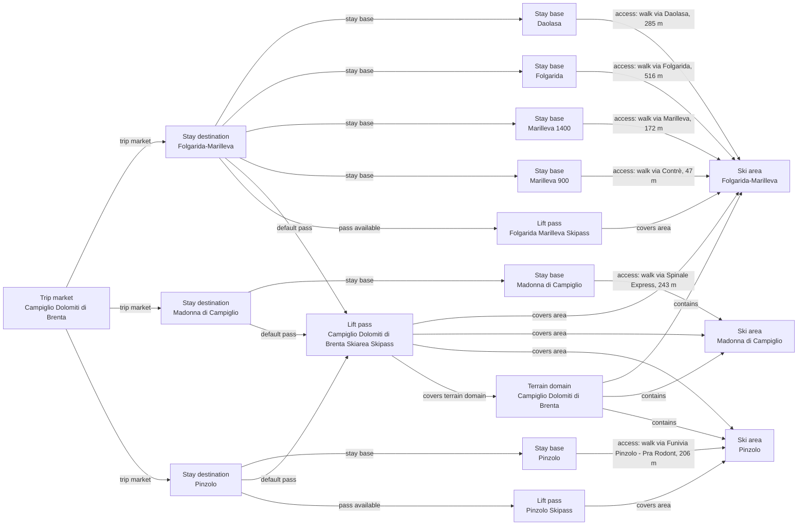

# Campiglio Dolomiti di Brenta Catalog V2 Fact Enrichment

Reviews the three connected Campiglio ski areas, their six accommodation bases, and the shared terrain domain against official operator and destination sources.

## Resulting Graph

## Reviewed Targets

| Target | Scope | Graph Role | Required Fields |
| --- | --- | --- | --- |
| `ski_area:folgarida-marilleva-ski-area` | `narrow` | `focus` | `snowmaking.availability`, `snowmaking.coverage_pct`, `snowmaking.coverage_basis`, `snowmaking.season_label`, `glacier_terrain.availability`, `snow_park.availability`, `snow_park.park_count`, `snow_park.season_label`, `night_skiing.availability`, `night_skiing.season_label`, `marked_freeride_routes.availability`, `marked_freeride_routes.route_count`, `marked_freeride_routes.season_label`, `official_trail_map.url`, `official_trail_map.season_label`, `ski_day_apres_profile.availability`, `ski_day_apres_profile.intensity`, `ski_day_apres_profile.season_label` |
| `ski_area:madonna-di-campiglio-ski-area` | `narrow` | `focus` | `snowmaking.availability`, `snowmaking.coverage_pct`, `snowmaking.coverage_basis`, `snowmaking.season_label`, `glacier_terrain.availability`, `snow_park.availability`, `snow_park.park_count`, `snow_park.season_label`, `night_skiing.availability`, `night_skiing.season_label`, `marked_freeride_routes.availability`, `marked_freeride_routes.route_count`, `marked_freeride_routes.season_label`, `official_trail_map.url`, `official_trail_map.season_label`, `ski_day_apres_profile.availability`, `ski_day_apres_profile.intensity`, `ski_day_apres_profile.season_label` |
| `ski_area:pinzolo-ski-area` | `narrow` | `focus` | `snowmaking.availability`, `snowmaking.coverage_pct`, `snowmaking.coverage_basis`, `snowmaking.season_label`, `glacier_terrain.availability`, `snow_park.availability`, `snow_park.park_count`, `snow_park.season_label`, `night_skiing.availability`, `night_skiing.season_label`, `marked_freeride_routes.availability`, `marked_freeride_routes.route_count`, `marked_freeride_routes.season_label`, `official_trail_map.url`, `official_trail_map.season_label`, `ski_day_apres_profile.availability`, `ski_day_apres_profile.intensity`, `ski_day_apres_profile.season_label` |
| `stay_base:folgarida-marilleva-daolasa` | `narrow` | `focus` | `elevation_m`, `base_type`, `base_character.development_style`, `base_character.local_pace`, `local_apres_profile.availability`, `local_apres_profile.intensity`, `local_apres_profile.season_label` |
| `stay_base:folgarida-marilleva-folgarida` | `narrow` | `focus` | `elevation_m`, `base_type`, `base_character.development_style`, `base_character.local_pace`, `local_apres_profile.availability`, `local_apres_profile.intensity`, `local_apres_profile.season_label` |
| `stay_base:folgarida-marilleva-marilleva-1400` | `narrow` | `focus` | `elevation_m`, `base_type`, `base_character.development_style`, `base_character.local_pace`, `local_apres_profile.availability`, `local_apres_profile.intensity`, `local_apres_profile.season_label` |
| `stay_base:folgarida-marilleva-marilleva-900` | `narrow` | `focus` | `elevation_m`, `base_type`, `base_character.development_style`, `base_character.local_pace`, `local_apres_profile.availability`, `local_apres_profile.intensity`, `local_apres_profile.season_label` |
| `stay_base:madonna-di-campiglio-madonna-di-campiglio` | `narrow` | `focus` | `elevation_m`, `base_type`, `base_character.development_style`, `base_character.local_pace`, `local_apres_profile.availability`, `local_apres_profile.intensity`, `local_apres_profile.season_label` |
| `stay_base:pinzolo-pinzolo` | `narrow` | `focus` | `elevation_m`, `base_type`, `base_character.development_style`, `base_character.local_pace`, `local_apres_profile.availability`, `local_apres_profile.intensity`, `local_apres_profile.season_label` |
| `terrain_domain:campiglio-dolomiti-di-brenta` | `narrow` | `focus` | `official_trail_map.url`, `official_trail_map.season_label` |
| `trust_manifest:ski_areas:folgarida-marilleva-ski-area` | `narrow` | `focus` | `field_source_refs`, `field_statuses`, `notes` |
| `trust_manifest:ski_areas:madonna-di-campiglio-ski-area` | `narrow` | `focus` | `field_source_refs`, `field_statuses`, `notes` |
| `trust_manifest:ski_areas:pinzolo-ski-area` | `narrow` | `focus` | `field_source_refs`, `field_statuses`, `notes` |
| `trust_manifest:stay_bases:folgarida-marilleva-daolasa` | `narrow` | `focus` | `notes` |
| `trust_manifest:stay_bases:folgarida-marilleva-folgarida` | `narrow` | `focus` | `field_source_refs`, `field_statuses`, `notes` |
| `trust_manifest:stay_bases:folgarida-marilleva-marilleva-1400` | `narrow` | `focus` | `field_source_refs`, `field_statuses`, `notes` |
| `trust_manifest:stay_bases:folgarida-marilleva-marilleva-900` | `narrow` | `focus` | `field_source_refs`, `field_statuses`, `notes` |
| `trust_manifest:stay_bases:madonna-di-campiglio-madonna-di-campiglio` | `narrow` | `focus` | `field_source_refs`, `field_statuses`, `notes` |
| `trust_manifest:stay_bases:pinzolo-pinzolo` | `narrow` | `focus` | `field_source_refs`, `field_statuses`, `notes` |
| `trust_manifest:terrain_domains:campiglio-dolomiti-di-brenta` | `narrow` | `focus` | `field_source_refs`, `field_statuses`, `notes` |

## Review Evidence Envelope

| Family | Source Kind | Source URLs | Candidate Kinds |
| --- | --- | --- | --- |
| `campiglio-destination-and-stay` | `destination_booking` | [https://www.visitvaldisole.it/en/folgarida](https://www.visitvaldisole.it/en/folgarida), [https://www.visitvaldisole.it/en/marilleva-mezzana](https://www.visitvaldisole.it/en/marilleva-mezzana), [https://www.campigliodolomiti.it/en/land/val-rendena/madonna-di-campiglio](https://www.campigliodolomiti.it/en/land/val-rendena/madonna-di-campiglio), [https://www.campigliodolomiti.it/en/land/val-rendena/pinzolo](https://www.campigliodolomiti.it/en/land/val-rendena/pinzolo) | `stay_destination`, `stay_base` |
| `campiglio-operator-and-terrain` | `ski_area_operator` | [https://www.visitvaldisole.it/website_files/skiarea/SkiMap%20-%20Skiarea%20Campiglio%20Dolomiti%20di%20Brenta%20Val%20di%20Sole%20Val%20Rendena.pdf](https://www.visitvaldisole.it/website_files/skiarea/SkiMap%20-%20Skiarea%20Campiglio%20Dolomiti%20di%20Brenta%20Val%20di%20Sole%20Val%20Rendena.pdf), [https://www.ski.it/ski/documenti-file/pagine-di-dettaglio/pagine-istituzionali/folgarida-marilleva/Sostenibilit%C3%A0/bilancio-sostenibilita-24_FFM_web.pdf](https://www.ski.it/ski/documenti-file/pagine-di-dettaglio/pagine-istituzionali/folgarida-marilleva/Sostenibilit%C3%A0/bilancio-sostenibilita-24_FFM_web.pdf), [https://www.ski.it/en/skiarea/folgarida-marilleva](https://www.ski.it/en/skiarea/folgarida-marilleva), [https://www.ski.it/en/skiarea/madonna-di-campiglio-trentino](https://www.ski.it/en/skiarea/madonna-di-campiglio-trentino), [https://www.ski.it/en/skiarea/pinzolo](https://www.ski.it/en/skiarea/pinzolo), [https://www.ski.it/en/info-live/lift-status](https://www.ski.it/en/info-live/lift-status), [https://www.campigliodolomiti.it/en/sports-winter/snowboarding-and-snow-parks](https://www.campigliodolomiti.it/en/sports-winter/snowboarding-and-snow-parks), [https://www.campigliodolomiti.it/documenti/mappa-skiarea/Pan_Madonna_d_Campiglio_web.pdf](https://www.campigliodolomiti.it/documenti/mappa-skiarea/Pan_Madonna_d_Campiglio_web.pdf) | `ski_area`, `terrain_domain` |
| `campiglio-current-local-presentation` | `other_official` | [https://www.campigliodolomiti.it/en/services/arena-super-g](https://www.campigliodolomiti.it/en/services/arena-super-g), [https://www.campigliodolomiti.it/en/services/zangola](https://www.campigliodolomiti.it/en/services/zangola), [https://www.campigliodolomiti.it/en/services/bar-nazionale-2](https://www.campigliodolomiti.it/en/services/bar-nazionale-2) | `stay_base`, `ski_area` |
| `campiglio-daolasa-stay-boundary` | `destination_booking` | [https://www.visitvaldisole.it/en/commezzadura](https://www.visitvaldisole.it/en/commezzadura) | `stay_base` |

## Entity Scope Assessments

| Candidate | Kind | Disposition | Signals | Catalog Targets | Evidence | Backlog | Graph Impact | Rationale |
| --- | --- | --- | --- | --- | --- | --- | --- | --- |
| `folgarida-marilleva-ski-area` (Folgarida-Marilleva ski area) | `ski_area` | `represented` | `official_independent_identity`, `separate_operator`, `child_scoped_terrain_metrics` | `ski_area:folgarida-marilleva-ski-area` | `v2-enrichment-001-folgarida-marilleva-ski-area-official-trail-map-url`, `inventory-p1-folgarida-operator-identity`, `inventory-p1-folgarida-current-operations` |  | `graph_blocking` | The prepared catalog represents Folgarida-Marilleva as a complete child-scoped ski area inside the connected Campiglio terrain domain; semantic ownership remains subject to fresh review. |
| `madonna-di-campiglio-ski-area` (Madonna di Campiglio ski area) | `ski_area` | `represented` | `official_independent_identity`, `separate_operator` | `ski_area:madonna-di-campiglio-ski-area` | `v2-enrichment-001-folgarida-marilleva-ski-area-official-trail-map-url`, `inventory-p1-madonna-operator-identity`, `inventory-p1-madonna-current-operations` |  | `graph_blocking` | The prepared catalog retains Madonna di Campiglio as a complete ski-area identity inside the connected domain; semantic ownership remains subject to fresh review. |
| `pinzolo-ski-area` (Pinzolo ski area) | `ski_area` | `represented` | `official_independent_identity`, `separate_operator` | `ski_area:pinzolo-ski-area` | `v2-enrichment-001-folgarida-marilleva-ski-area-official-trail-map-url`, `inventory-p1-pinzolo-operator-identity`, `inventory-p1-pinzolo-current-operations` |  | `graph_blocking` | The prepared catalog represents Pinzolo as a complete ski-area identity inside the connected domain; semantic ownership remains subject to fresh review. |
| `folgarida-marilleva-daolasa` (Daolasa) | `stay_base` | `represented` | `official_independent_identity`, `distinct_access` | `stay_base:folgarida-marilleva-daolasa` | `inventory-p1-daolasa-scope` |  | `graph_blocking` | Official destination and accommodation inventory identifies Daolasa as a named village with lodging, while the prepared report conservatively leaves its representative accommodation elevation and character fields unresolved. |
| `folgarida-marilleva-folgarida` (Folgarida) | `stay_base` | `represented` | `official_independent_identity` | `stay_base:folgarida-marilleva-folgarida` | `v2-enrichment-010-folgarida-marilleva-folgarida-base-character-development-style`, `v2-enrichment-011-folgarida-marilleva-folgarida-elevation-m` |  | `graph_blocking` | The official destination material directly identifies Folgarida as a distinct accommodation base in the prepared graph. |
| `folgarida-marilleva-marilleva-1400` (Marilleva 1400) | `stay_base` | `represented` | `official_independent_identity` | `stay_base:folgarida-marilleva-marilleva-1400` | `v2-enrichment-012-folgarida-marilleva-marilleva-1400-base-character-development-style`, `v2-enrichment-013-folgarida-marilleva-marilleva-1400-elevation-m` |  | `graph_blocking` | The official destination material directly identifies Marilleva 1400 as a distinct accommodation base in the prepared graph. |
| `folgarida-marilleva-marilleva-900` (Marilleva 900) | `stay_base` | `represented` | `official_independent_identity` | `stay_base:folgarida-marilleva-marilleva-900` | `v2-enrichment-014-folgarida-marilleva-marilleva-900-base-character-development-style`, `v2-enrichment-015-folgarida-marilleva-marilleva-900-elevation-m` |  | `graph_blocking` | The official destination material directly identifies Marilleva 900 as a distinct accommodation base in the prepared graph. |
| `madonna-di-campiglio-madonna-di-campiglio` (Madonna di Campiglio) | `stay_base` | `represented` | `official_independent_identity` | `stay_base:madonna-di-campiglio-madonna-di-campiglio` | `v2-enrichment-016-madonna-di-campiglio-madonna-di-campiglio-base-character-development-style`, `v2-enrichment-019-madonna-di-campiglio-madonna-di-campiglio-elevation-m` |  | `graph_blocking` | The official destination material directly identifies Madonna di Campiglio as the represented accommodation base. |
| `pinzolo-pinzolo` (Pinzolo) | `stay_base` | `represented` | `official_independent_identity` | `stay_base:pinzolo-pinzolo` | `v2-enrichment-022-pinzolo-pinzolo-base-character-development-style`, `v2-enrichment-024-pinzolo-pinzolo-elevation-m` |  | `graph_blocking` | The official destination material directly identifies Pinzolo as the represented accommodation base. |
| `campiglio-dolomiti-di-brenta` (Campiglio Dolomiti di Brenta connected terrain) | `terrain_domain` | `represented` | `ski_connected_terrain` | `terrain_domain:campiglio-dolomiti-di-brenta` | `v2-enrichment-027-campiglio-dolomiti-di-brenta-official-trail-map-url` |  | `graph_blocking` | The official domain map presents the three represented ski areas as one connected terrain domain. |

## Ski-Area Boundary Assessments

| Candidate | Parent | Terrain | Connectivity | Operations | Weather | Pass | Provider Consensus | Separation Value | Evidence |
| --- | --- | --- | --- | --- | --- | --- | --- | --- | --- |
| `folgarida-marilleva-ski-area` |  | `complete` | `not_applicable` | `independent` | `unknown` | `shared_only` | `separate` | `material` | `v2-enrichment-001-folgarida-marilleva-ski-area-official-trail-map-url`, `inventory-p1-folgarida-operator-identity`, `inventory-p1-folgarida-current-operations` |
| `madonna-di-campiglio-ski-area` |  | `complete` | `not_applicable` | `independent` | `unknown` | `shared_only` | `separate` | `material` | `v2-enrichment-001-folgarida-marilleva-ski-area-official-trail-map-url`, `inventory-p1-madonna-operator-identity`, `inventory-p1-madonna-current-operations` |
| `pinzolo-ski-area` |  | `complete` | `not_applicable` | `independent` | `unknown` | `shared_only` | `separate` | `material` | `v2-enrichment-001-folgarida-marilleva-ski-area-official-trail-map-url`, `inventory-p1-pinzolo-operator-identity`, `inventory-p1-pinzolo-current-operations` |

## Changed Fields

| Target | Field | Before | After | Trust | Ranking Relevant |
| --- | --- | --- | --- | --- | --- |
| `ski_area:folgarida-marilleva-ski-area` | `official_trail_map.url` | `null` | `"https://www.visitvaldisole.it/website_files/skiarea/SkiMap%20-%20Skiarea%20Campiglio%20Dolomiti%20di%20Brenta%20Val%20di%20Sole%20Val%20Rendena.pdf"` | `verified` | no |
| `ski_area:folgarida-marilleva-ski-area` | `snow_park.availability` | `"unknown"` | `"available"` | `verified` | no |
| `ski_area:folgarida-marilleva-ski-area` | `snow_park.park_count` | `null` | `1` | `verified_with_adjustment` | no |
| `ski_area:madonna-di-campiglio-ski-area` | `ski_day_apres_profile.availability` | `"unknown"` | `"available"` | `verified` | no |
| `ski_area:madonna-di-campiglio-ski-area` | `ski_day_apres_profile.intensity` | `null` | `"lively"` | `verified_with_adjustment` | no |
| `ski_area:madonna-di-campiglio-ski-area` | `snow_park.availability` | `"unknown"` | `"available"` | `verified` | no |
| `ski_area:madonna-di-campiglio-ski-area` | `snow_park.park_count` | `null` | `1` | `verified_with_adjustment` | no |
| `ski_area:pinzolo-ski-area` | `snow_park.availability` | `"unknown"` | `"available"` | `verified` | no |
| `ski_area:pinzolo-ski-area` | `snow_park.park_count` | `null` | `1` | `verified` | no |
| `stay_base:folgarida-marilleva-folgarida` | `base_character.development_style` | `"unknown"` | `"planned_resort"` | `verified_with_adjustment` | no |
| `stay_base:folgarida-marilleva-folgarida` | `elevation_m` | `null` | `1300` | `verified_with_adjustment` | no |
| `stay_base:folgarida-marilleva-marilleva-1400` | `base_character.development_style` | `"unknown"` | `"planned_resort"` | `verified_with_adjustment` | no |
| `stay_base:folgarida-marilleva-marilleva-1400` | `elevation_m` | `null` | `1400` | `verified` | no |
| `stay_base:folgarida-marilleva-marilleva-900` | `base_character.development_style` | `"unknown"` | `"planned_resort"` | `verified_with_adjustment` | no |
| `stay_base:folgarida-marilleva-marilleva-900` | `elevation_m` | `null` | `900` | `verified` | no |
| `stay_base:madonna-di-campiglio-madonna-di-campiglio` | `base_character.development_style` | `"unknown"` | `"mixed"` | `verified_with_adjustment` | no |
| `stay_base:madonna-di-campiglio-madonna-di-campiglio` | `base_character.local_pace` | `"unknown"` | `"lively"` | `verified_with_adjustment` | no |
| `stay_base:madonna-di-campiglio-madonna-di-campiglio` | `base_type` | `"town"` | `"resort_station"` | `verified_with_adjustment` | no |
| `stay_base:madonna-di-campiglio-madonna-di-campiglio` | `elevation_m` | `null` | `1550` | `verified` | no |
| `stay_base:madonna-di-campiglio-madonna-di-campiglio` | `local_apres_profile.availability` | `"unknown"` | `"available"` | `verified` | no |
| `stay_base:madonna-di-campiglio-madonna-di-campiglio` | `local_apres_profile.intensity` | `null` | `"lively"` | `verified_with_adjustment` | no |
| `stay_base:pinzolo-pinzolo` | `base_character.development_style` | `"unknown"` | `"mixed"` | `verified_with_adjustment` | no |
| `stay_base:pinzolo-pinzolo` | `base_character.local_pace` | `"unknown"` | `"balanced"` | `verified_with_adjustment` | no |
| `stay_base:pinzolo-pinzolo` | `elevation_m` | `null` | `774` | `verified` | no |
| `stay_base:pinzolo-pinzolo` | `local_apres_profile.availability` | `"unknown"` | `"available"` | `verified` | no |
| `stay_base:pinzolo-pinzolo` | `local_apres_profile.intensity` | `null` | `"low_key"` | `verified_with_adjustment` | no |
| `terrain_domain:campiglio-dolomiti-di-brenta` | `official_trail_map.url` | `null` | `"https://www.campigliodolomiti.it/documenti/mappa-skiarea/Pan_Madonna_d_Campiglio_web.pdf"` | `verified` | no |
| `trust_manifest:ski_areas:folgarida-marilleva-ski-area` | `field_source_refs` | `{"elevation_season": ["https://www.campigliodolomiti.it/en/ski-area", "https://www.campigliodolomiti.it/en/skiarea/inverno/skipass/skipass-skiarea", "https://www.openstreetmap.org/node/1096349433", "https://www.openstreetmap.org/node/1096349822", "https://www.openstreetmap.org/node/327580361", "https://www.openstreetmap.org/node/331259364", "https://www.openstreetmap.org/node/331259493", "https://www.openstreetmap.org/node/6043719130", "https://www.openstreetmap.org/node/648469713", "https://www.openstreetmap.org/node/8662539441", "https://www.ski.it/en/skiarea/folgarida-marilleva", "https://www.ski.it/it/noleggi/folgarida/ski-point", "https://www.ski.it/ski/documenti-file/live/Ski_Map_Skiarea.pdf", "https://www.ski.it/ski/documenti-file/skipass/listini/2025-2026listinoFFMit.pdf"], "glacier_terrain": [], "identity_coordinates": ["https://www.campigliodolomiti.it/en/ski-area", "https://www.campigliodolomiti.it/en/skiarea/inverno/skipass/skipass-skiarea", "https://www.openstreetmap.org/node/1096349433", "https://www.openstreetmap.org/node/1096349822", "https://www.openstreetmap.org/node/327580361", "https://www.openstreetmap.org/node/331259364", "https://www.openstreetmap.org/node/331259493", "https://www.openstreetmap.org/node/6043719130", "https://www.openstreetmap.org/node/648469713", "https://www.openstreetmap.org/node/8662539441", "https://www.ski.it/en/skiarea/folgarida-marilleva", "https://www.ski.it/it/noleggi/folgarida/ski-point", "https://www.ski.it/ski/documenti-file/live/Ski_Map_Skiarea.pdf", "https://www.ski.it/ski/documenti-file/skipass/listini/2025-2026listinoFFMit.pdf"], "marked_freeride_routes": [], "night_skiing": [], "official_documents": [], "ski_day_apres": [], "skill_fit": ["https://www.campigliodolomiti.it/en/ski-area", "https://www.campigliodolomiti.it/en/skiarea/inverno/skipass/skipass-skiarea", "https://www.openstreetmap.org/node/1096349433", "https://www.openstreetmap.org/node/1096349822", "https://www.openstreetmap.org/node/327580361", "https://www.openstreetmap.org/node/331259364", "https://www.openstreetmap.org/node/331259493", "https://www.openstreetmap.org/node/6043719130", "https://www.openstreetmap.org/node/648469713", "https://www.openstreetmap.org/node/8662539441", "https://www.ski.it/en/skiarea/folgarida-marilleva", "https://www.ski.it/it/noleggi/folgarida/ski-point", "https://www.ski.it/ski/documenti-file/live/Ski_Map_Skiarea.pdf", "https://www.ski.it/ski/documenti-file/skipass/listini/2025-2026listinoFFMit.pdf"], "snow_park": [], "snowmaking": [], "terrain_metrics": ["https://www.campigliodolomiti.it/en/ski-area", "https://www.campigliodolomiti.it/en/skiarea/inverno/skipass/skipass-skiarea", "https://www.openstreetmap.org/node/1096349433", "https://www.openstreetmap.org/node/1096349822", "https://www.openstreetmap.org/node/327580361", "https://www.openstreetmap.org/node/331259364", "https://www.openstreetmap.org/node/331259493", "https://www.openstreetmap.org/node/6043719130", "https://www.openstreetmap.org/node/648469713", "https://www.openstreetmap.org/node/8662539441", "https://www.ski.it/en/skiarea/folgarida-marilleva", "https://www.ski.it/it/noleggi/folgarida/ski-point", "https://www.ski.it/ski/documenti-file/live/Ski_Map_Skiarea.pdf", "https://www.ski.it/ski/documenti-file/skipass/listini/2025-2026listinoFFMit.pdf"]}` | `{"elevation_season": ["https://www.campigliodolomiti.it/en/ski-area", "https://www.campigliodolomiti.it/en/skiarea/inverno/skipass/skipass-skiarea", "https://www.openstreetmap.org/node/1096349433", "https://www.openstreetmap.org/node/1096349822", "https://www.openstreetmap.org/node/327580361", "https://www.openstreetmap.org/node/331259364", "https://www.openstreetmap.org/node/331259493", "https://www.openstreetmap.org/node/6043719130", "https://www.openstreetmap.org/node/648469713", "https://www.openstreetmap.org/node/8662539441", "https://www.ski.it/en/skiarea/folgarida-marilleva", "https://www.ski.it/it/noleggi/folgarida/ski-point", "https://www.ski.it/ski/documenti-file/live/Ski_Map_Skiarea.pdf", "https://www.ski.it/ski/documenti-file/skipass/listini/2025-2026listinoFFMit.pdf"], "glacier_terrain": [], "identity_coordinates": ["https://www.campigliodolomiti.it/en/ski-area", "https://www.campigliodolomiti.it/en/skiarea/inverno/skipass/skipass-skiarea", "https://www.openstreetmap.org/node/1096349433", "https://www.openstreetmap.org/node/1096349822", "https://www.openstreetmap.org/node/327580361", "https://www.openstreetmap.org/node/331259364", "https://www.openstreetmap.org/node/331259493", "https://www.openstreetmap.org/node/6043719130", "https://www.openstreetmap.org/node/648469713", "https://www.openstreetmap.org/node/8662539441", "https://www.ski.it/en/skiarea/folgarida-marilleva", "https://www.ski.it/it/noleggi/folgarida/ski-point", "https://www.ski.it/ski/documenti-file/live/Ski_Map_Skiarea.pdf", "https://www.ski.it/ski/documenti-file/skipass/listini/2025-2026listinoFFMit.pdf"], "marked_freeride_routes": [], "night_skiing": [], "official_documents": ["https://www.visitvaldisole.it/website_files/skiarea/SkiMap%20-%20Skiarea%20Campiglio%20Dolomiti%20di%20Brenta%20Val%20di%20Sole%20Val%20Rendena.pdf"], "ski_day_apres": [], "skill_fit": ["https://www.campigliodolomiti.it/en/ski-area", "https://www.campigliodolomiti.it/en/skiarea/inverno/skipass/skipass-skiarea", "https://www.openstreetmap.org/node/1096349433", "https://www.openstreetmap.org/node/1096349822", "https://www.openstreetmap.org/node/327580361", "https://www.openstreetmap.org/node/331259364", "https://www.openstreetmap.org/node/331259493", "https://www.openstreetmap.org/node/6043719130", "https://www.openstreetmap.org/node/648469713", "https://www.openstreetmap.org/node/8662539441", "https://www.ski.it/en/skiarea/folgarida-marilleva", "https://www.ski.it/it/noleggi/folgarida/ski-point", "https://www.ski.it/ski/documenti-file/live/Ski_Map_Skiarea.pdf", "https://www.ski.it/ski/documenti-file/skipass/listini/2025-2026listinoFFMit.pdf"], "snow_park": ["https://www.ski.it/ski/documenti-file/pagine-di-dettaglio/pagine-istituzionali/folgarida-marilleva/Sostenibilit%C3%A0/bilancio-sostenibilita-24_FFM_web.pdf"], "snowmaking": [], "terrain_metrics": ["https://www.campigliodolomiti.it/en/ski-area", "https://www.campigliodolomiti.it/en/skiarea/inverno/skipass/skipass-skiarea", "https://www.openstreetmap.org/node/1096349433", "https://www.openstreetmap.org/node/1096349822", "https://www.openstreetmap.org/node/327580361", "https://www.openstreetmap.org/node/331259364", "https://www.openstreetmap.org/node/331259493", "https://www.openstreetmap.org/node/6043719130", "https://www.openstreetmap.org/node/648469713", "https://www.openstreetmap.org/node/8662539441", "https://www.ski.it/en/skiarea/folgarida-marilleva", "https://www.ski.it/it/noleggi/folgarida/ski-point", "https://www.ski.it/ski/documenti-file/live/Ski_Map_Skiarea.pdf", "https://www.ski.it/ski/documenti-file/skipass/listini/2025-2026listinoFFMit.pdf"]}` | `estimated` | no |
| `trust_manifest:ski_areas:folgarida-marilleva-ski-area` | `field_statuses` | `{"elevation_season": "estimated", "glacier_terrain": "needs_source", "identity_coordinates": "verified_with_adjustment", "marked_freeride_routes": "needs_source", "night_skiing": "needs_source", "official_documents": "needs_source", "ski_day_apres": "needs_source", "skill_fit": "estimated", "snow_park": "needs_source", "snowmaking": "needs_source", "terrain_metrics": "verified_with_adjustment"}` | `{"elevation_season": "estimated", "glacier_terrain": "needs_source", "identity_coordinates": "verified_with_adjustment", "marked_freeride_routes": "needs_source", "night_skiing": "needs_source", "official_documents": "verified", "ski_day_apres": "needs_source", "skill_fit": "estimated", "snow_park": "verified", "snowmaking": "needs_source", "terrain_metrics": "verified_with_adjustment"}` | `estimated` | no |
| `trust_manifest:ski_areas:folgarida-marilleva-ski-area` | `notes` | `["The resulting model represents Folgarida-Marilleva as an independent destination with one local weather-owning ski area and four reviewed stay bases.", "The local 62 km and 1300-2180 m facts remain child-scoped; the shared 156 km aggregate belongs only to campiglio-dolomiti-di-brenta.", "Country/region normalization, price level, season-month defaults, lodging and rental prices and quality, supported skills, rental lift-distance, and unsourced atmosphere tags are estimates.", "folgarida-marilleva-ski-area is a new weather identity that requires owner-run history backfill and climatology after deployment."]` | `["The resulting model represents Folgarida-Marilleva as an independent destination with one local weather-owning ski area and four reviewed stay bases.", "The local 62 km and 1300-2180 m facts remain child-scoped; the shared 156 km aggregate belongs only to campiglio-dolomiti-di-brenta.", "Country/region normalization, price level, season-month defaults, lodging and rental prices and quality, supported skills, rental lift-distance, and unsourced atmosphere tags are estimates.", "folgarida-marilleva-ski-area is a new weather identity that requires owner-run history backfill and climatology after deployment.", "Source-aware v2 enrichment reviewed official Folgarida-Marilleva operator and Val di Sole material on 2026-07-05.", "The connected-domain 95% snowmaking figure and domain night-skiing offer are not copied to this child ski area."]` | `estimated` | no |
| `trust_manifest:ski_areas:madonna-di-campiglio-ski-area` | `field_source_refs` | `{"elevation_season": ["https://www.campigliodolomiti.it/en/ski-area", "https://www.campigliodolomiti.it/en/skiarea/inverno/ski-rentals", "https://www.campigliodolomiti.it/en/skiarea/inverno/skipass/skipass-skiarea", "https://www.openstreetmap.org/node/1023438277", "https://www.openstreetmap.org/node/1796357582", "https://www.ski.it/en/skiarea/madonna-di-campiglio-trentino", "https://www.ski.it/ski/documenti-file/live/Ski_Map_Skiarea.pdf"], "glacier_terrain": [], "identity_coordinates": ["https://www.campigliodolomiti.it/en/ski-area", "https://www.campigliodolomiti.it/en/skiarea/inverno/ski-rentals", "https://www.campigliodolomiti.it/en/skiarea/inverno/skipass/skipass-skiarea", "https://www.openstreetmap.org/node/1023438277", "https://www.openstreetmap.org/node/1796357582", "https://www.ski.it/en/skiarea/madonna-di-campiglio-trentino", "https://www.ski.it/ski/documenti-file/live/Ski_Map_Skiarea.pdf"], "marked_freeride_routes": [], "night_skiing": [], "official_documents": [], "ski_day_apres": [], "skill_fit": ["https://www.campigliodolomiti.it/en/ski-area", "https://www.campigliodolomiti.it/en/skiarea/inverno/ski-rentals", "https://www.campigliodolomiti.it/en/skiarea/inverno/skipass/skipass-skiarea", "https://www.openstreetmap.org/node/1023438277", "https://www.openstreetmap.org/node/1796357582", "https://www.ski.it/en/skiarea/madonna-di-campiglio-trentino", "https://www.ski.it/ski/documenti-file/live/Ski_Map_Skiarea.pdf"], "snow_park": [], "snowmaking": [], "terrain_metrics": ["https://www.campigliodolomiti.it/en/ski-area", "https://www.campigliodolomiti.it/en/skiarea/inverno/ski-rentals", "https://www.campigliodolomiti.it/en/skiarea/inverno/skipass/skipass-skiarea", "https://www.openstreetmap.org/node/1023438277", "https://www.openstreetmap.org/node/1796357582", "https://www.ski.it/en/skiarea/madonna-di-campiglio-trentino", "https://www.ski.it/ski/documenti-file/live/Ski_Map_Skiarea.pdf"]}` | `{"elevation_season": ["https://www.campigliodolomiti.it/en/ski-area", "https://www.campigliodolomiti.it/en/skiarea/inverno/ski-rentals", "https://www.campigliodolomiti.it/en/skiarea/inverno/skipass/skipass-skiarea", "https://www.openstreetmap.org/node/1023438277", "https://www.openstreetmap.org/node/1796357582", "https://www.ski.it/en/skiarea/madonna-di-campiglio-trentino", "https://www.ski.it/ski/documenti-file/live/Ski_Map_Skiarea.pdf"], "glacier_terrain": [], "identity_coordinates": ["https://www.campigliodolomiti.it/en/ski-area", "https://www.campigliodolomiti.it/en/skiarea/inverno/ski-rentals", "https://www.campigliodolomiti.it/en/skiarea/inverno/skipass/skipass-skiarea", "https://www.openstreetmap.org/node/1023438277", "https://www.openstreetmap.org/node/1796357582", "https://www.ski.it/en/skiarea/madonna-di-campiglio-trentino", "https://www.ski.it/ski/documenti-file/live/Ski_Map_Skiarea.pdf"], "marked_freeride_routes": [], "night_skiing": [], "official_documents": [], "ski_day_apres": ["https://www.campigliodolomiti.it/en/services/arena-super-g"], "skill_fit": ["https://www.campigliodolomiti.it/en/ski-area", "https://www.campigliodolomiti.it/en/skiarea/inverno/ski-rentals", "https://www.campigliodolomiti.it/en/skiarea/inverno/skipass/skipass-skiarea", "https://www.openstreetmap.org/node/1023438277", "https://www.openstreetmap.org/node/1796357582", "https://www.ski.it/en/skiarea/madonna-di-campiglio-trentino", "https://www.ski.it/ski/documenti-file/live/Ski_Map_Skiarea.pdf"], "snow_park": ["https://www.campigliodolomiti.it/en/sports-winter/snowboarding-and-snow-parks"], "snowmaking": [], "terrain_metrics": ["https://www.campigliodolomiti.it/en/ski-area", "https://www.campigliodolomiti.it/en/skiarea/inverno/ski-rentals", "https://www.campigliodolomiti.it/en/skiarea/inverno/skipass/skipass-skiarea", "https://www.openstreetmap.org/node/1023438277", "https://www.openstreetmap.org/node/1796357582", "https://www.ski.it/en/skiarea/madonna-di-campiglio-trentino", "https://www.ski.it/ski/documenti-file/live/Ski_Map_Skiarea.pdf"]}` | `estimated` | no |
| `trust_manifest:ski_areas:madonna-di-campiglio-ski-area` | `field_statuses` | `{"elevation_season": "verified_with_adjustment", "glacier_terrain": "needs_source", "identity_coordinates": "verified_with_adjustment", "marked_freeride_routes": "needs_source", "night_skiing": "needs_source", "official_documents": "needs_source", "ski_day_apres": "needs_source", "skill_fit": "estimated", "snow_park": "needs_source", "snowmaking": "needs_source", "terrain_metrics": "verified_with_adjustment"}` | `{"elevation_season": "verified_with_adjustment", "glacier_terrain": "needs_source", "identity_coordinates": "verified_with_adjustment", "marked_freeride_routes": "needs_source", "night_skiing": "needs_source", "official_documents": "needs_source", "ski_day_apres": "verified_with_adjustment", "skill_fit": "estimated", "snow_park": "verified_with_adjustment", "snowmaking": "needs_source", "terrain_metrics": "verified_with_adjustment"}` | `estimated` | no |
| `trust_manifest:ski_areas:madonna-di-campiglio-ski-area` | `notes` | `["Full destination sweep uses official local, connected-domain, pass, rental, ski-map, and OSM evidence.", "Madonna di Campiglio remains an independent destination and retains madonna-di-campiglio-ski-area as its weather identity.", "The local 62 km fact stays on Madonna's child ski area; the shared 156 km aggregate belongs only to campiglio-dolomiti-di-brenta.", "The shared pass references the connected terrain domain while Pejo remains disconnected external pass validity.", "Price ranges, quality tiers, supported skill levels, rental lift-distance, and other rows marked estimated remain estimates."]` | `["Full destination sweep uses official local, connected-domain, pass, rental, ski-map, and OSM evidence.", "Madonna di Campiglio remains an independent destination and retains madonna-di-campiglio-ski-area as its weather identity.", "The local 62 km fact stays on Madonna's child ski area; the shared 156 km aggregate belongs only to campiglio-dolomiti-di-brenta.", "The shared pass references the connected terrain domain while Pejo remains disconnected external pass validity.", "Price ranges, quality tiers, supported skill levels, rental lift-distance, and other rows marked estimated remain estimates.", "Source-aware v2 enrichment reviewed official Madonna di Campiglio and connected-area material on 2026-07-05.", "The connected-domain 95% snowmaking figure and domain night-skiing offer are not copied to this child ski area."]` | `estimated` | no |
| `trust_manifest:ski_areas:pinzolo-ski-area` | `field_source_refs` | `{"elevation_season": ["https://www.bergfex.it/pinzolo/", "https://www.campigliodolomiti.it/en/services/il-comodo-sci", "https://www.campigliodolomiti.it/en/ski-area", "https://www.campigliodolomiti.it/en/skiarea/inverno/skipass/skipass-skiarea", "https://www.openstreetmap.org/node/298987790", "https://www.openstreetmap.org/node/4311362989", "https://www.ski.it/en/skiarea/pinzolo", "https://www.ski.it/ski/documenti-file/skipass/listini/2025-2026listinoFPIit.pdf"], "glacier_terrain": [], "identity_coordinates": ["https://www.bergfex.it/pinzolo/", "https://www.campigliodolomiti.it/en/services/il-comodo-sci", "https://www.campigliodolomiti.it/en/ski-area", "https://www.campigliodolomiti.it/en/skiarea/inverno/skipass/skipass-skiarea", "https://www.openstreetmap.org/node/298987790", "https://www.openstreetmap.org/node/4311362989", "https://www.ski.it/en/skiarea/pinzolo", "https://www.ski.it/ski/documenti-file/skipass/listini/2025-2026listinoFPIit.pdf"], "marked_freeride_routes": [], "night_skiing": [], "official_documents": [], "ski_day_apres": [], "skill_fit": ["https://www.bergfex.it/pinzolo/", "https://www.campigliodolomiti.it/en/services/il-comodo-sci", "https://www.campigliodolomiti.it/en/ski-area", "https://www.campigliodolomiti.it/en/skiarea/inverno/skipass/skipass-skiarea", "https://www.openstreetmap.org/node/298987790", "https://www.openstreetmap.org/node/4311362989", "https://www.ski.it/en/skiarea/pinzolo", "https://www.ski.it/ski/documenti-file/skipass/listini/2025-2026listinoFPIit.pdf"], "snow_park": [], "snowmaking": [], "terrain_metrics": ["https://www.bergfex.it/pinzolo/", "https://www.campigliodolomiti.it/en/services/il-comodo-sci", "https://www.campigliodolomiti.it/en/ski-area", "https://www.campigliodolomiti.it/en/skiarea/inverno/skipass/skipass-skiarea", "https://www.openstreetmap.org/node/298987790", "https://www.openstreetmap.org/node/4311362989", "https://www.ski.it/en/skiarea/pinzolo", "https://www.ski.it/ski/documenti-file/skipass/listini/2025-2026listinoFPIit.pdf"]}` | `{"elevation_season": ["https://www.bergfex.it/pinzolo/", "https://www.campigliodolomiti.it/en/services/il-comodo-sci", "https://www.campigliodolomiti.it/en/ski-area", "https://www.campigliodolomiti.it/en/skiarea/inverno/skipass/skipass-skiarea", "https://www.openstreetmap.org/node/298987790", "https://www.openstreetmap.org/node/4311362989", "https://www.ski.it/en/skiarea/pinzolo", "https://www.ski.it/ski/documenti-file/skipass/listini/2025-2026listinoFPIit.pdf"], "glacier_terrain": [], "identity_coordinates": ["https://www.bergfex.it/pinzolo/", "https://www.campigliodolomiti.it/en/services/il-comodo-sci", "https://www.campigliodolomiti.it/en/ski-area", "https://www.campigliodolomiti.it/en/skiarea/inverno/skipass/skipass-skiarea", "https://www.openstreetmap.org/node/298987790", "https://www.openstreetmap.org/node/4311362989", "https://www.ski.it/en/skiarea/pinzolo", "https://www.ski.it/ski/documenti-file/skipass/listini/2025-2026listinoFPIit.pdf"], "marked_freeride_routes": [], "night_skiing": [], "official_documents": [], "ski_day_apres": [], "skill_fit": ["https://www.bergfex.it/pinzolo/", "https://www.campigliodolomiti.it/en/services/il-comodo-sci", "https://www.campigliodolomiti.it/en/ski-area", "https://www.campigliodolomiti.it/en/skiarea/inverno/skipass/skipass-skiarea", "https://www.openstreetmap.org/node/298987790", "https://www.openstreetmap.org/node/4311362989", "https://www.ski.it/en/skiarea/pinzolo", "https://www.ski.it/ski/documenti-file/skipass/listini/2025-2026listinoFPIit.pdf"], "snow_park": ["https://www.campigliodolomiti.it/en/sports-winter/snowboarding-and-snow-parks"], "snowmaking": [], "terrain_metrics": ["https://www.bergfex.it/pinzolo/", "https://www.campigliodolomiti.it/en/services/il-comodo-sci", "https://www.campigliodolomiti.it/en/ski-area", "https://www.campigliodolomiti.it/en/skiarea/inverno/skipass/skipass-skiarea", "https://www.openstreetmap.org/node/298987790", "https://www.openstreetmap.org/node/4311362989", "https://www.ski.it/en/skiarea/pinzolo", "https://www.ski.it/ski/documenti-file/skipass/listini/2025-2026listinoFPIit.pdf"]}` | `estimated` | no |
| `trust_manifest:ski_areas:pinzolo-ski-area` | `field_statuses` | `{"elevation_season": "estimated", "glacier_terrain": "needs_source", "identity_coordinates": "estimated", "marked_freeride_routes": "needs_source", "night_skiing": "needs_source", "official_documents": "needs_source", "ski_day_apres": "needs_source", "skill_fit": "estimated", "snow_park": "needs_source", "snowmaking": "needs_source", "terrain_metrics": "estimated"}` | `{"elevation_season": "estimated", "glacier_terrain": "needs_source", "identity_coordinates": "estimated", "marked_freeride_routes": "needs_source", "night_skiing": "needs_source", "official_documents": "needs_source", "ski_day_apres": "needs_source", "skill_fit": "estimated", "snow_park": "verified", "snowmaking": "needs_source", "terrain_metrics": "estimated"}` | `estimated` | no |
| `trust_manifest:ski_areas:pinzolo-ski-area` | `notes` | `["The resulting model represents Pinzolo as an independent destination with one local weather-owning ski area and source-backed identity and coordinates.", "Pinzolo's local 31 km fact remains child-scoped; the 156 km aggregate belongs only to campiglio-dolomiti-di-brenta.", "The 800-2100 m geometry, country/region normalization, price level, season-month defaults, lodging and rental prices and quality, supported skills, and rental lift-distance are estimates.", "pinzolo-ski-area is a new weather identity that requires owner-run history backfill and climatology after deployment."]` | `["The resulting model represents Pinzolo as an independent destination with one local weather-owning ski area and source-backed identity and coordinates.", "Pinzolo's local 31 km fact remains child-scoped; the 156 km aggregate belongs only to campiglio-dolomiti-di-brenta.", "The 800-2100 m geometry, country/region normalization, price level, season-month defaults, lodging and rental prices and quality, supported skills, and rental lift-distance are estimates.", "pinzolo-ski-area is a new weather identity that requires owner-run history backfill and climatology after deployment.", "Source-aware v2 enrichment reviewed official Pinzolo and connected-area material on 2026-07-05.", "The connected-domain 95% snowmaking figure and domain night-skiing offer are not copied to this child ski area."]` | `estimated` | no |
| `trust_manifest:stay_bases:folgarida-marilleva-daolasa` | `notes` | `["The resulting model represents Folgarida-Marilleva as an independent destination with one local weather-owning ski area and four reviewed stay bases.", "The local 62 km and 1300-2180 m facts remain child-scoped; the shared 156 km aggregate belongs only to campiglio-dolomiti-di-brenta.", "Country/region normalization, price level, season-month defaults, lodging and rental prices and quality, supported skills, rental lift-distance, and unsourced atmosphere tags are estimates.", "folgarida-marilleva-ski-area is a new weather identity that requires owner-run history backfill and climatology after deployment."]` | `["The resulting model represents Folgarida-Marilleva as an independent destination with one local weather-owning ski area and four reviewed stay bases.", "The local 62 km and 1300-2180 m facts remain child-scoped; the shared 156 km aggregate belongs only to campiglio-dolomiti-di-brenta.", "Country/region normalization, price level, season-month defaults, lodging and rental prices and quality, supported skills, rental lift-distance, and unsourced atmosphere tags are estimates.", "folgarida-marilleva-ski-area is a new weather identity that requires owner-run history backfill and climatology after deployment.", "Source-aware v2 enrichment reviewed Daolasa within official Folgarida-Marilleva and Val di Sole material on 2026-07-05.", "No representative accommodation-base elevation or sufficiently specific character and apres evidence was found."]` | `estimated` | no |
| `trust_manifest:stay_bases:folgarida-marilleva-folgarida` | `field_source_refs` | `{"base_character": [], "base_type": [], "coordinates": ["https://www.campigliodolomiti.it/en/ski-area", "https://www.campigliodolomiti.it/en/skiarea/inverno/skipass/skipass-skiarea", "https://www.openstreetmap.org/node/1096349433", "https://www.openstreetmap.org/node/1096349822", "https://www.openstreetmap.org/node/327580361", "https://www.openstreetmap.org/node/331259364", "https://www.openstreetmap.org/node/331259493", "https://www.openstreetmap.org/node/6043719130", "https://www.openstreetmap.org/node/648469713", "https://www.openstreetmap.org/node/8662539441", "https://www.ski.it/en/skiarea/folgarida-marilleva", "https://www.ski.it/it/noleggi/folgarida/ski-point", "https://www.ski.it/ski/documenti-file/live/Ski_Map_Skiarea.pdf", "https://www.ski.it/ski/documenti-file/skipass/listini/2025-2026listinoFFMit.pdf"], "elevation": [], "identity_ownership": ["https://www.campigliodolomiti.it/en/ski-area", "https://www.campigliodolomiti.it/en/skiarea/inverno/skipass/skipass-skiarea", "https://www.openstreetmap.org/node/1096349433", "https://www.openstreetmap.org/node/1096349822", "https://www.openstreetmap.org/node/327580361", "https://www.openstreetmap.org/node/331259364", "https://www.openstreetmap.org/node/331259493", "https://www.openstreetmap.org/node/6043719130", "https://www.openstreetmap.org/node/648469713", "https://www.openstreetmap.org/node/8662539441", "https://www.ski.it/en/skiarea/folgarida-marilleva", "https://www.ski.it/it/noleggi/folgarida/ski-point", "https://www.ski.it/ski/documenti-file/live/Ski_Map_Skiarea.pdf", "https://www.ski.it/ski/documenti-file/skipass/listini/2025-2026listinoFFMit.pdf"], "local_apres": [], "lodging_price_quality": ["https://www.campigliodolomiti.it/en/ski-area", "https://www.campigliodolomiti.it/en/skiarea/inverno/skipass/skipass-skiarea", "https://www.openstreetmap.org/node/1096349433", "https://www.openstreetmap.org/node/1096349822", "https://www.openstreetmap.org/node/327580361", "https://www.openstreetmap.org/node/331259364", "https://www.openstreetmap.org/node/331259493", "https://www.openstreetmap.org/node/6043719130", "https://www.openstreetmap.org/node/648469713", "https://www.openstreetmap.org/node/8662539441", "https://www.ski.it/en/skiarea/folgarida-marilleva", "https://www.ski.it/it/noleggi/folgarida/ski-point", "https://www.ski.it/ski/documenti-file/live/Ski_Map_Skiarea.pdf", "https://www.ski.it/ski/documenti-file/skipass/listini/2025-2026listinoFFMit.pdf"]}` | `{"base_character": ["https://www.visitvaldisole.it/en/folgarida"], "base_type": ["https://www.visitvaldisole.it/en/folgarida"], "coordinates": ["https://www.campigliodolomiti.it/en/ski-area", "https://www.campigliodolomiti.it/en/skiarea/inverno/skipass/skipass-skiarea", "https://www.openstreetmap.org/node/1096349433", "https://www.openstreetmap.org/node/1096349822", "https://www.openstreetmap.org/node/327580361", "https://www.openstreetmap.org/node/331259364", "https://www.openstreetmap.org/node/331259493", "https://www.openstreetmap.org/node/6043719130", "https://www.openstreetmap.org/node/648469713", "https://www.openstreetmap.org/node/8662539441", "https://www.ski.it/en/skiarea/folgarida-marilleva", "https://www.ski.it/it/noleggi/folgarida/ski-point", "https://www.ski.it/ski/documenti-file/live/Ski_Map_Skiarea.pdf", "https://www.ski.it/ski/documenti-file/skipass/listini/2025-2026listinoFFMit.pdf"], "elevation": ["https://www.visitvaldisole.it/website_files/skiarea/SkiMap%20-%20Skiarea%20Campiglio%20Dolomiti%20di%20Brenta%20Val%20di%20Sole%20Val%20Rendena.pdf"], "identity_ownership": ["https://www.campigliodolomiti.it/en/ski-area", "https://www.campigliodolomiti.it/en/skiarea/inverno/skipass/skipass-skiarea", "https://www.openstreetmap.org/node/1096349433", "https://www.openstreetmap.org/node/1096349822", "https://www.openstreetmap.org/node/327580361", "https://www.openstreetmap.org/node/331259364", "https://www.openstreetmap.org/node/331259493", "https://www.openstreetmap.org/node/6043719130", "https://www.openstreetmap.org/node/648469713", "https://www.openstreetmap.org/node/8662539441", "https://www.ski.it/en/skiarea/folgarida-marilleva", "https://www.ski.it/it/noleggi/folgarida/ski-point", "https://www.ski.it/ski/documenti-file/live/Ski_Map_Skiarea.pdf", "https://www.ski.it/ski/documenti-file/skipass/listini/2025-2026listinoFFMit.pdf"], "local_apres": [], "lodging_price_quality": ["https://www.campigliodolomiti.it/en/ski-area", "https://www.campigliodolomiti.it/en/skiarea/inverno/skipass/skipass-skiarea", "https://www.openstreetmap.org/node/1096349433", "https://www.openstreetmap.org/node/1096349822", "https://www.openstreetmap.org/node/327580361", "https://www.openstreetmap.org/node/331259364", "https://www.openstreetmap.org/node/331259493", "https://www.openstreetmap.org/node/6043719130", "https://www.openstreetmap.org/node/648469713", "https://www.openstreetmap.org/node/8662539441", "https://www.ski.it/en/skiarea/folgarida-marilleva", "https://www.ski.it/it/noleggi/folgarida/ski-point", "https://www.ski.it/ski/documenti-file/live/Ski_Map_Skiarea.pdf", "https://www.ski.it/ski/documenti-file/skipass/listini/2025-2026listinoFFMit.pdf"]}` | `estimated` | no |
| `trust_manifest:stay_bases:folgarida-marilleva-folgarida` | `field_statuses` | `{"base_character": "needs_source", "base_type": "needs_source", "coordinates": "verified", "elevation": "needs_source", "identity_ownership": "verified", "local_apres": "needs_source", "lodging_price_quality": "estimated"}` | `{"base_character": "verified_with_adjustment", "base_type": "verified", "coordinates": "verified", "elevation": "verified_with_adjustment", "identity_ownership": "verified", "local_apres": "needs_source", "lodging_price_quality": "estimated"}` | `estimated` | no |
| `trust_manifest:stay_bases:folgarida-marilleva-folgarida` | `notes` | `["The resulting model represents Folgarida-Marilleva as an independent destination with one local weather-owning ski area and four reviewed stay bases.", "The local 62 km and 1300-2180 m facts remain child-scoped; the shared 156 km aggregate belongs only to campiglio-dolomiti-di-brenta.", "Country/region normalization, price level, season-month defaults, lodging and rental prices and quality, supported skills, rental lift-distance, and unsourced atmosphere tags are estimates.", "folgarida-marilleva-ski-area is a new weather identity that requires owner-run history backfill and climatology after deployment."]` | `["The resulting model represents Folgarida-Marilleva as an independent destination with one local weather-owning ski area and four reviewed stay bases.", "The local 62 km and 1300-2180 m facts remain child-scoped; the shared 156 km aggregate belongs only to campiglio-dolomiti-di-brenta.", "Country/region normalization, price level, season-month defaults, lodging and rental prices and quality, supported skills, rental lift-distance, and unsourced atmosphere tags are estimates.", "folgarida-marilleva-ski-area is a new weather identity that requires owner-run history backfill and climatology after deployment.", "Source-aware v2 enrichment reviewed the official Folgarida settlement guide on 2026-07-05."]` | `estimated` | no |
| `trust_manifest:stay_bases:folgarida-marilleva-marilleva-1400` | `field_source_refs` | `{"base_character": [], "base_type": [], "coordinates": ["https://www.campigliodolomiti.it/en/ski-area", "https://www.campigliodolomiti.it/en/skiarea/inverno/skipass/skipass-skiarea", "https://www.openstreetmap.org/node/1096349433", "https://www.openstreetmap.org/node/1096349822", "https://www.openstreetmap.org/node/327580361", "https://www.openstreetmap.org/node/331259364", "https://www.openstreetmap.org/node/331259493", "https://www.openstreetmap.org/node/6043719130", "https://www.openstreetmap.org/node/648469713", "https://www.openstreetmap.org/node/8662539441", "https://www.ski.it/en/skiarea/folgarida-marilleva", "https://www.ski.it/it/noleggi/folgarida/ski-point", "https://www.ski.it/ski/documenti-file/live/Ski_Map_Skiarea.pdf", "https://www.ski.it/ski/documenti-file/skipass/listini/2025-2026listinoFFMit.pdf"], "elevation": [], "identity_ownership": ["https://www.campigliodolomiti.it/en/ski-area", "https://www.campigliodolomiti.it/en/skiarea/inverno/skipass/skipass-skiarea", "https://www.openstreetmap.org/node/1096349433", "https://www.openstreetmap.org/node/1096349822", "https://www.openstreetmap.org/node/327580361", "https://www.openstreetmap.org/node/331259364", "https://www.openstreetmap.org/node/331259493", "https://www.openstreetmap.org/node/6043719130", "https://www.openstreetmap.org/node/648469713", "https://www.openstreetmap.org/node/8662539441", "https://www.ski.it/en/skiarea/folgarida-marilleva", "https://www.ski.it/it/noleggi/folgarida/ski-point", "https://www.ski.it/ski/documenti-file/live/Ski_Map_Skiarea.pdf", "https://www.ski.it/ski/documenti-file/skipass/listini/2025-2026listinoFFMit.pdf"], "local_apres": [], "lodging_price_quality": ["https://www.campigliodolomiti.it/en/ski-area", "https://www.campigliodolomiti.it/en/skiarea/inverno/skipass/skipass-skiarea", "https://www.openstreetmap.org/node/1096349433", "https://www.openstreetmap.org/node/1096349822", "https://www.openstreetmap.org/node/327580361", "https://www.openstreetmap.org/node/331259364", "https://www.openstreetmap.org/node/331259493", "https://www.openstreetmap.org/node/6043719130", "https://www.openstreetmap.org/node/648469713", "https://www.openstreetmap.org/node/8662539441", "https://www.ski.it/en/skiarea/folgarida-marilleva", "https://www.ski.it/it/noleggi/folgarida/ski-point", "https://www.ski.it/ski/documenti-file/live/Ski_Map_Skiarea.pdf", "https://www.ski.it/ski/documenti-file/skipass/listini/2025-2026listinoFFMit.pdf"]}` | `{"base_character": ["https://www.visitvaldisole.it/en/marilleva-mezzana"], "base_type": ["https://www.visitvaldisole.it/en/marilleva-mezzana"], "coordinates": ["https://www.campigliodolomiti.it/en/ski-area", "https://www.campigliodolomiti.it/en/skiarea/inverno/skipass/skipass-skiarea", "https://www.openstreetmap.org/node/1096349433", "https://www.openstreetmap.org/node/1096349822", "https://www.openstreetmap.org/node/327580361", "https://www.openstreetmap.org/node/331259364", "https://www.openstreetmap.org/node/331259493", "https://www.openstreetmap.org/node/6043719130", "https://www.openstreetmap.org/node/648469713", "https://www.openstreetmap.org/node/8662539441", "https://www.ski.it/en/skiarea/folgarida-marilleva", "https://www.ski.it/it/noleggi/folgarida/ski-point", "https://www.ski.it/ski/documenti-file/live/Ski_Map_Skiarea.pdf", "https://www.ski.it/ski/documenti-file/skipass/listini/2025-2026listinoFFMit.pdf"], "elevation": ["https://www.visitvaldisole.it/en/marilleva-mezzana"], "identity_ownership": ["https://www.campigliodolomiti.it/en/ski-area", "https://www.campigliodolomiti.it/en/skiarea/inverno/skipass/skipass-skiarea", "https://www.openstreetmap.org/node/1096349433", "https://www.openstreetmap.org/node/1096349822", "https://www.openstreetmap.org/node/327580361", "https://www.openstreetmap.org/node/331259364", "https://www.openstreetmap.org/node/331259493", "https://www.openstreetmap.org/node/6043719130", "https://www.openstreetmap.org/node/648469713", "https://www.openstreetmap.org/node/8662539441", "https://www.ski.it/en/skiarea/folgarida-marilleva", "https://www.ski.it/it/noleggi/folgarida/ski-point", "https://www.ski.it/ski/documenti-file/live/Ski_Map_Skiarea.pdf", "https://www.ski.it/ski/documenti-file/skipass/listini/2025-2026listinoFFMit.pdf"], "local_apres": [], "lodging_price_quality": ["https://www.campigliodolomiti.it/en/ski-area", "https://www.campigliodolomiti.it/en/skiarea/inverno/skipass/skipass-skiarea", "https://www.openstreetmap.org/node/1096349433", "https://www.openstreetmap.org/node/1096349822", "https://www.openstreetmap.org/node/327580361", "https://www.openstreetmap.org/node/331259364", "https://www.openstreetmap.org/node/331259493", "https://www.openstreetmap.org/node/6043719130", "https://www.openstreetmap.org/node/648469713", "https://www.openstreetmap.org/node/8662539441", "https://www.ski.it/en/skiarea/folgarida-marilleva", "https://www.ski.it/it/noleggi/folgarida/ski-point", "https://www.ski.it/ski/documenti-file/live/Ski_Map_Skiarea.pdf", "https://www.ski.it/ski/documenti-file/skipass/listini/2025-2026listinoFFMit.pdf"]}` | `estimated` | no |
| `trust_manifest:stay_bases:folgarida-marilleva-marilleva-1400` | `field_statuses` | `{"base_character": "needs_source", "base_type": "needs_source", "coordinates": "verified", "elevation": "needs_source", "identity_ownership": "verified", "local_apres": "needs_source", "lodging_price_quality": "estimated"}` | `{"base_character": "verified_with_adjustment", "base_type": "verified", "coordinates": "verified", "elevation": "verified", "identity_ownership": "verified", "local_apres": "needs_source", "lodging_price_quality": "estimated"}` | `estimated` | no |
| `trust_manifest:stay_bases:folgarida-marilleva-marilleva-1400` | `notes` | `["The resulting model represents Folgarida-Marilleva as an independent destination with one local weather-owning ski area and four reviewed stay bases.", "The local 62 km and 1300-2180 m facts remain child-scoped; the shared 156 km aggregate belongs only to campiglio-dolomiti-di-brenta.", "Country/region normalization, price level, season-month defaults, lodging and rental prices and quality, supported skills, rental lift-distance, and unsourced atmosphere tags are estimates.", "folgarida-marilleva-ski-area is a new weather identity that requires owner-run history backfill and climatology after deployment."]` | `["The resulting model represents Folgarida-Marilleva as an independent destination with one local weather-owning ski area and four reviewed stay bases.", "The local 62 km and 1300-2180 m facts remain child-scoped; the shared 156 km aggregate belongs only to campiglio-dolomiti-di-brenta.", "Country/region normalization, price level, season-month defaults, lodging and rental prices and quality, supported skills, rental lift-distance, and unsourced atmosphere tags are estimates.", "folgarida-marilleva-ski-area is a new weather identity that requires owner-run history backfill and climatology after deployment.", "Source-aware v2 enrichment reviewed the official Marilleva-Mezzana guide on 2026-07-05."]` | `estimated` | no |
| `trust_manifest:stay_bases:folgarida-marilleva-marilleva-900` | `field_source_refs` | `{"base_character": [], "base_type": [], "coordinates": ["https://www.campigliodolomiti.it/en/ski-area", "https://www.campigliodolomiti.it/en/skiarea/inverno/skipass/skipass-skiarea", "https://www.openstreetmap.org/node/1096349433", "https://www.openstreetmap.org/node/1096349822", "https://www.openstreetmap.org/node/327580361", "https://www.openstreetmap.org/node/331259364", "https://www.openstreetmap.org/node/331259493", "https://www.openstreetmap.org/node/6043719130", "https://www.openstreetmap.org/node/648469713", "https://www.openstreetmap.org/node/8662539441", "https://www.ski.it/en/skiarea/folgarida-marilleva", "https://www.ski.it/it/noleggi/folgarida/ski-point", "https://www.ski.it/ski/documenti-file/live/Ski_Map_Skiarea.pdf", "https://www.ski.it/ski/documenti-file/skipass/listini/2025-2026listinoFFMit.pdf"], "elevation": [], "identity_ownership": ["https://www.campigliodolomiti.it/en/ski-area", "https://www.campigliodolomiti.it/en/skiarea/inverno/skipass/skipass-skiarea", "https://www.openstreetmap.org/node/1096349433", "https://www.openstreetmap.org/node/1096349822", "https://www.openstreetmap.org/node/327580361", "https://www.openstreetmap.org/node/331259364", "https://www.openstreetmap.org/node/331259493", "https://www.openstreetmap.org/node/6043719130", "https://www.openstreetmap.org/node/648469713", "https://www.openstreetmap.org/node/8662539441", "https://www.ski.it/en/skiarea/folgarida-marilleva", "https://www.ski.it/it/noleggi/folgarida/ski-point", "https://www.ski.it/ski/documenti-file/live/Ski_Map_Skiarea.pdf", "https://www.ski.it/ski/documenti-file/skipass/listini/2025-2026listinoFFMit.pdf"], "local_apres": [], "lodging_price_quality": ["https://www.campigliodolomiti.it/en/ski-area", "https://www.campigliodolomiti.it/en/skiarea/inverno/skipass/skipass-skiarea", "https://www.openstreetmap.org/node/1096349433", "https://www.openstreetmap.org/node/1096349822", "https://www.openstreetmap.org/node/327580361", "https://www.openstreetmap.org/node/331259364", "https://www.openstreetmap.org/node/331259493", "https://www.openstreetmap.org/node/6043719130", "https://www.openstreetmap.org/node/648469713", "https://www.openstreetmap.org/node/8662539441", "https://www.ski.it/en/skiarea/folgarida-marilleva", "https://www.ski.it/it/noleggi/folgarida/ski-point", "https://www.ski.it/ski/documenti-file/live/Ski_Map_Skiarea.pdf", "https://www.ski.it/ski/documenti-file/skipass/listini/2025-2026listinoFFMit.pdf"]}` | `{"base_character": ["https://www.visitvaldisole.it/en/marilleva-mezzana"], "base_type": ["https://www.visitvaldisole.it/en/marilleva-mezzana"], "coordinates": ["https://www.campigliodolomiti.it/en/ski-area", "https://www.campigliodolomiti.it/en/skiarea/inverno/skipass/skipass-skiarea", "https://www.openstreetmap.org/node/1096349433", "https://www.openstreetmap.org/node/1096349822", "https://www.openstreetmap.org/node/327580361", "https://www.openstreetmap.org/node/331259364", "https://www.openstreetmap.org/node/331259493", "https://www.openstreetmap.org/node/6043719130", "https://www.openstreetmap.org/node/648469713", "https://www.openstreetmap.org/node/8662539441", "https://www.ski.it/en/skiarea/folgarida-marilleva", "https://www.ski.it/it/noleggi/folgarida/ski-point", "https://www.ski.it/ski/documenti-file/live/Ski_Map_Skiarea.pdf", "https://www.ski.it/ski/documenti-file/skipass/listini/2025-2026listinoFFMit.pdf"], "elevation": ["https://www.visitvaldisole.it/en/marilleva-mezzana"], "identity_ownership": ["https://www.campigliodolomiti.it/en/ski-area", "https://www.campigliodolomiti.it/en/skiarea/inverno/skipass/skipass-skiarea", "https://www.openstreetmap.org/node/1096349433", "https://www.openstreetmap.org/node/1096349822", "https://www.openstreetmap.org/node/327580361", "https://www.openstreetmap.org/node/331259364", "https://www.openstreetmap.org/node/331259493", "https://www.openstreetmap.org/node/6043719130", "https://www.openstreetmap.org/node/648469713", "https://www.openstreetmap.org/node/8662539441", "https://www.ski.it/en/skiarea/folgarida-marilleva", "https://www.ski.it/it/noleggi/folgarida/ski-point", "https://www.ski.it/ski/documenti-file/live/Ski_Map_Skiarea.pdf", "https://www.ski.it/ski/documenti-file/skipass/listini/2025-2026listinoFFMit.pdf"], "local_apres": [], "lodging_price_quality": ["https://www.campigliodolomiti.it/en/ski-area", "https://www.campigliodolomiti.it/en/skiarea/inverno/skipass/skipass-skiarea", "https://www.openstreetmap.org/node/1096349433", "https://www.openstreetmap.org/node/1096349822", "https://www.openstreetmap.org/node/327580361", "https://www.openstreetmap.org/node/331259364", "https://www.openstreetmap.org/node/331259493", "https://www.openstreetmap.org/node/6043719130", "https://www.openstreetmap.org/node/648469713", "https://www.openstreetmap.org/node/8662539441", "https://www.ski.it/en/skiarea/folgarida-marilleva", "https://www.ski.it/it/noleggi/folgarida/ski-point", "https://www.ski.it/ski/documenti-file/live/Ski_Map_Skiarea.pdf", "https://www.ski.it/ski/documenti-file/skipass/listini/2025-2026listinoFFMit.pdf"]}` | `estimated` | no |
| `trust_manifest:stay_bases:folgarida-marilleva-marilleva-900` | `field_statuses` | `{"base_character": "needs_source", "base_type": "needs_source", "coordinates": "verified", "elevation": "needs_source", "identity_ownership": "verified", "local_apres": "needs_source", "lodging_price_quality": "estimated"}` | `{"base_character": "verified_with_adjustment", "base_type": "verified", "coordinates": "verified", "elevation": "verified", "identity_ownership": "verified", "local_apres": "needs_source", "lodging_price_quality": "estimated"}` | `estimated` | no |
| `trust_manifest:stay_bases:folgarida-marilleva-marilleva-900` | `notes` | `["The resulting model represents Folgarida-Marilleva as an independent destination with one local weather-owning ski area and four reviewed stay bases.", "The local 62 km and 1300-2180 m facts remain child-scoped; the shared 156 km aggregate belongs only to campiglio-dolomiti-di-brenta.", "Country/region normalization, price level, season-month defaults, lodging and rental prices and quality, supported skills, rental lift-distance, and unsourced atmosphere tags are estimates.", "folgarida-marilleva-ski-area is a new weather identity that requires owner-run history backfill and climatology after deployment."]` | `["The resulting model represents Folgarida-Marilleva as an independent destination with one local weather-owning ski area and four reviewed stay bases.", "The local 62 km and 1300-2180 m facts remain child-scoped; the shared 156 km aggregate belongs only to campiglio-dolomiti-di-brenta.", "Country/region normalization, price level, season-month defaults, lodging and rental prices and quality, supported skills, rental lift-distance, and unsourced atmosphere tags are estimates.", "folgarida-marilleva-ski-area is a new weather identity that requires owner-run history backfill and climatology after deployment.", "Source-aware v2 enrichment reviewed the official Marilleva-Mezzana guide on 2026-07-05."]` | `estimated` | no |
| `trust_manifest:stay_bases:madonna-di-campiglio-madonna-di-campiglio` | `field_source_refs` | `{"base_character": [], "base_type": [], "coordinates": ["https://www.campigliodolomiti.it/en/ski-area", "https://www.campigliodolomiti.it/en/skiarea/inverno/ski-rentals", "https://www.campigliodolomiti.it/en/skiarea/inverno/skipass/skipass-skiarea", "https://www.openstreetmap.org/node/1023438277", "https://www.openstreetmap.org/node/1796357582", "https://www.ski.it/en/skiarea/madonna-di-campiglio-trentino", "https://www.ski.it/ski/documenti-file/live/Ski_Map_Skiarea.pdf"], "elevation": [], "identity_ownership": ["https://www.campigliodolomiti.it/en/ski-area", "https://www.campigliodolomiti.it/en/skiarea/inverno/ski-rentals", "https://www.campigliodolomiti.it/en/skiarea/inverno/skipass/skipass-skiarea", "https://www.openstreetmap.org/node/1023438277", "https://www.openstreetmap.org/node/1796357582", "https://www.ski.it/en/skiarea/madonna-di-campiglio-trentino", "https://www.ski.it/ski/documenti-file/live/Ski_Map_Skiarea.pdf"], "local_apres": [], "lodging_price_quality": ["https://www.campigliodolomiti.it/en/ski-area", "https://www.campigliodolomiti.it/en/skiarea/inverno/ski-rentals", "https://www.campigliodolomiti.it/en/skiarea/inverno/skipass/skipass-skiarea", "https://www.openstreetmap.org/node/1023438277", "https://www.openstreetmap.org/node/1796357582", "https://www.ski.it/en/skiarea/madonna-di-campiglio-trentino", "https://www.ski.it/ski/documenti-file/live/Ski_Map_Skiarea.pdf"]}` | `{"base_character": ["https://www.campigliodolomiti.it/en/land/val-rendena/madonna-di-campiglio", "https://www.campigliodolomiti.it/en/services/zangola"], "base_type": ["https://www.campigliodolomiti.it/en/land/val-rendena/madonna-di-campiglio"], "coordinates": ["https://www.campigliodolomiti.it/en/ski-area", "https://www.campigliodolomiti.it/en/skiarea/inverno/ski-rentals", "https://www.campigliodolomiti.it/en/skiarea/inverno/skipass/skipass-skiarea", "https://www.openstreetmap.org/node/1023438277", "https://www.openstreetmap.org/node/1796357582", "https://www.ski.it/en/skiarea/madonna-di-campiglio-trentino", "https://www.ski.it/ski/documenti-file/live/Ski_Map_Skiarea.pdf"], "elevation": ["https://www.campigliodolomiti.it/en/land/val-rendena/madonna-di-campiglio"], "identity_ownership": ["https://www.campigliodolomiti.it/en/ski-area", "https://www.campigliodolomiti.it/en/skiarea/inverno/ski-rentals", "https://www.campigliodolomiti.it/en/skiarea/inverno/skipass/skipass-skiarea", "https://www.openstreetmap.org/node/1023438277", "https://www.openstreetmap.org/node/1796357582", "https://www.ski.it/en/skiarea/madonna-di-campiglio-trentino", "https://www.ski.it/ski/documenti-file/live/Ski_Map_Skiarea.pdf"], "local_apres": ["https://www.campigliodolomiti.it/en/services/zangola"], "lodging_price_quality": ["https://www.campigliodolomiti.it/en/ski-area", "https://www.campigliodolomiti.it/en/skiarea/inverno/ski-rentals", "https://www.campigliodolomiti.it/en/skiarea/inverno/skipass/skipass-skiarea", "https://www.openstreetmap.org/node/1023438277", "https://www.openstreetmap.org/node/1796357582", "https://www.ski.it/en/skiarea/madonna-di-campiglio-trentino", "https://www.ski.it/ski/documenti-file/live/Ski_Map_Skiarea.pdf"]}` | `estimated` | no |
| `trust_manifest:stay_bases:madonna-di-campiglio-madonna-di-campiglio` | `field_statuses` | `{"base_character": "needs_source", "base_type": "needs_source", "coordinates": "verified", "elevation": "needs_source", "identity_ownership": "verified", "local_apres": "needs_source", "lodging_price_quality": "estimated"}` | `{"base_character": "verified_with_adjustment", "base_type": "verified_with_adjustment", "coordinates": "verified", "elevation": "verified", "identity_ownership": "verified", "local_apres": "verified_with_adjustment", "lodging_price_quality": "estimated"}` | `estimated` | no |
| `trust_manifest:stay_bases:madonna-di-campiglio-madonna-di-campiglio` | `notes` | `["Full destination sweep uses official local, connected-domain, pass, rental, ski-map, and OSM evidence.", "Madonna di Campiglio remains an independent destination and retains madonna-di-campiglio-ski-area as its weather identity.", "The local 62 km fact stays on Madonna's child ski area; the shared 156 km aggregate belongs only to campiglio-dolomiti-di-brenta.", "The shared pass references the connected terrain domain while Pejo remains disconnected external pass validity.", "Price ranges, quality tiers, supported skill levels, rental lift-distance, and other rows marked estimated remain estimates."]` | `["Full destination sweep uses official local, connected-domain, pass, rental, ski-map, and OSM evidence.", "Madonna di Campiglio remains an independent destination and retains madonna-di-campiglio-ski-area as its weather identity.", "The local 62 km fact stays on Madonna's child ski area; the shared 156 km aggregate belongs only to campiglio-dolomiti-di-brenta.", "The shared pass references the connected terrain domain while Pejo remains disconnected external pass validity.", "Price ranges, quality tiers, supported skill levels, rental lift-distance, and other rows marked estimated remain estimates.", "Source-aware v2 enrichment reviewed official Madonna di Campiglio settlement and nightlife material on 2026-07-05."]` | `estimated` | no |
| `trust_manifest:stay_bases:pinzolo-pinzolo` | `field_source_refs` | `{"base_character": [], "base_type": [], "coordinates": ["https://www.bergfex.it/pinzolo/", "https://www.campigliodolomiti.it/en/services/il-comodo-sci", "https://www.campigliodolomiti.it/en/ski-area", "https://www.campigliodolomiti.it/en/skiarea/inverno/skipass/skipass-skiarea", "https://www.openstreetmap.org/node/298987790", "https://www.openstreetmap.org/node/4311362989", "https://www.ski.it/en/skiarea/pinzolo", "https://www.ski.it/ski/documenti-file/skipass/listini/2025-2026listinoFPIit.pdf"], "elevation": [], "identity_ownership": ["https://www.bergfex.it/pinzolo/", "https://www.campigliodolomiti.it/en/services/il-comodo-sci", "https://www.campigliodolomiti.it/en/ski-area", "https://www.campigliodolomiti.it/en/skiarea/inverno/skipass/skipass-skiarea", "https://www.openstreetmap.org/node/298987790", "https://www.openstreetmap.org/node/4311362989", "https://www.ski.it/en/skiarea/pinzolo", "https://www.ski.it/ski/documenti-file/skipass/listini/2025-2026listinoFPIit.pdf"], "local_apres": [], "lodging_price_quality": ["https://www.bergfex.it/pinzolo/", "https://www.campigliodolomiti.it/en/services/il-comodo-sci", "https://www.campigliodolomiti.it/en/ski-area", "https://www.campigliodolomiti.it/en/skiarea/inverno/skipass/skipass-skiarea", "https://www.openstreetmap.org/node/298987790", "https://www.openstreetmap.org/node/4311362989", "https://www.ski.it/en/skiarea/pinzolo", "https://www.ski.it/ski/documenti-file/skipass/listini/2025-2026listinoFPIit.pdf"]}` | `{"base_character": ["https://www.campigliodolomiti.it/en/land/val-rendena/pinzolo"], "base_type": ["https://www.campigliodolomiti.it/en/land/val-rendena/pinzolo"], "coordinates": ["https://www.bergfex.it/pinzolo/", "https://www.campigliodolomiti.it/en/services/il-comodo-sci", "https://www.campigliodolomiti.it/en/ski-area", "https://www.campigliodolomiti.it/en/skiarea/inverno/skipass/skipass-skiarea", "https://www.openstreetmap.org/node/298987790", "https://www.openstreetmap.org/node/4311362989", "https://www.ski.it/en/skiarea/pinzolo", "https://www.ski.it/ski/documenti-file/skipass/listini/2025-2026listinoFPIit.pdf"], "elevation": ["https://www.campigliodolomiti.it/en/land/villages-and-valleys"], "identity_ownership": ["https://www.bergfex.it/pinzolo/", "https://www.campigliodolomiti.it/en/services/il-comodo-sci", "https://www.campigliodolomiti.it/en/ski-area", "https://www.campigliodolomiti.it/en/skiarea/inverno/skipass/skipass-skiarea", "https://www.openstreetmap.org/node/298987790", "https://www.openstreetmap.org/node/4311362989", "https://www.ski.it/en/skiarea/pinzolo", "https://www.ski.it/ski/documenti-file/skipass/listini/2025-2026listinoFPIit.pdf"], "local_apres": ["https://www.campigliodolomiti.it/en/services/bar-nazionale-2"], "lodging_price_quality": ["https://www.bergfex.it/pinzolo/", "https://www.campigliodolomiti.it/en/services/il-comodo-sci", "https://www.campigliodolomiti.it/en/ski-area", "https://www.campigliodolomiti.it/en/skiarea/inverno/skipass/skipass-skiarea", "https://www.openstreetmap.org/node/298987790", "https://www.openstreetmap.org/node/4311362989", "https://www.ski.it/en/skiarea/pinzolo", "https://www.ski.it/ski/documenti-file/skipass/listini/2025-2026listinoFPIit.pdf"]}` | `estimated` | no |
| `trust_manifest:stay_bases:pinzolo-pinzolo` | `field_statuses` | `{"base_character": "needs_source", "base_type": "needs_source", "coordinates": "verified", "elevation": "needs_source", "identity_ownership": "verified", "local_apres": "needs_source", "lodging_price_quality": "estimated"}` | `{"base_character": "verified_with_adjustment", "base_type": "verified", "coordinates": "verified", "elevation": "verified", "identity_ownership": "verified", "local_apres": "verified_with_adjustment", "lodging_price_quality": "estimated"}` | `estimated` | no |
| `trust_manifest:stay_bases:pinzolo-pinzolo` | `notes` | `["The resulting model represents Pinzolo as an independent destination with one local weather-owning ski area and source-backed identity and coordinates.", "Pinzolo's local 31 km fact remains child-scoped; the 156 km aggregate belongs only to campiglio-dolomiti-di-brenta.", "The 800-2100 m geometry, country/region normalization, price level, season-month defaults, lodging and rental prices and quality, supported skills, and rental lift-distance are estimates.", "pinzolo-ski-area is a new weather identity that requires owner-run history backfill and climatology after deployment."]` | `["The resulting model represents Pinzolo as an independent destination with one local weather-owning ski area and source-backed identity and coordinates.", "Pinzolo's local 31 km fact remains child-scoped; the 156 km aggregate belongs only to campiglio-dolomiti-di-brenta.", "The 800-2100 m geometry, country/region normalization, price level, season-month defaults, lodging and rental prices and quality, supported skills, and rental lift-distance are estimates.", "pinzolo-ski-area is a new weather identity that requires owner-run history backfill and climatology after deployment.", "Source-aware v2 enrichment reviewed official Pinzolo settlement and local-social material on 2026-07-05."]` | `estimated` | no |
| `trust_manifest:terrain_domains:campiglio-dolomiti-di-brenta` | `field_source_refs` | `{"aggregate_terrain": ["https://www.campigliodolomiti.it/en/ski-area", "https://www.ski.it/ski/documenti-file/live/Ski_Map_Skiarea.pdf"], "membership_connectivity": ["https://www.campigliodolomiti.it/en/ski-area", "https://www.ski.it/ski/documenti-file/live/Ski_Map_Skiarea.pdf"], "official_documents": [], "season": ["https://www.campigliodolomiti.it/en/ski-area", "https://www.ski.it/ski/documenti-file/live/Ski_Map_Skiarea.pdf"]}` | `{"aggregate_terrain": ["https://www.campigliodolomiti.it/en/ski-area", "https://www.ski.it/ski/documenti-file/live/Ski_Map_Skiarea.pdf"], "membership_connectivity": ["https://www.campigliodolomiti.it/en/ski-area", "https://www.ski.it/ski/documenti-file/live/Ski_Map_Skiarea.pdf"], "official_documents": ["https://www.campigliodolomiti.it/documenti/mappa-skiarea/Pan_Madonna_d_Campiglio_web.pdf"], "season": ["https://www.campigliodolomiti.it/en/ski-area", "https://www.ski.it/ski/documenti-file/live/Ski_Map_Skiarea.pdf"]}` | `estimated` | no |
| `trust_manifest:terrain_domains:campiglio-dolomiti-di-brenta` | `field_statuses` | `{"aggregate_terrain": "verified_with_adjustment", "membership_connectivity": "verified_with_adjustment", "official_documents": "needs_source", "season": "needs_source"}` | `{"aggregate_terrain": "verified_with_adjustment", "membership_connectivity": "verified_with_adjustment", "official_documents": "verified", "season": "needs_source"}` | `estimated` | no |
| `trust_manifest:terrain_domains:campiglio-dolomiti-di-brenta` | `notes` | `["Official sources identify Madonna di Campiglio, Pinzolo, and Folgarida-Marilleva as the ski-connected domain members; Pejo is excluded and remains external pass validity.", "The 156 km aggregate uses the official tourism-domain value while preserving the official map's conflicting 155 km value.", "Lift count, domain elevations, difficulty split, and shared season window remain omitted until same-scope sources are accepted.", "The terrain domain owns no weather history; weather remains on the three local ski-area identities."]` | `["Official sources identify Madonna di Campiglio, Pinzolo, and Folgarida-Marilleva as the ski-connected domain members; Pejo is excluded and remains external pass validity.", "The 156 km aggregate uses the official tourism-domain value while preserving the official map's conflicting 155 km value.", "Lift count, domain elevations, difficulty split, and shared season window remain omitted until same-scope sources are accepted.", "The terrain domain owns no weather history; weather remains on the three local ski-area identities.", "Source-aware v2 enrichment reviewed the official connected-domain piste map and aggregate ski-area inventory on 2026-07-05.", "The official aggregate states 95% of runs are served by artificial snow systems; the current terrain-domain model cannot store that scoped metric."]` | `estimated` | no |

## Field Coverage

| Target | Field | Status | Notes |
| --- | --- | --- | --- |
| `ski_area:folgarida-marilleva-ski-area` | `snowmaking.availability` | `unresolved` | Official Folgarida-Marilleva sources were reviewed, but they did not establish this exact child-ski-area value; it remains unknown rather than being inferred from connected-domain figures. |
| `ski_area:folgarida-marilleva-ski-area` | `snowmaking.coverage_pct` | `unresolved` | Official Folgarida-Marilleva sources were reviewed, but they did not establish this exact child-ski-area value; it remains unknown rather than being inferred from connected-domain figures. |
| `ski_area:folgarida-marilleva-ski-area` | `snowmaking.coverage_basis` | `unresolved` | Official Folgarida-Marilleva sources were reviewed, but they did not establish this exact child-ski-area value; it remains unknown rather than being inferred from connected-domain figures. |
| `ski_area:folgarida-marilleva-ski-area` | `snowmaking.season_label` | `unresolved` | Official Folgarida-Marilleva sources were reviewed, but they did not establish this exact child-ski-area value; it remains unknown rather than being inferred from connected-domain figures. |
| `ski_area:folgarida-marilleva-ski-area` | `glacier_terrain.availability` | `unresolved` | Official Folgarida-Marilleva sources were reviewed, but they did not establish this exact child-ski-area value; it remains unknown rather than being inferred from connected-domain figures. |
| `ski_area:folgarida-marilleva-ski-area` | `snow_park.availability` | `changed` | The official operator report explicitly identifies Snowpark Marilleva. |
| `ski_area:folgarida-marilleva-ski-area` | `snow_park.park_count` | `changed` | One dedicated named snowpark is documented; family parks are excluded from the dedicated-park count. |
| `ski_area:folgarida-marilleva-ski-area` | `snow_park.season_label` | `unresolved` | Official Folgarida-Marilleva sources were reviewed, but they did not establish this exact child-ski-area value; it remains unknown rather than being inferred from connected-domain figures. |
| `ski_area:folgarida-marilleva-ski-area` | `night_skiing.availability` | `unresolved` | Official Folgarida-Marilleva sources were reviewed, but they did not establish this exact child-ski-area value; it remains unknown rather than being inferred from connected-domain figures. |
| `ski_area:folgarida-marilleva-ski-area` | `night_skiing.season_label` | `unresolved` | Official Folgarida-Marilleva sources were reviewed, but they did not establish this exact child-ski-area value; it remains unknown rather than being inferred from connected-domain figures. |
| `ski_area:folgarida-marilleva-ski-area` | `marked_freeride_routes.availability` | `unresolved` | Official Folgarida-Marilleva sources were reviewed, but they did not establish this exact child-ski-area value; it remains unknown rather than being inferred from connected-domain figures. |
| `ski_area:folgarida-marilleva-ski-area` | `marked_freeride_routes.route_count` | `unresolved` | Official Folgarida-Marilleva sources were reviewed, but they did not establish this exact child-ski-area value; it remains unknown rather than being inferred from connected-domain figures. |
| `ski_area:folgarida-marilleva-ski-area` | `marked_freeride_routes.season_label` | `unresolved` | Official Folgarida-Marilleva sources were reviewed, but they did not establish this exact child-ski-area value; it remains unknown rather than being inferred from connected-domain figures. |
| `ski_area:folgarida-marilleva-ski-area` | `official_trail_map.url` | `changed` | The official Val di Sole piste map is scoped to Folgarida-Marilleva and publishes its technical terrain data. |
| `ski_area:folgarida-marilleva-ski-area` | `official_trail_map.season_label` | `unresolved` | Official Folgarida-Marilleva sources were reviewed, but they did not establish this exact child-ski-area value; it remains unknown rather than being inferred from connected-domain figures. |
| `ski_area:folgarida-marilleva-ski-area` | `ski_day_apres_profile.availability` | `unresolved` | Official Folgarida-Marilleva sources were reviewed, but they did not establish this exact child-ski-area value; it remains unknown rather than being inferred from connected-domain figures. |
| `ski_area:folgarida-marilleva-ski-area` | `ski_day_apres_profile.intensity` | `unresolved` | Official Folgarida-Marilleva sources were reviewed, but they did not establish this exact child-ski-area value; it remains unknown rather than being inferred from connected-domain figures. |
| `ski_area:folgarida-marilleva-ski-area` | `ski_day_apres_profile.season_label` | `unresolved` | Official Folgarida-Marilleva sources were reviewed, but they did not establish this exact child-ski-area value; it remains unknown rather than being inferred from connected-domain figures. |
| `ski_area:madonna-di-campiglio-ski-area` | `snowmaking.availability` | `unresolved` | Official Madonna di Campiglio sources were reviewed, but they did not establish this exact child-ski-area value; it remains unknown rather than being inferred from connected-domain figures. |
| `ski_area:madonna-di-campiglio-ski-area` | `snowmaking.coverage_pct` | `unresolved` | Official Madonna di Campiglio sources were reviewed, but they did not establish this exact child-ski-area value; it remains unknown rather than being inferred from connected-domain figures. |
| `ski_area:madonna-di-campiglio-ski-area` | `snowmaking.coverage_basis` | `unresolved` | Official Madonna di Campiglio sources were reviewed, but they did not establish this exact child-ski-area value; it remains unknown rather than being inferred from connected-domain figures. |
| `ski_area:madonna-di-campiglio-ski-area` | `snowmaking.season_label` | `unresolved` | Official Madonna di Campiglio sources were reviewed, but they did not establish this exact child-ski-area value; it remains unknown rather than being inferred from connected-domain figures. |
| `ski_area:madonna-di-campiglio-ski-area` | `glacier_terrain.availability` | `unresolved` | Official Madonna di Campiglio sources were reviewed, but they did not establish this exact child-ski-area value; it remains unknown rather than being inferred from connected-domain figures. |
| `ski_area:madonna-di-campiglio-ski-area` | `snow_park.availability` | `changed` | The official area guide documents Ursus Snowpark in the Madonna di Campiglio sector. |
| `ski_area:madonna-di-campiglio-ski-area` | `snow_park.park_count` | `changed` | Ursus is counted as one dedicated park; Mini Ursus is presented as a beginner playground and is not counted separately. |
| `ski_area:madonna-di-campiglio-ski-area` | `snow_park.season_label` | `unresolved` | Official Madonna di Campiglio sources were reviewed, but they did not establish this exact child-ski-area value; it remains unknown rather than being inferred from connected-domain figures. |
| `ski_area:madonna-di-campiglio-ski-area` | `night_skiing.availability` | `unresolved` | Official Madonna di Campiglio sources were reviewed, but they did not establish this exact child-ski-area value; it remains unknown rather than being inferred from connected-domain figures. |
| `ski_area:madonna-di-campiglio-ski-area` | `night_skiing.season_label` | `unresolved` | Official Madonna di Campiglio sources were reviewed, but they did not establish this exact child-ski-area value; it remains unknown rather than being inferred from connected-domain figures. |
| `ski_area:madonna-di-campiglio-ski-area` | `marked_freeride_routes.availability` | `unresolved` | Official Madonna di Campiglio sources were reviewed, but they did not establish this exact child-ski-area value; it remains unknown rather than being inferred from connected-domain figures. |
| `ski_area:madonna-di-campiglio-ski-area` | `marked_freeride_routes.route_count` | `unresolved` | Official Madonna di Campiglio sources were reviewed, but they did not establish this exact child-ski-area value; it remains unknown rather than being inferred from connected-domain figures. |
| `ski_area:madonna-di-campiglio-ski-area` | `marked_freeride_routes.season_label` | `unresolved` | Official Madonna di Campiglio sources were reviewed, but they did not establish this exact child-ski-area value; it remains unknown rather than being inferred from connected-domain figures. |
| `ski_area:madonna-di-campiglio-ski-area` | `official_trail_map.url` | `unresolved` | Official Madonna di Campiglio sources were reviewed, but they did not establish this exact child-ski-area value; it remains unknown rather than being inferred from connected-domain figures. |
| `ski_area:madonna-di-campiglio-ski-area` | `official_trail_map.season_label` | `unresolved` | Official Madonna di Campiglio sources were reviewed, but they did not establish this exact child-ski-area value; it remains unknown rather than being inferred from connected-domain figures. |
| `ski_area:madonna-di-campiglio-ski-area` | `ski_day_apres_profile.availability` | `changed` | The official destination guide documents a slope-side après venue with DJs and a winter event programme. |
| `ski_area:madonna-di-campiglio-ski-area` | `ski_day_apres_profile.intensity` | `changed` | Arena Super G is described with festival energy, international DJs, and more than forty winter events. |
| `ski_area:madonna-di-campiglio-ski-area` | `ski_day_apres_profile.season_label` | `unresolved` | Official Madonna di Campiglio sources were reviewed, but they did not establish this exact child-ski-area value; it remains unknown rather than being inferred from connected-domain figures. |
| `ski_area:pinzolo-ski-area` | `snowmaking.availability` | `unresolved` | Official Pinzolo sources were reviewed, but they did not establish this exact child-ski-area value; it remains unknown rather than being inferred from connected-domain figures. |
| `ski_area:pinzolo-ski-area` | `snowmaking.coverage_pct` | `unresolved` | Official Pinzolo sources were reviewed, but they did not establish this exact child-ski-area value; it remains unknown rather than being inferred from connected-domain figures. |
| `ski_area:pinzolo-ski-area` | `snowmaking.coverage_basis` | `unresolved` | Official Pinzolo sources were reviewed, but they did not establish this exact child-ski-area value; it remains unknown rather than being inferred from connected-domain figures. |
| `ski_area:pinzolo-ski-area` | `snowmaking.season_label` | `unresolved` | Official Pinzolo sources were reviewed, but they did not establish this exact child-ski-area value; it remains unknown rather than being inferred from connected-domain figures. |
| `ski_area:pinzolo-ski-area` | `glacier_terrain.availability` | `unresolved` | Official Pinzolo sources were reviewed, but they did not establish this exact child-ski-area value; it remains unknown rather than being inferred from connected-domain figures. |
| `ski_area:pinzolo-ski-area` | `snow_park.availability` | `changed` | The official area guide documents Brentapark in the Pinzolo sector. |
| `ski_area:pinzolo-ski-area` | `snow_park.park_count` | `changed` | The official inventory identifies one dedicated Pinzolo park, Brentapark. |
| `ski_area:pinzolo-ski-area` | `snow_park.season_label` | `unresolved` | Official Pinzolo sources were reviewed, but they did not establish this exact child-ski-area value; it remains unknown rather than being inferred from connected-domain figures. |
| `ski_area:pinzolo-ski-area` | `night_skiing.availability` | `unresolved` | Official Pinzolo sources were reviewed, but they did not establish this exact child-ski-area value; it remains unknown rather than being inferred from connected-domain figures. |
| `ski_area:pinzolo-ski-area` | `night_skiing.season_label` | `unresolved` | Official Pinzolo sources were reviewed, but they did not establish this exact child-ski-area value; it remains unknown rather than being inferred from connected-domain figures. |
| `ski_area:pinzolo-ski-area` | `marked_freeride_routes.availability` | `unresolved` | Official Pinzolo sources were reviewed, but they did not establish this exact child-ski-area value; it remains unknown rather than being inferred from connected-domain figures. |
| `ski_area:pinzolo-ski-area` | `marked_freeride_routes.route_count` | `unresolved` | Official Pinzolo sources were reviewed, but they did not establish this exact child-ski-area value; it remains unknown rather than being inferred from connected-domain figures. |
| `ski_area:pinzolo-ski-area` | `marked_freeride_routes.season_label` | `unresolved` | Official Pinzolo sources were reviewed, but they did not establish this exact child-ski-area value; it remains unknown rather than being inferred from connected-domain figures. |
| `ski_area:pinzolo-ski-area` | `official_trail_map.url` | `unresolved` | Official Pinzolo sources were reviewed, but they did not establish this exact child-ski-area value; it remains unknown rather than being inferred from connected-domain figures. |
| `ski_area:pinzolo-ski-area` | `official_trail_map.season_label` | `unresolved` | Official Pinzolo sources were reviewed, but they did not establish this exact child-ski-area value; it remains unknown rather than being inferred from connected-domain figures. |
| `ski_area:pinzolo-ski-area` | `ski_day_apres_profile.availability` | `unresolved` | Official Pinzolo sources were reviewed, but they did not establish this exact child-ski-area value; it remains unknown rather than being inferred from connected-domain figures. |
| `ski_area:pinzolo-ski-area` | `ski_day_apres_profile.intensity` | `unresolved` | Official Pinzolo sources were reviewed, but they did not establish this exact child-ski-area value; it remains unknown rather than being inferred from connected-domain figures. |
| `ski_area:pinzolo-ski-area` | `ski_day_apres_profile.season_label` | `unresolved` | Official Pinzolo sources were reviewed, but they did not establish this exact child-ski-area value; it remains unknown rather than being inferred from connected-domain figures. |
| `stay_base:folgarida-marilleva-daolasa` | `elevation_m` | `unresolved` | Official Val di Sole sources were reviewed, but they did not establish this exact Daolasa stay-base value; it remains unknown rather than being inferred from lift or municipality data. |
| `stay_base:folgarida-marilleva-daolasa` | `base_type` | `unresolved` | Official Val di Sole sources were reviewed, but they did not establish this exact Daolasa stay-base value; it remains unknown rather than being inferred from lift or municipality data. |
| `stay_base:folgarida-marilleva-daolasa` | `base_character.development_style` | `unresolved` | Official Val di Sole sources were reviewed, but they did not establish this exact Daolasa stay-base value; it remains unknown rather than being inferred from lift or municipality data. |
| `stay_base:folgarida-marilleva-daolasa` | `base_character.local_pace` | `unresolved` | Official Val di Sole sources were reviewed, but they did not establish this exact Daolasa stay-base value; it remains unknown rather than being inferred from lift or municipality data. |
| `stay_base:folgarida-marilleva-daolasa` | `local_apres_profile.availability` | `unresolved` | Official Val di Sole sources were reviewed, but they did not establish this exact Daolasa stay-base value; it remains unknown rather than being inferred from lift or municipality data. |
| `stay_base:folgarida-marilleva-daolasa` | `local_apres_profile.intensity` | `unresolved` | Official Val di Sole sources were reviewed, but they did not establish this exact Daolasa stay-base value; it remains unknown rather than being inferred from lift or municipality data. |
| `stay_base:folgarida-marilleva-daolasa` | `local_apres_profile.season_label` | `unresolved` | Official Val di Sole sources were reviewed, but they did not establish this exact Daolasa stay-base value; it remains unknown rather than being inferred from lift or municipality data. |
| `stay_base:folgarida-marilleva-folgarida` | `elevation_m` | `changed` | The official Folgarida-Marilleva map gives 1300 m as the area's Folgarida-side lower skiable elevation, matching the named accommodation base. |
| `stay_base:folgarida-marilleva-folgarida` | `base_type` | `reviewed-no-change` | The existing resort_station type is retained because Folgarida is a distinct settlement whose official history and current function are predominantly tourism-oriented. |
| `stay_base:folgarida-marilleva-folgarida` | `base_character.development_style` | `changed` | Official tourism says the settlement began flourishing in 1965 and is now one of Trentino's most visited resorts. |
| `stay_base:folgarida-marilleva-folgarida` | `base_character.local_pace` | `unresolved` | Official Folgarida sources were reviewed, but they did not establish this exact stay-base value; it remains unknown rather than being inferred. |
| `stay_base:folgarida-marilleva-folgarida` | `local_apres_profile.availability` | `unresolved` | Official Folgarida sources were reviewed, but they did not establish this exact stay-base value; it remains unknown rather than being inferred. |
| `stay_base:folgarida-marilleva-folgarida` | `local_apres_profile.intensity` | `unresolved` | Official Folgarida sources were reviewed, but they did not establish this exact stay-base value; it remains unknown rather than being inferred. |
| `stay_base:folgarida-marilleva-folgarida` | `local_apres_profile.season_label` | `unresolved` | Official Folgarida sources were reviewed, but they did not establish this exact stay-base value; it remains unknown rather than being inferred. |
| `stay_base:folgarida-marilleva-marilleva-1400` | `elevation_m` | `changed` | The official destination guide identifies the resort as Marilleva 1400 and frames the linked Marilleva bases as spanning 900 to 1400 metres. |
| `stay_base:folgarida-marilleva-marilleva-1400` | `base_type` | `reviewed-no-change` | The existing resort_station type is retained because the official guide identifies Marilleva 1400 as a tourism station and ski-area gateway. |
| `stay_base:folgarida-marilleva-marilleva-1400` | `base_character.development_style` | `changed` | The official guide distinguishes the Marilleva tourism stations from Mezzana's historic settlement core. |
| `stay_base:folgarida-marilleva-marilleva-1400` | `base_character.local_pace` | `unresolved` | Official Marilleva sources were reviewed, but they did not establish this exact stay-base value; it remains unknown rather than being inferred. |
| `stay_base:folgarida-marilleva-marilleva-1400` | `local_apres_profile.availability` | `unresolved` | Official Marilleva sources were reviewed, but they did not establish this exact stay-base value; it remains unknown rather than being inferred. |
| `stay_base:folgarida-marilleva-marilleva-1400` | `local_apres_profile.intensity` | `unresolved` | Official Marilleva sources were reviewed, but they did not establish this exact stay-base value; it remains unknown rather than being inferred. |
| `stay_base:folgarida-marilleva-marilleva-1400` | `local_apres_profile.season_label` | `unresolved` | Official Marilleva sources were reviewed, but they did not establish this exact stay-base value; it remains unknown rather than being inferred. |
| `stay_base:folgarida-marilleva-marilleva-900` | `elevation_m` | `changed` | The official destination guide identifies the resort as Marilleva 900 and frames the linked Marilleva bases as spanning 900 to 1400 metres. |
| `stay_base:folgarida-marilleva-marilleva-900` | `base_type` | `reviewed-no-change` | The existing resort_station type is retained because the official guide identifies Marilleva 900 as a tourism station and ski-area gateway. |
| `stay_base:folgarida-marilleva-marilleva-900` | `base_character.development_style` | `changed` | The official guide distinguishes the Marilleva tourism stations from Mezzana's historic settlement core. |
| `stay_base:folgarida-marilleva-marilleva-900` | `base_character.local_pace` | `unresolved` | Official Marilleva sources were reviewed, but they did not establish this exact stay-base value; it remains unknown rather than being inferred. |
| `stay_base:folgarida-marilleva-marilleva-900` | `local_apres_profile.availability` | `unresolved` | Official Marilleva sources were reviewed, but they did not establish this exact stay-base value; it remains unknown rather than being inferred. |
| `stay_base:folgarida-marilleva-marilleva-900` | `local_apres_profile.intensity` | `unresolved` | Official Marilleva sources were reviewed, but they did not establish this exact stay-base value; it remains unknown rather than being inferred. |
| `stay_base:folgarida-marilleva-marilleva-900` | `local_apres_profile.season_label` | `unresolved` | Official Marilleva sources were reviewed, but they did not establish this exact stay-base value; it remains unknown rather than being inferred. |
| `stay_base:madonna-di-campiglio-madonna-di-campiglio` | `elevation_m` | `changed` | The official settlement guide places Madonna di Campiglio at 1550 m. |
| `stay_base:madonna-di-campiglio-madonna-di-campiglio` | `base_type` | `changed` | Official history describes a distinct settlement launched and developed as an alpine holiday resort, rather than a substantial year-round town with a non-resort service centre. |
| `stay_base:madonna-di-campiglio-madonna-di-campiglio` | `base_character.development_style` | `changed` | The resort grew around a medieval religious site and nineteenth-century hotel core, followed by substantial modern ski-resort development. |
| `stay_base:madonna-di-campiglio-madonna-di-campiglio` | `base_character.local_pace` | `changed` | The official destination guide presents an every-evening nightlife venue with DJ sets, live performances, and peak weekend programming. |
| `stay_base:madonna-di-campiglio-madonna-di-campiglio` | `local_apres_profile.availability` | `changed` | The official destination guide documents after-dinner nightlife, DJ sets, and live performances in the accommodation base. |
| `stay_base:madonna-di-campiglio-madonna-di-campiglio` | `local_apres_profile.intensity` | `changed` | Zangola is open every evening and described as a reference point for contemporary Madonna di Campiglio nightlife. |
| `stay_base:madonna-di-campiglio-madonna-di-campiglio` | `local_apres_profile.season_label` | `unresolved` | Official Madonna di Campiglio sources were reviewed, but they did not establish this exact stay-base value; it remains unknown rather than being inferred. |
| `stay_base:pinzolo-pinzolo` | `elevation_m` | `changed` | The official destination inventory gives Pinzolo at 774 m. |
| `stay_base:pinzolo-pinzolo` | `base_type` | `reviewed-no-change` | The existing town type is retained because official history presents a substantial year-round settlement with commerce, crafts, agriculture, food industry, and civic institutions beyond tourism. |
| `stay_base:pinzolo-pinzolo` | `base_character.development_style` | `changed` | Pinzolo combines a medieval settlement history and traditional economy with major post-war expansion and mature winter and summer tourism infrastructure. |
| `stay_base:pinzolo-pinzolo` | `base_character.local_pace` | `changed` | The official guide describes a broad year-round economy and service town alongside tourism, without presenting nightlife as the defining local atmosphere. |
| `stay_base:pinzolo-pinzolo` | `local_apres_profile.availability` | `changed` | The official destination directory documents a central historic bar as a meeting place frequented by young people. |
| `stay_base:pinzolo-pinzolo` | `local_apres_profile.intensity` | `changed` | The evidence establishes an active central meeting place but not a broad or high-intensity nightlife scene. |
| `stay_base:pinzolo-pinzolo` | `local_apres_profile.season_label` | `unresolved` | Official Pinzolo sources were reviewed, but they did not establish this exact stay-base value; it remains unknown rather than being inferred. |
| `terrain_domain:campiglio-dolomiti-di-brenta` | `official_trail_map.url` | `changed` | The official piste map covers the connected Madonna di Campiglio, Pinzolo, and Folgarida-Marilleva terrain domain. |
| `terrain_domain:campiglio-dolomiti-di-brenta` | `official_trail_map.season_label` | `unresolved` | Official Campiglio connected-domain sources were reviewed, but they did not establish this exact terrain-domain document value. |
| `trust_manifest:ski_areas:folgarida-marilleva-ski-area` | `field_source_refs` | `changed` | Trust metadata updated for the reviewed source-aware facts. |
| `trust_manifest:ski_areas:folgarida-marilleva-ski-area` | `field_statuses` | `changed` | Trust metadata updated for the reviewed source-aware facts. |
| `trust_manifest:ski_areas:folgarida-marilleva-ski-area` | `notes` | `changed` | Trust metadata updated for the reviewed source-aware facts. |
| `trust_manifest:ski_areas:madonna-di-campiglio-ski-area` | `field_source_refs` | `changed` | Trust metadata updated for the reviewed source-aware facts. |
| `trust_manifest:ski_areas:madonna-di-campiglio-ski-area` | `field_statuses` | `changed` | Trust metadata updated for the reviewed source-aware facts. |
| `trust_manifest:ski_areas:madonna-di-campiglio-ski-area` | `notes` | `changed` | Trust metadata updated for the reviewed source-aware facts. |
| `trust_manifest:ski_areas:pinzolo-ski-area` | `field_source_refs` | `changed` | Trust metadata updated for the reviewed source-aware facts. |
| `trust_manifest:ski_areas:pinzolo-ski-area` | `field_statuses` | `changed` | Trust metadata updated for the reviewed source-aware facts. |
| `trust_manifest:ski_areas:pinzolo-ski-area` | `notes` | `changed` | Trust metadata updated for the reviewed source-aware facts. |
| `trust_manifest:stay_bases:folgarida-marilleva-daolasa` | `notes` | `changed` | Trust metadata updated for the reviewed source-aware facts. |
| `trust_manifest:stay_bases:folgarida-marilleva-folgarida` | `field_source_refs` | `changed` | Trust metadata updated for the reviewed source-aware facts. |
| `trust_manifest:stay_bases:folgarida-marilleva-folgarida` | `field_statuses` | `changed` | Trust metadata updated for the reviewed source-aware facts. |
| `trust_manifest:stay_bases:folgarida-marilleva-folgarida` | `notes` | `changed` | Trust metadata updated for the reviewed source-aware facts. |
| `trust_manifest:stay_bases:folgarida-marilleva-marilleva-1400` | `field_source_refs` | `changed` | Trust metadata updated for the reviewed source-aware facts. |
| `trust_manifest:stay_bases:folgarida-marilleva-marilleva-1400` | `field_statuses` | `changed` | Trust metadata updated for the reviewed source-aware facts. |
| `trust_manifest:stay_bases:folgarida-marilleva-marilleva-1400` | `notes` | `changed` | Trust metadata updated for the reviewed source-aware facts. |
| `trust_manifest:stay_bases:folgarida-marilleva-marilleva-900` | `field_source_refs` | `changed` | Trust metadata updated for the reviewed source-aware facts. |
| `trust_manifest:stay_bases:folgarida-marilleva-marilleva-900` | `field_statuses` | `changed` | Trust metadata updated for the reviewed source-aware facts. |
| `trust_manifest:stay_bases:folgarida-marilleva-marilleva-900` | `notes` | `changed` | Trust metadata updated for the reviewed source-aware facts. |
| `trust_manifest:stay_bases:madonna-di-campiglio-madonna-di-campiglio` | `field_source_refs` | `changed` | Trust metadata updated for the reviewed source-aware facts. |
| `trust_manifest:stay_bases:madonna-di-campiglio-madonna-di-campiglio` | `field_statuses` | `changed` | Trust metadata updated for the reviewed source-aware facts. |
| `trust_manifest:stay_bases:madonna-di-campiglio-madonna-di-campiglio` | `notes` | `changed` | Trust metadata updated for the reviewed source-aware facts. |
| `trust_manifest:stay_bases:pinzolo-pinzolo` | `field_source_refs` | `changed` | Trust metadata updated for the reviewed source-aware facts. |
| `trust_manifest:stay_bases:pinzolo-pinzolo` | `field_statuses` | `changed` | Trust metadata updated for the reviewed source-aware facts. |
| `trust_manifest:stay_bases:pinzolo-pinzolo` | `notes` | `changed` | Trust metadata updated for the reviewed source-aware facts. |
| `trust_manifest:terrain_domains:campiglio-dolomiti-di-brenta` | `field_source_refs` | `changed` | Trust metadata updated for the reviewed source-aware facts. |
| `trust_manifest:terrain_domains:campiglio-dolomiti-di-brenta` | `field_statuses` | `changed` | Trust metadata updated for the reviewed source-aware facts. |
| `trust_manifest:terrain_domains:campiglio-dolomiti-di-brenta` | `notes` | `changed` | Trust metadata updated for the reviewed source-aware facts. |

## Evidence

| Target | Field | Source | Source Value | Evidence | Normalization |
| --- | --- | --- | --- | --- | --- |
| `ski_area:folgarida-marilleva-ski-area` | `official_trail_map.url` | [Folgarida-Marilleva official piste map](https://www.visitvaldisole.it/website_files/skiarea/SkiMap%20-%20Skiarea%20Campiglio%20Dolomiti%20di%20Brenta%20Val%20di%20Sole%20Val%20Rendena.pdf) | `"https://www.visitvaldisole.it/website_files/skiarea/SkiMap%20-%20Skiarea%20Campiglio%20Dolomiti%20di%20Brenta%20Val%20di%20Sole%20Val%20Rendena.pdf"` | The official Val di Sole piste map is scoped to Folgarida-Marilleva and publishes its technical terrain data. |  |
| `ski_area:folgarida-marilleva-ski-area` | `snow_park.availability` | [Funivie Folgarida Marilleva official sustainability report](https://www.ski.it/ski/documenti-file/pagine-di-dettaglio/pagine-istituzionali/folgarida-marilleva/Sostenibilit%C3%A0/bilancio-sostenibilita-24_FFM_web.pdf) | `"available"` | The official operator report explicitly identifies Snowpark Marilleva. |  |
| `ski_area:folgarida-marilleva-ski-area` | `snow_park.park_count` | [Funivie Folgarida Marilleva official sustainability report](https://www.ski.it/ski/documenti-file/pagine-di-dettaglio/pagine-istituzionali/folgarida-marilleva/Sostenibilit%C3%A0/bilancio-sostenibilita-24_FFM_web.pdf) | `1` | One dedicated named snowpark is documented; family parks are excluded from the dedicated-park count. | Snowpark Marilleva is counted once and the separately marketed family areas are not counted as dedicated snowparks. |
| `ski_area:madonna-di-campiglio-ski-area` | `ski_day_apres_profile.availability` | [Campiglio Dolomiti official Arena Super G guide](https://www.campigliodolomiti.it/en/services/arena-super-g) | `"available"` | The official destination guide documents a slope-side après venue with DJs and a winter event programme. |  |
| `ski_area:madonna-di-campiglio-ski-area` | `ski_day_apres_profile.intensity` | [Campiglio Dolomiti official Arena Super G guide](https://www.campigliodolomiti.it/en/services/arena-super-g) | `"lively"` | Arena Super G is described with festival energy, international DJs, and more than forty winter events. | The sustained programmed slope-side social offer is mapped to lively. |
| `ski_area:madonna-di-campiglio-ski-area` | `snow_park.availability` | [Campiglio Dolomiti official snowpark guide](https://www.campigliodolomiti.it/en/sports-winter/snowboarding-and-snow-parks) | `"available"` | The official area guide documents Ursus Snowpark in the Madonna di Campiglio sector. |  |
| `ski_area:madonna-di-campiglio-ski-area` | `snow_park.park_count` | [Campiglio Dolomiti official snowpark guide](https://www.campigliodolomiti.it/en/sports-winter/snowboarding-and-snow-parks) | `1` | Ursus is counted as one dedicated park; Mini Ursus is presented as a beginner playground and is not counted separately. | The dedicated Ursus facility is counted once despite its multiple lines and zones. |
| `ski_area:pinzolo-ski-area` | `snow_park.availability` | [Campiglio Dolomiti official snowpark guide](https://www.campigliodolomiti.it/en/sports-winter/snowboarding-and-snow-parks) | `"available"` | The official area guide documents Brentapark in the Pinzolo sector. |  |
| `ski_area:pinzolo-ski-area` | `snow_park.park_count` | [Campiglio Dolomiti official snowpark guide](https://www.campigliodolomiti.it/en/sports-winter/snowboarding-and-snow-parks) | `1` | The official inventory identifies one dedicated Pinzolo park, Brentapark. |  |
| `stay_base:folgarida-marilleva-folgarida` | `base_character.development_style` | [Val di Sole official Folgarida guide](https://www.visitvaldisole.it/en/folgarida) | `"planned_resort"` | Official tourism says the settlement began flourishing in 1965 and is now one of Trentino's most visited resorts. | The resort-era origin and predominant accommodation function are mapped to planned_resort. |
| `stay_base:folgarida-marilleva-folgarida` | `elevation_m` | [Folgarida-Marilleva official piste map](https://www.visitvaldisole.it/website_files/skiarea/SkiMap%20-%20Skiarea%20Campiglio%20Dolomiti%20di%20Brenta%20Val%20di%20Sole%20Val%20Rendena.pdf) | `1300` | The official Folgarida-Marilleva map gives 1300 m as the area's Folgarida-side lower skiable elevation, matching the named accommodation base. | The published Folgarida-side elevation is used as the representative base elevation. |
| `stay_base:folgarida-marilleva-marilleva-1400` | `base_character.development_style` | [Val di Sole official Marilleva-Mezzana guide](https://www.visitvaldisole.it/en/marilleva-mezzana) | `"planned_resort"` | The official guide distinguishes the Marilleva tourism stations from Mezzana's historic settlement core. | The purpose-created tourism-station form is mapped to planned_resort. |
| `stay_base:folgarida-marilleva-marilleva-1400` | `elevation_m` | [Val di Sole official Marilleva-Mezzana guide](https://www.visitvaldisole.it/en/marilleva-mezzana) | `1400` | The official destination guide identifies the resort as Marilleva 1400 and frames the linked Marilleva bases as spanning 900 to 1400 metres. |  |
| `stay_base:folgarida-marilleva-marilleva-900` | `base_character.development_style` | [Val di Sole official Marilleva-Mezzana guide](https://www.visitvaldisole.it/en/marilleva-mezzana) | `"planned_resort"` | The official guide distinguishes the Marilleva tourism stations from Mezzana's historic settlement core. | The purpose-created tourism-station form is mapped to planned_resort. |
| `stay_base:folgarida-marilleva-marilleva-900` | `elevation_m` | [Val di Sole official Marilleva-Mezzana guide](https://www.visitvaldisole.it/en/marilleva-mezzana) | `900` | The official destination guide identifies the resort as Marilleva 900 and frames the linked Marilleva bases as spanning 900 to 1400 metres. |  |
| `stay_base:madonna-di-campiglio-madonna-di-campiglio` | `base_character.development_style` | [Campiglio Dolomiti official Madonna di Campiglio guide](https://www.campigliodolomiti.it/en/land/val-rendena/madonna-di-campiglio) | `"mixed"` | The resort grew around a medieval religious site and nineteenth-century hotel core, followed by substantial modern ski-resort development. | Inherited historic fabric plus dominant resort-era expansion is mapped to mixed. |
| `stay_base:madonna-di-campiglio-madonna-di-campiglio` | `base_character.local_pace` | [Campiglio Dolomiti official Zangola nightlife guide](https://www.campigliodolomiti.it/en/services/zangola) | `"lively"` | The official destination guide presents an every-evening nightlife venue with DJ sets, live performances, and peak weekend programming. | The sustained central nightlife offer is mapped to lively. |
| `stay_base:madonna-di-campiglio-madonna-di-campiglio` | `base_type` | [Campiglio Dolomiti official Madonna di Campiglio guide](https://www.campigliodolomiti.it/en/land/val-rendena/madonna-di-campiglio) | `"resort_station"` | Official history describes a distinct settlement launched and developed as an alpine holiday resort, rather than a substantial year-round town with a non-resort service centre. | The structurally tourism-oriented accommodation and lift settlement is normalized from town to resort_station. |
| `stay_base:madonna-di-campiglio-madonna-di-campiglio` | `elevation_m` | [Campiglio Dolomiti official Madonna di Campiglio guide](https://www.campigliodolomiti.it/en/land/val-rendena/madonna-di-campiglio) | `1550` | The official settlement guide places Madonna di Campiglio at 1550 m. |  |
| `stay_base:madonna-di-campiglio-madonna-di-campiglio` | `local_apres_profile.availability` | [Campiglio Dolomiti official Zangola nightlife guide](https://www.campigliodolomiti.it/en/services/zangola) | `"available"` | The official destination guide documents after-dinner nightlife, DJ sets, and live performances in the accommodation base. |  |
| `stay_base:madonna-di-campiglio-madonna-di-campiglio` | `local_apres_profile.intensity` | [Campiglio Dolomiti official Zangola nightlife guide](https://www.campigliodolomiti.it/en/services/zangola) | `"lively"` | Zangola is open every evening and described as a reference point for contemporary Madonna di Campiglio nightlife. | The recurring programmed nightlife offer is mapped to lively. |
| `stay_base:pinzolo-pinzolo` | `base_character.development_style` | [Campiglio Dolomiti official Pinzolo guide](https://www.campigliodolomiti.it/en/land/val-rendena/pinzolo) | `"mixed"` | Pinzolo combines a medieval settlement history and traditional economy with major post-war expansion and mature winter and summer tourism infrastructure. | Historic settlement fabric plus substantial modern expansion is mapped to mixed. |
| `stay_base:pinzolo-pinzolo` | `base_character.local_pace` | [Campiglio Dolomiti official Pinzolo guide](https://www.campigliodolomiti.it/en/land/val-rendena/pinzolo) | `"balanced"` | The official guide describes a broad year-round economy and service town alongside tourism, without presenting nightlife as the defining local atmosphere. | The meaningful service base and mixed local economy are mapped to balanced. |
| `stay_base:pinzolo-pinzolo` | `elevation_m` | [Campiglio Dolomiti official villages and valleys guide](https://www.campigliodolomiti.it/en/land/villages-and-valleys) | `774` | The official destination inventory gives Pinzolo at 774 m. |  |
| `stay_base:pinzolo-pinzolo` | `local_apres_profile.availability` | [Campiglio Dolomiti official Bar Nazionale guide](https://www.campigliodolomiti.it/en/services/bar-nazionale-2) | `"available"` | The official destination directory documents a central historic bar as a meeting place frequented by young people. |  |
| `stay_base:pinzolo-pinzolo` | `local_apres_profile.intensity` | [Campiglio Dolomiti official Bar Nazionale guide](https://www.campigliodolomiti.it/en/services/bar-nazionale-2) | `"low_key"` | The evidence establishes an active central meeting place but not a broad or high-intensity nightlife scene. | The source-backed single-venue social offer is mapped conservatively to low_key. |
| `terrain_domain:campiglio-dolomiti-di-brenta` | `official_trail_map.url` | [Campiglio Dolomiti di Brenta official piste map](https://www.campigliodolomiti.it/documenti/mappa-skiarea/Pan_Madonna_d_Campiglio_web.pdf) | `"https://www.campigliodolomiti.it/documenti/mappa-skiarea/Pan_Madonna_d_Campiglio_web.pdf"` | The official piste map covers the connected Madonna di Campiglio, Pinzolo, and Folgarida-Marilleva terrain domain. |  |
| `ski_area:folgarida-marilleva-ski-area` | `official_trail_map.url` | [Ski.it official Folgarida-Marilleva ski-area page](https://www.ski.it/en/skiarea/folgarida-marilleva) | `"Folgarida Marilleva"` | The shared official Ski.it platform presents Folgarida-Marilleva as a separately named ski area and operator-facing product surface inside the connected Campiglio domain. | Scope evidence only; it does not replace the map URL stored in the catalog. |
| `ski_area:folgarida-marilleva-ski-area` | `official_trail_map.url` | [Ski.it official current lift-status board](https://www.ski.it/en/info-live/lift-status) | `"Folgarida-Marilleva current lift and connection status"` | The official live-status board exposes current Folgarida-Marilleva lifts and the named connection toward Madonna di Campiglio. | Current-operations scope evidence only; no volatile lift state is written to the catalog. |
| `ski_area:madonna-di-campiglio-ski-area` | `official_trail_map.url` | [Ski.it official Madonna di Campiglio ski-area page](https://www.ski.it/en/skiarea/madonna-di-campiglio-trentino) | `"Madonna di Campiglio"` | The shared official Ski.it platform presents Madonna di Campiglio as a separately named ski area and operator-facing product surface inside the connected Campiglio domain. | Scope evidence only; it does not replace the map URL stored in the catalog. |
| `ski_area:madonna-di-campiglio-ski-area` | `official_trail_map.url` | [Ski.it official current lift-status board](https://www.ski.it/en/info-live/lift-status) | `"Madonna di Campiglio current lift and connection status"` | The official live-status board exposes current Madonna di Campiglio lifts and named connections toward both Folgarida-Marilleva and Pinzolo. | Current-operations scope evidence only; no volatile lift state is written to the catalog. |
| `ski_area:pinzolo-ski-area` | `official_trail_map.url` | [Ski.it official Pinzolo ski-area page](https://www.ski.it/en/skiarea/pinzolo) | `"Pinzolo"` | The shared official Ski.it platform presents Pinzolo as a separately named ski area and operator-facing product surface inside the connected Campiglio domain. | Scope evidence only; it does not replace the map URL stored in the catalog. |
| `ski_area:pinzolo-ski-area` | `official_trail_map.url` | [Ski.it official current lift-status board](https://www.ski.it/en/info-live/lift-status) | `"Pinzolo current lift and connection status"` | The official live-status board exposes current Pinzolo lifts and the named connection toward Madonna di Campiglio. | Current-operations scope evidence only; no volatile lift state is written to the catalog. |
| `stay_base:folgarida-marilleva-daolasa` | `elevation_m` | [Visit Val di Sole official Commezzadura destination page](https://www.visitvaldisole.it/en/commezzadura) | `"Daolasa di Commezzadura"` | The official destination page identifies Daolasa di Commezzadura as a named village, while the official accommodation inventory contains lodging addressed in Frazione Daolasa. | This supports the represented stay-base identity but does not establish a representative accommodation elevation. |

## Caveats

- The official 95% snowmaking figure applies to the connected 156 km terrain domain, not to any one child ski area; the current terrain-domain schema has no snowmaking field, so the aggregate remains documented here rather than being copied to children.
- The official night-skiing offer is marketed for the connected ski area without a stable child-area scope, so child night-skiing facts remain unknown.
- Mini Ursus and the Folgarida-Marilleva family parks are not counted as separate dedicated snowparks; only explicitly named dedicated parks are counted.
- Daolasa was reviewed but official sources did not establish representative settlement elevation, development character, pace, or local apres intensity.
