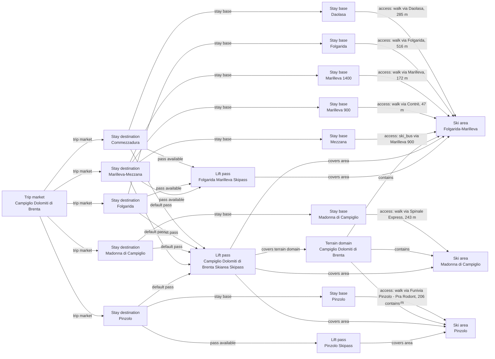

# Campiglio Dolomiti di Brenta Catalog V2 Boundary and Graph Curation

Retires the overlapping Folgarida-Marilleva stay destination, establishes Folgarida, Marilleva-Mezzana and Commezzadura stay markets, adds Mezzana access, and reconciles the complete current destination/base/access/pass and ski-area ownership graph.

## Resulting Graph

## Reviewed Targets

| Target | Scope | Graph Role | Required Fields |
| --- | --- | --- | --- |
| `lift_pass_product:campiglio-skiarea-pass` | `full` | `focus` | all canonical fields |
| `lift_pass_product:folgarida-marilleva-local-pass` | `full` | `focus` | all canonical fields |
| `lift_pass_product:pinzolo-local-pass` | `full` | `focus` | all canonical fields |
| `rental_display_fact:folgarida-marilleva-ski-point` | `full` | `focus` | all canonical fields |
| `ski_area:folgarida-marilleva-ski-area` | `full` | `focus` | all canonical fields |
| `ski_area:madonna-di-campiglio-ski-area` | `full` | `focus` | all canonical fields |
| `ski_area:pinzolo-ski-area` | `full` | `focus` | all canonical fields |
| `ski_area_access:folgarida-marilleva-daolasa--folgarida-marilleva-ski-area` | `full` | `focus` | all canonical fields |
| `ski_area_access:folgarida-marilleva-folgarida--folgarida-marilleva-ski-area` | `full` | `focus` | all canonical fields |
| `ski_area_access:folgarida-marilleva-marilleva-1400--folgarida-marilleva-ski-area` | `full` | `focus` | all canonical fields |
| `ski_area_access:folgarida-marilleva-marilleva-900--folgarida-marilleva-ski-area` | `full` | `focus` | all canonical fields |
| `ski_area_access:madonna-di-campiglio-madonna-di-campiglio--madonna-di-campiglio-ski-area` | `full` | `focus` | all canonical fields |
| `ski_area_access:marilleva-mezzana-mezzana--folgarida-marilleva-ski-area` | `full` | `focus` | all canonical fields |
| `ski_area_access:pinzolo-pinzolo--pinzolo-ski-area` | `full` | `focus` | all canonical fields |
| `stay_base:folgarida-marilleva-daolasa` | `full` | `focus` | all canonical fields |
| `stay_base:folgarida-marilleva-folgarida` | `full` | `focus` | all canonical fields |
| `stay_base:folgarida-marilleva-marilleva-1400` | `full` | `focus` | all canonical fields |
| `stay_base:folgarida-marilleva-marilleva-900` | `full` | `focus` | all canonical fields |
| `stay_base:madonna-di-campiglio-madonna-di-campiglio` | `full` | `focus` | all canonical fields |
| `stay_base:marilleva-mezzana-mezzana` | `full` | `focus` | all canonical fields |
| `stay_base:pinzolo-pinzolo` | `full` | `focus` | all canonical fields |
| `stay_destination:commezzadura` | `full` | `focus` | all canonical fields |
| `stay_destination:folgarida` | `full` | `focus` | all canonical fields |
| `stay_destination:folgarida-marilleva` | `narrow` | `focus` | `country`, `latitude`, `longitude`, `name`, `price_level`, `region`, `regional_data_ids`, `stay_destination_id`, `trip_market_region_id` |
| `stay_destination:madonna-di-campiglio` | `full` | `focus` | all canonical fields |
| `stay_destination:marilleva-mezzana` | `full` | `focus` | all canonical fields |
| `stay_destination:pinzolo` | `full` | `focus` | all canonical fields |
| `terrain_domain:campiglio-dolomiti-di-brenta` | `full` | `focus` | all canonical fields |
| `trust_manifest:lift_pass_products:campiglio-skiarea-pass` | `narrow` | `focus` | `field_source_refs`, `notes` |
| `trust_manifest:lift_pass_products:folgarida-marilleva-local-pass` | `narrow` | `focus` | `field_source_refs`, `notes` |
| `trust_manifest:lift_pass_products:pinzolo-local-pass` | `narrow` | `focus` | `field_source_refs`, `notes` |
| `trust_manifest:rental_display_facts:folgarida-marilleva-ski-point` | `narrow` | `focus` | `field_source_refs`, `notes` |
| `trust_manifest:ski_area_access:marilleva-mezzana-mezzana--folgarida-marilleva-ski-area` | `narrow` | `focus` | `display_name`, `field_source_refs`, `field_statuses`, `notes` |
| `trust_manifest:ski_areas:folgarida-marilleva-ski-area` | `narrow` | `focus` | `field_source_refs`, `field_statuses`, `notes` |
| `trust_manifest:ski_areas:madonna-di-campiglio-ski-area` | `narrow` | `focus` | `field_source_refs`, `field_statuses`, `notes` |
| `trust_manifest:ski_areas:pinzolo-ski-area` | `narrow` | `focus` | `field_source_refs`, `field_statuses`, `notes` |
| `trust_manifest:stay_bases:folgarida-marilleva-daolasa` | `narrow` | `focus` | `field_source_refs`, `field_statuses`, `notes` |
| `trust_manifest:stay_bases:folgarida-marilleva-folgarida` | `narrow` | `focus` | `field_source_refs`, `field_statuses`, `notes` |
| `trust_manifest:stay_bases:folgarida-marilleva-marilleva-1400` | `narrow` | `focus` | `field_source_refs`, `field_statuses`, `notes` |
| `trust_manifest:stay_bases:folgarida-marilleva-marilleva-900` | `narrow` | `focus` | `field_source_refs`, `field_statuses`, `notes` |
| `trust_manifest:stay_bases:madonna-di-campiglio-madonna-di-campiglio` | `narrow` | `focus` | `field_source_refs`, `field_statuses`, `notes` |
| `trust_manifest:stay_bases:marilleva-mezzana-mezzana` | `narrow` | `focus` | `display_name`, `field_source_refs`, `field_statuses`, `notes` |
| `trust_manifest:stay_bases:pinzolo-pinzolo` | `narrow` | `focus` | `field_source_refs`, `field_statuses`, `notes` |
| `trust_manifest:stay_destinations:commezzadura` | `narrow` | `focus` | `display_name`, `field_source_refs`, `field_statuses`, `notes` |
| `trust_manifest:stay_destinations:folgarida` | `narrow` | `focus` | `display_name`, `field_source_refs`, `field_statuses`, `notes` |
| `trust_manifest:stay_destinations:folgarida-marilleva` | `narrow` | `focus` | `display_name`, `field_source_refs`, `field_statuses`, `notes` |
| `trust_manifest:stay_destinations:marilleva-mezzana` | `narrow` | `focus` | `display_name`, `field_source_refs`, `field_statuses`, `notes` |
| `trust_manifest:terrain_domains:campiglio-dolomiti-di-brenta` | `narrow` | `focus` | `field_source_refs`, `field_statuses`, `notes` |

## Review Evidence Envelope

| Family | Source Kind | Source URLs | Candidate Kinds |
| --- | --- | --- | --- |
| `destination-booking` | `destination_booking` | [https://www.campigliodolomiti.it/en/land/val-rendena/madonna-di-campiglio](https://www.campigliodolomiti.it/en/land/val-rendena/madonna-di-campiglio), [https://www.campigliodolomiti.it/en/land/val-rendena/pinzolo](https://www.campigliodolomiti.it/en/land/val-rendena/pinzolo), [https://www.campigliodolomiti.it/en/plan/hotels-where-to-stay](https://www.campigliodolomiti.it/en/plan/hotels-where-to-stay), [https://www.visitvaldisole.it/en/commezzadura](https://www.visitvaldisole.it/en/commezzadura), [https://www.visitvaldisole.it/en/folgarida](https://www.visitvaldisole.it/en/folgarida), [https://www.visitvaldisole.it/en/marilleva-mezzana](https://www.visitvaldisole.it/en/marilleva-mezzana), [https://www.visitvaldisole.it/en/where-to-stay](https://www.visitvaldisole.it/en/where-to-stay) | `stay_destination`, `stay_base` |
| `ski-area-operator` | `ski_area_operator` | [https://www.campigliodolomiti.it/documenti/mappa-skiarea/Pan_Madonna_d_Campiglio_web.pdf](https://www.campigliodolomiti.it/documenti/mappa-skiarea/Pan_Madonna_d_Campiglio_web.pdf), [https://www.campigliodolomiti.it/en/sports-winter/snowboarding-and-snow-parks](https://www.campigliodolomiti.it/en/sports-winter/snowboarding-and-snow-parks), [https://www.ski.it/en/skiarea/folgarida-marilleva](https://www.ski.it/en/skiarea/folgarida-marilleva), [https://www.ski.it/en/skiarea/madonna-di-campiglio-trentino](https://www.ski.it/en/skiarea/madonna-di-campiglio-trentino), [https://www.ski.it/en/skiarea/pinzolo](https://www.ski.it/en/skiarea/pinzolo), [https://www.ski.it/ski/documenti-file/pagine-di-dettaglio/pagine-istituzionali/folgarida-marilleva/Sostenibilit%C3%A0/bilancio-sostenibilita-24_FFM_web.pdf](https://www.ski.it/ski/documenti-file/pagine-di-dettaglio/pagine-istituzionali/folgarida-marilleva/Sostenibilit%C3%A0/bilancio-sostenibilita-24_FFM_web.pdf), [https://www.visitvaldisole.it/website_files/skiarea/SkiMap%20-%20Skiarea%20Campiglio%20Dolomiti%20di%20Brenta%20Val%20di%20Sole%20Val%20Rendena.pdf](https://www.visitvaldisole.it/website_files/skiarea/SkiMap%20-%20Skiarea%20Campiglio%20Dolomiti%20di%20Brenta%20Val%20di%20Sole%20Val%20Rendena.pdf) | `ski_area`, `terrain_domain` |
| `current-operations` | `ski_area_operator` | [https://www.ski.it/en/info-live/slopes](https://www.ski.it/en/info-live/slopes) | `ski_area` |
| `weather-snow` | `ski_area_operator` | [https://www.ski.it/en/info-live/snow-report](https://www.ski.it/en/info-live/snow-report) | `ski_area` |
| `pass-tariff` | `pass_tariff` | [https://www.campigliodolomiti.it/en/skiarea/inverno/skipass/skipass-skiarea](https://www.campigliodolomiti.it/en/skiarea/inverno/skipass/skipass-skiarea), [https://www.ski.it/en/ski-pass/purchase-lift-passes](https://www.ski.it/en/ski-pass/purchase-lift-passes), [https://www.ski.it/ski/documenti-file/skipass/listini/2025-2026listinoFFMit.pdf](https://www.ski.it/ski/documenti-file/skipass/listini/2025-2026listinoFFMit.pdf), [https://www.ski.it/ski/documenti-file/skipass/listini/2025-2026listinoFPIit.pdf](https://www.ski.it/ski/documenti-file/skipass/listini/2025-2026listinoFPIit.pdf) | `lift_pass_product`, `ski_area` |
| `access-transport` | `access_transport` | [https://www.openstreetmap.org/node/1023438277](https://www.openstreetmap.org/node/1023438277), [https://www.openstreetmap.org/node/1096349433](https://www.openstreetmap.org/node/1096349433), [https://www.openstreetmap.org/node/1096349822](https://www.openstreetmap.org/node/1096349822), [https://www.openstreetmap.org/node/298987790](https://www.openstreetmap.org/node/298987790), [https://www.openstreetmap.org/node/327580361](https://www.openstreetmap.org/node/327580361), [https://www.openstreetmap.org/node/64776621](https://www.openstreetmap.org/node/64776621), [https://www.openstreetmap.org/node/648469713](https://www.openstreetmap.org/node/648469713), [https://www.openstreetmap.org/node/8662539441](https://www.openstreetmap.org/node/8662539441), [https://www.openstreetmap.org/relation/47086](https://www.openstreetmap.org/relation/47086), [https://www.openstreetmap.org/relation/47088](https://www.openstreetmap.org/relation/47088), [https://www.visitvaldisole.it/website_files/cataloghi/ski+train+bus.pdf](https://www.visitvaldisole.it/website_files/cataloghi/ski%2Btrain%2Bbus.pdf) | `ski_area_access`, `stay_base` |
| `other-official` | `other_official` | [https://www.campigliodolomiti.it/en/land/villages-and-valleys](https://www.campigliodolomiti.it/en/land/villages-and-valleys), [https://www.campigliodolomiti.it/en/services/arena-super-g](https://www.campigliodolomiti.it/en/services/arena-super-g), [https://www.campigliodolomiti.it/en/services/bar-nazionale-2](https://www.campigliodolomiti.it/en/services/bar-nazionale-2), [https://www.campigliodolomiti.it/en/services/zangola](https://www.campigliodolomiti.it/en/services/zangola) | `stay_base`, `ski_area` |

## Entity Scope Assessments

| Candidate | Kind | Disposition | Signals | Catalog Targets | Evidence | Backlog | Graph Impact | Rationale |
| --- | --- | --- | --- | --- | --- | --- | --- | --- |
| `folgarida-marilleva` (Retired Folgarida-Marilleva stay umbrella) | `stay_destination` | `not_separate` | `independent_stay_market` | `stay_destination:folgarida`, `stay_destination:marilleva-mezzana`, `stay_destination:commezzadura` | `boundary-folgarida-marilleva-official-treatment`, `boundary-folgarida-marilleva-accommodation-inventory` |  | `graph_blocking` | The umbrella overlaps three direct official stay markets; retaining it would duplicate bases and pass/access ownership. |
| `folgarida` (Folgarida) | `stay_destination` | `add_entity` | `independent_stay_market`, `official_independent_identity` | `stay_destination:folgarida` | `boundary-folgarida-official-treatment`, `boundary-folgarida-accommodation-inventory` |  | `graph_blocking` | Direct official destination treatment and accommodation inventory establish a distinct stay-market graph node. |
| `marilleva-mezzana` (Marilleva Mezzana) | `stay_destination` | `add_entity` | `independent_stay_market`, `official_independent_identity` | `stay_destination:marilleva-mezzana` | `boundary-marilleva-mezzana-official-treatment`, `boundary-marilleva-mezzana-accommodation-inventory` |  | `graph_blocking` | Direct official destination treatment and accommodation inventory establish a distinct stay-market graph node. |
| `commezzadura` (Commezzadura) | `stay_destination` | `add_entity` | `independent_stay_market`, `official_independent_identity` | `stay_destination:commezzadura` | `boundary-commezzadura-official-treatment`, `boundary-commezzadura-accommodation-inventory` |  | `graph_blocking` | Direct official destination treatment and accommodation inventory establish a distinct stay-market graph node. |
| `madonna-di-campiglio` (Madonna Di Campiglio) | `stay_destination` | `represented` | `independent_stay_market`, `official_independent_identity` | `stay_destination:madonna-di-campiglio` | `boundary-madonna-di-campiglio-official-treatment`, `boundary-madonna-di-campiglio-accommodation-inventory` |  | `graph_blocking` | Direct official destination treatment and accommodation inventory establish a distinct stay-market graph node. |
| `pinzolo` (Pinzolo) | `stay_destination` | `represented` | `independent_stay_market`, `official_independent_identity` | `stay_destination:pinzolo` | `boundary-pinzolo-official-treatment`, `boundary-pinzolo-accommodation-inventory` |  | `graph_blocking` | Direct official destination treatment and accommodation inventory establish a distinct stay-market graph node. |
| `folgarida-marilleva-folgarida` (Folgarida) | `stay_base` | `represented` | `official_independent_identity`, `distinct_access` | `stay_base:folgarida-marilleva-folgarida` | `v2-enrichment-010-folgarida-marilleva-folgarida-base-character-development-style` |  | `graph_blocking` | The direct official stay source establishes the retained base identity and destination ownership; unsupported character scalars remain unknown. |
| `folgarida-marilleva-marilleva-900` (Marilleva 900) | `stay_base` | `represented` | `official_independent_identity`, `distinct_access` | `stay_base:folgarida-marilleva-marilleva-900` | `v2-enrichment-014-folgarida-marilleva-marilleva-900-base-character-development-style` |  | `graph_blocking` | The direct official stay source establishes the retained base identity and destination ownership; unsupported character scalars remain unknown. |
| `folgarida-marilleva-marilleva-1400` (Marilleva 1400) | `stay_base` | `represented` | `official_independent_identity`, `distinct_access` | `stay_base:folgarida-marilleva-marilleva-1400` | `v2-enrichment-012-folgarida-marilleva-marilleva-1400-base-character-development-style` |  | `graph_blocking` | The direct official stay source establishes the retained base identity and destination ownership; unsupported character scalars remain unknown. |
| `folgarida-marilleva-daolasa` (Daolasa) | `stay_base` | `represented` | `official_independent_identity`, `distinct_access` | `stay_base:folgarida-marilleva-daolasa` | `cycle1-stay-base-folgarida-marilleva-daolasa-base-type` |  | `graph_blocking` | The direct official stay source establishes the retained base identity and destination ownership; unsupported character scalars remain unknown. |
| `marilleva-mezzana-mezzana` (Mezzana) | `stay_base` | `add_entity` | `official_independent_identity`, `distinct_access` | `stay_base:marilleva-mezzana-mezzana` | `cycle1-stay-base-marilleva-mezzana-mezzana-base-type` |  | `graph_blocking` | The direct official stay source establishes the retained base identity and destination ownership; unsupported character scalars remain unknown. |
| `madonna-di-campiglio-madonna-di-campiglio` (Madonna di Campiglio) | `stay_base` | `represented` | `official_independent_identity`, `distinct_access` | `stay_base:madonna-di-campiglio-madonna-di-campiglio` | `v2-enrichment-016-madonna-di-campiglio-madonna-di-campiglio-base-character-development-style` |  | `graph_blocking` | The direct official stay source establishes the retained base identity and destination ownership; unsupported character scalars remain unknown. |
| `pinzolo-pinzolo` (Pinzolo) | `stay_base` | `represented` | `official_independent_identity`, `distinct_access` | `stay_base:pinzolo-pinzolo` | `v2-enrichment-022-pinzolo-pinzolo-base-character-development-style` |  | `graph_blocking` | The direct official stay source establishes the retained base identity and destination ownership; unsupported character scalars remain unknown. |
| `folgarida-marilleva-daolasa--folgarida-marilleva-ski-area` (folgarida-marilleva-daolasa to folgarida-marilleva-ski-area) | `ski_area_access` | `represented` | `direct_access_relationship`, `distinct_access` | `ski_area_access:folgarida-marilleva-daolasa--folgarida-marilleva-ski-area` | `scope-access-folgarida-marilleva-daolasa--folgarida-marilleva-ski-area` |  | `graph_blocking` | This is one exact typed base-to-area relationship with explicit endpoints, mode, directness and source provenance; no Cartesian inference is used. |
| `folgarida-marilleva-folgarida--folgarida-marilleva-ski-area` (folgarida-marilleva-folgarida to folgarida-marilleva-ski-area) | `ski_area_access` | `represented` | `direct_access_relationship`, `distinct_access` | `ski_area_access:folgarida-marilleva-folgarida--folgarida-marilleva-ski-area` | `scope-access-folgarida-marilleva-folgarida--folgarida-marilleva-ski-area` |  | `graph_blocking` | This is one exact typed base-to-area relationship with explicit endpoints, mode, directness and source provenance; no Cartesian inference is used. |
| `folgarida-marilleva-marilleva-1400--folgarida-marilleva-ski-area` (folgarida-marilleva-marilleva-1400 to folgarida-marilleva-ski-area) | `ski_area_access` | `represented` | `direct_access_relationship`, `distinct_access` | `ski_area_access:folgarida-marilleva-marilleva-1400--folgarida-marilleva-ski-area` | `scope-access-folgarida-marilleva-marilleva-1400--folgarida-marilleva-ski-area` |  | `graph_blocking` | This is one exact typed base-to-area relationship with explicit endpoints, mode, directness and source provenance; no Cartesian inference is used. |
| `folgarida-marilleva-marilleva-900--folgarida-marilleva-ski-area` (folgarida-marilleva-marilleva-900 to folgarida-marilleva-ski-area) | `ski_area_access` | `represented` | `direct_access_relationship`, `distinct_access` | `ski_area_access:folgarida-marilleva-marilleva-900--folgarida-marilleva-ski-area` | `scope-access-folgarida-marilleva-marilleva-900--folgarida-marilleva-ski-area` |  | `graph_blocking` | This is one exact typed base-to-area relationship with explicit endpoints, mode, directness and source provenance; no Cartesian inference is used. |
| `marilleva-mezzana-mezzana--folgarida-marilleva-ski-area` (marilleva-mezzana-mezzana to folgarida-marilleva-ski-area) | `ski_area_access` | `add_entity` | `direct_access_relationship`, `distinct_access` | `ski_area_access:marilleva-mezzana-mezzana--folgarida-marilleva-ski-area` | `scope-access-marilleva-mezzana-mezzana--folgarida-marilleva-ski-area` |  | `graph_blocking` | This is one exact typed base-to-area relationship with explicit endpoints, mode, directness and source provenance; no Cartesian inference is used. |
| `madonna-di-campiglio-madonna-di-campiglio--madonna-di-campiglio-ski-area` (madonna-di-campiglio-madonna-di-campiglio to madonna-di-campiglio-ski-area) | `ski_area_access` | `represented` | `direct_access_relationship`, `distinct_access` | `ski_area_access:madonna-di-campiglio-madonna-di-campiglio--madonna-di-campiglio-ski-area` | `scope-access-madonna-di-campiglio-madonna-di-campiglio--madonna-di-campiglio-ski-area` |  | `graph_blocking` | This is one exact typed base-to-area relationship with explicit endpoints, mode, directness and source provenance; no Cartesian inference is used. |
| `pinzolo-pinzolo--pinzolo-ski-area` (pinzolo-pinzolo to pinzolo-ski-area) | `ski_area_access` | `represented` | `direct_access_relationship`, `distinct_access` | `ski_area_access:pinzolo-pinzolo--pinzolo-ski-area` | `scope-access-pinzolo-pinzolo--pinzolo-ski-area` |  | `graph_blocking` | This is one exact typed base-to-area relationship with explicit endpoints, mode, directness and source provenance; no Cartesian inference is used. |
| `folgarida-marilleva-ski-area` (Folgarida-Marilleva) | `ski_area` | `represented` | `official_independent_identity`, `separate_operator`, `independent_status_or_schedule`, `independent_weather_presentation`, `full_local_pass` | `ski_area:folgarida-marilleva-ski-area` | `scope-folgarida-marilleva-ski-area-operator-identity`, `scope-folgarida-marilleva-ski-area-current-operations`, `scope-folgarida-marilleva-ski-area-weather-snow`, `scope-folgarida-marilleva-ski-area-local-pass` |  | `graph_blocking` | Operator identity plus candidate-scoped operations and weather/snow presentations establish at least two independent ADR0016 owner categories. |
| `madonna-di-campiglio-ski-area` (Madonna di Campiglio) | `ski_area` | `represented` | `official_independent_identity`, `separate_operator`, `independent_status_or_schedule`, `independent_weather_presentation` | `ski_area:madonna-di-campiglio-ski-area` | `scope-madonna-di-campiglio-ski-area-operator-identity`, `scope-madonna-di-campiglio-ski-area-current-operations`, `scope-madonna-di-campiglio-ski-area-weather-snow` |  | `graph_blocking` | Operator identity plus candidate-scoped operations and weather/snow presentations establish at least two independent ADR0016 owner categories. |
| `pinzolo-ski-area` (Pinzolo) | `ski_area` | `represented` | `official_independent_identity`, `separate_operator`, `independent_status_or_schedule`, `independent_weather_presentation`, `full_local_pass` | `ski_area:pinzolo-ski-area` | `scope-pinzolo-ski-area-operator-identity`, `scope-pinzolo-ski-area-current-operations`, `scope-pinzolo-ski-area-weather-snow`, `scope-pinzolo-ski-area-local-pass` |  | `graph_blocking` | Operator identity plus candidate-scoped operations and weather/snow presentations establish at least two independent ADR0016 owner categories. |
| `campiglio-dolomiti-di-brenta` (Campiglio Dolomiti di Brenta) | `terrain_domain` | `represented` | `ski_connected_terrain`, `official_independent_identity` | `terrain_domain:campiglio-dolomiti-di-brenta` | `v2-enrichment-027-campiglio-dolomiti-di-brenta-official-trail-map-url` |  | `graph_blocking` | The aggregate official trail map is owned by the connected terrain domain, not by a Folgarida-Marilleva child area. |
| `campiglio-skiarea-pass` (Campiglio Dolomiti di Brenta Skiarea Skipass) | `lift_pass_product` | `represented` | `official_product_identity` | `lift_pass_product:campiglio-skiarea-pass` | `scope-pass-campiglio-skiarea-pass-product`, `scope-pass-campiglio-skiarea-pass-operator-index`, `scope-pass-campiglio-skiarea-pass-available-from-stay-destination-ids`, `scope-pass-campiglio-skiarea-pass-default-for-stay-destination-ids`, `scope-pass-campiglio-skiarea-pass-valid-ski-area-ids`, `scope-pass-campiglio-skiarea-pass-terrain-domain-ids`, `scope-pass-campiglio-skiarea-pass-prices`, `scope-pass-campiglio-skiarea-pass-external-validity-summary` |  | `graph_blocking` | Current official product/tariff sources establish exact modeled area/domain coverage, representative prices and stay-market availability; local passes remain non-default. |
| `folgarida-marilleva-local-pass` (Folgarida Marilleva Skipass) | `lift_pass_product` | `represented` | `official_product_identity` | `lift_pass_product:folgarida-marilleva-local-pass` | `scope-pass-folgarida-marilleva-local-pass-product`, `scope-pass-folgarida-marilleva-local-pass-operator-index`, `scope-pass-folgarida-marilleva-local-pass-available-from-stay-destination-ids`, `scope-pass-folgarida-marilleva-local-pass-default-for-stay-destination-ids`, `scope-pass-folgarida-marilleva-local-pass-valid-ski-area-ids`, `scope-pass-folgarida-marilleva-local-pass-terrain-domain-ids`, `scope-pass-folgarida-marilleva-local-pass-prices` |  | `graph_blocking` | Current official product/tariff sources establish exact modeled area/domain coverage, representative prices and stay-market availability; local passes remain non-default. |
| `pinzolo-local-pass` (Pinzolo Skipass) | `lift_pass_product` | `represented` | `official_product_identity` | `lift_pass_product:pinzolo-local-pass` | `scope-pass-pinzolo-local-pass-product`, `scope-pass-pinzolo-local-pass-operator-index`, `scope-pass-pinzolo-local-pass-available-from-stay-destination-ids`, `scope-pass-pinzolo-local-pass-default-for-stay-destination-ids`, `scope-pass-pinzolo-local-pass-valid-ski-area-ids`, `scope-pass-pinzolo-local-pass-terrain-domain-ids`, `scope-pass-pinzolo-local-pass-prices` |  | `graph_blocking` | Current official product/tariff sources establish exact modeled area/domain coverage, representative prices and stay-market availability; local passes remain non-default. |
| `terrain-sector-folgarida` (Folgarida terrain sector) | `ski_area` | `not_separate` | `official_map_sector`, `ski_connected_terrain` | `ski_area:folgarida-marilleva-ski-area` | `v2-enrichment-027-campiglio-dolomiti-di-brenta-official-trail-map-url`, `scope-folgarida-marilleva-ski-area-current-operations` |  | `graph_blocking` | The official map and candidate-scoped slopes page present this as connected terrain within the parent ski area, without independent operations/weather ownership. |
| `terrain-sector-marilleva` (Marilleva terrain sector) | `ski_area` | `not_separate` | `official_map_sector`, `ski_connected_terrain` | `ski_area:folgarida-marilleva-ski-area` | `v2-enrichment-027-campiglio-dolomiti-di-brenta-official-trail-map-url`, `scope-folgarida-marilleva-ski-area-current-operations` |  | `graph_blocking` | The official map and candidate-scoped slopes page present this as connected terrain within the parent ski area, without independent operations/weather ownership. |
| `terrain-sector-daolasa-val-mastellina` (Daolasa / Val Mastellina terrain sector) | `ski_area` | `not_separate` | `official_map_sector`, `ski_connected_terrain` | `ski_area:folgarida-marilleva-ski-area` | `v2-enrichment-027-campiglio-dolomiti-di-brenta-official-trail-map-url`, `scope-folgarida-marilleva-ski-area-current-operations` |  | `graph_blocking` | The official map and candidate-scoped slopes page present this as connected terrain within the parent ski area, without independent operations/weather ownership. |
| `terrain-sector-groste` (Groste terrain sector) | `ski_area` | `not_separate` | `official_map_sector`, `ski_connected_terrain` | `ski_area:madonna-di-campiglio-ski-area` | `v2-enrichment-027-campiglio-dolomiti-di-brenta-official-trail-map-url`, `scope-madonna-di-campiglio-ski-area-current-operations` |  | `graph_blocking` | The official map and candidate-scoped slopes page present this as connected terrain within the parent ski area, without independent operations/weather ownership. |
| `terrain-sector-spinale` (Spinale terrain sector) | `ski_area` | `not_separate` | `official_map_sector`, `ski_connected_terrain` | `ski_area:madonna-di-campiglio-ski-area` | `v2-enrichment-027-campiglio-dolomiti-di-brenta-official-trail-map-url`, `scope-madonna-di-campiglio-ski-area-current-operations` |  | `graph_blocking` | The official map and candidate-scoped slopes page present this as connected terrain within the parent ski area, without independent operations/weather ownership. |
| `terrain-sector-pradalago` (Pradalago terrain sector) | `ski_area` | `not_separate` | `official_map_sector`, `ski_connected_terrain` | `ski_area:madonna-di-campiglio-ski-area` | `v2-enrichment-027-campiglio-dolomiti-di-brenta-official-trail-map-url`, `scope-madonna-di-campiglio-ski-area-current-operations` |  | `graph_blocking` | The official map and candidate-scoped slopes page present this as connected terrain within the parent ski area, without independent operations/weather ownership. |
| `terrain-sector-cinque-laghi` (Cinque Laghi terrain sector) | `ski_area` | `not_separate` | `official_map_sector`, `ski_connected_terrain` | `ski_area:madonna-di-campiglio-ski-area` | `v2-enrichment-027-campiglio-dolomiti-di-brenta-official-trail-map-url`, `scope-madonna-di-campiglio-ski-area-current-operations` |  | `graph_blocking` | The official map and candidate-scoped slopes page present this as connected terrain within the parent ski area, without independent operations/weather ownership. |
| `terrain-sector-doss-del-sabion` (Doss del Sabion terrain sector) | `ski_area` | `not_separate` | `official_map_sector`, `ski_connected_terrain` | `ski_area:pinzolo-ski-area` | `v2-enrichment-027-campiglio-dolomiti-di-brenta-official-trail-map-url`, `scope-pinzolo-ski-area-current-operations` |  | `graph_blocking` | The official map and candidate-scoped slopes page present this as connected terrain within the parent ski area, without independent operations/weather ownership. |
| `terrain-sector-pra-rodont` (Pra Rodont terrain sector) | `ski_area` | `not_separate` | `official_map_sector`, `ski_connected_terrain` | `ski_area:pinzolo-ski-area` | `v2-enrichment-027-campiglio-dolomiti-di-brenta-official-trail-map-url`, `scope-pinzolo-ski-area-current-operations` |  | `graph_blocking` | The official map and candidate-scoped slopes page present this as connected terrain within the parent ski area, without independent operations/weather ownership. |
| `terrain-sector-tulot` (Tulot terrain sector) | `ski_area` | `not_separate` | `official_map_sector`, `ski_connected_terrain` | `ski_area:pinzolo-ski-area` | `v2-enrichment-027-campiglio-dolomiti-di-brenta-official-trail-map-url`, `scope-pinzolo-ski-area-current-operations` |  | `graph_blocking` | The official map and candidate-scoped slopes page present this as connected terrain within the parent ski area, without independent operations/weather ownership. |

## Ski-Area Boundary Assessments

| Candidate | Parent | Terrain | Connectivity | Operations | Weather | Pass | Provider Consensus | Separation Value | Evidence |
| --- | --- | --- | --- | --- | --- | --- | --- | --- | --- |
| `folgarida-marilleva-ski-area` |  | `complete` | `not_applicable` | `independent` | `independent` | `full_local` | `separate` | `material` | `scope-folgarida-marilleva-ski-area-operator-identity`, `scope-folgarida-marilleva-ski-area-current-operations`, `scope-folgarida-marilleva-ski-area-weather-snow`, `scope-folgarida-marilleva-ski-area-local-pass` |
| `madonna-di-campiglio-ski-area` |  | `complete` | `not_applicable` | `independent` | `independent` | `shared_only` | `separate` | `material` | `scope-madonna-di-campiglio-ski-area-operator-identity`, `scope-madonna-di-campiglio-ski-area-current-operations`, `scope-madonna-di-campiglio-ski-area-weather-snow` |
| `pinzolo-ski-area` |  | `complete` | `not_applicable` | `independent` | `independent` | `full_local` | `separate` | `material` | `scope-pinzolo-ski-area-operator-identity`, `scope-pinzolo-ski-area-current-operations`, `scope-pinzolo-ski-area-weather-snow`, `scope-pinzolo-ski-area-local-pass` |
| `terrain-sector-folgarida` | `folgarida-marilleva-ski-area` | `sector` | `connected` | `parent_owned` | `parent_owned` | `shared_only` | `aggregated` | `redundant` | `v2-enrichment-027-campiglio-dolomiti-di-brenta-official-trail-map-url`, `scope-folgarida-marilleva-ski-area-current-operations` |
| `terrain-sector-marilleva` | `folgarida-marilleva-ski-area` | `sector` | `connected` | `parent_owned` | `parent_owned` | `shared_only` | `aggregated` | `redundant` | `v2-enrichment-027-campiglio-dolomiti-di-brenta-official-trail-map-url`, `scope-folgarida-marilleva-ski-area-current-operations` |
| `terrain-sector-daolasa-val-mastellina` | `folgarida-marilleva-ski-area` | `sector` | `connected` | `parent_owned` | `parent_owned` | `shared_only` | `aggregated` | `redundant` | `v2-enrichment-027-campiglio-dolomiti-di-brenta-official-trail-map-url`, `scope-folgarida-marilleva-ski-area-current-operations` |
| `terrain-sector-groste` | `madonna-di-campiglio-ski-area` | `sector` | `connected` | `parent_owned` | `parent_owned` | `shared_only` | `aggregated` | `redundant` | `v2-enrichment-027-campiglio-dolomiti-di-brenta-official-trail-map-url`, `scope-madonna-di-campiglio-ski-area-current-operations` |
| `terrain-sector-spinale` | `madonna-di-campiglio-ski-area` | `sector` | `connected` | `parent_owned` | `parent_owned` | `shared_only` | `aggregated` | `redundant` | `v2-enrichment-027-campiglio-dolomiti-di-brenta-official-trail-map-url`, `scope-madonna-di-campiglio-ski-area-current-operations` |
| `terrain-sector-pradalago` | `madonna-di-campiglio-ski-area` | `sector` | `connected` | `parent_owned` | `parent_owned` | `shared_only` | `aggregated` | `redundant` | `v2-enrichment-027-campiglio-dolomiti-di-brenta-official-trail-map-url`, `scope-madonna-di-campiglio-ski-area-current-operations` |
| `terrain-sector-cinque-laghi` | `madonna-di-campiglio-ski-area` | `sector` | `connected` | `parent_owned` | `parent_owned` | `shared_only` | `aggregated` | `redundant` | `v2-enrichment-027-campiglio-dolomiti-di-brenta-official-trail-map-url`, `scope-madonna-di-campiglio-ski-area-current-operations` |
| `terrain-sector-doss-del-sabion` | `pinzolo-ski-area` | `sector` | `connected` | `parent_owned` | `parent_owned` | `shared_only` | `aggregated` | `redundant` | `v2-enrichment-027-campiglio-dolomiti-di-brenta-official-trail-map-url`, `scope-pinzolo-ski-area-current-operations` |
| `terrain-sector-pra-rodont` | `pinzolo-ski-area` | `sector` | `connected` | `parent_owned` | `parent_owned` | `shared_only` | `aggregated` | `redundant` | `v2-enrichment-027-campiglio-dolomiti-di-brenta-official-trail-map-url`, `scope-pinzolo-ski-area-current-operations` |
| `terrain-sector-tulot` | `pinzolo-ski-area` | `sector` | `connected` | `parent_owned` | `parent_owned` | `shared_only` | `aggregated` | `redundant` | `v2-enrichment-027-campiglio-dolomiti-di-brenta-official-trail-map-url`, `scope-pinzolo-ski-area-current-operations` |

## Changed Fields

| Target | Field | Before | After | Trust | Ranking Relevant |
| --- | --- | --- | --- | --- | --- |
| `lift_pass_product:campiglio-skiarea-pass` | `available_from_stay_destination_ids` | `["folgarida-marilleva", "madonna-di-campiglio", "pinzolo"]` | `["folgarida", "marilleva-mezzana", "commezzadura", "madonna-di-campiglio", "pinzolo"]` | `verified_with_adjustment` | yes |
| `lift_pass_product:campiglio-skiarea-pass` | `default_for_stay_destination_ids` | `["folgarida-marilleva", "madonna-di-campiglio", "pinzolo"]` | `["folgarida", "marilleva-mezzana", "commezzadura", "madonna-di-campiglio", "pinzolo"]` | `verified_with_adjustment` | yes |
| `lift_pass_product:folgarida-marilleva-local-pass` | `available_from_stay_destination_ids` | `["folgarida-marilleva"]` | `["folgarida", "marilleva-mezzana", "commezzadura"]` | `verified_with_adjustment` | yes |
| `rental_display_fact:folgarida-marilleva-ski-point` | `stay_base_id` | `null` | `"folgarida-marilleva-folgarida"` | `verified_with_adjustment` | no |
| `rental_display_fact:folgarida-marilleva-ski-point` | `stay_destination_id` | `"folgarida-marilleva"` | `"folgarida"` | `verified_with_adjustment` | no |
| `ski_area:folgarida-marilleva-ski-area` | `snow_park.availability` | `"unknown"` | `"available"` | `verified` | no |
| `ski_area:folgarida-marilleva-ski-area` | `snow_park.park_count` | `null` | `1` | `verified_with_adjustment` | no |
| `ski_area:madonna-di-campiglio-ski-area` | `ski_day_apres_profile.availability` | `"unknown"` | `"available"` | `verified` | no |
| `ski_area:madonna-di-campiglio-ski-area` | `ski_day_apres_profile.intensity` | `null` | `"lively"` | `verified_with_adjustment` | no |
| `ski_area:madonna-di-campiglio-ski-area` | `snow_park.availability` | `"unknown"` | `"available"` | `verified` | no |
| `ski_area:madonna-di-campiglio-ski-area` | `snow_park.park_count` | `null` | `2` | `verified` | no |
| `ski_area:pinzolo-ski-area` | `snow_park.availability` | `"unknown"` | `"available"` | `verified` | no |
| `ski_area:pinzolo-ski-area` | `snow_park.park_count` | `null` | `1` | `verified` | no |
| `ski_area_access:marilleva-mezzana-mezzana--folgarida-marilleva-ski-area` | `access_mode` | `null` | `"ski_bus"` | `verified_with_adjustment` | yes |
| `ski_area_access:marilleva-mezzana-mezzana--folgarida-marilleva-ski-area` | `is_direct` | `null` | `false` | `verified_with_adjustment` | yes |
| `ski_area_access:marilleva-mezzana-mezzana--folgarida-marilleva-ski-area` | `lift_distance` | `null` | `"medium"` | `verified_with_adjustment` | yes |
| `ski_area_access:marilleva-mezzana-mezzana--folgarida-marilleva-ski-area` | `nearest_lift_name` | `null` | `"Marilleva 900"` | `verified_with_adjustment` | yes |
| `ski_area_access:marilleva-mezzana-mezzana--folgarida-marilleva-ski-area` | `regional_data_ids` | `null` | `{}` | `estimated` | no |
| `ski_area_access:marilleva-mezzana-mezzana--folgarida-marilleva-ski-area` | `ski_area_access_id` | `null` | `"marilleva-mezzana-mezzana--folgarida-marilleva-ski-area"` | `verified_with_adjustment` | yes |
| `ski_area_access:marilleva-mezzana-mezzana--folgarida-marilleva-ski-area` | `ski_area_id` | `null` | `"folgarida-marilleva-ski-area"` | `verified_with_adjustment` | yes |
| `ski_area_access:marilleva-mezzana-mezzana--folgarida-marilleva-ski-area` | `source_urls` | `null` | `["https://www.visitvaldisole.it/website_files/cataloghi/ski+train+bus.pdf"]` | `verified_with_adjustment` | yes |
| `ski_area_access:marilleva-mezzana-mezzana--folgarida-marilleva-ski-area` | `stay_base_id` | `null` | `"marilleva-mezzana-mezzana"` | `verified_with_adjustment` | yes |
| `stay_base:folgarida-marilleva-daolasa` | `base_type` | `"resort_station"` | `"hamlet"` | `verified_with_adjustment` | yes |
| `stay_base:folgarida-marilleva-daolasa` | `stay_destination_id` | `"folgarida-marilleva"` | `"commezzadura"` | `verified_with_adjustment` | yes |
| `stay_base:folgarida-marilleva-folgarida` | `base_character.development_style` | `"unknown"` | `"planned_resort"` | `verified_with_adjustment` | no |
| `stay_base:folgarida-marilleva-folgarida` | `elevation_m` | `null` | `1300` | `verified_with_adjustment` | no |
| `stay_base:folgarida-marilleva-folgarida` | `stay_destination_id` | `"folgarida-marilleva"` | `"folgarida"` | `verified_with_adjustment` | yes |
| `stay_base:folgarida-marilleva-marilleva-1400` | `base_character.development_style` | `"unknown"` | `"planned_resort"` | `verified_with_adjustment` | no |
| `stay_base:folgarida-marilleva-marilleva-1400` | `elevation_m` | `null` | `1400` | `verified` | no |
| `stay_base:folgarida-marilleva-marilleva-1400` | `stay_destination_id` | `"folgarida-marilleva"` | `"marilleva-mezzana"` | `verified_with_adjustment` | yes |
| `stay_base:folgarida-marilleva-marilleva-900` | `base_character.development_style` | `"unknown"` | `"planned_resort"` | `verified_with_adjustment` | no |
| `stay_base:folgarida-marilleva-marilleva-900` | `elevation_m` | `null` | `900` | `verified` | no |
| `stay_base:folgarida-marilleva-marilleva-900` | `stay_destination_id` | `"folgarida-marilleva"` | `"marilleva-mezzana"` | `verified_with_adjustment` | yes |
| `stay_base:madonna-di-campiglio-madonna-di-campiglio` | `base_character.development_style` | `"unknown"` | `"mixed"` | `verified_with_adjustment` | no |
| `stay_base:madonna-di-campiglio-madonna-di-campiglio` | `base_character.local_pace` | `"unknown"` | `"lively"` | `verified_with_adjustment` | no |
| `stay_base:madonna-di-campiglio-madonna-di-campiglio` | `base_type` | `"town"` | `"resort_station"` | `verified_with_adjustment` | no |
| `stay_base:madonna-di-campiglio-madonna-di-campiglio` | `elevation_m` | `null` | `1550` | `verified_with_adjustment` | no |
| `stay_base:madonna-di-campiglio-madonna-di-campiglio` | `local_apres_profile.availability` | `"unknown"` | `"available"` | `verified` | no |
| `stay_base:madonna-di-campiglio-madonna-di-campiglio` | `local_apres_profile.intensity` | `null` | `"lively"` | `verified_with_adjustment` | no |
| `stay_base:marilleva-mezzana-mezzana` | `base_character.development_style` | `null` | `"unknown"` | `needs_source` | no |
| `stay_base:marilleva-mezzana-mezzana` | `base_character.local_pace` | `null` | `"unknown"` | `needs_source` | no |
| `stay_base:marilleva-mezzana-mezzana` | `base_type` | `null` | `"village"` | `verified_with_adjustment` | no |
| `stay_base:marilleva-mezzana-mezzana` | `elevation_m` | `null` | `940` | `verified_with_adjustment` | yes |
| `stay_base:marilleva-mezzana-mezzana` | `latitude` | `null` | `46.3173162` | `verified_with_adjustment` | yes |
| `stay_base:marilleva-mezzana-mezzana` | `local_apres_profile.availability` | `null` | `"unknown"` | `needs_source` | no |
| `stay_base:marilleva-mezzana-mezzana` | `longitude` | `null` | `10.8010074` | `verified_with_adjustment` | yes |
| `stay_base:marilleva-mezzana-mezzana` | `name` | `null` | `"Mezzana"` | `verified_with_adjustment` | no |
| `stay_base:marilleva-mezzana-mezzana` | `price_max` | `null` | `170.0` | `estimated` | no |
| `stay_base:marilleva-mezzana-mezzana` | `price_min` | `null` | `100.0` | `estimated` | no |
| `stay_base:marilleva-mezzana-mezzana` | `price_range` | `null` | `"EUR 100-170"` | `estimated` | no |
| `stay_base:marilleva-mezzana-mezzana` | `quality` | `null` | `"standard"` | `estimated` | no |
| `stay_base:marilleva-mezzana-mezzana` | `regional_data_ids` | `null` | `{"osm_node_id": "64776621"}` | `verified_with_adjustment` | no |
| `stay_base:marilleva-mezzana-mezzana` | `stay_base_id` | `null` | `"marilleva-mezzana-mezzana"` | `verified_with_adjustment` | yes |
| `stay_base:marilleva-mezzana-mezzana` | `stay_destination_id` | `null` | `"marilleva-mezzana"` | `verified_with_adjustment` | yes |
| `stay_base:pinzolo-pinzolo` | `base_character.development_style` | `"unknown"` | `"mixed"` | `verified_with_adjustment` | no |
| `stay_base:pinzolo-pinzolo` | `elevation_m` | `null` | `774` | `verified` | no |
| `stay_base:pinzolo-pinzolo` | `local_apres_profile.availability` | `"unknown"` | `"available"` | `verified` | no |
| `stay_base:pinzolo-pinzolo` | `local_apres_profile.intensity` | `null` | `"low_key"` | `verified_with_adjustment` | no |
| `stay_destination:commezzadura` | `country` | `null` | `"Italy"` | `verified_with_adjustment` | no |
| `stay_destination:commezzadura` | `latitude` | `null` | `46.31299` | `verified_with_adjustment` | yes |
| `stay_destination:commezzadura` | `longitude` | `null` | `10.8328315` | `verified_with_adjustment` | yes |
| `stay_destination:commezzadura` | `name` | `null` | `"Commezzadura"` | `verified_with_adjustment` | no |
| `stay_destination:commezzadura` | `price_level` | `null` | `"medium"` | `estimated` | no |
| `stay_destination:commezzadura` | `region` | `null` | `"Trentino"` | `verified_with_adjustment` | no |
| `stay_destination:commezzadura` | `regional_data_ids` | `null` | `{"osm_relation_id": "47088"}` | `verified_with_adjustment` | no |
| `stay_destination:commezzadura` | `stay_destination_id` | `null` | `"commezzadura"` | `verified_with_adjustment` | yes |
| `stay_destination:commezzadura` | `trip_market_region_id` | `null` | `"campiglio-dolomiti-di-brenta"` | `verified_with_adjustment` | yes |
| `stay_destination:folgarida` | `country` | `null` | `"Italy"` | `verified_with_adjustment` | no |
| `stay_destination:folgarida` | `latitude` | `null` | `46.3030712` | `verified_with_adjustment` | yes |
| `stay_destination:folgarida` | `longitude` | `null` | `10.8656079` | `verified_with_adjustment` | yes |
| `stay_destination:folgarida` | `name` | `null` | `"Folgarida"` | `verified_with_adjustment` | no |
| `stay_destination:folgarida` | `price_level` | `null` | `"medium"` | `estimated` | no |
| `stay_destination:folgarida` | `region` | `null` | `"Trentino"` | `verified_with_adjustment` | no |
| `stay_destination:folgarida` | `regional_data_ids` | `null` | `{"osm_node_id": "327580361"}` | `verified_with_adjustment` | no |
| `stay_destination:folgarida` | `stay_destination_id` | `null` | `"folgarida"` | `verified_with_adjustment` | yes |
| `stay_destination:folgarida` | `trip_market_region_id` | `null` | `"campiglio-dolomiti-di-brenta"` | `verified_with_adjustment` | yes |
| `stay_destination:folgarida-marilleva` | `country` | `"Italy"` | `null` | `verified_with_adjustment` | no |
| `stay_destination:folgarida-marilleva` | `latitude` | `46.3030712` | `null` | `verified_with_adjustment` | yes |
| `stay_destination:folgarida-marilleva` | `longitude` | `10.8656079` | `null` | `verified_with_adjustment` | yes |
| `stay_destination:folgarida-marilleva` | `name` | `"Folgarida-Marilleva"` | `null` | `verified_with_adjustment` | no |
| `stay_destination:folgarida-marilleva` | `price_level` | `"medium"` | `null` | `estimated` | no |
| `stay_destination:folgarida-marilleva` | `region` | `"Trentino"` | `null` | `verified_with_adjustment` | no |
| `stay_destination:folgarida-marilleva` | `regional_data_ids` | `{}` | `null` | `verified_with_adjustment` | no |
| `stay_destination:folgarida-marilleva` | `stay_destination_id` | `"folgarida-marilleva"` | `null` | `verified_with_adjustment` | yes |
| `stay_destination:folgarida-marilleva` | `trip_market_region_id` | `"campiglio-dolomiti-di-brenta"` | `null` | `verified_with_adjustment` | yes |
| `stay_destination:marilleva-mezzana` | `country` | `null` | `"Italy"` | `verified_with_adjustment` | no |
| `stay_destination:marilleva-mezzana` | `latitude` | `null` | `46.3179384` | `verified_with_adjustment` | yes |
| `stay_destination:marilleva-mezzana` | `longitude` | `null` | `10.800938` | `verified_with_adjustment` | yes |
| `stay_destination:marilleva-mezzana` | `name` | `null` | `"Marilleva-Mezzana"` | `verified_with_adjustment` | no |
| `stay_destination:marilleva-mezzana` | `price_level` | `null` | `"medium"` | `estimated` | no |
| `stay_destination:marilleva-mezzana` | `region` | `null` | `"Trentino"` | `verified_with_adjustment` | no |
| `stay_destination:marilleva-mezzana` | `regional_data_ids` | `null` | `{"osm_relation_id": "47086"}` | `verified_with_adjustment` | no |
| `stay_destination:marilleva-mezzana` | `stay_destination_id` | `null` | `"marilleva-mezzana"` | `verified_with_adjustment` | yes |
| `stay_destination:marilleva-mezzana` | `trip_market_region_id` | `null` | `"campiglio-dolomiti-di-brenta"` | `verified_with_adjustment` | yes |
| `terrain_domain:campiglio-dolomiti-di-brenta` | `official_trail_map.url` | `null` | `"https://www.campigliodolomiti.it/documenti/mappa-skiarea/Pan_Madonna_d_Campiglio_web.pdf"` | `verified` | no |
| `trust_manifest:lift_pass_products:campiglio-skiarea-pass` | `field_source_refs` | `{"coverage": ["https://www.bergfex.it/pinzolo/", "https://www.campigliodolomiti.it/en/services/il-comodo-sci", "https://www.campigliodolomiti.it/en/ski-area", "https://www.campigliodolomiti.it/en/skiarea/inverno/ski-rentals", "https://www.campigliodolomiti.it/en/skiarea/inverno/skipass/skipass-skiarea", "https://www.openstreetmap.org/node/1023438277", "https://www.openstreetmap.org/node/1096349433", "https://www.openstreetmap.org/node/1096349822", "https://www.openstreetmap.org/node/1796357582", "https://www.openstreetmap.org/node/298987790", "https://www.openstreetmap.org/node/327580361", "https://www.openstreetmap.org/node/331259364", "https://www.openstreetmap.org/node/331259493", "https://www.openstreetmap.org/node/4311362989", "https://www.openstreetmap.org/node/6043719130", "https://www.openstreetmap.org/node/648469713", "https://www.openstreetmap.org/node/8662539441", "https://www.ski.it/en/skiarea/folgarida-marilleva", "https://www.ski.it/en/skiarea/madonna-di-campiglio-trentino", "https://www.ski.it/en/skiarea/pinzolo", "https://www.ski.it/it/noleggi/folgarida/ski-point", "https://www.ski.it/ski/documenti-file/live/Ski_Map_Skiarea.pdf", "https://www.ski.it/ski/documenti-file/skipass/listini/2025-2026listinoFFMit.pdf", "https://www.ski.it/ski/documenti-file/skipass/listini/2025-2026listinoFPIit.pdf"], "identity_scope_availability": ["https://www.bergfex.it/pinzolo/", "https://www.campigliodolomiti.it/en/services/il-comodo-sci", "https://www.campigliodolomiti.it/en/ski-area", "https://www.campigliodolomiti.it/en/skiarea/inverno/ski-rentals", "https://www.campigliodolomiti.it/en/skiarea/inverno/skipass/skipass-skiarea", "https://www.openstreetmap.org/node/1023438277", "https://www.openstreetmap.org/node/1096349433", "https://www.openstreetmap.org/node/1096349822", "https://www.openstreetmap.org/node/1796357582", "https://www.openstreetmap.org/node/298987790", "https://www.openstreetmap.org/node/327580361", "https://www.openstreetmap.org/node/331259364", "https://www.openstreetmap.org/node/331259493", "https://www.openstreetmap.org/node/4311362989", "https://www.openstreetmap.org/node/6043719130", "https://www.openstreetmap.org/node/648469713", "https://www.openstreetmap.org/node/8662539441", "https://www.ski.it/en/skiarea/folgarida-marilleva", "https://www.ski.it/en/skiarea/madonna-di-campiglio-trentino", "https://www.ski.it/en/skiarea/pinzolo", "https://www.ski.it/it/noleggi/folgarida/ski-point", "https://www.ski.it/ski/documenti-file/live/Ski_Map_Skiarea.pdf", "https://www.ski.it/ski/documenti-file/skipass/listini/2025-2026listinoFFMit.pdf", "https://www.ski.it/ski/documenti-file/skipass/listini/2025-2026listinoFPIit.pdf"], "pass_accessible_terrain": ["https://www.bergfex.it/pinzolo/", "https://www.campigliodolomiti.it/en/services/il-comodo-sci", "https://www.campigliodolomiti.it/en/ski-area", "https://www.campigliodolomiti.it/en/skiarea/inverno/ski-rentals", "https://www.campigliodolomiti.it/en/skiarea/inverno/skipass/skipass-skiarea", "https://www.openstreetmap.org/node/1023438277", "https://www.openstreetmap.org/node/1096349433", "https://www.openstreetmap.org/node/1096349822", "https://www.openstreetmap.org/node/1796357582", "https://www.openstreetmap.org/node/298987790", "https://www.openstreetmap.org/node/327580361", "https://www.openstreetmap.org/node/331259364", "https://www.openstreetmap.org/node/331259493", "https://www.openstreetmap.org/node/4311362989", "https://www.openstreetmap.org/node/6043719130", "https://www.openstreetmap.org/node/648469713", "https://www.openstreetmap.org/node/8662539441", "https://www.ski.it/en/skiarea/folgarida-marilleva", "https://www.ski.it/en/skiarea/madonna-di-campiglio-trentino", "https://www.ski.it/en/skiarea/pinzolo", "https://www.ski.it/it/noleggi/folgarida/ski-point", "https://www.ski.it/ski/documenti-file/live/Ski_Map_Skiarea.pdf", "https://www.ski.it/ski/documenti-file/skipass/listini/2025-2026listinoFFMit.pdf", "https://www.ski.it/ski/documenti-file/skipass/listini/2025-2026listinoFPIit.pdf"], "prices": ["https://www.bergfex.it/pinzolo/", "https://www.campigliodolomiti.it/en/services/il-comodo-sci", "https://www.campigliodolomiti.it/en/ski-area", "https://www.campigliodolomiti.it/en/skiarea/inverno/ski-rentals", "https://www.campigliodolomiti.it/en/skiarea/inverno/skipass/skipass-skiarea", "https://www.openstreetmap.org/node/1023438277", "https://www.openstreetmap.org/node/1096349433", "https://www.openstreetmap.org/node/1096349822", "https://www.openstreetmap.org/node/1796357582", "https://www.openstreetmap.org/node/298987790", "https://www.openstreetmap.org/node/327580361", "https://www.openstreetmap.org/node/331259364", "https://www.openstreetmap.org/node/331259493", "https://www.openstreetmap.org/node/4311362989", "https://www.openstreetmap.org/node/6043719130", "https://www.openstreetmap.org/node/648469713", "https://www.openstreetmap.org/node/8662539441", "https://www.ski.it/en/skiarea/folgarida-marilleva", "https://www.ski.it/en/skiarea/madonna-di-campiglio-trentino", "https://www.ski.it/en/skiarea/pinzolo", "https://www.ski.it/it/noleggi/folgarida/ski-point", "https://www.ski.it/ski/documenti-file/live/Ski_Map_Skiarea.pdf", "https://www.ski.it/ski/documenti-file/skipass/listini/2025-2026listinoFFMit.pdf", "https://www.ski.it/ski/documenti-file/skipass/listini/2025-2026listinoFPIit.pdf"]}` | `{"coverage": ["https://www.campigliodolomiti.it/en/skiarea/inverno/skipass/skipass-skiarea", "https://www.ski.it/en/ski-pass/purchase-lift-passes"], "identity_scope_availability": ["https://www.campigliodolomiti.it/en/skiarea/inverno/skipass/skipass-skiarea", "https://www.ski.it/en/ski-pass/purchase-lift-passes"], "pass_accessible_terrain": [], "prices": ["https://www.campigliodolomiti.it/en/skiarea/inverno/skipass/skipass-skiarea"]}` | `estimated` | no |
| `trust_manifest:lift_pass_products:campiglio-skiarea-pass` | `notes` | `["The resulting model represents Folgarida-Marilleva as an independent destination with one local weather-owning ski area and four reviewed stay bases.", "The local 62 km and 1300-2180 m facts remain child-scoped; the shared 156 km aggregate belongs only to campiglio-dolomiti-di-brenta.", "Country/region normalization, price level, season-month defaults, lodging and rental prices and quality, supported skills, rental lift-distance, and unsourced atmosphere tags are estimates.", "folgarida-marilleva-ski-area is a new weather identity that requires owner-run history backfill and climatology after deployment.", "Full destination sweep uses official local, connected-domain, pass, rental, ski-map, and OSM evidence.", "Madonna di Campiglio remains an independent destination and retains madonna-di-campiglio-ski-area as its weather identity.", "The local 62 km fact stays on Madonna's child ski area; the shared 156 km aggregate belongs only to campiglio-dolomiti-di-brenta.", "The shared pass references the connected terrain domain while Pejo remains disconnected external pass validity.", "Price ranges, quality tiers, supported skill levels, rental lift-distance, and other rows marked estimated remain estimates.", "The resulting model represents Pinzolo as an independent destination with one local weather-owning ski area and source-backed identity and coordinates.", "Pinzolo's local 31 km fact remains child-scoped; the 156 km aggregate belongs only to campiglio-dolomiti-di-brenta.", "The 800-2100 m geometry, country/region normalization, price level, season-month defaults, lodging and rental prices and quality, supported skills, and rental lift-distance are estimates.", "pinzolo-ski-area is a new weather identity that requires owner-run history backfill and climatology after deployment."]` | `["Current official product and 2025/26 tariff sources establish product identity, modeled area coverage, and representative prices.", "Pass availability is aligned to the independent stay-market graph; local passes remain non-default and no pass-accessible aggregate terrain is modeled.", "Pejo remains disconnected external validity and does not enter the connected Campiglio terrain domain."]` | `estimated` | no |
| `trust_manifest:lift_pass_products:folgarida-marilleva-local-pass` | `field_source_refs` | `{"coverage": ["https://www.campigliodolomiti.it/en/ski-area", "https://www.campigliodolomiti.it/en/skiarea/inverno/skipass/skipass-skiarea", "https://www.openstreetmap.org/node/1096349433", "https://www.openstreetmap.org/node/1096349822", "https://www.openstreetmap.org/node/327580361", "https://www.openstreetmap.org/node/331259364", "https://www.openstreetmap.org/node/331259493", "https://www.openstreetmap.org/node/6043719130", "https://www.openstreetmap.org/node/648469713", "https://www.openstreetmap.org/node/8662539441", "https://www.ski.it/en/skiarea/folgarida-marilleva", "https://www.ski.it/it/noleggi/folgarida/ski-point", "https://www.ski.it/ski/documenti-file/live/Ski_Map_Skiarea.pdf", "https://www.ski.it/ski/documenti-file/skipass/listini/2025-2026listinoFFMit.pdf"], "identity_scope_availability": ["https://www.campigliodolomiti.it/en/ski-area", "https://www.campigliodolomiti.it/en/skiarea/inverno/skipass/skipass-skiarea", "https://www.openstreetmap.org/node/1096349433", "https://www.openstreetmap.org/node/1096349822", "https://www.openstreetmap.org/node/327580361", "https://www.openstreetmap.org/node/331259364", "https://www.openstreetmap.org/node/331259493", "https://www.openstreetmap.org/node/6043719130", "https://www.openstreetmap.org/node/648469713", "https://www.openstreetmap.org/node/8662539441", "https://www.ski.it/en/skiarea/folgarida-marilleva", "https://www.ski.it/it/noleggi/folgarida/ski-point", "https://www.ski.it/ski/documenti-file/live/Ski_Map_Skiarea.pdf", "https://www.ski.it/ski/documenti-file/skipass/listini/2025-2026listinoFFMit.pdf"], "pass_accessible_terrain": ["https://www.campigliodolomiti.it/en/ski-area", "https://www.campigliodolomiti.it/en/skiarea/inverno/skipass/skipass-skiarea", "https://www.openstreetmap.org/node/1096349433", "https://www.openstreetmap.org/node/1096349822", "https://www.openstreetmap.org/node/327580361", "https://www.openstreetmap.org/node/331259364", "https://www.openstreetmap.org/node/331259493", "https://www.openstreetmap.org/node/6043719130", "https://www.openstreetmap.org/node/648469713", "https://www.openstreetmap.org/node/8662539441", "https://www.ski.it/en/skiarea/folgarida-marilleva", "https://www.ski.it/it/noleggi/folgarida/ski-point", "https://www.ski.it/ski/documenti-file/live/Ski_Map_Skiarea.pdf", "https://www.ski.it/ski/documenti-file/skipass/listini/2025-2026listinoFFMit.pdf"], "prices": ["https://www.campigliodolomiti.it/en/ski-area", "https://www.campigliodolomiti.it/en/skiarea/inverno/skipass/skipass-skiarea", "https://www.openstreetmap.org/node/1096349433", "https://www.openstreetmap.org/node/1096349822", "https://www.openstreetmap.org/node/327580361", "https://www.openstreetmap.org/node/331259364", "https://www.openstreetmap.org/node/331259493", "https://www.openstreetmap.org/node/6043719130", "https://www.openstreetmap.org/node/648469713", "https://www.openstreetmap.org/node/8662539441", "https://www.ski.it/en/skiarea/folgarida-marilleva", "https://www.ski.it/it/noleggi/folgarida/ski-point", "https://www.ski.it/ski/documenti-file/live/Ski_Map_Skiarea.pdf", "https://www.ski.it/ski/documenti-file/skipass/listini/2025-2026listinoFFMit.pdf"]}` | `{"coverage": ["https://www.ski.it/ski/documenti-file/skipass/listini/2025-2026listinoFFMit.pdf"], "identity_scope_availability": ["https://www.ski.it/en/ski-pass/purchase-lift-passes", "https://www.ski.it/ski/documenti-file/skipass/listini/2025-2026listinoFFMit.pdf"], "pass_accessible_terrain": [], "prices": ["https://www.ski.it/ski/documenti-file/skipass/listini/2025-2026listinoFFMit.pdf"]}` | `estimated` | no |
| `trust_manifest:lift_pass_products:folgarida-marilleva-local-pass` | `notes` | `["The resulting model represents Folgarida-Marilleva as an independent destination with one local weather-owning ski area and four reviewed stay bases.", "The local 62 km and 1300-2180 m facts remain child-scoped; the shared 156 km aggregate belongs only to campiglio-dolomiti-di-brenta.", "Country/region normalization, price level, season-month defaults, lodging and rental prices and quality, supported skills, rental lift-distance, and unsourced atmosphere tags are estimates.", "folgarida-marilleva-ski-area is a new weather identity that requires owner-run history backfill and climatology after deployment."]` | `["Current official product and 2025/26 tariff sources establish product identity, modeled area coverage, and representative prices.", "Pass availability is aligned to the independent stay-market graph; local passes remain non-default and no pass-accessible aggregate terrain is modeled."]` | `estimated` | no |
| `trust_manifest:lift_pass_products:pinzolo-local-pass` | `field_source_refs` | `{"coverage": ["https://www.bergfex.it/pinzolo/", "https://www.campigliodolomiti.it/en/services/il-comodo-sci", "https://www.campigliodolomiti.it/en/ski-area", "https://www.campigliodolomiti.it/en/skiarea/inverno/skipass/skipass-skiarea", "https://www.openstreetmap.org/node/298987790", "https://www.openstreetmap.org/node/4311362989", "https://www.ski.it/en/skiarea/pinzolo", "https://www.ski.it/ski/documenti-file/skipass/listini/2025-2026listinoFPIit.pdf"], "identity_scope_availability": ["https://www.bergfex.it/pinzolo/", "https://www.campigliodolomiti.it/en/services/il-comodo-sci", "https://www.campigliodolomiti.it/en/ski-area", "https://www.campigliodolomiti.it/en/skiarea/inverno/skipass/skipass-skiarea", "https://www.openstreetmap.org/node/298987790", "https://www.openstreetmap.org/node/4311362989", "https://www.ski.it/en/skiarea/pinzolo", "https://www.ski.it/ski/documenti-file/skipass/listini/2025-2026listinoFPIit.pdf"], "pass_accessible_terrain": ["https://www.bergfex.it/pinzolo/", "https://www.campigliodolomiti.it/en/services/il-comodo-sci", "https://www.campigliodolomiti.it/en/ski-area", "https://www.campigliodolomiti.it/en/skiarea/inverno/skipass/skipass-skiarea", "https://www.openstreetmap.org/node/298987790", "https://www.openstreetmap.org/node/4311362989", "https://www.ski.it/en/skiarea/pinzolo", "https://www.ski.it/ski/documenti-file/skipass/listini/2025-2026listinoFPIit.pdf"], "prices": ["https://www.bergfex.it/pinzolo/", "https://www.campigliodolomiti.it/en/services/il-comodo-sci", "https://www.campigliodolomiti.it/en/ski-area", "https://www.campigliodolomiti.it/en/skiarea/inverno/skipass/skipass-skiarea", "https://www.openstreetmap.org/node/298987790", "https://www.openstreetmap.org/node/4311362989", "https://www.ski.it/en/skiarea/pinzolo", "https://www.ski.it/ski/documenti-file/skipass/listini/2025-2026listinoFPIit.pdf"]}` | `{"coverage": ["https://www.ski.it/ski/documenti-file/skipass/listini/2025-2026listinoFPIit.pdf"], "identity_scope_availability": ["https://www.ski.it/en/ski-pass/purchase-lift-passes", "https://www.ski.it/ski/documenti-file/skipass/listini/2025-2026listinoFPIit.pdf"], "pass_accessible_terrain": [], "prices": ["https://www.ski.it/ski/documenti-file/skipass/listini/2025-2026listinoFPIit.pdf"]}` | `estimated` | no |
| `trust_manifest:lift_pass_products:pinzolo-local-pass` | `notes` | `["The resulting model represents Pinzolo as an independent destination with one local weather-owning ski area and source-backed identity and coordinates.", "Pinzolo's local 31 km fact remains child-scoped; the 156 km aggregate belongs only to campiglio-dolomiti-di-brenta.", "The 800-2100 m geometry, country/region normalization, price level, season-month defaults, lodging and rental prices and quality, supported skills, and rental lift-distance are estimates.", "pinzolo-ski-area is a new weather identity that requires owner-run history backfill and climatology after deployment."]` | `["Current official product and 2025/26 tariff sources establish product identity, modeled area coverage, and representative prices.", "Pass availability is aligned to the independent stay-market graph; local passes remain non-default and no pass-accessible aggregate terrain is modeled."]` | `estimated` | no |
| `trust_manifest:rental_display_facts:folgarida-marilleva-ski-point` | `field_source_refs` | `{"identity_ownership": ["https://www.campigliodolomiti.it/en/ski-area", "https://www.campigliodolomiti.it/en/skiarea/inverno/skipass/skipass-skiarea", "https://www.openstreetmap.org/node/1096349433", "https://www.openstreetmap.org/node/1096349822", "https://www.openstreetmap.org/node/327580361", "https://www.openstreetmap.org/node/331259364", "https://www.openstreetmap.org/node/331259493", "https://www.openstreetmap.org/node/6043719130", "https://www.openstreetmap.org/node/648469713", "https://www.openstreetmap.org/node/8662539441", "https://www.ski.it/en/skiarea/folgarida-marilleva", "https://www.ski.it/it/noleggi/folgarida/ski-point", "https://www.ski.it/ski/documenti-file/live/Ski_Map_Skiarea.pdf", "https://www.ski.it/ski/documenti-file/skipass/listini/2025-2026listinoFFMit.pdf"], "price_quality_access": ["https://www.campigliodolomiti.it/en/ski-area", "https://www.campigliodolomiti.it/en/skiarea/inverno/skipass/skipass-skiarea", "https://www.openstreetmap.org/node/1096349433", "https://www.openstreetmap.org/node/1096349822", "https://www.openstreetmap.org/node/327580361", "https://www.openstreetmap.org/node/331259364", "https://www.openstreetmap.org/node/331259493", "https://www.openstreetmap.org/node/6043719130", "https://www.openstreetmap.org/node/648469713", "https://www.openstreetmap.org/node/8662539441", "https://www.ski.it/en/skiarea/folgarida-marilleva", "https://www.ski.it/it/noleggi/folgarida/ski-point", "https://www.ski.it/ski/documenti-file/live/Ski_Map_Skiarea.pdf", "https://www.ski.it/ski/documenti-file/skipass/listini/2025-2026listinoFFMit.pdf"]}` | `{"identity_ownership": ["https://www.ski.it/it/noleggi/folgarida/ski-point"], "price_quality_access": []}` | `estimated` | no |
| `trust_manifest:rental_display_facts:folgarida-marilleva-ski-point` | `notes` | `["The resulting model represents Folgarida-Marilleva as an independent destination with one local weather-owning ski area and four reviewed stay bases.", "The local 62 km and 1300-2180 m facts remain child-scoped; the shared 156 km aggregate belongs only to campiglio-dolomiti-di-brenta.", "Country/region normalization, price level, season-month defaults, lodging and rental prices and quality, supported skills, rental lift-distance, and unsourced atmosphere tags are estimates.", "folgarida-marilleva-ski-area is a new weather identity that requires owner-run history backfill and climatology after deployment."]` | `["The official rental page is Folgarida-specific, so the fact is scoped to the Folgarida destination and Folgarida base.", "Representative rental price, quality, and lift-distance values remain estimates."]` | `estimated` | no |
| `trust_manifest:ski_area_access:marilleva-mezzana-mezzana--folgarida-marilleva-ski-area` | `display_name` | `null` | `"Mezzana -> Folgarida-Marilleva"` | `estimated` | no |
| `trust_manifest:ski_area_access:marilleva-mezzana-mezzana--folgarida-marilleva-ski-area` | `field_source_refs` | `null` | `{"access_mode_distance": ["https://www.visitvaldisole.it/website_files/cataloghi/ski+train+bus.pdf"], "relationship": ["https://www.visitvaldisole.it/website_files/cataloghi/ski+train+bus.pdf"]}` | `estimated` | no |
| `trust_manifest:ski_area_access:marilleva-mezzana-mezzana--folgarida-marilleva-ski-area` | `field_statuses` | `null` | `{"access_mode_distance": "verified_with_adjustment", "relationship": "verified_with_adjustment"}` | `estimated` | no |
| `trust_manifest:ski_area_access:marilleva-mezzana-mezzana--folgarida-marilleva-ski-area` | `notes` | `null` | `["The official 2025/26 Val di Sole timetable links Mezzana stops with Marilleva 900 by ski bus.", "The edge is intentionally non-direct with lift_distance=medium; no exact distance or single representative journey duration is inferred."]` | `estimated` | no |
| `trust_manifest:ski_areas:folgarida-marilleva-ski-area` | `field_source_refs` | `{"elevation_season": ["https://www.campigliodolomiti.it/en/ski-area", "https://www.campigliodolomiti.it/en/skiarea/inverno/skipass/skipass-skiarea", "https://www.openstreetmap.org/node/1096349433", "https://www.openstreetmap.org/node/1096349822", "https://www.openstreetmap.org/node/327580361", "https://www.openstreetmap.org/node/331259364", "https://www.openstreetmap.org/node/331259493", "https://www.openstreetmap.org/node/6043719130", "https://www.openstreetmap.org/node/648469713", "https://www.openstreetmap.org/node/8662539441", "https://www.ski.it/en/skiarea/folgarida-marilleva", "https://www.ski.it/it/noleggi/folgarida/ski-point", "https://www.ski.it/ski/documenti-file/live/Ski_Map_Skiarea.pdf", "https://www.ski.it/ski/documenti-file/skipass/listini/2025-2026listinoFFMit.pdf"], "glacier_terrain": [], "identity_coordinates": ["https://www.campigliodolomiti.it/en/ski-area", "https://www.campigliodolomiti.it/en/skiarea/inverno/skipass/skipass-skiarea", "https://www.openstreetmap.org/node/1096349433", "https://www.openstreetmap.org/node/1096349822", "https://www.openstreetmap.org/node/327580361", "https://www.openstreetmap.org/node/331259364", "https://www.openstreetmap.org/node/331259493", "https://www.openstreetmap.org/node/6043719130", "https://www.openstreetmap.org/node/648469713", "https://www.openstreetmap.org/node/8662539441", "https://www.ski.it/en/skiarea/folgarida-marilleva", "https://www.ski.it/it/noleggi/folgarida/ski-point", "https://www.ski.it/ski/documenti-file/live/Ski_Map_Skiarea.pdf", "https://www.ski.it/ski/documenti-file/skipass/listini/2025-2026listinoFFMit.pdf"], "marked_freeride_routes": [], "night_skiing": [], "official_documents": [], "ski_day_apres": [], "skill_fit": ["https://www.campigliodolomiti.it/en/ski-area", "https://www.campigliodolomiti.it/en/skiarea/inverno/skipass/skipass-skiarea", "https://www.openstreetmap.org/node/1096349433", "https://www.openstreetmap.org/node/1096349822", "https://www.openstreetmap.org/node/327580361", "https://www.openstreetmap.org/node/331259364", "https://www.openstreetmap.org/node/331259493", "https://www.openstreetmap.org/node/6043719130", "https://www.openstreetmap.org/node/648469713", "https://www.openstreetmap.org/node/8662539441", "https://www.ski.it/en/skiarea/folgarida-marilleva", "https://www.ski.it/it/noleggi/folgarida/ski-point", "https://www.ski.it/ski/documenti-file/live/Ski_Map_Skiarea.pdf", "https://www.ski.it/ski/documenti-file/skipass/listini/2025-2026listinoFFMit.pdf"], "snow_park": [], "snowmaking": [], "terrain_metrics": ["https://www.campigliodolomiti.it/en/ski-area", "https://www.campigliodolomiti.it/en/skiarea/inverno/skipass/skipass-skiarea", "https://www.openstreetmap.org/node/1096349433", "https://www.openstreetmap.org/node/1096349822", "https://www.openstreetmap.org/node/327580361", "https://www.openstreetmap.org/node/331259364", "https://www.openstreetmap.org/node/331259493", "https://www.openstreetmap.org/node/6043719130", "https://www.openstreetmap.org/node/648469713", "https://www.openstreetmap.org/node/8662539441", "https://www.ski.it/en/skiarea/folgarida-marilleva", "https://www.ski.it/it/noleggi/folgarida/ski-point", "https://www.ski.it/ski/documenti-file/live/Ski_Map_Skiarea.pdf", "https://www.ski.it/ski/documenti-file/skipass/listini/2025-2026listinoFFMit.pdf"]}` | `{"elevation_season": ["https://www.campigliodolomiti.it/en/ski-area", "https://www.campigliodolomiti.it/en/skiarea/inverno/skipass/skipass-skiarea", "https://www.openstreetmap.org/node/1096349433", "https://www.openstreetmap.org/node/1096349822", "https://www.openstreetmap.org/node/327580361", "https://www.openstreetmap.org/node/331259364", "https://www.openstreetmap.org/node/331259493", "https://www.openstreetmap.org/node/6043719130", "https://www.openstreetmap.org/node/648469713", "https://www.openstreetmap.org/node/8662539441", "https://www.ski.it/en/skiarea/folgarida-marilleva", "https://www.ski.it/it/noleggi/folgarida/ski-point", "https://www.ski.it/ski/documenti-file/live/Ski_Map_Skiarea.pdf", "https://www.ski.it/ski/documenti-file/skipass/listini/2025-2026listinoFFMit.pdf"], "glacier_terrain": [], "identity_coordinates": ["https://www.campigliodolomiti.it/en/ski-area", "https://www.campigliodolomiti.it/en/skiarea/inverno/skipass/skipass-skiarea", "https://www.openstreetmap.org/node/1096349433", "https://www.openstreetmap.org/node/1096349822", "https://www.openstreetmap.org/node/327580361", "https://www.openstreetmap.org/node/331259364", "https://www.openstreetmap.org/node/331259493", "https://www.openstreetmap.org/node/6043719130", "https://www.openstreetmap.org/node/648469713", "https://www.openstreetmap.org/node/8662539441", "https://www.ski.it/en/skiarea/folgarida-marilleva", "https://www.ski.it/it/noleggi/folgarida/ski-point", "https://www.ski.it/ski/documenti-file/live/Ski_Map_Skiarea.pdf", "https://www.ski.it/ski/documenti-file/skipass/listini/2025-2026listinoFFMit.pdf"], "marked_freeride_routes": [], "night_skiing": [], "official_documents": [], "ski_day_apres": [], "skill_fit": ["https://www.campigliodolomiti.it/en/ski-area", "https://www.campigliodolomiti.it/en/skiarea/inverno/skipass/skipass-skiarea", "https://www.openstreetmap.org/node/1096349433", "https://www.openstreetmap.org/node/1096349822", "https://www.openstreetmap.org/node/327580361", "https://www.openstreetmap.org/node/331259364", "https://www.openstreetmap.org/node/331259493", "https://www.openstreetmap.org/node/6043719130", "https://www.openstreetmap.org/node/648469713", "https://www.openstreetmap.org/node/8662539441", "https://www.ski.it/en/skiarea/folgarida-marilleva", "https://www.ski.it/it/noleggi/folgarida/ski-point", "https://www.ski.it/ski/documenti-file/live/Ski_Map_Skiarea.pdf", "https://www.ski.it/ski/documenti-file/skipass/listini/2025-2026listinoFFMit.pdf"], "snow_park": ["https://www.ski.it/ski/documenti-file/pagine-di-dettaglio/pagine-istituzionali/folgarida-marilleva/Sostenibilit%C3%A0/bilancio-sostenibilita-24_FFM_web.pdf"], "snowmaking": [], "terrain_metrics": ["https://www.campigliodolomiti.it/en/ski-area", "https://www.campigliodolomiti.it/en/skiarea/inverno/skipass/skipass-skiarea", "https://www.openstreetmap.org/node/1096349433", "https://www.openstreetmap.org/node/1096349822", "https://www.openstreetmap.org/node/327580361", "https://www.openstreetmap.org/node/331259364", "https://www.openstreetmap.org/node/331259493", "https://www.openstreetmap.org/node/6043719130", "https://www.openstreetmap.org/node/648469713", "https://www.openstreetmap.org/node/8662539441", "https://www.ski.it/en/skiarea/folgarida-marilleva", "https://www.ski.it/it/noleggi/folgarida/ski-point", "https://www.ski.it/ski/documenti-file/live/Ski_Map_Skiarea.pdf", "https://www.ski.it/ski/documenti-file/skipass/listini/2025-2026listinoFFMit.pdf"]}` | `estimated` | no |
| `trust_manifest:ski_areas:folgarida-marilleva-ski-area` | `field_statuses` | `{"elevation_season": "estimated", "glacier_terrain": "needs_source", "identity_coordinates": "verified_with_adjustment", "marked_freeride_routes": "needs_source", "night_skiing": "needs_source", "official_documents": "needs_source", "ski_day_apres": "needs_source", "skill_fit": "estimated", "snow_park": "needs_source", "snowmaking": "needs_source", "terrain_metrics": "verified_with_adjustment"}` | `{"elevation_season": "estimated", "glacier_terrain": "needs_source", "identity_coordinates": "verified_with_adjustment", "marked_freeride_routes": "needs_source", "night_skiing": "needs_source", "official_documents": "needs_source", "ski_day_apres": "needs_source", "skill_fit": "estimated", "snow_park": "verified", "snowmaking": "needs_source", "terrain_metrics": "verified_with_adjustment"}` | `estimated` | no |
| `trust_manifest:ski_areas:folgarida-marilleva-ski-area` | `notes` | `["The resulting model represents Folgarida-Marilleva as an independent destination with one local weather-owning ski area and four reviewed stay bases.", "The local 62 km and 1300-2180 m facts remain child-scoped; the shared 156 km aggregate belongs only to campiglio-dolomiti-di-brenta.", "Country/region normalization, price level, season-month defaults, lodging and rental prices and quality, supported skills, rental lift-distance, and unsourced atmosphere tags are estimates.", "folgarida-marilleva-ski-area is a new weather identity that requires owner-run history backfill and climatology after deployment."]` | `["Folgarida-Marilleva remains the preserved ski-area and weather identity reached from the independent Folgarida, Marilleva-Mezzana, and Commezzadura stay markets.", "The local 62 km and 1300-2180 m facts remain child-scoped; the shared 156 km aggregate belongs only to campiglio-dolomiti-di-brenta.", "Elevation/season and skill-fit rows marked estimated remain estimates; domain snowmaking and night-skiing claims are not copied to this child area.", "The previously attached piste map is aggregate Campiglio-domain material; it remains on terrain_domain:campiglio-dolomiti-di-brenta and is cleared from this child ski area."]` | `estimated` | no |
| `trust_manifest:ski_areas:madonna-di-campiglio-ski-area` | `field_source_refs` | `{"elevation_season": ["https://www.campigliodolomiti.it/en/ski-area", "https://www.campigliodolomiti.it/en/skiarea/inverno/ski-rentals", "https://www.campigliodolomiti.it/en/skiarea/inverno/skipass/skipass-skiarea", "https://www.openstreetmap.org/node/1023438277", "https://www.openstreetmap.org/node/1796357582", "https://www.ski.it/en/skiarea/madonna-di-campiglio-trentino", "https://www.ski.it/ski/documenti-file/live/Ski_Map_Skiarea.pdf"], "glacier_terrain": [], "identity_coordinates": ["https://www.campigliodolomiti.it/en/ski-area", "https://www.campigliodolomiti.it/en/skiarea/inverno/ski-rentals", "https://www.campigliodolomiti.it/en/skiarea/inverno/skipass/skipass-skiarea", "https://www.openstreetmap.org/node/1023438277", "https://www.openstreetmap.org/node/1796357582", "https://www.ski.it/en/skiarea/madonna-di-campiglio-trentino", "https://www.ski.it/ski/documenti-file/live/Ski_Map_Skiarea.pdf"], "marked_freeride_routes": [], "night_skiing": [], "official_documents": [], "ski_day_apres": [], "skill_fit": ["https://www.campigliodolomiti.it/en/ski-area", "https://www.campigliodolomiti.it/en/skiarea/inverno/ski-rentals", "https://www.campigliodolomiti.it/en/skiarea/inverno/skipass/skipass-skiarea", "https://www.openstreetmap.org/node/1023438277", "https://www.openstreetmap.org/node/1796357582", "https://www.ski.it/en/skiarea/madonna-di-campiglio-trentino", "https://www.ski.it/ski/documenti-file/live/Ski_Map_Skiarea.pdf"], "snow_park": [], "snowmaking": [], "terrain_metrics": ["https://www.campigliodolomiti.it/en/ski-area", "https://www.campigliodolomiti.it/en/skiarea/inverno/ski-rentals", "https://www.campigliodolomiti.it/en/skiarea/inverno/skipass/skipass-skiarea", "https://www.openstreetmap.org/node/1023438277", "https://www.openstreetmap.org/node/1796357582", "https://www.ski.it/en/skiarea/madonna-di-campiglio-trentino", "https://www.ski.it/ski/documenti-file/live/Ski_Map_Skiarea.pdf"]}` | `{"elevation_season": ["https://www.campigliodolomiti.it/en/ski-area", "https://www.campigliodolomiti.it/en/skiarea/inverno/ski-rentals", "https://www.campigliodolomiti.it/en/skiarea/inverno/skipass/skipass-skiarea", "https://www.openstreetmap.org/node/1023438277", "https://www.openstreetmap.org/node/1796357582", "https://www.ski.it/en/skiarea/madonna-di-campiglio-trentino", "https://www.ski.it/ski/documenti-file/live/Ski_Map_Skiarea.pdf"], "glacier_terrain": [], "identity_coordinates": ["https://www.campigliodolomiti.it/en/ski-area", "https://www.campigliodolomiti.it/en/skiarea/inverno/ski-rentals", "https://www.campigliodolomiti.it/en/skiarea/inverno/skipass/skipass-skiarea", "https://www.openstreetmap.org/node/1023438277", "https://www.openstreetmap.org/node/1796357582", "https://www.ski.it/en/skiarea/madonna-di-campiglio-trentino", "https://www.ski.it/ski/documenti-file/live/Ski_Map_Skiarea.pdf"], "marked_freeride_routes": [], "night_skiing": [], "official_documents": [], "ski_day_apres": ["https://www.campigliodolomiti.it/en/services/arena-super-g"], "skill_fit": ["https://www.campigliodolomiti.it/en/ski-area", "https://www.campigliodolomiti.it/en/skiarea/inverno/ski-rentals", "https://www.campigliodolomiti.it/en/skiarea/inverno/skipass/skipass-skiarea", "https://www.openstreetmap.org/node/1023438277", "https://www.openstreetmap.org/node/1796357582", "https://www.ski.it/en/skiarea/madonna-di-campiglio-trentino", "https://www.ski.it/ski/documenti-file/live/Ski_Map_Skiarea.pdf"], "snow_park": ["https://www.campigliodolomiti.it/en/sports-winter/snowboarding-and-snow-parks"], "snowmaking": [], "terrain_metrics": ["https://www.campigliodolomiti.it/en/ski-area", "https://www.campigliodolomiti.it/en/skiarea/inverno/ski-rentals", "https://www.campigliodolomiti.it/en/skiarea/inverno/skipass/skipass-skiarea", "https://www.openstreetmap.org/node/1023438277", "https://www.openstreetmap.org/node/1796357582", "https://www.ski.it/en/skiarea/madonna-di-campiglio-trentino", "https://www.ski.it/ski/documenti-file/live/Ski_Map_Skiarea.pdf"]}` | `estimated` | no |
| `trust_manifest:ski_areas:madonna-di-campiglio-ski-area` | `field_statuses` | `{"elevation_season": "verified_with_adjustment", "glacier_terrain": "needs_source", "identity_coordinates": "verified_with_adjustment", "marked_freeride_routes": "needs_source", "night_skiing": "needs_source", "official_documents": "needs_source", "ski_day_apres": "needs_source", "skill_fit": "estimated", "snow_park": "needs_source", "snowmaking": "needs_source", "terrain_metrics": "verified_with_adjustment"}` | `{"elevation_season": "verified_with_adjustment", "glacier_terrain": "needs_source", "identity_coordinates": "verified_with_adjustment", "marked_freeride_routes": "needs_source", "night_skiing": "needs_source", "official_documents": "needs_source", "ski_day_apres": "verified_with_adjustment", "skill_fit": "estimated", "snow_park": "verified", "snowmaking": "needs_source", "terrain_metrics": "verified_with_adjustment"}` | `estimated` | no |
| `trust_manifest:ski_areas:madonna-di-campiglio-ski-area` | `notes` | `["Full destination sweep uses official local, connected-domain, pass, rental, ski-map, and OSM evidence.", "Madonna di Campiglio remains an independent destination and retains madonna-di-campiglio-ski-area as its weather identity.", "The local 62 km fact stays on Madonna's child ski area; the shared 156 km aggregate belongs only to campiglio-dolomiti-di-brenta.", "The shared pass references the connected terrain domain while Pejo remains disconnected external pass validity.", "Price ranges, quality tiers, supported skill levels, rental lift-distance, and other rows marked estimated remain estimates."]` | `["Full destination sweep uses official local, connected-domain, pass, rental, ski-map, and OSM evidence.", "Madonna di Campiglio remains an independent destination and retains madonna-di-campiglio-ski-area as its weather identity.", "The local 62 km fact stays on Madonna's child ski area; the shared 156 km aggregate belongs only to campiglio-dolomiti-di-brenta.", "The shared pass references the connected terrain domain while Pejo remains disconnected external pass validity.", "Price ranges, quality tiers, supported skill levels, rental lift-distance, and other rows marked estimated remain estimates.", "Source-aware v2 enrichment reviewed official Madonna di Campiglio and connected-area material on 2026-07-05.", "The connected-domain 95% snowmaking figure and domain night-skiing offer are not copied to this child ski area.", "The official guide presents Ursus Snowpark and Mini Ursus Snowpark as two separately named parks; park_count is 2.", "The official guide presents Ursus Snowpark and Mini Ursus Snowpark as two separately named parks; park_count is 2.", "The official guide presents Ursus Snowpark and Mini Ursus Snowpark as two separately named parks; park_count is 2."]` | `estimated` | no |
| `trust_manifest:ski_areas:pinzolo-ski-area` | `field_source_refs` | `{"elevation_season": ["https://www.bergfex.it/pinzolo/", "https://www.campigliodolomiti.it/en/services/il-comodo-sci", "https://www.campigliodolomiti.it/en/ski-area", "https://www.campigliodolomiti.it/en/skiarea/inverno/skipass/skipass-skiarea", "https://www.openstreetmap.org/node/298987790", "https://www.openstreetmap.org/node/4311362989", "https://www.ski.it/en/skiarea/pinzolo", "https://www.ski.it/ski/documenti-file/skipass/listini/2025-2026listinoFPIit.pdf"], "glacier_terrain": [], "identity_coordinates": ["https://www.bergfex.it/pinzolo/", "https://www.campigliodolomiti.it/en/services/il-comodo-sci", "https://www.campigliodolomiti.it/en/ski-area", "https://www.campigliodolomiti.it/en/skiarea/inverno/skipass/skipass-skiarea", "https://www.openstreetmap.org/node/298987790", "https://www.openstreetmap.org/node/4311362989", "https://www.ski.it/en/skiarea/pinzolo", "https://www.ski.it/ski/documenti-file/skipass/listini/2025-2026listinoFPIit.pdf"], "marked_freeride_routes": [], "night_skiing": [], "official_documents": [], "ski_day_apres": [], "skill_fit": ["https://www.bergfex.it/pinzolo/", "https://www.campigliodolomiti.it/en/services/il-comodo-sci", "https://www.campigliodolomiti.it/en/ski-area", "https://www.campigliodolomiti.it/en/skiarea/inverno/skipass/skipass-skiarea", "https://www.openstreetmap.org/node/298987790", "https://www.openstreetmap.org/node/4311362989", "https://www.ski.it/en/skiarea/pinzolo", "https://www.ski.it/ski/documenti-file/skipass/listini/2025-2026listinoFPIit.pdf"], "snow_park": [], "snowmaking": [], "terrain_metrics": ["https://www.bergfex.it/pinzolo/", "https://www.campigliodolomiti.it/en/services/il-comodo-sci", "https://www.campigliodolomiti.it/en/ski-area", "https://www.campigliodolomiti.it/en/skiarea/inverno/skipass/skipass-skiarea", "https://www.openstreetmap.org/node/298987790", "https://www.openstreetmap.org/node/4311362989", "https://www.ski.it/en/skiarea/pinzolo", "https://www.ski.it/ski/documenti-file/skipass/listini/2025-2026listinoFPIit.pdf"]}` | `{"elevation_season": ["https://www.bergfex.it/pinzolo/", "https://www.campigliodolomiti.it/en/services/il-comodo-sci", "https://www.campigliodolomiti.it/en/ski-area", "https://www.campigliodolomiti.it/en/skiarea/inverno/skipass/skipass-skiarea", "https://www.openstreetmap.org/node/298987790", "https://www.openstreetmap.org/node/4311362989", "https://www.ski.it/en/skiarea/pinzolo", "https://www.ski.it/ski/documenti-file/skipass/listini/2025-2026listinoFPIit.pdf"], "glacier_terrain": [], "identity_coordinates": ["https://www.bergfex.it/pinzolo/", "https://www.campigliodolomiti.it/en/services/il-comodo-sci", "https://www.campigliodolomiti.it/en/ski-area", "https://www.campigliodolomiti.it/en/skiarea/inverno/skipass/skipass-skiarea", "https://www.openstreetmap.org/node/298987790", "https://www.openstreetmap.org/node/4311362989", "https://www.ski.it/en/skiarea/pinzolo", "https://www.ski.it/ski/documenti-file/skipass/listini/2025-2026listinoFPIit.pdf"], "marked_freeride_routes": [], "night_skiing": [], "official_documents": [], "ski_day_apres": [], "skill_fit": ["https://www.bergfex.it/pinzolo/", "https://www.campigliodolomiti.it/en/services/il-comodo-sci", "https://www.campigliodolomiti.it/en/ski-area", "https://www.campigliodolomiti.it/en/skiarea/inverno/skipass/skipass-skiarea", "https://www.openstreetmap.org/node/298987790", "https://www.openstreetmap.org/node/4311362989", "https://www.ski.it/en/skiarea/pinzolo", "https://www.ski.it/ski/documenti-file/skipass/listini/2025-2026listinoFPIit.pdf"], "snow_park": ["https://www.campigliodolomiti.it/en/sports-winter/snowboarding-and-snow-parks"], "snowmaking": [], "terrain_metrics": ["https://www.bergfex.it/pinzolo/", "https://www.campigliodolomiti.it/en/services/il-comodo-sci", "https://www.campigliodolomiti.it/en/ski-area", "https://www.campigliodolomiti.it/en/skiarea/inverno/skipass/skipass-skiarea", "https://www.openstreetmap.org/node/298987790", "https://www.openstreetmap.org/node/4311362989", "https://www.ski.it/en/skiarea/pinzolo", "https://www.ski.it/ski/documenti-file/skipass/listini/2025-2026listinoFPIit.pdf"]}` | `estimated` | no |
| `trust_manifest:ski_areas:pinzolo-ski-area` | `field_statuses` | `{"elevation_season": "estimated", "glacier_terrain": "needs_source", "identity_coordinates": "estimated", "marked_freeride_routes": "needs_source", "night_skiing": "needs_source", "official_documents": "needs_source", "ski_day_apres": "needs_source", "skill_fit": "estimated", "snow_park": "needs_source", "snowmaking": "needs_source", "terrain_metrics": "estimated"}` | `{"elevation_season": "estimated", "glacier_terrain": "needs_source", "identity_coordinates": "estimated", "marked_freeride_routes": "needs_source", "night_skiing": "needs_source", "official_documents": "needs_source", "ski_day_apres": "needs_source", "skill_fit": "estimated", "snow_park": "verified", "snowmaking": "needs_source", "terrain_metrics": "estimated"}` | `estimated` | no |
| `trust_manifest:ski_areas:pinzolo-ski-area` | `notes` | `["The resulting model represents Pinzolo as an independent destination with one local weather-owning ski area and source-backed identity and coordinates.", "Pinzolo's local 31 km fact remains child-scoped; the 156 km aggregate belongs only to campiglio-dolomiti-di-brenta.", "The 800-2100 m geometry, country/region normalization, price level, season-month defaults, lodging and rental prices and quality, supported skills, and rental lift-distance are estimates.", "pinzolo-ski-area is a new weather identity that requires owner-run history backfill and climatology after deployment."]` | `["The resulting model represents Pinzolo as an independent destination with one local weather-owning ski area and source-backed identity and coordinates.", "Pinzolo's local 31 km fact remains child-scoped; the 156 km aggregate belongs only to campiglio-dolomiti-di-brenta.", "The 800-2100 m geometry, country/region normalization, price level, season-month defaults, lodging and rental prices and quality, supported skills, and rental lift-distance are estimates.", "pinzolo-ski-area is a new weather identity that requires owner-run history backfill and climatology after deployment.", "Source-aware v2 enrichment reviewed official Pinzolo and connected-area material on 2026-07-05.", "The connected-domain 95% snowmaking figure and domain night-skiing offer are not copied to this child ski area."]` | `estimated` | no |
| `trust_manifest:stay_bases:folgarida-marilleva-daolasa` | `field_source_refs` | `{"base_character": [], "base_type": [], "coordinates": ["https://www.campigliodolomiti.it/en/ski-area", "https://www.campigliodolomiti.it/en/skiarea/inverno/skipass/skipass-skiarea", "https://www.openstreetmap.org/node/1096349433", "https://www.openstreetmap.org/node/1096349822", "https://www.openstreetmap.org/node/327580361", "https://www.openstreetmap.org/node/331259364", "https://www.openstreetmap.org/node/331259493", "https://www.openstreetmap.org/node/6043719130", "https://www.openstreetmap.org/node/648469713", "https://www.openstreetmap.org/node/8662539441", "https://www.ski.it/en/skiarea/folgarida-marilleva", "https://www.ski.it/it/noleggi/folgarida/ski-point", "https://www.ski.it/ski/documenti-file/live/Ski_Map_Skiarea.pdf", "https://www.ski.it/ski/documenti-file/skipass/listini/2025-2026listinoFFMit.pdf"], "elevation": [], "identity_ownership": ["https://www.campigliodolomiti.it/en/ski-area", "https://www.campigliodolomiti.it/en/skiarea/inverno/skipass/skipass-skiarea", "https://www.openstreetmap.org/node/1096349433", "https://www.openstreetmap.org/node/1096349822", "https://www.openstreetmap.org/node/327580361", "https://www.openstreetmap.org/node/331259364", "https://www.openstreetmap.org/node/331259493", "https://www.openstreetmap.org/node/6043719130", "https://www.openstreetmap.org/node/648469713", "https://www.openstreetmap.org/node/8662539441", "https://www.ski.it/en/skiarea/folgarida-marilleva", "https://www.ski.it/it/noleggi/folgarida/ski-point", "https://www.ski.it/ski/documenti-file/live/Ski_Map_Skiarea.pdf", "https://www.ski.it/ski/documenti-file/skipass/listini/2025-2026listinoFFMit.pdf"], "local_apres": [], "lodging_price_quality": ["https://www.campigliodolomiti.it/en/ski-area", "https://www.campigliodolomiti.it/en/skiarea/inverno/skipass/skipass-skiarea", "https://www.openstreetmap.org/node/1096349433", "https://www.openstreetmap.org/node/1096349822", "https://www.openstreetmap.org/node/327580361", "https://www.openstreetmap.org/node/331259364", "https://www.openstreetmap.org/node/331259493", "https://www.openstreetmap.org/node/6043719130", "https://www.openstreetmap.org/node/648469713", "https://www.openstreetmap.org/node/8662539441", "https://www.ski.it/en/skiarea/folgarida-marilleva", "https://www.ski.it/it/noleggi/folgarida/ski-point", "https://www.ski.it/ski/documenti-file/live/Ski_Map_Skiarea.pdf", "https://www.ski.it/ski/documenti-file/skipass/listini/2025-2026listinoFFMit.pdf"]}` | `{"base_character": [], "base_type": ["https://www.visitvaldisole.it/en/commezzadura"], "coordinates": ["https://www.openstreetmap.org/node/6043719130"], "elevation": [], "identity_ownership": ["https://www.openstreetmap.org/node/6043719130", "https://www.visitvaldisole.it/en/commezzadura"], "local_apres": [], "lodging_price_quality": []}` | `estimated` | no |
| `trust_manifest:stay_bases:folgarida-marilleva-daolasa` | `field_statuses` | `{"base_character": "needs_source", "base_type": "needs_source", "coordinates": "verified", "elevation": "needs_source", "identity_ownership": "verified", "local_apres": "needs_source", "lodging_price_quality": "estimated"}` | `{"base_character": "needs_source", "base_type": "verified", "coordinates": "verified", "elevation": "needs_source", "identity_ownership": "verified_with_adjustment", "local_apres": "needs_source", "lodging_price_quality": "estimated"}` | `estimated` | no |
| `trust_manifest:stay_bases:folgarida-marilleva-daolasa` | `notes` | `["The resulting model represents Folgarida-Marilleva as an independent destination with one local weather-owning ski area and four reviewed stay bases.", "The local 62 km and 1300-2180 m facts remain child-scoped; the shared 156 km aggregate belongs only to campiglio-dolomiti-di-brenta.", "Country/region normalization, price level, season-month defaults, lodging and rental prices and quality, supported skills, rental lift-distance, and unsourced atmosphere tags are estimates.", "folgarida-marilleva-ski-area is a new weather identity that requires owner-run history backfill and climatology after deployment."]` | `["The official Commezzadura page explicitly lists Daolasa as a hamlet and direct rail/lift access point.", "No claim of a Daolasa-specific official accommodation inventory is retained; lodging price and quality remain estimates.", "Representative settlement elevation, development style, local pace, and local apres remain unresolved."]` | `estimated` | no |
| `trust_manifest:stay_bases:folgarida-marilleva-folgarida` | `field_source_refs` | `{"base_character": [], "base_type": [], "coordinates": ["https://www.campigliodolomiti.it/en/ski-area", "https://www.campigliodolomiti.it/en/skiarea/inverno/skipass/skipass-skiarea", "https://www.openstreetmap.org/node/1096349433", "https://www.openstreetmap.org/node/1096349822", "https://www.openstreetmap.org/node/327580361", "https://www.openstreetmap.org/node/331259364", "https://www.openstreetmap.org/node/331259493", "https://www.openstreetmap.org/node/6043719130", "https://www.openstreetmap.org/node/648469713", "https://www.openstreetmap.org/node/8662539441", "https://www.ski.it/en/skiarea/folgarida-marilleva", "https://www.ski.it/it/noleggi/folgarida/ski-point", "https://www.ski.it/ski/documenti-file/live/Ski_Map_Skiarea.pdf", "https://www.ski.it/ski/documenti-file/skipass/listini/2025-2026listinoFFMit.pdf"], "elevation": [], "identity_ownership": ["https://www.campigliodolomiti.it/en/ski-area", "https://www.campigliodolomiti.it/en/skiarea/inverno/skipass/skipass-skiarea", "https://www.openstreetmap.org/node/1096349433", "https://www.openstreetmap.org/node/1096349822", "https://www.openstreetmap.org/node/327580361", "https://www.openstreetmap.org/node/331259364", "https://www.openstreetmap.org/node/331259493", "https://www.openstreetmap.org/node/6043719130", "https://www.openstreetmap.org/node/648469713", "https://www.openstreetmap.org/node/8662539441", "https://www.ski.it/en/skiarea/folgarida-marilleva", "https://www.ski.it/it/noleggi/folgarida/ski-point", "https://www.ski.it/ski/documenti-file/live/Ski_Map_Skiarea.pdf", "https://www.ski.it/ski/documenti-file/skipass/listini/2025-2026listinoFFMit.pdf"], "local_apres": [], "lodging_price_quality": ["https://www.campigliodolomiti.it/en/ski-area", "https://www.campigliodolomiti.it/en/skiarea/inverno/skipass/skipass-skiarea", "https://www.openstreetmap.org/node/1096349433", "https://www.openstreetmap.org/node/1096349822", "https://www.openstreetmap.org/node/327580361", "https://www.openstreetmap.org/node/331259364", "https://www.openstreetmap.org/node/331259493", "https://www.openstreetmap.org/node/6043719130", "https://www.openstreetmap.org/node/648469713", "https://www.openstreetmap.org/node/8662539441", "https://www.ski.it/en/skiarea/folgarida-marilleva", "https://www.ski.it/it/noleggi/folgarida/ski-point", "https://www.ski.it/ski/documenti-file/live/Ski_Map_Skiarea.pdf", "https://www.ski.it/ski/documenti-file/skipass/listini/2025-2026listinoFFMit.pdf"]}` | `{"base_character": ["https://www.visitvaldisole.it/en/folgarida"], "base_type": ["https://www.visitvaldisole.it/en/folgarida"], "coordinates": ["https://www.openstreetmap.org/node/327580361"], "elevation": ["https://www.visitvaldisole.it/website_files/skiarea/SkiMap%20-%20Skiarea%20Campiglio%20Dolomiti%20di%20Brenta%20Val%20di%20Sole%20Val%20Rendena.pdf"], "identity_ownership": ["https://www.visitvaldisole.it/en/folgarida", "https://www.visitvaldisole.it/en/where-to-stay"], "local_apres": [], "lodging_price_quality": []}` | `estimated` | no |
| `trust_manifest:stay_bases:folgarida-marilleva-folgarida` | `field_statuses` | `{"base_character": "needs_source", "base_type": "needs_source", "coordinates": "verified", "elevation": "needs_source", "identity_ownership": "verified", "local_apres": "needs_source", "lodging_price_quality": "estimated"}` | `{"base_character": "verified_with_adjustment", "base_type": "verified", "coordinates": "verified", "elevation": "verified_with_adjustment", "identity_ownership": "verified", "local_apres": "needs_source", "lodging_price_quality": "estimated"}` | `estimated` | no |
| `trust_manifest:stay_bases:folgarida-marilleva-folgarida` | `notes` | `["The resulting model represents Folgarida-Marilleva as an independent destination with one local weather-owning ski area and four reviewed stay bases.", "The local 62 km and 1300-2180 m facts remain child-scoped; the shared 156 km aggregate belongs only to campiglio-dolomiti-di-brenta.", "Country/region normalization, price level, season-month defaults, lodging and rental prices and quality, supported skills, rental lift-distance, and unsourced atmosphere tags are estimates.", "folgarida-marilleva-ski-area is a new weather identity that requires owner-run history backfill and climatology after deployment."]` | `["Folgarida is reparented to the independent Folgarida stay market without changing its stable base ID or direct ski-area access edge.", "The lodging range remains estimated and local apres remains unresolved."]` | `estimated` | no |
| `trust_manifest:stay_bases:folgarida-marilleva-marilleva-1400` | `field_source_refs` | `{"base_character": [], "base_type": [], "coordinates": ["https://www.campigliodolomiti.it/en/ski-area", "https://www.campigliodolomiti.it/en/skiarea/inverno/skipass/skipass-skiarea", "https://www.openstreetmap.org/node/1096349433", "https://www.openstreetmap.org/node/1096349822", "https://www.openstreetmap.org/node/327580361", "https://www.openstreetmap.org/node/331259364", "https://www.openstreetmap.org/node/331259493", "https://www.openstreetmap.org/node/6043719130", "https://www.openstreetmap.org/node/648469713", "https://www.openstreetmap.org/node/8662539441", "https://www.ski.it/en/skiarea/folgarida-marilleva", "https://www.ski.it/it/noleggi/folgarida/ski-point", "https://www.ski.it/ski/documenti-file/live/Ski_Map_Skiarea.pdf", "https://www.ski.it/ski/documenti-file/skipass/listini/2025-2026listinoFFMit.pdf"], "elevation": [], "identity_ownership": ["https://www.campigliodolomiti.it/en/ski-area", "https://www.campigliodolomiti.it/en/skiarea/inverno/skipass/skipass-skiarea", "https://www.openstreetmap.org/node/1096349433", "https://www.openstreetmap.org/node/1096349822", "https://www.openstreetmap.org/node/327580361", "https://www.openstreetmap.org/node/331259364", "https://www.openstreetmap.org/node/331259493", "https://www.openstreetmap.org/node/6043719130", "https://www.openstreetmap.org/node/648469713", "https://www.openstreetmap.org/node/8662539441", "https://www.ski.it/en/skiarea/folgarida-marilleva", "https://www.ski.it/it/noleggi/folgarida/ski-point", "https://www.ski.it/ski/documenti-file/live/Ski_Map_Skiarea.pdf", "https://www.ski.it/ski/documenti-file/skipass/listini/2025-2026listinoFFMit.pdf"], "local_apres": [], "lodging_price_quality": ["https://www.campigliodolomiti.it/en/ski-area", "https://www.campigliodolomiti.it/en/skiarea/inverno/skipass/skipass-skiarea", "https://www.openstreetmap.org/node/1096349433", "https://www.openstreetmap.org/node/1096349822", "https://www.openstreetmap.org/node/327580361", "https://www.openstreetmap.org/node/331259364", "https://www.openstreetmap.org/node/331259493", "https://www.openstreetmap.org/node/6043719130", "https://www.openstreetmap.org/node/648469713", "https://www.openstreetmap.org/node/8662539441", "https://www.ski.it/en/skiarea/folgarida-marilleva", "https://www.ski.it/it/noleggi/folgarida/ski-point", "https://www.ski.it/ski/documenti-file/live/Ski_Map_Skiarea.pdf", "https://www.ski.it/ski/documenti-file/skipass/listini/2025-2026listinoFFMit.pdf"]}` | `{"base_character": ["https://www.visitvaldisole.it/en/marilleva-mezzana"], "base_type": ["https://www.visitvaldisole.it/en/marilleva-mezzana"], "coordinates": ["https://www.openstreetmap.org/node/331259364"], "elevation": ["https://www.visitvaldisole.it/en/marilleva-mezzana"], "identity_ownership": ["https://www.visitvaldisole.it/en/marilleva-mezzana", "https://www.visitvaldisole.it/en/where-to-stay"], "local_apres": [], "lodging_price_quality": []}` | `estimated` | no |
| `trust_manifest:stay_bases:folgarida-marilleva-marilleva-1400` | `field_statuses` | `{"base_character": "needs_source", "base_type": "needs_source", "coordinates": "verified", "elevation": "needs_source", "identity_ownership": "verified", "local_apres": "needs_source", "lodging_price_quality": "estimated"}` | `{"base_character": "verified_with_adjustment", "base_type": "verified", "coordinates": "verified", "elevation": "verified", "identity_ownership": "verified", "local_apres": "needs_source", "lodging_price_quality": "estimated"}` | `estimated` | no |
| `trust_manifest:stay_bases:folgarida-marilleva-marilleva-1400` | `notes` | `["The resulting model represents Folgarida-Marilleva as an independent destination with one local weather-owning ski area and four reviewed stay bases.", "The local 62 km and 1300-2180 m facts remain child-scoped; the shared 156 km aggregate belongs only to campiglio-dolomiti-di-brenta.", "Country/region normalization, price level, season-month defaults, lodging and rental prices and quality, supported skills, rental lift-distance, and unsourced atmosphere tags are estimates.", "folgarida-marilleva-ski-area is a new weather identity that requires owner-run history backfill and climatology after deployment."]` | `["Marilleva 1400 is reparented to the independent Marilleva-Mezzana stay market without changing its stable base ID or direct ski-area access edge.", "The lodging range remains estimated and local apres remains unresolved."]` | `estimated` | no |
| `trust_manifest:stay_bases:folgarida-marilleva-marilleva-900` | `field_source_refs` | `{"base_character": [], "base_type": [], "coordinates": ["https://www.campigliodolomiti.it/en/ski-area", "https://www.campigliodolomiti.it/en/skiarea/inverno/skipass/skipass-skiarea", "https://www.openstreetmap.org/node/1096349433", "https://www.openstreetmap.org/node/1096349822", "https://www.openstreetmap.org/node/327580361", "https://www.openstreetmap.org/node/331259364", "https://www.openstreetmap.org/node/331259493", "https://www.openstreetmap.org/node/6043719130", "https://www.openstreetmap.org/node/648469713", "https://www.openstreetmap.org/node/8662539441", "https://www.ski.it/en/skiarea/folgarida-marilleva", "https://www.ski.it/it/noleggi/folgarida/ski-point", "https://www.ski.it/ski/documenti-file/live/Ski_Map_Skiarea.pdf", "https://www.ski.it/ski/documenti-file/skipass/listini/2025-2026listinoFFMit.pdf"], "elevation": [], "identity_ownership": ["https://www.campigliodolomiti.it/en/ski-area", "https://www.campigliodolomiti.it/en/skiarea/inverno/skipass/skipass-skiarea", "https://www.openstreetmap.org/node/1096349433", "https://www.openstreetmap.org/node/1096349822", "https://www.openstreetmap.org/node/327580361", "https://www.openstreetmap.org/node/331259364", "https://www.openstreetmap.org/node/331259493", "https://www.openstreetmap.org/node/6043719130", "https://www.openstreetmap.org/node/648469713", "https://www.openstreetmap.org/node/8662539441", "https://www.ski.it/en/skiarea/folgarida-marilleva", "https://www.ski.it/it/noleggi/folgarida/ski-point", "https://www.ski.it/ski/documenti-file/live/Ski_Map_Skiarea.pdf", "https://www.ski.it/ski/documenti-file/skipass/listini/2025-2026listinoFFMit.pdf"], "local_apres": [], "lodging_price_quality": ["https://www.campigliodolomiti.it/en/ski-area", "https://www.campigliodolomiti.it/en/skiarea/inverno/skipass/skipass-skiarea", "https://www.openstreetmap.org/node/1096349433", "https://www.openstreetmap.org/node/1096349822", "https://www.openstreetmap.org/node/327580361", "https://www.openstreetmap.org/node/331259364", "https://www.openstreetmap.org/node/331259493", "https://www.openstreetmap.org/node/6043719130", "https://www.openstreetmap.org/node/648469713", "https://www.openstreetmap.org/node/8662539441", "https://www.ski.it/en/skiarea/folgarida-marilleva", "https://www.ski.it/it/noleggi/folgarida/ski-point", "https://www.ski.it/ski/documenti-file/live/Ski_Map_Skiarea.pdf", "https://www.ski.it/ski/documenti-file/skipass/listini/2025-2026listinoFFMit.pdf"]}` | `{"base_character": ["https://www.visitvaldisole.it/en/marilleva-mezzana"], "base_type": ["https://www.visitvaldisole.it/en/marilleva-mezzana"], "coordinates": ["https://www.openstreetmap.org/node/331259493"], "elevation": ["https://www.visitvaldisole.it/en/marilleva-mezzana"], "identity_ownership": ["https://www.visitvaldisole.it/en/marilleva-mezzana", "https://www.visitvaldisole.it/en/where-to-stay"], "local_apres": [], "lodging_price_quality": []}` | `estimated` | no |
| `trust_manifest:stay_bases:folgarida-marilleva-marilleva-900` | `field_statuses` | `{"base_character": "needs_source", "base_type": "needs_source", "coordinates": "verified", "elevation": "needs_source", "identity_ownership": "verified", "local_apres": "needs_source", "lodging_price_quality": "estimated"}` | `{"base_character": "verified_with_adjustment", "base_type": "verified", "coordinates": "verified", "elevation": "verified", "identity_ownership": "verified", "local_apres": "needs_source", "lodging_price_quality": "estimated"}` | `estimated` | no |
| `trust_manifest:stay_bases:folgarida-marilleva-marilleva-900` | `notes` | `["The resulting model represents Folgarida-Marilleva as an independent destination with one local weather-owning ski area and four reviewed stay bases.", "The local 62 km and 1300-2180 m facts remain child-scoped; the shared 156 km aggregate belongs only to campiglio-dolomiti-di-brenta.", "Country/region normalization, price level, season-month defaults, lodging and rental prices and quality, supported skills, rental lift-distance, and unsourced atmosphere tags are estimates.", "folgarida-marilleva-ski-area is a new weather identity that requires owner-run history backfill and climatology after deployment."]` | `["Marilleva 900 is reparented to the independent Marilleva-Mezzana stay market without changing its stable base ID or direct ski-area access edge.", "The lodging range remains estimated and local apres remains unresolved."]` | `estimated` | no |
| `trust_manifest:stay_bases:madonna-di-campiglio-madonna-di-campiglio` | `field_source_refs` | `{"base_character": [], "base_type": [], "coordinates": ["https://www.campigliodolomiti.it/en/ski-area", "https://www.campigliodolomiti.it/en/skiarea/inverno/ski-rentals", "https://www.campigliodolomiti.it/en/skiarea/inverno/skipass/skipass-skiarea", "https://www.openstreetmap.org/node/1023438277", "https://www.openstreetmap.org/node/1796357582", "https://www.ski.it/en/skiarea/madonna-di-campiglio-trentino", "https://www.ski.it/ski/documenti-file/live/Ski_Map_Skiarea.pdf"], "elevation": [], "identity_ownership": ["https://www.campigliodolomiti.it/en/ski-area", "https://www.campigliodolomiti.it/en/skiarea/inverno/ski-rentals", "https://www.campigliodolomiti.it/en/skiarea/inverno/skipass/skipass-skiarea", "https://www.openstreetmap.org/node/1023438277", "https://www.openstreetmap.org/node/1796357582", "https://www.ski.it/en/skiarea/madonna-di-campiglio-trentino", "https://www.ski.it/ski/documenti-file/live/Ski_Map_Skiarea.pdf"], "local_apres": [], "lodging_price_quality": ["https://www.campigliodolomiti.it/en/ski-area", "https://www.campigliodolomiti.it/en/skiarea/inverno/ski-rentals", "https://www.campigliodolomiti.it/en/skiarea/inverno/skipass/skipass-skiarea", "https://www.openstreetmap.org/node/1023438277", "https://www.openstreetmap.org/node/1796357582", "https://www.ski.it/en/skiarea/madonna-di-campiglio-trentino", "https://www.ski.it/ski/documenti-file/live/Ski_Map_Skiarea.pdf"]}` | `{"base_character": ["https://www.campigliodolomiti.it/en/land/val-rendena/madonna-di-campiglio", "https://www.campigliodolomiti.it/en/services/zangola"], "base_type": ["https://www.campigliodolomiti.it/en/land/val-rendena/madonna-di-campiglio"], "coordinates": ["https://www.campigliodolomiti.it/en/ski-area", "https://www.campigliodolomiti.it/en/skiarea/inverno/ski-rentals", "https://www.campigliodolomiti.it/en/skiarea/inverno/skipass/skipass-skiarea", "https://www.openstreetmap.org/node/1023438277", "https://www.openstreetmap.org/node/1796357582", "https://www.ski.it/en/skiarea/madonna-di-campiglio-trentino", "https://www.ski.it/ski/documenti-file/live/Ski_Map_Skiarea.pdf"], "elevation": ["https://www.campigliodolomiti.it/documenti/mappa-skiarea/Pan_Madonna_d_Campiglio_web.pdf", "https://www.campigliodolomiti.it/en/land/val-rendena/madonna-di-campiglio"], "identity_ownership": ["https://www.campigliodolomiti.it/en/ski-area", "https://www.campigliodolomiti.it/en/skiarea/inverno/ski-rentals", "https://www.campigliodolomiti.it/en/skiarea/inverno/skipass/skipass-skiarea", "https://www.openstreetmap.org/node/1023438277", "https://www.openstreetmap.org/node/1796357582", "https://www.ski.it/en/skiarea/madonna-di-campiglio-trentino", "https://www.ski.it/ski/documenti-file/live/Ski_Map_Skiarea.pdf"], "local_apres": ["https://www.campigliodolomiti.it/en/services/zangola"], "lodging_price_quality": ["https://www.campigliodolomiti.it/en/ski-area", "https://www.campigliodolomiti.it/en/skiarea/inverno/ski-rentals", "https://www.campigliodolomiti.it/en/skiarea/inverno/skipass/skipass-skiarea", "https://www.openstreetmap.org/node/1023438277", "https://www.openstreetmap.org/node/1796357582", "https://www.ski.it/en/skiarea/madonna-di-campiglio-trentino", "https://www.ski.it/ski/documenti-file/live/Ski_Map_Skiarea.pdf"]}` | `estimated` | no |
| `trust_manifest:stay_bases:madonna-di-campiglio-madonna-di-campiglio` | `field_statuses` | `{"base_character": "needs_source", "base_type": "needs_source", "coordinates": "verified", "elevation": "needs_source", "identity_ownership": "verified", "local_apres": "needs_source", "lodging_price_quality": "estimated"}` | `{"base_character": "verified_with_adjustment", "base_type": "verified_with_adjustment", "coordinates": "verified", "elevation": "verified_with_adjustment", "identity_ownership": "verified", "local_apres": "verified_with_adjustment", "lodging_price_quality": "estimated"}` | `estimated` | no |
| `trust_manifest:stay_bases:madonna-di-campiglio-madonna-di-campiglio` | `notes` | `["Full destination sweep uses official local, connected-domain, pass, rental, ski-map, and OSM evidence.", "Madonna di Campiglio remains an independent destination and retains madonna-di-campiglio-ski-area as its weather identity.", "The local 62 km fact stays on Madonna's child ski area; the shared 156 km aggregate belongs only to campiglio-dolomiti-di-brenta.", "The shared pass references the connected terrain domain while Pejo remains disconnected external pass validity.", "Price ranges, quality tiers, supported skill levels, rental lift-distance, and other rows marked estimated remain estimates."]` | `["Full destination sweep uses official local, connected-domain, pass, rental, ski-map, and OSM evidence.", "Madonna di Campiglio remains an independent destination and retains madonna-di-campiglio-ski-area as its weather identity.", "The local 62 km fact stays on Madonna's child ski area; the shared 156 km aggregate belongs only to campiglio-dolomiti-di-brenta.", "The shared pass references the connected terrain domain while Pejo remains disconnected external pass validity.", "Price ranges, quality tiers, supported skill levels, rental lift-distance, and other rows marked estimated remain estimates.", "Source-aware v2 enrichment reviewed official Madonna di Campiglio settlement and nightlife material on 2026-07-05.", "The 1550 m settlement-guide value is retained for the accommodation base; the aggregate terrain map labels Madonna at 1524 m, a different cartographic point and owner scope.", "The 1550 m settlement-guide value is retained for the accommodation base; the aggregate terrain map labels Madonna at 1524 m, a different cartographic point and owner scope.", "The 1550 m settlement-guide value is retained for the accommodation base; the aggregate terrain map labels Madonna at 1524 m, a different cartographic point and owner scope."]` | `estimated` | no |
| `trust_manifest:stay_bases:marilleva-mezzana-mezzana` | `display_name` | `null` | `"Mezzana"` | `estimated` | no |
| `trust_manifest:stay_bases:marilleva-mezzana-mezzana` | `field_source_refs` | `null` | `{"base_character": [], "base_type": ["https://www.visitvaldisole.it/en/marilleva-mezzana"], "coordinates": ["https://www.openstreetmap.org/node/64776621"], "elevation": ["https://www.visitvaldisole.it/en/marilleva-mezzana"], "identity_ownership": ["https://www.visitvaldisole.it/en/marilleva-mezzana", "https://www.visitvaldisole.it/en/where-to-stay"], "local_apres": [], "lodging_price_quality": []}` | `estimated` | no |
| `trust_manifest:stay_bases:marilleva-mezzana-mezzana` | `field_statuses` | `null` | `{"base_character": "needs_source", "base_type": "verified", "coordinates": "verified", "elevation": "verified", "identity_ownership": "verified", "local_apres": "needs_source", "lodging_price_quality": "estimated"}` | `estimated` | no |
| `trust_manifest:stay_bases:marilleva-mezzana-mezzana` | `notes` | `null` | `["The official destination page presents Mezzana as the village that includes Marilleva 900 and 1400 and publishes a 940 m settlement elevation.", "The medium-market lodging estimate is retained transparently as estimated; development style, local pace, and local apres remain unresolved after bounded official-source review."]` | `estimated` | no |
| `trust_manifest:stay_bases:pinzolo-pinzolo` | `field_source_refs` | `{"base_character": [], "base_type": [], "coordinates": ["https://www.bergfex.it/pinzolo/", "https://www.campigliodolomiti.it/en/services/il-comodo-sci", "https://www.campigliodolomiti.it/en/ski-area", "https://www.campigliodolomiti.it/en/skiarea/inverno/skipass/skipass-skiarea", "https://www.openstreetmap.org/node/298987790", "https://www.openstreetmap.org/node/4311362989", "https://www.ski.it/en/skiarea/pinzolo", "https://www.ski.it/ski/documenti-file/skipass/listini/2025-2026listinoFPIit.pdf"], "elevation": [], "identity_ownership": ["https://www.bergfex.it/pinzolo/", "https://www.campigliodolomiti.it/en/services/il-comodo-sci", "https://www.campigliodolomiti.it/en/ski-area", "https://www.campigliodolomiti.it/en/skiarea/inverno/skipass/skipass-skiarea", "https://www.openstreetmap.org/node/298987790", "https://www.openstreetmap.org/node/4311362989", "https://www.ski.it/en/skiarea/pinzolo", "https://www.ski.it/ski/documenti-file/skipass/listini/2025-2026listinoFPIit.pdf"], "local_apres": [], "lodging_price_quality": ["https://www.bergfex.it/pinzolo/", "https://www.campigliodolomiti.it/en/services/il-comodo-sci", "https://www.campigliodolomiti.it/en/ski-area", "https://www.campigliodolomiti.it/en/skiarea/inverno/skipass/skipass-skiarea", "https://www.openstreetmap.org/node/298987790", "https://www.openstreetmap.org/node/4311362989", "https://www.ski.it/en/skiarea/pinzolo", "https://www.ski.it/ski/documenti-file/skipass/listini/2025-2026listinoFPIit.pdf"]}` | `{"base_character": ["https://www.campigliodolomiti.it/en/land/val-rendena/pinzolo"], "base_type": ["https://www.campigliodolomiti.it/en/land/val-rendena/pinzolo"], "coordinates": ["https://www.bergfex.it/pinzolo/", "https://www.campigliodolomiti.it/en/services/il-comodo-sci", "https://www.campigliodolomiti.it/en/ski-area", "https://www.campigliodolomiti.it/en/skiarea/inverno/skipass/skipass-skiarea", "https://www.openstreetmap.org/node/298987790", "https://www.openstreetmap.org/node/4311362989", "https://www.ski.it/en/skiarea/pinzolo", "https://www.ski.it/ski/documenti-file/skipass/listini/2025-2026listinoFPIit.pdf"], "elevation": ["https://www.campigliodolomiti.it/en/land/villages-and-valleys"], "identity_ownership": ["https://www.bergfex.it/pinzolo/", "https://www.campigliodolomiti.it/en/services/il-comodo-sci", "https://www.campigliodolomiti.it/en/ski-area", "https://www.campigliodolomiti.it/en/skiarea/inverno/skipass/skipass-skiarea", "https://www.openstreetmap.org/node/298987790", "https://www.openstreetmap.org/node/4311362989", "https://www.ski.it/en/skiarea/pinzolo", "https://www.ski.it/ski/documenti-file/skipass/listini/2025-2026listinoFPIit.pdf"], "local_apres": ["https://www.campigliodolomiti.it/en/services/bar-nazionale-2"], "lodging_price_quality": ["https://www.bergfex.it/pinzolo/", "https://www.campigliodolomiti.it/en/services/il-comodo-sci", "https://www.campigliodolomiti.it/en/ski-area", "https://www.campigliodolomiti.it/en/skiarea/inverno/skipass/skipass-skiarea", "https://www.openstreetmap.org/node/298987790", "https://www.openstreetmap.org/node/4311362989", "https://www.ski.it/en/skiarea/pinzolo", "https://www.ski.it/ski/documenti-file/skipass/listini/2025-2026listinoFPIit.pdf"]}` | `estimated` | no |
| `trust_manifest:stay_bases:pinzolo-pinzolo` | `field_statuses` | `{"base_character": "needs_source", "base_type": "needs_source", "coordinates": "verified", "elevation": "needs_source", "identity_ownership": "verified", "local_apres": "needs_source", "lodging_price_quality": "estimated"}` | `{"base_character": "verified_with_adjustment", "base_type": "verified", "coordinates": "verified", "elevation": "verified", "identity_ownership": "verified", "local_apres": "verified_with_adjustment", "lodging_price_quality": "estimated"}` | `estimated` | no |
| `trust_manifest:stay_bases:pinzolo-pinzolo` | `notes` | `["The resulting model represents Pinzolo as an independent destination with one local weather-owning ski area and source-backed identity and coordinates.", "Pinzolo's local 31 km fact remains child-scoped; the 156 km aggregate belongs only to campiglio-dolomiti-di-brenta.", "The 800-2100 m geometry, country/region normalization, price level, season-month defaults, lodging and rental prices and quality, supported skills, and rental lift-distance are estimates.", "pinzolo-ski-area is a new weather identity that requires owner-run history backfill and climatology after deployment."]` | `["The resulting model represents Pinzolo as an independent destination with one local weather-owning ski area and source-backed identity and coordinates.", "Pinzolo's local 31 km fact remains child-scoped; the 156 km aggregate belongs only to campiglio-dolomiti-di-brenta.", "The 800-2100 m geometry, country/region normalization, price level, season-month defaults, lodging and rental prices and quality, supported skills, and rental lift-distance are estimates.", "pinzolo-ski-area is a new weather identity that requires owner-run history backfill and climatology after deployment.", "Source-aware v2 enrichment reviewed official Pinzolo settlement and local-social material on 2026-07-05.", "The official town history supports mixed development context but does not positively establish a balanced local pace; local_pace is therefore unknown.", "The official town history supports mixed development context but does not positively establish a balanced local pace; local_pace is therefore unknown.", "The official town history supports mixed development context but does not positively establish a balanced local pace; local_pace is therefore unknown."]` | `estimated` | no |
| `trust_manifest:stay_destinations:commezzadura` | `display_name` | `null` | `"Commezzadura"` | `estimated` | no |
| `trust_manifest:stay_destinations:commezzadura` | `field_source_refs` | `null` | `{"coordinates": ["https://www.openstreetmap.org/relation/47088"], "identity_location": ["https://www.visitvaldisole.it/en/commezzadura", "https://www.visitvaldisole.it/en/where-to-stay"], "price_level": []}` | `estimated` | no |
| `trust_manifest:stay_destinations:commezzadura` | `field_statuses` | `null` | `{"coordinates": "verified_with_adjustment", "identity_location": "verified", "price_level": "estimated"}` | `estimated` | no |
| `trust_manifest:stay_destinations:commezzadura` | `notes` | `null` | `["Official Val di Sole destination and accommodation collections present Commezzadura as an independent stay market containing Daolasa and other named hamlets.", "The destination coordinate is the reviewed OSM Commezzadura administrative relation point; the medium price level remains an explicit curated estimate."]` | `estimated` | no |
| `trust_manifest:stay_destinations:folgarida` | `display_name` | `null` | `"Folgarida"` | `estimated` | no |
| `trust_manifest:stay_destinations:folgarida` | `field_source_refs` | `null` | `{"coordinates": ["https://www.openstreetmap.org/node/327580361"], "identity_location": ["https://www.visitvaldisole.it/en/folgarida", "https://www.visitvaldisole.it/en/where-to-stay"], "price_level": []}` | `estimated` | no |
| `trust_manifest:stay_destinations:folgarida` | `field_statuses` | `null` | `{"coordinates": "verified", "identity_location": "verified", "price_level": "estimated"}` | `estimated` | no |
| `trust_manifest:stay_destinations:folgarida` | `notes` | `null` | `["Official Val di Sole destination and accommodation collections present Folgarida as an independent stay market.", "The destination uses the OSM Folgarida village point; the medium price level remains an explicit curated estimate."]` | `estimated` | no |
| `trust_manifest:stay_destinations:folgarida-marilleva` | `display_name` | `"Folgarida-Marilleva"` | `null` | `estimated` | no |
| `trust_manifest:stay_destinations:folgarida-marilleva` | `field_source_refs` | `{"coordinates": ["https://www.campigliodolomiti.it/en/ski-area", "https://www.campigliodolomiti.it/en/skiarea/inverno/skipass/skipass-skiarea", "https://www.openstreetmap.org/node/1096349433", "https://www.openstreetmap.org/node/1096349822", "https://www.openstreetmap.org/node/327580361", "https://www.openstreetmap.org/node/331259364", "https://www.openstreetmap.org/node/331259493", "https://www.openstreetmap.org/node/6043719130", "https://www.openstreetmap.org/node/648469713", "https://www.openstreetmap.org/node/8662539441", "https://www.ski.it/en/skiarea/folgarida-marilleva", "https://www.ski.it/it/noleggi/folgarida/ski-point", "https://www.ski.it/ski/documenti-file/live/Ski_Map_Skiarea.pdf", "https://www.ski.it/ski/documenti-file/skipass/listini/2025-2026listinoFFMit.pdf"], "identity_location": ["https://www.campigliodolomiti.it/en/ski-area", "https://www.campigliodolomiti.it/en/skiarea/inverno/skipass/skipass-skiarea", "https://www.openstreetmap.org/node/1096349433", "https://www.openstreetmap.org/node/1096349822", "https://www.openstreetmap.org/node/327580361", "https://www.openstreetmap.org/node/331259364", "https://www.openstreetmap.org/node/331259493", "https://www.openstreetmap.org/node/6043719130", "https://www.openstreetmap.org/node/648469713", "https://www.openstreetmap.org/node/8662539441", "https://www.ski.it/en/skiarea/folgarida-marilleva", "https://www.ski.it/it/noleggi/folgarida/ski-point", "https://www.ski.it/ski/documenti-file/live/Ski_Map_Skiarea.pdf", "https://www.ski.it/ski/documenti-file/skipass/listini/2025-2026listinoFFMit.pdf"], "price_level": ["https://www.campigliodolomiti.it/en/ski-area", "https://www.campigliodolomiti.it/en/skiarea/inverno/skipass/skipass-skiarea", "https://www.openstreetmap.org/node/1096349433", "https://www.openstreetmap.org/node/1096349822", "https://www.openstreetmap.org/node/327580361", "https://www.openstreetmap.org/node/331259364", "https://www.openstreetmap.org/node/331259493", "https://www.openstreetmap.org/node/6043719130", "https://www.openstreetmap.org/node/648469713", "https://www.openstreetmap.org/node/8662539441", "https://www.ski.it/en/skiarea/folgarida-marilleva", "https://www.ski.it/it/noleggi/folgarida/ski-point", "https://www.ski.it/ski/documenti-file/live/Ski_Map_Skiarea.pdf", "https://www.ski.it/ski/documenti-file/skipass/listini/2025-2026listinoFFMit.pdf"]}` | `null` | `estimated` | no |
| `trust_manifest:stay_destinations:folgarida-marilleva` | `field_statuses` | `{"coordinates": "verified", "identity_location": "estimated", "price_level": "estimated"}` | `null` | `estimated` | no |
| `trust_manifest:stay_destinations:folgarida-marilleva` | `notes` | `["The resulting model represents Folgarida-Marilleva as an independent destination with one local weather-owning ski area and four reviewed stay bases.", "The local 62 km and 1300-2180 m facts remain child-scoped; the shared 156 km aggregate belongs only to campiglio-dolomiti-di-brenta.", "Country/region normalization, price level, season-month defaults, lodging and rental prices and quality, supported skills, rental lift-distance, and unsourced atmosphere tags are estimates.", "folgarida-marilleva-ski-area is a new weather identity that requires owner-run history backfill and climatology after deployment."]` | `null` | `estimated` | no |
| `trust_manifest:stay_destinations:marilleva-mezzana` | `display_name` | `null` | `"Marilleva-Mezzana"` | `estimated` | no |
| `trust_manifest:stay_destinations:marilleva-mezzana` | `field_source_refs` | `null` | `{"coordinates": ["https://www.openstreetmap.org/relation/47086"], "identity_location": ["https://www.visitvaldisole.it/en/marilleva-mezzana", "https://www.visitvaldisole.it/en/where-to-stay"], "price_level": []}` | `estimated` | no |
| `trust_manifest:stay_destinations:marilleva-mezzana` | `field_statuses` | `null` | `{"coordinates": "verified_with_adjustment", "identity_location": "verified", "price_level": "estimated"}` | `estimated` | no |
| `trust_manifest:stay_destinations:marilleva-mezzana` | `notes` | `null` | `["Official Val di Sole destination and accommodation collections present Mezzana with Marilleva 900 and 1400 as one independent stay market.", "The destination coordinate is the reviewed OSM Mezzana administrative relation point; the medium price level remains an explicit curated estimate."]` | `estimated` | no |
| `trust_manifest:terrain_domains:campiglio-dolomiti-di-brenta` | `field_source_refs` | `{"aggregate_terrain": ["https://www.campigliodolomiti.it/en/ski-area", "https://www.ski.it/ski/documenti-file/live/Ski_Map_Skiarea.pdf"], "membership_connectivity": ["https://www.campigliodolomiti.it/en/ski-area", "https://www.ski.it/ski/documenti-file/live/Ski_Map_Skiarea.pdf"], "official_documents": [], "season": ["https://www.campigliodolomiti.it/en/ski-area", "https://www.ski.it/ski/documenti-file/live/Ski_Map_Skiarea.pdf"]}` | `{"aggregate_terrain": ["https://www.campigliodolomiti.it/en/ski-area", "https://www.ski.it/ski/documenti-file/live/Ski_Map_Skiarea.pdf"], "membership_connectivity": ["https://www.campigliodolomiti.it/en/ski-area", "https://www.ski.it/ski/documenti-file/live/Ski_Map_Skiarea.pdf"], "official_documents": ["https://www.campigliodolomiti.it/documenti/mappa-skiarea/Pan_Madonna_d_Campiglio_web.pdf"], "season": ["https://www.campigliodolomiti.it/en/ski-area", "https://www.ski.it/ski/documenti-file/live/Ski_Map_Skiarea.pdf"]}` | `estimated` | no |
| `trust_manifest:terrain_domains:campiglio-dolomiti-di-brenta` | `field_statuses` | `{"aggregate_terrain": "verified_with_adjustment", "membership_connectivity": "verified_with_adjustment", "official_documents": "needs_source", "season": "needs_source"}` | `{"aggregate_terrain": "verified_with_adjustment", "membership_connectivity": "verified_with_adjustment", "official_documents": "verified", "season": "needs_source"}` | `estimated` | no |
| `trust_manifest:terrain_domains:campiglio-dolomiti-di-brenta` | `notes` | `["Official sources identify Madonna di Campiglio, Pinzolo, and Folgarida-Marilleva as the ski-connected domain members; Pejo is excluded and remains external pass validity.", "The 156 km aggregate uses the official tourism-domain value while preserving the official map's conflicting 155 km value.", "Lift count, domain elevations, difficulty split, and shared season window remain omitted until same-scope sources are accepted.", "The terrain domain owns no weather history; weather remains on the three local ski-area identities."]` | `["Official sources identify Madonna di Campiglio, Pinzolo, and Folgarida-Marilleva as the ski-connected domain members; Pejo is excluded and remains external pass validity.", "The 156 km aggregate uses the official tourism-domain value while preserving the official map's conflicting 155 km value.", "Lift count, domain elevations, difficulty split, and shared season window remain omitted until same-scope sources are accepted.", "The terrain domain owns no weather history; weather remains on the three local ski-area identities.", "Source-aware v2 enrichment reviewed the official connected-domain piste map and aggregate ski-area inventory on 2026-07-05.", "The official aggregate states 95% of runs are served by artificial snow systems; the current terrain-domain model cannot store that scoped metric."]` | `estimated` | no |

## Field Coverage

| Target | Field | Status | Notes |
| --- | --- | --- | --- |
| `lift_pass_product:campiglio-skiarea-pass` | `available_from_stay_destination_ids` | `changed` |  |
| `lift_pass_product:campiglio-skiarea-pass` | `default_for_stay_destination_ids` | `changed` |  |
| `lift_pass_product:campiglio-skiarea-pass` | `external_validity_summary` | `reviewed-no-change` |  |
| `lift_pass_product:campiglio-skiarea-pass` | `lift_pass_product_id` | `reviewed-no-change` |  |
| `lift_pass_product:campiglio-skiarea-pass` | `name` | `reviewed-no-change` |  |
| `lift_pass_product:campiglio-skiarea-pass` | `pass_accessible_terrain` | `unresolved` | Current official product and 2025/26 tariff sources were checked; they do not provide a separately modeled pass-accessible terrain object at this product scope. |
| `lift_pass_product:campiglio-skiarea-pass` | `prices` | `reviewed-no-change` |  |
| `lift_pass_product:campiglio-skiarea-pass` | `terrain_domain_ids` | `reviewed-no-change` |  |
| `lift_pass_product:campiglio-skiarea-pass` | `valid_ski_area_ids` | `reviewed-no-change` |  |
| `lift_pass_product:campiglio-skiarea-pass` | `validity_scope` | `reviewed-no-change` |  |
| `lift_pass_product:campiglio-skiarea-pass` | `validity_windows` | `reviewed-no-change` |  |
| `lift_pass_product:folgarida-marilleva-local-pass` | `available_from_stay_destination_ids` | `changed` |  |
| `lift_pass_product:folgarida-marilleva-local-pass` | `default_for_stay_destination_ids` | `reviewed-no-change` |  |
| `lift_pass_product:folgarida-marilleva-local-pass` | `external_validity_summary` | `unresolved` | The direct official/operator and open-data sources in the bounded review envelope were checked but did not establish this exact scalar at the target scope; it remains unknown. |
| `lift_pass_product:folgarida-marilleva-local-pass` | `lift_pass_product_id` | `reviewed-no-change` |  |
| `lift_pass_product:folgarida-marilleva-local-pass` | `name` | `reviewed-no-change` |  |
| `lift_pass_product:folgarida-marilleva-local-pass` | `pass_accessible_terrain` | `unresolved` | Current official product and 2025/26 tariff sources were checked; they do not provide a separately modeled pass-accessible terrain object at this product scope. |
| `lift_pass_product:folgarida-marilleva-local-pass` | `prices` | `reviewed-no-change` |  |
| `lift_pass_product:folgarida-marilleva-local-pass` | `terrain_domain_ids` | `reviewed-no-change` |  |
| `lift_pass_product:folgarida-marilleva-local-pass` | `valid_ski_area_ids` | `reviewed-no-change` |  |
| `lift_pass_product:folgarida-marilleva-local-pass` | `validity_scope` | `reviewed-no-change` |  |
| `lift_pass_product:folgarida-marilleva-local-pass` | `validity_windows` | `reviewed-no-change` |  |
| `lift_pass_product:pinzolo-local-pass` | `available_from_stay_destination_ids` | `reviewed-no-change` |  |
| `lift_pass_product:pinzolo-local-pass` | `default_for_stay_destination_ids` | `reviewed-no-change` |  |
| `lift_pass_product:pinzolo-local-pass` | `external_validity_summary` | `unresolved` | The direct official/operator and open-data sources in the bounded review envelope were checked but did not establish this exact scalar at the target scope; it remains unknown. |
| `lift_pass_product:pinzolo-local-pass` | `lift_pass_product_id` | `reviewed-no-change` |  |
| `lift_pass_product:pinzolo-local-pass` | `name` | `reviewed-no-change` |  |
| `lift_pass_product:pinzolo-local-pass` | `pass_accessible_terrain` | `unresolved` | Current official product and 2025/26 tariff sources were checked; they do not provide a separately modeled pass-accessible terrain object at this product scope. |
| `lift_pass_product:pinzolo-local-pass` | `prices` | `reviewed-no-change` |  |
| `lift_pass_product:pinzolo-local-pass` | `terrain_domain_ids` | `reviewed-no-change` |  |
| `lift_pass_product:pinzolo-local-pass` | `valid_ski_area_ids` | `reviewed-no-change` |  |
| `lift_pass_product:pinzolo-local-pass` | `validity_scope` | `reviewed-no-change` |  |
| `lift_pass_product:pinzolo-local-pass` | `validity_windows` | `reviewed-no-change` |  |
| `rental_display_fact:folgarida-marilleva-ski-point` | `lift_distance` | `reviewed-no-change` |  |
| `rental_display_fact:folgarida-marilleva-ski-point` | `name` | `reviewed-no-change` |  |
| `rental_display_fact:folgarida-marilleva-ski-point` | `price_max` | `reviewed-no-change` |  |
| `rental_display_fact:folgarida-marilleva-ski-point` | `price_min` | `reviewed-no-change` |  |
| `rental_display_fact:folgarida-marilleva-ski-point` | `price_range` | `reviewed-no-change` |  |
| `rental_display_fact:folgarida-marilleva-ski-point` | `quality` | `reviewed-no-change` |  |
| `rental_display_fact:folgarida-marilleva-ski-point` | `rental_display_fact_id` | `reviewed-no-change` |  |
| `rental_display_fact:folgarida-marilleva-ski-point` | `stay_base_id` | `changed` |  |
| `rental_display_fact:folgarida-marilleva-ski-point` | `stay_destination_id` | `changed` |  |
| `ski_area:folgarida-marilleva-ski-area` | `base_elevation_m` | `reviewed-no-change` |  |
| `ski_area:folgarida-marilleva-ski-area` | `glacier_terrain.availability` | `unresolved` | The direct official/operator and open-data sources in the bounded review envelope were checked but did not establish this exact scalar at the target scope; it remains unknown. |
| `ski_area:folgarida-marilleva-ski-area` | `latitude` | `reviewed-no-change` |  |
| `ski_area:folgarida-marilleva-ski-area` | `longitude` | `reviewed-no-change` |  |
| `ski_area:folgarida-marilleva-ski-area` | `marked_freeride_routes.availability` | `unresolved` | The direct official/operator and open-data sources in the bounded review envelope were checked but did not establish this exact scalar at the target scope; it remains unknown. |
| `ski_area:folgarida-marilleva-ski-area` | `marked_freeride_routes.route_count` | `unresolved` | The direct official/operator and open-data sources in the bounded review envelope were checked but did not establish this exact scalar at the target scope; it remains unknown. |
| `ski_area:folgarida-marilleva-ski-area` | `marked_freeride_routes.season_label` | `unresolved` | The direct official/operator and open-data sources in the bounded review envelope were checked but did not establish this exact scalar at the target scope; it remains unknown. |
| `ski_area:folgarida-marilleva-ski-area` | `name` | `reviewed-no-change` |  |
| `ski_area:folgarida-marilleva-ski-area` | `night_skiing.availability` | `unresolved` | The direct official/operator and open-data sources in the bounded review envelope were checked but did not establish this exact scalar at the target scope; it remains unknown. |
| `ski_area:folgarida-marilleva-ski-area` | `night_skiing.season_label` | `unresolved` | The direct official/operator and open-data sources in the bounded review envelope were checked but did not establish this exact scalar at the target scope; it remains unknown. |
| `ski_area:folgarida-marilleva-ski-area` | `official_trail_map.season_label` | `unresolved` | The direct official/operator and open-data sources in the bounded review envelope were checked but did not establish this exact scalar at the target scope; it remains unknown. |
| `ski_area:folgarida-marilleva-ski-area` | `official_trail_map.url` | `unresolved` | Operator identity, candidate-scoped current slopes, and the aggregate Campiglio map were checked. The available map is terrain-domain-owned, so no child-scoped map is retained. |
| `ski_area:folgarida-marilleva-ski-area` | `piste_km_by_difficulty.advanced` | `unresolved` | The direct official/operator and open-data sources in the bounded review envelope were checked but did not establish this exact scalar at the target scope; it remains unknown. |
| `ski_area:folgarida-marilleva-ski-area` | `piste_km_by_difficulty.beginner` | `unresolved` | The direct official/operator and open-data sources in the bounded review envelope were checked but did not establish this exact scalar at the target scope; it remains unknown. |
| `ski_area:folgarida-marilleva-ski-area` | `piste_km_by_difficulty.intermediate` | `unresolved` | The direct official/operator and open-data sources in the bounded review envelope were checked but did not establish this exact scalar at the target scope; it remains unknown. |
| `ski_area:folgarida-marilleva-ski-area` | `season_end_month` | `reviewed-no-change` |  |
| `ski_area:folgarida-marilleva-ski-area` | `season_start_month` | `reviewed-no-change` |  |
| `ski_area:folgarida-marilleva-ski-area` | `season_windows` | `reviewed-no-change` |  |
| `ski_area:folgarida-marilleva-ski-area` | `ski_area_id` | `reviewed-no-change` |  |
| `ski_area:folgarida-marilleva-ski-area` | `ski_day_apres_profile.availability` | `unresolved` | The direct official/operator and open-data sources in the bounded review envelope were checked but did not establish this exact scalar at the target scope; it remains unknown. |
| `ski_area:folgarida-marilleva-ski-area` | `ski_day_apres_profile.intensity` | `unresolved` | The direct official/operator and open-data sources in the bounded review envelope were checked but did not establish this exact scalar at the target scope; it remains unknown. |
| `ski_area:folgarida-marilleva-ski-area` | `ski_day_apres_profile.season_label` | `unresolved` | The direct official/operator and open-data sources in the bounded review envelope were checked but did not establish this exact scalar at the target scope; it remains unknown. |
| `ski_area:folgarida-marilleva-ski-area` | `snow_park.availability` | `changed` |  |
| `ski_area:folgarida-marilleva-ski-area` | `snow_park.park_count` | `changed` |  |
| `ski_area:folgarida-marilleva-ski-area` | `snow_park.season_label` | `unresolved` | The direct official/operator and open-data sources in the bounded review envelope were checked but did not establish this exact scalar at the target scope; it remains unknown. |
| `ski_area:folgarida-marilleva-ski-area` | `snowmaking.availability` | `unresolved` | The direct official/operator and open-data sources in the bounded review envelope were checked but did not establish this exact scalar at the target scope; it remains unknown. |
| `ski_area:folgarida-marilleva-ski-area` | `snowmaking.coverage_basis` | `unresolved` | The direct official/operator and open-data sources in the bounded review envelope were checked but did not establish this exact scalar at the target scope; it remains unknown. |
| `ski_area:folgarida-marilleva-ski-area` | `snowmaking.coverage_pct` | `unresolved` | The direct official/operator and open-data sources in the bounded review envelope were checked but did not establish this exact scalar at the target scope; it remains unknown. |
| `ski_area:folgarida-marilleva-ski-area` | `snowmaking.season_label` | `unresolved` | The direct official/operator and open-data sources in the bounded review envelope were checked but did not establish this exact scalar at the target scope; it remains unknown. |
| `ski_area:folgarida-marilleva-ski-area` | `summit_elevation_m` | `reviewed-no-change` |  |
| `ski_area:folgarida-marilleva-ski-area` | `supported_skill_levels` | `reviewed-no-change` |  |
| `ski_area:folgarida-marilleva-ski-area` | `total_lift_count` | `unresolved` | The direct official/operator and open-data sources in the bounded review envelope were checked but did not establish this exact scalar at the target scope; it remains unknown. |
| `ski_area:folgarida-marilleva-ski-area` | `total_piste_km` | `reviewed-no-change` |  |
| `ski_area:folgarida-marilleva-ski-area` | `weather_sampling_status` | `reviewed-no-change` |  |
| `ski_area:madonna-di-campiglio-ski-area` | `base_elevation_m` | `reviewed-no-change` |  |
| `ski_area:madonna-di-campiglio-ski-area` | `glacier_terrain.availability` | `unresolved` | The direct official/operator and open-data sources in the bounded review envelope were checked but did not establish this exact scalar at the target scope; it remains unknown. |
| `ski_area:madonna-di-campiglio-ski-area` | `latitude` | `reviewed-no-change` |  |
| `ski_area:madonna-di-campiglio-ski-area` | `longitude` | `reviewed-no-change` |  |
| `ski_area:madonna-di-campiglio-ski-area` | `marked_freeride_routes.availability` | `unresolved` | The direct official/operator and open-data sources in the bounded review envelope were checked but did not establish this exact scalar at the target scope; it remains unknown. |
| `ski_area:madonna-di-campiglio-ski-area` | `marked_freeride_routes.route_count` | `unresolved` | The direct official/operator and open-data sources in the bounded review envelope were checked but did not establish this exact scalar at the target scope; it remains unknown. |
| `ski_area:madonna-di-campiglio-ski-area` | `marked_freeride_routes.season_label` | `unresolved` | The direct official/operator and open-data sources in the bounded review envelope were checked but did not establish this exact scalar at the target scope; it remains unknown. |
| `ski_area:madonna-di-campiglio-ski-area` | `name` | `reviewed-no-change` |  |
| `ski_area:madonna-di-campiglio-ski-area` | `night_skiing.availability` | `unresolved` | The direct official/operator and open-data sources in the bounded review envelope were checked but did not establish this exact scalar at the target scope; it remains unknown. |
| `ski_area:madonna-di-campiglio-ski-area` | `night_skiing.season_label` | `unresolved` | The direct official/operator and open-data sources in the bounded review envelope were checked but did not establish this exact scalar at the target scope; it remains unknown. |
| `ski_area:madonna-di-campiglio-ski-area` | `official_trail_map.season_label` | `unresolved` | The direct official/operator and open-data sources in the bounded review envelope were checked but did not establish this exact scalar at the target scope; it remains unknown. |
| `ski_area:madonna-di-campiglio-ski-area` | `official_trail_map.url` | `unresolved` | The direct official/operator and open-data sources in the bounded review envelope were checked but did not establish this exact scalar at the target scope; it remains unknown. |
| `ski_area:madonna-di-campiglio-ski-area` | `piste_km_by_difficulty.advanced` | `unresolved` | The direct official/operator and open-data sources in the bounded review envelope were checked but did not establish this exact scalar at the target scope; it remains unknown. |
| `ski_area:madonna-di-campiglio-ski-area` | `piste_km_by_difficulty.beginner` | `unresolved` | The direct official/operator and open-data sources in the bounded review envelope were checked but did not establish this exact scalar at the target scope; it remains unknown. |
| `ski_area:madonna-di-campiglio-ski-area` | `piste_km_by_difficulty.intermediate` | `unresolved` | The direct official/operator and open-data sources in the bounded review envelope were checked but did not establish this exact scalar at the target scope; it remains unknown. |
| `ski_area:madonna-di-campiglio-ski-area` | `season_end_month` | `reviewed-no-change` |  |
| `ski_area:madonna-di-campiglio-ski-area` | `season_start_month` | `reviewed-no-change` |  |
| `ski_area:madonna-di-campiglio-ski-area` | `season_windows` | `reviewed-no-change` |  |
| `ski_area:madonna-di-campiglio-ski-area` | `ski_area_id` | `reviewed-no-change` |  |
| `ski_area:madonna-di-campiglio-ski-area` | `ski_day_apres_profile.availability` | `changed` |  |
| `ski_area:madonna-di-campiglio-ski-area` | `ski_day_apres_profile.intensity` | `changed` |  |
| `ski_area:madonna-di-campiglio-ski-area` | `ski_day_apres_profile.season_label` | `unresolved` | The direct official/operator and open-data sources in the bounded review envelope were checked but did not establish this exact scalar at the target scope; it remains unknown. |
| `ski_area:madonna-di-campiglio-ski-area` | `snow_park.availability` | `changed` |  |
| `ski_area:madonna-di-campiglio-ski-area` | `snow_park.park_count` | `changed` |  |
| `ski_area:madonna-di-campiglio-ski-area` | `snow_park.season_label` | `unresolved` | The direct official/operator and open-data sources in the bounded review envelope were checked but did not establish this exact scalar at the target scope; it remains unknown. |
| `ski_area:madonna-di-campiglio-ski-area` | `snowmaking.availability` | `unresolved` | The direct official/operator and open-data sources in the bounded review envelope were checked but did not establish this exact scalar at the target scope; it remains unknown. |
| `ski_area:madonna-di-campiglio-ski-area` | `snowmaking.coverage_basis` | `unresolved` | The direct official/operator and open-data sources in the bounded review envelope were checked but did not establish this exact scalar at the target scope; it remains unknown. |
| `ski_area:madonna-di-campiglio-ski-area` | `snowmaking.coverage_pct` | `unresolved` | The direct official/operator and open-data sources in the bounded review envelope were checked but did not establish this exact scalar at the target scope; it remains unknown. |
| `ski_area:madonna-di-campiglio-ski-area` | `snowmaking.season_label` | `unresolved` | The direct official/operator and open-data sources in the bounded review envelope were checked but did not establish this exact scalar at the target scope; it remains unknown. |
| `ski_area:madonna-di-campiglio-ski-area` | `summit_elevation_m` | `reviewed-no-change` |  |
| `ski_area:madonna-di-campiglio-ski-area` | `supported_skill_levels` | `reviewed-no-change` |  |
| `ski_area:madonna-di-campiglio-ski-area` | `total_lift_count` | `unresolved` | The direct official/operator and open-data sources in the bounded review envelope were checked but did not establish this exact scalar at the target scope; it remains unknown. |
| `ski_area:madonna-di-campiglio-ski-area` | `total_piste_km` | `reviewed-no-change` |  |
| `ski_area:madonna-di-campiglio-ski-area` | `weather_sampling_status` | `reviewed-no-change` |  |
| `ski_area:pinzolo-ski-area` | `base_elevation_m` | `reviewed-no-change` |  |
| `ski_area:pinzolo-ski-area` | `glacier_terrain.availability` | `unresolved` | The direct official/operator and open-data sources in the bounded review envelope were checked but did not establish this exact scalar at the target scope; it remains unknown. |
| `ski_area:pinzolo-ski-area` | `latitude` | `reviewed-no-change` |  |
| `ski_area:pinzolo-ski-area` | `longitude` | `reviewed-no-change` |  |
| `ski_area:pinzolo-ski-area` | `marked_freeride_routes.availability` | `unresolved` | The direct official/operator and open-data sources in the bounded review envelope were checked but did not establish this exact scalar at the target scope; it remains unknown. |
| `ski_area:pinzolo-ski-area` | `marked_freeride_routes.route_count` | `unresolved` | The direct official/operator and open-data sources in the bounded review envelope were checked but did not establish this exact scalar at the target scope; it remains unknown. |
| `ski_area:pinzolo-ski-area` | `marked_freeride_routes.season_label` | `unresolved` | The direct official/operator and open-data sources in the bounded review envelope were checked but did not establish this exact scalar at the target scope; it remains unknown. |
| `ski_area:pinzolo-ski-area` | `name` | `reviewed-no-change` |  |
| `ski_area:pinzolo-ski-area` | `night_skiing.availability` | `unresolved` | The direct official/operator and open-data sources in the bounded review envelope were checked but did not establish this exact scalar at the target scope; it remains unknown. |
| `ski_area:pinzolo-ski-area` | `night_skiing.season_label` | `unresolved` | The direct official/operator and open-data sources in the bounded review envelope were checked but did not establish this exact scalar at the target scope; it remains unknown. |
| `ski_area:pinzolo-ski-area` | `official_trail_map.season_label` | `unresolved` | The direct official/operator and open-data sources in the bounded review envelope were checked but did not establish this exact scalar at the target scope; it remains unknown. |
| `ski_area:pinzolo-ski-area` | `official_trail_map.url` | `unresolved` | The direct official/operator and open-data sources in the bounded review envelope were checked but did not establish this exact scalar at the target scope; it remains unknown. |
| `ski_area:pinzolo-ski-area` | `piste_km_by_difficulty.advanced` | `unresolved` | The direct official/operator and open-data sources in the bounded review envelope were checked but did not establish this exact scalar at the target scope; it remains unknown. |
| `ski_area:pinzolo-ski-area` | `piste_km_by_difficulty.beginner` | `unresolved` | The direct official/operator and open-data sources in the bounded review envelope were checked but did not establish this exact scalar at the target scope; it remains unknown. |
| `ski_area:pinzolo-ski-area` | `piste_km_by_difficulty.intermediate` | `unresolved` | The direct official/operator and open-data sources in the bounded review envelope were checked but did not establish this exact scalar at the target scope; it remains unknown. |
| `ski_area:pinzolo-ski-area` | `season_end_month` | `reviewed-no-change` |  |
| `ski_area:pinzolo-ski-area` | `season_start_month` | `reviewed-no-change` |  |
| `ski_area:pinzolo-ski-area` | `season_windows` | `reviewed-no-change` |  |
| `ski_area:pinzolo-ski-area` | `ski_area_id` | `reviewed-no-change` |  |
| `ski_area:pinzolo-ski-area` | `ski_day_apres_profile.availability` | `unresolved` | The direct official/operator and open-data sources in the bounded review envelope were checked but did not establish this exact scalar at the target scope; it remains unknown. |
| `ski_area:pinzolo-ski-area` | `ski_day_apres_profile.intensity` | `unresolved` | The direct official/operator and open-data sources in the bounded review envelope were checked but did not establish this exact scalar at the target scope; it remains unknown. |
| `ski_area:pinzolo-ski-area` | `ski_day_apres_profile.season_label` | `unresolved` | The direct official/operator and open-data sources in the bounded review envelope were checked but did not establish this exact scalar at the target scope; it remains unknown. |
| `ski_area:pinzolo-ski-area` | `snow_park.availability` | `changed` |  |
| `ski_area:pinzolo-ski-area` | `snow_park.park_count` | `changed` |  |
| `ski_area:pinzolo-ski-area` | `snow_park.season_label` | `unresolved` | The direct official/operator and open-data sources in the bounded review envelope were checked but did not establish this exact scalar at the target scope; it remains unknown. |
| `ski_area:pinzolo-ski-area` | `snowmaking.availability` | `unresolved` | The direct official/operator and open-data sources in the bounded review envelope were checked but did not establish this exact scalar at the target scope; it remains unknown. |
| `ski_area:pinzolo-ski-area` | `snowmaking.coverage_basis` | `unresolved` | The direct official/operator and open-data sources in the bounded review envelope were checked but did not establish this exact scalar at the target scope; it remains unknown. |
| `ski_area:pinzolo-ski-area` | `snowmaking.coverage_pct` | `unresolved` | The direct official/operator and open-data sources in the bounded review envelope were checked but did not establish this exact scalar at the target scope; it remains unknown. |
| `ski_area:pinzolo-ski-area` | `snowmaking.season_label` | `unresolved` | The direct official/operator and open-data sources in the bounded review envelope were checked but did not establish this exact scalar at the target scope; it remains unknown. |
| `ski_area:pinzolo-ski-area` | `summit_elevation_m` | `reviewed-no-change` |  |
| `ski_area:pinzolo-ski-area` | `supported_skill_levels` | `reviewed-no-change` |  |
| `ski_area:pinzolo-ski-area` | `total_lift_count` | `unresolved` | The direct official/operator and open-data sources in the bounded review envelope were checked but did not establish this exact scalar at the target scope; it remains unknown. |
| `ski_area:pinzolo-ski-area` | `total_piste_km` | `reviewed-no-change` |  |
| `ski_area:pinzolo-ski-area` | `weather_sampling_status` | `reviewed-no-change` |  |
| `ski_area_access:folgarida-marilleva-daolasa--folgarida-marilleva-ski-area` | `access_mode` | `reviewed-no-change` |  |
| `ski_area_access:folgarida-marilleva-daolasa--folgarida-marilleva-ski-area` | `distance_m` | `reviewed-no-change` |  |
| `ski_area_access:folgarida-marilleva-daolasa--folgarida-marilleva-ski-area` | `duration_minutes` | `unresolved` | The exact retained OSM lift object or official 2025/26 ski-bus timetable was checked. No unsupported Cartesian distance or representative duration is inferred. |
| `ski_area_access:folgarida-marilleva-daolasa--folgarida-marilleva-ski-area` | `is_direct` | `reviewed-no-change` |  |
| `ski_area_access:folgarida-marilleva-daolasa--folgarida-marilleva-ski-area` | `lift_distance` | `reviewed-no-change` |  |
| `ski_area_access:folgarida-marilleva-daolasa--folgarida-marilleva-ski-area` | `nearest_lift_name` | `reviewed-no-change` |  |
| `ski_area_access:folgarida-marilleva-daolasa--folgarida-marilleva-ski-area` | `regional_data_ids` | `reviewed-no-change` |  |
| `ski_area_access:folgarida-marilleva-daolasa--folgarida-marilleva-ski-area` | `ski_area_access_id` | `reviewed-no-change` |  |
| `ski_area_access:folgarida-marilleva-daolasa--folgarida-marilleva-ski-area` | `ski_area_id` | `reviewed-no-change` |  |
| `ski_area_access:folgarida-marilleva-daolasa--folgarida-marilleva-ski-area` | `source_urls` | `reviewed-no-change` |  |
| `ski_area_access:folgarida-marilleva-daolasa--folgarida-marilleva-ski-area` | `stay_base_id` | `reviewed-no-change` |  |
| `ski_area_access:folgarida-marilleva-folgarida--folgarida-marilleva-ski-area` | `access_mode` | `reviewed-no-change` |  |
| `ski_area_access:folgarida-marilleva-folgarida--folgarida-marilleva-ski-area` | `distance_m` | `reviewed-no-change` |  |
| `ski_area_access:folgarida-marilleva-folgarida--folgarida-marilleva-ski-area` | `duration_minutes` | `unresolved` | The exact retained OSM lift object or official 2025/26 ski-bus timetable was checked. No unsupported Cartesian distance or representative duration is inferred. |
| `ski_area_access:folgarida-marilleva-folgarida--folgarida-marilleva-ski-area` | `is_direct` | `reviewed-no-change` |  |
| `ski_area_access:folgarida-marilleva-folgarida--folgarida-marilleva-ski-area` | `lift_distance` | `reviewed-no-change` |  |
| `ski_area_access:folgarida-marilleva-folgarida--folgarida-marilleva-ski-area` | `nearest_lift_name` | `reviewed-no-change` |  |
| `ski_area_access:folgarida-marilleva-folgarida--folgarida-marilleva-ski-area` | `regional_data_ids` | `reviewed-no-change` |  |
| `ski_area_access:folgarida-marilleva-folgarida--folgarida-marilleva-ski-area` | `ski_area_access_id` | `reviewed-no-change` |  |
| `ski_area_access:folgarida-marilleva-folgarida--folgarida-marilleva-ski-area` | `ski_area_id` | `reviewed-no-change` |  |
| `ski_area_access:folgarida-marilleva-folgarida--folgarida-marilleva-ski-area` | `source_urls` | `reviewed-no-change` |  |
| `ski_area_access:folgarida-marilleva-folgarida--folgarida-marilleva-ski-area` | `stay_base_id` | `reviewed-no-change` |  |
| `ski_area_access:folgarida-marilleva-marilleva-1400--folgarida-marilleva-ski-area` | `access_mode` | `reviewed-no-change` |  |
| `ski_area_access:folgarida-marilleva-marilleva-1400--folgarida-marilleva-ski-area` | `distance_m` | `reviewed-no-change` |  |
| `ski_area_access:folgarida-marilleva-marilleva-1400--folgarida-marilleva-ski-area` | `duration_minutes` | `unresolved` | The exact retained OSM lift object or official 2025/26 ski-bus timetable was checked. No unsupported Cartesian distance or representative duration is inferred. |
| `ski_area_access:folgarida-marilleva-marilleva-1400--folgarida-marilleva-ski-area` | `is_direct` | `reviewed-no-change` |  |
| `ski_area_access:folgarida-marilleva-marilleva-1400--folgarida-marilleva-ski-area` | `lift_distance` | `reviewed-no-change` |  |
| `ski_area_access:folgarida-marilleva-marilleva-1400--folgarida-marilleva-ski-area` | `nearest_lift_name` | `reviewed-no-change` |  |
| `ski_area_access:folgarida-marilleva-marilleva-1400--folgarida-marilleva-ski-area` | `regional_data_ids` | `reviewed-no-change` |  |
| `ski_area_access:folgarida-marilleva-marilleva-1400--folgarida-marilleva-ski-area` | `ski_area_access_id` | `reviewed-no-change` |  |
| `ski_area_access:folgarida-marilleva-marilleva-1400--folgarida-marilleva-ski-area` | `ski_area_id` | `reviewed-no-change` |  |
| `ski_area_access:folgarida-marilleva-marilleva-1400--folgarida-marilleva-ski-area` | `source_urls` | `reviewed-no-change` |  |
| `ski_area_access:folgarida-marilleva-marilleva-1400--folgarida-marilleva-ski-area` | `stay_base_id` | `reviewed-no-change` |  |
| `ski_area_access:folgarida-marilleva-marilleva-900--folgarida-marilleva-ski-area` | `access_mode` | `reviewed-no-change` |  |
| `ski_area_access:folgarida-marilleva-marilleva-900--folgarida-marilleva-ski-area` | `distance_m` | `reviewed-no-change` |  |
| `ski_area_access:folgarida-marilleva-marilleva-900--folgarida-marilleva-ski-area` | `duration_minutes` | `unresolved` | The exact retained OSM lift object or official 2025/26 ski-bus timetable was checked. No unsupported Cartesian distance or representative duration is inferred. |
| `ski_area_access:folgarida-marilleva-marilleva-900--folgarida-marilleva-ski-area` | `is_direct` | `reviewed-no-change` |  |
| `ski_area_access:folgarida-marilleva-marilleva-900--folgarida-marilleva-ski-area` | `lift_distance` | `reviewed-no-change` |  |
| `ski_area_access:folgarida-marilleva-marilleva-900--folgarida-marilleva-ski-area` | `nearest_lift_name` | `reviewed-no-change` |  |
| `ski_area_access:folgarida-marilleva-marilleva-900--folgarida-marilleva-ski-area` | `regional_data_ids` | `reviewed-no-change` |  |
| `ski_area_access:folgarida-marilleva-marilleva-900--folgarida-marilleva-ski-area` | `ski_area_access_id` | `reviewed-no-change` |  |
| `ski_area_access:folgarida-marilleva-marilleva-900--folgarida-marilleva-ski-area` | `ski_area_id` | `reviewed-no-change` |  |
| `ski_area_access:folgarida-marilleva-marilleva-900--folgarida-marilleva-ski-area` | `source_urls` | `reviewed-no-change` |  |
| `ski_area_access:folgarida-marilleva-marilleva-900--folgarida-marilleva-ski-area` | `stay_base_id` | `reviewed-no-change` |  |
| `ski_area_access:madonna-di-campiglio-madonna-di-campiglio--madonna-di-campiglio-ski-area` | `access_mode` | `reviewed-no-change` |  |
| `ski_area_access:madonna-di-campiglio-madonna-di-campiglio--madonna-di-campiglio-ski-area` | `distance_m` | `reviewed-no-change` |  |
| `ski_area_access:madonna-di-campiglio-madonna-di-campiglio--madonna-di-campiglio-ski-area` | `duration_minutes` | `unresolved` | The direct official/operator and open-data sources in the bounded review envelope were checked but did not establish this exact scalar at the target scope; it remains unknown. |
| `ski_area_access:madonna-di-campiglio-madonna-di-campiglio--madonna-di-campiglio-ski-area` | `is_direct` | `reviewed-no-change` |  |
| `ski_area_access:madonna-di-campiglio-madonna-di-campiglio--madonna-di-campiglio-ski-area` | `lift_distance` | `reviewed-no-change` |  |
| `ski_area_access:madonna-di-campiglio-madonna-di-campiglio--madonna-di-campiglio-ski-area` | `nearest_lift_name` | `reviewed-no-change` |  |
| `ski_area_access:madonna-di-campiglio-madonna-di-campiglio--madonna-di-campiglio-ski-area` | `regional_data_ids` | `reviewed-no-change` |  |
| `ski_area_access:madonna-di-campiglio-madonna-di-campiglio--madonna-di-campiglio-ski-area` | `ski_area_access_id` | `reviewed-no-change` |  |
| `ski_area_access:madonna-di-campiglio-madonna-di-campiglio--madonna-di-campiglio-ski-area` | `ski_area_id` | `reviewed-no-change` |  |
| `ski_area_access:madonna-di-campiglio-madonna-di-campiglio--madonna-di-campiglio-ski-area` | `source_urls` | `reviewed-no-change` |  |
| `ski_area_access:madonna-di-campiglio-madonna-di-campiglio--madonna-di-campiglio-ski-area` | `stay_base_id` | `reviewed-no-change` |  |
| `ski_area_access:marilleva-mezzana-mezzana--folgarida-marilleva-ski-area` | `access_mode` | `changed` |  |
| `ski_area_access:marilleva-mezzana-mezzana--folgarida-marilleva-ski-area` | `distance_m` | `unresolved` | The exact retained OSM lift object or official 2025/26 ski-bus timetable was checked. No unsupported Cartesian distance or representative duration is inferred. |
| `ski_area_access:marilleva-mezzana-mezzana--folgarida-marilleva-ski-area` | `duration_minutes` | `unresolved` | The exact retained OSM lift object or official 2025/26 ski-bus timetable was checked. No unsupported Cartesian distance or representative duration is inferred. |
| `ski_area_access:marilleva-mezzana-mezzana--folgarida-marilleva-ski-area` | `is_direct` | `changed` |  |
| `ski_area_access:marilleva-mezzana-mezzana--folgarida-marilleva-ski-area` | `lift_distance` | `changed` |  |
| `ski_area_access:marilleva-mezzana-mezzana--folgarida-marilleva-ski-area` | `nearest_lift_name` | `changed` |  |
| `ski_area_access:marilleva-mezzana-mezzana--folgarida-marilleva-ski-area` | `regional_data_ids` | `changed` |  |
| `ski_area_access:marilleva-mezzana-mezzana--folgarida-marilleva-ski-area` | `ski_area_access_id` | `changed` |  |
| `ski_area_access:marilleva-mezzana-mezzana--folgarida-marilleva-ski-area` | `ski_area_id` | `changed` |  |
| `ski_area_access:marilleva-mezzana-mezzana--folgarida-marilleva-ski-area` | `source_urls` | `changed` |  |
| `ski_area_access:marilleva-mezzana-mezzana--folgarida-marilleva-ski-area` | `stay_base_id` | `changed` |  |
| `ski_area_access:pinzolo-pinzolo--pinzolo-ski-area` | `access_mode` | `reviewed-no-change` |  |
| `ski_area_access:pinzolo-pinzolo--pinzolo-ski-area` | `distance_m` | `reviewed-no-change` |  |
| `ski_area_access:pinzolo-pinzolo--pinzolo-ski-area` | `duration_minutes` | `unresolved` | The direct official/operator and open-data sources in the bounded review envelope were checked but did not establish this exact scalar at the target scope; it remains unknown. |
| `ski_area_access:pinzolo-pinzolo--pinzolo-ski-area` | `is_direct` | `reviewed-no-change` |  |
| `ski_area_access:pinzolo-pinzolo--pinzolo-ski-area` | `lift_distance` | `reviewed-no-change` |  |
| `ski_area_access:pinzolo-pinzolo--pinzolo-ski-area` | `nearest_lift_name` | `reviewed-no-change` |  |
| `ski_area_access:pinzolo-pinzolo--pinzolo-ski-area` | `regional_data_ids` | `reviewed-no-change` |  |
| `ski_area_access:pinzolo-pinzolo--pinzolo-ski-area` | `ski_area_access_id` | `reviewed-no-change` |  |
| `ski_area_access:pinzolo-pinzolo--pinzolo-ski-area` | `ski_area_id` | `reviewed-no-change` |  |
| `ski_area_access:pinzolo-pinzolo--pinzolo-ski-area` | `source_urls` | `reviewed-no-change` |  |
| `ski_area_access:pinzolo-pinzolo--pinzolo-ski-area` | `stay_base_id` | `reviewed-no-change` |  |
| `stay_base:folgarida-marilleva-daolasa` | `base_character.development_style` | `unresolved` | The official Commezzadura page was checked and confirms Daolasa as a hamlet, but it does not establish this field at Daolasa settlement scope. A direct official Daolasa source would be required. |
| `stay_base:folgarida-marilleva-daolasa` | `base_character.local_pace` | `unresolved` | The official Commezzadura page was checked and confirms Daolasa as a hamlet, but it does not establish this field at Daolasa settlement scope. A direct official Daolasa source would be required. |
| `stay_base:folgarida-marilleva-daolasa` | `base_type` | `changed` |  |
| `stay_base:folgarida-marilleva-daolasa` | `elevation_m` | `unresolved` | The official Commezzadura page was checked and confirms Daolasa as a hamlet, but it does not establish this field at Daolasa settlement scope. A direct official Daolasa source would be required. |
| `stay_base:folgarida-marilleva-daolasa` | `latitude` | `reviewed-no-change` |  |
| `stay_base:folgarida-marilleva-daolasa` | `local_apres_profile.availability` | `unresolved` | The official Commezzadura page was checked and confirms Daolasa as a hamlet, but it does not establish this field at Daolasa settlement scope. A direct official Daolasa source would be required. |
| `stay_base:folgarida-marilleva-daolasa` | `local_apres_profile.intensity` | `unresolved` | The official Commezzadura page was checked and confirms Daolasa as a hamlet, but it does not establish this field at Daolasa settlement scope. A direct official Daolasa source would be required. |
| `stay_base:folgarida-marilleva-daolasa` | `local_apres_profile.season_label` | `unresolved` | The official Commezzadura page was checked and confirms Daolasa as a hamlet, but it does not establish this field at Daolasa settlement scope. A direct official Daolasa source would be required. |
| `stay_base:folgarida-marilleva-daolasa` | `longitude` | `reviewed-no-change` |  |
| `stay_base:folgarida-marilleva-daolasa` | `name` | `reviewed-no-change` |  |
| `stay_base:folgarida-marilleva-daolasa` | `price_max` | `reviewed-no-change` |  |
| `stay_base:folgarida-marilleva-daolasa` | `price_min` | `reviewed-no-change` |  |
| `stay_base:folgarida-marilleva-daolasa` | `price_range` | `reviewed-no-change` |  |
| `stay_base:folgarida-marilleva-daolasa` | `quality` | `reviewed-no-change` |  |
| `stay_base:folgarida-marilleva-daolasa` | `regional_data_ids` | `reviewed-no-change` |  |
| `stay_base:folgarida-marilleva-daolasa` | `stay_base_id` | `reviewed-no-change` |  |
| `stay_base:folgarida-marilleva-daolasa` | `stay_destination_id` | `changed` |  |
| `stay_base:folgarida-marilleva-folgarida` | `base_character.development_style` | `changed` |  |
| `stay_base:folgarida-marilleva-folgarida` | `base_character.local_pace` | `unresolved` | The direct official/operator and open-data sources in the bounded review envelope were checked but did not establish this exact scalar at the target scope; it remains unknown. |
| `stay_base:folgarida-marilleva-folgarida` | `base_type` | `reviewed-no-change` |  |
| `stay_base:folgarida-marilleva-folgarida` | `elevation_m` | `changed` |  |
| `stay_base:folgarida-marilleva-folgarida` | `latitude` | `reviewed-no-change` |  |
| `stay_base:folgarida-marilleva-folgarida` | `local_apres_profile.availability` | `unresolved` | The direct official/operator and open-data sources in the bounded review envelope were checked but did not establish this exact scalar at the target scope; it remains unknown. |
| `stay_base:folgarida-marilleva-folgarida` | `local_apres_profile.intensity` | `unresolved` | The direct official/operator and open-data sources in the bounded review envelope were checked but did not establish this exact scalar at the target scope; it remains unknown. |
| `stay_base:folgarida-marilleva-folgarida` | `local_apres_profile.season_label` | `unresolved` | The direct official/operator and open-data sources in the bounded review envelope were checked but did not establish this exact scalar at the target scope; it remains unknown. |
| `stay_base:folgarida-marilleva-folgarida` | `longitude` | `reviewed-no-change` |  |
| `stay_base:folgarida-marilleva-folgarida` | `name` | `reviewed-no-change` |  |
| `stay_base:folgarida-marilleva-folgarida` | `price_max` | `reviewed-no-change` |  |
| `stay_base:folgarida-marilleva-folgarida` | `price_min` | `reviewed-no-change` |  |
| `stay_base:folgarida-marilleva-folgarida` | `price_range` | `reviewed-no-change` |  |
| `stay_base:folgarida-marilleva-folgarida` | `quality` | `reviewed-no-change` |  |
| `stay_base:folgarida-marilleva-folgarida` | `regional_data_ids` | `reviewed-no-change` |  |
| `stay_base:folgarida-marilleva-folgarida` | `stay_base_id` | `reviewed-no-change` |  |
| `stay_base:folgarida-marilleva-folgarida` | `stay_destination_id` | `changed` |  |
| `stay_base:folgarida-marilleva-marilleva-1400` | `base_character.development_style` | `changed` |  |
| `stay_base:folgarida-marilleva-marilleva-1400` | `base_character.local_pace` | `unresolved` | The direct official/operator and open-data sources in the bounded review envelope were checked but did not establish this exact scalar at the target scope; it remains unknown. |
| `stay_base:folgarida-marilleva-marilleva-1400` | `base_type` | `reviewed-no-change` |  |
| `stay_base:folgarida-marilleva-marilleva-1400` | `elevation_m` | `changed` |  |
| `stay_base:folgarida-marilleva-marilleva-1400` | `latitude` | `reviewed-no-change` |  |
| `stay_base:folgarida-marilleva-marilleva-1400` | `local_apres_profile.availability` | `unresolved` | The direct official/operator and open-data sources in the bounded review envelope were checked but did not establish this exact scalar at the target scope; it remains unknown. |
| `stay_base:folgarida-marilleva-marilleva-1400` | `local_apres_profile.intensity` | `unresolved` | The direct official/operator and open-data sources in the bounded review envelope were checked but did not establish this exact scalar at the target scope; it remains unknown. |
| `stay_base:folgarida-marilleva-marilleva-1400` | `local_apres_profile.season_label` | `unresolved` | The direct official/operator and open-data sources in the bounded review envelope were checked but did not establish this exact scalar at the target scope; it remains unknown. |
| `stay_base:folgarida-marilleva-marilleva-1400` | `longitude` | `reviewed-no-change` |  |
| `stay_base:folgarida-marilleva-marilleva-1400` | `name` | `reviewed-no-change` |  |
| `stay_base:folgarida-marilleva-marilleva-1400` | `price_max` | `reviewed-no-change` |  |
| `stay_base:folgarida-marilleva-marilleva-1400` | `price_min` | `reviewed-no-change` |  |
| `stay_base:folgarida-marilleva-marilleva-1400` | `price_range` | `reviewed-no-change` |  |
| `stay_base:folgarida-marilleva-marilleva-1400` | `quality` | `reviewed-no-change` |  |
| `stay_base:folgarida-marilleva-marilleva-1400` | `regional_data_ids` | `reviewed-no-change` |  |
| `stay_base:folgarida-marilleva-marilleva-1400` | `stay_base_id` | `reviewed-no-change` |  |
| `stay_base:folgarida-marilleva-marilleva-1400` | `stay_destination_id` | `changed` |  |
| `stay_base:folgarida-marilleva-marilleva-900` | `base_character.development_style` | `changed` |  |
| `stay_base:folgarida-marilleva-marilleva-900` | `base_character.local_pace` | `unresolved` | The direct official/operator and open-data sources in the bounded review envelope were checked but did not establish this exact scalar at the target scope; it remains unknown. |
| `stay_base:folgarida-marilleva-marilleva-900` | `base_type` | `reviewed-no-change` |  |
| `stay_base:folgarida-marilleva-marilleva-900` | `elevation_m` | `changed` |  |
| `stay_base:folgarida-marilleva-marilleva-900` | `latitude` | `reviewed-no-change` |  |
| `stay_base:folgarida-marilleva-marilleva-900` | `local_apres_profile.availability` | `unresolved` | The direct official/operator and open-data sources in the bounded review envelope were checked but did not establish this exact scalar at the target scope; it remains unknown. |
| `stay_base:folgarida-marilleva-marilleva-900` | `local_apres_profile.intensity` | `unresolved` | The direct official/operator and open-data sources in the bounded review envelope were checked but did not establish this exact scalar at the target scope; it remains unknown. |
| `stay_base:folgarida-marilleva-marilleva-900` | `local_apres_profile.season_label` | `unresolved` | The direct official/operator and open-data sources in the bounded review envelope were checked but did not establish this exact scalar at the target scope; it remains unknown. |
| `stay_base:folgarida-marilleva-marilleva-900` | `longitude` | `reviewed-no-change` |  |
| `stay_base:folgarida-marilleva-marilleva-900` | `name` | `reviewed-no-change` |  |
| `stay_base:folgarida-marilleva-marilleva-900` | `price_max` | `reviewed-no-change` |  |
| `stay_base:folgarida-marilleva-marilleva-900` | `price_min` | `reviewed-no-change` |  |
| `stay_base:folgarida-marilleva-marilleva-900` | `price_range` | `reviewed-no-change` |  |
| `stay_base:folgarida-marilleva-marilleva-900` | `quality` | `reviewed-no-change` |  |
| `stay_base:folgarida-marilleva-marilleva-900` | `regional_data_ids` | `reviewed-no-change` |  |
| `stay_base:folgarida-marilleva-marilleva-900` | `stay_base_id` | `reviewed-no-change` |  |
| `stay_base:folgarida-marilleva-marilleva-900` | `stay_destination_id` | `changed` |  |
| `stay_base:madonna-di-campiglio-madonna-di-campiglio` | `base_character.development_style` | `changed` |  |
| `stay_base:madonna-di-campiglio-madonna-di-campiglio` | `base_character.local_pace` | `changed` |  |
| `stay_base:madonna-di-campiglio-madonna-di-campiglio` | `base_type` | `changed` |  |
| `stay_base:madonna-di-campiglio-madonna-di-campiglio` | `elevation_m` | `changed` |  |
| `stay_base:madonna-di-campiglio-madonna-di-campiglio` | `latitude` | `reviewed-no-change` |  |
| `stay_base:madonna-di-campiglio-madonna-di-campiglio` | `local_apres_profile.availability` | `changed` |  |
| `stay_base:madonna-di-campiglio-madonna-di-campiglio` | `local_apres_profile.intensity` | `changed` |  |
| `stay_base:madonna-di-campiglio-madonna-di-campiglio` | `local_apres_profile.season_label` | `unresolved` | The direct official/operator and open-data sources in the bounded review envelope were checked but did not establish this exact scalar at the target scope; it remains unknown. |
| `stay_base:madonna-di-campiglio-madonna-di-campiglio` | `longitude` | `reviewed-no-change` |  |
| `stay_base:madonna-di-campiglio-madonna-di-campiglio` | `name` | `reviewed-no-change` |  |
| `stay_base:madonna-di-campiglio-madonna-di-campiglio` | `price_max` | `reviewed-no-change` |  |
| `stay_base:madonna-di-campiglio-madonna-di-campiglio` | `price_min` | `reviewed-no-change` |  |
| `stay_base:madonna-di-campiglio-madonna-di-campiglio` | `price_range` | `reviewed-no-change` |  |
| `stay_base:madonna-di-campiglio-madonna-di-campiglio` | `quality` | `reviewed-no-change` |  |
| `stay_base:madonna-di-campiglio-madonna-di-campiglio` | `regional_data_ids` | `reviewed-no-change` |  |
| `stay_base:madonna-di-campiglio-madonna-di-campiglio` | `stay_base_id` | `reviewed-no-change` |  |
| `stay_base:madonna-di-campiglio-madonna-di-campiglio` | `stay_destination_id` | `reviewed-no-change` |  |
| `stay_base:marilleva-mezzana-mezzana` | `base_character.development_style` | `changed` |  |
| `stay_base:marilleva-mezzana-mezzana` | `base_character.local_pace` | `changed` |  |
| `stay_base:marilleva-mezzana-mezzana` | `base_type` | `changed` |  |
| `stay_base:marilleva-mezzana-mezzana` | `elevation_m` | `changed` |  |
| `stay_base:marilleva-mezzana-mezzana` | `latitude` | `changed` |  |
| `stay_base:marilleva-mezzana-mezzana` | `local_apres_profile.availability` | `changed` |  |
| `stay_base:marilleva-mezzana-mezzana` | `local_apres_profile.intensity` | `unresolved` | The official Marilleva-Mezzana destination page, official accommodation collection, and OSM Mezzana settlement object were checked; they do not publish this scalar. A direct municipal or destination source scoped to Mezzana would be required. |
| `stay_base:marilleva-mezzana-mezzana` | `local_apres_profile.season_label` | `unresolved` | The official Marilleva-Mezzana destination page, official accommodation collection, and OSM Mezzana settlement object were checked; they do not publish this scalar. A direct municipal or destination source scoped to Mezzana would be required. |
| `stay_base:marilleva-mezzana-mezzana` | `longitude` | `changed` |  |
| `stay_base:marilleva-mezzana-mezzana` | `name` | `changed` |  |
| `stay_base:marilleva-mezzana-mezzana` | `price_max` | `changed` |  |
| `stay_base:marilleva-mezzana-mezzana` | `price_min` | `changed` |  |
| `stay_base:marilleva-mezzana-mezzana` | `price_range` | `changed` |  |
| `stay_base:marilleva-mezzana-mezzana` | `quality` | `changed` |  |
| `stay_base:marilleva-mezzana-mezzana` | `regional_data_ids` | `changed` |  |
| `stay_base:marilleva-mezzana-mezzana` | `stay_base_id` | `changed` |  |
| `stay_base:marilleva-mezzana-mezzana` | `stay_destination_id` | `changed` |  |
| `stay_base:pinzolo-pinzolo` | `base_character.development_style` | `changed` |  |
| `stay_base:pinzolo-pinzolo` | `base_character.local_pace` | `unresolved` | The official Pinzolo destination page was checked; its broad activity presentation does not support a positive balanced local-pace scalar, so the value remains unknown. |
| `stay_base:pinzolo-pinzolo` | `base_type` | `reviewed-no-change` |  |
| `stay_base:pinzolo-pinzolo` | `elevation_m` | `changed` |  |
| `stay_base:pinzolo-pinzolo` | `latitude` | `reviewed-no-change` |  |
| `stay_base:pinzolo-pinzolo` | `local_apres_profile.availability` | `changed` |  |
| `stay_base:pinzolo-pinzolo` | `local_apres_profile.intensity` | `changed` |  |
| `stay_base:pinzolo-pinzolo` | `local_apres_profile.season_label` | `unresolved` | The direct official/operator and open-data sources in the bounded review envelope were checked but did not establish this exact scalar at the target scope; it remains unknown. |
| `stay_base:pinzolo-pinzolo` | `longitude` | `reviewed-no-change` |  |
| `stay_base:pinzolo-pinzolo` | `name` | `reviewed-no-change` |  |
| `stay_base:pinzolo-pinzolo` | `price_max` | `reviewed-no-change` |  |
| `stay_base:pinzolo-pinzolo` | `price_min` | `reviewed-no-change` |  |
| `stay_base:pinzolo-pinzolo` | `price_range` | `reviewed-no-change` |  |
| `stay_base:pinzolo-pinzolo` | `quality` | `reviewed-no-change` |  |
| `stay_base:pinzolo-pinzolo` | `regional_data_ids` | `reviewed-no-change` |  |
| `stay_base:pinzolo-pinzolo` | `stay_base_id` | `reviewed-no-change` |  |
| `stay_base:pinzolo-pinzolo` | `stay_destination_id` | `reviewed-no-change` |  |
| `stay_destination:commezzadura` | `country` | `changed` |  |
| `stay_destination:commezzadura` | `latitude` | `changed` |  |
| `stay_destination:commezzadura` | `longitude` | `changed` |  |
| `stay_destination:commezzadura` | `name` | `changed` |  |
| `stay_destination:commezzadura` | `price_level` | `changed` |  |
| `stay_destination:commezzadura` | `region` | `changed` |  |
| `stay_destination:commezzadura` | `regional_data_ids` | `changed` |  |
| `stay_destination:commezzadura` | `stay_destination_id` | `changed` |  |
| `stay_destination:commezzadura` | `trip_market_region_id` | `changed` |  |
| `stay_destination:folgarida` | `country` | `changed` |  |
| `stay_destination:folgarida` | `latitude` | `changed` |  |
| `stay_destination:folgarida` | `longitude` | `changed` |  |
| `stay_destination:folgarida` | `name` | `changed` |  |
| `stay_destination:folgarida` | `price_level` | `changed` |  |
| `stay_destination:folgarida` | `region` | `changed` |  |
| `stay_destination:folgarida` | `regional_data_ids` | `changed` |  |
| `stay_destination:folgarida` | `stay_destination_id` | `changed` |  |
| `stay_destination:folgarida` | `trip_market_region_id` | `changed` |  |
| `stay_destination:folgarida-marilleva` | `country` | `changed` |  |
| `stay_destination:folgarida-marilleva` | `latitude` | `changed` |  |
| `stay_destination:folgarida-marilleva` | `longitude` | `changed` |  |
| `stay_destination:folgarida-marilleva` | `name` | `changed` |  |
| `stay_destination:folgarida-marilleva` | `price_level` | `changed` |  |
| `stay_destination:folgarida-marilleva` | `region` | `changed` |  |
| `stay_destination:folgarida-marilleva` | `regional_data_ids` | `changed` |  |
| `stay_destination:folgarida-marilleva` | `stay_destination_id` | `changed` |  |
| `stay_destination:folgarida-marilleva` | `trip_market_region_id` | `changed` |  |
| `stay_destination:madonna-di-campiglio` | `country` | `reviewed-no-change` |  |
| `stay_destination:madonna-di-campiglio` | `latitude` | `reviewed-no-change` |  |
| `stay_destination:madonna-di-campiglio` | `longitude` | `reviewed-no-change` |  |
| `stay_destination:madonna-di-campiglio` | `name` | `reviewed-no-change` |  |
| `stay_destination:madonna-di-campiglio` | `price_level` | `reviewed-no-change` |  |
| `stay_destination:madonna-di-campiglio` | `region` | `reviewed-no-change` |  |
| `stay_destination:madonna-di-campiglio` | `regional_data_ids` | `reviewed-no-change` |  |
| `stay_destination:madonna-di-campiglio` | `stay_destination_id` | `reviewed-no-change` |  |
| `stay_destination:madonna-di-campiglio` | `trip_market_region_id` | `reviewed-no-change` |  |
| `stay_destination:marilleva-mezzana` | `country` | `changed` |  |
| `stay_destination:marilleva-mezzana` | `latitude` | `changed` |  |
| `stay_destination:marilleva-mezzana` | `longitude` | `changed` |  |
| `stay_destination:marilleva-mezzana` | `name` | `changed` |  |
| `stay_destination:marilleva-mezzana` | `price_level` | `changed` |  |
| `stay_destination:marilleva-mezzana` | `region` | `changed` |  |
| `stay_destination:marilleva-mezzana` | `regional_data_ids` | `changed` |  |
| `stay_destination:marilleva-mezzana` | `stay_destination_id` | `changed` |  |
| `stay_destination:marilleva-mezzana` | `trip_market_region_id` | `changed` |  |
| `stay_destination:pinzolo` | `country` | `reviewed-no-change` |  |
| `stay_destination:pinzolo` | `latitude` | `reviewed-no-change` |  |
| `stay_destination:pinzolo` | `longitude` | `reviewed-no-change` |  |
| `stay_destination:pinzolo` | `name` | `reviewed-no-change` |  |
| `stay_destination:pinzolo` | `price_level` | `reviewed-no-change` |  |
| `stay_destination:pinzolo` | `region` | `reviewed-no-change` |  |
| `stay_destination:pinzolo` | `regional_data_ids` | `reviewed-no-change` |  |
| `stay_destination:pinzolo` | `stay_destination_id` | `reviewed-no-change` |  |
| `stay_destination:pinzolo` | `trip_market_region_id` | `reviewed-no-change` |  |
| `terrain_domain:campiglio-dolomiti-di-brenta` | `base_elevation_m` | `unresolved` | The direct official/operator and open-data sources in the bounded review envelope were checked but did not establish this exact scalar at the target scope; it remains unknown. |
| `terrain_domain:campiglio-dolomiti-di-brenta` | `metric_scope` | `reviewed-no-change` |  |
| `terrain_domain:campiglio-dolomiti-di-brenta` | `name` | `reviewed-no-change` |  |
| `terrain_domain:campiglio-dolomiti-di-brenta` | `official_trail_map.season_label` | `unresolved` | The direct official/operator and open-data sources in the bounded review envelope were checked but did not establish this exact scalar at the target scope; it remains unknown. |
| `terrain_domain:campiglio-dolomiti-di-brenta` | `official_trail_map.url` | `changed` |  |
| `terrain_domain:campiglio-dolomiti-di-brenta` | `piste_km_by_difficulty.advanced` | `unresolved` | The direct official/operator and open-data sources in the bounded review envelope were checked but did not establish this exact scalar at the target scope; it remains unknown. |
| `terrain_domain:campiglio-dolomiti-di-brenta` | `piste_km_by_difficulty.beginner` | `unresolved` | The direct official/operator and open-data sources in the bounded review envelope were checked but did not establish this exact scalar at the target scope; it remains unknown. |
| `terrain_domain:campiglio-dolomiti-di-brenta` | `piste_km_by_difficulty.intermediate` | `unresolved` | The direct official/operator and open-data sources in the bounded review envelope were checked but did not establish this exact scalar at the target scope; it remains unknown. |
| `terrain_domain:campiglio-dolomiti-di-brenta` | `season_windows` | `reviewed-no-change` |  |
| `terrain_domain:campiglio-dolomiti-di-brenta` | `ski_area_ids` | `reviewed-no-change` |  |
| `terrain_domain:campiglio-dolomiti-di-brenta` | `source_urls` | `reviewed-no-change` |  |
| `terrain_domain:campiglio-dolomiti-di-brenta` | `summit_elevation_m` | `unresolved` | The direct official/operator and open-data sources in the bounded review envelope were checked but did not establish this exact scalar at the target scope; it remains unknown. |
| `terrain_domain:campiglio-dolomiti-di-brenta` | `terrain_domain_id` | `reviewed-no-change` |  |
| `terrain_domain:campiglio-dolomiti-di-brenta` | `total_lift_count` | `unresolved` | The direct official/operator and open-data sources in the bounded review envelope were checked but did not establish this exact scalar at the target scope; it remains unknown. |
| `terrain_domain:campiglio-dolomiti-di-brenta` | `total_piste_km` | `reviewed-no-change` |  |
| `trust_manifest:lift_pass_products:campiglio-skiarea-pass` | `field_source_refs` | `changed` |  |
| `trust_manifest:lift_pass_products:campiglio-skiarea-pass` | `notes` | `changed` |  |
| `trust_manifest:lift_pass_products:folgarida-marilleva-local-pass` | `field_source_refs` | `changed` |  |
| `trust_manifest:lift_pass_products:folgarida-marilleva-local-pass` | `notes` | `changed` |  |
| `trust_manifest:lift_pass_products:pinzolo-local-pass` | `field_source_refs` | `changed` |  |
| `trust_manifest:lift_pass_products:pinzolo-local-pass` | `notes` | `changed` |  |
| `trust_manifest:rental_display_facts:folgarida-marilleva-ski-point` | `field_source_refs` | `changed` |  |
| `trust_manifest:rental_display_facts:folgarida-marilleva-ski-point` | `notes` | `changed` |  |
| `trust_manifest:ski_area_access:marilleva-mezzana-mezzana--folgarida-marilleva-ski-area` | `display_name` | `changed` |  |
| `trust_manifest:ski_area_access:marilleva-mezzana-mezzana--folgarida-marilleva-ski-area` | `field_source_refs` | `changed` |  |
| `trust_manifest:ski_area_access:marilleva-mezzana-mezzana--folgarida-marilleva-ski-area` | `field_statuses` | `changed` |  |
| `trust_manifest:ski_area_access:marilleva-mezzana-mezzana--folgarida-marilleva-ski-area` | `notes` | `changed` |  |
| `trust_manifest:ski_areas:folgarida-marilleva-ski-area` | `field_source_refs` | `changed` |  |
| `trust_manifest:ski_areas:folgarida-marilleva-ski-area` | `field_statuses` | `changed` |  |
| `trust_manifest:ski_areas:folgarida-marilleva-ski-area` | `notes` | `changed` |  |
| `trust_manifest:ski_areas:madonna-di-campiglio-ski-area` | `field_source_refs` | `changed` |  |
| `trust_manifest:ski_areas:madonna-di-campiglio-ski-area` | `field_statuses` | `changed` |  |
| `trust_manifest:ski_areas:madonna-di-campiglio-ski-area` | `notes` | `changed` |  |
| `trust_manifest:ski_areas:pinzolo-ski-area` | `field_source_refs` | `changed` |  |
| `trust_manifest:ski_areas:pinzolo-ski-area` | `field_statuses` | `changed` |  |
| `trust_manifest:ski_areas:pinzolo-ski-area` | `notes` | `changed` |  |
| `trust_manifest:stay_bases:folgarida-marilleva-daolasa` | `field_source_refs` | `changed` |  |
| `trust_manifest:stay_bases:folgarida-marilleva-daolasa` | `field_statuses` | `changed` |  |
| `trust_manifest:stay_bases:folgarida-marilleva-daolasa` | `notes` | `changed` |  |
| `trust_manifest:stay_bases:folgarida-marilleva-folgarida` | `field_source_refs` | `changed` |  |
| `trust_manifest:stay_bases:folgarida-marilleva-folgarida` | `field_statuses` | `changed` |  |
| `trust_manifest:stay_bases:folgarida-marilleva-folgarida` | `notes` | `changed` |  |
| `trust_manifest:stay_bases:folgarida-marilleva-marilleva-1400` | `field_source_refs` | `changed` |  |
| `trust_manifest:stay_bases:folgarida-marilleva-marilleva-1400` | `field_statuses` | `changed` |  |
| `trust_manifest:stay_bases:folgarida-marilleva-marilleva-1400` | `notes` | `changed` |  |
| `trust_manifest:stay_bases:folgarida-marilleva-marilleva-900` | `field_source_refs` | `changed` |  |
| `trust_manifest:stay_bases:folgarida-marilleva-marilleva-900` | `field_statuses` | `changed` |  |
| `trust_manifest:stay_bases:folgarida-marilleva-marilleva-900` | `notes` | `changed` |  |
| `trust_manifest:stay_bases:madonna-di-campiglio-madonna-di-campiglio` | `field_source_refs` | `changed` |  |
| `trust_manifest:stay_bases:madonna-di-campiglio-madonna-di-campiglio` | `field_statuses` | `changed` |  |
| `trust_manifest:stay_bases:madonna-di-campiglio-madonna-di-campiglio` | `notes` | `changed` |  |
| `trust_manifest:stay_bases:marilleva-mezzana-mezzana` | `display_name` | `changed` |  |
| `trust_manifest:stay_bases:marilleva-mezzana-mezzana` | `field_source_refs` | `changed` |  |
| `trust_manifest:stay_bases:marilleva-mezzana-mezzana` | `field_statuses` | `changed` |  |
| `trust_manifest:stay_bases:marilleva-mezzana-mezzana` | `notes` | `changed` |  |
| `trust_manifest:stay_bases:pinzolo-pinzolo` | `field_source_refs` | `changed` |  |
| `trust_manifest:stay_bases:pinzolo-pinzolo` | `field_statuses` | `changed` |  |
| `trust_manifest:stay_bases:pinzolo-pinzolo` | `notes` | `changed` |  |
| `trust_manifest:stay_destinations:commezzadura` | `display_name` | `changed` |  |
| `trust_manifest:stay_destinations:commezzadura` | `field_source_refs` | `changed` |  |
| `trust_manifest:stay_destinations:commezzadura` | `field_statuses` | `changed` |  |
| `trust_manifest:stay_destinations:commezzadura` | `notes` | `changed` |  |
| `trust_manifest:stay_destinations:folgarida` | `display_name` | `changed` |  |
| `trust_manifest:stay_destinations:folgarida` | `field_source_refs` | `changed` |  |
| `trust_manifest:stay_destinations:folgarida` | `field_statuses` | `changed` |  |
| `trust_manifest:stay_destinations:folgarida` | `notes` | `changed` |  |
| `trust_manifest:stay_destinations:folgarida-marilleva` | `display_name` | `changed` |  |
| `trust_manifest:stay_destinations:folgarida-marilleva` | `field_source_refs` | `changed` |  |
| `trust_manifest:stay_destinations:folgarida-marilleva` | `field_statuses` | `changed` |  |
| `trust_manifest:stay_destinations:folgarida-marilleva` | `notes` | `changed` |  |
| `trust_manifest:stay_destinations:marilleva-mezzana` | `display_name` | `changed` |  |
| `trust_manifest:stay_destinations:marilleva-mezzana` | `field_source_refs` | `changed` |  |
| `trust_manifest:stay_destinations:marilleva-mezzana` | `field_statuses` | `changed` |  |
| `trust_manifest:stay_destinations:marilleva-mezzana` | `notes` | `changed` |  |
| `trust_manifest:terrain_domains:campiglio-dolomiti-di-brenta` | `field_source_refs` | `changed` |  |
| `trust_manifest:terrain_domains:campiglio-dolomiti-di-brenta` | `field_statuses` | `changed` |  |
| `trust_manifest:terrain_domains:campiglio-dolomiti-di-brenta` | `notes` | `changed` |  |

## Evidence

| Target | Field | Source | Source Value | Evidence | Normalization |
| --- | --- | --- | --- | --- | --- |
| `ski_area:folgarida-marilleva-ski-area` | `snow_park.availability` | [Funivie Folgarida Marilleva official sustainability report](https://www.ski.it/ski/documenti-file/pagine-di-dettaglio/pagine-istituzionali/folgarida-marilleva/Sostenibilit%C3%A0/bilancio-sostenibilita-24_FFM_web.pdf) | `"available"` | The official operator report explicitly identifies Snowpark Marilleva. |  |
| `ski_area:folgarida-marilleva-ski-area` | `snow_park.park_count` | [Funivie Folgarida Marilleva official sustainability report](https://www.ski.it/ski/documenti-file/pagine-di-dettaglio/pagine-istituzionali/folgarida-marilleva/Sostenibilit%C3%A0/bilancio-sostenibilita-24_FFM_web.pdf) | `1` | One dedicated named snowpark is documented; family parks are excluded from the dedicated-park count. | Snowpark Marilleva is counted once and the separately marketed family areas are not counted as dedicated snowparks. |
| `ski_area:madonna-di-campiglio-ski-area` | `ski_day_apres_profile.availability` | [Campiglio Dolomiti official Arena Super G guide](https://www.campigliodolomiti.it/en/services/arena-super-g) | `"available"` | The official destination guide documents a slope-side après venue with DJs and a winter event programme. |  |
| `ski_area:madonna-di-campiglio-ski-area` | `ski_day_apres_profile.intensity` | [Campiglio Dolomiti official Arena Super G guide](https://www.campigliodolomiti.it/en/services/arena-super-g) | `"lively"` | Arena Super G is described with festival energy, international DJs, and more than forty winter events. | The sustained programmed slope-side social offer is mapped to lively. |
| `ski_area:madonna-di-campiglio-ski-area` | `snow_park.availability` | [Campiglio Dolomiti official snowpark guide](https://www.campigliodolomiti.it/en/sports-winter/snowboarding-and-snow-parks) | `"available"` | The official area guide documents Ursus Snowpark in the Madonna di Campiglio sector. |  |
| `ski_area:madonna-di-campiglio-ski-area` | `snow_park.park_count` | [Campiglio Dolomiti official snowpark guide](https://www.campigliodolomiti.it/en/sports-winter/snowboarding-and-snow-parks) | `2` | The direct official presentation names Ursus Snowpark and Mini Ursus Snowpark as two parks. |  |
| `ski_area:pinzolo-ski-area` | `snow_park.availability` | [Campiglio Dolomiti official snowpark guide](https://www.campigliodolomiti.it/en/sports-winter/snowboarding-and-snow-parks) | `"available"` | The official area guide documents Brentapark in the Pinzolo sector. |  |
| `ski_area:pinzolo-ski-area` | `snow_park.park_count` | [Campiglio Dolomiti official snowpark guide](https://www.campigliodolomiti.it/en/sports-winter/snowboarding-and-snow-parks) | `1` | The official inventory identifies one dedicated Pinzolo park, Brentapark. |  |
| `stay_base:folgarida-marilleva-folgarida` | `base_character.development_style` | [Val di Sole official Folgarida guide](https://www.visitvaldisole.it/en/folgarida) | `"planned_resort"` | Official tourism says the settlement began flourishing in 1965 and is now one of Trentino's most visited resorts. | The resort-era origin and predominant accommodation function are mapped to planned_resort. |
| `stay_base:folgarida-marilleva-folgarida` | `elevation_m` | [Folgarida-Marilleva official piste map](https://www.visitvaldisole.it/website_files/skiarea/SkiMap%20-%20Skiarea%20Campiglio%20Dolomiti%20di%20Brenta%20Val%20di%20Sole%20Val%20Rendena.pdf) | `1300` | The official Folgarida-Marilleva map gives 1300 m as the area's Folgarida-side lower skiable elevation, matching the named accommodation base. | The published Folgarida-side elevation is used as the representative base elevation. |
| `stay_base:folgarida-marilleva-marilleva-1400` | `base_character.development_style` | [Val di Sole official Marilleva-Mezzana guide](https://www.visitvaldisole.it/en/marilleva-mezzana) | `"planned_resort"` | The official guide distinguishes the Marilleva tourism stations from Mezzana's historic settlement core. | The purpose-created tourism-station form is mapped to planned_resort. |
| `stay_base:folgarida-marilleva-marilleva-1400` | `elevation_m` | [Val di Sole official Marilleva-Mezzana guide](https://www.visitvaldisole.it/en/marilleva-mezzana) | `1400` | The official destination guide identifies the resort as Marilleva 1400 and frames the linked Marilleva bases as spanning 900 to 1400 metres. |  |
| `stay_base:folgarida-marilleva-marilleva-900` | `base_character.development_style` | [Val di Sole official Marilleva-Mezzana guide](https://www.visitvaldisole.it/en/marilleva-mezzana) | `"planned_resort"` | The official guide distinguishes the Marilleva tourism stations from Mezzana's historic settlement core. | The purpose-created tourism-station form is mapped to planned_resort. |
| `stay_base:folgarida-marilleva-marilleva-900` | `elevation_m` | [Val di Sole official Marilleva-Mezzana guide](https://www.visitvaldisole.it/en/marilleva-mezzana) | `900` | The official destination guide identifies the resort as Marilleva 900 and frames the linked Marilleva bases as spanning 900 to 1400 metres. |  |
| `stay_base:madonna-di-campiglio-madonna-di-campiglio` | `base_character.development_style` | [Campiglio Dolomiti official Madonna di Campiglio guide](https://www.campigliodolomiti.it/en/land/val-rendena/madonna-di-campiglio) | `"mixed"` | The resort grew around a medieval religious site and nineteenth-century hotel core, followed by substantial modern ski-resort development. | Inherited historic fabric plus dominant resort-era expansion is mapped to mixed. |
| `stay_base:madonna-di-campiglio-madonna-di-campiglio` | `base_character.local_pace` | [Campiglio Dolomiti official Zangola nightlife guide](https://www.campigliodolomiti.it/en/services/zangola) | `"lively"` | The official destination guide presents an every-evening nightlife venue with DJ sets, live performances, and peak weekend programming. | The sustained central nightlife offer is mapped to lively. |
| `stay_base:madonna-di-campiglio-madonna-di-campiglio` | `base_type` | [Campiglio Dolomiti official Madonna di Campiglio guide](https://www.campigliodolomiti.it/en/land/val-rendena/madonna-di-campiglio) | `"resort_station"` | Official history describes a distinct settlement launched and developed as an alpine holiday resort, rather than a substantial year-round town with a non-resort service centre. | The structurally tourism-oriented accommodation and lift settlement is normalized from town to resort_station. |
| `stay_base:madonna-di-campiglio-madonna-di-campiglio` | `elevation_m` | [Campiglio Dolomiti official Madonna di Campiglio guide](https://www.campigliodolomiti.it/en/land/val-rendena/madonna-di-campiglio) | `1550` | The official settlement guide places Madonna di Campiglio at 1550 m. |  |
| `stay_base:madonna-di-campiglio-madonna-di-campiglio` | `local_apres_profile.availability` | [Campiglio Dolomiti official Zangola nightlife guide](https://www.campigliodolomiti.it/en/services/zangola) | `"available"` | The official destination guide documents after-dinner nightlife, DJ sets, and live performances in the accommodation base. |  |
| `stay_base:madonna-di-campiglio-madonna-di-campiglio` | `local_apres_profile.intensity` | [Campiglio Dolomiti official Zangola nightlife guide](https://www.campigliodolomiti.it/en/services/zangola) | `"lively"` | Zangola is open every evening and described as a reference point for contemporary Madonna di Campiglio nightlife. | The recurring programmed nightlife offer is mapped to lively. |
| `stay_base:pinzolo-pinzolo` | `base_character.development_style` | [Campiglio Dolomiti official Pinzolo guide](https://www.campigliodolomiti.it/en/land/val-rendena/pinzolo) | `"mixed"` | Pinzolo combines a medieval settlement history and traditional economy with major post-war expansion and mature winter and summer tourism infrastructure. | Historic settlement fabric plus substantial modern expansion is mapped to mixed. |
| `stay_base:pinzolo-pinzolo` | `elevation_m` | [Campiglio Dolomiti official villages and valleys guide](https://www.campigliodolomiti.it/en/land/villages-and-valleys) | `774` | The official destination inventory gives Pinzolo at 774 m. |  |
| `stay_base:pinzolo-pinzolo` | `local_apres_profile.availability` | [Campiglio Dolomiti official Bar Nazionale guide](https://www.campigliodolomiti.it/en/services/bar-nazionale-2) | `"available"` | The official destination directory documents a central historic bar as a meeting place frequented by young people. |  |
| `stay_base:pinzolo-pinzolo` | `local_apres_profile.intensity` | [Campiglio Dolomiti official Bar Nazionale guide](https://www.campigliodolomiti.it/en/services/bar-nazionale-2) | `"low_key"` | The evidence establishes an active central meeting place but not a broad or high-intensity nightlife scene. | The source-backed single-venue social offer is mapped conservatively to low_key. |
| `terrain_domain:campiglio-dolomiti-di-brenta` | `official_trail_map.url` | [Campiglio Dolomiti di Brenta official piste map](https://www.campigliodolomiti.it/documenti/mappa-skiarea/Pan_Madonna_d_Campiglio_web.pdf) | `"https://www.campigliodolomiti.it/documenti/mappa-skiarea/Pan_Madonna_d_Campiglio_web.pdf"` | The official piste map covers the connected Madonna di Campiglio, Pinzolo, and Folgarida-Marilleva terrain domain. |  |
| `lift_pass_product:campiglio-skiarea-pass` | `available_from_stay_destination_ids` | [Current official 2025/26 pass product or tariff](https://www.campigliodolomiti.it/en/skiarea/inverno/skipass/skipass-skiarea) | `["folgarida", "marilleva-mezzana", "commezzadura", "madonna-di-campiglio", "pinzolo"]` | The direct source supports the retained lift_pass_product field at the reviewed scope. |  |
| `lift_pass_product:campiglio-skiarea-pass` | `default_for_stay_destination_ids` | [Current official 2025/26 pass product or tariff](https://www.campigliodolomiti.it/en/skiarea/inverno/skipass/skipass-skiarea) | `["folgarida", "marilleva-mezzana", "commezzadura", "madonna-di-campiglio", "pinzolo"]` | The direct source supports the retained lift_pass_product field at the reviewed scope. |  |
| `lift_pass_product:folgarida-marilleva-local-pass` | `available_from_stay_destination_ids` | [Current official 2025/26 pass product or tariff](https://www.ski.it/ski/documenti-file/skipass/listini/2025-2026listinoFFMit.pdf) | `["folgarida", "marilleva-mezzana", "commezzadura"]` | The direct source supports the retained lift_pass_product field at the reviewed scope. |  |
| `rental_display_fact:folgarida-marilleva-ski-point` | `stay_base_id` | [Official Folgarida destination page](https://www.visitvaldisole.it/en/folgarida) | `"folgarida-marilleva-folgarida"` | The direct source supports the retained rental_display_fact field at the reviewed scope. |  |
| `rental_display_fact:folgarida-marilleva-ski-point` | `stay_destination_id` | [Official Folgarida destination page](https://www.visitvaldisole.it/en/folgarida) | `"folgarida"` | The direct source supports the retained rental_display_fact field at the reviewed scope. |  |
| `ski_area_access:marilleva-mezzana-mezzana--folgarida-marilleva-ski-area` | `access_mode` | [Official Val di Sole Ski Train Bus 2025/26 timetable](https://www.visitvaldisole.it/website_files/cataloghi/ski%2Btrain%2Bbus.pdf) | `"ski_bus"` | The direct source supports the retained ski_area_access field at the reviewed scope. |  |
| `ski_area_access:marilleva-mezzana-mezzana--folgarida-marilleva-ski-area` | `is_direct` | [Official Val di Sole Ski Train Bus 2025/26 timetable](https://www.visitvaldisole.it/website_files/cataloghi/ski%2Btrain%2Bbus.pdf) | `false` | The direct source supports the retained ski_area_access field at the reviewed scope. |  |
| `ski_area_access:marilleva-mezzana-mezzana--folgarida-marilleva-ski-area` | `lift_distance` | [Official Val di Sole Ski Train Bus 2025/26 timetable](https://www.visitvaldisole.it/website_files/cataloghi/ski%2Btrain%2Bbus.pdf) | `"medium"` | The direct source supports the retained ski_area_access field at the reviewed scope. |  |
| `ski_area_access:marilleva-mezzana-mezzana--folgarida-marilleva-ski-area` | `nearest_lift_name` | [Official Val di Sole Ski Train Bus 2025/26 timetable](https://www.visitvaldisole.it/website_files/cataloghi/ski%2Btrain%2Bbus.pdf) | `"Marilleva 900"` | The direct source supports the retained ski_area_access field at the reviewed scope. |  |
| `ski_area_access:marilleva-mezzana-mezzana--folgarida-marilleva-ski-area` | `ski_area_access_id` | [Official Val di Sole Ski Train Bus 2025/26 timetable](https://www.visitvaldisole.it/website_files/cataloghi/ski%2Btrain%2Bbus.pdf) | `"marilleva-mezzana-mezzana--folgarida-marilleva-ski-area"` | The direct source supports the retained ski_area_access field at the reviewed scope. |  |
| `ski_area_access:marilleva-mezzana-mezzana--folgarida-marilleva-ski-area` | `ski_area_id` | [Official Val di Sole Ski Train Bus 2025/26 timetable](https://www.visitvaldisole.it/website_files/cataloghi/ski%2Btrain%2Bbus.pdf) | `"folgarida-marilleva-ski-area"` | The direct source supports the retained ski_area_access field at the reviewed scope. |  |
| `ski_area_access:marilleva-mezzana-mezzana--folgarida-marilleva-ski-area` | `source_urls` | [Official Val di Sole Ski Train Bus 2025/26 timetable](https://www.visitvaldisole.it/website_files/cataloghi/ski%2Btrain%2Bbus.pdf) | `["https://www.visitvaldisole.it/website_files/cataloghi/ski+train+bus.pdf"]` | The direct source supports the retained ski_area_access field at the reviewed scope. |  |
| `ski_area_access:marilleva-mezzana-mezzana--folgarida-marilleva-ski-area` | `stay_base_id` | [Official Val di Sole Ski Train Bus 2025/26 timetable](https://www.visitvaldisole.it/website_files/cataloghi/ski%2Btrain%2Bbus.pdf) | `"marilleva-mezzana-mezzana"` | The direct source supports the retained ski_area_access field at the reviewed scope. |  |
| `stay_base:folgarida-marilleva-daolasa` | `base_type` | [Direct official destination page](https://www.visitvaldisole.it/en/commezzadura) | `"hamlet"` | The direct source supports the retained stay_base field at the reviewed scope. |  |
| `stay_base:folgarida-marilleva-daolasa` | `stay_destination_id` | [Direct official destination page](https://www.visitvaldisole.it/en/commezzadura) | `"commezzadura"` | The direct source supports the retained stay_base field at the reviewed scope. |  |
| `stay_base:folgarida-marilleva-folgarida` | `stay_destination_id` | [Direct official destination page](https://www.visitvaldisole.it/en/folgarida) | `"folgarida"` | The direct source supports the retained stay_base field at the reviewed scope. |  |
| `stay_base:folgarida-marilleva-marilleva-1400` | `stay_destination_id` | [Direct official destination page](https://www.visitvaldisole.it/en/marilleva-mezzana) | `"marilleva-mezzana"` | The direct source supports the retained stay_base field at the reviewed scope. |  |
| `stay_base:folgarida-marilleva-marilleva-900` | `stay_destination_id` | [Direct official destination page](https://www.visitvaldisole.it/en/marilleva-mezzana) | `"marilleva-mezzana"` | The direct source supports the retained stay_base field at the reviewed scope. |  |
| `stay_base:marilleva-mezzana-mezzana` | `base_type` | [Official Marilleva-Mezzana destination page](https://www.visitvaldisole.it/en/marilleva-mezzana) | `"village"` | The direct source supports the retained stay_base field at the reviewed scope. |  |
| `stay_base:marilleva-mezzana-mezzana` | `elevation_m` | [Official Marilleva-Mezzana destination page](https://www.visitvaldisole.it/en/marilleva-mezzana) | `940` | The direct source supports the retained stay_base field at the reviewed scope. |  |
| `stay_base:marilleva-mezzana-mezzana` | `latitude` | [OpenStreetMap Mezzana village node](https://www.openstreetmap.org/node/64776621) | `46.3173162` | The direct source supports the retained stay_base field at the reviewed scope. |  |
| `stay_base:marilleva-mezzana-mezzana` | `longitude` | [OpenStreetMap Mezzana village node](https://www.openstreetmap.org/node/64776621) | `10.8010074` | The direct source supports the retained stay_base field at the reviewed scope. |  |
| `stay_base:marilleva-mezzana-mezzana` | `name` | [Official Marilleva-Mezzana destination page](https://www.visitvaldisole.it/en/marilleva-mezzana) | `"Mezzana"` | The direct source supports the retained stay_base field at the reviewed scope. |  |
| `stay_base:marilleva-mezzana-mezzana` | `regional_data_ids` | [Official Marilleva-Mezzana destination page](https://www.visitvaldisole.it/en/marilleva-mezzana) | `{"osm_node_id": "64776621"}` | The direct source supports the retained stay_base field at the reviewed scope. |  |
| `stay_base:marilleva-mezzana-mezzana` | `stay_base_id` | [Official Marilleva-Mezzana destination page](https://www.visitvaldisole.it/en/marilleva-mezzana) | `"marilleva-mezzana-mezzana"` | The direct source supports the retained stay_base field at the reviewed scope. |  |
| `stay_base:marilleva-mezzana-mezzana` | `stay_destination_id` | [Official Marilleva-Mezzana destination page](https://www.visitvaldisole.it/en/marilleva-mezzana) | `"marilleva-mezzana"` | The direct source supports the retained stay_base field at the reviewed scope. |  |
| `stay_destination:commezzadura` | `country` | [Official Val di Sole destination page](https://www.visitvaldisole.it/en/commezzadura) | `"Italy"` | The direct source supports the retained stay_destination field at the reviewed scope. |  |
| `stay_destination:commezzadura` | `latitude` | [OpenStreetMap reviewed settlement object](https://www.openstreetmap.org/relation/47088) | `46.31299` | The direct source supports the retained stay_destination field at the reviewed scope. |  |
| `stay_destination:commezzadura` | `longitude` | [OpenStreetMap reviewed settlement object](https://www.openstreetmap.org/relation/47088) | `10.8328315` | The direct source supports the retained stay_destination field at the reviewed scope. |  |
| `stay_destination:commezzadura` | `name` | [Official Val di Sole destination page](https://www.visitvaldisole.it/en/commezzadura) | `"Commezzadura"` | The direct source supports the retained stay_destination field at the reviewed scope. |  |
| `stay_destination:commezzadura` | `region` | [Official Val di Sole destination page](https://www.visitvaldisole.it/en/commezzadura) | `"Trentino"` | The direct source supports the retained stay_destination field at the reviewed scope. |  |
| `stay_destination:commezzadura` | `regional_data_ids` | [Official Val di Sole destination page](https://www.visitvaldisole.it/en/commezzadura) | `{"osm_relation_id": "47088"}` | The direct source supports the retained stay_destination field at the reviewed scope. |  |
| `stay_destination:commezzadura` | `stay_destination_id` | [Official Val di Sole destination page](https://www.visitvaldisole.it/en/commezzadura) | `"commezzadura"` | The direct source supports the retained stay_destination field at the reviewed scope. |  |
| `stay_destination:commezzadura` | `trip_market_region_id` | [Official Val di Sole destination page](https://www.visitvaldisole.it/en/commezzadura) | `"campiglio-dolomiti-di-brenta"` | The direct source supports the retained stay_destination field at the reviewed scope. |  |
| `stay_destination:folgarida` | `country` | [Official Val di Sole destination page](https://www.visitvaldisole.it/en/folgarida) | `"Italy"` | The direct source supports the retained stay_destination field at the reviewed scope. |  |
| `stay_destination:folgarida` | `latitude` | [OpenStreetMap reviewed settlement object](https://www.openstreetmap.org/node/327580361) | `46.3030712` | The direct source supports the retained stay_destination field at the reviewed scope. |  |
| `stay_destination:folgarida` | `longitude` | [OpenStreetMap reviewed settlement object](https://www.openstreetmap.org/node/327580361) | `10.8656079` | The direct source supports the retained stay_destination field at the reviewed scope. |  |
| `stay_destination:folgarida` | `name` | [Official Val di Sole destination page](https://www.visitvaldisole.it/en/folgarida) | `"Folgarida"` | The direct source supports the retained stay_destination field at the reviewed scope. |  |
| `stay_destination:folgarida` | `region` | [Official Val di Sole destination page](https://www.visitvaldisole.it/en/folgarida) | `"Trentino"` | The direct source supports the retained stay_destination field at the reviewed scope. |  |
| `stay_destination:folgarida` | `regional_data_ids` | [Official Val di Sole destination page](https://www.visitvaldisole.it/en/folgarida) | `{"osm_node_id": "327580361"}` | The direct source supports the retained stay_destination field at the reviewed scope. |  |
| `stay_destination:folgarida` | `stay_destination_id` | [Official Val di Sole destination page](https://www.visitvaldisole.it/en/folgarida) | `"folgarida"` | The direct source supports the retained stay_destination field at the reviewed scope. |  |
| `stay_destination:folgarida` | `trip_market_region_id` | [Official Val di Sole destination page](https://www.visitvaldisole.it/en/folgarida) | `"campiglio-dolomiti-di-brenta"` | The direct source supports the retained stay_destination field at the reviewed scope. |  |
| `stay_destination:folgarida-marilleva` | `country` | [Official Val di Sole accommodation collection](https://www.visitvaldisole.it/en/where-to-stay) | `"Italy"` | The official accommodation inventory presents the replacement stay markets separately; the overlapping umbrella destination is retired. | The source-backed policy split retires the overlapping umbrella destination and normalizes this field to absent. |
| `stay_destination:folgarida-marilleva` | `latitude` | [Official Val di Sole accommodation collection](https://www.visitvaldisole.it/en/where-to-stay) | `46.3030712` | The official accommodation inventory presents the replacement stay markets separately; the overlapping umbrella destination is retired. | The source-backed policy split retires the overlapping umbrella destination and normalizes this field to absent. |
| `stay_destination:folgarida-marilleva` | `longitude` | [Official Val di Sole accommodation collection](https://www.visitvaldisole.it/en/where-to-stay) | `10.8656079` | The official accommodation inventory presents the replacement stay markets separately; the overlapping umbrella destination is retired. | The source-backed policy split retires the overlapping umbrella destination and normalizes this field to absent. |
| `stay_destination:folgarida-marilleva` | `name` | [Official Val di Sole accommodation collection](https://www.visitvaldisole.it/en/where-to-stay) | `"Folgarida-Marilleva"` | The official accommodation inventory presents the replacement stay markets separately; the overlapping umbrella destination is retired. | The source-backed policy split retires the overlapping umbrella destination and normalizes this field to absent. |
| `stay_destination:folgarida-marilleva` | `region` | [Official Val di Sole accommodation collection](https://www.visitvaldisole.it/en/where-to-stay) | `"Trentino"` | The official accommodation inventory presents the replacement stay markets separately; the overlapping umbrella destination is retired. | The source-backed policy split retires the overlapping umbrella destination and normalizes this field to absent. |
| `stay_destination:folgarida-marilleva` | `regional_data_ids` | [Official Val di Sole accommodation collection](https://www.visitvaldisole.it/en/where-to-stay) | `{}` | The official accommodation inventory presents the replacement stay markets separately; the overlapping umbrella destination is retired. | The source-backed policy split retires the overlapping umbrella destination and normalizes this field to absent. |
| `stay_destination:folgarida-marilleva` | `stay_destination_id` | [Official Val di Sole accommodation collection](https://www.visitvaldisole.it/en/where-to-stay) | `"folgarida-marilleva"` | The official accommodation inventory presents the replacement stay markets separately; the overlapping umbrella destination is retired. | The source-backed policy split retires the overlapping umbrella destination and normalizes this field to absent. |
| `stay_destination:folgarida-marilleva` | `trip_market_region_id` | [Official Val di Sole accommodation collection](https://www.visitvaldisole.it/en/where-to-stay) | `"campiglio-dolomiti-di-brenta"` | The official accommodation inventory presents the replacement stay markets separately; the overlapping umbrella destination is retired. | The source-backed policy split retires the overlapping umbrella destination and normalizes this field to absent. |
| `stay_destination:marilleva-mezzana` | `country` | [Official Val di Sole destination page](https://www.visitvaldisole.it/en/marilleva-mezzana) | `"Italy"` | The direct source supports the retained stay_destination field at the reviewed scope. |  |
| `stay_destination:marilleva-mezzana` | `latitude` | [OpenStreetMap reviewed settlement object](https://www.openstreetmap.org/relation/47086) | `46.3179384` | The direct source supports the retained stay_destination field at the reviewed scope. |  |
| `stay_destination:marilleva-mezzana` | `longitude` | [OpenStreetMap reviewed settlement object](https://www.openstreetmap.org/relation/47086) | `10.800938` | The direct source supports the retained stay_destination field at the reviewed scope. |  |
| `stay_destination:marilleva-mezzana` | `name` | [Official Val di Sole destination page](https://www.visitvaldisole.it/en/marilleva-mezzana) | `"Marilleva-Mezzana"` | The direct source supports the retained stay_destination field at the reviewed scope. |  |
| `stay_destination:marilleva-mezzana` | `region` | [Official Val di Sole destination page](https://www.visitvaldisole.it/en/marilleva-mezzana) | `"Trentino"` | The direct source supports the retained stay_destination field at the reviewed scope. |  |
| `stay_destination:marilleva-mezzana` | `regional_data_ids` | [Official Val di Sole destination page](https://www.visitvaldisole.it/en/marilleva-mezzana) | `{"osm_relation_id": "47086"}` | The direct source supports the retained stay_destination field at the reviewed scope. |  |
| `stay_destination:marilleva-mezzana` | `stay_destination_id` | [Official Val di Sole destination page](https://www.visitvaldisole.it/en/marilleva-mezzana) | `"marilleva-mezzana"` | The direct source supports the retained stay_destination field at the reviewed scope. |  |
| `stay_destination:marilleva-mezzana` | `trip_market_region_id` | [Official Val di Sole destination page](https://www.visitvaldisole.it/en/marilleva-mezzana) | `"campiglio-dolomiti-di-brenta"` | The direct source supports the retained stay_destination field at the reviewed scope. |  |
| `stay_destination:folgarida` | `stay_destination_id` | [Official Folgarida destination page](https://www.visitvaldisole.it/en/folgarida) | `"folgarida"` | The direct official page establishes the reviewed stay-market treatment and geographic scope. |  |
| `stay_destination:folgarida` | `stay_destination_id` | [Official accommodation inventory](https://www.visitvaldisole.it/en/where-to-stay) | `"folgarida"` | The official accommodation collection exposes the reviewed destination as a booking/stay-market scope. |  |
| `stay_destination:marilleva-mezzana` | `stay_destination_id` | [Official Marilleva-Mezzana destination page](https://www.visitvaldisole.it/en/marilleva-mezzana) | `"marilleva-mezzana"` | The direct official page establishes the reviewed stay-market treatment and geographic scope. |  |
| `stay_destination:marilleva-mezzana` | `stay_destination_id` | [Official accommodation inventory](https://www.visitvaldisole.it/en/where-to-stay) | `"marilleva-mezzana"` | The official accommodation collection exposes the reviewed destination as a booking/stay-market scope. |  |
| `stay_destination:commezzadura` | `stay_destination_id` | [Official Commezzadura destination page](https://www.visitvaldisole.it/en/commezzadura) | `"commezzadura"` | The direct official page establishes the reviewed stay-market treatment and geographic scope. |  |
| `stay_destination:commezzadura` | `stay_destination_id` | [Official accommodation inventory](https://www.visitvaldisole.it/en/where-to-stay) | `"commezzadura"` | The official accommodation collection exposes the reviewed destination as a booking/stay-market scope. |  |
| `stay_destination:folgarida-marilleva` | `stay_destination_id` | [Official Val di Sole destination collection](https://www.visitvaldisole.it/en/folgarida) | `"folgarida-marilleva"` | The direct official page establishes the reviewed stay-market treatment and geographic scope. | The source now enumerates Folgarida, Marilleva-Mezzana, and Commezzadura separately; the overlapping umbrella identifier is normalized to absent. |
| `stay_destination:folgarida-marilleva` | `stay_destination_id` | [Official accommodation inventory](https://www.visitvaldisole.it/en/where-to-stay) | `"folgarida-marilleva"` | The official accommodation collection exposes the reviewed destination as a booking/stay-market scope. | The source now enumerates Folgarida, Marilleva-Mezzana, and Commezzadura separately; the overlapping umbrella identifier is normalized to absent. |
| `ski_area_access:marilleva-mezzana-mezzana--folgarida-marilleva-ski-area` | `source_urls` | [Exact official transport or OSM lift evidence](https://www.visitvaldisole.it/website_files/cataloghi/ski%2Btrain%2Bbus.pdf) | `["https://www.visitvaldisole.it/website_files/cataloghi/ski+train+bus.pdf"]` | The official 2025/26 timetable links exact Mezzana stops to Marilleva 900. The typed edge is ski_bus/medium/non-direct; distance and duration remain unknown. |  |
| `lift_pass_product:campiglio-skiarea-pass` | `available_from_stay_destination_ids` | [Official ski-pass product index](https://www.ski.it/en/ski-pass/purchase-lift-passes) | `["folgarida", "marilleva-mezzana", "commezzadura", "madonna-di-campiglio", "pinzolo"]` | The operator index confirms the current product family; destination availability is normalized to the direct stay-market graph and local passes remain non-default. | The official product identity is combined with direct destination ownership; the catalog does not infer a Cartesian destination-product relation. |
| `lift_pass_product:folgarida-marilleva-local-pass` | `available_from_stay_destination_ids` | [Official ski-pass product index](https://www.ski.it/en/ski-pass/purchase-lift-passes) | `["folgarida", "marilleva-mezzana", "commezzadura"]` | The operator index confirms the current product family; destination availability is normalized to the direct stay-market graph and local passes remain non-default. | The official product identity is combined with direct destination ownership; the catalog does not infer a Cartesian destination-product relation. |
| `lift_pass_product:campiglio-skiarea-pass` | `available_from_stay_destination_ids` | [Current official 2025/26 pass scope and tariff](https://www.campigliodolomiti.it/en/skiarea/inverno/skipass/skipass-skiarea) | `["folgarida", "marilleva-mezzana", "commezzadura", "madonna-di-campiglio", "pinzolo"]` | The official product/tariff supports the normalized stay availability, local default policy, exact ski-area/domain scope, representative prices and 2025/26 date bands. Pejo is retained only as disconnected external context on the shared Campiglio product. | Official product scope is normalized through the reviewed stay-market and ski-area graph; no Cartesian availability or connected Pejo terrain is inferred. |
| `lift_pass_product:campiglio-skiarea-pass` | `default_for_stay_destination_ids` | [Current official 2025/26 pass scope and tariff](https://www.campigliodolomiti.it/en/skiarea/inverno/skipass/skipass-skiarea) | `["folgarida", "marilleva-mezzana", "commezzadura", "madonna-di-campiglio", "pinzolo"]` | The official product/tariff supports the normalized stay availability, local default policy, exact ski-area/domain scope, representative prices and 2025/26 date bands. Pejo is retained only as disconnected external context on the shared Campiglio product. | Official product scope is normalized through the reviewed stay-market and ski-area graph; no Cartesian availability or connected Pejo terrain is inferred. |
| `lift_pass_product:folgarida-marilleva-local-pass` | `available_from_stay_destination_ids` | [Current official 2025/26 pass scope and tariff](https://www.ski.it/ski/documenti-file/skipass/listini/2025-2026listinoFFMit.pdf) | `["folgarida", "marilleva-mezzana", "commezzadura"]` | The official product/tariff supports the normalized stay availability, local default policy, exact ski-area/domain scope, representative prices and 2025/26 date bands. Pejo is retained only as disconnected external context on the shared Campiglio product. | Official product scope is normalized through the reviewed stay-market and ski-area graph; no Cartesian availability or connected Pejo terrain is inferred. |
| `stay_base:madonna-di-campiglio-madonna-di-campiglio` | `elevation_m` | [Official aggregate Campiglio terrain map](https://www.campigliodolomiti.it/documenti/mappa-skiarea/Pan_Madonna_d_Campiglio_web.pdf) | `1524` | The aggregate terrain map labels Madonna at 1524 m as a cartographic resort reference, while the dedicated settlement guide publishes 1550 m for the accommodation base. | The dedicated settlement guide's 1550 m value is retained as the representative accommodation-base elevation; the aggregate map's 1524 m label describes a different cartographic reference point, so the field is verified_with_adjustment. |
| `stay_destination:madonna-di-campiglio` | `stay_destination_id` | [Official Madonna di Campiglio destination page](https://www.campigliodolomiti.it/en/land/val-rendena/madonna-di-campiglio) | `"madonna-di-campiglio"` | The direct official page establishes the reviewed stay-market treatment and geographic scope. |  |
| `stay_destination:madonna-di-campiglio` | `stay_destination_id` | [Official accommodation inventory](https://www.campigliodolomiti.it/en/plan/hotels-where-to-stay) | `"madonna-di-campiglio"` | The official accommodation collection exposes the reviewed destination as a booking/stay-market scope. |  |
| `stay_destination:pinzolo` | `stay_destination_id` | [Official Pinzolo destination page](https://www.campigliodolomiti.it/en/land/val-rendena/pinzolo) | `"pinzolo"` | The direct official page establishes the reviewed stay-market treatment and geographic scope. |  |
| `stay_destination:pinzolo` | `stay_destination_id` | [Official accommodation inventory](https://www.campigliodolomiti.it/en/plan/hotels-where-to-stay) | `"pinzolo"` | The official accommodation collection exposes the reviewed destination as a booking/stay-market scope. |  |
| `ski_area:folgarida-marilleva-ski-area` | `official_trail_map.url` | [Official Folgarida-Marilleva operator page](https://www.ski.it/en/skiarea/folgarida-marilleva) | `null` | The operator presents Folgarida-Marilleva as an independently named ski-area product. |  |
| `ski_area:folgarida-marilleva-ski-area` | `snowmaking.season_label` | [Official current slopes presentation](https://www.ski.it/en/info-live/slopes) | `null` | The current official slopes page contains a candidate-scoped Folgarida-Marilleva section; no unsupported live-status scalar is copied into the catalog. |  |
| `ski_area:folgarida-marilleva-ski-area` | `glacier_terrain.availability` | [Official current snow report](https://www.ski.it/en/info-live/snow-report) | `"unknown"` | The official snow report publishes a separate current valley/mountain snow presentation for Folgarida-Marilleva. |  |
| `lift_pass_product:folgarida-marilleva-local-pass` | `prices` | [Official 2025/26 local-pass tariff](https://www.ski.it/ski/documenti-file/skipass/listini/2025-2026listinoFFMit.pdf) | `[{"amount": 189.0, "amount_max": null, "amount_min": null, "audience": "adult", "currency": "EUR", "duration_days": 3, "price_kind": "fixed", "season_label": "high season 2025/26", "source_url": "https://www.ski.it/ski/documenti-file/skipass/listini/2025-2026listinoFFMit.pdf"}, {"amount": 339.0, "amount_max": null, "amount_min": null, "audience": "adult", "currency": "EUR", "duration_days": 6, "price_kind": "fixed", "season_label": "high season 2025/26", "source_url": "https://www.ski.it/ski/documenti-file/skipass/listini/2025-2026listinoFFMit.pdf"}, {"amount": 67.0, "amount_max": null, "amount_min": null, "audience": "adult", "currency": "EUR", "duration_days": 1, "price_kind": "fixed", "season_label": "high season 2025/26", "source_url": "https://www.ski.it/ski/documenti-file/skipass/listini/2025-2026listinoFFMit.pdf"}]` | The current tariff establishes a full local pass product for Folgarida-Marilleva. |  |
| `ski_area:madonna-di-campiglio-ski-area` | `official_trail_map.url` | [Official Madonna di Campiglio operator page](https://www.ski.it/en/skiarea/madonna-di-campiglio-trentino) | `null` | The operator presents Madonna di Campiglio as an independently named ski-area product. |  |
| `ski_area:madonna-di-campiglio-ski-area` | `snowmaking.season_label` | [Official current slopes presentation](https://www.ski.it/en/info-live/slopes) | `null` | The current official slopes page contains a candidate-scoped Madonna di Campiglio section; no unsupported live-status scalar is copied into the catalog. |  |
| `ski_area:madonna-di-campiglio-ski-area` | `glacier_terrain.availability` | [Official current snow report](https://www.ski.it/en/info-live/snow-report) | `"unknown"` | The official snow report publishes a separate current valley/mountain snow presentation for Madonna di Campiglio. |  |
| `ski_area:pinzolo-ski-area` | `official_trail_map.url` | [Official Pinzolo operator page](https://www.ski.it/en/skiarea/pinzolo) | `null` | The operator presents Pinzolo as an independently named ski-area product. |  |
| `ski_area:pinzolo-ski-area` | `snowmaking.season_label` | [Official current slopes presentation](https://www.ski.it/en/info-live/slopes) | `null` | The current official slopes page contains a candidate-scoped Pinzolo section; no unsupported live-status scalar is copied into the catalog. |  |
| `ski_area:pinzolo-ski-area` | `glacier_terrain.availability` | [Official current snow report](https://www.ski.it/en/info-live/snow-report) | `"unknown"` | The official snow report publishes a separate current valley/mountain snow presentation for Pinzolo. |  |
| `lift_pass_product:pinzolo-local-pass` | `prices` | [Official 2025/26 local-pass tariff](https://www.ski.it/ski/documenti-file/skipass/listini/2025-2026listinoFPIit.pdf) | `[{"amount": 180.0, "amount_max": null, "amount_min": null, "audience": "adult", "currency": "EUR", "duration_days": 3, "price_kind": "fixed", "season_label": "high season 2025/26", "source_url": "https://www.ski.it/ski/documenti-file/skipass/listini/2025-2026listinoFPIit.pdf"}, {"amount": 315.0, "amount_max": null, "amount_min": null, "audience": "adult", "currency": "EUR", "duration_days": 6, "price_kind": "fixed", "season_label": "high season 2025/26", "source_url": "https://www.ski.it/ski/documenti-file/skipass/listini/2025-2026listinoFPIit.pdf"}, {"amount": 65.0, "amount_max": null, "amount_min": null, "audience": "adult", "currency": "EUR", "duration_days": 1, "price_kind": "fixed", "season_label": "high season 2025/26", "source_url": "https://www.ski.it/ski/documenti-file/skipass/listini/2025-2026listinoFPIit.pdf"}]` | The current tariff establishes a full local pass product for Pinzolo. |  |
| `ski_area_access:folgarida-marilleva-daolasa--folgarida-marilleva-ski-area` | `source_urls` | [Exact official transport or OSM lift evidence](https://www.openstreetmap.org/node/1096349433) | `["https://www.openstreetmap.org/node/1096349433", "https://www.ski.it/en/skiarea/folgarida-marilleva"]` | The retained OSM lift object supports the exact folgarida-marilleva-daolasa -> folgarida-marilleva-ski-area edge, nearest lift Daolasa, walk/near, direct=true, distance_m=285; no Cartesian cross-product is inferred. |  |
| `ski_area_access:folgarida-marilleva-folgarida--folgarida-marilleva-ski-area` | `source_urls` | [Exact official transport or OSM lift evidence](https://www.openstreetmap.org/node/648469713) | `["https://www.openstreetmap.org/node/648469713", "https://www.ski.it/en/skiarea/folgarida-marilleva"]` | The retained OSM lift object supports the exact folgarida-marilleva-folgarida -> folgarida-marilleva-ski-area edge, nearest lift Folgarida, walk/near, direct=true, distance_m=516; no Cartesian cross-product is inferred. |  |
| `ski_area_access:folgarida-marilleva-marilleva-1400--folgarida-marilleva-ski-area` | `source_urls` | [Exact official transport or OSM lift evidence](https://www.openstreetmap.org/node/1096349822) | `["https://www.openstreetmap.org/node/1096349822", "https://www.ski.it/en/skiarea/folgarida-marilleva"]` | The retained OSM lift object supports the exact folgarida-marilleva-marilleva-1400 -> folgarida-marilleva-ski-area edge, nearest lift Marilleva, walk/near, direct=true, distance_m=172; no Cartesian cross-product is inferred. |  |
| `ski_area_access:folgarida-marilleva-marilleva-900--folgarida-marilleva-ski-area` | `source_urls` | [Exact official transport or OSM lift evidence](https://www.openstreetmap.org/node/8662539441) | `["https://www.openstreetmap.org/node/8662539441", "https://www.ski.it/en/skiarea/folgarida-marilleva"]` | The retained OSM lift object supports the exact folgarida-marilleva-marilleva-900 -> folgarida-marilleva-ski-area edge, nearest lift Contrè, walk/near, direct=true, distance_m=47; no Cartesian cross-product is inferred. |  |
| `ski_area_access:madonna-di-campiglio-madonna-di-campiglio--madonna-di-campiglio-ski-area` | `source_urls` | [Exact official transport or OSM lift evidence](https://www.openstreetmap.org/node/1023438277) | `["https://www.openstreetmap.org/node/1023438277", "https://www.ski.it/en/skiarea/madonna-di-campiglio-trentino"]` | The retained OSM lift object supports the exact madonna-di-campiglio-madonna-di-campiglio -> madonna-di-campiglio-ski-area edge, nearest lift Spinale Express, walk/near, direct=true, distance_m=243; no Cartesian cross-product is inferred. |  |
| `ski_area_access:pinzolo-pinzolo--pinzolo-ski-area` | `source_urls` | [Exact official transport or OSM lift evidence](https://www.openstreetmap.org/node/298987790) | `["https://www.openstreetmap.org/node/298987790", "https://www.ski.it/en/skiarea/pinzolo"]` | The retained OSM lift object supports the exact pinzolo-pinzolo -> pinzolo-ski-area edge, nearest lift Funivia Pinzolo - Pra Rodont, walk/near, direct=true, distance_m=206; no Cartesian cross-product is inferred. |  |
| `lift_pass_product:campiglio-skiarea-pass` | `prices` | [Current official 2025/26 pass product and tariff](https://www.campigliodolomiti.it/en/skiarea/inverno/skipass/skipass-skiarea) | `[{"amount": 237.0, "amount_max": null, "amount_min": null, "audience": "adult", "currency": "EUR", "duration_days": 3, "price_kind": "fixed", "season_label": "high season 2025/26", "source_url": "https://www.campigliodolomiti.it/en/skiarea/inverno/skipass/skipass-skiarea"}, {"amount": 424.0, "amount_max": null, "amount_min": null, "audience": "adult", "currency": "EUR", "duration_days": 6, "price_kind": "fixed", "season_label": "high season 2025/26", "source_url": "https://www.campigliodolomiti.it/en/skiarea/inverno/skipass/skipass-skiarea"}, {"amount": 85.0, "amount_max": null, "amount_min": null, "audience": "adult", "currency": "EUR", "duration_days": 1, "price_kind": "fixed", "season_label": "high season 2025/26", "source_url": "https://www.campigliodolomiti.it/en/skiarea/inverno/skipass/skipass-skiarea"}]` | The direct current product/tariff source establishes product identity, exact area coverage, representative adult prices and 2025/26 date-band context. |  |
| `lift_pass_product:campiglio-skiarea-pass` | `valid_ski_area_ids` | [Current official 2025/26 pass scope and tariff](https://www.campigliodolomiti.it/en/skiarea/inverno/skipass/skipass-skiarea) | `["folgarida-marilleva-ski-area", "madonna-di-campiglio-ski-area", "pinzolo-ski-area"]` | The official product/tariff supports the normalized stay availability, local default policy, exact ski-area/domain scope, representative prices and 2025/26 date bands. Pejo is retained only as disconnected external context on the shared Campiglio product. | Official product scope is normalized through the reviewed stay-market and ski-area graph; no Cartesian availability or connected Pejo terrain is inferred. |
| `lift_pass_product:campiglio-skiarea-pass` | `terrain_domain_ids` | [Current official 2025/26 pass scope and tariff](https://www.campigliodolomiti.it/en/skiarea/inverno/skipass/skipass-skiarea) | `["campiglio-dolomiti-di-brenta"]` | The official product/tariff supports the normalized stay availability, local default policy, exact ski-area/domain scope, representative prices and 2025/26 date bands. Pejo is retained only as disconnected external context on the shared Campiglio product. | Official product scope is normalized through the reviewed stay-market and ski-area graph; no Cartesian availability or connected Pejo terrain is inferred. |
| `lift_pass_product:campiglio-skiarea-pass` | `prices` | [Current official 2025/26 pass scope and tariff](https://www.campigliodolomiti.it/en/skiarea/inverno/skipass/skipass-skiarea) | `[{"amount": 237.0, "amount_max": null, "amount_min": null, "audience": "adult", "currency": "EUR", "duration_days": 3, "price_kind": "fixed", "season_label": "high season 2025/26", "source_url": "https://www.campigliodolomiti.it/en/skiarea/inverno/skipass/skipass-skiarea"}, {"amount": 424.0, "amount_max": null, "amount_min": null, "audience": "adult", "currency": "EUR", "duration_days": 6, "price_kind": "fixed", "season_label": "high season 2025/26", "source_url": "https://www.campigliodolomiti.it/en/skiarea/inverno/skipass/skipass-skiarea"}, {"amount": 85.0, "amount_max": null, "amount_min": null, "audience": "adult", "currency": "EUR", "duration_days": 1, "price_kind": "fixed", "season_label": "high season 2025/26", "source_url": "https://www.campigliodolomiti.it/en/skiarea/inverno/skipass/skipass-skiarea"}]` | The official product/tariff supports the normalized stay availability, local default policy, exact ski-area/domain scope, representative prices and 2025/26 date bands. Pejo is retained only as disconnected external context on the shared Campiglio product. | Official product scope is normalized through the reviewed stay-market and ski-area graph; no Cartesian availability or connected Pejo terrain is inferred. |
| `lift_pass_product:campiglio-skiarea-pass` | `external_validity_summary` | [Current official 2025/26 pass scope and tariff](https://www.campigliodolomiti.it/en/skiarea/inverno/skipass/skipass-skiarea) | `"Includes Pejo as disconnected external pass coverage; Pejo is not part of the ski-connected Campiglio terrain domain."` | The official product/tariff supports the normalized stay availability, local default policy, exact ski-area/domain scope, representative prices and 2025/26 date bands. Pejo is retained only as disconnected external context on the shared Campiglio product. | Official product scope is normalized through the reviewed stay-market and ski-area graph; no Cartesian availability or connected Pejo terrain is inferred. |
| `lift_pass_product:folgarida-marilleva-local-pass` | `prices` | [Current official 2025/26 pass product and tariff](https://www.ski.it/ski/documenti-file/skipass/listini/2025-2026listinoFFMit.pdf) | `[{"amount": 189.0, "amount_max": null, "amount_min": null, "audience": "adult", "currency": "EUR", "duration_days": 3, "price_kind": "fixed", "season_label": "high season 2025/26", "source_url": "https://www.ski.it/ski/documenti-file/skipass/listini/2025-2026listinoFFMit.pdf"}, {"amount": 339.0, "amount_max": null, "amount_min": null, "audience": "adult", "currency": "EUR", "duration_days": 6, "price_kind": "fixed", "season_label": "high season 2025/26", "source_url": "https://www.ski.it/ski/documenti-file/skipass/listini/2025-2026listinoFFMit.pdf"}, {"amount": 67.0, "amount_max": null, "amount_min": null, "audience": "adult", "currency": "EUR", "duration_days": 1, "price_kind": "fixed", "season_label": "high season 2025/26", "source_url": "https://www.ski.it/ski/documenti-file/skipass/listini/2025-2026listinoFFMit.pdf"}]` | The direct current product/tariff source establishes product identity, exact area coverage, representative adult prices and 2025/26 date-band context. |  |
| `lift_pass_product:folgarida-marilleva-local-pass` | `default_for_stay_destination_ids` | [Current official 2025/26 pass scope and tariff](https://www.ski.it/ski/documenti-file/skipass/listini/2025-2026listinoFFMit.pdf) | `[]` | The official product/tariff supports the normalized stay availability, local default policy, exact ski-area/domain scope, representative prices and 2025/26 date bands. Pejo is retained only as disconnected external context on the shared Campiglio product. | Official product scope is normalized through the reviewed stay-market and ski-area graph; no Cartesian availability or connected Pejo terrain is inferred. |
| `lift_pass_product:folgarida-marilleva-local-pass` | `valid_ski_area_ids` | [Current official 2025/26 pass scope and tariff](https://www.ski.it/ski/documenti-file/skipass/listini/2025-2026listinoFFMit.pdf) | `["folgarida-marilleva-ski-area"]` | The official product/tariff supports the normalized stay availability, local default policy, exact ski-area/domain scope, representative prices and 2025/26 date bands. Pejo is retained only as disconnected external context on the shared Campiglio product. | Official product scope is normalized through the reviewed stay-market and ski-area graph; no Cartesian availability or connected Pejo terrain is inferred. |
| `lift_pass_product:folgarida-marilleva-local-pass` | `terrain_domain_ids` | [Current official 2025/26 pass scope and tariff](https://www.ski.it/ski/documenti-file/skipass/listini/2025-2026listinoFFMit.pdf) | `[]` | The official product/tariff supports the normalized stay availability, local default policy, exact ski-area/domain scope, representative prices and 2025/26 date bands. Pejo is retained only as disconnected external context on the shared Campiglio product. | Official product scope is normalized through the reviewed stay-market and ski-area graph; no Cartesian availability or connected Pejo terrain is inferred. |
| `lift_pass_product:folgarida-marilleva-local-pass` | `prices` | [Current official 2025/26 pass scope and tariff](https://www.ski.it/ski/documenti-file/skipass/listini/2025-2026listinoFFMit.pdf) | `[{"amount": 189.0, "amount_max": null, "amount_min": null, "audience": "adult", "currency": "EUR", "duration_days": 3, "price_kind": "fixed", "season_label": "high season 2025/26", "source_url": "https://www.ski.it/ski/documenti-file/skipass/listini/2025-2026listinoFFMit.pdf"}, {"amount": 339.0, "amount_max": null, "amount_min": null, "audience": "adult", "currency": "EUR", "duration_days": 6, "price_kind": "fixed", "season_label": "high season 2025/26", "source_url": "https://www.ski.it/ski/documenti-file/skipass/listini/2025-2026listinoFFMit.pdf"}, {"amount": 67.0, "amount_max": null, "amount_min": null, "audience": "adult", "currency": "EUR", "duration_days": 1, "price_kind": "fixed", "season_label": "high season 2025/26", "source_url": "https://www.ski.it/ski/documenti-file/skipass/listini/2025-2026listinoFFMit.pdf"}]` | The official product/tariff supports the normalized stay availability, local default policy, exact ski-area/domain scope, representative prices and 2025/26 date bands. Pejo is retained only as disconnected external context on the shared Campiglio product. | Official product scope is normalized through the reviewed stay-market and ski-area graph; no Cartesian availability or connected Pejo terrain is inferred. |
| `lift_pass_product:pinzolo-local-pass` | `prices` | [Current official 2025/26 pass product and tariff](https://www.ski.it/ski/documenti-file/skipass/listini/2025-2026listinoFPIit.pdf) | `[{"amount": 180.0, "amount_max": null, "amount_min": null, "audience": "adult", "currency": "EUR", "duration_days": 3, "price_kind": "fixed", "season_label": "high season 2025/26", "source_url": "https://www.ski.it/ski/documenti-file/skipass/listini/2025-2026listinoFPIit.pdf"}, {"amount": 315.0, "amount_max": null, "amount_min": null, "audience": "adult", "currency": "EUR", "duration_days": 6, "price_kind": "fixed", "season_label": "high season 2025/26", "source_url": "https://www.ski.it/ski/documenti-file/skipass/listini/2025-2026listinoFPIit.pdf"}, {"amount": 65.0, "amount_max": null, "amount_min": null, "audience": "adult", "currency": "EUR", "duration_days": 1, "price_kind": "fixed", "season_label": "high season 2025/26", "source_url": "https://www.ski.it/ski/documenti-file/skipass/listini/2025-2026listinoFPIit.pdf"}]` | The direct current product/tariff source establishes product identity, exact area coverage, representative adult prices and 2025/26 date-band context. |  |
| `lift_pass_product:pinzolo-local-pass` | `available_from_stay_destination_ids` | [Official ski-pass product index](https://www.ski.it/en/ski-pass/purchase-lift-passes) | `["pinzolo"]` | The operator index confirms the current product family; destination availability is normalized to the direct stay-market graph and local passes remain non-default. | The official product identity is combined with direct destination ownership; the catalog does not infer a Cartesian destination-product relation. |
| `lift_pass_product:pinzolo-local-pass` | `available_from_stay_destination_ids` | [Current official 2025/26 pass scope and tariff](https://www.ski.it/ski/documenti-file/skipass/listini/2025-2026listinoFPIit.pdf) | `["pinzolo"]` | The official product/tariff supports the normalized stay availability, local default policy, exact ski-area/domain scope, representative prices and 2025/26 date bands. Pejo is retained only as disconnected external context on the shared Campiglio product. | Official product scope is normalized through the reviewed stay-market and ski-area graph; no Cartesian availability or connected Pejo terrain is inferred. |
| `lift_pass_product:pinzolo-local-pass` | `default_for_stay_destination_ids` | [Current official 2025/26 pass scope and tariff](https://www.ski.it/ski/documenti-file/skipass/listini/2025-2026listinoFPIit.pdf) | `[]` | The official product/tariff supports the normalized stay availability, local default policy, exact ski-area/domain scope, representative prices and 2025/26 date bands. Pejo is retained only as disconnected external context on the shared Campiglio product. | Official product scope is normalized through the reviewed stay-market and ski-area graph; no Cartesian availability or connected Pejo terrain is inferred. |
| `lift_pass_product:pinzolo-local-pass` | `valid_ski_area_ids` | [Current official 2025/26 pass scope and tariff](https://www.ski.it/ski/documenti-file/skipass/listini/2025-2026listinoFPIit.pdf) | `["pinzolo-ski-area"]` | The official product/tariff supports the normalized stay availability, local default policy, exact ski-area/domain scope, representative prices and 2025/26 date bands. Pejo is retained only as disconnected external context on the shared Campiglio product. | Official product scope is normalized through the reviewed stay-market and ski-area graph; no Cartesian availability or connected Pejo terrain is inferred. |
| `lift_pass_product:pinzolo-local-pass` | `terrain_domain_ids` | [Current official 2025/26 pass scope and tariff](https://www.ski.it/ski/documenti-file/skipass/listini/2025-2026listinoFPIit.pdf) | `[]` | The official product/tariff supports the normalized stay availability, local default policy, exact ski-area/domain scope, representative prices and 2025/26 date bands. Pejo is retained only as disconnected external context on the shared Campiglio product. | Official product scope is normalized through the reviewed stay-market and ski-area graph; no Cartesian availability or connected Pejo terrain is inferred. |
| `lift_pass_product:pinzolo-local-pass` | `prices` | [Current official 2025/26 pass scope and tariff](https://www.ski.it/ski/documenti-file/skipass/listini/2025-2026listinoFPIit.pdf) | `[{"amount": 180.0, "amount_max": null, "amount_min": null, "audience": "adult", "currency": "EUR", "duration_days": 3, "price_kind": "fixed", "season_label": "high season 2025/26", "source_url": "https://www.ski.it/ski/documenti-file/skipass/listini/2025-2026listinoFPIit.pdf"}, {"amount": 315.0, "amount_max": null, "amount_min": null, "audience": "adult", "currency": "EUR", "duration_days": 6, "price_kind": "fixed", "season_label": "high season 2025/26", "source_url": "https://www.ski.it/ski/documenti-file/skipass/listini/2025-2026listinoFPIit.pdf"}, {"amount": 65.0, "amount_max": null, "amount_min": null, "audience": "adult", "currency": "EUR", "duration_days": 1, "price_kind": "fixed", "season_label": "high season 2025/26", "source_url": "https://www.ski.it/ski/documenti-file/skipass/listini/2025-2026listinoFPIit.pdf"}]` | The official product/tariff supports the normalized stay availability, local default policy, exact ski-area/domain scope, representative prices and 2025/26 date bands. Pejo is retained only as disconnected external context on the shared Campiglio product. | Official product scope is normalized through the reviewed stay-market and ski-area graph; no Cartesian availability or connected Pejo terrain is inferred. |
| `stay_base:pinzolo-pinzolo` | `base_character.local_pace` | [Official Pinzolo destination page](https://www.campigliodolomiti.it/en/land/val-rendena/pinzolo) | `"unknown"` | The broad official activity presentation does not support a positive balanced local-pace assertion; the scalar remains unknown. |  |

## Boundary Decisions

- `folgarida-marilleva`: `unresolved`
- `folgarida`: `pass`
- `marilleva-mezzana`: `pass`
- `commezzadura`: `pass`
- `madonna-di-campiglio`: `pass`
- `pinzolo`: `pass`

## Ranking Impact

The direct stay-market split changes base ownership, the Mezzana access edge, and shared/local pass availability. Ranking consumers now receive three explicit Val di Sole stay markets; local passes remain non-default, and no distance or duration is inferred for the ski-bus edge.

## Verification

- `UV_CACHE_DIR=.uv-cache uv run --no-config python -m app.data.validate_catalog --catalog-path app/data/catalog.json --trust-manifest-path app/data/resort_trust_manifest.json`
- `UV_CACHE_DIR=.uv-cache uv run --no-config python -m app.data.validate_catalog_curation reconcile docs/catalog-curation/2026-07-05-campiglio-dolomiti-v2-enrichment.json --base-catalog-path /tmp/snowcast-pr41-base.x8tikp/app/data/catalog.json --current-catalog-path app/data/catalog.json --base-trust-manifest-path /tmp/snowcast-pr41-base.x8tikp/app/data/resort_trust_manifest.json --current-trust-manifest-path app/data/resort_trust_manifest.json --require-report-schema-version 3 --product-backlog-path docs/product-backlog.md`

## Caveats

- Mezzana price/quality remain explicit estimates required by the current model; development style, local pace and local apres remain unknown.
- Daolasa is source-backed as a Commezzadura hamlet, but no Daolasa-specific lodging, elevation, character, pace or apres assertion is retained.
- The Mezzana ski-bus edge has no inferred Cartesian distance or representative duration; the official timetable supports the qualitative medium, non-direct relationship.
- The aggregate official trail map is terrain-domain-owned; Folgarida-Marilleva has no child-scoped map retained.
- Madonna di Campiglio uses the dedicated settlement guide's 1550 m value as its representative accommodation-base elevation; the aggregate ski map's 1524 m label is retained as a distinct cartographic reference point.
- Regional Campo Carlo Magno/Carisolo/Giustino/Massimeno and additional pass-context candidates are intentionally outside this ordinary graph-blocking fix.
