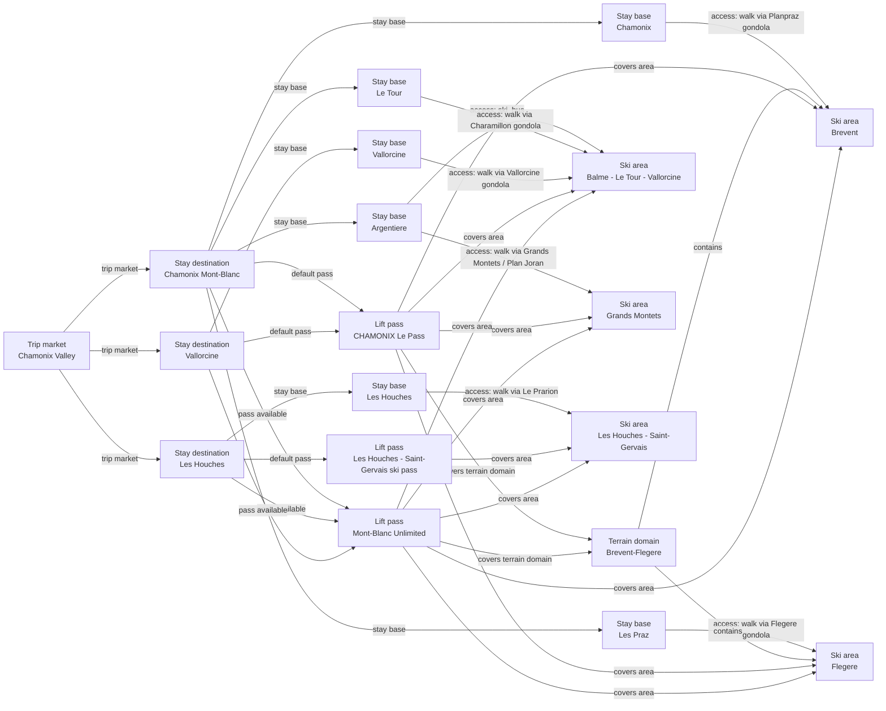

# Chamonix Valley Catalog Graph Remediation

Reconciles the complete Chamonix Valley stay, access, terrain, pass, weather-owner, and trust graph after dual review. Brévent and Flégère become separate weather owners while their officially supported connectivity, elevations, and shared map move to a terrain domain.

## Resulting Graph

## Reviewed Targets

| Target | Scope | Graph Role | Required Fields |
| --- | --- | --- | --- |
| `lift_pass_product:chamonix-le-pass` | `full` | `focus` | all canonical fields |
| `lift_pass_product:les-houches-saint-gervais-skipass` | `full` | `focus` | all canonical fields |
| `lift_pass_product:mont-blanc-unlimited` | `full` | `focus` | all canonical fields |
| `ski_area:balme-le-tour-vallorcine` | `full` | `focus` | all canonical fields |
| `ski_area:brevent` | `full` | `focus` | all canonical fields |
| `ski_area:flegere` | `full` | `focus` | all canonical fields |
| `ski_area:grands-montets` | `full` | `focus` | all canonical fields |
| `ski_area:les-houches-saint-gervais` | `full` | `focus` | all canonical fields |
| `ski_area_access:chamonix-mont-blanc-argentiere--balme-le-tour-vallorcine` | `full` | `focus` | all canonical fields |
| `ski_area_access:chamonix-mont-blanc-argentiere--grands-montets` | `full` | `focus` | all canonical fields |
| `ski_area_access:chamonix-mont-blanc-chamonix--brevent` | `full` | `focus` | all canonical fields |
| `ski_area_access:chamonix-mont-blanc-le-tour--balme-le-tour-vallorcine` | `full` | `focus` | all canonical fields |
| `ski_area_access:chamonix-mont-blanc-les-houches--les-houches-saint-gervais` | `full` | `focus` | all canonical fields |
| `ski_area_access:chamonix-mont-blanc-les-praz--flegere` | `full` | `focus` | all canonical fields |
| `ski_area_access:vallorcine-vallorcine--balme-le-tour-vallorcine` | `full` | `focus` | all canonical fields |
| `ski_region:chamonix-valley` | `full` | `focus` | all canonical fields |
| `stay_base:chamonix-mont-blanc-argentiere` | `full` | `focus` | all canonical fields |
| `stay_base:chamonix-mont-blanc-chamonix` | `full` | `focus` | all canonical fields |
| `stay_base:chamonix-mont-blanc-le-tour` | `full` | `focus` | all canonical fields |
| `stay_base:chamonix-mont-blanc-les-houches` | `full` | `focus` | all canonical fields |
| `stay_base:chamonix-mont-blanc-les-praz` | `full` | `focus` | all canonical fields |
| `stay_base:vallorcine-vallorcine` | `full` | `focus` | all canonical fields |
| `stay_destination:chamonix-mont-blanc` | `full` | `focus` | all canonical fields |
| `stay_destination:les-houches` | `full` | `focus` | all canonical fields |
| `stay_destination:vallorcine` | `full` | `focus` | all canonical fields |
| `terrain_domain:brevent-flegere` | `full` | `focus` | all canonical fields |
| `ski_area:brevent-flegere` | `narrow` | `focus` | `base_elevation_m`, `glacier_terrain.availability`, `latitude`, `longitude`, `marked_freeride_routes.availability`, `name`, `night_skiing.availability`, `season_end_month`, `season_start_month`, `season_windows`, `ski_area_id`, `ski_day_apres_profile.availability`, `snow_park.availability`, `snowmaking.availability`, `snowmaking.coverage_basis`, `summit_elevation_m`, `supported_skill_levels`, `total_lift_count`, `total_piste_km` |
| `ski_area_access:chamonix-mont-blanc-chamonix--brevent-flegere` | `narrow` | `focus` | `access_mode`, `is_direct`, `lift_distance`, `nearest_lift_name`, `regional_data_ids`, `ski_area_access_id`, `ski_area_id`, `source_urls`, `stay_base_id` |
| `trust_manifest:lift_pass_products:chamonix-le-pass` | `narrow` | `focus` | `field_source_refs`, `field_statuses`, `notes` |
| `trust_manifest:lift_pass_products:les-houches-saint-gervais-skipass` | `narrow` | `focus` | `field_source_refs`, `field_statuses`, `notes` |
| `trust_manifest:lift_pass_products:mont-blanc-unlimited` | `narrow` | `focus` | `field_source_refs`, `field_statuses`, `notes` |
| `trust_manifest:ski_area_access:chamonix-mont-blanc-argentiere--balme-le-tour-vallorcine` | `narrow` | `focus` | `field_source_refs`, `field_statuses`, `notes` |
| `trust_manifest:ski_area_access:chamonix-mont-blanc-argentiere--grands-montets` | `narrow` | `focus` | `field_statuses`, `notes` |
| `trust_manifest:ski_area_access:chamonix-mont-blanc-chamonix--brevent` | `narrow` | `focus` | `display_name`, `field_source_refs`, `field_statuses`, `notes` |
| `trust_manifest:ski_area_access:chamonix-mont-blanc-chamonix--brevent-flegere` | `narrow` | `focus` | `display_name`, `field_source_refs`, `field_statuses`, `notes` |
| `trust_manifest:ski_area_access:chamonix-mont-blanc-le-tour--balme-le-tour-vallorcine` | `narrow` | `focus` | `display_name`, `field_source_refs`, `field_statuses`, `notes` |
| `trust_manifest:ski_area_access:chamonix-mont-blanc-les-houches--les-houches-saint-gervais` | `narrow` | `focus` | `field_source_refs`, `field_statuses`, `notes` |
| `trust_manifest:ski_area_access:chamonix-mont-blanc-les-praz--flegere` | `narrow` | `focus` | `display_name`, `field_source_refs`, `field_statuses`, `notes` |
| `trust_manifest:ski_area_access:vallorcine-vallorcine--balme-le-tour-vallorcine` | `narrow` | `focus` | `display_name`, `field_source_refs`, `field_statuses`, `notes` |
| `trust_manifest:ski_areas:balme-le-tour-vallorcine` | `narrow` | `focus` | `field_source_refs`, `field_statuses`, `notes` |
| `trust_manifest:ski_areas:brevent` | `narrow` | `focus` | `display_name`, `field_source_refs`, `field_statuses`, `notes` |
| `trust_manifest:ski_areas:brevent-flegere` | `narrow` | `focus` | `display_name`, `field_source_refs`, `field_statuses`, `notes` |
| `trust_manifest:ski_areas:flegere` | `narrow` | `focus` | `display_name`, `field_source_refs`, `field_statuses`, `notes` |
| `trust_manifest:ski_areas:grands-montets` | `narrow` | `focus` | `field_source_refs`, `field_statuses`, `notes` |
| `trust_manifest:ski_areas:les-houches-saint-gervais` | `narrow` | `focus` | `field_source_refs`, `field_statuses`, `notes` |
| `trust_manifest:ski_regions:chamonix-valley` | `narrow` | `focus` | `field_source_refs`, `field_statuses`, `notes` |
| `trust_manifest:stay_bases:chamonix-mont-blanc-argentiere` | `narrow` | `focus` | `field_source_refs`, `field_statuses`, `notes` |
| `trust_manifest:stay_bases:chamonix-mont-blanc-chamonix` | `narrow` | `focus` | `field_source_refs`, `field_statuses`, `notes` |
| `trust_manifest:stay_bases:chamonix-mont-blanc-le-tour` | `narrow` | `focus` | `display_name`, `field_source_refs`, `field_statuses`, `notes` |
| `trust_manifest:stay_bases:chamonix-mont-blanc-les-houches` | `narrow` | `focus` | `field_source_refs`, `field_statuses`, `notes` |
| `trust_manifest:stay_bases:chamonix-mont-blanc-les-praz` | `narrow` | `focus` | `display_name`, `field_source_refs`, `field_statuses`, `notes` |
| `trust_manifest:stay_bases:vallorcine-vallorcine` | `narrow` | `focus` | `display_name`, `field_source_refs`, `field_statuses`, `notes` |
| `trust_manifest:stay_destinations:chamonix-mont-blanc` | `narrow` | `focus` | `field_source_refs`, `field_statuses`, `notes` |
| `trust_manifest:stay_destinations:les-houches` | `narrow` | `focus` | `display_name`, `field_source_refs`, `field_statuses`, `notes` |
| `trust_manifest:stay_destinations:vallorcine` | `narrow` | `focus` | `display_name`, `field_source_refs`, `field_statuses`, `notes` |
| `trust_manifest:terrain_domains:brevent-flegere` | `narrow` | `focus` | `display_name`, `field_source_refs`, `field_statuses`, `notes` |

## Review Evidence Envelope

| Family | Source Kind | Source URLs | Candidate Kinds |
| --- | --- | --- | --- |
| `chamonix-stay-market-sources` | `destination_booking` | [https://booking.chamonix.com/en/serp?ref_c.LOCATION=cmb.houches&s_c.ACCOMMODATION=chalet%2Capartment&type=chalet%2Capartment](https://booking.chamonix.com/en/serp?ref_c.LOCATION=cmb.houches&s_c.ACCOMMODATION=chalet%2Capartment&type=chalet%2Capartment), [https://booking.chamonix.com/en/serp?ref_c.LOCATION=cmb.vallorcine&s_c.ACCOMMODATION=chalet%2Capartment&type=chalet%2Capartment](https://booking.chamonix.com/en/serp?ref_c.LOCATION=cmb.vallorcine&s_c.ACCOMMODATION=chalet%2Capartment&type=chalet%2Capartment), [https://en.chamonix.com/chamonix-mont-blanc-valley/geography-and-climate](https://en.chamonix.com/chamonix-mont-blanc-valley/geography-and-climate), [https://en.chamonix.com/chamonix-mont-blanc-valley/the-village-resorts](https://en.chamonix.com/chamonix-mont-blanc-valley/the-village-resorts), [https://en.chamonix.com/chamonix-mont-blanc-valley/the-village-resorts/argentiere](https://en.chamonix.com/chamonix-mont-blanc-valley/the-village-resorts/argentiere), [https://en.chamonix.com/chamonix-mont-blanc-valley/the-village-resorts/les-houches](https://en.chamonix.com/chamonix-mont-blanc-valley/the-village-resorts/les-houches), [https://en.chamonix.com/chamonix-mont-blanc-valley/the-village-resorts/vallorcine](https://en.chamonix.com/chamonix-mont-blanc-valley/the-village-resorts/vallorcine), [https://en.chamonix.com/plan-my-stay/accommodation/holiday-centre-group/vacation-village-chalets-des-aiguilles-odcv-19?espace_congres=124174](https://en.chamonix.com/plan-my-stay/accommodation/holiday-centre-group/vacation-village-chalets-des-aiguilles-odcv-19?espace_congres=124174), [https://en.chamonix.com/plan-my-stay/accommodation/hotels/big-sky-hotel?espace_congres=124173](https://en.chamonix.com/plan-my-stay/accommodation/hotels/big-sky-hotel?espace_congres=124173), [https://en.chamonix.com/plan-my-stay/accommodation/hotels/vallorcine-hotel/hotel-du-buet-et-de-la-gare](https://en.chamonix.com/plan-my-stay/accommodation/hotels/vallorcine-hotel/hotel-du-buet-et-de-la-gare), [https://en.chamonix.com/plan-my-stay/accommodation/seasonal-rental/appartement-jorasses](https://en.chamonix.com/plan-my-stay/accommodation/seasonal-rental/appartement-jorasses), [https://en.chamonix.com/planifier-mon-sejour/hebergements/agences-immobilieres-locations/location-vacances-chamonix/chalet-scierie](https://en.chamonix.com/planifier-mon-sejour/hebergements/agences-immobilieres-locations/location-vacances-chamonix/chalet-scierie), [https://www.chamonix.com/sites/default/files/media/brochures/Plan_Argentiere.pdf](https://www.chamonix.com/sites/default/files/media/brochures/Plan_Argentiere.pdf), [https://www.openstreetmap.org/node/285883299](https://www.openstreetmap.org/node/285883299), [https://www.openstreetmap.org/relation/104826](https://www.openstreetmap.org/relation/104826), [https://www.openstreetmap.org/relation/104843](https://www.openstreetmap.org/relation/104843) | `stay_destination`, `stay_base` |
| `chamonix-operator-area-sources` | `ski_area_operator` | [https://domaineschamonix.montblancnaturalresort.com/en/info-live/brevent](https://domaineschamonix.montblancnaturalresort.com/en/info-live/brevent), [https://domaineschamonix.montblancnaturalresort.com/en/info-live/flegere](https://domaineschamonix.montblancnaturalresort.com/en/info-live/flegere), [https://domaineschamonix.montblancnaturalresort.com/en/page/easy-skiing](https://domaineschamonix.montblancnaturalresort.com/en/page/easy-skiing), [https://domaineschamonix.montblancnaturalresort.com/en/page/ski](https://domaineschamonix.montblancnaturalresort.com/en/page/ski), [https://en.chamonix.com/activities/winter/skiing](https://en.chamonix.com/activities/winter/skiing), [https://en.chamonix.com/things-to-see-and-do/altitudes-and-lifts](https://en.chamonix.com/things-to-see-and-do/altitudes-and-lifts), [https://en.chamonix.com/things-to-see-and-do/sports-and-outdoor/skiing-in-chamonix-mont-blanc-valley/list-of-ski-areas/domaine-debutant-du-tourchet](https://en.chamonix.com/things-to-see-and-do/sports-and-outdoor/skiing-in-chamonix-mont-blanc-valley/list-of-ski-areas/domaine-debutant-du-tourchet), [https://en.chamonix.com/things-to-see-and-do/sports-and-outdoor/skiing-in-chamonix-mont-blanc-valley/list-of-ski-areas/domaine-skiable-la-vormaine](https://en.chamonix.com/things-to-see-and-do/sports-and-outdoor/skiing-in-chamonix-mont-blanc-valley/list-of-ski-areas/domaine-skiable-la-vormaine), [https://en.chamonix.com/things-to-see-and-do/sports-and-outdoor/skiing-in-chamonix-mont-blanc-valley/list-of-ski-areas/le-savoy-ski-area?espace_congres=124174](https://en.chamonix.com/things-to-see-and-do/sports-and-outdoor/skiing-in-chamonix-mont-blanc-valley/list-of-ski-areas/le-savoy-ski-area?espace_congres=124174), [https://tourism.saintgervais.com/my-inspiration/skiing-in-saint-gervais-mont-blanc/discover-our-ski-areas/](https://tourism.saintgervais.com/my-inspiration/skiing-in-saint-gervais-mont-blanc/discover-our-ski-areas/), [https://www.openstreetmap.org/node/3431633966](https://www.openstreetmap.org/node/3431633966), [https://www.openstreetmap.org/node/3722799505](https://www.openstreetmap.org/node/3722799505), [https://www.saintgervais.com/je-minspire/ski/decouvrir-nos-domaines-skiables/](https://www.saintgervais.com/je-minspire/ski/decouvrir-nos-domaines-skiables/) | `ski_area`, `terrain_domain`, `stay_base`, `ski_area_access` |
| `chamonix-pass-product-sources` | `pass_tariff` | [https://domaineschamonix.montblancnaturalresort.com/en/ticketing/chamonix-lepass](https://domaineschamonix.montblancnaturalresort.com/en/ticketing/chamonix-lepass), [https://leshouches.montblancnaturalresort.com/en/ticketing/houches-saint-gervais-skipass](https://leshouches.montblancnaturalresort.com/en/ticketing/houches-saint-gervais-skipass), [https://www.montblancnaturalresort.com/en/ticketing/montblanc-unlimited](https://www.montblancnaturalresort.com/en/ticketing/montblanc-unlimited) | `lift_pass_product`, `ski_area`, `terrain_domain` |
| `chamonix-access-topology-sources` | `access_transport` | [https://domaineschamonix.montblancnaturalresort.com/en/access-and-maps/balme](https://domaineschamonix.montblancnaturalresort.com/en/access-and-maps/balme), [https://domaineschamonix.montblancnaturalresort.com/en/access-and-maps/brevent](https://domaineschamonix.montblancnaturalresort.com/en/access-and-maps/brevent), [https://domaineschamonix.montblancnaturalresort.com/en/access-and-maps/grands-montets](https://domaineschamonix.montblancnaturalresort.com/en/access-and-maps/grands-montets), [https://domaineschamonix.montblancnaturalresort.com/en/area/brevent](https://domaineschamonix.montblancnaturalresort.com/en/area/brevent), [https://domaineschamonix.montblancnaturalresort.com/en/area/flegere](https://domaineschamonix.montblancnaturalresort.com/en/area/flegere), [https://leshouches.montblancnaturalresort.com/en/access-and-maps](https://leshouches.montblancnaturalresort.com/en/access-and-maps) | `ski_area_access`, `ski_area`, `stay_base`, `terrain_domain` |

## Entity Scope Assessments

| Candidate | Kind | Disposition | Signals | Catalog Targets | Evidence | Backlog | Graph Impact | Rationale |
| --- | --- | --- | --- | --- | --- | --- | --- | --- |
| `chamonix-le-pass` (chamonix le pass) | `lift_pass_product` | `represented` | `official_product_identity`, `full_local_pass` | `lift_pass_product:chamonix-le-pass` | `scope-target-lift-pass-product-chamonix-le-pass` |  | `graph_blocking` | The entity remains represented in the complete reviewed graph. |
| `les-houches-saint-gervais-skipass` (les houches saint gervais skipass) | `lift_pass_product` | `represented` | `official_product_identity`, `full_local_pass` | `lift_pass_product:les-houches-saint-gervais-skipass` | `scope-target-lift-pass-product-les-houches-saint-gervais-skipass` |  | `graph_blocking` | The entity remains represented in the complete reviewed graph. |
| `mont-blanc-unlimited` (mont blanc unlimited) | `lift_pass_product` | `represented` | `official_product_identity`, `full_local_pass` | `lift_pass_product:mont-blanc-unlimited` | `scope-target-lift-pass-product-mont-blanc-unlimited` |  | `graph_blocking` | The entity remains represented in the complete reviewed graph. |
| `balme-le-tour-vallorcine` (balme le tour vallorcine) | `ski_area` | `represented` | `official_independent_identity`, `independent_status_or_schedule`, `independent_weather_presentation` | `ski_area:balme-le-tour-vallorcine` | `scope-target-ski-area-balme-le-tour-vallorcine` |  | `graph_blocking` | The entity remains represented in the complete reviewed graph. |
| `brevent` (brevent) | `ski_area` | `add_entity` | `official_independent_identity`, `independent_status_or_schedule`, `independent_weather_presentation` | `ski_area:brevent` | `scope-target-ski-area-brevent` |  | `graph_blocking` | The complete source-backed graph requires this new normalized entity. |
| `flegere` (flegere) | `ski_area` | `add_entity` | `official_independent_identity`, `independent_status_or_schedule`, `independent_weather_presentation` | `ski_area:flegere` | `scope-target-ski-area-flegere` |  | `graph_blocking` | The complete source-backed graph requires this new normalized entity. |
| `grands-montets` (grands montets) | `ski_area` | `represented` | `official_independent_identity`, `independent_status_or_schedule`, `independent_weather_presentation` | `ski_area:grands-montets` | `scope-target-ski-area-grands-montets` |  | `graph_blocking` | The entity remains represented in the complete reviewed graph. |
| `les-houches-saint-gervais` (les houches saint gervais) | `ski_area` | `represented` | `official_independent_identity`, `separate_operator`, `independent_status_or_schedule`, `independent_weather_presentation`, `full_local_pass` | `ski_area:les-houches-saint-gervais` | `scope-target-ski-area-les-houches-saint-gervais` |  | `graph_blocking` | The entity remains represented in the complete reviewed graph. |
| `chamonix-mont-blanc-argentiere--balme-le-tour-vallorcine` (chamonix mont blanc argentiere  balme le tour vallorcine) | `ski_area_access` | `represented` | `direct_access_relationship` | `ski_area_access:chamonix-mont-blanc-argentiere--balme-le-tour-vallorcine` | `scope-target-ski-area-access-chamonix-mont-blanc-argentiere-balme-le-tour-vallorcine` |  | `graph_blocking` | The entity remains represented in the complete reviewed graph. |
| `chamonix-mont-blanc-argentiere--grands-montets` (chamonix mont blanc argentiere  grands montets) | `ski_area_access` | `represented` | `direct_access_relationship` | `ski_area_access:chamonix-mont-blanc-argentiere--grands-montets` | `scope-target-ski-area-access-chamonix-mont-blanc-argentiere-grands-montets` |  | `graph_blocking` | The entity remains represented in the complete reviewed graph. |
| `chamonix-mont-blanc-chamonix--brevent` (chamonix mont blanc chamonix  brevent) | `ski_area_access` | `add_entity` | `direct_access_relationship` | `ski_area_access:chamonix-mont-blanc-chamonix--brevent` | `scope-target-ski-area-access-chamonix-mont-blanc-chamonix-brevent` |  | `graph_blocking` | The complete source-backed graph requires this new normalized entity. |
| `chamonix-mont-blanc-le-tour--balme-le-tour-vallorcine` (chamonix mont blanc le tour  balme le tour vallorcine) | `ski_area_access` | `add_entity` | `direct_access_relationship` | `ski_area_access:chamonix-mont-blanc-le-tour--balme-le-tour-vallorcine` | `scope-target-ski-area-access-chamonix-mont-blanc-le-tour-balme-le-tour-vallorcine` |  | `graph_blocking` | The complete source-backed graph requires this new normalized entity. |
| `chamonix-mont-blanc-les-houches--les-houches-saint-gervais` (chamonix mont blanc les houches  les houches saint gervais) | `ski_area_access` | `represented` | `direct_access_relationship` | `ski_area_access:chamonix-mont-blanc-les-houches--les-houches-saint-gervais` | `scope-target-ski-area-access-chamonix-mont-blanc-les-houches-les-houches-saint-gervais` |  | `graph_blocking` | The entity remains represented in the complete reviewed graph. |
| `chamonix-mont-blanc-les-praz--flegere` (chamonix mont blanc les praz  flegere) | `ski_area_access` | `add_entity` | `direct_access_relationship` | `ski_area_access:chamonix-mont-blanc-les-praz--flegere` | `scope-target-ski-area-access-chamonix-mont-blanc-les-praz-flegere` |  | `graph_blocking` | The complete source-backed graph requires this new normalized entity. |
| `vallorcine-vallorcine--balme-le-tour-vallorcine` (vallorcine vallorcine  balme le tour vallorcine) | `ski_area_access` | `add_entity` | `direct_access_relationship` | `ski_area_access:vallorcine-vallorcine--balme-le-tour-vallorcine` | `scope-target-ski-area-access-vallorcine-vallorcine-balme-le-tour-vallorcine` |  | `graph_blocking` | The complete source-backed graph requires this new normalized entity. |
| `chamonix-mont-blanc-argentiere` (chamonix mont blanc argentiere) | `stay_base` | `represented` | `official_independent_identity`, `distinct_access` | `stay_base:chamonix-mont-blanc-argentiere` | `scope-target-stay-base-chamonix-mont-blanc-argentiere` |  | `graph_blocking` | The entity remains represented in the complete reviewed graph. |
| `chamonix-mont-blanc-chamonix` (chamonix mont blanc chamonix) | `stay_base` | `represented` | `official_independent_identity`, `distinct_access` | `stay_base:chamonix-mont-blanc-chamonix` | `scope-target-stay-base-chamonix-mont-blanc-chamonix` |  | `graph_blocking` | The entity remains represented in the complete reviewed graph. |
| `chamonix-mont-blanc-le-tour` (chamonix mont blanc le tour) | `stay_base` | `add_entity` | `official_independent_identity`, `distinct_access` | `stay_base:chamonix-mont-blanc-le-tour` | `scope-target-stay-base-chamonix-mont-blanc-le-tour` |  | `graph_blocking` | The complete source-backed graph requires this new normalized entity. |
| `chamonix-mont-blanc-les-houches` (chamonix mont blanc les houches) | `stay_base` | `represented` | `official_independent_identity`, `distinct_access` | `stay_base:chamonix-mont-blanc-les-houches` | `scope-target-stay-base-chamonix-mont-blanc-les-houches` |  | `graph_blocking` | The entity remains represented in the complete reviewed graph. |
| `chamonix-mont-blanc-les-praz` (chamonix mont blanc les praz) | `stay_base` | `add_entity` | `official_independent_identity`, `distinct_access` | `stay_base:chamonix-mont-blanc-les-praz` | `scope-target-stay-base-chamonix-mont-blanc-les-praz` |  | `graph_blocking` | The complete source-backed graph requires this new normalized entity. |
| `vallorcine-vallorcine` (vallorcine vallorcine) | `stay_base` | `add_entity` | `official_independent_identity`, `distinct_access` | `stay_base:vallorcine-vallorcine` | `scope-target-stay-base-vallorcine-vallorcine` |  | `graph_blocking` | The complete source-backed graph requires this new normalized entity. |
| `chamonix-mont-blanc` (chamonix mont blanc) | `stay_destination` | `represented` | `independent_stay_market` | `stay_destination:chamonix-mont-blanc` | `scope-target-stay-destination-chamonix-mont-blanc` |  | `graph_blocking` | The entity remains represented in the complete reviewed graph. |
| `les-houches` (les houches) | `stay_destination` | `add_entity` | `independent_stay_market` | `stay_destination:les-houches` | `scope-target-stay-destination-les-houches` |  | `graph_blocking` | The complete source-backed graph requires this new normalized entity. |
| `vallorcine` (vallorcine) | `stay_destination` | `add_entity` | `independent_stay_market` | `stay_destination:vallorcine` | `scope-target-stay-destination-vallorcine` |  | `graph_blocking` | The complete source-backed graph requires this new normalized entity. |
| `brevent-flegere` (brevent flegere) | `terrain_domain` | `add_entity` | `ski_connected_terrain` | `terrain_domain:brevent-flegere` | `scope-target-terrain-domain-brevent-flegere` |  | `graph_blocking` | Official sources require a connected Brévent-Flégère terrain domain for membership, elevations, and the shared trail map. Exact combined piste-kilometre and lift-count totals remain unmodeled because the frozen official packet does not support them. |
| `le-tour-sector` (Le Tour sector) | `ski_area` | `not_separate` | `official_map_sector` | `ski_area:balme-le-tour-vallorcine` | `inventory-easy`, `inventory-skiing` |  | `graph_blocking` | The reviewed source presents this as a parent-owned sector or lift origin, not a separate complete weather owner. |
| `vallorcine-sector` (Vallorcine sector) | `ski_area` | `not_separate` | `official_map_sector` | `ski_area:balme-le-tour-vallorcine` | `inventory-easy`, `inventory-skiing` |  | `graph_blocking` | The reviewed source presents this as a parent-owned sector or lift origin, not a separate complete weather owner. |
| `plateau-2000` (Plateau 2000) | `ski_area` | `not_separate` | `official_map_sector` | `ski_area:brevent` | `inventory-easy`, `inventory-skiing` |  | `graph_blocking` | The reviewed source presents this as a parent-owned sector or lift origin, not a separate complete weather owner. |
| `flegere-beginner-sector` (Flegere beginner sector) | `ski_area` | `not_separate` | `official_map_sector` | `ski_area:flegere` | `inventory-easy`, `inventory-skiing` |  | `graph_blocking` | The reviewed source presents this as a parent-owned sector or lift origin, not a separate complete weather owner. |
| `plateau-de-lognan` (Plateau de Lognan) | `ski_area` | `not_separate` | `official_map_sector` | `ski_area:grands-montets` | `inventory-easy`, `inventory-skiing` |  | `graph_blocking` | The reviewed source presents this as a parent-owned sector or lift origin, not a separate complete weather owner. |
| `bellevue-prarion-sectors` (Bellevue and Prarion sectors) | `ski_area` | `not_separate` | `official_map_sector` | `ski_area:les-houches-saint-gervais` | `inventory-easy`, `inventory-skiing` |  | `graph_blocking` | The reviewed source presents this as a parent-owned sector or lift origin, not a separate complete weather owner. |
| `les-planards` (les planards) | `ski_area` | `deferred` | `official_independent_identity` |  | `inventory-easy` | `docs/product-backlog.md#chamonix-valley-catalog-follow-ups` | `regional_followup` | Source-backed candidate retained for a bounded follow-up because its complete endpoint, weather-owner, or product graph is outside this remediation cycle. |
| `les-chosalets` (les chosalets) | `ski_area` | `deferred` | `official_independent_identity` |  | `inventory-easy` | `docs/product-backlog.md#chamonix-valley-catalog-follow-ups` | `regional_followup` | Source-backed candidate retained for a bounded follow-up because its complete endpoint, weather-owner, or product graph is outside this remediation cycle. |
| `la-poya` (la poya) | `ski_area` | `deferred` | `official_independent_identity` |  | `inventory-easy` | `docs/product-backlog.md#chamonix-valley-catalog-follow-ups` | `regional_followup` | Source-backed candidate retained for a bounded follow-up because its complete endpoint, weather-owner, or product graph is outside this remediation cycle. |
| `la-vormaine` (la vormaine) | `ski_area` | `deferred` | `official_independent_identity` |  | `inventory-easy` | `docs/product-backlog.md#chamonix-valley-catalog-follow-ups` | `regional_followup` | Source-backed candidate retained for a bounded follow-up because its complete endpoint, weather-owner, or product graph is outside this remediation cycle. |
| `le-tourchet` (le tourchet) | `ski_area` | `deferred` | `official_independent_identity` |  | `inventory-easy` | `docs/product-backlog.md#chamonix-valley-catalog-follow-ups` | `regional_followup` | Source-backed candidate retained for a bounded follow-up because its complete endpoint, weather-owner, or product graph is outside this remediation cycle. |
| `le-savoy` (le savoy) | `ski_area` | `deferred` | `official_independent_identity` |  | `inventory-easy` | `docs/product-backlog.md#chamonix-valley-catalog-follow-ups` | `regional_followup` | Source-backed candidate retained for a bounded follow-up because its complete endpoint, weather-owner, or product graph is outside this remediation cycle. |
| `chamonix-mont-blanc-planards` (Planards) | `stay_base` | `unresolved` | `distinct_access` |  | `inventory-stay-base-planards` | `docs/product-backlog.md#chamonix-valley-catalog-follow-ups` | `regional_followup` | Official lodging evidence identifies Planards as an accommodation/access candidate, but the current source packet does not resolve whether it owns a separate complete stay-base graph. |
| `chamonix-mont-blanc-chosalets` (Les Chosalets) | `stay_base` | `unresolved` | `distinct_access` |  | `inventory-stay-base-chosalets` | `docs/product-backlog.md#chamonix-valley-catalog-follow-ups` | `regional_followup` | Official lodging evidence identifies a Les Chosalets address and access stop, but the current source packet does not resolve independent stay-market ownership or a complete access graph. |
| `vallorcine-le-buet` (Le Buet) | `stay_base` | `deferred` | `distinct_access` |  | `inventory-stay-base-le-buet` | `docs/product-backlog.md#chamonix-valley-catalog-follow-ups` | `regional_followup` | Official lodging evidence identifies Le Buet by its station and La Poya access, but the complete independent stay-base and access graph remains outside this narrow remediation. |
| `chamonix-mont-blanc-la-vormaine` (La Vormaine) | `stay_base` | `not_separate` | `distinct_access` | `stay_base:chamonix-mont-blanc-le-tour` | `inventory-stay-base-la-vormaine-location` |  | `graph_blocking` | The official source locates La Vormaine at the foot of Balme and names Le Tour as the access stop, so it is an access location owned by the existing Le Tour stay base rather than a separate stay-base graph. |
| `les-houches-le-tourchet` (Le Tourchet) | `stay_base` | `not_separate` | `distinct_access` | `stay_base:chamonix-mont-blanc-les-houches` | `inventory-stay-base-le-tourchet-location` |  | `graph_blocking` | The official source identifies Le Tourchet as the beginner area in Les Houches, so it is an access location owned by the existing Les Houches stay base rather than a separate stay-base graph. |
| `chamonix-mont-blanc-le-savoy` (Le Savoy) | `stay_base` | `not_separate` | `distinct_access` | `stay_base:chamonix-mont-blanc-chamonix` | `inventory-stay-base-le-savoy-location` |  | `graph_blocking` | The official source places Le Savoy in the heart of Chamonix, so it is an access location owned by the existing Chamonix stay base rather than a separate stay-base graph. |
| `chamonix-mont-blanc-les-tines` (Les Tines) | `stay_base` | `unresolved` | `distinct_access` |  | `inventory-stay-base-les-tines` | `docs/product-backlog.md#chamonix-valley-catalog-follow-ups` | `regional_followup` | Official lodging evidence identifies Les Tines as a candidate hamlet, but the current source packet does not resolve complete stay-market ownership or ski-area access provenance. |
| `chamonix-mont-blanc-les-bossons` (Les Bossons) | `stay_base` | `unresolved` | `distinct_access` |  | `inventory-stay-base-les-bossons` | `docs/product-backlog.md#chamonix-valley-catalog-follow-ups` | `regional_followup` | Official lodging evidence identifies Les Bossons as a candidate village, but the current source packet does not resolve complete stay-market ownership or ski-area access provenance. |
| `saint-gervais-le-fayet` (saint gervais le fayet) | `stay_base` | `deferred` | `distinct_access` |  | `inventory-saint-gervais` | `docs/product-backlog.md#chamonix-valley-catalog-follow-ups` | `regional_followup` | Source-backed candidate retained for a bounded follow-up because its complete endpoint, weather-owner, or product graph is outside this remediation cycle. |
| `servoz-servoz` (servoz servoz) | `stay_base` | `deferred` | `distinct_access` |  | `inventory-villages` | `docs/product-backlog.md#chamonix-valley-catalog-follow-ups` | `regional_followup` | Source-backed candidate retained for a bounded follow-up because its complete endpoint, weather-owner, or product graph is outside this remediation cycle. |
| `chamonix-mont-blanc-planards--les-planards` (chamonix mont blanc planards  les planards) | `ski_area_access` | `deferred` | `direct_access_relationship` |  | `inventory-easy` | `docs/product-backlog.md#chamonix-valley-catalog-follow-ups` | `regional_followup` | Source-backed candidate retained for a bounded follow-up because its complete endpoint, weather-owner, or product graph is outside this remediation cycle. |
| `chamonix-mont-blanc-chosalets--les-chosalets` (chamonix mont blanc chosalets  les chosalets) | `ski_area_access` | `deferred` | `direct_access_relationship` |  | `inventory-easy` | `docs/product-backlog.md#chamonix-valley-catalog-follow-ups` | `regional_followup` | Source-backed candidate retained for a bounded follow-up because its complete endpoint, weather-owner, or product graph is outside this remediation cycle. |
| `vallorcine-le-buet--la-poya` (vallorcine le buet  la poya) | `ski_area_access` | `deferred` | `direct_access_relationship` |  | `inventory-easy` | `docs/product-backlog.md#chamonix-valley-catalog-follow-ups` | `regional_followup` | Source-backed candidate retained for a bounded follow-up because its complete endpoint, weather-owner, or product graph is outside this remediation cycle. |
| `chamonix-mont-blanc-le-tour--la-vormaine` (Le Tour access to La Vormaine) | `ski_area_access` | `deferred` | `direct_access_relationship` |  | `inventory-stay-base-la-vormaine-location` | `docs/product-backlog.md#chamonix-valley-catalog-follow-ups` | `regional_followup` | Source-backed candidate retained for a bounded follow-up because its complete endpoint, weather-owner, or product graph is outside this remediation cycle. |
| `chamonix-mont-blanc-les-houches--le-tourchet` (Les Houches access to Le Tourchet) | `ski_area_access` | `deferred` | `direct_access_relationship` |  | `inventory-stay-base-le-tourchet-location` | `docs/product-backlog.md#chamonix-valley-catalog-follow-ups` | `regional_followup` | Source-backed candidate retained for a bounded follow-up because its complete endpoint, weather-owner, or product graph is outside this remediation cycle. |
| `chamonix-mont-blanc-chamonix--le-savoy` (Chamonix access to Le Savoy) | `ski_area_access` | `deferred` | `direct_access_relationship` |  | `inventory-stay-base-le-savoy-location` | `docs/product-backlog.md#chamonix-valley-catalog-follow-ups` | `regional_followup` | Source-backed candidate retained for a bounded follow-up because its complete endpoint, weather-owner, or product graph is outside this remediation cycle. |
| `saint-gervais-le-fayet--les-houches-saint-gervais` (saint gervais le fayet  les houches saint gervais) | `ski_area_access` | `deferred` | `direct_access_relationship` |  | `inventory-saint-gervais` | `docs/product-backlog.md#chamonix-valley-catalog-follow-ups` | `regional_followup` | Source-backed candidate retained for a bounded follow-up because its complete endpoint, weather-owner, or product graph is outside this remediation cycle. |
| `les-planards-local` (les planards local) | `lift_pass_product` | `deferred` | `official_product_identity` |  | `inventory-lepass` | `docs/product-backlog.md#chamonix-valley-catalog-follow-ups` | `regional_followup` | Source-backed candidate retained for a bounded follow-up because its complete endpoint, weather-owner, or product graph is outside this remediation cycle. |
| `les-chosalets-local` (les chosalets local) | `lift_pass_product` | `deferred` | `official_product_identity` |  | `inventory-lepass` | `docs/product-backlog.md#chamonix-valley-catalog-follow-ups` | `regional_followup` | Source-backed candidate retained for a bounded follow-up because its complete endpoint, weather-owner, or product graph is outside this remediation cycle. |
| `la-poya-local` (la poya local) | `lift_pass_product` | `deferred` | `official_product_identity` |  | `inventory-lepass` | `docs/product-backlog.md#chamonix-valley-catalog-follow-ups` | `regional_followup` | Source-backed candidate retained for a bounded follow-up because its complete endpoint, weather-owner, or product graph is outside this remediation cycle. |
| `la-vormaine-local` (la vormaine local) | `lift_pass_product` | `deferred` | `official_product_identity` |  | `inventory-lepass` | `docs/product-backlog.md#chamonix-valley-catalog-follow-ups` | `regional_followup` | Source-backed candidate retained for a bounded follow-up because its complete endpoint, weather-owner, or product graph is outside this remediation cycle. |
| `le-tourchet-local` (le tourchet local) | `lift_pass_product` | `deferred` | `official_product_identity` |  | `inventory-lepass` | `docs/product-backlog.md#chamonix-valley-catalog-follow-ups` | `regional_followup` | Source-backed candidate retained for a bounded follow-up because its complete endpoint, weather-owner, or product graph is outside this remediation cycle. |
| `le-savoy-local` (le savoy local) | `lift_pass_product` | `deferred` | `official_product_identity` |  | `inventory-lepass` | `docs/product-backlog.md#chamonix-valley-catalog-follow-ups` | `regional_followup` | Source-backed candidate retained for a bounded follow-up because its complete endpoint, weather-owner, or product graph is outside this remediation cycle. |
| `saint-gervais` (saint gervais) | `stay_destination` | `deferred` | `independent_stay_market` |  | `inventory-saint-gervais` | `docs/product-backlog.md#chamonix-valley-catalog-follow-ups` | `regional_followup` | Source-backed candidate retained for a bounded follow-up because its complete endpoint, weather-owner, or product graph is outside this remediation cycle. |
| `servoz` (servoz) | `stay_destination` | `deferred` | `independent_stay_market` |  | `inventory-villages` | `docs/product-backlog.md#chamonix-valley-catalog-follow-ups` | `regional_followup` | Source-backed candidate retained for a bounded follow-up because its complete endpoint, weather-owner, or product graph is outside this remediation cycle. |
| `aiguille-du-midi-vallee-blanche` (Aiguille du Midi and Vallee Blanche) | `ski_area` | `external_pass_context` | `disconnected_terrain` |  | `inventory-altitudes` |  | `graph_blocking` | Lift and itinerary context is not normalized as a groomed local ski-area weather owner. |
| `chamonix-le-pass-terrain-network` (Broad Chamonix Le Pass terrain network) | `terrain_domain` | `external_pass_context` | `full_local_pass` |  | `inventory-lepass` |  | `graph_blocking` | Pass-only coverage is not a ski-connected terrain domain; only the Brévent-Flégère pair is normalized as connected terrain. |
| `historical-brevent-flegere` (Historical ski_area:brevent-flegere identity) | `ski_area` | `external_pass_context` | `official_independent_identity`, `ski_connected_terrain` |  | `scope-historical-brevent-flegere-transition`, `scope-target-ski-area-brevent`, `scope-target-ski-area-flegere` |  | `graph_blocking` | The exact base used one combined weather/history owner. The current operator presents Brévent and Flégère separately while confirming their connection, so the policy-determined graph creates two new weather owners and one terrain domain that stores only the officially supported connectivity, elevations, and shared map. Preserve and soft-retire old database/archive/climatology rows; after merge, let the scheduled Complete Historical Weather workflow backfill the new brevent and flegere IDs. No retained-ID geometry refetch applies. |
| `argentiere` (Argentiere as a separate stay destination) | `stay_destination` | `not_separate` | `independent_stay_market` | `stay_destination:chamonix-mont-blanc` | `scope-argentiere-stay-destination-boundary`, `scope-target-stay-base-chamonix-mont-blanc-argentiere`, `scope-target-stay-destination-chamonix-mont-blanc` |  | `graph_blocking` | Official stay-market material presents Argentiere as a village-resort within the Chamonix Mont-Blanc destination. It supports a distinct stay base and direct ski access, but not a separate complete, independently owned accommodation market; the existing Chamonix destination therefore owns it. |
| `megeve` (Megeve) | `ski_area` | `external_pass_context` | `official_product_identity` |  | `scope-mbu-external-validity` |  | `graph_blocking` | The official Mont-Blanc Unlimited page names this scope for pass or attraction access. It is retained as truthful external validity only and does not become a local Snowcast entity or connected terrain relationship. |
| `evasion-saint-gervais` (Evasion Mont-Blanc and Saint-Gervais) | `terrain_domain` | `external_pass_context` | `official_product_identity` |  | `scope-mbu-external-validity` |  | `graph_blocking` | The official Mont-Blanc Unlimited page names this scope for pass or attraction access. It is retained as truthful external validity only and does not become a local Snowcast entity or connected terrain relationship. |
| `les-contamines` (Les Contamines) | `ski_area` | `external_pass_context` | `official_product_identity` |  | `scope-mbu-external-validity` |  | `graph_blocking` | The official Mont-Blanc Unlimited page names this scope for pass or attraction access. It is retained as truthful external validity only and does not become a local Snowcast entity or connected terrain relationship. |
| `saint-nicolas-de-veroce` (Saint-Nicolas-de-Veroce) | `ski_area` | `external_pass_context` | `official_product_identity` |  | `scope-mbu-external-validity` |  | `graph_blocking` | The official Mont-Blanc Unlimited page names this scope for pass or attraction access. It is retained as truthful external validity only and does not become a local Snowcast entity or connected terrain relationship. |
| `le-jaillet` (Le Jaillet) | `ski_area` | `external_pass_context` | `official_product_identity` |  | `scope-mbu-external-validity` |  | `graph_blocking` | The official Mont-Blanc Unlimited page names this scope for pass or attraction access. It is retained as truthful external validity only and does not become a local Snowcast entity or connected terrain relationship. |
| `combloux` (Combloux) | `ski_area` | `external_pass_context` | `official_product_identity` |  | `scope-mbu-external-validity` |  | `graph_blocking` | The official Mont-Blanc Unlimited page names this scope for pass or attraction access. It is retained as truthful external validity only and does not become a local Snowcast entity or connected terrain relationship. |
| `la-giettaz` (La Giettaz) | `ski_area` | `external_pass_context` | `official_product_identity` |  | `scope-mbu-external-validity` |  | `graph_blocking` | The official Mont-Blanc Unlimited page names this scope for pass or attraction access. It is retained as truthful external validity only and does not become a local Snowcast entity or connected terrain relationship. |
| `courmayeur` (Courmayeur) | `ski_area` | `external_pass_context` | `official_product_identity` |  | `scope-mbu-external-validity` |  | `graph_blocking` | The official Mont-Blanc Unlimited page names this scope for pass or attraction access. It is retained as truthful external validity only and does not become a local Snowcast entity or connected terrain relationship. |
| `crans-montana` (Crans-Montana) | `ski_area` | `external_pass_context` | `official_product_identity` |  | `scope-mbu-external-validity` |  | `graph_blocking` | The official Mont-Blanc Unlimited page names this scope for pass or attraction access. It is retained as truthful external validity only and does not become a local Snowcast entity or connected terrain relationship. |
| `montenvers-mer-de-glace` (Montenvers-Mer de Glace) | `terrain_domain` | `external_pass_context` | `official_product_identity` |  | `scope-mbu-external-validity` |  | `graph_blocking` | The official Mont-Blanc Unlimited page names this scope for pass or attraction access. It is retained as truthful external validity only and does not become a local Snowcast entity or connected terrain relationship. |
| `tramway-du-mont-blanc` (Tramway du Mont-Blanc) | `terrain_domain` | `external_pass_context` | `official_product_identity` |  | `scope-mbu-external-validity` |  | `graph_blocking` | The official Mont-Blanc Unlimited page names this scope for pass or attraction access. It is retained as truthful external validity only and does not become a local Snowcast entity or connected terrain relationship. |
| `skyway-monte-bianco` (Skyway Monte Bianco) | `terrain_domain` | `external_pass_context` | `official_product_identity` |  | `scope-mbu-external-validity` |  | `graph_blocking` | The official Mont-Blanc Unlimited page names this scope for pass or attraction access. It is retained as truthful external validity only and does not become a local Snowcast entity or connected terrain relationship. |

## Ski-Area Boundary Assessments

| Candidate | Parent | Terrain | Connectivity | Operations | Weather | Pass | Provider Consensus | Separation Value | Evidence |
| --- | --- | --- | --- | --- | --- | --- | --- | --- | --- |
| `balme-le-tour-vallorcine` |  | `complete` | `not_applicable` | `independent` | `independent` | `shared_only` | `separate` | `material` | `scope-target-ski-area-balme-le-tour-vallorcine` |
| `brevent` |  | `complete` | `not_applicable` | `independent` | `independent` | `shared_only` | `separate` | `material` | `scope-target-ski-area-brevent` |
| `flegere` |  | `complete` | `not_applicable` | `independent` | `independent` | `shared_only` | `separate` | `material` | `scope-target-ski-area-flegere` |
| `grands-montets` |  | `complete` | `not_applicable` | `independent` | `independent` | `shared_only` | `separate` | `material` | `scope-target-ski-area-grands-montets` |
| `les-houches-saint-gervais` |  | `complete` | `not_applicable` | `independent` | `independent` | `full_local` | `separate` | `material` | `scope-target-ski-area-les-houches-saint-gervais` |
| `le-tour-sector` | `balme-le-tour-vallorcine` | `sector` | `connected` | `parent_owned` | `parent_owned` | `shared_only` | `aggregated` | `redundant` | `inventory-easy`, `inventory-skiing` |
| `vallorcine-sector` | `balme-le-tour-vallorcine` | `sector` | `connected` | `parent_owned` | `parent_owned` | `shared_only` | `aggregated` | `redundant` | `inventory-easy`, `inventory-skiing` |
| `plateau-2000` | `brevent` | `sector` | `connected` | `parent_owned` | `parent_owned` | `shared_only` | `aggregated` | `redundant` | `inventory-easy`, `inventory-skiing` |
| `flegere-beginner-sector` | `flegere` | `sector` | `connected` | `parent_owned` | `parent_owned` | `shared_only` | `aggregated` | `redundant` | `inventory-easy`, `inventory-skiing` |
| `plateau-de-lognan` | `grands-montets` | `sector` | `connected` | `parent_owned` | `parent_owned` | `shared_only` | `aggregated` | `redundant` | `inventory-easy`, `inventory-skiing` |
| `bellevue-prarion-sectors` | `les-houches-saint-gervais` | `sector` | `connected` | `parent_owned` | `parent_owned` | `shared_only` | `aggregated` | `redundant` | `inventory-easy`, `inventory-skiing` |
| `les-planards` |  | `complete` | `not_applicable` | `independent` | `unknown` | `limited` | `separate` | `material` | `inventory-easy` |
| `les-chosalets` |  | `complete` | `not_applicable` | `independent` | `unknown` | `limited` | `separate` | `material` | `inventory-easy` |
| `la-poya` |  | `complete` | `not_applicable` | `independent` | `unknown` | `limited` | `separate` | `material` | `inventory-easy` |
| `la-vormaine` |  | `complete` | `not_applicable` | `independent` | `unknown` | `limited` | `separate` | `material` | `inventory-easy` |
| `le-tourchet` |  | `complete` | `not_applicable` | `independent` | `unknown` | `limited` | `separate` | `material` | `inventory-easy` |
| `le-savoy` | `brevent` | `sector` | `connected` | `mixed` | `unknown` | `limited` | `mixed` | `unresolved` | `inventory-easy` |
| `aiguille-du-midi-vallee-blanche` |  | `unresolved` | `not_applicable` | `unknown` | `unknown` | `shared_only` | `mixed` | `unresolved` | `inventory-altitudes` |
| `historical-brevent-flegere` |  | `complete` | `not_applicable` | `mixed` | `mixed` | `shared_only` | `separate` | `material` | `scope-historical-brevent-flegere-transition`, `scope-target-ski-area-brevent`, `scope-target-ski-area-flegere` |
| `megeve` |  | `unresolved` | `not_applicable` | `unknown` | `unknown` | `shared_only` | `unknown` | `unresolved` | `scope-mbu-external-validity` |
| `les-contamines` |  | `unresolved` | `not_applicable` | `unknown` | `unknown` | `shared_only` | `unknown` | `unresolved` | `scope-mbu-external-validity` |
| `saint-nicolas-de-veroce` |  | `unresolved` | `not_applicable` | `unknown` | `unknown` | `shared_only` | `unknown` | `unresolved` | `scope-mbu-external-validity` |
| `le-jaillet` |  | `unresolved` | `not_applicable` | `unknown` | `unknown` | `shared_only` | `unknown` | `unresolved` | `scope-mbu-external-validity` |
| `combloux` |  | `unresolved` | `not_applicable` | `unknown` | `unknown` | `shared_only` | `unknown` | `unresolved` | `scope-mbu-external-validity` |
| `la-giettaz` |  | `unresolved` | `not_applicable` | `unknown` | `unknown` | `shared_only` | `unknown` | `unresolved` | `scope-mbu-external-validity` |
| `courmayeur` |  | `unresolved` | `not_applicable` | `unknown` | `unknown` | `shared_only` | `unknown` | `unresolved` | `scope-mbu-external-validity` |
| `crans-montana` |  | `unresolved` | `not_applicable` | `unknown` | `unknown` | `shared_only` | `unknown` | `unresolved` | `scope-mbu-external-validity` |

## Changed Fields

| Target | Field | Before | After | Trust | Ranking Relevant |
| --- | --- | --- | --- | --- | --- |
| `lift_pass_product:chamonix-le-pass` | `available_from_stay_destination_ids` | `["chamonix-mont-blanc"]` | `["chamonix-mont-blanc", "vallorcine"]` | `verified_with_adjustment` | yes |
| `lift_pass_product:chamonix-le-pass` | `default_for_stay_destination_ids` | `["chamonix-mont-blanc"]` | `["chamonix-mont-blanc", "vallorcine"]` | `verified_with_adjustment` | yes |
| `lift_pass_product:chamonix-le-pass` | `terrain_domain_ids` | `[]` | `["brevent-flegere"]` | `verified_with_adjustment` | yes |
| `lift_pass_product:chamonix-le-pass` | `valid_ski_area_ids` | `["balme-le-tour-vallorcine", "brevent-flegere", "grands-montets"]` | `["balme-le-tour-vallorcine", "brevent", "flegere", "grands-montets"]` | `verified_with_adjustment` | yes |
| `lift_pass_product:les-houches-saint-gervais-skipass` | `available_from_stay_destination_ids` | `["chamonix-mont-blanc"]` | `["les-houches"]` | `verified_with_adjustment` | yes |
| `lift_pass_product:les-houches-saint-gervais-skipass` | `default_for_stay_destination_ids` | `[]` | `["les-houches"]` | `verified_with_adjustment` | yes |
| `lift_pass_product:mont-blanc-unlimited` | `available_from_stay_destination_ids` | `["chamonix-mont-blanc"]` | `["chamonix-mont-blanc", "les-houches", "vallorcine"]` | `verified_with_adjustment` | yes |
| `lift_pass_product:mont-blanc-unlimited` | `terrain_domain_ids` | `[]` | `["brevent-flegere"]` | `verified_with_adjustment` | yes |
| `lift_pass_product:mont-blanc-unlimited` | `valid_ski_area_ids` | `["balme-le-tour-vallorcine", "brevent-flegere", "grands-montets", "les-houches-saint-gervais"]` | `["balme-le-tour-vallorcine", "brevent", "flegere", "grands-montets", "les-houches-saint-gervais"]` | `verified_with_adjustment` | yes |
| `ski_area:balme-le-tour-vallorcine` | `official_trail_map.url` | `null` | `"https://domaineschamonix.montblancnaturalresort.com/en/access-and-maps/balme"` | `verified_with_adjustment` | no |
| `ski_area:brevent` | `base_elevation_m` | `null` | `2000` | `verified_with_adjustment` | no |
| `ski_area:brevent` | `glacier_terrain.availability` | `null` | `"unknown"` | `verified_with_adjustment` | no |
| `ski_area:brevent` | `latitude` | `null` | `45.9358506` | `verified_with_adjustment` | no |
| `ski_area:brevent` | `longitude` | `null` | `6.8525898` | `verified_with_adjustment` | no |
| `ski_area:brevent` | `marked_freeride_routes.availability` | `null` | `"unknown"` | `verified_with_adjustment` | no |
| `ski_area:brevent` | `name` | `null` | `"Brevent"` | `verified_with_adjustment` | no |
| `ski_area:brevent` | `night_skiing.availability` | `null` | `"unknown"` | `verified_with_adjustment` | no |
| `ski_area:brevent` | `season_end_month` | `null` | `4` | `verified_with_adjustment` | no |
| `ski_area:brevent` | `season_start_month` | `null` | `12` | `verified_with_adjustment` | no |
| `ski_area:brevent` | `season_windows` | `null` | `[]` | `verified_with_adjustment` | no |
| `ski_area:brevent` | `ski_area_id` | `null` | `"brevent"` | `verified_with_adjustment` | yes |
| `ski_area:brevent` | `ski_day_apres_profile.availability` | `null` | `"unknown"` | `verified_with_adjustment` | no |
| `ski_area:brevent` | `snow_park.availability` | `null` | `"available"` | `verified` | no |
| `ski_area:brevent` | `snow_park.park_count` | `null` | `1` | `verified` | no |
| `ski_area:brevent` | `snowmaking.availability` | `null` | `"unknown"` | `verified_with_adjustment` | no |
| `ski_area:brevent` | `snowmaking.coverage_basis` | `null` | `"unknown"` | `verified_with_adjustment` | no |
| `ski_area:brevent` | `summit_elevation_m` | `null` | `2525` | `verified_with_adjustment` | no |
| `ski_area:brevent` | `supported_skill_levels` | `null` | `["intermediate", "advanced"]` | `verified_with_adjustment` | no |
| `ski_area:brevent-flegere` | `base_elevation_m` | `1035` | `null` | `needs_source` | no |
| `ski_area:brevent-flegere` | `glacier_terrain.availability` | `"unknown"` | `null` | `needs_source` | no |
| `ski_area:brevent-flegere` | `latitude` | `45.9479` | `null` | `needs_source` | no |
| `ski_area:brevent-flegere` | `longitude` | `6.8686` | `null` | `needs_source` | no |
| `ski_area:brevent-flegere` | `marked_freeride_routes.availability` | `"unknown"` | `null` | `needs_source` | no |
| `ski_area:brevent-flegere` | `name` | `"Brevent-Flegere"` | `null` | `needs_source` | no |
| `ski_area:brevent-flegere` | `night_skiing.availability` | `"unknown"` | `null` | `needs_source` | no |
| `ski_area:brevent-flegere` | `season_end_month` | `4` | `null` | `needs_source` | no |
| `ski_area:brevent-flegere` | `season_start_month` | `12` | `null` | `needs_source` | no |
| `ski_area:brevent-flegere` | `season_windows` | `[]` | `null` | `needs_source` | no |
| `ski_area:brevent-flegere` | `ski_area_id` | `"brevent-flegere"` | `null` | `needs_source` | no |
| `ski_area:brevent-flegere` | `ski_day_apres_profile.availability` | `"unknown"` | `null` | `needs_source` | no |
| `ski_area:brevent-flegere` | `snow_park.availability` | `"unknown"` | `null` | `needs_source` | no |
| `ski_area:brevent-flegere` | `snowmaking.availability` | `"unknown"` | `null` | `needs_source` | no |
| `ski_area:brevent-flegere` | `snowmaking.coverage_basis` | `"unknown"` | `null` | `needs_source` | no |
| `ski_area:brevent-flegere` | `summit_elevation_m` | `2525` | `null` | `needs_source` | no |
| `ski_area:brevent-flegere` | `supported_skill_levels` | `["beginner", "intermediate", "advanced"]` | `null` | `needs_source` | no |
| `ski_area:brevent-flegere` | `total_lift_count` | `17` | `null` | `needs_source` | no |
| `ski_area:brevent-flegere` | `total_piste_km` | `56.0` | `null` | `needs_source` | no |
| `ski_area:flegere` | `base_elevation_m` | `null` | `1894` | `verified_with_adjustment` | no |
| `ski_area:flegere` | `glacier_terrain.availability` | `null` | `"unknown"` | `verified_with_adjustment` | no |
| `ski_area:flegere` | `latitude` | `null` | `45.9605371` | `verified_with_adjustment` | no |
| `ski_area:flegere` | `longitude` | `null` | `6.8870748` | `verified_with_adjustment` | no |
| `ski_area:flegere` | `marked_freeride_routes.availability` | `null` | `"unknown"` | `verified_with_adjustment` | no |
| `ski_area:flegere` | `name` | `null` | `"Flegere"` | `verified_with_adjustment` | no |
| `ski_area:flegere` | `night_skiing.availability` | `null` | `"unknown"` | `verified_with_adjustment` | no |
| `ski_area:flegere` | `season_end_month` | `null` | `4` | `verified_with_adjustment` | no |
| `ski_area:flegere` | `season_start_month` | `null` | `12` | `verified_with_adjustment` | no |
| `ski_area:flegere` | `season_windows` | `null` | `[]` | `verified_with_adjustment` | no |
| `ski_area:flegere` | `ski_area_id` | `null` | `"flegere"` | `verified_with_adjustment` | yes |
| `ski_area:flegere` | `ski_day_apres_profile.availability` | `null` | `"unknown"` | `verified_with_adjustment` | no |
| `ski_area:flegere` | `snow_park.availability` | `null` | `"unknown"` | `verified_with_adjustment` | no |
| `ski_area:flegere` | `snowmaking.availability` | `null` | `"unknown"` | `verified_with_adjustment` | no |
| `ski_area:flegere` | `snowmaking.coverage_basis` | `null` | `"unknown"` | `verified_with_adjustment` | no |
| `ski_area:flegere` | `summit_elevation_m` | `null` | `2396` | `verified_with_adjustment` | no |
| `ski_area:flegere` | `supported_skill_levels` | `null` | `["beginner", "intermediate"]` | `verified_with_adjustment` | no |
| `ski_area:grands-montets` | `official_trail_map.url` | `null` | `"https://domaineschamonix.montblancnaturalresort.com/en/access-and-maps/grands-montets"` | `verified` | no |
| `ski_area:les-houches-saint-gervais` | `official_trail_map.url` | `null` | `"https://leshouches.montblancnaturalresort.com/en/access-and-maps"` | `verified` | no |
| `ski_area:les-houches-saint-gervais` | `total_lift_count` | `14` | `15` | `verified_with_adjustment` | yes |
| `ski_area:les-houches-saint-gervais` | `total_piste_km` | `31.0` | `55.0` | `verified_with_adjustment` | yes |
| `ski_area_access:chamonix-mont-blanc-argentiere--balme-le-tour-vallorcine` | `source_urls` | `["https://en.chamonix.com/things-to-see-and-do/sports-and-outdoor/skiing-in-chamonix-mont-blanc-valley/list-of-ski-areas/ski-area-balme-vallorcine?espace_congres=124173"]` | `["https://domaineschamonix.montblancnaturalresort.com/en/access-and-maps/balme"]` | `verified_with_adjustment` | no |
| `ski_area_access:chamonix-mont-blanc-chamonix--brevent` | `access_mode` | `null` | `"walk"` | `verified_with_adjustment` | no |
| `ski_area_access:chamonix-mont-blanc-chamonix--brevent` | `is_direct` | `null` | `true` | `verified_with_adjustment` | no |
| `ski_area_access:chamonix-mont-blanc-chamonix--brevent` | `lift_distance` | `null` | `"near"` | `verified_with_adjustment` | no |
| `ski_area_access:chamonix-mont-blanc-chamonix--brevent` | `nearest_lift_name` | `null` | `"Planpraz gondola"` | `verified_with_adjustment` | no |
| `ski_area_access:chamonix-mont-blanc-chamonix--brevent` | `regional_data_ids` | `null` | `{}` | `verified_with_adjustment` | no |
| `ski_area_access:chamonix-mont-blanc-chamonix--brevent` | `ski_area_access_id` | `null` | `"chamonix-mont-blanc-chamonix--brevent"` | `verified_with_adjustment` | no |
| `ski_area_access:chamonix-mont-blanc-chamonix--brevent` | `ski_area_id` | `null` | `"brevent"` | `verified_with_adjustment` | yes |
| `ski_area_access:chamonix-mont-blanc-chamonix--brevent` | `source_urls` | `null` | `["https://domaineschamonix.montblancnaturalresort.com/en/area/brevent"]` | `verified_with_adjustment` | no |
| `ski_area_access:chamonix-mont-blanc-chamonix--brevent` | `stay_base_id` | `null` | `"chamonix-mont-blanc-chamonix"` | `verified_with_adjustment` | yes |
| `ski_area_access:chamonix-mont-blanc-chamonix--brevent-flegere` | `access_mode` | `"walk"` | `null` | `needs_source` | no |
| `ski_area_access:chamonix-mont-blanc-chamonix--brevent-flegere` | `is_direct` | `true` | `null` | `needs_source` | no |
| `ski_area_access:chamonix-mont-blanc-chamonix--brevent-flegere` | `lift_distance` | `"near"` | `null` | `needs_source` | no |
| `ski_area_access:chamonix-mont-blanc-chamonix--brevent-flegere` | `nearest_lift_name` | `"Planpraz gondola"` | `null` | `needs_source` | no |
| `ski_area_access:chamonix-mont-blanc-chamonix--brevent-flegere` | `regional_data_ids` | `{}` | `null` | `needs_source` | no |
| `ski_area_access:chamonix-mont-blanc-chamonix--brevent-flegere` | `ski_area_access_id` | `"chamonix-mont-blanc-chamonix--brevent-flegere"` | `null` | `needs_source` | no |
| `ski_area_access:chamonix-mont-blanc-chamonix--brevent-flegere` | `ski_area_id` | `"brevent-flegere"` | `null` | `needs_source` | no |
| `ski_area_access:chamonix-mont-blanc-chamonix--brevent-flegere` | `source_urls` | `["https://en.chamonix.com/activities/winter/skiing"]` | `null` | `needs_source` | no |
| `ski_area_access:chamonix-mont-blanc-chamonix--brevent-flegere` | `stay_base_id` | `"chamonix-mont-blanc-chamonix"` | `null` | `needs_source` | no |
| `ski_area_access:chamonix-mont-blanc-le-tour--balme-le-tour-vallorcine` | `access_mode` | `null` | `"walk"` | `verified_with_adjustment` | no |
| `ski_area_access:chamonix-mont-blanc-le-tour--balme-le-tour-vallorcine` | `is_direct` | `null` | `true` | `verified_with_adjustment` | no |
| `ski_area_access:chamonix-mont-blanc-le-tour--balme-le-tour-vallorcine` | `lift_distance` | `null` | `"near"` | `verified_with_adjustment` | no |
| `ski_area_access:chamonix-mont-blanc-le-tour--balme-le-tour-vallorcine` | `nearest_lift_name` | `null` | `"Charamillon gondola"` | `verified_with_adjustment` | no |
| `ski_area_access:chamonix-mont-blanc-le-tour--balme-le-tour-vallorcine` | `regional_data_ids` | `null` | `{}` | `verified_with_adjustment` | no |
| `ski_area_access:chamonix-mont-blanc-le-tour--balme-le-tour-vallorcine` | `ski_area_access_id` | `null` | `"chamonix-mont-blanc-le-tour--balme-le-tour-vallorcine"` | `verified_with_adjustment` | no |
| `ski_area_access:chamonix-mont-blanc-le-tour--balme-le-tour-vallorcine` | `ski_area_id` | `null` | `"balme-le-tour-vallorcine"` | `verified_with_adjustment` | yes |
| `ski_area_access:chamonix-mont-blanc-le-tour--balme-le-tour-vallorcine` | `source_urls` | `null` | `["https://domaineschamonix.montblancnaturalresort.com/en/access-and-maps/balme"]` | `verified_with_adjustment` | no |
| `ski_area_access:chamonix-mont-blanc-le-tour--balme-le-tour-vallorcine` | `stay_base_id` | `null` | `"chamonix-mont-blanc-le-tour"` | `verified_with_adjustment` | yes |
| `ski_area_access:chamonix-mont-blanc-les-houches--les-houches-saint-gervais` | `source_urls` | `["https://en.chamonix.com/activities/winter/skiing"]` | `["https://leshouches.montblancnaturalresort.com/en/ticketing/houches-saint-gervais-skipass"]` | `verified_with_adjustment` | no |
| `ski_area_access:chamonix-mont-blanc-les-praz--flegere` | `access_mode` | `null` | `"walk"` | `verified_with_adjustment` | no |
| `ski_area_access:chamonix-mont-blanc-les-praz--flegere` | `is_direct` | `null` | `true` | `verified_with_adjustment` | no |
| `ski_area_access:chamonix-mont-blanc-les-praz--flegere` | `lift_distance` | `null` | `"near"` | `verified_with_adjustment` | no |
| `ski_area_access:chamonix-mont-blanc-les-praz--flegere` | `nearest_lift_name` | `null` | `"Flegere gondola"` | `verified_with_adjustment` | no |
| `ski_area_access:chamonix-mont-blanc-les-praz--flegere` | `regional_data_ids` | `null` | `{}` | `verified_with_adjustment` | no |
| `ski_area_access:chamonix-mont-blanc-les-praz--flegere` | `ski_area_access_id` | `null` | `"chamonix-mont-blanc-les-praz--flegere"` | `verified_with_adjustment` | no |
| `ski_area_access:chamonix-mont-blanc-les-praz--flegere` | `ski_area_id` | `null` | `"flegere"` | `verified_with_adjustment` | yes |
| `ski_area_access:chamonix-mont-blanc-les-praz--flegere` | `source_urls` | `null` | `["https://domaineschamonix.montblancnaturalresort.com/en/area/flegere"]` | `verified_with_adjustment` | no |
| `ski_area_access:chamonix-mont-blanc-les-praz--flegere` | `stay_base_id` | `null` | `"chamonix-mont-blanc-les-praz"` | `verified_with_adjustment` | yes |
| `ski_area_access:vallorcine-vallorcine--balme-le-tour-vallorcine` | `access_mode` | `null` | `"walk"` | `verified_with_adjustment` | no |
| `ski_area_access:vallorcine-vallorcine--balme-le-tour-vallorcine` | `is_direct` | `null` | `true` | `verified_with_adjustment` | no |
| `ski_area_access:vallorcine-vallorcine--balme-le-tour-vallorcine` | `lift_distance` | `null` | `"near"` | `verified_with_adjustment` | no |
| `ski_area_access:vallorcine-vallorcine--balme-le-tour-vallorcine` | `nearest_lift_name` | `null` | `"Vallorcine gondola"` | `verified_with_adjustment` | no |
| `ski_area_access:vallorcine-vallorcine--balme-le-tour-vallorcine` | `regional_data_ids` | `null` | `{}` | `verified_with_adjustment` | no |
| `ski_area_access:vallorcine-vallorcine--balme-le-tour-vallorcine` | `ski_area_access_id` | `null` | `"vallorcine-vallorcine--balme-le-tour-vallorcine"` | `verified_with_adjustment` | no |
| `ski_area_access:vallorcine-vallorcine--balme-le-tour-vallorcine` | `ski_area_id` | `null` | `"balme-le-tour-vallorcine"` | `verified_with_adjustment` | yes |
| `ski_area_access:vallorcine-vallorcine--balme-le-tour-vallorcine` | `source_urls` | `null` | `["https://domaineschamonix.montblancnaturalresort.com/en/access-and-maps/balme"]` | `verified_with_adjustment` | no |
| `ski_area_access:vallorcine-vallorcine--balme-le-tour-vallorcine` | `stay_base_id` | `null` | `"vallorcine-vallorcine"` | `verified_with_adjustment` | yes |
| `stay_base:chamonix-mont-blanc-argentiere` | `base_character.development_style` | `"unknown"` | `"traditional"` | `verified_with_adjustment` | no |
| `stay_base:chamonix-mont-blanc-argentiere` | `elevation_m` | `null` | `1235` | `verified_with_adjustment` | no |
| `stay_base:chamonix-mont-blanc-chamonix` | `base_character.development_style` | `"unknown"` | `"mixed"` | `verified_with_adjustment` | no |
| `stay_base:chamonix-mont-blanc-chamonix` | `base_character.local_pace` | `"unknown"` | `"lively"` | `verified_with_adjustment` | no |
| `stay_base:chamonix-mont-blanc-chamonix` | `elevation_m` | `null` | `1035` | `verified` | no |
| `stay_base:chamonix-mont-blanc-le-tour` | `base_character.development_style` | `null` | `"unknown"` | `needs_source` | no |
| `stay_base:chamonix-mont-blanc-le-tour` | `base_character.local_pace` | `null` | `"unknown"` | `needs_source` | no |
| `stay_base:chamonix-mont-blanc-le-tour` | `base_type` | `null` | `"village"` | `verified_with_adjustment` | no |
| `stay_base:chamonix-mont-blanc-le-tour` | `elevation_m` | `null` | `1453` | `verified` | no |
| `stay_base:chamonix-mont-blanc-le-tour` | `latitude` | `null` | `46.0026942` | `verified` | no |
| `stay_base:chamonix-mont-blanc-le-tour` | `local_apres_profile.availability` | `null` | `"unknown"` | `estimated` | no |
| `stay_base:chamonix-mont-blanc-le-tour` | `longitude` | `null` | `6.9459258` | `verified` | no |
| `stay_base:chamonix-mont-blanc-le-tour` | `name` | `null` | `"Le Tour"` | `verified_with_adjustment` | no |
| `stay_base:chamonix-mont-blanc-le-tour` | `price_max` | `null` | `260.0` | `estimated` | no |
| `stay_base:chamonix-mont-blanc-le-tour` | `price_min` | `null` | `160.0` | `estimated` | no |
| `stay_base:chamonix-mont-blanc-le-tour` | `price_range` | `null` | `"EUR 160-260"` | `estimated` | no |
| `stay_base:chamonix-mont-blanc-le-tour` | `quality` | `null` | `"standard"` | `estimated` | no |
| `stay_base:chamonix-mont-blanc-le-tour` | `regional_data_ids` | `null` | `{"osm_node_id": "285883299"}` | `verified` | no |
| `stay_base:chamonix-mont-blanc-le-tour` | `stay_base_id` | `null` | `"chamonix-mont-blanc-le-tour"` | `verified_with_adjustment` | yes |
| `stay_base:chamonix-mont-blanc-le-tour` | `stay_destination_id` | `null` | `"chamonix-mont-blanc"` | `verified_with_adjustment` | yes |
| `stay_base:chamonix-mont-blanc-les-houches` | `base_character.local_pace` | `"unknown"` | `"quiet"` | `verified_with_adjustment` | no |
| `stay_base:chamonix-mont-blanc-les-houches` | `stay_destination_id` | `"chamonix-mont-blanc"` | `"les-houches"` | `verified_with_adjustment` | yes |
| `stay_base:chamonix-mont-blanc-les-praz` | `base_character.development_style` | `null` | `"unknown"` | `needs_source` | no |
| `stay_base:chamonix-mont-blanc-les-praz` | `base_character.local_pace` | `null` | `"unknown"` | `needs_source` | no |
| `stay_base:chamonix-mont-blanc-les-praz` | `base_type` | `null` | `"village"` | `verified_with_adjustment` | no |
| `stay_base:chamonix-mont-blanc-les-praz` | `local_apres_profile.availability` | `null` | `"unknown"` | `estimated` | no |
| `stay_base:chamonix-mont-blanc-les-praz` | `name` | `null` | `"Les Praz"` | `verified_with_adjustment` | no |
| `stay_base:chamonix-mont-blanc-les-praz` | `price_max` | `null` | `280.0` | `estimated` | no |
| `stay_base:chamonix-mont-blanc-les-praz` | `price_min` | `null` | `180.0` | `estimated` | no |
| `stay_base:chamonix-mont-blanc-les-praz` | `price_range` | `null` | `"EUR 180-280"` | `estimated` | no |
| `stay_base:chamonix-mont-blanc-les-praz` | `quality` | `null` | `"standard"` | `estimated` | no |
| `stay_base:chamonix-mont-blanc-les-praz` | `regional_data_ids` | `null` | `{}` | `needs_source` | no |
| `stay_base:chamonix-mont-blanc-les-praz` | `stay_base_id` | `null` | `"chamonix-mont-blanc-les-praz"` | `verified_with_adjustment` | yes |
| `stay_base:chamonix-mont-blanc-les-praz` | `stay_destination_id` | `null` | `"chamonix-mont-blanc"` | `verified_with_adjustment` | yes |
| `stay_base:vallorcine-vallorcine` | `base_character.development_style` | `null` | `"traditional"` | `verified_with_adjustment` | no |
| `stay_base:vallorcine-vallorcine` | `base_character.local_pace` | `null` | `"quiet"` | `verified_with_adjustment` | no |
| `stay_base:vallorcine-vallorcine` | `base_type` | `null` | `"village"` | `verified_with_adjustment` | no |
| `stay_base:vallorcine-vallorcine` | `latitude` | `null` | `46.0340383` | `verified` | no |
| `stay_base:vallorcine-vallorcine` | `local_apres_profile.availability` | `null` | `"unknown"` | `estimated` | no |
| `stay_base:vallorcine-vallorcine` | `longitude` | `null` | `6.9324887` | `verified` | no |
| `stay_base:vallorcine-vallorcine` | `name` | `null` | `"Vallorcine"` | `verified_with_adjustment` | no |
| `stay_base:vallorcine-vallorcine` | `price_max` | `null` | `260.0` | `estimated` | no |
| `stay_base:vallorcine-vallorcine` | `price_min` | `null` | `160.0` | `estimated` | no |
| `stay_base:vallorcine-vallorcine` | `price_range` | `null` | `"EUR 160-260"` | `estimated` | no |
| `stay_base:vallorcine-vallorcine` | `quality` | `null` | `"standard"` | `estimated` | no |
| `stay_base:vallorcine-vallorcine` | `regional_data_ids` | `null` | `{"osm_relation_id": "104843"}` | `verified` | no |
| `stay_base:vallorcine-vallorcine` | `stay_base_id` | `null` | `"vallorcine-vallorcine"` | `verified_with_adjustment` | yes |
| `stay_base:vallorcine-vallorcine` | `stay_destination_id` | `null` | `"vallorcine"` | `verified_with_adjustment` | yes |
| `stay_destination:les-houches` | `country` | `null` | `"France"` | `verified_with_adjustment` | no |
| `stay_destination:les-houches` | `latitude` | `null` | `45.891508` | `verified` | no |
| `stay_destination:les-houches` | `longitude` | `null` | `6.799138` | `verified` | no |
| `stay_destination:les-houches` | `name` | `null` | `"Les Houches"` | `verified_with_adjustment` | no |
| `stay_destination:les-houches` | `price_level` | `null` | `"medium"` | `estimated` | no |
| `stay_destination:les-houches` | `region` | `null` | `"Haute-Savoie"` | `verified_with_adjustment` | no |
| `stay_destination:les-houches` | `regional_data_ids` | `null` | `{"osm_relation_id": "104826"}` | `verified` | no |
| `stay_destination:les-houches` | `stay_destination_id` | `null` | `"les-houches"` | `verified_with_adjustment` | yes |
| `stay_destination:les-houches` | `trip_market_region_id` | `null` | `"chamonix-valley"` | `verified_with_adjustment` | no |
| `stay_destination:vallorcine` | `country` | `null` | `"France"` | `verified_with_adjustment` | no |
| `stay_destination:vallorcine` | `latitude` | `null` | `46.0340383` | `verified` | no |
| `stay_destination:vallorcine` | `longitude` | `null` | `6.9324887` | `verified` | no |
| `stay_destination:vallorcine` | `name` | `null` | `"Vallorcine"` | `verified_with_adjustment` | no |
| `stay_destination:vallorcine` | `price_level` | `null` | `"medium"` | `estimated` | no |
| `stay_destination:vallorcine` | `region` | `null` | `"Haute-Savoie"` | `verified_with_adjustment` | no |
| `stay_destination:vallorcine` | `regional_data_ids` | `null` | `{"osm_relation_id": "104843"}` | `verified` | no |
| `stay_destination:vallorcine` | `stay_destination_id` | `null` | `"vallorcine"` | `verified_with_adjustment` | yes |
| `stay_destination:vallorcine` | `trip_market_region_id` | `null` | `"chamonix-valley"` | `verified_with_adjustment` | no |
| `terrain_domain:brevent-flegere` | `base_elevation_m` | `null` | `1035` | `verified_with_adjustment` | no |
| `terrain_domain:brevent-flegere` | `metric_scope` | `null` | `"aggregate"` | `verified_with_adjustment` | no |
| `terrain_domain:brevent-flegere` | `name` | `null` | `"Brevent-Flegere"` | `verified_with_adjustment` | no |
| `terrain_domain:brevent-flegere` | `official_trail_map.url` | `null` | `"https://domaineschamonix.montblancnaturalresort.com/en/access-and-maps/brevent"` | `verified_with_adjustment` | no |
| `terrain_domain:brevent-flegere` | `season_windows` | `null` | `[]` | `verified_with_adjustment` | no |
| `terrain_domain:brevent-flegere` | `ski_area_ids` | `null` | `["brevent", "flegere"]` | `verified_with_adjustment` | no |
| `terrain_domain:brevent-flegere` | `source_urls` | `null` | `["https://domaineschamonix.montblancnaturalresort.com/en/access-and-maps/brevent", "https://domaineschamonix.montblancnaturalresort.com/en/ticketing/chamonix-lepass"]` | `verified_with_adjustment` | no |
| `terrain_domain:brevent-flegere` | `summit_elevation_m` | `null` | `2525` | `verified_with_adjustment` | no |
| `terrain_domain:brevent-flegere` | `terrain_domain_id` | `null` | `"brevent-flegere"` | `verified_with_adjustment` | no |
| `trust_manifest:lift_pass_products:chamonix-le-pass` | `field_source_refs` | `{"coverage": ["https://domaineschamonix.montblancnaturalresort.com/en/ticketing/chamonix-lepass", "https://en.chamonix.com/activities/winter/skiing", "https://en.chamonix.com/infos-et-services/espace-presse/la-compagnie-du-mont-blanc-environnement-et-innovation", "https://en.chamonix.com/plan-my-stay/usual-information-services/sports-items/sport-2000-la-ginabelle", "https://leshouches.montblancnaturalresort.com/en/ticketing/houches-saint-gervais-skipass", "https://www.bergfex.com/skiregionen/chamonix/", "https://www.montblancnaturalresort.com/en/ticketing/montblanc-unlimited", "https://www.openstreetmap.org/node/285882627", "https://www.openstreetmap.org/relation/104826", "https://www.openstreetmap.org/relation/104836", "https://www.skiresort.info/ski-resort/balme-les-autannes-vallorcine-le-tour/", "https://www.skiresort.info/ski-resort/brevent-flegere-chamonix/", "https://www.skiresort.info/ski-resort/grands-montets-argentiere-chamonix/"], "identity_scope_availability": ["https://domaineschamonix.montblancnaturalresort.com/en/ticketing/chamonix-lepass", "https://en.chamonix.com/activities/winter/skiing", "https://en.chamonix.com/infos-et-services/espace-presse/la-compagnie-du-mont-blanc-environnement-et-innovation", "https://en.chamonix.com/plan-my-stay/usual-information-services/sports-items/sport-2000-la-ginabelle", "https://leshouches.montblancnaturalresort.com/en/ticketing/houches-saint-gervais-skipass", "https://www.bergfex.com/skiregionen/chamonix/", "https://www.montblancnaturalresort.com/en/ticketing/montblanc-unlimited", "https://www.openstreetmap.org/node/285882627", "https://www.openstreetmap.org/relation/104826", "https://www.openstreetmap.org/relation/104836", "https://www.skiresort.info/ski-resort/balme-les-autannes-vallorcine-le-tour/", "https://www.skiresort.info/ski-resort/brevent-flegere-chamonix/", "https://www.skiresort.info/ski-resort/grands-montets-argentiere-chamonix/"], "pass_accessible_terrain": ["https://domaineschamonix.montblancnaturalresort.com/en/ticketing/chamonix-lepass", "https://en.chamonix.com/activities/winter/skiing", "https://en.chamonix.com/infos-et-services/espace-presse/la-compagnie-du-mont-blanc-environnement-et-innovation", "https://en.chamonix.com/plan-my-stay/usual-information-services/sports-items/sport-2000-la-ginabelle", "https://leshouches.montblancnaturalresort.com/en/ticketing/houches-saint-gervais-skipass", "https://www.bergfex.com/skiregionen/chamonix/", "https://www.montblancnaturalresort.com/en/ticketing/montblanc-unlimited", "https://www.openstreetmap.org/node/285882627", "https://www.openstreetmap.org/relation/104826", "https://www.openstreetmap.org/relation/104836", "https://www.skiresort.info/ski-resort/balme-les-autannes-vallorcine-le-tour/", "https://www.skiresort.info/ski-resort/brevent-flegere-chamonix/", "https://www.skiresort.info/ski-resort/grands-montets-argentiere-chamonix/"], "prices": ["https://domaineschamonix.montblancnaturalresort.com/en/ticketing/chamonix-lepass", "https://en.chamonix.com/activities/winter/skiing", "https://en.chamonix.com/infos-et-services/espace-presse/la-compagnie-du-mont-blanc-environnement-et-innovation", "https://en.chamonix.com/plan-my-stay/usual-information-services/sports-items/sport-2000-la-ginabelle", "https://leshouches.montblancnaturalresort.com/en/ticketing/houches-saint-gervais-skipass", "https://www.bergfex.com/skiregionen/chamonix/", "https://www.montblancnaturalresort.com/en/ticketing/montblanc-unlimited", "https://www.openstreetmap.org/node/285882627", "https://www.openstreetmap.org/relation/104826", "https://www.openstreetmap.org/relation/104836", "https://www.skiresort.info/ski-resort/balme-les-autannes-vallorcine-le-tour/", "https://www.skiresort.info/ski-resort/brevent-flegere-chamonix/", "https://www.skiresort.info/ski-resort/grands-montets-argentiere-chamonix/"]}` | `{"coverage": ["https://domaineschamonix.montblancnaturalresort.com/en/ticketing/chamonix-lepass"], "identity_scope_availability": ["https://domaineschamonix.montblancnaturalresort.com/en/ticketing/chamonix-lepass"], "pass_accessible_terrain": ["https://domaineschamonix.montblancnaturalresort.com/en/ticketing/chamonix-lepass"], "prices": ["https://domaineschamonix.montblancnaturalresort.com/en/ticketing/chamonix-lepass"]}` | `estimated` | no |
| `trust_manifest:lift_pass_products:chamonix-le-pass` | `field_statuses` | `{"coverage": "verified_with_adjustment", "identity_scope_availability": "verified_with_adjustment", "pass_accessible_terrain": "verified_with_adjustment", "prices": "verified_with_adjustment"}` | `{"coverage": "verified", "identity_scope_availability": "verified", "pass_accessible_terrain": "verified_with_adjustment", "prices": "verified"}` | `estimated` | no |
| `trust_manifest:lift_pass_products:chamonix-le-pass` | `notes` | `["Full destination field sweep performed against official Chamonix/Mont-Blanc Natural Resort sources and open geodata identity records.", "Chamonix Le Pass aggregate terrain is modeled under terrain_groups instead of being copied onto one child ski area.", "Brevent-Flegere, Grands Montets, and Balme child piste/lift totals use reviewed provider/editorial child-scoped pages; their summed 114 km does not replace the official 110 km pass-accessible aggregate.", "Lodging price ranges, stay-base quality tiers, supported skill levels, and rental price ranges remain curated estimates pending a dedicated price-sampling policy."]` | `["Official Le Pass coverage supports Chamonix and Vallorcine availability, the four local ski areas, and the Brevent-Flegere terrain domain.", "The official 110 km / 43-lift values remain pass-accessible aggregate facts and are intentionally not copied onto any one child ski area.", "The external-validity summary preserves the five named unmodeled beginner areas while keeping Plateau 2000 and Plateau de Lognan as sectors of modeled areas."]` | `estimated` | no |
| `trust_manifest:lift_pass_products:les-houches-saint-gervais-skipass` | `field_source_refs` | `{"coverage": ["https://domaineschamonix.montblancnaturalresort.com/en/ticketing/chamonix-lepass", "https://en.chamonix.com/activities/winter/skiing", "https://en.chamonix.com/infos-et-services/espace-presse/la-compagnie-du-mont-blanc-environnement-et-innovation", "https://en.chamonix.com/plan-my-stay/usual-information-services/sports-items/sport-2000-la-ginabelle", "https://leshouches.montblancnaturalresort.com/en/ticketing/houches-saint-gervais-skipass", "https://www.bergfex.com/skiregionen/chamonix/", "https://www.montblancnaturalresort.com/en/ticketing/montblanc-unlimited", "https://www.openstreetmap.org/node/285882627", "https://www.openstreetmap.org/relation/104826", "https://www.openstreetmap.org/relation/104836", "https://www.skiresort.info/ski-resort/balme-les-autannes-vallorcine-le-tour/", "https://www.skiresort.info/ski-resort/brevent-flegere-chamonix/", "https://www.skiresort.info/ski-resort/grands-montets-argentiere-chamonix/"], "identity_scope_availability": ["https://domaineschamonix.montblancnaturalresort.com/en/ticketing/chamonix-lepass", "https://en.chamonix.com/activities/winter/skiing", "https://en.chamonix.com/infos-et-services/espace-presse/la-compagnie-du-mont-blanc-environnement-et-innovation", "https://en.chamonix.com/plan-my-stay/usual-information-services/sports-items/sport-2000-la-ginabelle", "https://leshouches.montblancnaturalresort.com/en/ticketing/houches-saint-gervais-skipass", "https://www.bergfex.com/skiregionen/chamonix/", "https://www.montblancnaturalresort.com/en/ticketing/montblanc-unlimited", "https://www.openstreetmap.org/node/285882627", "https://www.openstreetmap.org/relation/104826", "https://www.openstreetmap.org/relation/104836", "https://www.skiresort.info/ski-resort/balme-les-autannes-vallorcine-le-tour/", "https://www.skiresort.info/ski-resort/brevent-flegere-chamonix/", "https://www.skiresort.info/ski-resort/grands-montets-argentiere-chamonix/"], "pass_accessible_terrain": ["https://domaineschamonix.montblancnaturalresort.com/en/ticketing/chamonix-lepass", "https://en.chamonix.com/activities/winter/skiing", "https://en.chamonix.com/infos-et-services/espace-presse/la-compagnie-du-mont-blanc-environnement-et-innovation", "https://en.chamonix.com/plan-my-stay/usual-information-services/sports-items/sport-2000-la-ginabelle", "https://leshouches.montblancnaturalresort.com/en/ticketing/houches-saint-gervais-skipass", "https://www.bergfex.com/skiregionen/chamonix/", "https://www.montblancnaturalresort.com/en/ticketing/montblanc-unlimited", "https://www.openstreetmap.org/node/285882627", "https://www.openstreetmap.org/relation/104826", "https://www.openstreetmap.org/relation/104836", "https://www.skiresort.info/ski-resort/balme-les-autannes-vallorcine-le-tour/", "https://www.skiresort.info/ski-resort/brevent-flegere-chamonix/", "https://www.skiresort.info/ski-resort/grands-montets-argentiere-chamonix/"], "prices": ["https://domaineschamonix.montblancnaturalresort.com/en/ticketing/chamonix-lepass", "https://en.chamonix.com/activities/winter/skiing", "https://en.chamonix.com/infos-et-services/espace-presse/la-compagnie-du-mont-blanc-environnement-et-innovation", "https://en.chamonix.com/plan-my-stay/usual-information-services/sports-items/sport-2000-la-ginabelle", "https://leshouches.montblancnaturalresort.com/en/ticketing/houches-saint-gervais-skipass", "https://www.bergfex.com/skiregionen/chamonix/", "https://www.montblancnaturalresort.com/en/ticketing/montblanc-unlimited", "https://www.openstreetmap.org/node/285882627", "https://www.openstreetmap.org/relation/104826", "https://www.openstreetmap.org/relation/104836", "https://www.skiresort.info/ski-resort/balme-les-autannes-vallorcine-le-tour/", "https://www.skiresort.info/ski-resort/brevent-flegere-chamonix/", "https://www.skiresort.info/ski-resort/grands-montets-argentiere-chamonix/"]}` | `{"coverage": ["https://leshouches.montblancnaturalresort.com/en/ticketing/houches-saint-gervais-skipass"], "identity_scope_availability": ["https://leshouches.montblancnaturalresort.com/en/ticketing/houches-saint-gervais-skipass"], "pass_accessible_terrain": [], "prices": ["https://leshouches.montblancnaturalresort.com/en/ticketing/houches-saint-gervais-skipass"]}` | `estimated` | no |
| `trust_manifest:lift_pass_products:les-houches-saint-gervais-skipass` | `field_statuses` | `{"coverage": "verified_with_adjustment", "identity_scope_availability": "verified_with_adjustment", "pass_accessible_terrain": "needs_source", "prices": "verified_with_adjustment"}` | `{"coverage": "verified", "identity_scope_availability": "verified", "pass_accessible_terrain": "needs_source", "prices": "verified"}` | `estimated` | no |
| `trust_manifest:lift_pass_products:les-houches-saint-gervais-skipass` | `notes` | `["Full destination field sweep performed against official Chamonix/Mont-Blanc Natural Resort sources and open geodata identity records.", "Chamonix Le Pass aggregate terrain is modeled under terrain_groups instead of being copied onto one child ski area.", "Brevent-Flegere, Grands Montets, and Balme child piste/lift totals use reviewed provider/editorial child-scoped pages; their summed 114 km does not replace the official 110 km pass-accessible aggregate.", "Lodging price ranges, stay-base quality tiers, supported skill levels, and rental price ranges remain curated estimates pending a dedicated price-sampling policy."]` | `["The local pass is available from and default for the separate Les Houches stay destination."]` | `estimated` | no |
| `trust_manifest:lift_pass_products:mont-blanc-unlimited` | `field_source_refs` | `{"coverage": ["https://domaineschamonix.montblancnaturalresort.com/en/ticketing/chamonix-lepass", "https://en.chamonix.com/activities/winter/skiing", "https://en.chamonix.com/infos-et-services/espace-presse/la-compagnie-du-mont-blanc-environnement-et-innovation", "https://en.chamonix.com/plan-my-stay/usual-information-services/sports-items/sport-2000-la-ginabelle", "https://leshouches.montblancnaturalresort.com/en/ticketing/houches-saint-gervais-skipass", "https://www.bergfex.com/skiregionen/chamonix/", "https://www.montblancnaturalresort.com/en/ticketing/montblanc-unlimited", "https://www.openstreetmap.org/node/285882627", "https://www.openstreetmap.org/relation/104826", "https://www.openstreetmap.org/relation/104836", "https://www.skiresort.info/ski-resort/balme-les-autannes-vallorcine-le-tour/", "https://www.skiresort.info/ski-resort/brevent-flegere-chamonix/", "https://www.skiresort.info/ski-resort/grands-montets-argentiere-chamonix/"], "identity_scope_availability": ["https://domaineschamonix.montblancnaturalresort.com/en/ticketing/chamonix-lepass", "https://en.chamonix.com/activities/winter/skiing", "https://en.chamonix.com/infos-et-services/espace-presse/la-compagnie-du-mont-blanc-environnement-et-innovation", "https://en.chamonix.com/plan-my-stay/usual-information-services/sports-items/sport-2000-la-ginabelle", "https://leshouches.montblancnaturalresort.com/en/ticketing/houches-saint-gervais-skipass", "https://www.bergfex.com/skiregionen/chamonix/", "https://www.montblancnaturalresort.com/en/ticketing/montblanc-unlimited", "https://www.openstreetmap.org/node/285882627", "https://www.openstreetmap.org/relation/104826", "https://www.openstreetmap.org/relation/104836", "https://www.skiresort.info/ski-resort/balme-les-autannes-vallorcine-le-tour/", "https://www.skiresort.info/ski-resort/brevent-flegere-chamonix/", "https://www.skiresort.info/ski-resort/grands-montets-argentiere-chamonix/"], "pass_accessible_terrain": ["https://domaineschamonix.montblancnaturalresort.com/en/ticketing/chamonix-lepass", "https://en.chamonix.com/activities/winter/skiing", "https://en.chamonix.com/infos-et-services/espace-presse/la-compagnie-du-mont-blanc-environnement-et-innovation", "https://en.chamonix.com/plan-my-stay/usual-information-services/sports-items/sport-2000-la-ginabelle", "https://leshouches.montblancnaturalresort.com/en/ticketing/houches-saint-gervais-skipass", "https://www.bergfex.com/skiregionen/chamonix/", "https://www.montblancnaturalresort.com/en/ticketing/montblanc-unlimited", "https://www.openstreetmap.org/node/285882627", "https://www.openstreetmap.org/relation/104826", "https://www.openstreetmap.org/relation/104836", "https://www.skiresort.info/ski-resort/balme-les-autannes-vallorcine-le-tour/", "https://www.skiresort.info/ski-resort/brevent-flegere-chamonix/", "https://www.skiresort.info/ski-resort/grands-montets-argentiere-chamonix/"], "prices": ["https://domaineschamonix.montblancnaturalresort.com/en/ticketing/chamonix-lepass", "https://en.chamonix.com/activities/winter/skiing", "https://en.chamonix.com/infos-et-services/espace-presse/la-compagnie-du-mont-blanc-environnement-et-innovation", "https://en.chamonix.com/plan-my-stay/usual-information-services/sports-items/sport-2000-la-ginabelle", "https://leshouches.montblancnaturalresort.com/en/ticketing/houches-saint-gervais-skipass", "https://www.bergfex.com/skiregionen/chamonix/", "https://www.montblancnaturalresort.com/en/ticketing/montblanc-unlimited", "https://www.openstreetmap.org/node/285882627", "https://www.openstreetmap.org/relation/104826", "https://www.openstreetmap.org/relation/104836", "https://www.skiresort.info/ski-resort/balme-les-autannes-vallorcine-le-tour/", "https://www.skiresort.info/ski-resort/brevent-flegere-chamonix/", "https://www.skiresort.info/ski-resort/grands-montets-argentiere-chamonix/"]}` | `{"coverage": ["https://www.montblancnaturalresort.com/en/ticketing/montblanc-unlimited"], "identity_scope_availability": ["https://www.montblancnaturalresort.com/en/ticketing/montblanc-unlimited"], "pass_accessible_terrain": [], "prices": ["https://www.montblancnaturalresort.com/en/ticketing/montblanc-unlimited"]}` | `estimated` | no |
| `trust_manifest:lift_pass_products:mont-blanc-unlimited` | `field_statuses` | `{"coverage": "verified_with_adjustment", "identity_scope_availability": "verified_with_adjustment", "pass_accessible_terrain": "needs_source", "prices": "verified_with_adjustment"}` | `{"coverage": "verified", "identity_scope_availability": "verified", "pass_accessible_terrain": "needs_source", "prices": "verified"}` | `estimated` | no |
| `trust_manifest:lift_pass_products:mont-blanc-unlimited` | `notes` | `["Full destination field sweep performed against official Chamonix/Mont-Blanc Natural Resort sources and open geodata identity records.", "Chamonix Le Pass aggregate terrain is modeled under terrain_groups instead of being copied onto one child ski area.", "Brevent-Flegere, Grands Montets, and Balme child piste/lift totals use reviewed provider/editorial child-scoped pages; their summed 114 km does not replace the official 110 km pass-accessible aggregate.", "Lodging price ranges, stay-base quality tiers, supported skill levels, and rental price ranges remain curated estimates pending a dedicated price-sampling policy."]` | `["Availability spans the modeled Chamonix, Les Houches, and Vallorcine stay destinations.", "The official external-validity list remains summary-only and does not create local catalog entities or a connected terrain domain; duration and commercial-agreement caveats remain explicit."]` | `estimated` | no |
| `trust_manifest:ski_area_access:chamonix-mont-blanc-argentiere--balme-le-tour-vallorcine` | `field_source_refs` | `{"access_mode_distance": ["https://en.chamonix.com/things-to-see-and-do/sports-and-outdoor/skiing-in-chamonix-mont-blanc-valley/list-of-ski-areas/ski-area-balme-vallorcine?espace_congres=124173"], "relationship": ["https://en.chamonix.com/things-to-see-and-do/sports-and-outdoor/skiing-in-chamonix-mont-blanc-valley/list-of-ski-areas/ski-area-balme-vallorcine?espace_congres=124173"]}` | `{"access_mode_distance": ["https://domaineschamonix.montblancnaturalresort.com/en/access-and-maps/balme"], "relationship": ["https://domaineschamonix.montblancnaturalresort.com/en/access-and-maps/balme"]}` | `estimated` | no |
| `trust_manifest:ski_area_access:chamonix-mont-blanc-argentiere--balme-le-tour-vallorcine` | `field_statuses` | `{"access_mode_distance": "needs_source", "relationship": "estimated"}` | `{"access_mode_distance": "verified_with_adjustment", "relationship": "verified"}` | `estimated` | no |
| `trust_manifest:ski_area_access:chamonix-mont-blanc-argentiere--balme-le-tour-vallorcine` | `notes` | `["Full destination field sweep performed against official Chamonix/Mont-Blanc Natural Resort sources and open geodata identity records.", "Chamonix Le Pass aggregate terrain is modeled under terrain_groups instead of being copied onto one child ski area.", "Brevent-Flegere, Grands Montets, and Balme child piste/lift totals use reviewed provider/editorial child-scoped pages; their summed 114 km does not replace the official 110 km pass-accessible aggregate.", "Lodging price ranges, stay-base quality tiers, supported skill levels, and rental price ranges remain curated estimates pending a dedicated price-sampling policy.", "New explicit migration edge remains conservative; the relationship is estimated and access mode/distance needs further source review."]` | `["This remains a ski-bus relationship, not direct lift access."]` | `estimated` | no |
| `trust_manifest:ski_area_access:chamonix-mont-blanc-argentiere--grands-montets` | `field_statuses` | `{"access_mode_distance": "verified_with_adjustment", "relationship": "verified_with_adjustment"}` | `{"access_mode_distance": "verified_with_adjustment", "relationship": "verified"}` | `estimated` | no |
| `trust_manifest:ski_area_access:chamonix-mont-blanc-argentiere--grands-montets` | `notes` | `["Full destination field sweep performed against official Chamonix/Mont-Blanc Natural Resort sources and open geodata identity records.", "Chamonix Le Pass aggregate terrain is modeled under terrain_groups instead of being copied onto one child ski area.", "Brevent-Flegere, Grands Montets, and Balme child piste/lift totals use reviewed provider/editorial child-scoped pages; their summed 114 km does not replace the official 110 km pass-accessible aggregate.", "Lodging price ranges, stay-base quality tiers, supported skill levels, and rental price ranges remain curated estimates pending a dedicated price-sampling policy."]` | `["Official destination material supports the direct Grands Montets / Plan Joran origin."]` | `estimated` | no |
| `trust_manifest:ski_area_access:chamonix-mont-blanc-chamonix--brevent` | `display_name` | `null` | `"Chamonix -> Brevent"` | `estimated` | no |
| `trust_manifest:ski_area_access:chamonix-mont-blanc-chamonix--brevent` | `field_source_refs` | `null` | `{"access_mode_distance": ["https://domaineschamonix.montblancnaturalresort.com/en/area/brevent"], "relationship": ["https://domaineschamonix.montblancnaturalresort.com/en/area/brevent"]}` | `estimated` | no |
| `trust_manifest:ski_area_access:chamonix-mont-blanc-chamonix--brevent` | `field_statuses` | `null` | `{"access_mode_distance": "verified_with_adjustment", "relationship": "verified"}` | `estimated` | no |
| `trust_manifest:ski_area_access:chamonix-mont-blanc-chamonix--brevent` | `notes` | `null` | `["Planpraz is the direct Chamonix lift origin for the separately modeled Brevent ski area."]` | `estimated` | no |
| `trust_manifest:ski_area_access:chamonix-mont-blanc-chamonix--brevent-flegere` | `display_name` | `"Chamonix -> Brevent-Flegere"` | `null` | `needs_source` | no |
| `trust_manifest:ski_area_access:chamonix-mont-blanc-chamonix--brevent-flegere` | `field_source_refs` | `{"access_mode_distance": ["https://en.chamonix.com/activities/winter/skiing"], "relationship": ["https://en.chamonix.com/activities/winter/skiing"]}` | `null` | `needs_source` | no |
| `trust_manifest:ski_area_access:chamonix-mont-blanc-chamonix--brevent-flegere` | `field_statuses` | `{"access_mode_distance": "verified_with_adjustment", "relationship": "verified_with_adjustment"}` | `null` | `needs_source` | no |
| `trust_manifest:ski_area_access:chamonix-mont-blanc-chamonix--brevent-flegere` | `notes` | `["Full destination field sweep performed against official Chamonix/Mont-Blanc Natural Resort sources and open geodata identity records.", "Chamonix Le Pass aggregate terrain is modeled under terrain_groups instead of being copied onto one child ski area.", "Brevent-Flegere, Grands Montets, and Balme child piste/lift totals use reviewed provider/editorial child-scoped pages; their summed 114 km does not replace the official 110 km pass-accessible aggregate.", "Lodging price ranges, stay-base quality tiers, supported skill levels, and rental price ranges remain curated estimates pending a dedicated price-sampling policy."]` | `null` | `needs_source` | no |
| `trust_manifest:ski_area_access:chamonix-mont-blanc-le-tour--balme-le-tour-vallorcine` | `display_name` | `null` | `"Le Tour -> Balme - Le Tour - Vallorcine"` | `estimated` | no |
| `trust_manifest:ski_area_access:chamonix-mont-blanc-le-tour--balme-le-tour-vallorcine` | `field_source_refs` | `null` | `{"access_mode_distance": ["https://domaineschamonix.montblancnaturalresort.com/en/access-and-maps/balme"], "relationship": ["https://domaineschamonix.montblancnaturalresort.com/en/access-and-maps/balme"]}` | `estimated` | no |
| `trust_manifest:ski_area_access:chamonix-mont-blanc-le-tour--balme-le-tour-vallorcine` | `field_statuses` | `null` | `{"access_mode_distance": "verified_with_adjustment", "relationship": "verified"}` | `estimated` | no |
| `trust_manifest:ski_area_access:chamonix-mont-blanc-le-tour--balme-le-tour-vallorcine` | `notes` | `null` | `["Le Tour is a direct lift origin for Balme."]` | `estimated` | no |
| `trust_manifest:ski_area_access:chamonix-mont-blanc-les-houches--les-houches-saint-gervais` | `field_source_refs` | `{"access_mode_distance": ["https://en.chamonix.com/activities/winter/skiing"], "relationship": ["https://en.chamonix.com/activities/winter/skiing"]}` | `{"access_mode_distance": ["https://leshouches.montblancnaturalresort.com/en/ticketing/houches-saint-gervais-skipass"], "relationship": ["https://leshouches.montblancnaturalresort.com/en/ticketing/houches-saint-gervais-skipass"]}` | `estimated` | no |
| `trust_manifest:ski_area_access:chamonix-mont-blanc-les-houches--les-houches-saint-gervais` | `field_statuses` | `{"access_mode_distance": "verified_with_adjustment", "relationship": "verified_with_adjustment"}` | `{"access_mode_distance": "verified_with_adjustment", "relationship": "verified"}` | `estimated` | no |
| `trust_manifest:ski_area_access:chamonix-mont-blanc-les-houches--les-houches-saint-gervais` | `notes` | `["Full destination field sweep performed against official Chamonix/Mont-Blanc Natural Resort sources and open geodata identity records.", "Chamonix Le Pass aggregate terrain is modeled under terrain_groups instead of being copied onto one child ski area.", "Brevent-Flegere, Grands Montets, and Balme child piste/lift totals use reviewed provider/editorial child-scoped pages; their summed 114 km does not replace the official 110 km pass-accessible aggregate.", "Lodging price ranges, stay-base quality tiers, supported skill levels, and rental price ranges remain curated estimates pending a dedicated price-sampling policy."]` | `["Le Prarion is retained as the direct Les Houches lift origin."]` | `estimated` | no |
| `trust_manifest:ski_area_access:chamonix-mont-blanc-les-praz--flegere` | `display_name` | `null` | `"Les Praz -> Flegere"` | `estimated` | no |
| `trust_manifest:ski_area_access:chamonix-mont-blanc-les-praz--flegere` | `field_source_refs` | `null` | `{"access_mode_distance": ["https://domaineschamonix.montblancnaturalresort.com/en/area/flegere"], "relationship": ["https://domaineschamonix.montblancnaturalresort.com/en/area/flegere"]}` | `estimated` | no |
| `trust_manifest:ski_area_access:chamonix-mont-blanc-les-praz--flegere` | `field_statuses` | `null` | `{"access_mode_distance": "verified_with_adjustment", "relationship": "verified"}` | `estimated` | no |
| `trust_manifest:ski_area_access:chamonix-mont-blanc-les-praz--flegere` | `notes` | `null` | `["Les Praz is the direct gondola origin for Flegere."]` | `estimated` | no |
| `trust_manifest:ski_area_access:vallorcine-vallorcine--balme-le-tour-vallorcine` | `display_name` | `null` | `"Vallorcine -> Balme - Le Tour - Vallorcine"` | `estimated` | no |
| `trust_manifest:ski_area_access:vallorcine-vallorcine--balme-le-tour-vallorcine` | `field_source_refs` | `null` | `{"access_mode_distance": ["https://domaineschamonix.montblancnaturalresort.com/en/access-and-maps/balme"], "relationship": ["https://domaineschamonix.montblancnaturalresort.com/en/access-and-maps/balme"]}` | `estimated` | no |
| `trust_manifest:ski_area_access:vallorcine-vallorcine--balme-le-tour-vallorcine` | `field_statuses` | `null` | `{"access_mode_distance": "verified_with_adjustment", "relationship": "verified"}` | `estimated` | no |
| `trust_manifest:ski_area_access:vallorcine-vallorcine--balme-le-tour-vallorcine` | `notes` | `null` | `["Vallorcine is a direct lift origin for Balme."]` | `estimated` | no |
| `trust_manifest:ski_areas:balme-le-tour-vallorcine` | `field_source_refs` | `{"elevation_season": ["https://domaineschamonix.montblancnaturalresort.com/en/ticketing/chamonix-lepass", "https://en.chamonix.com/activities/winter/skiing", "https://en.chamonix.com/infos-et-services/espace-presse/la-compagnie-du-mont-blanc-environnement-et-innovation", "https://en.chamonix.com/plan-my-stay/usual-information-services/sports-items/sport-2000-la-ginabelle", "https://leshouches.montblancnaturalresort.com/en/ticketing/houches-saint-gervais-skipass", "https://www.bergfex.com/skiregionen/chamonix/", "https://www.montblancnaturalresort.com/en/ticketing/montblanc-unlimited", "https://www.openstreetmap.org/node/285882627", "https://www.openstreetmap.org/relation/104826", "https://www.openstreetmap.org/relation/104836", "https://www.skiresort.info/ski-resort/balme-les-autannes-vallorcine-le-tour/", "https://www.skiresort.info/ski-resort/brevent-flegere-chamonix/", "https://www.skiresort.info/ski-resort/grands-montets-argentiere-chamonix/"], "glacier_terrain": [], "identity_coordinates": ["https://domaineschamonix.montblancnaturalresort.com/en/ticketing/chamonix-lepass", "https://en.chamonix.com/activities/winter/skiing", "https://en.chamonix.com/infos-et-services/espace-presse/la-compagnie-du-mont-blanc-environnement-et-innovation", "https://en.chamonix.com/plan-my-stay/usual-information-services/sports-items/sport-2000-la-ginabelle", "https://leshouches.montblancnaturalresort.com/en/ticketing/houches-saint-gervais-skipass", "https://www.bergfex.com/skiregionen/chamonix/", "https://www.montblancnaturalresort.com/en/ticketing/montblanc-unlimited", "https://www.openstreetmap.org/node/285882627", "https://www.openstreetmap.org/relation/104826", "https://www.openstreetmap.org/relation/104836", "https://www.skiresort.info/ski-resort/balme-les-autannes-vallorcine-le-tour/", "https://www.skiresort.info/ski-resort/brevent-flegere-chamonix/", "https://www.skiresort.info/ski-resort/grands-montets-argentiere-chamonix/"], "marked_freeride_routes": [], "night_skiing": [], "official_documents": [], "ski_day_apres": [], "skill_fit": ["https://domaineschamonix.montblancnaturalresort.com/en/ticketing/chamonix-lepass", "https://en.chamonix.com/activities/winter/skiing", "https://en.chamonix.com/infos-et-services/espace-presse/la-compagnie-du-mont-blanc-environnement-et-innovation", "https://en.chamonix.com/plan-my-stay/usual-information-services/sports-items/sport-2000-la-ginabelle", "https://leshouches.montblancnaturalresort.com/en/ticketing/houches-saint-gervais-skipass", "https://www.bergfex.com/skiregionen/chamonix/", "https://www.montblancnaturalresort.com/en/ticketing/montblanc-unlimited", "https://www.openstreetmap.org/node/285882627", "https://www.openstreetmap.org/relation/104826", "https://www.openstreetmap.org/relation/104836", "https://www.skiresort.info/ski-resort/balme-les-autannes-vallorcine-le-tour/", "https://www.skiresort.info/ski-resort/brevent-flegere-chamonix/", "https://www.skiresort.info/ski-resort/grands-montets-argentiere-chamonix/"], "snow_park": [], "snowmaking": [], "terrain_metrics": ["https://domaineschamonix.montblancnaturalresort.com/en/ticketing/chamonix-lepass", "https://en.chamonix.com/activities/winter/skiing", "https://en.chamonix.com/infos-et-services/espace-presse/la-compagnie-du-mont-blanc-environnement-et-innovation", "https://en.chamonix.com/plan-my-stay/usual-information-services/sports-items/sport-2000-la-ginabelle", "https://leshouches.montblancnaturalresort.com/en/ticketing/houches-saint-gervais-skipass", "https://www.bergfex.com/skiregionen/chamonix/", "https://www.montblancnaturalresort.com/en/ticketing/montblanc-unlimited", "https://www.openstreetmap.org/node/285882627", "https://www.openstreetmap.org/relation/104826", "https://www.openstreetmap.org/relation/104836", "https://www.skiresort.info/ski-resort/balme-les-autannes-vallorcine-le-tour/", "https://www.skiresort.info/ski-resort/brevent-flegere-chamonix/", "https://www.skiresort.info/ski-resort/grands-montets-argentiere-chamonix/"]}` | `{"elevation_season": ["https://domaineschamonix.montblancnaturalresort.com/en/access-and-maps/balme"], "glacier_terrain": [], "identity_coordinates": ["https://domaineschamonix.montblancnaturalresort.com/en/access-and-maps/balme"], "marked_freeride_routes": [], "night_skiing": [], "official_documents": ["https://domaineschamonix.montblancnaturalresort.com/en/access-and-maps/balme"], "ski_day_apres": [], "skill_fit": ["https://en.chamonix.com/activities/winter/skiing"], "snow_park": [], "snowmaking": [], "terrain_metrics": ["https://www.skiresort.info/ski-resort/balme-les-autannes-vallorcine-le-tour/"]}` | `estimated` | no |
| `trust_manifest:ski_areas:balme-le-tour-vallorcine` | `field_statuses` | `{"elevation_season": "verified_with_adjustment", "glacier_terrain": "needs_source", "identity_coordinates": "verified_with_adjustment", "marked_freeride_routes": "needs_source", "night_skiing": "needs_source", "official_documents": "needs_source", "ski_day_apres": "needs_source", "skill_fit": "estimated", "snow_park": "needs_source", "snowmaking": "needs_source", "terrain_metrics": "verified_with_adjustment"}` | `{"elevation_season": "verified_with_adjustment", "glacier_terrain": "needs_source", "identity_coordinates": "verified_with_adjustment", "marked_freeride_routes": "needs_source", "night_skiing": "needs_source", "official_documents": "verified", "ski_day_apres": "needs_source", "skill_fit": "verified", "snow_park": "needs_source", "snowmaking": "needs_source", "terrain_metrics": "verified_with_adjustment"}` | `estimated` | no |
| `trust_manifest:ski_areas:balme-le-tour-vallorcine` | `notes` | `["Full destination field sweep performed against official Chamonix/Mont-Blanc Natural Resort sources and open geodata identity records.", "Chamonix Le Pass aggregate terrain is modeled under terrain_groups instead of being copied onto one child ski area.", "Brevent-Flegere, Grands Montets, and Balme child piste/lift totals use reviewed provider/editorial child-scoped pages; their summed 114 km does not replace the official 110 km pass-accessible aggregate.", "Lodging price ranges, stay-base quality tiers, supported skill levels, and rental price ranges remain curated estimates pending a dedicated price-sampling policy."]` | `["Balme remains one connected weather-owning ski area spanning the Le Tour and Vallorcine lift origins; provider/editorial child metrics are explicitly area-scoped."]` | `estimated` | no |
| `trust_manifest:ski_areas:brevent` | `display_name` | `null` | `"Brevent"` | `estimated` | no |
| `trust_manifest:ski_areas:brevent` | `field_source_refs` | `null` | `{"elevation_season": ["https://domaineschamonix.montblancnaturalresort.com/en/area/brevent", "https://domaineschamonix.montblancnaturalresort.com/en/info-live/brevent"], "glacier_terrain": [], "identity_coordinates": ["https://domaineschamonix.montblancnaturalresort.com/en/area/brevent", "https://www.openstreetmap.org/node/3431633966"], "marked_freeride_routes": [], "night_skiing": [], "official_documents": [], "ski_day_apres": [], "skill_fit": ["https://domaineschamonix.montblancnaturalresort.com/en/page/ski"], "snow_park": ["https://domaineschamonix.montblancnaturalresort.com/en/page/ski"], "snowmaking": [], "terrain_metrics": []}` | `estimated` | no |
| `trust_manifest:ski_areas:brevent` | `field_statuses` | `null` | `{"elevation_season": "verified_with_adjustment", "glacier_terrain": "needs_source", "identity_coordinates": "verified_with_adjustment", "marked_freeride_routes": "needs_source", "night_skiing": "needs_source", "official_documents": "needs_source", "ski_day_apres": "needs_source", "skill_fit": "verified_with_adjustment", "snow_park": "verified", "snowmaking": "needs_source", "terrain_metrics": "needs_source"}` | `estimated` | no |
| `trust_manifest:ski_areas:brevent` | `notes` | `null` | `["Brevent is a separate weather owner. The connected topology and shared official trail map are owned by terrain_domain:brevent-flegere; exact combined piste and lift totals remain unmodeled, and only Brevent owns the sourced snowpark fact.", "Intermediate and advanced skill support is a controlled normalization of the operator's mostly-red-run and ideal-for-intermediate-and-advanced description.", "Historical rows under ski_area:brevent-flegere are preserved/soft-retired; post-merge archive and climatology backfill is required for this new ID."]` | `estimated` | no |
| `trust_manifest:ski_areas:brevent-flegere` | `display_name` | `"Brevent-Flegere"` | `null` | `needs_source` | no |
| `trust_manifest:ski_areas:brevent-flegere` | `field_source_refs` | `{"elevation_season": ["https://domaineschamonix.montblancnaturalresort.com/en/ticketing/chamonix-lepass", "https://en.chamonix.com/activities/winter/skiing", "https://en.chamonix.com/infos-et-services/espace-presse/la-compagnie-du-mont-blanc-environnement-et-innovation", "https://en.chamonix.com/plan-my-stay/usual-information-services/sports-items/sport-2000-la-ginabelle", "https://leshouches.montblancnaturalresort.com/en/ticketing/houches-saint-gervais-skipass", "https://www.bergfex.com/skiregionen/chamonix/", "https://www.montblancnaturalresort.com/en/ticketing/montblanc-unlimited", "https://www.openstreetmap.org/node/285882627", "https://www.openstreetmap.org/relation/104826", "https://www.openstreetmap.org/relation/104836", "https://www.skiresort.info/ski-resort/balme-les-autannes-vallorcine-le-tour/", "https://www.skiresort.info/ski-resort/brevent-flegere-chamonix/", "https://www.skiresort.info/ski-resort/grands-montets-argentiere-chamonix/"], "glacier_terrain": [], "identity_coordinates": ["https://domaineschamonix.montblancnaturalresort.com/en/ticketing/chamonix-lepass", "https://en.chamonix.com/activities/winter/skiing", "https://en.chamonix.com/infos-et-services/espace-presse/la-compagnie-du-mont-blanc-environnement-et-innovation", "https://en.chamonix.com/plan-my-stay/usual-information-services/sports-items/sport-2000-la-ginabelle", "https://leshouches.montblancnaturalresort.com/en/ticketing/houches-saint-gervais-skipass", "https://www.bergfex.com/skiregionen/chamonix/", "https://www.montblancnaturalresort.com/en/ticketing/montblanc-unlimited", "https://www.openstreetmap.org/node/285882627", "https://www.openstreetmap.org/relation/104826", "https://www.openstreetmap.org/relation/104836", "https://www.skiresort.info/ski-resort/balme-les-autannes-vallorcine-le-tour/", "https://www.skiresort.info/ski-resort/brevent-flegere-chamonix/", "https://www.skiresort.info/ski-resort/grands-montets-argentiere-chamonix/"], "marked_freeride_routes": [], "night_skiing": [], "official_documents": [], "ski_day_apres": [], "skill_fit": ["https://domaineschamonix.montblancnaturalresort.com/en/ticketing/chamonix-lepass", "https://en.chamonix.com/activities/winter/skiing", "https://en.chamonix.com/infos-et-services/espace-presse/la-compagnie-du-mont-blanc-environnement-et-innovation", "https://en.chamonix.com/plan-my-stay/usual-information-services/sports-items/sport-2000-la-ginabelle", "https://leshouches.montblancnaturalresort.com/en/ticketing/houches-saint-gervais-skipass", "https://www.bergfex.com/skiregionen/chamonix/", "https://www.montblancnaturalresort.com/en/ticketing/montblanc-unlimited", "https://www.openstreetmap.org/node/285882627", "https://www.openstreetmap.org/relation/104826", "https://www.openstreetmap.org/relation/104836", "https://www.skiresort.info/ski-resort/balme-les-autannes-vallorcine-le-tour/", "https://www.skiresort.info/ski-resort/brevent-flegere-chamonix/", "https://www.skiresort.info/ski-resort/grands-montets-argentiere-chamonix/"], "snow_park": [], "snowmaking": [], "terrain_metrics": ["https://domaineschamonix.montblancnaturalresort.com/en/ticketing/chamonix-lepass", "https://en.chamonix.com/activities/winter/skiing", "https://en.chamonix.com/infos-et-services/espace-presse/la-compagnie-du-mont-blanc-environnement-et-innovation", "https://en.chamonix.com/plan-my-stay/usual-information-services/sports-items/sport-2000-la-ginabelle", "https://leshouches.montblancnaturalresort.com/en/ticketing/houches-saint-gervais-skipass", "https://www.bergfex.com/skiregionen/chamonix/", "https://www.montblancnaturalresort.com/en/ticketing/montblanc-unlimited", "https://www.openstreetmap.org/node/285882627", "https://www.openstreetmap.org/relation/104826", "https://www.openstreetmap.org/relation/104836", "https://www.skiresort.info/ski-resort/balme-les-autannes-vallorcine-le-tour/", "https://www.skiresort.info/ski-resort/brevent-flegere-chamonix/", "https://www.skiresort.info/ski-resort/grands-montets-argentiere-chamonix/"]}` | `null` | `needs_source` | no |
| `trust_manifest:ski_areas:brevent-flegere` | `field_statuses` | `{"elevation_season": "verified_with_adjustment", "glacier_terrain": "needs_source", "identity_coordinates": "verified_with_adjustment", "marked_freeride_routes": "needs_source", "night_skiing": "needs_source", "official_documents": "needs_source", "ski_day_apres": "needs_source", "skill_fit": "estimated", "snow_park": "needs_source", "snowmaking": "needs_source", "terrain_metrics": "verified_with_adjustment"}` | `null` | `needs_source` | no |
| `trust_manifest:ski_areas:brevent-flegere` | `notes` | `["Full destination field sweep performed against official Chamonix/Mont-Blanc Natural Resort sources and open geodata identity records.", "Chamonix Le Pass aggregate terrain is modeled under terrain_groups instead of being copied onto one child ski area.", "Brevent-Flegere, Grands Montets, and Balme child piste/lift totals use reviewed provider/editorial child-scoped pages; their summed 114 km does not replace the official 110 km pass-accessible aggregate.", "Lodging price ranges, stay-base quality tiers, supported skill levels, and rental price ranges remain curated estimates pending a dedicated price-sampling policy."]` | `null` | `needs_source` | no |
| `trust_manifest:ski_areas:flegere` | `display_name` | `null` | `"Flegere"` | `estimated` | no |
| `trust_manifest:ski_areas:flegere` | `field_source_refs` | `null` | `{"elevation_season": ["https://domaineschamonix.montblancnaturalresort.com/en/area/flegere", "https://domaineschamonix.montblancnaturalresort.com/en/info-live/flegere"], "glacier_terrain": [], "identity_coordinates": ["https://domaineschamonix.montblancnaturalresort.com/en/area/flegere", "https://www.openstreetmap.org/node/3722799505"], "marked_freeride_routes": [], "night_skiing": [], "official_documents": [], "ski_day_apres": [], "skill_fit": ["https://domaineschamonix.montblancnaturalresort.com/en/page/ski"], "snow_park": [], "snowmaking": [], "terrain_metrics": []}` | `estimated` | no |
| `trust_manifest:ski_areas:flegere` | `field_statuses` | `null` | `{"elevation_season": "verified_with_adjustment", "glacier_terrain": "needs_source", "identity_coordinates": "verified_with_adjustment", "marked_freeride_routes": "needs_source", "night_skiing": "needs_source", "official_documents": "needs_source", "ski_day_apres": "needs_source", "skill_fit": "verified_with_adjustment", "snow_park": "needs_source", "snowmaking": "needs_source", "terrain_metrics": "needs_source"}` | `estimated` | no |
| `trust_manifest:ski_areas:flegere` | `notes` | `null` | `["Flegere is a separate weather owner. The connected topology and shared official trail map are owned by terrain_domain:brevent-flegere; exact combined piste and lift totals remain unmodeled.", "Beginner and intermediate skill support is a controlled normalization of the operator's accessible-slopes description.", "Historical rows under ski_area:brevent-flegere are preserved/soft-retired; post-merge archive and climatology backfill is required for this new ID."]` | `estimated` | no |
| `trust_manifest:ski_areas:grands-montets` | `field_source_refs` | `{"elevation_season": ["https://domaineschamonix.montblancnaturalresort.com/en/ticketing/chamonix-lepass", "https://en.chamonix.com/activities/winter/skiing", "https://en.chamonix.com/infos-et-services/espace-presse/la-compagnie-du-mont-blanc-environnement-et-innovation", "https://en.chamonix.com/plan-my-stay/usual-information-services/sports-items/sport-2000-la-ginabelle", "https://leshouches.montblancnaturalresort.com/en/ticketing/houches-saint-gervais-skipass", "https://www.bergfex.com/skiregionen/chamonix/", "https://www.montblancnaturalresort.com/en/ticketing/montblanc-unlimited", "https://www.openstreetmap.org/node/285882627", "https://www.openstreetmap.org/relation/104826", "https://www.openstreetmap.org/relation/104836", "https://www.skiresort.info/ski-resort/balme-les-autannes-vallorcine-le-tour/", "https://www.skiresort.info/ski-resort/brevent-flegere-chamonix/", "https://www.skiresort.info/ski-resort/grands-montets-argentiere-chamonix/"], "glacier_terrain": [], "identity_coordinates": ["https://domaineschamonix.montblancnaturalresort.com/en/ticketing/chamonix-lepass", "https://en.chamonix.com/activities/winter/skiing", "https://en.chamonix.com/infos-et-services/espace-presse/la-compagnie-du-mont-blanc-environnement-et-innovation", "https://en.chamonix.com/plan-my-stay/usual-information-services/sports-items/sport-2000-la-ginabelle", "https://leshouches.montblancnaturalresort.com/en/ticketing/houches-saint-gervais-skipass", "https://www.bergfex.com/skiregionen/chamonix/", "https://www.montblancnaturalresort.com/en/ticketing/montblanc-unlimited", "https://www.openstreetmap.org/node/285882627", "https://www.openstreetmap.org/relation/104826", "https://www.openstreetmap.org/relation/104836", "https://www.skiresort.info/ski-resort/balme-les-autannes-vallorcine-le-tour/", "https://www.skiresort.info/ski-resort/brevent-flegere-chamonix/", "https://www.skiresort.info/ski-resort/grands-montets-argentiere-chamonix/"], "marked_freeride_routes": [], "night_skiing": [], "official_documents": [], "ski_day_apres": [], "skill_fit": ["https://domaineschamonix.montblancnaturalresort.com/en/ticketing/chamonix-lepass", "https://en.chamonix.com/activities/winter/skiing", "https://en.chamonix.com/infos-et-services/espace-presse/la-compagnie-du-mont-blanc-environnement-et-innovation", "https://en.chamonix.com/plan-my-stay/usual-information-services/sports-items/sport-2000-la-ginabelle", "https://leshouches.montblancnaturalresort.com/en/ticketing/houches-saint-gervais-skipass", "https://www.bergfex.com/skiregionen/chamonix/", "https://www.montblancnaturalresort.com/en/ticketing/montblanc-unlimited", "https://www.openstreetmap.org/node/285882627", "https://www.openstreetmap.org/relation/104826", "https://www.openstreetmap.org/relation/104836", "https://www.skiresort.info/ski-resort/balme-les-autannes-vallorcine-le-tour/", "https://www.skiresort.info/ski-resort/brevent-flegere-chamonix/", "https://www.skiresort.info/ski-resort/grands-montets-argentiere-chamonix/"], "snow_park": [], "snowmaking": [], "terrain_metrics": ["https://domaineschamonix.montblancnaturalresort.com/en/ticketing/chamonix-lepass", "https://en.chamonix.com/activities/winter/skiing", "https://en.chamonix.com/infos-et-services/espace-presse/la-compagnie-du-mont-blanc-environnement-et-innovation", "https://en.chamonix.com/plan-my-stay/usual-information-services/sports-items/sport-2000-la-ginabelle", "https://leshouches.montblancnaturalresort.com/en/ticketing/houches-saint-gervais-skipass", "https://www.bergfex.com/skiregionen/chamonix/", "https://www.montblancnaturalresort.com/en/ticketing/montblanc-unlimited", "https://www.openstreetmap.org/node/285882627", "https://www.openstreetmap.org/relation/104826", "https://www.openstreetmap.org/relation/104836", "https://www.skiresort.info/ski-resort/balme-les-autannes-vallorcine-le-tour/", "https://www.skiresort.info/ski-resort/brevent-flegere-chamonix/", "https://www.skiresort.info/ski-resort/grands-montets-argentiere-chamonix/"]}` | `{"elevation_season": ["https://en.chamonix.com/activities/winter/skiing"], "glacier_terrain": [], "identity_coordinates": ["https://en.chamonix.com/activities/winter/skiing"], "marked_freeride_routes": [], "night_skiing": [], "official_documents": ["https://domaineschamonix.montblancnaturalresort.com/en/access-and-maps/grands-montets"], "ski_day_apres": [], "skill_fit": ["https://en.chamonix.com/activities/winter/skiing"], "snow_park": [], "snowmaking": [], "terrain_metrics": ["https://www.skiresort.info/ski-resort/grands-montets-argentiere-chamonix/"]}` | `estimated` | no |
| `trust_manifest:ski_areas:grands-montets` | `field_statuses` | `{"elevation_season": "verified_with_adjustment", "glacier_terrain": "needs_source", "identity_coordinates": "verified_with_adjustment", "marked_freeride_routes": "needs_source", "night_skiing": "needs_source", "official_documents": "needs_source", "ski_day_apres": "needs_source", "skill_fit": "estimated", "snow_park": "needs_source", "snowmaking": "needs_source", "terrain_metrics": "verified_with_adjustment"}` | `{"elevation_season": "verified_with_adjustment", "glacier_terrain": "needs_source", "identity_coordinates": "verified_with_adjustment", "marked_freeride_routes": "needs_source", "night_skiing": "needs_source", "official_documents": "verified", "ski_day_apres": "needs_source", "skill_fit": "verified", "snow_park": "needs_source", "snowmaking": "needs_source", "terrain_metrics": "verified_with_adjustment"}` | `estimated` | no |
| `trust_manifest:ski_areas:grands-montets` | `notes` | `["Full destination field sweep performed against official Chamonix/Mont-Blanc Natural Resort sources and open geodata identity records.", "Chamonix Le Pass aggregate terrain is modeled under terrain_groups instead of being copied onto one child ski area.", "Brevent-Flegere, Grands Montets, and Balme child piste/lift totals use reviewed provider/editorial child-scoped pages; their summed 114 km does not replace the official 110 km pass-accessible aggregate.", "Lodging price ranges, stay-base quality tiers, supported skill levels, and rental price ranges remain curated estimates pending a dedicated price-sampling policy."]` | `["Grands Montets remains a separate weather owner; only child-scoped terrain facts are assigned here."]` | `estimated` | no |
| `trust_manifest:ski_areas:les-houches-saint-gervais` | `field_source_refs` | `{"elevation_season": ["https://domaineschamonix.montblancnaturalresort.com/en/ticketing/chamonix-lepass", "https://en.chamonix.com/activities/winter/skiing", "https://en.chamonix.com/infos-et-services/espace-presse/la-compagnie-du-mont-blanc-environnement-et-innovation", "https://en.chamonix.com/plan-my-stay/usual-information-services/sports-items/sport-2000-la-ginabelle", "https://leshouches.montblancnaturalresort.com/en/ticketing/houches-saint-gervais-skipass", "https://www.bergfex.com/skiregionen/chamonix/", "https://www.montblancnaturalresort.com/en/ticketing/montblanc-unlimited", "https://www.openstreetmap.org/node/285882627", "https://www.openstreetmap.org/relation/104826", "https://www.openstreetmap.org/relation/104836", "https://www.skiresort.info/ski-resort/balme-les-autannes-vallorcine-le-tour/", "https://www.skiresort.info/ski-resort/brevent-flegere-chamonix/", "https://www.skiresort.info/ski-resort/grands-montets-argentiere-chamonix/"], "glacier_terrain": [], "identity_coordinates": ["https://domaineschamonix.montblancnaturalresort.com/en/ticketing/chamonix-lepass", "https://en.chamonix.com/activities/winter/skiing", "https://en.chamonix.com/infos-et-services/espace-presse/la-compagnie-du-mont-blanc-environnement-et-innovation", "https://en.chamonix.com/plan-my-stay/usual-information-services/sports-items/sport-2000-la-ginabelle", "https://leshouches.montblancnaturalresort.com/en/ticketing/houches-saint-gervais-skipass", "https://www.bergfex.com/skiregionen/chamonix/", "https://www.montblancnaturalresort.com/en/ticketing/montblanc-unlimited", "https://www.openstreetmap.org/node/285882627", "https://www.openstreetmap.org/relation/104826", "https://www.openstreetmap.org/relation/104836", "https://www.skiresort.info/ski-resort/balme-les-autannes-vallorcine-le-tour/", "https://www.skiresort.info/ski-resort/brevent-flegere-chamonix/", "https://www.skiresort.info/ski-resort/grands-montets-argentiere-chamonix/"], "marked_freeride_routes": [], "night_skiing": [], "official_documents": [], "ski_day_apres": [], "skill_fit": ["https://domaineschamonix.montblancnaturalresort.com/en/ticketing/chamonix-lepass", "https://en.chamonix.com/activities/winter/skiing", "https://en.chamonix.com/infos-et-services/espace-presse/la-compagnie-du-mont-blanc-environnement-et-innovation", "https://en.chamonix.com/plan-my-stay/usual-information-services/sports-items/sport-2000-la-ginabelle", "https://leshouches.montblancnaturalresort.com/en/ticketing/houches-saint-gervais-skipass", "https://www.bergfex.com/skiregionen/chamonix/", "https://www.montblancnaturalresort.com/en/ticketing/montblanc-unlimited", "https://www.openstreetmap.org/node/285882627", "https://www.openstreetmap.org/relation/104826", "https://www.openstreetmap.org/relation/104836", "https://www.skiresort.info/ski-resort/balme-les-autannes-vallorcine-le-tour/", "https://www.skiresort.info/ski-resort/brevent-flegere-chamonix/", "https://www.skiresort.info/ski-resort/grands-montets-argentiere-chamonix/"], "snow_park": [], "snowmaking": [], "terrain_metrics": ["https://domaineschamonix.montblancnaturalresort.com/en/ticketing/chamonix-lepass", "https://en.chamonix.com/activities/winter/skiing", "https://en.chamonix.com/infos-et-services/espace-presse/la-compagnie-du-mont-blanc-environnement-et-innovation", "https://en.chamonix.com/plan-my-stay/usual-information-services/sports-items/sport-2000-la-ginabelle", "https://leshouches.montblancnaturalresort.com/en/ticketing/houches-saint-gervais-skipass", "https://www.bergfex.com/skiregionen/chamonix/", "https://www.montblancnaturalresort.com/en/ticketing/montblanc-unlimited", "https://www.openstreetmap.org/node/285882627", "https://www.openstreetmap.org/relation/104826", "https://www.openstreetmap.org/relation/104836", "https://www.skiresort.info/ski-resort/balme-les-autannes-vallorcine-le-tour/", "https://www.skiresort.info/ski-resort/brevent-flegere-chamonix/", "https://www.skiresort.info/ski-resort/grands-montets-argentiere-chamonix/"]}` | `{"elevation_season": ["https://leshouches.montblancnaturalresort.com/en/ticketing/houches-saint-gervais-skipass"], "glacier_terrain": [], "identity_coordinates": ["https://leshouches.montblancnaturalresort.com/en/ticketing/houches-saint-gervais-skipass"], "marked_freeride_routes": [], "night_skiing": [], "official_documents": ["https://leshouches.montblancnaturalresort.com/en/access-and-maps"], "ski_day_apres": [], "skill_fit": ["https://leshouches.montblancnaturalresort.com/en/ticketing/houches-saint-gervais-skipass"], "snow_park": [], "snowmaking": [], "terrain_metrics": ["https://leshouches.montblancnaturalresort.com/en/ticketing/houches-saint-gervais-skipass", "https://www.saintgervais.com/je-minspire/ski/decouvrir-nos-domaines-skiables/"]}` | `estimated` | no |
| `trust_manifest:ski_areas:les-houches-saint-gervais` | `field_statuses` | `{"elevation_season": "verified_with_adjustment", "glacier_terrain": "needs_source", "identity_coordinates": "verified_with_adjustment", "marked_freeride_routes": "needs_source", "night_skiing": "needs_source", "official_documents": "needs_source", "ski_day_apres": "needs_source", "skill_fit": "estimated", "snow_park": "needs_source", "snowmaking": "needs_source", "terrain_metrics": "verified_with_adjustment"}` | `{"elevation_season": "verified_with_adjustment", "glacier_terrain": "needs_source", "identity_coordinates": "verified_with_adjustment", "marked_freeride_routes": "needs_source", "night_skiing": "needs_source", "official_documents": "verified", "ski_day_apres": "needs_source", "skill_fit": "verified", "snow_park": "needs_source", "snowmaking": "needs_source", "terrain_metrics": "verified_with_adjustment"}` | `estimated` | no |
| `trust_manifest:ski_areas:les-houches-saint-gervais` | `notes` | `["Full destination field sweep performed against official Chamonix/Mont-Blanc Natural Resort sources and open geodata identity records.", "Chamonix Le Pass aggregate terrain is modeled under terrain_groups instead of being copied onto one child ski area.", "Brevent-Flegere, Grands Montets, and Balme child piste/lift totals use reviewed provider/editorial child-scoped pages; their summed 114 km does not replace the official 110 km pass-accessible aggregate.", "Lodging price ranges, stay-base quality tiers, supported skill levels, and rental price ranges remain curated estimates pending a dedicated price-sampling policy."]` | `["The Les Houches page presents a 31/14 inventory alongside a 55 km headline, while the Saint-Gervais page presents 55 km and 15 lifts; Snowcast retains 55 km / 15 lifts with verified_with_adjustment trust and preserves the same-scope conflict.", "The ski-area ID and weather ownership remain unchanged."]` | `estimated` | no |
| `trust_manifest:ski_regions:chamonix-valley` | `field_source_refs` | `{"identity": ["https://domaineschamonix.montblancnaturalresort.com/en/ticketing/chamonix-lepass", "https://en.chamonix.com/activities/winter/skiing", "https://en.chamonix.com/infos-et-services/espace-presse/la-compagnie-du-mont-blanc-environnement-et-innovation", "https://en.chamonix.com/plan-my-stay/usual-information-services/sports-items/sport-2000-la-ginabelle", "https://leshouches.montblancnaturalresort.com/en/ticketing/houches-saint-gervais-skipass", "https://www.bergfex.com/skiregionen/chamonix/", "https://www.montblancnaturalresort.com/en/ticketing/montblanc-unlimited", "https://www.openstreetmap.org/node/285882627", "https://www.openstreetmap.org/relation/104826", "https://www.openstreetmap.org/relation/104836", "https://www.skiresort.info/ski-resort/balme-les-autannes-vallorcine-le-tour/", "https://www.skiresort.info/ski-resort/brevent-flegere-chamonix/", "https://www.skiresort.info/ski-resort/grands-montets-argentiere-chamonix/"], "membership_context": ["https://domaineschamonix.montblancnaturalresort.com/en/ticketing/chamonix-lepass", "https://en.chamonix.com/activities/winter/skiing", "https://en.chamonix.com/infos-et-services/espace-presse/la-compagnie-du-mont-blanc-environnement-et-innovation", "https://en.chamonix.com/plan-my-stay/usual-information-services/sports-items/sport-2000-la-ginabelle", "https://leshouches.montblancnaturalresort.com/en/ticketing/houches-saint-gervais-skipass", "https://www.bergfex.com/skiregionen/chamonix/", "https://www.montblancnaturalresort.com/en/ticketing/montblanc-unlimited", "https://www.openstreetmap.org/node/285882627", "https://www.openstreetmap.org/relation/104826", "https://www.openstreetmap.org/relation/104836", "https://www.skiresort.info/ski-resort/balme-les-autannes-vallorcine-le-tour/", "https://www.skiresort.info/ski-resort/brevent-flegere-chamonix/", "https://www.skiresort.info/ski-resort/grands-montets-argentiere-chamonix/"]}` | `{"identity": ["https://en.chamonix.com/chamonix-mont-blanc-valley/geography-and-climate", "https://en.chamonix.com/chamonix-mont-blanc-valley/the-village-resorts"], "membership_context": ["https://en.chamonix.com/activities/winter/skiing", "https://en.chamonix.com/chamonix-mont-blanc-valley/the-village-resorts"]}` | `estimated` | no |
| `trust_manifest:ski_regions:chamonix-valley` | `field_statuses` | `{"identity": "verified_with_adjustment", "membership_context": "estimated"}` | `{"identity": "verified", "membership_context": "verified"}` | `estimated` | no |
| `trust_manifest:ski_regions:chamonix-valley` | `notes` | `["Full destination field sweep performed against official Chamonix/Mont-Blanc Natural Resort sources and open geodata identity records.", "Chamonix Le Pass aggregate terrain is modeled under terrain_groups instead of being copied onto one child ski area.", "Brevent-Flegere, Grands Montets, and Balme child piste/lift totals use reviewed provider/editorial child-scoped pages; their summed 114 km does not replace the official 110 km pass-accessible aggregate.", "Lodging price ranges, stay-base quality tiers, supported skill levels, and rental price ranges remain curated estimates pending a dedicated price-sampling policy.", "Trip-market membership is retained as reviewed migration context and remains estimated."]` | `["The regional container groups the separately modeled Chamonix, Les Houches, and Vallorcine stay markets without owning ski-area weather or terrain metrics."]` | `estimated` | no |
| `trust_manifest:stay_bases:chamonix-mont-blanc-argentiere` | `field_source_refs` | `{"base_character": [], "base_type": [], "coordinates": ["https://domaineschamonix.montblancnaturalresort.com/en/ticketing/chamonix-lepass", "https://en.chamonix.com/activities/winter/skiing", "https://en.chamonix.com/infos-et-services/espace-presse/la-compagnie-du-mont-blanc-environnement-et-innovation", "https://en.chamonix.com/plan-my-stay/usual-information-services/sports-items/sport-2000-la-ginabelle", "https://leshouches.montblancnaturalresort.com/en/ticketing/houches-saint-gervais-skipass", "https://www.bergfex.com/skiregionen/chamonix/", "https://www.montblancnaturalresort.com/en/ticketing/montblanc-unlimited", "https://www.openstreetmap.org/node/285882627", "https://www.openstreetmap.org/relation/104826", "https://www.openstreetmap.org/relation/104836", "https://www.skiresort.info/ski-resort/balme-les-autannes-vallorcine-le-tour/", "https://www.skiresort.info/ski-resort/brevent-flegere-chamonix/", "https://www.skiresort.info/ski-resort/grands-montets-argentiere-chamonix/"], "elevation": [], "identity_ownership": ["https://domaineschamonix.montblancnaturalresort.com/en/ticketing/chamonix-lepass", "https://en.chamonix.com/activities/winter/skiing", "https://en.chamonix.com/infos-et-services/espace-presse/la-compagnie-du-mont-blanc-environnement-et-innovation", "https://en.chamonix.com/plan-my-stay/usual-information-services/sports-items/sport-2000-la-ginabelle", "https://leshouches.montblancnaturalresort.com/en/ticketing/houches-saint-gervais-skipass", "https://www.bergfex.com/skiregionen/chamonix/", "https://www.montblancnaturalresort.com/en/ticketing/montblanc-unlimited", "https://www.openstreetmap.org/node/285882627", "https://www.openstreetmap.org/relation/104826", "https://www.openstreetmap.org/relation/104836", "https://www.skiresort.info/ski-resort/balme-les-autannes-vallorcine-le-tour/", "https://www.skiresort.info/ski-resort/brevent-flegere-chamonix/", "https://www.skiresort.info/ski-resort/grands-montets-argentiere-chamonix/"], "local_apres": [], "lodging_price_quality": ["https://domaineschamonix.montblancnaturalresort.com/en/ticketing/chamonix-lepass", "https://en.chamonix.com/activities/winter/skiing", "https://en.chamonix.com/infos-et-services/espace-presse/la-compagnie-du-mont-blanc-environnement-et-innovation", "https://en.chamonix.com/plan-my-stay/usual-information-services/sports-items/sport-2000-la-ginabelle", "https://leshouches.montblancnaturalresort.com/en/ticketing/houches-saint-gervais-skipass", "https://www.bergfex.com/skiregionen/chamonix/", "https://www.montblancnaturalresort.com/en/ticketing/montblanc-unlimited", "https://www.openstreetmap.org/node/285882627", "https://www.openstreetmap.org/relation/104826", "https://www.openstreetmap.org/relation/104836", "https://www.skiresort.info/ski-resort/balme-les-autannes-vallorcine-le-tour/", "https://www.skiresort.info/ski-resort/brevent-flegere-chamonix/", "https://www.skiresort.info/ski-resort/grands-montets-argentiere-chamonix/"]}` | `{"base_character": ["https://en.chamonix.com/chamonix-mont-blanc-valley/the-village-resorts/argentiere"], "base_type": ["https://en.chamonix.com/chamonix-mont-blanc-valley/the-village-resorts/argentiere"], "coordinates": ["https://www.openstreetmap.org/node/285882627"], "elevation": ["https://www.chamonix.com/sites/default/files/media/brochures/Plan_Argentiere.pdf"], "identity_ownership": ["https://en.chamonix.com/chamonix-mont-blanc-valley/the-village-resorts/argentiere"], "local_apres": [], "lodging_price_quality": []}` | `estimated` | no |
| `trust_manifest:stay_bases:chamonix-mont-blanc-argentiere` | `field_statuses` | `{"base_character": "needs_source", "base_type": "needs_source", "coordinates": "verified_with_adjustment", "elevation": "needs_source", "identity_ownership": "verified_with_adjustment", "local_apres": "needs_source", "lodging_price_quality": "estimated"}` | `{"base_character": "verified_with_adjustment", "base_type": "verified", "coordinates": "verified", "elevation": "verified_with_adjustment", "identity_ownership": "verified", "local_apres": "needs_source", "lodging_price_quality": "estimated"}` | `estimated` | no |
| `trust_manifest:stay_bases:chamonix-mont-blanc-argentiere` | `notes` | `["Full destination field sweep performed against official Chamonix/Mont-Blanc Natural Resort sources and open geodata identity records.", "Chamonix Le Pass aggregate terrain is modeled under terrain_groups instead of being copied onto one child ski area.", "Brevent-Flegere, Grands Montets, and Balme child piste/lift totals use reviewed provider/editorial child-scoped pages; their summed 114 km does not replace the official 110 km pass-accessible aggregate.", "Lodging price ranges, stay-base quality tiers, supported skill levels, and rental price ranges remain curated estimates pending a dedicated price-sampling policy."]` | `["The official Argentière PDF states 1253 m on its map and 1235 m in narrative copy; the retained 1235 m value is explicitly adjusted to the narrative statement.", "The traditional development style is a controlled normalization of the official old-village and mountain-village description; local pace remains unknown.", "Lodging price and quality remain curated estimates; local apres remains unknown."]` | `estimated` | no |
| `trust_manifest:stay_bases:chamonix-mont-blanc-chamonix` | `field_source_refs` | `{"base_character": [], "base_type": [], "coordinates": ["https://domaineschamonix.montblancnaturalresort.com/en/ticketing/chamonix-lepass", "https://en.chamonix.com/activities/winter/skiing", "https://en.chamonix.com/infos-et-services/espace-presse/la-compagnie-du-mont-blanc-environnement-et-innovation", "https://en.chamonix.com/plan-my-stay/usual-information-services/sports-items/sport-2000-la-ginabelle", "https://leshouches.montblancnaturalresort.com/en/ticketing/houches-saint-gervais-skipass", "https://www.bergfex.com/skiregionen/chamonix/", "https://www.montblancnaturalresort.com/en/ticketing/montblanc-unlimited", "https://www.openstreetmap.org/node/285882627", "https://www.openstreetmap.org/relation/104826", "https://www.openstreetmap.org/relation/104836", "https://www.skiresort.info/ski-resort/balme-les-autannes-vallorcine-le-tour/", "https://www.skiresort.info/ski-resort/brevent-flegere-chamonix/", "https://www.skiresort.info/ski-resort/grands-montets-argentiere-chamonix/"], "elevation": [], "identity_ownership": ["https://domaineschamonix.montblancnaturalresort.com/en/ticketing/chamonix-lepass", "https://en.chamonix.com/activities/winter/skiing", "https://en.chamonix.com/infos-et-services/espace-presse/la-compagnie-du-mont-blanc-environnement-et-innovation", "https://en.chamonix.com/plan-my-stay/usual-information-services/sports-items/sport-2000-la-ginabelle", "https://leshouches.montblancnaturalresort.com/en/ticketing/houches-saint-gervais-skipass", "https://www.bergfex.com/skiregionen/chamonix/", "https://www.montblancnaturalresort.com/en/ticketing/montblanc-unlimited", "https://www.openstreetmap.org/node/285882627", "https://www.openstreetmap.org/relation/104826", "https://www.openstreetmap.org/relation/104836", "https://www.skiresort.info/ski-resort/balme-les-autannes-vallorcine-le-tour/", "https://www.skiresort.info/ski-resort/brevent-flegere-chamonix/", "https://www.skiresort.info/ski-resort/grands-montets-argentiere-chamonix/"], "local_apres": [], "lodging_price_quality": ["https://domaineschamonix.montblancnaturalresort.com/en/ticketing/chamonix-lepass", "https://en.chamonix.com/activities/winter/skiing", "https://en.chamonix.com/infos-et-services/espace-presse/la-compagnie-du-mont-blanc-environnement-et-innovation", "https://en.chamonix.com/plan-my-stay/usual-information-services/sports-items/sport-2000-la-ginabelle", "https://leshouches.montblancnaturalresort.com/en/ticketing/houches-saint-gervais-skipass", "https://www.bergfex.com/skiregionen/chamonix/", "https://www.montblancnaturalresort.com/en/ticketing/montblanc-unlimited", "https://www.openstreetmap.org/node/285882627", "https://www.openstreetmap.org/relation/104826", "https://www.openstreetmap.org/relation/104836", "https://www.skiresort.info/ski-resort/balme-les-autannes-vallorcine-le-tour/", "https://www.skiresort.info/ski-resort/brevent-flegere-chamonix/", "https://www.skiresort.info/ski-resort/grands-montets-argentiere-chamonix/"]}` | `{"base_character": ["https://en.chamonix.com/chamonix-mont-blanc-valley/the-village-resorts"], "base_type": ["https://en.chamonix.com/chamonix-mont-blanc-valley/the-village-resorts"], "coordinates": ["https://www.openstreetmap.org/relation/104836"], "elevation": ["https://en.chamonix.com/chamonix-mont-blanc-valley/geography-and-climate"], "identity_ownership": ["https://en.chamonix.com/chamonix-mont-blanc-valley/the-village-resorts"], "local_apres": [], "lodging_price_quality": []}` | `estimated` | no |
| `trust_manifest:stay_bases:chamonix-mont-blanc-chamonix` | `field_statuses` | `{"base_character": "needs_source", "base_type": "needs_source", "coordinates": "verified_with_adjustment", "elevation": "needs_source", "identity_ownership": "verified_with_adjustment", "local_apres": "needs_source", "lodging_price_quality": "estimated"}` | `{"base_character": "verified_with_adjustment", "base_type": "verified", "coordinates": "verified", "elevation": "verified", "identity_ownership": "verified", "local_apres": "needs_source", "lodging_price_quality": "estimated"}` | `estimated` | no |
| `trust_manifest:stay_bases:chamonix-mont-blanc-chamonix` | `notes` | `["Full destination field sweep performed against official Chamonix/Mont-Blanc Natural Resort sources and open geodata identity records.", "Chamonix Le Pass aggregate terrain is modeled under terrain_groups instead of being copied onto one child ski area.", "Brevent-Flegere, Grands Montets, and Balme child piste/lift totals use reviewed provider/editorial child-scoped pages; their summed 114 km does not replace the official 110 km pass-accessible aggregate.", "Lodging price ranges, stay-base quality tiers, supported skill levels, and rental price ranges remain curated estimates pending a dedicated price-sampling policy."]` | `["Chamonix remains the primary town base within the Chamonix Mont-Blanc stay destination.", "Mixed development style and lively local pace are controlled normalizations of the official cosmopolitan-destination and vibrant-cultural-scene description.", "That character evidence does not establish a source-backed local apres profile, which remains unknown.", "Lodging price and quality remain curated estimates; local apres remains unknown."]` | `estimated` | no |
| `trust_manifest:stay_bases:chamonix-mont-blanc-le-tour` | `display_name` | `null` | `"Le Tour"` | `estimated` | no |
| `trust_manifest:stay_bases:chamonix-mont-blanc-le-tour` | `field_source_refs` | `null` | `{"base_character": [], "base_type": ["https://domaineschamonix.montblancnaturalresort.com/en/access-and-maps/balme"], "coordinates": ["https://www.openstreetmap.org/node/285883299"], "elevation": ["https://www.chamonix.com/sites/default/files/media/brochures/Plan_Argentiere.pdf"], "identity_ownership": ["https://domaineschamonix.montblancnaturalresort.com/en/access-and-maps/balme"], "local_apres": [], "lodging_price_quality": []}` | `estimated` | no |
| `trust_manifest:stay_bases:chamonix-mont-blanc-le-tour` | `field_statuses` | `null` | `{"base_character": "needs_source", "base_type": "verified", "coordinates": "verified", "elevation": "verified", "identity_ownership": "verified", "local_apres": "needs_source", "lodging_price_quality": "estimated"}` | `estimated` | no |
| `trust_manifest:stay_bases:chamonix-mont-blanc-le-tour` | `notes` | `null` | `["Le Tour is a directly sourceable lodging/base locality with direct Balme lift access.", "The current official Argentière and Le Tour village guide labels Le Tour at 1453 m.", "The frozen official source packet does not directly support a development style or local pace, so both remain unknown.", "Lodging price and quality remain curated estimates; local apres remains unknown."]` | `estimated` | no |
| `trust_manifest:stay_bases:chamonix-mont-blanc-les-houches` | `field_source_refs` | `{"base_character": [], "base_type": [], "coordinates": ["https://domaineschamonix.montblancnaturalresort.com/en/ticketing/chamonix-lepass", "https://en.chamonix.com/activities/winter/skiing", "https://en.chamonix.com/infos-et-services/espace-presse/la-compagnie-du-mont-blanc-environnement-et-innovation", "https://en.chamonix.com/plan-my-stay/usual-information-services/sports-items/sport-2000-la-ginabelle", "https://leshouches.montblancnaturalresort.com/en/ticketing/houches-saint-gervais-skipass", "https://www.bergfex.com/skiregionen/chamonix/", "https://www.montblancnaturalresort.com/en/ticketing/montblanc-unlimited", "https://www.openstreetmap.org/node/285882627", "https://www.openstreetmap.org/relation/104826", "https://www.openstreetmap.org/relation/104836", "https://www.skiresort.info/ski-resort/balme-les-autannes-vallorcine-le-tour/", "https://www.skiresort.info/ski-resort/brevent-flegere-chamonix/", "https://www.skiresort.info/ski-resort/grands-montets-argentiere-chamonix/"], "elevation": [], "identity_ownership": ["https://domaineschamonix.montblancnaturalresort.com/en/ticketing/chamonix-lepass", "https://en.chamonix.com/activities/winter/skiing", "https://en.chamonix.com/infos-et-services/espace-presse/la-compagnie-du-mont-blanc-environnement-et-innovation", "https://en.chamonix.com/plan-my-stay/usual-information-services/sports-items/sport-2000-la-ginabelle", "https://leshouches.montblancnaturalresort.com/en/ticketing/houches-saint-gervais-skipass", "https://www.bergfex.com/skiregionen/chamonix/", "https://www.montblancnaturalresort.com/en/ticketing/montblanc-unlimited", "https://www.openstreetmap.org/node/285882627", "https://www.openstreetmap.org/relation/104826", "https://www.openstreetmap.org/relation/104836", "https://www.skiresort.info/ski-resort/balme-les-autannes-vallorcine-le-tour/", "https://www.skiresort.info/ski-resort/brevent-flegere-chamonix/", "https://www.skiresort.info/ski-resort/grands-montets-argentiere-chamonix/"], "local_apres": [], "lodging_price_quality": ["https://domaineschamonix.montblancnaturalresort.com/en/ticketing/chamonix-lepass", "https://en.chamonix.com/activities/winter/skiing", "https://en.chamonix.com/infos-et-services/espace-presse/la-compagnie-du-mont-blanc-environnement-et-innovation", "https://en.chamonix.com/plan-my-stay/usual-information-services/sports-items/sport-2000-la-ginabelle", "https://leshouches.montblancnaturalresort.com/en/ticketing/houches-saint-gervais-skipass", "https://www.bergfex.com/skiregionen/chamonix/", "https://www.montblancnaturalresort.com/en/ticketing/montblanc-unlimited", "https://www.openstreetmap.org/node/285882627", "https://www.openstreetmap.org/relation/104826", "https://www.openstreetmap.org/relation/104836", "https://www.skiresort.info/ski-resort/balme-les-autannes-vallorcine-le-tour/", "https://www.skiresort.info/ski-resort/brevent-flegere-chamonix/", "https://www.skiresort.info/ski-resort/grands-montets-argentiere-chamonix/"]}` | `{"base_character": ["https://en.chamonix.com/chamonix-mont-blanc-valley/the-village-resorts/les-houches"], "base_type": ["https://booking.chamonix.com/en/serp?ref_c.LOCATION=cmb.houches&s_c.ACCOMMODATION=chalet%2Capartment&type=chalet%2Capartment", "https://en.chamonix.com/chamonix-mont-blanc-valley/the-village-resorts/les-houches"], "coordinates": ["https://www.openstreetmap.org/relation/104826"], "elevation": [], "identity_ownership": ["https://booking.chamonix.com/en/serp?ref_c.LOCATION=cmb.houches&s_c.ACCOMMODATION=chalet%2Capartment&type=chalet%2Capartment", "https://en.chamonix.com/chamonix-mont-blanc-valley/the-village-resorts/les-houches"], "local_apres": [], "lodging_price_quality": []}` | `estimated` | no |
| `trust_manifest:stay_bases:chamonix-mont-blanc-les-houches` | `field_statuses` | `{"base_character": "needs_source", "base_type": "needs_source", "coordinates": "verified_with_adjustment", "elevation": "needs_source", "identity_ownership": "verified_with_adjustment", "local_apres": "needs_source", "lodging_price_quality": "estimated"}` | `{"base_character": "verified_with_adjustment", "base_type": "verified", "coordinates": "verified", "elevation": "needs_source", "identity_ownership": "verified", "local_apres": "needs_source", "lodging_price_quality": "estimated"}` | `estimated` | no |
| `trust_manifest:stay_bases:chamonix-mont-blanc-les-houches` | `notes` | `["Full destination field sweep performed against official Chamonix/Mont-Blanc Natural Resort sources and open geodata identity records.", "Chamonix Le Pass aggregate terrain is modeled under terrain_groups instead of being copied onto one child ski area.", "Brevent-Flegere, Grands Montets, and Balme child piste/lift totals use reviewed provider/editorial child-scoped pages; their summed 114 km does not replace the official 110 km pass-accessible aggregate.", "Lodging price ranges, stay-base quality tiers, supported skill levels, and rental price ranges remain curated estimates pending a dedicated price-sampling policy."]` | `["The stable base ID is retained while ownership moves to the separate Les Houches stay destination.", "Quiet local pace is a controlled normalization of the official description of Les Houches as quieter than Chamonix and suitable for a relaxing family break; development style remains unknown.", "Lodging price and quality remain curated estimates; local apres remains unknown."]` | `estimated` | no |
| `trust_manifest:stay_bases:chamonix-mont-blanc-les-praz` | `display_name` | `null` | `"Les Praz"` | `estimated` | no |
| `trust_manifest:stay_bases:chamonix-mont-blanc-les-praz` | `field_source_refs` | `null` | `{"base_character": [], "base_type": ["https://domaineschamonix.montblancnaturalresort.com/en/area/flegere"], "coordinates": [], "elevation": [], "identity_ownership": ["https://domaineschamonix.montblancnaturalresort.com/en/area/flegere"], "local_apres": [], "lodging_price_quality": []}` | `estimated` | no |
| `trust_manifest:stay_bases:chamonix-mont-blanc-les-praz` | `field_statuses` | `null` | `{"base_character": "needs_source", "base_type": "verified", "coordinates": "needs_source", "elevation": "needs_source", "identity_ownership": "verified", "local_apres": "needs_source", "lodging_price_quality": "estimated"}` | `estimated` | no |
| `trust_manifest:stay_bases:chamonix-mont-blanc-les-praz` | `notes` | `null` | `["Les Praz is retained only as a directly evidenced base/access pair; unsupported representative coordinates, elevation, and character fields remain unknown.", "The reviewed OSM object named Les Praz is a hiking guidepost rather than a settlement geometry owner, so it is not stored as base coordinate provenance.", "Lodging price and quality remain curated estimates; local apres remains unknown."]` | `estimated` | no |
| `trust_manifest:stay_bases:vallorcine-vallorcine` | `display_name` | `null` | `"Vallorcine"` | `estimated` | no |
| `trust_manifest:stay_bases:vallorcine-vallorcine` | `field_source_refs` | `null` | `{"base_character": ["https://en.chamonix.com/chamonix-mont-blanc-valley/the-village-resorts/vallorcine"], "base_type": ["https://booking.chamonix.com/en/serp?ref_c.LOCATION=cmb.vallorcine&s_c.ACCOMMODATION=chalet%2Capartment&type=chalet%2Capartment", "https://domaineschamonix.montblancnaturalresort.com/en/access-and-maps/balme", "https://en.chamonix.com/chamonix-mont-blanc-valley/the-village-resorts/vallorcine"], "coordinates": ["https://www.openstreetmap.org/relation/104843"], "elevation": [], "identity_ownership": ["https://booking.chamonix.com/en/serp?ref_c.LOCATION=cmb.vallorcine&s_c.ACCOMMODATION=chalet%2Capartment&type=chalet%2Capartment", "https://domaineschamonix.montblancnaturalresort.com/en/access-and-maps/balme", "https://en.chamonix.com/chamonix-mont-blanc-valley/the-village-resorts/vallorcine"], "local_apres": [], "lodging_price_quality": []}` | `estimated` | no |
| `trust_manifest:stay_bases:vallorcine-vallorcine` | `field_statuses` | `null` | `{"base_character": "verified_with_adjustment", "base_type": "verified", "coordinates": "verified", "elevation": "needs_source", "identity_ownership": "verified", "local_apres": "needs_source", "lodging_price_quality": "estimated"}` | `estimated` | no |
| `trust_manifest:stay_bases:vallorcine-vallorcine` | `notes` | `null` | `["Vallorcine is the primary base of the separate Vallorcine stay destination with direct Balme access.", "Traditional development style and quiet local pace are controlled normalizations of the official authentic, peaceful, tradition-rich village description.", "Lodging price and quality remain curated estimates; local apres remains unknown."]` | `estimated` | no |
| `trust_manifest:stay_destinations:chamonix-mont-blanc` | `field_source_refs` | `{"coordinates": ["https://domaineschamonix.montblancnaturalresort.com/en/ticketing/chamonix-lepass", "https://en.chamonix.com/activities/winter/skiing", "https://en.chamonix.com/infos-et-services/espace-presse/la-compagnie-du-mont-blanc-environnement-et-innovation", "https://en.chamonix.com/plan-my-stay/usual-information-services/sports-items/sport-2000-la-ginabelle", "https://leshouches.montblancnaturalresort.com/en/ticketing/houches-saint-gervais-skipass", "https://www.bergfex.com/skiregionen/chamonix/", "https://www.montblancnaturalresort.com/en/ticketing/montblanc-unlimited", "https://www.openstreetmap.org/node/285882627", "https://www.openstreetmap.org/relation/104826", "https://www.openstreetmap.org/relation/104836", "https://www.skiresort.info/ski-resort/balme-les-autannes-vallorcine-le-tour/", "https://www.skiresort.info/ski-resort/brevent-flegere-chamonix/", "https://www.skiresort.info/ski-resort/grands-montets-argentiere-chamonix/"], "identity_location": ["https://domaineschamonix.montblancnaturalresort.com/en/ticketing/chamonix-lepass", "https://en.chamonix.com/activities/winter/skiing", "https://en.chamonix.com/infos-et-services/espace-presse/la-compagnie-du-mont-blanc-environnement-et-innovation", "https://en.chamonix.com/plan-my-stay/usual-information-services/sports-items/sport-2000-la-ginabelle", "https://leshouches.montblancnaturalresort.com/en/ticketing/houches-saint-gervais-skipass", "https://www.bergfex.com/skiregionen/chamonix/", "https://www.montblancnaturalresort.com/en/ticketing/montblanc-unlimited", "https://www.openstreetmap.org/node/285882627", "https://www.openstreetmap.org/relation/104826", "https://www.openstreetmap.org/relation/104836", "https://www.skiresort.info/ski-resort/balme-les-autannes-vallorcine-le-tour/", "https://www.skiresort.info/ski-resort/brevent-flegere-chamonix/", "https://www.skiresort.info/ski-resort/grands-montets-argentiere-chamonix/"], "price_level": ["https://domaineschamonix.montblancnaturalresort.com/en/ticketing/chamonix-lepass", "https://en.chamonix.com/activities/winter/skiing", "https://en.chamonix.com/infos-et-services/espace-presse/la-compagnie-du-mont-blanc-environnement-et-innovation", "https://en.chamonix.com/plan-my-stay/usual-information-services/sports-items/sport-2000-la-ginabelle", "https://leshouches.montblancnaturalresort.com/en/ticketing/houches-saint-gervais-skipass", "https://www.bergfex.com/skiregionen/chamonix/", "https://www.montblancnaturalresort.com/en/ticketing/montblanc-unlimited", "https://www.openstreetmap.org/node/285882627", "https://www.openstreetmap.org/relation/104826", "https://www.openstreetmap.org/relation/104836", "https://www.skiresort.info/ski-resort/balme-les-autannes-vallorcine-le-tour/", "https://www.skiresort.info/ski-resort/brevent-flegere-chamonix/", "https://www.skiresort.info/ski-resort/grands-montets-argentiere-chamonix/"]}` | `{"coordinates": ["https://www.openstreetmap.org/relation/104836"], "identity_location": ["https://en.chamonix.com/chamonix-mont-blanc-valley/the-village-resorts"], "price_level": []}` | `estimated` | no |
| `trust_manifest:stay_destinations:chamonix-mont-blanc` | `field_statuses` | `{"coordinates": "verified_with_adjustment", "identity_location": "verified_with_adjustment", "price_level": "estimated"}` | `{"coordinates": "verified", "identity_location": "verified", "price_level": "estimated"}` | `estimated` | no |
| `trust_manifest:stay_destinations:chamonix-mont-blanc` | `notes` | `["Full destination field sweep performed against official Chamonix/Mont-Blanc Natural Resort sources and open geodata identity records.", "Chamonix Le Pass aggregate terrain is modeled under terrain_groups instead of being copied onto one child ski area.", "Brevent-Flegere, Grands Montets, and Balme child piste/lift totals use reviewed provider/editorial child-scoped pages; their summed 114 km does not replace the official 110 km pass-accessible aggregate.", "Lodging price ranges, stay-base quality tiers, supported skill levels, and rental price ranges remain curated estimates pending a dedicated price-sampling policy."]` | `["Price level remains a curated estimate; the destination owns Chamonix, Argentière, Le Tour, and Les Praz stay bases."]` | `estimated` | no |
| `trust_manifest:stay_destinations:les-houches` | `display_name` | `null` | `"Les Houches"` | `estimated` | no |
| `trust_manifest:stay_destinations:les-houches` | `field_source_refs` | `null` | `{"coordinates": ["https://www.openstreetmap.org/relation/104826"], "identity_location": ["https://booking.chamonix.com/en/serp?ref_c.LOCATION=cmb.houches&s_c.ACCOMMODATION=chalet%2Capartment&type=chalet%2Capartment", "https://en.chamonix.com/chamonix-mont-blanc-valley/the-village-resorts/les-houches"], "price_level": []}` | `estimated` | no |
| `trust_manifest:stay_destinations:les-houches` | `field_statuses` | `null` | `{"coordinates": "verified", "identity_location": "verified", "price_level": "estimated"}` | `estimated` | no |
| `trust_manifest:stay_destinations:les-houches` | `notes` | `null` | `["Independent official lodging inventory supports a separate stay destination; price level remains estimated."]` | `estimated` | no |
| `trust_manifest:stay_destinations:vallorcine` | `display_name` | `null` | `"Vallorcine"` | `estimated` | no |
| `trust_manifest:stay_destinations:vallorcine` | `field_source_refs` | `null` | `{"coordinates": ["https://www.openstreetmap.org/relation/104843"], "identity_location": ["https://booking.chamonix.com/en/serp?ref_c.LOCATION=cmb.vallorcine&s_c.ACCOMMODATION=chalet%2Capartment&type=chalet%2Capartment", "https://en.chamonix.com/chamonix-mont-blanc-valley/the-village-resorts/vallorcine"], "price_level": []}` | `estimated` | no |
| `trust_manifest:stay_destinations:vallorcine` | `field_statuses` | `null` | `{"coordinates": "verified", "identity_location": "verified", "price_level": "estimated"}` | `estimated` | no |
| `trust_manifest:stay_destinations:vallorcine` | `notes` | `null` | `["Independent official lodging inventory supports a separate stay destination; price level remains estimated."]` | `estimated` | no |
| `trust_manifest:terrain_domains:brevent-flegere` | `display_name` | `null` | `"Brevent-Flegere"` | `estimated` | no |
| `trust_manifest:terrain_domains:brevent-flegere` | `field_source_refs` | `null` | `{"aggregate_terrain": ["https://domaineschamonix.montblancnaturalresort.com/en/access-and-maps/brevent", "https://domaineschamonix.montblancnaturalresort.com/en/ticketing/chamonix-lepass"], "membership_connectivity": ["https://domaineschamonix.montblancnaturalresort.com/en/access-and-maps/brevent", "https://domaineschamonix.montblancnaturalresort.com/en/ticketing/chamonix-lepass"], "official_documents": ["https://domaineschamonix.montblancnaturalresort.com/en/access-and-maps/brevent"], "season": ["https://domaineschamonix.montblancnaturalresort.com/en/access-and-maps/brevent", "https://domaineschamonix.montblancnaturalresort.com/en/ticketing/chamonix-lepass"]}` | `needs_source` | no |
| `trust_manifest:terrain_domains:brevent-flegere` | `field_statuses` | `null` | `{"aggregate_terrain": "needs_source", "membership_connectivity": "verified", "official_documents": "verified", "season": "needs_source"}` | `needs_source` | no |
| `trust_manifest:terrain_domains:brevent-flegere` | `notes` | `null` | `["Official operator pages verify Brévent-Flégère connectivity and the shared trail-map scope; the child ski areas remain separate weather owners.", "The official map supports the stored domain elevations, but no accepted source in the frozen packet supports exact combined piste-kilometre or lift-count totals; those aggregate fields remain unset.", "No dated season window is stored because the reviewed sources do not establish one."]` | `needs_source` | no |
| `lift_pass_product:chamonix-le-pass` | `external_validity_summary` | `null` | `"Official coverage also names the unmodeled beginner areas La Vormaine, Les Chosalets, Le Savoy, Les Planards, and La Poya; Plateau 2000 and Plateau de Lognan remain sectors of modeled areas. The published 110 km and 43 lifts are pass-accessible aggregate scope, not the sum of modeled ski-area entities."` | `verified_with_adjustment` | no |
| `lift_pass_product:mont-blanc-unlimited` | `external_validity_summary` | `"Also covers broader Mont-Blanc Natural Resort ski and visit access beyond the modeled local Chamonix valley ski areas, including Evasion Mont-Blanc, Courmayeur, and Crans-Montana access subject to pass conditions."` | `"Official external validity also names Megeve, Evasion Mont-Blanc and Saint-Gervais, Les Contamines, Saint-Nicolas-de-Veroce, Le Jaillet, Combloux, La Giettaz, Courmayeur, Crans-Montana, Montenvers-Mer de Glace, Tramway du Mont-Blanc, and Skyway Monte Bianco. Courmayeur and Crans-Montana depend on duration and conditions; Evasion Mont-Blanc and Montenvers are subject to a commercial agreement. These names remain external pass or attraction context, not local catalog entities or one connected terrain domain."` | `verified_with_adjustment` | no |

## Field Coverage

| Target | Field | Status | Notes |
| --- | --- | --- | --- |
| `lift_pass_product:chamonix-le-pass` | `available_from_stay_destination_ids` | `changed` |  |
| `lift_pass_product:chamonix-le-pass` | `default_for_stay_destination_ids` | `changed` |  |
| `lift_pass_product:chamonix-le-pass` | `external_validity_summary` | `changed` |  |
| `lift_pass_product:chamonix-le-pass` | `lift_pass_product_id` | `reviewed-no-change` |  |
| `lift_pass_product:chamonix-le-pass` | `name` | `reviewed-no-change` |  |
| `lift_pass_product:chamonix-le-pass` | `pass_accessible_terrain` | `reviewed-no-change` |  |
| `lift_pass_product:chamonix-le-pass` | `prices` | `reviewed-no-change` |  |
| `lift_pass_product:chamonix-le-pass` | `terrain_domain_ids` | `changed` |  |
| `lift_pass_product:chamonix-le-pass` | `valid_ski_area_ids` | `changed` |  |
| `lift_pass_product:chamonix-le-pass` | `validity_scope` | `reviewed-no-change` |  |
| `lift_pass_product:les-houches-saint-gervais-skipass` | `available_from_stay_destination_ids` | `changed` |  |
| `lift_pass_product:les-houches-saint-gervais-skipass` | `default_for_stay_destination_ids` | `changed` |  |
| `lift_pass_product:les-houches-saint-gervais-skipass` | `external_validity_summary` | `unresolved` | Reviewed; no source-backed value is stored for this field. |
| `lift_pass_product:les-houches-saint-gervais-skipass` | `lift_pass_product_id` | `reviewed-no-change` |  |
| `lift_pass_product:les-houches-saint-gervais-skipass` | `name` | `reviewed-no-change` |  |
| `lift_pass_product:les-houches-saint-gervais-skipass` | `pass_accessible_terrain` | `unresolved` | Reviewed; no source-backed value is stored for this field. |
| `lift_pass_product:les-houches-saint-gervais-skipass` | `prices` | `reviewed-no-change` |  |
| `lift_pass_product:les-houches-saint-gervais-skipass` | `terrain_domain_ids` | `reviewed-no-change` |  |
| `lift_pass_product:les-houches-saint-gervais-skipass` | `valid_ski_area_ids` | `reviewed-no-change` |  |
| `lift_pass_product:les-houches-saint-gervais-skipass` | `validity_scope` | `reviewed-no-change` |  |
| `lift_pass_product:mont-blanc-unlimited` | `available_from_stay_destination_ids` | `changed` |  |
| `lift_pass_product:mont-blanc-unlimited` | `default_for_stay_destination_ids` | `reviewed-no-change` |  |
| `lift_pass_product:mont-blanc-unlimited` | `external_validity_summary` | `changed` |  |
| `lift_pass_product:mont-blanc-unlimited` | `lift_pass_product_id` | `reviewed-no-change` |  |
| `lift_pass_product:mont-blanc-unlimited` | `name` | `reviewed-no-change` |  |
| `lift_pass_product:mont-blanc-unlimited` | `pass_accessible_terrain` | `unresolved` | Reviewed; no source-backed value is stored for this field. |
| `lift_pass_product:mont-blanc-unlimited` | `prices` | `reviewed-no-change` |  |
| `lift_pass_product:mont-blanc-unlimited` | `terrain_domain_ids` | `changed` |  |
| `lift_pass_product:mont-blanc-unlimited` | `valid_ski_area_ids` | `changed` |  |
| `lift_pass_product:mont-blanc-unlimited` | `validity_scope` | `reviewed-no-change` |  |
| `ski_area:balme-le-tour-vallorcine` | `base_elevation_m` | `reviewed-no-change` |  |
| `ski_area:balme-le-tour-vallorcine` | `glacier_terrain.availability` | `reviewed-no-change` |  |
| `ski_area:balme-le-tour-vallorcine` | `latitude` | `reviewed-no-change` |  |
| `ski_area:balme-le-tour-vallorcine` | `longitude` | `reviewed-no-change` |  |
| `ski_area:balme-le-tour-vallorcine` | `marked_freeride_routes.availability` | `reviewed-no-change` |  |
| `ski_area:balme-le-tour-vallorcine` | `marked_freeride_routes.route_count` | `unresolved` | Reviewed; no source-backed value is stored for this field. |
| `ski_area:balme-le-tour-vallorcine` | `marked_freeride_routes.season_label` | `unresolved` | Reviewed; no source-backed value is stored for this field. |
| `ski_area:balme-le-tour-vallorcine` | `name` | `reviewed-no-change` |  |
| `ski_area:balme-le-tour-vallorcine` | `night_skiing.availability` | `reviewed-no-change` |  |
| `ski_area:balme-le-tour-vallorcine` | `night_skiing.season_label` | `unresolved` | Reviewed; no source-backed value is stored for this field. |
| `ski_area:balme-le-tour-vallorcine` | `official_trail_map.season_label` | `unresolved` | Reviewed; no source-backed value is stored for this field. |
| `ski_area:balme-le-tour-vallorcine` | `official_trail_map.url` | `changed` |  |
| `ski_area:balme-le-tour-vallorcine` | `piste_km_by_difficulty.advanced` | `unresolved` | Reviewed; no source-backed value is stored for this field. |
| `ski_area:balme-le-tour-vallorcine` | `piste_km_by_difficulty.beginner` | `unresolved` | Reviewed; no source-backed value is stored for this field. |
| `ski_area:balme-le-tour-vallorcine` | `piste_km_by_difficulty.intermediate` | `unresolved` | Reviewed; no source-backed value is stored for this field. |
| `ski_area:balme-le-tour-vallorcine` | `season_end_month` | `reviewed-no-change` |  |
| `ski_area:balme-le-tour-vallorcine` | `season_start_month` | `reviewed-no-change` |  |
| `ski_area:balme-le-tour-vallorcine` | `season_windows` | `reviewed-no-change` |  |
| `ski_area:balme-le-tour-vallorcine` | `ski_area_id` | `reviewed-no-change` |  |
| `ski_area:balme-le-tour-vallorcine` | `ski_day_apres_profile.availability` | `reviewed-no-change` |  |
| `ski_area:balme-le-tour-vallorcine` | `ski_day_apres_profile.intensity` | `unresolved` | Reviewed; no source-backed value is stored for this field. |
| `ski_area:balme-le-tour-vallorcine` | `ski_day_apres_profile.season_label` | `unresolved` | Reviewed; no source-backed value is stored for this field. |
| `ski_area:balme-le-tour-vallorcine` | `snow_park.availability` | `reviewed-no-change` |  |
| `ski_area:balme-le-tour-vallorcine` | `snow_park.park_count` | `unresolved` | Reviewed; no source-backed value is stored for this field. |
| `ski_area:balme-le-tour-vallorcine` | `snow_park.season_label` | `unresolved` | Reviewed; no source-backed value is stored for this field. |
| `ski_area:balme-le-tour-vallorcine` | `snowmaking.availability` | `reviewed-no-change` |  |
| `ski_area:balme-le-tour-vallorcine` | `snowmaking.coverage_basis` | `reviewed-no-change` |  |
| `ski_area:balme-le-tour-vallorcine` | `snowmaking.coverage_pct` | `unresolved` | Reviewed; no source-backed value is stored for this field. |
| `ski_area:balme-le-tour-vallorcine` | `snowmaking.season_label` | `unresolved` | Reviewed; no source-backed value is stored for this field. |
| `ski_area:balme-le-tour-vallorcine` | `summit_elevation_m` | `reviewed-no-change` |  |
| `ski_area:balme-le-tour-vallorcine` | `supported_skill_levels` | `reviewed-no-change` |  |
| `ski_area:balme-le-tour-vallorcine` | `total_lift_count` | `reviewed-no-change` |  |
| `ski_area:balme-le-tour-vallorcine` | `total_piste_km` | `reviewed-no-change` |  |
| `ski_area:brevent` | `base_elevation_m` | `changed` |  |
| `ski_area:brevent` | `glacier_terrain.availability` | `changed` |  |
| `ski_area:brevent` | `latitude` | `changed` |  |
| `ski_area:brevent` | `longitude` | `changed` |  |
| `ski_area:brevent` | `marked_freeride_routes.availability` | `changed` |  |
| `ski_area:brevent` | `marked_freeride_routes.route_count` | `unresolved` | Reviewed; no source-backed value is stored for this field. |
| `ski_area:brevent` | `marked_freeride_routes.season_label` | `unresolved` | Reviewed; no source-backed value is stored for this field. |
| `ski_area:brevent` | `name` | `changed` |  |
| `ski_area:brevent` | `night_skiing.availability` | `changed` |  |
| `ski_area:brevent` | `night_skiing.season_label` | `unresolved` | Reviewed; no source-backed value is stored for this field. |
| `ski_area:brevent` | `official_trail_map.season_label` | `unresolved` | Reviewed; no source-backed value is stored for this field. |
| `ski_area:brevent` | `official_trail_map.url` | `unresolved` | Reviewed; no source-backed value is stored for this field. |
| `ski_area:brevent` | `piste_km_by_difficulty.advanced` | `unresolved` | Reviewed; no source-backed value is stored for this field. |
| `ski_area:brevent` | `piste_km_by_difficulty.beginner` | `unresolved` | Reviewed; no source-backed value is stored for this field. |
| `ski_area:brevent` | `piste_km_by_difficulty.intermediate` | `unresolved` | Reviewed; no source-backed value is stored for this field. |
| `ski_area:brevent` | `season_end_month` | `changed` |  |
| `ski_area:brevent` | `season_start_month` | `changed` |  |
| `ski_area:brevent` | `season_windows` | `changed` |  |
| `ski_area:brevent` | `ski_area_id` | `changed` |  |
| `ski_area:brevent` | `ski_day_apres_profile.availability` | `changed` |  |
| `ski_area:brevent` | `ski_day_apres_profile.intensity` | `unresolved` | Reviewed; no source-backed value is stored for this field. |
| `ski_area:brevent` | `ski_day_apres_profile.season_label` | `unresolved` | Reviewed; no source-backed value is stored for this field. |
| `ski_area:brevent` | `snow_park.availability` | `changed` |  |
| `ski_area:brevent` | `snow_park.park_count` | `changed` |  |
| `ski_area:brevent` | `snow_park.season_label` | `unresolved` | Reviewed; no source-backed value is stored for this field. |
| `ski_area:brevent` | `snowmaking.availability` | `changed` |  |
| `ski_area:brevent` | `snowmaking.coverage_basis` | `changed` |  |
| `ski_area:brevent` | `snowmaking.coverage_pct` | `unresolved` | Reviewed; no source-backed value is stored for this field. |
| `ski_area:brevent` | `snowmaking.season_label` | `unresolved` | Reviewed; no source-backed value is stored for this field. |
| `ski_area:brevent` | `summit_elevation_m` | `changed` |  |
| `ski_area:brevent` | `supported_skill_levels` | `changed` |  |
| `ski_area:brevent` | `total_lift_count` | `unresolved` | Reviewed; no source-backed value is stored for this field. |
| `ski_area:brevent` | `total_piste_km` | `unresolved` | Reviewed; no source-backed value is stored for this field. |
| `ski_area:flegere` | `base_elevation_m` | `changed` |  |
| `ski_area:flegere` | `glacier_terrain.availability` | `changed` |  |
| `ski_area:flegere` | `latitude` | `changed` |  |
| `ski_area:flegere` | `longitude` | `changed` |  |
| `ski_area:flegere` | `marked_freeride_routes.availability` | `changed` |  |
| `ski_area:flegere` | `marked_freeride_routes.route_count` | `unresolved` | Reviewed; no source-backed value is stored for this field. |
| `ski_area:flegere` | `marked_freeride_routes.season_label` | `unresolved` | Reviewed; no source-backed value is stored for this field. |
| `ski_area:flegere` | `name` | `changed` |  |
| `ski_area:flegere` | `night_skiing.availability` | `changed` |  |
| `ski_area:flegere` | `night_skiing.season_label` | `unresolved` | Reviewed; no source-backed value is stored for this field. |
| `ski_area:flegere` | `official_trail_map.season_label` | `unresolved` | Reviewed; no source-backed value is stored for this field. |
| `ski_area:flegere` | `official_trail_map.url` | `unresolved` | Reviewed; no source-backed value is stored for this field. |
| `ski_area:flegere` | `piste_km_by_difficulty.advanced` | `unresolved` | Reviewed; no source-backed value is stored for this field. |
| `ski_area:flegere` | `piste_km_by_difficulty.beginner` | `unresolved` | Reviewed; no source-backed value is stored for this field. |
| `ski_area:flegere` | `piste_km_by_difficulty.intermediate` | `unresolved` | Reviewed; no source-backed value is stored for this field. |
| `ski_area:flegere` | `season_end_month` | `changed` |  |
| `ski_area:flegere` | `season_start_month` | `changed` |  |
| `ski_area:flegere` | `season_windows` | `changed` |  |
| `ski_area:flegere` | `ski_area_id` | `changed` |  |
| `ski_area:flegere` | `ski_day_apres_profile.availability` | `changed` |  |
| `ski_area:flegere` | `ski_day_apres_profile.intensity` | `unresolved` | Reviewed; no source-backed value is stored for this field. |
| `ski_area:flegere` | `ski_day_apres_profile.season_label` | `unresolved` | Reviewed; no source-backed value is stored for this field. |
| `ski_area:flegere` | `snow_park.availability` | `changed` |  |
| `ski_area:flegere` | `snow_park.park_count` | `unresolved` | Reviewed; no source-backed value is stored for this field. |
| `ski_area:flegere` | `snow_park.season_label` | `unresolved` | Reviewed; no source-backed value is stored for this field. |
| `ski_area:flegere` | `snowmaking.availability` | `changed` |  |
| `ski_area:flegere` | `snowmaking.coverage_basis` | `changed` |  |
| `ski_area:flegere` | `snowmaking.coverage_pct` | `unresolved` | Reviewed; no source-backed value is stored for this field. |
| `ski_area:flegere` | `snowmaking.season_label` | `unresolved` | Reviewed; no source-backed value is stored for this field. |
| `ski_area:flegere` | `summit_elevation_m` | `changed` |  |
| `ski_area:flegere` | `supported_skill_levels` | `changed` |  |
| `ski_area:flegere` | `total_lift_count` | `unresolved` | Reviewed; no source-backed value is stored for this field. |
| `ski_area:flegere` | `total_piste_km` | `unresolved` | Reviewed; no source-backed value is stored for this field. |
| `ski_area:grands-montets` | `base_elevation_m` | `reviewed-no-change` |  |
| `ski_area:grands-montets` | `glacier_terrain.availability` | `reviewed-no-change` |  |
| `ski_area:grands-montets` | `latitude` | `reviewed-no-change` |  |
| `ski_area:grands-montets` | `longitude` | `reviewed-no-change` |  |
| `ski_area:grands-montets` | `marked_freeride_routes.availability` | `reviewed-no-change` |  |
| `ski_area:grands-montets` | `marked_freeride_routes.route_count` | `unresolved` | Reviewed; no source-backed value is stored for this field. |
| `ski_area:grands-montets` | `marked_freeride_routes.season_label` | `unresolved` | Reviewed; no source-backed value is stored for this field. |
| `ski_area:grands-montets` | `name` | `reviewed-no-change` |  |
| `ski_area:grands-montets` | `night_skiing.availability` | `reviewed-no-change` |  |
| `ski_area:grands-montets` | `night_skiing.season_label` | `unresolved` | Reviewed; no source-backed value is stored for this field. |
| `ski_area:grands-montets` | `official_trail_map.season_label` | `unresolved` | Reviewed; no source-backed value is stored for this field. |
| `ski_area:grands-montets` | `official_trail_map.url` | `changed` |  |
| `ski_area:grands-montets` | `piste_km_by_difficulty.advanced` | `unresolved` | Reviewed; no source-backed value is stored for this field. |
| `ski_area:grands-montets` | `piste_km_by_difficulty.beginner` | `unresolved` | Reviewed; no source-backed value is stored for this field. |
| `ski_area:grands-montets` | `piste_km_by_difficulty.intermediate` | `unresolved` | Reviewed; no source-backed value is stored for this field. |
| `ski_area:grands-montets` | `season_end_month` | `reviewed-no-change` |  |
| `ski_area:grands-montets` | `season_start_month` | `reviewed-no-change` |  |
| `ski_area:grands-montets` | `season_windows` | `reviewed-no-change` |  |
| `ski_area:grands-montets` | `ski_area_id` | `reviewed-no-change` |  |
| `ski_area:grands-montets` | `ski_day_apres_profile.availability` | `reviewed-no-change` |  |
| `ski_area:grands-montets` | `ski_day_apres_profile.intensity` | `unresolved` | Reviewed; no source-backed value is stored for this field. |
| `ski_area:grands-montets` | `ski_day_apres_profile.season_label` | `unresolved` | Reviewed; no source-backed value is stored for this field. |
| `ski_area:grands-montets` | `snow_park.availability` | `reviewed-no-change` |  |
| `ski_area:grands-montets` | `snow_park.park_count` | `unresolved` | Reviewed; no source-backed value is stored for this field. |
| `ski_area:grands-montets` | `snow_park.season_label` | `unresolved` | Reviewed; no source-backed value is stored for this field. |
| `ski_area:grands-montets` | `snowmaking.availability` | `reviewed-no-change` |  |
| `ski_area:grands-montets` | `snowmaking.coverage_basis` | `reviewed-no-change` |  |
| `ski_area:grands-montets` | `snowmaking.coverage_pct` | `unresolved` | Reviewed; no source-backed value is stored for this field. |
| `ski_area:grands-montets` | `snowmaking.season_label` | `unresolved` | Reviewed; no source-backed value is stored for this field. |
| `ski_area:grands-montets` | `summit_elevation_m` | `reviewed-no-change` |  |
| `ski_area:grands-montets` | `supported_skill_levels` | `reviewed-no-change` |  |
| `ski_area:grands-montets` | `total_lift_count` | `reviewed-no-change` |  |
| `ski_area:grands-montets` | `total_piste_km` | `reviewed-no-change` |  |
| `ski_area:les-houches-saint-gervais` | `base_elevation_m` | `reviewed-no-change` |  |
| `ski_area:les-houches-saint-gervais` | `glacier_terrain.availability` | `reviewed-no-change` |  |
| `ski_area:les-houches-saint-gervais` | `latitude` | `reviewed-no-change` |  |
| `ski_area:les-houches-saint-gervais` | `longitude` | `reviewed-no-change` |  |
| `ski_area:les-houches-saint-gervais` | `marked_freeride_routes.availability` | `reviewed-no-change` |  |
| `ski_area:les-houches-saint-gervais` | `marked_freeride_routes.route_count` | `unresolved` | Reviewed; no source-backed value is stored for this field. |
| `ski_area:les-houches-saint-gervais` | `marked_freeride_routes.season_label` | `unresolved` | Reviewed; no source-backed value is stored for this field. |
| `ski_area:les-houches-saint-gervais` | `name` | `reviewed-no-change` |  |
| `ski_area:les-houches-saint-gervais` | `night_skiing.availability` | `reviewed-no-change` |  |
| `ski_area:les-houches-saint-gervais` | `night_skiing.season_label` | `unresolved` | Reviewed; no source-backed value is stored for this field. |
| `ski_area:les-houches-saint-gervais` | `official_trail_map.season_label` | `unresolved` | Reviewed; no source-backed value is stored for this field. |
| `ski_area:les-houches-saint-gervais` | `official_trail_map.url` | `changed` |  |
| `ski_area:les-houches-saint-gervais` | `piste_km_by_difficulty.advanced` | `unresolved` | Reviewed; no source-backed value is stored for this field. |
| `ski_area:les-houches-saint-gervais` | `piste_km_by_difficulty.beginner` | `unresolved` | Reviewed; no source-backed value is stored for this field. |
| `ski_area:les-houches-saint-gervais` | `piste_km_by_difficulty.intermediate` | `unresolved` | Reviewed; no source-backed value is stored for this field. |
| `ski_area:les-houches-saint-gervais` | `season_end_month` | `reviewed-no-change` |  |
| `ski_area:les-houches-saint-gervais` | `season_start_month` | `reviewed-no-change` |  |
| `ski_area:les-houches-saint-gervais` | `season_windows` | `reviewed-no-change` |  |
| `ski_area:les-houches-saint-gervais` | `ski_area_id` | `reviewed-no-change` |  |
| `ski_area:les-houches-saint-gervais` | `ski_day_apres_profile.availability` | `reviewed-no-change` |  |
| `ski_area:les-houches-saint-gervais` | `ski_day_apres_profile.intensity` | `unresolved` | Reviewed; no source-backed value is stored for this field. |
| `ski_area:les-houches-saint-gervais` | `ski_day_apres_profile.season_label` | `unresolved` | Reviewed; no source-backed value is stored for this field. |
| `ski_area:les-houches-saint-gervais` | `snow_park.availability` | `reviewed-no-change` |  |
| `ski_area:les-houches-saint-gervais` | `snow_park.park_count` | `unresolved` | Reviewed; no source-backed value is stored for this field. |
| `ski_area:les-houches-saint-gervais` | `snow_park.season_label` | `unresolved` | Reviewed; no source-backed value is stored for this field. |
| `ski_area:les-houches-saint-gervais` | `snowmaking.availability` | `reviewed-no-change` |  |
| `ski_area:les-houches-saint-gervais` | `snowmaking.coverage_basis` | `reviewed-no-change` |  |
| `ski_area:les-houches-saint-gervais` | `snowmaking.coverage_pct` | `unresolved` | Reviewed; no source-backed value is stored for this field. |
| `ski_area:les-houches-saint-gervais` | `snowmaking.season_label` | `unresolved` | Reviewed; no source-backed value is stored for this field. |
| `ski_area:les-houches-saint-gervais` | `summit_elevation_m` | `reviewed-no-change` |  |
| `ski_area:les-houches-saint-gervais` | `supported_skill_levels` | `reviewed-no-change` |  |
| `ski_area:les-houches-saint-gervais` | `total_lift_count` | `changed` |  |
| `ski_area:les-houches-saint-gervais` | `total_piste_km` | `changed` |  |
| `ski_area_access:chamonix-mont-blanc-argentiere--balme-le-tour-vallorcine` | `access_mode` | `reviewed-no-change` |  |
| `ski_area_access:chamonix-mont-blanc-argentiere--balme-le-tour-vallorcine` | `distance_m` | `unresolved` | Reviewed; no source-backed value is stored for this field. |
| `ski_area_access:chamonix-mont-blanc-argentiere--balme-le-tour-vallorcine` | `duration_minutes` | `unresolved` | Reviewed; no source-backed value is stored for this field. |
| `ski_area_access:chamonix-mont-blanc-argentiere--balme-le-tour-vallorcine` | `is_direct` | `reviewed-no-change` |  |
| `ski_area_access:chamonix-mont-blanc-argentiere--balme-le-tour-vallorcine` | `lift_distance` | `reviewed-no-change` |  |
| `ski_area_access:chamonix-mont-blanc-argentiere--balme-le-tour-vallorcine` | `nearest_lift_name` | `unresolved` | Reviewed; no source-backed value is stored for this field. |
| `ski_area_access:chamonix-mont-blanc-argentiere--balme-le-tour-vallorcine` | `regional_data_ids` | `reviewed-no-change` |  |
| `ski_area_access:chamonix-mont-blanc-argentiere--balme-le-tour-vallorcine` | `ski_area_access_id` | `reviewed-no-change` |  |
| `ski_area_access:chamonix-mont-blanc-argentiere--balme-le-tour-vallorcine` | `ski_area_id` | `reviewed-no-change` |  |
| `ski_area_access:chamonix-mont-blanc-argentiere--balme-le-tour-vallorcine` | `source_urls` | `changed` |  |
| `ski_area_access:chamonix-mont-blanc-argentiere--balme-le-tour-vallorcine` | `stay_base_id` | `reviewed-no-change` |  |
| `ski_area_access:chamonix-mont-blanc-argentiere--grands-montets` | `access_mode` | `reviewed-no-change` |  |
| `ski_area_access:chamonix-mont-blanc-argentiere--grands-montets` | `distance_m` | `reviewed-no-change` |  |
| `ski_area_access:chamonix-mont-blanc-argentiere--grands-montets` | `duration_minutes` | `reviewed-no-change` |  |
| `ski_area_access:chamonix-mont-blanc-argentiere--grands-montets` | `is_direct` | `reviewed-no-change` |  |
| `ski_area_access:chamonix-mont-blanc-argentiere--grands-montets` | `lift_distance` | `reviewed-no-change` |  |
| `ski_area_access:chamonix-mont-blanc-argentiere--grands-montets` | `nearest_lift_name` | `reviewed-no-change` |  |
| `ski_area_access:chamonix-mont-blanc-argentiere--grands-montets` | `regional_data_ids` | `reviewed-no-change` |  |
| `ski_area_access:chamonix-mont-blanc-argentiere--grands-montets` | `ski_area_access_id` | `reviewed-no-change` |  |
| `ski_area_access:chamonix-mont-blanc-argentiere--grands-montets` | `ski_area_id` | `reviewed-no-change` |  |
| `ski_area_access:chamonix-mont-blanc-argentiere--grands-montets` | `source_urls` | `reviewed-no-change` |  |
| `ski_area_access:chamonix-mont-blanc-argentiere--grands-montets` | `stay_base_id` | `reviewed-no-change` |  |
| `ski_area_access:chamonix-mont-blanc-chamonix--brevent` | `access_mode` | `changed` |  |
| `ski_area_access:chamonix-mont-blanc-chamonix--brevent` | `distance_m` | `unresolved` | Reviewed; no source-backed value is stored for this field. |
| `ski_area_access:chamonix-mont-blanc-chamonix--brevent` | `duration_minutes` | `unresolved` | Reviewed; no source-backed value is stored for this field. |
| `ski_area_access:chamonix-mont-blanc-chamonix--brevent` | `is_direct` | `changed` |  |
| `ski_area_access:chamonix-mont-blanc-chamonix--brevent` | `lift_distance` | `changed` |  |
| `ski_area_access:chamonix-mont-blanc-chamonix--brevent` | `nearest_lift_name` | `changed` |  |
| `ski_area_access:chamonix-mont-blanc-chamonix--brevent` | `regional_data_ids` | `changed` |  |
| `ski_area_access:chamonix-mont-blanc-chamonix--brevent` | `ski_area_access_id` | `changed` |  |
| `ski_area_access:chamonix-mont-blanc-chamonix--brevent` | `ski_area_id` | `changed` |  |
| `ski_area_access:chamonix-mont-blanc-chamonix--brevent` | `source_urls` | `changed` |  |
| `ski_area_access:chamonix-mont-blanc-chamonix--brevent` | `stay_base_id` | `changed` |  |
| `ski_area_access:chamonix-mont-blanc-le-tour--balme-le-tour-vallorcine` | `access_mode` | `changed` |  |
| `ski_area_access:chamonix-mont-blanc-le-tour--balme-le-tour-vallorcine` | `distance_m` | `unresolved` | Reviewed; no source-backed value is stored for this field. |
| `ski_area_access:chamonix-mont-blanc-le-tour--balme-le-tour-vallorcine` | `duration_minutes` | `unresolved` | Reviewed; no source-backed value is stored for this field. |
| `ski_area_access:chamonix-mont-blanc-le-tour--balme-le-tour-vallorcine` | `is_direct` | `changed` |  |
| `ski_area_access:chamonix-mont-blanc-le-tour--balme-le-tour-vallorcine` | `lift_distance` | `changed` |  |
| `ski_area_access:chamonix-mont-blanc-le-tour--balme-le-tour-vallorcine` | `nearest_lift_name` | `changed` |  |
| `ski_area_access:chamonix-mont-blanc-le-tour--balme-le-tour-vallorcine` | `regional_data_ids` | `changed` |  |
| `ski_area_access:chamonix-mont-blanc-le-tour--balme-le-tour-vallorcine` | `ski_area_access_id` | `changed` |  |
| `ski_area_access:chamonix-mont-blanc-le-tour--balme-le-tour-vallorcine` | `ski_area_id` | `changed` |  |
| `ski_area_access:chamonix-mont-blanc-le-tour--balme-le-tour-vallorcine` | `source_urls` | `changed` |  |
| `ski_area_access:chamonix-mont-blanc-le-tour--balme-le-tour-vallorcine` | `stay_base_id` | `changed` |  |
| `ski_area_access:chamonix-mont-blanc-les-houches--les-houches-saint-gervais` | `access_mode` | `reviewed-no-change` |  |
| `ski_area_access:chamonix-mont-blanc-les-houches--les-houches-saint-gervais` | `distance_m` | `unresolved` | Reviewed; no source-backed value is stored for this field. |
| `ski_area_access:chamonix-mont-blanc-les-houches--les-houches-saint-gervais` | `duration_minutes` | `unresolved` | Reviewed; no source-backed value is stored for this field. |
| `ski_area_access:chamonix-mont-blanc-les-houches--les-houches-saint-gervais` | `is_direct` | `reviewed-no-change` |  |
| `ski_area_access:chamonix-mont-blanc-les-houches--les-houches-saint-gervais` | `lift_distance` | `reviewed-no-change` |  |
| `ski_area_access:chamonix-mont-blanc-les-houches--les-houches-saint-gervais` | `nearest_lift_name` | `reviewed-no-change` |  |
| `ski_area_access:chamonix-mont-blanc-les-houches--les-houches-saint-gervais` | `regional_data_ids` | `reviewed-no-change` |  |
| `ski_area_access:chamonix-mont-blanc-les-houches--les-houches-saint-gervais` | `ski_area_access_id` | `reviewed-no-change` |  |
| `ski_area_access:chamonix-mont-blanc-les-houches--les-houches-saint-gervais` | `ski_area_id` | `reviewed-no-change` |  |
| `ski_area_access:chamonix-mont-blanc-les-houches--les-houches-saint-gervais` | `source_urls` | `changed` |  |
| `ski_area_access:chamonix-mont-blanc-les-houches--les-houches-saint-gervais` | `stay_base_id` | `reviewed-no-change` |  |
| `ski_area_access:chamonix-mont-blanc-les-praz--flegere` | `access_mode` | `changed` |  |
| `ski_area_access:chamonix-mont-blanc-les-praz--flegere` | `distance_m` | `unresolved` | Reviewed; no source-backed value is stored for this field. |
| `ski_area_access:chamonix-mont-blanc-les-praz--flegere` | `duration_minutes` | `unresolved` | Reviewed; no source-backed value is stored for this field. |
| `ski_area_access:chamonix-mont-blanc-les-praz--flegere` | `is_direct` | `changed` |  |
| `ski_area_access:chamonix-mont-blanc-les-praz--flegere` | `lift_distance` | `changed` |  |
| `ski_area_access:chamonix-mont-blanc-les-praz--flegere` | `nearest_lift_name` | `changed` |  |
| `ski_area_access:chamonix-mont-blanc-les-praz--flegere` | `regional_data_ids` | `changed` |  |
| `ski_area_access:chamonix-mont-blanc-les-praz--flegere` | `ski_area_access_id` | `changed` |  |
| `ski_area_access:chamonix-mont-blanc-les-praz--flegere` | `ski_area_id` | `changed` |  |
| `ski_area_access:chamonix-mont-blanc-les-praz--flegere` | `source_urls` | `changed` |  |
| `ski_area_access:chamonix-mont-blanc-les-praz--flegere` | `stay_base_id` | `changed` |  |
| `ski_area_access:vallorcine-vallorcine--balme-le-tour-vallorcine` | `access_mode` | `changed` |  |
| `ski_area_access:vallorcine-vallorcine--balme-le-tour-vallorcine` | `distance_m` | `unresolved` | Reviewed; no source-backed value is stored for this field. |
| `ski_area_access:vallorcine-vallorcine--balme-le-tour-vallorcine` | `duration_minutes` | `unresolved` | Reviewed; no source-backed value is stored for this field. |
| `ski_area_access:vallorcine-vallorcine--balme-le-tour-vallorcine` | `is_direct` | `changed` |  |
| `ski_area_access:vallorcine-vallorcine--balme-le-tour-vallorcine` | `lift_distance` | `changed` |  |
| `ski_area_access:vallorcine-vallorcine--balme-le-tour-vallorcine` | `nearest_lift_name` | `changed` |  |
| `ski_area_access:vallorcine-vallorcine--balme-le-tour-vallorcine` | `regional_data_ids` | `changed` |  |
| `ski_area_access:vallorcine-vallorcine--balme-le-tour-vallorcine` | `ski_area_access_id` | `changed` |  |
| `ski_area_access:vallorcine-vallorcine--balme-le-tour-vallorcine` | `ski_area_id` | `changed` |  |
| `ski_area_access:vallorcine-vallorcine--balme-le-tour-vallorcine` | `source_urls` | `changed` |  |
| `ski_area_access:vallorcine-vallorcine--balme-le-tour-vallorcine` | `stay_base_id` | `changed` |  |
| `ski_region:chamonix-valley` | `grouping_policy` | `reviewed-no-change` |  |
| `ski_region:chamonix-valley` | `name` | `reviewed-no-change` |  |
| `ski_region:chamonix-valley` | `parent_ski_region_id` | `reviewed-no-change` |  |
| `ski_region:chamonix-valley` | `ski_region_id` | `reviewed-no-change` |  |
| `ski_region:chamonix-valley` | `source_urls` | `reviewed-no-change` |  |
| `stay_base:chamonix-mont-blanc-argentiere` | `base_character.development_style` | `changed` |  |
| `stay_base:chamonix-mont-blanc-argentiere` | `base_character.local_pace` | `reviewed-no-change` |  |
| `stay_base:chamonix-mont-blanc-argentiere` | `base_type` | `reviewed-no-change` |  |
| `stay_base:chamonix-mont-blanc-argentiere` | `elevation_m` | `changed` |  |
| `stay_base:chamonix-mont-blanc-argentiere` | `latitude` | `reviewed-no-change` |  |
| `stay_base:chamonix-mont-blanc-argentiere` | `local_apres_profile.availability` | `reviewed-no-change` |  |
| `stay_base:chamonix-mont-blanc-argentiere` | `local_apres_profile.intensity` | `unresolved` | Reviewed; no source-backed value is stored for this field. |
| `stay_base:chamonix-mont-blanc-argentiere` | `local_apres_profile.season_label` | `unresolved` | Reviewed; no source-backed value is stored for this field. |
| `stay_base:chamonix-mont-blanc-argentiere` | `longitude` | `reviewed-no-change` |  |
| `stay_base:chamonix-mont-blanc-argentiere` | `name` | `reviewed-no-change` |  |
| `stay_base:chamonix-mont-blanc-argentiere` | `price_max` | `reviewed-no-change` |  |
| `stay_base:chamonix-mont-blanc-argentiere` | `price_min` | `reviewed-no-change` |  |
| `stay_base:chamonix-mont-blanc-argentiere` | `price_range` | `reviewed-no-change` |  |
| `stay_base:chamonix-mont-blanc-argentiere` | `quality` | `reviewed-no-change` |  |
| `stay_base:chamonix-mont-blanc-argentiere` | `regional_data_ids` | `reviewed-no-change` |  |
| `stay_base:chamonix-mont-blanc-argentiere` | `stay_base_id` | `reviewed-no-change` |  |
| `stay_base:chamonix-mont-blanc-argentiere` | `stay_destination_id` | `reviewed-no-change` |  |
| `stay_base:chamonix-mont-blanc-chamonix` | `base_character.development_style` | `changed` |  |
| `stay_base:chamonix-mont-blanc-chamonix` | `base_character.local_pace` | `changed` |  |
| `stay_base:chamonix-mont-blanc-chamonix` | `base_type` | `reviewed-no-change` |  |
| `stay_base:chamonix-mont-blanc-chamonix` | `elevation_m` | `changed` |  |
| `stay_base:chamonix-mont-blanc-chamonix` | `latitude` | `reviewed-no-change` |  |
| `stay_base:chamonix-mont-blanc-chamonix` | `local_apres_profile.availability` | `unresolved` | No direct local-apres source in the frozen envelope establishes availability; the catalog remains unknown. |
| `stay_base:chamonix-mont-blanc-chamonix` | `local_apres_profile.intensity` | `unresolved` | No direct local-apres source in the frozen envelope establishes intensity; the catalog remains null. |
| `stay_base:chamonix-mont-blanc-chamonix` | `local_apres_profile.season_label` | `unresolved` | Reviewed; no source-backed value is stored for this field. |
| `stay_base:chamonix-mont-blanc-chamonix` | `longitude` | `reviewed-no-change` |  |
| `stay_base:chamonix-mont-blanc-chamonix` | `name` | `reviewed-no-change` |  |
| `stay_base:chamonix-mont-blanc-chamonix` | `price_max` | `reviewed-no-change` |  |
| `stay_base:chamonix-mont-blanc-chamonix` | `price_min` | `reviewed-no-change` |  |
| `stay_base:chamonix-mont-blanc-chamonix` | `price_range` | `reviewed-no-change` |  |
| `stay_base:chamonix-mont-blanc-chamonix` | `quality` | `reviewed-no-change` |  |
| `stay_base:chamonix-mont-blanc-chamonix` | `regional_data_ids` | `reviewed-no-change` |  |
| `stay_base:chamonix-mont-blanc-chamonix` | `stay_base_id` | `reviewed-no-change` |  |
| `stay_base:chamonix-mont-blanc-chamonix` | `stay_destination_id` | `reviewed-no-change` |  |
| `stay_base:chamonix-mont-blanc-le-tour` | `base_character.development_style` | `changed` |  |
| `stay_base:chamonix-mont-blanc-le-tour` | `base_character.local_pace` | `changed` |  |
| `stay_base:chamonix-mont-blanc-le-tour` | `base_type` | `changed` |  |
| `stay_base:chamonix-mont-blanc-le-tour` | `elevation_m` | `changed` |  |
| `stay_base:chamonix-mont-blanc-le-tour` | `latitude` | `changed` |  |
| `stay_base:chamonix-mont-blanc-le-tour` | `local_apres_profile.availability` | `changed` |  |
| `stay_base:chamonix-mont-blanc-le-tour` | `local_apres_profile.intensity` | `unresolved` | Reviewed; no source-backed value is stored for this field. |
| `stay_base:chamonix-mont-blanc-le-tour` | `local_apres_profile.season_label` | `unresolved` | Reviewed; no source-backed value is stored for this field. |
| `stay_base:chamonix-mont-blanc-le-tour` | `longitude` | `changed` |  |
| `stay_base:chamonix-mont-blanc-le-tour` | `name` | `changed` |  |
| `stay_base:chamonix-mont-blanc-le-tour` | `price_max` | `changed` |  |
| `stay_base:chamonix-mont-blanc-le-tour` | `price_min` | `changed` |  |
| `stay_base:chamonix-mont-blanc-le-tour` | `price_range` | `changed` |  |
| `stay_base:chamonix-mont-blanc-le-tour` | `quality` | `changed` |  |
| `stay_base:chamonix-mont-blanc-le-tour` | `regional_data_ids` | `changed` |  |
| `stay_base:chamonix-mont-blanc-le-tour` | `stay_base_id` | `changed` |  |
| `stay_base:chamonix-mont-blanc-le-tour` | `stay_destination_id` | `changed` |  |
| `stay_base:chamonix-mont-blanc-les-houches` | `base_character.development_style` | `reviewed-no-change` |  |
| `stay_base:chamonix-mont-blanc-les-houches` | `base_character.local_pace` | `changed` |  |
| `stay_base:chamonix-mont-blanc-les-houches` | `base_type` | `reviewed-no-change` |  |
| `stay_base:chamonix-mont-blanc-les-houches` | `elevation_m` | `unresolved` | Reviewed; no source-backed value is stored for this field. |
| `stay_base:chamonix-mont-blanc-les-houches` | `latitude` | `reviewed-no-change` |  |
| `stay_base:chamonix-mont-blanc-les-houches` | `local_apres_profile.availability` | `reviewed-no-change` |  |
| `stay_base:chamonix-mont-blanc-les-houches` | `local_apres_profile.intensity` | `unresolved` | Reviewed; no source-backed value is stored for this field. |
| `stay_base:chamonix-mont-blanc-les-houches` | `local_apres_profile.season_label` | `unresolved` | Reviewed; no source-backed value is stored for this field. |
| `stay_base:chamonix-mont-blanc-les-houches` | `longitude` | `reviewed-no-change` |  |
| `stay_base:chamonix-mont-blanc-les-houches` | `name` | `reviewed-no-change` |  |
| `stay_base:chamonix-mont-blanc-les-houches` | `price_max` | `reviewed-no-change` |  |
| `stay_base:chamonix-mont-blanc-les-houches` | `price_min` | `reviewed-no-change` |  |
| `stay_base:chamonix-mont-blanc-les-houches` | `price_range` | `reviewed-no-change` |  |
| `stay_base:chamonix-mont-blanc-les-houches` | `quality` | `reviewed-no-change` |  |
| `stay_base:chamonix-mont-blanc-les-houches` | `regional_data_ids` | `reviewed-no-change` |  |
| `stay_base:chamonix-mont-blanc-les-houches` | `stay_base_id` | `reviewed-no-change` |  |
| `stay_base:chamonix-mont-blanc-les-houches` | `stay_destination_id` | `changed` |  |
| `stay_base:chamonix-mont-blanc-les-praz` | `base_character.development_style` | `changed` |  |
| `stay_base:chamonix-mont-blanc-les-praz` | `base_character.local_pace` | `changed` |  |
| `stay_base:chamonix-mont-blanc-les-praz` | `base_type` | `changed` |  |
| `stay_base:chamonix-mont-blanc-les-praz` | `elevation_m` | `unresolved` | Reviewed; no source-backed value is stored for this field. |
| `stay_base:chamonix-mont-blanc-les-praz` | `latitude` | `unresolved` | The reviewed same-name OSM object is a hiking guidepost, not representative settlement geometry; latitude remains unresolved. |
| `stay_base:chamonix-mont-blanc-les-praz` | `local_apres_profile.availability` | `changed` |  |
| `stay_base:chamonix-mont-blanc-les-praz` | `local_apres_profile.intensity` | `unresolved` | Reviewed; no source-backed value is stored for this field. |
| `stay_base:chamonix-mont-blanc-les-praz` | `local_apres_profile.season_label` | `unresolved` | Reviewed; no source-backed value is stored for this field. |
| `stay_base:chamonix-mont-blanc-les-praz` | `longitude` | `unresolved` | The reviewed same-name OSM object is a hiking guidepost, not representative settlement geometry; longitude remains unresolved. |
| `stay_base:chamonix-mont-blanc-les-praz` | `name` | `changed` |  |
| `stay_base:chamonix-mont-blanc-les-praz` | `price_max` | `changed` |  |
| `stay_base:chamonix-mont-blanc-les-praz` | `price_min` | `changed` |  |
| `stay_base:chamonix-mont-blanc-les-praz` | `price_range` | `changed` |  |
| `stay_base:chamonix-mont-blanc-les-praz` | `quality` | `changed` |  |
| `stay_base:chamonix-mont-blanc-les-praz` | `regional_data_ids` | `changed` |  |
| `stay_base:chamonix-mont-blanc-les-praz` | `stay_base_id` | `changed` |  |
| `stay_base:chamonix-mont-blanc-les-praz` | `stay_destination_id` | `changed` |  |
| `stay_base:vallorcine-vallorcine` | `base_character.development_style` | `changed` |  |
| `stay_base:vallorcine-vallorcine` | `base_character.local_pace` | `changed` |  |
| `stay_base:vallorcine-vallorcine` | `base_type` | `changed` |  |
| `stay_base:vallorcine-vallorcine` | `elevation_m` | `unresolved` | Reviewed; no source-backed value is stored for this field. |
| `stay_base:vallorcine-vallorcine` | `latitude` | `changed` |  |
| `stay_base:vallorcine-vallorcine` | `local_apres_profile.availability` | `changed` |  |
| `stay_base:vallorcine-vallorcine` | `local_apres_profile.intensity` | `unresolved` | Reviewed; no source-backed value is stored for this field. |
| `stay_base:vallorcine-vallorcine` | `local_apres_profile.season_label` | `unresolved` | Reviewed; no source-backed value is stored for this field. |
| `stay_base:vallorcine-vallorcine` | `longitude` | `changed` |  |
| `stay_base:vallorcine-vallorcine` | `name` | `changed` |  |
| `stay_base:vallorcine-vallorcine` | `price_max` | `changed` |  |
| `stay_base:vallorcine-vallorcine` | `price_min` | `changed` |  |
| `stay_base:vallorcine-vallorcine` | `price_range` | `changed` |  |
| `stay_base:vallorcine-vallorcine` | `quality` | `changed` |  |
| `stay_base:vallorcine-vallorcine` | `regional_data_ids` | `changed` |  |
| `stay_base:vallorcine-vallorcine` | `stay_base_id` | `changed` |  |
| `stay_base:vallorcine-vallorcine` | `stay_destination_id` | `changed` |  |
| `stay_destination:chamonix-mont-blanc` | `country` | `reviewed-no-change` |  |
| `stay_destination:chamonix-mont-blanc` | `latitude` | `reviewed-no-change` |  |
| `stay_destination:chamonix-mont-blanc` | `longitude` | `reviewed-no-change` |  |
| `stay_destination:chamonix-mont-blanc` | `name` | `reviewed-no-change` |  |
| `stay_destination:chamonix-mont-blanc` | `price_level` | `reviewed-no-change` |  |
| `stay_destination:chamonix-mont-blanc` | `region` | `reviewed-no-change` |  |
| `stay_destination:chamonix-mont-blanc` | `regional_data_ids` | `reviewed-no-change` |  |
| `stay_destination:chamonix-mont-blanc` | `stay_destination_id` | `reviewed-no-change` |  |
| `stay_destination:chamonix-mont-blanc` | `trip_market_region_id` | `reviewed-no-change` |  |
| `stay_destination:les-houches` | `country` | `changed` |  |
| `stay_destination:les-houches` | `latitude` | `changed` |  |
| `stay_destination:les-houches` | `longitude` | `changed` |  |
| `stay_destination:les-houches` | `name` | `changed` |  |
| `stay_destination:les-houches` | `price_level` | `changed` |  |
| `stay_destination:les-houches` | `region` | `changed` |  |
| `stay_destination:les-houches` | `regional_data_ids` | `changed` |  |
| `stay_destination:les-houches` | `stay_destination_id` | `changed` |  |
| `stay_destination:les-houches` | `trip_market_region_id` | `changed` |  |
| `stay_destination:vallorcine` | `country` | `changed` |  |
| `stay_destination:vallorcine` | `latitude` | `changed` |  |
| `stay_destination:vallorcine` | `longitude` | `changed` |  |
| `stay_destination:vallorcine` | `name` | `changed` |  |
| `stay_destination:vallorcine` | `price_level` | `changed` |  |
| `stay_destination:vallorcine` | `region` | `changed` |  |
| `stay_destination:vallorcine` | `regional_data_ids` | `changed` |  |
| `stay_destination:vallorcine` | `stay_destination_id` | `changed` |  |
| `stay_destination:vallorcine` | `trip_market_region_id` | `changed` |  |
| `terrain_domain:brevent-flegere` | `base_elevation_m` | `changed` |  |
| `terrain_domain:brevent-flegere` | `metric_scope` | `changed` |  |
| `terrain_domain:brevent-flegere` | `name` | `changed` |  |
| `terrain_domain:brevent-flegere` | `official_trail_map.season_label` | `unresolved` | Reviewed; no source-backed value is stored for this field. |
| `terrain_domain:brevent-flegere` | `official_trail_map.url` | `changed` |  |
| `terrain_domain:brevent-flegere` | `piste_km_by_difficulty.advanced` | `unresolved` | Reviewed; no source-backed value is stored for this field. |
| `terrain_domain:brevent-flegere` | `piste_km_by_difficulty.beginner` | `unresolved` | Reviewed; no source-backed value is stored for this field. |
| `terrain_domain:brevent-flegere` | `piste_km_by_difficulty.intermediate` | `unresolved` | Reviewed; no source-backed value is stored for this field. |
| `terrain_domain:brevent-flegere` | `season_windows` | `changed` |  |
| `terrain_domain:brevent-flegere` | `ski_area_ids` | `changed` |  |
| `terrain_domain:brevent-flegere` | `source_urls` | `changed` |  |
| `terrain_domain:brevent-flegere` | `summit_elevation_m` | `changed` |  |
| `terrain_domain:brevent-flegere` | `terrain_domain_id` | `changed` |  |
| `terrain_domain:brevent-flegere` | `total_lift_count` | `unresolved` | Reviewed; no accepted exact combined lift-count source is stored for this field. |
| `terrain_domain:brevent-flegere` | `total_piste_km` | `unresolved` | Reviewed; no accepted exact combined piste-kilometre source is stored for this field. |
| `ski_area:brevent-flegere` | `base_elevation_m` | `changed` |  |
| `ski_area:brevent-flegere` | `glacier_terrain.availability` | `changed` |  |
| `ski_area:brevent-flegere` | `latitude` | `changed` |  |
| `ski_area:brevent-flegere` | `longitude` | `changed` |  |
| `ski_area:brevent-flegere` | `marked_freeride_routes.availability` | `changed` |  |
| `ski_area:brevent-flegere` | `name` | `changed` |  |
| `ski_area:brevent-flegere` | `night_skiing.availability` | `changed` |  |
| `ski_area:brevent-flegere` | `season_end_month` | `changed` |  |
| `ski_area:brevent-flegere` | `season_start_month` | `changed` |  |
| `ski_area:brevent-flegere` | `season_windows` | `changed` |  |
| `ski_area:brevent-flegere` | `ski_area_id` | `changed` |  |
| `ski_area:brevent-flegere` | `ski_day_apres_profile.availability` | `changed` |  |
| `ski_area:brevent-flegere` | `snow_park.availability` | `changed` |  |
| `ski_area:brevent-flegere` | `snowmaking.availability` | `changed` |  |
| `ski_area:brevent-flegere` | `snowmaking.coverage_basis` | `changed` |  |
| `ski_area:brevent-flegere` | `summit_elevation_m` | `changed` |  |
| `ski_area:brevent-flegere` | `supported_skill_levels` | `changed` |  |
| `ski_area:brevent-flegere` | `total_lift_count` | `changed` |  |
| `ski_area:brevent-flegere` | `total_piste_km` | `changed` |  |
| `ski_area_access:chamonix-mont-blanc-chamonix--brevent-flegere` | `access_mode` | `changed` |  |
| `ski_area_access:chamonix-mont-blanc-chamonix--brevent-flegere` | `is_direct` | `changed` |  |
| `ski_area_access:chamonix-mont-blanc-chamonix--brevent-flegere` | `lift_distance` | `changed` |  |
| `ski_area_access:chamonix-mont-blanc-chamonix--brevent-flegere` | `nearest_lift_name` | `changed` |  |
| `ski_area_access:chamonix-mont-blanc-chamonix--brevent-flegere` | `regional_data_ids` | `changed` |  |
| `ski_area_access:chamonix-mont-blanc-chamonix--brevent-flegere` | `ski_area_access_id` | `changed` |  |
| `ski_area_access:chamonix-mont-blanc-chamonix--brevent-flegere` | `ski_area_id` | `changed` |  |
| `ski_area_access:chamonix-mont-blanc-chamonix--brevent-flegere` | `source_urls` | `changed` |  |
| `ski_area_access:chamonix-mont-blanc-chamonix--brevent-flegere` | `stay_base_id` | `changed` |  |
| `trust_manifest:lift_pass_products:chamonix-le-pass` | `field_source_refs` | `changed` |  |
| `trust_manifest:lift_pass_products:chamonix-le-pass` | `field_statuses` | `changed` |  |
| `trust_manifest:lift_pass_products:chamonix-le-pass` | `notes` | `changed` |  |
| `trust_manifest:lift_pass_products:les-houches-saint-gervais-skipass` | `field_source_refs` | `changed` |  |
| `trust_manifest:lift_pass_products:les-houches-saint-gervais-skipass` | `field_statuses` | `changed` |  |
| `trust_manifest:lift_pass_products:les-houches-saint-gervais-skipass` | `notes` | `changed` |  |
| `trust_manifest:lift_pass_products:mont-blanc-unlimited` | `field_source_refs` | `changed` |  |
| `trust_manifest:lift_pass_products:mont-blanc-unlimited` | `field_statuses` | `changed` |  |
| `trust_manifest:lift_pass_products:mont-blanc-unlimited` | `notes` | `changed` |  |
| `trust_manifest:ski_area_access:chamonix-mont-blanc-argentiere--balme-le-tour-vallorcine` | `field_source_refs` | `changed` |  |
| `trust_manifest:ski_area_access:chamonix-mont-blanc-argentiere--balme-le-tour-vallorcine` | `field_statuses` | `changed` |  |
| `trust_manifest:ski_area_access:chamonix-mont-blanc-argentiere--balme-le-tour-vallorcine` | `notes` | `changed` |  |
| `trust_manifest:ski_area_access:chamonix-mont-blanc-argentiere--grands-montets` | `field_statuses` | `changed` |  |
| `trust_manifest:ski_area_access:chamonix-mont-blanc-argentiere--grands-montets` | `notes` | `changed` |  |
| `trust_manifest:ski_area_access:chamonix-mont-blanc-chamonix--brevent` | `display_name` | `changed` |  |
| `trust_manifest:ski_area_access:chamonix-mont-blanc-chamonix--brevent` | `field_source_refs` | `changed` |  |
| `trust_manifest:ski_area_access:chamonix-mont-blanc-chamonix--brevent` | `field_statuses` | `changed` |  |
| `trust_manifest:ski_area_access:chamonix-mont-blanc-chamonix--brevent` | `notes` | `changed` |  |
| `trust_manifest:ski_area_access:chamonix-mont-blanc-chamonix--brevent-flegere` | `display_name` | `changed` |  |
| `trust_manifest:ski_area_access:chamonix-mont-blanc-chamonix--brevent-flegere` | `field_source_refs` | `changed` |  |
| `trust_manifest:ski_area_access:chamonix-mont-blanc-chamonix--brevent-flegere` | `field_statuses` | `changed` |  |
| `trust_manifest:ski_area_access:chamonix-mont-blanc-chamonix--brevent-flegere` | `notes` | `changed` |  |
| `trust_manifest:ski_area_access:chamonix-mont-blanc-le-tour--balme-le-tour-vallorcine` | `display_name` | `changed` |  |
| `trust_manifest:ski_area_access:chamonix-mont-blanc-le-tour--balme-le-tour-vallorcine` | `field_source_refs` | `changed` |  |
| `trust_manifest:ski_area_access:chamonix-mont-blanc-le-tour--balme-le-tour-vallorcine` | `field_statuses` | `changed` |  |
| `trust_manifest:ski_area_access:chamonix-mont-blanc-le-tour--balme-le-tour-vallorcine` | `notes` | `changed` |  |
| `trust_manifest:ski_area_access:chamonix-mont-blanc-les-houches--les-houches-saint-gervais` | `field_source_refs` | `changed` |  |
| `trust_manifest:ski_area_access:chamonix-mont-blanc-les-houches--les-houches-saint-gervais` | `field_statuses` | `changed` |  |
| `trust_manifest:ski_area_access:chamonix-mont-blanc-les-houches--les-houches-saint-gervais` | `notes` | `changed` |  |
| `trust_manifest:ski_area_access:chamonix-mont-blanc-les-praz--flegere` | `display_name` | `changed` |  |
| `trust_manifest:ski_area_access:chamonix-mont-blanc-les-praz--flegere` | `field_source_refs` | `changed` |  |
| `trust_manifest:ski_area_access:chamonix-mont-blanc-les-praz--flegere` | `field_statuses` | `changed` |  |
| `trust_manifest:ski_area_access:chamonix-mont-blanc-les-praz--flegere` | `notes` | `changed` |  |
| `trust_manifest:ski_area_access:vallorcine-vallorcine--balme-le-tour-vallorcine` | `display_name` | `changed` |  |
| `trust_manifest:ski_area_access:vallorcine-vallorcine--balme-le-tour-vallorcine` | `field_source_refs` | `changed` |  |
| `trust_manifest:ski_area_access:vallorcine-vallorcine--balme-le-tour-vallorcine` | `field_statuses` | `changed` |  |
| `trust_manifest:ski_area_access:vallorcine-vallorcine--balme-le-tour-vallorcine` | `notes` | `changed` |  |
| `trust_manifest:ski_areas:balme-le-tour-vallorcine` | `field_source_refs` | `changed` |  |
| `trust_manifest:ski_areas:balme-le-tour-vallorcine` | `field_statuses` | `changed` |  |
| `trust_manifest:ski_areas:balme-le-tour-vallorcine` | `notes` | `changed` |  |
| `trust_manifest:ski_areas:brevent` | `display_name` | `changed` |  |
| `trust_manifest:ski_areas:brevent` | `field_source_refs` | `changed` |  |
| `trust_manifest:ski_areas:brevent` | `field_statuses` | `changed` |  |
| `trust_manifest:ski_areas:brevent` | `notes` | `changed` |  |
| `trust_manifest:ski_areas:brevent-flegere` | `display_name` | `changed` |  |
| `trust_manifest:ski_areas:brevent-flegere` | `field_source_refs` | `changed` |  |
| `trust_manifest:ski_areas:brevent-flegere` | `field_statuses` | `changed` |  |
| `trust_manifest:ski_areas:brevent-flegere` | `notes` | `changed` |  |
| `trust_manifest:ski_areas:flegere` | `display_name` | `changed` |  |
| `trust_manifest:ski_areas:flegere` | `field_source_refs` | `changed` |  |
| `trust_manifest:ski_areas:flegere` | `field_statuses` | `changed` |  |
| `trust_manifest:ski_areas:flegere` | `notes` | `changed` |  |
| `trust_manifest:ski_areas:grands-montets` | `field_source_refs` | `changed` |  |
| `trust_manifest:ski_areas:grands-montets` | `field_statuses` | `changed` |  |
| `trust_manifest:ski_areas:grands-montets` | `notes` | `changed` |  |
| `trust_manifest:ski_areas:les-houches-saint-gervais` | `field_source_refs` | `changed` |  |
| `trust_manifest:ski_areas:les-houches-saint-gervais` | `field_statuses` | `changed` |  |
| `trust_manifest:ski_areas:les-houches-saint-gervais` | `notes` | `changed` |  |
| `trust_manifest:ski_regions:chamonix-valley` | `field_source_refs` | `changed` |  |
| `trust_manifest:ski_regions:chamonix-valley` | `field_statuses` | `changed` |  |
| `trust_manifest:ski_regions:chamonix-valley` | `notes` | `changed` |  |
| `trust_manifest:stay_bases:chamonix-mont-blanc-argentiere` | `field_source_refs` | `changed` |  |
| `trust_manifest:stay_bases:chamonix-mont-blanc-argentiere` | `field_statuses` | `changed` |  |
| `trust_manifest:stay_bases:chamonix-mont-blanc-argentiere` | `notes` | `changed` |  |
| `trust_manifest:stay_bases:chamonix-mont-blanc-chamonix` | `field_source_refs` | `changed` |  |
| `trust_manifest:stay_bases:chamonix-mont-blanc-chamonix` | `field_statuses` | `changed` |  |
| `trust_manifest:stay_bases:chamonix-mont-blanc-chamonix` | `notes` | `changed` |  |
| `trust_manifest:stay_bases:chamonix-mont-blanc-le-tour` | `display_name` | `changed` |  |
| `trust_manifest:stay_bases:chamonix-mont-blanc-le-tour` | `field_source_refs` | `changed` |  |
| `trust_manifest:stay_bases:chamonix-mont-blanc-le-tour` | `field_statuses` | `changed` |  |
| `trust_manifest:stay_bases:chamonix-mont-blanc-le-tour` | `notes` | `changed` |  |
| `trust_manifest:stay_bases:chamonix-mont-blanc-les-houches` | `field_source_refs` | `changed` |  |
| `trust_manifest:stay_bases:chamonix-mont-blanc-les-houches` | `field_statuses` | `changed` |  |
| `trust_manifest:stay_bases:chamonix-mont-blanc-les-houches` | `notes` | `changed` |  |
| `trust_manifest:stay_bases:chamonix-mont-blanc-les-praz` | `display_name` | `changed` |  |
| `trust_manifest:stay_bases:chamonix-mont-blanc-les-praz` | `field_source_refs` | `changed` |  |
| `trust_manifest:stay_bases:chamonix-mont-blanc-les-praz` | `field_statuses` | `changed` |  |
| `trust_manifest:stay_bases:chamonix-mont-blanc-les-praz` | `notes` | `changed` |  |
| `trust_manifest:stay_bases:vallorcine-vallorcine` | `display_name` | `changed` |  |
| `trust_manifest:stay_bases:vallorcine-vallorcine` | `field_source_refs` | `changed` |  |
| `trust_manifest:stay_bases:vallorcine-vallorcine` | `field_statuses` | `changed` |  |
| `trust_manifest:stay_bases:vallorcine-vallorcine` | `notes` | `changed` |  |
| `trust_manifest:stay_destinations:chamonix-mont-blanc` | `field_source_refs` | `changed` |  |
| `trust_manifest:stay_destinations:chamonix-mont-blanc` | `field_statuses` | `changed` |  |
| `trust_manifest:stay_destinations:chamonix-mont-blanc` | `notes` | `changed` |  |
| `trust_manifest:stay_destinations:les-houches` | `display_name` | `changed` |  |
| `trust_manifest:stay_destinations:les-houches` | `field_source_refs` | `changed` |  |
| `trust_manifest:stay_destinations:les-houches` | `field_statuses` | `changed` |  |
| `trust_manifest:stay_destinations:les-houches` | `notes` | `changed` |  |
| `trust_manifest:stay_destinations:vallorcine` | `display_name` | `changed` |  |
| `trust_manifest:stay_destinations:vallorcine` | `field_source_refs` | `changed` |  |
| `trust_manifest:stay_destinations:vallorcine` | `field_statuses` | `changed` |  |
| `trust_manifest:stay_destinations:vallorcine` | `notes` | `changed` |  |
| `trust_manifest:terrain_domains:brevent-flegere` | `display_name` | `changed` |  |
| `trust_manifest:terrain_domains:brevent-flegere` | `field_source_refs` | `changed` |  |
| `trust_manifest:terrain_domains:brevent-flegere` | `field_statuses` | `changed` |  |
| `trust_manifest:terrain_domains:brevent-flegere` | `notes` | `changed` |  |
| `lift_pass_product:chamonix-le-pass` | `validity_windows` | `reviewed-no-change` | Reviewed; no separate pass validity window is modeled. The empty list does not imply year-round validity. |
| `lift_pass_product:les-houches-saint-gervais-skipass` | `validity_windows` | `reviewed-no-change` | Reviewed; no separate pass validity window is modeled. The empty list does not imply year-round validity. |
| `lift_pass_product:mont-blanc-unlimited` | `validity_windows` | `reviewed-no-change` | Reviewed; no separate pass validity window is modeled. The empty list does not imply year-round validity. |

## Evidence

| Target | Field | Source | Source Value | Evidence | Normalization |
| --- | --- | --- | --- | --- | --- |
| `lift_pass_product:chamonix-le-pass` | `available_from_stay_destination_ids` | [Reviewed Chamonix Valley source](https://domaineschamonix.montblancnaturalresort.com/en/ticketing/chamonix-lepass) | `["chamonix-mont-blanc", "vallorcine"]` | Supports the normalized available_from_stay_destination_ids value for chamonix-le-pass. | Normalized into the catalog contract and reconciled against the exact prepared base. |
| `lift_pass_product:chamonix-le-pass` | `default_for_stay_destination_ids` | [Reviewed Chamonix Valley source](https://domaineschamonix.montblancnaturalresort.com/en/ticketing/chamonix-lepass) | `["chamonix-mont-blanc", "vallorcine"]` | Supports the normalized default_for_stay_destination_ids value for chamonix-le-pass. | Normalized into the catalog contract and reconciled against the exact prepared base. |
| `lift_pass_product:chamonix-le-pass` | `terrain_domain_ids` | [Reviewed Chamonix Valley source](https://domaineschamonix.montblancnaturalresort.com/en/ticketing/chamonix-lepass) | `["brevent-flegere"]` | Supports the normalized terrain_domain_ids value for chamonix-le-pass. | Normalized into the catalog contract and reconciled against the exact prepared base. |
| `lift_pass_product:chamonix-le-pass` | `valid_ski_area_ids` | [Reviewed Chamonix Valley source](https://domaineschamonix.montblancnaturalresort.com/en/ticketing/chamonix-lepass) | `["balme-le-tour-vallorcine", "brevent", "flegere", "grands-montets"]` | Supports the normalized valid_ski_area_ids value for chamonix-le-pass. | Normalized into the catalog contract and reconciled against the exact prepared base. |
| `lift_pass_product:les-houches-saint-gervais-skipass` | `available_from_stay_destination_ids` | [Reviewed Chamonix Valley source](https://leshouches.montblancnaturalresort.com/en/ticketing/houches-saint-gervais-skipass) | `["les-houches"]` | Supports the normalized available_from_stay_destination_ids value for les-houches-saint-gervais-skipass. | Normalized into the catalog contract and reconciled against the exact prepared base. |
| `lift_pass_product:les-houches-saint-gervais-skipass` | `default_for_stay_destination_ids` | [Reviewed Chamonix Valley source](https://leshouches.montblancnaturalresort.com/en/ticketing/houches-saint-gervais-skipass) | `["les-houches"]` | Supports the normalized default_for_stay_destination_ids value for les-houches-saint-gervais-skipass. | Normalized into the catalog contract and reconciled against the exact prepared base. |
| `lift_pass_product:mont-blanc-unlimited` | `available_from_stay_destination_ids` | [Reviewed Chamonix Valley source](https://www.montblancnaturalresort.com/en/ticketing/montblanc-unlimited) | `["chamonix-mont-blanc", "les-houches", "vallorcine"]` | Supports the normalized available_from_stay_destination_ids value for mont-blanc-unlimited. | Normalized into the catalog contract and reconciled against the exact prepared base. |
| `lift_pass_product:mont-blanc-unlimited` | `terrain_domain_ids` | [Reviewed Chamonix Valley source](https://www.montblancnaturalresort.com/en/ticketing/montblanc-unlimited) | `["brevent-flegere"]` | Supports the normalized terrain_domain_ids value for mont-blanc-unlimited. | Normalized into the catalog contract and reconciled against the exact prepared base. |
| `lift_pass_product:mont-blanc-unlimited` | `valid_ski_area_ids` | [Reviewed Chamonix Valley source](https://www.montblancnaturalresort.com/en/ticketing/montblanc-unlimited) | `["balme-le-tour-vallorcine", "brevent", "flegere", "grands-montets", "les-houches-saint-gervais"]` | Supports the normalized valid_ski_area_ids value for mont-blanc-unlimited. | Normalized into the catalog contract and reconciled against the exact prepared base. |
| `ski_area:balme-le-tour-vallorcine` | `official_trail_map.url` | [Reviewed Chamonix Valley source](https://domaineschamonix.montblancnaturalresort.com/en/access-and-maps/balme) | `"https://domaineschamonix.montblancnaturalresort.com/en/access-and-maps/balme"` | Supports the normalized official_trail_map.url value for balme-le-tour-vallorcine. | Normalized into the catalog contract and reconciled against the exact prepared base. |
| `ski_area:brevent` | `base_elevation_m` | [Reviewed Chamonix Valley source](https://domaineschamonix.montblancnaturalresort.com/en/area/brevent) | `2000` | Supports the normalized base_elevation_m value for brevent. | Normalized into the catalog contract and reconciled against the exact prepared base. |
| `ski_area:brevent` | `glacier_terrain.availability` | [Reviewed Chamonix Valley source](https://domaineschamonix.montblancnaturalresort.com/en/area/brevent) | `"unknown"` | Supports the normalized glacier_terrain.availability value for brevent. | Normalized into the catalog contract and reconciled against the exact prepared base. |
| `ski_area:brevent` | `latitude` | [OpenStreetMap Planpraz station node](https://www.openstreetmap.org/node/3431633966) | `45.9358506` | The named Planpraz station node supplies the stored representative Brevent latitude. | Planpraz is used as a reviewed representative access and evidence point, not as a terrain centroid. |
| `ski_area:brevent` | `longitude` | [OpenStreetMap Planpraz station node](https://www.openstreetmap.org/node/3431633966) | `6.8525898` | The named Planpraz station node supplies the stored representative Brevent longitude. | Planpraz is used as a reviewed representative access and evidence point, not as a terrain centroid. |
| `ski_area:brevent` | `marked_freeride_routes.availability` | [Reviewed Chamonix Valley source](https://domaineschamonix.montblancnaturalresort.com/en/area/brevent) | `"unknown"` | Supports the normalized marked_freeride_routes.availability value for brevent. | Normalized into the catalog contract and reconciled against the exact prepared base. |
| `ski_area:brevent` | `name` | [Reviewed Chamonix Valley source](https://domaineschamonix.montblancnaturalresort.com/en/area/brevent) | `"Brevent"` | Supports the normalized name value for brevent. | Normalized into the catalog contract and reconciled against the exact prepared base. |
| `ski_area:brevent` | `night_skiing.availability` | [Reviewed Chamonix Valley source](https://domaineschamonix.montblancnaturalresort.com/en/area/brevent) | `"unknown"` | Supports the normalized night_skiing.availability value for brevent. | Normalized into the catalog contract and reconciled against the exact prepared base. |
| `ski_area:brevent` | `season_end_month` | [Reviewed Chamonix Valley source](https://domaineschamonix.montblancnaturalresort.com/en/area/brevent) | `4` | Supports the normalized season_end_month value for brevent. | Normalized into the catalog contract and reconciled against the exact prepared base. |
| `ski_area:brevent` | `season_start_month` | [Reviewed Chamonix Valley source](https://domaineschamonix.montblancnaturalresort.com/en/area/brevent) | `12` | Supports the normalized season_start_month value for brevent. | Normalized into the catalog contract and reconciled against the exact prepared base. |
| `ski_area:brevent` | `season_windows` | [Reviewed Chamonix Valley source](https://domaineschamonix.montblancnaturalresort.com/en/area/brevent) | `[]` | Supports the normalized season_windows value for brevent. | Normalized into the catalog contract and reconciled against the exact prepared base. |
| `ski_area:brevent` | `ski_area_id` | [Reviewed Chamonix Valley source](https://domaineschamonix.montblancnaturalresort.com/en/area/brevent) | `"brevent"` | Supports the normalized ski_area_id value for brevent. | Normalized into the catalog contract and reconciled against the exact prepared base. |
| `ski_area:brevent` | `ski_day_apres_profile.availability` | [Reviewed Chamonix Valley source](https://domaineschamonix.montblancnaturalresort.com/en/area/brevent) | `"unknown"` | Supports the normalized ski_day_apres_profile.availability value for brevent. | Normalized into the catalog contract and reconciled against the exact prepared base. |
| `ski_area:brevent` | `snow_park.availability` | [Official Skiing in Chamonix area overview](https://domaineschamonix.montblancnaturalresort.com/en/page/ski) | `"available"` | The operator explicitly states that Brévent features a snowpark. |  |
| `ski_area:brevent` | `snow_park.park_count` | [Official Skiing in Chamonix area overview](https://domaineschamonix.montblancnaturalresort.com/en/page/ski) | `1` | The operator refers to one Brévent snowpark, supporting the stored count of one. |  |
| `ski_area:brevent` | `snowmaking.availability` | [Reviewed Chamonix Valley source](https://domaineschamonix.montblancnaturalresort.com/en/area/brevent) | `"unknown"` | Supports the normalized snowmaking.availability value for brevent. | Normalized into the catalog contract and reconciled against the exact prepared base. |
| `ski_area:brevent` | `snowmaking.coverage_basis` | [Reviewed Chamonix Valley source](https://domaineschamonix.montblancnaturalresort.com/en/area/brevent) | `"unknown"` | Supports the normalized snowmaking.coverage_basis value for brevent. | Normalized into the catalog contract and reconciled against the exact prepared base. |
| `ski_area:brevent` | `summit_elevation_m` | [Official Brévent live information](https://domaineschamonix.montblancnaturalresort.com/en/info-live/brevent) | `2525` | The operator live page labels Brévent at 2525 m. |  |
| `ski_area:flegere` | `base_elevation_m` | [Reviewed Chamonix Valley source](https://domaineschamonix.montblancnaturalresort.com/en/area/flegere) | `1894` | Supports the normalized base_elevation_m value for flegere. | Normalized into the catalog contract and reconciled against the exact prepared base. |
| `ski_area:flegere` | `glacier_terrain.availability` | [Reviewed Chamonix Valley source](https://domaineschamonix.montblancnaturalresort.com/en/area/flegere) | `"unknown"` | Supports the normalized glacier_terrain.availability value for flegere. | Normalized into the catalog contract and reconciled against the exact prepared base. |
| `ski_area:flegere` | `latitude` | [OpenStreetMap La Flégère named node](https://www.openstreetmap.org/node/3722799505) | `45.9605371` | The named La Flégère node supplies the stored representative ski-area latitude. | The named Flégère object is used as a reviewed representative evidence point, not as a terrain centroid. |
| `ski_area:flegere` | `longitude` | [OpenStreetMap La Flégère named node](https://www.openstreetmap.org/node/3722799505) | `6.8870748` | The named La Flégère node supplies the stored representative ski-area longitude. | The named Flégère object is used as a reviewed representative evidence point, not as a terrain centroid. |
| `ski_area:flegere` | `marked_freeride_routes.availability` | [Reviewed Chamonix Valley source](https://domaineschamonix.montblancnaturalresort.com/en/area/flegere) | `"unknown"` | Supports the normalized marked_freeride_routes.availability value for flegere. | Normalized into the catalog contract and reconciled against the exact prepared base. |
| `ski_area:flegere` | `name` | [Reviewed Chamonix Valley source](https://domaineschamonix.montblancnaturalresort.com/en/area/flegere) | `"Flegere"` | Supports the normalized name value for flegere. | Normalized into the catalog contract and reconciled against the exact prepared base. |
| `ski_area:flegere` | `night_skiing.availability` | [Reviewed Chamonix Valley source](https://domaineschamonix.montblancnaturalresort.com/en/area/flegere) | `"unknown"` | Supports the normalized night_skiing.availability value for flegere. | Normalized into the catalog contract and reconciled against the exact prepared base. |
| `ski_area:flegere` | `season_end_month` | [Reviewed Chamonix Valley source](https://domaineschamonix.montblancnaturalresort.com/en/area/flegere) | `4` | Supports the normalized season_end_month value for flegere. | Normalized into the catalog contract and reconciled against the exact prepared base. |
| `ski_area:flegere` | `season_start_month` | [Reviewed Chamonix Valley source](https://domaineschamonix.montblancnaturalresort.com/en/area/flegere) | `12` | Supports the normalized season_start_month value for flegere. | Normalized into the catalog contract and reconciled against the exact prepared base. |
| `ski_area:flegere` | `season_windows` | [Reviewed Chamonix Valley source](https://domaineschamonix.montblancnaturalresort.com/en/area/flegere) | `[]` | Supports the normalized season_windows value for flegere. | Normalized into the catalog contract and reconciled against the exact prepared base. |
| `ski_area:flegere` | `ski_area_id` | [Reviewed Chamonix Valley source](https://domaineschamonix.montblancnaturalresort.com/en/area/flegere) | `"flegere"` | Supports the normalized ski_area_id value for flegere. | Normalized into the catalog contract and reconciled against the exact prepared base. |
| `ski_area:flegere` | `ski_day_apres_profile.availability` | [Reviewed Chamonix Valley source](https://domaineschamonix.montblancnaturalresort.com/en/area/flegere) | `"unknown"` | Supports the normalized ski_day_apres_profile.availability value for flegere. | Normalized into the catalog contract and reconciled against the exact prepared base. |
| `ski_area:flegere` | `snow_park.availability` | [Reviewed Chamonix Valley source](https://domaineschamonix.montblancnaturalresort.com/en/area/flegere) | `"unknown"` | Supports the normalized snow_park.availability value for flegere. | Normalized into the catalog contract and reconciled against the exact prepared base. |
| `ski_area:flegere` | `snowmaking.availability` | [Reviewed Chamonix Valley source](https://domaineschamonix.montblancnaturalresort.com/en/area/flegere) | `"unknown"` | Supports the normalized snowmaking.availability value for flegere. | Normalized into the catalog contract and reconciled against the exact prepared base. |
| `ski_area:flegere` | `snowmaking.coverage_basis` | [Reviewed Chamonix Valley source](https://domaineschamonix.montblancnaturalresort.com/en/area/flegere) | `"unknown"` | Supports the normalized snowmaking.coverage_basis value for flegere. | Normalized into the catalog contract and reconciled against the exact prepared base. |
| `ski_area:flegere` | `summit_elevation_m` | [Official Flégère live information](https://domaineschamonix.montblancnaturalresort.com/en/info-live/flegere) | `2396` | The operator live page labels Flégère at 2396 m. |  |
| `ski_area:grands-montets` | `official_trail_map.url` | [Official Grands Montets access and map page](https://domaineschamonix.montblancnaturalresort.com/en/access-and-maps/grands-montets) | `"https://domaineschamonix.montblancnaturalresort.com/en/access-and-maps/grands-montets"` | The exact stored Grands Montets access page is the official map document owner. |  |
| `ski_area:les-houches-saint-gervais` | `official_trail_map.url` | [Official Les Houches access and map page](https://leshouches.montblancnaturalresort.com/en/access-and-maps) | `"https://leshouches.montblancnaturalresort.com/en/access-and-maps"` | The exact stored Les Houches access page is the official map document owner. |  |
| `ski_area:les-houches-saint-gervais` | `total_lift_count` | [Reviewed Chamonix Valley source](https://www.saintgervais.com/je-minspire/ski/decouvrir-nos-domaines-skiables/) | `15` | Supports the retained 15-lift total for the connected Les Houches-Saint-Gervais area. | The same-scope Les Houches page presents 14 lifts, so the retained Saint-Gervais 15-lift total is explicitly trust-adjusted rather than treated as conflict-free. |
| `ski_area:les-houches-saint-gervais` | `total_piste_km` | [Reviewed Chamonix Valley source](https://www.saintgervais.com/je-minspire/ski/decouvrir-nos-domaines-skiables/) | `55` | Supports the retained 55 km total for the connected Les Houches-Saint-Gervais area. | The Les Houches source presents a 31/14 inventory alongside the same 55 km headline; the catalog keeps 55 km while preserving the same-scope conflict in trust notes. |
| `ski_area:les-houches-saint-gervais` | `total_lift_count` | [Official Les Houches-Saint-Gervais skipass page](https://leshouches.montblancnaturalresort.com/en/ticketing/houches-saint-gervais-skipass) | `14` | Records the conflicting same-scope 14-lift inventory published by Les Houches. | The catalog retains the Saint-Gervais 15-lift total and marks terrain_metrics verified_with_adjustment because the official sources disagree. |
| `ski_area:les-houches-saint-gervais` | `total_piste_km` | [Official Les Houches-Saint-Gervais skipass page](https://leshouches.montblancnaturalresort.com/en/ticketing/houches-saint-gervais-skipass) | `55` | Records the Les Houches 55 km headline alongside its conflicting 31/14 inventory. | The 55 km total agrees across official sources, but the internally different inventory prevents conflict-free verification of the terrain-metrics group. |
| `ski_area_access:chamonix-mont-blanc-argentiere--balme-le-tour-vallorcine` | `source_urls` | [Reviewed Chamonix Valley source](https://domaineschamonix.montblancnaturalresort.com/en/access-and-maps/balme) | `["https://domaineschamonix.montblancnaturalresort.com/en/access-and-maps/balme"]` | Supports the normalized source_urls value for chamonix-mont-blanc-argentiere--balme-le-tour-vallorcine. | Normalized into the catalog contract and reconciled against the exact prepared base. |
| `ski_area_access:chamonix-mont-blanc-chamonix--brevent` | `access_mode` | [Reviewed Chamonix Valley source](https://domaineschamonix.montblancnaturalresort.com/en/area/brevent) | `"walk"` | Supports the normalized access_mode value for chamonix-mont-blanc-chamonix--brevent. | Normalized into the catalog contract and reconciled against the exact prepared base. |
| `ski_area_access:chamonix-mont-blanc-chamonix--brevent` | `is_direct` | [Reviewed Chamonix Valley source](https://domaineschamonix.montblancnaturalresort.com/en/area/brevent) | `true` | Supports the normalized is_direct value for chamonix-mont-blanc-chamonix--brevent. | Normalized into the catalog contract and reconciled against the exact prepared base. |
| `ski_area_access:chamonix-mont-blanc-chamonix--brevent` | `lift_distance` | [Reviewed Chamonix Valley source](https://domaineschamonix.montblancnaturalresort.com/en/area/brevent) | `"near"` | Supports the normalized lift_distance value for chamonix-mont-blanc-chamonix--brevent. | Normalized into the catalog contract and reconciled against the exact prepared base. |
| `ski_area_access:chamonix-mont-blanc-chamonix--brevent` | `nearest_lift_name` | [Reviewed Chamonix Valley source](https://domaineschamonix.montblancnaturalresort.com/en/area/brevent) | `"Planpraz gondola"` | Supports the normalized nearest_lift_name value for chamonix-mont-blanc-chamonix--brevent. | Normalized into the catalog contract and reconciled against the exact prepared base. |
| `ski_area_access:chamonix-mont-blanc-chamonix--brevent` | `regional_data_ids` | [Reviewed Chamonix Valley source](https://domaineschamonix.montblancnaturalresort.com/en/area/brevent) | `{}` | Supports the normalized regional_data_ids value for chamonix-mont-blanc-chamonix--brevent. | Normalized into the catalog contract and reconciled against the exact prepared base. |
| `ski_area_access:chamonix-mont-blanc-chamonix--brevent` | `ski_area_access_id` | [Reviewed Chamonix Valley source](https://domaineschamonix.montblancnaturalresort.com/en/area/brevent) | `"chamonix-mont-blanc-chamonix--brevent"` | Supports the normalized ski_area_access_id value for chamonix-mont-blanc-chamonix--brevent. | Normalized into the catalog contract and reconciled against the exact prepared base. |
| `ski_area_access:chamonix-mont-blanc-chamonix--brevent` | `ski_area_id` | [Reviewed Chamonix Valley source](https://domaineschamonix.montblancnaturalresort.com/en/area/brevent) | `"brevent"` | Supports the normalized ski_area_id value for chamonix-mont-blanc-chamonix--brevent. | Normalized into the catalog contract and reconciled against the exact prepared base. |
| `ski_area_access:chamonix-mont-blanc-chamonix--brevent` | `source_urls` | [Reviewed Chamonix Valley source](https://domaineschamonix.montblancnaturalresort.com/en/area/brevent) | `["https://domaineschamonix.montblancnaturalresort.com/en/area/brevent"]` | Supports the normalized source_urls value for chamonix-mont-blanc-chamonix--brevent. | Normalized into the catalog contract and reconciled against the exact prepared base. |
| `ski_area_access:chamonix-mont-blanc-chamonix--brevent` | `stay_base_id` | [Reviewed Chamonix Valley source](https://domaineschamonix.montblancnaturalresort.com/en/area/brevent) | `"chamonix-mont-blanc-chamonix"` | Supports the normalized stay_base_id value for chamonix-mont-blanc-chamonix--brevent. | Normalized into the catalog contract and reconciled against the exact prepared base. |
| `ski_area_access:chamonix-mont-blanc-le-tour--balme-le-tour-vallorcine` | `access_mode` | [Reviewed Chamonix Valley source](https://domaineschamonix.montblancnaturalresort.com/en/access-and-maps/balme) | `"walk"` | Supports the normalized access_mode value for chamonix-mont-blanc-le-tour--balme-le-tour-vallorcine. | Normalized into the catalog contract and reconciled against the exact prepared base. |
| `ski_area_access:chamonix-mont-blanc-le-tour--balme-le-tour-vallorcine` | `is_direct` | [Reviewed Chamonix Valley source](https://domaineschamonix.montblancnaturalresort.com/en/access-and-maps/balme) | `true` | Supports the normalized is_direct value for chamonix-mont-blanc-le-tour--balme-le-tour-vallorcine. | Normalized into the catalog contract and reconciled against the exact prepared base. |
| `ski_area_access:chamonix-mont-blanc-le-tour--balme-le-tour-vallorcine` | `lift_distance` | [Reviewed Chamonix Valley source](https://domaineschamonix.montblancnaturalresort.com/en/access-and-maps/balme) | `"near"` | Supports the normalized lift_distance value for chamonix-mont-blanc-le-tour--balme-le-tour-vallorcine. | Normalized into the catalog contract and reconciled against the exact prepared base. |
| `ski_area_access:chamonix-mont-blanc-le-tour--balme-le-tour-vallorcine` | `nearest_lift_name` | [Reviewed Chamonix Valley source](https://domaineschamonix.montblancnaturalresort.com/en/access-and-maps/balme) | `"Charamillon gondola"` | Supports the normalized nearest_lift_name value for chamonix-mont-blanc-le-tour--balme-le-tour-vallorcine. | Normalized into the catalog contract and reconciled against the exact prepared base. |
| `ski_area_access:chamonix-mont-blanc-le-tour--balme-le-tour-vallorcine` | `regional_data_ids` | [Reviewed Chamonix Valley source](https://domaineschamonix.montblancnaturalresort.com/en/access-and-maps/balme) | `{}` | Supports the normalized regional_data_ids value for chamonix-mont-blanc-le-tour--balme-le-tour-vallorcine. | Normalized into the catalog contract and reconciled against the exact prepared base. |
| `ski_area_access:chamonix-mont-blanc-le-tour--balme-le-tour-vallorcine` | `ski_area_access_id` | [Reviewed Chamonix Valley source](https://domaineschamonix.montblancnaturalresort.com/en/access-and-maps/balme) | `"chamonix-mont-blanc-le-tour--balme-le-tour-vallorcine"` | Supports the normalized ski_area_access_id value for chamonix-mont-blanc-le-tour--balme-le-tour-vallorcine. | Normalized into the catalog contract and reconciled against the exact prepared base. |
| `ski_area_access:chamonix-mont-blanc-le-tour--balme-le-tour-vallorcine` | `ski_area_id` | [Reviewed Chamonix Valley source](https://domaineschamonix.montblancnaturalresort.com/en/access-and-maps/balme) | `"balme-le-tour-vallorcine"` | Supports the normalized ski_area_id value for chamonix-mont-blanc-le-tour--balme-le-tour-vallorcine. | Normalized into the catalog contract and reconciled against the exact prepared base. |
| `ski_area_access:chamonix-mont-blanc-le-tour--balme-le-tour-vallorcine` | `source_urls` | [Reviewed Chamonix Valley source](https://domaineschamonix.montblancnaturalresort.com/en/access-and-maps/balme) | `["https://domaineschamonix.montblancnaturalresort.com/en/access-and-maps/balme"]` | Supports the normalized source_urls value for chamonix-mont-blanc-le-tour--balme-le-tour-vallorcine. | Normalized into the catalog contract and reconciled against the exact prepared base. |
| `ski_area_access:chamonix-mont-blanc-le-tour--balme-le-tour-vallorcine` | `stay_base_id` | [Reviewed Chamonix Valley source](https://domaineschamonix.montblancnaturalresort.com/en/access-and-maps/balme) | `"chamonix-mont-blanc-le-tour"` | Supports the normalized stay_base_id value for chamonix-mont-blanc-le-tour--balme-le-tour-vallorcine. | Normalized into the catalog contract and reconciled against the exact prepared base. |
| `ski_area_access:chamonix-mont-blanc-les-houches--les-houches-saint-gervais` | `source_urls` | [Reviewed Chamonix Valley source](https://leshouches.montblancnaturalresort.com/en/ticketing/houches-saint-gervais-skipass) | `["https://leshouches.montblancnaturalresort.com/en/ticketing/houches-saint-gervais-skipass"]` | Supports the normalized source_urls value for chamonix-mont-blanc-les-houches--les-houches-saint-gervais. | Normalized into the catalog contract and reconciled against the exact prepared base. |
| `ski_area_access:chamonix-mont-blanc-les-praz--flegere` | `access_mode` | [Reviewed Chamonix Valley source](https://domaineschamonix.montblancnaturalresort.com/en/area/flegere) | `"walk"` | Supports the normalized access_mode value for chamonix-mont-blanc-les-praz--flegere. | Normalized into the catalog contract and reconciled against the exact prepared base. |
| `ski_area_access:chamonix-mont-blanc-les-praz--flegere` | `is_direct` | [Reviewed Chamonix Valley source](https://domaineschamonix.montblancnaturalresort.com/en/area/flegere) | `true` | Supports the normalized is_direct value for chamonix-mont-blanc-les-praz--flegere. | Normalized into the catalog contract and reconciled against the exact prepared base. |
| `ski_area_access:chamonix-mont-blanc-les-praz--flegere` | `lift_distance` | [Reviewed Chamonix Valley source](https://domaineschamonix.montblancnaturalresort.com/en/area/flegere) | `"near"` | Supports the normalized lift_distance value for chamonix-mont-blanc-les-praz--flegere. | Normalized into the catalog contract and reconciled against the exact prepared base. |
| `ski_area_access:chamonix-mont-blanc-les-praz--flegere` | `nearest_lift_name` | [Reviewed Chamonix Valley source](https://domaineschamonix.montblancnaturalresort.com/en/area/flegere) | `"Flegere gondola"` | Supports the normalized nearest_lift_name value for chamonix-mont-blanc-les-praz--flegere. | Normalized into the catalog contract and reconciled against the exact prepared base. |
| `ski_area_access:chamonix-mont-blanc-les-praz--flegere` | `regional_data_ids` | [Reviewed Chamonix Valley source](https://domaineschamonix.montblancnaturalresort.com/en/area/flegere) | `{}` | Supports the normalized regional_data_ids value for chamonix-mont-blanc-les-praz--flegere. | Normalized into the catalog contract and reconciled against the exact prepared base. |
| `ski_area_access:chamonix-mont-blanc-les-praz--flegere` | `ski_area_access_id` | [Reviewed Chamonix Valley source](https://domaineschamonix.montblancnaturalresort.com/en/area/flegere) | `"chamonix-mont-blanc-les-praz--flegere"` | Supports the normalized ski_area_access_id value for chamonix-mont-blanc-les-praz--flegere. | Normalized into the catalog contract and reconciled against the exact prepared base. |
| `ski_area_access:chamonix-mont-blanc-les-praz--flegere` | `ski_area_id` | [Reviewed Chamonix Valley source](https://domaineschamonix.montblancnaturalresort.com/en/area/flegere) | `"flegere"` | Supports the normalized ski_area_id value for chamonix-mont-blanc-les-praz--flegere. | Normalized into the catalog contract and reconciled against the exact prepared base. |
| `ski_area_access:chamonix-mont-blanc-les-praz--flegere` | `source_urls` | [Reviewed Chamonix Valley source](https://domaineschamonix.montblancnaturalresort.com/en/area/flegere) | `["https://domaineschamonix.montblancnaturalresort.com/en/area/flegere"]` | Supports the normalized source_urls value for chamonix-mont-blanc-les-praz--flegere. | Normalized into the catalog contract and reconciled against the exact prepared base. |
| `ski_area_access:chamonix-mont-blanc-les-praz--flegere` | `stay_base_id` | [Reviewed Chamonix Valley source](https://domaineschamonix.montblancnaturalresort.com/en/area/flegere) | `"chamonix-mont-blanc-les-praz"` | Supports the normalized stay_base_id value for chamonix-mont-blanc-les-praz--flegere. | Normalized into the catalog contract and reconciled against the exact prepared base. |
| `ski_area_access:vallorcine-vallorcine--balme-le-tour-vallorcine` | `access_mode` | [Reviewed Chamonix Valley source](https://domaineschamonix.montblancnaturalresort.com/en/access-and-maps/balme) | `"walk"` | Supports the normalized access_mode value for vallorcine-vallorcine--balme-le-tour-vallorcine. | Normalized into the catalog contract and reconciled against the exact prepared base. |
| `ski_area_access:vallorcine-vallorcine--balme-le-tour-vallorcine` | `is_direct` | [Reviewed Chamonix Valley source](https://domaineschamonix.montblancnaturalresort.com/en/access-and-maps/balme) | `true` | Supports the normalized is_direct value for vallorcine-vallorcine--balme-le-tour-vallorcine. | Normalized into the catalog contract and reconciled against the exact prepared base. |
| `ski_area_access:vallorcine-vallorcine--balme-le-tour-vallorcine` | `lift_distance` | [Reviewed Chamonix Valley source](https://domaineschamonix.montblancnaturalresort.com/en/access-and-maps/balme) | `"near"` | Supports the normalized lift_distance value for vallorcine-vallorcine--balme-le-tour-vallorcine. | Normalized into the catalog contract and reconciled against the exact prepared base. |
| `ski_area_access:vallorcine-vallorcine--balme-le-tour-vallorcine` | `nearest_lift_name` | [Reviewed Chamonix Valley source](https://domaineschamonix.montblancnaturalresort.com/en/access-and-maps/balme) | `"Vallorcine gondola"` | Supports the normalized nearest_lift_name value for vallorcine-vallorcine--balme-le-tour-vallorcine. | Normalized into the catalog contract and reconciled against the exact prepared base. |
| `ski_area_access:vallorcine-vallorcine--balme-le-tour-vallorcine` | `regional_data_ids` | [Reviewed Chamonix Valley source](https://domaineschamonix.montblancnaturalresort.com/en/access-and-maps/balme) | `{}` | Supports the normalized regional_data_ids value for vallorcine-vallorcine--balme-le-tour-vallorcine. | Normalized into the catalog contract and reconciled against the exact prepared base. |
| `ski_area_access:vallorcine-vallorcine--balme-le-tour-vallorcine` | `ski_area_access_id` | [Reviewed Chamonix Valley source](https://domaineschamonix.montblancnaturalresort.com/en/access-and-maps/balme) | `"vallorcine-vallorcine--balme-le-tour-vallorcine"` | Supports the normalized ski_area_access_id value for vallorcine-vallorcine--balme-le-tour-vallorcine. | Normalized into the catalog contract and reconciled against the exact prepared base. |
| `ski_area_access:vallorcine-vallorcine--balme-le-tour-vallorcine` | `ski_area_id` | [Reviewed Chamonix Valley source](https://domaineschamonix.montblancnaturalresort.com/en/access-and-maps/balme) | `"balme-le-tour-vallorcine"` | Supports the normalized ski_area_id value for vallorcine-vallorcine--balme-le-tour-vallorcine. | Normalized into the catalog contract and reconciled against the exact prepared base. |
| `ski_area_access:vallorcine-vallorcine--balme-le-tour-vallorcine` | `source_urls` | [Reviewed Chamonix Valley source](https://domaineschamonix.montblancnaturalresort.com/en/access-and-maps/balme) | `["https://domaineschamonix.montblancnaturalresort.com/en/access-and-maps/balme"]` | Supports the normalized source_urls value for vallorcine-vallorcine--balme-le-tour-vallorcine. | Normalized into the catalog contract and reconciled against the exact prepared base. |
| `ski_area_access:vallorcine-vallorcine--balme-le-tour-vallorcine` | `stay_base_id` | [Reviewed Chamonix Valley source](https://domaineschamonix.montblancnaturalresort.com/en/access-and-maps/balme) | `"vallorcine-vallorcine"` | Supports the normalized stay_base_id value for vallorcine-vallorcine--balme-le-tour-vallorcine. | Normalized into the catalog contract and reconciled against the exact prepared base. |
| `stay_base:chamonix-mont-blanc-argentiere` | `elevation_m` | [Official Argentiere village plan](https://www.chamonix.com/sites/default/files/media/brochures/Plan_Argentiere.pdf) | `1235` | Supports the retained narrative elevation while exposing the same-document map conflict. | The PDF narrative states 1235 m while its map labels 1253 m; 1235 m is retained with verified_with_adjustment trust. |
| `stay_base:chamonix-mont-blanc-chamonix` | `elevation_m` | [Official Chamonix-Mont-Blanc Valley geography and climate](https://en.chamonix.com/chamonix-mont-blanc-valley/geography-and-climate) | `1035` | The official geography page states that the town centre is at 1035 m. |  |
| `stay_base:chamonix-mont-blanc-le-tour` | `base_type` | [Reviewed Chamonix Valley source](https://domaineschamonix.montblancnaturalresort.com/en/access-and-maps/balme) | `"village"` | Supports the normalized base_type value for chamonix-mont-blanc-le-tour. | Normalized into the catalog contract and reconciled against the exact prepared base. |
| `stay_base:chamonix-mont-blanc-le-tour` | `elevation_m` | [Official Argentière and Le Tour village guide](https://www.chamonix.com/sites/default/files/media/brochures/Plan_Argentiere.pdf) | `1453` | The current official village guide labels Le Tour at 1453 m. |  |
| `stay_base:chamonix-mont-blanc-le-tour` | `latitude` | [OpenStreetMap Le Tour hamlet node](https://www.openstreetmap.org/node/285883299) | `46.0026942` | The Le Tour hamlet node supplies the stored latitude. |  |
| `stay_base:chamonix-mont-blanc-le-tour` | `longitude` | [OpenStreetMap Le Tour hamlet node](https://www.openstreetmap.org/node/285883299) | `6.9459258` | The Le Tour hamlet node supplies the stored longitude. |  |
| `stay_base:chamonix-mont-blanc-le-tour` | `name` | [Reviewed Chamonix Valley source](https://domaineschamonix.montblancnaturalresort.com/en/access-and-maps/balme) | `"Le Tour"` | Supports the normalized name value for chamonix-mont-blanc-le-tour. | Normalized into the catalog contract and reconciled against the exact prepared base. |
| `stay_base:chamonix-mont-blanc-le-tour` | `regional_data_ids` | [OpenStreetMap Le Tour hamlet node](https://www.openstreetmap.org/node/285883299) | `{"osm_node_id": "285883299"}` | The Le Tour hamlet node supplies the stored OSM node identity. |  |
| `stay_base:chamonix-mont-blanc-le-tour` | `stay_base_id` | [Reviewed Chamonix Valley source](https://domaineschamonix.montblancnaturalresort.com/en/access-and-maps/balme) | `"chamonix-mont-blanc-le-tour"` | Supports the normalized stay_base_id value for chamonix-mont-blanc-le-tour. | Normalized into the catalog contract and reconciled against the exact prepared base. |
| `stay_base:chamonix-mont-blanc-le-tour` | `stay_destination_id` | [Reviewed Chamonix Valley source](https://domaineschamonix.montblancnaturalresort.com/en/access-and-maps/balme) | `"chamonix-mont-blanc"` | Supports the normalized stay_destination_id value for chamonix-mont-blanc-le-tour. | Normalized into the catalog contract and reconciled against the exact prepared base. |
| `stay_base:chamonix-mont-blanc-les-houches` | `stay_destination_id` | [Reviewed Chamonix Valley source](https://en.chamonix.com/chamonix-mont-blanc-valley/the-village-resorts/les-houches) | `"les-houches"` | Supports the normalized stay_destination_id value for chamonix-mont-blanc-les-houches. | Normalized into the catalog contract and reconciled against the exact prepared base. |
| `stay_base:chamonix-mont-blanc-les-praz` | `base_type` | [Reviewed Chamonix Valley source](https://domaineschamonix.montblancnaturalresort.com/en/area/flegere) | `"village"` | Supports the normalized base_type value for chamonix-mont-blanc-les-praz. | Normalized into the catalog contract and reconciled against the exact prepared base. |
| `stay_base:chamonix-mont-blanc-les-praz` | `name` | [Reviewed Chamonix Valley source](https://domaineschamonix.montblancnaturalresort.com/en/area/flegere) | `"Les Praz"` | Supports the normalized name value for chamonix-mont-blanc-les-praz. | Normalized into the catalog contract and reconciled against the exact prepared base. |
| `stay_base:chamonix-mont-blanc-les-praz` | `stay_base_id` | [Reviewed Chamonix Valley source](https://domaineschamonix.montblancnaturalresort.com/en/area/flegere) | `"chamonix-mont-blanc-les-praz"` | Supports the normalized stay_base_id value for chamonix-mont-blanc-les-praz. | Normalized into the catalog contract and reconciled against the exact prepared base. |
| `stay_base:chamonix-mont-blanc-les-praz` | `stay_destination_id` | [Reviewed Chamonix Valley source](https://domaineschamonix.montblancnaturalresort.com/en/area/flegere) | `"chamonix-mont-blanc"` | Supports the normalized stay_destination_id value for chamonix-mont-blanc-les-praz. | Normalized into the catalog contract and reconciled against the exact prepared base. |
| `stay_base:vallorcine-vallorcine` | `base_type` | [Reviewed Chamonix Valley source](https://en.chamonix.com/chamonix-mont-blanc-valley/the-village-resorts/vallorcine) | `"village"` | Supports the normalized base_type value for vallorcine-vallorcine. | Normalized into the catalog contract and reconciled against the exact prepared base. |
| `stay_base:vallorcine-vallorcine` | `latitude` | [OpenStreetMap Vallorcine administrative relation](https://www.openstreetmap.org/relation/104843) | `46.0340383` | The Vallorcine relation representative point supplies the stored latitude. |  |
| `stay_base:vallorcine-vallorcine` | `longitude` | [OpenStreetMap Vallorcine administrative relation](https://www.openstreetmap.org/relation/104843) | `6.9324887` | The Vallorcine relation representative point supplies the stored longitude. |  |
| `stay_base:vallorcine-vallorcine` | `name` | [Reviewed Chamonix Valley source](https://en.chamonix.com/chamonix-mont-blanc-valley/the-village-resorts/vallorcine) | `"Vallorcine"` | Supports the normalized name value for vallorcine-vallorcine. | Normalized into the catalog contract and reconciled against the exact prepared base. |
| `stay_base:vallorcine-vallorcine` | `regional_data_ids` | [OpenStreetMap Vallorcine administrative relation](https://www.openstreetmap.org/relation/104843) | `{"osm_relation_id": "104843"}` | The Vallorcine relation supplies the stored OSM relation identity. |  |
| `stay_base:vallorcine-vallorcine` | `stay_base_id` | [Reviewed Chamonix Valley source](https://en.chamonix.com/chamonix-mont-blanc-valley/the-village-resorts/vallorcine) | `"vallorcine-vallorcine"` | Supports the normalized stay_base_id value for vallorcine-vallorcine. | Normalized into the catalog contract and reconciled against the exact prepared base. |
| `stay_base:vallorcine-vallorcine` | `stay_destination_id` | [Reviewed Chamonix Valley source](https://en.chamonix.com/chamonix-mont-blanc-valley/the-village-resorts/vallorcine) | `"vallorcine"` | Supports the normalized stay_destination_id value for vallorcine-vallorcine. | Normalized into the catalog contract and reconciled against the exact prepared base. |
| `stay_destination:les-houches` | `country` | [Reviewed Chamonix Valley source](https://en.chamonix.com/chamonix-mont-blanc-valley/the-village-resorts/les-houches) | `"France"` | Supports the normalized country value for les-houches. | Normalized into the catalog contract and reconciled against the exact prepared base. |
| `stay_destination:les-houches` | `latitude` | [OpenStreetMap Les Houches administrative relation](https://www.openstreetmap.org/relation/104826) | `45.891508` | The Les Houches relation representative point supplies the stored latitude. |  |
| `stay_destination:les-houches` | `longitude` | [OpenStreetMap Les Houches administrative relation](https://www.openstreetmap.org/relation/104826) | `6.799138` | The Les Houches relation representative point supplies the stored longitude. |  |
| `stay_destination:les-houches` | `name` | [Reviewed Chamonix Valley source](https://en.chamonix.com/chamonix-mont-blanc-valley/the-village-resorts/les-houches) | `"Les Houches"` | Supports the normalized name value for les-houches. | Normalized into the catalog contract and reconciled against the exact prepared base. |
| `stay_destination:les-houches` | `region` | [Reviewed Chamonix Valley source](https://en.chamonix.com/chamonix-mont-blanc-valley/the-village-resorts/les-houches) | `"Haute-Savoie"` | Supports the normalized region value for les-houches. | Normalized into the catalog contract and reconciled against the exact prepared base. |
| `stay_destination:les-houches` | `regional_data_ids` | [OpenStreetMap Les Houches administrative relation](https://www.openstreetmap.org/relation/104826) | `{"osm_relation_id": "104826"}` | The Les Houches relation supplies the stored OSM relation identity. |  |
| `stay_destination:les-houches` | `stay_destination_id` | [Reviewed Chamonix Valley source](https://en.chamonix.com/chamonix-mont-blanc-valley/the-village-resorts/les-houches) | `"les-houches"` | Supports the normalized stay_destination_id value for les-houches. | Normalized into the catalog contract and reconciled against the exact prepared base. |
| `stay_destination:les-houches` | `trip_market_region_id` | [Reviewed Chamonix Valley source](https://en.chamonix.com/chamonix-mont-blanc-valley/the-village-resorts/les-houches) | `"chamonix-valley"` | Supports the normalized trip_market_region_id value for les-houches. | Normalized into the catalog contract and reconciled against the exact prepared base. |
| `stay_destination:vallorcine` | `country` | [Reviewed Chamonix Valley source](https://en.chamonix.com/chamonix-mont-blanc-valley/the-village-resorts/vallorcine) | `"France"` | Supports the normalized country value for vallorcine. | Normalized into the catalog contract and reconciled against the exact prepared base. |
| `stay_destination:vallorcine` | `latitude` | [OpenStreetMap Vallorcine administrative relation](https://www.openstreetmap.org/relation/104843) | `46.0340383` | The Vallorcine relation representative point supplies the stored latitude. |  |
| `stay_destination:vallorcine` | `longitude` | [OpenStreetMap Vallorcine administrative relation](https://www.openstreetmap.org/relation/104843) | `6.9324887` | The Vallorcine relation representative point supplies the stored longitude. |  |
| `stay_destination:vallorcine` | `name` | [Reviewed Chamonix Valley source](https://en.chamonix.com/chamonix-mont-blanc-valley/the-village-resorts/vallorcine) | `"Vallorcine"` | Supports the normalized name value for vallorcine. | Normalized into the catalog contract and reconciled against the exact prepared base. |
| `stay_destination:vallorcine` | `region` | [Reviewed Chamonix Valley source](https://en.chamonix.com/chamonix-mont-blanc-valley/the-village-resorts/vallorcine) | `"Haute-Savoie"` | Supports the normalized region value for vallorcine. | Normalized into the catalog contract and reconciled against the exact prepared base. |
| `stay_destination:vallorcine` | `regional_data_ids` | [OpenStreetMap Vallorcine administrative relation](https://www.openstreetmap.org/relation/104843) | `{"osm_relation_id": "104843"}` | The Vallorcine relation supplies the stored OSM relation identity. |  |
| `stay_destination:vallorcine` | `stay_destination_id` | [Reviewed Chamonix Valley source](https://en.chamonix.com/chamonix-mont-blanc-valley/the-village-resorts/vallorcine) | `"vallorcine"` | Supports the normalized stay_destination_id value for vallorcine. | Normalized into the catalog contract and reconciled against the exact prepared base. |
| `stay_destination:vallorcine` | `trip_market_region_id` | [Reviewed Chamonix Valley source](https://en.chamonix.com/chamonix-mont-blanc-valley/the-village-resorts/vallorcine) | `"chamonix-valley"` | Supports the normalized trip_market_region_id value for vallorcine. | Normalized into the catalog contract and reconciled against the exact prepared base. |
| `terrain_domain:brevent-flegere` | `base_elevation_m` | [Reviewed Chamonix Valley source](https://domaineschamonix.montblancnaturalresort.com/en/access-and-maps/brevent) | `1035` | Supports the normalized base_elevation_m value for brevent-flegere. | Normalized into the catalog contract and reconciled against the exact prepared base. |
| `terrain_domain:brevent-flegere` | `metric_scope` | [Reviewed Chamonix Valley source](https://domaineschamonix.montblancnaturalresort.com/en/access-and-maps/brevent) | `"aggregate"` | Supports the normalized metric_scope value for brevent-flegere. | Normalized into the catalog contract and reconciled against the exact prepared base. |
| `terrain_domain:brevent-flegere` | `name` | [Reviewed Chamonix Valley source](https://domaineschamonix.montblancnaturalresort.com/en/access-and-maps/brevent) | `"Brevent-Flegere"` | Supports the normalized name value for brevent-flegere. | Normalized into the catalog contract and reconciled against the exact prepared base. |
| `terrain_domain:brevent-flegere` | `official_trail_map.url` | [Reviewed Chamonix Valley source](https://domaineschamonix.montblancnaturalresort.com/en/access-and-maps/brevent) | `"https://domaineschamonix.montblancnaturalresort.com/en/access-and-maps/brevent"` | Supports the normalized official_trail_map.url value for brevent-flegere. | Normalized into the catalog contract and reconciled against the exact prepared base. |
| `terrain_domain:brevent-flegere` | `season_windows` | [Reviewed Chamonix Valley source](https://domaineschamonix.montblancnaturalresort.com/en/access-and-maps/brevent) | `[]` | Supports the normalized season_windows value for brevent-flegere. | Normalized into the catalog contract and reconciled against the exact prepared base. |
| `terrain_domain:brevent-flegere` | `ski_area_ids` | [Reviewed Chamonix Valley source](https://domaineschamonix.montblancnaturalresort.com/en/access-and-maps/brevent) | `["brevent", "flegere"]` | Supports the normalized ski_area_ids value for brevent-flegere. | Normalized into the catalog contract and reconciled against the exact prepared base. |
| `terrain_domain:brevent-flegere` | `source_urls` | [Reviewed Chamonix Valley source](https://domaineschamonix.montblancnaturalresort.com/en/access-and-maps/brevent) | `["https://domaineschamonix.montblancnaturalresort.com/en/access-and-maps/brevent", "https://domaineschamonix.montblancnaturalresort.com/en/ticketing/chamonix-lepass"]` | Supports the normalized source_urls value for brevent-flegere. | Normalized into the catalog contract and reconciled against the exact prepared base. |
| `terrain_domain:brevent-flegere` | `summit_elevation_m` | [Reviewed Chamonix Valley source](https://domaineschamonix.montblancnaturalresort.com/en/access-and-maps/brevent) | `2525` | Supports the normalized summit_elevation_m value for brevent-flegere. | Normalized into the catalog contract and reconciled against the exact prepared base. |
| `terrain_domain:brevent-flegere` | `terrain_domain_id` | [Reviewed Chamonix Valley source](https://domaineschamonix.montblancnaturalresort.com/en/access-and-maps/brevent) | `"brevent-flegere"` | Supports the normalized terrain_domain_id value for brevent-flegere. | Normalized into the catalog contract and reconciled against the exact prepared base. |
| `lift_pass_product:chamonix-le-pass` | `lift_pass_product_id` | [Official entity-scope source](https://domaineschamonix.montblancnaturalresort.com/en/ticketing/chamonix-lepass) | `"chamonix-le-pass"` | Supports the reviewed lift_pass_product boundary for chamonix-le-pass. | The source identity is normalized to the stable catalog identifier. |
| `lift_pass_product:les-houches-saint-gervais-skipass` | `lift_pass_product_id` | [Official entity-scope source](https://leshouches.montblancnaturalresort.com/en/ticketing/houches-saint-gervais-skipass) | `"les-houches-saint-gervais-skipass"` | Supports the reviewed lift_pass_product boundary for les-houches-saint-gervais-skipass. | The source identity is normalized to the stable catalog identifier. |
| `lift_pass_product:mont-blanc-unlimited` | `lift_pass_product_id` | [Official entity-scope source](https://www.montblancnaturalresort.com/en/ticketing/montblanc-unlimited) | `"mont-blanc-unlimited"` | Supports the reviewed lift_pass_product boundary for mont-blanc-unlimited. | The source identity is normalized to the stable catalog identifier. |
| `ski_area:balme-le-tour-vallorcine` | `ski_area_id` | [Official entity-scope source](https://domaineschamonix.montblancnaturalresort.com/en/access-and-maps/balme) | `"balme-le-tour-vallorcine"` | Supports the reviewed ski_area boundary for balme-le-tour-vallorcine. | The source identity is normalized to the stable catalog identifier. |
| `ski_area:brevent` | `ski_area_id` | [Official entity-scope source](https://domaineschamonix.montblancnaturalresort.com/en/area/brevent) | `"brevent"` | Supports the reviewed ski_area boundary for brevent. | The source identity is normalized to the stable catalog identifier. |
| `ski_area:flegere` | `ski_area_id` | [Official entity-scope source](https://domaineschamonix.montblancnaturalresort.com/en/area/flegere) | `"flegere"` | Supports the reviewed ski_area boundary for flegere. | The source identity is normalized to the stable catalog identifier. |
| `ski_area:grands-montets` | `ski_area_id` | [Official entity-scope source](https://en.chamonix.com/activities/winter/skiing) | `"grands-montets"` | Supports the reviewed ski_area boundary for grands-montets. | The source identity is normalized to the stable catalog identifier. |
| `ski_area:les-houches-saint-gervais` | `ski_area_id` | [Official entity-scope source](https://www.saintgervais.com/je-minspire/ski/decouvrir-nos-domaines-skiables/) | `"les-houches-saint-gervais"` | Supports the reviewed ski_area boundary for les-houches-saint-gervais. | The source identity is normalized to the stable catalog identifier. |
| `ski_area_access:chamonix-mont-blanc-argentiere--balme-le-tour-vallorcine` | `ski_area_access_id` | [Official entity-scope source](https://domaineschamonix.montblancnaturalresort.com/en/access-and-maps/balme) | `"chamonix-mont-blanc-argentiere--balme-le-tour-vallorcine"` | Supports the reviewed ski_area_access boundary for chamonix-mont-blanc-argentiere--balme-le-tour-vallorcine. | The source identity is normalized to the stable catalog identifier. |
| `ski_area_access:chamonix-mont-blanc-argentiere--grands-montets` | `ski_area_access_id` | [Official entity-scope source](https://en.chamonix.com/activities/winter/skiing) | `"chamonix-mont-blanc-argentiere--grands-montets"` | Supports the reviewed ski_area_access boundary for chamonix-mont-blanc-argentiere--grands-montets. | The source identity is normalized to the stable catalog identifier. |
| `ski_area_access:chamonix-mont-blanc-chamonix--brevent` | `ski_area_access_id` | [Official entity-scope source](https://domaineschamonix.montblancnaturalresort.com/en/area/brevent) | `"chamonix-mont-blanc-chamonix--brevent"` | Supports the reviewed ski_area_access boundary for chamonix-mont-blanc-chamonix--brevent. | The source identity is normalized to the stable catalog identifier. |
| `ski_area_access:chamonix-mont-blanc-le-tour--balme-le-tour-vallorcine` | `ski_area_access_id` | [Official entity-scope source](https://domaineschamonix.montblancnaturalresort.com/en/access-and-maps/balme) | `"chamonix-mont-blanc-le-tour--balme-le-tour-vallorcine"` | Supports the reviewed ski_area_access boundary for chamonix-mont-blanc-le-tour--balme-le-tour-vallorcine. | The source identity is normalized to the stable catalog identifier. |
| `ski_area_access:chamonix-mont-blanc-les-houches--les-houches-saint-gervais` | `ski_area_access_id` | [Official entity-scope source](https://leshouches.montblancnaturalresort.com/en/ticketing/houches-saint-gervais-skipass) | `"chamonix-mont-blanc-les-houches--les-houches-saint-gervais"` | Supports the reviewed ski_area_access boundary for chamonix-mont-blanc-les-houches--les-houches-saint-gervais. | The source identity is normalized to the stable catalog identifier. |
| `ski_area_access:chamonix-mont-blanc-les-praz--flegere` | `ski_area_access_id` | [Official entity-scope source](https://domaineschamonix.montblancnaturalresort.com/en/area/flegere) | `"chamonix-mont-blanc-les-praz--flegere"` | Supports the reviewed ski_area_access boundary for chamonix-mont-blanc-les-praz--flegere. | The source identity is normalized to the stable catalog identifier. |
| `ski_area_access:vallorcine-vallorcine--balme-le-tour-vallorcine` | `ski_area_access_id` | [Official entity-scope source](https://domaineschamonix.montblancnaturalresort.com/en/access-and-maps/balme) | `"vallorcine-vallorcine--balme-le-tour-vallorcine"` | Supports the reviewed ski_area_access boundary for vallorcine-vallorcine--balme-le-tour-vallorcine. | The source identity is normalized to the stable catalog identifier. |
| `stay_base:chamonix-mont-blanc-argentiere` | `stay_base_id` | [Official entity-scope source](https://en.chamonix.com/chamonix-mont-blanc-valley/the-village-resorts/argentiere) | `"chamonix-mont-blanc-argentiere"` | Supports the reviewed stay_base boundary for chamonix-mont-blanc-argentiere. | The source identity is normalized to the stable catalog identifier. |
| `stay_base:chamonix-mont-blanc-chamonix` | `stay_base_id` | [Official entity-scope source](https://en.chamonix.com/chamonix-mont-blanc-valley/the-village-resorts) | `"chamonix-mont-blanc-chamonix"` | Supports the reviewed stay_base boundary for chamonix-mont-blanc-chamonix. | The source identity is normalized to the stable catalog identifier. |
| `stay_base:chamonix-mont-blanc-le-tour` | `stay_base_id` | [Official entity-scope source](https://domaineschamonix.montblancnaturalresort.com/en/access-and-maps/balme) | `"chamonix-mont-blanc-le-tour"` | Supports the reviewed stay_base boundary for chamonix-mont-blanc-le-tour. | The source identity is normalized to the stable catalog identifier. |
| `stay_base:chamonix-mont-blanc-les-houches` | `stay_base_id` | [Official entity-scope source](https://en.chamonix.com/chamonix-mont-blanc-valley/the-village-resorts/les-houches) | `"chamonix-mont-blanc-les-houches"` | Supports the reviewed stay_base boundary for chamonix-mont-blanc-les-houches. | The source identity is normalized to the stable catalog identifier. |
| `stay_base:chamonix-mont-blanc-les-praz` | `stay_base_id` | [Official entity-scope source](https://domaineschamonix.montblancnaturalresort.com/en/area/flegere) | `"chamonix-mont-blanc-les-praz"` | Supports the reviewed stay_base boundary for chamonix-mont-blanc-les-praz. | The source identity is normalized to the stable catalog identifier. |
| `stay_base:vallorcine-vallorcine` | `stay_base_id` | [Official entity-scope source](https://en.chamonix.com/chamonix-mont-blanc-valley/the-village-resorts/vallorcine) | `"vallorcine-vallorcine"` | Supports the reviewed stay_base boundary for vallorcine-vallorcine. | The source identity is normalized to the stable catalog identifier. |
| `stay_destination:chamonix-mont-blanc` | `stay_destination_id` | [Official entity-scope source](https://en.chamonix.com/chamonix-mont-blanc-valley/the-village-resorts) | `"chamonix-mont-blanc"` | Supports the reviewed stay_destination boundary for chamonix-mont-blanc. | The source identity is normalized to the stable catalog identifier. |
| `stay_destination:les-houches` | `stay_destination_id` | [Official Les Houches accommodation inventory](https://booking.chamonix.com/en/serp?ref_c.LOCATION=cmb.houches&s_c.ACCOMMODATION=chalet%2Capartment&type=chalet%2Capartment) | `"les-houches"` | Supports the reviewed stay_destination boundary for les-houches. | The source identity is normalized to the stable catalog identifier. |
| `stay_destination:vallorcine` | `stay_destination_id` | [Official Vallorcine accommodation inventory](https://booking.chamonix.com/en/serp?ref_c.LOCATION=cmb.vallorcine&s_c.ACCOMMODATION=chalet%2Capartment&type=chalet%2Capartment) | `"vallorcine"` | Supports the reviewed stay_destination boundary for vallorcine. | The source identity is normalized to the stable catalog identifier. |
| `terrain_domain:brevent-flegere` | `terrain_domain_id` | [Official entity-scope source](https://domaineschamonix.montblancnaturalresort.com/en/access-and-maps/brevent) | `"brevent-flegere"` | Supports the reviewed terrain_domain boundary for brevent-flegere. | The source identity is normalized to the stable catalog identifier. |
| `ski_region:chamonix-valley` | `source_urls` | [Official Chamonix Valley villages](https://en.chamonix.com/chamonix-mont-blanc-valley/the-village-resorts) | `"https://en.chamonix.com/chamonix-mont-blanc-valley/the-village-resorts"` | Supports the complete Chamonix Valley candidate inventory and boundary assessment. |  |
| `ski_region:chamonix-valley` | `source_urls` | [Official Planards accommodation listing](https://en.chamonix.com/plan-my-stay/accommodation/holiday-centre-group/vacation-village-chalets-des-aiguilles-odcv-19?espace_congres=124174) | `"https://en.chamonix.com/plan-my-stay/accommodation/holiday-centre-group/vacation-village-chalets-des-aiguilles-odcv-19?espace_congres=124174"` | Identifies accommodation at the foot of the Planards slopes, close to central Chamonix. | Direct lodging evidence establishes the candidate location but not a complete independent stay-base access graph. |
| `ski_region:chamonix-valley` | `source_urls` | [Official Chosalets accommodation listing](https://en.chamonix.com/plan-my-stay/accommodation/seasonal-rental/appartement-jorasses) | `"https://en.chamonix.com/plan-my-stay/accommodation/seasonal-rental/appartement-jorasses"` | Identifies a lodging address and bus stop at Les Chosalets. | Direct lodging evidence establishes the candidate location but not a complete independent stay-base access graph. |
| `ski_region:chamonix-valley` | `source_urls` | [Official Le Buet accommodation listing](https://en.chamonix.com/plan-my-stay/accommodation/hotels/vallorcine-hotel/hotel-du-buet-et-de-la-gare) | `"https://en.chamonix.com/plan-my-stay/accommodation/hotels/vallorcine-hotel/hotel-du-buet-et-de-la-gare"` | Identifies lodging opposite Le Buet station at the foot of La Poya. | Direct lodging evidence establishes the candidate location but not a complete independent stay-base access graph. |
| `ski_region:chamonix-valley` | `source_urls` | [Official La Vormaine ski-area page](https://en.chamonix.com/things-to-see-and-do/sports-and-outdoor/skiing-in-chamonix-mont-blanc-valley/list-of-ski-areas/domaine-skiable-la-vormaine) | `"https://en.chamonix.com/things-to-see-and-do/sports-and-outdoor/skiing-in-chamonix-mont-blanc-valley/list-of-ski-areas/domaine-skiable-la-vormaine"` | Locates La Vormaine at the foot of Balme with Le Tour as its nearest bus stop. | The source supports La Vormaine as access from the existing Le Tour stay base, not as a separate stay-base owner. |
| `ski_region:chamonix-valley` | `source_urls` | [Official Le Tourchet ski-area page](https://en.chamonix.com/things-to-see-and-do/sports-and-outdoor/skiing-in-chamonix-mont-blanc-valley/list-of-ski-areas/domaine-debutant-du-tourchet) | `"https://en.chamonix.com/things-to-see-and-do/sports-and-outdoor/skiing-in-chamonix-mont-blanc-valley/list-of-ski-areas/domaine-debutant-du-tourchet"` | Identifies Le Tourchet as the beginner ski area in Les Houches. | The source supports Le Tourchet as access from the existing Les Houches stay base, not as a separate stay-base owner. |
| `ski_region:chamonix-valley` | `source_urls` | [Official Le Savoy ski-area page](https://en.chamonix.com/things-to-see-and-do/sports-and-outdoor/skiing-in-chamonix-mont-blanc-valley/list-of-ski-areas/le-savoy-ski-area?espace_congres=124174) | `"https://en.chamonix.com/things-to-see-and-do/sports-and-outdoor/skiing-in-chamonix-mont-blanc-valley/list-of-ski-areas/le-savoy-ski-area?espace_congres=124174"` | Locates Le Savoy in the heart of Chamonix. | The source supports Le Savoy as access from the existing Chamonix stay base, not as a separate stay-base owner. |
| `ski_region:chamonix-valley` | `source_urls` | [Official Les Tines accommodation listing](https://en.chamonix.com/planifier-mon-sejour/hebergements/agences-immobilieres-locations/location-vacances-chamonix/chalet-scierie) | `"https://en.chamonix.com/planifier-mon-sejour/hebergements/agences-immobilieres-locations/location-vacances-chamonix/chalet-scierie"` | Identifies self-catering accommodation in the hamlet of Les Tines. | Direct lodging evidence establishes the candidate locality but does not justify a graph addition without complete access and ownership review. |
| `ski_region:chamonix-valley` | `source_urls` | [Official Les Bossons accommodation listing](https://en.chamonix.com/plan-my-stay/accommodation/hotels/big-sky-hotel?espace_congres=124173) | `"https://en.chamonix.com/plan-my-stay/accommodation/hotels/big-sky-hotel?espace_congres=124173"` | Identifies an 88-room hotel in the village of Les Bossons. | Direct lodging evidence establishes the candidate locality but does not justify a graph addition without complete access and ownership review. |
| `ski_region:chamonix-valley` | `source_urls` | [Official easy skiing inventory](https://domaineschamonix.montblancnaturalresort.com/en/page/easy-skiing) | `"https://domaineschamonix.montblancnaturalresort.com/en/page/easy-skiing"` | Supports the complete Chamonix Valley candidate inventory and boundary assessment. |  |
| `ski_region:chamonix-valley` | `source_urls` | [Official Chamonix skiing overview](https://en.chamonix.com/activities/winter/skiing) | `"https://en.chamonix.com/activities/winter/skiing"` | Supports the complete Chamonix Valley candidate inventory and boundary assessment. |  |
| `ski_region:chamonix-valley` | `source_urls` | [Official CHAMONIX Le Pass](https://domaineschamonix.montblancnaturalresort.com/en/ticketing/chamonix-lepass) | `"https://domaineschamonix.montblancnaturalresort.com/en/ticketing/chamonix-lepass"` | Supports the complete Chamonix Valley candidate inventory and boundary assessment. |  |
| `ski_region:chamonix-valley` | `source_urls` | [Official altitude and lift inventory](https://en.chamonix.com/things-to-see-and-do/altitudes-and-lifts) | `"https://en.chamonix.com/things-to-see-and-do/altitudes-and-lifts"` | Supports the complete Chamonix Valley candidate inventory and boundary assessment. |  |
| `ski_region:chamonix-valley` | `source_urls` | [Official Saint-Gervais ski overview](https://tourism.saintgervais.com/my-inspiration/skiing-in-saint-gervais-mont-blanc/discover-our-ski-areas/) | `"https://tourism.saintgervais.com/my-inspiration/skiing-in-saint-gervais-mont-blanc/discover-our-ski-areas/"` | Supports the complete Chamonix Valley candidate inventory and boundary assessment. |  |
| `lift_pass_product:chamonix-le-pass` | `external_validity_summary` | [Official CHAMONIX Le Pass coverage](https://domaineschamonix.montblancnaturalresort.com/en/ticketing/chamonix-lepass) | `{"beginner_areas": ["La Vormaine", "Les Chosalets", "Le Savoy", "Plateau 2000", "Plateau de Lognan", "Les Planards", "La Poya"], "pass_accessible_scope": {"lift_count": 43, "piste_km": 110}}` | The operator publishes 110 km and 43 lifts for the whole pass-accessible scope and names seven beginner areas; five remain deferred entities while Plateau 2000 and Plateau de Lognan remain sectors of modeled areas. | The catalog summary preserves the named unmodeled areas and makes the aggregate owner explicit without turning pass coverage into local entities. |
| `lift_pass_product:mont-blanc-unlimited` | `external_validity_summary` | [Official Mont-Blanc Unlimited coverage](https://www.montblancnaturalresort.com/en/ticketing/montblanc-unlimited) | `["megeve", "evasion-saint-gervais", "les-contamines", "saint-nicolas-de-veroce", "le-jaillet", "combloux", "la-giettaz", "courmayeur", "crans-montana", "montenvers-mer-de-glace", "tramway-du-mont-blanc", "skyway-monte-bianco"]` | The operator explicitly names the requested external ski regions and attractions and states the duration, conditions, and commercial-agreement caveats that qualify some access. | The official list is normalized into a bounded external-validity summary; none of these names becomes a local catalog entity or connected domain. |
| `ski_area:brevent-flegere` | `ski_area_id` | [Official Brévent-Flégère topology](https://domaineschamonix.montblancnaturalresort.com/en/ticketing/chamonix-lepass) | `null` | The operator presents Brévent and Flégère as separate areas and states that they are the connected exception in the Chamonix network. The historical combined catalog key comes from the exact base snapshot, not this source. | The current split is normalized to new ski-area IDs plus a connected terrain domain; historical rows remain soft-retired migration context. |
| `stay_destination:chamonix-mont-blanc` | `stay_destination_id` | [Official Argentiere village-resort stay page](https://en.chamonix.com/chamonix-mont-blanc-valley/the-village-resorts/argentiere) | `"chamonix-mont-blanc"` | The official page presents Argentiere as a village-resort inside Chamonix-Mont-Blanc Valley and routes accommodation search through the broader official destination choices rather than a separate Argentiere stay market. | The village is retained as a stay base under the existing Chamonix Mont-Blanc destination; this is a negative destination-boundary assessment, not a new entity. |
| `ski_area:brevent` | `supported_skill_levels` | [Official Skiing in Chamonix area overview](https://domaineschamonix.montblancnaturalresort.com/en/page/ski) | `["intermediate", "advanced"]` | The operator describes Brévent as mostly red runs ideal for intermediate and advanced skiers. | Official prose is normalized to the controlled intermediate and advanced skill labels. |
| `ski_area:flegere` | `supported_skill_levels` | [Official Skiing in Chamonix area overview](https://domaineschamonix.montblancnaturalresort.com/en/page/ski) | `["beginner", "intermediate"]` | The operator describes Flégère as having accessible slopes for beginner and intermediate skiers. | Official prose is normalized to the controlled beginner and intermediate skill labels. |
| `stay_base:chamonix-mont-blanc-argentiere` | `base_character.development_style` | [Official Argentière village page](https://en.chamonix.com/chamonix-mont-blanc-valley/the-village-resorts/argentiere) | `"traditional"` | The official page describes the old village, mountain-village charm, historic church, and traditional context. | Official old-village prose is normalized to the controlled traditional development style. |
| `stay_base:chamonix-mont-blanc-chamonix` | `base_character.development_style` | [Official Chamonix-Mont-Blanc Valley village-resorts overview](https://en.chamonix.com/chamonix-mont-blanc-valley/the-village-resorts) | `"mixed"` | The official overview distinguishes Chamonix as the valley’s cosmopolitan destination within its established village-resort context. | The combined cosmopolitan and established village context is normalized to mixed development style. |
| `stay_base:chamonix-mont-blanc-chamonix` | `base_character.local_pace` | [Official Chamonix-Mont-Blanc Valley village-resorts overview](https://en.chamonix.com/chamonix-mont-blanc-valley/the-village-resorts) | `"lively"` | The official overview calls Chamonix the most cosmopolitan destination and describes a very vibrant cultural scene. | The official vibrant-scene description is normalized to lively local pace; it does not establish local-apres availability. |
| `stay_base:chamonix-mont-blanc-les-houches` | `base_character.local_pace` | [Official Les Houches village page](https://en.chamonix.com/chamonix-mont-blanc-valley/the-village-resorts/les-houches) | `"quiet"` | The official page describes Les Houches as undeniably quieter than Chamonix and suitable for a relaxing family break. | The comparative quieter and relaxing description is normalized to quiet local pace. |
| `stay_base:vallorcine-vallorcine` | `base_character.development_style` | [Official Vallorcine village page](https://en.chamonix.com/chamonix-mont-blanc-valley/the-village-resorts/vallorcine) | `"traditional"` | The official page describes preserved authentic character, historic hamlets, distinctive barns, tradition, and ancestral know-how. | The official heritage and tradition description is normalized to traditional development style. |
| `stay_base:vallorcine-vallorcine` | `base_character.local_pace` | [Official Vallorcine village page](https://en.chamonix.com/chamonix-mont-blanc-valley/the-village-resorts/vallorcine) | `"quiet"` | The official page calls Vallorcine a haven of peace and a peaceful valley. | The official peaceful description is normalized to quiet local pace. |
| `trust_manifest:ski_areas:brevent` | `field_source_refs` | [Official Brévent live information](https://domaineschamonix.montblancnaturalresort.com/en/info-live/brevent) | `{"field_group": "elevation_season", "source_ref": "https://domaineschamonix.montblancnaturalresort.com/en/info-live/brevent"}` | The operator live page labels Brévent at the stored summit elevation of 2525 m. | This item records one exact group-specific direct source-ref addition within the larger reconciled field_source_refs object. |
| `trust_manifest:ski_areas:brevent` | `field_source_refs` | [OpenStreetMap direct object](https://www.openstreetmap.org/node/3431633966) | `{"field_group": "identity_coordinates", "source_ref": "https://www.openstreetmap.org/node/3431633966"}` | The named Planpraz OSM station node supplies the reviewed representative Brevent coordinate. | This item records one exact group-specific direct source-ref addition within the larger reconciled field_source_refs object. |
| `trust_manifest:ski_areas:brevent` | `field_source_refs` | [Official Skiing in Chamonix area overview](https://domaineschamonix.montblancnaturalresort.com/en/page/ski) | `{"field_group": "skill_fit", "source_ref": "https://domaineschamonix.montblancnaturalresort.com/en/page/ski"}` | The operator describes Brévent as suited to intermediate and advanced skiers. | This item records one exact group-specific direct source-ref addition within the larger reconciled field_source_refs object. |
| `trust_manifest:ski_areas:brevent` | `field_source_refs` | [Official Skiing in Chamonix area overview](https://domaineschamonix.montblancnaturalresort.com/en/page/ski) | `{"field_group": "snow_park", "source_ref": "https://domaineschamonix.montblancnaturalresort.com/en/page/ski"}` | The operator explicitly states that Brévent features one snowpark. | This item records one exact group-specific direct source-ref addition within the larger reconciled field_source_refs object. |
| `trust_manifest:ski_areas:flegere` | `field_source_refs` | [Official Flégère live information](https://domaineschamonix.montblancnaturalresort.com/en/info-live/flegere) | `{"field_group": "elevation_season", "source_ref": "https://domaineschamonix.montblancnaturalresort.com/en/info-live/flegere"}` | The operator live page labels Flégère at the stored summit elevation of 2396 m. | This item records one exact group-specific direct source-ref addition within the larger reconciled field_source_refs object. |
| `trust_manifest:ski_areas:flegere` | `field_source_refs` | [OpenStreetMap direct object](https://www.openstreetmap.org/node/3722799505) | `{"field_group": "identity_coordinates", "source_ref": "https://www.openstreetmap.org/node/3722799505"}` | The named La Flégère OSM object supplies the reviewed representative ski-area coordinate. | This item records one exact group-specific direct source-ref addition within the larger reconciled field_source_refs object. |
| `trust_manifest:ski_areas:flegere` | `field_source_refs` | [Official Skiing in Chamonix area overview](https://domaineschamonix.montblancnaturalresort.com/en/page/ski) | `{"field_group": "skill_fit", "source_ref": "https://domaineschamonix.montblancnaturalresort.com/en/page/ski"}` | The operator describes Flégère as suited to beginner and intermediate skiers. | This item records one exact group-specific direct source-ref addition within the larger reconciled field_source_refs object. |
| `trust_manifest:ski_regions:chamonix-valley` | `field_source_refs` | [Official Chamonix-Mont-Blanc Valley geography and climate](https://en.chamonix.com/chamonix-mont-blanc-valley/geography-and-climate) | `{"field_group": "identity", "source_ref": "https://en.chamonix.com/chamonix-mont-blanc-valley/geography-and-climate"}` | The official geography page identifies the Chamonix-Mont-Blanc Valley and its component communities. | This item records one exact group-specific direct source-ref addition within the larger reconciled field_source_refs object. |
| `trust_manifest:stay_bases:chamonix-mont-blanc-chamonix` | `field_source_refs` | [Official Chamonix-Mont-Blanc Valley geography and climate](https://en.chamonix.com/chamonix-mont-blanc-valley/geography-and-climate) | `{"field_group": "elevation", "source_ref": "https://en.chamonix.com/chamonix-mont-blanc-valley/geography-and-climate"}` | The official geography page states the Chamonix town-centre elevation of 1035 m. | This item records one exact group-specific direct source-ref addition within the larger reconciled field_source_refs object. |
| `trust_manifest:stay_bases:chamonix-mont-blanc-le-tour` | `field_source_refs` | [OpenStreetMap direct object](https://www.openstreetmap.org/node/285883299) | `{"field_group": "coordinates", "source_ref": "https://www.openstreetmap.org/node/285883299"}` | The OSM hamlet node identifies Le Tour at the stored coordinates. | This item records one exact group-specific direct source-ref addition within the larger reconciled field_source_refs object. |
| `trust_manifest:stay_bases:vallorcine-vallorcine` | `field_source_refs` | [OpenStreetMap direct object](https://www.openstreetmap.org/relation/104843) | `{"field_group": "coordinates", "source_ref": "https://www.openstreetmap.org/relation/104843"}` | The OSM relation identifies Vallorcine and supplies the reviewed representative point used by the base. | This item records one exact group-specific direct source-ref addition within the larger reconciled field_source_refs object. |
| `trust_manifest:stay_destinations:les-houches` | `field_source_refs` | [OpenStreetMap direct object](https://www.openstreetmap.org/relation/104826) | `{"field_group": "coordinates", "source_ref": "https://www.openstreetmap.org/relation/104826"}` | The OSM relation identifies Les Houches and supplies the reviewed representative point used by the destination. | This item records one exact group-specific direct source-ref addition within the larger reconciled field_source_refs object. |
| `trust_manifest:stay_destinations:vallorcine` | `field_source_refs` | [OpenStreetMap direct object](https://www.openstreetmap.org/relation/104843) | `{"field_group": "coordinates", "source_ref": "https://www.openstreetmap.org/relation/104843"}` | The OSM relation identifies Vallorcine and supplies the reviewed representative point used by the destination. | This item records one exact group-specific direct source-ref addition within the larger reconciled field_source_refs object. |

## Boundary Decisions

- `chamonix-mont-blanc`: `pass`
- `les-houches`: `pass`
- `vallorcine`: `pass`

## Ranking Impact

Stay-market ownership, direct access, pass availability, the Les Houches 55 km/15-lift correction, and the Brévent-Flégère ownership split can change eligible trip options and ranking inputs. No scoring policy changes.

## Verification

- `UV_CACHE_DIR=.uv-cache uv run --no-config python -m app.data.validate_catalog --catalog-path app/data/catalog.json --trust-manifest-path app/data/resort_trust_manifest.json`
- `UV_CACHE_DIR=.uv-cache uv run --no-config python -m app.data.validate_catalog_curation reconcile docs/catalog-curation/2026-07-05-chamonix-mont-blanc-v2-enrichment.json --base-catalog-path /tmp/pr33-base-catalog.json --current-catalog-path app/data/catalog.json --base-trust-manifest-path /tmp/pr33-base-trust.json --current-trust-manifest-path app/data/resort_trust_manifest.json --require-report-schema-version 3 --product-backlog-path docs/product-backlog.md --markdown-output docs/catalog-curation/2026-07-05-chamonix-mont-blanc-v2-enrichment.md`
- `UV_CACHE_DIR=.uv-cache uv run --no-config pytest -q tests/test_catalog*.py`

## Caveats

- Historical ski_area:brevent-flegere database, archive, and climatology rows must be preserved and soft-retired. After merge, the scheduled Complete Historical Weather workflow backfills new active IDs ski_area:brevent and ski_area:flegere; no retained-ID geometry refetch applies because both IDs are new. Safe order: merge the catalog split, let catalog sync soft-retire the old identity, then run scheduled completion. Rollback restores the prior catalog graph without deleting old rows.
- The current schema has no historical-retired ski-area or attraction-only candidate disposition. The report therefore keeps the old composite identity as graph-blocking historical external context and models MBU tourist sites as external terrain context; neither representation creates catalog entities.
- Deferred beginner-area, access, stay-market, and local-pass candidates remain consolidated under the Chamonix Valley Catalog Follow-ups backlog item.
- Argentiere retains 1235 m with verified_with_adjustment trust because the same official PDF also labels 1253 m on its map.
