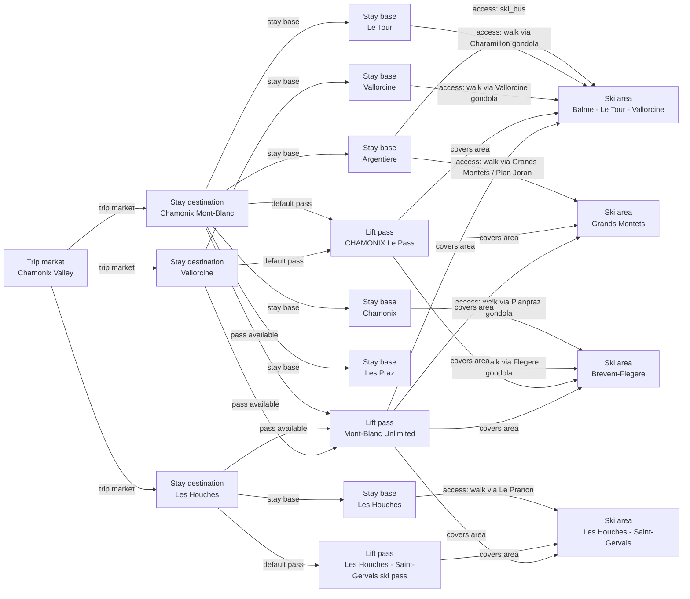

# Chamonix Valley Catalog Graph Remediation

Reconciles the exact prepared Chamonix Valley stay, access, terrain, pass, and trust graph. The completed schema-v5 discovery now records the full current Chamonix locality neighborhood, the prospective Argentière stay-destination boundary, the folded Le Savoy sector, and all permitted focus-to-regional context edges while leaving ordinary catalog remediation open.

## Resulting Graph

```mermaid
flowchart LR
  region_1["Trip market<br/>Chamonix Valley"]
  destination_1["Stay destination<br/>Chamonix Mont-Blanc"]
  destination_2["Stay destination<br/>Les Houches"]
  destination_3["Stay destination<br/>Vallorcine"]
  base_1["Stay base<br/>Argentiere"]
  base_2["Stay base<br/>Chamonix"]
  base_3["Stay base<br/>Le Tour"]
  base_4["Stay base<br/>Les Houches"]
  base_5["Stay base<br/>Les Praz"]
  base_6["Stay base<br/>Vallorcine"]
  area_1["Ski area<br/>Balme - Le Tour - Vallorcine"]
  area_2["Ski area<br/>Brevent-Flegere"]
  area_3["Ski area<br/>Grands Montets"]
  area_4["Ski area<br/>Les Houches - Saint-Gervais"]
  pass_1["Lift pass<br/>CHAMONIX Le Pass"]
  pass_2["Lift pass<br/>Les Houches - Saint-Gervais ski pass"]
  pass_3["Lift pass<br/>Mont-Blanc Unlimited"]
  region_1 -->|"trip market"| destination_1
  region_1 -->|"trip market"| destination_2
  region_1 -->|"trip market"| destination_3
  destination_1 -->|"stay base"| base_1
  destination_1 -->|"stay base"| base_2
  destination_1 -->|"stay base"| base_3
  destination_2 -->|"stay base"| base_4
  destination_1 -->|"stay base"| base_5
  destination_3 -->|"stay base"| base_6
  base_1 -->|"access: ski_bus"| area_1
  base_1 -->|"access: walk via Grands Montets / Plan Joran"| area_3
  base_2 -->|"access: walk via Planpraz gondola"| area_2
  base_3 -->|"access: walk via Charamillon gondola"| area_1
  base_4 -->|"access: walk via Le Prarion"| area_4
  base_5 -->|"access: walk via Flegere gondola"| area_2
  base_6 -->|"access: walk via Vallorcine gondola"| area_1
  destination_1 -->|"default pass"| pass_1
  destination_3 -->|"default pass"| pass_1
  pass_1 -->|"covers area"| area_1
  pass_1 -->|"covers area"| area_2
  pass_1 -->|"covers area"| area_3
  destination_2 -->|"default pass"| pass_2
  pass_2 -->|"covers area"| area_4
  destination_1 -->|"pass available"| pass_3
  destination_2 -->|"pass available"| pass_3
  destination_3 -->|"pass available"| pass_3
  pass_3 -->|"covers area"| area_1
  pass_3 -->|"covers area"| area_2
  pass_3 -->|"covers area"| area_3
  pass_3 -->|"covers area"| area_4
```

## Reviewed Targets

| Target | Scope | Graph Role | Required Fields |
| --- | --- | --- | --- |
| `lift_pass_product:chamonix-le-pass` | `full` | `focus` | all canonical fields |
| `lift_pass_product:les-houches-saint-gervais-skipass` | `full` | `focus` | all canonical fields |
| `lift_pass_product:mont-blanc-unlimited` | `full` | `focus` | all canonical fields |
| `ski_area:balme-le-tour-vallorcine` | `full` | `focus` | all canonical fields |
| `ski_area:grands-montets` | `full` | `focus` | all canonical fields |
| `ski_area:les-houches-saint-gervais` | `full` | `focus` | all canonical fields |
| `ski_area_access:chamonix-mont-blanc-argentiere--balme-le-tour-vallorcine` | `full` | `focus` | all canonical fields |
| `ski_area_access:chamonix-mont-blanc-argentiere--grands-montets` | `full` | `focus` | all canonical fields |
| `ski_area_access:chamonix-mont-blanc-le-tour--balme-le-tour-vallorcine` | `full` | `focus` | all canonical fields |
| `ski_area_access:chamonix-mont-blanc-les-houches--les-houches-saint-gervais` | `full` | `focus` | all canonical fields |
| `ski_area_access:vallorcine-vallorcine--balme-le-tour-vallorcine` | `full` | `focus` | all canonical fields |
| `ski_region:chamonix-valley` | `full` | `focus` | all canonical fields |
| `stay_base:chamonix-mont-blanc-argentiere` | `full` | `focus` | all canonical fields |
| `stay_base:chamonix-mont-blanc-chamonix` | `full` | `focus` | all canonical fields |
| `stay_base:chamonix-mont-blanc-le-tour` | `full` | `focus` | all canonical fields |
| `stay_base:chamonix-mont-blanc-les-houches` | `full` | `focus` | all canonical fields |
| `stay_base:chamonix-mont-blanc-les-praz` | `full` | `focus` | all canonical fields |
| `stay_base:vallorcine-vallorcine` | `full` | `focus` | all canonical fields |
| `stay_destination:chamonix-mont-blanc` | `full` | `focus` | all canonical fields |
| `stay_destination:les-houches` | `full` | `focus` | all canonical fields |
| `stay_destination:vallorcine` | `full` | `focus` | all canonical fields |
| `ski_area:brevent-flegere` | `full` | `focus` | all canonical fields |
| `ski_area_access:chamonix-mont-blanc-chamonix--brevent-flegere` | `full` | `focus` | all canonical fields |
| `trust_manifest:lift_pass_products:chamonix-le-pass` | `narrow` | `focus` | `field_source_refs`, `field_statuses`, `notes` |
| `trust_manifest:lift_pass_products:les-houches-saint-gervais-skipass` | `narrow` | `focus` | `field_source_refs`, `field_statuses`, `notes` |
| `trust_manifest:lift_pass_products:mont-blanc-unlimited` | `narrow` | `focus` | `field_source_refs`, `field_statuses`, `notes` |
| `trust_manifest:ski_area_access:chamonix-mont-blanc-argentiere--balme-le-tour-vallorcine` | `narrow` | `focus` | `field_source_refs`, `field_statuses`, `notes` |
| `trust_manifest:ski_area_access:chamonix-mont-blanc-argentiere--grands-montets` | `narrow` | `focus` | `field_statuses`, `notes` |
| `trust_manifest:ski_area_access:chamonix-mont-blanc-chamonix--brevent-flegere` | `narrow` | `focus` | `display_name`, `field_source_refs`, `field_statuses`, `notes` |
| `trust_manifest:ski_area_access:chamonix-mont-blanc-le-tour--balme-le-tour-vallorcine` | `narrow` | `focus` | `display_name`, `field_source_refs`, `field_statuses`, `notes` |
| `trust_manifest:ski_area_access:chamonix-mont-blanc-les-houches--les-houches-saint-gervais` | `narrow` | `focus` | `field_source_refs`, `field_statuses`, `notes` |
| `trust_manifest:ski_area_access:vallorcine-vallorcine--balme-le-tour-vallorcine` | `narrow` | `focus` | `display_name`, `field_source_refs`, `field_statuses`, `notes` |
| `trust_manifest:ski_areas:balme-le-tour-vallorcine` | `narrow` | `focus` | `field_source_refs`, `field_statuses`, `notes` |
| `trust_manifest:ski_areas:brevent-flegere` | `narrow` | `focus` | `display_name`, `field_source_refs`, `field_statuses`, `notes` |
| `trust_manifest:ski_areas:grands-montets` | `narrow` | `focus` | `field_source_refs`, `field_statuses`, `notes` |
| `trust_manifest:ski_areas:les-houches-saint-gervais` | `narrow` | `focus` | `field_source_refs`, `field_statuses`, `notes` |
| `trust_manifest:ski_regions:chamonix-valley` | `narrow` | `focus` | `field_source_refs`, `field_statuses`, `notes` |
| `trust_manifest:stay_bases:chamonix-mont-blanc-argentiere` | `narrow` | `focus` | `field_source_refs`, `field_statuses`, `notes` |
| `trust_manifest:stay_bases:chamonix-mont-blanc-chamonix` | `narrow` | `focus` | `field_source_refs`, `field_statuses`, `notes` |
| `trust_manifest:stay_bases:chamonix-mont-blanc-le-tour` | `narrow` | `focus` | `display_name`, `field_source_refs`, `field_statuses`, `notes` |
| `trust_manifest:stay_bases:chamonix-mont-blanc-les-houches` | `narrow` | `focus` | `field_source_refs`, `field_statuses`, `notes` |
| `trust_manifest:stay_bases:chamonix-mont-blanc-les-praz` | `narrow` | `focus` | `display_name`, `field_source_refs`, `field_statuses`, `notes` |
| `trust_manifest:stay_bases:vallorcine-vallorcine` | `narrow` | `focus` | `display_name`, `field_source_refs`, `field_statuses`, `notes` |
| `trust_manifest:stay_destinations:chamonix-mont-blanc` | `narrow` | `focus` | `field_source_refs`, `field_statuses`, `notes` |
| `trust_manifest:stay_destinations:les-houches` | `narrow` | `focus` | `display_name`, `field_source_refs`, `field_statuses`, `notes` |
| `trust_manifest:stay_destinations:vallorcine` | `narrow` | `focus` | `display_name`, `field_source_refs`, `field_statuses`, `notes` |
| `ski_area_access:chamonix-mont-blanc-les-praz--brevent-flegere` | `full` | `focus` | all canonical fields |
| `trust_manifest:ski_area_access:chamonix-mont-blanc-les-praz--brevent-flegere` | `narrow` | `focus` | `display_name`, `field_source_refs`, `field_statuses`, `notes` |
| `stay_destination:argentiere` | `full` | `focus` | all canonical fields |

## Graph Discovery

Status: `complete`

| Focus Destination | Candidate Kind | Coverage | Candidates | Source Families | Direct Evidence | Rationale |
| --- | --- | --- | --- | --- | --- | --- |
| `chamonix-mont-blanc` | `stay_destination` | `complete` | chamonix mont blanc (`chamonix-mont-blanc`): `represented`; `graph_blocking` Argentiere as a separate stay destination (`argentiere`): `add_entity`; `graph_blocking` servoz (`servoz`): `deferred`; `regional_followup` les houches (`les-houches`): `add_entity`; `graph_blocking` vallorcine (`vallorcine`): `add_entity`; `graph_blocking` | `chamonix-stay-market-sources` | [graph-saint-gervais-stay-market](https://tourism.saintgervais.com/i-want-to/sleeping/all-accommodations/), [inventory-envelope-chamonix-town-geometry](https://www.openstreetmap.org/relation/104836), [inventory-villages](https://en.chamonix.com/chamonix-mont-blanc-valley/the-village-resorts), [remediation-boundary-chamonix-market](https://en.chamonix.com/chamonix-mont-blanc-valley/the-village-resorts), [remediation-boundary-chamonix-separation](https://en.chamonix.com/chamonix-mont-blanc-valley/the-village-resorts), [scope-argentiere-stay-destination-boundary](https://en.chamonix.com/chamonix-mont-blanc-valley/the-village-resorts/argentiere), [scope-target-stay-base-chamonix-mont-blanc-argentiere](https://en.chamonix.com/chamonix-mont-blanc-valley/the-village-resorts/argentiere), [scope-target-stay-destination-chamonix-mont-blanc](https://en.chamonix.com/chamonix-mont-blanc-valley/the-village-resorts), [scope-target-stay-destination-les-houches](https://booking.chamonix.com/en/serp?ref_c.LOCATION=cmb.houches&s_c.ACCOMMODATION=chalet%2Capartment&type=chalet%2Capartment), [scope-target-stay-destination-vallorcine](https://booking.chamonix.com/en/serp?ref_c.LOCATION=cmb.vallorcine&s_c.ACCOMMODATION=chalet%2Capartment&type=chalet%2Capartment), [graph-argentiere-official-booking-scope](https://booking.chamonix.com/en/our-destinations/argentiere), [graph-argentiere-material-separation](https://booking.chamonix.com/en/our-destinations/argentiere), [graph-argentiere-new-entity-country-research](https://en.chamonix.com/chamonix-mont-blanc-valley/geography-and-climate), [graph-argentiere-new-entity-latitude](https://www.openstreetmap.org/node/285882627), [graph-argentiere-new-entity-longitude](https://www.openstreetmap.org/node/285882627), [graph-argentiere-new-entity-price-level-research](https://booking.chamonix.com/en/our-destinations/argentiere), [graph-argentiere-new-entity-region-research](https://en.chamonix.com/chamonix-mont-blanc-valley/geography-and-climate), [graph-argentiere-new-entity-regional-data-ids](https://www.openstreetmap.org/node/285882627), [graph-argentiere-new-entity-trip-market-region](https://booking.chamonix.com/en/our-destinations/argentiere) | Complete because the registered official source neighborhoods for this focus root and candidate kind were exhausted; every found candidate and supported edge is recorded, so no expected candidate is omitted from this packet. |
| `chamonix-mont-blanc` | `stay_base` | `complete` | chamonix mont blanc argentiere (`chamonix-mont-blanc-argentiere`): `represented`; `graph_blocking` chamonix mont blanc chamonix (`chamonix-mont-blanc-chamonix`): `represented`; `graph_blocking` chamonix mont blanc le tour (`chamonix-mont-blanc-le-tour`): `add_entity`; `graph_blocking` chamonix mont blanc les praz (`chamonix-mont-blanc-les-praz`): `add_entity`; `graph_blocking` Planards (`chamonix-mont-blanc-planards`): `unresolved`; `regional_followup` Les Chosalets (`chamonix-mont-blanc-chosalets`): `not_separate`; `graph_blocking` La Vormaine (`chamonix-mont-blanc-la-vormaine`): `not_separate`; `graph_blocking` Le Savoy (`chamonix-mont-blanc-le-savoy`): `not_separate`; `graph_blocking` Les Tines (`chamonix-mont-blanc-les-tines`): `not_separate`; `graph_blocking` Les Bossons (`chamonix-mont-blanc-les-bossons`): `not_separate`; `graph_blocking` Le Mont (`chamonix-mont-blanc-le-mont`): `not_separate`; `graph_blocking` Le Lavancher (`chamonix-mont-blanc-le-lavancher`): `not_separate`; `graph_blocking` Montroc (`chamonix-mont-blanc-montroc`): `not_separate`; `graph_blocking` servoz servoz (`servoz-servoz`): `deferred`; `regional_followup` Chamonix Sud (`chamonix-mont-blanc-chamonix-sud`): `not_separate`; `graph_blocking` Les Bois (`chamonix-mont-blanc-les-bois`): `not_separate`; `graph_blocking` La Joux (`chamonix-mont-blanc-la-joux`): `not_separate`; `graph_blocking` Les Iles (`chamonix-mont-blanc-les-iles`): `not_separate`; `graph_blocking` Les Grassonnets (`chamonix-mont-blanc-les-grassonnets`): `not_separate`; `graph_blocking` Les Moussoux (`chamonix-mont-blanc-les-moussoux`): `not_separate`; `graph_blocking` Les Pècles (`chamonix-mont-blanc-les-pecles`): `not_separate`; `graph_blocking` Les Mouilles (`chamonix-mont-blanc-les-mouilles`): `not_separate`; `graph_blocking` La Frasse (`chamonix-mont-blanc-la-frasse`): `not_separate`; `graph_blocking` Les Nants (`chamonix-mont-blanc-les-nants`): `not_separate`; `graph_blocking` Les Plans (`chamonix-mont-blanc-les-plans`): `not_separate`; `graph_blocking` Les Pèlerins (`chamonix-mont-blanc-les-pelerins`): `not_separate`; `graph_blocking` Les Favrands (`chamonix-mont-blanc-les-favrands`): `not_separate`; `graph_blocking` Les Gaillands (`chamonix-mont-blanc-les-gaillands`): `not_separate`; `graph_blocking` Les Barrats (`chamonix-mont-blanc-les-barrats`): `not_separate`; `graph_blocking` Taconnaz (`chamonix-mont-blanc-taconnaz`): `not_separate`; `graph_blocking` | `chamonix-stay-market-sources`, `chamonix-access-topology-sources` | [graph-saint-gervais-le-fayet-stay-base](https://tourism.saintgervais.com/i-want-to/sleeping/hotels/planb-living-saint-gervais-saint-gervais-les-bains-en-5286972/), [graph-stay-base-le-tour-market](https://booking.chamonix.com/en/product-962-apartment-chalet-le-tour), [graph-stay-base-les-praz-market](https://booking.chamonix.com/en/hotel-123-les-lanchers?id-intuitiv=14177274), [inventory-chamonix-commune-localities](https://en.chamonix.com/sites/default/files/media/brochures/RG%20HANDI%20GB_0.pdf), [inventory-stay-base-chosalets](https://en.chamonix.com/plan-my-stay/accommodation/seasonal-rental/appartement-jorasses), [inventory-stay-base-la-vormaine-location](https://en.chamonix.com/things-to-see-and-do/sports-and-outdoor/skiing-in-chamonix-mont-blanc-valley/list-of-ski-areas/domaine-skiable-la-vormaine), [inventory-stay-base-le-lavancher](https://en.chamonix.com/hotels-de-charme/hotel-jeu-de-paume), [inventory-stay-base-le-savoy-location](https://en.chamonix.com/things-to-see-and-do/sports-and-outdoor/skiing-in-chamonix-mont-blanc-valley/list-of-ski-areas/le-savoy-ski-area?espace_congres=124174), [inventory-stay-base-les-bossons](https://en.chamonix.com/plan-my-stay/accommodation/hotels/big-sky-hotel?espace_congres=124173), [inventory-stay-base-les-tines](https://en.chamonix.com/planifier-mon-sejour/hebergements/agences-immobilieres-locations/location-vacances-chamonix/chalet-scierie), [inventory-stay-base-montroc](https://en.chamonix.com/plan-my-stay/accommodations/holiday-centre-group/chalet-pierre-semard), [inventory-stay-base-planards](https://en.chamonix.com/plan-my-stay/accommodation/holiday-centre-group/vacation-village-chalets-des-aiguilles-odcv-19?espace_congres=124174), [inventory-villages](https://en.chamonix.com/chamonix-mont-blanc-valley/the-village-resorts), [scope-target-stay-base-chamonix-mont-blanc-argentiere](https://en.chamonix.com/chamonix-mont-blanc-valley/the-village-resorts/argentiere), [scope-target-stay-base-chamonix-mont-blanc-chamonix](https://en.chamonix.com/chamonix-mont-blanc-valley/the-village-resorts), [scope-target-stay-base-chamonix-mont-blanc-le-tour](https://domaineschamonix.montblancnaturalresort.com/en/access-and-maps/balme), [scope-target-stay-base-chamonix-mont-blanc-les-praz](https://domaineschamonix.montblancnaturalresort.com/en/area/flegere), [graph-chamonix-systematic-locality-neighborhood](https://www.chamonix.fr/actualites/comites-de-villages-2024/), [graph-chamonix-systematic-transport-neighborhood](https://en.chamonix.com/sites/default/files/media/brochures/Guide-Hiver-Chamonix-2025-2026.pdf), [graph-chamonix-sud-booking-neighborhood](https://booking.chamonix.com/en/apartments-and-chalets), [graph-stay-base-les-praz-osm-identity](https://www.openstreetmap.org/node/277928675) | Complete because the current municipal village-committee roster, current winter transport guide, official booking collection, and direct represented-base sources were exhausted together; every concrete locality found, including Chamonix Sud, Les Bois, and Le Mont, is assessed and every supported focus-graph edge is recorded. |
| `chamonix-mont-blanc` | `ski_area` | `complete` | balme le tour vallorcine (`balme-le-tour-vallorcine`): `represented`; `graph_blocking` Brévent sector (`brevent`): `not_separate`; `graph_blocking` Flégère sector (`flegere`): `not_separate`; `graph_blocking` grands montets (`grands-montets`): `represented`; `graph_blocking` Le Tour sector (`le-tour-sector`): `not_separate`; `graph_blocking` Plateau 2000 (`plateau-2000`): `not_separate`; `graph_blocking` Flegere beginner sector (`flegere-beginner-sector`): `not_separate`; `graph_blocking` Plateau de Lognan (`plateau-de-lognan`): `not_separate`; `graph_blocking` les houches saint gervais (`les-houches-saint-gervais`): `represented`; `graph_blocking` les planards (`les-planards`): `deferred`; `regional_followup` les chosalets (`les-chosalets`): `deferred`; `regional_followup` la vormaine (`la-vormaine`): `deferred`; `regional_followup` le savoy (`le-savoy`): `not_separate`; `graph_blocking` Brévent-Flégère (`brevent-flegere`): `represented`; `graph_blocking` | `chamonix-operator-area-sources`, `chamonix-beginner-area-operator-status-sources` | [change-27-brevent-summit-elevation-m](https://domaineschamonix.montblancnaturalresort.com/en/info-live/brevent), [change-63-flegere-summit-elevation-m](https://domaineschamonix.montblancnaturalresort.com/en/info-live/flegere), [inventory-altitudes](https://en.chamonix.com/things-to-see-and-do/altitudes-and-lifts), [inventory-beginner-chosalets-operator](https://www.leschosalets.fr/domaine-skiable/), [inventory-beginner-chosalets-status](https://en.chamonix.com/things-to-see-and-do/sports-and-outdoor/skiing-in-chamonix-mont-blanc-valley/list-of-ski-areas/chosalets-ski-area), [inventory-beginner-planards-operator](https://www.planards.fr/en/homepage-alpin-coaster-attractions-park/), [inventory-beginner-planards-status](https://en.chamonix.com/things-to-see-and-do/sports-and-outdoor/skiing-in-chamonix-mont-blanc-valley/list-of-ski-areas/domaine-skiable-des-planards), [inventory-beginner-savoy-operator](https://www.compagniedumontblanc.fr/fr/societe/), [inventory-beginner-savoy-status](https://en.chamonix.com/things-to-see-and-do/sports-and-outdoor/skiing-in-chamonix-mont-blanc-valley/list-of-ski-areas/le-savoy-ski-area?espace_congres=124174), [inventory-beginner-vormaine-operator](https://www.compagniedumontblanc.fr/fr/societe/), [inventory-beginner-vormaine-status](https://en.chamonix.com/things-to-see-and-do/sports-and-outdoor/skiing-in-chamonix-mont-blanc-valley/list-of-ski-areas/domaine-skiable-la-vormaine), [inventory-easy](https://domaineschamonix.montblancnaturalresort.com/en/page/easy-skiing), [inventory-lepass](https://domaineschamonix.montblancnaturalresort.com/en/ticketing/chamonix-lepass), [inventory-skiing](https://en.chamonix.com/activities/winter/skiing), [scope-mbu-external-validity](https://www.montblancnaturalresort.com/en/ticketing/montblanc-unlimited), [scope-target-ski-area-balme-le-tour-vallorcine](https://domaineschamonix.montblancnaturalresort.com/en/access-and-maps/balme), [scope-target-ski-area-brevent](https://domaineschamonix.montblancnaturalresort.com/en/area/brevent), [scope-target-ski-area-flegere](https://domaineschamonix.montblancnaturalresort.com/en/area/flegere), [scope-target-ski-area-grands-montets](https://en.chamonix.com/activities/winter/skiing), [scope-target-ski-area-les-houches-saint-gervais](https://www.saintgervais.com/je-minspire/ski/decouvrir-nos-domaines-skiables/), [change-13-brevent-latitude](https://www.openstreetmap.org/node/3431633966), [weather-flegere-osm-terrain-medoid-attempt](https://www.openstreetmap.org/node/3722799505) | Complete because the registered official source neighborhoods for this focus root and candidate kind were exhausted; every found candidate and supported edge is recorded, so no expected candidate is omitted from this packet. |
| `chamonix-mont-blanc` | `ski_area_access` | `complete` | chamonix mont blanc argentiere  balme le tour vallorcine (`chamonix-mont-blanc-argentiere--balme-le-tour-vallorcine`): `represented`; `graph_blocking` chamonix mont blanc argentiere  grands montets (`chamonix-mont-blanc-argentiere--grands-montets`): `represented`; `graph_blocking` chamonix-mont-blanc-chamonix--brevent-flegere (`chamonix-mont-blanc-chamonix--brevent-flegere`): `represented`; `graph_blocking` chamonix mont blanc le tour  balme le tour vallorcine (`chamonix-mont-blanc-le-tour--balme-le-tour-vallorcine`): `add_entity`; `graph_blocking` chamonix-mont-blanc-les-praz--brevent-flegere (`chamonix-mont-blanc-les-praz--brevent-flegere`): `add_entity`; `graph_blocking` chamonix mont blanc planards  les planards (`chamonix-mont-blanc-planards--les-planards`): `deferred`; `regional_followup` chamonix mont blanc chosalets  les chosalets (`chamonix-mont-blanc-chosalets--les-chosalets`): `deferred`; `regional_followup` Le Tour access to La Vormaine (`chamonix-mont-blanc-le-tour--la-vormaine`): `deferred`; `regional_followup` Chamonix access to Le Savoy (`chamonix-mont-blanc-chamonix--le-savoy`): `not_separate`; `graph_blocking` | `chamonix-access-topology-sources`, `chamonix-operator-area-sources` | [inventory-easy](https://domaineschamonix.montblancnaturalresort.com/en/page/easy-skiing), [inventory-skiing](https://en.chamonix.com/activities/winter/skiing), [inventory-stay-base-la-vormaine-location](https://en.chamonix.com/things-to-see-and-do/sports-and-outdoor/skiing-in-chamonix-mont-blanc-valley/list-of-ski-areas/domaine-skiable-la-vormaine), [inventory-stay-base-le-savoy-location](https://en.chamonix.com/things-to-see-and-do/sports-and-outdoor/skiing-in-chamonix-mont-blanc-valley/list-of-ski-areas/le-savoy-ski-area?espace_congres=124174), [scope-target-ski-area-access-chamonix-mont-blanc-argentiere-balme-le-tour-vallorcine](https://domaineschamonix.montblancnaturalresort.com/en/access-and-maps/balme), [scope-target-ski-area-access-chamonix-mont-blanc-argentiere-grands-montets](https://en.chamonix.com/activities/winter/skiing), [scope-target-ski-area-access-chamonix-mont-blanc-chamonix-brevent](https://domaineschamonix.montblancnaturalresort.com/en/area/brevent), [scope-target-ski-area-access-chamonix-mont-blanc-le-tour-balme-le-tour-vallorcine](https://domaineschamonix.montblancnaturalresort.com/en/access-and-maps/balme), [scope-target-ski-area-access-chamonix-mont-blanc-les-praz-flegere](https://domaineschamonix.montblancnaturalresort.com/en/area/flegere), [inventory-pass1-chamonix-mont-blanc-les-praz-brevent-flegere-distance-m](https://www.chamonix.fr/fiche-touristique/telecabine-de-la-flegere/) | Complete because the registered official source neighborhoods for this focus root and candidate kind were exhausted; every found candidate and supported edge is recorded, so no expected candidate is omitted from this packet. |
| `chamonix-mont-blanc` | `terrain_domain` | `complete` | Aiguille du Midi and Vallee Blanche (`aiguille-du-midi-vallee-blanche`): `external_pass_context`; `graph_blocking` Broad Chamonix Le Pass terrain network (`chamonix-le-pass-terrain-network`): `external_pass_context`; `graph_blocking` Combloux (`combloux`): `external_pass_context`; `graph_blocking` Courmayeur (`courmayeur`): `external_pass_context`; `graph_blocking` Crans-Montana (`crans-montana`): `external_pass_context`; `graph_blocking` La Giettaz (`la-giettaz`): `external_pass_context`; `graph_blocking` Le Jaillet (`le-jaillet`): `external_pass_context`; `graph_blocking` Les Contamines (`les-contamines`): `external_pass_context`; `graph_blocking` Megeve (`megeve`): `external_pass_context`; `graph_blocking` Montenvers-Mer de Glace (`montenvers-mer-de-glace`): `external_pass_context`; `graph_blocking` Saint-Nicolas-de-Veroce (`saint-nicolas-de-veroce`): `external_pass_context`; `graph_blocking` Skyway Monte Bianco (`skyway-monte-bianco`): `external_pass_context`; `graph_blocking` Tramway du Mont-Blanc (`tramway-du-mont-blanc`): `external_pass_context`; `graph_blocking` | `chamonix-operator-area-sources`, `chamonix-pass-product-sources`, `chamonix-access-topology-sources` | [change-27-brevent-summit-elevation-m](https://domaineschamonix.montblancnaturalresort.com/en/info-live/brevent), [change-63-flegere-summit-elevation-m](https://domaineschamonix.montblancnaturalresort.com/en/info-live/flegere), [inventory-altitudes](https://en.chamonix.com/things-to-see-and-do/altitudes-and-lifts), [inventory-envelope-brevent-flegere-municipal-scope](https://www.chamonix.fr/fiche-touristique/domaine-skiable-brevent-flegere/), [inventory-lepass](https://domaineschamonix.montblancnaturalresort.com/en/ticketing/chamonix-lepass), [inventory-skiing](https://en.chamonix.com/activities/winter/skiing), [scope-historical-brevent-flegere-transition](https://domaineschamonix.montblancnaturalresort.com/en/ticketing/chamonix-lepass), [scope-mbu-external-validity](https://www.montblancnaturalresort.com/en/ticketing/montblanc-unlimited), [scope-target-ski-area-access-chamonix-mont-blanc-chamonix-brevent](https://domaineschamonix.montblancnaturalresort.com/en/area/brevent), [scope-target-ski-area-brevent](https://domaineschamonix.montblancnaturalresort.com/en/area/brevent), [scope-target-ski-area-flegere](https://domaineschamonix.montblancnaturalresort.com/en/area/flegere) | Complete because the registered official source neighborhoods for this focus root and candidate kind were exhausted; every found candidate and supported edge is recorded, so no expected candidate is omitted from this packet. |
| `chamonix-mont-blanc` | `lift_pass_product` | `complete` | chamonix le pass (`chamonix-le-pass`): `represented`; `graph_blocking` mont blanc unlimited (`mont-blanc-unlimited`): `represented`; `graph_blocking` Plateau 2000 beginner rate (`plateau-2000-beginner-rate`): `not_separate`; `graph_blocking` Flégère beginner rate (`flegere-beginner-rate`): `not_separate`; `graph_blocking` les planards local (`les-planards-local`): `deferred`; `regional_followup` les chosalets local (`les-chosalets-local`): `deferred`; `regional_followup` la vormaine local (`la-vormaine-local`): `deferred`; `regional_followup` le savoy local (`le-savoy-local`): `not_separate`; `graph_blocking` | `chamonix-pass-product-sources`, `chamonix-beginner-pass-tariff-sources` | [inventory-easy](https://domaineschamonix.montblancnaturalresort.com/en/page/easy-skiing), [inventory-lepass](https://domaineschamonix.montblancnaturalresort.com/en/ticketing/chamonix-lepass), [remediation-flegere-beginner-ticket](https://domaineschamonix.montblancnaturalresort.com/en/page/easy-skiing), [remediation-plateau-2000-beginner-ticket](https://domaineschamonix.montblancnaturalresort.com/en/page/easy-skiing), [scope-target-lift-pass-product-chamonix-le-pass](https://domaineschamonix.montblancnaturalresort.com/en/ticketing/chamonix-lepass), [scope-target-lift-pass-product-mont-blanc-unlimited](https://www.montblancnaturalresort.com/en/ticketing/montblanc-unlimited), [graph-argentiere-chamonix-le-pass-availability](https://domaineschamonix.montblancnaturalresort.com/en/ticketing/chamonix-lepass), [graph-argentiere-mbu-availability](https://www.montblancnaturalresort.com/en/ticketing/montblanc-unlimited), [graph-argentiere-pass-default-research](https://domaineschamonix.montblancnaturalresort.com/en/ticketing/chamonix-lepass) | Complete because the registered official pass neighborhoods were exhausted, every supported pass-coverage and availability edge is recorded, and the prospective Argentière market has both supported available products. The checked official product and booking sources do not select one Snowcast default for Argentière, so no unsupported default edge is asserted. |
| `les-houches` | `stay_destination` | `complete` | les houches (`les-houches`): `add_entity`; `graph_blocking` saint gervais (`saint-gervais`): `deferred`; `regional_followup` chamonix mont blanc (`chamonix-mont-blanc`): `represented`; `graph_blocking` vallorcine (`vallorcine`): `add_entity`; `graph_blocking` | `chamonix-stay-market-sources` | [graph-saint-gervais-stay-market](https://tourism.saintgervais.com/i-want-to/sleeping/all-accommodations/), [inventory-saint-gervais](https://tourism.saintgervais.com/my-inspiration/skiing-in-saint-gervais-mont-blanc/discover-our-ski-areas/), [inventory-villages](https://en.chamonix.com/chamonix-mont-blanc-valley/the-village-resorts), [remediation-boundary-les-houches-market](https://booking.chamonix.com/en/serp?ref_c.LOCATION=cmb.houches&s_c.ACCOMMODATION=chalet%2Capartment&type=chalet%2Capartment), [remediation-boundary-les-houches-separation](https://en.chamonix.com/chamonix-mont-blanc-valley/the-village-resorts/les-houches), [scope-target-stay-destination-chamonix-mont-blanc](https://en.chamonix.com/chamonix-mont-blanc-valley/the-village-resorts), [scope-target-stay-destination-les-houches](https://booking.chamonix.com/en/serp?ref_c.LOCATION=cmb.houches&s_c.ACCOMMODATION=chalet%2Capartment&type=chalet%2Capartment), [scope-target-stay-destination-vallorcine](https://booking.chamonix.com/en/serp?ref_c.LOCATION=cmb.vallorcine&s_c.ACCOMMODATION=chalet%2Capartment&type=chalet%2Capartment) | Complete because the registered official source neighborhoods for this focus root and candidate kind were exhausted; every found candidate and supported edge is recorded, so no expected candidate is omitted from this packet. |
| `les-houches` | `stay_base` | `complete` | chamonix mont blanc les houches (`chamonix-mont-blanc-les-houches`): `represented`; `graph_blocking` Le Tourchet (`les-houches-le-tourchet`): `not_separate`; `graph_blocking` saint gervais le fayet (`saint-gervais-le-fayet`): `deferred`; `regional_followup` | `chamonix-stay-market-sources` | [graph-saint-gervais-le-fayet-stay-base](https://tourism.saintgervais.com/i-want-to/sleeping/hotels/planb-living-saint-gervais-saint-gervais-les-bains-en-5286972/), [graph-stay-base-le-tour-market](https://booking.chamonix.com/en/product-962-apartment-chalet-le-tour), [graph-stay-base-les-praz-market](https://booking.chamonix.com/en/hotel-123-les-lanchers?id-intuitiv=14177274), [inventory-saint-gervais](https://tourism.saintgervais.com/my-inspiration/skiing-in-saint-gervais-mont-blanc/discover-our-ski-areas/), [inventory-stay-base-le-tourchet-location](https://en.chamonix.com/things-to-see-and-do/sports-and-outdoor/skiing-in-chamonix-mont-blanc-valley/list-of-ski-areas/domaine-debutant-du-tourchet), [inventory-villages](https://en.chamonix.com/chamonix-mont-blanc-valley/the-village-resorts), [scope-target-stay-base-chamonix-mont-blanc-les-houches](https://en.chamonix.com/chamonix-mont-blanc-valley/the-village-resorts/les-houches) | Complete because the registered official source neighborhoods for this focus root and candidate kind were exhausted; every found candidate and supported edge is recorded, so no expected candidate is omitted from this packet. |
| `les-houches` | `ski_area` | `complete` | les houches saint gervais (`les-houches-saint-gervais`): `represented`; `graph_blocking` balme le tour vallorcine (`balme-le-tour-vallorcine`): `represented`; `graph_blocking` Brévent sector (`brevent`): `not_separate`; `graph_blocking` Flégère sector (`flegere`): `not_separate`; `graph_blocking` grands montets (`grands-montets`): `represented`; `graph_blocking` Bellevue beginner area (`bellevue-beginner-sector`): `not_separate`; `graph_blocking` Prarion beginner area (`prarion-beginner-sector`): `not_separate`; `graph_blocking` le tourchet (`le-tourchet`): `deferred`; `regional_followup` Brévent-Flégère (`brevent-flegere`): `represented`; `graph_blocking` | `chamonix-operator-area-sources`, `chamonix-beginner-area-operator-status-sources` | [inventory-beginner-tourchet-operator](https://www.leshouches.fr/wp-content/uploads/2026/01/PV-19-decembre-2025-a-publier.pdf), [inventory-beginner-tourchet-status](https://www.leshouches.fr/mes-activites/installations-sportives/), [inventory-easy](https://domaineschamonix.montblancnaturalresort.com/en/page/easy-skiing), [inventory-lepass](https://domaineschamonix.montblancnaturalresort.com/en/ticketing/chamonix-lepass), [inventory-skiing](https://en.chamonix.com/activities/winter/skiing), [remediation-bellevue-beginner-sector](https://domaineschamonix.montblancnaturalresort.com/en/page/easy-skiing), [remediation-prarion-beginner-sector](https://domaineschamonix.montblancnaturalresort.com/en/page/easy-skiing), [scope-target-ski-area-balme-le-tour-vallorcine](https://domaineschamonix.montblancnaturalresort.com/en/access-and-maps/balme), [scope-target-ski-area-brevent](https://domaineschamonix.montblancnaturalresort.com/en/area/brevent), [scope-target-ski-area-flegere](https://domaineschamonix.montblancnaturalresort.com/en/area/flegere), [scope-target-ski-area-grands-montets](https://en.chamonix.com/activities/winter/skiing), [scope-target-ski-area-les-houches-saint-gervais](https://www.saintgervais.com/je-minspire/ski/decouvrir-nos-domaines-skiables/) | Complete because the registered official source neighborhoods for this focus root and candidate kind were exhausted; every found candidate and supported edge is recorded, so no expected candidate is omitted from this packet. |
| `les-houches` | `ski_area_access` | `complete` | chamonix mont blanc les houches  les houches saint gervais (`chamonix-mont-blanc-les-houches--les-houches-saint-gervais`): `represented`; `graph_blocking` Les Houches access to Le Tourchet (`chamonix-mont-blanc-les-houches--le-tourchet`): `deferred`; `regional_followup` saint gervais le fayet  les houches saint gervais (`saint-gervais-le-fayet--les-houches-saint-gervais`): `deferred`; `regional_followup` | `chamonix-access-topology-sources`, `chamonix-operator-area-sources` | [inventory-easy](https://domaineschamonix.montblancnaturalresort.com/en/page/easy-skiing), [inventory-saint-gervais](https://tourism.saintgervais.com/my-inspiration/skiing-in-saint-gervais-mont-blanc/discover-our-ski-areas/), [inventory-skiing](https://en.chamonix.com/activities/winter/skiing), [inventory-stay-base-le-tourchet-location](https://en.chamonix.com/things-to-see-and-do/sports-and-outdoor/skiing-in-chamonix-mont-blanc-valley/list-of-ski-areas/domaine-debutant-du-tourchet), [scope-target-ski-area-access-chamonix-mont-blanc-chamonix-brevent](https://domaineschamonix.montblancnaturalresort.com/en/area/brevent), [scope-target-ski-area-access-chamonix-mont-blanc-les-houches-les-houches-saint-gervais](https://leshouches.montblancnaturalresort.com/en/access-and-maps) | Complete because the registered official source neighborhoods for this focus root and candidate kind were exhausted; every found candidate and supported edge is recorded, so no expected candidate is omitted from this packet. |
| `les-houches` | `terrain_domain` | `complete` | Evasion Mont-Blanc and Saint-Gervais (`evasion-saint-gervais`): `external_pass_context`; `graph_blocking` | `chamonix-operator-area-sources`, `chamonix-pass-product-sources`, `chamonix-access-topology-sources` | [inventory-lepass](https://domaineschamonix.montblancnaturalresort.com/en/ticketing/chamonix-lepass), [inventory-skiing](https://en.chamonix.com/activities/winter/skiing), [scope-mbu-external-validity](https://www.montblancnaturalresort.com/en/ticketing/montblanc-unlimited), [scope-target-ski-area-access-chamonix-mont-blanc-chamonix-brevent](https://domaineschamonix.montblancnaturalresort.com/en/area/brevent) | Complete because the registered official source neighborhoods for this focus root and candidate kind were exhausted; every found candidate and supported edge is recorded, so no expected candidate is omitted from this packet. |
| `les-houches` | `lift_pass_product` | `complete` | les houches saint gervais skipass (`les-houches-saint-gervais-skipass`): `represented`; `graph_blocking` Pass 1 Day Ski (`les-houches-pass-one-day-ski`): `not_separate`; `graph_blocking` Pass Stay Ski (`les-houches-pass-stay-ski`): `not_separate`; `graph_blocking` mont blanc unlimited (`mont-blanc-unlimited`): `represented`; `graph_blocking` le tourchet local (`le-tourchet-local`): `deferred`; `regional_followup` | `chamonix-pass-product-sources`, `chamonix-beginner-pass-tariff-sources` | [inventory-easy](https://domaineschamonix.montblancnaturalresort.com/en/page/easy-skiing), [inventory-lepass](https://domaineschamonix.montblancnaturalresort.com/en/ticketing/chamonix-lepass), [remediation-les-houches-pass-one-day](https://leshouches.montblancnaturalresort.com/en/ticketing/houches-saint-gervais-skipass), [remediation-les-houches-pass-stay](https://leshouches.montblancnaturalresort.com/en/ticketing/houches-saint-gervais-skipass), [scope-target-lift-pass-product-les-houches-saint-gervais-skipass](https://leshouches.montblancnaturalresort.com/en/ticketing/houches-saint-gervais-skipass), [scope-target-lift-pass-product-mont-blanc-unlimited](https://www.montblancnaturalresort.com/en/ticketing/montblanc-unlimited) | Complete because the registered official source neighborhoods for this focus root and candidate kind were exhausted; every found candidate and supported edge is recorded, so no expected candidate is omitted from this packet. |
| `vallorcine` | `stay_destination` | `complete` | vallorcine (`vallorcine`): `add_entity`; `graph_blocking` chamonix mont blanc (`chamonix-mont-blanc`): `represented`; `graph_blocking` les houches (`les-houches`): `add_entity`; `graph_blocking` | `chamonix-stay-market-sources` | [graph-saint-gervais-stay-market](https://tourism.saintgervais.com/i-want-to/sleeping/all-accommodations/), [inventory-villages](https://en.chamonix.com/chamonix-mont-blanc-valley/the-village-resorts), [remediation-boundary-vallorcine-market](https://booking.chamonix.com/en/serp?ref_c.LOCATION=cmb.vallorcine&s_c.ACCOMMODATION=chalet%2Capartment&type=chalet%2Capartment), [remediation-boundary-vallorcine-separation](https://en.chamonix.com/chamonix-mont-blanc-valley/the-village-resorts/vallorcine), [scope-target-stay-destination-chamonix-mont-blanc](https://en.chamonix.com/chamonix-mont-blanc-valley/the-village-resorts), [scope-target-stay-destination-les-houches](https://booking.chamonix.com/en/serp?ref_c.LOCATION=cmb.houches&s_c.ACCOMMODATION=chalet%2Capartment&type=chalet%2Capartment), [scope-target-stay-destination-vallorcine](https://booking.chamonix.com/en/serp?ref_c.LOCATION=cmb.vallorcine&s_c.ACCOMMODATION=chalet%2Capartment&type=chalet%2Capartment) | Complete because the registered official source neighborhoods for this focus root and candidate kind were exhausted; every found candidate and supported edge is recorded, so no expected candidate is omitted from this packet. |
| `vallorcine` | `stay_base` | `complete` | vallorcine vallorcine (`vallorcine-vallorcine`): `add_entity`; `graph_blocking` Le Buet (`vallorcine-le-buet`): `deferred`; `regional_followup` | `chamonix-stay-market-sources` | [graph-saint-gervais-le-fayet-stay-base](https://tourism.saintgervais.com/i-want-to/sleeping/hotels/planb-living-saint-gervais-saint-gervais-les-bains-en-5286972/), [graph-stay-base-le-tour-market](https://booking.chamonix.com/en/product-962-apartment-chalet-le-tour), [graph-stay-base-les-praz-market](https://booking.chamonix.com/en/hotel-123-les-lanchers?id-intuitiv=14177274), [inventory-stay-base-le-buet](https://en.chamonix.com/plan-my-stay/accommodation/hotels/vallorcine-hotel/hotel-du-buet-et-de-la-gare), [inventory-villages](https://en.chamonix.com/chamonix-mont-blanc-valley/the-village-resorts), [scope-target-stay-base-vallorcine-vallorcine](https://en.chamonix.com/chamonix-mont-blanc-valley/the-village-resorts/vallorcine) | Complete because the registered official source neighborhoods for this focus root and candidate kind were exhausted; every found candidate and supported edge is recorded, so no expected candidate is omitted from this packet. |
| `vallorcine` | `ski_area` | `complete` | balme le tour vallorcine (`balme-le-tour-vallorcine`): `represented`; `graph_blocking` Brévent sector (`brevent`): `not_separate`; `graph_blocking` Flégère sector (`flegere`): `not_separate`; `graph_blocking` grands montets (`grands-montets`): `represented`; `graph_blocking` les houches saint gervais (`les-houches-saint-gervais`): `represented`; `graph_blocking` Vallorcine sector (`vallorcine-sector`): `not_separate`; `graph_blocking` la poya (`la-poya`): `deferred`; `regional_followup` Brévent-Flégère (`brevent-flegere`): `represented`; `graph_blocking` | `chamonix-operator-area-sources`, `chamonix-beginner-area-operator-status-sources` | [inventory-beginner-poya-operator-status](https://www.valleedutrient.ch/en/poya-ski-area), [inventory-beginner-poya-status](https://en.chamonix.com/things-to-see-and-do/sports-and-outdoor/skiing-in-chamonix-mont-blanc-valley/list-of-ski-areas/la-poya-ski-resort), [inventory-easy](https://domaineschamonix.montblancnaturalresort.com/en/page/easy-skiing), [inventory-lepass](https://domaineschamonix.montblancnaturalresort.com/en/ticketing/chamonix-lepass), [inventory-skiing](https://en.chamonix.com/activities/winter/skiing), [scope-target-ski-area-balme-le-tour-vallorcine](https://domaineschamonix.montblancnaturalresort.com/en/access-and-maps/balme), [scope-target-ski-area-brevent](https://domaineschamonix.montblancnaturalresort.com/en/area/brevent), [scope-target-ski-area-flegere](https://domaineschamonix.montblancnaturalresort.com/en/area/flegere), [scope-target-ski-area-grands-montets](https://en.chamonix.com/activities/winter/skiing), [scope-target-ski-area-les-houches-saint-gervais](https://www.saintgervais.com/je-minspire/ski/decouvrir-nos-domaines-skiables/) | Complete because the registered official source neighborhoods for this focus root and candidate kind were exhausted; every found candidate and supported edge is recorded, so no expected candidate is omitted from this packet. |
| `vallorcine` | `ski_area_access` | `complete` | vallorcine vallorcine  balme le tour vallorcine (`vallorcine-vallorcine--balme-le-tour-vallorcine`): `add_entity`; `graph_blocking` vallorcine le buet  la poya (`vallorcine-le-buet--la-poya`): `deferred`; `regional_followup` | `chamonix-access-topology-sources`, `chamonix-operator-area-sources` | [inventory-easy](https://domaineschamonix.montblancnaturalresort.com/en/page/easy-skiing), [inventory-skiing](https://en.chamonix.com/activities/winter/skiing), [scope-target-ski-area-access-chamonix-mont-blanc-chamonix-brevent](https://domaineschamonix.montblancnaturalresort.com/en/area/brevent), [scope-target-ski-area-access-vallorcine-vallorcine-balme-le-tour-vallorcine](https://domaineschamonix.montblancnaturalresort.com/en/access-and-maps/balme) | Complete because the registered official source neighborhoods for this focus root and candidate kind were exhausted; every found candidate and supported edge is recorded, so no expected candidate is omitted from this packet. |
| `vallorcine` | `terrain_domain` | `complete` | None found | `chamonix-operator-area-sources`, `chamonix-pass-product-sources`, `chamonix-access-topology-sources` | [inventory-lepass](https://domaineschamonix.montblancnaturalresort.com/en/ticketing/chamonix-lepass), [inventory-skiing](https://en.chamonix.com/activities/winter/skiing), [scope-target-ski-area-access-chamonix-mont-blanc-chamonix-brevent](https://domaineschamonix.montblancnaturalresort.com/en/area/brevent) | Complete because the registered official source neighborhoods for this focus root and candidate kind were exhausted; every found candidate and supported edge is recorded, so no expected candidate is omitted from this packet. |
| `vallorcine` | `lift_pass_product` | `complete` | chamonix le pass (`chamonix-le-pass`): `represented`; `graph_blocking` mont blanc unlimited (`mont-blanc-unlimited`): `represented`; `graph_blocking` la poya local (`la-poya-local`): `deferred`; `regional_followup` | `chamonix-pass-product-sources`, `chamonix-beginner-pass-tariff-sources` | [inventory-beginner-poya-status](https://en.chamonix.com/things-to-see-and-do/sports-and-outdoor/skiing-in-chamonix-mont-blanc-valley/list-of-ski-areas/la-poya-ski-resort), [inventory-easy](https://domaineschamonix.montblancnaturalresort.com/en/page/easy-skiing), [inventory-lepass](https://domaineschamonix.montblancnaturalresort.com/en/ticketing/chamonix-lepass), [scope-target-lift-pass-product-chamonix-le-pass](https://domaineschamonix.montblancnaturalresort.com/en/ticketing/chamonix-lepass), [scope-target-lift-pass-product-mont-blanc-unlimited](https://www.montblancnaturalresort.com/en/ticketing/montblanc-unlimited) | Complete because the registered official source neighborhoods for this focus root and candidate kind were exhausted; every found candidate and supported edge is recorded, so no expected candidate is omitted from this packet. |

### Prospective Relationships

| Relationship | From | To | Direct Evidence |
| --- | --- | --- | --- |
| `lift_pass_available_from_stay_destination` | `chamonix-le-pass` | `argentiere` | [graph-argentiere-official-booking-scope](https://booking.chamonix.com/en/our-destinations/argentiere), [graph-argentiere-chamonix-le-pass-availability](https://domaineschamonix.montblancnaturalresort.com/en/ticketing/chamonix-lepass) |
| `lift_pass_available_from_stay_destination` | `chamonix-le-pass` | `chamonix-mont-blanc` | [scope-target-lift-pass-product-chamonix-le-pass](https://domaineschamonix.montblancnaturalresort.com/en/ticketing/chamonix-lepass) |
| `lift_pass_available_from_stay_destination` | `chamonix-le-pass` | `vallorcine` | [scope-target-lift-pass-product-chamonix-le-pass](https://domaineschamonix.montblancnaturalresort.com/en/ticketing/chamonix-lepass) |
| `lift_pass_available_from_stay_destination` | `les-houches-saint-gervais-skipass` | `les-houches` | [scope-target-lift-pass-product-les-houches-saint-gervais-skipass](https://leshouches.montblancnaturalresort.com/en/ticketing/houches-saint-gervais-skipass) |
| `lift_pass_available_from_stay_destination` | `mont-blanc-unlimited` | `argentiere` | [graph-argentiere-official-booking-scope](https://booking.chamonix.com/en/our-destinations/argentiere), [graph-argentiere-mbu-availability](https://www.montblancnaturalresort.com/en/ticketing/montblanc-unlimited) |
| `lift_pass_available_from_stay_destination` | `mont-blanc-unlimited` | `chamonix-mont-blanc` | [scope-target-lift-pass-product-mont-blanc-unlimited](https://www.montblancnaturalresort.com/en/ticketing/montblanc-unlimited) |
| `lift_pass_available_from_stay_destination` | `mont-blanc-unlimited` | `les-houches` | [scope-target-lift-pass-product-mont-blanc-unlimited](https://www.montblancnaturalresort.com/en/ticketing/montblanc-unlimited) |
| `lift_pass_available_from_stay_destination` | `mont-blanc-unlimited` | `vallorcine` | [scope-target-lift-pass-product-mont-blanc-unlimited](https://www.montblancnaturalresort.com/en/ticketing/montblanc-unlimited) |
| `lift_pass_covers_ski_area` | `chamonix-le-pass` | `balme-le-tour-vallorcine` | [scope-target-lift-pass-product-chamonix-le-pass](https://domaineschamonix.montblancnaturalresort.com/en/ticketing/chamonix-lepass) |
| `lift_pass_covers_ski_area` | `chamonix-le-pass` | `brevent-flegere` | [scope-target-lift-pass-product-chamonix-le-pass](https://domaineschamonix.montblancnaturalresort.com/en/ticketing/chamonix-lepass) |
| `lift_pass_covers_ski_area` | `chamonix-le-pass` | `flegere-beginner-sector` | [inventory-easy](https://domaineschamonix.montblancnaturalresort.com/en/page/easy-skiing) |
| `lift_pass_covers_ski_area` | `chamonix-le-pass` | `grands-montets` | [scope-target-lift-pass-product-chamonix-le-pass](https://domaineschamonix.montblancnaturalresort.com/en/ticketing/chamonix-lepass) |
| `lift_pass_covers_ski_area` | `chamonix-le-pass` | `la-poya` | [inventory-lepass](https://domaineschamonix.montblancnaturalresort.com/en/ticketing/chamonix-lepass) |
| `lift_pass_covers_ski_area` | `chamonix-le-pass` | `la-vormaine` | [inventory-lepass](https://domaineschamonix.montblancnaturalresort.com/en/ticketing/chamonix-lepass) |
| `lift_pass_covers_ski_area` | `chamonix-le-pass` | `le-savoy` | [inventory-lepass](https://domaineschamonix.montblancnaturalresort.com/en/ticketing/chamonix-lepass) |
| `lift_pass_covers_ski_area` | `chamonix-le-pass` | `les-chosalets` | [inventory-lepass](https://domaineschamonix.montblancnaturalresort.com/en/ticketing/chamonix-lepass) |
| `lift_pass_covers_ski_area` | `chamonix-le-pass` | `les-planards` | [inventory-lepass](https://domaineschamonix.montblancnaturalresort.com/en/ticketing/chamonix-lepass) |
| `lift_pass_covers_ski_area` | `chamonix-le-pass` | `plateau-2000` | [inventory-easy](https://domaineschamonix.montblancnaturalresort.com/en/page/easy-skiing), [inventory-lepass](https://domaineschamonix.montblancnaturalresort.com/en/ticketing/chamonix-lepass) |
| `lift_pass_covers_ski_area` | `chamonix-le-pass` | `plateau-de-lognan` | [inventory-lepass](https://domaineschamonix.montblancnaturalresort.com/en/ticketing/chamonix-lepass) |
| `lift_pass_covers_ski_area` | `le-savoy-local` | `le-savoy` | [inventory-lepass](https://domaineschamonix.montblancnaturalresort.com/en/ticketing/chamonix-lepass) |
| `lift_pass_covers_ski_area` | `les-houches-saint-gervais-skipass` | `le-tourchet` | [inventory-easy](https://domaineschamonix.montblancnaturalresort.com/en/page/easy-skiing) |
| `lift_pass_covers_ski_area` | `les-houches-saint-gervais-skipass` | `les-houches-saint-gervais` | [scope-target-lift-pass-product-les-houches-saint-gervais-skipass](https://leshouches.montblancnaturalresort.com/en/ticketing/houches-saint-gervais-skipass) |
| `lift_pass_covers_ski_area` | `mont-blanc-unlimited` | `balme-le-tour-vallorcine` | [scope-target-lift-pass-product-mont-blanc-unlimited](https://www.montblancnaturalresort.com/en/ticketing/montblanc-unlimited) |
| `lift_pass_covers_ski_area` | `mont-blanc-unlimited` | `brevent-flegere` | [scope-target-lift-pass-product-mont-blanc-unlimited](https://www.montblancnaturalresort.com/en/ticketing/montblanc-unlimited) |
| `lift_pass_covers_ski_area` | `mont-blanc-unlimited` | `flegere-beginner-sector` | [inventory-easy](https://domaineschamonix.montblancnaturalresort.com/en/page/easy-skiing) |
| `lift_pass_covers_ski_area` | `mont-blanc-unlimited` | `grands-montets` | [scope-target-lift-pass-product-mont-blanc-unlimited](https://www.montblancnaturalresort.com/en/ticketing/montblanc-unlimited) |
| `lift_pass_covers_ski_area` | `mont-blanc-unlimited` | `la-poya` | [inventory-easy](https://domaineschamonix.montblancnaturalresort.com/en/page/easy-skiing) |
| `lift_pass_covers_ski_area` | `mont-blanc-unlimited` | `la-vormaine` | [inventory-easy](https://domaineschamonix.montblancnaturalresort.com/en/page/easy-skiing) |
| `lift_pass_covers_ski_area` | `mont-blanc-unlimited` | `le-savoy` | [inventory-easy](https://domaineschamonix.montblancnaturalresort.com/en/page/easy-skiing), [inventory-beginner-savoy-status](https://en.chamonix.com/things-to-see-and-do/sports-and-outdoor/skiing-in-chamonix-mont-blanc-valley/list-of-ski-areas/le-savoy-ski-area?espace_congres=124174) |
| `lift_pass_covers_ski_area` | `mont-blanc-unlimited` | `le-tourchet` | [inventory-easy](https://domaineschamonix.montblancnaturalresort.com/en/page/easy-skiing) |
| `lift_pass_covers_ski_area` | `mont-blanc-unlimited` | `les-chosalets` | [inventory-easy](https://domaineschamonix.montblancnaturalresort.com/en/page/easy-skiing) |
| `lift_pass_covers_ski_area` | `mont-blanc-unlimited` | `les-houches-saint-gervais` | [scope-target-lift-pass-product-mont-blanc-unlimited](https://www.montblancnaturalresort.com/en/ticketing/montblanc-unlimited) |
| `lift_pass_covers_ski_area` | `mont-blanc-unlimited` | `les-planards` | [inventory-easy](https://domaineschamonix.montblancnaturalresort.com/en/page/easy-skiing) |
| `lift_pass_covers_ski_area` | `mont-blanc-unlimited` | `plateau-2000` | [inventory-easy](https://domaineschamonix.montblancnaturalresort.com/en/page/easy-skiing) |
| `lift_pass_covers_ski_area` | `mont-blanc-unlimited` | `plateau-de-lognan` | [inventory-easy](https://domaineschamonix.montblancnaturalresort.com/en/page/easy-skiing) |
| `lift_pass_default_for_stay_destination` | `chamonix-le-pass` | `chamonix-mont-blanc` | [scope-target-lift-pass-product-chamonix-le-pass](https://domaineschamonix.montblancnaturalresort.com/en/ticketing/chamonix-lepass) |
| `lift_pass_default_for_stay_destination` | `chamonix-le-pass` | `vallorcine` | [scope-target-lift-pass-product-chamonix-le-pass](https://domaineschamonix.montblancnaturalresort.com/en/ticketing/chamonix-lepass) |
| `lift_pass_default_for_stay_destination` | `les-houches-saint-gervais-skipass` | `les-houches` | [scope-target-lift-pass-product-les-houches-saint-gervais-skipass](https://leshouches.montblancnaturalresort.com/en/ticketing/houches-saint-gervais-skipass) |
| `ski_area_access_originates_at_stay_base` | `chamonix-mont-blanc-argentiere--balme-le-tour-vallorcine` | `chamonix-mont-blanc-argentiere` | [scope-target-ski-area-access-chamonix-mont-blanc-argentiere-balme-le-tour-vallorcine](https://domaineschamonix.montblancnaturalresort.com/en/access-and-maps/balme) |
| `ski_area_access_originates_at_stay_base` | `chamonix-mont-blanc-argentiere--grands-montets` | `chamonix-mont-blanc-argentiere` | [scope-target-ski-area-access-chamonix-mont-blanc-argentiere-grands-montets](https://en.chamonix.com/activities/winter/skiing) |
| `ski_area_access_originates_at_stay_base` | `chamonix-mont-blanc-chamonix--brevent-flegere` | `chamonix-mont-blanc-chamonix` | [scope-target-ski-area-access-chamonix-mont-blanc-chamonix-brevent](https://domaineschamonix.montblancnaturalresort.com/en/area/brevent) |
| `ski_area_access_originates_at_stay_base` | `chamonix-mont-blanc-chamonix--le-savoy` | `chamonix-mont-blanc-chamonix` | [inventory-stay-base-le-savoy-location](https://en.chamonix.com/things-to-see-and-do/sports-and-outdoor/skiing-in-chamonix-mont-blanc-valley/list-of-ski-areas/le-savoy-ski-area?espace_congres=124174) |
| `ski_area_access_originates_at_stay_base` | `chamonix-mont-blanc-chosalets--les-chosalets` | `chamonix-mont-blanc-argentiere` | [inventory-easy](https://domaineschamonix.montblancnaturalresort.com/en/page/easy-skiing) |
| `ski_area_access_originates_at_stay_base` | `chamonix-mont-blanc-le-tour--balme-le-tour-vallorcine` | `chamonix-mont-blanc-le-tour` | [scope-target-ski-area-access-chamonix-mont-blanc-le-tour-balme-le-tour-vallorcine](https://domaineschamonix.montblancnaturalresort.com/en/access-and-maps/balme) |
| `ski_area_access_originates_at_stay_base` | `chamonix-mont-blanc-le-tour--la-vormaine` | `chamonix-mont-blanc-le-tour` | [inventory-stay-base-la-vormaine-location](https://en.chamonix.com/things-to-see-and-do/sports-and-outdoor/skiing-in-chamonix-mont-blanc-valley/list-of-ski-areas/domaine-skiable-la-vormaine) |
| `ski_area_access_originates_at_stay_base` | `chamonix-mont-blanc-les-houches--le-tourchet` | `chamonix-mont-blanc-les-houches` | [inventory-stay-base-le-tourchet-location](https://en.chamonix.com/things-to-see-and-do/sports-and-outdoor/skiing-in-chamonix-mont-blanc-valley/list-of-ski-areas/domaine-debutant-du-tourchet) |
| `ski_area_access_originates_at_stay_base` | `chamonix-mont-blanc-les-houches--les-houches-saint-gervais` | `chamonix-mont-blanc-les-houches` | [scope-target-ski-area-access-chamonix-mont-blanc-les-houches-les-houches-saint-gervais](https://leshouches.montblancnaturalresort.com/en/access-and-maps) |
| `ski_area_access_originates_at_stay_base` | `chamonix-mont-blanc-les-praz--brevent-flegere` | `chamonix-mont-blanc-les-praz` | [scope-target-ski-area-access-chamonix-mont-blanc-les-praz-flegere](https://domaineschamonix.montblancnaturalresort.com/en/area/flegere) |
| `ski_area_access_originates_at_stay_base` | `chamonix-mont-blanc-planards--les-planards` | `chamonix-mont-blanc-chamonix` | [inventory-easy](https://domaineschamonix.montblancnaturalresort.com/en/page/easy-skiing) |
| `ski_area_access_originates_at_stay_base` | `vallorcine-le-buet--la-poya` | `vallorcine-vallorcine` | [inventory-easy](https://domaineschamonix.montblancnaturalresort.com/en/page/easy-skiing) |
| `ski_area_access_originates_at_stay_base` | `vallorcine-vallorcine--balme-le-tour-vallorcine` | `vallorcine-vallorcine` | [scope-target-ski-area-access-vallorcine-vallorcine-balme-le-tour-vallorcine](https://domaineschamonix.montblancnaturalresort.com/en/access-and-maps/balme) |
| `ski_area_access_reaches_ski_area` | `chamonix-mont-blanc-argentiere--balme-le-tour-vallorcine` | `balme-le-tour-vallorcine` | [scope-target-ski-area-access-chamonix-mont-blanc-argentiere-balme-le-tour-vallorcine](https://domaineschamonix.montblancnaturalresort.com/en/access-and-maps/balme) |
| `ski_area_access_reaches_ski_area` | `chamonix-mont-blanc-argentiere--grands-montets` | `grands-montets` | [scope-target-ski-area-access-chamonix-mont-blanc-argentiere-grands-montets](https://en.chamonix.com/activities/winter/skiing) |
| `ski_area_access_reaches_ski_area` | `chamonix-mont-blanc-chamonix--brevent-flegere` | `brevent-flegere` | [scope-target-ski-area-access-chamonix-mont-blanc-chamonix-brevent](https://domaineschamonix.montblancnaturalresort.com/en/area/brevent) |
| `ski_area_access_reaches_ski_area` | `chamonix-mont-blanc-chamonix--le-savoy` | `le-savoy` | [inventory-beginner-savoy-status](https://en.chamonix.com/things-to-see-and-do/sports-and-outdoor/skiing-in-chamonix-mont-blanc-valley/list-of-ski-areas/le-savoy-ski-area?espace_congres=124174) |
| `ski_area_access_reaches_ski_area` | `chamonix-mont-blanc-le-tour--balme-le-tour-vallorcine` | `balme-le-tour-vallorcine` | [scope-target-ski-area-access-chamonix-mont-blanc-le-tour-balme-le-tour-vallorcine](https://domaineschamonix.montblancnaturalresort.com/en/access-and-maps/balme) |
| `ski_area_access_reaches_ski_area` | `chamonix-mont-blanc-les-houches--les-houches-saint-gervais` | `les-houches-saint-gervais` | [scope-target-ski-area-access-chamonix-mont-blanc-les-houches-les-houches-saint-gervais](https://leshouches.montblancnaturalresort.com/en/access-and-maps) |
| `ski_area_access_reaches_ski_area` | `chamonix-mont-blanc-les-praz--brevent-flegere` | `brevent-flegere` | [scope-target-ski-area-access-chamonix-mont-blanc-les-praz-flegere](https://domaineschamonix.montblancnaturalresort.com/en/area/flegere) |
| `ski_area_access_reaches_ski_area` | `saint-gervais-le-fayet--les-houches-saint-gervais` | `les-houches-saint-gervais` | [inventory-saint-gervais](https://tourism.saintgervais.com/my-inspiration/skiing-in-saint-gervais-mont-blanc/discover-our-ski-areas/) |
| `ski_area_access_reaches_ski_area` | `vallorcine-vallorcine--balme-le-tour-vallorcine` | `balme-le-tour-vallorcine` | [scope-target-ski-area-access-vallorcine-vallorcine-balme-le-tour-vallorcine](https://domaineschamonix.montblancnaturalresort.com/en/access-and-maps/balme) |
| `stay_destination_contains_stay_base` | `argentiere` | `chamonix-mont-blanc-argentiere` | [graph-argentiere-official-booking-scope](https://booking.chamonix.com/en/our-destinations/argentiere) |
| `stay_destination_contains_stay_base` | `argentiere` | `chamonix-mont-blanc-chosalets` | [graph-chamonix-systematic-locality-neighborhood](https://www.chamonix.fr/actualites/comites-de-villages-2024/) |
| `stay_destination_contains_stay_base` | `argentiere` | `chamonix-mont-blanc-la-joux` | [graph-chamonix-systematic-locality-neighborhood](https://www.chamonix.fr/actualites/comites-de-villages-2024/) |
| `stay_destination_contains_stay_base` | `argentiere` | `chamonix-mont-blanc-le-tour` | [graph-stay-base-le-tour-market](https://booking.chamonix.com/en/product-962-apartment-chalet-le-tour) |
| `stay_destination_contains_stay_base` | `argentiere` | `chamonix-mont-blanc-les-grassonnets` | [graph-chamonix-systematic-locality-neighborhood](https://www.chamonix.fr/actualites/comites-de-villages-2024/) |
| `stay_destination_contains_stay_base` | `argentiere` | `chamonix-mont-blanc-les-iles` | [graph-chamonix-systematic-locality-neighborhood](https://www.chamonix.fr/actualites/comites-de-villages-2024/) |
| `stay_destination_contains_stay_base` | `argentiere` | `chamonix-mont-blanc-montroc` | [inventory-chamonix-commune-localities](https://en.chamonix.com/sites/default/files/media/brochures/RG%20HANDI%20GB_0.pdf), [inventory-stay-base-montroc](https://en.chamonix.com/plan-my-stay/accommodations/holiday-centre-group/chalet-pierre-semard) |
| `stay_destination_contains_stay_base` | `chamonix-mont-blanc` | `chamonix-mont-blanc-argentiere` | [scope-target-stay-base-chamonix-mont-blanc-argentiere](https://en.chamonix.com/chamonix-mont-blanc-valley/the-village-resorts/argentiere) |
| `stay_destination_contains_stay_base` | `chamonix-mont-blanc` | `chamonix-mont-blanc-chamonix` | [scope-target-stay-base-chamonix-mont-blanc-chamonix](https://en.chamonix.com/chamonix-mont-blanc-valley/the-village-resorts) |
| `stay_destination_contains_stay_base` | `chamonix-mont-blanc` | `chamonix-mont-blanc-chamonix-sud` | [graph-chamonix-sud-booking-neighborhood](https://booking.chamonix.com/en/apartments-and-chalets) |
| `stay_destination_contains_stay_base` | `chamonix-mont-blanc` | `chamonix-mont-blanc-la-frasse` | [graph-chamonix-systematic-locality-neighborhood](https://www.chamonix.fr/actualites/comites-de-villages-2024/) |
| `stay_destination_contains_stay_base` | `chamonix-mont-blanc` | `chamonix-mont-blanc-le-lavancher` | [inventory-chamonix-commune-localities](https://en.chamonix.com/sites/default/files/media/brochures/RG%20HANDI%20GB_0.pdf), [inventory-stay-base-le-lavancher](https://en.chamonix.com/hotels-de-charme/hotel-jeu-de-paume) |
| `stay_destination_contains_stay_base` | `chamonix-mont-blanc` | `chamonix-mont-blanc-le-mont` | [graph-chamonix-systematic-locality-neighborhood](https://www.chamonix.fr/actualites/comites-de-villages-2024/) |
| `stay_destination_contains_stay_base` | `chamonix-mont-blanc` | `chamonix-mont-blanc-le-tour` | [scope-target-stay-base-chamonix-mont-blanc-le-tour](https://domaineschamonix.montblancnaturalresort.com/en/access-and-maps/balme) |
| `stay_destination_contains_stay_base` | `chamonix-mont-blanc` | `chamonix-mont-blanc-les-barrats` | [graph-chamonix-systematic-locality-neighborhood](https://www.chamonix.fr/actualites/comites-de-villages-2024/) |
| `stay_destination_contains_stay_base` | `chamonix-mont-blanc` | `chamonix-mont-blanc-les-bois` | [graph-chamonix-systematic-locality-neighborhood](https://www.chamonix.fr/actualites/comites-de-villages-2024/) |
| `stay_destination_contains_stay_base` | `chamonix-mont-blanc` | `chamonix-mont-blanc-les-bossons` | [graph-chamonix-systematic-locality-neighborhood](https://www.chamonix.fr/actualites/comites-de-villages-2024/) |
| `stay_destination_contains_stay_base` | `chamonix-mont-blanc` | `chamonix-mont-blanc-les-favrands` | [graph-chamonix-systematic-locality-neighborhood](https://www.chamonix.fr/actualites/comites-de-villages-2024/) |
| `stay_destination_contains_stay_base` | `chamonix-mont-blanc` | `chamonix-mont-blanc-les-gaillands` | [graph-chamonix-systematic-locality-neighborhood](https://www.chamonix.fr/actualites/comites-de-villages-2024/) |
| `stay_destination_contains_stay_base` | `chamonix-mont-blanc` | `chamonix-mont-blanc-les-mouilles` | [graph-chamonix-systematic-locality-neighborhood](https://www.chamonix.fr/actualites/comites-de-villages-2024/) |
| `stay_destination_contains_stay_base` | `chamonix-mont-blanc` | `chamonix-mont-blanc-les-moussoux` | [graph-chamonix-systematic-locality-neighborhood](https://www.chamonix.fr/actualites/comites-de-villages-2024/) |
| `stay_destination_contains_stay_base` | `chamonix-mont-blanc` | `chamonix-mont-blanc-les-nants` | [graph-chamonix-systematic-locality-neighborhood](https://www.chamonix.fr/actualites/comites-de-villages-2024/) |
| `stay_destination_contains_stay_base` | `chamonix-mont-blanc` | `chamonix-mont-blanc-les-pecles` | [graph-chamonix-systematic-locality-neighborhood](https://www.chamonix.fr/actualites/comites-de-villages-2024/) |
| `stay_destination_contains_stay_base` | `chamonix-mont-blanc` | `chamonix-mont-blanc-les-pelerins` | [graph-chamonix-systematic-locality-neighborhood](https://www.chamonix.fr/actualites/comites-de-villages-2024/) |
| `stay_destination_contains_stay_base` | `chamonix-mont-blanc` | `chamonix-mont-blanc-les-plans` | [graph-chamonix-systematic-locality-neighborhood](https://www.chamonix.fr/actualites/comites-de-villages-2024/) |
| `stay_destination_contains_stay_base` | `chamonix-mont-blanc` | `chamonix-mont-blanc-les-praz` | [graph-stay-base-les-praz-market](https://booking.chamonix.com/en/hotel-123-les-lanchers?id-intuitiv=14177274), [graph-stay-base-les-praz-osm-identity](https://www.openstreetmap.org/node/277928675) |
| `stay_destination_contains_stay_base` | `chamonix-mont-blanc` | `chamonix-mont-blanc-les-tines` | [graph-chamonix-systematic-locality-neighborhood](https://www.chamonix.fr/actualites/comites-de-villages-2024/) |
| `stay_destination_contains_stay_base` | `chamonix-mont-blanc` | `chamonix-mont-blanc-planards` | [inventory-stay-base-planards](https://en.chamonix.com/plan-my-stay/accommodation/holiday-centre-group/vacation-village-chalets-des-aiguilles-odcv-19?espace_congres=124174) |
| `stay_destination_contains_stay_base` | `chamonix-mont-blanc` | `chamonix-mont-blanc-taconnaz` | [graph-chamonix-systematic-locality-neighborhood](https://www.chamonix.fr/actualites/comites-de-villages-2024/) |
| `stay_destination_contains_stay_base` | `les-houches` | `chamonix-mont-blanc-les-houches` | [scope-target-stay-base-chamonix-mont-blanc-les-houches](https://en.chamonix.com/chamonix-mont-blanc-valley/the-village-resorts/les-houches) |
| `stay_destination_contains_stay_base` | `vallorcine` | `vallorcine-le-buet` | [inventory-stay-base-le-buet](https://en.chamonix.com/plan-my-stay/accommodation/hotels/vallorcine-hotel/hotel-du-buet-et-de-la-gare) |
| `stay_destination_contains_stay_base` | `vallorcine` | `vallorcine-vallorcine` | [scope-target-stay-base-vallorcine-vallorcine](https://en.chamonix.com/chamonix-mont-blanc-valley/the-village-resorts/vallorcine) |

## Review Evidence Envelope

| Family | Source Kind | Source URLs | Candidate Kinds |
| --- | --- | --- | --- |
| `chamonix-stay-market-sources` | `destination_booking` | [https://booking.chamonix.com/en/serp?ref_c.LOCATION=cmb.houches&s_c.ACCOMMODATION=chalet%2Capartment&type=chalet%2Capartment](https://booking.chamonix.com/en/serp?ref_c.LOCATION=cmb.houches&s_c.ACCOMMODATION=chalet%2Capartment&type=chalet%2Capartment), [https://booking.chamonix.com/en/serp?ref_c.LOCATION=cmb.vallorcine&s_c.ACCOMMODATION=chalet%2Capartment&type=chalet%2Capartment](https://booking.chamonix.com/en/serp?ref_c.LOCATION=cmb.vallorcine&s_c.ACCOMMODATION=chalet%2Capartment&type=chalet%2Capartment), [https://en.chamonix.com/chamonix-mont-blanc-valley/geography-and-climate](https://en.chamonix.com/chamonix-mont-blanc-valley/geography-and-climate), [https://en.chamonix.com/chamonix-mont-blanc-valley/the-village-resorts](https://en.chamonix.com/chamonix-mont-blanc-valley/the-village-resorts), [https://en.chamonix.com/chamonix-mont-blanc-valley/the-village-resorts/argentiere](https://en.chamonix.com/chamonix-mont-blanc-valley/the-village-resorts/argentiere), [https://en.chamonix.com/chamonix-mont-blanc-valley/the-village-resorts/les-houches](https://en.chamonix.com/chamonix-mont-blanc-valley/the-village-resorts/les-houches), [https://en.chamonix.com/chamonix-mont-blanc-valley/the-village-resorts/vallorcine](https://en.chamonix.com/chamonix-mont-blanc-valley/the-village-resorts/vallorcine), [https://en.chamonix.com/plan-my-stay/accommodation/holiday-centre-group/vacation-village-chalets-des-aiguilles-odcv-19?espace_congres=124174](https://en.chamonix.com/plan-my-stay/accommodation/holiday-centre-group/vacation-village-chalets-des-aiguilles-odcv-19?espace_congres=124174), [https://en.chamonix.com/plan-my-stay/accommodation/hotels/big-sky-hotel?espace_congres=124173](https://en.chamonix.com/plan-my-stay/accommodation/hotels/big-sky-hotel?espace_congres=124173), [https://en.chamonix.com/plan-my-stay/accommodation/hotels/vallorcine-hotel/hotel-du-buet-et-de-la-gare](https://en.chamonix.com/plan-my-stay/accommodation/hotels/vallorcine-hotel/hotel-du-buet-et-de-la-gare), [https://en.chamonix.com/plan-my-stay/accommodation/seasonal-rental/appartement-jorasses](https://en.chamonix.com/plan-my-stay/accommodation/seasonal-rental/appartement-jorasses), [https://en.chamonix.com/plan-my-stay/accommodations/holiday-centre-group/chalet-pierre-semard](https://en.chamonix.com/plan-my-stay/accommodations/holiday-centre-group/chalet-pierre-semard), [https://en.chamonix.com/hotels-de-charme/hotel-jeu-de-paume](https://en.chamonix.com/hotels-de-charme/hotel-jeu-de-paume), [https://en.chamonix.com/planifier-mon-sejour/hebergements/agences-immobilieres-locations/location-vacances-chamonix/chalet-scierie](https://en.chamonix.com/planifier-mon-sejour/hebergements/agences-immobilieres-locations/location-vacances-chamonix/chalet-scierie), [https://en.chamonix.com/sites/default/files/media/brochures/RG%20HANDI%20GB_0.pdf](https://en.chamonix.com/sites/default/files/media/brochures/RG%20HANDI%20GB_0.pdf), [https://tourism.saintgervais.com/i-want-to/sleeping/all-accommodations/](https://tourism.saintgervais.com/i-want-to/sleeping/all-accommodations/), [https://tourism.saintgervais.com/i-want-to/sleeping/hotels/planb-living-saint-gervais-saint-gervais-les-bains-en-5286972/](https://tourism.saintgervais.com/i-want-to/sleeping/hotels/planb-living-saint-gervais-saint-gervais-les-bains-en-5286972/), [https://www.chamonix.com/sites/default/files/media/brochures/Plan_Argentiere.pdf](https://www.chamonix.com/sites/default/files/media/brochures/Plan_Argentiere.pdf), [https://www.openstreetmap.org/node/12425654481](https://www.openstreetmap.org/node/12425654481), [https://www.openstreetmap.org/node/285882627](https://www.openstreetmap.org/node/285882627), [https://www.openstreetmap.org/node/285883299](https://www.openstreetmap.org/node/285883299), [https://www.openstreetmap.org/relation/104826](https://www.openstreetmap.org/relation/104826), [https://www.openstreetmap.org/relation/104836](https://www.openstreetmap.org/relation/104836), [https://www.openstreetmap.org/relation/104843](https://www.openstreetmap.org/relation/104843), [https://www.vallorcine.fr/Commerces-artisans-restauration](https://www.vallorcine.fr/Commerces-artisans-restauration), [https://booking.chamonix.com/en/apartments-and-chalets](https://booking.chamonix.com/en/apartments-and-chalets), [https://booking.chamonix.com/en/hotel-123-les-lanchers?id-intuitiv=14177274](https://booking.chamonix.com/en/hotel-123-les-lanchers?id-intuitiv=14177274), [https://booking.chamonix.com/en/our-destinations/argentiere](https://booking.chamonix.com/en/our-destinations/argentiere), [https://en.chamonix.com/sites/default/files/media/brochures/Guide-Hiver-Chamonix-2025-2026.pdf](https://en.chamonix.com/sites/default/files/media/brochures/Guide-Hiver-Chamonix-2025-2026.pdf), [https://www.chamonix.fr/actualites/comites-de-villages-2024/](https://www.chamonix.fr/actualites/comites-de-villages-2024/), [https://booking.chamonix.com/en/product-962-apartment-chalet-le-tour](https://booking.chamonix.com/en/product-962-apartment-chalet-le-tour), [https://www.openstreetmap.org/node/277928675](https://www.openstreetmap.org/node/277928675) | `stay_destination`, `stay_base` |
| `chamonix-operator-area-sources` | `ski_area_operator` | [https://domaineschamonix.montblancnaturalresort.com/en/area/brevent](https://domaineschamonix.montblancnaturalresort.com/en/area/brevent), [https://domaineschamonix.montblancnaturalresort.com/en/area/flegere](https://domaineschamonix.montblancnaturalresort.com/en/area/flegere), [https://domaineschamonix.montblancnaturalresort.com/en/info-live/brevent](https://domaineschamonix.montblancnaturalresort.com/en/info-live/brevent), [https://domaineschamonix.montblancnaturalresort.com/en/info-live/flegere](https://domaineschamonix.montblancnaturalresort.com/en/info-live/flegere), [https://domaineschamonix.montblancnaturalresort.com/en/page/easy-skiing](https://domaineschamonix.montblancnaturalresort.com/en/page/easy-skiing), [https://domaineschamonix.montblancnaturalresort.com/en/page/ski](https://domaineschamonix.montblancnaturalresort.com/en/page/ski), [https://en.chamonix.com/activities/winter/skiing](https://en.chamonix.com/activities/winter/skiing), [https://en.chamonix.com/things-to-see-and-do/altitudes-and-lifts](https://en.chamonix.com/things-to-see-and-do/altitudes-and-lifts), [https://en.chamonix.com/things-to-see-and-do/sports-and-outdoor/skiing-in-chamonix-mont-blanc-valley/list-of-ski-areas/domaine-debutant-du-tourchet](https://en.chamonix.com/things-to-see-and-do/sports-and-outdoor/skiing-in-chamonix-mont-blanc-valley/list-of-ski-areas/domaine-debutant-du-tourchet), [https://en.chamonix.com/things-to-see-and-do/sports-and-outdoor/skiing-in-chamonix-mont-blanc-valley/list-of-ski-areas/domaine-skiable-la-vormaine](https://en.chamonix.com/things-to-see-and-do/sports-and-outdoor/skiing-in-chamonix-mont-blanc-valley/list-of-ski-areas/domaine-skiable-la-vormaine), [https://en.chamonix.com/things-to-see-and-do/sports-and-outdoor/skiing-in-chamonix-mont-blanc-valley/list-of-ski-areas/le-savoy-ski-area?espace_congres=124174](https://en.chamonix.com/things-to-see-and-do/sports-and-outdoor/skiing-in-chamonix-mont-blanc-valley/list-of-ski-areas/le-savoy-ski-area?espace_congres=124174), [https://tourism.saintgervais.com/my-inspiration/skiing-in-saint-gervais-mont-blanc/discover-our-ski-areas/](https://tourism.saintgervais.com/my-inspiration/skiing-in-saint-gervais-mont-blanc/discover-our-ski-areas/), [https://www.openstreetmap.org/node/3431633966](https://www.openstreetmap.org/node/3431633966), [https://www.openstreetmap.org/node/3722799505](https://www.openstreetmap.org/node/3722799505), [https://www.saintgervais.com/je-minspire/ski/decouvrir-nos-domaines-skiables/](https://www.saintgervais.com/je-minspire/ski/decouvrir-nos-domaines-skiables/), [https://domaineschamonix.montblancnaturalresort.com/en/area/balme](https://domaineschamonix.montblancnaturalresort.com/en/area/balme), [https://domaineschamonix.montblancnaturalresort.com/en/area/grands-montets](https://domaineschamonix.montblancnaturalresort.com/en/area/grands-montets), [https://www.chamonix.fr/fiche-touristique/domaine-skiable-brevent-flegere/](https://www.chamonix.fr/fiche-touristique/domaine-skiable-brevent-flegere/), [https://www.chamonix.fr/fiche-touristique/telecabine-de-la-flegere/](https://www.chamonix.fr/fiche-touristique/telecabine-de-la-flegere/), [https://domaineschamonix.montblancnaturalresort.com/en/access-and-maps/brevent](https://domaineschamonix.montblancnaturalresort.com/en/access-and-maps/brevent) | `ski_area`, `terrain_domain`, `stay_base`, `ski_area_access` |
| `chamonix-beginner-area-operator-status-sources` | `ski_area_operator` | [https://www.planards.fr/en/homepage-alpin-coaster-attractions-park/](https://www.planards.fr/en/homepage-alpin-coaster-attractions-park/), [https://en.chamonix.com/things-to-see-and-do/sports-and-outdoor/skiing-in-chamonix-mont-blanc-valley/list-of-ski-areas/domaine-skiable-des-planards](https://en.chamonix.com/things-to-see-and-do/sports-and-outdoor/skiing-in-chamonix-mont-blanc-valley/list-of-ski-areas/domaine-skiable-des-planards), [https://www.leschosalets.fr/domaine-skiable/](https://www.leschosalets.fr/domaine-skiable/), [https://en.chamonix.com/things-to-see-and-do/sports-and-outdoor/skiing-in-chamonix-mont-blanc-valley/list-of-ski-areas/chosalets-ski-area](https://en.chamonix.com/things-to-see-and-do/sports-and-outdoor/skiing-in-chamonix-mont-blanc-valley/list-of-ski-areas/chosalets-ski-area), [https://www.valleedutrient.ch/en/poya-ski-area](https://www.valleedutrient.ch/en/poya-ski-area), [https://en.chamonix.com/things-to-see-and-do/sports-and-outdoor/skiing-in-chamonix-mont-blanc-valley/list-of-ski-areas/la-poya-ski-resort](https://en.chamonix.com/things-to-see-and-do/sports-and-outdoor/skiing-in-chamonix-mont-blanc-valley/list-of-ski-areas/la-poya-ski-resort), [https://www.compagniedumontblanc.fr/fr/societe/](https://www.compagniedumontblanc.fr/fr/societe/), [https://en.chamonix.com/things-to-see-and-do/sports-and-outdoor/skiing-in-chamonix-mont-blanc-valley/list-of-ski-areas/domaine-skiable-la-vormaine](https://en.chamonix.com/things-to-see-and-do/sports-and-outdoor/skiing-in-chamonix-mont-blanc-valley/list-of-ski-areas/domaine-skiable-la-vormaine), [https://www.leshouches.fr/wp-content/uploads/2026/01/PV-19-decembre-2025-a-publier.pdf](https://www.leshouches.fr/wp-content/uploads/2026/01/PV-19-decembre-2025-a-publier.pdf), [https://www.leshouches.fr/mes-activites/installations-sportives/](https://www.leshouches.fr/mes-activites/installations-sportives/), [https://en.chamonix.com/things-to-see-and-do/sports-and-outdoor/skiing-in-chamonix-mont-blanc-valley/list-of-ski-areas/le-savoy-ski-area?espace_congres=124174](https://en.chamonix.com/things-to-see-and-do/sports-and-outdoor/skiing-in-chamonix-mont-blanc-valley/list-of-ski-areas/le-savoy-ski-area?espace_congres=124174) | `ski_area`, `ski_area_access` |
| `chamonix-pass-product-sources` | `pass_tariff` | [https://domaineschamonix.montblancnaturalresort.com/en/ticketing/chamonix-lepass](https://domaineschamonix.montblancnaturalresort.com/en/ticketing/chamonix-lepass), [https://leshouches.montblancnaturalresort.com/en/ticketing/houches-saint-gervais-skipass](https://leshouches.montblancnaturalresort.com/en/ticketing/houches-saint-gervais-skipass), [https://www.montblancnaturalresort.com/en/ticketing/montblanc-unlimited](https://www.montblancnaturalresort.com/en/ticketing/montblanc-unlimited) | `lift_pass_product`, `ski_area`, `terrain_domain` |
| `chamonix-access-topology-sources` | `access_transport` | [https://domaineschamonix.montblancnaturalresort.com/en/access-and-maps/balme](https://domaineschamonix.montblancnaturalresort.com/en/access-and-maps/balme), [https://domaineschamonix.montblancnaturalresort.com/en/access-and-maps/grands-montets](https://domaineschamonix.montblancnaturalresort.com/en/access-and-maps/grands-montets), [https://domaineschamonix.montblancnaturalresort.com/en/area/brevent](https://domaineschamonix.montblancnaturalresort.com/en/area/brevent), [https://domaineschamonix.montblancnaturalresort.com/en/area/flegere](https://domaineschamonix.montblancnaturalresort.com/en/area/flegere), [https://leshouches.montblancnaturalresort.com/en/access-and-maps](https://leshouches.montblancnaturalresort.com/en/access-and-maps), [https://www.chamonix.fr/fiche-touristique/telecabine-de-la-flegere/](https://www.chamonix.fr/fiche-touristique/telecabine-de-la-flegere/), [https://www.openstreetmap.org/node/12425654481](https://www.openstreetmap.org/node/12425654481), [https://www.openstreetmap.org/node/285882627](https://www.openstreetmap.org/node/285882627), [https://www.openstreetmap.org/relation/104836](https://www.openstreetmap.org/relation/104836) | `ski_area_access`, `ski_area`, `stay_base`, `terrain_domain` |
| `chamonix-beginner-pass-tariff-sources` | `pass_tariff` | [https://domaineschamonix.montblancnaturalresort.com/en/page/easy-skiing](https://domaineschamonix.montblancnaturalresort.com/en/page/easy-skiing) | `lift_pass_product` |

## Entity Scope Assessments

| Candidate | Kind | Disposition | Signals | Catalog Targets | Evidence | Backlog | Graph Impact | Rationale |
| --- | --- | --- | --- | --- | --- | --- | --- | --- |
| `chamonix-le-pass` (chamonix le pass) | `lift_pass_product` | `represented` | `official_product_identity`, `full_local_pass` | `lift_pass_product:chamonix-le-pass` | `scope-target-lift-pass-product-chamonix-le-pass`, `inventory-lepass`, `graph-argentiere-chamonix-le-pass-availability`, `graph-argentiere-pass-default-research` |  | `graph_blocking` | The entity remains represented in the complete reviewed graph. |
| `les-houches-saint-gervais-skipass` (les houches saint gervais skipass) | `lift_pass_product` | `represented` | `official_product_identity`, `full_local_pass` | `lift_pass_product:les-houches-saint-gervais-skipass` | `scope-target-lift-pass-product-les-houches-saint-gervais-skipass` |  | `graph_blocking` | The entity remains represented in the complete reviewed graph. |
| `les-houches-pass-one-day-ski` (Pass 1 Day Ski) | `lift_pass_product` | `not_separate` | `official_product_identity`, `full_local_pass` | `lift_pass_product:les-houches-saint-gervais-skipass` | `remediation-les-houches-pass-one-day` |  | `graph_blocking` | The official page gives Pass 1 Day Ski the same Les Houches-Saint-Gervais coverage and availability market as the represented product. Its one-day duration and EUR 35.30-EUR 59.00 adult dynamic range are price-duration semantics of that single product, not a second coverage contract. |
| `les-houches-pass-stay-ski` (Pass Stay Ski) | `lift_pass_product` | `not_separate` | `official_product_identity`, `full_local_pass` | `lift_pass_product:les-houches-saint-gervais-skipass` | `remediation-les-houches-pass-stay` |  | `graph_blocking` | The official page gives Pass Stay Ski the same Les Houches-Saint-Gervais coverage and availability market as the represented product. Its two-to-six-day duration and from-EUR 67.20 presentation are multi-day price semantics of that single product; no catalog price row is added because the page does not bind that starting amount to one exact duration and date band. |
| `mont-blanc-unlimited` (mont blanc unlimited) | `lift_pass_product` | `represented` | `official_product_identity`, `full_local_pass` | `lift_pass_product:mont-blanc-unlimited` | `scope-target-lift-pass-product-mont-blanc-unlimited`, `graph-argentiere-mbu-availability`, `graph-argentiere-pass-default-research` |  | `graph_blocking` | The entity remains represented in the complete reviewed graph. |
| `balme-le-tour-vallorcine` (balme le tour vallorcine) | `ski_area` | `represented` | `official_independent_identity`, `independent_status_or_schedule`, `independent_weather_presentation` | `ski_area:balme-le-tour-vallorcine` | `inventory-skiing`, `scope-target-ski-area-balme-le-tour-vallorcine` |  | `graph_blocking` | The entity remains represented in the complete reviewed graph. |
| `brevent` (Brévent sector) | `ski_area` | `not_separate` | `official_independent_identity`, `independent_status_or_schedule`, `independent_weather_presentation` | `ski_area:brevent-flegere` | `scope-target-ski-area-brevent`, `scope-historical-brevent-flegere-transition` |  | `graph_blocking` | Brévent sector is an explicit operator sector inside the retained connected Brévent-Flégère weather and terrain owner. |
| `flegere` (Flégère sector) | `ski_area` | `not_separate` | `official_independent_identity`, `independent_status_or_schedule`, `independent_weather_presentation` | `ski_area:brevent-flegere` | `scope-target-ski-area-flegere`, `scope-historical-brevent-flegere-transition` |  | `graph_blocking` | Flégère sector is an explicit operator sector inside the retained connected Brévent-Flégère weather and terrain owner. |
| `grands-montets` (grands montets) | `ski_area` | `represented` | `official_independent_identity`, `independent_status_or_schedule`, `independent_weather_presentation` | `ski_area:grands-montets` | `scope-target-ski-area-grands-montets` |  | `graph_blocking` | The entity remains represented in the complete reviewed graph. |
| `les-houches-saint-gervais` (les houches saint gervais) | `ski_area` | `represented` | `official_independent_identity`, `separate_operator`, `independent_status_or_schedule`, `independent_weather_presentation`, `full_local_pass` | `ski_area:les-houches-saint-gervais` | `scope-target-ski-area-les-houches-saint-gervais` |  | `graph_blocking` | The entity remains represented in the complete reviewed graph. |
| `chamonix-mont-blanc-argentiere--balme-le-tour-vallorcine` (chamonix mont blanc argentiere  balme le tour vallorcine) | `ski_area_access` | `represented` | `direct_access_relationship` | `ski_area_access:chamonix-mont-blanc-argentiere--balme-le-tour-vallorcine` | `scope-target-ski-area-access-chamonix-mont-blanc-argentiere-balme-le-tour-vallorcine` |  | `graph_blocking` | The entity remains represented in the complete reviewed graph. |
| `chamonix-mont-blanc-argentiere--grands-montets` (chamonix mont blanc argentiere  grands montets) | `ski_area_access` | `represented` | `direct_access_relationship` | `ski_area_access:chamonix-mont-blanc-argentiere--grands-montets` | `scope-target-ski-area-access-chamonix-mont-blanc-argentiere-grands-montets` |  | `graph_blocking` | The entity remains represented in the complete reviewed graph. |
| `chamonix-mont-blanc-le-tour--balme-le-tour-vallorcine` (chamonix mont blanc le tour  balme le tour vallorcine) | `ski_area_access` | `add_entity` | `direct_access_relationship` | `ski_area_access:chamonix-mont-blanc-le-tour--balme-le-tour-vallorcine` | `scope-target-ski-area-access-chamonix-mont-blanc-le-tour-balme-le-tour-vallorcine` |  | `graph_blocking` | The complete source-backed graph requires this new normalized entity. |
| `chamonix-mont-blanc-les-houches--les-houches-saint-gervais` (chamonix mont blanc les houches  les houches saint gervais) | `ski_area_access` | `represented` | `direct_access_relationship` | `ski_area_access:chamonix-mont-blanc-les-houches--les-houches-saint-gervais` | `scope-target-ski-area-access-chamonix-mont-blanc-les-houches-les-houches-saint-gervais` |  | `graph_blocking` | The entity remains represented in the complete reviewed graph. |
| `vallorcine-vallorcine--balme-le-tour-vallorcine` (vallorcine vallorcine  balme le tour vallorcine) | `ski_area_access` | `add_entity` | `direct_access_relationship` | `ski_area_access:vallorcine-vallorcine--balme-le-tour-vallorcine` | `scope-target-ski-area-access-vallorcine-vallorcine-balme-le-tour-vallorcine` |  | `graph_blocking` | The complete source-backed graph requires this new normalized entity. |
| `chamonix-mont-blanc-argentiere` (chamonix mont blanc argentiere) | `stay_base` | `represented` | `official_independent_identity`, `distinct_access` | `stay_base:chamonix-mont-blanc-argentiere` | `inventory-villages`, `scope-target-stay-base-chamonix-mont-blanc-argentiere` |  | `graph_blocking` | scope_reclassified: the existing represented Argentière stay base remains the concrete endpoint, while current official booking evidence prospectively assigns its stay-market ownership to the new Argentière destination; the materialized catalog parent remains open for ordinary remediation. |
| `chamonix-mont-blanc-chamonix` (chamonix mont blanc chamonix) | `stay_base` | `represented` | `official_independent_identity`, `distinct_access` | `stay_base:chamonix-mont-blanc-chamonix` | `inventory-villages`, `scope-target-stay-base-chamonix-mont-blanc-chamonix` |  | `graph_blocking` | The entity remains represented in the complete reviewed graph. |
| `chamonix-mont-blanc-le-tour` (chamonix mont blanc le tour) | `stay_base` | `add_entity` | `official_independent_identity`, `distinct_access` | `stay_base:chamonix-mont-blanc-le-tour` | `graph-stay-base-le-tour-market`, `inventory-villages`, `scope-target-stay-base-chamonix-mont-blanc-le-tour` |  | `graph_blocking` | scope_reclassified: the live official booking listing labels a Le Tour accommodation as Argentière and places Le Tour 3 km from Argentière, so the prospective containment edge moves from Chamonix-Mont-Blanc to Argentière while retaining this established endpoint and its evidence; the materialized catalog parent remains open for ordinary remediation. |
| `chamonix-mont-blanc-les-houches` (chamonix mont blanc les houches) | `stay_base` | `represented` | `official_independent_identity`, `distinct_access` | `stay_base:chamonix-mont-blanc-les-houches` | `inventory-villages`, `scope-target-stay-base-chamonix-mont-blanc-les-houches` |  | `graph_blocking` | The entity remains represented in the complete reviewed graph. |
| `chamonix-mont-blanc-les-praz` (chamonix mont blanc les praz) | `stay_base` | `add_entity` | `official_independent_identity`, `distinct_access` | `stay_base:chamonix-mont-blanc-les-praz` | `graph-stay-base-les-praz-market`, `inventory-villages`, `scope-target-stay-base-chamonix-mont-blanc-les-praz`, `graph-stay-base-les-praz-osm-identity` |  | `graph_blocking` | Current official accommodation identity and structured hamlet evidence support the source-backed Les Praz base and its Chamonix-Mont-Blanc containment; coordinates and OSM catalog materialization remain ordinary remediation. |
| `vallorcine-vallorcine` (vallorcine vallorcine) | `stay_base` | `add_entity` | `official_independent_identity`, `distinct_access` | `stay_base:vallorcine-vallorcine` | `inventory-villages`, `scope-target-stay-base-vallorcine-vallorcine` |  | `graph_blocking` | The complete source-backed graph requires this new normalized entity. |
| `chamonix-mont-blanc` (chamonix mont blanc) | `stay_destination` | `represented` | `independent_stay_market` | `stay_destination:chamonix-mont-blanc` | `scope-target-stay-destination-chamonix-mont-blanc`, `inventory-envelope-chamonix-town-geometry`, `remediation-boundary-chamonix-market`, `remediation-boundary-chamonix-separation` |  | `graph_blocking` | The entity remains represented in the complete reviewed graph. |
| `les-houches` (les houches) | `stay_destination` | `add_entity` | `independent_stay_market` | `stay_destination:les-houches` | `scope-target-stay-destination-les-houches`, `remediation-boundary-les-houches-market`, `remediation-boundary-les-houches-separation` |  | `graph_blocking` | The complete source-backed graph requires this new normalized entity. |
| `vallorcine` (vallorcine) | `stay_destination` | `add_entity` | `independent_stay_market` | `stay_destination:vallorcine` | `scope-target-stay-destination-vallorcine`, `remediation-boundary-vallorcine-market`, `remediation-boundary-vallorcine-separation` |  | `graph_blocking` | The complete source-backed graph requires this new normalized entity. |
| `brevent-flegere` (Brévent-Flégère) | `ski_area` | `represented` | `official_independent_identity`, `ski_connected_terrain`, `independent_status_or_schedule`, `independent_weather_presentation` | `ski_area:brevent-flegere` | `scope-historical-brevent-flegere-transition`, `scope-target-ski-area-brevent`, `scope-target-ski-area-flegere`, `scope-target-ski-area-access-chamonix-mont-blanc-chamonix-brevent`, `scope-target-ski-area-access-chamonix-mont-blanc-les-praz-flegere`, `current-brevent-flegere-official-trail-map-url` |  | `graph_blocking` | The retained combined identity is the complete connected terrain, operations, weather, and access owner. Brévent and Flégère remain explicitly assessed operator sectors rather than separate Snowcast ski areas. |
| `le-tour-sector` (Le Tour sector) | `ski_area` | `not_separate` | `official_map_sector` | `ski_area:balme-le-tour-vallorcine` | `inventory-easy`, `inventory-skiing` |  | `graph_blocking` | The reviewed source presents this as a parent-owned sector or lift origin, not a separate complete weather owner. |
| `vallorcine-sector` (Vallorcine sector) | `ski_area` | `not_separate` | `official_map_sector` | `ski_area:balme-le-tour-vallorcine` | `inventory-easy`, `inventory-skiing` |  | `graph_blocking` | The reviewed source presents this as a parent-owned sector or lift origin, not a separate complete weather owner. |
| `plateau-2000` (Plateau 2000) | `ski_area` | `not_separate` | `official_map_sector` | `ski_area:brevent-flegere` | `inventory-easy`, `inventory-skiing` |  | `graph_blocking` | The reviewed source presents this as a parent-owned sector or lift origin, not a separate complete weather owner. |
| `flegere-beginner-sector` (Flegere beginner sector) | `ski_area` | `not_separate` | `official_map_sector` | `ski_area:brevent-flegere` | `inventory-easy`, `inventory-skiing` |  | `graph_blocking` | The reviewed source presents this as a parent-owned sector or lift origin, not a separate complete weather owner. |
| `plateau-2000-beginner-rate` (Plateau 2000 beginner rate) | `lift_pass_product` | `not_separate` | `limited_area_ticket` | `lift_pass_product:chamonix-le-pass` | `remediation-plateau-2000-beginner-ticket` |  | `graph_blocking` | The official page places Plateau 2000 inside Brévent and CHAMONIX Le Pass coverage, while the special beginner offer is unnamed, ticket-office-only, and restricted to guests presenting ski-lesson proof. Without a durable product identity or independent coverage contract, it is a pricing and eligibility variant in the represented parent-pass context. |
| `flegere-beginner-rate` (Flégère beginner rate) | `lift_pass_product` | `not_separate` | `limited_area_ticket` | `lift_pass_product:chamonix-le-pass` | `remediation-flegere-beginner-ticket` |  | `graph_blocking` | The official page places the Flégère beginner area inside Flégère and CHAMONIX Le Pass coverage, while the special beginner offer is unnamed, ticket-office-only, and restricted to guests presenting ski-lesson proof. Without a durable product identity or independent coverage contract, it is a pricing and eligibility variant in the represented parent-pass context. |
| `plateau-de-lognan` (Plateau de Lognan) | `ski_area` | `not_separate` | `official_map_sector` | `ski_area:grands-montets` | `inventory-easy`, `inventory-skiing` |  | `graph_blocking` | The reviewed source presents this as a parent-owned sector or lift origin, not a separate complete weather owner. |
| `bellevue-beginner-sector` (Bellevue beginner area) | `ski_area` | `not_separate` | `official_map_sector` | `ski_area:les-houches-saint-gervais` | `remediation-bellevue-beginner-sector` |  | `graph_blocking` | The operator explicitly presents Bellevue as one of two beginner areas within Les Houches-Saint-Gervais and ties it to the Bellevue cable-car access. It is a parent-owned sector, not a complete independent operations, weather, or full-local-pass owner. |
| `prarion-beginner-sector` (Prarion beginner area) | `ski_area` | `not_separate` | `official_map_sector` | `ski_area:les-houches-saint-gervais` | `remediation-prarion-beginner-sector` |  | `graph_blocking` | The operator explicitly presents Prarion as the second beginner area within Les Houches-Saint-Gervais and ties it to the Prarion gondola and Skicamp. It is a parent-owned sector, not a complete independent operations, weather, or full-local-pass owner. |
| `les-planards` (les planards) | `ski_area` | `deferred` | `official_independent_identity`, `separate_operator`, `independent_status_or_schedule` |  | `inventory-easy`, `inventory-beginner-planards-operator`, `inventory-beginner-planards-status` | `docs/product-backlog.md#chamonix-valley-catalog-follow-ups` | `regional_followup` | The dedicated Planards operator presentation and candidate-specific 2026-2027 opening listing establish independently addressable operations for this complete low-altitude area. Its weather owner and complete access/product graph remain outside this bounded follow-up. |
| `les-chosalets` (les chosalets) | `ski_area` | `deferred` | `official_independent_identity`, `separate_operator`, `independent_status_or_schedule` |  | `inventory-easy`, `inventory-beginner-chosalets-operator`, `inventory-beginner-chosalets-status` | `docs/product-backlog.md#chamonix-valley-catalog-follow-ups` | `regional_followup` | The dedicated Les Chosalets operator site and current official destination status identify an independently addressable beginner-area operation with its own lifts, ticket office, tariffs, and season state. Its weather owner and complete access/product graph remain outside this bounded follow-up. |
| `la-poya` (la poya) | `ski_area` | `deferred` | `official_independent_identity`, `independent_status_or_schedule` |  | `inventory-easy`, `inventory-beginner-poya-operator-status`, `inventory-beginner-poya-status` | `docs/product-backlog.md#chamonix-valley-catalog-follow-ups` | `regional_followup` | The official La Poya page exposes candidate-addressable live lift conditions and a direct area contact, while the Chamonix listing provides an area-specific 2026-2027 schedule and tariffs. The checked official family does not name the legal operating entity, and weather ownership plus the complete access/product graph remain outside this bounded follow-up. |
| `la-vormaine` (la vormaine) | `ski_area` | `deferred` | `official_independent_identity`, `separate_operator`, `independent_status_or_schedule` |  | `inventory-easy`, `inventory-beginner-vormaine-operator`, `inventory-beginner-vormaine-status` | `docs/product-backlog.md#chamonix-valley-catalog-follow-ups` | `regional_followup` | Compagnie du Mont-Blanc explicitly identifies La Vormaine in its operating portfolio, and the official destination listing gives candidate-specific lifts, tariffs, and 2026-2027 opening bands. Independent weather ownership and the complete access/product graph remain outside this bounded follow-up. |
| `le-tourchet` (le tourchet) | `ski_area` | `deferred` | `official_independent_identity`, `separate_operator`, `independent_status_or_schedule`, `disconnected_terrain` |  | `inventory-easy`, `inventory-beginner-tourchet-operator`, `inventory-beginner-tourchet-status` | `docs/product-backlog.md#chamonix-valley-catalog-follow-ups` | `regional_followup` | Les Houches municipal evidence identifies Le Tourchet as a directly managed operation isolated from the rest of the alpine ski area, and the current municipal page publishes its independent closure/reopening state. Weather ownership and the complete access/product graph remain outside this bounded follow-up. |
| `le-savoy` (le savoy) | `ski_area` | `not_separate` | `official_map_sector`, `ski_connected_terrain`, `limited_area_ticket` | `ski_area:brevent-flegere` | `inventory-easy`, `inventory-beginner-savoy-operator`, `inventory-beginner-savoy-status` |  | `graph_blocking` | Le Savoy is a connected low-altitude sector at the foot of Brévent with parent-owned Compagnie du Mont-Blanc operations, no independent weather owner, and shared CHAMONIX Le Pass coverage. Candidate-specific lifts, schedule, and local rates do not create material separation, so it folds under Brévent-Flégère. |
| `chamonix-mont-blanc-planards` (Planards) | `stay_base` | `unresolved` | `distinct_access` |  | `inventory-stay-base-planards`, `inventory-villages` | `docs/product-backlog.md#chamonix-valley-catalog-follow-ups` | `regional_followup` | Official lodging evidence identifies Planards as an accommodation/access candidate, but the current source packet does not resolve whether it owns a separate complete stay-base graph. |
| `chamonix-mont-blanc-chosalets` (Les Chosalets) | `stay_base` | `not_separate` | `distinct_access` | `stay_base:chamonix-mont-blanc-argentiere` | `inventory-stay-base-chosalets`, `inventory-villages`, `graph-chamonix-systematic-locality-neighborhood`, `graph-chamonix-systematic-transport-neighborhood` |  | `graph_blocking` | scope_reclassified: the current municipal locality roster groups Les Chosalets with Argentière and the current transport neighborhood confirms direct service; its prospective containment moves from Chamonix-Mont-Blanc to Argentière while it remains normalized to the represented Argentière stay base. |
| `vallorcine-le-buet` (Le Buet) | `stay_base` | `deferred` | `distinct_access` |  | `inventory-stay-base-le-buet`, `inventory-villages` | `docs/product-backlog.md#chamonix-valley-catalog-follow-ups` | `regional_followup` | Official lodging evidence identifies Le Buet by its station and La Poya access, but the complete independent stay-base and access graph remains outside this narrow remediation. |
| `chamonix-mont-blanc-la-vormaine` (La Vormaine) | `stay_base` | `not_separate` | `distinct_access` | `stay_base:chamonix-mont-blanc-le-tour` | `inventory-stay-base-la-vormaine-location`, `inventory-villages` |  | `graph_blocking` | The official source locates La Vormaine at the foot of Balme and names Le Tour as the access stop, so it is an access location owned by the existing Le Tour stay base rather than a separate stay-base graph. |
| `les-houches-le-tourchet` (Le Tourchet) | `stay_base` | `not_separate` | `distinct_access` | `stay_base:chamonix-mont-blanc-les-houches` | `inventory-stay-base-le-tourchet-location`, `inventory-villages` |  | `graph_blocking` | The official source identifies Le Tourchet as the beginner area in Les Houches, so it is an access location owned by the existing Les Houches stay base rather than a separate stay-base graph. |
| `chamonix-mont-blanc-le-savoy` (Le Savoy) | `stay_base` | `not_separate` | `distinct_access` | `stay_base:chamonix-mont-blanc-chamonix` | `inventory-stay-base-le-savoy-location`, `inventory-villages` |  | `graph_blocking` | The official source places Le Savoy in the heart of Chamonix, so it is an access location owned by the existing Chamonix stay base rather than a separate stay-base graph. |
| `chamonix-mont-blanc-les-tines` (Les Tines) | `stay_base` | `not_separate` | `distinct_access` | `stay_base:chamonix-mont-blanc-les-praz` | `inventory-stay-base-les-tines`, `inventory-villages`, `graph-chamonix-systematic-locality-neighborhood`, `graph-chamonix-systematic-transport-neighborhood` |  | `graph_blocking` | The current municipal locality roster groups Les Tines with Les Praz and the current transport neighborhood confirms direct service; without independent stay-market ownership it is locality context under the represented Les Praz base. |
| `chamonix-mont-blanc-les-bossons` (Les Bossons) | `stay_base` | `not_separate` | `distinct_access` | `stay_base:chamonix-mont-blanc-chamonix` | `inventory-stay-base-les-bossons`, `inventory-villages`, `graph-chamonix-systematic-locality-neighborhood`, `graph-chamonix-systematic-transport-neighborhood` |  | `graph_blocking` | The current municipal and transport neighborhood identifies Les Bossons as a Chamonix commune locality; without independent stay-market ownership it remains locality context under the represented Chamonix base. |
| `chamonix-mont-blanc-le-mont` (Le Mont) | `stay_base` | `not_separate` | `official_independent_identity` | `stay_base:chamonix-mont-blanc-chamonix` | `graph-chamonix-systematic-locality-neighborhood` |  | `graph_blocking` | The live official municipal roster establishes Le Mont as a concrete locality in the Les Bossons, Le Mont, and Taconnaz committee neighborhood, but it does not establish independent stay-market or ski-access ownership; it is normalized to the represented Chamonix stay base. |
| `chamonix-mont-blanc-le-lavancher` (Le Lavancher) | `stay_base` | `not_separate` | `distinct_access` | `stay_base:chamonix-mont-blanc-chamonix` | `inventory-chamonix-commune-localities`, `inventory-stay-base-le-lavancher`, `graph-chamonix-systematic-locality-neighborhood`, `graph-chamonix-systematic-transport-neighborhood` |  | `graph_blocking` | The official sources identify Le Lavancher as a Chamonix-commune hamlet with lodging, but do not establish independent stay-market or ski-access ownership; it remains locality context under the represented Chamonix stay base rather than a separate stay-base graph. |
| `chamonix-mont-blanc-montroc` (Montroc) | `stay_base` | `not_separate` | `distinct_access` | `stay_base:chamonix-mont-blanc-le-tour` | `inventory-chamonix-commune-localities`, `inventory-stay-base-montroc`, `graph-chamonix-systematic-locality-neighborhood`, `graph-chamonix-systematic-transport-neighborhood` |  | `graph_blocking` | scope_reclassified: the official locality roster places Montroc in the Argentière committee neighborhood, while existing lodging and transport evidence continues to normalize it to Le Tour; because Le Tour's prospective ownership is Argentière, Montroc's prospective containment moves from Chamonix-Mont-Blanc to Argentière without changing its target ref. |
| `saint-gervais-le-fayet` (saint gervais le fayet) | `stay_base` | `deferred` | `distinct_access` |  | `graph-saint-gervais-le-fayet-stay-base`, `inventory-saint-gervais`, `inventory-villages` | `docs/product-backlog.md#chamonix-valley-catalog-follow-ups` | `regional_followup` | Source-backed candidate retained for a bounded follow-up because its complete endpoint, weather-owner, or product graph is outside this remediation cycle. |
| `servoz-servoz` (servoz servoz) | `stay_base` | `deferred` | `distinct_access` |  | `inventory-villages` | `docs/product-backlog.md#chamonix-valley-catalog-follow-ups` | `regional_followup` | Source-backed candidate retained for a bounded follow-up because its complete endpoint, weather-owner, or product graph is outside this remediation cycle. |
| `chamonix-mont-blanc-planards--les-planards` (chamonix mont blanc planards  les planards) | `ski_area_access` | `deferred` | `direct_access_relationship` |  | `inventory-easy` | `docs/product-backlog.md#chamonix-valley-catalog-follow-ups` | `regional_followup` | Source-backed candidate retained for a bounded follow-up because its complete endpoint, weather-owner, or product graph is outside this remediation cycle. |
| `chamonix-mont-blanc-chosalets--les-chosalets` (chamonix mont blanc chosalets  les chosalets) | `ski_area_access` | `deferred` | `direct_access_relationship` |  | `inventory-easy` | `docs/product-backlog.md#chamonix-valley-catalog-follow-ups` | `regional_followup` | Source-backed candidate retained for a bounded follow-up because its complete endpoint, weather-owner, or product graph is outside this remediation cycle. |
| `vallorcine-le-buet--la-poya` (vallorcine le buet  la poya) | `ski_area_access` | `deferred` | `direct_access_relationship` |  | `inventory-easy` | `docs/product-backlog.md#chamonix-valley-catalog-follow-ups` | `regional_followup` | Source-backed candidate retained for a bounded follow-up because its complete endpoint, weather-owner, or product graph is outside this remediation cycle. |
| `chamonix-mont-blanc-le-tour--la-vormaine` (Le Tour access to La Vormaine) | `ski_area_access` | `deferred` | `direct_access_relationship` |  | `inventory-stay-base-la-vormaine-location` | `docs/product-backlog.md#chamonix-valley-catalog-follow-ups` | `regional_followup` | Source-backed candidate retained for a bounded follow-up because its complete endpoint, weather-owner, or product graph is outside this remediation cycle. |
| `chamonix-mont-blanc-les-houches--le-tourchet` (Les Houches access to Le Tourchet) | `ski_area_access` | `deferred` | `direct_access_relationship` |  | `inventory-stay-base-le-tourchet-location` | `docs/product-backlog.md#chamonix-valley-catalog-follow-ups` | `regional_followup` | Source-backed candidate retained for a bounded follow-up because its complete endpoint, weather-owner, or product graph is outside this remediation cycle. |
| `chamonix-mont-blanc-chamonix--le-savoy` (Chamonix access to Le Savoy) | `ski_area_access` | `not_separate` | `direct_access_relationship` | `ski_area_access:chamonix-mont-blanc-chamonix--brevent-flegere` | `inventory-stay-base-le-savoy-location`, `inventory-beginner-savoy-status` |  | `graph_blocking` | The official source places Le Savoy in central Chamonix and connects it directly to Brévent, so this candidate duplicates the represented Chamonix-to-Brévent-Flégère access edge. |
| `saint-gervais-le-fayet--les-houches-saint-gervais` (saint gervais le fayet  les houches saint gervais) | `ski_area_access` | `deferred` | `direct_access_relationship` |  | `inventory-saint-gervais` | `docs/product-backlog.md#chamonix-valley-catalog-follow-ups` | `regional_followup` | Source-backed candidate retained for a bounded follow-up because its complete endpoint, weather-owner, or product graph is outside this remediation cycle. |
| `les-planards-local` (les planards local) | `lift_pass_product` | `deferred` | `limited_area_ticket` |  | `inventory-easy` | `docs/product-backlog.md#chamonix-valley-catalog-follow-ups` | `regional_followup` | The official beginner-area page supports only partial-area ticket or ticket-office discovery. An exact named product contract, tariff scope, availability market, and complete area/access graph are required before modeling a lift-pass product. |
| `les-chosalets-local` (les chosalets local) | `lift_pass_product` | `deferred` | `limited_area_ticket` |  | `inventory-easy` | `docs/product-backlog.md#chamonix-valley-catalog-follow-ups` | `regional_followup` | The official beginner-area page supports only partial-area ticket or ticket-office discovery. An exact named product contract, tariff scope, availability market, and complete area/access graph are required before modeling a lift-pass product. |
| `la-poya-local` (la poya local) | `lift_pass_product` | `deferred` | `limited_area_ticket` |  | `inventory-easy`, `inventory-beginner-poya-status` | `docs/product-backlog.md#chamonix-valley-catalog-follow-ups` | `regional_followup` | The candidate-specific official La Poya listing publishes local adult and child day tariffs for the named two-lift area, while the broader beginner-area page establishes only shared pass context. The sources do not establish one durable named product identity, its complete contract, or its availability market, so the provisional local product remains deferred pending that exact definition. |
| `la-vormaine-local` (la vormaine local) | `lift_pass_product` | `deferred` | `limited_area_ticket` |  | `inventory-easy` | `docs/product-backlog.md#chamonix-valley-catalog-follow-ups` | `regional_followup` | The official beginner-area page supports only partial-area ticket or ticket-office discovery. An exact named product contract, tariff scope, availability market, and complete area/access graph are required before modeling a lift-pass product. |
| `le-tourchet-local` (le tourchet local) | `lift_pass_product` | `deferred` | `limited_area_ticket` |  | `inventory-easy` | `docs/product-backlog.md#chamonix-valley-catalog-follow-ups` | `regional_followup` | The official beginner-area page supports only partial-area ticket or ticket-office discovery. An exact named product contract, tariff scope, availability market, and complete area/access graph are required before modeling a lift-pass product. |
| `le-savoy-local` (le savoy local) | `lift_pass_product` | `not_separate` | `limited_area_ticket`, `official_product_identity` | `lift_pass_product:chamonix-le-pass` | `inventory-easy`, `inventory-lepass` |  | `graph_blocking` | The local beginner tariff is not an independently named complete pass product. The official product contract identifies CHAMONIX Le Pass as the product covering Le Savoy, so the retained candidate is normalized to that represented product. |
| `saint-gervais` (saint gervais) | `stay_destination` | `deferred` | `independent_stay_market` |  | `graph-saint-gervais-stay-market`, `inventory-saint-gervais` | `docs/product-backlog.md#chamonix-valley-catalog-follow-ups` | `regional_followup` | Source-backed candidate retained for a bounded follow-up because its complete endpoint, weather-owner, or product graph is outside this remediation cycle. |
| `servoz` (servoz) | `stay_destination` | `deferred` | `independent_stay_market` |  | `inventory-villages` | `docs/product-backlog.md#chamonix-valley-catalog-follow-ups` | `regional_followup` | Source-backed candidate retained for a bounded follow-up because its complete endpoint, weather-owner, or product graph is outside this remediation cycle. |
| `aiguille-du-midi-vallee-blanche` (Aiguille du Midi and Vallee Blanche) | `terrain_domain` | `external_pass_context` | `disconnected_terrain` |  | `inventory-altitudes` |  | `graph_blocking` | The official pass or attraction context names this external terrain, but the bounded local discovery does not establish a local ski-area entity or relationship. |
| `chamonix-le-pass-terrain-network` (Broad Chamonix Le Pass terrain network) | `terrain_domain` | `external_pass_context` | `full_local_pass` |  | `inventory-lepass` |  | `graph_blocking` | Pass-only coverage is not a ski-connected terrain domain; only the Brévent-Flégère pair is normalized as connected terrain. |
| `argentiere` (Argentiere as a separate stay destination) | `stay_destination` | `add_entity` | `official_independent_identity`, `independent_stay_market`, `distinct_access` | `stay_destination:argentiere` | `scope-argentiere-stay-destination-boundary`, `scope-target-stay-base-chamonix-mont-blanc-argentiere`, `scope-target-stay-destination-chamonix-mont-blanc`, `graph-argentiere-official-booking-scope`, `graph-argentiere-material-separation`, `graph-argentiere-new-entity-country-research`, `graph-argentiere-new-entity-latitude`, `graph-argentiere-new-entity-longitude`, `graph-argentiere-new-entity-price-level-research`, `graph-argentiere-new-entity-region-research`, `graph-argentiere-new-entity-regional-data-ids`, `graph-argentiere-new-entity-trip-market-region`, `graph-stay-base-le-tour-market`, `graph-argentiere-chamonix-le-pass-availability`, `graph-argentiere-mbu-availability`, `graph-argentiere-pass-default-research` |  | `graph_blocking` | Current direct official booking evidence passes all ADR 0018 gates: Argentière has a complete dedicated accommodation market, direct official booking ownership, and material stay-character and Grands Montets access separation. The prospective new-entity field sweep records every canonical field, its represented Argentière base, scope_reclassified Le Tour ownership, both supported pass-availability edges, and an explicit no-default conclusion pending product-policy evidence; catalog materialization remains ordinary remediation. |
| `megeve` (Megeve) | `terrain_domain` | `external_pass_context` | `official_product_identity` |  | `scope-mbu-external-validity` |  | `graph_blocking` | The official pass or attraction context names this external terrain, but the bounded local discovery does not establish a local ski-area entity or relationship. |
| `evasion-saint-gervais` (Evasion Mont-Blanc and Saint-Gervais) | `terrain_domain` | `external_pass_context` | `official_product_identity` |  | `scope-mbu-external-validity` |  | `graph_blocking` | The official Mont-Blanc Unlimited page names this scope for pass or attraction access. It is retained as truthful external validity only and does not become a local Snowcast entity or connected terrain relationship. |
| `les-contamines` (Les Contamines) | `terrain_domain` | `external_pass_context` | `official_product_identity` |  | `scope-mbu-external-validity` |  | `graph_blocking` | The official pass or attraction context names this external terrain, but the bounded local discovery does not establish a local ski-area entity or relationship. |
| `saint-nicolas-de-veroce` (Saint-Nicolas-de-Veroce) | `terrain_domain` | `external_pass_context` | `official_product_identity` |  | `scope-mbu-external-validity` |  | `graph_blocking` | The official pass or attraction context names this external terrain, but the bounded local discovery does not establish a local ski-area entity or relationship. |
| `le-jaillet` (Le Jaillet) | `terrain_domain` | `external_pass_context` | `official_product_identity` |  | `scope-mbu-external-validity` |  | `graph_blocking` | The official pass or attraction context names this external terrain, but the bounded local discovery does not establish a local ski-area entity or relationship. |
| `combloux` (Combloux) | `terrain_domain` | `external_pass_context` | `official_product_identity` |  | `scope-mbu-external-validity` |  | `graph_blocking` | The official pass or attraction context names this external terrain, but the bounded local discovery does not establish a local ski-area entity or relationship. |
| `la-giettaz` (La Giettaz) | `terrain_domain` | `external_pass_context` | `official_product_identity` |  | `scope-mbu-external-validity` |  | `graph_blocking` | The official pass or attraction context names this external terrain, but the bounded local discovery does not establish a local ski-area entity or relationship. |
| `courmayeur` (Courmayeur) | `terrain_domain` | `external_pass_context` | `official_product_identity` |  | `scope-mbu-external-validity` |  | `graph_blocking` | The official pass or attraction context names this external terrain, but the bounded local discovery does not establish a local ski-area entity or relationship. |
| `crans-montana` (Crans-Montana) | `terrain_domain` | `external_pass_context` | `official_product_identity` |  | `scope-mbu-external-validity` |  | `graph_blocking` | The official pass or attraction context names this external terrain, but the bounded local discovery does not establish a local ski-area entity or relationship. |
| `montenvers-mer-de-glace` (Montenvers-Mer de Glace) | `terrain_domain` | `external_pass_context` | `official_product_identity` |  | `scope-mbu-external-validity` |  | `graph_blocking` | The official Mont-Blanc Unlimited page names this scope for pass or attraction access. It is retained as truthful external validity only and does not become a local Snowcast entity or connected terrain relationship. |
| `tramway-du-mont-blanc` (Tramway du Mont-Blanc) | `terrain_domain` | `external_pass_context` | `official_product_identity` |  | `scope-mbu-external-validity` |  | `graph_blocking` | The official Mont-Blanc Unlimited page names this scope for pass or attraction access. It is retained as truthful external validity only and does not become a local Snowcast entity or connected terrain relationship. |
| `skyway-monte-bianco` (Skyway Monte Bianco) | `terrain_domain` | `external_pass_context` | `official_product_identity` |  | `scope-mbu-external-validity` |  | `graph_blocking` | The official Mont-Blanc Unlimited page names this scope for pass or attraction access. It is retained as truthful external validity only and does not become a local Snowcast entity or connected terrain relationship. |
| `chamonix-mont-blanc-chamonix--brevent-flegere` (chamonix-mont-blanc-chamonix--brevent-flegere) | `ski_area_access` | `represented` | `direct_access_relationship` | `ski_area_access:chamonix-mont-blanc-chamonix--brevent-flegere` | `scope-target-ski-area-access-chamonix-mont-blanc-chamonix-brevent` |  | `graph_blocking` | The current catalog graph requires this source-backed access edge to the retained combined Brévent-Flégère ski area. |
| `chamonix-mont-blanc-les-praz--brevent-flegere` (chamonix-mont-blanc-les-praz--brevent-flegere) | `ski_area_access` | `add_entity` | `direct_access_relationship` | `ski_area_access:chamonix-mont-blanc-les-praz--brevent-flegere` | `scope-target-ski-area-access-chamonix-mont-blanc-les-praz-flegere` |  | `graph_blocking` | The current catalog graph requires this source-backed access edge to the retained combined Brévent-Flégère ski area. |
| `chamonix-mont-blanc-chamonix-sud` (Chamonix Sud) | `stay_base` | `not_separate` | `distinct_access` | `stay_base:chamonix-mont-blanc-chamonix` | `graph-chamonix-sud-booking-neighborhood`, `graph-chamonix-systematic-transport-neighborhood` |  | `graph_blocking` | The bounded current official locality, transport, and booking neighborhood establishes this concrete Chamonix commune locality but no independent stay-market ownership; it is normalized to the represented parent stay base. |
| `chamonix-mont-blanc-les-bois` (Les Bois) | `stay_base` | `not_separate` | `distinct_access` | `stay_base:chamonix-mont-blanc-les-praz` | `graph-chamonix-systematic-locality-neighborhood`, `graph-chamonix-systematic-transport-neighborhood` |  | `graph_blocking` | The bounded current official locality, transport, and booking neighborhood establishes this concrete Chamonix commune locality but no independent stay-market ownership; it is normalized to the represented parent stay base. |
| `chamonix-mont-blanc-la-joux` (La Joux) | `stay_base` | `not_separate` | `distinct_access` | `stay_base:chamonix-mont-blanc-argentiere` | `graph-chamonix-systematic-locality-neighborhood` |  | `graph_blocking` | scope_reclassified: the current official locality roster places La Joux in the Argentière committee neighborhood; its prospective containment moves from Chamonix-Mont-Blanc to Argentière while it remains normalized to the represented Argentière stay base. |
| `chamonix-mont-blanc-les-iles` (Les Iles) | `stay_base` | `not_separate` | `distinct_access` | `stay_base:chamonix-mont-blanc-argentiere` | `graph-chamonix-systematic-locality-neighborhood`, `graph-chamonix-systematic-transport-neighborhood` |  | `graph_blocking` | scope_reclassified: the current official locality roster places Les Iles in the Argentière committee neighborhood and the transport neighborhood confirms direct service; its prospective containment moves from Chamonix-Mont-Blanc to Argentière while it remains normalized to the represented Argentière stay base. |
| `chamonix-mont-blanc-les-grassonnets` (Les Grassonnets) | `stay_base` | `not_separate` | `distinct_access` | `stay_base:chamonix-mont-blanc-argentiere` | `graph-chamonix-systematic-locality-neighborhood`, `graph-chamonix-systematic-transport-neighborhood` |  | `graph_blocking` | scope_reclassified: the current official locality roster places Les Grassonnets in the Argentière committee neighborhood and the transport neighborhood confirms direct service; its prospective containment moves from Chamonix-Mont-Blanc to Argentière while it remains normalized to the represented Argentière stay base. |
| `chamonix-mont-blanc-les-moussoux` (Les Moussoux) | `stay_base` | `not_separate` | `distinct_access` | `stay_base:chamonix-mont-blanc-chamonix` | `graph-chamonix-systematic-locality-neighborhood`, `graph-chamonix-systematic-transport-neighborhood` |  | `graph_blocking` | The bounded current official locality, transport, and booking neighborhood establishes this concrete Chamonix commune locality but no independent stay-market ownership; it is normalized to the represented parent stay base. |
| `chamonix-mont-blanc-les-pecles` (Les Pècles) | `stay_base` | `not_separate` | `distinct_access` | `stay_base:chamonix-mont-blanc-chamonix` | `graph-chamonix-systematic-locality-neighborhood`, `graph-chamonix-systematic-transport-neighborhood` |  | `graph_blocking` | The bounded current official locality, transport, and booking neighborhood establishes this concrete Chamonix commune locality but no independent stay-market ownership; it is normalized to the represented parent stay base. |
| `chamonix-mont-blanc-les-mouilles` (Les Mouilles) | `stay_base` | `not_separate` | `distinct_access` | `stay_base:chamonix-mont-blanc-chamonix` | `graph-chamonix-systematic-locality-neighborhood` |  | `graph_blocking` | The bounded current official locality, transport, and booking neighborhood establishes this concrete Chamonix commune locality but no independent stay-market ownership; it is normalized to the represented parent stay base. |
| `chamonix-mont-blanc-la-frasse` (La Frasse) | `stay_base` | `not_separate` | `distinct_access` | `stay_base:chamonix-mont-blanc-chamonix` | `graph-chamonix-systematic-locality-neighborhood` |  | `graph_blocking` | The bounded current official locality, transport, and booking neighborhood establishes this concrete Chamonix commune locality but no independent stay-market ownership; it is normalized to the represented parent stay base. |
| `chamonix-mont-blanc-les-nants` (Les Nants) | `stay_base` | `not_separate` | `distinct_access` | `stay_base:chamonix-mont-blanc-chamonix` | `graph-chamonix-systematic-locality-neighborhood` |  | `graph_blocking` | The bounded current official locality, transport, and booking neighborhood establishes this concrete Chamonix commune locality but no independent stay-market ownership; it is normalized to the represented parent stay base. |
| `chamonix-mont-blanc-les-plans` (Les Plans) | `stay_base` | `not_separate` | `distinct_access` | `stay_base:chamonix-mont-blanc-chamonix` | `graph-chamonix-systematic-locality-neighborhood` |  | `graph_blocking` | The bounded current official locality, transport, and booking neighborhood establishes this concrete Chamonix commune locality but no independent stay-market ownership; it is normalized to the represented parent stay base. |
| `chamonix-mont-blanc-les-pelerins` (Les Pèlerins) | `stay_base` | `not_separate` | `distinct_access` | `stay_base:chamonix-mont-blanc-chamonix` | `graph-chamonix-systematic-locality-neighborhood` |  | `graph_blocking` | The bounded current official locality, transport, and booking neighborhood establishes this concrete Chamonix commune locality but no independent stay-market ownership; it is normalized to the represented parent stay base. |
| `chamonix-mont-blanc-les-favrands` (Les Favrands) | `stay_base` | `not_separate` | `distinct_access` | `stay_base:chamonix-mont-blanc-chamonix` | `graph-chamonix-systematic-locality-neighborhood` |  | `graph_blocking` | The bounded current official locality, transport, and booking neighborhood establishes this concrete Chamonix commune locality but no independent stay-market ownership; it is normalized to the represented parent stay base. |
| `chamonix-mont-blanc-les-gaillands` (Les Gaillands) | `stay_base` | `not_separate` | `distinct_access` | `stay_base:chamonix-mont-blanc-chamonix` | `graph-chamonix-systematic-locality-neighborhood`, `graph-chamonix-systematic-transport-neighborhood` |  | `graph_blocking` | The bounded current official locality, transport, and booking neighborhood establishes this concrete Chamonix commune locality but no independent stay-market ownership; it is normalized to the represented parent stay base. |
| `chamonix-mont-blanc-les-barrats` (Les Barrats) | `stay_base` | `not_separate` | `distinct_access` | `stay_base:chamonix-mont-blanc-chamonix` | `graph-chamonix-systematic-locality-neighborhood` |  | `graph_blocking` | The bounded current official locality, transport, and booking neighborhood establishes this concrete Chamonix commune locality but no independent stay-market ownership; it is normalized to the represented parent stay base. |
| `chamonix-mont-blanc-taconnaz` (Taconnaz) | `stay_base` | `not_separate` | `distinct_access` | `stay_base:chamonix-mont-blanc-chamonix` | `graph-chamonix-systematic-locality-neighborhood`, `graph-chamonix-systematic-transport-neighborhood` |  | `graph_blocking` | The bounded current official locality, transport, and booking neighborhood establishes this concrete Chamonix commune locality but no independent stay-market ownership; it is normalized to the represented parent stay base. |

## Ski-Area Boundary Assessments

| Candidate | Parent | Terrain | Connectivity | Operations | Weather | Pass | Provider Consensus | Separation Value | Material Trip Consequences | Evidence |
| --- | --- | --- | --- | --- | --- | --- | --- | --- | --- | --- |
| `balme-le-tour-vallorcine` |  | `complete` | `not_applicable` | `independent` | `independent` | `shared_only` | `separate` | `material` | `stay_access_or_transfer`; effect `selected_ski_area`; comparison `sibling_ski_area`; target `grands-montets`; durability `durable_access_geometry`; evidence `scope-target-ski-area-balme-le-tour-vallorcine`; Choosing Balme instead of Grands Montets changes the practical valley-side access and transfer configuration for the ski day. | `inventory-skiing`, `scope-target-ski-area-balme-le-tour-vallorcine` |
| `brevent` | `brevent-flegere` | `sector` | `connected` | `parent_owned` | `parent_owned` | `shared_only` | `aggregated` | `redundant` |  | `scope-target-ski-area-brevent`, `scope-historical-brevent-flegere-transition` |
| `flegere` | `brevent-flegere` | `sector` | `connected` | `parent_owned` | `parent_owned` | `shared_only` | `aggregated` | `redundant` |  | `scope-target-ski-area-flegere`, `scope-historical-brevent-flegere-transition` |
| `grands-montets` |  | `complete` | `not_applicable` | `independent` | `independent` | `shared_only` | `separate` | `material` | `stay_access_or_transfer`; effect `selected_ski_area`; comparison `sibling_ski_area`; target `balme-le-tour-vallorcine`; durability `durable_access_geometry`; evidence `scope-target-ski-area-grands-montets`; Choosing Grands Montets instead of Balme changes the practical valley-side access and transfer configuration for the ski day. | `scope-target-ski-area-grands-montets` |
| `les-houches-saint-gervais` |  | `complete` | `not_applicable` | `independent` | `independent` | `full_local` | `separate` | `material` | `stay_access_or_transfer`; effect `selected_ski_area`; comparison `sibling_ski_area`; target `brevent-flegere`; durability `durable_access_geometry`; evidence `scope-target-ski-area-les-houches-saint-gervais`; The separate Les Houches-Saint-Gervais area determines a distinct base-to-lift access configuration from the Chamonix valley areas. | `scope-target-ski-area-les-houches-saint-gervais` |
| `brevent-flegere` |  | `complete` | `not_applicable` | `independent` | `independent` | `shared_only` | `aggregated` | `material` | `stay_access_or_transfer`; effect `stay_to_ski_configuration`; comparison `sibling_ski_area`; target `grands-montets`; durability `durable_access_geometry`; evidence `scope-target-ski-area-access-chamonix-mont-blanc-chamonix-brevent`, `scope-target-ski-area-access-chamonix-mont-blanc-les-praz-flegere`; The combined area has durable direct lift origins in Chamonix and Les Praz, unlike the sibling Grands Montets access from Argentière. | `scope-historical-brevent-flegere-transition`, `scope-target-ski-area-brevent`, `scope-target-ski-area-flegere`, `scope-target-ski-area-access-chamonix-mont-blanc-chamonix-brevent`, `scope-target-ski-area-access-chamonix-mont-blanc-les-praz-flegere`, `current-brevent-flegere-official-trail-map-url` |
| `le-tour-sector` | `balme-le-tour-vallorcine` | `sector` | `connected` | `parent_owned` | `parent_owned` | `shared_only` | `aggregated` | `redundant` |  | `inventory-easy`, `inventory-skiing` |
| `vallorcine-sector` | `balme-le-tour-vallorcine` | `sector` | `connected` | `parent_owned` | `parent_owned` | `shared_only` | `aggregated` | `redundant` |  | `inventory-easy`, `inventory-skiing` |
| `plateau-2000` | `brevent-flegere` | `sector` | `connected` | `parent_owned` | `parent_owned` | `shared_only` | `aggregated` | `redundant` |  | `inventory-easy`, `inventory-skiing` |
| `flegere-beginner-sector` | `brevent-flegere` | `sector` | `connected` | `parent_owned` | `parent_owned` | `shared_only` | `aggregated` | `redundant` |  | `inventory-easy`, `inventory-skiing` |
| `plateau-de-lognan` | `grands-montets` | `sector` | `connected` | `parent_owned` | `parent_owned` | `shared_only` | `aggregated` | `redundant` |  | `inventory-easy`, `inventory-skiing` |
| `bellevue-beginner-sector` | `les-houches-saint-gervais` | `sector` | `connected` | `parent_owned` | `parent_owned` | `shared_only` | `aggregated` | `redundant` |  | `remediation-bellevue-beginner-sector` |
| `prarion-beginner-sector` | `les-houches-saint-gervais` | `sector` | `connected` | `parent_owned` | `parent_owned` | `shared_only` | `aggregated` | `redundant` |  | `remediation-prarion-beginner-sector` |
| `les-planards` |  | `complete` | `not_applicable` | `independent` | `unknown` | `limited` | `separate` | `unresolved` |  | `inventory-easy`, `inventory-beginner-planards-operator`, `inventory-beginner-planards-status` |
| `les-chosalets` |  | `complete` | `not_applicable` | `independent` | `unknown` | `limited` | `separate` | `unresolved` |  | `inventory-easy`, `inventory-beginner-chosalets-operator`, `inventory-beginner-chosalets-status` |
| `la-poya` |  | `complete` | `not_applicable` | `independent` | `unknown` | `limited` | `separate` | `unresolved` |  | `inventory-easy`, `inventory-beginner-poya-operator-status`, `inventory-beginner-poya-status` |
| `la-vormaine` |  | `complete` | `not_applicable` | `independent` | `unknown` | `limited` | `separate` | `unresolved` |  | `inventory-easy`, `inventory-beginner-vormaine-operator`, `inventory-beginner-vormaine-status` |
| `le-tourchet` |  | `complete` | `not_applicable` | `independent` | `unknown` | `limited` | `separate` | `unresolved` |  | `inventory-easy`, `inventory-beginner-tourchet-operator`, `inventory-beginner-tourchet-status` |
| `le-savoy` | `brevent-flegere` | `sector` | `connected` | `parent_owned` | `parent_owned` | `shared_only` | `aggregated` | `redundant` |  | `inventory-easy`, `inventory-beginner-savoy-operator`, `inventory-beginner-savoy-status` |

## Changed Fields

| Target | Field | Before | After | Trust | Ranking Relevant |
| --- | --- | --- | --- | --- | --- |
| `lift_pass_product:chamonix-le-pass` | `available_from_stay_destination_ids` | `["chamonix-mont-blanc"]` | `["chamonix-mont-blanc", "vallorcine"]` | `verified_with_adjustment` | yes |
| `lift_pass_product:chamonix-le-pass` | `default_for_stay_destination_ids` | `["chamonix-mont-blanc"]` | `["chamonix-mont-blanc", "vallorcine"]` | `verified_with_adjustment` | yes |
| `lift_pass_product:chamonix-le-pass` | `external_validity_summary` | `null` | `"Official coverage also names the unmodeled beginner areas La Vormaine, Les Chosalets, Le Savoy, Les Planards, and La Poya; Plateau 2000 and Plateau de Lognan remain sectors of modeled areas. The published 110 km and 43 lifts are pass-accessible aggregate scope, not the sum of modeled ski-area entities."` | `verified_with_adjustment` | no |
| `lift_pass_product:les-houches-saint-gervais-skipass` | `available_from_stay_destination_ids` | `["chamonix-mont-blanc"]` | `["les-houches"]` | `verified_with_adjustment` | yes |
| `lift_pass_product:les-houches-saint-gervais-skipass` | `default_for_stay_destination_ids` | `[]` | `["les-houches"]` | `verified_with_adjustment` | yes |
| `lift_pass_product:mont-blanc-unlimited` | `available_from_stay_destination_ids` | `["chamonix-mont-blanc"]` | `["chamonix-mont-blanc", "les-houches", "vallorcine"]` | `verified_with_adjustment` | yes |
| `lift_pass_product:mont-blanc-unlimited` | `external_validity_summary` | `"Also covers broader Mont-Blanc Natural Resort ski and visit access beyond the modeled local Chamonix valley ski areas, including Evasion Mont-Blanc, Courmayeur, and Crans-Montana access subject to pass conditions."` | `"Official external validity also names Megeve, Evasion Mont-Blanc and Saint-Gervais, Les Contamines, Saint-Nicolas-de-Veroce, Le Jaillet, Combloux, La Giettaz, Courmayeur, Crans-Montana, Montenvers-Mer de Glace, Tramway du Mont-Blanc, and Skyway Monte Bianco. Courmayeur and Crans-Montana depend on duration and conditions; Evasion Mont-Blanc and Montenvers are subject to a commercial agreement. These names remain external pass or attraction context, not local catalog entities or one connected terrain domain."` | `verified_with_adjustment` | no |
| `ski_area:balme-le-tour-vallorcine` | `official_trail_map.url` | `null` | `"https://domaineschamonix.montblancnaturalresort.com/en/access-and-maps/balme"` | `verified_with_adjustment` | no |
| `ski_area:brevent-flegere` | `official_trail_map.url` | `null` | `"https://domaineschamonix.montblancnaturalresort.com/en/access-and-maps/brevent"` | `verified` | no |
| `ski_area:brevent-flegere` | `snow_park.availability` | `"unknown"` | `"available"` | `verified` | no |
| `ski_area:brevent-flegere` | `snow_park.park_count` | `null` | `1` | `verified` | no |
| `ski_area:grands-montets` | `official_trail_map.url` | `null` | `"https://domaineschamonix.montblancnaturalresort.com/en/access-and-maps/grands-montets"` | `verified` | no |
| `ski_area:les-houches-saint-gervais` | `official_trail_map.url` | `null` | `"https://leshouches.montblancnaturalresort.com/en/access-and-maps"` | `verified` | no |
| `ski_area:les-houches-saint-gervais` | `total_lift_count` | `14` | `15` | `verified_with_adjustment` | yes |
| `ski_area:les-houches-saint-gervais` | `total_piste_km` | `31.0` | `55.0` | `verified_with_adjustment` | yes |
| `ski_area_access:chamonix-mont-blanc-argentiere--balme-le-tour-vallorcine` | `source_urls` | `["https://en.chamonix.com/things-to-see-and-do/sports-and-outdoor/skiing-in-chamonix-mont-blanc-valley/list-of-ski-areas/ski-area-balme-vallorcine?espace_congres=124173"]` | `["https://domaineschamonix.montblancnaturalresort.com/en/access-and-maps/balme"]` | `verified_with_adjustment` | no |
| `ski_area_access:chamonix-mont-blanc-chamonix--brevent-flegere` | `source_urls` | `["https://en.chamonix.com/activities/winter/skiing"]` | `["https://domaineschamonix.montblancnaturalresort.com/en/area/brevent"]` | `verified` | no |
| `ski_area_access:chamonix-mont-blanc-le-tour--balme-le-tour-vallorcine` | `access_mode` | `null` | `"walk"` | `verified_with_adjustment` | no |
| `ski_area_access:chamonix-mont-blanc-le-tour--balme-le-tour-vallorcine` | `is_direct` | `null` | `true` | `verified_with_adjustment` | no |
| `ski_area_access:chamonix-mont-blanc-le-tour--balme-le-tour-vallorcine` | `lift_distance` | `null` | `"near"` | `verified_with_adjustment` | no |
| `ski_area_access:chamonix-mont-blanc-le-tour--balme-le-tour-vallorcine` | `nearest_lift_name` | `null` | `"Charamillon gondola"` | `verified_with_adjustment` | no |
| `ski_area_access:chamonix-mont-blanc-le-tour--balme-le-tour-vallorcine` | `regional_data_ids` | `null` | `{}` | `verified_with_adjustment` | no |
| `ski_area_access:chamonix-mont-blanc-le-tour--balme-le-tour-vallorcine` | `ski_area_access_id` | `null` | `"chamonix-mont-blanc-le-tour--balme-le-tour-vallorcine"` | `verified_with_adjustment` | no |
| `ski_area_access:chamonix-mont-blanc-le-tour--balme-le-tour-vallorcine` | `ski_area_id` | `null` | `"balme-le-tour-vallorcine"` | `verified_with_adjustment` | yes |
| `ski_area_access:chamonix-mont-blanc-le-tour--balme-le-tour-vallorcine` | `source_urls` | `null` | `["https://domaineschamonix.montblancnaturalresort.com/en/access-and-maps/balme"]` | `verified_with_adjustment` | no |
| `ski_area_access:chamonix-mont-blanc-le-tour--balme-le-tour-vallorcine` | `stay_base_id` | `null` | `"chamonix-mont-blanc-le-tour"` | `verified_with_adjustment` | yes |
| `ski_area_access:chamonix-mont-blanc-les-houches--les-houches-saint-gervais` | `source_urls` | `["https://en.chamonix.com/activities/winter/skiing"]` | `["https://leshouches.montblancnaturalresort.com/en/ticketing/houches-saint-gervais-skipass"]` | `verified` | no |
| `ski_area_access:chamonix-mont-blanc-les-praz--brevent-flegere` | `access_mode` | `null` | `"walk"` | `verified_with_adjustment` | no |
| `ski_area_access:chamonix-mont-blanc-les-praz--brevent-flegere` | `is_direct` | `null` | `true` | `verified_with_adjustment` | no |
| `ski_area_access:chamonix-mont-blanc-les-praz--brevent-flegere` | `lift_distance` | `null` | `"near"` | `verified_with_adjustment` | no |
| `ski_area_access:chamonix-mont-blanc-les-praz--brevent-flegere` | `nearest_lift_name` | `null` | `"Flegere gondola"` | `verified_with_adjustment` | no |
| `ski_area_access:chamonix-mont-blanc-les-praz--brevent-flegere` | `regional_data_ids` | `null` | `{}` | `verified` | no |
| `ski_area_access:chamonix-mont-blanc-les-praz--brevent-flegere` | `ski_area_access_id` | `null` | `"chamonix-mont-blanc-les-praz--brevent-flegere"` | `verified` | no |
| `ski_area_access:chamonix-mont-blanc-les-praz--brevent-flegere` | `ski_area_id` | `null` | `"brevent-flegere"` | `verified` | yes |
| `ski_area_access:chamonix-mont-blanc-les-praz--brevent-flegere` | `source_urls` | `null` | `["https://domaineschamonix.montblancnaturalresort.com/en/area/flegere"]` | `verified` | no |
| `ski_area_access:chamonix-mont-blanc-les-praz--brevent-flegere` | `stay_base_id` | `null` | `"chamonix-mont-blanc-les-praz"` | `verified` | yes |
| `ski_area_access:vallorcine-vallorcine--balme-le-tour-vallorcine` | `access_mode` | `null` | `"walk"` | `verified_with_adjustment` | no |
| `ski_area_access:vallorcine-vallorcine--balme-le-tour-vallorcine` | `is_direct` | `null` | `true` | `verified_with_adjustment` | no |
| `ski_area_access:vallorcine-vallorcine--balme-le-tour-vallorcine` | `lift_distance` | `null` | `"near"` | `verified_with_adjustment` | no |
| `ski_area_access:vallorcine-vallorcine--balme-le-tour-vallorcine` | `nearest_lift_name` | `null` | `"Vallorcine gondola"` | `verified_with_adjustment` | no |
| `ski_area_access:vallorcine-vallorcine--balme-le-tour-vallorcine` | `regional_data_ids` | `null` | `{}` | `verified_with_adjustment` | no |
| `ski_area_access:vallorcine-vallorcine--balme-le-tour-vallorcine` | `ski_area_access_id` | `null` | `"vallorcine-vallorcine--balme-le-tour-vallorcine"` | `verified_with_adjustment` | no |
| `ski_area_access:vallorcine-vallorcine--balme-le-tour-vallorcine` | `ski_area_id` | `null` | `"balme-le-tour-vallorcine"` | `verified_with_adjustment` | yes |
| `ski_area_access:vallorcine-vallorcine--balme-le-tour-vallorcine` | `source_urls` | `null` | `["https://domaineschamonix.montblancnaturalresort.com/en/access-and-maps/balme"]` | `verified_with_adjustment` | no |
| `ski_area_access:vallorcine-vallorcine--balme-le-tour-vallorcine` | `stay_base_id` | `null` | `"vallorcine-vallorcine"` | `verified_with_adjustment` | yes |
| `stay_base:chamonix-mont-blanc-argentiere` | `base_character.development_style` | `"unknown"` | `"traditional"` | `verified_with_adjustment` | no |
| `stay_base:chamonix-mont-blanc-argentiere` | `elevation_m` | `null` | `1235` | `verified_with_adjustment` | no |
| `stay_base:chamonix-mont-blanc-chamonix` | `base_character.development_style` | `"unknown"` | `"mixed"` | `verified_with_adjustment` | no |
| `stay_base:chamonix-mont-blanc-chamonix` | `base_character.local_pace` | `"unknown"` | `"lively"` | `verified_with_adjustment` | no |
| `stay_base:chamonix-mont-blanc-chamonix` | `elevation_m` | `null` | `1035` | `verified` | no |
| `stay_base:chamonix-mont-blanc-le-tour` | `base_character.development_style` | `null` | `"unknown"` | `needs_source` | no |
| `stay_base:chamonix-mont-blanc-le-tour` | `base_character.local_pace` | `null` | `"unknown"` | `needs_source` | no |
| `stay_base:chamonix-mont-blanc-le-tour` | `base_type` | `null` | `"village"` | `verified_with_adjustment` | no |
| `stay_base:chamonix-mont-blanc-le-tour` | `elevation_m` | `null` | `1453` | `verified` | no |
| `stay_base:chamonix-mont-blanc-le-tour` | `latitude` | `null` | `46.0026942` | `verified` | no |
| `stay_base:chamonix-mont-blanc-le-tour` | `local_apres_profile.availability` | `null` | `"unknown"` | `estimated` | no |
| `stay_base:chamonix-mont-blanc-le-tour` | `longitude` | `null` | `6.9459258` | `verified` | no |
| `stay_base:chamonix-mont-blanc-le-tour` | `name` | `null` | `"Le Tour"` | `verified_with_adjustment` | no |
| `stay_base:chamonix-mont-blanc-le-tour` | `price_max` | `null` | `260.0` | `estimated` | no |
| `stay_base:chamonix-mont-blanc-le-tour` | `price_min` | `null` | `160.0` | `estimated` | no |
| `stay_base:chamonix-mont-blanc-le-tour` | `price_range` | `null` | `"EUR 160-260"` | `estimated` | no |
| `stay_base:chamonix-mont-blanc-le-tour` | `quality` | `null` | `"standard"` | `estimated` | no |
| `stay_base:chamonix-mont-blanc-le-tour` | `regional_data_ids` | `null` | `{"osm_node_id": "285883299"}` | `verified` | no |
| `stay_base:chamonix-mont-blanc-le-tour` | `stay_base_id` | `null` | `"chamonix-mont-blanc-le-tour"` | `verified_with_adjustment` | yes |
| `stay_base:chamonix-mont-blanc-le-tour` | `stay_destination_id` | `null` | `"chamonix-mont-blanc"` | `verified_with_adjustment` | yes |
| `stay_base:chamonix-mont-blanc-les-houches` | `base_character.local_pace` | `"unknown"` | `"quiet"` | `verified_with_adjustment` | no |
| `stay_base:chamonix-mont-blanc-les-houches` | `stay_destination_id` | `"chamonix-mont-blanc"` | `"les-houches"` | `verified_with_adjustment` | yes |
| `stay_base:chamonix-mont-blanc-les-praz` | `base_character.development_style` | `null` | `"unknown"` | `needs_source` | no |
| `stay_base:chamonix-mont-blanc-les-praz` | `base_character.local_pace` | `null` | `"unknown"` | `needs_source` | no |
| `stay_base:chamonix-mont-blanc-les-praz` | `base_type` | `null` | `"village"` | `verified_with_adjustment` | no |
| `stay_base:chamonix-mont-blanc-les-praz` | `local_apres_profile.availability` | `null` | `"unknown"` | `estimated` | no |
| `stay_base:chamonix-mont-blanc-les-praz` | `name` | `null` | `"Les Praz"` | `verified_with_adjustment` | no |
| `stay_base:chamonix-mont-blanc-les-praz` | `price_max` | `null` | `280.0` | `estimated` | no |
| `stay_base:chamonix-mont-blanc-les-praz` | `price_min` | `null` | `180.0` | `estimated` | no |
| `stay_base:chamonix-mont-blanc-les-praz` | `price_range` | `null` | `"EUR 180-280"` | `estimated` | no |
| `stay_base:chamonix-mont-blanc-les-praz` | `quality` | `null` | `"standard"` | `estimated` | no |
| `stay_base:chamonix-mont-blanc-les-praz` | `regional_data_ids` | `null` | `{}` | `needs_source` | no |
| `stay_base:chamonix-mont-blanc-les-praz` | `stay_base_id` | `null` | `"chamonix-mont-blanc-les-praz"` | `verified_with_adjustment` | yes |
| `stay_base:chamonix-mont-blanc-les-praz` | `stay_destination_id` | `null` | `"chamonix-mont-blanc"` | `verified_with_adjustment` | yes |
| `stay_base:vallorcine-vallorcine` | `base_character.development_style` | `null` | `"traditional"` | `verified_with_adjustment` | no |
| `stay_base:vallorcine-vallorcine` | `base_character.local_pace` | `null` | `"quiet"` | `verified_with_adjustment` | no |
| `stay_base:vallorcine-vallorcine` | `base_type` | `null` | `"village"` | `verified_with_adjustment` | no |
| `stay_base:vallorcine-vallorcine` | `latitude` | `null` | `46.0340383` | `verified` | no |
| `stay_base:vallorcine-vallorcine` | `local_apres_profile.availability` | `null` | `"unknown"` | `estimated` | no |
| `stay_base:vallorcine-vallorcine` | `longitude` | `null` | `6.9324887` | `verified` | no |
| `stay_base:vallorcine-vallorcine` | `name` | `null` | `"Vallorcine"` | `verified_with_adjustment` | no |
| `stay_base:vallorcine-vallorcine` | `price_max` | `null` | `260.0` | `estimated` | no |
| `stay_base:vallorcine-vallorcine` | `price_min` | `null` | `160.0` | `estimated` | no |
| `stay_base:vallorcine-vallorcine` | `price_range` | `null` | `"EUR 160-260"` | `estimated` | no |
| `stay_base:vallorcine-vallorcine` | `quality` | `null` | `"standard"` | `estimated` | no |
| `stay_base:vallorcine-vallorcine` | `regional_data_ids` | `null` | `{"osm_relation_id": "104843"}` | `verified` | no |
| `stay_base:vallorcine-vallorcine` | `stay_base_id` | `null` | `"vallorcine-vallorcine"` | `verified_with_adjustment` | yes |
| `stay_base:vallorcine-vallorcine` | `stay_destination_id` | `null` | `"vallorcine"` | `verified_with_adjustment` | yes |
| `stay_destination:les-houches` | `country` | `null` | `"France"` | `verified_with_adjustment` | no |
| `stay_destination:les-houches` | `latitude` | `null` | `45.891508` | `verified` | no |
| `stay_destination:les-houches` | `longitude` | `null` | `6.799138` | `verified` | no |
| `stay_destination:les-houches` | `name` | `null` | `"Les Houches"` | `verified_with_adjustment` | no |
| `stay_destination:les-houches` | `price_level` | `null` | `"medium"` | `estimated` | no |
| `stay_destination:les-houches` | `region` | `null` | `"Haute-Savoie"` | `verified_with_adjustment` | no |
| `stay_destination:les-houches` | `regional_data_ids` | `null` | `{"osm_relation_id": "104826"}` | `verified` | no |
| `stay_destination:les-houches` | `stay_destination_id` | `null` | `"les-houches"` | `verified_with_adjustment` | yes |
| `stay_destination:les-houches` | `trip_market_region_id` | `null` | `"chamonix-valley"` | `verified_with_adjustment` | no |
| `stay_destination:vallorcine` | `country` | `null` | `"France"` | `verified_with_adjustment` | no |
| `stay_destination:vallorcine` | `latitude` | `null` | `46.0340383` | `verified` | no |
| `stay_destination:vallorcine` | `longitude` | `null` | `6.9324887` | `verified` | no |
| `stay_destination:vallorcine` | `name` | `null` | `"Vallorcine"` | `verified_with_adjustment` | no |
| `stay_destination:vallorcine` | `price_level` | `null` | `"medium"` | `estimated` | no |
| `stay_destination:vallorcine` | `region` | `null` | `"Haute-Savoie"` | `verified_with_adjustment` | no |
| `stay_destination:vallorcine` | `regional_data_ids` | `null` | `{"osm_relation_id": "104843"}` | `verified` | no |
| `stay_destination:vallorcine` | `stay_destination_id` | `null` | `"vallorcine"` | `verified_with_adjustment` | yes |
| `stay_destination:vallorcine` | `trip_market_region_id` | `null` | `"chamonix-valley"` | `verified_with_adjustment` | no |
| `trust_manifest:lift_pass_products:chamonix-le-pass` | `field_source_refs` | `{"coverage": ["https://domaineschamonix.montblancnaturalresort.com/en/ticketing/chamonix-lepass", "https://en.chamonix.com/activities/winter/skiing", "https://en.chamonix.com/infos-et-services/espace-presse/la-compagnie-du-mont-blanc-environnement-et-innovation", "https://en.chamonix.com/plan-my-stay/usual-information-services/sports-items/sport-2000-la-ginabelle", "https://leshouches.montblancnaturalresort.com/en/ticketing/houches-saint-gervais-skipass", "https://www.bergfex.com/skiregionen/chamonix/", "https://www.montblancnaturalresort.com/en/ticketing/montblanc-unlimited", "https://www.openstreetmap.org/node/285882627", "https://www.openstreetmap.org/relation/104826", "https://www.openstreetmap.org/relation/104836", "https://www.skiresort.info/ski-resort/balme-les-autannes-vallorcine-le-tour/", "https://www.skiresort.info/ski-resort/brevent-flegere-chamonix/", "https://www.skiresort.info/ski-resort/grands-montets-argentiere-chamonix/"], "identity_scope_availability": ["https://domaineschamonix.montblancnaturalresort.com/en/ticketing/chamonix-lepass", "https://en.chamonix.com/activities/winter/skiing", "https://en.chamonix.com/infos-et-services/espace-presse/la-compagnie-du-mont-blanc-environnement-et-innovation", "https://en.chamonix.com/plan-my-stay/usual-information-services/sports-items/sport-2000-la-ginabelle", "https://leshouches.montblancnaturalresort.com/en/ticketing/houches-saint-gervais-skipass", "https://www.bergfex.com/skiregionen/chamonix/", "https://www.montblancnaturalresort.com/en/ticketing/montblanc-unlimited", "https://www.openstreetmap.org/node/285882627", "https://www.openstreetmap.org/relation/104826", "https://www.openstreetmap.org/relation/104836", "https://www.skiresort.info/ski-resort/balme-les-autannes-vallorcine-le-tour/", "https://www.skiresort.info/ski-resort/brevent-flegere-chamonix/", "https://www.skiresort.info/ski-resort/grands-montets-argentiere-chamonix/"], "pass_accessible_terrain": ["https://domaineschamonix.montblancnaturalresort.com/en/ticketing/chamonix-lepass", "https://en.chamonix.com/activities/winter/skiing", "https://en.chamonix.com/infos-et-services/espace-presse/la-compagnie-du-mont-blanc-environnement-et-innovation", "https://en.chamonix.com/plan-my-stay/usual-information-services/sports-items/sport-2000-la-ginabelle", "https://leshouches.montblancnaturalresort.com/en/ticketing/houches-saint-gervais-skipass", "https://www.bergfex.com/skiregionen/chamonix/", "https://www.montblancnaturalresort.com/en/ticketing/montblanc-unlimited", "https://www.openstreetmap.org/node/285882627", "https://www.openstreetmap.org/relation/104826", "https://www.openstreetmap.org/relation/104836", "https://www.skiresort.info/ski-resort/balme-les-autannes-vallorcine-le-tour/", "https://www.skiresort.info/ski-resort/brevent-flegere-chamonix/", "https://www.skiresort.info/ski-resort/grands-montets-argentiere-chamonix/"], "prices": ["https://domaineschamonix.montblancnaturalresort.com/en/ticketing/chamonix-lepass", "https://en.chamonix.com/activities/winter/skiing", "https://en.chamonix.com/infos-et-services/espace-presse/la-compagnie-du-mont-blanc-environnement-et-innovation", "https://en.chamonix.com/plan-my-stay/usual-information-services/sports-items/sport-2000-la-ginabelle", "https://leshouches.montblancnaturalresort.com/en/ticketing/houches-saint-gervais-skipass", "https://www.bergfex.com/skiregionen/chamonix/", "https://www.montblancnaturalresort.com/en/ticketing/montblanc-unlimited", "https://www.openstreetmap.org/node/285882627", "https://www.openstreetmap.org/relation/104826", "https://www.openstreetmap.org/relation/104836", "https://www.skiresort.info/ski-resort/balme-les-autannes-vallorcine-le-tour/", "https://www.skiresort.info/ski-resort/brevent-flegere-chamonix/", "https://www.skiresort.info/ski-resort/grands-montets-argentiere-chamonix/"]}` | `{"coverage": ["https://domaineschamonix.montblancnaturalresort.com/en/ticketing/chamonix-lepass"], "identity_scope_availability": ["https://domaineschamonix.montblancnaturalresort.com/en/ticketing/chamonix-lepass"], "pass_accessible_terrain": ["https://domaineschamonix.montblancnaturalresort.com/en/ticketing/chamonix-lepass"], "prices": ["https://domaineschamonix.montblancnaturalresort.com/en/ticketing/chamonix-lepass"]}` | `estimated` | no |
| `trust_manifest:lift_pass_products:chamonix-le-pass` | `field_statuses` | `{"coverage": "verified_with_adjustment", "identity_scope_availability": "verified_with_adjustment", "pass_accessible_terrain": "verified_with_adjustment", "prices": "verified_with_adjustment"}` | `{"coverage": "verified", "identity_scope_availability": "verified", "pass_accessible_terrain": "verified_with_adjustment", "prices": "verified"}` | `estimated` | no |
| `trust_manifest:lift_pass_products:chamonix-le-pass` | `notes` | `["Full destination field sweep performed against official Chamonix/Mont-Blanc Natural Resort sources and open geodata identity records.", "Chamonix Le Pass aggregate terrain is modeled under terrain_groups instead of being copied onto one child ski area.", "Brevent-Flegere, Grands Montets, and Balme child piste/lift totals use reviewed provider/editorial child-scoped pages; their summed 114 km does not replace the official 110 km pass-accessible aggregate.", "Lodging price ranges, stay-base quality tiers, supported skill levels, and rental price ranges remain curated estimates pending a dedicated price-sampling policy."]` | `["Official Le Pass coverage supports Chamonix and Vallorcine availability, the four local ski areas, and the Brevent-Flegere terrain domain.", "The official 110 km / 43-lift values remain pass-accessible aggregate facts and are intentionally not copied onto any one child ski area.", "The external-validity summary preserves the five named unmodeled beginner areas while keeping Plateau 2000 and Plateau de Lognan as sectors of modeled areas."]` | `estimated` | no |
| `trust_manifest:lift_pass_products:les-houches-saint-gervais-skipass` | `field_source_refs` | `{"coverage": ["https://domaineschamonix.montblancnaturalresort.com/en/ticketing/chamonix-lepass", "https://en.chamonix.com/activities/winter/skiing", "https://en.chamonix.com/infos-et-services/espace-presse/la-compagnie-du-mont-blanc-environnement-et-innovation", "https://en.chamonix.com/plan-my-stay/usual-information-services/sports-items/sport-2000-la-ginabelle", "https://leshouches.montblancnaturalresort.com/en/ticketing/houches-saint-gervais-skipass", "https://www.bergfex.com/skiregionen/chamonix/", "https://www.montblancnaturalresort.com/en/ticketing/montblanc-unlimited", "https://www.openstreetmap.org/node/285882627", "https://www.openstreetmap.org/relation/104826", "https://www.openstreetmap.org/relation/104836", "https://www.skiresort.info/ski-resort/balme-les-autannes-vallorcine-le-tour/", "https://www.skiresort.info/ski-resort/brevent-flegere-chamonix/", "https://www.skiresort.info/ski-resort/grands-montets-argentiere-chamonix/"], "identity_scope_availability": ["https://domaineschamonix.montblancnaturalresort.com/en/ticketing/chamonix-lepass", "https://en.chamonix.com/activities/winter/skiing", "https://en.chamonix.com/infos-et-services/espace-presse/la-compagnie-du-mont-blanc-environnement-et-innovation", "https://en.chamonix.com/plan-my-stay/usual-information-services/sports-items/sport-2000-la-ginabelle", "https://leshouches.montblancnaturalresort.com/en/ticketing/houches-saint-gervais-skipass", "https://www.bergfex.com/skiregionen/chamonix/", "https://www.montblancnaturalresort.com/en/ticketing/montblanc-unlimited", "https://www.openstreetmap.org/node/285882627", "https://www.openstreetmap.org/relation/104826", "https://www.openstreetmap.org/relation/104836", "https://www.skiresort.info/ski-resort/balme-les-autannes-vallorcine-le-tour/", "https://www.skiresort.info/ski-resort/brevent-flegere-chamonix/", "https://www.skiresort.info/ski-resort/grands-montets-argentiere-chamonix/"], "pass_accessible_terrain": ["https://domaineschamonix.montblancnaturalresort.com/en/ticketing/chamonix-lepass", "https://en.chamonix.com/activities/winter/skiing", "https://en.chamonix.com/infos-et-services/espace-presse/la-compagnie-du-mont-blanc-environnement-et-innovation", "https://en.chamonix.com/plan-my-stay/usual-information-services/sports-items/sport-2000-la-ginabelle", "https://leshouches.montblancnaturalresort.com/en/ticketing/houches-saint-gervais-skipass", "https://www.bergfex.com/skiregionen/chamonix/", "https://www.montblancnaturalresort.com/en/ticketing/montblanc-unlimited", "https://www.openstreetmap.org/node/285882627", "https://www.openstreetmap.org/relation/104826", "https://www.openstreetmap.org/relation/104836", "https://www.skiresort.info/ski-resort/balme-les-autannes-vallorcine-le-tour/", "https://www.skiresort.info/ski-resort/brevent-flegere-chamonix/", "https://www.skiresort.info/ski-resort/grands-montets-argentiere-chamonix/"], "prices": ["https://domaineschamonix.montblancnaturalresort.com/en/ticketing/chamonix-lepass", "https://en.chamonix.com/activities/winter/skiing", "https://en.chamonix.com/infos-et-services/espace-presse/la-compagnie-du-mont-blanc-environnement-et-innovation", "https://en.chamonix.com/plan-my-stay/usual-information-services/sports-items/sport-2000-la-ginabelle", "https://leshouches.montblancnaturalresort.com/en/ticketing/houches-saint-gervais-skipass", "https://www.bergfex.com/skiregionen/chamonix/", "https://www.montblancnaturalresort.com/en/ticketing/montblanc-unlimited", "https://www.openstreetmap.org/node/285882627", "https://www.openstreetmap.org/relation/104826", "https://www.openstreetmap.org/relation/104836", "https://www.skiresort.info/ski-resort/balme-les-autannes-vallorcine-le-tour/", "https://www.skiresort.info/ski-resort/brevent-flegere-chamonix/", "https://www.skiresort.info/ski-resort/grands-montets-argentiere-chamonix/"]}` | `{"coverage": ["https://leshouches.montblancnaturalresort.com/en/ticketing/houches-saint-gervais-skipass"], "identity_scope_availability": ["https://leshouches.montblancnaturalresort.com/en/ticketing/houches-saint-gervais-skipass"], "pass_accessible_terrain": [], "prices": ["https://leshouches.montblancnaturalresort.com/en/ticketing/houches-saint-gervais-skipass"]}` | `estimated` | no |
| `trust_manifest:lift_pass_products:les-houches-saint-gervais-skipass` | `field_statuses` | `{"coverage": "verified_with_adjustment", "identity_scope_availability": "verified_with_adjustment", "pass_accessible_terrain": "needs_source", "prices": "verified_with_adjustment"}` | `{"coverage": "verified", "identity_scope_availability": "verified", "pass_accessible_terrain": "needs_source", "prices": "verified"}` | `estimated` | no |
| `trust_manifest:lift_pass_products:les-houches-saint-gervais-skipass` | `notes` | `["Full destination field sweep performed against official Chamonix/Mont-Blanc Natural Resort sources and open geodata identity records.", "Chamonix Le Pass aggregate terrain is modeled under terrain_groups instead of being copied onto one child ski area.", "Brevent-Flegere, Grands Montets, and Balme child piste/lift totals use reviewed provider/editorial child-scoped pages; their summed 114 km does not replace the official 110 km pass-accessible aggregate.", "Lodging price ranges, stay-base quality tiers, supported skill levels, and rental price ranges remain curated estimates pending a dedicated price-sampling policy."]` | `["The local pass is available from and default for the separate Les Houches stay destination."]` | `estimated` | no |
| `trust_manifest:lift_pass_products:mont-blanc-unlimited` | `field_source_refs` | `{"coverage": ["https://domaineschamonix.montblancnaturalresort.com/en/ticketing/chamonix-lepass", "https://en.chamonix.com/activities/winter/skiing", "https://en.chamonix.com/infos-et-services/espace-presse/la-compagnie-du-mont-blanc-environnement-et-innovation", "https://en.chamonix.com/plan-my-stay/usual-information-services/sports-items/sport-2000-la-ginabelle", "https://leshouches.montblancnaturalresort.com/en/ticketing/houches-saint-gervais-skipass", "https://www.bergfex.com/skiregionen/chamonix/", "https://www.montblancnaturalresort.com/en/ticketing/montblanc-unlimited", "https://www.openstreetmap.org/node/285882627", "https://www.openstreetmap.org/relation/104826", "https://www.openstreetmap.org/relation/104836", "https://www.skiresort.info/ski-resort/balme-les-autannes-vallorcine-le-tour/", "https://www.skiresort.info/ski-resort/brevent-flegere-chamonix/", "https://www.skiresort.info/ski-resort/grands-montets-argentiere-chamonix/"], "identity_scope_availability": ["https://domaineschamonix.montblancnaturalresort.com/en/ticketing/chamonix-lepass", "https://en.chamonix.com/activities/winter/skiing", "https://en.chamonix.com/infos-et-services/espace-presse/la-compagnie-du-mont-blanc-environnement-et-innovation", "https://en.chamonix.com/plan-my-stay/usual-information-services/sports-items/sport-2000-la-ginabelle", "https://leshouches.montblancnaturalresort.com/en/ticketing/houches-saint-gervais-skipass", "https://www.bergfex.com/skiregionen/chamonix/", "https://www.montblancnaturalresort.com/en/ticketing/montblanc-unlimited", "https://www.openstreetmap.org/node/285882627", "https://www.openstreetmap.org/relation/104826", "https://www.openstreetmap.org/relation/104836", "https://www.skiresort.info/ski-resort/balme-les-autannes-vallorcine-le-tour/", "https://www.skiresort.info/ski-resort/brevent-flegere-chamonix/", "https://www.skiresort.info/ski-resort/grands-montets-argentiere-chamonix/"], "pass_accessible_terrain": ["https://domaineschamonix.montblancnaturalresort.com/en/ticketing/chamonix-lepass", "https://en.chamonix.com/activities/winter/skiing", "https://en.chamonix.com/infos-et-services/espace-presse/la-compagnie-du-mont-blanc-environnement-et-innovation", "https://en.chamonix.com/plan-my-stay/usual-information-services/sports-items/sport-2000-la-ginabelle", "https://leshouches.montblancnaturalresort.com/en/ticketing/houches-saint-gervais-skipass", "https://www.bergfex.com/skiregionen/chamonix/", "https://www.montblancnaturalresort.com/en/ticketing/montblanc-unlimited", "https://www.openstreetmap.org/node/285882627", "https://www.openstreetmap.org/relation/104826", "https://www.openstreetmap.org/relation/104836", "https://www.skiresort.info/ski-resort/balme-les-autannes-vallorcine-le-tour/", "https://www.skiresort.info/ski-resort/brevent-flegere-chamonix/", "https://www.skiresort.info/ski-resort/grands-montets-argentiere-chamonix/"], "prices": ["https://domaineschamonix.montblancnaturalresort.com/en/ticketing/chamonix-lepass", "https://en.chamonix.com/activities/winter/skiing", "https://en.chamonix.com/infos-et-services/espace-presse/la-compagnie-du-mont-blanc-environnement-et-innovation", "https://en.chamonix.com/plan-my-stay/usual-information-services/sports-items/sport-2000-la-ginabelle", "https://leshouches.montblancnaturalresort.com/en/ticketing/houches-saint-gervais-skipass", "https://www.bergfex.com/skiregionen/chamonix/", "https://www.montblancnaturalresort.com/en/ticketing/montblanc-unlimited", "https://www.openstreetmap.org/node/285882627", "https://www.openstreetmap.org/relation/104826", "https://www.openstreetmap.org/relation/104836", "https://www.skiresort.info/ski-resort/balme-les-autannes-vallorcine-le-tour/", "https://www.skiresort.info/ski-resort/brevent-flegere-chamonix/", "https://www.skiresort.info/ski-resort/grands-montets-argentiere-chamonix/"]}` | `{"coverage": ["https://www.montblancnaturalresort.com/en/ticketing/montblanc-unlimited"], "identity_scope_availability": ["https://www.montblancnaturalresort.com/en/ticketing/montblanc-unlimited"], "pass_accessible_terrain": [], "prices": ["https://www.montblancnaturalresort.com/en/ticketing/montblanc-unlimited"]}` | `estimated` | no |
| `trust_manifest:lift_pass_products:mont-blanc-unlimited` | `field_statuses` | `{"coverage": "verified_with_adjustment", "identity_scope_availability": "verified_with_adjustment", "pass_accessible_terrain": "needs_source", "prices": "verified_with_adjustment"}` | `{"coverage": "verified", "identity_scope_availability": "verified", "pass_accessible_terrain": "needs_source", "prices": "verified"}` | `estimated` | no |
| `trust_manifest:lift_pass_products:mont-blanc-unlimited` | `notes` | `["Full destination field sweep performed against official Chamonix/Mont-Blanc Natural Resort sources and open geodata identity records.", "Chamonix Le Pass aggregate terrain is modeled under terrain_groups instead of being copied onto one child ski area.", "Brevent-Flegere, Grands Montets, and Balme child piste/lift totals use reviewed provider/editorial child-scoped pages; their summed 114 km does not replace the official 110 km pass-accessible aggregate.", "Lodging price ranges, stay-base quality tiers, supported skill levels, and rental price ranges remain curated estimates pending a dedicated price-sampling policy."]` | `["Availability spans the modeled Chamonix, Les Houches, and Vallorcine stay destinations.", "The official external-validity list remains summary-only and does not create local catalog entities or a connected terrain domain; duration and commercial-agreement caveats remain explicit."]` | `estimated` | no |
| `trust_manifest:ski_area_access:chamonix-mont-blanc-argentiere--balme-le-tour-vallorcine` | `field_source_refs` | `{"access_mode_distance": ["https://en.chamonix.com/things-to-see-and-do/sports-and-outdoor/skiing-in-chamonix-mont-blanc-valley/list-of-ski-areas/ski-area-balme-vallorcine?espace_congres=124173"], "relationship": ["https://en.chamonix.com/things-to-see-and-do/sports-and-outdoor/skiing-in-chamonix-mont-blanc-valley/list-of-ski-areas/ski-area-balme-vallorcine?espace_congres=124173"]}` | `{"access_mode_distance": ["https://domaineschamonix.montblancnaturalresort.com/en/access-and-maps/balme"], "relationship": ["https://domaineschamonix.montblancnaturalresort.com/en/access-and-maps/balme"]}` | `estimated` | no |
| `trust_manifest:ski_area_access:chamonix-mont-blanc-argentiere--balme-le-tour-vallorcine` | `field_statuses` | `{"access_mode_distance": "needs_source", "relationship": "estimated"}` | `{"access_mode_distance": "verified_with_adjustment", "relationship": "verified"}` | `estimated` | no |
| `trust_manifest:ski_area_access:chamonix-mont-blanc-argentiere--balme-le-tour-vallorcine` | `notes` | `["Full destination field sweep performed against official Chamonix/Mont-Blanc Natural Resort sources and open geodata identity records.", "Chamonix Le Pass aggregate terrain is modeled under terrain_groups instead of being copied onto one child ski area.", "Brevent-Flegere, Grands Montets, and Balme child piste/lift totals use reviewed provider/editorial child-scoped pages; their summed 114 km does not replace the official 110 km pass-accessible aggregate.", "Lodging price ranges, stay-base quality tiers, supported skill levels, and rental price ranges remain curated estimates pending a dedicated price-sampling policy.", "New explicit migration edge remains conservative; the relationship is estimated and access mode/distance needs further source review."]` | `["This remains a ski-bus relationship, not direct lift access."]` | `estimated` | no |
| `trust_manifest:ski_area_access:chamonix-mont-blanc-argentiere--grands-montets` | `field_statuses` | `{"access_mode_distance": "verified_with_adjustment", "relationship": "verified_with_adjustment"}` | `{"access_mode_distance": "verified_with_adjustment", "relationship": "verified"}` | `estimated` | no |
| `trust_manifest:ski_area_access:chamonix-mont-blanc-argentiere--grands-montets` | `notes` | `["Full destination field sweep performed against official Chamonix/Mont-Blanc Natural Resort sources and open geodata identity records.", "Chamonix Le Pass aggregate terrain is modeled under terrain_groups instead of being copied onto one child ski area.", "Brevent-Flegere, Grands Montets, and Balme child piste/lift totals use reviewed provider/editorial child-scoped pages; their summed 114 km does not replace the official 110 km pass-accessible aggregate.", "Lodging price ranges, stay-base quality tiers, supported skill levels, and rental price ranges remain curated estimates pending a dedicated price-sampling policy."]` | `["Official destination material supports the direct Grands Montets / Plan Joran origin."]` | `estimated` | no |
| `trust_manifest:ski_area_access:chamonix-mont-blanc-chamonix--brevent-flegere` | `field_source_refs` | `{"access_mode_distance": ["https://en.chamonix.com/activities/winter/skiing"], "relationship": ["https://en.chamonix.com/activities/winter/skiing"]}` | `{"access_mode_distance": ["https://domaineschamonix.montblancnaturalresort.com/en/area/brevent"], "relationship": ["https://domaineschamonix.montblancnaturalresort.com/en/area/brevent"]}` | `estimated` | no |
| `trust_manifest:ski_area_access:chamonix-mont-blanc-chamonix--brevent-flegere` | `field_statuses` | `{"access_mode_distance": "verified_with_adjustment", "relationship": "verified_with_adjustment"}` | `{"access_mode_distance": "verified_with_adjustment", "relationship": "verified"}` | `estimated` | no |
| `trust_manifest:ski_area_access:chamonix-mont-blanc-chamonix--brevent-flegere` | `notes` | `["Full destination field sweep performed against official Chamonix/Mont-Blanc Natural Resort sources and open geodata identity records.", "Chamonix Le Pass aggregate terrain is modeled under terrain_groups instead of being copied onto one child ski area.", "Brevent-Flegere, Grands Montets, and Balme child piste/lift totals use reviewed provider/editorial child-scoped pages; their summed 114 km does not replace the official 110 km pass-accessible aggregate.", "Lodging price ranges, stay-base quality tiers, supported skill levels, and rental price ranges remain curated estimates pending a dedicated price-sampling policy."]` | `["Planpraz is the direct Chamonix lift origin for the combined Brevent-Flegere ski area."]` | `estimated` | no |
| `trust_manifest:ski_area_access:chamonix-mont-blanc-le-tour--balme-le-tour-vallorcine` | `display_name` | `null` | `"Le Tour -> Balme - Le Tour - Vallorcine"` | `estimated` | no |
| `trust_manifest:ski_area_access:chamonix-mont-blanc-le-tour--balme-le-tour-vallorcine` | `field_source_refs` | `null` | `{"access_mode_distance": ["https://domaineschamonix.montblancnaturalresort.com/en/access-and-maps/balme"], "relationship": ["https://domaineschamonix.montblancnaturalresort.com/en/access-and-maps/balme"]}` | `estimated` | no |
| `trust_manifest:ski_area_access:chamonix-mont-blanc-le-tour--balme-le-tour-vallorcine` | `field_statuses` | `null` | `{"access_mode_distance": "verified_with_adjustment", "relationship": "verified"}` | `estimated` | no |
| `trust_manifest:ski_area_access:chamonix-mont-blanc-le-tour--balme-le-tour-vallorcine` | `notes` | `null` | `["Le Tour is a direct lift origin for Balme."]` | `estimated` | no |
| `trust_manifest:ski_area_access:chamonix-mont-blanc-les-houches--les-houches-saint-gervais` | `field_source_refs` | `{"access_mode_distance": ["https://en.chamonix.com/activities/winter/skiing"], "relationship": ["https://en.chamonix.com/activities/winter/skiing"]}` | `{"access_mode_distance": ["https://leshouches.montblancnaturalresort.com/en/ticketing/houches-saint-gervais-skipass"], "relationship": ["https://leshouches.montblancnaturalresort.com/en/ticketing/houches-saint-gervais-skipass"]}` | `estimated` | no |
| `trust_manifest:ski_area_access:chamonix-mont-blanc-les-houches--les-houches-saint-gervais` | `field_statuses` | `{"access_mode_distance": "verified_with_adjustment", "relationship": "verified_with_adjustment"}` | `{"access_mode_distance": "verified_with_adjustment", "relationship": "verified"}` | `estimated` | no |
| `trust_manifest:ski_area_access:chamonix-mont-blanc-les-houches--les-houches-saint-gervais` | `notes` | `["Full destination field sweep performed against official Chamonix/Mont-Blanc Natural Resort sources and open geodata identity records.", "Chamonix Le Pass aggregate terrain is modeled under terrain_groups instead of being copied onto one child ski area.", "Brevent-Flegere, Grands Montets, and Balme child piste/lift totals use reviewed provider/editorial child-scoped pages; their summed 114 km does not replace the official 110 km pass-accessible aggregate.", "Lodging price ranges, stay-base quality tiers, supported skill levels, and rental price ranges remain curated estimates pending a dedicated price-sampling policy."]` | `["Le Prarion is retained as the direct Les Houches lift origin."]` | `estimated` | no |
| `trust_manifest:ski_area_access:chamonix-mont-blanc-les-praz--brevent-flegere` | `display_name` | `null` | `"Les Praz -> Brevent-Flegere"` | `estimated` | no |
| `trust_manifest:ski_area_access:chamonix-mont-blanc-les-praz--brevent-flegere` | `field_source_refs` | `null` | `{"access_mode_distance": ["https://domaineschamonix.montblancnaturalresort.com/en/area/flegere"], "relationship": ["https://domaineschamonix.montblancnaturalresort.com/en/area/flegere"]}` | `estimated` | no |
| `trust_manifest:ski_area_access:chamonix-mont-blanc-les-praz--brevent-flegere` | `field_statuses` | `null` | `{"access_mode_distance": "verified_with_adjustment", "relationship": "verified"}` | `estimated` | no |
| `trust_manifest:ski_area_access:chamonix-mont-blanc-les-praz--brevent-flegere` | `notes` | `null` | `["Les Praz is the direct Flegere gondola origin into the combined Brevent-Flegere ski area."]` | `estimated` | no |
| `trust_manifest:ski_area_access:vallorcine-vallorcine--balme-le-tour-vallorcine` | `display_name` | `null` | `"Vallorcine -> Balme - Le Tour - Vallorcine"` | `estimated` | no |
| `trust_manifest:ski_area_access:vallorcine-vallorcine--balme-le-tour-vallorcine` | `field_source_refs` | `null` | `{"access_mode_distance": ["https://domaineschamonix.montblancnaturalresort.com/en/access-and-maps/balme"], "relationship": ["https://domaineschamonix.montblancnaturalresort.com/en/access-and-maps/balme"]}` | `estimated` | no |
| `trust_manifest:ski_area_access:vallorcine-vallorcine--balme-le-tour-vallorcine` | `field_statuses` | `null` | `{"access_mode_distance": "verified_with_adjustment", "relationship": "verified"}` | `estimated` | no |
| `trust_manifest:ski_area_access:vallorcine-vallorcine--balme-le-tour-vallorcine` | `notes` | `null` | `["Vallorcine is a direct lift origin for Balme."]` | `estimated` | no |
| `trust_manifest:ski_areas:balme-le-tour-vallorcine` | `field_source_refs` | `{"elevation_season": ["https://domaineschamonix.montblancnaturalresort.com/en/ticketing/chamonix-lepass", "https://en.chamonix.com/activities/winter/skiing", "https://en.chamonix.com/infos-et-services/espace-presse/la-compagnie-du-mont-blanc-environnement-et-innovation", "https://en.chamonix.com/plan-my-stay/usual-information-services/sports-items/sport-2000-la-ginabelle", "https://leshouches.montblancnaturalresort.com/en/ticketing/houches-saint-gervais-skipass", "https://www.bergfex.com/skiregionen/chamonix/", "https://www.montblancnaturalresort.com/en/ticketing/montblanc-unlimited", "https://www.openstreetmap.org/node/285882627", "https://www.openstreetmap.org/relation/104826", "https://www.openstreetmap.org/relation/104836", "https://www.skiresort.info/ski-resort/balme-les-autannes-vallorcine-le-tour/", "https://www.skiresort.info/ski-resort/brevent-flegere-chamonix/", "https://www.skiresort.info/ski-resort/grands-montets-argentiere-chamonix/"], "glacier_terrain": [], "identity_coordinates": ["https://domaineschamonix.montblancnaturalresort.com/en/ticketing/chamonix-lepass", "https://en.chamonix.com/activities/winter/skiing", "https://en.chamonix.com/infos-et-services/espace-presse/la-compagnie-du-mont-blanc-environnement-et-innovation", "https://en.chamonix.com/plan-my-stay/usual-information-services/sports-items/sport-2000-la-ginabelle", "https://leshouches.montblancnaturalresort.com/en/ticketing/houches-saint-gervais-skipass", "https://www.bergfex.com/skiregionen/chamonix/", "https://www.montblancnaturalresort.com/en/ticketing/montblanc-unlimited", "https://www.openstreetmap.org/node/285882627", "https://www.openstreetmap.org/relation/104826", "https://www.openstreetmap.org/relation/104836", "https://www.skiresort.info/ski-resort/balme-les-autannes-vallorcine-le-tour/", "https://www.skiresort.info/ski-resort/brevent-flegere-chamonix/", "https://www.skiresort.info/ski-resort/grands-montets-argentiere-chamonix/"], "marked_freeride_routes": [], "night_skiing": [], "official_documents": [], "ski_day_apres": [], "skill_fit": ["https://domaineschamonix.montblancnaturalresort.com/en/ticketing/chamonix-lepass", "https://en.chamonix.com/activities/winter/skiing", "https://en.chamonix.com/infos-et-services/espace-presse/la-compagnie-du-mont-blanc-environnement-et-innovation", "https://en.chamonix.com/plan-my-stay/usual-information-services/sports-items/sport-2000-la-ginabelle", "https://leshouches.montblancnaturalresort.com/en/ticketing/houches-saint-gervais-skipass", "https://www.bergfex.com/skiregionen/chamonix/", "https://www.montblancnaturalresort.com/en/ticketing/montblanc-unlimited", "https://www.openstreetmap.org/node/285882627", "https://www.openstreetmap.org/relation/104826", "https://www.openstreetmap.org/relation/104836", "https://www.skiresort.info/ski-resort/balme-les-autannes-vallorcine-le-tour/", "https://www.skiresort.info/ski-resort/brevent-flegere-chamonix/", "https://www.skiresort.info/ski-resort/grands-montets-argentiere-chamonix/"], "snow_park": [], "snowmaking": [], "terrain_metrics": ["https://domaineschamonix.montblancnaturalresort.com/en/ticketing/chamonix-lepass", "https://en.chamonix.com/activities/winter/skiing", "https://en.chamonix.com/infos-et-services/espace-presse/la-compagnie-du-mont-blanc-environnement-et-innovation", "https://en.chamonix.com/plan-my-stay/usual-information-services/sports-items/sport-2000-la-ginabelle", "https://leshouches.montblancnaturalresort.com/en/ticketing/houches-saint-gervais-skipass", "https://www.bergfex.com/skiregionen/chamonix/", "https://www.montblancnaturalresort.com/en/ticketing/montblanc-unlimited", "https://www.openstreetmap.org/node/285882627", "https://www.openstreetmap.org/relation/104826", "https://www.openstreetmap.org/relation/104836", "https://www.skiresort.info/ski-resort/balme-les-autannes-vallorcine-le-tour/", "https://www.skiresort.info/ski-resort/brevent-flegere-chamonix/", "https://www.skiresort.info/ski-resort/grands-montets-argentiere-chamonix/"]}` | `{"elevation_season": ["https://domaineschamonix.montblancnaturalresort.com/en/access-and-maps/balme"], "glacier_terrain": [], "identity_coordinates": ["https://domaineschamonix.montblancnaturalresort.com/en/access-and-maps/balme"], "marked_freeride_routes": [], "night_skiing": [], "official_documents": ["https://domaineschamonix.montblancnaturalresort.com/en/access-and-maps/balme"], "ski_day_apres": [], "skill_fit": ["https://en.chamonix.com/activities/winter/skiing"], "snow_park": [], "snowmaking": [], "terrain_metrics": ["https://www.skiresort.info/ski-resort/balme-les-autannes-vallorcine-le-tour/"]}` | `estimated` | no |
| `trust_manifest:ski_areas:balme-le-tour-vallorcine` | `field_statuses` | `{"elevation_season": "verified_with_adjustment", "glacier_terrain": "needs_source", "identity_coordinates": "verified_with_adjustment", "marked_freeride_routes": "needs_source", "night_skiing": "needs_source", "official_documents": "needs_source", "ski_day_apres": "needs_source", "skill_fit": "estimated", "snow_park": "needs_source", "snowmaking": "needs_source", "terrain_metrics": "verified_with_adjustment"}` | `{"elevation_season": "verified_with_adjustment", "glacier_terrain": "needs_source", "identity_coordinates": "verified_with_adjustment", "marked_freeride_routes": "needs_source", "night_skiing": "needs_source", "official_documents": "verified", "ski_day_apres": "needs_source", "skill_fit": "verified", "snow_park": "needs_source", "snowmaking": "needs_source", "terrain_metrics": "verified_with_adjustment"}` | `estimated` | no |
| `trust_manifest:ski_areas:balme-le-tour-vallorcine` | `notes` | `["Full destination field sweep performed against official Chamonix/Mont-Blanc Natural Resort sources and open geodata identity records.", "Chamonix Le Pass aggregate terrain is modeled under terrain_groups instead of being copied onto one child ski area.", "Brevent-Flegere, Grands Montets, and Balme child piste/lift totals use reviewed provider/editorial child-scoped pages; their summed 114 km does not replace the official 110 km pass-accessible aggregate.", "Lodging price ranges, stay-base quality tiers, supported skill levels, and rental price ranges remain curated estimates pending a dedicated price-sampling policy."]` | `["Balme remains one connected weather-owning ski area spanning the Le Tour and Vallorcine lift origins; provider/editorial child metrics are explicitly area-scoped."]` | `estimated` | no |
| `trust_manifest:ski_areas:brevent-flegere` | `field_source_refs` | `{"elevation_season": ["https://domaineschamonix.montblancnaturalresort.com/en/ticketing/chamonix-lepass", "https://en.chamonix.com/activities/winter/skiing", "https://en.chamonix.com/infos-et-services/espace-presse/la-compagnie-du-mont-blanc-environnement-et-innovation", "https://en.chamonix.com/plan-my-stay/usual-information-services/sports-items/sport-2000-la-ginabelle", "https://leshouches.montblancnaturalresort.com/en/ticketing/houches-saint-gervais-skipass", "https://www.bergfex.com/skiregionen/chamonix/", "https://www.montblancnaturalresort.com/en/ticketing/montblanc-unlimited", "https://www.openstreetmap.org/node/285882627", "https://www.openstreetmap.org/relation/104826", "https://www.openstreetmap.org/relation/104836", "https://www.skiresort.info/ski-resort/balme-les-autannes-vallorcine-le-tour/", "https://www.skiresort.info/ski-resort/brevent-flegere-chamonix/", "https://www.skiresort.info/ski-resort/grands-montets-argentiere-chamonix/"], "glacier_terrain": [], "identity_coordinates": ["https://domaineschamonix.montblancnaturalresort.com/en/ticketing/chamonix-lepass", "https://en.chamonix.com/activities/winter/skiing", "https://en.chamonix.com/infos-et-services/espace-presse/la-compagnie-du-mont-blanc-environnement-et-innovation", "https://en.chamonix.com/plan-my-stay/usual-information-services/sports-items/sport-2000-la-ginabelle", "https://leshouches.montblancnaturalresort.com/en/ticketing/houches-saint-gervais-skipass", "https://www.bergfex.com/skiregionen/chamonix/", "https://www.montblancnaturalresort.com/en/ticketing/montblanc-unlimited", "https://www.openstreetmap.org/node/285882627", "https://www.openstreetmap.org/relation/104826", "https://www.openstreetmap.org/relation/104836", "https://www.skiresort.info/ski-resort/balme-les-autannes-vallorcine-le-tour/", "https://www.skiresort.info/ski-resort/brevent-flegere-chamonix/", "https://www.skiresort.info/ski-resort/grands-montets-argentiere-chamonix/"], "marked_freeride_routes": [], "night_skiing": [], "official_documents": [], "ski_day_apres": [], "skill_fit": ["https://domaineschamonix.montblancnaturalresort.com/en/ticketing/chamonix-lepass", "https://en.chamonix.com/activities/winter/skiing", "https://en.chamonix.com/infos-et-services/espace-presse/la-compagnie-du-mont-blanc-environnement-et-innovation", "https://en.chamonix.com/plan-my-stay/usual-information-services/sports-items/sport-2000-la-ginabelle", "https://leshouches.montblancnaturalresort.com/en/ticketing/houches-saint-gervais-skipass", "https://www.bergfex.com/skiregionen/chamonix/", "https://www.montblancnaturalresort.com/en/ticketing/montblanc-unlimited", "https://www.openstreetmap.org/node/285882627", "https://www.openstreetmap.org/relation/104826", "https://www.openstreetmap.org/relation/104836", "https://www.skiresort.info/ski-resort/balme-les-autannes-vallorcine-le-tour/", "https://www.skiresort.info/ski-resort/brevent-flegere-chamonix/", "https://www.skiresort.info/ski-resort/grands-montets-argentiere-chamonix/"], "snow_park": [], "snowmaking": [], "terrain_metrics": ["https://domaineschamonix.montblancnaturalresort.com/en/ticketing/chamonix-lepass", "https://en.chamonix.com/activities/winter/skiing", "https://en.chamonix.com/infos-et-services/espace-presse/la-compagnie-du-mont-blanc-environnement-et-innovation", "https://en.chamonix.com/plan-my-stay/usual-information-services/sports-items/sport-2000-la-ginabelle", "https://leshouches.montblancnaturalresort.com/en/ticketing/houches-saint-gervais-skipass", "https://www.bergfex.com/skiregionen/chamonix/", "https://www.montblancnaturalresort.com/en/ticketing/montblanc-unlimited", "https://www.openstreetmap.org/node/285882627", "https://www.openstreetmap.org/relation/104826", "https://www.openstreetmap.org/relation/104836", "https://www.skiresort.info/ski-resort/balme-les-autannes-vallorcine-le-tour/", "https://www.skiresort.info/ski-resort/brevent-flegere-chamonix/", "https://www.skiresort.info/ski-resort/grands-montets-argentiere-chamonix/"]}` | `{"elevation_season": ["https://domaineschamonix.montblancnaturalresort.com/en/ticketing/chamonix-lepass", "https://en.chamonix.com/activities/winter/skiing", "https://en.chamonix.com/infos-et-services/espace-presse/la-compagnie-du-mont-blanc-environnement-et-innovation", "https://en.chamonix.com/plan-my-stay/usual-information-services/sports-items/sport-2000-la-ginabelle", "https://leshouches.montblancnaturalresort.com/en/ticketing/houches-saint-gervais-skipass", "https://www.bergfex.com/skiregionen/chamonix/", "https://www.montblancnaturalresort.com/en/ticketing/montblanc-unlimited", "https://www.openstreetmap.org/node/285882627", "https://www.openstreetmap.org/relation/104826", "https://www.openstreetmap.org/relation/104836", "https://www.skiresort.info/ski-resort/balme-les-autannes-vallorcine-le-tour/", "https://www.skiresort.info/ski-resort/brevent-flegere-chamonix/", "https://www.skiresort.info/ski-resort/grands-montets-argentiere-chamonix/"], "glacier_terrain": [], "identity_coordinates": ["https://domaineschamonix.montblancnaturalresort.com/en/ticketing/chamonix-lepass", "https://en.chamonix.com/activities/winter/skiing", "https://en.chamonix.com/infos-et-services/espace-presse/la-compagnie-du-mont-blanc-environnement-et-innovation", "https://en.chamonix.com/plan-my-stay/usual-information-services/sports-items/sport-2000-la-ginabelle", "https://leshouches.montblancnaturalresort.com/en/ticketing/houches-saint-gervais-skipass", "https://www.bergfex.com/skiregionen/chamonix/", "https://www.montblancnaturalresort.com/en/ticketing/montblanc-unlimited", "https://www.openstreetmap.org/node/285882627", "https://www.openstreetmap.org/relation/104826", "https://www.openstreetmap.org/relation/104836", "https://www.skiresort.info/ski-resort/balme-les-autannes-vallorcine-le-tour/", "https://www.skiresort.info/ski-resort/brevent-flegere-chamonix/", "https://www.skiresort.info/ski-resort/grands-montets-argentiere-chamonix/"], "marked_freeride_routes": [], "night_skiing": [], "official_documents": ["https://domaineschamonix.montblancnaturalresort.com/en/access-and-maps/brevent"], "ski_day_apres": [], "skill_fit": ["https://domaineschamonix.montblancnaturalresort.com/en/page/ski"], "snow_park": ["https://domaineschamonix.montblancnaturalresort.com/en/page/ski"], "snowmaking": [], "terrain_metrics": ["https://domaineschamonix.montblancnaturalresort.com/en/ticketing/chamonix-lepass", "https://en.chamonix.com/activities/winter/skiing", "https://en.chamonix.com/infos-et-services/espace-presse/la-compagnie-du-mont-blanc-environnement-et-innovation", "https://en.chamonix.com/plan-my-stay/usual-information-services/sports-items/sport-2000-la-ginabelle", "https://leshouches.montblancnaturalresort.com/en/ticketing/houches-saint-gervais-skipass", "https://www.bergfex.com/skiregionen/chamonix/", "https://www.montblancnaturalresort.com/en/ticketing/montblanc-unlimited", "https://www.openstreetmap.org/node/285882627", "https://www.openstreetmap.org/relation/104826", "https://www.openstreetmap.org/relation/104836", "https://www.skiresort.info/ski-resort/balme-les-autannes-vallorcine-le-tour/", "https://www.skiresort.info/ski-resort/brevent-flegere-chamonix/", "https://www.skiresort.info/ski-resort/grands-montets-argentiere-chamonix/"]}` | `estimated` | no |
| `trust_manifest:ski_areas:brevent-flegere` | `field_statuses` | `{"elevation_season": "verified_with_adjustment", "glacier_terrain": "needs_source", "identity_coordinates": "verified_with_adjustment", "marked_freeride_routes": "needs_source", "night_skiing": "needs_source", "official_documents": "needs_source", "ski_day_apres": "needs_source", "skill_fit": "estimated", "snow_park": "needs_source", "snowmaking": "needs_source", "terrain_metrics": "verified_with_adjustment"}` | `{"elevation_season": "verified_with_adjustment", "glacier_terrain": "needs_source", "identity_coordinates": "verified_with_adjustment", "marked_freeride_routes": "needs_source", "night_skiing": "needs_source", "official_documents": "verified", "ski_day_apres": "needs_source", "skill_fit": "verified_with_adjustment", "snow_park": "verified", "snowmaking": "needs_source", "terrain_metrics": "verified_with_adjustment"}` | `estimated` | no |
| `trust_manifest:ski_areas:brevent-flegere` | `notes` | `["Full destination field sweep performed against official Chamonix/Mont-Blanc Natural Resort sources and open geodata identity records.", "Chamonix Le Pass aggregate terrain is modeled under terrain_groups instead of being copied onto one child ski area.", "Brevent-Flegere, Grands Montets, and Balme child piste/lift totals use reviewed provider/editorial child-scoped pages; their summed 114 km does not replace the official 110 km pass-accessible aggregate.", "Lodging price ranges, stay-base quality tiers, supported skill levels, and rental price ranges remain curated estimates pending a dedicated price-sampling policy."]` | `["Brevent-Flegere remains one lift-connected ski area and weather owner; operator Brevent and Flegere pages describe sectors rather than separate Snowcast weather entities.", "The current combined piste and lift totals remain attached to the combined area. The sourced snowpark fact applies to the Brevent sector, and the official map covers the connected area.", "No ski-area weather ID migration is required by this curation."]` | `estimated` | no |
| `trust_manifest:ski_areas:grands-montets` | `field_source_refs` | `{"elevation_season": ["https://domaineschamonix.montblancnaturalresort.com/en/ticketing/chamonix-lepass", "https://en.chamonix.com/activities/winter/skiing", "https://en.chamonix.com/infos-et-services/espace-presse/la-compagnie-du-mont-blanc-environnement-et-innovation", "https://en.chamonix.com/plan-my-stay/usual-information-services/sports-items/sport-2000-la-ginabelle", "https://leshouches.montblancnaturalresort.com/en/ticketing/houches-saint-gervais-skipass", "https://www.bergfex.com/skiregionen/chamonix/", "https://www.montblancnaturalresort.com/en/ticketing/montblanc-unlimited", "https://www.openstreetmap.org/node/285882627", "https://www.openstreetmap.org/relation/104826", "https://www.openstreetmap.org/relation/104836", "https://www.skiresort.info/ski-resort/balme-les-autannes-vallorcine-le-tour/", "https://www.skiresort.info/ski-resort/brevent-flegere-chamonix/", "https://www.skiresort.info/ski-resort/grands-montets-argentiere-chamonix/"], "glacier_terrain": [], "identity_coordinates": ["https://domaineschamonix.montblancnaturalresort.com/en/ticketing/chamonix-lepass", "https://en.chamonix.com/activities/winter/skiing", "https://en.chamonix.com/infos-et-services/espace-presse/la-compagnie-du-mont-blanc-environnement-et-innovation", "https://en.chamonix.com/plan-my-stay/usual-information-services/sports-items/sport-2000-la-ginabelle", "https://leshouches.montblancnaturalresort.com/en/ticketing/houches-saint-gervais-skipass", "https://www.bergfex.com/skiregionen/chamonix/", "https://www.montblancnaturalresort.com/en/ticketing/montblanc-unlimited", "https://www.openstreetmap.org/node/285882627", "https://www.openstreetmap.org/relation/104826", "https://www.openstreetmap.org/relation/104836", "https://www.skiresort.info/ski-resort/balme-les-autannes-vallorcine-le-tour/", "https://www.skiresort.info/ski-resort/brevent-flegere-chamonix/", "https://www.skiresort.info/ski-resort/grands-montets-argentiere-chamonix/"], "marked_freeride_routes": [], "night_skiing": [], "official_documents": [], "ski_day_apres": [], "skill_fit": ["https://domaineschamonix.montblancnaturalresort.com/en/ticketing/chamonix-lepass", "https://en.chamonix.com/activities/winter/skiing", "https://en.chamonix.com/infos-et-services/espace-presse/la-compagnie-du-mont-blanc-environnement-et-innovation", "https://en.chamonix.com/plan-my-stay/usual-information-services/sports-items/sport-2000-la-ginabelle", "https://leshouches.montblancnaturalresort.com/en/ticketing/houches-saint-gervais-skipass", "https://www.bergfex.com/skiregionen/chamonix/", "https://www.montblancnaturalresort.com/en/ticketing/montblanc-unlimited", "https://www.openstreetmap.org/node/285882627", "https://www.openstreetmap.org/relation/104826", "https://www.openstreetmap.org/relation/104836", "https://www.skiresort.info/ski-resort/balme-les-autannes-vallorcine-le-tour/", "https://www.skiresort.info/ski-resort/brevent-flegere-chamonix/", "https://www.skiresort.info/ski-resort/grands-montets-argentiere-chamonix/"], "snow_park": [], "snowmaking": [], "terrain_metrics": ["https://domaineschamonix.montblancnaturalresort.com/en/ticketing/chamonix-lepass", "https://en.chamonix.com/activities/winter/skiing", "https://en.chamonix.com/infos-et-services/espace-presse/la-compagnie-du-mont-blanc-environnement-et-innovation", "https://en.chamonix.com/plan-my-stay/usual-information-services/sports-items/sport-2000-la-ginabelle", "https://leshouches.montblancnaturalresort.com/en/ticketing/houches-saint-gervais-skipass", "https://www.bergfex.com/skiregionen/chamonix/", "https://www.montblancnaturalresort.com/en/ticketing/montblanc-unlimited", "https://www.openstreetmap.org/node/285882627", "https://www.openstreetmap.org/relation/104826", "https://www.openstreetmap.org/relation/104836", "https://www.skiresort.info/ski-resort/balme-les-autannes-vallorcine-le-tour/", "https://www.skiresort.info/ski-resort/brevent-flegere-chamonix/", "https://www.skiresort.info/ski-resort/grands-montets-argentiere-chamonix/"]}` | `{"elevation_season": ["https://en.chamonix.com/activities/winter/skiing"], "glacier_terrain": [], "identity_coordinates": ["https://en.chamonix.com/activities/winter/skiing"], "marked_freeride_routes": [], "night_skiing": [], "official_documents": ["https://domaineschamonix.montblancnaturalresort.com/en/access-and-maps/grands-montets"], "ski_day_apres": [], "skill_fit": ["https://en.chamonix.com/activities/winter/skiing"], "snow_park": [], "snowmaking": [], "terrain_metrics": ["https://www.skiresort.info/ski-resort/grands-montets-argentiere-chamonix/"]}` | `estimated` | no |
| `trust_manifest:ski_areas:grands-montets` | `field_statuses` | `{"elevation_season": "verified_with_adjustment", "glacier_terrain": "needs_source", "identity_coordinates": "verified_with_adjustment", "marked_freeride_routes": "needs_source", "night_skiing": "needs_source", "official_documents": "needs_source", "ski_day_apres": "needs_source", "skill_fit": "estimated", "snow_park": "needs_source", "snowmaking": "needs_source", "terrain_metrics": "verified_with_adjustment"}` | `{"elevation_season": "verified_with_adjustment", "glacier_terrain": "needs_source", "identity_coordinates": "verified_with_adjustment", "marked_freeride_routes": "needs_source", "night_skiing": "needs_source", "official_documents": "verified", "ski_day_apres": "needs_source", "skill_fit": "verified", "snow_park": "needs_source", "snowmaking": "needs_source", "terrain_metrics": "verified_with_adjustment"}` | `estimated` | no |
| `trust_manifest:ski_areas:grands-montets` | `notes` | `["Full destination field sweep performed against official Chamonix/Mont-Blanc Natural Resort sources and open geodata identity records.", "Chamonix Le Pass aggregate terrain is modeled under terrain_groups instead of being copied onto one child ski area.", "Brevent-Flegere, Grands Montets, and Balme child piste/lift totals use reviewed provider/editorial child-scoped pages; their summed 114 km does not replace the official 110 km pass-accessible aggregate.", "Lodging price ranges, stay-base quality tiers, supported skill levels, and rental price ranges remain curated estimates pending a dedicated price-sampling policy."]` | `["Grands Montets remains a separate weather owner; only child-scoped terrain facts are assigned here."]` | `estimated` | no |
| `trust_manifest:ski_areas:les-houches-saint-gervais` | `field_source_refs` | `{"elevation_season": ["https://domaineschamonix.montblancnaturalresort.com/en/ticketing/chamonix-lepass", "https://en.chamonix.com/activities/winter/skiing", "https://en.chamonix.com/infos-et-services/espace-presse/la-compagnie-du-mont-blanc-environnement-et-innovation", "https://en.chamonix.com/plan-my-stay/usual-information-services/sports-items/sport-2000-la-ginabelle", "https://leshouches.montblancnaturalresort.com/en/ticketing/houches-saint-gervais-skipass", "https://www.bergfex.com/skiregionen/chamonix/", "https://www.montblancnaturalresort.com/en/ticketing/montblanc-unlimited", "https://www.openstreetmap.org/node/285882627", "https://www.openstreetmap.org/relation/104826", "https://www.openstreetmap.org/relation/104836", "https://www.skiresort.info/ski-resort/balme-les-autannes-vallorcine-le-tour/", "https://www.skiresort.info/ski-resort/brevent-flegere-chamonix/", "https://www.skiresort.info/ski-resort/grands-montets-argentiere-chamonix/"], "glacier_terrain": [], "identity_coordinates": ["https://domaineschamonix.montblancnaturalresort.com/en/ticketing/chamonix-lepass", "https://en.chamonix.com/activities/winter/skiing", "https://en.chamonix.com/infos-et-services/espace-presse/la-compagnie-du-mont-blanc-environnement-et-innovation", "https://en.chamonix.com/plan-my-stay/usual-information-services/sports-items/sport-2000-la-ginabelle", "https://leshouches.montblancnaturalresort.com/en/ticketing/houches-saint-gervais-skipass", "https://www.bergfex.com/skiregionen/chamonix/", "https://www.montblancnaturalresort.com/en/ticketing/montblanc-unlimited", "https://www.openstreetmap.org/node/285882627", "https://www.openstreetmap.org/relation/104826", "https://www.openstreetmap.org/relation/104836", "https://www.skiresort.info/ski-resort/balme-les-autannes-vallorcine-le-tour/", "https://www.skiresort.info/ski-resort/brevent-flegere-chamonix/", "https://www.skiresort.info/ski-resort/grands-montets-argentiere-chamonix/"], "marked_freeride_routes": [], "night_skiing": [], "official_documents": [], "ski_day_apres": [], "skill_fit": ["https://domaineschamonix.montblancnaturalresort.com/en/ticketing/chamonix-lepass", "https://en.chamonix.com/activities/winter/skiing", "https://en.chamonix.com/infos-et-services/espace-presse/la-compagnie-du-mont-blanc-environnement-et-innovation", "https://en.chamonix.com/plan-my-stay/usual-information-services/sports-items/sport-2000-la-ginabelle", "https://leshouches.montblancnaturalresort.com/en/ticketing/houches-saint-gervais-skipass", "https://www.bergfex.com/skiregionen/chamonix/", "https://www.montblancnaturalresort.com/en/ticketing/montblanc-unlimited", "https://www.openstreetmap.org/node/285882627", "https://www.openstreetmap.org/relation/104826", "https://www.openstreetmap.org/relation/104836", "https://www.skiresort.info/ski-resort/balme-les-autannes-vallorcine-le-tour/", "https://www.skiresort.info/ski-resort/brevent-flegere-chamonix/", "https://www.skiresort.info/ski-resort/grands-montets-argentiere-chamonix/"], "snow_park": [], "snowmaking": [], "terrain_metrics": ["https://domaineschamonix.montblancnaturalresort.com/en/ticketing/chamonix-lepass", "https://en.chamonix.com/activities/winter/skiing", "https://en.chamonix.com/infos-et-services/espace-presse/la-compagnie-du-mont-blanc-environnement-et-innovation", "https://en.chamonix.com/plan-my-stay/usual-information-services/sports-items/sport-2000-la-ginabelle", "https://leshouches.montblancnaturalresort.com/en/ticketing/houches-saint-gervais-skipass", "https://www.bergfex.com/skiregionen/chamonix/", "https://www.montblancnaturalresort.com/en/ticketing/montblanc-unlimited", "https://www.openstreetmap.org/node/285882627", "https://www.openstreetmap.org/relation/104826", "https://www.openstreetmap.org/relation/104836", "https://www.skiresort.info/ski-resort/balme-les-autannes-vallorcine-le-tour/", "https://www.skiresort.info/ski-resort/brevent-flegere-chamonix/", "https://www.skiresort.info/ski-resort/grands-montets-argentiere-chamonix/"]}` | `{"elevation_season": ["https://leshouches.montblancnaturalresort.com/en/ticketing/houches-saint-gervais-skipass"], "glacier_terrain": [], "identity_coordinates": ["https://leshouches.montblancnaturalresort.com/en/ticketing/houches-saint-gervais-skipass"], "marked_freeride_routes": [], "night_skiing": [], "official_documents": ["https://leshouches.montblancnaturalresort.com/en/access-and-maps"], "ski_day_apres": [], "skill_fit": ["https://leshouches.montblancnaturalresort.com/en/ticketing/houches-saint-gervais-skipass"], "snow_park": [], "snowmaking": [], "terrain_metrics": ["https://leshouches.montblancnaturalresort.com/en/ticketing/houches-saint-gervais-skipass", "https://www.saintgervais.com/je-minspire/ski/decouvrir-nos-domaines-skiables/"]}` | `estimated` | no |
| `trust_manifest:ski_areas:les-houches-saint-gervais` | `field_statuses` | `{"elevation_season": "verified_with_adjustment", "glacier_terrain": "needs_source", "identity_coordinates": "verified_with_adjustment", "marked_freeride_routes": "needs_source", "night_skiing": "needs_source", "official_documents": "needs_source", "ski_day_apres": "needs_source", "skill_fit": "estimated", "snow_park": "needs_source", "snowmaking": "needs_source", "terrain_metrics": "verified_with_adjustment"}` | `{"elevation_season": "verified_with_adjustment", "glacier_terrain": "needs_source", "identity_coordinates": "verified_with_adjustment", "marked_freeride_routes": "needs_source", "night_skiing": "needs_source", "official_documents": "verified", "ski_day_apres": "needs_source", "skill_fit": "verified", "snow_park": "needs_source", "snowmaking": "needs_source", "terrain_metrics": "verified_with_adjustment"}` | `estimated` | no |
| `trust_manifest:ski_areas:les-houches-saint-gervais` | `notes` | `["Full destination field sweep performed against official Chamonix/Mont-Blanc Natural Resort sources and open geodata identity records.", "Chamonix Le Pass aggregate terrain is modeled under terrain_groups instead of being copied onto one child ski area.", "Brevent-Flegere, Grands Montets, and Balme child piste/lift totals use reviewed provider/editorial child-scoped pages; their summed 114 km does not replace the official 110 km pass-accessible aggregate.", "Lodging price ranges, stay-base quality tiers, supported skill levels, and rental price ranges remain curated estimates pending a dedicated price-sampling policy."]` | `["The Les Houches page presents a 31/14 inventory alongside a 55 km headline, while the Saint-Gervais page presents 55 km and 15 lifts; Snowcast retains 55 km / 15 lifts with verified_with_adjustment trust and preserves the same-scope conflict.", "The ski-area ID and weather ownership remain unchanged."]` | `estimated` | no |
| `trust_manifest:ski_regions:chamonix-valley` | `field_source_refs` | `{"identity": ["https://domaineschamonix.montblancnaturalresort.com/en/ticketing/chamonix-lepass", "https://en.chamonix.com/activities/winter/skiing", "https://en.chamonix.com/infos-et-services/espace-presse/la-compagnie-du-mont-blanc-environnement-et-innovation", "https://en.chamonix.com/plan-my-stay/usual-information-services/sports-items/sport-2000-la-ginabelle", "https://leshouches.montblancnaturalresort.com/en/ticketing/houches-saint-gervais-skipass", "https://www.bergfex.com/skiregionen/chamonix/", "https://www.montblancnaturalresort.com/en/ticketing/montblanc-unlimited", "https://www.openstreetmap.org/node/285882627", "https://www.openstreetmap.org/relation/104826", "https://www.openstreetmap.org/relation/104836", "https://www.skiresort.info/ski-resort/balme-les-autannes-vallorcine-le-tour/", "https://www.skiresort.info/ski-resort/brevent-flegere-chamonix/", "https://www.skiresort.info/ski-resort/grands-montets-argentiere-chamonix/"], "membership_context": ["https://domaineschamonix.montblancnaturalresort.com/en/ticketing/chamonix-lepass", "https://en.chamonix.com/activities/winter/skiing", "https://en.chamonix.com/infos-et-services/espace-presse/la-compagnie-du-mont-blanc-environnement-et-innovation", "https://en.chamonix.com/plan-my-stay/usual-information-services/sports-items/sport-2000-la-ginabelle", "https://leshouches.montblancnaturalresort.com/en/ticketing/houches-saint-gervais-skipass", "https://www.bergfex.com/skiregionen/chamonix/", "https://www.montblancnaturalresort.com/en/ticketing/montblanc-unlimited", "https://www.openstreetmap.org/node/285882627", "https://www.openstreetmap.org/relation/104826", "https://www.openstreetmap.org/relation/104836", "https://www.skiresort.info/ski-resort/balme-les-autannes-vallorcine-le-tour/", "https://www.skiresort.info/ski-resort/brevent-flegere-chamonix/", "https://www.skiresort.info/ski-resort/grands-montets-argentiere-chamonix/"]}` | `{"identity": ["https://en.chamonix.com/chamonix-mont-blanc-valley/geography-and-climate", "https://en.chamonix.com/chamonix-mont-blanc-valley/the-village-resorts"], "membership_context": ["https://en.chamonix.com/activities/winter/skiing", "https://en.chamonix.com/chamonix-mont-blanc-valley/the-village-resorts"]}` | `estimated` | no |
| `trust_manifest:ski_regions:chamonix-valley` | `field_statuses` | `{"identity": "verified_with_adjustment", "membership_context": "estimated"}` | `{"identity": "verified", "membership_context": "verified"}` | `estimated` | no |
| `trust_manifest:ski_regions:chamonix-valley` | `notes` | `["Full destination field sweep performed against official Chamonix/Mont-Blanc Natural Resort sources and open geodata identity records.", "Chamonix Le Pass aggregate terrain is modeled under terrain_groups instead of being copied onto one child ski area.", "Brevent-Flegere, Grands Montets, and Balme child piste/lift totals use reviewed provider/editorial child-scoped pages; their summed 114 km does not replace the official 110 km pass-accessible aggregate.", "Lodging price ranges, stay-base quality tiers, supported skill levels, and rental price ranges remain curated estimates pending a dedicated price-sampling policy.", "Trip-market membership is retained as reviewed migration context and remains estimated."]` | `["The regional container groups the separately modeled Chamonix, Les Houches, and Vallorcine stay markets without owning ski-area weather or terrain metrics."]` | `estimated` | no |
| `trust_manifest:stay_bases:chamonix-mont-blanc-argentiere` | `field_source_refs` | `{"base_character": [], "base_type": [], "coordinates": ["https://domaineschamonix.montblancnaturalresort.com/en/ticketing/chamonix-lepass", "https://en.chamonix.com/activities/winter/skiing", "https://en.chamonix.com/infos-et-services/espace-presse/la-compagnie-du-mont-blanc-environnement-et-innovation", "https://en.chamonix.com/plan-my-stay/usual-information-services/sports-items/sport-2000-la-ginabelle", "https://leshouches.montblancnaturalresort.com/en/ticketing/houches-saint-gervais-skipass", "https://www.bergfex.com/skiregionen/chamonix/", "https://www.montblancnaturalresort.com/en/ticketing/montblanc-unlimited", "https://www.openstreetmap.org/node/285882627", "https://www.openstreetmap.org/relation/104826", "https://www.openstreetmap.org/relation/104836", "https://www.skiresort.info/ski-resort/balme-les-autannes-vallorcine-le-tour/", "https://www.skiresort.info/ski-resort/brevent-flegere-chamonix/", "https://www.skiresort.info/ski-resort/grands-montets-argentiere-chamonix/"], "elevation": [], "identity_ownership": ["https://domaineschamonix.montblancnaturalresort.com/en/ticketing/chamonix-lepass", "https://en.chamonix.com/activities/winter/skiing", "https://en.chamonix.com/infos-et-services/espace-presse/la-compagnie-du-mont-blanc-environnement-et-innovation", "https://en.chamonix.com/plan-my-stay/usual-information-services/sports-items/sport-2000-la-ginabelle", "https://leshouches.montblancnaturalresort.com/en/ticketing/houches-saint-gervais-skipass", "https://www.bergfex.com/skiregionen/chamonix/", "https://www.montblancnaturalresort.com/en/ticketing/montblanc-unlimited", "https://www.openstreetmap.org/node/285882627", "https://www.openstreetmap.org/relation/104826", "https://www.openstreetmap.org/relation/104836", "https://www.skiresort.info/ski-resort/balme-les-autannes-vallorcine-le-tour/", "https://www.skiresort.info/ski-resort/brevent-flegere-chamonix/", "https://www.skiresort.info/ski-resort/grands-montets-argentiere-chamonix/"], "local_apres": [], "lodging_price_quality": ["https://domaineschamonix.montblancnaturalresort.com/en/ticketing/chamonix-lepass", "https://en.chamonix.com/activities/winter/skiing", "https://en.chamonix.com/infos-et-services/espace-presse/la-compagnie-du-mont-blanc-environnement-et-innovation", "https://en.chamonix.com/plan-my-stay/usual-information-services/sports-items/sport-2000-la-ginabelle", "https://leshouches.montblancnaturalresort.com/en/ticketing/houches-saint-gervais-skipass", "https://www.bergfex.com/skiregionen/chamonix/", "https://www.montblancnaturalresort.com/en/ticketing/montblanc-unlimited", "https://www.openstreetmap.org/node/285882627", "https://www.openstreetmap.org/relation/104826", "https://www.openstreetmap.org/relation/104836", "https://www.skiresort.info/ski-resort/balme-les-autannes-vallorcine-le-tour/", "https://www.skiresort.info/ski-resort/brevent-flegere-chamonix/", "https://www.skiresort.info/ski-resort/grands-montets-argentiere-chamonix/"]}` | `{"base_character": ["https://en.chamonix.com/chamonix-mont-blanc-valley/the-village-resorts/argentiere"], "base_type": ["https://en.chamonix.com/chamonix-mont-blanc-valley/the-village-resorts/argentiere"], "coordinates": ["https://www.openstreetmap.org/node/285882627"], "elevation": ["https://www.chamonix.com/sites/default/files/media/brochures/Plan_Argentiere.pdf"], "identity_ownership": ["https://en.chamonix.com/chamonix-mont-blanc-valley/the-village-resorts/argentiere"], "local_apres": [], "lodging_price_quality": []}` | `estimated` | no |
| `trust_manifest:stay_bases:chamonix-mont-blanc-argentiere` | `field_statuses` | `{"base_character": "needs_source", "base_type": "needs_source", "coordinates": "verified_with_adjustment", "elevation": "needs_source", "identity_ownership": "verified_with_adjustment", "local_apres": "needs_source", "lodging_price_quality": "estimated"}` | `{"base_character": "verified_with_adjustment", "base_type": "verified", "coordinates": "verified", "elevation": "verified_with_adjustment", "identity_ownership": "verified", "local_apres": "needs_source", "lodging_price_quality": "estimated"}` | `estimated` | no |
| `trust_manifest:stay_bases:chamonix-mont-blanc-argentiere` | `notes` | `["Full destination field sweep performed against official Chamonix/Mont-Blanc Natural Resort sources and open geodata identity records.", "Chamonix Le Pass aggregate terrain is modeled under terrain_groups instead of being copied onto one child ski area.", "Brevent-Flegere, Grands Montets, and Balme child piste/lift totals use reviewed provider/editorial child-scoped pages; their summed 114 km does not replace the official 110 km pass-accessible aggregate.", "Lodging price ranges, stay-base quality tiers, supported skill levels, and rental price ranges remain curated estimates pending a dedicated price-sampling policy."]` | `["The official Argentière PDF states 1253 m on its map and 1235 m in narrative copy; the retained 1235 m value is explicitly adjusted to the narrative statement.", "The traditional development style is a controlled normalization of the official old-village and mountain-village description; local pace remains unknown.", "Lodging price and quality remain curated estimates; local apres remains unknown."]` | `estimated` | no |
| `trust_manifest:stay_bases:chamonix-mont-blanc-chamonix` | `field_source_refs` | `{"base_character": [], "base_type": [], "coordinates": ["https://domaineschamonix.montblancnaturalresort.com/en/ticketing/chamonix-lepass", "https://en.chamonix.com/activities/winter/skiing", "https://en.chamonix.com/infos-et-services/espace-presse/la-compagnie-du-mont-blanc-environnement-et-innovation", "https://en.chamonix.com/plan-my-stay/usual-information-services/sports-items/sport-2000-la-ginabelle", "https://leshouches.montblancnaturalresort.com/en/ticketing/houches-saint-gervais-skipass", "https://www.bergfex.com/skiregionen/chamonix/", "https://www.montblancnaturalresort.com/en/ticketing/montblanc-unlimited", "https://www.openstreetmap.org/node/285882627", "https://www.openstreetmap.org/relation/104826", "https://www.openstreetmap.org/relation/104836", "https://www.skiresort.info/ski-resort/balme-les-autannes-vallorcine-le-tour/", "https://www.skiresort.info/ski-resort/brevent-flegere-chamonix/", "https://www.skiresort.info/ski-resort/grands-montets-argentiere-chamonix/"], "elevation": [], "identity_ownership": ["https://domaineschamonix.montblancnaturalresort.com/en/ticketing/chamonix-lepass", "https://en.chamonix.com/activities/winter/skiing", "https://en.chamonix.com/infos-et-services/espace-presse/la-compagnie-du-mont-blanc-environnement-et-innovation", "https://en.chamonix.com/plan-my-stay/usual-information-services/sports-items/sport-2000-la-ginabelle", "https://leshouches.montblancnaturalresort.com/en/ticketing/houches-saint-gervais-skipass", "https://www.bergfex.com/skiregionen/chamonix/", "https://www.montblancnaturalresort.com/en/ticketing/montblanc-unlimited", "https://www.openstreetmap.org/node/285882627", "https://www.openstreetmap.org/relation/104826", "https://www.openstreetmap.org/relation/104836", "https://www.skiresort.info/ski-resort/balme-les-autannes-vallorcine-le-tour/", "https://www.skiresort.info/ski-resort/brevent-flegere-chamonix/", "https://www.skiresort.info/ski-resort/grands-montets-argentiere-chamonix/"], "local_apres": [], "lodging_price_quality": ["https://domaineschamonix.montblancnaturalresort.com/en/ticketing/chamonix-lepass", "https://en.chamonix.com/activities/winter/skiing", "https://en.chamonix.com/infos-et-services/espace-presse/la-compagnie-du-mont-blanc-environnement-et-innovation", "https://en.chamonix.com/plan-my-stay/usual-information-services/sports-items/sport-2000-la-ginabelle", "https://leshouches.montblancnaturalresort.com/en/ticketing/houches-saint-gervais-skipass", "https://www.bergfex.com/skiregionen/chamonix/", "https://www.montblancnaturalresort.com/en/ticketing/montblanc-unlimited", "https://www.openstreetmap.org/node/285882627", "https://www.openstreetmap.org/relation/104826", "https://www.openstreetmap.org/relation/104836", "https://www.skiresort.info/ski-resort/balme-les-autannes-vallorcine-le-tour/", "https://www.skiresort.info/ski-resort/brevent-flegere-chamonix/", "https://www.skiresort.info/ski-resort/grands-montets-argentiere-chamonix/"]}` | `{"base_character": ["https://en.chamonix.com/chamonix-mont-blanc-valley/the-village-resorts"], "base_type": ["https://en.chamonix.com/chamonix-mont-blanc-valley/the-village-resorts"], "coordinates": ["https://www.openstreetmap.org/relation/104836"], "elevation": ["https://en.chamonix.com/chamonix-mont-blanc-valley/geography-and-climate"], "identity_ownership": ["https://en.chamonix.com/chamonix-mont-blanc-valley/the-village-resorts"], "local_apres": [], "lodging_price_quality": []}` | `estimated` | no |
| `trust_manifest:stay_bases:chamonix-mont-blanc-chamonix` | `field_statuses` | `{"base_character": "needs_source", "base_type": "needs_source", "coordinates": "verified_with_adjustment", "elevation": "needs_source", "identity_ownership": "verified_with_adjustment", "local_apres": "needs_source", "lodging_price_quality": "estimated"}` | `{"base_character": "verified_with_adjustment", "base_type": "verified", "coordinates": "verified", "elevation": "verified", "identity_ownership": "verified", "local_apres": "needs_source", "lodging_price_quality": "estimated"}` | `estimated` | no |
| `trust_manifest:stay_bases:chamonix-mont-blanc-chamonix` | `notes` | `["Full destination field sweep performed against official Chamonix/Mont-Blanc Natural Resort sources and open geodata identity records.", "Chamonix Le Pass aggregate terrain is modeled under terrain_groups instead of being copied onto one child ski area.", "Brevent-Flegere, Grands Montets, and Balme child piste/lift totals use reviewed provider/editorial child-scoped pages; their summed 114 km does not replace the official 110 km pass-accessible aggregate.", "Lodging price ranges, stay-base quality tiers, supported skill levels, and rental price ranges remain curated estimates pending a dedicated price-sampling policy."]` | `["Chamonix remains the primary town base within the Chamonix Mont-Blanc stay destination.", "Mixed development style and lively local pace are controlled normalizations of the official cosmopolitan-destination and vibrant-cultural-scene description.", "That character evidence does not establish a source-backed local apres profile, which remains unknown.", "Lodging price and quality remain curated estimates; local apres remains unknown."]` | `estimated` | no |
| `trust_manifest:stay_bases:chamonix-mont-blanc-le-tour` | `display_name` | `null` | `"Le Tour"` | `estimated` | no |
| `trust_manifest:stay_bases:chamonix-mont-blanc-le-tour` | `field_source_refs` | `null` | `{"base_character": [], "base_type": ["https://domaineschamonix.montblancnaturalresort.com/en/access-and-maps/balme"], "coordinates": ["https://www.openstreetmap.org/node/285883299"], "elevation": ["https://www.chamonix.com/sites/default/files/media/brochures/Plan_Argentiere.pdf"], "identity_ownership": ["https://domaineschamonix.montblancnaturalresort.com/en/access-and-maps/balme"], "local_apres": [], "lodging_price_quality": []}` | `estimated` | no |
| `trust_manifest:stay_bases:chamonix-mont-blanc-le-tour` | `field_statuses` | `null` | `{"base_character": "needs_source", "base_type": "verified", "coordinates": "verified", "elevation": "verified", "identity_ownership": "verified", "local_apres": "needs_source", "lodging_price_quality": "estimated"}` | `estimated` | no |
| `trust_manifest:stay_bases:chamonix-mont-blanc-le-tour` | `notes` | `null` | `["Le Tour is a directly sourceable lodging/base locality with direct Balme lift access.", "The current official Argentière and Le Tour village guide labels Le Tour at 1453 m.", "The frozen official source packet does not directly support a development style or local pace, so both remain unknown.", "Lodging price and quality remain curated estimates; local apres remains unknown."]` | `estimated` | no |
| `trust_manifest:stay_bases:chamonix-mont-blanc-les-houches` | `field_source_refs` | `{"base_character": [], "base_type": [], "coordinates": ["https://domaineschamonix.montblancnaturalresort.com/en/ticketing/chamonix-lepass", "https://en.chamonix.com/activities/winter/skiing", "https://en.chamonix.com/infos-et-services/espace-presse/la-compagnie-du-mont-blanc-environnement-et-innovation", "https://en.chamonix.com/plan-my-stay/usual-information-services/sports-items/sport-2000-la-ginabelle", "https://leshouches.montblancnaturalresort.com/en/ticketing/houches-saint-gervais-skipass", "https://www.bergfex.com/skiregionen/chamonix/", "https://www.montblancnaturalresort.com/en/ticketing/montblanc-unlimited", "https://www.openstreetmap.org/node/285882627", "https://www.openstreetmap.org/relation/104826", "https://www.openstreetmap.org/relation/104836", "https://www.skiresort.info/ski-resort/balme-les-autannes-vallorcine-le-tour/", "https://www.skiresort.info/ski-resort/brevent-flegere-chamonix/", "https://www.skiresort.info/ski-resort/grands-montets-argentiere-chamonix/"], "elevation": [], "identity_ownership": ["https://domaineschamonix.montblancnaturalresort.com/en/ticketing/chamonix-lepass", "https://en.chamonix.com/activities/winter/skiing", "https://en.chamonix.com/infos-et-services/espace-presse/la-compagnie-du-mont-blanc-environnement-et-innovation", "https://en.chamonix.com/plan-my-stay/usual-information-services/sports-items/sport-2000-la-ginabelle", "https://leshouches.montblancnaturalresort.com/en/ticketing/houches-saint-gervais-skipass", "https://www.bergfex.com/skiregionen/chamonix/", "https://www.montblancnaturalresort.com/en/ticketing/montblanc-unlimited", "https://www.openstreetmap.org/node/285882627", "https://www.openstreetmap.org/relation/104826", "https://www.openstreetmap.org/relation/104836", "https://www.skiresort.info/ski-resort/balme-les-autannes-vallorcine-le-tour/", "https://www.skiresort.info/ski-resort/brevent-flegere-chamonix/", "https://www.skiresort.info/ski-resort/grands-montets-argentiere-chamonix/"], "local_apres": [], "lodging_price_quality": ["https://domaineschamonix.montblancnaturalresort.com/en/ticketing/chamonix-lepass", "https://en.chamonix.com/activities/winter/skiing", "https://en.chamonix.com/infos-et-services/espace-presse/la-compagnie-du-mont-blanc-environnement-et-innovation", "https://en.chamonix.com/plan-my-stay/usual-information-services/sports-items/sport-2000-la-ginabelle", "https://leshouches.montblancnaturalresort.com/en/ticketing/houches-saint-gervais-skipass", "https://www.bergfex.com/skiregionen/chamonix/", "https://www.montblancnaturalresort.com/en/ticketing/montblanc-unlimited", "https://www.openstreetmap.org/node/285882627", "https://www.openstreetmap.org/relation/104826", "https://www.openstreetmap.org/relation/104836", "https://www.skiresort.info/ski-resort/balme-les-autannes-vallorcine-le-tour/", "https://www.skiresort.info/ski-resort/brevent-flegere-chamonix/", "https://www.skiresort.info/ski-resort/grands-montets-argentiere-chamonix/"]}` | `{"base_character": ["https://en.chamonix.com/chamonix-mont-blanc-valley/the-village-resorts/les-houches"], "base_type": ["https://booking.chamonix.com/en/serp?ref_c.LOCATION=cmb.houches&s_c.ACCOMMODATION=chalet%2Capartment&type=chalet%2Capartment", "https://en.chamonix.com/chamonix-mont-blanc-valley/the-village-resorts/les-houches"], "coordinates": ["https://www.openstreetmap.org/relation/104826"], "elevation": [], "identity_ownership": ["https://booking.chamonix.com/en/serp?ref_c.LOCATION=cmb.houches&s_c.ACCOMMODATION=chalet%2Capartment&type=chalet%2Capartment", "https://en.chamonix.com/chamonix-mont-blanc-valley/the-village-resorts/les-houches"], "local_apres": [], "lodging_price_quality": []}` | `estimated` | no |
| `trust_manifest:stay_bases:chamonix-mont-blanc-les-houches` | `field_statuses` | `{"base_character": "needs_source", "base_type": "needs_source", "coordinates": "verified_with_adjustment", "elevation": "needs_source", "identity_ownership": "verified_with_adjustment", "local_apres": "needs_source", "lodging_price_quality": "estimated"}` | `{"base_character": "verified_with_adjustment", "base_type": "verified", "coordinates": "verified", "elevation": "needs_source", "identity_ownership": "verified", "local_apres": "needs_source", "lodging_price_quality": "estimated"}` | `estimated` | no |
| `trust_manifest:stay_bases:chamonix-mont-blanc-les-houches` | `notes` | `["Full destination field sweep performed against official Chamonix/Mont-Blanc Natural Resort sources and open geodata identity records.", "Chamonix Le Pass aggregate terrain is modeled under terrain_groups instead of being copied onto one child ski area.", "Brevent-Flegere, Grands Montets, and Balme child piste/lift totals use reviewed provider/editorial child-scoped pages; their summed 114 km does not replace the official 110 km pass-accessible aggregate.", "Lodging price ranges, stay-base quality tiers, supported skill levels, and rental price ranges remain curated estimates pending a dedicated price-sampling policy."]` | `["The stable base ID is retained while ownership moves to the separate Les Houches stay destination.", "Quiet local pace is a controlled normalization of the official description of Les Houches as quieter than Chamonix and suitable for a relaxing family break; development style remains unknown.", "Lodging price and quality remain curated estimates; local apres remains unknown."]` | `estimated` | no |
| `trust_manifest:stay_bases:chamonix-mont-blanc-les-praz` | `display_name` | `null` | `"Les Praz"` | `estimated` | no |
| `trust_manifest:stay_bases:chamonix-mont-blanc-les-praz` | `field_source_refs` | `null` | `{"base_character": [], "base_type": ["https://domaineschamonix.montblancnaturalresort.com/en/area/flegere"], "coordinates": [], "elevation": [], "identity_ownership": ["https://domaineschamonix.montblancnaturalresort.com/en/area/flegere"], "local_apres": [], "lodging_price_quality": []}` | `estimated` | no |
| `trust_manifest:stay_bases:chamonix-mont-blanc-les-praz` | `field_statuses` | `null` | `{"base_character": "needs_source", "base_type": "verified", "coordinates": "needs_source", "elevation": "needs_source", "identity_ownership": "verified", "local_apres": "needs_source", "lodging_price_quality": "estimated"}` | `estimated` | no |
| `trust_manifest:stay_bases:chamonix-mont-blanc-les-praz` | `notes` | `null` | `["Les Praz is retained only as a directly evidenced base/access pair; unsupported representative coordinates, elevation, and character fields remain unknown.", "The reviewed OSM object named Les Praz is a hiking guidepost rather than a settlement geometry owner, so it is not stored as base coordinate provenance.", "Lodging price and quality remain curated estimates; local apres remains unknown."]` | `estimated` | no |
| `trust_manifest:stay_bases:vallorcine-vallorcine` | `display_name` | `null` | `"Vallorcine"` | `estimated` | no |
| `trust_manifest:stay_bases:vallorcine-vallorcine` | `field_source_refs` | `null` | `{"base_character": ["https://en.chamonix.com/chamonix-mont-blanc-valley/the-village-resorts/vallorcine"], "base_type": ["https://booking.chamonix.com/en/serp?ref_c.LOCATION=cmb.vallorcine&s_c.ACCOMMODATION=chalet%2Capartment&type=chalet%2Capartment", "https://domaineschamonix.montblancnaturalresort.com/en/access-and-maps/balme", "https://en.chamonix.com/chamonix-mont-blanc-valley/the-village-resorts/vallorcine"], "coordinates": ["https://www.openstreetmap.org/relation/104843"], "elevation": [], "identity_ownership": ["https://booking.chamonix.com/en/serp?ref_c.LOCATION=cmb.vallorcine&s_c.ACCOMMODATION=chalet%2Capartment&type=chalet%2Capartment", "https://domaineschamonix.montblancnaturalresort.com/en/access-and-maps/balme", "https://en.chamonix.com/chamonix-mont-blanc-valley/the-village-resorts/vallorcine"], "local_apres": [], "lodging_price_quality": []}` | `estimated` | no |
| `trust_manifest:stay_bases:vallorcine-vallorcine` | `field_statuses` | `null` | `{"base_character": "verified_with_adjustment", "base_type": "verified", "coordinates": "verified", "elevation": "needs_source", "identity_ownership": "verified", "local_apres": "needs_source", "lodging_price_quality": "estimated"}` | `estimated` | no |
| `trust_manifest:stay_bases:vallorcine-vallorcine` | `notes` | `null` | `["Vallorcine is the primary base of the separate Vallorcine stay destination with direct Balme access.", "Traditional development style and quiet local pace are controlled normalizations of the official authentic, peaceful, tradition-rich village description.", "Lodging price and quality remain curated estimates; local apres remains unknown."]` | `estimated` | no |
| `trust_manifest:stay_destinations:chamonix-mont-blanc` | `field_source_refs` | `{"coordinates": ["https://domaineschamonix.montblancnaturalresort.com/en/ticketing/chamonix-lepass", "https://en.chamonix.com/activities/winter/skiing", "https://en.chamonix.com/infos-et-services/espace-presse/la-compagnie-du-mont-blanc-environnement-et-innovation", "https://en.chamonix.com/plan-my-stay/usual-information-services/sports-items/sport-2000-la-ginabelle", "https://leshouches.montblancnaturalresort.com/en/ticketing/houches-saint-gervais-skipass", "https://www.bergfex.com/skiregionen/chamonix/", "https://www.montblancnaturalresort.com/en/ticketing/montblanc-unlimited", "https://www.openstreetmap.org/node/285882627", "https://www.openstreetmap.org/relation/104826", "https://www.openstreetmap.org/relation/104836", "https://www.skiresort.info/ski-resort/balme-les-autannes-vallorcine-le-tour/", "https://www.skiresort.info/ski-resort/brevent-flegere-chamonix/", "https://www.skiresort.info/ski-resort/grands-montets-argentiere-chamonix/"], "identity_location": ["https://domaineschamonix.montblancnaturalresort.com/en/ticketing/chamonix-lepass", "https://en.chamonix.com/activities/winter/skiing", "https://en.chamonix.com/infos-et-services/espace-presse/la-compagnie-du-mont-blanc-environnement-et-innovation", "https://en.chamonix.com/plan-my-stay/usual-information-services/sports-items/sport-2000-la-ginabelle", "https://leshouches.montblancnaturalresort.com/en/ticketing/houches-saint-gervais-skipass", "https://www.bergfex.com/skiregionen/chamonix/", "https://www.montblancnaturalresort.com/en/ticketing/montblanc-unlimited", "https://www.openstreetmap.org/node/285882627", "https://www.openstreetmap.org/relation/104826", "https://www.openstreetmap.org/relation/104836", "https://www.skiresort.info/ski-resort/balme-les-autannes-vallorcine-le-tour/", "https://www.skiresort.info/ski-resort/brevent-flegere-chamonix/", "https://www.skiresort.info/ski-resort/grands-montets-argentiere-chamonix/"], "price_level": ["https://domaineschamonix.montblancnaturalresort.com/en/ticketing/chamonix-lepass", "https://en.chamonix.com/activities/winter/skiing", "https://en.chamonix.com/infos-et-services/espace-presse/la-compagnie-du-mont-blanc-environnement-et-innovation", "https://en.chamonix.com/plan-my-stay/usual-information-services/sports-items/sport-2000-la-ginabelle", "https://leshouches.montblancnaturalresort.com/en/ticketing/houches-saint-gervais-skipass", "https://www.bergfex.com/skiregionen/chamonix/", "https://www.montblancnaturalresort.com/en/ticketing/montblanc-unlimited", "https://www.openstreetmap.org/node/285882627", "https://www.openstreetmap.org/relation/104826", "https://www.openstreetmap.org/relation/104836", "https://www.skiresort.info/ski-resort/balme-les-autannes-vallorcine-le-tour/", "https://www.skiresort.info/ski-resort/brevent-flegere-chamonix/", "https://www.skiresort.info/ski-resort/grands-montets-argentiere-chamonix/"]}` | `{"coordinates": ["https://www.openstreetmap.org/relation/104836"], "identity_location": ["https://en.chamonix.com/chamonix-mont-blanc-valley/the-village-resorts"], "price_level": []}` | `estimated` | no |
| `trust_manifest:stay_destinations:chamonix-mont-blanc` | `field_statuses` | `{"coordinates": "verified_with_adjustment", "identity_location": "verified_with_adjustment", "price_level": "estimated"}` | `{"coordinates": "verified", "identity_location": "verified", "price_level": "estimated"}` | `estimated` | no |
| `trust_manifest:stay_destinations:chamonix-mont-blanc` | `notes` | `["Full destination field sweep performed against official Chamonix/Mont-Blanc Natural Resort sources and open geodata identity records.", "Chamonix Le Pass aggregate terrain is modeled under terrain_groups instead of being copied onto one child ski area.", "Brevent-Flegere, Grands Montets, and Balme child piste/lift totals use reviewed provider/editorial child-scoped pages; their summed 114 km does not replace the official 110 km pass-accessible aggregate.", "Lodging price ranges, stay-base quality tiers, supported skill levels, and rental price ranges remain curated estimates pending a dedicated price-sampling policy."]` | `["Price level remains a curated estimate; the destination owns Chamonix, Argentière, Le Tour, and Les Praz stay bases."]` | `estimated` | no |
| `trust_manifest:stay_destinations:les-houches` | `display_name` | `null` | `"Les Houches"` | `estimated` | no |
| `trust_manifest:stay_destinations:les-houches` | `field_source_refs` | `null` | `{"coordinates": ["https://www.openstreetmap.org/relation/104826"], "identity_location": ["https://booking.chamonix.com/en/serp?ref_c.LOCATION=cmb.houches&s_c.ACCOMMODATION=chalet%2Capartment&type=chalet%2Capartment", "https://en.chamonix.com/chamonix-mont-blanc-valley/the-village-resorts/les-houches"], "price_level": []}` | `estimated` | no |
| `trust_manifest:stay_destinations:les-houches` | `field_statuses` | `null` | `{"coordinates": "verified", "identity_location": "verified", "price_level": "estimated"}` | `estimated` | no |
| `trust_manifest:stay_destinations:les-houches` | `notes` | `null` | `["Independent official lodging inventory supports a separate stay destination; price level remains estimated."]` | `estimated` | no |
| `trust_manifest:stay_destinations:vallorcine` | `display_name` | `null` | `"Vallorcine"` | `estimated` | no |
| `trust_manifest:stay_destinations:vallorcine` | `field_source_refs` | `null` | `{"coordinates": ["https://www.openstreetmap.org/relation/104843"], "identity_location": ["https://booking.chamonix.com/en/serp?ref_c.LOCATION=cmb.vallorcine&s_c.ACCOMMODATION=chalet%2Capartment&type=chalet%2Capartment", "https://en.chamonix.com/chamonix-mont-blanc-valley/the-village-resorts/vallorcine"], "price_level": []}` | `estimated` | no |
| `trust_manifest:stay_destinations:vallorcine` | `field_statuses` | `null` | `{"coordinates": "verified", "identity_location": "verified", "price_level": "estimated"}` | `estimated` | no |
| `trust_manifest:stay_destinations:vallorcine` | `notes` | `null` | `["Independent official lodging inventory supports a separate stay destination; price level remains estimated."]` | `estimated` | no |

## Field Coverage

| Target | Field | Status | Notes |
| --- | --- | --- | --- |
| `lift_pass_product:chamonix-le-pass` | `available_from_stay_destination_ids` | `changed` |  |
| `lift_pass_product:chamonix-le-pass` | `default_for_stay_destination_ids` | `changed` |  |
| `lift_pass_product:chamonix-le-pass` | `external_validity_summary` | `changed` |  |
| `lift_pass_product:chamonix-le-pass` | `lift_pass_product_id` | `reviewed-no-change` |  |
| `lift_pass_product:chamonix-le-pass` | `name` | `reviewed-no-change` |  |
| `lift_pass_product:chamonix-le-pass` | `pass_accessible_terrain` | `reviewed-no-change` |  |
| `lift_pass_product:chamonix-le-pass` | `prices` | `reviewed-no-change` |  |
| `lift_pass_product:chamonix-le-pass` | `terrain_domain_ids` | `reviewed-no-change` |  |
| `lift_pass_product:chamonix-le-pass` | `valid_ski_area_ids` | `reviewed-no-change` |  |
| `lift_pass_product:chamonix-le-pass` | `validity_scope` | `reviewed-no-change` |  |
| `lift_pass_product:les-houches-saint-gervais-skipass` | `available_from_stay_destination_ids` | `changed` |  |
| `lift_pass_product:les-houches-saint-gervais-skipass` | `default_for_stay_destination_ids` | `changed` |  |
| `lift_pass_product:les-houches-saint-gervais-skipass` | `external_validity_summary` | `unresolved` | Reviewed; no source-backed value is stored for this field. |
| `lift_pass_product:les-houches-saint-gervais-skipass` | `lift_pass_product_id` | `reviewed-no-change` |  |
| `lift_pass_product:les-houches-saint-gervais-skipass` | `name` | `reviewed-no-change` |  |
| `lift_pass_product:les-houches-saint-gervais-skipass` | `pass_accessible_terrain` | `unresolved` | Reviewed; no source-backed value is stored for this field. |
| `lift_pass_product:les-houches-saint-gervais-skipass` | `prices` | `reviewed-no-change` |  |
| `lift_pass_product:les-houches-saint-gervais-skipass` | `terrain_domain_ids` | `reviewed-no-change` |  |
| `lift_pass_product:les-houches-saint-gervais-skipass` | `valid_ski_area_ids` | `reviewed-no-change` |  |
| `lift_pass_product:les-houches-saint-gervais-skipass` | `validity_scope` | `reviewed-no-change` |  |
| `lift_pass_product:mont-blanc-unlimited` | `available_from_stay_destination_ids` | `changed` |  |
| `lift_pass_product:mont-blanc-unlimited` | `default_for_stay_destination_ids` | `reviewed-no-change` |  |
| `lift_pass_product:mont-blanc-unlimited` | `external_validity_summary` | `changed` |  |
| `lift_pass_product:mont-blanc-unlimited` | `lift_pass_product_id` | `reviewed-no-change` |  |
| `lift_pass_product:mont-blanc-unlimited` | `name` | `reviewed-no-change` |  |
| `lift_pass_product:mont-blanc-unlimited` | `pass_accessible_terrain` | `unresolved` | Reviewed; no source-backed value is stored for this field. |
| `lift_pass_product:mont-blanc-unlimited` | `prices` | `reviewed-no-change` |  |
| `lift_pass_product:mont-blanc-unlimited` | `terrain_domain_ids` | `reviewed-no-change` |  |
| `lift_pass_product:mont-blanc-unlimited` | `valid_ski_area_ids` | `reviewed-no-change` |  |
| `lift_pass_product:mont-blanc-unlimited` | `validity_scope` | `reviewed-no-change` |  |
| `ski_area:balme-le-tour-vallorcine` | `base_elevation_m` | `reviewed-no-change` |  |
| `ski_area:balme-le-tour-vallorcine` | `glacier_terrain.availability` | `reviewed-no-change` |  |
| `ski_area:balme-le-tour-vallorcine` | `latitude` | `reviewed-no-change` |  |
| `ski_area:balme-le-tour-vallorcine` | `longitude` | `reviewed-no-change` |  |
| `ski_area:balme-le-tour-vallorcine` | `marked_freeride_routes.availability` | `reviewed-no-change` |  |
| `ski_area:balme-le-tour-vallorcine` | `marked_freeride_routes.route_count` | `unresolved` | Reviewed; no source-backed value is stored for this field. |
| `ski_area:balme-le-tour-vallorcine` | `marked_freeride_routes.season_label` | `unresolved` | Reviewed; no source-backed value is stored for this field. |
| `ski_area:balme-le-tour-vallorcine` | `name` | `reviewed-no-change` |  |
| `ski_area:balme-le-tour-vallorcine` | `night_skiing.availability` | `reviewed-no-change` |  |
| `ski_area:balme-le-tour-vallorcine` | `night_skiing.season_label` | `unresolved` | Reviewed; no source-backed value is stored for this field. |
| `ski_area:balme-le-tour-vallorcine` | `official_trail_map.season_label` | `unresolved` | Reviewed; no source-backed value is stored for this field. |
| `ski_area:balme-le-tour-vallorcine` | `official_trail_map.url` | `changed` |  |
| `ski_area:balme-le-tour-vallorcine` | `piste_km_by_difficulty.advanced` | `unresolved` | Reviewed; no source-backed value is stored for this field. |
| `ski_area:balme-le-tour-vallorcine` | `piste_km_by_difficulty.beginner` | `unresolved` | Reviewed; no source-backed value is stored for this field. |
| `ski_area:balme-le-tour-vallorcine` | `piste_km_by_difficulty.intermediate` | `unresolved` | Reviewed; no source-backed value is stored for this field. |
| `ski_area:balme-le-tour-vallorcine` | `season_end_month` | `reviewed-no-change` |  |
| `ski_area:balme-le-tour-vallorcine` | `season_start_month` | `reviewed-no-change` |  |
| `ski_area:balme-le-tour-vallorcine` | `season_windows` | `reviewed-no-change` |  |
| `ski_area:balme-le-tour-vallorcine` | `ski_area_id` | `reviewed-no-change` |  |
| `ski_area:balme-le-tour-vallorcine` | `ski_day_apres_profile.availability` | `reviewed-no-change` |  |
| `ski_area:balme-le-tour-vallorcine` | `ski_day_apres_profile.intensity` | `unresolved` | Reviewed; no source-backed value is stored for this field. |
| `ski_area:balme-le-tour-vallorcine` | `ski_day_apres_profile.season_label` | `unresolved` | Reviewed; no source-backed value is stored for this field. |
| `ski_area:balme-le-tour-vallorcine` | `snow_park.availability` | `reviewed-no-change` |  |
| `ski_area:balme-le-tour-vallorcine` | `snow_park.park_count` | `unresolved` | Reviewed; no source-backed value is stored for this field. |
| `ski_area:balme-le-tour-vallorcine` | `snow_park.season_label` | `unresolved` | Reviewed; no source-backed value is stored for this field. |
| `ski_area:balme-le-tour-vallorcine` | `snowmaking.availability` | `reviewed-no-change` |  |
| `ski_area:balme-le-tour-vallorcine` | `snowmaking.coverage_basis` | `reviewed-no-change` |  |
| `ski_area:balme-le-tour-vallorcine` | `snowmaking.coverage_pct` | `unresolved` | Reviewed; no source-backed value is stored for this field. |
| `ski_area:balme-le-tour-vallorcine` | `snowmaking.season_label` | `unresolved` | Reviewed; no source-backed value is stored for this field. |
| `ski_area:balme-le-tour-vallorcine` | `summit_elevation_m` | `reviewed-no-change` |  |
| `ski_area:balme-le-tour-vallorcine` | `supported_skill_levels` | `reviewed-no-change` |  |
| `ski_area:balme-le-tour-vallorcine` | `total_lift_count` | `reviewed-no-change` |  |
| `ski_area:balme-le-tour-vallorcine` | `total_piste_km` | `reviewed-no-change` |  |
| `ski_area:grands-montets` | `base_elevation_m` | `reviewed-no-change` |  |
| `ski_area:grands-montets` | `glacier_terrain.availability` | `reviewed-no-change` |  |
| `ski_area:grands-montets` | `latitude` | `reviewed-no-change` |  |
| `ski_area:grands-montets` | `longitude` | `reviewed-no-change` |  |
| `ski_area:grands-montets` | `marked_freeride_routes.availability` | `reviewed-no-change` |  |
| `ski_area:grands-montets` | `marked_freeride_routes.route_count` | `unresolved` | Reviewed; no source-backed value is stored for this field. |
| `ski_area:grands-montets` | `marked_freeride_routes.season_label` | `unresolved` | Reviewed; no source-backed value is stored for this field. |
| `ski_area:grands-montets` | `name` | `reviewed-no-change` |  |
| `ski_area:grands-montets` | `night_skiing.availability` | `reviewed-no-change` |  |
| `ski_area:grands-montets` | `night_skiing.season_label` | `unresolved` | Reviewed; no source-backed value is stored for this field. |
| `ski_area:grands-montets` | `official_trail_map.season_label` | `unresolved` | Reviewed; no source-backed value is stored for this field. |
| `ski_area:grands-montets` | `official_trail_map.url` | `changed` |  |
| `ski_area:grands-montets` | `piste_km_by_difficulty.advanced` | `unresolved` | Reviewed; no source-backed value is stored for this field. |
| `ski_area:grands-montets` | `piste_km_by_difficulty.beginner` | `unresolved` | Reviewed; no source-backed value is stored for this field. |
| `ski_area:grands-montets` | `piste_km_by_difficulty.intermediate` | `unresolved` | Reviewed; no source-backed value is stored for this field. |
| `ski_area:grands-montets` | `season_end_month` | `reviewed-no-change` |  |
| `ski_area:grands-montets` | `season_start_month` | `reviewed-no-change` |  |
| `ski_area:grands-montets` | `season_windows` | `reviewed-no-change` |  |
| `ski_area:grands-montets` | `ski_area_id` | `reviewed-no-change` |  |
| `ski_area:grands-montets` | `ski_day_apres_profile.availability` | `reviewed-no-change` |  |
| `ski_area:grands-montets` | `ski_day_apres_profile.intensity` | `unresolved` | Reviewed; no source-backed value is stored for this field. |
| `ski_area:grands-montets` | `ski_day_apres_profile.season_label` | `unresolved` | Reviewed; no source-backed value is stored for this field. |
| `ski_area:grands-montets` | `snow_park.availability` | `reviewed-no-change` |  |
| `ski_area:grands-montets` | `snow_park.park_count` | `unresolved` | Reviewed; no source-backed value is stored for this field. |
| `ski_area:grands-montets` | `snow_park.season_label` | `unresolved` | Reviewed; no source-backed value is stored for this field. |
| `ski_area:grands-montets` | `snowmaking.availability` | `reviewed-no-change` |  |
| `ski_area:grands-montets` | `snowmaking.coverage_basis` | `reviewed-no-change` |  |
| `ski_area:grands-montets` | `snowmaking.coverage_pct` | `unresolved` | Reviewed; no source-backed value is stored for this field. |
| `ski_area:grands-montets` | `snowmaking.season_label` | `unresolved` | Reviewed; no source-backed value is stored for this field. |
| `ski_area:grands-montets` | `summit_elevation_m` | `reviewed-no-change` |  |
| `ski_area:grands-montets` | `supported_skill_levels` | `reviewed-no-change` |  |
| `ski_area:grands-montets` | `total_lift_count` | `reviewed-no-change` |  |
| `ski_area:grands-montets` | `total_piste_km` | `reviewed-no-change` |  |
| `ski_area:les-houches-saint-gervais` | `base_elevation_m` | `reviewed-no-change` |  |
| `ski_area:les-houches-saint-gervais` | `glacier_terrain.availability` | `reviewed-no-change` |  |
| `ski_area:les-houches-saint-gervais` | `latitude` | `reviewed-no-change` |  |
| `ski_area:les-houches-saint-gervais` | `longitude` | `reviewed-no-change` |  |
| `ski_area:les-houches-saint-gervais` | `marked_freeride_routes.availability` | `reviewed-no-change` |  |
| `ski_area:les-houches-saint-gervais` | `marked_freeride_routes.route_count` | `unresolved` | Reviewed; no source-backed value is stored for this field. |
| `ski_area:les-houches-saint-gervais` | `marked_freeride_routes.season_label` | `unresolved` | Reviewed; no source-backed value is stored for this field. |
| `ski_area:les-houches-saint-gervais` | `name` | `reviewed-no-change` |  |
| `ski_area:les-houches-saint-gervais` | `night_skiing.availability` | `reviewed-no-change` |  |
| `ski_area:les-houches-saint-gervais` | `night_skiing.season_label` | `unresolved` | Reviewed; no source-backed value is stored for this field. |
| `ski_area:les-houches-saint-gervais` | `official_trail_map.season_label` | `unresolved` | Reviewed; no source-backed value is stored for this field. |
| `ski_area:les-houches-saint-gervais` | `official_trail_map.url` | `changed` |  |
| `ski_area:les-houches-saint-gervais` | `piste_km_by_difficulty.advanced` | `unresolved` | Reviewed; no source-backed value is stored for this field. |
| `ski_area:les-houches-saint-gervais` | `piste_km_by_difficulty.beginner` | `unresolved` | Reviewed; no source-backed value is stored for this field. |
| `ski_area:les-houches-saint-gervais` | `piste_km_by_difficulty.intermediate` | `unresolved` | Reviewed; no source-backed value is stored for this field. |
| `ski_area:les-houches-saint-gervais` | `season_end_month` | `reviewed-no-change` |  |
| `ski_area:les-houches-saint-gervais` | `season_start_month` | `reviewed-no-change` |  |
| `ski_area:les-houches-saint-gervais` | `season_windows` | `reviewed-no-change` |  |
| `ski_area:les-houches-saint-gervais` | `ski_area_id` | `reviewed-no-change` |  |
| `ski_area:les-houches-saint-gervais` | `ski_day_apres_profile.availability` | `reviewed-no-change` |  |
| `ski_area:les-houches-saint-gervais` | `ski_day_apres_profile.intensity` | `unresolved` | Reviewed; no source-backed value is stored for this field. |
| `ski_area:les-houches-saint-gervais` | `ski_day_apres_profile.season_label` | `unresolved` | Reviewed; no source-backed value is stored for this field. |
| `ski_area:les-houches-saint-gervais` | `snow_park.availability` | `reviewed-no-change` |  |
| `ski_area:les-houches-saint-gervais` | `snow_park.park_count` | `unresolved` | Reviewed; no source-backed value is stored for this field. |
| `ski_area:les-houches-saint-gervais` | `snow_park.season_label` | `unresolved` | Reviewed; no source-backed value is stored for this field. |
| `ski_area:les-houches-saint-gervais` | `snowmaking.availability` | `reviewed-no-change` |  |
| `ski_area:les-houches-saint-gervais` | `snowmaking.coverage_basis` | `reviewed-no-change` |  |
| `ski_area:les-houches-saint-gervais` | `snowmaking.coverage_pct` | `unresolved` | Reviewed; no source-backed value is stored for this field. |
| `ski_area:les-houches-saint-gervais` | `snowmaking.season_label` | `unresolved` | Reviewed; no source-backed value is stored for this field. |
| `ski_area:les-houches-saint-gervais` | `summit_elevation_m` | `reviewed-no-change` |  |
| `ski_area:les-houches-saint-gervais` | `supported_skill_levels` | `reviewed-no-change` |  |
| `ski_area:les-houches-saint-gervais` | `total_lift_count` | `changed` |  |
| `ski_area:les-houches-saint-gervais` | `total_piste_km` | `changed` |  |
| `ski_area_access:chamonix-mont-blanc-argentiere--balme-le-tour-vallorcine` | `access_mode` | `reviewed-no-change` |  |
| `ski_area_access:chamonix-mont-blanc-argentiere--balme-le-tour-vallorcine` | `distance_m` | `unresolved` | Reviewed; no source-backed value is stored for this field. |
| `ski_area_access:chamonix-mont-blanc-argentiere--balme-le-tour-vallorcine` | `duration_minutes` | `unresolved` | Reviewed; no source-backed value is stored for this field. |
| `ski_area_access:chamonix-mont-blanc-argentiere--balme-le-tour-vallorcine` | `is_direct` | `reviewed-no-change` |  |
| `ski_area_access:chamonix-mont-blanc-argentiere--balme-le-tour-vallorcine` | `lift_distance` | `reviewed-no-change` |  |
| `ski_area_access:chamonix-mont-blanc-argentiere--balme-le-tour-vallorcine` | `nearest_lift_name` | `unresolved` | Reviewed; no source-backed value is stored for this field. |
| `ski_area_access:chamonix-mont-blanc-argentiere--balme-le-tour-vallorcine` | `regional_data_ids` | `reviewed-no-change` |  |
| `ski_area_access:chamonix-mont-blanc-argentiere--balme-le-tour-vallorcine` | `ski_area_access_id` | `reviewed-no-change` |  |
| `ski_area_access:chamonix-mont-blanc-argentiere--balme-le-tour-vallorcine` | `ski_area_id` | `reviewed-no-change` |  |
| `ski_area_access:chamonix-mont-blanc-argentiere--balme-le-tour-vallorcine` | `source_urls` | `changed` |  |
| `ski_area_access:chamonix-mont-blanc-argentiere--balme-le-tour-vallorcine` | `stay_base_id` | `reviewed-no-change` |  |
| `ski_area_access:chamonix-mont-blanc-argentiere--grands-montets` | `access_mode` | `reviewed-no-change` |  |
| `ski_area_access:chamonix-mont-blanc-argentiere--grands-montets` | `distance_m` | `reviewed-no-change` |  |
| `ski_area_access:chamonix-mont-blanc-argentiere--grands-montets` | `duration_minutes` | `reviewed-no-change` |  |
| `ski_area_access:chamonix-mont-blanc-argentiere--grands-montets` | `is_direct` | `reviewed-no-change` |  |
| `ski_area_access:chamonix-mont-blanc-argentiere--grands-montets` | `lift_distance` | `reviewed-no-change` |  |
| `ski_area_access:chamonix-mont-blanc-argentiere--grands-montets` | `nearest_lift_name` | `reviewed-no-change` |  |
| `ski_area_access:chamonix-mont-blanc-argentiere--grands-montets` | `regional_data_ids` | `reviewed-no-change` |  |
| `ski_area_access:chamonix-mont-blanc-argentiere--grands-montets` | `ski_area_access_id` | `reviewed-no-change` |  |
| `ski_area_access:chamonix-mont-blanc-argentiere--grands-montets` | `ski_area_id` | `reviewed-no-change` |  |
| `ski_area_access:chamonix-mont-blanc-argentiere--grands-montets` | `source_urls` | `reviewed-no-change` |  |
| `ski_area_access:chamonix-mont-blanc-argentiere--grands-montets` | `stay_base_id` | `reviewed-no-change` |  |
| `ski_area_access:chamonix-mont-blanc-le-tour--balme-le-tour-vallorcine` | `access_mode` | `changed` |  |
| `ski_area_access:chamonix-mont-blanc-le-tour--balme-le-tour-vallorcine` | `distance_m` | `unresolved` | Reviewed; no source-backed value is stored for this field. |
| `ski_area_access:chamonix-mont-blanc-le-tour--balme-le-tour-vallorcine` | `duration_minutes` | `unresolved` | Reviewed; no source-backed value is stored for this field. |
| `ski_area_access:chamonix-mont-blanc-le-tour--balme-le-tour-vallorcine` | `is_direct` | `changed` |  |
| `ski_area_access:chamonix-mont-blanc-le-tour--balme-le-tour-vallorcine` | `lift_distance` | `changed` |  |
| `ski_area_access:chamonix-mont-blanc-le-tour--balme-le-tour-vallorcine` | `nearest_lift_name` | `changed` |  |
| `ski_area_access:chamonix-mont-blanc-le-tour--balme-le-tour-vallorcine` | `regional_data_ids` | `changed` |  |
| `ski_area_access:chamonix-mont-blanc-le-tour--balme-le-tour-vallorcine` | `ski_area_access_id` | `changed` |  |
| `ski_area_access:chamonix-mont-blanc-le-tour--balme-le-tour-vallorcine` | `ski_area_id` | `changed` |  |
| `ski_area_access:chamonix-mont-blanc-le-tour--balme-le-tour-vallorcine` | `source_urls` | `changed` |  |
| `ski_area_access:chamonix-mont-blanc-le-tour--balme-le-tour-vallorcine` | `stay_base_id` | `changed` |  |
| `ski_area_access:chamonix-mont-blanc-les-houches--les-houches-saint-gervais` | `access_mode` | `reviewed-no-change` |  |
| `ski_area_access:chamonix-mont-blanc-les-houches--les-houches-saint-gervais` | `distance_m` | `unresolved` | The official page names both Prarion and Bellevue access origins, while the broad Les Houches relation does not provide one representative base point; exact endpoints and a reproducible route method are still required. |
| `ski_area_access:chamonix-mont-blanc-les-houches--les-houches-saint-gervais` | `duration_minutes` | `unresolved` | No current timetable or reproducible route calculation binds one representative Les Houches base point to either official area origin. |
| `ski_area_access:chamonix-mont-blanc-les-houches--les-houches-saint-gervais` | `is_direct` | `reviewed-no-change` |  |
| `ski_area_access:chamonix-mont-blanc-les-houches--les-houches-saint-gervais` | `lift_distance` | `reviewed-no-change` |  |
| `ski_area_access:chamonix-mont-blanc-les-houches--les-houches-saint-gervais` | `nearest_lift_name` | `reviewed-no-change` |  |
| `ski_area_access:chamonix-mont-blanc-les-houches--les-houches-saint-gervais` | `regional_data_ids` | `reviewed-no-change` |  |
| `ski_area_access:chamonix-mont-blanc-les-houches--les-houches-saint-gervais` | `ski_area_access_id` | `reviewed-no-change` |  |
| `ski_area_access:chamonix-mont-blanc-les-houches--les-houches-saint-gervais` | `ski_area_id` | `reviewed-no-change` |  |
| `ski_area_access:chamonix-mont-blanc-les-houches--les-houches-saint-gervais` | `source_urls` | `changed` |  |
| `ski_area_access:chamonix-mont-blanc-les-houches--les-houches-saint-gervais` | `stay_base_id` | `reviewed-no-change` |  |
| `ski_area_access:vallorcine-vallorcine--balme-le-tour-vallorcine` | `access_mode` | `changed` |  |
| `ski_area_access:vallorcine-vallorcine--balme-le-tour-vallorcine` | `distance_m` | `unresolved` | Reviewed; no source-backed value is stored for this field. |
| `ski_area_access:vallorcine-vallorcine--balme-le-tour-vallorcine` | `duration_minutes` | `unresolved` | Reviewed; no source-backed value is stored for this field. |
| `ski_area_access:vallorcine-vallorcine--balme-le-tour-vallorcine` | `is_direct` | `changed` |  |
| `ski_area_access:vallorcine-vallorcine--balme-le-tour-vallorcine` | `lift_distance` | `changed` |  |
| `ski_area_access:vallorcine-vallorcine--balme-le-tour-vallorcine` | `nearest_lift_name` | `changed` |  |
| `ski_area_access:vallorcine-vallorcine--balme-le-tour-vallorcine` | `regional_data_ids` | `changed` |  |
| `ski_area_access:vallorcine-vallorcine--balme-le-tour-vallorcine` | `ski_area_access_id` | `changed` |  |
| `ski_area_access:vallorcine-vallorcine--balme-le-tour-vallorcine` | `ski_area_id` | `changed` |  |
| `ski_area_access:vallorcine-vallorcine--balme-le-tour-vallorcine` | `source_urls` | `changed` |  |
| `ski_area_access:vallorcine-vallorcine--balme-le-tour-vallorcine` | `stay_base_id` | `changed` |  |
| `ski_region:chamonix-valley` | `grouping_policy` | `reviewed-no-change` |  |
| `ski_region:chamonix-valley` | `name` | `reviewed-no-change` |  |
| `ski_region:chamonix-valley` | `parent_ski_region_id` | `reviewed-no-change` |  |
| `ski_region:chamonix-valley` | `ski_region_id` | `reviewed-no-change` |  |
| `ski_region:chamonix-valley` | `source_urls` | `reviewed-no-change` |  |
| `stay_base:chamonix-mont-blanc-argentiere` | `base_character.development_style` | `changed` |  |
| `stay_base:chamonix-mont-blanc-argentiere` | `base_character.local_pace` | `reviewed-no-change` |  |
| `stay_base:chamonix-mont-blanc-argentiere` | `base_type` | `reviewed-no-change` |  |
| `stay_base:chamonix-mont-blanc-argentiere` | `elevation_m` | `changed` |  |
| `stay_base:chamonix-mont-blanc-argentiere` | `latitude` | `reviewed-no-change` |  |
| `stay_base:chamonix-mont-blanc-argentiere` | `local_apres_profile.availability` | `reviewed-no-change` |  |
| `stay_base:chamonix-mont-blanc-argentiere` | `local_apres_profile.intensity` | `unresolved` | Reviewed; no source-backed value is stored for this field. |
| `stay_base:chamonix-mont-blanc-argentiere` | `local_apres_profile.season_label` | `unresolved` | Reviewed; no source-backed value is stored for this field. |
| `stay_base:chamonix-mont-blanc-argentiere` | `longitude` | `reviewed-no-change` |  |
| `stay_base:chamonix-mont-blanc-argentiere` | `name` | `reviewed-no-change` |  |
| `stay_base:chamonix-mont-blanc-argentiere` | `price_max` | `reviewed-no-change` |  |
| `stay_base:chamonix-mont-blanc-argentiere` | `price_min` | `reviewed-no-change` |  |
| `stay_base:chamonix-mont-blanc-argentiere` | `price_range` | `reviewed-no-change` |  |
| `stay_base:chamonix-mont-blanc-argentiere` | `quality` | `reviewed-no-change` |  |
| `stay_base:chamonix-mont-blanc-argentiere` | `regional_data_ids` | `reviewed-no-change` |  |
| `stay_base:chamonix-mont-blanc-argentiere` | `stay_base_id` | `reviewed-no-change` |  |
| `stay_base:chamonix-mont-blanc-argentiere` | `stay_destination_id` | `reviewed-no-change` |  |
| `stay_base:chamonix-mont-blanc-chamonix` | `base_character.development_style` | `changed` |  |
| `stay_base:chamonix-mont-blanc-chamonix` | `base_character.local_pace` | `changed` |  |
| `stay_base:chamonix-mont-blanc-chamonix` | `base_type` | `reviewed-no-change` |  |
| `stay_base:chamonix-mont-blanc-chamonix` | `elevation_m` | `changed` |  |
| `stay_base:chamonix-mont-blanc-chamonix` | `latitude` | `reviewed-no-change` |  |
| `stay_base:chamonix-mont-blanc-chamonix` | `local_apres_profile.availability` | `unresolved` | No direct local-apres source in the frozen envelope establishes availability; the catalog remains unknown. |
| `stay_base:chamonix-mont-blanc-chamonix` | `local_apres_profile.intensity` | `unresolved` | No direct local-apres source in the frozen envelope establishes intensity; the catalog remains null. |
| `stay_base:chamonix-mont-blanc-chamonix` | `local_apres_profile.season_label` | `unresolved` | Reviewed; no source-backed value is stored for this field. |
| `stay_base:chamonix-mont-blanc-chamonix` | `longitude` | `reviewed-no-change` |  |
| `stay_base:chamonix-mont-blanc-chamonix` | `name` | `reviewed-no-change` |  |
| `stay_base:chamonix-mont-blanc-chamonix` | `price_max` | `reviewed-no-change` |  |
| `stay_base:chamonix-mont-blanc-chamonix` | `price_min` | `reviewed-no-change` |  |
| `stay_base:chamonix-mont-blanc-chamonix` | `price_range` | `reviewed-no-change` |  |
| `stay_base:chamonix-mont-blanc-chamonix` | `quality` | `reviewed-no-change` |  |
| `stay_base:chamonix-mont-blanc-chamonix` | `regional_data_ids` | `reviewed-no-change` |  |
| `stay_base:chamonix-mont-blanc-chamonix` | `stay_base_id` | `reviewed-no-change` |  |
| `stay_base:chamonix-mont-blanc-chamonix` | `stay_destination_id` | `reviewed-no-change` |  |
| `stay_base:chamonix-mont-blanc-le-tour` | `base_character.development_style` | `unresolved` | The bounded official source family was reviewed but did not establish a candidate-scoped value; a direct field-specific operator or destination source is still required. |
| `stay_base:chamonix-mont-blanc-le-tour` | `base_character.local_pace` | `unresolved` | The bounded official source family was reviewed but did not establish a candidate-scoped value; a direct field-specific operator or destination source is still required. |
| `stay_base:chamonix-mont-blanc-le-tour` | `base_type` | `changed` |  |
| `stay_base:chamonix-mont-blanc-le-tour` | `elevation_m` | `changed` |  |
| `stay_base:chamonix-mont-blanc-le-tour` | `latitude` | `changed` |  |
| `stay_base:chamonix-mont-blanc-le-tour` | `local_apres_profile.availability` | `unresolved` | The bounded official source family was reviewed but did not establish a candidate-scoped value; a direct field-specific operator or destination source is still required. |
| `stay_base:chamonix-mont-blanc-le-tour` | `local_apres_profile.intensity` | `unresolved` | Reviewed; no source-backed value is stored for this field. |
| `stay_base:chamonix-mont-blanc-le-tour` | `local_apres_profile.season_label` | `unresolved` | Reviewed; no source-backed value is stored for this field. |
| `stay_base:chamonix-mont-blanc-le-tour` | `longitude` | `changed` |  |
| `stay_base:chamonix-mont-blanc-le-tour` | `name` | `changed` |  |
| `stay_base:chamonix-mont-blanc-le-tour` | `price_max` | `changed` |  |
| `stay_base:chamonix-mont-blanc-le-tour` | `price_min` | `changed` |  |
| `stay_base:chamonix-mont-blanc-le-tour` | `price_range` | `changed` |  |
| `stay_base:chamonix-mont-blanc-le-tour` | `quality` | `changed` |  |
| `stay_base:chamonix-mont-blanc-le-tour` | `regional_data_ids` | `changed` |  |
| `stay_base:chamonix-mont-blanc-le-tour` | `stay_base_id` | `changed` |  |
| `stay_base:chamonix-mont-blanc-le-tour` | `stay_destination_id` | `changed` |  |
| `stay_base:chamonix-mont-blanc-les-houches` | `base_character.development_style` | `reviewed-no-change` |  |
| `stay_base:chamonix-mont-blanc-les-houches` | `base_character.local_pace` | `changed` |  |
| `stay_base:chamonix-mont-blanc-les-houches` | `base_type` | `reviewed-no-change` |  |
| `stay_base:chamonix-mont-blanc-les-houches` | `elevation_m` | `unresolved` | Reviewed; no source-backed value is stored for this field. |
| `stay_base:chamonix-mont-blanc-les-houches` | `latitude` | `reviewed-no-change` |  |
| `stay_base:chamonix-mont-blanc-les-houches` | `local_apres_profile.availability` | `reviewed-no-change` |  |
| `stay_base:chamonix-mont-blanc-les-houches` | `local_apres_profile.intensity` | `unresolved` | Reviewed; no source-backed value is stored for this field. |
| `stay_base:chamonix-mont-blanc-les-houches` | `local_apres_profile.season_label` | `unresolved` | Reviewed; no source-backed value is stored for this field. |
| `stay_base:chamonix-mont-blanc-les-houches` | `longitude` | `reviewed-no-change` |  |
| `stay_base:chamonix-mont-blanc-les-houches` | `name` | `reviewed-no-change` |  |
| `stay_base:chamonix-mont-blanc-les-houches` | `price_max` | `reviewed-no-change` |  |
| `stay_base:chamonix-mont-blanc-les-houches` | `price_min` | `reviewed-no-change` |  |
| `stay_base:chamonix-mont-blanc-les-houches` | `price_range` | `reviewed-no-change` |  |
| `stay_base:chamonix-mont-blanc-les-houches` | `quality` | `reviewed-no-change` |  |
| `stay_base:chamonix-mont-blanc-les-houches` | `regional_data_ids` | `reviewed-no-change` |  |
| `stay_base:chamonix-mont-blanc-les-houches` | `stay_base_id` | `reviewed-no-change` |  |
| `stay_base:chamonix-mont-blanc-les-houches` | `stay_destination_id` | `changed` |  |
| `stay_base:chamonix-mont-blanc-les-praz` | `base_character.development_style` | `unresolved` | The bounded official source family was reviewed but did not establish a candidate-scoped value; a direct field-specific operator or destination source is still required. |
| `stay_base:chamonix-mont-blanc-les-praz` | `base_character.local_pace` | `unresolved` | The bounded official source family was reviewed but did not establish a candidate-scoped value; a direct field-specific operator or destination source is still required. |
| `stay_base:chamonix-mont-blanc-les-praz` | `base_type` | `changed` |  |
| `stay_base:chamonix-mont-blanc-les-praz` | `elevation_m` | `unresolved` | Reviewed; no source-backed value is stored for this field. |
| `stay_base:chamonix-mont-blanc-les-praz` | `latitude` | `unresolved` | Exact OSM hamlet node 277928675 is now captured as live structured evidence, but applying latitude to catalog and trust remains open ordinary remediation. |
| `stay_base:chamonix-mont-blanc-les-praz` | `local_apres_profile.availability` | `unresolved` | The bounded official source family was reviewed but did not establish a candidate-scoped value; a direct field-specific operator or destination source is still required. |
| `stay_base:chamonix-mont-blanc-les-praz` | `local_apres_profile.intensity` | `unresolved` | Reviewed; no source-backed value is stored for this field. |
| `stay_base:chamonix-mont-blanc-les-praz` | `local_apres_profile.season_label` | `unresolved` | Reviewed; no source-backed value is stored for this field. |
| `stay_base:chamonix-mont-blanc-les-praz` | `longitude` | `unresolved` | Exact OSM hamlet node 277928675 is now captured as live structured evidence, but applying longitude to catalog and trust remains open ordinary remediation. |
| `stay_base:chamonix-mont-blanc-les-praz` | `name` | `changed` |  |
| `stay_base:chamonix-mont-blanc-les-praz` | `price_max` | `changed` |  |
| `stay_base:chamonix-mont-blanc-les-praz` | `price_min` | `changed` |  |
| `stay_base:chamonix-mont-blanc-les-praz` | `price_range` | `changed` |  |
| `stay_base:chamonix-mont-blanc-les-praz` | `quality` | `changed` |  |
| `stay_base:chamonix-mont-blanc-les-praz` | `regional_data_ids` | `changed` |  |
| `stay_base:chamonix-mont-blanc-les-praz` | `stay_base_id` | `changed` |  |
| `stay_base:chamonix-mont-blanc-les-praz` | `stay_destination_id` | `changed` |  |
| `stay_base:vallorcine-vallorcine` | `base_character.development_style` | `changed` |  |
| `stay_base:vallorcine-vallorcine` | `base_character.local_pace` | `changed` |  |
| `stay_base:vallorcine-vallorcine` | `base_type` | `changed` |  |
| `stay_base:vallorcine-vallorcine` | `elevation_m` | `unresolved` | Reviewed; no source-backed value is stored for this field. |
| `stay_base:vallorcine-vallorcine` | `latitude` | `changed` |  |
| `stay_base:vallorcine-vallorcine` | `local_apres_profile.availability` | `unresolved` | The bounded official source family was reviewed but did not establish a candidate-scoped value; a direct field-specific operator or destination source is still required. |
| `stay_base:vallorcine-vallorcine` | `local_apres_profile.intensity` | `unresolved` | Reviewed; no source-backed value is stored for this field. |
| `stay_base:vallorcine-vallorcine` | `local_apres_profile.season_label` | `unresolved` | Reviewed; no source-backed value is stored for this field. |
| `stay_base:vallorcine-vallorcine` | `longitude` | `changed` |  |
| `stay_base:vallorcine-vallorcine` | `name` | `changed` |  |
| `stay_base:vallorcine-vallorcine` | `price_max` | `changed` |  |
| `stay_base:vallorcine-vallorcine` | `price_min` | `changed` |  |
| `stay_base:vallorcine-vallorcine` | `price_range` | `changed` |  |
| `stay_base:vallorcine-vallorcine` | `quality` | `changed` |  |
| `stay_base:vallorcine-vallorcine` | `regional_data_ids` | `changed` |  |
| `stay_base:vallorcine-vallorcine` | `stay_base_id` | `changed` |  |
| `stay_base:vallorcine-vallorcine` | `stay_destination_id` | `changed` |  |
| `stay_destination:chamonix-mont-blanc` | `country` | `reviewed-no-change` |  |
| `stay_destination:chamonix-mont-blanc` | `latitude` | `reviewed-no-change` |  |
| `stay_destination:chamonix-mont-blanc` | `longitude` | `reviewed-no-change` |  |
| `stay_destination:chamonix-mont-blanc` | `name` | `reviewed-no-change` |  |
| `stay_destination:chamonix-mont-blanc` | `price_level` | `reviewed-no-change` |  |
| `stay_destination:chamonix-mont-blanc` | `region` | `reviewed-no-change` |  |
| `stay_destination:chamonix-mont-blanc` | `regional_data_ids` | `reviewed-no-change` |  |
| `stay_destination:chamonix-mont-blanc` | `stay_destination_id` | `reviewed-no-change` |  |
| `stay_destination:chamonix-mont-blanc` | `trip_market_region_id` | `reviewed-no-change` |  |
| `stay_destination:les-houches` | `country` | `changed` |  |
| `stay_destination:les-houches` | `latitude` | `changed` |  |
| `stay_destination:les-houches` | `longitude` | `changed` |  |
| `stay_destination:les-houches` | `name` | `changed` |  |
| `stay_destination:les-houches` | `price_level` | `changed` |  |
| `stay_destination:les-houches` | `region` | `changed` |  |
| `stay_destination:les-houches` | `regional_data_ids` | `changed` |  |
| `stay_destination:les-houches` | `stay_destination_id` | `changed` |  |
| `stay_destination:les-houches` | `trip_market_region_id` | `changed` |  |
| `stay_destination:vallorcine` | `country` | `changed` |  |
| `stay_destination:vallorcine` | `latitude` | `changed` |  |
| `stay_destination:vallorcine` | `longitude` | `changed` |  |
| `stay_destination:vallorcine` | `name` | `changed` |  |
| `stay_destination:vallorcine` | `price_level` | `changed` |  |
| `stay_destination:vallorcine` | `region` | `changed` |  |
| `stay_destination:vallorcine` | `regional_data_ids` | `changed` |  |
| `stay_destination:vallorcine` | `stay_destination_id` | `changed` |  |
| `stay_destination:vallorcine` | `trip_market_region_id` | `changed` |  |
| `trust_manifest:lift_pass_products:chamonix-le-pass` | `field_source_refs` | `changed` |  |
| `trust_manifest:lift_pass_products:chamonix-le-pass` | `field_statuses` | `changed` |  |
| `trust_manifest:lift_pass_products:chamonix-le-pass` | `notes` | `changed` |  |
| `trust_manifest:lift_pass_products:les-houches-saint-gervais-skipass` | `field_source_refs` | `changed` |  |
| `trust_manifest:lift_pass_products:les-houches-saint-gervais-skipass` | `field_statuses` | `changed` |  |
| `trust_manifest:lift_pass_products:les-houches-saint-gervais-skipass` | `notes` | `changed` |  |
| `trust_manifest:lift_pass_products:mont-blanc-unlimited` | `field_source_refs` | `changed` |  |
| `trust_manifest:lift_pass_products:mont-blanc-unlimited` | `field_statuses` | `changed` |  |
| `trust_manifest:lift_pass_products:mont-blanc-unlimited` | `notes` | `changed` |  |
| `trust_manifest:ski_area_access:chamonix-mont-blanc-argentiere--balme-le-tour-vallorcine` | `field_source_refs` | `changed` |  |
| `trust_manifest:ski_area_access:chamonix-mont-blanc-argentiere--balme-le-tour-vallorcine` | `field_statuses` | `changed` |  |
| `trust_manifest:ski_area_access:chamonix-mont-blanc-argentiere--balme-le-tour-vallorcine` | `notes` | `changed` |  |
| `trust_manifest:ski_area_access:chamonix-mont-blanc-argentiere--grands-montets` | `field_statuses` | `changed` |  |
| `trust_manifest:ski_area_access:chamonix-mont-blanc-argentiere--grands-montets` | `notes` | `changed` |  |
| `trust_manifest:ski_area_access:chamonix-mont-blanc-chamonix--brevent-flegere` | `display_name` | `reviewed-no-change` |  |
| `trust_manifest:ski_area_access:chamonix-mont-blanc-chamonix--brevent-flegere` | `field_source_refs` | `changed` |  |
| `trust_manifest:ski_area_access:chamonix-mont-blanc-chamonix--brevent-flegere` | `field_statuses` | `changed` |  |
| `trust_manifest:ski_area_access:chamonix-mont-blanc-chamonix--brevent-flegere` | `notes` | `changed` |  |
| `trust_manifest:ski_area_access:chamonix-mont-blanc-le-tour--balme-le-tour-vallorcine` | `display_name` | `changed` |  |
| `trust_manifest:ski_area_access:chamonix-mont-blanc-le-tour--balme-le-tour-vallorcine` | `field_source_refs` | `changed` |  |
| `trust_manifest:ski_area_access:chamonix-mont-blanc-le-tour--balme-le-tour-vallorcine` | `field_statuses` | `changed` |  |
| `trust_manifest:ski_area_access:chamonix-mont-blanc-le-tour--balme-le-tour-vallorcine` | `notes` | `changed` |  |
| `trust_manifest:ski_area_access:chamonix-mont-blanc-les-houches--les-houches-saint-gervais` | `field_source_refs` | `changed` |  |
| `trust_manifest:ski_area_access:chamonix-mont-blanc-les-houches--les-houches-saint-gervais` | `field_statuses` | `changed` |  |
| `trust_manifest:ski_area_access:chamonix-mont-blanc-les-houches--les-houches-saint-gervais` | `notes` | `changed` |  |
| `trust_manifest:ski_area_access:vallorcine-vallorcine--balme-le-tour-vallorcine` | `display_name` | `changed` |  |
| `trust_manifest:ski_area_access:vallorcine-vallorcine--balme-le-tour-vallorcine` | `field_source_refs` | `changed` |  |
| `trust_manifest:ski_area_access:vallorcine-vallorcine--balme-le-tour-vallorcine` | `field_statuses` | `changed` |  |
| `trust_manifest:ski_area_access:vallorcine-vallorcine--balme-le-tour-vallorcine` | `notes` | `changed` |  |
| `trust_manifest:ski_areas:balme-le-tour-vallorcine` | `field_source_refs` | `changed` |  |
| `trust_manifest:ski_areas:balme-le-tour-vallorcine` | `field_statuses` | `changed` |  |
| `trust_manifest:ski_areas:balme-le-tour-vallorcine` | `notes` | `changed` |  |
| `trust_manifest:ski_areas:brevent-flegere` | `display_name` | `reviewed-no-change` |  |
| `trust_manifest:ski_areas:brevent-flegere` | `field_source_refs` | `changed` |  |
| `trust_manifest:ski_areas:brevent-flegere` | `field_statuses` | `changed` |  |
| `trust_manifest:ski_areas:brevent-flegere` | `notes` | `changed` |  |
| `trust_manifest:ski_areas:grands-montets` | `field_source_refs` | `changed` |  |
| `trust_manifest:ski_areas:grands-montets` | `field_statuses` | `changed` |  |
| `trust_manifest:ski_areas:grands-montets` | `notes` | `changed` |  |
| `trust_manifest:ski_areas:les-houches-saint-gervais` | `field_source_refs` | `changed` |  |
| `trust_manifest:ski_areas:les-houches-saint-gervais` | `field_statuses` | `changed` |  |
| `trust_manifest:ski_areas:les-houches-saint-gervais` | `notes` | `changed` |  |
| `trust_manifest:ski_regions:chamonix-valley` | `field_source_refs` | `changed` |  |
| `trust_manifest:ski_regions:chamonix-valley` | `field_statuses` | `changed` |  |
| `trust_manifest:ski_regions:chamonix-valley` | `notes` | `changed` |  |
| `trust_manifest:stay_bases:chamonix-mont-blanc-argentiere` | `field_source_refs` | `changed` |  |
| `trust_manifest:stay_bases:chamonix-mont-blanc-argentiere` | `field_statuses` | `changed` |  |
| `trust_manifest:stay_bases:chamonix-mont-blanc-argentiere` | `notes` | `changed` |  |
| `trust_manifest:stay_bases:chamonix-mont-blanc-chamonix` | `field_source_refs` | `changed` |  |
| `trust_manifest:stay_bases:chamonix-mont-blanc-chamonix` | `field_statuses` | `changed` |  |
| `trust_manifest:stay_bases:chamonix-mont-blanc-chamonix` | `notes` | `changed` |  |
| `trust_manifest:stay_bases:chamonix-mont-blanc-le-tour` | `display_name` | `changed` |  |
| `trust_manifest:stay_bases:chamonix-mont-blanc-le-tour` | `field_source_refs` | `changed` |  |
| `trust_manifest:stay_bases:chamonix-mont-blanc-le-tour` | `field_statuses` | `changed` |  |
| `trust_manifest:stay_bases:chamonix-mont-blanc-le-tour` | `notes` | `changed` |  |
| `trust_manifest:stay_bases:chamonix-mont-blanc-les-houches` | `field_source_refs` | `changed` |  |
| `trust_manifest:stay_bases:chamonix-mont-blanc-les-houches` | `field_statuses` | `changed` |  |
| `trust_manifest:stay_bases:chamonix-mont-blanc-les-houches` | `notes` | `changed` |  |
| `trust_manifest:stay_bases:chamonix-mont-blanc-les-praz` | `display_name` | `changed` |  |
| `trust_manifest:stay_bases:chamonix-mont-blanc-les-praz` | `field_source_refs` | `changed` |  |
| `trust_manifest:stay_bases:chamonix-mont-blanc-les-praz` | `field_statuses` | `changed` |  |
| `trust_manifest:stay_bases:chamonix-mont-blanc-les-praz` | `notes` | `changed` |  |
| `trust_manifest:stay_bases:vallorcine-vallorcine` | `display_name` | `changed` |  |
| `trust_manifest:stay_bases:vallorcine-vallorcine` | `field_source_refs` | `changed` |  |
| `trust_manifest:stay_bases:vallorcine-vallorcine` | `field_statuses` | `changed` |  |
| `trust_manifest:stay_bases:vallorcine-vallorcine` | `notes` | `changed` |  |
| `trust_manifest:stay_destinations:chamonix-mont-blanc` | `field_source_refs` | `changed` |  |
| `trust_manifest:stay_destinations:chamonix-mont-blanc` | `field_statuses` | `changed` |  |
| `trust_manifest:stay_destinations:chamonix-mont-blanc` | `notes` | `changed` |  |
| `trust_manifest:stay_destinations:les-houches` | `display_name` | `changed` |  |
| `trust_manifest:stay_destinations:les-houches` | `field_source_refs` | `changed` |  |
| `trust_manifest:stay_destinations:les-houches` | `field_statuses` | `changed` |  |
| `trust_manifest:stay_destinations:les-houches` | `notes` | `changed` |  |
| `trust_manifest:stay_destinations:vallorcine` | `display_name` | `changed` |  |
| `trust_manifest:stay_destinations:vallorcine` | `field_source_refs` | `changed` |  |
| `trust_manifest:stay_destinations:vallorcine` | `field_statuses` | `changed` |  |
| `trust_manifest:stay_destinations:vallorcine` | `notes` | `changed` |  |
| `lift_pass_product:chamonix-le-pass` | `validity_windows` | `reviewed-no-change` | Reviewed; no separate pass validity window is modeled. The empty list does not imply year-round validity. |
| `lift_pass_product:les-houches-saint-gervais-skipass` | `validity_windows` | `reviewed-no-change` | Reviewed; no separate pass validity window is modeled. The empty list does not imply year-round validity. |
| `lift_pass_product:mont-blanc-unlimited` | `validity_windows` | `reviewed-no-change` | Reviewed; no separate pass validity window is modeled. The empty list does not imply year-round validity. |
| `ski_area:balme-le-tour-vallorcine` | `weather_sampling_status` | `reviewed-no-change` | Existing active sampling status and reviewed geometry remain unchanged. |
| `ski_area:grands-montets` | `weather_sampling_status` | `reviewed-no-change` | Existing active sampling status and reviewed geometry remain unchanged. |
| `ski_area:les-houches-saint-gervais` | `weather_sampling_status` | `reviewed-no-change` | Existing active sampling status and reviewed geometry remain unchanged. |
| `ski_area:brevent-flegere` | `base_elevation_m` | `reviewed-no-change` | Existing value retained after reviewing the current aggregate owner scope. |
| `ski_area:brevent-flegere` | `glacier_terrain.availability` | `reviewed-no-change` | Existing value retained after reviewing the current aggregate owner scope. |
| `ski_area:brevent-flegere` | `latitude` | `reviewed-no-change` | Existing value retained after reviewing the current aggregate owner scope. |
| `ski_area:brevent-flegere` | `longitude` | `reviewed-no-change` | Existing value retained after reviewing the current aggregate owner scope. |
| `ski_area:brevent-flegere` | `marked_freeride_routes.availability` | `reviewed-no-change` | Existing value retained after reviewing the current aggregate owner scope. |
| `ski_area:brevent-flegere` | `marked_freeride_routes.route_count` | `reviewed-no-change` | Existing value retained after reviewing the current aggregate owner scope. |
| `ski_area:brevent-flegere` | `marked_freeride_routes.season_label` | `reviewed-no-change` | Existing value retained after reviewing the current aggregate owner scope. |
| `ski_area:brevent-flegere` | `name` | `reviewed-no-change` | Existing value retained after reviewing the current aggregate owner scope. |
| `ski_area:brevent-flegere` | `night_skiing.availability` | `reviewed-no-change` | Existing value retained after reviewing the current aggregate owner scope. |
| `ski_area:brevent-flegere` | `night_skiing.season_label` | `reviewed-no-change` | Existing value retained after reviewing the current aggregate owner scope. |
| `ski_area:brevent-flegere` | `official_trail_map.season_label` | `reviewed-no-change` | Existing value retained after reviewing the current aggregate owner scope. |
| `ski_area:brevent-flegere` | `official_trail_map.url` | `changed` |  |
| `ski_area:brevent-flegere` | `piste_km_by_difficulty.advanced` | `reviewed-no-change` | Existing value retained after reviewing the current aggregate owner scope. |
| `ski_area:brevent-flegere` | `piste_km_by_difficulty.beginner` | `reviewed-no-change` | Existing value retained after reviewing the current aggregate owner scope. |
| `ski_area:brevent-flegere` | `piste_km_by_difficulty.intermediate` | `reviewed-no-change` | Existing value retained after reviewing the current aggregate owner scope. |
| `ski_area:brevent-flegere` | `season_end_month` | `reviewed-no-change` | Existing value retained after reviewing the current aggregate owner scope. |
| `ski_area:brevent-flegere` | `season_start_month` | `reviewed-no-change` | Existing value retained after reviewing the current aggregate owner scope. |
| `ski_area:brevent-flegere` | `season_windows` | `reviewed-no-change` | Existing value retained after reviewing the current aggregate owner scope. |
| `ski_area:brevent-flegere` | `ski_area_id` | `reviewed-no-change` | Existing value retained after reviewing the current aggregate owner scope. |
| `ski_area:brevent-flegere` | `ski_day_apres_profile.availability` | `reviewed-no-change` | Existing value retained after reviewing the current aggregate owner scope. |
| `ski_area:brevent-flegere` | `ski_day_apres_profile.intensity` | `reviewed-no-change` | Existing value retained after reviewing the current aggregate owner scope. |
| `ski_area:brevent-flegere` | `ski_day_apres_profile.season_label` | `reviewed-no-change` | Existing value retained after reviewing the current aggregate owner scope. |
| `ski_area:brevent-flegere` | `snow_park.availability` | `changed` |  |
| `ski_area:brevent-flegere` | `snow_park.park_count` | `changed` |  |
| `ski_area:brevent-flegere` | `snow_park.season_label` | `reviewed-no-change` | Existing value retained after reviewing the current aggregate owner scope. |
| `ski_area:brevent-flegere` | `snowmaking.availability` | `reviewed-no-change` | Existing value retained after reviewing the current aggregate owner scope. |
| `ski_area:brevent-flegere` | `snowmaking.coverage_basis` | `reviewed-no-change` | Existing value retained after reviewing the current aggregate owner scope. |
| `ski_area:brevent-flegere` | `snowmaking.coverage_pct` | `reviewed-no-change` | Existing value retained after reviewing the current aggregate owner scope. |
| `ski_area:brevent-flegere` | `snowmaking.season_label` | `reviewed-no-change` | Existing value retained after reviewing the current aggregate owner scope. |
| `ski_area:brevent-flegere` | `summit_elevation_m` | `reviewed-no-change` | Existing value retained after reviewing the current aggregate owner scope. |
| `ski_area:brevent-flegere` | `supported_skill_levels` | `reviewed-no-change` | Existing value retained after reviewing the current aggregate owner scope. |
| `ski_area:brevent-flegere` | `total_lift_count` | `reviewed-no-change` | Existing value retained after reviewing the current aggregate owner scope. |
| `ski_area:brevent-flegere` | `total_piste_km` | `reviewed-no-change` | Existing value retained after reviewing the current aggregate owner scope. |
| `ski_area:brevent-flegere` | `weather_sampling_status` | `reviewed-no-change` | Existing value retained after reviewing the current aggregate owner scope. |
| `ski_area_access:chamonix-mont-blanc-chamonix--brevent-flegere` | `access_mode` | `reviewed-no-change` | Existing value retained after reviewing the current aggregate owner scope. |
| `ski_area_access:chamonix-mont-blanc-chamonix--brevent-flegere` | `distance_m` | `reviewed-no-change` | Existing value retained after reviewing the current aggregate owner scope. |
| `ski_area_access:chamonix-mont-blanc-chamonix--brevent-flegere` | `duration_minutes` | `reviewed-no-change` | Existing value retained after reviewing the current aggregate owner scope. |
| `ski_area_access:chamonix-mont-blanc-chamonix--brevent-flegere` | `is_direct` | `reviewed-no-change` | Existing value retained after reviewing the current aggregate owner scope. |
| `ski_area_access:chamonix-mont-blanc-chamonix--brevent-flegere` | `lift_distance` | `reviewed-no-change` | Existing value retained after reviewing the current aggregate owner scope. |
| `ski_area_access:chamonix-mont-blanc-chamonix--brevent-flegere` | `nearest_lift_name` | `reviewed-no-change` | Existing value retained after reviewing the current aggregate owner scope. |
| `ski_area_access:chamonix-mont-blanc-chamonix--brevent-flegere` | `regional_data_ids` | `reviewed-no-change` | Existing value retained after reviewing the current aggregate owner scope. |
| `ski_area_access:chamonix-mont-blanc-chamonix--brevent-flegere` | `ski_area_access_id` | `reviewed-no-change` | Existing value retained after reviewing the current aggregate owner scope. |
| `ski_area_access:chamonix-mont-blanc-chamonix--brevent-flegere` | `ski_area_id` | `reviewed-no-change` | Existing value retained after reviewing the current aggregate owner scope. |
| `ski_area_access:chamonix-mont-blanc-chamonix--brevent-flegere` | `source_urls` | `changed` |  |
| `ski_area_access:chamonix-mont-blanc-chamonix--brevent-flegere` | `stay_base_id` | `reviewed-no-change` | Existing value retained after reviewing the current aggregate owner scope. |
| `ski_area_access:chamonix-mont-blanc-les-praz--brevent-flegere` | `access_mode` | `changed` |  |
| `ski_area_access:chamonix-mont-blanc-les-praz--brevent-flegere` | `distance_m` | `reviewed-no-change` | Existing value retained after reviewing the current aggregate owner scope. |
| `ski_area_access:chamonix-mont-blanc-les-praz--brevent-flegere` | `duration_minutes` | `reviewed-no-change` | Existing value retained after reviewing the current aggregate owner scope. |
| `ski_area_access:chamonix-mont-blanc-les-praz--brevent-flegere` | `is_direct` | `changed` |  |
| `ski_area_access:chamonix-mont-blanc-les-praz--brevent-flegere` | `lift_distance` | `changed` |  |
| `ski_area_access:chamonix-mont-blanc-les-praz--brevent-flegere` | `nearest_lift_name` | `changed` |  |
| `ski_area_access:chamonix-mont-blanc-les-praz--brevent-flegere` | `regional_data_ids` | `changed` |  |
| `ski_area_access:chamonix-mont-blanc-les-praz--brevent-flegere` | `ski_area_access_id` | `changed` |  |
| `ski_area_access:chamonix-mont-blanc-les-praz--brevent-flegere` | `ski_area_id` | `changed` |  |
| `ski_area_access:chamonix-mont-blanc-les-praz--brevent-flegere` | `source_urls` | `changed` |  |
| `ski_area_access:chamonix-mont-blanc-les-praz--brevent-flegere` | `stay_base_id` | `changed` |  |
| `trust_manifest:ski_area_access:chamonix-mont-blanc-les-praz--brevent-flegere` | `display_name` | `changed` |  |
| `trust_manifest:ski_area_access:chamonix-mont-blanc-les-praz--brevent-flegere` | `field_source_refs` | `changed` |  |
| `trust_manifest:ski_area_access:chamonix-mont-blanc-les-praz--brevent-flegere` | `field_statuses` | `changed` |  |
| `trust_manifest:ski_area_access:chamonix-mont-blanc-les-praz--brevent-flegere` | `notes` | `changed` |  |
| `stay_destination:argentiere` | `country` | `reviewed-no-change` | The official Argentière booking destination and official Chamonix Valley village page were checked and place the prospective market in the French Chamonix-Mont-Blanc destination context; France is the source-backed prospective country, while catalog materialization remains ordinary remediation. |
| `stay_destination:argentiere` | `latitude` | `reviewed-no-change` | OpenStreetMap node 285882627 was checked as the exact structured Argentière settlement object and supports prospective representative latitude 45.9838; catalog materialization remains ordinary remediation. |
| `stay_destination:argentiere` | `longitude` | `reviewed-no-change` | OpenStreetMap node 285882627 was checked as the exact structured Argentière settlement object and supports prospective representative longitude 6.9299; catalog materialization remains ordinary remediation. |
| `stay_destination:argentiere` | `name` | `reviewed-no-change` | The official booking destination page directly names the independent prospective stay market Argentière; catalog materialization remains ordinary remediation. |
| `stay_destination:argentiere` | `price_level` | `unresolved` | The official Argentière booking page was checked and exposes live per-stay examples, but it does not define a stable representative duration, season, or Snowcast price-level band. A bounded same-duration and same-season official accommodation sample mapped through the catalog price policy would resolve price_level. |
| `stay_destination:argentiere` | `region` | `reviewed-no-change` | The official Argentière and Chamonix Valley destination pages were checked together with the exact structured settlement object and place the prospective market in Haute-Savoie; catalog materialization remains ordinary remediation. |
| `stay_destination:argentiere` | `regional_data_ids` | `reviewed-no-change` | OpenStreetMap node 285882627 is the exact structured Argentière settlement identity and supports prospective regional_data_ids.osm_node_id; catalog materialization remains ordinary remediation. |
| `stay_destination:argentiere` | `stay_destination_id` | `reviewed-no-change` | The official booking service directly presents Argentière as an independent destination; the prospective stable ID argentiere is normalized from that official label and catalog materialization remains ordinary remediation. |
| `stay_destination:argentiere` | `trip_market_region_id` | `reviewed-no-change` | The official booking page repeatedly identifies Argentière as part of the Chamonix Valley while treating it as an independent stay destination, supporting prospective trip_market_region_id chamonix-valley; catalog materialization remains ordinary remediation. |

## Evidence

| Target | Field | Source | Source Value | Evidence | Normalization |
| --- | --- | --- | --- | --- | --- |
| `lift_pass_product:chamonix-le-pass` | `available_from_stay_destination_ids` | [Reviewed Chamonix Valley source](https://domaineschamonix.montblancnaturalresort.com/en/ticketing/chamonix-lepass) | `["chamonix-mont-blanc", "vallorcine"]` | Supports the normalized available_from_stay_destination_ids value for chamonix-le-pass. | Normalized into the catalog contract and reconciled against the exact prepared base. |
| `lift_pass_product:chamonix-le-pass` | `default_for_stay_destination_ids` | [Reviewed Chamonix Valley source](https://domaineschamonix.montblancnaturalresort.com/en/ticketing/chamonix-lepass) | `["chamonix-mont-blanc", "vallorcine"]` | Supports the normalized default_for_stay_destination_ids value for chamonix-le-pass. | Normalized into the catalog contract and reconciled against the exact prepared base. |
| `lift_pass_product:les-houches-saint-gervais-skipass` | `available_from_stay_destination_ids` | [Reviewed Chamonix Valley source](https://leshouches.montblancnaturalresort.com/en/ticketing/houches-saint-gervais-skipass) | `["les-houches"]` | Supports the normalized available_from_stay_destination_ids value for les-houches-saint-gervais-skipass. | Normalized into the catalog contract and reconciled against the exact prepared base. |
| `lift_pass_product:les-houches-saint-gervais-skipass` | `default_for_stay_destination_ids` | [Reviewed Chamonix Valley source](https://leshouches.montblancnaturalresort.com/en/ticketing/houches-saint-gervais-skipass) | `["les-houches"]` | Supports the normalized default_for_stay_destination_ids value for les-houches-saint-gervais-skipass. | Normalized into the catalog contract and reconciled against the exact prepared base. |
| `lift_pass_product:mont-blanc-unlimited` | `available_from_stay_destination_ids` | [Reviewed Chamonix Valley source](https://www.montblancnaturalresort.com/en/ticketing/montblanc-unlimited) | `["chamonix-mont-blanc", "les-houches", "vallorcine"]` | Supports the normalized available_from_stay_destination_ids value for mont-blanc-unlimited. | Normalized into the catalog contract and reconciled against the exact prepared base. |
| `ski_area:balme-le-tour-vallorcine` | `official_trail_map.url` | [Reviewed Chamonix Valley source](https://domaineschamonix.montblancnaturalresort.com/en/access-and-maps/balme) | `"https://domaineschamonix.montblancnaturalresort.com/en/access-and-maps/balme"` | Supports the normalized official_trail_map.url value for balme-le-tour-vallorcine. | Normalized into the catalog contract and reconciled against the exact prepared base. |
| `ski_area:brevent-flegere` | `latitude` | [OpenStreetMap Planpraz station node](https://www.openstreetmap.org/node/3431633966) | `45.9358506` | The named Planpraz station node supplies the stored representative Brevent latitude. | Planpraz is used as a reviewed representative access and evidence point, not as a terrain centroid. |
| `ski_area:brevent-flegere` | `snow_park.availability` | [Official Skiing in Chamonix area overview](https://domaineschamonix.montblancnaturalresort.com/en/page/ski) | `"available"` | The operator explicitly states that Brévent features a snowpark. |  |
| `ski_area:brevent-flegere` | `snow_park.park_count` | [Official Skiing in Chamonix area overview](https://domaineschamonix.montblancnaturalresort.com/en/page/ski) | `1` | The operator refers to one Brévent snowpark, supporting the stored count of one. |  |
| `ski_area:brevent-flegere` | `summit_elevation_m` | [Official Brévent live information](https://domaineschamonix.montblancnaturalresort.com/en/info-live/brevent) | `2525` | The operator live page labels Brévent at 2525 m. |  |
| `ski_area:brevent-flegere` | `snow_park.availability` | [Reviewed Chamonix Valley source](https://domaineschamonix.montblancnaturalresort.com/en/area/flegere) | `"unknown"` | Supports the normalized snow_park.availability value for flegere. | Normalized into the catalog contract and reconciled against the exact prepared base. |
| `ski_area:brevent-flegere` | `summit_elevation_m` | [Official Flégère live information](https://domaineschamonix.montblancnaturalresort.com/en/info-live/flegere) | `2396` | The operator live page labels Flégère at 2396 m. |  |
| `ski_area:grands-montets` | `official_trail_map.url` | [Official Grands Montets access and map page](https://domaineschamonix.montblancnaturalresort.com/en/access-and-maps/grands-montets) | `"https://domaineschamonix.montblancnaturalresort.com/en/access-and-maps/grands-montets"` | The exact stored Grands Montets access page is the official map document owner. |  |
| `ski_area:les-houches-saint-gervais` | `official_trail_map.url` | [Official Les Houches access and map page](https://leshouches.montblancnaturalresort.com/en/access-and-maps) | `"https://leshouches.montblancnaturalresort.com/en/access-and-maps"` | The exact stored Les Houches access page is the official map document owner. |  |
| `ski_area:les-houches-saint-gervais` | `total_lift_count` | [Reviewed Chamonix Valley source](https://www.saintgervais.com/je-minspire/ski/decouvrir-nos-domaines-skiables/) | `15` | Supports the retained 15-lift total for the connected Les Houches-Saint-Gervais area. | The same-scope Les Houches page presents 14 lifts, so the retained Saint-Gervais 15-lift total is explicitly trust-adjusted rather than treated as conflict-free. |
| `ski_area:les-houches-saint-gervais` | `total_piste_km` | [Reviewed Chamonix Valley source](https://www.saintgervais.com/je-minspire/ski/decouvrir-nos-domaines-skiables/) | `55` | Supports the retained 55 km total for the connected Les Houches-Saint-Gervais area. | The Les Houches source presents a 31/14 inventory alongside the same 55 km headline; the catalog keeps 55 km while preserving the same-scope conflict in trust notes. |
| `ski_area:les-houches-saint-gervais` | `total_lift_count` | [Official Les Houches-Saint-Gervais skipass page](https://leshouches.montblancnaturalresort.com/en/ticketing/houches-saint-gervais-skipass) | `14` | Records the conflicting same-scope 14-lift inventory published by Les Houches. | The catalog retains the Saint-Gervais 15-lift total and marks terrain_metrics verified_with_adjustment because the official sources disagree. |
| `ski_area:les-houches-saint-gervais` | `total_piste_km` | [Official Les Houches-Saint-Gervais skipass page](https://leshouches.montblancnaturalresort.com/en/ticketing/houches-saint-gervais-skipass) | `55` | Records the Les Houches 55 km headline alongside its conflicting 31/14 inventory. | The 55 km total agrees across official sources, but the internally different inventory prevents conflict-free verification of the terrain-metrics group. |
| `ski_area_access:chamonix-mont-blanc-argentiere--balme-le-tour-vallorcine` | `source_urls` | [Reviewed Chamonix Valley source](https://domaineschamonix.montblancnaturalresort.com/en/access-and-maps/balme) | `["https://domaineschamonix.montblancnaturalresort.com/en/access-and-maps/balme"]` | Supports the normalized source_urls value for chamonix-mont-blanc-argentiere--balme-le-tour-vallorcine. | Normalized into the catalog contract and reconciled against the exact prepared base. |
| `ski_area_access:chamonix-mont-blanc-chamonix--brevent-flegere` | `source_urls` | [Reviewed Chamonix Valley source](https://domaineschamonix.montblancnaturalresort.com/en/area/brevent) | `["https://domaineschamonix.montblancnaturalresort.com/en/area/brevent"]` | Supports the normalized source_urls value for chamonix-mont-blanc-chamonix--brevent. | Normalized into the catalog contract and reconciled against the exact prepared base. |
| `ski_area_access:chamonix-mont-blanc-le-tour--balme-le-tour-vallorcine` | `access_mode` | [Reviewed Chamonix Valley source](https://domaineschamonix.montblancnaturalresort.com/en/access-and-maps/balme) | `"walk"` | Supports the normalized access_mode value for chamonix-mont-blanc-le-tour--balme-le-tour-vallorcine. | Normalized into the catalog contract and reconciled against the exact prepared base. |
| `ski_area_access:chamonix-mont-blanc-le-tour--balme-le-tour-vallorcine` | `is_direct` | [Reviewed Chamonix Valley source](https://domaineschamonix.montblancnaturalresort.com/en/access-and-maps/balme) | `true` | Supports the normalized is_direct value for chamonix-mont-blanc-le-tour--balme-le-tour-vallorcine. | Normalized into the catalog contract and reconciled against the exact prepared base. |
| `ski_area_access:chamonix-mont-blanc-le-tour--balme-le-tour-vallorcine` | `lift_distance` | [Reviewed Chamonix Valley source](https://domaineschamonix.montblancnaturalresort.com/en/access-and-maps/balme) | `"near"` | Supports the normalized lift_distance value for chamonix-mont-blanc-le-tour--balme-le-tour-vallorcine. | Normalized into the catalog contract and reconciled against the exact prepared base. |
| `ski_area_access:chamonix-mont-blanc-le-tour--balme-le-tour-vallorcine` | `nearest_lift_name` | [Reviewed Chamonix Valley source](https://domaineschamonix.montblancnaturalresort.com/en/access-and-maps/balme) | `"Charamillon gondola"` | Supports the normalized nearest_lift_name value for chamonix-mont-blanc-le-tour--balme-le-tour-vallorcine. | Normalized into the catalog contract and reconciled against the exact prepared base. |
| `ski_area_access:chamonix-mont-blanc-le-tour--balme-le-tour-vallorcine` | `regional_data_ids` | [Reviewed Chamonix Valley source](https://domaineschamonix.montblancnaturalresort.com/en/access-and-maps/balme) | `{}` | Supports the normalized regional_data_ids value for chamonix-mont-blanc-le-tour--balme-le-tour-vallorcine. | Normalized into the catalog contract and reconciled against the exact prepared base. |
| `ski_area_access:chamonix-mont-blanc-le-tour--balme-le-tour-vallorcine` | `ski_area_access_id` | [Reviewed Chamonix Valley source](https://domaineschamonix.montblancnaturalresort.com/en/access-and-maps/balme) | `"chamonix-mont-blanc-le-tour--balme-le-tour-vallorcine"` | Supports the normalized ski_area_access_id value for chamonix-mont-blanc-le-tour--balme-le-tour-vallorcine. | Normalized into the catalog contract and reconciled against the exact prepared base. |
| `ski_area_access:chamonix-mont-blanc-le-tour--balme-le-tour-vallorcine` | `ski_area_id` | [Reviewed Chamonix Valley source](https://domaineschamonix.montblancnaturalresort.com/en/access-and-maps/balme) | `"balme-le-tour-vallorcine"` | Supports the normalized ski_area_id value for chamonix-mont-blanc-le-tour--balme-le-tour-vallorcine. | Normalized into the catalog contract and reconciled against the exact prepared base. |
| `ski_area_access:chamonix-mont-blanc-le-tour--balme-le-tour-vallorcine` | `source_urls` | [Reviewed Chamonix Valley source](https://domaineschamonix.montblancnaturalresort.com/en/access-and-maps/balme) | `["https://domaineschamonix.montblancnaturalresort.com/en/access-and-maps/balme"]` | Supports the normalized source_urls value for chamonix-mont-blanc-le-tour--balme-le-tour-vallorcine. | Normalized into the catalog contract and reconciled against the exact prepared base. |
| `ski_area_access:chamonix-mont-blanc-le-tour--balme-le-tour-vallorcine` | `stay_base_id` | [Reviewed Chamonix Valley source](https://domaineschamonix.montblancnaturalresort.com/en/access-and-maps/balme) | `"chamonix-mont-blanc-le-tour"` | Supports the normalized stay_base_id value for chamonix-mont-blanc-le-tour--balme-le-tour-vallorcine. | Normalized into the catalog contract and reconciled against the exact prepared base. |
| `ski_area_access:chamonix-mont-blanc-les-houches--les-houches-saint-gervais` | `source_urls` | [Official Les Houches-Saint-Gervais access page](https://leshouches.montblancnaturalresort.com/en/access-and-maps) | `["https://leshouches.montblancnaturalresort.com/en/access-and-maps"]` | The official page identifies Les Houches-Saint-Gervais access from both Prarion and Bellevue and gives Les Houches addresses for both origins. | The source presentation is normalized to the exact current catalog value recorded in this report. |
| `ski_area_access:chamonix-mont-blanc-les-praz--brevent-flegere` | `access_mode` | [Reviewed Chamonix Valley source](https://domaineschamonix.montblancnaturalresort.com/en/area/flegere) | `"walk"` | Supports the normalized access_mode value for chamonix-mont-blanc-les-praz--flegere. | Normalized into the catalog contract and reconciled against the exact prepared base. |
| `ski_area_access:chamonix-mont-blanc-les-praz--brevent-flegere` | `is_direct` | [Reviewed Chamonix Valley source](https://domaineschamonix.montblancnaturalresort.com/en/area/flegere) | `true` | Supports the normalized is_direct value for chamonix-mont-blanc-les-praz--flegere. | Normalized into the catalog contract and reconciled against the exact prepared base. |
| `ski_area_access:chamonix-mont-blanc-les-praz--brevent-flegere` | `lift_distance` | [Reviewed Chamonix Valley source](https://domaineschamonix.montblancnaturalresort.com/en/area/flegere) | `"near"` | Supports the normalized lift_distance value for chamonix-mont-blanc-les-praz--flegere. | Normalized into the catalog contract and reconciled against the exact prepared base. |
| `ski_area_access:chamonix-mont-blanc-les-praz--brevent-flegere` | `nearest_lift_name` | [Reviewed Chamonix Valley source](https://domaineschamonix.montblancnaturalresort.com/en/area/flegere) | `"Flegere gondola"` | Supports the normalized nearest_lift_name value for chamonix-mont-blanc-les-praz--flegere. | Normalized into the catalog contract and reconciled against the exact prepared base. |
| `ski_area_access:chamonix-mont-blanc-les-praz--brevent-flegere` | `regional_data_ids` | [Reviewed Chamonix Valley source](https://domaineschamonix.montblancnaturalresort.com/en/area/flegere) | `{}` | Supports the normalized regional_data_ids value for chamonix-mont-blanc-les-praz--flegere. | Normalized into the catalog contract and reconciled against the exact prepared base. |
| `ski_area_access:chamonix-mont-blanc-les-praz--brevent-flegere` | `ski_area_access_id` | [Reviewed Chamonix Valley source](https://domaineschamonix.montblancnaturalresort.com/en/area/flegere) | `"chamonix-mont-blanc-les-praz--flegere"` | Supports the normalized ski_area_access_id value for chamonix-mont-blanc-les-praz--flegere. | Normalized into the catalog contract and reconciled against the exact prepared base. |
| `ski_area_access:chamonix-mont-blanc-les-praz--brevent-flegere` | `ski_area_id` | [Reviewed Chamonix Valley source](https://domaineschamonix.montblancnaturalresort.com/en/area/flegere) | `"flegere"` | Supports the normalized ski_area_id value for chamonix-mont-blanc-les-praz--flegere. | Normalized into the catalog contract and reconciled against the exact prepared base. |
| `ski_area_access:chamonix-mont-blanc-les-praz--brevent-flegere` | `source_urls` | [Reviewed Chamonix Valley source](https://domaineschamonix.montblancnaturalresort.com/en/area/flegere) | `["https://domaineschamonix.montblancnaturalresort.com/en/area/flegere"]` | Supports the normalized source_urls value for chamonix-mont-blanc-les-praz--flegere. | Normalized into the catalog contract and reconciled against the exact prepared base. |
| `ski_area_access:chamonix-mont-blanc-les-praz--brevent-flegere` | `stay_base_id` | [Reviewed Chamonix Valley source](https://domaineschamonix.montblancnaturalresort.com/en/area/flegere) | `"chamonix-mont-blanc-les-praz"` | Supports the normalized stay_base_id value for chamonix-mont-blanc-les-praz--flegere. | Normalized into the catalog contract and reconciled against the exact prepared base. |
| `ski_area_access:vallorcine-vallorcine--balme-le-tour-vallorcine` | `access_mode` | [Reviewed Chamonix Valley source](https://domaineschamonix.montblancnaturalresort.com/en/access-and-maps/balme) | `"walk"` | Supports the normalized access_mode value for vallorcine-vallorcine--balme-le-tour-vallorcine. | Normalized into the catalog contract and reconciled against the exact prepared base. |
| `ski_area_access:vallorcine-vallorcine--balme-le-tour-vallorcine` | `is_direct` | [Reviewed Chamonix Valley source](https://domaineschamonix.montblancnaturalresort.com/en/access-and-maps/balme) | `true` | Supports the normalized is_direct value for vallorcine-vallorcine--balme-le-tour-vallorcine. | Normalized into the catalog contract and reconciled against the exact prepared base. |
| `ski_area_access:vallorcine-vallorcine--balme-le-tour-vallorcine` | `lift_distance` | [Reviewed Chamonix Valley source](https://domaineschamonix.montblancnaturalresort.com/en/access-and-maps/balme) | `"near"` | Supports the normalized lift_distance value for vallorcine-vallorcine--balme-le-tour-vallorcine. | Normalized into the catalog contract and reconciled against the exact prepared base. |
| `ski_area_access:vallorcine-vallorcine--balme-le-tour-vallorcine` | `nearest_lift_name` | [Reviewed Chamonix Valley source](https://domaineschamonix.montblancnaturalresort.com/en/access-and-maps/balme) | `"Vallorcine gondola"` | Supports the normalized nearest_lift_name value for vallorcine-vallorcine--balme-le-tour-vallorcine. | Normalized into the catalog contract and reconciled against the exact prepared base. |
| `ski_area_access:vallorcine-vallorcine--balme-le-tour-vallorcine` | `regional_data_ids` | [Reviewed Chamonix Valley source](https://domaineschamonix.montblancnaturalresort.com/en/access-and-maps/balme) | `{}` | Supports the normalized regional_data_ids value for vallorcine-vallorcine--balme-le-tour-vallorcine. | Normalized into the catalog contract and reconciled against the exact prepared base. |
| `ski_area_access:vallorcine-vallorcine--balme-le-tour-vallorcine` | `ski_area_access_id` | [Reviewed Chamonix Valley source](https://domaineschamonix.montblancnaturalresort.com/en/access-and-maps/balme) | `"vallorcine-vallorcine--balme-le-tour-vallorcine"` | Supports the normalized ski_area_access_id value for vallorcine-vallorcine--balme-le-tour-vallorcine. | Normalized into the catalog contract and reconciled against the exact prepared base. |
| `ski_area_access:vallorcine-vallorcine--balme-le-tour-vallorcine` | `ski_area_id` | [Reviewed Chamonix Valley source](https://domaineschamonix.montblancnaturalresort.com/en/access-and-maps/balme) | `"balme-le-tour-vallorcine"` | Supports the normalized ski_area_id value for vallorcine-vallorcine--balme-le-tour-vallorcine. | Normalized into the catalog contract and reconciled against the exact prepared base. |
| `ski_area_access:vallorcine-vallorcine--balme-le-tour-vallorcine` | `source_urls` | [Reviewed Chamonix Valley source](https://domaineschamonix.montblancnaturalresort.com/en/access-and-maps/balme) | `["https://domaineschamonix.montblancnaturalresort.com/en/access-and-maps/balme"]` | Supports the normalized source_urls value for vallorcine-vallorcine--balme-le-tour-vallorcine. | Normalized into the catalog contract and reconciled against the exact prepared base. |
| `ski_area_access:vallorcine-vallorcine--balme-le-tour-vallorcine` | `stay_base_id` | [Reviewed Chamonix Valley source](https://domaineschamonix.montblancnaturalresort.com/en/access-and-maps/balme) | `"vallorcine-vallorcine"` | Supports the normalized stay_base_id value for vallorcine-vallorcine--balme-le-tour-vallorcine. | Normalized into the catalog contract and reconciled against the exact prepared base. |
| `stay_base:chamonix-mont-blanc-argentiere` | `elevation_m` | [Official Argentiere village plan](https://www.chamonix.com/sites/default/files/media/brochures/Plan_Argentiere.pdf) | `1235` | Supports the retained narrative elevation while exposing the same-document map conflict. | The PDF narrative states 1235 m while its map labels 1253 m; 1235 m is retained with verified_with_adjustment trust. |
| `stay_base:chamonix-mont-blanc-chamonix` | `elevation_m` | [Official Chamonix-Mont-Blanc Valley geography and climate](https://en.chamonix.com/chamonix-mont-blanc-valley/geography-and-climate) | `1035` | The official geography page states that the town centre is at 1035 m. |  |
| `stay_base:chamonix-mont-blanc-le-tour` | `base_type` | [Reviewed Chamonix Valley source](https://domaineschamonix.montblancnaturalresort.com/en/access-and-maps/balme) | `"village"` | Supports the normalized base_type value for chamonix-mont-blanc-le-tour. | Normalized into the catalog contract and reconciled against the exact prepared base. |
| `stay_base:chamonix-mont-blanc-le-tour` | `elevation_m` | [Official Argentière and Le Tour village guide](https://www.chamonix.com/sites/default/files/media/brochures/Plan_Argentiere.pdf) | `1453` | The current official village guide labels Le Tour at 1453 m. |  |
| `stay_base:chamonix-mont-blanc-le-tour` | `latitude` | [OpenStreetMap Le Tour hamlet node](https://www.openstreetmap.org/node/285883299) | `46.0026942` | The Le Tour hamlet node supplies the stored latitude. |  |
| `stay_base:chamonix-mont-blanc-le-tour` | `longitude` | [OpenStreetMap Le Tour hamlet node](https://www.openstreetmap.org/node/285883299) | `6.9459258` | The Le Tour hamlet node supplies the stored longitude. |  |
| `stay_base:chamonix-mont-blanc-le-tour` | `name` | [Reviewed Chamonix Valley source](https://domaineschamonix.montblancnaturalresort.com/en/access-and-maps/balme) | `"Le Tour"` | Supports the normalized name value for chamonix-mont-blanc-le-tour. | Normalized into the catalog contract and reconciled against the exact prepared base. |
| `stay_base:chamonix-mont-blanc-le-tour` | `regional_data_ids` | [OpenStreetMap Le Tour hamlet node](https://www.openstreetmap.org/node/285883299) | `{"osm_node_id": "285883299"}` | The Le Tour hamlet node supplies the stored OSM node identity. |  |
| `stay_base:chamonix-mont-blanc-le-tour` | `stay_base_id` | [Reviewed Chamonix Valley source](https://domaineschamonix.montblancnaturalresort.com/en/access-and-maps/balme) | `"chamonix-mont-blanc-le-tour"` | Supports the normalized stay_base_id value for chamonix-mont-blanc-le-tour. | Normalized into the catalog contract and reconciled against the exact prepared base. |
| `stay_base:chamonix-mont-blanc-le-tour` | `stay_destination_id` | [Reviewed Chamonix Valley source](https://domaineschamonix.montblancnaturalresort.com/en/access-and-maps/balme) | `"chamonix-mont-blanc"` | Supports the normalized stay_destination_id value for chamonix-mont-blanc-le-tour. | Normalized into the catalog contract and reconciled against the exact prepared base. |
| `stay_base:chamonix-mont-blanc-les-houches` | `stay_destination_id` | [Reviewed Chamonix Valley source](https://en.chamonix.com/chamonix-mont-blanc-valley/the-village-resorts/les-houches) | `"les-houches"` | Supports the normalized stay_destination_id value for chamonix-mont-blanc-les-houches. | Normalized into the catalog contract and reconciled against the exact prepared base. |
| `stay_base:chamonix-mont-blanc-les-praz` | `base_type` | [Reviewed Chamonix Valley source](https://domaineschamonix.montblancnaturalresort.com/en/area/flegere) | `"village"` | Supports the normalized base_type value for chamonix-mont-blanc-les-praz. | Normalized into the catalog contract and reconciled against the exact prepared base. |
| `stay_base:chamonix-mont-blanc-les-praz` | `name` | [Reviewed Chamonix Valley source](https://domaineschamonix.montblancnaturalresort.com/en/area/flegere) | `"Les Praz"` | Supports the normalized name value for chamonix-mont-blanc-les-praz. | Normalized into the catalog contract and reconciled against the exact prepared base. |
| `stay_base:chamonix-mont-blanc-les-praz` | `stay_base_id` | [Reviewed Chamonix Valley source](https://domaineschamonix.montblancnaturalresort.com/en/area/flegere) | `"chamonix-mont-blanc-les-praz"` | Supports the normalized stay_base_id value for chamonix-mont-blanc-les-praz. | Normalized into the catalog contract and reconciled against the exact prepared base. |
| `stay_base:chamonix-mont-blanc-les-praz` | `stay_destination_id` | [Reviewed Chamonix Valley source](https://domaineschamonix.montblancnaturalresort.com/en/area/flegere) | `"chamonix-mont-blanc"` | Supports the normalized stay_destination_id value for chamonix-mont-blanc-les-praz. | Normalized into the catalog contract and reconciled against the exact prepared base. |
| `stay_base:vallorcine-vallorcine` | `base_type` | [Reviewed Chamonix Valley source](https://en.chamonix.com/chamonix-mont-blanc-valley/the-village-resorts/vallorcine) | `"village"` | Supports the normalized base_type value for vallorcine-vallorcine. | Normalized into the catalog contract and reconciled against the exact prepared base. |
| `stay_base:vallorcine-vallorcine` | `latitude` | [OpenStreetMap Vallorcine administrative relation](https://www.openstreetmap.org/relation/104843) | `46.0340383` | The Vallorcine relation representative point supplies the stored latitude. |  |
| `stay_base:vallorcine-vallorcine` | `longitude` | [OpenStreetMap Vallorcine administrative relation](https://www.openstreetmap.org/relation/104843) | `6.9324887` | The Vallorcine relation representative point supplies the stored longitude. |  |
| `stay_base:vallorcine-vallorcine` | `name` | [Reviewed Chamonix Valley source](https://en.chamonix.com/chamonix-mont-blanc-valley/the-village-resorts/vallorcine) | `"Vallorcine"` | Supports the normalized name value for vallorcine-vallorcine. | Normalized into the catalog contract and reconciled against the exact prepared base. |
| `stay_base:vallorcine-vallorcine` | `regional_data_ids` | [OpenStreetMap Vallorcine administrative relation](https://www.openstreetmap.org/relation/104843) | `{"osm_relation_id": "104843"}` | The Vallorcine relation supplies the stored OSM relation identity. |  |
| `stay_base:vallorcine-vallorcine` | `stay_base_id` | [Reviewed Chamonix Valley source](https://en.chamonix.com/chamonix-mont-blanc-valley/the-village-resorts/vallorcine) | `"vallorcine-vallorcine"` | Supports the normalized stay_base_id value for vallorcine-vallorcine. | Normalized into the catalog contract and reconciled against the exact prepared base. |
| `stay_base:vallorcine-vallorcine` | `stay_destination_id` | [Reviewed Chamonix Valley source](https://en.chamonix.com/chamonix-mont-blanc-valley/the-village-resorts/vallorcine) | `"vallorcine"` | Supports the normalized stay_destination_id value for vallorcine-vallorcine. | Normalized into the catalog contract and reconciled against the exact prepared base. |
| `stay_destination:les-houches` | `country` | [Reviewed Chamonix Valley source](https://en.chamonix.com/chamonix-mont-blanc-valley/the-village-resorts/les-houches) | `"France"` | Supports the normalized country value for les-houches. | Normalized into the catalog contract and reconciled against the exact prepared base. |
| `stay_destination:les-houches` | `latitude` | [OpenStreetMap Les Houches administrative relation](https://www.openstreetmap.org/relation/104826) | `45.891508` | The Les Houches relation representative point supplies the stored latitude. |  |
| `stay_destination:les-houches` | `longitude` | [OpenStreetMap Les Houches administrative relation](https://www.openstreetmap.org/relation/104826) | `6.799138` | The Les Houches relation representative point supplies the stored longitude. |  |
| `stay_destination:les-houches` | `name` | [Reviewed Chamonix Valley source](https://en.chamonix.com/chamonix-mont-blanc-valley/the-village-resorts/les-houches) | `"Les Houches"` | Supports the normalized name value for les-houches. | Normalized into the catalog contract and reconciled against the exact prepared base. |
| `stay_destination:les-houches` | `region` | [Reviewed Chamonix Valley source](https://en.chamonix.com/chamonix-mont-blanc-valley/the-village-resorts/les-houches) | `"Haute-Savoie"` | Supports the normalized region value for les-houches. | Normalized into the catalog contract and reconciled against the exact prepared base. |
| `stay_destination:les-houches` | `regional_data_ids` | [OpenStreetMap Les Houches administrative relation](https://www.openstreetmap.org/relation/104826) | `{"osm_relation_id": "104826"}` | The Les Houches relation supplies the stored OSM relation identity. |  |
| `stay_destination:les-houches` | `stay_destination_id` | [Reviewed Chamonix Valley source](https://en.chamonix.com/chamonix-mont-blanc-valley/the-village-resorts/les-houches) | `"les-houches"` | Supports the normalized stay_destination_id value for les-houches. | Normalized into the catalog contract and reconciled against the exact prepared base. |
| `stay_destination:les-houches` | `trip_market_region_id` | [Reviewed Chamonix Valley source](https://en.chamonix.com/chamonix-mont-blanc-valley/the-village-resorts/les-houches) | `"chamonix-valley"` | Supports the normalized trip_market_region_id value for les-houches. | Normalized into the catalog contract and reconciled against the exact prepared base. |
| `stay_destination:vallorcine` | `country` | [Reviewed Chamonix Valley source](https://en.chamonix.com/chamonix-mont-blanc-valley/the-village-resorts/vallorcine) | `"France"` | Supports the normalized country value for vallorcine. | Normalized into the catalog contract and reconciled against the exact prepared base. |
| `stay_destination:vallorcine` | `latitude` | [OpenStreetMap Vallorcine administrative relation](https://www.openstreetmap.org/relation/104843) | `46.0340383` | The Vallorcine relation representative point supplies the stored latitude. |  |
| `stay_destination:vallorcine` | `longitude` | [OpenStreetMap Vallorcine administrative relation](https://www.openstreetmap.org/relation/104843) | `6.9324887` | The Vallorcine relation representative point supplies the stored longitude. |  |
| `stay_destination:vallorcine` | `name` | [Reviewed Chamonix Valley source](https://en.chamonix.com/chamonix-mont-blanc-valley/the-village-resorts/vallorcine) | `"Vallorcine"` | Supports the normalized name value for vallorcine. | Normalized into the catalog contract and reconciled against the exact prepared base. |
| `stay_destination:vallorcine` | `region` | [Reviewed Chamonix Valley source](https://en.chamonix.com/chamonix-mont-blanc-valley/the-village-resorts/vallorcine) | `"Haute-Savoie"` | Supports the normalized region value for vallorcine. | Normalized into the catalog contract and reconciled against the exact prepared base. |
| `stay_destination:vallorcine` | `regional_data_ids` | [OpenStreetMap Vallorcine administrative relation](https://www.openstreetmap.org/relation/104843) | `{"osm_relation_id": "104843"}` | The Vallorcine relation supplies the stored OSM relation identity. |  |
| `stay_destination:vallorcine` | `stay_destination_id` | [Reviewed Chamonix Valley source](https://en.chamonix.com/chamonix-mont-blanc-valley/the-village-resorts/vallorcine) | `"vallorcine"` | Supports the normalized stay_destination_id value for vallorcine. | Normalized into the catalog contract and reconciled against the exact prepared base. |
| `stay_destination:vallorcine` | `trip_market_region_id` | [Reviewed Chamonix Valley source](https://en.chamonix.com/chamonix-mont-blanc-valley/the-village-resorts/vallorcine) | `"chamonix-valley"` | Supports the normalized trip_market_region_id value for vallorcine. | Normalized into the catalog contract and reconciled against the exact prepared base. |
| `lift_pass_product:chamonix-le-pass` | `lift_pass_product_id` | [Official entity-scope source](https://domaineschamonix.montblancnaturalresort.com/en/ticketing/chamonix-lepass) | `"chamonix-le-pass"` | Supports the reviewed lift_pass_product boundary for chamonix-le-pass. | The source identity is normalized to the stable catalog identifier. |
| `lift_pass_product:les-houches-saint-gervais-skipass` | `lift_pass_product_id` | [Official entity-scope source](https://leshouches.montblancnaturalresort.com/en/ticketing/houches-saint-gervais-skipass) | `"les-houches-saint-gervais-skipass"` | Supports the reviewed lift_pass_product boundary for les-houches-saint-gervais-skipass. | The source identity is normalized to the stable catalog identifier. |
| `lift_pass_product:mont-blanc-unlimited` | `lift_pass_product_id` | [Official entity-scope source](https://www.montblancnaturalresort.com/en/ticketing/montblanc-unlimited) | `"mont-blanc-unlimited"` | Supports the reviewed lift_pass_product boundary for mont-blanc-unlimited. | The source identity is normalized to the stable catalog identifier. |
| `ski_area:balme-le-tour-vallorcine` | `ski_area_id` | [Official entity-scope source](https://domaineschamonix.montblancnaturalresort.com/en/access-and-maps/balme) | `"balme-le-tour-vallorcine"` | Supports the reviewed ski_area boundary for balme-le-tour-vallorcine. | The source identity is normalized to the stable catalog identifier. |
| `ski_area:brevent-flegere` | `ski_area_id` | [Official entity-scope source](https://domaineschamonix.montblancnaturalresort.com/en/area/brevent) | `"brevent"` | Supports the reviewed ski_area boundary for brevent. | The source identity is normalized to the stable catalog identifier. |
| `ski_area:brevent-flegere` | `ski_area_id` | [Official entity-scope source](https://domaineschamonix.montblancnaturalresort.com/en/area/flegere) | `"flegere"` | Supports the reviewed ski_area boundary for flegere. | The source identity is normalized to the stable catalog identifier. |
| `ski_area:grands-montets` | `ski_area_id` | [Official entity-scope source](https://en.chamonix.com/activities/winter/skiing) | `"grands-montets"` | Supports the reviewed ski_area boundary for grands-montets. | The source identity is normalized to the stable catalog identifier. |
| `ski_area:les-houches-saint-gervais` | `ski_area_id` | [Official entity-scope source](https://www.saintgervais.com/je-minspire/ski/decouvrir-nos-domaines-skiables/) | `"les-houches-saint-gervais"` | Supports the reviewed ski_area boundary for les-houches-saint-gervais. | The source identity is normalized to the stable catalog identifier. |
| `ski_area_access:chamonix-mont-blanc-argentiere--balme-le-tour-vallorcine` | `ski_area_access_id` | [Official entity-scope source](https://domaineschamonix.montblancnaturalresort.com/en/access-and-maps/balme) | `"chamonix-mont-blanc-argentiere--balme-le-tour-vallorcine"` | Supports the reviewed ski_area_access boundary for chamonix-mont-blanc-argentiere--balme-le-tour-vallorcine. | The source identity is normalized to the stable catalog identifier. |
| `ski_area_access:chamonix-mont-blanc-argentiere--grands-montets` | `ski_area_access_id` | [Official entity-scope source](https://en.chamonix.com/activities/winter/skiing) | `"chamonix-mont-blanc-argentiere--grands-montets"` | Supports the reviewed ski_area_access boundary for chamonix-mont-blanc-argentiere--grands-montets. | The source identity is normalized to the stable catalog identifier. |
| `ski_area_access:chamonix-mont-blanc-chamonix--brevent-flegere` | `ski_area_access_id` | [Official entity-scope source](https://domaineschamonix.montblancnaturalresort.com/en/area/brevent) | `"chamonix-mont-blanc-chamonix--brevent"` | Supports the reviewed ski_area_access boundary for chamonix-mont-blanc-chamonix--brevent. | The source identity is normalized to the stable catalog identifier. |
| `ski_area_access:chamonix-mont-blanc-le-tour--balme-le-tour-vallorcine` | `ski_area_access_id` | [Official entity-scope source](https://domaineschamonix.montblancnaturalresort.com/en/access-and-maps/balme) | `"chamonix-mont-blanc-le-tour--balme-le-tour-vallorcine"` | Supports the reviewed ski_area_access boundary for chamonix-mont-blanc-le-tour--balme-le-tour-vallorcine. | The source identity is normalized to the stable catalog identifier. |
| `ski_area_access:chamonix-mont-blanc-les-houches--les-houches-saint-gervais` | `ski_area_access_id` | [Official entity-scope source](https://leshouches.montblancnaturalresort.com/en/access-and-maps) | `"chamonix-mont-blanc-les-houches--les-houches-saint-gervais"` | Supports the reviewed ski_area_access boundary for chamonix-mont-blanc-les-houches--les-houches-saint-gervais. | The source identity is normalized to the stable catalog identifier. |
| `ski_area_access:chamonix-mont-blanc-les-praz--brevent-flegere` | `ski_area_access_id` | [Official entity-scope source](https://domaineschamonix.montblancnaturalresort.com/en/area/flegere) | `"chamonix-mont-blanc-les-praz--flegere"` | Supports the reviewed ski_area_access boundary for chamonix-mont-blanc-les-praz--flegere. | The source identity is normalized to the stable catalog identifier. |
| `ski_area_access:vallorcine-vallorcine--balme-le-tour-vallorcine` | `ski_area_access_id` | [Official entity-scope source](https://domaineschamonix.montblancnaturalresort.com/en/access-and-maps/balme) | `"vallorcine-vallorcine--balme-le-tour-vallorcine"` | Supports the reviewed ski_area_access boundary for vallorcine-vallorcine--balme-le-tour-vallorcine. | The source identity is normalized to the stable catalog identifier. |
| `stay_base:chamonix-mont-blanc-argentiere` | `stay_base_id` | [Official entity-scope source](https://en.chamonix.com/chamonix-mont-blanc-valley/the-village-resorts/argentiere) | `"chamonix-mont-blanc-argentiere"` | Supports the reviewed stay_base boundary for chamonix-mont-blanc-argentiere. | The source identity is normalized to the stable catalog identifier. |
| `stay_base:chamonix-mont-blanc-chamonix` | `stay_base_id` | [Official entity-scope source](https://en.chamonix.com/chamonix-mont-blanc-valley/the-village-resorts) | `"chamonix-mont-blanc-chamonix"` | Supports the reviewed stay_base boundary for chamonix-mont-blanc-chamonix. | The source identity is normalized to the stable catalog identifier. |
| `stay_base:chamonix-mont-blanc-le-tour` | `stay_base_id` | [Official entity-scope source](https://domaineschamonix.montblancnaturalresort.com/en/access-and-maps/balme) | `"chamonix-mont-blanc-le-tour"` | Supports the reviewed stay_base boundary for chamonix-mont-blanc-le-tour. | The source identity is normalized to the stable catalog identifier. |
| `stay_base:chamonix-mont-blanc-les-houches` | `stay_base_id` | [Official entity-scope source](https://en.chamonix.com/chamonix-mont-blanc-valley/the-village-resorts/les-houches) | `"chamonix-mont-blanc-les-houches"` | Supports the reviewed stay_base boundary for chamonix-mont-blanc-les-houches. | The source identity is normalized to the stable catalog identifier. |
| `stay_base:chamonix-mont-blanc-les-praz` | `stay_base_id` | [Official entity-scope source](https://domaineschamonix.montblancnaturalresort.com/en/area/flegere) | `"chamonix-mont-blanc-les-praz"` | Supports the reviewed stay_base boundary for chamonix-mont-blanc-les-praz. | The source identity is normalized to the stable catalog identifier. |
| `stay_base:vallorcine-vallorcine` | `stay_base_id` | [Official entity-scope source](https://en.chamonix.com/chamonix-mont-blanc-valley/the-village-resorts/vallorcine) | `"vallorcine-vallorcine"` | Supports the reviewed stay_base boundary for vallorcine-vallorcine. | The source identity is normalized to the stable catalog identifier. |
| `stay_destination:chamonix-mont-blanc` | `stay_destination_id` | [Official entity-scope source](https://en.chamonix.com/chamonix-mont-blanc-valley/the-village-resorts) | `"chamonix-mont-blanc"` | Supports the reviewed stay_destination boundary for chamonix-mont-blanc. | The source identity is normalized to the stable catalog identifier. |
| `stay_destination:les-houches` | `stay_destination_id` | [Official Les Houches accommodation inventory](https://booking.chamonix.com/en/serp?ref_c.LOCATION=cmb.houches&s_c.ACCOMMODATION=chalet%2Capartment&type=chalet%2Capartment) | `"les-houches"` | Supports the reviewed stay_destination boundary for les-houches. | The source identity is normalized to the stable catalog identifier. |
| `stay_destination:vallorcine` | `stay_destination_id` | [Official Vallorcine accommodation inventory](https://booking.chamonix.com/en/serp?ref_c.LOCATION=cmb.vallorcine&s_c.ACCOMMODATION=chalet%2Capartment&type=chalet%2Capartment) | `"vallorcine"` | Supports the reviewed stay_destination boundary for vallorcine. | The source identity is normalized to the stable catalog identifier. |
| `ski_region:chamonix-valley` | `source_urls` | [Official Chamonix Valley villages](https://en.chamonix.com/chamonix-mont-blanc-valley/the-village-resorts) | `"https://en.chamonix.com/chamonix-mont-blanc-valley/the-village-resorts"` | Supports the complete Chamonix Valley candidate inventory and boundary assessment. |  |
| `ski_region:chamonix-valley` | `source_urls` | [Official Planards accommodation listing](https://en.chamonix.com/plan-my-stay/accommodation/holiday-centre-group/vacation-village-chalets-des-aiguilles-odcv-19?espace_congres=124174) | `"https://en.chamonix.com/plan-my-stay/accommodation/holiday-centre-group/vacation-village-chalets-des-aiguilles-odcv-19?espace_congres=124174"` | Identifies accommodation at the foot of the Planards slopes, close to central Chamonix. | Direct lodging evidence establishes the candidate location but not a complete independent stay-base access graph. |
| `ski_region:chamonix-valley` | `source_urls` | [Official Chosalets accommodation listing](https://en.chamonix.com/plan-my-stay/accommodation/seasonal-rental/appartement-jorasses) | `"https://en.chamonix.com/plan-my-stay/accommodation/seasonal-rental/appartement-jorasses"` | Identifies a lodging address and bus stop at Les Chosalets. | Direct lodging evidence establishes the candidate location but not a complete independent stay-base access graph. |
| `ski_region:chamonix-valley` | `source_urls` | [Official Le Buet accommodation listing](https://en.chamonix.com/plan-my-stay/accommodation/hotels/vallorcine-hotel/hotel-du-buet-et-de-la-gare) | `"https://en.chamonix.com/plan-my-stay/accommodation/hotels/vallorcine-hotel/hotel-du-buet-et-de-la-gare"` | Identifies lodging opposite Le Buet station at the foot of La Poya. | Direct lodging evidence establishes the candidate location but not a complete independent stay-base access graph. |
| `ski_region:chamonix-valley` | `source_urls` | [Official La Vormaine ski-area page](https://en.chamonix.com/things-to-see-and-do/sports-and-outdoor/skiing-in-chamonix-mont-blanc-valley/list-of-ski-areas/domaine-skiable-la-vormaine) | `"https://en.chamonix.com/things-to-see-and-do/sports-and-outdoor/skiing-in-chamonix-mont-blanc-valley/list-of-ski-areas/domaine-skiable-la-vormaine"` | Locates La Vormaine at the foot of Balme with Le Tour as its nearest bus stop. | The source supports La Vormaine as access from the existing Le Tour stay base, not as a separate stay-base owner. |
| `ski_region:chamonix-valley` | `source_urls` | [Official Le Tourchet ski-area page](https://en.chamonix.com/things-to-see-and-do/sports-and-outdoor/skiing-in-chamonix-mont-blanc-valley/list-of-ski-areas/domaine-debutant-du-tourchet) | `"https://en.chamonix.com/things-to-see-and-do/sports-and-outdoor/skiing-in-chamonix-mont-blanc-valley/list-of-ski-areas/domaine-debutant-du-tourchet"` | Identifies Le Tourchet as the beginner ski area in Les Houches. | The source supports Le Tourchet as access from the existing Les Houches stay base, not as a separate stay-base owner. |
| `ski_region:chamonix-valley` | `source_urls` | [Official Le Savoy ski-area page](https://en.chamonix.com/things-to-see-and-do/sports-and-outdoor/skiing-in-chamonix-mont-blanc-valley/list-of-ski-areas/le-savoy-ski-area?espace_congres=124174) | `"https://en.chamonix.com/things-to-see-and-do/sports-and-outdoor/skiing-in-chamonix-mont-blanc-valley/list-of-ski-areas/le-savoy-ski-area?espace_congres=124174"` | Locates Le Savoy in the heart of Chamonix. | The source supports Le Savoy as access from the existing Chamonix stay base, not as a separate stay-base owner. |
| `ski_region:chamonix-valley` | `source_urls` | [Official Les Tines accommodation listing](https://en.chamonix.com/planifier-mon-sejour/hebergements/agences-immobilieres-locations/location-vacances-chamonix/chalet-scierie) | `"https://en.chamonix.com/planifier-mon-sejour/hebergements/agences-immobilieres-locations/location-vacances-chamonix/chalet-scierie"` | Identifies self-catering accommodation in the hamlet of Les Tines. | Direct lodging evidence establishes the candidate locality but does not justify a graph addition without complete access and ownership review. |
| `ski_region:chamonix-valley` | `source_urls` | [Official Les Bossons accommodation listing](https://en.chamonix.com/plan-my-stay/accommodation/hotels/big-sky-hotel?espace_congres=124173) | `"https://en.chamonix.com/plan-my-stay/accommodation/hotels/big-sky-hotel?espace_congres=124173"` | Identifies an 88-room hotel in the village of Les Bossons. | Direct lodging evidence establishes the candidate locality but does not justify a graph addition without complete access and ownership review. |
| `ski_region:chamonix-valley` | `source_urls` | [Official Chamonix accessibility guide](https://en.chamonix.com/sites/default/files/media/brochures/RG%20HANDI%20GB_0.pdf) | `"https://en.chamonix.com/sites/default/files/media/brochures/RG%20HANDI%20GB_0.pdf"` | The accessibility guide names several Chamonix commune localities but is explicitly an accessibility overview rather than an exhaustive locality inventory. | Retained as direct legacy locality evidence only; the current municipal village-committee roster plus current transport and booking sources now bound the systematic stay-base neighborhood. |
| `ski_region:chamonix-valley` | `source_urls` | [Official Le Lavancher accommodation listing](https://en.chamonix.com/hotels-de-charme/hotel-jeu-de-paume) | `"https://en.chamonix.com/hotels-de-charme/hotel-jeu-de-paume"` | Identifies visitor accommodation in the hamlet of Le Lavancher. | Direct lodging evidence establishes the candidate locality but does not justify a graph addition without complete access and ownership review. |
| `ski_region:chamonix-valley` | `source_urls` | [Official Montroc accommodation listing](https://en.chamonix.com/plan-my-stay/accommodations/holiday-centre-group/chalet-pierre-semard) | `"https://en.chamonix.com/plan-my-stay/accommodations/holiday-centre-group/chalet-pierre-semard"` | Identifies visitor accommodation in Montroc with rail and bus access near the Le Tour and Grands Montets ski areas. | Direct lodging and transport evidence establishes the candidate locality but does not justify a graph addition without complete access and ownership review. |
| `ski_region:chamonix-valley` | `source_urls` | [Official easy skiing inventory](https://domaineschamonix.montblancnaturalresort.com/en/page/easy-skiing) | `"https://domaineschamonix.montblancnaturalresort.com/en/page/easy-skiing"` | Supports the complete Chamonix Valley candidate inventory and boundary assessment. |  |
| `ski_region:chamonix-valley` | `source_urls` | [Official Domaine des Planards operator presentation](https://www.planards.fr/en/homepage-alpin-coaster-attractions-park/) | `{"candidate_id": "les-planards", "operator_presentation": "Domaine des Planards presents and operates the winter ski area at its named Chamonix address."}` | The dedicated operator site presents Les Planards as its winter ski area, identifies the named domain and address, and states that the ski area operates from December to April. | This establishes a candidate-specific operations owner presentation; the separate current opening schedule is checked on the official destination listing. |
| `ski_region:chamonix-valley` | `source_urls` | [Official Les Planards current opening presentation](https://en.chamonix.com/things-to-see-and-do/sports-and-outdoor/skiing-in-chamonix-mont-blanc-valley/list-of-ski-areas/domaine-skiable-des-planards) | `{"candidate_id": "les-planards", "opening_presentation": "19 December 2026 to 11 April 2027; dates to be confirmed"}` | The official destination listing gives candidate-specific 2026-2027 opening dates, four named piste levels, three lift types, local prices, and a direct link to the Planards operator site. | The dated listing is an opening presentation, not proof that the lifts are operating outside the stated winter window. |
| `ski_region:chamonix-valley` | `source_urls` | [Official Domaine Skiable Les Chosalets operator presentation](https://www.leschosalets.fr/domaine-skiable/) | `{"candidate_id": "les-chosalets", "operator_presentation": "Les Chosalets presents its own ski area, two lifts, local ticket office, tariffs, and operating schedule."}` | The dedicated Les Chosalets site presents the complete beginner-area operations, two surface lifts, local ticket sales, address, and an area-specific operating schedule. | A normal automated GET returned 403, but the page was rendered and its candidate-specific content was inspected; the current season state is independently checked on the official destination listing. |
| `ski_region:chamonix-valley` | `source_urls` | [Official Les Chosalets current opening presentation](https://en.chamonix.com/things-to-see-and-do/sports-and-outdoor/skiing-in-chamonix-mont-blanc-valley/list-of-ski-areas/chosalets-ski-area) | `{"candidate_id": "les-chosalets", "current_status": "closed for the season on the listing reviewed 27 August 2026"}` | The official destination listing addresses Les Chosalets independently, gives its two lifts and local tariffs, and currently marks the area closed for the season. | The current closure is time-sensitive operations evidence and is not stored as static catalog truth. |
| `ski_region:chamonix-valley` | `source_urls` | [Official La Poya operator and live-conditions presentation](https://www.valleedutrient.ch/en/poya-ski-area) | `{"candidate_id": "la-poya", "live_presentation": "candidate-addressable lift conditions and current area update", "operator_presentation": "Domaine skiable de la Poya with direct local operations contact"}` | The official regional destination page identifies Domaine skiable de la Poya, gives its direct local contact, and exposes candidate-addressable live conditions for its named lifts. | The page establishes independently addressable operations but does not name the legal operating entity; that legal identity remains unavailable in the checked official source family. |
| `ski_region:chamonix-valley` | `source_urls` | [Official La Poya current opening presentation](https://en.chamonix.com/things-to-see-and-do/sports-and-outdoor/skiing-in-chamonix-mont-blanc-valley/list-of-ski-areas/la-poya-ski-resort) | `{"candidate_id": "la-poya", "opening_presentation": "20 December 2026 to 29 March 2027; dates to be confirmed and subject to snow"}` | The official Chamonix Valley listing gives La Poya's candidate-specific two-lift terrain, local tariffs, opening schedule, address, and direct link to the official regional area page. | The dated schedule corroborates candidate-addressable operations without resolving weather ownership or the legal operator name. |
| `ski_region:chamonix-valley` | `source_urls` | [Compagnie du Mont-Blanc operator portfolio](https://www.compagniedumontblanc.fr/fr/societe/) | `{"candidate_id": "la-vormaine", "operator_presentation": "Compagnie du Mont-Blanc explicitly lists La Vormaine among the Chamonix beginner areas it operates."}` | The operator's company page says it designs, operates, and maintains lift infrastructure and explicitly names La Vormaine in its Chamonix operating portfolio. | This establishes the operator category; the candidate-specific current schedule is checked separately. |
| `ski_region:chamonix-valley` | `source_urls` | [Official La Vormaine current opening presentation](https://en.chamonix.com/things-to-see-and-do/sports-and-outdoor/skiing-in-chamonix-mont-blanc-valley/list-of-ski-areas/domaine-skiable-la-vormaine) | `{"candidate_id": "la-vormaine", "opening_presentation": "12 December 2026 to 11 April 2027 in dated operating bands; dates to be confirmed"}` | The official destination listing gives La Vormaine's candidate-specific four-lift terrain, local tariffs, dated 2026-2027 opening bands, and exact Le Tour location. | The schedule is candidate-scoped operations evidence; it does not establish independent weather ownership. |
| `ski_region:chamonix-valley` | `source_urls` | [Les Houches municipal Tourchet operations record](https://www.leshouches.fr/wp-content/uploads/2026/01/PV-19-decembre-2025-a-publier.pdf) | `{"candidate_id": "le-tourchet", "operator_presentation": "The Commune des Houches directly manages the isolated Tourchet lift operation."}` | The official municipal record identifies a dedicated Tourchet lift budget, states that its lifts are directly managed, and describes the area as isolated from the rest of the alpine ski domain. | This establishes a separate municipal operations owner and does not make Tourchet part of the Les Houches-Saint-Gervais operational scope. |
| `ski_region:chamonix-valley` | `source_urls` | [Les Houches municipal Tourchet current status](https://www.leshouches.fr/mes-activites/installations-sportives/) | `{"candidate_id": "le-tourchet", "current_status": "closed with reopening planned for late 2026 on the page reviewed 27 August 2026"}` | The official municipal facilities page addresses Le Tourchet independently and publishes its current closure with a planned late-2026 reopening. | The current closure is time-sensitive operations evidence and is not stored as static catalog truth. |
| `ski_region:chamonix-valley` | `source_urls` | [Compagnie du Mont-Blanc operator portfolio](https://www.compagniedumontblanc.fr/fr/societe/) | `{"candidate_id": "le-savoy", "operator_presentation": "Compagnie du Mont-Blanc explicitly lists Le Savoy among the Chamonix beginner areas it operates."}` | The operator page places Le Savoy in Compagnie du Mont-Blanc's Chamonix beginner-area portfolio; it does not establish an independent operator owner. | Combined with the connected piste and parent product evidence, the shared operator supports parent ownership under Brévent-Flégère. |
| `ski_region:chamonix-valley` | `source_urls` | [Official Le Savoy current opening presentation](https://en.chamonix.com/things-to-see-and-do/sports-and-outdoor/skiing-in-chamonix-mont-blanc-valley/list-of-ski-areas/le-savoy-ski-area?espace_congres=124174) | `{"candidate_id": "le-savoy", "opening_presentation": "19 December 2026 to 28 March 2027; dates to be confirmed and subject to snow"}` | The official listing gives Le Savoy's lifts, local rates and schedule, and directly states that the connected piste links central Chamonix to Brévent. | Candidate-specific presentation does not override the connected sector terrain and parent-owned operator, weather, and shared-pass boundary. |
| `ski_region:chamonix-valley` | `source_urls` | [Official Chamonix skiing overview](https://en.chamonix.com/activities/winter/skiing) | `"https://en.chamonix.com/activities/winter/skiing"` | Supports the complete Chamonix Valley candidate inventory and boundary assessment. |  |
| `ski_region:chamonix-valley` | `source_urls` | [Official CHAMONIX Le Pass](https://domaineschamonix.montblancnaturalresort.com/en/ticketing/chamonix-lepass) | `{"beginner_areas": ["La Vormaine", "Les Chosalets", "Le Savoy", "Plateau 2000", "Plateau de Lognan", "Les Planards", "La Poya"], "product": "CHAMONIX Le Pass"}` | The official product page identifies CHAMONIX Le Pass and directly lists its covered beginner-area contexts, including La Vormaine, Les Chosalets, Le Savoy, Les Planards, and La Poya. | Candidate-specific relationships are recorded without promoting deferred beginner areas to catalog entities. |
| `ski_region:chamonix-valley` | `source_urls` | [Official altitude and lift inventory](https://en.chamonix.com/things-to-see-and-do/altitudes-and-lifts) | `"https://en.chamonix.com/things-to-see-and-do/altitudes-and-lifts"` | Supports the complete Chamonix Valley candidate inventory and boundary assessment. |  |
| `ski_region:chamonix-valley` | `source_urls` | [Official Saint-Gervais ski overview](https://tourism.saintgervais.com/my-inspiration/skiing-in-saint-gervais-mont-blanc/discover-our-ski-areas/) | `"https://tourism.saintgervais.com/my-inspiration/skiing-in-saint-gervais-mont-blanc/discover-our-ski-areas/"` | Supports the complete Chamonix Valley candidate inventory and boundary assessment. |  |
| `lift_pass_product:chamonix-le-pass` | `external_validity_summary` | [Official CHAMONIX Le Pass coverage](https://domaineschamonix.montblancnaturalresort.com/en/ticketing/chamonix-lepass) | `{"beginner_areas": ["La Vormaine", "Les Chosalets", "Le Savoy", "Plateau 2000", "Plateau de Lognan", "Les Planards", "La Poya"], "pass_accessible_scope": {"lift_count": 43, "piste_km": 110}}` | The operator publishes 110 km and 43 lifts for the whole pass-accessible scope and names seven beginner areas; five remain deferred entities while Plateau 2000 and Plateau de Lognan remain sectors of modeled areas. | The catalog summary preserves the named unmodeled areas and makes the aggregate owner explicit without turning pass coverage into local entities. |
| `lift_pass_product:mont-blanc-unlimited` | `external_validity_summary` | [Official Mont-Blanc Unlimited coverage](https://www.montblancnaturalresort.com/en/ticketing/montblanc-unlimited) | `["megeve", "evasion-saint-gervais", "les-contamines", "saint-nicolas-de-veroce", "le-jaillet", "combloux", "la-giettaz", "courmayeur", "crans-montana", "montenvers-mer-de-glace", "tramway-du-mont-blanc", "skyway-monte-bianco"]` | The operator explicitly names the requested external ski regions and attractions and states the duration, conditions, and commercial-agreement caveats that qualify some access. | The official list is normalized into a bounded external-validity summary; none of these names becomes a local catalog entity or connected domain. |
| `ski_area:brevent-flegere` | `ski_area_id` | [Official connected Brévent-Flégère operator scope](https://domaineschamonix.montblancnaturalresort.com/en/ticketing/chamonix-lepass) | `"Brevent-Flegere remains the connected Snowcast ski-area owner"` | The operator publishes Brévent and Flégère sector pages inside one connected area and one local-pass graph. The retained brevent-flegere catalog identity remains the weather and terrain owner; no weather-ID migration is required. | Brévent and Flégère remain explicit assessed sector candidates but fold into the retained connected ski-area owner. |
| `stay_destination:chamonix-mont-blanc` | `stay_destination_id` | [Official Argentiere village-resort stay page](https://en.chamonix.com/chamonix-mont-blanc-valley/the-village-resorts/argentiere) | `{"locality": "Argentière", "parent_valley": "Chamonix-Mont-Blanc Valley"}` | The official village-resort page establishes Argentière's identity inside the Chamonix-Mont-Blanc Valley; it is contextual parentage evidence and does not exhaust the current official booking market. | Current direct booking evidence is assessed separately under ADR 0018 and supersedes the earlier negative inference from this page alone. |
| `stay_base:chamonix-mont-blanc-argentiere` | `base_character.development_style` | [Official Argentière village page](https://en.chamonix.com/chamonix-mont-blanc-valley/the-village-resorts/argentiere) | `"traditional"` | The official page describes the old village, mountain-village charm, historic church, and traditional context. | Official old-village prose is normalized to the controlled traditional development style. |
| `stay_base:chamonix-mont-blanc-chamonix` | `base_character.development_style` | [Official Chamonix-Mont-Blanc Valley village-resorts overview](https://en.chamonix.com/chamonix-mont-blanc-valley/the-village-resorts) | `"mixed"` | The official overview distinguishes Chamonix as the valley’s cosmopolitan destination within its established village-resort context. | The combined cosmopolitan and established village context is normalized to mixed development style. |
| `stay_base:chamonix-mont-blanc-chamonix` | `base_character.local_pace` | [Official Chamonix-Mont-Blanc Valley village-resorts overview](https://en.chamonix.com/chamonix-mont-blanc-valley/the-village-resorts) | `"lively"` | The official overview calls Chamonix the most cosmopolitan destination and describes a very vibrant cultural scene. | The official vibrant-scene description is normalized to lively local pace; it does not establish local-apres availability. |
| `stay_base:chamonix-mont-blanc-les-houches` | `base_character.local_pace` | [Official Les Houches village page](https://en.chamonix.com/chamonix-mont-blanc-valley/the-village-resorts/les-houches) | `"quiet"` | The official page describes Les Houches as undeniably quieter than Chamonix and suitable for a relaxing family break. | The comparative quieter and relaxing description is normalized to quiet local pace. |
| `stay_base:vallorcine-vallorcine` | `base_character.development_style` | [Official Vallorcine village page](https://en.chamonix.com/chamonix-mont-blanc-valley/the-village-resorts/vallorcine) | `"traditional"` | The official page describes preserved authentic character, historic hamlets, distinctive barns, tradition, and ancestral know-how. | The official heritage and tradition description is normalized to traditional development style. |
| `stay_base:vallorcine-vallorcine` | `base_character.local_pace` | [Official Vallorcine village page](https://en.chamonix.com/chamonix-mont-blanc-valley/the-village-resorts/vallorcine) | `"quiet"` | The official page calls Vallorcine a haven of peace and a peaceful valley. | The official peaceful description is normalized to quiet local pace. |
| `trust_manifest:ski_regions:chamonix-valley` | `field_source_refs` | [Official Chamonix-Mont-Blanc Valley geography and climate](https://en.chamonix.com/chamonix-mont-blanc-valley/geography-and-climate) | `{"field_group": "identity", "source_ref": "https://en.chamonix.com/chamonix-mont-blanc-valley/geography-and-climate"}` | The official geography page identifies the Chamonix-Mont-Blanc Valley and its component communities. | This item records one exact group-specific direct source-ref addition within the larger reconciled field_source_refs object. |
| `trust_manifest:stay_bases:chamonix-mont-blanc-chamonix` | `field_source_refs` | [Official Chamonix-Mont-Blanc Valley geography and climate](https://en.chamonix.com/chamonix-mont-blanc-valley/geography-and-climate) | `{"field_group": "elevation", "source_ref": "https://en.chamonix.com/chamonix-mont-blanc-valley/geography-and-climate"}` | The official geography page states the Chamonix town-centre elevation of 1035 m. | This item records one exact group-specific direct source-ref addition within the larger reconciled field_source_refs object. |
| `trust_manifest:stay_bases:chamonix-mont-blanc-le-tour` | `field_source_refs` | [OpenStreetMap direct object](https://www.openstreetmap.org/node/285883299) | `{"field_group": "coordinates", "source_ref": "https://www.openstreetmap.org/node/285883299"}` | The OSM hamlet node identifies Le Tour at the stored coordinates. | This item records one exact group-specific direct source-ref addition within the larger reconciled field_source_refs object. |
| `trust_manifest:stay_bases:vallorcine-vallorcine` | `field_source_refs` | [OpenStreetMap direct object](https://www.openstreetmap.org/relation/104843) | `{"field_group": "coordinates", "source_ref": "https://www.openstreetmap.org/relation/104843"}` | The OSM relation identifies Vallorcine and supplies the reviewed representative point used by the base. | This item records one exact group-specific direct source-ref addition within the larger reconciled field_source_refs object. |
| `trust_manifest:stay_destinations:les-houches` | `field_source_refs` | [OpenStreetMap direct object](https://www.openstreetmap.org/relation/104826) | `{"field_group": "coordinates", "source_ref": "https://www.openstreetmap.org/relation/104826"}` | The OSM relation identifies Les Houches and supplies the reviewed representative point used by the destination. | This item records one exact group-specific direct source-ref addition within the larger reconciled field_source_refs object. |
| `trust_manifest:stay_destinations:vallorcine` | `field_source_refs` | [OpenStreetMap direct object](https://www.openstreetmap.org/relation/104843) | `{"field_group": "coordinates", "source_ref": "https://www.openstreetmap.org/relation/104843"}` | The OSM relation identifies Vallorcine and supplies the reviewed representative point used by the destination. | This item records one exact group-specific direct source-ref addition within the larger reconciled field_source_refs object. |
| `lift_pass_product:les-houches-saint-gervais-skipass` | `external_validity_summary` | [Official Les Houches - Saint-Gervais skipass coverage check](https://leshouches.montblancnaturalresort.com/en/ticketing/houches-saint-gervais-skipass) | `null` | The exact product page was checked together with the separate Mont-Blanc Unlimited product page. It presents Les Houches - Saint-Gervais and a Tramway du Mont-Blanc access benefit, but it does not publish a complete external ski-validity list for this local product. A current official tariff or coverage statement explicitly distinguishing external ski entitlement from transport benefits would resolve the field. | This report-only inventory search records source scope and insufficiency without changing the catalog or trust value. |
| `lift_pass_product:les-houches-saint-gervais-skipass` | `pass_accessible_terrain` | [Official Les Houches - Saint-Gervais pass-terrain check](https://leshouches.montblancnaturalresort.com/en/ticketing/houches-saint-gervais-skipass) | `{"footer_piste_km": 55, "product_facts_piste_km": 31, "slope_counts": {"black": 2, "blue": 8, "green": 2, "red": 14}}` | The exact product page currently shows 31 km of slopes in its product facts and 55 km in its footer while also listing 2 green, 8 blue, 14 red, and 2 black slopes. Because the same page does not reconcile those figures into one exact pass-accessible terrain scope, a current official product-scoped aggregate with a clear denominator is still needed. | This report-only inventory search records source scope and insufficiency without changing the catalog or trust value. |
| `lift_pass_product:mont-blanc-unlimited` | `pass_accessible_terrain` | [Official Mont-Blanc Unlimited pass-terrain check](https://www.montblancnaturalresort.com/en/ticketing/montblanc-unlimited) | `null` | The exact product page enumerates Chamonix areas, Les Houches - Saint-Gervais, Evasion Mont-Blanc, Courmayeur, Crans-Montana, and attraction benefits with duration and agreement caveats, but it does not publish one reproducible aggregate terrain value for the whole entitlement. A current official exact-product aggregate with its included ski-area denominator would resolve the optional field. | This report-only inventory search records source scope and insufficiency without changing the catalog or trust value. |
| `ski_area:balme-le-tour-vallorcine` | `marked_freeride_routes.route_count` | [Official Balme - Le Tour - Vallorcine field-specific source check](https://domaineschamonix.montblancnaturalresort.com/en/area/balme) | `null` | Checked https://domaineschamonix.montblancnaturalresort.com/en/area/balme and https://domaineschamonix.montblancnaturalresort.com/en/access-and-maps/balme. Freeride or off-piste marketing does not enumerate a complete set of officially marked, signed, or controlled ski itineraries. A current complete official same-scope marked-route inventory would resolve the count. | This report-only inventory search records source scope and insufficiency without changing the catalog or trust value. |
| `ski_area:balme-le-tour-vallorcine` | `marked_freeride_routes.season_label` | [Official Balme - Le Tour - Vallorcine field-specific source check](https://domaineschamonix.montblancnaturalresort.com/en/area/balme) | `null` | Checked https://domaineschamonix.montblancnaturalresort.com/en/area/balme and https://domaineschamonix.montblancnaturalresort.com/en/access-and-maps/balme. The checked official material does not publish a dated season for a complete set of officially marked, signed, or controlled ski itineraries. A current-season official route inventory would resolve the label. | This report-only inventory search records source scope and insufficiency without changing the catalog or trust value. |
| `ski_area:balme-le-tour-vallorcine` | `night_skiing.season_label` | [Official Balme - Le Tour - Vallorcine field-specific source check](https://domaineschamonix.montblancnaturalresort.com/en/area/balme) | `null` | Checked https://domaineschamonix.montblancnaturalresort.com/en/area/balme and https://domaineschamonix.montblancnaturalresort.com/en/access-and-maps/balme. No current recurring lift-served downhill night-skiing timetable, tariff, or operating notice for the modeled area was found in the checked official neighborhood. Such a dated recurring official schedule would resolve the label; general evening lift or event references would not. | This report-only inventory search records source scope and insufficiency without changing the catalog or trust value. |
| `ski_area:balme-le-tour-vallorcine` | `official_trail_map.season_label` | [Official Balme - Le Tour - Vallorcine field-specific source check](https://domaineschamonix.montblancnaturalresort.com/en/area/balme) | `null` | Checked https://domaineschamonix.montblancnaturalresort.com/en/area/balme and https://domaineschamonix.montblancnaturalresort.com/en/access-and-maps/balme. The stored map page is current and area-scoped, but its winter map presentation does not expose a stable named season in the reviewed page metadata. A dated official map publication or metadata naming the winter season would resolve the label. | This report-only inventory search records source scope and insufficiency without changing the catalog or trust value. |
| `ski_area:balme-le-tour-vallorcine` | `piste_km_by_difficulty.advanced` | [Official Balme - Le Tour - Vallorcine field-specific source check](https://domaineschamonix.montblancnaturalresort.com/en/area/balme) | `null` | Checked https://domaineschamonix.montblancnaturalresort.com/en/area/balme and https://domaineschamonix.montblancnaturalresort.com/en/access-and-maps/balme. The official material provides qualitative terrain or run-count presentation, not a complete kilometre breakdown for the exact modeled area. A same-scope official beginner/intermediate/advanced piste-kilometre table would resolve this field without converting counts into kilometres. | This report-only inventory search records source scope and insufficiency without changing the catalog or trust value. |
| `ski_area:balme-le-tour-vallorcine` | `piste_km_by_difficulty.beginner` | [Official Balme - Le Tour - Vallorcine field-specific source check](https://domaineschamonix.montblancnaturalresort.com/en/area/balme) | `null` | Checked https://domaineschamonix.montblancnaturalresort.com/en/area/balme and https://domaineschamonix.montblancnaturalresort.com/en/access-and-maps/balme. The official material provides qualitative terrain or run-count presentation, not a complete kilometre breakdown for the exact modeled area. A same-scope official beginner/intermediate/advanced piste-kilometre table would resolve this field without converting counts into kilometres. | This report-only inventory search records source scope and insufficiency without changing the catalog or trust value. |
| `ski_area:balme-le-tour-vallorcine` | `piste_km_by_difficulty.intermediate` | [Official Balme - Le Tour - Vallorcine field-specific source check](https://domaineschamonix.montblancnaturalresort.com/en/area/balme) | `null` | Checked https://domaineschamonix.montblancnaturalresort.com/en/area/balme and https://domaineschamonix.montblancnaturalresort.com/en/access-and-maps/balme. The official material provides qualitative terrain or run-count presentation, not a complete kilometre breakdown for the exact modeled area. A same-scope official beginner/intermediate/advanced piste-kilometre table would resolve this field without converting counts into kilometres. | This report-only inventory search records source scope and insufficiency without changing the catalog or trust value. |
| `ski_area:balme-le-tour-vallorcine` | `ski_day_apres_profile.intensity` | [Official Balme - Le Tour - Vallorcine field-specific source check](https://domaineschamonix.montblancnaturalresort.com/en/area/balme) | `null` | Checked https://domaineschamonix.montblancnaturalresort.com/en/area/balme and https://domaineschamonix.montblancnaturalresort.com/en/access-and-maps/balme. The area and map pages expose access, terrain, and limited restaurant context but not the breadth, frequency, duration, or wording needed to normalize ski-day après intensity. A current area-scoped official venue and programme presentation would resolve the field. | This report-only inventory search records source scope and insufficiency without changing the catalog or trust value. |
| `ski_area:balme-le-tour-vallorcine` | `ski_day_apres_profile.season_label` | [Official Balme - Le Tour - Vallorcine field-specific source check](https://domaineschamonix.montblancnaturalresort.com/en/area/balme) | `null` | Checked https://domaineschamonix.montblancnaturalresort.com/en/area/balme and https://domaineschamonix.montblancnaturalresort.com/en/access-and-maps/balme. The checked pages do not attach a named winter season to an area-scoped ski-day après programme. A dated official programme or operating presentation would resolve the label. | This report-only inventory search records source scope and insufficiency without changing the catalog or trust value. |
| `ski_area:balme-le-tour-vallorcine` | `snow_park.park_count` | [Official Balme - Le Tour - Vallorcine field-specific source check](https://domaineschamonix.montblancnaturalresort.com/en/area/balme) | `null` | Checked https://domaineschamonix.montblancnaturalresort.com/en/area/balme and https://domaineschamonix.montblancnaturalresort.com/en/access-and-maps/balme. The official material does not provide a complete same-scope roster of independently named snowparks, so zones or lines cannot be counted safely. A current complete official named-park inventory would resolve the field. | This report-only inventory search records source scope and insufficiency without changing the catalog or trust value. |
| `ski_area:balme-le-tour-vallorcine` | `snow_park.season_label` | [Official Balme - Le Tour - Vallorcine field-specific source check](https://domaineschamonix.montblancnaturalresort.com/en/area/balme) | `null` | Checked https://domaineschamonix.montblancnaturalresort.com/en/area/balme and https://domaineschamonix.montblancnaturalresort.com/en/access-and-maps/balme. The official material does not attach a named winter season to a same-scope snowpark assertion. A dated current-season official park page or operating notice would resolve the label. | This report-only inventory search records source scope and insufficiency without changing the catalog or trust value. |
| `ski_area:balme-le-tour-vallorcine` | `snowmaking.coverage_pct` | [Official Balme - Le Tour - Vallorcine field-specific source check](https://domaineschamonix.montblancnaturalresort.com/en/area/balme) | `null` | Checked https://domaineschamonix.montblancnaturalresort.com/en/area/balme and https://domaineschamonix.montblancnaturalresort.com/en/access-and-maps/balme. Neither source publishes a same-scope snowmaking percentage or denominator. An official area-scoped percentage with a stated coverage basis would resolve the field. | This report-only inventory search records source scope and insufficiency without changing the catalog or trust value. |
| `ski_area:balme-le-tour-vallorcine` | `snowmaking.season_label` | [Official Balme - Le Tour - Vallorcine field-specific source check](https://domaineschamonix.montblancnaturalresort.com/en/area/balme) | `null` | Checked https://domaineschamonix.montblancnaturalresort.com/en/area/balme and https://domaineschamonix.montblancnaturalresort.com/en/access-and-maps/balme. Neither source ties a verified snowmaking capability or coverage statement to a named winter season. A dated current-season official capability or coverage publication would resolve the label. | This report-only inventory search records source scope and insufficiency without changing the catalog or trust value. |
| `ski_area:grands-montets` | `marked_freeride_routes.route_count` | [Official Grands Montets field-specific source check](https://domaineschamonix.montblancnaturalresort.com/en/area/grands-montets) | `null` | Checked https://domaineschamonix.montblancnaturalresort.com/en/area/grands-montets and https://domaineschamonix.montblancnaturalresort.com/en/access-and-maps/grands-montets. Freeride or off-piste marketing does not enumerate a complete set of officially marked, signed, or controlled ski itineraries. A current complete official same-scope marked-route inventory would resolve the count. | This report-only inventory search records source scope and insufficiency without changing the catalog or trust value. |
| `ski_area:grands-montets` | `marked_freeride_routes.season_label` | [Official Grands Montets field-specific source check](https://domaineschamonix.montblancnaturalresort.com/en/area/grands-montets) | `null` | Checked https://domaineschamonix.montblancnaturalresort.com/en/area/grands-montets and https://domaineschamonix.montblancnaturalresort.com/en/access-and-maps/grands-montets. The checked official material does not publish a dated season for a complete set of officially marked, signed, or controlled ski itineraries. A current-season official route inventory would resolve the label. | This report-only inventory search records source scope and insufficiency without changing the catalog or trust value. |
| `ski_area:grands-montets` | `night_skiing.season_label` | [Official Grands Montets field-specific source check](https://domaineschamonix.montblancnaturalresort.com/en/area/grands-montets) | `null` | Checked https://domaineschamonix.montblancnaturalresort.com/en/area/grands-montets and https://domaineschamonix.montblancnaturalresort.com/en/access-and-maps/grands-montets. No current recurring lift-served downhill night-skiing timetable, tariff, or operating notice for the modeled area was found in the checked official neighborhood. Such a dated recurring official schedule would resolve the label; general evening lift or event references would not. | This report-only inventory search records source scope and insufficiency without changing the catalog or trust value. |
| `ski_area:grands-montets` | `official_trail_map.season_label` | [Official Grands Montets field-specific source check](https://domaineschamonix.montblancnaturalresort.com/en/area/grands-montets) | `null` | Checked https://domaineschamonix.montblancnaturalresort.com/en/area/grands-montets and https://domaineschamonix.montblancnaturalresort.com/en/access-and-maps/grands-montets. The stored map page is current and area-scoped, but its winter map presentation does not expose a stable named season in the reviewed page metadata. A dated official map publication or metadata naming the winter season would resolve the label. | This report-only inventory search records source scope and insufficiency without changing the catalog or trust value. |
| `ski_area:grands-montets` | `piste_km_by_difficulty.advanced` | [Official Grands Montets field-specific source check](https://domaineschamonix.montblancnaturalresort.com/en/area/grands-montets) | `null` | Checked https://domaineschamonix.montblancnaturalresort.com/en/area/grands-montets and https://domaineschamonix.montblancnaturalresort.com/en/access-and-maps/grands-montets. The official material provides qualitative terrain or run-count presentation, not a complete kilometre breakdown for the exact modeled area. A same-scope official beginner/intermediate/advanced piste-kilometre table would resolve this field without converting counts into kilometres. | This report-only inventory search records source scope and insufficiency without changing the catalog or trust value. |
| `ski_area:grands-montets` | `piste_km_by_difficulty.beginner` | [Official Grands Montets field-specific source check](https://domaineschamonix.montblancnaturalresort.com/en/area/grands-montets) | `null` | Checked https://domaineschamonix.montblancnaturalresort.com/en/area/grands-montets and https://domaineschamonix.montblancnaturalresort.com/en/access-and-maps/grands-montets. The official material provides qualitative terrain or run-count presentation, not a complete kilometre breakdown for the exact modeled area. A same-scope official beginner/intermediate/advanced piste-kilometre table would resolve this field without converting counts into kilometres. | This report-only inventory search records source scope and insufficiency without changing the catalog or trust value. |
| `ski_area:grands-montets` | `piste_km_by_difficulty.intermediate` | [Official Grands Montets field-specific source check](https://domaineschamonix.montblancnaturalresort.com/en/area/grands-montets) | `null` | Checked https://domaineschamonix.montblancnaturalresort.com/en/area/grands-montets and https://domaineschamonix.montblancnaturalresort.com/en/access-and-maps/grands-montets. The official material provides qualitative terrain or run-count presentation, not a complete kilometre breakdown for the exact modeled area. A same-scope official beginner/intermediate/advanced piste-kilometre table would resolve this field without converting counts into kilometres. | This report-only inventory search records source scope and insufficiency without changing the catalog or trust value. |
| `ski_area:grands-montets` | `ski_day_apres_profile.intensity` | [Official Grands Montets field-specific source check](https://domaineschamonix.montblancnaturalresort.com/en/area/grands-montets) | `null` | Checked https://domaineschamonix.montblancnaturalresort.com/en/area/grands-montets and https://domaineschamonix.montblancnaturalresort.com/en/access-and-maps/grands-montets. The area and map pages expose access, terrain, and limited restaurant context but not the breadth, frequency, duration, or wording needed to normalize ski-day après intensity. A current area-scoped official venue and programme presentation would resolve the field. | This report-only inventory search records source scope and insufficiency without changing the catalog or trust value. |
| `ski_area:grands-montets` | `ski_day_apres_profile.season_label` | [Official Grands Montets field-specific source check](https://domaineschamonix.montblancnaturalresort.com/en/area/grands-montets) | `null` | Checked https://domaineschamonix.montblancnaturalresort.com/en/area/grands-montets and https://domaineschamonix.montblancnaturalresort.com/en/access-and-maps/grands-montets. The checked pages do not attach a named winter season to an area-scoped ski-day après programme. A dated official programme or operating presentation would resolve the label. | This report-only inventory search records source scope and insufficiency without changing the catalog or trust value. |
| `ski_area:grands-montets` | `snow_park.park_count` | [Official Grands Montets field-specific source check](https://domaineschamonix.montblancnaturalresort.com/en/area/grands-montets) | `null` | Checked https://domaineschamonix.montblancnaturalresort.com/en/area/grands-montets and https://domaineschamonix.montblancnaturalresort.com/en/access-and-maps/grands-montets. The official material does not provide a complete same-scope roster of independently named snowparks, so zones or lines cannot be counted safely. A current complete official named-park inventory would resolve the field. | This report-only inventory search records source scope and insufficiency without changing the catalog or trust value. |
| `ski_area:grands-montets` | `snow_park.season_label` | [Official Grands Montets field-specific source check](https://domaineschamonix.montblancnaturalresort.com/en/area/grands-montets) | `null` | Checked https://domaineschamonix.montblancnaturalresort.com/en/area/grands-montets and https://domaineschamonix.montblancnaturalresort.com/en/access-and-maps/grands-montets. The official material does not attach a named winter season to a same-scope snowpark assertion. A dated current-season official park page or operating notice would resolve the label. | This report-only inventory search records source scope and insufficiency without changing the catalog or trust value. |
| `ski_area:grands-montets` | `snowmaking.coverage_pct` | [Official Grands Montets field-specific source check](https://domaineschamonix.montblancnaturalresort.com/en/area/grands-montets) | `null` | Checked https://domaineschamonix.montblancnaturalresort.com/en/area/grands-montets and https://domaineschamonix.montblancnaturalresort.com/en/access-and-maps/grands-montets. Neither source publishes a same-scope snowmaking percentage or denominator. An official area-scoped percentage with a stated coverage basis would resolve the field. | This report-only inventory search records source scope and insufficiency without changing the catalog or trust value. |
| `ski_area:grands-montets` | `snowmaking.season_label` | [Official Grands Montets field-specific source check](https://domaineschamonix.montblancnaturalresort.com/en/area/grands-montets) | `null` | Checked https://domaineschamonix.montblancnaturalresort.com/en/area/grands-montets and https://domaineschamonix.montblancnaturalresort.com/en/access-and-maps/grands-montets. Neither source ties a verified snowmaking capability or coverage statement to a named winter season. A dated current-season official capability or coverage publication would resolve the label. | This report-only inventory search records source scope and insufficiency without changing the catalog or trust value. |
| `ski_area:les-houches-saint-gervais` | `marked_freeride_routes.route_count` | [Official Les Houches - Saint-Gervais field-specific source check](https://leshouches.montblancnaturalresort.com/en/ticketing/houches-saint-gervais-skipass) | `null` | Checked https://leshouches.montblancnaturalresort.com/en/ticketing/houches-saint-gervais-skipass and https://leshouches.montblancnaturalresort.com/en/access-and-maps. Freeride or off-piste marketing does not enumerate a complete set of officially marked, signed, or controlled ski itineraries. A current complete official same-scope marked-route inventory would resolve the count. | This report-only inventory search records source scope and insufficiency without changing the catalog or trust value. |
| `ski_area:les-houches-saint-gervais` | `marked_freeride_routes.season_label` | [Official Les Houches - Saint-Gervais field-specific source check](https://leshouches.montblancnaturalresort.com/en/ticketing/houches-saint-gervais-skipass) | `null` | Checked https://leshouches.montblancnaturalresort.com/en/ticketing/houches-saint-gervais-skipass and https://leshouches.montblancnaturalresort.com/en/access-and-maps. The checked official material does not publish a dated season for a complete set of officially marked, signed, or controlled ski itineraries. A current-season official route inventory would resolve the label. | This report-only inventory search records source scope and insufficiency without changing the catalog or trust value. |
| `ski_area:les-houches-saint-gervais` | `night_skiing.season_label` | [Official Les Houches - Saint-Gervais field-specific source check](https://leshouches.montblancnaturalresort.com/en/ticketing/houches-saint-gervais-skipass) | `null` | Checked https://leshouches.montblancnaturalresort.com/en/ticketing/houches-saint-gervais-skipass and https://leshouches.montblancnaturalresort.com/en/access-and-maps. No current recurring lift-served downhill night-skiing timetable, tariff, or operating notice for the modeled area was found in the checked official neighborhood. Such a dated recurring official schedule would resolve the label; general evening lift or event references would not. | This report-only inventory search records source scope and insufficiency without changing the catalog or trust value. |
| `ski_area:les-houches-saint-gervais` | `official_trail_map.season_label` | [Official Les Houches - Saint-Gervais field-specific source check](https://leshouches.montblancnaturalresort.com/en/ticketing/houches-saint-gervais-skipass) | `null` | Checked https://leshouches.montblancnaturalresort.com/en/ticketing/houches-saint-gervais-skipass and https://leshouches.montblancnaturalresort.com/en/access-and-maps. The stored map page is current and area-scoped, but its winter map presentation does not expose a stable named season in the reviewed page metadata. A dated official map publication or metadata naming the winter season would resolve the label. | This report-only inventory search records source scope and insufficiency without changing the catalog or trust value. |
| `ski_area:les-houches-saint-gervais` | `piste_km_by_difficulty.advanced` | [Official Les Houches - Saint-Gervais field-specific source check](https://leshouches.montblancnaturalresort.com/en/ticketing/houches-saint-gervais-skipass) | `null` | Checked https://leshouches.montblancnaturalresort.com/en/ticketing/houches-saint-gervais-skipass and https://leshouches.montblancnaturalresort.com/en/access-and-maps. The official material provides qualitative terrain or run-count presentation, not a complete kilometre breakdown for the exact modeled area. A same-scope official beginner/intermediate/advanced piste-kilometre table would resolve this field without converting counts into kilometres. | This report-only inventory search records source scope and insufficiency without changing the catalog or trust value. |
| `ski_area:les-houches-saint-gervais` | `piste_km_by_difficulty.beginner` | [Official Les Houches - Saint-Gervais field-specific source check](https://leshouches.montblancnaturalresort.com/en/ticketing/houches-saint-gervais-skipass) | `null` | Checked https://leshouches.montblancnaturalresort.com/en/ticketing/houches-saint-gervais-skipass and https://leshouches.montblancnaturalresort.com/en/access-and-maps. The official material provides qualitative terrain or run-count presentation, not a complete kilometre breakdown for the exact modeled area. A same-scope official beginner/intermediate/advanced piste-kilometre table would resolve this field without converting counts into kilometres. | This report-only inventory search records source scope and insufficiency without changing the catalog or trust value. |
| `ski_area:les-houches-saint-gervais` | `piste_km_by_difficulty.intermediate` | [Official Les Houches - Saint-Gervais field-specific source check](https://leshouches.montblancnaturalresort.com/en/ticketing/houches-saint-gervais-skipass) | `null` | Checked https://leshouches.montblancnaturalresort.com/en/ticketing/houches-saint-gervais-skipass and https://leshouches.montblancnaturalresort.com/en/access-and-maps. The official material provides qualitative terrain or run-count presentation, not a complete kilometre breakdown for the exact modeled area. A same-scope official beginner/intermediate/advanced piste-kilometre table would resolve this field without converting counts into kilometres. | This report-only inventory search records source scope and insufficiency without changing the catalog or trust value. |
| `ski_area:les-houches-saint-gervais` | `ski_day_apres_profile.intensity` | [Official Les Houches - Saint-Gervais field-specific source check](https://leshouches.montblancnaturalresort.com/en/ticketing/houches-saint-gervais-skipass) | `null` | Checked https://leshouches.montblancnaturalresort.com/en/ticketing/houches-saint-gervais-skipass and https://leshouches.montblancnaturalresort.com/en/access-and-maps. The area and map pages expose access, terrain, and limited restaurant context but not the breadth, frequency, duration, or wording needed to normalize ski-day après intensity. A current area-scoped official venue and programme presentation would resolve the field. | This report-only inventory search records source scope and insufficiency without changing the catalog or trust value. |
| `ski_area:les-houches-saint-gervais` | `ski_day_apres_profile.season_label` | [Official Les Houches - Saint-Gervais field-specific source check](https://leshouches.montblancnaturalresort.com/en/ticketing/houches-saint-gervais-skipass) | `null` | Checked https://leshouches.montblancnaturalresort.com/en/ticketing/houches-saint-gervais-skipass and https://leshouches.montblancnaturalresort.com/en/access-and-maps. The checked pages do not attach a named winter season to an area-scoped ski-day après programme. A dated official programme or operating presentation would resolve the label. | This report-only inventory search records source scope and insufficiency without changing the catalog or trust value. |
| `ski_area:les-houches-saint-gervais` | `snow_park.park_count` | [Official Les Houches - Saint-Gervais field-specific source check](https://leshouches.montblancnaturalresort.com/en/ticketing/houches-saint-gervais-skipass) | `null` | Checked https://leshouches.montblancnaturalresort.com/en/ticketing/houches-saint-gervais-skipass and https://leshouches.montblancnaturalresort.com/en/access-and-maps. The official material does not provide a complete same-scope roster of independently named snowparks, so zones or lines cannot be counted safely. A current complete official named-park inventory would resolve the field. | This report-only inventory search records source scope and insufficiency without changing the catalog or trust value. |
| `ski_area:les-houches-saint-gervais` | `snow_park.season_label` | [Official Les Houches - Saint-Gervais field-specific source check](https://leshouches.montblancnaturalresort.com/en/ticketing/houches-saint-gervais-skipass) | `null` | Checked https://leshouches.montblancnaturalresort.com/en/ticketing/houches-saint-gervais-skipass and https://leshouches.montblancnaturalresort.com/en/access-and-maps. The official material does not attach a named winter season to a same-scope snowpark assertion. A dated current-season official park page or operating notice would resolve the label. | This report-only inventory search records source scope and insufficiency without changing the catalog or trust value. |
| `ski_area:les-houches-saint-gervais` | `snowmaking.coverage_pct` | [Official Les Houches - Saint-Gervais field-specific source check](https://leshouches.montblancnaturalresort.com/en/ticketing/houches-saint-gervais-skipass) | `null` | Checked https://leshouches.montblancnaturalresort.com/en/ticketing/houches-saint-gervais-skipass and https://leshouches.montblancnaturalresort.com/en/access-and-maps. Neither source publishes a same-scope snowmaking percentage or denominator. An official area-scoped percentage with a stated coverage basis would resolve the field. | This report-only inventory search records source scope and insufficiency without changing the catalog or trust value. |
| `ski_area:les-houches-saint-gervais` | `snowmaking.season_label` | [Official Les Houches - Saint-Gervais field-specific source check](https://leshouches.montblancnaturalresort.com/en/ticketing/houches-saint-gervais-skipass) | `null` | Checked https://leshouches.montblancnaturalresort.com/en/ticketing/houches-saint-gervais-skipass and https://leshouches.montblancnaturalresort.com/en/access-and-maps. Neither source ties a verified snowmaking capability or coverage statement to a named winter season. A dated current-season official capability or coverage publication would resolve the label. | This report-only inventory search records source scope and insufficiency without changing the catalog or trust value. |
| `ski_area_access:chamonix-mont-blanc-argentiere--balme-le-tour-vallorcine` | `distance_m` | [Open-data access-geometry source check](https://www.openstreetmap.org/node/285882627) | `null` | Checked https://domaineschamonix.montblancnaturalresort.com/en/access-and-maps/balme and https://www.openstreetmap.org/node/285882627. The operator page presents Balme through Le Tour and Vallorcine entrances, while the open-data node identifies Argentière; it does not identify one exact nearest Balme lift or publish a reproducible bus route length or duration from the representative base. An exact representative base point, exact lift/station endpoint, and documented point-to-point or route method would resolve distance_m. | This report-only inventory search records source scope and insufficiency without changing the catalog or trust value. |
| `ski_area_access:chamonix-mont-blanc-argentiere--balme-le-tour-vallorcine` | `duration_minutes` | [Official access-geometry source check](https://domaineschamonix.montblancnaturalresort.com/en/access-and-maps/balme) | `null` | Checked https://domaineschamonix.montblancnaturalresort.com/en/access-and-maps/balme and https://www.openstreetmap.org/node/285882627. The operator page presents Balme through Le Tour and Vallorcine entrances, while the open-data node identifies Argentière; it does not identify one exact nearest Balme lift or publish a reproducible bus route length or duration from the representative base. A current official timetable or reproducible reviewed route calculation between those exact endpoints would resolve duration_minutes. | This report-only inventory search records source scope and insufficiency without changing the catalog or trust value. |
| `ski_area_access:chamonix-mont-blanc-argentiere--balme-le-tour-vallorcine` | `nearest_lift_name` | [Official access-geometry source check](https://domaineschamonix.montblancnaturalresort.com/en/access-and-maps/balme) | `null` | Checked https://domaineschamonix.montblancnaturalresort.com/en/access-and-maps/balme and https://www.openstreetmap.org/node/285882627. The operator page presents Balme through Le Tour and Vallorcine entrances, while the open-data node identifies Argentière; it does not identify one exact nearest Balme lift or publish a reproducible bus route length or duration from the representative base. A current official bus itinerary or exact stop-to-lift relationship naming the nearest Balme lift would resolve the field. | This report-only inventory search records source scope and insufficiency without changing the catalog or trust value. |
| `ski_area_access:chamonix-mont-blanc-le-tour--balme-le-tour-vallorcine` | `distance_m` | [Official access-geometry source check](https://domaineschamonix.montblancnaturalresort.com/en/access-and-maps/balme) | `null` | Checked https://domaineschamonix.montblancnaturalresort.com/en/access-and-maps/balme and https://www.openstreetmap.org/node/285883299. The operator page identifies the Charamillon entrance and the open-data node identifies Le Tour, but the checked packet does not supply an exact station endpoint object and reviewed route method for a reproducible distance or duration. An exact representative base point, exact lift/station endpoint, and documented point-to-point or route method would resolve distance_m. | This report-only inventory search records source scope and insufficiency without changing the catalog or trust value. |
| `ski_area_access:chamonix-mont-blanc-le-tour--balme-le-tour-vallorcine` | `duration_minutes` | [Official access-geometry source check](https://domaineschamonix.montblancnaturalresort.com/en/access-and-maps/balme) | `null` | Checked https://domaineschamonix.montblancnaturalresort.com/en/access-and-maps/balme and https://www.openstreetmap.org/node/285883299. The operator page identifies the Charamillon entrance and the open-data node identifies Le Tour, but the checked packet does not supply an exact station endpoint object and reviewed route method for a reproducible distance or duration. A current official timetable or reproducible reviewed route calculation between those exact endpoints would resolve duration_minutes. | This report-only inventory search records source scope and insufficiency without changing the catalog or trust value. |
| `ski_area_access:chamonix-mont-blanc-les-houches--les-houches-saint-gervais` | `distance_m` | [Official access-geometry source check](https://leshouches.montblancnaturalresort.com/en/access-and-maps) | `null` | Checked https://leshouches.montblancnaturalresort.com/en/access-and-maps and https://www.openstreetmap.org/relation/104826. The operator page presents both Prarion and Bellevue access origins and the open-data relation supplies broad village geometry, but no representative settlement point-to-one-origin route or reviewed travel duration is published. An exact representative base point, exact lift/station endpoint, and documented point-to-point or route method would resolve distance_m. | This report-only inventory search records source scope and insufficiency without changing the catalog or trust value. |
| `ski_area_access:chamonix-mont-blanc-les-houches--les-houches-saint-gervais` | `duration_minutes` | [Official access-geometry source check](https://leshouches.montblancnaturalresort.com/en/access-and-maps) | `null` | Checked https://leshouches.montblancnaturalresort.com/en/access-and-maps and https://www.openstreetmap.org/relation/104826. The operator page presents both Prarion and Bellevue access origins and the open-data relation supplies broad village geometry, but no representative settlement point-to-one-origin route or reviewed travel duration is published. A current official timetable or reproducible reviewed route calculation between exact endpoints would resolve duration_minutes. | This report-only inventory search records source scope and insufficiency without changing the catalog or trust value. |
| `ski_area_access:vallorcine-vallorcine--balme-le-tour-vallorcine` | `distance_m` | [Official access-geometry source check](https://domaineschamonix.montblancnaturalresort.com/en/access-and-maps/balme) | `null` | Checked https://domaineschamonix.montblancnaturalresort.com/en/access-and-maps/balme and https://www.openstreetmap.org/relation/104843. The operator page identifies the Vallorcine gondola entrance and the open-data relation supplies broad municipal geometry, but no exact representative village point-to-gondola route or reviewed travel duration is published. An exact representative base point, exact lift/station endpoint, and documented point-to-point or route method would resolve distance_m. | This report-only inventory search records source scope and insufficiency without changing the catalog or trust value. |
| `ski_area_access:vallorcine-vallorcine--balme-le-tour-vallorcine` | `duration_minutes` | [Official access-geometry source check](https://domaineschamonix.montblancnaturalresort.com/en/access-and-maps/balme) | `null` | Checked https://domaineschamonix.montblancnaturalresort.com/en/access-and-maps/balme and https://www.openstreetmap.org/relation/104843. The operator page identifies the Vallorcine gondola entrance and the open-data relation supplies broad municipal geometry, but no exact representative village point-to-gondola route or reviewed travel duration is published. A current official timetable or reproducible reviewed route calculation between those exact endpoints would resolve duration_minutes. | This report-only inventory search records source scope and insufficiency without changing the catalog or trust value. |
| `ski_area_access:chamonix-mont-blanc-les-praz--brevent-flegere` | `distance_m` | [Official access-geometry source check](https://www.chamonix.fr/fiche-touristique/telecabine-de-la-flegere/) | `null` | Checked https://www.chamonix.fr/fiche-touristique/telecabine-de-la-flegere/ and https://www.openstreetmap.org/node/12425654481. The municipal page fixes the Flégère gondola at 35 route des Tines in Les Praz and names the nearby bus and train stops, but the only reviewed same-name open-data result is a hiking guidepost rather than representative settlement geometry. That object cannot anchor the base-to-gondola measurement. An exact representative base point, exact lift/station endpoint, and documented point-to-point or route method would resolve distance_m. | This report-only inventory search records source scope and insufficiency without changing the catalog or trust value. |
| `stay_base:chamonix-mont-blanc-argentiere` | `local_apres_profile.intensity` | [Field-specific stay-base source check](https://en.chamonix.com/chamonix-mont-blanc-valley/the-village-resorts/argentiere) | `null` | Checked https://en.chamonix.com/chamonix-mont-blanc-valley/the-village-resorts/argentiere and https://en.chamonix.com/chamonix-mont-blanc-valley/the-village-resorts. The official village material establishes Argentière identity, traditional character, and Grands Montets access, but it does not publish a current local après programme or enough venue breadth, frequency, and duration to normalize intensity or a season. A direct current official local after-ski presentation with enough breadth, frequency, duration, and wording would resolve controlled intensity. | This report-only inventory search records source scope and insufficiency without changing the catalog or trust value. |
| `stay_base:chamonix-mont-blanc-argentiere` | `local_apres_profile.season_label` | [Field-specific stay-base source check](https://en.chamonix.com/chamonix-mont-blanc-valley/the-village-resorts/argentiere) | `null` | Checked https://en.chamonix.com/chamonix-mont-blanc-valley/the-village-resorts/argentiere and https://en.chamonix.com/chamonix-mont-blanc-valley/the-village-resorts. The official village material establishes Argentière identity, traditional character, and Grands Montets access, but it does not publish a current local après programme or enough venue breadth, frequency, and duration to normalize intensity or a season. A dated official local after-ski programme or operating presentation would resolve the season label. | This report-only inventory search records source scope and insufficiency without changing the catalog or trust value. |
| `stay_base:chamonix-mont-blanc-chamonix` | `local_apres_profile.availability` | [Field-specific stay-base source check](https://en.chamonix.com/chamonix-mont-blanc-valley/the-village-resorts) | `null` | Checked https://en.chamonix.com/chamonix-mont-blanc-valley/the-village-resorts and https://en.chamonix.com/chamonix-mont-blanc-valley/the-village-resorts. The official overview describes Chamonix as cosmopolitan with a vibrant cultural scene, but that is not a direct local après availability, intensity, or season assertion. A current official local after-ski venue and programme presentation is still required. A direct current official local after-ski venue or programme source would resolve availability; general cultural vibrancy does not. | This report-only inventory search records source scope and insufficiency without changing the catalog or trust value. |
| `stay_base:chamonix-mont-blanc-chamonix` | `local_apres_profile.intensity` | [Field-specific stay-base source check](https://en.chamonix.com/chamonix-mont-blanc-valley/the-village-resorts) | `null` | Checked https://en.chamonix.com/chamonix-mont-blanc-valley/the-village-resorts and https://en.chamonix.com/chamonix-mont-blanc-valley/the-village-resorts. The official overview describes Chamonix as cosmopolitan with a vibrant cultural scene, but that is not a direct local après availability, intensity, or season assertion. A current official local after-ski venue and programme presentation is still required. A direct current official local after-ski presentation with enough breadth, frequency, duration, and wording would resolve controlled intensity. | This report-only inventory search records source scope and insufficiency without changing the catalog or trust value. |
| `stay_base:chamonix-mont-blanc-chamonix` | `local_apres_profile.season_label` | [Field-specific stay-base source check](https://en.chamonix.com/chamonix-mont-blanc-valley/the-village-resorts) | `null` | Checked https://en.chamonix.com/chamonix-mont-blanc-valley/the-village-resorts and https://en.chamonix.com/chamonix-mont-blanc-valley/the-village-resorts. The official overview describes Chamonix as cosmopolitan with a vibrant cultural scene, but that is not a direct local après availability, intensity, or season assertion. A current official local after-ski venue and programme presentation is still required. A dated official local after-ski programme or operating presentation would resolve the season label. | This report-only inventory search records source scope and insufficiency without changing the catalog or trust value. |
| `stay_base:chamonix-mont-blanc-le-tour` | `local_apres_profile.intensity` | [Field-specific stay-base source check](https://domaineschamonix.montblancnaturalresort.com/en/area/balme) | `null` | Checked https://domaineschamonix.montblancnaturalresort.com/en/area/balme and https://en.chamonix.com/chamonix-mont-blanc-valley/the-village-resorts/argentiere. The official Balme and Argentière/Le Tour material establishes terrain and village context but does not publish a current Le Tour local après programme or enough venue breadth, frequency, and duration to normalize intensity or a season. A direct current official local after-ski presentation with enough breadth, frequency, duration, and wording would resolve controlled intensity. | This report-only inventory search records source scope and insufficiency without changing the catalog or trust value. |
| `stay_base:chamonix-mont-blanc-le-tour` | `local_apres_profile.season_label` | [Field-specific stay-base source check](https://domaineschamonix.montblancnaturalresort.com/en/area/balme) | `null` | Checked https://domaineschamonix.montblancnaturalresort.com/en/area/balme and https://en.chamonix.com/chamonix-mont-blanc-valley/the-village-resorts/argentiere. The official Balme and Argentière/Le Tour material establishes terrain and village context but does not publish a current Le Tour local après programme or enough venue breadth, frequency, and duration to normalize intensity or a season. A dated official local after-ski programme or operating presentation would resolve the season label. | This report-only inventory search records source scope and insufficiency without changing the catalog or trust value. |
| `stay_base:chamonix-mont-blanc-les-houches` | `elevation_m` | [Field-specific stay-base source check](https://en.chamonix.com/chamonix-mont-blanc-valley/the-village-resorts/les-houches) | `null` | Checked https://en.chamonix.com/chamonix-mont-blanc-valley/the-village-resorts/les-houches and https://www.openstreetmap.org/relation/104826. The official page names elevations for Bellevue, the Christ-the-King statue, and Merlet rather than a representative settlement centre; the open-data relation supplies an administrative representative point but no elevation. A named village-centre elevation source or exact place object with elevation would resolve the field. The elevation remains null until a representative named-base elevation is published or reproducibly attached to a correctly typed settlement object. | This report-only inventory search records source scope and insufficiency without changing the catalog or trust value. |
| `stay_base:chamonix-mont-blanc-les-houches` | `local_apres_profile.intensity` | [Field-specific stay-base source check](https://en.chamonix.com/chamonix-mont-blanc-valley/the-village-resorts/les-houches) | `null` | Checked https://en.chamonix.com/chamonix-mont-blanc-valley/the-village-resorts/les-houches and https://en.chamonix.com/chamonix-mont-blanc-valley/the-village-resorts. The official material describes Les Houches as quiet and family-oriented but does not directly establish local après intensity or a named season. A direct current official local after-ski presentation with enough breadth, frequency, duration, and wording would resolve controlled intensity. | This report-only inventory search records source scope and insufficiency without changing the catalog or trust value. |
| `stay_base:chamonix-mont-blanc-les-houches` | `local_apres_profile.season_label` | [Field-specific stay-base source check](https://en.chamonix.com/chamonix-mont-blanc-valley/the-village-resorts/les-houches) | `null` | Checked https://en.chamonix.com/chamonix-mont-blanc-valley/the-village-resorts/les-houches and https://en.chamonix.com/chamonix-mont-blanc-valley/the-village-resorts. The official material describes Les Houches as quiet and family-oriented but does not directly establish local après intensity or a named season. A dated official local after-ski programme or operating presentation would resolve the season label. | This report-only inventory search records source scope and insufficiency without changing the catalog or trust value. |
| `stay_base:chamonix-mont-blanc-les-praz` | `elevation_m` | [Field-specific stay-base source check](https://www.openstreetmap.org/node/12425654481) | `null` | Checked https://www.openstreetmap.org/node/12425654481 and https://www.chamonix.fr/fiche-touristique/telecabine-de-la-flegere/. The exact same-name open-data object is a hiking guidepost, not a representative settlement point; the municipal lift page supplies the Flégère station address, not settlement geometry or representative base elevation. An official GIS place point or a correctly typed OSM hamlet node/relation, plus a named settlement elevation source, would resolve these fields. The elevation remains null until a representative named-base elevation is published or reproducibly attached to a correctly typed settlement object. | This report-only inventory search records source scope and insufficiency without changing the catalog or trust value. |
| `stay_base:chamonix-mont-blanc-les-praz` | `latitude` | [Field-specific stay-base source check](https://www.openstreetmap.org/node/277928675) | `45.9404532` | OpenStreetMap node 277928675 is directly typed as the Les Praz de Chamonix hamlet and supplies live structured latitude evidence. | The graph-discovery correction captures the exact source but does not apply the coordinate; catalog and trust remediation remain open ordinary work. |
| `stay_base:chamonix-mont-blanc-les-praz` | `local_apres_profile.intensity` | [Field-specific stay-base source check](https://booking.chamonix.com/en/hotel-123-les-lanchers?id-intuitiv=14177274) | `null` | Checked the current official Les Lanchers booking listing and the official Flégère-gondola page. They establish Les Praz identity and lift access but do not publish a current local après programme or enough venue breadth, frequency, and duration to normalize intensity. | This report-only inventory search records source scope and insufficiency without changing the catalog or trust value. |
| `stay_base:chamonix-mont-blanc-les-praz` | `local_apres_profile.season_label` | [Field-specific stay-base source check](https://booking.chamonix.com/en/hotel-123-les-lanchers?id-intuitiv=14177274) | `null` | Checked the current official Les Lanchers booking listing and the official Flégère-gondola page. They establish Les Praz identity and lift access but do not publish a dated local après programme or operating presentation sufficient to normalize a season label. | This report-only inventory search records source scope and insufficiency without changing the catalog or trust value. |
| `stay_base:chamonix-mont-blanc-les-praz` | `longitude` | [Field-specific stay-base source check](https://www.openstreetmap.org/node/277928675) | `6.8865884` | OpenStreetMap node 277928675 is directly typed as the Les Praz de Chamonix hamlet and supplies live structured longitude evidence. | The graph-discovery correction captures the exact source but does not apply the coordinate; catalog and trust remediation remain open ordinary work. |
| `stay_base:vallorcine-vallorcine` | `elevation_m` | [Field-specific stay-base source check](https://en.chamonix.com/chamonix-mont-blanc-valley/the-village-resorts/vallorcine) | `null` | Checked https://en.chamonix.com/chamonix-mont-blanc-valley/the-village-resorts/vallorcine and https://www.openstreetmap.org/relation/104843. The official page names surrounding mountain elevations but not a representative village-centre elevation; the open-data relation supplies a representative point but no elevation. A named-base official elevation or exact place object with elevation would resolve the field. The elevation remains null until a representative named-base elevation is published or reproducibly attached to a correctly typed settlement object. | This report-only inventory search records source scope and insufficiency without changing the catalog or trust value. |
| `stay_base:vallorcine-vallorcine` | `local_apres_profile.intensity` | [Field-specific stay-base source check](https://www.vallorcine.fr/Commerces-artisans-restauration) | `null` | Checked https://www.vallorcine.fr/Commerces-artisans-restauration and https://en.chamonix.com/chamonix-mont-blanc-valley/the-village-resorts/vallorcine. The municipal commerce page lists food and drink businesses and the tourism page describes a peaceful village, but neither identifies a current after-ski programme or enough breadth, frequency, duration, and winter timing to normalize local après intensity or season. A direct current official local after-ski presentation with enough breadth, frequency, duration, and wording would resolve controlled intensity. | This report-only inventory search records source scope and insufficiency without changing the catalog or trust value. |
| `stay_base:vallorcine-vallorcine` | `local_apres_profile.season_label` | [Field-specific stay-base source check](https://www.vallorcine.fr/Commerces-artisans-restauration) | `null` | Checked https://www.vallorcine.fr/Commerces-artisans-restauration and https://en.chamonix.com/chamonix-mont-blanc-valley/the-village-resorts/vallorcine. The municipal commerce page lists food and drink businesses and the tourism page describes a peaceful village, but neither identifies a current after-ski programme or enough breadth, frequency, duration, and winter timing to normalize local après intensity or season. A dated official local after-ski programme or operating presentation would resolve the season label. | This report-only inventory search records source scope and insufficiency without changing the catalog or trust value. |
| `ski_area:brevent-flegere` | `latitude` | [Weather Flegere Osm Terrain Medoid Attempt](https://www.openstreetmap.org/node/3722799505) | `{"object": "node/3722799505", "type": "information guidepost"}` | The reviewed OSM object is a hiking guidepost, not terrain geometry or a lift-station feature. | This explicitly rejects the earlier geometry claim and leaves sampling deferred. |
| `ski_region:chamonix-valley` | `source_urls` | [OpenStreetMap Chamonix relation](https://www.openstreetmap.org/relation/104836) | `"broad town relation"` | The broad town relation was checked for stay/access geometry context but is not used as a ski-area coordinate or exact access-distance endpoint. | Retained only as a bounded source-inventory check. |
| `ski_region:chamonix-valley` | `source_urls` | [Official municipal Brévent-Flégère listing](https://www.chamonix.fr/fiche-touristique/domaine-skiable-brevent-flegere/) | `"combined area presentation without reproducible 56 km or 17-lift inventory"` | The municipal combined-area page was checked for owner and metric scope; it does not reproduce the unsupported stored 56 km or 17-lift values. | Retained as a bounded source-inventory check, not as aggregate metric trust. |
| `trust_manifest:stay_destinations:chamonix-mont-blanc` | `field_source_refs` | [OpenStreetMap Chamonix-Mont-Blanc relation](https://www.openstreetmap.org/relation/104836) | `{"field_group": "coordinates", "source_ref": "https://www.openstreetmap.org/relation/104836"}` | The exact Chamonix-Mont-Blanc relation supplies the representative coordinates retained for this stay destination. | This record binds the frozen source to the exact destination coordinates trust group. |
| `trust_manifest:stay_bases:chamonix-mont-blanc-argentiere` | `field_source_refs` | [OpenStreetMap Argentière node](https://www.openstreetmap.org/node/285882627) | `{"field_group": "coordinates", "source_ref": "https://www.openstreetmap.org/node/285882627"}` | The exact Argentière settlement node supplies the representative coordinates retained for this stay base. | This record binds the frozen source to the exact stay-base coordinates trust group. |
| `trust_manifest:stay_bases:chamonix-mont-blanc-chamonix` | `field_source_refs` | [OpenStreetMap Chamonix-Mont-Blanc relation](https://www.openstreetmap.org/relation/104836) | `{"field_group": "coordinates", "source_ref": "https://www.openstreetmap.org/relation/104836"}` | The exact Chamonix-Mont-Blanc relation supplies the representative coordinates retained for the Chamonix stay base. | This record binds the frozen source to the exact stay-base coordinates trust group. |
| `trust_manifest:stay_bases:chamonix-mont-blanc-les-houches` | `field_source_refs` | [Official Les Houches accommodation collection](https://booking.chamonix.com/en/serp?ref_c.LOCATION=cmb.houches&s_c.ACCOMMODATION=chalet%2Capartment&type=chalet%2Capartment) | `{"field_group": "identity_ownership", "source_ref": "https://booking.chamonix.com/en/serp?ref_c.LOCATION=cmb.houches&s_c.ACCOMMODATION=chalet%2Capartment&type=chalet%2Capartment"}` | The location-filtered official booking collection establishes Les Houches lodging ownership for this stay base; it is not used to infer structural base type. | The same URL was removed from base_type because accommodation inventory does not establish settlement form. |
| `trust_manifest:stay_bases:chamonix-mont-blanc-les-houches` | `field_source_refs` | [OpenStreetMap Les Houches relation](https://www.openstreetmap.org/relation/104826) | `{"field_group": "coordinates", "source_ref": "https://www.openstreetmap.org/relation/104826"}` | The exact Les Houches relation supplies the representative coordinates retained for this stay base. | This record binds the frozen source to the exact stay-base coordinates trust group. |
| `trust_manifest:stay_bases:vallorcine-vallorcine` | `field_source_refs` | [Official Vallorcine accommodation collection](https://booking.chamonix.com/en/serp?ref_c.LOCATION=cmb.vallorcine&s_c.ACCOMMODATION=chalet%2Capartment&type=chalet%2Capartment) | `{"field_group": "identity_ownership", "source_ref": "https://booking.chamonix.com/en/serp?ref_c.LOCATION=cmb.vallorcine&s_c.ACCOMMODATION=chalet%2Capartment&type=chalet%2Capartment"}` | The location-filtered official booking collection establishes Vallorcine lodging ownership for this stay base; it is not used to infer structural base type. | The booking and Balme access URLs were removed from base_type, and the access URL was removed from identity_ownership, because those scopes do not establish the corresponding claims. |
| `trust_manifest:ski_areas:balme-le-tour-vallorcine` | `field_source_refs` | [Skiresort.info Balme - Les Autannes - Vallorcine/Le Tour](https://www.skiresort.info/ski-resort/balme-les-autannes-vallorcine-le-tour/) | `{"field_group": "terrain_metrics", "source_ref": "https://www.skiresort.info/ski-resort/balme-les-autannes-vallorcine-le-tour/"}` | The same-scope specialist page supports the retained adjusted Balme piste and lift totals without broadening them to the Chamonix pass network. | The group remains verified_with_adjustment because this is specialist secondary evidence. |
| `trust_manifest:ski_areas:balme-le-tour-vallorcine` | `field_source_refs` | [Official Chamonix Valley skiing overview](https://en.chamonix.com/activities/winter/skiing) | `{"field_group": "skill_fit", "source_ref": "https://en.chamonix.com/activities/winter/skiing"}` | The official overview describes the Balme area at the scope used for its retained beginner and intermediate skill-fit labels. | This record binds the frozen source to the exact Balme skill-fit trust group. |
| `trust_manifest:ski_areas:grands-montets` | `field_source_refs` | [Skiresort.info Grands Montets - Argentière/Chamonix](https://www.skiresort.info/ski-resort/grands-montets-argentiere-chamonix/) | `{"field_group": "terrain_metrics", "source_ref": "https://www.skiresort.info/ski-resort/grands-montets-argentiere-chamonix/"}` | The same-scope specialist page supports the retained adjusted Grands Montets piste and lift totals without broadening them to the Chamonix pass network. | The group remains verified_with_adjustment because this is specialist secondary evidence. |
| `ski_area:brevent-flegere` | `official_trail_map.url` | [Frozen field-specific source check](https://domaineschamonix.montblancnaturalresort.com/en/access-and-maps/brevent) | `null` | Checked https://domaineschamonix.montblancnaturalresort.com/en/area/brevent and https://domaineschamonix.montblancnaturalresort.com/en/access-and-maps/brevent. The frozen map page is used for the connected Brévent-Flégère domain and does not establish a separate Brévent-only trail-map artifact with a stable direct URL. A direct official map or stable official map page whose content is explicitly limited to Brévent would resolve official_trail_map.url. | This report-only remediation records the checked frozen source scope, why it is insufficient, and the concrete field-specific resolution criterion without changing catalog or trust data. |
| `ski_area:brevent-flegere` | `official_trail_map.url` | [Frozen field-specific source check](https://domaineschamonix.montblancnaturalresort.com/en/access-and-maps/brevent) | `null` | Checked https://domaineschamonix.montblancnaturalresort.com/en/area/flegere and https://domaineschamonix.montblancnaturalresort.com/en/access-and-maps/brevent. The frozen map page is used for the connected Brévent-Flégère domain and does not establish a separate Flégère-only trail-map artifact with a stable direct URL. A direct official map or stable official map page whose content is explicitly limited to Flégère would resolve official_trail_map.url. | This report-only remediation records the checked frozen source scope, why it is insufficient, and the concrete field-specific resolution criterion without changing catalog or trust data. |
| `ski_area:brevent-flegere` | `snow_park.park_count` | [Frozen field-specific source check](https://domaineschamonix.montblancnaturalresort.com/en/area/flegere) | `null` | Checked https://domaineschamonix.montblancnaturalresort.com/en/area/flegere and https://domaineschamonix.montblancnaturalresort.com/en/page/easy-skiing. The frozen sources do not enumerate a complete set of independently named Flégère snowparks; easy-skiing areas and internal lines cannot be counted as separate parks. A current complete official Flégère-scoped named-park inventory would resolve park_count. | This report-only remediation records the checked frozen source scope, why it is insufficient, and the concrete field-specific resolution criterion without changing catalog or trust data. |
| `stay_base:chamonix-mont-blanc-le-tour` | `elevation_m` | [Official Chamonix-Mont-Blanc Valley geography](https://en.chamonix.com/chamonix-mont-blanc-valley/geography-and-climate) | `1462` | The official valley geography page describes Le Tour as the valley's highest village at 1462 m. | The catalog retains the official village-guide settlement label of 1453 m and preserves this same-scope official discrepancy under verified_with_adjustment; the values are not averaged. |
| `stay_destination:chamonix-mont-blanc` | `stay_destination_id` | [Official Chamonix Valley village-resort inventory](https://en.chamonix.com/chamonix-mont-blanc-valley/the-village-resorts) | `{"complete_market_scope": "Chamonix-Mont-Blanc is one of five official village-resort destinations", "ownership_signal": "official_stay_market_treatment"}` | The official valley destination manager enumerates Chamonix-Mont-Blanc as one of five village-resort destinations and describes its own cosmopolitan visitor identity rather than treating it as a neighborhood, piste sector, or fragment of another market. | This direct official_stay_market_treatment supports complete market scope and independent destination ownership for the retained Chamonix-Mont-Blanc destination. |
| `stay_destination:chamonix-mont-blanc` | `stay_destination_id` | [Official Chamonix Valley village-resort comparison](https://en.chamonix.com/chamonix-mont-blanc-valley/the-village-resorts) | `"cosmopolitan destination with a vibrant cultural scene"` | The official valley comparison distinguishes Chamonix-Mont-Blanc as the cosmopolitan, culturally vibrant stay market rather than the family-oriented Les Houches or peaceful Vallorcine market. | The stated atmosphere and service context create material destination-level separation value for trip planning. |
| `stay_destination:les-houches` | `stay_destination_id` | [Official Les Houches accommodation inventory](https://booking.chamonix.com/en/serp?ref_c.LOCATION=cmb.houches&s_c.ACCOMMODATION=chalet%2Capartment&type=chalet%2Capartment) | `{"accommodation_scope": "chalet and apartment inventory", "location_filter": "Les Houches"}` | The official booking service exposes Les Houches as an independently selectable accommodation market with its own filtered multi-night lodging inventory. | The direct filtered inventory supports complete stay-market scope and the independent_accommodation_inventory ownership signal. |
| `stay_destination:les-houches` | `stay_destination_id` | [Official Les Houches village-resort page](https://en.chamonix.com/chamonix-mont-blanc-valley/the-village-resorts/les-houches) | `"quieter family resort with Bellevue access"` | The official page distinguishes Les Houches from Chamonix-Mont-Blanc through a quieter family-stay character and its own practical Bellevue terrain access and local visitor offer. | The atmosphere and access differences materially change the stay choice without making terrain ownership a destination gate. |
| `stay_destination:vallorcine` | `stay_destination_id` | [Official Vallorcine accommodation inventory](https://booking.chamonix.com/en/serp?ref_c.LOCATION=cmb.vallorcine&s_c.ACCOMMODATION=chalet%2Capartment&type=chalet%2Capartment) | `{"accommodation_scope": "chalet and apartment inventory", "location_filter": "Vallorcine"}` | The official booking service exposes Vallorcine as an independently selectable accommodation market with its own filtered multi-night lodging inventory. | The direct filtered inventory supports complete stay-market scope and the independent_accommodation_inventory ownership signal. |
| `stay_destination:vallorcine` | `stay_destination_id` | [Official Vallorcine village-resort page](https://en.chamonix.com/chamonix-mont-blanc-valley/the-village-resorts/vallorcine) | `"peaceful authentic accommodation market with rail and gondola access"` | The official page presents authentic Vallorcine accommodations, a peaceful hamlet market, hourly high-season rail arrival, and local gondola access to Balme. | The distinct accommodation character, arrival pattern, and practical terrain access materially change the stay choice. |
| `ski_area:les-houches-saint-gervais` | `ski_area_id` | [Official Bellevue beginner-area presentation](https://domaineschamonix.montblancnaturalresort.com/en/page/easy-skiing) | `"Bellevue beginner area accessed from the Bellevue cable car"` | The operator names Bellevue as one of two beginner areas inside the Les Houches-Saint-Gervais ski area and ties it to the Bellevue cable-car access. | Bellevue is a parent-owned sector of les-houches-saint-gervais, not a separate complete terrain or weather owner. |
| `ski_area:les-houches-saint-gervais` | `ski_area_id` | [Official Prarion beginner-area presentation](https://domaineschamonix.montblancnaturalresort.com/en/page/easy-skiing) | `"Prarion beginner area accessed from the Prarion gondola"` | The operator names Prarion as the second beginner area inside the Les Houches-Saint-Gervais ski area and ties it to the Prarion gondola and Skicamp. | Prarion is a parent-owned sector of les-houches-saint-gervais, not a separate complete terrain or weather owner. |
| `lift_pass_product:les-houches-saint-gervais-skipass` | `prices` | [Official Pass 1 Day Ski offer](https://leshouches.montblancnaturalresort.com/en/ticketing/houches-saint-gervais-skipass) | `{"adult_price_range_eur": [35.3, 59], "coverage": "Les Houches - Saint-Gervais", "duration_days": 1, "offer_name": "Pass 1 Day Ski"}` | The official product page presents Pass 1 Day Ski as the one-day adult duration offer for the same Les Houches-Saint-Gervais coverage, with dynamic pricing from EUR 35.30 to EUR 59.00. | This is normalized as the one-day duration variant of the single catalog product rather than a separate coverage contract. |
| `lift_pass_product:les-houches-saint-gervais-skipass` | `prices` | [Official Pass Stay Ski offer](https://leshouches.montblancnaturalresort.com/en/ticketing/houches-saint-gervais-skipass) | `{"coverage": "Les Houches - Saint-Gervais", "duration_days": "2-6", "offer_name": "Pass Stay Ski", "price_semantics": "from EUR 67.20"}` | The official product page presents Pass Stay Ski as the two-to-six-day duration offer for the same Les Houches-Saint-Gervais coverage, priced from EUR 67.20. | This is normalized as a multi-day duration variant of the single catalog product; no additional catalog price row is created because the page does not bind EUR 67.20 to one exact duration and date band. |
| `lift_pass_product:chamonix-le-pass` | `external_validity_summary` | [Official Plateau 2000 beginner-rate presentation](https://domaineschamonix.montblancnaturalresort.com/en/page/easy-skiing) | `"included in CHAMONIX Le Pass; unnamed beginner rate sold only at the ticket office with lesson proof"` | The operator places Plateau 2000 inside Brévent and inside CHAMONIX Le Pass coverage while advertising only an unnamed, eligibility-limited ticket-office beginner rate. | The unnamed rate is not a separate durable lift-pass product; it remains a pricing and eligibility variant in the represented parent-pass context. |
| `lift_pass_product:chamonix-le-pass` | `external_validity_summary` | [Official Flégère beginner-rate presentation](https://domaineschamonix.montblancnaturalresort.com/en/page/easy-skiing) | `"included in CHAMONIX Le Pass; unnamed beginner rate sold only at the ticket office with lesson proof"` | The operator places the Flégère beginner area inside Flégère and inside CHAMONIX Le Pass coverage while advertising only an unnamed, eligibility-limited ticket-office beginner rate. | The unnamed rate is not a separate durable lift-pass product; it remains a pricing and eligibility variant in the represented parent-pass context. |
| `ski_area:brevent-flegere` | `snow_park.availability` | [Official source reviewed for unresolved field](https://domaineschamonix.montblancnaturalresort.com/en/area/flegere) | `"unknown"` | The bounded official source family did not establish this candidate-scoped value. A direct operator or destination source naming the field would resolve it. | The source presentation is normalized to the exact current catalog value recorded in this report. |
| `stay_base:chamonix-mont-blanc-le-tour` | `base_character.development_style` | [Official source reviewed for unresolved field](https://en.chamonix.com/chamonix-mont-blanc-valley/the-village-resorts) | `"unknown"` | The bounded official source family did not establish this candidate-scoped value. A direct operator or destination source naming the field would resolve it. |  |
| `stay_base:chamonix-mont-blanc-le-tour` | `base_character.local_pace` | [Official source reviewed for unresolved field](https://en.chamonix.com/chamonix-mont-blanc-valley/the-village-resorts) | `"unknown"` | The bounded official source family did not establish this candidate-scoped value. A direct operator or destination source naming the field would resolve it. |  |
| `stay_base:chamonix-mont-blanc-le-tour` | `local_apres_profile.availability` | [Official source reviewed for unresolved field](https://en.chamonix.com/chamonix-mont-blanc-valley/the-village-resorts) | `"unknown"` | The bounded official source family did not establish this candidate-scoped value. A direct operator or destination source naming the field would resolve it. |  |
| `stay_base:chamonix-mont-blanc-les-praz` | `base_character.development_style` | [Official source reviewed for unresolved field](https://booking.chamonix.com/en/hotel-123-les-lanchers?id-intuitiv=14177274) | `"unknown"` | The current official Les Praz accommodation identity confirms the locality but does not establish a candidate-scoped development-style value; the ordinary remediation finding remains open. |  |
| `stay_base:chamonix-mont-blanc-les-praz` | `base_character.local_pace` | [Official source reviewed for unresolved field](https://booking.chamonix.com/en/hotel-123-les-lanchers?id-intuitiv=14177274) | `"unknown"` | The current official Les Praz accommodation identity confirms the locality but does not establish a candidate-scoped local-pace value; the ordinary remediation finding remains open. |  |
| `stay_base:chamonix-mont-blanc-les-praz` | `local_apres_profile.availability` | [Official source reviewed for unresolved field](https://booking.chamonix.com/en/hotel-123-les-lanchers?id-intuitiv=14177274) | `"unknown"` | The current official Les Praz accommodation identity confirms the locality but does not establish candidate-scoped local-après availability; the ordinary remediation finding remains open. |  |
| `stay_base:vallorcine-vallorcine` | `local_apres_profile.availability` | [Official source reviewed for unresolved field](https://en.chamonix.com/chamonix-mont-blanc-valley/the-village-resorts/vallorcine) | `"unknown"` | The bounded official source family did not establish this candidate-scoped value. A direct operator or destination source naming the field would resolve it. |  |
| `stay_base:chamonix-mont-blanc-le-tour` | `stay_destination_id` | [Official booking listing for Apartment Chalet Le Tour](https://booking.chamonix.com/en/product-962-apartment-chalet-le-tour) | `{"booking_destination": "Argentiere", "locality": "Le Tour", "stay_base_id": "chamonix-mont-blanc-le-tour"}` | The live official booking listing labels the property destination as Argentière and places the residence in the hamlet of Le Tour, 3 km from Argentière, directly supporting prospective Argentière ownership of the Le Tour stay base. | The graph-discovery relationship is scope_reclassified from Chamonix-Mont-Blanc to the prospective Argentière stay destination; the existing materialized catalog parent remains an ordinary-remediation finding. |
| `stay_base:chamonix-mont-blanc-les-praz` | `stay_destination_id` | [Official Les Praz accommodation identity](https://booking.chamonix.com/en/hotel-123-les-lanchers?id-intuitiv=14177274) | `{"destination_context": "Chamonix-Mont-Blanc", "locality": "Les Praz", "stay_base_id": "chamonix-mont-blanc-les-praz"}` | The current official booking listing identifies Hôtel Les Lanchers in the village of Les Praz, 3 km from Chamonix, directly supporting the represented Les Praz base within the Chamonix-Mont-Blanc destination. | The direct locality identity is normalized to the catalog stay-destination containment relationship. |
| `ski_region:chamonix-valley` | `source_urls` | [Official Saint-Gervais accommodations](https://tourism.saintgervais.com/i-want-to/sleeping/all-accommodations/) | `"https://tourism.saintgervais.com/i-want-to/sleeping/all-accommodations/"` | The destination's official accommodation inventory supports Saint-Gervais as a distinct stay market for deferred regional follow-up. |  |
| `ski_region:chamonix-valley` | `source_urls` | [Official Le Fayet lodging listing](https://tourism.saintgervais.com/i-want-to/sleeping/hotels/planb-living-saint-gervais-saint-gervais-les-bains-en-5286972/) | `"https://tourism.saintgervais.com/i-want-to/sleeping/hotels/planb-living-saint-gervais-saint-gervais-les-bains-en-5286972/"` | The official lodging listing identifies a stay property in Le Fayet, supporting the deferred stay-base candidate. |  |
| `ski_area:brevent-flegere` | `official_trail_map.url` | [Official Brévent-Flégère access and maps](https://domaineschamonix.montblancnaturalresort.com/en/access-and-maps/brevent) | `"https://domaineschamonix.montblancnaturalresort.com/en/access-and-maps/brevent"` | The current official map page covers the connected Brévent-Flégère ski area. | Stored on the retained combined ski-area owner rather than on separate sector entities. |
| `ski_area:brevent-flegere` | `snow_park.availability` | [Official Chamonix ski-area presentation](https://domaineschamonix.montblancnaturalresort.com/en/page/ski) | `"available"` | The official presentation names one snowpark in the Brévent sector of the connected Brévent-Flégère area. | The sector-scoped feature is stored on the retained combined ski-area owner. |
| `ski_area:brevent-flegere` | `snow_park.park_count` | [Official Chamonix ski-area presentation](https://domaineschamonix.montblancnaturalresort.com/en/page/ski) | `1` | The official presentation names one snowpark in the Brévent sector of the connected Brévent-Flégère area. | The sector-scoped feature is stored on the retained combined ski-area owner. |
| `ski_region:chamonix-valley` | `source_urls` | [Live official Chamonix 2024 village-committee locality roster](https://www.chamonix.fr/actualites/comites-de-villages-2024/) | `{"clusters": [["Argentière", "La Joux", "Les Iles", "Les Grassonnets", "Les Chosalets", "Montroc", "Le Tour"], ["Les Praz", "Les Bois", "Les Tines", "Le Lavancher"], ["Chamonix Centre", "Les Moussoux", "Les Pècles"], ["Les Mouilles", "La Frasse", "Les Nants", "Les Plans"], ["Les Pèlerins", "Les Favrands", "Les Gaillands", "Les Barrats"], ["Les Bossons", "Le Mont", "Taconnaz"]], "published_roster": "2024 village committees"}` | The live municipal 2024 roster confirms the 21 established locality candidates used by this packet and preserves the six reviewed committee neighborhoods from Les Bossons to Le Tour. | Committee grouping is locality evidence, not independent stay-market ownership; the live replacement source preserves every previously assessed locality candidate and all 19 report-owned containment relationships. |
| `ski_region:chamonix-valley` | `source_urls` | [Official Chamonix 2025-2026 winter transport guide](https://en.chamonix.com/sites/default/files/media/brochures/Guide-Hiver-Chamonix-2025-2026.pdf) | `{"locality_service_examples": ["Chamonix Sud", "Les Bois", "Les Tines", "Le Lavancher", "Les Chosalets", "Les Iles", "Les Grassonnets", "Les Moussoux", "Les Pècles", "Les Gaillands", "Les Bossons", "Taconnaz"]}` | The current official winter transport guide independently confirms service geography for the municipal locality roster and explicitly includes Chamonix Sud and Les Bois. | Transport naming establishes concrete access localities but not independent stay-market ownership. |
| `ski_region:chamonix-valley` | `source_urls` | [Official Chamonix accommodation collection](https://booking.chamonix.com/en/apartments-and-chalets) | `{"booking_locality": "Chamonix Sud", "candidate_id": "chamonix-mont-blanc-chamonix-sud"}` | The official booking collection directly lists accommodation in Chamonix Sud, confirming it as a concrete lodging locality in the systematic neighborhood. | The collection does not expose independent stay-market ownership; Chamonix Sud remains under the represented Chamonix base. |
| `stay_destination:argentiere` | `stay_destination_id` | [Official Argentière booking destination](https://booking.chamonix.com/en/our-destinations/argentiere) | `"argentiere"` | The current official booking service presents Argentière as its own destination and supplies a dedicated bookable apartment-and-chalet neighborhood suitable for a complete multi-night stay. | The prospective stable ID is normalized from the official destination label; catalog materialization remains ordinary remediation. |
| `stay_destination:argentiere` | `name` | [Official Argentière destination character and access](https://booking.chamonix.com/en/our-destinations/argentiere) | `"Argentière"` | The official destination page distinguishes Argentière through a traditional village atmosphere, local services, and direct Grands Montets access, materially changing stay character and ski access from central Chamonix. | This is direct destination-level separation evidence under ADR 0018, not an invented owner preference. |
| `stay_destination:argentiere` | `country` | [Official Chamonix Valley geography](https://en.chamonix.com/chamonix-mont-blanc-valley/geography-and-climate) | `"France"` | The official geography page places Argentière in the Chamonix-Mont-Blanc Valley on the French side of the France-Switzerland-Italy border context, supporting France as the prospective destination country. | Prospective field evidence only; catalog materialization remains ordinary remediation. |
| `stay_destination:argentiere` | `latitude` | [OpenStreetMap Argentière settlement node 285882627](https://www.openstreetmap.org/node/285882627) | `45.9838` | The exact structured Argentière settlement node supports the prospective representative stay-destination latitude. | The settlement point is reused consistently with the represented Argentière stay base; catalog materialization remains ordinary remediation. |
| `stay_destination:argentiere` | `longitude` | [OpenStreetMap Argentière settlement node 285882627](https://www.openstreetmap.org/node/285882627) | `6.9299` | The exact structured Argentière settlement node supports the prospective representative stay-destination longitude. | The settlement point is reused consistently with the represented Argentière stay base; catalog materialization remains ordinary remediation. |
| `stay_destination:argentiere` | `price_level` | [Official Argentière accommodation collection](https://booking.chamonix.com/en/our-destinations/argentiere) | `null` | The live collection was checked and exposes per-stay examples, but not a stable representative duration, season, or Snowcast price-level band. A bounded same-duration and same-season official accommodation sample mapped through the catalog price policy would resolve price_level. | The field remains honestly unresolved rather than inferring a band from incomparable live offer totals. |
| `stay_destination:argentiere` | `region` | [Official Chamonix Valley geography](https://en.chamonix.com/chamonix-mont-blanc-valley/geography-and-climate) | `"Haute-Savoie"` | The official geography page places Argentière inside the Chamonix-Mont-Blanc Valley and names the upper-Savoy geography, supporting normalization to the existing Haute-Savoie catalog region. | Prospective field evidence only; catalog materialization remains ordinary remediation. |
| `stay_destination:argentiere` | `regional_data_ids` | [OpenStreetMap Argentière settlement node 285882627](https://www.openstreetmap.org/node/285882627) | `{"osm_node_id": "285882627"}` | The exact structured Argentière settlement object supplies the prospective regional-data identifier. | Prospective field evidence only; catalog materialization remains ordinary remediation. |
| `stay_destination:argentiere` | `trip_market_region_id` | [Official Argentière booking destination](https://booking.chamonix.com/en/our-destinations/argentiere) | `"chamonix-valley"` | The official booking page repeatedly identifies Argentière as an independent destination within the Chamonix Valley, supporting the prospective trip-market region relationship. | The official Chamonix Valley label is normalized to the existing ski-region ID chamonix-valley. |
| `lift_pass_product:chamonix-le-pass` | `available_from_stay_destination_ids` | [Official CHAMONIX Le Pass coverage](https://domaineschamonix.montblancnaturalresort.com/en/ticketing/chamonix-lepass) | `"argentiere"` | The exact local product covers Grands Montets and all named Chamonix ski areas; combined with the independently verified Argentière booking market and its direct Grands Montets access, it supports prospective pass availability from Argentière. | Availability is recorded without inferring default ownership. |
| `lift_pass_product:mont-blanc-unlimited` | `available_from_stay_destination_ids` | [Official MONT BLANC Unlimited coverage](https://www.montblancnaturalresort.com/en/ticketing/montblanc-unlimited) | `"argentiere"` | The exact regional product covers Grands Montets and the Chamonix ski areas; combined with the independently verified Argentière booking market and its direct Grands Montets access, it supports prospective pass availability from Argentière. | Availability is recorded without inferring default ownership. |
| `lift_pass_product:chamonix-le-pass` | `default_for_stay_destination_ids` | [Official Chamonix pass-product comparison](https://domaineschamonix.montblancnaturalresort.com/en/ticketing/chamonix-lepass) | `null` | The CHAMONIX Le Pass, MONT BLANC Unlimited, and official Argentière booking pages were checked. Both products are available trip options from Argentière, but none declares one Snowcast default for that stay market; no prospective default relationship is asserted without product-policy evidence. | A documented catalog default-selection policy or an exact official booking bundle that distinguishes the default product would resolve the prospective default relationship. |
| `stay_base:chamonix-mont-blanc-les-praz` | `regional_data_ids` | [OpenStreetMap Les Praz hamlet node 277928675](https://www.openstreetmap.org/node/277928675) | `{"name": "Les Praz", "openstreetmap_node": "277928675", "place": "hamlet"}` | The exact structured OpenStreetMap hamlet node supplies live Les Praz identity and geometry corroboration for the existing stay-base containment. | Captured as report evidence only; coordinates and regional-data catalog materialization remain an open ordinary-remediation finding. |

## Boundary Decisions

- `chamonix-mont-blanc`: `pass`
- `les-houches`: `pass`
- `vallorcine`: `pass`
- `argentiere`: `pass`

## Ranking Impact

Stay-market ownership, direct access, pass availability, the Les Houches terrain correction, and refreshed Brévent-Flégère evidence can change eligible trip options and ranking inputs. No scoring policy changes.

## Verification

- `UV_CACHE_DIR=.uv-cache uv run --no-config python -m app.data.validate_catalog --catalog-path app/data/catalog.json --trust-manifest-path app/data/resort_trust_manifest.json`
- `UV_CACHE_DIR=.uv-cache uv run --no-config python -m app.data.validate_catalog_curation typed docs/catalog-curation/2026-07-05-chamonix-mont-blanc-v2-enrichment.json --parse-only --require-report-schema-version 5 --product-backlog-path docs/product-backlog.md`
- `Helper-owned graph-discovery reconciliation against the exact prepare-time base and current catalog/trust snapshots.`

## Caveats

- Deferred beginner-area, access, stay-market, and local-pass candidates remain consolidated under the Chamonix Valley Catalog Follow-ups backlog item; exact product identity remains a prerequisite for each local-pass candidate.
- Argentiere retains 1235 m with verified_with_adjustment trust because the same official PDF also labels 1253 m on its map.
- Argentière is policy-determined as a prospective separate stay destination in graph discovery; catalog creation and the associated relationship materialization remain ordinary remediation after checkpoint acceptance.
- Les Praz live official and structured identity evidence is captured in the report, while coordinates and regional-data catalog materialization remain open ordinary remediation.
