# Cortina d'Ampezzo Catalog V2 Fact And Graph Review

Adds independently supported Cortina stay-base facts and trust evidence while keeping owner-scoped ski-area facts unchanged and unresolved; it inventories the owner, access, connected-domain, map, and pass decisions for a separate owner-gated migration.

## Resulting Graph

```mermaid
flowchart LR
  region_1["Trip market<br/>Auronzo di Cadore"]
  region_2["Trip market<br/>Cortina d&#x27;Ampezzo"]
  region_3["Trip market<br/>Misurina"]
  region_4["Trip market<br/>San Vito di Cadore"]
  destination_1["Stay destination<br/>Auronzo di Cadore"]
  destination_2["Stay destination<br/>Cortina d&#x27;Ampezzo"]
  destination_3["Stay destination<br/>Misurina"]
  destination_4["Stay destination<br/>San Vito di Cadore"]
  base_1["Stay base<br/>Auronzo di Cadore"]
  base_2["Stay base<br/>Taiarezze"]
  base_3["Stay base<br/>Cortina d&#x27;Ampezzo"]
  base_4["Stay base<br/>Misurina"]
  base_5["Stay base<br/>San Vito di Cadore"]
  area_1["Ski area<br/>Auronzo di Cadore - Monte Agudo"]
  area_2["Ski area<br/>Cortina d&#x27;Ampezzo"]
  area_3["Ski area<br/>Misurina"]
  area_4["Ski area<br/>San Vito di Cadore"]
  pass_1["Lift pass<br/>Auronzo di Cadore - Monte Agudo Skipass"]
  pass_2["Lift pass<br/>Valle Skipass Cortina"]
  pass_3["Lift pass<br/>Col de Varda - Loita Misurina Skipass"]
  pass_4["Lift pass<br/>San Vito Ski Area Skipass"]
  region_1 -->|"trip market"| destination_1
  region_2 -->|"trip market"| destination_2
  region_3 -->|"trip market"| destination_3
  region_4 -->|"trip market"| destination_4
  destination_1 -->|"stay base"| base_1
  destination_1 -->|"stay base"| base_2
  destination_2 -->|"stay base"| base_3
  destination_3 -->|"stay base"| base_4
  destination_4 -->|"stay base"| base_5
  base_1 -->|"access: ski_bus via Taiarezze-Malon Chairlift, 2100 m"| area_1
  base_2 -->|"access: walk via Taiarezze-Malon Chairlift"| area_1
  base_3 -->|"access: walk via Funivia Faloria, 472 m"| area_2
  base_4 -->|"access: walk via Col de Varda Chairlift, 129 m"| area_3
  base_5 -->|"access: ski_bus"| area_4
  destination_1 -->|"default pass"| pass_1
  pass_1 -->|"covers area"| area_1
  destination_1 -->|"pass available"| pass_2
  destination_2 -->|"default pass"| pass_2
  destination_3 -->|"pass available"| pass_2
  destination_4 -->|"pass available"| pass_2
  pass_2 -->|"covers area"| area_1
  pass_2 -->|"covers area"| area_2
  pass_2 -->|"covers area"| area_3
  pass_2 -->|"covers area"| area_4
  destination_3 -->|"default pass"| pass_3
  pass_3 -->|"covers area"| area_3
  destination_4 -->|"default pass"| pass_4
  pass_4 -->|"covers area"| area_4
```

## Reviewed Targets

| Target | Scope | Graph Role | Required Fields |
| --- | --- | --- | --- |
| `ski_region:cortina-dampezzo` | `narrow` | `focus` | `ski_region_id`, `name`, `grouping_policy`, `parent_ski_region_id`, `source_urls` |
| `stay_destination:cortina-dampezzo` | `narrow` | `focus` | `stay_destination_id`, `name`, `country`, `region`, `price_level`, `latitude`, `longitude`, `trip_market_region_id`, `regional_data_ids` |
| `stay_base:cortina-dampezzo-cortina-dampezzo` | `narrow` | `focus` | `stay_base_id`, `stay_destination_id`, `name`, `elevation_m`, `base_type`, `base_character.development_style`, `base_character.local_pace`, `local_apres_profile.availability`, `local_apres_profile.intensity`, `local_apres_profile.season_label` |
| `ski_area:cortina-dampezzo-ski-area` | `narrow` | `focus` | `ski_area_id`, `name`, `snowmaking.availability`, `snowmaking.coverage_pct`, `snowmaking.coverage_basis`, `snowmaking.season_label`, `glacier_terrain.availability`, `snow_park.availability`, `snow_park.park_count`, `snow_park.season_label`, `night_skiing.availability`, `night_skiing.season_label`, `marked_freeride_routes.availability`, `marked_freeride_routes.route_count`, `marked_freeride_routes.season_label`, `official_trail_map.url`, `official_trail_map.season_label`, `ski_day_apres_profile.availability`, `ski_day_apres_profile.intensity`, `ski_day_apres_profile.season_label` |
| `ski_area_access:cortina-dampezzo-cortina-dampezzo--cortina-dampezzo-ski-area` | `narrow` | `focus` | `ski_area_access_id`, `stay_base_id`, `ski_area_id`, `access_mode`, `lift_distance`, `nearest_lift_name`, `distance_m`, `duration_minutes`, `is_direct`, `regional_data_ids`, `source_urls` |
| `lift_pass_product:cortina-valle-skipass` | `narrow` | `focus` | `lift_pass_product_id`, `name`, `validity_scope`, `available_from_stay_destination_ids`, `default_for_stay_destination_ids`, `valid_ski_area_ids`, `terrain_domain_ids`, `external_validity_summary`, `pass_accessible_terrain`, `prices` |
| `trust_manifest:stay_bases:cortina-dampezzo-cortina-dampezzo` | `narrow` | `focus` | `field_source_refs`, `field_statuses`, `notes` |
| `stay_destination:san-vito-di-cadore` | `narrow` | `focus` | `stay_destination_id`, `name` |
| `stay_destination:auronzo-di-cadore` | `narrow` | `focus` | `stay_destination_id`, `name` |
| `stay_destination:misurina` | `narrow` | `focus` | `stay_destination_id`, `name` |
| `lift_pass_product:san-vito-cortina-valle-skipass` | `narrow` | `focus` | `lift_pass_product_id`, `name`, `available_from_stay_destination_ids`, `external_validity_summary` |
| `lift_pass_product:auronzo-cortina-valle-skipass` | `narrow` | `focus` | `lift_pass_product_id`, `name`, `available_from_stay_destination_ids`, `external_validity_summary` |
| `lift_pass_product:misurina-cortina-valle-skipass` | `narrow` | `focus` | `lift_pass_product_id`, `name`, `available_from_stay_destination_ids`, `external_validity_summary` |

## Review Evidence Envelope

| Family | Source Kind | Source URLs | Candidate Kinds |
| --- | --- | --- | --- |
| `cortina-destination-and-booking` | `destination_booking` | [https://cortina.dolomiti.org/en/winter/discover/territory/](https://cortina.dolomiti.org/en/winter/discover/territory/), [https://cortina.dolomiti.org/en/winter/alpine-lifestyle/](https://cortina.dolomiti.org/en/winter/alpine-lifestyle/), [https://cortina.dolomiti.org/wp-content/uploads/2024/09/Cortina-Official-Guide_EN.pdf](https://cortina.dolomiti.org/wp-content/uploads/2024/09/Cortina-Official-Guide_EN.pdf), [https://cortina.dolomiti.org/en/dove-dormire/hotel-villa-argentina-en/](https://cortina.dolomiti.org/en/dove-dormire/hotel-villa-argentina-en/), [https://cortina.dolomiti.org/en/winter/plan/accommodation/?filtro=hotel-en](https://cortina.dolomiti.org/en/winter/plan/accommodation/?filtro=hotel-en) | `stay_destination`, `stay_base` |
| `cortina-area-operator-and-map` | `ski_area_operator` | [https://cortina.dolomiti.org/en/winter/what-to-do/activities/skiing-and-snowboarding/](https://cortina.dolomiti.org/en/winter/what-to-do/activities/skiing-and-snowboarding/), [https://cortina.dolomiti.org/en/categorie-altri-servizi/impianti-di-risalita-en/](https://cortina.dolomiti.org/en/categorie-altri-servizi/impianti-di-risalita-en/), [https://cortina.dolomiti.org/wp-content/uploads/2025/12/Cortina_Skimap_2025-2026_web.pdf](https://cortina.dolomiti.org/wp-content/uploads/2025/12/Cortina_Skimap_2025-2026_web.pdf), [https://skipasscortina.com/EN/companies.php](https://skipasscortina.com/EN/companies.php), [https://skipasscortina.com/EN/page8-the-consortium](https://skipasscortina.com/EN/page8-the-consortium), [https://skipasscortina.com/EN/s10-impianti-averau-srl](https://skipasscortina.com/EN/s10-impianti-averau-srl) | `ski_area`, `terrain_domain` |
| `cortina-pass-products` | `pass_tariff` | [https://cortina.dolomiti.org/en/winter/plan/lifts/](https://cortina.dolomiti.org/en/winter/plan/lifts/), [https://skipasscortina.com/EN/page17-winter-prices](https://skipasscortina.com/EN/page17-winter-prices) | `stay_destination`, `ski_area`, `lift_pass_product` |
| `cortina-access-presentations` | `access_transport` | [https://cortina.dolomiti.org/en/winter/plan/lifts/](https://cortina.dolomiti.org/en/winter/plan/lifts/), [https://cortina.dolomiti.org/en/dove-dormire/hotel-villa-argentina-en/](https://cortina.dolomiti.org/en/dove-dormire/hotel-villa-argentina-en/), [https://cortina.dolomiti.org/wp-content/uploads/2025/12/Cortina_Skimap_2025-2026_web.pdf](https://cortina.dolomiti.org/wp-content/uploads/2025/12/Cortina_Skimap_2025-2026_web.pdf), [https://cortina.dolomiti.org/en/winter/plan/accommodation/?filtro=hotel-en](https://cortina.dolomiti.org/en/winter/plan/accommodation/?filtro=hotel-en) | `stay_base`, `ski_area_access` |

## Entity Scope Assessments

| Candidate | Kind | Disposition | Signals | Catalog Targets | Evidence | Backlog | Graph Impact | Rationale |
| --- | --- | --- | --- | --- | --- | --- | --- | --- |
| `cortina-dampezzo` (Cortina d'Ampezzo trip market) | `stay_destination` | `represented` | `official_independent_identity`, `independent_stay_market` | `stay_destination:cortina-dampezzo` | `v2-scope-001-cortina-destination` |  | `graph_blocking` | Official tourism supports the existing destination market; no destination boundary change is proposed. |
| `cortina-dampezzo-base` (Cortina d'Ampezzo town base) | `stay_base` | `represented` | `independent_stay_market`, `direct_access_relationship` | `stay_base:cortina-dampezzo-cortina-dampezzo` | `v2-enrichment-009-cortina-dampezzo-cortina-dampezzo-elevation-m` |  | `graph_blocking` | The existing town base remains represented and its independently supported fact changes are preserved. |
| `cortina-dampezzo-ski-area` (Retained Cortina umbrella ski area) | `ski_area` | `unresolved` | `official_independent_identity`, `child_scoped_terrain_metrics` |  | `inventory-cortina-consortium-members`, `inventory-cortina-consortium-scope`, `v2-scope-002-cortina-area-inventory` | `docs/product-backlog.md#cortina-d-ampezzo-catalog-owner-completion` | `graph_blocking` | The retained ID is unchanged, but official child scopes prevent claiming that its weather and feature-fact ownership is settled. |
| `cortina-faloria-cristallo` (Faloria-Cristallo) | `ski_area` | `unresolved` | `official_independent_identity`, `separate_operator`, `child_scoped_terrain_metrics` |  | `inventory-cortina-averau-operations`, `inventory-cortina-consortium-members`, `inventory-cortina-consortium-scope`, `v2-scope-002-cortina-area-inventory`, `v2-scope-003-cortina-operator-inventory` | `docs/product-backlog.md#cortina-d-ampezzo-catalog-owner-completion` | `graph_blocking` | Official area and operator evidence is strong, but stable weather ownership and migration remain owner decisions. |
| `cortina-tofane` (Tofane) | `ski_area` | `unresolved` | `official_independent_identity`, `separate_operator`, `child_scoped_terrain_metrics` |  | `inventory-cortina-averau-operations`, `inventory-cortina-consortium-members`, `inventory-cortina-consortium-scope`, `v2-scope-002-cortina-area-inventory`, `v2-scope-003-cortina-operator-inventory` | `docs/product-backlog.md#cortina-d-ampezzo-catalog-owner-completion` | `graph_blocking` | Official area evidence spans Ista and Freccia nel Cielo; the durable owner boundary must be decided. |
| `cortina-5-torri-lagazuoi` (5 Torri-Lagazuoi) | `ski_area` | `unresolved` | `official_independent_identity`, `separate_operator`, `child_scoped_terrain_metrics`, `ski_connected_terrain` |  | `inventory-cortina-averau-operations`, `inventory-cortina-consortium-members`, `inventory-cortina-consortium-scope`, `v2-scope-002-cortina-area-inventory`, `v2-scope-003-cortina-operator-inventory` | `docs/product-backlog.md#cortina-d-ampezzo-catalog-owner-completion` | `graph_blocking` | Official area evidence spans multiple operator sectors; stable owner and weather scope remain unresolved. |
| `cortina-tofane-ista` (Ista Tofane sector) | `ski_area` | `unresolved` | `separate_operator`, `official_map_sector` |  | `inventory-cortina-averau-operations`, `inventory-cortina-consortium-members`, `inventory-cortina-consortium-scope`, `v2-scope-003-cortina-operator-inventory` | `docs/product-backlog.md#cortina-d-ampezzo-catalog-owner-completion` | `graph_blocking` | The operator signal requires review inside the three-area model and cannot be collapsed or promoted in this fix. |
| `cortina-tofane-freccia-nel-cielo` (Tofana Freccia nel Cielo sector) | `ski_area` | `unresolved` | `separate_operator`, `official_map_sector` |  | `inventory-cortina-averau-operations`, `inventory-cortina-consortium-members`, `inventory-cortina-consortium-scope`, `v2-scope-003-cortina-operator-inventory` | `docs/product-backlog.md#cortina-d-ampezzo-catalog-owner-completion` | `graph_blocking` | The operator signal requires review inside the three-area model and cannot be collapsed or promoted in this fix. |
| `cortina-5-torri-averau-giau` (5 Torri-Averau-Giau sector) | `ski_area` | `unresolved` | `separate_operator`, `official_map_sector` |  | `inventory-cortina-averau-operations`, `inventory-cortina-consortium-members`, `inventory-cortina-consortium-scope`, `v2-scope-003-cortina-operator-inventory` | `docs/product-backlog.md#cortina-d-ampezzo-catalog-owner-completion` | `graph_blocking` | The operator signal requires review inside the three-area model and cannot be collapsed or promoted in this fix. |
| `cortina-col-gallina` (Col Gallina sector) | `ski_area` | `unresolved` | `separate_operator`, `official_map_sector` |  | `inventory-cortina-averau-operations`, `inventory-cortina-consortium-members`, `inventory-cortina-consortium-scope`, `v2-scope-003-cortina-operator-inventory` | `docs/product-backlog.md#cortina-d-ampezzo-catalog-owner-completion` | `graph_blocking` | The operator signal requires review inside the three-area model and cannot be collapsed or promoted in this fix. |
| `cortina-lagazuoi` (Lagazuoi sector) | `ski_area` | `unresolved` | `separate_operator`, `official_map_sector` |  | `inventory-cortina-averau-operations`, `inventory-cortina-consortium-members`, `inventory-cortina-consortium-scope`, `v2-scope-003-cortina-operator-inventory` | `docs/product-backlog.md#cortina-d-ampezzo-catalog-owner-completion` | `graph_blocking` | The operator signal requires review inside the three-area model and cannot be collapsed or promoted in this fix. |
| `cortina-dampezzo-cortina-dampezzo--cortina-dampezzo-ski-area` (Current Cortina umbrella access) | `ski_area_access` | `unresolved` | `distinct_access`, `direct_access_relationship` |  | `v2-scope-006-cortina-current-access` | `docs/product-backlog.md#cortina-d-ampezzo-catalog-owner-completion` | `graph_blocking` | Exact access edges depend on the approved ski-area owners and reviewed mode/distance evidence. |
| `cortina-dampezzo-cortina-dampezzo--cortina-faloria-cristallo` (Cortina town to Faloria-Cristallo) | `ski_area_access` | `unresolved` | `distinct_access`, `direct_access_relationship` |  | `v2-scope-006-cortina-current-access` | `docs/product-backlog.md#cortina-d-ampezzo-catalog-owner-completion` | `graph_blocking` | Exact access edges depend on the approved ski-area owners and reviewed mode/distance evidence. |
| `cortina-dampezzo-cortina-dampezzo--cortina-tofane` (Cortina town to Tofane) | `ski_area_access` | `unresolved` | `distinct_access`, `direct_access_relationship` |  | `v2-scope-006-cortina-current-access` | `docs/product-backlog.md#cortina-d-ampezzo-catalog-owner-completion` | `graph_blocking` | Exact access edges depend on the approved ski-area owners and reviewed mode/distance evidence. |
| `cortina-dampezzo-cortina-dampezzo--cortina-5-torri-lagazuoi` (Cortina town to 5 Torri-Lagazuoi) | `ski_area_access` | `unresolved` | `distinct_access`, `direct_access_relationship` |  | `v2-scope-006-cortina-current-access` | `docs/product-backlog.md#cortina-d-ampezzo-catalog-owner-completion` | `graph_blocking` | Exact access edges depend on the approved ski-area owners and reviewed mode/distance evidence. |
| `cortina-dampezzo-pocol` (Pocol lodging base) | `stay_base` | `deferred` | `independent_stay_market`, `distinct_access` |  | `inventory-cortina-accommodation-neighborhood`, `v2-scope-007-pocol-lodging-access` | `docs/product-backlog.md#cortina-d-ampezzo-catalog-owner-completion` | `regional_followup` | Pocol has source-backed lodging and slope access, but adding it before Tofane ownership is settled would create an incomplete graph. |
| `cortina-dampezzo-pocol--cortina-tofane` (Pocol to Tofane access) | `ski_area_access` | `deferred` | `direct_access_relationship`, `distinct_access` |  | `v2-scope-007-pocol-lodging-access` | `docs/product-backlog.md#cortina-d-ampezzo-catalog-owner-completion` | `regional_followup` | The source establishes direct slope access, but the target owner does not yet exist. |
| `cortina-tofane-5-torri-lagazuoi` (Tofane-5 Torri-Lagazuoi connected domain) | `terrain_domain` | `deferred` | `ski_connected_terrain`, `official_map_sector` |  | `v2-scope-004-cortina-map-connectivity` | `docs/product-backlog.md#cortina-d-ampezzo-catalog-owner-completion` | `graph_blocking` | The map supports a Skyline-linked connected subset, but domain membership must follow approved child owners and exclude ski-bus-only Faloria. |
| `cortina-valle-skipass-scope` (Valle Skipass Cortina) | `lift_pass_product` | `represented` | `official_product_identity`, `full_local_pass` | `lift_pass_product:cortina-valle-skipass` | `inventory-cortina-current-pass-family`, `v2-scope-005-cortina-pass-products`, `v2-scope-008-valle-skipass-linked-catalog` |  | `graph_blocking` | The existing product represents the published valley pass; child and domain coverage remains unresolved. |
| `dolomiti-superski-cortina-context` (Dolomiti Superski) | `lift_pass_product` | `external_pass_context` | `official_product_identity` |  | `v2-scope-005-cortina-pass-products` |  | `graph_blocking` | The wider 12-valley product is relevant network context and is not added as a Cortina-local product in this fix. |
| `cortina-dampezzo-pocol--cortina-5-torri-lagazuoi` (Pocol to 5 Torri-Lagazuoi access) | `ski_area_access` | `deferred` | `direct_access_relationship`, `distinct_access` |  | `v2-scope-007-pocol-lodging-access` | `docs/product-backlog.md#cortina-d-ampezzo-catalog-owner-completion` | `regional_followup` | Official accommodation evidence establishes direct slope access from Pocol to Cinque Torri, but the target owner does not yet exist. |
| `san-vito-di-cadore` (San Vito di Cadore Valle Skipass destination context) | `stay_destination` | `external_pass_context` | `official_independent_identity` | `stay_destination:san-vito-di-cadore` | `v2-scope-008-valle-skipass-linked-catalog` |  | `graph_blocking` | The official Valle Skipass scope explicitly names San Vito di Cadore, matching the existing modeled destination; this linked inventory does not revisit its boundary. |
| `auronzo-misurina-valle-skipass-context` (Auronzo-Misurina Valle Skipass destination context) | `stay_destination` | `external_pass_context` | `official_independent_identity` | `stay_destination:auronzo-di-cadore`, `stay_destination:misurina` | `v2-scope-008-valle-skipass-linked-catalog` |  | `graph_blocking` | The official combined Auronzo-Misurina coverage label maps to the existing separate Auronzo di Cadore and Misurina destinations; this inventory neither merges nor redefines them. |
| `san-vito-cortina-valle-skipass` (Valle Skipass Cortina from San Vito di Cadore) | `lift_pass_product` | `represented` | `official_product_identity`, `full_local_pass` | `lift_pass_product:san-vito-cortina-valle-skipass` | `v2-scope-008-valle-skipass-linked-catalog` |  | `graph_blocking` | The official Valle Skipass validity includes San Vito di Cadore; the existing destination-scoped catalog entry represents that commercial coverage without implying ski connectivity. |
| `auronzo-cortina-valle-skipass` (Valle Skipass Cortina from Auronzo di Cadore) | `lift_pass_product` | `represented` | `official_product_identity`, `full_local_pass` | `lift_pass_product:auronzo-cortina-valle-skipass` | `v2-scope-008-valle-skipass-linked-catalog` |  | `graph_blocking` | The official Valle Skipass validity includes Auronzo di Cadore; the existing destination-scoped catalog entry represents that commercial coverage without implying ski connectivity. |
| `misurina-cortina-valle-skipass` (Valle Skipass Cortina from Misurina) | `lift_pass_product` | `represented` | `official_product_identity`, `full_local_pass` | `lift_pass_product:misurina-cortina-valle-skipass` | `v2-scope-008-valle-skipass-linked-catalog` |  | `graph_blocking` | The official Valle Skipass validity includes Misurina; the existing destination-scoped catalog entry represents that commercial coverage without implying ski connectivity. |

## Ski-Area Boundary Assessments

| Candidate | Parent | Terrain | Connectivity | Operations | Weather | Pass | Provider Consensus | Separation Value | Evidence |
| --- | --- | --- | --- | --- | --- | --- | --- | --- | --- |
| `cortina-dampezzo-ski-area` |  | `unresolved` | `not_applicable` | `unknown` | `unknown` | `unknown` | `mixed` | `unresolved` | `v2-scope-002-cortina-area-inventory` |
| `cortina-faloria-cristallo` | `cortina-dampezzo-ski-area` | `complete` | `unknown` | `unknown` | `unknown` | `unknown` | `separate` | `unresolved` | `v2-scope-002-cortina-area-inventory`, `v2-scope-003-cortina-operator-inventory` |
| `cortina-tofane` | `cortina-dampezzo-ski-area` | `complete` | `unknown` | `unknown` | `unknown` | `unknown` | `separate` | `unresolved` | `v2-scope-002-cortina-area-inventory`, `v2-scope-003-cortina-operator-inventory` |
| `cortina-5-torri-lagazuoi` | `cortina-dampezzo-ski-area` | `complete` | `unknown` | `unknown` | `unknown` | `unknown` | `separate` | `unresolved` | `v2-scope-002-cortina-area-inventory`, `v2-scope-003-cortina-operator-inventory` |
| `cortina-tofane-ista` | `cortina-tofane` | `sector` | `unknown` | `unknown` | `unknown` | `unknown` | `unknown` | `unresolved` | `v2-scope-003-cortina-operator-inventory` |
| `cortina-tofane-freccia-nel-cielo` | `cortina-tofane` | `sector` | `unknown` | `unknown` | `unknown` | `unknown` | `unknown` | `unresolved` | `v2-scope-003-cortina-operator-inventory` |
| `cortina-5-torri-averau-giau` | `cortina-5-torri-lagazuoi` | `sector` | `unknown` | `unknown` | `unknown` | `unknown` | `unknown` | `unresolved` | `v2-scope-003-cortina-operator-inventory` |
| `cortina-col-gallina` | `cortina-5-torri-lagazuoi` | `sector` | `unknown` | `unknown` | `unknown` | `unknown` | `unknown` | `unresolved` | `v2-scope-003-cortina-operator-inventory` |
| `cortina-lagazuoi` | `cortina-5-torri-lagazuoi` | `sector` | `unknown` | `unknown` | `unknown` | `unknown` | `unknown` | `unresolved` | `v2-scope-003-cortina-operator-inventory` |

## Changed Fields

| Target | Field | Before | After | Trust | Ranking Relevant |
| --- | --- | --- | --- | --- | --- |
| `stay_base:cortina-dampezzo-cortina-dampezzo` | `base_character.development_style` | `"unknown"` | `"mixed"` | `verified_with_adjustment` | no |
| `stay_base:cortina-dampezzo-cortina-dampezzo` | `base_character.local_pace` | `"unknown"` | `"lively"` | `verified_with_adjustment` | no |
| `stay_base:cortina-dampezzo-cortina-dampezzo` | `elevation_m` | `null` | `1224` | `verified` | no |
| `stay_base:cortina-dampezzo-cortina-dampezzo` | `local_apres_profile.availability` | `"unknown"` | `"available"` | `verified` | no |
| `stay_base:cortina-dampezzo-cortina-dampezzo` | `local_apres_profile.intensity` | `null` | `"lively"` | `verified_with_adjustment` | no |
| `trust_manifest:stay_bases:cortina-dampezzo-cortina-dampezzo` | `field_source_refs` | `{"base_character": [], "base_type": [], "coordinates": ["https://cortina.dolomiti.org/en/winter/plan/lifts/", "https://cortinaprosport.com/en/ski/rental.html", "https://skipasscortina.com/EN/page17-cortina-winter-prices", "https://www.openstreetmap.org/node/606939921", "https://www.openstreetmap.org/relation/47235", "https://www.skiresort.info/ski-resort/cortina-dampezzo/"], "elevation": [], "identity_ownership": ["https://cortina.dolomiti.org/en/winter/plan/lifts/", "https://cortinaprosport.com/en/ski/rental.html", "https://skipasscortina.com/EN/page17-cortina-winter-prices", "https://www.openstreetmap.org/node/606939921", "https://www.openstreetmap.org/relation/47235", "https://www.skiresort.info/ski-resort/cortina-dampezzo/"], "local_apres": [], "lodging_price_quality": ["https://cortina.dolomiti.org/en/winter/plan/lifts/", "https://cortinaprosport.com/en/ski/rental.html", "https://skipasscortina.com/EN/page17-cortina-winter-prices", "https://www.openstreetmap.org/node/606939921", "https://www.openstreetmap.org/relation/47235", "https://www.skiresort.info/ski-resort/cortina-dampezzo/"]}` | `{"base_character": ["https://cortina.dolomiti.org/en/winter/alpine-lifestyle/", "https://cortina.dolomiti.org/en/winter/discover/territory/"], "base_type": ["https://cortina.dolomiti.org/en/winter/discover/territory/"], "coordinates": ["https://cortina.dolomiti.org/en/winter/plan/lifts/", "https://cortinaprosport.com/en/ski/rental.html", "https://skipasscortina.com/EN/page17-cortina-winter-prices", "https://www.openstreetmap.org/node/606939921", "https://www.openstreetmap.org/relation/47235", "https://www.skiresort.info/ski-resort/cortina-dampezzo/"], "elevation": ["https://cortina.dolomiti.org/wp-content/uploads/2024/09/Cortina-Official-Guide_EN.pdf"], "identity_ownership": ["https://cortina.dolomiti.org/en/winter/plan/lifts/", "https://cortinaprosport.com/en/ski/rental.html", "https://skipasscortina.com/EN/page17-cortina-winter-prices", "https://www.openstreetmap.org/node/606939921", "https://www.openstreetmap.org/relation/47235", "https://www.skiresort.info/ski-resort/cortina-dampezzo/"], "local_apres": ["https://cortina.dolomiti.org/en/winter/alpine-lifestyle/"], "lodging_price_quality": ["https://cortina.dolomiti.org/en/winter/plan/lifts/", "https://cortinaprosport.com/en/ski/rental.html", "https://skipasscortina.com/EN/page17-cortina-winter-prices", "https://www.openstreetmap.org/node/606939921", "https://www.openstreetmap.org/relation/47235", "https://www.skiresort.info/ski-resort/cortina-dampezzo/"]}` | `estimated` | no |
| `trust_manifest:stay_bases:cortina-dampezzo-cortina-dampezzo` | `field_statuses` | `{"base_character": "needs_source", "base_type": "needs_source", "coordinates": "verified_with_adjustment", "elevation": "needs_source", "identity_ownership": "verified_with_adjustment", "local_apres": "needs_source", "lodging_price_quality": "estimated"}` | `{"base_character": "verified_with_adjustment", "base_type": "verified", "coordinates": "verified_with_adjustment", "elevation": "verified", "identity_ownership": "verified_with_adjustment", "local_apres": "verified_with_adjustment", "lodging_price_quality": "estimated"}` | `estimated` | no |
| `trust_manifest:stay_bases:cortina-dampezzo-cortina-dampezzo` | `notes` | `["Full destination recuration replaced the internal sprint-note source with official, open-data, and reviewed-editorial source refs.", "San Vito di Cadore, Auronzo di Cadore, and Misurina are modeled as separate destinations; the 120 km Cortina valley pass scope remains pass context and is not copied onto the Cortina child ski-area terrain metrics.", "Cortina child ski-area elevations, operating months, future season window, and representative pass price are normalized from reviewed ski-area data; child piste/lift totals remain omitted until accepted Cortina-only scope evidence is available.", "Price ranges, stay-base quality tier, supported skill levels, and rental quality tier remain product-curated estimates pending a dedicated price and lodging sampling policy."]` | `["Full destination recuration replaced the internal sprint-note source with official, open-data, and reviewed-editorial source refs.", "San Vito di Cadore, Auronzo di Cadore, and Misurina are modeled as separate destinations; the 120 km Cortina valley pass scope remains pass context and is not copied onto the Cortina child ski-area terrain metrics.", "Cortina child ski-area elevations, operating months, future season window, and representative pass price are normalized from reviewed ski-area data; child piste/lift totals remain omitted until accepted Cortina-only scope evidence is available.", "Price ranges, stay-base quality tier, supported skill levels, and rental quality tier remain product-curated estimates pending a dedicated price and lodging sampling policy.", "Source-aware v2 enrichment reviewed official Cortina town, history, and lifestyle material on 2026-07-05."]` | `estimated` | no |

## Field Coverage

| Target | Field | Status | Notes |
| --- | --- | --- | --- |
| `ski_region:cortina-dampezzo` | `ski_region_id` | `reviewed-no-change` | Reviewed against the current normalized catalog and live official scope evidence. |
| `ski_region:cortina-dampezzo` | `name` | `reviewed-no-change` | Reviewed against the current normalized catalog and live official scope evidence. |
| `ski_region:cortina-dampezzo` | `grouping_policy` | `reviewed-no-change` | Reviewed against the current normalized catalog and live official scope evidence. |
| `ski_region:cortina-dampezzo` | `parent_ski_region_id` | `reviewed-no-change` | Reviewed against the current normalized catalog and live official scope evidence. |
| `ski_region:cortina-dampezzo` | `source_urls` | `reviewed-no-change` | Reviewed against the current normalized catalog and live official scope evidence. |
| `stay_destination:cortina-dampezzo` | `stay_destination_id` | `reviewed-no-change` | Reviewed against the current normalized catalog and live official scope evidence. |
| `stay_destination:cortina-dampezzo` | `name` | `reviewed-no-change` | Reviewed against the current normalized catalog and live official scope evidence. |
| `stay_destination:cortina-dampezzo` | `country` | `reviewed-no-change` | Reviewed against the current normalized catalog and live official scope evidence. |
| `stay_destination:cortina-dampezzo` | `region` | `reviewed-no-change` | Reviewed against the current normalized catalog and live official scope evidence. |
| `stay_destination:cortina-dampezzo` | `price_level` | `reviewed-no-change` | Reviewed against the current normalized catalog and live official scope evidence. |
| `stay_destination:cortina-dampezzo` | `latitude` | `reviewed-no-change` | Reviewed against the current normalized catalog and live official scope evidence. |
| `stay_destination:cortina-dampezzo` | `longitude` | `reviewed-no-change` | Reviewed against the current normalized catalog and live official scope evidence. |
| `stay_destination:cortina-dampezzo` | `trip_market_region_id` | `reviewed-no-change` | Reviewed against the current normalized catalog and live official scope evidence. |
| `stay_destination:cortina-dampezzo` | `regional_data_ids` | `reviewed-no-change` | Reviewed against the current normalized catalog and live official scope evidence. |
| `stay_base:cortina-dampezzo-cortina-dampezzo` | `stay_base_id` | `reviewed-no-change` | Reviewed against the current normalized catalog and live official scope evidence. |
| `stay_base:cortina-dampezzo-cortina-dampezzo` | `stay_destination_id` | `reviewed-no-change` | Reviewed against the current normalized catalog and live official scope evidence. |
| `stay_base:cortina-dampezzo-cortina-dampezzo` | `name` | `reviewed-no-change` | Reviewed against the current normalized catalog and live official scope evidence. |
| `ski_area:cortina-dampezzo-ski-area` | `ski_area_id` | `unresolved` | The current umbrella ski-area identity is retained unchanged but its exact owner and weather scope require an owner decision. |
| `ski_area:cortina-dampezzo-ski-area` | `name` | `unresolved` | The current umbrella ski-area identity is retained unchanged but its exact owner and weather scope require an owner decision. |
| `ski_area_access:cortina-dampezzo-cortina-dampezzo--cortina-dampezzo-ski-area` | `ski_area_access_id` | `unresolved` | The current umbrella access edge remains unchanged pending the ski-area owner decision and replacement-edge review. |
| `ski_area_access:cortina-dampezzo-cortina-dampezzo--cortina-dampezzo-ski-area` | `stay_base_id` | `unresolved` | The current umbrella access edge remains unchanged pending the ski-area owner decision and replacement-edge review. |
| `ski_area_access:cortina-dampezzo-cortina-dampezzo--cortina-dampezzo-ski-area` | `ski_area_id` | `unresolved` | The current umbrella access edge remains unchanged pending the ski-area owner decision and replacement-edge review. |
| `ski_area_access:cortina-dampezzo-cortina-dampezzo--cortina-dampezzo-ski-area` | `access_mode` | `unresolved` | The current umbrella access edge remains unchanged pending the ski-area owner decision and replacement-edge review. |
| `ski_area_access:cortina-dampezzo-cortina-dampezzo--cortina-dampezzo-ski-area` | `lift_distance` | `unresolved` | The current umbrella access edge remains unchanged pending the ski-area owner decision and replacement-edge review. |
| `ski_area_access:cortina-dampezzo-cortina-dampezzo--cortina-dampezzo-ski-area` | `nearest_lift_name` | `unresolved` | The current umbrella access edge remains unchanged pending the ski-area owner decision and replacement-edge review. |
| `ski_area_access:cortina-dampezzo-cortina-dampezzo--cortina-dampezzo-ski-area` | `distance_m` | `unresolved` | The current umbrella access edge remains unchanged pending the ski-area owner decision and replacement-edge review. |
| `ski_area_access:cortina-dampezzo-cortina-dampezzo--cortina-dampezzo-ski-area` | `duration_minutes` | `unresolved` | The current umbrella access edge remains unchanged pending the ski-area owner decision and replacement-edge review. |
| `ski_area_access:cortina-dampezzo-cortina-dampezzo--cortina-dampezzo-ski-area` | `is_direct` | `unresolved` | The current umbrella access edge remains unchanged pending the ski-area owner decision and replacement-edge review. |
| `ski_area_access:cortina-dampezzo-cortina-dampezzo--cortina-dampezzo-ski-area` | `regional_data_ids` | `unresolved` | The current umbrella access edge remains unchanged pending the ski-area owner decision and replacement-edge review. |
| `ski_area_access:cortina-dampezzo-cortina-dampezzo--cortina-dampezzo-ski-area` | `source_urls` | `unresolved` | The current umbrella access edge remains unchanged pending the ski-area owner decision and replacement-edge review. |
| `lift_pass_product:cortina-valle-skipass` | `lift_pass_product_id` | `reviewed-no-change` | Reviewed against the current normalized catalog and live official scope evidence. |
| `lift_pass_product:cortina-valle-skipass` | `name` | `reviewed-no-change` | Reviewed against the current normalized catalog and live official scope evidence. |
| `lift_pass_product:cortina-valle-skipass` | `validity_scope` | `reviewed-no-change` | Reviewed against the current normalized catalog and live official scope evidence. |
| `lift_pass_product:cortina-valle-skipass` | `available_from_stay_destination_ids` | `reviewed-no-change` | Reviewed against the current normalized catalog and live official scope evidence. |
| `lift_pass_product:cortina-valle-skipass` | `default_for_stay_destination_ids` | `reviewed-no-change` | Reviewed against the current normalized catalog and live official scope evidence. |
| `lift_pass_product:cortina-valle-skipass` | `external_validity_summary` | `reviewed-no-change` | Reviewed against the current normalized catalog and live official scope evidence. |
| `lift_pass_product:cortina-valle-skipass` | `prices` | `reviewed-no-change` | Reviewed against the current normalized catalog and live official scope evidence. |
| `lift_pass_product:cortina-valle-skipass` | `valid_ski_area_ids` | `unresolved` | Child ski-area and connected-domain coverage cannot be finalized before the owner graph is approved. |
| `lift_pass_product:cortina-valle-skipass` | `terrain_domain_ids` | `unresolved` | Child ski-area and connected-domain coverage cannot be finalized before the owner graph is approved. |
| `lift_pass_product:cortina-valle-skipass` | `pass_accessible_terrain` | `unresolved` | Child ski-area and connected-domain coverage cannot be finalized before the owner graph is approved. |
| `ski_area:cortina-dampezzo-ski-area` | `snowmaking.availability` | `unresolved` | The retained umbrella weather owner is unresolved, so this owner-scoped fact remains unknown pending the owner-gated graph migration. |
| `ski_area:cortina-dampezzo-ski-area` | `snowmaking.coverage_pct` | `unresolved` | The retained umbrella weather owner is unresolved, so this owner-scoped fact remains unknown pending the owner-gated graph migration. |
| `ski_area:cortina-dampezzo-ski-area` | `snowmaking.coverage_basis` | `unresolved` | The retained umbrella weather owner is unresolved, so this owner-scoped fact remains unknown pending the owner-gated graph migration. |
| `ski_area:cortina-dampezzo-ski-area` | `snowmaking.season_label` | `unresolved` | Official Cortina sources were reviewed, but they did not establish this exact child-ski-area value; it remains unknown rather than being inferred. |
| `ski_area:cortina-dampezzo-ski-area` | `glacier_terrain.availability` | `unresolved` | Official Cortina sources were reviewed, but they did not establish this exact child-ski-area value; it remains unknown rather than being inferred. |
| `ski_area:cortina-dampezzo-ski-area` | `snow_park.availability` | `unresolved` | Official Cortina sources were reviewed, but they did not establish this exact child-ski-area value; it remains unknown rather than being inferred. |
| `ski_area:cortina-dampezzo-ski-area` | `snow_park.park_count` | `unresolved` | Official Cortina sources were reviewed, but they did not establish this exact child-ski-area value; it remains unknown rather than being inferred. |
| `ski_area:cortina-dampezzo-ski-area` | `snow_park.season_label` | `unresolved` | Official Cortina sources were reviewed, but they did not establish this exact child-ski-area value; it remains unknown rather than being inferred. |
| `ski_area:cortina-dampezzo-ski-area` | `night_skiing.availability` | `unresolved` | Official Cortina sources were reviewed, but they did not establish this exact child-ski-area value; it remains unknown rather than being inferred. |
| `ski_area:cortina-dampezzo-ski-area` | `night_skiing.season_label` | `unresolved` | Official Cortina sources were reviewed, but they did not establish this exact child-ski-area value; it remains unknown rather than being inferred. |
| `ski_area:cortina-dampezzo-ski-area` | `marked_freeride_routes.availability` | `unresolved` | Official Cortina sources were reviewed, but they did not establish this exact child-ski-area value; it remains unknown rather than being inferred. |
| `ski_area:cortina-dampezzo-ski-area` | `marked_freeride_routes.route_count` | `unresolved` | Official Cortina sources were reviewed, but they did not establish this exact child-ski-area value; it remains unknown rather than being inferred. |
| `ski_area:cortina-dampezzo-ski-area` | `marked_freeride_routes.season_label` | `unresolved` | Official Cortina sources were reviewed, but they did not establish this exact child-ski-area value; it remains unknown rather than being inferred. |
| `ski_area:cortina-dampezzo-ski-area` | `official_trail_map.url` | `unresolved` | The retained umbrella weather owner is unresolved, so this owner-scoped fact remains unknown pending the owner-gated graph migration. |
| `ski_area:cortina-dampezzo-ski-area` | `official_trail_map.season_label` | `unresolved` | Official Cortina sources were reviewed, but they did not establish this exact child-ski-area value; it remains unknown rather than being inferred. |
| `ski_area:cortina-dampezzo-ski-area` | `ski_day_apres_profile.availability` | `unresolved` | The retained umbrella weather owner is unresolved, so this owner-scoped fact remains unknown pending the owner-gated graph migration. |
| `ski_area:cortina-dampezzo-ski-area` | `ski_day_apres_profile.intensity` | `unresolved` | The retained umbrella weather owner is unresolved, so this owner-scoped fact remains unknown pending the owner-gated graph migration. |
| `ski_area:cortina-dampezzo-ski-area` | `ski_day_apres_profile.season_label` | `unresolved` | Official Cortina sources were reviewed, but they did not establish this exact child-ski-area value; it remains unknown rather than being inferred. |
| `stay_base:cortina-dampezzo-cortina-dampezzo` | `elevation_m` | `changed` | The official guide gives Cortina d'Ampezzo at 1,224 m. |
| `stay_base:cortina-dampezzo-cortina-dampezzo` | `base_type` | `reviewed-no-change` | The existing town type is retained because official tourism describes Cortina's old town and town centre. |
| `stay_base:cortina-dampezzo-cortina-dampezzo` | `base_character.development_style` | `changed` | Cortina combines a picturesque thousand-year-old old town and Ladin heritage with a long-established upscale tourism, hotel, retail, and event offer. |
| `stay_base:cortina-dampezzo-cortina-dampezzo` | `base_character.local_pace` | `changed` | The official guide describes a centre teeming with life, exclusive parties, shops, events, concerts, and late-night dancing. |
| `stay_base:cortina-dampezzo-cortina-dampezzo` | `local_apres_profile.availability` | `changed` | Official tourism documents après-ski, bars, aperitivo, and nightlife in Cortina's centre. |
| `stay_base:cortina-dampezzo-cortina-dampezzo` | `local_apres_profile.intensity` | `changed` | The official guide highlights exclusive parties, festivals, concerts, DJ sets, and late-night dancing. |
| `stay_base:cortina-dampezzo-cortina-dampezzo` | `local_apres_profile.season_label` | `unresolved` | Official Cortina sources were reviewed, but they did not establish this exact stay-base value; it remains unknown rather than being inferred. |
| `trust_manifest:stay_bases:cortina-dampezzo-cortina-dampezzo` | `field_source_refs` | `changed` | Trust metadata updated for the reviewed source-aware facts. |
| `trust_manifest:stay_bases:cortina-dampezzo-cortina-dampezzo` | `field_statuses` | `changed` | Trust metadata updated for the reviewed source-aware facts. |
| `trust_manifest:stay_bases:cortina-dampezzo-cortina-dampezzo` | `notes` | `changed` | Trust metadata updated for the reviewed source-aware facts. |
| `stay_destination:san-vito-di-cadore` | `stay_destination_id` | `reviewed-no-change` | The official Valle Skipass scope was matched to this existing normalized destination without changing its boundary. |
| `stay_destination:san-vito-di-cadore` | `name` | `reviewed-no-change` | The official Valle Skipass scope was matched to this existing normalized destination without changing its boundary. |
| `stay_destination:auronzo-di-cadore` | `stay_destination_id` | `reviewed-no-change` | The official Valle Skipass scope was matched to this existing normalized destination without changing its boundary. |
| `stay_destination:auronzo-di-cadore` | `name` | `reviewed-no-change` | The official Valle Skipass scope was matched to this existing normalized destination without changing its boundary. |
| `stay_destination:misurina` | `stay_destination_id` | `reviewed-no-change` | The official Valle Skipass scope was matched to this existing normalized destination without changing its boundary. |
| `stay_destination:misurina` | `name` | `reviewed-no-change` | The official Valle Skipass scope was matched to this existing normalized destination without changing its boundary. |
| `lift_pass_product:san-vito-cortina-valle-skipass` | `lift_pass_product_id` | `reviewed-no-change` | The official Valle Skipass coverage was matched to this existing destination-scoped catalog entry without changing product semantics. |
| `lift_pass_product:san-vito-cortina-valle-skipass` | `name` | `reviewed-no-change` | The official Valle Skipass coverage was matched to this existing destination-scoped catalog entry without changing product semantics. |
| `lift_pass_product:san-vito-cortina-valle-skipass` | `available_from_stay_destination_ids` | `reviewed-no-change` | The official Valle Skipass coverage was matched to this existing destination-scoped catalog entry without changing product semantics. |
| `lift_pass_product:san-vito-cortina-valle-skipass` | `external_validity_summary` | `reviewed-no-change` | The official Valle Skipass coverage was matched to this existing destination-scoped catalog entry without changing product semantics. |
| `lift_pass_product:auronzo-cortina-valle-skipass` | `lift_pass_product_id` | `reviewed-no-change` | The official Valle Skipass coverage was matched to this existing destination-scoped catalog entry without changing product semantics. |
| `lift_pass_product:auronzo-cortina-valle-skipass` | `name` | `reviewed-no-change` | The official Valle Skipass coverage was matched to this existing destination-scoped catalog entry without changing product semantics. |
| `lift_pass_product:auronzo-cortina-valle-skipass` | `available_from_stay_destination_ids` | `reviewed-no-change` | The official Valle Skipass coverage was matched to this existing destination-scoped catalog entry without changing product semantics. |
| `lift_pass_product:auronzo-cortina-valle-skipass` | `external_validity_summary` | `reviewed-no-change` | The official Valle Skipass coverage was matched to this existing destination-scoped catalog entry without changing product semantics. |
| `lift_pass_product:misurina-cortina-valle-skipass` | `lift_pass_product_id` | `reviewed-no-change` | The official Valle Skipass coverage was matched to this existing destination-scoped catalog entry without changing product semantics. |
| `lift_pass_product:misurina-cortina-valle-skipass` | `name` | `reviewed-no-change` | The official Valle Skipass coverage was matched to this existing destination-scoped catalog entry without changing product semantics. |
| `lift_pass_product:misurina-cortina-valle-skipass` | `available_from_stay_destination_ids` | `reviewed-no-change` | The official Valle Skipass coverage was matched to this existing destination-scoped catalog entry without changing product semantics. |
| `lift_pass_product:misurina-cortina-valle-skipass` | `external_validity_summary` | `reviewed-no-change` | The official Valle Skipass coverage was matched to this existing destination-scoped catalog entry without changing product semantics. |

## Evidence

| Target | Field | Source | Source Value | Evidence | Normalization |
| --- | --- | --- | --- | --- | --- |
| `stay_base:cortina-dampezzo-cortina-dampezzo` | `base_character.development_style` | [Cortina official territory and history guide](https://cortina.dolomiti.org/en/winter/discover/territory/) | `"mixed"` | Cortina combines a picturesque thousand-year-old old town and Ladin heritage with a long-established upscale tourism, hotel, retail, and event offer. | The documented historic settlement and mature modern resort offer are mapped to mixed. |
| `stay_base:cortina-dampezzo-cortina-dampezzo` | `base_character.local_pace` | [Cortina official alpine lifestyle guide](https://cortina.dolomiti.org/en/winter/alpine-lifestyle/) | `"lively"` | The official guide describes a centre teeming with life, exclusive parties, shops, events, concerts, and late-night dancing. | The explicit active social and event offer is mapped to lively. |
| `stay_base:cortina-dampezzo-cortina-dampezzo` | `elevation_m` | [Cortina official destination guide](https://cortina.dolomiti.org/wp-content/uploads/2024/09/Cortina-Official-Guide_EN.pdf) | `1224` | The official guide gives Cortina d'Ampezzo at 1,224 m. |  |
| `stay_base:cortina-dampezzo-cortina-dampezzo` | `local_apres_profile.availability` | [Cortina official alpine lifestyle guide](https://cortina.dolomiti.org/en/winter/alpine-lifestyle/) | `"available"` | Official tourism documents après-ski, bars, aperitivo, and nightlife in Cortina's centre. |  |
| `stay_base:cortina-dampezzo-cortina-dampezzo` | `local_apres_profile.intensity` | [Cortina official alpine lifestyle guide](https://cortina.dolomiti.org/en/winter/alpine-lifestyle/) | `"lively"` | The official guide highlights exclusive parties, festivals, concerts, DJ sets, and late-night dancing. | The broad party and nightlife offer is mapped to lively. |
| `stay_destination:cortina-dampezzo` | `name` | [Cortina official territory guide](https://cortina.dolomiti.org/en/winter/discover/territory/) | `"Cortina d'Ampezzo"` | Official tourism presents Cortina as a historic accommodation and destination market. |  |
| `ski_area:cortina-dampezzo-ski-area` | `name` | [Cortina official skiing guide](https://cortina.dolomiti.org/en/winter/what-to-do/activities/skiing-and-snowboarding/) | `["Faloria - Cristallo Ski Area", "Tofane Ski Area", "5 Torri - Lagazuoi Ski Area"]` | Official tourism publishes three material Cortina ski-area scopes and child-scoped lift and slope counts. | The three source area labels are inventory evidence; they do not authorize replacing the retained umbrella ID. |
| `ski_area:cortina-dampezzo-ski-area` | `name` | [Cortina official lift-operator directory](https://cortina.dolomiti.org/en/categorie-altri-servizi/impianti-di-risalita-en/) | `["Faloria SPA", "Ista SPA", "Tofana - Freccia nel Cielo", "Averau - Cinque Torri", "Lagazuoi"]` | Official tourism exposes several operator scopes inside the three ski-area presentations. | Operator identity is a boundary signal, not an automatic ski-area split. |
| `ski_area:cortina-dampezzo-ski-area` | `official_trail_map.url` | [Official Cortina 2025/26 ski map](https://cortina.dolomiti.org/wp-content/uploads/2025/12/Cortina_Skimap_2025-2026_web.pdf) | `"https://cortina.dolomiti.org/wp-content/uploads/2025/12/Cortina_Skimap_2025-2026_web.pdf"` | The current official map spans the Cortina area, shows the Skyline ski-on connection through Tofane, 5 Torri, and Lagazuoi, and keeps Faloria ski-bus connected. | The document is retained as scope evidence only; no unresolved catalog owner receives it. |
| `lift_pass_product:cortina-valle-skipass` | `name` | [Cortina official lifts and pass guide](https://cortina.dolomiti.org/en/winter/plan/lifts/) | `["Valle Skipass", "Dolomiti Superski Skipass"]` | Official tourism publishes the represented Valle Skipass and the wider Dolomiti Superski network product. | Valle Skipass Cortina is the normalized catalog display name; Dolomiti Superski remains external network context in this fix. |
| `ski_area_access:cortina-dampezzo-cortina-dampezzo--cortina-dampezzo-ski-area` | `source_urls` | [Cortina official lifts guide](https://cortina.dolomiti.org/en/winter/plan/lifts/) | `["https://cortina.dolomiti.org/en/winter/plan/lifts/"]` | Official tourism confirms lift access in Cortina but does not resolve replacement edges for the three child-area candidates. | The current edge is preserved unchanged until the owner graph is decided. |
| `stay_destination:cortina-dampezzo` | `name` | [Cortina official Pocol accommodation listing](https://cortina.dolomiti.org/en/dove-dormire/hotel-villa-argentina-en/) | `"Pocol"` | Official tourism lists substantial lodging in Pocol with ski-in/ski-out access to the Tofane and Cinque Torri areas. | Pocol is deferred as a stay-base candidate because its exact child-area access depends on the owner decision. |
| `lift_pass_product:cortina-valle-skipass` | `external_validity_summary` | [Cortina official lifts and pass guide](https://cortina.dolomiti.org/en/winter/plan/lifts/) | `{"product": "Valle Skipass", "validity": ["Cortina d’Ampezzo", "San Vito di Cadore", "Auronzo-Misurina"]}` | Official tourism states that the Valle Skipass covers the full Cortina area, San Vito di Cadore, and Auronzo-Misurina. | The official combined Auronzo-Misurina label maps to the existing separate Auronzo di Cadore and Misurina destinations; the single commercial product is represented by destination-scoped catalog entries. |
| `ski_area:cortina-dampezzo-ski-area` | `name` | [Cortina Skiworld consortium members](https://skipasscortina.com/EN/companies.php) | `["Lagazuoi S.p.A.", "Faloria S.p.A.", "Impianti Averau S.r.l.", "ISTA S.p.A.", "Tofana S.r.l."]` | The current consortium directory identifies the five Cortina lift-company presentations and distinguishes them from the San Vito, Auronzo, and Misurina members. | Company membership closes the operator-name inventory but does not by itself resolve weather ownership or durable ski-area boundaries. |
| `ski_area:cortina-dampezzo-ski-area` | `name` | [Cortina Skiworld consortium scope](https://skipasscortina.com/EN/page8-the-consortium) | `{"brand": "Cortina Skiworld", "companies": 8, "ski_areas": ["Faloria-Cristallo", "Tofana-5 Torri-Lagazuoi", "San Vito di Cadore", "Auronzo", "Misurina"]}` | The consortium presents Cortina Skiworld as an eight-company brand spanning five ski areas and four destination markets. | Cortina Skiworld is inventoried as a consortium presentation rather than a new catalog ski-area owner. |
| `ski_area:cortina-dampezzo-ski-area` | `name` | [Impianti Averau consortium member presentation](https://skipasscortina.com/EN/s10-impianti-averau-srl) | `{"area": "5 Torri-Giau", "connections": ["Falzarego-Lagazuoi", "Val Badia"], "lift_count": 4, "operator": "Impianti Averau S.r.l."}` | The member page assigns four 5 Torri-Giau lifts to Impianti Averau and describes the Potor and Croda Negra connections toward Falzarego-Lagazuoi and Val Badia. | This establishes current operator and connectivity signals, not a complete weather-owner decision. |
| `lift_pass_product:cortina-valle-skipass` | `prices` | [Cortina Skiworld 2025/26 winter prices](https://skipasscortina.com/EN/page17-winter-prices) | `"cortina-valle-skipass"` | The current tariff page identifies the 2025/26 valley-resort scope, Olympic-season pass variants, and points of sale, including selected exact prices and upgrade combinations. | Variants are inventory candidates; the page does not justify duplicating the single valley product per destination. |
| `stay_destination:cortina-dampezzo` | `stay_destination_id` | [Cortina official accommodation collection](https://cortina.dolomiti.org/en/winter/plan/accommodation/?filtro=hotel-en) | `"cortina-dampezzo"` | The official accommodation collection exposes lodging presentations in Pocol and Zuel and describes Ciasa Vervei in the Passo Falzarego area overlooking the Pocol-Socrepes slopes. | These are candidate stay-base signals only; complete base fields and approved child-area access edges remain deferred to the owner-completion backlog. |

## Boundary Decisions

- `cortina-dampezzo`: `pass`

## Verification

- `UV_CACHE_DIR=.uv-cache uv run --no-config python -m app.data.validate_catalog --catalog-path app/data/catalog.json --trust-manifest-path app/data/resort_trust_manifest.json`
- `UV_CACHE_DIR=.uv-cache uv run --no-config python -m app.data.validate_catalog_curation typed docs/catalog-curation/2026-07-05-cortina-dampezzo-v2-enrichment.json --require-report-schema-version 2 --product-backlog-path docs/product-backlog.md --markdown-output docs/catalog-curation/2026-07-05-cortina-dampezzo-v2-enrichment.md`
- `UV_CACHE_DIR=.uv-cache uv run --no-config python -m app.data.validate_catalog_curation reconcile docs/catalog-curation/2026-07-05-cortina-dampezzo-v2-enrichment.json --base-catalog-path <prepare-time-base>/app/data/catalog.json --current-catalog-path app/data/catalog.json --base-trust-manifest-path <prepare-time-base>/app/data/resort_trust_manifest.json --current-trust-manifest-path app/data/resort_trust_manifest.json --require-report-schema-version 2 --product-backlog-path docs/product-backlog.md --markdown-output docs/catalog-curation/2026-07-05-cortina-dampezzo-v2-enrichment.md`
- `git diff --check`

## Caveats

- Owner decision required: preserve the retained cortina-dampezzo-ski-area weather identity or replace it with reviewed child owners; no re-key, weather migration, or backfill is implemented here.
- The official 2025/26 map and aggregate snowmaking material span unresolved Cortina scopes, so the ski-area map, snowmaking, and ski-day apres fields remain unknown with needs_source trust.
- The Valle Skipass remains represented, but exact child ski-area and connected-domain coverage awaits the owner-gated graph migration.
- Pocol and its direct access are deferred behind the Tofane owner decision rather than added as an incomplete graph.
- The bounded inventory pass found official Zuel and Passo Falzarego lodging presentations but not complete stay-base fields or independently supported child-area access geometry, so both remain explicit regional follow-ups.
- The current tariff inventory exposes Olympic-season variants and resort-local ticket sales, but does not prove that three existing local-pass IDs are duplicate destination-scoped copies of the single Valle Skipass product.
- Current consortium evidence establishes named operator and Cortina Skiworld presentations; weather ownership and the durable umbrella-versus-child mapping remain unresolved.
