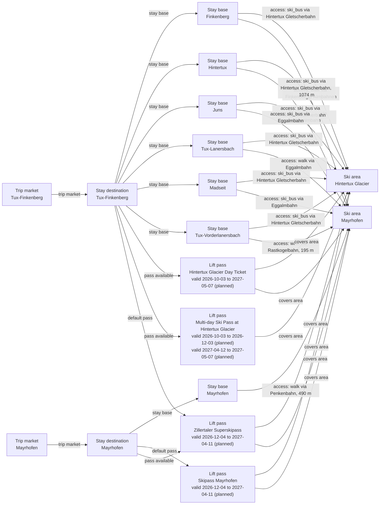

# Tux-Finkenberg boundary, access and pass graph remediation

Remediates the Tux-Finkenberg/Hintertux review boundary by preserving the policy-determined six-base stay market, completing a source-backed 12-edge access graph across Hintertux Glacier and Mayrhofen ski area, anchoring representative market coordinates at the official Lanersbach tourism office, recording product validity windows, and keeping the bounded Mayrhofen-Hippach additions as explicit regional follow-up.

## Resulting Graph

## Reviewed Targets

| Target | Scope | Graph Role | Required Fields |
| --- | --- | --- | --- |
| `stay_base:mayrhofen-schwendau` | `narrow` | `focus` | `stay_base_id` |
| `stay_base:mayrhofen-hochschwendberg` | `narrow` | `focus` | `stay_base_id` |
| `stay_base:mayrhofen-hippach-base` | `narrow` | `focus` | `stay_base_id` |
| `stay_base:mayrhofen-ramsau` | `narrow` | `focus` | `stay_base_id` |
| `ski_area_access:tux-finkenberg-hintertux--mayrhofen-ski-area` | `full` | `focus` | all canonical fields |
| `ski_area_access:mayrhofen-schwendau--mayrhofen-ski-area` | `narrow` | `focus` | `ski_area_access_id` |
| `ski_area_access:mayrhofen-hochschwendberg--mayrhofen-ski-area` | `narrow` | `focus` | `ski_area_access_id` |
| `lift_pass_product:hintertux-glacier-day-pass` | `full` | `focus` | all canonical fields |
| `lift_pass_product:hintertux-glacier-multiday-skipass` | `full` | `focus` | all canonical fields |
| `lift_pass_product:ski-glacier-world-zillertal-3000` | `full` | `focus` | all canonical fields |
| `lift_pass_product:skipass-mayrhofen` | `full` | `focus` | all canonical fields |
| `lift_pass_product:zillertaler-superskipass` | `full` | `focus` | all canonical fields |
| `lift_pass_product:zillertaler-superskipass-mayrhofen` | `full` | `focus` | all canonical fields |
| `rental_display_fact:hintertux-intersport-hintertux` | `full` | `focus` | all canonical fields |
| `rental_display_fact:tux-finkenberg-intersport-hintertux` | `full` | `focus` | all canonical fields |
| `ski_area:hintertux-glacier` | `full` | `focus` | all canonical fields |
| `ski_area:mayrhofen-ski-area` | `full` | `focus` | all canonical fields |
| `ski_area_access:hintertux-hintertux--hintertux-glacier` | `full` | `focus` | all canonical fields |
| `ski_area_access:tux-finkenberg-finkenberg--mayrhofen-ski-area` | `full` | `focus` | all canonical fields |
| `ski_area_access:tux-finkenberg-hintertux--hintertux-glacier` | `full` | `focus` | all canonical fields |
| `ski_area_access:tux-finkenberg-juns--hintertux-glacier` | `full` | `focus` | all canonical fields |
| `ski_area_access:tux-finkenberg-lanersbach--mayrhofen-ski-area` | `full` | `focus` | all canonical fields |
| `ski_area_access:tux-finkenberg-madseit--hintertux-glacier` | `full` | `focus` | all canonical fields |
| `ski_area_access:tux-finkenberg-vorderlanersbach--mayrhofen-ski-area` | `full` | `focus` | all canonical fields |
| `ski_region:hintertux` | `full` | `focus` | all canonical fields |
| `ski_region:tux-finkenberg` | `full` | `focus` | all canonical fields |
| `stay_base:hintertux-hintertux` | `full` | `focus` | all canonical fields |
| `stay_base:mayrhofen-mayrhofen` | `full` | `focus` | all canonical fields |
| `stay_base:tux-finkenberg-finkenberg` | `full` | `focus` | all canonical fields |
| `stay_base:tux-finkenberg-hintertux` | `full` | `focus` | all canonical fields |
| `stay_base:tux-finkenberg-juns` | `full` | `focus` | all canonical fields |
| `stay_base:tux-finkenberg-lanersbach` | `full` | `focus` | all canonical fields |
| `stay_base:tux-finkenberg-madseit` | `full` | `focus` | all canonical fields |
| `stay_base:tux-finkenberg-vorderlanersbach` | `full` | `focus` | all canonical fields |
| `stay_destination:hintertux` | `full` | `focus` | all canonical fields |
| `stay_destination:mayrhofen` | `full` | `focus` | all canonical fields |
| `stay_destination:tux-finkenberg` | `full` | `focus` | all canonical fields |
| `trust_manifest:lift_pass_products:hintertux-glacier-day-pass` | `full` | `focus` | all canonical fields |
| `trust_manifest:lift_pass_products:hintertux-glacier-multiday-skipass` | `full` | `focus` | all canonical fields |
| `trust_manifest:lift_pass_products:ski-glacier-world-zillertal-3000` | `full` | `focus` | all canonical fields |
| `trust_manifest:lift_pass_products:skipass-mayrhofen` | `full` | `focus` | all canonical fields |
| `trust_manifest:lift_pass_products:zillertaler-superskipass` | `full` | `focus` | all canonical fields |
| `trust_manifest:lift_pass_products:zillertaler-superskipass-mayrhofen` | `full` | `focus` | all canonical fields |
| `trust_manifest:rental_display_facts:hintertux-intersport-hintertux` | `full` | `focus` | all canonical fields |
| `trust_manifest:rental_display_facts:tux-finkenberg-intersport-hintertux` | `full` | `focus` | all canonical fields |
| `trust_manifest:ski_area_access:hintertux-hintertux--hintertux-glacier` | `full` | `focus` | all canonical fields |
| `trust_manifest:ski_area_access:tux-finkenberg-finkenberg--mayrhofen-ski-area` | `full` | `focus` | all canonical fields |
| `trust_manifest:ski_area_access:tux-finkenberg-hintertux--hintertux-glacier` | `full` | `focus` | all canonical fields |
| `trust_manifest:ski_area_access:tux-finkenberg-juns--hintertux-glacier` | `full` | `focus` | all canonical fields |
| `trust_manifest:ski_area_access:tux-finkenberg-lanersbach--mayrhofen-ski-area` | `full` | `focus` | all canonical fields |
| `trust_manifest:ski_area_access:tux-finkenberg-madseit--hintertux-glacier` | `full` | `focus` | all canonical fields |
| `trust_manifest:ski_area_access:tux-finkenberg-vorderlanersbach--mayrhofen-ski-area` | `full` | `focus` | all canonical fields |
| `trust_manifest:ski_areas:hintertux-glacier` | `full` | `focus` | all canonical fields |
| `trust_manifest:ski_regions:hintertux` | `full` | `focus` | all canonical fields |
| `trust_manifest:ski_regions:tux-finkenberg` | `full` | `focus` | all canonical fields |
| `trust_manifest:stay_bases:hintertux-hintertux` | `full` | `focus` | all canonical fields |
| `trust_manifest:stay_bases:tux-finkenberg-finkenberg` | `full` | `focus` | all canonical fields |
| `trust_manifest:stay_bases:tux-finkenberg-hintertux` | `full` | `focus` | all canonical fields |
| `trust_manifest:stay_bases:tux-finkenberg-juns` | `full` | `focus` | all canonical fields |
| `trust_manifest:stay_bases:tux-finkenberg-lanersbach` | `full` | `focus` | all canonical fields |
| `trust_manifest:stay_bases:tux-finkenberg-madseit` | `full` | `focus` | all canonical fields |
| `trust_manifest:stay_bases:tux-finkenberg-vorderlanersbach` | `full` | `focus` | all canonical fields |
| `trust_manifest:stay_destinations:hintertux` | `full` | `focus` | all canonical fields |
| `trust_manifest:stay_destinations:tux-finkenberg` | `full` | `focus` | all canonical fields |
| `ski_area_access:tux-finkenberg-vorderlanersbach--hintertux-glacier` | `full` | `focus` | all canonical fields |
| `trust_manifest:ski_area_access:tux-finkenberg-vorderlanersbach--hintertux-glacier` | `full` | `focus` | all canonical fields |
| `ski_area_access:tux-finkenberg-lanersbach--hintertux-glacier` | `full` | `focus` | all canonical fields |
| `trust_manifest:ski_area_access:tux-finkenberg-lanersbach--hintertux-glacier` | `full` | `focus` | all canonical fields |
| `ski_area_access:tux-finkenberg-finkenberg--hintertux-glacier` | `full` | `focus` | all canonical fields |
| `trust_manifest:ski_area_access:tux-finkenberg-finkenberg--hintertux-glacier` | `full` | `focus` | all canonical fields |
| `ski_area_access:tux-finkenberg-juns--mayrhofen-ski-area` | `full` | `focus` | all canonical fields |
| `trust_manifest:ski_area_access:tux-finkenberg-juns--mayrhofen-ski-area` | `full` | `focus` | all canonical fields |
| `ski_area_access:tux-finkenberg-madseit--mayrhofen-ski-area` | `full` | `focus` | all canonical fields |
| `trust_manifest:ski_area_access:tux-finkenberg-madseit--mayrhofen-ski-area` | `full` | `focus` | all canonical fields |
| `trust_manifest:ski_area_access:tux-finkenberg-hintertux--mayrhofen-ski-area` | `full` | `focus` | all canonical fields |

## Review Evidence Envelope

| Family | Source Kind | Source URLs | Candidate Kinds |
| --- | --- | --- | --- |
| `tux-finkenberg-destination-booking` | `destination_booking` | [https://www.tux.at/en/booking/](https://www.tux.at/en/booking/), [https://www.tux.at/en/tux-finkenberg/](https://www.tux.at/en/tux-finkenberg/), [https://www.tux.at/en/tourist-association-offices/](https://www.tux.at/en/tourist-association-offices/), [https://www.tux.at/en/finkenberg/](https://www.tux.at/en/finkenberg/) | `stay_destination`, `stay_base` |
| `hintertux-zillertal-3000-operator` | `ski_area_operator` | [https://www.hintertuxergletscher.at/en/information/about-us/interesting-facts/](https://www.hintertuxergletscher.at/en/information/about-us/interesting-facts/), [https://www.hintertuxergletscher.at/en/skiing/hintertux-glacier/ski-snowboard/](https://www.hintertuxergletscher.at/en/skiing/hintertux-glacier/ski-snowboard/), [https://www.hintertuxergletscher.at/en/skiing/skiing-region-current-information/interactive-ski-map/?L=0](https://www.hintertuxergletscher.at/en/skiing/skiing-region-current-information/interactive-ski-map/?L=0), [https://www.hintertuxergletscher.at/en/skiing/ski-glacier-world-zillertal-3000/eggalm-bahnen/](https://www.hintertuxergletscher.at/en/skiing/ski-glacier-world-zillertal-3000/eggalm-bahnen/), [https://www.hintertuxergletscher.at/en/skiing/ski-glacier-world-zillertal-3000/rastkogel-bahnen/](https://www.hintertuxergletscher.at/en/skiing/ski-glacier-world-zillertal-3000/rastkogel-bahnen/), [https://www.hintertuxergletscher.at/en/skiing/ski-glacier-world-zillertal-3000/finkenberger-almbahnen/](https://www.hintertuxergletscher.at/en/skiing/ski-glacier-world-zillertal-3000/finkenberger-almbahnen/) | `ski_area`, `ski_area_access`, `terrain_domain` |
| `mayrhofen-hippach-destination-market` | `destination_booking` | [https://www.mayrhofen.at/en/pages/arrival-and-getting-here](https://www.mayrhofen.at/en/pages/arrival-and-getting-here), [https://www.mayrhofen.at/en/pages/mountopolis-starting-page-winter](https://www.mayrhofen.at/en/pages/mountopolis-starting-page-winter), [https://www.mayrhofen.at/en/pages/weather-in-the-holiday-region](https://www.mayrhofen.at/en/pages/weather-in-the-holiday-region) | `stay_destination`, `stay_base` |
| `mayrhofen-operator-and-access` | `ski_area_operator` | [https://www.mayrhofen.at/en/service-providers/mayrhofner-bergbahnen](https://www.mayrhofen.at/en/service-providers/mayrhofner-bergbahnen), [https://www.mayrhofen.at/en/service-providers/moeslbahn](https://www.mayrhofen.at/en/service-providers/moeslbahn), [https://www.mayrhofen.at/en/stories/mountopolis-mount-ahorn-winter](https://www.mayrhofen.at/en/stories/mountopolis-mount-ahorn-winter), [https://www.mayrhofen.at/en/stories/open-cable-cars-mayrhofner-bergbahnen-winter](https://www.mayrhofen.at/en/stories/open-cable-cars-mayrhofner-bergbahnen-winter) | `ski_area`, `ski_area_access`, `terrain_domain` |
| `line-4104-cross-valley-access` | `access_transport` | [https://www.hintertuxergletscher.at/en/information/plan-your-visit/bus-schedules/?L=1](https://www.hintertuxergletscher.at/en/information/plan-your-visit/bus-schedules/?L=1), [https://www.hintertuxergletscher.at/en/information/plan-your-visit/getting-there-parking/?L=0](https://www.hintertuxergletscher.at/en/information/plan-your-visit/getting-there-parking/?L=0), [https://www.tux.at/fileadmin/user_upload/Dokumente/Fahrplan_Bus/Fahrplan_Linie_4104_Jahresfahrplan_ab_31.05.2025.pdf](https://www.tux.at/fileadmin/user_upload/Dokumente/Fahrplan_Bus/Fahrplan_Linie_4104_Jahresfahrplan_ab_31.05.2025.pdf), [https://www.tux.at/fileadmin/user_upload/Dokumente/Fahrplan_Bus/Busplan_Linie_4104_Sommer_ab_30.05.2026.pdf](https://www.tux.at/fileadmin/user_upload/Dokumente/Fahrplan_Bus/Busplan_Linie_4104_Sommer_ab_30.05.2026.pdf) | `stay_base`, `ski_area_access` |
| `winter-2026-27-pass-tariffs` | `pass_tariff` | [https://www.hintertuxergletscher.at/en/tickets-rates/tickets-rates/rates-hintertux-glacier/](https://www.hintertuxergletscher.at/en/tickets-rates/tickets-rates/rates-hintertux-glacier/), [https://www.mayrhofen.at/en/stories/mountopolis-prices-and-opening-hours-winter](https://www.mayrhofen.at/en/stories/mountopolis-prices-and-opening-hours-winter), [https://assets.contenthub.dev/390osprlshgj/c043e8576ce9b8e9606c8d2f8c447189/2026-27_Prices%20Winter_EN.pdf](https://assets.contenthub.dev/390osprlshgj/c043e8576ce9b8e9606c8d2f8c447189/2026-27_Prices%20Winter_EN.pdf) | `lift_pass_product`, `ski_area` |

## Entity Scope Assessments

| Candidate | Kind | Disposition | Signals | Catalog Targets | Evidence | Backlog | Graph Impact | Rationale |
| --- | --- | --- | --- | --- | --- | --- | --- | --- |
| `tux-finkenberg` (Tux-Finkenberg) | `stay_destination` | `add_entity` | `independent_stay_market`, `direct_access_relationship`, `official_independent_identity` | `stay_destination:tux-finkenberg` | `scope-tux-region`, `scope-tux-booking`, `scope-tux-offices` |  | `graph_blocking` | Policy-determined complete stay market with shared tourism ownership, accommodation inventory, material village/access variation and six explicit bases. |
| `hintertux` (Hintertux) | `stay_destination` | `not_separate` | `official_independent_identity`, `direct_access_relationship` | `stay_destination:hintertux`, `stay_destination:tux-finkenberg` | `scope-tux-region`, `scope-tux-booking` |  | `graph_blocking` | Hintertux is a represented base within the complete Tux-Finkenberg stay-market owner, not an independently owned accommodation market; the legacy destination target is fully reconciled as removed. |
| `mayrhofen` (Mayrhofen) | `stay_destination` | `represented` | `independent_stay_market`, `direct_access_relationship`, `official_independent_identity` | `stay_destination:mayrhofen` | `scope-mayrhofen-market` |  | `graph_blocking` | The neighboring Mayrhofen market remains represented and unchanged. |
| `mayrhofen-hippach` (Mayrhofen-Hippach) | `stay_destination` | `deferred` | `independent_stay_market`, `official_independent_identity` |  | `scope-mayrhofen-market` | `docs/product-backlog.md#mayrhofen-hippach-and-tux-finkenberg-completion` | `regional_followup` | Its complete accommodation boundary and linked base/access graph remain owned by the parked regional backlog dependency and are not mutated here. |
| `tux-finkenberg-hintertux` (Hintertux) | `stay_base` | `add_entity` | `official_independent_identity`, `direct_access_relationship` | `stay_base:tux-finkenberg-hintertux` | `scope-tux-region` |  | `graph_blocking` | Officially named accommodation village represented as a base of the Tux-Finkenberg destination with an explicit source-backed access edge. |
| `tux-finkenberg-vorderlanersbach` (Tux-Vorderlanersbach) | `stay_base` | `add_entity` | `official_independent_identity`, `direct_access_relationship` | `stay_base:tux-finkenberg-vorderlanersbach` | `scope-tux-region`, `scope-eggalm` |  | `graph_blocking` | Officially named accommodation village represented as a base of the Tux-Finkenberg destination with an explicit source-backed access edge. |
| `tux-finkenberg-lanersbach` (Tux-Lanersbach) | `stay_base` | `add_entity` | `official_independent_identity`, `direct_access_relationship` | `stay_base:tux-finkenberg-lanersbach` | `scope-tux-region`, `scope-eggalm` |  | `graph_blocking` | Officially named accommodation village represented as a base of the Tux-Finkenberg destination with an explicit source-backed access edge. |
| `tux-finkenberg-juns` (Juns) | `stay_base` | `add_entity` | `official_independent_identity`, `direct_access_relationship` | `stay_base:tux-finkenberg-juns` | `scope-tux-region`, `scope-bus-4104` |  | `graph_blocking` | Officially named accommodation village represented as a base of the Tux-Finkenberg destination with an explicit source-backed access edge. |
| `tux-finkenberg-madseit` (Madseit) | `stay_base` | `add_entity` | `official_independent_identity`, `direct_access_relationship` | `stay_base:tux-finkenberg-madseit` | `scope-tux-region`, `scope-bus-4104` |  | `graph_blocking` | Officially named accommodation village represented as a base of the Tux-Finkenberg destination with an explicit source-backed access edge. |
| `tux-finkenberg-finkenberg` (Finkenberg) | `stay_base` | `add_entity` | `official_independent_identity`, `direct_access_relationship` | `stay_base:tux-finkenberg-finkenberg` | `scope-tux-region`, `scope-finkenberg` |  | `graph_blocking` | Officially named accommodation village represented as a base of the Tux-Finkenberg destination with an explicit source-backed access edge. |
| `hintertux-hintertux-legacy` (Legacy Hintertux base key) | `stay_base` | `not_separate` | `official_independent_identity`, `direct_access_relationship` | `stay_base:hintertux-hintertux`, `stay_base:tux-finkenberg-hintertux` | `scope-tux-region` |  | `graph_blocking` | The former destination-qualified base key is removed atomically and replaced by the same village under the policy-compliant destination owner. |
| `mayrhofen-mayrhofen` (Mayrhofen) | `stay_base` | `represented` | `official_independent_identity`, `direct_access_relationship` | `stay_base:mayrhofen-mayrhofen` | `scope-mayrhofen-market` |  | `graph_blocking` | The represented Mayrhofen base remains unchanged. |
| `mayrhofen-schwendau` (Schwendau) | `stay_base` | `deferred` | `official_independent_identity`, `distinct_access` |  | `scope-mayrhofen-schwendau-base` | `docs/product-backlog.md#mayrhofen-hippach-and-tux-finkenberg-completion` | `regional_followup` | Source-backed linked base remains part of the separately owned Mayrhofen-Hippach completion graph; adding it alone would mutate the deferred dependency. |
| `mayrhofen-hochschwendberg` (Hochschwendberg) | `stay_base` | `deferred` | `official_independent_identity`, `distinct_access` |  | `scope-mayrhofen-hochschwendberg-base` | `docs/product-backlog.md#mayrhofen-hippach-and-tux-finkenberg-completion` | `regional_followup` | Source-backed linked base remains part of the separately owned Mayrhofen-Hippach completion graph; adding it alone would mutate the deferred dependency. |
| `mayrhofen-hippach-base` (Hippach) | `stay_base` | `deferred` | `official_independent_identity`, `distinct_access` |  | `scope-mayrhofen-hippach-base` | `docs/product-backlog.md#mayrhofen-hippach-and-tux-finkenberg-completion` | `regional_followup` | Source-backed linked base remains part of the separately owned Mayrhofen-Hippach completion graph; adding it alone would mutate the deferred dependency. |
| `mayrhofen-ramsau` (Ramsau) | `stay_base` | `deferred` | `official_independent_identity`, `distinct_access` |  | `scope-mayrhofen-ramsau-base` | `docs/product-backlog.md#mayrhofen-hippach-and-tux-finkenberg-completion` | `regional_followup` | Source-backed linked base remains part of the separately owned Mayrhofen-Hippach completion graph; adding it alone would mutate the deferred dependency. |
| `hintertux-glacier` (Hintertux Glacier) | `ski_area` | `represented` | `official_independent_identity`, `separate_operator`, `independent_status_or_schedule`, `independent_weather_presentation`, `child_scoped_terrain_metrics`, `full_local_pass` | `ski_area:hintertux-glacier` | `scope-hintertux-area`, `scope-hintertux-passes` |  | `graph_blocking` | Independent glacier operations, weather, terrain and local pass owner is retained without geometry change. |
| `mayrhofen-ski-area` (Mayrhofen) | `ski_area` | `represented` | `official_independent_identity`, `separate_operator`, `independent_status_or_schedule`, `independent_weather_presentation`, `child_scoped_terrain_metrics`, `full_local_pass` | `ski_area:mayrhofen-ski-area` | `scope-mayrhofen-area`, `scope-mayrhofen-passes` |  | `graph_blocking` | Existing complete Mayrhofen-side operations, weather and pass owner is retained. |
| `eggalm` (Eggalm) | `ski_area` | `not_separate` | `official_map_sector`, `ski_connected_terrain`, `official_independent_identity` | `ski_area:mayrhofen-ski-area` | `scope-eggalm` |  | `graph_blocking` | Named sector remains inside the represented Mayrhofen operations/weather owner; separate identity would duplicate parent-owned scope. |
| `rastkogel` (Rastkogel) | `ski_area` | `not_separate` | `official_map_sector`, `ski_connected_terrain`, `official_independent_identity` | `ski_area:mayrhofen-ski-area` | `scope-finkenberg` |  | `graph_blocking` | Named sector remains inside the represented Mayrhofen operations/weather owner; separate identity would duplicate parent-owned scope. |
| `finkenberg` (Finkenberg) | `ski_area` | `not_separate` | `official_map_sector`, `ski_connected_terrain`, `official_independent_identity` | `ski_area:mayrhofen-ski-area` | `scope-finkenberg` |  | `graph_blocking` | Named sector remains inside the represented Mayrhofen operations/weather owner; separate identity would duplicate parent-owned scope. |
| `penken-mayrhofen` (Penken) | `ski_area` | `not_separate` | `official_map_sector`, `ski_connected_terrain`, `official_independent_identity` | `ski_area:mayrhofen-ski-area` | `scope-finkenberg` |  | `graph_blocking` | Named sector remains inside the represented Mayrhofen operations/weather owner; separate identity would duplicate parent-owned scope. |
| `ahorn` (Ahorn) | `ski_area` | `not_separate` | `official_map_sector`, `official_independent_identity`, `disconnected_terrain` | `ski_area:mayrhofen-ski-area` | `scope-ahorn`, `scope-mayrhofen-winter-map` |  | `graph_blocking` | The official Ahorn page and Mayrhofner Bergbahnen slope-map context establish a complete but physically separate Mayrhofen component reached through its own valley lift. Ahorn remains inside the represented Mayrhofen owner because operations, weather and pass scope are parent-owned rather than independent. |
| `tux-finkenberg-hintertux--hintertux-glacier` (Hintertux to Hintertux Glacier) | `ski_area_access` | `add_entity` | `direct_access_relationship`, `distinct_access` | `ski_area_access:tux-finkenberg-hintertux--hintertux-glacier` | `scope-bus-4104` |  | `graph_blocking` | Direct first-party lift or stop-level timetable evidence supports the exact edge; unsupported route distance and duration remain null. |
| `tux-finkenberg-vorderlanersbach--mayrhofen-ski-area` (Vorderlanersbach to Mayrhofen ski area) | `ski_area_access` | `add_entity` | `direct_access_relationship`, `distinct_access` | `ski_area_access:tux-finkenberg-vorderlanersbach--mayrhofen-ski-area` | `scope-finkenberg`, `scope-vorderlanersbach-rastkogel`, `scope-vorderlanersbach-osm`, `scope-rastkogel-station-osm` |  | `graph_blocking` | The operator places Rastkogel Bahnen in Vorderlanersbach and describes direct valley-station and walking-distance arrival. OSM identifies the village point and Rastkogelbahn valley station 195 m apart by rounded Haversine measurement; route distance and duration remain unasserted. |
| `tux-finkenberg-lanersbach--mayrhofen-ski-area` (Lanersbach to Mayrhofen ski area) | `ski_area_access` | `add_entity` | `direct_access_relationship`, `distinct_access` | `ski_area_access:tux-finkenberg-lanersbach--mayrhofen-ski-area` | `scope-eggalm` |  | `graph_blocking` | Direct first-party lift or stop-level timetable evidence supports the exact edge; unsupported route distance and duration remain null. |
| `tux-finkenberg-finkenberg--mayrhofen-ski-area` (Finkenberg to Mayrhofen ski area) | `ski_area_access` | `add_entity` | `direct_access_relationship`, `distinct_access` | `ski_area_access:tux-finkenberg-finkenberg--mayrhofen-ski-area` | `scope-finkenberg` |  | `graph_blocking` | Direct first-party lift or stop-level timetable evidence supports the exact edge; unsupported route distance and duration remain null. |
| `tux-finkenberg-juns--hintertux-glacier` (Juns to Hintertux Glacier) | `ski_area_access` | `add_entity` | `direct_access_relationship`, `distinct_access` | `ski_area_access:tux-finkenberg-juns--hintertux-glacier` | `scope-bus-4104` |  | `graph_blocking` | Direct first-party lift or stop-level timetable evidence supports the exact edge; unsupported route distance and duration remain null. |
| `tux-finkenberg-madseit--hintertux-glacier` (Madseit to Hintertux Glacier) | `ski_area_access` | `add_entity` | `direct_access_relationship`, `distinct_access` | `ski_area_access:tux-finkenberg-madseit--hintertux-glacier` | `scope-bus-4104` |  | `graph_blocking` | Direct first-party lift or stop-level timetable evidence supports the exact edge; unsupported route distance and duration remain null. |
| `hintertux-hintertux--hintertux-glacier-legacy` (Legacy Hintertux access key) | `ski_area_access` | `not_separate` | `direct_access_relationship`, `distinct_access` | `ski_area_access:hintertux-hintertux--hintertux-glacier`, `ski_area_access:tux-finkenberg-hintertux--hintertux-glacier` | `scope-bus-4104` |  | `graph_blocking` | The source-backed relationship is preserved while its destination-qualified base and access IDs are rekeyed atomically. |
| `tux-finkenberg-hintertux--mayrhofen-ski-area` (Hintertux to Mayrhofen ski area) | `ski_area_access` | `add_entity` | `direct_access_relationship` | `ski_area_access:tux-finkenberg-hintertux--mayrhofen-ski-area` | `remediation-access-tux-finkenberg-hintertux-mayrhofen-ski-area-source-urls` |  | `graph_blocking` | The current official 2026 line 4104 timetable places Hintertux Gletscherbahn and the Mayrhofen valley stops on one route, supporting a conservative ski-bus access edge to the Mayrhofen ski area. Exact distance and duration remain unresolved. |
| `mayrhofen-schwendau--mayrhofen-ski-area` (Schwendau to Mayrhofen ski area) | `ski_area_access` | `deferred` | `distinct_access`, `direct_access_relationship` |  | `scope-mayrhofen-schwendau-access` | `docs/product-backlog.md#mayrhofen-hippach-and-tux-finkenberg-completion` | `regional_followup` | Known linked access remains part of the parked Mayrhofen-Hippach/regional completion dependency; no unsupported partial edge is added. |
| `mayrhofen-hochschwendberg--mayrhofen-ski-area` (Hochschwendberg to Mayrhofen ski area) | `ski_area_access` | `deferred` | `distinct_access`, `direct_access_relationship` |  | `scope-mayrhofen-hochschwendberg-access` | `docs/product-backlog.md#mayrhofen-hippach-and-tux-finkenberg-completion` | `regional_followup` | Known linked access remains part of the parked Mayrhofen-Hippach/regional completion dependency; no unsupported partial edge is added. |
| `ski-glacier-world-zillertal-3000` (Ski and Glacier World Zillertal 3000) | `terrain_domain` | `external_pass_context` | `official_independent_identity`, `disconnected_terrain` |  | `scope-eggalm`, `scope-hintertux-area` |  | `graph_blocking` | The official umbrella includes a ski-bus gap between Eggalm and Hintertux, so it is regional/pass context rather than a physically connected terrain domain. |
| `hintertux-glacier-day-pass` (Hintertux Glacier Day Ticket) | `lift_pass_product` | `add_entity` | `official_product_identity`, `full_local_pass` | `lift_pass_product:hintertux-glacier-day-pass` | `scope-hintertux-passes` |  | `graph_blocking` | Official product-specific tariff establishes a distinct entitlement, date window and representative adult price. |
| `hintertux-glacier-multiday-skipass` (Multi-day Ski Pass at Hintertux Glacier) | `lift_pass_product` | `add_entity` | `official_product_identity`, `full_local_pass` | `lift_pass_product:hintertux-glacier-multiday-skipass` | `scope-hintertux-passes` |  | `graph_blocking` | Official product-specific tariff establishes a distinct entitlement, date window and representative adult price. |
| `skipass-mayrhofen` (Skipass Mayrhofen) | `lift_pass_product` | `add_entity` | `official_product_identity`, `full_local_pass` | `lift_pass_product:skipass-mayrhofen` | `scope-mayrhofen-passes` |  | `graph_blocking` | Official product-specific tariff establishes a distinct entitlement, date window and representative adult price. |
| `zillertaler-superskipass` (Zillertaler Superskipass) | `lift_pass_product` | `add_entity` | `official_product_identity`, `full_local_pass` | `lift_pass_product:zillertaler-superskipass` | `scope-mayrhofen-passes` |  | `graph_blocking` | Official product-specific tariff establishes a distinct entitlement, date window and representative adult price. |
| `ski-glacier-world-zillertal-3000-old-product` (Legacy Ski and Glacier World composite pass) | `lift_pass_product` | `not_separate` | `official_product_identity` | `lift_pass_product:ski-glacier-world-zillertal-3000`, `lift_pass_product:hintertux-glacier-day-pass`, `lift_pass_product:hintertux-glacier-multiday-skipass`, `lift_pass_product:zillertaler-superskipass` | `scope-hintertux-passes`, `scope-mayrhofen-passes` |  | `graph_blocking` | Legacy composite conflated three date- and scope-distinct products; it is removed in favor of the exact official products. |
| `zillertaler-superskipass-mayrhofen-old-product` (Legacy Mayrhofen composite pass) | `lift_pass_product` | `not_separate` | `official_product_identity` | `lift_pass_product:zillertaler-superskipass-mayrhofen`, `lift_pass_product:skipass-mayrhofen`, `lift_pass_product:zillertaler-superskipass` | `scope-mayrhofen-passes` |  | `graph_blocking` | Destination-qualified composite duplicated the shared Superskipass and conflated it with the Mayrhofen day product. |
| `tux-finkenberg-vorderlanersbach--hintertux-glacier` (tux-finkenberg-vorderlanersbach to hintertux-glacier) | `ski_area_access` | `add_entity` | `direct_access_relationship` | `ski_area_access:tux-finkenberg-vorderlanersbach--hintertux-glacier` | `remediation-access-tux-finkenberg-vorderlanersbach-hintertux-glacier-source-urls` |  | `graph_blocking` | The current official 2026 line 4104 timetable lists tux-finkenberg-vorderlanersbach and Hintertux Gletscherbahn on the same route, supporting this conservative ski-bus access edge. Exact distance and duration remain unresolved. |
| `tux-finkenberg-lanersbach--hintertux-glacier` (tux-finkenberg-lanersbach to hintertux-glacier) | `ski_area_access` | `add_entity` | `direct_access_relationship` | `ski_area_access:tux-finkenberg-lanersbach--hintertux-glacier` | `remediation-access-tux-finkenberg-lanersbach-hintertux-glacier-source-urls` |  | `graph_blocking` | The current official 2026 line 4104 timetable lists tux-finkenberg-lanersbach and Hintertux Gletscherbahn on the same route, supporting this conservative ski-bus access edge. Exact distance and duration remain unresolved. |
| `tux-finkenberg-finkenberg--hintertux-glacier` (tux-finkenberg-finkenberg to hintertux-glacier) | `ski_area_access` | `add_entity` | `direct_access_relationship` | `ski_area_access:tux-finkenberg-finkenberg--hintertux-glacier` | `remediation-access-tux-finkenberg-finkenberg-hintertux-glacier-source-urls` |  | `graph_blocking` | The current official 2026 line 4104 timetable lists tux-finkenberg-finkenberg and Hintertux Gletscherbahn on the same route, supporting this conservative ski-bus access edge. Exact distance and duration remain unresolved. |
| `tux-finkenberg-juns--mayrhofen-ski-area` (tux-finkenberg-juns to mayrhofen-ski-area) | `ski_area_access` | `add_entity` | `direct_access_relationship` | `ski_area_access:tux-finkenberg-juns--mayrhofen-ski-area` | `remediation-access-tux-finkenberg-juns-mayrhofen-ski-area-source-urls` |  | `graph_blocking` | The current official 2026 line 4104 timetable lists tux-finkenberg-juns and Eggalmbahn on the same route, supporting this conservative ski-bus access edge. Exact distance and duration remain unresolved. |
| `tux-finkenberg-madseit--mayrhofen-ski-area` (tux-finkenberg-madseit to mayrhofen-ski-area) | `ski_area_access` | `add_entity` | `direct_access_relationship` | `ski_area_access:tux-finkenberg-madseit--mayrhofen-ski-area` | `remediation-access-tux-finkenberg-madseit-mayrhofen-ski-area-source-urls` |  | `graph_blocking` | The current official 2026 line 4104 timetable lists tux-finkenberg-madseit and Eggalmbahn on the same route, supporting this conservative ski-bus access edge. Exact distance and duration remain unresolved. |

## Ski-Area Boundary Assessments

| Candidate | Parent | Terrain | Connectivity | Operations | Weather | Pass | Provider Consensus | Separation Value | Evidence |
| --- | --- | --- | --- | --- | --- | --- | --- | --- | --- |
| `hintertux-glacier` |  | `complete` | `not_applicable` | `independent` | `independent` | `full_local` | `separate` | `material` | `scope-hintertux-area`, `scope-hintertux-passes` |
| `mayrhofen-ski-area` |  | `complete` | `not_applicable` | `independent` | `independent` | `full_local` | `separate` | `material` | `scope-mayrhofen-area`, `scope-mayrhofen-passes` |
| `eggalm` | `mayrhofen-ski-area` | `sector` | `connected` | `parent_owned` | `parent_owned` | `shared_only` | `aggregated` | `redundant` | `scope-eggalm` |
| `rastkogel` | `mayrhofen-ski-area` | `sector` | `connected` | `parent_owned` | `parent_owned` | `shared_only` | `aggregated` | `redundant` | `scope-finkenberg` |
| `finkenberg` | `mayrhofen-ski-area` | `sector` | `connected` | `parent_owned` | `parent_owned` | `shared_only` | `aggregated` | `redundant` | `scope-finkenberg` |
| `penken-mayrhofen` | `mayrhofen-ski-area` | `sector` | `connected` | `parent_owned` | `parent_owned` | `shared_only` | `aggregated` | `redundant` | `scope-finkenberg` |
| `ahorn` | `mayrhofen-ski-area` | `complete` | `transfer_required` | `parent_owned` | `parent_owned` | `shared_only` | `aggregated` | `redundant` | `scope-ahorn`, `scope-mayrhofen-winter-map` |

## Changed Fields

| Target | Field | Before | After | Trust | Ranking Relevant |
| --- | --- | --- | --- | --- | --- |
| `lift_pass_product:hintertux-glacier-day-pass` | `available_from_stay_destination_ids` | `null` | `["tux-finkenberg"]` | `verified_with_adjustment` | yes |
| `lift_pass_product:hintertux-glacier-day-pass` | `default_for_stay_destination_ids` | `null` | `[]` | `verified_with_adjustment` | yes |
| `lift_pass_product:hintertux-glacier-day-pass` | `external_validity_summary` | `null` | `"Valid at Hintertux Glacier throughout 2026-10-03 to 2027-05-07; from 2026-12-04 to 2027-04-11 it additionally covers Eggalm, Rastkogel, Finkenberg, Penken and Ahorn. Conditional wider coverage is not asserted as year-round modeled-area coverage."` | `verified_with_adjustment` | no |
| `lift_pass_product:hintertux-glacier-day-pass` | `lift_pass_product_id` | `null` | `"hintertux-glacier-day-pass"` | `verified_with_adjustment` | yes |
| `lift_pass_product:hintertux-glacier-day-pass` | `name` | `null` | `"Hintertux Glacier Day Ticket"` | `verified_with_adjustment` | no |
| `lift_pass_product:hintertux-glacier-day-pass` | `prices` | `null` | `[{"amount": 82.0, "amount_max": null, "amount_min": null, "audience": "adult", "currency": "EUR", "duration_days": 1, "price_kind": "fixed", "season_label": "Winter 2026/27 day ticket: 2026-10-03 to 2027-05-07", "source_url": "https://www.hintertuxergletscher.at/en/tickets-rates/tickets-rates/rates-hintertux-glacier/"}]` | `verified_with_adjustment` | no |
| `lift_pass_product:hintertux-glacier-day-pass` | `terrain_domain_ids` | `null` | `[]` | `verified_with_adjustment` | no |
| `lift_pass_product:hintertux-glacier-day-pass` | `valid_ski_area_ids` | `null` | `["hintertux-glacier", "mayrhofen-ski-area"]` | `verified_with_adjustment` | yes |
| `lift_pass_product:hintertux-glacier-day-pass` | `validity_scope` | `null` | `"regional_network"` | `verified_with_adjustment` | yes |
| `lift_pass_product:hintertux-glacier-day-pass` | `validity_windows` | `null` | `[{"end_date": "2027-05-07", "season_label": "Winter 2026/27 Hintertux Glacier day-ticket window", "start_date": "2026-10-03", "status": "planned"}]` | `verified_with_adjustment` | yes |
| `lift_pass_product:hintertux-glacier-multiday-skipass` | `available_from_stay_destination_ids` | `null` | `["tux-finkenberg"]` | `verified_with_adjustment` | yes |
| `lift_pass_product:hintertux-glacier-multiday-skipass` | `default_for_stay_destination_ids` | `null` | `[]` | `verified_with_adjustment` | yes |
| `lift_pass_product:hintertux-glacier-multiday-skipass` | `external_validity_summary` | `null` | `"Local Hintertux Glacier 2-21 day product outside the Zillertaler Superskipass main window; the publisher's obvious 2076 typo is normalized to 2027."` | `verified_with_adjustment` | no |
| `lift_pass_product:hintertux-glacier-multiday-skipass` | `lift_pass_product_id` | `null` | `"hintertux-glacier-multiday-skipass"` | `verified_with_adjustment` | yes |
| `lift_pass_product:hintertux-glacier-multiday-skipass` | `name` | `null` | `"Multi-day Ski Pass at Hintertux Glacier"` | `verified_with_adjustment` | no |
| `lift_pass_product:hintertux-glacier-multiday-skipass` | `prices` | `null` | `[{"amount": 241.0, "amount_max": null, "amount_min": null, "audience": "adult", "currency": "EUR", "duration_days": 3, "price_kind": "fixed", "season_label": "Winter 2026/27 local windows: 2026-10-03 to 2026-12-03 and 2027-04-12 to 2027-05-07", "source_url": "https://www.hintertuxergletscher.at/en/tickets-rates/tickets-rates/rates-hintertux-glacier/"}, {"amount": 399.0, "amount_max": null, "amount_min": null, "audience": "adult", "currency": "EUR", "duration_days": 6, "price_kind": "fixed", "season_label": "Winter 2026/27 local windows: 2026-10-03 to 2026-12-03 and 2027-04-12 to 2027-05-07", "source_url": "https://www.hintertuxergletscher.at/en/tickets-rates/tickets-rates/rates-hintertux-glacier/"}]` | `verified_with_adjustment` | no |
| `lift_pass_product:hintertux-glacier-multiday-skipass` | `terrain_domain_ids` | `null` | `[]` | `verified_with_adjustment` | no |
| `lift_pass_product:hintertux-glacier-multiday-skipass` | `valid_ski_area_ids` | `null` | `["hintertux-glacier"]` | `verified_with_adjustment` | yes |
| `lift_pass_product:hintertux-glacier-multiday-skipass` | `validity_scope` | `null` | `"single_ski_area"` | `verified_with_adjustment` | yes |
| `lift_pass_product:hintertux-glacier-multiday-skipass` | `validity_windows` | `null` | `[{"end_date": "2026-12-03", "season_label": "Winter 2026/27 early local multi-day window", "start_date": "2026-10-03", "status": "planned"}, {"end_date": "2027-05-07", "season_label": "Winter 2026/27 late local multi-day window", "start_date": "2027-04-12", "status": "planned"}]` | `verified_with_adjustment` | yes |
| `lift_pass_product:ski-glacier-world-zillertal-3000` | `available_from_stay_destination_ids` | `["hintertux"]` | `null` | `estimated` | no |
| `lift_pass_product:ski-glacier-world-zillertal-3000` | `default_for_stay_destination_ids` | `["hintertux"]` | `null` | `estimated` | no |
| `lift_pass_product:ski-glacier-world-zillertal-3000` | `external_validity_summary` | `"Winter 2026/27 pass covers Hintertux Glacier locally; during the main winter network window it also covers Eggalm, Rastkogel, Finkenberg, Penken/Mayrhofen, Ahorn, and broader Zillertal Superskipass terrain depending on duration and date."` | `null` | `estimated` | no |
| `lift_pass_product:ski-glacier-world-zillertal-3000` | `lift_pass_product_id` | `"ski-glacier-world-zillertal-3000"` | `null` | `estimated` | no |
| `lift_pass_product:ski-glacier-world-zillertal-3000` | `name` | `"Ski & Glacier World Zillertal 3000 / Zillertaler Superskipass"` | `null` | `estimated` | no |
| `lift_pass_product:ski-glacier-world-zillertal-3000` | `prices` | `[{"amount": 241.0, "amount_max": null, "amount_min": null, "audience": "adult", "currency": "EUR", "duration_days": 3, "price_kind": "fixed", "season_label": "Winter 2026/27 main Zillertaler Superskipass window", "source_url": "https://www.hintertuxergletscher.at/en/tickets-rates/tickets-rates/rates-hintertux-glacier/"}, {"amount": 399.0, "amount_max": null, "amount_min": null, "audience": "adult", "currency": "EUR", "duration_days": 6, "price_kind": "fixed", "season_label": "Winter 2026/27 main Zillertaler Superskipass window", "source_url": "https://www.hintertuxergletscher.at/en/tickets-rates/tickets-rates/rates-hintertux-glacier/"}, {"amount": 82.0, "amount_max": null, "amount_min": null, "audience": "adult", "currency": "EUR", "duration_days": 1, "price_kind": "fixed", "season_label": "Winter 2026/27", "source_url": "https://www.hintertuxergletscher.at/en/tickets-rates/tickets-rates/rates-hintertux-glacier/"}]` | `null` | `estimated` | no |
| `lift_pass_product:ski-glacier-world-zillertal-3000` | `terrain_domain_ids` | `[]` | `null` | `estimated` | no |
| `lift_pass_product:ski-glacier-world-zillertal-3000` | `valid_ski_area_ids` | `["hintertux-glacier"]` | `null` | `estimated` | no |
| `lift_pass_product:ski-glacier-world-zillertal-3000` | `validity_scope` | `"regional_network"` | `null` | `estimated` | no |
| `lift_pass_product:ski-glacier-world-zillertal-3000` | `validity_windows` | `[]` | `null` | `estimated` | no |
| `lift_pass_product:skipass-mayrhofen` | `available_from_stay_destination_ids` | `null` | `["mayrhofen"]` | `verified_with_adjustment` | yes |
| `lift_pass_product:skipass-mayrhofen` | `default_for_stay_destination_ids` | `null` | `["mayrhofen"]` | `verified_with_adjustment` | yes |
| `lift_pass_product:skipass-mayrhofen` | `external_validity_summary` | `null` | `"The one-day product is valid in Mayrhofen, Eggalm, Rastkogel, Finkenberg and Hintertux Glacier; conditional cross-owner coverage remains explicit rather than broadening the Mayrhofen ski-area owner."` | `verified_with_adjustment` | no |
| `lift_pass_product:skipass-mayrhofen` | `lift_pass_product_id` | `null` | `"skipass-mayrhofen"` | `verified_with_adjustment` | yes |
| `lift_pass_product:skipass-mayrhofen` | `name` | `null` | `"Skipass Mayrhofen"` | `verified_with_adjustment` | no |
| `lift_pass_product:skipass-mayrhofen` | `prices` | `null` | `[{"amount": 82.0, "amount_max": null, "amount_min": null, "audience": "adult", "currency": "EUR", "duration_days": 1, "price_kind": "fixed", "season_label": "Winter 2026/27 Skipass Mayrhofen day ticket", "source_url": "https://www.mayrhofen.at/en/stories/mountopolis-prices-and-opening-hours-winter"}]` | `verified_with_adjustment` | no |
| `lift_pass_product:skipass-mayrhofen` | `terrain_domain_ids` | `null` | `[]` | `verified_with_adjustment` | no |
| `lift_pass_product:skipass-mayrhofen` | `valid_ski_area_ids` | `null` | `["mayrhofen-ski-area", "hintertux-glacier"]` | `verified_with_adjustment` | yes |
| `lift_pass_product:skipass-mayrhofen` | `validity_scope` | `null` | `"regional_network"` | `verified_with_adjustment` | yes |
| `lift_pass_product:skipass-mayrhofen` | `validity_windows` | `null` | `[{"end_date": "2027-04-11", "season_label": "Winter 2026/27 Mayrhofen ticket window", "start_date": "2026-12-04", "status": "planned"}]` | `verified_with_adjustment` | yes |
| `lift_pass_product:zillertaler-superskipass` | `available_from_stay_destination_ids` | `null` | `["tux-finkenberg", "mayrhofen"]` | `verified_with_adjustment` | yes |
| `lift_pass_product:zillertaler-superskipass` | `default_for_stay_destination_ids` | `null` | `["tux-finkenberg"]` | `verified_with_adjustment` | yes |
| `lift_pass_product:zillertaler-superskipass` | `external_validity_summary` | `null` | `"Valid for all lifts in Zillertal from 2026-12-04 through 2027-04-11; wider unmodeled Zillertal members remain external regional-network context."` | `verified_with_adjustment` | no |
| `lift_pass_product:zillertaler-superskipass` | `lift_pass_product_id` | `null` | `"zillertaler-superskipass"` | `verified_with_adjustment` | yes |
| `lift_pass_product:zillertaler-superskipass` | `name` | `null` | `"Zillertaler Superskipass"` | `verified_with_adjustment` | no |
| `lift_pass_product:zillertaler-superskipass` | `prices` | `null` | `[{"amount": 241.0, "amount_max": null, "amount_min": null, "audience": "adult", "currency": "EUR", "duration_days": 3, "price_kind": "fixed", "season_label": "Winter 2026/27 Zillertaler Superskipass window: 2026-12-04 to 2027-04-11", "source_url": "https://www.mayrhofen.at/en/stories/mountopolis-prices-and-opening-hours-winter"}, {"amount": 399.0, "amount_max": null, "amount_min": null, "audience": "adult", "currency": "EUR", "duration_days": 6, "price_kind": "fixed", "season_label": "Winter 2026/27 Zillertaler Superskipass window: 2026-12-04 to 2027-04-11", "source_url": "https://www.mayrhofen.at/en/stories/mountopolis-prices-and-opening-hours-winter"}]` | `verified_with_adjustment` | no |
| `lift_pass_product:zillertaler-superskipass` | `terrain_domain_ids` | `null` | `[]` | `verified_with_adjustment` | no |
| `lift_pass_product:zillertaler-superskipass` | `valid_ski_area_ids` | `null` | `["hintertux-glacier", "mayrhofen-ski-area"]` | `verified_with_adjustment` | yes |
| `lift_pass_product:zillertaler-superskipass` | `validity_scope` | `null` | `"regional_network"` | `verified_with_adjustment` | yes |
| `lift_pass_product:zillertaler-superskipass` | `validity_windows` | `null` | `[{"end_date": "2027-04-11", "season_label": "Winter 2026/27 Zillertaler Superskipass window", "start_date": "2026-12-04", "status": "planned"}]` | `verified_with_adjustment` | yes |
| `lift_pass_product:zillertaler-superskipass-mayrhofen` | `available_from_stay_destination_ids` | `["mayrhofen"]` | `null` | `estimated` | no |
| `lift_pass_product:zillertaler-superskipass-mayrhofen` | `default_for_stay_destination_ids` | `["mayrhofen"]` | `null` | `estimated` | no |
| `lift_pass_product:zillertaler-superskipass-mayrhofen` | `external_validity_summary` | `"One-day Skipass Mayrhofen covers Mayrhofen, Eggalm, Rastkogel, Finkenberg, and Hintertux Glacier. Multi-day Zillertaler Superskipass covers all lifts in the Zillertal during the published 2026/27 main winter window. Wider Zillertal terrain is summarized here rather than copied into Mayrhofen's 142 km local ski-area metrics."` | `null` | `estimated` | no |
| `lift_pass_product:zillertaler-superskipass-mayrhofen` | `lift_pass_product_id` | `"zillertaler-superskipass-mayrhofen"` | `null` | `estimated` | no |
| `lift_pass_product:zillertaler-superskipass-mayrhofen` | `name` | `"Zillertaler Superskipass / Skipass Mayrhofen"` | `null` | `estimated` | no |
| `lift_pass_product:zillertaler-superskipass-mayrhofen` | `prices` | `[{"amount": 241.0, "amount_max": null, "amount_min": null, "audience": "adult", "currency": "EUR", "duration_days": 3, "price_kind": "fixed", "season_label": "Winter 2026/27 Zillertaler Superskipass main window", "source_url": "https://www.mayrhofen.at/en/stories/mountopolis-prices-and-opening-hours-winter"}, {"amount": 399.0, "amount_max": null, "amount_min": null, "audience": "adult", "currency": "EUR", "duration_days": 6, "price_kind": "fixed", "season_label": "Winter 2026/27 Zillertaler Superskipass main window", "source_url": "https://www.mayrhofen.at/en/stories/mountopolis-prices-and-opening-hours-winter"}, {"amount": 82.0, "amount_max": null, "amount_min": null, "audience": "adult", "currency": "EUR", "duration_days": 1, "price_kind": "fixed", "season_label": "Winter 2026/27 Skipass Mayrhofen day ticket", "source_url": "https://www.mayrhofen.at/en/stories/mountopolis-prices-and-opening-hours-winter"}]` | `null` | `estimated` | no |
| `lift_pass_product:zillertaler-superskipass-mayrhofen` | `terrain_domain_ids` | `[]` | `null` | `estimated` | no |
| `lift_pass_product:zillertaler-superskipass-mayrhofen` | `valid_ski_area_ids` | `["mayrhofen-ski-area"]` | `null` | `estimated` | no |
| `lift_pass_product:zillertaler-superskipass-mayrhofen` | `validity_scope` | `"regional_network"` | `null` | `estimated` | no |
| `lift_pass_product:zillertaler-superskipass-mayrhofen` | `validity_windows` | `[]` | `null` | `estimated` | no |
| `rental_display_fact:hintertux-intersport-hintertux` | `lift_distance` | `"near"` | `null` | `estimated` | no |
| `rental_display_fact:hintertux-intersport-hintertux` | `name` | `"INTERSPORT Hintertux"` | `null` | `estimated` | no |
| `rental_display_fact:hintertux-intersport-hintertux` | `price_max` | `70.0` | `null` | `estimated` | no |
| `rental_display_fact:hintertux-intersport-hintertux` | `price_min` | `45.0` | `null` | `estimated` | no |
| `rental_display_fact:hintertux-intersport-hintertux` | `price_range` | `"EUR 45-70"` | `null` | `estimated` | no |
| `rental_display_fact:hintertux-intersport-hintertux` | `quality` | `"premium"` | `null` | `estimated` | no |
| `rental_display_fact:hintertux-intersport-hintertux` | `rental_display_fact_id` | `"hintertux-intersport-hintertux"` | `null` | `estimated` | no |
| `rental_display_fact:hintertux-intersport-hintertux` | `stay_destination_id` | `"hintertux"` | `null` | `estimated` | no |
| `rental_display_fact:tux-finkenberg-intersport-hintertux` | `lift_distance` | `null` | `"near"` | `estimated` | no |
| `rental_display_fact:tux-finkenberg-intersport-hintertux` | `name` | `null` | `"INTERSPORT Hintertux"` | `verified_with_adjustment` | no |
| `rental_display_fact:tux-finkenberg-intersport-hintertux` | `price_max` | `null` | `70.0` | `estimated` | no |
| `rental_display_fact:tux-finkenberg-intersport-hintertux` | `price_min` | `null` | `45.0` | `estimated` | no |
| `rental_display_fact:tux-finkenberg-intersport-hintertux` | `price_range` | `null` | `"EUR 45-70"` | `estimated` | no |
| `rental_display_fact:tux-finkenberg-intersport-hintertux` | `quality` | `null` | `"premium"` | `estimated` | no |
| `rental_display_fact:tux-finkenberg-intersport-hintertux` | `rental_display_fact_id` | `null` | `"tux-finkenberg-intersport-hintertux"` | `verified_with_adjustment` | yes |
| `rental_display_fact:tux-finkenberg-intersport-hintertux` | `stay_base_id` | `null` | `"tux-finkenberg-hintertux"` | `verified_with_adjustment` | yes |
| `rental_display_fact:tux-finkenberg-intersport-hintertux` | `stay_destination_id` | `null` | `"tux-finkenberg"` | `verified_with_adjustment` | yes |
| `ski_area:hintertux-glacier` | `glacier_terrain.availability` | `"unknown"` | `"available"` | `verified` | no |
| `ski_area:hintertux-glacier` | `official_trail_map.url` | `null` | `"https://www.hintertuxergletscher.at/en/skiing/skiing-region-current-information/interactive-ski-map/?L=0"` | `verified` | no |
| `ski_area:hintertux-glacier` | `snow_park.availability` | `"unknown"` | `"available"` | `verified` | no |
| `ski_area:hintertux-glacier` | `snow_park.park_count` | `null` | `1` | `verified` | no |
| `ski_area:hintertux-glacier` | `snow_park.season_label` | `null` | `"2026-04-18 to 2026-06-01"` | `verified` | no |
| `ski_area:hintertux-glacier` | `snowmaking.availability` | `"unknown"` | `"available"` | `verified` | no |
| `ski_area_access:hintertux-hintertux--hintertux-glacier` | `access_mode` | `"ski_bus"` | `null` | `estimated` | no |
| `ski_area_access:hintertux-hintertux--hintertux-glacier` | `distance_m` | `1074` | `null` | `estimated` | no |
| `ski_area_access:hintertux-hintertux--hintertux-glacier` | `is_direct` | `false` | `null` | `estimated` | no |
| `ski_area_access:hintertux-hintertux--hintertux-glacier` | `lift_distance` | `"medium"` | `null` | `estimated` | no |
| `ski_area_access:hintertux-hintertux--hintertux-glacier` | `nearest_lift_name` | `"Gletscherbus 1 Talstation"` | `null` | `estimated` | no |
| `ski_area_access:hintertux-hintertux--hintertux-glacier` | `regional_data_ids` | `{"nearest_lift_osm_node_id": "27337851", "nearest_lift_osm_way_id": "4388462"}` | `null` | `estimated` | no |
| `ski_area_access:hintertux-hintertux--hintertux-glacier` | `ski_area_access_id` | `"hintertux-hintertux--hintertux-glacier"` | `null` | `estimated` | no |
| `ski_area_access:hintertux-hintertux--hintertux-glacier` | `ski_area_id` | `"hintertux-glacier"` | `null` | `estimated` | no |
| `ski_area_access:hintertux-hintertux--hintertux-glacier` | `source_urls` | `["https://www.hintertuxergletscher.at/en/skiing/hintertux-glacier/glacier-ski-area/", "https://www.openstreetmap.org/node/27337851", "https://www.openstreetmap.org/way/4388462"]` | `null` | `estimated` | no |
| `ski_area_access:hintertux-hintertux--hintertux-glacier` | `stay_base_id` | `"hintertux-hintertux"` | `null` | `estimated` | no |
| `ski_area_access:tux-finkenberg-finkenberg--hintertux-glacier` | `access_mode` | `null` | `"ski_bus"` | `verified_with_adjustment` | yes |
| `ski_area_access:tux-finkenberg-finkenberg--hintertux-glacier` | `is_direct` | `null` | `false` | `verified_with_adjustment` | no |
| `ski_area_access:tux-finkenberg-finkenberg--hintertux-glacier` | `lift_distance` | `null` | `"far"` | `verified_with_adjustment` | yes |
| `ski_area_access:tux-finkenberg-finkenberg--hintertux-glacier` | `nearest_lift_name` | `null` | `"Hintertux Gletscherbahn"` | `verified_with_adjustment` | no |
| `ski_area_access:tux-finkenberg-finkenberg--hintertux-glacier` | `regional_data_ids` | `null` | `{}` | `estimated` | no |
| `ski_area_access:tux-finkenberg-finkenberg--hintertux-glacier` | `ski_area_access_id` | `null` | `"tux-finkenberg-finkenberg--hintertux-glacier"` | `verified_with_adjustment` | yes |
| `ski_area_access:tux-finkenberg-finkenberg--hintertux-glacier` | `ski_area_id` | `null` | `"hintertux-glacier"` | `verified_with_adjustment` | yes |
| `ski_area_access:tux-finkenberg-finkenberg--hintertux-glacier` | `source_urls` | `null` | `["https://www.tux.at/fileadmin/user_upload/Dokumente/Fahrplan_Bus/Busplan_Linie_4104_Sommer_ab_30.05.2026.pdf"]` | `verified_with_adjustment` | no |
| `ski_area_access:tux-finkenberg-finkenberg--hintertux-glacier` | `stay_base_id` | `null` | `"tux-finkenberg-finkenberg"` | `verified_with_adjustment` | yes |
| `ski_area_access:tux-finkenberg-finkenberg--mayrhofen-ski-area` | `access_mode` | `null` | `"walk"` | `verified_with_adjustment` | yes |
| `ski_area_access:tux-finkenberg-finkenberg--mayrhofen-ski-area` | `is_direct` | `null` | `false` | `verified_with_adjustment` | no |
| `ski_area_access:tux-finkenberg-finkenberg--mayrhofen-ski-area` | `lift_distance` | `null` | `"near"` | `verified_with_adjustment` | yes |
| `ski_area_access:tux-finkenberg-finkenberg--mayrhofen-ski-area` | `nearest_lift_name` | `null` | `"Finkenberger Almbahnen"` | `verified_with_adjustment` | no |
| `ski_area_access:tux-finkenberg-finkenberg--mayrhofen-ski-area` | `regional_data_ids` | `null` | `{}` | `estimated` | no |
| `ski_area_access:tux-finkenberg-finkenberg--mayrhofen-ski-area` | `ski_area_access_id` | `null` | `"tux-finkenberg-finkenberg--mayrhofen-ski-area"` | `verified_with_adjustment` | yes |
| `ski_area_access:tux-finkenberg-finkenberg--mayrhofen-ski-area` | `ski_area_id` | `null` | `"mayrhofen-ski-area"` | `verified_with_adjustment` | yes |
| `ski_area_access:tux-finkenberg-finkenberg--mayrhofen-ski-area` | `source_urls` | `null` | `["https://www.tux.at/en/finkenberg/", "https://www.hintertuxergletscher.at/en/skiing/ski-glacier-world-zillertal-3000/finkenberger-almbahnen/"]` | `verified_with_adjustment` | no |
| `ski_area_access:tux-finkenberg-finkenberg--mayrhofen-ski-area` | `stay_base_id` | `null` | `"tux-finkenberg-finkenberg"` | `verified_with_adjustment` | yes |
| `ski_area_access:tux-finkenberg-hintertux--hintertux-glacier` | `access_mode` | `null` | `"ski_bus"` | `verified_with_adjustment` | yes |
| `ski_area_access:tux-finkenberg-hintertux--hintertux-glacier` | `distance_m` | `null` | `1074` | `estimated` | no |
| `ski_area_access:tux-finkenberg-hintertux--hintertux-glacier` | `is_direct` | `null` | `false` | `verified_with_adjustment` | no |
| `ski_area_access:tux-finkenberg-hintertux--hintertux-glacier` | `lift_distance` | `null` | `"medium"` | `verified_with_adjustment` | yes |
| `ski_area_access:tux-finkenberg-hintertux--hintertux-glacier` | `nearest_lift_name` | `null` | `"Hintertux Gletscherbahn"` | `verified_with_adjustment` | no |
| `ski_area_access:tux-finkenberg-hintertux--hintertux-glacier` | `regional_data_ids` | `null` | `{"nearest_lift_osm_node_id": "27337851", "nearest_lift_osm_way_id": "4388462"}` | `estimated` | no |
| `ski_area_access:tux-finkenberg-hintertux--hintertux-glacier` | `ski_area_access_id` | `null` | `"tux-finkenberg-hintertux--hintertux-glacier"` | `verified_with_adjustment` | yes |
| `ski_area_access:tux-finkenberg-hintertux--hintertux-glacier` | `ski_area_id` | `null` | `"hintertux-glacier"` | `verified_with_adjustment` | yes |
| `ski_area_access:tux-finkenberg-hintertux--hintertux-glacier` | `source_urls` | `null` | `["https://www.hintertuxergletscher.at/en/information/plan-your-visit/bus-schedules/?L=1", "https://www.tux.at/fileadmin/user_upload/Dokumente/Fahrplan_Bus/Fahrplan_Linie_4104_Jahresfahrplan_ab_31.05.2025.pdf", "https://www.hintertuxergletscher.at/en/skiing/hintertux-glacier/glacier-ski-area/", "https://www.openstreetmap.org/node/27337851", "https://www.openstreetmap.org/way/4388462"]` | `verified_with_adjustment` | no |
| `ski_area_access:tux-finkenberg-hintertux--hintertux-glacier` | `stay_base_id` | `null` | `"tux-finkenberg-hintertux"` | `verified_with_adjustment` | yes |
| `ski_area_access:tux-finkenberg-hintertux--mayrhofen-ski-area` | `access_mode` | `null` | `"ski_bus"` | `verified_with_adjustment` | yes |
| `ski_area_access:tux-finkenberg-hintertux--mayrhofen-ski-area` | `is_direct` | `null` | `false` | `verified_with_adjustment` | no |
| `ski_area_access:tux-finkenberg-hintertux--mayrhofen-ski-area` | `lift_distance` | `null` | `"far"` | `verified_with_adjustment` | yes |
| `ski_area_access:tux-finkenberg-hintertux--mayrhofen-ski-area` | `nearest_lift_name` | `null` | `"Eggalmbahn"` | `verified_with_adjustment` | no |
| `ski_area_access:tux-finkenberg-hintertux--mayrhofen-ski-area` | `regional_data_ids` | `null` | `{}` | `estimated` | no |
| `ski_area_access:tux-finkenberg-hintertux--mayrhofen-ski-area` | `ski_area_access_id` | `null` | `"tux-finkenberg-hintertux--mayrhofen-ski-area"` | `verified_with_adjustment` | yes |
| `ski_area_access:tux-finkenberg-hintertux--mayrhofen-ski-area` | `ski_area_id` | `null` | `"mayrhofen-ski-area"` | `verified_with_adjustment` | yes |
| `ski_area_access:tux-finkenberg-hintertux--mayrhofen-ski-area` | `source_urls` | `null` | `["https://www.tux.at/fileadmin/user_upload/Dokumente/Fahrplan_Bus/Busplan_Linie_4104_Sommer_ab_30.05.2026.pdf"]` | `verified_with_adjustment` | no |
| `ski_area_access:tux-finkenberg-hintertux--mayrhofen-ski-area` | `stay_base_id` | `null` | `"tux-finkenberg-hintertux"` | `verified_with_adjustment` | yes |
| `ski_area_access:tux-finkenberg-juns--hintertux-glacier` | `access_mode` | `null` | `"ski_bus"` | `verified_with_adjustment` | yes |
| `ski_area_access:tux-finkenberg-juns--hintertux-glacier` | `is_direct` | `null` | `false` | `verified_with_adjustment` | no |
| `ski_area_access:tux-finkenberg-juns--hintertux-glacier` | `lift_distance` | `null` | `"medium"` | `verified_with_adjustment` | yes |
| `ski_area_access:tux-finkenberg-juns--hintertux-glacier` | `nearest_lift_name` | `null` | `"Hintertux Gletscherbahn"` | `verified_with_adjustment` | no |
| `ski_area_access:tux-finkenberg-juns--hintertux-glacier` | `regional_data_ids` | `null` | `{}` | `estimated` | no |
| `ski_area_access:tux-finkenberg-juns--hintertux-glacier` | `ski_area_access_id` | `null` | `"tux-finkenberg-juns--hintertux-glacier"` | `verified_with_adjustment` | yes |
| `ski_area_access:tux-finkenberg-juns--hintertux-glacier` | `ski_area_id` | `null` | `"hintertux-glacier"` | `verified_with_adjustment` | yes |
| `ski_area_access:tux-finkenberg-juns--hintertux-glacier` | `source_urls` | `null` | `["https://www.hintertuxergletscher.at/en/information/plan-your-visit/bus-schedules/?L=1", "https://www.tux.at/fileadmin/user_upload/Dokumente/Fahrplan_Bus/Fahrplan_Linie_4104_Jahresfahrplan_ab_31.05.2025.pdf"]` | `verified_with_adjustment` | no |
| `ski_area_access:tux-finkenberg-juns--hintertux-glacier` | `stay_base_id` | `null` | `"tux-finkenberg-juns"` | `verified_with_adjustment` | yes |
| `ski_area_access:tux-finkenberg-juns--mayrhofen-ski-area` | `access_mode` | `null` | `"ski_bus"` | `verified_with_adjustment` | yes |
| `ski_area_access:tux-finkenberg-juns--mayrhofen-ski-area` | `is_direct` | `null` | `false` | `verified_with_adjustment` | no |
| `ski_area_access:tux-finkenberg-juns--mayrhofen-ski-area` | `lift_distance` | `null` | `"far"` | `verified_with_adjustment` | yes |
| `ski_area_access:tux-finkenberg-juns--mayrhofen-ski-area` | `nearest_lift_name` | `null` | `"Eggalmbahn"` | `verified_with_adjustment` | no |
| `ski_area_access:tux-finkenberg-juns--mayrhofen-ski-area` | `regional_data_ids` | `null` | `{}` | `estimated` | no |
| `ski_area_access:tux-finkenberg-juns--mayrhofen-ski-area` | `ski_area_access_id` | `null` | `"tux-finkenberg-juns--mayrhofen-ski-area"` | `verified_with_adjustment` | yes |
| `ski_area_access:tux-finkenberg-juns--mayrhofen-ski-area` | `ski_area_id` | `null` | `"mayrhofen-ski-area"` | `verified_with_adjustment` | yes |
| `ski_area_access:tux-finkenberg-juns--mayrhofen-ski-area` | `source_urls` | `null` | `["https://www.tux.at/fileadmin/user_upload/Dokumente/Fahrplan_Bus/Busplan_Linie_4104_Sommer_ab_30.05.2026.pdf"]` | `verified_with_adjustment` | no |
| `ski_area_access:tux-finkenberg-juns--mayrhofen-ski-area` | `stay_base_id` | `null` | `"tux-finkenberg-juns"` | `verified_with_adjustment` | yes |
| `ski_area_access:tux-finkenberg-lanersbach--hintertux-glacier` | `access_mode` | `null` | `"ski_bus"` | `verified_with_adjustment` | yes |
| `ski_area_access:tux-finkenberg-lanersbach--hintertux-glacier` | `is_direct` | `null` | `false` | `verified_with_adjustment` | no |
| `ski_area_access:tux-finkenberg-lanersbach--hintertux-glacier` | `lift_distance` | `null` | `"far"` | `verified_with_adjustment` | yes |
| `ski_area_access:tux-finkenberg-lanersbach--hintertux-glacier` | `nearest_lift_name` | `null` | `"Hintertux Gletscherbahn"` | `verified_with_adjustment` | no |
| `ski_area_access:tux-finkenberg-lanersbach--hintertux-glacier` | `regional_data_ids` | `null` | `{}` | `estimated` | no |
| `ski_area_access:tux-finkenberg-lanersbach--hintertux-glacier` | `ski_area_access_id` | `null` | `"tux-finkenberg-lanersbach--hintertux-glacier"` | `verified_with_adjustment` | yes |
| `ski_area_access:tux-finkenberg-lanersbach--hintertux-glacier` | `ski_area_id` | `null` | `"hintertux-glacier"` | `verified_with_adjustment` | yes |
| `ski_area_access:tux-finkenberg-lanersbach--hintertux-glacier` | `source_urls` | `null` | `["https://www.tux.at/fileadmin/user_upload/Dokumente/Fahrplan_Bus/Busplan_Linie_4104_Sommer_ab_30.05.2026.pdf"]` | `verified_with_adjustment` | no |
| `ski_area_access:tux-finkenberg-lanersbach--hintertux-glacier` | `stay_base_id` | `null` | `"tux-finkenberg-lanersbach"` | `verified_with_adjustment` | yes |
| `ski_area_access:tux-finkenberg-lanersbach--mayrhofen-ski-area` | `access_mode` | `null` | `"walk"` | `verified_with_adjustment` | yes |
| `ski_area_access:tux-finkenberg-lanersbach--mayrhofen-ski-area` | `is_direct` | `null` | `false` | `verified_with_adjustment` | no |
| `ski_area_access:tux-finkenberg-lanersbach--mayrhofen-ski-area` | `lift_distance` | `null` | `"near"` | `verified_with_adjustment` | yes |
| `ski_area_access:tux-finkenberg-lanersbach--mayrhofen-ski-area` | `nearest_lift_name` | `null` | `"Eggalmbahn"` | `verified_with_adjustment` | no |
| `ski_area_access:tux-finkenberg-lanersbach--mayrhofen-ski-area` | `regional_data_ids` | `null` | `{}` | `estimated` | no |
| `ski_area_access:tux-finkenberg-lanersbach--mayrhofen-ski-area` | `ski_area_access_id` | `null` | `"tux-finkenberg-lanersbach--mayrhofen-ski-area"` | `verified_with_adjustment` | yes |
| `ski_area_access:tux-finkenberg-lanersbach--mayrhofen-ski-area` | `ski_area_id` | `null` | `"mayrhofen-ski-area"` | `verified_with_adjustment` | yes |
| `ski_area_access:tux-finkenberg-lanersbach--mayrhofen-ski-area` | `source_urls` | `null` | `["https://www.hintertuxergletscher.at/en/skiing/ski-glacier-world-zillertal-3000/eggalm-bahnen/", "https://www.tux.at/fileadmin/user_upload/Dokumente/Fahrplan_Bus/Fahrplan_Linie_4104_Jahresfahrplan_ab_31.05.2025.pdf"]` | `verified_with_adjustment` | no |
| `ski_area_access:tux-finkenberg-lanersbach--mayrhofen-ski-area` | `stay_base_id` | `null` | `"tux-finkenberg-lanersbach"` | `verified_with_adjustment` | yes |
| `ski_area_access:tux-finkenberg-madseit--hintertux-glacier` | `access_mode` | `null` | `"ski_bus"` | `verified_with_adjustment` | yes |
| `ski_area_access:tux-finkenberg-madseit--hintertux-glacier` | `is_direct` | `null` | `false` | `verified_with_adjustment` | no |
| `ski_area_access:tux-finkenberg-madseit--hintertux-glacier` | `lift_distance` | `null` | `"medium"` | `verified_with_adjustment` | yes |
| `ski_area_access:tux-finkenberg-madseit--hintertux-glacier` | `nearest_lift_name` | `null` | `"Hintertux Gletscherbahn"` | `verified_with_adjustment` | no |
| `ski_area_access:tux-finkenberg-madseit--hintertux-glacier` | `regional_data_ids` | `null` | `{}` | `estimated` | no |
| `ski_area_access:tux-finkenberg-madseit--hintertux-glacier` | `ski_area_access_id` | `null` | `"tux-finkenberg-madseit--hintertux-glacier"` | `verified_with_adjustment` | yes |
| `ski_area_access:tux-finkenberg-madseit--hintertux-glacier` | `ski_area_id` | `null` | `"hintertux-glacier"` | `verified_with_adjustment` | yes |
| `ski_area_access:tux-finkenberg-madseit--hintertux-glacier` | `source_urls` | `null` | `["https://www.hintertuxergletscher.at/en/information/plan-your-visit/bus-schedules/?L=1", "https://www.tux.at/fileadmin/user_upload/Dokumente/Fahrplan_Bus/Fahrplan_Linie_4104_Jahresfahrplan_ab_31.05.2025.pdf"]` | `verified_with_adjustment` | no |
| `ski_area_access:tux-finkenberg-madseit--hintertux-glacier` | `stay_base_id` | `null` | `"tux-finkenberg-madseit"` | `verified_with_adjustment` | yes |
| `ski_area_access:tux-finkenberg-madseit--mayrhofen-ski-area` | `access_mode` | `null` | `"ski_bus"` | `verified_with_adjustment` | yes |
| `ski_area_access:tux-finkenberg-madseit--mayrhofen-ski-area` | `is_direct` | `null` | `false` | `verified_with_adjustment` | no |
| `ski_area_access:tux-finkenberg-madseit--mayrhofen-ski-area` | `lift_distance` | `null` | `"far"` | `verified_with_adjustment` | yes |
| `ski_area_access:tux-finkenberg-madseit--mayrhofen-ski-area` | `nearest_lift_name` | `null` | `"Eggalmbahn"` | `verified_with_adjustment` | no |
| `ski_area_access:tux-finkenberg-madseit--mayrhofen-ski-area` | `regional_data_ids` | `null` | `{}` | `estimated` | no |
| `ski_area_access:tux-finkenberg-madseit--mayrhofen-ski-area` | `ski_area_access_id` | `null` | `"tux-finkenberg-madseit--mayrhofen-ski-area"` | `verified_with_adjustment` | yes |
| `ski_area_access:tux-finkenberg-madseit--mayrhofen-ski-area` | `ski_area_id` | `null` | `"mayrhofen-ski-area"` | `verified_with_adjustment` | yes |
| `ski_area_access:tux-finkenberg-madseit--mayrhofen-ski-area` | `source_urls` | `null` | `["https://www.tux.at/fileadmin/user_upload/Dokumente/Fahrplan_Bus/Busplan_Linie_4104_Sommer_ab_30.05.2026.pdf"]` | `verified_with_adjustment` | no |
| `ski_area_access:tux-finkenberg-madseit--mayrhofen-ski-area` | `stay_base_id` | `null` | `"tux-finkenberg-madseit"` | `verified_with_adjustment` | yes |
| `ski_area_access:tux-finkenberg-vorderlanersbach--hintertux-glacier` | `access_mode` | `null` | `"ski_bus"` | `verified_with_adjustment` | yes |
| `ski_area_access:tux-finkenberg-vorderlanersbach--hintertux-glacier` | `is_direct` | `null` | `false` | `verified_with_adjustment` | no |
| `ski_area_access:tux-finkenberg-vorderlanersbach--hintertux-glacier` | `lift_distance` | `null` | `"far"` | `verified_with_adjustment` | yes |
| `ski_area_access:tux-finkenberg-vorderlanersbach--hintertux-glacier` | `nearest_lift_name` | `null` | `"Hintertux Gletscherbahn"` | `verified_with_adjustment` | no |
| `ski_area_access:tux-finkenberg-vorderlanersbach--hintertux-glacier` | `regional_data_ids` | `null` | `{}` | `estimated` | no |
| `ski_area_access:tux-finkenberg-vorderlanersbach--hintertux-glacier` | `ski_area_access_id` | `null` | `"tux-finkenberg-vorderlanersbach--hintertux-glacier"` | `verified_with_adjustment` | yes |
| `ski_area_access:tux-finkenberg-vorderlanersbach--hintertux-glacier` | `ski_area_id` | `null` | `"hintertux-glacier"` | `verified_with_adjustment` | yes |
| `ski_area_access:tux-finkenberg-vorderlanersbach--hintertux-glacier` | `source_urls` | `null` | `["https://www.tux.at/fileadmin/user_upload/Dokumente/Fahrplan_Bus/Busplan_Linie_4104_Sommer_ab_30.05.2026.pdf"]` | `verified_with_adjustment` | no |
| `ski_area_access:tux-finkenberg-vorderlanersbach--hintertux-glacier` | `stay_base_id` | `null` | `"tux-finkenberg-vorderlanersbach"` | `verified_with_adjustment` | yes |
| `ski_area_access:tux-finkenberg-vorderlanersbach--mayrhofen-ski-area` | `access_mode` | `null` | `"walk"` | `verified_with_adjustment` | yes |
| `ski_area_access:tux-finkenberg-vorderlanersbach--mayrhofen-ski-area` | `distance_m` | `null` | `195` | `verified_with_adjustment` | yes |
| `ski_area_access:tux-finkenberg-vorderlanersbach--mayrhofen-ski-area` | `is_direct` | `null` | `true` | `verified_with_adjustment` | no |
| `ski_area_access:tux-finkenberg-vorderlanersbach--mayrhofen-ski-area` | `lift_distance` | `null` | `"near"` | `verified_with_adjustment` | yes |
| `ski_area_access:tux-finkenberg-vorderlanersbach--mayrhofen-ski-area` | `nearest_lift_name` | `null` | `"Rastkogelbahn"` | `verified_with_adjustment` | no |
| `ski_area_access:tux-finkenberg-vorderlanersbach--mayrhofen-ski-area` | `regional_data_ids` | `null` | `{"nearest_lift_osm_node_id": "27337827"}` | `verified_with_adjustment` | no |
| `ski_area_access:tux-finkenberg-vorderlanersbach--mayrhofen-ski-area` | `ski_area_access_id` | `null` | `"tux-finkenberg-vorderlanersbach--mayrhofen-ski-area"` | `verified_with_adjustment` | yes |
| `ski_area_access:tux-finkenberg-vorderlanersbach--mayrhofen-ski-area` | `ski_area_id` | `null` | `"mayrhofen-ski-area"` | `verified_with_adjustment` | yes |
| `ski_area_access:tux-finkenberg-vorderlanersbach--mayrhofen-ski-area` | `source_urls` | `null` | `["https://www.hintertuxergletscher.at/en/skiing/ski-glacier-world-zillertal-3000/rastkogel-bahnen/", "https://www.hintertuxergletscher.at/en/information/plan-your-visit/getting-there-parking/?L=0", "https://www.openstreetmap.org/node/252335667", "https://www.openstreetmap.org/node/27337827"]` | `verified_with_adjustment` | no |
| `ski_area_access:tux-finkenberg-vorderlanersbach--mayrhofen-ski-area` | `stay_base_id` | `null` | `"tux-finkenberg-vorderlanersbach"` | `verified_with_adjustment` | yes |
| `ski_region:hintertux` | `grouping_policy` | `"trip_market"` | `null` | `estimated` | no |
| `ski_region:hintertux` | `name` | `"Hintertux"` | `null` | `estimated` | no |
| `ski_region:hintertux` | `ski_region_id` | `"hintertux"` | `null` | `estimated` | no |
| `ski_region:hintertux` | `source_urls` | `[]` | `null` | `estimated` | no |
| `ski_region:tux-finkenberg` | `grouping_policy` | `null` | `"trip_market"` | `verified_with_adjustment` | no |
| `ski_region:tux-finkenberg` | `name` | `null` | `"Tux-Finkenberg"` | `verified_with_adjustment` | no |
| `ski_region:tux-finkenberg` | `ski_region_id` | `null` | `"tux-finkenberg"` | `verified_with_adjustment` | no |
| `ski_region:tux-finkenberg` | `source_urls` | `null` | `["https://www.tux.at/en/tux-finkenberg/", "https://www.tux.at/en/tourist-association-offices/"]` | `verified_with_adjustment` | no |
| `stay_base:hintertux-hintertux` | `base_character.development_style` | `"unknown"` | `null` | `estimated` | no |
| `stay_base:hintertux-hintertux` | `base_character.local_pace` | `"unknown"` | `null` | `estimated` | no |
| `stay_base:hintertux-hintertux` | `base_type` | `"village"` | `null` | `estimated` | no |
| `stay_base:hintertux-hintertux` | `latitude` | `47.115` | `null` | `estimated` | no |
| `stay_base:hintertux-hintertux` | `local_apres_profile.availability` | `"unknown"` | `null` | `estimated` | no |
| `stay_base:hintertux-hintertux` | `longitude` | `11.6825` | `null` | `estimated` | no |
| `stay_base:hintertux-hintertux` | `name` | `"Hintertux"` | `null` | `estimated` | no |
| `stay_base:hintertux-hintertux` | `price_max` | `320.0` | `null` | `estimated` | no |
| `stay_base:hintertux-hintertux` | `price_min` | `220.0` | `null` | `estimated` | no |
| `stay_base:hintertux-hintertux` | `price_range` | `"EUR 220-320"` | `null` | `estimated` | no |
| `stay_base:hintertux-hintertux` | `quality` | `"premium"` | `null` | `estimated` | no |
| `stay_base:hintertux-hintertux` | `regional_data_ids` | `{"osm_node_id": "321007835", "wikidata_id": "Q688964"}` | `null` | `estimated` | no |
| `stay_base:hintertux-hintertux` | `stay_base_id` | `"hintertux-hintertux"` | `null` | `estimated` | no |
| `stay_base:hintertux-hintertux` | `stay_destination_id` | `"hintertux"` | `null` | `estimated` | no |
| `stay_base:tux-finkenberg-finkenberg` | `base_character.development_style` | `null` | `"unknown"` | `estimated` | no |
| `stay_base:tux-finkenberg-finkenberg` | `base_character.local_pace` | `null` | `"unknown"` | `estimated` | no |
| `stay_base:tux-finkenberg-finkenberg` | `base_type` | `null` | `"village"` | `verified_with_adjustment` | no |
| `stay_base:tux-finkenberg-finkenberg` | `elevation_m` | `null` | `840` | `verified` | no |
| `stay_base:tux-finkenberg-finkenberg` | `local_apres_profile.availability` | `null` | `"unknown"` | `estimated` | no |
| `stay_base:tux-finkenberg-finkenberg` | `name` | `null` | `"Finkenberg"` | `verified_with_adjustment` | no |
| `stay_base:tux-finkenberg-finkenberg` | `price_max` | `null` | `320.0` | `estimated` | no |
| `stay_base:tux-finkenberg-finkenberg` | `price_min` | `null` | `160.0` | `estimated` | no |
| `stay_base:tux-finkenberg-finkenberg` | `price_range` | `null` | `"EUR 160-320"` | `estimated` | no |
| `stay_base:tux-finkenberg-finkenberg` | `quality` | `null` | `"standard"` | `estimated` | no |
| `stay_base:tux-finkenberg-finkenberg` | `regional_data_ids` | `null` | `{}` | `estimated` | no |
| `stay_base:tux-finkenberg-finkenberg` | `stay_base_id` | `null` | `"tux-finkenberg-finkenberg"` | `verified_with_adjustment` | yes |
| `stay_base:tux-finkenberg-finkenberg` | `stay_destination_id` | `null` | `"tux-finkenberg"` | `verified_with_adjustment` | yes |
| `stay_base:tux-finkenberg-hintertux` | `base_character.development_style` | `null` | `"unknown"` | `estimated` | no |
| `stay_base:tux-finkenberg-hintertux` | `base_character.local_pace` | `null` | `"unknown"` | `estimated` | no |
| `stay_base:tux-finkenberg-hintertux` | `base_type` | `null` | `"village"` | `verified_with_adjustment` | no |
| `stay_base:tux-finkenberg-hintertux` | `elevation_m` | `null` | `1500` | `verified` | no |
| `stay_base:tux-finkenberg-hintertux` | `latitude` | `null` | `47.115` | `estimated` | no |
| `stay_base:tux-finkenberg-hintertux` | `local_apres_profile.availability` | `null` | `"unknown"` | `estimated` | no |
| `stay_base:tux-finkenberg-hintertux` | `longitude` | `null` | `11.6825` | `estimated` | no |
| `stay_base:tux-finkenberg-hintertux` | `name` | `null` | `"Hintertux"` | `verified_with_adjustment` | no |
| `stay_base:tux-finkenberg-hintertux` | `price_max` | `null` | `320.0` | `estimated` | no |
| `stay_base:tux-finkenberg-hintertux` | `price_min` | `null` | `220.0` | `estimated` | no |
| `stay_base:tux-finkenberg-hintertux` | `price_range` | `null` | `"EUR 220-320"` | `estimated` | no |
| `stay_base:tux-finkenberg-hintertux` | `quality` | `null` | `"premium"` | `estimated` | no |
| `stay_base:tux-finkenberg-hintertux` | `regional_data_ids` | `null` | `{"osm_node_id": "321007835", "wikidata_id": "Q2607085"}` | `estimated` | no |
| `stay_base:tux-finkenberg-hintertux` | `stay_base_id` | `null` | `"tux-finkenberg-hintertux"` | `verified_with_adjustment` | yes |
| `stay_base:tux-finkenberg-hintertux` | `stay_destination_id` | `null` | `"tux-finkenberg"` | `verified_with_adjustment` | yes |
| `stay_base:tux-finkenberg-juns` | `base_character.development_style` | `null` | `"unknown"` | `estimated` | no |
| `stay_base:tux-finkenberg-juns` | `base_character.local_pace` | `null` | `"unknown"` | `estimated` | no |
| `stay_base:tux-finkenberg-juns` | `base_type` | `null` | `"village"` | `verified_with_adjustment` | no |
| `stay_base:tux-finkenberg-juns` | `local_apres_profile.availability` | `null` | `"unknown"` | `estimated` | no |
| `stay_base:tux-finkenberg-juns` | `name` | `null` | `"Juns"` | `verified_with_adjustment` | no |
| `stay_base:tux-finkenberg-juns` | `price_max` | `null` | `320.0` | `estimated` | no |
| `stay_base:tux-finkenberg-juns` | `price_min` | `null` | `160.0` | `estimated` | no |
| `stay_base:tux-finkenberg-juns` | `price_range` | `null` | `"EUR 160-320"` | `estimated` | no |
| `stay_base:tux-finkenberg-juns` | `quality` | `null` | `"standard"` | `estimated` | no |
| `stay_base:tux-finkenberg-juns` | `regional_data_ids` | `null` | `{}` | `estimated` | no |
| `stay_base:tux-finkenberg-juns` | `stay_base_id` | `null` | `"tux-finkenberg-juns"` | `verified_with_adjustment` | yes |
| `stay_base:tux-finkenberg-juns` | `stay_destination_id` | `null` | `"tux-finkenberg"` | `verified_with_adjustment` | yes |
| `stay_base:tux-finkenberg-lanersbach` | `base_character.development_style` | `null` | `"unknown"` | `estimated` | no |
| `stay_base:tux-finkenberg-lanersbach` | `base_character.local_pace` | `null` | `"unknown"` | `estimated` | no |
| `stay_base:tux-finkenberg-lanersbach` | `base_type` | `null` | `"village"` | `verified_with_adjustment` | no |
| `stay_base:tux-finkenberg-lanersbach` | `local_apres_profile.availability` | `null` | `"unknown"` | `estimated` | no |
| `stay_base:tux-finkenberg-lanersbach` | `name` | `null` | `"Tux-Lanersbach"` | `verified_with_adjustment` | no |
| `stay_base:tux-finkenberg-lanersbach` | `price_max` | `null` | `320.0` | `estimated` | no |
| `stay_base:tux-finkenberg-lanersbach` | `price_min` | `null` | `160.0` | `estimated` | no |
| `stay_base:tux-finkenberg-lanersbach` | `price_range` | `null` | `"EUR 160-320"` | `estimated` | no |
| `stay_base:tux-finkenberg-lanersbach` | `quality` | `null` | `"standard"` | `estimated` | no |
| `stay_base:tux-finkenberg-lanersbach` | `regional_data_ids` | `null` | `{}` | `estimated` | no |
| `stay_base:tux-finkenberg-lanersbach` | `stay_base_id` | `null` | `"tux-finkenberg-lanersbach"` | `verified_with_adjustment` | yes |
| `stay_base:tux-finkenberg-lanersbach` | `stay_destination_id` | `null` | `"tux-finkenberg"` | `verified_with_adjustment` | yes |
| `stay_base:tux-finkenberg-madseit` | `base_character.development_style` | `null` | `"unknown"` | `estimated` | no |
| `stay_base:tux-finkenberg-madseit` | `base_character.local_pace` | `null` | `"unknown"` | `estimated` | no |
| `stay_base:tux-finkenberg-madseit` | `base_type` | `null` | `"village"` | `verified_with_adjustment` | no |
| `stay_base:tux-finkenberg-madseit` | `local_apres_profile.availability` | `null` | `"unknown"` | `estimated` | no |
| `stay_base:tux-finkenberg-madseit` | `name` | `null` | `"Madseit"` | `verified_with_adjustment` | no |
| `stay_base:tux-finkenberg-madseit` | `price_max` | `null` | `320.0` | `estimated` | no |
| `stay_base:tux-finkenberg-madseit` | `price_min` | `null` | `160.0` | `estimated` | no |
| `stay_base:tux-finkenberg-madseit` | `price_range` | `null` | `"EUR 160-320"` | `estimated` | no |
| `stay_base:tux-finkenberg-madseit` | `quality` | `null` | `"standard"` | `estimated` | no |
| `stay_base:tux-finkenberg-madseit` | `regional_data_ids` | `null` | `{}` | `estimated` | no |
| `stay_base:tux-finkenberg-madseit` | `stay_base_id` | `null` | `"tux-finkenberg-madseit"` | `verified_with_adjustment` | yes |
| `stay_base:tux-finkenberg-madseit` | `stay_destination_id` | `null` | `"tux-finkenberg"` | `verified_with_adjustment` | yes |
| `stay_base:tux-finkenberg-vorderlanersbach` | `base_character.development_style` | `null` | `"unknown"` | `estimated` | no |
| `stay_base:tux-finkenberg-vorderlanersbach` | `base_character.local_pace` | `null` | `"unknown"` | `estimated` | no |
| `stay_base:tux-finkenberg-vorderlanersbach` | `base_type` | `null` | `"village"` | `verified_with_adjustment` | no |
| `stay_base:tux-finkenberg-vorderlanersbach` | `latitude` | `null` | `47.162604` | `verified` | no |
| `stay_base:tux-finkenberg-vorderlanersbach` | `local_apres_profile.availability` | `null` | `"unknown"` | `estimated` | no |
| `stay_base:tux-finkenberg-vorderlanersbach` | `longitude` | `null` | `11.7451564` | `verified` | no |
| `stay_base:tux-finkenberg-vorderlanersbach` | `name` | `null` | `"Tux-Vorderlanersbach"` | `verified_with_adjustment` | no |
| `stay_base:tux-finkenberg-vorderlanersbach` | `price_max` | `null` | `320.0` | `estimated` | no |
| `stay_base:tux-finkenberg-vorderlanersbach` | `price_min` | `null` | `160.0` | `estimated` | no |
| `stay_base:tux-finkenberg-vorderlanersbach` | `price_range` | `null` | `"EUR 160-320"` | `estimated` | no |
| `stay_base:tux-finkenberg-vorderlanersbach` | `quality` | `null` | `"standard"` | `estimated` | no |
| `stay_base:tux-finkenberg-vorderlanersbach` | `regional_data_ids` | `null` | `{"osm_node_id": "252335667"}` | `verified` | no |
| `stay_base:tux-finkenberg-vorderlanersbach` | `stay_base_id` | `null` | `"tux-finkenberg-vorderlanersbach"` | `verified_with_adjustment` | yes |
| `stay_base:tux-finkenberg-vorderlanersbach` | `stay_destination_id` | `null` | `"tux-finkenberg"` | `verified_with_adjustment` | yes |
| `stay_destination:hintertux` | `country` | `"Austria"` | `null` | `estimated` | no |
| `stay_destination:hintertux` | `latitude` | `47.0406` | `null` | `estimated` | no |
| `stay_destination:hintertux` | `longitude` | `11.6697` | `null` | `estimated` | no |
| `stay_destination:hintertux` | `name` | `"Hintertux"` | `null` | `estimated` | no |
| `stay_destination:hintertux` | `price_level` | `"high"` | `null` | `estimated` | no |
| `stay_destination:hintertux` | `region` | `"Tyrol"` | `null` | `estimated` | no |
| `stay_destination:hintertux` | `regional_data_ids` | `{}` | `null` | `estimated` | no |
| `stay_destination:hintertux` | `stay_destination_id` | `"hintertux"` | `null` | `estimated` | no |
| `stay_destination:hintertux` | `trip_market_region_id` | `"hintertux"` | `null` | `estimated` | no |
| `stay_destination:tux-finkenberg` | `country` | `null` | `"Austria"` | `verified_with_adjustment` | no |
| `stay_destination:tux-finkenberg` | `latitude` | `null` | `47.156438` | `verified_with_adjustment` | yes |
| `stay_destination:tux-finkenberg` | `longitude` | `null` | `11.72878` | `verified_with_adjustment` | yes |
| `stay_destination:tux-finkenberg` | `name` | `null` | `"Tux-Finkenberg"` | `verified_with_adjustment` | no |
| `stay_destination:tux-finkenberg` | `price_level` | `null` | `"high"` | `estimated` | no |
| `stay_destination:tux-finkenberg` | `region` | `null` | `"Tyrol"` | `verified_with_adjustment` | no |
| `stay_destination:tux-finkenberg` | `regional_data_ids` | `null` | `{}` | `estimated` | no |
| `stay_destination:tux-finkenberg` | `stay_destination_id` | `null` | `"tux-finkenberg"` | `verified_with_adjustment` | yes |
| `stay_destination:tux-finkenberg` | `trip_market_region_id` | `null` | `"tux-finkenberg"` | `verified_with_adjustment` | yes |
| `trust_manifest:lift_pass_products:hintertux-glacier-day-pass` | `display_name` | `null` | `"Hintertux Glacier Day Ticket"` | `estimated` | no |
| `trust_manifest:lift_pass_products:hintertux-glacier-day-pass` | `field_source_refs` | `null` | `{"coverage": ["https://www.hintertuxergletscher.at/en/tickets-rates/tickets-rates/rates-hintertux-glacier/"], "identity_scope_availability": ["https://www.hintertuxergletscher.at/en/tickets-rates/tickets-rates/rates-hintertux-glacier/"], "pass_accessible_terrain": [], "prices": ["https://www.hintertuxergletscher.at/en/tickets-rates/tickets-rates/rates-hintertux-glacier/"]}` | `estimated` | no |
| `trust_manifest:lift_pass_products:hintertux-glacier-day-pass` | `field_statuses` | `null` | `{"coverage": "verified_with_adjustment", "identity_scope_availability": "verified_with_adjustment", "pass_accessible_terrain": "needs_source", "prices": "verified"}` | `estimated` | no |
| `trust_manifest:lift_pass_products:hintertux-glacier-day-pass` | `notes` | `null` | `["Official product-specific tariffs separate the day, local multi-day, Mayrhofen day and valley-wide Superskipass entitlements.", "Both currently modeled ski-area owners covered by the published product are enumerated; the external validity summary preserves the date window in which the wider area applies.", "Representative adult prices retain explicit 2026/27 product windows; no pass-accessible aggregate is inferred.", "The exact pass validity window is modeled from the published 2026/27 operator/tariff dates; it constrains ticket entitlement without replacing member ski-area operating dates."]` | `estimated` | no |
| `trust_manifest:lift_pass_products:hintertux-glacier-multiday-skipass` | `display_name` | `null` | `"Multi-day Ski Pass at Hintertux Glacier"` | `estimated` | no |
| `trust_manifest:lift_pass_products:hintertux-glacier-multiday-skipass` | `field_source_refs` | `null` | `{"coverage": ["https://www.hintertuxergletscher.at/en/tickets-rates/tickets-rates/rates-hintertux-glacier/"], "identity_scope_availability": ["https://www.hintertuxergletscher.at/en/tickets-rates/tickets-rates/rates-hintertux-glacier/"], "pass_accessible_terrain": [], "prices": ["https://www.hintertuxergletscher.at/en/tickets-rates/tickets-rates/rates-hintertux-glacier/"]}` | `estimated` | no |
| `trust_manifest:lift_pass_products:hintertux-glacier-multiday-skipass` | `field_statuses` | `null` | `{"coverage": "verified_with_adjustment", "identity_scope_availability": "verified_with_adjustment", "pass_accessible_terrain": "needs_source", "prices": "verified"}` | `estimated` | no |
| `trust_manifest:lift_pass_products:hintertux-glacier-multiday-skipass` | `notes` | `null` | `["Official product-specific tariffs separate the day, local multi-day, Mayrhofen day and valley-wide Superskipass entitlements.", "Date-conditional modeled-area coverage is retained in the external validity summary rather than asserted outside its published window.", "Representative adult prices retain explicit 2026/27 product windows; no pass-accessible aggregate is inferred.", "The exact pass validity window is modeled from the published 2026/27 operator/tariff dates; it constrains ticket entitlement without replacing member ski-area operating dates."]` | `estimated` | no |
| `trust_manifest:lift_pass_products:ski-glacier-world-zillertal-3000` | `display_name` | `"Ski & Glacier World Zillertal 3000 / Zillertaler Superskipass"` | `null` | `estimated` | no |
| `trust_manifest:lift_pass_products:ski-glacier-world-zillertal-3000` | `field_source_refs` | `{"coverage": ["https://www.hintertuxergletscher.at/en/", "https://www.hintertuxergletscher.at/en/information/currently/lift-status/", "https://www.hintertuxergletscher.at/en/skiing/hintertux-glacier/glacier-ski-area/", "https://www.hintertuxergletscher.at/en/skiing/ski-glacier-world-zillertal-3000/", "https://www.hintertuxergletscher.at/en/tickets-rates/", "https://www.hintertuxergletscher.at/en/tickets-rates/tickets-rates/rates-hintertux-glacier/", "https://www.intersport-hintertux.at/", "https://www.openstreetmap.org/node/27337851", "https://www.openstreetmap.org/node/321007835", "https://www.openstreetmap.org/way/4388462", "https://www.skiresort.info/ski-resort/hintertux-glacier-hintertuxer-gletscher/", "https://www.skiresort.info/ski-resort/hintertux-glacier-hintertuxer-gletscher/ski-lifts/", "https://www.skiresort.info/ski-resort/hintertux-glacier-hintertuxer-gletscher/slope-offering/", "https://www.wikidata.org/wiki/Q688964"], "identity_scope_availability": ["https://www.hintertuxergletscher.at/en/", "https://www.hintertuxergletscher.at/en/information/currently/lift-status/", "https://www.hintertuxergletscher.at/en/skiing/hintertux-glacier/glacier-ski-area/", "https://www.hintertuxergletscher.at/en/skiing/ski-glacier-world-zillertal-3000/", "https://www.hintertuxergletscher.at/en/tickets-rates/", "https://www.hintertuxergletscher.at/en/tickets-rates/tickets-rates/rates-hintertux-glacier/", "https://www.intersport-hintertux.at/", "https://www.openstreetmap.org/node/27337851", "https://www.openstreetmap.org/node/321007835", "https://www.openstreetmap.org/way/4388462", "https://www.skiresort.info/ski-resort/hintertux-glacier-hintertuxer-gletscher/", "https://www.skiresort.info/ski-resort/hintertux-glacier-hintertuxer-gletscher/ski-lifts/", "https://www.skiresort.info/ski-resort/hintertux-glacier-hintertuxer-gletscher/slope-offering/", "https://www.wikidata.org/wiki/Q688964"], "pass_accessible_terrain": ["https://www.hintertuxergletscher.at/en/", "https://www.hintertuxergletscher.at/en/information/currently/lift-status/", "https://www.hintertuxergletscher.at/en/skiing/hintertux-glacier/glacier-ski-area/", "https://www.hintertuxergletscher.at/en/skiing/ski-glacier-world-zillertal-3000/", "https://www.hintertuxergletscher.at/en/tickets-rates/", "https://www.hintertuxergletscher.at/en/tickets-rates/tickets-rates/rates-hintertux-glacier/", "https://www.intersport-hintertux.at/", "https://www.openstreetmap.org/node/27337851", "https://www.openstreetmap.org/node/321007835", "https://www.openstreetmap.org/way/4388462", "https://www.skiresort.info/ski-resort/hintertux-glacier-hintertuxer-gletscher/", "https://www.skiresort.info/ski-resort/hintertux-glacier-hintertuxer-gletscher/ski-lifts/", "https://www.skiresort.info/ski-resort/hintertux-glacier-hintertuxer-gletscher/slope-offering/", "https://www.wikidata.org/wiki/Q688964"], "prices": ["https://www.hintertuxergletscher.at/en/", "https://www.hintertuxergletscher.at/en/information/currently/lift-status/", "https://www.hintertuxergletscher.at/en/skiing/hintertux-glacier/glacier-ski-area/", "https://www.hintertuxergletscher.at/en/skiing/ski-glacier-world-zillertal-3000/", "https://www.hintertuxergletscher.at/en/tickets-rates/", "https://www.hintertuxergletscher.at/en/tickets-rates/tickets-rates/rates-hintertux-glacier/", "https://www.intersport-hintertux.at/", "https://www.openstreetmap.org/node/27337851", "https://www.openstreetmap.org/node/321007835", "https://www.openstreetmap.org/way/4388462", "https://www.skiresort.info/ski-resort/hintertux-glacier-hintertuxer-gletscher/", "https://www.skiresort.info/ski-resort/hintertux-glacier-hintertuxer-gletscher/ski-lifts/", "https://www.skiresort.info/ski-resort/hintertux-glacier-hintertuxer-gletscher/slope-offering/", "https://www.wikidata.org/wiki/Q688964"]}` | `null` | `estimated` | no |
| `trust_manifest:lift_pass_products:ski-glacier-world-zillertal-3000` | `field_statuses` | `{"coverage": "verified_with_adjustment", "identity_scope_availability": "verified_with_adjustment", "pass_accessible_terrain": "needs_source", "prices": "verified_with_adjustment"}` | `null` | `estimated` | no |
| `trust_manifest:lift_pass_products:ski-glacier-world-zillertal-3000` | `notes` | `["Official sources confirm Hintertux Glacier as Austria's year-round glacier ski area; the current catalog keeps the reviewed winter 2026/27 product window for planning.", "Local Hintertux Glacier terrain facts are modeled on the child ski area; the broader Ski & Glacier World Zillertal 3000 and Zillertal Superskipass scope is kept in the pass-product external summary, not copied into local terrain metrics.", "Elevation and coordinate fields are source-backed with official and geospatial cross-checks but remain product-normalized for weather lookup.", "Stay-base lift access is source-backed with OSM geometry and official bus/valley-station access context; lodging price, quality, skill, and rental price fields remain product-curated estimates."]` | `null` | `estimated` | no |
| `trust_manifest:lift_pass_products:skipass-mayrhofen` | `display_name` | `null` | `"Skipass Mayrhofen"` | `estimated` | no |
| `trust_manifest:lift_pass_products:skipass-mayrhofen` | `field_source_refs` | `null` | `{"coverage": ["https://www.mayrhofen.at/en/stories/mountopolis-prices-and-opening-hours-winter"], "identity_scope_availability": ["https://assets.contenthub.dev/390osprlshgj/c043e8576ce9b8e9606c8d2f8c447189/2026-27_Prices%20Winter_EN.pdf", "https://www.mayrhofen.at/en/stories/mountopolis-prices-and-opening-hours-winter"], "pass_accessible_terrain": [], "prices": ["https://www.mayrhofen.at/en/stories/mountopolis-prices-and-opening-hours-winter"]}` | `estimated` | no |
| `trust_manifest:lift_pass_products:skipass-mayrhofen` | `field_statuses` | `null` | `{"coverage": "verified_with_adjustment", "identity_scope_availability": "verified_with_adjustment", "pass_accessible_terrain": "needs_source", "prices": "verified"}` | `estimated` | no |
| `trust_manifest:lift_pass_products:skipass-mayrhofen` | `notes` | `null` | `["Official product-specific tariffs separate the day, local multi-day, Mayrhofen day and valley-wide Superskipass entitlements.", "Both currently modeled ski-area owners covered by the published product are enumerated; the external validity summary preserves its conditional cross-owner coverage.", "Representative adult prices retain explicit 2026/27 product windows; no pass-accessible aggregate is inferred.", "The exact pass validity window is modeled from the published 2026/27 operator/tariff dates; it constrains ticket entitlement without replacing member ski-area operating dates."]` | `estimated` | no |
| `trust_manifest:lift_pass_products:zillertaler-superskipass` | `display_name` | `null` | `"Zillertaler Superskipass"` | `estimated` | no |
| `trust_manifest:lift_pass_products:zillertaler-superskipass` | `field_source_refs` | `null` | `{"coverage": ["https://www.hintertuxergletscher.at/en/tickets-rates/tickets-rates/rates-hintertux-glacier/", "https://www.mayrhofen.at/en/stories/mountopolis-prices-and-opening-hours-winter"], "identity_scope_availability": ["https://assets.contenthub.dev/390osprlshgj/c043e8576ce9b8e9606c8d2f8c447189/2026-27_Prices%20Winter_EN.pdf", "https://www.hintertuxergletscher.at/en/tickets-rates/tickets-rates/rates-hintertux-glacier/", "https://www.mayrhofen.at/en/stories/mountopolis-prices-and-opening-hours-winter"], "pass_accessible_terrain": [], "prices": ["https://www.hintertuxergletscher.at/en/tickets-rates/tickets-rates/rates-hintertux-glacier/", "https://www.mayrhofen.at/en/stories/mountopolis-prices-and-opening-hours-winter"]}` | `estimated` | no |
| `trust_manifest:lift_pass_products:zillertaler-superskipass` | `field_statuses` | `null` | `{"coverage": "verified_with_adjustment", "identity_scope_availability": "verified_with_adjustment", "pass_accessible_terrain": "needs_source", "prices": "verified"}` | `estimated` | no |
| `trust_manifest:lift_pass_products:zillertaler-superskipass` | `notes` | `null` | `["Official product-specific tariffs separate the day, local multi-day, Mayrhofen day and valley-wide Superskipass entitlements.", "Date-conditional modeled-area coverage is retained in the external validity summary rather than asserted outside its published window.", "Representative adult prices retain explicit 2026/27 product windows; no pass-accessible aggregate is inferred.", "The exact pass validity window is modeled from the published 2026/27 operator/tariff dates; it constrains ticket entitlement without replacing member ski-area operating dates."]` | `estimated` | no |
| `trust_manifest:lift_pass_products:zillertaler-superskipass-mayrhofen` | `display_name` | `"Zillertaler Superskipass / Skipass Mayrhofen"` | `null` | `estimated` | no |
| `trust_manifest:lift_pass_products:zillertaler-superskipass-mayrhofen` | `field_source_refs` | `{"coverage": ["https://www.mayrhofen.at/en/stories/mountopolis-prices-and-opening-hours-winter", "https://www.zillertal.at/en/winter/holidays/ski-areas/mayrhofner-bergbahnen-mountopolis.html", "https://www.zillertal.at/en/winter/holidays/zillertal-superskipass.html"], "identity_scope_availability": ["https://www.mayrhofen.at/en/stories/mountopolis-prices-and-opening-hours-winter", "https://www.zillertal.at/en/winter/holidays/ski-areas/mayrhofner-bergbahnen-mountopolis.html", "https://www.zillertal.at/en/winter/holidays/zillertal-superskipass.html"], "pass_accessible_terrain": ["https://www.mayrhofen.at/en/stories/mountopolis-prices-and-opening-hours-winter", "https://www.zillertal.at/en/winter/holidays/ski-areas/mayrhofner-bergbahnen-mountopolis.html", "https://www.zillertal.at/en/winter/holidays/zillertal-superskipass.html"], "prices": ["https://www.mayrhofen.at/en/stories/mountopolis-prices-and-opening-hours-winter", "https://www.zillertal.at/en/winter/holidays/ski-areas/mayrhofner-bergbahnen-mountopolis.html", "https://www.zillertal.at/en/winter/holidays/zillertal-superskipass.html"]}` | `null` | `estimated` | no |
| `trust_manifest:lift_pass_products:zillertaler-superskipass-mayrhofen` | `field_statuses` | `{"coverage": "verified_with_adjustment", "identity_scope_availability": "verified_with_adjustment", "pass_accessible_terrain": "needs_source", "prices": "verified_with_adjustment"}` | `null` | `estimated` | no |
| `trust_manifest:lift_pass_products:zillertaler-superskipass-mayrhofen` | `notes` | `["PR #16 legacy curation was translated onto normalized catalog ownership and relationships."]` | `null` | `estimated` | no |
| `trust_manifest:rental_display_facts:hintertux-intersport-hintertux` | `display_name` | `"INTERSPORT Hintertux"` | `null` | `estimated` | no |
| `trust_manifest:rental_display_facts:hintertux-intersport-hintertux` | `field_source_refs` | `{"identity_ownership": ["https://www.hintertuxergletscher.at/en/", "https://www.hintertuxergletscher.at/en/information/currently/lift-status/", "https://www.hintertuxergletscher.at/en/skiing/hintertux-glacier/glacier-ski-area/", "https://www.hintertuxergletscher.at/en/skiing/ski-glacier-world-zillertal-3000/", "https://www.hintertuxergletscher.at/en/tickets-rates/", "https://www.hintertuxergletscher.at/en/tickets-rates/tickets-rates/rates-hintertux-glacier/", "https://www.intersport-hintertux.at/", "https://www.openstreetmap.org/node/27337851", "https://www.openstreetmap.org/node/321007835", "https://www.openstreetmap.org/way/4388462", "https://www.skiresort.info/ski-resort/hintertux-glacier-hintertuxer-gletscher/", "https://www.skiresort.info/ski-resort/hintertux-glacier-hintertuxer-gletscher/ski-lifts/", "https://www.skiresort.info/ski-resort/hintertux-glacier-hintertuxer-gletscher/slope-offering/", "https://www.wikidata.org/wiki/Q688964"], "price_quality_access": ["https://www.hintertuxergletscher.at/en/", "https://www.hintertuxergletscher.at/en/information/currently/lift-status/", "https://www.hintertuxergletscher.at/en/skiing/hintertux-glacier/glacier-ski-area/", "https://www.hintertuxergletscher.at/en/skiing/ski-glacier-world-zillertal-3000/", "https://www.hintertuxergletscher.at/en/tickets-rates/", "https://www.hintertuxergletscher.at/en/tickets-rates/tickets-rates/rates-hintertux-glacier/", "https://www.intersport-hintertux.at/", "https://www.openstreetmap.org/node/27337851", "https://www.openstreetmap.org/node/321007835", "https://www.openstreetmap.org/way/4388462", "https://www.skiresort.info/ski-resort/hintertux-glacier-hintertuxer-gletscher/", "https://www.skiresort.info/ski-resort/hintertux-glacier-hintertuxer-gletscher/ski-lifts/", "https://www.skiresort.info/ski-resort/hintertux-glacier-hintertuxer-gletscher/slope-offering/", "https://www.wikidata.org/wiki/Q688964"]}` | `null` | `estimated` | no |
| `trust_manifest:rental_display_facts:hintertux-intersport-hintertux` | `field_statuses` | `{"identity_ownership": "verified_with_adjustment", "price_quality_access": "estimated"}` | `null` | `estimated` | no |
| `trust_manifest:rental_display_facts:hintertux-intersport-hintertux` | `notes` | `["Official sources confirm Hintertux Glacier as Austria's year-round glacier ski area; the current catalog keeps the reviewed winter 2026/27 product window for planning.", "Local Hintertux Glacier terrain facts are modeled on the child ski area; the broader Ski & Glacier World Zillertal 3000 and Zillertal Superskipass scope is kept in the pass-product external summary, not copied into local terrain metrics.", "Elevation and coordinate fields are source-backed with official and geospatial cross-checks but remain product-normalized for weather lookup.", "Stay-base lift access is source-backed with OSM geometry and official bus/valley-station access context; lodging price, quality, skill, and rental price fields remain product-curated estimates."]` | `null` | `estimated` | no |
| `trust_manifest:ski_area_access:tux-finkenberg-finkenberg--hintertux-glacier` | `display_name` | `null` | `"Finkenberg -> Hintertux Glacier"` | `estimated` | no |
| `trust_manifest:ski_area_access:tux-finkenberg-finkenberg--hintertux-glacier` | `field_source_refs` | `null` | `{"access_mode_distance": ["https://www.tux.at/fileadmin/user_upload/Dokumente/Fahrplan_Bus/Busplan_Linie_4104_Sommer_ab_30.05.2026.pdf"], "relationship": ["https://www.tux.at/fileadmin/user_upload/Dokumente/Fahrplan_Bus/Busplan_Linie_4104_Sommer_ab_30.05.2026.pdf"]}` | `estimated` | no |
| `trust_manifest:ski_area_access:tux-finkenberg-finkenberg--hintertux-glacier` | `field_statuses` | `null` | `{"access_mode_distance": "verified_with_adjustment", "relationship": "verified"}` | `estimated` | no |
| `trust_manifest:ski_area_access:tux-finkenberg-finkenberg--hintertux-glacier` | `notes` | `null` | `["The current official line 4104 timetable names both the stay-base stop and the target-area lift stop on the same Mayrhofen-Finkenberg-Lanersbach-Hintertux route.", "Snowcast normalizes the explicit same-route link to ski_bus/far without asserting an unsupported point distance or journey duration; is_direct=false because the base does not itself own the target lift."]` | `estimated` | no |
| `trust_manifest:rental_display_facts:tux-finkenberg-intersport-hintertux` | `display_name` | `null` | `"INTERSPORT Hintertux"` | `estimated` | no |
| `trust_manifest:rental_display_facts:tux-finkenberg-intersport-hintertux` | `field_source_refs` | `null` | `{"identity_ownership": ["https://www.intersport-hintertux.at/"], "price_quality_access": []}` | `estimated` | no |
| `trust_manifest:rental_display_facts:tux-finkenberg-intersport-hintertux` | `field_statuses` | `null` | `{"identity_ownership": "verified_with_adjustment", "price_quality_access": "estimated"}` | `estimated` | no |
| `trust_manifest:rental_display_facts:tux-finkenberg-intersport-hintertux` | `notes` | `null` | `["The official shop identity is rekeyed to the Tux-Finkenberg destination and Hintertux base.", "Displayed price, quality and lift-distance remain product estimates."]` | `estimated` | no |
| `trust_manifest:ski_area_access:hintertux-hintertux--hintertux-glacier` | `display_name` | `"Hintertux -> Hintertux Glacier"` | `null` | `estimated` | no |
| `trust_manifest:ski_area_access:hintertux-hintertux--hintertux-glacier` | `field_source_refs` | `{"access_mode_distance": ["https://www.hintertuxergletscher.at/en/skiing/hintertux-glacier/glacier-ski-area/", "https://www.openstreetmap.org/node/27337851", "https://www.openstreetmap.org/way/4388462"], "relationship": ["https://www.hintertuxergletscher.at/en/skiing/hintertux-glacier/glacier-ski-area/", "https://www.openstreetmap.org/node/27337851", "https://www.openstreetmap.org/way/4388462"]}` | `null` | `estimated` | no |
| `trust_manifest:ski_area_access:hintertux-hintertux--hintertux-glacier` | `field_statuses` | `{"access_mode_distance": "verified_with_adjustment", "relationship": "verified_with_adjustment"}` | `null` | `estimated` | no |
| `trust_manifest:ski_area_access:hintertux-hintertux--hintertux-glacier` | `notes` | `["Official sources confirm Hintertux Glacier as Austria's year-round glacier ski area; the current catalog keeps the reviewed winter 2026/27 product window for planning.", "Local Hintertux Glacier terrain facts are modeled on the child ski area; the broader Ski & Glacier World Zillertal 3000 and Zillertal Superskipass scope is kept in the pass-product external summary, not copied into local terrain metrics.", "Elevation and coordinate fields are source-backed with official and geospatial cross-checks but remain product-normalized for weather lookup.", "Stay-base lift access is source-backed with OSM geometry and official bus/valley-station access context; lodging price, quality, skill, and rental price fields remain product-curated estimates."]` | `null` | `estimated` | no |
| `trust_manifest:ski_area_access:tux-finkenberg-finkenberg--mayrhofen-ski-area` | `display_name` | `null` | `"Finkenberg -> Mayrhofen"` | `estimated` | no |
| `trust_manifest:ski_area_access:tux-finkenberg-finkenberg--mayrhofen-ski-area` | `field_source_refs` | `null` | `{"access_mode_distance": ["https://www.hintertuxergletscher.at/en/skiing/ski-glacier-world-zillertal-3000/finkenberger-almbahnen/", "https://www.tux.at/en/finkenberg/"], "relationship": ["https://www.hintertuxergletscher.at/en/skiing/ski-glacier-world-zillertal-3000/finkenberger-almbahnen/", "https://www.tux.at/en/finkenberg/"]}` | `estimated` | no |
| `trust_manifest:ski_area_access:tux-finkenberg-finkenberg--mayrhofen-ski-area` | `field_statuses` | `null` | `{"access_mode_distance": "verified_with_adjustment", "relationship": "verified"}` | `estimated` | no |
| `trust_manifest:ski_area_access:tux-finkenberg-finkenberg--mayrhofen-ski-area` | `notes` | `null` | `["Official lift or timetable evidence establishes this specific base-to-area edge.", "No unsupported route distance or duration is introduced; walking/bus mode and coarse lift-distance are normalized from the named local lift or direct timetable stops."]` | `estimated` | no |
| `trust_manifest:ski_area_access:tux-finkenberg-hintertux--hintertux-glacier` | `display_name` | `null` | `"Hintertux -> Hintertux Glacier"` | `estimated` | no |
| `trust_manifest:ski_area_access:tux-finkenberg-hintertux--hintertux-glacier` | `field_source_refs` | `null` | `{"access_mode_distance": ["https://www.hintertuxergletscher.at/en/information/plan-your-visit/bus-schedules/?L=1", "https://www.hintertuxergletscher.at/en/skiing/hintertux-glacier/glacier-ski-area/", "https://www.openstreetmap.org/node/27337851", "https://www.openstreetmap.org/way/4388462", "https://www.tux.at/fileadmin/user_upload/Dokumente/Fahrplan_Bus/Fahrplan_Linie_4104_Jahresfahrplan_ab_31.05.2025.pdf"], "relationship": ["https://www.hintertuxergletscher.at/en/information/plan-your-visit/bus-schedules/?L=1", "https://www.hintertuxergletscher.at/en/skiing/hintertux-glacier/glacier-ski-area/", "https://www.openstreetmap.org/node/27337851", "https://www.openstreetmap.org/way/4388462", "https://www.tux.at/fileadmin/user_upload/Dokumente/Fahrplan_Bus/Fahrplan_Linie_4104_Jahresfahrplan_ab_31.05.2025.pdf"]}` | `estimated` | no |
| `trust_manifest:ski_area_access:tux-finkenberg-hintertux--hintertux-glacier` | `field_statuses` | `null` | `{"access_mode_distance": "verified_with_adjustment", "relationship": "verified"}` | `estimated` | no |
| `trust_manifest:ski_area_access:tux-finkenberg-hintertux--hintertux-glacier` | `notes` | `null` | `["Official lift or timetable evidence establishes this specific base-to-area edge.", "The published timetable names the base stops and Hintertux Gletscherbahn on the same route; no base-wide duration is asserted."]` | `estimated` | no |
| `trust_manifest:ski_area_access:tux-finkenberg-hintertux--mayrhofen-ski-area` | `display_name` | `null` | `"Hintertux -> Mayrhofen"` | `estimated` | no |
| `trust_manifest:ski_area_access:tux-finkenberg-hintertux--mayrhofen-ski-area` | `field_source_refs` | `null` | `{"access_mode_distance": ["https://www.tux.at/fileadmin/user_upload/Dokumente/Fahrplan_Bus/Busplan_Linie_4104_Sommer_ab_30.05.2026.pdf"], "relationship": ["https://www.tux.at/fileadmin/user_upload/Dokumente/Fahrplan_Bus/Busplan_Linie_4104_Sommer_ab_30.05.2026.pdf"]}` | `estimated` | no |
| `trust_manifest:ski_area_access:tux-finkenberg-hintertux--mayrhofen-ski-area` | `field_statuses` | `null` | `{"access_mode_distance": "verified_with_adjustment", "relationship": "verified"}` | `estimated` | no |
| `trust_manifest:ski_area_access:tux-finkenberg-hintertux--mayrhofen-ski-area` | `notes` | `null` | `["The current official line 4104 timetable names both the stay-base stop and the target-area lift stop on the same Mayrhofen-Finkenberg-Lanersbach-Hintertux route.", "Snowcast normalizes the explicit same-route link to ski_bus/far without asserting an unsupported point distance or journey duration; is_direct=false because the base does not itself own the target lift."]` | `estimated` | no |
| `trust_manifest:ski_area_access:tux-finkenberg-juns--hintertux-glacier` | `display_name` | `null` | `"Juns -> Hintertux Glacier"` | `estimated` | no |
| `trust_manifest:ski_area_access:tux-finkenberg-juns--hintertux-glacier` | `field_source_refs` | `null` | `{"access_mode_distance": ["https://www.hintertuxergletscher.at/en/information/plan-your-visit/bus-schedules/?L=1", "https://www.tux.at/fileadmin/user_upload/Dokumente/Fahrplan_Bus/Fahrplan_Linie_4104_Jahresfahrplan_ab_31.05.2025.pdf"], "relationship": ["https://www.hintertuxergletscher.at/en/information/plan-your-visit/bus-schedules/?L=1", "https://www.tux.at/fileadmin/user_upload/Dokumente/Fahrplan_Bus/Fahrplan_Linie_4104_Jahresfahrplan_ab_31.05.2025.pdf"]}` | `estimated` | no |
| `trust_manifest:ski_area_access:tux-finkenberg-juns--hintertux-glacier` | `field_statuses` | `null` | `{"access_mode_distance": "verified_with_adjustment", "relationship": "verified"}` | `estimated` | no |
| `trust_manifest:ski_area_access:tux-finkenberg-juns--hintertux-glacier` | `notes` | `null` | `["Official lift or timetable evidence establishes this specific base-to-area edge.", "The published timetable names the base stops and Hintertux Gletscherbahn on the same route; no base-wide duration is asserted."]` | `estimated` | no |
| `trust_manifest:ski_area_access:tux-finkenberg-juns--mayrhofen-ski-area` | `display_name` | `null` | `"Juns -> Mayrhofen"` | `estimated` | no |
| `trust_manifest:ski_area_access:tux-finkenberg-juns--mayrhofen-ski-area` | `field_source_refs` | `null` | `{"access_mode_distance": ["https://www.tux.at/fileadmin/user_upload/Dokumente/Fahrplan_Bus/Busplan_Linie_4104_Sommer_ab_30.05.2026.pdf"], "relationship": ["https://www.tux.at/fileadmin/user_upload/Dokumente/Fahrplan_Bus/Busplan_Linie_4104_Sommer_ab_30.05.2026.pdf"]}` | `estimated` | no |
| `trust_manifest:ski_area_access:tux-finkenberg-juns--mayrhofen-ski-area` | `field_statuses` | `null` | `{"access_mode_distance": "verified_with_adjustment", "relationship": "verified"}` | `estimated` | no |
| `trust_manifest:ski_area_access:tux-finkenberg-juns--mayrhofen-ski-area` | `notes` | `null` | `["The current official line 4104 timetable names both the stay-base stop and the target-area lift stop on the same Mayrhofen-Finkenberg-Lanersbach-Hintertux route.", "Snowcast normalizes the explicit same-route link to ski_bus/far without asserting an unsupported point distance or journey duration; is_direct=false because the base does not itself own the target lift."]` | `estimated` | no |
| `trust_manifest:ski_area_access:tux-finkenberg-lanersbach--hintertux-glacier` | `display_name` | `null` | `"Tux-Lanersbach -> Hintertux Glacier"` | `estimated` | no |
| `trust_manifest:ski_area_access:tux-finkenberg-lanersbach--hintertux-glacier` | `field_source_refs` | `null` | `{"access_mode_distance": ["https://www.tux.at/fileadmin/user_upload/Dokumente/Fahrplan_Bus/Busplan_Linie_4104_Sommer_ab_30.05.2026.pdf"], "relationship": ["https://www.tux.at/fileadmin/user_upload/Dokumente/Fahrplan_Bus/Busplan_Linie_4104_Sommer_ab_30.05.2026.pdf"]}` | `estimated` | no |
| `trust_manifest:ski_area_access:tux-finkenberg-lanersbach--hintertux-glacier` | `field_statuses` | `null` | `{"access_mode_distance": "verified_with_adjustment", "relationship": "verified"}` | `estimated` | no |
| `trust_manifest:ski_area_access:tux-finkenberg-lanersbach--hintertux-glacier` | `notes` | `null` | `["The current official line 4104 timetable names both the stay-base stop and the target-area lift stop on the same Mayrhofen-Finkenberg-Lanersbach-Hintertux route.", "Snowcast normalizes the explicit same-route link to ski_bus/far without asserting an unsupported point distance or journey duration; is_direct=false because the base does not itself own the target lift."]` | `estimated` | no |
| `trust_manifest:ski_area_access:tux-finkenberg-lanersbach--mayrhofen-ski-area` | `display_name` | `null` | `"Tux-Lanersbach -> Mayrhofen"` | `estimated` | no |
| `trust_manifest:ski_area_access:tux-finkenberg-lanersbach--mayrhofen-ski-area` | `field_source_refs` | `null` | `{"access_mode_distance": ["https://www.hintertuxergletscher.at/en/skiing/ski-glacier-world-zillertal-3000/eggalm-bahnen/", "https://www.tux.at/fileadmin/user_upload/Dokumente/Fahrplan_Bus/Fahrplan_Linie_4104_Jahresfahrplan_ab_31.05.2025.pdf"], "relationship": ["https://www.hintertuxergletscher.at/en/skiing/ski-glacier-world-zillertal-3000/eggalm-bahnen/", "https://www.tux.at/fileadmin/user_upload/Dokumente/Fahrplan_Bus/Fahrplan_Linie_4104_Jahresfahrplan_ab_31.05.2025.pdf"]}` | `estimated` | no |
| `trust_manifest:ski_area_access:tux-finkenberg-lanersbach--mayrhofen-ski-area` | `field_statuses` | `null` | `{"access_mode_distance": "verified_with_adjustment", "relationship": "verified"}` | `estimated` | no |
| `trust_manifest:ski_area_access:tux-finkenberg-lanersbach--mayrhofen-ski-area` | `notes` | `null` | `["Official lift or timetable evidence establishes this specific base-to-area edge.", "No unsupported route distance or duration is introduced; walking/bus mode and coarse lift-distance are normalized from the named local lift or direct timetable stops."]` | `estimated` | no |
| `trust_manifest:ski_area_access:tux-finkenberg-madseit--hintertux-glacier` | `display_name` | `null` | `"Madseit -> Hintertux Glacier"` | `estimated` | no |
| `trust_manifest:ski_area_access:tux-finkenberg-madseit--hintertux-glacier` | `field_source_refs` | `null` | `{"access_mode_distance": ["https://www.hintertuxergletscher.at/en/information/plan-your-visit/bus-schedules/?L=1", "https://www.tux.at/fileadmin/user_upload/Dokumente/Fahrplan_Bus/Fahrplan_Linie_4104_Jahresfahrplan_ab_31.05.2025.pdf"], "relationship": ["https://www.hintertuxergletscher.at/en/information/plan-your-visit/bus-schedules/?L=1", "https://www.tux.at/fileadmin/user_upload/Dokumente/Fahrplan_Bus/Fahrplan_Linie_4104_Jahresfahrplan_ab_31.05.2025.pdf"]}` | `estimated` | no |
| `trust_manifest:ski_area_access:tux-finkenberg-madseit--hintertux-glacier` | `field_statuses` | `null` | `{"access_mode_distance": "verified_with_adjustment", "relationship": "verified"}` | `estimated` | no |
| `trust_manifest:ski_area_access:tux-finkenberg-madseit--hintertux-glacier` | `notes` | `null` | `["Official lift or timetable evidence establishes this specific base-to-area edge.", "The published timetable names the base stops and Hintertux Gletscherbahn on the same route; no base-wide duration is asserted."]` | `estimated` | no |
| `trust_manifest:ski_area_access:tux-finkenberg-madseit--mayrhofen-ski-area` | `display_name` | `null` | `"Madseit -> Mayrhofen"` | `estimated` | no |
| `trust_manifest:ski_area_access:tux-finkenberg-madseit--mayrhofen-ski-area` | `field_source_refs` | `null` | `{"access_mode_distance": ["https://www.tux.at/fileadmin/user_upload/Dokumente/Fahrplan_Bus/Busplan_Linie_4104_Sommer_ab_30.05.2026.pdf"], "relationship": ["https://www.tux.at/fileadmin/user_upload/Dokumente/Fahrplan_Bus/Busplan_Linie_4104_Sommer_ab_30.05.2026.pdf"]}` | `estimated` | no |
| `trust_manifest:ski_area_access:tux-finkenberg-madseit--mayrhofen-ski-area` | `field_statuses` | `null` | `{"access_mode_distance": "verified_with_adjustment", "relationship": "verified"}` | `estimated` | no |
| `trust_manifest:ski_area_access:tux-finkenberg-madseit--mayrhofen-ski-area` | `notes` | `null` | `["The current official line 4104 timetable names both the stay-base stop and the target-area lift stop on the same Mayrhofen-Finkenberg-Lanersbach-Hintertux route.", "Snowcast normalizes the explicit same-route link to ski_bus/far without asserting an unsupported point distance or journey duration; is_direct=false because the base does not itself own the target lift."]` | `estimated` | no |
| `trust_manifest:ski_area_access:tux-finkenberg-vorderlanersbach--hintertux-glacier` | `display_name` | `null` | `"Tux-Vorderlanersbach -> Hintertux Glacier"` | `estimated` | no |
| `trust_manifest:ski_area_access:tux-finkenberg-vorderlanersbach--hintertux-glacier` | `field_source_refs` | `null` | `{"access_mode_distance": ["https://www.tux.at/fileadmin/user_upload/Dokumente/Fahrplan_Bus/Busplan_Linie_4104_Sommer_ab_30.05.2026.pdf"], "relationship": ["https://www.tux.at/fileadmin/user_upload/Dokumente/Fahrplan_Bus/Busplan_Linie_4104_Sommer_ab_30.05.2026.pdf"]}` | `estimated` | no |
| `trust_manifest:ski_area_access:tux-finkenberg-vorderlanersbach--hintertux-glacier` | `field_statuses` | `null` | `{"access_mode_distance": "verified_with_adjustment", "relationship": "verified"}` | `estimated` | no |
| `trust_manifest:ski_area_access:tux-finkenberg-vorderlanersbach--hintertux-glacier` | `notes` | `null` | `["The current official line 4104 timetable names both the stay-base stop and the target-area lift stop on the same Mayrhofen-Finkenberg-Lanersbach-Hintertux route.", "Snowcast normalizes the explicit same-route link to ski_bus/far without asserting an unsupported point distance or journey duration; is_direct=false because the base does not itself own the target lift."]` | `estimated` | no |
| `trust_manifest:ski_area_access:tux-finkenberg-vorderlanersbach--mayrhofen-ski-area` | `display_name` | `null` | `"Tux-Vorderlanersbach -> Mayrhofen"` | `estimated` | no |
| `trust_manifest:ski_area_access:tux-finkenberg-vorderlanersbach--mayrhofen-ski-area` | `field_source_refs` | `null` | `{"access_mode_distance": ["https://www.hintertuxergletscher.at/en/information/plan-your-visit/getting-there-parking/?L=0", "https://www.openstreetmap.org/node/252335667", "https://www.openstreetmap.org/node/27337827"], "relationship": ["https://www.hintertuxergletscher.at/en/information/plan-your-visit/getting-there-parking/?L=0", "https://www.hintertuxergletscher.at/en/skiing/ski-glacier-world-zillertal-3000/rastkogel-bahnen/"]}` | `estimated` | no |
| `trust_manifest:ski_area_access:tux-finkenberg-vorderlanersbach--mayrhofen-ski-area` | `field_statuses` | `null` | `{"access_mode_distance": "verified_with_adjustment", "relationship": "verified"}` | `estimated` | no |
| `trust_manifest:ski_area_access:tux-finkenberg-vorderlanersbach--mayrhofen-ski-area` | `notes` | `null` | `["The official operator identifies Rastkogel Bahnen in Vorderlanersbach and presents Rastkogel as ski-connected to Finkenberg and Penken within the represented Mayrhofen-side terrain.", "The 195 m access distance is a rounded Haversine measurement from OSM village node 252335667 to Rastkogelbahn valley-station node 27337827; walk, near and direct are normalized from that geometry plus the operator's directly-at-the-valley-station and within-walking-distance arrival guidance. No route distance or duration is asserted."]` | `estimated` | no |
| `trust_manifest:ski_areas:hintertux-glacier` | `field_source_refs` | `{"elevation_season": ["https://www.hintertuxergletscher.at/en/", "https://www.hintertuxergletscher.at/en/information/currently/lift-status/", "https://www.hintertuxergletscher.at/en/skiing/hintertux-glacier/glacier-ski-area/", "https://www.hintertuxergletscher.at/en/skiing/ski-glacier-world-zillertal-3000/", "https://www.hintertuxergletscher.at/en/tickets-rates/", "https://www.hintertuxergletscher.at/en/tickets-rates/tickets-rates/rates-hintertux-glacier/", "https://www.intersport-hintertux.at/", "https://www.openstreetmap.org/node/27337851", "https://www.openstreetmap.org/node/321007835", "https://www.openstreetmap.org/way/4388462", "https://www.skiresort.info/ski-resort/hintertux-glacier-hintertuxer-gletscher/", "https://www.skiresort.info/ski-resort/hintertux-glacier-hintertuxer-gletscher/ski-lifts/", "https://www.skiresort.info/ski-resort/hintertux-glacier-hintertuxer-gletscher/slope-offering/", "https://www.wikidata.org/wiki/Q688964"], "glacier_terrain": [], "identity_coordinates": ["https://www.hintertuxergletscher.at/en/", "https://www.hintertuxergletscher.at/en/information/currently/lift-status/", "https://www.hintertuxergletscher.at/en/skiing/hintertux-glacier/glacier-ski-area/", "https://www.hintertuxergletscher.at/en/skiing/ski-glacier-world-zillertal-3000/", "https://www.hintertuxergletscher.at/en/tickets-rates/", "https://www.hintertuxergletscher.at/en/tickets-rates/tickets-rates/rates-hintertux-glacier/", "https://www.intersport-hintertux.at/", "https://www.openstreetmap.org/node/27337851", "https://www.openstreetmap.org/node/321007835", "https://www.openstreetmap.org/way/4388462", "https://www.skiresort.info/ski-resort/hintertux-glacier-hintertuxer-gletscher/", "https://www.skiresort.info/ski-resort/hintertux-glacier-hintertuxer-gletscher/ski-lifts/", "https://www.skiresort.info/ski-resort/hintertux-glacier-hintertuxer-gletscher/slope-offering/", "https://www.wikidata.org/wiki/Q688964"], "marked_freeride_routes": [], "night_skiing": [], "official_documents": [], "ski_day_apres": [], "skill_fit": ["https://www.hintertuxergletscher.at/en/", "https://www.hintertuxergletscher.at/en/information/currently/lift-status/", "https://www.hintertuxergletscher.at/en/skiing/hintertux-glacier/glacier-ski-area/", "https://www.hintertuxergletscher.at/en/skiing/ski-glacier-world-zillertal-3000/", "https://www.hintertuxergletscher.at/en/tickets-rates/", "https://www.hintertuxergletscher.at/en/tickets-rates/tickets-rates/rates-hintertux-glacier/", "https://www.intersport-hintertux.at/", "https://www.openstreetmap.org/node/27337851", "https://www.openstreetmap.org/node/321007835", "https://www.openstreetmap.org/way/4388462", "https://www.skiresort.info/ski-resort/hintertux-glacier-hintertuxer-gletscher/", "https://www.skiresort.info/ski-resort/hintertux-glacier-hintertuxer-gletscher/ski-lifts/", "https://www.skiresort.info/ski-resort/hintertux-glacier-hintertuxer-gletscher/slope-offering/", "https://www.wikidata.org/wiki/Q688964"], "snow_park": [], "snowmaking": [], "terrain_metrics": ["https://www.hintertuxergletscher.at/en/", "https://www.hintertuxergletscher.at/en/information/currently/lift-status/", "https://www.hintertuxergletscher.at/en/skiing/hintertux-glacier/glacier-ski-area/", "https://www.hintertuxergletscher.at/en/skiing/ski-glacier-world-zillertal-3000/", "https://www.hintertuxergletscher.at/en/tickets-rates/", "https://www.hintertuxergletscher.at/en/tickets-rates/tickets-rates/rates-hintertux-glacier/", "https://www.intersport-hintertux.at/", "https://www.openstreetmap.org/node/27337851", "https://www.openstreetmap.org/node/321007835", "https://www.openstreetmap.org/way/4388462", "https://www.skiresort.info/ski-resort/hintertux-glacier-hintertuxer-gletscher/", "https://www.skiresort.info/ski-resort/hintertux-glacier-hintertuxer-gletscher/ski-lifts/", "https://www.skiresort.info/ski-resort/hintertux-glacier-hintertuxer-gletscher/slope-offering/", "https://www.wikidata.org/wiki/Q688964"]}` | `{"elevation_season": ["https://www.hintertuxergletscher.at/en/", "https://www.hintertuxergletscher.at/en/information/currently/lift-status/", "https://www.hintertuxergletscher.at/en/skiing/hintertux-glacier/glacier-ski-area/", "https://www.hintertuxergletscher.at/en/skiing/ski-glacier-world-zillertal-3000/", "https://www.hintertuxergletscher.at/en/tickets-rates/", "https://www.hintertuxergletscher.at/en/tickets-rates/tickets-rates/rates-hintertux-glacier/", "https://www.intersport-hintertux.at/", "https://www.openstreetmap.org/node/27337851", "https://www.openstreetmap.org/node/321007835", "https://www.openstreetmap.org/way/4388462", "https://www.skiresort.info/ski-resort/hintertux-glacier-hintertuxer-gletscher/", "https://www.skiresort.info/ski-resort/hintertux-glacier-hintertuxer-gletscher/ski-lifts/", "https://www.skiresort.info/ski-resort/hintertux-glacier-hintertuxer-gletscher/slope-offering/", "https://www.wikidata.org/wiki/Q688964"], "glacier_terrain": ["https://www.hintertuxergletscher.at/en/information/about-us/interesting-facts/", "https://www.hintertuxergletscher.at/en/skiing/hintertux-glacier/ski-snowboard/"], "identity_coordinates": ["https://www.hintertuxergletscher.at/en/", "https://www.hintertuxergletscher.at/en/information/currently/lift-status/", "https://www.hintertuxergletscher.at/en/skiing/hintertux-glacier/glacier-ski-area/", "https://www.hintertuxergletscher.at/en/skiing/ski-glacier-world-zillertal-3000/", "https://www.hintertuxergletscher.at/en/tickets-rates/", "https://www.hintertuxergletscher.at/en/tickets-rates/tickets-rates/rates-hintertux-glacier/", "https://www.intersport-hintertux.at/", "https://www.openstreetmap.org/node/27337851", "https://www.openstreetmap.org/node/321007835", "https://www.openstreetmap.org/way/4388462", "https://www.skiresort.info/ski-resort/hintertux-glacier-hintertuxer-gletscher/", "https://www.skiresort.info/ski-resort/hintertux-glacier-hintertuxer-gletscher/ski-lifts/", "https://www.skiresort.info/ski-resort/hintertux-glacier-hintertuxer-gletscher/slope-offering/", "https://www.wikidata.org/wiki/Q688964"], "marked_freeride_routes": [], "night_skiing": [], "official_documents": ["https://www.hintertuxergletscher.at/en/skiing/skiing-region-current-information/interactive-ski-map/?L=0"], "ski_day_apres": [], "skill_fit": ["https://www.hintertuxergletscher.at/en/", "https://www.hintertuxergletscher.at/en/information/currently/lift-status/", "https://www.hintertuxergletscher.at/en/skiing/hintertux-glacier/glacier-ski-area/", "https://www.hintertuxergletscher.at/en/skiing/ski-glacier-world-zillertal-3000/", "https://www.hintertuxergletscher.at/en/tickets-rates/", "https://www.hintertuxergletscher.at/en/tickets-rates/tickets-rates/rates-hintertux-glacier/", "https://www.intersport-hintertux.at/", "https://www.openstreetmap.org/node/27337851", "https://www.openstreetmap.org/node/321007835", "https://www.openstreetmap.org/way/4388462", "https://www.skiresort.info/ski-resort/hintertux-glacier-hintertuxer-gletscher/", "https://www.skiresort.info/ski-resort/hintertux-glacier-hintertuxer-gletscher/ski-lifts/", "https://www.skiresort.info/ski-resort/hintertux-glacier-hintertuxer-gletscher/slope-offering/", "https://www.wikidata.org/wiki/Q688964"], "snow_park": ["https://www.hintertuxergletscher.at/en/skiing/hintertux-glacier/ski-snowboard/"], "snowmaking": ["https://www.hintertuxergletscher.at/en/information/about-us/interesting-facts/"], "terrain_metrics": ["https://www.hintertuxergletscher.at/en/", "https://www.hintertuxergletscher.at/en/information/currently/lift-status/", "https://www.hintertuxergletscher.at/en/skiing/hintertux-glacier/glacier-ski-area/", "https://www.hintertuxergletscher.at/en/skiing/ski-glacier-world-zillertal-3000/", "https://www.hintertuxergletscher.at/en/tickets-rates/", "https://www.hintertuxergletscher.at/en/tickets-rates/tickets-rates/rates-hintertux-glacier/", "https://www.intersport-hintertux.at/", "https://www.openstreetmap.org/node/27337851", "https://www.openstreetmap.org/node/321007835", "https://www.openstreetmap.org/way/4388462", "https://www.skiresort.info/ski-resort/hintertux-glacier-hintertuxer-gletscher/", "https://www.skiresort.info/ski-resort/hintertux-glacier-hintertuxer-gletscher/ski-lifts/", "https://www.skiresort.info/ski-resort/hintertux-glacier-hintertuxer-gletscher/slope-offering/", "https://www.wikidata.org/wiki/Q688964"]}` | `estimated` | no |
| `trust_manifest:ski_areas:hintertux-glacier` | `field_statuses` | `{"elevation_season": "verified_with_adjustment", "glacier_terrain": "needs_source", "identity_coordinates": "verified_with_adjustment", "marked_freeride_routes": "needs_source", "night_skiing": "needs_source", "official_documents": "needs_source", "ski_day_apres": "needs_source", "skill_fit": "estimated", "snow_park": "needs_source", "snowmaking": "needs_source", "terrain_metrics": "verified_with_adjustment"}` | `{"elevation_season": "verified_with_adjustment", "glacier_terrain": "verified", "identity_coordinates": "verified_with_adjustment", "marked_freeride_routes": "needs_source", "night_skiing": "needs_source", "official_documents": "verified", "ski_day_apres": "needs_source", "skill_fit": "estimated", "snow_park": "verified", "snowmaking": "verified", "terrain_metrics": "verified_with_adjustment"}` | `estimated` | no |
| `trust_manifest:ski_areas:hintertux-glacier` | `notes` | `["Official sources confirm Hintertux Glacier as Austria's year-round glacier ski area; the current catalog keeps the reviewed winter 2026/27 product window for planning.", "Local Hintertux Glacier terrain facts are modeled on the child ski area; the broader Ski & Glacier World Zillertal 3000 and Zillertal Superskipass scope is kept in the pass-product external summary, not copied into local terrain metrics.", "Elevation and coordinate fields are source-backed with official and geospatial cross-checks but remain product-normalized for weather lookup.", "Stay-base lift access is source-backed with OSM geometry and official bus/valley-station access context; lodging price, quality, skill, and rental price fields remain product-curated estimates."]` | `["Official sources confirm Hintertux Glacier as Austria's year-round glacier ski area; the current catalog keeps the reviewed winter 2026/27 product window for planning.", "Local Hintertux Glacier terrain facts are modeled on the child ski area; the broader Ski & Glacier World Zillertal 3000 and Zillertal Superskipass scope is kept in the pass-product external summary, not copied into local terrain metrics.", "Elevation and coordinate fields are source-backed with official and geospatial cross-checks but remain product-normalized for weather lookup.", "Stay-base lift access is source-backed with OSM geometry and official bus/valley-station access context; lodging price, quality, skill, and rental price fields remain product-curated estimates.", "Source-aware v2 enrichment reviewed official Hintertux Glacier material on 2026-07-05.", "Snowmaking equipment is not converted into a coverage percentage without a published denominator."]` | `estimated` | no |
| `trust_manifest:ski_regions:hintertux` | `display_name` | `"Hintertux"` | `null` | `estimated` | no |
| `trust_manifest:ski_regions:hintertux` | `field_source_refs` | `{"identity": ["https://www.hintertuxergletscher.at/en/", "https://www.hintertuxergletscher.at/en/information/currently/lift-status/", "https://www.hintertuxergletscher.at/en/skiing/hintertux-glacier/glacier-ski-area/", "https://www.hintertuxergletscher.at/en/skiing/ski-glacier-world-zillertal-3000/", "https://www.hintertuxergletscher.at/en/tickets-rates/", "https://www.hintertuxergletscher.at/en/tickets-rates/tickets-rates/rates-hintertux-glacier/", "https://www.intersport-hintertux.at/", "https://www.openstreetmap.org/node/27337851", "https://www.openstreetmap.org/node/321007835", "https://www.openstreetmap.org/way/4388462", "https://www.skiresort.info/ski-resort/hintertux-glacier-hintertuxer-gletscher/", "https://www.skiresort.info/ski-resort/hintertux-glacier-hintertuxer-gletscher/ski-lifts/", "https://www.skiresort.info/ski-resort/hintertux-glacier-hintertuxer-gletscher/slope-offering/", "https://www.wikidata.org/wiki/Q688964"], "membership_context": ["https://www.hintertuxergletscher.at/en/", "https://www.hintertuxergletscher.at/en/information/currently/lift-status/", "https://www.hintertuxergletscher.at/en/skiing/hintertux-glacier/glacier-ski-area/", "https://www.hintertuxergletscher.at/en/skiing/ski-glacier-world-zillertal-3000/", "https://www.hintertuxergletscher.at/en/tickets-rates/", "https://www.hintertuxergletscher.at/en/tickets-rates/tickets-rates/rates-hintertux-glacier/", "https://www.intersport-hintertux.at/", "https://www.openstreetmap.org/node/27337851", "https://www.openstreetmap.org/node/321007835", "https://www.openstreetmap.org/way/4388462", "https://www.skiresort.info/ski-resort/hintertux-glacier-hintertuxer-gletscher/", "https://www.skiresort.info/ski-resort/hintertux-glacier-hintertuxer-gletscher/ski-lifts/", "https://www.skiresort.info/ski-resort/hintertux-glacier-hintertuxer-gletscher/slope-offering/", "https://www.wikidata.org/wiki/Q688964"]}` | `null` | `estimated` | no |
| `trust_manifest:ski_regions:hintertux` | `field_statuses` | `{"identity": "verified", "membership_context": "estimated"}` | `null` | `estimated` | no |
| `trust_manifest:ski_regions:hintertux` | `notes` | `["Official sources confirm Hintertux Glacier as Austria's year-round glacier ski area; the current catalog keeps the reviewed winter 2026/27 product window for planning.", "Local Hintertux Glacier terrain facts are modeled on the child ski area; the broader Ski & Glacier World Zillertal 3000 and Zillertal Superskipass scope is kept in the pass-product external summary, not copied into local terrain metrics.", "Elevation and coordinate fields are source-backed with official and geospatial cross-checks but remain product-normalized for weather lookup.", "Stay-base lift access is source-backed with OSM geometry and official bus/valley-station access context; lodging price, quality, skill, and rental price fields remain product-curated estimates.", "Trip-market membership is retained as reviewed migration context and remains estimated."]` | `null` | `estimated` | no |
| `trust_manifest:ski_regions:tux-finkenberg` | `display_name` | `null` | `"Tux-Finkenberg"` | `estimated` | no |
| `trust_manifest:ski_regions:tux-finkenberg` | `field_source_refs` | `null` | `{"identity": ["https://www.tux.at/en/tourist-association-offices/", "https://www.tux.at/en/tux-finkenberg/"], "membership_context": ["https://www.tux.at/en/tourist-association-offices/", "https://www.tux.at/en/tux-finkenberg/"]}` | `estimated` | no |
| `trust_manifest:ski_regions:tux-finkenberg` | `field_statuses` | `null` | `{"identity": "verified", "membership_context": "verified"}` | `estimated` | no |
| `trust_manifest:ski_regions:tux-finkenberg` | `notes` | `null` | `["Official tourism and the shared tourist association establish Tux-Finkenberg as one trip-market owner.", "The disconnected Ski and Glacier World grouping remains regional/pass context and is not modeled as a terrain domain."]` | `estimated` | no |
| `trust_manifest:stay_bases:hintertux-hintertux` | `display_name` | `"Hintertux"` | `null` | `estimated` | no |
| `trust_manifest:stay_bases:hintertux-hintertux` | `field_source_refs` | `{"base_character": [], "base_type": [], "coordinates": ["https://www.hintertuxergletscher.at/en/", "https://www.hintertuxergletscher.at/en/information/currently/lift-status/", "https://www.hintertuxergletscher.at/en/skiing/hintertux-glacier/glacier-ski-area/", "https://www.hintertuxergletscher.at/en/skiing/ski-glacier-world-zillertal-3000/", "https://www.hintertuxergletscher.at/en/tickets-rates/", "https://www.hintertuxergletscher.at/en/tickets-rates/tickets-rates/rates-hintertux-glacier/", "https://www.intersport-hintertux.at/", "https://www.openstreetmap.org/node/27337851", "https://www.openstreetmap.org/node/321007835", "https://www.openstreetmap.org/way/4388462", "https://www.skiresort.info/ski-resort/hintertux-glacier-hintertuxer-gletscher/", "https://www.skiresort.info/ski-resort/hintertux-glacier-hintertuxer-gletscher/ski-lifts/", "https://www.skiresort.info/ski-resort/hintertux-glacier-hintertuxer-gletscher/slope-offering/", "https://www.wikidata.org/wiki/Q688964"], "elevation": [], "identity_ownership": ["https://www.hintertuxergletscher.at/en/", "https://www.hintertuxergletscher.at/en/information/currently/lift-status/", "https://www.hintertuxergletscher.at/en/skiing/hintertux-glacier/glacier-ski-area/", "https://www.hintertuxergletscher.at/en/skiing/ski-glacier-world-zillertal-3000/", "https://www.hintertuxergletscher.at/en/tickets-rates/", "https://www.hintertuxergletscher.at/en/tickets-rates/tickets-rates/rates-hintertux-glacier/", "https://www.intersport-hintertux.at/", "https://www.openstreetmap.org/node/27337851", "https://www.openstreetmap.org/node/321007835", "https://www.openstreetmap.org/way/4388462", "https://www.skiresort.info/ski-resort/hintertux-glacier-hintertuxer-gletscher/", "https://www.skiresort.info/ski-resort/hintertux-glacier-hintertuxer-gletscher/ski-lifts/", "https://www.skiresort.info/ski-resort/hintertux-glacier-hintertuxer-gletscher/slope-offering/", "https://www.wikidata.org/wiki/Q688964"], "local_apres": [], "lodging_price_quality": ["https://www.hintertuxergletscher.at/en/", "https://www.hintertuxergletscher.at/en/information/currently/lift-status/", "https://www.hintertuxergletscher.at/en/skiing/hintertux-glacier/glacier-ski-area/", "https://www.hintertuxergletscher.at/en/skiing/ski-glacier-world-zillertal-3000/", "https://www.hintertuxergletscher.at/en/tickets-rates/", "https://www.hintertuxergletscher.at/en/tickets-rates/tickets-rates/rates-hintertux-glacier/", "https://www.intersport-hintertux.at/", "https://www.openstreetmap.org/node/27337851", "https://www.openstreetmap.org/node/321007835", "https://www.openstreetmap.org/way/4388462", "https://www.skiresort.info/ski-resort/hintertux-glacier-hintertuxer-gletscher/", "https://www.skiresort.info/ski-resort/hintertux-glacier-hintertuxer-gletscher/ski-lifts/", "https://www.skiresort.info/ski-resort/hintertux-glacier-hintertuxer-gletscher/slope-offering/", "https://www.wikidata.org/wiki/Q688964"]}` | `null` | `estimated` | no |
| `trust_manifest:stay_bases:hintertux-hintertux` | `field_statuses` | `{"base_character": "needs_source", "base_type": "needs_source", "coordinates": "verified", "elevation": "needs_source", "identity_ownership": "verified", "local_apres": "needs_source", "lodging_price_quality": "estimated"}` | `null` | `estimated` | no |
| `trust_manifest:stay_bases:hintertux-hintertux` | `notes` | `["Official sources confirm Hintertux Glacier as Austria's year-round glacier ski area; the current catalog keeps the reviewed winter 2026/27 product window for planning.", "Local Hintertux Glacier terrain facts are modeled on the child ski area; the broader Ski & Glacier World Zillertal 3000 and Zillertal Superskipass scope is kept in the pass-product external summary, not copied into local terrain metrics.", "Elevation and coordinate fields are source-backed with official and geospatial cross-checks but remain product-normalized for weather lookup.", "Stay-base lift access is source-backed with OSM geometry and official bus/valley-station access context; lodging price, quality, skill, and rental price fields remain product-curated estimates."]` | `null` | `estimated` | no |
| `trust_manifest:stay_bases:tux-finkenberg-finkenberg` | `display_name` | `null` | `"Finkenberg"` | `estimated` | no |
| `trust_manifest:stay_bases:tux-finkenberg-finkenberg` | `field_source_refs` | `null` | `{"base_character": [], "base_type": ["https://www.tux.at/en/tux-finkenberg/"], "coordinates": [], "elevation": ["https://www.tux.at/en/finkenberg/"], "identity_ownership": ["https://www.hintertuxergletscher.at/en/skiing/ski-glacier-world-zillertal-3000/finkenberger-almbahnen/", "https://www.tux.at/en/finkenberg/", "https://www.tux.at/en/tux-finkenberg/"], "local_apres": [], "lodging_price_quality": []}` | `estimated` | no |
| `trust_manifest:stay_bases:tux-finkenberg-finkenberg` | `field_statuses` | `null` | `{"base_character": "needs_source", "base_type": "verified", "coordinates": "needs_source", "elevation": "verified", "identity_ownership": "verified", "local_apres": "needs_source", "lodging_price_quality": "estimated"}` | `estimated` | no |
| `trust_manifest:stay_bases:tux-finkenberg-finkenberg` | `notes` | `null` | `["Official Tux-Finkenberg material identifies this village inside the shared accommodation market.", "Price and quality are broad product estimates; unsupported coordinates, character and local-apres facts remain unknown."]` | `estimated` | no |
| `trust_manifest:stay_bases:tux-finkenberg-hintertux` | `display_name` | `null` | `"Hintertux"` | `estimated` | no |
| `trust_manifest:stay_bases:tux-finkenberg-hintertux` | `field_source_refs` | `null` | `{"base_character": [], "base_type": ["https://www.tux.at/en/tux-finkenberg/"], "coordinates": ["https://www.openstreetmap.org/node/321007835", "https://www.wikidata.org/wiki/Q2607085"], "elevation": ["https://www.tux.at/en/tux/"], "identity_ownership": ["https://www.tux.at/en/tux-finkenberg/", "https://www.tux.at/en/tux/"], "local_apres": [], "lodging_price_quality": []}` | `estimated` | no |
| `trust_manifest:stay_bases:tux-finkenberg-hintertux` | `field_statuses` | `null` | `{"base_character": "needs_source", "base_type": "verified", "coordinates": "verified", "elevation": "verified", "identity_ownership": "verified", "local_apres": "needs_source", "lodging_price_quality": "estimated"}` | `estimated` | no |
| `trust_manifest:stay_bases:tux-finkenberg-hintertux` | `notes` | `null` | `["Official Tux-Finkenberg material identifies this village inside the shared accommodation market.", "The Hintertux coordinate retains the prepare-time OSM village node; live provenance review corrects the regional Wikidata identifier from the glacier item to the Hintertux settlement item.", "Price and quality are broad product estimates; unsupported character and local-apres facts remain unknown."]` | `estimated` | no |
| `trust_manifest:stay_bases:tux-finkenberg-juns` | `display_name` | `null` | `"Juns"` | `estimated` | no |
| `trust_manifest:stay_bases:tux-finkenberg-juns` | `field_source_refs` | `null` | `{"base_character": [], "base_type": ["https://www.tux.at/en/tux-finkenberg/"], "coordinates": [], "elevation": [], "identity_ownership": ["https://www.tux.at/en/tux-finkenberg/", "https://www.tux.at/en/tux/", "https://www.tux.at/fileadmin/user_upload/Dokumente/Fahrplan_Bus/Fahrplan_Linie_4104_Jahresfahrplan_ab_31.05.2025.pdf"], "local_apres": [], "lodging_price_quality": []}` | `estimated` | no |
| `trust_manifest:stay_bases:tux-finkenberg-juns` | `field_statuses` | `null` | `{"base_character": "needs_source", "base_type": "verified", "coordinates": "needs_source", "elevation": "needs_source", "identity_ownership": "verified", "local_apres": "needs_source", "lodging_price_quality": "estimated"}` | `estimated` | no |
| `trust_manifest:stay_bases:tux-finkenberg-juns` | `notes` | `null` | `["Official Tux-Finkenberg material identifies this village inside the shared accommodation market.", "Price and quality are broad product estimates; unsupported coordinates, character and local-apres facts remain unknown."]` | `estimated` | no |
| `trust_manifest:stay_bases:tux-finkenberg-lanersbach` | `display_name` | `null` | `"Tux-Lanersbach"` | `estimated` | no |
| `trust_manifest:stay_bases:tux-finkenberg-lanersbach` | `field_source_refs` | `null` | `{"base_character": [], "base_type": ["https://www.tux.at/en/tux-finkenberg/"], "coordinates": [], "elevation": [], "identity_ownership": ["https://www.hintertuxergletscher.at/en/skiing/ski-glacier-world-zillertal-3000/eggalm-bahnen/", "https://www.tux.at/en/tux-finkenberg/", "https://www.tux.at/en/tux/", "https://www.tux.at/fileadmin/user_upload/Dokumente/Fahrplan_Bus/Fahrplan_Linie_4104_Jahresfahrplan_ab_31.05.2025.pdf"], "local_apres": [], "lodging_price_quality": []}` | `estimated` | no |
| `trust_manifest:stay_bases:tux-finkenberg-lanersbach` | `field_statuses` | `null` | `{"base_character": "needs_source", "base_type": "verified", "coordinates": "needs_source", "elevation": "needs_source", "identity_ownership": "verified", "local_apres": "needs_source", "lodging_price_quality": "estimated"}` | `estimated` | no |
| `trust_manifest:stay_bases:tux-finkenberg-lanersbach` | `notes` | `null` | `["Official Tux-Finkenberg material identifies this village inside the shared accommodation market.", "Price and quality are broad product estimates; unsupported coordinates, character and local-apres facts remain unknown."]` | `estimated` | no |
| `trust_manifest:stay_bases:tux-finkenberg-madseit` | `display_name` | `null` | `"Madseit"` | `estimated` | no |
| `trust_manifest:stay_bases:tux-finkenberg-madseit` | `field_source_refs` | `null` | `{"base_character": [], "base_type": ["https://www.tux.at/en/tux-finkenberg/"], "coordinates": [], "elevation": [], "identity_ownership": ["https://www.tux.at/en/tux-finkenberg/", "https://www.tux.at/en/tux/", "https://www.tux.at/fileadmin/user_upload/Dokumente/Fahrplan_Bus/Fahrplan_Linie_4104_Jahresfahrplan_ab_31.05.2025.pdf"], "local_apres": [], "lodging_price_quality": []}` | `estimated` | no |
| `trust_manifest:stay_bases:tux-finkenberg-madseit` | `field_statuses` | `null` | `{"base_character": "needs_source", "base_type": "verified", "coordinates": "needs_source", "elevation": "needs_source", "identity_ownership": "verified", "local_apres": "needs_source", "lodging_price_quality": "estimated"}` | `estimated` | no |
| `trust_manifest:stay_bases:tux-finkenberg-madseit` | `notes` | `null` | `["Official Tux-Finkenberg material identifies this village inside the shared accommodation market.", "Price and quality are broad product estimates; unsupported coordinates, character and local-apres facts remain unknown."]` | `estimated` | no |
| `trust_manifest:stay_bases:tux-finkenberg-vorderlanersbach` | `display_name` | `null` | `"Tux-Vorderlanersbach"` | `estimated` | no |
| `trust_manifest:stay_bases:tux-finkenberg-vorderlanersbach` | `field_source_refs` | `null` | `{"base_character": [], "base_type": ["https://www.tux.at/en/tux-finkenberg/"], "coordinates": ["https://www.openstreetmap.org/node/252335667"], "elevation": [], "identity_ownership": ["https://www.tux.at/en/tux-finkenberg/", "https://www.tux.at/en/tux/", "https://www.tux.at/fileadmin/user_upload/Dokumente/Fahrplan_Bus/Fahrplan_Linie_4104_Jahresfahrplan_ab_31.05.2025.pdf"], "local_apres": [], "lodging_price_quality": []}` | `estimated` | no |
| `trust_manifest:stay_bases:tux-finkenberg-vorderlanersbach` | `field_statuses` | `null` | `{"base_character": "needs_source", "base_type": "verified", "coordinates": "verified", "elevation": "needs_source", "identity_ownership": "verified", "local_apres": "needs_source", "lodging_price_quality": "estimated"}` | `estimated` | no |
| `trust_manifest:stay_bases:tux-finkenberg-vorderlanersbach` | `notes` | `null` | `["Official Tux-Finkenberg material identifies this village inside the shared accommodation market.", "The base coordinate and OSM identity use Vorderlanersbach village node 252335667, matching the reviewed origin of the Rastkogelbahn access measurement.", "Price and quality are broad product estimates; unsupported elevation, character and local-apres facts remain unknown."]` | `estimated` | no |
| `trust_manifest:stay_destinations:hintertux` | `display_name` | `"Hintertux"` | `null` | `estimated` | no |
| `trust_manifest:stay_destinations:hintertux` | `field_source_refs` | `{"coordinates": ["https://www.hintertuxergletscher.at/en/", "https://www.hintertuxergletscher.at/en/information/currently/lift-status/", "https://www.hintertuxergletscher.at/en/skiing/hintertux-glacier/glacier-ski-area/", "https://www.hintertuxergletscher.at/en/skiing/ski-glacier-world-zillertal-3000/", "https://www.hintertuxergletscher.at/en/tickets-rates/", "https://www.hintertuxergletscher.at/en/tickets-rates/tickets-rates/rates-hintertux-glacier/", "https://www.intersport-hintertux.at/", "https://www.openstreetmap.org/node/27337851", "https://www.openstreetmap.org/node/321007835", "https://www.openstreetmap.org/way/4388462", "https://www.skiresort.info/ski-resort/hintertux-glacier-hintertuxer-gletscher/", "https://www.skiresort.info/ski-resort/hintertux-glacier-hintertuxer-gletscher/ski-lifts/", "https://www.skiresort.info/ski-resort/hintertux-glacier-hintertuxer-gletscher/slope-offering/", "https://www.wikidata.org/wiki/Q688964"], "identity_location": ["https://www.hintertuxergletscher.at/en/", "https://www.hintertuxergletscher.at/en/information/currently/lift-status/", "https://www.hintertuxergletscher.at/en/skiing/hintertux-glacier/glacier-ski-area/", "https://www.hintertuxergletscher.at/en/skiing/ski-glacier-world-zillertal-3000/", "https://www.hintertuxergletscher.at/en/tickets-rates/", "https://www.hintertuxergletscher.at/en/tickets-rates/tickets-rates/rates-hintertux-glacier/", "https://www.intersport-hintertux.at/", "https://www.openstreetmap.org/node/27337851", "https://www.openstreetmap.org/node/321007835", "https://www.openstreetmap.org/way/4388462", "https://www.skiresort.info/ski-resort/hintertux-glacier-hintertuxer-gletscher/", "https://www.skiresort.info/ski-resort/hintertux-glacier-hintertuxer-gletscher/ski-lifts/", "https://www.skiresort.info/ski-resort/hintertux-glacier-hintertuxer-gletscher/slope-offering/", "https://www.wikidata.org/wiki/Q688964"], "price_level": ["https://www.hintertuxergletscher.at/en/", "https://www.hintertuxergletscher.at/en/information/currently/lift-status/", "https://www.hintertuxergletscher.at/en/skiing/hintertux-glacier/glacier-ski-area/", "https://www.hintertuxergletscher.at/en/skiing/ski-glacier-world-zillertal-3000/", "https://www.hintertuxergletscher.at/en/tickets-rates/", "https://www.hintertuxergletscher.at/en/tickets-rates/tickets-rates/rates-hintertux-glacier/", "https://www.intersport-hintertux.at/", "https://www.openstreetmap.org/node/27337851", "https://www.openstreetmap.org/node/321007835", "https://www.openstreetmap.org/way/4388462", "https://www.skiresort.info/ski-resort/hintertux-glacier-hintertuxer-gletscher/", "https://www.skiresort.info/ski-resort/hintertux-glacier-hintertuxer-gletscher/ski-lifts/", "https://www.skiresort.info/ski-resort/hintertux-glacier-hintertuxer-gletscher/slope-offering/", "https://www.wikidata.org/wiki/Q688964"]}` | `null` | `estimated` | no |
| `trust_manifest:stay_destinations:hintertux` | `field_statuses` | `{"coordinates": "verified_with_adjustment", "identity_location": "verified_with_adjustment", "price_level": "estimated"}` | `null` | `estimated` | no |
| `trust_manifest:stay_destinations:hintertux` | `notes` | `["Official sources confirm Hintertux Glacier as Austria's year-round glacier ski area; the current catalog keeps the reviewed winter 2026/27 product window for planning.", "Local Hintertux Glacier terrain facts are modeled on the child ski area; the broader Ski & Glacier World Zillertal 3000 and Zillertal Superskipass scope is kept in the pass-product external summary, not copied into local terrain metrics.", "Elevation and coordinate fields are source-backed with official and geospatial cross-checks but remain product-normalized for weather lookup.", "Stay-base lift access is source-backed with OSM geometry and official bus/valley-station access context; lodging price, quality, skill, and rental price fields remain product-curated estimates."]` | `null` | `estimated` | no |
| `trust_manifest:stay_destinations:tux-finkenberg` | `display_name` | `null` | `"Tux-Finkenberg"` | `estimated` | no |
| `trust_manifest:stay_destinations:tux-finkenberg` | `field_source_refs` | `null` | `{"coordinates": ["https://www.google.de/maps/place/Tourismusverband%2BTux%2B-%2BFinkenberg/%4047.1374993%2C11.6855239%2C13z/data%3D%214m6%213m5%211s0x4777e09b565e4e85%3A0xde8d285290008ffe%218m2%213d47.156438%214d11.72878%2116s%2Fg%2F1tdnvqsg?entry=ttu&g_ep=EgoyMDI1MTIwNy4wIKXMDSoASAFQAw%3D%3D", "https://www.tux.at/en/tourist-association-offices/"], "identity_location": ["https://www.tux.at/en/booking/", "https://www.tux.at/en/tourist-association-offices/", "https://www.tux.at/en/tux-finkenberg/"], "price_level": []}` | `estimated` | no |
| `trust_manifest:stay_destinations:tux-finkenberg` | `field_statuses` | `null` | `{"coordinates": "verified_with_adjustment", "identity_location": "verified", "price_level": "estimated"}` | `estimated` | no |
| `trust_manifest:stay_destinations:tux-finkenberg` | `notes` | `null` | `["Official tourism owns one Tux-Finkenberg accommodation inventory spanning all six represented villages.", "The representative trip-market point uses the official Tux-Finkenberg tourism office and arrival address at Lanersbach 401; the exact map coordinates from the office page replace the former Hintertux/glacier-biased fallback anchor.", "Price level remains a product estimate."]` | `estimated` | no |

## Field Coverage

| Target | Field | Status | Notes |
| --- | --- | --- | --- |
| `stay_base:mayrhofen-schwendau` | `stay_base_id` | `unresolved` | Candidate is directly sourced but remains unmodeled with the deferred Mayrhofen-Hippach destination boundary. |
| `stay_base:mayrhofen-hochschwendberg` | `stay_base_id` | `unresolved` | Candidate is directly sourced but remains unmodeled with the deferred Mayrhofen-Hippach destination boundary. |
| `stay_base:mayrhofen-hippach-base` | `stay_base_id` | `unresolved` | Candidate is directly sourced but remains unmodeled pending the complete lower-valley base inventory. |
| `stay_base:mayrhofen-ramsau` | `stay_base_id` | `unresolved` | Candidate is directly sourced but remains unmodeled pending the complete lower-valley base inventory. |
| `ski_area_access:mayrhofen-schwendau--mayrhofen-ski-area` | `ski_area_access_id` | `unresolved` | The directly sourced Horbergbahn relationship remains unmodeled with its deferred Schwendau base. |
| `ski_area_access:mayrhofen-hochschwendberg--mayrhofen-ski-area` | `ski_area_access_id` | `unresolved` | The directly sourced Moeslbahn relationship remains unmodeled with its deferred Hochschwendberg base. |
| `lift_pass_product:hintertux-glacier-day-pass` | `available_from_stay_destination_ids` | `changed` | Reconciled against the prepare-time base snapshot. |
| `lift_pass_product:hintertux-glacier-day-pass` | `default_for_stay_destination_ids` | `changed` | Reconciled against the prepare-time base snapshot. |
| `lift_pass_product:hintertux-glacier-day-pass` | `external_validity_summary` | `changed` | Reconciled against the prepare-time base snapshot. |
| `lift_pass_product:hintertux-glacier-day-pass` | `lift_pass_product_id` | `changed` | Reconciled against the prepare-time base snapshot. |
| `lift_pass_product:hintertux-glacier-day-pass` | `name` | `changed` | Reconciled against the prepare-time base snapshot. |
| `lift_pass_product:hintertux-glacier-day-pass` | `pass_accessible_terrain` | `unresolved` | No direct same-owner evidence establishes this optional field; the conservative unknown/null value is retained. |
| `lift_pass_product:hintertux-glacier-day-pass` | `prices` | `changed` | Reconciled against the prepare-time base snapshot. |
| `lift_pass_product:hintertux-glacier-day-pass` | `terrain_domain_ids` | `changed` | Reconciled against the prepare-time base snapshot. |
| `lift_pass_product:hintertux-glacier-day-pass` | `valid_ski_area_ids` | `changed` | Reconciled against the prepare-time base snapshot. |
| `lift_pass_product:hintertux-glacier-day-pass` | `validity_scope` | `changed` | Reconciled against the prepare-time base snapshot. |
| `lift_pass_product:hintertux-glacier-multiday-skipass` | `available_from_stay_destination_ids` | `changed` | Reconciled against the prepare-time base snapshot. |
| `lift_pass_product:hintertux-glacier-multiday-skipass` | `default_for_stay_destination_ids` | `changed` | Reconciled against the prepare-time base snapshot. |
| `lift_pass_product:hintertux-glacier-multiday-skipass` | `external_validity_summary` | `changed` | Reconciled against the prepare-time base snapshot. |
| `lift_pass_product:hintertux-glacier-multiday-skipass` | `lift_pass_product_id` | `changed` | Reconciled against the prepare-time base snapshot. |
| `lift_pass_product:hintertux-glacier-multiday-skipass` | `name` | `changed` | Reconciled against the prepare-time base snapshot. |
| `lift_pass_product:hintertux-glacier-multiday-skipass` | `pass_accessible_terrain` | `unresolved` | No direct same-owner evidence establishes this optional field; the conservative unknown/null value is retained. |
| `lift_pass_product:hintertux-glacier-multiday-skipass` | `prices` | `changed` | Reconciled against the prepare-time base snapshot. |
| `lift_pass_product:hintertux-glacier-multiday-skipass` | `terrain_domain_ids` | `changed` | Reconciled against the prepare-time base snapshot. |
| `lift_pass_product:hintertux-glacier-multiday-skipass` | `valid_ski_area_ids` | `changed` | Reconciled against the prepare-time base snapshot. |
| `lift_pass_product:hintertux-glacier-multiday-skipass` | `validity_scope` | `changed` | Reconciled against the prepare-time base snapshot. |
| `lift_pass_product:ski-glacier-world-zillertal-3000` | `available_from_stay_destination_ids` | `changed` | Reconciled against the prepare-time base snapshot. |
| `lift_pass_product:ski-glacier-world-zillertal-3000` | `default_for_stay_destination_ids` | `changed` | Reconciled against the prepare-time base snapshot. |
| `lift_pass_product:ski-glacier-world-zillertal-3000` | `external_validity_summary` | `changed` | Reconciled against the prepare-time base snapshot. |
| `lift_pass_product:ski-glacier-world-zillertal-3000` | `lift_pass_product_id` | `changed` | Reconciled against the prepare-time base snapshot. |
| `lift_pass_product:ski-glacier-world-zillertal-3000` | `name` | `changed` | Reconciled against the prepare-time base snapshot. |
| `lift_pass_product:ski-glacier-world-zillertal-3000` | `pass_accessible_terrain` | `not-applicable` | Removed legacy target; this canonical field has no remaining current owner. |
| `lift_pass_product:ski-glacier-world-zillertal-3000` | `prices` | `changed` | Reconciled against the prepare-time base snapshot. |
| `lift_pass_product:ski-glacier-world-zillertal-3000` | `terrain_domain_ids` | `changed` | Reconciled against the prepare-time base snapshot. |
| `lift_pass_product:ski-glacier-world-zillertal-3000` | `valid_ski_area_ids` | `changed` | Reconciled against the prepare-time base snapshot. |
| `lift_pass_product:ski-glacier-world-zillertal-3000` | `validity_scope` | `changed` | Reconciled against the prepare-time base snapshot. |
| `lift_pass_product:skipass-mayrhofen` | `available_from_stay_destination_ids` | `changed` | Reconciled against the prepare-time base snapshot. |
| `lift_pass_product:skipass-mayrhofen` | `default_for_stay_destination_ids` | `changed` | Reconciled against the prepare-time base snapshot. |
| `lift_pass_product:skipass-mayrhofen` | `external_validity_summary` | `changed` | Reconciled against the prepare-time base snapshot. |
| `lift_pass_product:skipass-mayrhofen` | `lift_pass_product_id` | `changed` | Reconciled against the prepare-time base snapshot. |
| `lift_pass_product:skipass-mayrhofen` | `name` | `changed` | Reconciled against the prepare-time base snapshot. |
| `lift_pass_product:skipass-mayrhofen` | `pass_accessible_terrain` | `unresolved` | No direct same-owner evidence establishes this optional field; the conservative unknown/null value is retained. |
| `lift_pass_product:skipass-mayrhofen` | `prices` | `changed` | Reconciled against the prepare-time base snapshot. |
| `lift_pass_product:skipass-mayrhofen` | `terrain_domain_ids` | `changed` | Reconciled against the prepare-time base snapshot. |
| `lift_pass_product:skipass-mayrhofen` | `valid_ski_area_ids` | `changed` | Reconciled against the prepare-time base snapshot. |
| `lift_pass_product:skipass-mayrhofen` | `validity_scope` | `changed` | Reconciled against the prepare-time base snapshot. |
| `lift_pass_product:zillertaler-superskipass` | `available_from_stay_destination_ids` | `changed` | Reconciled against the prepare-time base snapshot. |
| `lift_pass_product:zillertaler-superskipass` | `default_for_stay_destination_ids` | `changed` | Reconciled against the prepare-time base snapshot. |
| `lift_pass_product:zillertaler-superskipass` | `external_validity_summary` | `changed` | Reconciled against the prepare-time base snapshot. |
| `lift_pass_product:zillertaler-superskipass` | `lift_pass_product_id` | `changed` | Reconciled against the prepare-time base snapshot. |
| `lift_pass_product:zillertaler-superskipass` | `name` | `changed` | Reconciled against the prepare-time base snapshot. |
| `lift_pass_product:zillertaler-superskipass` | `pass_accessible_terrain` | `unresolved` | No direct same-owner evidence establishes this optional field; the conservative unknown/null value is retained. |
| `lift_pass_product:zillertaler-superskipass` | `prices` | `changed` | Reconciled against the prepare-time base snapshot. |
| `lift_pass_product:zillertaler-superskipass` | `terrain_domain_ids` | `changed` | Reconciled against the prepare-time base snapshot. |
| `lift_pass_product:zillertaler-superskipass` | `valid_ski_area_ids` | `changed` | Reconciled against the prepare-time base snapshot. |
| `lift_pass_product:zillertaler-superskipass` | `validity_scope` | `changed` | Reconciled against the prepare-time base snapshot. |
| `lift_pass_product:zillertaler-superskipass-mayrhofen` | `available_from_stay_destination_ids` | `changed` | Reconciled against the prepare-time base snapshot. |
| `lift_pass_product:zillertaler-superskipass-mayrhofen` | `default_for_stay_destination_ids` | `changed` | Reconciled against the prepare-time base snapshot. |
| `lift_pass_product:zillertaler-superskipass-mayrhofen` | `external_validity_summary` | `changed` | Reconciled against the prepare-time base snapshot. |
| `lift_pass_product:zillertaler-superskipass-mayrhofen` | `lift_pass_product_id` | `changed` | Reconciled against the prepare-time base snapshot. |
| `lift_pass_product:zillertaler-superskipass-mayrhofen` | `name` | `changed` | Reconciled against the prepare-time base snapshot. |
| `lift_pass_product:zillertaler-superskipass-mayrhofen` | `pass_accessible_terrain` | `not-applicable` | Removed legacy target; this canonical field has no remaining current owner. |
| `lift_pass_product:zillertaler-superskipass-mayrhofen` | `prices` | `changed` | Reconciled against the prepare-time base snapshot. |
| `lift_pass_product:zillertaler-superskipass-mayrhofen` | `terrain_domain_ids` | `changed` | Reconciled against the prepare-time base snapshot. |
| `lift_pass_product:zillertaler-superskipass-mayrhofen` | `valid_ski_area_ids` | `changed` | Reconciled against the prepare-time base snapshot. |
| `lift_pass_product:zillertaler-superskipass-mayrhofen` | `validity_scope` | `changed` | Reconciled against the prepare-time base snapshot. |
| `rental_display_fact:hintertux-intersport-hintertux` | `lift_distance` | `changed` | Reconciled against the prepare-time base snapshot. |
| `rental_display_fact:hintertux-intersport-hintertux` | `name` | `changed` | Reconciled against the prepare-time base snapshot. |
| `rental_display_fact:hintertux-intersport-hintertux` | `price_max` | `changed` | Reconciled against the prepare-time base snapshot. |
| `rental_display_fact:hintertux-intersport-hintertux` | `price_min` | `changed` | Reconciled against the prepare-time base snapshot. |
| `rental_display_fact:hintertux-intersport-hintertux` | `price_range` | `changed` | Reconciled against the prepare-time base snapshot. |
| `rental_display_fact:hintertux-intersport-hintertux` | `quality` | `changed` | Reconciled against the prepare-time base snapshot. |
| `rental_display_fact:hintertux-intersport-hintertux` | `rental_display_fact_id` | `changed` | Reconciled against the prepare-time base snapshot. |
| `rental_display_fact:hintertux-intersport-hintertux` | `stay_base_id` | `not-applicable` | Removed legacy target; this canonical field has no remaining current owner. |
| `rental_display_fact:hintertux-intersport-hintertux` | `stay_destination_id` | `changed` | Reconciled against the prepare-time base snapshot. |
| `rental_display_fact:tux-finkenberg-intersport-hintertux` | `lift_distance` | `changed` | Reconciled against the prepare-time base snapshot. |
| `rental_display_fact:tux-finkenberg-intersport-hintertux` | `name` | `changed` | Reconciled against the prepare-time base snapshot. |
| `rental_display_fact:tux-finkenberg-intersport-hintertux` | `price_max` | `changed` | Reconciled against the prepare-time base snapshot. |
| `rental_display_fact:tux-finkenberg-intersport-hintertux` | `price_min` | `changed` | Reconciled against the prepare-time base snapshot. |
| `rental_display_fact:tux-finkenberg-intersport-hintertux` | `price_range` | `changed` | Reconciled against the prepare-time base snapshot. |
| `rental_display_fact:tux-finkenberg-intersport-hintertux` | `quality` | `changed` | Reconciled against the prepare-time base snapshot. |
| `rental_display_fact:tux-finkenberg-intersport-hintertux` | `rental_display_fact_id` | `changed` | Reconciled against the prepare-time base snapshot. |
| `rental_display_fact:tux-finkenberg-intersport-hintertux` | `stay_base_id` | `changed` | Reconciled against the prepare-time base snapshot. |
| `rental_display_fact:tux-finkenberg-intersport-hintertux` | `stay_destination_id` | `changed` | Reconciled against the prepare-time base snapshot. |
| `ski_area:hintertux-glacier` | `base_elevation_m` | `reviewed-no-change` | Full canonical field reviewed with no snapshot change. |
| `ski_area:hintertux-glacier` | `glacier_terrain.availability` | `changed` | Reconciled against the prepare-time base snapshot. |
| `ski_area:hintertux-glacier` | `latitude` | `reviewed-no-change` | Full canonical field reviewed with no snapshot change. |
| `ski_area:hintertux-glacier` | `longitude` | `reviewed-no-change` | Full canonical field reviewed with no snapshot change. |
| `ski_area:hintertux-glacier` | `marked_freeride_routes.availability` | `unresolved` | No direct same-owner evidence establishes this optional field; the conservative unknown/null value is retained. |
| `ski_area:hintertux-glacier` | `marked_freeride_routes.route_count` | `unresolved` | No direct same-owner evidence establishes this optional field; the conservative unknown/null value is retained. |
| `ski_area:hintertux-glacier` | `marked_freeride_routes.season_label` | `unresolved` | No direct same-owner evidence establishes this optional field; the conservative unknown/null value is retained. |
| `ski_area:hintertux-glacier` | `name` | `reviewed-no-change` | Full canonical field reviewed with no snapshot change. |
| `ski_area:hintertux-glacier` | `night_skiing.availability` | `unresolved` | No direct same-owner evidence establishes this optional field; the conservative unknown/null value is retained. |
| `ski_area:hintertux-glacier` | `night_skiing.season_label` | `unresolved` | No direct same-owner evidence establishes this optional field; the conservative unknown/null value is retained. |
| `ski_area:hintertux-glacier` | `official_trail_map.season_label` | `unresolved` | No direct same-owner evidence establishes this optional field; the conservative unknown/null value is retained. |
| `ski_area:hintertux-glacier` | `official_trail_map.url` | `changed` | Reconciled against the prepare-time base snapshot. |
| `ski_area:hintertux-glacier` | `piste_km_by_difficulty.advanced` | `reviewed-no-change` | Full canonical field reviewed with no snapshot change. |
| `ski_area:hintertux-glacier` | `piste_km_by_difficulty.beginner` | `reviewed-no-change` | Full canonical field reviewed with no snapshot change. |
| `ski_area:hintertux-glacier` | `piste_km_by_difficulty.intermediate` | `reviewed-no-change` | Full canonical field reviewed with no snapshot change. |
| `ski_area:hintertux-glacier` | `season_end_month` | `reviewed-no-change` | Full canonical field reviewed with no snapshot change. |
| `ski_area:hintertux-glacier` | `season_start_month` | `reviewed-no-change` | Full canonical field reviewed with no snapshot change. |
| `ski_area:hintertux-glacier` | `season_windows` | `reviewed-no-change` | Full canonical field reviewed with no snapshot change. |
| `ski_area:hintertux-glacier` | `ski_area_id` | `reviewed-no-change` | Full canonical field reviewed with no snapshot change. |
| `ski_area:hintertux-glacier` | `ski_day_apres_profile.availability` | `unresolved` | No direct same-owner evidence establishes this optional field; the conservative unknown/null value is retained. |
| `ski_area:hintertux-glacier` | `ski_day_apres_profile.intensity` | `unresolved` | No direct same-owner evidence establishes this optional field; the conservative unknown/null value is retained. |
| `ski_area:hintertux-glacier` | `ski_day_apres_profile.season_label` | `unresolved` | No direct same-owner evidence establishes this optional field; the conservative unknown/null value is retained. |
| `ski_area:hintertux-glacier` | `snow_park.availability` | `changed` | Reconciled against the prepare-time base snapshot. |
| `ski_area:hintertux-glacier` | `snow_park.park_count` | `changed` | Reconciled against the prepare-time base snapshot. |
| `ski_area:hintertux-glacier` | `snow_park.season_label` | `changed` | Reconciled against the prepare-time base snapshot. |
| `ski_area:hintertux-glacier` | `snowmaking.availability` | `changed` | Reconciled against the prepare-time base snapshot. |
| `ski_area:hintertux-glacier` | `snowmaking.coverage_basis` | `unresolved` | No direct same-owner evidence establishes this optional field; the conservative unknown/null value is retained. |
| `ski_area:hintertux-glacier` | `snowmaking.coverage_pct` | `unresolved` | No direct same-owner evidence establishes this optional field; the conservative unknown/null value is retained. |
| `ski_area:hintertux-glacier` | `snowmaking.season_label` | `unresolved` | No direct same-owner evidence establishes this optional field; the conservative unknown/null value is retained. |
| `ski_area:hintertux-glacier` | `summit_elevation_m` | `reviewed-no-change` | Full canonical field reviewed with no snapshot change. |
| `ski_area:hintertux-glacier` | `supported_skill_levels` | `reviewed-no-change` | Full canonical field reviewed with no snapshot change. |
| `ski_area:hintertux-glacier` | `total_lift_count` | `reviewed-no-change` | Full canonical field reviewed with no snapshot change. |
| `ski_area:hintertux-glacier` | `total_piste_km` | `reviewed-no-change` | Full canonical field reviewed with no snapshot change. |
| `ski_area:mayrhofen-ski-area` | `base_elevation_m` | `reviewed-no-change` | Full canonical field reviewed with no snapshot change. |
| `ski_area:mayrhofen-ski-area` | `glacier_terrain.availability` | `unresolved` | No direct same-owner evidence establishes this optional field; the conservative unknown/null value is retained. |
| `ski_area:mayrhofen-ski-area` | `latitude` | `reviewed-no-change` | Full canonical field reviewed with no snapshot change. |
| `ski_area:mayrhofen-ski-area` | `longitude` | `reviewed-no-change` | Full canonical field reviewed with no snapshot change. |
| `ski_area:mayrhofen-ski-area` | `marked_freeride_routes.availability` | `unresolved` | No direct same-owner evidence establishes this optional field; the conservative unknown/null value is retained. |
| `ski_area:mayrhofen-ski-area` | `marked_freeride_routes.route_count` | `unresolved` | No direct same-owner evidence establishes this optional field; the conservative unknown/null value is retained. |
| `ski_area:mayrhofen-ski-area` | `marked_freeride_routes.season_label` | `unresolved` | No direct same-owner evidence establishes this optional field; the conservative unknown/null value is retained. |
| `ski_area:mayrhofen-ski-area` | `name` | `reviewed-no-change` | Full canonical field reviewed with no snapshot change. |
| `ski_area:mayrhofen-ski-area` | `night_skiing.availability` | `unresolved` | No direct same-owner evidence establishes this optional field; the conservative unknown/null value is retained. |
| `ski_area:mayrhofen-ski-area` | `night_skiing.season_label` | `unresolved` | No direct same-owner evidence establishes this optional field; the conservative unknown/null value is retained. |
| `ski_area:mayrhofen-ski-area` | `official_trail_map.season_label` | `unresolved` | No direct same-owner evidence establishes this optional field; the conservative unknown/null value is retained. |
| `ski_area:mayrhofen-ski-area` | `official_trail_map.url` | `unresolved` | No direct same-owner evidence establishes this optional field; the conservative unknown/null value is retained. |
| `ski_area:mayrhofen-ski-area` | `piste_km_by_difficulty.advanced` | `reviewed-no-change` | Full canonical field reviewed with no snapshot change. |
| `ski_area:mayrhofen-ski-area` | `piste_km_by_difficulty.beginner` | `reviewed-no-change` | Full canonical field reviewed with no snapshot change. |
| `ski_area:mayrhofen-ski-area` | `piste_km_by_difficulty.intermediate` | `reviewed-no-change` | Full canonical field reviewed with no snapshot change. |
| `ski_area:mayrhofen-ski-area` | `season_end_month` | `reviewed-no-change` | Full canonical field reviewed with no snapshot change. |
| `ski_area:mayrhofen-ski-area` | `season_start_month` | `reviewed-no-change` | Full canonical field reviewed with no snapshot change. |
| `ski_area:mayrhofen-ski-area` | `season_windows` | `reviewed-no-change` | Full canonical field reviewed with no snapshot change. |
| `ski_area:mayrhofen-ski-area` | `ski_area_id` | `reviewed-no-change` | Full canonical field reviewed with no snapshot change. |
| `ski_area:mayrhofen-ski-area` | `ski_day_apres_profile.availability` | `reviewed-no-change` | Full canonical field reviewed with no snapshot change. |
| `ski_area:mayrhofen-ski-area` | `ski_day_apres_profile.intensity` | `reviewed-no-change` | Full canonical field reviewed with no snapshot change. |
| `ski_area:mayrhofen-ski-area` | `ski_day_apres_profile.season_label` | `unresolved` | No direct same-owner evidence establishes this optional field; the conservative unknown/null value is retained. |
| `ski_area:mayrhofen-ski-area` | `snow_park.availability` | `reviewed-no-change` | Full canonical field reviewed with no snapshot change. |
| `ski_area:mayrhofen-ski-area` | `snow_park.park_count` | `reviewed-no-change` | Full canonical field reviewed with no snapshot change. |
| `ski_area:mayrhofen-ski-area` | `snow_park.season_label` | `unresolved` | No direct same-owner evidence establishes this optional field; the conservative unknown/null value is retained. |
| `ski_area:mayrhofen-ski-area` | `snowmaking.availability` | `reviewed-no-change` | Full canonical field reviewed with no snapshot change. |
| `ski_area:mayrhofen-ski-area` | `snowmaking.coverage_basis` | `unresolved` | No direct same-owner evidence establishes this optional field; the conservative unknown/null value is retained. |
| `ski_area:mayrhofen-ski-area` | `snowmaking.coverage_pct` | `unresolved` | No direct same-owner evidence establishes this optional field; the conservative unknown/null value is retained. |
| `ski_area:mayrhofen-ski-area` | `snowmaking.season_label` | `unresolved` | No direct same-owner evidence establishes this optional field; the conservative unknown/null value is retained. |
| `ski_area:mayrhofen-ski-area` | `summit_elevation_m` | `reviewed-no-change` | Full canonical field reviewed with no snapshot change. |
| `ski_area:mayrhofen-ski-area` | `supported_skill_levels` | `reviewed-no-change` | Full canonical field reviewed with no snapshot change. |
| `ski_area:mayrhofen-ski-area` | `total_lift_count` | `reviewed-no-change` | Full canonical field reviewed with no snapshot change. |
| `ski_area:mayrhofen-ski-area` | `total_piste_km` | `reviewed-no-change` | Full canonical field reviewed with no snapshot change. |
| `ski_area_access:hintertux-hintertux--hintertux-glacier` | `access_mode` | `changed` | Reconciled against the prepare-time base snapshot. |
| `ski_area_access:hintertux-hintertux--hintertux-glacier` | `distance_m` | `changed` | Reconciled against the prepare-time base snapshot. |
| `ski_area_access:hintertux-hintertux--hintertux-glacier` | `duration_minutes` | `not-applicable` | Removed legacy target; this canonical field has no remaining current owner. |
| `ski_area_access:hintertux-hintertux--hintertux-glacier` | `is_direct` | `changed` | Reconciled against the prepare-time base snapshot. |
| `ski_area_access:hintertux-hintertux--hintertux-glacier` | `lift_distance` | `changed` | Reconciled against the prepare-time base snapshot. |
| `ski_area_access:hintertux-hintertux--hintertux-glacier` | `nearest_lift_name` | `changed` | Reconciled against the prepare-time base snapshot. |
| `ski_area_access:hintertux-hintertux--hintertux-glacier` | `regional_data_ids` | `changed` | Reconciled against the prepare-time base snapshot. |
| `ski_area_access:hintertux-hintertux--hintertux-glacier` | `ski_area_access_id` | `changed` | Reconciled against the prepare-time base snapshot. |
| `ski_area_access:hintertux-hintertux--hintertux-glacier` | `ski_area_id` | `changed` | Reconciled against the prepare-time base snapshot. |
| `ski_area_access:hintertux-hintertux--hintertux-glacier` | `source_urls` | `changed` | Reconciled against the prepare-time base snapshot. |
| `ski_area_access:hintertux-hintertux--hintertux-glacier` | `stay_base_id` | `changed` | Reconciled against the prepare-time base snapshot. |
| `ski_area_access:tux-finkenberg-finkenberg--mayrhofen-ski-area` | `access_mode` | `changed` | Reconciled against the prepare-time base snapshot. |
| `ski_area_access:tux-finkenberg-finkenberg--mayrhofen-ski-area` | `distance_m` | `unresolved` | No direct same-owner evidence establishes this optional field; the conservative unknown/null value is retained. |
| `ski_area_access:tux-finkenberg-finkenberg--mayrhofen-ski-area` | `duration_minutes` | `unresolved` | No direct same-owner evidence establishes this optional field; the conservative unknown/null value is retained. |
| `ski_area_access:tux-finkenberg-finkenberg--mayrhofen-ski-area` | `is_direct` | `changed` | Reconciled against the prepare-time base snapshot. |
| `ski_area_access:tux-finkenberg-finkenberg--mayrhofen-ski-area` | `lift_distance` | `changed` | Reconciled against the prepare-time base snapshot. |
| `ski_area_access:tux-finkenberg-finkenberg--mayrhofen-ski-area` | `nearest_lift_name` | `changed` | Reconciled against the prepare-time base snapshot. |
| `ski_area_access:tux-finkenberg-finkenberg--mayrhofen-ski-area` | `regional_data_ids` | `changed` | Reconciled against the prepare-time base snapshot. |
| `ski_area_access:tux-finkenberg-finkenberg--mayrhofen-ski-area` | `ski_area_access_id` | `changed` | Reconciled against the prepare-time base snapshot. |
| `ski_area_access:tux-finkenberg-finkenberg--mayrhofen-ski-area` | `ski_area_id` | `changed` | Reconciled against the prepare-time base snapshot. |
| `ski_area_access:tux-finkenberg-finkenberg--mayrhofen-ski-area` | `source_urls` | `changed` | Reconciled against the prepare-time base snapshot. |
| `ski_area_access:tux-finkenberg-finkenberg--mayrhofen-ski-area` | `stay_base_id` | `changed` | Reconciled against the prepare-time base snapshot. |
| `ski_area_access:tux-finkenberg-hintertux--hintertux-glacier` | `access_mode` | `changed` | Reconciled against the prepare-time base snapshot. |
| `ski_area_access:tux-finkenberg-hintertux--hintertux-glacier` | `distance_m` | `changed` | Reconciled against the prepare-time base snapshot. |
| `ski_area_access:tux-finkenberg-hintertux--hintertux-glacier` | `duration_minutes` | `unresolved` | No direct same-owner evidence establishes this optional field; the conservative unknown/null value is retained. |
| `ski_area_access:tux-finkenberg-hintertux--hintertux-glacier` | `is_direct` | `changed` | Reconciled against the prepare-time base snapshot. |
| `ski_area_access:tux-finkenberg-hintertux--hintertux-glacier` | `lift_distance` | `changed` | Reconciled against the prepare-time base snapshot. |
| `ski_area_access:tux-finkenberg-hintertux--hintertux-glacier` | `nearest_lift_name` | `changed` | Reconciled against the prepare-time base snapshot. |
| `ski_area_access:tux-finkenberg-hintertux--hintertux-glacier` | `regional_data_ids` | `changed` | Reconciled against the prepare-time base snapshot. |
| `ski_area_access:tux-finkenberg-hintertux--hintertux-glacier` | `ski_area_access_id` | `changed` | Reconciled against the prepare-time base snapshot. |
| `ski_area_access:tux-finkenberg-hintertux--hintertux-glacier` | `ski_area_id` | `changed` | Reconciled against the prepare-time base snapshot. |
| `ski_area_access:tux-finkenberg-hintertux--hintertux-glacier` | `source_urls` | `changed` | Reconciled against the prepare-time base snapshot. |
| `ski_area_access:tux-finkenberg-hintertux--hintertux-glacier` | `stay_base_id` | `changed` | Reconciled against the prepare-time base snapshot. |
| `ski_area_access:tux-finkenberg-juns--hintertux-glacier` | `access_mode` | `changed` | Reconciled against the prepare-time base snapshot. |
| `ski_area_access:tux-finkenberg-juns--hintertux-glacier` | `distance_m` | `unresolved` | No direct same-owner evidence establishes this optional field; the conservative unknown/null value is retained. |
| `ski_area_access:tux-finkenberg-juns--hintertux-glacier` | `duration_minutes` | `unresolved` | No direct same-owner evidence establishes this optional field; the conservative unknown/null value is retained. |
| `ski_area_access:tux-finkenberg-juns--hintertux-glacier` | `is_direct` | `changed` | Reconciled against the prepare-time base snapshot. |
| `ski_area_access:tux-finkenberg-juns--hintertux-glacier` | `lift_distance` | `changed` | Reconciled against the prepare-time base snapshot. |
| `ski_area_access:tux-finkenberg-juns--hintertux-glacier` | `nearest_lift_name` | `changed` | Reconciled against the prepare-time base snapshot. |
| `ski_area_access:tux-finkenberg-juns--hintertux-glacier` | `regional_data_ids` | `changed` | Reconciled against the prepare-time base snapshot. |
| `ski_area_access:tux-finkenberg-juns--hintertux-glacier` | `ski_area_access_id` | `changed` | Reconciled against the prepare-time base snapshot. |
| `ski_area_access:tux-finkenberg-juns--hintertux-glacier` | `ski_area_id` | `changed` | Reconciled against the prepare-time base snapshot. |
| `ski_area_access:tux-finkenberg-juns--hintertux-glacier` | `source_urls` | `changed` | Reconciled against the prepare-time base snapshot. |
| `ski_area_access:tux-finkenberg-juns--hintertux-glacier` | `stay_base_id` | `changed` | Reconciled against the prepare-time base snapshot. |
| `ski_area_access:tux-finkenberg-lanersbach--mayrhofen-ski-area` | `access_mode` | `changed` | Reconciled against the prepare-time base snapshot. |
| `ski_area_access:tux-finkenberg-lanersbach--mayrhofen-ski-area` | `distance_m` | `unresolved` | No direct same-owner evidence establishes this optional field; the conservative unknown/null value is retained. |
| `ski_area_access:tux-finkenberg-lanersbach--mayrhofen-ski-area` | `duration_minutes` | `unresolved` | No direct same-owner evidence establishes this optional field; the conservative unknown/null value is retained. |
| `ski_area_access:tux-finkenberg-lanersbach--mayrhofen-ski-area` | `is_direct` | `changed` | Reconciled against the prepare-time base snapshot. |
| `ski_area_access:tux-finkenberg-lanersbach--mayrhofen-ski-area` | `lift_distance` | `changed` | Reconciled against the prepare-time base snapshot. |
| `ski_area_access:tux-finkenberg-lanersbach--mayrhofen-ski-area` | `nearest_lift_name` | `changed` | Reconciled against the prepare-time base snapshot. |
| `ski_area_access:tux-finkenberg-lanersbach--mayrhofen-ski-area` | `regional_data_ids` | `changed` | Reconciled against the prepare-time base snapshot. |
| `ski_area_access:tux-finkenberg-lanersbach--mayrhofen-ski-area` | `ski_area_access_id` | `changed` | Reconciled against the prepare-time base snapshot. |
| `ski_area_access:tux-finkenberg-lanersbach--mayrhofen-ski-area` | `ski_area_id` | `changed` | Reconciled against the prepare-time base snapshot. |
| `ski_area_access:tux-finkenberg-lanersbach--mayrhofen-ski-area` | `source_urls` | `changed` | Reconciled against the prepare-time base snapshot. |
| `ski_area_access:tux-finkenberg-lanersbach--mayrhofen-ski-area` | `stay_base_id` | `changed` | Reconciled against the prepare-time base snapshot. |
| `ski_area_access:tux-finkenberg-madseit--hintertux-glacier` | `access_mode` | `changed` | Reconciled against the prepare-time base snapshot. |
| `ski_area_access:tux-finkenberg-madseit--hintertux-glacier` | `distance_m` | `unresolved` | No direct same-owner evidence establishes this optional field; the conservative unknown/null value is retained. |
| `ski_area_access:tux-finkenberg-madseit--hintertux-glacier` | `duration_minutes` | `unresolved` | No direct same-owner evidence establishes this optional field; the conservative unknown/null value is retained. |
| `ski_area_access:tux-finkenberg-madseit--hintertux-glacier` | `is_direct` | `changed` | Reconciled against the prepare-time base snapshot. |
| `ski_area_access:tux-finkenberg-madseit--hintertux-glacier` | `lift_distance` | `changed` | Reconciled against the prepare-time base snapshot. |
| `ski_area_access:tux-finkenberg-madseit--hintertux-glacier` | `nearest_lift_name` | `changed` | Reconciled against the prepare-time base snapshot. |
| `ski_area_access:tux-finkenberg-madseit--hintertux-glacier` | `regional_data_ids` | `changed` | Reconciled against the prepare-time base snapshot. |
| `ski_area_access:tux-finkenberg-madseit--hintertux-glacier` | `ski_area_access_id` | `changed` | Reconciled against the prepare-time base snapshot. |
| `ski_area_access:tux-finkenberg-madseit--hintertux-glacier` | `ski_area_id` | `changed` | Reconciled against the prepare-time base snapshot. |
| `ski_area_access:tux-finkenberg-madseit--hintertux-glacier` | `source_urls` | `changed` | Reconciled against the prepare-time base snapshot. |
| `ski_area_access:tux-finkenberg-madseit--hintertux-glacier` | `stay_base_id` | `changed` | Reconciled against the prepare-time base snapshot. |
| `ski_area_access:tux-finkenberg-vorderlanersbach--mayrhofen-ski-area` | `access_mode` | `changed` | Reconciled against the prepare-time base snapshot. |
| `ski_area_access:tux-finkenberg-vorderlanersbach--mayrhofen-ski-area` | `distance_m` | `changed` | Rounded Haversine distance between the OSM Vorderlanersbach village point and Rastkogelbahn valley-station node; this is point-to-point access distance, not a routed walking distance. |
| `ski_area_access:tux-finkenberg-vorderlanersbach--mayrhofen-ski-area` | `duration_minutes` | `unresolved` | No direct same-owner evidence establishes this optional field; the conservative unknown/null value is retained. |
| `ski_area_access:tux-finkenberg-vorderlanersbach--mayrhofen-ski-area` | `is_direct` | `changed` | Reconciled against the prepare-time base snapshot. |
| `ski_area_access:tux-finkenberg-vorderlanersbach--mayrhofen-ski-area` | `lift_distance` | `changed` | Reconciled against the prepare-time base snapshot. |
| `ski_area_access:tux-finkenberg-vorderlanersbach--mayrhofen-ski-area` | `nearest_lift_name` | `changed` | Reconciled against the prepare-time base snapshot. |
| `ski_area_access:tux-finkenberg-vorderlanersbach--mayrhofen-ski-area` | `regional_data_ids` | `changed` | Reconciled against the prepare-time base snapshot. |
| `ski_area_access:tux-finkenberg-vorderlanersbach--mayrhofen-ski-area` | `ski_area_access_id` | `changed` | Reconciled against the prepare-time base snapshot. |
| `ski_area_access:tux-finkenberg-vorderlanersbach--mayrhofen-ski-area` | `ski_area_id` | `changed` | Reconciled against the prepare-time base snapshot. |
| `ski_area_access:tux-finkenberg-vorderlanersbach--mayrhofen-ski-area` | `source_urls` | `changed` | Reconciled against the prepare-time base snapshot. |
| `ski_area_access:tux-finkenberg-vorderlanersbach--mayrhofen-ski-area` | `stay_base_id` | `changed` | Reconciled against the prepare-time base snapshot. |
| `ski_region:hintertux` | `grouping_policy` | `changed` | Reconciled against the prepare-time base snapshot. |
| `ski_region:hintertux` | `name` | `changed` | Reconciled against the prepare-time base snapshot. |
| `ski_region:hintertux` | `parent_ski_region_id` | `not-applicable` | Removed legacy target; this canonical field has no remaining current owner. |
| `ski_region:hintertux` | `ski_region_id` | `changed` | Reconciled against the prepare-time base snapshot. |
| `ski_region:hintertux` | `source_urls` | `changed` | Reconciled against the prepare-time base snapshot. |
| `ski_region:tux-finkenberg` | `grouping_policy` | `changed` | Reconciled against the prepare-time base snapshot. |
| `ski_region:tux-finkenberg` | `name` | `changed` | Reconciled against the prepare-time base snapshot. |
| `ski_region:tux-finkenberg` | `parent_ski_region_id` | `unresolved` | No direct same-owner evidence establishes this optional field; the conservative unknown/null value is retained. |
| `ski_region:tux-finkenberg` | `ski_region_id` | `changed` | Reconciled against the prepare-time base snapshot. |
| `ski_region:tux-finkenberg` | `source_urls` | `changed` | Reconciled against the prepare-time base snapshot. |
| `stay_base:hintertux-hintertux` | `base_character.development_style` | `changed` | Reconciled against the prepare-time base snapshot. |
| `stay_base:hintertux-hintertux` | `base_character.local_pace` | `changed` | Reconciled against the prepare-time base snapshot. |
| `stay_base:hintertux-hintertux` | `base_type` | `changed` | Reconciled against the prepare-time base snapshot. |
| `stay_base:hintertux-hintertux` | `elevation_m` | `not-applicable` | Removed legacy target; this canonical field has no remaining current owner. |
| `stay_base:hintertux-hintertux` | `latitude` | `changed` | Reconciled against the prepare-time base snapshot. |
| `stay_base:hintertux-hintertux` | `local_apres_profile.availability` | `changed` | Reconciled against the prepare-time base snapshot. |
| `stay_base:hintertux-hintertux` | `local_apres_profile.intensity` | `not-applicable` | Removed legacy target; this canonical field has no remaining current owner. |
| `stay_base:hintertux-hintertux` | `local_apres_profile.season_label` | `not-applicable` | Removed legacy target; this canonical field has no remaining current owner. |
| `stay_base:hintertux-hintertux` | `longitude` | `changed` | Reconciled against the prepare-time base snapshot. |
| `stay_base:hintertux-hintertux` | `name` | `changed` | Reconciled against the prepare-time base snapshot. |
| `stay_base:hintertux-hintertux` | `price_max` | `changed` | Reconciled against the prepare-time base snapshot. |
| `stay_base:hintertux-hintertux` | `price_min` | `changed` | Reconciled against the prepare-time base snapshot. |
| `stay_base:hintertux-hintertux` | `price_range` | `changed` | Reconciled against the prepare-time base snapshot. |
| `stay_base:hintertux-hintertux` | `quality` | `changed` | Reconciled against the prepare-time base snapshot. |
| `stay_base:hintertux-hintertux` | `regional_data_ids` | `changed` | Reconciled against the prepare-time base snapshot. |
| `stay_base:hintertux-hintertux` | `stay_base_id` | `changed` | Reconciled against the prepare-time base snapshot. |
| `stay_base:hintertux-hintertux` | `stay_destination_id` | `changed` | Reconciled against the prepare-time base snapshot. |
| `stay_base:mayrhofen-mayrhofen` | `base_character.development_style` | `reviewed-no-change` | Full canonical field reviewed with no snapshot change. |
| `stay_base:mayrhofen-mayrhofen` | `base_character.local_pace` | `reviewed-no-change` | Full canonical field reviewed with no snapshot change. |
| `stay_base:mayrhofen-mayrhofen` | `base_type` | `reviewed-no-change` | Full canonical field reviewed with no snapshot change. |
| `stay_base:mayrhofen-mayrhofen` | `elevation_m` | `reviewed-no-change` | Full canonical field reviewed with no snapshot change. |
| `stay_base:mayrhofen-mayrhofen` | `latitude` | `reviewed-no-change` | Full canonical field reviewed with no snapshot change. |
| `stay_base:mayrhofen-mayrhofen` | `local_apres_profile.availability` | `reviewed-no-change` | Full canonical field reviewed with no snapshot change. |
| `stay_base:mayrhofen-mayrhofen` | `local_apres_profile.intensity` | `reviewed-no-change` | Full canonical field reviewed with no snapshot change. |
| `stay_base:mayrhofen-mayrhofen` | `local_apres_profile.season_label` | `unresolved` | No direct same-owner evidence establishes this optional field; the conservative unknown/null value is retained. |
| `stay_base:mayrhofen-mayrhofen` | `longitude` | `reviewed-no-change` | Full canonical field reviewed with no snapshot change. |
| `stay_base:mayrhofen-mayrhofen` | `name` | `reviewed-no-change` | Full canonical field reviewed with no snapshot change. |
| `stay_base:mayrhofen-mayrhofen` | `price_max` | `reviewed-no-change` | Full canonical field reviewed with no snapshot change. |
| `stay_base:mayrhofen-mayrhofen` | `price_min` | `reviewed-no-change` | Full canonical field reviewed with no snapshot change. |
| `stay_base:mayrhofen-mayrhofen` | `price_range` | `reviewed-no-change` | Full canonical field reviewed with no snapshot change. |
| `stay_base:mayrhofen-mayrhofen` | `quality` | `reviewed-no-change` | Full canonical field reviewed with no snapshot change. |
| `stay_base:mayrhofen-mayrhofen` | `regional_data_ids` | `reviewed-no-change` | Full canonical field reviewed with no snapshot change. |
| `stay_base:mayrhofen-mayrhofen` | `stay_base_id` | `reviewed-no-change` | Full canonical field reviewed with no snapshot change. |
| `stay_base:mayrhofen-mayrhofen` | `stay_destination_id` | `reviewed-no-change` | Full canonical field reviewed with no snapshot change. |
| `stay_base:tux-finkenberg-finkenberg` | `base_character.development_style` | `changed` | Reconciled against the prepare-time base snapshot. |
| `stay_base:tux-finkenberg-finkenberg` | `base_character.local_pace` | `changed` | Reconciled against the prepare-time base snapshot. |
| `stay_base:tux-finkenberg-finkenberg` | `base_type` | `changed` | Reconciled against the prepare-time base snapshot. |
| `stay_base:tux-finkenberg-finkenberg` | `elevation_m` | `changed` | Reconciled against the prepare-time base snapshot. |
| `stay_base:tux-finkenberg-finkenberg` | `latitude` | `unresolved` | No direct same-owner evidence establishes this optional field; the conservative unknown/null value is retained. |
| `stay_base:tux-finkenberg-finkenberg` | `local_apres_profile.availability` | `changed` | Reconciled against the prepare-time base snapshot. |
| `stay_base:tux-finkenberg-finkenberg` | `local_apres_profile.intensity` | `unresolved` | No direct same-owner evidence establishes this optional field; the conservative unknown/null value is retained. |
| `stay_base:tux-finkenberg-finkenberg` | `local_apres_profile.season_label` | `unresolved` | No direct same-owner evidence establishes this optional field; the conservative unknown/null value is retained. |
| `stay_base:tux-finkenberg-finkenberg` | `longitude` | `unresolved` | No direct same-owner evidence establishes this optional field; the conservative unknown/null value is retained. |
| `stay_base:tux-finkenberg-finkenberg` | `name` | `changed` | Reconciled against the prepare-time base snapshot. |
| `stay_base:tux-finkenberg-finkenberg` | `price_max` | `changed` | Reconciled against the prepare-time base snapshot. |
| `stay_base:tux-finkenberg-finkenberg` | `price_min` | `changed` | Reconciled against the prepare-time base snapshot. |
| `stay_base:tux-finkenberg-finkenberg` | `price_range` | `changed` | Reconciled against the prepare-time base snapshot. |
| `stay_base:tux-finkenberg-finkenberg` | `quality` | `changed` | Reconciled against the prepare-time base snapshot. |
| `stay_base:tux-finkenberg-finkenberg` | `regional_data_ids` | `changed` | Reconciled against the prepare-time base snapshot. |
| `stay_base:tux-finkenberg-finkenberg` | `stay_base_id` | `changed` | Reconciled against the prepare-time base snapshot. |
| `stay_base:tux-finkenberg-finkenberg` | `stay_destination_id` | `changed` | Reconciled against the prepare-time base snapshot. |
| `stay_base:tux-finkenberg-hintertux` | `base_character.development_style` | `changed` | Reconciled against the prepare-time base snapshot. |
| `stay_base:tux-finkenberg-hintertux` | `base_character.local_pace` | `changed` | Reconciled against the prepare-time base snapshot. |
| `stay_base:tux-finkenberg-hintertux` | `base_type` | `changed` | Reconciled against the prepare-time base snapshot. |
| `stay_base:tux-finkenberg-hintertux` | `elevation_m` | `changed` | Reconciled against the prepare-time base snapshot. |
| `stay_base:tux-finkenberg-hintertux` | `latitude` | `changed` | Reconciled against the prepare-time base snapshot. |
| `stay_base:tux-finkenberg-hintertux` | `local_apres_profile.availability` | `changed` | Reconciled against the prepare-time base snapshot. |
| `stay_base:tux-finkenberg-hintertux` | `local_apres_profile.intensity` | `unresolved` | No direct same-owner evidence establishes this optional field; the conservative unknown/null value is retained. |
| `stay_base:tux-finkenberg-hintertux` | `local_apres_profile.season_label` | `unresolved` | No direct same-owner evidence establishes this optional field; the conservative unknown/null value is retained. |
| `stay_base:tux-finkenberg-hintertux` | `longitude` | `changed` | Reconciled against the prepare-time base snapshot. |
| `stay_base:tux-finkenberg-hintertux` | `name` | `changed` | Reconciled against the prepare-time base snapshot. |
| `stay_base:tux-finkenberg-hintertux` | `price_max` | `changed` | Reconciled against the prepare-time base snapshot. |
| `stay_base:tux-finkenberg-hintertux` | `price_min` | `changed` | Reconciled against the prepare-time base snapshot. |
| `stay_base:tux-finkenberg-hintertux` | `price_range` | `changed` | Reconciled against the prepare-time base snapshot. |
| `stay_base:tux-finkenberg-hintertux` | `quality` | `changed` | Reconciled against the prepare-time base snapshot. |
| `stay_base:tux-finkenberg-hintertux` | `regional_data_ids` | `changed` | Reconciled against the prepare-time base snapshot. |
| `stay_base:tux-finkenberg-hintertux` | `stay_base_id` | `changed` | Reconciled against the prepare-time base snapshot. |
| `stay_base:tux-finkenberg-hintertux` | `stay_destination_id` | `changed` | Reconciled against the prepare-time base snapshot. |
| `stay_base:tux-finkenberg-juns` | `base_character.development_style` | `changed` | Reconciled against the prepare-time base snapshot. |
| `stay_base:tux-finkenberg-juns` | `base_character.local_pace` | `changed` | Reconciled against the prepare-time base snapshot. |
| `stay_base:tux-finkenberg-juns` | `base_type` | `changed` | Reconciled against the prepare-time base snapshot. |
| `stay_base:tux-finkenberg-juns` | `elevation_m` | `unresolved` | No direct same-owner evidence establishes this optional field; the conservative unknown/null value is retained. |
| `stay_base:tux-finkenberg-juns` | `latitude` | `unresolved` | No direct same-owner evidence establishes this optional field; the conservative unknown/null value is retained. |
| `stay_base:tux-finkenberg-juns` | `local_apres_profile.availability` | `changed` | Reconciled against the prepare-time base snapshot. |
| `stay_base:tux-finkenberg-juns` | `local_apres_profile.intensity` | `unresolved` | No direct same-owner evidence establishes this optional field; the conservative unknown/null value is retained. |
| `stay_base:tux-finkenberg-juns` | `local_apres_profile.season_label` | `unresolved` | No direct same-owner evidence establishes this optional field; the conservative unknown/null value is retained. |
| `stay_base:tux-finkenberg-juns` | `longitude` | `unresolved` | No direct same-owner evidence establishes this optional field; the conservative unknown/null value is retained. |
| `stay_base:tux-finkenberg-juns` | `name` | `changed` | Reconciled against the prepare-time base snapshot. |
| `stay_base:tux-finkenberg-juns` | `price_max` | `changed` | Reconciled against the prepare-time base snapshot. |
| `stay_base:tux-finkenberg-juns` | `price_min` | `changed` | Reconciled against the prepare-time base snapshot. |
| `stay_base:tux-finkenberg-juns` | `price_range` | `changed` | Reconciled against the prepare-time base snapshot. |
| `stay_base:tux-finkenberg-juns` | `quality` | `changed` | Reconciled against the prepare-time base snapshot. |
| `stay_base:tux-finkenberg-juns` | `regional_data_ids` | `changed` | Reconciled against the prepare-time base snapshot. |
| `stay_base:tux-finkenberg-juns` | `stay_base_id` | `changed` | Reconciled against the prepare-time base snapshot. |
| `stay_base:tux-finkenberg-juns` | `stay_destination_id` | `changed` | Reconciled against the prepare-time base snapshot. |
| `stay_base:tux-finkenberg-lanersbach` | `base_character.development_style` | `changed` | Reconciled against the prepare-time base snapshot. |
| `stay_base:tux-finkenberg-lanersbach` | `base_character.local_pace` | `changed` | Reconciled against the prepare-time base snapshot. |
| `stay_base:tux-finkenberg-lanersbach` | `base_type` | `changed` | Reconciled against the prepare-time base snapshot. |
| `stay_base:tux-finkenberg-lanersbach` | `elevation_m` | `unresolved` | No direct same-owner evidence establishes this optional field; the conservative unknown/null value is retained. |
| `stay_base:tux-finkenberg-lanersbach` | `latitude` | `unresolved` | No direct same-owner evidence establishes this optional field; the conservative unknown/null value is retained. |
| `stay_base:tux-finkenberg-lanersbach` | `local_apres_profile.availability` | `changed` | Reconciled against the prepare-time base snapshot. |
| `stay_base:tux-finkenberg-lanersbach` | `local_apres_profile.intensity` | `unresolved` | No direct same-owner evidence establishes this optional field; the conservative unknown/null value is retained. |
| `stay_base:tux-finkenberg-lanersbach` | `local_apres_profile.season_label` | `unresolved` | No direct same-owner evidence establishes this optional field; the conservative unknown/null value is retained. |
| `stay_base:tux-finkenberg-lanersbach` | `longitude` | `unresolved` | No direct same-owner evidence establishes this optional field; the conservative unknown/null value is retained. |
| `stay_base:tux-finkenberg-lanersbach` | `name` | `changed` | Reconciled against the prepare-time base snapshot. |
| `stay_base:tux-finkenberg-lanersbach` | `price_max` | `changed` | Reconciled against the prepare-time base snapshot. |
| `stay_base:tux-finkenberg-lanersbach` | `price_min` | `changed` | Reconciled against the prepare-time base snapshot. |
| `stay_base:tux-finkenberg-lanersbach` | `price_range` | `changed` | Reconciled against the prepare-time base snapshot. |
| `stay_base:tux-finkenberg-lanersbach` | `quality` | `changed` | Reconciled against the prepare-time base snapshot. |
| `stay_base:tux-finkenberg-lanersbach` | `regional_data_ids` | `changed` | Reconciled against the prepare-time base snapshot. |
| `stay_base:tux-finkenberg-lanersbach` | `stay_base_id` | `changed` | Reconciled against the prepare-time base snapshot. |
| `stay_base:tux-finkenberg-lanersbach` | `stay_destination_id` | `changed` | Reconciled against the prepare-time base snapshot. |
| `stay_base:tux-finkenberg-madseit` | `base_character.development_style` | `changed` | Reconciled against the prepare-time base snapshot. |
| `stay_base:tux-finkenberg-madseit` | `base_character.local_pace` | `changed` | Reconciled against the prepare-time base snapshot. |
| `stay_base:tux-finkenberg-madseit` | `base_type` | `changed` | Reconciled against the prepare-time base snapshot. |
| `stay_base:tux-finkenberg-madseit` | `elevation_m` | `unresolved` | No direct same-owner evidence establishes this optional field; the conservative unknown/null value is retained. |
| `stay_base:tux-finkenberg-madseit` | `latitude` | `unresolved` | No direct same-owner evidence establishes this optional field; the conservative unknown/null value is retained. |
| `stay_base:tux-finkenberg-madseit` | `local_apres_profile.availability` | `changed` | Reconciled against the prepare-time base snapshot. |
| `stay_base:tux-finkenberg-madseit` | `local_apres_profile.intensity` | `unresolved` | No direct same-owner evidence establishes this optional field; the conservative unknown/null value is retained. |
| `stay_base:tux-finkenberg-madseit` | `local_apres_profile.season_label` | `unresolved` | No direct same-owner evidence establishes this optional field; the conservative unknown/null value is retained. |
| `stay_base:tux-finkenberg-madseit` | `longitude` | `unresolved` | No direct same-owner evidence establishes this optional field; the conservative unknown/null value is retained. |
| `stay_base:tux-finkenberg-madseit` | `name` | `changed` | Reconciled against the prepare-time base snapshot. |
| `stay_base:tux-finkenberg-madseit` | `price_max` | `changed` | Reconciled against the prepare-time base snapshot. |
| `stay_base:tux-finkenberg-madseit` | `price_min` | `changed` | Reconciled against the prepare-time base snapshot. |
| `stay_base:tux-finkenberg-madseit` | `price_range` | `changed` | Reconciled against the prepare-time base snapshot. |
| `stay_base:tux-finkenberg-madseit` | `quality` | `changed` | Reconciled against the prepare-time base snapshot. |
| `stay_base:tux-finkenberg-madseit` | `regional_data_ids` | `changed` | Reconciled against the prepare-time base snapshot. |
| `stay_base:tux-finkenberg-madseit` | `stay_base_id` | `changed` | Reconciled against the prepare-time base snapshot. |
| `stay_base:tux-finkenberg-madseit` | `stay_destination_id` | `changed` | Reconciled against the prepare-time base snapshot. |
| `stay_base:tux-finkenberg-vorderlanersbach` | `base_character.development_style` | `changed` | Reconciled against the prepare-time base snapshot. |
| `stay_base:tux-finkenberg-vorderlanersbach` | `base_character.local_pace` | `changed` | Reconciled against the prepare-time base snapshot. |
| `stay_base:tux-finkenberg-vorderlanersbach` | `base_type` | `changed` | Reconciled against the prepare-time base snapshot. |
| `stay_base:tux-finkenberg-vorderlanersbach` | `elevation_m` | `unresolved` | No direct same-owner evidence establishes this optional field; the conservative unknown/null value is retained. |
| `stay_base:tux-finkenberg-vorderlanersbach` | `latitude` | `changed` | Direct OSM village-node geometry now matches the origin already reviewed for the Rastkogelbahn access measurement. |
| `stay_base:tux-finkenberg-vorderlanersbach` | `local_apres_profile.availability` | `changed` | Reconciled against the prepare-time base snapshot. |
| `stay_base:tux-finkenberg-vorderlanersbach` | `local_apres_profile.intensity` | `unresolved` | No direct same-owner evidence establishes this optional field; the conservative unknown/null value is retained. |
| `stay_base:tux-finkenberg-vorderlanersbach` | `local_apres_profile.season_label` | `unresolved` | No direct same-owner evidence establishes this optional field; the conservative unknown/null value is retained. |
| `stay_base:tux-finkenberg-vorderlanersbach` | `longitude` | `changed` | Direct OSM village-node geometry now matches the origin already reviewed for the Rastkogelbahn access measurement. |
| `stay_base:tux-finkenberg-vorderlanersbach` | `name` | `changed` | Reconciled against the prepare-time base snapshot. |
| `stay_base:tux-finkenberg-vorderlanersbach` | `price_max` | `changed` | Reconciled against the prepare-time base snapshot. |
| `stay_base:tux-finkenberg-vorderlanersbach` | `price_min` | `changed` | Reconciled against the prepare-time base snapshot. |
| `stay_base:tux-finkenberg-vorderlanersbach` | `price_range` | `changed` | Reconciled against the prepare-time base snapshot. |
| `stay_base:tux-finkenberg-vorderlanersbach` | `quality` | `changed` | Reconciled against the prepare-time base snapshot. |
| `stay_base:tux-finkenberg-vorderlanersbach` | `regional_data_ids` | `changed` | Reconciled against the prepare-time base snapshot. |
| `stay_base:tux-finkenberg-vorderlanersbach` | `stay_base_id` | `changed` | Reconciled against the prepare-time base snapshot. |
| `stay_base:tux-finkenberg-vorderlanersbach` | `stay_destination_id` | `changed` | Reconciled against the prepare-time base snapshot. |
| `stay_destination:hintertux` | `country` | `changed` | Reconciled against the prepare-time base snapshot. |
| `stay_destination:hintertux` | `latitude` | `changed` | Reconciled against the prepare-time base snapshot. |
| `stay_destination:hintertux` | `longitude` | `changed` | Reconciled against the prepare-time base snapshot. |
| `stay_destination:hintertux` | `name` | `changed` | Reconciled against the prepare-time base snapshot. |
| `stay_destination:hintertux` | `price_level` | `changed` | Reconciled against the prepare-time base snapshot. |
| `stay_destination:hintertux` | `region` | `changed` | Reconciled against the prepare-time base snapshot. |
| `stay_destination:hintertux` | `regional_data_ids` | `changed` | Reconciled against the prepare-time base snapshot. |
| `stay_destination:hintertux` | `stay_destination_id` | `changed` | Reconciled against the prepare-time base snapshot. |
| `stay_destination:hintertux` | `trip_market_region_id` | `changed` | Reconciled against the prepare-time base snapshot. |
| `stay_destination:mayrhofen` | `country` | `reviewed-no-change` | Full canonical field reviewed with no snapshot change. |
| `stay_destination:mayrhofen` | `latitude` | `reviewed-no-change` | Full canonical field reviewed with no snapshot change. |
| `stay_destination:mayrhofen` | `longitude` | `reviewed-no-change` | Full canonical field reviewed with no snapshot change. |
| `stay_destination:mayrhofen` | `name` | `reviewed-no-change` | Full canonical field reviewed with no snapshot change. |
| `stay_destination:mayrhofen` | `price_level` | `reviewed-no-change` | Full canonical field reviewed with no snapshot change. |
| `stay_destination:mayrhofen` | `region` | `reviewed-no-change` | Full canonical field reviewed with no snapshot change. |
| `stay_destination:mayrhofen` | `regional_data_ids` | `reviewed-no-change` | Full canonical field reviewed with no snapshot change. |
| `stay_destination:mayrhofen` | `stay_destination_id` | `reviewed-no-change` | Full canonical field reviewed with no snapshot change. |
| `stay_destination:mayrhofen` | `trip_market_region_id` | `reviewed-no-change` | Full canonical field reviewed with no snapshot change. |
| `stay_destination:tux-finkenberg` | `country` | `changed` | Reconciled against the prepare-time base snapshot. |
| `stay_destination:tux-finkenberg` | `latitude` | `changed` | The official Tux-Finkenberg tourism-office arrival address and its linked exact map point replace the former Hintertux-biased fallback anchor. |
| `stay_destination:tux-finkenberg` | `longitude` | `changed` | The official Tux-Finkenberg tourism-office arrival address and its linked exact map point replace the former Hintertux-biased fallback anchor. |
| `stay_destination:tux-finkenberg` | `name` | `changed` | Reconciled against the prepare-time base snapshot. |
| `stay_destination:tux-finkenberg` | `price_level` | `changed` | Reconciled against the prepare-time base snapshot. |
| `stay_destination:tux-finkenberg` | `region` | `changed` | Reconciled against the prepare-time base snapshot. |
| `stay_destination:tux-finkenberg` | `regional_data_ids` | `changed` | Reconciled against the prepare-time base snapshot. |
| `stay_destination:tux-finkenberg` | `stay_destination_id` | `changed` | Reconciled against the prepare-time base snapshot. |
| `stay_destination:tux-finkenberg` | `trip_market_region_id` | `changed` | Reconciled against the prepare-time base snapshot. |
| `trust_manifest:lift_pass_products:hintertux-glacier-day-pass` | `display_name` | `changed` | Reconciled against the prepare-time base snapshot. |
| `trust_manifest:lift_pass_products:hintertux-glacier-day-pass` | `field_source_refs` | `changed` | Reconciled against the prepare-time base snapshot. |
| `trust_manifest:lift_pass_products:hintertux-glacier-day-pass` | `field_statuses` | `changed` | Reconciled against the prepare-time base snapshot. |
| `trust_manifest:lift_pass_products:hintertux-glacier-day-pass` | `notes` | `changed` | Reconciled against the prepare-time base snapshot. |
| `trust_manifest:lift_pass_products:hintertux-glacier-multiday-skipass` | `display_name` | `changed` | Reconciled against the prepare-time base snapshot. |
| `trust_manifest:lift_pass_products:hintertux-glacier-multiday-skipass` | `field_source_refs` | `changed` | Reconciled against the prepare-time base snapshot. |
| `trust_manifest:lift_pass_products:hintertux-glacier-multiday-skipass` | `field_statuses` | `changed` | Reconciled against the prepare-time base snapshot. |
| `trust_manifest:lift_pass_products:hintertux-glacier-multiday-skipass` | `notes` | `changed` | Reconciled against the prepare-time base snapshot. |
| `trust_manifest:lift_pass_products:ski-glacier-world-zillertal-3000` | `display_name` | `changed` | Reconciled against the prepare-time base snapshot. |
| `trust_manifest:lift_pass_products:ski-glacier-world-zillertal-3000` | `field_source_refs` | `changed` | Reconciled against the prepare-time base snapshot. |
| `trust_manifest:lift_pass_products:ski-glacier-world-zillertal-3000` | `field_statuses` | `changed` | Reconciled against the prepare-time base snapshot. |
| `trust_manifest:lift_pass_products:ski-glacier-world-zillertal-3000` | `notes` | `changed` | Reconciled against the prepare-time base snapshot. |
| `trust_manifest:lift_pass_products:skipass-mayrhofen` | `display_name` | `changed` | Reconciled against the prepare-time base snapshot. |
| `trust_manifest:lift_pass_products:skipass-mayrhofen` | `field_source_refs` | `changed` | Reconciled against the prepare-time base snapshot. |
| `trust_manifest:lift_pass_products:skipass-mayrhofen` | `field_statuses` | `changed` | Reconciled against the prepare-time base snapshot. |
| `trust_manifest:lift_pass_products:skipass-mayrhofen` | `notes` | `changed` | Reconciled against the prepare-time base snapshot. |
| `trust_manifest:lift_pass_products:zillertaler-superskipass` | `display_name` | `changed` | Reconciled against the prepare-time base snapshot. |
| `trust_manifest:lift_pass_products:zillertaler-superskipass` | `field_source_refs` | `changed` | Reconciled against the prepare-time base snapshot. |
| `trust_manifest:lift_pass_products:zillertaler-superskipass` | `field_statuses` | `changed` | Reconciled against the prepare-time base snapshot. |
| `trust_manifest:lift_pass_products:zillertaler-superskipass` | `notes` | `changed` | Reconciled against the prepare-time base snapshot. |
| `trust_manifest:lift_pass_products:zillertaler-superskipass-mayrhofen` | `display_name` | `changed` | Reconciled against the prepare-time base snapshot. |
| `trust_manifest:lift_pass_products:zillertaler-superskipass-mayrhofen` | `field_source_refs` | `changed` | Reconciled against the prepare-time base snapshot. |
| `trust_manifest:lift_pass_products:zillertaler-superskipass-mayrhofen` | `field_statuses` | `changed` | Reconciled against the prepare-time base snapshot. |
| `trust_manifest:lift_pass_products:zillertaler-superskipass-mayrhofen` | `notes` | `changed` | Reconciled against the prepare-time base snapshot. |
| `trust_manifest:rental_display_facts:hintertux-intersport-hintertux` | `display_name` | `changed` | Reconciled against the prepare-time base snapshot. |
| `trust_manifest:rental_display_facts:hintertux-intersport-hintertux` | `field_source_refs` | `changed` | Reconciled against the prepare-time base snapshot. |
| `trust_manifest:rental_display_facts:hintertux-intersport-hintertux` | `field_statuses` | `changed` | Reconciled against the prepare-time base snapshot. |
| `trust_manifest:rental_display_facts:hintertux-intersport-hintertux` | `notes` | `changed` | Reconciled against the prepare-time base snapshot. |
| `trust_manifest:rental_display_facts:tux-finkenberg-intersport-hintertux` | `display_name` | `changed` | Reconciled against the prepare-time base snapshot. |
| `trust_manifest:rental_display_facts:tux-finkenberg-intersport-hintertux` | `field_source_refs` | `changed` | Reconciled against the prepare-time base snapshot. |
| `trust_manifest:rental_display_facts:tux-finkenberg-intersport-hintertux` | `field_statuses` | `changed` | Reconciled against the prepare-time base snapshot. |
| `trust_manifest:rental_display_facts:tux-finkenberg-intersport-hintertux` | `notes` | `changed` | Reconciled against the prepare-time base snapshot. |
| `trust_manifest:ski_area_access:hintertux-hintertux--hintertux-glacier` | `display_name` | `changed` | Reconciled against the prepare-time base snapshot. |
| `trust_manifest:ski_area_access:hintertux-hintertux--hintertux-glacier` | `field_source_refs` | `changed` | Reconciled against the prepare-time base snapshot. |
| `trust_manifest:ski_area_access:hintertux-hintertux--hintertux-glacier` | `field_statuses` | `changed` | Reconciled against the prepare-time base snapshot. |
| `trust_manifest:ski_area_access:hintertux-hintertux--hintertux-glacier` | `notes` | `changed` | Reconciled against the prepare-time base snapshot. |
| `trust_manifest:ski_area_access:tux-finkenberg-finkenberg--mayrhofen-ski-area` | `display_name` | `changed` | Reconciled against the prepare-time base snapshot. |
| `trust_manifest:ski_area_access:tux-finkenberg-finkenberg--mayrhofen-ski-area` | `field_source_refs` | `changed` | Reconciled against the prepare-time base snapshot. |
| `trust_manifest:ski_area_access:tux-finkenberg-finkenberg--mayrhofen-ski-area` | `field_statuses` | `changed` | Reconciled against the prepare-time base snapshot. |
| `trust_manifest:ski_area_access:tux-finkenberg-finkenberg--mayrhofen-ski-area` | `notes` | `changed` | Reconciled against the prepare-time base snapshot. |
| `trust_manifest:ski_area_access:tux-finkenberg-hintertux--hintertux-glacier` | `display_name` | `changed` | Reconciled against the prepare-time base snapshot. |
| `trust_manifest:ski_area_access:tux-finkenberg-hintertux--hintertux-glacier` | `field_source_refs` | `changed` | Reconciled against the prepare-time base snapshot. |
| `trust_manifest:ski_area_access:tux-finkenberg-hintertux--hintertux-glacier` | `field_statuses` | `changed` | Reconciled against the prepare-time base snapshot. |
| `trust_manifest:ski_area_access:tux-finkenberg-hintertux--hintertux-glacier` | `notes` | `changed` | Reconciled against the prepare-time base snapshot. |
| `trust_manifest:ski_area_access:tux-finkenberg-juns--hintertux-glacier` | `display_name` | `changed` | Reconciled against the prepare-time base snapshot. |
| `trust_manifest:ski_area_access:tux-finkenberg-juns--hintertux-glacier` | `field_source_refs` | `changed` | Reconciled against the prepare-time base snapshot. |
| `trust_manifest:ski_area_access:tux-finkenberg-juns--hintertux-glacier` | `field_statuses` | `changed` | Reconciled against the prepare-time base snapshot. |
| `trust_manifest:ski_area_access:tux-finkenberg-juns--hintertux-glacier` | `notes` | `changed` | Reconciled against the prepare-time base snapshot. |
| `trust_manifest:ski_area_access:tux-finkenberg-lanersbach--mayrhofen-ski-area` | `display_name` | `changed` | Reconciled against the prepare-time base snapshot. |
| `trust_manifest:ski_area_access:tux-finkenberg-lanersbach--mayrhofen-ski-area` | `field_source_refs` | `changed` | Reconciled against the prepare-time base snapshot. |
| `trust_manifest:ski_area_access:tux-finkenberg-lanersbach--mayrhofen-ski-area` | `field_statuses` | `changed` | Reconciled against the prepare-time base snapshot. |
| `trust_manifest:ski_area_access:tux-finkenberg-lanersbach--mayrhofen-ski-area` | `notes` | `changed` | Reconciled against the prepare-time base snapshot. |
| `trust_manifest:ski_area_access:tux-finkenberg-madseit--hintertux-glacier` | `display_name` | `changed` | Reconciled against the prepare-time base snapshot. |
| `trust_manifest:ski_area_access:tux-finkenberg-madseit--hintertux-glacier` | `field_source_refs` | `changed` | Reconciled against the prepare-time base snapshot. |
| `trust_manifest:ski_area_access:tux-finkenberg-madseit--hintertux-glacier` | `field_statuses` | `changed` | Reconciled against the prepare-time base snapshot. |
| `trust_manifest:ski_area_access:tux-finkenberg-madseit--hintertux-glacier` | `notes` | `changed` | Reconciled against the prepare-time base snapshot. |
| `trust_manifest:ski_area_access:tux-finkenberg-vorderlanersbach--mayrhofen-ski-area` | `display_name` | `changed` | Reconciled against the prepare-time base snapshot. |
| `trust_manifest:ski_area_access:tux-finkenberg-vorderlanersbach--mayrhofen-ski-area` | `field_source_refs` | `changed` | Reconciled against the prepare-time base snapshot. |
| `trust_manifest:ski_area_access:tux-finkenberg-vorderlanersbach--mayrhofen-ski-area` | `field_statuses` | `changed` | Reconciled against the prepare-time base snapshot. |
| `trust_manifest:ski_area_access:tux-finkenberg-vorderlanersbach--mayrhofen-ski-area` | `notes` | `changed` | Reconciled against the prepare-time base snapshot. |
| `trust_manifest:ski_areas:hintertux-glacier` | `display_name` | `reviewed-no-change` | Full canonical field reviewed with no snapshot change. |
| `trust_manifest:ski_areas:hintertux-glacier` | `field_source_refs` | `changed` | Reconciled against the prepare-time base snapshot. |
| `trust_manifest:ski_areas:hintertux-glacier` | `field_statuses` | `changed` | Reconciled against the prepare-time base snapshot. |
| `trust_manifest:ski_areas:hintertux-glacier` | `notes` | `changed` | Reconciled against the prepare-time base snapshot. |
| `trust_manifest:ski_regions:hintertux` | `display_name` | `changed` | Reconciled against the prepare-time base snapshot. |
| `trust_manifest:ski_regions:hintertux` | `field_source_refs` | `changed` | Reconciled against the prepare-time base snapshot. |
| `trust_manifest:ski_regions:hintertux` | `field_statuses` | `changed` | Reconciled against the prepare-time base snapshot. |
| `trust_manifest:ski_regions:hintertux` | `notes` | `changed` | Reconciled against the prepare-time base snapshot. |
| `trust_manifest:ski_regions:tux-finkenberg` | `display_name` | `changed` | Reconciled against the prepare-time base snapshot. |
| `trust_manifest:ski_regions:tux-finkenberg` | `field_source_refs` | `changed` | Reconciled against the prepare-time base snapshot. |
| `trust_manifest:ski_regions:tux-finkenberg` | `field_statuses` | `changed` | Reconciled against the prepare-time base snapshot. |
| `trust_manifest:ski_regions:tux-finkenberg` | `notes` | `changed` | Reconciled against the prepare-time base snapshot. |
| `trust_manifest:stay_bases:hintertux-hintertux` | `display_name` | `changed` | Reconciled against the prepare-time base snapshot. |
| `trust_manifest:stay_bases:hintertux-hintertux` | `field_source_refs` | `changed` | Reconciled against the prepare-time base snapshot. |
| `trust_manifest:stay_bases:hintertux-hintertux` | `field_statuses` | `changed` | Reconciled against the prepare-time base snapshot. |
| `trust_manifest:stay_bases:hintertux-hintertux` | `notes` | `changed` | Reconciled against the prepare-time base snapshot. |
| `trust_manifest:stay_bases:tux-finkenberg-finkenberg` | `display_name` | `changed` | Reconciled against the prepare-time base snapshot. |
| `trust_manifest:stay_bases:tux-finkenberg-finkenberg` | `field_source_refs` | `changed` | Reconciled against the prepare-time base snapshot. |
| `trust_manifest:stay_bases:tux-finkenberg-finkenberg` | `field_statuses` | `changed` | Reconciled against the prepare-time base snapshot. |
| `trust_manifest:stay_bases:tux-finkenberg-finkenberg` | `notes` | `changed` | Reconciled against the prepare-time base snapshot. |
| `trust_manifest:stay_bases:tux-finkenberg-hintertux` | `display_name` | `changed` | Reconciled against the prepare-time base snapshot. |
| `trust_manifest:stay_bases:tux-finkenberg-hintertux` | `field_source_refs` | `changed` | Reconciled against the prepare-time base snapshot. |
| `trust_manifest:stay_bases:tux-finkenberg-hintertux` | `field_statuses` | `changed` | Reconciled against the prepare-time base snapshot. |
| `trust_manifest:stay_bases:tux-finkenberg-hintertux` | `notes` | `changed` | Reconciled against the prepare-time base snapshot. |
| `trust_manifest:stay_bases:tux-finkenberg-juns` | `display_name` | `changed` | Reconciled against the prepare-time base snapshot. |
| `trust_manifest:stay_bases:tux-finkenberg-juns` | `field_source_refs` | `changed` | Reconciled against the prepare-time base snapshot. |
| `trust_manifest:stay_bases:tux-finkenberg-juns` | `field_statuses` | `changed` | Reconciled against the prepare-time base snapshot. |
| `trust_manifest:stay_bases:tux-finkenberg-juns` | `notes` | `changed` | Reconciled against the prepare-time base snapshot. |
| `trust_manifest:stay_bases:tux-finkenberg-lanersbach` | `display_name` | `changed` | Reconciled against the prepare-time base snapshot. |
| `trust_manifest:stay_bases:tux-finkenberg-lanersbach` | `field_source_refs` | `changed` | Reconciled against the prepare-time base snapshot. |
| `trust_manifest:stay_bases:tux-finkenberg-lanersbach` | `field_statuses` | `changed` | Reconciled against the prepare-time base snapshot. |
| `trust_manifest:stay_bases:tux-finkenberg-lanersbach` | `notes` | `changed` | Reconciled against the prepare-time base snapshot. |
| `trust_manifest:stay_bases:tux-finkenberg-madseit` | `display_name` | `changed` | Reconciled against the prepare-time base snapshot. |
| `trust_manifest:stay_bases:tux-finkenberg-madseit` | `field_source_refs` | `changed` | Reconciled against the prepare-time base snapshot. |
| `trust_manifest:stay_bases:tux-finkenberg-madseit` | `field_statuses` | `changed` | Reconciled against the prepare-time base snapshot. |
| `trust_manifest:stay_bases:tux-finkenberg-madseit` | `notes` | `changed` | Reconciled against the prepare-time base snapshot. |
| `trust_manifest:stay_bases:tux-finkenberg-vorderlanersbach` | `display_name` | `changed` | Reconciled against the prepare-time base snapshot. |
| `trust_manifest:stay_bases:tux-finkenberg-vorderlanersbach` | `field_source_refs` | `changed` | Reconciled against the prepare-time base snapshot. |
| `trust_manifest:stay_bases:tux-finkenberg-vorderlanersbach` | `field_statuses` | `changed` | Reconciled against the prepare-time base snapshot. |
| `trust_manifest:stay_bases:tux-finkenberg-vorderlanersbach` | `notes` | `changed` | Reconciled against the prepare-time base snapshot. |
| `trust_manifest:stay_destinations:hintertux` | `display_name` | `changed` | Reconciled against the prepare-time base snapshot. |
| `trust_manifest:stay_destinations:hintertux` | `field_source_refs` | `changed` | Reconciled against the prepare-time base snapshot. |
| `trust_manifest:stay_destinations:hintertux` | `field_statuses` | `changed` | Reconciled against the prepare-time base snapshot. |
| `trust_manifest:stay_destinations:hintertux` | `notes` | `changed` | Reconciled against the prepare-time base snapshot. |
| `trust_manifest:stay_destinations:tux-finkenberg` | `display_name` | `changed` | Reconciled against the prepare-time base snapshot. |
| `trust_manifest:stay_destinations:tux-finkenberg` | `field_source_refs` | `changed` | Reconciled against the prepare-time base snapshot. |
| `trust_manifest:stay_destinations:tux-finkenberg` | `field_statuses` | `changed` | Reconciled against the prepare-time base snapshot. |
| `trust_manifest:stay_destinations:tux-finkenberg` | `notes` | `changed` | Reconciled against the prepare-time base snapshot. |
| `ski_area_access:tux-finkenberg-vorderlanersbach--hintertux-glacier` | `ski_area_access_id` | `changed` | Reconciled against the exact prepare-time base; the official line 4104 timetable supports the explicit same-route edge. |
| `ski_area_access:tux-finkenberg-vorderlanersbach--hintertux-glacier` | `stay_base_id` | `changed` | Reconciled against the exact prepare-time base; the official line 4104 timetable supports the explicit same-route edge. |
| `ski_area_access:tux-finkenberg-vorderlanersbach--hintertux-glacier` | `ski_area_id` | `changed` | Reconciled against the exact prepare-time base; the official line 4104 timetable supports the explicit same-route edge. |
| `ski_area_access:tux-finkenberg-vorderlanersbach--hintertux-glacier` | `access_mode` | `changed` | Reconciled against the exact prepare-time base; the official line 4104 timetable supports the explicit same-route edge. |
| `ski_area_access:tux-finkenberg-vorderlanersbach--hintertux-glacier` | `lift_distance` | `changed` | Reconciled against the exact prepare-time base; the official line 4104 timetable supports the explicit same-route edge. |
| `ski_area_access:tux-finkenberg-vorderlanersbach--hintertux-glacier` | `nearest_lift_name` | `changed` | Reconciled against the exact prepare-time base; the official line 4104 timetable supports the explicit same-route edge. |
| `ski_area_access:tux-finkenberg-vorderlanersbach--hintertux-glacier` | `distance_m` | `unresolved` | The timetable establishes the same-route relationship but does not publish a base-specific distance or journey duration; the value remains null. |
| `ski_area_access:tux-finkenberg-vorderlanersbach--hintertux-glacier` | `duration_minutes` | `unresolved` | The timetable establishes the same-route relationship but does not publish a base-specific distance or journey duration; the value remains null. |
| `ski_area_access:tux-finkenberg-vorderlanersbach--hintertux-glacier` | `is_direct` | `changed` | Reconciled against the exact prepare-time base; the official line 4104 timetable supports the explicit same-route edge. |
| `ski_area_access:tux-finkenberg-vorderlanersbach--hintertux-glacier` | `regional_data_ids` | `changed` | Reconciled against the exact prepare-time base; the official line 4104 timetable supports the explicit same-route edge. |
| `ski_area_access:tux-finkenberg-vorderlanersbach--hintertux-glacier` | `source_urls` | `changed` | Reconciled against the exact prepare-time base; the official line 4104 timetable supports the explicit same-route edge. |
| `trust_manifest:ski_area_access:tux-finkenberg-vorderlanersbach--hintertux-glacier` | `display_name` | `changed` | Reconciled against the exact prepare-time base snapshot. |
| `trust_manifest:ski_area_access:tux-finkenberg-vorderlanersbach--hintertux-glacier` | `field_statuses` | `changed` | Reconciled against the exact prepare-time base snapshot. |
| `trust_manifest:ski_area_access:tux-finkenberg-vorderlanersbach--hintertux-glacier` | `field_source_refs` | `changed` | Reconciled against the exact prepare-time base snapshot. |
| `trust_manifest:ski_area_access:tux-finkenberg-vorderlanersbach--hintertux-glacier` | `notes` | `changed` | Reconciled against the exact prepare-time base snapshot. |
| `ski_area_access:tux-finkenberg-lanersbach--hintertux-glacier` | `ski_area_access_id` | `changed` | Reconciled against the exact prepare-time base; the official line 4104 timetable supports the explicit same-route edge. |
| `ski_area_access:tux-finkenberg-lanersbach--hintertux-glacier` | `stay_base_id` | `changed` | Reconciled against the exact prepare-time base; the official line 4104 timetable supports the explicit same-route edge. |
| `ski_area_access:tux-finkenberg-lanersbach--hintertux-glacier` | `ski_area_id` | `changed` | Reconciled against the exact prepare-time base; the official line 4104 timetable supports the explicit same-route edge. |
| `ski_area_access:tux-finkenberg-lanersbach--hintertux-glacier` | `access_mode` | `changed` | Reconciled against the exact prepare-time base; the official line 4104 timetable supports the explicit same-route edge. |
| `ski_area_access:tux-finkenberg-lanersbach--hintertux-glacier` | `lift_distance` | `changed` | Reconciled against the exact prepare-time base; the official line 4104 timetable supports the explicit same-route edge. |
| `ski_area_access:tux-finkenberg-lanersbach--hintertux-glacier` | `nearest_lift_name` | `changed` | Reconciled against the exact prepare-time base; the official line 4104 timetable supports the explicit same-route edge. |
| `ski_area_access:tux-finkenberg-lanersbach--hintertux-glacier` | `distance_m` | `unresolved` | The timetable establishes the same-route relationship but does not publish a base-specific distance or journey duration; the value remains null. |
| `ski_area_access:tux-finkenberg-lanersbach--hintertux-glacier` | `duration_minutes` | `unresolved` | The timetable establishes the same-route relationship but does not publish a base-specific distance or journey duration; the value remains null. |
| `ski_area_access:tux-finkenberg-lanersbach--hintertux-glacier` | `is_direct` | `changed` | Reconciled against the exact prepare-time base; the official line 4104 timetable supports the explicit same-route edge. |
| `ski_area_access:tux-finkenberg-lanersbach--hintertux-glacier` | `regional_data_ids` | `changed` | Reconciled against the exact prepare-time base; the official line 4104 timetable supports the explicit same-route edge. |
| `ski_area_access:tux-finkenberg-lanersbach--hintertux-glacier` | `source_urls` | `changed` | Reconciled against the exact prepare-time base; the official line 4104 timetable supports the explicit same-route edge. |
| `trust_manifest:ski_area_access:tux-finkenberg-lanersbach--hintertux-glacier` | `display_name` | `changed` | Reconciled against the exact prepare-time base snapshot. |
| `trust_manifest:ski_area_access:tux-finkenberg-lanersbach--hintertux-glacier` | `field_statuses` | `changed` | Reconciled against the exact prepare-time base snapshot. |
| `trust_manifest:ski_area_access:tux-finkenberg-lanersbach--hintertux-glacier` | `field_source_refs` | `changed` | Reconciled against the exact prepare-time base snapshot. |
| `trust_manifest:ski_area_access:tux-finkenberg-lanersbach--hintertux-glacier` | `notes` | `changed` | Reconciled against the exact prepare-time base snapshot. |
| `ski_area_access:tux-finkenberg-finkenberg--hintertux-glacier` | `ski_area_access_id` | `changed` | Reconciled against the exact prepare-time base; the official line 4104 timetable supports the explicit same-route edge. |
| `ski_area_access:tux-finkenberg-finkenberg--hintertux-glacier` | `stay_base_id` | `changed` | Reconciled against the exact prepare-time base; the official line 4104 timetable supports the explicit same-route edge. |
| `ski_area_access:tux-finkenberg-finkenberg--hintertux-glacier` | `ski_area_id` | `changed` | Reconciled against the exact prepare-time base; the official line 4104 timetable supports the explicit same-route edge. |
| `ski_area_access:tux-finkenberg-finkenberg--hintertux-glacier` | `access_mode` | `changed` | Reconciled against the exact prepare-time base; the official line 4104 timetable supports the explicit same-route edge. |
| `ski_area_access:tux-finkenberg-finkenberg--hintertux-glacier` | `lift_distance` | `changed` | Reconciled against the exact prepare-time base; the official line 4104 timetable supports the explicit same-route edge. |
| `ski_area_access:tux-finkenberg-finkenberg--hintertux-glacier` | `nearest_lift_name` | `changed` | Reconciled against the exact prepare-time base; the official line 4104 timetable supports the explicit same-route edge. |
| `ski_area_access:tux-finkenberg-finkenberg--hintertux-glacier` | `distance_m` | `unresolved` | The timetable establishes the same-route relationship but does not publish a base-specific distance or journey duration; the value remains null. |
| `ski_area_access:tux-finkenberg-finkenberg--hintertux-glacier` | `duration_minutes` | `unresolved` | The timetable establishes the same-route relationship but does not publish a base-specific distance or journey duration; the value remains null. |
| `ski_area_access:tux-finkenberg-finkenberg--hintertux-glacier` | `is_direct` | `changed` | Reconciled against the exact prepare-time base; the official line 4104 timetable supports the explicit same-route edge. |
| `ski_area_access:tux-finkenberg-finkenberg--hintertux-glacier` | `regional_data_ids` | `changed` | Reconciled against the exact prepare-time base; the official line 4104 timetable supports the explicit same-route edge. |
| `ski_area_access:tux-finkenberg-finkenberg--hintertux-glacier` | `source_urls` | `changed` | Reconciled against the exact prepare-time base; the official line 4104 timetable supports the explicit same-route edge. |
| `trust_manifest:ski_area_access:tux-finkenberg-finkenberg--hintertux-glacier` | `display_name` | `changed` | Reconciled against the exact prepare-time base snapshot. |
| `trust_manifest:ski_area_access:tux-finkenberg-finkenberg--hintertux-glacier` | `field_statuses` | `changed` | Reconciled against the exact prepare-time base snapshot. |
| `trust_manifest:ski_area_access:tux-finkenberg-finkenberg--hintertux-glacier` | `field_source_refs` | `changed` | Reconciled against the exact prepare-time base snapshot. |
| `trust_manifest:ski_area_access:tux-finkenberg-finkenberg--hintertux-glacier` | `notes` | `changed` | Reconciled against the exact prepare-time base snapshot. |
| `ski_area_access:tux-finkenberg-juns--mayrhofen-ski-area` | `ski_area_access_id` | `changed` | Reconciled against the exact prepare-time base; the official line 4104 timetable supports the explicit same-route edge. |
| `ski_area_access:tux-finkenberg-juns--mayrhofen-ski-area` | `stay_base_id` | `changed` | Reconciled against the exact prepare-time base; the official line 4104 timetable supports the explicit same-route edge. |
| `ski_area_access:tux-finkenberg-juns--mayrhofen-ski-area` | `ski_area_id` | `changed` | Reconciled against the exact prepare-time base; the official line 4104 timetable supports the explicit same-route edge. |
| `ski_area_access:tux-finkenberg-juns--mayrhofen-ski-area` | `access_mode` | `changed` | Reconciled against the exact prepare-time base; the official line 4104 timetable supports the explicit same-route edge. |
| `ski_area_access:tux-finkenberg-juns--mayrhofen-ski-area` | `lift_distance` | `changed` | Reconciled against the exact prepare-time base; the official line 4104 timetable supports the explicit same-route edge. |
| `ski_area_access:tux-finkenberg-juns--mayrhofen-ski-area` | `nearest_lift_name` | `changed` | Reconciled against the exact prepare-time base; the official line 4104 timetable supports the explicit same-route edge. |
| `ski_area_access:tux-finkenberg-juns--mayrhofen-ski-area` | `distance_m` | `unresolved` | The timetable establishes the same-route relationship but does not publish a base-specific distance or journey duration; the value remains null. |
| `ski_area_access:tux-finkenberg-juns--mayrhofen-ski-area` | `duration_minutes` | `unresolved` | The timetable establishes the same-route relationship but does not publish a base-specific distance or journey duration; the value remains null. |
| `ski_area_access:tux-finkenberg-juns--mayrhofen-ski-area` | `is_direct` | `changed` | Reconciled against the exact prepare-time base; the official line 4104 timetable supports the explicit same-route edge. |
| `ski_area_access:tux-finkenberg-juns--mayrhofen-ski-area` | `regional_data_ids` | `changed` | Reconciled against the exact prepare-time base; the official line 4104 timetable supports the explicit same-route edge. |
| `ski_area_access:tux-finkenberg-juns--mayrhofen-ski-area` | `source_urls` | `changed` | Reconciled against the exact prepare-time base; the official line 4104 timetable supports the explicit same-route edge. |
| `trust_manifest:ski_area_access:tux-finkenberg-juns--mayrhofen-ski-area` | `display_name` | `changed` | Reconciled against the exact prepare-time base snapshot. |
| `trust_manifest:ski_area_access:tux-finkenberg-juns--mayrhofen-ski-area` | `field_statuses` | `changed` | Reconciled against the exact prepare-time base snapshot. |
| `trust_manifest:ski_area_access:tux-finkenberg-juns--mayrhofen-ski-area` | `field_source_refs` | `changed` | Reconciled against the exact prepare-time base snapshot. |
| `trust_manifest:ski_area_access:tux-finkenberg-juns--mayrhofen-ski-area` | `notes` | `changed` | Reconciled against the exact prepare-time base snapshot. |
| `ski_area_access:tux-finkenberg-madseit--mayrhofen-ski-area` | `ski_area_access_id` | `changed` | Reconciled against the exact prepare-time base; the official line 4104 timetable supports the explicit same-route edge. |
| `ski_area_access:tux-finkenberg-madseit--mayrhofen-ski-area` | `stay_base_id` | `changed` | Reconciled against the exact prepare-time base; the official line 4104 timetable supports the explicit same-route edge. |
| `ski_area_access:tux-finkenberg-madseit--mayrhofen-ski-area` | `ski_area_id` | `changed` | Reconciled against the exact prepare-time base; the official line 4104 timetable supports the explicit same-route edge. |
| `ski_area_access:tux-finkenberg-madseit--mayrhofen-ski-area` | `access_mode` | `changed` | Reconciled against the exact prepare-time base; the official line 4104 timetable supports the explicit same-route edge. |
| `ski_area_access:tux-finkenberg-madseit--mayrhofen-ski-area` | `lift_distance` | `changed` | Reconciled against the exact prepare-time base; the official line 4104 timetable supports the explicit same-route edge. |
| `ski_area_access:tux-finkenberg-madseit--mayrhofen-ski-area` | `nearest_lift_name` | `changed` | Reconciled against the exact prepare-time base; the official line 4104 timetable supports the explicit same-route edge. |
| `ski_area_access:tux-finkenberg-madseit--mayrhofen-ski-area` | `distance_m` | `unresolved` | The timetable establishes the same-route relationship but does not publish a base-specific distance or journey duration; the value remains null. |
| `ski_area_access:tux-finkenberg-madseit--mayrhofen-ski-area` | `duration_minutes` | `unresolved` | The timetable establishes the same-route relationship but does not publish a base-specific distance or journey duration; the value remains null. |
| `ski_area_access:tux-finkenberg-madseit--mayrhofen-ski-area` | `is_direct` | `changed` | Reconciled against the exact prepare-time base; the official line 4104 timetable supports the explicit same-route edge. |
| `ski_area_access:tux-finkenberg-madseit--mayrhofen-ski-area` | `regional_data_ids` | `changed` | Reconciled against the exact prepare-time base; the official line 4104 timetable supports the explicit same-route edge. |
| `ski_area_access:tux-finkenberg-madseit--mayrhofen-ski-area` | `source_urls` | `changed` | Reconciled against the exact prepare-time base; the official line 4104 timetable supports the explicit same-route edge. |
| `trust_manifest:ski_area_access:tux-finkenberg-madseit--mayrhofen-ski-area` | `display_name` | `changed` | Reconciled against the exact prepare-time base snapshot. |
| `trust_manifest:ski_area_access:tux-finkenberg-madseit--mayrhofen-ski-area` | `field_statuses` | `changed` | Reconciled against the exact prepare-time base snapshot. |
| `trust_manifest:ski_area_access:tux-finkenberg-madseit--mayrhofen-ski-area` | `field_source_refs` | `changed` | Reconciled against the exact prepare-time base snapshot. |
| `trust_manifest:ski_area_access:tux-finkenberg-madseit--mayrhofen-ski-area` | `notes` | `changed` | Reconciled against the exact prepare-time base snapshot. |
| `ski_area_access:tux-finkenberg-hintertux--mayrhofen-ski-area` | `ski_area_access_id` | `changed` | Reconciled against the exact prepare-time base; the official line 4104 timetable supports the explicit same-route edge. |
| `ski_area_access:tux-finkenberg-hintertux--mayrhofen-ski-area` | `stay_base_id` | `changed` | Reconciled against the exact prepare-time base; the official line 4104 timetable supports the explicit same-route edge. |
| `ski_area_access:tux-finkenberg-hintertux--mayrhofen-ski-area` | `ski_area_id` | `changed` | Reconciled against the exact prepare-time base; the official line 4104 timetable supports the explicit same-route edge. |
| `ski_area_access:tux-finkenberg-hintertux--mayrhofen-ski-area` | `access_mode` | `changed` | Reconciled against the exact prepare-time base; the official line 4104 timetable supports the explicit same-route edge. |
| `ski_area_access:tux-finkenberg-hintertux--mayrhofen-ski-area` | `lift_distance` | `changed` | Reconciled against the exact prepare-time base; the official line 4104 timetable supports the explicit same-route edge. |
| `ski_area_access:tux-finkenberg-hintertux--mayrhofen-ski-area` | `nearest_lift_name` | `changed` | Reconciled against the exact prepare-time base; the official line 4104 timetable supports the explicit same-route edge. |
| `ski_area_access:tux-finkenberg-hintertux--mayrhofen-ski-area` | `distance_m` | `unresolved` | The timetable establishes the same-route relationship but does not publish a base-specific distance or journey duration; the value remains null. |
| `ski_area_access:tux-finkenberg-hintertux--mayrhofen-ski-area` | `duration_minutes` | `unresolved` | The timetable establishes the same-route relationship but does not publish a base-specific distance or journey duration; the value remains null. |
| `ski_area_access:tux-finkenberg-hintertux--mayrhofen-ski-area` | `is_direct` | `changed` | Reconciled against the exact prepare-time base; the official line 4104 timetable supports the explicit same-route edge. |
| `ski_area_access:tux-finkenberg-hintertux--mayrhofen-ski-area` | `regional_data_ids` | `changed` | Reconciled against the exact prepare-time base; the official line 4104 timetable supports the explicit same-route edge. |
| `ski_area_access:tux-finkenberg-hintertux--mayrhofen-ski-area` | `source_urls` | `changed` | Reconciled against the exact prepare-time base; the official line 4104 timetable supports the explicit same-route edge. |
| `trust_manifest:ski_area_access:tux-finkenberg-hintertux--mayrhofen-ski-area` | `display_name` | `changed` | Reconciled against the exact prepare-time base snapshot. |
| `trust_manifest:ski_area_access:tux-finkenberg-hintertux--mayrhofen-ski-area` | `field_statuses` | `changed` | Reconciled against the exact prepare-time base snapshot. |
| `trust_manifest:ski_area_access:tux-finkenberg-hintertux--mayrhofen-ski-area` | `field_source_refs` | `changed` | Reconciled against the exact prepare-time base snapshot. |
| `trust_manifest:ski_area_access:tux-finkenberg-hintertux--mayrhofen-ski-area` | `notes` | `changed` | Reconciled against the exact prepare-time base snapshot. |
| `lift_pass_product:hintertux-glacier-day-pass` | `validity_windows` | `changed` | The official 2026/27 product or tariff window is modeled separately from ski-area operating dates. |
| `lift_pass_product:hintertux-glacier-multiday-skipass` | `validity_windows` | `changed` | The official 2026/27 product or tariff window is modeled separately from ski-area operating dates. |
| `lift_pass_product:ski-glacier-world-zillertal-3000` | `validity_windows` | `changed` | The removed legacy composite product had no separate modeled validity window; its empty base value is reconciled to the deleted target. |
| `lift_pass_product:skipass-mayrhofen` | `validity_windows` | `changed` | The official 2026/27 product or tariff window is modeled separately from ski-area operating dates. |
| `lift_pass_product:zillertaler-superskipass` | `validity_windows` | `changed` | The official 2026/27 product or tariff window is modeled separately from ski-area operating dates. |
| `lift_pass_product:zillertaler-superskipass-mayrhofen` | `validity_windows` | `changed` | The removed legacy composite product had no separate modeled validity window; its empty base value is reconciled to the deleted target. |

## Evidence

| Target | Field | Source | Source Value | Evidence | Normalization |
| --- | --- | --- | --- | --- | --- |
| `lift_pass_product:hintertux-glacier-day-pass` | `available_from_stay_destination_ids` | [Official Tux-Finkenberg, lift-operator or tariff source](https://www.hintertuxergletscher.at/en/tickets-rates/tickets-rates/rates-hintertux-glacier/) | `["tux-finkenberg"]` | The official source supports the normalized owner, relationship, product or field value represented by this delta. | Internal stable IDs, owner boundaries and coarse access categories are Snowcast normalizations of the named official entity or relationship. |
| `lift_pass_product:hintertux-glacier-day-pass` | `default_for_stay_destination_ids` | [Official Tux-Finkenberg, lift-operator or tariff source](https://www.hintertuxergletscher.at/en/tickets-rates/tickets-rates/rates-hintertux-glacier/) | `[]` | The official source supports the normalized owner, relationship, product or field value represented by this delta. | Internal stable IDs, owner boundaries and coarse access categories are Snowcast normalizations of the named official entity or relationship. |
| `lift_pass_product:hintertux-glacier-day-pass` | `external_validity_summary` | [Official Tux-Finkenberg, lift-operator or tariff source](https://www.hintertuxergletscher.at/en/tickets-rates/tickets-rates/rates-hintertux-glacier/) | `"Valid at Hintertux Glacier throughout 2026-10-03 to 2027-05-07; from 2026-12-04 to 2027-04-11 it additionally covers Eggalm, Rastkogel, Finkenberg, Penken and Ahorn. Conditional wider coverage is not asserted as year-round modeled-area coverage."` | The official source supports the normalized owner, relationship, product or field value represented by this delta. | Internal stable IDs, owner boundaries and coarse access categories are Snowcast normalizations of the named official entity or relationship. |
| `lift_pass_product:hintertux-glacier-day-pass` | `lift_pass_product_id` | [Official Tux-Finkenberg, lift-operator or tariff source](https://www.hintertuxergletscher.at/en/tickets-rates/tickets-rates/rates-hintertux-glacier/) | `"hintertux-glacier-day-pass"` | The official source supports the normalized owner, relationship, product or field value represented by this delta. | Internal stable IDs, owner boundaries and coarse access categories are Snowcast normalizations of the named official entity or relationship. |
| `lift_pass_product:hintertux-glacier-day-pass` | `name` | [Official Tux-Finkenberg, lift-operator or tariff source](https://www.hintertuxergletscher.at/en/tickets-rates/tickets-rates/rates-hintertux-glacier/) | `"Hintertux Glacier Day Ticket"` | The official source supports the normalized owner, relationship, product or field value represented by this delta. | Internal stable IDs, owner boundaries and coarse access categories are Snowcast normalizations of the named official entity or relationship. |
| `lift_pass_product:hintertux-glacier-day-pass` | `prices` | [Official Tux-Finkenberg, lift-operator or tariff source](https://www.hintertuxergletscher.at/en/tickets-rates/tickets-rates/rates-hintertux-glacier/) | `[{"amount": 82, "amount_max": null, "amount_min": null, "audience": "adult", "currency": "EUR", "duration_days": 1, "price_kind": "fixed", "season_label": "Winter 2026/27 day ticket: 2026-10-03 to 2027-05-07", "source_url": "https://www.hintertuxergletscher.at/en/tickets-rates/tickets-rates/rates-hintertux-glacier/"}]` | The official source supports the normalized owner, relationship, product or field value represented by this delta. | Internal stable IDs, owner boundaries and coarse access categories are Snowcast normalizations of the named official entity or relationship. |
| `lift_pass_product:hintertux-glacier-day-pass` | `terrain_domain_ids` | [Official Tux-Finkenberg, lift-operator or tariff source](https://www.hintertuxergletscher.at/en/tickets-rates/tickets-rates/rates-hintertux-glacier/) | `[]` | The official source supports the normalized owner, relationship, product or field value represented by this delta. | Internal stable IDs, owner boundaries and coarse access categories are Snowcast normalizations of the named official entity or relationship. |
| `lift_pass_product:hintertux-glacier-day-pass` | `valid_ski_area_ids` | [Official Tux-Finkenberg, lift-operator or tariff source](https://www.hintertuxergletscher.at/en/tickets-rates/tickets-rates/rates-hintertux-glacier/) | `["hintertux-glacier", "mayrhofen-ski-area"]` | The official source supports the normalized owner, relationship, product or field value represented by this delta. | Internal stable IDs, owner boundaries and coarse access categories are Snowcast normalizations of the named official entity or relationship. |
| `lift_pass_product:hintertux-glacier-day-pass` | `validity_scope` | [Official Tux-Finkenberg, lift-operator or tariff source](https://www.hintertuxergletscher.at/en/tickets-rates/tickets-rates/rates-hintertux-glacier/) | `"regional_network"` | The official source supports the normalized owner, relationship, product or field value represented by this delta. | Internal stable IDs, owner boundaries and coarse access categories are Snowcast normalizations of the named official entity or relationship. |
| `lift_pass_product:hintertux-glacier-multiday-skipass` | `available_from_stay_destination_ids` | [Official Tux-Finkenberg, lift-operator or tariff source](https://www.hintertuxergletscher.at/en/tickets-rates/tickets-rates/rates-hintertux-glacier/) | `["tux-finkenberg"]` | The official source supports the normalized owner, relationship, product or field value represented by this delta. | Internal stable IDs, owner boundaries and coarse access categories are Snowcast normalizations of the named official entity or relationship. |
| `lift_pass_product:hintertux-glacier-multiday-skipass` | `default_for_stay_destination_ids` | [Official Tux-Finkenberg, lift-operator or tariff source](https://www.hintertuxergletscher.at/en/tickets-rates/tickets-rates/rates-hintertux-glacier/) | `[]` | The official source supports the normalized owner, relationship, product or field value represented by this delta. | Internal stable IDs, owner boundaries and coarse access categories are Snowcast normalizations of the named official entity or relationship. |
| `lift_pass_product:hintertux-glacier-multiday-skipass` | `external_validity_summary` | [Official Tux-Finkenberg, lift-operator or tariff source](https://www.hintertuxergletscher.at/en/tickets-rates/tickets-rates/rates-hintertux-glacier/) | `"Local Hintertux Glacier 2-21 day product outside the Zillertaler Superskipass main window; the publisher's obvious 2076 typo is normalized to 2027."` | The official source supports the normalized owner, relationship, product or field value represented by this delta. | Internal stable IDs, owner boundaries and coarse access categories are Snowcast normalizations of the named official entity or relationship. |
| `lift_pass_product:hintertux-glacier-multiday-skipass` | `lift_pass_product_id` | [Official Tux-Finkenberg, lift-operator or tariff source](https://www.hintertuxergletscher.at/en/tickets-rates/tickets-rates/rates-hintertux-glacier/) | `"hintertux-glacier-multiday-skipass"` | The official source supports the normalized owner, relationship, product or field value represented by this delta. | Internal stable IDs, owner boundaries and coarse access categories are Snowcast normalizations of the named official entity or relationship. |
| `lift_pass_product:hintertux-glacier-multiday-skipass` | `name` | [Official Tux-Finkenberg, lift-operator or tariff source](https://www.hintertuxergletscher.at/en/tickets-rates/tickets-rates/rates-hintertux-glacier/) | `"Multi-day Ski Pass at Hintertux Glacier"` | The official source supports the normalized owner, relationship, product or field value represented by this delta. | Internal stable IDs, owner boundaries and coarse access categories are Snowcast normalizations of the named official entity or relationship. |
| `lift_pass_product:hintertux-glacier-multiday-skipass` | `prices` | [Official Tux-Finkenberg, lift-operator or tariff source](https://www.hintertuxergletscher.at/en/tickets-rates/tickets-rates/rates-hintertux-glacier/) | `[{"amount": 241, "amount_max": null, "amount_min": null, "audience": "adult", "currency": "EUR", "duration_days": 3, "price_kind": "fixed", "season_label": "Winter 2026/27 local windows: 2026-10-03 to 2026-12-03 and 2027-04-12 to 2027-05-07", "source_url": "https://www.hintertuxergletscher.at/en/tickets-rates/tickets-rates/rates-hintertux-glacier/"}, {"amount": 399, "amount_max": null, "amount_min": null, "audience": "adult", "currency": "EUR", "duration_days": 6, "price_kind": "fixed", "season_label": "Winter 2026/27 local windows: 2026-10-03 to 2026-12-03 and 2027-04-12 to 2027-05-07", "source_url": "https://www.hintertuxergletscher.at/en/tickets-rates/tickets-rates/rates-hintertux-glacier/"}]` | The official source supports the normalized owner, relationship, product or field value represented by this delta. | Internal stable IDs, owner boundaries and coarse access categories are Snowcast normalizations of the named official entity or relationship. |
| `lift_pass_product:hintertux-glacier-multiday-skipass` | `terrain_domain_ids` | [Official Tux-Finkenberg, lift-operator or tariff source](https://www.hintertuxergletscher.at/en/tickets-rates/tickets-rates/rates-hintertux-glacier/) | `[]` | The official source supports the normalized owner, relationship, product or field value represented by this delta. | Internal stable IDs, owner boundaries and coarse access categories are Snowcast normalizations of the named official entity or relationship. |
| `lift_pass_product:hintertux-glacier-multiday-skipass` | `valid_ski_area_ids` | [Official Tux-Finkenberg, lift-operator or tariff source](https://www.hintertuxergletscher.at/en/tickets-rates/tickets-rates/rates-hintertux-glacier/) | `["hintertux-glacier"]` | The official source supports the normalized owner, relationship, product or field value represented by this delta. | Internal stable IDs, owner boundaries and coarse access categories are Snowcast normalizations of the named official entity or relationship. |
| `lift_pass_product:hintertux-glacier-multiday-skipass` | `validity_scope` | [Official Tux-Finkenberg, lift-operator or tariff source](https://www.hintertuxergletscher.at/en/tickets-rates/tickets-rates/rates-hintertux-glacier/) | `"single_ski_area"` | The official source supports the normalized owner, relationship, product or field value represented by this delta. | Internal stable IDs, owner boundaries and coarse access categories are Snowcast normalizations of the named official entity or relationship. |
| `lift_pass_product:skipass-mayrhofen` | `available_from_stay_destination_ids` | [Official Tux-Finkenberg, lift-operator or tariff source](https://www.mayrhofen.at/en/stories/mountopolis-prices-and-opening-hours-winter) | `["mayrhofen"]` | The official source supports the normalized owner, relationship, product or field value represented by this delta. | Internal stable IDs, owner boundaries and coarse access categories are Snowcast normalizations of the named official entity or relationship. |
| `lift_pass_product:skipass-mayrhofen` | `default_for_stay_destination_ids` | [Official Tux-Finkenberg, lift-operator or tariff source](https://www.mayrhofen.at/en/stories/mountopolis-prices-and-opening-hours-winter) | `["mayrhofen"]` | The official source supports the normalized owner, relationship, product or field value represented by this delta. | Internal stable IDs, owner boundaries and coarse access categories are Snowcast normalizations of the named official entity or relationship. |
| `lift_pass_product:skipass-mayrhofen` | `external_validity_summary` | [Official Tux-Finkenberg, lift-operator or tariff source](https://www.mayrhofen.at/en/stories/mountopolis-prices-and-opening-hours-winter) | `"The one-day product is valid in Mayrhofen, Eggalm, Rastkogel, Finkenberg and Hintertux Glacier; conditional cross-owner coverage remains explicit rather than broadening the Mayrhofen ski-area owner."` | The official source supports the normalized owner, relationship, product or field value represented by this delta. | Internal stable IDs, owner boundaries and coarse access categories are Snowcast normalizations of the named official entity or relationship. |
| `lift_pass_product:skipass-mayrhofen` | `lift_pass_product_id` | [Official Tux-Finkenberg, lift-operator or tariff source](https://www.mayrhofen.at/en/stories/mountopolis-prices-and-opening-hours-winter) | `"skipass-mayrhofen"` | The official source supports the normalized owner, relationship, product or field value represented by this delta. | Internal stable IDs, owner boundaries and coarse access categories are Snowcast normalizations of the named official entity or relationship. |
| `lift_pass_product:skipass-mayrhofen` | `name` | [Official Tux-Finkenberg, lift-operator or tariff source](https://www.mayrhofen.at/en/stories/mountopolis-prices-and-opening-hours-winter) | `"Skipass Mayrhofen"` | The official source supports the normalized owner, relationship, product or field value represented by this delta. | Internal stable IDs, owner boundaries and coarse access categories are Snowcast normalizations of the named official entity or relationship. |
| `lift_pass_product:skipass-mayrhofen` | `prices` | [Official Tux-Finkenberg, lift-operator or tariff source](https://www.mayrhofen.at/en/stories/mountopolis-prices-and-opening-hours-winter) | `[{"amount": 82, "amount_max": null, "amount_min": null, "audience": "adult", "currency": "EUR", "duration_days": 1, "price_kind": "fixed", "season_label": "Winter 2026/27 Skipass Mayrhofen day ticket", "source_url": "https://www.mayrhofen.at/en/stories/mountopolis-prices-and-opening-hours-winter"}]` | The official source supports the normalized owner, relationship, product or field value represented by this delta. | Internal stable IDs, owner boundaries and coarse access categories are Snowcast normalizations of the named official entity or relationship. |
| `lift_pass_product:skipass-mayrhofen` | `terrain_domain_ids` | [Official Tux-Finkenberg, lift-operator or tariff source](https://www.mayrhofen.at/en/stories/mountopolis-prices-and-opening-hours-winter) | `[]` | The official source supports the normalized owner, relationship, product or field value represented by this delta. | Internal stable IDs, owner boundaries and coarse access categories are Snowcast normalizations of the named official entity or relationship. |
| `lift_pass_product:skipass-mayrhofen` | `valid_ski_area_ids` | [Official Tux-Finkenberg, lift-operator or tariff source](https://www.mayrhofen.at/en/stories/mountopolis-prices-and-opening-hours-winter) | `["mayrhofen-ski-area", "hintertux-glacier"]` | The official source supports the normalized owner, relationship, product or field value represented by this delta. | Internal stable IDs, owner boundaries and coarse access categories are Snowcast normalizations of the named official entity or relationship. |
| `lift_pass_product:skipass-mayrhofen` | `validity_scope` | [Official Tux-Finkenberg, lift-operator or tariff source](https://www.mayrhofen.at/en/stories/mountopolis-prices-and-opening-hours-winter) | `"regional_network"` | The official source supports the normalized owner, relationship, product or field value represented by this delta. | Internal stable IDs, owner boundaries and coarse access categories are Snowcast normalizations of the named official entity or relationship. |
| `lift_pass_product:zillertaler-superskipass` | `available_from_stay_destination_ids` | [Official Tux-Finkenberg, lift-operator or tariff source](https://www.mayrhofen.at/en/stories/mountopolis-prices-and-opening-hours-winter) | `["tux-finkenberg", "mayrhofen"]` | The official source supports the normalized owner, relationship, product or field value represented by this delta. | Internal stable IDs, owner boundaries and coarse access categories are Snowcast normalizations of the named official entity or relationship. |
| `lift_pass_product:zillertaler-superskipass` | `default_for_stay_destination_ids` | [Official Tux-Finkenberg, lift-operator or tariff source](https://www.mayrhofen.at/en/stories/mountopolis-prices-and-opening-hours-winter) | `["tux-finkenberg"]` | The official source supports the normalized owner, relationship, product or field value represented by this delta. | Internal stable IDs, owner boundaries and coarse access categories are Snowcast normalizations of the named official entity or relationship. |
| `lift_pass_product:zillertaler-superskipass` | `external_validity_summary` | [Official Tux-Finkenberg, lift-operator or tariff source](https://www.mayrhofen.at/en/stories/mountopolis-prices-and-opening-hours-winter) | `"Valid for all lifts in Zillertal from 2026-12-04 through 2027-04-11; wider unmodeled Zillertal members remain external regional-network context."` | The official source supports the normalized owner, relationship, product or field value represented by this delta. | Internal stable IDs, owner boundaries and coarse access categories are Snowcast normalizations of the named official entity or relationship. |
| `lift_pass_product:zillertaler-superskipass` | `lift_pass_product_id` | [Official Tux-Finkenberg, lift-operator or tariff source](https://www.mayrhofen.at/en/stories/mountopolis-prices-and-opening-hours-winter) | `"zillertaler-superskipass"` | The official source supports the normalized owner, relationship, product or field value represented by this delta. | Internal stable IDs, owner boundaries and coarse access categories are Snowcast normalizations of the named official entity or relationship. |
| `lift_pass_product:zillertaler-superskipass` | `name` | [Official Tux-Finkenberg, lift-operator or tariff source](https://www.mayrhofen.at/en/stories/mountopolis-prices-and-opening-hours-winter) | `"Zillertaler Superskipass"` | The official source supports the normalized owner, relationship, product or field value represented by this delta. | Internal stable IDs, owner boundaries and coarse access categories are Snowcast normalizations of the named official entity or relationship. |
| `lift_pass_product:zillertaler-superskipass` | `prices` | [Official Tux-Finkenberg, lift-operator or tariff source](https://www.mayrhofen.at/en/stories/mountopolis-prices-and-opening-hours-winter) | `[{"amount": 241, "amount_max": null, "amount_min": null, "audience": "adult", "currency": "EUR", "duration_days": 3, "price_kind": "fixed", "season_label": "Winter 2026/27 Zillertaler Superskipass window: 2026-12-04 to 2027-04-11", "source_url": "https://www.mayrhofen.at/en/stories/mountopolis-prices-and-opening-hours-winter"}, {"amount": 399, "amount_max": null, "amount_min": null, "audience": "adult", "currency": "EUR", "duration_days": 6, "price_kind": "fixed", "season_label": "Winter 2026/27 Zillertaler Superskipass window: 2026-12-04 to 2027-04-11", "source_url": "https://www.mayrhofen.at/en/stories/mountopolis-prices-and-opening-hours-winter"}]` | The official source supports the normalized owner, relationship, product or field value represented by this delta. | Internal stable IDs, owner boundaries and coarse access categories are Snowcast normalizations of the named official entity or relationship. |
| `lift_pass_product:zillertaler-superskipass` | `terrain_domain_ids` | [Official Tux-Finkenberg, lift-operator or tariff source](https://www.mayrhofen.at/en/stories/mountopolis-prices-and-opening-hours-winter) | `[]` | The official source supports the normalized owner, relationship, product or field value represented by this delta. | Internal stable IDs, owner boundaries and coarse access categories are Snowcast normalizations of the named official entity or relationship. |
| `lift_pass_product:zillertaler-superskipass` | `valid_ski_area_ids` | [Official Tux-Finkenberg, lift-operator or tariff source](https://www.mayrhofen.at/en/stories/mountopolis-prices-and-opening-hours-winter) | `["hintertux-glacier", "mayrhofen-ski-area"]` | The official source supports the normalized owner, relationship, product or field value represented by this delta. | Internal stable IDs, owner boundaries and coarse access categories are Snowcast normalizations of the named official entity or relationship. |
| `lift_pass_product:zillertaler-superskipass` | `validity_scope` | [Official Tux-Finkenberg, lift-operator or tariff source](https://www.mayrhofen.at/en/stories/mountopolis-prices-and-opening-hours-winter) | `"regional_network"` | The official source supports the normalized owner, relationship, product or field value represented by this delta. | Internal stable IDs, owner boundaries and coarse access categories are Snowcast normalizations of the named official entity or relationship. |
| `rental_display_fact:tux-finkenberg-intersport-hintertux` | `name` | [Official Tux-Finkenberg, lift-operator or tariff source](https://www.intersport-hintertux.at/) | `"INTERSPORT Hintertux"` | The official source supports the normalized owner, relationship, product or field value represented by this delta. | Internal stable IDs, owner boundaries and coarse access categories are Snowcast normalizations of the named official entity or relationship. |
| `rental_display_fact:tux-finkenberg-intersport-hintertux` | `rental_display_fact_id` | [Official Tux-Finkenberg, lift-operator or tariff source](https://www.intersport-hintertux.at/) | `"tux-finkenberg-intersport-hintertux"` | The official source supports the normalized owner, relationship, product or field value represented by this delta. | Internal stable IDs, owner boundaries and coarse access categories are Snowcast normalizations of the named official entity or relationship. |
| `rental_display_fact:tux-finkenberg-intersport-hintertux` | `stay_base_id` | [Official Tux-Finkenberg, lift-operator or tariff source](https://www.intersport-hintertux.at/) | `"tux-finkenberg-hintertux"` | The official source supports the normalized owner, relationship, product or field value represented by this delta. | Internal stable IDs, owner boundaries and coarse access categories are Snowcast normalizations of the named official entity or relationship. |
| `rental_display_fact:tux-finkenberg-intersport-hintertux` | `stay_destination_id` | [Official Tux-Finkenberg, lift-operator or tariff source](https://www.intersport-hintertux.at/) | `"tux-finkenberg"` | The official source supports the normalized owner, relationship, product or field value represented by this delta. | Internal stable IDs, owner boundaries and coarse access categories are Snowcast normalizations of the named official entity or relationship. |
| `ski_area:hintertux-glacier` | `glacier_terrain.availability` | [Official Tux-Finkenberg, lift-operator or tariff source](https://www.hintertuxergletscher.at/en/skiing/hintertux-glacier/ski-snowboard/) | `"available"` | The official source supports the normalized owner, relationship, product or field value represented by this delta. |  |
| `ski_area:hintertux-glacier` | `official_trail_map.url` | [Official Tux-Finkenberg, lift-operator or tariff source](https://www.hintertuxergletscher.at/en/skiing/skiing-region-current-information/interactive-ski-map/?L=0) | `"https://www.hintertuxergletscher.at/en/skiing/skiing-region-current-information/interactive-ski-map/?L=0"` | The official source supports the normalized owner, relationship, product or field value represented by this delta. |  |
| `ski_area:hintertux-glacier` | `snow_park.availability` | [Official Tux-Finkenberg, lift-operator or tariff source](https://www.hintertuxergletscher.at/en/skiing/hintertux-glacier/ski-snowboard/) | `"available"` | The official source supports the normalized owner, relationship, product or field value represented by this delta. |  |
| `ski_area:hintertux-glacier` | `snow_park.park_count` | [Official Tux-Finkenberg, lift-operator or tariff source](https://www.hintertuxergletscher.at/en/skiing/hintertux-glacier/ski-snowboard/) | `1` | The official source supports the normalized owner, relationship, product or field value represented by this delta. |  |
| `ski_area:hintertux-glacier` | `snow_park.season_label` | [Official Tux-Finkenberg, lift-operator or tariff source](https://www.hintertuxergletscher.at/en/skiing/hintertux-glacier/ski-snowboard/) | `"2026-04-18 to 2026-06-01"` | The official source supports the normalized owner, relationship, product or field value represented by this delta. |  |
| `ski_area:hintertux-glacier` | `snowmaking.availability` | [Official Tux-Finkenberg, lift-operator or tariff source](https://www.hintertuxergletscher.at/en/information/about-us/interesting-facts/) | `"available"` | The official source supports the normalized owner, relationship, product or field value represented by this delta. |  |
| `ski_area_access:tux-finkenberg-finkenberg--mayrhofen-ski-area` | `access_mode` | [Official Tux-Finkenberg, lift-operator or tariff source](https://www.tux.at/en/finkenberg/) | `"walk"` | The official source supports the normalized owner, relationship, product or field value represented by this delta. | Internal stable IDs, owner boundaries and coarse access categories are Snowcast normalizations of the named official entity or relationship. |
| `ski_area_access:tux-finkenberg-finkenberg--mayrhofen-ski-area` | `is_direct` | [Official Tux-Finkenberg, lift-operator or tariff source](https://www.tux.at/en/finkenberg/) | `false` | The official source supports the normalized owner, relationship, product or field value represented by this delta. | Internal stable IDs, owner boundaries and coarse access categories are Snowcast normalizations of the named official entity or relationship. |
| `ski_area_access:tux-finkenberg-finkenberg--mayrhofen-ski-area` | `lift_distance` | [Official Tux-Finkenberg, lift-operator or tariff source](https://www.tux.at/en/finkenberg/) | `"near"` | The official source supports the normalized owner, relationship, product or field value represented by this delta. | Internal stable IDs, owner boundaries and coarse access categories are Snowcast normalizations of the named official entity or relationship. |
| `ski_area_access:tux-finkenberg-finkenberg--mayrhofen-ski-area` | `nearest_lift_name` | [Official Tux-Finkenberg, lift-operator or tariff source](https://www.tux.at/en/finkenberg/) | `"Finkenberger Almbahnen"` | The official source supports the normalized owner, relationship, product or field value represented by this delta. | Internal stable IDs, owner boundaries and coarse access categories are Snowcast normalizations of the named official entity or relationship. |
| `ski_area_access:tux-finkenberg-finkenberg--mayrhofen-ski-area` | `ski_area_access_id` | [Official Tux-Finkenberg, lift-operator or tariff source](https://www.tux.at/en/finkenberg/) | `"tux-finkenberg-finkenberg--mayrhofen-ski-area"` | The official source supports the normalized owner, relationship, product or field value represented by this delta. | Internal stable IDs, owner boundaries and coarse access categories are Snowcast normalizations of the named official entity or relationship. |
| `ski_area_access:tux-finkenberg-finkenberg--mayrhofen-ski-area` | `ski_area_id` | [Official Tux-Finkenberg, lift-operator or tariff source](https://www.tux.at/en/finkenberg/) | `"mayrhofen-ski-area"` | The official source supports the normalized owner, relationship, product or field value represented by this delta. | Internal stable IDs, owner boundaries and coarse access categories are Snowcast normalizations of the named official entity or relationship. |
| `ski_area_access:tux-finkenberg-finkenberg--mayrhofen-ski-area` | `source_urls` | [Official Tux-Finkenberg, lift-operator or tariff source](https://www.tux.at/en/finkenberg/) | `["https://www.tux.at/en/finkenberg/", "https://www.hintertuxergletscher.at/en/skiing/ski-glacier-world-zillertal-3000/finkenberger-almbahnen/"]` | The official source supports the normalized owner, relationship, product or field value represented by this delta. | Internal stable IDs, owner boundaries and coarse access categories are Snowcast normalizations of the named official entity or relationship. |
| `ski_area_access:tux-finkenberg-finkenberg--mayrhofen-ski-area` | `stay_base_id` | [Official Tux-Finkenberg, lift-operator or tariff source](https://www.tux.at/en/finkenberg/) | `"tux-finkenberg-finkenberg"` | The official source supports the normalized owner, relationship, product or field value represented by this delta. | Internal stable IDs, owner boundaries and coarse access categories are Snowcast normalizations of the named official entity or relationship. |
| `ski_area_access:tux-finkenberg-hintertux--hintertux-glacier` | `access_mode` | [Official Tux-Finkenberg, lift-operator or tariff source](https://www.hintertuxergletscher.at/en/information/plan-your-visit/bus-schedules/?L=1) | `"ski_bus"` | The official source supports the normalized owner, relationship, product or field value represented by this delta. | Internal stable IDs, owner boundaries and coarse access categories are Snowcast normalizations of the named official entity or relationship. |
| `ski_area_access:tux-finkenberg-hintertux--hintertux-glacier` | `is_direct` | [Official Tux-Finkenberg, lift-operator or tariff source](https://www.hintertuxergletscher.at/en/information/plan-your-visit/bus-schedules/?L=1) | `false` | The official source supports the normalized owner, relationship, product or field value represented by this delta. | Internal stable IDs, owner boundaries and coarse access categories are Snowcast normalizations of the named official entity or relationship. |
| `ski_area_access:tux-finkenberg-hintertux--hintertux-glacier` | `lift_distance` | [Official Tux-Finkenberg, lift-operator or tariff source](https://www.hintertuxergletscher.at/en/information/plan-your-visit/bus-schedules/?L=1) | `"medium"` | The official source supports the normalized owner, relationship, product or field value represented by this delta. | Internal stable IDs, owner boundaries and coarse access categories are Snowcast normalizations of the named official entity or relationship. |
| `ski_area_access:tux-finkenberg-hintertux--hintertux-glacier` | `nearest_lift_name` | [Official Tux-Finkenberg, lift-operator or tariff source](https://www.hintertuxergletscher.at/en/information/plan-your-visit/bus-schedules/?L=1) | `"Hintertux Gletscherbahn"` | The official source supports the normalized owner, relationship, product or field value represented by this delta. | Internal stable IDs, owner boundaries and coarse access categories are Snowcast normalizations of the named official entity or relationship. |
| `ski_area_access:tux-finkenberg-hintertux--hintertux-glacier` | `ski_area_access_id` | [Official Tux-Finkenberg, lift-operator or tariff source](https://www.hintertuxergletscher.at/en/information/plan-your-visit/bus-schedules/?L=1) | `"tux-finkenberg-hintertux--hintertux-glacier"` | The official source supports the normalized owner, relationship, product or field value represented by this delta. | Internal stable IDs, owner boundaries and coarse access categories are Snowcast normalizations of the named official entity or relationship. |
| `ski_area_access:tux-finkenberg-hintertux--hintertux-glacier` | `ski_area_id` | [Official Tux-Finkenberg, lift-operator or tariff source](https://www.hintertuxergletscher.at/en/information/plan-your-visit/bus-schedules/?L=1) | `"hintertux-glacier"` | The official source supports the normalized owner, relationship, product or field value represented by this delta. | Internal stable IDs, owner boundaries and coarse access categories are Snowcast normalizations of the named official entity or relationship. |
| `ski_area_access:tux-finkenberg-hintertux--hintertux-glacier` | `source_urls` | [Official Tux-Finkenberg, lift-operator or tariff source](https://www.hintertuxergletscher.at/en/information/plan-your-visit/bus-schedules/?L=1) | `["https://www.hintertuxergletscher.at/en/information/plan-your-visit/bus-schedules/?L=1", "https://www.tux.at/fileadmin/user_upload/Dokumente/Fahrplan_Bus/Fahrplan_Linie_4104_Jahresfahrplan_ab_31.05.2025.pdf", "https://www.hintertuxergletscher.at/en/skiing/hintertux-glacier/glacier-ski-area/", "https://www.openstreetmap.org/node/27337851", "https://www.openstreetmap.org/way/4388462"]` | The official source supports the normalized owner, relationship, product or field value represented by this delta. | Internal stable IDs, owner boundaries and coarse access categories are Snowcast normalizations of the named official entity or relationship. |
| `ski_area_access:tux-finkenberg-hintertux--hintertux-glacier` | `stay_base_id` | [Official Tux-Finkenberg, lift-operator or tariff source](https://www.hintertuxergletscher.at/en/information/plan-your-visit/bus-schedules/?L=1) | `"tux-finkenberg-hintertux"` | The official source supports the normalized owner, relationship, product or field value represented by this delta. | Internal stable IDs, owner boundaries and coarse access categories are Snowcast normalizations of the named official entity or relationship. |
| `ski_area_access:tux-finkenberg-juns--hintertux-glacier` | `access_mode` | [Official Tux-Finkenberg, lift-operator or tariff source](https://www.hintertuxergletscher.at/en/information/plan-your-visit/bus-schedules/?L=1) | `"ski_bus"` | The official source supports the normalized owner, relationship, product or field value represented by this delta. | Internal stable IDs, owner boundaries and coarse access categories are Snowcast normalizations of the named official entity or relationship. |
| `ski_area_access:tux-finkenberg-juns--hintertux-glacier` | `is_direct` | [Official Tux-Finkenberg, lift-operator or tariff source](https://www.hintertuxergletscher.at/en/information/plan-your-visit/bus-schedules/?L=1) | `false` | The official source supports the normalized owner, relationship, product or field value represented by this delta. | Internal stable IDs, owner boundaries and coarse access categories are Snowcast normalizations of the named official entity or relationship. |
| `ski_area_access:tux-finkenberg-juns--hintertux-glacier` | `lift_distance` | [Official Tux-Finkenberg, lift-operator or tariff source](https://www.hintertuxergletscher.at/en/information/plan-your-visit/bus-schedules/?L=1) | `"medium"` | The official source supports the normalized owner, relationship, product or field value represented by this delta. | Internal stable IDs, owner boundaries and coarse access categories are Snowcast normalizations of the named official entity or relationship. |
| `ski_area_access:tux-finkenberg-juns--hintertux-glacier` | `nearest_lift_name` | [Official Tux-Finkenberg, lift-operator or tariff source](https://www.hintertuxergletscher.at/en/information/plan-your-visit/bus-schedules/?L=1) | `"Hintertux Gletscherbahn"` | The official source supports the normalized owner, relationship, product or field value represented by this delta. | Internal stable IDs, owner boundaries and coarse access categories are Snowcast normalizations of the named official entity or relationship. |
| `ski_area_access:tux-finkenberg-juns--hintertux-glacier` | `ski_area_access_id` | [Official Tux-Finkenberg, lift-operator or tariff source](https://www.hintertuxergletscher.at/en/information/plan-your-visit/bus-schedules/?L=1) | `"tux-finkenberg-juns--hintertux-glacier"` | The official source supports the normalized owner, relationship, product or field value represented by this delta. | Internal stable IDs, owner boundaries and coarse access categories are Snowcast normalizations of the named official entity or relationship. |
| `ski_area_access:tux-finkenberg-juns--hintertux-glacier` | `ski_area_id` | [Official Tux-Finkenberg, lift-operator or tariff source](https://www.hintertuxergletscher.at/en/information/plan-your-visit/bus-schedules/?L=1) | `"hintertux-glacier"` | The official source supports the normalized owner, relationship, product or field value represented by this delta. | Internal stable IDs, owner boundaries and coarse access categories are Snowcast normalizations of the named official entity or relationship. |
| `ski_area_access:tux-finkenberg-juns--hintertux-glacier` | `source_urls` | [Official Tux-Finkenberg, lift-operator or tariff source](https://www.hintertuxergletscher.at/en/information/plan-your-visit/bus-schedules/?L=1) | `["https://www.hintertuxergletscher.at/en/information/plan-your-visit/bus-schedules/?L=1", "https://www.tux.at/fileadmin/user_upload/Dokumente/Fahrplan_Bus/Fahrplan_Linie_4104_Jahresfahrplan_ab_31.05.2025.pdf"]` | The official source supports the normalized owner, relationship, product or field value represented by this delta. | Internal stable IDs, owner boundaries and coarse access categories are Snowcast normalizations of the named official entity or relationship. |
| `ski_area_access:tux-finkenberg-juns--hintertux-glacier` | `stay_base_id` | [Official Tux-Finkenberg, lift-operator or tariff source](https://www.hintertuxergletscher.at/en/information/plan-your-visit/bus-schedules/?L=1) | `"tux-finkenberg-juns"` | The official source supports the normalized owner, relationship, product or field value represented by this delta. | Internal stable IDs, owner boundaries and coarse access categories are Snowcast normalizations of the named official entity or relationship. |
| `ski_area_access:tux-finkenberg-lanersbach--mayrhofen-ski-area` | `access_mode` | [Official Tux-Finkenberg, lift-operator or tariff source](https://www.hintertuxergletscher.at/en/skiing/ski-glacier-world-zillertal-3000/eggalm-bahnen/) | `"walk"` | The official source supports the normalized owner, relationship, product or field value represented by this delta. | Internal stable IDs, owner boundaries and coarse access categories are Snowcast normalizations of the named official entity or relationship. |
| `ski_area_access:tux-finkenberg-lanersbach--mayrhofen-ski-area` | `is_direct` | [Official Tux-Finkenberg, lift-operator or tariff source](https://www.hintertuxergletscher.at/en/skiing/ski-glacier-world-zillertal-3000/eggalm-bahnen/) | `false` | The official source supports the normalized owner, relationship, product or field value represented by this delta. | Internal stable IDs, owner boundaries and coarse access categories are Snowcast normalizations of the named official entity or relationship. |
| `ski_area_access:tux-finkenberg-lanersbach--mayrhofen-ski-area` | `lift_distance` | [Official Tux-Finkenberg, lift-operator or tariff source](https://www.hintertuxergletscher.at/en/skiing/ski-glacier-world-zillertal-3000/eggalm-bahnen/) | `"near"` | The official source supports the normalized owner, relationship, product or field value represented by this delta. | Internal stable IDs, owner boundaries and coarse access categories are Snowcast normalizations of the named official entity or relationship. |
| `ski_area_access:tux-finkenberg-lanersbach--mayrhofen-ski-area` | `nearest_lift_name` | [Official Tux-Finkenberg, lift-operator or tariff source](https://www.hintertuxergletscher.at/en/skiing/ski-glacier-world-zillertal-3000/eggalm-bahnen/) | `"Eggalmbahn"` | The official source supports the normalized owner, relationship, product or field value represented by this delta. | Internal stable IDs, owner boundaries and coarse access categories are Snowcast normalizations of the named official entity or relationship. |
| `ski_area_access:tux-finkenberg-lanersbach--mayrhofen-ski-area` | `ski_area_access_id` | [Official Tux-Finkenberg, lift-operator or tariff source](https://www.hintertuxergletscher.at/en/skiing/ski-glacier-world-zillertal-3000/eggalm-bahnen/) | `"tux-finkenberg-lanersbach--mayrhofen-ski-area"` | The official source supports the normalized owner, relationship, product or field value represented by this delta. | Internal stable IDs, owner boundaries and coarse access categories are Snowcast normalizations of the named official entity or relationship. |
| `ski_area_access:tux-finkenberg-lanersbach--mayrhofen-ski-area` | `ski_area_id` | [Official Tux-Finkenberg, lift-operator or tariff source](https://www.hintertuxergletscher.at/en/skiing/ski-glacier-world-zillertal-3000/eggalm-bahnen/) | `"mayrhofen-ski-area"` | The official source supports the normalized owner, relationship, product or field value represented by this delta. | Internal stable IDs, owner boundaries and coarse access categories are Snowcast normalizations of the named official entity or relationship. |
| `ski_area_access:tux-finkenberg-lanersbach--mayrhofen-ski-area` | `source_urls` | [Official Tux-Finkenberg, lift-operator or tariff source](https://www.hintertuxergletscher.at/en/skiing/ski-glacier-world-zillertal-3000/eggalm-bahnen/) | `["https://www.hintertuxergletscher.at/en/skiing/ski-glacier-world-zillertal-3000/eggalm-bahnen/", "https://www.tux.at/fileadmin/user_upload/Dokumente/Fahrplan_Bus/Fahrplan_Linie_4104_Jahresfahrplan_ab_31.05.2025.pdf"]` | The official source supports the normalized owner, relationship, product or field value represented by this delta. | Internal stable IDs, owner boundaries and coarse access categories are Snowcast normalizations of the named official entity or relationship. |
| `ski_area_access:tux-finkenberg-lanersbach--mayrhofen-ski-area` | `stay_base_id` | [Official Tux-Finkenberg, lift-operator or tariff source](https://www.hintertuxergletscher.at/en/skiing/ski-glacier-world-zillertal-3000/eggalm-bahnen/) | `"tux-finkenberg-lanersbach"` | The official source supports the normalized owner, relationship, product or field value represented by this delta. | Internal stable IDs, owner boundaries and coarse access categories are Snowcast normalizations of the named official entity or relationship. |
| `ski_area_access:tux-finkenberg-madseit--hintertux-glacier` | `access_mode` | [Official Tux-Finkenberg, lift-operator or tariff source](https://www.hintertuxergletscher.at/en/information/plan-your-visit/bus-schedules/?L=1) | `"ski_bus"` | The official source supports the normalized owner, relationship, product or field value represented by this delta. | Internal stable IDs, owner boundaries and coarse access categories are Snowcast normalizations of the named official entity or relationship. |
| `ski_area_access:tux-finkenberg-madseit--hintertux-glacier` | `is_direct` | [Official Tux-Finkenberg, lift-operator or tariff source](https://www.hintertuxergletscher.at/en/information/plan-your-visit/bus-schedules/?L=1) | `false` | The official source supports the normalized owner, relationship, product or field value represented by this delta. | Internal stable IDs, owner boundaries and coarse access categories are Snowcast normalizations of the named official entity or relationship. |
| `ski_area_access:tux-finkenberg-madseit--hintertux-glacier` | `lift_distance` | [Official Tux-Finkenberg, lift-operator or tariff source](https://www.hintertuxergletscher.at/en/information/plan-your-visit/bus-schedules/?L=1) | `"medium"` | The official source supports the normalized owner, relationship, product or field value represented by this delta. | Internal stable IDs, owner boundaries and coarse access categories are Snowcast normalizations of the named official entity or relationship. |
| `ski_area_access:tux-finkenberg-madseit--hintertux-glacier` | `nearest_lift_name` | [Official Tux-Finkenberg, lift-operator or tariff source](https://www.hintertuxergletscher.at/en/information/plan-your-visit/bus-schedules/?L=1) | `"Hintertux Gletscherbahn"` | The official source supports the normalized owner, relationship, product or field value represented by this delta. | Internal stable IDs, owner boundaries and coarse access categories are Snowcast normalizations of the named official entity or relationship. |
| `ski_area_access:tux-finkenberg-madseit--hintertux-glacier` | `ski_area_access_id` | [Official Tux-Finkenberg, lift-operator or tariff source](https://www.hintertuxergletscher.at/en/information/plan-your-visit/bus-schedules/?L=1) | `"tux-finkenberg-madseit--hintertux-glacier"` | The official source supports the normalized owner, relationship, product or field value represented by this delta. | Internal stable IDs, owner boundaries and coarse access categories are Snowcast normalizations of the named official entity or relationship. |
| `ski_area_access:tux-finkenberg-madseit--hintertux-glacier` | `ski_area_id` | [Official Tux-Finkenberg, lift-operator or tariff source](https://www.hintertuxergletscher.at/en/information/plan-your-visit/bus-schedules/?L=1) | `"hintertux-glacier"` | The official source supports the normalized owner, relationship, product or field value represented by this delta. | Internal stable IDs, owner boundaries and coarse access categories are Snowcast normalizations of the named official entity or relationship. |
| `ski_area_access:tux-finkenberg-madseit--hintertux-glacier` | `source_urls` | [Official Tux-Finkenberg, lift-operator or tariff source](https://www.hintertuxergletscher.at/en/information/plan-your-visit/bus-schedules/?L=1) | `["https://www.hintertuxergletscher.at/en/information/plan-your-visit/bus-schedules/?L=1", "https://www.tux.at/fileadmin/user_upload/Dokumente/Fahrplan_Bus/Fahrplan_Linie_4104_Jahresfahrplan_ab_31.05.2025.pdf"]` | The official source supports the normalized owner, relationship, product or field value represented by this delta. | Internal stable IDs, owner boundaries and coarse access categories are Snowcast normalizations of the named official entity or relationship. |
| `ski_area_access:tux-finkenberg-madseit--hintertux-glacier` | `stay_base_id` | [Official Tux-Finkenberg, lift-operator or tariff source](https://www.hintertuxergletscher.at/en/information/plan-your-visit/bus-schedules/?L=1) | `"tux-finkenberg-madseit"` | The official source supports the normalized owner, relationship, product or field value represented by this delta. | Internal stable IDs, owner boundaries and coarse access categories are Snowcast normalizations of the named official entity or relationship. |
| `ski_area_access:tux-finkenberg-vorderlanersbach--mayrhofen-ski-area` | `access_mode` | [Official Rastkogel Bahnen arrival page](https://www.hintertuxergletscher.at/en/information/plan-your-visit/getting-there-parking/?L=0) | `"walk"` | The operator places Rastkogel Bahnen in Vorderlanersbach and describes parking directly at the valley station plus additional parking within walking distance. | Walk is the Snowcast normalization of the operator's within-walking-distance guidance, corroborated by the OSM point-to-point geometry. |
| `ski_area_access:tux-finkenberg-vorderlanersbach--mayrhofen-ski-area` | `distance_m` | [OpenStreetMap Rastkogelbahn valley station node](https://www.openstreetmap.org/node/27337827) | `195` | OSM node 27337827 identifies the Rastkogelbahn valley station at 47.1636727, 11.7431126; the 195 m value is rounded Haversine distance from Vorderlanersbach village node 252335667 at 47.1626040, 11.7451564. | Point-to-point geometry is not a routed walking distance; duration remains unset. |
| `ski_area_access:tux-finkenberg-vorderlanersbach--mayrhofen-ski-area` | `is_direct` | [Official Rastkogel Bahnen arrival page](https://www.hintertuxergletscher.at/en/information/plan-your-visit/getting-there-parking/?L=0) | `true` | The operator treats Vorderlanersbach as the arrival place for Rastkogel Bahnen and locates parking directly at its valley station. | Direct means the represented stay base reaches its area-entry lift without another modeled transport transfer; it does not mean ski-in/ski-out. |
| `ski_area_access:tux-finkenberg-vorderlanersbach--mayrhofen-ski-area` | `lift_distance` | [OpenStreetMap Rastkogelbahn valley station node](https://www.openstreetmap.org/node/27337827) | `"near"` | The OSM village and lift-station objects are 195 m apart by rounded Haversine measurement. | Near is the Snowcast category for the measured 195 m point-to-point distance. |
| `ski_area_access:tux-finkenberg-vorderlanersbach--mayrhofen-ski-area` | `nearest_lift_name` | [Official Rastkogel Bahnen arrival page](https://www.hintertuxergletscher.at/en/information/plan-your-visit/getting-there-parking/?L=0) | `"Rastkogelbahn"` | The operator names Rastkogel Bahnen as the Vorderlanersbach destination and identifies its valley station. | The catalog singularizes the operator label to the OSM station name Rastkogelbahn. |
| `ski_area_access:tux-finkenberg-vorderlanersbach--mayrhofen-ski-area` | `regional_data_ids` | [OpenStreetMap Rastkogelbahn valley station node](https://www.openstreetmap.org/node/27337827) | `{"nearest_lift_osm_node_id": "27337827"}` | OSM node 27337827 is the named Rastkogelbahn aerialway station at the valley endpoint. |  |
| `ski_area_access:tux-finkenberg-vorderlanersbach--mayrhofen-ski-area` | `ski_area_access_id` | [Official Tux-Finkenberg, lift-operator or tariff source](https://www.hintertuxergletscher.at/en/skiing/ski-glacier-world-zillertal-3000/rastkogel-bahnen/) | `"tux-finkenberg-vorderlanersbach--mayrhofen-ski-area"` | The official source supports the normalized owner, relationship, product or field value represented by this delta. | Internal stable IDs, owner boundaries and coarse access categories are Snowcast normalizations of the named official entity or relationship. |
| `ski_area_access:tux-finkenberg-vorderlanersbach--mayrhofen-ski-area` | `ski_area_id` | [Official Tux-Finkenberg, lift-operator or tariff source](https://www.hintertuxergletscher.at/en/skiing/ski-glacier-world-zillertal-3000/rastkogel-bahnen/) | `"mayrhofen-ski-area"` | The official source supports the normalized owner, relationship, product or field value represented by this delta. | Internal stable IDs, owner boundaries and coarse access categories are Snowcast normalizations of the named official entity or relationship. |
| `ski_area_access:tux-finkenberg-vorderlanersbach--mayrhofen-ski-area` | `source_urls` | [Official Tux-Finkenberg, lift-operator or tariff source](https://www.hintertuxergletscher.at/en/skiing/ski-glacier-world-zillertal-3000/rastkogel-bahnen/) | `["https://www.hintertuxergletscher.at/en/skiing/ski-glacier-world-zillertal-3000/rastkogel-bahnen/", "https://www.hintertuxergletscher.at/en/information/plan-your-visit/getting-there-parking/?L=0", "https://www.openstreetmap.org/node/252335667", "https://www.openstreetmap.org/node/27337827"]` | The official source supports the normalized owner, relationship, product or field value represented by this delta. | Internal stable IDs, owner boundaries and coarse access categories are Snowcast normalizations of the named official entity or relationship. |
| `ski_area_access:tux-finkenberg-vorderlanersbach--mayrhofen-ski-area` | `stay_base_id` | [Official Tux-Finkenberg, lift-operator or tariff source](https://www.hintertuxergletscher.at/en/skiing/ski-glacier-world-zillertal-3000/rastkogel-bahnen/) | `"tux-finkenberg-vorderlanersbach"` | The official source supports the normalized owner, relationship, product or field value represented by this delta. | Internal stable IDs, owner boundaries and coarse access categories are Snowcast normalizations of the named official entity or relationship. |
| `ski_region:tux-finkenberg` | `grouping_policy` | [Official Tux-Finkenberg, lift-operator or tariff source](https://www.tux.at/en/tux-finkenberg/) | `"trip_market"` | The official source supports the normalized owner, relationship, product or field value represented by this delta. | Internal stable IDs, owner boundaries and coarse access categories are Snowcast normalizations of the named official entity or relationship. |
| `ski_region:tux-finkenberg` | `name` | [Official Tux-Finkenberg, lift-operator or tariff source](https://www.tux.at/en/tux-finkenberg/) | `"Tux-Finkenberg"` | The official source supports the normalized owner, relationship, product or field value represented by this delta. | Internal stable IDs, owner boundaries and coarse access categories are Snowcast normalizations of the named official entity or relationship. |
| `ski_region:tux-finkenberg` | `ski_region_id` | [Official Tux-Finkenberg, lift-operator or tariff source](https://www.tux.at/en/tux-finkenberg/) | `"tux-finkenberg"` | The official source supports the normalized owner, relationship, product or field value represented by this delta. | Internal stable IDs, owner boundaries and coarse access categories are Snowcast normalizations of the named official entity or relationship. |
| `ski_region:tux-finkenberg` | `source_urls` | [Official Tux-Finkenberg, lift-operator or tariff source](https://www.tux.at/en/tux-finkenberg/) | `["https://www.tux.at/en/tux-finkenberg/", "https://www.tux.at/en/tourist-association-offices/"]` | The official source supports the normalized owner, relationship, product or field value represented by this delta. | Internal stable IDs, owner boundaries and coarse access categories are Snowcast normalizations of the named official entity or relationship. |
| `stay_base:tux-finkenberg-finkenberg` | `base_type` | [Official Tux-Finkenberg, lift-operator or tariff source](https://www.tux.at/en/finkenberg/) | `"village"` | The official source supports the normalized owner, relationship, product or field value represented by this delta. | Internal stable IDs, owner boundaries and coarse access categories are Snowcast normalizations of the named official entity or relationship. |
| `stay_base:tux-finkenberg-finkenberg` | `elevation_m` | [Official Tux-Finkenberg, lift-operator or tariff source](https://www.tux.at/en/finkenberg/) | `840` | The official source supports the normalized owner, relationship, product or field value represented by this delta. |  |
| `stay_base:tux-finkenberg-finkenberg` | `name` | [Official Tux-Finkenberg, lift-operator or tariff source](https://www.tux.at/en/finkenberg/) | `"Finkenberg"` | The official source supports the normalized owner, relationship, product or field value represented by this delta. | Internal stable IDs, owner boundaries and coarse access categories are Snowcast normalizations of the named official entity or relationship. |
| `stay_base:tux-finkenberg-finkenberg` | `stay_base_id` | [Official Tux-Finkenberg, lift-operator or tariff source](https://www.tux.at/en/finkenberg/) | `"tux-finkenberg-finkenberg"` | The official source supports the normalized owner, relationship, product or field value represented by this delta. | Internal stable IDs, owner boundaries and coarse access categories are Snowcast normalizations of the named official entity or relationship. |
| `stay_base:tux-finkenberg-finkenberg` | `stay_destination_id` | [Official Tux-Finkenberg, lift-operator or tariff source](https://www.tux.at/en/finkenberg/) | `"tux-finkenberg"` | The official source supports the normalized owner, relationship, product or field value represented by this delta. | Internal stable IDs, owner boundaries and coarse access categories are Snowcast normalizations of the named official entity or relationship. |
| `stay_base:tux-finkenberg-hintertux` | `base_type` | [Official Tux-Finkenberg, lift-operator or tariff source](https://www.tux.at/en/tux-finkenberg/) | `"village"` | The official source supports the normalized owner, relationship, product or field value represented by this delta. | Internal stable IDs, owner boundaries and coarse access categories are Snowcast normalizations of the named official entity or relationship. |
| `stay_base:tux-finkenberg-hintertux` | `elevation_m` | [Official Tux-Finkenberg, lift-operator or tariff source](https://www.tux.at/en/tux-finkenberg/) | `1500` | The official source supports the normalized owner, relationship, product or field value represented by this delta. |  |
| `stay_base:tux-finkenberg-hintertux` | `name` | [Official Tux-Finkenberg, lift-operator or tariff source](https://www.tux.at/en/tux-finkenberg/) | `"Hintertux"` | The official source supports the normalized owner, relationship, product or field value represented by this delta. | Internal stable IDs, owner boundaries and coarse access categories are Snowcast normalizations of the named official entity or relationship. |
| `stay_base:tux-finkenberg-hintertux` | `stay_base_id` | [Official Tux-Finkenberg, lift-operator or tariff source](https://www.tux.at/en/tux-finkenberg/) | `"tux-finkenberg-hintertux"` | The official source supports the normalized owner, relationship, product or field value represented by this delta. | Internal stable IDs, owner boundaries and coarse access categories are Snowcast normalizations of the named official entity or relationship. |
| `stay_base:tux-finkenberg-hintertux` | `stay_destination_id` | [Official Tux-Finkenberg, lift-operator or tariff source](https://www.tux.at/en/tux-finkenberg/) | `"tux-finkenberg"` | The official source supports the normalized owner, relationship, product or field value represented by this delta. | Internal stable IDs, owner boundaries and coarse access categories are Snowcast normalizations of the named official entity or relationship. |
| `stay_base:tux-finkenberg-juns` | `base_type` | [Official Tux-Finkenberg, lift-operator or tariff source](https://www.tux.at/en/tux-finkenberg/) | `"village"` | The official source supports the normalized owner, relationship, product or field value represented by this delta. | Internal stable IDs, owner boundaries and coarse access categories are Snowcast normalizations of the named official entity or relationship. |
| `stay_base:tux-finkenberg-juns` | `name` | [Official Tux-Finkenberg, lift-operator or tariff source](https://www.tux.at/en/tux-finkenberg/) | `"Juns"` | The official source supports the normalized owner, relationship, product or field value represented by this delta. | Internal stable IDs, owner boundaries and coarse access categories are Snowcast normalizations of the named official entity or relationship. |
| `stay_base:tux-finkenberg-juns` | `stay_base_id` | [Official Tux-Finkenberg, lift-operator or tariff source](https://www.tux.at/en/tux-finkenberg/) | `"tux-finkenberg-juns"` | The official source supports the normalized owner, relationship, product or field value represented by this delta. | Internal stable IDs, owner boundaries and coarse access categories are Snowcast normalizations of the named official entity or relationship. |
| `stay_base:tux-finkenberg-juns` | `stay_destination_id` | [Official Tux-Finkenberg, lift-operator or tariff source](https://www.tux.at/en/tux-finkenberg/) | `"tux-finkenberg"` | The official source supports the normalized owner, relationship, product or field value represented by this delta. | Internal stable IDs, owner boundaries and coarse access categories are Snowcast normalizations of the named official entity or relationship. |
| `stay_base:tux-finkenberg-lanersbach` | `base_type` | [Official Tux-Finkenberg, lift-operator or tariff source](https://www.tux.at/en/tux-finkenberg/) | `"village"` | The official source supports the normalized owner, relationship, product or field value represented by this delta. | Internal stable IDs, owner boundaries and coarse access categories are Snowcast normalizations of the named official entity or relationship. |
| `stay_base:tux-finkenberg-lanersbach` | `name` | [Official Tux-Finkenberg, lift-operator or tariff source](https://www.tux.at/en/tux-finkenberg/) | `"Tux-Lanersbach"` | The official source supports the normalized owner, relationship, product or field value represented by this delta. | Internal stable IDs, owner boundaries and coarse access categories are Snowcast normalizations of the named official entity or relationship. |
| `stay_base:tux-finkenberg-lanersbach` | `stay_base_id` | [Official Tux-Finkenberg, lift-operator or tariff source](https://www.tux.at/en/tux-finkenberg/) | `"tux-finkenberg-lanersbach"` | The official source supports the normalized owner, relationship, product or field value represented by this delta. | Internal stable IDs, owner boundaries and coarse access categories are Snowcast normalizations of the named official entity or relationship. |
| `stay_base:tux-finkenberg-lanersbach` | `stay_destination_id` | [Official Tux-Finkenberg, lift-operator or tariff source](https://www.tux.at/en/tux-finkenberg/) | `"tux-finkenberg"` | The official source supports the normalized owner, relationship, product or field value represented by this delta. | Internal stable IDs, owner boundaries and coarse access categories are Snowcast normalizations of the named official entity or relationship. |
| `stay_base:tux-finkenberg-madseit` | `base_type` | [Official Tux-Finkenberg, lift-operator or tariff source](https://www.tux.at/en/tux-finkenberg/) | `"village"` | The official source supports the normalized owner, relationship, product or field value represented by this delta. | Internal stable IDs, owner boundaries and coarse access categories are Snowcast normalizations of the named official entity or relationship. |
| `stay_base:tux-finkenberg-madseit` | `name` | [Official Tux-Finkenberg, lift-operator or tariff source](https://www.tux.at/en/tux-finkenberg/) | `"Madseit"` | The official source supports the normalized owner, relationship, product or field value represented by this delta. | Internal stable IDs, owner boundaries and coarse access categories are Snowcast normalizations of the named official entity or relationship. |
| `stay_base:tux-finkenberg-madseit` | `stay_base_id` | [Official Tux-Finkenberg, lift-operator or tariff source](https://www.tux.at/en/tux-finkenberg/) | `"tux-finkenberg-madseit"` | The official source supports the normalized owner, relationship, product or field value represented by this delta. | Internal stable IDs, owner boundaries and coarse access categories are Snowcast normalizations of the named official entity or relationship. |
| `stay_base:tux-finkenberg-madseit` | `stay_destination_id` | [Official Tux-Finkenberg, lift-operator or tariff source](https://www.tux.at/en/tux-finkenberg/) | `"tux-finkenberg"` | The official source supports the normalized owner, relationship, product or field value represented by this delta. | Internal stable IDs, owner boundaries and coarse access categories are Snowcast normalizations of the named official entity or relationship. |
| `stay_base:tux-finkenberg-vorderlanersbach` | `base_type` | [Official Tux-Finkenberg, lift-operator or tariff source](https://www.tux.at/en/tux-finkenberg/) | `"village"` | The official source supports the normalized owner, relationship, product or field value represented by this delta. | Internal stable IDs, owner boundaries and coarse access categories are Snowcast normalizations of the named official entity or relationship. |
| `stay_base:tux-finkenberg-vorderlanersbach` | `latitude` | [OpenStreetMap Vorderlanersbach village node](https://www.openstreetmap.org/node/252335667) | `47.162604` | OSM node 252335667 identifies the Vorderlanersbach village point at latitude 47.1626040, the same origin used by the reviewed access-edge measurement. | The catalog stores the OSM village-node point as the representative stay-base coordinate. |
| `stay_base:tux-finkenberg-vorderlanersbach` | `longitude` | [OpenStreetMap Vorderlanersbach village node](https://www.openstreetmap.org/node/252335667) | `11.7451564` | OSM node 252335667 identifies the Vorderlanersbach village point at longitude 11.7451564, the same origin used by the reviewed access-edge measurement. | The catalog stores the OSM village-node point as the representative stay-base coordinate. |
| `stay_base:tux-finkenberg-vorderlanersbach` | `regional_data_ids` | [OpenStreetMap Vorderlanersbach village node](https://www.openstreetmap.org/node/252335667) | `{"osm_node_id": "252335667"}` | OSM node 252335667 is the named Vorderlanersbach village object already used as the reviewed access-edge origin. | The type-specific osm_node_id records the exact object that owns the stored stay-base point. |
| `stay_base:tux-finkenberg-vorderlanersbach` | `name` | [Official Tux-Finkenberg, lift-operator or tariff source](https://www.tux.at/en/tux-finkenberg/) | `"Tux-Vorderlanersbach"` | The official source supports the normalized owner, relationship, product or field value represented by this delta. | Internal stable IDs, owner boundaries and coarse access categories are Snowcast normalizations of the named official entity or relationship. |
| `stay_base:tux-finkenberg-vorderlanersbach` | `stay_base_id` | [Official Tux-Finkenberg, lift-operator or tariff source](https://www.tux.at/en/tux-finkenberg/) | `"tux-finkenberg-vorderlanersbach"` | The official source supports the normalized owner, relationship, product or field value represented by this delta. | Internal stable IDs, owner boundaries and coarse access categories are Snowcast normalizations of the named official entity or relationship. |
| `stay_base:tux-finkenberg-vorderlanersbach` | `stay_destination_id` | [Official Tux-Finkenberg, lift-operator or tariff source](https://www.tux.at/en/tux-finkenberg/) | `"tux-finkenberg"` | The official source supports the normalized owner, relationship, product or field value represented by this delta. | Internal stable IDs, owner boundaries and coarse access categories are Snowcast normalizations of the named official entity or relationship. |
| `stay_destination:tux-finkenberg` | `country` | [Official Tux-Finkenberg, lift-operator or tariff source](https://www.tux.at/en/tux-finkenberg/) | `"Austria"` | The official source supports the normalized owner, relationship, product or field value represented by this delta. | Internal stable IDs, owner boundaries and coarse access categories are Snowcast normalizations of the named official entity or relationship. |
| `stay_destination:tux-finkenberg` | `name` | [Official Tux-Finkenberg, lift-operator or tariff source](https://www.tux.at/en/tux-finkenberg/) | `"Tux-Finkenberg"` | The official source supports the normalized owner, relationship, product or field value represented by this delta. | Internal stable IDs, owner boundaries and coarse access categories are Snowcast normalizations of the named official entity or relationship. |
| `stay_destination:tux-finkenberg` | `region` | [Official Tux-Finkenberg, lift-operator or tariff source](https://www.tux.at/en/tux-finkenberg/) | `"Tyrol"` | The official source supports the normalized owner, relationship, product or field value represented by this delta. | Internal stable IDs, owner boundaries and coarse access categories are Snowcast normalizations of the named official entity or relationship. |
| `stay_destination:tux-finkenberg` | `stay_destination_id` | [Official Tux-Finkenberg, lift-operator or tariff source](https://www.tux.at/en/tux-finkenberg/) | `"tux-finkenberg"` | The official source supports the normalized owner, relationship, product or field value represented by this delta. | Internal stable IDs, owner boundaries and coarse access categories are Snowcast normalizations of the named official entity or relationship. |
| `stay_destination:tux-finkenberg` | `trip_market_region_id` | [Official Tux-Finkenberg, lift-operator or tariff source](https://www.tux.at/en/tux-finkenberg/) | `"tux-finkenberg"` | The official source supports the normalized owner, relationship, product or field value represented by this delta. | Internal stable IDs, owner boundaries and coarse access categories are Snowcast normalizations of the named official entity or relationship. |
| `stay_destination:tux-finkenberg` | `stay_destination_id` | [Official Tux-Finkenberg region](https://www.tux.at/en/tux-finkenberg/) | `"tux-finkenberg"` | Official tourism presents Tux-Finkenberg as one region and names all six represented villages. |  |
| `stay_destination:tux-finkenberg` | `stay_destination_id` | [Official Tux-Finkenberg accommodation inventory](https://www.tux.at/en/booking/) | `"tux-finkenberg"` | The official booking navigation owns accommodations across Tux-Finkenberg. |  |
| `stay_destination:tux-finkenberg` | `stay_destination_id` | [Tux-Finkenberg tourist association offices](https://www.tux.at/en/tourist-association-offices/) | `"tux-finkenberg"` | One tourist association operates the Tux and Finkenberg offices. |  |
| `ski_area_access:tux-finkenberg-juns--hintertux-glacier` | `source_urls` | [Official line 4104 timetable](https://www.tux.at/fileadmin/user_upload/Dokumente/Fahrplan_Bus/Fahrplan_Linie_4104_Jahresfahrplan_ab_31.05.2025.pdf) | `["https://www.hintertuxergletscher.at/en/information/plan-your-visit/bus-schedules/?L=1", "https://www.tux.at/fileadmin/user_upload/Dokumente/Fahrplan_Bus/Fahrplan_Linie_4104_Jahresfahrplan_ab_31.05.2025.pdf"]` | The same published route enumerates Juns, Madseit and Hintertux Gletscherbahn stops. |  |
| `ski_area:mayrhofen-ski-area` | `ski_area_id` | [Official Eggalm owner page](https://www.hintertuxergletscher.at/en/skiing/ski-glacier-world-zillertal-3000/eggalm-bahnen/) | `"mayrhofen-ski-area"` | Eggalm is an entry sector within the operator-presented connected Mayrhofen-side terrain. |  |
| `ski_area:mayrhofen-ski-area` | `ski_area_id` | [Official Finkenberger Almbahnen page](https://www.hintertuxergletscher.at/en/skiing/ski-glacier-world-zillertal-3000/finkenberger-almbahnen/) | `"mayrhofen-ski-area"` | Finkenberg, Rastkogel, Eggalm and Penken are operator-presented sectors rather than separate Snowcast weather owners. |  |
| `ski_area_access:tux-finkenberg-vorderlanersbach--mayrhofen-ski-area` | `source_urls` | [Official Rastkogel Bahnen arrival page](https://www.hintertuxergletscher.at/en/information/plan-your-visit/getting-there-parking/?L=0) | `"tux-finkenberg-vorderlanersbach--mayrhofen-ski-area"` | The operator locates Rastkogel Bahnen in Vorderlanersbach and describes valley-station and walking-distance arrival, directly supporting this base-to-entry-lift relationship. | Snowcast represents the named Rastkogel entry lift as access to the parent Mayrhofen ski-area owner. |
| `ski_area_access:tux-finkenberg-vorderlanersbach--mayrhofen-ski-area` | `distance_m` | [OpenStreetMap Vorderlanersbach village node](https://www.openstreetmap.org/node/252335667) | `195` | Vorderlanersbach village node 252335667 and Rastkogelbahn valley-station node 27337827 are 195 m apart by rounded Haversine measurement. | The measurement is point-to-point rather than a routed pedestrian distance; no duration is asserted. |
| `ski_area_access:tux-finkenberg-vorderlanersbach--mayrhofen-ski-area` | `regional_data_ids` | [OpenStreetMap Rastkogelbahn valley station node](https://www.openstreetmap.org/node/27337827) | `{"nearest_lift_osm_node_id": "27337827"}` | OSM identifies node 27337827 as the named Rastkogelbahn aerialway station at the valley endpoint. |  |
| `ski_area:mayrhofen-ski-area` | `ski_area_id` | [Official Mount Ahorn winter page](https://www.mayrhofen.at/en/stories/mountopolis-mount-ahorn-winter) | `"mayrhofen-ski-area"` | Mayrhofner Bergbahnen presents Ahorn as a complete family ski area in Mayrhofen, with its own Ahornbahn entry and valley run, under the shared Mountopolis owner. | Snowcast retains Ahorn inside the represented Mayrhofen owner because operations, weather and pass ownership are not independently established. |
| `ski_area:mayrhofen-ski-area` | `ski_area_id` | [Official Mayrhofner Bergbahnen winter slope map](https://www.mayrhofen.at/en/stories/open-cable-cars-mayrhofner-bergbahnen-winter) | `"mayrhofen-ski-area"` | The operator's winter slope-map page owns the Mayrhofen mountain-world inventory and displays Ahorn as a separate physical component reached from its own valley lift rather than by ski connection from Penken. | The physical separation is normalized as transfer_required while the shared operator owner remains Mayrhofen. |
| `ski_area:hintertux-glacier` | `ski_area_id` | [Official Hintertux Glacier ski-area page](https://www.hintertuxergletscher.at/en/skiing/hintertux-glacier/ski-snowboard/) | `"hintertux-glacier"` | Hintertux Glacier retains independent operations, weather, season and local-ticket ownership. |  |
| `ski_area:mayrhofen-ski-area` | `ski_area_id` | [Official Mountopolis winter owner page](https://www.mayrhofen.at/en/pages/mountopolis-starting-page-winter) | `"mayrhofen-ski-area"` | Mayrhofen retains the represented operating and weather owner for its modeled sectors. |  |
| `lift_pass_product:hintertux-glacier-day-pass` | `lift_pass_product_id` | [Official Hintertux Glacier 2026/27 tariff](https://www.hintertuxergletscher.at/en/tickets-rates/tickets-rates/rates-hintertux-glacier/) | `"hintertux-glacier-day-pass"` | The tariff separates the day ticket, off-main-window local multi-day product and main-window Superskipass. |  |
| `lift_pass_product:skipass-mayrhofen` | `lift_pass_product_id` | [Official Mayrhofen 2026/27 tariff](https://www.mayrhofen.at/en/stories/mountopolis-prices-and-opening-hours-winter) | `"skipass-mayrhofen"` | The tariff separates Skipass Mayrhofen from the 2-21 day Zillertaler Superskipass. |  |
| `stay_base:mayrhofen-schwendau` | `stay_base_id` | [Official Mayrhofen-Hippach village and arrival guide](https://www.mayrhofen.at/en/pages/arrival-and-getting-here) | `"mayrhofen-schwendau"` | The first-party holiday-region guide explicitly names Schwendau as one of the Mayrhofen-Hippach villages in the deferred market graph. | The base remains deferred with the complete destination-boundary dependency. |
| `stay_base:mayrhofen-hochschwendberg` | `stay_base_id` | [Official Moeslbahn access page](https://www.mayrhofen.at/en/service-providers/moeslbahn) | `"mayrhofen-hochschwendberg"` | The first-party Moeslbahn page identifies Hochschwendberg as the mountain accommodation and access context served by the lift. | The base remains deferred with the complete destination-boundary dependency. |
| `stay_base:mayrhofen-hippach-base` | `stay_base_id` | [Official Mayrhofen-Hippach arrival guide](https://www.mayrhofen.at/en/pages/arrival-and-getting-here) | `"mayrhofen-hippach-base"` | The first-party arrival guide names Hippach as a concrete lower-valley visitor and arrival context in the holiday region. | No route-specific ski-area edge is inferred from this base evidence. |
| `stay_base:mayrhofen-ramsau` | `stay_base_id` | [Official Mayrhofen-Hippach holiday-region weather locations](https://www.mayrhofen.at/en/pages/weather-in-the-holiday-region) | `"mayrhofen-ramsau"` | The first-party holiday-region presentation identifies Ramsau as a concrete lower-valley place context requiring later complete base review. | No route-specific ski-area edge is inferred from this place evidence. |
| `ski_area_access:tux-finkenberg-hintertux--mayrhofen-ski-area` | `ski_area_access_id` | [Official Eggalm and Tux-Finkenberg transfer context](https://www.hintertuxergletscher.at/en/skiing/ski-glacier-world-zillertal-3000/eggalm-bahnen/) | `"tux-finkenberg-hintertux--mayrhofen-ski-area"` | The operator describes the valley ski-bus transfer from the Hintertux side to the Eggalm entry sector of the modeled Mayrhofen ski area. | The relationship remains deferred until regional transfer semantics can be represented without invented distance or duration. |
| `ski_area_access:mayrhofen-schwendau--mayrhofen-ski-area` | `ski_area_access_id` | [Official Mayrhofner Bergbahnen access points](https://www.mayrhofen.at/en/service-providers/mayrhofner-bergbahnen) | `"mayrhofen-schwendau--mayrhofen-ski-area"` | The first-party operator presentation identifies Schwendau's Horbergbahn as a direct entry to the modeled Mayrhofen ski area. | The edge remains deferred with its unmodeled base and destination-boundary dependency. |
| `ski_area_access:mayrhofen-hochschwendberg--mayrhofen-ski-area` | `ski_area_access_id` | [Official Moeslbahn access page](https://www.mayrhofen.at/en/service-providers/moeslbahn) | `"mayrhofen-hochschwendberg--mayrhofen-ski-area"` | The first-party lift page identifies the Moeslbahn at Hochschwendberg as a direct entry to the modeled Mayrhofen ski area. | The edge remains deferred with its unmodeled base and destination-boundary dependency. |
| `stay_destination:mayrhofen` | `stay_destination_id` | [Official Mayrhofen winter destination](https://www.mayrhofen.at/en/pages/mountopolis-starting-page-winter) | `"mayrhofen"` | The represented neighboring Mayrhofen market remains unchanged; its broader Hippach/base graph stays deferred. |  |
| `ski_area_access:tux-finkenberg-vorderlanersbach--hintertux-glacier` | `access_mode` | [Official line 4104 Mayrhofen-Finkenberg-Lanersbach-Hintertux timetable, valid from 30 May 2026](https://www.tux.at/fileadmin/user_upload/Dokumente/Fahrplan_Bus/Busplan_Linie_4104_Sommer_ab_30.05.2026.pdf) | `"ski_bus"` | The published route names Tux-Vorderlanersbach and Hintertux Gletscherbahn on the same scheduled line; this supports the explicit base-to-area relationship without inventing a route distance or duration. | Snowcast normalizes the named same-route stops into stable endpoint IDs, ski_bus access, a conservative far bucket, and is_direct=false; no point distance or timetable duration is claimed. |
| `ski_area_access:tux-finkenberg-vorderlanersbach--hintertux-glacier` | `is_direct` | [Official line 4104 Mayrhofen-Finkenberg-Lanersbach-Hintertux timetable, valid from 30 May 2026](https://www.tux.at/fileadmin/user_upload/Dokumente/Fahrplan_Bus/Busplan_Linie_4104_Sommer_ab_30.05.2026.pdf) | `false` | The published route names Tux-Vorderlanersbach and Hintertux Gletscherbahn on the same scheduled line; this supports the explicit base-to-area relationship without inventing a route distance or duration. | Snowcast normalizes the named same-route stops into stable endpoint IDs, ski_bus access, a conservative far bucket, and is_direct=false; no point distance or timetable duration is claimed. |
| `ski_area_access:tux-finkenberg-vorderlanersbach--hintertux-glacier` | `lift_distance` | [Official line 4104 Mayrhofen-Finkenberg-Lanersbach-Hintertux timetable, valid from 30 May 2026](https://www.tux.at/fileadmin/user_upload/Dokumente/Fahrplan_Bus/Busplan_Linie_4104_Sommer_ab_30.05.2026.pdf) | `"far"` | The published route names Tux-Vorderlanersbach and Hintertux Gletscherbahn on the same scheduled line; this supports the explicit base-to-area relationship without inventing a route distance or duration. | Snowcast normalizes the named same-route stops into stable endpoint IDs, ski_bus access, a conservative far bucket, and is_direct=false; no point distance or timetable duration is claimed. |
| `ski_area_access:tux-finkenberg-vorderlanersbach--hintertux-glacier` | `nearest_lift_name` | [Official line 4104 Mayrhofen-Finkenberg-Lanersbach-Hintertux timetable, valid from 30 May 2026](https://www.tux.at/fileadmin/user_upload/Dokumente/Fahrplan_Bus/Busplan_Linie_4104_Sommer_ab_30.05.2026.pdf) | `"Hintertux Gletscherbahn"` | The published route names Tux-Vorderlanersbach and Hintertux Gletscherbahn on the same scheduled line; this supports the explicit base-to-area relationship without inventing a route distance or duration. | Snowcast normalizes the named same-route stops into stable endpoint IDs, ski_bus access, a conservative far bucket, and is_direct=false; no point distance or timetable duration is claimed. |
| `ski_area_access:tux-finkenberg-vorderlanersbach--hintertux-glacier` | `ski_area_access_id` | [Official line 4104 Mayrhofen-Finkenberg-Lanersbach-Hintertux timetable, valid from 30 May 2026](https://www.tux.at/fileadmin/user_upload/Dokumente/Fahrplan_Bus/Busplan_Linie_4104_Sommer_ab_30.05.2026.pdf) | `"tux-finkenberg-vorderlanersbach--hintertux-glacier"` | The published route names Tux-Vorderlanersbach and Hintertux Gletscherbahn on the same scheduled line; this supports the explicit base-to-area relationship without inventing a route distance or duration. | Snowcast normalizes the named same-route stops into stable endpoint IDs, ski_bus access, a conservative far bucket, and is_direct=false; no point distance or timetable duration is claimed. |
| `ski_area_access:tux-finkenberg-vorderlanersbach--hintertux-glacier` | `ski_area_id` | [Official line 4104 Mayrhofen-Finkenberg-Lanersbach-Hintertux timetable, valid from 30 May 2026](https://www.tux.at/fileadmin/user_upload/Dokumente/Fahrplan_Bus/Busplan_Linie_4104_Sommer_ab_30.05.2026.pdf) | `"hintertux-glacier"` | The published route names Tux-Vorderlanersbach and Hintertux Gletscherbahn on the same scheduled line; this supports the explicit base-to-area relationship without inventing a route distance or duration. | Snowcast normalizes the named same-route stops into stable endpoint IDs, ski_bus access, a conservative far bucket, and is_direct=false; no point distance or timetable duration is claimed. |
| `ski_area_access:tux-finkenberg-vorderlanersbach--hintertux-glacier` | `source_urls` | [Official line 4104 Mayrhofen-Finkenberg-Lanersbach-Hintertux timetable, valid from 30 May 2026](https://www.tux.at/fileadmin/user_upload/Dokumente/Fahrplan_Bus/Busplan_Linie_4104_Sommer_ab_30.05.2026.pdf) | `["https://www.tux.at/fileadmin/user_upload/Dokumente/Fahrplan_Bus/Busplan_Linie_4104_Sommer_ab_30.05.2026.pdf"]` | The published route names Tux-Vorderlanersbach and Hintertux Gletscherbahn on the same scheduled line; this supports the explicit base-to-area relationship without inventing a route distance or duration. | Snowcast normalizes the named same-route stops into stable endpoint IDs, ski_bus access, a conservative far bucket, and is_direct=false; no point distance or timetable duration is claimed. |
| `ski_area_access:tux-finkenberg-vorderlanersbach--hintertux-glacier` | `stay_base_id` | [Official line 4104 Mayrhofen-Finkenberg-Lanersbach-Hintertux timetable, valid from 30 May 2026](https://www.tux.at/fileadmin/user_upload/Dokumente/Fahrplan_Bus/Busplan_Linie_4104_Sommer_ab_30.05.2026.pdf) | `"tux-finkenberg-vorderlanersbach"` | The published route names Tux-Vorderlanersbach and Hintertux Gletscherbahn on the same scheduled line; this supports the explicit base-to-area relationship without inventing a route distance or duration. | Snowcast normalizes the named same-route stops into stable endpoint IDs, ski_bus access, a conservative far bucket, and is_direct=false; no point distance or timetable duration is claimed. |
| `ski_area_access:tux-finkenberg-lanersbach--hintertux-glacier` | `access_mode` | [Official line 4104 Mayrhofen-Finkenberg-Lanersbach-Hintertux timetable, valid from 30 May 2026](https://www.tux.at/fileadmin/user_upload/Dokumente/Fahrplan_Bus/Busplan_Linie_4104_Sommer_ab_30.05.2026.pdf) | `"ski_bus"` | The published route names Tux-Lanersbach and Hintertux Gletscherbahn on the same scheduled line; this supports the explicit base-to-area relationship without inventing a route distance or duration. | Snowcast normalizes the named same-route stops into stable endpoint IDs, ski_bus access, a conservative far bucket, and is_direct=false; no point distance or timetable duration is claimed. |
| `ski_area_access:tux-finkenberg-lanersbach--hintertux-glacier` | `is_direct` | [Official line 4104 Mayrhofen-Finkenberg-Lanersbach-Hintertux timetable, valid from 30 May 2026](https://www.tux.at/fileadmin/user_upload/Dokumente/Fahrplan_Bus/Busplan_Linie_4104_Sommer_ab_30.05.2026.pdf) | `false` | The published route names Tux-Lanersbach and Hintertux Gletscherbahn on the same scheduled line; this supports the explicit base-to-area relationship without inventing a route distance or duration. | Snowcast normalizes the named same-route stops into stable endpoint IDs, ski_bus access, a conservative far bucket, and is_direct=false; no point distance or timetable duration is claimed. |
| `ski_area_access:tux-finkenberg-lanersbach--hintertux-glacier` | `lift_distance` | [Official line 4104 Mayrhofen-Finkenberg-Lanersbach-Hintertux timetable, valid from 30 May 2026](https://www.tux.at/fileadmin/user_upload/Dokumente/Fahrplan_Bus/Busplan_Linie_4104_Sommer_ab_30.05.2026.pdf) | `"far"` | The published route names Tux-Lanersbach and Hintertux Gletscherbahn on the same scheduled line; this supports the explicit base-to-area relationship without inventing a route distance or duration. | Snowcast normalizes the named same-route stops into stable endpoint IDs, ski_bus access, a conservative far bucket, and is_direct=false; no point distance or timetable duration is claimed. |
| `ski_area_access:tux-finkenberg-lanersbach--hintertux-glacier` | `nearest_lift_name` | [Official line 4104 Mayrhofen-Finkenberg-Lanersbach-Hintertux timetable, valid from 30 May 2026](https://www.tux.at/fileadmin/user_upload/Dokumente/Fahrplan_Bus/Busplan_Linie_4104_Sommer_ab_30.05.2026.pdf) | `"Hintertux Gletscherbahn"` | The published route names Tux-Lanersbach and Hintertux Gletscherbahn on the same scheduled line; this supports the explicit base-to-area relationship without inventing a route distance or duration. | Snowcast normalizes the named same-route stops into stable endpoint IDs, ski_bus access, a conservative far bucket, and is_direct=false; no point distance or timetable duration is claimed. |
| `ski_area_access:tux-finkenberg-lanersbach--hintertux-glacier` | `ski_area_access_id` | [Official line 4104 Mayrhofen-Finkenberg-Lanersbach-Hintertux timetable, valid from 30 May 2026](https://www.tux.at/fileadmin/user_upload/Dokumente/Fahrplan_Bus/Busplan_Linie_4104_Sommer_ab_30.05.2026.pdf) | `"tux-finkenberg-lanersbach--hintertux-glacier"` | The published route names Tux-Lanersbach and Hintertux Gletscherbahn on the same scheduled line; this supports the explicit base-to-area relationship without inventing a route distance or duration. | Snowcast normalizes the named same-route stops into stable endpoint IDs, ski_bus access, a conservative far bucket, and is_direct=false; no point distance or timetable duration is claimed. |
| `ski_area_access:tux-finkenberg-lanersbach--hintertux-glacier` | `ski_area_id` | [Official line 4104 Mayrhofen-Finkenberg-Lanersbach-Hintertux timetable, valid from 30 May 2026](https://www.tux.at/fileadmin/user_upload/Dokumente/Fahrplan_Bus/Busplan_Linie_4104_Sommer_ab_30.05.2026.pdf) | `"hintertux-glacier"` | The published route names Tux-Lanersbach and Hintertux Gletscherbahn on the same scheduled line; this supports the explicit base-to-area relationship without inventing a route distance or duration. | Snowcast normalizes the named same-route stops into stable endpoint IDs, ski_bus access, a conservative far bucket, and is_direct=false; no point distance or timetable duration is claimed. |
| `ski_area_access:tux-finkenberg-lanersbach--hintertux-glacier` | `source_urls` | [Official line 4104 Mayrhofen-Finkenberg-Lanersbach-Hintertux timetable, valid from 30 May 2026](https://www.tux.at/fileadmin/user_upload/Dokumente/Fahrplan_Bus/Busplan_Linie_4104_Sommer_ab_30.05.2026.pdf) | `["https://www.tux.at/fileadmin/user_upload/Dokumente/Fahrplan_Bus/Busplan_Linie_4104_Sommer_ab_30.05.2026.pdf"]` | The published route names Tux-Lanersbach and Hintertux Gletscherbahn on the same scheduled line; this supports the explicit base-to-area relationship without inventing a route distance or duration. | Snowcast normalizes the named same-route stops into stable endpoint IDs, ski_bus access, a conservative far bucket, and is_direct=false; no point distance or timetable duration is claimed. |
| `ski_area_access:tux-finkenberg-lanersbach--hintertux-glacier` | `stay_base_id` | [Official line 4104 Mayrhofen-Finkenberg-Lanersbach-Hintertux timetable, valid from 30 May 2026](https://www.tux.at/fileadmin/user_upload/Dokumente/Fahrplan_Bus/Busplan_Linie_4104_Sommer_ab_30.05.2026.pdf) | `"tux-finkenberg-lanersbach"` | The published route names Tux-Lanersbach and Hintertux Gletscherbahn on the same scheduled line; this supports the explicit base-to-area relationship without inventing a route distance or duration. | Snowcast normalizes the named same-route stops into stable endpoint IDs, ski_bus access, a conservative far bucket, and is_direct=false; no point distance or timetable duration is claimed. |
| `ski_area_access:tux-finkenberg-finkenberg--hintertux-glacier` | `access_mode` | [Official line 4104 Mayrhofen-Finkenberg-Lanersbach-Hintertux timetable, valid from 30 May 2026](https://www.tux.at/fileadmin/user_upload/Dokumente/Fahrplan_Bus/Busplan_Linie_4104_Sommer_ab_30.05.2026.pdf) | `"ski_bus"` | The published route names Finkenberg and Hintertux Gletscherbahn on the same scheduled line; this supports the explicit base-to-area relationship without inventing a route distance or duration. | Snowcast normalizes the named same-route stops into stable endpoint IDs, ski_bus access, a conservative far bucket, and is_direct=false; no point distance or timetable duration is claimed. |
| `ski_area_access:tux-finkenberg-finkenberg--hintertux-glacier` | `is_direct` | [Official line 4104 Mayrhofen-Finkenberg-Lanersbach-Hintertux timetable, valid from 30 May 2026](https://www.tux.at/fileadmin/user_upload/Dokumente/Fahrplan_Bus/Busplan_Linie_4104_Sommer_ab_30.05.2026.pdf) | `false` | The published route names Finkenberg and Hintertux Gletscherbahn on the same scheduled line; this supports the explicit base-to-area relationship without inventing a route distance or duration. | Snowcast normalizes the named same-route stops into stable endpoint IDs, ski_bus access, a conservative far bucket, and is_direct=false; no point distance or timetable duration is claimed. |
| `ski_area_access:tux-finkenberg-finkenberg--hintertux-glacier` | `lift_distance` | [Official line 4104 Mayrhofen-Finkenberg-Lanersbach-Hintertux timetable, valid from 30 May 2026](https://www.tux.at/fileadmin/user_upload/Dokumente/Fahrplan_Bus/Busplan_Linie_4104_Sommer_ab_30.05.2026.pdf) | `"far"` | The published route names Finkenberg and Hintertux Gletscherbahn on the same scheduled line; this supports the explicit base-to-area relationship without inventing a route distance or duration. | Snowcast normalizes the named same-route stops into stable endpoint IDs, ski_bus access, a conservative far bucket, and is_direct=false; no point distance or timetable duration is claimed. |
| `ski_area_access:tux-finkenberg-finkenberg--hintertux-glacier` | `nearest_lift_name` | [Official line 4104 Mayrhofen-Finkenberg-Lanersbach-Hintertux timetable, valid from 30 May 2026](https://www.tux.at/fileadmin/user_upload/Dokumente/Fahrplan_Bus/Busplan_Linie_4104_Sommer_ab_30.05.2026.pdf) | `"Hintertux Gletscherbahn"` | The published route names Finkenberg and Hintertux Gletscherbahn on the same scheduled line; this supports the explicit base-to-area relationship without inventing a route distance or duration. | Snowcast normalizes the named same-route stops into stable endpoint IDs, ski_bus access, a conservative far bucket, and is_direct=false; no point distance or timetable duration is claimed. |
| `ski_area_access:tux-finkenberg-finkenberg--hintertux-glacier` | `ski_area_access_id` | [Official line 4104 Mayrhofen-Finkenberg-Lanersbach-Hintertux timetable, valid from 30 May 2026](https://www.tux.at/fileadmin/user_upload/Dokumente/Fahrplan_Bus/Busplan_Linie_4104_Sommer_ab_30.05.2026.pdf) | `"tux-finkenberg-finkenberg--hintertux-glacier"` | The published route names Finkenberg and Hintertux Gletscherbahn on the same scheduled line; this supports the explicit base-to-area relationship without inventing a route distance or duration. | Snowcast normalizes the named same-route stops into stable endpoint IDs, ski_bus access, a conservative far bucket, and is_direct=false; no point distance or timetable duration is claimed. |
| `ski_area_access:tux-finkenberg-finkenberg--hintertux-glacier` | `ski_area_id` | [Official line 4104 Mayrhofen-Finkenberg-Lanersbach-Hintertux timetable, valid from 30 May 2026](https://www.tux.at/fileadmin/user_upload/Dokumente/Fahrplan_Bus/Busplan_Linie_4104_Sommer_ab_30.05.2026.pdf) | `"hintertux-glacier"` | The published route names Finkenberg and Hintertux Gletscherbahn on the same scheduled line; this supports the explicit base-to-area relationship without inventing a route distance or duration. | Snowcast normalizes the named same-route stops into stable endpoint IDs, ski_bus access, a conservative far bucket, and is_direct=false; no point distance or timetable duration is claimed. |
| `ski_area_access:tux-finkenberg-finkenberg--hintertux-glacier` | `source_urls` | [Official line 4104 Mayrhofen-Finkenberg-Lanersbach-Hintertux timetable, valid from 30 May 2026](https://www.tux.at/fileadmin/user_upload/Dokumente/Fahrplan_Bus/Busplan_Linie_4104_Sommer_ab_30.05.2026.pdf) | `["https://www.tux.at/fileadmin/user_upload/Dokumente/Fahrplan_Bus/Busplan_Linie_4104_Sommer_ab_30.05.2026.pdf"]` | The published route names Finkenberg and Hintertux Gletscherbahn on the same scheduled line; this supports the explicit base-to-area relationship without inventing a route distance or duration. | Snowcast normalizes the named same-route stops into stable endpoint IDs, ski_bus access, a conservative far bucket, and is_direct=false; no point distance or timetable duration is claimed. |
| `ski_area_access:tux-finkenberg-finkenberg--hintertux-glacier` | `stay_base_id` | [Official line 4104 Mayrhofen-Finkenberg-Lanersbach-Hintertux timetable, valid from 30 May 2026](https://www.tux.at/fileadmin/user_upload/Dokumente/Fahrplan_Bus/Busplan_Linie_4104_Sommer_ab_30.05.2026.pdf) | `"tux-finkenberg-finkenberg"` | The published route names Finkenberg and Hintertux Gletscherbahn on the same scheduled line; this supports the explicit base-to-area relationship without inventing a route distance or duration. | Snowcast normalizes the named same-route stops into stable endpoint IDs, ski_bus access, a conservative far bucket, and is_direct=false; no point distance or timetable duration is claimed. |
| `ski_area_access:tux-finkenberg-juns--mayrhofen-ski-area` | `access_mode` | [Official line 4104 Mayrhofen-Finkenberg-Lanersbach-Hintertux timetable, valid from 30 May 2026](https://www.tux.at/fileadmin/user_upload/Dokumente/Fahrplan_Bus/Busplan_Linie_4104_Sommer_ab_30.05.2026.pdf) | `"ski_bus"` | The published route names Juns and the Mayrhofen-side lift corridor on the same scheduled line; this supports the explicit base-to-area relationship without inventing a route distance or duration. | Snowcast normalizes the named same-route stops into stable endpoint IDs, ski_bus access, a conservative far bucket, and is_direct=false; no point distance or timetable duration is claimed. |
| `ski_area_access:tux-finkenberg-juns--mayrhofen-ski-area` | `is_direct` | [Official line 4104 Mayrhofen-Finkenberg-Lanersbach-Hintertux timetable, valid from 30 May 2026](https://www.tux.at/fileadmin/user_upload/Dokumente/Fahrplan_Bus/Busplan_Linie_4104_Sommer_ab_30.05.2026.pdf) | `false` | The published route names Juns and the Mayrhofen-side lift corridor on the same scheduled line; this supports the explicit base-to-area relationship without inventing a route distance or duration. | Snowcast normalizes the named same-route stops into stable endpoint IDs, ski_bus access, a conservative far bucket, and is_direct=false; no point distance or timetable duration is claimed. |
| `ski_area_access:tux-finkenberg-juns--mayrhofen-ski-area` | `lift_distance` | [Official line 4104 Mayrhofen-Finkenberg-Lanersbach-Hintertux timetable, valid from 30 May 2026](https://www.tux.at/fileadmin/user_upload/Dokumente/Fahrplan_Bus/Busplan_Linie_4104_Sommer_ab_30.05.2026.pdf) | `"far"` | The published route names Juns and the Mayrhofen-side lift corridor on the same scheduled line; this supports the explicit base-to-area relationship without inventing a route distance or duration. | Snowcast normalizes the named same-route stops into stable endpoint IDs, ski_bus access, a conservative far bucket, and is_direct=false; no point distance or timetable duration is claimed. |
| `ski_area_access:tux-finkenberg-juns--mayrhofen-ski-area` | `nearest_lift_name` | [Official line 4104 Mayrhofen-Finkenberg-Lanersbach-Hintertux timetable, valid from 30 May 2026](https://www.tux.at/fileadmin/user_upload/Dokumente/Fahrplan_Bus/Busplan_Linie_4104_Sommer_ab_30.05.2026.pdf) | `"Eggalmbahn"` | The published route names Juns and the Mayrhofen-side lift corridor on the same scheduled line; this supports the explicit base-to-area relationship without inventing a route distance or duration. | Snowcast normalizes the named same-route stops into stable endpoint IDs, ski_bus access, a conservative far bucket, and is_direct=false; no point distance or timetable duration is claimed. |
| `ski_area_access:tux-finkenberg-juns--mayrhofen-ski-area` | `ski_area_access_id` | [Official line 4104 Mayrhofen-Finkenberg-Lanersbach-Hintertux timetable, valid from 30 May 2026](https://www.tux.at/fileadmin/user_upload/Dokumente/Fahrplan_Bus/Busplan_Linie_4104_Sommer_ab_30.05.2026.pdf) | `"tux-finkenberg-juns--mayrhofen-ski-area"` | The published route names Juns and the Mayrhofen-side lift corridor on the same scheduled line; this supports the explicit base-to-area relationship without inventing a route distance or duration. | Snowcast normalizes the named same-route stops into stable endpoint IDs, ski_bus access, a conservative far bucket, and is_direct=false; no point distance or timetable duration is claimed. |
| `ski_area_access:tux-finkenberg-juns--mayrhofen-ski-area` | `ski_area_id` | [Official line 4104 Mayrhofen-Finkenberg-Lanersbach-Hintertux timetable, valid from 30 May 2026](https://www.tux.at/fileadmin/user_upload/Dokumente/Fahrplan_Bus/Busplan_Linie_4104_Sommer_ab_30.05.2026.pdf) | `"mayrhofen-ski-area"` | The published route names Juns and the Mayrhofen-side lift corridor on the same scheduled line; this supports the explicit base-to-area relationship without inventing a route distance or duration. | Snowcast normalizes the named same-route stops into stable endpoint IDs, ski_bus access, a conservative far bucket, and is_direct=false; no point distance or timetable duration is claimed. |
| `ski_area_access:tux-finkenberg-juns--mayrhofen-ski-area` | `source_urls` | [Official line 4104 Mayrhofen-Finkenberg-Lanersbach-Hintertux timetable, valid from 30 May 2026](https://www.tux.at/fileadmin/user_upload/Dokumente/Fahrplan_Bus/Busplan_Linie_4104_Sommer_ab_30.05.2026.pdf) | `["https://www.tux.at/fileadmin/user_upload/Dokumente/Fahrplan_Bus/Busplan_Linie_4104_Sommer_ab_30.05.2026.pdf"]` | The published route names Juns and the Mayrhofen-side lift corridor on the same scheduled line; this supports the explicit base-to-area relationship without inventing a route distance or duration. | Snowcast normalizes the named same-route stops into stable endpoint IDs, ski_bus access, a conservative far bucket, and is_direct=false; no point distance or timetable duration is claimed. |
| `ski_area_access:tux-finkenberg-juns--mayrhofen-ski-area` | `stay_base_id` | [Official line 4104 Mayrhofen-Finkenberg-Lanersbach-Hintertux timetable, valid from 30 May 2026](https://www.tux.at/fileadmin/user_upload/Dokumente/Fahrplan_Bus/Busplan_Linie_4104_Sommer_ab_30.05.2026.pdf) | `"tux-finkenberg-juns"` | The published route names Juns and the Mayrhofen-side lift corridor on the same scheduled line; this supports the explicit base-to-area relationship without inventing a route distance or duration. | Snowcast normalizes the named same-route stops into stable endpoint IDs, ski_bus access, a conservative far bucket, and is_direct=false; no point distance or timetable duration is claimed. |
| `ski_area_access:tux-finkenberg-madseit--mayrhofen-ski-area` | `access_mode` | [Official line 4104 Mayrhofen-Finkenberg-Lanersbach-Hintertux timetable, valid from 30 May 2026](https://www.tux.at/fileadmin/user_upload/Dokumente/Fahrplan_Bus/Busplan_Linie_4104_Sommer_ab_30.05.2026.pdf) | `"ski_bus"` | The published route names Madseit and the Mayrhofen-side lift corridor on the same scheduled line; this supports the explicit base-to-area relationship without inventing a route distance or duration. | Snowcast normalizes the named same-route stops into stable endpoint IDs, ski_bus access, a conservative far bucket, and is_direct=false; no point distance or timetable duration is claimed. |
| `ski_area_access:tux-finkenberg-madseit--mayrhofen-ski-area` | `is_direct` | [Official line 4104 Mayrhofen-Finkenberg-Lanersbach-Hintertux timetable, valid from 30 May 2026](https://www.tux.at/fileadmin/user_upload/Dokumente/Fahrplan_Bus/Busplan_Linie_4104_Sommer_ab_30.05.2026.pdf) | `false` | The published route names Madseit and the Mayrhofen-side lift corridor on the same scheduled line; this supports the explicit base-to-area relationship without inventing a route distance or duration. | Snowcast normalizes the named same-route stops into stable endpoint IDs, ski_bus access, a conservative far bucket, and is_direct=false; no point distance or timetable duration is claimed. |
| `ski_area_access:tux-finkenberg-madseit--mayrhofen-ski-area` | `lift_distance` | [Official line 4104 Mayrhofen-Finkenberg-Lanersbach-Hintertux timetable, valid from 30 May 2026](https://www.tux.at/fileadmin/user_upload/Dokumente/Fahrplan_Bus/Busplan_Linie_4104_Sommer_ab_30.05.2026.pdf) | `"far"` | The published route names Madseit and the Mayrhofen-side lift corridor on the same scheduled line; this supports the explicit base-to-area relationship without inventing a route distance or duration. | Snowcast normalizes the named same-route stops into stable endpoint IDs, ski_bus access, a conservative far bucket, and is_direct=false; no point distance or timetable duration is claimed. |
| `ski_area_access:tux-finkenberg-madseit--mayrhofen-ski-area` | `nearest_lift_name` | [Official line 4104 Mayrhofen-Finkenberg-Lanersbach-Hintertux timetable, valid from 30 May 2026](https://www.tux.at/fileadmin/user_upload/Dokumente/Fahrplan_Bus/Busplan_Linie_4104_Sommer_ab_30.05.2026.pdf) | `"Eggalmbahn"` | The published route names Madseit and the Mayrhofen-side lift corridor on the same scheduled line; this supports the explicit base-to-area relationship without inventing a route distance or duration. | Snowcast normalizes the named same-route stops into stable endpoint IDs, ski_bus access, a conservative far bucket, and is_direct=false; no point distance or timetable duration is claimed. |
| `ski_area_access:tux-finkenberg-madseit--mayrhofen-ski-area` | `ski_area_access_id` | [Official line 4104 Mayrhofen-Finkenberg-Lanersbach-Hintertux timetable, valid from 30 May 2026](https://www.tux.at/fileadmin/user_upload/Dokumente/Fahrplan_Bus/Busplan_Linie_4104_Sommer_ab_30.05.2026.pdf) | `"tux-finkenberg-madseit--mayrhofen-ski-area"` | The published route names Madseit and the Mayrhofen-side lift corridor on the same scheduled line; this supports the explicit base-to-area relationship without inventing a route distance or duration. | Snowcast normalizes the named same-route stops into stable endpoint IDs, ski_bus access, a conservative far bucket, and is_direct=false; no point distance or timetable duration is claimed. |
| `ski_area_access:tux-finkenberg-madseit--mayrhofen-ski-area` | `ski_area_id` | [Official line 4104 Mayrhofen-Finkenberg-Lanersbach-Hintertux timetable, valid from 30 May 2026](https://www.tux.at/fileadmin/user_upload/Dokumente/Fahrplan_Bus/Busplan_Linie_4104_Sommer_ab_30.05.2026.pdf) | `"mayrhofen-ski-area"` | The published route names Madseit and the Mayrhofen-side lift corridor on the same scheduled line; this supports the explicit base-to-area relationship without inventing a route distance or duration. | Snowcast normalizes the named same-route stops into stable endpoint IDs, ski_bus access, a conservative far bucket, and is_direct=false; no point distance or timetable duration is claimed. |
| `ski_area_access:tux-finkenberg-madseit--mayrhofen-ski-area` | `source_urls` | [Official line 4104 Mayrhofen-Finkenberg-Lanersbach-Hintertux timetable, valid from 30 May 2026](https://www.tux.at/fileadmin/user_upload/Dokumente/Fahrplan_Bus/Busplan_Linie_4104_Sommer_ab_30.05.2026.pdf) | `["https://www.tux.at/fileadmin/user_upload/Dokumente/Fahrplan_Bus/Busplan_Linie_4104_Sommer_ab_30.05.2026.pdf"]` | The published route names Madseit and the Mayrhofen-side lift corridor on the same scheduled line; this supports the explicit base-to-area relationship without inventing a route distance or duration. | Snowcast normalizes the named same-route stops into stable endpoint IDs, ski_bus access, a conservative far bucket, and is_direct=false; no point distance or timetable duration is claimed. |
| `ski_area_access:tux-finkenberg-madseit--mayrhofen-ski-area` | `stay_base_id` | [Official line 4104 Mayrhofen-Finkenberg-Lanersbach-Hintertux timetable, valid from 30 May 2026](https://www.tux.at/fileadmin/user_upload/Dokumente/Fahrplan_Bus/Busplan_Linie_4104_Sommer_ab_30.05.2026.pdf) | `"tux-finkenberg-madseit"` | The published route names Madseit and the Mayrhofen-side lift corridor on the same scheduled line; this supports the explicit base-to-area relationship without inventing a route distance or duration. | Snowcast normalizes the named same-route stops into stable endpoint IDs, ski_bus access, a conservative far bucket, and is_direct=false; no point distance or timetable duration is claimed. |
| `ski_area_access:tux-finkenberg-hintertux--mayrhofen-ski-area` | `access_mode` | [Official line 4104 Mayrhofen-Finkenberg-Lanersbach-Hintertux timetable, valid from 30 May 2026](https://www.tux.at/fileadmin/user_upload/Dokumente/Fahrplan_Bus/Busplan_Linie_4104_Sommer_ab_30.05.2026.pdf) | `"ski_bus"` | The published route names Hintertux and the Mayrhofen-side lift corridor on the same scheduled line; this supports the explicit base-to-area relationship without inventing a route distance or duration. | Snowcast normalizes the named same-route stops into stable endpoint IDs, ski_bus access, a conservative far bucket, and is_direct=false; no point distance or timetable duration is claimed. |
| `ski_area_access:tux-finkenberg-hintertux--mayrhofen-ski-area` | `is_direct` | [Official line 4104 Mayrhofen-Finkenberg-Lanersbach-Hintertux timetable, valid from 30 May 2026](https://www.tux.at/fileadmin/user_upload/Dokumente/Fahrplan_Bus/Busplan_Linie_4104_Sommer_ab_30.05.2026.pdf) | `false` | The published route names Hintertux and the Mayrhofen-side lift corridor on the same scheduled line; this supports the explicit base-to-area relationship without inventing a route distance or duration. | Snowcast normalizes the named same-route stops into stable endpoint IDs, ski_bus access, a conservative far bucket, and is_direct=false; no point distance or timetable duration is claimed. |
| `ski_area_access:tux-finkenberg-hintertux--mayrhofen-ski-area` | `lift_distance` | [Official line 4104 Mayrhofen-Finkenberg-Lanersbach-Hintertux timetable, valid from 30 May 2026](https://www.tux.at/fileadmin/user_upload/Dokumente/Fahrplan_Bus/Busplan_Linie_4104_Sommer_ab_30.05.2026.pdf) | `"far"` | The published route names Hintertux and the Mayrhofen-side lift corridor on the same scheduled line; this supports the explicit base-to-area relationship without inventing a route distance or duration. | Snowcast normalizes the named same-route stops into stable endpoint IDs, ski_bus access, a conservative far bucket, and is_direct=false; no point distance or timetable duration is claimed. |
| `ski_area_access:tux-finkenberg-hintertux--mayrhofen-ski-area` | `nearest_lift_name` | [Official line 4104 Mayrhofen-Finkenberg-Lanersbach-Hintertux timetable, valid from 30 May 2026](https://www.tux.at/fileadmin/user_upload/Dokumente/Fahrplan_Bus/Busplan_Linie_4104_Sommer_ab_30.05.2026.pdf) | `"Eggalmbahn"` | The published route names Hintertux and the Mayrhofen-side lift corridor on the same scheduled line; this supports the explicit base-to-area relationship without inventing a route distance or duration. | Snowcast normalizes the named same-route stops into stable endpoint IDs, ski_bus access, a conservative far bucket, and is_direct=false; no point distance or timetable duration is claimed. |
| `ski_area_access:tux-finkenberg-hintertux--mayrhofen-ski-area` | `ski_area_access_id` | [Official line 4104 Mayrhofen-Finkenberg-Lanersbach-Hintertux timetable, valid from 30 May 2026](https://www.tux.at/fileadmin/user_upload/Dokumente/Fahrplan_Bus/Busplan_Linie_4104_Sommer_ab_30.05.2026.pdf) | `"tux-finkenberg-hintertux--mayrhofen-ski-area"` | The published route names Hintertux and the Mayrhofen-side lift corridor on the same scheduled line; this supports the explicit base-to-area relationship without inventing a route distance or duration. | Snowcast normalizes the named same-route stops into stable endpoint IDs, ski_bus access, a conservative far bucket, and is_direct=false; no point distance or timetable duration is claimed. |
| `ski_area_access:tux-finkenberg-hintertux--mayrhofen-ski-area` | `ski_area_id` | [Official line 4104 Mayrhofen-Finkenberg-Lanersbach-Hintertux timetable, valid from 30 May 2026](https://www.tux.at/fileadmin/user_upload/Dokumente/Fahrplan_Bus/Busplan_Linie_4104_Sommer_ab_30.05.2026.pdf) | `"mayrhofen-ski-area"` | The published route names Hintertux and the Mayrhofen-side lift corridor on the same scheduled line; this supports the explicit base-to-area relationship without inventing a route distance or duration. | Snowcast normalizes the named same-route stops into stable endpoint IDs, ski_bus access, a conservative far bucket, and is_direct=false; no point distance or timetable duration is claimed. |
| `ski_area_access:tux-finkenberg-hintertux--mayrhofen-ski-area` | `source_urls` | [Official line 4104 Mayrhofen-Finkenberg-Lanersbach-Hintertux timetable, valid from 30 May 2026](https://www.tux.at/fileadmin/user_upload/Dokumente/Fahrplan_Bus/Busplan_Linie_4104_Sommer_ab_30.05.2026.pdf) | `["https://www.tux.at/fileadmin/user_upload/Dokumente/Fahrplan_Bus/Busplan_Linie_4104_Sommer_ab_30.05.2026.pdf"]` | The published route names Hintertux and the Mayrhofen-side lift corridor on the same scheduled line; this supports the explicit base-to-area relationship without inventing a route distance or duration. | Snowcast normalizes the named same-route stops into stable endpoint IDs, ski_bus access, a conservative far bucket, and is_direct=false; no point distance or timetable duration is claimed. |
| `ski_area_access:tux-finkenberg-hintertux--mayrhofen-ski-area` | `stay_base_id` | [Official line 4104 Mayrhofen-Finkenberg-Lanersbach-Hintertux timetable, valid from 30 May 2026](https://www.tux.at/fileadmin/user_upload/Dokumente/Fahrplan_Bus/Busplan_Linie_4104_Sommer_ab_30.05.2026.pdf) | `"tux-finkenberg-hintertux"` | The published route names Hintertux and the Mayrhofen-side lift corridor on the same scheduled line; this supports the explicit base-to-area relationship without inventing a route distance or duration. | Snowcast normalizes the named same-route stops into stable endpoint IDs, ski_bus access, a conservative far bucket, and is_direct=false; no point distance or timetable duration is claimed. |
| `stay_destination:tux-finkenberg` | `latitude` | [Official Tux-Finkenberg tourist association offices](https://www.tux.at/en/tourist-association-offices/) | `47.156438` | The tourism authority publishes Lanersbach 401 as the Tux-Finkenberg tourist-information and arrival address and links the exact map destination used for the representative market point. | The official tourism-office arrival point is used as a stable representative accommodation-market anchor; it is not claimed as a geographic centroid. |
| `stay_destination:tux-finkenberg` | `latitude` | [Map destination linked by the official Tux-Finkenberg office page](https://www.google.de/maps/place/Tourismusverband%2BTux%2B-%2BFinkenberg/%4047.1374993%2C11.6855239%2C13z/data%3D%214m6%213m5%211s0x4777e09b565e4e85%3A0xde8d285290008ffe%218m2%213d47.156438%214d11.72878%2116s%2Fg%2F1tdnvqsg?entry=ttu&g_ep=EgoyMDI1MTIwNy4wIKXMDSoASAFQAw%3D%3D) | `47.156438` | The office page-linked map destination resolves the published Lanersbach 401 tourism-office address to the exact coordinate stored for travel fallback. |  |
| `stay_destination:tux-finkenberg` | `longitude` | [Official Tux-Finkenberg tourist association offices](https://www.tux.at/en/tourist-association-offices/) | `11.72878` | The tourism authority publishes Lanersbach 401 as the Tux-Finkenberg tourist-information and arrival address and links the exact map destination used for the representative market point. | The official tourism-office arrival point is used as a stable representative accommodation-market anchor; it is not claimed as a geographic centroid. |
| `stay_destination:tux-finkenberg` | `longitude` | [Map destination linked by the official Tux-Finkenberg office page](https://www.google.de/maps/place/Tourismusverband%2BTux%2B-%2BFinkenberg/%4047.1374993%2C11.6855239%2C13z/data%3D%214m6%213m5%211s0x4777e09b565e4e85%3A0xde8d285290008ffe%218m2%213d47.156438%214d11.72878%2116s%2Fg%2F1tdnvqsg?entry=ttu&g_ep=EgoyMDI1MTIwNy4wIKXMDSoASAFQAw%3D%3D) | `11.72878` | The office page-linked map destination resolves the published Lanersbach 401 tourism-office address to the exact coordinate stored for travel fallback. |  |
| `lift_pass_product:hintertux-glacier-day-pass` | `validity_windows` | [Official Hintertux Glacier winter 2026/27 tariff](https://www.hintertuxergletscher.at/en/tickets-rates/tickets-rates/rates-hintertux-glacier/) | `[{"end_date": "2027-05-07", "season_label": "Winter 2026/27 Hintertux Glacier day-ticket window", "start_date": "2026-10-03", "status": "planned"}]` | The operator/tariff publishes the exact 2026/27 ticket or entitlement period represented by the modeled validity window. |  |
| `lift_pass_product:hintertux-glacier-multiday-skipass` | `validity_windows` | [Official Hintertux Glacier winter 2026/27 tariff](https://www.hintertuxergletscher.at/en/tickets-rates/tickets-rates/rates-hintertux-glacier/) | `[{"end_date": "2026-12-03", "season_label": "Winter 2026/27 early local multi-day window", "start_date": "2026-10-03", "status": "planned"}, {"end_date": "2027-05-07", "season_label": "Winter 2026/27 late local multi-day window", "start_date": "2027-04-12", "status": "planned"}]` | The tariff separates the early and late Hintertux-local multi-day windows from the main Superskipass window; the obvious 2076 typo is normalized to 2027 and the non-overlapping late entitlement begins after the inclusive 11 April Superskipass end. | The page prints 2076 for the late local window and also marks the Superskipass through 11 April inclusive; Snowcast normalizes the intended year to 2027 and starts the non-overlapping local window on 12 April. |
| `lift_pass_product:skipass-mayrhofen` | `validity_windows` | [Official Mayrhofen/Zillertal winter 2026/27 tariff](https://assets.contenthub.dev/390osprlshgj/c043e8576ce9b8e9606c8d2f8c447189/2026-27_Prices%20Winter_EN.pdf) | `[{"end_date": "2027-04-11", "season_label": "Winter 2026/27 Mayrhofen ticket window", "start_date": "2026-12-04", "status": "planned"}]` | The operator/tariff publishes the exact 2026/27 ticket or entitlement period represented by the modeled validity window. |  |
| `lift_pass_product:zillertaler-superskipass` | `validity_windows` | [Official Mayrhofen/Zillertal winter 2026/27 tariff](https://assets.contenthub.dev/390osprlshgj/c043e8576ce9b8e9606c8d2f8c447189/2026-27_Prices%20Winter_EN.pdf) | `[{"end_date": "2027-04-11", "season_label": "Winter 2026/27 Zillertaler Superskipass window", "start_date": "2026-12-04", "status": "planned"}]` | The operator/tariff publishes the exact 2026/27 ticket or entitlement period represented by the modeled validity window. |  |

## Boundary Decisions

- `tux-finkenberg`: `pass`
- `mayrhofen`: `pass`

## Ranking Impact

Each of the six Tux-Finkenberg bases now has one conservative official-line-4104 ski-bus edge to each represented ski area, so ranking no longer infers missing cross-valley access from destination membership. The Tux-Finkenberg representative travel anchor moves from the former Hintertux point to the official Lanersbach tourism office, and the four active pass products gain date-gated validity windows. Default pass selection, ski-area metrics, and weather geometry remain unchanged.

## Verification

- `UV_CACHE_DIR=.uv-cache uv run --no-config python -m app.data.validate_catalog --catalog-path app/data/catalog.json --trust-manifest-path app/data/resort_trust_manifest.json`
- `UV_CACHE_DIR=.uv-cache uv run --no-config python -m app.data.validate_catalog_curation reconcile docs/catalog-curation/2026-07-05-hintertux-v2-enrichment.json --base-catalog-path <prepare-base>/app/data/catalog.json --current-catalog-path app/data/catalog.json --base-trust-manifest-path <prepare-base>/app/data/resort_trust_manifest.json --current-trust-manifest-path app/data/resort_trust_manifest.json --require-report-schema-version 3 --product-backlog-path docs/product-backlog.md --markdown-output docs/catalog-curation/2026-07-05-hintertux-v2-enrichment.md`

## Caveats

- Policy adjudication is determined: Hintertux does not pass as an independent stay market; no owner choice remains between two policy-compliant graphs.
- Stable-ID migration is exact and atomic: ski_region:hintertux -> ski_region:tux-finkenberg; stay_destination:hintertux -> stay_destination:tux-finkenberg; stay_base:hintertux-hintertux -> stay_base:tux-finkenberg-hintertux; ski_area_access:hintertux-hintertux--hintertux-glacier -> ski_area_access:tux-finkenberg-hintertux--hintertux-glacier; rental_display_fact:hintertux-intersport-hintertux -> rental_display_fact:tux-finkenberg-intersport-hintertux.
- Pass migration is exact and atomic: lift_pass_product:ski-glacier-world-zillertal-3000 is replaced by hintertux-glacier-day-pass, hintertux-glacier-multiday-skipass and zillertaler-superskipass; lift_pass_product:zillertaler-superskipass-mayrhofen is replaced by skipass-mayrhofen and the shared zillertaler-superskipass.
- Weather ownership is preserved without migration, backfill or refetch: ski_area:hintertux-glacier and ski_area:mayrhofen-ski-area retain identical IDs, latitude, longitude, base elevation and summit elevation relative to the prepare-time base.
- The official Ski and Glacier World Zillertal 3000 map remains shared regional document context. It is not attached to either child ski area and no terrain domain is created because Eggalm-Hintertux requires a ski-bus transfer.
- Mayrhofen-Hippach, Schwendau, Hochschwendberg, Hippach, Ramsau and their deferred access edges remain under the canonical parked backlog dependency; their catalog/trust graph is unchanged and all are classified as regional_followup.
- All twelve Tux-Finkenberg access edges use the current official line 4104 stop inventory and conservative ski_bus/far normalization. No unsupported distance, duration, or direct-lift claim is asserted.
- The Hintertux Glacier tariff prints an obvious 2076 typo for the second local multi-day window; the report normalizes it to 2027 because the surrounding 2026/27 tariff and 2027 end date make the intended year unambiguous. The second window begins 2027-04-12 so it does not overlap the Superskipass window through 2027-04-11.
