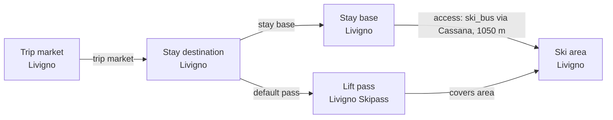

# Livigno Catalog V2 Fact Enrichment

Reviews Livigno ski-area and stay-base facts against official Livigno tourism and lift-pass sources, with explicit distinctions between dedicated snowparks, mini parks, and secured ski-touring routes.

## Resulting Graph

## Reviewed Targets

| Target | Scope | Graph Role | Required Fields |
| --- | --- | --- | --- |
| `ski_area:livigno-ski-area` | `narrow` | `focus` | `snowmaking.availability`, `snowmaking.coverage_pct`, `snowmaking.coverage_basis`, `snowmaking.season_label`, `glacier_terrain.availability`, `snow_park.availability`, `snow_park.park_count`, `snow_park.season_label`, `night_skiing.availability`, `night_skiing.season_label`, `marked_freeride_routes.availability`, `marked_freeride_routes.route_count`, `marked_freeride_routes.season_label`, `official_trail_map.url`, `official_trail_map.season_label`, `ski_day_apres_profile.availability`, `ski_day_apres_profile.intensity`, `ski_day_apres_profile.season_label` |
| `ski_area:mottolino-ski-area` | `full` | `focus` | all canonical fields |
| `ski_area:carosello-sitas-ski-area` | `full` | `focus` | all canonical fields |
| `ski_area:carosello-3000-ski-area` | `narrow` | `focus` | `ski_area_id` |
| `ski_area:sitas-ski-area` | `narrow` | `focus` | `ski_area_id` |
| `terrain_domain:carosello-sitas-domain` | `narrow` | `focus` | `terrain_domain_id` |
| `stay_base:livigno-livigno` | `narrow` | `focus` | `name`, `elevation_m`, `base_type`, `base_character.development_style`, `base_character.local_pace`, `local_apres_profile.availability`, `local_apres_profile.intensity`, `local_apres_profile.season_label` |
| `trust_manifest:ski_areas:livigno-ski-area` | `narrow` | `focus` | `field_source_refs`, `field_statuses`, `notes` |
| `ski_area_access:livigno-livigno--livigno-ski-area` | `narrow` | `focus` | `access_mode` |
| `lift_pass_product:livigno-skipass` | `narrow` | `focus` | `valid_ski_area_ids` |
| `trust_manifest:stay_bases:livigno-livigno` | `narrow` | `focus` | `field_source_refs`, `field_statuses`, `notes` |
| `stay_destination:livigno` | `narrow` | `focus` | `name` |
| `stay_base:livigno-trepalle` | `full` | `focus` | all canonical fields |
| `ski_area_access:livigno-trepalle--livigno-ski-area` | `narrow` | `focus` | `access_mode` |
| `ski_area_access:livigno-livigno--mottolino-ski-area` | `full` | `focus` | all canonical fields |
| `ski_area_access:livigno-livigno--carosello-3000-ski-area` | `narrow` | `focus` | `ski_area_access_id` |
| `ski_area_access:livigno-livigno--sitas-ski-area` | `narrow` | `focus` | `ski_area_access_id` |
| `ski_area_access:livigno-trepalle--mottolino-ski-area` | `full` | `focus` | all canonical fields |
| `lift_pass_product:carosello-3000-sunpass` | `narrow` | `focus` | `lift_pass_product_id` |
| `lift_pass_product:sitas-single-journey-card` | `narrow` | `focus` | `lift_pass_product_id` |
| `lift_pass_product:livigno-point-card` | `full` | `focus` | all canonical fields |
| `lift_pass_product:livigno-one4family-pass` | `narrow` | `focus` | `lift_pass_product_id` |
| `lift_pass_product:engadin-reciprocal-pass-context` | `narrow` | `focus` | `lift_pass_product_id` |
| `lift_pass_product:san-bernardino-reciprocal-pass-context` | `narrow` | `focus` | `lift_pass_product_id` |
| `lift_pass_product:alta-valtellina-skipass` | `narrow` | `linked_dependency` | `lift_pass_product_id` |
| `lift_pass_product:lombardia-skipass` | `narrow` | `linked_dependency` | `lift_pass_product_id` |
| `lift_pass_product:skin-lombardia-pay-per-use` | `narrow` | `linked_dependency` | `lift_pass_product_id` |
| `stay_destination:bormio` | `narrow` | `linked_dependency` | `name` |
| `stay_destination:santa-caterina-valfurva` | `narrow` | `linked_dependency` | `name` |
| `stay_destination:valdidentro` | `narrow` | `linked_dependency` | `name` |
| `stay_destination:valdisotto` | `narrow` | `linked_dependency` | `name` |
| `ski_area:bormio-ski-area` | `narrow` | `linked_dependency` | `ski_area_id` |
| `ski_area:santa-caterina-valfurva-ski-area` | `narrow` | `linked_dependency` | `ski_area_id` |
| `ski_area:cima-piazzi-san-colombano-ski-area` | `narrow` | `linked_dependency` | `ski_area_id` |
| `ski_area_access:livigno-livigno--carosello-sitas-ski-area` | `full` | `focus` | all canonical fields |

## Graph Discovery

Status: `complete`

| Focus Destination | Candidate Kind | Coverage | Candidates | Source Families | Direct Evidence | Rationale |
| --- | --- | --- | --- | --- | --- | --- |
| `livigno` | `stay_destination` | `complete` | Livigno (`livigno`): `represented`; `graph_blocking` Bormio (`bormio`): `deferred`; `regional_followup` Santa Caterina Valfurva (`santa-caterina-valfurva`): `deferred`; `regional_followup` Valdidentro (`valdidentro`): `deferred`; `regional_followup` Valdisotto/Oga (`valdisotto`): `deferred`; `regional_followup` | `livigno-destination-booking`, `alta-valtellina-destination-boundaries` | [normalization-livigno-destination-market](https://booking.livigno.eu/en/), [graph-bormio-destination-market](https://www.bormio.eu/en/accomodation-master), [graph-santa-caterina-valfurva-destination-market](https://www.santacaterina.it/en/where-to-sleep/), [graph-valdidentro-destination-market](https://www.valdidentro.it/english/), [graph-valdisotto-destination-market](https://www.bormio.eu/en/accomodation-master), [graph-valdisotto-oga-lodging](https://ktips.bormio.eu/en/importazioni/hotels/residence-dello-stelvio) | The official Livigno portal presents the focus accommodation market; the Alta Valtellina pass boundary adds the independently presented Bormio, Santa Caterina Valfurva, Valdidentro, and Valdisotto/Oga owning destination markets as deferred one-hop candidates. Valdisotto's official market and Oga lodging close the additional Cima Piazzi-San Colombano ownership context without recursively expanding external bases or access. |
| `livigno` | `stay_base` | `complete` | Livigno stay base (`livigno-livigno`): `represented`; `graph_blocking` Trepalle (`livigno-trepalle`): `add_entity`; `graph_blocking` Teola lodging neighborhood (`livigno-teola`): `not_separate`; `graph_blocking` San Rocco lodging neighborhood (`livigno-san-rocco`): `not_separate`; `graph_blocking` Pemont lodging neighborhood (`livigno-pemont`): `not_separate`; `graph_blocking` Forcola lodging neighborhood (`livigno-forcola`): `not_separate`; `graph_blocking` Ostaria lodging neighborhood (`livigno-ostaria`): `not_separate`; `graph_blocking` Plan da Sora (`livigno-plan-da-sora`): `not_separate`; `graph_blocking` | `livigno-destination-booking` | [normalization-livigno-destination-market](https://booking.livigno.eu/en/), [graph-livigno-trepalle-stay-base](https://www.livigno.eu/en/hotel-list/hotel/la-tea), [graph-teola-lodging-neighborhood](https://www.livigno.eu/en/hotel-list/hotel/teola), [graph-san-rocco-lodging-neighborhood](https://www.livigno.eu/en/hotel-list/hotel/san-giovanni), [graph-livigno-pemont-lodging-neighborhood](https://webview.livigno.eu/en/hotel/Bait-Da-Pemont_1031), [graph-livigno-forcola-lodging-neighborhood](https://www.chaletforcola.it/en/chalet-forcola.html), [graph-livigno-forcola-contrada-identity](https://www.livigno.eu/en/news/great-success-for-the-gara-da-li-contrada-livigno-celebrates-tradition-on-summer-snow), [graph-livigno-ostaria-lodging-neighborhood](https://booking.livigno.eu/en/hotel/Maison-Ostaria_33529), [graph-livigno-official-district-inventory](https://files.livigno.eu/pdf/generali/comune-europeo2018_en.pdf), [graph-livigno-plan-da-sora-lodging](https://www.livigno.eu/en/apartments-list/apartment/bait-di-bernardin), [graph-livigno-plan-da-sora-hotel-silvestri](https://webview.livigno.eu/en/hotel/Hotel-Silvestri_1795) | The official eight-district inventory closes Centro/Livigno town, Trepalle, Teola, Saroch/San Rocco, Comunin-Pemont, Forcola, Ostaria, and Plan da Sora. Hotel Silvestri provides candidate-exact lodging evidence for Plan da Sora, while Bait di Bernardin is retained only as general Livigno lodging knowledge; all assessed neighborhoods remain within the Livigno town base except distinct elevated Trepalle. |
| `livigno` | `ski_area` | `complete` | Livigno ski area (`livigno-ski-area`): `unresolved`; `graph_blocking` Mottolino Ski Area (`mottolino`): `add_entity`; `graph_blocking` Carosello-Sitas normalized SkiArea candidate (`carosello-sitas-cluster`): `add_entity`; `graph_blocking` Carosello 3000 Ski Area (`carosello-3000`): `not_separate`; `graph_blocking` Sitas Ski Area (`sitas`): `not_separate`; `graph_blocking` Manzin S.a.s. (`manzin`): `not_separate`; `graph_blocking` Livigno S.r.l. (`livigno-srl`): `not_separate`; `graph_blocking` Skiarea San Rocco S.r.l. (`skiarea-san-rocco`): `not_separate`; `graph_blocking` Telecabina Cassana S.a.s. (`telecabina-cassana`): `not_separate`; `graph_blocking` F.lli Antognoli S.n.c. (`flli-antognoli`): `not_separate`; `graph_blocking` Lino's Immobiliare S.r.l. (`linos-immobiliare`): `not_separate`; `graph_blocking` Fed S.r.l. (`fed`): `not_separate`; `graph_blocking` Mini Lift S.r.l. (`mini-lift`): `not_separate`; `graph_blocking` Livinski S.r.l. (`livinski`): `not_separate`; `graph_blocking` Silver S.r.l. (`silver`): `not_separate`; `graph_blocking` Bormio (`bormio-ski-area`): `deferred`; `regional_followup` Santa Caterina Valfurva (`santa-caterina-valfurva-ski-area`): `deferred`; `regional_followup` Cima Piazzi-San Colombano (`cima-piazzi-san-colombano-ski-area`): `deferred`; `regional_followup` | `livigno-ski-area-operator`, `alta-valtellina-ski-area-operators` | [normalization-livigno-ski-area-boundary](https://www.skipasslivigno.com/en/maps/), [graph-livigno-complete-lift-inventory](https://www.skipasslivigno.com/en/lifts-and-slopes/), [graph-livigno-operator-roster](https://www.skipasslivigno.com/en/members/), [graph-livigno-component-map](https://www.skipasslivigno.com/en/maps/), [graph-livigno-side-transfer](https://www.skipasslivigno.com/en/skilink/), [graph-mottolino-complete-area](https://www.mottolino.com/en/winter/ski-area/), [graph-mottolino-independent-weather](https://www.mottolino.com/en/weather-livigno/), [graph-livigno-west-connected-cluster](https://www.carosello3000.com/en/winter/pistes-and-fun-parks/livigno-ski-pistes), [graph-sitas-west-connection](https://www.sitas.ski/ski-area/impianti/), [graph-livigno-three-ski-domains](https://www.livigno.eu/en/skiing-livigno), [graph-carosello-owned-operations](https://www.carosello3000.com/en/winter/my3000-live/open-ski-lifts-livigno), [graph-carosello-owned-weather](https://www.carosello3000.com/en/winter/my3000-live/livigno-weather), [graph-sitas-owned-operations](https://www.sitas.ski/ski-area/impianti/), [graph-sitas-owned-weather](https://www.sitas.ski/ski-area/impianti/), [graph-carosello-town-access](https://www.carosello3000.com/en/winter/mountain-info/how-to-get-here), [graph-sitas-town-access](https://www.sitas.ski/come-raggiungerci/), [graph-carosello-sitas-connected-domain](https://www.sitas.ski/come-raggiungerci/), [graph-alta-valtellina-2026-27-pass](https://www.skipasslivigno.com/en/alta-valtellina-skipass/), [graph-bormio-ski-area](https://www.bormioski.eu/en/info-lifts-and-slopes/), [graph-santa-caterina-valfurva-ski-area](https://www.santacaterinaimpianti.it/en/lifts-and-slopes-opening/), [graph-cima-piazzi-san-colombano-ski-area](https://www.bormioski.eu/en/bormio-skipass/) | Official Livigno evidence closes two non-overlapping prospective SkiAreas: transfer-separated Mottolino and the normalized ski-connected Carosello-Sitas western area. Carosello and Sitas operator presentations remain typed component candidates because the cited entry differences do not establish a durable separate-area trip consequence. Regional members remain explicit deferred one-hop candidates only. |
| `livigno` | `ski_area_access` | `complete` | Livigno to Livigno ski area (`livigno-livigno--livigno-ski-area`): `not_separate`; `graph_blocking` Trepalle to Livigno ski area (`livigno-trepalle--livigno-ski-area`): `not_separate`; `graph_blocking` Livigno town to Mottolino Ski Area (`livigno-livigno--mottolino-ski-area`): `add_entity`; `graph_blocking` Livigno town to Carosello 3000 Ski Area (`livigno-livigno--carosello-3000-ski-area`): `not_separate`; `graph_blocking` Livigno town to Sitas Ski Area (`livigno-livigno--sitas-ski-area`): `not_separate`; `graph_blocking` Trepalle to Mottolino Ski Area (`livigno-trepalle--mottolino-ski-area`): `add_entity`; `graph_blocking` Livigno town to Carosello-Sitas ski area (`livigno-livigno--carosello-sitas-ski-area`): `add_entity`; `graph_blocking` | `livigno-ski-area-operator` | [normalization-livigno-access](https://www.skipasslivigno.com/en/lifts-and-slopes/), [graph-livigno-trepalle-access](https://www.mottolino.com/en/winter/ski-area/lifts-and-slopes/lifts/), [graph-mottolino-town-access](https://www.skipasslivigno.com/en/skilink/), [graph-carosello-town-access](https://www.carosello3000.com/en/winter/mountain-info/how-to-get-here), [graph-sitas-town-access](https://www.sitas.ski/come-raggiungerci/) | Official operator and transport sources close one Livigno-town edge to Mottolino, one Livigno-town edge to the normalized ski-connected Carosello-Sitas area, and one direct Trepalle-to-Mottolino edge; the umbrella and former operator-specific endpoint edges remain preserved as superseded migration candidates. |
| `livigno` | `terrain_domain` | `complete` | Carosello 3000 and Sitas connected terrain (`carosello-sitas-domain`): `not_separate`; `graph_blocking` | `livigno-ski-area-operator`, `livigno-pass-tariff` | [graph-livigno-component-map](https://www.skipasslivigno.com/en/maps/), [graph-sitas-west-connection](https://www.sitas.ski/ski-area/impianti/), [graph-carosello-sitas-connected-domain](https://www.sitas.ski/come-raggiungerci/), [graph-livigno-all-lifts-pass](https://www.skipasslivigno.com/en/livigno-skipass-rates/) | Official connection evidence closes the Carosello-Sitas terrain candidate as not separate: the connected western terrain is one SkiArea, so no multi-SkiArea TerrainDomain is proposed; transfer-separated Mottolino remains outside that boundary. |
| `livigno` | `lift_pass_product` | `complete` | Livigno Skipass (`livigno-skipass`): `represented`; `graph_blocking` Carosello 3000 Sunpass (`carosello-3000-sunpass`): `external_pass_context`; `graph_blocking` Sitas single-journey card (`sitas-single-journey-card`): `deferred`; `regional_followup` Livigno Point Card (`livigno-point-card`): `add_entity`; `graph_blocking` Livigno One4Family pass (`livigno-one4family-pass`): `not_separate`; `graph_blocking` Engadin reciprocal pass offer (`engadin-reciprocal-pass-context`): `external_pass_context`; `graph_blocking` San Bernardino reciprocal pass offer (`san-bernardino-reciprocal-pass-context`): `external_pass_context`; `graph_blocking` Alta Valtellina Ski Pass (`alta-valtellina-skipass`): `deferred`; `regional_followup` Lombardia Skipass (`lombardia-skipass`): `deferred`; `regional_followup` Ski'n Lombardia Pay per Use (`skin-lombardia-pay-per-use`): `deferred`; `regional_followup` | `livigno-pass-tariff` | [normalization-livigno-pass](https://www.skipasslivigno.com/en/livigno-skipass-rates/), [graph-livigno-all-lifts-pass](https://www.skipasslivigno.com/en/livigno-skipass-rates/), [graph-carosello-sunpass-context](https://www.carosello3000.com/en/winter/rates/sunpass-rates-livigno), [graph-sitas-card-context](https://www.sitas.ski/tariffe/), [graph-livigno-point-card](https://www.skipasslivigno.com/en/livigno-skipass-rates/), [graph-livigno-one4family-variant](https://www.skipasslivigno.com/en/livigno-skipass-rates/), [graph-engadin-reciprocal-context](https://www.skipasslivigno.com/en/livigno-skipass-rates/), [graph-san-bernardino-reciprocal-context](https://www.skipasslivigno.com/en/livigno-skipass-rates/), [graph-alta-valtellina-2026-27-pass](https://www.skipasslivigno.com/en/alta-valtellina-skipass/), [graph-lombardia-skipass](https://www.skipasslivigno.com/en/lombardia-skipass/), [graph-skin-lombardia-pay-per-use](https://www.skipasslivigno.com/en/lombardia-skipass/) | The official tariffs present the default Livigno downhill pass, a distinct pay-per-ride Point Card, and a same-entitlement One4Family variant. They also present the current Alta Valtellina Ski Pass, Lombardia Skipass, and Ski'n Lombardia Pay per Use as distinct non-default regional products available from Livigno; their established Livigno focus-graph coverage is recorded while wider regional member catalogs remain deferred. Carosello Sunpass remains non-skier fare context, while the Sitas journey card is deferred until subset-coverage semantics can represent its lift-specific entitlement without inventing full-west coverage. Engadin and San Bernardino are reciprocal purchase discounts without Livigno coverage edges. |

### Prospective Relationships

| Relationship | From | To | Direct Evidence |
| --- | --- | --- | --- |
| `lift_pass_available_from_stay_destination` | `alta-valtellina-skipass` | `livigno` | [graph-alta-valtellina-2026-27-pass](https://www.skipasslivigno.com/en/alta-valtellina-skipass/) |
| `lift_pass_available_from_stay_destination` | `livigno-point-card` | `livigno` | [graph-livigno-point-card](https://www.skipasslivigno.com/en/livigno-skipass-rates/) |
| `lift_pass_available_from_stay_destination` | `livigno-skipass` | `livigno` | [normalization-livigno-pass](https://www.skipasslivigno.com/en/livigno-skipass-rates/) |
| `lift_pass_available_from_stay_destination` | `lombardia-skipass` | `livigno` | [graph-lombardia-skipass](https://www.skipasslivigno.com/en/lombardia-skipass/) |
| `lift_pass_available_from_stay_destination` | `skin-lombardia-pay-per-use` | `livigno` | [graph-skin-lombardia-pay-per-use](https://www.skipasslivigno.com/en/lombardia-skipass/) |
| `lift_pass_covers_ski_area` | `alta-valtellina-skipass` | `carosello-sitas-cluster` | [graph-alta-valtellina-2026-27-pass](https://www.skipasslivigno.com/en/alta-valtellina-skipass/), [graph-livigno-all-lifts-pass](https://www.skipasslivigno.com/en/livigno-skipass-rates/) |
| `lift_pass_covers_ski_area` | `alta-valtellina-skipass` | `livigno-ski-area` | [graph-alta-valtellina-2026-27-pass](https://www.skipasslivigno.com/en/alta-valtellina-skipass/) |
| `lift_pass_covers_ski_area` | `alta-valtellina-skipass` | `mottolino` | [graph-alta-valtellina-2026-27-pass](https://www.skipasslivigno.com/en/alta-valtellina-skipass/), [graph-livigno-all-lifts-pass](https://www.skipasslivigno.com/en/livigno-skipass-rates/) |
| `lift_pass_covers_ski_area` | `livigno-point-card` | `carosello-sitas-cluster` | [graph-livigno-point-card](https://www.skipasslivigno.com/en/livigno-skipass-rates/) |
| `lift_pass_covers_ski_area` | `livigno-point-card` | `mottolino` | [graph-livigno-point-card](https://www.skipasslivigno.com/en/livigno-skipass-rates/) |
| `lift_pass_covers_ski_area` | `livigno-skipass` | `carosello-sitas-cluster` | [graph-livigno-all-lifts-pass](https://www.skipasslivigno.com/en/livigno-skipass-rates/) |
| `lift_pass_covers_ski_area` | `livigno-skipass` | `livigno-ski-area` | [normalization-livigno-pass](https://www.skipasslivigno.com/en/livigno-skipass-rates/) |
| `lift_pass_covers_ski_area` | `livigno-skipass` | `mottolino` | [graph-livigno-all-lifts-pass](https://www.skipasslivigno.com/en/livigno-skipass-rates/) |
| `lift_pass_covers_ski_area` | `lombardia-skipass` | `carosello-sitas-cluster` | [graph-lombardia-skipass](https://www.skipasslivigno.com/en/lombardia-skipass/), [graph-livigno-all-lifts-pass](https://www.skipasslivigno.com/en/livigno-skipass-rates/) |
| `lift_pass_covers_ski_area` | `lombardia-skipass` | `livigno-ski-area` | [graph-lombardia-skipass](https://www.skipasslivigno.com/en/lombardia-skipass/) |
| `lift_pass_covers_ski_area` | `lombardia-skipass` | `mottolino` | [graph-lombardia-skipass](https://www.skipasslivigno.com/en/lombardia-skipass/), [graph-livigno-all-lifts-pass](https://www.skipasslivigno.com/en/livigno-skipass-rates/) |
| `lift_pass_covers_ski_area` | `skin-lombardia-pay-per-use` | `carosello-sitas-cluster` | [graph-skin-lombardia-pay-per-use](https://www.skipasslivigno.com/en/lombardia-skipass/), [graph-livigno-all-lifts-pass](https://www.skipasslivigno.com/en/livigno-skipass-rates/) |
| `lift_pass_covers_ski_area` | `skin-lombardia-pay-per-use` | `livigno-ski-area` | [graph-skin-lombardia-pay-per-use](https://www.skipasslivigno.com/en/lombardia-skipass/) |
| `lift_pass_covers_ski_area` | `skin-lombardia-pay-per-use` | `mottolino` | [graph-skin-lombardia-pay-per-use](https://www.skipasslivigno.com/en/lombardia-skipass/), [graph-livigno-all-lifts-pass](https://www.skipasslivigno.com/en/livigno-skipass-rates/) |
| `lift_pass_default_for_stay_destination` | `livigno-skipass` | `livigno` | [normalization-livigno-pass](https://www.skipasslivigno.com/en/livigno-skipass-rates/) |
| `ski_area_access_originates_at_stay_base` | `livigno-livigno--carosello-sitas-ski-area` | `livigno-livigno` | [graph-carosello-town-access](https://www.carosello3000.com/en/winter/mountain-info/how-to-get-here), [graph-sitas-town-access](https://www.sitas.ski/come-raggiungerci/) |
| `ski_area_access_originates_at_stay_base` | `livigno-livigno--livigno-ski-area` | `livigno-livigno` | [normalization-livigno-access](https://www.skipasslivigno.com/en/lifts-and-slopes/) |
| `ski_area_access_originates_at_stay_base` | `livigno-livigno--mottolino-ski-area` | `livigno-livigno` | [graph-mottolino-town-access](https://www.skipasslivigno.com/en/skilink/) |
| `ski_area_access_originates_at_stay_base` | `livigno-trepalle--mottolino-ski-area` | `livigno-trepalle` | [graph-livigno-trepalle-access](https://www.mottolino.com/en/winter/ski-area/lifts-and-slopes/lifts/) |
| `ski_area_access_reaches_ski_area` | `livigno-livigno--carosello-sitas-ski-area` | `carosello-sitas-cluster` | [graph-carosello-town-access](https://www.carosello3000.com/en/winter/mountain-info/how-to-get-here), [graph-sitas-town-access](https://www.sitas.ski/come-raggiungerci/), [graph-livigno-west-connected-cluster](https://www.carosello3000.com/en/winter/pistes-and-fun-parks/livigno-ski-pistes) |
| `ski_area_access_reaches_ski_area` | `livigno-livigno--livigno-ski-area` | `livigno-ski-area` | [normalization-livigno-access](https://www.skipasslivigno.com/en/lifts-and-slopes/) |
| `ski_area_access_reaches_ski_area` | `livigno-livigno--mottolino-ski-area` | `mottolino` | [graph-mottolino-town-access](https://www.skipasslivigno.com/en/skilink/) |
| `ski_area_access_reaches_ski_area` | `livigno-trepalle--mottolino-ski-area` | `mottolino` | [graph-livigno-trepalle-access](https://www.mottolino.com/en/winter/ski-area/lifts-and-slopes/lifts/) |
| `stay_destination_contains_stay_base` | `livigno` | `livigno-forcola` | [graph-livigno-forcola-lodging-neighborhood](https://www.chaletforcola.it/en/chalet-forcola.html), [graph-livigno-forcola-contrada-identity](https://www.livigno.eu/en/news/great-success-for-the-gara-da-li-contrada-livigno-celebrates-tradition-on-summer-snow) |
| `stay_destination_contains_stay_base` | `livigno` | `livigno-livigno` | [normalization-livigno-destination-market](https://booking.livigno.eu/en/) |
| `stay_destination_contains_stay_base` | `livigno` | `livigno-ostaria` | [graph-livigno-ostaria-lodging-neighborhood](https://booking.livigno.eu/en/hotel/Maison-Ostaria_33529) |
| `stay_destination_contains_stay_base` | `livigno` | `livigno-pemont` | [graph-livigno-pemont-lodging-neighborhood](https://webview.livigno.eu/en/hotel/Bait-Da-Pemont_1031) |
| `stay_destination_contains_stay_base` | `livigno` | `livigno-plan-da-sora` | [graph-livigno-official-district-inventory](https://files.livigno.eu/pdf/generali/comune-europeo2018_en.pdf), [graph-livigno-plan-da-sora-hotel-silvestri](https://webview.livigno.eu/en/hotel/Hotel-Silvestri_1795) |
| `stay_destination_contains_stay_base` | `livigno` | `livigno-san-rocco` | [graph-san-rocco-lodging-neighborhood](https://www.livigno.eu/en/hotel-list/hotel/san-giovanni) |
| `stay_destination_contains_stay_base` | `livigno` | `livigno-teola` | [graph-teola-lodging-neighborhood](https://www.livigno.eu/en/hotel-list/hotel/teola) |
| `stay_destination_contains_stay_base` | `livigno` | `livigno-trepalle` | [graph-livigno-trepalle-stay-base](https://www.livigno.eu/en/hotel-list/hotel/la-tea) |

## Review Evidence Envelope

| Family | Source Kind | Source URLs | Candidate Kinds |
| --- | --- | --- | --- |
| `livigno-destination-booking` | `destination_booking` | [https://booking.livigno.eu/en/](https://booking.livigno.eu/en/), [https://www.livigno.eu/en/hotel-list/hotel/la-tea](https://www.livigno.eu/en/hotel-list/hotel/la-tea), [https://www.livigno.eu/en/hotel-list/hotel/teola](https://www.livigno.eu/en/hotel-list/hotel/teola), [https://www.livigno.eu/en/hotel-list/hotel/san-giovanni](https://www.livigno.eu/en/hotel-list/hotel/san-giovanni), [https://webview.livigno.eu/en/hotel/Bait-Da-Pemont_1031](https://webview.livigno.eu/en/hotel/Bait-Da-Pemont_1031), [https://www.chaletforcola.it/en/chalet-forcola.html](https://www.chaletforcola.it/en/chalet-forcola.html), [https://booking.livigno.eu/en/hotel/Maison-Ostaria_33529](https://booking.livigno.eu/en/hotel/Maison-Ostaria_33529), [https://www.livigno.eu/en/news/great-success-for-the-gara-da-li-contrada-livigno-celebrates-tradition-on-summer-snow](https://www.livigno.eu/en/news/great-success-for-the-gara-da-li-contrada-livigno-celebrates-tradition-on-summer-snow), [https://files.livigno.eu/pdf/generali/comune-europeo2018_en.pdf](https://files.livigno.eu/pdf/generali/comune-europeo2018_en.pdf), [https://www.livigno.eu/en/apartments-list/apartment/bait-di-bernardin](https://www.livigno.eu/en/apartments-list/apartment/bait-di-bernardin), [https://webview.livigno.eu/en/hotel/Hotel-Silvestri_1795](https://webview.livigno.eu/en/hotel/Hotel-Silvestri_1795) | `stay_destination`, `stay_base` |
| `livigno-ski-area-operator` | `ski_area_operator` | [https://www.skipasslivigno.com/en/lifts-and-slopes/](https://www.skipasslivigno.com/en/lifts-and-slopes/), [https://www.skipasslivigno.com/en/members/](https://www.skipasslivigno.com/en/members/), [https://www.skipasslivigno.com/en/maps/](https://www.skipasslivigno.com/en/maps/), [https://www.skipasslivigno.com/en/skilink/](https://www.skipasslivigno.com/en/skilink/), [https://www.mottolino.com/en/winter/ski-area/](https://www.mottolino.com/en/winter/ski-area/), [https://www.mottolino.com/en/winter/ski-area/lifts-and-slopes/lifts/](https://www.mottolino.com/en/winter/ski-area/lifts-and-slopes/lifts/), [https://www.mottolino.com/estate/headquarters-mottolino/](https://www.mottolino.com/estate/headquarters-mottolino/), [https://www.mottolino.com/en/weather-livigno/](https://www.mottolino.com/en/weather-livigno/), [https://www.carosello3000.com/en/winter/pistes-and-fun-parks/livigno-ski-pistes](https://www.carosello3000.com/en/winter/pistes-and-fun-parks/livigno-ski-pistes), [https://www.carosello3000.com/en/winter/my3000-live/open-ski-lifts-livigno](https://www.carosello3000.com/en/winter/my3000-live/open-ski-lifts-livigno), [https://www.carosello3000.com/en/winter/my3000-live/livigno-weather](https://www.carosello3000.com/en/winter/my3000-live/livigno-weather), [https://www.carosello3000.com/en/winter/mountain-info/how-to-get-here](https://www.carosello3000.com/en/winter/mountain-info/how-to-get-here), [https://www.sitas.ski/ski-area/impianti/](https://www.sitas.ski/ski-area/impianti/), [https://www.sitas.ski/come-raggiungerci/](https://www.sitas.ski/come-raggiungerci/), [https://www.livigno.eu/en/skiing-livigno](https://www.livigno.eu/en/skiing-livigno), [https://www.mottolino.com/en/winter/experiences/at-altitude-on-foot/](https://www.mottolino.com/en/winter/experiences/at-altitude-on-foot/), [https://www.openstreetmap.org/node/443397630](https://www.openstreetmap.org/node/443397630), [https://www.sitas.ski/estate/fooddrink/costaccia/](https://www.sitas.ski/estate/fooddrink/costaccia/), [https://www.openstreetmap.org/node/446186974](https://www.openstreetmap.org/node/446186974) | `ski_area`, `ski_area_access`, `terrain_domain` |
| `livigno-touched-ski-area-facts` | `other_official` | [https://www.skipasslivigno.com/en/maps/](https://www.skipasslivigno.com/en/maps/), [https://www.livigno.eu/en/fun-relax-winter](https://www.livigno.eu/en/fun-relax-winter), [https://www.skipasslivigno.com/en/fun-extreme/mini-snowparks/](https://www.skipasslivigno.com/en/fun-extreme/mini-snowparks/), [https://www.skipasslivigno.com/en/snowpark/snowpark-the-beach/](https://www.skipasslivigno.com/en/snowpark/snowpark-the-beach/) | `ski_area` |
| `livigno-touched-stay-base-facts` | `other_official` | [https://webview.livigno.eu/en/news/a-shopping-paradise-at-1-800-metres](https://webview.livigno.eu/en/news/a-shopping-paradise-at-1-800-metres), [https://files.livigno.eu/dati/app/pag/en/liv-media-kit-eng-low.pdf](https://files.livigno.eu/dati/app/pag/en/liv-media-kit-eng-low.pdf), [https://www.livigno.eu/en/home](https://www.livigno.eu/en/home), [https://www.livigno.eu/en/livigno-by-night](https://www.livigno.eu/en/livigno-by-night) | `stay_base` |
| `livigno-pass-tariff` | `pass_tariff` | [https://www.skipasslivigno.com/en/livigno-skipass-rates/](https://www.skipasslivigno.com/en/livigno-skipass-rates/), [https://www.skipasslivigno.com/en/alta-valtellina-skipass/](https://www.skipasslivigno.com/en/alta-valtellina-skipass/), [https://www.skipasslivigno.com/en/lombardia-skipass/](https://www.skipasslivigno.com/en/lombardia-skipass/), [https://www.carosello3000.com/en/winter/rates/sunpass-rates-livigno](https://www.carosello3000.com/en/winter/rates/sunpass-rates-livigno), [https://www.sitas.ski/tariffe/](https://www.sitas.ski/tariffe/) | `terrain_domain`, `lift_pass_product` |
| `alta-valtellina-destination-boundaries` | `destination_booking` | [https://www.bormio.eu/en/accomodation-master](https://www.bormio.eu/en/accomodation-master), [https://www.santacaterina.it/en/where-to-sleep/](https://www.santacaterina.it/en/where-to-sleep/), [https://www.valdidentro.it/english/](https://www.valdidentro.it/english/), [https://ktips.bormio.eu/en/importazioni/hotels/residence-dello-stelvio](https://ktips.bormio.eu/en/importazioni/hotels/residence-dello-stelvio) | `stay_destination` |
| `alta-valtellina-ski-area-operators` | `ski_area_operator` | [https://www.bormioski.eu/en/info-lifts-and-slopes/](https://www.bormioski.eu/en/info-lifts-and-slopes/), [https://www.santacaterinaimpianti.it/en/lifts-and-slopes-opening/](https://www.santacaterinaimpianti.it/en/lifts-and-slopes-opening/), [https://www.bormioski.eu/en/bormio-skipass/](https://www.bormioski.eu/en/bormio-skipass/) | `ski_area` |

## Entity Scope Assessments

| Candidate | Kind | Disposition | Signals | Catalog Targets | Evidence | Backlog | Graph Impact | Rationale |
| --- | --- | --- | --- | --- | --- | --- | --- | --- |
| `livigno` (Livigno) | `stay_destination` | `represented` | `independent_stay_market` | `stay_destination:livigno` | `normalization-livigno-destination-market` |  | `graph_blocking` | The official booking portal supports retaining Livigno as the named, independently presented accommodation market. |
| `livigno-livigno` (Livigno stay base) | `stay_base` | `represented` | `official_independent_identity` | `stay_base:livigno-livigno` | `normalization-livigno-destination-market`, `normalization-livigno-base-type` |  | `graph_blocking` | The existing Livigno base remains the supported town accommodation representation for the focus destination. |
| `livigno-trepalle` (Trepalle) | `stay_base` | `add_entity` | `official_independent_identity`, `distinct_access`, `distinct_elevation_or_season` | `stay_base:livigno-trepalle` | `graph-livigno-trepalle-stay-base`, `completion-stay-base-livigno-trepalle-base-character-development-style`, `completion-stay-base-livigno-trepalle-base-character-local-pace`, `completion-stay-base-livigno-trepalle-base-type`, `completion-stay-base-livigno-trepalle-elevation-m`, `completion-stay-base-livigno-trepalle-latitude`, `completion-stay-base-livigno-trepalle-local-apres-profile-availability`, `completion-stay-base-livigno-trepalle-local-apres-profile-intensity`, `completion-stay-base-livigno-trepalle-local-apres-profile-season-label`, `completion-stay-base-livigno-trepalle-longitude`, `completion-stay-base-livigno-trepalle-name`, `completion-stay-base-livigno-trepalle-price-max`, `completion-stay-base-livigno-trepalle-price-min`, `completion-stay-base-livigno-trepalle-price-range`, `completion-stay-base-livigno-trepalle-quality`, `completion-stay-base-livigno-trepalle-regional-data-ids`, `completion-stay-base-livigno-trepalle-stay-base-id`, `completion-stay-base-livigno-trepalle-stay-destination-id` |  | `graph_blocking` | The official destination directory identifies Trepalle as a named lodging location five kilometres from the town, at a distinct elevation and with direct Mottolino-side ski access. |
| `livigno-ski-area` (Livigno ski area) | `ski_area` | `unresolved` | `official_complete_lift_inventory`, `full_local_pass` | `ski_area:livigno-ski-area` | `normalization-livigno-ski-area-boundary`, `normalization-livigno-pass`, `graph-livigno-complete-lift-inventory`, `graph-livigno-operator-roster`, `graph-livigno-component-map`, `graph-livigno-all-lifts-pass`, `graph-livigno-three-ski-domains` | `docs/product-backlog.md#ski-sub-areas-and-terrain-sectors` | `graph_blocking` | Official sources establish Livigno as the destination umbrella over the transfer-separated Mottolino and ski-connected western terrain, not as a child of either future SkiArea. The existing key remains an explicit unresolved migration source until ordinary remediation defines retirement, replacement targets, weather/history handoff, merge order, and rollback without overlapping the two prospective SkiAreas. |
| `mottolino` (Mottolino Ski Area) | `ski_area` | `add_entity` | `official_complete_lift_inventory`, `separate_operator`, `independent_status_or_schedule`, `independent_weather_presentation` | `ski_area:mottolino-ski-area` | `graph-livigno-operator-roster`, `graph-livigno-component-map`, `graph-livigno-side-transfer`, `graph-mottolino-complete-area`, `graph-mottolino-independent-weather`, `completion-ski-area-mottolino-ski-area-base-elevation-m`, `completion-ski-area-mottolino-ski-area-glacier-terrain-availability`, `completion-ski-area-mottolino-ski-area-latitude`, `completion-ski-area-mottolino-ski-area-longitude`, `completion-ski-area-mottolino-ski-area-marked-freeride-routes-availability`, `completion-ski-area-mottolino-ski-area-marked-freeride-routes-route-count`, `completion-ski-area-mottolino-ski-area-marked-freeride-routes-season-label`, `completion-ski-area-mottolino-ski-area-name`, `completion-ski-area-mottolino-ski-area-night-skiing-availability`, `completion-ski-area-mottolino-ski-area-night-skiing-season-label`, `completion-ski-area-mottolino-ski-area-official-trail-map-season-label`, `completion-ski-area-mottolino-ski-area-official-trail-map-url`, `completion-ski-area-mottolino-ski-area-piste-km-by-difficulty-advanced`, `completion-ski-area-mottolino-ski-area-piste-km-by-difficulty-beginner`, `completion-ski-area-mottolino-ski-area-piste-km-by-difficulty-intermediate`, `completion-ski-area-mottolino-ski-area-season-end-month`, `completion-ski-area-mottolino-ski-area-season-start-month`, `completion-ski-area-mottolino-ski-area-season-windows`, `completion-ski-area-mottolino-ski-area-ski-area-id`, `completion-ski-area-mottolino-ski-area-ski-day-apres-profile-availability`, `completion-ski-area-mottolino-ski-area-ski-day-apres-profile-intensity`, `completion-ski-area-mottolino-ski-area-ski-day-apres-profile-season-label`, `completion-ski-area-mottolino-ski-area-snow-park-availability`, `completion-ski-area-mottolino-ski-area-snow-park-park-count`, `completion-ski-area-mottolino-ski-area-snow-park-season-label`, `completion-ski-area-mottolino-ski-area-snowmaking-availability`, `completion-ski-area-mottolino-ski-area-snowmaking-coverage-basis`, `completion-ski-area-mottolino-ski-area-snowmaking-coverage-pct`, `completion-ski-area-mottolino-ski-area-snowmaking-season-label`, `completion-ski-area-mottolino-ski-area-summit-elevation-m`, `completion-ski-area-mottolino-ski-area-supported-skill-levels`, `completion-ski-area-mottolino-ski-area-total-lift-count`, `completion-ski-area-mottolino-ski-area-total-piste-km`, `completion-ski-area-mottolino-ski-area-weather-sampling-status`, `weather-geometry-mottolino-official-hub`, `weather-geometry-mottolino-osm-hub`, `weather-geometry-mottolino-lift-range` |  | `graph_blocking` | The official operator presents a complete substantial area with its own lift inventory, operations, and conditions surface; the official Skilink page confirms a transfer from the western mountainside. |
| `carosello-sitas-cluster` (Carosello-Sitas normalized SkiArea candidate) | `ski_area` | `add_entity` | `official_complete_lift_inventory`, `coordinated_status_or_schedule`, `common_full_coverage_pass` | `ski_area:carosello-sitas-ski-area` | `graph-livigno-complete-lift-inventory`, `graph-livigno-operator-roster`, `graph-livigno-component-map`, `graph-livigno-all-lifts-pass`, `graph-livigno-side-transfer`, `graph-livigno-west-connected-cluster`, `graph-sitas-west-connection`, `graph-carosello-owned-operations`, `graph-sitas-owned-operations`, `completion-ski-area-carosello-sitas-ski-area-base-elevation-m`, `completion-ski-area-carosello-sitas-ski-area-glacier-terrain-availability`, `completion-ski-area-carosello-sitas-ski-area-latitude`, `completion-ski-area-carosello-sitas-ski-area-longitude`, `completion-ski-area-carosello-sitas-ski-area-marked-freeride-routes-availability`, `completion-ski-area-carosello-sitas-ski-area-marked-freeride-routes-route-count`, `completion-ski-area-carosello-sitas-ski-area-marked-freeride-routes-season-label`, `completion-ski-area-carosello-sitas-ski-area-name`, `completion-ski-area-carosello-sitas-ski-area-night-skiing-availability`, `completion-ski-area-carosello-sitas-ski-area-night-skiing-season-label`, `completion-ski-area-carosello-sitas-ski-area-official-trail-map-season-label`, `completion-ski-area-carosello-sitas-ski-area-official-trail-map-url`, `completion-ski-area-carosello-sitas-ski-area-piste-km-by-difficulty-advanced`, `completion-ski-area-carosello-sitas-ski-area-piste-km-by-difficulty-beginner`, `completion-ski-area-carosello-sitas-ski-area-piste-km-by-difficulty-intermediate`, `completion-ski-area-carosello-sitas-ski-area-season-end-month`, `completion-ski-area-carosello-sitas-ski-area-season-start-month`, `completion-ski-area-carosello-sitas-ski-area-season-windows`, `completion-ski-area-carosello-sitas-ski-area-ski-area-id`, `completion-ski-area-carosello-sitas-ski-area-ski-day-apres-profile-availability`, `completion-ski-area-carosello-sitas-ski-area-ski-day-apres-profile-intensity`, `completion-ski-area-carosello-sitas-ski-area-ski-day-apres-profile-season-label`, `completion-ski-area-carosello-sitas-ski-area-snow-park-availability`, `completion-ski-area-carosello-sitas-ski-area-snow-park-park-count`, `completion-ski-area-carosello-sitas-ski-area-snow-park-season-label`, `completion-ski-area-carosello-sitas-ski-area-snowmaking-availability`, `completion-ski-area-carosello-sitas-ski-area-snowmaking-coverage-basis`, `completion-ski-area-carosello-sitas-ski-area-snowmaking-coverage-pct`, `completion-ski-area-carosello-sitas-ski-area-snowmaking-season-label`, `completion-ski-area-carosello-sitas-ski-area-summit-elevation-m`, `completion-ski-area-carosello-sitas-ski-area-supported-skill-levels`, `completion-ski-area-carosello-sitas-ski-area-total-lift-count`, `completion-ski-area-carosello-sitas-ski-area-total-piste-km`, `completion-ski-area-carosello-sitas-ski-area-weather-sampling-status`, `weather-geometry-west-official-hub`, `weather-geometry-west-osm-hub`, `weather-geometry-west-lift-range` |  | `graph_blocking` | The official complete lift roster and current map close one ski-connected western terrain boundary across Carosello and Sitas installations. Their operator-specific status, weather, and entry-point presentations remain component evidence: no cited source establishes a durable trip consequence that makes the two connected sectors separate SkiAreas. The transparent normalized Carosello-Sitas parent therefore prevents overlapping ownership while preserving operator evidence. |
| `carosello-3000` (Carosello 3000 Ski Area) | `ski_area` | `not_separate` | `official_complete_lift_inventory`, `separate_operator`, `independent_status_or_schedule`, `independent_weather_presentation`, `coordinated_status_or_schedule`, `common_full_coverage_pass` | `ski_area:carosello-sitas-ski-area` | `graph-livigno-complete-lift-inventory`, `graph-livigno-three-ski-domains`, `graph-livigno-operator-roster`, `graph-livigno-component-map`, `graph-livigno-all-lifts-pass`, `graph-carosello-owned-operations`, `graph-carosello-owned-weather`, `graph-carosello-town-access`, `graph-carosello-sitas-connected-domain` |  | `graph_blocking` | Carosello 3000 Ski Area remains a source-backed operator presentation and entry component inside the ski-connected western boundary. The cited status, weather, and access sources do not establish a durable comparison-relative trip consequence beyond ordinary entry choice, so this candidate is folded into the normalized Carosello-Sitas SkiArea rather than materialized as an overlapping SkiArea. Its complete local terrain and conditions presentation remains preserved as component evidence; under the coordinated-parent contract, weather ownership is normalized to the Carosello-Sitas parent because the child fails only the durable material-trip-consequence gate. |
| `sitas` (Sitas Ski Area) | `ski_area` | `not_separate` | `official_complete_lift_inventory`, `separate_operator`, `independent_status_or_schedule`, `independent_weather_presentation`, `coordinated_status_or_schedule`, `common_full_coverage_pass` | `ski_area:carosello-sitas-ski-area` | `graph-livigno-complete-lift-inventory`, `graph-livigno-three-ski-domains`, `graph-livigno-operator-roster`, `graph-livigno-component-map`, `graph-livigno-all-lifts-pass`, `graph-sitas-owned-operations`, `graph-sitas-owned-weather`, `graph-sitas-town-access`, `graph-carosello-sitas-connected-domain` |  | `graph_blocking` | Sitas Ski Area remains a source-backed operator presentation and entry component inside the ski-connected western boundary. The cited status, weather, and access sources do not establish a durable comparison-relative trip consequence beyond ordinary entry choice, so this candidate is folded into the normalized Carosello-Sitas SkiArea rather than materialized as an overlapping SkiArea. Its complete local terrain and conditions presentation remains preserved as component evidence; under the coordinated-parent contract, weather ownership is normalized to the Carosello-Sitas parent because the child fails only the durable material-trip-consequence gate. |
| `manzin` (Manzin S.a.s.) | `ski_area` | `not_separate` | `separate_operator` | `ski_area:carosello-sitas-ski-area` | `graph-livigno-operator-roster`, `graph-livigno-complete-lift-inventory`, `graph-livigno-component-map` |  | `graph_blocking` | The official roster assigns Manzin to lift 10 Amerikan, and the current map places lift 10 beside lifts 9 and 11 in the western connected component sequence; it is a coordinated operator component rather than a complete SkiArea. |
| `livigno-srl` (Livigno S.r.l.) | `ski_area` | `not_separate` | `separate_operator` | `ski_area:carosello-sitas-ski-area` | `graph-livigno-operator-roster`, `graph-livigno-complete-lift-inventory`, `graph-livigno-component-map` |  | `graph_blocking` | The official roster and map place Livigno S.r.l.'s school-area lift inside the lower-lift sequence inside the western connected boundary; it is an operator component rather than a complete SkiArea. |
| `skiarea-san-rocco` (Skiarea San Rocco S.r.l.) | `ski_area` | `not_separate` | `separate_operator`, `official_map_sector` | `ski_area:carosello-sitas-ski-area` | `graph-livigno-operator-roster`, `graph-livigno-complete-lift-inventory`, `graph-livigno-component-map` |  | `graph_blocking` | The official roster and access map place the San Rocco learner lifts beside the Carosello 3000 gondola access; the named sector is not a complete independent trip-level SkiArea. |
| `telecabina-cassana` (Telecabina Cassana S.a.s.) | `ski_area` | `not_separate` | `separate_operator` | `ski_area:carosello-sitas-ski-area` | `graph-livigno-operator-roster`, `graph-livigno-complete-lift-inventory`, `graph-livigno-component-map` |  | `graph_blocking` | The official roster and map place the Cassana gondola in the lower-lift sequence that reaches Sitas; it is an operator component rather than a complete SkiArea. |
| `flli-antognoli` (F.lli Antognoli S.n.c.) | `ski_area` | `not_separate` | `separate_operator` | `ski_area:carosello-sitas-ski-area` | `graph-livigno-operator-roster`, `graph-livigno-complete-lift-inventory`, `graph-livigno-component-map` |  | `graph_blocking` | The official roster assigns F.lli Antognoli to lift 9 Palipert, which is excluded from Mottolino's complete lifts 1-8 and placed beside lifts 10 and 11 on the current map; it is a coordinated western connected component rather than a complete SkiArea. |
| `linos-immobiliare` (Lino's Immobiliare S.r.l.) | `ski_area` | `not_separate` | `separate_operator` | `ski_area:carosello-sitas-ski-area` | `graph-livigno-operator-roster`, `graph-livigno-complete-lift-inventory`, `graph-livigno-component-map` |  | `graph_blocking` | The official roster assigns Lino's Immobiliare to lifts 20 Ski School Area and 22 Pian della Volpe, and the current map places both inside the western connected lower-lift sequence; it is a coordinated operator component rather than a complete SkiArea. |
| `fed` (Fed S.r.l.) | `ski_area` | `not_separate` | `separate_operator` | `ski_area:carosello-sitas-ski-area` | `graph-livigno-operator-roster`, `graph-livigno-complete-lift-inventory`, `graph-livigno-component-map` |  | `graph_blocking` | The official roster and map place the Doss learner lift beside the western connected access side; it is an operator component rather than a complete SkiArea. |
| `mini-lift` (Mini Lift S.r.l.) | `ski_area` | `not_separate` | `separate_operator` | `ski_area:carosello-sitas-ski-area` | `graph-livigno-operator-roster`, `graph-livigno-complete-lift-inventory`, `graph-livigno-component-map` |  | `graph_blocking` | The official roster and map place Mini Lift's school lift inside the lower-lift sequence inside the western connected boundary; it is an operator component rather than a complete SkiArea. |
| `livinski` (Livinski S.r.l.) | `ski_area` | `not_separate` | `separate_operator` | `ski_area:carosello-sitas-ski-area` | `graph-livigno-operator-roster`, `graph-livigno-complete-lift-inventory`, `graph-livigno-component-map` |  | `graph_blocking` | The official roster and map place Livinski's Del Sole lift inside the lower-lift sequence inside the western connected boundary; it is an operator component rather than a complete SkiArea. |
| `silver` (Silver S.r.l.) | `ski_area` | `not_separate` | `separate_operator`, `official_map_sector` | `ski_area:carosello-sitas-ski-area` | `graph-livigno-operator-roster`, `graph-livigno-complete-lift-inventory`, `graph-livigno-component-map` |  | `graph_blocking` | The official roster and map place Valandrea and Botarel in the lower-lift sequence inside the western connected boundary; the named sector is not a complete independent trip-level SkiArea. |
| `livigno-livigno--livigno-ski-area` (Livigno to Livigno ski area) | `ski_area_access` | `not_separate` | `direct_access_relationship` | `ski_area_access:livigno-livigno--livigno-ski-area`, `ski_area_access:livigno-livigno--mottolino-ski-area`, `ski_area_access:livigno-livigno--carosello-sitas-ski-area` | `normalization-livigno-access` |  | `graph_blocking` | This existing edge terminates at the umbrella migration-source SkiArea and therefore is not part of the prospective graph. Catalog remediation must retire it atomically with the umbrella while preserving its evidence in the Mottolino and Carosello-Sitas access edges. |
| `livigno-trepalle--livigno-ski-area` (Trepalle to Livigno ski area) | `ski_area_access` | `not_separate` | `direct_access_relationship`, `distinct_access` | `ski_area_access:livigno-trepalle--livigno-ski-area`, `ski_area_access:livigno-trepalle--mottolino-ski-area` | `graph-livigno-trepalle-access` |  | `graph_blocking` | The source-backed Trepalle access belongs to Mottolino, not to the umbrella migration-source SkiArea. This earlier prospective edge is superseded by the candidate-exact Trepalle-to-Mottolino edge below. |
| `livigno-skipass` (Livigno Skipass) | `lift_pass_product` | `represented` | `official_product_identity`, `full_local_pass` | `lift_pass_product:livigno-skipass` | `normalization-livigno-pass` |  | `graph_blocking` | The official current product is a single Livigno ticket valid across all lifts on both sides of the ski area. |
| `carosello-sitas-domain` (Carosello 3000 and Sitas connected terrain) | `terrain_domain` | `not_separate` | `ski_connected_terrain` | `terrain_domain:carosello-sitas-domain` | `graph-carosello-sitas-connected-domain`, `graph-sitas-west-connection` |  | `graph_blocking` | The skiable Blesaccia connection is retained as evidence, but after the two operator sectors are folded into one normalized SkiArea there are not multiple non-overlapping SkiAreas for this TerrainDomain to contain. The earlier prospective domain is therefore disproved and superseded by the Carosello-Sitas SkiArea. |
| `livigno-teola` (Teola lodging neighborhood) | `stay_base` | `not_separate` | `official_independent_identity`, `distinct_access` | `stay_base:livigno-livigno` | `graph-teola-lodging-neighborhood`, `graph-mottolino-town-access` |  | `graph_blocking` | Official accommodation and shuttle sources make Teola relevant access context, but its lodging remains within the Livigno town market and does not establish an independently owned stay base. |
| `livigno-san-rocco` (San Rocco lodging neighborhood) | `stay_base` | `not_separate` | `official_independent_identity`, `distinct_access` | `stay_base:livigno-livigno` | `graph-san-rocco-lodging-neighborhood`, `graph-carosello-town-access` |  | `graph_blocking` | Official accommodation and lift-access sources make San Rocco relevant Carosello access context, but its lodging remains within the Livigno town market and does not establish an independently owned stay base. |
| `livigno-pemont` (Pemont lodging neighborhood) | `stay_base` | `not_separate` | `official_independent_identity`, `distinct_access` | `stay_base:livigno-livigno` | `graph-livigno-pemont-lodging-neighborhood` |  | `graph_blocking` | Official accommodation material makes Pemont relevant town and lift-access context, but its lodging remains within the Livigno town market and does not establish an independently owned stay base. |
| `livigno-forcola` (Forcola lodging neighborhood) | `stay_base` | `not_separate` | `official_independent_identity`, `distinct_access` | `stay_base:livigno-livigno` | `graph-livigno-forcola-lodging-neighborhood`, `graph-livigno-forcola-contrada-identity` |  | `graph_blocking` | Official destination material makes Forcola relevant Carosello-side access context, but its lodging remains within the Livigno town market and does not establish an independently owned stay base. |
| `livigno-ostaria` (Ostaria lodging neighborhood) | `stay_base` | `not_separate` | `official_independent_identity`, `distinct_access` | `stay_base:livigno-livigno` | `graph-livigno-ostaria-lodging-neighborhood`, `graph-sitas-town-access` |  | `graph_blocking` | Official booking and Sitas access material make Ostaria relevant central-Livigno access context, but its lodging remains within the Livigno town market and does not establish an independently owned stay base. |
| `livigno-livigno--mottolino-ski-area` (Livigno town to Mottolino Ski Area) | `ski_area_access` | `add_entity` | `direct_access_relationship`, `distinct_access` | `ski_area_access:livigno-livigno--mottolino-ski-area` | `graph-mottolino-town-access`, `graph-livigno-side-transfer`, `completion-ski-area-access-livigno-livigno-mottolino-ski-area-access-mode`, `completion-ski-area-access-livigno-livigno-mottolino-ski-area-distance-m`, `completion-ski-area-access-livigno-livigno-mottolino-ski-area-duration-minutes`, `completion-ski-area-access-livigno-livigno-mottolino-ski-area-is-direct`, `completion-ski-area-access-livigno-livigno-mottolino-ski-area-lift-distance`, `completion-ski-area-access-livigno-livigno-mottolino-ski-area-nearest-lift-name`, `completion-ski-area-access-livigno-livigno-mottolino-ski-area-regional-data-ids`, `completion-ski-area-access-livigno-livigno-mottolino-ski-area-ski-area-access-id`, `completion-ski-area-access-livigno-livigno-mottolino-ski-area-ski-area-id`, `completion-ski-area-access-livigno-livigno-mottolino-ski-area-source-urls`, `completion-ski-area-access-livigno-livigno-mottolino-ski-area-stay-base-id` |  | `graph_blocking` | The official Skilink route identifies town-side Mottolino and Teola access stops, distinct from western-side access. |
| `livigno-livigno--carosello-3000-ski-area` (Livigno town to Carosello 3000 Ski Area) | `ski_area_access` | `not_separate` | `direct_access_relationship`, `distinct_access` | `ski_area_access:livigno-livigno--carosello-sitas-ski-area` | `graph-carosello-town-access`, `graph-livigno-side-transfer` |  | `graph_blocking` | The operator-specific entry evidence is retained, but separate catalog access edges would terminate at SkiArea candidates now folded into one western area. This candidate is superseded by the single Livigno-town to Carosello-Sitas access edge. |
| `livigno-livigno--sitas-ski-area` (Livigno town to Sitas Ski Area) | `ski_area_access` | `not_separate` | `direct_access_relationship`, `distinct_access` | `ski_area_access:livigno-livigno--carosello-sitas-ski-area` | `graph-sitas-town-access` |  | `graph_blocking` | The operator-specific entry evidence is retained, but separate catalog access edges would terminate at SkiArea candidates now folded into one western area. This candidate is superseded by the single Livigno-town to Carosello-Sitas access edge. |
| `livigno-trepalle--mottolino-ski-area` (Trepalle to Mottolino Ski Area) | `ski_area_access` | `add_entity` | `direct_access_relationship`, `distinct_access` | `ski_area_access:livigno-trepalle--mottolino-ski-area` | `graph-livigno-trepalle-access`, `graph-mottolino-town-access`, `completion-ski-area-access-livigno-trepalle-mottolino-ski-area-access-mode`, `completion-ski-area-access-livigno-trepalle-mottolino-ski-area-distance-m`, `completion-ski-area-access-livigno-trepalle-mottolino-ski-area-duration-minutes`, `completion-ski-area-access-livigno-trepalle-mottolino-ski-area-is-direct`, `completion-ski-area-access-livigno-trepalle-mottolino-ski-area-lift-distance`, `completion-ski-area-access-livigno-trepalle-mottolino-ski-area-nearest-lift-name`, `completion-ski-area-access-livigno-trepalle-mottolino-ski-area-regional-data-ids`, `completion-ski-area-access-livigno-trepalle-mottolino-ski-area-ski-area-access-id`, `completion-ski-area-access-livigno-trepalle-mottolino-ski-area-ski-area-id`, `completion-ski-area-access-livigno-trepalle-mottolino-ski-area-source-urls`, `completion-ski-area-access-livigno-trepalle-mottolino-ski-area-stay-base-id` |  | `graph_blocking` | The Mottolino operator identifies the Trepalle chairlift and its Livigno/Trepalle bus stop, supporting a candidate-exact access edge. |
| `carosello-3000-sunpass` (Carosello 3000 Sunpass) | `lift_pass_product` | `external_pass_context` | `official_product_identity`, `limited_area_ticket` |  | `graph-carosello-sunpass-context` |  | `graph_blocking` | The official product is a non-skier sightseeing round trip on one gondola, so it is not a Snowcast downhill LiftPassProduct and creates no coverage edge. |
| `sitas-single-journey-card` (Sitas single-journey card) | `lift_pass_product` | `deferred` | `official_product_identity`, `limited_area_ticket` |  | `graph-sitas-card-context` | `docs/product-backlog.md#livigno-ski-area-identity-migration` | `regional_followup` | The official tariff establishes a concrete Sitas-only individual-journey product, but the prospective catalog currently models one normalized western SkiArea rather than lift-level coverage. Materializing the card therefore requires a subset-coverage contract that can represent its Sitas-lift entitlement without falsely granting full Carosello-Sitas coverage. It remains a regional follow-up under the Livigno identity-migration backlog and creates no coverage edge until that prerequisite is resolved. |
| `livigno-point-card` (Livigno Point Card) | `lift_pass_product` | `add_entity` | `official_product_identity`, `full_local_pass` | `lift_pass_product:livigno-point-card` | `graph-livigno-point-card`, `completion-lift-pass-product-livigno-point-card-available-from-stay-destination-ids`, `completion-lift-pass-product-livigno-point-card-default-for-stay-destination-ids`, `completion-lift-pass-product-livigno-point-card-external-validity-summary`, `completion-lift-pass-product-livigno-point-card-lift-pass-product-id`, `completion-lift-pass-product-livigno-point-card-name`, `completion-lift-pass-product-livigno-point-card-pass-accessible-terrain`, `completion-lift-pass-product-livigno-point-card-prices`, `completion-lift-pass-product-livigno-point-card-terrain-domain-ids`, `completion-lift-pass-product-livigno-point-card-valid-ski-area-ids`, `completion-lift-pass-product-livigno-point-card-validity-scope`, `completion-lift-pass-product-livigno-point-card-validity-windows` |  | `graph_blocking` | The official tariff defines a distinct refundable pay-per-ride product and enumerates points for lifts across all three Livigno SkiAreas; it warrants a separate local LiftPassProduct with non-default coverage edges. |
| `livigno-one4family-pass` (Livigno One4Family pass) | `lift_pass_product` | `not_separate` | `official_product_identity` | `lift_pass_product:livigno-skipass` | `graph-livigno-one4family-variant` |  | `graph_blocking` | One4Family changes transferability, eligibility, minimum duration, and price while retaining the standard Livigno terrain entitlement, so it is a commercial variant of the represented pass rather than a separate coverage product. |
| `engadin-reciprocal-pass-context` (Engadin reciprocal pass offer) | `lift_pass_product` | `external_pass_context` | `official_product_identity` |  | `graph-engadin-reciprocal-context` |  | `graph_blocking` | The official offer discounts purchase of a separate Engadin pass for eligible Livigno pass holders; it does not extend Livigno entitlement or create a terrain-domain edge. |
| `san-bernardino-reciprocal-pass-context` (San Bernardino reciprocal pass offer) | `lift_pass_product` | `external_pass_context` | `official_product_identity` |  | `graph-san-bernardino-reciprocal-context` |  | `graph_blocking` | The official offer discounts purchase of separate San Bernardino tickets for eligible Livigno pass holders; it does not extend Livigno entitlement or create a terrain-domain edge. |
| `livigno-plan-da-sora` (Plan da Sora) | `stay_base` | `not_separate` | `official_independent_identity` | `stay_base:livigno-livigno` | `graph-livigno-official-district-inventory`, `graph-livigno-plan-da-sora-hotel-silvestri` |  | `graph_blocking` | The official district inventory names Plan da Sora, and the current official Hotel Silvestri listing directly locates bookable accommodation at via Toiladel 34 in Contrada Plàn Da Sora; both remain within the Livigno town booking market rather than a separately owned stay base. |
| `alta-valtellina-skipass` (Alta Valtellina Ski Pass) | `lift_pass_product` | `deferred` | `official_product_identity` |  | `graph-alta-valtellina-2026-27-pass` | `docs/product-backlog.md#lombardia-regional-pass-network` | `regional_followup` | scope_reclassified: The official 2026/27 tariff defines a distinct regional coverage product available in Livigno. Its external member areas and owning destination markets remain evidence-backed regional context for a later bounded review, while omission cannot misstate the selected Livigno graph and the product does not replace the selected Livigno pass graph. |
| `lombardia-skipass` (Lombardia Skipass) | `lift_pass_product` | `deferred` | `official_product_identity` |  | `graph-lombardia-skipass` | `docs/product-backlog.md#lombardia-regional-pass-network` | `regional_followup` | The official tariff defines a distinct annual regional product available as a Livigno trip option. Its broader 27-resort membership is additive regional context and remains deferred to one bounded Lombardia network review. |
| `skin-lombardia-pay-per-use` (Ski'n Lombardia Pay per Use) | `lift_pass_product` | `deferred` | `official_product_identity` |  | `graph-skin-lombardia-pay-per-use` | `docs/product-backlog.md#lombardia-regional-pass-network` | `regional_followup` | The official tariff defines a distinct pay-per-use regional product available as a Livigno trip option. Its broader 27-resort membership is additive regional context and remains deferred to the same bounded Lombardia network review. |
| `bormio` (Bormio) | `stay_destination` | `deferred` | `independent_stay_market` |  | `graph-bormio-destination-market` | `docs/product-backlog.md#lombardia-regional-pass-network` | `regional_followup` | The official portal establishes Bormio as an independently presented accommodation market at the regional pass boundary; its bases and access graph require a separate destination review and are intentionally not expanded here. |
| `santa-caterina-valfurva` (Santa Caterina Valfurva) | `stay_destination` | `deferred` | `independent_stay_market` |  | `graph-santa-caterina-valfurva-destination-market` | `docs/product-backlog.md#lombardia-regional-pass-network` | `regional_followup` | The official portal establishes Santa Caterina Valfurva as an independently presented accommodation market at the regional pass boundary; its bases and access graph require a separate destination review and are intentionally not expanded here. |
| `valdidentro` (Valdidentro) | `stay_destination` | `deferred` | `independent_stay_market` |  | `graph-valdidentro-destination-market` | `docs/product-backlog.md#lombardia-regional-pass-network` | `regional_followup` | The official local portal establishes Valdidentro as the independently presented accommodation market named with Cima Piazzi-San Colombano; its bases and access graph require a separate destination review and are intentionally not expanded here. |
| `valdisotto` (Valdisotto/Oga) | `stay_destination` | `deferred` | `independent_stay_market` |  | `graph-valdisotto-destination-market`, `graph-valdisotto-oga-lodging`, `graph-cima-piazzi-san-colombano-ski-area` | `docs/product-backlog.md#lombardia-regional-pass-network` | `regional_followup` | The official destination inventory markets Valdisotto as an accommodation location, and a current official lodging record places Oga lodging beside the area's ski facilities. This closes the additional one-hop owner context for Cima Piazzi-San Colombano while deferring all Valdisotto/Oga bases, access, and pass-availability review. |
| `bormio-ski-area` (Bormio) | `ski_area` | `deferred` | `official_independent_identity` |  | `graph-alta-valtellina-2026-27-pass`, `graph-bormio-ski-area` | `docs/product-backlog.md#lombardia-regional-pass-network` | `regional_followup` | The regional tariff and official operator inventory establish Bormio as a named coverage member, while complete terrain, local-pass, ownership, weather, destination-base, and access review remains outside this Livigno correction. |
| `santa-caterina-valfurva-ski-area` (Santa Caterina Valfurva) | `ski_area` | `deferred` | `official_independent_identity` |  | `graph-alta-valtellina-2026-27-pass`, `graph-santa-caterina-valfurva-ski-area` | `docs/product-backlog.md#lombardia-regional-pass-network` | `regional_followup` | The regional tariff and official operator inventory establish Santa Caterina Valfurva as a named coverage member, while complete terrain, local-pass, ownership, weather, destination-base, and access review remains outside this Livigno correction. |
| `cima-piazzi-san-colombano-ski-area` (Cima Piazzi-San Colombano) | `ski_area` | `deferred` | `official_independent_identity` |  | `graph-alta-valtellina-2026-27-pass`, `graph-cima-piazzi-san-colombano-ski-area` | `docs/product-backlog.md#lombardia-regional-pass-network` | `regional_followup` | The regional and operator tariffs establish Cima Piazzi-San Colombano as a named coverage member, while complete terrain, local-pass, ownership, weather, Valdidentro-Oga base, and access review remains outside this Livigno correction. |
| `livigno-livigno--carosello-sitas-ski-area` (Livigno town to Carosello-Sitas ski area) | `ski_area_access` | `add_entity` | `direct_access_relationship` | `ski_area_access:livigno-livigno--carosello-sitas-ski-area` | `graph-carosello-town-access`, `graph-sitas-town-access`, `completion-ski-area-access-livigno-livigno-carosello-sitas-ski-area-access-mode`, `completion-ski-area-access-livigno-livigno-carosello-sitas-ski-area-distance-m`, `completion-ski-area-access-livigno-livigno-carosello-sitas-ski-area-duration-minutes`, `completion-ski-area-access-livigno-livigno-carosello-sitas-ski-area-is-direct`, `completion-ski-area-access-livigno-livigno-carosello-sitas-ski-area-lift-distance`, `completion-ski-area-access-livigno-livigno-carosello-sitas-ski-area-nearest-lift-name`, `completion-ski-area-access-livigno-livigno-carosello-sitas-ski-area-regional-data-ids`, `completion-ski-area-access-livigno-livigno-carosello-sitas-ski-area-ski-area-access-id`, `completion-ski-area-access-livigno-livigno-carosello-sitas-ski-area-ski-area-id`, `completion-ski-area-access-livigno-livigno-carosello-sitas-ski-area-source-urls`, `completion-ski-area-access-livigno-livigno-carosello-sitas-ski-area-stay-base-id` |  | `graph_blocking` | The official Carosello and Sitas access pages establish multiple direct town entry points into the same normalized ski-connected western SkiArea; one access edge preserves that stay-to-ski relationship without overlapping endpoint ownership. |

## Ski-Area Boundary Assessments

| Candidate | Parent | Terrain | Connectivity | Operations | Weather | Pass | Provider Consensus | Separation Value | Components | Coordination Evidence | Evidence Families | Material Trip Consequences | Evidence |
| --- | --- | --- | --- | --- | --- | --- | --- | --- | --- | --- | --- | --- | --- |
| `livigno-ski-area` |  | `complete` | `not_applicable` | `mixed` | `unknown` | `full_local` | `aggregated` | `unresolved` |  |  |  |  | `normalization-livigno-ski-area-boundary`, `normalization-livigno-pass`, `graph-livigno-complete-lift-inventory`, `graph-livigno-operator-roster`, `graph-livigno-component-map`, `graph-livigno-all-lifts-pass`, `graph-livigno-three-ski-domains` |
| `mottolino` |  | `complete` | `not_applicable` | `independent` | `independent` | `shared_only` | `separate` | `material` |  |  |  | `stay_access_or_transfer`; effect `selected_ski_area`; comparison `sibling_ski_area`; target `carosello-sitas-ski-area`; durability `durable_access_geometry`; evidence `graph-livigno-side-transfer`; Choosing Mottolino instead of the western ski area changes the day's lift-access side and requires a skier shuttle transfer between the two terrain systems. | `graph-livigno-operator-roster`, `graph-livigno-component-map`, `graph-livigno-side-transfer`, `graph-mottolino-complete-area`, `graph-mottolino-independent-weather` |
| `carosello-sitas-cluster` |  | `complete` | `not_applicable` | `coordinated` | `mixed` | `full_local` | `mixed` | `material` | `carosello-3000`, `sitas`, `manzin`, `livigno-srl`, `skiarea-san-rocco`, `telecabina-cassana`, `flli-antognoli`, `linos-immobiliare`, `fed`, `mini-lift`, `livinski`, `silver` | `graph-livigno-complete-lift-inventory`, `graph-livigno-operator-roster`, `graph-livigno-component-map`, `graph-livigno-all-lifts-pass`, `graph-carosello-owned-operations`, `graph-sitas-owned-operations`, `graph-livigno-west-connected-cluster`, `graph-sitas-west-connection` | `complete_terrain_lift_inventory`: components `carosello-3000`, `sitas`, `manzin`, `livigno-srl`, `skiarea-san-rocco`, `telecabina-cassana`, `flli-antognoli`, `linos-immobiliare`, `fed`, `mini-lift`, `livinski`, `silver`; evidence `graph-livigno-complete-lift-inventory` `exhaustive_component_operator_roster`: components `carosello-3000`, `sitas`, `manzin`, `livigno-srl`, `skiarea-san-rocco`, `telecabina-cassana`, `flli-antognoli`, `linos-immobiliare`, `fed`, `mini-lift`, `livinski`, `silver`; evidence `graph-livigno-operator-roster` `component_addressable_operations_status`: components `carosello-3000`, `sitas`, `manzin`, `livigno-srl`, `skiarea-san-rocco`, `telecabina-cassana`, `flli-antognoli`, `linos-immobiliare`, `fed`, `mini-lift`, `livinski`, `silver`; evidence `graph-livigno-complete-lift-inventory`, `graph-carosello-owned-operations`, `graph-sitas-owned-operations` `every_component_pass_coverage`: components `carosello-3000`, `sitas`, `manzin`, `livigno-srl`, `skiarea-san-rocco`, `telecabina-cassana`, `flli-antognoli`, `linos-immobiliare`, `fed`, `mini-lift`, `livinski`, `silver`; evidence `graph-livigno-all-lifts-pass` `component_parent_assignment`: components `carosello-3000`, `sitas`, `manzin`, `livigno-srl`, `skiarea-san-rocco`, `telecabina-cassana`, `flli-antognoli`, `linos-immobiliare`, `fed`, `mini-lift`, `livinski`, `silver`; evidence `graph-livigno-component-map`, `graph-livigno-west-connected-cluster`, `graph-sitas-west-connection` | `stay_access_or_transfer`; effect `stay_to_ski_configuration`; comparison `sibling_ski_area`; target `mottolino-ski-area`; durability `durable_access_geometry`; evidence `graph-livigno-side-transfer`, `graph-livigno-west-connected-cluster`, `graph-sitas-west-connection`; The western Carosello-Sitas terrain is ski-connected internally, while Mottolino requires the durable town/Skilink transfer; that distinction changes the normal stay-to-ski configuration. | `graph-livigno-complete-lift-inventory`, `graph-livigno-operator-roster`, `graph-livigno-component-map`, `graph-livigno-all-lifts-pass`, `graph-livigno-side-transfer`, `graph-livigno-west-connected-cluster`, `graph-sitas-west-connection`, `graph-carosello-owned-operations`, `graph-sitas-owned-operations` |
| `carosello-3000` | `carosello-sitas-ski-area` | `complete` | `connected` | `coordinated` | `parent_owned` | `shared_only` | `separate` | `redundant` |  |  |  |  | `graph-livigno-complete-lift-inventory`, `graph-livigno-three-ski-domains`, `graph-livigno-operator-roster`, `graph-livigno-component-map`, `graph-livigno-all-lifts-pass`, `graph-carosello-owned-operations`, `graph-carosello-owned-weather`, `graph-carosello-town-access`, `graph-carosello-sitas-connected-domain` |
| `sitas` | `carosello-sitas-ski-area` | `complete` | `connected` | `coordinated` | `parent_owned` | `shared_only` | `separate` | `redundant` |  |  |  |  | `graph-livigno-complete-lift-inventory`, `graph-livigno-three-ski-domains`, `graph-livigno-operator-roster`, `graph-livigno-component-map`, `graph-livigno-all-lifts-pass`, `graph-sitas-owned-operations`, `graph-sitas-owned-weather`, `graph-sitas-town-access`, `graph-carosello-sitas-connected-domain` |
| `manzin` | `carosello-sitas-ski-area` | `sector` | `connected` | `coordinated` | `parent_owned` | `shared_only` | `aggregated` | `redundant` |  |  |  |  | `graph-livigno-operator-roster`, `graph-livigno-complete-lift-inventory`, `graph-livigno-component-map` |
| `livigno-srl` | `carosello-sitas-ski-area` | `sector` | `connected` | `coordinated` | `parent_owned` | `shared_only` | `aggregated` | `redundant` |  |  |  |  | `graph-livigno-operator-roster`, `graph-livigno-complete-lift-inventory`, `graph-livigno-component-map` |
| `skiarea-san-rocco` | `carosello-sitas-ski-area` | `sector` | `connected` | `coordinated` | `parent_owned` | `shared_only` | `aggregated` | `redundant` |  |  |  |  | `graph-livigno-operator-roster`, `graph-livigno-complete-lift-inventory`, `graph-livigno-component-map` |
| `telecabina-cassana` | `carosello-sitas-ski-area` | `sector` | `connected` | `coordinated` | `parent_owned` | `shared_only` | `aggregated` | `redundant` |  |  |  |  | `graph-livigno-operator-roster`, `graph-livigno-complete-lift-inventory`, `graph-livigno-component-map` |
| `flli-antognoli` | `carosello-sitas-ski-area` | `sector` | `connected` | `coordinated` | `parent_owned` | `shared_only` | `aggregated` | `redundant` |  |  |  |  | `graph-livigno-operator-roster`, `graph-livigno-complete-lift-inventory`, `graph-livigno-component-map` |
| `linos-immobiliare` | `carosello-sitas-ski-area` | `sector` | `connected` | `coordinated` | `parent_owned` | `shared_only` | `aggregated` | `redundant` |  |  |  |  | `graph-livigno-operator-roster`, `graph-livigno-complete-lift-inventory`, `graph-livigno-component-map` |
| `fed` | `carosello-sitas-ski-area` | `sector` | `connected` | `coordinated` | `parent_owned` | `shared_only` | `aggregated` | `redundant` |  |  |  |  | `graph-livigno-operator-roster`, `graph-livigno-complete-lift-inventory`, `graph-livigno-component-map` |
| `mini-lift` | `carosello-sitas-ski-area` | `sector` | `connected` | `coordinated` | `parent_owned` | `shared_only` | `aggregated` | `redundant` |  |  |  |  | `graph-livigno-operator-roster`, `graph-livigno-complete-lift-inventory`, `graph-livigno-component-map` |
| `livinski` | `carosello-sitas-ski-area` | `sector` | `connected` | `coordinated` | `parent_owned` | `shared_only` | `aggregated` | `redundant` |  |  |  |  | `graph-livigno-operator-roster`, `graph-livigno-complete-lift-inventory`, `graph-livigno-component-map` |
| `silver` | `carosello-sitas-ski-area` | `sector` | `connected` | `coordinated` | `parent_owned` | `shared_only` | `aggregated` | `redundant` |  |  |  |  | `graph-livigno-operator-roster`, `graph-livigno-complete-lift-inventory`, `graph-livigno-component-map` |
| `bormio-ski-area` |  | `unresolved` | `not_applicable` | `unknown` | `unknown` | `unknown` | `separate` | `unresolved` |  |  |  |  | `graph-alta-valtellina-2026-27-pass`, `graph-bormio-ski-area` |
| `santa-caterina-valfurva-ski-area` |  | `unresolved` | `not_applicable` | `unknown` | `unknown` | `unknown` | `separate` | `unresolved` |  |  |  |  | `graph-alta-valtellina-2026-27-pass`, `graph-santa-caterina-valfurva-ski-area` |
| `cima-piazzi-san-colombano-ski-area` |  | `unresolved` | `not_applicable` | `unknown` | `unknown` | `unknown` | `separate` | `unresolved` |  |  |  |  | `graph-alta-valtellina-2026-27-pass`, `graph-cima-piazzi-san-colombano-ski-area` |

## Changed Fields

| Target | Field | Before | After | Trust | Ranking Relevant |
| --- | --- | --- | --- | --- | --- |
| `ski_area:livigno-ski-area` | `official_trail_map.url` | `null` | `"https://www.skipasslivigno.com/en/maps/"` | `verified` | no |
| `ski_area:livigno-ski-area` | `ski_day_apres_profile.availability` | `"unknown"` | `"available"` | `verified` | no |
| `ski_area:livigno-ski-area` | `ski_day_apres_profile.intensity` | `null` | `"moderate"` | `verified_with_adjustment` | no |
| `ski_area:livigno-ski-area` | `snow_park.availability` | `"unknown"` | `"available"` | `verified` | no |
| `ski_area:livigno-ski-area` | `snow_park.park_count` | `null` | `4` | `verified_with_adjustment` | no |
| `stay_base:livigno-livigno` | `base_character.development_style` | `"unknown"` | `"mixed"` | `verified_with_adjustment` | no |
| `stay_base:livigno-livigno` | `base_character.local_pace` | `"unknown"` | `"lively"` | `verified_with_adjustment` | no |
| `stay_base:livigno-livigno` | `elevation_m` | `null` | `1816` | `verified` | no |
| `stay_base:livigno-livigno` | `local_apres_profile.availability` | `"unknown"` | `"available"` | `verified` | no |
| `stay_base:livigno-livigno` | `local_apres_profile.intensity` | `null` | `"lively"` | `verified_with_adjustment` | no |
| `trust_manifest:ski_areas:livigno-ski-area` | `field_source_refs` | `{"elevation_season": ["https://www.openstreetmap.org/relation/47273", "https://www.openstreetmap.org/way/204017650", "https://www.silenesport.it/en/rental-shop/", "https://www.skipasslivigno.com/en/lifts-and-slopes/", "https://www.skipasslivigno.com/en/livigno-skipass-rates/", "https://www.skiresort.info/ski-resort/livigno/"], "glacier_terrain": [], "identity_coordinates": ["https://www.openstreetmap.org/relation/47273", "https://www.openstreetmap.org/way/204017650", "https://www.silenesport.it/en/rental-shop/", "https://www.skipasslivigno.com/en/lifts-and-slopes/", "https://www.skipasslivigno.com/en/livigno-skipass-rates/", "https://www.skiresort.info/ski-resort/livigno/"], "marked_freeride_routes": [], "night_skiing": [], "official_documents": [], "ski_day_apres": [], "skill_fit": ["https://www.openstreetmap.org/relation/47273", "https://www.openstreetmap.org/way/204017650", "https://www.silenesport.it/en/rental-shop/", "https://www.skipasslivigno.com/en/lifts-and-slopes/", "https://www.skipasslivigno.com/en/livigno-skipass-rates/", "https://www.skiresort.info/ski-resort/livigno/"], "snow_park": [], "snowmaking": [], "terrain_metrics": ["https://www.openstreetmap.org/relation/47273", "https://www.openstreetmap.org/way/204017650", "https://www.silenesport.it/en/rental-shop/", "https://www.skipasslivigno.com/en/lifts-and-slopes/", "https://www.skipasslivigno.com/en/livigno-skipass-rates/", "https://www.skiresort.info/ski-resort/livigno/"]}` | `{"elevation_season": ["https://www.openstreetmap.org/relation/47273", "https://www.openstreetmap.org/way/204017650", "https://www.silenesport.it/en/rental-shop/", "https://www.skipasslivigno.com/en/lifts-and-slopes/", "https://www.skipasslivigno.com/en/livigno-skipass-rates/", "https://www.skiresort.info/ski-resort/livigno/"], "glacier_terrain": [], "identity_coordinates": ["https://www.openstreetmap.org/relation/47273", "https://www.openstreetmap.org/way/204017650", "https://www.silenesport.it/en/rental-shop/", "https://www.skipasslivigno.com/en/lifts-and-slopes/", "https://www.skipasslivigno.com/en/livigno-skipass-rates/", "https://www.skiresort.info/ski-resort/livigno/"], "marked_freeride_routes": [], "night_skiing": [], "official_documents": ["https://www.skipasslivigno.com/en/maps/"], "ski_day_apres": ["https://www.livigno.eu/en/fun-relax-winter"], "skill_fit": ["https://www.openstreetmap.org/relation/47273", "https://www.openstreetmap.org/way/204017650", "https://www.silenesport.it/en/rental-shop/", "https://www.skipasslivigno.com/en/lifts-and-slopes/", "https://www.skipasslivigno.com/en/livigno-skipass-rates/", "https://www.skiresort.info/ski-resort/livigno/"], "snow_park": ["https://www.skipasslivigno.com/en/fun-extreme/mini-snowparks/", "https://www.skipasslivigno.com/en/snowpark/snowpark-the-beach/"], "snowmaking": [], "terrain_metrics": ["https://www.openstreetmap.org/relation/47273", "https://www.openstreetmap.org/way/204017650", "https://www.silenesport.it/en/rental-shop/", "https://www.skipasslivigno.com/en/lifts-and-slopes/", "https://www.skipasslivigno.com/en/livigno-skipass-rates/", "https://www.skiresort.info/ski-resort/livigno/"]}` | `estimated` | no |
| `trust_manifest:ski_areas:livigno-ski-area` | `field_statuses` | `{"elevation_season": "verified_with_adjustment", "glacier_terrain": "needs_source", "identity_coordinates": "verified_with_adjustment", "marked_freeride_routes": "needs_source", "night_skiing": "needs_source", "official_documents": "needs_source", "ski_day_apres": "needs_source", "skill_fit": "estimated", "snow_park": "needs_source", "snowmaking": "needs_source", "terrain_metrics": "verified_with_adjustment"}` | `{"elevation_season": "verified_with_adjustment", "glacier_terrain": "needs_source", "identity_coordinates": "verified_with_adjustment", "marked_freeride_routes": "needs_source", "night_skiing": "needs_source", "official_documents": "verified", "ski_day_apres": "verified_with_adjustment", "skill_fit": "estimated", "snow_park": "verified_with_adjustment", "snowmaking": "needs_source", "terrain_metrics": "verified_with_adjustment"}` | `estimated` | no |
| `trust_manifest:ski_areas:livigno-ski-area` | `notes` | `["Full destination field sweep performed against official Skipass Livigno, reviewed ski-area, rental-provider, and open-geodata sources.", "The pass product models the single Livigno ski area because the official pass is valid across both sides of the local ski area rather than across separate Snowcast destinations.", "Official sources support the 2026/27 pass window, high-season pass prices, 115 km slope total, and 31-lift count; reviewed-editorial data corroborates elevation and broader resort metrics.", "Lodging price range, stay-base quality tier, supported skill levels, rental price range, and rental quality tier remain estimates pending dedicated policy or source sampling."]` | `["Full destination field sweep performed against official Skipass Livigno, reviewed ski-area, rental-provider, and open-geodata sources.", "The pass product models the single Livigno ski area because the official pass is valid across both sides of the local ski area rather than across separate Snowcast destinations.", "Official sources support the 2026/27 pass window, high-season pass prices, 115 km slope total, and 31-lift count; reviewed-editorial data corroborates elevation and broader resort metrics.", "Lodging price range, stay-base quality tier, supported skill levels, rental price range, and rental quality tier remain estimates pending dedicated policy or source sampling.", "Source-aware v2 enrichment reviewed official Livigno and Skipass Livigno material on 2026-07-05.", "Secured ski-touring and snowshoe routes are not normalized as marked downhill freeride routes.", "Dedicated snowpark count excludes the three mini snowparks and non-snowpark funslopes."]` | `estimated` | no |
| `trust_manifest:stay_bases:livigno-livigno` | `field_source_refs` | `{"base_character": [], "base_type": [], "coordinates": ["https://www.openstreetmap.org/relation/47273", "https://www.openstreetmap.org/way/204017650", "https://www.silenesport.it/en/rental-shop/", "https://www.skipasslivigno.com/en/lifts-and-slopes/", "https://www.skipasslivigno.com/en/livigno-skipass-rates/", "https://www.skiresort.info/ski-resort/livigno/"], "elevation": [], "identity_ownership": ["https://www.openstreetmap.org/relation/47273", "https://www.openstreetmap.org/way/204017650", "https://www.silenesport.it/en/rental-shop/", "https://www.skipasslivigno.com/en/lifts-and-slopes/", "https://www.skipasslivigno.com/en/livigno-skipass-rates/", "https://www.skiresort.info/ski-resort/livigno/"], "local_apres": [], "lodging_price_quality": ["https://www.openstreetmap.org/relation/47273", "https://www.openstreetmap.org/way/204017650", "https://www.silenesport.it/en/rental-shop/", "https://www.skipasslivigno.com/en/lifts-and-slopes/", "https://www.skipasslivigno.com/en/livigno-skipass-rates/", "https://www.skiresort.info/ski-resort/livigno/"]}` | `{"base_character": ["https://files.livigno.eu/dati/app/pag/en/liv-media-kit-eng-low.pdf", "https://webview.livigno.eu/en/news/a-shopping-paradise-at-1-800-metres"], "base_type": ["https://webview.livigno.eu/en/news/a-shopping-paradise-at-1-800-metres", "https://www.livigno.eu/en/home"], "coordinates": ["https://www.openstreetmap.org/relation/47273", "https://www.openstreetmap.org/way/204017650", "https://www.silenesport.it/en/rental-shop/", "https://www.skipasslivigno.com/en/lifts-and-slopes/", "https://www.skipasslivigno.com/en/livigno-skipass-rates/", "https://www.skiresort.info/ski-resort/livigno/"], "elevation": ["https://www.livigno.eu/en/home"], "identity_ownership": ["https://www.openstreetmap.org/relation/47273", "https://www.openstreetmap.org/way/204017650", "https://www.silenesport.it/en/rental-shop/", "https://www.skipasslivigno.com/en/lifts-and-slopes/", "https://www.skipasslivigno.com/en/livigno-skipass-rates/", "https://www.skiresort.info/ski-resort/livigno/"], "local_apres": ["https://www.livigno.eu/en/fun-relax-winter", "https://www.livigno.eu/en/livigno-by-night"], "lodging_price_quality": ["https://www.openstreetmap.org/relation/47273", "https://www.openstreetmap.org/way/204017650", "https://www.silenesport.it/en/rental-shop/", "https://www.skipasslivigno.com/en/lifts-and-slopes/", "https://www.skipasslivigno.com/en/livigno-skipass-rates/", "https://www.skiresort.info/ski-resort/livigno/"]}` | `estimated` | no |
| `trust_manifest:stay_bases:livigno-livigno` | `field_statuses` | `{"base_character": "needs_source", "base_type": "needs_source", "coordinates": "verified_with_adjustment", "elevation": "needs_source", "identity_ownership": "verified_with_adjustment", "local_apres": "needs_source", "lodging_price_quality": "estimated"}` | `{"base_character": "verified_with_adjustment", "base_type": "verified", "coordinates": "verified_with_adjustment", "elevation": "verified", "identity_ownership": "verified_with_adjustment", "local_apres": "verified_with_adjustment", "lodging_price_quality": "estimated"}` | `estimated` | no |
| `trust_manifest:stay_bases:livigno-livigno` | `notes` | `["Full destination field sweep performed against official Skipass Livigno, reviewed ski-area, rental-provider, and open-geodata sources.", "The pass product models the single Livigno ski area because the official pass is valid across both sides of the local ski area rather than across separate Snowcast destinations.", "Official sources support the 2026/27 pass window, high-season pass prices, 115 km slope total, and 31-lift count; reviewed-editorial data corroborates elevation and broader resort metrics.", "Lodging price range, stay-base quality tier, supported skill levels, rental price range, and rental quality tier remain estimates pending dedicated policy or source sampling."]` | `["Full destination field sweep performed against official Skipass Livigno, reviewed ski-area, rental-provider, and open-geodata sources.", "The pass product models the single Livigno ski area because the official pass is valid across both sides of the local ski area rather than across separate Snowcast destinations.", "Official sources support the 2026/27 pass window, high-season pass prices, 115 km slope total, and 31-lift count; reviewed-editorial data corroborates elevation and broader resort metrics.", "Lodging price range, stay-base quality tier, supported skill levels, rental price range, and rental quality tier remain estimates pending dedicated policy or source sampling.", "Source-aware v2 enrichment reviewed official Livigno settlement, shopping, history, and nightlife material on 2026-07-05."]` | `estimated` | no |

## Field Coverage

| Target | Field | Status | Notes |
| --- | --- | --- | --- |
| `ski_area:livigno-ski-area` | `snowmaking.availability` | `unresolved` | The official map at https://www.skipasslivigno.com/en/maps/ reports aggregate programmed-snow coverage, but it does not assign availability to the three future SkiArea owners; resolution requires owner-scoped coverage or an explicit allocation policy during semantic remediation. |
| `ski_area:livigno-ski-area` | `snowmaking.coverage_pct` | `unresolved` | The official map at https://www.skipasslivigno.com/en/maps/ gives a 70-80 percent aggregate range without an owner-specific denominator; resolution requires comparable per-area piste coverage or a documented policy for retaining the aggregate. |
| `ski_area:livigno-ski-area` | `snowmaking.coverage_basis` | `unresolved` | The official map at https://www.skipasslivigno.com/en/maps/ does not state whether its 70-80 percent uses piste kilometres, surface, or another denominator; resolution requires a source-defined denominator or catalog normalization policy. |
| `ski_area:livigno-ski-area` | `snowmaking.season_label` | `unresolved` | The official map at https://www.skipasslivigno.com/en/maps/ supports aggregate programmed snow but no canonical season label; resolution requires an owner-scoped seasonal source or a policy-derived label tied to a dated source. |
| `ski_area:livigno-ski-area` | `glacier_terrain.availability` | `unresolved` | The official lift inventory at https://www.skipasslivigno.com/en/lifts-and-slopes/ neither identifies glacier terrain nor states its absence; resolution requires an official terrain statement or map legend explicitly addressing glacier skiing. |
| `ski_area:livigno-ski-area` | `snow_park.availability` | `changed` | The official operator documents multiple dedicated snowparks across Livigno's ski area. |
| `ski_area:livigno-ski-area` | `snow_park.park_count` | `changed` | The official page identifies Snowpark The Beach and links three other full snowparks: Oakley Flow Park, Snowpark Twenty, and Snowpark Amerikan. |
| `ski_area:livigno-ski-area` | `snow_park.season_label` | `unresolved` | The official park page at https://www.skipasslivigno.com/en/snowpark/snowpark-the-beach/ establishes the facilities but not a canonical season label; resolution requires dated operating-period evidence for the owning areas. |
| `ski_area:livigno-ski-area` | `night_skiing.availability` | `unresolved` | The official map at https://www.skipasslivigno.com/en/maps/ publishes recurring night-skiing presentations but the legacy umbrella is being split; resolution requires assigning each scheduled lift and piste to its future SkiArea owner. |
| `ski_area:livigno-ski-area` | `night_skiing.season_label` | `unresolved` | The official map at https://www.skipasslivigno.com/en/maps/ publishes recurring night sessions without the catalog's canonical season label per future owner; resolution requires owner-scoped dates and label normalization. |
| `ski_area:livigno-ski-area` | `marked_freeride_routes.availability` | `unresolved` | The official winter guide at https://www.livigno.eu/en/fun-relax-winter covers secured ski-touring and snowshoe routes, not marked downhill freeride routes; resolution requires an official downhill-route inventory or explicit absence statement. |
| `ski_area:livigno-ski-area` | `marked_freeride_routes.route_count` | `unresolved` | The official winter guide at https://www.livigno.eu/en/fun-relax-winter provides no marked downhill freeride-route count; resolution requires an official counted downhill inventory with owning-area scope. |
| `ski_area:livigno-ski-area` | `marked_freeride_routes.season_label` | `unresolved` | The official winter guide at https://www.livigno.eu/en/fun-relax-winter does not establish marked downhill freeride routes or their operating season; resolution requires an official owner-scoped route schedule. |
| `ski_area:livigno-ski-area` | `official_trail_map.url` | `changed` | The official lift-pass site provides the current online and downloadable Livigno ski map. |
| `ski_area:livigno-ski-area` | `official_trail_map.season_label` | `unresolved` | The official page at https://www.skipasslivigno.com/en/maps/ links the current map but its page metadata does not provide the canonical season label; resolution requires a dated map title or document metadata. |
| `ski_area:livigno-ski-area` | `ski_day_apres_profile.availability` | `changed` | Official tourism documents après-ski bars and traditional mountain cabins used after skiing. |
| `ski_area:livigno-ski-area` | `ski_day_apres_profile.intensity` | `changed` | The official ski-day description combines many sunset aperitivo options with traditional mountain-cabin stops rather than only party venues. |
| `ski_area:livigno-ski-area` | `ski_day_apres_profile.season_label` | `unresolved` | The official winter guide at https://www.livigno.eu/en/fun-relax-winter supports the après offer but gives no canonical season label; resolution requires a dated winter operating window for the on-mountain venues. |
| `stay_base:livigno-livigno` | `name` | `reviewed-no-change` | The retained Bait di Bernardin listing establishes lodging in Livigno but not Plan da Sora; the separate Hotel Silvestri listing directly establishes lodging in Contrada Plàn Da Sora. Neither changes the represented Livigno town-base name. |
| `stay_base:livigno-livigno` | `elevation_m` | `changed` | Official tourism consistently gives Livigno at 1,816 m. |
| `stay_base:livigno-livigno` | `base_type` | `reviewed-no-change` | The existing town type is retained because official material describes a pedestrian town centre, extensive services, and a continuous valley settlement, while also using village informally. |
| `stay_base:livigno-livigno` | `base_character.development_style` | `changed` | Livigno combines Alpine-style and traditional settings with modern structures, 250 shops, international brands, and mature resort infrastructure. |
| `stay_base:livigno-livigno` | `base_character.local_pace` | `changed` | The official guide describes Livigno's evolution from a calm rural village into a lively tourism destination. |
| `stay_base:livigno-livigno` | `local_apres_profile.availability` | `changed` | The official directory lists multiple bars, clubs, and après-ski venues. |
| `stay_base:livigno-livigno` | `local_apres_profile.intensity` | `changed` | The official directory includes multiple dedicated après-ski venues, bars, and discos alongside the broader winter offer. |
| `stay_base:livigno-livigno` | `local_apres_profile.season_label` | `unresolved` | The official nightlife directory at https://www.livigno.eu/en/livigno-by-night establishes local venues but gives no canonical season label; resolution requires dated venue operating periods or a documented year-round normalization policy. |
| `trust_manifest:ski_areas:livigno-ski-area` | `field_source_refs` | `changed` | Trust metadata updated for the reviewed source-aware facts. |
| `trust_manifest:ski_areas:livigno-ski-area` | `field_statuses` | `changed` | Trust metadata updated for the reviewed source-aware facts. |
| `trust_manifest:ski_areas:livigno-ski-area` | `notes` | `changed` | Trust metadata updated for the reviewed source-aware facts. |
| `trust_manifest:stay_bases:livigno-livigno` | `field_source_refs` | `changed` | Trust metadata updated for the reviewed source-aware facts. |
| `trust_manifest:stay_bases:livigno-livigno` | `field_statuses` | `changed` | Trust metadata updated for the reviewed source-aware facts. |
| `trust_manifest:stay_bases:livigno-livigno` | `notes` | `changed` | Trust metadata updated for the reviewed source-aware facts. |
| `stay_destination:livigno` | `name` | `reviewed-no-change` | The official destination booking market retains the existing Livigno identity. |
| `ski_area_access:livigno-livigno--livigno-ski-area` | `access_mode` | `reviewed-no-change` | The existing ski-bus access mode is retained; the official operator shows freebus stops across the current Livigno lift network. |
| `lift_pass_product:livigno-skipass` | `valid_ski_area_ids` | `reviewed-no-change` | The existing single-area pass coverage is retained; the official rate page describes one ticket valid across lifts on both sides of the ski area. |
| `ski_area_access:livigno-trepalle--livigno-ski-area` | `access_mode` | `reviewed-no-change` | The official Mottolino lift inventory identifies the Trepalle chairlift and a Livigno/Trepalle bus stop at its departure. |
| `ski_area:carosello-3000-ski-area` | `ski_area_id` | `reviewed-no-change` | The report-only discovery assessment records the candidate-owned Carosello 3000 SkiArea; catalog creation remains pending remediation. |
| `ski_area:sitas-ski-area` | `ski_area_id` | `reviewed-no-change` | The report-only discovery assessment records the candidate-owned Sitas SkiArea; catalog creation remains pending remediation. |
| `terrain_domain:carosello-sitas-domain` | `terrain_domain_id` | `reviewed-no-change` | The report-only discovery assessment records the ski-connected Carosello-Sitas TerrainDomain; catalog creation remains pending remediation. |
| `ski_area_access:livigno-livigno--carosello-3000-ski-area` | `ski_area_access_id` | `reviewed-no-change` | The report-only discovery assessment records the candidate-exact Livigno-town to Carosello access edge. |
| `ski_area_access:livigno-livigno--sitas-ski-area` | `ski_area_access_id` | `reviewed-no-change` | The report-only discovery assessment records the candidate-exact Livigno-town to Sitas access edge. |
| `lift_pass_product:carosello-3000-sunpass` | `lift_pass_product_id` | `reviewed-no-change` | The Sunpass is inventoried as non-skier sightseeing-fare context and is not proposed as a catalog LiftPassProduct. |
| `lift_pass_product:sitas-single-journey-card` | `lift_pass_product_id` | `reviewed-no-change` | The Sitas card is inventoried as single-journey fare context and is not proposed as a catalog LiftPassProduct. |
| `lift_pass_product:livigno-one4family-pass` | `lift_pass_product_id` | `reviewed-no-change` | One4Family changes transferability and minimum duration but retains the Livigno pass entitlement, so it is assessed as a variant rather than a separate coverage product. |
| `lift_pass_product:engadin-reciprocal-pass-context` | `lift_pass_product_id` | `reviewed-no-change` | The Engadin offer is a reciprocal discount, not Livigno terrain entitlement, and creates no Snowcast coverage edge. |
| `lift_pass_product:san-bernardino-reciprocal-pass-context` | `lift_pass_product_id` | `reviewed-no-change` | The San Bernardino offer is a reciprocal discount, not Livigno terrain entitlement, and creates no Snowcast coverage edge. |
| `lift_pass_product:alta-valtellina-skipass` | `lift_pass_product_id` | `reviewed-no-change` | The current official regional product and its one-hop coverage are recorded for a later bounded regional catalog review. |
| `lift_pass_product:lombardia-skipass` | `lift_pass_product_id` | `reviewed-no-change` | The current official annual Lombardia product is recorded as an additive regional option available from Livigno; catalog creation and wider member coverage remain deferred. |
| `lift_pass_product:skin-lombardia-pay-per-use` | `lift_pass_product_id` | `reviewed-no-change` | The current official Ski'n Lombardia pay-per-use product is recorded as an additive regional option available from Livigno; catalog creation and wider member coverage remain deferred. |
| `stay_destination:bormio` | `name` | `reviewed-no-change` | The independent official Bormio accommodation market is recorded only as the owning destination at the regional pass boundary. |
| `stay_destination:santa-caterina-valfurva` | `name` | `reviewed-no-change` | The independent official Santa Caterina Valfurva accommodation market is recorded only as the owning destination at the regional pass boundary. |
| `stay_destination:valdidentro` | `name` | `reviewed-no-change` | The independent official Valdidentro accommodation market is recorded only as the owning destination for Cima Piazzi-San Colombano. |
| `stay_destination:valdisotto` | `name` | `reviewed-no-change` | The official Valdisotto accommodation market and current Oga lodging are recorded only as one-hop ownership context for Cima Piazzi-San Colombano. |
| `ski_area:bormio-ski-area` | `ski_area_id` | `reviewed-no-change` | Bormio is recorded as a named one-hop Alta Valtellina coverage member; full boundary and access review is deferred. |
| `ski_area:santa-caterina-valfurva-ski-area` | `ski_area_id` | `reviewed-no-change` | Santa Caterina Valfurva is recorded as a named one-hop Alta Valtellina coverage member; full boundary and access review is deferred. |
| `ski_area:cima-piazzi-san-colombano-ski-area` | `ski_area_id` | `reviewed-no-change` | Cima Piazzi-San Colombano is recorded as a named one-hop Alta Valtellina coverage member; full boundary and access review is deferred. |
| `stay_base:livigno-trepalle` | `base_character.development_style` | `unresolved` | The field-specific review of Livigno official accommodation directory - Hotel La Tea at https://www.livigno.eu/en/hotel-list/hotel/la-tea did not publish an exact candidate-scoped base_character.development_style value for livigno-trepalle. Resolve with an official boundary-specific value, a verification-capable structured source, or a policy-approved derivation; do not infer false precision. |
| `stay_base:livigno-trepalle` | `base_character.local_pace` | `unresolved` | The field-specific review of Livigno official accommodation directory - Hotel La Tea at https://www.livigno.eu/en/hotel-list/hotel/la-tea did not publish an exact candidate-scoped base_character.local_pace value for livigno-trepalle. Resolve with an official boundary-specific value, a verification-capable structured source, or a policy-approved derivation; do not infer false precision. |
| `stay_base:livigno-trepalle` | `base_type` | `unresolved` | The field-specific review of Livigno official accommodation directory - Hotel La Tea at https://www.livigno.eu/en/hotel-list/hotel/la-tea did not publish an exact candidate-scoped base_type value for livigno-trepalle. Resolve with an official boundary-specific value, a verification-capable structured source, or a policy-approved derivation; do not infer false precision. |
| `stay_base:livigno-trepalle` | `elevation_m` | `reviewed-no-change` | The bounded official field review supports prospective elevation_m=2200; catalog materialization remains ordinary remediation. |
| `stay_base:livigno-trepalle` | `latitude` | `unresolved` | The field-specific review of Livigno official accommodation directory - Hotel La Tea at https://www.livigno.eu/en/hotel-list/hotel/la-tea did not publish an exact candidate-scoped latitude value for livigno-trepalle. Resolve with an official boundary-specific value, a verification-capable structured source, or a policy-approved derivation; do not infer false precision. |
| `stay_base:livigno-trepalle` | `local_apres_profile.availability` | `unresolved` | The field-specific review of Livigno official accommodation directory - Hotel La Tea at https://www.livigno.eu/en/hotel-list/hotel/la-tea did not publish an exact candidate-scoped local_apres_profile.availability value for livigno-trepalle. Resolve with an official boundary-specific value, a verification-capable structured source, or a policy-approved derivation; do not infer false precision. |
| `stay_base:livigno-trepalle` | `local_apres_profile.intensity` | `unresolved` | The field-specific review of Livigno official accommodation directory - Hotel La Tea at https://www.livigno.eu/en/hotel-list/hotel/la-tea did not publish an exact candidate-scoped local_apres_profile.intensity value for livigno-trepalle. Resolve with an official boundary-specific value, a verification-capable structured source, or a policy-approved derivation; do not infer false precision. |
| `stay_base:livigno-trepalle` | `local_apres_profile.season_label` | `unresolved` | The field-specific review of Livigno official accommodation directory - Hotel La Tea at https://www.livigno.eu/en/hotel-list/hotel/la-tea did not publish an exact candidate-scoped local_apres_profile.season_label value for livigno-trepalle. Resolve with an official boundary-specific value, a verification-capable structured source, or a policy-approved derivation; do not infer false precision. |
| `stay_base:livigno-trepalle` | `longitude` | `unresolved` | The field-specific review of Livigno official accommodation directory - Hotel La Tea at https://www.livigno.eu/en/hotel-list/hotel/la-tea did not publish an exact candidate-scoped longitude value for livigno-trepalle. Resolve with an official boundary-specific value, a verification-capable structured source, or a policy-approved derivation; do not infer false precision. |
| `stay_base:livigno-trepalle` | `name` | `reviewed-no-change` | The bounded official field review supports prospective name='Trepalle'; catalog materialization remains ordinary remediation. |
| `stay_base:livigno-trepalle` | `price_max` | `unresolved` | The field-specific review of Livigno official accommodation directory - Hotel La Tea at https://www.livigno.eu/en/hotel-list/hotel/la-tea did not publish an exact candidate-scoped price_max value for livigno-trepalle. Resolve with an official boundary-specific value, a verification-capable structured source, or a policy-approved derivation; do not infer false precision. |
| `stay_base:livigno-trepalle` | `price_min` | `unresolved` | The field-specific review of Livigno official accommodation directory - Hotel La Tea at https://www.livigno.eu/en/hotel-list/hotel/la-tea did not publish an exact candidate-scoped price_min value for livigno-trepalle. Resolve with an official boundary-specific value, a verification-capable structured source, or a policy-approved derivation; do not infer false precision. |
| `stay_base:livigno-trepalle` | `price_range` | `unresolved` | The field-specific review of Livigno official accommodation directory - Hotel La Tea at https://www.livigno.eu/en/hotel-list/hotel/la-tea did not publish an exact candidate-scoped price_range value for livigno-trepalle. Resolve with an official boundary-specific value, a verification-capable structured source, or a policy-approved derivation; do not infer false precision. |
| `stay_base:livigno-trepalle` | `quality` | `unresolved` | The field-specific review of Livigno official accommodation directory - Hotel La Tea at https://www.livigno.eu/en/hotel-list/hotel/la-tea did not publish an exact candidate-scoped quality value for livigno-trepalle. Resolve with an official boundary-specific value, a verification-capable structured source, or a policy-approved derivation; do not infer false precision. |
| `stay_base:livigno-trepalle` | `regional_data_ids` | `unresolved` | The field-specific review of Livigno official accommodation directory - Hotel La Tea at https://www.livigno.eu/en/hotel-list/hotel/la-tea did not publish an exact candidate-scoped regional_data_ids value for livigno-trepalle. Resolve with an official boundary-specific value, a verification-capable structured source, or a policy-approved derivation; do not infer false precision. |
| `stay_base:livigno-trepalle` | `stay_base_id` | `reviewed-no-change` | The bounded official field review supports prospective stay_base_id='livigno-trepalle'; catalog materialization remains ordinary remediation. |
| `stay_base:livigno-trepalle` | `stay_destination_id` | `reviewed-no-change` | The bounded official field review supports prospective stay_destination_id='livigno'; catalog materialization remains ordinary remediation. |
| `ski_area:mottolino-ski-area` | `base_elevation_m` | `reviewed-no-change` | The bounded official geometry review supports prospective base_elevation_m=1816 from the Mottolino headquarters at the gondola departure; catalog materialization remains ordinary remediation. |
| `ski_area:mottolino-ski-area` | `glacier_terrain.availability` | `unresolved` | The field-specific review of Mottolino Ski Area at https://www.mottolino.com/en/winter/ski-area/ did not publish an exact candidate-scoped glacier_terrain.availability value for mottolino-ski-area. Resolve with an official boundary-specific value, a verification-capable structured source, or a policy-approved derivation; do not infer false precision. |
| `ski_area:mottolino-ski-area` | `latitude` | `reviewed-no-change` | The bounded official-hub and exact-OSM-feature review supports prospective latitude=46.5280739; catalog materialization remains ordinary remediation. |
| `ski_area:mottolino-ski-area` | `longitude` | `reviewed-no-change` | The bounded official-hub and exact-OSM-feature review supports prospective longitude=10.1627255; catalog materialization remains ordinary remediation. |
| `ski_area:mottolino-ski-area` | `marked_freeride_routes.availability` | `unresolved` | The field-specific review of Mottolino Ski Area at https://www.mottolino.com/en/winter/ski-area/ did not publish an exact candidate-scoped marked_freeride_routes.availability value for mottolino-ski-area. Resolve with an official boundary-specific value, a verification-capable structured source, or a policy-approved derivation; do not infer false precision. |
| `ski_area:mottolino-ski-area` | `marked_freeride_routes.route_count` | `unresolved` | The field-specific review of Mottolino Ski Area at https://www.mottolino.com/en/winter/ski-area/ did not publish an exact candidate-scoped marked_freeride_routes.route_count value for mottolino-ski-area. Resolve with an official boundary-specific value, a verification-capable structured source, or a policy-approved derivation; do not infer false precision. |
| `ski_area:mottolino-ski-area` | `marked_freeride_routes.season_label` | `unresolved` | The field-specific review of Mottolino Ski Area at https://www.mottolino.com/en/winter/ski-area/ did not publish an exact candidate-scoped marked_freeride_routes.season_label value for mottolino-ski-area. Resolve with an official boundary-specific value, a verification-capable structured source, or a policy-approved derivation; do not infer false precision. |
| `ski_area:mottolino-ski-area` | `name` | `reviewed-no-change` | The bounded official field review supports prospective name='Mottolino'; catalog materialization remains ordinary remediation. |
| `ski_area:mottolino-ski-area` | `night_skiing.availability` | `unresolved` | The field-specific review of Mottolino Ski Area at https://www.mottolino.com/en/winter/ski-area/ did not publish an exact candidate-scoped night_skiing.availability value for mottolino-ski-area. Resolve with an official boundary-specific value, a verification-capable structured source, or a policy-approved derivation; do not infer false precision. |
| `ski_area:mottolino-ski-area` | `night_skiing.season_label` | `unresolved` | The field-specific review of Mottolino Ski Area at https://www.mottolino.com/en/winter/ski-area/ did not publish an exact candidate-scoped night_skiing.season_label value for mottolino-ski-area. Resolve with an official boundary-specific value, a verification-capable structured source, or a policy-approved derivation; do not infer false precision. |
| `ski_area:mottolino-ski-area` | `official_trail_map.season_label` | `unresolved` | The field-specific review of Mottolino Ski Area at https://www.mottolino.com/en/winter/ski-area/ did not publish an exact candidate-scoped official_trail_map.season_label value for mottolino-ski-area. Resolve with an official boundary-specific value, a verification-capable structured source, or a policy-approved derivation; do not infer false precision. |
| `ski_area:mottolino-ski-area` | `official_trail_map.url` | `unresolved` | The field-specific review of Mottolino Ski Area at https://www.mottolino.com/en/winter/ski-area/ did not publish an exact candidate-scoped official_trail_map.url value for mottolino-ski-area. Resolve with an official boundary-specific value, a verification-capable structured source, or a policy-approved derivation; do not infer false precision. |
| `ski_area:mottolino-ski-area` | `piste_km_by_difficulty.advanced` | `unresolved` | The field-specific review of Mottolino Ski Area at https://www.mottolino.com/en/winter/ski-area/ did not publish an exact candidate-scoped piste_km_by_difficulty.advanced value for mottolino-ski-area. Resolve with an official boundary-specific value, a verification-capable structured source, or a policy-approved derivation; do not infer false precision. |
| `ski_area:mottolino-ski-area` | `piste_km_by_difficulty.beginner` | `unresolved` | The field-specific review of Mottolino Ski Area at https://www.mottolino.com/en/winter/ski-area/ did not publish an exact candidate-scoped piste_km_by_difficulty.beginner value for mottolino-ski-area. Resolve with an official boundary-specific value, a verification-capable structured source, or a policy-approved derivation; do not infer false precision. |
| `ski_area:mottolino-ski-area` | `piste_km_by_difficulty.intermediate` | `unresolved` | The field-specific review of Mottolino Ski Area at https://www.mottolino.com/en/winter/ski-area/ did not publish an exact candidate-scoped piste_km_by_difficulty.intermediate value for mottolino-ski-area. Resolve with an official boundary-specific value, a verification-capable structured source, or a policy-approved derivation; do not infer false precision. |
| `ski_area:mottolino-ski-area` | `season_end_month` | `unresolved` | The field-specific review of Mottolino Ski Area at https://www.mottolino.com/en/winter/ski-area/ did not publish an exact candidate-scoped season_end_month value for mottolino-ski-area. Resolve with an official boundary-specific value, a verification-capable structured source, or a policy-approved derivation; do not infer false precision. |
| `ski_area:mottolino-ski-area` | `season_start_month` | `unresolved` | The field-specific review of Mottolino Ski Area at https://www.mottolino.com/en/winter/ski-area/ did not publish an exact candidate-scoped season_start_month value for mottolino-ski-area. Resolve with an official boundary-specific value, a verification-capable structured source, or a policy-approved derivation; do not infer false precision. |
| `ski_area:mottolino-ski-area` | `season_windows` | `unresolved` | The field-specific review of Mottolino Ski Area at https://www.mottolino.com/en/winter/ski-area/ did not publish an exact candidate-scoped season_windows value for mottolino-ski-area. Resolve with an official boundary-specific value, a verification-capable structured source, or a policy-approved derivation; do not infer false precision. |
| `ski_area:mottolino-ski-area` | `ski_area_id` | `reviewed-no-change` | The bounded official field review supports prospective ski_area_id='mottolino-ski-area'; catalog materialization remains ordinary remediation. |
| `ski_area:mottolino-ski-area` | `ski_day_apres_profile.availability` | `unresolved` | The field-specific review of Mottolino Ski Area at https://www.mottolino.com/en/winter/ski-area/ did not publish an exact candidate-scoped ski_day_apres_profile.availability value for mottolino-ski-area. Resolve with an official boundary-specific value, a verification-capable structured source, or a policy-approved derivation; do not infer false precision. |
| `ski_area:mottolino-ski-area` | `ski_day_apres_profile.intensity` | `unresolved` | The field-specific review of Mottolino Ski Area at https://www.mottolino.com/en/winter/ski-area/ did not publish an exact candidate-scoped ski_day_apres_profile.intensity value for mottolino-ski-area. Resolve with an official boundary-specific value, a verification-capable structured source, or a policy-approved derivation; do not infer false precision. |
| `ski_area:mottolino-ski-area` | `ski_day_apres_profile.season_label` | `unresolved` | The field-specific review of Mottolino Ski Area at https://www.mottolino.com/en/winter/ski-area/ did not publish an exact candidate-scoped ski_day_apres_profile.season_label value for mottolino-ski-area. Resolve with an official boundary-specific value, a verification-capable structured source, or a policy-approved derivation; do not infer false precision. |
| `ski_area:mottolino-ski-area` | `snow_park.availability` | `reviewed-no-change` | The bounded official field review supports prospective snow_park.availability='available'; catalog materialization remains ordinary remediation. |
| `ski_area:mottolino-ski-area` | `snow_park.park_count` | `unresolved` | The field-specific review of Mottolino Ski Area at https://www.mottolino.com/en/winter/ski-area/ did not publish an exact candidate-scoped snow_park.park_count value for mottolino-ski-area. Resolve with an official boundary-specific value, a verification-capable structured source, or a policy-approved derivation; do not infer false precision. |
| `ski_area:mottolino-ski-area` | `snow_park.season_label` | `unresolved` | The field-specific review of Mottolino Ski Area at https://www.mottolino.com/en/winter/ski-area/ did not publish an exact candidate-scoped snow_park.season_label value for mottolino-ski-area. Resolve with an official boundary-specific value, a verification-capable structured source, or a policy-approved derivation; do not infer false precision. |
| `ski_area:mottolino-ski-area` | `snowmaking.availability` | `reviewed-no-change` | The bounded official field review supports prospective snowmaking.availability='available'; catalog materialization remains ordinary remediation. |
| `ski_area:mottolino-ski-area` | `snowmaking.coverage_basis` | `unresolved` | The field-specific review of Mottolino Ski Area at https://www.mottolino.com/en/winter/ski-area/ did not publish an exact candidate-scoped snowmaking.coverage_basis value for mottolino-ski-area. Resolve with an official boundary-specific value, a verification-capable structured source, or a policy-approved derivation; do not infer false precision. |
| `ski_area:mottolino-ski-area` | `snowmaking.coverage_pct` | `unresolved` | The field-specific review of Mottolino Ski Area at https://www.mottolino.com/en/winter/ski-area/ did not publish an exact candidate-scoped snowmaking.coverage_pct value for mottolino-ski-area. Resolve with an official boundary-specific value, a verification-capable structured source, or a policy-approved derivation; do not infer false precision. |
| `ski_area:mottolino-ski-area` | `snowmaking.season_label` | `unresolved` | The field-specific review of Mottolino Ski Area at https://www.mottolino.com/en/winter/ski-area/ did not publish an exact candidate-scoped snowmaking.season_label value for mottolino-ski-area. Resolve with an official boundary-specific value, a verification-capable structured source, or a policy-approved derivation; do not infer false precision. |
| `ski_area:mottolino-ski-area` | `summit_elevation_m` | `reviewed-no-change` | The complete official Mottolino lift inventory supports prospective summit_elevation_m=2708; catalog materialization remains ordinary remediation. |
| `ski_area:mottolino-ski-area` | `supported_skill_levels` | `reviewed-no-change` | The bounded official field review supports prospective supported_skill_levels=['beginner', 'intermediate', 'advanced']; catalog materialization remains ordinary remediation. |
| `ski_area:mottolino-ski-area` | `total_lift_count` | `reviewed-no-change` | The bounded official field review supports prospective total_lift_count=8; catalog materialization remains ordinary remediation. |
| `ski_area:mottolino-ski-area` | `total_piste_km` | `reviewed-no-change` | The bounded official field review supports prospective total_piste_km='more than 30 km'; catalog materialization remains ordinary remediation. |
| `ski_area:mottolino-ski-area` | `weather_sampling_status` | `reviewed-no-change` | The bounded official field review supports prospective weather_sampling_status='active'; catalog materialization remains ordinary remediation. |
| `ski_area:carosello-sitas-ski-area` | `base_elevation_m` | `reviewed-no-change` | The bounded Sitas Costaccia and official lift-drop review supports prospective base_elevation_m=1817 for the combined western area; catalog materialization remains ordinary remediation. |
| `ski_area:carosello-sitas-ski-area` | `glacier_terrain.availability` | `unresolved` | The field-specific review of Carosello 3000 Livigno ski pistes at https://www.carosello3000.com/en/winter/pistes-and-fun-parks/livigno-ski-pistes did not publish an exact candidate-scoped glacier_terrain.availability value for carosello-sitas-ski-area. Resolve with an official boundary-specific value, a verification-capable structured source, or a policy-approved derivation; do not infer false precision. |
| `ski_area:carosello-sitas-ski-area` | `latitude` | `reviewed-no-change` | The bounded official-hub and exact-OSM-feature review supports prospective latitude=46.5430491; catalog materialization remains ordinary remediation. |
| `ski_area:carosello-sitas-ski-area` | `longitude` | `reviewed-no-change` | The bounded official-hub and exact-OSM-feature review supports prospective longitude=10.1175666; catalog materialization remains ordinary remediation. |
| `ski_area:carosello-sitas-ski-area` | `marked_freeride_routes.availability` | `unresolved` | The field-specific review of Carosello 3000 Livigno ski pistes at https://www.carosello3000.com/en/winter/pistes-and-fun-parks/livigno-ski-pistes did not publish an exact candidate-scoped marked_freeride_routes.availability value for carosello-sitas-ski-area. Resolve with an official boundary-specific value, a verification-capable structured source, or a policy-approved derivation; do not infer false precision. |
| `ski_area:carosello-sitas-ski-area` | `marked_freeride_routes.route_count` | `unresolved` | The field-specific review of Carosello 3000 Livigno ski pistes at https://www.carosello3000.com/en/winter/pistes-and-fun-parks/livigno-ski-pistes did not publish an exact candidate-scoped marked_freeride_routes.route_count value for carosello-sitas-ski-area. Resolve with an official boundary-specific value, a verification-capable structured source, or a policy-approved derivation; do not infer false precision. |
| `ski_area:carosello-sitas-ski-area` | `marked_freeride_routes.season_label` | `unresolved` | The field-specific review of Carosello 3000 Livigno ski pistes at https://www.carosello3000.com/en/winter/pistes-and-fun-parks/livigno-ski-pistes did not publish an exact candidate-scoped marked_freeride_routes.season_label value for carosello-sitas-ski-area. Resolve with an official boundary-specific value, a verification-capable structured source, or a policy-approved derivation; do not infer false precision. |
| `ski_area:carosello-sitas-ski-area` | `name` | `reviewed-no-change` | The bounded official field review supports prospective name='Carosello-Sitas'; catalog materialization remains ordinary remediation. |
| `ski_area:carosello-sitas-ski-area` | `night_skiing.availability` | `unresolved` | The field-specific review of Carosello 3000 Livigno ski pistes at https://www.carosello3000.com/en/winter/pistes-and-fun-parks/livigno-ski-pistes did not publish an exact candidate-scoped night_skiing.availability value for carosello-sitas-ski-area. Resolve with an official boundary-specific value, a verification-capable structured source, or a policy-approved derivation; do not infer false precision. |
| `ski_area:carosello-sitas-ski-area` | `night_skiing.season_label` | `unresolved` | The field-specific review of Carosello 3000 Livigno ski pistes at https://www.carosello3000.com/en/winter/pistes-and-fun-parks/livigno-ski-pistes did not publish an exact candidate-scoped night_skiing.season_label value for carosello-sitas-ski-area. Resolve with an official boundary-specific value, a verification-capable structured source, or a policy-approved derivation; do not infer false precision. |
| `ski_area:carosello-sitas-ski-area` | `official_trail_map.season_label` | `unresolved` | The field-specific review of Carosello 3000 Livigno ski pistes at https://www.carosello3000.com/en/winter/pistes-and-fun-parks/livigno-ski-pistes did not publish an exact candidate-scoped official_trail_map.season_label value for carosello-sitas-ski-area. Resolve with an official boundary-specific value, a verification-capable structured source, or a policy-approved derivation; do not infer false precision. |
| `ski_area:carosello-sitas-ski-area` | `official_trail_map.url` | `unresolved` | The field-specific review of Carosello 3000 Livigno ski pistes at https://www.carosello3000.com/en/winter/pistes-and-fun-parks/livigno-ski-pistes did not publish an exact candidate-scoped official_trail_map.url value for carosello-sitas-ski-area. Resolve with an official boundary-specific value, a verification-capable structured source, or a policy-approved derivation; do not infer false precision. |
| `ski_area:carosello-sitas-ski-area` | `piste_km_by_difficulty.advanced` | `unresolved` | The field-specific review of Carosello 3000 Livigno ski pistes at https://www.carosello3000.com/en/winter/pistes-and-fun-parks/livigno-ski-pistes did not publish an exact candidate-scoped piste_km_by_difficulty.advanced value for carosello-sitas-ski-area. Resolve with an official boundary-specific value, a verification-capable structured source, or a policy-approved derivation; do not infer false precision. |
| `ski_area:carosello-sitas-ski-area` | `piste_km_by_difficulty.beginner` | `unresolved` | The field-specific review of Carosello 3000 Livigno ski pistes at https://www.carosello3000.com/en/winter/pistes-and-fun-parks/livigno-ski-pistes did not publish an exact candidate-scoped piste_km_by_difficulty.beginner value for carosello-sitas-ski-area. Resolve with an official boundary-specific value, a verification-capable structured source, or a policy-approved derivation; do not infer false precision. |
| `ski_area:carosello-sitas-ski-area` | `piste_km_by_difficulty.intermediate` | `unresolved` | The field-specific review of Carosello 3000 Livigno ski pistes at https://www.carosello3000.com/en/winter/pistes-and-fun-parks/livigno-ski-pistes did not publish an exact candidate-scoped piste_km_by_difficulty.intermediate value for carosello-sitas-ski-area. Resolve with an official boundary-specific value, a verification-capable structured source, or a policy-approved derivation; do not infer false precision. |
| `ski_area:carosello-sitas-ski-area` | `season_end_month` | `unresolved` | The field-specific review of Carosello 3000 Livigno ski pistes at https://www.carosello3000.com/en/winter/pistes-and-fun-parks/livigno-ski-pistes did not publish an exact candidate-scoped season_end_month value for carosello-sitas-ski-area. Resolve with an official boundary-specific value, a verification-capable structured source, or a policy-approved derivation; do not infer false precision. |
| `ski_area:carosello-sitas-ski-area` | `season_start_month` | `unresolved` | The field-specific review of Carosello 3000 Livigno ski pistes at https://www.carosello3000.com/en/winter/pistes-and-fun-parks/livigno-ski-pistes did not publish an exact candidate-scoped season_start_month value for carosello-sitas-ski-area. Resolve with an official boundary-specific value, a verification-capable structured source, or a policy-approved derivation; do not infer false precision. |
| `ski_area:carosello-sitas-ski-area` | `season_windows` | `unresolved` | The field-specific review of Carosello 3000 Livigno ski pistes at https://www.carosello3000.com/en/winter/pistes-and-fun-parks/livigno-ski-pistes did not publish an exact candidate-scoped season_windows value for carosello-sitas-ski-area. Resolve with an official boundary-specific value, a verification-capable structured source, or a policy-approved derivation; do not infer false precision. |
| `ski_area:carosello-sitas-ski-area` | `ski_area_id` | `reviewed-no-change` | The bounded official field review supports prospective ski_area_id='carosello-sitas-ski-area'; catalog materialization remains ordinary remediation. |
| `ski_area:carosello-sitas-ski-area` | `ski_day_apres_profile.availability` | `unresolved` | The field-specific review of Carosello 3000 Livigno ski pistes at https://www.carosello3000.com/en/winter/pistes-and-fun-parks/livigno-ski-pistes did not publish an exact candidate-scoped ski_day_apres_profile.availability value for carosello-sitas-ski-area. Resolve with an official boundary-specific value, a verification-capable structured source, or a policy-approved derivation; do not infer false precision. |
| `ski_area:carosello-sitas-ski-area` | `ski_day_apres_profile.intensity` | `unresolved` | The field-specific review of Carosello 3000 Livigno ski pistes at https://www.carosello3000.com/en/winter/pistes-and-fun-parks/livigno-ski-pistes did not publish an exact candidate-scoped ski_day_apres_profile.intensity value for carosello-sitas-ski-area. Resolve with an official boundary-specific value, a verification-capable structured source, or a policy-approved derivation; do not infer false precision. |
| `ski_area:carosello-sitas-ski-area` | `ski_day_apres_profile.season_label` | `unresolved` | The field-specific review of Carosello 3000 Livigno ski pistes at https://www.carosello3000.com/en/winter/pistes-and-fun-parks/livigno-ski-pistes did not publish an exact candidate-scoped ski_day_apres_profile.season_label value for carosello-sitas-ski-area. Resolve with an official boundary-specific value, a verification-capable structured source, or a policy-approved derivation; do not infer false precision. |
| `ski_area:carosello-sitas-ski-area` | `snow_park.availability` | `unresolved` | The field-specific review of Carosello 3000 Livigno ski pistes at https://www.carosello3000.com/en/winter/pistes-and-fun-parks/livigno-ski-pistes did not publish an exact candidate-scoped snow_park.availability value for carosello-sitas-ski-area. Resolve with an official boundary-specific value, a verification-capable structured source, or a policy-approved derivation; do not infer false precision. |
| `ski_area:carosello-sitas-ski-area` | `snow_park.park_count` | `unresolved` | The field-specific review of Carosello 3000 Livigno ski pistes at https://www.carosello3000.com/en/winter/pistes-and-fun-parks/livigno-ski-pistes did not publish an exact candidate-scoped snow_park.park_count value for carosello-sitas-ski-area. Resolve with an official boundary-specific value, a verification-capable structured source, or a policy-approved derivation; do not infer false precision. |
| `ski_area:carosello-sitas-ski-area` | `snow_park.season_label` | `unresolved` | The field-specific review of Carosello 3000 Livigno ski pistes at https://www.carosello3000.com/en/winter/pistes-and-fun-parks/livigno-ski-pistes did not publish an exact candidate-scoped snow_park.season_label value for carosello-sitas-ski-area. Resolve with an official boundary-specific value, a verification-capable structured source, or a policy-approved derivation; do not infer false precision. |
| `ski_area:carosello-sitas-ski-area` | `snowmaking.availability` | `unresolved` | The field-specific review of Carosello 3000 Livigno ski pistes at https://www.carosello3000.com/en/winter/pistes-and-fun-parks/livigno-ski-pistes did not publish an exact candidate-scoped snowmaking.availability value for carosello-sitas-ski-area. Resolve with an official boundary-specific value, a verification-capable structured source, or a policy-approved derivation; do not infer false precision. |
| `ski_area:carosello-sitas-ski-area` | `snowmaking.coverage_basis` | `unresolved` | The field-specific review of Carosello 3000 Livigno ski pistes at https://www.carosello3000.com/en/winter/pistes-and-fun-parks/livigno-ski-pistes did not publish an exact candidate-scoped snowmaking.coverage_basis value for carosello-sitas-ski-area. Resolve with an official boundary-specific value, a verification-capable structured source, or a policy-approved derivation; do not infer false precision. |
| `ski_area:carosello-sitas-ski-area` | `snowmaking.coverage_pct` | `unresolved` | The field-specific review of Carosello 3000 Livigno ski pistes at https://www.carosello3000.com/en/winter/pistes-and-fun-parks/livigno-ski-pistes did not publish an exact candidate-scoped snowmaking.coverage_pct value for carosello-sitas-ski-area. Resolve with an official boundary-specific value, a verification-capable structured source, or a policy-approved derivation; do not infer false precision. |
| `ski_area:carosello-sitas-ski-area` | `snowmaking.season_label` | `unresolved` | The field-specific review of Carosello 3000 Livigno ski pistes at https://www.carosello3000.com/en/winter/pistes-and-fun-parks/livigno-ski-pistes did not publish an exact candidate-scoped snowmaking.season_label value for carosello-sitas-ski-area. Resolve with an official boundary-specific value, a verification-capable structured source, or a policy-approved derivation; do not infer false precision. |
| `ski_area:carosello-sitas-ski-area` | `summit_elevation_m` | `reviewed-no-change` | The complete official Carosello lift inventory supports prospective summit_elevation_m=2797 for the combined western area; catalog materialization remains ordinary remediation. |
| `ski_area:carosello-sitas-ski-area` | `supported_skill_levels` | `unresolved` | The field-specific review of Carosello 3000 Livigno ski pistes at https://www.carosello3000.com/en/winter/pistes-and-fun-parks/livigno-ski-pistes did not publish an exact candidate-scoped supported_skill_levels value for carosello-sitas-ski-area. Resolve with an official boundary-specific value, a verification-capable structured source, or a policy-approved derivation; do not infer false precision. |
| `ski_area:carosello-sitas-ski-area` | `total_lift_count` | `unresolved` | The field-specific review of Carosello 3000 Livigno ski pistes at https://www.carosello3000.com/en/winter/pistes-and-fun-parks/livigno-ski-pistes did not publish an exact candidate-scoped total_lift_count value for carosello-sitas-ski-area. Resolve with an official boundary-specific value, a verification-capable structured source, or a policy-approved derivation; do not infer false precision. |
| `ski_area:carosello-sitas-ski-area` | `total_piste_km` | `unresolved` | The field-specific review of Carosello 3000 Livigno ski pistes at https://www.carosello3000.com/en/winter/pistes-and-fun-parks/livigno-ski-pistes did not publish an exact candidate-scoped total_piste_km value for carosello-sitas-ski-area. Resolve with an official boundary-specific value, a verification-capable structured source, or a policy-approved derivation; do not infer false precision. |
| `ski_area:carosello-sitas-ski-area` | `weather_sampling_status` | `reviewed-no-change` | The bounded official field review supports prospective weather_sampling_status='active'; catalog materialization remains ordinary remediation. |
| `ski_area_access:livigno-livigno--mottolino-ski-area` | `access_mode` | `reviewed-no-change` | The bounded official field review supports prospective access_mode='walk, free bus, or Skilink to the Mottolino gondola access'; catalog materialization remains ordinary remediation. |
| `ski_area_access:livigno-livigno--mottolino-ski-area` | `distance_m` | `unresolved` | The field-specific review of Skipass Livigno Skilink at https://www.skipasslivigno.com/en/skilink/ did not publish an exact candidate-scoped distance_m value for livigno-livigno--mottolino-ski-area. Resolve with an official boundary-specific value, a verification-capable structured source, or a policy-approved derivation; do not infer false precision. |
| `ski_area_access:livigno-livigno--mottolino-ski-area` | `duration_minutes` | `unresolved` | The field-specific review of Skipass Livigno Skilink at https://www.skipasslivigno.com/en/skilink/ did not publish an exact candidate-scoped duration_minutes value for livigno-livigno--mottolino-ski-area. Resolve with an official boundary-specific value, a verification-capable structured source, or a policy-approved derivation; do not infer false precision. |
| `ski_area_access:livigno-livigno--mottolino-ski-area` | `is_direct` | `reviewed-no-change` | The bounded official field review supports prospective is_direct=True; catalog materialization remains ordinary remediation. |
| `ski_area_access:livigno-livigno--mottolino-ski-area` | `lift_distance` | `unresolved` | The field-specific review of Skipass Livigno Skilink at https://www.skipasslivigno.com/en/skilink/ did not publish an exact candidate-scoped lift_distance value for livigno-livigno--mottolino-ski-area. Resolve with an official boundary-specific value, a verification-capable structured source, or a policy-approved derivation; do not infer false precision. |
| `ski_area_access:livigno-livigno--mottolino-ski-area` | `nearest_lift_name` | `reviewed-no-change` | The bounded official field review supports prospective nearest_lift_name='Mottolino Gondola'; catalog materialization remains ordinary remediation. |
| `ski_area_access:livigno-livigno--mottolino-ski-area` | `regional_data_ids` | `unresolved` | The field-specific review of Skipass Livigno Skilink at https://www.skipasslivigno.com/en/skilink/ did not publish an exact candidate-scoped regional_data_ids value for livigno-livigno--mottolino-ski-area. Resolve with an official boundary-specific value, a verification-capable structured source, or a policy-approved derivation; do not infer false precision. |
| `ski_area_access:livigno-livigno--mottolino-ski-area` | `ski_area_access_id` | `reviewed-no-change` | The bounded official field review supports prospective ski_area_access_id='livigno-livigno--mottolino-ski-area'; catalog materialization remains ordinary remediation. |
| `ski_area_access:livigno-livigno--mottolino-ski-area` | `ski_area_id` | `reviewed-no-change` | The bounded official field review supports prospective ski_area_id='mottolino-ski-area'; catalog materialization remains ordinary remediation. |
| `ski_area_access:livigno-livigno--mottolino-ski-area` | `source_urls` | `reviewed-no-change` | The bounded official field review supports prospective source_urls=['https://www.skipasslivigno.com/en/skilink/']; catalog materialization remains ordinary remediation. |
| `ski_area_access:livigno-livigno--mottolino-ski-area` | `stay_base_id` | `reviewed-no-change` | The bounded official field review supports prospective stay_base_id='livigno-livigno'; catalog materialization remains ordinary remediation. |
| `ski_area_access:livigno-livigno--carosello-sitas-ski-area` | `access_mode` | `reviewed-no-change` | The bounded official field review supports prospective access_mode='walk, free bus, or gondola access through the western entry points'; catalog materialization remains ordinary remediation. |
| `ski_area_access:livigno-livigno--carosello-sitas-ski-area` | `distance_m` | `unresolved` | The field-specific review of Sitas access and connections at https://www.sitas.ski/come-raggiungerci/ did not publish an exact candidate-scoped distance_m value for livigno-livigno--carosello-sitas-ski-area. Resolve with an official boundary-specific value, a verification-capable structured source, or a policy-approved derivation; do not infer false precision. |
| `ski_area_access:livigno-livigno--carosello-sitas-ski-area` | `duration_minutes` | `unresolved` | The field-specific review of Sitas access and connections at https://www.sitas.ski/come-raggiungerci/ did not publish an exact candidate-scoped duration_minutes value for livigno-livigno--carosello-sitas-ski-area. Resolve with an official boundary-specific value, a verification-capable structured source, or a policy-approved derivation; do not infer false precision. |
| `ski_area_access:livigno-livigno--carosello-sitas-ski-area` | `is_direct` | `reviewed-no-change` | The bounded official field review supports prospective is_direct=True; catalog materialization remains ordinary remediation. |
| `ski_area_access:livigno-livigno--carosello-sitas-ski-area` | `lift_distance` | `unresolved` | The field-specific review of Sitas access and connections at https://www.sitas.ski/come-raggiungerci/ did not publish an exact candidate-scoped lift_distance value for livigno-livigno--carosello-sitas-ski-area. Resolve with an official boundary-specific value, a verification-capable structured source, or a policy-approved derivation; do not infer false precision. |
| `ski_area_access:livigno-livigno--carosello-sitas-ski-area` | `nearest_lift_name` | `unresolved` | The field-specific review of Sitas access and connections at https://www.sitas.ski/come-raggiungerci/ did not publish an exact candidate-scoped nearest_lift_name value for livigno-livigno--carosello-sitas-ski-area. Resolve with an official boundary-specific value, a verification-capable structured source, or a policy-approved derivation; do not infer false precision. |
| `ski_area_access:livigno-livigno--carosello-sitas-ski-area` | `regional_data_ids` | `unresolved` | The field-specific review of Sitas access and connections at https://www.sitas.ski/come-raggiungerci/ did not publish an exact candidate-scoped regional_data_ids value for livigno-livigno--carosello-sitas-ski-area. Resolve with an official boundary-specific value, a verification-capable structured source, or a policy-approved derivation; do not infer false precision. |
| `ski_area_access:livigno-livigno--carosello-sitas-ski-area` | `ski_area_access_id` | `reviewed-no-change` | The bounded official field review supports prospective ski_area_access_id='livigno-livigno--carosello-sitas-ski-area'; catalog materialization remains ordinary remediation. |
| `ski_area_access:livigno-livigno--carosello-sitas-ski-area` | `ski_area_id` | `reviewed-no-change` | The bounded official field review supports prospective ski_area_id='carosello-sitas-ski-area'; catalog materialization remains ordinary remediation. |
| `ski_area_access:livigno-livigno--carosello-sitas-ski-area` | `source_urls` | `reviewed-no-change` | The bounded official field review supports prospective source_urls=['https://www.carosello3000.com/en/winter/mountain-info/how-to-get-here', 'https://www.sitas.ski/come-raggiungerci/']; catalog materialization remains ordinary remediation. |
| `ski_area_access:livigno-livigno--carosello-sitas-ski-area` | `stay_base_id` | `reviewed-no-change` | The bounded official field review supports prospective stay_base_id='livigno-livigno'; catalog materialization remains ordinary remediation. |
| `ski_area_access:livigno-trepalle--mottolino-ski-area` | `access_mode` | `reviewed-no-change` | The bounded official field review supports prospective access_mode='direct local lift access'; catalog materialization remains ordinary remediation. |
| `ski_area_access:livigno-trepalle--mottolino-ski-area` | `distance_m` | `unresolved` | The field-specific review of Mottolino complete lift inventory at https://www.mottolino.com/en/winter/ski-area/lifts-and-slopes/lifts/ did not publish an exact candidate-scoped distance_m value for livigno-trepalle--mottolino-ski-area. Resolve with an official boundary-specific value, a verification-capable structured source, or a policy-approved derivation; do not infer false precision. |
| `ski_area_access:livigno-trepalle--mottolino-ski-area` | `duration_minutes` | `unresolved` | The field-specific review of Mottolino complete lift inventory at https://www.mottolino.com/en/winter/ski-area/lifts-and-slopes/lifts/ did not publish an exact candidate-scoped duration_minutes value for livigno-trepalle--mottolino-ski-area. Resolve with an official boundary-specific value, a verification-capable structured source, or a policy-approved derivation; do not infer false precision. |
| `ski_area_access:livigno-trepalle--mottolino-ski-area` | `is_direct` | `reviewed-no-change` | The bounded official field review supports prospective is_direct=True; catalog materialization remains ordinary remediation. |
| `ski_area_access:livigno-trepalle--mottolino-ski-area` | `lift_distance` | `unresolved` | The field-specific review of Mottolino complete lift inventory at https://www.mottolino.com/en/winter/ski-area/lifts-and-slopes/lifts/ did not publish an exact candidate-scoped lift_distance value for livigno-trepalle--mottolino-ski-area. Resolve with an official boundary-specific value, a verification-capable structured source, or a policy-approved derivation; do not infer false precision. |
| `ski_area_access:livigno-trepalle--mottolino-ski-area` | `nearest_lift_name` | `reviewed-no-change` | The bounded official field review supports prospective nearest_lift_name='Trepalle chairlift'; catalog materialization remains ordinary remediation. |
| `ski_area_access:livigno-trepalle--mottolino-ski-area` | `regional_data_ids` | `unresolved` | The field-specific review of Mottolino complete lift inventory at https://www.mottolino.com/en/winter/ski-area/lifts-and-slopes/lifts/ did not publish an exact candidate-scoped regional_data_ids value for livigno-trepalle--mottolino-ski-area. Resolve with an official boundary-specific value, a verification-capable structured source, or a policy-approved derivation; do not infer false precision. |
| `ski_area_access:livigno-trepalle--mottolino-ski-area` | `ski_area_access_id` | `reviewed-no-change` | The bounded official field review supports prospective ski_area_access_id='livigno-trepalle--mottolino-ski-area'; catalog materialization remains ordinary remediation. |
| `ski_area_access:livigno-trepalle--mottolino-ski-area` | `ski_area_id` | `reviewed-no-change` | The bounded official field review supports prospective ski_area_id='mottolino-ski-area'; catalog materialization remains ordinary remediation. |
| `ski_area_access:livigno-trepalle--mottolino-ski-area` | `source_urls` | `reviewed-no-change` | The bounded official field review supports prospective source_urls=['https://www.mottolino.com/en/winter/ski-area/lifts-and-slopes/lifts/']; catalog materialization remains ordinary remediation. |
| `ski_area_access:livigno-trepalle--mottolino-ski-area` | `stay_base_id` | `reviewed-no-change` | The bounded official field review supports prospective stay_base_id='livigno-trepalle'; catalog materialization remains ordinary remediation. |
| `lift_pass_product:livigno-point-card` | `available_from_stay_destination_ids` | `reviewed-no-change` | The bounded official field review supports prospective available_from_stay_destination_ids=['livigno']; catalog materialization remains ordinary remediation. |
| `lift_pass_product:livigno-point-card` | `default_for_stay_destination_ids` | `reviewed-no-change` | The bounded official field review supports prospective default_for_stay_destination_ids=[]; catalog materialization remains ordinary remediation. |
| `lift_pass_product:livigno-point-card` | `external_validity_summary` | `reviewed-no-change` | The bounded official field review supports prospective external_validity_summary=None; catalog materialization remains ordinary remediation. |
| `lift_pass_product:livigno-point-card` | `lift_pass_product_id` | `reviewed-no-change` | The bounded official field review supports prospective lift_pass_product_id='livigno-point-card'; catalog materialization remains ordinary remediation. |
| `lift_pass_product:livigno-point-card` | `name` | `reviewed-no-change` | The bounded official field review supports prospective name='Livigno Point Card'; catalog materialization remains ordinary remediation. |
| `lift_pass_product:livigno-point-card` | `pass_accessible_terrain` | `reviewed-no-change` | The bounded official field review supports prospective pass_accessible_terrain='all Livigno lifts, charged by use'; catalog materialization remains ordinary remediation. |
| `lift_pass_product:livigno-point-card` | `prices` | `reviewed-no-change` | The bounded official field review supports prospective prices='refundable card deposit plus the official per-lift tariff'; catalog materialization remains ordinary remediation. |
| `lift_pass_product:livigno-point-card` | `terrain_domain_ids` | `reviewed-no-change` | The bounded official field review supports prospective terrain_domain_ids=[]; catalog materialization remains ordinary remediation. |
| `lift_pass_product:livigno-point-card` | `valid_ski_area_ids` | `reviewed-no-change` | The bounded official field review supports prospective valid_ski_area_ids=['mottolino-ski-area', 'carosello-sitas-ski-area']; catalog materialization remains ordinary remediation. |
| `lift_pass_product:livigno-point-card` | `validity_scope` | `reviewed-no-change` | The bounded official field review supports prospective validity_scope='local Livigno pay-per-use product'; catalog materialization remains ordinary remediation. |
| `lift_pass_product:livigno-point-card` | `validity_windows` | `unresolved` | The field-specific review of Livigno official pass tariff at https://www.skipasslivigno.com/en/livigno-skipass-rates/ did not publish an exact candidate-scoped validity_windows value for livigno-point-card. Resolve with an official boundary-specific value, a verification-capable structured source, or a policy-approved derivation; do not infer false precision. |

## Evidence

| Target | Field | Source | Source Value | Evidence | Normalization |
| --- | --- | --- | --- | --- | --- |
| `ski_area:livigno-ski-area` | `official_trail_map.url` | [Skipass Livigno official lift and slope maps](https://www.skipasslivigno.com/en/maps/) | `"https://www.skipasslivigno.com/en/maps/"` | The official lift-pass site provides the current online and downloadable Livigno ski map. |  |
| `ski_area:livigno-ski-area` | `ski_day_apres_profile.availability` | [Livigno official winter fun and après guide](https://www.livigno.eu/en/fun-relax-winter) | `"available"` | Official tourism documents après-ski bars and traditional mountain cabins used after skiing. |  |
| `ski_area:livigno-ski-area` | `ski_day_apres_profile.intensity` | [Livigno official winter fun and après guide](https://www.livigno.eu/en/fun-relax-winter) | `"moderate"` | The official ski-day description combines many sunset aperitivo options with traditional mountain-cabin stops rather than only party venues. | The broad but mixed post-ski offer is mapped to moderate. |
| `ski_area:livigno-ski-area` | `snow_park.availability` | [Skipass Livigno official Snowpark The Beach guide](https://www.skipasslivigno.com/en/snowpark/snowpark-the-beach/) | `"available"` | The official operator documents multiple dedicated snowparks across Livigno's ski area. |  |
| `ski_area:livigno-ski-area` | `snow_park.park_count` | [Skipass Livigno official Snowpark The Beach guide](https://www.skipasslivigno.com/en/snowpark/snowpark-the-beach/) | `4` | The official page identifies Snowpark The Beach and links three other full snowparks: Oakley Flow Park, Snowpark Twenty, and Snowpark Amerikan. | Three separately documented mini snowparks and non-snowpark funslopes are excluded from the dedicated count. |
| `ski_area:livigno-ski-area` | `snow_park.park_count` | [Skipass Livigno official Mini Snowparks guide](https://www.skipasslivigno.com/en/fun-extreme/mini-snowparks/) | `"Three mini snowparks: Mottolino, San Rocco, and Cassana"` | The official page presents Mini Snowpark Mottolino, Mini Snowpark San Rocco, and Mini Snowpark Cassana as beginner playgrounds rather than dedicated full snowparks. | The three mini snowparks are excluded from the canonical park_count=4 normalization, which counts the separately documented dedicated snowparks. |
| `stay_base:livigno-livigno` | `base_character.development_style` | [Livigno official town-centre and shopping guide](https://webview.livigno.eu/en/news/a-shopping-paradise-at-1-800-metres) | `"mixed"` | Livigno combines Alpine-style and traditional settings with modern structures, 250 shops, international brands, and mature resort infrastructure. | The traditional Alpine identity and extensive modern tourism fabric are mapped to mixed. |
| `stay_base:livigno-livigno` | `base_character.local_pace` | [Livigno official media guide](https://files.livigno.eu/dati/app/pag/en/liv-media-kit-eng-low.pdf) | `"lively"` | The official guide describes Livigno's evolution from a calm rural village into a lively tourism destination. | The explicit lively tourism positioning is mapped to lively. |
| `stay_base:livigno-livigno` | `elevation_m` | [Livigno official destination guide](https://www.livigno.eu/en/home) | `1816` | Official tourism consistently gives Livigno at 1,816 m. |  |
| `stay_base:livigno-livigno` | `local_apres_profile.availability` | [Livigno official bars, pubs, and après-ski directory](https://www.livigno.eu/en/livigno-by-night) | `"available"` | The official directory lists multiple bars, clubs, and après-ski venues. |  |
| `stay_base:livigno-livigno` | `local_apres_profile.intensity` | [Livigno official bars, pubs, and après-ski directory](https://www.livigno.eu/en/livigno-by-night) | `"lively"` | The official directory includes multiple dedicated après-ski venues, bars, and discos alongside the broader winter offer. | The multi-venue bar and club inventory is mapped to lively. |
| `stay_destination:livigno` | `name` | [Livigno official booking portal](https://booking.livigno.eu/en/) | `"Livigno"` | The official booking portal presents Livigno as one accommodation market with more than 200 hotels and apartments. |  |
| `stay_base:livigno-livigno` | `base_type` | [Livigno official town-centre and shopping guide](https://webview.livigno.eu/en/news/a-shopping-paradise-at-1-800-metres) | `"town"` | The official guide describes Livigno's pedestrian town centre and established service environment. | The official town-centre description is mapped to the canonical town base type. |
| `ski_area:livigno-ski-area` | `snowmaking.availability` | [Skipass Livigno official lift and slope maps](https://www.skipasslivigno.com/en/maps/) | `null` | The map publishes aggregate programmed-snow coverage but does not assign availability to the three future SkiArea owners. | Resolution requires owner-scoped coverage or an explicit allocation policy during semantic remediation. |
| `ski_area:livigno-ski-area` | `snowmaking.coverage_pct` | [Skipass Livigno official lift and slope maps](https://www.skipasslivigno.com/en/maps/) | `null` | The map gives a 70-80 percent aggregate programmed-snow range without an owner-specific denominator. | Resolution requires comparable per-area piste coverage or a documented policy for retaining the aggregate. |
| `ski_area:livigno-ski-area` | `snowmaking.coverage_basis` | [Skipass Livigno official lift and slope maps](https://www.skipasslivigno.com/en/maps/) | `null` | The map does not state whether its aggregate programmed-snow percentage uses piste kilometres, surface, or another denominator. | Resolution requires a source-defined denominator or catalog normalization policy. |
| `ski_area:livigno-ski-area` | `snowmaking.season_label` | [Skipass Livigno official lift and slope maps](https://www.skipasslivigno.com/en/maps/) | `null` | The map supports aggregate programmed snow but does not provide a canonical per-owner season label. | Resolution requires an owner-scoped seasonal source or a policy-derived label tied to a dated source. |
| `ski_area:livigno-ski-area` | `glacier_terrain.availability` | [Skipass Livigno lifts and slopes status](https://www.skipasslivigno.com/en/lifts-and-slopes/) | `null` | The reviewed official operator material does not establish a glacier-terrain availability value for Livigno. | Resolution requires an official terrain statement or map legend explicitly establishing glacier skiing or its absence. |
| `ski_area:livigno-ski-area` | `snow_park.season_label` | [Skipass Livigno Snowpark The Beach guide](https://www.skipasslivigno.com/en/snowpark/snowpark-the-beach/) | `null` | The reviewed snowpark guide supports the facilities but not the canonical season label for this field. | Resolution requires dated operating-period evidence for the owning SkiAreas. |
| `ski_area:livigno-ski-area` | `night_skiing.availability` | [Skipass Livigno official lift and slope maps](https://www.skipasslivigno.com/en/maps/) | `null` | The map publishes recurring night-skiing presentations but does not assign the scheduled installations to the future SkiArea facts. | Resolution requires mapping each scheduled lift and piste to its future owning SkiArea. |
| `ski_area:livigno-ski-area` | `night_skiing.season_label` | [Skipass Livigno official lift and slope maps](https://www.skipasslivigno.com/en/maps/) | `null` | The map publishes recurring night sessions without the catalog's canonical season label per future owner. | Resolution requires owner-scoped dates and canonical label normalization. |
| `ski_area:livigno-ski-area` | `marked_freeride_routes.availability` | [Livigno official winter fun and après guide](https://www.livigno.eu/en/fun-relax-winter) | `null` | The reviewed official winter guide does not establish marked downhill freeride-route availability. | The page covers secured touring and snowshoe routes; resolution requires an official downhill-route inventory or explicit absence statement. |
| `ski_area:livigno-ski-area` | `marked_freeride_routes.route_count` | [Livigno official winter fun and après guide](https://www.livigno.eu/en/fun-relax-winter) | `null` | The reviewed official winter guide does not publish a marked downhill freeride-route count. | Resolution requires an official counted downhill inventory with owning-area scope. |
| `ski_area:livigno-ski-area` | `marked_freeride_routes.season_label` | [Livigno official winter fun and après guide](https://www.livigno.eu/en/fun-relax-winter) | `null` | The reviewed official winter guide does not provide the canonical marked-freeride season label used by this field. | Resolution requires an official owner-scoped marked downhill route schedule. |
| `ski_area:livigno-ski-area` | `official_trail_map.season_label` | [Skipass Livigno official lift and slope maps](https://www.skipasslivigno.com/en/maps/) | `null` | The reviewed maps page does not provide the canonical map season label used by this field. | Resolution requires a dated map title or authoritative document metadata. |
| `ski_area:livigno-ski-area` | `ski_day_apres_profile.season_label` | [Livigno official winter fun and après guide](https://www.livigno.eu/en/fun-relax-winter) | `null` | The reviewed guide supports the ski-day offer but does not establish the canonical season label used by this field. | Resolution requires a dated winter operating window for the on-mountain venues. |
| `stay_base:livigno-livigno` | `local_apres_profile.season_label` | [Livigno official bars, pubs, and après-ski directory](https://www.livigno.eu/en/livigno-by-night) | `null` | The reviewed directory supports the local venue profile but does not establish the canonical season label used by this field. | Resolution requires dated venue operating periods or a documented year-round normalization policy. |
| `ski_area:livigno-ski-area` | `name` | [Skipass Livigno official lift and slope maps](https://www.skipasslivigno.com/en/maps/) | `"Livigno ski area"` | The official map page describes Livigno ski area across both sides of the valley and provides its lift and slope map. |  |
| `ski_area_access:livigno-livigno--livigno-ski-area` | `access_mode` | [Skipass Livigno lifts and slopes status](https://www.skipasslivigno.com/en/lifts-and-slopes/) | `"Livigno freebus stop near the Cassana gondola"` | The official operator lists Livigno freebus stops and identifies the Cassana gondola as a current Livigno ski-area lift, supporting the retained conservative local access relationship. | The existing distance and duration values are not changed by this report-only graph normalization. |
| `lift_pass_product:livigno-skipass` | `valid_ski_area_ids` | [Skipass Livigno rates](https://www.skipasslivigno.com/en/livigno-skipass-rates/) | `"A single ticket is valid to access all lifts on both sides of the Ski Area."` | The official current rate page identifies one Livigno ticket covering all lifts on both sides of the ski area. |  |
| `ski_area:livigno-ski-area` | `name` | [Skipass Livigno lifts and slopes](https://www.skipasslivigno.com/en/lifts-and-slopes/) | `"One current status inventory for Livigno lifts and slopes"` | The official association publishes the current addressable lift and slope inventory for the complete Livigno ski area. | Lift numbers are joined to the exhaustive member roster and official map to derive component-to-parent assignment. |
| `ski_area:livigno-ski-area` | `name` | [Skipass Livigno association members](https://www.skipasslivigno.com/en/members/) | `"Thirteen members: Mottolino 1-8; Carosello 11-16; Sitas 19/25/27/28; Manzin 10; Livigno 23; San Rocco 17a/17b; Cassana 30; Antognoli 9; Lino's 20/22; Fed 18; Mini Lift 24; Livinski 21; Silver 29a/29b"` | The official association provides the exhaustive 13-member roster and assigns each company to named, numbered Livigno lift installations. | The roster corrects Manzin to Amerikan 10 and Lino's to Ski School Area 20 plus Pian della Volpe 22; company names are normalized into stable report-only candidate identifiers. |
| `ski_area:livigno-ski-area` | `official_trail_map.url` | [Skipass Livigno official maps](https://www.skipasslivigno.com/en/maps/) | `"Complete Livigno lift and slope map"` | The official map locates the numbered roster installations and separates the transfer-only Mottolino 1-8 side from the western Carosello/Sitas lift sequence. | Joining roster numbers to the map assigns Manzin 10, San Rocco 17a/17b, Antognoli 9, and Fed 18 to the Carosello-facing coordinated component; Livigno 23, Cassana 30, Lino's 20/22, Mini Lift 24, Livinski 21, and Silver 29a/29b to the Sitas-facing coordinated component. |
| `lift_pass_product:livigno-skipass` | `valid_ski_area_ids` | [Skipass Livigno rates](https://www.skipasslivigno.com/en/livigno-skipass-rates/) | `"One ticket valid for all lifts on both sides of the ski area"` | The official tariff establishes full Livigno pass coverage across every roster-assigned lift component. |  |
| `ski_area:livigno-ski-area` | `name` | [Skipass Livigno Skilink](https://www.skipasslivigno.com/en/skilink/) | `"A skier shuttle connects the Mottolino-Teola and Carosello 3000-San Rocco mountainsides"` | The official association describes two mountainsides joined by a skier shuttle rather than by skiable lift-and-piste continuity. | The two transfer-separated mountainsides are assessed as sibling ski-area candidates under the Livigno stay market. |
| `ski_area:mottolino-ski-area` | `name` | [Mottolino Ski Area](https://www.mottolino.com/en/winter/ski-area/) | `"Mottolino Ski Area with eight lifts and more than thirty kilometres of pistes"` | The official operator presents Mottolino as a complete, substantial ski area with its own terrain inventory and current operating surface. | The roster assigns lifts 1 through 8 to Mottolino, matching the eastern mountainside on the official Livigno map. |
| `ski_area:mottolino-ski-area` | `name` | [Mottolino weather and webcams](https://www.mottolino.com/en/weather-livigno/) | `"Mottolino-owned weather, snow, and webcam presentation"` | The operator publishes a dedicated conditions presentation for the Mottolino terrain scope. |  |
| `ski_area:carosello-sitas-ski-area` | `name` | [Carosello 3000 Livigno ski pistes](https://www.carosello3000.com/en/winter/pistes-and-fun-parks/livigno-ski-pistes) | `"One western piste network spanning Carosello, Fontane Vetta, Rin, Livigno Centro, and Le Zete"` | The official western-side piste inventory crosses Carosello and Sitas-operated installations and establishes a coherent connected terrain cluster. | Carosello-Sitas ski area is a transparent Snowcast-normalized parent name derived from the official topology, complete roster, status inventory, and map. |
| `ski_area:carosello-sitas-ski-area` | `name` | [Sitas ski-area lifts](https://www.sitas.ski/ski-area/impianti/) | `"Sitas gondolas and Valandrea Vetta are linked by pistes to Fontane Vetta and the adjacent western terrain"` | The official Sitas inventory supplies the cross-operator piste connection needed to close the western-side parent boundary. |  |
| `stay_base:livigno-trepalle` | `name` | [Livigno official accommodation directory - Hotel La Tea](https://www.livigno.eu/en/hotel-list/hotel/la-tea) | `"Trepalle at Passo d'Eira, 2200 metres, five kilometres from Livigno"` | The official destination directory establishes Trepalle as a named, elevated lodging location distinct from the Livigno town base. | The report proposes a stay-base identity within the existing Livigno destination, not a separate stay destination. |
| `ski_area_access:livigno-trepalle--livigno-ski-area` | `access_mode` | [Mottolino official lift inventory](https://www.mottolino.com/en/winter/ski-area/lifts-and-slopes/lifts/) | `"Trepalle chairlift with Livigno/Trepalle bus stop at departure"` | The official operator identifies a direct Trepalle lift access point and supporting bus stop within the represented Livigno ski area. | Exact distance and duration remain for later catalog remediation; the discovery edge records only the supported topology. |
| `ski_area:livigno-ski-area` | `name` | [Livigno official skiing guide](https://www.livigno.eu/en/skiing-livigno) | `"Livigno spans the Carosello 3000, Mottolino, and Sitas ski domains"` | The destination authority explicitly distinguishes three ski domains inside the Livigno umbrella rather than presenting the umbrella as a fourth flat ski area. | The existing umbrella key remains a migration source pending catalog remediation; the prospective flat SkiArea partition contains the three named domains only. |
| `ski_area:carosello-3000-ski-area` | `name` | [Carosello 3000 open ski lifts](https://www.carosello3000.com/en/winter/my3000-live/open-ski-lifts-livigno) | `"Carosello-owned current status for six lifts"` | Carosello publishes its own complete, current lift-status surface for the Carosello 3000 terrain. |  |
| `ski_area:carosello-3000-ski-area` | `name` | [Carosello 3000 weather and snow](https://www.carosello3000.com/en/winter/my3000-live/livigno-weather) | `"Carosello 3000 peak and Livigno village conditions"` | The operator publishes a candidate-exact current conditions presentation for this complete western component; coordinated catalog weather ownership remains on the normalized Carosello-Sitas parent. | An operator-specific conditions surface is preserved as component evidence but does not override the coordinated-parent weather ownership contract. |
| `ski_area:sitas-ski-area` | `name` | [Sitas ski-area lifts](https://www.sitas.ski/ski-area/impianti/) | `"Sitas-owned complete inventory and current status for four lifts"` | Sitas publishes its own complete lift inventory and live operating count for the named Sitas Ski Area. |  |
| `ski_area:sitas-ski-area` | `name` | [Sitas live ski-area conditions](https://www.sitas.ski/ski-area/impianti/) | `"Sitas-owned live weather, wind, webcam, and lift presentation"` | The operator publishes a candidate-exact current conditions presentation for this complete western component; coordinated catalog weather ownership remains on the normalized Carosello-Sitas parent. | An operator-specific conditions surface is preserved as component evidence but does not override the coordinated-parent weather ownership contract. |
| `terrain_domain:carosello-sitas-domain` | `terrain_domain_id` | [Sitas access and connections](https://www.sitas.ski/come-raggiungerci/) | `"Sitas and Carosello 3000 connect through Blesaccia 2"` | The operator documents skiable lift-and-piste continuity between the independently owned Sitas and Carosello 3000 areas. | The connection disproves the earlier multi-area domain and supports one normalized Carosello-Sitas SkiArea after operator-level separation lacks a durable trip consequence. |
| `ski_area_access:livigno-livigno--carosello-3000-ski-area` | `access_mode` | [Carosello 3000 how to get here](https://www.carosello3000.com/en/winter/mountain-info/how-to-get-here) | `"San Rocco and Livigno Centro gondolas with parking and town shuttle"` | Carosello documents distinct town access through the San Rocco and Livigno Centro gondolas and the free shuttle. | San Rocco is assessed as a named Livigno neighborhood rather than a separate stay base. |
| `ski_area_access:livigno-livigno--sitas-ski-area` | `access_mode` | [Sitas access and connections](https://www.sitas.ski/come-raggiungerci/) | `"Direct pedestrian access from Via Ostaria, nearby parking, and all freebus lines"` | Sitas documents a distinct central-Livigno access relationship by foot, parking, and public bus. | Ostaria is assessed as a named Livigno neighborhood rather than a separate stay base. |
| `ski_area_access:livigno-livigno--mottolino-ski-area` | `access_mode` | [Skipass Livigno Skilink](https://www.skipasslivigno.com/en/skilink/) | `"Mottolino and Teola stops on the side-to-side skier shuttle"` | The official shuttle topology exposes Mottolino-side town access at Mottolino and Teola, while the operator inventory separately supports direct Trepalle lift access. | Teola is assessed as a named Livigno neighborhood rather than a separate stay base. |
| `stay_base:livigno-livigno` | `name` | [Livigno official accommodation directory - Hotel Teola](https://www.livigno.eu/en/hotel-list/hotel/teola) | `"Named Teola lodging near Mottolino and the cross-town freebus"` | The official accommodation directory establishes Teola as a concrete lodging neighborhood but still within walking and bus reach of central Livigno. | The evidence supports access-sensitive neighborhood context, not a separate stay-market identity. |
| `stay_base:livigno-livigno` | `name` | [Livigno official accommodation directory - Hotel San Giovanni](https://www.livigno.eu/en/hotel-list/hotel/san-giovanni) | `"Accommodation in the San Rocco area at the Carosello 3000 lifts"` | The official directory establishes San Rocco as a concrete lodging neighborhood with distinct Carosello access inside Livigno. | The evidence supports access-sensitive neighborhood context, not a separate stay-market identity. |
| `stay_base:livigno-livigno` | `name` | [Livigno official accommodation directory - Bait Da Pemont](https://webview.livigno.eu/en/hotel/Bait-Da-Pemont_1031) | `"Contrada Comunìn Pemont lodging 500 metres from the pedestrian area and first lift or gondola"` | The official accommodation directory establishes Pemont as a concrete lodging neighborhood with distinct town and lift access inside Livigno. | The evidence supports access-sensitive neighborhood context, not a separate stay-market identity. |
| `stay_base:livigno-livigno` | `name` | [Chalet Forcola \| Chalet Forcola Livigno](https://www.chaletforcola.it/en/chalet-forcola.html) | `"Six Forcola apartments with the cross-country trail at the door and a bus stop a few metres away"` | The accommodation operator establishes Forcola as a concrete lodging neighborhood with distinct local transport and winter access inside Livigno. | The evidence supports access-sensitive neighborhood context, not a separate stay-market identity. |
| `stay_base:livigno-livigno` | `name` | [Livigno official news - Gara da li Contrada](https://www.livigno.eu/en/news/great-success-for-the-gara-da-li-contrada-livigno-celebrates-tradition-on-summer-snow) | `"Forcola is named among Livigno's eight contrade"` | The official destination source independently establishes Forcola as a named Livigno contrada. | The contrada identity supports locality naming but does not establish an independent stay market. |
| `stay_base:livigno-livigno` | `name` | [Maison Ostaria *** \| Livigno Booking](https://booking.livigno.eu/en/hotel/Maison-Ostaria_33529) | `"Via Ostaria 566 lodging in central Livigno, 400 metres from the pedestrian center, with ski storage and included local public transport"` | The official booking portal establishes Ostaria as a concrete central-Livigno lodging neighborhood with distinct Sitas-side access context. | The evidence supports access-sensitive neighborhood context, not a separate stay-market identity. |
| `lift_pass_product:carosello-3000-sunpass` | `lift_pass_product_id` | [Carosello 3000 Sunpass rates](https://www.carosello3000.com/en/winter/rates/sunpass-rates-livigno) | `"One round trip on the San Rocco gondola for non-skiers"` | The candidate is a sightseeing gondola product for non-skiers rather than a downhill ski-area pass. | It remains explicit external product context and creates no pass-coverage relationship. |
| `lift_pass_product:sitas-single-journey-card` | `lift_pass_product_id` | [Sitas rates and offers](https://www.sitas.ski/tariffe/) | `"Sitas card valid only for individual journeys on Sitas lifts"` | The Sitas-only card is an individual-journey fare rather than a complete downhill ski-area pass product. | The source establishes a concrete Sitas-only subset entitlement. Catalog materialization is deferred until the model can express lift-level subset coverage without creating a false full-west coverage relationship. |
| `lift_pass_product:livigno-point-card` | `lift_pass_product_id` | [Skipass Livigno rates - Point cards](https://www.skipasslivigno.com/en/livigno-skipass-rates/) | `"Refundable non-personal pay-as-you-go card deducting points for each of Livigno's numbered lifts"` | The tariff identifies a distinct local pay-per-ride product and enumerates its validity across the Livigno lift network. | It is inventoried as a local LiftPassProduct candidate with the same area/domain reach but different pay-per-ride entitlement semantics. |
| `lift_pass_product:livigno-one4family-pass` | `lift_pass_product_id` | [Skipass Livigno rates - One4Family](https://www.skipasslivigno.com/en/livigno-skipass-rates/) | `"A Livigno multi-day pass of at least six days transferable between two parents"` | One4Family changes purchaser and transferability rules but does not establish a different terrain entitlement. | It is assessed as a commercial variant of Livigno Skipass rather than a separate coverage product. |
| `lift_pass_product:engadin-reciprocal-pass-context` | `lift_pass_product_id` | [Skipass Livigno rates - Engadin reciprocal offer](https://www.skipasslivigno.com/en/livigno-skipass-rates/) | `"Valid Livigno or Engadin multi-day and season pass holders may buy the other area's pass at half price"` | The offer is reciprocal discounted purchase, not cross-area validity of the Livigno product. | It remains external pass context and creates no Livigno terrain-domain or coverage edge. |
| `lift_pass_product:san-bernardino-reciprocal-pass-context` | `lift_pass_product_id` | [Skipass Livigno rates - San Bernardino reciprocal offer](https://www.skipasslivigno.com/en/livigno-skipass-rates/) | `"Valid Livigno or San Bernardino pass holders receive a 50 percent discount on the other area's tickets"` | The offer is reciprocal discounted purchase, not cross-area validity of the Livigno product. | It remains external pass context and creates no Livigno terrain-domain or coverage edge. |
| `stay_base:livigno-livigno` | `name` | [Livigno European Municipality guide - official district inventory](https://files.livigno.eu/pdf/generali/comune-europeo2018_en.pdf) | `["Centro", "Comunin-Pemont", "Forcola", "Ostaria", "Plan da Sora", "Saroch", "Teola", "Trepalle"]` | The official municipal destination guide enumerates eight Livigno districts, closing the concrete district source neighborhood and exposing Plan da Sora as the only previously unassessed member. | Centro maps to the existing Livigno town base; Saroch maps to the already assessed San Rocco candidate. |
| `stay_base:livigno-livigno` | `name` | [Livigno official lodging - Bait di Bernardin](https://www.livigno.eu/en/apartments-list/apartment/bait-di-bernardin) | `"Bait di Bernardin, Via Rin 180, Livigno"` | The official destination listing establishes Bait di Bernardin as bookable accommodation on Via Rin in Livigno, but it does not name or directly establish the Plan da Sora district. | Retained as prior reviewed Livigno lodging knowledge; it is not used as candidate-exact Plan da Sora evidence. |
| `stay_base:livigno-livigno` | `name` | [Livigno official lodging - Hotel Silvestri](https://webview.livigno.eu/en/hotel/Hotel-Silvestri_1795) | `"Hotel Silvestri, via Toiladel, 34 - Contrada Plàn Da Sora - Livigno"` | The current official destination listing explicitly locates Hotel Silvestri at via Toiladel 34 in Contrada Plàn Da Sora, directly establishing bookable lodging in the named district. | The listing establishes concrete lodging context and the district label directly, but not a separately owned accommodation market. |
| `lift_pass_product:alta-valtellina-skipass` | `lift_pass_product_id` | [Alta Valtellina Ski Pass official 2026/27 rates](https://www.skipasslivigno.com/en/alta-valtellina-skipass/) | `"2026/27 Alta Valtellina Ski Pass: 230 km, 64 lifts; valid in Livigno, Bormio, Santa Caterina Valfurva, and Cima Piazzi-San Colombano"` | The current official tariff defines a named regional product and explicitly enumerates its four ski-area coverage members, including Livigno. | Coverage is pass entitlement only; the source does not assert skiable terrain connectivity between the four areas. |
| `lift_pass_product:lombardia-skipass` | `lift_pass_product_id` | [Lombardia Skipass official rates](https://www.skipasslivigno.com/en/lombardia-skipass/) | `"One season pass for 27 Lombardy ski resorts, valid from December to April across more than 900 km of slopes"` | The current official tariff defines Lombardia Skipass as a named annual regional product and explicitly includes Livigno among its 27 ski resorts. | The established Livigno focus-graph coverage is retained; the wider regional member topology remains deferred. |
| `lift_pass_product:skin-lombardia-pay-per-use` | `lift_pass_product_id` | [Ski'n Lombardia Pay per Use official rates](https://www.skipasslivigno.com/en/lombardia-skipass/) | `"A one-year pay-per-use card for 27 Lombardy ski resorts that charges the best available rate after skiing"` | The current official tariff defines Ski'n Lombardia Pay per Use as a distinct named regional product and includes Livigno in its supported resort network. | The established Livigno focus-graph coverage is retained; the wider regional member topology remains deferred. |
| `stay_destination:bormio` | `name` | [Bormio official accommodation inventory](https://www.bormio.eu/en/accomodation-master) | `"Where to stay in Bormio and nearby"` | The official destination portal presents a destination-owned accommodation inventory for Bormio. | Only the owning stay destination is inventoried at this one-hop boundary; its bases and access edges are outside this correction. |
| `stay_destination:santa-caterina-valfurva` | `name` | [Santa Caterina Valfurva official accommodation inventory](https://www.santacaterina.it/en/where-to-sleep/) | `"Hotels and apartments in Santa Caterina Valfurva"` | The official destination portal presents an accommodation inventory for Santa Caterina Valfurva. | Only the owning stay destination is inventoried at this one-hop boundary; its bases and access edges are outside this correction. |
| `stay_destination:valdidentro` | `name` | [Valdidentro official tourism accommodation inventory](https://www.valdidentro.it/english/) | `"Hotels, apartments, bed and breakfasts, and farmhouses in Valdidentro"` | The official local tourism portal presents an accommodation inventory for Valdidentro, the destination named with the Cima Piazzi-San Colombano area. | Only the owning stay destination is inventoried at this one-hop boundary; its bases and access edges are outside this correction. |
| `stay_destination:valdisotto` | `name` | [Bormio official accommodation inventory - Valdisotto market](https://www.bormio.eu/en/accomodation-master) | `"The official accommodation inventory exposes Valdisotto as a dedicated location filter across hotels, apartments, guesthouses, farm stays, mountain huts, and camping."` | The multi-municipality official destination portal independently markets Valdisotto as an accommodation location within its bookable lodging inventory. | This establishes destination-market identity only; no Valdisotto stay bases or access edges are expanded in this correction. |
| `stay_destination:valdisotto` | `name` | [Bormio official lodging inventory - Residence dello Stelvio](https://ktips.bormio.eu/en/importazioni/hotels/residence-dello-stelvio) | `"Residence dello Stelvio, Oga, Valdisotto; accommodation a few steps from Oga's skiing facilities"` | A current official lodging record maps the Cima Piazzi-San Colombano area's Oga context to Valdisotto accommodation ownership. | The record supports the one-hop Valdisotto/Oga owner candidate without establishing a separate Oga stay base or a pass-availability relationship. |
| `ski_area:bormio-ski-area` | `ski_area_id` | [Bormio Ski official lifts and slopes](https://www.bormioski.eu/en/info-lifts-and-slopes/) | `"Bormio Ski lifts and slopes status inventory"` | The official operator presents Bormio as an addressable ski area with its own lifts and slopes inventory. | This supports the one-hop area identity only; complete terrain, ownership, weather, and access assessment is deferred. |
| `ski_area:santa-caterina-valfurva-ski-area` | `ski_area_id` | [Santa Caterina Impianti official lifts and slopes](https://www.santacaterinaimpianti.it/en/lifts-and-slopes-opening/) | `"Santa Caterina Valfurva lifts and slopes opening inventory"` | The official operator presents Santa Caterina Valfurva as an addressable ski area with its own lifts and slopes inventory. | This supports the one-hop area identity only; complete terrain, ownership, weather, and access assessment is deferred. |
| `ski_area:cima-piazzi-san-colombano-ski-area` | `ski_area_id` | [Bormio Ski official 2026/27 pass areas](https://www.bormioski.eu/en/bormio-skipass/) | `"Cima Piazzi-San Colombano (Valdidentro-Oga) is a separately priced 2026/27 Bormio Ski pass area"` | The official operator tariff presents Cima Piazzi-San Colombano as an addressable ski area and names its Valdidentro-Oga destination context. | This supports the one-hop area identity and local product scope only; complete terrain, ownership, weather, and access assessment is deferred. |
| `stay_base:livigno-trepalle` | `base_character.development_style` | [Livigno official accommodation directory - Hotel La Tea](https://www.livigno.eu/en/hotel-list/hotel/la-tea) | `"No exact candidate-scoped canonical base_character.development_style value is published by this bounded official source."` | The bounded official source was checked for base_character.development_style and is insufficient for an exact canonical value; the coverage note records the concrete resolution requirement. |  |
| `stay_base:livigno-trepalle` | `base_character.local_pace` | [Livigno official accommodation directory - Hotel La Tea](https://www.livigno.eu/en/hotel-list/hotel/la-tea) | `"No exact candidate-scoped canonical base_character.local_pace value is published by this bounded official source."` | The bounded official source was checked for base_character.local_pace and is insufficient for an exact canonical value; the coverage note records the concrete resolution requirement. |  |
| `stay_base:livigno-trepalle` | `base_type` | [Livigno official accommodation directory - Hotel La Tea](https://www.livigno.eu/en/hotel-list/hotel/la-tea) | `"No exact candidate-scoped canonical base_type value is published by this bounded official source."` | The bounded official source was checked for base_type and is insufficient for an exact canonical value; the coverage note records the concrete resolution requirement. |  |
| `stay_base:livigno-trepalle` | `elevation_m` | [Livigno official accommodation directory - Hotel La Tea](https://www.livigno.eu/en/hotel-list/hotel/la-tea) | `2200` | The named official source directly supports the prospective elevation_m disposition for livigno-trepalle. | The value is recorded as prospective reviewed coverage, not as an already materialized catalog change. |
| `stay_base:livigno-trepalle` | `latitude` | [Livigno official accommodation directory - Hotel La Tea](https://www.livigno.eu/en/hotel-list/hotel/la-tea) | `"No exact candidate-scoped canonical latitude value is published by this bounded official source."` | The bounded official source was checked for latitude and is insufficient for an exact canonical value; the coverage note records the concrete resolution requirement. |  |
| `stay_base:livigno-trepalle` | `local_apres_profile.availability` | [Livigno official accommodation directory - Hotel La Tea](https://www.livigno.eu/en/hotel-list/hotel/la-tea) | `"No exact candidate-scoped canonical local_apres_profile.availability value is published by this bounded official source."` | The bounded official source was checked for local_apres_profile.availability and is insufficient for an exact canonical value; the coverage note records the concrete resolution requirement. |  |
| `stay_base:livigno-trepalle` | `local_apres_profile.intensity` | [Livigno official accommodation directory - Hotel La Tea](https://www.livigno.eu/en/hotel-list/hotel/la-tea) | `"No exact candidate-scoped canonical local_apres_profile.intensity value is published by this bounded official source."` | The bounded official source was checked for local_apres_profile.intensity and is insufficient for an exact canonical value; the coverage note records the concrete resolution requirement. |  |
| `stay_base:livigno-trepalle` | `local_apres_profile.season_label` | [Livigno official accommodation directory - Hotel La Tea](https://www.livigno.eu/en/hotel-list/hotel/la-tea) | `"No exact candidate-scoped canonical local_apres_profile.season_label value is published by this bounded official source."` | The bounded official source was checked for local_apres_profile.season_label and is insufficient for an exact canonical value; the coverage note records the concrete resolution requirement. |  |
| `stay_base:livigno-trepalle` | `longitude` | [Livigno official accommodation directory - Hotel La Tea](https://www.livigno.eu/en/hotel-list/hotel/la-tea) | `"No exact candidate-scoped canonical longitude value is published by this bounded official source."` | The bounded official source was checked for longitude and is insufficient for an exact canonical value; the coverage note records the concrete resolution requirement. |  |
| `stay_base:livigno-trepalle` | `name` | [Livigno official accommodation directory - Hotel La Tea](https://www.livigno.eu/en/hotel-list/hotel/la-tea) | `"Trepalle"` | The named official source directly supports the prospective name disposition for livigno-trepalle. | The value is recorded as prospective reviewed coverage, not as an already materialized catalog change. |
| `stay_base:livigno-trepalle` | `price_max` | [Livigno official accommodation directory - Hotel La Tea](https://www.livigno.eu/en/hotel-list/hotel/la-tea) | `"No exact candidate-scoped canonical price_max value is published by this bounded official source."` | The bounded official source was checked for price_max and is insufficient for an exact canonical value; the coverage note records the concrete resolution requirement. |  |
| `stay_base:livigno-trepalle` | `price_min` | [Livigno official accommodation directory - Hotel La Tea](https://www.livigno.eu/en/hotel-list/hotel/la-tea) | `"No exact candidate-scoped canonical price_min value is published by this bounded official source."` | The bounded official source was checked for price_min and is insufficient for an exact canonical value; the coverage note records the concrete resolution requirement. |  |
| `stay_base:livigno-trepalle` | `price_range` | [Livigno official accommodation directory - Hotel La Tea](https://www.livigno.eu/en/hotel-list/hotel/la-tea) | `"No exact candidate-scoped canonical price_range value is published by this bounded official source."` | The bounded official source was checked for price_range and is insufficient for an exact canonical value; the coverage note records the concrete resolution requirement. |  |
| `stay_base:livigno-trepalle` | `quality` | [Livigno official accommodation directory - Hotel La Tea](https://www.livigno.eu/en/hotel-list/hotel/la-tea) | `"No exact candidate-scoped canonical quality value is published by this bounded official source."` | The bounded official source was checked for quality and is insufficient for an exact canonical value; the coverage note records the concrete resolution requirement. |  |
| `stay_base:livigno-trepalle` | `regional_data_ids` | [Livigno official accommodation directory - Hotel La Tea](https://www.livigno.eu/en/hotel-list/hotel/la-tea) | `"No exact candidate-scoped canonical regional_data_ids value is published by this bounded official source."` | The bounded official source was checked for regional_data_ids and is insufficient for an exact canonical value; the coverage note records the concrete resolution requirement. |  |
| `stay_base:livigno-trepalle` | `stay_base_id` | [Livigno official accommodation directory - Hotel La Tea](https://www.livigno.eu/en/hotel-list/hotel/la-tea) | `"livigno-trepalle"` | The named official source directly supports the prospective stay_base_id disposition for livigno-trepalle. | The value is recorded as prospective reviewed coverage, not as an already materialized catalog change. |
| `stay_base:livigno-trepalle` | `stay_destination_id` | [Livigno official accommodation directory - Hotel La Tea](https://www.livigno.eu/en/hotel-list/hotel/la-tea) | `"livigno"` | The named official source directly supports the prospective stay_destination_id disposition for livigno-trepalle. | The value is recorded as prospective reviewed coverage, not as an already materialized catalog change. |
| `ski_area:mottolino-ski-area` | `base_elevation_m` | [Mottolino headquarters](https://www.mottolino.com/estate/headquarters-mottolino/) | `1816` | The official operator places its headquarters and gondola departure at 1816 metres, establishing the lower lift-served bound. | The source publishes 1816 metres; the prior unaccepted candidate's 1815-metre value is not retained. |
| `ski_area:mottolino-ski-area` | `glacier_terrain.availability` | [Mottolino Ski Area](https://www.mottolino.com/en/winter/ski-area/) | `"No exact candidate-scoped canonical glacier_terrain.availability value is published by this bounded official source."` | The bounded official source was checked for glacier_terrain.availability and is insufficient for an exact canonical value; the coverage note records the concrete resolution requirement. |  |
| `ski_area:mottolino-ski-area` | `latitude` | [OpenStreetMap Mottolino upper station](https://www.openstreetmap.org/node/443397630) | `46.5280739` | The exact OSM aerialway-station feature supplies the coordinate for the official M'Eating Point upper-station hub. | Candidate identity is established by the linked official hub evidence. |
| `ski_area:mottolino-ski-area` | `longitude` | [OpenStreetMap Mottolino upper station](https://www.openstreetmap.org/node/443397630) | `10.1627255` | The exact OSM aerialway-station feature supplies the coordinate for the official M'Eating Point upper-station hub. | Candidate identity is established by the linked official hub evidence. |
| `ski_area:mottolino-ski-area` | `marked_freeride_routes.availability` | [Mottolino Ski Area](https://www.mottolino.com/en/winter/ski-area/) | `"No exact candidate-scoped canonical marked_freeride_routes.availability value is published by this bounded official source."` | The bounded official source was checked for marked_freeride_routes.availability and is insufficient for an exact canonical value; the coverage note records the concrete resolution requirement. |  |
| `ski_area:mottolino-ski-area` | `marked_freeride_routes.route_count` | [Mottolino Ski Area](https://www.mottolino.com/en/winter/ski-area/) | `"No exact candidate-scoped canonical marked_freeride_routes.route_count value is published by this bounded official source."` | The bounded official source was checked for marked_freeride_routes.route_count and is insufficient for an exact canonical value; the coverage note records the concrete resolution requirement. |  |
| `ski_area:mottolino-ski-area` | `marked_freeride_routes.season_label` | [Mottolino Ski Area](https://www.mottolino.com/en/winter/ski-area/) | `"No exact candidate-scoped canonical marked_freeride_routes.season_label value is published by this bounded official source."` | The bounded official source was checked for marked_freeride_routes.season_label and is insufficient for an exact canonical value; the coverage note records the concrete resolution requirement. |  |
| `ski_area:mottolino-ski-area` | `name` | [Mottolino Ski Area](https://www.mottolino.com/en/winter/ski-area/) | `"Mottolino"` | The named official source directly supports the prospective name disposition for mottolino-ski-area. | The value is recorded as prospective reviewed coverage, not as an already materialized catalog change. |
| `ski_area:mottolino-ski-area` | `night_skiing.availability` | [Mottolino Ski Area](https://www.mottolino.com/en/winter/ski-area/) | `"No exact candidate-scoped canonical night_skiing.availability value is published by this bounded official source."` | The bounded official source was checked for night_skiing.availability and is insufficient for an exact canonical value; the coverage note records the concrete resolution requirement. |  |
| `ski_area:mottolino-ski-area` | `night_skiing.season_label` | [Mottolino Ski Area](https://www.mottolino.com/en/winter/ski-area/) | `"No exact candidate-scoped canonical night_skiing.season_label value is published by this bounded official source."` | The bounded official source was checked for night_skiing.season_label and is insufficient for an exact canonical value; the coverage note records the concrete resolution requirement. |  |
| `ski_area:mottolino-ski-area` | `official_trail_map.season_label` | [Mottolino Ski Area](https://www.mottolino.com/en/winter/ski-area/) | `"No exact candidate-scoped canonical official_trail_map.season_label value is published by this bounded official source."` | The bounded official source was checked for official_trail_map.season_label and is insufficient for an exact canonical value; the coverage note records the concrete resolution requirement. |  |
| `ski_area:mottolino-ski-area` | `official_trail_map.url` | [Mottolino Ski Area](https://www.mottolino.com/en/winter/ski-area/) | `"No exact candidate-scoped canonical official_trail_map.url value is published by this bounded official source."` | The bounded official source was checked for official_trail_map.url and is insufficient for an exact canonical value; the coverage note records the concrete resolution requirement. |  |
| `ski_area:mottolino-ski-area` | `piste_km_by_difficulty.advanced` | [Mottolino Ski Area](https://www.mottolino.com/en/winter/ski-area/) | `"No exact candidate-scoped canonical piste_km_by_difficulty.advanced value is published by this bounded official source."` | The bounded official source was checked for piste_km_by_difficulty.advanced and is insufficient for an exact canonical value; the coverage note records the concrete resolution requirement. |  |
| `ski_area:mottolino-ski-area` | `piste_km_by_difficulty.beginner` | [Mottolino Ski Area](https://www.mottolino.com/en/winter/ski-area/) | `"No exact candidate-scoped canonical piste_km_by_difficulty.beginner value is published by this bounded official source."` | The bounded official source was checked for piste_km_by_difficulty.beginner and is insufficient for an exact canonical value; the coverage note records the concrete resolution requirement. |  |
| `ski_area:mottolino-ski-area` | `piste_km_by_difficulty.intermediate` | [Mottolino Ski Area](https://www.mottolino.com/en/winter/ski-area/) | `"No exact candidate-scoped canonical piste_km_by_difficulty.intermediate value is published by this bounded official source."` | The bounded official source was checked for piste_km_by_difficulty.intermediate and is insufficient for an exact canonical value; the coverage note records the concrete resolution requirement. |  |
| `ski_area:mottolino-ski-area` | `season_end_month` | [Mottolino Ski Area](https://www.mottolino.com/en/winter/ski-area/) | `"No exact candidate-scoped canonical season_end_month value is published by this bounded official source."` | The bounded official source was checked for season_end_month and is insufficient for an exact canonical value; the coverage note records the concrete resolution requirement. |  |
| `ski_area:mottolino-ski-area` | `season_start_month` | [Mottolino Ski Area](https://www.mottolino.com/en/winter/ski-area/) | `"No exact candidate-scoped canonical season_start_month value is published by this bounded official source."` | The bounded official source was checked for season_start_month and is insufficient for an exact canonical value; the coverage note records the concrete resolution requirement. |  |
| `ski_area:mottolino-ski-area` | `season_windows` | [Mottolino Ski Area](https://www.mottolino.com/en/winter/ski-area/) | `"No exact candidate-scoped canonical season_windows value is published by this bounded official source."` | The bounded official source was checked for season_windows and is insufficient for an exact canonical value; the coverage note records the concrete resolution requirement. |  |
| `ski_area:mottolino-ski-area` | `ski_area_id` | [Mottolino Ski Area](https://www.mottolino.com/en/winter/ski-area/) | `"mottolino-ski-area"` | The named official source directly supports the prospective ski_area_id disposition for mottolino-ski-area. | The value is recorded as prospective reviewed coverage, not as an already materialized catalog change. |
| `ski_area:mottolino-ski-area` | `ski_day_apres_profile.availability` | [Mottolino Ski Area](https://www.mottolino.com/en/winter/ski-area/) | `"No exact candidate-scoped canonical ski_day_apres_profile.availability value is published by this bounded official source."` | The bounded official source was checked for ski_day_apres_profile.availability and is insufficient for an exact canonical value; the coverage note records the concrete resolution requirement. |  |
| `ski_area:mottolino-ski-area` | `ski_day_apres_profile.intensity` | [Mottolino Ski Area](https://www.mottolino.com/en/winter/ski-area/) | `"No exact candidate-scoped canonical ski_day_apres_profile.intensity value is published by this bounded official source."` | The bounded official source was checked for ski_day_apres_profile.intensity and is insufficient for an exact canonical value; the coverage note records the concrete resolution requirement. |  |
| `ski_area:mottolino-ski-area` | `ski_day_apres_profile.season_label` | [Mottolino Ski Area](https://www.mottolino.com/en/winter/ski-area/) | `"No exact candidate-scoped canonical ski_day_apres_profile.season_label value is published by this bounded official source."` | The bounded official source was checked for ski_day_apres_profile.season_label and is insufficient for an exact canonical value; the coverage note records the concrete resolution requirement. |  |
| `ski_area:mottolino-ski-area` | `snow_park.availability` | [Mottolino Ski Area](https://www.mottolino.com/en/winter/ski-area/) | `"available"` | The named official source directly supports the prospective snow_park.availability disposition for mottolino-ski-area. | The value is recorded as prospective reviewed coverage, not as an already materialized catalog change. |
| `ski_area:mottolino-ski-area` | `snow_park.park_count` | [Mottolino Ski Area](https://www.mottolino.com/en/winter/ski-area/) | `"No exact candidate-scoped canonical snow_park.park_count value is published by this bounded official source."` | The bounded official source was checked for snow_park.park_count and is insufficient for an exact canonical value; the coverage note records the concrete resolution requirement. |  |
| `ski_area:mottolino-ski-area` | `snow_park.season_label` | [Mottolino Ski Area](https://www.mottolino.com/en/winter/ski-area/) | `"No exact candidate-scoped canonical snow_park.season_label value is published by this bounded official source."` | The bounded official source was checked for snow_park.season_label and is insufficient for an exact canonical value; the coverage note records the concrete resolution requirement. |  |
| `ski_area:mottolino-ski-area` | `snowmaking.availability` | [Mottolino Ski Area](https://www.mottolino.com/en/winter/ski-area/) | `"available"` | The named official source directly supports the prospective snowmaking.availability disposition for mottolino-ski-area. | The value is recorded as prospective reviewed coverage, not as an already materialized catalog change. |
| `ski_area:mottolino-ski-area` | `snowmaking.coverage_basis` | [Mottolino Ski Area](https://www.mottolino.com/en/winter/ski-area/) | `"No exact candidate-scoped canonical snowmaking.coverage_basis value is published by this bounded official source."` | The bounded official source was checked for snowmaking.coverage_basis and is insufficient for an exact canonical value; the coverage note records the concrete resolution requirement. |  |
| `ski_area:mottolino-ski-area` | `snowmaking.coverage_pct` | [Mottolino Ski Area](https://www.mottolino.com/en/winter/ski-area/) | `"No exact candidate-scoped canonical snowmaking.coverage_pct value is published by this bounded official source."` | The bounded official source was checked for snowmaking.coverage_pct and is insufficient for an exact canonical value; the coverage note records the concrete resolution requirement. |  |
| `ski_area:mottolino-ski-area` | `snowmaking.season_label` | [Mottolino Ski Area](https://www.mottolino.com/en/winter/ski-area/) | `"No exact candidate-scoped canonical snowmaking.season_label value is published by this bounded official source."` | The bounded official source was checked for snowmaking.season_label and is insufficient for an exact canonical value; the coverage note records the concrete resolution requirement. |  |
| `ski_area:mottolino-ski-area` | `summit_elevation_m` | [Mottolino complete lift inventory](https://www.mottolino.com/en/winter/ski-area/lifts-and-slopes/lifts/) | `2708` | The official complete lift inventory gives the Valfin Monte della Neve arrival at 2708 metres, the highest published lift-served bound. |  |
| `ski_area:mottolino-ski-area` | `supported_skill_levels` | [Mottolino Ski Area](https://www.mottolino.com/en/winter/ski-area/) | `["beginner", "intermediate", "advanced"]` | The named official source directly supports the prospective supported_skill_levels disposition for mottolino-ski-area. | The value is recorded as prospective reviewed coverage, not as an already materialized catalog change. |
| `ski_area:mottolino-ski-area` | `total_lift_count` | [Mottolino Ski Area](https://www.mottolino.com/en/winter/ski-area/) | `8` | The named official source directly supports the prospective total_lift_count disposition for mottolino-ski-area. | The value is recorded as prospective reviewed coverage, not as an already materialized catalog change. |
| `ski_area:mottolino-ski-area` | `total_piste_km` | [Mottolino Ski Area](https://www.mottolino.com/en/winter/ski-area/) | `"more than 30 km"` | The named official source directly supports the prospective total_piste_km disposition for mottolino-ski-area. | The value is recorded as prospective reviewed coverage, not as an already materialized catalog change. |
| `ski_area:mottolino-ski-area` | `weather_sampling_status` | [Mottolino Ski Area](https://www.mottolino.com/en/winter/ski-area/) | `"active"` | The named official source directly supports the prospective weather_sampling_status disposition for mottolino-ski-area. | The value is recorded as prospective reviewed coverage, not as an already materialized catalog change. |
| `ski_area:carosello-sitas-ski-area` | `base_elevation_m` | [Sitas official lift inventory](https://www.sitas.ski/ski-area/impianti/) | `{"costaccia_arrival_elevation_m": 2362, "derived_base_elevation_m": 1817, "livigno_centro_to_costaccia_vertical_drop_m": 545}` | The official Sitas inventory and Costaccia arrival elevation support a reproducible 1817-metre lower bound for the connected western area. | The 1817-metre base is derived from the linked official Costaccia elevation and official 545-metre gondola vertical range. |
| `ski_area:carosello-sitas-ski-area` | `glacier_terrain.availability` | [Carosello 3000 Livigno ski pistes](https://www.carosello3000.com/en/winter/pistes-and-fun-parks/livigno-ski-pistes) | `"No exact candidate-scoped canonical glacier_terrain.availability value is published by this bounded official source."` | The bounded official source was checked for glacier_terrain.availability and is insufficient for an exact canonical value; the coverage note records the concrete resolution requirement. |  |
| `ski_area:carosello-sitas-ski-area` | `latitude` | [OpenStreetMap Costaccia station](https://www.openstreetmap.org/node/446186974) | `46.5430491` | The exact OSM aerialway-station feature supplies the coordinate for the official Costaccia hub. | Candidate identity is established by the linked official Costaccia evidence. |
| `ski_area:carosello-sitas-ski-area` | `longitude` | [OpenStreetMap Costaccia station](https://www.openstreetmap.org/node/446186974) | `10.1175666` | The exact OSM aerialway-station feature supplies the coordinate for the official Costaccia hub. | Candidate identity is established by the linked official Costaccia evidence. |
| `ski_area:carosello-sitas-ski-area` | `marked_freeride_routes.availability` | [Carosello 3000 Livigno ski pistes](https://www.carosello3000.com/en/winter/pistes-and-fun-parks/livigno-ski-pistes) | `"No exact candidate-scoped canonical marked_freeride_routes.availability value is published by this bounded official source."` | The bounded official source was checked for marked_freeride_routes.availability and is insufficient for an exact canonical value; the coverage note records the concrete resolution requirement. |  |
| `ski_area:carosello-sitas-ski-area` | `marked_freeride_routes.route_count` | [Carosello 3000 Livigno ski pistes](https://www.carosello3000.com/en/winter/pistes-and-fun-parks/livigno-ski-pistes) | `"No exact candidate-scoped canonical marked_freeride_routes.route_count value is published by this bounded official source."` | The bounded official source was checked for marked_freeride_routes.route_count and is insufficient for an exact canonical value; the coverage note records the concrete resolution requirement. |  |
| `ski_area:carosello-sitas-ski-area` | `marked_freeride_routes.season_label` | [Carosello 3000 Livigno ski pistes](https://www.carosello3000.com/en/winter/pistes-and-fun-parks/livigno-ski-pistes) | `"No exact candidate-scoped canonical marked_freeride_routes.season_label value is published by this bounded official source."` | The bounded official source was checked for marked_freeride_routes.season_label and is insufficient for an exact canonical value; the coverage note records the concrete resolution requirement. |  |
| `ski_area:carosello-sitas-ski-area` | `name` | [Carosello 3000 Livigno ski pistes](https://www.carosello3000.com/en/winter/pistes-and-fun-parks/livigno-ski-pistes) | `"Carosello-Sitas"` | The named official source directly supports the prospective name disposition for carosello-sitas-ski-area. | The value is recorded as prospective reviewed coverage, not as an already materialized catalog change. |
| `ski_area:carosello-sitas-ski-area` | `night_skiing.availability` | [Carosello 3000 Livigno ski pistes](https://www.carosello3000.com/en/winter/pistes-and-fun-parks/livigno-ski-pistes) | `"No exact candidate-scoped canonical night_skiing.availability value is published by this bounded official source."` | The bounded official source was checked for night_skiing.availability and is insufficient for an exact canonical value; the coverage note records the concrete resolution requirement. |  |
| `ski_area:carosello-sitas-ski-area` | `night_skiing.season_label` | [Carosello 3000 Livigno ski pistes](https://www.carosello3000.com/en/winter/pistes-and-fun-parks/livigno-ski-pistes) | `"No exact candidate-scoped canonical night_skiing.season_label value is published by this bounded official source."` | The bounded official source was checked for night_skiing.season_label and is insufficient for an exact canonical value; the coverage note records the concrete resolution requirement. |  |
| `ski_area:carosello-sitas-ski-area` | `official_trail_map.season_label` | [Carosello 3000 Livigno ski pistes](https://www.carosello3000.com/en/winter/pistes-and-fun-parks/livigno-ski-pistes) | `"No exact candidate-scoped canonical official_trail_map.season_label value is published by this bounded official source."` | The bounded official source was checked for official_trail_map.season_label and is insufficient for an exact canonical value; the coverage note records the concrete resolution requirement. |  |
| `ski_area:carosello-sitas-ski-area` | `official_trail_map.url` | [Carosello 3000 Livigno ski pistes](https://www.carosello3000.com/en/winter/pistes-and-fun-parks/livigno-ski-pistes) | `"No exact candidate-scoped canonical official_trail_map.url value is published by this bounded official source."` | The bounded official source was checked for official_trail_map.url and is insufficient for an exact canonical value; the coverage note records the concrete resolution requirement. |  |
| `ski_area:carosello-sitas-ski-area` | `piste_km_by_difficulty.advanced` | [Carosello 3000 Livigno ski pistes](https://www.carosello3000.com/en/winter/pistes-and-fun-parks/livigno-ski-pistes) | `"No exact candidate-scoped canonical piste_km_by_difficulty.advanced value is published by this bounded official source."` | The bounded official source was checked for piste_km_by_difficulty.advanced and is insufficient for an exact canonical value; the coverage note records the concrete resolution requirement. |  |
| `ski_area:carosello-sitas-ski-area` | `piste_km_by_difficulty.beginner` | [Carosello 3000 Livigno ski pistes](https://www.carosello3000.com/en/winter/pistes-and-fun-parks/livigno-ski-pistes) | `"No exact candidate-scoped canonical piste_km_by_difficulty.beginner value is published by this bounded official source."` | The bounded official source was checked for piste_km_by_difficulty.beginner and is insufficient for an exact canonical value; the coverage note records the concrete resolution requirement. |  |
| `ski_area:carosello-sitas-ski-area` | `piste_km_by_difficulty.intermediate` | [Carosello 3000 Livigno ski pistes](https://www.carosello3000.com/en/winter/pistes-and-fun-parks/livigno-ski-pistes) | `"No exact candidate-scoped canonical piste_km_by_difficulty.intermediate value is published by this bounded official source."` | The bounded official source was checked for piste_km_by_difficulty.intermediate and is insufficient for an exact canonical value; the coverage note records the concrete resolution requirement. |  |
| `ski_area:carosello-sitas-ski-area` | `season_end_month` | [Carosello 3000 Livigno ski pistes](https://www.carosello3000.com/en/winter/pistes-and-fun-parks/livigno-ski-pistes) | `"No exact candidate-scoped canonical season_end_month value is published by this bounded official source."` | The bounded official source was checked for season_end_month and is insufficient for an exact canonical value; the coverage note records the concrete resolution requirement. |  |
| `ski_area:carosello-sitas-ski-area` | `season_start_month` | [Carosello 3000 Livigno ski pistes](https://www.carosello3000.com/en/winter/pistes-and-fun-parks/livigno-ski-pistes) | `"No exact candidate-scoped canonical season_start_month value is published by this bounded official source."` | The bounded official source was checked for season_start_month and is insufficient for an exact canonical value; the coverage note records the concrete resolution requirement. |  |
| `ski_area:carosello-sitas-ski-area` | `season_windows` | [Carosello 3000 Livigno ski pistes](https://www.carosello3000.com/en/winter/pistes-and-fun-parks/livigno-ski-pistes) | `"No exact candidate-scoped canonical season_windows value is published by this bounded official source."` | The bounded official source was checked for season_windows and is insufficient for an exact canonical value; the coverage note records the concrete resolution requirement. |  |
| `ski_area:carosello-sitas-ski-area` | `ski_area_id` | [Carosello 3000 Livigno ski pistes](https://www.carosello3000.com/en/winter/pistes-and-fun-parks/livigno-ski-pistes) | `"carosello-sitas-ski-area"` | The named official source directly supports the prospective ski_area_id disposition for carosello-sitas-ski-area. | The value is recorded as prospective reviewed coverage, not as an already materialized catalog change. |
| `ski_area:carosello-sitas-ski-area` | `ski_day_apres_profile.availability` | [Carosello 3000 Livigno ski pistes](https://www.carosello3000.com/en/winter/pistes-and-fun-parks/livigno-ski-pistes) | `"No exact candidate-scoped canonical ski_day_apres_profile.availability value is published by this bounded official source."` | The bounded official source was checked for ski_day_apres_profile.availability and is insufficient for an exact canonical value; the coverage note records the concrete resolution requirement. |  |
| `ski_area:carosello-sitas-ski-area` | `ski_day_apres_profile.intensity` | [Carosello 3000 Livigno ski pistes](https://www.carosello3000.com/en/winter/pistes-and-fun-parks/livigno-ski-pistes) | `"No exact candidate-scoped canonical ski_day_apres_profile.intensity value is published by this bounded official source."` | The bounded official source was checked for ski_day_apres_profile.intensity and is insufficient for an exact canonical value; the coverage note records the concrete resolution requirement. |  |
| `ski_area:carosello-sitas-ski-area` | `ski_day_apres_profile.season_label` | [Carosello 3000 Livigno ski pistes](https://www.carosello3000.com/en/winter/pistes-and-fun-parks/livigno-ski-pistes) | `"No exact candidate-scoped canonical ski_day_apres_profile.season_label value is published by this bounded official source."` | The bounded official source was checked for ski_day_apres_profile.season_label and is insufficient for an exact canonical value; the coverage note records the concrete resolution requirement. |  |
| `ski_area:carosello-sitas-ski-area` | `snow_park.availability` | [Carosello 3000 Livigno ski pistes](https://www.carosello3000.com/en/winter/pistes-and-fun-parks/livigno-ski-pistes) | `"No exact candidate-scoped canonical snow_park.availability value is published by this bounded official source."` | The bounded official source was checked for snow_park.availability and is insufficient for an exact canonical value; the coverage note records the concrete resolution requirement. |  |
| `ski_area:carosello-sitas-ski-area` | `snow_park.park_count` | [Carosello 3000 Livigno ski pistes](https://www.carosello3000.com/en/winter/pistes-and-fun-parks/livigno-ski-pistes) | `"No exact candidate-scoped canonical snow_park.park_count value is published by this bounded official source."` | The bounded official source was checked for snow_park.park_count and is insufficient for an exact canonical value; the coverage note records the concrete resolution requirement. |  |
| `ski_area:carosello-sitas-ski-area` | `snow_park.season_label` | [Carosello 3000 Livigno ski pistes](https://www.carosello3000.com/en/winter/pistes-and-fun-parks/livigno-ski-pistes) | `"No exact candidate-scoped canonical snow_park.season_label value is published by this bounded official source."` | The bounded official source was checked for snow_park.season_label and is insufficient for an exact canonical value; the coverage note records the concrete resolution requirement. |  |
| `ski_area:carosello-sitas-ski-area` | `snowmaking.availability` | [Carosello 3000 Livigno ski pistes](https://www.carosello3000.com/en/winter/pistes-and-fun-parks/livigno-ski-pistes) | `"No exact candidate-scoped canonical snowmaking.availability value is published by this bounded official source."` | The bounded official source was checked for snowmaking.availability and is insufficient for an exact canonical value; the coverage note records the concrete resolution requirement. |  |
| `ski_area:carosello-sitas-ski-area` | `snowmaking.coverage_basis` | [Carosello 3000 Livigno ski pistes](https://www.carosello3000.com/en/winter/pistes-and-fun-parks/livigno-ski-pistes) | `"No exact candidate-scoped canonical snowmaking.coverage_basis value is published by this bounded official source."` | The bounded official source was checked for snowmaking.coverage_basis and is insufficient for an exact canonical value; the coverage note records the concrete resolution requirement. |  |
| `ski_area:carosello-sitas-ski-area` | `snowmaking.coverage_pct` | [Carosello 3000 Livigno ski pistes](https://www.carosello3000.com/en/winter/pistes-and-fun-parks/livigno-ski-pistes) | `"No exact candidate-scoped canonical snowmaking.coverage_pct value is published by this bounded official source."` | The bounded official source was checked for snowmaking.coverage_pct and is insufficient for an exact canonical value; the coverage note records the concrete resolution requirement. |  |
| `ski_area:carosello-sitas-ski-area` | `snowmaking.season_label` | [Carosello 3000 Livigno ski pistes](https://www.carosello3000.com/en/winter/pistes-and-fun-parks/livigno-ski-pistes) | `"No exact candidate-scoped canonical snowmaking.season_label value is published by this bounded official source."` | The bounded official source was checked for snowmaking.season_label and is insufficient for an exact canonical value; the coverage note records the concrete resolution requirement. |  |
| `ski_area:carosello-sitas-ski-area` | `summit_elevation_m` | [Carosello 3000 complete lift inventory](https://www.carosello3000.com/en/winter/my3000-live/open-ski-lifts-livigno) | `2797` | The official complete lift inventory gives the Altavista arrival at 2797 metres, the highest published bound in the connected western area. |  |
| `ski_area:carosello-sitas-ski-area` | `supported_skill_levels` | [Carosello 3000 Livigno ski pistes](https://www.carosello3000.com/en/winter/pistes-and-fun-parks/livigno-ski-pistes) | `"No exact candidate-scoped canonical supported_skill_levels value is published by this bounded official source."` | The bounded official source was checked for supported_skill_levels and is insufficient for an exact canonical value; the coverage note records the concrete resolution requirement. |  |
| `ski_area:carosello-sitas-ski-area` | `total_lift_count` | [Carosello 3000 Livigno ski pistes](https://www.carosello3000.com/en/winter/pistes-and-fun-parks/livigno-ski-pistes) | `"No exact candidate-scoped canonical total_lift_count value is published by this bounded official source."` | The bounded official source was checked for total_lift_count and is insufficient for an exact canonical value; the coverage note records the concrete resolution requirement. |  |
| `ski_area:carosello-sitas-ski-area` | `total_piste_km` | [Carosello 3000 Livigno ski pistes](https://www.carosello3000.com/en/winter/pistes-and-fun-parks/livigno-ski-pistes) | `"No exact candidate-scoped canonical total_piste_km value is published by this bounded official source."` | The bounded official source was checked for total_piste_km and is insufficient for an exact canonical value; the coverage note records the concrete resolution requirement. |  |
| `ski_area:carosello-sitas-ski-area` | `weather_sampling_status` | [Carosello 3000 Livigno ski pistes](https://www.carosello3000.com/en/winter/pistes-and-fun-parks/livigno-ski-pistes) | `"active"` | The named official source directly supports the prospective weather_sampling_status disposition for carosello-sitas-ski-area. | The value is recorded as prospective reviewed coverage, not as an already materialized catalog change. |
| `ski_area_access:livigno-livigno--mottolino-ski-area` | `access_mode` | [Skipass Livigno Skilink](https://www.skipasslivigno.com/en/skilink/) | `"walk, free bus, or Skilink to the Mottolino gondola access"` | The named official source directly supports the prospective access_mode disposition for livigno-livigno--mottolino-ski-area. | The value is recorded as prospective reviewed coverage, not as an already materialized catalog change. |
| `ski_area_access:livigno-livigno--mottolino-ski-area` | `distance_m` | [Skipass Livigno Skilink](https://www.skipasslivigno.com/en/skilink/) | `"No exact candidate-scoped canonical distance_m value is published by this bounded official source."` | The bounded official source was checked for distance_m and is insufficient for an exact canonical value; the coverage note records the concrete resolution requirement. |  |
| `ski_area_access:livigno-livigno--mottolino-ski-area` | `duration_minutes` | [Skipass Livigno Skilink](https://www.skipasslivigno.com/en/skilink/) | `"No exact candidate-scoped canonical duration_minutes value is published by this bounded official source."` | The bounded official source was checked for duration_minutes and is insufficient for an exact canonical value; the coverage note records the concrete resolution requirement. |  |
| `ski_area_access:livigno-livigno--mottolino-ski-area` | `is_direct` | [Skipass Livigno Skilink](https://www.skipasslivigno.com/en/skilink/) | `true` | The named official source directly supports the prospective is_direct disposition for livigno-livigno--mottolino-ski-area. | The value is recorded as prospective reviewed coverage, not as an already materialized catalog change. |
| `ski_area_access:livigno-livigno--mottolino-ski-area` | `lift_distance` | [Skipass Livigno Skilink](https://www.skipasslivigno.com/en/skilink/) | `"No exact candidate-scoped canonical lift_distance value is published by this bounded official source."` | The bounded official source was checked for lift_distance and is insufficient for an exact canonical value; the coverage note records the concrete resolution requirement. |  |
| `ski_area_access:livigno-livigno--mottolino-ski-area` | `nearest_lift_name` | [Skipass Livigno Skilink](https://www.skipasslivigno.com/en/skilink/) | `"Mottolino Gondola"` | The named official source directly supports the prospective nearest_lift_name disposition for livigno-livigno--mottolino-ski-area. | The value is recorded as prospective reviewed coverage, not as an already materialized catalog change. |
| `ski_area_access:livigno-livigno--mottolino-ski-area` | `regional_data_ids` | [Skipass Livigno Skilink](https://www.skipasslivigno.com/en/skilink/) | `"No exact candidate-scoped canonical regional_data_ids value is published by this bounded official source."` | The bounded official source was checked for regional_data_ids and is insufficient for an exact canonical value; the coverage note records the concrete resolution requirement. |  |
| `ski_area_access:livigno-livigno--mottolino-ski-area` | `ski_area_access_id` | [Skipass Livigno Skilink](https://www.skipasslivigno.com/en/skilink/) | `"livigno-livigno--mottolino-ski-area"` | The named official source directly supports the prospective ski_area_access_id disposition for livigno-livigno--mottolino-ski-area. | The value is recorded as prospective reviewed coverage, not as an already materialized catalog change. |
| `ski_area_access:livigno-livigno--mottolino-ski-area` | `ski_area_id` | [Skipass Livigno Skilink](https://www.skipasslivigno.com/en/skilink/) | `"mottolino-ski-area"` | The named official source directly supports the prospective ski_area_id disposition for livigno-livigno--mottolino-ski-area. | The value is recorded as prospective reviewed coverage, not as an already materialized catalog change. |
| `ski_area_access:livigno-livigno--mottolino-ski-area` | `source_urls` | [Skipass Livigno Skilink](https://www.skipasslivigno.com/en/skilink/) | `["https://www.skipasslivigno.com/en/skilink/"]` | The named official source directly supports the prospective source_urls disposition for livigno-livigno--mottolino-ski-area. | The value is recorded as prospective reviewed coverage, not as an already materialized catalog change. |
| `ski_area_access:livigno-livigno--mottolino-ski-area` | `stay_base_id` | [Skipass Livigno Skilink](https://www.skipasslivigno.com/en/skilink/) | `"livigno-livigno"` | The named official source directly supports the prospective stay_base_id disposition for livigno-livigno--mottolino-ski-area. | The value is recorded as prospective reviewed coverage, not as an already materialized catalog change. |
| `ski_area_access:livigno-livigno--carosello-sitas-ski-area` | `access_mode` | [Sitas access and connections](https://www.sitas.ski/come-raggiungerci/) | `"walk, free bus, or gondola access through the western entry points"` | The named official source directly supports the prospective access_mode disposition for livigno-livigno--carosello-sitas-ski-area. | The value is recorded as prospective reviewed coverage, not as an already materialized catalog change. |
| `ski_area_access:livigno-livigno--carosello-sitas-ski-area` | `distance_m` | [Sitas access and connections](https://www.sitas.ski/come-raggiungerci/) | `"No exact candidate-scoped canonical distance_m value is published by this bounded official source."` | The bounded official source was checked for distance_m and is insufficient for an exact canonical value; the coverage note records the concrete resolution requirement. |  |
| `ski_area_access:livigno-livigno--carosello-sitas-ski-area` | `duration_minutes` | [Sitas access and connections](https://www.sitas.ski/come-raggiungerci/) | `"No exact candidate-scoped canonical duration_minutes value is published by this bounded official source."` | The bounded official source was checked for duration_minutes and is insufficient for an exact canonical value; the coverage note records the concrete resolution requirement. |  |
| `ski_area_access:livigno-livigno--carosello-sitas-ski-area` | `is_direct` | [Sitas access and connections](https://www.sitas.ski/come-raggiungerci/) | `true` | The named official source directly supports the prospective is_direct disposition for livigno-livigno--carosello-sitas-ski-area. | The value is recorded as prospective reviewed coverage, not as an already materialized catalog change. |
| `ski_area_access:livigno-livigno--carosello-sitas-ski-area` | `lift_distance` | [Sitas access and connections](https://www.sitas.ski/come-raggiungerci/) | `"No exact candidate-scoped canonical lift_distance value is published by this bounded official source."` | The bounded official source was checked for lift_distance and is insufficient for an exact canonical value; the coverage note records the concrete resolution requirement. |  |
| `ski_area_access:livigno-livigno--carosello-sitas-ski-area` | `nearest_lift_name` | [Sitas access and connections](https://www.sitas.ski/come-raggiungerci/) | `"No exact candidate-scoped canonical nearest_lift_name value is published by this bounded official source."` | The bounded official source was checked for nearest_lift_name and is insufficient for an exact canonical value; the coverage note records the concrete resolution requirement. |  |
| `ski_area_access:livigno-livigno--carosello-sitas-ski-area` | `regional_data_ids` | [Sitas access and connections](https://www.sitas.ski/come-raggiungerci/) | `"No exact candidate-scoped canonical regional_data_ids value is published by this bounded official source."` | The bounded official source was checked for regional_data_ids and is insufficient for an exact canonical value; the coverage note records the concrete resolution requirement. |  |
| `ski_area_access:livigno-livigno--carosello-sitas-ski-area` | `ski_area_access_id` | [Sitas access and connections](https://www.sitas.ski/come-raggiungerci/) | `"livigno-livigno--carosello-sitas-ski-area"` | The named official source directly supports the prospective ski_area_access_id disposition for livigno-livigno--carosello-sitas-ski-area. | The value is recorded as prospective reviewed coverage, not as an already materialized catalog change. |
| `ski_area_access:livigno-livigno--carosello-sitas-ski-area` | `ski_area_id` | [Sitas access and connections](https://www.sitas.ski/come-raggiungerci/) | `"carosello-sitas-ski-area"` | The named official source directly supports the prospective ski_area_id disposition for livigno-livigno--carosello-sitas-ski-area. | The value is recorded as prospective reviewed coverage, not as an already materialized catalog change. |
| `ski_area_access:livigno-livigno--carosello-sitas-ski-area` | `source_urls` | [Sitas access and connections](https://www.sitas.ski/come-raggiungerci/) | `["https://www.carosello3000.com/en/winter/mountain-info/how-to-get-here", "https://www.sitas.ski/come-raggiungerci/"]` | The named official source directly supports the prospective source_urls disposition for livigno-livigno--carosello-sitas-ski-area. | The value is recorded as prospective reviewed coverage, not as an already materialized catalog change. |
| `ski_area_access:livigno-livigno--carosello-sitas-ski-area` | `stay_base_id` | [Sitas access and connections](https://www.sitas.ski/come-raggiungerci/) | `"livigno-livigno"` | The named official source directly supports the prospective stay_base_id disposition for livigno-livigno--carosello-sitas-ski-area. | The value is recorded as prospective reviewed coverage, not as an already materialized catalog change. |
| `ski_area_access:livigno-trepalle--mottolino-ski-area` | `access_mode` | [Mottolino complete lift inventory](https://www.mottolino.com/en/winter/ski-area/lifts-and-slopes/lifts/) | `"direct local lift access"` | The named official source directly supports the prospective access_mode disposition for livigno-trepalle--mottolino-ski-area. | The value is recorded as prospective reviewed coverage, not as an already materialized catalog change. |
| `ski_area_access:livigno-trepalle--mottolino-ski-area` | `distance_m` | [Mottolino complete lift inventory](https://www.mottolino.com/en/winter/ski-area/lifts-and-slopes/lifts/) | `"No exact candidate-scoped canonical distance_m value is published by this bounded official source."` | The bounded official source was checked for distance_m and is insufficient for an exact canonical value; the coverage note records the concrete resolution requirement. |  |
| `ski_area_access:livigno-trepalle--mottolino-ski-area` | `duration_minutes` | [Mottolino complete lift inventory](https://www.mottolino.com/en/winter/ski-area/lifts-and-slopes/lifts/) | `"No exact candidate-scoped canonical duration_minutes value is published by this bounded official source."` | The bounded official source was checked for duration_minutes and is insufficient for an exact canonical value; the coverage note records the concrete resolution requirement. |  |
| `ski_area_access:livigno-trepalle--mottolino-ski-area` | `is_direct` | [Mottolino complete lift inventory](https://www.mottolino.com/en/winter/ski-area/lifts-and-slopes/lifts/) | `true` | The named official source directly supports the prospective is_direct disposition for livigno-trepalle--mottolino-ski-area. | The value is recorded as prospective reviewed coverage, not as an already materialized catalog change. |
| `ski_area_access:livigno-trepalle--mottolino-ski-area` | `lift_distance` | [Mottolino complete lift inventory](https://www.mottolino.com/en/winter/ski-area/lifts-and-slopes/lifts/) | `"No exact candidate-scoped canonical lift_distance value is published by this bounded official source."` | The bounded official source was checked for lift_distance and is insufficient for an exact canonical value; the coverage note records the concrete resolution requirement. |  |
| `ski_area_access:livigno-trepalle--mottolino-ski-area` | `nearest_lift_name` | [Mottolino complete lift inventory](https://www.mottolino.com/en/winter/ski-area/lifts-and-slopes/lifts/) | `"Trepalle chairlift"` | The named official source directly supports the prospective nearest_lift_name disposition for livigno-trepalle--mottolino-ski-area. | The value is recorded as prospective reviewed coverage, not as an already materialized catalog change. |
| `ski_area_access:livigno-trepalle--mottolino-ski-area` | `regional_data_ids` | [Mottolino complete lift inventory](https://www.mottolino.com/en/winter/ski-area/lifts-and-slopes/lifts/) | `"No exact candidate-scoped canonical regional_data_ids value is published by this bounded official source."` | The bounded official source was checked for regional_data_ids and is insufficient for an exact canonical value; the coverage note records the concrete resolution requirement. |  |
| `ski_area_access:livigno-trepalle--mottolino-ski-area` | `ski_area_access_id` | [Mottolino complete lift inventory](https://www.mottolino.com/en/winter/ski-area/lifts-and-slopes/lifts/) | `"livigno-trepalle--mottolino-ski-area"` | The named official source directly supports the prospective ski_area_access_id disposition for livigno-trepalle--mottolino-ski-area. | The value is recorded as prospective reviewed coverage, not as an already materialized catalog change. |
| `ski_area_access:livigno-trepalle--mottolino-ski-area` | `ski_area_id` | [Mottolino complete lift inventory](https://www.mottolino.com/en/winter/ski-area/lifts-and-slopes/lifts/) | `"mottolino-ski-area"` | The named official source directly supports the prospective ski_area_id disposition for livigno-trepalle--mottolino-ski-area. | The value is recorded as prospective reviewed coverage, not as an already materialized catalog change. |
| `ski_area_access:livigno-trepalle--mottolino-ski-area` | `source_urls` | [Mottolino complete lift inventory](https://www.mottolino.com/en/winter/ski-area/lifts-and-slopes/lifts/) | `["https://www.mottolino.com/en/winter/ski-area/lifts-and-slopes/lifts/"]` | The named official source directly supports the prospective source_urls disposition for livigno-trepalle--mottolino-ski-area. | The value is recorded as prospective reviewed coverage, not as an already materialized catalog change. |
| `ski_area_access:livigno-trepalle--mottolino-ski-area` | `stay_base_id` | [Mottolino complete lift inventory](https://www.mottolino.com/en/winter/ski-area/lifts-and-slopes/lifts/) | `"livigno-trepalle"` | The named official source directly supports the prospective stay_base_id disposition for livigno-trepalle--mottolino-ski-area. | The value is recorded as prospective reviewed coverage, not as an already materialized catalog change. |
| `lift_pass_product:livigno-point-card` | `available_from_stay_destination_ids` | [Livigno official pass tariff](https://www.skipasslivigno.com/en/livigno-skipass-rates/) | `["livigno"]` | The named official source directly supports the prospective available_from_stay_destination_ids disposition for livigno-point-card. | The value is recorded as prospective reviewed coverage, not as an already materialized catalog change. |
| `lift_pass_product:livigno-point-card` | `default_for_stay_destination_ids` | [Livigno official pass tariff](https://www.skipasslivigno.com/en/livigno-skipass-rates/) | `[]` | The named official source directly supports the prospective default_for_stay_destination_ids disposition for livigno-point-card. | The value is recorded as prospective reviewed coverage, not as an already materialized catalog change. |
| `lift_pass_product:livigno-point-card` | `external_validity_summary` | [Livigno official pass tariff](https://www.skipasslivigno.com/en/livigno-skipass-rates/) | `null` | The named official source directly supports the prospective external_validity_summary disposition for livigno-point-card. | The value is recorded as prospective reviewed coverage, not as an already materialized catalog change. |
| `lift_pass_product:livigno-point-card` | `lift_pass_product_id` | [Livigno official pass tariff](https://www.skipasslivigno.com/en/livigno-skipass-rates/) | `"livigno-point-card"` | The named official source directly supports the prospective lift_pass_product_id disposition for livigno-point-card. | The value is recorded as prospective reviewed coverage, not as an already materialized catalog change. |
| `lift_pass_product:livigno-point-card` | `name` | [Livigno official pass tariff](https://www.skipasslivigno.com/en/livigno-skipass-rates/) | `"Livigno Point Card"` | The named official source directly supports the prospective name disposition for livigno-point-card. | The value is recorded as prospective reviewed coverage, not as an already materialized catalog change. |
| `lift_pass_product:livigno-point-card` | `pass_accessible_terrain` | [Livigno official pass tariff](https://www.skipasslivigno.com/en/livigno-skipass-rates/) | `"all Livigno lifts, charged by use"` | The named official source directly supports the prospective pass_accessible_terrain disposition for livigno-point-card. | The value is recorded as prospective reviewed coverage, not as an already materialized catalog change. |
| `lift_pass_product:livigno-point-card` | `prices` | [Livigno official pass tariff](https://www.skipasslivigno.com/en/livigno-skipass-rates/) | `"refundable card deposit plus the official per-lift tariff"` | The named official source directly supports the prospective prices disposition for livigno-point-card. | The value is recorded as prospective reviewed coverage, not as an already materialized catalog change. |
| `lift_pass_product:livigno-point-card` | `terrain_domain_ids` | [Livigno official pass tariff](https://www.skipasslivigno.com/en/livigno-skipass-rates/) | `[]` | The named official source directly supports the prospective terrain_domain_ids disposition for livigno-point-card. | The value is recorded as prospective reviewed coverage, not as an already materialized catalog change. |
| `lift_pass_product:livigno-point-card` | `valid_ski_area_ids` | [Livigno official pass tariff](https://www.skipasslivigno.com/en/livigno-skipass-rates/) | `["mottolino-ski-area", "carosello-sitas-ski-area"]` | The named official source directly supports the prospective valid_ski_area_ids disposition for livigno-point-card. | The value is recorded as prospective reviewed coverage, not as an already materialized catalog change. |
| `lift_pass_product:livigno-point-card` | `validity_scope` | [Livigno official pass tariff](https://www.skipasslivigno.com/en/livigno-skipass-rates/) | `"local Livigno pay-per-use product"` | The named official source directly supports the prospective validity_scope disposition for livigno-point-card. | The value is recorded as prospective reviewed coverage, not as an already materialized catalog change. |
| `lift_pass_product:livigno-point-card` | `validity_windows` | [Livigno official pass tariff](https://www.skipasslivigno.com/en/livigno-skipass-rates/) | `"No exact candidate-scoped canonical validity_windows value is published by this bounded official source."` | The bounded official source was checked for validity_windows and is insufficient for an exact canonical value; the coverage note records the concrete resolution requirement. |  |
| `ski_area:mottolino-ski-area` | `latitude` | [Mottolino at altitude on foot](https://www.mottolino.com/en/winter/experiences/at-altitude-on-foot/) | `"M'Eating Point is the official central hub at the top of the Mottolino gondola, around 2400 metres"` | The official operator identifies the selected central on-mountain weather point. | Coordinates are matched to the exact OpenStreetMap Mottolino upper-station feature. |
| `ski_area:mottolino-ski-area` | `longitude` | [OpenStreetMap Mottolino upper station](https://www.openstreetmap.org/node/443397630) | `{"elevation_m": 2402, "latitude": 46.5280739, "longitude": 10.1627255}` | Exact OSM feature geometry matches the official named Mottolino central hub. |  |
| `ski_area:mottolino-ski-area` | `summit_elevation_m` | [Mottolino complete lift inventory](https://www.mottolino.com/en/winter/ski-area/lifts-and-slopes/lifts/) | `2708` | The complete official lift inventory supplies the highest lift-served arrival elevation. | The lower bound is recorded separately from the official Mottolino headquarters source; weather mid and upper bands use the canonical Snowcast formula. |
| `ski_area:carosello-sitas-ski-area` | `latitude` | [Sitas Rifugio Costaccia](https://www.sitas.ski/estate/fooddrink/costaccia/) | `"Costaccia is the official central on-mountain hub at 2362 metres"` | The official operator identifies the selected central western on-mountain point. | Coordinates are matched to the exact OpenStreetMap Costaccia station feature. |
| `ski_area:carosello-sitas-ski-area` | `longitude` | [OpenStreetMap Costaccia station](https://www.openstreetmap.org/node/446186974) | `{"elevation_m": 2358, "latitude": 46.5430491, "longitude": 10.1175666}` | Exact OSM station geometry matches the official Costaccia hub. |  |
| `ski_area:carosello-sitas-ski-area` | `summit_elevation_m` | [Carosello 3000 complete lift status](https://www.carosello3000.com/en/winter/my3000-live/open-ski-lifts-livigno) | `2797` | The official Carosello inventory supplies the highest lift-served arrival elevation in the connected western area. | The lower Sitas bound is recorded separately; weather mid and upper bands use the canonical Snowcast formula. |

## Boundary Decisions

- `livigno`: `pass`

## Weather Request Geometry

- `mottolino-ski-area`: `active`; material change; coordinate=`official_central_on_mountain_point`; elevation=`official_lift_inventory_range`; geometry=`sufficient`; derivation=`verified_with_adjustment`
  - Post-merge weather handoff: scheduled historical-weather completion.
- `carosello-sitas-ski-area`: `active`; material change; coordinate=`official_central_on_mountain_point`; elevation=`official_lift_inventory_range`; geometry=`sufficient`; derivation=`verified_with_adjustment`
  - Post-merge weather handoff: scheduled historical-weather completion.

## Caveats

- The official secured-route inventory covers ski touring and snowshoeing, not marked downhill freeride routes, so the marked-freeride fact remains unknown.
- The official map publishes a 70-80 percent programmed-snow range, but its denominator and allocation across the prospective SkiArea owners remain unresolved.
- Mini snowparks and funslopes are excluded from the dedicated snowpark count.
