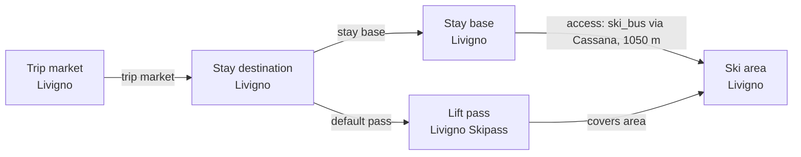

# Livigno Catalog V2 Fact Enrichment

Reviews Livigno ski-area and stay-base facts against official Livigno tourism and lift-pass sources, with explicit distinctions between dedicated snowparks, mini parks, and secured ski-touring routes.

## Resulting Graph

## Reviewed Targets

| Target | Scope | Graph Role | Required Fields |
| --- | --- | --- | --- |
| `ski_area:livigno-ski-area` | `narrow` | `focus` | `snowmaking.availability`, `snowmaking.coverage_pct`, `snowmaking.coverage_basis`, `snowmaking.season_label`, `glacier_terrain.availability`, `snow_park.availability`, `snow_park.park_count`, `snow_park.season_label`, `night_skiing.availability`, `night_skiing.season_label`, `marked_freeride_routes.availability`, `marked_freeride_routes.route_count`, `marked_freeride_routes.season_label`, `official_trail_map.url`, `official_trail_map.season_label`, `ski_day_apres_profile.availability`, `ski_day_apres_profile.intensity`, `ski_day_apres_profile.season_label`, `total_lift_count` |
| `stay_base:livigno-livigno` | `narrow` | `focus` | `elevation_m`, `base_type`, `base_character.development_style`, `base_character.local_pace`, `local_apres_profile.availability`, `local_apres_profile.intensity`, `local_apres_profile.season_label` |
| `trust_manifest:ski_areas:livigno-ski-area` | `narrow` | `focus` | `field_source_refs`, `field_statuses`, `notes` |
| `trust_manifest:stay_bases:livigno-livigno` | `narrow` | `focus` | `field_source_refs`, `field_statuses`, `notes` |
| `stay_destination:livigno` | `narrow` | `focus` | `name` |
| `lift_pass_product:livigno-skipass` | `narrow` | `focus` | `valid_ski_area_ids` |

## Review Evidence Envelope

| Family | Source Kind | Source URLs | Candidate Kinds |
| --- | --- | --- | --- |
| `livigno-destination-booking` | `destination_booking` | [https://booking.livigno.eu/en/](https://booking.livigno.eu/en/) | `stay_destination`, `stay_base` |
| `livigno-ski-area-operator` | `ski_area_operator` | [https://www.skipasslivigno.com/en/lifts-and-slopes/](https://www.skipasslivigno.com/en/lifts-and-slopes/) | `ski_area` |
| `livigno-pass-tariff` | `pass_tariff` | [https://www.skipasslivigno.com/en/livigno-skipass-rates/](https://www.skipasslivigno.com/en/livigno-skipass-rates/) | `ski_area`, `lift_pass_product` |
| `livigno-touched-ski-area-facts` | `other_official` | [https://www.skipasslivigno.com/en/maps/](https://www.skipasslivigno.com/en/maps/), [https://www.livigno.eu/en/fun-relax-winter](https://www.livigno.eu/en/fun-relax-winter), [https://www.skipasslivigno.com/en/snowpark/snowpark-the-beach/](https://www.skipasslivigno.com/en/snowpark/snowpark-the-beach/) | `ski_area` |
| `livigno-touched-stay-base-facts` | `other_official` | [https://webview.livigno.eu/en/news/a-shopping-paradise-at-1-800-metres](https://webview.livigno.eu/en/news/a-shopping-paradise-at-1-800-metres), [https://files.livigno.eu/dati/app/pag/en/liv-media-kit-eng-low.pdf](https://files.livigno.eu/dati/app/pag/en/liv-media-kit-eng-low.pdf), [https://www.livigno.eu/en/home](https://www.livigno.eu/en/home), [https://www.livigno.eu/en/livigno-by-night](https://www.livigno.eu/en/livigno-by-night) | `stay_base` |

## Entity Scope Assessments

| Candidate | Kind | Disposition | Signals | Catalog Targets | Evidence | Backlog | Graph Impact | Rationale |
| --- | --- | --- | --- | --- | --- | --- | --- | --- |
| `livigno` (Livigno) | `stay_destination` | `represented` | `independent_stay_market` | `stay_destination:livigno` | `normalization-livigno-destination-market` |  | `graph_blocking` | The official booking portal supports retaining Livigno as the named, independently presented accommodation market. |
| `livigno-livigno` (Livigno stay base) | `stay_base` | `represented` | `official_independent_identity` | `stay_base:livigno-livigno` | `normalization-livigno-destination-market` |  | `graph_blocking` | The existing Livigno base remains the supported accommodation representation for the focus destination. |
| `livigno-ski-area` (Livigno ski area) | `ski_area` | `represented` | `official_complete_lift_inventory`, `independent_status_or_schedule`, `full_local_pass` | `ski_area:livigno-ski-area` | `normalization-livigno-ski-area-operations`, `normalization-livigno-pass-coverage` |  | `graph_blocking` | The official operator inventory, status presentation, and full local pass support retaining one represented Livigno ski area. |
| `livigno-skipass` (Livigno Skipass) | `lift_pass_product` | `represented` | `official_product_identity`, `full_local_pass` | `lift_pass_product:livigno-skipass` | `normalization-livigno-pass-coverage` |  | `graph_blocking` | The official rates page supports retaining the current Livigno Skipass coverage for the represented local ski area. |

## Ski-Area Boundary Assessments

| Candidate | Parent | Terrain | Connectivity | Operations | Weather | Pass | Provider Consensus | Separation Value | Material Trip Consequences | Evidence |
| --- | --- | --- | --- | --- | --- | --- | --- | --- | --- | --- |
| `livigno-ski-area` |  | `complete` | `not_applicable` | `independent` | `unknown` | `full_local` | `separate` | `material` | `pass_price_or_coverage`; effect `lift_pass_choice`; comparison `stay_market_baseline`; target `livigno`; durability `published_product_contract`; evidence `normalization-livigno-pass-coverage`; The published local pass covers both sides of the represented Livigno ski area for the focus stay market. | `normalization-livigno-ski-area-operations`, `normalization-livigno-pass-coverage` |

## Changed Fields

| Target | Field | Before | After | Trust | Ranking Relevant |
| --- | --- | --- | --- | --- | --- |
| `ski_area:livigno-ski-area` | `official_trail_map.url` | `null` | `"https://www.skipasslivigno.com/en/maps/"` | `verified` | no |
| `ski_area:livigno-ski-area` | `ski_day_apres_profile.availability` | `"unknown"` | `"available"` | `verified` | no |
| `ski_area:livigno-ski-area` | `ski_day_apres_profile.intensity` | `null` | `"moderate"` | `verified_with_adjustment` | no |
| `ski_area:livigno-ski-area` | `snow_park.availability` | `"unknown"` | `"available"` | `verified` | no |
| `ski_area:livigno-ski-area` | `snow_park.park_count` | `null` | `4` | `verified_with_adjustment` | no |
| `stay_base:livigno-livigno` | `base_character.development_style` | `"unknown"` | `"mixed"` | `verified_with_adjustment` | no |
| `stay_base:livigno-livigno` | `base_character.local_pace` | `"unknown"` | `"lively"` | `verified_with_adjustment` | no |
| `stay_base:livigno-livigno` | `elevation_m` | `null` | `1816` | `verified` | no |
| `stay_base:livigno-livigno` | `local_apres_profile.availability` | `"unknown"` | `"available"` | `verified` | no |
| `stay_base:livigno-livigno` | `local_apres_profile.intensity` | `null` | `"lively"` | `verified_with_adjustment` | no |
| `trust_manifest:ski_areas:livigno-ski-area` | `field_source_refs` | `{"elevation_season": ["https://www.openstreetmap.org/relation/47273", "https://www.openstreetmap.org/way/204017650", "https://www.silenesport.it/en/rental-shop/", "https://www.skipasslivigno.com/en/lifts-and-slopes/", "https://www.skipasslivigno.com/en/livigno-skipass-rates/", "https://www.skiresort.info/ski-resort/livigno/"], "glacier_terrain": [], "identity_coordinates": ["https://www.openstreetmap.org/relation/47273", "https://www.openstreetmap.org/way/204017650", "https://www.silenesport.it/en/rental-shop/", "https://www.skipasslivigno.com/en/lifts-and-slopes/", "https://www.skipasslivigno.com/en/livigno-skipass-rates/", "https://www.skiresort.info/ski-resort/livigno/"], "marked_freeride_routes": [], "night_skiing": [], "official_documents": [], "ski_day_apres": [], "skill_fit": ["https://www.openstreetmap.org/relation/47273", "https://www.openstreetmap.org/way/204017650", "https://www.silenesport.it/en/rental-shop/", "https://www.skipasslivigno.com/en/lifts-and-slopes/", "https://www.skipasslivigno.com/en/livigno-skipass-rates/", "https://www.skiresort.info/ski-resort/livigno/"], "snow_park": [], "snowmaking": [], "terrain_metrics": ["https://www.openstreetmap.org/relation/47273", "https://www.openstreetmap.org/way/204017650", "https://www.silenesport.it/en/rental-shop/", "https://www.skipasslivigno.com/en/lifts-and-slopes/", "https://www.skipasslivigno.com/en/livigno-skipass-rates/", "https://www.skiresort.info/ski-resort/livigno/"]}` | `{"elevation_season": ["https://www.openstreetmap.org/relation/47273", "https://www.openstreetmap.org/way/204017650", "https://www.silenesport.it/en/rental-shop/", "https://www.skipasslivigno.com/en/lifts-and-slopes/", "https://www.skipasslivigno.com/en/livigno-skipass-rates/", "https://www.skiresort.info/ski-resort/livigno/"], "glacier_terrain": [], "identity_coordinates": ["https://www.openstreetmap.org/relation/47273", "https://www.openstreetmap.org/way/204017650", "https://www.silenesport.it/en/rental-shop/", "https://www.skipasslivigno.com/en/lifts-and-slopes/", "https://www.skipasslivigno.com/en/livigno-skipass-rates/", "https://www.skiresort.info/ski-resort/livigno/"], "marked_freeride_routes": [], "night_skiing": [], "official_documents": ["https://www.skipasslivigno.com/en/maps/"], "ski_day_apres": ["https://www.livigno.eu/en/fun-relax-winter"], "skill_fit": ["https://www.openstreetmap.org/relation/47273", "https://www.openstreetmap.org/way/204017650", "https://www.silenesport.it/en/rental-shop/", "https://www.skipasslivigno.com/en/lifts-and-slopes/", "https://www.skipasslivigno.com/en/livigno-skipass-rates/", "https://www.skiresort.info/ski-resort/livigno/"], "snow_park": ["https://www.skipasslivigno.com/en/fun-extreme/mini-snowparks/", "https://www.skipasslivigno.com/en/snowpark/snowpark-the-beach/"], "snowmaking": [], "terrain_metrics": ["https://www.openstreetmap.org/relation/47273", "https://www.openstreetmap.org/way/204017650", "https://www.silenesport.it/en/rental-shop/", "https://www.skipasslivigno.com/en/lifts-and-slopes/", "https://www.skipasslivigno.com/en/livigno-skipass-rates/", "https://www.skiresort.info/ski-resort/livigno/"]}` | `estimated` | no |
| `trust_manifest:ski_areas:livigno-ski-area` | `field_statuses` | `{"elevation_season": "verified_with_adjustment", "glacier_terrain": "needs_source", "identity_coordinates": "verified_with_adjustment", "marked_freeride_routes": "needs_source", "night_skiing": "needs_source", "official_documents": "needs_source", "ski_day_apres": "needs_source", "skill_fit": "estimated", "snow_park": "needs_source", "snowmaking": "needs_source", "terrain_metrics": "verified_with_adjustment"}` | `{"elevation_season": "verified_with_adjustment", "glacier_terrain": "needs_source", "identity_coordinates": "verified_with_adjustment", "marked_freeride_routes": "needs_source", "night_skiing": "needs_source", "official_documents": "verified", "ski_day_apres": "verified_with_adjustment", "skill_fit": "estimated", "snow_park": "verified_with_adjustment", "snowmaking": "needs_source", "terrain_metrics": "verified_with_adjustment"}` | `estimated` | no |
| `trust_manifest:ski_areas:livigno-ski-area` | `notes` | `["Full destination field sweep performed against official Skipass Livigno, reviewed ski-area, rental-provider, and open-geodata sources.", "The pass product models the single Livigno ski area because the official pass is valid across both sides of the local ski area rather than across separate Snowcast destinations.", "Official sources support the 2026/27 pass window, high-season pass prices, 115 km slope total, and 31-lift count; reviewed-editorial data corroborates elevation and broader resort metrics.", "Lodging price range, stay-base quality tier, supported skill levels, rental price range, and rental quality tier remain estimates pending dedicated policy or source sampling."]` | `["Full destination field sweep performed against official Skipass Livigno, reviewed ski-area, rental-provider, and open-geodata sources.", "The pass product models the single Livigno ski area because the official pass is valid across both sides of the local ski area rather than across separate Snowcast destinations.", "Official sources support the 2026/27 pass window, high-season pass prices, 115 km slope total, and 31-lift count; reviewed-editorial data corroborates elevation and broader resort metrics.", "Lodging price range, stay-base quality tier, supported skill levels, rental price range, and rental quality tier remain estimates pending dedicated policy or source sampling.", "Source-aware v2 enrichment reviewed official Livigno and Skipass Livigno material on 2026-07-05.", "Secured ski-touring and snowshoe routes are not normalized as marked downhill freeride routes.", "Dedicated snowpark count excludes the three mini snowparks and non-snowpark funslopes."]` | `estimated` | no |
| `trust_manifest:stay_bases:livigno-livigno` | `field_source_refs` | `{"base_character": [], "base_type": [], "coordinates": ["https://www.openstreetmap.org/relation/47273", "https://www.openstreetmap.org/way/204017650", "https://www.silenesport.it/en/rental-shop/", "https://www.skipasslivigno.com/en/lifts-and-slopes/", "https://www.skipasslivigno.com/en/livigno-skipass-rates/", "https://www.skiresort.info/ski-resort/livigno/"], "elevation": [], "identity_ownership": ["https://www.openstreetmap.org/relation/47273", "https://www.openstreetmap.org/way/204017650", "https://www.silenesport.it/en/rental-shop/", "https://www.skipasslivigno.com/en/lifts-and-slopes/", "https://www.skipasslivigno.com/en/livigno-skipass-rates/", "https://www.skiresort.info/ski-resort/livigno/"], "local_apres": [], "lodging_price_quality": ["https://www.openstreetmap.org/relation/47273", "https://www.openstreetmap.org/way/204017650", "https://www.silenesport.it/en/rental-shop/", "https://www.skipasslivigno.com/en/lifts-and-slopes/", "https://www.skipasslivigno.com/en/livigno-skipass-rates/", "https://www.skiresort.info/ski-resort/livigno/"]}` | `{"base_character": ["https://files.livigno.eu/dati/app/pag/en/liv-media-kit-eng-low.pdf", "https://webview.livigno.eu/en/news/a-shopping-paradise-at-1-800-metres"], "base_type": ["https://webview.livigno.eu/en/news/a-shopping-paradise-at-1-800-metres", "https://www.livigno.eu/en/home"], "coordinates": ["https://www.openstreetmap.org/relation/47273", "https://www.openstreetmap.org/way/204017650", "https://www.silenesport.it/en/rental-shop/", "https://www.skipasslivigno.com/en/lifts-and-slopes/", "https://www.skipasslivigno.com/en/livigno-skipass-rates/", "https://www.skiresort.info/ski-resort/livigno/"], "elevation": ["https://www.livigno.eu/en/home"], "identity_ownership": ["https://www.openstreetmap.org/relation/47273", "https://www.openstreetmap.org/way/204017650", "https://www.silenesport.it/en/rental-shop/", "https://www.skipasslivigno.com/en/lifts-and-slopes/", "https://www.skipasslivigno.com/en/livigno-skipass-rates/", "https://www.skiresort.info/ski-resort/livigno/"], "local_apres": ["https://www.livigno.eu/en/fun-relax-winter", "https://www.livigno.eu/en/livigno-by-night"], "lodging_price_quality": ["https://www.openstreetmap.org/relation/47273", "https://www.openstreetmap.org/way/204017650", "https://www.silenesport.it/en/rental-shop/", "https://www.skipasslivigno.com/en/lifts-and-slopes/", "https://www.skipasslivigno.com/en/livigno-skipass-rates/", "https://www.skiresort.info/ski-resort/livigno/"]}` | `estimated` | no |
| `trust_manifest:stay_bases:livigno-livigno` | `field_statuses` | `{"base_character": "needs_source", "base_type": "needs_source", "coordinates": "verified_with_adjustment", "elevation": "needs_source", "identity_ownership": "verified_with_adjustment", "local_apres": "needs_source", "lodging_price_quality": "estimated"}` | `{"base_character": "verified_with_adjustment", "base_type": "verified", "coordinates": "verified_with_adjustment", "elevation": "verified", "identity_ownership": "verified_with_adjustment", "local_apres": "verified_with_adjustment", "lodging_price_quality": "estimated"}` | `estimated` | no |
| `trust_manifest:stay_bases:livigno-livigno` | `notes` | `["Full destination field sweep performed against official Skipass Livigno, reviewed ski-area, rental-provider, and open-geodata sources.", "The pass product models the single Livigno ski area because the official pass is valid across both sides of the local ski area rather than across separate Snowcast destinations.", "Official sources support the 2026/27 pass window, high-season pass prices, 115 km slope total, and 31-lift count; reviewed-editorial data corroborates elevation and broader resort metrics.", "Lodging price range, stay-base quality tier, supported skill levels, rental price range, and rental quality tier remain estimates pending dedicated policy or source sampling."]` | `["Full destination field sweep performed against official Skipass Livigno, reviewed ski-area, rental-provider, and open-geodata sources.", "The pass product models the single Livigno ski area because the official pass is valid across both sides of the local ski area rather than across separate Snowcast destinations.", "Official sources support the 2026/27 pass window, high-season pass prices, 115 km slope total, and 31-lift count; reviewed-editorial data corroborates elevation and broader resort metrics.", "Lodging price range, stay-base quality tier, supported skill levels, rental price range, and rental quality tier remain estimates pending dedicated policy or source sampling.", "Source-aware v2 enrichment reviewed official Livigno settlement, shopping, history, and nightlife material on 2026-07-05."]` | `estimated` | no |

## Field Coverage

| Target | Field | Status | Notes |
| --- | --- | --- | --- |
| `ski_area:livigno-ski-area` | `snowmaking.availability` | `unresolved` | Official Livigno sources were reviewed, but they did not establish this exact ski-area value; it remains unknown rather than being inferred from a different activity or scope. |
| `ski_area:livigno-ski-area` | `snowmaking.coverage_pct` | `unresolved` | Official Livigno sources were reviewed, but they did not establish this exact ski-area value; it remains unknown rather than being inferred from a different activity or scope. |
| `ski_area:livigno-ski-area` | `snowmaking.coverage_basis` | `unresolved` | Official Livigno sources were reviewed, but they did not establish this exact ski-area value; it remains unknown rather than being inferred from a different activity or scope. |
| `ski_area:livigno-ski-area` | `snowmaking.season_label` | `unresolved` | Official Livigno sources were reviewed, but they did not establish this exact ski-area value; it remains unknown rather than being inferred from a different activity or scope. |
| `ski_area:livigno-ski-area` | `glacier_terrain.availability` | `unresolved` | Official Livigno sources were reviewed, but they did not establish this exact ski-area value; it remains unknown rather than being inferred from a different activity or scope. |
| `ski_area:livigno-ski-area` | `snow_park.availability` | `changed` | The official operator documents multiple dedicated snowparks across Livigno's ski area. |
| `ski_area:livigno-ski-area` | `snow_park.park_count` | `changed` | The official page identifies Snowpark The Beach and links three other full snowparks: Oakley Flow Park, Snowpark Twenty, and Snowpark Amerikan. |
| `ski_area:livigno-ski-area` | `snow_park.season_label` | `unresolved` | Official Livigno sources were reviewed, but they did not establish this exact ski-area value; it remains unknown rather than being inferred from a different activity or scope. |
| `ski_area:livigno-ski-area` | `night_skiing.availability` | `unresolved` | Official Livigno sources were reviewed, but they did not establish this exact ski-area value; it remains unknown rather than being inferred from a different activity or scope. |
| `ski_area:livigno-ski-area` | `night_skiing.season_label` | `unresolved` | Official Livigno sources were reviewed, but they did not establish this exact ski-area value; it remains unknown rather than being inferred from a different activity or scope. |
| `ski_area:livigno-ski-area` | `marked_freeride_routes.availability` | `unresolved` | Official Livigno sources were reviewed, but they did not establish this exact ski-area value; it remains unknown rather than being inferred from a different activity or scope. |
| `ski_area:livigno-ski-area` | `marked_freeride_routes.route_count` | `unresolved` | Official Livigno sources were reviewed, but they did not establish this exact ski-area value; it remains unknown rather than being inferred from a different activity or scope. |
| `ski_area:livigno-ski-area` | `marked_freeride_routes.season_label` | `unresolved` | Official Livigno sources were reviewed, but they did not establish this exact ski-area value; it remains unknown rather than being inferred from a different activity or scope. |
| `ski_area:livigno-ski-area` | `official_trail_map.url` | `changed` | The official lift-pass site provides the current online and downloadable Livigno ski map. |
| `ski_area:livigno-ski-area` | `official_trail_map.season_label` | `unresolved` | Official Livigno sources were reviewed, but they did not establish this exact ski-area value; it remains unknown rather than being inferred from a different activity or scope. |
| `ski_area:livigno-ski-area` | `ski_day_apres_profile.availability` | `changed` | Official tourism documents après-ski bars and traditional mountain cabins used after skiing. |
| `ski_area:livigno-ski-area` | `ski_day_apres_profile.intensity` | `changed` | The official ski-day description combines many sunset aperitivo options with traditional mountain-cabin stops rather than only party venues. |
| `ski_area:livigno-ski-area` | `ski_day_apres_profile.season_label` | `unresolved` | Official Livigno sources were reviewed, but they did not establish this exact ski-area value; it remains unknown rather than being inferred from a different activity or scope. |
| `stay_base:livigno-livigno` | `elevation_m` | `changed` | Official tourism consistently gives Livigno at 1,816 m. |
| `stay_base:livigno-livigno` | `base_type` | `reviewed-no-change` | The existing town type is retained because official material describes a pedestrian town centre, extensive services, and a continuous valley settlement, while also using village informally. |
| `stay_base:livigno-livigno` | `base_character.development_style` | `changed` | Livigno combines Alpine-style and traditional settings with modern structures, 250 shops, international brands, and mature resort infrastructure. |
| `stay_base:livigno-livigno` | `base_character.local_pace` | `changed` | The official guide describes Livigno's evolution from a calm rural village into a lively tourism destination. |
| `stay_base:livigno-livigno` | `local_apres_profile.availability` | `changed` | The official directory lists ten bars, pubs, clubs, and après-ski venues. |
| `stay_base:livigno-livigno` | `local_apres_profile.intensity` | `changed` | The official directory includes multiple dedicated après-ski venues, bars, and discos alongside the broader winter offer. |
| `stay_base:livigno-livigno` | `local_apres_profile.season_label` | `unresolved` | Official Livigno sources were reviewed, but they did not establish this exact stay-base value; it remains unknown rather than being inferred. |
| `trust_manifest:ski_areas:livigno-ski-area` | `field_source_refs` | `changed` | Trust metadata updated for the reviewed source-aware facts. |
| `trust_manifest:ski_areas:livigno-ski-area` | `field_statuses` | `changed` | Trust metadata updated for the reviewed source-aware facts. |
| `trust_manifest:ski_areas:livigno-ski-area` | `notes` | `changed` | Trust metadata updated for the reviewed source-aware facts. |
| `trust_manifest:stay_bases:livigno-livigno` | `field_source_refs` | `changed` | Trust metadata updated for the reviewed source-aware facts. |
| `trust_manifest:stay_bases:livigno-livigno` | `field_statuses` | `changed` | Trust metadata updated for the reviewed source-aware facts. |
| `trust_manifest:stay_bases:livigno-livigno` | `notes` | `changed` | Trust metadata updated for the reviewed source-aware facts. |
| `stay_destination:livigno` | `name` | `reviewed-no-change` | The official destination booking market retains the existing Livigno identity. |
| `ski_area:livigno-ski-area` | `total_lift_count` | `reviewed-no-change` | The official operator inventory retains the current aggregate lift count. |
| `lift_pass_product:livigno-skipass` | `valid_ski_area_ids` | `reviewed-no-change` | The official pass continues to cover the represented Livigno ski area. |

## Evidence

| Target | Field | Source | Source Value | Evidence | Normalization |
| --- | --- | --- | --- | --- | --- |
| `ski_area:livigno-ski-area` | `official_trail_map.url` | [Skipass Livigno official lift and slope maps](https://www.skipasslivigno.com/en/maps/) | `"https://www.skipasslivigno.com/en/maps/"` | The official lift-pass site provides the current online and downloadable Livigno ski map. |  |
| `ski_area:livigno-ski-area` | `ski_day_apres_profile.availability` | [Livigno official winter fun and après guide](https://www.livigno.eu/en/fun-relax-winter) | `"available"` | Official tourism documents après-ski bars and traditional mountain cabins used after skiing. |  |
| `ski_area:livigno-ski-area` | `ski_day_apres_profile.intensity` | [Livigno official winter fun and après guide](https://www.livigno.eu/en/fun-relax-winter) | `"moderate"` | The official ski-day description combines many sunset aperitivo options with traditional mountain-cabin stops rather than only party venues. | The broad but mixed post-ski offer is mapped to moderate. |
| `ski_area:livigno-ski-area` | `snow_park.availability` | [Skipass Livigno official Snowpark The Beach guide](https://www.skipasslivigno.com/en/snowpark/snowpark-the-beach/) | `"available"` | The official operator documents multiple dedicated snowparks across Livigno's ski area. |  |
| `ski_area:livigno-ski-area` | `snow_park.park_count` | [Skipass Livigno official Snowpark The Beach guide](https://www.skipasslivigno.com/en/snowpark/snowpark-the-beach/) | `4` | The official page identifies Snowpark The Beach and links three other full snowparks: Oakley Flow Park, Snowpark Twenty, and Snowpark Amerikan. | Three separately documented mini snowparks and non-snowpark funslopes are excluded from the dedicated count. |
| `stay_base:livigno-livigno` | `base_character.development_style` | [Livigno official town-centre and shopping guide](https://webview.livigno.eu/en/news/a-shopping-paradise-at-1-800-metres) | `"mixed"` | Livigno combines Alpine-style and traditional settings with modern structures, 250 shops, international brands, and mature resort infrastructure. | The traditional Alpine identity and extensive modern tourism fabric are mapped to mixed. |
| `stay_base:livigno-livigno` | `base_character.local_pace` | [Livigno official media guide](https://files.livigno.eu/dati/app/pag/en/liv-media-kit-eng-low.pdf) | `"lively"` | The official guide describes Livigno's evolution from a calm rural village into a lively tourism destination. | The explicit lively tourism positioning is mapped to lively. |
| `stay_base:livigno-livigno` | `elevation_m` | [Livigno official destination guide](https://www.livigno.eu/en/home) | `1816` | Official tourism consistently gives Livigno at 1,816 m. |  |
| `stay_base:livigno-livigno` | `local_apres_profile.availability` | [Livigno official bars, pubs, and après-ski directory](https://www.livigno.eu/en/livigno-by-night) | `"available"` | The official directory lists ten bars, pubs, clubs, and après-ski venues. |  |
| `stay_base:livigno-livigno` | `local_apres_profile.intensity` | [Livigno official bars, pubs, and après-ski directory](https://www.livigno.eu/en/livigno-by-night) | `"lively"` | The official directory includes multiple dedicated après-ski venues, bars, and discos alongside the broader winter offer. | The multi-venue bar and club inventory is mapped to lively. |
| `stay_destination:livigno` | `name` | [Livigno official booking portal](https://booking.livigno.eu/en/) | `"Livigno"` | The official booking portal presents Livigno as one accommodation market with more than 200 hotels and apartments. |  |
| `ski_area:livigno-ski-area` | `total_lift_count` | [Skipass Livigno lifts and slopes status](https://www.skipasslivigno.com/en/lifts-and-slopes/) | `31` | The official operator publishes the Livigno lift and slope inventory and live status for the represented ski area. |  |
| `lift_pass_product:livigno-skipass` | `valid_ski_area_ids` | [Skipass Livigno official rates](https://www.skipasslivigno.com/en/livigno-skipass-rates/) | `["livigno-ski-area"]` | The official pass is valid on both sides of the represented Livigno ski area. |  |
| `ski_area:livigno-ski-area` | `snowmaking.availability` | [Skipass Livigno lifts and slopes status](https://www.skipasslivigno.com/en/lifts-and-slopes/) | `null` | The reviewed official operator material does not state a canonical ski-area snowmaking availability value. |  |
| `ski_area:livigno-ski-area` | `snowmaking.coverage_pct` | [Skipass Livigno lifts and slopes status](https://www.skipasslivigno.com/en/lifts-and-slopes/) | `null` | The reviewed official operator material does not publish a snowmaking coverage percentage with a comparable denominator. |  |
| `ski_area:livigno-ski-area` | `snowmaking.coverage_basis` | [Skipass Livigno lifts and slopes status](https://www.skipasslivigno.com/en/lifts-and-slopes/) | `null` | The reviewed official operator material does not establish a snowmaking coverage basis for this catalog field. |  |
| `ski_area:livigno-ski-area` | `snowmaking.season_label` | [Skipass Livigno lifts and slopes status](https://www.skipasslivigno.com/en/lifts-and-slopes/) | `null` | The reviewed official operator material does not provide the canonical snowmaking season label used by this field. |  |
| `ski_area:livigno-ski-area` | `glacier_terrain.availability` | [Skipass Livigno lifts and slopes status](https://www.skipasslivigno.com/en/lifts-and-slopes/) | `null` | The reviewed official operator material does not establish a glacier-terrain availability value for Livigno. |  |
| `ski_area:livigno-ski-area` | `snow_park.season_label` | [Skipass Livigno Snowpark The Beach guide](https://www.skipasslivigno.com/en/snowpark/snowpark-the-beach/) | `null` | The reviewed snowpark guide supports the facilities but not the canonical season label for this field. |  |
| `ski_area:livigno-ski-area` | `night_skiing.availability` | [Skipass Livigno lifts and slopes status](https://www.skipasslivigno.com/en/lifts-and-slopes/) | `null` | The reviewed official operator material does not establish a canonical night-skiing availability value. |  |
| `ski_area:livigno-ski-area` | `night_skiing.season_label` | [Skipass Livigno lifts and slopes status](https://www.skipasslivigno.com/en/lifts-and-slopes/) | `null` | The reviewed official operator material does not provide the canonical night-skiing season label used by this field. |  |
| `ski_area:livigno-ski-area` | `marked_freeride_routes.availability` | [Livigno official winter fun and après guide](https://www.livigno.eu/en/fun-relax-winter) | `null` | The reviewed official winter guide does not establish marked downhill freeride-route availability. |  |
| `ski_area:livigno-ski-area` | `marked_freeride_routes.route_count` | [Livigno official winter fun and après guide](https://www.livigno.eu/en/fun-relax-winter) | `null` | The reviewed official winter guide does not publish a marked downhill freeride-route count. |  |
| `ski_area:livigno-ski-area` | `marked_freeride_routes.season_label` | [Livigno official winter fun and après guide](https://www.livigno.eu/en/fun-relax-winter) | `null` | The reviewed official winter guide does not provide the canonical marked-freeride season label used by this field. |  |
| `ski_area:livigno-ski-area` | `official_trail_map.season_label` | [Skipass Livigno official lift and slope maps](https://www.skipasslivigno.com/en/maps/) | `null` | The reviewed maps page does not provide the canonical map season label used by this field. |  |
| `ski_area:livigno-ski-area` | `ski_day_apres_profile.season_label` | [Livigno official winter fun and après guide](https://www.livigno.eu/en/fun-relax-winter) | `null` | The reviewed guide supports the ski-day offer but does not establish the canonical season label used by this field. |  |
| `stay_base:livigno-livigno` | `local_apres_profile.season_label` | [Livigno official bars, pubs, and après-ski directory](https://www.livigno.eu/en/livigno-by-night) | `null` | The reviewed directory supports the local venue profile but does not establish the canonical season label used by this field. |  |

## Boundary Decisions

- `livigno`: `pass`

## Caveats

- The official secured-route inventory covers ski touring and snowshoeing, not marked downhill freeride routes, so the marked-freeride fact remains unknown.
- No official alpine-ski snowmaking coverage percentage with a denominator was established.
- Mini snowparks and funslopes are excluded from the dedicated snowpark count.
