# Misurina Catalog V2 Evidence and Graph Reconciliation

Aligns Misurina to official 7 km child-scope metrics, exact OSM access references, the historical Col de Varda-Loita tariff, and one canonical four-destination Valle product while retaining conservative source and graph boundaries.

## Resulting Graph

```mermaid
flowchart LR
  region_1["Trip market<br/>Auronzo di Cadore"]
  region_2["Trip market<br/>Cortina d&#x27;Ampezzo"]
  region_3["Trip market<br/>Misurina"]
  region_4["Trip market<br/>San Vito di Cadore"]
  destination_1["Stay destination<br/>Auronzo di Cadore"]
  destination_2["Stay destination<br/>Cortina d&#x27;Ampezzo"]
  destination_3["Stay destination<br/>Misurina"]
  destination_4["Stay destination<br/>San Vito di Cadore"]
  base_1["Stay base<br/>Auronzo di Cadore"]
  base_2["Stay base<br/>Taiarezze"]
  base_3["Stay base<br/>Cortina d&#x27;Ampezzo"]
  base_4["Stay base<br/>Misurina"]
  base_5["Stay base<br/>San Vito di Cadore"]
  area_1["Ski area<br/>Auronzo di Cadore - Monte Agudo"]
  area_2["Ski area<br/>Cortina d&#x27;Ampezzo"]
  area_3["Ski area<br/>Misurina"]
  area_4["Ski area<br/>San Vito di Cadore"]
  pass_1["Lift pass<br/>Auronzo di Cadore - Monte Agudo Skipass"]
  pass_2["Lift pass<br/>Valle Skipass Cortina"]
  pass_3["Lift pass<br/>Col de Varda - Loita Misurina Skipass"]
  pass_4["Lift pass<br/>San Vito Ski Area Skipass"]
  region_1 -->|"trip market"| destination_1
  region_2 -->|"trip market"| destination_2
  region_3 -->|"trip market"| destination_3
  region_4 -->|"trip market"| destination_4
  destination_1 -->|"stay base"| base_1
  destination_1 -->|"stay base"| base_2
  destination_2 -->|"stay base"| base_3
  destination_3 -->|"stay base"| base_4
  destination_4 -->|"stay base"| base_5
  base_1 -->|"access: ski_bus via Taiarezze-Malon Chairlift, 2100 m"| area_1
  base_2 -->|"access: walk via Taiarezze-Malon Chairlift"| area_1
  base_3 -->|"access: walk via Funivia Faloria, 472 m"| area_2
  base_4 -->|"access: walk via Col de Varda Chairlift, 129 m"| area_3
  base_5 -->|"access: ski_bus"| area_4
  destination_1 -->|"default pass"| pass_1
  pass_1 -->|"covers area"| area_1
  destination_1 -->|"pass available"| pass_2
  destination_2 -->|"default pass"| pass_2
  destination_3 -->|"pass available"| pass_2
  destination_4 -->|"pass available"| pass_2
  pass_2 -->|"covers area"| area_1
  pass_2 -->|"covers area"| area_2
  pass_2 -->|"covers area"| area_3
  pass_2 -->|"covers area"| area_4
  destination_3 -->|"default pass"| pass_3
  pass_3 -->|"covers area"| area_3
  destination_4 -->|"default pass"| pass_4
  pass_4 -->|"covers area"| area_4
```

## Reviewed Targets

| Target | Scope | Graph Role | Required Fields |
| --- | --- | --- | --- |
| `lift_pass_product:auronzo-cortina-valle-skipass` | `narrow` | `focus` | `available_from_stay_destination_ids`, `default_for_stay_destination_ids`, `external_validity_summary`, `lift_pass_product_id`, `name`, `prices`, `terrain_domain_ids`, `valid_ski_area_ids`, `validity_scope`, `validity_windows` |
| `lift_pass_product:auronzo-monte-agudo-skipass` | `narrow` | `focus` | `available_from_stay_destination_ids`, `default_for_stay_destination_ids`, `lift_pass_product_id`, `name`, `prices`, `terrain_domain_ids`, `valid_ski_area_ids`, `validity_scope` |
| `lift_pass_product:cortina-valle-skipass` | `full` | `focus` | all canonical fields |
| `lift_pass_product:misurina-cortina-valle-skipass` | `narrow` | `focus` | `available_from_stay_destination_ids`, `default_for_stay_destination_ids`, `external_validity_summary`, `lift_pass_product_id`, `name`, `prices`, `terrain_domain_ids`, `valid_ski_area_ids`, `validity_scope`, `validity_windows` |
| `lift_pass_product:misurina-passo-tre-croci-skipass` | `full` | `focus` | all canonical fields |
| `lift_pass_product:san-vito-cortina-valle-skipass` | `narrow` | `focus` | `available_from_stay_destination_ids`, `default_for_stay_destination_ids`, `external_validity_summary`, `lift_pass_product_id`, `name`, `prices`, `terrain_domain_ids`, `valid_ski_area_ids`, `validity_scope`, `validity_windows` |
| `lift_pass_product:san-vito-ski-area-skipass` | `narrow` | `focus` | `available_from_stay_destination_ids`, `default_for_stay_destination_ids`, `lift_pass_product_id`, `name`, `prices`, `terrain_domain_ids`, `valid_ski_area_ids`, `validity_scope` |
| `ski_area:auronzo-monte-agudo` | `narrow` | `focus` | `base_elevation_m`, `name`, `ski_area_id`, `summit_elevation_m`, `total_lift_count`, `total_piste_km` |
| `ski_area:cortina-dampezzo-ski-area` | `narrow` | `focus` | `base_elevation_m`, `name`, `ski_area_id`, `summit_elevation_m`, `total_lift_count`, `total_piste_km` |
| `ski_area:misurina-passo-tre-croci` | `full` | `focus` | all canonical fields |
| `ski_area:san-vito-di-cadore-ski-area` | `narrow` | `focus` | `base_elevation_m`, `name`, `ski_area_id`, `summit_elevation_m`, `total_lift_count`, `total_piste_km` |
| `ski_area_access:auronzo-di-cadore-auronzo-di-cadore--auronzo-monte-agudo` | `narrow` | `focus` | `access_mode`, `distance_m`, `is_direct`, `ski_area_access_id`, `ski_area_id`, `stay_base_id` |
| `ski_area_access:auronzo-di-cadore-taiarezze--auronzo-monte-agudo` | `narrow` | `focus` | `access_mode`, `distance_m`, `is_direct`, `ski_area_access_id`, `ski_area_id`, `stay_base_id` |
| `ski_area_access:cortina-dampezzo-cortina-dampezzo--cortina-dampezzo-ski-area` | `narrow` | `focus` | `access_mode`, `distance_m`, `is_direct`, `ski_area_access_id`, `ski_area_id`, `stay_base_id` |
| `ski_area_access:misurina-misurina--misurina-passo-tre-croci` | `full` | `focus` | all canonical fields |
| `ski_area_access:san-vito-di-cadore-san-vito-di-cadore--san-vito-di-cadore-ski-area` | `narrow` | `focus` | `access_mode`, `distance_m`, `is_direct`, `ski_area_access_id`, `ski_area_id`, `stay_base_id` |
| `ski_region:auronzo-di-cadore` | `narrow` | `focus` | `grouping_policy`, `name`, `parent_ski_region_id`, `ski_region_id` |
| `ski_region:cortina-dampezzo` | `narrow` | `focus` | `grouping_policy`, `name`, `parent_ski_region_id`, `ski_region_id` |
| `ski_region:misurina` | `narrow` | `focus` | `grouping_policy`, `name`, `parent_ski_region_id`, `ski_region_id` |
| `ski_region:san-vito-di-cadore` | `narrow` | `focus` | `grouping_policy`, `name`, `parent_ski_region_id`, `ski_region_id` |
| `stay_base:auronzo-di-cadore-auronzo-di-cadore` | `narrow` | `focus` | `elevation_m`, `name`, `stay_base_id`, `stay_destination_id` |
| `stay_base:auronzo-di-cadore-taiarezze` | `narrow` | `focus` | `elevation_m`, `name`, `stay_base_id`, `stay_destination_id` |
| `stay_base:cortina-dampezzo-cortina-dampezzo` | `narrow` | `focus` | `elevation_m`, `name`, `stay_base_id`, `stay_destination_id` |
| `stay_base:misurina-misurina` | `full` | `focus` | all canonical fields |
| `stay_base:san-vito-di-cadore-san-vito-di-cadore` | `narrow` | `focus` | `elevation_m`, `name`, `stay_base_id`, `stay_destination_id` |
| `stay_destination:auronzo-di-cadore` | `narrow` | `focus` | `name`, `stay_destination_id`, `trip_market_region_id` |
| `stay_destination:cortina-dampezzo` | `narrow` | `focus` | `name`, `stay_destination_id`, `trip_market_region_id` |
| `stay_destination:misurina` | `full` | `focus` | all canonical fields |
| `stay_destination:san-vito-di-cadore` | `narrow` | `focus` | `name`, `stay_destination_id`, `trip_market_region_id` |
| `trust_manifest:lift_pass_products:auronzo-cortina-valle-skipass` | `narrow` | `focus` | `display_name`, `field_source_refs`, `field_statuses`, `notes` |
| `trust_manifest:lift_pass_products:cortina-valle-skipass` | `full` | `focus` | all canonical fields |
| `trust_manifest:lift_pass_products:misurina-cortina-valle-skipass` | `narrow` | `focus` | `display_name`, `field_source_refs`, `field_statuses`, `notes` |
| `trust_manifest:lift_pass_products:misurina-passo-tre-croci-skipass` | `full` | `focus` | all canonical fields |
| `trust_manifest:lift_pass_products:san-vito-cortina-valle-skipass` | `narrow` | `focus` | `display_name`, `field_source_refs`, `field_statuses`, `notes` |
| `trust_manifest:ski_area_access:misurina-misurina--misurina-passo-tre-croci` | `full` | `focus` | all canonical fields |
| `trust_manifest:ski_areas:misurina-passo-tre-croci` | `full` | `focus` | all canonical fields |
| `trust_manifest:stay_bases:misurina-misurina` | `full` | `focus` | all canonical fields |
| `trust_manifest:stay_destinations:misurina` | `full` | `focus` | all canonical fields |

## Review Evidence Envelope

| Family | Source Kind | Source URLs | Candidate Kinds |
| --- | --- | --- | --- |
| `misurina-operator-and-status` | `ski_area_operator` | [https://skipasscortina.com/EN/companies.php](https://skipasscortina.com/EN/companies.php), [https://skipasscortina.com/EN/s12-misurina-neve-srl](https://skipasscortina.com/EN/s12-misurina-neve-srl), [https://www.dolomitisuperski.com/it/live-info/impianti/cortina-d-ampezzo](https://www.dolomitisuperski.com/it/live-info/impianti/cortina-d-ampezzo), [https://www.dolomitisuperski.com/it/live-info/piste/cortina-d-ampezzo](https://www.dolomitisuperski.com/it/live-info/piste/cortina-d-ampezzo), [https://skipasscortina.com/Doc/Pdf/Cortina_Skimap_web.pdf](https://skipasscortina.com/Doc/Pdf/Cortina_Skimap_web.pdf) | `ski_area` |
| `misurina-official-child-metrics` | `other_official` | [https://www.visitdolomitibellunesi.com/imports/documenti-brochures/firmamento-delle-piste-da-sci-0d5c62a8-8d03-4ac6-aab4-f71d58afd90b/documents-1-trn-9fa8e486-1519-4e9b-b114-346ddd3aa5a4-file.pdf](https://www.visitdolomitibellunesi.com/imports/documenti-brochures/firmamento-delle-piste-da-sci-0d5c62a8-8d03-4ac6-aab4-f71d58afd90b/documents-1-trn-9fa8e486-1519-4e9b-b114-346ddd3aa5a4-file.pdf) | `ski_area` |
| `misurina-local-tariff` | `pass_tariff` | [https://auronzomisurina.it/dev/wp-content/uploads/2024/12/TARIFFE-STAGIONE-INVERNALE-2024-25-Misurina-Neve.pdf](https://auronzomisurina.it/dev/wp-content/uploads/2024/12/TARIFFE-STAGIONE-INVERNALE-2024-25-Misurina-Neve.pdf) | `ski_area`, `lift_pass_product` |
| `cortina-valle-and-regional-products` | `pass_tariff` | [https://skipasscortina.com/EN/page17-cortina-winter-prices](https://skipasscortina.com/EN/page17-cortina-winter-prices), [https://skipasscortina.com/EN/page17-winter-prices](https://skipasscortina.com/EN/page17-winter-prices), [https://skipasscortina.com/EN/page45-tailormade-dss-skipass](https://skipasscortina.com/EN/page45-tailormade-dss-skipass) | `stay_destination`, `ski_area`, `terrain_domain`, `lift_pass_product` |
| `misurina-access-and-stay` | `access_transport` | [https://auronzo.info/en/misurina-dolomites/](https://auronzo.info/en/misurina-dolomites/), [https://www.openstreetmap.org/node/1427982374](https://www.openstreetmap.org/node/1427982374), [https://www.openstreetmap.org/node/472590731](https://www.openstreetmap.org/node/472590731) | `stay_destination`, `stay_base`, `ski_area_access` |

## Entity Scope Assessments

| Candidate | Kind | Disposition | Signals | Catalog Targets | Evidence | Backlog | Graph Impact | Rationale |
| --- | --- | --- | --- | --- | --- | --- | --- | --- |
| `misurina` (Misurina) | `stay_destination` | `represented` | `independent_stay_market`, `official_independent_identity` | `stay_destination:misurina` | `E-SCOPE-MUNICIPAL-DEST` |  | `graph_blocking` | Dedicated accommodation and IAT treatment retain Misurina as the stay destination. |
| `misurina-misurina` (Misurina village base) | `stay_base` | `represented` | `independent_stay_market`, `distinct_access` | `stay_base:misurina-misurina` | `E-SCOPE-MUNICIPAL-BASE`, `E-SCOPE-OSM-BASE` |  | `graph_blocking` | The named village, accommodation market, elevation, and exact base node retain one stay base. |
| `misurina-passo-tre-croci` (Misurina combined Col de Varda-Loita area) | `ski_area` | `represented` | `official_independent_identity`, `separate_operator`, `child_scoped_terrain_metrics`, `full_local_pass` | `ski_area:misurina-passo-tre-croci` | `E-SCOPE-DIRECTORY`, `E-SCOPE-MEMBER`, `E-SCOPE-METRICS`, `E-SCOPE-TARIFF`, `E-SCOPE-MAP` |  | `graph_blocking` | Official child metrics, member/operator identity, and a full local tariff support one separate combined area. |
| `operator:misurina-neve-srl` (Misurina Neve operator identity) | `ski_area` | `external_pass_context` | `separate_operator`, `independent_status_or_schedule` |  | `E-SCOPE-DIRECTORY`, `E-SCOPE-MEMBER`, `E-SCOPE-LIVE-LIFTS`, `E-SCOPE-LIVE-PISTES` |  | `graph_blocking` | The operator is ownership evidence for the combined area, not a separate graph entity; live URLs were inventoried but automated retrieval was blocked. |
| `ski_area_candidate:col-de-varda` (Col de Varda sector) | `ski_area` | `not_separate` | `official_map_sector`, `limited_area_ticket`, `ski_connected_terrain` | `ski_area:misurina-passo-tre-croci` | `E-SCOPE-MEMBER`, `E-SCOPE-MAP`, `E-SCOPE-TARIFF` |  | `graph_blocking` | Col de Varda is a named sector and access point inside the combined Misurina area, not a separately owned complete area. |
| `ski_area_candidate:loita` (Loita beginner sector) | `ski_area` | `not_separate` | `official_map_sector`, `limited_area_ticket`, `disconnected_terrain` | `ski_area:misurina-passo-tre-croci` | `E-SCOPE-MEMBER`, `E-SCOPE-METRICS`, `E-SCOPE-TARIFF` |  | `graph_blocking` | Loita is the combined area's beginner/school sector and does not have separate complete-area ownership. |
| `misurina-misurina--misurina-passo-tre-croci` (Misurina base to Col de Varda access) | `ski_area_access` | `represented` | `direct_access_relationship`, `distinct_access` | `ski_area_access:misurina-misurina--misurina-passo-tre-croci` | `E-SCOPE-MUNICIPAL-ACCESS`, `E-SCOPE-OSM-BASE`, `E-SCOPE-OSM-STATION` |  | `graph_blocking` | The exact nodes support a 129 m point-to-point relationship; no routed duration is claimed. |
| `misurina-passo-tre-croci-skipass` (Col de Varda-Loita Misurina local pass) | `lift_pass_product` | `represented` | `official_product_identity`, `full_local_pass`, `limited_area_ticket` | `lift_pass_product:misurina-passo-tre-croci-skipass` | `E-SCOPE-TARIFF`, `E-SCOPE-MEMBER` |  | `graph_blocking` | The official historical tariff supports one local product and a time-qualified EUR 49 value. |
| `cortina-valle-skipass` (Canonical Valle Skipass Cortina) | `lift_pass_product` | `represented` | `official_product_identity`, `secondary_provider_listing` | `lift_pass_product:cortina-valle-skipass` | `E-SCOPE-VALLE`, `E-SCOPE-VALLE-ALIAS` |  | `graph_blocking` | One canonical product is available from four destinations and covers four existing area IDs; Cortina remains the sole default. |
| `auronzo-cortina-valle-skipass` (Synthetic destination-qualified Valle wrapper) | `lift_pass_product` | `not_separate` | `official_product_identity` | `lift_pass_product:cortina-valle-skipass` | `E-SCOPE-VALLE` |  | `graph_blocking` | The official four-place product is represented once; the synthetic destination-qualified wrapper is removed. |
| `misurina-cortina-valle-skipass` (Synthetic destination-qualified Valle wrapper) | `lift_pass_product` | `not_separate` | `official_product_identity` | `lift_pass_product:cortina-valle-skipass` | `E-SCOPE-VALLE` |  | `graph_blocking` | The official four-place product is represented once; the synthetic destination-qualified wrapper is removed. |
| `san-vito-cortina-valle-skipass` (Synthetic destination-qualified Valle wrapper) | `lift_pass_product` | `not_separate` | `official_product_identity` | `lift_pass_product:cortina-valle-skipass` | `E-SCOPE-VALLE` |  | `graph_blocking` | The official four-place product is represented once; the synthetic destination-qualified wrapper is removed. |
| `auronzo-di-cadore` (Auronzo Di Cadore) | `stay_destination` | `external_pass_context` | `official_product_identity` | `stay_destination:auronzo-di-cadore` | `E-SCOPE-VALLE` |  | `graph_blocking` | Existing destination retained only as an explicit availability endpoint in this Misurina-bounded review. |
| `cortina-dampezzo` (Cortina Dampezzo) | `stay_destination` | `external_pass_context` | `official_product_identity` | `stay_destination:cortina-dampezzo` | `E-SCOPE-VALLE` |  | `graph_blocking` | Existing destination retained only as an explicit availability endpoint in this Misurina-bounded review. |
| `san-vito-di-cadore` (San Vito Di Cadore) | `stay_destination` | `external_pass_context` | `official_product_identity` | `stay_destination:san-vito-di-cadore` | `E-SCOPE-VALLE` |  | `graph_blocking` | Existing destination retained only as an explicit availability endpoint in this Misurina-bounded review. |
| `auronzo-monte-agudo` (Auronzo Monte Agudo) | `ski_area` | `external_pass_context` | `official_product_identity` | `ski_area:auronzo-monte-agudo` | `E-SCOPE-VALLE` |  | `graph_blocking` | Existing area retained only as an explicit Valle coverage endpoint; its local metrics are outside this review. |
| `cortina-dampezzo-ski-area` (Cortina Dampezzo Ski Area) | `ski_area` | `external_pass_context` | `official_product_identity` | `ski_area:cortina-dampezzo-ski-area` | `E-SCOPE-VALLE` |  | `graph_blocking` | Existing area retained only as an explicit Valle coverage endpoint; its local metrics are outside this review. |
| `san-vito-di-cadore-ski-area` (San Vito Di Cadore Ski Area) | `ski_area` | `external_pass_context` | `official_product_identity` | `ski_area:san-vito-di-cadore-ski-area` | `E-SCOPE-VALLE` |  | `graph_blocking` | Existing area retained only as an explicit Valle coverage endpoint; its local metrics are outside this review. |
| `terrain_domain:misurina-cortina` (Misurina-Cortina shared terrain domain) | `terrain_domain` | `external_pass_context` | `disconnected_terrain`, `official_product_identity` |  | `E-SCOPE-VALLE`, `E-SCOPE-MAP` |  | `graph_blocking` | Shared ticket coverage does not establish ski-connected terrain, so no terrain domain is modeled. |
| `lift_pass_product:misurina-col-de-varda-loita-2024-25-low-season` (Historical Misurina low-season price variant) | `lift_pass_product` | `not_separate` | `official_product_identity`, `limited_area_ticket` | `lift_pass_product:misurina-passo-tre-croci-skipass` | `E-SCOPE-TARIFF` |  | `graph_blocking` | Low/high-season prices are price variants of one historical local product, not separate durable products. |
| `lift_pass_product:cortina-valle-pre-olympic` (Historical/pre-Olympic Valle variant) | `lift_pass_product` | `not_separate` | `official_product_identity` | `lift_pass_product:cortina-valle-skipass` | `E-SCOPE-VALLE` |  | `graph_blocking` | A named promotional or historical ticket period does not create a second durable Valle product. |
| `lift_pass_product:dolomiti-superski-extra` (Dolomiti Superski Extra context) | `lift_pass_product` | `external_pass_context` | `official_product_identity` |  | `E-SCOPE-DSS` |  | `graph_blocking` | Extra remains external ticket context pending a regional product-model review. |
| `dolomiti-superski` (Dolomiti Superski) | `lift_pass_product` | `deferred` | `official_product_identity` |  | `E-SCOPE-DSS` | `docs/product-backlog.md#alta-badia-and-regional-catalog-refinements` | `regional_followup` | The official family is known, but complete network, validity, and product semantics require regional-owner review; no catalog/trust entity is added. |
| `dolomiti-superski-family` (Dolomiti Superski Family) | `lift_pass_product` | `deferred` | `official_product_identity` |  | `E-SCOPE-DSS` | `docs/product-backlog.md#alta-badia-and-regional-catalog-refinements` | `regional_followup` | The official family is known, but complete network, validity, and product semantics require regional-owner review; no catalog/trust entity is added. |
| `dolomiti-superski-superdays` (Dolomiti Superski Superdays) | `lift_pass_product` | `deferred` | `official_product_identity` |  | `E-SCOPE-DSS` | `docs/product-backlog.md#alta-badia-and-regional-catalog-refinements` | `regional_followup` | The official family is known, but complete network, validity, and product semantics require regional-owner review; no catalog/trust entity is added. |
| `dolomiti-superski-dtl` (Dolomiti Superski DTL) | `lift_pass_product` | `deferred` | `official_product_identity` |  | `E-SCOPE-DSS` | `docs/product-backlog.md#alta-badia-and-regional-catalog-refinements` | `regional_followup` | The official family is known, but complete network, validity, and product semantics require regional-owner review; no catalog/trust entity is added. |
| `dolomiti-superski-value-card` (Dolomiti Superski Value Card) | `lift_pass_product` | `deferred` | `official_product_identity` |  | `E-SCOPE-DSS` | `docs/product-backlog.md#alta-badia-and-regional-catalog-refinements` | `regional_followup` | The official family is known, but complete network, validity, and product semantics require regional-owner review; no catalog/trust entity is added. |

## Ski-Area Boundary Assessments

| Candidate | Parent | Terrain | Connectivity | Operations | Weather | Pass | Provider Consensus | Separation Value | Evidence |
| --- | --- | --- | --- | --- | --- | --- | --- | --- | --- |
| `misurina-passo-tre-croci` |  | `complete` | `not_applicable` | `independent` | `unknown` | `full_local` | `separate` | `material` | `E-SCOPE-DIRECTORY`, `E-SCOPE-MEMBER`, `E-SCOPE-METRICS`, `E-SCOPE-TARIFF`, `E-SCOPE-MAP` |
| `operator:misurina-neve-srl` |  | `unresolved` | `not_applicable` | `independent` | `unknown` | `unknown` | `unknown` | `unresolved` | `E-SCOPE-DIRECTORY`, `E-SCOPE-MEMBER`, `E-SCOPE-LIVE-LIFTS`, `E-SCOPE-LIVE-PISTES` |
| `ski_area_candidate:col-de-varda` | `misurina-passo-tre-croci` | `sector` | `connected` | `parent_owned` | `parent_owned` | `shared_only` | `aggregated` | `redundant` | `E-SCOPE-MEMBER`, `E-SCOPE-MAP`, `E-SCOPE-TARIFF` |
| `ski_area_candidate:loita` | `misurina-passo-tre-croci` | `sector` | `transfer_required` | `parent_owned` | `parent_owned` | `shared_only` | `aggregated` | `redundant` | `E-SCOPE-MEMBER`, `E-SCOPE-METRICS`, `E-SCOPE-TARIFF` |
| `auronzo-monte-agudo` |  | `unresolved` | `not_applicable` | `unknown` | `unknown` | `shared_only` | `unknown` | `unresolved` | `E-SCOPE-VALLE` |
| `cortina-dampezzo-ski-area` |  | `unresolved` | `not_applicable` | `unknown` | `unknown` | `shared_only` | `unknown` | `unresolved` | `E-SCOPE-VALLE` |
| `san-vito-di-cadore-ski-area` |  | `unresolved` | `not_applicable` | `unknown` | `unknown` | `shared_only` | `unknown` | `unresolved` | `E-SCOPE-VALLE` |

## Changed Fields

| Target | Field | Before | After | Trust | Ranking Relevant |
| --- | --- | --- | --- | --- | --- |
| `lift_pass_product:auronzo-cortina-valle-skipass` | `available_from_stay_destination_ids` | `["auronzo-di-cadore"]` | `null` | `verified_with_adjustment` | yes |
| `lift_pass_product:auronzo-cortina-valle-skipass` | `default_for_stay_destination_ids` | `[]` | `null` | `verified_with_adjustment` | yes |
| `lift_pass_product:auronzo-cortina-valle-skipass` | `external_validity_summary` | `"Also valid in Cortina d'Ampezzo, San Vito di Cadore, and Misurina under the Cortina valley pass; shared ticket validity is pass context, not a ski-connected terrain domain."` | `null` | `verified_with_adjustment` | yes |
| `lift_pass_product:auronzo-cortina-valle-skipass` | `lift_pass_product_id` | `"auronzo-cortina-valle-skipass"` | `null` | `verified_with_adjustment` | yes |
| `lift_pass_product:auronzo-cortina-valle-skipass` | `name` | `"Valle Skipass Cortina"` | `null` | `verified_with_adjustment` | yes |
| `lift_pass_product:auronzo-cortina-valle-skipass` | `prices` | `[]` | `null` | `verified_with_adjustment` | yes |
| `lift_pass_product:auronzo-cortina-valle-skipass` | `terrain_domain_ids` | `[]` | `null` | `verified_with_adjustment` | yes |
| `lift_pass_product:auronzo-cortina-valle-skipass` | `valid_ski_area_ids` | `["auronzo-monte-agudo"]` | `null` | `verified_with_adjustment` | yes |
| `lift_pass_product:auronzo-cortina-valle-skipass` | `validity_scope` | `"regional_network"` | `null` | `verified_with_adjustment` | yes |
| `lift_pass_product:auronzo-cortina-valle-skipass` | `validity_windows` | `[]` | `null` | `verified_with_adjustment` | yes |
| `lift_pass_product:cortina-valle-skipass` | `available_from_stay_destination_ids` | `["cortina-dampezzo"]` | `["auronzo-di-cadore", "cortina-dampezzo", "misurina", "san-vito-di-cadore"]` | `verified_with_adjustment` | yes |
| `lift_pass_product:cortina-valle-skipass` | `external_validity_summary` | `"Also covers San Vito di Cadore, Auronzo di Cadore, and Misurina under the Cortina valley pass; shared ticket validity is not modeled as a terrain domain because these areas are not represented as ski-connected."` | `"The official Cortina Skiworld valley product covers Cortina d'Ampezzo, San Vito di Cadore, Auronzo di Cadore, and Misurina. Shared commercial coverage does not create a ski-connected terrain domain."` | `verified_with_adjustment` | yes |
| `lift_pass_product:cortina-valle-skipass` | `prices` | `[{"amount": 80.0, "amount_max": null, "amount_min": null, "audience": "adult", "currency": "EUR", "duration_days": 1, "price_kind": "fixed", "season_label": "main season", "source_url": "https://www.skiresort.info/ski-resort/cortina-dampezzo/"}]` | `[]` | `needs_source` | yes |
| `lift_pass_product:cortina-valle-skipass` | `valid_ski_area_ids` | `["cortina-dampezzo-ski-area"]` | `["auronzo-monte-agudo", "cortina-dampezzo-ski-area", "misurina-passo-tre-croci", "san-vito-di-cadore-ski-area"]` | `verified_with_adjustment` | yes |
| `lift_pass_product:misurina-cortina-valle-skipass` | `available_from_stay_destination_ids` | `["misurina"]` | `null` | `verified_with_adjustment` | yes |
| `lift_pass_product:misurina-cortina-valle-skipass` | `default_for_stay_destination_ids` | `[]` | `null` | `verified_with_adjustment` | yes |
| `lift_pass_product:misurina-cortina-valle-skipass` | `external_validity_summary` | `"Also valid in Cortina d'Ampezzo, San Vito di Cadore, and Auronzo di Cadore under the Cortina valley pass; shared ticket validity is pass context, not a ski-connected terrain domain."` | `null` | `verified_with_adjustment` | yes |
| `lift_pass_product:misurina-cortina-valle-skipass` | `lift_pass_product_id` | `"misurina-cortina-valle-skipass"` | `null` | `verified_with_adjustment` | yes |
| `lift_pass_product:misurina-cortina-valle-skipass` | `name` | `"Valle Skipass Cortina"` | `null` | `verified_with_adjustment` | yes |
| `lift_pass_product:misurina-cortina-valle-skipass` | `prices` | `[]` | `null` | `verified_with_adjustment` | yes |
| `lift_pass_product:misurina-cortina-valle-skipass` | `terrain_domain_ids` | `[]` | `null` | `verified_with_adjustment` | yes |
| `lift_pass_product:misurina-cortina-valle-skipass` | `valid_ski_area_ids` | `["misurina-passo-tre-croci"]` | `null` | `verified_with_adjustment` | yes |
| `lift_pass_product:misurina-cortina-valle-skipass` | `validity_scope` | `"regional_network"` | `null` | `verified_with_adjustment` | yes |
| `lift_pass_product:misurina-cortina-valle-skipass` | `validity_windows` | `[]` | `null` | `verified_with_adjustment` | yes |
| `lift_pass_product:misurina-passo-tre-croci-skipass` | `name` | `"Misurina - Passo Tre Croci Skipass"` | `"Col de Varda - Loita Misurina Skipass"` | `verified_with_adjustment` | yes |
| `lift_pass_product:misurina-passo-tre-croci-skipass` | `prices` | `[{"amount": 49.0, "amount_max": null, "amount_min": null, "audience": "adult", "currency": "EUR", "duration_days": 1, "price_kind": "fixed", "season_label": "main season", "source_url": "https://www.skiresort.info/ski-resort/misurina-passo-tre-croci/"}]` | `[{"amount": 49.0, "amount_max": null, "amount_min": null, "audience": "adult", "currency": "EUR", "duration_days": 1, "price_kind": "fixed", "season_label": "Winter 2024/25 high season", "source_url": "https://auronzomisurina.it/dev/wp-content/uploads/2024/12/TARIFFE-STAGIONE-INVERNALE-2024-25-Misurina-Neve.pdf"}]` | `verified` | yes |
| `lift_pass_product:san-vito-cortina-valle-skipass` | `available_from_stay_destination_ids` | `["san-vito-di-cadore"]` | `null` | `verified_with_adjustment` | yes |
| `lift_pass_product:san-vito-cortina-valle-skipass` | `default_for_stay_destination_ids` | `[]` | `null` | `verified_with_adjustment` | yes |
| `lift_pass_product:san-vito-cortina-valle-skipass` | `external_validity_summary` | `"Also valid in Cortina d'Ampezzo, Auronzo di Cadore, and Misurina under the Cortina valley pass; shared ticket validity is pass context, not a ski-connected terrain domain."` | `null` | `verified_with_adjustment` | yes |
| `lift_pass_product:san-vito-cortina-valle-skipass` | `lift_pass_product_id` | `"san-vito-cortina-valle-skipass"` | `null` | `verified_with_adjustment` | yes |
| `lift_pass_product:san-vito-cortina-valle-skipass` | `name` | `"Valle Skipass Cortina"` | `null` | `verified_with_adjustment` | yes |
| `lift_pass_product:san-vito-cortina-valle-skipass` | `prices` | `[]` | `null` | `verified_with_adjustment` | yes |
| `lift_pass_product:san-vito-cortina-valle-skipass` | `terrain_domain_ids` | `[]` | `null` | `verified_with_adjustment` | yes |
| `lift_pass_product:san-vito-cortina-valle-skipass` | `valid_ski_area_ids` | `["san-vito-di-cadore-ski-area"]` | `null` | `verified_with_adjustment` | yes |
| `lift_pass_product:san-vito-cortina-valle-skipass` | `validity_scope` | `"regional_network"` | `null` | `verified_with_adjustment` | yes |
| `lift_pass_product:san-vito-cortina-valle-skipass` | `validity_windows` | `[]` | `null` | `verified_with_adjustment` | yes |
| `ski_area:misurina-passo-tre-croci` | `base_elevation_m` | `1752` | `1756` | `verified_with_adjustment` | yes |
| `ski_area:misurina-passo-tre-croci` | `name` | `"Misurina - Passo Tre Croci"` | `"Misurina"` | `verified_with_adjustment` | yes |
| `ski_area:misurina-passo-tre-croci` | `piste_km_by_difficulty.advanced` | `0.5` | `0.7` | `verified_with_adjustment` | yes |
| `ski_area:misurina-passo-tre-croci` | `piste_km_by_difficulty.beginner` | `0.8` | `1.05` | `verified_with_adjustment` | yes |
| `ski_area:misurina-passo-tre-croci` | `piste_km_by_difficulty.intermediate` | `2.9` | `5.25` | `verified_with_adjustment` | yes |
| `ski_area:misurina-passo-tre-croci` | `season_end_month` | `3` | `4` | `verified_with_adjustment` | yes |
| `ski_area:misurina-passo-tre-croci` | `summit_elevation_m` | `2114` | `2106` | `verified_with_adjustment` | yes |
| `ski_area:misurina-passo-tre-croci` | `total_piste_km` | `4.2` | `7.0` | `verified_with_adjustment` | yes |
| `ski_area_access:misurina-misurina--misurina-passo-tre-croci` | `distance_m` | `900` | `129` | `verified_with_adjustment` | yes |
| `ski_area_access:misurina-misurina--misurina-passo-tre-croci` | `regional_data_ids` | `{}` | `{"nearest_lift_osm_node_id": "472590731", "stay_base_osm_node_id": "1427982374"}` | `verified_with_adjustment` | yes |
| `ski_area_access:misurina-misurina--misurina-passo-tre-croci` | `source_urls` | `["https://www.skiresort.info/ski-resort/misurina-passo-tre-croci/"]` | `["https://auronzo.info/en/misurina-dolomites/", "https://www.openstreetmap.org/node/1427982374", "https://www.openstreetmap.org/node/472590731"]` | `verified_with_adjustment` | yes |
| `stay_base:misurina-misurina` | `base_character.local_pace` | `"unknown"` | `"quiet"` | `verified_with_adjustment` | yes |
| `stay_base:misurina-misurina` | `elevation_m` | `null` | `1754` | `verified` | yes |
| `trust_manifest:lift_pass_products:auronzo-cortina-valle-skipass` | `display_name` | `"Valle Skipass Cortina"` | `null` | `estimated` | no |
| `trust_manifest:lift_pass_products:auronzo-cortina-valle-skipass` | `field_source_refs` | `{"coverage": ["https://auronzo.info/en/lifts-and-slopes/", "https://auronzo.info/en/winter/skiing-in-auronzo-di-cadore/", "https://monteagudo.it/en/auronzo-misurina-ski-area/", "https://www.openstreetmap.org/relation/47236", "https://www.skiresort.info/ski-resort/auronzo-di-cadore-monte-agudo/"], "identity_scope_availability": ["https://auronzo.info/en/lifts-and-slopes/", "https://auronzo.info/en/winter/skiing-in-auronzo-di-cadore/", "https://monteagudo.it/en/auronzo-misurina-ski-area/", "https://www.openstreetmap.org/relation/47236", "https://www.skiresort.info/ski-resort/auronzo-di-cadore-monte-agudo/"], "pass_accessible_terrain": ["https://auronzo.info/en/lifts-and-slopes/", "https://auronzo.info/en/winter/skiing-in-auronzo-di-cadore/", "https://monteagudo.it/en/auronzo-misurina-ski-area/", "https://www.openstreetmap.org/relation/47236", "https://www.skiresort.info/ski-resort/auronzo-di-cadore-monte-agudo/"], "prices": ["https://auronzo.info/en/lifts-and-slopes/", "https://auronzo.info/en/winter/skiing-in-auronzo-di-cadore/", "https://monteagudo.it/en/auronzo-misurina-ski-area/", "https://www.openstreetmap.org/relation/47236", "https://www.skiresort.info/ski-resort/auronzo-di-cadore-monte-agudo/"]}` | `null` | `estimated` | no |
| `trust_manifest:lift_pass_products:auronzo-cortina-valle-skipass` | `field_statuses` | `{"coverage": "verified_with_adjustment", "identity_scope_availability": "verified_with_adjustment", "pass_accessible_terrain": "needs_source", "prices": "needs_source"}` | `null` | `estimated` | no |
| `trust_manifest:lift_pass_products:auronzo-cortina-valle-skipass` | `notes` | `["Modeled as a separate destination from Misurina because Auronzo has its own stay context, Monte Agudo ski access, town/value recommendation profile, and official destination treatment.", "Monte Agudo terrain metrics use child-scope reviewed ski-area data that matches the detailed official lift/slope table; broader official narrative says nearly 20 km and remains a scope caveat.", "Auronzo/Misurina shared ski-school/operator/pass wording is preserved as linked pass and source context, not used to merge the destinations.", "Lodging and rental price ranges, stay-base quality tier, and rental quality tier remain product-curated estimates pending a dedicated sampling policy."]` | `null` | `estimated` | no |
| `trust_manifest:lift_pass_products:cortina-valle-skipass` | `field_source_refs` | `{"coverage": ["https://cortina.dolomiti.org/en/winter/plan/lifts/", "https://cortinaprosport.com/en/ski/rental.html", "https://skipasscortina.com/EN/page17-cortina-winter-prices", "https://www.openstreetmap.org/node/606939921", "https://www.openstreetmap.org/relation/47235", "https://www.skiresort.info/ski-resort/cortina-dampezzo/"], "identity_scope_availability": ["https://cortina.dolomiti.org/en/winter/plan/lifts/", "https://cortinaprosport.com/en/ski/rental.html", "https://skipasscortina.com/EN/page17-cortina-winter-prices", "https://www.openstreetmap.org/node/606939921", "https://www.openstreetmap.org/relation/47235", "https://www.skiresort.info/ski-resort/cortina-dampezzo/"], "pass_accessible_terrain": ["https://cortina.dolomiti.org/en/winter/plan/lifts/", "https://cortinaprosport.com/en/ski/rental.html", "https://skipasscortina.com/EN/page17-cortina-winter-prices", "https://www.openstreetmap.org/node/606939921", "https://www.openstreetmap.org/relation/47235", "https://www.skiresort.info/ski-resort/cortina-dampezzo/"], "prices": ["https://cortina.dolomiti.org/en/winter/plan/lifts/", "https://cortinaprosport.com/en/ski/rental.html", "https://skipasscortina.com/EN/page17-cortina-winter-prices", "https://www.openstreetmap.org/node/606939921", "https://www.openstreetmap.org/relation/47235", "https://www.skiresort.info/ski-resort/cortina-dampezzo/"]}` | `{"coverage": ["https://skipasscortina.com/EN/page17-cortina-winter-prices"], "identity_scope_availability": ["https://skipasscortina.com/EN/page17-cortina-winter-prices"], "pass_accessible_terrain": [], "prices": []}` | `estimated` | no |
| `trust_manifest:lift_pass_products:cortina-valle-skipass` | `field_statuses` | `{"coverage": "verified_with_adjustment", "identity_scope_availability": "verified_with_adjustment", "pass_accessible_terrain": "needs_source", "prices": "verified_with_adjustment"}` | `{"coverage": "verified_with_adjustment", "identity_scope_availability": "verified_with_adjustment", "pass_accessible_terrain": "needs_source", "prices": "needs_source"}` | `estimated` | no |
| `trust_manifest:lift_pass_products:cortina-valle-skipass` | `notes` | `["Full destination recuration replaced the internal sprint-note source with official, open-data, and reviewed-editorial source refs.", "San Vito di Cadore, Auronzo di Cadore, and Misurina are modeled as separate destinations; the 120 km Cortina valley pass scope remains pass context and is not copied onto the Cortina child ski-area terrain metrics.", "Cortina child ski-area elevations, operating months, future season window, and representative pass price are normalized from reviewed ski-area data; child piste/lift totals remain omitted until accepted Cortina-only scope evidence is available.", "Price ranges, stay-base quality tier, supported skill levels, and rental quality tier remain product-curated estimates pending a dedicated price and lodging sampling policy."]` | `["identity_scope_availability normalization: the consortium's valley-resort ticket presentation is normalized to one canonical Valle Skipass product available from Cortina, San Vito, Auronzo, and Misurina, with Cortina as its sole default.", "coverage normalization: the official four-place valley scope is mapped to the four modeled ski areas; commercial coverage does not create a terrain domain.", "The official page states over 120 km but does not publish an exact current representative price or an exact arithmetic terrain total, so prices and pass_accessible_terrain remain unset and needs_source."]` | `estimated` | no |
| `trust_manifest:lift_pass_products:misurina-cortina-valle-skipass` | `display_name` | `"Valle Skipass Cortina"` | `null` | `estimated` | no |
| `trust_manifest:lift_pass_products:misurina-cortina-valle-skipass` | `field_source_refs` | `{"coverage": ["https://auronzo.info/en/misurina-dolomites/", "https://auronzo.info/en/winter/skiing-in-auronzo-di-cadore/", "https://www.openstreetmap.org/node/1427982374", "https://www.skiresort.info/ski-resort/misurina-passo-tre-croci/", "https://www.visitdolomitibellunesi.com/en/what-to-do/ski-areas-dolomites/auronzo-misurina-ski-area"], "identity_scope_availability": ["https://auronzo.info/en/misurina-dolomites/", "https://auronzo.info/en/winter/skiing-in-auronzo-di-cadore/", "https://www.openstreetmap.org/node/1427982374", "https://www.skiresort.info/ski-resort/misurina-passo-tre-croci/", "https://www.visitdolomitibellunesi.com/en/what-to-do/ski-areas-dolomites/auronzo-misurina-ski-area"], "pass_accessible_terrain": ["https://auronzo.info/en/misurina-dolomites/", "https://auronzo.info/en/winter/skiing-in-auronzo-di-cadore/", "https://www.openstreetmap.org/node/1427982374", "https://www.skiresort.info/ski-resort/misurina-passo-tre-croci/", "https://www.visitdolomitibellunesi.com/en/what-to-do/ski-areas-dolomites/auronzo-misurina-ski-area"], "prices": ["https://auronzo.info/en/misurina-dolomites/", "https://auronzo.info/en/winter/skiing-in-auronzo-di-cadore/", "https://www.openstreetmap.org/node/1427982374", "https://www.skiresort.info/ski-resort/misurina-passo-tre-croci/", "https://www.visitdolomitibellunesi.com/en/what-to-do/ski-areas-dolomites/auronzo-misurina-ski-area"]}` | `null` | `estimated` | no |
| `trust_manifest:lift_pass_products:misurina-cortina-valle-skipass` | `field_statuses` | `{"coverage": "verified_with_adjustment", "identity_scope_availability": "verified_with_adjustment", "pass_accessible_terrain": "needs_source", "prices": "needs_source"}` | `null` | `estimated` | no |
| `trust_manifest:lift_pass_products:misurina-cortina-valle-skipass` | `notes` | `["Modeled separately from Auronzo di Cadore because Misurina has its own lodging base, direct Col de Varda/Loita ski access, high-elevation lake setting, and official destination treatment.", "Misurina - Passo Tre Croci terrain metrics use reviewed ski-area data for the Misurina child scope; Auronzo/Misurina shared branding remains pass/operator context.", "The Cortina valley pass is represented as regional-network pass context, not as a ski-connected terrain domain.", "Lodging and rental price ranges, stay-base quality tier, and rental quality tier remain product-curated estimates pending a dedicated sampling policy."]` | `null` | `estimated` | no |
| `trust_manifest:lift_pass_products:misurina-passo-tre-croci-skipass` | `display_name` | `"Misurina - Passo Tre Croci Skipass"` | `"Col de Varda - Loita Misurina Skipass"` | `estimated` | no |
| `trust_manifest:lift_pass_products:misurina-passo-tre-croci-skipass` | `field_source_refs` | `{"coverage": ["https://auronzo.info/en/misurina-dolomites/", "https://auronzo.info/en/winter/skiing-in-auronzo-di-cadore/", "https://www.openstreetmap.org/node/1427982374", "https://www.skiresort.info/ski-resort/misurina-passo-tre-croci/", "https://www.visitdolomitibellunesi.com/en/what-to-do/ski-areas-dolomites/auronzo-misurina-ski-area"], "identity_scope_availability": ["https://auronzo.info/en/misurina-dolomites/", "https://auronzo.info/en/winter/skiing-in-auronzo-di-cadore/", "https://www.openstreetmap.org/node/1427982374", "https://www.skiresort.info/ski-resort/misurina-passo-tre-croci/", "https://www.visitdolomitibellunesi.com/en/what-to-do/ski-areas-dolomites/auronzo-misurina-ski-area"], "pass_accessible_terrain": ["https://auronzo.info/en/misurina-dolomites/", "https://auronzo.info/en/winter/skiing-in-auronzo-di-cadore/", "https://www.openstreetmap.org/node/1427982374", "https://www.skiresort.info/ski-resort/misurina-passo-tre-croci/", "https://www.visitdolomitibellunesi.com/en/what-to-do/ski-areas-dolomites/auronzo-misurina-ski-area"], "prices": ["https://auronzo.info/en/misurina-dolomites/", "https://auronzo.info/en/winter/skiing-in-auronzo-di-cadore/", "https://www.openstreetmap.org/node/1427982374", "https://www.skiresort.info/ski-resort/misurina-passo-tre-croci/", "https://www.visitdolomitibellunesi.com/en/what-to-do/ski-areas-dolomites/auronzo-misurina-ski-area"]}` | `{"coverage": ["https://auronzomisurina.it/dev/wp-content/uploads/2024/12/TARIFFE-STAGIONE-INVERNALE-2024-25-Misurina-Neve.pdf", "https://skipasscortina.com/EN/s12-misurina-neve-srl"], "identity_scope_availability": ["https://auronzomisurina.it/dev/wp-content/uploads/2024/12/TARIFFE-STAGIONE-INVERNALE-2024-25-Misurina-Neve.pdf", "https://skipasscortina.com/EN/s12-misurina-neve-srl"], "pass_accessible_terrain": [], "prices": ["https://auronzomisurina.it/dev/wp-content/uploads/2024/12/TARIFFE-STAGIONE-INVERNALE-2024-25-Misurina-Neve.pdf"]}` | `estimated` | no |
| `trust_manifest:lift_pass_products:misurina-passo-tre-croci-skipass` | `field_statuses` | `{"coverage": "verified_with_adjustment", "identity_scope_availability": "verified_with_adjustment", "pass_accessible_terrain": "needs_source", "prices": "verified_with_adjustment"}` | `{"coverage": "verified", "identity_scope_availability": "verified_with_adjustment", "pass_accessible_terrain": "needs_source", "prices": "verified"}` | `estimated` | no |
| `trust_manifest:lift_pass_products:misurina-passo-tre-croci-skipass` | `notes` | `["Modeled separately from Auronzo di Cadore because Misurina has its own lodging base, direct Col de Varda/Loita ski access, high-elevation lake setting, and official destination treatment.", "Misurina - Passo Tre Croci terrain metrics use reviewed ski-area data for the Misurina child scope; Auronzo/Misurina shared branding remains pass/operator context.", "The Cortina valley pass is represented as regional-network pass context, not as a ski-connected terrain domain.", "Lodging and rental price ranges, stay-base quality tier, and rental quality tier remain product-curated estimates pending a dedicated sampling policy."]` | `["identity_scope_availability normalization: the official Col de Varda - Loita Misurina tariff and Misurina Neve member presentation are normalized to the existing local single-area product ID.", "Coverage is limited to the modeled combined Misurina area containing Col de Varda and Loita.", "The EUR 49 adult one-day value is historical Winter 2024/25 high-season evidence and must not be presented as a current tariff.", "No pass-accessible aggregate terrain fact is modeled."]` | `estimated` | no |
| `trust_manifest:lift_pass_products:san-vito-cortina-valle-skipass` | `display_name` | `"Valle Skipass Cortina"` | `null` | `estimated` | no |
| `trust_manifest:lift_pass_products:san-vito-cortina-valle-skipass` | `field_source_refs` | `{"coverage": ["https://visitcadoredolomiti.com/en/ski-area-san-vito-2/", "https://www.openstreetmap.org/relation/47211", "https://www.skiareasanvito.com/en/rates/", "https://www.skiresort.info/ski-resort/san-vito-di-cadore/", "https://www.visitdolomitibellunesi.com/en/what-to-do/ski-areas-dolomites/san-vito-di-cadore-ski-areas"], "identity_scope_availability": ["https://visitcadoredolomiti.com/en/ski-area-san-vito-2/", "https://www.openstreetmap.org/relation/47211", "https://www.skiareasanvito.com/en/rates/", "https://www.skiresort.info/ski-resort/san-vito-di-cadore/", "https://www.visitdolomitibellunesi.com/en/what-to-do/ski-areas-dolomites/san-vito-di-cadore-ski-areas"], "pass_accessible_terrain": ["https://visitcadoredolomiti.com/en/ski-area-san-vito-2/", "https://www.openstreetmap.org/relation/47211", "https://www.skiareasanvito.com/en/rates/", "https://www.skiresort.info/ski-resort/san-vito-di-cadore/", "https://www.visitdolomitibellunesi.com/en/what-to-do/ski-areas-dolomites/san-vito-di-cadore-ski-areas"], "prices": ["https://visitcadoredolomiti.com/en/ski-area-san-vito-2/", "https://www.openstreetmap.org/relation/47211", "https://www.skiareasanvito.com/en/rates/", "https://www.skiresort.info/ski-resort/san-vito-di-cadore/", "https://www.visitdolomitibellunesi.com/en/what-to-do/ski-areas-dolomites/san-vito-di-cadore-ski-areas"]}` | `null` | `estimated` | no |
| `trust_manifest:lift_pass_products:san-vito-cortina-valle-skipass` | `field_statuses` | `{"coverage": "verified_with_adjustment", "identity_scope_availability": "verified_with_adjustment", "pass_accessible_terrain": "needs_source", "prices": "needs_source"}` | `null` | `estimated` | no |
| `trust_manifest:lift_pass_products:san-vito-cortina-valle-skipass` | `notes` | `["Modeled as a separate destination because San Vito has independent lodging identity, local lift access, a local-only ski pass, and distinct family/value recommendation value.", "The catalog stores child-scope San Vito terrain metrics from reviewed ski-area data; official tourism pages also publish broader 20 km wording, so the conflicting source is preserved as a caveat rather than copied into the child ski-area metrics.", "The Cortina valley pass is represented as regional-network pass context, not as a ski-connected terrain domain.", "Lodging and rental price ranges, stay-base quality tier, and rental quality tier remain product-curated estimates pending a dedicated sampling policy."]` | `null` | `estimated` | no |
| `trust_manifest:ski_area_access:misurina-misurina--misurina-passo-tre-croci` | `display_name` | `"Misurina -> Misurina - Passo Tre Croci"` | `"Misurina -> Misurina"` | `estimated` | no |
| `trust_manifest:ski_area_access:misurina-misurina--misurina-passo-tre-croci` | `field_source_refs` | `{"access_mode_distance": ["https://www.skiresort.info/ski-resort/misurina-passo-tre-croci/"], "relationship": ["https://www.skiresort.info/ski-resort/misurina-passo-tre-croci/"]}` | `{"access_mode_distance": ["https://auronzo.info/en/misurina-dolomites/", "https://www.openstreetmap.org/node/1427982374", "https://www.openstreetmap.org/node/472590731"], "relationship": ["https://auronzo.info/en/misurina-dolomites/"]}` | `estimated` | no |
| `trust_manifest:ski_area_access:misurina-misurina--misurina-passo-tre-croci` | `notes` | `["Modeled separately from Auronzo di Cadore because Misurina has its own lodging base, direct Col de Varda/Loita ski access, high-elevation lake setting, and official destination treatment.", "Misurina - Passo Tre Croci terrain metrics use reviewed ski-area data for the Misurina child scope; Auronzo/Misurina shared branding remains pass/operator context.", "The Cortina valley pass is represented as regional-network pass context, not as a ski-connected terrain domain.", "Lodging and rental price ranges, stay-base quality tier, and rental quality tier remain product-curated estimates pending a dedicated sampling policy."]` | `["relationship normalization: the municipal guide places the Col de Varda chairlift next to Lake Misurina and presents it as the village's downhill access.", "access_mode_distance normalization: walk/near/direct and 129 m represent a rounded Haversine point-to-point distance between the named Misurina OSM base node and Col de Varda aerialway station, not a routed walking distance."]` | `estimated` | no |
| `trust_manifest:ski_areas:misurina-passo-tre-croci` | `display_name` | `"Misurina - Passo Tre Croci"` | `"Misurina"` | `estimated` | no |
| `trust_manifest:ski_areas:misurina-passo-tre-croci` | `field_source_refs` | `{"elevation_season": ["https://auronzo.info/en/misurina-dolomites/", "https://auronzo.info/en/winter/skiing-in-auronzo-di-cadore/", "https://www.openstreetmap.org/node/1427982374", "https://www.skiresort.info/ski-resort/misurina-passo-tre-croci/", "https://www.visitdolomitibellunesi.com/en/what-to-do/ski-areas-dolomites/auronzo-misurina-ski-area"], "glacier_terrain": [], "identity_coordinates": ["https://auronzo.info/en/misurina-dolomites/", "https://auronzo.info/en/winter/skiing-in-auronzo-di-cadore/", "https://www.openstreetmap.org/node/1427982374", "https://www.skiresort.info/ski-resort/misurina-passo-tre-croci/", "https://www.visitdolomitibellunesi.com/en/what-to-do/ski-areas-dolomites/auronzo-misurina-ski-area"], "marked_freeride_routes": [], "night_skiing": [], "official_documents": [], "ski_day_apres": [], "skill_fit": ["https://auronzo.info/en/misurina-dolomites/", "https://auronzo.info/en/winter/skiing-in-auronzo-di-cadore/", "https://www.openstreetmap.org/node/1427982374", "https://www.skiresort.info/ski-resort/misurina-passo-tre-croci/", "https://www.visitdolomitibellunesi.com/en/what-to-do/ski-areas-dolomites/auronzo-misurina-ski-area"], "snow_park": [], "snowmaking": [], "terrain_metrics": ["https://auronzo.info/en/misurina-dolomites/", "https://auronzo.info/en/winter/skiing-in-auronzo-di-cadore/", "https://www.openstreetmap.org/node/1427982374", "https://www.skiresort.info/ski-resort/misurina-passo-tre-croci/", "https://www.visitdolomitibellunesi.com/en/what-to-do/ski-areas-dolomites/auronzo-misurina-ski-area"]}` | `{"elevation_season": ["https://www.visitdolomitibellunesi.com/imports/documenti-brochures/firmamento-delle-piste-da-sci-0d5c62a8-8d03-4ac6-aab4-f71d58afd90b/documents-1-trn-9fa8e486-1519-4e9b-b114-346ddd3aa5a4-file.pdf"], "glacier_terrain": [], "identity_coordinates": ["https://skipasscortina.com/EN/s12-misurina-neve-srl", "https://www.openstreetmap.org/node/472590731"], "marked_freeride_routes": [], "night_skiing": [], "official_documents": [], "ski_day_apres": [], "skill_fit": ["https://www.visitdolomitibellunesi.com/imports/documenti-brochures/firmamento-delle-piste-da-sci-0d5c62a8-8d03-4ac6-aab4-f71d58afd90b/documents-1-trn-9fa8e486-1519-4e9b-b114-346ddd3aa5a4-file.pdf"], "snow_park": [], "snowmaking": [], "terrain_metrics": ["https://www.visitdolomitibellunesi.com/imports/documenti-brochures/firmamento-delle-piste-da-sci-0d5c62a8-8d03-4ac6-aab4-f71d58afd90b/documents-1-trn-9fa8e486-1519-4e9b-b114-346ddd3aa5a4-file.pdf"]}` | `estimated` | no |
| `trust_manifest:ski_areas:misurina-passo-tre-croci` | `notes` | `["Modeled separately from Auronzo di Cadore because Misurina has its own lodging base, direct Col de Varda/Loita ski access, high-elevation lake setting, and official destination treatment.", "Misurina - Passo Tre Croci terrain metrics use reviewed ski-area data for the Misurina child scope; Auronzo/Misurina shared branding remains pass/operator context.", "The Cortina valley pass is represented as regional-network pass context, not as a ski-connected terrain domain.", "Lodging and rental price ranges, stay-base quality tier, and rental quality tier remain product-curated estimates pending a dedicated sampling policy."]` | `["identity_coordinates normalization: Misurina Neve's member page and the Col de Varda OSM station establish the area identity; the retained catalog point is an area representative, not the station coordinate.", "elevation_season normalization: the official 1756-2106 m range and December-to-Easter wording are normalized to elevation endpoints and months 12-4.", "terrain_metrics normalization: the official 7 km and 15/75/10 percent split are normalized to 1.05/5.25/0.70 km; the two published lift types normalize to total_lift_count=2.", "skill_fit normalization: the published difficulty mix supports all three catalog skill labels without converting percentages into run counts.", "The consortium map is useful boundary evidence but covers a wider region, so official_documents remains needs_source for this child area.", "Snowmaking, glacier, park, night-skiing, freeride, ski-day-apres, and child-owned official-document groups remain needs_source with no refs."]` | `estimated` | no |
| `trust_manifest:stay_bases:misurina-misurina` | `field_source_refs` | `{"base_character": [], "base_type": [], "coordinates": ["https://auronzo.info/en/misurina-dolomites/", "https://auronzo.info/en/winter/skiing-in-auronzo-di-cadore/", "https://www.openstreetmap.org/node/1427982374", "https://www.skiresort.info/ski-resort/misurina-passo-tre-croci/", "https://www.visitdolomitibellunesi.com/en/what-to-do/ski-areas-dolomites/auronzo-misurina-ski-area"], "elevation": [], "identity_ownership": ["https://auronzo.info/en/misurina-dolomites/", "https://auronzo.info/en/winter/skiing-in-auronzo-di-cadore/", "https://www.openstreetmap.org/node/1427982374", "https://www.skiresort.info/ski-resort/misurina-passo-tre-croci/", "https://www.visitdolomitibellunesi.com/en/what-to-do/ski-areas-dolomites/auronzo-misurina-ski-area"], "local_apres": [], "lodging_price_quality": ["https://auronzo.info/en/misurina-dolomites/", "https://auronzo.info/en/winter/skiing-in-auronzo-di-cadore/", "https://www.openstreetmap.org/node/1427982374", "https://www.skiresort.info/ski-resort/misurina-passo-tre-croci/", "https://www.visitdolomitibellunesi.com/en/what-to-do/ski-areas-dolomites/auronzo-misurina-ski-area"]}` | `{"base_character": ["https://auronzo.info/en/misurina-dolomites/"], "base_type": ["https://auronzo.info/en/misurina-dolomites/"], "coordinates": ["https://www.openstreetmap.org/node/1427982374"], "elevation": ["https://auronzo.info/en/misurina-dolomites/"], "identity_ownership": ["https://auronzo.info/en/misurina-dolomites/"], "local_apres": [], "lodging_price_quality": []}` | `estimated` | no |
| `trust_manifest:stay_bases:misurina-misurina` | `field_statuses` | `{"base_character": "needs_source", "base_type": "needs_source", "coordinates": "verified_with_adjustment", "elevation": "needs_source", "identity_ownership": "verified_with_adjustment", "local_apres": "needs_source", "lodging_price_quality": "estimated"}` | `{"base_character": "verified_with_adjustment", "base_type": "verified", "coordinates": "verified_with_adjustment", "elevation": "verified", "identity_ownership": "verified_with_adjustment", "local_apres": "needs_source", "lodging_price_quality": "estimated"}` | `estimated` | no |
| `trust_manifest:stay_bases:misurina-misurina` | `notes` | `["Modeled separately from Auronzo di Cadore because Misurina has its own lodging base, direct Col de Varda/Loita ski access, high-elevation lake setting, and official destination treatment.", "Misurina - Passo Tre Croci terrain metrics use reviewed ski-area data for the Misurina child scope; Auronzo/Misurina shared branding remains pass/operator context.", "The Cortina valley pass is represented as regional-network pass context, not as a ski-connected terrain domain.", "Lodging and rental price ranges, stay-base quality tier, and rental quality tier remain product-curated estimates pending a dedicated sampling policy."]` | `["identity_ownership normalization: the dedicated municipal accommodation section and separate Misurina IAT office are normalized to the retained base ownership.", "coordinates normalization: the rounded catalog coordinates and regional ID refer to OSM node 1427982374.", "base_type normalization: the municipal source's mountain-village description is normalized to village.", "base_character normalization: the source's repeated calm and peaceful setting is normalized to quiet while development style remains unknown.", "Lodging price and quality remain estimates without source refs; local apres remains needs_source."]` | `estimated` | no |
| `trust_manifest:stay_destinations:misurina` | `field_source_refs` | `{"coordinates": ["https://auronzo.info/en/misurina-dolomites/", "https://auronzo.info/en/winter/skiing-in-auronzo-di-cadore/", "https://www.openstreetmap.org/node/1427982374", "https://www.skiresort.info/ski-resort/misurina-passo-tre-croci/", "https://www.visitdolomitibellunesi.com/en/what-to-do/ski-areas-dolomites/auronzo-misurina-ski-area"], "identity_location": ["https://auronzo.info/en/misurina-dolomites/", "https://auronzo.info/en/winter/skiing-in-auronzo-di-cadore/", "https://www.openstreetmap.org/node/1427982374", "https://www.skiresort.info/ski-resort/misurina-passo-tre-croci/", "https://www.visitdolomitibellunesi.com/en/what-to-do/ski-areas-dolomites/auronzo-misurina-ski-area"], "price_level": ["https://auronzo.info/en/misurina-dolomites/", "https://auronzo.info/en/winter/skiing-in-auronzo-di-cadore/", "https://www.openstreetmap.org/node/1427982374", "https://www.skiresort.info/ski-resort/misurina-passo-tre-croci/", "https://www.visitdolomitibellunesi.com/en/what-to-do/ski-areas-dolomites/auronzo-misurina-ski-area"]}` | `{"coordinates": ["https://www.openstreetmap.org/node/1427982374"], "identity_location": ["https://auronzo.info/en/misurina-dolomites/"], "price_level": []}` | `estimated` | no |
| `trust_manifest:stay_destinations:misurina` | `notes` | `["Modeled separately from Auronzo di Cadore because Misurina has its own lodging base, direct Col de Varda/Loita ski access, high-elevation lake setting, and official destination treatment.", "Misurina - Passo Tre Croci terrain metrics use reviewed ski-area data for the Misurina child scope; Auronzo/Misurina shared branding remains pass/operator context.", "The Cortina valley pass is represented as regional-network pass context, not as a ski-connected terrain domain.", "Lodging and rental price ranges, stay-base quality tier, and rental quality tier remain product-curated estimates pending a dedicated sampling policy."]` | `["identity_location normalization: the municipal destination page's dedicated Misurina accommodation market and separate IAT office are normalized to the retained stay-destination identity.", "coordinates normalization: the catalog center is retained as a rounded representation of the named Misurina OSM node.", "The Cortina Skiworld valley product is one regional-network pass available from four separate stay destinations; it does not create a terrain domain.", "Price level remains a product-curated estimate and therefore has no source refs."]` | `estimated` | no |

## Field Coverage

| Target | Field | Status | Notes |
| --- | --- | --- | --- |
| `lift_pass_product:auronzo-cortina-valle-skipass` | `available_from_stay_destination_ids` | `changed` |  |
| `lift_pass_product:auronzo-cortina-valle-skipass` | `default_for_stay_destination_ids` | `changed` |  |
| `lift_pass_product:auronzo-cortina-valle-skipass` | `external_validity_summary` | `changed` |  |
| `lift_pass_product:auronzo-cortina-valle-skipass` | `lift_pass_product_id` | `changed` |  |
| `lift_pass_product:auronzo-cortina-valle-skipass` | `name` | `changed` |  |
| `lift_pass_product:auronzo-cortina-valle-skipass` | `prices` | `changed` |  |
| `lift_pass_product:auronzo-cortina-valle-skipass` | `terrain_domain_ids` | `changed` |  |
| `lift_pass_product:auronzo-cortina-valle-skipass` | `valid_ski_area_ids` | `changed` |  |
| `lift_pass_product:auronzo-cortina-valle-skipass` | `validity_scope` | `changed` |  |
| `lift_pass_product:auronzo-cortina-valle-skipass` | `validity_windows` | `changed` |  |
| `lift_pass_product:auronzo-monte-agudo-skipass` | `available_from_stay_destination_ids` | `reviewed-no-change` |  |
| `lift_pass_product:auronzo-monte-agudo-skipass` | `default_for_stay_destination_ids` | `reviewed-no-change` |  |
| `lift_pass_product:auronzo-monte-agudo-skipass` | `lift_pass_product_id` | `reviewed-no-change` |  |
| `lift_pass_product:auronzo-monte-agudo-skipass` | `name` | `reviewed-no-change` |  |
| `lift_pass_product:auronzo-monte-agudo-skipass` | `prices` | `reviewed-no-change` |  |
| `lift_pass_product:auronzo-monte-agudo-skipass` | `terrain_domain_ids` | `reviewed-no-change` |  |
| `lift_pass_product:auronzo-monte-agudo-skipass` | `valid_ski_area_ids` | `reviewed-no-change` |  |
| `lift_pass_product:auronzo-monte-agudo-skipass` | `validity_scope` | `reviewed-no-change` |  |
| `lift_pass_product:cortina-valle-skipass` | `available_from_stay_destination_ids` | `changed` |  |
| `lift_pass_product:cortina-valle-skipass` | `default_for_stay_destination_ids` | `reviewed-no-change` |  |
| `lift_pass_product:cortina-valle-skipass` | `external_validity_summary` | `changed` |  |
| `lift_pass_product:cortina-valle-skipass` | `lift_pass_product_id` | `reviewed-no-change` |  |
| `lift_pass_product:cortina-valle-skipass` | `name` | `reviewed-no-change` |  |
| `lift_pass_product:cortina-valle-skipass` | `pass_accessible_terrain` | `unresolved` | No direct current source supports this exact child-owned or current-value field; it remains unset or conservatively qualified. |
| `lift_pass_product:cortina-valle-skipass` | `prices` | `changed` |  |
| `lift_pass_product:cortina-valle-skipass` | `terrain_domain_ids` | `not-applicable` | Commercial pass sharing does not create a ski-connected terrain domain. |
| `lift_pass_product:cortina-valle-skipass` | `valid_ski_area_ids` | `changed` |  |
| `lift_pass_product:cortina-valle-skipass` | `validity_scope` | `reviewed-no-change` |  |
| `lift_pass_product:cortina-valle-skipass` | `validity_windows` | `unresolved` | No direct current source supports this exact child-owned or current-value field; it remains unset or conservatively qualified. |
| `lift_pass_product:misurina-cortina-valle-skipass` | `available_from_stay_destination_ids` | `changed` |  |
| `lift_pass_product:misurina-cortina-valle-skipass` | `default_for_stay_destination_ids` | `changed` |  |
| `lift_pass_product:misurina-cortina-valle-skipass` | `external_validity_summary` | `changed` |  |
| `lift_pass_product:misurina-cortina-valle-skipass` | `lift_pass_product_id` | `changed` |  |
| `lift_pass_product:misurina-cortina-valle-skipass` | `name` | `changed` |  |
| `lift_pass_product:misurina-cortina-valle-skipass` | `prices` | `changed` |  |
| `lift_pass_product:misurina-cortina-valle-skipass` | `terrain_domain_ids` | `changed` |  |
| `lift_pass_product:misurina-cortina-valle-skipass` | `valid_ski_area_ids` | `changed` |  |
| `lift_pass_product:misurina-cortina-valle-skipass` | `validity_scope` | `changed` |  |
| `lift_pass_product:misurina-cortina-valle-skipass` | `validity_windows` | `changed` |  |
| `lift_pass_product:misurina-passo-tre-croci-skipass` | `available_from_stay_destination_ids` | `reviewed-no-change` |  |
| `lift_pass_product:misurina-passo-tre-croci-skipass` | `default_for_stay_destination_ids` | `reviewed-no-change` |  |
| `lift_pass_product:misurina-passo-tre-croci-skipass` | `external_validity_summary` | `reviewed-no-change` |  |
| `lift_pass_product:misurina-passo-tre-croci-skipass` | `lift_pass_product_id` | `reviewed-no-change` |  |
| `lift_pass_product:misurina-passo-tre-croci-skipass` | `name` | `changed` |  |
| `lift_pass_product:misurina-passo-tre-croci-skipass` | `pass_accessible_terrain` | `unresolved` | No direct current source supports this exact child-owned or current-value field; it remains unset or conservatively qualified. |
| `lift_pass_product:misurina-passo-tre-croci-skipass` | `prices` | `changed` |  |
| `lift_pass_product:misurina-passo-tre-croci-skipass` | `terrain_domain_ids` | `not-applicable` | Commercial pass sharing does not create a ski-connected terrain domain. |
| `lift_pass_product:misurina-passo-tre-croci-skipass` | `valid_ski_area_ids` | `reviewed-no-change` |  |
| `lift_pass_product:misurina-passo-tre-croci-skipass` | `validity_scope` | `reviewed-no-change` |  |
| `lift_pass_product:misurina-passo-tre-croci-skipass` | `validity_windows` | `unresolved` | No direct current source supports this exact child-owned or current-value field; it remains unset or conservatively qualified. |
| `lift_pass_product:san-vito-cortina-valle-skipass` | `available_from_stay_destination_ids` | `changed` |  |
| `lift_pass_product:san-vito-cortina-valle-skipass` | `default_for_stay_destination_ids` | `changed` |  |
| `lift_pass_product:san-vito-cortina-valle-skipass` | `external_validity_summary` | `changed` |  |
| `lift_pass_product:san-vito-cortina-valle-skipass` | `lift_pass_product_id` | `changed` |  |
| `lift_pass_product:san-vito-cortina-valle-skipass` | `name` | `changed` |  |
| `lift_pass_product:san-vito-cortina-valle-skipass` | `prices` | `changed` |  |
| `lift_pass_product:san-vito-cortina-valle-skipass` | `terrain_domain_ids` | `changed` |  |
| `lift_pass_product:san-vito-cortina-valle-skipass` | `valid_ski_area_ids` | `changed` |  |
| `lift_pass_product:san-vito-cortina-valle-skipass` | `validity_scope` | `changed` |  |
| `lift_pass_product:san-vito-cortina-valle-skipass` | `validity_windows` | `changed` |  |
| `lift_pass_product:san-vito-ski-area-skipass` | `available_from_stay_destination_ids` | `reviewed-no-change` |  |
| `lift_pass_product:san-vito-ski-area-skipass` | `default_for_stay_destination_ids` | `reviewed-no-change` |  |
| `lift_pass_product:san-vito-ski-area-skipass` | `lift_pass_product_id` | `reviewed-no-change` |  |
| `lift_pass_product:san-vito-ski-area-skipass` | `name` | `reviewed-no-change` |  |
| `lift_pass_product:san-vito-ski-area-skipass` | `prices` | `reviewed-no-change` |  |
| `lift_pass_product:san-vito-ski-area-skipass` | `terrain_domain_ids` | `reviewed-no-change` |  |
| `lift_pass_product:san-vito-ski-area-skipass` | `valid_ski_area_ids` | `reviewed-no-change` |  |
| `lift_pass_product:san-vito-ski-area-skipass` | `validity_scope` | `reviewed-no-change` |  |
| `ski_area:auronzo-monte-agudo` | `base_elevation_m` | `reviewed-no-change` |  |
| `ski_area:auronzo-monte-agudo` | `name` | `reviewed-no-change` |  |
| `ski_area:auronzo-monte-agudo` | `ski_area_id` | `reviewed-no-change` |  |
| `ski_area:auronzo-monte-agudo` | `summit_elevation_m` | `reviewed-no-change` |  |
| `ski_area:auronzo-monte-agudo` | `total_lift_count` | `reviewed-no-change` |  |
| `ski_area:auronzo-monte-agudo` | `total_piste_km` | `reviewed-no-change` |  |
| `ski_area:cortina-dampezzo-ski-area` | `base_elevation_m` | `reviewed-no-change` |  |
| `ski_area:cortina-dampezzo-ski-area` | `name` | `reviewed-no-change` |  |
| `ski_area:cortina-dampezzo-ski-area` | `ski_area_id` | `reviewed-no-change` |  |
| `ski_area:cortina-dampezzo-ski-area` | `summit_elevation_m` | `reviewed-no-change` |  |
| `ski_area:cortina-dampezzo-ski-area` | `total_lift_count` | `reviewed-no-change` |  |
| `ski_area:cortina-dampezzo-ski-area` | `total_piste_km` | `reviewed-no-change` |  |
| `ski_area:misurina-passo-tre-croci` | `base_elevation_m` | `changed` |  |
| `ski_area:misurina-passo-tre-croci` | `glacier_terrain.availability` | `unresolved` | No direct current source supports this exact child-owned or current-value field; it remains unset or conservatively qualified. |
| `ski_area:misurina-passo-tre-croci` | `latitude` | `reviewed-no-change` |  |
| `ski_area:misurina-passo-tre-croci` | `longitude` | `reviewed-no-change` |  |
| `ski_area:misurina-passo-tre-croci` | `marked_freeride_routes.availability` | `unresolved` | No direct current source supports this exact child-owned or current-value field; it remains unset or conservatively qualified. |
| `ski_area:misurina-passo-tre-croci` | `marked_freeride_routes.route_count` | `unresolved` | No direct current source supports this exact child-owned or current-value field; it remains unset or conservatively qualified. |
| `ski_area:misurina-passo-tre-croci` | `marked_freeride_routes.season_label` | `unresolved` | No direct current source supports this exact child-owned or current-value field; it remains unset or conservatively qualified. |
| `ski_area:misurina-passo-tre-croci` | `name` | `changed` |  |
| `ski_area:misurina-passo-tre-croci` | `night_skiing.availability` | `unresolved` | No direct current source supports this exact child-owned or current-value field; it remains unset or conservatively qualified. |
| `ski_area:misurina-passo-tre-croci` | `night_skiing.season_label` | `unresolved` | No direct current source supports this exact child-owned or current-value field; it remains unset or conservatively qualified. |
| `ski_area:misurina-passo-tre-croci` | `official_trail_map.season_label` | `unresolved` | No direct current source supports this exact child-owned or current-value field; it remains unset or conservatively qualified. |
| `ski_area:misurina-passo-tre-croci` | `official_trail_map.url` | `unresolved` | No direct current source supports this exact child-owned or current-value field; it remains unset or conservatively qualified. |
| `ski_area:misurina-passo-tre-croci` | `piste_km_by_difficulty.advanced` | `changed` |  |
| `ski_area:misurina-passo-tre-croci` | `piste_km_by_difficulty.beginner` | `changed` |  |
| `ski_area:misurina-passo-tre-croci` | `piste_km_by_difficulty.intermediate` | `changed` |  |
| `ski_area:misurina-passo-tre-croci` | `season_end_month` | `changed` |  |
| `ski_area:misurina-passo-tre-croci` | `season_start_month` | `reviewed-no-change` |  |
| `ski_area:misurina-passo-tre-croci` | `season_windows` | `reviewed-no-change` |  |
| `ski_area:misurina-passo-tre-croci` | `ski_area_id` | `reviewed-no-change` |  |
| `ski_area:misurina-passo-tre-croci` | `ski_day_apres_profile.availability` | `unresolved` | No direct current source supports this exact child-owned or current-value field; it remains unset or conservatively qualified. |
| `ski_area:misurina-passo-tre-croci` | `ski_day_apres_profile.intensity` | `unresolved` | No direct current source supports this exact child-owned or current-value field; it remains unset or conservatively qualified. |
| `ski_area:misurina-passo-tre-croci` | `ski_day_apres_profile.season_label` | `unresolved` | No direct current source supports this exact child-owned or current-value field; it remains unset or conservatively qualified. |
| `ski_area:misurina-passo-tre-croci` | `snow_park.availability` | `unresolved` | No direct current source supports this exact child-owned or current-value field; it remains unset or conservatively qualified. |
| `ski_area:misurina-passo-tre-croci` | `snow_park.park_count` | `unresolved` | No direct current source supports this exact child-owned or current-value field; it remains unset or conservatively qualified. |
| `ski_area:misurina-passo-tre-croci` | `snow_park.season_label` | `unresolved` | No direct current source supports this exact child-owned or current-value field; it remains unset or conservatively qualified. |
| `ski_area:misurina-passo-tre-croci` | `snowmaking.availability` | `unresolved` | No direct current source supports this exact child-owned or current-value field; it remains unset or conservatively qualified. |
| `ski_area:misurina-passo-tre-croci` | `snowmaking.coverage_basis` | `unresolved` | No direct current source supports this exact child-owned or current-value field; it remains unset or conservatively qualified. |
| `ski_area:misurina-passo-tre-croci` | `snowmaking.coverage_pct` | `unresolved` | No direct current source supports this exact child-owned or current-value field; it remains unset or conservatively qualified. |
| `ski_area:misurina-passo-tre-croci` | `snowmaking.season_label` | `unresolved` | No direct current source supports this exact child-owned or current-value field; it remains unset or conservatively qualified. |
| `ski_area:misurina-passo-tre-croci` | `summit_elevation_m` | `changed` |  |
| `ski_area:misurina-passo-tre-croci` | `supported_skill_levels` | `reviewed-no-change` |  |
| `ski_area:misurina-passo-tre-croci` | `total_lift_count` | `reviewed-no-change` |  |
| `ski_area:misurina-passo-tre-croci` | `total_piste_km` | `changed` |  |
| `ski_area:san-vito-di-cadore-ski-area` | `base_elevation_m` | `reviewed-no-change` |  |
| `ski_area:san-vito-di-cadore-ski-area` | `name` | `reviewed-no-change` |  |
| `ski_area:san-vito-di-cadore-ski-area` | `ski_area_id` | `reviewed-no-change` |  |
| `ski_area:san-vito-di-cadore-ski-area` | `summit_elevation_m` | `reviewed-no-change` |  |
| `ski_area:san-vito-di-cadore-ski-area` | `total_lift_count` | `reviewed-no-change` |  |
| `ski_area:san-vito-di-cadore-ski-area` | `total_piste_km` | `reviewed-no-change` |  |
| `ski_area_access:auronzo-di-cadore-auronzo-di-cadore--auronzo-monte-agudo` | `access_mode` | `reviewed-no-change` |  |
| `ski_area_access:auronzo-di-cadore-auronzo-di-cadore--auronzo-monte-agudo` | `distance_m` | `reviewed-no-change` |  |
| `ski_area_access:auronzo-di-cadore-auronzo-di-cadore--auronzo-monte-agudo` | `is_direct` | `reviewed-no-change` |  |
| `ski_area_access:auronzo-di-cadore-auronzo-di-cadore--auronzo-monte-agudo` | `ski_area_access_id` | `reviewed-no-change` |  |
| `ski_area_access:auronzo-di-cadore-auronzo-di-cadore--auronzo-monte-agudo` | `ski_area_id` | `reviewed-no-change` |  |
| `ski_area_access:auronzo-di-cadore-auronzo-di-cadore--auronzo-monte-agudo` | `stay_base_id` | `reviewed-no-change` |  |
| `ski_area_access:auronzo-di-cadore-taiarezze--auronzo-monte-agudo` | `access_mode` | `reviewed-no-change` |  |
| `ski_area_access:auronzo-di-cadore-taiarezze--auronzo-monte-agudo` | `distance_m` | `reviewed-no-change` |  |
| `ski_area_access:auronzo-di-cadore-taiarezze--auronzo-monte-agudo` | `is_direct` | `reviewed-no-change` |  |
| `ski_area_access:auronzo-di-cadore-taiarezze--auronzo-monte-agudo` | `ski_area_access_id` | `reviewed-no-change` |  |
| `ski_area_access:auronzo-di-cadore-taiarezze--auronzo-monte-agudo` | `ski_area_id` | `reviewed-no-change` |  |
| `ski_area_access:auronzo-di-cadore-taiarezze--auronzo-monte-agudo` | `stay_base_id` | `reviewed-no-change` |  |
| `ski_area_access:cortina-dampezzo-cortina-dampezzo--cortina-dampezzo-ski-area` | `access_mode` | `reviewed-no-change` |  |
| `ski_area_access:cortina-dampezzo-cortina-dampezzo--cortina-dampezzo-ski-area` | `distance_m` | `reviewed-no-change` |  |
| `ski_area_access:cortina-dampezzo-cortina-dampezzo--cortina-dampezzo-ski-area` | `is_direct` | `reviewed-no-change` |  |
| `ski_area_access:cortina-dampezzo-cortina-dampezzo--cortina-dampezzo-ski-area` | `ski_area_access_id` | `reviewed-no-change` |  |
| `ski_area_access:cortina-dampezzo-cortina-dampezzo--cortina-dampezzo-ski-area` | `ski_area_id` | `reviewed-no-change` |  |
| `ski_area_access:cortina-dampezzo-cortina-dampezzo--cortina-dampezzo-ski-area` | `stay_base_id` | `reviewed-no-change` |  |
| `ski_area_access:misurina-misurina--misurina-passo-tre-croci` | `access_mode` | `reviewed-no-change` |  |
| `ski_area_access:misurina-misurina--misurina-passo-tre-croci` | `distance_m` | `changed` |  |
| `ski_area_access:misurina-misurina--misurina-passo-tre-croci` | `duration_minutes` | `unresolved` | No direct current source supports this exact child-owned or current-value field; it remains unset or conservatively qualified. |
| `ski_area_access:misurina-misurina--misurina-passo-tre-croci` | `is_direct` | `reviewed-no-change` |  |
| `ski_area_access:misurina-misurina--misurina-passo-tre-croci` | `lift_distance` | `reviewed-no-change` |  |
| `ski_area_access:misurina-misurina--misurina-passo-tre-croci` | `nearest_lift_name` | `reviewed-no-change` |  |
| `ski_area_access:misurina-misurina--misurina-passo-tre-croci` | `regional_data_ids` | `changed` |  |
| `ski_area_access:misurina-misurina--misurina-passo-tre-croci` | `ski_area_access_id` | `reviewed-no-change` |  |
| `ski_area_access:misurina-misurina--misurina-passo-tre-croci` | `ski_area_id` | `reviewed-no-change` |  |
| `ski_area_access:misurina-misurina--misurina-passo-tre-croci` | `source_urls` | `changed` |  |
| `ski_area_access:misurina-misurina--misurina-passo-tre-croci` | `stay_base_id` | `reviewed-no-change` |  |
| `ski_area_access:san-vito-di-cadore-san-vito-di-cadore--san-vito-di-cadore-ski-area` | `access_mode` | `reviewed-no-change` |  |
| `ski_area_access:san-vito-di-cadore-san-vito-di-cadore--san-vito-di-cadore-ski-area` | `distance_m` | `reviewed-no-change` |  |
| `ski_area_access:san-vito-di-cadore-san-vito-di-cadore--san-vito-di-cadore-ski-area` | `is_direct` | `reviewed-no-change` |  |
| `ski_area_access:san-vito-di-cadore-san-vito-di-cadore--san-vito-di-cadore-ski-area` | `ski_area_access_id` | `reviewed-no-change` |  |
| `ski_area_access:san-vito-di-cadore-san-vito-di-cadore--san-vito-di-cadore-ski-area` | `ski_area_id` | `reviewed-no-change` |  |
| `ski_area_access:san-vito-di-cadore-san-vito-di-cadore--san-vito-di-cadore-ski-area` | `stay_base_id` | `reviewed-no-change` |  |
| `ski_region:auronzo-di-cadore` | `grouping_policy` | `reviewed-no-change` |  |
| `ski_region:auronzo-di-cadore` | `name` | `reviewed-no-change` |  |
| `ski_region:auronzo-di-cadore` | `parent_ski_region_id` | `reviewed-no-change` |  |
| `ski_region:auronzo-di-cadore` | `ski_region_id` | `reviewed-no-change` |  |
| `ski_region:cortina-dampezzo` | `grouping_policy` | `reviewed-no-change` |  |
| `ski_region:cortina-dampezzo` | `name` | `reviewed-no-change` |  |
| `ski_region:cortina-dampezzo` | `parent_ski_region_id` | `reviewed-no-change` |  |
| `ski_region:cortina-dampezzo` | `ski_region_id` | `reviewed-no-change` |  |
| `ski_region:misurina` | `grouping_policy` | `reviewed-no-change` |  |
| `ski_region:misurina` | `name` | `reviewed-no-change` |  |
| `ski_region:misurina` | `parent_ski_region_id` | `reviewed-no-change` |  |
| `ski_region:misurina` | `ski_region_id` | `reviewed-no-change` |  |
| `ski_region:san-vito-di-cadore` | `grouping_policy` | `reviewed-no-change` |  |
| `ski_region:san-vito-di-cadore` | `name` | `reviewed-no-change` |  |
| `ski_region:san-vito-di-cadore` | `parent_ski_region_id` | `reviewed-no-change` |  |
| `ski_region:san-vito-di-cadore` | `ski_region_id` | `reviewed-no-change` |  |
| `stay_base:auronzo-di-cadore-auronzo-di-cadore` | `elevation_m` | `reviewed-no-change` |  |
| `stay_base:auronzo-di-cadore-auronzo-di-cadore` | `name` | `reviewed-no-change` |  |
| `stay_base:auronzo-di-cadore-auronzo-di-cadore` | `stay_base_id` | `reviewed-no-change` |  |
| `stay_base:auronzo-di-cadore-auronzo-di-cadore` | `stay_destination_id` | `reviewed-no-change` |  |
| `stay_base:auronzo-di-cadore-taiarezze` | `elevation_m` | `reviewed-no-change` |  |
| `stay_base:auronzo-di-cadore-taiarezze` | `name` | `reviewed-no-change` |  |
| `stay_base:auronzo-di-cadore-taiarezze` | `stay_base_id` | `reviewed-no-change` |  |
| `stay_base:auronzo-di-cadore-taiarezze` | `stay_destination_id` | `reviewed-no-change` |  |
| `stay_base:cortina-dampezzo-cortina-dampezzo` | `elevation_m` | `reviewed-no-change` |  |
| `stay_base:cortina-dampezzo-cortina-dampezzo` | `name` | `reviewed-no-change` |  |
| `stay_base:cortina-dampezzo-cortina-dampezzo` | `stay_base_id` | `reviewed-no-change` |  |
| `stay_base:cortina-dampezzo-cortina-dampezzo` | `stay_destination_id` | `reviewed-no-change` |  |
| `stay_base:misurina-misurina` | `base_character.development_style` | `unresolved` | No direct current source supports this exact child-owned or current-value field; it remains unset or conservatively qualified. |
| `stay_base:misurina-misurina` | `base_character.local_pace` | `changed` |  |
| `stay_base:misurina-misurina` | `base_type` | `reviewed-no-change` |  |
| `stay_base:misurina-misurina` | `elevation_m` | `changed` |  |
| `stay_base:misurina-misurina` | `latitude` | `reviewed-no-change` |  |
| `stay_base:misurina-misurina` | `local_apres_profile.availability` | `unresolved` | No direct current source supports this exact child-owned or current-value field; it remains unset or conservatively qualified. |
| `stay_base:misurina-misurina` | `local_apres_profile.intensity` | `unresolved` | No direct current source supports this exact child-owned or current-value field; it remains unset or conservatively qualified. |
| `stay_base:misurina-misurina` | `local_apres_profile.season_label` | `unresolved` | No direct current source supports this exact child-owned or current-value field; it remains unset or conservatively qualified. |
| `stay_base:misurina-misurina` | `longitude` | `reviewed-no-change` |  |
| `stay_base:misurina-misurina` | `name` | `reviewed-no-change` |  |
| `stay_base:misurina-misurina` | `price_max` | `unresolved` | No direct current source supports this exact child-owned or current-value field; it remains unset or conservatively qualified. |
| `stay_base:misurina-misurina` | `price_min` | `unresolved` | No direct current source supports this exact child-owned or current-value field; it remains unset or conservatively qualified. |
| `stay_base:misurina-misurina` | `price_range` | `unresolved` | No direct current source supports this exact child-owned or current-value field; it remains unset or conservatively qualified. |
| `stay_base:misurina-misurina` | `quality` | `unresolved` | No direct current source supports this exact child-owned or current-value field; it remains unset or conservatively qualified. |
| `stay_base:misurina-misurina` | `regional_data_ids` | `reviewed-no-change` |  |
| `stay_base:misurina-misurina` | `stay_base_id` | `reviewed-no-change` |  |
| `stay_base:misurina-misurina` | `stay_destination_id` | `reviewed-no-change` |  |
| `stay_base:san-vito-di-cadore-san-vito-di-cadore` | `elevation_m` | `reviewed-no-change` |  |
| `stay_base:san-vito-di-cadore-san-vito-di-cadore` | `name` | `reviewed-no-change` |  |
| `stay_base:san-vito-di-cadore-san-vito-di-cadore` | `stay_base_id` | `reviewed-no-change` |  |
| `stay_base:san-vito-di-cadore-san-vito-di-cadore` | `stay_destination_id` | `reviewed-no-change` |  |
| `stay_destination:auronzo-di-cadore` | `name` | `reviewed-no-change` |  |
| `stay_destination:auronzo-di-cadore` | `stay_destination_id` | `reviewed-no-change` |  |
| `stay_destination:auronzo-di-cadore` | `trip_market_region_id` | `reviewed-no-change` |  |
| `stay_destination:cortina-dampezzo` | `name` | `reviewed-no-change` |  |
| `stay_destination:cortina-dampezzo` | `stay_destination_id` | `reviewed-no-change` |  |
| `stay_destination:cortina-dampezzo` | `trip_market_region_id` | `reviewed-no-change` |  |
| `stay_destination:misurina` | `country` | `reviewed-no-change` |  |
| `stay_destination:misurina` | `latitude` | `reviewed-no-change` |  |
| `stay_destination:misurina` | `longitude` | `reviewed-no-change` |  |
| `stay_destination:misurina` | `name` | `reviewed-no-change` |  |
| `stay_destination:misurina` | `price_level` | `unresolved` | No direct current source supports this exact child-owned or current-value field; it remains unset or conservatively qualified. |
| `stay_destination:misurina` | `region` | `reviewed-no-change` |  |
| `stay_destination:misurina` | `regional_data_ids` | `reviewed-no-change` |  |
| `stay_destination:misurina` | `stay_destination_id` | `reviewed-no-change` |  |
| `stay_destination:misurina` | `trip_market_region_id` | `reviewed-no-change` |  |
| `stay_destination:san-vito-di-cadore` | `name` | `reviewed-no-change` |  |
| `stay_destination:san-vito-di-cadore` | `stay_destination_id` | `reviewed-no-change` |  |
| `stay_destination:san-vito-di-cadore` | `trip_market_region_id` | `reviewed-no-change` |  |
| `trust_manifest:lift_pass_products:auronzo-cortina-valle-skipass` | `display_name` | `changed` |  |
| `trust_manifest:lift_pass_products:auronzo-cortina-valle-skipass` | `field_source_refs` | `changed` |  |
| `trust_manifest:lift_pass_products:auronzo-cortina-valle-skipass` | `field_statuses` | `changed` |  |
| `trust_manifest:lift_pass_products:auronzo-cortina-valle-skipass` | `notes` | `changed` |  |
| `trust_manifest:lift_pass_products:cortina-valle-skipass` | `display_name` | `reviewed-no-change` |  |
| `trust_manifest:lift_pass_products:cortina-valle-skipass` | `field_source_refs` | `changed` |  |
| `trust_manifest:lift_pass_products:cortina-valle-skipass` | `field_statuses` | `changed` |  |
| `trust_manifest:lift_pass_products:cortina-valle-skipass` | `notes` | `changed` |  |
| `trust_manifest:lift_pass_products:misurina-cortina-valle-skipass` | `display_name` | `changed` |  |
| `trust_manifest:lift_pass_products:misurina-cortina-valle-skipass` | `field_source_refs` | `changed` |  |
| `trust_manifest:lift_pass_products:misurina-cortina-valle-skipass` | `field_statuses` | `changed` |  |
| `trust_manifest:lift_pass_products:misurina-cortina-valle-skipass` | `notes` | `changed` |  |
| `trust_manifest:lift_pass_products:misurina-passo-tre-croci-skipass` | `display_name` | `changed` |  |
| `trust_manifest:lift_pass_products:misurina-passo-tre-croci-skipass` | `field_source_refs` | `changed` |  |
| `trust_manifest:lift_pass_products:misurina-passo-tre-croci-skipass` | `field_statuses` | `changed` |  |
| `trust_manifest:lift_pass_products:misurina-passo-tre-croci-skipass` | `notes` | `changed` |  |
| `trust_manifest:lift_pass_products:san-vito-cortina-valle-skipass` | `display_name` | `changed` |  |
| `trust_manifest:lift_pass_products:san-vito-cortina-valle-skipass` | `field_source_refs` | `changed` |  |
| `trust_manifest:lift_pass_products:san-vito-cortina-valle-skipass` | `field_statuses` | `changed` |  |
| `trust_manifest:lift_pass_products:san-vito-cortina-valle-skipass` | `notes` | `changed` |  |
| `trust_manifest:ski_area_access:misurina-misurina--misurina-passo-tre-croci` | `display_name` | `changed` |  |
| `trust_manifest:ski_area_access:misurina-misurina--misurina-passo-tre-croci` | `field_source_refs` | `changed` |  |
| `trust_manifest:ski_area_access:misurina-misurina--misurina-passo-tre-croci` | `field_statuses` | `reviewed-no-change` |  |
| `trust_manifest:ski_area_access:misurina-misurina--misurina-passo-tre-croci` | `notes` | `changed` |  |
| `trust_manifest:ski_areas:misurina-passo-tre-croci` | `display_name` | `changed` |  |
| `trust_manifest:ski_areas:misurina-passo-tre-croci` | `field_source_refs` | `changed` |  |
| `trust_manifest:ski_areas:misurina-passo-tre-croci` | `field_statuses` | `reviewed-no-change` |  |
| `trust_manifest:ski_areas:misurina-passo-tre-croci` | `notes` | `changed` |  |
| `trust_manifest:stay_bases:misurina-misurina` | `display_name` | `reviewed-no-change` |  |
| `trust_manifest:stay_bases:misurina-misurina` | `field_source_refs` | `changed` |  |
| `trust_manifest:stay_bases:misurina-misurina` | `field_statuses` | `changed` |  |
| `trust_manifest:stay_bases:misurina-misurina` | `notes` | `changed` |  |
| `trust_manifest:stay_destinations:misurina` | `display_name` | `reviewed-no-change` |  |
| `trust_manifest:stay_destinations:misurina` | `field_source_refs` | `changed` |  |
| `trust_manifest:stay_destinations:misurina` | `field_statuses` | `reviewed-no-change` |  |
| `trust_manifest:stay_destinations:misurina` | `notes` | `changed` |  |

## Evidence

| Target | Field | Source | Source Value | Evidence | Normalization |
| --- | --- | --- | --- | --- | --- |
| `lift_pass_product:auronzo-cortina-valle-skipass` | `available_from_stay_destination_ids` | [Official Cortina Skiworld winter-price and valley-pass page](https://skipasscortina.com/EN/page17-cortina-winter-prices) | `null` | Supports the bounded correction recorded by this exact prepare-base-to-current delta. | The official source is normalized into the existing catalog identity and field shape; no broader terrain, routed-distance, or current-price claim is inferred. |
| `lift_pass_product:auronzo-cortina-valle-skipass` | `default_for_stay_destination_ids` | [Official Cortina Skiworld winter-price and valley-pass page](https://skipasscortina.com/EN/page17-cortina-winter-prices) | `null` | Supports the bounded correction recorded by this exact prepare-base-to-current delta. | The official source is normalized into the existing catalog identity and field shape; no broader terrain, routed-distance, or current-price claim is inferred. |
| `lift_pass_product:auronzo-cortina-valle-skipass` | `external_validity_summary` | [Official Cortina Skiworld winter-price and valley-pass page](https://skipasscortina.com/EN/page17-cortina-winter-prices) | `null` | Supports the bounded correction recorded by this exact prepare-base-to-current delta. | The official source is normalized into the existing catalog identity and field shape; no broader terrain, routed-distance, or current-price claim is inferred. |
| `lift_pass_product:auronzo-cortina-valle-skipass` | `lift_pass_product_id` | [Official Cortina Skiworld winter-price and valley-pass page](https://skipasscortina.com/EN/page17-cortina-winter-prices) | `null` | Supports the bounded correction recorded by this exact prepare-base-to-current delta. | The official source is normalized into the existing catalog identity and field shape; no broader terrain, routed-distance, or current-price claim is inferred. |
| `lift_pass_product:auronzo-cortina-valle-skipass` | `name` | [Official Cortina Skiworld winter-price and valley-pass page](https://skipasscortina.com/EN/page17-cortina-winter-prices) | `null` | Supports the bounded correction recorded by this exact prepare-base-to-current delta. | The official source is normalized into the existing catalog identity and field shape; no broader terrain, routed-distance, or current-price claim is inferred. |
| `lift_pass_product:auronzo-cortina-valle-skipass` | `prices` | [Official Cortina Skiworld winter-price and valley-pass page](https://skipasscortina.com/EN/page17-cortina-winter-prices) | `null` | Supports the bounded correction recorded by this exact prepare-base-to-current delta. | The official source is normalized into the existing catalog identity and field shape; no broader terrain, routed-distance, or current-price claim is inferred. |
| `lift_pass_product:auronzo-cortina-valle-skipass` | `terrain_domain_ids` | [Official Cortina Skiworld winter-price and valley-pass page](https://skipasscortina.com/EN/page17-cortina-winter-prices) | `null` | Supports the bounded correction recorded by this exact prepare-base-to-current delta. | The official source is normalized into the existing catalog identity and field shape; no broader terrain, routed-distance, or current-price claim is inferred. |
| `lift_pass_product:auronzo-cortina-valle-skipass` | `valid_ski_area_ids` | [Official Cortina Skiworld winter-price and valley-pass page](https://skipasscortina.com/EN/page17-cortina-winter-prices) | `null` | Supports the bounded correction recorded by this exact prepare-base-to-current delta. | The official source is normalized into the existing catalog identity and field shape; no broader terrain, routed-distance, or current-price claim is inferred. |
| `lift_pass_product:auronzo-cortina-valle-skipass` | `validity_scope` | [Official Cortina Skiworld winter-price and valley-pass page](https://skipasscortina.com/EN/page17-cortina-winter-prices) | `null` | Supports the bounded correction recorded by this exact prepare-base-to-current delta. | The official source is normalized into the existing catalog identity and field shape; no broader terrain, routed-distance, or current-price claim is inferred. |
| `lift_pass_product:auronzo-cortina-valle-skipass` | `validity_windows` | [Official Cortina Skiworld winter-price and valley-pass page](https://skipasscortina.com/EN/page17-cortina-winter-prices) | `null` | Supports the bounded correction recorded by this exact prepare-base-to-current delta. | The official source is normalized into the existing catalog identity and field shape; no broader terrain, routed-distance, or current-price claim is inferred. |
| `lift_pass_product:cortina-valle-skipass` | `available_from_stay_destination_ids` | [Official Cortina Skiworld winter-price and valley-pass page](https://skipasscortina.com/EN/page17-cortina-winter-prices) | `["auronzo-di-cadore", "cortina-dampezzo", "misurina", "san-vito-di-cadore"]` | Supports the bounded correction recorded by this exact prepare-base-to-current delta. | The official source is normalized into the existing catalog identity and field shape; no broader terrain, routed-distance, or current-price claim is inferred. |
| `lift_pass_product:cortina-valle-skipass` | `external_validity_summary` | [Official Cortina Skiworld winter-price and valley-pass page](https://skipasscortina.com/EN/page17-cortina-winter-prices) | `"The official Cortina Skiworld valley product covers Cortina d'Ampezzo, San Vito di Cadore, Auronzo di Cadore, and Misurina. Shared commercial coverage does not create a ski-connected terrain domain."` | Supports the bounded correction recorded by this exact prepare-base-to-current delta. | The official source is normalized into the existing catalog identity and field shape; no broader terrain, routed-distance, or current-price claim is inferred. |
| `lift_pass_product:cortina-valle-skipass` | `prices` | [Official Cortina Skiworld winter-price and valley-pass page](https://skipasscortina.com/EN/page17-cortina-winter-prices) | `[]` | Supports the bounded correction recorded by this exact prepare-base-to-current delta. |  |
| `lift_pass_product:cortina-valle-skipass` | `valid_ski_area_ids` | [Official Cortina Skiworld winter-price and valley-pass page](https://skipasscortina.com/EN/page17-cortina-winter-prices) | `["auronzo-monte-agudo", "cortina-dampezzo-ski-area", "misurina-passo-tre-croci", "san-vito-di-cadore-ski-area"]` | Supports the bounded correction recorded by this exact prepare-base-to-current delta. | The official source is normalized into the existing catalog identity and field shape; no broader terrain, routed-distance, or current-price claim is inferred. |
| `lift_pass_product:misurina-cortina-valle-skipass` | `available_from_stay_destination_ids` | [Official Cortina Skiworld winter-price and valley-pass page](https://skipasscortina.com/EN/page17-cortina-winter-prices) | `null` | Supports the bounded correction recorded by this exact prepare-base-to-current delta. | The official source is normalized into the existing catalog identity and field shape; no broader terrain, routed-distance, or current-price claim is inferred. |
| `lift_pass_product:misurina-cortina-valle-skipass` | `default_for_stay_destination_ids` | [Official Cortina Skiworld winter-price and valley-pass page](https://skipasscortina.com/EN/page17-cortina-winter-prices) | `null` | Supports the bounded correction recorded by this exact prepare-base-to-current delta. | The official source is normalized into the existing catalog identity and field shape; no broader terrain, routed-distance, or current-price claim is inferred. |
| `lift_pass_product:misurina-cortina-valle-skipass` | `external_validity_summary` | [Official Cortina Skiworld winter-price and valley-pass page](https://skipasscortina.com/EN/page17-cortina-winter-prices) | `null` | Supports the bounded correction recorded by this exact prepare-base-to-current delta. | The official source is normalized into the existing catalog identity and field shape; no broader terrain, routed-distance, or current-price claim is inferred. |
| `lift_pass_product:misurina-cortina-valle-skipass` | `lift_pass_product_id` | [Official Cortina Skiworld winter-price and valley-pass page](https://skipasscortina.com/EN/page17-cortina-winter-prices) | `null` | Supports the bounded correction recorded by this exact prepare-base-to-current delta. | The official source is normalized into the existing catalog identity and field shape; no broader terrain, routed-distance, or current-price claim is inferred. |
| `lift_pass_product:misurina-cortina-valle-skipass` | `name` | [Official Cortina Skiworld winter-price and valley-pass page](https://skipasscortina.com/EN/page17-cortina-winter-prices) | `null` | Supports the bounded correction recorded by this exact prepare-base-to-current delta. | The official source is normalized into the existing catalog identity and field shape; no broader terrain, routed-distance, or current-price claim is inferred. |
| `lift_pass_product:misurina-cortina-valle-skipass` | `prices` | [Official Cortina Skiworld winter-price and valley-pass page](https://skipasscortina.com/EN/page17-cortina-winter-prices) | `null` | Supports the bounded correction recorded by this exact prepare-base-to-current delta. | The official source is normalized into the existing catalog identity and field shape; no broader terrain, routed-distance, or current-price claim is inferred. |
| `lift_pass_product:misurina-cortina-valle-skipass` | `terrain_domain_ids` | [Official Cortina Skiworld winter-price and valley-pass page](https://skipasscortina.com/EN/page17-cortina-winter-prices) | `null` | Supports the bounded correction recorded by this exact prepare-base-to-current delta. | The official source is normalized into the existing catalog identity and field shape; no broader terrain, routed-distance, or current-price claim is inferred. |
| `lift_pass_product:misurina-cortina-valle-skipass` | `valid_ski_area_ids` | [Official Cortina Skiworld winter-price and valley-pass page](https://skipasscortina.com/EN/page17-cortina-winter-prices) | `null` | Supports the bounded correction recorded by this exact prepare-base-to-current delta. | The official source is normalized into the existing catalog identity and field shape; no broader terrain, routed-distance, or current-price claim is inferred. |
| `lift_pass_product:misurina-cortina-valle-skipass` | `validity_scope` | [Official Cortina Skiworld winter-price and valley-pass page](https://skipasscortina.com/EN/page17-cortina-winter-prices) | `null` | Supports the bounded correction recorded by this exact prepare-base-to-current delta. | The official source is normalized into the existing catalog identity and field shape; no broader terrain, routed-distance, or current-price claim is inferred. |
| `lift_pass_product:misurina-cortina-valle-skipass` | `validity_windows` | [Official Cortina Skiworld winter-price and valley-pass page](https://skipasscortina.com/EN/page17-cortina-winter-prices) | `null` | Supports the bounded correction recorded by this exact prepare-base-to-current delta. | The official source is normalized into the existing catalog identity and field shape; no broader terrain, routed-distance, or current-price claim is inferred. |
| `lift_pass_product:misurina-passo-tre-croci-skipass` | `name` | [Official Misurina Neve Winter 2024/25 tariff](https://auronzomisurina.it/dev/wp-content/uploads/2024/12/TARIFFE-STAGIONE-INVERNALE-2024-25-Misurina-Neve.pdf) | `"Col de Varda - Loita Misurina Skipass"` | Supports the bounded correction recorded by this exact prepare-base-to-current delta. | The official source is normalized into the existing catalog identity and field shape; no broader terrain, routed-distance, or current-price claim is inferred. |
| `lift_pass_product:misurina-passo-tre-croci-skipass` | `prices` | [Official Misurina Neve Winter 2024/25 tariff](https://auronzomisurina.it/dev/wp-content/uploads/2024/12/TARIFFE-STAGIONE-INVERNALE-2024-25-Misurina-Neve.pdf) | `[{"amount": 49.0, "amount_max": null, "amount_min": null, "audience": "adult", "currency": "EUR", "duration_days": 1, "price_kind": "fixed", "season_label": "Winter 2024/25 high season", "source_url": "https://auronzomisurina.it/dev/wp-content/uploads/2024/12/TARIFFE-STAGIONE-INVERNALE-2024-25-Misurina-Neve.pdf"}]` | Supports the bounded correction recorded by this exact prepare-base-to-current delta. |  |
| `lift_pass_product:san-vito-cortina-valle-skipass` | `available_from_stay_destination_ids` | [Official Cortina Skiworld winter-price and valley-pass page](https://skipasscortina.com/EN/page17-cortina-winter-prices) | `null` | Supports the bounded correction recorded by this exact prepare-base-to-current delta. | The official source is normalized into the existing catalog identity and field shape; no broader terrain, routed-distance, or current-price claim is inferred. |
| `lift_pass_product:san-vito-cortina-valle-skipass` | `default_for_stay_destination_ids` | [Official Cortina Skiworld winter-price and valley-pass page](https://skipasscortina.com/EN/page17-cortina-winter-prices) | `null` | Supports the bounded correction recorded by this exact prepare-base-to-current delta. | The official source is normalized into the existing catalog identity and field shape; no broader terrain, routed-distance, or current-price claim is inferred. |
| `lift_pass_product:san-vito-cortina-valle-skipass` | `external_validity_summary` | [Official Cortina Skiworld winter-price and valley-pass page](https://skipasscortina.com/EN/page17-cortina-winter-prices) | `null` | Supports the bounded correction recorded by this exact prepare-base-to-current delta. | The official source is normalized into the existing catalog identity and field shape; no broader terrain, routed-distance, or current-price claim is inferred. |
| `lift_pass_product:san-vito-cortina-valle-skipass` | `lift_pass_product_id` | [Official Cortina Skiworld winter-price and valley-pass page](https://skipasscortina.com/EN/page17-cortina-winter-prices) | `null` | Supports the bounded correction recorded by this exact prepare-base-to-current delta. | The official source is normalized into the existing catalog identity and field shape; no broader terrain, routed-distance, or current-price claim is inferred. |
| `lift_pass_product:san-vito-cortina-valle-skipass` | `name` | [Official Cortina Skiworld winter-price and valley-pass page](https://skipasscortina.com/EN/page17-cortina-winter-prices) | `null` | Supports the bounded correction recorded by this exact prepare-base-to-current delta. | The official source is normalized into the existing catalog identity and field shape; no broader terrain, routed-distance, or current-price claim is inferred. |
| `lift_pass_product:san-vito-cortina-valle-skipass` | `prices` | [Official Cortina Skiworld winter-price and valley-pass page](https://skipasscortina.com/EN/page17-cortina-winter-prices) | `null` | Supports the bounded correction recorded by this exact prepare-base-to-current delta. | The official source is normalized into the existing catalog identity and field shape; no broader terrain, routed-distance, or current-price claim is inferred. |
| `lift_pass_product:san-vito-cortina-valle-skipass` | `terrain_domain_ids` | [Official Cortina Skiworld winter-price and valley-pass page](https://skipasscortina.com/EN/page17-cortina-winter-prices) | `null` | Supports the bounded correction recorded by this exact prepare-base-to-current delta. | The official source is normalized into the existing catalog identity and field shape; no broader terrain, routed-distance, or current-price claim is inferred. |
| `lift_pass_product:san-vito-cortina-valle-skipass` | `valid_ski_area_ids` | [Official Cortina Skiworld winter-price and valley-pass page](https://skipasscortina.com/EN/page17-cortina-winter-prices) | `null` | Supports the bounded correction recorded by this exact prepare-base-to-current delta. | The official source is normalized into the existing catalog identity and field shape; no broader terrain, routed-distance, or current-price claim is inferred. |
| `lift_pass_product:san-vito-cortina-valle-skipass` | `validity_scope` | [Official Cortina Skiworld winter-price and valley-pass page](https://skipasscortina.com/EN/page17-cortina-winter-prices) | `null` | Supports the bounded correction recorded by this exact prepare-base-to-current delta. | The official source is normalized into the existing catalog identity and field shape; no broader terrain, routed-distance, or current-price claim is inferred. |
| `lift_pass_product:san-vito-cortina-valle-skipass` | `validity_windows` | [Official Cortina Skiworld winter-price and valley-pass page](https://skipasscortina.com/EN/page17-cortina-winter-prices) | `null` | Supports the bounded correction recorded by this exact prepare-base-to-current delta. | The official source is normalized into the existing catalog identity and field shape; no broader terrain, routed-distance, or current-price claim is inferred. |
| `ski_area:misurina-passo-tre-croci` | `base_elevation_m` | [Official Belluno Dolomites ski-area metrics brochure](https://www.visitdolomitibellunesi.com/imports/documenti-brochures/firmamento-delle-piste-da-sci-0d5c62a8-8d03-4ac6-aab4-f71d58afd90b/documents-1-trn-9fa8e486-1519-4e9b-b114-346ddd3aa5a4-file.pdf) | `1756` | Supports the bounded correction recorded by this exact prepare-base-to-current delta. | The official source is normalized into the existing catalog identity and field shape; no broader terrain, routed-distance, or current-price claim is inferred. |
| `ski_area:misurina-passo-tre-croci` | `piste_km_by_difficulty.advanced` | [Official Belluno Dolomites ski-area metrics brochure](https://www.visitdolomitibellunesi.com/imports/documenti-brochures/firmamento-delle-piste-da-sci-0d5c62a8-8d03-4ac6-aab4-f71d58afd90b/documents-1-trn-9fa8e486-1519-4e9b-b114-346ddd3aa5a4-file.pdf) | `0.7` | Supports the bounded correction recorded by this exact prepare-base-to-current delta. | The official source is normalized into the existing catalog identity and field shape; no broader terrain, routed-distance, or current-price claim is inferred. |
| `ski_area:misurina-passo-tre-croci` | `piste_km_by_difficulty.beginner` | [Official Belluno Dolomites ski-area metrics brochure](https://www.visitdolomitibellunesi.com/imports/documenti-brochures/firmamento-delle-piste-da-sci-0d5c62a8-8d03-4ac6-aab4-f71d58afd90b/documents-1-trn-9fa8e486-1519-4e9b-b114-346ddd3aa5a4-file.pdf) | `1.05` | Supports the bounded correction recorded by this exact prepare-base-to-current delta. | The official source is normalized into the existing catalog identity and field shape; no broader terrain, routed-distance, or current-price claim is inferred. |
| `ski_area:misurina-passo-tre-croci` | `piste_km_by_difficulty.intermediate` | [Official Belluno Dolomites ski-area metrics brochure](https://www.visitdolomitibellunesi.com/imports/documenti-brochures/firmamento-delle-piste-da-sci-0d5c62a8-8d03-4ac6-aab4-f71d58afd90b/documents-1-trn-9fa8e486-1519-4e9b-b114-346ddd3aa5a4-file.pdf) | `5.25` | Supports the bounded correction recorded by this exact prepare-base-to-current delta. | The official source is normalized into the existing catalog identity and field shape; no broader terrain, routed-distance, or current-price claim is inferred. |
| `ski_area:misurina-passo-tre-croci` | `season_end_month` | [Official Belluno Dolomites ski-area metrics brochure](https://www.visitdolomitibellunesi.com/imports/documenti-brochures/firmamento-delle-piste-da-sci-0d5c62a8-8d03-4ac6-aab4-f71d58afd90b/documents-1-trn-9fa8e486-1519-4e9b-b114-346ddd3aa5a4-file.pdf) | `4` | Supports the bounded correction recorded by this exact prepare-base-to-current delta. | The official source is normalized into the existing catalog identity and field shape; no broader terrain, routed-distance, or current-price claim is inferred. |
| `ski_area:misurina-passo-tre-croci` | `summit_elevation_m` | [Official Belluno Dolomites ski-area metrics brochure](https://www.visitdolomitibellunesi.com/imports/documenti-brochures/firmamento-delle-piste-da-sci-0d5c62a8-8d03-4ac6-aab4-f71d58afd90b/documents-1-trn-9fa8e486-1519-4e9b-b114-346ddd3aa5a4-file.pdf) | `2106` | Supports the bounded correction recorded by this exact prepare-base-to-current delta. | The official source is normalized into the existing catalog identity and field shape; no broader terrain, routed-distance, or current-price claim is inferred. |
| `ski_area:misurina-passo-tre-croci` | `total_piste_km` | [Official Belluno Dolomites ski-area metrics brochure](https://www.visitdolomitibellunesi.com/imports/documenti-brochures/firmamento-delle-piste-da-sci-0d5c62a8-8d03-4ac6-aab4-f71d58afd90b/documents-1-trn-9fa8e486-1519-4e9b-b114-346ddd3aa5a4-file.pdf) | `7.0` | Supports the bounded correction recorded by this exact prepare-base-to-current delta. | The official source is normalized into the existing catalog identity and field shape; no broader terrain, routed-distance, or current-price claim is inferred. |
| `ski_area_access:misurina-misurina--misurina-passo-tre-croci` | `distance_m` | [Municipality of Auronzo Misurina guide](https://auronzo.info/en/misurina-dolomites/) | `129` | Supports the bounded correction recorded by this exact prepare-base-to-current delta. | The official source is normalized into the existing catalog identity and field shape; no broader terrain, routed-distance, or current-price claim is inferred. |
| `ski_area_access:misurina-misurina--misurina-passo-tre-croci` | `regional_data_ids` | [OpenStreetMap Misurina base node](https://www.openstreetmap.org/node/1427982374) | `{"nearest_lift_osm_node_id": "472590731", "stay_base_osm_node_id": "1427982374"}` | Supports the bounded correction recorded by this exact prepare-base-to-current delta. | The official source is normalized into the existing catalog identity and field shape; no broader terrain, routed-distance, or current-price claim is inferred. |
| `ski_area_access:misurina-misurina--misurina-passo-tre-croci` | `source_urls` | [Municipality of Auronzo Misurina guide](https://auronzo.info/en/misurina-dolomites/) | `["https://auronzo.info/en/misurina-dolomites/", "https://www.openstreetmap.org/node/1427982374", "https://www.openstreetmap.org/node/472590731"]` | Supports the bounded correction recorded by this exact prepare-base-to-current delta. | The official source is normalized into the existing catalog identity and field shape; no broader terrain, routed-distance, or current-price claim is inferred. |
| `stay_base:misurina-misurina` | `base_character.local_pace` | [Municipality of Auronzo Misurina guide](https://auronzo.info/en/misurina-dolomites/) | `"quiet"` | Supports the bounded correction recorded by this exact prepare-base-to-current delta. | The official source is normalized into the existing catalog identity and field shape; no broader terrain, routed-distance, or current-price claim is inferred. |
| `stay_base:misurina-misurina` | `elevation_m` | [Municipality of Auronzo Misurina guide](https://auronzo.info/en/misurina-dolomites/) | `1754` | Supports the bounded correction recorded by this exact prepare-base-to-current delta. |  |
| `ski_area:misurina-passo-tre-croci` | `name` | [Cortina Skiworld member directory](https://skipasscortina.com/EN/companies.php) | `"Misurina Neve S.r.l."` | The consortium directory identifies Misurina Neve as a member company. | The operator identity is normalized to the concise official-facing ski-area name Misurina; Col de Varda and Loita remain component sectors. |
| `ski_area:misurina-passo-tre-croci` | `name` | [Misurina Neve member page](https://skipasscortina.com/EN/s12-misurina-neve-srl) | `"Col de Varda and Loita"` | The member page directly identifies Col de Varda lifts and the Loita beginner area under Misurina Neve. | The two named sectors remain components of one combined catalog ski area. |
| `ski_area:misurina-passo-tre-croci` | `total_lift_count` | [Dolomiti Superski live lifts](https://www.dolomitisuperski.com/it/live-info/impianti/cortina-d-ampezzo) | `null` | The current live-lifts URL was inventoried but automated retrieval returned HTTP 403; it is not used to establish the static count. | Static lift count comes from the downloadable official metrics brochure. |
| `ski_area:misurina-passo-tre-croci` | `total_piste_km` | [Dolomiti Superski live pistes](https://www.dolomitisuperski.com/it/live-info/piste/cortina-d-ampezzo) | `null` | The current live-pistes URL was inventoried but automated retrieval returned HTTP 403; it is not used to establish static piste metrics. | Static piste metrics come from the downloadable official metrics brochure. |
| `ski_area:misurina-passo-tre-croci` | `official_trail_map.url` | [Official Cortina Skiworld map](https://skipasscortina.com/Doc/Pdf/Cortina_Skimap_web.pdf) | `"https://skipasscortina.com/Doc/Pdf/Cortina_Skimap_web.pdf"` | The official map names Misurina, Col de Varda, Auronzo, and San Vito in a regional presentation. | It is broader than the modeled Misurina child area and is boundary evidence, not a child-owned trail-map field. |
| `ski_area:misurina-passo-tre-croci` | `total_piste_km` | [Official Belluno Dolomites ski-area metrics brochure](https://www.visitdolomitibellunesi.com/imports/documenti-brochures/firmamento-delle-piste-da-sci-0d5c62a8-8d03-4ac6-aab4-f71d58afd90b/documents-1-trn-9fa8e486-1519-4e9b-b114-346ddd3aa5a4-file.pdf) | `{"difficulty_pct": {"advanced": 10, "beginner": 15, "intermediate": 75}, "elevation_m": [1756, 2106], "lifts": 2, "season": "December to Easter", "total_piste_km": 7}` | The official Misurina entry provides the complete child-scope metrics used in the catalog. | Percentages are converted to 1.05/5.25/0.70 km and Easter is normalized to April. |
| `lift_pass_product:misurina-passo-tre-croci-skipass` | `prices` | [Official Col de Varda-Loita Winter 2024/25 tariff](https://auronzomisurina.it/dev/wp-content/uploads/2024/12/TARIFFE-STAGIONE-INVERNALE-2024-25-Misurina-Neve.pdf) | `{"adult_one_day_high_season_eur": 49, "season": "Winter 2024/25"}` | The tariff names Col de Varda-Loita Misurina and publishes the adult one-day high-season value. | EUR 49 is retained only as explicitly historical Winter 2024/25 high-season evidence. |
| `lift_pass_product:cortina-valle-skipass` | `available_from_stay_destination_ids` | [Official Cortina Skiworld valley-pass page](https://skipasscortina.com/EN/page17-cortina-winter-prices) | `["auronzo-di-cadore", "cortina-dampezzo", "misurina", "san-vito-di-cadore"]` | The official page presents one valley scope across Cortina, San Vito, Auronzo, and Misurina. | The four named places normalize to four availability IDs and their existing modeled ski areas without a terrain domain. |
| `lift_pass_product:cortina-valle-skipass` | `external_validity_summary` | [Current Cortina Skiworld winter-price alias](https://skipasscortina.com/EN/page17-winter-prices) | `"Same current valley-pass content"` | The alternate official page path resolves to the same current valley-pass presentation. | It confirms the source path check without creating a second product or validity claim. |
| `lift_pass_product:cortina-valle-skipass` | `external_validity_summary` | [Official tailored Dolomiti Superski products](https://skipasscortina.com/EN/page45-tailormade-dss-skipass) | `["Family", "Superski Family", "Superdays", "DTL", "Value Card", "Extra"]` | The official product page names the regional product families and variants retained as typed follow-up candidates. | These products remain backlog candidates; no catalog or trust entity is created in this bounded remediation. |
| `ski_area_access:misurina-misurina--misurina-passo-tre-croci` | `regional_data_ids` | [OpenStreetMap Misurina node](https://www.openstreetmap.org/node/1427982374) | `{"lat": 46.5785263, "lon": 12.252033, "stay_base_osm_node_id": "1427982374"}` | The named Misurina node provides an exact base reference. | Used with the station node only for a rounded 129 m Haversine point-to-point distance, not routing. |
| `ski_area_access:misurina-misurina--misurina-passo-tre-croci` | `regional_data_ids` | [OpenStreetMap Col de Varda station](https://www.openstreetmap.org/node/472590731) | `{"lat": 46.5783114, "lon": 12.2536929, "nearest_lift_osm_node_id": "472590731"}` | The aerialway station node is named Col de Varda. | Used with the Misurina node only for a rounded 129 m Haversine point-to-point distance, not routing. |
| `stay_destination:misurina` | `name` | [Municipality of Auronzo Misurina guide](https://auronzo.info/en/misurina-dolomites/) | `"Misurina"` | The municipal page presents Misurina as a village with accommodation and its own IAT office. | This supports retained stay-market ownership rather than merging Misurina into Auronzo. |
| `stay_base:misurina-misurina` | `elevation_m` | [Municipality of Auronzo Misurina guide](https://auronzo.info/en/misurina-dolomites/) | `1754` | The municipal guide gives the settlement elevation and describes its calm village setting. | Calm and peaceful wording is normalized to local_pace=quiet. |
| `ski_area_access:misurina-misurina--misurina-passo-tre-croci` | `nearest_lift_name` | [Municipality of Auronzo Misurina guide](https://auronzo.info/en/misurina-dolomites/) | `"Col de Varda"` | The municipal guide places the Col de Varda chairlift next to Lake Misurina. | This verifies the direct local relationship but not a routed walking distance. |

## Boundary Decisions

- `misurina`: `pass`

## Weather Request Geometry

- `misurina-passo-tre-croci`: material change

## Ranking Impact

Official Misurina elevation, terrain mix, season, access proximity, historical local price, and canonical pass availability/coverage replace unsupported or duplicate ranking inputs; no target-PR ranking execution is performed in this remediation lane.

## Verification

- `UV_CACHE_DIR=.uv-cache uv run --no-config python -m app.data.validate_catalog`
- `UV_CACHE_DIR=.uv-cache uv run --no-config python -m app.data.validate_catalog_trust`
- `UV_CACHE_DIR=.uv-cache uv run --no-config python -m app.data.validate_catalog_curation reconcile docs/catalog-curation/2026-07-05-misurina-v2-enrichment.json --base-catalog-path /tmp/snowcast-maintainer-base.Sik3ou/base/app/data/catalog.json --current-catalog-path app/data/catalog.json --base-trust-manifest-path /tmp/snowcast-maintainer-base.Sik3ou/base/app/data/resort_trust_manifest.json --current-trust-manifest-path app/data/resort_trust_manifest.json --require-report-schema-version 3 --product-backlog-path docs/product-backlog.md --markdown-output docs/catalog-curation/2026-07-05-misurina-v2-enrichment.md`

## Caveats

- The EUR 49 local adult one-day price is historical Winter 2024/25 high-season evidence, not a current tariff.
- The official Valle page establishes one four-place product but no exact current representative price or exact arithmetic terrain total; those fields remain unset.
- The consortium map is regional rather than child-owned, so no Misurina official_trail_map field is promoted.
- Dolomiti Superski live lift and piste URLs returned HTTP 403 to automated retrieval; the downloadable official metrics brochure is the static source of truth for this remediation.
- The 129 m access value is rounded Haversine point-to-point distance between exact OSM nodes, not a routed walking distance or duration.
- Snowmaking, glacier, park, night-skiing, freeride, ski-day apres, and exact child-owned trail-map fields remain needs_source.
- Dolomiti Superski, Family, Superdays, DTL, and Value Card products remain canonical regional follow-up candidates in the product backlog.
