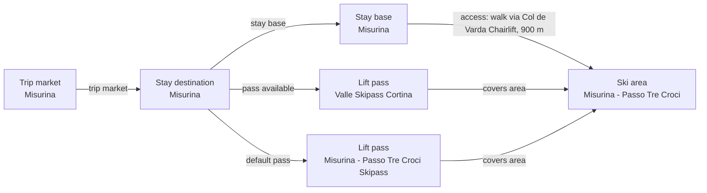

# Misurina Catalog V2 Fact Enrichment

Reviews Misurina-Passo Tre Croci and the Misurina stay base against official municipal tourism sources. Supported elevation and quiet village character are added while regional ski documents are not projected onto the child area.

## Resulting Graph

## Reviewed Targets

| Target | Scope | Graph Role | Required Fields |
| --- | --- | --- | --- |
| `stay_destination:misurina` | `narrow` | `focus` | `name` |
| `ski_area:misurina-passo-tre-croci` | `narrow` | `focus` | `name`, `snowmaking.availability`, `snowmaking.coverage_pct`, `snowmaking.coverage_basis`, `snowmaking.season_label`, `glacier_terrain.availability`, `snow_park.availability`, `snow_park.park_count`, `snow_park.season_label`, `night_skiing.availability`, `night_skiing.season_label`, `marked_freeride_routes.availability`, `marked_freeride_routes.route_count`, `marked_freeride_routes.season_label`, `official_trail_map.url`, `official_trail_map.season_label`, `ski_day_apres_profile.availability`, `ski_day_apres_profile.intensity`, `ski_day_apres_profile.season_label` |
| `ski_area_access:misurina-misurina--misurina-passo-tre-croci` | `narrow` | `focus` | `nearest_lift_name` |
| `lift_pass_product:misurina-passo-tre-croci-skipass` | `narrow` | `focus` | `lift_pass_product_id`, `prices` |
| `lift_pass_product:misurina-cortina-valle-skipass` | `narrow` | `focus` | `lift_pass_product_id`, `valid_ski_area_ids`, `external_validity_summary` |
| `stay_base:misurina-misurina` | `narrow` | `focus` | `elevation_m`, `base_type`, `base_character.development_style`, `base_character.local_pace`, `local_apres_profile.availability`, `local_apres_profile.intensity`, `local_apres_profile.season_label` |
| `trust_manifest:ski_areas:misurina-passo-tre-croci` | `narrow` | `focus` | `notes` |
| `trust_manifest:stay_bases:misurina-misurina` | `narrow` | `focus` | `field_source_refs`, `field_statuses`, `notes` |

## Review Evidence Envelope

| Family | Source Kind | Source URLs | Candidate Kinds |
| --- | --- | --- | --- |
| `misurina-destination-booking` | `destination_booking` | [https://auronzo.info/en/misurina-dolomites/](https://auronzo.info/en/misurina-dolomites/) | `stay_destination`, `stay_base` |
| `misurina-operator-status` | `ski_area_operator` | [https://auronzo.info/impianti-e-piste/](https://auronzo.info/impianti-e-piste/), [https://www.visitdolomitibellunesi.com/en/what-to-do/ski-areas-dolomites/auronzo-misurina-ski-area](https://www.visitdolomitibellunesi.com/en/what-to-do/ski-areas-dolomites/auronzo-misurina-ski-area) | `ski_area` |
| `misurina-access` | `access_transport` | [https://auronzo.info/en/misurina-dolomites/](https://auronzo.info/en/misurina-dolomites/) | `ski_area_access` |
| `misurina-local-pass-proxy` | `pass_tariff` | [https://www.skiresort.info/ski-resort/misurina-passo-tre-croci/](https://www.skiresort.info/ski-resort/misurina-passo-tre-croci/) | `lift_pass_product` |
| `misurina-cortina-pass` | `pass_tariff` | [https://skipasscortina.com/EN/page17-cortina-winter-prices](https://skipasscortina.com/EN/page17-cortina-winter-prices) | `stay_destination`, `terrain_domain`, `lift_pass_product` |

## Entity Scope Assessments

| Candidate | Kind | Disposition | Signals | Catalog Targets | Evidence | Backlog | Graph Impact | Rationale |
| --- | --- | --- | --- | --- | --- | --- | --- | --- |
| `misurina` (Misurina) | `stay_destination` | `represented` | `official_independent_identity`, `independent_stay_market`, `distinct_access` | `stay_destination:misurina` | `v3-scope-001-misurina-destination`, `v3-scope-003-misurina-access` |  | `graph_blocking` | The existing destination is retained for the dedicated high-altitude village stay market and direct Col de Varda access; the initial dual review must independently verify this boundary. |
| `misurina-misurina` (Misurina stay base) | `stay_base` | `represented` | `official_independent_identity`, `independent_stay_market`, `distinct_access` | `stay_base:misurina-misurina` | `v2-enrichment-001-misurina-misurina-base-character-local-pace`, `v2-enrichment-002-misurina-misurina-elevation-m`, `v3-scope-001-misurina-destination` |  | `graph_blocking` | The named village/lake accommodation base remains represented inside the Misurina destination. |
| `misurina-passo-tre-croci` (Misurina - Passo Tre Croci) | `ski_area` | `represented` | `official_independent_identity`, `independent_status_or_schedule`, `child_scoped_terrain_metrics`, `full_local_pass`, `disconnected_terrain`, `distinct_access` | `ski_area:misurina-passo-tre-croci` | `v3-scope-002-misurina-operator`, `v3-scope-003-misurina-access`, `v3-scope-004-misurina-local-pass-proxy`, `v3-scope-006-misurina-regional-tourism` |  | `graph_blocking` | The existing transfer-required Misurina downhill area is retained structurally; independent operations, weather, pass, and complete-terrain claims remain subject to the initial dual review. |
| `misurina-misurina--misurina-passo-tre-croci` (Misurina to Col de Varda access) | `ski_area_access` | `represented` | `direct_access_relationship`, `distinct_access` | `ski_area_access:misurina-misurina--misurina-passo-tre-croci` | `v3-scope-003-misurina-access` |  | `graph_blocking` | The direct base-to-area relationship is retained, while the stored walk mode and 900 metre distance require exact provenance review. |
| `misurina-passo-tre-croci-skipass` (Misurina - Passo Tre Croci local pass) | `lift_pass_product` | `represented` | `official_product_identity`, `full_local_pass` | `lift_pass_product:misurina-passo-tre-croci-skipass` | `v3-scope-004-misurina-local-pass-proxy` |  | `graph_blocking` | The existing local pass remains represented for review, but its exact official product identity and tariff are not established by the current proxy. |
| `misurina-cortina-valle-skipass` (Valle Skipass Cortina from Misurina) | `lift_pass_product` | `represented` | `official_product_identity` | `lift_pass_product:misurina-cortina-valle-skipass` | `v3-scope-005-cortina-valle-pass` |  | `graph_blocking` | The existing Misurina-scoped regional product remains in the current resulting graph; its exact wider coverage is subject to the initial dual review and this report owns no changes to it. |
| `cortina-valle-external-destinations` (Cortina, San Vito, and Auronzo pass context) | `stay_destination` | `external_pass_context` | `official_product_identity` |  | `v3-scope-005-cortina-valle-pass` |  | `graph_blocking` | The named destinations are retained only as external pass-validity context and are not included in the Misurina resulting graph. |
| `misurina-valle-terrain-domain` (Misurina-Cortina valley terrain domain) | `terrain_domain` | `external_pass_context` | `official_product_identity`, `disconnected_terrain` |  | `v3-scope-005-cortina-valle-pass` |  | `graph_blocking` | Shared pass validity does not establish ski-connected terrain, so no terrain domain is added to the selected graph. |

## Ski-Area Boundary Assessments

| Candidate | Parent | Terrain | Connectivity | Operations | Weather | Pass | Provider Consensus | Separation Value | Evidence |
| --- | --- | --- | --- | --- | --- | --- | --- | --- | --- |
| `misurina-passo-tre-croci` | `auronzo-monte-agudo` | `complete` | `transfer_required` | `independent` | `unknown` | `full_local` | `mixed` | `material` | `v3-scope-002-misurina-operator`, `v3-scope-003-misurina-access`, `v3-scope-004-misurina-local-pass-proxy`, `v3-scope-006-misurina-regional-tourism` |

## Changed Fields

| Target | Field | Before | After | Trust | Ranking Relevant |
| --- | --- | --- | --- | --- | --- |
| `stay_base:misurina-misurina` | `base_character.local_pace` | `"unknown"` | `"quiet"` | `verified_with_adjustment` | no |
| `stay_base:misurina-misurina` | `elevation_m` | `null` | `1754` | `verified` | no |
| `trust_manifest:ski_areas:misurina-passo-tre-croci` | `notes` | `["Modeled separately from Auronzo di Cadore because Misurina has its own lodging base, direct Col de Varda/Loita ski access, high-elevation lake setting, and official destination treatment.", "Misurina - Passo Tre Croci terrain metrics use reviewed ski-area data for the Misurina child scope; Auronzo/Misurina shared branding remains pass/operator context.", "The Cortina valley pass is represented as regional-network pass context, not as a ski-connected terrain domain.", "Lodging and rental price ranges, stay-base quality tier, and rental quality tier remain product-curated estimates pending a dedicated sampling policy."]` | `["Modeled separately from Auronzo di Cadore because Misurina has its own lodging base, direct Col de Varda/Loita ski access, high-elevation lake setting, and official destination treatment.", "Misurina - Passo Tre Croci terrain metrics use reviewed ski-area data for the Misurina child scope; Auronzo/Misurina shared branding remains pass/operator context.", "The Cortina valley pass is represented as regional-network pass context, not as a ski-connected terrain domain.", "Lodging and rental price ranges, stay-base quality tier, and rental quality tier remain product-curated estimates pending a dedicated sampling policy.", "Source-aware v2 enrichment reviewed official Misurina and Col de Varda material on 2026-07-05.", "Broader Cortina and 3 Zinnen documents were not used to infer child-area facilities or map ownership."]` | `estimated` | no |
| `trust_manifest:stay_bases:misurina-misurina` | `field_source_refs` | `{"base_character": [], "base_type": [], "coordinates": ["https://auronzo.info/en/misurina-dolomites/", "https://auronzo.info/en/winter/skiing-in-auronzo-di-cadore/", "https://www.openstreetmap.org/node/1427982374", "https://www.skiresort.info/ski-resort/misurina-passo-tre-croci/", "https://www.visitdolomitibellunesi.com/en/what-to-do/ski-areas-dolomites/auronzo-misurina-ski-area"], "elevation": [], "identity_ownership": ["https://auronzo.info/en/misurina-dolomites/", "https://auronzo.info/en/winter/skiing-in-auronzo-di-cadore/", "https://www.openstreetmap.org/node/1427982374", "https://www.skiresort.info/ski-resort/misurina-passo-tre-croci/", "https://www.visitdolomitibellunesi.com/en/what-to-do/ski-areas-dolomites/auronzo-misurina-ski-area"], "local_apres": [], "lodging_price_quality": ["https://auronzo.info/en/misurina-dolomites/", "https://auronzo.info/en/winter/skiing-in-auronzo-di-cadore/", "https://www.openstreetmap.org/node/1427982374", "https://www.skiresort.info/ski-resort/misurina-passo-tre-croci/", "https://www.visitdolomitibellunesi.com/en/what-to-do/ski-areas-dolomites/auronzo-misurina-ski-area"]}` | `{"base_character": ["https://auronzo.info/en/misurina-dolomites/"], "base_type": ["https://auronzo.info/en/misurina-dolomites/"], "coordinates": ["https://auronzo.info/en/misurina-dolomites/", "https://auronzo.info/en/winter/skiing-in-auronzo-di-cadore/", "https://www.openstreetmap.org/node/1427982374", "https://www.skiresort.info/ski-resort/misurina-passo-tre-croci/", "https://www.visitdolomitibellunesi.com/en/what-to-do/ski-areas-dolomites/auronzo-misurina-ski-area"], "elevation": ["https://auronzo.info/en/misurina-dolomites/"], "identity_ownership": ["https://auronzo.info/en/misurina-dolomites/", "https://auronzo.info/en/winter/skiing-in-auronzo-di-cadore/", "https://www.openstreetmap.org/node/1427982374", "https://www.skiresort.info/ski-resort/misurina-passo-tre-croci/", "https://www.visitdolomitibellunesi.com/en/what-to-do/ski-areas-dolomites/auronzo-misurina-ski-area"], "local_apres": [], "lodging_price_quality": ["https://auronzo.info/en/misurina-dolomites/", "https://auronzo.info/en/winter/skiing-in-auronzo-di-cadore/", "https://www.openstreetmap.org/node/1427982374", "https://www.skiresort.info/ski-resort/misurina-passo-tre-croci/", "https://www.visitdolomitibellunesi.com/en/what-to-do/ski-areas-dolomites/auronzo-misurina-ski-area"]}` | `estimated` | no |
| `trust_manifest:stay_bases:misurina-misurina` | `field_statuses` | `{"base_character": "needs_source", "base_type": "needs_source", "coordinates": "verified_with_adjustment", "elevation": "needs_source", "identity_ownership": "verified_with_adjustment", "local_apres": "needs_source", "lodging_price_quality": "estimated"}` | `{"base_character": "verified_with_adjustment", "base_type": "verified", "coordinates": "verified_with_adjustment", "elevation": "verified", "identity_ownership": "verified_with_adjustment", "local_apres": "needs_source", "lodging_price_quality": "estimated"}` | `estimated` | no |
| `trust_manifest:stay_bases:misurina-misurina` | `notes` | `["Modeled separately from Auronzo di Cadore because Misurina has its own lodging base, direct Col de Varda/Loita ski access, high-elevation lake setting, and official destination treatment.", "Misurina - Passo Tre Croci terrain metrics use reviewed ski-area data for the Misurina child scope; Auronzo/Misurina shared branding remains pass/operator context.", "The Cortina valley pass is represented as regional-network pass context, not as a ski-connected terrain domain.", "Lodging and rental price ranges, stay-base quality tier, and rental quality tier remain product-curated estimates pending a dedicated sampling policy."]` | `["Modeled separately from Auronzo di Cadore because Misurina has its own lodging base, direct Col de Varda/Loita ski access, high-elevation lake setting, and official destination treatment.", "Misurina - Passo Tre Croci terrain metrics use reviewed ski-area data for the Misurina child scope; Auronzo/Misurina shared branding remains pass/operator context.", "The Cortina valley pass is represented as regional-network pass context, not as a ski-connected terrain domain.", "Lodging and rental price ranges, stay-base quality tier, and rental quality tier remain product-curated estimates pending a dedicated sampling policy.", "Source-aware v2 enrichment reviewed official Misurina village material on 2026-07-05."]` | `estimated` | no |

## Field Coverage

| Target | Field | Status | Notes |
| --- | --- | --- | --- |
| `stay_destination:misurina` | `name` | `reviewed-no-change` | The official municipal destination page presents Misurina as a named mountain village and accommodation destination. |
| `ski_area:misurina-passo-tre-croci` | `name` | `reviewed-no-change` | The official operating page identifies the Misurina Col de Varda terrain; the catalog retains its established Misurina-Passo Tre Croci normalized name. |
| `ski_area:misurina-passo-tre-croci` | `snowmaking.availability` | `unresolved` | Official Misurina sources were reviewed, but they did not establish this exact child-ski-area value; it remains unknown rather than being inferred from broader regional material. |
| `ski_area:misurina-passo-tre-croci` | `snowmaking.coverage_pct` | `unresolved` | Official Misurina sources were reviewed, but they did not establish this exact child-ski-area value; it remains unknown rather than being inferred from broader regional material. |
| `ski_area:misurina-passo-tre-croci` | `snowmaking.coverage_basis` | `unresolved` | Official Misurina sources were reviewed, but they did not establish this exact child-ski-area value; it remains unknown rather than being inferred from broader regional material. |
| `ski_area:misurina-passo-tre-croci` | `snowmaking.season_label` | `unresolved` | Official Misurina sources were reviewed, but they did not establish this exact child-ski-area value; it remains unknown rather than being inferred from broader regional material. |
| `ski_area:misurina-passo-tre-croci` | `glacier_terrain.availability` | `unresolved` | Official Misurina sources were reviewed, but they did not establish this exact child-ski-area value; it remains unknown rather than being inferred from broader regional material. |
| `ski_area:misurina-passo-tre-croci` | `snow_park.availability` | `unresolved` | Official Misurina sources were reviewed, but they did not establish this exact child-ski-area value; it remains unknown rather than being inferred from broader regional material. |
| `ski_area:misurina-passo-tre-croci` | `snow_park.park_count` | `unresolved` | Official Misurina sources were reviewed, but they did not establish this exact child-ski-area value; it remains unknown rather than being inferred from broader regional material. |
| `ski_area:misurina-passo-tre-croci` | `snow_park.season_label` | `unresolved` | Official Misurina sources were reviewed, but they did not establish this exact child-ski-area value; it remains unknown rather than being inferred from broader regional material. |
| `ski_area:misurina-passo-tre-croci` | `night_skiing.availability` | `unresolved` | Official Misurina sources were reviewed, but they did not establish this exact child-ski-area value; it remains unknown rather than being inferred from broader regional material. |
| `ski_area:misurina-passo-tre-croci` | `night_skiing.season_label` | `unresolved` | Official Misurina sources were reviewed, but they did not establish this exact child-ski-area value; it remains unknown rather than being inferred from broader regional material. |
| `ski_area:misurina-passo-tre-croci` | `marked_freeride_routes.availability` | `unresolved` | Official Misurina sources were reviewed, but they did not establish this exact child-ski-area value; it remains unknown rather than being inferred from broader regional material. |
| `ski_area:misurina-passo-tre-croci` | `marked_freeride_routes.route_count` | `unresolved` | Official Misurina sources were reviewed, but they did not establish this exact child-ski-area value; it remains unknown rather than being inferred from broader regional material. |
| `ski_area:misurina-passo-tre-croci` | `marked_freeride_routes.season_label` | `unresolved` | Official Misurina sources were reviewed, but they did not establish this exact child-ski-area value; it remains unknown rather than being inferred from broader regional material. |
| `ski_area:misurina-passo-tre-croci` | `official_trail_map.url` | `unresolved` | Official Misurina sources were reviewed, but they did not establish this exact child-ski-area value; it remains unknown rather than being inferred from broader regional material. |
| `ski_area:misurina-passo-tre-croci` | `official_trail_map.season_label` | `unresolved` | Official Misurina sources were reviewed, but they did not establish this exact child-ski-area value; it remains unknown rather than being inferred from broader regional material. |
| `ski_area:misurina-passo-tre-croci` | `ski_day_apres_profile.availability` | `unresolved` | Official Misurina sources were reviewed, but they did not establish this exact child-ski-area value; it remains unknown rather than being inferred from broader regional material. |
| `ski_area:misurina-passo-tre-croci` | `ski_day_apres_profile.intensity` | `unresolved` | Official Misurina sources were reviewed, but they did not establish this exact child-ski-area value; it remains unknown rather than being inferred from broader regional material. |
| `ski_area:misurina-passo-tre-croci` | `ski_day_apres_profile.season_label` | `unresolved` | Official Misurina sources were reviewed, but they did not establish this exact child-ski-area value; it remains unknown rather than being inferred from broader regional material. |
| `ski_area_access:misurina-misurina--misurina-passo-tre-croci` | `nearest_lift_name` | `reviewed-no-change` | The official destination page places the Col de Varda chairlift next to Lake Misurina. |
| `lift_pass_product:misurina-passo-tre-croci-skipass` | `lift_pass_product_id` | `reviewed-no-change` | The existing local product remains represented for inventory review; its exact official tariff identity is unresolved. |
| `lift_pass_product:misurina-passo-tre-croci-skipass` | `prices` | `unresolved` | The stored EUR 49 adult daily value is a reviewed-editorial proxy and requires exact current official product/tariff review. |
| `lift_pass_product:misurina-cortina-valle-skipass` | `lift_pass_product_id` | `reviewed-no-change` | The regional Valle Skipass product is retained in the selected Misurina graph and owns no changes in this report. |
| `lift_pass_product:misurina-cortina-valle-skipass` | `valid_ski_area_ids` | `unresolved` | Misurina coverage is retained while the exact wider Cortina pass coverage remains subject to the initial dual review. |
| `lift_pass_product:misurina-cortina-valle-skipass` | `external_validity_summary` | `unresolved` | The cross-destination summary is pass-only context; its exact current regional product scope remains subject to the initial dual review. |
| `stay_base:misurina-misurina` | `elevation_m` | `changed` | The official guide gives Misurina at 1,754 m. |
| `stay_base:misurina-misurina` | `base_type` | `reviewed-no-change` | The existing village type is retained because official tourism explicitly describes Misurina as a mountain village. |
| `stay_base:misurina-misurina` | `base_character.development_style` | `unresolved` | Official Misurina sources were reviewed, but they did not establish this exact stay-base value; it remains unknown rather than being inferred. |
| `stay_base:misurina-misurina` | `base_character.local_pace` | `changed` | The official guide repeatedly describes timeless stillness, silence, tranquillity, a calm atmosphere, and a small locality focused on nature and relaxation. |
| `stay_base:misurina-misurina` | `local_apres_profile.availability` | `unresolved` | Official Misurina sources were reviewed, but they did not establish this exact stay-base value; it remains unknown rather than being inferred. |
| `stay_base:misurina-misurina` | `local_apres_profile.intensity` | `unresolved` | Official Misurina sources were reviewed, but they did not establish this exact stay-base value; it remains unknown rather than being inferred. |
| `stay_base:misurina-misurina` | `local_apres_profile.season_label` | `unresolved` | Official Misurina sources were reviewed, but they did not establish this exact stay-base value; it remains unknown rather than being inferred. |
| `trust_manifest:ski_areas:misurina-passo-tre-croci` | `notes` | `changed` | Trust metadata updated for the reviewed source-aware facts. |
| `trust_manifest:stay_bases:misurina-misurina` | `field_source_refs` | `changed` | Trust metadata updated for the reviewed source-aware facts. |
| `trust_manifest:stay_bases:misurina-misurina` | `field_statuses` | `changed` | Trust metadata updated for the reviewed source-aware facts. |
| `trust_manifest:stay_bases:misurina-misurina` | `notes` | `changed` | Trust metadata updated for the reviewed source-aware facts. |

## Evidence

| Target | Field | Source | Source Value | Evidence | Normalization |
| --- | --- | --- | --- | --- | --- |
| `stay_base:misurina-misurina` | `base_character.local_pace` | [Municipality of Auronzo official Misurina guide](https://auronzo.info/en/misurina-dolomites/) | `"quiet"` | The official guide repeatedly describes timeless stillness, silence, tranquillity, a calm atmosphere, and a small locality focused on nature and relaxation. | The explicit tranquillity and low-intensity positioning are mapped to quiet. |
| `stay_base:misurina-misurina` | `elevation_m` | [Municipality of Auronzo official Misurina guide](https://auronzo.info/en/misurina-dolomites/) | `1754` | The official guide gives Misurina at 1,754 m. |  |
| `stay_destination:misurina` | `name` | [Municipality of Auronzo official Misurina destination guide](https://auronzo.info/en/misurina-dolomites/) | `"Misurina"` | The official municipal destination page treats Misurina as a mountain village, identifies its lake locality, explains independent arrival routes, and links hotels and accommodations. |  |
| `ski_area:misurina-passo-tre-croci` | `name` | [Municipality of Auronzo current lifts and slopes page](https://auronzo.info/impianti-e-piste/) | `"Misurina - Col de Varda"` | The current municipal operations page separately exposes the Auronzo and Misurina lift and piste sections and identifies Col de Varda as the Misurina downhill terrain. | The catalog retains the established Misurina-Passo Tre Croci normalized ski-area label while the source names the principal Col de Varda terrain. |
| `ski_area_access:misurina-misurina--misurina-passo-tre-croci` | `nearest_lift_name` | [Municipality of Auronzo official Misurina destination guide](https://auronzo.info/en/misurina-dolomites/) | `"Col de Varda chairlift"` | The official guide states that the Col de Varda chairlift is next to Lake Misurina, supporting a direct local relationship while not independently proving the stored 900 metre distance. | Capitalization is normalized in the catalog lift name. |
| `lift_pass_product:misurina-passo-tre-croci-skipass` | `prices` | [Skiresort.info Misurina-Passo Tre Croci profile](https://www.skiresort.info/ski-resort/misurina-passo-tre-croci/) | `"EUR 49 adult daily proxy"` | The reviewed-editorial profile supplies the stored representative adult day-price proxy for the named Misurina-Passo Tre Croci scope. | This remains a proxy pending exact official product and current-season tariff evidence. |
| `lift_pass_product:misurina-cortina-valle-skipass` | `lift_pass_product_id` | [Cortina Skiworld official winter prices](https://skipasscortina.com/EN/page17-cortina-winter-prices) | `"Valle Skipass Cortina"` | The official Cortina tariff page is the bounded source for the named regional Valle Skipass product and its current tariff context; it does not by itself establish the complete wider coverage graph. | The published product name is normalized to the catalog identifier. |
| `ski_area:misurina-passo-tre-croci` | `name` | [Dolomiti Bellunesi official Auronzo-Misurina ski-area page](https://www.visitdolomitibellunesi.com/en/what-to-do/ski-areas-dolomites/auronzo-misurina-ski-area) | `"Auronzo-Misurina ski area"` | The regional official tourism page corroborates the broader Auronzo-Misurina presentation but does not override the modeled child-area ownership boundary. | The broader regional label is retained as scope context rather than copied into the child-area name. |

## Boundary Decisions

- `misurina`: `pass`

## Caveats

- The reviewed official pages confirm downhill skiing at Col de Varda but do not publish child-scoped snowmaking, glacier, snow-park, night-skiing, marked-freeride, or ski-day-après facts.
- Regional Cortina, Auronzo, and 3 Zinnen maps are broader than the modeled Misurina-Passo Tre Croci child area, so no official trail-map URL is recorded.
- No official local après inventory was established for the Misurina stay base.
