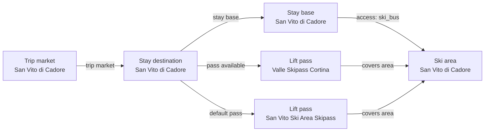

# San Vito di Cadore Catalog V2 Fact Enrichment

Reviews the San Vito child ski area, stay market, local access, and pass context against current official operator and destination sources.

## Resulting Graph

## Reviewed Targets

| Target | Scope | Graph Role | Required Fields |
| --- | --- | --- | --- |
| `ski_area:san-vito-di-cadore-ski-area` | `narrow` | `focus` | `snowmaking.availability`, `snowmaking.coverage_pct`, `snowmaking.coverage_basis`, `snowmaking.season_label`, `glacier_terrain.availability`, `snow_park.availability`, `snow_park.park_count`, `snow_park.season_label`, `night_skiing.availability`, `night_skiing.season_label`, `marked_freeride_routes.availability`, `marked_freeride_routes.route_count`, `marked_freeride_routes.season_label`, `official_trail_map.url`, `official_trail_map.season_label`, `ski_day_apres_profile.availability`, `ski_day_apres_profile.intensity`, `ski_day_apres_profile.season_label` |
| `stay_base:san-vito-di-cadore-san-vito-di-cadore` | `narrow` | `focus` | `elevation_m`, `base_type`, `base_character.development_style`, `base_character.local_pace`, `local_apres_profile.availability`, `local_apres_profile.intensity`, `local_apres_profile.season_label` |
| `trust_manifest:ski_areas:san-vito-di-cadore-ski-area` | `narrow` | `focus` | `field_source_refs`, `field_statuses`, `notes` |
| `trust_manifest:stay_bases:san-vito-di-cadore-san-vito-di-cadore` | `narrow` | `focus` | `field_source_refs`, `field_statuses`, `notes` |
| `stay_destination:san-vito-di-cadore` | `narrow` | `focus` | `name` |
| `ski_area_access:san-vito-di-cadore-san-vito-di-cadore--san-vito-di-cadore-ski-area` | `narrow` | `focus` | `ski_area_id`, `access_mode`, `lift_distance`, `nearest_lift_name`, `distance_m`, `is_direct`, `source_urls` |
| `trust_manifest:stay_destinations:san-vito-di-cadore` | `narrow` | `focus` | `field_source_refs` |
| `trust_manifest:ski_area_access:san-vito-di-cadore-san-vito-di-cadore--san-vito-di-cadore-ski-area` | `narrow` | `focus` | `field_source_refs`, `notes` |
| `lift_pass_product:san-vito-ski-area-skipass` | `narrow` | `focus` | `name` |
| `lift_pass_product:san-vito-cortina-valle-skipass` | `narrow` | `focus` | `name` |
| `ski_area:cortina-dampezzo-ski-area` | `narrow` | `linked_dependency` | `ski_area_id` |

## Review Evidence Envelope

| Family | Source Kind | Source URLs | Candidate Kinds |
| --- | --- | --- | --- |
| `san-vito-destination-booking` | `destination_booking` | [https://san-vito.visitcadore.com/](https://san-vito.visitcadore.com/), [https://visitcadoredolomiti.com/wp-content/uploads/2024/02/Mappa_San_Vito_Cadore-new.pdf](https://visitcadoredolomiti.com/wp-content/uploads/2024/02/Mappa_San_Vito_Cadore-new.pdf), [https://visitcadoredolomiti.com/wp-content/uploads/2024/12/Appartamenti-S.Vito-Borca-e-Vodo.pdf](https://visitcadoredolomiti.com/wp-content/uploads/2024/12/Appartamenti-S.Vito-Borca-e-Vodo.pdf), [https://www.visitdolomitibellunesi.com/en/hotels/dolomiti-5](https://www.visitdolomitibellunesi.com/en/hotels/dolomiti-5) | `stay_destination`, `stay_base` |
| `san-vito-operator-map` | `ski_area_operator` | [https://www.skiareasanvito.com/impianti/](https://www.skiareasanvito.com/impianti/) | `ski_area` |
| `san-vito-access` | `access_transport` | [https://visitcadoredolomiti.com/en/ski-area-san-vito-2/](https://visitcadoredolomiti.com/en/ski-area-san-vito-2/), [https://www.skiareasanvito.com/ski-bus/](https://www.skiareasanvito.com/ski-bus/) | `ski_area_access` |
| `san-vito-pass-tariffs` | `pass_tariff` | [https://www.skiareasanvito.com/en/rates/](https://www.skiareasanvito.com/en/rates/) | `lift_pass_product` |
| `san-vito-limited-facility-access` | `other_official` | [https://visitcadoredolomiti.com/wp-content/uploads/2024/12/Cartina_San_Vito_di_Cadore_low-1.pdf](https://visitcadoredolomiti.com/wp-content/uploads/2024/12/Cartina_San_Vito_di_Cadore_low-1.pdf) | `ski_area` |
| `san-vito-linked-cortina-pr` | `linked_pr_dependency` | [https://www.skiareasanvito.com/en/rates/](https://www.skiareasanvito.com/en/rates/) | `ski_area`, `lift_pass_product` |
| `san-vito-touched-relationships` | `other_official` | [https://visitcadoredolomiti.com/en/ski-area-san-vito-2/](https://visitcadoredolomiti.com/en/ski-area-san-vito-2/), [https://www.skiareasanvito.com/en/rates/](https://www.skiareasanvito.com/en/rates/) | `stay_destination`, `stay_base`, `ski_area`, `ski_area_access`, `lift_pass_product` |

## Entity Scope Assessments

| Candidate | Kind | Disposition | Signals | Catalog Targets | Evidence | Backlog | Graph Impact | Rationale |
| --- | --- | --- | --- | --- | --- | --- | --- | --- |
| `san-vito-di-cadore` (San Vito di Cadore) | `stay_destination` | `represented` | `independent_stay_market` | `stay_destination:san-vito-di-cadore` | `scope-stay-market-san-vito` |  | `graph_blocking` | The current official destination and accommodation collections establish San Vito as the complete independently owned stay market, separate from the neighboring destination collections. |
| `san-vito-di-cadore-san-vito-di-cadore` (San Vito di Cadore stay base) | `stay_base` | `represented` | `independent_stay_market`, `distinct_access` | `stay_base:san-vito-di-cadore-san-vito-di-cadore` | `scope-stay-market-san-vito`, `scope-san-vito-locality-accommodation-map`, `scope-san-vito-accommodation-inventory`, `scope-access-san-vito` |  | `graph_blocking` | The official village map and townwide accommodation inventory support one represented San Vito base; named localities remain internal locality context because no independent lodging-and-access owner is established. |
| `san-vito-mosigo` (Mosigo) | `stay_base` | `not_separate` | `official_independent_identity` | `stay_base:san-vito-di-cadore-san-vito-di-cadore` | `scope-san-vito-locality-accommodation-map`, `scope-san-vito-accommodation-inventory` |  | `graph_blocking` | The official inventory places Mosigo-address lodging inside the Chiapuzza grouping and the village map supplies no independently owned lodging-and-access base. |
| `san-vito-chiapuzza` (Chiapuzza) | `stay_base` | `not_separate` | `official_independent_identity` | `stay_base:san-vito-di-cadore-san-vito-di-cadore` | `scope-san-vito-locality-accommodation-map`, `scope-san-vito-accommodation-inventory` |  | `graph_blocking` | The official apartment inventory uses Chiapuzza as a San Vito locality heading, but no independent base-level destination or ski-access owner is established. |
| `san-vito-serdes` (Serdes) | `stay_base` | `not_separate` | `official_independent_identity` | `stay_base:san-vito-di-cadore-san-vito-di-cadore` | `scope-san-vito-locality-accommodation-map`, `scope-san-vito-accommodation-inventory` |  | `graph_blocking` | The official apartment inventory uses Serdes as a San Vito locality heading, but no independent base-level destination or ski-access owner is established. |
| `san-vito-resinego` (Resinego) | `stay_base` | `not_separate` | `official_independent_identity` | `stay_base:san-vito-di-cadore-san-vito-di-cadore` | `scope-san-vito-locality-accommodation-map`, `scope-san-vito-accommodation-inventory` |  | `graph_blocking` | The official inventory presents Resinego and Resinego Alto within San Vito lodging, without independent base-level destination or ski-access ownership. |
| `san-vito-tambres` (Tambres) | `stay_base` | `not_separate` | `official_independent_identity` | `stay_base:san-vito-di-cadore-san-vito-di-cadore` | `scope-san-vito-locality-accommodation-map` |  | `graph_blocking` | The official village map identifies Tambres inside San Vito but the accommodation inventory does not establish it as an independently owned stay-and-access base. |
| `san-vito-belvedere` (Belvedere) | `stay_base` | `not_separate` | `official_independent_identity` | `stay_base:san-vito-di-cadore-san-vito-di-cadore` | `scope-san-vito-locality-accommodation-map`, `scope-san-vito-accommodation-inventory` |  | `graph_blocking` | The official inventory combines Belvedere with Resinego Alto inside San Vito and establishes no independent base-level destination or ski-access owner. |
| `san-vito-costa` (Costa) | `stay_base` | `not_separate` | `official_independent_identity` | `stay_base:san-vito-di-cadore-san-vito-di-cadore` | `scope-san-vito-locality-accommodation-map`, `scope-san-vito-accommodation-inventory` |  | `graph_blocking` | The official apartment inventory uses Costa as a San Vito locality heading, but no independent base-level destination or ski-access owner is established. |
| `san-vito-dogana-vecchia` (Dogana Vecchia) | `stay_base` | `not_separate` | `official_independent_identity` | `stay_base:san-vito-di-cadore-san-vito-di-cadore` | `scope-san-vito-locality-accommodation-map` |  | `graph_blocking` | The official village map includes Dogana Vecchia and its lodging inside San Vito but does not establish an independent accommodation-and-access base. |
| `san-vito-di-cadore-ski-area` (San Vito di Cadore ski area) | `ski_area` | `represented` | `official_independent_identity`, `separate_operator`, `full_local_pass` | `ski_area:san-vito-di-cadore-ski-area` | `v2-enrichment-001-san-vito-di-cadore-ski-area-official-trail-map-url`, `v2-enrichment-002-san-vito-di-cadore-ski-area-snowmaking-availability`, `scope-local-pass-san-vito` |  | `graph_blocking` | The complete San Vito operator inventory, independent Impianti Scoter ownership, and full local pass support the represented ski-area identity. |
| `san-vito-di-cadore-access` (San Vito stay-base to ski-area access) | `ski_area_access` | `represented` | `direct_access_relationship` | `ski_area_access:san-vito-di-cadore-san-vito-di-cadore--san-vito-di-cadore-ski-area` | `scope-access-san-vito`, `scope-access-route-san-vito` |  | `graph_blocking` | The official route establishes free ski-bus access from central San Vito to NeveSole parking; unsupported point distance and nearest-lift fields are omitted. |
| `san-vito-ski-area-skipass` (San Vito Ski Area Skipass) | `lift_pass_product` | `represented` | `official_product_identity`, `full_local_pass` | `lift_pass_product:san-vito-ski-area-skipass` | `scope-local-pass-san-vito` |  | `graph_blocking` | The operator's full-area San Vito product is represented as the default pass for the focus destination. |
| `san-vito-cortina-valle-skipass` (Valle Skipass Cortina) | `lift_pass_product` | `represented` | `official_product_identity` | `lift_pass_product:san-vito-cortina-valle-skipass` | `scope-valley-pass-san-vito` |  | `graph_blocking` | The Valle product is represented as a non-default regional-network option; Cortina, Auronzo, and Misurina remain disconnected pass context rather than San Vito terrain. |
| `san-vito-sapiaza` (Sapiaža) | `stay_base` | `not_separate` | `official_independent_identity` | `stay_base:san-vito-di-cadore-san-vito-di-cadore` | `scope-san-vito-locality-accommodation-map` |  | `graph_blocking` | The village map labels Sapiaža inside San Vito, but the reviewed accommodation collection establishes no independent lodging-and-access owner. |
| `san-vito-donarie-locality` (Donariè locality) | `stay_base` | `not_separate` | `official_independent_identity` | `stay_base:san-vito-di-cadore-san-vito-di-cadore` | `scope-san-vito-locality-accommodation-map` |  | `graph_blocking` | The map label is lift-side locality context inside San Vito, not an independently owned accommodation-and-access base. |
| `san-vito-donarie-lift` (Donariè lift facility) | `ski_area` | `not_separate` | `official_independent_identity` | `ski_area:san-vito-di-cadore-ski-area` | `v2-enrichment-001-san-vito-di-cadore-ski-area-official-trail-map-url` |  | `graph_blocking` | The operator presents Donariè as one lift and piste inside the complete San Vito area, not a separate terrain owner. |
| `san-vito-tambres-lift` (Tambres lift facility) | `ski_area` | `not_separate` | `official_independent_identity` | `ski_area:san-vito-di-cadore-ski-area` | `v2-enrichment-001-san-vito-di-cadore-ski-area-official-trail-map-url` |  | `graph_blocking` | The operator presents Tambres as one chairlift and piste group inside the complete San Vito area, not a separate terrain owner. |
| `san-vito-san-marco-lift` (San Marco lift facility) | `ski_area` | `not_separate` | `official_independent_identity` | `ski_area:san-vito-di-cadore-ski-area` | `v2-enrichment-001-san-vito-di-cadore-ski-area-official-trail-map-url` |  | `graph_blocking` | The operator presents San Marco as one chairlift inside the complete San Vito area, not a separate terrain owner. |
| `san-vito-nevesole` (Parco NeveSole) | `ski_area` | `not_separate` | `official_independent_identity` | `ski_area:san-vito-di-cadore-ski-area` | `v2-enrichment-001-san-vito-di-cadore-ski-area-official-trail-map-url`, `scope-nevesole-small-treadmill-access` |  | `graph_blocking` | The operator presents NeveSole as a family snow-play and beginner facility inside the San Vito parent area, not a separate terrain owner. |
| `dolomiti-superski` (Dolomiti Superski) | `lift_pass_product` | `deferred` | `official_product_identity` |  | `scope-dolomiti-superski-san-vito` | `docs/product-backlog.md#alta-badia-and-regional-catalog-refinements` | `regional_followup` | Official San Vito sources establish this wider network product, but complete Dolomiti Superski graph coverage is outside this child-area slice. |
| `san-vito-san-marco-single-journey` (San Marco single-journey fare) | `lift_pass_product` | `external_pass_context` | `official_product_identity` |  | `scope-local-pass-san-vito` |  | `graph_blocking` | This is an individual lift fare rather than a full ski-area pass product. |
| `san-vito-tambres-single-journey` (Tambres single-journey fare) | `lift_pass_product` | `external_pass_context` | `official_product_identity` |  | `scope-local-pass-san-vito` |  | `graph_blocking` | This is an individual lift fare rather than a full ski-area pass product. |
| `san-vito-donarie-single-journey` (Donariè single-journey fare) | `lift_pass_product` | `external_pass_context` | `official_product_identity` |  | `scope-local-pass-san-vito` |  | `graph_blocking` | This is an individual lift fare rather than a full ski-area pass product. |
| `cortina-dampezzo-ski-area` (Cortina d'Ampezzo ski area) | `ski_area` | `deferred` | `official_independent_identity` | `ski_area:cortina-dampezzo-ski-area` | `scope-valley-pass-san-vito` | `docs/product-backlog.md#alta-badia-and-regional-catalog-refinements` | `graph_blocking` | Cortina is disconnected Valle-pass context owned by linked PR #34; this report records the dependency without changing Cortina or adding it to the focus destinations. |
| `auronzo-monte-agudo` (Auronzo Monte Agudo) | `ski_area` | `external_pass_context` | `official_independent_identity` |  | `scope-valley-pass-san-vito` |  | `graph_blocking` | Auronzo is disconnected Valle-pass coverage context and is not part of the San Vito terrain graph. |
| `misurina-passo-tre-croci` (Misurina Passo Tre Croci) | `ski_area` | `external_pass_context` | `official_independent_identity` |  | `scope-valley-pass-san-vito` |  | `graph_blocking` | Misurina is disconnected Valle-pass coverage context and is not part of the San Vito terrain graph. |

## Ski-Area Boundary Assessments

| Candidate | Parent | Terrain | Connectivity | Operations | Weather | Pass | Provider Consensus | Separation Value | Evidence |
| --- | --- | --- | --- | --- | --- | --- | --- | --- | --- |
| `san-vito-di-cadore-ski-area` |  | `complete` | `not_applicable` | `independent` | `unknown` | `full_local` | `separate` | `material` | `v2-enrichment-001-san-vito-di-cadore-ski-area-official-trail-map-url`, `v2-enrichment-002-san-vito-di-cadore-ski-area-snowmaking-availability`, `scope-local-pass-san-vito` |
| `san-vito-donarie-lift` | `san-vito-di-cadore-ski-area` | `sector` | `connected` | `parent_owned` | `parent_owned` | `shared_only` | `aggregated` | `redundant` | `v2-enrichment-001-san-vito-di-cadore-ski-area-official-trail-map-url` |
| `san-vito-tambres-lift` | `san-vito-di-cadore-ski-area` | `sector` | `connected` | `parent_owned` | `parent_owned` | `shared_only` | `aggregated` | `redundant` | `v2-enrichment-001-san-vito-di-cadore-ski-area-official-trail-map-url` |
| `san-vito-san-marco-lift` | `san-vito-di-cadore-ski-area` | `sector` | `connected` | `parent_owned` | `parent_owned` | `shared_only` | `aggregated` | `redundant` | `v2-enrichment-001-san-vito-di-cadore-ski-area-official-trail-map-url` |
| `san-vito-nevesole` | `san-vito-di-cadore-ski-area` | `sector` | `connected` | `parent_owned` | `parent_owned` | `limited` | `aggregated` | `redundant` | `v2-enrichment-001-san-vito-di-cadore-ski-area-official-trail-map-url`, `scope-nevesole-small-treadmill-access` |
| `cortina-dampezzo-ski-area` |  | `unresolved` | `not_applicable` | `unknown` | `unknown` | `shared_only` | `unknown` | `unresolved` | `scope-valley-pass-san-vito` |
| `auronzo-monte-agudo` |  | `unresolved` | `not_applicable` | `unknown` | `unknown` | `shared_only` | `unknown` | `unresolved` | `scope-valley-pass-san-vito` |
| `misurina-passo-tre-croci` |  | `unresolved` | `not_applicable` | `unknown` | `unknown` | `shared_only` | `unknown` | `unresolved` | `scope-valley-pass-san-vito` |

## Changed Fields

| Target | Field | Before | After | Trust | Ranking Relevant |
| --- | --- | --- | --- | --- | --- |
| `ski_area:san-vito-di-cadore-ski-area` | `official_trail_map.url` | `null` | `"https://www.skiareasanvito.com/wp-content/uploads/2019/06/cartina-impianti-san-vito-di-cadore.jpg"` | `verified` | no |
| `ski_area:san-vito-di-cadore-ski-area` | `snowmaking.availability` | `"unknown"` | `"available"` | `verified` | no |
| `stay_base:san-vito-di-cadore-san-vito-di-cadore` | `base_character.local_pace` | `"unknown"` | `"quiet"` | `verified_with_adjustment` | no |
| `stay_base:san-vito-di-cadore-san-vito-di-cadore` | `elevation_m` | `null` | `1011` | `verified` | no |
| `ski_area_access:san-vito-di-cadore-san-vito-di-cadore--san-vito-di-cadore-ski-area` | `nearest_lift_name` | `"Tambres Chairlift"` | `null` | `verified_with_adjustment` | no |
| `ski_area_access:san-vito-di-cadore-san-vito-di-cadore--san-vito-di-cadore-ski-area` | `distance_m` | `800` | `null` | `verified_with_adjustment` | yes |
| `ski_area_access:san-vito-di-cadore-san-vito-di-cadore--san-vito-di-cadore-ski-area` | `source_urls` | `["https://www.skiareasanvito.com/en/rates/"]` | `["https://visitcadoredolomiti.com/en/ski-area-san-vito-2/", "https://www.skiareasanvito.com/ski-bus/"]` | `verified_with_adjustment` | no |
| `trust_manifest:ski_areas:san-vito-di-cadore-ski-area` | `field_source_refs` | `{"elevation_season": ["https://visitcadoredolomiti.com/en/ski-area-san-vito-2/", "https://www.openstreetmap.org/relation/47211", "https://www.skiareasanvito.com/en/rates/", "https://www.skiresort.info/ski-resort/san-vito-di-cadore/", "https://www.visitdolomitibellunesi.com/en/what-to-do/ski-areas-dolomites/san-vito-di-cadore-ski-areas"], "glacier_terrain": [], "identity_coordinates": ["https://visitcadoredolomiti.com/en/ski-area-san-vito-2/", "https://www.openstreetmap.org/relation/47211", "https://www.skiareasanvito.com/en/rates/", "https://www.skiresort.info/ski-resort/san-vito-di-cadore/", "https://www.visitdolomitibellunesi.com/en/what-to-do/ski-areas-dolomites/san-vito-di-cadore-ski-areas"], "marked_freeride_routes": [], "night_skiing": [], "official_documents": [], "ski_day_apres": [], "skill_fit": ["https://visitcadoredolomiti.com/en/ski-area-san-vito-2/", "https://www.openstreetmap.org/relation/47211", "https://www.skiareasanvito.com/en/rates/", "https://www.skiresort.info/ski-resort/san-vito-di-cadore/", "https://www.visitdolomitibellunesi.com/en/what-to-do/ski-areas-dolomites/san-vito-di-cadore-ski-areas"], "snow_park": [], "snowmaking": [], "terrain_metrics": ["https://visitcadoredolomiti.com/en/ski-area-san-vito-2/", "https://www.openstreetmap.org/relation/47211", "https://www.skiareasanvito.com/en/rates/", "https://www.skiresort.info/ski-resort/san-vito-di-cadore/", "https://www.visitdolomitibellunesi.com/en/what-to-do/ski-areas-dolomites/san-vito-di-cadore-ski-areas"]}` | `{"elevation_season": ["https://visitcadoredolomiti.com/en/ski-area-san-vito-2/", "https://www.openstreetmap.org/relation/47211", "https://www.skiareasanvito.com/en/rates/", "https://www.skiresort.info/ski-resort/san-vito-di-cadore/", "https://www.visitdolomitibellunesi.com/en/what-to-do/ski-areas-dolomites/san-vito-di-cadore-ski-areas"], "glacier_terrain": [], "identity_coordinates": ["https://visitcadoredolomiti.com/en/ski-area-san-vito-2/", "https://www.openstreetmap.org/relation/47211", "https://www.skiareasanvito.com/en/rates/", "https://www.skiresort.info/ski-resort/san-vito-di-cadore/", "https://www.visitdolomitibellunesi.com/en/what-to-do/ski-areas-dolomites/san-vito-di-cadore-ski-areas"], "marked_freeride_routes": [], "night_skiing": [], "official_documents": ["https://www.skiareasanvito.com/wp-content/uploads/2019/06/cartina-impianti-san-vito-di-cadore.jpg"], "ski_day_apres": [], "skill_fit": ["https://visitcadoredolomiti.com/en/ski-area-san-vito-2/", "https://www.openstreetmap.org/relation/47211", "https://www.skiareasanvito.com/en/rates/", "https://www.skiresort.info/ski-resort/san-vito-di-cadore/", "https://www.visitdolomitibellunesi.com/en/what-to-do/ski-areas-dolomites/san-vito-di-cadore-ski-areas"], "snow_park": [], "snowmaking": ["https://www.skiareasanvito.com/impianti/"], "terrain_metrics": ["https://visitcadoredolomiti.com/en/ski-area-san-vito-2/", "https://www.openstreetmap.org/relation/47211", "https://www.skiareasanvito.com/en/rates/", "https://www.skiresort.info/ski-resort/san-vito-di-cadore/", "https://www.visitdolomitibellunesi.com/en/what-to-do/ski-areas-dolomites/san-vito-di-cadore-ski-areas"]}` | `estimated` | no |
| `trust_manifest:ski_areas:san-vito-di-cadore-ski-area` | `field_statuses` | `{"elevation_season": "verified_with_adjustment", "glacier_terrain": "needs_source", "identity_coordinates": "verified_with_adjustment", "marked_freeride_routes": "needs_source", "night_skiing": "needs_source", "official_documents": "needs_source", "ski_day_apres": "needs_source", "skill_fit": "verified_with_adjustment", "snow_park": "needs_source", "snowmaking": "needs_source", "terrain_metrics": "verified_with_adjustment"}` | `{"elevation_season": "verified_with_adjustment", "glacier_terrain": "needs_source", "identity_coordinates": "verified_with_adjustment", "marked_freeride_routes": "needs_source", "night_skiing": "needs_source", "official_documents": "verified", "ski_day_apres": "needs_source", "skill_fit": "verified_with_adjustment", "snow_park": "needs_source", "snowmaking": "verified_with_adjustment", "terrain_metrics": "verified_with_adjustment"}` | `estimated` | no |
| `trust_manifest:ski_areas:san-vito-di-cadore-ski-area` | `notes` | `["Modeled as a separate destination because San Vito has independent lodging identity, local lift access, a local-only ski pass, and distinct family/value recommendation value.", "The catalog stores child-scope San Vito terrain metrics from reviewed ski-area data; official tourism pages also publish broader 20 km wording, so the conflicting source is preserved as a caveat rather than copied into the child ski-area metrics.", "The Cortina valley pass is represented as regional-network pass context, not as a ski-connected terrain domain.", "Lodging and rental price ranges, stay-base quality tier, and rental quality tier remain product-curated estimates pending a dedicated sampling policy."]` | `["Modeled as a separate destination because San Vito has independent lodging identity, local lift access, a local-only ski pass, and distinct family/value recommendation value.", "The catalog stores child-scope San Vito terrain metrics from reviewed ski-area data; official tourism pages also publish broader 20 km wording, so the conflicting source is preserved as a caveat rather than copied into the child ski-area metrics.", "The Cortina valley pass is represented as regional-network pass context, not as a ski-connected terrain domain.", "Lodging and rental price ranges, stay-base quality tier, and rental quality tier remain product-curated estimates pending a dedicated sampling policy.", "Source-aware v2 enrichment reviewed official San Vito Ski Area material on 2026-07-05.", "NeveSole family snow-play facilities are not normalized as a dedicated freestyle snowpark.", "The operator's whole-area programmed-snow wording supports availability only; no numerical percentage or denominator is stored.", "The official trail-map URL points to the operator-owned San Vito child-area map image rather than the broader regional network map."]` | `estimated` | no |
| `trust_manifest:stay_bases:san-vito-di-cadore-san-vito-di-cadore` | `field_source_refs` | `{"base_character": [], "base_type": [], "coordinates": ["https://visitcadoredolomiti.com/en/ski-area-san-vito-2/", "https://www.openstreetmap.org/relation/47211", "https://www.skiareasanvito.com/en/rates/", "https://www.skiresort.info/ski-resort/san-vito-di-cadore/", "https://www.visitdolomitibellunesi.com/en/what-to-do/ski-areas-dolomites/san-vito-di-cadore-ski-areas"], "elevation": [], "identity_ownership": ["https://visitcadoredolomiti.com/en/ski-area-san-vito-2/", "https://www.openstreetmap.org/relation/47211", "https://www.skiareasanvito.com/en/rates/", "https://www.skiresort.info/ski-resort/san-vito-di-cadore/", "https://www.visitdolomitibellunesi.com/en/what-to-do/ski-areas-dolomites/san-vito-di-cadore-ski-areas"], "local_apres": [], "lodging_price_quality": ["https://visitcadoredolomiti.com/en/ski-area-san-vito-2/", "https://www.openstreetmap.org/relation/47211", "https://www.skiareasanvito.com/en/rates/", "https://www.skiresort.info/ski-resort/san-vito-di-cadore/", "https://www.visitdolomitibellunesi.com/en/what-to-do/ski-areas-dolomites/san-vito-di-cadore-ski-areas"]}` | `{"base_character": ["https://www.visitdolomitibellunesi.com/en/hotels/dolomiti-5"], "base_type": [], "coordinates": ["https://visitcadoredolomiti.com/en/ski-area-san-vito-2/", "https://www.openstreetmap.org/relation/47211", "https://www.skiareasanvito.com/en/rates/", "https://www.skiresort.info/ski-resort/san-vito-di-cadore/", "https://www.visitdolomitibellunesi.com/en/what-to-do/ski-areas-dolomites/san-vito-di-cadore-ski-areas"], "elevation": ["https://san-vito.visitcadore.com/"], "identity_ownership": ["https://san-vito.visitcadore.com/", "https://visitcadoredolomiti.com/wp-content/uploads/2024/02/Mappa_San_Vito_Cadore-new.pdf", "https://visitcadoredolomiti.com/wp-content/uploads/2024/12/Appartamenti-S.Vito-Borca-e-Vodo.pdf"], "local_apres": [], "lodging_price_quality": ["https://visitcadoredolomiti.com/en/ski-area-san-vito-2/", "https://www.openstreetmap.org/relation/47211", "https://www.skiareasanvito.com/en/rates/", "https://www.skiresort.info/ski-resort/san-vito-di-cadore/", "https://www.visitdolomitibellunesi.com/en/what-to-do/ski-areas-dolomites/san-vito-di-cadore-ski-areas"]}` | `estimated` | no |
| `trust_manifest:stay_bases:san-vito-di-cadore-san-vito-di-cadore` | `field_statuses` | `{"base_character": "needs_source", "base_type": "needs_source", "coordinates": "verified_with_adjustment", "elevation": "needs_source", "identity_ownership": "verified_with_adjustment", "local_apres": "needs_source", "lodging_price_quality": "estimated"}` | `{"base_character": "verified_with_adjustment", "base_type": "needs_source", "coordinates": "verified_with_adjustment", "elevation": "verified", "identity_ownership": "verified_with_adjustment", "local_apres": "needs_source", "lodging_price_quality": "estimated"}` | `estimated` | no |
| `trust_manifest:stay_bases:san-vito-di-cadore-san-vito-di-cadore` | `notes` | `["Modeled as a separate destination because San Vito has independent lodging identity, local lift access, a local-only ski pass, and distinct family/value recommendation value.", "The catalog stores child-scope San Vito terrain metrics from reviewed ski-area data; official tourism pages also publish broader 20 km wording, so the conflicting source is preserved as a caveat rather than copied into the child ski-area metrics.", "The Cortina valley pass is represented as regional-network pass context, not as a ski-connected terrain domain.", "Lodging and rental price ranges, stay-base quality tier, and rental quality tier remain product-curated estimates pending a dedicated sampling policy."]` | `["Modeled as a separate destination because San Vito has independent lodging identity, local lift access, a local-only ski pass, and distinct family/value recommendation value.", "The catalog stores child-scope San Vito terrain metrics from reviewed ski-area data; official tourism pages also publish broader 20 km wording, so the conflicting source is preserved as a caveat rather than copied into the child ski-area metrics.", "The Cortina valley pass is represented as regional-network pass context, not as a ski-connected terrain domain.", "Lodging and rental price ranges, stay-base quality tier, and rental quality tier remain product-curated estimates pending a dedicated sampling policy.", "Source-aware v2 enrichment reviewed official San Vito town and stay material on 2026-07-05.", "The official destination, village-map, and accommodation collections support one San Vito stay market and one represented town base; named internal localities do not own separate accommodation-and-access graphs.", "The Dolomiti Bellunesi accommodation listing's quiet mountain village wording is normalized to local_pace=quiet; it is one lodging listing, not a complete destination-character inventory."]` | `estimated` | no |
| `trust_manifest:stay_destinations:san-vito-di-cadore` | `field_source_refs` | `{"coordinates": ["https://visitcadoredolomiti.com/en/ski-area-san-vito-2/", "https://www.openstreetmap.org/relation/47211", "https://www.skiareasanvito.com/en/rates/", "https://www.skiresort.info/ski-resort/san-vito-di-cadore/", "https://www.visitdolomitibellunesi.com/en/what-to-do/ski-areas-dolomites/san-vito-di-cadore-ski-areas"], "identity_location": ["https://visitcadoredolomiti.com/en/ski-area-san-vito-2/", "https://www.openstreetmap.org/relation/47211", "https://www.skiareasanvito.com/en/rates/", "https://www.skiresort.info/ski-resort/san-vito-di-cadore/", "https://www.visitdolomitibellunesi.com/en/what-to-do/ski-areas-dolomites/san-vito-di-cadore-ski-areas"], "price_level": ["https://visitcadoredolomiti.com/en/ski-area-san-vito-2/", "https://www.openstreetmap.org/relation/47211", "https://www.skiareasanvito.com/en/rates/", "https://www.skiresort.info/ski-resort/san-vito-di-cadore/", "https://www.visitdolomitibellunesi.com/en/what-to-do/ski-areas-dolomites/san-vito-di-cadore-ski-areas"]}` | `{"coordinates": ["https://visitcadoredolomiti.com/en/ski-area-san-vito-2/", "https://www.openstreetmap.org/relation/47211", "https://www.skiareasanvito.com/en/rates/", "https://www.skiresort.info/ski-resort/san-vito-di-cadore/", "https://www.visitdolomitibellunesi.com/en/what-to-do/ski-areas-dolomites/san-vito-di-cadore-ski-areas"], "identity_location": ["https://san-vito.visitcadore.com/", "https://visitcadoredolomiti.com/wp-content/uploads/2024/02/Mappa_San_Vito_Cadore-new.pdf", "https://visitcadoredolomiti.com/wp-content/uploads/2024/12/Appartamenti-S.Vito-Borca-e-Vodo.pdf"], "price_level": ["https://visitcadoredolomiti.com/en/ski-area-san-vito-2/", "https://www.openstreetmap.org/relation/47211", "https://www.skiareasanvito.com/en/rates/", "https://www.skiresort.info/ski-resort/san-vito-di-cadore/", "https://www.visitdolomitibellunesi.com/en/what-to-do/ski-areas-dolomites/san-vito-di-cadore-ski-areas"]}` | `estimated` | no |
| `trust_manifest:ski_area_access:san-vito-di-cadore-san-vito-di-cadore--san-vito-di-cadore-ski-area` | `field_source_refs` | `{"access_mode_distance": ["https://www.skiareasanvito.com/en/rates/"], "relationship": ["https://www.skiareasanvito.com/en/rates/"]}` | `{"access_mode_distance": ["https://visitcadoredolomiti.com/en/ski-area-san-vito-2/", "https://www.skiareasanvito.com/ski-bus/"], "relationship": ["https://visitcadoredolomiti.com/en/ski-area-san-vito-2/", "https://www.skiareasanvito.com/ski-bus/"]}` | `estimated` | no |
| `trust_manifest:ski_area_access:san-vito-di-cadore-san-vito-di-cadore--san-vito-di-cadore-ski-area` | `notes` | `["Modeled as a separate destination because San Vito has independent lodging identity, local lift access, a local-only ski pass, and distinct family/value recommendation value.", "The catalog stores child-scope San Vito terrain metrics from reviewed ski-area data; official tourism pages also publish broader 20 km wording, so the conflicting source is preserved as a caveat rather than copied into the child ski-area metrics.", "The Cortina valley pass is represented as regional-network pass context, not as a ski-connected terrain domain.", "Lodging and rental price ranges, stay-base quality tier, and rental quality tier remain product-curated estimates pending a dedicated sampling policy."]` | `["Modeled as a separate destination because San Vito has independent lodging identity, local lift access, a local-only ski pass, and distinct family/value recommendation value.", "The catalog stores child-scope San Vito terrain metrics from reviewed ski-area data; official tourism pages also publish broader 20 km wording, so the conflicting source is preserved as a caveat rather than copied into the child ski-area metrics.", "The Cortina valley pass is represented as regional-network pass context, not as a ski-connected terrain domain.", "Lodging and rental price ranges, stay-base quality tier, and rental quality tier remain product-curated estimates pending a dedicated sampling policy.", "The official route links central Piazza Serantoni to the NeveSole ski-area parking by free ski bus. Snowcast retains ski_bus/near/non-direct semantics but omits an unsupported point distance and nearest-lift name."]` | `estimated` | no |

## Field Coverage

| Target | Field | Status | Notes |
| --- | --- | --- | --- |
| `ski_area:cortina-dampezzo-ski-area` | `ski_area_id` | `reviewed-no-change` | Cortina is retained unchanged as linked-PR dependency and disconnected Valle-pass context. |
| `stay_destination:san-vito-di-cadore` | `name` | `reviewed-no-change` | The existing destination name is retained provisionally for independent initial review. |
| `ski_area_access:san-vito-di-cadore-san-vito-di-cadore--san-vito-di-cadore-ski-area` | `ski_area_id` | `reviewed-no-change` | Official operator and destination access pages establish that central San Vito reaches this ski area by free ski bus. |
| `ski_area_access:san-vito-di-cadore-san-vito-di-cadore--san-vito-di-cadore-ski-area` | `access_mode` | `reviewed-no-change` | The operator publishes a free ski-bus route from central Piazza Serantoni to the NeveSole ski-area parking. |
| `ski_area_access:san-vito-di-cadore-san-vito-di-cadore--san-vito-di-cadore-ski-area` | `lift_distance` | `reviewed-no-change` | The official ski-area page describes the area as a few minutes from the town centre; Snowcast retains the near bucket without an invented point distance. |
| `ski_area_access:san-vito-di-cadore-san-vito-di-cadore--san-vito-di-cadore-ski-area` | `nearest_lift_name` | `changed` | The route terminates at NeveSole parking rather than an explicitly named lift, so the unsupported Tambres endpoint is cleared. |
| `ski_area_access:san-vito-di-cadore-san-vito-di-cadore--san-vito-di-cadore-ski-area` | `distance_m` | `changed` | No direct official source establishes the former 800 m point distance, so it is cleared. |
| `ski_area_access:san-vito-di-cadore-san-vito-di-cadore--san-vito-di-cadore-ski-area` | `is_direct` | `reviewed-no-change` | The published route requires a ski-bus transfer from the town centre, so the access is non-direct. |
| `ski_area_access:san-vito-di-cadore-san-vito-di-cadore--san-vito-di-cadore-ski-area` | `source_urls` | `changed` | The former tariff-only citation is replaced with the direct operator and destination ski-bus pages. |
| `lift_pass_product:san-vito-ski-area-skipass` | `name` | `reviewed-no-change` | The current local-pass name is exposed for independent initial review. |
| `lift_pass_product:san-vito-cortina-valle-skipass` | `name` | `reviewed-no-change` | The current valley-pass name is exposed for independent initial review. |
| `ski_area:san-vito-di-cadore-ski-area` | `snowmaking.availability` | `changed` | The official operator states that programmed snow is present across the entire ski area. |
| `ski_area:san-vito-di-cadore-ski-area` | `snowmaking.coverage_pct` | `unresolved` | The operator confirms whole-area programmed-snow availability but publishes no numerical percentage or explicit denominator. |
| `ski_area:san-vito-di-cadore-ski-area` | `snowmaking.coverage_basis` | `unresolved` | Without a numerical percentage and denominator, the coverage basis remains unknown. |
| `ski_area:san-vito-di-cadore-ski-area` | `snowmaking.season_label` | `unresolved` | Official San Vito sources were reviewed, but they did not establish this exact child-ski-area value; it remains unknown rather than being inferred from family snow-play or broader regional material. |
| `ski_area:san-vito-di-cadore-ski-area` | `glacier_terrain.availability` | `unresolved` | Official San Vito sources were reviewed, but they did not establish this exact child-ski-area value; it remains unknown rather than being inferred from family snow-play or broader regional material. |
| `ski_area:san-vito-di-cadore-ski-area` | `snow_park.availability` | `unresolved` | Official San Vito sources were reviewed, but they did not establish this exact child-ski-area value; it remains unknown rather than being inferred from family snow-play or broader regional material. |
| `ski_area:san-vito-di-cadore-ski-area` | `snow_park.park_count` | `unresolved` | Official San Vito sources were reviewed, but they did not establish this exact child-ski-area value; it remains unknown rather than being inferred from family snow-play or broader regional material. |
| `ski_area:san-vito-di-cadore-ski-area` | `snow_park.season_label` | `unresolved` | Official San Vito sources were reviewed, but they did not establish this exact child-ski-area value; it remains unknown rather than being inferred from family snow-play or broader regional material. |
| `ski_area:san-vito-di-cadore-ski-area` | `night_skiing.availability` | `unresolved` | Official San Vito sources were reviewed, but they did not establish this exact child-ski-area value; it remains unknown rather than being inferred from family snow-play or broader regional material. |
| `ski_area:san-vito-di-cadore-ski-area` | `night_skiing.season_label` | `unresolved` | Official San Vito sources were reviewed, but they did not establish this exact child-ski-area value; it remains unknown rather than being inferred from family snow-play or broader regional material. |
| `ski_area:san-vito-di-cadore-ski-area` | `marked_freeride_routes.availability` | `unresolved` | Official San Vito sources were reviewed, but they did not establish this exact child-ski-area value; it remains unknown rather than being inferred from family snow-play or broader regional material. |
| `ski_area:san-vito-di-cadore-ski-area` | `marked_freeride_routes.route_count` | `unresolved` | Official San Vito sources were reviewed, but they did not establish this exact child-ski-area value; it remains unknown rather than being inferred from family snow-play or broader regional material. |
| `ski_area:san-vito-di-cadore-ski-area` | `marked_freeride_routes.season_label` | `unresolved` | Official San Vito sources were reviewed, but they did not establish this exact child-ski-area value; it remains unknown rather than being inferred from family snow-play or broader regional material. |
| `ski_area:san-vito-di-cadore-ski-area` | `official_trail_map.url` | `changed` | Direct operator-owned child-area map image for the San Vito lifts and pistes. |
| `ski_area:san-vito-di-cadore-ski-area` | `official_trail_map.season_label` | `unresolved` | Official San Vito sources were reviewed, but they did not establish this exact child-ski-area value; it remains unknown rather than being inferred from family snow-play or broader regional material. |
| `ski_area:san-vito-di-cadore-ski-area` | `ski_day_apres_profile.availability` | `unresolved` | Official San Vito sources were reviewed, but they did not establish this exact child-ski-area value; it remains unknown rather than being inferred from family snow-play or broader regional material. |
| `ski_area:san-vito-di-cadore-ski-area` | `ski_day_apres_profile.intensity` | `unresolved` | Official San Vito sources were reviewed, but they did not establish this exact child-ski-area value; it remains unknown rather than being inferred from family snow-play or broader regional material. |
| `ski_area:san-vito-di-cadore-ski-area` | `ski_day_apres_profile.season_label` | `unresolved` | Official San Vito sources were reviewed, but they did not establish this exact child-ski-area value; it remains unknown rather than being inferred from family snow-play or broader regional material. |
| `stay_base:san-vito-di-cadore-san-vito-di-cadore` | `elevation_m` | `changed` | The official destination guide gives San Vito di Cadore at 1,011 m. |
| `stay_base:san-vito-di-cadore-san-vito-di-cadore` | `base_type` | `unresolved` | The catalog's pre-existing town value is retained, but no reviewed direct source establishes the exact structural type, so trust remains needs_source. |
| `stay_base:san-vito-di-cadore-san-vito-di-cadore` | `base_character.development_style` | `unresolved` | Official San Vito sources were reviewed, but they did not establish this exact stay-base value; it remains unknown rather than being inferred. |
| `stay_base:san-vito-di-cadore-san-vito-di-cadore` | `base_character.local_pace` | `changed` | Official Dolomiti Bellunesi material describes San Vito as a quiet mountain village, and the ski-area offer emphasizes peace, nature, relaxation, and families. |
| `stay_base:san-vito-di-cadore-san-vito-di-cadore` | `local_apres_profile.availability` | `unresolved` | Official San Vito sources were reviewed, but they did not establish this exact stay-base value; it remains unknown rather than being inferred. |
| `stay_base:san-vito-di-cadore-san-vito-di-cadore` | `local_apres_profile.intensity` | `unresolved` | Official San Vito sources were reviewed, but they did not establish this exact stay-base value; it remains unknown rather than being inferred. |
| `stay_base:san-vito-di-cadore-san-vito-di-cadore` | `local_apres_profile.season_label` | `unresolved` | Official San Vito sources were reviewed, but they did not establish this exact stay-base value; it remains unknown rather than being inferred. |
| `trust_manifest:ski_areas:san-vito-di-cadore-ski-area` | `field_source_refs` | `changed` | Trust metadata updated for the reviewed source-aware facts. |
| `trust_manifest:ski_areas:san-vito-di-cadore-ski-area` | `field_statuses` | `changed` | Trust metadata updated for the reviewed source-aware facts. |
| `trust_manifest:ski_areas:san-vito-di-cadore-ski-area` | `notes` | `changed` | Trust metadata updated for the reviewed source-aware facts. |
| `trust_manifest:stay_bases:san-vito-di-cadore-san-vito-di-cadore` | `field_source_refs` | `changed` | Trust metadata updated for the reviewed source-aware facts. |
| `trust_manifest:stay_bases:san-vito-di-cadore-san-vito-di-cadore` | `field_statuses` | `changed` | Trust metadata updated for the reviewed source-aware facts. |
| `trust_manifest:stay_bases:san-vito-di-cadore-san-vito-di-cadore` | `notes` | `changed` | Trust metadata updated for the reviewed source-aware facts. |
| `trust_manifest:stay_destinations:san-vito-di-cadore` | `field_source_refs` | `changed` | The identity group now cites the direct destination, village-map, and accommodation collections. |
| `trust_manifest:ski_area_access:san-vito-di-cadore-san-vito-di-cadore--san-vito-di-cadore-ski-area` | `field_source_refs` | `changed` | Both access trust groups now cite the direct official ski-bus sources. |
| `trust_manifest:ski_area_access:san-vito-di-cadore-san-vito-di-cadore--san-vito-di-cadore-ski-area` | `notes` | `changed` | Trust notes preserve the supported route and the omitted unsupported geometry. |

## Evidence

| Target | Field | Source | Source Value | Evidence | Normalization |
| --- | --- | --- | --- | --- | --- |
| `ski_area:san-vito-di-cadore-ski-area` | `official_trail_map.url` | [Ski Area San Vito official lifts and map page](https://www.skiareasanvito.com/impianti/) | `"https://www.skiareasanvito.com/wp-content/uploads/2019/06/cartina-impianti-san-vito-di-cadore.jpg"` | The operator's San Vito page embeds and links the child-area map image alongside the matching lift and piste inventory. |  |
| `ski_area:san-vito-di-cadore-ski-area` | `snowmaking.availability` | [Ski Area San Vito official lifts and slopes guide](https://www.skiareasanvito.com/impianti/) | `"available"` | The official operator states that programmed snow is present across the entire ski area. |  |
| `stay_base:san-vito-di-cadore-san-vito-di-cadore` | `base_character.local_pace` | [Dolomiti Bellunesi official San Vito lodging guide](https://www.visitdolomitibellunesi.com/en/hotels/dolomiti-5) | `"quiet"` | Official Dolomiti Bellunesi material describes San Vito as a quiet mountain village, and the ski-area offer emphasizes peace, nature, relaxation, and families. | The explicit quiet and relaxation positioning is mapped to quiet. |
| `stay_base:san-vito-di-cadore-san-vito-di-cadore` | `elevation_m` | [VisitCadore official San Vito di Cadore destination page](https://san-vito.visitcadore.com/) | `1011` | The official destination guide gives San Vito di Cadore at 1,011 m. |  |
| `stay_destination:san-vito-di-cadore` | `name` | [VisitCadore official San Vito di Cadore destination page](https://san-vito.visitcadore.com/) | `"San Vito di Cadore"` | The current official destination page presents San Vito di Cadore as a distinct stay destination, exposes a where-to-stay collection, and lists Cortina, Borca, and Vodo as neighboring destinations. |  |
| `stay_base:san-vito-di-cadore-san-vito-di-cadore` | `name` | [Cadore Dolomiti official San Vito village and accommodation map](https://visitcadoredolomiti.com/wp-content/uploads/2024/02/Mappa_San_Vito_Cadore-new.pdf) | `"San Vito di Cadore"` | The official village map places Mosigo, Chiapuzza, Serdes, Resinego, Tambres, Belvedere, Costa, Dogana Vecchia, Sapiaža, and Donariè inside one San Vito map and enumerates the townwide accommodation inventory and skibus context. | The named localities remain locality context inside the represented town base because the source does not give them independent accommodation-market or ski-access ownership. |
| `stay_destination:san-vito-di-cadore` | `name` | [Cadore Dolomiti official San Vito, Borca, and Vodo apartment inventory](https://visitcadoredolomiti.com/wp-content/uploads/2024/12/Appartamenti-S.Vito-Borca-e-Vodo.pdf) | `"San Vito di Cadore"` | The official inventory groups Chiapuzza, Costa, central San Vito, Belvedere and Resinego Alto, Resinego, and Serdes under the San Vito destination while listing Borca and Vodo separately. | Named San Vito locality headings describe lodging addresses within one destination inventory; they do not establish independent catalog stay-base owners. |
| `ski_area_access:san-vito-di-cadore-san-vito-di-cadore--san-vito-di-cadore-ski-area` | `ski_area_id` | [Cadore official San Vito ski-area guide](https://visitcadoredolomiti.com/en/ski-area-san-vito-2/) | `"san-vito-di-cadore-ski-area"` | The official destination source presents the San Vito ski area in the focus destination; exact access mode remains for independent review. |  |
| `ski_area_access:san-vito-di-cadore-san-vito-di-cadore--san-vito-di-cadore-ski-area` | `access_mode` | [Ski Area San Vito official ski-bus route](https://www.skiareasanvito.com/ski-bus/) | `"ski_bus"` | The operator publishes free ski-bus service from central Piazza Serantoni to the NeveSole ski-area parking with named on-call stops. | The route supports ski_bus and non-direct access; no point distance or named nearest lift is inferred. |
| `ski_area_access:san-vito-di-cadore-san-vito-di-cadore--san-vito-di-cadore-ski-area` | `nearest_lift_name` | [Ski Area San Vito official ski-bus route](https://www.skiareasanvito.com/ski-bus/) | `null` | The official route terminates at the NeveSole ski-area parking and does not identify Tambres as the route endpoint. | The unsupported nearest-lift label is cleared rather than inferred. |
| `ski_area_access:san-vito-di-cadore-san-vito-di-cadore--san-vito-di-cadore-ski-area` | `distance_m` | [Ski Area San Vito official ski-bus route](https://www.skiareasanvito.com/ski-bus/) | `null` | The official route publishes its endpoints and timetable but no point distance supporting the former 800 m value. | The unsupported point distance is cleared while the qualitative route relationship remains. |
| `ski_area_access:san-vito-di-cadore-san-vito-di-cadore--san-vito-di-cadore-ski-area` | `source_urls` | [Ski Area San Vito official ski-bus route](https://www.skiareasanvito.com/ski-bus/) | `["https://visitcadoredolomiti.com/en/ski-area-san-vito-2/", "https://www.skiareasanvito.com/ski-bus/"]` | The access edge now cites the two direct official route descriptions instead of the pass-tariff page. |  |
| `lift_pass_product:san-vito-ski-area-skipass` | `name` | [Ski Area San Vito official rates](https://www.skiareasanvito.com/en/rates/) | `"San Vito Ski Area Skipass"` | The operator tariff presents the local San Vito ski-area ticket product for independent pass-scope review. |  |
| `lift_pass_product:san-vito-cortina-valle-skipass` | `name` | [Ski Area San Vito official rates](https://www.skiareasanvito.com/en/rates/) | `"Valle Skipass Cortina"` | The operator tariff presents the Cortina valley pass context for independent coverage and linked-dependency review. |  |
| `lift_pass_product:san-vito-ski-area-skipass` | `external_validity_summary` | [Ski Area San Vito official rates](https://www.skiareasanvito.com/en/rates/) | `"Dolomiti Superski"` | The operator tariff explicitly lists Dolomiti Superski validity as a wider pass option available from San Vito. | The product is retained as a deferred regional candidate because modeling its complete network is outside this child-area slice. |
| `ski_area:san-vito-di-cadore-ski-area` | `snow_park.availability` | [Cadore Dolomiti official San Vito village and ski-area map](https://visitcadoredolomiti.com/wp-content/uploads/2024/12/Cartina_San_Vito_di_Cadore_low-1.pdf) | `"Free access to the small treadmill in the NeveSole area"` | The official map describes the small NeveSole treadmill as free access, so it is facility context rather than a ticket or pass product. | Free treadmill access is folded into the existing NeveSole facility disposition; no pass-product candidate, entity, or backlog item is created. |

## Boundary Decisions

- `san-vito-di-cadore`: `pass`

## Ranking Impact

The direct ski-bus edge remains available but no longer carries an unsupported 800 m point distance or Tambres endpoint; all scoring policy and weather ownership remain unchanged.

## Caveats

- NeveSole is a family snow-play and beginner area, not evidence of a dedicated freestyle snowpark, so the snow-park fact remains unknown.
- No child-area glacier, night-skiing, marked-freeride, or explicit ski-day-après inventory was established.
- The operator confirms programmed snow availability across the area but publishes no numerical coverage percentage or denominator, so coverage remains unset.
