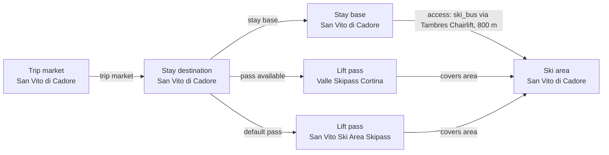

# San Vito di Cadore Catalog V2 Fact Enrichment

Reviews the San Vito child ski area and stay base against official operator and Dolomiti Bellunesi sources, including source-aware normalization of whole-area programmed snow.

## Resulting Graph

## Reviewed Targets

| Target | Scope | Graph Role | Required Fields |
| --- | --- | --- | --- |
| `ski_area:san-vito-di-cadore-ski-area` | `narrow` | `focus` | `snowmaking.availability`, `snowmaking.coverage_pct`, `snowmaking.coverage_basis`, `snowmaking.season_label`, `glacier_terrain.availability`, `snow_park.availability`, `snow_park.park_count`, `snow_park.season_label`, `night_skiing.availability`, `night_skiing.season_label`, `marked_freeride_routes.availability`, `marked_freeride_routes.route_count`, `marked_freeride_routes.season_label`, `official_trail_map.url`, `official_trail_map.season_label`, `ski_day_apres_profile.availability`, `ski_day_apres_profile.intensity`, `ski_day_apres_profile.season_label` |
| `stay_base:san-vito-di-cadore-san-vito-di-cadore` | `narrow` | `focus` | `elevation_m`, `base_type`, `base_character.development_style`, `base_character.local_pace`, `local_apres_profile.availability`, `local_apres_profile.intensity`, `local_apres_profile.season_label` |
| `trust_manifest:ski_areas:san-vito-di-cadore-ski-area` | `narrow` | `focus` | `field_source_refs`, `field_statuses`, `notes` |
| `trust_manifest:stay_bases:san-vito-di-cadore-san-vito-di-cadore` | `narrow` | `focus` | `field_source_refs`, `field_statuses`, `notes` |
| `stay_destination:san-vito-di-cadore` | `narrow` | `focus` | `name` |
| `ski_area_access:san-vito-di-cadore-san-vito-di-cadore--san-vito-di-cadore-ski-area` | `narrow` | `focus` | `ski_area_id` |
| `lift_pass_product:san-vito-ski-area-skipass` | `narrow` | `focus` | `name` |
| `lift_pass_product:san-vito-cortina-valle-skipass` | `narrow` | `focus` | `name` |

## Review Evidence Envelope

| Family | Source Kind | Source URLs | Candidate Kinds |
| --- | --- | --- | --- |
| `san-vito-destination-booking` | `destination_booking` | [https://san-vito.visitcadore.com/](https://san-vito.visitcadore.com/), [https://visitcadoredolomiti.com/wp-content/uploads/2024/02/Mappa_San_Vito_Cadore-new.pdf](https://visitcadoredolomiti.com/wp-content/uploads/2024/02/Mappa_San_Vito_Cadore-new.pdf), [https://visitcadoredolomiti.com/wp-content/uploads/2024/12/Appartamenti-S.Vito-Borca-e-Vodo.pdf](https://visitcadoredolomiti.com/wp-content/uploads/2024/12/Appartamenti-S.Vito-Borca-e-Vodo.pdf), [https://www.visitdolomitibellunesi.com/en/hotels/dolomiti-5](https://www.visitdolomitibellunesi.com/en/hotels/dolomiti-5) | `stay_destination`, `stay_base` |
| `san-vito-operator-map` | `ski_area_operator` | [https://www.skiareasanvito.com/impianti/](https://www.skiareasanvito.com/impianti/), [https://visitcadoredolomiti.com/wp-content/uploads/2024/12/Cartina_San_Vito_di_Cadore_low-1.pdf](https://visitcadoredolomiti.com/wp-content/uploads/2024/12/Cartina_San_Vito_di_Cadore_low-1.pdf) | `ski_area` |
| `san-vito-access` | `access_transport` | [https://visitcadoredolomiti.com/en/ski-area-san-vito-2/](https://visitcadoredolomiti.com/en/ski-area-san-vito-2/) | `ski_area_access` |
| `san-vito-pass-tariffs` | `pass_tariff` | [https://www.skiareasanvito.com/en/rates/](https://www.skiareasanvito.com/en/rates/) | `lift_pass_product` |
| `san-vito-linked-cortina-pr` | `linked_pr_dependency` | [https://www.skiareasanvito.com/en/rates/](https://www.skiareasanvito.com/en/rates/) | `ski_area`, `lift_pass_product` |
| `san-vito-touched-relationships` | `other_official` | [https://visitcadoredolomiti.com/en/ski-area-san-vito-2/](https://visitcadoredolomiti.com/en/ski-area-san-vito-2/), [https://www.skiareasanvito.com/en/rates/](https://www.skiareasanvito.com/en/rates/) | `stay_destination`, `stay_base`, `ski_area`, `ski_area_access`, `lift_pass_product` |

## Entity Scope Assessments

| Candidate | Kind | Disposition | Signals | Catalog Targets | Evidence | Backlog | Graph Impact | Rationale |
| --- | --- | --- | --- | --- | --- | --- | --- | --- |
| `san-vito-di-cadore` (San Vito di Cadore) | `stay_destination` | `represented` | `independent_stay_market` | `stay_destination:san-vito-di-cadore` | `scope-stay-market-san-vito` |  | `graph_blocking` | The current official destination and accommodation collections establish San Vito as the complete independently owned stay market, separate from the neighboring destination collections. |
| `san-vito-di-cadore-san-vito-di-cadore` (San Vito di Cadore stay base) | `stay_base` | `represented` | `independent_stay_market`, `distinct_access` | `stay_base:san-vito-di-cadore-san-vito-di-cadore` | `scope-stay-market-san-vito`, `scope-san-vito-locality-accommodation-map`, `scope-san-vito-accommodation-inventory`, `scope-access-san-vito` |  | `graph_blocking` | The official village map and townwide accommodation inventory support one represented San Vito base; named localities remain internal locality context because no independent lodging-and-access owner is established. |
| `san-vito-mosigo` (Mosigo) | `stay_base` | `not_separate` | `official_independent_identity` | `stay_base:san-vito-di-cadore-san-vito-di-cadore` | `scope-san-vito-locality-accommodation-map`, `scope-san-vito-accommodation-inventory` |  | `graph_blocking` | The official inventory places Mosigo-address lodging inside the Chiapuzza grouping and the village map supplies no independently owned lodging-and-access base. |
| `san-vito-chiapuzza` (Chiapuzza) | `stay_base` | `not_separate` | `official_independent_identity` | `stay_base:san-vito-di-cadore-san-vito-di-cadore` | `scope-san-vito-locality-accommodation-map`, `scope-san-vito-accommodation-inventory` |  | `graph_blocking` | The official apartment inventory uses Chiapuzza as a San Vito locality heading, but no independent base-level destination or ski-access owner is established. |
| `san-vito-serdes` (Serdes) | `stay_base` | `not_separate` | `official_independent_identity` | `stay_base:san-vito-di-cadore-san-vito-di-cadore` | `scope-san-vito-locality-accommodation-map`, `scope-san-vito-accommodation-inventory` |  | `graph_blocking` | The official apartment inventory uses Serdes as a San Vito locality heading, but no independent base-level destination or ski-access owner is established. |
| `san-vito-resinego` (Resinego) | `stay_base` | `not_separate` | `official_independent_identity` | `stay_base:san-vito-di-cadore-san-vito-di-cadore` | `scope-san-vito-locality-accommodation-map`, `scope-san-vito-accommodation-inventory` |  | `graph_blocking` | The official inventory presents Resinego and Resinego Alto within San Vito lodging, without independent base-level destination or ski-access ownership. |
| `san-vito-tambres` (Tambres) | `stay_base` | `not_separate` | `official_independent_identity` | `stay_base:san-vito-di-cadore-san-vito-di-cadore` | `scope-san-vito-locality-accommodation-map` |  | `graph_blocking` | The official village map identifies Tambres inside San Vito but the accommodation inventory does not establish it as an independently owned stay-and-access base. |
| `san-vito-belvedere` (Belvedere) | `stay_base` | `not_separate` | `official_independent_identity` | `stay_base:san-vito-di-cadore-san-vito-di-cadore` | `scope-san-vito-locality-accommodation-map`, `scope-san-vito-accommodation-inventory` |  | `graph_blocking` | The official inventory combines Belvedere with Resinego Alto inside San Vito and establishes no independent base-level destination or ski-access owner. |
| `san-vito-costa` (Costa) | `stay_base` | `not_separate` | `official_independent_identity` | `stay_base:san-vito-di-cadore-san-vito-di-cadore` | `scope-san-vito-locality-accommodation-map`, `scope-san-vito-accommodation-inventory` |  | `graph_blocking` | The official apartment inventory uses Costa as a San Vito locality heading, but no independent base-level destination or ski-access owner is established. |
| `san-vito-dogana-vecchia` (Dogana Vecchia) | `stay_base` | `not_separate` | `official_independent_identity` | `stay_base:san-vito-di-cadore-san-vito-di-cadore` | `scope-san-vito-locality-accommodation-map` |  | `graph_blocking` | The official village map includes Dogana Vecchia and its lodging inside San Vito but does not establish an independent accommodation-and-access base. |
| `san-vito-di-cadore-ski-area` (San Vito di Cadore ski area) | `ski_area` | `represented` | `official_independent_identity`, `separate_operator`, `full_local_pass` | `ski_area:san-vito-di-cadore-ski-area` | `v2-enrichment-001-san-vito-di-cadore-ski-area-official-trail-map-url`, `v2-enrichment-002-san-vito-di-cadore-ski-area-snowmaking-availability`, `scope-local-pass-san-vito` |  | `graph_blocking` | The current ski-area identity is represented provisionally and remains subject to independent evidence-owner review. |
| `san-vito-di-cadore-access` (San Vito stay-base to ski-area access) | `ski_area_access` | `represented` | `direct_access_relationship` | `ski_area_access:san-vito-di-cadore-san-vito-di-cadore--san-vito-di-cadore-ski-area` | `scope-access-san-vito` |  | `graph_blocking` | The current access edge is represented provisionally; its exact mode and distance require independent source review. |
| `san-vito-ski-area-skipass` (San Vito Ski Area Skipass) | `lift_pass_product` | `represented` | `official_product_identity`, `full_local_pass` | `lift_pass_product:san-vito-ski-area-skipass` | `scope-local-pass-san-vito` |  | `graph_blocking` | The current local ticket is represented provisionally as the default product for the focus destination. |
| `san-vito-cortina-valle-skipass` (Valle Skipass Cortina) | `lift_pass_product` | `represented` | `official_product_identity` | `lift_pass_product:san-vito-cortina-valle-skipass` | `scope-valley-pass-san-vito` |  | `graph_blocking` | The current regional-network product is represented provisionally; external coverage and linked-PR dependencies require independent review. |

## Ski-Area Boundary Assessments

| Candidate | Parent | Terrain | Connectivity | Operations | Weather | Pass | Provider Consensus | Separation Value | Evidence |
| --- | --- | --- | --- | --- | --- | --- | --- | --- | --- |
| `san-vito-di-cadore-ski-area` |  | `complete` | `not_applicable` | `independent` | `unknown` | `full_local` | `separate` | `material` | `v2-enrichment-001-san-vito-di-cadore-ski-area-official-trail-map-url`, `v2-enrichment-002-san-vito-di-cadore-ski-area-snowmaking-availability`, `scope-local-pass-san-vito` |

## Changed Fields

| Target | Field | Before | After | Trust | Ranking Relevant |
| --- | --- | --- | --- | --- | --- |
| `ski_area:san-vito-di-cadore-ski-area` | `official_trail_map.url` | `null` | `"https://visitcadoredolomiti.com/wp-content/uploads/2024/12/Cartina_San_Vito_di_Cadore_low-1.pdf"` | `verified` | no |
| `ski_area:san-vito-di-cadore-ski-area` | `snowmaking.availability` | `"unknown"` | `"available"` | `verified` | no |
| `ski_area:san-vito-di-cadore-ski-area` | `snowmaking.coverage_basis` | `"unknown"` | `"skiable_area"` | `verified_with_adjustment` | no |
| `ski_area:san-vito-di-cadore-ski-area` | `snowmaking.coverage_pct` | `null` | `100.0` | `verified_with_adjustment` | no |
| `stay_base:san-vito-di-cadore-san-vito-di-cadore` | `base_character.local_pace` | `"unknown"` | `"quiet"` | `verified_with_adjustment` | no |
| `stay_base:san-vito-di-cadore-san-vito-di-cadore` | `elevation_m` | `null` | `1011` | `verified` | no |
| `trust_manifest:ski_areas:san-vito-di-cadore-ski-area` | `field_source_refs` | `{"elevation_season": ["https://visitcadoredolomiti.com/en/ski-area-san-vito-2/", "https://www.openstreetmap.org/relation/47211", "https://www.skiareasanvito.com/en/rates/", "https://www.skiresort.info/ski-resort/san-vito-di-cadore/", "https://www.visitdolomitibellunesi.com/en/what-to-do/ski-areas-dolomites/san-vito-di-cadore-ski-areas"], "glacier_terrain": [], "identity_coordinates": ["https://visitcadoredolomiti.com/en/ski-area-san-vito-2/", "https://www.openstreetmap.org/relation/47211", "https://www.skiareasanvito.com/en/rates/", "https://www.skiresort.info/ski-resort/san-vito-di-cadore/", "https://www.visitdolomitibellunesi.com/en/what-to-do/ski-areas-dolomites/san-vito-di-cadore-ski-areas"], "marked_freeride_routes": [], "night_skiing": [], "official_documents": [], "ski_day_apres": [], "skill_fit": ["https://visitcadoredolomiti.com/en/ski-area-san-vito-2/", "https://www.openstreetmap.org/relation/47211", "https://www.skiareasanvito.com/en/rates/", "https://www.skiresort.info/ski-resort/san-vito-di-cadore/", "https://www.visitdolomitibellunesi.com/en/what-to-do/ski-areas-dolomites/san-vito-di-cadore-ski-areas"], "snow_park": [], "snowmaking": [], "terrain_metrics": ["https://visitcadoredolomiti.com/en/ski-area-san-vito-2/", "https://www.openstreetmap.org/relation/47211", "https://www.skiareasanvito.com/en/rates/", "https://www.skiresort.info/ski-resort/san-vito-di-cadore/", "https://www.visitdolomitibellunesi.com/en/what-to-do/ski-areas-dolomites/san-vito-di-cadore-ski-areas"]}` | `{"elevation_season": ["https://visitcadoredolomiti.com/en/ski-area-san-vito-2/", "https://www.openstreetmap.org/relation/47211", "https://www.skiareasanvito.com/en/rates/", "https://www.skiresort.info/ski-resort/san-vito-di-cadore/", "https://www.visitdolomitibellunesi.com/en/what-to-do/ski-areas-dolomites/san-vito-di-cadore-ski-areas"], "glacier_terrain": [], "identity_coordinates": ["https://visitcadoredolomiti.com/en/ski-area-san-vito-2/", "https://www.openstreetmap.org/relation/47211", "https://www.skiareasanvito.com/en/rates/", "https://www.skiresort.info/ski-resort/san-vito-di-cadore/", "https://www.visitdolomitibellunesi.com/en/what-to-do/ski-areas-dolomites/san-vito-di-cadore-ski-areas"], "marked_freeride_routes": [], "night_skiing": [], "official_documents": ["https://visitcadoredolomiti.com/wp-content/uploads/2024/12/Cartina_San_Vito_di_Cadore_low-1.pdf"], "ski_day_apres": [], "skill_fit": ["https://visitcadoredolomiti.com/en/ski-area-san-vito-2/", "https://www.openstreetmap.org/relation/47211", "https://www.skiareasanvito.com/en/rates/", "https://www.skiresort.info/ski-resort/san-vito-di-cadore/", "https://www.visitdolomitibellunesi.com/en/what-to-do/ski-areas-dolomites/san-vito-di-cadore-ski-areas"], "snow_park": [], "snowmaking": ["https://www.skiareasanvito.com/impianti/"], "terrain_metrics": ["https://visitcadoredolomiti.com/en/ski-area-san-vito-2/", "https://www.openstreetmap.org/relation/47211", "https://www.skiareasanvito.com/en/rates/", "https://www.skiresort.info/ski-resort/san-vito-di-cadore/", "https://www.visitdolomitibellunesi.com/en/what-to-do/ski-areas-dolomites/san-vito-di-cadore-ski-areas"]}` | `estimated` | no |
| `trust_manifest:ski_areas:san-vito-di-cadore-ski-area` | `field_statuses` | `{"elevation_season": "verified_with_adjustment", "glacier_terrain": "needs_source", "identity_coordinates": "verified_with_adjustment", "marked_freeride_routes": "needs_source", "night_skiing": "needs_source", "official_documents": "needs_source", "ski_day_apres": "needs_source", "skill_fit": "verified_with_adjustment", "snow_park": "needs_source", "snowmaking": "needs_source", "terrain_metrics": "verified_with_adjustment"}` | `{"elevation_season": "verified_with_adjustment", "glacier_terrain": "needs_source", "identity_coordinates": "verified_with_adjustment", "marked_freeride_routes": "needs_source", "night_skiing": "needs_source", "official_documents": "verified", "ski_day_apres": "needs_source", "skill_fit": "verified_with_adjustment", "snow_park": "needs_source", "snowmaking": "verified_with_adjustment", "terrain_metrics": "verified_with_adjustment"}` | `estimated` | no |
| `trust_manifest:ski_areas:san-vito-di-cadore-ski-area` | `notes` | `["Modeled as a separate destination because San Vito has independent lodging identity, local lift access, a local-only ski pass, and distinct family/value recommendation value.", "The catalog stores child-scope San Vito terrain metrics from reviewed ski-area data; official tourism pages also publish broader 20 km wording, so the conflicting source is preserved as a caveat rather than copied into the child ski-area metrics.", "The Cortina valley pass is represented as regional-network pass context, not as a ski-connected terrain domain.", "Lodging and rental price ranges, stay-base quality tier, and rental quality tier remain product-curated estimates pending a dedicated sampling policy."]` | `["Modeled as a separate destination because San Vito has independent lodging identity, local lift access, a local-only ski pass, and distinct family/value recommendation value.", "The catalog stores child-scope San Vito terrain metrics from reviewed ski-area data; official tourism pages also publish broader 20 km wording, so the conflicting source is preserved as a caveat rather than copied into the child ski-area metrics.", "The Cortina valley pass is represented as regional-network pass context, not as a ski-connected terrain domain.", "Lodging and rental price ranges, stay-base quality tier, and rental quality tier remain product-curated estimates pending a dedicated sampling policy.", "Source-aware v2 enrichment reviewed official San Vito Ski Area material on 2026-07-05.", "NeveSole family snow-play facilities are not normalized as a dedicated freestyle snowpark."]` | `estimated` | no |
| `trust_manifest:stay_bases:san-vito-di-cadore-san-vito-di-cadore` | `field_source_refs` | `{"base_character": [], "base_type": [], "coordinates": ["https://visitcadoredolomiti.com/en/ski-area-san-vito-2/", "https://www.openstreetmap.org/relation/47211", "https://www.skiareasanvito.com/en/rates/", "https://www.skiresort.info/ski-resort/san-vito-di-cadore/", "https://www.visitdolomitibellunesi.com/en/what-to-do/ski-areas-dolomites/san-vito-di-cadore-ski-areas"], "elevation": [], "identity_ownership": ["https://visitcadoredolomiti.com/en/ski-area-san-vito-2/", "https://www.openstreetmap.org/relation/47211", "https://www.skiareasanvito.com/en/rates/", "https://www.skiresort.info/ski-resort/san-vito-di-cadore/", "https://www.visitdolomitibellunesi.com/en/what-to-do/ski-areas-dolomites/san-vito-di-cadore-ski-areas"], "local_apres": [], "lodging_price_quality": ["https://visitcadoredolomiti.com/en/ski-area-san-vito-2/", "https://www.openstreetmap.org/relation/47211", "https://www.skiareasanvito.com/en/rates/", "https://www.skiresort.info/ski-resort/san-vito-di-cadore/", "https://www.visitdolomitibellunesi.com/en/what-to-do/ski-areas-dolomites/san-vito-di-cadore-ski-areas"]}` | `{"base_character": ["https://www.visitdolomitibellunesi.com/en/hotels/dolomiti-5"], "base_type": ["https://www.dolomiti.org/en/cadore/alto-cadore-places/san-vito-di-cadore-dolomiti/"], "coordinates": ["https://visitcadoredolomiti.com/en/ski-area-san-vito-2/", "https://www.openstreetmap.org/relation/47211", "https://www.skiareasanvito.com/en/rates/", "https://www.skiresort.info/ski-resort/san-vito-di-cadore/", "https://www.visitdolomitibellunesi.com/en/what-to-do/ski-areas-dolomites/san-vito-di-cadore-ski-areas"], "elevation": ["https://www.dolomiti.org/en/cadore/alto-cadore-places/san-vito-di-cadore-dolomiti/"], "identity_ownership": ["https://visitcadoredolomiti.com/en/ski-area-san-vito-2/", "https://www.openstreetmap.org/relation/47211", "https://www.skiareasanvito.com/en/rates/", "https://www.skiresort.info/ski-resort/san-vito-di-cadore/", "https://www.visitdolomitibellunesi.com/en/what-to-do/ski-areas-dolomites/san-vito-di-cadore-ski-areas"], "local_apres": [], "lodging_price_quality": ["https://visitcadoredolomiti.com/en/ski-area-san-vito-2/", "https://www.openstreetmap.org/relation/47211", "https://www.skiareasanvito.com/en/rates/", "https://www.skiresort.info/ski-resort/san-vito-di-cadore/", "https://www.visitdolomitibellunesi.com/en/what-to-do/ski-areas-dolomites/san-vito-di-cadore-ski-areas"]}` | `estimated` | no |
| `trust_manifest:stay_bases:san-vito-di-cadore-san-vito-di-cadore` | `field_statuses` | `{"base_character": "needs_source", "base_type": "needs_source", "coordinates": "verified_with_adjustment", "elevation": "needs_source", "identity_ownership": "verified_with_adjustment", "local_apres": "needs_source", "lodging_price_quality": "estimated"}` | `{"base_character": "verified_with_adjustment", "base_type": "verified", "coordinates": "verified_with_adjustment", "elevation": "verified", "identity_ownership": "verified_with_adjustment", "local_apres": "needs_source", "lodging_price_quality": "estimated"}` | `estimated` | no |
| `trust_manifest:stay_bases:san-vito-di-cadore-san-vito-di-cadore` | `notes` | `["Modeled as a separate destination because San Vito has independent lodging identity, local lift access, a local-only ski pass, and distinct family/value recommendation value.", "The catalog stores child-scope San Vito terrain metrics from reviewed ski-area data; official tourism pages also publish broader 20 km wording, so the conflicting source is preserved as a caveat rather than copied into the child ski-area metrics.", "The Cortina valley pass is represented as regional-network pass context, not as a ski-connected terrain domain.", "Lodging and rental price ranges, stay-base quality tier, and rental quality tier remain product-curated estimates pending a dedicated sampling policy."]` | `["Modeled as a separate destination because San Vito has independent lodging identity, local lift access, a local-only ski pass, and distinct family/value recommendation value.", "The catalog stores child-scope San Vito terrain metrics from reviewed ski-area data; official tourism pages also publish broader 20 km wording, so the conflicting source is preserved as a caveat rather than copied into the child ski-area metrics.", "The Cortina valley pass is represented as regional-network pass context, not as a ski-connected terrain domain.", "Lodging and rental price ranges, stay-base quality tier, and rental quality tier remain product-curated estimates pending a dedicated sampling policy.", "Source-aware v2 enrichment reviewed official San Vito town and stay material on 2026-07-05."]` | `estimated` | no |

## Field Coverage

| Target | Field | Status | Notes |
| --- | --- | --- | --- |
| `stay_destination:san-vito-di-cadore` | `name` | `reviewed-no-change` | The existing destination name is retained provisionally for independent initial review. |
| `ski_area_access:san-vito-di-cadore-san-vito-di-cadore--san-vito-di-cadore-ski-area` | `ski_area_id` | `reviewed-no-change` | The current ski-area endpoint is exposed for independent initial review. |
| `lift_pass_product:san-vito-ski-area-skipass` | `name` | `reviewed-no-change` | The current local-pass name is exposed for independent initial review. |
| `lift_pass_product:san-vito-cortina-valle-skipass` | `name` | `reviewed-no-change` | The current valley-pass name is exposed for independent initial review. |
| `ski_area:san-vito-di-cadore-ski-area` | `snowmaking.availability` | `changed` | The official operator states that programmed snow is present across the entire ski area. |
| `ski_area:san-vito-di-cadore-ski-area` | `snowmaking.coverage_pct` | `changed` | The operator describes programmed snow across the entire ski area. |
| `ski_area:san-vito-di-cadore-ski-area` | `snowmaking.coverage_basis` | `changed` | The source scopes its statement to the entire ski area rather than run count or published piste kilometers. |
| `ski_area:san-vito-di-cadore-ski-area` | `snowmaking.season_label` | `unresolved` | Official San Vito sources were reviewed, but they did not establish this exact child-ski-area value; it remains unknown rather than being inferred from family snow-play or broader regional material. |
| `ski_area:san-vito-di-cadore-ski-area` | `glacier_terrain.availability` | `unresolved` | Official San Vito sources were reviewed, but they did not establish this exact child-ski-area value; it remains unknown rather than being inferred from family snow-play or broader regional material. |
| `ski_area:san-vito-di-cadore-ski-area` | `snow_park.availability` | `unresolved` | Official San Vito sources were reviewed, but they did not establish this exact child-ski-area value; it remains unknown rather than being inferred from family snow-play or broader regional material. |
| `ski_area:san-vito-di-cadore-ski-area` | `snow_park.park_count` | `unresolved` | Official San Vito sources were reviewed, but they did not establish this exact child-ski-area value; it remains unknown rather than being inferred from family snow-play or broader regional material. |
| `ski_area:san-vito-di-cadore-ski-area` | `snow_park.season_label` | `unresolved` | Official San Vito sources were reviewed, but they did not establish this exact child-ski-area value; it remains unknown rather than being inferred from family snow-play or broader regional material. |
| `ski_area:san-vito-di-cadore-ski-area` | `night_skiing.availability` | `unresolved` | Official San Vito sources were reviewed, but they did not establish this exact child-ski-area value; it remains unknown rather than being inferred from family snow-play or broader regional material. |
| `ski_area:san-vito-di-cadore-ski-area` | `night_skiing.season_label` | `unresolved` | Official San Vito sources were reviewed, but they did not establish this exact child-ski-area value; it remains unknown rather than being inferred from family snow-play or broader regional material. |
| `ski_area:san-vito-di-cadore-ski-area` | `marked_freeride_routes.availability` | `unresolved` | Official San Vito sources were reviewed, but they did not establish this exact child-ski-area value; it remains unknown rather than being inferred from family snow-play or broader regional material. |
| `ski_area:san-vito-di-cadore-ski-area` | `marked_freeride_routes.route_count` | `unresolved` | Official San Vito sources were reviewed, but they did not establish this exact child-ski-area value; it remains unknown rather than being inferred from family snow-play or broader regional material. |
| `ski_area:san-vito-di-cadore-ski-area` | `marked_freeride_routes.season_label` | `unresolved` | Official San Vito sources were reviewed, but they did not establish this exact child-ski-area value; it remains unknown rather than being inferred from family snow-play or broader regional material. |
| `ski_area:san-vito-di-cadore-ski-area` | `official_trail_map.url` | `changed` | Direct official child-area piste-map PDF. |
| `ski_area:san-vito-di-cadore-ski-area` | `official_trail_map.season_label` | `unresolved` | Official San Vito sources were reviewed, but they did not establish this exact child-ski-area value; it remains unknown rather than being inferred from family snow-play or broader regional material. |
| `ski_area:san-vito-di-cadore-ski-area` | `ski_day_apres_profile.availability` | `unresolved` | Official San Vito sources were reviewed, but they did not establish this exact child-ski-area value; it remains unknown rather than being inferred from family snow-play or broader regional material. |
| `ski_area:san-vito-di-cadore-ski-area` | `ski_day_apres_profile.intensity` | `unresolved` | Official San Vito sources were reviewed, but they did not establish this exact child-ski-area value; it remains unknown rather than being inferred from family snow-play or broader regional material. |
| `ski_area:san-vito-di-cadore-ski-area` | `ski_day_apres_profile.season_label` | `unresolved` | Official San Vito sources were reviewed, but they did not establish this exact child-ski-area value; it remains unknown rather than being inferred from family snow-play or broader regional material. |
| `stay_base:san-vito-di-cadore-san-vito-di-cadore` | `elevation_m` | `changed` | The official destination guide gives San Vito di Cadore at 1,011 m. |
| `stay_base:san-vito-di-cadore-san-vito-di-cadore` | `base_type` | `reviewed-no-change` | The existing town type is retained because the official destination guide explicitly calls San Vito a mountain town. |
| `stay_base:san-vito-di-cadore-san-vito-di-cadore` | `base_character.development_style` | `unresolved` | Official San Vito sources were reviewed, but they did not establish this exact stay-base value; it remains unknown rather than being inferred. |
| `stay_base:san-vito-di-cadore-san-vito-di-cadore` | `base_character.local_pace` | `changed` | Official Dolomiti Bellunesi material describes San Vito as a quiet mountain village, and the ski-area offer emphasizes peace, nature, relaxation, and families. |
| `stay_base:san-vito-di-cadore-san-vito-di-cadore` | `local_apres_profile.availability` | `unresolved` | Official San Vito sources were reviewed, but they did not establish this exact stay-base value; it remains unknown rather than being inferred. |
| `stay_base:san-vito-di-cadore-san-vito-di-cadore` | `local_apres_profile.intensity` | `unresolved` | Official San Vito sources were reviewed, but they did not establish this exact stay-base value; it remains unknown rather than being inferred. |
| `stay_base:san-vito-di-cadore-san-vito-di-cadore` | `local_apres_profile.season_label` | `unresolved` | Official San Vito sources were reviewed, but they did not establish this exact stay-base value; it remains unknown rather than being inferred. |
| `trust_manifest:ski_areas:san-vito-di-cadore-ski-area` | `field_source_refs` | `changed` | Trust metadata updated for the reviewed source-aware facts. |
| `trust_manifest:ski_areas:san-vito-di-cadore-ski-area` | `field_statuses` | `changed` | Trust metadata updated for the reviewed source-aware facts. |
| `trust_manifest:ski_areas:san-vito-di-cadore-ski-area` | `notes` | `changed` | Trust metadata updated for the reviewed source-aware facts. |
| `trust_manifest:stay_bases:san-vito-di-cadore-san-vito-di-cadore` | `field_source_refs` | `changed` | Trust metadata updated for the reviewed source-aware facts. |
| `trust_manifest:stay_bases:san-vito-di-cadore-san-vito-di-cadore` | `field_statuses` | `changed` | Trust metadata updated for the reviewed source-aware facts. |
| `trust_manifest:stay_bases:san-vito-di-cadore-san-vito-di-cadore` | `notes` | `changed` | Trust metadata updated for the reviewed source-aware facts. |

## Evidence

| Target | Field | Source | Source Value | Evidence | Normalization |
| --- | --- | --- | --- | --- | --- |
| `ski_area:san-vito-di-cadore-ski-area` | `official_trail_map.url` | [San Vito di Cadore official ski map](https://visitcadoredolomiti.com/wp-content/uploads/2024/12/Cartina_San_Vito_di_Cadore_low-1.pdf) | `"https://visitcadoredolomiti.com/wp-content/uploads/2024/12/Cartina_San_Vito_di_Cadore_low-1.pdf"` | Direct official child-area piste-map PDF. |  |
| `ski_area:san-vito-di-cadore-ski-area` | `snowmaking.availability` | [Ski Area San Vito official lifts and slopes guide](https://www.skiareasanvito.com/impianti/) | `"available"` | The official operator states that programmed snow is present across the entire ski area. |  |
| `ski_area:san-vito-di-cadore-ski-area` | `snowmaking.coverage_basis` | [Ski Area San Vito official lifts and slopes guide](https://www.skiareasanvito.com/impianti/) | `"skiable_area"` | The source scopes its statement to the entire ski area rather than run count or published piste kilometers. | The operator's comprensorio-wide wording is represented as skiable_area. |
| `ski_area:san-vito-di-cadore-ski-area` | `snowmaking.coverage_pct` | [Ski Area San Vito official lifts and slopes guide](https://www.skiareasanvito.com/impianti/) | `100` | The operator describes programmed snow across the entire ski area. | The whole-area statement is normalized to 100% skiable-area coverage. |
| `stay_base:san-vito-di-cadore-san-vito-di-cadore` | `base_character.local_pace` | [Dolomiti Bellunesi official San Vito lodging guide](https://www.visitdolomitibellunesi.com/en/hotels/dolomiti-5) | `"quiet"` | Official Dolomiti Bellunesi material describes San Vito as a quiet mountain village, and the ski-area offer emphasizes peace, nature, relaxation, and families. | The explicit quiet and relaxation positioning is mapped to quiet. |
| `stay_base:san-vito-di-cadore-san-vito-di-cadore` | `elevation_m` | [Cadore official San Vito di Cadore guide](https://www.dolomiti.org/en/cadore/alto-cadore-places/san-vito-di-cadore-dolomiti/) | `1011` | The official destination guide gives San Vito di Cadore at 1,011 m. |  |
| `stay_destination:san-vito-di-cadore` | `name` | [VisitCadore official San Vito di Cadore destination page](https://san-vito.visitcadore.com/) | `"San Vito di Cadore"` | The current official destination page presents San Vito di Cadore as a distinct stay destination, exposes a where-to-stay collection, and lists Cortina, Borca, and Vodo as neighboring destinations. |  |
| `stay_base:san-vito-di-cadore-san-vito-di-cadore` | `name` | [Cadore Dolomiti official San Vito village and accommodation map](https://visitcadoredolomiti.com/wp-content/uploads/2024/02/Mappa_San_Vito_Cadore-new.pdf) | `"San Vito di Cadore"` | The official village map places Mosigo, Chiapuzza, Serdes, Resinego, Tambres, Belvedere, Costa, and Dogana Vecchia inside one San Vito map and enumerates the townwide accommodation inventory and skibus context. | The named localities remain locality context inside the represented town base because the source does not give them independent accommodation-market or ski-access ownership. |
| `stay_destination:san-vito-di-cadore` | `name` | [Cadore Dolomiti official San Vito, Borca, and Vodo apartment inventory](https://visitcadoredolomiti.com/wp-content/uploads/2024/12/Appartamenti-S.Vito-Borca-e-Vodo.pdf) | `"San Vito di Cadore"` | The official inventory groups Chiapuzza, Costa, central San Vito, Belvedere and Resinego Alto, Resinego, and Serdes under the San Vito destination while listing Borca and Vodo separately. | Named San Vito locality headings describe lodging addresses within one destination inventory; they do not establish independent catalog stay-base owners. |
| `ski_area_access:san-vito-di-cadore-san-vito-di-cadore--san-vito-di-cadore-ski-area` | `ski_area_id` | [Cadore official San Vito ski-area guide](https://visitcadoredolomiti.com/en/ski-area-san-vito-2/) | `"san-vito-di-cadore-ski-area"` | The official destination source presents the San Vito ski area in the focus destination; exact access mode remains for independent review. |  |
| `lift_pass_product:san-vito-ski-area-skipass` | `name` | [Ski Area San Vito official rates](https://www.skiareasanvito.com/en/rates/) | `"San Vito Ski Area Skipass"` | The operator tariff presents the local San Vito ski-area ticket product for independent pass-scope review. |  |
| `lift_pass_product:san-vito-cortina-valle-skipass` | `name` | [Ski Area San Vito official rates](https://www.skiareasanvito.com/en/rates/) | `"Valle Skipass Cortina"` | The operator tariff presents the Cortina valley pass context for independent coverage and linked-dependency review. |  |

## Boundary Decisions

- `san-vito-di-cadore`: `pass`

## Caveats

- NeveSole is a family snow-play and beginner area, not evidence of a dedicated freestyle snowpark, so the snow-park fact remains unknown.
- No child-area glacier, night-skiing, marked-freeride, or explicit ski-day-après inventory was established.
- The whole-area snowmaking wording is normalized to 100% skiable-area coverage with an explicit adjustment note.
