# Tignes-Val d'Isere Catalog V2 Fact Enrichment

Schema-v3 curation for Tignes and Val d Isere with field-specific official evidence closing stay-base character, local apres profiles, representative La Daille elevation, qualitative lift access, and connected-domain piste-map ownership, alongside the existing pass, boundary, and regional follow-up review.

## Resulting Graph

```mermaid
flowchart LR
  region_1["Trip market<br/>Tignes - Val d&#x27;Isere"]
  destination_1["Stay destination<br/>Tignes"]
  destination_2["Stay destination<br/>Val d&#x27;Isere"]
  base_1["Stay base<br/>Tignes 1800"]
  base_2["Stay base<br/>Lavachet"]
  base_3["Stay base<br/>Le Lac"]
  base_4["Stay base<br/>Tignes les Brévières"]
  base_5["Stay base<br/>Val Claret"]
  base_6["Stay base<br/>La Daille"]
  base_7["Stay base<br/>Le Fornet"]
  base_8["Stay base<br/>Val d&#x27;Isere"]
  area_1["Ski area<br/>Tignes"]
  area_2["Ski area<br/>Val d&#x27;Isere"]
  domain_1["Terrain domain<br/>Tignes - Val d&#x27;Isere"]
  pass_1["Lift pass<br/>Tignes local ski pass<br/>valid 2026-11-28 to 2026-12-11 (planned)<br/>valid 2026-12-12 to 2027-04-23 (planned)<br/>valid 2027-04-24 to 2027-05-02 (planned)"]
  pass_2["Lift pass<br/>Tignes - Val d&#x27;Isere ski pass"]
  pass_3["Lift pass<br/>Val d&#x27;Isere day ticket"]
  region_1 -->|"trip market"| destination_1
  region_1 -->|"trip market"| destination_2
  destination_1 -->|"stay base"| base_1
  destination_1 -->|"stay base"| base_2
  destination_1 -->|"stay base"| base_3
  destination_1 -->|"stay base"| base_4
  destination_1 -->|"stay base"| base_5
  destination_2 -->|"stay base"| base_6
  destination_2 -->|"stay base"| base_7
  destination_2 -->|"stay base"| base_8
  base_1 -->|"access: walk via Les Boisses gondola"| area_1
  base_2 -->|"access: walk"| area_1
  base_3 -->|"access: walk via Palafour / Paquis chairlifts"| area_1
  base_4 -->|"access: walk via Brévières gondola"| area_1
  base_5 -->|"access: walk via Tufs / Fresse chairlifts"| area_1
  base_6 -->|"access: walk via La Daille gondola / Funival"| area_2
  base_7 -->|"access: walk via Fornet cable car"| area_2
  base_8 -->|"access: walk via Solaise gondola / Olympique cable car"| area_2
  domain_1 -->|"contains"| area_1
  domain_1 -->|"contains"| area_2
  destination_1 -->|"pass available"| pass_1
  pass_1 -->|"covers area"| area_1
  destination_1 -->|"default pass"| pass_2
  destination_2 -->|"default pass"| pass_2
  pass_2 -->|"covers area"| area_1
  pass_2 -->|"covers area"| area_2
  pass_2 -->|"covers terrain domain"| domain_1
  destination_2 -->|"pass available"| pass_3
  pass_3 -->|"covers area"| area_2
```

## Reviewed Targets

| Target | Scope | Graph Role | Required Fields |
| --- | --- | --- | --- |
| `lift_pass_product:tignes-local-ski-pass` | `full` | `focus` | all canonical fields |
| `lift_pass_product:tignes-val-disere-ski-pass` | `narrow` | `focus` | `lift_pass_product_id`, `name`, `validity_scope`, `available_from_stay_destination_ids`, `default_for_stay_destination_ids`, `valid_ski_area_ids`, `terrain_domain_ids`, `prices` |
| `lift_pass_product:val-disere-day-ticket` | `narrow` | `focus` | `lift_pass_product_id`, `name`, `validity_scope`, `available_from_stay_destination_ids`, `default_for_stay_destination_ids`, `valid_ski_area_ids`, `terrain_domain_ids`, `prices` |
| `ski_area:tignes-ski-area` | `narrow` | `focus` | `snowmaking.availability`, `snowmaking.coverage_pct`, `snowmaking.coverage_basis`, `snowmaking.season_label`, `glacier_terrain.availability`, `snow_park.availability`, `snow_park.park_count`, `snow_park.season_label`, `night_skiing.availability`, `night_skiing.season_label`, `marked_freeride_routes.availability`, `marked_freeride_routes.route_count`, `marked_freeride_routes.season_label`, `official_trail_map.url`, `official_trail_map.season_label`, `ski_day_apres_profile.availability`, `ski_day_apres_profile.intensity`, `ski_day_apres_profile.season_label` |
| `ski_area:val-disere-ski-area` | `narrow` | `focus` | `snowmaking.availability`, `snowmaking.coverage_pct`, `snowmaking.coverage_basis`, `snowmaking.season_label`, `glacier_terrain.availability`, `snow_park.availability`, `snow_park.park_count`, `snow_park.season_label`, `night_skiing.availability`, `night_skiing.season_label`, `marked_freeride_routes.availability`, `marked_freeride_routes.route_count`, `marked_freeride_routes.season_label`, `official_trail_map.url`, `official_trail_map.season_label`, `ski_day_apres_profile.availability`, `ski_day_apres_profile.intensity`, `ski_day_apres_profile.season_label` |
| `ski_area_access:tignes-1800--tignes-ski-area` | `narrow` | `focus` | `ski_area_access_id`, `stay_base_id`, `ski_area_id`, `access_mode`, `is_direct`, `source_urls`, `nearest_lift_name` |
| `ski_area_access:tignes-lavachet--tignes-ski-area` | `narrow` | `focus` | `ski_area_access_id`, `stay_base_id`, `ski_area_id`, `access_mode`, `is_direct`, `source_urls`, `nearest_lift_name` |
| `ski_area_access:tignes-le-lac--tignes-ski-area` | `narrow` | `focus` | `ski_area_access_id`, `stay_base_id`, `ski_area_id`, `access_mode`, `is_direct`, `source_urls`, `nearest_lift_name` |
| `ski_area_access:tignes-les-brevieres--tignes-ski-area` | `narrow` | `focus` | `ski_area_access_id`, `stay_base_id`, `ski_area_id`, `access_mode`, `is_direct`, `source_urls`, `nearest_lift_name` |
| `ski_area_access:tignes-val-claret--tignes-ski-area` | `narrow` | `focus` | `ski_area_access_id`, `stay_base_id`, `ski_area_id`, `access_mode`, `is_direct`, `source_urls`, `nearest_lift_name` |
| `ski_area_access:val-disere-la-daille--val-disere-ski-area` | `narrow` | `focus` | `ski_area_access_id`, `stay_base_id`, `ski_area_id`, `access_mode`, `is_direct`, `source_urls`, `nearest_lift_name` |
| `ski_area_access:val-disere-le-fornet--val-disere-ski-area` | `narrow` | `focus` | `ski_area_access_id`, `stay_base_id`, `ski_area_id`, `access_mode`, `is_direct`, `source_urls`, `nearest_lift_name` |
| `ski_area_access:val-disere-village--val-disere-ski-area` | `narrow` | `focus` | `ski_area_access_id`, `stay_base_id`, `ski_area_id`, `access_mode`, `is_direct`, `source_urls`, `nearest_lift_name` |
| `stay_base:tignes-1800` | `narrow` | `focus` | `elevation_m`, `base_type`, `base_character.development_style`, `base_character.local_pace`, `local_apres_profile.availability`, `local_apres_profile.intensity`, `local_apres_profile.season_label` |
| `stay_base:tignes-lavachet` | `narrow` | `focus` | `elevation_m`, `base_type`, `base_character.development_style`, `base_character.local_pace`, `local_apres_profile.availability`, `local_apres_profile.intensity`, `local_apres_profile.season_label` |
| `stay_base:tignes-le-lac` | `narrow` | `focus` | `elevation_m`, `base_type`, `base_character.development_style`, `base_character.local_pace`, `local_apres_profile.availability`, `local_apres_profile.intensity`, `local_apres_profile.season_label` |
| `stay_base:tignes-les-brevieres` | `narrow` | `focus` | `elevation_m`, `base_type`, `base_character.development_style`, `base_character.local_pace`, `local_apres_profile.availability`, `local_apres_profile.intensity`, `local_apres_profile.season_label` |
| `stay_base:tignes-val-claret` | `narrow` | `focus` | `elevation_m`, `base_type`, `base_character.development_style`, `base_character.local_pace`, `local_apres_profile.availability`, `local_apres_profile.intensity`, `local_apres_profile.season_label` |
| `stay_base:val-disere-la-daille` | `narrow` | `focus` | `elevation_m`, `base_type`, `base_character.development_style`, `base_character.local_pace`, `local_apres_profile.availability`, `local_apres_profile.intensity`, `local_apres_profile.season_label` |
| `stay_base:val-disere-le-fornet` | `narrow` | `focus` | `elevation_m`, `base_type`, `base_character.development_style`, `base_character.local_pace`, `local_apres_profile.availability`, `local_apres_profile.intensity`, `local_apres_profile.season_label` |
| `stay_base:val-disere-village` | `narrow` | `focus` | `elevation_m`, `base_type`, `base_character.development_style`, `base_character.local_pace`, `local_apres_profile.availability`, `local_apres_profile.intensity`, `local_apres_profile.season_label` |
| `stay_destination:tignes` | `narrow` | `focus` | `stay_destination_id`, `name`, `trip_market_region_id` |
| `stay_destination:val-disere` | `narrow` | `focus` | `stay_destination_id`, `name`, `trip_market_region_id` |
| `terrain_domain:tignes-val-disere` | `narrow` | `focus` | `official_trail_map.url`, `official_trail_map.season_label` |
| `trust_manifest:lift_pass_products:tignes-local-ski-pass` | `narrow` | `focus` | `field_source_refs`, `field_statuses`, `notes`, `display_name` |
| `trust_manifest:lift_pass_products:tignes-val-disere-ski-pass` | `narrow` | `focus` | `field_source_refs`, `field_statuses`, `notes` |
| `trust_manifest:lift_pass_products:val-disere-day-ticket` | `narrow` | `focus` | `field_source_refs`, `field_statuses`, `notes` |
| `trust_manifest:ski_area_access:tignes-1800--tignes-ski-area` | `narrow` | `focus` | `field_source_refs`, `field_statuses`, `notes` |
| `trust_manifest:ski_area_access:tignes-lavachet--tignes-ski-area` | `narrow` | `focus` | `field_source_refs`, `field_statuses`, `notes` |
| `trust_manifest:ski_area_access:tignes-le-lac--tignes-ski-area` | `narrow` | `focus` | `field_source_refs`, `field_statuses`, `notes` |
| `trust_manifest:ski_area_access:tignes-les-brevieres--tignes-ski-area` | `narrow` | `focus` | `field_source_refs`, `field_statuses`, `notes` |
| `trust_manifest:ski_area_access:tignes-val-claret--tignes-ski-area` | `narrow` | `focus` | `field_source_refs`, `field_statuses`, `notes` |
| `trust_manifest:ski_area_access:val-disere-la-daille--val-disere-ski-area` | `narrow` | `focus` | `field_source_refs`, `field_statuses`, `notes` |
| `trust_manifest:ski_area_access:val-disere-le-fornet--val-disere-ski-area` | `narrow` | `focus` | `field_source_refs`, `field_statuses`, `notes` |
| `trust_manifest:ski_area_access:val-disere-village--val-disere-ski-area` | `narrow` | `focus` | `field_source_refs`, `field_statuses`, `notes` |
| `trust_manifest:ski_areas:tignes-ski-area` | `narrow` | `focus` | `field_source_refs`, `field_statuses`, `notes` |
| `trust_manifest:ski_areas:val-disere-ski-area` | `narrow` | `focus` | `field_source_refs`, `field_statuses`, `notes` |
| `trust_manifest:stay_bases:tignes-1800` | `narrow` | `focus` | `field_source_refs`, `field_statuses`, `notes` |
| `trust_manifest:stay_bases:tignes-lavachet` | `narrow` | `focus` | `field_source_refs`, `field_statuses`, `notes` |
| `trust_manifest:stay_bases:tignes-le-lac` | `narrow` | `focus` | `field_source_refs`, `field_statuses`, `notes` |
| `trust_manifest:stay_bases:tignes-les-brevieres` | `narrow` | `focus` | `field_source_refs`, `field_statuses`, `notes` |
| `trust_manifest:stay_bases:tignes-val-claret` | `narrow` | `focus` | `field_source_refs`, `field_statuses`, `notes` |
| `trust_manifest:stay_bases:val-disere-la-daille` | `narrow` | `focus` | `field_source_refs`, `field_statuses`, `notes` |
| `trust_manifest:stay_bases:val-disere-le-fornet` | `narrow` | `focus` | `field_source_refs`, `field_statuses`, `notes` |
| `trust_manifest:stay_bases:val-disere-village` | `narrow` | `focus` | `field_source_refs`, `field_statuses`, `notes` |
| `trust_manifest:terrain_domains:tignes-val-disere` | `narrow` | `focus` | `field_source_refs`, `field_statuses`, `notes` |

## Review Evidence Envelope

| Family | Source Kind | Source URLs | Candidate Kinds |
| --- | --- | --- | --- |
| `tignes-val-disere-destination-booking` | `destination_booking` | [https://booking.valdisere.com/2-rooms-1-bedroom-cret-1.html](https://booking.valdisere.com/2-rooms-1-bedroom-cret-1.html), [https://booking.valdisere.com/en/accommodation/town-joseray-200077.html?page=1](https://booking.valdisere.com/en/accommodation/town-joseray-200077.html?page=1), [https://booking.valdisere.com/en/accommodation/town-laisinant-200068.html](https://booking.valdisere.com/en/accommodation/town-laisinant-200068.html), [https://booking.valdisere.com/en/accommodation/town-legettaz-200069.html?page=1](https://booking.valdisere.com/en/accommodation/town-legettaz-200069.html?page=1), [https://booking.valdisere.com/en/accommodation/town-rond-point-des-pistes-200070.html](https://booking.valdisere.com/en/accommodation/town-rond-point-des-pistes-200070.html), [https://en.tignes.net/discover/ski-resort/discovering-tignes](https://en.tignes.net/discover/ski-resort/discovering-tignes), [https://en.tignes.net/discover/ski-resort/tignes-villages](https://en.tignes.net/discover/ski-resort/tignes-villages), [https://public.tignes.net/TIGNES.NET/BROCHURES/RANDONNEE_AUX_SOMMETS.pdf](https://public.tignes.net/TIGNES.NET/BROCHURES/RANDONNEE_AUX_SOMMETS.pdf), [https://public.tignes.net/TIGNES.NET/NAVETTES/TIGNES_VDI_HIVER.pdf](https://public.tignes.net/TIGNES.NET/NAVETTES/TIGNES_VDI_HIVER.pdf), [https://reservation.tignes.net/chalet-4-chambres-10-personnes-sarrasin-tignes-villaret-des-brevieres-chaletsarrasin.html](https://reservation.tignes.net/chalet-4-chambres-10-personnes-sarrasin-tignes-villaret-des-brevieres-chaletsarrasin.html), [https://reservation.tignes.net/location-appartement-chalet.html](https://reservation.tignes.net/location-appartement-chalet.html), [https://reservation.tignes.net/medias/images/PLANS_TIGNES_2100.pdf](https://reservation.tignes.net/medias/images/PLANS_TIGNES_2100.pdf), [https://reservation.valdisere.com/fr/hebergement/zone-legettaz-200069.html](https://reservation.valdisere.com/fr/hebergement/zone-legettaz-200069.html), [https://www.valdisere.com/en/prepare-for-your-stay/accommodation/private-rentals/chalets-cristal-val-disere-en-4020873/](https://www.valdisere.com/en/prepare-for-your-stay/accommodation/private-rentals/chalets-cristal-val-disere-en-4020873/), [https://www.valdisere.com/en/val-disere/](https://www.valdisere.com/en/val-disere/), [https://www.valdisere.com/en/village-guide/heritage-gastronomy-and-architecture/](https://www.valdisere.com/en/village-guide/heritage-gastronomy-and-architecture/) | `stay_destination`, `stay_base` |
| `tignes-val-disere-ski-area-operators` | `ski_area_operator` | [https://en.tignes.net/resort-guide/directory/administrations/stgm](https://en.tignes.net/resort-guide/directory/administrations/stgm), [https://en.tignes.net/skiing/ski-area](https://en.tignes.net/skiing/ski-area), [https://en.tignes.net/skiing/ski-area/lifts-and-pistes-live-opening](https://en.tignes.net/skiing/ski-area/lifts-and-pistes-live-opening), [https://www.valdisere.com/en/val-disere-in-winter/skiing-winter-fun/ski-area-french-alps/](https://www.valdisere.com/en/val-disere-in-winter/skiing-winter-fun/ski-area-french-alps/), [https://www.valdisere.ski/en/legal-notice](https://www.valdisere.ski/en/legal-notice), [https://www.valdisere.ski/en/lifts-openings-and-piste-map](https://www.valdisere.ski/en/lifts-openings-and-piste-map) | `ski_area`, `terrain_domain` |
| `tignes-val-disere-access` | `access_transport` | [https://booking.valdisere.com/2-rooms-1-bedroom-cret-1.html](https://booking.valdisere.com/2-rooms-1-bedroom-cret-1.html), [https://booking.valdisere.com/en/accommodation/town-joseray-200077.html?page=1](https://booking.valdisere.com/en/accommodation/town-joseray-200077.html?page=1), [https://booking.valdisere.com/en/accommodation/town-laisinant-200068.html](https://booking.valdisere.com/en/accommodation/town-laisinant-200068.html), [https://booking.valdisere.com/en/accommodation/town-rond-point-des-pistes-200070.html](https://booking.valdisere.com/en/accommodation/town-rond-point-des-pistes-200070.html), [https://en.tignes.net/discover/ski-resort/tignes-villages](https://en.tignes.net/discover/ski-resort/tignes-villages), [https://en.tignes.net/discover/tignes-an-adaptative-friendly-resort/wheelchair-friendly-facilities](https://en.tignes.net/discover/tignes-an-adaptative-friendly-resort/wheelchair-friendly-facilities), [https://en.tignes.net/resort-guide/directory/accommodation/residences-de-tourisme/chalet-hotel-quartz](https://en.tignes.net/resort-guide/directory/accommodation/residences-de-tourisme/chalet-hotel-quartz), [https://en.tignes.net/resort-guide/directory/accommodation/resort-clubs/village-club-mmv-les-brevieres](https://en.tignes.net/resort-guide/directory/accommodation/resort-clubs/village-club-mmv-les-brevieres), [https://en.tignes.net/skiing/ski-area](https://en.tignes.net/skiing/ski-area), [https://en.tignes.net/skiing/ski-area/ski-lifts](https://en.tignes.net/skiing/ski-area/ski-lifts), [https://reservation.valdisere.com/fr/hebergement/zone-legettaz-200069.html](https://reservation.valdisere.com/fr/hebergement/zone-legettaz-200069.html), [https://www.openstreetmap.org/node/10138037904](https://www.openstreetmap.org/node/10138037904), [https://www.valdisere.com/en/live/ski-map/](https://www.valdisere.com/en/live/ski-map/), [https://www.valdisere.com/en/prepare-for-your-stay/accommodation/private-rentals/chalets-cristal-val-disere-en-4020873/](https://www.valdisere.com/en/prepare-for-your-stay/accommodation/private-rentals/chalets-cristal-val-disere-en-4020873/), [https://www.valdisere.com/en/val-disere-in-winter/skiing-winter-fun/ski-area-french-alps/](https://www.valdisere.com/en/val-disere-in-winter/skiing-winter-fun/ski-area-french-alps/), [https://www.valdisere.com/en/val-disere-in-winter/skiing-winter-fun/skipass-and-lift-pass-purchases/](https://www.valdisere.com/en/val-disere-in-winter/skiing-winter-fun/skipass-and-lift-pass-purchases/), [https://www.valdisere.com/en/val-disere-in-winter/walks-and-snowshoeing-tours/](https://www.valdisere.com/en/val-disere-in-winter/walks-and-snowshoeing-tours/), [https://www.valdisere.com/en/village-guide/history-pioneering-village/](https://www.valdisere.com/en/village-guide/history-pioneering-village/) | `stay_base`, `ski_area_access` |
| `tignes-val-disere-pass-tariffs` | `pass_tariff` | [https://en.tignes.net/skiing/ski-pass-you-need](https://en.tignes.net/skiing/ski-pass-you-need), [https://www.valdisere.com/en/prepare-for-your-stay/buy-my-skipass/](https://www.valdisere.com/en/prepare-for-your-stay/buy-my-skipass/) | `lift_pass_product` |
| `tignes-val-disere-official-map` | `other_official` | [https://en.tignes.net/skiing/ski-area/ski-map](https://en.tignes.net/skiing/ski-area/ski-map), [https://public.tignes.net/TIGNES.NET/BROCHURES/PLAN_DES_PISTES.pdf](https://public.tignes.net/TIGNES.NET/BROCHURES/PLAN_DES_PISTES.pdf) | `ski_area`, `terrain_domain` |
| `tignes-val-disere-parent-weather` | `other_official` | [https://en.tignes.net/tignes-weather-10979?id=12192](https://en.tignes.net/tignes-weather-10979?id=12192), [https://www.valdisere.com/en/live/weather-forecast/](https://www.valdisere.com/en/live/weather-forecast/) | `ski_area` |
| `tignes-source-aware-fit-facts` | `other_official` | [https://en.tignes.net/discover/ski-resort/grande-motte-glacier](https://en.tignes.net/discover/ski-resort/grande-motte-glacier), [https://en.tignes.net/discover/ski-resort/tignes-villages](https://en.tignes.net/discover/ski-resort/tignes-villages), [https://en.tignes.net/holidays](https://en.tignes.net/holidays), [https://en.tignes.net/resort-guide/directory/bars-tignes](https://en.tignes.net/resort-guide/directory/bars-tignes), [https://en.tignes.net/resort-guide/directory/bars-tignes/cocorico-apres-ski](https://en.tignes.net/resort-guide/directory/bars-tignes/cocorico-apres-ski), [https://en.tignes.net/resort-guide/directory/bars-tignes/kodo](https://en.tignes.net/resort-guide/directory/bars-tignes/kodo), [https://en.tignes.net/resort-guide/directory/bars-tignes/l-arobaze-cafe](https://en.tignes.net/resort-guide/directory/bars-tignes/l-arobaze-cafe), [https://en.tignes.net/resort-guide/directory/bars-tignes/la-paillote](https://en.tignes.net/resort-guide/directory/bars-tignes/la-paillote), [https://en.tignes.net/resort-guide/directory/bars-tignes/le-reservoir](https://en.tignes.net/resort-guide/directory/bars-tignes/le-reservoir), [https://en.tignes.net/resort-guide/directory/restaurants/loop-bar](https://en.tignes.net/resort-guide/directory/restaurants/loop-bar), [https://en.tignes.net/skiing/ski-area/commitments-ski-area](https://en.tignes.net/skiing/ski-area/commitments-ski-area), [https://en.tignes.net/skiing/ski-for-all/freeride-in-tignes](https://en.tignes.net/skiing/ski-for-all/freeride-in-tignes), [https://en.tignes.net/skiing/ski-for-all/freestyle-areas](https://en.tignes.net/skiing/ski-for-all/freestyle-areas), [https://restaurant1800.fr/en/bar_en/](https://restaurant1800.fr/en/bar_en/), [https://www.mairie-tignes.fr/cms_viewFile.php?idtf=124319&path=OAP-Renouvellement-architectural-et-energetique-2023.pdf](https://www.mairie-tignes.fr/cms_viewFile.php?idtf=124319&path=OAP-Renouvellement-architectural-et-energetique-2023.pdf) | `stay_base`, `ski_area` |
| `val-disere-source-aware-fit-facts` | `other_official` | [https://pop.culture.gouv.fr/notice/merimee/ACR0000190](https://pop.culture.gouv.fr/notice/merimee/ACR0000190), [https://www.valdisere.com/en/events-entertainment-calendar/apres-ski/](https://www.valdisere.com/en/events-entertainment-calendar/apres-ski/), [https://www.valdisere.com/en/live/webcams/](https://www.valdisere.com/en/live/webcams/), [https://www.valdisere.com/en/offres/snowpark-val-disere-en-4125642/](https://www.valdisere.com/en/offres/snowpark-val-disere-en-4125642/), [https://www.valdisere.com/en/val-disere-in-summer/summer-skiing/](https://www.valdisere.com/en/val-disere-in-summer/summer-skiing/), [https://www.valdisere.com/en/village-guide/history-pioneering-village/](https://www.valdisere.com/en/village-guide/history-pioneering-village/) | `stay_base`, `ski_area` |
| `tignes-val-disere-provider-consensus` | `other_official` | [https://www.skiresort.com/en/ski-resort/tignes-val-disere/](https://www.skiresort.com/en/ski-resort/tignes-val-disere/) | `ski_area`, `terrain_domain` |

## Entity Scope Assessments

| Candidate | Kind | Disposition | Signals | Catalog Targets | Evidence | Backlog | Graph Impact | Rationale |
| --- | --- | --- | --- | --- | --- | --- | --- | --- |
| `tignes` (Tignes) | `stay_destination` | `represented` | `independent_stay_market` | `stay_destination:tignes` | `inventory-pass4-tignes-offbase-shuttle`, `inventory-pass4-tignes-villaret-des-brevieres-lodging`, `remediation-tignes-offbase-locality-map`, `schema-v3-inventory-stay-destination-tignes` |  | `graph_blocking` | Schema-v3 structural normalization records the current modeled representation from the prepared catalog and direct official evidence. The initial independent source-trust and graph-scope reviews must still verify the owner, boundary, and representation. |
| `val-disere` (Val d'Isere) | `stay_destination` | `represented` | `independent_stay_market` | `stay_destination:val-disere` | `inventory-pass1-val-disere-joseray-market`, `inventory-pass1-val-disere-laisinant-market`, `inventory-pass1-val-disere-legettaz-market`, `inventory-pass2-val-disere-le-cret-accommodation`, `remediation-val-disere-les-carats-accommodation`, `remediation-val-disere-rond-point-accommodation`, `schema-v3-inventory-stay-destination-val-disere` |  | `graph_blocking` | Schema-v3 structural normalization records the current modeled representation from the prepared catalog and direct official evidence. The initial independent source-trust and graph-scope reviews must still verify the owner, boundary, and representation. |
| `tignes-1800` (Tignes 1800) | `stay_base` | `represented` | `direct_access_relationship` | `stay_base:tignes-1800` | `v2-enrichment-013-tignes-1800-base-character-development-style` |  | `graph_blocking` | Schema-v3 structural normalization records the current modeled representation from the prepared catalog and direct official evidence. The initial independent source-trust and graph-scope reviews must still verify the owner, boundary, and representation. |
| `tignes-lavachet` (Lavachet) | `stay_base` | `represented` | `direct_access_relationship` | `stay_base:tignes-lavachet` | `field-closure-lavachet-style` |  | `graph_blocking` | Schema-v3 structural normalization records the current modeled representation from the prepared catalog and direct official evidence. The initial independent source-trust and graph-scope reviews must still verify the owner, boundary, and representation. |
| `tignes-le-lac` (Le Lac) | `stay_base` | `represented` | `direct_access_relationship` | `stay_base:tignes-le-lac` | `field-closure-le-lac-style` |  | `graph_blocking` | Schema-v3 structural normalization records the current modeled representation from the prepared catalog and direct official evidence. The initial independent source-trust and graph-scope reviews must still verify the owner, boundary, and representation. |
| `tignes-les-brevieres` (Tignes les Brévières) | `stay_base` | `represented` | `direct_access_relationship` | `stay_base:tignes-les-brevieres` | `v2-enrichment-024-tignes-les-brevieres-base-character-development-style` |  | `graph_blocking` | Schema-v3 structural normalization records the current modeled representation from the prepared catalog and direct official evidence. The initial independent source-trust and graph-scope reviews must still verify the owner, boundary, and representation. |
| `tignes-val-claret` (Val Claret) | `stay_base` | `represented` | `direct_access_relationship` | `stay_base:tignes-val-claret` | `field-closure-val-claret-style` |  | `graph_blocking` | Schema-v3 structural normalization records the current modeled representation from the prepared catalog and direct official evidence. The initial independent source-trust and graph-scope reviews must still verify the owner, boundary, and representation. |
| `tignes-val-claret-centre` (Val Claret Centre) | `stay_base` | `not_separate` | `official_independent_identity` | `stay_base:tignes-val-claret` | `inventory-pass3-tignes-booking-subareas` |  | `graph_blocking` | Tignes Reservation presents Centre as a booking subarea within Val Claret, not as an independent accommodation market or access base. |
| `tignes-val-claret-grande-motte` (Val Claret Grande Motte) | `stay_base` | `not_separate` | `official_independent_identity` | `stay_base:tignes-val-claret` | `inventory-pass3-tignes-booking-subareas` |  | `graph_blocking` | Tignes Reservation presents Grande Motte as a booking subarea within Val Claret, not as an independent accommodation market or access base. |
| `tignes-val-claret-les-chartreux` (Val Claret Les Chartreux) | `stay_base` | `not_separate` | `official_independent_identity` | `stay_base:tignes-val-claret` | `inventory-pass3-tignes-booking-subareas` |  | `graph_blocking` | Tignes Reservation presents Les Chartreux as a booking subarea within Val Claret, not as an independent accommodation market or access base. |
| `tignes-le-lac-le-bec-rouge` (Le Lac Le Bec Rouge) | `stay_base` | `not_separate` | `official_independent_identity` | `stay_base:tignes-le-lac` | `inventory-pass3-tignes-booking-subareas` |  | `graph_blocking` | Tignes Reservation presents Le Bec Rouge as a booking subarea within Le Lac, not as an independent accommodation market or access base. |
| `tignes-le-lac-les-almes` (Le Lac Les Almes) | `stay_base` | `not_separate` | `official_independent_identity` | `stay_base:tignes-le-lac` | `inventory-pass3-tignes-booking-subareas` |  | `graph_blocking` | Tignes Reservation presents Les Almes as a booking subarea within Le Lac, not as an independent accommodation market or access base. |
| `tignes-le-lac-le-rosset` (Le Lac Le Rosset) | `stay_base` | `not_separate` | `official_independent_identity` | `stay_base:tignes-le-lac` | `inventory-pass3-tignes-booking-subareas` |  | `graph_blocking` | Tignes Reservation presents Le Rosset as a booking subarea within Le Lac, not as an independent accommodation market or access base. |
| `tignes-les-boisses` (Les Boisses) | `stay_base` | `not_separate` | `official_independent_identity` | `stay_base:tignes-1800` | `inventory-pass3-tignes-booking-subareas`, `inventory-pass4-tignes-1800-les-boisses-equivalence` |  | `graph_blocking` | The official booking inventory exposes Les Boisses alongside Tignes 1800, while the destination village presentation treats Les Boisses as the historical name and locality within the modeled Tignes 1800 base. |
| `tignes-le-lac-crouze` (Le Lac Crouze) | `stay_base` | `not_separate` | `official_independent_identity` | `stay_base:tignes-le-lac` | `inventory-pass4-tignes-crouze-parent` |  | `graph_blocking` | The official resort map and accommodation taxonomy place Crouze inside the contiguous Le Lac lodging area. It is a named quarter of the represented Le Lac base rather than an independent accommodation market or access base. |
| `val-disere-la-daille` (La Daille) | `stay_base` | `represented` | `direct_access_relationship` | `stay_base:val-disere-la-daille` | `v2-enrichment-032-val-disere-la-daille-base-character-local-pace` |  | `graph_blocking` | Schema-v3 structural normalization records the current modeled representation from the prepared catalog and direct official evidence. The initial independent source-trust and graph-scope reviews must still verify the owner, boundary, and representation. |
| `val-disere-le-fornet` (Le Fornet) | `stay_base` | `represented` | `direct_access_relationship` | `stay_base:val-disere-le-fornet` | `v2-enrichment-035-val-disere-le-fornet-base-character-development-style` |  | `graph_blocking` | Schema-v3 structural normalization records the current modeled representation from the prepared catalog and direct official evidence. The initial independent source-trust and graph-scope reviews must still verify the owner, boundary, and representation. |
| `val-disere-village` (Val d'Isere) | `stay_base` | `represented` | `direct_access_relationship` | `stay_base:val-disere-village` | `v2-enrichment-040-val-disere-village-base-character-development-style`, `inventory-pass1-val-disere-village-heritage` |  | `graph_blocking` | Schema-v3 structural normalization records the current modeled representation from the prepared catalog and direct official evidence. The initial independent source-trust and graph-scope reviews must still verify the owner, boundary, and representation. |
| `val-disere-chatelard` (Chatelard) | `stay_base` | `not_separate` | `official_independent_identity` | `stay_base:val-disere-village` | `inventory-pass3-val-disere-chatelard-boundary` |  | `graph_blocking` | Official booking inventory categorizes Chatelard accommodation within the wider Legettaz locality. Because neither locality is represented separately and shuttle-stop naming alone does not establish an independent accommodation market, Chatelard remains absorbed by the represented Val d'Isere village base; a later Legettaz addition would own the sub-locality decision. |
| `tignes-ski-area` (Tignes) | `ski_area` | `represented` | `independent_status_or_schedule`, `independent_weather_presentation`, `full_local_pass`, `official_independent_identity` | `ski_area:tignes-ski-area` | `remediation-tignes-altta-parent-owner`, `remediation-tignes-local-ski-pass-valid-ski-area-ids`, `remediation-tignes-parent-weather`, `remediation-provider-parent-consensus`, `schema-v3-inventory-ski-area-tignes-ski-area` |  | `graph_blocking` | Current official operator and weather sources establish independent Tignes parent ownership, and the exact Tignes-only tariff establishes a full local pass. The bounded provider presents Tignes within the aggregate Tignes Val d Isere resort, so provider consensus is aggregated without overriding the independent owner categories. |
| `val-disere-ski-area` (Val d'Isere) | `ski_area` | `represented` | `independent_status_or_schedule`, `independent_weather_presentation`, `full_local_pass`, `official_independent_identity` | `ski_area:val-disere-ski-area` | `inventory-pass2-val-disere-le-cret-lanche-geometry`, `remediation-2026-27-val-local-pass-price`, `remediation-val-disere-parent-weather`, `remediation-provider-parent-consensus`, `remediation-val-disere-stvi-parent-owner`, `schema-v3-inventory-ski-area-val-disere-ski-area` |  | `graph_blocking` | Current official operator and weather sources establish independent Val d Isere parent ownership, and the exact Val d Isere local tariff establishes a full local pass. The bounded provider presents Val d Isere within the aggregate Tignes Val d Isere resort, so provider consensus is aggregated without overriding the independent owner categories. |
| `tignes-1800--tignes-ski-area` (Tignes 1800 to Tignes) | `ski_area_access` | `represented` | `direct_access_relationship` | `ski_area_access:tignes-1800--tignes-ski-area` | `remediation-access-tignes-1800--tignes-ski-area`, `schema-v3-inventory-access-tignes-1800--tignes-ski-area` |  | `graph_blocking` | The official villages page directly states ski-area access via the Les Boisses gondola and a ski-in/ski-out return, supporting the represented edge with walk access, directness, and the named lift while leaving exact distance and duration unknown. |
| `tignes-lavachet--tignes-ski-area` (Lavachet to Tignes) | `ski_area_access` | `represented` | `direct_access_relationship` | `ski_area_access:tignes-lavachet--tignes-ski-area` | `remediation-access-tignes-lavachet--tignes-ski-area`, `schema-v3-inventory-access-tignes-lavachet--tignes-ski-area` |  | `graph_blocking` | The official villages page places lifts on Lavachet s doorstep, supporting the represented edge with walk access and directness without inventing a nearest lift, route distance, or duration. |
| `tignes-le-lac--tignes-ski-area` (Le Lac to Tignes) | `ski_area_access` | `represented` | `direct_access_relationship` | `ski_area_access:tignes-le-lac--tignes-ski-area` | `schema-v3-inventory-access-tignes-le-lac--tignes-ski-area` |  | `graph_blocking` | Schema-v3 structural normalization records the current modeled representation from the prepared catalog and direct official evidence. The initial independent source-trust and graph-scope reviews must still verify the owner, boundary, and representation. |
| `tignes-les-brevieres--tignes-ski-area` (Tignes les Brévières to Tignes) | `ski_area_access` | `represented` | `direct_access_relationship` | `ski_area_access:tignes-les-brevieres--tignes-ski-area` | `schema-v3-inventory-access-tignes-les-brevieres--tignes-ski-area` |  | `graph_blocking` | Schema-v3 structural normalization records the current modeled representation from the prepared catalog and direct official evidence. The initial independent source-trust and graph-scope reviews must still verify the owner, boundary, and representation. |
| `tignes-val-claret--tignes-ski-area` (Val Claret to Tignes) | `ski_area_access` | `represented` | `direct_access_relationship` | `ski_area_access:tignes-val-claret--tignes-ski-area` | `schema-v3-inventory-access-tignes-val-claret--tignes-ski-area` |  | `graph_blocking` | Schema-v3 structural normalization records the current modeled representation from the prepared catalog and direct official evidence. The initial independent source-trust and graph-scope reviews must still verify the owner, boundary, and representation. |
| `val-disere-la-daille--val-disere-ski-area` (La Daille to Val d'Isere) | `ski_area_access` | `represented` | `direct_access_relationship` | `ski_area_access:val-disere-la-daille--val-disere-ski-area` | `schema-v3-inventory-access-val-disere-la-daille--val-disere-ski-area`, `field-closure-access-val-disere-la-daille--val-disere-ski-area-source-urls` |  | `graph_blocking` | The official ski-area page supports the represented parent-area relationship but does not candidate-bind La Daille to a routed mode, named lift, duration, or directness. The edge remains represented with conservative unknown access semantics. |
| `val-disere-le-fornet--val-disere-ski-area` (Le Fornet to Val d'Isere) | `ski_area_access` | `represented` | `direct_access_relationship` | `ski_area_access:val-disere-le-fornet--val-disere-ski-area` | `schema-v3-inventory-access-val-disere-le-fornet--val-disere-ski-area` |  | `graph_blocking` | Schema-v3 structural normalization records the current modeled representation from the prepared catalog and direct official evidence. The initial independent source-trust and graph-scope reviews must still verify the owner, boundary, and representation. |
| `val-disere-village--val-disere-ski-area` (Val d'Isere to Val d'Isere) | `ski_area_access` | `represented` | `direct_access_relationship` | `ski_area_access:val-disere-village--val-disere-ski-area` | `schema-v3-inventory-access-val-disere-village--val-disere-ski-area` |  | `graph_blocking` | Schema-v3 structural normalization records the current modeled representation from the prepared catalog and direct official evidence. The initial independent source-trust and graph-scope reviews must still verify the owner, boundary, and representation. |
| `tignes-val-disere` (Tignes - Val d'Isere) | `terrain_domain` | `represented` | `ski_connected_terrain` | `terrain_domain:tignes-val-disere` | `field-closure-domain-map-url` |  | `graph_blocking` | Schema-v3 structural normalization records the current modeled representation from the prepared catalog and direct official evidence. The initial independent source-trust and graph-scope reviews must still verify the owner, boundary, and representation. |
| `tignes-val-disere-ski-pass` (Tignes - Val d'Isere ski pass) | `lift_pass_product` | `represented` | `official_product_identity` | `lift_pass_product:tignes-val-disere-ski-pass` | `schema-v3-inventory-pass-tignes-val-disere-ski-pass` |  | `graph_blocking` | Schema-v3 structural normalization records the current modeled representation from the prepared catalog and direct official evidence. The initial independent source-trust and graph-scope reviews must still verify the owner, boundary, and representation. |
| `val-disere-day-ticket` (Val d'Isere day ticket) | `lift_pass_product` | `represented` | `official_product_identity` | `lift_pass_product:val-disere-day-ticket` | `schema-v3-inventory-pass-val-disere-day-ticket` |  | `graph_blocking` | Schema-v3 structural normalization records the current modeled representation from the prepared catalog and direct official evidence. The initial independent source-trust and graph-scope reviews must still verify the owner, boundary, and representation. |
| `grande-motte` (Grande Motte) | `ski_area` | `not_separate` | `official_map_sector`, `ski_connected_terrain` | `ski_area:tignes-ski-area` | `inventory-pass1-tignes-sector-map`, `inventory-pass1-tignes-sector-status`, `remediation-tignes-altta-parent-owner`, `remediation-tignes-parent-weather`, `remediation-provider-parent-consensus` |  | `graph_blocking` | The official map keeps this connected candidate inside Tignes; ALTTA operates the parent presentation, Tignes publishes parent-scoped weather, and the bounded provider corroborates aggregation. No independent operations, weather, or full-local-pass owner supports a separate ski area. |
| `toviere` (Toviere) | `ski_area` | `not_separate` | `official_map_sector`, `ski_connected_terrain` | `ski_area:tignes-ski-area` | `inventory-pass1-tignes-sector-map`, `inventory-pass1-tignes-sector-status`, `remediation-tignes-altta-parent-owner`, `remediation-tignes-parent-weather`, `remediation-provider-parent-consensus` |  | `graph_blocking` | The official map keeps this connected candidate inside Tignes; ALTTA operates the parent presentation, Tignes publishes parent-scoped weather, and the bounded provider corroborates aggregation. No independent operations, weather, or full-local-pass owner supports a separate ski area. |
| `palet` (Palet) | `ski_area` | `not_separate` | `official_map_sector`, `ski_connected_terrain` | `ski_area:tignes-ski-area` | `inventory-pass1-tignes-sector-map`, `inventory-pass1-tignes-sector-status`, `remediation-tignes-altta-parent-owner`, `remediation-tignes-parent-weather`, `remediation-provider-parent-consensus` |  | `graph_blocking` | The official map keeps this connected candidate inside Tignes; ALTTA operates the parent presentation, Tignes publishes parent-scoped weather, and the bounded provider corroborates aggregation. No independent operations, weather, or full-local-pass owner supports a separate ski area. |
| `aiguille-percee` (Aiguille Percee) | `ski_area` | `not_separate` | `official_map_sector`, `ski_connected_terrain` | `ski_area:tignes-ski-area` | `inventory-pass1-tignes-sector-map`, `inventory-pass1-tignes-sector-status`, `remediation-tignes-altta-parent-owner`, `remediation-tignes-parent-weather`, `remediation-provider-parent-consensus` |  | `graph_blocking` | The official map keeps this connected candidate inside Tignes; ALTTA operates the parent presentation, Tignes publishes parent-scoped weather, and the bounded provider corroborates aggregation. No independent operations, weather, or full-local-pass owner supports a separate ski area. |
| `brevieres-sector` (Brevieres sector) | `ski_area` | `not_separate` | `official_map_sector`, `ski_connected_terrain` | `ski_area:tignes-ski-area` | `inventory-pass1-tignes-sector-map`, `inventory-pass1-tignes-sector-status`, `remediation-tignes-altta-parent-owner`, `remediation-tignes-parent-weather`, `remediation-provider-parent-consensus` |  | `graph_blocking` | The official map keeps this connected candidate inside Tignes; ALTTA operates the parent presentation, Tignes publishes parent-scoped weather, and the bounded provider corroborates aggregation. No independent operations, weather, or full-local-pass owner supports a separate ski area. |
| `boisses-sector` (Boisses sector) | `ski_area` | `not_separate` | `official_map_sector`, `ski_connected_terrain` | `ski_area:tignes-ski-area` | `inventory-pass1-tignes-sector-map`, `inventory-pass1-tignes-sector-status`, `remediation-tignes-altta-parent-owner`, `remediation-tignes-parent-weather`, `remediation-provider-parent-consensus` |  | `graph_blocking` | The official map keeps this connected candidate inside Tignes; ALTTA operates the parent presentation, Tignes publishes parent-scoped weather, and the bounded provider corroborates aggregation. No independent operations, weather, or full-local-pass owner supports a separate ski area. |
| `la-daille-sector` (La Daille sector) | `ski_area` | `not_separate` | `official_map_sector`, `ski_connected_terrain` | `ski_area:val-disere-ski-area` | `inventory-pass1-val-disere-sector-status`, `inventory-pass1-val-disere-sector-pass`, `remediation-val-disere-stvi-parent-owner`, `remediation-val-disere-parent-weather`, `remediation-provider-parent-consensus` |  | `graph_blocking` | The official operating and pass presentations keep this connected candidate inside Val d Isere; STVI operates the parent presentation, Val d Isere publishes parent-scoped weather, and the bounded provider corroborates aggregation. No independent operations, weather, or full-local-pass owner supports a separate ski area. |
| `bellevarde` (Bellevarde) | `ski_area` | `not_separate` | `official_map_sector`, `ski_connected_terrain` | `ski_area:val-disere-ski-area` | `inventory-pass1-val-disere-sector-status`, `inventory-pass1-val-disere-sector-pass`, `remediation-val-disere-stvi-parent-owner`, `remediation-val-disere-parent-weather`, `remediation-provider-parent-consensus` |  | `graph_blocking` | The official operating and pass presentations keep this connected candidate inside Val d Isere; STVI operates the parent presentation, Val d Isere publishes parent-scoped weather, and the bounded provider corroborates aggregation. No independent operations, weather, or full-local-pass owner supports a separate ski area. |
| `solaise` (Solaise) | `ski_area` | `not_separate` | `official_map_sector`, `ski_connected_terrain` | `ski_area:val-disere-ski-area` | `inventory-pass1-val-disere-sector-status`, `inventory-pass1-val-disere-sector-pass`, `remediation-val-disere-stvi-parent-owner`, `remediation-val-disere-parent-weather`, `remediation-provider-parent-consensus` |  | `graph_blocking` | The official operating and pass presentations keep this connected candidate inside Val d Isere; STVI operates the parent presentation, Val d Isere publishes parent-scoped weather, and the bounded provider corroborates aggregation. No independent operations, weather, or full-local-pass owner supports a separate ski area. |
| `fornet-iseran` (Fornet / Iseran) | `ski_area` | `not_separate` | `official_map_sector`, `ski_connected_terrain` | `ski_area:val-disere-ski-area` | `inventory-pass1-val-disere-sector-status`, `inventory-pass1-val-disere-sector-pass`, `remediation-val-disere-stvi-parent-owner`, `remediation-val-disere-parent-weather`, `remediation-provider-parent-consensus` |  | `graph_blocking` | The official operating and pass presentations keep this connected candidate inside Val d Isere; STVI operates the parent presentation, Val d Isere publishes parent-scoped weather, and the bounded provider corroborates aggregation. No independent operations, weather, or full-local-pass owner supports a separate ski area. |
| `pisaillas` (Pisaillas) | `ski_area` | `not_separate` | `official_map_sector`, `ski_connected_terrain` | `ski_area:val-disere-ski-area` | `inventory-pass1-val-disere-sector-status`, `inventory-pass1-val-disere-sector-pass`, `remediation-val-disere-stvi-parent-owner`, `remediation-val-disere-parent-weather`, `remediation-provider-parent-consensus` |  | `graph_blocking` | The official operating and pass presentations keep this connected candidate inside Val d Isere; STVI operates the parent presentation, Val d Isere publishes parent-scoped weather, and the bounded provider corroborates aggregation. No independent operations, weather, or full-local-pass owner supports a separate ski area. |
| `val-disere-ski-touring-pass` (Val d'Isere ski touring pass) | `lift_pass_product` | `external_pass_context` | `limited_area_ticket` |  | `inventory-pass1-val-disere-ski-touring-pass` |  | `graph_blocking` | The source defines a limited uphill-access product for reaching ski-touring itineraries. It is not a downhill LiftPassProduct whose terrain validity should enter the modeled pass graph. |
| `tignes-local-ski-pass` (Tignes local ski pass) | `lift_pass_product` | `add_entity` | `official_product_identity`, `full_local_pass` | `lift_pass_product:tignes-local-ski-pass` | `remediation-tignes-local-ski-pass`, `remediation-tignes-local-ski-pass-prices`, `remediation-tignes-local-ski-pass-validity-windows` |  | `graph_blocking` | The official 2026/27 tariff supports the represented Tignes-only product, its three planned pass-validity bands, and representative one-day adult prices. The unpublished 21-27 November opening period is excluded. |
| `val-disere-laisinant` (Laisinant) | `stay_base` | `deferred` | `official_independent_identity`, `distinct_access` |  | `inventory-pass1-val-disere-laisinant-market` | `docs/product-backlog.md#val-d-isere-accommodation-base-refinements` | `regional_followup` | The official booking collection establishes an additive accommodation hamlet with chairlift and shuttle context. Adding the full base, trust entry, and reviewed edge would broaden PR #42, so it is consolidated into the regional follow-up. |
| `val-disere-legettaz` (Legettaz) | `stay_base` | `deferred` | `official_independent_identity`, `distinct_access` |  | `inventory-pass1-val-disere-legettaz-market` | `docs/product-backlog.md#val-d-isere-accommodation-base-refinements` | `regional_followup` | The official booking collection establishes an additive accommodation hamlet at the foot of Solaise. Its full base, trust, and access graph is consolidated into the regional follow-up rather than expanding PR #42. |
| `val-disere-joseray` (Joseray) | `stay_base` | `unresolved` | `official_independent_identity`, `distinct_access` |  | `inventory-pass1-val-disere-joseray-market` | `docs/product-backlog.md#val-d-isere-accommodation-base-refinements` | `regional_followup` | The official booking collection establishes a concrete lodging quarter near the lifts, but a complete base boundary and candidate-level routed access remain unresolved for the regional follow-up. |
| `val-disere-le-cret` (Le Cret) | `stay_base` | `unresolved` | `official_independent_identity`, `distinct_access` |  | `inventory-pass2-val-disere-le-cret-accommodation` | `docs/product-backlog.md#val-d-isere-accommodation-base-refinements` | `regional_followup` | Current official lodging evidence establishes the named locality, while structured Lanche proximity establishes only a candidate access context. A complete base graph and routed ski access remain unresolved for the regional follow-up. |
| `val-disere-rond-point-des-pistes` (Rond Point des Pistes) | `stay_base` | `deferred` | `official_independent_identity`, `distinct_access` |  | `remediation-val-disere-rond-point-accommodation` | `docs/product-backlog.md#val-d-isere-accommodation-base-refinements` | `regional_followup` | The official booking collection establishes an additive accommodation neighbourhood with piste-side lodging. Its complete base, trust, and access graph is deferred to the consolidated regional slice. |
| `val-disere-les-carats` (Les Carats) | `stay_base` | `deferred` | `official_independent_identity`, `distinct_access` |  | `remediation-val-disere-les-carats-accommodation` | `docs/product-backlog.md#val-d-isere-accommodation-base-refinements` | `regional_followup` | The current official listing establishes an additive lodging neighbourhood with slope access. Its complete base, trust, and edge graph is deferred to the consolidated regional slice. |
| `val-disere-laisinant--val-disere-ski-area` (Laisinant to Val d Isere ski area) | `ski_area_access` | `deferred` | `direct_access_relationship` |  | `inventory-pass1-val-disere-laisinant-market` | `docs/product-backlog.md#val-d-isere-accommodation-base-refinements` | `regional_followup` | The official source states chairlift and shuttle access, but the edge depends on the deferred base and still requires field-specific normalization without inventing distance or duration. |
| `val-disere-legettaz--val-disere-ski-area` (Legettaz to Val d Isere ski area) | `ski_area_access` | `deferred` | `direct_access_relationship` |  | `inventory-pass1-val-disere-legettaz-market` | `docs/product-backlog.md#val-d-isere-accommodation-base-refinements` | `regional_followup` | The official source states piste proximity and pedestrian or shuttle context, but the edge depends on the deferred base and exact routed semantics remain for the follow-up. |
| `val-disere-joseray--val-disere-ski-area` (Joseray to Val d Isere ski area) | `ski_area_access` | `unresolved` | `distinct_access` |  | `inventory-pass1-val-disere-joseray-market` | `docs/product-backlog.md#val-d-isere-accommodation-base-refinements` | `regional_followup` | The source establishes proximity to Solaise and Bellevarde lifts but does not establish a routed access mode, directness, distance, or duration. |
| `val-disere-le-cret--val-disere-ski-area` (Le Cret to Val d Isere ski area) | `ski_area_access` | `unresolved` | `distinct_access` |  | `inventory-pass2-val-disere-le-cret-lanche-geometry` | `docs/product-backlog.md#val-d-isere-accommodation-base-refinements` | `regional_followup` | Structured geometry establishes only straight-line proximity to Lanche; mode, route, directness, and duration remain unresolved and must not be inferred. |
| `val-disere-rond-point-des-pistes--val-disere-ski-area` (Rond Point des Pistes to Val d Isere ski area) | `ski_area_access` | `deferred` | `direct_access_relationship` |  | `remediation-val-disere-rond-point-accommodation` | `docs/product-backlog.md#val-d-isere-accommodation-base-refinements` | `regional_followup` | Official booking evidence establishes piste-side and ski-in/ski-out lodging examples, but the edge depends on the deferred base and must preserve unknown exact route precision. |
| `val-disere-les-carats--val-disere-ski-area` (Les Carats to Val d Isere ski area) | `ski_area_access` | `deferred` | `direct_access_relationship` |  | `remediation-val-disere-les-carats-accommodation` | `docs/product-backlog.md#val-d-isere-accommodation-base-refinements` | `regional_followup` | The official current listing states direct slope access, but the edge depends on the deferred base and exact route precision remains outside PR #42. |
| `tignes-villaret-des-brevieres` (Villaret des Brevieres) | `stay_base` | `deferred` | `official_independent_identity`, `distinct_access` |  | `inventory-pass4-tignes-villaret-des-brevieres-lodging`, `remediation-tignes-offbase-locality-map` | `docs/product-backlog.md#tignes-off-base-accommodation-refinements` | `regional_followup` | The current official listing establishes a lodging hamlet about five minutes from the pistes by car. A complete base, trust record, and access disposition are deferred together as one regional slice. |
| `tignes-villaret-des-brevieres--tignes-ski-area` (Villaret des Brevieres to Tignes ski area) | `ski_area_access` | `deferred` | `distinct_access` |  | `inventory-pass4-tignes-villaret-des-brevieres-lodging` | `docs/product-backlog.md#tignes-off-base-accommodation-refinements` | `regional_followup` | The listing establishes car proximity to the pistes, not direct lift access. The edge remains tied to the deferred base and requires a complete candidate-level route review. |
| `tignes-villaret-du-nial` (Villaret du Nial) | `stay_base` | `unresolved` | `official_independent_identity`, `distinct_access` |  | `remediation-tignes-offbase-locality-map`, `inventory-pass4-tignes-offbase-shuttle` | `docs/product-backlog.md#tignes-off-base-accommodation-refinements` | `regional_followup` | Current official map and shuttle evidence confirms the locality, but a complete current lodging inventory and ski-area access contract were not established. |
| `tignes-la-reculaz` (La Reculaz) | `stay_base` | `unresolved` | `official_independent_identity`, `distinct_access` |  | `remediation-tignes-offbase-locality-map`, `inventory-pass4-tignes-offbase-shuttle` | `docs/product-backlog.md#tignes-off-base-accommodation-refinements` | `regional_followup` | Current official map and shuttle evidence confirms the locality, but a complete current lodging inventory and ski-area access contract were not established. |
| `tignes-le-franchet` (Le Franchet) | `stay_base` | `unresolved` | `official_independent_identity` |  | `remediation-tignes-offbase-locality-map` | `docs/product-backlog.md#tignes-off-base-accommodation-refinements` | `regional_followup` | The current official map establishes the named locality, but current lodging supply, complete base ownership, and ski-area access remain unresolved after removing the stale Chalet Colinn claim. |
| `tignes-le-chevril` (Le Chevril) | `stay_base` | `unresolved` | `official_independent_identity`, `distinct_access` |  | `remediation-tignes-offbase-locality-map`, `inventory-pass4-tignes-offbase-shuttle` | `docs/product-backlog.md#tignes-off-base-accommodation-refinements` | `regional_followup` | Current official map and shuttle evidence confirms the locality, but a complete current lodging inventory and ski-area access contract were not established. |
| `sainte-foy-preferential-day` (Sainte-Foy preferential-rate ski day) | `lift_pass_product` | `external_pass_context` | `official_product_identity` |  | `remediation-val-pass-external-preferential-days` |  | `graph_blocking` | The official benefit is a preferential-rate external ski day for qualifying pass holders. It remains external commercial context and creates neither modeled pass coverage nor terrain-domain membership. |
| `la-rosiere-preferential-day` (La Rosiere preferential-rate ski day) | `lift_pass_product` | `external_pass_context` | `official_product_identity` |  | `remediation-val-pass-external-preferential-days` |  | `graph_blocking` | The official benefit is a preferential-rate external ski day for qualifying pass holders. It remains external commercial context and creates neither modeled pass coverage nor terrain-domain membership. |

## Ski-Area Boundary Assessments

| Candidate | Parent | Terrain | Connectivity | Operations | Weather | Pass | Provider Consensus | Separation Value | Evidence |
| --- | --- | --- | --- | --- | --- | --- | --- | --- | --- |
| `tignes-ski-area` |  | `complete` | `not_applicable` | `independent` | `independent` | `full_local` | `aggregated` | `material` | `remediation-tignes-altta-parent-owner`, `remediation-tignes-local-ski-pass-valid-ski-area-ids`, `remediation-tignes-parent-weather`, `remediation-provider-parent-consensus`, `schema-v3-inventory-ski-area-tignes-ski-area` |
| `val-disere-ski-area` |  | `complete` | `not_applicable` | `independent` | `independent` | `full_local` | `aggregated` | `material` | `remediation-2026-27-val-local-pass-price`, `remediation-val-disere-parent-weather`, `remediation-provider-parent-consensus`, `remediation-val-disere-stvi-parent-owner`, `schema-v3-inventory-ski-area-val-disere-ski-area` |
| `grande-motte` | `tignes-ski-area` | `sector` | `connected` | `parent_owned` | `parent_owned` | `shared_only` | `aggregated` | `redundant` | `inventory-pass1-tignes-sector-map`, `inventory-pass1-tignes-sector-status`, `remediation-tignes-altta-parent-owner`, `remediation-tignes-parent-weather`, `remediation-provider-parent-consensus` |
| `toviere` | `tignes-ski-area` | `sector` | `connected` | `parent_owned` | `parent_owned` | `shared_only` | `aggregated` | `redundant` | `inventory-pass1-tignes-sector-map`, `inventory-pass1-tignes-sector-status`, `remediation-tignes-altta-parent-owner`, `remediation-tignes-parent-weather`, `remediation-provider-parent-consensus` |
| `palet` | `tignes-ski-area` | `sector` | `connected` | `parent_owned` | `parent_owned` | `shared_only` | `aggregated` | `redundant` | `inventory-pass1-tignes-sector-map`, `inventory-pass1-tignes-sector-status`, `remediation-tignes-altta-parent-owner`, `remediation-tignes-parent-weather`, `remediation-provider-parent-consensus` |
| `aiguille-percee` | `tignes-ski-area` | `sector` | `connected` | `parent_owned` | `parent_owned` | `shared_only` | `aggregated` | `redundant` | `inventory-pass1-tignes-sector-map`, `inventory-pass1-tignes-sector-status`, `remediation-tignes-altta-parent-owner`, `remediation-tignes-parent-weather`, `remediation-provider-parent-consensus` |
| `brevieres-sector` | `tignes-ski-area` | `sector` | `connected` | `parent_owned` | `parent_owned` | `shared_only` | `aggregated` | `redundant` | `inventory-pass1-tignes-sector-map`, `inventory-pass1-tignes-sector-status`, `remediation-tignes-altta-parent-owner`, `remediation-tignes-parent-weather`, `remediation-provider-parent-consensus` |
| `boisses-sector` | `tignes-ski-area` | `sector` | `connected` | `parent_owned` | `parent_owned` | `shared_only` | `aggregated` | `redundant` | `inventory-pass1-tignes-sector-map`, `inventory-pass1-tignes-sector-status`, `remediation-tignes-altta-parent-owner`, `remediation-tignes-parent-weather`, `remediation-provider-parent-consensus` |
| `la-daille-sector` | `val-disere-ski-area` | `sector` | `connected` | `parent_owned` | `parent_owned` | `shared_only` | `aggregated` | `redundant` | `inventory-pass1-val-disere-sector-status`, `inventory-pass1-val-disere-sector-pass`, `remediation-val-disere-stvi-parent-owner`, `remediation-val-disere-parent-weather`, `remediation-provider-parent-consensus` |
| `bellevarde` | `val-disere-ski-area` | `sector` | `connected` | `parent_owned` | `parent_owned` | `shared_only` | `aggregated` | `redundant` | `inventory-pass1-val-disere-sector-status`, `inventory-pass1-val-disere-sector-pass`, `remediation-val-disere-stvi-parent-owner`, `remediation-val-disere-parent-weather`, `remediation-provider-parent-consensus` |
| `solaise` | `val-disere-ski-area` | `sector` | `connected` | `parent_owned` | `parent_owned` | `shared_only` | `aggregated` | `redundant` | `inventory-pass1-val-disere-sector-status`, `inventory-pass1-val-disere-sector-pass`, `remediation-val-disere-stvi-parent-owner`, `remediation-val-disere-parent-weather`, `remediation-provider-parent-consensus` |
| `fornet-iseran` | `val-disere-ski-area` | `sector` | `connected` | `parent_owned` | `parent_owned` | `shared_only` | `aggregated` | `redundant` | `inventory-pass1-val-disere-sector-status`, `inventory-pass1-val-disere-sector-pass`, `remediation-val-disere-stvi-parent-owner`, `remediation-val-disere-parent-weather`, `remediation-provider-parent-consensus` |
| `pisaillas` | `val-disere-ski-area` | `sector` | `connected` | `parent_owned` | `parent_owned` | `shared_only` | `aggregated` | `redundant` | `inventory-pass1-val-disere-sector-status`, `inventory-pass1-val-disere-sector-pass`, `remediation-val-disere-stvi-parent-owner`, `remediation-val-disere-parent-weather`, `remediation-provider-parent-consensus` |

## Changed Fields

| Target | Field | Before | After | Trust | Ranking Relevant |
| --- | --- | --- | --- | --- | --- |
| `lift_pass_product:tignes-local-ski-pass` | `available_from_stay_destination_ids` | `null` | `["tignes"]` | `verified_with_adjustment` | no |
| `lift_pass_product:tignes-local-ski-pass` | `default_for_stay_destination_ids` | `null` | `[]` | `verified_with_adjustment` | no |
| `lift_pass_product:tignes-local-ski-pass` | `lift_pass_product_id` | `null` | `"tignes-local-ski-pass"` | `verified_with_adjustment` | no |
| `lift_pass_product:tignes-local-ski-pass` | `name` | `null` | `"Tignes local ski pass"` | `verified_with_adjustment` | no |
| `lift_pass_product:tignes-local-ski-pass` | `prices` | `null` | `[{"amount": 60.0, "amount_max": null, "amount_min": null, "audience": "adult", "currency": "EUR", "duration_days": 1, "price_kind": "fixed", "season_label": "Winter 2026/27 preview: 28 November to 11 December 2026", "source_url": "https://en.tignes.net/skiing/ski-pass-you-need"}, {"amount": 70.0, "amount_max": null, "amount_min": null, "audience": "adult", "currency": "EUR", "duration_days": 1, "price_kind": "fixed", "season_label": "Winter 2026/27 main season: 12 December 2026 to 23 April 2027", "source_url": "https://en.tignes.net/skiing/ski-pass-you-need"}, {"amount": 60.0, "amount_max": null, "amount_min": null, "audience": "adult", "currency": "EUR", "duration_days": 1, "price_kind": "fixed", "season_label": "Winter 2026/27 closing week: 24 April to 2 May 2027", "source_url": "https://en.tignes.net/skiing/ski-pass-you-need"}]` | `verified` | no |
| `lift_pass_product:tignes-local-ski-pass` | `terrain_domain_ids` | `null` | `[]` | `verified` | no |
| `lift_pass_product:tignes-local-ski-pass` | `valid_ski_area_ids` | `null` | `["tignes-ski-area"]` | `verified` | no |
| `lift_pass_product:tignes-local-ski-pass` | `validity_scope` | `null` | `"single_ski_area"` | `verified_with_adjustment` | no |
| `lift_pass_product:tignes-local-ski-pass` | `validity_windows` | `null` | `[{"end_date": "2026-12-11", "season_label": "Winter 2026/27 preview", "start_date": "2026-11-28", "status": "planned"}, {"end_date": "2027-04-23", "season_label": "Winter 2026/27 main season", "start_date": "2026-12-12", "status": "planned"}, {"end_date": "2027-05-02", "season_label": "Winter 2026/27 closing week", "start_date": "2027-04-24", "status": "planned"}]` | `verified_with_adjustment` | no |
| `lift_pass_product:tignes-val-disere-ski-pass` | `prices` | `[{"amount": 225.0, "amount_max": null, "amount_min": null, "audience": "adult", "currency": "EUR", "duration_days": 3, "price_kind": "fixed", "season_label": "Winter 2025/26 main season", "source_url": "https://www.valdisere.com/en/prepare-for-your-stay/buy-my-skipass/"}, {"amount": 450.0, "amount_max": null, "amount_min": null, "audience": "adult", "currency": "EUR", "duration_days": 6, "price_kind": "fixed", "season_label": "Winter 2025/26 main season; 6 equals 7 days", "source_url": "https://www.valdisere.com/en/prepare-for-your-stay/buy-my-skipass/"}, {"amount": 75.0, "amount_max": null, "amount_min": null, "audience": "adult", "currency": "EUR", "duration_days": 1, "price_kind": "fixed", "season_label": "Winter 2025/26 main season", "source_url": "https://www.valdisere.com/en/prepare-for-your-stay/buy-my-skipass/"}]` | `[{"amount": 234.0, "amount_max": null, "amount_min": null, "audience": "adult", "currency": "EUR", "duration_days": 3, "price_kind": "fixed", "season_label": "Winter 2026/27 main season", "source_url": "https://www.valdisere.com/en/prepare-for-your-stay/buy-my-skipass/"}, {"amount": 468.0, "amount_max": null, "amount_min": null, "audience": "adult", "currency": "EUR", "duration_days": 6, "price_kind": "fixed", "season_label": "Winter 2026/27 main season; 6 equals 7 days", "source_url": "https://www.valdisere.com/en/prepare-for-your-stay/buy-my-skipass/"}, {"amount": 78.0, "amount_max": null, "amount_min": null, "audience": "adult", "currency": "EUR", "duration_days": 1, "price_kind": "fixed", "season_label": "Winter 2026/27 main season", "source_url": "https://www.valdisere.com/en/prepare-for-your-stay/buy-my-skipass/"}]` | `verified_with_adjustment` | no |
| `lift_pass_product:val-disere-day-ticket` | `prices` | `[{"amount": 68.0, "amount_max": null, "amount_min": null, "audience": "adult", "currency": "EUR", "duration_days": 1, "price_kind": "fixed", "season_label": "Winter 2025/26 main season", "source_url": "https://www.valdisere.com/en/prepare-for-your-stay/buy-my-skipass/"}]` | `[{"amount": 70.0, "amount_max": null, "amount_min": null, "audience": "adult", "currency": "EUR", "duration_days": 1, "price_kind": "fixed", "season_label": "Winter 2026/27 main season", "source_url": "https://www.valdisere.com/en/prepare-for-your-stay/buy-my-skipass/"}]` | `verified_with_adjustment` | no |
| `ski_area:tignes-ski-area` | `glacier_terrain.availability` | `"unknown"` | `"available"` | `verified` | no |
| `ski_area:tignes-ski-area` | `marked_freeride_routes.availability` | `"unknown"` | `"available"` | `verified_with_adjustment` | no |
| `ski_area:tignes-ski-area` | `snow_park.availability` | `"unknown"` | `"available"` | `verified` | no |
| `ski_area:tignes-ski-area` | `snow_park.park_count` | `null` | `1` | `verified_with_adjustment` | no |
| `ski_area:tignes-ski-area` | `snowmaking.availability` | `"unknown"` | `"available"` | `verified` | no |
| `ski_area:val-disere-ski-area` | `glacier_terrain.availability` | `"unknown"` | `"available"` | `verified` | no |
| `ski_area:val-disere-ski-area` | `ski_day_apres_profile.availability` | `"unknown"` | `"available"` | `verified` | no |
| `ski_area:val-disere-ski-area` | `ski_day_apres_profile.intensity` | `null` | `"lively"` | `verified_with_adjustment` | no |
| `ski_area:val-disere-ski-area` | `snow_park.availability` | `"unknown"` | `"available"` | `verified` | no |
| `ski_area:val-disere-ski-area` | `snow_park.park_count` | `null` | `1` | `verified` | no |
| `ski_area:val-disere-ski-area` | `snowmaking.availability` | `"unknown"` | `"available"` | `verified_with_adjustment` | no |
| `ski_area_access:tignes-1800--tignes-ski-area` | `source_urls` | `["https://en.tignes.net/skiing/ski-area"]` | `["https://en.tignes.net/discover/ski-resort/tignes-villages"]` | `verified_with_adjustment` | no |
| `ski_area_access:tignes-lavachet--tignes-ski-area` | `source_urls` | `["https://en.tignes.net/skiing/ski-area"]` | `["https://en.tignes.net/discover/ski-resort/tignes-villages"]` | `verified_with_adjustment` | no |
| `ski_area_access:tignes-le-lac--tignes-ski-area` | `nearest_lift_name` | `null` | `"Palafour / Paquis chairlifts"` | `verified_with_adjustment` | no |
| `ski_area_access:tignes-le-lac--tignes-ski-area` | `source_urls` | `["https://en.tignes.net/skiing/ski-area"]` | `["https://en.tignes.net/skiing/ski-area/ski-lifts"]` | `verified_with_adjustment` | no |
| `ski_area_access:tignes-les-brevieres--tignes-ski-area` | `nearest_lift_name` | `null` | `"Brévières gondola"` | `verified_with_adjustment` | no |
| `ski_area_access:tignes-les-brevieres--tignes-ski-area` | `source_urls` | `["https://en.tignes.net/skiing/ski-area"]` | `["https://en.tignes.net/discover/tignes-an-adaptative-friendly-resort/wheelchair-friendly-facilities", "https://en.tignes.net/resort-guide/directory/accommodation/resort-clubs/village-club-mmv-les-brevieres"]` | `verified_with_adjustment` | no |
| `ski_area_access:tignes-val-claret--tignes-ski-area` | `nearest_lift_name` | `"Tichot chairlift"` | `"Tufs / Fresse chairlifts"` | `verified_with_adjustment` | no |
| `ski_area_access:tignes-val-claret--tignes-ski-area` | `source_urls` | `["https://en.tignes.net/skiing/ski-area"]` | `["https://en.tignes.net/skiing/ski-area/ski-lifts", "https://en.tignes.net/resort-guide/directory/accommodation/residences-de-tourisme/chalet-hotel-quartz"]` | `verified_with_adjustment` | no |
| `ski_area_access:val-disere-la-daille--val-disere-ski-area` | `source_urls` | `["https://www.valdisere.com/en/val-disere-in-winter/skiing-winter-fun/ski-area-french-alps/"]` | `["https://www.valdisere.com/en/val-disere-in-winter/skiing-winter-fun/skipass-and-lift-pass-purchases/", "https://www.valdisere.com/en/val-disere-in-winter/walks-and-snowshoeing-tours/"]` | `verified_with_adjustment` | no |
| `ski_area_access:val-disere-le-fornet--val-disere-ski-area` | `source_urls` | `["https://www.valdisere.com/en/val-disere-in-winter/skiing-winter-fun/ski-area-french-alps/"]` | `["https://www.valdisere.com/en/val-disere-in-winter/skiing-winter-fun/skipass-and-lift-pass-purchases/", "https://www.valdisere.com/en/village-guide/history-pioneering-village/"]` | `verified_with_adjustment` | no |
| `ski_area_access:val-disere-village--val-disere-ski-area` | `source_urls` | `["https://www.valdisere.com/en/val-disere-in-winter/skiing-winter-fun/ski-area-french-alps/"]` | `["https://www.valdisere.com/en/live/ski-map/", "https://www.valdisere.com/en/val-disere-in-winter/skiing-winter-fun/skipass-and-lift-pass-purchases/"]` | `verified_with_adjustment` | no |
| `stay_base:tignes-1800` | `base_character.development_style` | `"unknown"` | `"planned_resort"` | `verified_with_adjustment` | no |
| `stay_base:tignes-1800` | `base_character.local_pace` | `"unknown"` | `"quiet"` | `verified_with_adjustment` | no |
| `stay_base:tignes-1800` | `elevation_m` | `null` | `1800` | `verified` | no |
| `stay_base:tignes-1800` | `local_apres_profile.availability` | `"unknown"` | `"available"` | `verified_with_adjustment` | no |
| `stay_base:tignes-1800` | `local_apres_profile.intensity` | `null` | `"moderate"` | `verified_with_adjustment` | no |
| `stay_base:tignes-1800` | `local_apres_profile.season_label` | `null` | `"2025/26"` | `verified_with_adjustment` | no |
| `stay_base:tignes-lavachet` | `base_character.development_style` | `"unknown"` | `"planned_resort"` | `verified_with_adjustment` | no |
| `stay_base:tignes-lavachet` | `base_character.local_pace` | `"unknown"` | `"quiet"` | `verified_with_adjustment` | no |
| `stay_base:tignes-lavachet` | `elevation_m` | `null` | `2050` | `verified` | no |
| `stay_base:tignes-lavachet` | `local_apres_profile.availability` | `"unknown"` | `"available"` | `verified_with_adjustment` | no |
| `stay_base:tignes-lavachet` | `local_apres_profile.intensity` | `null` | `"low_key"` | `verified_with_adjustment` | no |
| `stay_base:tignes-lavachet` | `local_apres_profile.season_label` | `null` | `"2026/27"` | `verified_with_adjustment` | no |
| `stay_base:tignes-le-lac` | `base_character.development_style` | `"unknown"` | `"planned_resort"` | `verified_with_adjustment` | no |
| `stay_base:tignes-le-lac` | `base_character.local_pace` | `"unknown"` | `"balanced"` | `verified_with_adjustment` | no |
| `stay_base:tignes-le-lac` | `elevation_m` | `null` | `2100` | `verified` | no |
| `stay_base:tignes-le-lac` | `local_apres_profile.availability` | `"unknown"` | `"available"` | `verified_with_adjustment` | no |
| `stay_base:tignes-le-lac` | `local_apres_profile.intensity` | `null` | `"lively"` | `verified_with_adjustment` | no |
| `stay_base:tignes-le-lac` | `local_apres_profile.season_label` | `null` | `"2026/27"` | `verified_with_adjustment` | no |
| `stay_base:tignes-les-brevieres` | `base_character.development_style` | `"unknown"` | `"traditional"` | `verified_with_adjustment` | no |
| `stay_base:tignes-les-brevieres` | `base_character.local_pace` | `"unknown"` | `"quiet"` | `verified_with_adjustment` | no |
| `stay_base:tignes-les-brevieres` | `elevation_m` | `null` | `1550` | `verified` | no |
| `stay_base:tignes-les-brevieres` | `local_apres_profile.availability` | `"unknown"` | `"available"` | `verified_with_adjustment` | no |
| `stay_base:tignes-les-brevieres` | `local_apres_profile.intensity` | `null` | `"low_key"` | `verified_with_adjustment` | no |
| `stay_base:tignes-les-brevieres` | `local_apres_profile.season_label` | `null` | `"2026/27"` | `verified_with_adjustment` | no |
| `stay_base:tignes-val-claret` | `base_character.development_style` | `"unknown"` | `"planned_resort"` | `verified_with_adjustment` | no |
| `stay_base:tignes-val-claret` | `base_character.local_pace` | `"unknown"` | `"lively"` | `verified_with_adjustment` | no |
| `stay_base:tignes-val-claret` | `elevation_m` | `null` | `2150` | `verified` | no |
| `stay_base:tignes-val-claret` | `local_apres_profile.availability` | `"unknown"` | `"available"` | `verified_with_adjustment` | no |
| `stay_base:tignes-val-claret` | `local_apres_profile.intensity` | `null` | `"lively"` | `verified_with_adjustment` | no |
| `stay_base:tignes-val-claret` | `local_apres_profile.season_label` | `null` | `"2026/27"` | `verified_with_adjustment` | no |
| `stay_base:val-disere-la-daille` | `base_character.development_style` | `"unknown"` | `"planned_resort"` | `verified_with_adjustment` | no |
| `stay_base:val-disere-la-daille` | `base_character.local_pace` | `"unknown"` | `"lively"` | `verified_with_adjustment` | no |
| `stay_base:val-disere-la-daille` | `elevation_m` | `null` | `1802` | `verified` | no |
| `stay_base:val-disere-la-daille` | `local_apres_profile.availability` | `"unknown"` | `"available"` | `verified` | no |
| `stay_base:val-disere-la-daille` | `local_apres_profile.intensity` | `null` | `"lively"` | `verified` | no |
| `stay_base:val-disere-le-fornet` | `base_character.development_style` | `"unknown"` | `"traditional"` | `verified` | no |
| `stay_base:val-disere-le-fornet` | `base_character.local_pace` | `"unknown"` | `"quiet"` | `verified` | no |
| `stay_base:val-disere-le-fornet` | `elevation_m` | `null` | `1930` | `verified` | no |
| `stay_base:val-disere-le-fornet` | `local_apres_profile.availability` | `"unknown"` | `"available"` | `verified_with_adjustment` | no |
| `stay_base:val-disere-le-fornet` | `local_apres_profile.intensity` | `null` | `"low_key"` | `verified_with_adjustment` | no |
| `stay_base:val-disere-village` | `base_character.development_style` | `"unknown"` | `"mixed"` | `verified_with_adjustment` | no |
| `stay_base:val-disere-village` | `base_character.local_pace` | `"unknown"` | `"lively"` | `verified_with_adjustment` | no |
| `stay_base:val-disere-village` | `elevation_m` | `null` | `1850` | `verified` | no |
| `stay_base:val-disere-village` | `local_apres_profile.availability` | `"unknown"` | `"available"` | `verified` | no |
| `stay_base:val-disere-village` | `local_apres_profile.intensity` | `null` | `"lively"` | `verified_with_adjustment` | no |
| `terrain_domain:tignes-val-disere` | `official_trail_map.season_label` | `null` | `"2025-2026"` | `verified` | no |
| `terrain_domain:tignes-val-disere` | `official_trail_map.url` | `null` | `"https://public.tignes.net/TIGNES.NET/BROCHURES/PLAN_DES_PISTES.pdf"` | `verified` | no |
| `trust_manifest:lift_pass_products:tignes-local-ski-pass` | `display_name` | `null` | `"Tignes local ski pass"` | `estimated` | no |
| `trust_manifest:lift_pass_products:tignes-local-ski-pass` | `field_source_refs` | `null` | `{"coverage": ["https://en.tignes.net/skiing/ski-pass-you-need"], "identity_scope_availability": ["https://en.tignes.net/skiing/ski-pass-you-need"], "pass_accessible_terrain": [], "prices": ["https://en.tignes.net/skiing/ski-pass-you-need"]}` | `estimated` | no |
| `trust_manifest:lift_pass_products:tignes-local-ski-pass` | `field_statuses` | `null` | `{"coverage": "verified", "identity_scope_availability": "verified_with_adjustment", "pass_accessible_terrain": "needs_source", "prices": "verified"}` | `estimated` | no |
| `trust_manifest:lift_pass_products:tignes-local-ski-pass` | `notes` | `null` | `["The official 2026/27 tariff presents a Tignes-only downhill product distinct from the connected-domain pass and publishes three exact validity bands with one-day adult prices of EUR 60, EUR 70, and EUR 60.", "The identity_scope_availability group is verified_with_adjustment because Snowcast normalizes the tariff into a stable local-product identity, Tignes availability, no default assignment, and three planned pass-validity windows. These pass windows do not replace ski-area operating dates.", "The prices group directly preserves the tariff’s audience, duration, amount, currency, and exact seasonal date-band labels.", "No run-level pass-accessible-terrain list is asserted."]` | `estimated` | no |
| `trust_manifest:lift_pass_products:tignes-val-disere-ski-pass` | `field_source_refs` | `{"coverage": ["https://en.tignes.net/discover/ski-resort/tignes-villages", "https://en.tignes.net/resort-guide/directory/shops/shopping/tignes-spirit", "https://en.tignes.net/resort-opening-dates", "https://en.tignes.net/skiing/ski-area", "https://skihut.ski/ski-hut-val-disere/", "https://www.openstreetmap.org/node/240913965", "https://www.openstreetmap.org/node/249835000", "https://www.openstreetmap.org/relation/133944", "https://www.tignes.net/", "https://www.tignes.net/skiing/ski-area", "https://www.valdisere.com/en/prepare-for-your-stay/buy-my-skipass/", "https://www.valdisere.com/en/val-disere-in-winter/ski-resort-opening-weekend/", "https://www.valdisere.com/en/val-disere-in-winter/skiing-winter-fun/ski-area-french-alps/", "https://www.valdisere.com/en/val-disere/", "https://www.valdisere.com/en/village-guide/ski-hut-val-disere-en-4044900/", "https://www.valdisere.com/en/village-guide/val-ski-shop-val-disere-en-4041834/", "https://www.wikidata.org/wiki/Q207589", "https://www.wikidata.org/wiki/Q330899"], "identity_scope_availability": ["https://en.tignes.net/discover/ski-resort/tignes-villages", "https://en.tignes.net/resort-guide/directory/shops/shopping/tignes-spirit", "https://en.tignes.net/resort-opening-dates", "https://en.tignes.net/skiing/ski-area", "https://skihut.ski/ski-hut-val-disere/", "https://www.openstreetmap.org/node/240913965", "https://www.openstreetmap.org/node/249835000", "https://www.openstreetmap.org/relation/133944", "https://www.tignes.net/", "https://www.tignes.net/skiing/ski-area", "https://www.valdisere.com/en/prepare-for-your-stay/buy-my-skipass/", "https://www.valdisere.com/en/val-disere-in-winter/ski-resort-opening-weekend/", "https://www.valdisere.com/en/val-disere-in-winter/skiing-winter-fun/ski-area-french-alps/", "https://www.valdisere.com/en/val-disere/", "https://www.valdisere.com/en/village-guide/ski-hut-val-disere-en-4044900/", "https://www.valdisere.com/en/village-guide/val-ski-shop-val-disere-en-4041834/", "https://www.wikidata.org/wiki/Q207589", "https://www.wikidata.org/wiki/Q330899"], "pass_accessible_terrain": ["https://en.tignes.net/discover/ski-resort/tignes-villages", "https://en.tignes.net/resort-guide/directory/shops/shopping/tignes-spirit", "https://en.tignes.net/resort-opening-dates", "https://en.tignes.net/skiing/ski-area", "https://skihut.ski/ski-hut-val-disere/", "https://www.openstreetmap.org/node/240913965", "https://www.openstreetmap.org/node/249835000", "https://www.openstreetmap.org/relation/133944", "https://www.tignes.net/", "https://www.tignes.net/skiing/ski-area", "https://www.valdisere.com/en/prepare-for-your-stay/buy-my-skipass/", "https://www.valdisere.com/en/val-disere-in-winter/ski-resort-opening-weekend/", "https://www.valdisere.com/en/val-disere-in-winter/skiing-winter-fun/ski-area-french-alps/", "https://www.valdisere.com/en/val-disere/", "https://www.valdisere.com/en/village-guide/ski-hut-val-disere-en-4044900/", "https://www.valdisere.com/en/village-guide/val-ski-shop-val-disere-en-4041834/", "https://www.wikidata.org/wiki/Q207589", "https://www.wikidata.org/wiki/Q330899"], "prices": ["https://en.tignes.net/discover/ski-resort/tignes-villages", "https://en.tignes.net/resort-guide/directory/shops/shopping/tignes-spirit", "https://en.tignes.net/resort-opening-dates", "https://en.tignes.net/skiing/ski-area", "https://skihut.ski/ski-hut-val-disere/", "https://www.openstreetmap.org/node/240913965", "https://www.openstreetmap.org/node/249835000", "https://www.openstreetmap.org/relation/133944", "https://www.tignes.net/", "https://www.tignes.net/skiing/ski-area", "https://www.valdisere.com/en/prepare-for-your-stay/buy-my-skipass/", "https://www.valdisere.com/en/val-disere-in-winter/ski-resort-opening-weekend/", "https://www.valdisere.com/en/val-disere-in-winter/skiing-winter-fun/ski-area-french-alps/", "https://www.valdisere.com/en/val-disere/", "https://www.valdisere.com/en/village-guide/ski-hut-val-disere-en-4044900/", "https://www.valdisere.com/en/village-guide/val-ski-shop-val-disere-en-4041834/", "https://www.wikidata.org/wiki/Q207589", "https://www.wikidata.org/wiki/Q330899"]}` | `{"coverage": ["https://en.tignes.net/discover/ski-resort/tignes-villages", "https://en.tignes.net/resort-guide/directory/shops/shopping/tignes-spirit", "https://en.tignes.net/resort-opening-dates", "https://en.tignes.net/skiing/ski-area", "https://skihut.ski/ski-hut-val-disere/", "https://www.openstreetmap.org/node/240913965", "https://www.openstreetmap.org/node/249835000", "https://www.openstreetmap.org/relation/133944", "https://www.tignes.net/", "https://www.tignes.net/skiing/ski-area", "https://www.valdisere.com/en/prepare-for-your-stay/buy-my-skipass/", "https://www.valdisere.com/en/val-disere-in-winter/ski-resort-opening-weekend/", "https://www.valdisere.com/en/val-disere-in-winter/skiing-winter-fun/ski-area-french-alps/", "https://www.valdisere.com/en/val-disere/", "https://www.valdisere.com/en/village-guide/ski-hut-val-disere-en-4044900/", "https://www.valdisere.com/en/village-guide/val-ski-shop-val-disere-en-4041834/", "https://www.wikidata.org/wiki/Q207589", "https://www.wikidata.org/wiki/Q330899"], "identity_scope_availability": ["https://en.tignes.net/discover/ski-resort/tignes-villages", "https://en.tignes.net/resort-guide/directory/shops/shopping/tignes-spirit", "https://en.tignes.net/resort-opening-dates", "https://en.tignes.net/skiing/ski-area", "https://skihut.ski/ski-hut-val-disere/", "https://www.openstreetmap.org/node/240913965", "https://www.openstreetmap.org/node/249835000", "https://www.openstreetmap.org/relation/133944", "https://www.tignes.net/", "https://www.tignes.net/skiing/ski-area", "https://www.valdisere.com/en/prepare-for-your-stay/buy-my-skipass/", "https://www.valdisere.com/en/val-disere-in-winter/ski-resort-opening-weekend/", "https://www.valdisere.com/en/val-disere-in-winter/skiing-winter-fun/ski-area-french-alps/", "https://www.valdisere.com/en/val-disere/", "https://www.valdisere.com/en/village-guide/ski-hut-val-disere-en-4044900/", "https://www.valdisere.com/en/village-guide/val-ski-shop-val-disere-en-4041834/", "https://www.wikidata.org/wiki/Q207589", "https://www.wikidata.org/wiki/Q330899"], "pass_accessible_terrain": ["https://en.tignes.net/discover/ski-resort/tignes-villages", "https://en.tignes.net/resort-guide/directory/shops/shopping/tignes-spirit", "https://en.tignes.net/resort-opening-dates", "https://en.tignes.net/skiing/ski-area", "https://skihut.ski/ski-hut-val-disere/", "https://www.openstreetmap.org/node/240913965", "https://www.openstreetmap.org/node/249835000", "https://www.openstreetmap.org/relation/133944", "https://www.tignes.net/", "https://www.tignes.net/skiing/ski-area", "https://www.valdisere.com/en/prepare-for-your-stay/buy-my-skipass/", "https://www.valdisere.com/en/val-disere-in-winter/ski-resort-opening-weekend/", "https://www.valdisere.com/en/val-disere-in-winter/skiing-winter-fun/ski-area-french-alps/", "https://www.valdisere.com/en/val-disere/", "https://www.valdisere.com/en/village-guide/ski-hut-val-disere-en-4044900/", "https://www.valdisere.com/en/village-guide/val-ski-shop-val-disere-en-4041834/", "https://www.wikidata.org/wiki/Q207589", "https://www.wikidata.org/wiki/Q330899"], "prices": ["https://www.valdisere.com/en/prepare-for-your-stay/buy-my-skipass/"]}` | `estimated` | no |
| `trust_manifest:lift_pass_products:tignes-val-disere-ski-pass` | `notes` | `["Full destination field sweep performed against official Tignes season, ski-area, village, ticket, and rental pages plus Wikidata identity evidence.", "Official 300 km and 74-lift facts describe the linked Tignes - Val d'Isere domain; local-only terrain totals remain unresolved in the current single-destination model.", "Lodging price ranges, stay-base quality tiers, supported skill levels, and rental equipment prices remain curated estimates pending a dedicated sampling policy.", "Full destination field sweep performed against official Val d'Isere pages, provider rental evidence, and open geodata identity records.", "Local Val d'Isere ski-area facts stay local; linked Tignes-Val d'Isere aggregate terrain remains pass-product scope until cross-destination terrain modeling is explicit.", "Lodging price ranges, stay-base quality tiers, and supported skill levels remain curated estimates pending a dedicated quality and price sampling policy."]` | `["Full destination field sweep performed against official Tignes season, ski-area, village, ticket, and rental pages plus Wikidata identity evidence.", "Official 300 km and 74-lift facts describe the modeled Tignes - Val d'Isere terrain domain; child-area local terrain totals remain unresolved where official sources publish only domain aggregates.", "Lodging price ranges, stay-base quality tiers, supported skill levels, and rental equipment prices remain curated estimates pending a dedicated sampling policy.", "Full destination field sweep performed against official Val d'Isere pages, provider rental evidence, and open geodata identity records.", "Local Val d'Isere ski-area facts stay local; linked Tignes-Val d'Isere aggregate terrain is owned by terrain_domain:tignes-val-disere and exposed through the linked pass product.", "Lodging price ranges, stay-base quality tiers, and supported skill levels remain curated estimates pending a dedicated quality and price sampling policy.", "Adult main-season price points were refreshed from the official 2026/27 tariff during maintainer remediation."]` | `estimated` | no |
| `trust_manifest:lift_pass_products:val-disere-day-ticket` | `field_source_refs` | `{"coverage": ["https://skihut.ski/ski-hut-val-disere/", "https://www.openstreetmap.org/node/240913965", "https://www.openstreetmap.org/node/249835000", "https://www.openstreetmap.org/relation/133944", "https://www.valdisere.com/en/prepare-for-your-stay/buy-my-skipass/", "https://www.valdisere.com/en/val-disere-in-winter/ski-resort-opening-weekend/", "https://www.valdisere.com/en/val-disere-in-winter/skiing-winter-fun/ski-area-french-alps/", "https://www.valdisere.com/en/val-disere/", "https://www.valdisere.com/en/village-guide/ski-hut-val-disere-en-4044900/", "https://www.valdisere.com/en/village-guide/val-ski-shop-val-disere-en-4041834/", "https://www.wikidata.org/wiki/Q207589"], "identity_scope_availability": ["https://skihut.ski/ski-hut-val-disere/", "https://www.openstreetmap.org/node/240913965", "https://www.openstreetmap.org/node/249835000", "https://www.openstreetmap.org/relation/133944", "https://www.valdisere.com/en/prepare-for-your-stay/buy-my-skipass/", "https://www.valdisere.com/en/val-disere-in-winter/ski-resort-opening-weekend/", "https://www.valdisere.com/en/val-disere-in-winter/skiing-winter-fun/ski-area-french-alps/", "https://www.valdisere.com/en/val-disere/", "https://www.valdisere.com/en/village-guide/ski-hut-val-disere-en-4044900/", "https://www.valdisere.com/en/village-guide/val-ski-shop-val-disere-en-4041834/", "https://www.wikidata.org/wiki/Q207589"], "pass_accessible_terrain": ["https://skihut.ski/ski-hut-val-disere/", "https://www.openstreetmap.org/node/240913965", "https://www.openstreetmap.org/node/249835000", "https://www.openstreetmap.org/relation/133944", "https://www.valdisere.com/en/prepare-for-your-stay/buy-my-skipass/", "https://www.valdisere.com/en/val-disere-in-winter/ski-resort-opening-weekend/", "https://www.valdisere.com/en/val-disere-in-winter/skiing-winter-fun/ski-area-french-alps/", "https://www.valdisere.com/en/val-disere/", "https://www.valdisere.com/en/village-guide/ski-hut-val-disere-en-4044900/", "https://www.valdisere.com/en/village-guide/val-ski-shop-val-disere-en-4041834/", "https://www.wikidata.org/wiki/Q207589"], "prices": ["https://skihut.ski/ski-hut-val-disere/", "https://www.openstreetmap.org/node/240913965", "https://www.openstreetmap.org/node/249835000", "https://www.openstreetmap.org/relation/133944", "https://www.valdisere.com/en/prepare-for-your-stay/buy-my-skipass/", "https://www.valdisere.com/en/val-disere-in-winter/ski-resort-opening-weekend/", "https://www.valdisere.com/en/val-disere-in-winter/skiing-winter-fun/ski-area-french-alps/", "https://www.valdisere.com/en/val-disere/", "https://www.valdisere.com/en/village-guide/ski-hut-val-disere-en-4044900/", "https://www.valdisere.com/en/village-guide/val-ski-shop-val-disere-en-4041834/", "https://www.wikidata.org/wiki/Q207589"]}` | `{"coverage": ["https://skihut.ski/ski-hut-val-disere/", "https://www.openstreetmap.org/node/240913965", "https://www.openstreetmap.org/node/249835000", "https://www.openstreetmap.org/relation/133944", "https://www.valdisere.com/en/prepare-for-your-stay/buy-my-skipass/", "https://www.valdisere.com/en/val-disere-in-winter/ski-resort-opening-weekend/", "https://www.valdisere.com/en/val-disere-in-winter/skiing-winter-fun/ski-area-french-alps/", "https://www.valdisere.com/en/val-disere/", "https://www.valdisere.com/en/village-guide/ski-hut-val-disere-en-4044900/", "https://www.valdisere.com/en/village-guide/val-ski-shop-val-disere-en-4041834/", "https://www.wikidata.org/wiki/Q207589"], "identity_scope_availability": ["https://skihut.ski/ski-hut-val-disere/", "https://www.openstreetmap.org/node/240913965", "https://www.openstreetmap.org/node/249835000", "https://www.openstreetmap.org/relation/133944", "https://www.valdisere.com/en/prepare-for-your-stay/buy-my-skipass/", "https://www.valdisere.com/en/val-disere-in-winter/ski-resort-opening-weekend/", "https://www.valdisere.com/en/val-disere-in-winter/skiing-winter-fun/ski-area-french-alps/", "https://www.valdisere.com/en/val-disere/", "https://www.valdisere.com/en/village-guide/ski-hut-val-disere-en-4044900/", "https://www.valdisere.com/en/village-guide/val-ski-shop-val-disere-en-4041834/", "https://www.wikidata.org/wiki/Q207589"], "pass_accessible_terrain": ["https://skihut.ski/ski-hut-val-disere/", "https://www.openstreetmap.org/node/240913965", "https://www.openstreetmap.org/node/249835000", "https://www.openstreetmap.org/relation/133944", "https://www.valdisere.com/en/prepare-for-your-stay/buy-my-skipass/", "https://www.valdisere.com/en/val-disere-in-winter/ski-resort-opening-weekend/", "https://www.valdisere.com/en/val-disere-in-winter/skiing-winter-fun/ski-area-french-alps/", "https://www.valdisere.com/en/val-disere/", "https://www.valdisere.com/en/village-guide/ski-hut-val-disere-en-4044900/", "https://www.valdisere.com/en/village-guide/val-ski-shop-val-disere-en-4041834/", "https://www.wikidata.org/wiki/Q207589"], "prices": ["https://www.valdisere.com/en/prepare-for-your-stay/buy-my-skipass/"]}` | `estimated` | no |
| `trust_manifest:lift_pass_products:val-disere-day-ticket` | `notes` | `["Full destination field sweep performed against official Val d'Isere pages, provider rental evidence, and open geodata identity records.", "Local Val d'Isere ski-area facts stay local; linked Tignes-Val d'Isere aggregate terrain remains pass-product scope until cross-destination terrain modeling is explicit.", "Lodging price ranges, stay-base quality tiers, and supported skill levels remain curated estimates pending a dedicated quality and price sampling policy."]` | `["Full destination field sweep performed against official Val d'Isere pages, provider rental evidence, and open geodata identity records.", "Local Val d'Isere ski-area facts stay local; linked Tignes-Val d'Isere aggregate terrain is owned by terrain_domain:tignes-val-disere and exposed through the linked pass product.", "Lodging price ranges, stay-base quality tiers, and supported skill levels remain curated estimates pending a dedicated quality and price sampling policy.", "Adult main-season price points were refreshed from the official 2026/27 tariff during maintainer remediation."]` | `estimated` | no |
| `trust_manifest:ski_area_access:tignes-1800--tignes-ski-area` | `field_source_refs` | `{"access_mode_distance": ["https://en.tignes.net/skiing/ski-area"], "relationship": ["https://en.tignes.net/skiing/ski-area"]}` | `{"access_mode_distance": ["https://en.tignes.net/discover/ski-resort/tignes-villages"], "relationship": ["https://en.tignes.net/discover/ski-resort/tignes-villages"]}` | `estimated` | no |
| `trust_manifest:ski_area_access:tignes-1800--tignes-ski-area` | `notes` | `["Full destination field sweep performed against official Tignes season, ski-area, village, ticket, and rental pages plus Wikidata identity evidence.", "Official 300 km and 74-lift facts describe the linked Tignes - Val d'Isere domain; local-only terrain totals remain unresolved in the current single-destination model.", "Lodging price ranges, stay-base quality tiers, supported skill levels, and rental equipment prices remain curated estimates pending a dedicated sampling policy."]` | `["Full destination field sweep performed against official Tignes season, ski-area, village, ticket, and rental pages plus Wikidata identity evidence.", "Official 300 km and 74-lift facts describe the modeled Tignes - Val d'Isere terrain domain; child-area local terrain totals remain unresolved where official sources publish only domain aggregates.", "Lodging price ranges, stay-base quality tiers, supported skill levels, and rental equipment prices remain curated estimates pending a dedicated sampling policy.", "The official villages page states direct access to the ski area via the Les Boisses gondola and a ski-in/ski-out return. Snowcast normalizes that candidate-bound description to walk access, direct=true, and nearest lift Les Boisses gondola; exact distance and duration remain unknown."]` | `estimated` | no |
| `trust_manifest:ski_area_access:tignes-lavachet--tignes-ski-area` | `field_source_refs` | `{"access_mode_distance": ["https://en.tignes.net/skiing/ski-area"], "relationship": ["https://en.tignes.net/skiing/ski-area"]}` | `{"access_mode_distance": ["https://en.tignes.net/discover/ski-resort/tignes-villages"], "relationship": ["https://en.tignes.net/discover/ski-resort/tignes-villages"]}` | `estimated` | no |
| `trust_manifest:ski_area_access:tignes-lavachet--tignes-ski-area` | `notes` | `["Full destination field sweep performed against official Tignes season, ski-area, village, ticket, and rental pages plus Wikidata identity evidence.", "Official 300 km and 74-lift facts describe the linked Tignes - Val d'Isere domain; local-only terrain totals remain unresolved in the current single-destination model.", "Lodging price ranges, stay-base quality tiers, supported skill levels, and rental equipment prices remain curated estimates pending a dedicated sampling policy."]` | `["Full destination field sweep performed against official Tignes season, ski-area, village, ticket, and rental pages plus Wikidata identity evidence.", "Official 300 km and 74-lift facts describe the modeled Tignes - Val d'Isere terrain domain; child-area local terrain totals remain unresolved where official sources publish only domain aggregates.", "Lodging price ranges, stay-base quality tiers, supported skill levels, and rental equipment prices remain curated estimates pending a dedicated sampling policy.", "The official villages page places ski lifts on Lavachet’s doorstep. Snowcast normalizes that candidate-bound wording to walk access and direct=true without inventing a nearest lift, exact distance, or duration."]` | `estimated` | no |
| `trust_manifest:ski_area_access:tignes-le-lac--tignes-ski-area` | `field_source_refs` | `{"access_mode_distance": ["https://en.tignes.net/skiing/ski-area"], "relationship": ["https://en.tignes.net/skiing/ski-area"]}` | `{"access_mode_distance": ["https://en.tignes.net/skiing/ski-area/ski-lifts"], "relationship": ["https://en.tignes.net/skiing/ski-area/ski-lifts"]}` | `estimated` | no |
| `trust_manifest:ski_area_access:tignes-le-lac--tignes-ski-area` | `notes` | `["Full destination field sweep performed against official Tignes season, ski-area, village, ticket, and rental pages plus Wikidata identity evidence.", "Official 300 km and 74-lift facts describe the linked Tignes - Val d'Isere domain; local-only terrain totals remain unresolved in the current single-destination model.", "Lodging price ranges, stay-base quality tiers, supported skill levels, and rental equipment prices remain curated estimates pending a dedicated sampling policy."]` | `["Full destination field sweep performed against official Tignes season, ski-area, village, ticket, and rental pages plus Wikidata identity evidence.", "Official 300 km and 74-lift facts describe the modeled Tignes - Val d'Isere terrain domain; child-area local terrain totals remain unresolved where official sources publish only domain aggregates.", "Lodging price ranges, stay-base quality tiers, supported skill levels, and rental equipment prices remain curated estimates pending a dedicated sampling policy.", "The official lift inventory places Palafour and Paquis in Tignes le Lac, supporting walk access, a representative named lift pair, and direct access. Exact routed distance and duration remain unknown."]` | `estimated` | no |
| `trust_manifest:ski_area_access:tignes-les-brevieres--tignes-ski-area` | `field_source_refs` | `{"access_mode_distance": ["https://en.tignes.net/skiing/ski-area"], "relationship": ["https://en.tignes.net/skiing/ski-area"]}` | `{"access_mode_distance": ["https://en.tignes.net/discover/tignes-an-adaptative-friendly-resort/wheelchair-friendly-facilities", "https://en.tignes.net/resort-guide/directory/accommodation/resort-clubs/village-club-mmv-les-brevieres"], "relationship": ["https://en.tignes.net/discover/tignes-an-adaptative-friendly-resort/wheelchair-friendly-facilities", "https://en.tignes.net/resort-guide/directory/accommodation/resort-clubs/village-club-mmv-les-brevieres"]}` | `estimated` | no |
| `trust_manifest:ski_area_access:tignes-les-brevieres--tignes-ski-area` | `notes` | `["Full destination field sweep performed against official Tignes season, ski-area, village, ticket, and rental pages plus Wikidata identity evidence.", "Official 300 km and 74-lift facts describe the linked Tignes - Val d'Isere domain; local-only terrain totals remain unresolved in the current single-destination model.", "Lodging price ranges, stay-base quality tiers, supported skill levels, and rental equipment prices remain curated estimates pending a dedicated sampling policy."]` | `["Full destination field sweep performed against official Tignes season, ski-area, village, ticket, and rental pages plus Wikidata identity evidence.", "Official 300 km and 74-lift facts describe the modeled Tignes - Val d'Isere terrain domain; child-area local terrain totals remain unresolved where official sources publish only domain aggregates.", "Lodging price ranges, stay-base quality tiers, supported skill levels, and rental equipment prices remain curated estimates pending a dedicated sampling policy.", "Official Tignes sources place the Brévières gondola at the base and describe representative village accommodation 150 m from it, supporting walk and direct access. Exact routed distance and duration remain unknown."]` | `estimated` | no |
| `trust_manifest:ski_area_access:tignes-val-claret--tignes-ski-area` | `field_source_refs` | `{"access_mode_distance": ["https://en.tignes.net/skiing/ski-area"], "relationship": ["https://en.tignes.net/skiing/ski-area"]}` | `{"access_mode_distance": ["https://en.tignes.net/resort-guide/directory/accommodation/residences-de-tourisme/chalet-hotel-quartz", "https://en.tignes.net/skiing/ski-area/ski-lifts"], "relationship": ["https://en.tignes.net/resort-guide/directory/accommodation/residences-de-tourisme/chalet-hotel-quartz", "https://en.tignes.net/skiing/ski-area/ski-lifts"]}` | `estimated` | no |
| `trust_manifest:ski_area_access:tignes-val-claret--tignes-ski-area` | `notes` | `["Full destination field sweep performed against official Tignes season, ski-area, village, ticket, and rental pages plus Wikidata identity evidence.", "Official 300 km and 74-lift facts describe the linked Tignes - Val d'Isere domain; local-only terrain totals remain unresolved in the current single-destination model.", "Lodging price ranges, stay-base quality tiers, supported skill levels, and rental equipment prices remain curated estimates pending a dedicated sampling policy."]` | `["Full destination field sweep performed against official Tignes season, ski-area, village, ticket, and rental pages plus Wikidata identity evidence.", "Official 300 km and 74-lift facts describe the modeled Tignes - Val d'Isere terrain domain; child-area local terrain totals remain unresolved where official sources publish only domain aggregates.", "Lodging price ranges, stay-base quality tiers, supported skill levels, and rental equipment prices remain curated estimates pending a dedicated sampling policy.", "Official Tignes sources place Tufs and Fresse in Val Claret and document ski-in/ski-out accommodation with lifts 100 m away, supporting walk and direct access. Exact routed distance and duration remain unknown."]` | `estimated` | no |
| `trust_manifest:ski_area_access:val-disere-la-daille--val-disere-ski-area` | `field_source_refs` | `{"access_mode_distance": ["https://www.valdisere.com/en/val-disere-in-winter/skiing-winter-fun/ski-area-french-alps/"], "relationship": ["https://www.valdisere.com/en/val-disere-in-winter/skiing-winter-fun/ski-area-french-alps/"]}` | `{"access_mode_distance": ["https://www.valdisere.com/en/val-disere-in-winter/skiing-winter-fun/skipass-and-lift-pass-purchases/", "https://www.valdisere.com/en/val-disere-in-winter/walks-and-snowshoeing-tours/"], "relationship": ["https://www.valdisere.com/en/val-disere-in-winter/skiing-winter-fun/skipass-and-lift-pass-purchases/", "https://www.valdisere.com/en/val-disere-in-winter/walks-and-snowshoeing-tours/"]}` | `verified_with_adjustment` | no |
| `trust_manifest:ski_area_access:val-disere-la-daille--val-disere-ski-area` | `notes` | `["Full destination field sweep performed against official Val d'Isere pages, provider rental evidence, and open geodata identity records.", "Local Val d'Isere ski-area facts stay local; linked Tignes-Val d'Isere aggregate terrain remains pass-product scope until cross-destination terrain modeling is explicit.", "Lodging price ranges, stay-base quality tiers, and supported skill levels remain curated estimates pending a dedicated quality and price sampling policy."]` | `["Full destination field sweep performed against official Val d'Isere pages, provider rental evidence, and open geodata identity records.", "Local Val d'Isere ski-area facts stay local; linked Tignes-Val d'Isere aggregate terrain is owned by terrain_domain:tignes-val-disere and exposed through the linked pass product.", "Lodging price ranges, stay-base quality tiers, and supported skill levels remain curated estimates pending a dedicated quality and price sampling policy.", "Official Val d'Isere pages place both the La Daille gondola and Funival in the La Daille sector and identify the Funival stop at the base, supporting walk and direct access. Exact routed distance and duration remain unknown."]` | `estimated` | no |
| `trust_manifest:ski_area_access:val-disere-le-fornet--val-disere-ski-area` | `field_source_refs` | `{"access_mode_distance": ["https://www.valdisere.com/en/val-disere-in-winter/skiing-winter-fun/ski-area-french-alps/"], "relationship": ["https://www.valdisere.com/en/val-disere-in-winter/skiing-winter-fun/ski-area-french-alps/"]}` | `{"access_mode_distance": ["https://www.valdisere.com/en/val-disere-in-winter/skiing-winter-fun/skipass-and-lift-pass-purchases/", "https://www.valdisere.com/en/village-guide/history-pioneering-village/"], "relationship": ["https://www.valdisere.com/en/val-disere-in-winter/skiing-winter-fun/skipass-and-lift-pass-purchases/", "https://www.valdisere.com/en/village-guide/history-pioneering-village/"]}` | `verified_with_adjustment` | no |
| `trust_manifest:ski_area_access:val-disere-le-fornet--val-disere-ski-area` | `notes` | `["Full destination field sweep performed against official Val d'Isere pages, provider rental evidence, and open geodata identity records.", "Local Val d'Isere ski-area facts stay local; linked Tignes-Val d'Isere aggregate terrain remains pass-product scope until cross-destination terrain modeling is explicit.", "Lodging price ranges, stay-base quality tiers, and supported skill levels remain curated estimates pending a dedicated quality and price sampling policy."]` | `["Full destination field sweep performed against official Val d'Isere pages, provider rental evidence, and open geodata identity records.", "Local Val d'Isere ski-area facts stay local; linked Tignes-Val d'Isere aggregate terrain is owned by terrain_domain:tignes-val-disere and exposed through the linked pass product.", "Lodging price ranges, stay-base quality tiers, and supported skill levels remain curated estimates pending a dedicated quality and price sampling policy.", "Official Val d'Isere sources name the Fornet cable car in the Fornet sector and describe skiers reaching the upper mountain from Le Fornet through it, supporting walk and direct access. Exact routed distance and duration remain unknown."]` | `estimated` | no |
| `trust_manifest:ski_area_access:val-disere-village--val-disere-ski-area` | `field_source_refs` | `{"access_mode_distance": ["https://www.valdisere.com/en/val-disere-in-winter/skiing-winter-fun/ski-area-french-alps/"], "relationship": ["https://www.valdisere.com/en/val-disere-in-winter/skiing-winter-fun/ski-area-french-alps/"]}` | `{"access_mode_distance": ["https://www.valdisere.com/en/live/ski-map/", "https://www.valdisere.com/en/val-disere-in-winter/skiing-winter-fun/skipass-and-lift-pass-purchases/"], "relationship": ["https://www.valdisere.com/en/live/ski-map/", "https://www.valdisere.com/en/val-disere-in-winter/skiing-winter-fun/skipass-and-lift-pass-purchases/"]}` | `verified_with_adjustment` | no |
| `trust_manifest:ski_area_access:val-disere-village--val-disere-ski-area` | `notes` | `["Full destination field sweep performed against official Val d'Isere pages, provider rental evidence, and open geodata identity records.", "Local Val d'Isere ski-area facts stay local; linked Tignes-Val d'Isere aggregate terrain remains pass-product scope until cross-destination terrain modeling is explicit.", "Lodging price ranges, stay-base quality tiers, and supported skill levels remain curated estimates pending a dedicated quality and price sampling policy."]` | `["Full destination field sweep performed against official Val d'Isere pages, provider rental evidence, and open geodata identity records.", "Local Val d'Isere ski-area facts stay local; linked Tignes-Val d'Isere aggregate terrain is owned by terrain_domain:tignes-val-disere and exposed through the linked pass product.", "Lodging price ranges, stay-base quality tiers, and supported skill levels remain curated estimates pending a dedicated quality and price sampling policy.", "The official ski map places the Solaise gondola and Olympique cable car at the foot of the slopes in the village centre, supporting walk and direct access. Exact routed distance and duration remain unknown."]` | `estimated` | no |
| `trust_manifest:ski_areas:tignes-ski-area` | `field_source_refs` | `{"elevation_season": ["https://en.tignes.net/discover/ski-resort/tignes-villages", "https://en.tignes.net/resort-guide/directory/shops/shopping/tignes-spirit", "https://en.tignes.net/resort-opening-dates", "https://en.tignes.net/skiing/ski-area", "https://www.tignes.net/", "https://www.tignes.net/skiing/ski-area", "https://www.valdisere.com/en/prepare-for-your-stay/buy-my-skipass/", "https://www.wikidata.org/wiki/Q330899"], "glacier_terrain": [], "identity_coordinates": ["https://en.tignes.net/discover/ski-resort/tignes-villages", "https://en.tignes.net/resort-guide/directory/shops/shopping/tignes-spirit", "https://en.tignes.net/resort-opening-dates", "https://en.tignes.net/skiing/ski-area", "https://www.tignes.net/", "https://www.tignes.net/skiing/ski-area", "https://www.valdisere.com/en/prepare-for-your-stay/buy-my-skipass/", "https://www.wikidata.org/wiki/Q330899"], "marked_freeride_routes": [], "night_skiing": [], "official_documents": [], "ski_day_apres": [], "skill_fit": ["https://en.tignes.net/discover/ski-resort/tignes-villages", "https://en.tignes.net/resort-guide/directory/shops/shopping/tignes-spirit", "https://en.tignes.net/resort-opening-dates", "https://en.tignes.net/skiing/ski-area", "https://www.tignes.net/", "https://www.tignes.net/skiing/ski-area", "https://www.valdisere.com/en/prepare-for-your-stay/buy-my-skipass/", "https://www.wikidata.org/wiki/Q330899"], "snow_park": [], "snowmaking": [], "terrain_metrics": ["https://en.tignes.net/discover/ski-resort/tignes-villages", "https://en.tignes.net/resort-guide/directory/shops/shopping/tignes-spirit", "https://en.tignes.net/resort-opening-dates", "https://en.tignes.net/skiing/ski-area", "https://www.tignes.net/", "https://www.tignes.net/skiing/ski-area", "https://www.valdisere.com/en/prepare-for-your-stay/buy-my-skipass/", "https://www.wikidata.org/wiki/Q330899"]}` | `{"elevation_season": ["https://en.tignes.net/discover/ski-resort/tignes-villages", "https://en.tignes.net/resort-guide/directory/shops/shopping/tignes-spirit", "https://en.tignes.net/resort-opening-dates", "https://en.tignes.net/skiing/ski-area", "https://www.tignes.net/", "https://www.tignes.net/skiing/ski-area", "https://www.valdisere.com/en/prepare-for-your-stay/buy-my-skipass/", "https://www.wikidata.org/wiki/Q330899"], "glacier_terrain": ["https://en.tignes.net/discover/ski-resort/grande-motte-glacier"], "identity_coordinates": ["https://en.tignes.net/discover/ski-resort/tignes-villages", "https://en.tignes.net/resort-guide/directory/shops/shopping/tignes-spirit", "https://en.tignes.net/resort-opening-dates", "https://en.tignes.net/skiing/ski-area", "https://www.tignes.net/", "https://www.tignes.net/skiing/ski-area", "https://www.valdisere.com/en/prepare-for-your-stay/buy-my-skipass/", "https://www.wikidata.org/wiki/Q330899"], "marked_freeride_routes": ["https://en.tignes.net/skiing/ski-for-all/freeride-in-tignes"], "night_skiing": [], "official_documents": ["https://public.tignes.net/TIGNES.NET/BROCHURES/PLAN_DES_PISTES.pdf"], "ski_day_apres": ["https://en.tignes.net/resort-guide/directory/bars-tignes/cocorico-apres-ski"], "skill_fit": ["https://en.tignes.net/discover/ski-resort/tignes-villages", "https://en.tignes.net/resort-guide/directory/shops/shopping/tignes-spirit", "https://en.tignes.net/resort-opening-dates", "https://en.tignes.net/skiing/ski-area", "https://www.tignes.net/", "https://www.tignes.net/skiing/ski-area", "https://www.valdisere.com/en/prepare-for-your-stay/buy-my-skipass/", "https://www.wikidata.org/wiki/Q330899"], "snow_park": ["https://en.tignes.net/skiing/ski-for-all/freestyle-areas"], "snowmaking": ["https://en.tignes.net/skiing/ski-area/commitments-ski-area"], "terrain_metrics": ["https://en.tignes.net/discover/ski-resort/tignes-villages", "https://en.tignes.net/resort-guide/directory/shops/shopping/tignes-spirit", "https://en.tignes.net/resort-opening-dates", "https://en.tignes.net/skiing/ski-area", "https://www.tignes.net/", "https://www.tignes.net/skiing/ski-area", "https://www.valdisere.com/en/prepare-for-your-stay/buy-my-skipass/", "https://www.wikidata.org/wiki/Q330899"]}` | `estimated` | no |
| `trust_manifest:ski_areas:tignes-ski-area` | `field_statuses` | `{"elevation_season": "verified", "glacier_terrain": "needs_source", "identity_coordinates": "verified", "marked_freeride_routes": "needs_source", "night_skiing": "needs_source", "official_documents": "needs_source", "ski_day_apres": "needs_source", "skill_fit": "estimated", "snow_park": "needs_source", "snowmaking": "needs_source", "terrain_metrics": "verified"}` | `{"elevation_season": "verified", "glacier_terrain": "verified", "identity_coordinates": "verified", "marked_freeride_routes": "verified_with_adjustment", "night_skiing": "needs_source", "official_documents": "verified", "ski_day_apres": "needs_source", "skill_fit": "estimated", "snow_park": "verified_with_adjustment", "snowmaking": "verified", "terrain_metrics": "verified"}` | `estimated` | no |
| `trust_manifest:ski_areas:tignes-ski-area` | `notes` | `["Full destination field sweep performed against official Tignes season, ski-area, village, ticket, and rental pages plus Wikidata identity evidence.", "Official 300 km and 74-lift facts describe the linked Tignes - Val d'Isere domain; local-only terrain totals remain unresolved in the current single-destination model.", "Lodging price ranges, stay-base quality tiers, supported skill levels, and rental equipment prices remain curated estimates pending a dedicated sampling policy."]` | `["Full destination field sweep performed against official Tignes season, ski-area, village, ticket, and rental pages plus Wikidata identity evidence.", "Official 300 km and 74-lift facts describe the modeled Tignes - Val d'Isere terrain domain; child-area local terrain totals remain unresolved where official sources publish only domain aggregates.", "Lodging price ranges, stay-base quality tiers, supported skill levels, and rental equipment prices remain curated estimates pending a dedicated sampling policy.", "Source-aware v2 enrichment reviewed official Tignes ski-area, glacier, freestyle, freeride, and slope-side apres material on 2026-07-05.", "The shared 2025-2026 Tignes-Val d'Isere piste map is stored on the connected terrain domain; child map fields are intentionally not applicable.", "A single venue page does not establish an area-wide apres availability or intensity; both remain unknown pending area-level evidence."]` | `estimated` | no |
| `trust_manifest:ski_areas:val-disere-ski-area` | `field_source_refs` | `{"elevation_season": ["https://skihut.ski/ski-hut-val-disere/", "https://www.openstreetmap.org/node/240913965", "https://www.openstreetmap.org/node/249835000", "https://www.openstreetmap.org/relation/133944", "https://www.valdisere.com/en/prepare-for-your-stay/buy-my-skipass/", "https://www.valdisere.com/en/val-disere-in-winter/ski-resort-opening-weekend/", "https://www.valdisere.com/en/val-disere-in-winter/skiing-winter-fun/ski-area-french-alps/", "https://www.valdisere.com/en/val-disere/", "https://www.valdisere.com/en/village-guide/ski-hut-val-disere-en-4044900/", "https://www.valdisere.com/en/village-guide/val-ski-shop-val-disere-en-4041834/", "https://www.wikidata.org/wiki/Q207589"], "glacier_terrain": [], "identity_coordinates": ["https://skihut.ski/ski-hut-val-disere/", "https://www.openstreetmap.org/node/240913965", "https://www.openstreetmap.org/node/249835000", "https://www.openstreetmap.org/relation/133944", "https://www.valdisere.com/en/prepare-for-your-stay/buy-my-skipass/", "https://www.valdisere.com/en/val-disere-in-winter/ski-resort-opening-weekend/", "https://www.valdisere.com/en/val-disere-in-winter/skiing-winter-fun/ski-area-french-alps/", "https://www.valdisere.com/en/val-disere/", "https://www.valdisere.com/en/village-guide/ski-hut-val-disere-en-4044900/", "https://www.valdisere.com/en/village-guide/val-ski-shop-val-disere-en-4041834/", "https://www.wikidata.org/wiki/Q207589"], "marked_freeride_routes": [], "night_skiing": [], "official_documents": [], "ski_day_apres": [], "skill_fit": ["https://skihut.ski/ski-hut-val-disere/", "https://www.openstreetmap.org/node/240913965", "https://www.openstreetmap.org/node/249835000", "https://www.openstreetmap.org/relation/133944", "https://www.valdisere.com/en/prepare-for-your-stay/buy-my-skipass/", "https://www.valdisere.com/en/val-disere-in-winter/ski-resort-opening-weekend/", "https://www.valdisere.com/en/val-disere-in-winter/skiing-winter-fun/ski-area-french-alps/", "https://www.valdisere.com/en/val-disere/", "https://www.valdisere.com/en/village-guide/ski-hut-val-disere-en-4044900/", "https://www.valdisere.com/en/village-guide/val-ski-shop-val-disere-en-4041834/", "https://www.wikidata.org/wiki/Q207589"], "snow_park": [], "snowmaking": [], "terrain_metrics": ["https://skihut.ski/ski-hut-val-disere/", "https://www.openstreetmap.org/node/240913965", "https://www.openstreetmap.org/node/249835000", "https://www.openstreetmap.org/relation/133944", "https://www.valdisere.com/en/prepare-for-your-stay/buy-my-skipass/", "https://www.valdisere.com/en/val-disere-in-winter/ski-resort-opening-weekend/", "https://www.valdisere.com/en/val-disere-in-winter/skiing-winter-fun/ski-area-french-alps/", "https://www.valdisere.com/en/val-disere/", "https://www.valdisere.com/en/village-guide/ski-hut-val-disere-en-4044900/", "https://www.valdisere.com/en/village-guide/val-ski-shop-val-disere-en-4041834/", "https://www.wikidata.org/wiki/Q207589"]}` | `{"elevation_season": ["https://skihut.ski/ski-hut-val-disere/", "https://www.openstreetmap.org/node/240913965", "https://www.openstreetmap.org/node/249835000", "https://www.openstreetmap.org/relation/133944", "https://www.valdisere.com/en/prepare-for-your-stay/buy-my-skipass/", "https://www.valdisere.com/en/val-disere-in-winter/ski-resort-opening-weekend/", "https://www.valdisere.com/en/val-disere-in-winter/skiing-winter-fun/ski-area-french-alps/", "https://www.valdisere.com/en/val-disere/", "https://www.valdisere.com/en/village-guide/ski-hut-val-disere-en-4044900/", "https://www.valdisere.com/en/village-guide/val-ski-shop-val-disere-en-4041834/", "https://www.wikidata.org/wiki/Q207589"], "glacier_terrain": ["https://www.valdisere.com/en/val-disere-in-summer/summer-skiing/"], "identity_coordinates": ["https://skihut.ski/ski-hut-val-disere/", "https://www.openstreetmap.org/node/240913965", "https://www.openstreetmap.org/node/249835000", "https://www.openstreetmap.org/relation/133944", "https://www.valdisere.com/en/prepare-for-your-stay/buy-my-skipass/", "https://www.valdisere.com/en/val-disere-in-winter/ski-resort-opening-weekend/", "https://www.valdisere.com/en/val-disere-in-winter/skiing-winter-fun/ski-area-french-alps/", "https://www.valdisere.com/en/val-disere/", "https://www.valdisere.com/en/village-guide/ski-hut-val-disere-en-4044900/", "https://www.valdisere.com/en/village-guide/val-ski-shop-val-disere-en-4041834/", "https://www.wikidata.org/wiki/Q207589"], "marked_freeride_routes": [], "night_skiing": [], "official_documents": ["https://public.tignes.net/TIGNES.NET/BROCHURES/PLAN_DES_PISTES.pdf"], "ski_day_apres": ["https://www.valdisere.com/en/events-entertainment-calendar/apres-ski/"], "skill_fit": ["https://skihut.ski/ski-hut-val-disere/", "https://www.openstreetmap.org/node/240913965", "https://www.openstreetmap.org/node/249835000", "https://www.openstreetmap.org/relation/133944", "https://www.valdisere.com/en/prepare-for-your-stay/buy-my-skipass/", "https://www.valdisere.com/en/val-disere-in-winter/ski-resort-opening-weekend/", "https://www.valdisere.com/en/val-disere-in-winter/skiing-winter-fun/ski-area-french-alps/", "https://www.valdisere.com/en/val-disere/", "https://www.valdisere.com/en/village-guide/ski-hut-val-disere-en-4044900/", "https://www.valdisere.com/en/village-guide/val-ski-shop-val-disere-en-4041834/", "https://www.wikidata.org/wiki/Q207589"], "snow_park": ["https://www.valdisere.com/en/offres/snowpark-val-disere-en-4125642/"], "snowmaking": ["https://www.valdisere.com/en/val-disere-in-winter/skiing-winter-fun/ski-area-french-alps/"], "terrain_metrics": ["https://skihut.ski/ski-hut-val-disere/", "https://www.openstreetmap.org/node/240913965", "https://www.openstreetmap.org/node/249835000", "https://www.openstreetmap.org/relation/133944", "https://www.valdisere.com/en/prepare-for-your-stay/buy-my-skipass/", "https://www.valdisere.com/en/val-disere-in-winter/ski-resort-opening-weekend/", "https://www.valdisere.com/en/val-disere-in-winter/skiing-winter-fun/ski-area-french-alps/", "https://www.valdisere.com/en/val-disere/", "https://www.valdisere.com/en/village-guide/ski-hut-val-disere-en-4044900/", "https://www.valdisere.com/en/village-guide/val-ski-shop-val-disere-en-4041834/", "https://www.wikidata.org/wiki/Q207589"]}` | `estimated` | no |
| `trust_manifest:ski_areas:val-disere-ski-area` | `field_statuses` | `{"elevation_season": "verified_with_adjustment", "glacier_terrain": "needs_source", "identity_coordinates": "verified_with_adjustment", "marked_freeride_routes": "needs_source", "night_skiing": "needs_source", "official_documents": "needs_source", "ski_day_apres": "needs_source", "skill_fit": "estimated", "snow_park": "needs_source", "snowmaking": "needs_source", "terrain_metrics": "verified_with_adjustment"}` | `{"elevation_season": "verified_with_adjustment", "glacier_terrain": "verified", "identity_coordinates": "verified_with_adjustment", "marked_freeride_routes": "needs_source", "night_skiing": "needs_source", "official_documents": "verified", "ski_day_apres": "verified_with_adjustment", "skill_fit": "estimated", "snow_park": "verified", "snowmaking": "verified_with_adjustment", "terrain_metrics": "verified_with_adjustment"}` | `estimated` | no |
| `trust_manifest:ski_areas:val-disere-ski-area` | `notes` | `["Full destination field sweep performed against official Val d'Isere pages, provider rental evidence, and open geodata identity records.", "Local Val d'Isere ski-area facts stay local; linked Tignes-Val d'Isere aggregate terrain remains pass-product scope until cross-destination terrain modeling is explicit.", "Lodging price ranges, stay-base quality tiers, and supported skill levels remain curated estimates pending a dedicated quality and price sampling policy."]` | `["Full destination field sweep performed against official Val d'Isere pages, provider rental evidence, and open geodata identity records.", "Local Val d'Isere ski-area facts stay local; linked Tignes-Val d'Isere aggregate terrain is owned by terrain_domain:tignes-val-disere and exposed through the linked pass product.", "Lodging price ranges, stay-base quality tiers, and supported skill levels remain curated estimates pending a dedicated quality and price sampling policy.", "Source-aware v2 enrichment reviewed official Val d'Isere glacier, snowpark, and apres material on 2026-07-05.", "The shared 2025-2026 Tignes-Val d'Isere piste map is stored on the connected terrain domain; child map fields are intentionally not applicable.", "The official ski-area page confirms snowmaking availability but does not publish a child-area coverage percentage or denominator."]` | `estimated` | no |
| `trust_manifest:stay_bases:tignes-1800` | `field_source_refs` | `{"base_character": [], "base_type": [], "coordinates": ["https://en.tignes.net/discover/ski-resort/tignes-villages", "https://en.tignes.net/resort-guide/directory/shops/shopping/tignes-spirit", "https://en.tignes.net/resort-opening-dates", "https://en.tignes.net/skiing/ski-area", "https://www.tignes.net/", "https://www.tignes.net/skiing/ski-area", "https://www.valdisere.com/en/prepare-for-your-stay/buy-my-skipass/", "https://www.wikidata.org/wiki/Q330899"], "elevation": [], "identity_ownership": ["https://en.tignes.net/discover/ski-resort/tignes-villages", "https://en.tignes.net/resort-guide/directory/shops/shopping/tignes-spirit", "https://en.tignes.net/resort-opening-dates", "https://en.tignes.net/skiing/ski-area", "https://www.tignes.net/", "https://www.tignes.net/skiing/ski-area", "https://www.valdisere.com/en/prepare-for-your-stay/buy-my-skipass/", "https://www.wikidata.org/wiki/Q330899"], "local_apres": [], "lodging_price_quality": ["https://en.tignes.net/discover/ski-resort/tignes-villages", "https://en.tignes.net/resort-guide/directory/shops/shopping/tignes-spirit", "https://en.tignes.net/resort-opening-dates", "https://en.tignes.net/skiing/ski-area", "https://www.tignes.net/", "https://www.tignes.net/skiing/ski-area", "https://www.valdisere.com/en/prepare-for-your-stay/buy-my-skipass/", "https://www.wikidata.org/wiki/Q330899"]}` | `{"base_character": ["https://en.tignes.net/discover/ski-resort/tignes-villages"], "base_type": ["https://en.tignes.net/discover/ski-resort/tignes-villages"], "coordinates": ["https://en.tignes.net/discover/ski-resort/tignes-villages", "https://en.tignes.net/resort-guide/directory/shops/shopping/tignes-spirit", "https://en.tignes.net/resort-opening-dates", "https://en.tignes.net/skiing/ski-area", "https://www.tignes.net/", "https://www.tignes.net/skiing/ski-area", "https://www.valdisere.com/en/prepare-for-your-stay/buy-my-skipass/", "https://www.wikidata.org/wiki/Q330899"], "elevation": ["https://en.tignes.net/holidays"], "identity_ownership": ["https://en.tignes.net/discover/ski-resort/tignes-villages", "https://en.tignes.net/resort-guide/directory/shops/shopping/tignes-spirit", "https://en.tignes.net/resort-opening-dates", "https://en.tignes.net/skiing/ski-area", "https://www.tignes.net/", "https://www.tignes.net/skiing/ski-area", "https://www.valdisere.com/en/prepare-for-your-stay/buy-my-skipass/", "https://www.wikidata.org/wiki/Q330899"], "local_apres": ["https://en.tignes.net/discover/ski-resort/tignes-villages", "https://restaurant1800.fr/en/bar_en/"], "lodging_price_quality": ["https://en.tignes.net/discover/ski-resort/tignes-villages", "https://en.tignes.net/resort-guide/directory/shops/shopping/tignes-spirit", "https://en.tignes.net/resort-opening-dates", "https://en.tignes.net/skiing/ski-area", "https://www.tignes.net/", "https://www.tignes.net/skiing/ski-area", "https://www.valdisere.com/en/prepare-for-your-stay/buy-my-skipass/", "https://www.wikidata.org/wiki/Q330899"]}` | `estimated` | no |
| `trust_manifest:stay_bases:tignes-1800` | `field_statuses` | `{"base_character": "needs_source", "base_type": "needs_source", "coordinates": "verified", "elevation": "needs_source", "identity_ownership": "verified", "local_apres": "needs_source", "lodging_price_quality": "estimated"}` | `{"base_character": "verified_with_adjustment", "base_type": "verified", "coordinates": "verified", "elevation": "verified", "identity_ownership": "verified", "local_apres": "verified_with_adjustment", "lodging_price_quality": "estimated"}` | `estimated` | no |
| `trust_manifest:stay_bases:tignes-1800` | `notes` | `["Full destination field sweep performed against official Tignes season, ski-area, village, ticket, and rental pages plus Wikidata identity evidence.", "Official 300 km and 74-lift facts describe the linked Tignes - Val d'Isere domain; local-only terrain totals remain unresolved in the current single-destination model.", "Lodging price ranges, stay-base quality tiers, supported skill levels, and rental equipment prices remain curated estimates pending a dedicated sampling policy."]` | `["Full destination field sweep performed against official Tignes season, ski-area, village, ticket, and rental pages plus Wikidata identity evidence.", "Official 300 km and 74-lift facts describe the modeled Tignes - Val d'Isere terrain domain; child-area local terrain totals remain unresolved where official sources publish only domain aggregates.", "Lodging price ranges, stay-base quality tiers, supported skill levels, and rental equipment prices remain curated estimates pending a dedicated sampling policy.", "Source-aware v2 enrichment reviewed the official Tignes villages and altitude guides on 2026-07-05.", "The official villages page calls Tignes 1800 a new, specially designed village and explicitly describes its peace and quiet. Snowcast normalizes those direct phrases to planned_resort development and quiet local pace.", "The CavO operator page confirms a dedicated Tignes 1800 apres bar with music and lively evenings for 2025/26. Because the wider village remains officially quiet, Snowcast records availability with moderate rather than lively intensity."]` | `estimated` | no |
| `trust_manifest:stay_bases:tignes-lavachet` | `field_source_refs` | `{"base_character": [], "base_type": [], "coordinates": ["https://en.tignes.net/discover/ski-resort/tignes-villages", "https://en.tignes.net/resort-guide/directory/shops/shopping/tignes-spirit", "https://en.tignes.net/resort-opening-dates", "https://en.tignes.net/skiing/ski-area", "https://www.tignes.net/", "https://www.tignes.net/skiing/ski-area", "https://www.valdisere.com/en/prepare-for-your-stay/buy-my-skipass/", "https://www.wikidata.org/wiki/Q330899"], "elevation": [], "identity_ownership": ["https://en.tignes.net/discover/ski-resort/tignes-villages", "https://en.tignes.net/resort-guide/directory/shops/shopping/tignes-spirit", "https://en.tignes.net/resort-opening-dates", "https://en.tignes.net/skiing/ski-area", "https://www.tignes.net/", "https://www.tignes.net/skiing/ski-area", "https://www.valdisere.com/en/prepare-for-your-stay/buy-my-skipass/", "https://www.wikidata.org/wiki/Q330899"], "local_apres": [], "lodging_price_quality": ["https://en.tignes.net/discover/ski-resort/tignes-villages", "https://en.tignes.net/resort-guide/directory/shops/shopping/tignes-spirit", "https://en.tignes.net/resort-opening-dates", "https://en.tignes.net/skiing/ski-area", "https://www.tignes.net/", "https://www.tignes.net/skiing/ski-area", "https://www.valdisere.com/en/prepare-for-your-stay/buy-my-skipass/", "https://www.wikidata.org/wiki/Q330899"]}` | `{"base_character": ["https://en.tignes.net/discover/ski-resort/tignes-villages", "https://www.mairie-tignes.fr/cms_viewFile.php?idtf=124319&path=OAP-Renouvellement-architectural-et-energetique-2023.pdf"], "base_type": ["https://en.tignes.net/discover/ski-resort/tignes-villages"], "coordinates": ["https://en.tignes.net/discover/ski-resort/tignes-villages", "https://en.tignes.net/resort-guide/directory/shops/shopping/tignes-spirit", "https://en.tignes.net/resort-opening-dates", "https://en.tignes.net/skiing/ski-area", "https://www.tignes.net/", "https://www.tignes.net/skiing/ski-area", "https://www.valdisere.com/en/prepare-for-your-stay/buy-my-skipass/", "https://www.wikidata.org/wiki/Q330899"], "elevation": ["https://en.tignes.net/holidays"], "identity_ownership": ["https://en.tignes.net/discover/ski-resort/tignes-villages", "https://en.tignes.net/resort-guide/directory/shops/shopping/tignes-spirit", "https://en.tignes.net/resort-opening-dates", "https://en.tignes.net/skiing/ski-area", "https://www.tignes.net/", "https://www.tignes.net/skiing/ski-area", "https://www.valdisere.com/en/prepare-for-your-stay/buy-my-skipass/", "https://www.wikidata.org/wiki/Q330899"], "local_apres": ["https://en.tignes.net/discover/ski-resort/tignes-villages", "https://en.tignes.net/resort-guide/directory/bars-tignes", "https://en.tignes.net/resort-guide/directory/bars-tignes/kodo", "https://en.tignes.net/resort-guide/directory/bars-tignes/la-paillote"], "lodging_price_quality": ["https://en.tignes.net/discover/ski-resort/tignes-villages", "https://en.tignes.net/resort-guide/directory/shops/shopping/tignes-spirit", "https://en.tignes.net/resort-opening-dates", "https://en.tignes.net/skiing/ski-area", "https://www.tignes.net/", "https://www.tignes.net/skiing/ski-area", "https://www.valdisere.com/en/prepare-for-your-stay/buy-my-skipass/", "https://www.wikidata.org/wiki/Q330899"]}` | `estimated` | no |
| `trust_manifest:stay_bases:tignes-lavachet` | `field_statuses` | `{"base_character": "needs_source", "base_type": "needs_source", "coordinates": "verified", "elevation": "needs_source", "identity_ownership": "verified", "local_apres": "needs_source", "lodging_price_quality": "estimated"}` | `{"base_character": "verified_with_adjustment", "base_type": "verified", "coordinates": "verified", "elevation": "verified", "identity_ownership": "verified", "local_apres": "verified_with_adjustment", "lodging_price_quality": "estimated"}` | `estimated` | no |
| `trust_manifest:stay_bases:tignes-lavachet` | `notes` | `["Full destination field sweep performed against official Tignes season, ski-area, village, ticket, and rental pages plus Wikidata identity evidence.", "Official 300 km and 74-lift facts describe the linked Tignes - Val d'Isere domain; local-only terrain totals remain unresolved in the current single-destination model.", "Lodging price ranges, stay-base quality tiers, supported skill levels, and rental equipment prices remain curated estimates pending a dedicated sampling policy."]` | `["Full destination field sweep performed against official Tignes season, ski-area, village, ticket, and rental pages plus Wikidata identity evidence.", "Official 300 km and 74-lift facts describe the modeled Tignes - Val d'Isere terrain domain; child-area local terrain totals remain unresolved where official sources publish only domain aggregates.", "Lodging price ranges, stay-base quality tiers, supported skill levels, and rental equipment prices remain curated estimates pending a dedicated sampling policy.", "Source-aware v2 enrichment reviewed the official Tignes villages and altitude guides on 2026-07-05.", "The official villages page repeatedly describes Lavachet as quiet, while the municipal architecture plan identifies Lavachet as a modern, functionally planned resort ensemble. Snowcast normalizes those field-specific sources to quiet local pace and planned-resort development.", "The official Tignes directory lists current bars in Lavachet, including Kodo and La Paillote, for 2026/27. The village remains officially quiet, so Snowcast records a low-key local apres offer."]` | `estimated` | no |
| `trust_manifest:stay_bases:tignes-le-lac` | `field_source_refs` | `{"base_character": [], "base_type": [], "coordinates": ["https://en.tignes.net/discover/ski-resort/tignes-villages", "https://en.tignes.net/resort-guide/directory/shops/shopping/tignes-spirit", "https://en.tignes.net/resort-opening-dates", "https://en.tignes.net/skiing/ski-area", "https://www.tignes.net/", "https://www.tignes.net/skiing/ski-area", "https://www.valdisere.com/en/prepare-for-your-stay/buy-my-skipass/", "https://www.wikidata.org/wiki/Q330899"], "elevation": [], "identity_ownership": ["https://en.tignes.net/discover/ski-resort/tignes-villages", "https://en.tignes.net/resort-guide/directory/shops/shopping/tignes-spirit", "https://en.tignes.net/resort-opening-dates", "https://en.tignes.net/skiing/ski-area", "https://www.tignes.net/", "https://www.tignes.net/skiing/ski-area", "https://www.valdisere.com/en/prepare-for-your-stay/buy-my-skipass/", "https://www.wikidata.org/wiki/Q330899"], "local_apres": [], "lodging_price_quality": ["https://en.tignes.net/discover/ski-resort/tignes-villages", "https://en.tignes.net/resort-guide/directory/shops/shopping/tignes-spirit", "https://en.tignes.net/resort-opening-dates", "https://en.tignes.net/skiing/ski-area", "https://www.tignes.net/", "https://www.tignes.net/skiing/ski-area", "https://www.valdisere.com/en/prepare-for-your-stay/buy-my-skipass/", "https://www.wikidata.org/wiki/Q330899"]}` | `{"base_character": ["https://en.tignes.net/discover/ski-resort/tignes-villages", "https://www.mairie-tignes.fr/cms_viewFile.php?idtf=124319&path=OAP-Renouvellement-architectural-et-energetique-2023.pdf"], "base_type": ["https://en.tignes.net/discover/ski-resort/tignes-villages"], "coordinates": ["https://en.tignes.net/discover/ski-resort/tignes-villages", "https://en.tignes.net/resort-guide/directory/shops/shopping/tignes-spirit", "https://en.tignes.net/resort-opening-dates", "https://en.tignes.net/skiing/ski-area", "https://www.tignes.net/", "https://www.tignes.net/skiing/ski-area", "https://www.valdisere.com/en/prepare-for-your-stay/buy-my-skipass/", "https://www.wikidata.org/wiki/Q330899"], "elevation": ["https://en.tignes.net/holidays"], "identity_ownership": ["https://en.tignes.net/discover/ski-resort/tignes-villages", "https://en.tignes.net/resort-guide/directory/shops/shopping/tignes-spirit", "https://en.tignes.net/resort-opening-dates", "https://en.tignes.net/skiing/ski-area", "https://www.tignes.net/", "https://www.tignes.net/skiing/ski-area", "https://www.valdisere.com/en/prepare-for-your-stay/buy-my-skipass/", "https://www.wikidata.org/wiki/Q330899"], "local_apres": ["https://en.tignes.net/discover/ski-resort/tignes-villages", "https://en.tignes.net/resort-guide/directory/bars-tignes", "https://en.tignes.net/resort-guide/directory/restaurants/loop-bar"], "lodging_price_quality": ["https://en.tignes.net/discover/ski-resort/tignes-villages", "https://en.tignes.net/resort-guide/directory/shops/shopping/tignes-spirit", "https://en.tignes.net/resort-opening-dates", "https://en.tignes.net/skiing/ski-area", "https://www.tignes.net/", "https://www.tignes.net/skiing/ski-area", "https://www.valdisere.com/en/prepare-for-your-stay/buy-my-skipass/", "https://www.wikidata.org/wiki/Q330899"]}` | `estimated` | no |
| `trust_manifest:stay_bases:tignes-le-lac` | `field_statuses` | `{"base_character": "needs_source", "base_type": "needs_source", "coordinates": "verified", "elevation": "needs_source", "identity_ownership": "verified", "local_apres": "needs_source", "lodging_price_quality": "estimated"}` | `{"base_character": "verified_with_adjustment", "base_type": "verified", "coordinates": "verified", "elevation": "verified", "identity_ownership": "verified", "local_apres": "verified_with_adjustment", "lodging_price_quality": "estimated"}` | `estimated` | no |
| `trust_manifest:stay_bases:tignes-le-lac` | `notes` | `["Full destination field sweep performed against official Tignes season, ski-area, village, ticket, and rental pages plus Wikidata identity evidence.", "Official 300 km and 74-lift facts describe the linked Tignes - Val d'Isere domain; local-only terrain totals remain unresolved in the current single-destination model.", "Lodging price ranges, stay-base quality tiers, supported skill levels, and rental equipment prices remain curated estimates pending a dedicated sampling policy."]` | `["Full destination field sweep performed against official Tignes season, ski-area, village, ticket, and rental pages plus Wikidata identity evidence.", "Official 300 km and 74-lift facts describe the modeled Tignes - Val d'Isere terrain domain; child-area local terrain totals remain unresolved where official sources publish only domain aggregates.", "Lodging price ranges, stay-base quality tiers, supported skill levels, and rental equipment prices remain curated estimates pending a dedicated sampling policy.", "Source-aware v2 enrichment reviewed official Tignes Le Lac character, altitude, and apres material on 2026-07-05.", "The official villages guide identifies Le Lac as the active resort centre, while the municipal architecture plan identifies its modern functional resort ensemble. Snowcast normalizes these sources to balanced local pace and planned-resort development.", "The official Tignes directory lists multiple current Le Lac bars, and the Loop Bar listing advertises recurring live bands, DJs, and major apres sessions for 2026/27. Snowcast normalizes that breadth and frequency to lively local apres."]` | `estimated` | no |
| `trust_manifest:stay_bases:tignes-les-brevieres` | `field_source_refs` | `{"base_character": [], "base_type": [], "coordinates": ["https://en.tignes.net/discover/ski-resort/tignes-villages", "https://en.tignes.net/resort-guide/directory/shops/shopping/tignes-spirit", "https://en.tignes.net/resort-opening-dates", "https://en.tignes.net/skiing/ski-area", "https://www.tignes.net/", "https://www.tignes.net/skiing/ski-area", "https://www.valdisere.com/en/prepare-for-your-stay/buy-my-skipass/", "https://www.wikidata.org/wiki/Q330899"], "elevation": [], "identity_ownership": ["https://en.tignes.net/discover/ski-resort/tignes-villages", "https://en.tignes.net/resort-guide/directory/shops/shopping/tignes-spirit", "https://en.tignes.net/resort-opening-dates", "https://en.tignes.net/skiing/ski-area", "https://www.tignes.net/", "https://www.tignes.net/skiing/ski-area", "https://www.valdisere.com/en/prepare-for-your-stay/buy-my-skipass/", "https://www.wikidata.org/wiki/Q330899"], "local_apres": [], "lodging_price_quality": ["https://en.tignes.net/discover/ski-resort/tignes-villages", "https://en.tignes.net/resort-guide/directory/shops/shopping/tignes-spirit", "https://en.tignes.net/resort-opening-dates", "https://en.tignes.net/skiing/ski-area", "https://www.tignes.net/", "https://www.tignes.net/skiing/ski-area", "https://www.valdisere.com/en/prepare-for-your-stay/buy-my-skipass/", "https://www.wikidata.org/wiki/Q330899"]}` | `{"base_character": ["https://en.tignes.net/discover/ski-resort/tignes-villages"], "base_type": ["https://en.tignes.net/discover/ski-resort/tignes-villages"], "coordinates": ["https://en.tignes.net/discover/ski-resort/tignes-villages", "https://en.tignes.net/resort-guide/directory/shops/shopping/tignes-spirit", "https://en.tignes.net/resort-opening-dates", "https://en.tignes.net/skiing/ski-area", "https://www.tignes.net/", "https://www.tignes.net/skiing/ski-area", "https://www.valdisere.com/en/prepare-for-your-stay/buy-my-skipass/", "https://www.wikidata.org/wiki/Q330899"], "elevation": ["https://en.tignes.net/holidays"], "identity_ownership": ["https://en.tignes.net/discover/ski-resort/tignes-villages", "https://en.tignes.net/resort-guide/directory/shops/shopping/tignes-spirit", "https://en.tignes.net/resort-opening-dates", "https://en.tignes.net/skiing/ski-area", "https://www.tignes.net/", "https://www.tignes.net/skiing/ski-area", "https://www.valdisere.com/en/prepare-for-your-stay/buy-my-skipass/", "https://www.wikidata.org/wiki/Q330899"], "local_apres": ["https://en.tignes.net/discover/ski-resort/tignes-villages", "https://en.tignes.net/resort-guide/directory/bars-tignes/le-reservoir"], "lodging_price_quality": ["https://en.tignes.net/discover/ski-resort/tignes-villages", "https://en.tignes.net/resort-guide/directory/shops/shopping/tignes-spirit", "https://en.tignes.net/resort-opening-dates", "https://en.tignes.net/skiing/ski-area", "https://www.tignes.net/", "https://www.tignes.net/skiing/ski-area", "https://www.valdisere.com/en/prepare-for-your-stay/buy-my-skipass/", "https://www.wikidata.org/wiki/Q330899"]}` | `estimated` | no |
| `trust_manifest:stay_bases:tignes-les-brevieres` | `field_statuses` | `{"base_character": "needs_source", "base_type": "needs_source", "coordinates": "verified", "elevation": "needs_source", "identity_ownership": "verified", "local_apres": "needs_source", "lodging_price_quality": "estimated"}` | `{"base_character": "verified_with_adjustment", "base_type": "verified", "coordinates": "verified", "elevation": "verified", "identity_ownership": "verified", "local_apres": "verified_with_adjustment", "lodging_price_quality": "estimated"}` | `estimated` | no |
| `trust_manifest:stay_bases:tignes-les-brevieres` | `notes` | `["Full destination field sweep performed against official Tignes season, ski-area, village, ticket, and rental pages plus Wikidata identity evidence.", "Official 300 km and 74-lift facts describe the linked Tignes - Val d'Isere domain; local-only terrain totals remain unresolved in the current single-destination model.", "Lodging price ranges, stay-base quality tiers, supported skill levels, and rental equipment prices remain curated estimates pending a dedicated sampling policy."]` | `["Full destination field sweep performed against official Tignes season, ski-area, village, ticket, and rental pages plus Wikidata identity evidence.", "Official 300 km and 74-lift facts describe the modeled Tignes - Val d'Isere terrain domain; child-area local terrain totals remain unresolved where official sources publish only domain aggregates.", "Lodging price ranges, stay-base quality tiers, supported skill levels, and rental equipment prices remain curated estimates pending a dedicated sampling policy.", "Source-aware v2 enrichment reviewed the official Tignes villages and altitude guides on 2026-07-05.", "The official villages page directly describes Les Brevieres and its traditional chalets, conviviality, and cosy winter evenings. Snowcast normalizes that evidence to traditional development and quiet local pace.", "The official Tignes directory confirms Le Reservoir as a current Les Brevieres bar for 2026/27. Combined with the village's cosy character, Snowcast records a low-key local apres offer."]` | `estimated` | no |
| `trust_manifest:stay_bases:tignes-val-claret` | `field_source_refs` | `{"base_character": [], "base_type": [], "coordinates": ["https://en.tignes.net/discover/ski-resort/tignes-villages", "https://en.tignes.net/resort-guide/directory/shops/shopping/tignes-spirit", "https://en.tignes.net/resort-opening-dates", "https://en.tignes.net/skiing/ski-area", "https://www.tignes.net/", "https://www.tignes.net/skiing/ski-area", "https://www.valdisere.com/en/prepare-for-your-stay/buy-my-skipass/", "https://www.wikidata.org/wiki/Q330899"], "elevation": [], "identity_ownership": ["https://en.tignes.net/discover/ski-resort/tignes-villages", "https://en.tignes.net/resort-guide/directory/shops/shopping/tignes-spirit", "https://en.tignes.net/resort-opening-dates", "https://en.tignes.net/skiing/ski-area", "https://www.tignes.net/", "https://www.tignes.net/skiing/ski-area", "https://www.valdisere.com/en/prepare-for-your-stay/buy-my-skipass/", "https://www.wikidata.org/wiki/Q330899"], "local_apres": [], "lodging_price_quality": ["https://en.tignes.net/discover/ski-resort/tignes-villages", "https://en.tignes.net/resort-guide/directory/shops/shopping/tignes-spirit", "https://en.tignes.net/resort-opening-dates", "https://en.tignes.net/skiing/ski-area", "https://www.tignes.net/", "https://www.tignes.net/skiing/ski-area", "https://www.valdisere.com/en/prepare-for-your-stay/buy-my-skipass/", "https://www.wikidata.org/wiki/Q330899"]}` | `{"base_character": ["https://en.tignes.net/discover/ski-resort/tignes-villages", "https://www.mairie-tignes.fr/cms_viewFile.php?idtf=124319&path=OAP-Renouvellement-architectural-et-energetique-2023.pdf"], "base_type": ["https://en.tignes.net/discover/ski-resort/tignes-villages"], "coordinates": ["https://en.tignes.net/discover/ski-resort/tignes-villages", "https://en.tignes.net/resort-guide/directory/shops/shopping/tignes-spirit", "https://en.tignes.net/resort-opening-dates", "https://en.tignes.net/skiing/ski-area", "https://www.tignes.net/", "https://www.tignes.net/skiing/ski-area", "https://www.valdisere.com/en/prepare-for-your-stay/buy-my-skipass/", "https://www.wikidata.org/wiki/Q330899"], "elevation": ["https://en.tignes.net/holidays"], "identity_ownership": ["https://en.tignes.net/discover/ski-resort/tignes-villages", "https://en.tignes.net/resort-guide/directory/shops/shopping/tignes-spirit", "https://en.tignes.net/resort-opening-dates", "https://en.tignes.net/skiing/ski-area", "https://www.tignes.net/", "https://www.tignes.net/skiing/ski-area", "https://www.valdisere.com/en/prepare-for-your-stay/buy-my-skipass/", "https://www.wikidata.org/wiki/Q330899"], "local_apres": ["https://en.tignes.net/discover/ski-resort/tignes-villages", "https://en.tignes.net/resort-guide/directory/bars-tignes/cocorico-apres-ski", "https://en.tignes.net/resort-guide/directory/bars-tignes/l-arobaze-cafe"], "lodging_price_quality": ["https://en.tignes.net/discover/ski-resort/tignes-villages", "https://en.tignes.net/resort-guide/directory/shops/shopping/tignes-spirit", "https://en.tignes.net/resort-opening-dates", "https://en.tignes.net/skiing/ski-area", "https://www.tignes.net/", "https://www.tignes.net/skiing/ski-area", "https://www.valdisere.com/en/prepare-for-your-stay/buy-my-skipass/", "https://www.wikidata.org/wiki/Q330899"]}` | `estimated` | no |
| `trust_manifest:stay_bases:tignes-val-claret` | `field_statuses` | `{"base_character": "needs_source", "base_type": "needs_source", "coordinates": "verified", "elevation": "needs_source", "identity_ownership": "verified", "local_apres": "needs_source", "lodging_price_quality": "estimated"}` | `{"base_character": "verified_with_adjustment", "base_type": "verified", "coordinates": "verified", "elevation": "verified", "identity_ownership": "verified", "local_apres": "verified_with_adjustment", "lodging_price_quality": "estimated"}` | `estimated` | no |
| `trust_manifest:stay_bases:tignes-val-claret` | `notes` | `["Full destination field sweep performed against official Tignes season, ski-area, village, ticket, and rental pages plus Wikidata identity evidence.", "Official 300 km and 74-lift facts describe the linked Tignes - Val d'Isere domain; local-only terrain totals remain unresolved in the current single-destination model.", "Lodging price ranges, stay-base quality tiers, supported skill levels, and rental equipment prices remain curated estimates pending a dedicated sampling policy."]` | `["Full destination field sweep performed against official Tignes season, ski-area, village, ticket, and rental pages plus Wikidata identity evidence.", "Official 300 km and 74-lift facts describe the modeled Tignes - Val d'Isere terrain domain; child-area local terrain totals remain unresolved where official sources publish only domain aggregates.", "Lodging price ranges, stay-base quality tiers, supported skill levels, and rental equipment prices remain curated estimates pending a dedicated sampling policy.", "Source-aware v2 enrichment reviewed official Val Claret character, altitude, and apres material on 2026-07-05.", "The official villages page describes Val Claret as festive through late night, while current official Cocorico and Arobaze listings document recurring live music and DJs for 2026/27. Snowcast normalizes those sources to lively local apres.", "The municipal architecture plan identifies Val Claret as a modern resort ensemble built to an overall plan, supporting planned-resort development style."]` | `estimated` | no |
| `trust_manifest:stay_bases:val-disere-la-daille` | `field_source_refs` | `{"base_character": [], "base_type": [], "coordinates": ["https://skihut.ski/ski-hut-val-disere/", "https://www.openstreetmap.org/node/240913965", "https://www.openstreetmap.org/node/249835000", "https://www.openstreetmap.org/relation/133944", "https://www.valdisere.com/en/prepare-for-your-stay/buy-my-skipass/", "https://www.valdisere.com/en/val-disere-in-winter/ski-resort-opening-weekend/", "https://www.valdisere.com/en/val-disere-in-winter/skiing-winter-fun/ski-area-french-alps/", "https://www.valdisere.com/en/val-disere/", "https://www.valdisere.com/en/village-guide/ski-hut-val-disere-en-4044900/", "https://www.valdisere.com/en/village-guide/val-ski-shop-val-disere-en-4041834/", "https://www.wikidata.org/wiki/Q207589"], "elevation": [], "identity_ownership": ["https://skihut.ski/ski-hut-val-disere/", "https://www.openstreetmap.org/node/240913965", "https://www.openstreetmap.org/node/249835000", "https://www.openstreetmap.org/relation/133944", "https://www.valdisere.com/en/prepare-for-your-stay/buy-my-skipass/", "https://www.valdisere.com/en/val-disere-in-winter/ski-resort-opening-weekend/", "https://www.valdisere.com/en/val-disere-in-winter/skiing-winter-fun/ski-area-french-alps/", "https://www.valdisere.com/en/val-disere/", "https://www.valdisere.com/en/village-guide/ski-hut-val-disere-en-4044900/", "https://www.valdisere.com/en/village-guide/val-ski-shop-val-disere-en-4041834/", "https://www.wikidata.org/wiki/Q207589"], "local_apres": [], "lodging_price_quality": ["https://skihut.ski/ski-hut-val-disere/", "https://www.openstreetmap.org/node/240913965", "https://www.openstreetmap.org/node/249835000", "https://www.openstreetmap.org/relation/133944", "https://www.valdisere.com/en/prepare-for-your-stay/buy-my-skipass/", "https://www.valdisere.com/en/val-disere-in-winter/ski-resort-opening-weekend/", "https://www.valdisere.com/en/val-disere-in-winter/skiing-winter-fun/ski-area-french-alps/", "https://www.valdisere.com/en/val-disere/", "https://www.valdisere.com/en/village-guide/ski-hut-val-disere-en-4044900/", "https://www.valdisere.com/en/village-guide/val-ski-shop-val-disere-en-4041834/", "https://www.wikidata.org/wiki/Q207589"]}` | `{"base_character": ["https://pop.culture.gouv.fr/notice/merimee/ACR0000190", "https://www.valdisere.com/en/events-entertainment-calendar/apres-ski/"], "base_type": ["https://www.valdisere.com/en/events-entertainment-calendar/apres-ski/"], "coordinates": ["https://skihut.ski/ski-hut-val-disere/", "https://www.openstreetmap.org/node/240913965", "https://www.openstreetmap.org/node/249835000", "https://www.openstreetmap.org/relation/133944", "https://www.valdisere.com/en/prepare-for-your-stay/buy-my-skipass/", "https://www.valdisere.com/en/val-disere-in-winter/ski-resort-opening-weekend/", "https://www.valdisere.com/en/val-disere-in-winter/skiing-winter-fun/ski-area-french-alps/", "https://www.valdisere.com/en/val-disere/", "https://www.valdisere.com/en/village-guide/ski-hut-val-disere-en-4044900/", "https://www.valdisere.com/en/village-guide/val-ski-shop-val-disere-en-4041834/", "https://www.wikidata.org/wiki/Q207589"], "elevation": ["https://www.valdisere.com/en/live/webcams/"], "identity_ownership": ["https://skihut.ski/ski-hut-val-disere/", "https://www.openstreetmap.org/node/240913965", "https://www.openstreetmap.org/node/249835000", "https://www.openstreetmap.org/relation/133944", "https://www.valdisere.com/en/prepare-for-your-stay/buy-my-skipass/", "https://www.valdisere.com/en/val-disere-in-winter/ski-resort-opening-weekend/", "https://www.valdisere.com/en/val-disere-in-winter/skiing-winter-fun/ski-area-french-alps/", "https://www.valdisere.com/en/val-disere/", "https://www.valdisere.com/en/village-guide/ski-hut-val-disere-en-4044900/", "https://www.valdisere.com/en/village-guide/val-ski-shop-val-disere-en-4041834/", "https://www.wikidata.org/wiki/Q207589"], "local_apres": ["https://www.valdisere.com/en/events-entertainment-calendar/apres-ski/"], "lodging_price_quality": ["https://skihut.ski/ski-hut-val-disere/", "https://www.openstreetmap.org/node/240913965", "https://www.openstreetmap.org/node/249835000", "https://www.openstreetmap.org/relation/133944", "https://www.valdisere.com/en/prepare-for-your-stay/buy-my-skipass/", "https://www.valdisere.com/en/val-disere-in-winter/ski-resort-opening-weekend/", "https://www.valdisere.com/en/val-disere-in-winter/skiing-winter-fun/ski-area-french-alps/", "https://www.valdisere.com/en/val-disere/", "https://www.valdisere.com/en/village-guide/ski-hut-val-disere-en-4044900/", "https://www.valdisere.com/en/village-guide/val-ski-shop-val-disere-en-4041834/", "https://www.wikidata.org/wiki/Q207589"]}` | `estimated` | no |
| `trust_manifest:stay_bases:val-disere-la-daille` | `field_statuses` | `{"base_character": "needs_source", "base_type": "needs_source", "coordinates": "verified_with_adjustment", "elevation": "needs_source", "identity_ownership": "verified_with_adjustment", "local_apres": "needs_source", "lodging_price_quality": "estimated"}` | `{"base_character": "verified_with_adjustment", "base_type": "verified", "coordinates": "verified_with_adjustment", "elevation": "verified", "identity_ownership": "verified_with_adjustment", "local_apres": "verified_with_adjustment", "lodging_price_quality": "estimated"}` | `estimated` | no |
| `trust_manifest:stay_bases:val-disere-la-daille` | `notes` | `["Full destination field sweep performed against official Val d'Isere pages, provider rental evidence, and open geodata identity records.", "Local Val d'Isere ski-area facts stay local; linked Tignes-Val d'Isere aggregate terrain remains pass-product scope until cross-destination terrain modeling is explicit.", "Lodging price ranges, stay-base quality tiers, and supported skill levels remain curated estimates pending a dedicated quality and price sampling policy."]` | `["Full destination field sweep performed against official Val d'Isere pages, provider rental evidence, and open geodata identity records.", "Local Val d'Isere ski-area facts stay local; linked Tignes-Val d'Isere aggregate terrain is owned by terrain_domain:tignes-val-disere and exposed through the linked pass product.", "Lodging price ranges, stay-base quality tiers, and supported skill levels remain curated estimates pending a dedicated quality and price sampling policy.", "Source-aware v2 enrichment reviewed official La Daille apres and destination material on 2026-07-05.", "The official La Daille snow-front webcam publishes 1,802 m, which is stored as the representative stay-base elevation. The French Ministry of Culture record documents the purpose-built 1968-1978 resort ensemble, supporting planned-resort development style."]` | `estimated` | no |
| `trust_manifest:stay_bases:val-disere-le-fornet` | `field_source_refs` | `{"base_character": [], "base_type": [], "coordinates": ["https://skihut.ski/ski-hut-val-disere/", "https://www.openstreetmap.org/node/240913965", "https://www.openstreetmap.org/node/249835000", "https://www.openstreetmap.org/relation/133944", "https://www.valdisere.com/en/prepare-for-your-stay/buy-my-skipass/", "https://www.valdisere.com/en/val-disere-in-winter/ski-resort-opening-weekend/", "https://www.valdisere.com/en/val-disere-in-winter/skiing-winter-fun/ski-area-french-alps/", "https://www.valdisere.com/en/val-disere/", "https://www.valdisere.com/en/village-guide/ski-hut-val-disere-en-4044900/", "https://www.valdisere.com/en/village-guide/val-ski-shop-val-disere-en-4041834/", "https://www.wikidata.org/wiki/Q207589"], "elevation": [], "identity_ownership": ["https://skihut.ski/ski-hut-val-disere/", "https://www.openstreetmap.org/node/240913965", "https://www.openstreetmap.org/node/249835000", "https://www.openstreetmap.org/relation/133944", "https://www.valdisere.com/en/prepare-for-your-stay/buy-my-skipass/", "https://www.valdisere.com/en/val-disere-in-winter/ski-resort-opening-weekend/", "https://www.valdisere.com/en/val-disere-in-winter/skiing-winter-fun/ski-area-french-alps/", "https://www.valdisere.com/en/val-disere/", "https://www.valdisere.com/en/village-guide/ski-hut-val-disere-en-4044900/", "https://www.valdisere.com/en/village-guide/val-ski-shop-val-disere-en-4041834/", "https://www.wikidata.org/wiki/Q207589"], "local_apres": [], "lodging_price_quality": ["https://skihut.ski/ski-hut-val-disere/", "https://www.openstreetmap.org/node/240913965", "https://www.openstreetmap.org/node/249835000", "https://www.openstreetmap.org/relation/133944", "https://www.valdisere.com/en/prepare-for-your-stay/buy-my-skipass/", "https://www.valdisere.com/en/val-disere-in-winter/ski-resort-opening-weekend/", "https://www.valdisere.com/en/val-disere-in-winter/skiing-winter-fun/ski-area-french-alps/", "https://www.valdisere.com/en/val-disere/", "https://www.valdisere.com/en/village-guide/ski-hut-val-disere-en-4044900/", "https://www.valdisere.com/en/village-guide/val-ski-shop-val-disere-en-4041834/", "https://www.wikidata.org/wiki/Q207589"]}` | `{"base_character": ["https://www.valdisere.com/en/village-guide/history-pioneering-village/"], "base_type": ["https://www.valdisere.com/en/village-guide/history-pioneering-village/"], "coordinates": ["https://skihut.ski/ski-hut-val-disere/", "https://www.openstreetmap.org/node/240913965", "https://www.openstreetmap.org/node/249835000", "https://www.openstreetmap.org/relation/133944", "https://www.valdisere.com/en/prepare-for-your-stay/buy-my-skipass/", "https://www.valdisere.com/en/val-disere-in-winter/ski-resort-opening-weekend/", "https://www.valdisere.com/en/val-disere-in-winter/skiing-winter-fun/ski-area-french-alps/", "https://www.valdisere.com/en/val-disere/", "https://www.valdisere.com/en/village-guide/ski-hut-val-disere-en-4044900/", "https://www.valdisere.com/en/village-guide/val-ski-shop-val-disere-en-4041834/", "https://www.wikidata.org/wiki/Q207589"], "elevation": ["https://www.valdisere.com/en/village-guide/history-pioneering-village/"], "identity_ownership": ["https://skihut.ski/ski-hut-val-disere/", "https://www.openstreetmap.org/node/240913965", "https://www.openstreetmap.org/node/249835000", "https://www.openstreetmap.org/relation/133944", "https://www.valdisere.com/en/prepare-for-your-stay/buy-my-skipass/", "https://www.valdisere.com/en/val-disere-in-winter/ski-resort-opening-weekend/", "https://www.valdisere.com/en/val-disere-in-winter/skiing-winter-fun/ski-area-french-alps/", "https://www.valdisere.com/en/val-disere/", "https://www.valdisere.com/en/village-guide/ski-hut-val-disere-en-4044900/", "https://www.valdisere.com/en/village-guide/val-ski-shop-val-disere-en-4041834/", "https://www.wikidata.org/wiki/Q207589"], "local_apres": ["https://www.valdisere.com/en/events-entertainment-calendar/apres-ski/"], "lodging_price_quality": ["https://skihut.ski/ski-hut-val-disere/", "https://www.openstreetmap.org/node/240913965", "https://www.openstreetmap.org/node/249835000", "https://www.openstreetmap.org/relation/133944", "https://www.valdisere.com/en/prepare-for-your-stay/buy-my-skipass/", "https://www.valdisere.com/en/val-disere-in-winter/ski-resort-opening-weekend/", "https://www.valdisere.com/en/val-disere-in-winter/skiing-winter-fun/ski-area-french-alps/", "https://www.valdisere.com/en/val-disere/", "https://www.valdisere.com/en/village-guide/ski-hut-val-disere-en-4044900/", "https://www.valdisere.com/en/village-guide/val-ski-shop-val-disere-en-4041834/", "https://www.wikidata.org/wiki/Q207589"]}` | `estimated` | no |
| `trust_manifest:stay_bases:val-disere-le-fornet` | `field_statuses` | `{"base_character": "needs_source", "base_type": "needs_source", "coordinates": "verified_with_adjustment", "elevation": "needs_source", "identity_ownership": "verified_with_adjustment", "local_apres": "needs_source", "lodging_price_quality": "estimated"}` | `{"base_character": "verified", "base_type": "verified", "coordinates": "verified_with_adjustment", "elevation": "verified", "identity_ownership": "verified_with_adjustment", "local_apres": "verified_with_adjustment", "lodging_price_quality": "estimated"}` | `estimated` | no |
| `trust_manifest:stay_bases:val-disere-le-fornet` | `notes` | `["Full destination field sweep performed against official Val d'Isere pages, provider rental evidence, and open geodata identity records.", "Local Val d'Isere ski-area facts stay local; linked Tignes-Val d'Isere aggregate terrain remains pass-product scope until cross-destination terrain modeling is explicit.", "Lodging price ranges, stay-base quality tiers, and supported skill levels remain curated estimates pending a dedicated quality and price sampling policy."]` | `["Full destination field sweep performed against official Val d'Isere pages, provider rental evidence, and open geodata identity records.", "Local Val d'Isere ski-area facts stay local; linked Tignes-Val d'Isere aggregate terrain is owned by terrain_domain:tignes-val-disere and exposed through the linked pass product.", "Lodging price ranges, stay-base quality tiers, and supported skill levels remain curated estimates pending a dedicated quality and price sampling policy.", "Source-aware v2 enrichment reviewed official Le Fornet history, character, and apres material on 2026-07-05.", "The official Val d'Isere apres guide identifies Crozets at the Le Fornet cable-car base as a relaxed terrace offer. Snowcast records available, low-key local apres without adding a season label because the guide describes a recurring profile rather than an explicit season window."]` | `estimated` | no |
| `trust_manifest:stay_bases:val-disere-village` | `field_source_refs` | `{"base_character": [], "base_type": [], "coordinates": ["https://skihut.ski/ski-hut-val-disere/", "https://www.openstreetmap.org/node/240913965", "https://www.openstreetmap.org/node/249835000", "https://www.openstreetmap.org/relation/133944", "https://www.valdisere.com/en/prepare-for-your-stay/buy-my-skipass/", "https://www.valdisere.com/en/val-disere-in-winter/ski-resort-opening-weekend/", "https://www.valdisere.com/en/val-disere-in-winter/skiing-winter-fun/ski-area-french-alps/", "https://www.valdisere.com/en/val-disere/", "https://www.valdisere.com/en/village-guide/ski-hut-val-disere-en-4044900/", "https://www.valdisere.com/en/village-guide/val-ski-shop-val-disere-en-4041834/", "https://www.wikidata.org/wiki/Q207589"], "elevation": [], "identity_ownership": ["https://skihut.ski/ski-hut-val-disere/", "https://www.openstreetmap.org/node/240913965", "https://www.openstreetmap.org/node/249835000", "https://www.openstreetmap.org/relation/133944", "https://www.valdisere.com/en/prepare-for-your-stay/buy-my-skipass/", "https://www.valdisere.com/en/val-disere-in-winter/ski-resort-opening-weekend/", "https://www.valdisere.com/en/val-disere-in-winter/skiing-winter-fun/ski-area-french-alps/", "https://www.valdisere.com/en/val-disere/", "https://www.valdisere.com/en/village-guide/ski-hut-val-disere-en-4044900/", "https://www.valdisere.com/en/village-guide/val-ski-shop-val-disere-en-4041834/", "https://www.wikidata.org/wiki/Q207589"], "local_apres": [], "lodging_price_quality": ["https://skihut.ski/ski-hut-val-disere/", "https://www.openstreetmap.org/node/240913965", "https://www.openstreetmap.org/node/249835000", "https://www.openstreetmap.org/relation/133944", "https://www.valdisere.com/en/prepare-for-your-stay/buy-my-skipass/", "https://www.valdisere.com/en/val-disere-in-winter/ski-resort-opening-weekend/", "https://www.valdisere.com/en/val-disere-in-winter/skiing-winter-fun/ski-area-french-alps/", "https://www.valdisere.com/en/val-disere/", "https://www.valdisere.com/en/village-guide/ski-hut-val-disere-en-4044900/", "https://www.valdisere.com/en/village-guide/val-ski-shop-val-disere-en-4041834/", "https://www.wikidata.org/wiki/Q207589"]}` | `{"base_character": ["https://www.valdisere.com/en/events-entertainment-calendar/apres-ski/", "https://www.valdisere.com/en/village-guide/heritage-gastronomy-and-architecture/", "https://www.valdisere.com/en/village-guide/history-pioneering-village/"], "base_type": ["https://www.valdisere.com/en/val-disere/", "https://www.valdisere.com/en/village-guide/history-pioneering-village/"], "coordinates": ["https://skihut.ski/ski-hut-val-disere/", "https://www.openstreetmap.org/node/240913965", "https://www.openstreetmap.org/node/249835000", "https://www.openstreetmap.org/relation/133944", "https://www.valdisere.com/en/prepare-for-your-stay/buy-my-skipass/", "https://www.valdisere.com/en/val-disere-in-winter/ski-resort-opening-weekend/", "https://www.valdisere.com/en/val-disere-in-winter/skiing-winter-fun/ski-area-french-alps/", "https://www.valdisere.com/en/val-disere/", "https://www.valdisere.com/en/village-guide/ski-hut-val-disere-en-4044900/", "https://www.valdisere.com/en/village-guide/val-ski-shop-val-disere-en-4041834/", "https://www.wikidata.org/wiki/Q207589"], "elevation": ["https://www.valdisere.com/en/val-disere/"], "identity_ownership": ["https://skihut.ski/ski-hut-val-disere/", "https://www.openstreetmap.org/node/240913965", "https://www.openstreetmap.org/node/249835000", "https://www.openstreetmap.org/relation/133944", "https://www.valdisere.com/en/prepare-for-your-stay/buy-my-skipass/", "https://www.valdisere.com/en/val-disere-in-winter/ski-resort-opening-weekend/", "https://www.valdisere.com/en/val-disere-in-winter/skiing-winter-fun/ski-area-french-alps/", "https://www.valdisere.com/en/val-disere/", "https://www.valdisere.com/en/village-guide/ski-hut-val-disere-en-4044900/", "https://www.valdisere.com/en/village-guide/val-ski-shop-val-disere-en-4041834/", "https://www.wikidata.org/wiki/Q207589"], "local_apres": ["https://www.valdisere.com/en/events-entertainment-calendar/apres-ski/"], "lodging_price_quality": ["https://skihut.ski/ski-hut-val-disere/", "https://www.openstreetmap.org/node/240913965", "https://www.openstreetmap.org/node/249835000", "https://www.openstreetmap.org/relation/133944", "https://www.valdisere.com/en/prepare-for-your-stay/buy-my-skipass/", "https://www.valdisere.com/en/val-disere-in-winter/ski-resort-opening-weekend/", "https://www.valdisere.com/en/val-disere-in-winter/skiing-winter-fun/ski-area-french-alps/", "https://www.valdisere.com/en/val-disere/", "https://www.valdisere.com/en/village-guide/ski-hut-val-disere-en-4044900/", "https://www.valdisere.com/en/village-guide/val-ski-shop-val-disere-en-4041834/", "https://www.wikidata.org/wiki/Q207589"]}` | `estimated` | no |
| `trust_manifest:stay_bases:val-disere-village` | `field_statuses` | `{"base_character": "needs_source", "base_type": "needs_source", "coordinates": "verified_with_adjustment", "elevation": "needs_source", "identity_ownership": "verified_with_adjustment", "local_apres": "needs_source", "lodging_price_quality": "estimated"}` | `{"base_character": "verified_with_adjustment", "base_type": "verified", "coordinates": "verified_with_adjustment", "elevation": "verified", "identity_ownership": "verified_with_adjustment", "local_apres": "verified_with_adjustment", "lodging_price_quality": "estimated"}` | `estimated` | no |
| `trust_manifest:stay_bases:val-disere-village` | `notes` | `["Full destination field sweep performed against official Val d'Isere pages, provider rental evidence, and open geodata identity records.", "Local Val d'Isere ski-area facts stay local; linked Tignes-Val d'Isere aggregate terrain remains pass-product scope until cross-destination terrain modeling is explicit.", "Lodging price ranges, stay-base quality tiers, and supported skill levels remain curated estimates pending a dedicated quality and price sampling policy."]` | `["Full destination field sweep performed against official Val d'Isere pages, provider rental evidence, and open geodata identity records.", "Local Val d'Isere ski-area facts stay local; linked Tignes-Val d'Isere aggregate terrain is owned by terrain_domain:tignes-val-disere and exposed through the linked pass product.", "Lodging price ranges, stay-base quality tiers, and supported skill levels remain curated estimates pending a dedicated quality and price sampling policy.", "Source-aware v2 enrichment reviewed official Val d'Isere village, history, heritage, and apres material on 2026-07-05."]` | `estimated` | no |
| `trust_manifest:terrain_domains:tignes-val-disere` | `field_source_refs` | `{"aggregate_terrain": ["https://en.tignes.net/skiing/ski-area", "https://www.bergfex.com/skiregionen/valdiseres-tignes/", "https://www.valdisere.com/en/val-disere-in-winter/skiing-winter-fun/ski-area-french-alps/"], "membership_connectivity": ["https://en.tignes.net/skiing/ski-area", "https://www.bergfex.com/skiregionen/valdiseres-tignes/", "https://www.valdisere.com/en/val-disere-in-winter/skiing-winter-fun/ski-area-french-alps/"], "official_documents": [], "season": ["https://en.tignes.net/skiing/ski-area", "https://www.bergfex.com/skiregionen/valdiseres-tignes/", "https://www.valdisere.com/en/val-disere-in-winter/skiing-winter-fun/ski-area-french-alps/"]}` | `{"aggregate_terrain": ["https://en.tignes.net/skiing/ski-area", "https://www.bergfex.com/skiregionen/valdiseres-tignes/", "https://www.valdisere.com/en/val-disere-in-winter/skiing-winter-fun/ski-area-french-alps/"], "membership_connectivity": ["https://en.tignes.net/skiing/ski-area", "https://www.bergfex.com/skiregionen/valdiseres-tignes/", "https://www.valdisere.com/en/val-disere-in-winter/skiing-winter-fun/ski-area-french-alps/"], "official_documents": ["https://public.tignes.net/TIGNES.NET/BROCHURES/PLAN_DES_PISTES.pdf"], "season": ["https://en.tignes.net/skiing/ski-area", "https://www.bergfex.com/skiregionen/valdiseres-tignes/", "https://www.valdisere.com/en/val-disere-in-winter/skiing-winter-fun/ski-area-french-alps/"]}` | `estimated` | no |
| `trust_manifest:terrain_domains:tignes-val-disere` | `field_statuses` | `{"aggregate_terrain": "verified_with_adjustment", "membership_connectivity": "verified", "official_documents": "needs_source", "season": "needs_source"}` | `{"aggregate_terrain": "verified_with_adjustment", "membership_connectivity": "verified", "official_documents": "verified", "season": "needs_source"}` | `estimated` | no |
| `trust_manifest:terrain_domains:tignes-val-disere` | `notes` | `["Official Tignes and Val d'Isere pages identify one ski-connected 300 km domain spanning both modeled destinations.", "The aggregate lift count is verified_with_adjustment: official pages conflict at 74 and 71 lifts, so the reviewed Bergfex category sum supplies the normalized value of 72; aggregate elevations remain scoped to the domain.", "No shared-domain season window is stored; season dates remain owned by the local ski-area records."]` | `["Official Tignes and Val d'Isere pages identify one ski-connected 300 km domain spanning both modeled destinations.", "The aggregate lift count is verified_with_adjustment: official pages conflict at 74 and 71 lifts, so the reviewed Bergfex category sum supplies the normalized value of 72; aggregate elevations remain scoped to the domain.", "No shared-domain season window is stored; season dates remain owned by the local ski-area records.", "Source-aware v2 enrichment stores the direct official connected-domain piste-map PDF and its published 2025-2026 season label."]` | `estimated` | no |

## Field Coverage

| Target | Field | Status | Notes |
| --- | --- | --- | --- |
| `lift_pass_product:tignes-local-ski-pass` | `available_from_stay_destination_ids` | `changed` | The official Tignes 2026/27 tariff directly supports this local downhill-pass field: https://en.tignes.net/skiing/ski-pass-you-need. |
| `lift_pass_product:tignes-local-ski-pass` | `default_for_stay_destination_ids` | `changed` | The official Tignes 2026/27 tariff directly supports this local downhill-pass field: https://en.tignes.net/skiing/ski-pass-you-need. |
| `lift_pass_product:tignes-local-ski-pass` | `external_validity_summary` | `reviewed-no-change` | The official Tignes 2026/27 tariff directly supports this local downhill-pass field: https://en.tignes.net/skiing/ski-pass-you-need. |
| `lift_pass_product:tignes-local-ski-pass` | `lift_pass_product_id` | `changed` | The official Tignes 2026/27 tariff directly supports this local downhill-pass field: https://en.tignes.net/skiing/ski-pass-you-need. |
| `lift_pass_product:tignes-local-ski-pass` | `name` | `changed` | The official Tignes 2026/27 tariff directly supports this local downhill-pass field: https://en.tignes.net/skiing/ski-pass-you-need. |
| `lift_pass_product:tignes-local-ski-pass` | `pass_accessible_terrain` | `unresolved` | Direct official sources attempted for lift_pass_product:tignes-local-ski-pass: https://en.tignes.net/skiing/ski-pass-you-need. They did not publish candidate-bound pass_accessible_terrain. Prerequisite: a direct official source explicitly publishing that field for this exact target. |
| `lift_pass_product:tignes-local-ski-pass` | `prices` | `changed` | The official tariff publishes exact one-day adult prices of EUR 60, EUR 70, and EUR 60 for the three 2026/27 date bands. |
| `lift_pass_product:tignes-local-ski-pass` | `terrain_domain_ids` | `changed` | The official Tignes 2026/27 tariff directly supports this local downhill-pass field: https://en.tignes.net/skiing/ski-pass-you-need. |
| `lift_pass_product:tignes-local-ski-pass` | `valid_ski_area_ids` | `changed` | The official Tignes 2026/27 tariff directly supports this local downhill-pass field: https://en.tignes.net/skiing/ski-pass-you-need. |
| `lift_pass_product:tignes-local-ski-pass` | `validity_scope` | `changed` | The official Tignes 2026/27 tariff directly supports this local downhill-pass field: https://en.tignes.net/skiing/ski-pass-you-need. |
| `lift_pass_product:tignes-local-ski-pass` | `validity_windows` | `changed` | Three planned pass-validity windows preserve the official tariff bands: 28 Nov-11 Dec, 12 Dec-23 Apr, and 24 Apr-2 May. No 21-27 Nov window is invented. |
| `lift_pass_product:tignes-val-disere-ski-pass` | `available_from_stay_destination_ids` | `reviewed-no-change` | Added to the provisional graph inventory during schema-v3 structural normalization; semantic confirmation remains for the independent review lanes. |
| `lift_pass_product:tignes-val-disere-ski-pass` | `default_for_stay_destination_ids` | `reviewed-no-change` | Added to the provisional graph inventory during schema-v3 structural normalization; semantic confirmation remains for the independent review lanes. |
| `lift_pass_product:tignes-val-disere-ski-pass` | `lift_pass_product_id` | `reviewed-no-change` | Added to the provisional graph inventory during schema-v3 structural normalization; semantic confirmation remains for the independent review lanes. |
| `lift_pass_product:tignes-val-disere-ski-pass` | `name` | `reviewed-no-change` | Added to the provisional graph inventory during schema-v3 structural normalization; semantic confirmation remains for the independent review lanes. |
| `lift_pass_product:tignes-val-disere-ski-pass` | `prices` | `changed` | Adult main-season price points were refreshed from the official 2026/27 tariff: https://www.valdisere.com/en/prepare-for-your-stay/buy-my-skipass/. |
| `lift_pass_product:tignes-val-disere-ski-pass` | `terrain_domain_ids` | `reviewed-no-change` | Added to the provisional graph inventory during schema-v3 structural normalization; semantic confirmation remains for the independent review lanes. |
| `lift_pass_product:tignes-val-disere-ski-pass` | `valid_ski_area_ids` | `reviewed-no-change` | Added to the provisional graph inventory during schema-v3 structural normalization; semantic confirmation remains for the independent review lanes. |
| `lift_pass_product:tignes-val-disere-ski-pass` | `validity_scope` | `reviewed-no-change` | Added to the provisional graph inventory during schema-v3 structural normalization; semantic confirmation remains for the independent review lanes. |
| `lift_pass_product:val-disere-day-ticket` | `available_from_stay_destination_ids` | `reviewed-no-change` | Added to the provisional graph inventory during schema-v3 structural normalization; semantic confirmation remains for the independent review lanes. |
| `lift_pass_product:val-disere-day-ticket` | `default_for_stay_destination_ids` | `reviewed-no-change` | Added to the provisional graph inventory during schema-v3 structural normalization; semantic confirmation remains for the independent review lanes. |
| `lift_pass_product:val-disere-day-ticket` | `lift_pass_product_id` | `reviewed-no-change` | Added to the provisional graph inventory during schema-v3 structural normalization; semantic confirmation remains for the independent review lanes. |
| `lift_pass_product:val-disere-day-ticket` | `name` | `reviewed-no-change` | Added to the provisional graph inventory during schema-v3 structural normalization; semantic confirmation remains for the independent review lanes. |
| `lift_pass_product:val-disere-day-ticket` | `prices` | `changed` | Adult main-season price points were refreshed from the official 2026/27 tariff: https://www.valdisere.com/en/prepare-for-your-stay/buy-my-skipass/. |
| `lift_pass_product:val-disere-day-ticket` | `terrain_domain_ids` | `reviewed-no-change` | Added to the provisional graph inventory during schema-v3 structural normalization; semantic confirmation remains for the independent review lanes. |
| `lift_pass_product:val-disere-day-ticket` | `valid_ski_area_ids` | `reviewed-no-change` | Added to the provisional graph inventory during schema-v3 structural normalization; semantic confirmation remains for the independent review lanes. |
| `lift_pass_product:val-disere-day-ticket` | `validity_scope` | `reviewed-no-change` | Added to the provisional graph inventory during schema-v3 structural normalization; semantic confirmation remains for the independent review lanes. |
| `ski_area:tignes-ski-area` | `glacier_terrain.availability` | `changed` | The official guide documents lift-served blue, red, and black skiing on the Grande Motte glacier from November through winter. |
| `ski_area:tignes-ski-area` | `marked_freeride_routes.availability` | `changed` | The official guide identifies Naturides as safe, marked, ungroomed black runs accessed by lift. |
| `ski_area:tignes-ski-area` | `marked_freeride_routes.route_count` | `unresolved` | Direct official sources attempted for ski_area:tignes-ski-area: https://en.tignes.net/discover/ski-resort/grande-motte-glacier, https://en.tignes.net/resort-guide/directory/bars-tignes/cocorico-apres-ski, https://en.tignes.net/skiing/ski-area, https://en.tignes.net/skiing/ski-area/commitments-ski-area, https://en.tignes.net/skiing/ski-area/lifts-and-pistes-live-opening, https://en.tignes.net/skiing/ski-area/ski-map, https://en.tignes.net/skiing/ski-for-all/freeride-in-tignes, https://en.tignes.net/skiing/ski-for-all/freestyle-areas. They did not publish candidate-bound marked_freeride_routes.route_count. Prerequisite: a direct official source explicitly publishing that field for this exact target. |
| `ski_area:tignes-ski-area` | `marked_freeride_routes.season_label` | `unresolved` | Direct official sources attempted for ski_area:tignes-ski-area: https://en.tignes.net/discover/ski-resort/grande-motte-glacier, https://en.tignes.net/resort-guide/directory/bars-tignes/cocorico-apres-ski, https://en.tignes.net/skiing/ski-area, https://en.tignes.net/skiing/ski-area/commitments-ski-area, https://en.tignes.net/skiing/ski-area/lifts-and-pistes-live-opening, https://en.tignes.net/skiing/ski-area/ski-map, https://en.tignes.net/skiing/ski-for-all/freeride-in-tignes, https://en.tignes.net/skiing/ski-for-all/freestyle-areas. They did not publish candidate-bound marked_freeride_routes.season_label. Prerequisite: a direct official source explicitly publishing that field for this exact target. |
| `ski_area:tignes-ski-area` | `night_skiing.availability` | `unresolved` | Direct official sources attempted for ski_area:tignes-ski-area: https://en.tignes.net/discover/ski-resort/grande-motte-glacier, https://en.tignes.net/resort-guide/directory/bars-tignes/cocorico-apres-ski, https://en.tignes.net/skiing/ski-area, https://en.tignes.net/skiing/ski-area/commitments-ski-area, https://en.tignes.net/skiing/ski-area/lifts-and-pistes-live-opening, https://en.tignes.net/skiing/ski-area/ski-map, https://en.tignes.net/skiing/ski-for-all/freeride-in-tignes, https://en.tignes.net/skiing/ski-for-all/freestyle-areas. They did not publish candidate-bound night_skiing.availability. Prerequisite: a direct official source explicitly publishing that field for this exact target. |
| `ski_area:tignes-ski-area` | `night_skiing.season_label` | `unresolved` | Direct official sources attempted for ski_area:tignes-ski-area: https://en.tignes.net/discover/ski-resort/grande-motte-glacier, https://en.tignes.net/resort-guide/directory/bars-tignes/cocorico-apres-ski, https://en.tignes.net/skiing/ski-area, https://en.tignes.net/skiing/ski-area/commitments-ski-area, https://en.tignes.net/skiing/ski-area/lifts-and-pistes-live-opening, https://en.tignes.net/skiing/ski-area/ski-map, https://en.tignes.net/skiing/ski-for-all/freeride-in-tignes, https://en.tignes.net/skiing/ski-for-all/freestyle-areas. They did not publish candidate-bound night_skiing.season_label. Prerequisite: a direct official source explicitly publishing that field for this exact target. |
| `ski_area:tignes-ski-area` | `official_trail_map.season_label` | `not-applicable` | The official map covers the connected Tignes-Val d'Isere terrain and is owned by terrain_domain:tignes-val-disere rather than either child ski area: https://public.tignes.net/TIGNES.NET/BROCHURES/PLAN_DES_PISTES.pdf |
| `ski_area:tignes-ski-area` | `official_trail_map.url` | `not-applicable` | The official map covers the connected Tignes-Val d'Isere terrain and is owned by terrain_domain:tignes-val-disere rather than either child ski area: https://public.tignes.net/TIGNES.NET/BROCHURES/PLAN_DES_PISTES.pdf |
| `ski_area:tignes-ski-area` | `ski_day_apres_profile.availability` | `unresolved` | Direct official sources attempted for ski_area:tignes-ski-area: https://en.tignes.net/resort-guide/directory/bars-tignes/cocorico-apres-ski. They did not publish candidate-bound ski_day_apres_profile.availability. Prerequisite: a direct official source explicitly publishing that field for this exact target. |
| `ski_area:tignes-ski-area` | `ski_day_apres_profile.intensity` | `unresolved` | Direct official sources attempted for ski_area:tignes-ski-area: https://en.tignes.net/resort-guide/directory/bars-tignes/cocorico-apres-ski. They did not publish candidate-bound ski_day_apres_profile.intensity. Prerequisite: a direct official source explicitly publishing that field for this exact target. |
| `ski_area:tignes-ski-area` | `ski_day_apres_profile.season_label` | `unresolved` | Direct official sources attempted for ski_area:tignes-ski-area: https://en.tignes.net/discover/ski-resort/grande-motte-glacier, https://en.tignes.net/resort-guide/directory/bars-tignes/cocorico-apres-ski, https://en.tignes.net/skiing/ski-area, https://en.tignes.net/skiing/ski-area/commitments-ski-area, https://en.tignes.net/skiing/ski-area/lifts-and-pistes-live-opening, https://en.tignes.net/skiing/ski-area/ski-map, https://en.tignes.net/skiing/ski-for-all/freeride-in-tignes, https://en.tignes.net/skiing/ski-for-all/freestyle-areas. They did not publish candidate-bound ski_day_apres_profile.season_label. Prerequisite: a direct official source explicitly publishing that field for this exact target. |
| `ski_area:tignes-ski-area` | `snow_park.availability` | `changed` | The official freestyle guide documents the dedicated Alpha Park snowpark in Tignes. |
| `ski_area:tignes-ski-area` | `snow_park.park_count` | `changed` | Alpha Park is counted as one dedicated snowpark; its multiple lines, boardercross, chill zone, and separate beginner Easy Park are not counted as additional dedicated parks. |
| `ski_area:tignes-ski-area` | `snow_park.season_label` | `unresolved` | Direct official sources attempted for ski_area:tignes-ski-area: https://en.tignes.net/discover/ski-resort/grande-motte-glacier, https://en.tignes.net/resort-guide/directory/bars-tignes/cocorico-apres-ski, https://en.tignes.net/skiing/ski-area, https://en.tignes.net/skiing/ski-area/commitments-ski-area, https://en.tignes.net/skiing/ski-area/lifts-and-pistes-live-opening, https://en.tignes.net/skiing/ski-area/ski-map, https://en.tignes.net/skiing/ski-for-all/freeride-in-tignes, https://en.tignes.net/skiing/ski-for-all/freestyle-areas. They did not publish candidate-bound snow_park.season_label. Prerequisite: a direct official source explicitly publishing that field for this exact target. |
| `ski_area:tignes-ski-area` | `snowmaking.availability` | `changed` | The official operator documents a controlled snowmaking network with 400 snowguns across the Tignes ski area. |
| `ski_area:tignes-ski-area` | `snowmaking.coverage_basis` | `unresolved` | Direct official sources attempted for ski_area:tignes-ski-area: https://en.tignes.net/discover/ski-resort/grande-motte-glacier, https://en.tignes.net/resort-guide/directory/bars-tignes/cocorico-apres-ski, https://en.tignes.net/skiing/ski-area, https://en.tignes.net/skiing/ski-area/commitments-ski-area, https://en.tignes.net/skiing/ski-area/lifts-and-pistes-live-opening, https://en.tignes.net/skiing/ski-area/ski-map, https://en.tignes.net/skiing/ski-for-all/freeride-in-tignes, https://en.tignes.net/skiing/ski-for-all/freestyle-areas. They did not publish candidate-bound snowmaking.coverage_basis. Prerequisite: a direct official source explicitly publishing that field for this exact target. |
| `ski_area:tignes-ski-area` | `snowmaking.coverage_pct` | `unresolved` | Direct official sources attempted for ski_area:tignes-ski-area: https://en.tignes.net/discover/ski-resort/grande-motte-glacier, https://en.tignes.net/resort-guide/directory/bars-tignes/cocorico-apres-ski, https://en.tignes.net/skiing/ski-area, https://en.tignes.net/skiing/ski-area/commitments-ski-area, https://en.tignes.net/skiing/ski-area/lifts-and-pistes-live-opening, https://en.tignes.net/skiing/ski-area/ski-map, https://en.tignes.net/skiing/ski-for-all/freeride-in-tignes, https://en.tignes.net/skiing/ski-for-all/freestyle-areas. They did not publish candidate-bound snowmaking.coverage_pct. Prerequisite: a direct official source explicitly publishing that field for this exact target. |
| `ski_area:tignes-ski-area` | `snowmaking.season_label` | `unresolved` | Direct official sources attempted for ski_area:tignes-ski-area: https://en.tignes.net/discover/ski-resort/grande-motte-glacier, https://en.tignes.net/resort-guide/directory/bars-tignes/cocorico-apres-ski, https://en.tignes.net/skiing/ski-area, https://en.tignes.net/skiing/ski-area/commitments-ski-area, https://en.tignes.net/skiing/ski-area/lifts-and-pistes-live-opening, https://en.tignes.net/skiing/ski-area/ski-map, https://en.tignes.net/skiing/ski-for-all/freeride-in-tignes, https://en.tignes.net/skiing/ski-for-all/freestyle-areas. They did not publish candidate-bound snowmaking.season_label. Prerequisite: a direct official source explicitly publishing that field for this exact target. |
| `ski_area:val-disere-ski-area` | `glacier_terrain.availability` | `changed` | The official destination documents lift-served skiing on the Pisaillas glacier. |
| `ski_area:val-disere-ski-area` | `marked_freeride_routes.availability` | `unresolved` | Direct official sources attempted for ski_area:val-disere-ski-area: https://www.openstreetmap.org/node/10138037904, https://www.valdisere.com/en/events-entertainment-calendar/apres-ski/, https://www.valdisere.com/en/offres/snowpark-val-disere-en-4125642/, https://www.valdisere.com/en/prepare-for-your-stay/buy-my-skipass/, https://www.valdisere.com/en/val-disere-in-summer/summer-skiing/, https://www.valdisere.com/en/val-disere-in-winter/skiing-winter-fun/ski-area-french-alps/, https://www.valdisere.ski/en/lifts-openings-and-piste-map. They did not publish candidate-bound marked_freeride_routes.availability. Prerequisite: a direct official source explicitly publishing that field for this exact target. |
| `ski_area:val-disere-ski-area` | `marked_freeride_routes.route_count` | `unresolved` | Direct official sources attempted for ski_area:val-disere-ski-area: https://www.openstreetmap.org/node/10138037904, https://www.valdisere.com/en/events-entertainment-calendar/apres-ski/, https://www.valdisere.com/en/offres/snowpark-val-disere-en-4125642/, https://www.valdisere.com/en/prepare-for-your-stay/buy-my-skipass/, https://www.valdisere.com/en/val-disere-in-summer/summer-skiing/, https://www.valdisere.com/en/val-disere-in-winter/skiing-winter-fun/ski-area-french-alps/, https://www.valdisere.ski/en/lifts-openings-and-piste-map. They did not publish candidate-bound marked_freeride_routes.route_count. Prerequisite: a direct official source explicitly publishing that field for this exact target. |
| `ski_area:val-disere-ski-area` | `marked_freeride_routes.season_label` | `unresolved` | Direct official sources attempted for ski_area:val-disere-ski-area: https://www.openstreetmap.org/node/10138037904, https://www.valdisere.com/en/events-entertainment-calendar/apres-ski/, https://www.valdisere.com/en/offres/snowpark-val-disere-en-4125642/, https://www.valdisere.com/en/prepare-for-your-stay/buy-my-skipass/, https://www.valdisere.com/en/val-disere-in-summer/summer-skiing/, https://www.valdisere.com/en/val-disere-in-winter/skiing-winter-fun/ski-area-french-alps/, https://www.valdisere.ski/en/lifts-openings-and-piste-map. They did not publish candidate-bound marked_freeride_routes.season_label. Prerequisite: a direct official source explicitly publishing that field for this exact target. |
| `ski_area:val-disere-ski-area` | `night_skiing.availability` | `unresolved` | Direct official sources attempted for ski_area:val-disere-ski-area: https://www.openstreetmap.org/node/10138037904, https://www.valdisere.com/en/events-entertainment-calendar/apres-ski/, https://www.valdisere.com/en/offres/snowpark-val-disere-en-4125642/, https://www.valdisere.com/en/prepare-for-your-stay/buy-my-skipass/, https://www.valdisere.com/en/val-disere-in-summer/summer-skiing/, https://www.valdisere.com/en/val-disere-in-winter/skiing-winter-fun/ski-area-french-alps/, https://www.valdisere.ski/en/lifts-openings-and-piste-map. They did not publish candidate-bound night_skiing.availability. Prerequisite: a direct official source explicitly publishing that field for this exact target. |
| `ski_area:val-disere-ski-area` | `night_skiing.season_label` | `unresolved` | Direct official sources attempted for ski_area:val-disere-ski-area: https://www.openstreetmap.org/node/10138037904, https://www.valdisere.com/en/events-entertainment-calendar/apres-ski/, https://www.valdisere.com/en/offres/snowpark-val-disere-en-4125642/, https://www.valdisere.com/en/prepare-for-your-stay/buy-my-skipass/, https://www.valdisere.com/en/val-disere-in-summer/summer-skiing/, https://www.valdisere.com/en/val-disere-in-winter/skiing-winter-fun/ski-area-french-alps/, https://www.valdisere.ski/en/lifts-openings-and-piste-map. They did not publish candidate-bound night_skiing.season_label. Prerequisite: a direct official source explicitly publishing that field for this exact target. |
| `ski_area:val-disere-ski-area` | `official_trail_map.season_label` | `not-applicable` | The official map covers the connected Tignes-Val d'Isere terrain and is owned by terrain_domain:tignes-val-disere rather than either child ski area: https://public.tignes.net/TIGNES.NET/BROCHURES/PLAN_DES_PISTES.pdf |
| `ski_area:val-disere-ski-area` | `official_trail_map.url` | `not-applicable` | The official map covers the connected Tignes-Val d'Isere terrain and is owned by terrain_domain:tignes-val-disere rather than either child ski area: https://public.tignes.net/TIGNES.NET/BROCHURES/PLAN_DES_PISTES.pdf |
| `ski_area:val-disere-ski-area` | `ski_day_apres_profile.availability` | `changed` | The official apres guide documents multiple on-slope and ski-accessible foot-of-slope venues. |
| `ski_area:val-disere-ski-area` | `ski_day_apres_profile.intensity` | `changed` | The official guide highlights cabaret, DJs, live music, open-air dancing, and multiple high-energy venues across the ski day. |
| `ski_area:val-disere-ski-area` | `ski_day_apres_profile.season_label` | `unresolved` | Direct official sources attempted for ski_area:val-disere-ski-area: https://www.openstreetmap.org/node/10138037904, https://www.valdisere.com/en/events-entertainment-calendar/apres-ski/, https://www.valdisere.com/en/offres/snowpark-val-disere-en-4125642/, https://www.valdisere.com/en/prepare-for-your-stay/buy-my-skipass/, https://www.valdisere.com/en/val-disere-in-summer/summer-skiing/, https://www.valdisere.com/en/val-disere-in-winter/skiing-winter-fun/ski-area-french-alps/, https://www.valdisere.ski/en/lifts-openings-and-piste-map. They did not publish candidate-bound ski_day_apres_profile.season_label. Prerequisite: a direct official source explicitly publishing that field for this exact target. |
| `ski_area:val-disere-ski-area` | `snow_park.availability` | `changed` | The official listing documents Val Park as a dedicated snowpark on Bellevarde. |
| `ski_area:val-disere-ski-area` | `snow_park.park_count` | `changed` | The official inventory identifies one dedicated Val d'Isere snowpark. |
| `ski_area:val-disere-ski-area` | `snow_park.season_label` | `unresolved` | Direct official sources attempted for ski_area:val-disere-ski-area: https://www.openstreetmap.org/node/10138037904, https://www.valdisere.com/en/events-entertainment-calendar/apres-ski/, https://www.valdisere.com/en/offres/snowpark-val-disere-en-4125642/, https://www.valdisere.com/en/prepare-for-your-stay/buy-my-skipass/, https://www.valdisere.com/en/val-disere-in-summer/summer-skiing/, https://www.valdisere.com/en/val-disere-in-winter/skiing-winter-fun/ski-area-french-alps/, https://www.valdisere.ski/en/lifts-openings-and-piste-map. They did not publish candidate-bound snow_park.season_label. Prerequisite: a direct official source explicitly publishing that field for this exact target. |
| `ski_area:val-disere-ski-area` | `snowmaking.availability` | `changed` | The official Val d'Isere ski-area page directly confirms snowmaking availability; no coverage percentage is inferred. |
| `ski_area:val-disere-ski-area` | `snowmaking.coverage_basis` | `unresolved` | Direct official sources attempted for ski_area:val-disere-ski-area: https://www.openstreetmap.org/node/10138037904, https://www.valdisere.com/en/events-entertainment-calendar/apres-ski/, https://www.valdisere.com/en/offres/snowpark-val-disere-en-4125642/, https://www.valdisere.com/en/prepare-for-your-stay/buy-my-skipass/, https://www.valdisere.com/en/val-disere-in-summer/summer-skiing/, https://www.valdisere.com/en/val-disere-in-winter/skiing-winter-fun/ski-area-french-alps/, https://www.valdisere.ski/en/lifts-openings-and-piste-map. They did not publish candidate-bound snowmaking.coverage_basis. Prerequisite: a direct official source explicitly publishing that field for this exact target. |
| `ski_area:val-disere-ski-area` | `snowmaking.coverage_pct` | `unresolved` | Direct official sources attempted for ski_area:val-disere-ski-area: https://www.openstreetmap.org/node/10138037904, https://www.valdisere.com/en/events-entertainment-calendar/apres-ski/, https://www.valdisere.com/en/offres/snowpark-val-disere-en-4125642/, https://www.valdisere.com/en/prepare-for-your-stay/buy-my-skipass/, https://www.valdisere.com/en/val-disere-in-summer/summer-skiing/, https://www.valdisere.com/en/val-disere-in-winter/skiing-winter-fun/ski-area-french-alps/, https://www.valdisere.ski/en/lifts-openings-and-piste-map. They did not publish candidate-bound snowmaking.coverage_pct. Prerequisite: a direct official source explicitly publishing that field for this exact target. |
| `ski_area:val-disere-ski-area` | `snowmaking.season_label` | `unresolved` | Direct official sources attempted for ski_area:val-disere-ski-area: https://www.openstreetmap.org/node/10138037904, https://www.valdisere.com/en/events-entertainment-calendar/apres-ski/, https://www.valdisere.com/en/offres/snowpark-val-disere-en-4125642/, https://www.valdisere.com/en/prepare-for-your-stay/buy-my-skipass/, https://www.valdisere.com/en/val-disere-in-summer/summer-skiing/, https://www.valdisere.com/en/val-disere-in-winter/skiing-winter-fun/ski-area-french-alps/, https://www.valdisere.ski/en/lifts-openings-and-piste-map. They did not publish candidate-bound snowmaking.season_label. Prerequisite: a direct official source explicitly publishing that field for this exact target. |
| `ski_area_access:tignes-1800--tignes-ski-area` | `access_mode` | `reviewed-no-change` | The official villages guide supports preserving walk access from the exact base. |
| `ski_area_access:tignes-1800--tignes-ski-area` | `is_direct` | `reviewed-no-change` | The official villages guide supports preserving direct=true through stated direct ski-area access and ski-in/ski-out return. |
| `ski_area_access:tignes-1800--tignes-ski-area` | `nearest_lift_name` | `reviewed-no-change` | The official villages guide names the Les Boisses gondola, preserving the exact-base lift name. |
| `ski_area_access:tignes-1800--tignes-ski-area` | `ski_area_access_id` | `reviewed-no-change` | Added to the provisional graph inventory during schema-v3 structural normalization; semantic confirmation remains for the independent review lanes. |
| `ski_area_access:tignes-1800--tignes-ski-area` | `ski_area_id` | `reviewed-no-change` | Added to the provisional graph inventory during schema-v3 structural normalization; semantic confirmation remains for the independent review lanes. |
| `ski_area_access:tignes-1800--tignes-ski-area` | `source_urls` | `changed` | The candidate-bearing official page was retained as the relationship source; exact access semantics remain conservative. |
| `ski_area_access:tignes-1800--tignes-ski-area` | `stay_base_id` | `reviewed-no-change` | Added to the provisional graph inventory during schema-v3 structural normalization; semantic confirmation remains for the independent review lanes. |
| `ski_area_access:tignes-lavachet--tignes-ski-area` | `access_mode` | `reviewed-no-change` | The official villages guide states lifts are on the doorstep, supporting preservation of walk access. |
| `ski_area_access:tignes-lavachet--tignes-ski-area` | `is_direct` | `reviewed-no-change` | The official villages guide supports preserving direct=true; no nearest lift name is invented. |
| `ski_area_access:tignes-lavachet--tignes-ski-area` | `nearest_lift_name` | `reviewed-no-change` | The nearest-lift label was reviewed and cleared where unsupported; candidate-bound route evidence is required before repopulating a missing label. |
| `ski_area_access:tignes-lavachet--tignes-ski-area` | `ski_area_access_id` | `reviewed-no-change` | Added to the provisional graph inventory during schema-v3 structural normalization; semantic confirmation remains for the independent review lanes. |
| `ski_area_access:tignes-lavachet--tignes-ski-area` | `ski_area_id` | `reviewed-no-change` | Added to the provisional graph inventory during schema-v3 structural normalization; semantic confirmation remains for the independent review lanes. |
| `ski_area_access:tignes-lavachet--tignes-ski-area` | `source_urls` | `changed` | The candidate-bearing official page was retained as the relationship source; exact access semantics remain conservative. |
| `ski_area_access:tignes-lavachet--tignes-ski-area` | `stay_base_id` | `reviewed-no-change` | Added to the provisional graph inventory during schema-v3 structural normalization; semantic confirmation remains for the independent review lanes. |
| `ski_area_access:tignes-le-lac--tignes-ski-area` | `access_mode` | `reviewed-no-change` | Official lift inventory places Palafour and Paquis in Tignes le Lac; exact routed distance and duration remain unknown. Sources: https://en.tignes.net/skiing/ski-area/ski-lifts |
| `ski_area_access:tignes-le-lac--tignes-ski-area` | `is_direct` | `reviewed-no-change` | Official lift inventory places Palafour and Paquis in Tignes le Lac; exact routed distance and duration remain unknown. Sources: https://en.tignes.net/skiing/ski-area/ski-lifts |
| `ski_area_access:tignes-le-lac--tignes-ski-area` | `nearest_lift_name` | `changed` | Official lift inventory places Palafour and Paquis in Tignes le Lac; exact routed distance and duration remain unknown. Sources: https://en.tignes.net/skiing/ski-area/ski-lifts |
| `ski_area_access:tignes-le-lac--tignes-ski-area` | `ski_area_access_id` | `reviewed-no-change` | Added to the provisional graph inventory during schema-v3 structural normalization; semantic confirmation remains for the independent review lanes. |
| `ski_area_access:tignes-le-lac--tignes-ski-area` | `ski_area_id` | `reviewed-no-change` | Added to the provisional graph inventory during schema-v3 structural normalization; semantic confirmation remains for the independent review lanes. |
| `ski_area_access:tignes-le-lac--tignes-ski-area` | `source_urls` | `changed` | Official lift inventory places Palafour and Paquis in Tignes le Lac; exact routed distance and duration remain unknown. Sources: https://en.tignes.net/skiing/ski-area/ski-lifts |
| `ski_area_access:tignes-le-lac--tignes-ski-area` | `stay_base_id` | `reviewed-no-change` | Added to the provisional graph inventory during schema-v3 structural normalization; semantic confirmation remains for the independent review lanes. |
| `ski_area_access:tignes-les-brevieres--tignes-ski-area` | `access_mode` | `reviewed-no-change` | Official sources place the Brévières gondola at the base and representative village accommodation 150 m away; exact routed distance and duration remain unknown. Sources: https://en.tignes.net/discover/tignes-an-adaptative-friendly-resort/wheelchair-friendly-facilities, https://en.tignes.net/resort-guide/directory/accommodation/resort-clubs/village-club-mmv-les-brevieres |
| `ski_area_access:tignes-les-brevieres--tignes-ski-area` | `is_direct` | `reviewed-no-change` | Official sources place the Brévières gondola at the base and representative village accommodation 150 m away; exact routed distance and duration remain unknown. Sources: https://en.tignes.net/discover/tignes-an-adaptative-friendly-resort/wheelchair-friendly-facilities, https://en.tignes.net/resort-guide/directory/accommodation/resort-clubs/village-club-mmv-les-brevieres |
| `ski_area_access:tignes-les-brevieres--tignes-ski-area` | `nearest_lift_name` | `changed` | Official sources place the Brévières gondola at the base and representative village accommodation 150 m away; exact routed distance and duration remain unknown. Sources: https://en.tignes.net/discover/tignes-an-adaptative-friendly-resort/wheelchair-friendly-facilities, https://en.tignes.net/resort-guide/directory/accommodation/resort-clubs/village-club-mmv-les-brevieres |
| `ski_area_access:tignes-les-brevieres--tignes-ski-area` | `ski_area_access_id` | `reviewed-no-change` | Added to the provisional graph inventory during schema-v3 structural normalization; semantic confirmation remains for the independent review lanes. |
| `ski_area_access:tignes-les-brevieres--tignes-ski-area` | `ski_area_id` | `reviewed-no-change` | Added to the provisional graph inventory during schema-v3 structural normalization; semantic confirmation remains for the independent review lanes. |
| `ski_area_access:tignes-les-brevieres--tignes-ski-area` | `source_urls` | `changed` | Official sources place the Brévières gondola at the base and representative village accommodation 150 m away; exact routed distance and duration remain unknown. Sources: https://en.tignes.net/discover/tignes-an-adaptative-friendly-resort/wheelchair-friendly-facilities, https://en.tignes.net/resort-guide/directory/accommodation/resort-clubs/village-club-mmv-les-brevieres |
| `ski_area_access:tignes-les-brevieres--tignes-ski-area` | `stay_base_id` | `reviewed-no-change` | Added to the provisional graph inventory during schema-v3 structural normalization; semantic confirmation remains for the independent review lanes. |
| `ski_area_access:tignes-val-claret--tignes-ski-area` | `access_mode` | `reviewed-no-change` | Official sources place Tufs and Fresse in Val Claret and document ski-in/ski-out accommodation with lifts 100 m away; exact routed distance and duration remain unknown. Sources: https://en.tignes.net/skiing/ski-area/ski-lifts, https://en.tignes.net/resort-guide/directory/accommodation/residences-de-tourisme/chalet-hotel-quartz |
| `ski_area_access:tignes-val-claret--tignes-ski-area` | `is_direct` | `reviewed-no-change` | Official sources place Tufs and Fresse in Val Claret and document ski-in/ski-out accommodation with lifts 100 m away; exact routed distance and duration remain unknown. Sources: https://en.tignes.net/skiing/ski-area/ski-lifts, https://en.tignes.net/resort-guide/directory/accommodation/residences-de-tourisme/chalet-hotel-quartz |
| `ski_area_access:tignes-val-claret--tignes-ski-area` | `nearest_lift_name` | `changed` | Official sources place Tufs and Fresse in Val Claret and document ski-in/ski-out accommodation with lifts 100 m away; exact routed distance and duration remain unknown. Sources: https://en.tignes.net/skiing/ski-area/ski-lifts, https://en.tignes.net/resort-guide/directory/accommodation/residences-de-tourisme/chalet-hotel-quartz |
| `ski_area_access:tignes-val-claret--tignes-ski-area` | `ski_area_access_id` | `reviewed-no-change` | Added to the provisional graph inventory during schema-v3 structural normalization; semantic confirmation remains for the independent review lanes. |
| `ski_area_access:tignes-val-claret--tignes-ski-area` | `ski_area_id` | `reviewed-no-change` | Added to the provisional graph inventory during schema-v3 structural normalization; semantic confirmation remains for the independent review lanes. |
| `ski_area_access:tignes-val-claret--tignes-ski-area` | `source_urls` | `changed` | Official sources place Tufs and Fresse in Val Claret and document ski-in/ski-out accommodation with lifts 100 m away; exact routed distance and duration remain unknown. Sources: https://en.tignes.net/skiing/ski-area/ski-lifts, https://en.tignes.net/resort-guide/directory/accommodation/residences-de-tourisme/chalet-hotel-quartz |
| `ski_area_access:tignes-val-claret--tignes-ski-area` | `stay_base_id` | `reviewed-no-change` | Added to the provisional graph inventory during schema-v3 structural normalization; semantic confirmation remains for the independent review lanes. |
| `ski_area_access:val-disere-la-daille--val-disere-ski-area` | `access_mode` | `reviewed-no-change` | Official sources place the La Daille gondola and Funival in the La Daille sector; exact routed distance and duration remain unknown. Sources: https://www.valdisere.com/en/val-disere-in-winter/skiing-winter-fun/skipass-and-lift-pass-purchases/, https://www.valdisere.com/en/val-disere-in-winter/walks-and-snowshoeing-tours/ |
| `ski_area_access:val-disere-la-daille--val-disere-ski-area` | `is_direct` | `reviewed-no-change` | Official sources place the La Daille gondola and Funival in the La Daille sector; exact routed distance and duration remain unknown. Sources: https://www.valdisere.com/en/val-disere-in-winter/skiing-winter-fun/skipass-and-lift-pass-purchases/, https://www.valdisere.com/en/val-disere-in-winter/walks-and-snowshoeing-tours/ |
| `ski_area_access:val-disere-la-daille--val-disere-ski-area` | `nearest_lift_name` | `reviewed-no-change` | Official sources place the La Daille gondola and Funival in the La Daille sector; exact routed distance and duration remain unknown. Sources: https://www.valdisere.com/en/val-disere-in-winter/skiing-winter-fun/skipass-and-lift-pass-purchases/, https://www.valdisere.com/en/val-disere-in-winter/walks-and-snowshoeing-tours/ |
| `ski_area_access:val-disere-la-daille--val-disere-ski-area` | `ski_area_access_id` | `reviewed-no-change` | Added to the provisional graph inventory during schema-v3 structural normalization; semantic confirmation remains for the independent review lanes. |
| `ski_area_access:val-disere-la-daille--val-disere-ski-area` | `ski_area_id` | `reviewed-no-change` | Added to the provisional graph inventory during schema-v3 structural normalization; semantic confirmation remains for the independent review lanes. |
| `ski_area_access:val-disere-la-daille--val-disere-ski-area` | `source_urls` | `changed` | Official sources place the La Daille gondola and Funival in the La Daille sector; exact routed distance and duration remain unknown. Sources: https://www.valdisere.com/en/val-disere-in-winter/skiing-winter-fun/skipass-and-lift-pass-purchases/, https://www.valdisere.com/en/val-disere-in-winter/walks-and-snowshoeing-tours/ |
| `ski_area_access:val-disere-la-daille--val-disere-ski-area` | `stay_base_id` | `reviewed-no-change` | Added to the provisional graph inventory during schema-v3 structural normalization; semantic confirmation remains for the independent review lanes. |
| `ski_area_access:val-disere-le-fornet--val-disere-ski-area` | `access_mode` | `reviewed-no-change` | Official sources identify the Fornet cable car as the base lift serving Le Fornet; exact routed distance and duration remain unknown. Sources: https://www.valdisere.com/en/val-disere-in-winter/skiing-winter-fun/skipass-and-lift-pass-purchases/, https://www.valdisere.com/en/village-guide/history-pioneering-village/ |
| `ski_area_access:val-disere-le-fornet--val-disere-ski-area` | `is_direct` | `reviewed-no-change` | Official sources identify the Fornet cable car as the base lift serving Le Fornet; exact routed distance and duration remain unknown. Sources: https://www.valdisere.com/en/val-disere-in-winter/skiing-winter-fun/skipass-and-lift-pass-purchases/, https://www.valdisere.com/en/village-guide/history-pioneering-village/ |
| `ski_area_access:val-disere-le-fornet--val-disere-ski-area` | `nearest_lift_name` | `reviewed-no-change` | Official sources identify the Fornet cable car as the base lift serving Le Fornet; exact routed distance and duration remain unknown. Sources: https://www.valdisere.com/en/val-disere-in-winter/skiing-winter-fun/skipass-and-lift-pass-purchases/, https://www.valdisere.com/en/village-guide/history-pioneering-village/ |
| `ski_area_access:val-disere-le-fornet--val-disere-ski-area` | `ski_area_access_id` | `reviewed-no-change` | Added to the provisional graph inventory during schema-v3 structural normalization; semantic confirmation remains for the independent review lanes. |
| `ski_area_access:val-disere-le-fornet--val-disere-ski-area` | `ski_area_id` | `reviewed-no-change` | Added to the provisional graph inventory during schema-v3 structural normalization; semantic confirmation remains for the independent review lanes. |
| `ski_area_access:val-disere-le-fornet--val-disere-ski-area` | `source_urls` | `changed` | Official sources identify the Fornet cable car as the base lift serving Le Fornet; exact routed distance and duration remain unknown. Sources: https://www.valdisere.com/en/val-disere-in-winter/skiing-winter-fun/skipass-and-lift-pass-purchases/, https://www.valdisere.com/en/village-guide/history-pioneering-village/ |
| `ski_area_access:val-disere-le-fornet--val-disere-ski-area` | `stay_base_id` | `reviewed-no-change` | Added to the provisional graph inventory during schema-v3 structural normalization; semantic confirmation remains for the independent review lanes. |
| `ski_area_access:val-disere-village--val-disere-ski-area` | `access_mode` | `reviewed-no-change` | The official ski map places the Solaise gondola and Olympique cable car at the foot of the slopes in the village centre; exact routed distance and duration remain unknown. Sources: https://www.valdisere.com/en/live/ski-map/, https://www.valdisere.com/en/val-disere-in-winter/skiing-winter-fun/skipass-and-lift-pass-purchases/ |
| `ski_area_access:val-disere-village--val-disere-ski-area` | `is_direct` | `reviewed-no-change` | The official ski map places the Solaise gondola and Olympique cable car at the foot of the slopes in the village centre; exact routed distance and duration remain unknown. Sources: https://www.valdisere.com/en/live/ski-map/, https://www.valdisere.com/en/val-disere-in-winter/skiing-winter-fun/skipass-and-lift-pass-purchases/ |
| `ski_area_access:val-disere-village--val-disere-ski-area` | `nearest_lift_name` | `reviewed-no-change` | The official ski map places the Solaise gondola and Olympique cable car at the foot of the slopes in the village centre; exact routed distance and duration remain unknown. Sources: https://www.valdisere.com/en/live/ski-map/, https://www.valdisere.com/en/val-disere-in-winter/skiing-winter-fun/skipass-and-lift-pass-purchases/ |
| `ski_area_access:val-disere-village--val-disere-ski-area` | `ski_area_access_id` | `reviewed-no-change` | Added to the provisional graph inventory during schema-v3 structural normalization; semantic confirmation remains for the independent review lanes. |
| `ski_area_access:val-disere-village--val-disere-ski-area` | `ski_area_id` | `reviewed-no-change` | Added to the provisional graph inventory during schema-v3 structural normalization; semantic confirmation remains for the independent review lanes. |
| `ski_area_access:val-disere-village--val-disere-ski-area` | `source_urls` | `changed` | The official ski map places the Solaise gondola and Olympique cable car at the foot of the slopes in the village centre; exact routed distance and duration remain unknown. Sources: https://www.valdisere.com/en/live/ski-map/, https://www.valdisere.com/en/val-disere-in-winter/skiing-winter-fun/skipass-and-lift-pass-purchases/ |
| `ski_area_access:val-disere-village--val-disere-ski-area` | `stay_base_id` | `reviewed-no-change` | Added to the provisional graph inventory during schema-v3 structural normalization; semantic confirmation remains for the independent review lanes. |
| `stay_base:tignes-1800` | `base_character.development_style` | `changed` | The direct official new-village and specially-designed wording is normalized field-specifically to planned_resort. |
| `stay_base:tignes-1800` | `base_character.local_pace` | `changed` | The direct official peace-and-quiet wording is normalized field-specifically to quiet. |
| `stay_base:tignes-1800` | `base_type` | `reviewed-no-change` | The existing resort_station type is retained because the official guide describes a distinct, predominantly tourism-oriented village with its own services and ski access. |
| `stay_base:tignes-1800` | `elevation_m` | `changed` | The official accommodation guide identifies Tignes 1800 at 1800 m. |
| `stay_base:tignes-1800` | `local_apres_profile.availability` | `changed` | A candidate-bound first-party venue confirms a dedicated apres bar in Tignes 1800. |
| `stay_base:tignes-1800` | `local_apres_profile.intensity` | `changed` | The operator describes music and lively evenings, while the official village guide describes Tignes 1800 as quiet; Snowcast normalizes the combined evidence to moderate. |
| `stay_base:tignes-1800` | `local_apres_profile.season_label` | `changed` | The first-party venue publishes its 2025/26 operating window. |
| `stay_base:tignes-lavachet` | `base_character.development_style` | `changed` | The municipal architecture plan identifies Lavachet as a modern resort ensemble created to an overall functional plan: https://www.mairie-tignes.fr/cms_viewFile.php?idtf=124319&path=OAP-Renouvellement-architectural-et-energetique-2023.pdf |
| `stay_base:tignes-lavachet` | `base_character.local_pace` | `changed` | The official villages guide directly describes Lavachet as quiet; development style is independently supported by the municipal architecture plan: https://en.tignes.net/discover/ski-resort/tignes-villages |
| `stay_base:tignes-lavachet` | `base_type` | `reviewed-no-change` | The existing neighbourhood type is retained because the official guide presents Lavachet as a district within Tignes 2100 rather than an independent settlement. |
| `stay_base:tignes-lavachet` | `elevation_m` | `changed` | The official accommodation guide identifies Tignes le Lavachet at 2050 m. |
| `stay_base:tignes-lavachet` | `local_apres_profile.availability` | `changed` | The official Tignes directory lists current bars in Lavachet. |
| `stay_base:tignes-lavachet` | `local_apres_profile.intensity` | `changed` | The official village guide describes Lavachet as quiet; the confirmed local venues are normalized to a low-key offer. |
| `stay_base:tignes-lavachet` | `local_apres_profile.season_label` | `changed` | Current official venue listings publish 2026/27 operating dates. |
| `stay_base:tignes-le-lac` | `base_character.development_style` | `changed` | The municipal architecture plan identifies the modern functional resort ensemble at Tignes le Lac: https://www.mairie-tignes.fr/cms_viewFile.php?idtf=124319&path=OAP-Renouvellement-architectural-et-energetique-2023.pdf |
| `stay_base:tignes-le-lac` | `base_character.local_pace` | `changed` | The official villages guide identifies Le Lac as the active resort centre with an all-day service and activity mix, normalized to balanced: https://en.tignes.net/discover/ski-resort/tignes-villages |
| `stay_base:tignes-le-lac` | `base_type` | `reviewed-no-change` | The existing resort_sector type is retained because Le Lac is the central accommodation and service sector within Tignes 2100 rather than an independent settlement. |
| `stay_base:tignes-le-lac` | `elevation_m` | `changed` | The official accommodation guide identifies Tignes le Lac at 2100 m. |
| `stay_base:tignes-le-lac` | `local_apres_profile.availability` | `changed` | The official Tignes directory lists multiple bars in Le Lac. |
| `stay_base:tignes-le-lac` | `local_apres_profile.intensity` | `changed` | The official Loop Bar listing documents recurring large apres sessions with live bands and DJs; Snowcast normalizes the broad active-centre offer to lively. |
| `stay_base:tignes-le-lac` | `local_apres_profile.season_label` | `changed` | The official Loop Bar listing publishes a 2026/27 operating window. |
| `stay_base:tignes-les-brevieres` | `base_character.development_style` | `changed` | The official villages guide directly describes the traditional chalet form; local pace is independently supported by its low-key village description: https://en.tignes.net/discover/ski-resort/tignes-villages |
| `stay_base:tignes-les-brevieres` | `base_character.local_pace` | `changed` | The official villages guide emphasizes a convivial traditional village and cosy winter evenings, normalized to quiet: https://en.tignes.net/discover/ski-resort/tignes-villages |
| `stay_base:tignes-les-brevieres` | `base_type` | `reviewed-no-change` | The existing village type is retained because the official guide presents a distinct lower settlement with traditional chalets and its own restaurants and activities. |
| `stay_base:tignes-les-brevieres` | `elevation_m` | `changed` | The official accommodation guide identifies Tignes les Brevieres at 1550 m. |
| `stay_base:tignes-les-brevieres` | `local_apres_profile.availability` | `changed` | The official Tignes directory confirms a current bar in Les Brevieres. |
| `stay_base:tignes-les-brevieres` | `local_apres_profile.intensity` | `changed` | The official village guide describes cosy winter evenings and a quiet village character; Snowcast normalizes the confirmed offer to low-key. |
| `stay_base:tignes-les-brevieres` | `local_apres_profile.season_label` | `changed` | The official Le Reservoir listing publishes a 2026/27 operating window. |
| `stay_base:tignes-val-claret` | `base_character.development_style` | `changed` | The municipal architecture plan identifies Val Claret as a modern resort ensemble created to an overall plan: https://www.mairie-tignes.fr/cms_viewFile.php?idtf=124319&path=OAP-Renouvellement-architectural-et-energetique-2023.pdf |
| `stay_base:tignes-val-claret` | `base_character.local_pace` | `changed` | The official villages guide describes Val Claret as festive through late night; development style is independently supported by the municipal architecture plan: https://en.tignes.net/discover/ski-resort/tignes-villages |
| `stay_base:tignes-val-claret` | `base_type` | `reviewed-no-change` | The existing resort_sector type is retained because Val Claret is a high-altitude accommodation and lift sector within Tignes 2100 rather than an independent settlement. |
| `stay_base:tignes-val-claret` | `elevation_m` | `changed` | The official accommodation guide identifies Tignes Val Claret at 2150 m. |
| `stay_base:tignes-val-claret` | `local_apres_profile.availability` | `changed` | The official village guide and current official listings confirm multiple apres venues in Val Claret. |
| `stay_base:tignes-val-claret` | `local_apres_profile.intensity` | `changed` | The official village guide describes late-night festivity and current venue listings document recurring live music and DJs; Snowcast normalizes the offer to lively. |
| `stay_base:tignes-val-claret` | `local_apres_profile.season_label` | `changed` | Current official Val Claret venue listings publish 2026/27 operating windows. |
| `stay_base:val-disere-la-daille` | `base_character.development_style` | `changed` | The French Ministry of Culture record documents the purpose-built 1968-1978 La Daille resort ensemble: https://pop.culture.gouv.fr/notice/merimee/ACR0000190 |
| `stay_base:val-disere-la-daille` | `base_character.local_pace` | `changed` | The official guide describes a wild apres scene plus a lively venue with daily concerts, live music, and DJ sets in La Daille. |
| `stay_base:val-disere-la-daille` | `base_type` | `reviewed-no-change` | The existing resort_sector type is retained because the official destination treats La Daille as a distinct sector within Val d'Isere rather than an independent settlement. |
| `stay_base:val-disere-la-daille` | `elevation_m` | `changed` | The official La Daille snow-front webcam publishes a representative elevation of 1,802 m: https://www.valdisere.com/en/live/webcams/ |
| `stay_base:val-disere-la-daille` | `local_apres_profile.availability` | `changed` | The official destination guide documents multiple apres venues in La Daille. |
| `stay_base:val-disere-la-daille` | `local_apres_profile.intensity` | `changed` | The source explicitly calls the sector's apres scene wild and its venues lively, with recurring concerts and DJs. |
| `stay_base:val-disere-la-daille` | `local_apres_profile.season_label` | `reviewed-no-change` | The current official destination guide supports the recurring local profile but does not publish a candidate-bound season window, so the optional season label remains unset without false precision. |
| `stay_base:val-disere-le-fornet` | `base_character.development_style` | `changed` | The official history documents eighteenth-century buildings, original local families, and a preserved authentic hamlet form. |
| `stay_base:val-disere-le-fornet` | `base_character.local_pace` | `changed` | The official history explicitly emphasizes Le Fornet's tranquillity and preserved feel. |
| `stay_base:val-disere-le-fornet` | `base_type` | `reviewed-no-change` | The existing hamlet type is retained because the official history identifies Le Fornet as a small year-round hamlet with about seventy residents. |
| `stay_base:val-disere-le-fornet` | `elevation_m` | `changed` | The official history identifies Le Fornet as a hamlet at 1930 m. |
| `stay_base:val-disere-le-fornet` | `local_apres_profile.availability` | `changed` | The official Val d'Isere apres guide confirms a candidate-bound terrace venue at the Le Fornet cable-car base. |
| `stay_base:val-disere-le-fornet` | `local_apres_profile.intensity` | `changed` | The official guide presents a small relaxed terrace offer; Snowcast normalizes it to low-key rather than a broad lively scene. |
| `stay_base:val-disere-le-fornet` | `local_apres_profile.season_label` | `reviewed-no-change` | The current official destination guide supports the recurring local profile but does not publish a candidate-bound season window, so the optional season label remains unset without false precision. |
| `stay_base:val-disere-village` | `base_character.development_style` | `changed` | Official history documents a centuries-old village and built heritage alongside planned twentieth-century hotels, public infrastructure, lifts, and resort expansion. |
| `stay_base:val-disere-village` | `base_character.local_pace` | `changed` | The official guide documents numerous village bars and nightclubs operating into the early hours alongside a broad restaurant and retail offer. |
| `stay_base:val-disere-village` | `base_type` | `reviewed-no-change` | The existing village type is retained because official material describes a historic year-round mountain village that developed into a ski resort while preserving a distinct settlement centre. |
| `stay_base:val-disere-village` | `elevation_m` | `changed` | The official destination guide places Val d'Isere village at 1850 m. |
| `stay_base:val-disere-village` | `local_apres_profile.availability` | `changed` | The official destination guide documents a wide selection of bars, live music, theme parties, and nightclubs in the village centre. |
| `stay_base:val-disere-village` | `local_apres_profile.intensity` | `changed` | The official guide describes multiple lively bars and nightclubs where guests can dance until the early hours. |
| `stay_base:val-disere-village` | `local_apres_profile.season_label` | `reviewed-no-change` | The current official destination guide supports the recurring local profile but does not publish a candidate-bound season window, so the optional season label remains unset without false precision. |
| `stay_destination:tignes` | `name` | `reviewed-no-change` | Added to the provisional graph inventory during schema-v3 structural normalization; semantic confirmation remains for the independent review lanes. |
| `stay_destination:tignes` | `stay_destination_id` | `reviewed-no-change` | Added to the provisional graph inventory during schema-v3 structural normalization; semantic confirmation remains for the independent review lanes. |
| `stay_destination:tignes` | `trip_market_region_id` | `reviewed-no-change` | Added to the provisional graph inventory during schema-v3 structural normalization; semantic confirmation remains for the independent review lanes. |
| `stay_destination:val-disere` | `name` | `reviewed-no-change` | Added to the provisional graph inventory during schema-v3 structural normalization; semantic confirmation remains for the independent review lanes. |
| `stay_destination:val-disere` | `stay_destination_id` | `reviewed-no-change` | Added to the provisional graph inventory during schema-v3 structural normalization; semantic confirmation remains for the independent review lanes. |
| `stay_destination:val-disere` | `trip_market_region_id` | `reviewed-no-change` | Added to the provisional graph inventory during schema-v3 structural normalization; semantic confirmation remains for the independent review lanes. |
| `terrain_domain:tignes-val-disere` | `official_trail_map.season_label` | `changed` | The direct official PDF explicitly labels the map 2025-2026: https://public.tignes.net/TIGNES.NET/BROCHURES/PLAN_DES_PISTES.pdf |
| `terrain_domain:tignes-val-disere` | `official_trail_map.url` | `changed` | The direct official 2025-2026 connected-domain piste-map PDF replaces the indirect landing page: https://public.tignes.net/TIGNES.NET/BROCHURES/PLAN_DES_PISTES.pdf |
| `trust_manifest:lift_pass_products:tignes-local-ski-pass` | `display_name` | `changed` | The new trust entry records the evidence-backed catalog display name. |
| `trust_manifest:lift_pass_products:tignes-local-ski-pass` | `field_source_refs` | `changed` | Trust metadata was reconciled with the source-scoped catalog disposition. |
| `trust_manifest:lift_pass_products:tignes-local-ski-pass` | `field_statuses` | `changed` | Trust metadata was reconciled with the source-scoped catalog disposition. |
| `trust_manifest:lift_pass_products:tignes-local-ski-pass` | `notes` | `changed` | Trust metadata was reconciled with the source-scoped catalog disposition. |
| `trust_manifest:lift_pass_products:tignes-val-disere-ski-pass` | `field_source_refs` | `changed` | Trust metadata was reconciled with the source-scoped catalog disposition. |
| `trust_manifest:lift_pass_products:tignes-val-disere-ski-pass` | `field_statuses` | `reviewed-no-change` | Trust metadata was reconciled with the source-scoped catalog disposition. |
| `trust_manifest:lift_pass_products:tignes-val-disere-ski-pass` | `notes` | `changed` | Trust metadata was reconciled with the source-scoped catalog disposition. |
| `trust_manifest:lift_pass_products:val-disere-day-ticket` | `field_source_refs` | `changed` | Trust metadata was reconciled with the source-scoped catalog disposition. |
| `trust_manifest:lift_pass_products:val-disere-day-ticket` | `field_statuses` | `reviewed-no-change` | Trust metadata was reconciled with the source-scoped catalog disposition. |
| `trust_manifest:lift_pass_products:val-disere-day-ticket` | `notes` | `changed` | Trust metadata was reconciled with the source-scoped catalog disposition. |
| `trust_manifest:ski_area_access:tignes-1800--tignes-ski-area` | `field_source_refs` | `changed` | Trust metadata was reconciled with the source-scoped catalog disposition. |
| `trust_manifest:ski_area_access:tignes-1800--tignes-ski-area` | `field_statuses` | `reviewed-no-change` | The restored catalog values remain consistent with the exact-base verified_with_adjustment grouped statuses. |
| `trust_manifest:ski_area_access:tignes-1800--tignes-ski-area` | `notes` | `changed` | Trust metadata was reconciled with the source-scoped catalog disposition. |
| `trust_manifest:ski_area_access:tignes-lavachet--tignes-ski-area` | `field_source_refs` | `changed` | Trust metadata was reconciled with the source-scoped catalog disposition. |
| `trust_manifest:ski_area_access:tignes-lavachet--tignes-ski-area` | `field_statuses` | `reviewed-no-change` | The restored catalog values remain consistent with the exact-base verified_with_adjustment grouped statuses. |
| `trust_manifest:ski_area_access:tignes-lavachet--tignes-ski-area` | `notes` | `changed` | Trust metadata was reconciled with the source-scoped catalog disposition. |
| `trust_manifest:ski_area_access:tignes-le-lac--tignes-ski-area` | `field_source_refs` | `changed` | Trust metadata was reconciled with the source-scoped catalog disposition. |
| `trust_manifest:ski_area_access:tignes-le-lac--tignes-ski-area` | `field_statuses` | `reviewed-no-change` | Trust metadata was reconciled with the source-scoped catalog disposition. |
| `trust_manifest:ski_area_access:tignes-le-lac--tignes-ski-area` | `notes` | `changed` | Trust metadata was reconciled with the source-scoped catalog disposition. |
| `trust_manifest:ski_area_access:tignes-les-brevieres--tignes-ski-area` | `field_source_refs` | `changed` | Trust metadata was reconciled with the source-scoped catalog disposition. |
| `trust_manifest:ski_area_access:tignes-les-brevieres--tignes-ski-area` | `field_statuses` | `reviewed-no-change` | Trust metadata was reconciled with the source-scoped catalog disposition. |
| `trust_manifest:ski_area_access:tignes-les-brevieres--tignes-ski-area` | `notes` | `changed` | Trust metadata was reconciled with the source-scoped catalog disposition. |
| `trust_manifest:ski_area_access:tignes-val-claret--tignes-ski-area` | `field_source_refs` | `changed` | Trust metadata was reconciled with the source-scoped catalog disposition. |
| `trust_manifest:ski_area_access:tignes-val-claret--tignes-ski-area` | `field_statuses` | `reviewed-no-change` | Trust metadata was reconciled with the source-scoped catalog disposition. |
| `trust_manifest:ski_area_access:tignes-val-claret--tignes-ski-area` | `notes` | `changed` | Trust metadata was reconciled with the source-scoped catalog disposition. |
| `trust_manifest:ski_area_access:val-disere-la-daille--val-disere-ski-area` | `field_source_refs` | `changed` | Trust metadata was reconciled with the source-scoped catalog disposition. |
| `trust_manifest:ski_area_access:val-disere-la-daille--val-disere-ski-area` | `field_statuses` | `reviewed-no-change` | Access-mode trust is downgraded because the retained official page does not candidate-bind the routed semantics. |
| `trust_manifest:ski_area_access:val-disere-la-daille--val-disere-ski-area` | `notes` | `changed` | Trust metadata was reconciled with the source-scoped catalog disposition. |
| `trust_manifest:ski_area_access:val-disere-le-fornet--val-disere-ski-area` | `field_source_refs` | `changed` | Trust metadata was reconciled with the source-scoped catalog disposition. |
| `trust_manifest:ski_area_access:val-disere-le-fornet--val-disere-ski-area` | `field_statuses` | `reviewed-no-change` | Trust metadata was reconciled with the source-scoped catalog disposition. |
| `trust_manifest:ski_area_access:val-disere-le-fornet--val-disere-ski-area` | `notes` | `changed` | Trust metadata was reconciled with the source-scoped catalog disposition. |
| `trust_manifest:ski_area_access:val-disere-village--val-disere-ski-area` | `field_source_refs` | `changed` | Trust metadata was reconciled with the source-scoped catalog disposition. |
| `trust_manifest:ski_area_access:val-disere-village--val-disere-ski-area` | `field_statuses` | `reviewed-no-change` | Trust metadata was reconciled with the source-scoped catalog disposition. |
| `trust_manifest:ski_area_access:val-disere-village--val-disere-ski-area` | `notes` | `changed` | Trust metadata was reconciled with the source-scoped catalog disposition. |
| `trust_manifest:ski_areas:tignes-ski-area` | `field_source_refs` | `changed` | Trust metadata was reconciled with the source-scoped catalog disposition. |
| `trust_manifest:ski_areas:tignes-ski-area` | `field_statuses` | `changed` | Trust metadata was reconciled with the source-scoped catalog disposition. |
| `trust_manifest:ski_areas:tignes-ski-area` | `notes` | `changed` | Trust metadata was reconciled with the source-scoped catalog disposition. |
| `trust_manifest:ski_areas:val-disere-ski-area` | `field_source_refs` | `changed` | Trust metadata was reconciled with the source-scoped catalog disposition. |
| `trust_manifest:ski_areas:val-disere-ski-area` | `field_statuses` | `changed` | Trust metadata was reconciled with the source-scoped catalog disposition. |
| `trust_manifest:ski_areas:val-disere-ski-area` | `notes` | `changed` | Trust metadata was reconciled with the source-scoped catalog disposition. |
| `trust_manifest:stay_bases:tignes-1800` | `field_source_refs` | `changed` | Trust metadata was reconciled with the source-scoped catalog disposition. |
| `trust_manifest:stay_bases:tignes-1800` | `field_statuses` | `changed` | Trust metadata was reconciled with the source-scoped catalog disposition. |
| `trust_manifest:stay_bases:tignes-1800` | `notes` | `changed` | Trust metadata was reconciled with the source-scoped catalog disposition. |
| `trust_manifest:stay_bases:tignes-lavachet` | `field_source_refs` | `changed` | Trust metadata was reconciled with the source-scoped catalog disposition. |
| `trust_manifest:stay_bases:tignes-lavachet` | `field_statuses` | `changed` | Trust metadata was reconciled with the source-scoped catalog disposition. |
| `trust_manifest:stay_bases:tignes-lavachet` | `notes` | `changed` | Trust metadata was reconciled with the source-scoped catalog disposition. |
| `trust_manifest:stay_bases:tignes-le-lac` | `field_source_refs` | `changed` | Trust metadata was reconciled with the source-scoped catalog disposition. |
| `trust_manifest:stay_bases:tignes-le-lac` | `field_statuses` | `changed` | Trust metadata was reconciled with the source-scoped catalog disposition. |
| `trust_manifest:stay_bases:tignes-le-lac` | `notes` | `changed` | Trust metadata was reconciled with the source-scoped catalog disposition. |
| `trust_manifest:stay_bases:tignes-les-brevieres` | `field_source_refs` | `changed` | Trust metadata was reconciled with the source-scoped catalog disposition. |
| `trust_manifest:stay_bases:tignes-les-brevieres` | `field_statuses` | `changed` | Trust metadata was reconciled with the source-scoped catalog disposition. |
| `trust_manifest:stay_bases:tignes-les-brevieres` | `notes` | `changed` | Trust metadata was reconciled with the source-scoped catalog disposition. |
| `trust_manifest:stay_bases:tignes-val-claret` | `field_source_refs` | `changed` | Trust metadata was reconciled with the source-scoped catalog disposition. |
| `trust_manifest:stay_bases:tignes-val-claret` | `field_statuses` | `changed` | Trust metadata was reconciled with the source-scoped catalog disposition. |
| `trust_manifest:stay_bases:tignes-val-claret` | `notes` | `changed` | Trust metadata was reconciled with the source-scoped catalog disposition. |
| `trust_manifest:stay_bases:val-disere-la-daille` | `field_source_refs` | `changed` | Trust metadata was reconciled with the source-scoped catalog disposition. |
| `trust_manifest:stay_bases:val-disere-la-daille` | `field_statuses` | `changed` | Trust metadata was reconciled with the source-scoped catalog disposition. |
| `trust_manifest:stay_bases:val-disere-la-daille` | `notes` | `changed` | Trust metadata was reconciled with the source-scoped catalog disposition. |
| `trust_manifest:stay_bases:val-disere-le-fornet` | `field_source_refs` | `changed` | Trust metadata was reconciled with the source-scoped catalog disposition. |
| `trust_manifest:stay_bases:val-disere-le-fornet` | `field_statuses` | `changed` | Trust metadata was reconciled with the source-scoped catalog disposition. |
| `trust_manifest:stay_bases:val-disere-le-fornet` | `notes` | `changed` | Trust metadata was reconciled with the source-scoped catalog disposition. |
| `trust_manifest:stay_bases:val-disere-village` | `field_source_refs` | `changed` | Trust metadata was reconciled with the source-scoped catalog disposition. |
| `trust_manifest:stay_bases:val-disere-village` | `field_statuses` | `changed` | Trust metadata was reconciled with the source-scoped catalog disposition. |
| `trust_manifest:stay_bases:val-disere-village` | `notes` | `changed` | Trust metadata was reconciled with the source-scoped catalog disposition. |
| `trust_manifest:terrain_domains:tignes-val-disere` | `field_source_refs` | `changed` | Trust metadata was reconciled with the source-scoped catalog disposition. |
| `trust_manifest:terrain_domains:tignes-val-disere` | `field_statuses` | `changed` | Trust metadata was reconciled with the source-scoped catalog disposition. |
| `trust_manifest:terrain_domains:tignes-val-disere` | `notes` | `changed` | Trust metadata was reconciled with the source-scoped catalog disposition. |

## Evidence

| Target | Field | Source | Source Value | Evidence | Normalization |
| --- | --- | --- | --- | --- | --- |
| `ski_area_access:tignes-le-lac--tignes-ski-area` | `nearest_lift_name` | [Official candidate-bound lift access source](https://en.tignes.net/skiing/ski-area/ski-lifts) | `"Palafour / Paquis chairlifts"` | Official lift inventory places Palafour and Paquis in Tignes le Lac; exact routed distance and duration remain unknown. | The source establishes qualitative walk/direct access and a representative lift; route distance and duration remain null rather than inferred. |
| `ski_area_access:tignes-le-lac--tignes-ski-area` | `source_urls` | [Official candidate-bound lift access source](https://en.tignes.net/skiing/ski-area/ski-lifts) | `["https://en.tignes.net/skiing/ski-area/ski-lifts"]` | Official lift inventory places Palafour and Paquis in Tignes le Lac; exact routed distance and duration remain unknown. | The source establishes qualitative walk/direct access and a representative lift; route distance and duration remain null rather than inferred. |
| `ski_area_access:tignes-les-brevieres--tignes-ski-area` | `nearest_lift_name` | [Official candidate-bound lift access source](https://en.tignes.net/discover/tignes-an-adaptative-friendly-resort/wheelchair-friendly-facilities) | `"Brévières gondola"` | Official sources place the Brévières gondola at the base and representative village accommodation 150 m away; exact routed distance and duration remain unknown. | The source establishes qualitative walk/direct access and a representative lift; route distance and duration remain null rather than inferred. |
| `ski_area_access:tignes-les-brevieres--tignes-ski-area` | `source_urls` | [Official candidate-bound lift access source](https://en.tignes.net/discover/tignes-an-adaptative-friendly-resort/wheelchair-friendly-facilities) | `["https://en.tignes.net/discover/tignes-an-adaptative-friendly-resort/wheelchair-friendly-facilities", "https://en.tignes.net/resort-guide/directory/accommodation/resort-clubs/village-club-mmv-les-brevieres"]` | Official sources place the Brévières gondola at the base and representative village accommodation 150 m away; exact routed distance and duration remain unknown. | The source establishes qualitative walk/direct access and a representative lift; route distance and duration remain null rather than inferred. |
| `ski_area_access:tignes-les-brevieres--tignes-ski-area` | `source_urls` | [Official supporting candidate-bound access source](https://en.tignes.net/resort-guide/directory/accommodation/resort-clubs/village-club-mmv-les-brevieres) | `["https://en.tignes.net/discover/tignes-an-adaptative-friendly-resort/wheelchair-friendly-facilities", "https://en.tignes.net/resort-guide/directory/accommodation/resort-clubs/village-club-mmv-les-brevieres"]` | Official sources place the Brévières gondola at the base and representative village accommodation 150 m away; exact routed distance and duration remain unknown. | The supporting source independently candidate-binds the access relationship. |
| `ski_area_access:tignes-val-claret--tignes-ski-area` | `nearest_lift_name` | [Official candidate-bound lift access source](https://en.tignes.net/skiing/ski-area/ski-lifts) | `"Tufs / Fresse chairlifts"` | Official sources place Tufs and Fresse in Val Claret and document ski-in/ski-out accommodation with lifts 100 m away; exact routed distance and duration remain unknown. | The source establishes qualitative walk/direct access and a representative lift; route distance and duration remain null rather than inferred. |
| `ski_area_access:tignes-val-claret--tignes-ski-area` | `source_urls` | [Official candidate-bound lift access source](https://en.tignes.net/skiing/ski-area/ski-lifts) | `["https://en.tignes.net/skiing/ski-area/ski-lifts", "https://en.tignes.net/resort-guide/directory/accommodation/residences-de-tourisme/chalet-hotel-quartz"]` | Official sources place Tufs and Fresse in Val Claret and document ski-in/ski-out accommodation with lifts 100 m away; exact routed distance and duration remain unknown. | The source establishes qualitative walk/direct access and a representative lift; route distance and duration remain null rather than inferred. |
| `ski_area_access:tignes-val-claret--tignes-ski-area` | `source_urls` | [Official supporting candidate-bound access source](https://en.tignes.net/resort-guide/directory/accommodation/residences-de-tourisme/chalet-hotel-quartz) | `["https://en.tignes.net/skiing/ski-area/ski-lifts", "https://en.tignes.net/resort-guide/directory/accommodation/residences-de-tourisme/chalet-hotel-quartz"]` | Official sources place Tufs and Fresse in Val Claret and document ski-in/ski-out accommodation with lifts 100 m away; exact routed distance and duration remain unknown. | The supporting source independently candidate-binds the access relationship. |
| `ski_area_access:val-disere-la-daille--val-disere-ski-area` | `source_urls` | [Official candidate-bound lift access source](https://www.valdisere.com/en/val-disere-in-winter/skiing-winter-fun/skipass-and-lift-pass-purchases/) | `["https://www.valdisere.com/en/val-disere-in-winter/skiing-winter-fun/skipass-and-lift-pass-purchases/", "https://www.valdisere.com/en/val-disere-in-winter/walks-and-snowshoeing-tours/"]` | Official sources place the La Daille gondola and Funival in the La Daille sector; exact routed distance and duration remain unknown. | The source establishes qualitative walk/direct access and a representative lift; route distance and duration remain null rather than inferred. |
| `ski_area_access:val-disere-la-daille--val-disere-ski-area` | `source_urls` | [Official supporting candidate-bound access source](https://www.valdisere.com/en/val-disere-in-winter/walks-and-snowshoeing-tours/) | `["https://www.valdisere.com/en/val-disere-in-winter/skiing-winter-fun/skipass-and-lift-pass-purchases/", "https://www.valdisere.com/en/val-disere-in-winter/walks-and-snowshoeing-tours/"]` | Official sources place the La Daille gondola and Funival in the La Daille sector; exact routed distance and duration remain unknown. | The supporting source independently candidate-binds the access relationship. |
| `ski_area_access:val-disere-le-fornet--val-disere-ski-area` | `source_urls` | [Official candidate-bound lift access source](https://www.valdisere.com/en/val-disere-in-winter/skiing-winter-fun/skipass-and-lift-pass-purchases/) | `["https://www.valdisere.com/en/val-disere-in-winter/skiing-winter-fun/skipass-and-lift-pass-purchases/", "https://www.valdisere.com/en/village-guide/history-pioneering-village/"]` | Official sources identify the Fornet cable car as the base lift serving Le Fornet; exact routed distance and duration remain unknown. | The source establishes qualitative walk/direct access and a representative lift; route distance and duration remain null rather than inferred. |
| `ski_area_access:val-disere-le-fornet--val-disere-ski-area` | `source_urls` | [Official supporting candidate-bound access source](https://www.valdisere.com/en/village-guide/history-pioneering-village/) | `["https://www.valdisere.com/en/val-disere-in-winter/skiing-winter-fun/skipass-and-lift-pass-purchases/", "https://www.valdisere.com/en/village-guide/history-pioneering-village/"]` | Official sources identify the Fornet cable car as the base lift serving Le Fornet; exact routed distance and duration remain unknown. | The supporting source independently candidate-binds the access relationship. |
| `ski_area_access:val-disere-village--val-disere-ski-area` | `source_urls` | [Official candidate-bound lift access source](https://www.valdisere.com/en/live/ski-map/) | `["https://www.valdisere.com/en/live/ski-map/", "https://www.valdisere.com/en/val-disere-in-winter/skiing-winter-fun/skipass-and-lift-pass-purchases/"]` | The official ski map places the Solaise gondola and Olympique cable car at the foot of the slopes in the village centre; exact routed distance and duration remain unknown. | The source establishes qualitative walk/direct access and a representative lift; route distance and duration remain null rather than inferred. |
| `ski_area_access:val-disere-village--val-disere-ski-area` | `source_urls` | [Official supporting candidate-bound access source](https://www.valdisere.com/en/val-disere-in-winter/skiing-winter-fun/skipass-and-lift-pass-purchases/) | `["https://www.valdisere.com/en/live/ski-map/", "https://www.valdisere.com/en/val-disere-in-winter/skiing-winter-fun/skipass-and-lift-pass-purchases/"]` | The official ski map places the Solaise gondola and Olympique cable car at the foot of the slopes in the village centre; exact routed distance and duration remain unknown. | The supporting source independently candidate-binds the access relationship. |
| `stay_base:tignes-les-brevieres` | `base_character.local_pace` | [Tignes official villages guide](https://en.tignes.net/discover/ski-resort/tignes-villages) | `"quiet"` | Les Brévières is presented through traditional chalets, conviviality, and cosy winter evenings. | The low-key village description is normalized to quiet. |
| `terrain_domain:tignes-val-disere` | `official_trail_map.season_label` | [Official Tignes-Val d'Isere piste map 2025-2026](https://public.tignes.net/TIGNES.NET/BROCHURES/PLAN_DES_PISTES.pdf) | `"2025-2026"` | The PDF explicitly labels the piste map 2025-2026. |  |
| `terrain_domain:tignes-val-disere` | `official_trail_map.url` | [Official Tignes-Val d'Isere piste map 2025-2026](https://public.tignes.net/TIGNES.NET/BROCHURES/PLAN_DES_PISTES.pdf) | `"https://public.tignes.net/TIGNES.NET/BROCHURES/PLAN_DES_PISTES.pdf"` | The direct official PDF covers the connected Tignes-Val d'Isere terrain domain. |  |
| `stay_base:val-disere-la-daille` | `elevation_m` | [Val d'Isere official webcams](https://www.valdisere.com/en/live/webcams/) | `1802` | The official La Daille snow-front webcam publishes 1,802 m. | The snow-front elevation is stored as the representative stay-base elevation. |
| `stay_base:val-disere-la-daille` | `base_character.development_style` | [French Ministry of Culture La Daille architecture record](https://pop.culture.gouv.fr/notice/merimee/ACR0000190) | `"planned_resort"` | The official heritage record documents a five-building, 600-unit ski-resort ensemble designed and built from 1968 to 1978 with integrated services and shops. | Purpose-built resort construction is normalized to planned_resort. |
| `stay_base:tignes-lavachet` | `base_character.development_style` | [Tignes municipal architecture plan](https://www.mairie-tignes.fr/cms_viewFile.php?idtf=124319&path=OAP-Renouvellement-architectural-et-energetique-2023.pdf) | `"planned_resort"` | Lavachet is identified as a modern resort ensemble created to an overall plan. | Modern functional overall-plan development is normalized to planned_resort. |
| `stay_base:tignes-le-lac` | `base_character.local_pace` | [Tignes official villages guide](https://en.tignes.net/discover/ski-resort/tignes-villages) | `"balanced"` | Le Lac is the resort centre with skiing, terraces, shopping, culture, and wellness rather than explicit late-night intensity. | An active all-day centre without dominant nightlife language is normalized to balanced. |
| `stay_base:tignes-le-lac` | `base_character.development_style` | [Tignes municipal architecture plan](https://www.mairie-tignes.fr/cms_viewFile.php?idtf=124319&path=OAP-Renouvellement-architectural-et-energetique-2023.pdf) | `"planned_resort"` | Tignes le Lac is identified as a modern functional resort ensemble. | Modern functional resort development is normalized to planned_resort. |
| `trust_manifest:ski_area_access:tignes-le-lac--tignes-ski-area` | `field_source_refs` | [Official candidate-bound access provenance](https://en.tignes.net/skiing/ski-area/ski-lifts) | `{"access_mode_distance": ["https://en.tignes.net/skiing/ski-area/ski-lifts"], "relationship": ["https://en.tignes.net/skiing/ski-area/ski-lifts"]}` | Official lift inventory places Palafour and Paquis in Tignes le Lac; exact routed distance and duration remain unknown. | The trust-manifest source references mirror the field-specific official evidence used by the catalog edge. |
| `trust_manifest:ski_area_access:tignes-les-brevieres--tignes-ski-area` | `field_source_refs` | [Official candidate-bound access provenance](https://en.tignes.net/discover/tignes-an-adaptative-friendly-resort/wheelchair-friendly-facilities) | `{"access_mode_distance": ["https://en.tignes.net/discover/tignes-an-adaptative-friendly-resort/wheelchair-friendly-facilities", "https://en.tignes.net/resort-guide/directory/accommodation/resort-clubs/village-club-mmv-les-brevieres"], "relationship": ["https://en.tignes.net/discover/tignes-an-adaptative-friendly-resort/wheelchair-friendly-facilities", "https://en.tignes.net/resort-guide/directory/accommodation/resort-clubs/village-club-mmv-les-brevieres"]}` | Official sources place the Brévières gondola at the base and representative village accommodation 150 m away; exact routed distance and duration remain unknown. | The trust-manifest source references mirror the field-specific official evidence used by the catalog edge. |
| `trust_manifest:ski_area_access:tignes-val-claret--tignes-ski-area` | `field_source_refs` | [Official candidate-bound access provenance](https://en.tignes.net/skiing/ski-area/ski-lifts) | `{"access_mode_distance": ["https://en.tignes.net/resort-guide/directory/accommodation/residences-de-tourisme/chalet-hotel-quartz", "https://en.tignes.net/skiing/ski-area/ski-lifts"], "relationship": ["https://en.tignes.net/resort-guide/directory/accommodation/residences-de-tourisme/chalet-hotel-quartz", "https://en.tignes.net/skiing/ski-area/ski-lifts"]}` | Official sources place Tufs and Fresse in Val Claret and document ski-in/ski-out accommodation with lifts 100 m away; exact routed distance and duration remain unknown. | The trust-manifest source references mirror the field-specific official evidence used by the catalog edge. |
| `trust_manifest:ski_area_access:val-disere-la-daille--val-disere-ski-area` | `field_source_refs` | [Official candidate-bound access provenance](https://www.valdisere.com/en/val-disere-in-winter/skiing-winter-fun/skipass-and-lift-pass-purchases/) | `{"access_mode_distance": ["https://www.valdisere.com/en/val-disere-in-winter/skiing-winter-fun/skipass-and-lift-pass-purchases/", "https://www.valdisere.com/en/val-disere-in-winter/walks-and-snowshoeing-tours/"], "relationship": ["https://www.valdisere.com/en/val-disere-in-winter/skiing-winter-fun/skipass-and-lift-pass-purchases/", "https://www.valdisere.com/en/val-disere-in-winter/walks-and-snowshoeing-tours/"]}` | Official sources place the La Daille gondola and Funival in the La Daille sector; exact routed distance and duration remain unknown. | The trust-manifest source references mirror the field-specific official evidence used by the catalog edge. |
| `trust_manifest:ski_area_access:val-disere-le-fornet--val-disere-ski-area` | `field_source_refs` | [Official candidate-bound access provenance](https://www.valdisere.com/en/val-disere-in-winter/skiing-winter-fun/skipass-and-lift-pass-purchases/) | `{"access_mode_distance": ["https://www.valdisere.com/en/val-disere-in-winter/skiing-winter-fun/skipass-and-lift-pass-purchases/", "https://www.valdisere.com/en/village-guide/history-pioneering-village/"], "relationship": ["https://www.valdisere.com/en/val-disere-in-winter/skiing-winter-fun/skipass-and-lift-pass-purchases/", "https://www.valdisere.com/en/village-guide/history-pioneering-village/"]}` | Official sources identify the Fornet cable car as the base lift serving Le Fornet; exact routed distance and duration remain unknown. | The trust-manifest source references mirror the field-specific official evidence used by the catalog edge. |
| `trust_manifest:ski_area_access:val-disere-village--val-disere-ski-area` | `field_source_refs` | [Official candidate-bound access provenance](https://www.valdisere.com/en/live/ski-map/) | `{"access_mode_distance": ["https://www.valdisere.com/en/live/ski-map/", "https://www.valdisere.com/en/val-disere-in-winter/skiing-winter-fun/skipass-and-lift-pass-purchases/"], "relationship": ["https://www.valdisere.com/en/live/ski-map/", "https://www.valdisere.com/en/val-disere-in-winter/skiing-winter-fun/skipass-and-lift-pass-purchases/"]}` | The official ski map places the Solaise gondola and Olympique cable car at the foot of the slopes in the village centre; exact routed distance and duration remain unknown. | The trust-manifest source references mirror the field-specific official evidence used by the catalog edge. |
| `stay_base:tignes-val-claret` | `base_character.development_style` | [Tignes municipal architecture plan](https://www.mairie-tignes.fr/cms_viewFile.php?idtf=124319&path=OAP-Renouvellement-architectural-et-energetique-2023.pdf) | `"planned_resort"` | Val Claret is identified as a modern resort ensemble created to an overall plan. | Modern functional overall-plan development is normalized to planned_resort. |
| `ski_area:tignes-ski-area` | `ski_area_id` | [Official Tignes winter piste map](https://en.tignes.net/skiing/ski-area/ski-map) | `"tignes-ski-area"` | The official Tignes map presents the named candidates as sectors within the connected Tignes terrain rather than as complete independent ski areas. |  |
| `ski_area:tignes-ski-area` | `ski_area_id` | [Official Tignes live lifts and pistes presentation](https://en.tignes.net/skiing/ski-area/lifts-and-pistes-live-opening) | `"tignes-ski-area"` | Tignes publishes lift, piste, snow, and weather status through one parent-area presentation; no candidate-specific independent operations, weather, or full-local-pass owner is presented. |  |
| `stay_destination:val-disere` | `stay_destination_id` | [Official booking collection for Joseray](https://booking.valdisere.com/en/accommodation/town-joseray-200077.html?page=1) | `"val-disere"` | The official booking collection identifies Joseray as a distinct accommodation quarter below Bellevarde, near the Solaise and Bellevarde lifts and central village. |  |
| `stay_destination:val-disere` | `stay_destination_id` | [Official booking collection for Laisinant](https://booking.valdisere.com/en/accommodation/town-laisinant-200068.html) | `"val-disere"` | The official booking collection identifies Laisinant as a distinct accommodation hamlet, close to slopes with direct chairlift access and a free-shuttle link to central Val d'Isere. |  |
| `stay_destination:val-disere` | `stay_destination_id` | [Official booking collection for Legettaz](https://reservation.valdisere.com/fr/hebergement/zone-legettaz-200069.html) | `"val-disere"` | The official booking collection identifies Legettaz as a distinct accommodation hamlet at the foot of Solaise, with piste proximity and pedestrian or shuttle access to the village centre. |  |
| `ski_area:val-disere-ski-area` | `ski_area_id` | [Official Val d'Isere pass and lift presentation](https://www.valdisere.com/en/prepare-for-your-stay/buy-my-skipass/) | `"val-disere-ski-area"` | The official pass page lists lifts by these sectors while selling products at Val d'Isere or connected-domain scope; it does not present a full local downhill pass owned by an individual sector. |  |
| `ski_area:val-disere-ski-area` | `ski_area_id` | [Official Val d'Isere lift-opening and piste-map presentation](https://www.valdisere.ski/en/lifts-openings-and-piste-map) | `"val-disere-ski-area"` | The official operating presentation names La Daille, Bellevarde, Solaise, Fornet/Iseran, and Pisaillas within one Val d'Isere area and publishes their live state through that parent owner. |  |
| `lift_pass_product:val-disere-day-ticket` | `lift_pass_product_id` | [Official Val d'Isere ski-touring lift product](https://www.valdisere.com/en/prepare-for-your-stay/buy-my-skipass/) | `"val-disere-day-ticket"` | The official page describes a ski-touring access product as three one-time lift rides to reach touring itineraries, not a downhill ski-area coverage pass. |  |
| `stay_base:val-disere-village` | `base_character.development_style` | [Official Val d'Isere heritage and architecture guide](https://www.valdisere.com/en/village-guide/heritage-gastronomy-and-architecture/) | `"mixed"` | The live official village guide exposes dedicated heritage and architecture material that supports the existing mixed built-form assessment alongside the detailed history source. |  |
| `stay_destination:val-disere` | `stay_destination_id` | [Official Val d'Isere booking listing in Le Cret](https://booking.valdisere.com/2-rooms-1-bedroom-cret-1.html) | `"val-disere"` | The official booking service places a multi-night accommodation at 70 Chemin du Cret, supplies representative coordinates, and describes it as about 1 km from the village centre. Together with the official heritage page, this confirms Le Cret as a concrete accommodation hamlet candidate. |  |
| `ski_area:val-disere-ski-area` | `ski_area_id` | [OpenStreetMap Lanche aerialway station](https://www.openstreetmap.org/node/10138037904) | `"val-disere-ski-area"` | The structured aerialway station and official accommodation coordinates place Lanche about 725 m straight-line from the representative Le Cret listing. The bounded source pass did not establish a walking route, duration, or direct ski access, so exact access semantics remain a concrete remediation decision rather than an unknown candidate. | Representative straight-line geometry only; do not treat it as a routed distance or direct-access claim. |
| `stay_destination:tignes` | `stay_destination_id` | [Tignes Reservation official accommodation collection](https://reservation.tignes.net/location-appartement-chalet.html) | `"tignes"` | The official booking filters enumerate Val Claret Centre, Grande Motte, and Les Chartreux; Le Lac Bec Rouge, Les Almes, and Le Rosset; Le Lavachet; Tignes 1800 and Les Boisses; and Les Brevieres. These filter-level subareas are booking sub-localities of the five represented Tignes stay bases rather than separate stay markets. | Filter-level booking sub-localities are dispositioned individually. Listing-level hamlets and official directory taxonomy values require their own inventory decisions and are handled separately. |
| `stay_destination:val-disere` | `stay_destination_id` | [Official Legettaz booking collection containing Chatelard accommodation](https://booking.valdisere.com/en/accommodation/town-legettaz-200069.html?page=1) | `"val-disere-legettaz"` | The official booking collection categorizes Chatelard accommodation under Legettaz even though destination shuttle material names Chatelard as a stop. For accommodation-market modeling, Chatelard is a sub-locality of the Legettaz candidate rather than a separate stay base. | Transit stop naming alone does not establish an independent accommodation market. |
| `stay_base:tignes-1800` | `stay_base_id` | [Official Tignes history of the rebuilt village at Les Boisses](https://en.tignes.net/discover/ski-resort/discovering-tignes) | `"tignes-1800"` | The official history explains that the post-dam village was rebuilt higher at Les Boisses, while the current village presentation names that rebuilt locality Tignes 1800. This supports treating Les Boisses as a historical/locality name within the modeled Tignes 1800 base. | The booking system may expose both labels, but the destination's own history establishes one modeled accommodation base rather than two independent stay markets. |
| `stay_base:tignes-le-lac` | `stay_base_id` | [Official Tignes 2100 locality map](https://reservation.tignes.net/medias/images/PLANS_TIGNES_2100.pdf) | `"tignes-le-lac"` | The official Tignes 2100 map places Crouze inside the Le Lac urban area, and the official accommodation taxonomy exposes Crouze as a Le Lac lodging location rather than an independent stay market. | A named lodging quarter inside the contiguous Le Lac base does not require a separate stay-base entity. |
| `stay_destination:tignes` | `stay_destination_id` | [Official Tignes-Val d'Isere winter shuttle](https://public.tignes.net/TIGNES.NET/NAVETTES/TIGNES_VDI_HIVER.pdf) | `"tignes"` | The current official winter shuttle identifies Villaret du Nial, La Reculaz, and Le Chevril as request-stop localities between Tignes 1800 and Val d Isere. It supports bounded candidate identity only; it does not establish current lodging supply or a ski-area access mode. | Shuttle-stop identity is retained as candidate evidence without creating a base or lift-access edge. |
| `stay_destination:tignes` | `stay_destination_id` | [Official Villaret des Brevieres chalet listing](https://reservation.tignes.net/chalet-4-chambres-10-personnes-sarrasin-tignes-villaret-des-brevieres-chaletsarrasin.html) | `"tignes"` | The official booking listing calls Villaret des Brevieres a small mountain hamlet with multi-night lodging about five minutes from the pistes by car, establishing a concrete stay-base and access candidate. | The listing establishes a candidate and distinct access context, not automatic separation from or absorption into Les Brevieres. |
| `lift_pass_product:tignes-val-disere-ski-pass` | `prices` | [Official Val d'Isere 2026/27 tariff](https://www.valdisere.com/en/prepare-for-your-stay/buy-my-skipass/) | `[{"amount": 234.0, "amount_max": null, "amount_min": null, "audience": "adult", "currency": "EUR", "duration_days": 3, "price_kind": "fixed", "season_label": "Winter 2026/27 main season", "source_url": "https://www.valdisere.com/en/prepare-for-your-stay/buy-my-skipass/"}, {"amount": 468.0, "amount_max": null, "amount_min": null, "audience": "adult", "currency": "EUR", "duration_days": 6, "price_kind": "fixed", "season_label": "Winter 2026/27 main season; 6 equals 7 days", "source_url": "https://www.valdisere.com/en/prepare-for-your-stay/buy-my-skipass/"}, {"amount": 78.0, "amount_max": null, "amount_min": null, "audience": "adult", "currency": "EUR", "duration_days": 1, "price_kind": "fixed", "season_label": "Winter 2026/27 main season", "source_url": "https://www.valdisere.com/en/prepare-for-your-stay/buy-my-skipass/"}]` | The current tariff publishes the modeled adult main-season combined and Val d'Isere local price points. |  |
| `lift_pass_product:val-disere-day-ticket` | `prices` | [Official Val d'Isere 2026/27 tariff](https://www.valdisere.com/en/prepare-for-your-stay/buy-my-skipass/) | `[{"amount": 70.0, "amount_max": null, "amount_min": null, "audience": "adult", "currency": "EUR", "duration_days": 1, "price_kind": "fixed", "season_label": "Winter 2026/27 main season", "source_url": "https://www.valdisere.com/en/prepare-for-your-stay/buy-my-skipass/"}]` | The current tariff publishes the modeled adult main-season Val d'Isere local one-day price point. |  |
| `ski_area_access:tignes-1800--tignes-ski-area` | `access_mode` | [Official candidate-bearing destination and ski-area presentation](https://en.tignes.net/discover/ski-resort/tignes-villages) | `{"access_mode": "walk", "is_direct": true, "nearest_lift_name": "Les Boisses gondola"}` | The official villages page states direct access to the ski area via the Les Boisses gondola and a ski-in/ski-out return. | Normalized to walk access, direct=true, and the named gondola; exact route distance and duration remain unknown. |
| `ski_area_access:tignes-1800--tignes-ski-area` | `source_urls` | [Official Tignes villages guide](https://en.tignes.net/discover/ski-resort/tignes-villages) | `["https://en.tignes.net/discover/ski-resort/tignes-villages"]` | The candidate-bound villages guide replaces the generic ski-area page as the direct source for this access edge. | Source narrowing only; exact-base walk, directness, and named lift values are preserved. |
| `ski_area_access:tignes-lavachet--tignes-ski-area` | `access_mode` | [Official candidate-bearing destination and ski-area presentation](https://en.tignes.net/discover/ski-resort/tignes-villages) | `{"access_mode": "walk", "is_direct": true, "nearest_lift_name": null}` | The official villages page places ski lifts on Lavachet s doorstep. | Normalized to walk access and direct=true without inventing a nearest-lift label, route distance, or duration. |
| `ski_area_access:tignes-lavachet--tignes-ski-area` | `source_urls` | [Official Tignes villages guide](https://en.tignes.net/discover/ski-resort/tignes-villages) | `["https://en.tignes.net/discover/ski-resort/tignes-villages"]` | The candidate-bound villages guide replaces the generic ski-area page as the direct source for this access edge. | Source narrowing only; exact-base walk and directness values are preserved and no nearest lift is invented. |
| `terrain_domain:tignes-val-disere` | `ski_area_ids` | [Bounded provider presentation for Tignes Val d Isere](https://www.skiresort.com/en/ski-resort/tignes-val-disere/) | `["tignes-ski-area", "val-disere-ski-area"]` | The bounded specialist provider presents one connected Tignes Val d Isere ski resort and lists the named villages and sectors within that aggregate rather than as independent ski areas. | Provider scope corroborates the direct parent-owner evidence; it does not determine Snowcast ownership by itself. |
| `stay_base:tignes-1800` | `base_character.development_style` | [Official Tignes villages guide](https://en.tignes.net/discover/ski-resort/tignes-villages) | `"planned_resort"` | The page calls Tignes 1800 a new village opened in December 2013 and says it was specially designed. | Newly opened and specially designed are direct structural signals normalized to planned_resort for this field only. |
| `stay_base:tignes-1800` | `base_character.local_pace` | [Official Tignes villages guide](https://en.tignes.net/discover/ski-resort/tignes-villages) | `"quiet"` | The page directly emphasizes peace and quiet at Tignes 1800. | The direct peace-and-quiet claim is normalized to quiet for local pace only. |
| `ski_area:tignes-ski-area` | `ski_area_id` | [Current ALTTA ski-lift operator listing](https://en.tignes.net/resort-guide/directory/administrations/stgm) | `"tignes-ski-area"` | The current official listing identifies ALTTA as the Tignes lift, shuttle, and pass-sales operator at parent Tignes scope. |  |
| `stay_base:tignes-lavachet` | `base_character.local_pace` | [Official Tignes villages guide](https://en.tignes.net/discover/ski-resort/tignes-villages) | `"quiet"` | The page describes Lavachet as a little peace and quiet and repeats the quiet character of the district. | The direct qualitative wording is normalized to quiet; development style remains unknown. |
| `stay_base:tignes-les-brevieres` | `base_character.development_style` | [Official Tignes villages guide](https://en.tignes.net/discover/ski-resort/tignes-villages) | `"traditional"` | The page describes Les Brevieres and its traditional chalets. | Direct built-form wording is normalized to traditional; local pace remains unknown. |
| `lift_pass_product:tignes-local-ski-pass` | `lift_pass_product_id` | [Official Tignes 2026/27 ski-pass tariff](https://en.tignes.net/skiing/ski-pass-you-need) | `"tignes-local-ski-pass"` | The official 2026/27 tariff presents a distinct Tignes-only downhill pass across three published date bands. | The tariff is normalized into one stable Snowcast pass identity; date bands remain pass validity rather than ski-area operating dates. |
| `lift_pass_product:tignes-local-ski-pass` | `available_from_stay_destination_ids` | [Official Tignes 2026/27 ski-pass tariff](https://en.tignes.net/skiing/ski-pass-you-need) | `["tignes"]` | The official current tariff directly supports this normalized local downhill-pass field. |  |
| `lift_pass_product:tignes-local-ski-pass` | `default_for_stay_destination_ids` | [Official Tignes 2026/27 ski-pass tariff](https://en.tignes.net/skiing/ski-pass-you-need) | `[]` | The official current tariff directly supports this normalized local downhill-pass field. |  |
| `lift_pass_product:tignes-local-ski-pass` | `name` | [Official Tignes 2026/27 ski-pass tariff](https://en.tignes.net/skiing/ski-pass-you-need) | `"Tignes local ski pass"` | The official current tariff directly supports this normalized local downhill-pass field. |  |
| `lift_pass_product:tignes-local-ski-pass` | `prices` | [Official Tignes 2026/27 ski-pass tariff](https://en.tignes.net/skiing/ski-pass-you-need) | `[{"amount": 60.0, "amount_max": null, "amount_min": null, "audience": "adult", "currency": "EUR", "duration_days": 1, "price_kind": "fixed", "season_label": "Winter 2026/27 preview: 28 November to 11 December 2026", "source_url": "https://en.tignes.net/skiing/ski-pass-you-need"}, {"amount": 70.0, "amount_max": null, "amount_min": null, "audience": "adult", "currency": "EUR", "duration_days": 1, "price_kind": "fixed", "season_label": "Winter 2026/27 main season: 12 December 2026 to 23 April 2027", "source_url": "https://en.tignes.net/skiing/ski-pass-you-need"}, {"amount": 60.0, "amount_max": null, "amount_min": null, "audience": "adult", "currency": "EUR", "duration_days": 1, "price_kind": "fixed", "season_label": "Winter 2026/27 closing week: 24 April to 2 May 2027", "source_url": "https://en.tignes.net/skiing/ski-pass-you-need"}]` | The official tariff publishes one-day adult Tignes-only prices of EUR 60, EUR 70, and EUR 60 for the three exact 2026/27 bands. | Each representative price retains its exact tariff date band. |
| `lift_pass_product:tignes-local-ski-pass` | `terrain_domain_ids` | [Official Tignes 2026/27 ski-pass tariff](https://en.tignes.net/skiing/ski-pass-you-need) | `[]` | The official current tariff directly supports this normalized local downhill-pass field. |  |
| `lift_pass_product:tignes-local-ski-pass` | `valid_ski_area_ids` | [Official Tignes 2026/27 ski-pass tariff](https://en.tignes.net/skiing/ski-pass-you-need) | `["tignes-ski-area"]` | The official current tariff directly supports this normalized local downhill-pass field. |  |
| `lift_pass_product:tignes-local-ski-pass` | `validity_scope` | [Official Tignes 2026/27 ski-pass tariff](https://en.tignes.net/skiing/ski-pass-you-need) | `"single_ski_area"` | The official current tariff directly supports this normalized local downhill-pass field. |  |
| `lift_pass_product:tignes-local-ski-pass` | `validity_windows` | [Official Tignes 2026/27 ski-pass tariff](https://en.tignes.net/skiing/ski-pass-you-need) | `[{"end_date": "2026-12-11", "season_label": "Winter 2026/27 preview", "start_date": "2026-11-28", "status": "planned"}, {"end_date": "2027-04-23", "season_label": "Winter 2026/27 main season", "start_date": "2026-12-12", "status": "planned"}, {"end_date": "2027-05-02", "season_label": "Winter 2026/27 closing week", "start_date": "2027-04-24", "status": "planned"}]` | The official tariff publishes preview, main-season, and closing-week validity bands for the Tignes-only product. | The unpublished 21-27 November opening period is intentionally excluded from pass validity. |
| `stay_destination:tignes` | `stay_destination_id` | [Official Tignes locality map](https://public.tignes.net/TIGNES.NET/BROCHURES/RANDONNEE_AUX_SOMMETS.pdf) | `"tignes"` | The current official map names Villaret des Brevieres, Villaret du Nial, La Reculaz, Le Franchet, and Le Chevril within the Tignes locality context. | Map identity bounds the candidate inventory but does not establish current lodging supply or ski access. |
| `ski_area:tignes-ski-area` | `ski_area_id` | [Official parent Tignes weather presentation](https://en.tignes.net/tignes-weather-10979?id=12192) | `"tignes-ski-area"` | Tignes publishes weather, snow, and altitude information at parent resort and ski-area scope rather than as independent sector weather owners. |  |
| `stay_base:tignes-val-claret` | `base_character.local_pace` | [Official Tignes villages guide](https://en.tignes.net/discover/ski-resort/tignes-villages) | `"lively"` | The page describes Val Claret as festive with activity from apres-ski through late-night partying. | The direct intensity wording is normalized to lively; development style remains unknown. |
| `stay_destination:val-disere` | `stay_destination_id` | [Official Les Carats accommodation listing](https://www.valdisere.com/en/prepare-for-your-stay/accommodation/private-rentals/chalets-cristal-val-disere-en-4020873/) | `"val-disere"` | The current official listing identifies Les Carats as a Val d Isere lodging neighbourhood and states direct access to the slopes. | The listing establishes a concrete additive base and access candidate; no route distance or duration is inferred. |
| `ski_area:val-disere-ski-area` | `ski_area_id` | [Official parent Val d Isere weather presentation](https://www.valdisere.com/en/live/weather-forecast/) | `"val-disere-ski-area"` | Val d Isere publishes village and altitude weather through one parent destination presentation rather than independent sector weather owners. |  |
| `stay_destination:val-disere` | `stay_destination_id` | [Official Rond Point des Pistes accommodation collection](https://booking.valdisere.com/en/accommodation/town-rond-point-des-pistes-200070.html) | `"val-disere"` | The official booking collection identifies Rond Point des Pistes as a lodging neighbourhood with apartments, chalets, piste proximity, and ski-in/ski-out examples. | The source establishes a concrete additive base and access candidate, not routed distance or duration. |
| `ski_area:val-disere-ski-area` | `snowmaking.availability` | [Official Val d'Isere ski-area presentation](https://www.valdisere.com/en/val-disere-in-winter/skiing-winter-fun/ski-area-french-alps/) | `"available"` | The official child-area presentation explicitly describes artificial-snow coverage, establishing availability without a defensible percentage denominator. | Availability only; coverage percentage and basis remain unknown. |
| `ski_area:val-disere-ski-area` | `ski_area_id` | [Current STVI operator legal notice](https://www.valdisere.ski/en/legal-notice) | `"val-disere-ski-area"` | The official operator site identifies STVI as its publisher and service owner for the Val d Isere ski-area presentation. |  |
| `lift_pass_product:tignes-val-disere-ski-pass` | `external_validity_summary` | [Official Val d Isere pass benefits](https://www.valdisere.com/en/prepare-for-your-stay/buy-my-skipass/) | `["Sainte-Foy preferential-rate ski day", "La Rosiere preferential-rate ski day"]` | The official page advertises one preferential-rate ski day at Sainte-Foy and La Rosiere for passes of six or more consecutive days. | These are external commercial perks, not modeled terrain coverage or terrain-domain membership. |
| `ski_area_access:tignes-1800--tignes-ski-area` | `ski_area_access_id` | [Official ski-area access presentation](https://en.tignes.net/skiing/ski-area) | `"tignes-1800--tignes-ski-area"` | The official ski-area presentation is the stored provenance for this base-to-area access edge; exact access semantics remain for independent review. |  |
| `ski_area_access:tignes-lavachet--tignes-ski-area` | `ski_area_access_id` | [Official ski-area access presentation](https://en.tignes.net/skiing/ski-area) | `"tignes-lavachet--tignes-ski-area"` | The official ski-area presentation is the stored provenance for this base-to-area access edge; exact access semantics remain for independent review. |  |
| `ski_area_access:tignes-le-lac--tignes-ski-area` | `ski_area_access_id` | [Official ski-area access presentation](https://en.tignes.net/skiing/ski-area) | `"tignes-le-lac--tignes-ski-area"` | The official ski-area presentation is the stored provenance for this base-to-area access edge; exact access semantics remain for independent review. |  |
| `ski_area_access:tignes-les-brevieres--tignes-ski-area` | `ski_area_access_id` | [Official ski-area access presentation](https://en.tignes.net/skiing/ski-area) | `"tignes-les-brevieres--tignes-ski-area"` | The official ski-area presentation is the stored provenance for this base-to-area access edge; exact access semantics remain for independent review. |  |
| `ski_area_access:tignes-val-claret--tignes-ski-area` | `ski_area_access_id` | [Official ski-area access presentation](https://en.tignes.net/skiing/ski-area) | `"tignes-val-claret--tignes-ski-area"` | The official ski-area presentation is the stored provenance for this base-to-area access edge; exact access semantics remain for independent review. |  |
| `ski_area_access:val-disere-la-daille--val-disere-ski-area` | `ski_area_access_id` | [Official ski-area access presentation](https://www.valdisere.com/en/val-disere-in-winter/skiing-winter-fun/ski-area-french-alps/) | `"val-disere-la-daille--val-disere-ski-area"` | The official ski-area presentation is the stored provenance for this base-to-area access edge; exact access semantics remain for independent review. |  |
| `ski_area_access:val-disere-le-fornet--val-disere-ski-area` | `ski_area_access_id` | [Official ski-area access presentation](https://www.valdisere.com/en/val-disere-in-winter/skiing-winter-fun/ski-area-french-alps/) | `"val-disere-le-fornet--val-disere-ski-area"` | The official ski-area presentation is the stored provenance for this base-to-area access edge; exact access semantics remain for independent review. |  |
| `ski_area_access:val-disere-village--val-disere-ski-area` | `ski_area_access_id` | [Official ski-area access presentation](https://www.valdisere.com/en/val-disere-in-winter/skiing-winter-fun/ski-area-french-alps/) | `"val-disere-village--val-disere-ski-area"` | The official ski-area presentation is the stored provenance for this base-to-area access edge; exact access semantics remain for independent review. |  |
| `lift_pass_product:tignes-val-disere-ski-pass` | `lift_pass_product_id` | [Tignes - Val d'Isere ski pass official tariff and purchase page](https://www.valdisere.com/en/prepare-for-your-stay/buy-my-skipass/) | `"tignes-val-disere-ski-pass"` | Official tariff material identifies the pass product; product coverage and current presentation remain for independent review. |  |
| `lift_pass_product:val-disere-day-ticket` | `lift_pass_product_id` | [Val d'Isere day ticket official tariff and purchase page](https://www.valdisere.com/en/prepare-for-your-stay/buy-my-skipass/) | `"val-disere-day-ticket"` | Official tariff material identifies the pass product; product coverage and current presentation remain for independent review. |  |
| `ski_area:tignes-ski-area` | `ski_area_id` | [Tignes official ski-area presentation](https://en.tignes.net/skiing/ski-area) | `"tignes-ski-area"` | Official ski-area material identifies the modeled operating scope; the independent review lanes must confirm its complete boundary and owner categories. |  |
| `ski_area:val-disere-ski-area` | `ski_area_id` | [Val d'Isere official ski-area presentation](https://www.valdisere.com/en/val-disere-in-winter/skiing-winter-fun/ski-area-french-alps/) | `"val-disere-ski-area"` | Official ski-area material identifies the modeled operating scope; the independent review lanes must confirm its complete boundary and owner categories. |  |
| `stay_destination:tignes` | `stay_destination_id` | [Tignes official villages and resort guide](https://en.tignes.net/discover/ski-resort/tignes-villages) | `"tignes"` | Official destination material identifies Tignes and its named accommodation villages for provisional stay-market review. |  |
| `stay_destination:val-disere` | `stay_destination_id` | [Val d'Isere official destination guide](https://www.valdisere.com/en/val-disere/) | `"val-disere"` | Official destination material identifies Val d'Isere for provisional stay-market review. |  |
| `ski_area:tignes-ski-area` | `glacier_terrain.availability` | [Tignes official Grande Motte glacier guide](https://en.tignes.net/discover/ski-resort/grande-motte-glacier) | `"available"` | The official guide documents lift-served blue, red, and black skiing on the Grande Motte glacier from November through winter. |  |
| `ski_area:tignes-ski-area` | `marked_freeride_routes.availability` | [Tignes official freeride guide](https://en.tignes.net/skiing/ski-for-all/freeride-in-tignes) | `"available"` | The official guide identifies Naturides as safe, marked, ungroomed black runs accessed by lift. | Marked and controlled ungroomed Naturides are mapped to marked freeride-route availability; no count is asserted. |
| `ski_area:tignes-ski-area` | `ski_day_apres_profile.availability` | [Tignes official Cocorico apres-ski listing](https://en.tignes.net/resort-guide/directory/bars-tignes/cocorico-apres-ski) | `"unknown"` | The venue page verifies one operator, not an area-wide apres profile; the reviewed field is conservatively left unknown. | Do not generalize a single venue to an area-wide availability or intensity. |
| `ski_area:tignes-ski-area` | `ski_day_apres_profile.intensity` | [Tignes official Cocorico apres-ski listing](https://en.tignes.net/resort-guide/directory/bars-tignes/cocorico-apres-ski) | `null` | The venue page verifies one operator, not an area-wide apres profile; the reviewed field is conservatively left unknown. | Do not generalize a single venue to an area-wide availability or intensity. |
| `ski_area:tignes-ski-area` | `snow_park.availability` | [Tignes official freestyle-area guide](https://en.tignes.net/skiing/ski-for-all/freestyle-areas) | `"available"` | The official freestyle guide documents the dedicated Alpha Park snowpark in Tignes. |  |
| `ski_area:tignes-ski-area` | `snow_park.park_count` | [Tignes official freestyle-area guide](https://en.tignes.net/skiing/ski-for-all/freestyle-areas) | `1` | Alpha Park is counted as one dedicated snowpark; its multiple lines, boardercross, chill zone, and separate beginner Easy Park are not counted as additional dedicated parks. | The named dedicated snowpark is counted once despite its internal zones. |
| `ski_area:tignes-ski-area` | `snowmaking.availability` | [Tignes official ski-area snowmaking guide](https://en.tignes.net/skiing/ski-area/commitments-ski-area) | `"available"` | The official operator documents a controlled snowmaking network with 400 snowguns across the Tignes ski area. |  |
| `ski_area:val-disere-ski-area` | `glacier_terrain.availability` | [Val d'Isere official Pisaillas glacier skiing guide](https://www.valdisere.com/en/val-disere-in-summer/summer-skiing/) | `"available"` | The official destination documents lift-served skiing on the Pisaillas glacier. |  |
| `ski_area:val-disere-ski-area` | `ski_day_apres_profile.availability` | [Val d'Isere official apres-ski guide](https://www.valdisere.com/en/events-entertainment-calendar/apres-ski/) | `"available"` | The official apres guide documents multiple on-slope and ski-accessible foot-of-slope venues. |  |
| `ski_area:val-disere-ski-area` | `ski_day_apres_profile.intensity` | [Val d'Isere official apres-ski guide](https://www.valdisere.com/en/events-entertainment-calendar/apres-ski/) | `"lively"` | The official guide highlights cabaret, DJs, live music, open-air dancing, and multiple high-energy venues across the ski day. | The broad recurring slope-side party offer is mapped to lively. |
| `ski_area:val-disere-ski-area` | `snow_park.availability` | [Val d'Isere official snowpark listing](https://www.valdisere.com/en/offres/snowpark-val-disere-en-4125642/) | `"available"` | The official listing documents Val Park as a dedicated snowpark on Bellevarde. |  |
| `ski_area:val-disere-ski-area` | `snow_park.park_count` | [Val d'Isere official snowpark listing](https://www.valdisere.com/en/offres/snowpark-val-disere-en-4125642/) | `1` | The official inventory identifies one dedicated Val d'Isere snowpark. |  |
| `stay_base:tignes-1800` | `base_character.development_style` | [Tignes official villages guide](https://en.tignes.net/discover/ski-resort/tignes-villages) | `"planned_resort"` | The page calls Tignes 1800 a new village opened in December 2013 and says it was specially designed. | Newly opened and specially designed are direct structural signals normalized to planned_resort for this field only. |
| `stay_base:tignes-1800` | `base_character.local_pace` | [Tignes official villages guide](https://en.tignes.net/discover/ski-resort/tignes-villages) | `"quiet"` | The page directly emphasizes peace and quiet at Tignes 1800. | The direct peace-and-quiet claim is normalized to quiet for local pace only. |
| `stay_base:tignes-1800` | `elevation_m` | [Tignes official accommodation-base altitude guide](https://en.tignes.net/holidays) | `1800` | The official accommodation guide identifies Tignes 1800 at 1800 m. |  |
| `stay_base:tignes-lavachet` | `base_character.local_pace` | [Tignes official villages guide](https://en.tignes.net/discover/ski-resort/tignes-villages) | `"quiet"` | The page describes Lavachet as a little peace and quiet and repeats the quiet character of the district. | The direct qualitative wording is normalized to quiet; development style remains unknown. |
| `stay_base:tignes-lavachet` | `elevation_m` | [Tignes official accommodation-base altitude guide](https://en.tignes.net/holidays) | `2050` | The official accommodation guide identifies Tignes le Lavachet at 2050 m. |  |
| `stay_base:tignes-le-lac` | `elevation_m` | [Tignes official accommodation-base altitude guide](https://en.tignes.net/holidays) | `2100` | The official accommodation guide identifies Tignes le Lac at 2100 m. |  |
| `stay_base:tignes-le-lac` | `local_apres_profile.availability` | [Official Tignes bars directory](https://en.tignes.net/resort-guide/directory/bars-tignes) | `"available"` | The official directory lists multiple current bars in Le Lac. |  |
| `stay_base:tignes-le-lac` | `local_apres_profile.availability` | [Official Loop Bar listing](https://en.tignes.net/resort-guide/directory/restaurants/loop-bar) | `"available"` | The official listing identifies Loop Bar in Tignes Le Lac and advertises recurring apres sessions. |  |
| `stay_base:tignes-le-lac` | `local_apres_profile.intensity` | [Official Loop Bar listing](https://en.tignes.net/resort-guide/directory/restaurants/loop-bar) | `"lively"` | The listing advertises major apres sessions with recurring live bands and DJs in the active resort centre. | Recurring high-energy programming plus multiple candidate-bound bars is normalized to lively. |
| `stay_base:tignes-les-brevieres` | `base_character.development_style` | [Tignes official villages guide](https://en.tignes.net/discover/ski-resort/tignes-villages) | `"traditional"` | The page describes Les Brevieres and its traditional chalets. | Direct built-form wording is normalized to traditional; local pace remains unknown. |
| `stay_base:tignes-les-brevieres` | `elevation_m` | [Tignes official accommodation-base altitude guide](https://en.tignes.net/holidays) | `1550` | The official accommodation guide identifies Tignes les Brevieres at 1550 m. |  |
| `stay_base:tignes-val-claret` | `base_character.local_pace` | [Tignes official villages guide](https://en.tignes.net/discover/ski-resort/tignes-villages) | `"lively"` | The page describes Val Claret as festive with activity from apres-ski through late-night partying. | The direct intensity wording is normalized to lively; development style remains unknown. |
| `stay_base:tignes-val-claret` | `elevation_m` | [Tignes official accommodation-base altitude guide](https://en.tignes.net/holidays) | `2150` | The official accommodation guide identifies Tignes Val Claret at 2150 m. |  |
| `stay_base:tignes-val-claret` | `local_apres_profile.availability` | [Official Arobaze listing](https://en.tignes.net/resort-guide/directory/bars-tignes/l-arobaze-cafe) | `"available"` | The official listing identifies a Val Claret apres bar with recurring DJ programming. |  |
| `stay_base:tignes-val-claret` | `local_apres_profile.intensity` | [Official Cocorico listing](https://en.tignes.net/resort-guide/directory/bars-tignes/cocorico-apres-ski) | `"lively"` | The official listing documents daily live music and DJs in Val Claret. | Daily recurring high-energy programming corroborates lively intensity. |
| `stay_base:tignes-val-claret` | `local_apres_profile.intensity` | [Official Tignes villages guide](https://en.tignes.net/discover/ski-resort/tignes-villages) | `"lively"` | The official guide describes Val Claret as festive and says the party continues from apres-ski until late at night. | Direct candidate-level destination wording supports lively intensity. |
| `stay_base:val-disere-la-daille` | `base_character.local_pace` | [Val d'Isere official apres-ski guide](https://www.valdisere.com/en/events-entertainment-calendar/apres-ski/) | `"lively"` | The official guide describes a wild apres scene plus a lively venue with daily concerts, live music, and DJ sets in La Daille. | The recurring active social offer is mapped to lively. |
| `stay_base:val-disere-la-daille` | `local_apres_profile.availability` | [Val d'Isere official apres-ski guide](https://www.valdisere.com/en/events-entertainment-calendar/apres-ski/) | `"available"` | The official destination guide documents multiple apres venues in La Daille. |  |
| `stay_base:val-disere-la-daille` | `local_apres_profile.intensity` | [Val d'Isere official apres-ski guide](https://www.valdisere.com/en/events-entertainment-calendar/apres-ski/) | `"lively"` | The source explicitly calls the sector's apres scene wild and its venues lively, with recurring concerts and DJs. |  |
| `stay_base:val-disere-le-fornet` | `base_character.development_style` | [Val d'Isere official village history](https://www.valdisere.com/en/village-guide/history-pioneering-village/) | `"traditional"` | The official history documents eighteenth-century buildings, original local families, and a preserved authentic hamlet form. |  |
| `stay_base:val-disere-le-fornet` | `base_character.local_pace` | [Val d'Isere official village history](https://www.valdisere.com/en/village-guide/history-pioneering-village/) | `"quiet"` | The official history explicitly emphasizes Le Fornet's tranquillity and preserved feel. |  |
| `stay_base:val-disere-le-fornet` | `elevation_m` | [Val d'Isere official village history](https://www.valdisere.com/en/village-guide/history-pioneering-village/) | `1930` | The official history identifies Le Fornet as a hamlet at 1930 m. |  |
| `stay_base:val-disere-le-fornet` | `local_apres_profile.availability` | [Official Val d'Isere apres guide](https://www.valdisere.com/en/events-entertainment-calendar/apres-ski/) | `"available"` | The official guide identifies Crozets at the bottom of the Le Fornet cable car as a candidate-bound apres option. | A candidate-bound public venue establishes availability. |
| `stay_base:val-disere-le-fornet` | `local_apres_profile.intensity` | [Official Val d'Isere apres guide](https://www.valdisere.com/en/events-entertainment-calendar/apres-ski/) | `"low_key"` | The guide presents Crozets as a terrace and deckchair stop rather than a broad late-running scene. | The small relaxed offer is normalized to low_key. |
| `stay_base:val-disere-village` | `base_character.development_style` | [Val d'Isere official village history](https://www.valdisere.com/en/village-guide/history-pioneering-village/) | `"mixed"` | Official history documents a centuries-old village and built heritage alongside planned twentieth-century hotels, public infrastructure, lifts, and resort expansion. | The preserved historic village core plus substantial resort-era development is mapped to mixed. |
| `stay_base:val-disere-village` | `base_character.local_pace` | [Val d'Isere official apres-ski guide](https://www.valdisere.com/en/events-entertainment-calendar/apres-ski/) | `"lively"` | The official guide documents numerous village bars and nightclubs operating into the early hours alongside a broad restaurant and retail offer. | The broad recurring evening and nightlife offer is mapped to lively. |
| `stay_base:val-disere-village` | `elevation_m` | [Val d'Isere official village guide](https://www.valdisere.com/en/val-disere/) | `1850` | The official destination guide places Val d'Isere village at 1850 m. |  |
| `stay_base:val-disere-village` | `local_apres_profile.availability` | [Val d'Isere official apres-ski guide](https://www.valdisere.com/en/events-entertainment-calendar/apres-ski/) | `"available"` | The official destination guide documents a wide selection of bars, live music, theme parties, and nightclubs in the village centre. |  |
| `stay_base:val-disere-village` | `local_apres_profile.intensity` | [Val d'Isere official apres-ski guide](https://www.valdisere.com/en/events-entertainment-calendar/apres-ski/) | `"lively"` | The official guide describes multiple lively bars and nightclubs where guests can dance until the early hours. | The broad late-running local scene is mapped to lively. |
| `lift_pass_product:tignes-local-ski-pass` | `pass_accessible_terrain` | [Official Tignes ski-pass source](https://en.tignes.net/skiing/ski-pass-you-need) | `null` | Direct official sources attempted for lift_pass_product:tignes-local-ski-pass: https://en.tignes.net/skiing/ski-pass-you-need. They did not publish candidate-bound pass_accessible_terrain. Prerequisite: a direct official source explicitly publishing that field for this exact target. | The bounded review did not establish a defensible value, so the field remains unresolved rather than inferred. |
| `ski_area:tignes-ski-area` | `marked_freeride_routes.route_count` | [Official Tignes freeride guide](https://en.tignes.net/skiing/ski-for-all/freeride-in-tignes) | `null` | Direct official sources attempted for ski_area:tignes-ski-area: https://en.tignes.net/discover/ski-resort/grande-motte-glacier, https://en.tignes.net/resort-guide/directory/bars-tignes/cocorico-apres-ski, https://en.tignes.net/skiing/ski-area, https://en.tignes.net/skiing/ski-area/commitments-ski-area, https://en.tignes.net/skiing/ski-area/lifts-and-pistes-live-opening, https://en.tignes.net/skiing/ski-area/ski-map, https://en.tignes.net/skiing/ski-for-all/freeride-in-tignes, https://en.tignes.net/skiing/ski-for-all/freestyle-areas. They did not publish candidate-bound marked_freeride_routes.route_count. Prerequisite: a direct official source explicitly publishing that field for this exact target. | The bounded review did not establish a defensible value, so the field remains unresolved rather than inferred. |
| `ski_area:tignes-ski-area` | `marked_freeride_routes.season_label` | [Official Tignes freeride guide](https://en.tignes.net/skiing/ski-for-all/freeride-in-tignes) | `null` | Direct official sources attempted for ski_area:tignes-ski-area: https://en.tignes.net/discover/ski-resort/grande-motte-glacier, https://en.tignes.net/resort-guide/directory/bars-tignes/cocorico-apres-ski, https://en.tignes.net/skiing/ski-area, https://en.tignes.net/skiing/ski-area/commitments-ski-area, https://en.tignes.net/skiing/ski-area/lifts-and-pistes-live-opening, https://en.tignes.net/skiing/ski-area/ski-map, https://en.tignes.net/skiing/ski-for-all/freeride-in-tignes, https://en.tignes.net/skiing/ski-for-all/freestyle-areas. They did not publish candidate-bound marked_freeride_routes.season_label. Prerequisite: a direct official source explicitly publishing that field for this exact target. | The bounded review did not establish a defensible value, so the field remains unresolved rather than inferred. |
| `ski_area:tignes-ski-area` | `night_skiing.availability` | [Official Tignes ski-area map page](https://en.tignes.net/skiing/ski-area/ski-map) | `null` | Direct official sources attempted for ski_area:tignes-ski-area: https://en.tignes.net/discover/ski-resort/grande-motte-glacier, https://en.tignes.net/resort-guide/directory/bars-tignes/cocorico-apres-ski, https://en.tignes.net/skiing/ski-area, https://en.tignes.net/skiing/ski-area/commitments-ski-area, https://en.tignes.net/skiing/ski-area/lifts-and-pistes-live-opening, https://en.tignes.net/skiing/ski-area/ski-map, https://en.tignes.net/skiing/ski-for-all/freeride-in-tignes, https://en.tignes.net/skiing/ski-for-all/freestyle-areas. They did not publish candidate-bound night_skiing.availability. Prerequisite: a direct official source explicitly publishing that field for this exact target. | The bounded review did not establish a defensible value, so the field remains unresolved rather than inferred. |
| `ski_area:tignes-ski-area` | `night_skiing.season_label` | [Official Tignes ski-area map page](https://en.tignes.net/skiing/ski-area/ski-map) | `null` | Direct official sources attempted for ski_area:tignes-ski-area: https://en.tignes.net/discover/ski-resort/grande-motte-glacier, https://en.tignes.net/resort-guide/directory/bars-tignes/cocorico-apres-ski, https://en.tignes.net/skiing/ski-area, https://en.tignes.net/skiing/ski-area/commitments-ski-area, https://en.tignes.net/skiing/ski-area/lifts-and-pistes-live-opening, https://en.tignes.net/skiing/ski-area/ski-map, https://en.tignes.net/skiing/ski-for-all/freeride-in-tignes, https://en.tignes.net/skiing/ski-for-all/freestyle-areas. They did not publish candidate-bound night_skiing.season_label. Prerequisite: a direct official source explicitly publishing that field for this exact target. | The bounded review did not establish a defensible value, so the field remains unresolved rather than inferred. |
| `ski_area:tignes-ski-area` | `ski_day_apres_profile.season_label` | [Official Tignes apres-ski listing](https://en.tignes.net/resort-guide/directory/bars-tignes/cocorico-apres-ski) | `null` | Direct official sources attempted for ski_area:tignes-ski-area: https://en.tignes.net/discover/ski-resort/grande-motte-glacier, https://en.tignes.net/resort-guide/directory/bars-tignes/cocorico-apres-ski, https://en.tignes.net/skiing/ski-area, https://en.tignes.net/skiing/ski-area/commitments-ski-area, https://en.tignes.net/skiing/ski-area/lifts-and-pistes-live-opening, https://en.tignes.net/skiing/ski-area/ski-map, https://en.tignes.net/skiing/ski-for-all/freeride-in-tignes, https://en.tignes.net/skiing/ski-for-all/freestyle-areas. They did not publish candidate-bound ski_day_apres_profile.season_label. Prerequisite: a direct official source explicitly publishing that field for this exact target. | The bounded review did not establish a defensible value, so the field remains unresolved rather than inferred. |
| `ski_area:tignes-ski-area` | `snow_park.season_label` | [Official Tignes freestyle-area guide](https://en.tignes.net/skiing/ski-for-all/freestyle-areas) | `null` | Direct official sources attempted for ski_area:tignes-ski-area: https://en.tignes.net/discover/ski-resort/grande-motte-glacier, https://en.tignes.net/resort-guide/directory/bars-tignes/cocorico-apres-ski, https://en.tignes.net/skiing/ski-area, https://en.tignes.net/skiing/ski-area/commitments-ski-area, https://en.tignes.net/skiing/ski-area/lifts-and-pistes-live-opening, https://en.tignes.net/skiing/ski-area/ski-map, https://en.tignes.net/skiing/ski-for-all/freeride-in-tignes, https://en.tignes.net/skiing/ski-for-all/freestyle-areas. They did not publish candidate-bound snow_park.season_label. Prerequisite: a direct official source explicitly publishing that field for this exact target. | The bounded review did not establish a defensible value, so the field remains unresolved rather than inferred. |
| `ski_area:tignes-ski-area` | `snowmaking.coverage_basis` | [Official Tignes ski-area commitments guide](https://en.tignes.net/skiing/ski-area/commitments-ski-area) | `null` | Direct official sources attempted for ski_area:tignes-ski-area: https://en.tignes.net/discover/ski-resort/grande-motte-glacier, https://en.tignes.net/resort-guide/directory/bars-tignes/cocorico-apres-ski, https://en.tignes.net/skiing/ski-area, https://en.tignes.net/skiing/ski-area/commitments-ski-area, https://en.tignes.net/skiing/ski-area/lifts-and-pistes-live-opening, https://en.tignes.net/skiing/ski-area/ski-map, https://en.tignes.net/skiing/ski-for-all/freeride-in-tignes, https://en.tignes.net/skiing/ski-for-all/freestyle-areas. They did not publish candidate-bound snowmaking.coverage_basis. Prerequisite: a direct official source explicitly publishing that field for this exact target. | The bounded review did not establish a defensible value, so the field remains unresolved rather than inferred. |
| `ski_area:tignes-ski-area` | `snowmaking.coverage_pct` | [Official Tignes ski-area commitments guide](https://en.tignes.net/skiing/ski-area/commitments-ski-area) | `null` | Direct official sources attempted for ski_area:tignes-ski-area: https://en.tignes.net/discover/ski-resort/grande-motte-glacier, https://en.tignes.net/resort-guide/directory/bars-tignes/cocorico-apres-ski, https://en.tignes.net/skiing/ski-area, https://en.tignes.net/skiing/ski-area/commitments-ski-area, https://en.tignes.net/skiing/ski-area/lifts-and-pistes-live-opening, https://en.tignes.net/skiing/ski-area/ski-map, https://en.tignes.net/skiing/ski-for-all/freeride-in-tignes, https://en.tignes.net/skiing/ski-for-all/freestyle-areas. They did not publish candidate-bound snowmaking.coverage_pct. Prerequisite: a direct official source explicitly publishing that field for this exact target. | The bounded review did not establish a defensible value, so the field remains unresolved rather than inferred. |
| `ski_area:tignes-ski-area` | `snowmaking.season_label` | [Official Tignes ski-area commitments guide](https://en.tignes.net/skiing/ski-area/commitments-ski-area) | `null` | Direct official sources attempted for ski_area:tignes-ski-area: https://en.tignes.net/discover/ski-resort/grande-motte-glacier, https://en.tignes.net/resort-guide/directory/bars-tignes/cocorico-apres-ski, https://en.tignes.net/skiing/ski-area, https://en.tignes.net/skiing/ski-area/commitments-ski-area, https://en.tignes.net/skiing/ski-area/lifts-and-pistes-live-opening, https://en.tignes.net/skiing/ski-area/ski-map, https://en.tignes.net/skiing/ski-for-all/freeride-in-tignes, https://en.tignes.net/skiing/ski-for-all/freestyle-areas. They did not publish candidate-bound snowmaking.season_label. Prerequisite: a direct official source explicitly publishing that field for this exact target. | The bounded review did not establish a defensible value, so the field remains unresolved rather than inferred. |
| `ski_area:val-disere-ski-area` | `marked_freeride_routes.availability` | [Official Val d Isere ski-area guide](https://www.valdisere.com/en/val-disere-in-winter/skiing-winter-fun/ski-area-french-alps/) | `null` | Direct official sources attempted for ski_area:val-disere-ski-area: https://www.openstreetmap.org/node/10138037904, https://www.valdisere.com/en/events-entertainment-calendar/apres-ski/, https://www.valdisere.com/en/offres/snowpark-val-disere-en-4125642/, https://www.valdisere.com/en/prepare-for-your-stay/buy-my-skipass/, https://www.valdisere.com/en/val-disere-in-summer/summer-skiing/, https://www.valdisere.com/en/val-disere-in-winter/skiing-winter-fun/ski-area-french-alps/, https://www.valdisere.ski/en/lifts-openings-and-piste-map. They did not publish candidate-bound marked_freeride_routes.availability. Prerequisite: a direct official source explicitly publishing that field for this exact target. | The bounded review did not establish a defensible value, so the field remains unresolved rather than inferred. |
| `ski_area:val-disere-ski-area` | `marked_freeride_routes.route_count` | [Official Val d Isere ski-area guide](https://www.valdisere.com/en/val-disere-in-winter/skiing-winter-fun/ski-area-french-alps/) | `null` | Direct official sources attempted for ski_area:val-disere-ski-area: https://www.openstreetmap.org/node/10138037904, https://www.valdisere.com/en/events-entertainment-calendar/apres-ski/, https://www.valdisere.com/en/offres/snowpark-val-disere-en-4125642/, https://www.valdisere.com/en/prepare-for-your-stay/buy-my-skipass/, https://www.valdisere.com/en/val-disere-in-summer/summer-skiing/, https://www.valdisere.com/en/val-disere-in-winter/skiing-winter-fun/ski-area-french-alps/, https://www.valdisere.ski/en/lifts-openings-and-piste-map. They did not publish candidate-bound marked_freeride_routes.route_count. Prerequisite: a direct official source explicitly publishing that field for this exact target. | The bounded review did not establish a defensible value, so the field remains unresolved rather than inferred. |
| `ski_area:val-disere-ski-area` | `marked_freeride_routes.season_label` | [Official Val d Isere ski-area guide](https://www.valdisere.com/en/val-disere-in-winter/skiing-winter-fun/ski-area-french-alps/) | `null` | Direct official sources attempted for ski_area:val-disere-ski-area: https://www.openstreetmap.org/node/10138037904, https://www.valdisere.com/en/events-entertainment-calendar/apres-ski/, https://www.valdisere.com/en/offres/snowpark-val-disere-en-4125642/, https://www.valdisere.com/en/prepare-for-your-stay/buy-my-skipass/, https://www.valdisere.com/en/val-disere-in-summer/summer-skiing/, https://www.valdisere.com/en/val-disere-in-winter/skiing-winter-fun/ski-area-french-alps/, https://www.valdisere.ski/en/lifts-openings-and-piste-map. They did not publish candidate-bound marked_freeride_routes.season_label. Prerequisite: a direct official source explicitly publishing that field for this exact target. | The bounded review did not establish a defensible value, so the field remains unresolved rather than inferred. |
| `ski_area:val-disere-ski-area` | `night_skiing.availability` | [Official Val d Isere live piste-map page](https://www.valdisere.ski/en/lifts-openings-and-piste-map) | `null` | Direct official sources attempted for ski_area:val-disere-ski-area: https://www.openstreetmap.org/node/10138037904, https://www.valdisere.com/en/events-entertainment-calendar/apres-ski/, https://www.valdisere.com/en/offres/snowpark-val-disere-en-4125642/, https://www.valdisere.com/en/prepare-for-your-stay/buy-my-skipass/, https://www.valdisere.com/en/val-disere-in-summer/summer-skiing/, https://www.valdisere.com/en/val-disere-in-winter/skiing-winter-fun/ski-area-french-alps/, https://www.valdisere.ski/en/lifts-openings-and-piste-map. They did not publish candidate-bound night_skiing.availability. Prerequisite: a direct official source explicitly publishing that field for this exact target. | The bounded review did not establish a defensible value, so the field remains unresolved rather than inferred. |
| `ski_area:val-disere-ski-area` | `night_skiing.season_label` | [Official Val d Isere live piste-map page](https://www.valdisere.ski/en/lifts-openings-and-piste-map) | `null` | Direct official sources attempted for ski_area:val-disere-ski-area: https://www.openstreetmap.org/node/10138037904, https://www.valdisere.com/en/events-entertainment-calendar/apres-ski/, https://www.valdisere.com/en/offres/snowpark-val-disere-en-4125642/, https://www.valdisere.com/en/prepare-for-your-stay/buy-my-skipass/, https://www.valdisere.com/en/val-disere-in-summer/summer-skiing/, https://www.valdisere.com/en/val-disere-in-winter/skiing-winter-fun/ski-area-french-alps/, https://www.valdisere.ski/en/lifts-openings-and-piste-map. They did not publish candidate-bound night_skiing.season_label. Prerequisite: a direct official source explicitly publishing that field for this exact target. | The bounded review did not establish a defensible value, so the field remains unresolved rather than inferred. |
| `ski_area:val-disere-ski-area` | `ski_day_apres_profile.season_label` | [Official Val d Isere apres-ski guide](https://www.valdisere.com/en/events-entertainment-calendar/apres-ski/) | `null` | Direct official sources attempted for ski_area:val-disere-ski-area: https://www.openstreetmap.org/node/10138037904, https://www.valdisere.com/en/events-entertainment-calendar/apres-ski/, https://www.valdisere.com/en/offres/snowpark-val-disere-en-4125642/, https://www.valdisere.com/en/prepare-for-your-stay/buy-my-skipass/, https://www.valdisere.com/en/val-disere-in-summer/summer-skiing/, https://www.valdisere.com/en/val-disere-in-winter/skiing-winter-fun/ski-area-french-alps/, https://www.valdisere.ski/en/lifts-openings-and-piste-map. They did not publish candidate-bound ski_day_apres_profile.season_label. Prerequisite: a direct official source explicitly publishing that field for this exact target. | The bounded review did not establish a defensible value, so the field remains unresolved rather than inferred. |
| `ski_area:val-disere-ski-area` | `snow_park.season_label` | [Official Val d Isere snowpark listing](https://www.valdisere.com/en/offres/snowpark-val-disere-en-4125642/) | `null` | Direct official sources attempted for ski_area:val-disere-ski-area: https://www.openstreetmap.org/node/10138037904, https://www.valdisere.com/en/events-entertainment-calendar/apres-ski/, https://www.valdisere.com/en/offres/snowpark-val-disere-en-4125642/, https://www.valdisere.com/en/prepare-for-your-stay/buy-my-skipass/, https://www.valdisere.com/en/val-disere-in-summer/summer-skiing/, https://www.valdisere.com/en/val-disere-in-winter/skiing-winter-fun/ski-area-french-alps/, https://www.valdisere.ski/en/lifts-openings-and-piste-map. They did not publish candidate-bound snow_park.season_label. Prerequisite: a direct official source explicitly publishing that field for this exact target. | The bounded review did not establish a defensible value, so the field remains unresolved rather than inferred. |
| `ski_area:val-disere-ski-area` | `snowmaking.coverage_basis` | [Official Val d Isere ski-area guide](https://www.valdisere.com/en/val-disere-in-winter/skiing-winter-fun/ski-area-french-alps/) | `null` | Direct official sources attempted for ski_area:val-disere-ski-area: https://www.openstreetmap.org/node/10138037904, https://www.valdisere.com/en/events-entertainment-calendar/apres-ski/, https://www.valdisere.com/en/offres/snowpark-val-disere-en-4125642/, https://www.valdisere.com/en/prepare-for-your-stay/buy-my-skipass/, https://www.valdisere.com/en/val-disere-in-summer/summer-skiing/, https://www.valdisere.com/en/val-disere-in-winter/skiing-winter-fun/ski-area-french-alps/, https://www.valdisere.ski/en/lifts-openings-and-piste-map. They did not publish candidate-bound snowmaking.coverage_basis. Prerequisite: a direct official source explicitly publishing that field for this exact target. | The bounded review did not establish a defensible value, so the field remains unresolved rather than inferred. |
| `ski_area:val-disere-ski-area` | `snowmaking.coverage_pct` | [Official Val d Isere ski-area guide](https://www.valdisere.com/en/val-disere-in-winter/skiing-winter-fun/ski-area-french-alps/) | `null` | Direct official sources attempted for ski_area:val-disere-ski-area: https://www.openstreetmap.org/node/10138037904, https://www.valdisere.com/en/events-entertainment-calendar/apres-ski/, https://www.valdisere.com/en/offres/snowpark-val-disere-en-4125642/, https://www.valdisere.com/en/prepare-for-your-stay/buy-my-skipass/, https://www.valdisere.com/en/val-disere-in-summer/summer-skiing/, https://www.valdisere.com/en/val-disere-in-winter/skiing-winter-fun/ski-area-french-alps/, https://www.valdisere.ski/en/lifts-openings-and-piste-map. They did not publish candidate-bound snowmaking.coverage_pct. Prerequisite: a direct official source explicitly publishing that field for this exact target. | The bounded review did not establish a defensible value, so the field remains unresolved rather than inferred. |
| `ski_area:val-disere-ski-area` | `snowmaking.season_label` | [Official Val d Isere ski-area guide](https://www.valdisere.com/en/val-disere-in-winter/skiing-winter-fun/ski-area-french-alps/) | `null` | Direct official sources attempted for ski_area:val-disere-ski-area: https://www.openstreetmap.org/node/10138037904, https://www.valdisere.com/en/events-entertainment-calendar/apres-ski/, https://www.valdisere.com/en/offres/snowpark-val-disere-en-4125642/, https://www.valdisere.com/en/prepare-for-your-stay/buy-my-skipass/, https://www.valdisere.com/en/val-disere-in-summer/summer-skiing/, https://www.valdisere.com/en/val-disere-in-winter/skiing-winter-fun/ski-area-french-alps/, https://www.valdisere.ski/en/lifts-openings-and-piste-map. They did not publish candidate-bound snowmaking.season_label. Prerequisite: a direct official source explicitly publishing that field for this exact target. | The bounded review did not establish a defensible value, so the field remains unresolved rather than inferred. |
| `stay_base:tignes-1800` | `local_apres_profile.availability` | [CavO Tignes 1800 bar](https://restaurant1800.fr/en/bar_en/) | `"available"` | The first-party operator identifies a dedicated apres-ski bar in Tignes 1800. | A candidate-bound recurring venue is sufficient to establish availability. |
| `stay_base:tignes-1800` | `local_apres_profile.intensity` | [CavO Tignes 1800 bar](https://restaurant1800.fr/en/bar_en/) | `"moderate"` | The operator describes music, a relaxed atmosphere, and lively evenings. | The venue proves a visible offer but does not by itself make the quiet village a lively scene. |
| `stay_base:tignes-1800` | `local_apres_profile.intensity` | [Official Tignes villages guide](https://en.tignes.net/discover/ski-resort/tignes-villages) | `"moderate"` | The official village guide emphasizes Tignes 1800's peace and quiet. | The quiet village context caps the candidate-bound venue evidence at moderate intensity. |
| `stay_base:tignes-1800` | `local_apres_profile.season_label` | [CavO Tignes 1800 bar](https://restaurant1800.fr/en/bar_en/) | `"2025/26"` | The operator publishes dates from 15 December 2025 to 17 April 2026. | The explicit operating dates are normalized to the 2025/26 winter label. |
| `stay_base:tignes-lavachet` | `local_apres_profile.availability` | [Official Tignes bars directory](https://en.tignes.net/resort-guide/directory/bars-tignes) | `"available"` | The official directory returns candidate-bound bar listings for Lavachet. | Candidate-bound current directory entries establish local availability. |
| `stay_base:tignes-lavachet` | `local_apres_profile.availability` | [Official La Paillote listing](https://en.tignes.net/resort-guide/directory/bars-tignes/la-paillote) | `"available"` | The official listing identifies La Paillote as a friendly cocktail, beer, and wine bar in Lavachet. |  |
| `stay_base:tignes-lavachet` | `local_apres_profile.intensity` | [Official Tignes villages guide](https://en.tignes.net/discover/ski-resort/tignes-villages) | `"low_key"` | The official guide repeatedly characterizes Lavachet as quiet while confirming local bars and services. | A real but quiet candidate-bound offer is normalized to low_key. |
| `stay_base:tignes-lavachet` | `local_apres_profile.season_label` | [Official Kodo listing](https://en.tignes.net/resort-guide/directory/bars-tignes/kodo) | `"2026/27"` | The official Kodo listing publishes a 1 December 2026 to 17 April 2027 operating window in Lavachet. | The explicit dates are normalized to the 2026/27 winter label. |
| `stay_base:tignes-le-lac` | `local_apres_profile.season_label` | [Official Loop Bar listing](https://en.tignes.net/resort-guide/directory/restaurants/loop-bar) | `"2026/27"` | The official listing publishes dates from 23 November 2026 to 30 April 2027. | The explicit dates are normalized to the 2026/27 winter label. |
| `stay_base:tignes-les-brevieres` | `local_apres_profile.availability` | [Official Le Reservoir listing](https://en.tignes.net/resort-guide/directory/bars-tignes/le-reservoir) | `"available"` | The official directory identifies Le Reservoir as a bar in Tignes les Brevieres. |  |
| `stay_base:tignes-les-brevieres` | `local_apres_profile.intensity` | [Official Tignes villages guide](https://en.tignes.net/discover/ski-resort/tignes-villages) | `"low_key"` | The official village guide describes a convivial traditional village with cosy winter evenings. | The confirmed local bar and quiet village character are normalized to low_key. |
| `stay_base:tignes-les-brevieres` | `local_apres_profile.season_label` | [Official Le Reservoir listing](https://en.tignes.net/resort-guide/directory/bars-tignes/le-reservoir) | `"2026/27"` | The official listing publishes dates from 29 November 2026 to 30 April 2027. | The explicit dates are normalized to the 2026/27 winter label. |
| `stay_base:tignes-val-claret` | `local_apres_profile.season_label` | [Official Arobaze listing](https://en.tignes.net/resort-guide/directory/bars-tignes/l-arobaze-cafe) | `"2026/27"` | The official listing publishes a 2026/27 winter operating window and daily 16:00-02:00 hours. | The explicit operating period is normalized to the 2026/27 winter label. |

## Boundary Decisions

- `tignes`: `pass`
- `val-disere`: `pass`

## Verification

- `uv run --no-config python -m app.data.validate_catalog`
- `git show 134771b:app/data/catalog.json > /tmp/pr42-base-catalog.json && git show 134771b:app/data/resort_trust_manifest.json > /tmp/pr42-base-trust.json && uv run --no-config python -m app.data.validate_catalog_curation reconcile docs/catalog-curation/2026-07-05-tignes-val-disere-v2-enrichment.json --base-catalog-path /tmp/pr42-base-catalog.json --current-catalog-path app/data/catalog.json --base-trust-manifest-path /tmp/pr42-base-trust.json --current-trust-manifest-path app/data/resort_trust_manifest.json --require-report-schema-version 3 --product-backlog-path docs/product-backlog.md --require-markdown-path docs/catalog-curation/2026-07-05-tignes-val-disere-v2-enrichment.md`
- `uv run --no-config pytest -q tests/test_catalog_models.py tests/test_catalog_trust.py tests/test_catalog_curation.py tests/test_catalog_curation_reconciliation.py`

## Caveats

- The official 2025-2026 piste map is aggregate-owned by the connected Tignes-Val d Isere terrain domain; child ski-area map fields are not applicable.
- Tignes publishes snowmaking availability and a 400-snowgun inventory but no coverage percentage with a declared denominator; coverage remains unknown.
- Official sources reviewed did not establish child-scoped snowmaking coverage or stable night-skiing availability for Val d Isere.
- The six Val d Isere accommodation candidates and their access candidates are recorded as one canonical regional follow-up without adding catalog entities; unsupported route, duration, distance, and directness semantics remain unresolved.
- The five Tignes off-base accommodation candidates are recorded as one canonical regional follow-up. Stale taxonomy, private-directory, and Chalet Colinn claims were removed; verified Crouze and Les Boisses dispositions remain.
- The Tignes local-pass window does not include 21-27 November 2026 because the official source does not publish that product and price band.
- Sainte-Foy and La Rosiere preferential-day benefits are external commercial context only and create no Snowcast pass coverage or terrain-domain membership.
