# Tignes-Val d'Isere Catalog V2 Fact Enrichment

Schema-v3 curation for Tignes and Val d'Isere, including conservative source-scope corrections, a Tignes-local downhill pass, current 2026/27 price points, and a frozen two-pass inventory ledger.

## Resulting Graph

```mermaid
flowchart LR
  region_1["Trip market<br/>Tignes - Val d&#x27;Isere"]
  destination_1["Stay destination<br/>Tignes"]
  destination_2["Stay destination<br/>Val d&#x27;Isere"]
  base_1["Stay base<br/>Tignes 1800"]
  base_2["Stay base<br/>Lavachet"]
  base_3["Stay base<br/>Le Lac"]
  base_4["Stay base<br/>Tignes les Brévières"]
  base_5["Stay base<br/>Val Claret"]
  base_6["Stay base<br/>La Daille"]
  base_7["Stay base<br/>Le Fornet"]
  base_8["Stay base<br/>Val d&#x27;Isere"]
  area_1["Ski area<br/>Tignes"]
  area_2["Ski area<br/>Val d&#x27;Isere"]
  domain_1["Terrain domain<br/>Tignes - Val d&#x27;Isere"]
  pass_1["Lift pass<br/>Tignes local ski pass<br/>no separate pass window modeled"]
  pass_2["Lift pass<br/>Tignes - Val d&#x27;Isere ski pass"]
  pass_3["Lift pass<br/>Val d&#x27;Isere day ticket"]
  region_1 -->|"trip market"| destination_1
  region_1 -->|"trip market"| destination_2
  destination_1 -->|"stay base"| base_1
  destination_1 -->|"stay base"| base_2
  destination_1 -->|"stay base"| base_3
  destination_1 -->|"stay base"| base_4
  destination_1 -->|"stay base"| base_5
  destination_2 -->|"stay base"| base_6
  destination_2 -->|"stay base"| base_7
  destination_2 -->|"stay base"| base_8
  base_1 -->|"access: unknown"| area_1
  base_2 -->|"access: unknown"| area_1
  base_3 -->|"access: unknown"| area_1
  base_4 -->|"access: unknown"| area_1
  base_5 -->|"access: unknown"| area_1
  base_6 -->|"access: unknown"| area_2
  base_7 -->|"access: unknown"| area_2
  base_8 -->|"access: unknown"| area_2
  domain_1 -->|"contains"| area_1
  domain_1 -->|"contains"| area_2
  destination_1 -->|"pass available"| pass_1
  pass_1 -->|"covers area"| area_1
  destination_1 -->|"default pass"| pass_2
  destination_2 -->|"default pass"| pass_2
  pass_2 -->|"covers area"| area_1
  pass_2 -->|"covers area"| area_2
  pass_2 -->|"covers terrain domain"| domain_1
  destination_2 -->|"pass available"| pass_3
  pass_3 -->|"covers area"| area_2
```

## Reviewed Targets

| Target | Scope | Graph Role | Required Fields |
| --- | --- | --- | --- |
| `lift_pass_product:tignes-local-ski-pass` | `full` | `focus` | all canonical fields |
| `lift_pass_product:tignes-val-disere-ski-pass` | `narrow` | `focus` | `lift_pass_product_id`, `name`, `validity_scope`, `available_from_stay_destination_ids`, `default_for_stay_destination_ids`, `valid_ski_area_ids`, `terrain_domain_ids`, `prices` |
| `lift_pass_product:val-disere-day-ticket` | `narrow` | `focus` | `lift_pass_product_id`, `name`, `validity_scope`, `available_from_stay_destination_ids`, `default_for_stay_destination_ids`, `valid_ski_area_ids`, `terrain_domain_ids`, `prices` |
| `ski_area:tignes-ski-area` | `narrow` | `focus` | `snowmaking.availability`, `snowmaking.coverage_pct`, `snowmaking.coverage_basis`, `snowmaking.season_label`, `glacier_terrain.availability`, `snow_park.availability`, `snow_park.park_count`, `snow_park.season_label`, `night_skiing.availability`, `night_skiing.season_label`, `marked_freeride_routes.availability`, `marked_freeride_routes.route_count`, `marked_freeride_routes.season_label`, `official_trail_map.url`, `official_trail_map.season_label`, `ski_day_apres_profile.availability`, `ski_day_apres_profile.intensity`, `ski_day_apres_profile.season_label` |
| `ski_area:val-disere-ski-area` | `narrow` | `focus` | `snowmaking.availability`, `snowmaking.coverage_pct`, `snowmaking.coverage_basis`, `snowmaking.season_label`, `glacier_terrain.availability`, `snow_park.availability`, `snow_park.park_count`, `snow_park.season_label`, `night_skiing.availability`, `night_skiing.season_label`, `marked_freeride_routes.availability`, `marked_freeride_routes.route_count`, `marked_freeride_routes.season_label`, `official_trail_map.url`, `official_trail_map.season_label`, `ski_day_apres_profile.availability`, `ski_day_apres_profile.intensity`, `ski_day_apres_profile.season_label` |
| `ski_area_access:tignes-1800--tignes-ski-area` | `narrow` | `focus` | `ski_area_access_id`, `stay_base_id`, `ski_area_id`, `access_mode`, `is_direct`, `source_urls`, `nearest_lift_name` |
| `ski_area_access:tignes-lavachet--tignes-ski-area` | `narrow` | `focus` | `ski_area_access_id`, `stay_base_id`, `ski_area_id`, `access_mode`, `is_direct`, `source_urls`, `nearest_lift_name` |
| `ski_area_access:tignes-le-lac--tignes-ski-area` | `narrow` | `focus` | `ski_area_access_id`, `stay_base_id`, `ski_area_id`, `access_mode`, `is_direct`, `source_urls`, `nearest_lift_name` |
| `ski_area_access:tignes-les-brevieres--tignes-ski-area` | `narrow` | `focus` | `ski_area_access_id`, `stay_base_id`, `ski_area_id`, `access_mode`, `is_direct`, `source_urls`, `nearest_lift_name` |
| `ski_area_access:tignes-val-claret--tignes-ski-area` | `narrow` | `focus` | `ski_area_access_id`, `stay_base_id`, `ski_area_id`, `access_mode`, `is_direct`, `source_urls`, `nearest_lift_name` |
| `ski_area_access:val-disere-la-daille--val-disere-ski-area` | `narrow` | `focus` | `ski_area_access_id`, `stay_base_id`, `ski_area_id`, `access_mode`, `is_direct`, `source_urls`, `nearest_lift_name` |
| `ski_area_access:val-disere-le-fornet--val-disere-ski-area` | `narrow` | `focus` | `ski_area_access_id`, `stay_base_id`, `ski_area_id`, `access_mode`, `is_direct`, `source_urls`, `nearest_lift_name` |
| `ski_area_access:val-disere-village--val-disere-ski-area` | `narrow` | `focus` | `ski_area_access_id`, `stay_base_id`, `ski_area_id`, `access_mode`, `is_direct`, `source_urls`, `nearest_lift_name` |
| `stay_base:tignes-1800` | `narrow` | `focus` | `elevation_m`, `base_type`, `base_character.development_style`, `base_character.local_pace`, `local_apres_profile.availability`, `local_apres_profile.intensity`, `local_apres_profile.season_label` |
| `stay_base:tignes-lavachet` | `narrow` | `focus` | `elevation_m`, `base_type`, `base_character.development_style`, `base_character.local_pace`, `local_apres_profile.availability`, `local_apres_profile.intensity`, `local_apres_profile.season_label` |
| `stay_base:tignes-le-lac` | `narrow` | `focus` | `elevation_m`, `base_type`, `base_character.development_style`, `base_character.local_pace`, `local_apres_profile.availability`, `local_apres_profile.intensity`, `local_apres_profile.season_label` |
| `stay_base:tignes-les-brevieres` | `narrow` | `focus` | `elevation_m`, `base_type`, `base_character.development_style`, `base_character.local_pace`, `local_apres_profile.availability`, `local_apres_profile.intensity`, `local_apres_profile.season_label` |
| `stay_base:tignes-val-claret` | `narrow` | `focus` | `elevation_m`, `base_type`, `base_character.development_style`, `base_character.local_pace`, `local_apres_profile.availability`, `local_apres_profile.intensity`, `local_apres_profile.season_label` |
| `stay_base:val-disere-la-daille` | `narrow` | `focus` | `elevation_m`, `base_type`, `base_character.development_style`, `base_character.local_pace`, `local_apres_profile.availability`, `local_apres_profile.intensity`, `local_apres_profile.season_label` |
| `stay_base:val-disere-le-fornet` | `narrow` | `focus` | `elevation_m`, `base_type`, `base_character.development_style`, `base_character.local_pace`, `local_apres_profile.availability`, `local_apres_profile.intensity`, `local_apres_profile.season_label` |
| `stay_base:val-disere-village` | `narrow` | `focus` | `elevation_m`, `base_type`, `base_character.development_style`, `base_character.local_pace`, `local_apres_profile.availability`, `local_apres_profile.intensity`, `local_apres_profile.season_label` |
| `stay_destination:tignes` | `narrow` | `focus` | `stay_destination_id`, `name`, `trip_market_region_id` |
| `stay_destination:val-disere` | `narrow` | `focus` | `stay_destination_id`, `name`, `trip_market_region_id` |
| `terrain_domain:tignes-val-disere` | `narrow` | `focus` | `official_trail_map.url`, `official_trail_map.season_label` |
| `trust_manifest:lift_pass_products:tignes-local-ski-pass` | `narrow` | `focus` | `field_source_refs`, `field_statuses`, `notes`, `display_name` |
| `trust_manifest:lift_pass_products:tignes-val-disere-ski-pass` | `narrow` | `focus` | `field_source_refs`, `field_statuses`, `notes` |
| `trust_manifest:lift_pass_products:val-disere-day-ticket` | `narrow` | `focus` | `field_source_refs`, `field_statuses`, `notes` |
| `trust_manifest:ski_area_access:tignes-1800--tignes-ski-area` | `narrow` | `focus` | `field_source_refs`, `field_statuses`, `notes` |
| `trust_manifest:ski_area_access:tignes-lavachet--tignes-ski-area` | `narrow` | `focus` | `field_source_refs`, `field_statuses`, `notes` |
| `trust_manifest:ski_area_access:tignes-le-lac--tignes-ski-area` | `narrow` | `focus` | `field_source_refs`, `field_statuses`, `notes` |
| `trust_manifest:ski_area_access:tignes-les-brevieres--tignes-ski-area` | `narrow` | `focus` | `field_source_refs`, `field_statuses`, `notes` |
| `trust_manifest:ski_area_access:tignes-val-claret--tignes-ski-area` | `narrow` | `focus` | `field_source_refs`, `field_statuses`, `notes` |
| `trust_manifest:ski_area_access:val-disere-la-daille--val-disere-ski-area` | `narrow` | `focus` | `field_source_refs`, `field_statuses`, `notes` |
| `trust_manifest:ski_area_access:val-disere-le-fornet--val-disere-ski-area` | `narrow` | `focus` | `field_source_refs`, `field_statuses`, `notes` |
| `trust_manifest:ski_area_access:val-disere-village--val-disere-ski-area` | `narrow` | `focus` | `field_source_refs`, `field_statuses`, `notes` |
| `trust_manifest:ski_areas:tignes-ski-area` | `narrow` | `focus` | `field_source_refs`, `field_statuses`, `notes` |
| `trust_manifest:ski_areas:val-disere-ski-area` | `narrow` | `focus` | `field_source_refs`, `field_statuses`, `notes` |
| `trust_manifest:stay_bases:tignes-1800` | `narrow` | `focus` | `field_source_refs`, `field_statuses`, `notes` |
| `trust_manifest:stay_bases:tignes-lavachet` | `narrow` | `focus` | `field_source_refs`, `field_statuses`, `notes` |
| `trust_manifest:stay_bases:tignes-le-lac` | `narrow` | `focus` | `field_source_refs`, `field_statuses`, `notes` |
| `trust_manifest:stay_bases:tignes-les-brevieres` | `narrow` | `focus` | `field_source_refs`, `field_statuses`, `notes` |
| `trust_manifest:stay_bases:tignes-val-claret` | `narrow` | `focus` | `field_source_refs`, `field_statuses`, `notes` |
| `trust_manifest:stay_bases:val-disere-la-daille` | `narrow` | `focus` | `field_source_refs`, `field_statuses`, `notes` |
| `trust_manifest:stay_bases:val-disere-le-fornet` | `narrow` | `focus` | `field_source_refs`, `field_statuses`, `notes` |
| `trust_manifest:stay_bases:val-disere-village` | `narrow` | `focus` | `field_source_refs`, `field_statuses`, `notes` |
| `trust_manifest:terrain_domains:tignes-val-disere` | `narrow` | `focus` | `field_source_refs`, `field_statuses`, `notes` |

## Review Evidence Envelope

| Family | Source Kind | Source URLs | Candidate Kinds |
| --- | --- | --- | --- |
| `tignes-val-disere-destination-booking` | `destination_booking` | [https://booking.valdisere.com/2-rooms-1-bedroom-cret-1.html](https://booking.valdisere.com/2-rooms-1-bedroom-cret-1.html), [https://booking.valdisere.com/en/accommodation/town-joseray-200077.html?page=1](https://booking.valdisere.com/en/accommodation/town-joseray-200077.html?page=1), [https://booking.valdisere.com/en/accommodation/town-laisinant-200068.html](https://booking.valdisere.com/en/accommodation/town-laisinant-200068.html), [https://booking.valdisere.com/en/accommodation/town-legettaz-200069.html?page=1](https://booking.valdisere.com/en/accommodation/town-legettaz-200069.html?page=1), [https://en.tignes.net/discover/ski-resort/tignes-villages](https://en.tignes.net/discover/ski-resort/tignes-villages), [https://reservation.tignes.net/location-appartement-chalet.html](https://reservation.tignes.net/location-appartement-chalet.html), [https://reservation.valdisere.com/fr/hebergement/zone-legettaz-200069.html](https://reservation.valdisere.com/fr/hebergement/zone-legettaz-200069.html), [https://www.valdisere.com/en/val-disere/](https://www.valdisere.com/en/val-disere/), [https://www.valdisere.com/en/village-guide/heritage-gastronomy-and-architecture/](https://www.valdisere.com/en/village-guide/heritage-gastronomy-and-architecture/) | `stay_destination`, `stay_base` |
| `tignes-val-disere-ski-area-operators` | `ski_area_operator` | [https://en.tignes.net/skiing/ski-area](https://en.tignes.net/skiing/ski-area), [https://en.tignes.net/skiing/ski-area/lifts-and-pistes-live-opening](https://en.tignes.net/skiing/ski-area/lifts-and-pistes-live-opening), [https://www.valdisere.com/en/val-disere-in-winter/skiing-winter-fun/ski-area-french-alps/](https://www.valdisere.com/en/val-disere-in-winter/skiing-winter-fun/ski-area-french-alps/), [https://www.valdisere.ski/en/lifts-openings-and-piste-map](https://www.valdisere.ski/en/lifts-openings-and-piste-map) | `ski_area`, `terrain_domain` |
| `tignes-val-disere-access` | `access_transport` | [https://en.tignes.net/skiing/ski-area](https://en.tignes.net/skiing/ski-area), [https://www.openstreetmap.org/node/10138037904](https://www.openstreetmap.org/node/10138037904), [https://www.valdisere.com/en/val-disere-in-winter/skiing-winter-fun/ski-area-french-alps/](https://www.valdisere.com/en/val-disere-in-winter/skiing-winter-fun/ski-area-french-alps/) | `stay_base`, `ski_area_access` |
| `tignes-val-disere-pass-tariffs` | `pass_tariff` | [https://www.valdisere.com/en/prepare-for-your-stay/buy-my-skipass/](https://www.valdisere.com/en/prepare-for-your-stay/buy-my-skipass/) | `lift_pass_product` |
| `tignes-val-disere-official-map` | `other_official` | [https://en.tignes.net/skiing/ski-area/ski-map](https://en.tignes.net/skiing/ski-area/ski-map) | `ski_area`, `terrain_domain` |

## Entity Scope Assessments

| Candidate | Kind | Disposition | Signals | Catalog Targets | Evidence | Backlog | Graph Impact | Rationale |
| --- | --- | --- | --- | --- | --- | --- | --- | --- |
| `tignes` (Tignes) | `stay_destination` | `represented` | `independent_stay_market` | `stay_destination:tignes` | `schema-v3-inventory-stay-destination-tignes` |  | `graph_blocking` | Schema-v3 structural normalization records the current modeled representation from the prepared catalog and direct official evidence. The initial independent source-trust and graph-scope reviews must still verify the owner, boundary, and representation. |
| `val-disere` (Val d'Isere) | `stay_destination` | `represented` | `independent_stay_market` | `stay_destination:val-disere` | `schema-v3-inventory-stay-destination-val-disere`, `inventory-pass1-val-disere-laisinant-market`, `inventory-pass1-val-disere-legettaz-market`, `inventory-pass1-val-disere-joseray-market`, `inventory-pass2-val-disere-le-cret-accommodation` |  | `graph_blocking` | Schema-v3 structural normalization records the current modeled representation from the prepared catalog and direct official evidence. The initial independent source-trust and graph-scope reviews must still verify the owner, boundary, and representation. |
| `tignes-1800` (Tignes 1800) | `stay_base` | `represented` | `direct_access_relationship` | `stay_base:tignes-1800` | `v2-enrichment-013-tignes-1800-base-character-development-style` |  | `graph_blocking` | Schema-v3 structural normalization records the current modeled representation from the prepared catalog and direct official evidence. The initial independent source-trust and graph-scope reviews must still verify the owner, boundary, and representation. |
| `tignes-lavachet` (Lavachet) | `stay_base` | `represented` | `direct_access_relationship` | `stay_base:tignes-lavachet` | `v2-enrichment-016-tignes-lavachet-base-character-development-style` |  | `graph_blocking` | Schema-v3 structural normalization records the current modeled representation from the prepared catalog and direct official evidence. The initial independent source-trust and graph-scope reviews must still verify the owner, boundary, and representation. |
| `tignes-le-lac` (Le Lac) | `stay_base` | `represented` | `direct_access_relationship` | `stay_base:tignes-le-lac` | `v2-enrichment-019-tignes-le-lac-base-character-development-style` |  | `graph_blocking` | Schema-v3 structural normalization records the current modeled representation from the prepared catalog and direct official evidence. The initial independent source-trust and graph-scope reviews must still verify the owner, boundary, and representation. |
| `tignes-les-brevieres` (Tignes les Brévières) | `stay_base` | `represented` | `direct_access_relationship` | `stay_base:tignes-les-brevieres` | `v2-enrichment-024-tignes-les-brevieres-base-character-development-style` |  | `graph_blocking` | Schema-v3 structural normalization records the current modeled representation from the prepared catalog and direct official evidence. The initial independent source-trust and graph-scope reviews must still verify the owner, boundary, and representation. |
| `tignes-val-claret` (Val Claret) | `stay_base` | `represented` | `direct_access_relationship` | `stay_base:tignes-val-claret` | `v2-enrichment-027-tignes-val-claret-base-character-development-style` |  | `graph_blocking` | Schema-v3 structural normalization records the current modeled representation from the prepared catalog and direct official evidence. The initial independent source-trust and graph-scope reviews must still verify the owner, boundary, and representation. |
| `tignes-val-claret-centre` (Val Claret Centre) | `stay_base` | `not_separate` | `official_independent_identity` | `stay_base:tignes-val-claret` | `inventory-pass3-tignes-booking-subareas` |  | `graph_blocking` | Tignes Reservation presents Centre as a booking subarea within Val Claret, not as an independent accommodation market or access base. |
| `tignes-val-claret-grande-motte` (Val Claret Grande Motte) | `stay_base` | `not_separate` | `official_independent_identity` | `stay_base:tignes-val-claret` | `inventory-pass3-tignes-booking-subareas` |  | `graph_blocking` | Tignes Reservation presents Grande Motte as a booking subarea within Val Claret, not as an independent accommodation market or access base. |
| `tignes-val-claret-les-chartreux` (Val Claret Les Chartreux) | `stay_base` | `not_separate` | `official_independent_identity` | `stay_base:tignes-val-claret` | `inventory-pass3-tignes-booking-subareas` |  | `graph_blocking` | Tignes Reservation presents Les Chartreux as a booking subarea within Val Claret, not as an independent accommodation market or access base. |
| `tignes-le-lac-le-bec-rouge` (Le Lac Le Bec Rouge) | `stay_base` | `not_separate` | `official_independent_identity` | `stay_base:tignes-le-lac` | `inventory-pass3-tignes-booking-subareas` |  | `graph_blocking` | Tignes Reservation presents Le Bec Rouge as a booking subarea within Le Lac, not as an independent accommodation market or access base. |
| `tignes-le-lac-les-almes` (Le Lac Les Almes) | `stay_base` | `not_separate` | `official_independent_identity` | `stay_base:tignes-le-lac` | `inventory-pass3-tignes-booking-subareas` |  | `graph_blocking` | Tignes Reservation presents Les Almes as a booking subarea within Le Lac, not as an independent accommodation market or access base. |
| `tignes-le-lac-le-rosset` (Le Lac Le Rosset) | `stay_base` | `not_separate` | `official_independent_identity` | `stay_base:tignes-le-lac` | `inventory-pass3-tignes-booking-subareas` |  | `graph_blocking` | Tignes Reservation presents Le Rosset as a booking subarea within Le Lac, not as an independent accommodation market or access base. |
| `tignes-les-boisses` (Les Boisses) | `stay_base` | `not_separate` | `official_independent_identity` | `stay_base:tignes-1800` | `inventory-pass3-tignes-booking-subareas` |  | `graph_blocking` | The official booking inventory exposes Les Boisses alongside Tignes 1800, while the destination village presentation treats Les Boisses as the historical name and locality within the modeled Tignes 1800 base. |
| `val-disere-la-daille` (La Daille) | `stay_base` | `represented` | `direct_access_relationship` | `stay_base:val-disere-la-daille` | `v2-enrichment-032-val-disere-la-daille-base-character-local-pace` |  | `graph_blocking` | Schema-v3 structural normalization records the current modeled representation from the prepared catalog and direct official evidence. The initial independent source-trust and graph-scope reviews must still verify the owner, boundary, and representation. |
| `val-disere-le-fornet` (Le Fornet) | `stay_base` | `represented` | `direct_access_relationship` | `stay_base:val-disere-le-fornet` | `v2-enrichment-035-val-disere-le-fornet-base-character-development-style` |  | `graph_blocking` | Schema-v3 structural normalization records the current modeled representation from the prepared catalog and direct official evidence. The initial independent source-trust and graph-scope reviews must still verify the owner, boundary, and representation. |
| `val-disere-village` (Val d'Isere) | `stay_base` | `represented` | `direct_access_relationship` | `stay_base:val-disere-village` | `v2-enrichment-040-val-disere-village-base-character-development-style`, `inventory-pass1-val-disere-village-heritage` |  | `graph_blocking` | Schema-v3 structural normalization records the current modeled representation from the prepared catalog and direct official evidence. The initial independent source-trust and graph-scope reviews must still verify the owner, boundary, and representation. |
| `val-disere-chatelard` (Chatelard) | `stay_base` | `not_separate` | `official_independent_identity` | `stay_base:val-disere-village` | `inventory-pass3-val-disere-chatelard-boundary` |  | `graph_blocking` | Official booking inventory categorizes Chatelard accommodation within the wider Legettaz locality. Because neither locality is represented separately and shuttle-stop naming alone does not establish an independent accommodation market, Chatelard remains absorbed by the represented Val d'Isere village base; a later Legettaz addition would own the sub-locality decision. |
| `tignes-ski-area` (Tignes) | `ski_area` | `represented` | `official_independent_identity`, `independent_status_or_schedule` | `ski_area:tignes-ski-area` | `schema-v3-inventory-ski-area-tignes-ski-area` |  | `graph_blocking` | Schema-v3 structural normalization records the current modeled representation from the prepared catalog and direct official evidence. The initial independent source-trust and graph-scope reviews must still verify the owner, boundary, and representation. |
| `val-disere-ski-area` (Val d'Isere) | `ski_area` | `represented` | `official_independent_identity`, `independent_status_or_schedule` | `ski_area:val-disere-ski-area` | `schema-v3-inventory-ski-area-val-disere-ski-area`, `inventory-pass2-val-disere-le-cret-lanche-geometry` |  | `graph_blocking` | Schema-v3 structural normalization records the current modeled representation from the prepared catalog and direct official evidence. The initial independent source-trust and graph-scope reviews must still verify the owner, boundary, and representation. |
| `tignes-1800--tignes-ski-area` (Tignes 1800 to Tignes) | `ski_area_access` | `represented` | `direct_access_relationship` | `ski_area_access:tignes-1800--tignes-ski-area` | `schema-v3-inventory-access-tignes-1800--tignes-ski-area` |  | `graph_blocking` | Schema-v3 structural normalization records the current modeled representation from the prepared catalog and direct official evidence. The initial independent source-trust and graph-scope reviews must still verify the owner, boundary, and representation. |
| `tignes-lavachet--tignes-ski-area` (Lavachet to Tignes) | `ski_area_access` | `represented` | `direct_access_relationship` | `ski_area_access:tignes-lavachet--tignes-ski-area` | `schema-v3-inventory-access-tignes-lavachet--tignes-ski-area` |  | `graph_blocking` | Schema-v3 structural normalization records the current modeled representation from the prepared catalog and direct official evidence. The initial independent source-trust and graph-scope reviews must still verify the owner, boundary, and representation. |
| `tignes-le-lac--tignes-ski-area` (Le Lac to Tignes) | `ski_area_access` | `represented` | `direct_access_relationship` | `ski_area_access:tignes-le-lac--tignes-ski-area` | `schema-v3-inventory-access-tignes-le-lac--tignes-ski-area` |  | `graph_blocking` | Schema-v3 structural normalization records the current modeled representation from the prepared catalog and direct official evidence. The initial independent source-trust and graph-scope reviews must still verify the owner, boundary, and representation. |
| `tignes-les-brevieres--tignes-ski-area` (Tignes les Brévières to Tignes) | `ski_area_access` | `represented` | `direct_access_relationship` | `ski_area_access:tignes-les-brevieres--tignes-ski-area` | `schema-v3-inventory-access-tignes-les-brevieres--tignes-ski-area` |  | `graph_blocking` | Schema-v3 structural normalization records the current modeled representation from the prepared catalog and direct official evidence. The initial independent source-trust and graph-scope reviews must still verify the owner, boundary, and representation. |
| `tignes-val-claret--tignes-ski-area` (Val Claret to Tignes) | `ski_area_access` | `represented` | `direct_access_relationship` | `ski_area_access:tignes-val-claret--tignes-ski-area` | `schema-v3-inventory-access-tignes-val-claret--tignes-ski-area` |  | `graph_blocking` | Schema-v3 structural normalization records the current modeled representation from the prepared catalog and direct official evidence. The initial independent source-trust and graph-scope reviews must still verify the owner, boundary, and representation. |
| `val-disere-la-daille--val-disere-ski-area` (La Daille to Val d'Isere) | `ski_area_access` | `represented` | `direct_access_relationship` | `ski_area_access:val-disere-la-daille--val-disere-ski-area` | `schema-v3-inventory-access-val-disere-la-daille--val-disere-ski-area` |  | `graph_blocking` | Schema-v3 structural normalization records the current modeled representation from the prepared catalog and direct official evidence. The initial independent source-trust and graph-scope reviews must still verify the owner, boundary, and representation. |
| `val-disere-le-fornet--val-disere-ski-area` (Le Fornet to Val d'Isere) | `ski_area_access` | `represented` | `direct_access_relationship` | `ski_area_access:val-disere-le-fornet--val-disere-ski-area` | `schema-v3-inventory-access-val-disere-le-fornet--val-disere-ski-area` |  | `graph_blocking` | Schema-v3 structural normalization records the current modeled representation from the prepared catalog and direct official evidence. The initial independent source-trust and graph-scope reviews must still verify the owner, boundary, and representation. |
| `val-disere-village--val-disere-ski-area` (Val d'Isere to Val d'Isere) | `ski_area_access` | `represented` | `direct_access_relationship` | `ski_area_access:val-disere-village--val-disere-ski-area` | `schema-v3-inventory-access-val-disere-village--val-disere-ski-area` |  | `graph_blocking` | Schema-v3 structural normalization records the current modeled representation from the prepared catalog and direct official evidence. The initial independent source-trust and graph-scope reviews must still verify the owner, boundary, and representation. |
| `tignes-val-disere` (Tignes - Val d'Isere) | `terrain_domain` | `represented` | `ski_connected_terrain` | `terrain_domain:tignes-val-disere` | `v2-enrichment-045-tignes-val-disere-official-trail-map-url` |  | `graph_blocking` | Schema-v3 structural normalization records the current modeled representation from the prepared catalog and direct official evidence. The initial independent source-trust and graph-scope reviews must still verify the owner, boundary, and representation. |
| `tignes-val-disere-ski-pass` (Tignes - Val d'Isere ski pass) | `lift_pass_product` | `represented` | `official_product_identity` | `lift_pass_product:tignes-val-disere-ski-pass` | `schema-v3-inventory-pass-tignes-val-disere-ski-pass` |  | `graph_blocking` | Schema-v3 structural normalization records the current modeled representation from the prepared catalog and direct official evidence. The initial independent source-trust and graph-scope reviews must still verify the owner, boundary, and representation. |
| `val-disere-day-ticket` (Val d'Isere day ticket) | `lift_pass_product` | `represented` | `official_product_identity` | `lift_pass_product:val-disere-day-ticket` | `schema-v3-inventory-pass-val-disere-day-ticket` |  | `graph_blocking` | Schema-v3 structural normalization records the current modeled representation from the prepared catalog and direct official evidence. The initial independent source-trust and graph-scope reviews must still verify the owner, boundary, and representation. |
| `grande-motte` (Grande Motte) | `ski_area` | `not_separate` | `official_map_sector`, `ski_connected_terrain` | `ski_area:tignes-ski-area` | `inventory-pass1-tignes-sector-map`, `inventory-pass1-tignes-sector-status` |  | `graph_blocking` | Official parent map, status, and pass evidence establishes a connected sector under the parent operating/pass presentation. Candidate-bound weather ownership and provider consensus are not directly established and remain unknown. |
| `toviere` (Toviere) | `ski_area` | `not_separate` | `official_map_sector`, `ski_connected_terrain` | `ski_area:tignes-ski-area` | `inventory-pass1-tignes-sector-map`, `inventory-pass1-tignes-sector-status` |  | `graph_blocking` | Official parent map, status, and pass evidence establishes a connected sector under the parent operating/pass presentation. Candidate-bound weather ownership and provider consensus are not directly established and remain unknown. |
| `palet` (Palet) | `ski_area` | `not_separate` | `official_map_sector`, `ski_connected_terrain` | `ski_area:tignes-ski-area` | `inventory-pass1-tignes-sector-map`, `inventory-pass1-tignes-sector-status` |  | `graph_blocking` | Official parent map, status, and pass evidence establishes a connected sector under the parent operating/pass presentation. Candidate-bound weather ownership and provider consensus are not directly established and remain unknown. |
| `aiguille-percee` (Aiguille Percee) | `ski_area` | `not_separate` | `official_map_sector`, `ski_connected_terrain` | `ski_area:tignes-ski-area` | `inventory-pass1-tignes-sector-map`, `inventory-pass1-tignes-sector-status` |  | `graph_blocking` | Official parent map, status, and pass evidence establishes a connected sector under the parent operating/pass presentation. Candidate-bound weather ownership and provider consensus are not directly established and remain unknown. |
| `brevieres-sector` (Brevieres sector) | `ski_area` | `not_separate` | `official_map_sector`, `ski_connected_terrain` | `ski_area:tignes-ski-area` | `inventory-pass1-tignes-sector-map`, `inventory-pass1-tignes-sector-status` |  | `graph_blocking` | Official parent map, status, and pass evidence establishes a connected sector under the parent operating/pass presentation. Candidate-bound weather ownership and provider consensus are not directly established and remain unknown. |
| `boisses-sector` (Boisses sector) | `ski_area` | `not_separate` | `official_map_sector`, `ski_connected_terrain` | `ski_area:tignes-ski-area` | `inventory-pass1-tignes-sector-map`, `inventory-pass1-tignes-sector-status` |  | `graph_blocking` | Official parent map, status, and pass evidence establishes a connected sector under the parent operating/pass presentation. Candidate-bound weather ownership and provider consensus are not directly established and remain unknown. |
| `la-daille-sector` (La Daille sector) | `ski_area` | `not_separate` | `official_map_sector`, `ski_connected_terrain` | `ski_area:val-disere-ski-area` | `inventory-pass1-val-disere-sector-status`, `inventory-pass1-val-disere-sector-pass` |  | `graph_blocking` | Official parent map, status, and pass evidence establishes a connected sector under the parent operating/pass presentation. Candidate-bound weather ownership and provider consensus are not directly established and remain unknown. |
| `bellevarde` (Bellevarde) | `ski_area` | `not_separate` | `official_map_sector`, `ski_connected_terrain` | `ski_area:val-disere-ski-area` | `inventory-pass1-val-disere-sector-status`, `inventory-pass1-val-disere-sector-pass` |  | `graph_blocking` | Official parent map, status, and pass evidence establishes a connected sector under the parent operating/pass presentation. Candidate-bound weather ownership and provider consensus are not directly established and remain unknown. |
| `solaise` (Solaise) | `ski_area` | `not_separate` | `official_map_sector`, `ski_connected_terrain` | `ski_area:val-disere-ski-area` | `inventory-pass1-val-disere-sector-status`, `inventory-pass1-val-disere-sector-pass` |  | `graph_blocking` | Official parent map, status, and pass evidence establishes a connected sector under the parent operating/pass presentation. Candidate-bound weather ownership and provider consensus are not directly established and remain unknown. |
| `fornet-iseran` (Fornet / Iseran) | `ski_area` | `not_separate` | `official_map_sector`, `ski_connected_terrain` | `ski_area:val-disere-ski-area` | `inventory-pass1-val-disere-sector-status`, `inventory-pass1-val-disere-sector-pass` |  | `graph_blocking` | Official parent map, status, and pass evidence establishes a connected sector under the parent operating/pass presentation. Candidate-bound weather ownership and provider consensus are not directly established and remain unknown. |
| `pisaillas` (Pisaillas) | `ski_area` | `not_separate` | `official_map_sector`, `ski_connected_terrain` | `ski_area:val-disere-ski-area` | `inventory-pass1-val-disere-sector-status`, `inventory-pass1-val-disere-sector-pass` |  | `graph_blocking` | Official parent map, status, and pass evidence establishes a connected sector under the parent operating/pass presentation. Candidate-bound weather ownership and provider consensus are not directly established and remain unknown. |
| `val-disere-ski-touring-pass` (Val d'Isere ski touring pass) | `lift_pass_product` | `external_pass_context` | `limited_area_ticket` |  | `inventory-pass1-val-disere-ski-touring-pass` |  | `graph_blocking` | The source defines a limited uphill-access product for reaching ski-touring itineraries. It is not a downhill LiftPassProduct whose terrain validity should enter the modeled pass graph. |
| `tignes-local-ski-pass` (Tignes local ski pass) | `lift_pass_product` | `add_entity` | `official_product_identity`, `full_local_pass` | `lift_pass_product:tignes-local-ski-pass` | `remediation-tignes-local-ski-pass` |  | `graph_blocking` | The official current tariff presents a distinct Tignes-only downhill product, so it is modeled separately from the connected-domain pass. |

## Ski-Area Boundary Assessments

| Candidate | Parent | Terrain | Connectivity | Operations | Weather | Pass | Provider Consensus | Separation Value | Evidence |
| --- | --- | --- | --- | --- | --- | --- | --- | --- | --- |
| `tignes-ski-area` |  | `complete` | `not_applicable` | `independent` | `unknown` | `unknown` | `separate` | `material` | `schema-v3-inventory-ski-area-tignes-ski-area` |
| `val-disere-ski-area` |  | `complete` | `not_applicable` | `independent` | `unknown` | `unknown` | `separate` | `material` | `schema-v3-inventory-ski-area-val-disere-ski-area` |
| `grande-motte` | `tignes-ski-area` | `sector` | `connected` | `parent_owned` | `unknown` | `shared_only` | `unknown` | `redundant` | `inventory-pass1-tignes-sector-map`, `inventory-pass1-tignes-sector-status` |
| `toviere` | `tignes-ski-area` | `sector` | `connected` | `parent_owned` | `unknown` | `shared_only` | `unknown` | `redundant` | `inventory-pass1-tignes-sector-map`, `inventory-pass1-tignes-sector-status` |
| `palet` | `tignes-ski-area` | `sector` | `connected` | `parent_owned` | `unknown` | `shared_only` | `unknown` | `redundant` | `inventory-pass1-tignes-sector-map`, `inventory-pass1-tignes-sector-status` |
| `aiguille-percee` | `tignes-ski-area` | `sector` | `connected` | `parent_owned` | `unknown` | `shared_only` | `unknown` | `redundant` | `inventory-pass1-tignes-sector-map`, `inventory-pass1-tignes-sector-status` |
| `brevieres-sector` | `tignes-ski-area` | `sector` | `connected` | `parent_owned` | `unknown` | `shared_only` | `unknown` | `redundant` | `inventory-pass1-tignes-sector-map`, `inventory-pass1-tignes-sector-status` |
| `boisses-sector` | `tignes-ski-area` | `sector` | `connected` | `parent_owned` | `unknown` | `shared_only` | `unknown` | `redundant` | `inventory-pass1-tignes-sector-map`, `inventory-pass1-tignes-sector-status` |
| `la-daille-sector` | `val-disere-ski-area` | `sector` | `connected` | `parent_owned` | `unknown` | `shared_only` | `unknown` | `redundant` | `inventory-pass1-val-disere-sector-status`, `inventory-pass1-val-disere-sector-pass` |
| `bellevarde` | `val-disere-ski-area` | `sector` | `connected` | `parent_owned` | `unknown` | `shared_only` | `unknown` | `redundant` | `inventory-pass1-val-disere-sector-status`, `inventory-pass1-val-disere-sector-pass` |
| `solaise` | `val-disere-ski-area` | `sector` | `connected` | `parent_owned` | `unknown` | `shared_only` | `unknown` | `redundant` | `inventory-pass1-val-disere-sector-status`, `inventory-pass1-val-disere-sector-pass` |
| `fornet-iseran` | `val-disere-ski-area` | `sector` | `connected` | `parent_owned` | `unknown` | `shared_only` | `unknown` | `redundant` | `inventory-pass1-val-disere-sector-status`, `inventory-pass1-val-disere-sector-pass` |
| `pisaillas` | `val-disere-ski-area` | `sector` | `connected` | `parent_owned` | `unknown` | `shared_only` | `unknown` | `redundant` | `inventory-pass1-val-disere-sector-status`, `inventory-pass1-val-disere-sector-pass` |

## Changed Fields

| Target | Field | Before | After | Trust | Ranking Relevant |
| --- | --- | --- | --- | --- | --- |
| `lift_pass_product:tignes-local-ski-pass` | `available_from_stay_destination_ids` | `null` | `["tignes"]` | `verified_with_adjustment` | no |
| `lift_pass_product:tignes-local-ski-pass` | `default_for_stay_destination_ids` | `null` | `[]` | `verified_with_adjustment` | no |
| `lift_pass_product:tignes-local-ski-pass` | `lift_pass_product_id` | `null` | `"tignes-local-ski-pass"` | `verified_with_adjustment` | no |
| `lift_pass_product:tignes-local-ski-pass` | `name` | `null` | `"Tignes local ski pass"` | `verified_with_adjustment` | no |
| `lift_pass_product:tignes-local-ski-pass` | `prices` | `null` | `[{"amount": 70.0, "amount_max": null, "amount_min": null, "audience": "adult", "currency": "EUR", "duration_days": 1, "price_kind": "fixed", "season_label": "Winter 2026/27 main season", "source_url": "https://en.tignes.net/skiing/ski-pass-you-need"}]` | `verified` | no |
| `lift_pass_product:tignes-local-ski-pass` | `terrain_domain_ids` | `null` | `[]` | `verified` | no |
| `lift_pass_product:tignes-local-ski-pass` | `valid_ski_area_ids` | `null` | `["tignes-ski-area"]` | `verified` | no |
| `lift_pass_product:tignes-local-ski-pass` | `validity_scope` | `null` | `"single_ski_area"` | `verified_with_adjustment` | no |
| `lift_pass_product:tignes-local-ski-pass` | `validity_windows` | `null` | `[]` | `verified_with_adjustment` | no |
| `lift_pass_product:tignes-val-disere-ski-pass` | `prices` | `[{"amount": 225.0, "amount_max": null, "amount_min": null, "audience": "adult", "currency": "EUR", "duration_days": 3, "price_kind": "fixed", "season_label": "Winter 2025/26 main season", "source_url": "https://www.valdisere.com/en/prepare-for-your-stay/buy-my-skipass/"}, {"amount": 450.0, "amount_max": null, "amount_min": null, "audience": "adult", "currency": "EUR", "duration_days": 6, "price_kind": "fixed", "season_label": "Winter 2025/26 main season; 6 equals 7 days", "source_url": "https://www.valdisere.com/en/prepare-for-your-stay/buy-my-skipass/"}, {"amount": 75.0, "amount_max": null, "amount_min": null, "audience": "adult", "currency": "EUR", "duration_days": 1, "price_kind": "fixed", "season_label": "Winter 2025/26 main season", "source_url": "https://www.valdisere.com/en/prepare-for-your-stay/buy-my-skipass/"}]` | `[{"amount": 234.0, "amount_max": null, "amount_min": null, "audience": "adult", "currency": "EUR", "duration_days": 3, "price_kind": "fixed", "season_label": "Winter 2026/27 main season", "source_url": "https://www.valdisere.com/en/prepare-for-your-stay/buy-my-skipass/"}, {"amount": 468.0, "amount_max": null, "amount_min": null, "audience": "adult", "currency": "EUR", "duration_days": 6, "price_kind": "fixed", "season_label": "Winter 2026/27 main season; 6 equals 7 days", "source_url": "https://www.valdisere.com/en/prepare-for-your-stay/buy-my-skipass/"}, {"amount": 78.0, "amount_max": null, "amount_min": null, "audience": "adult", "currency": "EUR", "duration_days": 1, "price_kind": "fixed", "season_label": "Winter 2026/27 main season", "source_url": "https://www.valdisere.com/en/prepare-for-your-stay/buy-my-skipass/"}]` | `verified_with_adjustment` | no |
| `lift_pass_product:val-disere-day-ticket` | `prices` | `[{"amount": 68.0, "amount_max": null, "amount_min": null, "audience": "adult", "currency": "EUR", "duration_days": 1, "price_kind": "fixed", "season_label": "Winter 2025/26 main season", "source_url": "https://www.valdisere.com/en/prepare-for-your-stay/buy-my-skipass/"}]` | `[{"amount": 70.0, "amount_max": null, "amount_min": null, "audience": "adult", "currency": "EUR", "duration_days": 1, "price_kind": "fixed", "season_label": "Winter 2026/27 main season", "source_url": "https://www.valdisere.com/en/prepare-for-your-stay/buy-my-skipass/"}]` | `verified_with_adjustment` | no |
| `ski_area:tignes-ski-area` | `glacier_terrain.availability` | `"unknown"` | `"available"` | `verified` | no |
| `ski_area:tignes-ski-area` | `marked_freeride_routes.availability` | `"unknown"` | `"available"` | `verified_with_adjustment` | no |
| `ski_area:tignes-ski-area` | `snow_park.availability` | `"unknown"` | `"available"` | `verified` | no |
| `ski_area:tignes-ski-area` | `snow_park.park_count` | `null` | `1` | `verified_with_adjustment` | no |
| `ski_area:tignes-ski-area` | `snowmaking.availability` | `"unknown"` | `"available"` | `verified` | no |
| `ski_area:val-disere-ski-area` | `glacier_terrain.availability` | `"unknown"` | `"available"` | `verified` | no |
| `ski_area:val-disere-ski-area` | `ski_day_apres_profile.availability` | `"unknown"` | `"available"` | `verified` | no |
| `ski_area:val-disere-ski-area` | `ski_day_apres_profile.intensity` | `null` | `"lively"` | `verified_with_adjustment` | no |
| `ski_area:val-disere-ski-area` | `snow_park.availability` | `"unknown"` | `"available"` | `verified` | no |
| `ski_area:val-disere-ski-area` | `snow_park.park_count` | `null` | `1` | `verified` | no |
| `ski_area:val-disere-ski-area` | `snowmaking.availability` | `"unknown"` | `"available"` | `verified_with_adjustment` | no |
| `ski_area_access:tignes-1800--tignes-ski-area` | `access_mode` | `"walk"` | `"unknown"` | `needs_source` | no |
| `ski_area_access:tignes-1800--tignes-ski-area` | `is_direct` | `true` | `false` | `needs_source` | no |
| `ski_area_access:tignes-1800--tignes-ski-area` | `nearest_lift_name` | `"Les Boisses gondola"` | `null` | `needs_source` | no |
| `ski_area_access:tignes-1800--tignes-ski-area` | `source_urls` | `["https://en.tignes.net/skiing/ski-area"]` | `["https://en.tignes.net/discover/ski-resort/tignes-villages"]` | `verified_with_adjustment` | no |
| `ski_area_access:tignes-lavachet--tignes-ski-area` | `access_mode` | `"walk"` | `"unknown"` | `needs_source` | no |
| `ski_area_access:tignes-lavachet--tignes-ski-area` | `is_direct` | `true` | `false` | `needs_source` | no |
| `ski_area_access:tignes-lavachet--tignes-ski-area` | `source_urls` | `["https://en.tignes.net/skiing/ski-area"]` | `["https://en.tignes.net/discover/ski-resort/tignes-villages"]` | `verified_with_adjustment` | no |
| `ski_area_access:tignes-le-lac--tignes-ski-area` | `access_mode` | `"walk"` | `"unknown"` | `needs_source` | no |
| `ski_area_access:tignes-le-lac--tignes-ski-area` | `is_direct` | `true` | `false` | `needs_source` | no |
| `ski_area_access:tignes-le-lac--tignes-ski-area` | `source_urls` | `["https://en.tignes.net/skiing/ski-area"]` | `["https://en.tignes.net/discover/ski-resort/tignes-villages"]` | `verified_with_adjustment` | no |
| `ski_area_access:tignes-les-brevieres--tignes-ski-area` | `access_mode` | `"walk"` | `"unknown"` | `needs_source` | no |
| `ski_area_access:tignes-les-brevieres--tignes-ski-area` | `is_direct` | `true` | `false` | `needs_source` | no |
| `ski_area_access:tignes-les-brevieres--tignes-ski-area` | `source_urls` | `["https://en.tignes.net/skiing/ski-area"]` | `["https://en.tignes.net/discover/ski-resort/tignes-villages"]` | `verified_with_adjustment` | no |
| `ski_area_access:tignes-val-claret--tignes-ski-area` | `access_mode` | `"walk"` | `"unknown"` | `needs_source` | no |
| `ski_area_access:tignes-val-claret--tignes-ski-area` | `is_direct` | `true` | `false` | `needs_source` | no |
| `ski_area_access:tignes-val-claret--tignes-ski-area` | `nearest_lift_name` | `"Tichot chairlift"` | `null` | `needs_source` | no |
| `ski_area_access:tignes-val-claret--tignes-ski-area` | `source_urls` | `["https://en.tignes.net/skiing/ski-area"]` | `["https://en.tignes.net/discover/ski-resort/tignes-villages"]` | `verified_with_adjustment` | no |
| `ski_area_access:val-disere-la-daille--val-disere-ski-area` | `access_mode` | `"walk"` | `"unknown"` | `needs_source` | no |
| `ski_area_access:val-disere-la-daille--val-disere-ski-area` | `is_direct` | `true` | `false` | `needs_source` | no |
| `ski_area_access:val-disere-la-daille--val-disere-ski-area` | `nearest_lift_name` | `"La Daille gondola / Funival"` | `null` | `needs_source` | no |
| `ski_area_access:val-disere-le-fornet--val-disere-ski-area` | `access_mode` | `"walk"` | `"unknown"` | `needs_source` | no |
| `ski_area_access:val-disere-le-fornet--val-disere-ski-area` | `is_direct` | `true` | `false` | `needs_source` | no |
| `ski_area_access:val-disere-le-fornet--val-disere-ski-area` | `nearest_lift_name` | `"Fornet cable car"` | `null` | `needs_source` | no |
| `ski_area_access:val-disere-village--val-disere-ski-area` | `access_mode` | `"walk"` | `"unknown"` | `needs_source` | no |
| `ski_area_access:val-disere-village--val-disere-ski-area` | `is_direct` | `true` | `false` | `needs_source` | no |
| `ski_area_access:val-disere-village--val-disere-ski-area` | `nearest_lift_name` | `"Solaise gondola / Olympique cable car"` | `null` | `needs_source` | no |
| `stay_base:tignes-1800` | `elevation_m` | `null` | `1800` | `verified` | no |
| `stay_base:tignes-lavachet` | `elevation_m` | `null` | `2050` | `verified` | no |
| `stay_base:tignes-le-lac` | `elevation_m` | `null` | `2100` | `verified` | no |
| `stay_base:tignes-les-brevieres` | `elevation_m` | `null` | `1550` | `verified` | no |
| `stay_base:tignes-val-claret` | `elevation_m` | `null` | `2150` | `verified` | no |
| `stay_base:val-disere-la-daille` | `base_character.local_pace` | `"unknown"` | `"lively"` | `verified_with_adjustment` | no |
| `stay_base:val-disere-la-daille` | `local_apres_profile.availability` | `"unknown"` | `"available"` | `verified` | no |
| `stay_base:val-disere-la-daille` | `local_apres_profile.intensity` | `null` | `"lively"` | `verified` | no |
| `stay_base:val-disere-le-fornet` | `base_character.development_style` | `"unknown"` | `"traditional"` | `verified` | no |
| `stay_base:val-disere-le-fornet` | `base_character.local_pace` | `"unknown"` | `"quiet"` | `verified` | no |
| `stay_base:val-disere-le-fornet` | `elevation_m` | `null` | `1930` | `verified` | no |
| `stay_base:val-disere-village` | `base_character.development_style` | `"unknown"` | `"mixed"` | `verified_with_adjustment` | no |
| `stay_base:val-disere-village` | `base_character.local_pace` | `"unknown"` | `"lively"` | `verified_with_adjustment` | no |
| `stay_base:val-disere-village` | `elevation_m` | `null` | `1850` | `verified` | no |
| `stay_base:val-disere-village` | `local_apres_profile.availability` | `"unknown"` | `"available"` | `verified` | no |
| `stay_base:val-disere-village` | `local_apres_profile.intensity` | `null` | `"lively"` | `verified_with_adjustment` | no |
| `terrain_domain:tignes-val-disere` | `official_trail_map.url` | `null` | `"https://en.tignes.net/skiing/ski-area/ski-map"` | `verified` | no |
| `trust_manifest:lift_pass_products:tignes-local-ski-pass` | `display_name` | `null` | `"Tignes local ski pass"` | `estimated` | no |
| `trust_manifest:lift_pass_products:tignes-local-ski-pass` | `field_source_refs` | `null` | `{"coverage": ["https://en.tignes.net/skiing/ski-pass-you-need"], "identity_scope_availability": ["https://en.tignes.net/skiing/ski-pass-you-need"], "pass_accessible_terrain": [], "prices": ["https://en.tignes.net/skiing/ski-pass-you-need"]}` | `estimated` | no |
| `trust_manifest:lift_pass_products:tignes-local-ski-pass` | `field_statuses` | `null` | `{"coverage": "verified", "identity_scope_availability": "verified_with_adjustment", "pass_accessible_terrain": "needs_source", "prices": "verified"}` | `estimated` | no |
| `trust_manifest:lift_pass_products:tignes-local-ski-pass` | `notes` | `null` | `["The official 2026/27 tariff presents a Tignes-only downhill product distinct from the connected-domain pass.", "No run-level pass-accessible-terrain list is asserted."]` | `estimated` | no |
| `trust_manifest:lift_pass_products:tignes-val-disere-ski-pass` | `field_source_refs` | `{"coverage": ["https://en.tignes.net/discover/ski-resort/tignes-villages", "https://en.tignes.net/resort-guide/directory/shops/shopping/tignes-spirit", "https://en.tignes.net/resort-opening-dates", "https://en.tignes.net/skiing/ski-area", "https://skihut.ski/ski-hut-val-disere/", "https://www.openstreetmap.org/node/240913965", "https://www.openstreetmap.org/node/249835000", "https://www.openstreetmap.org/relation/133944", "https://www.tignes.net/", "https://www.tignes.net/skiing/ski-area", "https://www.valdisere.com/en/prepare-for-your-stay/buy-my-skipass/", "https://www.valdisere.com/en/val-disere-in-winter/ski-resort-opening-weekend/", "https://www.valdisere.com/en/val-disere-in-winter/skiing-winter-fun/ski-area-french-alps/", "https://www.valdisere.com/en/val-disere/", "https://www.valdisere.com/en/village-guide/ski-hut-val-disere-en-4044900/", "https://www.valdisere.com/en/village-guide/val-ski-shop-val-disere-en-4041834/", "https://www.wikidata.org/wiki/Q207589", "https://www.wikidata.org/wiki/Q330899"], "identity_scope_availability": ["https://en.tignes.net/discover/ski-resort/tignes-villages", "https://en.tignes.net/resort-guide/directory/shops/shopping/tignes-spirit", "https://en.tignes.net/resort-opening-dates", "https://en.tignes.net/skiing/ski-area", "https://skihut.ski/ski-hut-val-disere/", "https://www.openstreetmap.org/node/240913965", "https://www.openstreetmap.org/node/249835000", "https://www.openstreetmap.org/relation/133944", "https://www.tignes.net/", "https://www.tignes.net/skiing/ski-area", "https://www.valdisere.com/en/prepare-for-your-stay/buy-my-skipass/", "https://www.valdisere.com/en/val-disere-in-winter/ski-resort-opening-weekend/", "https://www.valdisere.com/en/val-disere-in-winter/skiing-winter-fun/ski-area-french-alps/", "https://www.valdisere.com/en/val-disere/", "https://www.valdisere.com/en/village-guide/ski-hut-val-disere-en-4044900/", "https://www.valdisere.com/en/village-guide/val-ski-shop-val-disere-en-4041834/", "https://www.wikidata.org/wiki/Q207589", "https://www.wikidata.org/wiki/Q330899"], "pass_accessible_terrain": ["https://en.tignes.net/discover/ski-resort/tignes-villages", "https://en.tignes.net/resort-guide/directory/shops/shopping/tignes-spirit", "https://en.tignes.net/resort-opening-dates", "https://en.tignes.net/skiing/ski-area", "https://skihut.ski/ski-hut-val-disere/", "https://www.openstreetmap.org/node/240913965", "https://www.openstreetmap.org/node/249835000", "https://www.openstreetmap.org/relation/133944", "https://www.tignes.net/", "https://www.tignes.net/skiing/ski-area", "https://www.valdisere.com/en/prepare-for-your-stay/buy-my-skipass/", "https://www.valdisere.com/en/val-disere-in-winter/ski-resort-opening-weekend/", "https://www.valdisere.com/en/val-disere-in-winter/skiing-winter-fun/ski-area-french-alps/", "https://www.valdisere.com/en/val-disere/", "https://www.valdisere.com/en/village-guide/ski-hut-val-disere-en-4044900/", "https://www.valdisere.com/en/village-guide/val-ski-shop-val-disere-en-4041834/", "https://www.wikidata.org/wiki/Q207589", "https://www.wikidata.org/wiki/Q330899"], "prices": ["https://en.tignes.net/discover/ski-resort/tignes-villages", "https://en.tignes.net/resort-guide/directory/shops/shopping/tignes-spirit", "https://en.tignes.net/resort-opening-dates", "https://en.tignes.net/skiing/ski-area", "https://skihut.ski/ski-hut-val-disere/", "https://www.openstreetmap.org/node/240913965", "https://www.openstreetmap.org/node/249835000", "https://www.openstreetmap.org/relation/133944", "https://www.tignes.net/", "https://www.tignes.net/skiing/ski-area", "https://www.valdisere.com/en/prepare-for-your-stay/buy-my-skipass/", "https://www.valdisere.com/en/val-disere-in-winter/ski-resort-opening-weekend/", "https://www.valdisere.com/en/val-disere-in-winter/skiing-winter-fun/ski-area-french-alps/", "https://www.valdisere.com/en/val-disere/", "https://www.valdisere.com/en/village-guide/ski-hut-val-disere-en-4044900/", "https://www.valdisere.com/en/village-guide/val-ski-shop-val-disere-en-4041834/", "https://www.wikidata.org/wiki/Q207589", "https://www.wikidata.org/wiki/Q330899"]}` | `{"coverage": ["https://en.tignes.net/discover/ski-resort/tignes-villages", "https://en.tignes.net/resort-guide/directory/shops/shopping/tignes-spirit", "https://en.tignes.net/resort-opening-dates", "https://en.tignes.net/skiing/ski-area", "https://skihut.ski/ski-hut-val-disere/", "https://www.openstreetmap.org/node/240913965", "https://www.openstreetmap.org/node/249835000", "https://www.openstreetmap.org/relation/133944", "https://www.tignes.net/", "https://www.tignes.net/skiing/ski-area", "https://www.valdisere.com/en/prepare-for-your-stay/buy-my-skipass/", "https://www.valdisere.com/en/val-disere-in-winter/ski-resort-opening-weekend/", "https://www.valdisere.com/en/val-disere-in-winter/skiing-winter-fun/ski-area-french-alps/", "https://www.valdisere.com/en/val-disere/", "https://www.valdisere.com/en/village-guide/ski-hut-val-disere-en-4044900/", "https://www.valdisere.com/en/village-guide/val-ski-shop-val-disere-en-4041834/", "https://www.wikidata.org/wiki/Q207589", "https://www.wikidata.org/wiki/Q330899"], "identity_scope_availability": ["https://en.tignes.net/discover/ski-resort/tignes-villages", "https://en.tignes.net/resort-guide/directory/shops/shopping/tignes-spirit", "https://en.tignes.net/resort-opening-dates", "https://en.tignes.net/skiing/ski-area", "https://skihut.ski/ski-hut-val-disere/", "https://www.openstreetmap.org/node/240913965", "https://www.openstreetmap.org/node/249835000", "https://www.openstreetmap.org/relation/133944", "https://www.tignes.net/", "https://www.tignes.net/skiing/ski-area", "https://www.valdisere.com/en/prepare-for-your-stay/buy-my-skipass/", "https://www.valdisere.com/en/val-disere-in-winter/ski-resort-opening-weekend/", "https://www.valdisere.com/en/val-disere-in-winter/skiing-winter-fun/ski-area-french-alps/", "https://www.valdisere.com/en/val-disere/", "https://www.valdisere.com/en/village-guide/ski-hut-val-disere-en-4044900/", "https://www.valdisere.com/en/village-guide/val-ski-shop-val-disere-en-4041834/", "https://www.wikidata.org/wiki/Q207589", "https://www.wikidata.org/wiki/Q330899"], "pass_accessible_terrain": ["https://en.tignes.net/discover/ski-resort/tignes-villages", "https://en.tignes.net/resort-guide/directory/shops/shopping/tignes-spirit", "https://en.tignes.net/resort-opening-dates", "https://en.tignes.net/skiing/ski-area", "https://skihut.ski/ski-hut-val-disere/", "https://www.openstreetmap.org/node/240913965", "https://www.openstreetmap.org/node/249835000", "https://www.openstreetmap.org/relation/133944", "https://www.tignes.net/", "https://www.tignes.net/skiing/ski-area", "https://www.valdisere.com/en/prepare-for-your-stay/buy-my-skipass/", "https://www.valdisere.com/en/val-disere-in-winter/ski-resort-opening-weekend/", "https://www.valdisere.com/en/val-disere-in-winter/skiing-winter-fun/ski-area-french-alps/", "https://www.valdisere.com/en/val-disere/", "https://www.valdisere.com/en/village-guide/ski-hut-val-disere-en-4044900/", "https://www.valdisere.com/en/village-guide/val-ski-shop-val-disere-en-4041834/", "https://www.wikidata.org/wiki/Q207589", "https://www.wikidata.org/wiki/Q330899"], "prices": ["https://www.valdisere.com/en/prepare-for-your-stay/buy-my-skipass/"]}` | `estimated` | no |
| `trust_manifest:lift_pass_products:tignes-val-disere-ski-pass` | `notes` | `["Full destination field sweep performed against official Tignes season, ski-area, village, ticket, and rental pages plus Wikidata identity evidence.", "Official 300 km and 74-lift facts describe the linked Tignes - Val d'Isere domain; local-only terrain totals remain unresolved in the current single-destination model.", "Lodging price ranges, stay-base quality tiers, supported skill levels, and rental equipment prices remain curated estimates pending a dedicated sampling policy.", "Full destination field sweep performed against official Val d'Isere pages, provider rental evidence, and open geodata identity records.", "Local Val d'Isere ski-area facts stay local; linked Tignes-Val d'Isere aggregate terrain remains pass-product scope until cross-destination terrain modeling is explicit.", "Lodging price ranges, stay-base quality tiers, and supported skill levels remain curated estimates pending a dedicated quality and price sampling policy."]` | `["Full destination field sweep performed against official Tignes season, ski-area, village, ticket, and rental pages plus Wikidata identity evidence.", "Official 300 km and 74-lift facts describe the linked Tignes - Val d'Isere domain; local-only terrain totals remain unresolved in the current single-destination model.", "Lodging price ranges, stay-base quality tiers, supported skill levels, and rental equipment prices remain curated estimates pending a dedicated sampling policy.", "Full destination field sweep performed against official Val d'Isere pages, provider rental evidence, and open geodata identity records.", "Local Val d'Isere ski-area facts stay local; linked Tignes-Val d'Isere aggregate terrain remains pass-product scope until cross-destination terrain modeling is explicit.", "Lodging price ranges, stay-base quality tiers, and supported skill levels remain curated estimates pending a dedicated quality and price sampling policy.", "Adult main-season price points were refreshed from the official 2026/27 tariff during maintainer remediation."]` | `estimated` | no |
| `trust_manifest:lift_pass_products:val-disere-day-ticket` | `field_source_refs` | `{"coverage": ["https://skihut.ski/ski-hut-val-disere/", "https://www.openstreetmap.org/node/240913965", "https://www.openstreetmap.org/node/249835000", "https://www.openstreetmap.org/relation/133944", "https://www.valdisere.com/en/prepare-for-your-stay/buy-my-skipass/", "https://www.valdisere.com/en/val-disere-in-winter/ski-resort-opening-weekend/", "https://www.valdisere.com/en/val-disere-in-winter/skiing-winter-fun/ski-area-french-alps/", "https://www.valdisere.com/en/val-disere/", "https://www.valdisere.com/en/village-guide/ski-hut-val-disere-en-4044900/", "https://www.valdisere.com/en/village-guide/val-ski-shop-val-disere-en-4041834/", "https://www.wikidata.org/wiki/Q207589"], "identity_scope_availability": ["https://skihut.ski/ski-hut-val-disere/", "https://www.openstreetmap.org/node/240913965", "https://www.openstreetmap.org/node/249835000", "https://www.openstreetmap.org/relation/133944", "https://www.valdisere.com/en/prepare-for-your-stay/buy-my-skipass/", "https://www.valdisere.com/en/val-disere-in-winter/ski-resort-opening-weekend/", "https://www.valdisere.com/en/val-disere-in-winter/skiing-winter-fun/ski-area-french-alps/", "https://www.valdisere.com/en/val-disere/", "https://www.valdisere.com/en/village-guide/ski-hut-val-disere-en-4044900/", "https://www.valdisere.com/en/village-guide/val-ski-shop-val-disere-en-4041834/", "https://www.wikidata.org/wiki/Q207589"], "pass_accessible_terrain": ["https://skihut.ski/ski-hut-val-disere/", "https://www.openstreetmap.org/node/240913965", "https://www.openstreetmap.org/node/249835000", "https://www.openstreetmap.org/relation/133944", "https://www.valdisere.com/en/prepare-for-your-stay/buy-my-skipass/", "https://www.valdisere.com/en/val-disere-in-winter/ski-resort-opening-weekend/", "https://www.valdisere.com/en/val-disere-in-winter/skiing-winter-fun/ski-area-french-alps/", "https://www.valdisere.com/en/val-disere/", "https://www.valdisere.com/en/village-guide/ski-hut-val-disere-en-4044900/", "https://www.valdisere.com/en/village-guide/val-ski-shop-val-disere-en-4041834/", "https://www.wikidata.org/wiki/Q207589"], "prices": ["https://skihut.ski/ski-hut-val-disere/", "https://www.openstreetmap.org/node/240913965", "https://www.openstreetmap.org/node/249835000", "https://www.openstreetmap.org/relation/133944", "https://www.valdisere.com/en/prepare-for-your-stay/buy-my-skipass/", "https://www.valdisere.com/en/val-disere-in-winter/ski-resort-opening-weekend/", "https://www.valdisere.com/en/val-disere-in-winter/skiing-winter-fun/ski-area-french-alps/", "https://www.valdisere.com/en/val-disere/", "https://www.valdisere.com/en/village-guide/ski-hut-val-disere-en-4044900/", "https://www.valdisere.com/en/village-guide/val-ski-shop-val-disere-en-4041834/", "https://www.wikidata.org/wiki/Q207589"]}` | `{"coverage": ["https://skihut.ski/ski-hut-val-disere/", "https://www.openstreetmap.org/node/240913965", "https://www.openstreetmap.org/node/249835000", "https://www.openstreetmap.org/relation/133944", "https://www.valdisere.com/en/prepare-for-your-stay/buy-my-skipass/", "https://www.valdisere.com/en/val-disere-in-winter/ski-resort-opening-weekend/", "https://www.valdisere.com/en/val-disere-in-winter/skiing-winter-fun/ski-area-french-alps/", "https://www.valdisere.com/en/val-disere/", "https://www.valdisere.com/en/village-guide/ski-hut-val-disere-en-4044900/", "https://www.valdisere.com/en/village-guide/val-ski-shop-val-disere-en-4041834/", "https://www.wikidata.org/wiki/Q207589"], "identity_scope_availability": ["https://skihut.ski/ski-hut-val-disere/", "https://www.openstreetmap.org/node/240913965", "https://www.openstreetmap.org/node/249835000", "https://www.openstreetmap.org/relation/133944", "https://www.valdisere.com/en/prepare-for-your-stay/buy-my-skipass/", "https://www.valdisere.com/en/val-disere-in-winter/ski-resort-opening-weekend/", "https://www.valdisere.com/en/val-disere-in-winter/skiing-winter-fun/ski-area-french-alps/", "https://www.valdisere.com/en/val-disere/", "https://www.valdisere.com/en/village-guide/ski-hut-val-disere-en-4044900/", "https://www.valdisere.com/en/village-guide/val-ski-shop-val-disere-en-4041834/", "https://www.wikidata.org/wiki/Q207589"], "pass_accessible_terrain": ["https://skihut.ski/ski-hut-val-disere/", "https://www.openstreetmap.org/node/240913965", "https://www.openstreetmap.org/node/249835000", "https://www.openstreetmap.org/relation/133944", "https://www.valdisere.com/en/prepare-for-your-stay/buy-my-skipass/", "https://www.valdisere.com/en/val-disere-in-winter/ski-resort-opening-weekend/", "https://www.valdisere.com/en/val-disere-in-winter/skiing-winter-fun/ski-area-french-alps/", "https://www.valdisere.com/en/val-disere/", "https://www.valdisere.com/en/village-guide/ski-hut-val-disere-en-4044900/", "https://www.valdisere.com/en/village-guide/val-ski-shop-val-disere-en-4041834/", "https://www.wikidata.org/wiki/Q207589"], "prices": ["https://www.valdisere.com/en/prepare-for-your-stay/buy-my-skipass/"]}` | `estimated` | no |
| `trust_manifest:lift_pass_products:val-disere-day-ticket` | `notes` | `["Full destination field sweep performed against official Val d'Isere pages, provider rental evidence, and open geodata identity records.", "Local Val d'Isere ski-area facts stay local; linked Tignes-Val d'Isere aggregate terrain remains pass-product scope until cross-destination terrain modeling is explicit.", "Lodging price ranges, stay-base quality tiers, and supported skill levels remain curated estimates pending a dedicated quality and price sampling policy."]` | `["Full destination field sweep performed against official Val d'Isere pages, provider rental evidence, and open geodata identity records.", "Local Val d'Isere ski-area facts stay local; linked Tignes-Val d'Isere aggregate terrain remains pass-product scope until cross-destination terrain modeling is explicit.", "Lodging price ranges, stay-base quality tiers, and supported skill levels remain curated estimates pending a dedicated quality and price sampling policy.", "Adult main-season price points were refreshed from the official 2026/27 tariff during maintainer remediation."]` | `estimated` | no |
| `trust_manifest:ski_area_access:tignes-1800--tignes-ski-area` | `field_source_refs` | `{"access_mode_distance": ["https://en.tignes.net/skiing/ski-area"], "relationship": ["https://en.tignes.net/skiing/ski-area"]}` | `{"access_mode_distance": ["https://en.tignes.net/discover/ski-resort/tignes-villages"], "relationship": ["https://en.tignes.net/discover/ski-resort/tignes-villages"]}` | `estimated` | no |
| `trust_manifest:ski_area_access:tignes-1800--tignes-ski-area` | `field_statuses` | `{"access_mode_distance": "verified_with_adjustment", "relationship": "verified_with_adjustment"}` | `{"access_mode_distance": "needs_source", "relationship": "verified_with_adjustment"}` | `estimated` | no |
| `trust_manifest:ski_area_access:tignes-1800--tignes-ski-area` | `notes` | `["Full destination field sweep performed against official Tignes season, ski-area, village, ticket, and rental pages plus Wikidata identity evidence.", "Official 300 km and 74-lift facts describe the linked Tignes - Val d'Isere domain; local-only terrain totals remain unresolved in the current single-destination model.", "Lodging price ranges, stay-base quality tiers, supported skill levels, and rental equipment prices remain curated estimates pending a dedicated sampling policy."]` | `["Full destination field sweep performed against official Tignes season, ski-area, village, ticket, and rental pages plus Wikidata identity evidence.", "Official 300 km and 74-lift facts describe the linked Tignes - Val d'Isere domain; local-only terrain totals remain unresolved in the current single-destination model.", "Lodging price ranges, stay-base quality tiers, supported skill levels, and rental equipment prices remain curated estimates pending a dedicated sampling policy.", "The official destination page supports the base-to-area relationship, but it does not establish a routed mode, duration, or directness for this candidate; mode is unknown and directness is false."]` | `estimated` | no |
| `trust_manifest:ski_area_access:tignes-lavachet--tignes-ski-area` | `field_source_refs` | `{"access_mode_distance": ["https://en.tignes.net/skiing/ski-area"], "relationship": ["https://en.tignes.net/skiing/ski-area"]}` | `{"access_mode_distance": ["https://en.tignes.net/discover/ski-resort/tignes-villages"], "relationship": ["https://en.tignes.net/discover/ski-resort/tignes-villages"]}` | `estimated` | no |
| `trust_manifest:ski_area_access:tignes-lavachet--tignes-ski-area` | `field_statuses` | `{"access_mode_distance": "verified_with_adjustment", "relationship": "verified_with_adjustment"}` | `{"access_mode_distance": "needs_source", "relationship": "verified_with_adjustment"}` | `estimated` | no |
| `trust_manifest:ski_area_access:tignes-lavachet--tignes-ski-area` | `notes` | `["Full destination field sweep performed against official Tignes season, ski-area, village, ticket, and rental pages plus Wikidata identity evidence.", "Official 300 km and 74-lift facts describe the linked Tignes - Val d'Isere domain; local-only terrain totals remain unresolved in the current single-destination model.", "Lodging price ranges, stay-base quality tiers, supported skill levels, and rental equipment prices remain curated estimates pending a dedicated sampling policy."]` | `["Full destination field sweep performed against official Tignes season, ski-area, village, ticket, and rental pages plus Wikidata identity evidence.", "Official 300 km and 74-lift facts describe the linked Tignes - Val d'Isere domain; local-only terrain totals remain unresolved in the current single-destination model.", "Lodging price ranges, stay-base quality tiers, supported skill levels, and rental equipment prices remain curated estimates pending a dedicated sampling policy.", "The official destination page supports the base-to-area relationship, but it does not establish a routed mode, duration, or directness for this candidate; mode is unknown and directness is false."]` | `estimated` | no |
| `trust_manifest:ski_area_access:tignes-le-lac--tignes-ski-area` | `field_source_refs` | `{"access_mode_distance": ["https://en.tignes.net/skiing/ski-area"], "relationship": ["https://en.tignes.net/skiing/ski-area"]}` | `{"access_mode_distance": ["https://en.tignes.net/discover/ski-resort/tignes-villages"], "relationship": ["https://en.tignes.net/discover/ski-resort/tignes-villages"]}` | `estimated` | no |
| `trust_manifest:ski_area_access:tignes-le-lac--tignes-ski-area` | `field_statuses` | `{"access_mode_distance": "verified_with_adjustment", "relationship": "verified_with_adjustment"}` | `{"access_mode_distance": "needs_source", "relationship": "verified_with_adjustment"}` | `estimated` | no |
| `trust_manifest:ski_area_access:tignes-le-lac--tignes-ski-area` | `notes` | `["Full destination field sweep performed against official Tignes season, ski-area, village, ticket, and rental pages plus Wikidata identity evidence.", "Official 300 km and 74-lift facts describe the linked Tignes - Val d'Isere domain; local-only terrain totals remain unresolved in the current single-destination model.", "Lodging price ranges, stay-base quality tiers, supported skill levels, and rental equipment prices remain curated estimates pending a dedicated sampling policy."]` | `["Full destination field sweep performed against official Tignes season, ski-area, village, ticket, and rental pages plus Wikidata identity evidence.", "Official 300 km and 74-lift facts describe the linked Tignes - Val d'Isere domain; local-only terrain totals remain unresolved in the current single-destination model.", "Lodging price ranges, stay-base quality tiers, supported skill levels, and rental equipment prices remain curated estimates pending a dedicated sampling policy.", "The official destination page supports the base-to-area relationship, but it does not establish a routed mode, duration, or directness for this candidate; mode is unknown and directness is false."]` | `estimated` | no |
| `trust_manifest:ski_area_access:tignes-les-brevieres--tignes-ski-area` | `field_source_refs` | `{"access_mode_distance": ["https://en.tignes.net/skiing/ski-area"], "relationship": ["https://en.tignes.net/skiing/ski-area"]}` | `{"access_mode_distance": ["https://en.tignes.net/discover/ski-resort/tignes-villages"], "relationship": ["https://en.tignes.net/discover/ski-resort/tignes-villages"]}` | `estimated` | no |
| `trust_manifest:ski_area_access:tignes-les-brevieres--tignes-ski-area` | `field_statuses` | `{"access_mode_distance": "verified_with_adjustment", "relationship": "verified_with_adjustment"}` | `{"access_mode_distance": "needs_source", "relationship": "verified_with_adjustment"}` | `estimated` | no |
| `trust_manifest:ski_area_access:tignes-les-brevieres--tignes-ski-area` | `notes` | `["Full destination field sweep performed against official Tignes season, ski-area, village, ticket, and rental pages plus Wikidata identity evidence.", "Official 300 km and 74-lift facts describe the linked Tignes - Val d'Isere domain; local-only terrain totals remain unresolved in the current single-destination model.", "Lodging price ranges, stay-base quality tiers, supported skill levels, and rental equipment prices remain curated estimates pending a dedicated sampling policy."]` | `["Full destination field sweep performed against official Tignes season, ski-area, village, ticket, and rental pages plus Wikidata identity evidence.", "Official 300 km and 74-lift facts describe the linked Tignes - Val d'Isere domain; local-only terrain totals remain unresolved in the current single-destination model.", "Lodging price ranges, stay-base quality tiers, supported skill levels, and rental equipment prices remain curated estimates pending a dedicated sampling policy.", "The official destination page supports the base-to-area relationship, but it does not establish a routed mode, duration, or directness for this candidate; mode is unknown and directness is false."]` | `estimated` | no |
| `trust_manifest:ski_area_access:tignes-val-claret--tignes-ski-area` | `field_source_refs` | `{"access_mode_distance": ["https://en.tignes.net/skiing/ski-area"], "relationship": ["https://en.tignes.net/skiing/ski-area"]}` | `{"access_mode_distance": ["https://en.tignes.net/discover/ski-resort/tignes-villages"], "relationship": ["https://en.tignes.net/discover/ski-resort/tignes-villages"]}` | `estimated` | no |
| `trust_manifest:ski_area_access:tignes-val-claret--tignes-ski-area` | `field_statuses` | `{"access_mode_distance": "verified_with_adjustment", "relationship": "verified_with_adjustment"}` | `{"access_mode_distance": "needs_source", "relationship": "verified_with_adjustment"}` | `estimated` | no |
| `trust_manifest:ski_area_access:tignes-val-claret--tignes-ski-area` | `notes` | `["Full destination field sweep performed against official Tignes season, ski-area, village, ticket, and rental pages plus Wikidata identity evidence.", "Official 300 km and 74-lift facts describe the linked Tignes - Val d'Isere domain; local-only terrain totals remain unresolved in the current single-destination model.", "Lodging price ranges, stay-base quality tiers, supported skill levels, and rental equipment prices remain curated estimates pending a dedicated sampling policy."]` | `["Full destination field sweep performed against official Tignes season, ski-area, village, ticket, and rental pages plus Wikidata identity evidence.", "Official 300 km and 74-lift facts describe the linked Tignes - Val d'Isere domain; local-only terrain totals remain unresolved in the current single-destination model.", "Lodging price ranges, stay-base quality tiers, supported skill levels, and rental equipment prices remain curated estimates pending a dedicated sampling policy.", "The official destination page supports the base-to-area relationship, but it does not establish a routed mode, duration, or directness for this candidate; mode is unknown and directness is false."]` | `estimated` | no |
| `trust_manifest:ski_area_access:val-disere-la-daille--val-disere-ski-area` | `field_statuses` | `{"access_mode_distance": "verified_with_adjustment", "relationship": "verified_with_adjustment"}` | `{"access_mode_distance": "needs_source", "relationship": "verified_with_adjustment"}` | `estimated` | no |
| `trust_manifest:ski_area_access:val-disere-la-daille--val-disere-ski-area` | `notes` | `["Full destination field sweep performed against official Val d'Isere pages, provider rental evidence, and open geodata identity records.", "Local Val d'Isere ski-area facts stay local; linked Tignes-Val d'Isere aggregate terrain remains pass-product scope until cross-destination terrain modeling is explicit.", "Lodging price ranges, stay-base quality tiers, and supported skill levels remain curated estimates pending a dedicated quality and price sampling policy."]` | `["Full destination field sweep performed against official Val d'Isere pages, provider rental evidence, and open geodata identity records.", "Local Val d'Isere ski-area facts stay local; linked Tignes-Val d'Isere aggregate terrain remains pass-product scope until cross-destination terrain modeling is explicit.", "Lodging price ranges, stay-base quality tiers, and supported skill levels remain curated estimates pending a dedicated quality and price sampling policy.", "The official destination page supports the base-to-area relationship, but it does not establish a routed mode, duration, or directness for this candidate; mode is unknown and directness is false."]` | `estimated` | no |
| `trust_manifest:ski_area_access:val-disere-le-fornet--val-disere-ski-area` | `field_statuses` | `{"access_mode_distance": "verified_with_adjustment", "relationship": "verified_with_adjustment"}` | `{"access_mode_distance": "needs_source", "relationship": "verified_with_adjustment"}` | `estimated` | no |
| `trust_manifest:ski_area_access:val-disere-le-fornet--val-disere-ski-area` | `notes` | `["Full destination field sweep performed against official Val d'Isere pages, provider rental evidence, and open geodata identity records.", "Local Val d'Isere ski-area facts stay local; linked Tignes-Val d'Isere aggregate terrain remains pass-product scope until cross-destination terrain modeling is explicit.", "Lodging price ranges, stay-base quality tiers, and supported skill levels remain curated estimates pending a dedicated quality and price sampling policy."]` | `["Full destination field sweep performed against official Val d'Isere pages, provider rental evidence, and open geodata identity records.", "Local Val d'Isere ski-area facts stay local; linked Tignes-Val d'Isere aggregate terrain remains pass-product scope until cross-destination terrain modeling is explicit.", "Lodging price ranges, stay-base quality tiers, and supported skill levels remain curated estimates pending a dedicated quality and price sampling policy.", "The official destination page supports the base-to-area relationship, but it does not establish a routed mode, duration, or directness for this candidate; mode is unknown and directness is false."]` | `estimated` | no |
| `trust_manifest:ski_area_access:val-disere-village--val-disere-ski-area` | `field_statuses` | `{"access_mode_distance": "verified_with_adjustment", "relationship": "verified_with_adjustment"}` | `{"access_mode_distance": "needs_source", "relationship": "verified_with_adjustment"}` | `estimated` | no |
| `trust_manifest:ski_area_access:val-disere-village--val-disere-ski-area` | `notes` | `["Full destination field sweep performed against official Val d'Isere pages, provider rental evidence, and open geodata identity records.", "Local Val d'Isere ski-area facts stay local; linked Tignes-Val d'Isere aggregate terrain remains pass-product scope until cross-destination terrain modeling is explicit.", "Lodging price ranges, stay-base quality tiers, and supported skill levels remain curated estimates pending a dedicated quality and price sampling policy."]` | `["Full destination field sweep performed against official Val d'Isere pages, provider rental evidence, and open geodata identity records.", "Local Val d'Isere ski-area facts stay local; linked Tignes-Val d'Isere aggregate terrain remains pass-product scope until cross-destination terrain modeling is explicit.", "Lodging price ranges, stay-base quality tiers, and supported skill levels remain curated estimates pending a dedicated quality and price sampling policy.", "The official destination page supports the base-to-area relationship, but it does not establish a routed mode, duration, or directness for this candidate; mode is unknown and directness is false."]` | `estimated` | no |
| `trust_manifest:ski_areas:tignes-ski-area` | `field_source_refs` | `{"elevation_season": ["https://en.tignes.net/discover/ski-resort/tignes-villages", "https://en.tignes.net/resort-guide/directory/shops/shopping/tignes-spirit", "https://en.tignes.net/resort-opening-dates", "https://en.tignes.net/skiing/ski-area", "https://www.tignes.net/", "https://www.tignes.net/skiing/ski-area", "https://www.valdisere.com/en/prepare-for-your-stay/buy-my-skipass/", "https://www.wikidata.org/wiki/Q330899"], "glacier_terrain": [], "identity_coordinates": ["https://en.tignes.net/discover/ski-resort/tignes-villages", "https://en.tignes.net/resort-guide/directory/shops/shopping/tignes-spirit", "https://en.tignes.net/resort-opening-dates", "https://en.tignes.net/skiing/ski-area", "https://www.tignes.net/", "https://www.tignes.net/skiing/ski-area", "https://www.valdisere.com/en/prepare-for-your-stay/buy-my-skipass/", "https://www.wikidata.org/wiki/Q330899"], "marked_freeride_routes": [], "night_skiing": [], "official_documents": [], "ski_day_apres": [], "skill_fit": ["https://en.tignes.net/discover/ski-resort/tignes-villages", "https://en.tignes.net/resort-guide/directory/shops/shopping/tignes-spirit", "https://en.tignes.net/resort-opening-dates", "https://en.tignes.net/skiing/ski-area", "https://www.tignes.net/", "https://www.tignes.net/skiing/ski-area", "https://www.valdisere.com/en/prepare-for-your-stay/buy-my-skipass/", "https://www.wikidata.org/wiki/Q330899"], "snow_park": [], "snowmaking": [], "terrain_metrics": ["https://en.tignes.net/discover/ski-resort/tignes-villages", "https://en.tignes.net/resort-guide/directory/shops/shopping/tignes-spirit", "https://en.tignes.net/resort-opening-dates", "https://en.tignes.net/skiing/ski-area", "https://www.tignes.net/", "https://www.tignes.net/skiing/ski-area", "https://www.valdisere.com/en/prepare-for-your-stay/buy-my-skipass/", "https://www.wikidata.org/wiki/Q330899"]}` | `{"elevation_season": ["https://en.tignes.net/discover/ski-resort/tignes-villages", "https://en.tignes.net/resort-guide/directory/shops/shopping/tignes-spirit", "https://en.tignes.net/resort-opening-dates", "https://en.tignes.net/skiing/ski-area", "https://www.tignes.net/", "https://www.tignes.net/skiing/ski-area", "https://www.valdisere.com/en/prepare-for-your-stay/buy-my-skipass/", "https://www.wikidata.org/wiki/Q330899"], "glacier_terrain": ["https://en.tignes.net/discover/ski-resort/grande-motte-glacier"], "identity_coordinates": ["https://en.tignes.net/discover/ski-resort/tignes-villages", "https://en.tignes.net/resort-guide/directory/shops/shopping/tignes-spirit", "https://en.tignes.net/resort-opening-dates", "https://en.tignes.net/skiing/ski-area", "https://www.tignes.net/", "https://www.tignes.net/skiing/ski-area", "https://www.valdisere.com/en/prepare-for-your-stay/buy-my-skipass/", "https://www.wikidata.org/wiki/Q330899"], "marked_freeride_routes": ["https://en.tignes.net/skiing/ski-for-all/freeride-in-tignes"], "night_skiing": [], "official_documents": [], "ski_day_apres": ["https://en.tignes.net/resort-guide/directory/bars-tignes/cocorico-apres-ski"], "skill_fit": ["https://en.tignes.net/discover/ski-resort/tignes-villages", "https://en.tignes.net/resort-guide/directory/shops/shopping/tignes-spirit", "https://en.tignes.net/resort-opening-dates", "https://en.tignes.net/skiing/ski-area", "https://www.tignes.net/", "https://www.tignes.net/skiing/ski-area", "https://www.valdisere.com/en/prepare-for-your-stay/buy-my-skipass/", "https://www.wikidata.org/wiki/Q330899"], "snow_park": ["https://en.tignes.net/skiing/ski-for-all/freestyle-areas"], "snowmaking": ["https://en.tignes.net/skiing/ski-area/commitments-ski-area"], "terrain_metrics": ["https://en.tignes.net/discover/ski-resort/tignes-villages", "https://en.tignes.net/resort-guide/directory/shops/shopping/tignes-spirit", "https://en.tignes.net/resort-opening-dates", "https://en.tignes.net/skiing/ski-area", "https://www.tignes.net/", "https://www.tignes.net/skiing/ski-area", "https://www.valdisere.com/en/prepare-for-your-stay/buy-my-skipass/", "https://www.wikidata.org/wiki/Q330899"]}` | `estimated` | no |
| `trust_manifest:ski_areas:tignes-ski-area` | `field_statuses` | `{"elevation_season": "verified", "glacier_terrain": "needs_source", "identity_coordinates": "verified", "marked_freeride_routes": "needs_source", "night_skiing": "needs_source", "official_documents": "needs_source", "ski_day_apres": "needs_source", "skill_fit": "estimated", "snow_park": "needs_source", "snowmaking": "needs_source", "terrain_metrics": "verified"}` | `{"elevation_season": "verified", "glacier_terrain": "verified", "identity_coordinates": "verified", "marked_freeride_routes": "verified_with_adjustment", "night_skiing": "needs_source", "official_documents": "needs_source", "ski_day_apres": "needs_source", "skill_fit": "estimated", "snow_park": "verified_with_adjustment", "snowmaking": "verified", "terrain_metrics": "verified"}` | `estimated` | no |
| `trust_manifest:ski_areas:tignes-ski-area` | `notes` | `["Full destination field sweep performed against official Tignes season, ski-area, village, ticket, and rental pages plus Wikidata identity evidence.", "Official 300 km and 74-lift facts describe the linked Tignes - Val d'Isere domain; local-only terrain totals remain unresolved in the current single-destination model.", "Lodging price ranges, stay-base quality tiers, supported skill levels, and rental equipment prices remain curated estimates pending a dedicated sampling policy."]` | `["Full destination field sweep performed against official Tignes season, ski-area, village, ticket, and rental pages plus Wikidata identity evidence.", "Official 300 km and 74-lift facts describe the linked Tignes - Val d'Isere domain; local-only terrain totals remain unresolved in the current single-destination model.", "Lodging price ranges, stay-base quality tiers, supported skill levels, and rental equipment prices remain curated estimates pending a dedicated sampling policy.", "Source-aware v2 enrichment reviewed official Tignes ski-area, glacier, freestyle, freeride, and slope-side apres material on 2026-07-05.", "The shared Tignes-Val d'Isere piste map is stored on the connected terrain domain.", "A single venue page does not establish an area-wide apres availability or intensity; both remain unknown pending area-level evidence."]` | `estimated` | no |
| `trust_manifest:ski_areas:val-disere-ski-area` | `field_source_refs` | `{"elevation_season": ["https://skihut.ski/ski-hut-val-disere/", "https://www.openstreetmap.org/node/240913965", "https://www.openstreetmap.org/node/249835000", "https://www.openstreetmap.org/relation/133944", "https://www.valdisere.com/en/prepare-for-your-stay/buy-my-skipass/", "https://www.valdisere.com/en/val-disere-in-winter/ski-resort-opening-weekend/", "https://www.valdisere.com/en/val-disere-in-winter/skiing-winter-fun/ski-area-french-alps/", "https://www.valdisere.com/en/val-disere/", "https://www.valdisere.com/en/village-guide/ski-hut-val-disere-en-4044900/", "https://www.valdisere.com/en/village-guide/val-ski-shop-val-disere-en-4041834/", "https://www.wikidata.org/wiki/Q207589"], "glacier_terrain": [], "identity_coordinates": ["https://skihut.ski/ski-hut-val-disere/", "https://www.openstreetmap.org/node/240913965", "https://www.openstreetmap.org/node/249835000", "https://www.openstreetmap.org/relation/133944", "https://www.valdisere.com/en/prepare-for-your-stay/buy-my-skipass/", "https://www.valdisere.com/en/val-disere-in-winter/ski-resort-opening-weekend/", "https://www.valdisere.com/en/val-disere-in-winter/skiing-winter-fun/ski-area-french-alps/", "https://www.valdisere.com/en/val-disere/", "https://www.valdisere.com/en/village-guide/ski-hut-val-disere-en-4044900/", "https://www.valdisere.com/en/village-guide/val-ski-shop-val-disere-en-4041834/", "https://www.wikidata.org/wiki/Q207589"], "marked_freeride_routes": [], "night_skiing": [], "official_documents": [], "ski_day_apres": [], "skill_fit": ["https://skihut.ski/ski-hut-val-disere/", "https://www.openstreetmap.org/node/240913965", "https://www.openstreetmap.org/node/249835000", "https://www.openstreetmap.org/relation/133944", "https://www.valdisere.com/en/prepare-for-your-stay/buy-my-skipass/", "https://www.valdisere.com/en/val-disere-in-winter/ski-resort-opening-weekend/", "https://www.valdisere.com/en/val-disere-in-winter/skiing-winter-fun/ski-area-french-alps/", "https://www.valdisere.com/en/val-disere/", "https://www.valdisere.com/en/village-guide/ski-hut-val-disere-en-4044900/", "https://www.valdisere.com/en/village-guide/val-ski-shop-val-disere-en-4041834/", "https://www.wikidata.org/wiki/Q207589"], "snow_park": [], "snowmaking": [], "terrain_metrics": ["https://skihut.ski/ski-hut-val-disere/", "https://www.openstreetmap.org/node/240913965", "https://www.openstreetmap.org/node/249835000", "https://www.openstreetmap.org/relation/133944", "https://www.valdisere.com/en/prepare-for-your-stay/buy-my-skipass/", "https://www.valdisere.com/en/val-disere-in-winter/ski-resort-opening-weekend/", "https://www.valdisere.com/en/val-disere-in-winter/skiing-winter-fun/ski-area-french-alps/", "https://www.valdisere.com/en/val-disere/", "https://www.valdisere.com/en/village-guide/ski-hut-val-disere-en-4044900/", "https://www.valdisere.com/en/village-guide/val-ski-shop-val-disere-en-4041834/", "https://www.wikidata.org/wiki/Q207589"]}` | `{"elevation_season": ["https://skihut.ski/ski-hut-val-disere/", "https://www.openstreetmap.org/node/240913965", "https://www.openstreetmap.org/node/249835000", "https://www.openstreetmap.org/relation/133944", "https://www.valdisere.com/en/prepare-for-your-stay/buy-my-skipass/", "https://www.valdisere.com/en/val-disere-in-winter/ski-resort-opening-weekend/", "https://www.valdisere.com/en/val-disere-in-winter/skiing-winter-fun/ski-area-french-alps/", "https://www.valdisere.com/en/val-disere/", "https://www.valdisere.com/en/village-guide/ski-hut-val-disere-en-4044900/", "https://www.valdisere.com/en/village-guide/val-ski-shop-val-disere-en-4041834/", "https://www.wikidata.org/wiki/Q207589"], "glacier_terrain": ["https://www.valdisere.com/en/val-disere-in-summer/summer-skiing/"], "identity_coordinates": ["https://skihut.ski/ski-hut-val-disere/", "https://www.openstreetmap.org/node/240913965", "https://www.openstreetmap.org/node/249835000", "https://www.openstreetmap.org/relation/133944", "https://www.valdisere.com/en/prepare-for-your-stay/buy-my-skipass/", "https://www.valdisere.com/en/val-disere-in-winter/ski-resort-opening-weekend/", "https://www.valdisere.com/en/val-disere-in-winter/skiing-winter-fun/ski-area-french-alps/", "https://www.valdisere.com/en/val-disere/", "https://www.valdisere.com/en/village-guide/ski-hut-val-disere-en-4044900/", "https://www.valdisere.com/en/village-guide/val-ski-shop-val-disere-en-4041834/", "https://www.wikidata.org/wiki/Q207589"], "marked_freeride_routes": [], "night_skiing": [], "official_documents": [], "ski_day_apres": ["https://www.valdisere.com/en/events-entertainment-calendar/apres-ski/"], "skill_fit": ["https://skihut.ski/ski-hut-val-disere/", "https://www.openstreetmap.org/node/240913965", "https://www.openstreetmap.org/node/249835000", "https://www.openstreetmap.org/relation/133944", "https://www.valdisere.com/en/prepare-for-your-stay/buy-my-skipass/", "https://www.valdisere.com/en/val-disere-in-winter/ski-resort-opening-weekend/", "https://www.valdisere.com/en/val-disere-in-winter/skiing-winter-fun/ski-area-french-alps/", "https://www.valdisere.com/en/val-disere/", "https://www.valdisere.com/en/village-guide/ski-hut-val-disere-en-4044900/", "https://www.valdisere.com/en/village-guide/val-ski-shop-val-disere-en-4041834/", "https://www.wikidata.org/wiki/Q207589"], "snow_park": ["https://www.valdisere.com/en/offres/snowpark-val-disere-en-4125642/"], "snowmaking": ["https://www.valdisere.com/en/val-disere-in-winter/skiing-winter-fun/ski-area-french-alps/"], "terrain_metrics": ["https://skihut.ski/ski-hut-val-disere/", "https://www.openstreetmap.org/node/240913965", "https://www.openstreetmap.org/node/249835000", "https://www.openstreetmap.org/relation/133944", "https://www.valdisere.com/en/prepare-for-your-stay/buy-my-skipass/", "https://www.valdisere.com/en/val-disere-in-winter/ski-resort-opening-weekend/", "https://www.valdisere.com/en/val-disere-in-winter/skiing-winter-fun/ski-area-french-alps/", "https://www.valdisere.com/en/val-disere/", "https://www.valdisere.com/en/village-guide/ski-hut-val-disere-en-4044900/", "https://www.valdisere.com/en/village-guide/val-ski-shop-val-disere-en-4041834/", "https://www.wikidata.org/wiki/Q207589"]}` | `estimated` | no |
| `trust_manifest:ski_areas:val-disere-ski-area` | `field_statuses` | `{"elevation_season": "verified_with_adjustment", "glacier_terrain": "needs_source", "identity_coordinates": "verified_with_adjustment", "marked_freeride_routes": "needs_source", "night_skiing": "needs_source", "official_documents": "needs_source", "ski_day_apres": "needs_source", "skill_fit": "estimated", "snow_park": "needs_source", "snowmaking": "needs_source", "terrain_metrics": "verified_with_adjustment"}` | `{"elevation_season": "verified_with_adjustment", "glacier_terrain": "verified", "identity_coordinates": "verified_with_adjustment", "marked_freeride_routes": "needs_source", "night_skiing": "needs_source", "official_documents": "needs_source", "ski_day_apres": "verified_with_adjustment", "skill_fit": "estimated", "snow_park": "verified", "snowmaking": "verified_with_adjustment", "terrain_metrics": "verified_with_adjustment"}` | `estimated` | no |
| `trust_manifest:ski_areas:val-disere-ski-area` | `notes` | `["Full destination field sweep performed against official Val d'Isere pages, provider rental evidence, and open geodata identity records.", "Local Val d'Isere ski-area facts stay local; linked Tignes-Val d'Isere aggregate terrain remains pass-product scope until cross-destination terrain modeling is explicit.", "Lodging price ranges, stay-base quality tiers, and supported skill levels remain curated estimates pending a dedicated quality and price sampling policy."]` | `["Full destination field sweep performed against official Val d'Isere pages, provider rental evidence, and open geodata identity records.", "Local Val d'Isere ski-area facts stay local; linked Tignes-Val d'Isere aggregate terrain remains pass-product scope until cross-destination terrain modeling is explicit.", "Lodging price ranges, stay-base quality tiers, and supported skill levels remain curated estimates pending a dedicated quality and price sampling policy.", "Source-aware v2 enrichment reviewed official Val d'Isere glacier, snowpark, and apres material on 2026-07-05.", "The shared Tignes-Val d'Isere piste map is stored on the connected terrain domain.", "The official ski-area page confirms snowmaking availability but does not publish a child-area coverage percentage or denominator."]` | `estimated` | no |
| `trust_manifest:stay_bases:tignes-1800` | `field_source_refs` | `{"base_character": [], "base_type": [], "coordinates": ["https://en.tignes.net/discover/ski-resort/tignes-villages", "https://en.tignes.net/resort-guide/directory/shops/shopping/tignes-spirit", "https://en.tignes.net/resort-opening-dates", "https://en.tignes.net/skiing/ski-area", "https://www.tignes.net/", "https://www.tignes.net/skiing/ski-area", "https://www.valdisere.com/en/prepare-for-your-stay/buy-my-skipass/", "https://www.wikidata.org/wiki/Q330899"], "elevation": [], "identity_ownership": ["https://en.tignes.net/discover/ski-resort/tignes-villages", "https://en.tignes.net/resort-guide/directory/shops/shopping/tignes-spirit", "https://en.tignes.net/resort-opening-dates", "https://en.tignes.net/skiing/ski-area", "https://www.tignes.net/", "https://www.tignes.net/skiing/ski-area", "https://www.valdisere.com/en/prepare-for-your-stay/buy-my-skipass/", "https://www.wikidata.org/wiki/Q330899"], "local_apres": [], "lodging_price_quality": ["https://en.tignes.net/discover/ski-resort/tignes-villages", "https://en.tignes.net/resort-guide/directory/shops/shopping/tignes-spirit", "https://en.tignes.net/resort-opening-dates", "https://en.tignes.net/skiing/ski-area", "https://www.tignes.net/", "https://www.tignes.net/skiing/ski-area", "https://www.valdisere.com/en/prepare-for-your-stay/buy-my-skipass/", "https://www.wikidata.org/wiki/Q330899"]}` | `{"base_character": ["https://en.tignes.net/discover/ski-resort/tignes-villages"], "base_type": ["https://en.tignes.net/discover/ski-resort/tignes-villages"], "coordinates": ["https://en.tignes.net/discover/ski-resort/tignes-villages", "https://en.tignes.net/resort-guide/directory/shops/shopping/tignes-spirit", "https://en.tignes.net/resort-opening-dates", "https://en.tignes.net/skiing/ski-area", "https://www.tignes.net/", "https://www.tignes.net/skiing/ski-area", "https://www.valdisere.com/en/prepare-for-your-stay/buy-my-skipass/", "https://www.wikidata.org/wiki/Q330899"], "elevation": ["https://en.tignes.net/holidays"], "identity_ownership": ["https://en.tignes.net/discover/ski-resort/tignes-villages", "https://en.tignes.net/resort-guide/directory/shops/shopping/tignes-spirit", "https://en.tignes.net/resort-opening-dates", "https://en.tignes.net/skiing/ski-area", "https://www.tignes.net/", "https://www.tignes.net/skiing/ski-area", "https://www.valdisere.com/en/prepare-for-your-stay/buy-my-skipass/", "https://www.wikidata.org/wiki/Q330899"], "local_apres": [], "lodging_price_quality": ["https://en.tignes.net/discover/ski-resort/tignes-villages", "https://en.tignes.net/resort-guide/directory/shops/shopping/tignes-spirit", "https://en.tignes.net/resort-opening-dates", "https://en.tignes.net/skiing/ski-area", "https://www.tignes.net/", "https://www.tignes.net/skiing/ski-area", "https://www.valdisere.com/en/prepare-for-your-stay/buy-my-skipass/", "https://www.wikidata.org/wiki/Q330899"]}` | `estimated` | no |
| `trust_manifest:stay_bases:tignes-1800` | `field_statuses` | `{"base_character": "needs_source", "base_type": "needs_source", "coordinates": "verified", "elevation": "needs_source", "identity_ownership": "verified", "local_apres": "needs_source", "lodging_price_quality": "estimated"}` | `{"base_character": "needs_source", "base_type": "verified", "coordinates": "verified", "elevation": "verified", "identity_ownership": "verified", "local_apres": "needs_source", "lodging_price_quality": "estimated"}` | `estimated` | no |
| `trust_manifest:stay_bases:tignes-1800` | `notes` | `["Full destination field sweep performed against official Tignes season, ski-area, village, ticket, and rental pages plus Wikidata identity evidence.", "Official 300 km and 74-lift facts describe the linked Tignes - Val d'Isere domain; local-only terrain totals remain unresolved in the current single-destination model.", "Lodging price ranges, stay-base quality tiers, supported skill levels, and rental equipment prices remain curated estimates pending a dedicated sampling policy."]` | `["Full destination field sweep performed against official Tignes season, ski-area, village, ticket, and rental pages plus Wikidata identity evidence.", "Official 300 km and 74-lift facts describe the linked Tignes - Val d'Isere domain; local-only terrain totals remain unresolved in the current single-destination model.", "Lodging price ranges, stay-base quality tiers, supported skill levels, and rental equipment prices remain curated estimates pending a dedicated sampling policy.", "Source-aware v2 enrichment reviewed the official Tignes villages and altitude guides on 2026-07-05.", "The official villages overview establishes the named base but not a candidate-bound development-style or local-pace classification; those values remain unknown."]` | `estimated` | no |
| `trust_manifest:stay_bases:tignes-lavachet` | `field_source_refs` | `{"base_character": [], "base_type": [], "coordinates": ["https://en.tignes.net/discover/ski-resort/tignes-villages", "https://en.tignes.net/resort-guide/directory/shops/shopping/tignes-spirit", "https://en.tignes.net/resort-opening-dates", "https://en.tignes.net/skiing/ski-area", "https://www.tignes.net/", "https://www.tignes.net/skiing/ski-area", "https://www.valdisere.com/en/prepare-for-your-stay/buy-my-skipass/", "https://www.wikidata.org/wiki/Q330899"], "elevation": [], "identity_ownership": ["https://en.tignes.net/discover/ski-resort/tignes-villages", "https://en.tignes.net/resort-guide/directory/shops/shopping/tignes-spirit", "https://en.tignes.net/resort-opening-dates", "https://en.tignes.net/skiing/ski-area", "https://www.tignes.net/", "https://www.tignes.net/skiing/ski-area", "https://www.valdisere.com/en/prepare-for-your-stay/buy-my-skipass/", "https://www.wikidata.org/wiki/Q330899"], "local_apres": [], "lodging_price_quality": ["https://en.tignes.net/discover/ski-resort/tignes-villages", "https://en.tignes.net/resort-guide/directory/shops/shopping/tignes-spirit", "https://en.tignes.net/resort-opening-dates", "https://en.tignes.net/skiing/ski-area", "https://www.tignes.net/", "https://www.tignes.net/skiing/ski-area", "https://www.valdisere.com/en/prepare-for-your-stay/buy-my-skipass/", "https://www.wikidata.org/wiki/Q330899"]}` | `{"base_character": ["https://en.tignes.net/discover/ski-resort/tignes-villages"], "base_type": ["https://en.tignes.net/discover/ski-resort/tignes-villages"], "coordinates": ["https://en.tignes.net/discover/ski-resort/tignes-villages", "https://en.tignes.net/resort-guide/directory/shops/shopping/tignes-spirit", "https://en.tignes.net/resort-opening-dates", "https://en.tignes.net/skiing/ski-area", "https://www.tignes.net/", "https://www.tignes.net/skiing/ski-area", "https://www.valdisere.com/en/prepare-for-your-stay/buy-my-skipass/", "https://www.wikidata.org/wiki/Q330899"], "elevation": ["https://en.tignes.net/holidays"], "identity_ownership": ["https://en.tignes.net/discover/ski-resort/tignes-villages", "https://en.tignes.net/resort-guide/directory/shops/shopping/tignes-spirit", "https://en.tignes.net/resort-opening-dates", "https://en.tignes.net/skiing/ski-area", "https://www.tignes.net/", "https://www.tignes.net/skiing/ski-area", "https://www.valdisere.com/en/prepare-for-your-stay/buy-my-skipass/", "https://www.wikidata.org/wiki/Q330899"], "local_apres": [], "lodging_price_quality": ["https://en.tignes.net/discover/ski-resort/tignes-villages", "https://en.tignes.net/resort-guide/directory/shops/shopping/tignes-spirit", "https://en.tignes.net/resort-opening-dates", "https://en.tignes.net/skiing/ski-area", "https://www.tignes.net/", "https://www.tignes.net/skiing/ski-area", "https://www.valdisere.com/en/prepare-for-your-stay/buy-my-skipass/", "https://www.wikidata.org/wiki/Q330899"]}` | `estimated` | no |
| `trust_manifest:stay_bases:tignes-lavachet` | `field_statuses` | `{"base_character": "needs_source", "base_type": "needs_source", "coordinates": "verified", "elevation": "needs_source", "identity_ownership": "verified", "local_apres": "needs_source", "lodging_price_quality": "estimated"}` | `{"base_character": "needs_source", "base_type": "verified", "coordinates": "verified", "elevation": "verified", "identity_ownership": "verified", "local_apres": "needs_source", "lodging_price_quality": "estimated"}` | `estimated` | no |
| `trust_manifest:stay_bases:tignes-lavachet` | `notes` | `["Full destination field sweep performed against official Tignes season, ski-area, village, ticket, and rental pages plus Wikidata identity evidence.", "Official 300 km and 74-lift facts describe the linked Tignes - Val d'Isere domain; local-only terrain totals remain unresolved in the current single-destination model.", "Lodging price ranges, stay-base quality tiers, supported skill levels, and rental equipment prices remain curated estimates pending a dedicated sampling policy."]` | `["Full destination field sweep performed against official Tignes season, ski-area, village, ticket, and rental pages plus Wikidata identity evidence.", "Official 300 km and 74-lift facts describe the linked Tignes - Val d'Isere domain; local-only terrain totals remain unresolved in the current single-destination model.", "Lodging price ranges, stay-base quality tiers, supported skill levels, and rental equipment prices remain curated estimates pending a dedicated sampling policy.", "Source-aware v2 enrichment reviewed the official Tignes villages and altitude guides on 2026-07-05.", "The official villages overview establishes the named base but not a candidate-bound development-style or local-pace classification; those values remain unknown."]` | `estimated` | no |
| `trust_manifest:stay_bases:tignes-le-lac` | `field_source_refs` | `{"base_character": [], "base_type": [], "coordinates": ["https://en.tignes.net/discover/ski-resort/tignes-villages", "https://en.tignes.net/resort-guide/directory/shops/shopping/tignes-spirit", "https://en.tignes.net/resort-opening-dates", "https://en.tignes.net/skiing/ski-area", "https://www.tignes.net/", "https://www.tignes.net/skiing/ski-area", "https://www.valdisere.com/en/prepare-for-your-stay/buy-my-skipass/", "https://www.wikidata.org/wiki/Q330899"], "elevation": [], "identity_ownership": ["https://en.tignes.net/discover/ski-resort/tignes-villages", "https://en.tignes.net/resort-guide/directory/shops/shopping/tignes-spirit", "https://en.tignes.net/resort-opening-dates", "https://en.tignes.net/skiing/ski-area", "https://www.tignes.net/", "https://www.tignes.net/skiing/ski-area", "https://www.valdisere.com/en/prepare-for-your-stay/buy-my-skipass/", "https://www.wikidata.org/wiki/Q330899"], "local_apres": [], "lodging_price_quality": ["https://en.tignes.net/discover/ski-resort/tignes-villages", "https://en.tignes.net/resort-guide/directory/shops/shopping/tignes-spirit", "https://en.tignes.net/resort-opening-dates", "https://en.tignes.net/skiing/ski-area", "https://www.tignes.net/", "https://www.tignes.net/skiing/ski-area", "https://www.valdisere.com/en/prepare-for-your-stay/buy-my-skipass/", "https://www.wikidata.org/wiki/Q330899"]}` | `{"base_character": ["https://en.tignes.net/discover/ski-resort/tignes-villages"], "base_type": ["https://en.tignes.net/discover/ski-resort/tignes-villages"], "coordinates": ["https://en.tignes.net/discover/ski-resort/tignes-villages", "https://en.tignes.net/resort-guide/directory/shops/shopping/tignes-spirit", "https://en.tignes.net/resort-opening-dates", "https://en.tignes.net/skiing/ski-area", "https://www.tignes.net/", "https://www.tignes.net/skiing/ski-area", "https://www.valdisere.com/en/prepare-for-your-stay/buy-my-skipass/", "https://www.wikidata.org/wiki/Q330899"], "elevation": ["https://en.tignes.net/holidays"], "identity_ownership": ["https://en.tignes.net/discover/ski-resort/tignes-villages", "https://en.tignes.net/resort-guide/directory/shops/shopping/tignes-spirit", "https://en.tignes.net/resort-opening-dates", "https://en.tignes.net/skiing/ski-area", "https://www.tignes.net/", "https://www.tignes.net/skiing/ski-area", "https://www.valdisere.com/en/prepare-for-your-stay/buy-my-skipass/", "https://www.wikidata.org/wiki/Q330899"], "local_apres": ["https://en.tignes.net/resort-guide/directory/restaurants/loop-bar"], "lodging_price_quality": ["https://en.tignes.net/discover/ski-resort/tignes-villages", "https://en.tignes.net/resort-guide/directory/shops/shopping/tignes-spirit", "https://en.tignes.net/resort-opening-dates", "https://en.tignes.net/skiing/ski-area", "https://www.tignes.net/", "https://www.tignes.net/skiing/ski-area", "https://www.valdisere.com/en/prepare-for-your-stay/buy-my-skipass/", "https://www.wikidata.org/wiki/Q330899"]}` | `estimated` | no |
| `trust_manifest:stay_bases:tignes-le-lac` | `field_statuses` | `{"base_character": "needs_source", "base_type": "needs_source", "coordinates": "verified", "elevation": "needs_source", "identity_ownership": "verified", "local_apres": "needs_source", "lodging_price_quality": "estimated"}` | `{"base_character": "needs_source", "base_type": "verified", "coordinates": "verified", "elevation": "verified", "identity_ownership": "verified", "local_apres": "needs_source", "lodging_price_quality": "estimated"}` | `estimated` | no |
| `trust_manifest:stay_bases:tignes-le-lac` | `notes` | `["Full destination field sweep performed against official Tignes season, ski-area, village, ticket, and rental pages plus Wikidata identity evidence.", "Official 300 km and 74-lift facts describe the linked Tignes - Val d'Isere domain; local-only terrain totals remain unresolved in the current single-destination model.", "Lodging price ranges, stay-base quality tiers, supported skill levels, and rental equipment prices remain curated estimates pending a dedicated sampling policy."]` | `["Full destination field sweep performed against official Tignes season, ski-area, village, ticket, and rental pages plus Wikidata identity evidence.", "Official 300 km and 74-lift facts describe the linked Tignes - Val d'Isere domain; local-only terrain totals remain unresolved in the current single-destination model.", "Lodging price ranges, stay-base quality tiers, supported skill levels, and rental equipment prices remain curated estimates pending a dedicated sampling policy.", "Source-aware v2 enrichment reviewed official Tignes Le Lac character, altitude, and apres material on 2026-07-05.", "The official villages overview establishes the named base but not a candidate-bound development-style or local-pace classification; those values remain unknown.", "A single venue page does not establish a base-wide apres profile; availability and intensity remain unknown."]` | `estimated` | no |
| `trust_manifest:stay_bases:tignes-les-brevieres` | `field_source_refs` | `{"base_character": [], "base_type": [], "coordinates": ["https://en.tignes.net/discover/ski-resort/tignes-villages", "https://en.tignes.net/resort-guide/directory/shops/shopping/tignes-spirit", "https://en.tignes.net/resort-opening-dates", "https://en.tignes.net/skiing/ski-area", "https://www.tignes.net/", "https://www.tignes.net/skiing/ski-area", "https://www.valdisere.com/en/prepare-for-your-stay/buy-my-skipass/", "https://www.wikidata.org/wiki/Q330899"], "elevation": [], "identity_ownership": ["https://en.tignes.net/discover/ski-resort/tignes-villages", "https://en.tignes.net/resort-guide/directory/shops/shopping/tignes-spirit", "https://en.tignes.net/resort-opening-dates", "https://en.tignes.net/skiing/ski-area", "https://www.tignes.net/", "https://www.tignes.net/skiing/ski-area", "https://www.valdisere.com/en/prepare-for-your-stay/buy-my-skipass/", "https://www.wikidata.org/wiki/Q330899"], "local_apres": [], "lodging_price_quality": ["https://en.tignes.net/discover/ski-resort/tignes-villages", "https://en.tignes.net/resort-guide/directory/shops/shopping/tignes-spirit", "https://en.tignes.net/resort-opening-dates", "https://en.tignes.net/skiing/ski-area", "https://www.tignes.net/", "https://www.tignes.net/skiing/ski-area", "https://www.valdisere.com/en/prepare-for-your-stay/buy-my-skipass/", "https://www.wikidata.org/wiki/Q330899"]}` | `{"base_character": ["https://en.tignes.net/discover/ski-resort/tignes-villages"], "base_type": ["https://en.tignes.net/discover/ski-resort/tignes-villages"], "coordinates": ["https://en.tignes.net/discover/ski-resort/tignes-villages", "https://en.tignes.net/resort-guide/directory/shops/shopping/tignes-spirit", "https://en.tignes.net/resort-opening-dates", "https://en.tignes.net/skiing/ski-area", "https://www.tignes.net/", "https://www.tignes.net/skiing/ski-area", "https://www.valdisere.com/en/prepare-for-your-stay/buy-my-skipass/", "https://www.wikidata.org/wiki/Q330899"], "elevation": ["https://en.tignes.net/holidays"], "identity_ownership": ["https://en.tignes.net/discover/ski-resort/tignes-villages", "https://en.tignes.net/resort-guide/directory/shops/shopping/tignes-spirit", "https://en.tignes.net/resort-opening-dates", "https://en.tignes.net/skiing/ski-area", "https://www.tignes.net/", "https://www.tignes.net/skiing/ski-area", "https://www.valdisere.com/en/prepare-for-your-stay/buy-my-skipass/", "https://www.wikidata.org/wiki/Q330899"], "local_apres": [], "lodging_price_quality": ["https://en.tignes.net/discover/ski-resort/tignes-villages", "https://en.tignes.net/resort-guide/directory/shops/shopping/tignes-spirit", "https://en.tignes.net/resort-opening-dates", "https://en.tignes.net/skiing/ski-area", "https://www.tignes.net/", "https://www.tignes.net/skiing/ski-area", "https://www.valdisere.com/en/prepare-for-your-stay/buy-my-skipass/", "https://www.wikidata.org/wiki/Q330899"]}` | `estimated` | no |
| `trust_manifest:stay_bases:tignes-les-brevieres` | `field_statuses` | `{"base_character": "needs_source", "base_type": "needs_source", "coordinates": "verified", "elevation": "needs_source", "identity_ownership": "verified", "local_apres": "needs_source", "lodging_price_quality": "estimated"}` | `{"base_character": "needs_source", "base_type": "verified", "coordinates": "verified", "elevation": "verified", "identity_ownership": "verified", "local_apres": "needs_source", "lodging_price_quality": "estimated"}` | `estimated` | no |
| `trust_manifest:stay_bases:tignes-les-brevieres` | `notes` | `["Full destination field sweep performed against official Tignes season, ski-area, village, ticket, and rental pages plus Wikidata identity evidence.", "Official 300 km and 74-lift facts describe the linked Tignes - Val d'Isere domain; local-only terrain totals remain unresolved in the current single-destination model.", "Lodging price ranges, stay-base quality tiers, supported skill levels, and rental equipment prices remain curated estimates pending a dedicated sampling policy."]` | `["Full destination field sweep performed against official Tignes season, ski-area, village, ticket, and rental pages plus Wikidata identity evidence.", "Official 300 km and 74-lift facts describe the linked Tignes - Val d'Isere domain; local-only terrain totals remain unresolved in the current single-destination model.", "Lodging price ranges, stay-base quality tiers, supported skill levels, and rental equipment prices remain curated estimates pending a dedicated sampling policy.", "Source-aware v2 enrichment reviewed the official Tignes villages and altitude guides on 2026-07-05.", "The official villages overview establishes the named base but not a candidate-bound development-style or local-pace classification; those values remain unknown."]` | `estimated` | no |
| `trust_manifest:stay_bases:tignes-val-claret` | `field_source_refs` | `{"base_character": [], "base_type": [], "coordinates": ["https://en.tignes.net/discover/ski-resort/tignes-villages", "https://en.tignes.net/resort-guide/directory/shops/shopping/tignes-spirit", "https://en.tignes.net/resort-opening-dates", "https://en.tignes.net/skiing/ski-area", "https://www.tignes.net/", "https://www.tignes.net/skiing/ski-area", "https://www.valdisere.com/en/prepare-for-your-stay/buy-my-skipass/", "https://www.wikidata.org/wiki/Q330899"], "elevation": [], "identity_ownership": ["https://en.tignes.net/discover/ski-resort/tignes-villages", "https://en.tignes.net/resort-guide/directory/shops/shopping/tignes-spirit", "https://en.tignes.net/resort-opening-dates", "https://en.tignes.net/skiing/ski-area", "https://www.tignes.net/", "https://www.tignes.net/skiing/ski-area", "https://www.valdisere.com/en/prepare-for-your-stay/buy-my-skipass/", "https://www.wikidata.org/wiki/Q330899"], "local_apres": [], "lodging_price_quality": ["https://en.tignes.net/discover/ski-resort/tignes-villages", "https://en.tignes.net/resort-guide/directory/shops/shopping/tignes-spirit", "https://en.tignes.net/resort-opening-dates", "https://en.tignes.net/skiing/ski-area", "https://www.tignes.net/", "https://www.tignes.net/skiing/ski-area", "https://www.valdisere.com/en/prepare-for-your-stay/buy-my-skipass/", "https://www.wikidata.org/wiki/Q330899"]}` | `{"base_character": ["https://en.tignes.net/discover/ski-resort/tignes-villages"], "base_type": ["https://en.tignes.net/discover/ski-resort/tignes-villages"], "coordinates": ["https://en.tignes.net/discover/ski-resort/tignes-villages", "https://en.tignes.net/resort-guide/directory/shops/shopping/tignes-spirit", "https://en.tignes.net/resort-opening-dates", "https://en.tignes.net/skiing/ski-area", "https://www.tignes.net/", "https://www.tignes.net/skiing/ski-area", "https://www.valdisere.com/en/prepare-for-your-stay/buy-my-skipass/", "https://www.wikidata.org/wiki/Q330899"], "elevation": ["https://en.tignes.net/holidays"], "identity_ownership": ["https://en.tignes.net/discover/ski-resort/tignes-villages", "https://en.tignes.net/resort-guide/directory/shops/shopping/tignes-spirit", "https://en.tignes.net/resort-opening-dates", "https://en.tignes.net/skiing/ski-area", "https://www.tignes.net/", "https://www.tignes.net/skiing/ski-area", "https://www.valdisere.com/en/prepare-for-your-stay/buy-my-skipass/", "https://www.wikidata.org/wiki/Q330899"], "local_apres": ["https://en.tignes.net/resort-guide/directory/bars-tignes/l-arobaze-cafe"], "lodging_price_quality": ["https://en.tignes.net/discover/ski-resort/tignes-villages", "https://en.tignes.net/resort-guide/directory/shops/shopping/tignes-spirit", "https://en.tignes.net/resort-opening-dates", "https://en.tignes.net/skiing/ski-area", "https://www.tignes.net/", "https://www.tignes.net/skiing/ski-area", "https://www.valdisere.com/en/prepare-for-your-stay/buy-my-skipass/", "https://www.wikidata.org/wiki/Q330899"]}` | `estimated` | no |
| `trust_manifest:stay_bases:tignes-val-claret` | `field_statuses` | `{"base_character": "needs_source", "base_type": "needs_source", "coordinates": "verified", "elevation": "needs_source", "identity_ownership": "verified", "local_apres": "needs_source", "lodging_price_quality": "estimated"}` | `{"base_character": "needs_source", "base_type": "verified", "coordinates": "verified", "elevation": "verified", "identity_ownership": "verified", "local_apres": "needs_source", "lodging_price_quality": "estimated"}` | `estimated` | no |
| `trust_manifest:stay_bases:tignes-val-claret` | `notes` | `["Full destination field sweep performed against official Tignes season, ski-area, village, ticket, and rental pages plus Wikidata identity evidence.", "Official 300 km and 74-lift facts describe the linked Tignes - Val d'Isere domain; local-only terrain totals remain unresolved in the current single-destination model.", "Lodging price ranges, stay-base quality tiers, supported skill levels, and rental equipment prices remain curated estimates pending a dedicated sampling policy."]` | `["Full destination field sweep performed against official Tignes season, ski-area, village, ticket, and rental pages plus Wikidata identity evidence.", "Official 300 km and 74-lift facts describe the linked Tignes - Val d'Isere domain; local-only terrain totals remain unresolved in the current single-destination model.", "Lodging price ranges, stay-base quality tiers, supported skill levels, and rental equipment prices remain curated estimates pending a dedicated sampling policy.", "Source-aware v2 enrichment reviewed official Val Claret character, altitude, and apres material on 2026-07-05.", "The official villages overview establishes the named base but not a candidate-bound development-style or local-pace classification; those values remain unknown.", "A single venue page does not establish a base-wide apres profile; availability and intensity remain unknown."]` | `estimated` | no |
| `trust_manifest:stay_bases:val-disere-la-daille` | `field_source_refs` | `{"base_character": [], "base_type": [], "coordinates": ["https://skihut.ski/ski-hut-val-disere/", "https://www.openstreetmap.org/node/240913965", "https://www.openstreetmap.org/node/249835000", "https://www.openstreetmap.org/relation/133944", "https://www.valdisere.com/en/prepare-for-your-stay/buy-my-skipass/", "https://www.valdisere.com/en/val-disere-in-winter/ski-resort-opening-weekend/", "https://www.valdisere.com/en/val-disere-in-winter/skiing-winter-fun/ski-area-french-alps/", "https://www.valdisere.com/en/val-disere/", "https://www.valdisere.com/en/village-guide/ski-hut-val-disere-en-4044900/", "https://www.valdisere.com/en/village-guide/val-ski-shop-val-disere-en-4041834/", "https://www.wikidata.org/wiki/Q207589"], "elevation": [], "identity_ownership": ["https://skihut.ski/ski-hut-val-disere/", "https://www.openstreetmap.org/node/240913965", "https://www.openstreetmap.org/node/249835000", "https://www.openstreetmap.org/relation/133944", "https://www.valdisere.com/en/prepare-for-your-stay/buy-my-skipass/", "https://www.valdisere.com/en/val-disere-in-winter/ski-resort-opening-weekend/", "https://www.valdisere.com/en/val-disere-in-winter/skiing-winter-fun/ski-area-french-alps/", "https://www.valdisere.com/en/val-disere/", "https://www.valdisere.com/en/village-guide/ski-hut-val-disere-en-4044900/", "https://www.valdisere.com/en/village-guide/val-ski-shop-val-disere-en-4041834/", "https://www.wikidata.org/wiki/Q207589"], "local_apres": [], "lodging_price_quality": ["https://skihut.ski/ski-hut-val-disere/", "https://www.openstreetmap.org/node/240913965", "https://www.openstreetmap.org/node/249835000", "https://www.openstreetmap.org/relation/133944", "https://www.valdisere.com/en/prepare-for-your-stay/buy-my-skipass/", "https://www.valdisere.com/en/val-disere-in-winter/ski-resort-opening-weekend/", "https://www.valdisere.com/en/val-disere-in-winter/skiing-winter-fun/ski-area-french-alps/", "https://www.valdisere.com/en/val-disere/", "https://www.valdisere.com/en/village-guide/ski-hut-val-disere-en-4044900/", "https://www.valdisere.com/en/village-guide/val-ski-shop-val-disere-en-4041834/", "https://www.wikidata.org/wiki/Q207589"]}` | `{"base_character": ["https://www.valdisere.com/en/events-entertainment-calendar/apres-ski/"], "base_type": ["https://www.valdisere.com/en/events-entertainment-calendar/apres-ski/"], "coordinates": ["https://skihut.ski/ski-hut-val-disere/", "https://www.openstreetmap.org/node/240913965", "https://www.openstreetmap.org/node/249835000", "https://www.openstreetmap.org/relation/133944", "https://www.valdisere.com/en/prepare-for-your-stay/buy-my-skipass/", "https://www.valdisere.com/en/val-disere-in-winter/ski-resort-opening-weekend/", "https://www.valdisere.com/en/val-disere-in-winter/skiing-winter-fun/ski-area-french-alps/", "https://www.valdisere.com/en/val-disere/", "https://www.valdisere.com/en/village-guide/ski-hut-val-disere-en-4044900/", "https://www.valdisere.com/en/village-guide/val-ski-shop-val-disere-en-4041834/", "https://www.wikidata.org/wiki/Q207589"], "elevation": [], "identity_ownership": ["https://skihut.ski/ski-hut-val-disere/", "https://www.openstreetmap.org/node/240913965", "https://www.openstreetmap.org/node/249835000", "https://www.openstreetmap.org/relation/133944", "https://www.valdisere.com/en/prepare-for-your-stay/buy-my-skipass/", "https://www.valdisere.com/en/val-disere-in-winter/ski-resort-opening-weekend/", "https://www.valdisere.com/en/val-disere-in-winter/skiing-winter-fun/ski-area-french-alps/", "https://www.valdisere.com/en/val-disere/", "https://www.valdisere.com/en/village-guide/ski-hut-val-disere-en-4044900/", "https://www.valdisere.com/en/village-guide/val-ski-shop-val-disere-en-4041834/", "https://www.wikidata.org/wiki/Q207589"], "local_apres": ["https://www.valdisere.com/en/events-entertainment-calendar/apres-ski/"], "lodging_price_quality": ["https://skihut.ski/ski-hut-val-disere/", "https://www.openstreetmap.org/node/240913965", "https://www.openstreetmap.org/node/249835000", "https://www.openstreetmap.org/relation/133944", "https://www.valdisere.com/en/prepare-for-your-stay/buy-my-skipass/", "https://www.valdisere.com/en/val-disere-in-winter/ski-resort-opening-weekend/", "https://www.valdisere.com/en/val-disere-in-winter/skiing-winter-fun/ski-area-french-alps/", "https://www.valdisere.com/en/val-disere/", "https://www.valdisere.com/en/village-guide/ski-hut-val-disere-en-4044900/", "https://www.valdisere.com/en/village-guide/val-ski-shop-val-disere-en-4041834/", "https://www.wikidata.org/wiki/Q207589"]}` | `estimated` | no |
| `trust_manifest:stay_bases:val-disere-la-daille` | `field_statuses` | `{"base_character": "needs_source", "base_type": "needs_source", "coordinates": "verified_with_adjustment", "elevation": "needs_source", "identity_ownership": "verified_with_adjustment", "local_apres": "needs_source", "lodging_price_quality": "estimated"}` | `{"base_character": "verified_with_adjustment", "base_type": "verified", "coordinates": "verified_with_adjustment", "elevation": "needs_source", "identity_ownership": "verified_with_adjustment", "local_apres": "verified_with_adjustment", "lodging_price_quality": "estimated"}` | `estimated` | no |
| `trust_manifest:stay_bases:val-disere-la-daille` | `notes` | `["Full destination field sweep performed against official Val d'Isere pages, provider rental evidence, and open geodata identity records.", "Local Val d'Isere ski-area facts stay local; linked Tignes-Val d'Isere aggregate terrain remains pass-product scope until cross-destination terrain modeling is explicit.", "Lodging price ranges, stay-base quality tiers, and supported skill levels remain curated estimates pending a dedicated quality and price sampling policy."]` | `["Full destination field sweep performed against official Val d'Isere pages, provider rental evidence, and open geodata identity records.", "Local Val d'Isere ski-area facts stay local; linked Tignes-Val d'Isere aggregate terrain remains pass-product scope until cross-destination terrain modeling is explicit.", "Lodging price ranges, stay-base quality tiers, and supported skill levels remain curated estimates pending a dedicated quality and price sampling policy.", "Source-aware v2 enrichment reviewed official La Daille apres and destination material on 2026-07-05.", "Representative elevation and development style remain unresolved for this specific accommodation sector."]` | `estimated` | no |
| `trust_manifest:stay_bases:val-disere-le-fornet` | `field_source_refs` | `{"base_character": [], "base_type": [], "coordinates": ["https://skihut.ski/ski-hut-val-disere/", "https://www.openstreetmap.org/node/240913965", "https://www.openstreetmap.org/node/249835000", "https://www.openstreetmap.org/relation/133944", "https://www.valdisere.com/en/prepare-for-your-stay/buy-my-skipass/", "https://www.valdisere.com/en/val-disere-in-winter/ski-resort-opening-weekend/", "https://www.valdisere.com/en/val-disere-in-winter/skiing-winter-fun/ski-area-french-alps/", "https://www.valdisere.com/en/val-disere/", "https://www.valdisere.com/en/village-guide/ski-hut-val-disere-en-4044900/", "https://www.valdisere.com/en/village-guide/val-ski-shop-val-disere-en-4041834/", "https://www.wikidata.org/wiki/Q207589"], "elevation": [], "identity_ownership": ["https://skihut.ski/ski-hut-val-disere/", "https://www.openstreetmap.org/node/240913965", "https://www.openstreetmap.org/node/249835000", "https://www.openstreetmap.org/relation/133944", "https://www.valdisere.com/en/prepare-for-your-stay/buy-my-skipass/", "https://www.valdisere.com/en/val-disere-in-winter/ski-resort-opening-weekend/", "https://www.valdisere.com/en/val-disere-in-winter/skiing-winter-fun/ski-area-french-alps/", "https://www.valdisere.com/en/val-disere/", "https://www.valdisere.com/en/village-guide/ski-hut-val-disere-en-4044900/", "https://www.valdisere.com/en/village-guide/val-ski-shop-val-disere-en-4041834/", "https://www.wikidata.org/wiki/Q207589"], "local_apres": [], "lodging_price_quality": ["https://skihut.ski/ski-hut-val-disere/", "https://www.openstreetmap.org/node/240913965", "https://www.openstreetmap.org/node/249835000", "https://www.openstreetmap.org/relation/133944", "https://www.valdisere.com/en/prepare-for-your-stay/buy-my-skipass/", "https://www.valdisere.com/en/val-disere-in-winter/ski-resort-opening-weekend/", "https://www.valdisere.com/en/val-disere-in-winter/skiing-winter-fun/ski-area-french-alps/", "https://www.valdisere.com/en/val-disere/", "https://www.valdisere.com/en/village-guide/ski-hut-val-disere-en-4044900/", "https://www.valdisere.com/en/village-guide/val-ski-shop-val-disere-en-4041834/", "https://www.wikidata.org/wiki/Q207589"]}` | `{"base_character": ["https://www.valdisere.com/en/village-guide/history-pioneering-village/"], "base_type": ["https://www.valdisere.com/en/village-guide/history-pioneering-village/"], "coordinates": ["https://skihut.ski/ski-hut-val-disere/", "https://www.openstreetmap.org/node/240913965", "https://www.openstreetmap.org/node/249835000", "https://www.openstreetmap.org/relation/133944", "https://www.valdisere.com/en/prepare-for-your-stay/buy-my-skipass/", "https://www.valdisere.com/en/val-disere-in-winter/ski-resort-opening-weekend/", "https://www.valdisere.com/en/val-disere-in-winter/skiing-winter-fun/ski-area-french-alps/", "https://www.valdisere.com/en/val-disere/", "https://www.valdisere.com/en/village-guide/ski-hut-val-disere-en-4044900/", "https://www.valdisere.com/en/village-guide/val-ski-shop-val-disere-en-4041834/", "https://www.wikidata.org/wiki/Q207589"], "elevation": ["https://www.valdisere.com/en/village-guide/history-pioneering-village/"], "identity_ownership": ["https://skihut.ski/ski-hut-val-disere/", "https://www.openstreetmap.org/node/240913965", "https://www.openstreetmap.org/node/249835000", "https://www.openstreetmap.org/relation/133944", "https://www.valdisere.com/en/prepare-for-your-stay/buy-my-skipass/", "https://www.valdisere.com/en/val-disere-in-winter/ski-resort-opening-weekend/", "https://www.valdisere.com/en/val-disere-in-winter/skiing-winter-fun/ski-area-french-alps/", "https://www.valdisere.com/en/val-disere/", "https://www.valdisere.com/en/village-guide/ski-hut-val-disere-en-4044900/", "https://www.valdisere.com/en/village-guide/val-ski-shop-val-disere-en-4041834/", "https://www.wikidata.org/wiki/Q207589"], "local_apres": ["https://www.valdisere.com/en/events-entertainment-calendar/apres-ski/"], "lodging_price_quality": ["https://skihut.ski/ski-hut-val-disere/", "https://www.openstreetmap.org/node/240913965", "https://www.openstreetmap.org/node/249835000", "https://www.openstreetmap.org/relation/133944", "https://www.valdisere.com/en/prepare-for-your-stay/buy-my-skipass/", "https://www.valdisere.com/en/val-disere-in-winter/ski-resort-opening-weekend/", "https://www.valdisere.com/en/val-disere-in-winter/skiing-winter-fun/ski-area-french-alps/", "https://www.valdisere.com/en/val-disere/", "https://www.valdisere.com/en/village-guide/ski-hut-val-disere-en-4044900/", "https://www.valdisere.com/en/village-guide/val-ski-shop-val-disere-en-4041834/", "https://www.wikidata.org/wiki/Q207589"]}` | `estimated` | no |
| `trust_manifest:stay_bases:val-disere-le-fornet` | `field_statuses` | `{"base_character": "needs_source", "base_type": "needs_source", "coordinates": "verified_with_adjustment", "elevation": "needs_source", "identity_ownership": "verified_with_adjustment", "local_apres": "needs_source", "lodging_price_quality": "estimated"}` | `{"base_character": "verified", "base_type": "verified", "coordinates": "verified_with_adjustment", "elevation": "verified", "identity_ownership": "verified_with_adjustment", "local_apres": "needs_source", "lodging_price_quality": "estimated"}` | `estimated` | no |
| `trust_manifest:stay_bases:val-disere-le-fornet` | `notes` | `["Full destination field sweep performed against official Val d'Isere pages, provider rental evidence, and open geodata identity records.", "Local Val d'Isere ski-area facts stay local; linked Tignes-Val d'Isere aggregate terrain remains pass-product scope until cross-destination terrain modeling is explicit.", "Lodging price ranges, stay-base quality tiers, and supported skill levels remain curated estimates pending a dedicated quality and price sampling policy."]` | `["Full destination field sweep performed against official Val d'Isere pages, provider rental evidence, and open geodata identity records.", "Local Val d'Isere ski-area facts stay local; linked Tignes-Val d'Isere aggregate terrain remains pass-product scope until cross-destination terrain modeling is explicit.", "Lodging price ranges, stay-base quality tiers, and supported skill levels remain curated estimates pending a dedicated quality and price sampling policy.", "Source-aware v2 enrichment reviewed official Le Fornet history, character, and apres material on 2026-07-05.", "A single venue page does not establish a base-wide apres profile; availability and intensity remain unknown."]` | `estimated` | no |
| `trust_manifest:stay_bases:val-disere-village` | `field_source_refs` | `{"base_character": [], "base_type": [], "coordinates": ["https://skihut.ski/ski-hut-val-disere/", "https://www.openstreetmap.org/node/240913965", "https://www.openstreetmap.org/node/249835000", "https://www.openstreetmap.org/relation/133944", "https://www.valdisere.com/en/prepare-for-your-stay/buy-my-skipass/", "https://www.valdisere.com/en/val-disere-in-winter/ski-resort-opening-weekend/", "https://www.valdisere.com/en/val-disere-in-winter/skiing-winter-fun/ski-area-french-alps/", "https://www.valdisere.com/en/val-disere/", "https://www.valdisere.com/en/village-guide/ski-hut-val-disere-en-4044900/", "https://www.valdisere.com/en/village-guide/val-ski-shop-val-disere-en-4041834/", "https://www.wikidata.org/wiki/Q207589"], "elevation": [], "identity_ownership": ["https://skihut.ski/ski-hut-val-disere/", "https://www.openstreetmap.org/node/240913965", "https://www.openstreetmap.org/node/249835000", "https://www.openstreetmap.org/relation/133944", "https://www.valdisere.com/en/prepare-for-your-stay/buy-my-skipass/", "https://www.valdisere.com/en/val-disere-in-winter/ski-resort-opening-weekend/", "https://www.valdisere.com/en/val-disere-in-winter/skiing-winter-fun/ski-area-french-alps/", "https://www.valdisere.com/en/val-disere/", "https://www.valdisere.com/en/village-guide/ski-hut-val-disere-en-4044900/", "https://www.valdisere.com/en/village-guide/val-ski-shop-val-disere-en-4041834/", "https://www.wikidata.org/wiki/Q207589"], "local_apres": [], "lodging_price_quality": ["https://skihut.ski/ski-hut-val-disere/", "https://www.openstreetmap.org/node/240913965", "https://www.openstreetmap.org/node/249835000", "https://www.openstreetmap.org/relation/133944", "https://www.valdisere.com/en/prepare-for-your-stay/buy-my-skipass/", "https://www.valdisere.com/en/val-disere-in-winter/ski-resort-opening-weekend/", "https://www.valdisere.com/en/val-disere-in-winter/skiing-winter-fun/ski-area-french-alps/", "https://www.valdisere.com/en/val-disere/", "https://www.valdisere.com/en/village-guide/ski-hut-val-disere-en-4044900/", "https://www.valdisere.com/en/village-guide/val-ski-shop-val-disere-en-4041834/", "https://www.wikidata.org/wiki/Q207589"]}` | `{"base_character": ["https://www.valdisere.com/en/events-entertainment-calendar/apres-ski/", "https://www.valdisere.com/en/village-guide/heritage-gastronomy-and-architecture/", "https://www.valdisere.com/en/village-guide/history-pioneering-village/"], "base_type": ["https://www.valdisere.com/en/val-disere/", "https://www.valdisere.com/en/village-guide/history-pioneering-village/"], "coordinates": ["https://skihut.ski/ski-hut-val-disere/", "https://www.openstreetmap.org/node/240913965", "https://www.openstreetmap.org/node/249835000", "https://www.openstreetmap.org/relation/133944", "https://www.valdisere.com/en/prepare-for-your-stay/buy-my-skipass/", "https://www.valdisere.com/en/val-disere-in-winter/ski-resort-opening-weekend/", "https://www.valdisere.com/en/val-disere-in-winter/skiing-winter-fun/ski-area-french-alps/", "https://www.valdisere.com/en/val-disere/", "https://www.valdisere.com/en/village-guide/ski-hut-val-disere-en-4044900/", "https://www.valdisere.com/en/village-guide/val-ski-shop-val-disere-en-4041834/", "https://www.wikidata.org/wiki/Q207589"], "elevation": ["https://www.valdisere.com/en/val-disere/"], "identity_ownership": ["https://skihut.ski/ski-hut-val-disere/", "https://www.openstreetmap.org/node/240913965", "https://www.openstreetmap.org/node/249835000", "https://www.openstreetmap.org/relation/133944", "https://www.valdisere.com/en/prepare-for-your-stay/buy-my-skipass/", "https://www.valdisere.com/en/val-disere-in-winter/ski-resort-opening-weekend/", "https://www.valdisere.com/en/val-disere-in-winter/skiing-winter-fun/ski-area-french-alps/", "https://www.valdisere.com/en/val-disere/", "https://www.valdisere.com/en/village-guide/ski-hut-val-disere-en-4044900/", "https://www.valdisere.com/en/village-guide/val-ski-shop-val-disere-en-4041834/", "https://www.wikidata.org/wiki/Q207589"], "local_apres": ["https://www.valdisere.com/en/events-entertainment-calendar/apres-ski/"], "lodging_price_quality": ["https://skihut.ski/ski-hut-val-disere/", "https://www.openstreetmap.org/node/240913965", "https://www.openstreetmap.org/node/249835000", "https://www.openstreetmap.org/relation/133944", "https://www.valdisere.com/en/prepare-for-your-stay/buy-my-skipass/", "https://www.valdisere.com/en/val-disere-in-winter/ski-resort-opening-weekend/", "https://www.valdisere.com/en/val-disere-in-winter/skiing-winter-fun/ski-area-french-alps/", "https://www.valdisere.com/en/val-disere/", "https://www.valdisere.com/en/village-guide/ski-hut-val-disere-en-4044900/", "https://www.valdisere.com/en/village-guide/val-ski-shop-val-disere-en-4041834/", "https://www.wikidata.org/wiki/Q207589"]}` | `estimated` | no |
| `trust_manifest:stay_bases:val-disere-village` | `field_statuses` | `{"base_character": "needs_source", "base_type": "needs_source", "coordinates": "verified_with_adjustment", "elevation": "needs_source", "identity_ownership": "verified_with_adjustment", "local_apres": "needs_source", "lodging_price_quality": "estimated"}` | `{"base_character": "verified_with_adjustment", "base_type": "verified", "coordinates": "verified_with_adjustment", "elevation": "verified", "identity_ownership": "verified_with_adjustment", "local_apres": "verified_with_adjustment", "lodging_price_quality": "estimated"}` | `estimated` | no |
| `trust_manifest:stay_bases:val-disere-village` | `notes` | `["Full destination field sweep performed against official Val d'Isere pages, provider rental evidence, and open geodata identity records.", "Local Val d'Isere ski-area facts stay local; linked Tignes-Val d'Isere aggregate terrain remains pass-product scope until cross-destination terrain modeling is explicit.", "Lodging price ranges, stay-base quality tiers, and supported skill levels remain curated estimates pending a dedicated quality and price sampling policy."]` | `["Full destination field sweep performed against official Val d'Isere pages, provider rental evidence, and open geodata identity records.", "Local Val d'Isere ski-area facts stay local; linked Tignes-Val d'Isere aggregate terrain remains pass-product scope until cross-destination terrain modeling is explicit.", "Lodging price ranges, stay-base quality tiers, and supported skill levels remain curated estimates pending a dedicated quality and price sampling policy.", "Source-aware v2 enrichment reviewed official Val d'Isere village, history, heritage, and apres material on 2026-07-05."]` | `estimated` | no |
| `trust_manifest:terrain_domains:tignes-val-disere` | `field_source_refs` | `{"aggregate_terrain": ["https://en.tignes.net/skiing/ski-area", "https://www.bergfex.com/skiregionen/valdiseres-tignes/", "https://www.valdisere.com/en/val-disere-in-winter/skiing-winter-fun/ski-area-french-alps/"], "membership_connectivity": ["https://en.tignes.net/skiing/ski-area", "https://www.bergfex.com/skiregionen/valdiseres-tignes/", "https://www.valdisere.com/en/val-disere-in-winter/skiing-winter-fun/ski-area-french-alps/"], "official_documents": [], "season": ["https://en.tignes.net/skiing/ski-area", "https://www.bergfex.com/skiregionen/valdiseres-tignes/", "https://www.valdisere.com/en/val-disere-in-winter/skiing-winter-fun/ski-area-french-alps/"]}` | `{"aggregate_terrain": ["https://en.tignes.net/skiing/ski-area", "https://www.bergfex.com/skiregionen/valdiseres-tignes/", "https://www.valdisere.com/en/val-disere-in-winter/skiing-winter-fun/ski-area-french-alps/"], "membership_connectivity": ["https://en.tignes.net/skiing/ski-area", "https://www.bergfex.com/skiregionen/valdiseres-tignes/", "https://www.valdisere.com/en/val-disere-in-winter/skiing-winter-fun/ski-area-french-alps/"], "official_documents": ["https://en.tignes.net/skiing/ski-area/ski-map"], "season": ["https://en.tignes.net/skiing/ski-area", "https://www.bergfex.com/skiregionen/valdiseres-tignes/", "https://www.valdisere.com/en/val-disere-in-winter/skiing-winter-fun/ski-area-french-alps/"]}` | `estimated` | no |
| `trust_manifest:terrain_domains:tignes-val-disere` | `field_statuses` | `{"aggregate_terrain": "verified_with_adjustment", "membership_connectivity": "verified", "official_documents": "needs_source", "season": "needs_source"}` | `{"aggregate_terrain": "verified_with_adjustment", "membership_connectivity": "verified", "official_documents": "verified", "season": "needs_source"}` | `estimated` | no |
| `trust_manifest:terrain_domains:tignes-val-disere` | `notes` | `["Official Tignes and Val d'Isere pages identify one ski-connected 300 km domain spanning both modeled destinations.", "The aggregate lift count is verified_with_adjustment: official pages conflict at 74 and 71 lifts, so the reviewed Bergfex category sum supplies the normalized value of 72; aggregate elevations remain scoped to the domain.", "No shared-domain season window is stored; season dates remain owned by the local ski-area records."]` | `["Official Tignes and Val d'Isere pages identify one ski-connected 300 km domain spanning both modeled destinations.", "The aggregate lift count is verified_with_adjustment: official pages conflict at 74 and 71 lifts, so the reviewed Bergfex category sum supplies the normalized value of 72; aggregate elevations remain scoped to the domain.", "No shared-domain season window is stored; season dates remain owned by the local ski-area records.", "Source-aware v2 enrichment reviewed the official connected-domain piste map on 2026-07-05."]` | `estimated` | no |

## Field Coverage

| Target | Field | Status | Notes |
| --- | --- | --- | --- |
| `lift_pass_product:tignes-local-ski-pass` | `available_from_stay_destination_ids` | `changed` | The official Tignes 2026/27 tariff directly supports this local downhill-pass field: https://en.tignes.net/skiing/ski-pass-you-need. |
| `lift_pass_product:tignes-local-ski-pass` | `default_for_stay_destination_ids` | `changed` | The official Tignes 2026/27 tariff directly supports this local downhill-pass field: https://en.tignes.net/skiing/ski-pass-you-need. |
| `lift_pass_product:tignes-local-ski-pass` | `external_validity_summary` | `reviewed-no-change` | The official Tignes 2026/27 tariff directly supports this local downhill-pass field: https://en.tignes.net/skiing/ski-pass-you-need. |
| `lift_pass_product:tignes-local-ski-pass` | `lift_pass_product_id` | `changed` | The official Tignes 2026/27 tariff directly supports this local downhill-pass field: https://en.tignes.net/skiing/ski-pass-you-need. |
| `lift_pass_product:tignes-local-ski-pass` | `name` | `changed` | The official Tignes 2026/27 tariff directly supports this local downhill-pass field: https://en.tignes.net/skiing/ski-pass-you-need. |
| `lift_pass_product:tignes-local-ski-pass` | `pass_accessible_terrain` | `unresolved` | Direct official sources attempted for lift_pass_product:tignes-local-ski-pass: https://en.tignes.net/skiing/ski-pass-you-need. They did not publish candidate-bound pass_accessible_terrain. Prerequisite: a direct official source explicitly publishing that field for this exact target. |
| `lift_pass_product:tignes-local-ski-pass` | `prices` | `changed` | The official Tignes 2026/27 tariff directly supports this local downhill-pass field: https://en.tignes.net/skiing/ski-pass-you-need. |
| `lift_pass_product:tignes-local-ski-pass` | `terrain_domain_ids` | `changed` | The official Tignes 2026/27 tariff directly supports this local downhill-pass field: https://en.tignes.net/skiing/ski-pass-you-need. |
| `lift_pass_product:tignes-local-ski-pass` | `valid_ski_area_ids` | `changed` | The official Tignes 2026/27 tariff directly supports this local downhill-pass field: https://en.tignes.net/skiing/ski-pass-you-need. |
| `lift_pass_product:tignes-local-ski-pass` | `validity_scope` | `changed` | The official Tignes 2026/27 tariff directly supports this local downhill-pass field: https://en.tignes.net/skiing/ski-pass-you-need. |
| `lift_pass_product:tignes-local-ski-pass` | `validity_windows` | `changed` | The official Tignes 2026/27 tariff directly supports this local downhill-pass field: https://en.tignes.net/skiing/ski-pass-you-need. |
| `lift_pass_product:tignes-val-disere-ski-pass` | `available_from_stay_destination_ids` | `reviewed-no-change` | Added to the provisional graph inventory during schema-v3 structural normalization; semantic confirmation remains for the independent review lanes. |
| `lift_pass_product:tignes-val-disere-ski-pass` | `default_for_stay_destination_ids` | `reviewed-no-change` | Added to the provisional graph inventory during schema-v3 structural normalization; semantic confirmation remains for the independent review lanes. |
| `lift_pass_product:tignes-val-disere-ski-pass` | `lift_pass_product_id` | `reviewed-no-change` | Added to the provisional graph inventory during schema-v3 structural normalization; semantic confirmation remains for the independent review lanes. |
| `lift_pass_product:tignes-val-disere-ski-pass` | `name` | `reviewed-no-change` | Added to the provisional graph inventory during schema-v3 structural normalization; semantic confirmation remains for the independent review lanes. |
| `lift_pass_product:tignes-val-disere-ski-pass` | `prices` | `changed` | Adult main-season price points were refreshed from the official 2026/27 tariff: https://www.valdisere.com/en/prepare-for-your-stay/buy-my-skipass/. |
| `lift_pass_product:tignes-val-disere-ski-pass` | `terrain_domain_ids` | `reviewed-no-change` | Added to the provisional graph inventory during schema-v3 structural normalization; semantic confirmation remains for the independent review lanes. |
| `lift_pass_product:tignes-val-disere-ski-pass` | `valid_ski_area_ids` | `reviewed-no-change` | Added to the provisional graph inventory during schema-v3 structural normalization; semantic confirmation remains for the independent review lanes. |
| `lift_pass_product:tignes-val-disere-ski-pass` | `validity_scope` | `reviewed-no-change` | Added to the provisional graph inventory during schema-v3 structural normalization; semantic confirmation remains for the independent review lanes. |
| `lift_pass_product:val-disere-day-ticket` | `available_from_stay_destination_ids` | `reviewed-no-change` | Added to the provisional graph inventory during schema-v3 structural normalization; semantic confirmation remains for the independent review lanes. |
| `lift_pass_product:val-disere-day-ticket` | `default_for_stay_destination_ids` | `reviewed-no-change` | Added to the provisional graph inventory during schema-v3 structural normalization; semantic confirmation remains for the independent review lanes. |
| `lift_pass_product:val-disere-day-ticket` | `lift_pass_product_id` | `reviewed-no-change` | Added to the provisional graph inventory during schema-v3 structural normalization; semantic confirmation remains for the independent review lanes. |
| `lift_pass_product:val-disere-day-ticket` | `name` | `reviewed-no-change` | Added to the provisional graph inventory during schema-v3 structural normalization; semantic confirmation remains for the independent review lanes. |
| `lift_pass_product:val-disere-day-ticket` | `prices` | `changed` | Adult main-season price points were refreshed from the official 2026/27 tariff: https://www.valdisere.com/en/prepare-for-your-stay/buy-my-skipass/. |
| `lift_pass_product:val-disere-day-ticket` | `terrain_domain_ids` | `reviewed-no-change` | Added to the provisional graph inventory during schema-v3 structural normalization; semantic confirmation remains for the independent review lanes. |
| `lift_pass_product:val-disere-day-ticket` | `valid_ski_area_ids` | `reviewed-no-change` | Added to the provisional graph inventory during schema-v3 structural normalization; semantic confirmation remains for the independent review lanes. |
| `lift_pass_product:val-disere-day-ticket` | `validity_scope` | `reviewed-no-change` | Added to the provisional graph inventory during schema-v3 structural normalization; semantic confirmation remains for the independent review lanes. |
| `ski_area:tignes-ski-area` | `glacier_terrain.availability` | `changed` | The official guide documents lift-served blue, red, and black skiing on the Grande Motte glacier from November through winter. |
| `ski_area:tignes-ski-area` | `marked_freeride_routes.availability` | `changed` | The official guide identifies Naturides as safe, marked, ungroomed black runs accessed by lift. |
| `ski_area:tignes-ski-area` | `marked_freeride_routes.route_count` | `unresolved` | Direct official sources attempted for ski_area:tignes-ski-area: https://en.tignes.net/discover/ski-resort/grande-motte-glacier, https://en.tignes.net/resort-guide/directory/bars-tignes/cocorico-apres-ski, https://en.tignes.net/skiing/ski-area, https://en.tignes.net/skiing/ski-area/commitments-ski-area, https://en.tignes.net/skiing/ski-area/lifts-and-pistes-live-opening, https://en.tignes.net/skiing/ski-area/ski-map, https://en.tignes.net/skiing/ski-for-all/freeride-in-tignes, https://en.tignes.net/skiing/ski-for-all/freestyle-areas. They did not publish candidate-bound marked_freeride_routes.route_count. Prerequisite: a direct official source explicitly publishing that field for this exact target. |
| `ski_area:tignes-ski-area` | `marked_freeride_routes.season_label` | `unresolved` | Direct official sources attempted for ski_area:tignes-ski-area: https://en.tignes.net/discover/ski-resort/grande-motte-glacier, https://en.tignes.net/resort-guide/directory/bars-tignes/cocorico-apres-ski, https://en.tignes.net/skiing/ski-area, https://en.tignes.net/skiing/ski-area/commitments-ski-area, https://en.tignes.net/skiing/ski-area/lifts-and-pistes-live-opening, https://en.tignes.net/skiing/ski-area/ski-map, https://en.tignes.net/skiing/ski-for-all/freeride-in-tignes, https://en.tignes.net/skiing/ski-for-all/freestyle-areas. They did not publish candidate-bound marked_freeride_routes.season_label. Prerequisite: a direct official source explicitly publishing that field for this exact target. |
| `ski_area:tignes-ski-area` | `night_skiing.availability` | `unresolved` | Direct official sources attempted for ski_area:tignes-ski-area: https://en.tignes.net/discover/ski-resort/grande-motte-glacier, https://en.tignes.net/resort-guide/directory/bars-tignes/cocorico-apres-ski, https://en.tignes.net/skiing/ski-area, https://en.tignes.net/skiing/ski-area/commitments-ski-area, https://en.tignes.net/skiing/ski-area/lifts-and-pistes-live-opening, https://en.tignes.net/skiing/ski-area/ski-map, https://en.tignes.net/skiing/ski-for-all/freeride-in-tignes, https://en.tignes.net/skiing/ski-for-all/freestyle-areas. They did not publish candidate-bound night_skiing.availability. Prerequisite: a direct official source explicitly publishing that field for this exact target. |
| `ski_area:tignes-ski-area` | `night_skiing.season_label` | `unresolved` | Direct official sources attempted for ski_area:tignes-ski-area: https://en.tignes.net/discover/ski-resort/grande-motte-glacier, https://en.tignes.net/resort-guide/directory/bars-tignes/cocorico-apres-ski, https://en.tignes.net/skiing/ski-area, https://en.tignes.net/skiing/ski-area/commitments-ski-area, https://en.tignes.net/skiing/ski-area/lifts-and-pistes-live-opening, https://en.tignes.net/skiing/ski-area/ski-map, https://en.tignes.net/skiing/ski-for-all/freeride-in-tignes, https://en.tignes.net/skiing/ski-for-all/freestyle-areas. They did not publish candidate-bound night_skiing.season_label. Prerequisite: a direct official source explicitly publishing that field for this exact target. |
| `ski_area:tignes-ski-area` | `official_trail_map.season_label` | `unresolved` | Direct official sources attempted for ski_area:tignes-ski-area: https://en.tignes.net/discover/ski-resort/grande-motte-glacier, https://en.tignes.net/resort-guide/directory/bars-tignes/cocorico-apres-ski, https://en.tignes.net/skiing/ski-area, https://en.tignes.net/skiing/ski-area/commitments-ski-area, https://en.tignes.net/skiing/ski-area/lifts-and-pistes-live-opening, https://en.tignes.net/skiing/ski-area/ski-map, https://en.tignes.net/skiing/ski-for-all/freeride-in-tignes, https://en.tignes.net/skiing/ski-for-all/freestyle-areas. They did not publish candidate-bound official_trail_map.season_label. Prerequisite: a direct official source explicitly publishing that field for this exact target. |
| `ski_area:tignes-ski-area` | `official_trail_map.url` | `unresolved` | Direct official sources attempted for ski_area:tignes-ski-area: https://en.tignes.net/discover/ski-resort/grande-motte-glacier, https://en.tignes.net/resort-guide/directory/bars-tignes/cocorico-apres-ski, https://en.tignes.net/skiing/ski-area, https://en.tignes.net/skiing/ski-area/commitments-ski-area, https://en.tignes.net/skiing/ski-area/lifts-and-pistes-live-opening, https://en.tignes.net/skiing/ski-area/ski-map, https://en.tignes.net/skiing/ski-for-all/freeride-in-tignes, https://en.tignes.net/skiing/ski-for-all/freestyle-areas. They did not publish candidate-bound official_trail_map.url. Prerequisite: a direct official source explicitly publishing that field for this exact target. |
| `ski_area:tignes-ski-area` | `ski_day_apres_profile.availability` | `unresolved` | Direct official sources attempted for ski_area:tignes-ski-area: https://en.tignes.net/resort-guide/directory/bars-tignes/cocorico-apres-ski. They did not publish candidate-bound ski_day_apres_profile.availability. Prerequisite: a direct official source explicitly publishing that field for this exact target. |
| `ski_area:tignes-ski-area` | `ski_day_apres_profile.intensity` | `unresolved` | Direct official sources attempted for ski_area:tignes-ski-area: https://en.tignes.net/resort-guide/directory/bars-tignes/cocorico-apres-ski. They did not publish candidate-bound ski_day_apres_profile.intensity. Prerequisite: a direct official source explicitly publishing that field for this exact target. |
| `ski_area:tignes-ski-area` | `ski_day_apres_profile.season_label` | `unresolved` | Direct official sources attempted for ski_area:tignes-ski-area: https://en.tignes.net/discover/ski-resort/grande-motte-glacier, https://en.tignes.net/resort-guide/directory/bars-tignes/cocorico-apres-ski, https://en.tignes.net/skiing/ski-area, https://en.tignes.net/skiing/ski-area/commitments-ski-area, https://en.tignes.net/skiing/ski-area/lifts-and-pistes-live-opening, https://en.tignes.net/skiing/ski-area/ski-map, https://en.tignes.net/skiing/ski-for-all/freeride-in-tignes, https://en.tignes.net/skiing/ski-for-all/freestyle-areas. They did not publish candidate-bound ski_day_apres_profile.season_label. Prerequisite: a direct official source explicitly publishing that field for this exact target. |
| `ski_area:tignes-ski-area` | `snow_park.availability` | `changed` | The official freestyle guide documents the dedicated Alpha Park snowpark in Tignes. |
| `ski_area:tignes-ski-area` | `snow_park.park_count` | `changed` | Alpha Park is counted as one dedicated snowpark; its multiple lines, boardercross, chill zone, and separate beginner Easy Park are not counted as additional dedicated parks. |
| `ski_area:tignes-ski-area` | `snow_park.season_label` | `unresolved` | Direct official sources attempted for ski_area:tignes-ski-area: https://en.tignes.net/discover/ski-resort/grande-motte-glacier, https://en.tignes.net/resort-guide/directory/bars-tignes/cocorico-apres-ski, https://en.tignes.net/skiing/ski-area, https://en.tignes.net/skiing/ski-area/commitments-ski-area, https://en.tignes.net/skiing/ski-area/lifts-and-pistes-live-opening, https://en.tignes.net/skiing/ski-area/ski-map, https://en.tignes.net/skiing/ski-for-all/freeride-in-tignes, https://en.tignes.net/skiing/ski-for-all/freestyle-areas. They did not publish candidate-bound snow_park.season_label. Prerequisite: a direct official source explicitly publishing that field for this exact target. |
| `ski_area:tignes-ski-area` | `snowmaking.availability` | `changed` | The official operator documents a controlled snowmaking network with 400 snowguns across the Tignes ski area. |
| `ski_area:tignes-ski-area` | `snowmaking.coverage_basis` | `unresolved` | Direct official sources attempted for ski_area:tignes-ski-area: https://en.tignes.net/discover/ski-resort/grande-motte-glacier, https://en.tignes.net/resort-guide/directory/bars-tignes/cocorico-apres-ski, https://en.tignes.net/skiing/ski-area, https://en.tignes.net/skiing/ski-area/commitments-ski-area, https://en.tignes.net/skiing/ski-area/lifts-and-pistes-live-opening, https://en.tignes.net/skiing/ski-area/ski-map, https://en.tignes.net/skiing/ski-for-all/freeride-in-tignes, https://en.tignes.net/skiing/ski-for-all/freestyle-areas. They did not publish candidate-bound snowmaking.coverage_basis. Prerequisite: a direct official source explicitly publishing that field for this exact target. |
| `ski_area:tignes-ski-area` | `snowmaking.coverage_pct` | `unresolved` | Direct official sources attempted for ski_area:tignes-ski-area: https://en.tignes.net/discover/ski-resort/grande-motte-glacier, https://en.tignes.net/resort-guide/directory/bars-tignes/cocorico-apres-ski, https://en.tignes.net/skiing/ski-area, https://en.tignes.net/skiing/ski-area/commitments-ski-area, https://en.tignes.net/skiing/ski-area/lifts-and-pistes-live-opening, https://en.tignes.net/skiing/ski-area/ski-map, https://en.tignes.net/skiing/ski-for-all/freeride-in-tignes, https://en.tignes.net/skiing/ski-for-all/freestyle-areas. They did not publish candidate-bound snowmaking.coverage_pct. Prerequisite: a direct official source explicitly publishing that field for this exact target. |
| `ski_area:tignes-ski-area` | `snowmaking.season_label` | `unresolved` | Direct official sources attempted for ski_area:tignes-ski-area: https://en.tignes.net/discover/ski-resort/grande-motte-glacier, https://en.tignes.net/resort-guide/directory/bars-tignes/cocorico-apres-ski, https://en.tignes.net/skiing/ski-area, https://en.tignes.net/skiing/ski-area/commitments-ski-area, https://en.tignes.net/skiing/ski-area/lifts-and-pistes-live-opening, https://en.tignes.net/skiing/ski-area/ski-map, https://en.tignes.net/skiing/ski-for-all/freeride-in-tignes, https://en.tignes.net/skiing/ski-for-all/freestyle-areas. They did not publish candidate-bound snowmaking.season_label. Prerequisite: a direct official source explicitly publishing that field for this exact target. |
| `ski_area:val-disere-ski-area` | `glacier_terrain.availability` | `changed` | The official destination documents lift-served skiing on the Pisaillas glacier. |
| `ski_area:val-disere-ski-area` | `marked_freeride_routes.availability` | `unresolved` | Direct official sources attempted for ski_area:val-disere-ski-area: https://www.openstreetmap.org/node/10138037904, https://www.valdisere.com/en/events-entertainment-calendar/apres-ski/, https://www.valdisere.com/en/offres/snowpark-val-disere-en-4125642/, https://www.valdisere.com/en/prepare-for-your-stay/buy-my-skipass/, https://www.valdisere.com/en/val-disere-in-summer/summer-skiing/, https://www.valdisere.com/en/val-disere-in-winter/skiing-winter-fun/ski-area-french-alps/, https://www.valdisere.ski/en/lifts-openings-and-piste-map. They did not publish candidate-bound marked_freeride_routes.availability. Prerequisite: a direct official source explicitly publishing that field for this exact target. |
| `ski_area:val-disere-ski-area` | `marked_freeride_routes.route_count` | `unresolved` | Direct official sources attempted for ski_area:val-disere-ski-area: https://www.openstreetmap.org/node/10138037904, https://www.valdisere.com/en/events-entertainment-calendar/apres-ski/, https://www.valdisere.com/en/offres/snowpark-val-disere-en-4125642/, https://www.valdisere.com/en/prepare-for-your-stay/buy-my-skipass/, https://www.valdisere.com/en/val-disere-in-summer/summer-skiing/, https://www.valdisere.com/en/val-disere-in-winter/skiing-winter-fun/ski-area-french-alps/, https://www.valdisere.ski/en/lifts-openings-and-piste-map. They did not publish candidate-bound marked_freeride_routes.route_count. Prerequisite: a direct official source explicitly publishing that field for this exact target. |
| `ski_area:val-disere-ski-area` | `marked_freeride_routes.season_label` | `unresolved` | Direct official sources attempted for ski_area:val-disere-ski-area: https://www.openstreetmap.org/node/10138037904, https://www.valdisere.com/en/events-entertainment-calendar/apres-ski/, https://www.valdisere.com/en/offres/snowpark-val-disere-en-4125642/, https://www.valdisere.com/en/prepare-for-your-stay/buy-my-skipass/, https://www.valdisere.com/en/val-disere-in-summer/summer-skiing/, https://www.valdisere.com/en/val-disere-in-winter/skiing-winter-fun/ski-area-french-alps/, https://www.valdisere.ski/en/lifts-openings-and-piste-map. They did not publish candidate-bound marked_freeride_routes.season_label. Prerequisite: a direct official source explicitly publishing that field for this exact target. |
| `ski_area:val-disere-ski-area` | `night_skiing.availability` | `unresolved` | Direct official sources attempted for ski_area:val-disere-ski-area: https://www.openstreetmap.org/node/10138037904, https://www.valdisere.com/en/events-entertainment-calendar/apres-ski/, https://www.valdisere.com/en/offres/snowpark-val-disere-en-4125642/, https://www.valdisere.com/en/prepare-for-your-stay/buy-my-skipass/, https://www.valdisere.com/en/val-disere-in-summer/summer-skiing/, https://www.valdisere.com/en/val-disere-in-winter/skiing-winter-fun/ski-area-french-alps/, https://www.valdisere.ski/en/lifts-openings-and-piste-map. They did not publish candidate-bound night_skiing.availability. Prerequisite: a direct official source explicitly publishing that field for this exact target. |
| `ski_area:val-disere-ski-area` | `night_skiing.season_label` | `unresolved` | Direct official sources attempted for ski_area:val-disere-ski-area: https://www.openstreetmap.org/node/10138037904, https://www.valdisere.com/en/events-entertainment-calendar/apres-ski/, https://www.valdisere.com/en/offres/snowpark-val-disere-en-4125642/, https://www.valdisere.com/en/prepare-for-your-stay/buy-my-skipass/, https://www.valdisere.com/en/val-disere-in-summer/summer-skiing/, https://www.valdisere.com/en/val-disere-in-winter/skiing-winter-fun/ski-area-french-alps/, https://www.valdisere.ski/en/lifts-openings-and-piste-map. They did not publish candidate-bound night_skiing.season_label. Prerequisite: a direct official source explicitly publishing that field for this exact target. |
| `ski_area:val-disere-ski-area` | `official_trail_map.season_label` | `unresolved` | Direct official sources attempted for ski_area:val-disere-ski-area: https://www.openstreetmap.org/node/10138037904, https://www.valdisere.com/en/events-entertainment-calendar/apres-ski/, https://www.valdisere.com/en/offres/snowpark-val-disere-en-4125642/, https://www.valdisere.com/en/prepare-for-your-stay/buy-my-skipass/, https://www.valdisere.com/en/val-disere-in-summer/summer-skiing/, https://www.valdisere.com/en/val-disere-in-winter/skiing-winter-fun/ski-area-french-alps/, https://www.valdisere.ski/en/lifts-openings-and-piste-map. They did not publish candidate-bound official_trail_map.season_label. Prerequisite: a direct official source explicitly publishing that field for this exact target. |
| `ski_area:val-disere-ski-area` | `official_trail_map.url` | `unresolved` | Direct official sources attempted for ski_area:val-disere-ski-area: https://www.openstreetmap.org/node/10138037904, https://www.valdisere.com/en/events-entertainment-calendar/apres-ski/, https://www.valdisere.com/en/offres/snowpark-val-disere-en-4125642/, https://www.valdisere.com/en/prepare-for-your-stay/buy-my-skipass/, https://www.valdisere.com/en/val-disere-in-summer/summer-skiing/, https://www.valdisere.com/en/val-disere-in-winter/skiing-winter-fun/ski-area-french-alps/, https://www.valdisere.ski/en/lifts-openings-and-piste-map. They did not publish candidate-bound official_trail_map.url. Prerequisite: a direct official source explicitly publishing that field for this exact target. |
| `ski_area:val-disere-ski-area` | `ski_day_apres_profile.availability` | `changed` | The official apres guide documents multiple on-slope and ski-accessible foot-of-slope venues. |
| `ski_area:val-disere-ski-area` | `ski_day_apres_profile.intensity` | `changed` | The official guide highlights cabaret, DJs, live music, open-air dancing, and multiple high-energy venues across the ski day. |
| `ski_area:val-disere-ski-area` | `ski_day_apres_profile.season_label` | `unresolved` | Direct official sources attempted for ski_area:val-disere-ski-area: https://www.openstreetmap.org/node/10138037904, https://www.valdisere.com/en/events-entertainment-calendar/apres-ski/, https://www.valdisere.com/en/offres/snowpark-val-disere-en-4125642/, https://www.valdisere.com/en/prepare-for-your-stay/buy-my-skipass/, https://www.valdisere.com/en/val-disere-in-summer/summer-skiing/, https://www.valdisere.com/en/val-disere-in-winter/skiing-winter-fun/ski-area-french-alps/, https://www.valdisere.ski/en/lifts-openings-and-piste-map. They did not publish candidate-bound ski_day_apres_profile.season_label. Prerequisite: a direct official source explicitly publishing that field for this exact target. |
| `ski_area:val-disere-ski-area` | `snow_park.availability` | `changed` | The official listing documents Val Park as a dedicated snowpark on Bellevarde. |
| `ski_area:val-disere-ski-area` | `snow_park.park_count` | `changed` | The official inventory identifies one dedicated Val d'Isere snowpark. |
| `ski_area:val-disere-ski-area` | `snow_park.season_label` | `unresolved` | Direct official sources attempted for ski_area:val-disere-ski-area: https://www.openstreetmap.org/node/10138037904, https://www.valdisere.com/en/events-entertainment-calendar/apres-ski/, https://www.valdisere.com/en/offres/snowpark-val-disere-en-4125642/, https://www.valdisere.com/en/prepare-for-your-stay/buy-my-skipass/, https://www.valdisere.com/en/val-disere-in-summer/summer-skiing/, https://www.valdisere.com/en/val-disere-in-winter/skiing-winter-fun/ski-area-french-alps/, https://www.valdisere.ski/en/lifts-openings-and-piste-map. They did not publish candidate-bound snow_park.season_label. Prerequisite: a direct official source explicitly publishing that field for this exact target. |
| `ski_area:val-disere-ski-area` | `snowmaking.availability` | `changed` | The official Val d'Isere ski-area page directly confirms snowmaking availability; no coverage percentage is inferred. |
| `ski_area:val-disere-ski-area` | `snowmaking.coverage_basis` | `unresolved` | Direct official sources attempted for ski_area:val-disere-ski-area: https://www.openstreetmap.org/node/10138037904, https://www.valdisere.com/en/events-entertainment-calendar/apres-ski/, https://www.valdisere.com/en/offres/snowpark-val-disere-en-4125642/, https://www.valdisere.com/en/prepare-for-your-stay/buy-my-skipass/, https://www.valdisere.com/en/val-disere-in-summer/summer-skiing/, https://www.valdisere.com/en/val-disere-in-winter/skiing-winter-fun/ski-area-french-alps/, https://www.valdisere.ski/en/lifts-openings-and-piste-map. They did not publish candidate-bound snowmaking.coverage_basis. Prerequisite: a direct official source explicitly publishing that field for this exact target. |
| `ski_area:val-disere-ski-area` | `snowmaking.coverage_pct` | `unresolved` | Direct official sources attempted for ski_area:val-disere-ski-area: https://www.openstreetmap.org/node/10138037904, https://www.valdisere.com/en/events-entertainment-calendar/apres-ski/, https://www.valdisere.com/en/offres/snowpark-val-disere-en-4125642/, https://www.valdisere.com/en/prepare-for-your-stay/buy-my-skipass/, https://www.valdisere.com/en/val-disere-in-summer/summer-skiing/, https://www.valdisere.com/en/val-disere-in-winter/skiing-winter-fun/ski-area-french-alps/, https://www.valdisere.ski/en/lifts-openings-and-piste-map. They did not publish candidate-bound snowmaking.coverage_pct. Prerequisite: a direct official source explicitly publishing that field for this exact target. |
| `ski_area:val-disere-ski-area` | `snowmaking.season_label` | `unresolved` | Direct official sources attempted for ski_area:val-disere-ski-area: https://www.openstreetmap.org/node/10138037904, https://www.valdisere.com/en/events-entertainment-calendar/apres-ski/, https://www.valdisere.com/en/offres/snowpark-val-disere-en-4125642/, https://www.valdisere.com/en/prepare-for-your-stay/buy-my-skipass/, https://www.valdisere.com/en/val-disere-in-summer/summer-skiing/, https://www.valdisere.com/en/val-disere-in-winter/skiing-winter-fun/ski-area-french-alps/, https://www.valdisere.ski/en/lifts-openings-and-piste-map. They did not publish candidate-bound snowmaking.season_label. Prerequisite: a direct official source explicitly publishing that field for this exact target. |
| `ski_area_access:tignes-1800--tignes-ski-area` | `access_mode` | `changed` | Candidate-scoped official destination evidence supports the relationship but not a routed access mode; the catalog now records unknown. |
| `ski_area_access:tignes-1800--tignes-ski-area` | `is_direct` | `changed` | Candidate-scoped official destination evidence does not establish direct access; the catalog now records false without asserting a route. |
| `ski_area_access:tignes-1800--tignes-ski-area` | `nearest_lift_name` | `changed` | The nearest-lift label was reviewed and cleared where unsupported; candidate-bound route evidence is required before repopulating a missing label. |
| `ski_area_access:tignes-1800--tignes-ski-area` | `ski_area_access_id` | `reviewed-no-change` | Added to the provisional graph inventory during schema-v3 structural normalization; semantic confirmation remains for the independent review lanes. |
| `ski_area_access:tignes-1800--tignes-ski-area` | `ski_area_id` | `reviewed-no-change` | Added to the provisional graph inventory during schema-v3 structural normalization; semantic confirmation remains for the independent review lanes. |
| `ski_area_access:tignes-1800--tignes-ski-area` | `source_urls` | `changed` | The candidate-bearing official page was retained as the relationship source; exact access semantics remain conservative. |
| `ski_area_access:tignes-1800--tignes-ski-area` | `stay_base_id` | `reviewed-no-change` | Added to the provisional graph inventory during schema-v3 structural normalization; semantic confirmation remains for the independent review lanes. |
| `ski_area_access:tignes-lavachet--tignes-ski-area` | `access_mode` | `changed` | Candidate-scoped official destination evidence supports the relationship but not a routed access mode; the catalog now records unknown. |
| `ski_area_access:tignes-lavachet--tignes-ski-area` | `is_direct` | `changed` | Candidate-scoped official destination evidence does not establish direct access; the catalog now records false without asserting a route. |
| `ski_area_access:tignes-lavachet--tignes-ski-area` | `nearest_lift_name` | `reviewed-no-change` | The nearest-lift label was reviewed and cleared where unsupported; candidate-bound route evidence is required before repopulating a missing label. |
| `ski_area_access:tignes-lavachet--tignes-ski-area` | `ski_area_access_id` | `reviewed-no-change` | Added to the provisional graph inventory during schema-v3 structural normalization; semantic confirmation remains for the independent review lanes. |
| `ski_area_access:tignes-lavachet--tignes-ski-area` | `ski_area_id` | `reviewed-no-change` | Added to the provisional graph inventory during schema-v3 structural normalization; semantic confirmation remains for the independent review lanes. |
| `ski_area_access:tignes-lavachet--tignes-ski-area` | `source_urls` | `changed` | The candidate-bearing official page was retained as the relationship source; exact access semantics remain conservative. |
| `ski_area_access:tignes-lavachet--tignes-ski-area` | `stay_base_id` | `reviewed-no-change` | Added to the provisional graph inventory during schema-v3 structural normalization; semantic confirmation remains for the independent review lanes. |
| `ski_area_access:tignes-le-lac--tignes-ski-area` | `access_mode` | `changed` | Candidate-scoped official destination evidence supports the relationship but not a routed access mode; the catalog now records unknown. |
| `ski_area_access:tignes-le-lac--tignes-ski-area` | `is_direct` | `changed` | Candidate-scoped official destination evidence does not establish direct access; the catalog now records false without asserting a route. |
| `ski_area_access:tignes-le-lac--tignes-ski-area` | `nearest_lift_name` | `reviewed-no-change` | The nearest-lift label was reviewed and cleared where unsupported; candidate-bound route evidence is required before repopulating a missing label. |
| `ski_area_access:tignes-le-lac--tignes-ski-area` | `ski_area_access_id` | `reviewed-no-change` | Added to the provisional graph inventory during schema-v3 structural normalization; semantic confirmation remains for the independent review lanes. |
| `ski_area_access:tignes-le-lac--tignes-ski-area` | `ski_area_id` | `reviewed-no-change` | Added to the provisional graph inventory during schema-v3 structural normalization; semantic confirmation remains for the independent review lanes. |
| `ski_area_access:tignes-le-lac--tignes-ski-area` | `source_urls` | `changed` | The candidate-bearing official page was retained as the relationship source; exact access semantics remain conservative. |
| `ski_area_access:tignes-le-lac--tignes-ski-area` | `stay_base_id` | `reviewed-no-change` | Added to the provisional graph inventory during schema-v3 structural normalization; semantic confirmation remains for the independent review lanes. |
| `ski_area_access:tignes-les-brevieres--tignes-ski-area` | `access_mode` | `changed` | Candidate-scoped official destination evidence supports the relationship but not a routed access mode; the catalog now records unknown. |
| `ski_area_access:tignes-les-brevieres--tignes-ski-area` | `is_direct` | `changed` | Candidate-scoped official destination evidence does not establish direct access; the catalog now records false without asserting a route. |
| `ski_area_access:tignes-les-brevieres--tignes-ski-area` | `nearest_lift_name` | `reviewed-no-change` | The nearest-lift label was reviewed and cleared where unsupported; candidate-bound route evidence is required before repopulating a missing label. |
| `ski_area_access:tignes-les-brevieres--tignes-ski-area` | `ski_area_access_id` | `reviewed-no-change` | Added to the provisional graph inventory during schema-v3 structural normalization; semantic confirmation remains for the independent review lanes. |
| `ski_area_access:tignes-les-brevieres--tignes-ski-area` | `ski_area_id` | `reviewed-no-change` | Added to the provisional graph inventory during schema-v3 structural normalization; semantic confirmation remains for the independent review lanes. |
| `ski_area_access:tignes-les-brevieres--tignes-ski-area` | `source_urls` | `changed` | The candidate-bearing official page was retained as the relationship source; exact access semantics remain conservative. |
| `ski_area_access:tignes-les-brevieres--tignes-ski-area` | `stay_base_id` | `reviewed-no-change` | Added to the provisional graph inventory during schema-v3 structural normalization; semantic confirmation remains for the independent review lanes. |
| `ski_area_access:tignes-val-claret--tignes-ski-area` | `access_mode` | `changed` | Candidate-scoped official destination evidence supports the relationship but not a routed access mode; the catalog now records unknown. |
| `ski_area_access:tignes-val-claret--tignes-ski-area` | `is_direct` | `changed` | Candidate-scoped official destination evidence does not establish direct access; the catalog now records false without asserting a route. |
| `ski_area_access:tignes-val-claret--tignes-ski-area` | `nearest_lift_name` | `changed` | The nearest-lift label was reviewed and cleared where unsupported; candidate-bound route evidence is required before repopulating a missing label. |
| `ski_area_access:tignes-val-claret--tignes-ski-area` | `ski_area_access_id` | `reviewed-no-change` | Added to the provisional graph inventory during schema-v3 structural normalization; semantic confirmation remains for the independent review lanes. |
| `ski_area_access:tignes-val-claret--tignes-ski-area` | `ski_area_id` | `reviewed-no-change` | Added to the provisional graph inventory during schema-v3 structural normalization; semantic confirmation remains for the independent review lanes. |
| `ski_area_access:tignes-val-claret--tignes-ski-area` | `source_urls` | `changed` | The candidate-bearing official page was retained as the relationship source; exact access semantics remain conservative. |
| `ski_area_access:tignes-val-claret--tignes-ski-area` | `stay_base_id` | `reviewed-no-change` | Added to the provisional graph inventory during schema-v3 structural normalization; semantic confirmation remains for the independent review lanes. |
| `ski_area_access:val-disere-la-daille--val-disere-ski-area` | `access_mode` | `changed` | Candidate-scoped official destination evidence supports the relationship but not a routed access mode; the catalog now records unknown. |
| `ski_area_access:val-disere-la-daille--val-disere-ski-area` | `is_direct` | `changed` | Candidate-scoped official destination evidence does not establish direct access; the catalog now records false without asserting a route. |
| `ski_area_access:val-disere-la-daille--val-disere-ski-area` | `nearest_lift_name` | `changed` | The nearest-lift label was reviewed and cleared where unsupported; candidate-bound route evidence is required before repopulating a missing label. |
| `ski_area_access:val-disere-la-daille--val-disere-ski-area` | `ski_area_access_id` | `reviewed-no-change` | Added to the provisional graph inventory during schema-v3 structural normalization; semantic confirmation remains for the independent review lanes. |
| `ski_area_access:val-disere-la-daille--val-disere-ski-area` | `ski_area_id` | `reviewed-no-change` | Added to the provisional graph inventory during schema-v3 structural normalization; semantic confirmation remains for the independent review lanes. |
| `ski_area_access:val-disere-la-daille--val-disere-ski-area` | `source_urls` | `reviewed-no-change` | The candidate-bearing official page was retained as the relationship source; exact access semantics remain conservative. |
| `ski_area_access:val-disere-la-daille--val-disere-ski-area` | `stay_base_id` | `reviewed-no-change` | Added to the provisional graph inventory during schema-v3 structural normalization; semantic confirmation remains for the independent review lanes. |
| `ski_area_access:val-disere-le-fornet--val-disere-ski-area` | `access_mode` | `changed` | Candidate-scoped official destination evidence supports the relationship but not a routed access mode; the catalog now records unknown. |
| `ski_area_access:val-disere-le-fornet--val-disere-ski-area` | `is_direct` | `changed` | Candidate-scoped official destination evidence does not establish direct access; the catalog now records false without asserting a route. |
| `ski_area_access:val-disere-le-fornet--val-disere-ski-area` | `nearest_lift_name` | `changed` | The nearest-lift label was reviewed and cleared where unsupported; candidate-bound route evidence is required before repopulating a missing label. |
| `ski_area_access:val-disere-le-fornet--val-disere-ski-area` | `ski_area_access_id` | `reviewed-no-change` | Added to the provisional graph inventory during schema-v3 structural normalization; semantic confirmation remains for the independent review lanes. |
| `ski_area_access:val-disere-le-fornet--val-disere-ski-area` | `ski_area_id` | `reviewed-no-change` | Added to the provisional graph inventory during schema-v3 structural normalization; semantic confirmation remains for the independent review lanes. |
| `ski_area_access:val-disere-le-fornet--val-disere-ski-area` | `source_urls` | `reviewed-no-change` | The candidate-bearing official page was retained as the relationship source; exact access semantics remain conservative. |
| `ski_area_access:val-disere-le-fornet--val-disere-ski-area` | `stay_base_id` | `reviewed-no-change` | Added to the provisional graph inventory during schema-v3 structural normalization; semantic confirmation remains for the independent review lanes. |
| `ski_area_access:val-disere-village--val-disere-ski-area` | `access_mode` | `changed` | Candidate-scoped official destination evidence supports the relationship but not a routed access mode; the catalog now records unknown. |
| `ski_area_access:val-disere-village--val-disere-ski-area` | `is_direct` | `changed` | Candidate-scoped official destination evidence does not establish direct access; the catalog now records false without asserting a route. |
| `ski_area_access:val-disere-village--val-disere-ski-area` | `nearest_lift_name` | `changed` | The nearest-lift label was reviewed and cleared where unsupported; candidate-bound route evidence is required before repopulating a missing label. |
| `ski_area_access:val-disere-village--val-disere-ski-area` | `ski_area_access_id` | `reviewed-no-change` | Added to the provisional graph inventory during schema-v3 structural normalization; semantic confirmation remains for the independent review lanes. |
| `ski_area_access:val-disere-village--val-disere-ski-area` | `ski_area_id` | `reviewed-no-change` | Added to the provisional graph inventory during schema-v3 structural normalization; semantic confirmation remains for the independent review lanes. |
| `ski_area_access:val-disere-village--val-disere-ski-area` | `source_urls` | `reviewed-no-change` | The candidate-bearing official page was retained as the relationship source; exact access semantics remain conservative. |
| `ski_area_access:val-disere-village--val-disere-ski-area` | `stay_base_id` | `reviewed-no-change` | Added to the provisional graph inventory during schema-v3 structural normalization; semantic confirmation remains for the independent review lanes. |
| `stay_base:tignes-1800` | `base_character.development_style` | `unresolved` | Direct official sources attempted for stay_base:tignes-1800: https://en.tignes.net/discover/ski-resort/tignes-villages. They did not publish candidate-bound base_character.development_style. Prerequisite: a direct official source explicitly publishing that field for this exact target. |
| `stay_base:tignes-1800` | `base_character.local_pace` | `unresolved` | Direct official sources attempted for stay_base:tignes-1800: https://en.tignes.net/discover/ski-resort/tignes-villages. They did not publish candidate-bound base_character.local_pace. Prerequisite: a direct official source explicitly publishing that field for this exact target. |
| `stay_base:tignes-1800` | `base_type` | `reviewed-no-change` | The existing resort_station type is retained because the official guide describes a distinct, predominantly tourism-oriented village with its own services and ski access. |
| `stay_base:tignes-1800` | `elevation_m` | `changed` | The official accommodation guide identifies Tignes 1800 at 1800 m. |
| `stay_base:tignes-1800` | `local_apres_profile.availability` | `unresolved` | Direct official sources attempted for stay_base:tignes-1800: https://en.tignes.net/discover/ski-resort/tignes-villages, https://en.tignes.net/holidays. They did not publish candidate-bound local_apres_profile.availability. Prerequisite: a direct official source explicitly publishing that field for this exact target. |
| `stay_base:tignes-1800` | `local_apres_profile.intensity` | `unresolved` | Direct official sources attempted for stay_base:tignes-1800: https://en.tignes.net/discover/ski-resort/tignes-villages, https://en.tignes.net/holidays. They did not publish candidate-bound local_apres_profile.intensity. Prerequisite: a direct official source explicitly publishing that field for this exact target. |
| `stay_base:tignes-1800` | `local_apres_profile.season_label` | `unresolved` | Direct official sources attempted for stay_base:tignes-1800: https://en.tignes.net/discover/ski-resort/tignes-villages, https://en.tignes.net/holidays. They did not publish candidate-bound local_apres_profile.season_label. Prerequisite: a direct official source explicitly publishing that field for this exact target. |
| `stay_base:tignes-lavachet` | `base_character.development_style` | `unresolved` | Direct official sources attempted for stay_base:tignes-lavachet: https://en.tignes.net/discover/ski-resort/tignes-villages. They did not publish candidate-bound base_character.development_style. Prerequisite: a direct official source explicitly publishing that field for this exact target. |
| `stay_base:tignes-lavachet` | `base_character.local_pace` | `unresolved` | Direct official sources attempted for stay_base:tignes-lavachet: https://en.tignes.net/discover/ski-resort/tignes-villages. They did not publish candidate-bound base_character.local_pace. Prerequisite: a direct official source explicitly publishing that field for this exact target. |
| `stay_base:tignes-lavachet` | `base_type` | `reviewed-no-change` | The existing neighbourhood type is retained because the official guide presents Lavachet as a district within Tignes 2100 rather than an independent settlement. |
| `stay_base:tignes-lavachet` | `elevation_m` | `changed` | The official accommodation guide identifies Tignes le Lavachet at 2050 m. |
| `stay_base:tignes-lavachet` | `local_apres_profile.availability` | `unresolved` | Direct official sources attempted for stay_base:tignes-lavachet: https://en.tignes.net/discover/ski-resort/tignes-villages, https://en.tignes.net/holidays. They did not publish candidate-bound local_apres_profile.availability. Prerequisite: a direct official source explicitly publishing that field for this exact target. |
| `stay_base:tignes-lavachet` | `local_apres_profile.intensity` | `unresolved` | Direct official sources attempted for stay_base:tignes-lavachet: https://en.tignes.net/discover/ski-resort/tignes-villages, https://en.tignes.net/holidays. They did not publish candidate-bound local_apres_profile.intensity. Prerequisite: a direct official source explicitly publishing that field for this exact target. |
| `stay_base:tignes-lavachet` | `local_apres_profile.season_label` | `unresolved` | Direct official sources attempted for stay_base:tignes-lavachet: https://en.tignes.net/discover/ski-resort/tignes-villages, https://en.tignes.net/holidays. They did not publish candidate-bound local_apres_profile.season_label. Prerequisite: a direct official source explicitly publishing that field for this exact target. |
| `stay_base:tignes-le-lac` | `base_character.development_style` | `unresolved` | Direct official sources attempted for stay_base:tignes-le-lac: https://en.tignes.net/discover/ski-resort/tignes-villages. They did not publish candidate-bound base_character.development_style. Prerequisite: a direct official source explicitly publishing that field for this exact target. |
| `stay_base:tignes-le-lac` | `base_character.local_pace` | `unresolved` | Direct official sources attempted for stay_base:tignes-le-lac: https://en.tignes.net/discover/ski-resort/tignes-villages. They did not publish candidate-bound base_character.local_pace. Prerequisite: a direct official source explicitly publishing that field for this exact target. |
| `stay_base:tignes-le-lac` | `base_type` | `reviewed-no-change` | The existing resort_sector type is retained because Le Lac is the central accommodation and service sector within Tignes 2100 rather than an independent settlement. |
| `stay_base:tignes-le-lac` | `elevation_m` | `changed` | The official accommodation guide identifies Tignes le Lac at 2100 m. |
| `stay_base:tignes-le-lac` | `local_apres_profile.availability` | `unresolved` | Direct official sources attempted for stay_base:tignes-le-lac: https://en.tignes.net/resort-guide/directory/restaurants/loop-bar. They did not publish candidate-bound local_apres_profile.availability. Prerequisite: a direct official source explicitly publishing that field for this exact target. |
| `stay_base:tignes-le-lac` | `local_apres_profile.intensity` | `unresolved` | Direct official sources attempted for stay_base:tignes-le-lac: https://en.tignes.net/resort-guide/directory/restaurants/loop-bar. They did not publish candidate-bound local_apres_profile.intensity. Prerequisite: a direct official source explicitly publishing that field for this exact target. |
| `stay_base:tignes-le-lac` | `local_apres_profile.season_label` | `unresolved` | Direct official sources attempted for stay_base:tignes-le-lac: https://en.tignes.net/discover/ski-resort/tignes-villages, https://en.tignes.net/holidays, https://en.tignes.net/resort-guide/directory/restaurants/loop-bar. They did not publish candidate-bound local_apres_profile.season_label. Prerequisite: a direct official source explicitly publishing that field for this exact target. |
| `stay_base:tignes-les-brevieres` | `base_character.development_style` | `unresolved` | Direct official sources attempted for stay_base:tignes-les-brevieres: https://en.tignes.net/discover/ski-resort/tignes-villages. They did not publish candidate-bound base_character.development_style. Prerequisite: a direct official source explicitly publishing that field for this exact target. |
| `stay_base:tignes-les-brevieres` | `base_character.local_pace` | `unresolved` | Direct official sources attempted for stay_base:tignes-les-brevieres: https://en.tignes.net/discover/ski-resort/tignes-villages. They did not publish candidate-bound base_character.local_pace. Prerequisite: a direct official source explicitly publishing that field for this exact target. |
| `stay_base:tignes-les-brevieres` | `base_type` | `reviewed-no-change` | The existing village type is retained because the official guide presents a distinct lower settlement with traditional chalets and its own restaurants and activities. |
| `stay_base:tignes-les-brevieres` | `elevation_m` | `changed` | The official accommodation guide identifies Tignes les Brevieres at 1550 m. |
| `stay_base:tignes-les-brevieres` | `local_apres_profile.availability` | `unresolved` | Direct official sources attempted for stay_base:tignes-les-brevieres: https://en.tignes.net/discover/ski-resort/tignes-villages, https://en.tignes.net/holidays. They did not publish candidate-bound local_apres_profile.availability. Prerequisite: a direct official source explicitly publishing that field for this exact target. |
| `stay_base:tignes-les-brevieres` | `local_apres_profile.intensity` | `unresolved` | Direct official sources attempted for stay_base:tignes-les-brevieres: https://en.tignes.net/discover/ski-resort/tignes-villages, https://en.tignes.net/holidays. They did not publish candidate-bound local_apres_profile.intensity. Prerequisite: a direct official source explicitly publishing that field for this exact target. |
| `stay_base:tignes-les-brevieres` | `local_apres_profile.season_label` | `unresolved` | Direct official sources attempted for stay_base:tignes-les-brevieres: https://en.tignes.net/discover/ski-resort/tignes-villages, https://en.tignes.net/holidays. They did not publish candidate-bound local_apres_profile.season_label. Prerequisite: a direct official source explicitly publishing that field for this exact target. |
| `stay_base:tignes-val-claret` | `base_character.development_style` | `unresolved` | Direct official sources attempted for stay_base:tignes-val-claret: https://en.tignes.net/discover/ski-resort/tignes-villages. They did not publish candidate-bound base_character.development_style. Prerequisite: a direct official source explicitly publishing that field for this exact target. |
| `stay_base:tignes-val-claret` | `base_character.local_pace` | `unresolved` | Direct official sources attempted for stay_base:tignes-val-claret: https://en.tignes.net/discover/ski-resort/tignes-villages. They did not publish candidate-bound base_character.local_pace. Prerequisite: a direct official source explicitly publishing that field for this exact target. |
| `stay_base:tignes-val-claret` | `base_type` | `reviewed-no-change` | The existing resort_sector type is retained because Val Claret is a high-altitude accommodation and lift sector within Tignes 2100 rather than an independent settlement. |
| `stay_base:tignes-val-claret` | `elevation_m` | `changed` | The official accommodation guide identifies Tignes Val Claret at 2150 m. |
| `stay_base:tignes-val-claret` | `local_apres_profile.availability` | `unresolved` | Direct official sources attempted for stay_base:tignes-val-claret: https://en.tignes.net/resort-guide/directory/bars-tignes/cocorico-apres-ski. They did not publish candidate-bound local_apres_profile.availability. Prerequisite: a direct official source explicitly publishing that field for this exact target. |
| `stay_base:tignes-val-claret` | `local_apres_profile.intensity` | `unresolved` | Direct official sources attempted for stay_base:tignes-val-claret: https://en.tignes.net/resort-guide/directory/bars-tignes/cocorico-apres-ski. They did not publish candidate-bound local_apres_profile.intensity. Prerequisite: a direct official source explicitly publishing that field for this exact target. |
| `stay_base:tignes-val-claret` | `local_apres_profile.season_label` | `unresolved` | Direct official sources attempted for stay_base:tignes-val-claret: https://en.tignes.net/discover/ski-resort/tignes-villages, https://en.tignes.net/holidays, https://en.tignes.net/resort-guide/directory/bars-tignes/l-arobaze-cafe. They did not publish candidate-bound local_apres_profile.season_label. Prerequisite: a direct official source explicitly publishing that field for this exact target. |
| `stay_base:val-disere-la-daille` | `base_character.development_style` | `unresolved` | Direct official sources attempted for stay_base:val-disere-la-daille: https://www.valdisere.com/en/events-entertainment-calendar/apres-ski/. They did not publish candidate-bound base_character.development_style. Prerequisite: a direct official source explicitly publishing that field for this exact target. |
| `stay_base:val-disere-la-daille` | `base_character.local_pace` | `changed` | The official guide describes a wild apres scene plus a lively venue with daily concerts, live music, and DJ sets in La Daille. |
| `stay_base:val-disere-la-daille` | `base_type` | `reviewed-no-change` | The existing resort_sector type is retained because the official destination treats La Daille as a distinct sector within Val d'Isere rather than an independent settlement. |
| `stay_base:val-disere-la-daille` | `elevation_m` | `unresolved` | Direct official sources attempted for stay_base:val-disere-la-daille: https://www.valdisere.com/en/events-entertainment-calendar/apres-ski/. They did not publish candidate-bound elevation_m. Prerequisite: a direct official source explicitly publishing that field for this exact target. |
| `stay_base:val-disere-la-daille` | `local_apres_profile.availability` | `changed` | The official destination guide documents multiple apres venues in La Daille. |
| `stay_base:val-disere-la-daille` | `local_apres_profile.intensity` | `changed` | The source explicitly calls the sector's apres scene wild and its venues lively, with recurring concerts and DJs. |
| `stay_base:val-disere-la-daille` | `local_apres_profile.season_label` | `unresolved` | Direct official sources attempted for stay_base:val-disere-la-daille: https://www.valdisere.com/en/events-entertainment-calendar/apres-ski/. They did not publish candidate-bound local_apres_profile.season_label. Prerequisite: a direct official source explicitly publishing that field for this exact target. |
| `stay_base:val-disere-le-fornet` | `base_character.development_style` | `changed` | The official history documents eighteenth-century buildings, original local families, and a preserved authentic hamlet form. |
| `stay_base:val-disere-le-fornet` | `base_character.local_pace` | `changed` | The official history explicitly emphasizes Le Fornet's tranquillity and preserved feel. |
| `stay_base:val-disere-le-fornet` | `base_type` | `reviewed-no-change` | The existing hamlet type is retained because the official history identifies Le Fornet as a small year-round hamlet with about seventy residents. |
| `stay_base:val-disere-le-fornet` | `elevation_m` | `changed` | The official history identifies Le Fornet as a hamlet at 1930 m. |
| `stay_base:val-disere-le-fornet` | `local_apres_profile.availability` | `unresolved` | Direct official sources attempted for stay_base:val-disere-le-fornet: https://www.valdisere.com/en/village-guide/ski-hut-val-disere-en-4044900/. They did not publish candidate-bound local_apres_profile.availability. Prerequisite: a direct official source explicitly publishing that field for this exact target. |
| `stay_base:val-disere-le-fornet` | `local_apres_profile.intensity` | `unresolved` | Direct official sources attempted for stay_base:val-disere-le-fornet: https://www.valdisere.com/en/village-guide/ski-hut-val-disere-en-4044900/. They did not publish candidate-bound local_apres_profile.intensity. Prerequisite: a direct official source explicitly publishing that field for this exact target. |
| `stay_base:val-disere-le-fornet` | `local_apres_profile.season_label` | `unresolved` | Direct official sources attempted for stay_base:val-disere-le-fornet: https://www.valdisere.com/en/events-entertainment-calendar/apres-ski/, https://www.valdisere.com/en/village-guide/history-pioneering-village/. They did not publish candidate-bound local_apres_profile.season_label. Prerequisite: a direct official source explicitly publishing that field for this exact target. |
| `stay_base:val-disere-village` | `base_character.development_style` | `changed` | Official history documents a centuries-old village and built heritage alongside planned twentieth-century hotels, public infrastructure, lifts, and resort expansion. |
| `stay_base:val-disere-village` | `base_character.local_pace` | `changed` | The official guide documents numerous village bars and nightclubs operating into the early hours alongside a broad restaurant and retail offer. |
| `stay_base:val-disere-village` | `base_type` | `reviewed-no-change` | The existing village type is retained because official material describes a historic year-round mountain village that developed into a ski resort while preserving a distinct settlement centre. |
| `stay_base:val-disere-village` | `elevation_m` | `changed` | The official destination guide places Val d'Isere village at 1850 m. |
| `stay_base:val-disere-village` | `local_apres_profile.availability` | `changed` | The official destination guide documents a wide selection of bars, live music, theme parties, and nightclubs in the village centre. |
| `stay_base:val-disere-village` | `local_apres_profile.intensity` | `changed` | The official guide describes multiple lively bars and nightclubs where guests can dance until the early hours. |
| `stay_base:val-disere-village` | `local_apres_profile.season_label` | `unresolved` | Direct official sources attempted for stay_base:val-disere-village: https://www.valdisere.com/en/events-entertainment-calendar/apres-ski/, https://www.valdisere.com/en/val-disere/, https://www.valdisere.com/en/village-guide/heritage-gastronomy-and-architecture/, https://www.valdisere.com/en/village-guide/history-pioneering-village/. They did not publish candidate-bound local_apres_profile.season_label. Prerequisite: a direct official source explicitly publishing that field for this exact target. |
| `stay_destination:tignes` | `name` | `reviewed-no-change` | Added to the provisional graph inventory during schema-v3 structural normalization; semantic confirmation remains for the independent review lanes. |
| `stay_destination:tignes` | `stay_destination_id` | `reviewed-no-change` | Added to the provisional graph inventory during schema-v3 structural normalization; semantic confirmation remains for the independent review lanes. |
| `stay_destination:tignes` | `trip_market_region_id` | `reviewed-no-change` | Added to the provisional graph inventory during schema-v3 structural normalization; semantic confirmation remains for the independent review lanes. |
| `stay_destination:val-disere` | `name` | `reviewed-no-change` | Added to the provisional graph inventory during schema-v3 structural normalization; semantic confirmation remains for the independent review lanes. |
| `stay_destination:val-disere` | `stay_destination_id` | `reviewed-no-change` | Added to the provisional graph inventory during schema-v3 structural normalization; semantic confirmation remains for the independent review lanes. |
| `stay_destination:val-disere` | `trip_market_region_id` | `reviewed-no-change` | Added to the provisional graph inventory during schema-v3 structural normalization; semantic confirmation remains for the independent review lanes. |
| `terrain_domain:tignes-val-disere` | `official_trail_map.season_label` | `unresolved` | Direct official sources attempted for terrain_domain:tignes-val-disere: https://en.tignes.net/skiing/ski-area/ski-map. They did not publish candidate-bound official_trail_map.season_label. Prerequisite: a direct official source explicitly publishing that field for this exact target. |
| `terrain_domain:tignes-val-disere` | `official_trail_map.url` | `changed` | The official Tignes piste-map page covers the connected Tignes-Val d'Isere terrain domain and links the current interactive and downloadable maps. |
| `trust_manifest:lift_pass_products:tignes-local-ski-pass` | `display_name` | `changed` | The new trust entry records the evidence-backed catalog display name. |
| `trust_manifest:lift_pass_products:tignes-local-ski-pass` | `field_source_refs` | `changed` | Trust metadata was reconciled with the source-scoped catalog disposition. |
| `trust_manifest:lift_pass_products:tignes-local-ski-pass` | `field_statuses` | `changed` | Trust metadata was reconciled with the source-scoped catalog disposition. |
| `trust_manifest:lift_pass_products:tignes-local-ski-pass` | `notes` | `changed` | Trust metadata was reconciled with the source-scoped catalog disposition. |
| `trust_manifest:lift_pass_products:tignes-val-disere-ski-pass` | `field_source_refs` | `changed` | Trust metadata was reconciled with the source-scoped catalog disposition. |
| `trust_manifest:lift_pass_products:tignes-val-disere-ski-pass` | `field_statuses` | `reviewed-no-change` | Trust metadata was reconciled with the source-scoped catalog disposition. |
| `trust_manifest:lift_pass_products:tignes-val-disere-ski-pass` | `notes` | `changed` | Trust metadata was reconciled with the source-scoped catalog disposition. |
| `trust_manifest:lift_pass_products:val-disere-day-ticket` | `field_source_refs` | `changed` | Trust metadata was reconciled with the source-scoped catalog disposition. |
| `trust_manifest:lift_pass_products:val-disere-day-ticket` | `field_statuses` | `reviewed-no-change` | Trust metadata was reconciled with the source-scoped catalog disposition. |
| `trust_manifest:lift_pass_products:val-disere-day-ticket` | `notes` | `changed` | Trust metadata was reconciled with the source-scoped catalog disposition. |
| `trust_manifest:ski_area_access:tignes-1800--tignes-ski-area` | `field_source_refs` | `changed` | Trust metadata was reconciled with the source-scoped catalog disposition. |
| `trust_manifest:ski_area_access:tignes-1800--tignes-ski-area` | `field_statuses` | `changed` | Trust metadata was reconciled with the source-scoped catalog disposition. |
| `trust_manifest:ski_area_access:tignes-1800--tignes-ski-area` | `notes` | `changed` | Trust metadata was reconciled with the source-scoped catalog disposition. |
| `trust_manifest:ski_area_access:tignes-lavachet--tignes-ski-area` | `field_source_refs` | `changed` | Trust metadata was reconciled with the source-scoped catalog disposition. |
| `trust_manifest:ski_area_access:tignes-lavachet--tignes-ski-area` | `field_statuses` | `changed` | Trust metadata was reconciled with the source-scoped catalog disposition. |
| `trust_manifest:ski_area_access:tignes-lavachet--tignes-ski-area` | `notes` | `changed` | Trust metadata was reconciled with the source-scoped catalog disposition. |
| `trust_manifest:ski_area_access:tignes-le-lac--tignes-ski-area` | `field_source_refs` | `changed` | Trust metadata was reconciled with the source-scoped catalog disposition. |
| `trust_manifest:ski_area_access:tignes-le-lac--tignes-ski-area` | `field_statuses` | `changed` | Trust metadata was reconciled with the source-scoped catalog disposition. |
| `trust_manifest:ski_area_access:tignes-le-lac--tignes-ski-area` | `notes` | `changed` | Trust metadata was reconciled with the source-scoped catalog disposition. |
| `trust_manifest:ski_area_access:tignes-les-brevieres--tignes-ski-area` | `field_source_refs` | `changed` | Trust metadata was reconciled with the source-scoped catalog disposition. |
| `trust_manifest:ski_area_access:tignes-les-brevieres--tignes-ski-area` | `field_statuses` | `changed` | Trust metadata was reconciled with the source-scoped catalog disposition. |
| `trust_manifest:ski_area_access:tignes-les-brevieres--tignes-ski-area` | `notes` | `changed` | Trust metadata was reconciled with the source-scoped catalog disposition. |
| `trust_manifest:ski_area_access:tignes-val-claret--tignes-ski-area` | `field_source_refs` | `changed` | Trust metadata was reconciled with the source-scoped catalog disposition. |
| `trust_manifest:ski_area_access:tignes-val-claret--tignes-ski-area` | `field_statuses` | `changed` | Trust metadata was reconciled with the source-scoped catalog disposition. |
| `trust_manifest:ski_area_access:tignes-val-claret--tignes-ski-area` | `notes` | `changed` | Trust metadata was reconciled with the source-scoped catalog disposition. |
| `trust_manifest:ski_area_access:val-disere-la-daille--val-disere-ski-area` | `field_source_refs` | `reviewed-no-change` | Trust metadata was reconciled with the source-scoped catalog disposition. |
| `trust_manifest:ski_area_access:val-disere-la-daille--val-disere-ski-area` | `field_statuses` | `changed` | Trust metadata was reconciled with the source-scoped catalog disposition. |
| `trust_manifest:ski_area_access:val-disere-la-daille--val-disere-ski-area` | `notes` | `changed` | Trust metadata was reconciled with the source-scoped catalog disposition. |
| `trust_manifest:ski_area_access:val-disere-le-fornet--val-disere-ski-area` | `field_source_refs` | `reviewed-no-change` | Trust metadata was reconciled with the source-scoped catalog disposition. |
| `trust_manifest:ski_area_access:val-disere-le-fornet--val-disere-ski-area` | `field_statuses` | `changed` | Trust metadata was reconciled with the source-scoped catalog disposition. |
| `trust_manifest:ski_area_access:val-disere-le-fornet--val-disere-ski-area` | `notes` | `changed` | Trust metadata was reconciled with the source-scoped catalog disposition. |
| `trust_manifest:ski_area_access:val-disere-village--val-disere-ski-area` | `field_source_refs` | `reviewed-no-change` | Trust metadata was reconciled with the source-scoped catalog disposition. |
| `trust_manifest:ski_area_access:val-disere-village--val-disere-ski-area` | `field_statuses` | `changed` | Trust metadata was reconciled with the source-scoped catalog disposition. |
| `trust_manifest:ski_area_access:val-disere-village--val-disere-ski-area` | `notes` | `changed` | Trust metadata was reconciled with the source-scoped catalog disposition. |
| `trust_manifest:ski_areas:tignes-ski-area` | `field_source_refs` | `changed` | Trust metadata was reconciled with the source-scoped catalog disposition. |
| `trust_manifest:ski_areas:tignes-ski-area` | `field_statuses` | `changed` | Trust metadata was reconciled with the source-scoped catalog disposition. |
| `trust_manifest:ski_areas:tignes-ski-area` | `notes` | `changed` | Trust metadata was reconciled with the source-scoped catalog disposition. |
| `trust_manifest:ski_areas:val-disere-ski-area` | `field_source_refs` | `changed` | Trust metadata was reconciled with the source-scoped catalog disposition. |
| `trust_manifest:ski_areas:val-disere-ski-area` | `field_statuses` | `changed` | Trust metadata was reconciled with the source-scoped catalog disposition. |
| `trust_manifest:ski_areas:val-disere-ski-area` | `notes` | `changed` | Trust metadata was reconciled with the source-scoped catalog disposition. |
| `trust_manifest:stay_bases:tignes-1800` | `field_source_refs` | `changed` | Trust metadata was reconciled with the source-scoped catalog disposition. |
| `trust_manifest:stay_bases:tignes-1800` | `field_statuses` | `changed` | Trust metadata was reconciled with the source-scoped catalog disposition. |
| `trust_manifest:stay_bases:tignes-1800` | `notes` | `changed` | Trust metadata was reconciled with the source-scoped catalog disposition. |
| `trust_manifest:stay_bases:tignes-lavachet` | `field_source_refs` | `changed` | Trust metadata was reconciled with the source-scoped catalog disposition. |
| `trust_manifest:stay_bases:tignes-lavachet` | `field_statuses` | `changed` | Trust metadata was reconciled with the source-scoped catalog disposition. |
| `trust_manifest:stay_bases:tignes-lavachet` | `notes` | `changed` | Trust metadata was reconciled with the source-scoped catalog disposition. |
| `trust_manifest:stay_bases:tignes-le-lac` | `field_source_refs` | `changed` | Trust metadata was reconciled with the source-scoped catalog disposition. |
| `trust_manifest:stay_bases:tignes-le-lac` | `field_statuses` | `changed` | Trust metadata was reconciled with the source-scoped catalog disposition. |
| `trust_manifest:stay_bases:tignes-le-lac` | `notes` | `changed` | Trust metadata was reconciled with the source-scoped catalog disposition. |
| `trust_manifest:stay_bases:tignes-les-brevieres` | `field_source_refs` | `changed` | Trust metadata was reconciled with the source-scoped catalog disposition. |
| `trust_manifest:stay_bases:tignes-les-brevieres` | `field_statuses` | `changed` | Trust metadata was reconciled with the source-scoped catalog disposition. |
| `trust_manifest:stay_bases:tignes-les-brevieres` | `notes` | `changed` | Trust metadata was reconciled with the source-scoped catalog disposition. |
| `trust_manifest:stay_bases:tignes-val-claret` | `field_source_refs` | `changed` | Trust metadata was reconciled with the source-scoped catalog disposition. |
| `trust_manifest:stay_bases:tignes-val-claret` | `field_statuses` | `changed` | Trust metadata was reconciled with the source-scoped catalog disposition. |
| `trust_manifest:stay_bases:tignes-val-claret` | `notes` | `changed` | Trust metadata was reconciled with the source-scoped catalog disposition. |
| `trust_manifest:stay_bases:val-disere-la-daille` | `field_source_refs` | `changed` | Trust metadata was reconciled with the source-scoped catalog disposition. |
| `trust_manifest:stay_bases:val-disere-la-daille` | `field_statuses` | `changed` | Trust metadata was reconciled with the source-scoped catalog disposition. |
| `trust_manifest:stay_bases:val-disere-la-daille` | `notes` | `changed` | Trust metadata was reconciled with the source-scoped catalog disposition. |
| `trust_manifest:stay_bases:val-disere-le-fornet` | `field_source_refs` | `changed` | Trust metadata was reconciled with the source-scoped catalog disposition. |
| `trust_manifest:stay_bases:val-disere-le-fornet` | `field_statuses` | `changed` | Trust metadata was reconciled with the source-scoped catalog disposition. |
| `trust_manifest:stay_bases:val-disere-le-fornet` | `notes` | `changed` | Trust metadata was reconciled with the source-scoped catalog disposition. |
| `trust_manifest:stay_bases:val-disere-village` | `field_source_refs` | `changed` | Trust metadata was reconciled with the source-scoped catalog disposition. |
| `trust_manifest:stay_bases:val-disere-village` | `field_statuses` | `changed` | Trust metadata was reconciled with the source-scoped catalog disposition. |
| `trust_manifest:stay_bases:val-disere-village` | `notes` | `changed` | Trust metadata was reconciled with the source-scoped catalog disposition. |
| `trust_manifest:terrain_domains:tignes-val-disere` | `field_source_refs` | `changed` | Trust metadata was reconciled with the source-scoped catalog disposition. |
| `trust_manifest:terrain_domains:tignes-val-disere` | `field_statuses` | `changed` | Trust metadata was reconciled with the source-scoped catalog disposition. |
| `trust_manifest:terrain_domains:tignes-val-disere` | `notes` | `changed` | Trust metadata was reconciled with the source-scoped catalog disposition. |

## Evidence

| Target | Field | Source | Source Value | Evidence | Normalization |
| --- | --- | --- | --- | --- | --- |
| `ski_area:tignes-ski-area` | `glacier_terrain.availability` | [Tignes official Grande Motte glacier guide](https://en.tignes.net/discover/ski-resort/grande-motte-glacier) | `"available"` | The official guide documents lift-served blue, red, and black skiing on the Grande Motte glacier from November through winter. |  |
| `ski_area:tignes-ski-area` | `marked_freeride_routes.availability` | [Tignes official freeride guide](https://en.tignes.net/skiing/ski-for-all/freeride-in-tignes) | `"available"` | The official guide identifies Naturides as safe, marked, ungroomed black runs accessed by lift. | Marked and controlled ungroomed Naturides are mapped to marked freeride-route availability; no count is asserted. |
| `ski_area:tignes-ski-area` | `ski_day_apres_profile.availability` | [Tignes official Cocorico apres-ski listing](https://en.tignes.net/resort-guide/directory/bars-tignes/cocorico-apres-ski) | `"unknown"` | The venue page verifies one operator, not an area-wide apres profile; the reviewed field is conservatively left unknown. | Do not generalize a single venue to an area-wide availability or intensity. |
| `ski_area:tignes-ski-area` | `ski_day_apres_profile.intensity` | [Tignes official Cocorico apres-ski listing](https://en.tignes.net/resort-guide/directory/bars-tignes/cocorico-apres-ski) | `null` | The venue page verifies one operator, not an area-wide apres profile; the reviewed field is conservatively left unknown. | Do not generalize a single venue to an area-wide availability or intensity. |
| `ski_area:tignes-ski-area` | `snow_park.availability` | [Tignes official freestyle-area guide](https://en.tignes.net/skiing/ski-for-all/freestyle-areas) | `"available"` | The official freestyle guide documents the dedicated Alpha Park snowpark in Tignes. |  |
| `ski_area:tignes-ski-area` | `snow_park.park_count` | [Tignes official freestyle-area guide](https://en.tignes.net/skiing/ski-for-all/freestyle-areas) | `1` | Alpha Park is counted as one dedicated snowpark; its multiple lines, boardercross, chill zone, and separate beginner Easy Park are not counted as additional dedicated parks. | The named dedicated snowpark is counted once despite its internal zones. |
| `ski_area:tignes-ski-area` | `snowmaking.availability` | [Tignes official ski-area snowmaking guide](https://en.tignes.net/skiing/ski-area/commitments-ski-area) | `"available"` | The official operator documents a controlled snowmaking network with 400 snowguns across the Tignes ski area. |  |
| `ski_area:val-disere-ski-area` | `glacier_terrain.availability` | [Val d'Isere official Pisaillas glacier skiing guide](https://www.valdisere.com/en/val-disere-in-summer/summer-skiing/) | `"available"` | The official destination documents lift-served skiing on the Pisaillas glacier. |  |
| `ski_area:val-disere-ski-area` | `ski_day_apres_profile.availability` | [Val d'Isere official apres-ski guide](https://www.valdisere.com/en/events-entertainment-calendar/apres-ski/) | `"available"` | The official apres guide documents multiple on-slope and ski-accessible foot-of-slope venues. |  |
| `ski_area:val-disere-ski-area` | `ski_day_apres_profile.intensity` | [Val d'Isere official apres-ski guide](https://www.valdisere.com/en/events-entertainment-calendar/apres-ski/) | `"lively"` | The official guide highlights cabaret, DJs, live music, open-air dancing, and multiple high-energy venues across the ski day. | The broad recurring slope-side party offer is mapped to lively. |
| `ski_area:val-disere-ski-area` | `snow_park.availability` | [Val d'Isere official snowpark listing](https://www.valdisere.com/en/offres/snowpark-val-disere-en-4125642/) | `"available"` | The official listing documents Val Park as a dedicated snowpark on Bellevarde. |  |
| `ski_area:val-disere-ski-area` | `snow_park.park_count` | [Val d'Isere official snowpark listing](https://www.valdisere.com/en/offres/snowpark-val-disere-en-4125642/) | `1` | The official inventory identifies one dedicated Val d'Isere snowpark. |  |
| `stay_base:tignes-1800` | `base_character.development_style` | [Tignes official villages guide](https://en.tignes.net/discover/ski-resort/tignes-villages) | `"unknown"` | The official overview verifies the named village or sector but does not directly publish this candidate-bound character classification; it remains unknown. | Candidate identity evidence is not sufficient for a development-style or local-pace classification. |
| `stay_base:tignes-1800` | `base_character.local_pace` | [Tignes official villages guide](https://en.tignes.net/discover/ski-resort/tignes-villages) | `"unknown"` | The official overview verifies the named village or sector but does not directly publish this candidate-bound character classification; it remains unknown. | Candidate identity evidence is not sufficient for a development-style or local-pace classification. |
| `stay_base:tignes-1800` | `elevation_m` | [Tignes official accommodation-base altitude guide](https://en.tignes.net/holidays) | `1800` | The official accommodation guide identifies Tignes 1800 at 1800 m. |  |
| `stay_base:tignes-lavachet` | `base_character.development_style` | [Tignes official villages guide](https://en.tignes.net/discover/ski-resort/tignes-villages) | `"unknown"` | The official overview verifies the named village or sector but does not directly publish this candidate-bound character classification; it remains unknown. | Candidate identity evidence is not sufficient for a development-style or local-pace classification. |
| `stay_base:tignes-lavachet` | `base_character.local_pace` | [Tignes official villages guide](https://en.tignes.net/discover/ski-resort/tignes-villages) | `"unknown"` | The official overview verifies the named village or sector but does not directly publish this candidate-bound character classification; it remains unknown. | Candidate identity evidence is not sufficient for a development-style or local-pace classification. |
| `stay_base:tignes-lavachet` | `elevation_m` | [Tignes official accommodation-base altitude guide](https://en.tignes.net/holidays) | `2050` | The official accommodation guide identifies Tignes le Lavachet at 2050 m. |  |
| `stay_base:tignes-le-lac` | `base_character.development_style` | [Tignes official villages guide](https://en.tignes.net/discover/ski-resort/tignes-villages) | `"unknown"` | The official overview verifies the named village or sector but does not directly publish this candidate-bound character classification; it remains unknown. | Candidate identity evidence is not sufficient for a development-style or local-pace classification. |
| `stay_base:tignes-le-lac` | `base_character.local_pace` | [Tignes official villages guide](https://en.tignes.net/discover/ski-resort/tignes-villages) | `"unknown"` | The official overview verifies the named village or sector but does not directly publish this candidate-bound character classification; it remains unknown. | Candidate identity evidence is not sufficient for a development-style or local-pace classification. |
| `stay_base:tignes-le-lac` | `elevation_m` | [Tignes official accommodation-base altitude guide](https://en.tignes.net/holidays) | `2100` | The official accommodation guide identifies Tignes le Lac at 2100 m. |  |
| `stay_base:tignes-le-lac` | `local_apres_profile.availability` | [Tignes official Loop Bar listing](https://en.tignes.net/resort-guide/directory/restaurants/loop-bar) | `"unknown"` | The page verifies one venue, not a base-wide apres profile; the reviewed field is conservatively left unknown. | Do not generalize a single venue to a base-wide availability or intensity. |
| `stay_base:tignes-le-lac` | `local_apres_profile.intensity` | [Tignes official Loop Bar listing](https://en.tignes.net/resort-guide/directory/restaurants/loop-bar) | `null` | The page verifies one venue, not a base-wide apres profile; the reviewed field is conservatively left unknown. | Do not generalize a single venue to a base-wide availability or intensity. |
| `stay_base:tignes-les-brevieres` | `base_character.development_style` | [Tignes official villages guide](https://en.tignes.net/discover/ski-resort/tignes-villages) | `"unknown"` | The official overview verifies the named village or sector but does not directly publish this candidate-bound character classification; it remains unknown. | Candidate identity evidence is not sufficient for a development-style or local-pace classification. |
| `stay_base:tignes-les-brevieres` | `base_character.local_pace` | [Tignes official villages guide](https://en.tignes.net/discover/ski-resort/tignes-villages) | `"unknown"` | The official overview verifies the named village or sector but does not directly publish this candidate-bound character classification; it remains unknown. | Candidate identity evidence is not sufficient for a development-style or local-pace classification. |
| `stay_base:tignes-les-brevieres` | `elevation_m` | [Tignes official accommodation-base altitude guide](https://en.tignes.net/holidays) | `1550` | The official accommodation guide identifies Tignes les Brevieres at 1550 m. |  |
| `stay_base:tignes-val-claret` | `base_character.development_style` | [Tignes official villages guide](https://en.tignes.net/discover/ski-resort/tignes-villages) | `"unknown"` | The official overview verifies the named village or sector but does not directly publish this candidate-bound character classification; it remains unknown. | Candidate identity evidence is not sufficient for a development-style or local-pace classification. |
| `stay_base:tignes-val-claret` | `base_character.local_pace` | [Tignes official villages guide](https://en.tignes.net/discover/ski-resort/tignes-villages) | `"unknown"` | The official overview verifies the named village or sector but does not directly publish this candidate-bound character classification; it remains unknown. | Candidate identity evidence is not sufficient for a development-style or local-pace classification. |
| `stay_base:tignes-val-claret` | `elevation_m` | [Tignes official accommodation-base altitude guide](https://en.tignes.net/holidays) | `2150` | The official accommodation guide identifies Tignes Val Claret at 2150 m. |  |
| `stay_base:tignes-val-claret` | `local_apres_profile.availability` | [Tignes official Val Claret apres listing](https://en.tignes.net/resort-guide/directory/bars-tignes/l-arobaze-cafe) | `"unknown"` | The page verifies one venue, not a base-wide apres profile; the reviewed field is conservatively left unknown. | Do not generalize a single venue to a base-wide availability or intensity. |
| `stay_base:tignes-val-claret` | `local_apres_profile.intensity` | [Tignes official Val Claret apres listing](https://en.tignes.net/resort-guide/directory/bars-tignes/l-arobaze-cafe) | `null` | The page verifies one venue, not a base-wide apres profile; the reviewed field is conservatively left unknown. | Do not generalize a single venue to a base-wide availability or intensity. |
| `stay_base:val-disere-la-daille` | `base_character.local_pace` | [Val d'Isere official apres-ski guide](https://www.valdisere.com/en/events-entertainment-calendar/apres-ski/) | `"lively"` | The official guide describes a wild apres scene plus a lively venue with daily concerts, live music, and DJ sets in La Daille. | The recurring active social offer is mapped to lively. |
| `stay_base:val-disere-la-daille` | `local_apres_profile.availability` | [Val d'Isere official apres-ski guide](https://www.valdisere.com/en/events-entertainment-calendar/apres-ski/) | `"available"` | The official destination guide documents multiple apres venues in La Daille. |  |
| `stay_base:val-disere-la-daille` | `local_apres_profile.intensity` | [Val d'Isere official apres-ski guide](https://www.valdisere.com/en/events-entertainment-calendar/apres-ski/) | `"lively"` | The source explicitly calls the sector's apres scene wild and its venues lively, with recurring concerts and DJs. |  |
| `stay_base:val-disere-le-fornet` | `base_character.development_style` | [Val d'Isere official village history](https://www.valdisere.com/en/village-guide/history-pioneering-village/) | `"traditional"` | The official history documents eighteenth-century buildings, original local families, and a preserved authentic hamlet form. |  |
| `stay_base:val-disere-le-fornet` | `base_character.local_pace` | [Val d'Isere official village history](https://www.valdisere.com/en/village-guide/history-pioneering-village/) | `"quiet"` | The official history explicitly emphasizes Le Fornet's tranquillity and preserved feel. |  |
| `stay_base:val-disere-le-fornet` | `elevation_m` | [Val d'Isere official village history](https://www.valdisere.com/en/village-guide/history-pioneering-village/) | `1930` | The official history identifies Le Fornet as a hamlet at 1930 m. |  |
| `stay_base:val-disere-le-fornet` | `local_apres_profile.availability` | [Val d'Isere official apres-ski guide](https://www.valdisere.com/en/events-entertainment-calendar/apres-ski/) | `"unknown"` | The page verifies one venue, not a base-wide apres profile; the reviewed field is conservatively left unknown. | Do not generalize a single venue to a base-wide availability or intensity. |
| `stay_base:val-disere-le-fornet` | `local_apres_profile.intensity` | [Val d'Isere official apres-ski guide](https://www.valdisere.com/en/events-entertainment-calendar/apres-ski/) | `null` | The page verifies one venue, not a base-wide apres profile; the reviewed field is conservatively left unknown. | Do not generalize a single venue to a base-wide availability or intensity. |
| `stay_base:val-disere-village` | `base_character.development_style` | [Val d'Isere official village history](https://www.valdisere.com/en/village-guide/history-pioneering-village/) | `"mixed"` | Official history documents a centuries-old village and built heritage alongside planned twentieth-century hotels, public infrastructure, lifts, and resort expansion. | The preserved historic village core plus substantial resort-era development is mapped to mixed. |
| `stay_base:val-disere-village` | `base_character.local_pace` | [Val d'Isere official apres-ski guide](https://www.valdisere.com/en/events-entertainment-calendar/apres-ski/) | `"lively"` | The official guide documents numerous village bars and nightclubs operating into the early hours alongside a broad restaurant and retail offer. | The broad recurring evening and nightlife offer is mapped to lively. |
| `stay_base:val-disere-village` | `elevation_m` | [Val d'Isere official village guide](https://www.valdisere.com/en/val-disere/) | `1850` | The official destination guide places Val d'Isere village at 1850 m. |  |
| `stay_base:val-disere-village` | `local_apres_profile.availability` | [Val d'Isere official apres-ski guide](https://www.valdisere.com/en/events-entertainment-calendar/apres-ski/) | `"available"` | The official destination guide documents a wide selection of bars, live music, theme parties, and nightclubs in the village centre. |  |
| `stay_base:val-disere-village` | `local_apres_profile.intensity` | [Val d'Isere official apres-ski guide](https://www.valdisere.com/en/events-entertainment-calendar/apres-ski/) | `"lively"` | The official guide describes multiple lively bars and nightclubs where guests can dance until the early hours. | The broad late-running local scene is mapped to lively. |
| `terrain_domain:tignes-val-disere` | `official_trail_map.url` | [Tignes official connected ski-area map](https://en.tignes.net/skiing/ski-area/ski-map) | `"https://en.tignes.net/skiing/ski-area/ski-map"` | The official Tignes piste-map page covers the connected Tignes-Val d'Isere terrain domain and links the current interactive and downloadable maps. |  |
| `stay_destination:tignes` | `stay_destination_id` | [Tignes official villages and resort guide](https://en.tignes.net/discover/ski-resort/tignes-villages) | `"tignes"` | Official destination material identifies Tignes and its named accommodation villages for provisional stay-market review. |  |
| `stay_destination:val-disere` | `stay_destination_id` | [Val d'Isere official destination guide](https://www.valdisere.com/en/val-disere/) | `"val-disere"` | Official destination material identifies Val d'Isere for provisional stay-market review. |  |
| `ski_area:tignes-ski-area` | `ski_area_id` | [Tignes official ski-area presentation](https://en.tignes.net/skiing/ski-area) | `"tignes-ski-area"` | Official ski-area material identifies the modeled operating scope; the independent review lanes must confirm its complete boundary and owner categories. |  |
| `ski_area:val-disere-ski-area` | `ski_area_id` | [Val d'Isere official ski-area presentation](https://www.valdisere.com/en/val-disere-in-winter/skiing-winter-fun/ski-area-french-alps/) | `"val-disere-ski-area"` | Official ski-area material identifies the modeled operating scope; the independent review lanes must confirm its complete boundary and owner categories. |  |
| `ski_area_access:tignes-1800--tignes-ski-area` | `ski_area_access_id` | [Official ski-area access presentation](https://en.tignes.net/skiing/ski-area) | `"tignes-1800--tignes-ski-area"` | The official ski-area presentation is the stored provenance for this base-to-area access edge; exact access semantics remain for independent review. |  |
| `ski_area_access:tignes-lavachet--tignes-ski-area` | `ski_area_access_id` | [Official ski-area access presentation](https://en.tignes.net/skiing/ski-area) | `"tignes-lavachet--tignes-ski-area"` | The official ski-area presentation is the stored provenance for this base-to-area access edge; exact access semantics remain for independent review. |  |
| `ski_area_access:tignes-le-lac--tignes-ski-area` | `ski_area_access_id` | [Official ski-area access presentation](https://en.tignes.net/skiing/ski-area) | `"tignes-le-lac--tignes-ski-area"` | The official ski-area presentation is the stored provenance for this base-to-area access edge; exact access semantics remain for independent review. |  |
| `ski_area_access:tignes-les-brevieres--tignes-ski-area` | `ski_area_access_id` | [Official ski-area access presentation](https://en.tignes.net/skiing/ski-area) | `"tignes-les-brevieres--tignes-ski-area"` | The official ski-area presentation is the stored provenance for this base-to-area access edge; exact access semantics remain for independent review. |  |
| `ski_area_access:tignes-val-claret--tignes-ski-area` | `ski_area_access_id` | [Official ski-area access presentation](https://en.tignes.net/skiing/ski-area) | `"tignes-val-claret--tignes-ski-area"` | The official ski-area presentation is the stored provenance for this base-to-area access edge; exact access semantics remain for independent review. |  |
| `ski_area_access:val-disere-la-daille--val-disere-ski-area` | `ski_area_access_id` | [Official ski-area access presentation](https://www.valdisere.com/en/val-disere-in-winter/skiing-winter-fun/ski-area-french-alps/) | `"val-disere-la-daille--val-disere-ski-area"` | The official ski-area presentation is the stored provenance for this base-to-area access edge; exact access semantics remain for independent review. |  |
| `ski_area_access:val-disere-le-fornet--val-disere-ski-area` | `ski_area_access_id` | [Official ski-area access presentation](https://www.valdisere.com/en/val-disere-in-winter/skiing-winter-fun/ski-area-french-alps/) | `"val-disere-le-fornet--val-disere-ski-area"` | The official ski-area presentation is the stored provenance for this base-to-area access edge; exact access semantics remain for independent review. |  |
| `ski_area_access:val-disere-village--val-disere-ski-area` | `ski_area_access_id` | [Official ski-area access presentation](https://www.valdisere.com/en/val-disere-in-winter/skiing-winter-fun/ski-area-french-alps/) | `"val-disere-village--val-disere-ski-area"` | The official ski-area presentation is the stored provenance for this base-to-area access edge; exact access semantics remain for independent review. |  |
| `lift_pass_product:tignes-val-disere-ski-pass` | `lift_pass_product_id` | [Tignes - Val d'Isere ski pass official tariff and purchase page](https://www.valdisere.com/en/prepare-for-your-stay/buy-my-skipass/) | `"tignes-val-disere-ski-pass"` | Official tariff material identifies the pass product; product coverage and current presentation remain for independent review. |  |
| `lift_pass_product:val-disere-day-ticket` | `lift_pass_product_id` | [Val d'Isere day ticket official tariff and purchase page](https://www.valdisere.com/en/prepare-for-your-stay/buy-my-skipass/) | `"val-disere-day-ticket"` | Official tariff material identifies the pass product; product coverage and current presentation remain for independent review. |  |
| `ski_area:tignes-ski-area` | `ski_area_id` | [Official Tignes winter piste map](https://en.tignes.net/skiing/ski-area/ski-map) | `"tignes-ski-area"` | The official Tignes map presents the named candidates as sectors within the connected Tignes terrain rather than as complete independent ski areas. |  |
| `ski_area:tignes-ski-area` | `ski_area_id` | [Official Tignes live lifts and pistes presentation](https://en.tignes.net/skiing/ski-area/lifts-and-pistes-live-opening) | `"tignes-ski-area"` | Tignes publishes lift, piste, snow, and weather status through one parent-area presentation; no candidate-specific independent operations, weather, or full-local-pass owner is presented. |  |
| `ski_area:val-disere-ski-area` | `ski_area_id` | [Official Val d'Isere lift-opening and piste-map presentation](https://www.valdisere.ski/en/lifts-openings-and-piste-map) | `"val-disere-ski-area"` | The official operating presentation names La Daille, Bellevarde, Solaise, Fornet/Iseran, and Pisaillas within one Val d'Isere area and publishes their live state through that parent owner. |  |
| `ski_area:val-disere-ski-area` | `ski_area_id` | [Official Val d'Isere pass and lift presentation](https://www.valdisere.com/en/prepare-for-your-stay/buy-my-skipass/) | `"val-disere-ski-area"` | The official pass page lists lifts by these sectors while selling products at Val d'Isere or connected-domain scope; it does not present a full local downhill pass owned by an individual sector. |  |
| `stay_destination:val-disere` | `stay_destination_id` | [Official booking collection for Laisinant](https://booking.valdisere.com/en/accommodation/town-laisinant-200068.html) | `"val-disere"` | The official booking collection identifies Laisinant as a distinct accommodation hamlet, close to slopes with direct chairlift access and a free-shuttle link to central Val d'Isere. |  |
| `stay_destination:val-disere` | `stay_destination_id` | [Official booking collection for Legettaz](https://reservation.valdisere.com/fr/hebergement/zone-legettaz-200069.html) | `"val-disere"` | The official booking collection identifies Legettaz as a distinct accommodation hamlet at the foot of Solaise, with piste proximity and pedestrian or shuttle access to the village centre. |  |
| `stay_destination:val-disere` | `stay_destination_id` | [Official booking collection for Joseray](https://booking.valdisere.com/en/accommodation/town-joseray-200077.html?page=1) | `"val-disere"` | The official booking collection identifies Joseray as a distinct accommodation quarter below Bellevarde, near the Solaise and Bellevarde lifts and central village. |  |
| `lift_pass_product:val-disere-day-ticket` | `lift_pass_product_id` | [Official Val d'Isere ski-touring lift product](https://www.valdisere.com/en/prepare-for-your-stay/buy-my-skipass/) | `"val-disere-day-ticket"` | The official page describes a ski-touring access product as three one-time lift rides to reach touring itineraries, not a downhill ski-area coverage pass. |  |
| `stay_base:val-disere-village` | `base_character.development_style` | [Official Val d'Isere heritage and architecture guide](https://www.valdisere.com/en/village-guide/heritage-gastronomy-and-architecture/) | `"mixed"` | The live official village guide exposes dedicated heritage and architecture material that supports the existing mixed built-form assessment alongside the detailed history source. |  |
| `stay_destination:val-disere` | `stay_destination_id` | [Official Val d'Isere booking listing in Le Cret](https://booking.valdisere.com/2-rooms-1-bedroom-cret-1.html) | `"val-disere"` | The official booking service places a multi-night accommodation at 70 Chemin du Cret, supplies representative coordinates, and describes it as about 1 km from the village centre. Together with the official heritage page, this confirms Le Cret as a concrete accommodation hamlet candidate. |  |
| `ski_area:val-disere-ski-area` | `ski_area_id` | [OpenStreetMap Lanche aerialway station](https://www.openstreetmap.org/node/10138037904) | `"val-disere-ski-area"` | The structured aerialway station and official accommodation coordinates place Lanche about 725 m straight-line from the representative Le Cret listing. The bounded source pass did not establish a walking route, duration, or direct ski access, so exact access semantics remain a concrete remediation decision rather than an unknown candidate. | Representative straight-line geometry only; do not treat it as a routed distance or direct-access claim. |
| `stay_destination:tignes` | `stay_destination_id` | [Tignes Reservation official accommodation collection](https://reservation.tignes.net/location-appartement-chalet.html) | `"tignes"` | The official booking filters enumerate Val Claret Centre, Grande Motte, and Les Chartreux; Le Lac Bec Rouge, Les Almes, and Le Rosset; Le Lavachet; Tignes 1800 and Les Boisses; and Les Brevieres. The named subareas are booking sub-localities of the five represented Tignes stay bases rather than separate stay markets. | Booking sub-localities are dispositioned individually; establishment and residence names are inventory records, not separate stay-base candidates. |
| `stay_destination:val-disere` | `stay_destination_id` | [Official Legettaz booking collection containing Chatelard accommodation](https://booking.valdisere.com/en/accommodation/town-legettaz-200069.html?page=1) | `"val-disere-legettaz"` | The official booking collection categorizes Chatelard accommodation under Legettaz even though destination shuttle material names Chatelard as a stop. For accommodation-market modeling, Chatelard is a sub-locality of the Legettaz candidate rather than a separate stay base. | Transit stop naming alone does not establish an independent accommodation market. |
| `ski_area:val-disere-ski-area` | `snowmaking.availability` | [Official Val d'Isere ski-area presentation](https://www.valdisere.com/en/val-disere-in-winter/skiing-winter-fun/ski-area-french-alps/) | `"available"` | The official child-area presentation explicitly describes artificial-snow coverage, establishing availability without a defensible percentage denominator. | Availability only; coverage percentage and basis remain unknown. |
| `lift_pass_product:tignes-val-disere-ski-pass` | `prices` | [Official Val d'Isere 2026/27 tariff](https://www.valdisere.com/en/prepare-for-your-stay/buy-my-skipass/) | `[{"amount": 234.0, "amount_max": null, "amount_min": null, "audience": "adult", "currency": "EUR", "duration_days": 3, "price_kind": "fixed", "season_label": "Winter 2026/27 main season", "source_url": "https://www.valdisere.com/en/prepare-for-your-stay/buy-my-skipass/"}, {"amount": 468.0, "amount_max": null, "amount_min": null, "audience": "adult", "currency": "EUR", "duration_days": 6, "price_kind": "fixed", "season_label": "Winter 2026/27 main season; 6 equals 7 days", "source_url": "https://www.valdisere.com/en/prepare-for-your-stay/buy-my-skipass/"}, {"amount": 78.0, "amount_max": null, "amount_min": null, "audience": "adult", "currency": "EUR", "duration_days": 1, "price_kind": "fixed", "season_label": "Winter 2026/27 main season", "source_url": "https://www.valdisere.com/en/prepare-for-your-stay/buy-my-skipass/"}]` | The current tariff publishes the modeled adult main-season combined and Val d'Isere local price points. |  |
| `lift_pass_product:val-disere-day-ticket` | `prices` | [Official Val d'Isere 2026/27 tariff](https://www.valdisere.com/en/prepare-for-your-stay/buy-my-skipass/) | `[{"amount": 70.0, "amount_max": null, "amount_min": null, "audience": "adult", "currency": "EUR", "duration_days": 1, "price_kind": "fixed", "season_label": "Winter 2026/27 main season", "source_url": "https://www.valdisere.com/en/prepare-for-your-stay/buy-my-skipass/"}]` | The current tariff publishes the modeled adult main-season Val d'Isere local one-day price point. |  |
| `lift_pass_product:tignes-local-ski-pass` | `lift_pass_product_id` | [Official Tignes 2026/27 ski-pass tariff](https://en.tignes.net/skiing/ski-pass-you-need) | `"tignes-local-ski-pass"` | The official tariff presents a one-day adult Tignes-only downhill pass at EUR 70, distinct from the connected-domain product. |  |
| `lift_pass_product:tignes-local-ski-pass` | `name` | [Official Tignes 2026/27 ski-pass tariff](https://en.tignes.net/skiing/ski-pass-you-need) | `"Tignes local ski pass"` | The official current tariff directly supports this normalized local downhill-pass field. |  |
| `lift_pass_product:tignes-local-ski-pass` | `validity_scope` | [Official Tignes 2026/27 ski-pass tariff](https://en.tignes.net/skiing/ski-pass-you-need) | `"single_ski_area"` | The official current tariff directly supports this normalized local downhill-pass field. |  |
| `lift_pass_product:tignes-local-ski-pass` | `available_from_stay_destination_ids` | [Official Tignes 2026/27 ski-pass tariff](https://en.tignes.net/skiing/ski-pass-you-need) | `["tignes"]` | The official current tariff directly supports this normalized local downhill-pass field. |  |
| `lift_pass_product:tignes-local-ski-pass` | `default_for_stay_destination_ids` | [Official Tignes 2026/27 ski-pass tariff](https://en.tignes.net/skiing/ski-pass-you-need) | `[]` | The official current tariff directly supports this normalized local downhill-pass field. |  |
| `lift_pass_product:tignes-local-ski-pass` | `valid_ski_area_ids` | [Official Tignes 2026/27 ski-pass tariff](https://en.tignes.net/skiing/ski-pass-you-need) | `["tignes-ski-area"]` | The official current tariff directly supports this normalized local downhill-pass field. |  |
| `lift_pass_product:tignes-local-ski-pass` | `terrain_domain_ids` | [Official Tignes 2026/27 ski-pass tariff](https://en.tignes.net/skiing/ski-pass-you-need) | `[]` | The official current tariff directly supports this normalized local downhill-pass field. |  |
| `lift_pass_product:tignes-local-ski-pass` | `validity_windows` | [Official Tignes 2026/27 ski-pass tariff](https://en.tignes.net/skiing/ski-pass-you-need) | `[]` | The official current tariff directly supports this normalized local downhill-pass field. |  |
| `lift_pass_product:tignes-local-ski-pass` | `prices` | [Official Tignes 2026/27 ski-pass tariff](https://en.tignes.net/skiing/ski-pass-you-need) | `[{"amount": 70.0, "amount_max": null, "amount_min": null, "audience": "adult", "currency": "EUR", "duration_days": 1, "price_kind": "fixed", "season_label": "Winter 2026/27 main season", "source_url": "https://en.tignes.net/skiing/ski-pass-you-need"}]` | The official current tariff directly supports this normalized local downhill-pass field. |  |
| `ski_area_access:tignes-1800--tignes-ski-area` | `source_urls` | [Official candidate-bearing destination and ski-area presentation](https://en.tignes.net/discover/ski-resort/tignes-villages) | `["https://en.tignes.net/discover/ski-resort/tignes-villages"]` | The page supports the named base within the destination and its parent ski area, but does not establish a candidate-bound route, mode, duration, or direct-access claim. | Relationship retained; access mode is unknown and directness is false. |
| `ski_area_access:tignes-lavachet--tignes-ski-area` | `source_urls` | [Official candidate-bearing destination and ski-area presentation](https://en.tignes.net/discover/ski-resort/tignes-villages) | `["https://en.tignes.net/discover/ski-resort/tignes-villages"]` | The page supports the named base within the destination and its parent ski area, but does not establish a candidate-bound route, mode, duration, or direct-access claim. | Relationship retained; access mode is unknown and directness is false. |
| `ski_area_access:tignes-le-lac--tignes-ski-area` | `source_urls` | [Official candidate-bearing destination and ski-area presentation](https://en.tignes.net/discover/ski-resort/tignes-villages) | `["https://en.tignes.net/discover/ski-resort/tignes-villages"]` | The page supports the named base within the destination and its parent ski area, but does not establish a candidate-bound route, mode, duration, or direct-access claim. | Relationship retained; access mode is unknown and directness is false. |
| `ski_area_access:tignes-les-brevieres--tignes-ski-area` | `source_urls` | [Official candidate-bearing destination and ski-area presentation](https://en.tignes.net/discover/ski-resort/tignes-villages) | `["https://en.tignes.net/discover/ski-resort/tignes-villages"]` | The page supports the named base within the destination and its parent ski area, but does not establish a candidate-bound route, mode, duration, or direct-access claim. | Relationship retained; access mode is unknown and directness is false. |
| `ski_area_access:tignes-val-claret--tignes-ski-area` | `source_urls` | [Official candidate-bearing destination and ski-area presentation](https://en.tignes.net/discover/ski-resort/tignes-villages) | `["https://en.tignes.net/discover/ski-resort/tignes-villages"]` | The page supports the named base within the destination and its parent ski area, but does not establish a candidate-bound route, mode, duration, or direct-access claim. | Relationship retained; access mode is unknown and directness is false. |

## Boundary Decisions

- `tignes`: `pass`
- `val-disere`: `pass`

## Caveats

- The official piste map covers the connected Tignes-Val d'Isere domain, so it is stored on the terrain domain rather than duplicated onto both child ski areas.
- Tignes publishes snowmaking availability and a 400-snowgun inventory but no coverage percentage with a declared denominator; coverage remains unknown.
- Official sources reviewed did not establish child-scoped snowmaking coverage or stable night-skiing availability for Val d'Isere.
- La Daille character and elevation remain unknown because the reviewed first-party sources did not provide sufficiently specific structural evidence.
- Inventory completion established Laisinant, Legettaz, Joseray, Le Cret, Rond Point des Pistes, and Les Carats as concrete Val d'Isere stay-base candidates. Their typed catalog additions or canonical regional deferrals remain graph-blocking findings; unsupported access route, duration, mode, and directness must stay unresolved. Chatelard is dispositioned as an accommodation sub-locality of the Legettaz candidate.
- Candidate-scoped source passes did not establish exact routed access semantics for the eight represented base-to-area links. Relationships are retained with narrowed official sources, while access mode is unknown and directness is false.
