# Tignes-Val d'Isere Catalog V2 Fact Enrichment

Reviews the Tignes and Val d'Isere ski areas, their eight accommodation bases, and the shared connected terrain domain against official operator and destination sources.

## Resulting Graph

```mermaid
flowchart LR
  region_1["Trip market<br/>Tignes - Val d&#x27;Isere"]
  destination_1["Stay destination<br/>Tignes"]
  destination_2["Stay destination<br/>Val d&#x27;Isere"]
  base_1["Stay base<br/>Tignes 1800"]
  base_2["Stay base<br/>Lavachet"]
  base_3["Stay base<br/>Le Lac"]
  base_4["Stay base<br/>Tignes les Brévières"]
  base_5["Stay base<br/>Val Claret"]
  base_6["Stay base<br/>La Daille"]
  base_7["Stay base<br/>Le Fornet"]
  base_8["Stay base<br/>Val d&#x27;Isere"]
  area_1["Ski area<br/>Tignes"]
  area_2["Ski area<br/>Val d&#x27;Isere"]
  domain_1["Terrain domain<br/>Tignes - Val d&#x27;Isere"]
  pass_1["Lift pass<br/>Tignes - Val d&#x27;Isere ski pass"]
  pass_2["Lift pass<br/>Val d&#x27;Isere day ticket"]
  region_1 -->|"trip market"| destination_1
  region_1 -->|"trip market"| destination_2
  destination_1 -->|"stay base"| base_1
  destination_1 -->|"stay base"| base_2
  destination_1 -->|"stay base"| base_3
  destination_1 -->|"stay base"| base_4
  destination_1 -->|"stay base"| base_5
  destination_2 -->|"stay base"| base_6
  destination_2 -->|"stay base"| base_7
  destination_2 -->|"stay base"| base_8
  base_1 -->|"access: walk via Les Boisses gondola"| area_1
  base_2 -->|"access: walk"| area_1
  base_3 -->|"access: walk"| area_1
  base_4 -->|"access: walk"| area_1
  base_5 -->|"access: walk via Tichot chairlift"| area_1
  base_6 -->|"access: walk via La Daille gondola / Funival"| area_2
  base_7 -->|"access: walk via Fornet cable car"| area_2
  base_8 -->|"access: walk via Solaise gondola / Olympique cable car"| area_2
  domain_1 -->|"contains"| area_1
  domain_1 -->|"contains"| area_2
  destination_1 -->|"default pass"| pass_1
  destination_2 -->|"default pass"| pass_1
  pass_1 -->|"covers area"| area_1
  pass_1 -->|"covers area"| area_2
  pass_1 -->|"covers terrain domain"| domain_1
  destination_2 -->|"pass available"| pass_2
  pass_2 -->|"covers area"| area_2
```

## Reviewed Targets

| Target | Scope | Graph Role | Required Fields |
| --- | --- | --- | --- |
| `ski_area:tignes-ski-area` | `narrow` | `focus` | `snowmaking.availability`, `snowmaking.coverage_pct`, `snowmaking.coverage_basis`, `snowmaking.season_label`, `glacier_terrain.availability`, `snow_park.availability`, `snow_park.park_count`, `snow_park.season_label`, `night_skiing.availability`, `night_skiing.season_label`, `marked_freeride_routes.availability`, `marked_freeride_routes.route_count`, `marked_freeride_routes.season_label`, `official_trail_map.url`, `official_trail_map.season_label`, `ski_day_apres_profile.availability`, `ski_day_apres_profile.intensity`, `ski_day_apres_profile.season_label` |
| `ski_area:val-disere-ski-area` | `narrow` | `focus` | `snowmaking.availability`, `snowmaking.coverage_pct`, `snowmaking.coverage_basis`, `snowmaking.season_label`, `glacier_terrain.availability`, `snow_park.availability`, `snow_park.park_count`, `snow_park.season_label`, `night_skiing.availability`, `night_skiing.season_label`, `marked_freeride_routes.availability`, `marked_freeride_routes.route_count`, `marked_freeride_routes.season_label`, `official_trail_map.url`, `official_trail_map.season_label`, `ski_day_apres_profile.availability`, `ski_day_apres_profile.intensity`, `ski_day_apres_profile.season_label` |
| `stay_base:tignes-1800` | `narrow` | `focus` | `elevation_m`, `base_type`, `base_character.development_style`, `base_character.local_pace`, `local_apres_profile.availability`, `local_apres_profile.intensity`, `local_apres_profile.season_label` |
| `stay_base:tignes-lavachet` | `narrow` | `focus` | `elevation_m`, `base_type`, `base_character.development_style`, `base_character.local_pace`, `local_apres_profile.availability`, `local_apres_profile.intensity`, `local_apres_profile.season_label` |
| `stay_base:tignes-le-lac` | `narrow` | `focus` | `elevation_m`, `base_type`, `base_character.development_style`, `base_character.local_pace`, `local_apres_profile.availability`, `local_apres_profile.intensity`, `local_apres_profile.season_label` |
| `stay_base:tignes-les-brevieres` | `narrow` | `focus` | `elevation_m`, `base_type`, `base_character.development_style`, `base_character.local_pace`, `local_apres_profile.availability`, `local_apres_profile.intensity`, `local_apres_profile.season_label` |
| `stay_base:tignes-val-claret` | `narrow` | `focus` | `elevation_m`, `base_type`, `base_character.development_style`, `base_character.local_pace`, `local_apres_profile.availability`, `local_apres_profile.intensity`, `local_apres_profile.season_label` |
| `stay_base:val-disere-la-daille` | `narrow` | `focus` | `elevation_m`, `base_type`, `base_character.development_style`, `base_character.local_pace`, `local_apres_profile.availability`, `local_apres_profile.intensity`, `local_apres_profile.season_label` |
| `stay_base:val-disere-le-fornet` | `narrow` | `focus` | `elevation_m`, `base_type`, `base_character.development_style`, `base_character.local_pace`, `local_apres_profile.availability`, `local_apres_profile.intensity`, `local_apres_profile.season_label` |
| `stay_base:val-disere-village` | `narrow` | `focus` | `elevation_m`, `base_type`, `base_character.development_style`, `base_character.local_pace`, `local_apres_profile.availability`, `local_apres_profile.intensity`, `local_apres_profile.season_label` |
| `terrain_domain:tignes-val-disere` | `narrow` | `focus` | `official_trail_map.url`, `official_trail_map.season_label` |
| `trust_manifest:ski_areas:tignes-ski-area` | `narrow` | `focus` | `field_source_refs`, `field_statuses`, `notes` |
| `trust_manifest:ski_areas:val-disere-ski-area` | `narrow` | `focus` | `field_source_refs`, `field_statuses`, `notes` |
| `trust_manifest:stay_bases:tignes-1800` | `narrow` | `focus` | `field_source_refs`, `field_statuses`, `notes` |
| `trust_manifest:stay_bases:tignes-lavachet` | `narrow` | `focus` | `field_source_refs`, `field_statuses`, `notes` |
| `trust_manifest:stay_bases:tignes-le-lac` | `narrow` | `focus` | `field_source_refs`, `field_statuses`, `notes` |
| `trust_manifest:stay_bases:tignes-les-brevieres` | `narrow` | `focus` | `field_source_refs`, `field_statuses`, `notes` |
| `trust_manifest:stay_bases:tignes-val-claret` | `narrow` | `focus` | `field_source_refs`, `field_statuses`, `notes` |
| `trust_manifest:stay_bases:val-disere-la-daille` | `narrow` | `focus` | `field_source_refs`, `field_statuses`, `notes` |
| `trust_manifest:stay_bases:val-disere-le-fornet` | `narrow` | `focus` | `field_source_refs`, `field_statuses`, `notes` |
| `trust_manifest:stay_bases:val-disere-village` | `narrow` | `focus` | `field_source_refs`, `field_statuses`, `notes` |
| `trust_manifest:terrain_domains:tignes-val-disere` | `narrow` | `focus` | `field_source_refs`, `field_statuses`, `notes` |
| `stay_destination:tignes` | `narrow` | `focus` | `stay_destination_id`, `name`, `trip_market_region_id` |
| `stay_destination:val-disere` | `narrow` | `focus` | `stay_destination_id`, `name`, `trip_market_region_id` |
| `ski_area_access:tignes-1800--tignes-ski-area` | `narrow` | `focus` | `ski_area_access_id`, `stay_base_id`, `ski_area_id`, `access_mode`, `is_direct`, `source_urls` |
| `ski_area_access:tignes-lavachet--tignes-ski-area` | `narrow` | `focus` | `ski_area_access_id`, `stay_base_id`, `ski_area_id`, `access_mode`, `is_direct`, `source_urls` |
| `ski_area_access:tignes-le-lac--tignes-ski-area` | `narrow` | `focus` | `ski_area_access_id`, `stay_base_id`, `ski_area_id`, `access_mode`, `is_direct`, `source_urls` |
| `ski_area_access:tignes-les-brevieres--tignes-ski-area` | `narrow` | `focus` | `ski_area_access_id`, `stay_base_id`, `ski_area_id`, `access_mode`, `is_direct`, `source_urls` |
| `ski_area_access:tignes-val-claret--tignes-ski-area` | `narrow` | `focus` | `ski_area_access_id`, `stay_base_id`, `ski_area_id`, `access_mode`, `is_direct`, `source_urls` |
| `ski_area_access:val-disere-la-daille--val-disere-ski-area` | `narrow` | `focus` | `ski_area_access_id`, `stay_base_id`, `ski_area_id`, `access_mode`, `is_direct`, `source_urls` |
| `ski_area_access:val-disere-le-fornet--val-disere-ski-area` | `narrow` | `focus` | `ski_area_access_id`, `stay_base_id`, `ski_area_id`, `access_mode`, `is_direct`, `source_urls` |
| `ski_area_access:val-disere-village--val-disere-ski-area` | `narrow` | `focus` | `ski_area_access_id`, `stay_base_id`, `ski_area_id`, `access_mode`, `is_direct`, `source_urls` |
| `lift_pass_product:tignes-val-disere-ski-pass` | `narrow` | `focus` | `lift_pass_product_id`, `name`, `validity_scope`, `available_from_stay_destination_ids`, `default_for_stay_destination_ids`, `valid_ski_area_ids`, `terrain_domain_ids`, `prices` |
| `lift_pass_product:val-disere-day-ticket` | `narrow` | `focus` | `lift_pass_product_id`, `name`, `validity_scope`, `available_from_stay_destination_ids`, `default_for_stay_destination_ids`, `valid_ski_area_ids`, `terrain_domain_ids`, `prices` |

## Review Evidence Envelope

| Family | Source Kind | Source URLs | Candidate Kinds |
| --- | --- | --- | --- |
| `tignes-val-disere-destination-booking` | `destination_booking` | [https://en.tignes.net/discover/ski-resort/tignes-villages](https://en.tignes.net/discover/ski-resort/tignes-villages), [https://www.valdisere.com/en/val-disere/](https://www.valdisere.com/en/val-disere/) | `stay_destination`, `stay_base` |
| `tignes-val-disere-ski-area-operators` | `ski_area_operator` | [https://en.tignes.net/skiing/ski-area](https://en.tignes.net/skiing/ski-area), [https://www.valdisere.com/en/val-disere-in-winter/skiing-winter-fun/ski-area-french-alps/](https://www.valdisere.com/en/val-disere-in-winter/skiing-winter-fun/ski-area-french-alps/) | `ski_area`, `terrain_domain` |
| `tignes-val-disere-access` | `access_transport` | [https://en.tignes.net/skiing/ski-area](https://en.tignes.net/skiing/ski-area), [https://www.valdisere.com/en/val-disere-in-winter/skiing-winter-fun/ski-area-french-alps/](https://www.valdisere.com/en/val-disere-in-winter/skiing-winter-fun/ski-area-french-alps/) | `stay_base`, `ski_area_access` |
| `tignes-val-disere-pass-tariffs` | `pass_tariff` | [https://www.valdisere.com/en/prepare-for-your-stay/buy-my-skipass/](https://www.valdisere.com/en/prepare-for-your-stay/buy-my-skipass/) | `lift_pass_product` |
| `tignes-val-disere-official-map` | `other_official` | [https://en.tignes.net/skiing/ski-area/ski-map](https://en.tignes.net/skiing/ski-area/ski-map) | `ski_area`, `terrain_domain` |

## Entity Scope Assessments

| Candidate | Kind | Disposition | Signals | Catalog Targets | Evidence | Backlog | Graph Impact | Rationale |
| --- | --- | --- | --- | --- | --- | --- | --- | --- |
| `tignes` (Tignes) | `stay_destination` | `represented` | `independent_stay_market` | `stay_destination:tignes` | `schema-v3-inventory-stay-destination-tignes` |  | `graph_blocking` | Schema-v3 structural normalization records the current modeled representation from the prepared catalog and direct official evidence. The initial independent source-trust and graph-scope reviews must still verify the owner, boundary, and representation. |
| `val-disere` (Val d'Isere) | `stay_destination` | `represented` | `independent_stay_market` | `stay_destination:val-disere` | `schema-v3-inventory-stay-destination-val-disere` |  | `graph_blocking` | Schema-v3 structural normalization records the current modeled representation from the prepared catalog and direct official evidence. The initial independent source-trust and graph-scope reviews must still verify the owner, boundary, and representation. |
| `tignes-1800` (Tignes 1800) | `stay_base` | `represented` | `direct_access_relationship` | `stay_base:tignes-1800` | `v2-enrichment-013-tignes-1800-base-character-development-style` |  | `graph_blocking` | Schema-v3 structural normalization records the current modeled representation from the prepared catalog and direct official evidence. The initial independent source-trust and graph-scope reviews must still verify the owner, boundary, and representation. |
| `tignes-lavachet` (Lavachet) | `stay_base` | `represented` | `direct_access_relationship` | `stay_base:tignes-lavachet` | `v2-enrichment-016-tignes-lavachet-base-character-development-style` |  | `graph_blocking` | Schema-v3 structural normalization records the current modeled representation from the prepared catalog and direct official evidence. The initial independent source-trust and graph-scope reviews must still verify the owner, boundary, and representation. |
| `tignes-le-lac` (Le Lac) | `stay_base` | `represented` | `direct_access_relationship` | `stay_base:tignes-le-lac` | `v2-enrichment-019-tignes-le-lac-base-character-development-style` |  | `graph_blocking` | Schema-v3 structural normalization records the current modeled representation from the prepared catalog and direct official evidence. The initial independent source-trust and graph-scope reviews must still verify the owner, boundary, and representation. |
| `tignes-les-brevieres` (Tignes les Brévières) | `stay_base` | `represented` | `direct_access_relationship` | `stay_base:tignes-les-brevieres` | `v2-enrichment-024-tignes-les-brevieres-base-character-development-style` |  | `graph_blocking` | Schema-v3 structural normalization records the current modeled representation from the prepared catalog and direct official evidence. The initial independent source-trust and graph-scope reviews must still verify the owner, boundary, and representation. |
| `tignes-val-claret` (Val Claret) | `stay_base` | `represented` | `direct_access_relationship` | `stay_base:tignes-val-claret` | `v2-enrichment-027-tignes-val-claret-base-character-development-style` |  | `graph_blocking` | Schema-v3 structural normalization records the current modeled representation from the prepared catalog and direct official evidence. The initial independent source-trust and graph-scope reviews must still verify the owner, boundary, and representation. |
| `val-disere-la-daille` (La Daille) | `stay_base` | `represented` | `direct_access_relationship` | `stay_base:val-disere-la-daille` | `v2-enrichment-032-val-disere-la-daille-base-character-local-pace` |  | `graph_blocking` | Schema-v3 structural normalization records the current modeled representation from the prepared catalog and direct official evidence. The initial independent source-trust and graph-scope reviews must still verify the owner, boundary, and representation. |
| `val-disere-le-fornet` (Le Fornet) | `stay_base` | `represented` | `direct_access_relationship` | `stay_base:val-disere-le-fornet` | `v2-enrichment-035-val-disere-le-fornet-base-character-development-style` |  | `graph_blocking` | Schema-v3 structural normalization records the current modeled representation from the prepared catalog and direct official evidence. The initial independent source-trust and graph-scope reviews must still verify the owner, boundary, and representation. |
| `val-disere-village` (Val d'Isere) | `stay_base` | `represented` | `direct_access_relationship` | `stay_base:val-disere-village` | `v2-enrichment-040-val-disere-village-base-character-development-style` |  | `graph_blocking` | Schema-v3 structural normalization records the current modeled representation from the prepared catalog and direct official evidence. The initial independent source-trust and graph-scope reviews must still verify the owner, boundary, and representation. |
| `tignes-ski-area` (Tignes) | `ski_area` | `represented` | `official_independent_identity`, `independent_status_or_schedule` | `ski_area:tignes-ski-area` | `schema-v3-inventory-ski-area-tignes-ski-area` |  | `graph_blocking` | Schema-v3 structural normalization records the current modeled representation from the prepared catalog and direct official evidence. The initial independent source-trust and graph-scope reviews must still verify the owner, boundary, and representation. |
| `val-disere-ski-area` (Val d'Isere) | `ski_area` | `represented` | `official_independent_identity`, `independent_status_or_schedule` | `ski_area:val-disere-ski-area` | `schema-v3-inventory-ski-area-val-disere-ski-area` |  | `graph_blocking` | Schema-v3 structural normalization records the current modeled representation from the prepared catalog and direct official evidence. The initial independent source-trust and graph-scope reviews must still verify the owner, boundary, and representation. |
| `tignes-1800--tignes-ski-area` (Tignes 1800 to Tignes) | `ski_area_access` | `represented` | `direct_access_relationship` | `ski_area_access:tignes-1800--tignes-ski-area` | `schema-v3-inventory-access-tignes-1800--tignes-ski-area` |  | `graph_blocking` | Schema-v3 structural normalization records the current modeled representation from the prepared catalog and direct official evidence. The initial independent source-trust and graph-scope reviews must still verify the owner, boundary, and representation. |
| `tignes-lavachet--tignes-ski-area` (Lavachet to Tignes) | `ski_area_access` | `represented` | `direct_access_relationship` | `ski_area_access:tignes-lavachet--tignes-ski-area` | `schema-v3-inventory-access-tignes-lavachet--tignes-ski-area` |  | `graph_blocking` | Schema-v3 structural normalization records the current modeled representation from the prepared catalog and direct official evidence. The initial independent source-trust and graph-scope reviews must still verify the owner, boundary, and representation. |
| `tignes-le-lac--tignes-ski-area` (Le Lac to Tignes) | `ski_area_access` | `represented` | `direct_access_relationship` | `ski_area_access:tignes-le-lac--tignes-ski-area` | `schema-v3-inventory-access-tignes-le-lac--tignes-ski-area` |  | `graph_blocking` | Schema-v3 structural normalization records the current modeled representation from the prepared catalog and direct official evidence. The initial independent source-trust and graph-scope reviews must still verify the owner, boundary, and representation. |
| `tignes-les-brevieres--tignes-ski-area` (Tignes les Brévières to Tignes) | `ski_area_access` | `represented` | `direct_access_relationship` | `ski_area_access:tignes-les-brevieres--tignes-ski-area` | `schema-v3-inventory-access-tignes-les-brevieres--tignes-ski-area` |  | `graph_blocking` | Schema-v3 structural normalization records the current modeled representation from the prepared catalog and direct official evidence. The initial independent source-trust and graph-scope reviews must still verify the owner, boundary, and representation. |
| `tignes-val-claret--tignes-ski-area` (Val Claret to Tignes) | `ski_area_access` | `represented` | `direct_access_relationship` | `ski_area_access:tignes-val-claret--tignes-ski-area` | `schema-v3-inventory-access-tignes-val-claret--tignes-ski-area` |  | `graph_blocking` | Schema-v3 structural normalization records the current modeled representation from the prepared catalog and direct official evidence. The initial independent source-trust and graph-scope reviews must still verify the owner, boundary, and representation. |
| `val-disere-la-daille--val-disere-ski-area` (La Daille to Val d'Isere) | `ski_area_access` | `represented` | `direct_access_relationship` | `ski_area_access:val-disere-la-daille--val-disere-ski-area` | `schema-v3-inventory-access-val-disere-la-daille--val-disere-ski-area` |  | `graph_blocking` | Schema-v3 structural normalization records the current modeled representation from the prepared catalog and direct official evidence. The initial independent source-trust and graph-scope reviews must still verify the owner, boundary, and representation. |
| `val-disere-le-fornet--val-disere-ski-area` (Le Fornet to Val d'Isere) | `ski_area_access` | `represented` | `direct_access_relationship` | `ski_area_access:val-disere-le-fornet--val-disere-ski-area` | `schema-v3-inventory-access-val-disere-le-fornet--val-disere-ski-area` |  | `graph_blocking` | Schema-v3 structural normalization records the current modeled representation from the prepared catalog and direct official evidence. The initial independent source-trust and graph-scope reviews must still verify the owner, boundary, and representation. |
| `val-disere-village--val-disere-ski-area` (Val d'Isere to Val d'Isere) | `ski_area_access` | `represented` | `direct_access_relationship` | `ski_area_access:val-disere-village--val-disere-ski-area` | `schema-v3-inventory-access-val-disere-village--val-disere-ski-area` |  | `graph_blocking` | Schema-v3 structural normalization records the current modeled representation from the prepared catalog and direct official evidence. The initial independent source-trust and graph-scope reviews must still verify the owner, boundary, and representation. |
| `tignes-val-disere` (Tignes - Val d'Isere) | `terrain_domain` | `represented` | `ski_connected_terrain` | `terrain_domain:tignes-val-disere` | `v2-enrichment-045-tignes-val-disere-official-trail-map-url` |  | `graph_blocking` | Schema-v3 structural normalization records the current modeled representation from the prepared catalog and direct official evidence. The initial independent source-trust and graph-scope reviews must still verify the owner, boundary, and representation. |
| `tignes-val-disere-ski-pass` (Tignes - Val d'Isere ski pass) | `lift_pass_product` | `represented` | `official_product_identity` | `lift_pass_product:tignes-val-disere-ski-pass` | `schema-v3-inventory-pass-tignes-val-disere-ski-pass` |  | `graph_blocking` | Schema-v3 structural normalization records the current modeled representation from the prepared catalog and direct official evidence. The initial independent source-trust and graph-scope reviews must still verify the owner, boundary, and representation. |
| `val-disere-day-ticket` (Val d'Isere day ticket) | `lift_pass_product` | `represented` | `official_product_identity` | `lift_pass_product:val-disere-day-ticket` | `schema-v3-inventory-pass-val-disere-day-ticket` |  | `graph_blocking` | Schema-v3 structural normalization records the current modeled representation from the prepared catalog and direct official evidence. The initial independent source-trust and graph-scope reviews must still verify the owner, boundary, and representation. |

## Ski-Area Boundary Assessments

| Candidate | Parent | Terrain | Connectivity | Operations | Weather | Pass | Provider Consensus | Separation Value | Evidence |
| --- | --- | --- | --- | --- | --- | --- | --- | --- | --- |
| `tignes-ski-area` |  | `complete` | `not_applicable` | `independent` | `unknown` | `unknown` | `separate` | `material` | `schema-v3-inventory-ski-area-tignes-ski-area` |
| `val-disere-ski-area` |  | `complete` | `not_applicable` | `independent` | `unknown` | `unknown` | `separate` | `material` | `schema-v3-inventory-ski-area-val-disere-ski-area` |

## Changed Fields

| Target | Field | Before | After | Trust | Ranking Relevant |
| --- | --- | --- | --- | --- | --- |
| `ski_area:tignes-ski-area` | `glacier_terrain.availability` | `"unknown"` | `"available"` | `verified` | no |
| `ski_area:tignes-ski-area` | `marked_freeride_routes.availability` | `"unknown"` | `"available"` | `verified_with_adjustment` | no |
| `ski_area:tignes-ski-area` | `ski_day_apres_profile.availability` | `"unknown"` | `"available"` | `verified` | no |
| `ski_area:tignes-ski-area` | `ski_day_apres_profile.intensity` | `null` | `"lively"` | `verified_with_adjustment` | no |
| `ski_area:tignes-ski-area` | `snow_park.availability` | `"unknown"` | `"available"` | `verified` | no |
| `ski_area:tignes-ski-area` | `snow_park.park_count` | `null` | `1` | `verified_with_adjustment` | no |
| `ski_area:tignes-ski-area` | `snowmaking.availability` | `"unknown"` | `"available"` | `verified` | no |
| `ski_area:val-disere-ski-area` | `glacier_terrain.availability` | `"unknown"` | `"available"` | `verified` | no |
| `ski_area:val-disere-ski-area` | `ski_day_apres_profile.availability` | `"unknown"` | `"available"` | `verified` | no |
| `ski_area:val-disere-ski-area` | `ski_day_apres_profile.intensity` | `null` | `"lively"` | `verified_with_adjustment` | no |
| `ski_area:val-disere-ski-area` | `snow_park.availability` | `"unknown"` | `"available"` | `verified` | no |
| `ski_area:val-disere-ski-area` | `snow_park.park_count` | `null` | `1` | `verified` | no |
| `stay_base:tignes-1800` | `base_character.development_style` | `"unknown"` | `"planned_resort"` | `verified_with_adjustment` | no |
| `stay_base:tignes-1800` | `base_character.local_pace` | `"unknown"` | `"quiet"` | `verified_with_adjustment` | no |
| `stay_base:tignes-1800` | `elevation_m` | `null` | `1800` | `verified` | no |
| `stay_base:tignes-lavachet` | `base_character.development_style` | `"unknown"` | `"planned_resort"` | `verified_with_adjustment` | no |
| `stay_base:tignes-lavachet` | `base_character.local_pace` | `"unknown"` | `"quiet"` | `verified` | no |
| `stay_base:tignes-lavachet` | `elevation_m` | `null` | `2050` | `verified` | no |
| `stay_base:tignes-le-lac` | `base_character.development_style` | `"unknown"` | `"planned_resort"` | `verified_with_adjustment` | no |
| `stay_base:tignes-le-lac` | `base_character.local_pace` | `"unknown"` | `"lively"` | `verified_with_adjustment` | no |
| `stay_base:tignes-le-lac` | `elevation_m` | `null` | `2100` | `verified` | no |
| `stay_base:tignes-le-lac` | `local_apres_profile.availability` | `"unknown"` | `"available"` | `verified` | no |
| `stay_base:tignes-le-lac` | `local_apres_profile.intensity` | `null` | `"lively"` | `verified_with_adjustment` | no |
| `stay_base:tignes-les-brevieres` | `base_character.development_style` | `"unknown"` | `"traditional"` | `verified_with_adjustment` | no |
| `stay_base:tignes-les-brevieres` | `base_character.local_pace` | `"unknown"` | `"balanced"` | `verified_with_adjustment` | no |
| `stay_base:tignes-les-brevieres` | `elevation_m` | `null` | `1550` | `verified` | no |
| `stay_base:tignes-val-claret` | `base_character.development_style` | `"unknown"` | `"planned_resort"` | `verified_with_adjustment` | no |
| `stay_base:tignes-val-claret` | `base_character.local_pace` | `"unknown"` | `"lively"` | `verified` | no |
| `stay_base:tignes-val-claret` | `elevation_m` | `null` | `2150` | `verified` | no |
| `stay_base:tignes-val-claret` | `local_apres_profile.availability` | `"unknown"` | `"available"` | `verified` | no |
| `stay_base:tignes-val-claret` | `local_apres_profile.intensity` | `null` | `"lively"` | `verified_with_adjustment` | no |
| `stay_base:val-disere-la-daille` | `base_character.local_pace` | `"unknown"` | `"lively"` | `verified_with_adjustment` | no |
| `stay_base:val-disere-la-daille` | `local_apres_profile.availability` | `"unknown"` | `"available"` | `verified` | no |
| `stay_base:val-disere-la-daille` | `local_apres_profile.intensity` | `null` | `"lively"` | `verified` | no |
| `stay_base:val-disere-le-fornet` | `base_character.development_style` | `"unknown"` | `"traditional"` | `verified` | no |
| `stay_base:val-disere-le-fornet` | `base_character.local_pace` | `"unknown"` | `"quiet"` | `verified` | no |
| `stay_base:val-disere-le-fornet` | `elevation_m` | `null` | `1930` | `verified` | no |
| `stay_base:val-disere-le-fornet` | `local_apres_profile.availability` | `"unknown"` | `"available"` | `verified` | no |
| `stay_base:val-disere-le-fornet` | `local_apres_profile.intensity` | `null` | `"low_key"` | `verified_with_adjustment` | no |
| `stay_base:val-disere-village` | `base_character.development_style` | `"unknown"` | `"mixed"` | `verified_with_adjustment` | no |
| `stay_base:val-disere-village` | `base_character.local_pace` | `"unknown"` | `"lively"` | `verified_with_adjustment` | no |
| `stay_base:val-disere-village` | `elevation_m` | `null` | `1850` | `verified` | no |
| `stay_base:val-disere-village` | `local_apres_profile.availability` | `"unknown"` | `"available"` | `verified` | no |
| `stay_base:val-disere-village` | `local_apres_profile.intensity` | `null` | `"lively"` | `verified_with_adjustment` | no |
| `terrain_domain:tignes-val-disere` | `official_trail_map.url` | `null` | `"https://en.tignes.net/skiing/ski-area/ski-map"` | `verified` | no |
| `trust_manifest:ski_areas:tignes-ski-area` | `field_source_refs` | `{"elevation_season": ["https://en.tignes.net/discover/ski-resort/tignes-villages", "https://en.tignes.net/resort-guide/directory/shops/shopping/tignes-spirit", "https://en.tignes.net/resort-opening-dates", "https://en.tignes.net/skiing/ski-area", "https://www.tignes.net/", "https://www.tignes.net/skiing/ski-area", "https://www.valdisere.com/en/prepare-for-your-stay/buy-my-skipass/", "https://www.wikidata.org/wiki/Q330899"], "glacier_terrain": [], "identity_coordinates": ["https://en.tignes.net/discover/ski-resort/tignes-villages", "https://en.tignes.net/resort-guide/directory/shops/shopping/tignes-spirit", "https://en.tignes.net/resort-opening-dates", "https://en.tignes.net/skiing/ski-area", "https://www.tignes.net/", "https://www.tignes.net/skiing/ski-area", "https://www.valdisere.com/en/prepare-for-your-stay/buy-my-skipass/", "https://www.wikidata.org/wiki/Q330899"], "marked_freeride_routes": [], "night_skiing": [], "official_documents": [], "ski_day_apres": [], "skill_fit": ["https://en.tignes.net/discover/ski-resort/tignes-villages", "https://en.tignes.net/resort-guide/directory/shops/shopping/tignes-spirit", "https://en.tignes.net/resort-opening-dates", "https://en.tignes.net/skiing/ski-area", "https://www.tignes.net/", "https://www.tignes.net/skiing/ski-area", "https://www.valdisere.com/en/prepare-for-your-stay/buy-my-skipass/", "https://www.wikidata.org/wiki/Q330899"], "snow_park": [], "snowmaking": [], "terrain_metrics": ["https://en.tignes.net/discover/ski-resort/tignes-villages", "https://en.tignes.net/resort-guide/directory/shops/shopping/tignes-spirit", "https://en.tignes.net/resort-opening-dates", "https://en.tignes.net/skiing/ski-area", "https://www.tignes.net/", "https://www.tignes.net/skiing/ski-area", "https://www.valdisere.com/en/prepare-for-your-stay/buy-my-skipass/", "https://www.wikidata.org/wiki/Q330899"]}` | `{"elevation_season": ["https://en.tignes.net/discover/ski-resort/tignes-villages", "https://en.tignes.net/resort-guide/directory/shops/shopping/tignes-spirit", "https://en.tignes.net/resort-opening-dates", "https://en.tignes.net/skiing/ski-area", "https://www.tignes.net/", "https://www.tignes.net/skiing/ski-area", "https://www.valdisere.com/en/prepare-for-your-stay/buy-my-skipass/", "https://www.wikidata.org/wiki/Q330899"], "glacier_terrain": ["https://en.tignes.net/discover/ski-resort/grande-motte-glacier"], "identity_coordinates": ["https://en.tignes.net/discover/ski-resort/tignes-villages", "https://en.tignes.net/resort-guide/directory/shops/shopping/tignes-spirit", "https://en.tignes.net/resort-opening-dates", "https://en.tignes.net/skiing/ski-area", "https://www.tignes.net/", "https://www.tignes.net/skiing/ski-area", "https://www.valdisere.com/en/prepare-for-your-stay/buy-my-skipass/", "https://www.wikidata.org/wiki/Q330899"], "marked_freeride_routes": ["https://en.tignes.net/skiing/ski-for-all/freeride-in-tignes"], "night_skiing": [], "official_documents": [], "ski_day_apres": ["https://en.tignes.net/resort-guide/directory/bars-tignes/cocorico-apres-ski"], "skill_fit": ["https://en.tignes.net/discover/ski-resort/tignes-villages", "https://en.tignes.net/resort-guide/directory/shops/shopping/tignes-spirit", "https://en.tignes.net/resort-opening-dates", "https://en.tignes.net/skiing/ski-area", "https://www.tignes.net/", "https://www.tignes.net/skiing/ski-area", "https://www.valdisere.com/en/prepare-for-your-stay/buy-my-skipass/", "https://www.wikidata.org/wiki/Q330899"], "snow_park": ["https://en.tignes.net/skiing/ski-for-all/freestyle-areas"], "snowmaking": ["https://en.tignes.net/skiing/ski-area/commitments-ski-area"], "terrain_metrics": ["https://en.tignes.net/discover/ski-resort/tignes-villages", "https://en.tignes.net/resort-guide/directory/shops/shopping/tignes-spirit", "https://en.tignes.net/resort-opening-dates", "https://en.tignes.net/skiing/ski-area", "https://www.tignes.net/", "https://www.tignes.net/skiing/ski-area", "https://www.valdisere.com/en/prepare-for-your-stay/buy-my-skipass/", "https://www.wikidata.org/wiki/Q330899"]}` | `estimated` | no |
| `trust_manifest:ski_areas:tignes-ski-area` | `field_statuses` | `{"elevation_season": "verified", "glacier_terrain": "needs_source", "identity_coordinates": "verified", "marked_freeride_routes": "needs_source", "night_skiing": "needs_source", "official_documents": "needs_source", "ski_day_apres": "needs_source", "skill_fit": "estimated", "snow_park": "needs_source", "snowmaking": "needs_source", "terrain_metrics": "verified"}` | `{"elevation_season": "verified", "glacier_terrain": "verified", "identity_coordinates": "verified", "marked_freeride_routes": "verified_with_adjustment", "night_skiing": "needs_source", "official_documents": "needs_source", "ski_day_apres": "verified_with_adjustment", "skill_fit": "estimated", "snow_park": "verified_with_adjustment", "snowmaking": "verified", "terrain_metrics": "verified"}` | `estimated` | no |
| `trust_manifest:ski_areas:tignes-ski-area` | `notes` | `["Full destination field sweep performed against official Tignes season, ski-area, village, ticket, and rental pages plus Wikidata identity evidence.", "Official 300 km and 74-lift facts describe the linked Tignes - Val d'Isere domain; local-only terrain totals remain unresolved in the current single-destination model.", "Lodging price ranges, stay-base quality tiers, supported skill levels, and rental equipment prices remain curated estimates pending a dedicated sampling policy."]` | `["Full destination field sweep performed against official Tignes season, ski-area, village, ticket, and rental pages plus Wikidata identity evidence.", "Official 300 km and 74-lift facts describe the linked Tignes - Val d'Isere domain; local-only terrain totals remain unresolved in the current single-destination model.", "Lodging price ranges, stay-base quality tiers, supported skill levels, and rental equipment prices remain curated estimates pending a dedicated sampling policy.", "Source-aware v2 enrichment reviewed official Tignes ski-area, glacier, freestyle, freeride, and slope-side apres material on 2026-07-05.", "The shared Tignes-Val d'Isere piste map is stored on the connected terrain domain."]` | `estimated` | no |
| `trust_manifest:ski_areas:val-disere-ski-area` | `field_source_refs` | `{"elevation_season": ["https://skihut.ski/ski-hut-val-disere/", "https://www.openstreetmap.org/node/240913965", "https://www.openstreetmap.org/node/249835000", "https://www.openstreetmap.org/relation/133944", "https://www.valdisere.com/en/prepare-for-your-stay/buy-my-skipass/", "https://www.valdisere.com/en/val-disere-in-winter/ski-resort-opening-weekend/", "https://www.valdisere.com/en/val-disere-in-winter/skiing-winter-fun/ski-area-french-alps/", "https://www.valdisere.com/en/val-disere/", "https://www.valdisere.com/en/village-guide/ski-hut-val-disere-en-4044900/", "https://www.valdisere.com/en/village-guide/val-ski-shop-val-disere-en-4041834/", "https://www.wikidata.org/wiki/Q207589"], "glacier_terrain": [], "identity_coordinates": ["https://skihut.ski/ski-hut-val-disere/", "https://www.openstreetmap.org/node/240913965", "https://www.openstreetmap.org/node/249835000", "https://www.openstreetmap.org/relation/133944", "https://www.valdisere.com/en/prepare-for-your-stay/buy-my-skipass/", "https://www.valdisere.com/en/val-disere-in-winter/ski-resort-opening-weekend/", "https://www.valdisere.com/en/val-disere-in-winter/skiing-winter-fun/ski-area-french-alps/", "https://www.valdisere.com/en/val-disere/", "https://www.valdisere.com/en/village-guide/ski-hut-val-disere-en-4044900/", "https://www.valdisere.com/en/village-guide/val-ski-shop-val-disere-en-4041834/", "https://www.wikidata.org/wiki/Q207589"], "marked_freeride_routes": [], "night_skiing": [], "official_documents": [], "ski_day_apres": [], "skill_fit": ["https://skihut.ski/ski-hut-val-disere/", "https://www.openstreetmap.org/node/240913965", "https://www.openstreetmap.org/node/249835000", "https://www.openstreetmap.org/relation/133944", "https://www.valdisere.com/en/prepare-for-your-stay/buy-my-skipass/", "https://www.valdisere.com/en/val-disere-in-winter/ski-resort-opening-weekend/", "https://www.valdisere.com/en/val-disere-in-winter/skiing-winter-fun/ski-area-french-alps/", "https://www.valdisere.com/en/val-disere/", "https://www.valdisere.com/en/village-guide/ski-hut-val-disere-en-4044900/", "https://www.valdisere.com/en/village-guide/val-ski-shop-val-disere-en-4041834/", "https://www.wikidata.org/wiki/Q207589"], "snow_park": [], "snowmaking": [], "terrain_metrics": ["https://skihut.ski/ski-hut-val-disere/", "https://www.openstreetmap.org/node/240913965", "https://www.openstreetmap.org/node/249835000", "https://www.openstreetmap.org/relation/133944", "https://www.valdisere.com/en/prepare-for-your-stay/buy-my-skipass/", "https://www.valdisere.com/en/val-disere-in-winter/ski-resort-opening-weekend/", "https://www.valdisere.com/en/val-disere-in-winter/skiing-winter-fun/ski-area-french-alps/", "https://www.valdisere.com/en/val-disere/", "https://www.valdisere.com/en/village-guide/ski-hut-val-disere-en-4044900/", "https://www.valdisere.com/en/village-guide/val-ski-shop-val-disere-en-4041834/", "https://www.wikidata.org/wiki/Q207589"]}` | `{"elevation_season": ["https://skihut.ski/ski-hut-val-disere/", "https://www.openstreetmap.org/node/240913965", "https://www.openstreetmap.org/node/249835000", "https://www.openstreetmap.org/relation/133944", "https://www.valdisere.com/en/prepare-for-your-stay/buy-my-skipass/", "https://www.valdisere.com/en/val-disere-in-winter/ski-resort-opening-weekend/", "https://www.valdisere.com/en/val-disere-in-winter/skiing-winter-fun/ski-area-french-alps/", "https://www.valdisere.com/en/val-disere/", "https://www.valdisere.com/en/village-guide/ski-hut-val-disere-en-4044900/", "https://www.valdisere.com/en/village-guide/val-ski-shop-val-disere-en-4041834/", "https://www.wikidata.org/wiki/Q207589"], "glacier_terrain": ["https://www.valdisere.com/en/val-disere-in-summer/summer-skiing/"], "identity_coordinates": ["https://skihut.ski/ski-hut-val-disere/", "https://www.openstreetmap.org/node/240913965", "https://www.openstreetmap.org/node/249835000", "https://www.openstreetmap.org/relation/133944", "https://www.valdisere.com/en/prepare-for-your-stay/buy-my-skipass/", "https://www.valdisere.com/en/val-disere-in-winter/ski-resort-opening-weekend/", "https://www.valdisere.com/en/val-disere-in-winter/skiing-winter-fun/ski-area-french-alps/", "https://www.valdisere.com/en/val-disere/", "https://www.valdisere.com/en/village-guide/ski-hut-val-disere-en-4044900/", "https://www.valdisere.com/en/village-guide/val-ski-shop-val-disere-en-4041834/", "https://www.wikidata.org/wiki/Q207589"], "marked_freeride_routes": [], "night_skiing": [], "official_documents": [], "ski_day_apres": ["https://www.valdisere.com/en/events-entertainment-calendar/apres-ski/"], "skill_fit": ["https://skihut.ski/ski-hut-val-disere/", "https://www.openstreetmap.org/node/240913965", "https://www.openstreetmap.org/node/249835000", "https://www.openstreetmap.org/relation/133944", "https://www.valdisere.com/en/prepare-for-your-stay/buy-my-skipass/", "https://www.valdisere.com/en/val-disere-in-winter/ski-resort-opening-weekend/", "https://www.valdisere.com/en/val-disere-in-winter/skiing-winter-fun/ski-area-french-alps/", "https://www.valdisere.com/en/val-disere/", "https://www.valdisere.com/en/village-guide/ski-hut-val-disere-en-4044900/", "https://www.valdisere.com/en/village-guide/val-ski-shop-val-disere-en-4041834/", "https://www.wikidata.org/wiki/Q207589"], "snow_park": ["https://www.valdisere.com/en/offres/snowpark-val-disere-en-4125642/"], "snowmaking": [], "terrain_metrics": ["https://skihut.ski/ski-hut-val-disere/", "https://www.openstreetmap.org/node/240913965", "https://www.openstreetmap.org/node/249835000", "https://www.openstreetmap.org/relation/133944", "https://www.valdisere.com/en/prepare-for-your-stay/buy-my-skipass/", "https://www.valdisere.com/en/val-disere-in-winter/ski-resort-opening-weekend/", "https://www.valdisere.com/en/val-disere-in-winter/skiing-winter-fun/ski-area-french-alps/", "https://www.valdisere.com/en/val-disere/", "https://www.valdisere.com/en/village-guide/ski-hut-val-disere-en-4044900/", "https://www.valdisere.com/en/village-guide/val-ski-shop-val-disere-en-4041834/", "https://www.wikidata.org/wiki/Q207589"]}` | `estimated` | no |
| `trust_manifest:ski_areas:val-disere-ski-area` | `field_statuses` | `{"elevation_season": "verified_with_adjustment", "glacier_terrain": "needs_source", "identity_coordinates": "verified_with_adjustment", "marked_freeride_routes": "needs_source", "night_skiing": "needs_source", "official_documents": "needs_source", "ski_day_apres": "needs_source", "skill_fit": "estimated", "snow_park": "needs_source", "snowmaking": "needs_source", "terrain_metrics": "verified_with_adjustment"}` | `{"elevation_season": "verified_with_adjustment", "glacier_terrain": "verified", "identity_coordinates": "verified_with_adjustment", "marked_freeride_routes": "needs_source", "night_skiing": "needs_source", "official_documents": "needs_source", "ski_day_apres": "verified_with_adjustment", "skill_fit": "estimated", "snow_park": "verified", "snowmaking": "needs_source", "terrain_metrics": "verified_with_adjustment"}` | `estimated` | no |
| `trust_manifest:ski_areas:val-disere-ski-area` | `notes` | `["Full destination field sweep performed against official Val d'Isere pages, provider rental evidence, and open geodata identity records.", "Local Val d'Isere ski-area facts stay local; linked Tignes-Val d'Isere aggregate terrain remains pass-product scope until cross-destination terrain modeling is explicit.", "Lodging price ranges, stay-base quality tiers, and supported skill levels remain curated estimates pending a dedicated quality and price sampling policy."]` | `["Full destination field sweep performed against official Val d'Isere pages, provider rental evidence, and open geodata identity records.", "Local Val d'Isere ski-area facts stay local; linked Tignes-Val d'Isere aggregate terrain remains pass-product scope until cross-destination terrain modeling is explicit.", "Lodging price ranges, stay-base quality tiers, and supported skill levels remain curated estimates pending a dedicated quality and price sampling policy.", "Source-aware v2 enrichment reviewed official Val d'Isere glacier, snowpark, and apres material on 2026-07-05.", "The shared Tignes-Val d'Isere piste map is stored on the connected terrain domain."]` | `estimated` | no |
| `trust_manifest:stay_bases:tignes-1800` | `field_source_refs` | `{"base_character": [], "base_type": [], "coordinates": ["https://en.tignes.net/discover/ski-resort/tignes-villages", "https://en.tignes.net/resort-guide/directory/shops/shopping/tignes-spirit", "https://en.tignes.net/resort-opening-dates", "https://en.tignes.net/skiing/ski-area", "https://www.tignes.net/", "https://www.tignes.net/skiing/ski-area", "https://www.valdisere.com/en/prepare-for-your-stay/buy-my-skipass/", "https://www.wikidata.org/wiki/Q330899"], "elevation": [], "identity_ownership": ["https://en.tignes.net/discover/ski-resort/tignes-villages", "https://en.tignes.net/resort-guide/directory/shops/shopping/tignes-spirit", "https://en.tignes.net/resort-opening-dates", "https://en.tignes.net/skiing/ski-area", "https://www.tignes.net/", "https://www.tignes.net/skiing/ski-area", "https://www.valdisere.com/en/prepare-for-your-stay/buy-my-skipass/", "https://www.wikidata.org/wiki/Q330899"], "local_apres": [], "lodging_price_quality": ["https://en.tignes.net/discover/ski-resort/tignes-villages", "https://en.tignes.net/resort-guide/directory/shops/shopping/tignes-spirit", "https://en.tignes.net/resort-opening-dates", "https://en.tignes.net/skiing/ski-area", "https://www.tignes.net/", "https://www.tignes.net/skiing/ski-area", "https://www.valdisere.com/en/prepare-for-your-stay/buy-my-skipass/", "https://www.wikidata.org/wiki/Q330899"]}` | `{"base_character": ["https://en.tignes.net/discover/ski-resort/tignes-villages"], "base_type": ["https://en.tignes.net/discover/ski-resort/tignes-villages"], "coordinates": ["https://en.tignes.net/discover/ski-resort/tignes-villages", "https://en.tignes.net/resort-guide/directory/shops/shopping/tignes-spirit", "https://en.tignes.net/resort-opening-dates", "https://en.tignes.net/skiing/ski-area", "https://www.tignes.net/", "https://www.tignes.net/skiing/ski-area", "https://www.valdisere.com/en/prepare-for-your-stay/buy-my-skipass/", "https://www.wikidata.org/wiki/Q330899"], "elevation": ["https://en.tignes.net/holidays"], "identity_ownership": ["https://en.tignes.net/discover/ski-resort/tignes-villages", "https://en.tignes.net/resort-guide/directory/shops/shopping/tignes-spirit", "https://en.tignes.net/resort-opening-dates", "https://en.tignes.net/skiing/ski-area", "https://www.tignes.net/", "https://www.tignes.net/skiing/ski-area", "https://www.valdisere.com/en/prepare-for-your-stay/buy-my-skipass/", "https://www.wikidata.org/wiki/Q330899"], "local_apres": [], "lodging_price_quality": ["https://en.tignes.net/discover/ski-resort/tignes-villages", "https://en.tignes.net/resort-guide/directory/shops/shopping/tignes-spirit", "https://en.tignes.net/resort-opening-dates", "https://en.tignes.net/skiing/ski-area", "https://www.tignes.net/", "https://www.tignes.net/skiing/ski-area", "https://www.valdisere.com/en/prepare-for-your-stay/buy-my-skipass/", "https://www.wikidata.org/wiki/Q330899"]}` | `estimated` | no |
| `trust_manifest:stay_bases:tignes-1800` | `field_statuses` | `{"base_character": "needs_source", "base_type": "needs_source", "coordinates": "verified", "elevation": "needs_source", "identity_ownership": "verified", "local_apres": "needs_source", "lodging_price_quality": "estimated"}` | `{"base_character": "verified_with_adjustment", "base_type": "verified", "coordinates": "verified", "elevation": "verified", "identity_ownership": "verified", "local_apres": "needs_source", "lodging_price_quality": "estimated"}` | `estimated` | no |
| `trust_manifest:stay_bases:tignes-1800` | `notes` | `["Full destination field sweep performed against official Tignes season, ski-area, village, ticket, and rental pages plus Wikidata identity evidence.", "Official 300 km and 74-lift facts describe the linked Tignes - Val d'Isere domain; local-only terrain totals remain unresolved in the current single-destination model.", "Lodging price ranges, stay-base quality tiers, supported skill levels, and rental equipment prices remain curated estimates pending a dedicated sampling policy."]` | `["Full destination field sweep performed against official Tignes season, ski-area, village, ticket, and rental pages plus Wikidata identity evidence.", "Official 300 km and 74-lift facts describe the linked Tignes - Val d'Isere domain; local-only terrain totals remain unresolved in the current single-destination model.", "Lodging price ranges, stay-base quality tiers, supported skill levels, and rental equipment prices remain curated estimates pending a dedicated sampling policy.", "Source-aware v2 enrichment reviewed the official Tignes villages and altitude guides on 2026-07-05."]` | `estimated` | no |
| `trust_manifest:stay_bases:tignes-lavachet` | `field_source_refs` | `{"base_character": [], "base_type": [], "coordinates": ["https://en.tignes.net/discover/ski-resort/tignes-villages", "https://en.tignes.net/resort-guide/directory/shops/shopping/tignes-spirit", "https://en.tignes.net/resort-opening-dates", "https://en.tignes.net/skiing/ski-area", "https://www.tignes.net/", "https://www.tignes.net/skiing/ski-area", "https://www.valdisere.com/en/prepare-for-your-stay/buy-my-skipass/", "https://www.wikidata.org/wiki/Q330899"], "elevation": [], "identity_ownership": ["https://en.tignes.net/discover/ski-resort/tignes-villages", "https://en.tignes.net/resort-guide/directory/shops/shopping/tignes-spirit", "https://en.tignes.net/resort-opening-dates", "https://en.tignes.net/skiing/ski-area", "https://www.tignes.net/", "https://www.tignes.net/skiing/ski-area", "https://www.valdisere.com/en/prepare-for-your-stay/buy-my-skipass/", "https://www.wikidata.org/wiki/Q330899"], "local_apres": [], "lodging_price_quality": ["https://en.tignes.net/discover/ski-resort/tignes-villages", "https://en.tignes.net/resort-guide/directory/shops/shopping/tignes-spirit", "https://en.tignes.net/resort-opening-dates", "https://en.tignes.net/skiing/ski-area", "https://www.tignes.net/", "https://www.tignes.net/skiing/ski-area", "https://www.valdisere.com/en/prepare-for-your-stay/buy-my-skipass/", "https://www.wikidata.org/wiki/Q330899"]}` | `{"base_character": ["https://en.tignes.net/discover/ski-resort/tignes-villages"], "base_type": ["https://en.tignes.net/discover/ski-resort/tignes-villages"], "coordinates": ["https://en.tignes.net/discover/ski-resort/tignes-villages", "https://en.tignes.net/resort-guide/directory/shops/shopping/tignes-spirit", "https://en.tignes.net/resort-opening-dates", "https://en.tignes.net/skiing/ski-area", "https://www.tignes.net/", "https://www.tignes.net/skiing/ski-area", "https://www.valdisere.com/en/prepare-for-your-stay/buy-my-skipass/", "https://www.wikidata.org/wiki/Q330899"], "elevation": ["https://en.tignes.net/holidays"], "identity_ownership": ["https://en.tignes.net/discover/ski-resort/tignes-villages", "https://en.tignes.net/resort-guide/directory/shops/shopping/tignes-spirit", "https://en.tignes.net/resort-opening-dates", "https://en.tignes.net/skiing/ski-area", "https://www.tignes.net/", "https://www.tignes.net/skiing/ski-area", "https://www.valdisere.com/en/prepare-for-your-stay/buy-my-skipass/", "https://www.wikidata.org/wiki/Q330899"], "local_apres": [], "lodging_price_quality": ["https://en.tignes.net/discover/ski-resort/tignes-villages", "https://en.tignes.net/resort-guide/directory/shops/shopping/tignes-spirit", "https://en.tignes.net/resort-opening-dates", "https://en.tignes.net/skiing/ski-area", "https://www.tignes.net/", "https://www.tignes.net/skiing/ski-area", "https://www.valdisere.com/en/prepare-for-your-stay/buy-my-skipass/", "https://www.wikidata.org/wiki/Q330899"]}` | `estimated` | no |
| `trust_manifest:stay_bases:tignes-lavachet` | `field_statuses` | `{"base_character": "needs_source", "base_type": "needs_source", "coordinates": "verified", "elevation": "needs_source", "identity_ownership": "verified", "local_apres": "needs_source", "lodging_price_quality": "estimated"}` | `{"base_character": "verified_with_adjustment", "base_type": "verified", "coordinates": "verified", "elevation": "verified", "identity_ownership": "verified", "local_apres": "needs_source", "lodging_price_quality": "estimated"}` | `estimated` | no |
| `trust_manifest:stay_bases:tignes-lavachet` | `notes` | `["Full destination field sweep performed against official Tignes season, ski-area, village, ticket, and rental pages plus Wikidata identity evidence.", "Official 300 km and 74-lift facts describe the linked Tignes - Val d'Isere domain; local-only terrain totals remain unresolved in the current single-destination model.", "Lodging price ranges, stay-base quality tiers, supported skill levels, and rental equipment prices remain curated estimates pending a dedicated sampling policy."]` | `["Full destination field sweep performed against official Tignes season, ski-area, village, ticket, and rental pages plus Wikidata identity evidence.", "Official 300 km and 74-lift facts describe the linked Tignes - Val d'Isere domain; local-only terrain totals remain unresolved in the current single-destination model.", "Lodging price ranges, stay-base quality tiers, supported skill levels, and rental equipment prices remain curated estimates pending a dedicated sampling policy.", "Source-aware v2 enrichment reviewed the official Tignes villages and altitude guides on 2026-07-05."]` | `estimated` | no |
| `trust_manifest:stay_bases:tignes-le-lac` | `field_source_refs` | `{"base_character": [], "base_type": [], "coordinates": ["https://en.tignes.net/discover/ski-resort/tignes-villages", "https://en.tignes.net/resort-guide/directory/shops/shopping/tignes-spirit", "https://en.tignes.net/resort-opening-dates", "https://en.tignes.net/skiing/ski-area", "https://www.tignes.net/", "https://www.tignes.net/skiing/ski-area", "https://www.valdisere.com/en/prepare-for-your-stay/buy-my-skipass/", "https://www.wikidata.org/wiki/Q330899"], "elevation": [], "identity_ownership": ["https://en.tignes.net/discover/ski-resort/tignes-villages", "https://en.tignes.net/resort-guide/directory/shops/shopping/tignes-spirit", "https://en.tignes.net/resort-opening-dates", "https://en.tignes.net/skiing/ski-area", "https://www.tignes.net/", "https://www.tignes.net/skiing/ski-area", "https://www.valdisere.com/en/prepare-for-your-stay/buy-my-skipass/", "https://www.wikidata.org/wiki/Q330899"], "local_apres": [], "lodging_price_quality": ["https://en.tignes.net/discover/ski-resort/tignes-villages", "https://en.tignes.net/resort-guide/directory/shops/shopping/tignes-spirit", "https://en.tignes.net/resort-opening-dates", "https://en.tignes.net/skiing/ski-area", "https://www.tignes.net/", "https://www.tignes.net/skiing/ski-area", "https://www.valdisere.com/en/prepare-for-your-stay/buy-my-skipass/", "https://www.wikidata.org/wiki/Q330899"]}` | `{"base_character": ["https://en.tignes.net/discover/ski-resort/tignes-villages", "https://en.tignes.net/resort-guide/directory/restaurants/loop-bar"], "base_type": ["https://en.tignes.net/discover/ski-resort/tignes-villages"], "coordinates": ["https://en.tignes.net/discover/ski-resort/tignes-villages", "https://en.tignes.net/resort-guide/directory/shops/shopping/tignes-spirit", "https://en.tignes.net/resort-opening-dates", "https://en.tignes.net/skiing/ski-area", "https://www.tignes.net/", "https://www.tignes.net/skiing/ski-area", "https://www.valdisere.com/en/prepare-for-your-stay/buy-my-skipass/", "https://www.wikidata.org/wiki/Q330899"], "elevation": ["https://en.tignes.net/holidays"], "identity_ownership": ["https://en.tignes.net/discover/ski-resort/tignes-villages", "https://en.tignes.net/resort-guide/directory/shops/shopping/tignes-spirit", "https://en.tignes.net/resort-opening-dates", "https://en.tignes.net/skiing/ski-area", "https://www.tignes.net/", "https://www.tignes.net/skiing/ski-area", "https://www.valdisere.com/en/prepare-for-your-stay/buy-my-skipass/", "https://www.wikidata.org/wiki/Q330899"], "local_apres": ["https://en.tignes.net/resort-guide/directory/restaurants/loop-bar"], "lodging_price_quality": ["https://en.tignes.net/discover/ski-resort/tignes-villages", "https://en.tignes.net/resort-guide/directory/shops/shopping/tignes-spirit", "https://en.tignes.net/resort-opening-dates", "https://en.tignes.net/skiing/ski-area", "https://www.tignes.net/", "https://www.tignes.net/skiing/ski-area", "https://www.valdisere.com/en/prepare-for-your-stay/buy-my-skipass/", "https://www.wikidata.org/wiki/Q330899"]}` | `estimated` | no |
| `trust_manifest:stay_bases:tignes-le-lac` | `field_statuses` | `{"base_character": "needs_source", "base_type": "needs_source", "coordinates": "verified", "elevation": "needs_source", "identity_ownership": "verified", "local_apres": "needs_source", "lodging_price_quality": "estimated"}` | `{"base_character": "verified_with_adjustment", "base_type": "verified", "coordinates": "verified", "elevation": "verified", "identity_ownership": "verified", "local_apres": "verified_with_adjustment", "lodging_price_quality": "estimated"}` | `estimated` | no |
| `trust_manifest:stay_bases:tignes-le-lac` | `notes` | `["Full destination field sweep performed against official Tignes season, ski-area, village, ticket, and rental pages plus Wikidata identity evidence.", "Official 300 km and 74-lift facts describe the linked Tignes - Val d'Isere domain; local-only terrain totals remain unresolved in the current single-destination model.", "Lodging price ranges, stay-base quality tiers, supported skill levels, and rental equipment prices remain curated estimates pending a dedicated sampling policy."]` | `["Full destination field sweep performed against official Tignes season, ski-area, village, ticket, and rental pages plus Wikidata identity evidence.", "Official 300 km and 74-lift facts describe the linked Tignes - Val d'Isere domain; local-only terrain totals remain unresolved in the current single-destination model.", "Lodging price ranges, stay-base quality tiers, supported skill levels, and rental equipment prices remain curated estimates pending a dedicated sampling policy.", "Source-aware v2 enrichment reviewed official Tignes Le Lac character, altitude, and apres material on 2026-07-05."]` | `estimated` | no |
| `trust_manifest:stay_bases:tignes-les-brevieres` | `field_source_refs` | `{"base_character": [], "base_type": [], "coordinates": ["https://en.tignes.net/discover/ski-resort/tignes-villages", "https://en.tignes.net/resort-guide/directory/shops/shopping/tignes-spirit", "https://en.tignes.net/resort-opening-dates", "https://en.tignes.net/skiing/ski-area", "https://www.tignes.net/", "https://www.tignes.net/skiing/ski-area", "https://www.valdisere.com/en/prepare-for-your-stay/buy-my-skipass/", "https://www.wikidata.org/wiki/Q330899"], "elevation": [], "identity_ownership": ["https://en.tignes.net/discover/ski-resort/tignes-villages", "https://en.tignes.net/resort-guide/directory/shops/shopping/tignes-spirit", "https://en.tignes.net/resort-opening-dates", "https://en.tignes.net/skiing/ski-area", "https://www.tignes.net/", "https://www.tignes.net/skiing/ski-area", "https://www.valdisere.com/en/prepare-for-your-stay/buy-my-skipass/", "https://www.wikidata.org/wiki/Q330899"], "local_apres": [], "lodging_price_quality": ["https://en.tignes.net/discover/ski-resort/tignes-villages", "https://en.tignes.net/resort-guide/directory/shops/shopping/tignes-spirit", "https://en.tignes.net/resort-opening-dates", "https://en.tignes.net/skiing/ski-area", "https://www.tignes.net/", "https://www.tignes.net/skiing/ski-area", "https://www.valdisere.com/en/prepare-for-your-stay/buy-my-skipass/", "https://www.wikidata.org/wiki/Q330899"]}` | `{"base_character": ["https://en.tignes.net/discover/ski-resort/tignes-villages"], "base_type": ["https://en.tignes.net/discover/ski-resort/tignes-villages"], "coordinates": ["https://en.tignes.net/discover/ski-resort/tignes-villages", "https://en.tignes.net/resort-guide/directory/shops/shopping/tignes-spirit", "https://en.tignes.net/resort-opening-dates", "https://en.tignes.net/skiing/ski-area", "https://www.tignes.net/", "https://www.tignes.net/skiing/ski-area", "https://www.valdisere.com/en/prepare-for-your-stay/buy-my-skipass/", "https://www.wikidata.org/wiki/Q330899"], "elevation": ["https://en.tignes.net/holidays"], "identity_ownership": ["https://en.tignes.net/discover/ski-resort/tignes-villages", "https://en.tignes.net/resort-guide/directory/shops/shopping/tignes-spirit", "https://en.tignes.net/resort-opening-dates", "https://en.tignes.net/skiing/ski-area", "https://www.tignes.net/", "https://www.tignes.net/skiing/ski-area", "https://www.valdisere.com/en/prepare-for-your-stay/buy-my-skipass/", "https://www.wikidata.org/wiki/Q330899"], "local_apres": [], "lodging_price_quality": ["https://en.tignes.net/discover/ski-resort/tignes-villages", "https://en.tignes.net/resort-guide/directory/shops/shopping/tignes-spirit", "https://en.tignes.net/resort-opening-dates", "https://en.tignes.net/skiing/ski-area", "https://www.tignes.net/", "https://www.tignes.net/skiing/ski-area", "https://www.valdisere.com/en/prepare-for-your-stay/buy-my-skipass/", "https://www.wikidata.org/wiki/Q330899"]}` | `estimated` | no |
| `trust_manifest:stay_bases:tignes-les-brevieres` | `field_statuses` | `{"base_character": "needs_source", "base_type": "needs_source", "coordinates": "verified", "elevation": "needs_source", "identity_ownership": "verified", "local_apres": "needs_source", "lodging_price_quality": "estimated"}` | `{"base_character": "verified_with_adjustment", "base_type": "verified", "coordinates": "verified", "elevation": "verified", "identity_ownership": "verified", "local_apres": "needs_source", "lodging_price_quality": "estimated"}` | `estimated` | no |
| `trust_manifest:stay_bases:tignes-les-brevieres` | `notes` | `["Full destination field sweep performed against official Tignes season, ski-area, village, ticket, and rental pages plus Wikidata identity evidence.", "Official 300 km and 74-lift facts describe the linked Tignes - Val d'Isere domain; local-only terrain totals remain unresolved in the current single-destination model.", "Lodging price ranges, stay-base quality tiers, supported skill levels, and rental equipment prices remain curated estimates pending a dedicated sampling policy."]` | `["Full destination field sweep performed against official Tignes season, ski-area, village, ticket, and rental pages plus Wikidata identity evidence.", "Official 300 km and 74-lift facts describe the linked Tignes - Val d'Isere domain; local-only terrain totals remain unresolved in the current single-destination model.", "Lodging price ranges, stay-base quality tiers, supported skill levels, and rental equipment prices remain curated estimates pending a dedicated sampling policy.", "Source-aware v2 enrichment reviewed the official Tignes villages and altitude guides on 2026-07-05."]` | `estimated` | no |
| `trust_manifest:stay_bases:tignes-val-claret` | `field_source_refs` | `{"base_character": [], "base_type": [], "coordinates": ["https://en.tignes.net/discover/ski-resort/tignes-villages", "https://en.tignes.net/resort-guide/directory/shops/shopping/tignes-spirit", "https://en.tignes.net/resort-opening-dates", "https://en.tignes.net/skiing/ski-area", "https://www.tignes.net/", "https://www.tignes.net/skiing/ski-area", "https://www.valdisere.com/en/prepare-for-your-stay/buy-my-skipass/", "https://www.wikidata.org/wiki/Q330899"], "elevation": [], "identity_ownership": ["https://en.tignes.net/discover/ski-resort/tignes-villages", "https://en.tignes.net/resort-guide/directory/shops/shopping/tignes-spirit", "https://en.tignes.net/resort-opening-dates", "https://en.tignes.net/skiing/ski-area", "https://www.tignes.net/", "https://www.tignes.net/skiing/ski-area", "https://www.valdisere.com/en/prepare-for-your-stay/buy-my-skipass/", "https://www.wikidata.org/wiki/Q330899"], "local_apres": [], "lodging_price_quality": ["https://en.tignes.net/discover/ski-resort/tignes-villages", "https://en.tignes.net/resort-guide/directory/shops/shopping/tignes-spirit", "https://en.tignes.net/resort-opening-dates", "https://en.tignes.net/skiing/ski-area", "https://www.tignes.net/", "https://www.tignes.net/skiing/ski-area", "https://www.valdisere.com/en/prepare-for-your-stay/buy-my-skipass/", "https://www.wikidata.org/wiki/Q330899"]}` | `{"base_character": ["https://en.tignes.net/discover/ski-resort/tignes-villages", "https://en.tignes.net/resort-guide/directory/bars-tignes/l-arobaze-cafe"], "base_type": ["https://en.tignes.net/discover/ski-resort/tignes-villages"], "coordinates": ["https://en.tignes.net/discover/ski-resort/tignes-villages", "https://en.tignes.net/resort-guide/directory/shops/shopping/tignes-spirit", "https://en.tignes.net/resort-opening-dates", "https://en.tignes.net/skiing/ski-area", "https://www.tignes.net/", "https://www.tignes.net/skiing/ski-area", "https://www.valdisere.com/en/prepare-for-your-stay/buy-my-skipass/", "https://www.wikidata.org/wiki/Q330899"], "elevation": ["https://en.tignes.net/holidays"], "identity_ownership": ["https://en.tignes.net/discover/ski-resort/tignes-villages", "https://en.tignes.net/resort-guide/directory/shops/shopping/tignes-spirit", "https://en.tignes.net/resort-opening-dates", "https://en.tignes.net/skiing/ski-area", "https://www.tignes.net/", "https://www.tignes.net/skiing/ski-area", "https://www.valdisere.com/en/prepare-for-your-stay/buy-my-skipass/", "https://www.wikidata.org/wiki/Q330899"], "local_apres": ["https://en.tignes.net/resort-guide/directory/bars-tignes/l-arobaze-cafe"], "lodging_price_quality": ["https://en.tignes.net/discover/ski-resort/tignes-villages", "https://en.tignes.net/resort-guide/directory/shops/shopping/tignes-spirit", "https://en.tignes.net/resort-opening-dates", "https://en.tignes.net/skiing/ski-area", "https://www.tignes.net/", "https://www.tignes.net/skiing/ski-area", "https://www.valdisere.com/en/prepare-for-your-stay/buy-my-skipass/", "https://www.wikidata.org/wiki/Q330899"]}` | `estimated` | no |
| `trust_manifest:stay_bases:tignes-val-claret` | `field_statuses` | `{"base_character": "needs_source", "base_type": "needs_source", "coordinates": "verified", "elevation": "needs_source", "identity_ownership": "verified", "local_apres": "needs_source", "lodging_price_quality": "estimated"}` | `{"base_character": "verified_with_adjustment", "base_type": "verified", "coordinates": "verified", "elevation": "verified", "identity_ownership": "verified", "local_apres": "verified_with_adjustment", "lodging_price_quality": "estimated"}` | `estimated` | no |
| `trust_manifest:stay_bases:tignes-val-claret` | `notes` | `["Full destination field sweep performed against official Tignes season, ski-area, village, ticket, and rental pages plus Wikidata identity evidence.", "Official 300 km and 74-lift facts describe the linked Tignes - Val d'Isere domain; local-only terrain totals remain unresolved in the current single-destination model.", "Lodging price ranges, stay-base quality tiers, supported skill levels, and rental equipment prices remain curated estimates pending a dedicated sampling policy."]` | `["Full destination field sweep performed against official Tignes season, ski-area, village, ticket, and rental pages plus Wikidata identity evidence.", "Official 300 km and 74-lift facts describe the linked Tignes - Val d'Isere domain; local-only terrain totals remain unresolved in the current single-destination model.", "Lodging price ranges, stay-base quality tiers, supported skill levels, and rental equipment prices remain curated estimates pending a dedicated sampling policy.", "Source-aware v2 enrichment reviewed official Val Claret character, altitude, and apres material on 2026-07-05."]` | `estimated` | no |
| `trust_manifest:stay_bases:val-disere-la-daille` | `field_source_refs` | `{"base_character": [], "base_type": [], "coordinates": ["https://skihut.ski/ski-hut-val-disere/", "https://www.openstreetmap.org/node/240913965", "https://www.openstreetmap.org/node/249835000", "https://www.openstreetmap.org/relation/133944", "https://www.valdisere.com/en/prepare-for-your-stay/buy-my-skipass/", "https://www.valdisere.com/en/val-disere-in-winter/ski-resort-opening-weekend/", "https://www.valdisere.com/en/val-disere-in-winter/skiing-winter-fun/ski-area-french-alps/", "https://www.valdisere.com/en/val-disere/", "https://www.valdisere.com/en/village-guide/ski-hut-val-disere-en-4044900/", "https://www.valdisere.com/en/village-guide/val-ski-shop-val-disere-en-4041834/", "https://www.wikidata.org/wiki/Q207589"], "elevation": [], "identity_ownership": ["https://skihut.ski/ski-hut-val-disere/", "https://www.openstreetmap.org/node/240913965", "https://www.openstreetmap.org/node/249835000", "https://www.openstreetmap.org/relation/133944", "https://www.valdisere.com/en/prepare-for-your-stay/buy-my-skipass/", "https://www.valdisere.com/en/val-disere-in-winter/ski-resort-opening-weekend/", "https://www.valdisere.com/en/val-disere-in-winter/skiing-winter-fun/ski-area-french-alps/", "https://www.valdisere.com/en/val-disere/", "https://www.valdisere.com/en/village-guide/ski-hut-val-disere-en-4044900/", "https://www.valdisere.com/en/village-guide/val-ski-shop-val-disere-en-4041834/", "https://www.wikidata.org/wiki/Q207589"], "local_apres": [], "lodging_price_quality": ["https://skihut.ski/ski-hut-val-disere/", "https://www.openstreetmap.org/node/240913965", "https://www.openstreetmap.org/node/249835000", "https://www.openstreetmap.org/relation/133944", "https://www.valdisere.com/en/prepare-for-your-stay/buy-my-skipass/", "https://www.valdisere.com/en/val-disere-in-winter/ski-resort-opening-weekend/", "https://www.valdisere.com/en/val-disere-in-winter/skiing-winter-fun/ski-area-french-alps/", "https://www.valdisere.com/en/val-disere/", "https://www.valdisere.com/en/village-guide/ski-hut-val-disere-en-4044900/", "https://www.valdisere.com/en/village-guide/val-ski-shop-val-disere-en-4041834/", "https://www.wikidata.org/wiki/Q207589"]}` | `{"base_character": ["https://www.valdisere.com/en/events-entertainment-calendar/apres-ski/"], "base_type": ["https://www.valdisere.com/en/events-entertainment-calendar/apres-ski/"], "coordinates": ["https://skihut.ski/ski-hut-val-disere/", "https://www.openstreetmap.org/node/240913965", "https://www.openstreetmap.org/node/249835000", "https://www.openstreetmap.org/relation/133944", "https://www.valdisere.com/en/prepare-for-your-stay/buy-my-skipass/", "https://www.valdisere.com/en/val-disere-in-winter/ski-resort-opening-weekend/", "https://www.valdisere.com/en/val-disere-in-winter/skiing-winter-fun/ski-area-french-alps/", "https://www.valdisere.com/en/val-disere/", "https://www.valdisere.com/en/village-guide/ski-hut-val-disere-en-4044900/", "https://www.valdisere.com/en/village-guide/val-ski-shop-val-disere-en-4041834/", "https://www.wikidata.org/wiki/Q207589"], "elevation": [], "identity_ownership": ["https://skihut.ski/ski-hut-val-disere/", "https://www.openstreetmap.org/node/240913965", "https://www.openstreetmap.org/node/249835000", "https://www.openstreetmap.org/relation/133944", "https://www.valdisere.com/en/prepare-for-your-stay/buy-my-skipass/", "https://www.valdisere.com/en/val-disere-in-winter/ski-resort-opening-weekend/", "https://www.valdisere.com/en/val-disere-in-winter/skiing-winter-fun/ski-area-french-alps/", "https://www.valdisere.com/en/val-disere/", "https://www.valdisere.com/en/village-guide/ski-hut-val-disere-en-4044900/", "https://www.valdisere.com/en/village-guide/val-ski-shop-val-disere-en-4041834/", "https://www.wikidata.org/wiki/Q207589"], "local_apres": ["https://www.valdisere.com/en/events-entertainment-calendar/apres-ski/"], "lodging_price_quality": ["https://skihut.ski/ski-hut-val-disere/", "https://www.openstreetmap.org/node/240913965", "https://www.openstreetmap.org/node/249835000", "https://www.openstreetmap.org/relation/133944", "https://www.valdisere.com/en/prepare-for-your-stay/buy-my-skipass/", "https://www.valdisere.com/en/val-disere-in-winter/ski-resort-opening-weekend/", "https://www.valdisere.com/en/val-disere-in-winter/skiing-winter-fun/ski-area-french-alps/", "https://www.valdisere.com/en/val-disere/", "https://www.valdisere.com/en/village-guide/ski-hut-val-disere-en-4044900/", "https://www.valdisere.com/en/village-guide/val-ski-shop-val-disere-en-4041834/", "https://www.wikidata.org/wiki/Q207589"]}` | `estimated` | no |
| `trust_manifest:stay_bases:val-disere-la-daille` | `field_statuses` | `{"base_character": "needs_source", "base_type": "needs_source", "coordinates": "verified_with_adjustment", "elevation": "needs_source", "identity_ownership": "verified_with_adjustment", "local_apres": "needs_source", "lodging_price_quality": "estimated"}` | `{"base_character": "verified_with_adjustment", "base_type": "verified", "coordinates": "verified_with_adjustment", "elevation": "needs_source", "identity_ownership": "verified_with_adjustment", "local_apres": "verified_with_adjustment", "lodging_price_quality": "estimated"}` | `estimated` | no |
| `trust_manifest:stay_bases:val-disere-la-daille` | `notes` | `["Full destination field sweep performed against official Val d'Isere pages, provider rental evidence, and open geodata identity records.", "Local Val d'Isere ski-area facts stay local; linked Tignes-Val d'Isere aggregate terrain remains pass-product scope until cross-destination terrain modeling is explicit.", "Lodging price ranges, stay-base quality tiers, and supported skill levels remain curated estimates pending a dedicated quality and price sampling policy."]` | `["Full destination field sweep performed against official Val d'Isere pages, provider rental evidence, and open geodata identity records.", "Local Val d'Isere ski-area facts stay local; linked Tignes-Val d'Isere aggregate terrain remains pass-product scope until cross-destination terrain modeling is explicit.", "Lodging price ranges, stay-base quality tiers, and supported skill levels remain curated estimates pending a dedicated quality and price sampling policy.", "Source-aware v2 enrichment reviewed official La Daille apres and destination material on 2026-07-05.", "Representative elevation and development style remain unresolved for this specific accommodation sector."]` | `estimated` | no |
| `trust_manifest:stay_bases:val-disere-le-fornet` | `field_source_refs` | `{"base_character": [], "base_type": [], "coordinates": ["https://skihut.ski/ski-hut-val-disere/", "https://www.openstreetmap.org/node/240913965", "https://www.openstreetmap.org/node/249835000", "https://www.openstreetmap.org/relation/133944", "https://www.valdisere.com/en/prepare-for-your-stay/buy-my-skipass/", "https://www.valdisere.com/en/val-disere-in-winter/ski-resort-opening-weekend/", "https://www.valdisere.com/en/val-disere-in-winter/skiing-winter-fun/ski-area-french-alps/", "https://www.valdisere.com/en/val-disere/", "https://www.valdisere.com/en/village-guide/ski-hut-val-disere-en-4044900/", "https://www.valdisere.com/en/village-guide/val-ski-shop-val-disere-en-4041834/", "https://www.wikidata.org/wiki/Q207589"], "elevation": [], "identity_ownership": ["https://skihut.ski/ski-hut-val-disere/", "https://www.openstreetmap.org/node/240913965", "https://www.openstreetmap.org/node/249835000", "https://www.openstreetmap.org/relation/133944", "https://www.valdisere.com/en/prepare-for-your-stay/buy-my-skipass/", "https://www.valdisere.com/en/val-disere-in-winter/ski-resort-opening-weekend/", "https://www.valdisere.com/en/val-disere-in-winter/skiing-winter-fun/ski-area-french-alps/", "https://www.valdisere.com/en/val-disere/", "https://www.valdisere.com/en/village-guide/ski-hut-val-disere-en-4044900/", "https://www.valdisere.com/en/village-guide/val-ski-shop-val-disere-en-4041834/", "https://www.wikidata.org/wiki/Q207589"], "local_apres": [], "lodging_price_quality": ["https://skihut.ski/ski-hut-val-disere/", "https://www.openstreetmap.org/node/240913965", "https://www.openstreetmap.org/node/249835000", "https://www.openstreetmap.org/relation/133944", "https://www.valdisere.com/en/prepare-for-your-stay/buy-my-skipass/", "https://www.valdisere.com/en/val-disere-in-winter/ski-resort-opening-weekend/", "https://www.valdisere.com/en/val-disere-in-winter/skiing-winter-fun/ski-area-french-alps/", "https://www.valdisere.com/en/val-disere/", "https://www.valdisere.com/en/village-guide/ski-hut-val-disere-en-4044900/", "https://www.valdisere.com/en/village-guide/val-ski-shop-val-disere-en-4041834/", "https://www.wikidata.org/wiki/Q207589"]}` | `{"base_character": ["https://www.valdisere.com/en/village-guide/history-pioneering-village/"], "base_type": ["https://www.valdisere.com/en/village-guide/history-pioneering-village/"], "coordinates": ["https://skihut.ski/ski-hut-val-disere/", "https://www.openstreetmap.org/node/240913965", "https://www.openstreetmap.org/node/249835000", "https://www.openstreetmap.org/relation/133944", "https://www.valdisere.com/en/prepare-for-your-stay/buy-my-skipass/", "https://www.valdisere.com/en/val-disere-in-winter/ski-resort-opening-weekend/", "https://www.valdisere.com/en/val-disere-in-winter/skiing-winter-fun/ski-area-french-alps/", "https://www.valdisere.com/en/val-disere/", "https://www.valdisere.com/en/village-guide/ski-hut-val-disere-en-4044900/", "https://www.valdisere.com/en/village-guide/val-ski-shop-val-disere-en-4041834/", "https://www.wikidata.org/wiki/Q207589"], "elevation": ["https://www.valdisere.com/en/village-guide/history-pioneering-village/"], "identity_ownership": ["https://skihut.ski/ski-hut-val-disere/", "https://www.openstreetmap.org/node/240913965", "https://www.openstreetmap.org/node/249835000", "https://www.openstreetmap.org/relation/133944", "https://www.valdisere.com/en/prepare-for-your-stay/buy-my-skipass/", "https://www.valdisere.com/en/val-disere-in-winter/ski-resort-opening-weekend/", "https://www.valdisere.com/en/val-disere-in-winter/skiing-winter-fun/ski-area-french-alps/", "https://www.valdisere.com/en/val-disere/", "https://www.valdisere.com/en/village-guide/ski-hut-val-disere-en-4044900/", "https://www.valdisere.com/en/village-guide/val-ski-shop-val-disere-en-4041834/", "https://www.wikidata.org/wiki/Q207589"], "local_apres": ["https://www.valdisere.com/en/events-entertainment-calendar/apres-ski/"], "lodging_price_quality": ["https://skihut.ski/ski-hut-val-disere/", "https://www.openstreetmap.org/node/240913965", "https://www.openstreetmap.org/node/249835000", "https://www.openstreetmap.org/relation/133944", "https://www.valdisere.com/en/prepare-for-your-stay/buy-my-skipass/", "https://www.valdisere.com/en/val-disere-in-winter/ski-resort-opening-weekend/", "https://www.valdisere.com/en/val-disere-in-winter/skiing-winter-fun/ski-area-french-alps/", "https://www.valdisere.com/en/val-disere/", "https://www.valdisere.com/en/village-guide/ski-hut-val-disere-en-4044900/", "https://www.valdisere.com/en/village-guide/val-ski-shop-val-disere-en-4041834/", "https://www.wikidata.org/wiki/Q207589"]}` | `estimated` | no |
| `trust_manifest:stay_bases:val-disere-le-fornet` | `field_statuses` | `{"base_character": "needs_source", "base_type": "needs_source", "coordinates": "verified_with_adjustment", "elevation": "needs_source", "identity_ownership": "verified_with_adjustment", "local_apres": "needs_source", "lodging_price_quality": "estimated"}` | `{"base_character": "verified", "base_type": "verified", "coordinates": "verified_with_adjustment", "elevation": "verified", "identity_ownership": "verified_with_adjustment", "local_apres": "verified_with_adjustment", "lodging_price_quality": "estimated"}` | `estimated` | no |
| `trust_manifest:stay_bases:val-disere-le-fornet` | `notes` | `["Full destination field sweep performed against official Val d'Isere pages, provider rental evidence, and open geodata identity records.", "Local Val d'Isere ski-area facts stay local; linked Tignes-Val d'Isere aggregate terrain remains pass-product scope until cross-destination terrain modeling is explicit.", "Lodging price ranges, stay-base quality tiers, and supported skill levels remain curated estimates pending a dedicated quality and price sampling policy."]` | `["Full destination field sweep performed against official Val d'Isere pages, provider rental evidence, and open geodata identity records.", "Local Val d'Isere ski-area facts stay local; linked Tignes-Val d'Isere aggregate terrain remains pass-product scope until cross-destination terrain modeling is explicit.", "Lodging price ranges, stay-base quality tiers, and supported skill levels remain curated estimates pending a dedicated quality and price sampling policy.", "Source-aware v2 enrichment reviewed official Le Fornet history, character, and apres material on 2026-07-05."]` | `estimated` | no |
| `trust_manifest:stay_bases:val-disere-village` | `field_source_refs` | `{"base_character": [], "base_type": [], "coordinates": ["https://skihut.ski/ski-hut-val-disere/", "https://www.openstreetmap.org/node/240913965", "https://www.openstreetmap.org/node/249835000", "https://www.openstreetmap.org/relation/133944", "https://www.valdisere.com/en/prepare-for-your-stay/buy-my-skipass/", "https://www.valdisere.com/en/val-disere-in-winter/ski-resort-opening-weekend/", "https://www.valdisere.com/en/val-disere-in-winter/skiing-winter-fun/ski-area-french-alps/", "https://www.valdisere.com/en/val-disere/", "https://www.valdisere.com/en/village-guide/ski-hut-val-disere-en-4044900/", "https://www.valdisere.com/en/village-guide/val-ski-shop-val-disere-en-4041834/", "https://www.wikidata.org/wiki/Q207589"], "elevation": [], "identity_ownership": ["https://skihut.ski/ski-hut-val-disere/", "https://www.openstreetmap.org/node/240913965", "https://www.openstreetmap.org/node/249835000", "https://www.openstreetmap.org/relation/133944", "https://www.valdisere.com/en/prepare-for-your-stay/buy-my-skipass/", "https://www.valdisere.com/en/val-disere-in-winter/ski-resort-opening-weekend/", "https://www.valdisere.com/en/val-disere-in-winter/skiing-winter-fun/ski-area-french-alps/", "https://www.valdisere.com/en/val-disere/", "https://www.valdisere.com/en/village-guide/ski-hut-val-disere-en-4044900/", "https://www.valdisere.com/en/village-guide/val-ski-shop-val-disere-en-4041834/", "https://www.wikidata.org/wiki/Q207589"], "local_apres": [], "lodging_price_quality": ["https://skihut.ski/ski-hut-val-disere/", "https://www.openstreetmap.org/node/240913965", "https://www.openstreetmap.org/node/249835000", "https://www.openstreetmap.org/relation/133944", "https://www.valdisere.com/en/prepare-for-your-stay/buy-my-skipass/", "https://www.valdisere.com/en/val-disere-in-winter/ski-resort-opening-weekend/", "https://www.valdisere.com/en/val-disere-in-winter/skiing-winter-fun/ski-area-french-alps/", "https://www.valdisere.com/en/val-disere/", "https://www.valdisere.com/en/village-guide/ski-hut-val-disere-en-4044900/", "https://www.valdisere.com/en/village-guide/val-ski-shop-val-disere-en-4041834/", "https://www.wikidata.org/wiki/Q207589"]}` | `{"base_character": ["https://www.valdisere.com/en/events-entertainment-calendar/apres-ski/", "https://www.valdisere.com/en/village-guide/heritage-gastronomy-and-architecture/", "https://www.valdisere.com/en/village-guide/history-pioneering-village/"], "base_type": ["https://www.valdisere.com/en/val-disere/", "https://www.valdisere.com/en/village-guide/history-pioneering-village/"], "coordinates": ["https://skihut.ski/ski-hut-val-disere/", "https://www.openstreetmap.org/node/240913965", "https://www.openstreetmap.org/node/249835000", "https://www.openstreetmap.org/relation/133944", "https://www.valdisere.com/en/prepare-for-your-stay/buy-my-skipass/", "https://www.valdisere.com/en/val-disere-in-winter/ski-resort-opening-weekend/", "https://www.valdisere.com/en/val-disere-in-winter/skiing-winter-fun/ski-area-french-alps/", "https://www.valdisere.com/en/val-disere/", "https://www.valdisere.com/en/village-guide/ski-hut-val-disere-en-4044900/", "https://www.valdisere.com/en/village-guide/val-ski-shop-val-disere-en-4041834/", "https://www.wikidata.org/wiki/Q207589"], "elevation": ["https://www.valdisere.com/en/val-disere/"], "identity_ownership": ["https://skihut.ski/ski-hut-val-disere/", "https://www.openstreetmap.org/node/240913965", "https://www.openstreetmap.org/node/249835000", "https://www.openstreetmap.org/relation/133944", "https://www.valdisere.com/en/prepare-for-your-stay/buy-my-skipass/", "https://www.valdisere.com/en/val-disere-in-winter/ski-resort-opening-weekend/", "https://www.valdisere.com/en/val-disere-in-winter/skiing-winter-fun/ski-area-french-alps/", "https://www.valdisere.com/en/val-disere/", "https://www.valdisere.com/en/village-guide/ski-hut-val-disere-en-4044900/", "https://www.valdisere.com/en/village-guide/val-ski-shop-val-disere-en-4041834/", "https://www.wikidata.org/wiki/Q207589"], "local_apres": ["https://www.valdisere.com/en/events-entertainment-calendar/apres-ski/"], "lodging_price_quality": ["https://skihut.ski/ski-hut-val-disere/", "https://www.openstreetmap.org/node/240913965", "https://www.openstreetmap.org/node/249835000", "https://www.openstreetmap.org/relation/133944", "https://www.valdisere.com/en/prepare-for-your-stay/buy-my-skipass/", "https://www.valdisere.com/en/val-disere-in-winter/ski-resort-opening-weekend/", "https://www.valdisere.com/en/val-disere-in-winter/skiing-winter-fun/ski-area-french-alps/", "https://www.valdisere.com/en/val-disere/", "https://www.valdisere.com/en/village-guide/ski-hut-val-disere-en-4044900/", "https://www.valdisere.com/en/village-guide/val-ski-shop-val-disere-en-4041834/", "https://www.wikidata.org/wiki/Q207589"]}` | `estimated` | no |
| `trust_manifest:stay_bases:val-disere-village` | `field_statuses` | `{"base_character": "needs_source", "base_type": "needs_source", "coordinates": "verified_with_adjustment", "elevation": "needs_source", "identity_ownership": "verified_with_adjustment", "local_apres": "needs_source", "lodging_price_quality": "estimated"}` | `{"base_character": "verified_with_adjustment", "base_type": "verified", "coordinates": "verified_with_adjustment", "elevation": "verified", "identity_ownership": "verified_with_adjustment", "local_apres": "verified_with_adjustment", "lodging_price_quality": "estimated"}` | `estimated` | no |
| `trust_manifest:stay_bases:val-disere-village` | `notes` | `["Full destination field sweep performed against official Val d'Isere pages, provider rental evidence, and open geodata identity records.", "Local Val d'Isere ski-area facts stay local; linked Tignes-Val d'Isere aggregate terrain remains pass-product scope until cross-destination terrain modeling is explicit.", "Lodging price ranges, stay-base quality tiers, and supported skill levels remain curated estimates pending a dedicated quality and price sampling policy."]` | `["Full destination field sweep performed against official Val d'Isere pages, provider rental evidence, and open geodata identity records.", "Local Val d'Isere ski-area facts stay local; linked Tignes-Val d'Isere aggregate terrain remains pass-product scope until cross-destination terrain modeling is explicit.", "Lodging price ranges, stay-base quality tiers, and supported skill levels remain curated estimates pending a dedicated quality and price sampling policy.", "Source-aware v2 enrichment reviewed official Val d'Isere village, history, heritage, and apres material on 2026-07-05."]` | `estimated` | no |
| `trust_manifest:terrain_domains:tignes-val-disere` | `field_source_refs` | `{"aggregate_terrain": ["https://en.tignes.net/skiing/ski-area", "https://www.bergfex.com/skiregionen/valdiseres-tignes/", "https://www.valdisere.com/en/val-disere-in-winter/skiing-winter-fun/ski-area-french-alps/"], "membership_connectivity": ["https://en.tignes.net/skiing/ski-area", "https://www.bergfex.com/skiregionen/valdiseres-tignes/", "https://www.valdisere.com/en/val-disere-in-winter/skiing-winter-fun/ski-area-french-alps/"], "official_documents": [], "season": ["https://en.tignes.net/skiing/ski-area", "https://www.bergfex.com/skiregionen/valdiseres-tignes/", "https://www.valdisere.com/en/val-disere-in-winter/skiing-winter-fun/ski-area-french-alps/"]}` | `{"aggregate_terrain": ["https://en.tignes.net/skiing/ski-area", "https://www.bergfex.com/skiregionen/valdiseres-tignes/", "https://www.valdisere.com/en/val-disere-in-winter/skiing-winter-fun/ski-area-french-alps/"], "membership_connectivity": ["https://en.tignes.net/skiing/ski-area", "https://www.bergfex.com/skiregionen/valdiseres-tignes/", "https://www.valdisere.com/en/val-disere-in-winter/skiing-winter-fun/ski-area-french-alps/"], "official_documents": ["https://en.tignes.net/skiing/ski-area/ski-map"], "season": ["https://en.tignes.net/skiing/ski-area", "https://www.bergfex.com/skiregionen/valdiseres-tignes/", "https://www.valdisere.com/en/val-disere-in-winter/skiing-winter-fun/ski-area-french-alps/"]}` | `estimated` | no |
| `trust_manifest:terrain_domains:tignes-val-disere` | `field_statuses` | `{"aggregate_terrain": "verified_with_adjustment", "membership_connectivity": "verified", "official_documents": "needs_source", "season": "needs_source"}` | `{"aggregate_terrain": "verified_with_adjustment", "membership_connectivity": "verified", "official_documents": "verified", "season": "needs_source"}` | `estimated` | no |
| `trust_manifest:terrain_domains:tignes-val-disere` | `notes` | `["Official Tignes and Val d'Isere pages identify one ski-connected 300 km domain spanning both modeled destinations.", "The aggregate lift count is verified_with_adjustment: official pages conflict at 74 and 71 lifts, so the reviewed Bergfex category sum supplies the normalized value of 72; aggregate elevations remain scoped to the domain.", "No shared-domain season window is stored; season dates remain owned by the local ski-area records."]` | `["Official Tignes and Val d'Isere pages identify one ski-connected 300 km domain spanning both modeled destinations.", "The aggregate lift count is verified_with_adjustment: official pages conflict at 74 and 71 lifts, so the reviewed Bergfex category sum supplies the normalized value of 72; aggregate elevations remain scoped to the domain.", "No shared-domain season window is stored; season dates remain owned by the local ski-area records.", "Source-aware v2 enrichment reviewed the official connected-domain piste map on 2026-07-05."]` | `estimated` | no |

## Field Coverage

| Target | Field | Status | Notes |
| --- | --- | --- | --- |
| `ski_area:tignes-ski-area` | `snowmaking.availability` | `changed` | The official operator documents a controlled snowmaking network with 400 snowguns across the Tignes ski area. |
| `ski_area:tignes-ski-area` | `snowmaking.coverage_pct` | `unresolved` | Official Tignes sources were reviewed, but they did not establish this exact child-ski-area value; it remains unknown rather than being inferred from connected-domain claims. |
| `ski_area:tignes-ski-area` | `snowmaking.coverage_basis` | `unresolved` | Official Tignes sources were reviewed, but they did not establish this exact child-ski-area value; it remains unknown rather than being inferred from connected-domain claims. |
| `ski_area:tignes-ski-area` | `snowmaking.season_label` | `unresolved` | Official Tignes sources were reviewed, but they did not establish this exact child-ski-area value; it remains unknown rather than being inferred from connected-domain claims. |
| `ski_area:tignes-ski-area` | `glacier_terrain.availability` | `changed` | The official guide documents lift-served blue, red, and black skiing on the Grande Motte glacier from November through winter. |
| `ski_area:tignes-ski-area` | `snow_park.availability` | `changed` | The official freestyle guide documents the dedicated Alpha Park snowpark in Tignes. |
| `ski_area:tignes-ski-area` | `snow_park.park_count` | `changed` | Alpha Park is counted as one dedicated snowpark; its multiple lines, boardercross, chill zone, and separate beginner Easy Park are not counted as additional dedicated parks. |
| `ski_area:tignes-ski-area` | `snow_park.season_label` | `unresolved` | Official Tignes sources were reviewed, but they did not establish this exact child-ski-area value; it remains unknown rather than being inferred from connected-domain claims. |
| `ski_area:tignes-ski-area` | `night_skiing.availability` | `unresolved` | Official Tignes sources were reviewed, but they did not establish this exact child-ski-area value; it remains unknown rather than being inferred from connected-domain claims. |
| `ski_area:tignes-ski-area` | `night_skiing.season_label` | `unresolved` | Official Tignes sources were reviewed, but they did not establish this exact child-ski-area value; it remains unknown rather than being inferred from connected-domain claims. |
| `ski_area:tignes-ski-area` | `marked_freeride_routes.availability` | `changed` | The official guide identifies Naturides as safe, marked, ungroomed black runs accessed by lift. |
| `ski_area:tignes-ski-area` | `marked_freeride_routes.route_count` | `unresolved` | Official Tignes sources were reviewed, but they did not establish this exact child-ski-area value; it remains unknown rather than being inferred from connected-domain claims. |
| `ski_area:tignes-ski-area` | `marked_freeride_routes.season_label` | `unresolved` | Official Tignes sources were reviewed, but they did not establish this exact child-ski-area value; it remains unknown rather than being inferred from connected-domain claims. |
| `ski_area:tignes-ski-area` | `official_trail_map.url` | `unresolved` | Official Tignes sources were reviewed, but they did not establish this exact child-ski-area value; it remains unknown rather than being inferred from connected-domain claims. |
| `ski_area:tignes-ski-area` | `official_trail_map.season_label` | `unresolved` | Official Tignes sources were reviewed, but they did not establish this exact child-ski-area value; it remains unknown rather than being inferred from connected-domain claims. |
| `ski_area:tignes-ski-area` | `ski_day_apres_profile.availability` | `changed` | The official directory documents a ski-in outdoor apres venue at the foot of Grande Motte with daily live music and DJ entertainment. |
| `ski_area:tignes-ski-area` | `ski_day_apres_profile.intensity` | `changed` | The venue runs recurring live music, DJ sets, and a large outdoor dance terrace through the ski season. |
| `ski_area:tignes-ski-area` | `ski_day_apres_profile.season_label` | `unresolved` | Official Tignes sources were reviewed, but they did not establish this exact child-ski-area value; it remains unknown rather than being inferred from connected-domain claims. |
| `ski_area:val-disere-ski-area` | `snowmaking.availability` | `unresolved` | Official Val d'Isere sources were reviewed, but they did not establish this exact child-ski-area value; it remains unknown rather than being inferred from connected-domain claims. |
| `ski_area:val-disere-ski-area` | `snowmaking.coverage_pct` | `unresolved` | Official Val d'Isere sources were reviewed, but they did not establish this exact child-ski-area value; it remains unknown rather than being inferred from connected-domain claims. |
| `ski_area:val-disere-ski-area` | `snowmaking.coverage_basis` | `unresolved` | Official Val d'Isere sources were reviewed, but they did not establish this exact child-ski-area value; it remains unknown rather than being inferred from connected-domain claims. |
| `ski_area:val-disere-ski-area` | `snowmaking.season_label` | `unresolved` | Official Val d'Isere sources were reviewed, but they did not establish this exact child-ski-area value; it remains unknown rather than being inferred from connected-domain claims. |
| `ski_area:val-disere-ski-area` | `glacier_terrain.availability` | `changed` | The official destination documents lift-served skiing on the Pisaillas glacier. |
| `ski_area:val-disere-ski-area` | `snow_park.availability` | `changed` | The official listing documents Val Park as a dedicated snowpark on Bellevarde. |
| `ski_area:val-disere-ski-area` | `snow_park.park_count` | `changed` | The official inventory identifies one dedicated Val d'Isere snowpark. |
| `ski_area:val-disere-ski-area` | `snow_park.season_label` | `unresolved` | Official Val d'Isere sources were reviewed, but they did not establish this exact child-ski-area value; it remains unknown rather than being inferred from connected-domain claims. |
| `ski_area:val-disere-ski-area` | `night_skiing.availability` | `unresolved` | Official Val d'Isere sources were reviewed, but they did not establish this exact child-ski-area value; it remains unknown rather than being inferred from connected-domain claims. |
| `ski_area:val-disere-ski-area` | `night_skiing.season_label` | `unresolved` | Official Val d'Isere sources were reviewed, but they did not establish this exact child-ski-area value; it remains unknown rather than being inferred from connected-domain claims. |
| `ski_area:val-disere-ski-area` | `marked_freeride_routes.availability` | `unresolved` | Official Val d'Isere sources were reviewed, but they did not establish this exact child-ski-area value; it remains unknown rather than being inferred from connected-domain claims. |
| `ski_area:val-disere-ski-area` | `marked_freeride_routes.route_count` | `unresolved` | Official Val d'Isere sources were reviewed, but they did not establish this exact child-ski-area value; it remains unknown rather than being inferred from connected-domain claims. |
| `ski_area:val-disere-ski-area` | `marked_freeride_routes.season_label` | `unresolved` | Official Val d'Isere sources were reviewed, but they did not establish this exact child-ski-area value; it remains unknown rather than being inferred from connected-domain claims. |
| `ski_area:val-disere-ski-area` | `official_trail_map.url` | `unresolved` | Official Val d'Isere sources were reviewed, but they did not establish this exact child-ski-area value; it remains unknown rather than being inferred from connected-domain claims. |
| `ski_area:val-disere-ski-area` | `official_trail_map.season_label` | `unresolved` | Official Val d'Isere sources were reviewed, but they did not establish this exact child-ski-area value; it remains unknown rather than being inferred from connected-domain claims. |
| `ski_area:val-disere-ski-area` | `ski_day_apres_profile.availability` | `changed` | The official apres guide documents multiple on-slope and ski-accessible foot-of-slope venues. |
| `ski_area:val-disere-ski-area` | `ski_day_apres_profile.intensity` | `changed` | The official guide highlights cabaret, DJs, live music, open-air dancing, and multiple high-energy venues across the ski day. |
| `ski_area:val-disere-ski-area` | `ski_day_apres_profile.season_label` | `unresolved` | Official Val d'Isere sources were reviewed, but they did not establish this exact child-ski-area value; it remains unknown rather than being inferred from connected-domain claims. |
| `stay_base:tignes-1800` | `elevation_m` | `changed` | The official accommodation guide identifies Tignes 1800 at 1800 m. |
| `stay_base:tignes-1800` | `base_type` | `reviewed-no-change` | The existing resort_station type is retained because the official guide describes a distinct, predominantly tourism-oriented village with its own services and ski access. |
| `stay_base:tignes-1800` | `base_character.development_style` | `changed` | The official guide says the new village opened in 2013 and was specially designed around accommodation, services, ski access, and families. |
| `stay_base:tignes-1800` | `base_character.local_pace` | `changed` | The official guide emphasizes peace and quiet and a village spirit despite access to the wider resort. |
| `stay_base:tignes-1800` | `local_apres_profile.availability` | `unresolved` | Official Tignes 1800 sources were reviewed, but they did not establish this exact stay-base value; it remains unknown rather than being inferred. |
| `stay_base:tignes-1800` | `local_apres_profile.intensity` | `unresolved` | Official Tignes 1800 sources were reviewed, but they did not establish this exact stay-base value; it remains unknown rather than being inferred. |
| `stay_base:tignes-1800` | `local_apres_profile.season_label` | `unresolved` | Official Tignes 1800 sources were reviewed, but they did not establish this exact stay-base value; it remains unknown rather than being inferred. |
| `stay_base:tignes-lavachet` | `elevation_m` | `changed` | The official accommodation guide identifies Tignes le Lavachet at 2050 m. |
| `stay_base:tignes-lavachet` | `base_type` | `reviewed-no-change` | The existing neighbourhood type is retained because the official guide presents Lavachet as a district within Tignes 2100 rather than an independent settlement. |
| `stay_base:tignes-lavachet` | `base_character.development_style` | `changed` | Lavachet is presented as one of the resort's high-altitude accommodation districts, linked by lifts and shuttles to the other Tignes 2100 sectors. |
| `stay_base:tignes-lavachet` | `base_character.local_pace` | `changed` | The official guide explicitly positions Lavachet around peace and quiet while retaining nearby services. |
| `stay_base:tignes-lavachet` | `local_apres_profile.availability` | `unresolved` | Official Lavachet sources were reviewed, but they did not establish this exact stay-base value; it remains unknown rather than being inferred. |
| `stay_base:tignes-lavachet` | `local_apres_profile.intensity` | `unresolved` | Official Lavachet sources were reviewed, but they did not establish this exact stay-base value; it remains unknown rather than being inferred. |
| `stay_base:tignes-lavachet` | `local_apres_profile.season_label` | `unresolved` | Official Lavachet sources were reviewed, but they did not establish this exact stay-base value; it remains unknown rather than being inferred. |
| `stay_base:tignes-le-lac` | `elevation_m` | `changed` | The official accommodation guide identifies Tignes le Lac at 2100 m. |
| `stay_base:tignes-le-lac` | `base_type` | `reviewed-no-change` | The existing resort_sector type is retained because Le Lac is the central accommodation and service sector within Tignes 2100 rather than an independent settlement. |
| `stay_base:tignes-le-lac` | `base_character.development_style` | `changed` | The official guide presents Le Lac as the purpose-developed centre of the high-altitude resort with shops, culture, wellness, terraces, and ski access. |
| `stay_base:tignes-le-lac` | `base_character.local_pace` | `changed` | The official guide calls Le Lac the resort centre and says there is always something to do, with shopping, terraces, culture, and wellness. |
| `stay_base:tignes-le-lac` | `local_apres_profile.availability` | `changed` | The official directory documents ski-in apres sessions and party nights in Le Lac. |
| `stay_base:tignes-le-lac` | `local_apres_profile.intensity` | `changed` | The listing highlights large apres sessions, live bands, DJs, party nights, and recurring happy hours. |
| `stay_base:tignes-le-lac` | `local_apres_profile.season_label` | `unresolved` | Official Tignes Le Lac sources were reviewed, but they did not establish this exact stay-base value; it remains unknown rather than being inferred. |
| `stay_base:tignes-les-brevieres` | `elevation_m` | `changed` | The official accommodation guide identifies Tignes les Brevieres at 1550 m. |
| `stay_base:tignes-les-brevieres` | `base_type` | `reviewed-no-change` | The existing village type is retained because the official guide presents a distinct lower settlement with traditional chalets and its own restaurants and activities. |
| `stay_base:tignes-les-brevieres` | `base_character.development_style` | `changed` | The official guide emphasizes the village's traditional chalets, larch setting, and established lower-village identity. |
| `stay_base:tignes-les-brevieres` | `base_character.local_pace` | `changed` | The official guide presents a convivial village with authentic restaurants, practical ski access, and family activities without a consistently lively nightlife claim. |
| `stay_base:tignes-les-brevieres` | `local_apres_profile.availability` | `unresolved` | Official Tignes les Brevieres sources were reviewed, but they did not establish this exact stay-base value; it remains unknown rather than being inferred. |
| `stay_base:tignes-les-brevieres` | `local_apres_profile.intensity` | `unresolved` | Official Tignes les Brevieres sources were reviewed, but they did not establish this exact stay-base value; it remains unknown rather than being inferred. |
| `stay_base:tignes-les-brevieres` | `local_apres_profile.season_label` | `unresolved` | Official Tignes les Brevieres sources were reviewed, but they did not establish this exact stay-base value; it remains unknown rather than being inferred. |
| `stay_base:tignes-val-claret` | `elevation_m` | `changed` | The official accommodation guide identifies Tignes Val Claret at 2150 m. |
| `stay_base:tignes-val-claret` | `base_type` | `reviewed-no-change` | The existing resort_sector type is retained because Val Claret is a high-altitude accommodation and lift sector within Tignes 2100 rather than an independent settlement. |
| `stay_base:tignes-val-claret` | `base_character.development_style` | `changed` | The official guide presents Val Claret as a high-altitude sport and accommodation sector organized around ski lifts, competition venues, restaurants, and nightlife. |
| `stay_base:tignes-val-claret` | `base_character.local_pace` | `changed` | The official guide explicitly describes Val Claret as festive and invites visitors to move from apres-ski to the dance floor through the night. |
| `stay_base:tignes-val-claret` | `local_apres_profile.availability` | `changed` | The official directory documents a central Val Claret apres bar with DJs and nightly opening. |
| `stay_base:tignes-val-claret` | `local_apres_profile.intensity` | `changed` | The listing documents a seven-day schedule from late afternoon to 2 a.m. with DJs, cocktails, and apres-ski. |
| `stay_base:tignes-val-claret` | `local_apres_profile.season_label` | `unresolved` | Official Val Claret sources were reviewed, but they did not establish this exact stay-base value; it remains unknown rather than being inferred. |
| `stay_base:val-disere-la-daille` | `elevation_m` | `unresolved` | Official La Daille sources were reviewed, but they did not establish this exact stay-base value; it remains unknown rather than being inferred. |
| `stay_base:val-disere-la-daille` | `base_type` | `reviewed-no-change` | The existing resort_sector type is retained because the official destination treats La Daille as a distinct sector within Val d'Isere rather than an independent settlement. |
| `stay_base:val-disere-la-daille` | `base_character.development_style` | `unresolved` | Official La Daille sources were reviewed, but they did not establish this exact stay-base value; it remains unknown rather than being inferred. |
| `stay_base:val-disere-la-daille` | `base_character.local_pace` | `changed` | The official guide describes a wild apres scene plus a lively venue with daily concerts, live music, and DJ sets in La Daille. |
| `stay_base:val-disere-la-daille` | `local_apres_profile.availability` | `changed` | The official destination guide documents multiple apres venues in La Daille. |
| `stay_base:val-disere-la-daille` | `local_apres_profile.intensity` | `changed` | The source explicitly calls the sector's apres scene wild and its venues lively, with recurring concerts and DJs. |
| `stay_base:val-disere-la-daille` | `local_apres_profile.season_label` | `unresolved` | Official La Daille sources were reviewed, but they did not establish this exact stay-base value; it remains unknown rather than being inferred. |
| `stay_base:val-disere-le-fornet` | `elevation_m` | `changed` | The official history identifies Le Fornet as a hamlet at 1930 m. |
| `stay_base:val-disere-le-fornet` | `base_type` | `reviewed-no-change` | The existing hamlet type is retained because the official history identifies Le Fornet as a small year-round hamlet with about seventy residents. |
| `stay_base:val-disere-le-fornet` | `base_character.development_style` | `changed` | The official history documents eighteenth-century buildings, original local families, and a preserved authentic hamlet form. |
| `stay_base:val-disere-le-fornet` | `base_character.local_pace` | `changed` | The official history explicitly emphasizes Le Fornet's tranquillity and preserved feel. |
| `stay_base:val-disere-le-fornet` | `local_apres_profile.availability` | `changed` | The official apres guide identifies a bar and terrace at the bottom of the Fornet cable car. |
| `stay_base:val-disere-le-fornet` | `local_apres_profile.intensity` | `changed` | The Fornet offer is presented as relaxed sun-soaked deckchairs at one cable-car-base venue, in contrast with the high-energy Village and La Daille scenes. |
| `stay_base:val-disere-le-fornet` | `local_apres_profile.season_label` | `unresolved` | Official Le Fornet sources were reviewed, but they did not establish this exact stay-base value; it remains unknown rather than being inferred. |
| `stay_base:val-disere-village` | `elevation_m` | `changed` | The official destination guide places Val d'Isere village at 1850 m. |
| `stay_base:val-disere-village` | `base_type` | `reviewed-no-change` | The existing village type is retained because official material describes a historic year-round mountain village that developed into a ski resort while preserving a distinct settlement centre. |
| `stay_base:val-disere-village` | `base_character.development_style` | `changed` | Official history documents a centuries-old village and built heritage alongside planned twentieth-century hotels, public infrastructure, lifts, and resort expansion. |
| `stay_base:val-disere-village` | `base_character.local_pace` | `changed` | The official guide documents numerous village bars and nightclubs operating into the early hours alongside a broad restaurant and retail offer. |
| `stay_base:val-disere-village` | `local_apres_profile.availability` | `changed` | The official destination guide documents a wide selection of bars, live music, theme parties, and nightclubs in the village centre. |
| `stay_base:val-disere-village` | `local_apres_profile.intensity` | `changed` | The official guide describes multiple lively bars and nightclubs where guests can dance until the early hours. |
| `stay_base:val-disere-village` | `local_apres_profile.season_label` | `unresolved` | Official Val d'Isere village sources were reviewed, but they did not establish this exact stay-base value; it remains unknown rather than being inferred. |
| `terrain_domain:tignes-val-disere` | `official_trail_map.url` | `changed` | The official Tignes piste-map page covers the connected Tignes-Val d'Isere terrain domain and links the current interactive and downloadable maps. |
| `terrain_domain:tignes-val-disere` | `official_trail_map.season_label` | `unresolved` | Official Tignes-Val d'Isere connected-domain sources were reviewed, but they did not establish this exact terrain-domain document value. |
| `trust_manifest:ski_areas:tignes-ski-area` | `field_source_refs` | `changed` | Trust metadata updated for the reviewed source-aware facts. |
| `trust_manifest:ski_areas:tignes-ski-area` | `field_statuses` | `changed` | Trust metadata updated for the reviewed source-aware facts. |
| `trust_manifest:ski_areas:tignes-ski-area` | `notes` | `changed` | Trust metadata updated for the reviewed source-aware facts. |
| `trust_manifest:ski_areas:val-disere-ski-area` | `field_source_refs` | `changed` | Trust metadata updated for the reviewed source-aware facts. |
| `trust_manifest:ski_areas:val-disere-ski-area` | `field_statuses` | `changed` | Trust metadata updated for the reviewed source-aware facts. |
| `trust_manifest:ski_areas:val-disere-ski-area` | `notes` | `changed` | Trust metadata updated for the reviewed source-aware facts. |
| `trust_manifest:stay_bases:tignes-1800` | `field_source_refs` | `changed` | Trust metadata updated for the reviewed source-aware facts. |
| `trust_manifest:stay_bases:tignes-1800` | `field_statuses` | `changed` | Trust metadata updated for the reviewed source-aware facts. |
| `trust_manifest:stay_bases:tignes-1800` | `notes` | `changed` | Trust metadata updated for the reviewed source-aware facts. |
| `trust_manifest:stay_bases:tignes-lavachet` | `field_source_refs` | `changed` | Trust metadata updated for the reviewed source-aware facts. |
| `trust_manifest:stay_bases:tignes-lavachet` | `field_statuses` | `changed` | Trust metadata updated for the reviewed source-aware facts. |
| `trust_manifest:stay_bases:tignes-lavachet` | `notes` | `changed` | Trust metadata updated for the reviewed source-aware facts. |
| `trust_manifest:stay_bases:tignes-le-lac` | `field_source_refs` | `changed` | Trust metadata updated for the reviewed source-aware facts. |
| `trust_manifest:stay_bases:tignes-le-lac` | `field_statuses` | `changed` | Trust metadata updated for the reviewed source-aware facts. |
| `trust_manifest:stay_bases:tignes-le-lac` | `notes` | `changed` | Trust metadata updated for the reviewed source-aware facts. |
| `trust_manifest:stay_bases:tignes-les-brevieres` | `field_source_refs` | `changed` | Trust metadata updated for the reviewed source-aware facts. |
| `trust_manifest:stay_bases:tignes-les-brevieres` | `field_statuses` | `changed` | Trust metadata updated for the reviewed source-aware facts. |
| `trust_manifest:stay_bases:tignes-les-brevieres` | `notes` | `changed` | Trust metadata updated for the reviewed source-aware facts. |
| `trust_manifest:stay_bases:tignes-val-claret` | `field_source_refs` | `changed` | Trust metadata updated for the reviewed source-aware facts. |
| `trust_manifest:stay_bases:tignes-val-claret` | `field_statuses` | `changed` | Trust metadata updated for the reviewed source-aware facts. |
| `trust_manifest:stay_bases:tignes-val-claret` | `notes` | `changed` | Trust metadata updated for the reviewed source-aware facts. |
| `trust_manifest:stay_bases:val-disere-la-daille` | `field_source_refs` | `changed` | Trust metadata updated for the reviewed source-aware facts. |
| `trust_manifest:stay_bases:val-disere-la-daille` | `field_statuses` | `changed` | Trust metadata updated for the reviewed source-aware facts. |
| `trust_manifest:stay_bases:val-disere-la-daille` | `notes` | `changed` | Trust metadata updated for the reviewed source-aware facts. |
| `trust_manifest:stay_bases:val-disere-le-fornet` | `field_source_refs` | `changed` | Trust metadata updated for the reviewed source-aware facts. |
| `trust_manifest:stay_bases:val-disere-le-fornet` | `field_statuses` | `changed` | Trust metadata updated for the reviewed source-aware facts. |
| `trust_manifest:stay_bases:val-disere-le-fornet` | `notes` | `changed` | Trust metadata updated for the reviewed source-aware facts. |
| `trust_manifest:stay_bases:val-disere-village` | `field_source_refs` | `changed` | Trust metadata updated for the reviewed source-aware facts. |
| `trust_manifest:stay_bases:val-disere-village` | `field_statuses` | `changed` | Trust metadata updated for the reviewed source-aware facts. |
| `trust_manifest:stay_bases:val-disere-village` | `notes` | `changed` | Trust metadata updated for the reviewed source-aware facts. |
| `trust_manifest:terrain_domains:tignes-val-disere` | `field_source_refs` | `changed` | Trust metadata updated for the reviewed source-aware facts. |
| `trust_manifest:terrain_domains:tignes-val-disere` | `field_statuses` | `changed` | Trust metadata updated for the reviewed source-aware facts. |
| `trust_manifest:terrain_domains:tignes-val-disere` | `notes` | `changed` | Trust metadata updated for the reviewed source-aware facts. |
| `stay_destination:tignes` | `stay_destination_id` | `reviewed-no-change` | Added to the provisional graph inventory during schema-v3 structural normalization; semantic confirmation remains for the independent review lanes. |
| `stay_destination:tignes` | `name` | `reviewed-no-change` | Added to the provisional graph inventory during schema-v3 structural normalization; semantic confirmation remains for the independent review lanes. |
| `stay_destination:tignes` | `trip_market_region_id` | `reviewed-no-change` | Added to the provisional graph inventory during schema-v3 structural normalization; semantic confirmation remains for the independent review lanes. |
| `stay_destination:val-disere` | `stay_destination_id` | `reviewed-no-change` | Added to the provisional graph inventory during schema-v3 structural normalization; semantic confirmation remains for the independent review lanes. |
| `stay_destination:val-disere` | `name` | `reviewed-no-change` | Added to the provisional graph inventory during schema-v3 structural normalization; semantic confirmation remains for the independent review lanes. |
| `stay_destination:val-disere` | `trip_market_region_id` | `reviewed-no-change` | Added to the provisional graph inventory during schema-v3 structural normalization; semantic confirmation remains for the independent review lanes. |
| `ski_area_access:tignes-1800--tignes-ski-area` | `ski_area_access_id` | `reviewed-no-change` | Added to the provisional graph inventory during schema-v3 structural normalization; semantic confirmation remains for the independent review lanes. |
| `ski_area_access:tignes-1800--tignes-ski-area` | `stay_base_id` | `reviewed-no-change` | Added to the provisional graph inventory during schema-v3 structural normalization; semantic confirmation remains for the independent review lanes. |
| `ski_area_access:tignes-1800--tignes-ski-area` | `ski_area_id` | `reviewed-no-change` | Added to the provisional graph inventory during schema-v3 structural normalization; semantic confirmation remains for the independent review lanes. |
| `ski_area_access:tignes-1800--tignes-ski-area` | `access_mode` | `reviewed-no-change` | Added to the provisional graph inventory during schema-v3 structural normalization; semantic confirmation remains for the independent review lanes. |
| `ski_area_access:tignes-1800--tignes-ski-area` | `is_direct` | `reviewed-no-change` | Added to the provisional graph inventory during schema-v3 structural normalization; semantic confirmation remains for the independent review lanes. |
| `ski_area_access:tignes-1800--tignes-ski-area` | `source_urls` | `reviewed-no-change` | Added to the provisional graph inventory during schema-v3 structural normalization; semantic confirmation remains for the independent review lanes. |
| `ski_area_access:tignes-lavachet--tignes-ski-area` | `ski_area_access_id` | `reviewed-no-change` | Added to the provisional graph inventory during schema-v3 structural normalization; semantic confirmation remains for the independent review lanes. |
| `ski_area_access:tignes-lavachet--tignes-ski-area` | `stay_base_id` | `reviewed-no-change` | Added to the provisional graph inventory during schema-v3 structural normalization; semantic confirmation remains for the independent review lanes. |
| `ski_area_access:tignes-lavachet--tignes-ski-area` | `ski_area_id` | `reviewed-no-change` | Added to the provisional graph inventory during schema-v3 structural normalization; semantic confirmation remains for the independent review lanes. |
| `ski_area_access:tignes-lavachet--tignes-ski-area` | `access_mode` | `reviewed-no-change` | Added to the provisional graph inventory during schema-v3 structural normalization; semantic confirmation remains for the independent review lanes. |
| `ski_area_access:tignes-lavachet--tignes-ski-area` | `is_direct` | `reviewed-no-change` | Added to the provisional graph inventory during schema-v3 structural normalization; semantic confirmation remains for the independent review lanes. |
| `ski_area_access:tignes-lavachet--tignes-ski-area` | `source_urls` | `reviewed-no-change` | Added to the provisional graph inventory during schema-v3 structural normalization; semantic confirmation remains for the independent review lanes. |
| `ski_area_access:tignes-le-lac--tignes-ski-area` | `ski_area_access_id` | `reviewed-no-change` | Added to the provisional graph inventory during schema-v3 structural normalization; semantic confirmation remains for the independent review lanes. |
| `ski_area_access:tignes-le-lac--tignes-ski-area` | `stay_base_id` | `reviewed-no-change` | Added to the provisional graph inventory during schema-v3 structural normalization; semantic confirmation remains for the independent review lanes. |
| `ski_area_access:tignes-le-lac--tignes-ski-area` | `ski_area_id` | `reviewed-no-change` | Added to the provisional graph inventory during schema-v3 structural normalization; semantic confirmation remains for the independent review lanes. |
| `ski_area_access:tignes-le-lac--tignes-ski-area` | `access_mode` | `reviewed-no-change` | Added to the provisional graph inventory during schema-v3 structural normalization; semantic confirmation remains for the independent review lanes. |
| `ski_area_access:tignes-le-lac--tignes-ski-area` | `is_direct` | `reviewed-no-change` | Added to the provisional graph inventory during schema-v3 structural normalization; semantic confirmation remains for the independent review lanes. |
| `ski_area_access:tignes-le-lac--tignes-ski-area` | `source_urls` | `reviewed-no-change` | Added to the provisional graph inventory during schema-v3 structural normalization; semantic confirmation remains for the independent review lanes. |
| `ski_area_access:tignes-les-brevieres--tignes-ski-area` | `ski_area_access_id` | `reviewed-no-change` | Added to the provisional graph inventory during schema-v3 structural normalization; semantic confirmation remains for the independent review lanes. |
| `ski_area_access:tignes-les-brevieres--tignes-ski-area` | `stay_base_id` | `reviewed-no-change` | Added to the provisional graph inventory during schema-v3 structural normalization; semantic confirmation remains for the independent review lanes. |
| `ski_area_access:tignes-les-brevieres--tignes-ski-area` | `ski_area_id` | `reviewed-no-change` | Added to the provisional graph inventory during schema-v3 structural normalization; semantic confirmation remains for the independent review lanes. |
| `ski_area_access:tignes-les-brevieres--tignes-ski-area` | `access_mode` | `reviewed-no-change` | Added to the provisional graph inventory during schema-v3 structural normalization; semantic confirmation remains for the independent review lanes. |
| `ski_area_access:tignes-les-brevieres--tignes-ski-area` | `is_direct` | `reviewed-no-change` | Added to the provisional graph inventory during schema-v3 structural normalization; semantic confirmation remains for the independent review lanes. |
| `ski_area_access:tignes-les-brevieres--tignes-ski-area` | `source_urls` | `reviewed-no-change` | Added to the provisional graph inventory during schema-v3 structural normalization; semantic confirmation remains for the independent review lanes. |
| `ski_area_access:tignes-val-claret--tignes-ski-area` | `ski_area_access_id` | `reviewed-no-change` | Added to the provisional graph inventory during schema-v3 structural normalization; semantic confirmation remains for the independent review lanes. |
| `ski_area_access:tignes-val-claret--tignes-ski-area` | `stay_base_id` | `reviewed-no-change` | Added to the provisional graph inventory during schema-v3 structural normalization; semantic confirmation remains for the independent review lanes. |
| `ski_area_access:tignes-val-claret--tignes-ski-area` | `ski_area_id` | `reviewed-no-change` | Added to the provisional graph inventory during schema-v3 structural normalization; semantic confirmation remains for the independent review lanes. |
| `ski_area_access:tignes-val-claret--tignes-ski-area` | `access_mode` | `reviewed-no-change` | Added to the provisional graph inventory during schema-v3 structural normalization; semantic confirmation remains for the independent review lanes. |
| `ski_area_access:tignes-val-claret--tignes-ski-area` | `is_direct` | `reviewed-no-change` | Added to the provisional graph inventory during schema-v3 structural normalization; semantic confirmation remains for the independent review lanes. |
| `ski_area_access:tignes-val-claret--tignes-ski-area` | `source_urls` | `reviewed-no-change` | Added to the provisional graph inventory during schema-v3 structural normalization; semantic confirmation remains for the independent review lanes. |
| `ski_area_access:val-disere-la-daille--val-disere-ski-area` | `ski_area_access_id` | `reviewed-no-change` | Added to the provisional graph inventory during schema-v3 structural normalization; semantic confirmation remains for the independent review lanes. |
| `ski_area_access:val-disere-la-daille--val-disere-ski-area` | `stay_base_id` | `reviewed-no-change` | Added to the provisional graph inventory during schema-v3 structural normalization; semantic confirmation remains for the independent review lanes. |
| `ski_area_access:val-disere-la-daille--val-disere-ski-area` | `ski_area_id` | `reviewed-no-change` | Added to the provisional graph inventory during schema-v3 structural normalization; semantic confirmation remains for the independent review lanes. |
| `ski_area_access:val-disere-la-daille--val-disere-ski-area` | `access_mode` | `reviewed-no-change` | Added to the provisional graph inventory during schema-v3 structural normalization; semantic confirmation remains for the independent review lanes. |
| `ski_area_access:val-disere-la-daille--val-disere-ski-area` | `is_direct` | `reviewed-no-change` | Added to the provisional graph inventory during schema-v3 structural normalization; semantic confirmation remains for the independent review lanes. |
| `ski_area_access:val-disere-la-daille--val-disere-ski-area` | `source_urls` | `reviewed-no-change` | Added to the provisional graph inventory during schema-v3 structural normalization; semantic confirmation remains for the independent review lanes. |
| `ski_area_access:val-disere-le-fornet--val-disere-ski-area` | `ski_area_access_id` | `reviewed-no-change` | Added to the provisional graph inventory during schema-v3 structural normalization; semantic confirmation remains for the independent review lanes. |
| `ski_area_access:val-disere-le-fornet--val-disere-ski-area` | `stay_base_id` | `reviewed-no-change` | Added to the provisional graph inventory during schema-v3 structural normalization; semantic confirmation remains for the independent review lanes. |
| `ski_area_access:val-disere-le-fornet--val-disere-ski-area` | `ski_area_id` | `reviewed-no-change` | Added to the provisional graph inventory during schema-v3 structural normalization; semantic confirmation remains for the independent review lanes. |
| `ski_area_access:val-disere-le-fornet--val-disere-ski-area` | `access_mode` | `reviewed-no-change` | Added to the provisional graph inventory during schema-v3 structural normalization; semantic confirmation remains for the independent review lanes. |
| `ski_area_access:val-disere-le-fornet--val-disere-ski-area` | `is_direct` | `reviewed-no-change` | Added to the provisional graph inventory during schema-v3 structural normalization; semantic confirmation remains for the independent review lanes. |
| `ski_area_access:val-disere-le-fornet--val-disere-ski-area` | `source_urls` | `reviewed-no-change` | Added to the provisional graph inventory during schema-v3 structural normalization; semantic confirmation remains for the independent review lanes. |
| `ski_area_access:val-disere-village--val-disere-ski-area` | `ski_area_access_id` | `reviewed-no-change` | Added to the provisional graph inventory during schema-v3 structural normalization; semantic confirmation remains for the independent review lanes. |
| `ski_area_access:val-disere-village--val-disere-ski-area` | `stay_base_id` | `reviewed-no-change` | Added to the provisional graph inventory during schema-v3 structural normalization; semantic confirmation remains for the independent review lanes. |
| `ski_area_access:val-disere-village--val-disere-ski-area` | `ski_area_id` | `reviewed-no-change` | Added to the provisional graph inventory during schema-v3 structural normalization; semantic confirmation remains for the independent review lanes. |
| `ski_area_access:val-disere-village--val-disere-ski-area` | `access_mode` | `reviewed-no-change` | Added to the provisional graph inventory during schema-v3 structural normalization; semantic confirmation remains for the independent review lanes. |
| `ski_area_access:val-disere-village--val-disere-ski-area` | `is_direct` | `reviewed-no-change` | Added to the provisional graph inventory during schema-v3 structural normalization; semantic confirmation remains for the independent review lanes. |
| `ski_area_access:val-disere-village--val-disere-ski-area` | `source_urls` | `reviewed-no-change` | Added to the provisional graph inventory during schema-v3 structural normalization; semantic confirmation remains for the independent review lanes. |
| `lift_pass_product:tignes-val-disere-ski-pass` | `lift_pass_product_id` | `reviewed-no-change` | Added to the provisional graph inventory during schema-v3 structural normalization; semantic confirmation remains for the independent review lanes. |
| `lift_pass_product:tignes-val-disere-ski-pass` | `name` | `reviewed-no-change` | Added to the provisional graph inventory during schema-v3 structural normalization; semantic confirmation remains for the independent review lanes. |
| `lift_pass_product:tignes-val-disere-ski-pass` | `validity_scope` | `reviewed-no-change` | Added to the provisional graph inventory during schema-v3 structural normalization; semantic confirmation remains for the independent review lanes. |
| `lift_pass_product:tignes-val-disere-ski-pass` | `available_from_stay_destination_ids` | `reviewed-no-change` | Added to the provisional graph inventory during schema-v3 structural normalization; semantic confirmation remains for the independent review lanes. |
| `lift_pass_product:tignes-val-disere-ski-pass` | `default_for_stay_destination_ids` | `reviewed-no-change` | Added to the provisional graph inventory during schema-v3 structural normalization; semantic confirmation remains for the independent review lanes. |
| `lift_pass_product:tignes-val-disere-ski-pass` | `valid_ski_area_ids` | `reviewed-no-change` | Added to the provisional graph inventory during schema-v3 structural normalization; semantic confirmation remains for the independent review lanes. |
| `lift_pass_product:tignes-val-disere-ski-pass` | `terrain_domain_ids` | `reviewed-no-change` | Added to the provisional graph inventory during schema-v3 structural normalization; semantic confirmation remains for the independent review lanes. |
| `lift_pass_product:tignes-val-disere-ski-pass` | `prices` | `reviewed-no-change` | Added to the provisional graph inventory during schema-v3 structural normalization; semantic confirmation remains for the independent review lanes. |
| `lift_pass_product:val-disere-day-ticket` | `lift_pass_product_id` | `reviewed-no-change` | Added to the provisional graph inventory during schema-v3 structural normalization; semantic confirmation remains for the independent review lanes. |
| `lift_pass_product:val-disere-day-ticket` | `name` | `reviewed-no-change` | Added to the provisional graph inventory during schema-v3 structural normalization; semantic confirmation remains for the independent review lanes. |
| `lift_pass_product:val-disere-day-ticket` | `validity_scope` | `reviewed-no-change` | Added to the provisional graph inventory during schema-v3 structural normalization; semantic confirmation remains for the independent review lanes. |
| `lift_pass_product:val-disere-day-ticket` | `available_from_stay_destination_ids` | `reviewed-no-change` | Added to the provisional graph inventory during schema-v3 structural normalization; semantic confirmation remains for the independent review lanes. |
| `lift_pass_product:val-disere-day-ticket` | `default_for_stay_destination_ids` | `reviewed-no-change` | Added to the provisional graph inventory during schema-v3 structural normalization; semantic confirmation remains for the independent review lanes. |
| `lift_pass_product:val-disere-day-ticket` | `valid_ski_area_ids` | `reviewed-no-change` | Added to the provisional graph inventory during schema-v3 structural normalization; semantic confirmation remains for the independent review lanes. |
| `lift_pass_product:val-disere-day-ticket` | `terrain_domain_ids` | `reviewed-no-change` | Added to the provisional graph inventory during schema-v3 structural normalization; semantic confirmation remains for the independent review lanes. |
| `lift_pass_product:val-disere-day-ticket` | `prices` | `reviewed-no-change` | Added to the provisional graph inventory during schema-v3 structural normalization; semantic confirmation remains for the independent review lanes. |

## Evidence

| Target | Field | Source | Source Value | Evidence | Normalization |
| --- | --- | --- | --- | --- | --- |
| `ski_area:tignes-ski-area` | `glacier_terrain.availability` | [Tignes official Grande Motte glacier guide](https://en.tignes.net/discover/ski-resort/grande-motte-glacier) | `"available"` | The official guide documents lift-served blue, red, and black skiing on the Grande Motte glacier from November through winter. |  |
| `ski_area:tignes-ski-area` | `marked_freeride_routes.availability` | [Tignes official freeride guide](https://en.tignes.net/skiing/ski-for-all/freeride-in-tignes) | `"available"` | The official guide identifies Naturides as safe, marked, ungroomed black runs accessed by lift. | Marked and controlled ungroomed Naturides are mapped to marked freeride-route availability; no count is asserted. |
| `ski_area:tignes-ski-area` | `ski_day_apres_profile.availability` | [Tignes official Cocorico apres-ski listing](https://en.tignes.net/resort-guide/directory/bars-tignes/cocorico-apres-ski) | `"available"` | The official directory documents a ski-in outdoor apres venue at the foot of Grande Motte with daily live music and DJ entertainment. |  |
| `ski_area:tignes-ski-area` | `ski_day_apres_profile.intensity` | [Tignes official Cocorico apres-ski listing](https://en.tignes.net/resort-guide/directory/bars-tignes/cocorico-apres-ski) | `"lively"` | The venue runs recurring live music, DJ sets, and a large outdoor dance terrace through the ski season. | The daily programmed slope-side party offer is mapped to lively. |
| `ski_area:tignes-ski-area` | `snow_park.availability` | [Tignes official freestyle-area guide](https://en.tignes.net/skiing/ski-for-all/freestyle-areas) | `"available"` | The official freestyle guide documents the dedicated Alpha Park snowpark in Tignes. |  |
| `ski_area:tignes-ski-area` | `snow_park.park_count` | [Tignes official freestyle-area guide](https://en.tignes.net/skiing/ski-for-all/freestyle-areas) | `1` | Alpha Park is counted as one dedicated snowpark; its multiple lines, boardercross, chill zone, and separate beginner Easy Park are not counted as additional dedicated parks. | The named dedicated snowpark is counted once despite its internal zones. |
| `ski_area:tignes-ski-area` | `snowmaking.availability` | [Tignes official ski-area snowmaking guide](https://en.tignes.net/skiing/ski-area/commitments-ski-area) | `"available"` | The official operator documents a controlled snowmaking network with 400 snowguns across the Tignes ski area. |  |
| `ski_area:val-disere-ski-area` | `glacier_terrain.availability` | [Val d'Isere official Pisaillas glacier skiing guide](https://www.valdisere.com/en/val-disere-in-summer/summer-skiing/) | `"available"` | The official destination documents lift-served skiing on the Pisaillas glacier. |  |
| `ski_area:val-disere-ski-area` | `ski_day_apres_profile.availability` | [Val d'Isere official apres-ski guide](https://www.valdisere.com/en/events-entertainment-calendar/apres-ski/) | `"available"` | The official apres guide documents multiple on-slope and ski-accessible foot-of-slope venues. |  |
| `ski_area:val-disere-ski-area` | `ski_day_apres_profile.intensity` | [Val d'Isere official apres-ski guide](https://www.valdisere.com/en/events-entertainment-calendar/apres-ski/) | `"lively"` | The official guide highlights cabaret, DJs, live music, open-air dancing, and multiple high-energy venues across the ski day. | The broad recurring slope-side party offer is mapped to lively. |
| `ski_area:val-disere-ski-area` | `snow_park.availability` | [Val d'Isere official snowpark listing](https://www.valdisere.com/en/offres/snowpark-val-disere-en-4125642/) | `"available"` | The official listing documents Val Park as a dedicated snowpark on Bellevarde. |  |
| `ski_area:val-disere-ski-area` | `snow_park.park_count` | [Val d'Isere official snowpark listing](https://www.valdisere.com/en/offres/snowpark-val-disere-en-4125642/) | `1` | The official inventory identifies one dedicated Val d'Isere snowpark. |  |
| `stay_base:tignes-1800` | `base_character.development_style` | [Tignes official villages guide](https://en.tignes.net/discover/ski-resort/tignes-villages) | `"planned_resort"` | The official guide says the new village opened in 2013 and was specially designed around accommodation, services, ski access, and families. | The explicitly new and specially designed resort village is mapped to planned_resort. |
| `stay_base:tignes-1800` | `base_character.local_pace` | [Tignes official villages guide](https://en.tignes.net/discover/ski-resort/tignes-villages) | `"quiet"` | The official guide emphasizes peace and quiet and a village spirit despite access to the wider resort. | The explicit peace-and-quiet positioning is mapped to quiet. |
| `stay_base:tignes-1800` | `elevation_m` | [Tignes official accommodation-base altitude guide](https://en.tignes.net/holidays) | `1800` | The official accommodation guide identifies Tignes 1800 at 1800 m. |  |
| `stay_base:tignes-lavachet` | `base_character.development_style` | [Tignes official villages guide](https://en.tignes.net/discover/ski-resort/tignes-villages) | `"planned_resort"` | Lavachet is presented as one of the resort's high-altitude accommodation districts, linked by lifts and shuttles to the other Tignes 2100 sectors. | The resort-era district form is mapped to planned_resort. |
| `stay_base:tignes-lavachet` | `base_character.local_pace` | [Tignes official villages guide](https://en.tignes.net/discover/ski-resort/tignes-villages) | `"quiet"` | The official guide explicitly positions Lavachet around peace and quiet while retaining nearby services. |  |
| `stay_base:tignes-lavachet` | `elevation_m` | [Tignes official accommodation-base altitude guide](https://en.tignes.net/holidays) | `2050` | The official accommodation guide identifies Tignes le Lavachet at 2050 m. |  |
| `stay_base:tignes-le-lac` | `base_character.development_style` | [Tignes official villages guide](https://en.tignes.net/discover/ski-resort/tignes-villages) | `"planned_resort"` | The official guide presents Le Lac as the purpose-developed centre of the high-altitude resort with shops, culture, wellness, terraces, and ski access. | The resort-centre form is mapped to planned_resort. |
| `stay_base:tignes-le-lac` | `base_character.local_pace` | [Tignes official villages guide](https://en.tignes.net/discover/ski-resort/tignes-villages) | `"lively"` | The official guide calls Le Lac the resort centre and says there is always something to do, with shopping, terraces, culture, and wellness. | The continuously active resort-centre positioning is mapped to lively. |
| `stay_base:tignes-le-lac` | `elevation_m` | [Tignes official accommodation-base altitude guide](https://en.tignes.net/holidays) | `2100` | The official accommodation guide identifies Tignes le Lac at 2100 m. |  |
| `stay_base:tignes-le-lac` | `local_apres_profile.availability` | [Tignes official Loop Bar listing](https://en.tignes.net/resort-guide/directory/restaurants/loop-bar) | `"available"` | The official directory documents ski-in apres sessions and party nights in Le Lac. |  |
| `stay_base:tignes-le-lac` | `local_apres_profile.intensity` | [Tignes official Loop Bar listing](https://en.tignes.net/resort-guide/directory/restaurants/loop-bar) | `"lively"` | The listing highlights large apres sessions, live bands, DJs, party nights, and recurring happy hours. | The recurring high-energy local offer is mapped to lively. |
| `stay_base:tignes-les-brevieres` | `base_character.development_style` | [Tignes official villages guide](https://en.tignes.net/discover/ski-resort/tignes-villages) | `"traditional"` | The official guide emphasizes the village's traditional chalets, larch setting, and established lower-village identity. | The predominantly inherited village form is mapped to traditional. |
| `stay_base:tignes-les-brevieres` | `base_character.local_pace` | [Tignes official villages guide](https://en.tignes.net/discover/ski-resort/tignes-villages) | `"balanced"` | The official guide presents a convivial village with authentic restaurants, practical ski access, and family activities without a consistently lively nightlife claim. | The meaningful local services and conviviality are mapped to balanced. |
| `stay_base:tignes-les-brevieres` | `elevation_m` | [Tignes official accommodation-base altitude guide](https://en.tignes.net/holidays) | `1550` | The official accommodation guide identifies Tignes les Brevieres at 1550 m. |  |
| `stay_base:tignes-val-claret` | `base_character.development_style` | [Tignes official villages guide](https://en.tignes.net/discover/ski-resort/tignes-villages) | `"planned_resort"` | The official guide presents Val Claret as a high-altitude sport and accommodation sector organized around ski lifts, competition venues, restaurants, and nightlife. | The resort-era sector form is mapped to planned_resort. |
| `stay_base:tignes-val-claret` | `base_character.local_pace` | [Tignes official villages guide](https://en.tignes.net/discover/ski-resort/tignes-villages) | `"lively"` | The official guide explicitly describes Val Claret as festive and invites visitors to move from apres-ski to the dance floor through the night. |  |
| `stay_base:tignes-val-claret` | `elevation_m` | [Tignes official accommodation-base altitude guide](https://en.tignes.net/holidays) | `2150` | The official accommodation guide identifies Tignes Val Claret at 2150 m. |  |
| `stay_base:tignes-val-claret` | `local_apres_profile.availability` | [Tignes official Val Claret apres listing](https://en.tignes.net/resort-guide/directory/bars-tignes/l-arobaze-cafe) | `"available"` | The official directory documents a central Val Claret apres bar with DJs and nightly opening. |  |
| `stay_base:tignes-val-claret` | `local_apres_profile.intensity` | [Tignes official Val Claret apres listing](https://en.tignes.net/resort-guide/directory/bars-tignes/l-arobaze-cafe) | `"lively"` | The listing documents a seven-day schedule from late afternoon to 2 a.m. with DJs, cocktails, and apres-ski. | The recurring late-night programmed offer is mapped to lively. |
| `stay_base:val-disere-la-daille` | `base_character.local_pace` | [Val d'Isere official apres-ski guide](https://www.valdisere.com/en/events-entertainment-calendar/apres-ski/) | `"lively"` | The official guide describes a wild apres scene plus a lively venue with daily concerts, live music, and DJ sets in La Daille. | The recurring active social offer is mapped to lively. |
| `stay_base:val-disere-la-daille` | `local_apres_profile.availability` | [Val d'Isere official apres-ski guide](https://www.valdisere.com/en/events-entertainment-calendar/apres-ski/) | `"available"` | The official destination guide documents multiple apres venues in La Daille. |  |
| `stay_base:val-disere-la-daille` | `local_apres_profile.intensity` | [Val d'Isere official apres-ski guide](https://www.valdisere.com/en/events-entertainment-calendar/apres-ski/) | `"lively"` | The source explicitly calls the sector's apres scene wild and its venues lively, with recurring concerts and DJs. |  |
| `stay_base:val-disere-le-fornet` | `base_character.development_style` | [Val d'Isere official village history](https://www.valdisere.com/en/village-guide/history-pioneering-village/) | `"traditional"` | The official history documents eighteenth-century buildings, original local families, and a preserved authentic hamlet form. |  |
| `stay_base:val-disere-le-fornet` | `base_character.local_pace` | [Val d'Isere official village history](https://www.valdisere.com/en/village-guide/history-pioneering-village/) | `"quiet"` | The official history explicitly emphasizes Le Fornet's tranquillity and preserved feel. |  |
| `stay_base:val-disere-le-fornet` | `elevation_m` | [Val d'Isere official village history](https://www.valdisere.com/en/village-guide/history-pioneering-village/) | `1930` | The official history identifies Le Fornet as a hamlet at 1930 m. |  |
| `stay_base:val-disere-le-fornet` | `local_apres_profile.availability` | [Val d'Isere official apres-ski guide](https://www.valdisere.com/en/events-entertainment-calendar/apres-ski/) | `"available"` | The official apres guide identifies a bar and terrace at the bottom of the Fornet cable car. |  |
| `stay_base:val-disere-le-fornet` | `local_apres_profile.intensity` | [Val d'Isere official apres-ski guide](https://www.valdisere.com/en/events-entertainment-calendar/apres-ski/) | `"low_key"` | The Fornet offer is presented as relaxed sun-soaked deckchairs at one cable-car-base venue, in contrast with the high-energy Village and La Daille scenes. | The source-backed relaxed single-venue offer is mapped to low_key. |
| `stay_base:val-disere-village` | `base_character.development_style` | [Val d'Isere official village history](https://www.valdisere.com/en/village-guide/history-pioneering-village/) | `"mixed"` | Official history documents a centuries-old village and built heritage alongside planned twentieth-century hotels, public infrastructure, lifts, and resort expansion. | The preserved historic village core plus substantial resort-era development is mapped to mixed. |
| `stay_base:val-disere-village` | `base_character.local_pace` | [Val d'Isere official apres-ski guide](https://www.valdisere.com/en/events-entertainment-calendar/apres-ski/) | `"lively"` | The official guide documents numerous village bars and nightclubs operating into the early hours alongside a broad restaurant and retail offer. | The broad recurring evening and nightlife offer is mapped to lively. |
| `stay_base:val-disere-village` | `elevation_m` | [Val d'Isere official village guide](https://www.valdisere.com/en/val-disere/) | `1850` | The official destination guide places Val d'Isere village at 1850 m. |  |
| `stay_base:val-disere-village` | `local_apres_profile.availability` | [Val d'Isere official apres-ski guide](https://www.valdisere.com/en/events-entertainment-calendar/apres-ski/) | `"available"` | The official destination guide documents a wide selection of bars, live music, theme parties, and nightclubs in the village centre. |  |
| `stay_base:val-disere-village` | `local_apres_profile.intensity` | [Val d'Isere official apres-ski guide](https://www.valdisere.com/en/events-entertainment-calendar/apres-ski/) | `"lively"` | The official guide describes multiple lively bars and nightclubs where guests can dance until the early hours. | The broad late-running local scene is mapped to lively. |
| `terrain_domain:tignes-val-disere` | `official_trail_map.url` | [Tignes official connected ski-area map](https://en.tignes.net/skiing/ski-area/ski-map) | `"https://en.tignes.net/skiing/ski-area/ski-map"` | The official Tignes piste-map page covers the connected Tignes-Val d'Isere terrain domain and links the current interactive and downloadable maps. |  |
| `stay_destination:tignes` | `stay_destination_id` | [Tignes official villages and resort guide](https://en.tignes.net/discover/ski-resort/tignes-villages) | `"tignes"` | Official destination material identifies Tignes and its named accommodation villages for provisional stay-market review. |  |
| `stay_destination:val-disere` | `stay_destination_id` | [Val d'Isere official destination guide](https://www.valdisere.com/en/val-disere/) | `"val-disere"` | Official destination material identifies Val d'Isere for provisional stay-market review. |  |
| `ski_area:tignes-ski-area` | `ski_area_id` | [Tignes official ski-area presentation](https://en.tignes.net/skiing/ski-area) | `"tignes-ski-area"` | Official ski-area material identifies the modeled operating scope; the independent review lanes must confirm its complete boundary and owner categories. |  |
| `ski_area:val-disere-ski-area` | `ski_area_id` | [Val d'Isere official ski-area presentation](https://www.valdisere.com/en/val-disere-in-winter/skiing-winter-fun/ski-area-french-alps/) | `"val-disere-ski-area"` | Official ski-area material identifies the modeled operating scope; the independent review lanes must confirm its complete boundary and owner categories. |  |
| `ski_area_access:tignes-1800--tignes-ski-area` | `ski_area_access_id` | [Official ski-area access presentation](https://en.tignes.net/skiing/ski-area) | `"tignes-1800--tignes-ski-area"` | The official ski-area presentation is the stored provenance for this base-to-area access edge; exact access semantics remain for independent review. |  |
| `ski_area_access:tignes-lavachet--tignes-ski-area` | `ski_area_access_id` | [Official ski-area access presentation](https://en.tignes.net/skiing/ski-area) | `"tignes-lavachet--tignes-ski-area"` | The official ski-area presentation is the stored provenance for this base-to-area access edge; exact access semantics remain for independent review. |  |
| `ski_area_access:tignes-le-lac--tignes-ski-area` | `ski_area_access_id` | [Official ski-area access presentation](https://en.tignes.net/skiing/ski-area) | `"tignes-le-lac--tignes-ski-area"` | The official ski-area presentation is the stored provenance for this base-to-area access edge; exact access semantics remain for independent review. |  |
| `ski_area_access:tignes-les-brevieres--tignes-ski-area` | `ski_area_access_id` | [Official ski-area access presentation](https://en.tignes.net/skiing/ski-area) | `"tignes-les-brevieres--tignes-ski-area"` | The official ski-area presentation is the stored provenance for this base-to-area access edge; exact access semantics remain for independent review. |  |
| `ski_area_access:tignes-val-claret--tignes-ski-area` | `ski_area_access_id` | [Official ski-area access presentation](https://en.tignes.net/skiing/ski-area) | `"tignes-val-claret--tignes-ski-area"` | The official ski-area presentation is the stored provenance for this base-to-area access edge; exact access semantics remain for independent review. |  |
| `ski_area_access:val-disere-la-daille--val-disere-ski-area` | `ski_area_access_id` | [Official ski-area access presentation](https://www.valdisere.com/en/val-disere-in-winter/skiing-winter-fun/ski-area-french-alps/) | `"val-disere-la-daille--val-disere-ski-area"` | The official ski-area presentation is the stored provenance for this base-to-area access edge; exact access semantics remain for independent review. |  |
| `ski_area_access:val-disere-le-fornet--val-disere-ski-area` | `ski_area_access_id` | [Official ski-area access presentation](https://www.valdisere.com/en/val-disere-in-winter/skiing-winter-fun/ski-area-french-alps/) | `"val-disere-le-fornet--val-disere-ski-area"` | The official ski-area presentation is the stored provenance for this base-to-area access edge; exact access semantics remain for independent review. |  |
| `ski_area_access:val-disere-village--val-disere-ski-area` | `ski_area_access_id` | [Official ski-area access presentation](https://www.valdisere.com/en/val-disere-in-winter/skiing-winter-fun/ski-area-french-alps/) | `"val-disere-village--val-disere-ski-area"` | The official ski-area presentation is the stored provenance for this base-to-area access edge; exact access semantics remain for independent review. |  |
| `lift_pass_product:tignes-val-disere-ski-pass` | `lift_pass_product_id` | [Tignes - Val d'Isere ski pass official tariff and purchase page](https://www.valdisere.com/en/prepare-for-your-stay/buy-my-skipass/) | `"tignes-val-disere-ski-pass"` | Official tariff material identifies the pass product; product coverage and current presentation remain for independent review. |  |
| `lift_pass_product:val-disere-day-ticket` | `lift_pass_product_id` | [Val d'Isere day ticket official tariff and purchase page](https://www.valdisere.com/en/prepare-for-your-stay/buy-my-skipass/) | `"val-disere-day-ticket"` | Official tariff material identifies the pass product; product coverage and current presentation remain for independent review. |  |

## Boundary Decisions

- `tignes`: `pass`
- `val-disere`: `pass`

## Caveats

- The official piste map covers the connected Tignes-Val d'Isere domain, so it is stored on the terrain domain rather than duplicated onto both child ski areas.
- Tignes publishes snowmaking availability and a 400-snowgun inventory but no coverage percentage with a declared denominator; coverage remains unknown.
- Official sources reviewed did not establish child-scoped snowmaking coverage or stable night-skiing availability for Val d'Isere.
- La Daille character and elevation remain unknown because the reviewed first-party sources did not provide sufficiently specific structural evidence.
