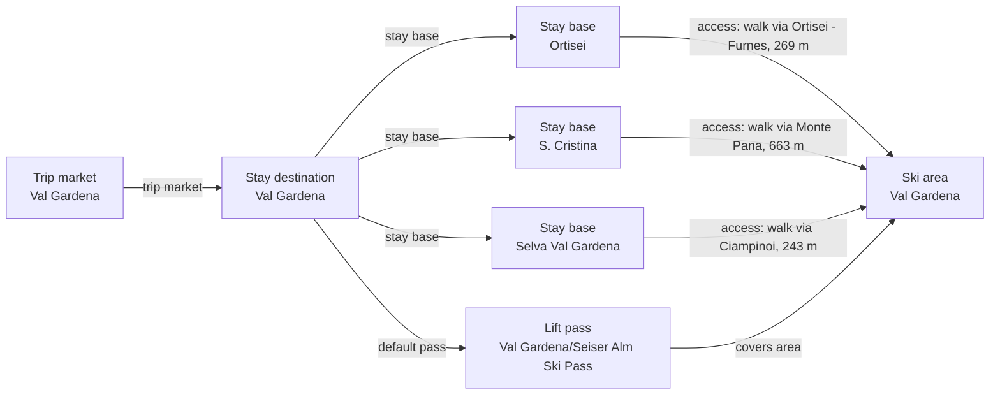

# Val Gardena Catalog Graph Remediation

Completes the three-village Val Gardena stay-base and access graph, fills representative geography and source-backed village-fit fields for S. Cristina and Selva, clips combined Seiser Alm terrain from the selected ski-area owner, and preserves shared metrics on the pass.

## Resulting Graph

## Reviewed Targets

| Target | Scope | Graph Role | Required Fields |
| --- | --- | --- | --- |
| `ski_area:val-gardena-ski-area` | `narrow` | `focus` | `glacier_terrain.availability`, `marked_freeride_routes.availability`, `marked_freeride_routes.route_count`, `marked_freeride_routes.season_label`, `night_skiing.availability`, `night_skiing.season_label`, `official_trail_map.season_label`, `official_trail_map.url`, `piste_km_by_difficulty.advanced`, `piste_km_by_difficulty.beginner`, `piste_km_by_difficulty.intermediate`, `ski_day_apres_profile.availability`, `ski_day_apres_profile.intensity`, `ski_day_apres_profile.season_label`, `snow_park.availability`, `snow_park.park_count`, `snow_park.season_label`, `snowmaking.availability`, `snowmaking.coverage_basis`, `snowmaking.coverage_pct`, `snowmaking.season_label`, `total_lift_count`, `total_piste_km` |
| `stay_base:val-gardena-ortisei` | `narrow` | `focus` | `elevation_m`, `base_type`, `base_character.development_style`, `base_character.local_pace`, `local_apres_profile.availability`, `local_apres_profile.intensity`, `local_apres_profile.season_label` |
| `trust_manifest:ski_areas:val-gardena-ski-area` | `narrow` | `focus` | `field_source_refs`, `field_statuses`, `notes` |
| `trust_manifest:stay_bases:val-gardena-ortisei` | `narrow` | `focus` | `field_source_refs`, `field_statuses`, `notes` |
| `stay_destination:val-gardena` | `narrow` | `focus` | `stay_destination_id` |
| `stay_destination:ortisei` | `narrow` | `focus` | `stay_destination_id` |
| `stay_destination:santa-cristina` | `narrow` | `focus` | `stay_destination_id` |
| `stay_destination:selva-val-gardena` | `narrow` | `focus` | `stay_destination_id` |
| `ski_area_access:val-gardena-ortisei--val-gardena-ski-area` | `full` | `focus` | all canonical fields |
| `stay_base:val-gardena-santa-cristina` | `full` | `focus` | all canonical fields |
| `stay_base:val-gardena-selva` | `full` | `focus` | all canonical fields |
| `ski_area_access:val-gardena-santa-cristina--val-gardena-ski-area` | `full` | `focus` | all canonical fields |
| `ski_area_access:val-gardena-selva--val-gardena-ski-area` | `full` | `focus` | all canonical fields |
| `lift_pass_product:val-gardena-seiser-alm-skipass` | `full` | `focus` | all canonical fields |
| `trust_manifest:stay_bases:val-gardena-santa-cristina` | `full` | `focus` | all canonical fields |
| `trust_manifest:stay_bases:val-gardena-selva` | `full` | `focus` | all canonical fields |
| `trust_manifest:ski_area_access:val-gardena-ortisei--val-gardena-ski-area` | `full` | `focus` | all canonical fields |
| `trust_manifest:ski_area_access:val-gardena-santa-cristina--val-gardena-ski-area` | `full` | `focus` | all canonical fields |
| `trust_manifest:ski_area_access:val-gardena-selva--val-gardena-ski-area` | `full` | `focus` | all canonical fields |
| `trust_manifest:lift_pass_products:val-gardena-seiser-alm-skipass` | `full` | `focus` | all canonical fields |

## Review Evidence Envelope

| Family | Source Kind | Source URLs | Candidate Kinds |
| --- | --- | --- | --- |
| `val-gardena-destination-booking` | `destination_booking` | [https://www.valgardena.it/en/ortisei/](https://www.valgardena.it/en/ortisei/) | `stay_destination`, `stay_base` |
| `val-gardena-operator-map` | `ski_area_operator` | [https://www.dolomitisuperski.com/en/live-info/ski-map](https://www.dolomitisuperski.com/en/live-info/ski-map), [https://www.valgardena.it/en/news-val-gardena/detail/new-slopes-lifts-in-val-gardena/](https://www.valgardena.it/en/news-val-gardena/detail/new-slopes-lifts-in-val-gardena/) | `ski_area`, `terrain_domain` |
| `val-gardena-pass-tariff` | `pass_tariff` | [https://www.valgardena.it/en/winter-holidays-dolomites/ski-passes/](https://www.valgardena.it/en/winter-holidays-dolomites/ski-passes/), [https://www.valgardena.it/en/winter-holidays-dolomites/ski-passes/skipass-eshop/](https://www.valgardena.it/en/winter-holidays-dolomites/ski-passes/skipass-eshop/) | `ski_area`, `lift_pass_product` |
| `val-gardena-access` | `access_transport` | [https://www.valgardena.it/en/winter-holidays-dolomites/ski-resort-val-gardena/val-gardena/daily-ski-trips/](https://www.valgardena.it/en/winter-holidays-dolomites/ski-resort-val-gardena/val-gardena/daily-ski-trips/) | `stay_base`, `ski_area_access` |
| `val-gardena-touched-relationships` | `other_official` | [https://www.dolomitisuperski.com/en/live-info/ski-map](https://www.dolomitisuperski.com/en/live-info/ski-map), [https://www.valgardena.it/en/winter-holidays-dolomites/ski-passes/](https://www.valgardena.it/en/winter-holidays-dolomites/ski-passes/), [https://www.valgardena.it/en/winter-holidays-dolomites/ski-resort-val-gardena/val-gardena/daily-ski-trips/](https://www.valgardena.it/en/winter-holidays-dolomites/ski-resort-val-gardena/val-gardena/daily-ski-trips/) | `stay_base`, `ski_area`, `ski_area_access`, `lift_pass_product`, `terrain_domain` |
| `inventory-vg-stay-market-completion` | `destination_booking` | [https://www.valgardena.it/booking/](https://www.valgardena.it/booking/), [https://www.valgardena.it/en/](https://www.valgardena.it/en/), [https://www.valgardena.it/en/accommodation/base/hotel/s-cristina-val-gardena/monte-pana-dolomites-hotel/C0DF926F76D911D18F2900A02427D15E/](https://www.valgardena.it/en/accommodation/base/hotel/s-cristina-val-gardena/monte-pana-dolomites-hotel/C0DF926F76D911D18F2900A02427D15E/), [https://www.valgardena.it/en/accommodation/base/hotel/selva-di-val-gardena/hotel-plan-de-gralba-das-berghotel/020CA1C27CA15BF9AA254F1D179ABCE0/](https://www.valgardena.it/en/accommodation/base/hotel/selva-di-val-gardena/hotel-plan-de-gralba-das-berghotel/020CA1C27CA15BF9AA254F1D179ABCE0/), [https://www.valgardena.it/en/history-geography/](https://www.valgardena.it/en/history-geography/), [https://www.valgardena.it/en/holiday_guide/56/](https://www.valgardena.it/en/holiday_guide/56/), [https://www.valgardena.it/en/holiday_guide/70/](https://www.valgardena.it/en/holiday_guide/70/), [https://www.valgardena.it/en/s-cristina/](https://www.valgardena.it/en/s-cristina/), [https://www.valgardena.it/en/selva-val-gardena/](https://www.valgardena.it/en/selva-val-gardena/) | `stay_destination`, `stay_base` |
| `inventory-vg-core-access-completion` | `access_transport` | [https://www.openstreetmap.org/node/355184871](https://www.openstreetmap.org/node/355184871), [https://www.openstreetmap.org/node/520626402](https://www.openstreetmap.org/node/520626402), [https://www.openstreetmap.org/relation/47242](https://www.openstreetmap.org/relation/47242), [https://www.openstreetmap.org/relation/47244](https://www.openstreetmap.org/relation/47244), [https://www.valgardena.it/dl/stchristina/pdf/Winter-ski-map-lifts-dolomites-val-gardena_seiseralm.pdf](https://www.valgardena.it/dl/stchristina/pdf/Winter-ski-map-lifts-dolomites-val-gardena_seiseralm.pdf), [https://www.valgardena.it/en/winter-holidays-dolomites/ski-resort-val-gardena/val-gardena/daily-ski-trips/](https://www.valgardena.it/en/winter-holidays-dolomites/ski-resort-val-gardena/val-gardena/daily-ski-trips/) | `stay_base`, `ski_area`, `ski_area_access`, `terrain_domain` |
| `inventory-vg-operator-boundary-completion` | `ski_area_operator` | [https://www.seceda.it/en/winter](https://www.seceda.it/en/winter), [https://www.dantercepies.it/en/opening-times-and-prices-winter.asp](https://www.dantercepies.it/en/opening-times-and-prices-winter.asp), [https://www.valgardena.it/dl/stchristina/pdf/Winter-ski-map-lifts-dolomites-val-gardena_seiseralm.pdf](https://www.valgardena.it/dl/stchristina/pdf/Winter-ski-map-lifts-dolomites-val-gardena_seiseralm.pdf) | `ski_area`, `lift_pass_product` |
| `inventory-vg-seiser-alm-linked-graph` | `linked_pr_dependency` | [https://www.seiseralm.it/en/active/winter/skiing/ski-pass.html](https://www.seiseralm.it/en/active/winter/skiing/ski-pass.html), [https://www.seiseralm.it/en/plan-your-holiday/search-book/all-accommodations.html](https://www.seiseralm.it/en/plan-your-holiday/search-book/all-accommodations.html) | `stay_destination`, `stay_base`, `ski_area`, `ski_area_access`, `lift_pass_product` |
| `val-gardena-remediation-sources` | `other_official` | [https://www.openstreetmap.org/node/355184871](https://www.openstreetmap.org/node/355184871), [https://www.openstreetmap.org/node/520626402](https://www.openstreetmap.org/node/520626402), [https://www.openstreetmap.org/relation/47242](https://www.openstreetmap.org/relation/47242), [https://www.openstreetmap.org/relation/47244](https://www.openstreetmap.org/relation/47244), [https://www.val-gardena.com/en/ortisei-val-gardena-dolomites/](https://www.val-gardena.com/en/ortisei-val-gardena-dolomites/), [https://www.valgardena.it/en/history-geography/](https://www.valgardena.it/en/history-geography/), [https://www.valgardena.it/en/holiday_guide/56/](https://www.valgardena.it/en/holiday_guide/56/), [https://www.valgardena.it/en/holiday_guide/70/](https://www.valgardena.it/en/holiday_guide/70/), [https://www.valgardena.it/en/s-cristina/](https://www.valgardena.it/en/s-cristina/), [https://www.valgardena.it/en/selva-val-gardena/](https://www.valgardena.it/en/selva-val-gardena/) | `stay_base` |

## Entity Scope Assessments

| Candidate | Kind | Disposition | Signals | Catalog Targets | Evidence | Backlog | Graph Impact | Rationale |
| --- | --- | --- | --- | --- | --- | --- | --- | --- |
| `val-gardena` (Val Gardena) | `stay_destination` | `represented` | `independent_stay_market` | `stay_destination:val-gardena` | `inventory-vg-unified-booking`, `inventory-vg-three-villages`, `inventory-vg-plan-de-gralba-lodging`, `inventory-vg-monte-pana-lodging`, `inventory-vg-seiser-alm-stay-market` |  | `graph_blocking` | The official destination and directBooking system establish one non-overlapping Val Gardena stay market containing three sibling village bases. |
| `val-gardena-ortisei` (Ortisei) | `stay_base` | `represented` | `official_independent_identity`, `distinct_access` | `stay_base:val-gardena-ortisei` | `v2-enrichment-007-val-gardena-ortisei-base-character-development-style`, `v2-enrichment-008-val-gardena-ortisei-base-character-local-pace`, `v2-enrichment-009-val-gardena-ortisei-base-type`, `v2-enrichment-010-val-gardena-ortisei-elevation-m`, `scope-val-gardena-ortisei-access` |  | `graph_blocking` | The report's existing official Ortisei evidence supports retaining the current stay-base record while the independent review reconstructs the complete Val Gardena stay-market inventory. |
| `val-gardena-ski-area` (Val Gardena) | `ski_area` | `unresolved` | `official_independent_identity`, `ski_connected_terrain` | `ski_area:val-gardena-ski-area` | `v2-enrichment-001-val-gardena-ski-area-official-trail-map-url`, `v2-enrichment-006-val-gardena-ski-area-snowmaking-availability`, `scope-val-gardena-local-pass`, `inventory-vg-core-winter-map`, `inventory-vg-seceda-owner`, `inventory-vg-dantercepies-owner-pass`, `inventory-vg-seiser-alm-pass-graph` | `docs/product-backlog.md#val-gardena-regional-catalog-refinements` | `graph_blocking` | The retained weather/access ID is clipped to evidence-supported local claims; combined Seiser Alm terrain and pass inventory has been removed from this owner. The only modeled local product is shared across Val Gardena and Seiser Alm, so it does not establish a Val Gardena-only full-local-pass owner. Complete parent operations/weather ownership remains unresolved. |
| `seceda-col-raiser-rasciesa` (Seceda-Col Raiser-Rasciesa) | `ski_area` | `not_separate` | `official_independent_identity`, `separate_operator`, `child_scoped_terrain_metrics`, `ski_connected_terrain` | `ski_area:val-gardena-ski-area` | `inventory-vg-seceda-owner`, `inventory-vg-core-winter-map` |  | `graph_blocking` | The operator owns a connected consortium presentation and child-scoped terrain operations, but the official inventory gathered here establishes neither an independent weather owner nor a full local pass; under the connected-area test it remains inside the current Val Gardena owner pending reviewer confirmation. |
| `dantercepies` (Dantercepies) | `ski_area` | `not_separate` | `official_independent_identity`, `separate_operator`, `independent_status_or_schedule`, `limited_area_ticket`, `ski_connected_terrain` | `ski_area:val-gardena-ski-area` | `inventory-vg-dantercepies-owner-pass`, `inventory-vg-core-winter-map` |  | `graph_blocking` | Dantercepies has its own lift operator, schedule and limited three-hour tariff, but no independent weather presentation or full-local-pass owner was established; the official regional map aggregates it into Val Gardena. |
| `ciampinoi-saslong` (Ciampinoi-Saslong) | `ski_area` | `unresolved` | `official_map_sector`, `ski_connected_terrain` |  | `inventory-vg-core-winter-map`, `inventory-vg-ronda-access` | `docs/product-backlog.md#val-gardena-regional-catalog-refinements` | `graph_blocking` | The official map and route presentation identify Ciampinoi and Saslong as connected sectors and village gateways, without an independent weather or full-local-pass owner in the reviewed source neighborhood. Direct parent operations and weather ownership remain unproven, so the report no longer claims parent ownership or redundant separation. |
| `monte-pana-mont-de-seura` (Monte Pana-Mont de Seura) | `ski_area` | `unresolved` | `official_map_sector`, `ski_connected_terrain` |  | `inventory-vg-core-winter-map`, `inventory-vg-ronda-access` | `docs/product-backlog.md#val-gardena-regional-catalog-refinements` | `graph_blocking` | The official map and Ronda route identify Monte Pana and Mont de Seura as connected Val Gardena sectors; no independent operations-plus-weather or full-local-pass ownership was established. Direct parent operations and weather ownership remain unproven, so the report no longer claims parent ownership or redundant separation. |
| `plan-de-gralba-piz-sella-piz-seteur` (Plan de Gralba-Piz Sella-Piz Seteur) | `ski_area` | `unresolved` | `official_map_sector`, `ski_connected_terrain` |  | `inventory-vg-core-winter-map`, `inventory-vg-ronda-access` | `docs/product-backlog.md#val-gardena-regional-catalog-refinements` | `graph_blocking` | The official map and village route describe this as a connected lift sector from Selva and Plan de Gralba; no independent weather or full-local-pass owner was found in the bounded source neighborhood. Direct parent operations and weather ownership remain unproven, so the report no longer claims parent ownership or redundant separation. |
| `resciesa` (Resciesa-Rasciesa) | `ski_area` | `unresolved` | `official_independent_identity`, `official_map_sector`, `ski_connected_terrain` |  | `inventory-vg-seceda-owner`, `inventory-vg-core-winter-map` | `docs/product-backlog.md#val-gardena-regional-catalog-refinements` | `graph_blocking` | The Seceda operator expressly includes Rasciesa in the connected consortium and shared grooming presentation; no independent evidence owner was established. Direct parent operations and weather ownership remain unproven, so the report no longer claims parent ownership or redundant separation. |
| `gardena-pass-sector` (Gardena Pass sector) | `ski_area` | `deferred` | `official_map_sector`, `ski_connected_terrain` |  | `inventory-vg-core-winter-map`, `inventory-vg-ronda-access` | `docs/product-backlog.md#alta-badia-and-regional-catalog-refinements` | `graph_blocking` | The map exposes the Passo Gardena presentation, but its complete boundary crosses into the linked Alta Badia graph. It remains deferred until the owning linked graph can establish full operations, weather and pass scope. |
| `sella-pass` (Sella Pass sector) | `ski_area` | `deferred` | `official_map_sector`, `ski_connected_terrain` |  | `inventory-vg-core-winter-map`, `inventory-vg-ronda-access` | `docs/product-backlog.md#alta-badia-and-regional-catalog-refinements` | `graph_blocking` | The Sella Pass presentation reaches beyond the selected Val Gardena owner graph. Complete membership and parent ownership require the separately owned adjacent regional graph before it can be safely modeled. |
| `ortisei--seceda` (Ortisei to Seceda access) | `ski_area_access` | `not_separate` | `direct_access_relationship`, `distinct_access` | `ski_area_access:val-gardena-ortisei--val-gardena-ski-area` | `inventory-vg-core-winter-map`, `inventory-vg-ronda-access`, `inventory-vg-seceda-owner` |  | `graph_blocking` | The official map and operator establish direct Ortisei-Seceda lift access. Because Seceda remains inside the current Val Gardena area owner, the sector presentation maps to the existing whole-area access edge rather than a second catalog edge. |
| `val-gardena-santa-cristina` (S. Cristina) | `stay_base` | `add_entity` | `official_independent_identity`, `distinct_access` | `stay_base:val-gardena-santa-cristina` | `remediation-vg-santa-base-id`, `inventory-vg-unified-booking`, `inventory-vg-three-villages` |  | `graph_blocking` | The official unified booking market presents this named village as one sibling accommodation base rather than an overlapping destination. |
| `val-gardena-selva` (Selva Val Gardena) | `stay_base` | `add_entity` | `official_independent_identity`, `distinct_access` | `stay_base:val-gardena-selva` | `remediation-vg-selva-base-id`, `inventory-vg-unified-booking`, `inventory-vg-three-villages` |  | `graph_blocking` | The official unified booking market presents this named village as one sibling accommodation base rather than an overlapping destination. |
| `santa-cristina--val-gardena` (S. Cristina to Val Gardena access) | `ski_area_access` | `add_entity` | `direct_access_relationship`, `distinct_access` | `ski_area_access:val-gardena-santa-cristina--val-gardena-ski-area` | `remediation-vg-santa-access`, `inventory-vg-core-winter-map` |  | `graph_blocking` | The official village and map evidence supports one direct base-to-current-area access edge; named sectors remain inside the retained area. |
| `selva--val-gardena` (Selva to Val Gardena access) | `ski_area_access` | `add_entity` | `direct_access_relationship`, `distinct_access` | `ski_area_access:val-gardena-selva--val-gardena-ski-area` | `remediation-vg-selva-access`, `inventory-vg-core-winter-map` |  | `graph_blocking` | The official village and map evidence supports one direct base-to-current-area access edge; named sectors remain inside the retained area. |
| `val-gardena-seiser-alm-skipass` (Val Gardena/Seiser Alm Ski Pass) | `lift_pass_product` | `represented` | `official_product_identity` | `lift_pass_product:val-gardena-seiser-alm-skipass` | `remediation-vg-pass-validity-scope`, `remediation-vg-pass-terrain`, `remediation-vg-pass-official-tariff-search`, `remediation-vg-pass-price-proxy` |  | `graph_blocking` | The shared product remains available from Val Gardena; modeled coverage points to the retained Val Gardena area and supported aggregate/external Seiser scope stays on the pass. Its retained EUR 80 adult one-day main-season amount is explicitly bounded as an unreproduced provider proxy because the official exact-product calculator was blocked and supplied no verifiable amount or date band. |
| `seiser-alm-region` (Seiser Alm region) | `stay_destination` | `deferred` | `official_independent_identity` |  | `inventory-vg-seiser-alm-stay-market` | `docs/product-backlog.md#val-gardena-regional-catalog-refinements` | `regional_followup` | Requires the complete linked accommodation and access graph; shared pass validity alone does not establish the destination boundary. |
| `seiser-alm` (Seiser Alm) | `ski_area` | `deferred` | `official_independent_identity` |  | `inventory-vg-seiser-alm-pass-graph` | `docs/product-backlog.md#val-gardena-regional-catalog-refinements` | `regional_followup` | Requires complete direct operations, weather, access, and owner-boundary evidence before modeling. |
| `ortisei--seiser-alm` (Ortisei to Seiser Alm access) | `ski_area_access` | `deferred` | `direct_access_relationship`, `distinct_access` |  | `inventory-vg-core-winter-map`, `inventory-vg-ronda-access` | `docs/product-backlog.md#val-gardena-regional-catalog-refinements` | `regional_followup` | Requires the Seiser Alm ski-area owner to exist before an access edge can be modeled. |
| `val-gardena-plan-de-gralba` (Plan de Gralba) | `stay_base` | `deferred` | `official_independent_identity` |  | `inventory-vg-plan-de-gralba-lodging` | `docs/product-backlog.md#val-gardena-regional-catalog-refinements` | `regional_followup` | Requires evidence that the lodging/access sector has material stay-base separation from Selva. |
| `val-gardena-monte-pana` (Monte Pana) | `stay_base` | `deferred` | `official_independent_identity` |  | `inventory-vg-monte-pana-lodging` | `docs/product-backlog.md#val-gardena-regional-catalog-refinements` | `regional_followup` | Requires evidence that the lodging/access sector has material stay-base separation from S. Cristina. |
| `val-gardena-points-value-card` (Val Gardena points value card) | `lift_pass_product` | `deferred` | `official_product_identity` |  | `scope-val-gardena-local-pass` | `docs/product-backlog.md#val-gardena-regional-catalog-refinements` | `regional_followup` | Requires a current exact tariff and durable trip-planning value distinct from the shared main pass. |
| `dantercepies-three-hour` (Dantercepies three-hour ticket) | `lift_pass_product` | `deferred` | `official_product_identity` |  | `inventory-vg-dantercepies-owner-pass` | `docs/product-backlog.md#val-gardena-regional-catalog-refinements` | `regional_followup` | Requires a current complete tariff and durable trip-planning value distinct from the shared main pass. |

## Ski-Area Boundary Assessments

| Candidate | Parent | Terrain | Connectivity | Operations | Weather | Pass | Provider Consensus | Separation Value | Evidence |
| --- | --- | --- | --- | --- | --- | --- | --- | --- | --- |
| `val-gardena-ski-area` |  | `unresolved` | `not_applicable` | `unknown` | `unknown` | `shared_only` | `unknown` | `unresolved` | `v2-enrichment-001-val-gardena-ski-area-official-trail-map-url`, `v2-enrichment-006-val-gardena-ski-area-snowmaking-availability`, `scope-val-gardena-local-pass`, `inventory-vg-core-winter-map`, `inventory-vg-seceda-owner`, `inventory-vg-dantercepies-owner-pass`, `inventory-vg-seiser-alm-pass-graph` |
| `seceda-col-raiser-rasciesa` | `val-gardena-ski-area` | `sector` | `connected` | `mixed` | `unknown` | `shared_only` | `aggregated` | `redundant` | `inventory-vg-seceda-owner`, `inventory-vg-core-winter-map` |
| `dantercepies` | `val-gardena-ski-area` | `sector` | `connected` | `independent` | `unknown` | `limited` | `aggregated` | `redundant` | `inventory-vg-dantercepies-owner-pass`, `inventory-vg-core-winter-map` |
| `ciampinoi-saslong` | `val-gardena-ski-area` | `sector` | `connected` | `unknown` | `unknown` | `shared_only` | `aggregated` | `unresolved` | `inventory-vg-core-winter-map`, `inventory-vg-ronda-access` |
| `monte-pana-mont-de-seura` | `val-gardena-ski-area` | `sector` | `connected` | `unknown` | `unknown` | `shared_only` | `aggregated` | `unresolved` | `inventory-vg-core-winter-map`, `inventory-vg-ronda-access` |
| `plan-de-gralba-piz-sella-piz-seteur` | `val-gardena-ski-area` | `sector` | `connected` | `unknown` | `unknown` | `shared_only` | `aggregated` | `unresolved` | `inventory-vg-core-winter-map`, `inventory-vg-ronda-access` |
| `resciesa` | `val-gardena-ski-area` | `sector` | `connected` | `unknown` | `unknown` | `shared_only` | `aggregated` | `unresolved` | `inventory-vg-seceda-owner`, `inventory-vg-core-winter-map` |
| `gardena-pass-sector` | `val-gardena-ski-area` | `sector` | `connected` | `unknown` | `unknown` | `shared_only` | `mixed` | `unresolved` | `inventory-vg-core-winter-map`, `inventory-vg-ronda-access` |
| `sella-pass` | `val-gardena-ski-area` | `sector` | `connected` | `unknown` | `unknown` | `shared_only` | `mixed` | `unresolved` | `inventory-vg-core-winter-map`, `inventory-vg-ronda-access` |
| `seiser-alm` | `val-gardena-ski-area` | `complete` | `transfer_required` | `unknown` | `unknown` | `shared_only` | `separate` | `unresolved` | `inventory-vg-seiser-alm-pass-graph` |

## Changed Fields

| Target | Field | Before | After | Trust | Ranking Relevant |
| --- | --- | --- | --- | --- | --- |
| `lift_pass_product:val-gardena-seiser-alm-skipass` | `external_validity_summary` | `null` | `"Also valid across the unmodeled Seiser Alm ski area; its complete stay, access, operations/weather, and terrain graph is deferred."` | `verified_with_adjustment` | no |
| `lift_pass_product:val-gardena-seiser-alm-skipass` | `pass_accessible_terrain` | `null` | `{"metric_scope": "pass_accessible", "piste_km_by_difficulty": null, "source_urls": ["https://www.seiseralm.it/en/active/winter/skiing/ski-pass.html"], "total_lift_count": 79, "total_piste_km": 181.0}` | `verified` | no |
| `lift_pass_product:val-gardena-seiser-alm-skipass` | `validity_scope` | `"single_ski_area"` | `"local_multi_area"` | `verified_with_adjustment` | no |
| `ski_area:val-gardena-ski-area` | `official_trail_map.url` | `null` | `"https://www.dolomitisuperski.com/en/live-info/ski-map"` | `verified` | no |
| `ski_area:val-gardena-ski-area` | `piste_km_by_difficulty.advanced` | `21.0` | `null` | `needs_source` | no |
| `ski_area:val-gardena-ski-area` | `piste_km_by_difficulty.beginner` | `52.0` | `null` | `needs_source` | no |
| `ski_area:val-gardena-ski-area` | `piste_km_by_difficulty.intermediate` | `108.0` | `null` | `needs_source` | no |
| `ski_area:val-gardena-ski-area` | `ski_day_apres_profile.availability` | `"unknown"` | `"available"` | `verified` | no |
| `ski_area:val-gardena-ski-area` | `ski_day_apres_profile.intensity` | `null` | `"lively"` | `verified_with_adjustment` | no |
| `ski_area:val-gardena-ski-area` | `snow_park.availability` | `"unknown"` | `"available"` | `verified` | no |
| `ski_area:val-gardena-ski-area` | `snow_park.park_count` | `null` | `3` | `verified_with_adjustment` | no |
| `ski_area:val-gardena-ski-area` | `snowmaking.availability` | `"unknown"` | `"available"` | `verified` | no |
| `ski_area:val-gardena-ski-area` | `total_lift_count` | `79` | `null` | `needs_source` | no |
| `ski_area:val-gardena-ski-area` | `total_piste_km` | `181.0` | `null` | `needs_source` | no |
| `ski_area_access:val-gardena-ortisei--val-gardena-ski-area` | `source_urls` | `["https://www.openstreetmap.org/node/411679826", "https://www.valgardena.it/en/winter-holidays-dolomites/ski-holiday/"]` | `["https://www.openstreetmap.org/node/411679826", "https://www.valgardena.it/dl/stchristina/pdf/Winter-ski-map-lifts-dolomites-val-gardena_seiseralm.pdf", "https://www.valgardena.it/en/winter-holidays-dolomites/ski-resort-val-gardena/val-gardena/daily-ski-trips/"]` | `verified_with_adjustment` | no |
| `ski_area_access:val-gardena-santa-cristina--val-gardena-ski-area` | `access_mode` | `null` | `"walk"` | `verified_with_adjustment` | no |
| `ski_area_access:val-gardena-santa-cristina--val-gardena-ski-area` | `distance_m` | `null` | `663` | `verified_with_adjustment` | no |
| `ski_area_access:val-gardena-santa-cristina--val-gardena-ski-area` | `is_direct` | `null` | `true` | `verified_with_adjustment` | no |
| `ski_area_access:val-gardena-santa-cristina--val-gardena-ski-area` | `lift_distance` | `null` | `"near"` | `verified_with_adjustment` | no |
| `ski_area_access:val-gardena-santa-cristina--val-gardena-ski-area` | `nearest_lift_name` | `null` | `"Monte Pana"` | `verified_with_adjustment` | no |
| `ski_area_access:val-gardena-santa-cristina--val-gardena-ski-area` | `regional_data_ids` | `null` | `{"nearest_lift_osm_node_id": "355184871", "stay_base_osm_relation_id": "47244"}` | `verified_with_adjustment` | no |
| `ski_area_access:val-gardena-santa-cristina--val-gardena-ski-area` | `ski_area_access_id` | `null` | `"val-gardena-santa-cristina--val-gardena-ski-area"` | `verified` | no |
| `ski_area_access:val-gardena-santa-cristina--val-gardena-ski-area` | `ski_area_id` | `null` | `"val-gardena-ski-area"` | `verified` | no |
| `ski_area_access:val-gardena-santa-cristina--val-gardena-ski-area` | `source_urls` | `null` | `["https://www.openstreetmap.org/node/355184871", "https://www.openstreetmap.org/relation/47244", "https://www.valgardena.it/dl/stchristina/pdf/Winter-ski-map-lifts-dolomites-val-gardena_seiseralm.pdf", "https://www.valgardena.it/en/s-cristina/"]` | `verified_with_adjustment` | no |
| `ski_area_access:val-gardena-santa-cristina--val-gardena-ski-area` | `stay_base_id` | `null` | `"val-gardena-santa-cristina"` | `verified` | no |
| `ski_area_access:val-gardena-selva--val-gardena-ski-area` | `access_mode` | `null` | `"walk"` | `verified_with_adjustment` | no |
| `ski_area_access:val-gardena-selva--val-gardena-ski-area` | `distance_m` | `null` | `243` | `verified_with_adjustment` | no |
| `ski_area_access:val-gardena-selva--val-gardena-ski-area` | `is_direct` | `null` | `true` | `verified_with_adjustment` | no |
| `ski_area_access:val-gardena-selva--val-gardena-ski-area` | `lift_distance` | `null` | `"near"` | `verified_with_adjustment` | no |
| `ski_area_access:val-gardena-selva--val-gardena-ski-area` | `nearest_lift_name` | `null` | `"Ciampinoi"` | `verified_with_adjustment` | no |
| `ski_area_access:val-gardena-selva--val-gardena-ski-area` | `regional_data_ids` | `null` | `{"nearest_lift_osm_node_id": "520626402", "stay_base_osm_relation_id": "47242"}` | `verified_with_adjustment` | no |
| `ski_area_access:val-gardena-selva--val-gardena-ski-area` | `ski_area_access_id` | `null` | `"val-gardena-selva--val-gardena-ski-area"` | `verified` | no |
| `ski_area_access:val-gardena-selva--val-gardena-ski-area` | `ski_area_id` | `null` | `"val-gardena-ski-area"` | `verified` | no |
| `ski_area_access:val-gardena-selva--val-gardena-ski-area` | `source_urls` | `null` | `["https://www.openstreetmap.org/node/520626402", "https://www.openstreetmap.org/relation/47242", "https://www.valgardena.it/dl/stchristina/pdf/Winter-ski-map-lifts-dolomites-val-gardena_seiseralm.pdf", "https://www.valgardena.it/en/selva-val-gardena/"]` | `verified_with_adjustment` | no |
| `ski_area_access:val-gardena-selva--val-gardena-ski-area` | `stay_base_id` | `null` | `"val-gardena-selva"` | `verified` | no |
| `stay_base:val-gardena-ortisei` | `base_character.development_style` | `"unknown"` | `"mixed"` | `verified_with_adjustment` | no |
| `stay_base:val-gardena-ortisei` | `base_character.local_pace` | `"unknown"` | `"lively"` | `verified_with_adjustment` | no |
| `stay_base:val-gardena-ortisei` | `base_type` | `"town"` | `"village"` | `verified_with_adjustment` | no |
| `stay_base:val-gardena-ortisei` | `elevation_m` | `null` | `1236` | `verified` | no |
| `stay_base:val-gardena-santa-cristina` | `base_character.development_style` | `null` | `"traditional"` | `verified_with_adjustment` | no |
| `stay_base:val-gardena-santa-cristina` | `base_character.local_pace` | `null` | `"quiet"` | `verified_with_adjustment` | no |
| `stay_base:val-gardena-santa-cristina` | `base_type` | `null` | `"village"` | `verified` | no |
| `stay_base:val-gardena-santa-cristina` | `elevation_m` | `null` | `1428` | `verified` | no |
| `stay_base:val-gardena-santa-cristina` | `latitude` | `null` | `46.5590697` | `verified_with_adjustment` | no |
| `stay_base:val-gardena-santa-cristina` | `local_apres_profile.availability` | `null` | `"available"` | `verified_with_adjustment` | no |
| `stay_base:val-gardena-santa-cristina` | `local_apres_profile.intensity` | `null` | `"low_key"` | `verified_with_adjustment` | no |
| `stay_base:val-gardena-santa-cristina` | `longitude` | `null` | `11.7154906` | `verified_with_adjustment` | no |
| `stay_base:val-gardena-santa-cristina` | `name` | `null` | `"S. Cristina"` | `verified` | no |
| `stay_base:val-gardena-santa-cristina` | `price_max` | `null` | `290.0` | `estimated` | no |
| `stay_base:val-gardena-santa-cristina` | `price_min` | `null` | `210.0` | `estimated` | no |
| `stay_base:val-gardena-santa-cristina` | `price_range` | `null` | `"EUR 210-290"` | `estimated` | no |
| `stay_base:val-gardena-santa-cristina` | `quality` | `null` | `"premium"` | `estimated` | no |
| `stay_base:val-gardena-santa-cristina` | `regional_data_ids` | `null` | `{"osm_relation_id": "47244"}` | `verified_with_adjustment` | no |
| `stay_base:val-gardena-santa-cristina` | `stay_base_id` | `null` | `"val-gardena-santa-cristina"` | `verified` | no |
| `stay_base:val-gardena-santa-cristina` | `stay_destination_id` | `null` | `"val-gardena"` | `verified` | no |
| `stay_base:val-gardena-selva` | `base_character.development_style` | `null` | `"mixed"` | `verified_with_adjustment` | no |
| `stay_base:val-gardena-selva` | `base_character.local_pace` | `null` | `"lively"` | `verified_with_adjustment` | no |
| `stay_base:val-gardena-selva` | `base_type` | `null` | `"village"` | `verified` | no |
| `stay_base:val-gardena-selva` | `elevation_m` | `null` | `1563` | `verified` | no |
| `stay_base:val-gardena-selva` | `latitude` | `null` | `46.5551877` | `verified_with_adjustment` | no |
| `stay_base:val-gardena-selva` | `local_apres_profile.availability` | `null` | `"available"` | `verified_with_adjustment` | no |
| `stay_base:val-gardena-selva` | `local_apres_profile.intensity` | `null` | `"lively"` | `verified_with_adjustment` | no |
| `stay_base:val-gardena-selva` | `longitude` | `null` | `11.7600992` | `verified_with_adjustment` | no |
| `stay_base:val-gardena-selva` | `name` | `null` | `"Selva Val Gardena"` | `verified` | no |
| `stay_base:val-gardena-selva` | `price_max` | `null` | `290.0` | `estimated` | no |
| `stay_base:val-gardena-selva` | `price_min` | `null` | `210.0` | `estimated` | no |
| `stay_base:val-gardena-selva` | `price_range` | `null` | `"EUR 210-290"` | `estimated` | no |
| `stay_base:val-gardena-selva` | `quality` | `null` | `"premium"` | `estimated` | no |
| `stay_base:val-gardena-selva` | `regional_data_ids` | `null` | `{"osm_relation_id": "47242"}` | `verified_with_adjustment` | no |
| `stay_base:val-gardena-selva` | `stay_base_id` | `null` | `"val-gardena-selva"` | `verified` | no |
| `stay_base:val-gardena-selva` | `stay_destination_id` | `null` | `"val-gardena"` | `verified` | no |
| `trust_manifest:lift_pass_products:val-gardena-seiser-alm-skipass` | `field_source_refs` | `{"coverage": ["https://www.dolomitisuperski.com/en/live-info/open-slopes", "https://www.everestski.com/en/service.html", "https://www.openstreetmap.org/node/411679826", "https://www.openstreetmap.org/relation/47265", "https://www.skiresort.info/ski-resort/val-gardena-groeden/", "https://www.skiresort.info/ski-resort/val-gardena-groeden/slope-offering/", "https://www.sportgardena.com/en/c/ski-rental-ortisei-val-gardena/", "https://www.valgardena.it/en/winter-holidays-dolomites/ski-passes/"], "identity_scope_availability": ["https://www.dolomitisuperski.com/en/live-info/open-slopes", "https://www.everestski.com/en/service.html", "https://www.openstreetmap.org/node/411679826", "https://www.openstreetmap.org/relation/47265", "https://www.skiresort.info/ski-resort/val-gardena-groeden/", "https://www.skiresort.info/ski-resort/val-gardena-groeden/slope-offering/", "https://www.sportgardena.com/en/c/ski-rental-ortisei-val-gardena/", "https://www.valgardena.it/en/winter-holidays-dolomites/ski-passes/"], "pass_accessible_terrain": ["https://www.dolomitisuperski.com/en/live-info/open-slopes", "https://www.everestski.com/en/service.html", "https://www.openstreetmap.org/node/411679826", "https://www.openstreetmap.org/relation/47265", "https://www.skiresort.info/ski-resort/val-gardena-groeden/", "https://www.skiresort.info/ski-resort/val-gardena-groeden/slope-offering/", "https://www.sportgardena.com/en/c/ski-rental-ortisei-val-gardena/", "https://www.valgardena.it/en/winter-holidays-dolomites/ski-passes/"], "prices": ["https://www.dolomitisuperski.com/en/live-info/open-slopes", "https://www.everestski.com/en/service.html", "https://www.openstreetmap.org/node/411679826", "https://www.openstreetmap.org/relation/47265", "https://www.skiresort.info/ski-resort/val-gardena-groeden/", "https://www.skiresort.info/ski-resort/val-gardena-groeden/slope-offering/", "https://www.sportgardena.com/en/c/ski-rental-ortisei-val-gardena/", "https://www.valgardena.it/en/winter-holidays-dolomites/ski-passes/"]}` | `{"coverage": ["https://www.dolomitisuperski.com/en/live-info/open-slopes", "https://www.everestski.com/en/service.html", "https://www.openstreetmap.org/node/411679826", "https://www.openstreetmap.org/relation/47265", "https://www.skiresort.info/ski-resort/val-gardena-groeden/", "https://www.skiresort.info/ski-resort/val-gardena-groeden/slope-offering/", "https://www.sportgardena.com/en/c/ski-rental-ortisei-val-gardena/", "https://www.valgardena.it/en/winter-holidays-dolomites/ski-passes/"], "identity_scope_availability": ["https://www.dolomitisuperski.com/en/live-info/open-slopes", "https://www.everestski.com/en/service.html", "https://www.openstreetmap.org/node/411679826", "https://www.openstreetmap.org/relation/47265", "https://www.skiresort.info/ski-resort/val-gardena-groeden/", "https://www.skiresort.info/ski-resort/val-gardena-groeden/slope-offering/", "https://www.sportgardena.com/en/c/ski-rental-ortisei-val-gardena/", "https://www.valgardena.it/en/winter-holidays-dolomites/ski-passes/"], "pass_accessible_terrain": ["https://www.seiseralm.it/en/active/winter/skiing/ski-pass.html"], "prices": ["https://www.skiresort.info/ski-resort/val-gardena-groeden/", "https://www.valgardena.it/en/winter-holidays-dolomites/ski-passes/", "https://www.valgardena.it/en/winter-holidays-dolomites/ski-passes/skipass-eshop/"]}` | `estimated` | no |
| `trust_manifest:lift_pass_products:val-gardena-seiser-alm-skipass` | `field_statuses` | `{"coverage": "verified_with_adjustment", "identity_scope_availability": "verified_with_adjustment", "pass_accessible_terrain": "needs_source", "prices": "verified_with_adjustment"}` | `{"coverage": "verified_with_adjustment", "identity_scope_availability": "verified_with_adjustment", "pass_accessible_terrain": "verified", "prices": "verified_with_adjustment"}` | `estimated` | no |
| `trust_manifest:lift_pass_products:val-gardena-seiser-alm-skipass` | `notes` | `["Official Val Gardena and Dolomiti Superski sources support the local Val Gardena/Seiser Alm ski-pass scope; reviewed static sources provide current-season dates, price example, and difficulty/lift breakdown.", "Official Val Gardena text conflicts between 175 km and 181 km in one pass paragraph; the catalog keeps the 181 km figure because it is also used in the official row heading, Dolomiti Superski live-info area row, and reviewed editorial slope table.", "Stay-base lift access is source-backed with OSM Ortisei village and lift-station geometry; lodging price, quality, supported-skill, and rental price fields remain product-curated estimates."]` | `["The shared product is modeled as local multi-area coverage: Val Gardena is the modeled ski area and Seiser Alm remains explicit unmodeled external validity.", "The official shared 181 km and 79-lift totals belong to pass-accessible terrain and are not copied onto the narrower Val Gardena ski-area owner.", "The complete Seiser Alm stay, access, operations/weather, and terrain graph remains a consolidated regional follow-up.", "The retained EUR 80 price is a fixed adult one-day proxy labeled only as main season and sourced from Skiresort.info, not an exact-product official tariff.", "On 2026-08-13, the official Val Gardena/Seiser Alm product page identified the shared pass and linked its real-time price calculator; the official e-shop wrapper was reachable, but the embedded Dolomiti Superski calculator returned HTTP 403, so no exact official amount could be reproduced.", "The proxy is retained only as the existing representative one-day adult EUR comparison. Its exact season year and applicable date band are unknown, and the live Skiresort.info landing page did not reproduce the stored amount."]` | `estimated` | no |
| `trust_manifest:ski_area_access:val-gardena-ortisei--val-gardena-ski-area` | `field_source_refs` | `{"access_mode_distance": ["https://www.openstreetmap.org/node/411679826", "https://www.valgardena.it/en/winter-holidays-dolomites/ski-holiday/"], "relationship": ["https://www.openstreetmap.org/node/411679826", "https://www.valgardena.it/en/winter-holidays-dolomites/ski-holiday/"]}` | `{"access_mode_distance": ["https://www.openstreetmap.org/node/411679826", "https://www.valgardena.it/dl/stchristina/pdf/Winter-ski-map-lifts-dolomites-val-gardena_seiseralm.pdf", "https://www.valgardena.it/en/winter-holidays-dolomites/ski-resort-val-gardena/val-gardena/daily-ski-trips/"], "relationship": ["https://www.openstreetmap.org/node/411679826", "https://www.valgardena.it/dl/stchristina/pdf/Winter-ski-map-lifts-dolomites-val-gardena_seiseralm.pdf", "https://www.valgardena.it/en/winter-holidays-dolomites/ski-resort-val-gardena/val-gardena/daily-ski-trips/"]}` | `estimated` | no |
| `trust_manifest:ski_area_access:val-gardena-santa-cristina--val-gardena-ski-area` | `display_name` | `null` | `"S. Cristina -> Val Gardena"` | `estimated` | no |
| `trust_manifest:ski_area_access:val-gardena-santa-cristina--val-gardena-ski-area` | `field_source_refs` | `null` | `{"access_mode_distance": ["https://www.openstreetmap.org/node/355184871", "https://www.openstreetmap.org/relation/47244", "https://www.valgardena.it/dl/stchristina/pdf/Winter-ski-map-lifts-dolomites-val-gardena_seiseralm.pdf", "https://www.valgardena.it/en/s-cristina/"], "relationship": ["https://www.valgardena.it/dl/stchristina/pdf/Winter-ski-map-lifts-dolomites-val-gardena_seiseralm.pdf", "https://www.valgardena.it/en/s-cristina/"]}` | `estimated` | no |
| `trust_manifest:ski_area_access:val-gardena-santa-cristina--val-gardena-ski-area` | `field_statuses` | `null` | `{"access_mode_distance": "verified_with_adjustment", "relationship": "verified"}` | `estimated` | no |
| `trust_manifest:ski_area_access:val-gardena-santa-cristina--val-gardena-ski-area` | `notes` | `null` | `["The official village page and winter map establish direct village access to Monte Pana, Col Raiser, and Saslong within the retained Val Gardena area.", "The 663 m straight-line distance is calculated from the OSM S. Cristina municipality-relation representative point to the exact Monte Pana valley-station node; it is representative village-centre access, not an accommodation route distance."]` | `estimated` | no |
| `trust_manifest:ski_area_access:val-gardena-selva--val-gardena-ski-area` | `display_name` | `null` | `"Selva Val Gardena -> Val Gardena"` | `estimated` | no |
| `trust_manifest:ski_area_access:val-gardena-selva--val-gardena-ski-area` | `field_source_refs` | `null` | `{"access_mode_distance": ["https://www.openstreetmap.org/node/520626402", "https://www.openstreetmap.org/relation/47242", "https://www.valgardena.it/dl/stchristina/pdf/Winter-ski-map-lifts-dolomites-val-gardena_seiseralm.pdf", "https://www.valgardena.it/en/selva-val-gardena/"], "relationship": ["https://www.valgardena.it/dl/stchristina/pdf/Winter-ski-map-lifts-dolomites-val-gardena_seiseralm.pdf", "https://www.valgardena.it/en/selva-val-gardena/"]}` | `estimated` | no |
| `trust_manifest:ski_area_access:val-gardena-selva--val-gardena-ski-area` | `field_statuses` | `null` | `{"access_mode_distance": "verified_with_adjustment", "relationship": "verified"}` | `estimated` | no |
| `trust_manifest:ski_area_access:val-gardena-selva--val-gardena-ski-area` | `notes` | `null` | `["The official village page and winter map establish direct village access to Ciampinoi and Dantercepies within the retained Val Gardena area.", "The 243 m straight-line distance is calculated from the OSM Selva municipality-relation representative point to the exact Ciampinoi valley-station node; it is representative village-centre access, not an accommodation route distance."]` | `estimated` | no |
| `trust_manifest:ski_areas:val-gardena-ski-area` | `field_source_refs` | `{"elevation_season": ["https://www.dolomitisuperski.com/en/live-info/open-slopes", "https://www.everestski.com/en/service.html", "https://www.openstreetmap.org/node/411679826", "https://www.openstreetmap.org/relation/47265", "https://www.skiresort.info/ski-resort/val-gardena-groeden/", "https://www.skiresort.info/ski-resort/val-gardena-groeden/slope-offering/", "https://www.sportgardena.com/en/c/ski-rental-ortisei-val-gardena/", "https://www.valgardena.it/en/winter-holidays-dolomites/ski-passes/"], "glacier_terrain": [], "identity_coordinates": ["https://www.dolomitisuperski.com/en/live-info/open-slopes", "https://www.everestski.com/en/service.html", "https://www.openstreetmap.org/node/411679826", "https://www.openstreetmap.org/relation/47265", "https://www.skiresort.info/ski-resort/val-gardena-groeden/", "https://www.skiresort.info/ski-resort/val-gardena-groeden/slope-offering/", "https://www.sportgardena.com/en/c/ski-rental-ortisei-val-gardena/", "https://www.valgardena.it/en/winter-holidays-dolomites/ski-passes/"], "marked_freeride_routes": [], "night_skiing": [], "official_documents": [], "ski_day_apres": [], "skill_fit": ["https://www.dolomitisuperski.com/en/live-info/open-slopes", "https://www.everestski.com/en/service.html", "https://www.openstreetmap.org/node/411679826", "https://www.openstreetmap.org/relation/47265", "https://www.skiresort.info/ski-resort/val-gardena-groeden/", "https://www.skiresort.info/ski-resort/val-gardena-groeden/slope-offering/", "https://www.sportgardena.com/en/c/ski-rental-ortisei-val-gardena/", "https://www.valgardena.it/en/winter-holidays-dolomites/ski-passes/"], "snow_park": [], "snowmaking": [], "terrain_metrics": ["https://www.dolomitisuperski.com/en/live-info/open-slopes", "https://www.everestski.com/en/service.html", "https://www.openstreetmap.org/node/411679826", "https://www.openstreetmap.org/relation/47265", "https://www.skiresort.info/ski-resort/val-gardena-groeden/", "https://www.skiresort.info/ski-resort/val-gardena-groeden/slope-offering/", "https://www.sportgardena.com/en/c/ski-rental-ortisei-val-gardena/", "https://www.valgardena.it/en/winter-holidays-dolomites/ski-passes/"]}` | `{"elevation_season": ["https://www.dolomitisuperski.com/en/live-info/open-slopes", "https://www.everestski.com/en/service.html", "https://www.openstreetmap.org/node/411679826", "https://www.openstreetmap.org/relation/47265", "https://www.skiresort.info/ski-resort/val-gardena-groeden/", "https://www.skiresort.info/ski-resort/val-gardena-groeden/slope-offering/", "https://www.sportgardena.com/en/c/ski-rental-ortisei-val-gardena/", "https://www.valgardena.it/en/winter-holidays-dolomites/ski-passes/"], "glacier_terrain": [], "identity_coordinates": ["https://www.dolomitisuperski.com/en/live-info/open-slopes", "https://www.everestski.com/en/service.html", "https://www.openstreetmap.org/node/411679826", "https://www.openstreetmap.org/relation/47265", "https://www.skiresort.info/ski-resort/val-gardena-groeden/", "https://www.skiresort.info/ski-resort/val-gardena-groeden/slope-offering/", "https://www.sportgardena.com/en/c/ski-rental-ortisei-val-gardena/", "https://www.valgardena.it/en/winter-holidays-dolomites/ski-passes/"], "marked_freeride_routes": [], "night_skiing": [], "official_documents": ["https://www.dolomitisuperski.com/en/live-info/ski-map"], "ski_day_apres": ["https://www.valgardena.it/it/vacanze-invernali-dolomiti/baite-apres-ski/"], "skill_fit": ["https://www.dolomitisuperski.com/en/live-info/open-slopes", "https://www.everestski.com/en/service.html", "https://www.openstreetmap.org/node/411679826", "https://www.openstreetmap.org/relation/47265", "https://www.skiresort.info/ski-resort/val-gardena-groeden/", "https://www.skiresort.info/ski-resort/val-gardena-groeden/slope-offering/", "https://www.sportgardena.com/en/c/ski-rental-ortisei-val-gardena/", "https://www.valgardena.it/en/winter-holidays-dolomites/ski-passes/"], "snow_park": ["https://www.valgardena.it/it/vacanze-invernali-dolomiti/freestyle-snowparks/"], "snowmaking": ["https://www.valgardena.it/en/news-val-gardena/detail/new-slopes-lifts-in-val-gardena/"], "terrain_metrics": []}` | `estimated` | no |
| `trust_manifest:ski_areas:val-gardena-ski-area` | `field_statuses` | `{"elevation_season": "verified_with_adjustment", "glacier_terrain": "needs_source", "identity_coordinates": "verified_with_adjustment", "marked_freeride_routes": "needs_source", "night_skiing": "needs_source", "official_documents": "needs_source", "ski_day_apres": "needs_source", "skill_fit": "estimated", "snow_park": "needs_source", "snowmaking": "needs_source", "terrain_metrics": "verified_with_adjustment"}` | `{"elevation_season": "verified_with_adjustment", "glacier_terrain": "needs_source", "identity_coordinates": "verified_with_adjustment", "marked_freeride_routes": "needs_source", "night_skiing": "needs_source", "official_documents": "verified", "ski_day_apres": "verified_with_adjustment", "skill_fit": "estimated", "snow_park": "verified_with_adjustment", "snowmaking": "verified", "terrain_metrics": "needs_source"}` | `estimated` | no |
| `trust_manifest:ski_areas:val-gardena-ski-area` | `notes` | `["Official Val Gardena and Dolomiti Superski sources support the local Val Gardena/Seiser Alm ski-pass scope; reviewed static sources provide current-season dates, price example, and difficulty/lift breakdown.", "Official Val Gardena text conflicts between 175 km and 181 km in one pass paragraph; the catalog keeps the 181 km figure because it is also used in the official row heading, Dolomiti Superski live-info area row, and reviewed editorial slope table.", "Stay-base lift access is source-backed with OSM Ortisei village and lift-station geometry; lodging price, quality, supported-skill, and rental price fields remain product-curated estimates."]` | `["Val Gardena remains the selected weather and access owner, but combined Val Gardena/Seiser Alm terrain metrics are not attributed to this ski-area record.", "The official 181 km and 79-lift totals are retained only as pass-accessible aggregate terrain on the shared pass product.", "Stay-base lift access is source-backed with OSM Ortisei village and lift-station geometry; lodging price, quality, supported-skill, and rental price fields remain product-curated estimates.", "Source-aware v2 enrichment reviewed official Val Gardena and Dolomiti Superski material on 2026-07-05.", "The dedicated count includes Snowpark Sassolungo, Snowpark Monte Pana, and Snowpark Furdenan; Funpark Sassolungo and funslopes are excluded."]` | `estimated` | no |
| `trust_manifest:stay_bases:val-gardena-ortisei` | `field_source_refs` | `{"base_character": [], "base_type": [], "coordinates": ["https://www.dolomitisuperski.com/en/live-info/open-slopes", "https://www.everestski.com/en/service.html", "https://www.openstreetmap.org/node/411679826", "https://www.openstreetmap.org/relation/47265", "https://www.skiresort.info/ski-resort/val-gardena-groeden/", "https://www.skiresort.info/ski-resort/val-gardena-groeden/slope-offering/", "https://www.sportgardena.com/en/c/ski-rental-ortisei-val-gardena/", "https://www.valgardena.it/en/winter-holidays-dolomites/ski-passes/"], "elevation": [], "identity_ownership": ["https://www.dolomitisuperski.com/en/live-info/open-slopes", "https://www.everestski.com/en/service.html", "https://www.openstreetmap.org/node/411679826", "https://www.openstreetmap.org/relation/47265", "https://www.skiresort.info/ski-resort/val-gardena-groeden/", "https://www.skiresort.info/ski-resort/val-gardena-groeden/slope-offering/", "https://www.sportgardena.com/en/c/ski-rental-ortisei-val-gardena/", "https://www.valgardena.it/en/winter-holidays-dolomites/ski-passes/"], "local_apres": [], "lodging_price_quality": ["https://www.dolomitisuperski.com/en/live-info/open-slopes", "https://www.everestski.com/en/service.html", "https://www.openstreetmap.org/node/411679826", "https://www.openstreetmap.org/relation/47265", "https://www.skiresort.info/ski-resort/val-gardena-groeden/", "https://www.skiresort.info/ski-resort/val-gardena-groeden/slope-offering/", "https://www.sportgardena.com/en/c/ski-rental-ortisei-val-gardena/", "https://www.valgardena.it/en/winter-holidays-dolomites/ski-passes/"]}` | `{"base_character": ["https://www.valgardena.it/en/ortisei/"], "base_type": ["https://www.valgardena.it/en/ortisei/"], "coordinates": ["https://www.dolomitisuperski.com/en/live-info/open-slopes", "https://www.everestski.com/en/service.html", "https://www.openstreetmap.org/node/411679826", "https://www.openstreetmap.org/relation/47265", "https://www.skiresort.info/ski-resort/val-gardena-groeden/", "https://www.skiresort.info/ski-resort/val-gardena-groeden/slope-offering/", "https://www.sportgardena.com/en/c/ski-rental-ortisei-val-gardena/", "https://www.valgardena.it/en/winter-holidays-dolomites/ski-passes/"], "elevation": ["https://www.val-gardena.com/en/ortisei-val-gardena-dolomites/"], "identity_ownership": ["https://www.dolomitisuperski.com/en/live-info/open-slopes", "https://www.everestski.com/en/service.html", "https://www.openstreetmap.org/node/411679826", "https://www.openstreetmap.org/relation/47265", "https://www.skiresort.info/ski-resort/val-gardena-groeden/", "https://www.skiresort.info/ski-resort/val-gardena-groeden/slope-offering/", "https://www.sportgardena.com/en/c/ski-rental-ortisei-val-gardena/", "https://www.valgardena.it/en/winter-holidays-dolomites/ski-passes/"], "local_apres": [], "lodging_price_quality": ["https://www.dolomitisuperski.com/en/live-info/open-slopes", "https://www.everestski.com/en/service.html", "https://www.openstreetmap.org/node/411679826", "https://www.openstreetmap.org/relation/47265", "https://www.skiresort.info/ski-resort/val-gardena-groeden/", "https://www.skiresort.info/ski-resort/val-gardena-groeden/slope-offering/", "https://www.sportgardena.com/en/c/ski-rental-ortisei-val-gardena/", "https://www.valgardena.it/en/winter-holidays-dolomites/ski-passes/"]}` | `estimated` | no |
| `trust_manifest:stay_bases:val-gardena-ortisei` | `field_statuses` | `{"base_character": "needs_source", "base_type": "needs_source", "coordinates": "verified", "elevation": "needs_source", "identity_ownership": "verified", "local_apres": "needs_source", "lodging_price_quality": "estimated"}` | `{"base_character": "verified_with_adjustment", "base_type": "verified_with_adjustment", "coordinates": "verified", "elevation": "verified", "identity_ownership": "verified", "local_apres": "needs_source", "lodging_price_quality": "estimated"}` | `estimated` | no |
| `trust_manifest:stay_bases:val-gardena-ortisei` | `notes` | `["Official Val Gardena and Dolomiti Superski sources support the local Val Gardena/Seiser Alm ski-pass scope; reviewed static sources provide current-season dates, price example, and difficulty/lift breakdown.", "Official Val Gardena text conflicts between 175 km and 181 km in one pass paragraph; the catalog keeps the 181 km figure because it is also used in the official row heading, Dolomiti Superski live-info area row, and reviewed editorial slope table.", "Stay-base lift access is source-backed with OSM Ortisei village and lift-station geometry; lodging price, quality, supported-skill, and rental price fields remain product-curated estimates."]` | `["Official Val Gardena and Dolomiti Superski sources support the local Val Gardena/Seiser Alm ski-pass scope; reviewed static sources provide current-season dates, price example, and difficulty/lift breakdown.", "Official Val Gardena text conflicts between 175 km and 181 km in one pass paragraph; the catalog keeps the 181 km figure because it is also used in the official row heading, Dolomiti Superski live-info area row, and reviewed editorial slope table.", "Stay-base lift access is source-backed with OSM Ortisei village and lift-station geometry; lodging price, quality, supported-skill, and rental price fields remain product-curated estimates.", "Source-aware v2 enrichment reviewed official Ortisei village material on 2026-07-05."]` | `estimated` | no |
| `trust_manifest:stay_bases:val-gardena-santa-cristina` | `display_name` | `null` | `"S. Cristina"` | `estimated` | no |
| `trust_manifest:stay_bases:val-gardena-santa-cristina` | `field_source_refs` | `null` | `{"base_character": ["https://www.valgardena.it/en/s-cristina/"], "base_type": ["https://www.valgardena.it/en/s-cristina/"], "coordinates": ["https://www.openstreetmap.org/relation/47244"], "elevation": ["https://www.valgardena.it/en/history-geography/"], "identity_ownership": ["https://www.valgardena.it/booking/", "https://www.valgardena.it/en/s-cristina/"], "local_apres": ["https://www.valgardena.it/en/holiday_guide/70/", "https://www.valgardena.it/en/s-cristina/"], "lodging_price_quality": []}` | `estimated` | no |
| `trust_manifest:stay_bases:val-gardena-santa-cristina` | `field_statuses` | `null` | `{"base_character": "verified_with_adjustment", "base_type": "verified", "coordinates": "verified_with_adjustment", "elevation": "verified", "identity_ownership": "verified", "local_apres": "verified_with_adjustment", "lodging_price_quality": "estimated"}` | `estimated` | no |
| `trust_manifest:stay_bases:val-gardena-santa-cristina` | `notes` | `null` | `["The official shared Val Gardena booking market and village page establish S. Cristina as one sibling accommodation base.", "The official geography page establishes the 1,428 m village-centre elevation; the OSM municipality relation supplies the representative catalog point.", "Official quiet-village and tradition wording normalizes to traditional development and quiet pace; the official local bar directory supports available, low-key apres rather than a broad party scene.", "The inherited valley-level lodging range and quality remain estimates."]` | `estimated` | no |
| `trust_manifest:stay_bases:val-gardena-selva` | `display_name` | `null` | `"Selva Val Gardena"` | `estimated` | no |
| `trust_manifest:stay_bases:val-gardena-selva` | `field_source_refs` | `null` | `{"base_character": ["https://www.valgardena.it/en/selva-val-gardena/"], "base_type": ["https://www.valgardena.it/en/selva-val-gardena/"], "coordinates": ["https://www.openstreetmap.org/relation/47242"], "elevation": ["https://www.valgardena.it/en/history-geography/"], "identity_ownership": ["https://www.valgardena.it/booking/", "https://www.valgardena.it/en/selva-val-gardena/"], "local_apres": ["https://www.valgardena.it/en/holiday_guide/56/", "https://www.valgardena.it/en/selva-val-gardena/"], "lodging_price_quality": []}` | `estimated` | no |
| `trust_manifest:stay_bases:val-gardena-selva` | `field_statuses` | `null` | `{"base_character": "verified_with_adjustment", "base_type": "verified", "coordinates": "verified_with_adjustment", "elevation": "verified", "identity_ownership": "verified", "local_apres": "verified_with_adjustment", "lodging_price_quality": "estimated"}` | `estimated` | no |
| `trust_manifest:stay_bases:val-gardena-selva` | `notes` | `null` | `["The official shared Val Gardena booking market and village page establish Selva as one sibling accommodation base.", "The official geography page establishes the 1,563 m village-centre elevation; the OSM municipality relation supplies the representative catalog point.", "Official modern-meets-bucolic and tourism-led wording normalizes to mixed development and lively pace; recurring official DJ, live-music, and venue listings support available, lively local apres.", "The inherited valley-level lodging range and quality remain estimates."]` | `estimated` | no |

## Field Coverage

| Target | Field | Status | Notes |
| --- | --- | --- | --- |
| `ski_area:val-gardena-ski-area` | `glacier_terrain.availability` | `reviewed-no-change` |  |
| `ski_area:val-gardena-ski-area` | `marked_freeride_routes.availability` | `reviewed-no-change` |  |
| `ski_area:val-gardena-ski-area` | `marked_freeride_routes.route_count` | `reviewed-no-change` |  |
| `ski_area:val-gardena-ski-area` | `marked_freeride_routes.season_label` | `reviewed-no-change` |  |
| `ski_area:val-gardena-ski-area` | `night_skiing.availability` | `reviewed-no-change` |  |
| `ski_area:val-gardena-ski-area` | `night_skiing.season_label` | `reviewed-no-change` |  |
| `ski_area:val-gardena-ski-area` | `official_trail_map.season_label` | `reviewed-no-change` |  |
| `ski_area:val-gardena-ski-area` | `official_trail_map.url` | `changed` |  |
| `ski_area:val-gardena-ski-area` | `piste_km_by_difficulty.advanced` | `changed` |  |
| `ski_area:val-gardena-ski-area` | `piste_km_by_difficulty.beginner` | `changed` |  |
| `ski_area:val-gardena-ski-area` | `piste_km_by_difficulty.intermediate` | `changed` |  |
| `ski_area:val-gardena-ski-area` | `ski_day_apres_profile.availability` | `changed` |  |
| `ski_area:val-gardena-ski-area` | `ski_day_apres_profile.intensity` | `changed` |  |
| `ski_area:val-gardena-ski-area` | `ski_day_apres_profile.season_label` | `reviewed-no-change` |  |
| `ski_area:val-gardena-ski-area` | `snow_park.availability` | `changed` |  |
| `ski_area:val-gardena-ski-area` | `snow_park.park_count` | `changed` |  |
| `ski_area:val-gardena-ski-area` | `snow_park.season_label` | `reviewed-no-change` |  |
| `ski_area:val-gardena-ski-area` | `snowmaking.availability` | `changed` |  |
| `ski_area:val-gardena-ski-area` | `snowmaking.coverage_basis` | `reviewed-no-change` |  |
| `ski_area:val-gardena-ski-area` | `snowmaking.coverage_pct` | `reviewed-no-change` |  |
| `ski_area:val-gardena-ski-area` | `snowmaking.season_label` | `reviewed-no-change` |  |
| `ski_area:val-gardena-ski-area` | `total_lift_count` | `changed` |  |
| `ski_area:val-gardena-ski-area` | `total_piste_km` | `changed` |  |
| `stay_base:val-gardena-ortisei` | `base_character.development_style` | `changed` |  |
| `stay_base:val-gardena-ortisei` | `base_character.local_pace` | `changed` |  |
| `stay_base:val-gardena-ortisei` | `base_type` | `changed` |  |
| `stay_base:val-gardena-ortisei` | `elevation_m` | `changed` |  |
| `stay_base:val-gardena-ortisei` | `local_apres_profile.availability` | `reviewed-no-change` |  |
| `stay_base:val-gardena-ortisei` | `local_apres_profile.intensity` | `reviewed-no-change` |  |
| `stay_base:val-gardena-ortisei` | `local_apres_profile.season_label` | `reviewed-no-change` |  |
| `trust_manifest:ski_areas:val-gardena-ski-area` | `field_source_refs` | `changed` |  |
| `trust_manifest:ski_areas:val-gardena-ski-area` | `field_statuses` | `changed` |  |
| `trust_manifest:ski_areas:val-gardena-ski-area` | `notes` | `changed` |  |
| `trust_manifest:stay_bases:val-gardena-ortisei` | `field_source_refs` | `changed` |  |
| `trust_manifest:stay_bases:val-gardena-ortisei` | `field_statuses` | `changed` |  |
| `trust_manifest:stay_bases:val-gardena-ortisei` | `notes` | `changed` |  |
| `stay_destination:val-gardena` | `stay_destination_id` | `reviewed-no-change` |  |
| `stay_destination:ortisei` | `stay_destination_id` | `reviewed-no-change` |  |
| `stay_destination:santa-cristina` | `stay_destination_id` | `reviewed-no-change` |  |
| `stay_destination:selva-val-gardena` | `stay_destination_id` | `reviewed-no-change` |  |
| `ski_area_access:val-gardena-ortisei--val-gardena-ski-area` | `access_mode` | `reviewed-no-change` |  |
| `ski_area_access:val-gardena-ortisei--val-gardena-ski-area` | `distance_m` | `reviewed-no-change` |  |
| `ski_area_access:val-gardena-ortisei--val-gardena-ski-area` | `duration_minutes` | `reviewed-no-change` |  |
| `ski_area_access:val-gardena-ortisei--val-gardena-ski-area` | `is_direct` | `reviewed-no-change` |  |
| `ski_area_access:val-gardena-ortisei--val-gardena-ski-area` | `lift_distance` | `reviewed-no-change` |  |
| `ski_area_access:val-gardena-ortisei--val-gardena-ski-area` | `nearest_lift_name` | `reviewed-no-change` |  |
| `ski_area_access:val-gardena-ortisei--val-gardena-ski-area` | `regional_data_ids` | `reviewed-no-change` |  |
| `ski_area_access:val-gardena-ortisei--val-gardena-ski-area` | `ski_area_access_id` | `reviewed-no-change` |  |
| `ski_area_access:val-gardena-ortisei--val-gardena-ski-area` | `ski_area_id` | `reviewed-no-change` |  |
| `ski_area_access:val-gardena-ortisei--val-gardena-ski-area` | `source_urls` | `changed` |  |
| `ski_area_access:val-gardena-ortisei--val-gardena-ski-area` | `stay_base_id` | `reviewed-no-change` |  |
| `stay_base:val-gardena-santa-cristina` | `base_character.development_style` | `changed` |  |
| `stay_base:val-gardena-santa-cristina` | `base_character.local_pace` | `changed` |  |
| `stay_base:val-gardena-santa-cristina` | `base_type` | `changed` |  |
| `stay_base:val-gardena-santa-cristina` | `elevation_m` | `changed` |  |
| `stay_base:val-gardena-santa-cristina` | `latitude` | `changed` |  |
| `stay_base:val-gardena-santa-cristina` | `local_apres_profile.availability` | `changed` |  |
| `stay_base:val-gardena-santa-cristina` | `local_apres_profile.intensity` | `changed` |  |
| `stay_base:val-gardena-santa-cristina` | `local_apres_profile.season_label` | `reviewed-no-change` |  |
| `stay_base:val-gardena-santa-cristina` | `longitude` | `changed` |  |
| `stay_base:val-gardena-santa-cristina` | `name` | `changed` |  |
| `stay_base:val-gardena-santa-cristina` | `price_max` | `changed` |  |
| `stay_base:val-gardena-santa-cristina` | `price_min` | `changed` |  |
| `stay_base:val-gardena-santa-cristina` | `price_range` | `changed` |  |
| `stay_base:val-gardena-santa-cristina` | `quality` | `changed` |  |
| `stay_base:val-gardena-santa-cristina` | `regional_data_ids` | `changed` |  |
| `stay_base:val-gardena-santa-cristina` | `stay_base_id` | `changed` |  |
| `stay_base:val-gardena-santa-cristina` | `stay_destination_id` | `changed` |  |
| `stay_base:val-gardena-selva` | `base_character.development_style` | `changed` |  |
| `stay_base:val-gardena-selva` | `base_character.local_pace` | `changed` |  |
| `stay_base:val-gardena-selva` | `base_type` | `changed` |  |
| `stay_base:val-gardena-selva` | `elevation_m` | `changed` |  |
| `stay_base:val-gardena-selva` | `latitude` | `changed` |  |
| `stay_base:val-gardena-selva` | `local_apres_profile.availability` | `changed` |  |
| `stay_base:val-gardena-selva` | `local_apres_profile.intensity` | `changed` |  |
| `stay_base:val-gardena-selva` | `local_apres_profile.season_label` | `reviewed-no-change` |  |
| `stay_base:val-gardena-selva` | `longitude` | `changed` |  |
| `stay_base:val-gardena-selva` | `name` | `changed` |  |
| `stay_base:val-gardena-selva` | `price_max` | `changed` |  |
| `stay_base:val-gardena-selva` | `price_min` | `changed` |  |
| `stay_base:val-gardena-selva` | `price_range` | `changed` |  |
| `stay_base:val-gardena-selva` | `quality` | `changed` |  |
| `stay_base:val-gardena-selva` | `regional_data_ids` | `changed` |  |
| `stay_base:val-gardena-selva` | `stay_base_id` | `changed` |  |
| `stay_base:val-gardena-selva` | `stay_destination_id` | `changed` |  |
| `ski_area_access:val-gardena-santa-cristina--val-gardena-ski-area` | `access_mode` | `changed` |  |
| `ski_area_access:val-gardena-santa-cristina--val-gardena-ski-area` | `distance_m` | `changed` |  |
| `ski_area_access:val-gardena-santa-cristina--val-gardena-ski-area` | `duration_minutes` | `reviewed-no-change` | No route duration is stored because actual walking time depends on the selected accommodation and street route; the representative straight-line distance is stored separately. |
| `ski_area_access:val-gardena-santa-cristina--val-gardena-ski-area` | `is_direct` | `changed` |  |
| `ski_area_access:val-gardena-santa-cristina--val-gardena-ski-area` | `lift_distance` | `changed` |  |
| `ski_area_access:val-gardena-santa-cristina--val-gardena-ski-area` | `nearest_lift_name` | `changed` |  |
| `ski_area_access:val-gardena-santa-cristina--val-gardena-ski-area` | `regional_data_ids` | `changed` |  |
| `ski_area_access:val-gardena-santa-cristina--val-gardena-ski-area` | `ski_area_access_id` | `changed` |  |
| `ski_area_access:val-gardena-santa-cristina--val-gardena-ski-area` | `ski_area_id` | `changed` |  |
| `ski_area_access:val-gardena-santa-cristina--val-gardena-ski-area` | `source_urls` | `changed` |  |
| `ski_area_access:val-gardena-santa-cristina--val-gardena-ski-area` | `stay_base_id` | `changed` |  |
| `ski_area_access:val-gardena-selva--val-gardena-ski-area` | `access_mode` | `changed` |  |
| `ski_area_access:val-gardena-selva--val-gardena-ski-area` | `distance_m` | `changed` |  |
| `ski_area_access:val-gardena-selva--val-gardena-ski-area` | `duration_minutes` | `reviewed-no-change` | No route duration is stored because actual walking time depends on the selected accommodation and street route; the representative straight-line distance is stored separately. |
| `ski_area_access:val-gardena-selva--val-gardena-ski-area` | `is_direct` | `changed` |  |
| `ski_area_access:val-gardena-selva--val-gardena-ski-area` | `lift_distance` | `changed` |  |
| `ski_area_access:val-gardena-selva--val-gardena-ski-area` | `nearest_lift_name` | `changed` |  |
| `ski_area_access:val-gardena-selva--val-gardena-ski-area` | `regional_data_ids` | `changed` |  |
| `ski_area_access:val-gardena-selva--val-gardena-ski-area` | `ski_area_access_id` | `changed` |  |
| `ski_area_access:val-gardena-selva--val-gardena-ski-area` | `ski_area_id` | `changed` |  |
| `ski_area_access:val-gardena-selva--val-gardena-ski-area` | `source_urls` | `changed` |  |
| `ski_area_access:val-gardena-selva--val-gardena-ski-area` | `stay_base_id` | `changed` |  |
| `lift_pass_product:val-gardena-seiser-alm-skipass` | `available_from_stay_destination_ids` | `reviewed-no-change` |  |
| `lift_pass_product:val-gardena-seiser-alm-skipass` | `default_for_stay_destination_ids` | `reviewed-no-change` |  |
| `lift_pass_product:val-gardena-seiser-alm-skipass` | `external_validity_summary` | `changed` |  |
| `lift_pass_product:val-gardena-seiser-alm-skipass` | `lift_pass_product_id` | `reviewed-no-change` |  |
| `lift_pass_product:val-gardena-seiser-alm-skipass` | `name` | `reviewed-no-change` |  |
| `lift_pass_product:val-gardena-seiser-alm-skipass` | `pass_accessible_terrain` | `changed` |  |
| `lift_pass_product:val-gardena-seiser-alm-skipass` | `prices` | `reviewed-no-change` | Retained as an adult one-day EUR 80 main-season proxy from Skiresort.info. The official exact-product page links a real-time calculator, but its embedded Dolomiti Superski tariff returned HTTP 403 on 2026-08-13; the exact official amount, season year, and applicable date band could not be reproduced, and the live proxy landing page did not reproduce the stored amount. |
| `lift_pass_product:val-gardena-seiser-alm-skipass` | `terrain_domain_ids` | `reviewed-no-change` |  |
| `lift_pass_product:val-gardena-seiser-alm-skipass` | `valid_ski_area_ids` | `reviewed-no-change` |  |
| `lift_pass_product:val-gardena-seiser-alm-skipass` | `validity_scope` | `changed` |  |
| `lift_pass_product:val-gardena-seiser-alm-skipass` | `validity_windows` | `reviewed-no-change` |  |
| `trust_manifest:stay_bases:val-gardena-santa-cristina` | `display_name` | `changed` |  |
| `trust_manifest:stay_bases:val-gardena-santa-cristina` | `field_source_refs` | `changed` |  |
| `trust_manifest:stay_bases:val-gardena-santa-cristina` | `field_statuses` | `changed` |  |
| `trust_manifest:stay_bases:val-gardena-santa-cristina` | `notes` | `changed` |  |
| `trust_manifest:stay_bases:val-gardena-selva` | `display_name` | `changed` |  |
| `trust_manifest:stay_bases:val-gardena-selva` | `field_source_refs` | `changed` |  |
| `trust_manifest:stay_bases:val-gardena-selva` | `field_statuses` | `changed` |  |
| `trust_manifest:stay_bases:val-gardena-selva` | `notes` | `changed` |  |
| `trust_manifest:ski_area_access:val-gardena-ortisei--val-gardena-ski-area` | `display_name` | `reviewed-no-change` |  |
| `trust_manifest:ski_area_access:val-gardena-ortisei--val-gardena-ski-area` | `field_source_refs` | `changed` |  |
| `trust_manifest:ski_area_access:val-gardena-ortisei--val-gardena-ski-area` | `field_statuses` | `reviewed-no-change` |  |
| `trust_manifest:ski_area_access:val-gardena-ortisei--val-gardena-ski-area` | `notes` | `reviewed-no-change` |  |
| `trust_manifest:ski_area_access:val-gardena-santa-cristina--val-gardena-ski-area` | `display_name` | `changed` |  |
| `trust_manifest:ski_area_access:val-gardena-santa-cristina--val-gardena-ski-area` | `field_source_refs` | `changed` |  |
| `trust_manifest:ski_area_access:val-gardena-santa-cristina--val-gardena-ski-area` | `field_statuses` | `changed` |  |
| `trust_manifest:ski_area_access:val-gardena-santa-cristina--val-gardena-ski-area` | `notes` | `changed` |  |
| `trust_manifest:ski_area_access:val-gardena-selva--val-gardena-ski-area` | `display_name` | `changed` |  |
| `trust_manifest:ski_area_access:val-gardena-selva--val-gardena-ski-area` | `field_source_refs` | `changed` |  |
| `trust_manifest:ski_area_access:val-gardena-selva--val-gardena-ski-area` | `field_statuses` | `changed` |  |
| `trust_manifest:ski_area_access:val-gardena-selva--val-gardena-ski-area` | `notes` | `changed` |  |
| `trust_manifest:lift_pass_products:val-gardena-seiser-alm-skipass` | `display_name` | `reviewed-no-change` |  |
| `trust_manifest:lift_pass_products:val-gardena-seiser-alm-skipass` | `field_source_refs` | `changed` |  |
| `trust_manifest:lift_pass_products:val-gardena-seiser-alm-skipass` | `field_statuses` | `changed` |  |
| `trust_manifest:lift_pass_products:val-gardena-seiser-alm-skipass` | `notes` | `changed` |  |

## Evidence

| Target | Field | Source | Source Value | Evidence | Normalization |
| --- | --- | --- | --- | --- | --- |
| `ski_area:val-gardena-ski-area` | `official_trail_map.url` | [Dolomiti Superski official ski-map directory](https://www.dolomitisuperski.com/en/live-info/ski-map) | `"https://www.dolomitisuperski.com/en/live-info/ski-map"` | The official map directory provides the Gröden/Seiser Alm ski map covering the modeled Val Gardena area. |  |
| `ski_area:val-gardena-ski-area` | `ski_day_apres_profile.availability` | [Val Gardena official huts and après-ski guide](https://www.valgardena.it/it/vacanze-invernali-dolomiti/baite-apres-ski/) | `"available"` | Official tourism documents 65 piste-side huts and an explicit afternoon and evening après offer. |  |
| `ski_area:val-gardena-ski-area` | `ski_day_apres_profile.intensity` | [Val Gardena official huts and après-ski guide](https://www.valgardena.it/it/vacanze-invernali-dolomiti/baite-apres-ski/) | `"lively"` | The official guide describes social afternoons and evenings with drinks, music, many cafes, bars, and pubs for celebrating after skiing. | The extensive venue inventory and explicit celebration positioning are mapped to lively. |
| `ski_area:val-gardena-ski-area` | `snow_park.availability` | [Val Gardena official snowparks and funslopes guide](https://www.valgardena.it/it/vacanze-invernali-dolomiti/freestyle-snowparks/) | `"available"` | The official guide documents Snowpark Sassolungo-Val Gardena. |  |
| `ski_area:val-gardena-ski-area` | `snow_park.park_count` | [Val Gardena official snowparks and funslopes guide](https://www.valgardena.it/it/vacanze-invernali-dolomiti/freestyle-snowparks/) | `3` | The official complete page names three dedicated snowparks: Snowpark Sassolungo, Snowpark Monte Pana, and Snowpark Furdenan. | Funpark Sassolungo, funslopes, boardercross, and family zones are excluded from the dedicated snowpark count. |
| `ski_area:val-gardena-ski-area` | `snowmaking.availability` | [Val Gardena official 2025/26 lift and snowmaking update](https://www.valgardena.it/en/news-val-gardena/detail/new-slopes-lifts-in-val-gardena/) | `"available"` | The official 2025/26 update documents optimization and expansion of Val Gardena snowmaking infrastructure and water storage. |  |
| `stay_base:val-gardena-ortisei` | `base_character.development_style` | [Val Gardena official Ortisei village guide](https://www.valgardena.it/en/ortisei/) | `"mixed"` | Ortisei combines traditional hotels, turn-of-the-century residences, historic churches, farms, and woodcarving heritage with boutiques, a pedestrian shopping street, and mature tourism infrastructure. | The documented traditional fabric and modern tourism centre are mapped to mixed. |
| `stay_base:val-gardena-ortisei` | `base_character.local_pace` | [Val Gardena official Ortisei village guide](https://www.valgardena.it/en/ortisei/) | `"lively"` | The official guide explicitly calls the pedestrian zone lively and highlights countless cafes, boutiques, events, and year-round visitor activity. | The explicit lively centre and broad activity offer are mapped to lively. |
| `stay_base:val-gardena-ortisei` | `base_type` | [Val Gardena official Ortisei village guide](https://www.valgardena.it/en/ortisei/) | `"village"` | Official tourism consistently presents Ortisei as a village. | The prior town label is corrected to the source-backed village type. |
| `stay_base:val-gardena-ortisei` | `elevation_m` | [Val Gardena official Ortisei guide](https://www.val-gardena.com/en/ortisei-val-gardena-dolomites/) | `1236` | The live Ortisei guide gives the village centre elevation as 1,236 m. |  |
| `ski_area:val-gardena-ski-area` | `ski_area_id` | [Val Gardena official ski-pass guide](https://www.valgardena.it/en/winter-holidays-dolomites/ski-passes/) | `"Val Gardena/Seiser Alm Ski Pass"` | The official destination pass guide identifies the local Val Gardena/Seiser Alm ski-pass scope used by the current catalog graph. |  |
| `stay_base:val-gardena-ortisei` | `stay_base_id` | [Val Gardena official daily ski trips](https://www.valgardena.it/en/winter-holidays-dolomites/ski-resort-val-gardena/val-gardena/daily-ski-trips/) | `"Ortisei"` | The official route page and mapped lift graph establish Ortisei access through Seceda into the retained Val Gardena ski area. |  |
| `stay_destination:val-gardena` | `stay_destination_id` | [Dolomites Val Gardena official accommodation booking collection](https://www.valgardena.it/booking/) | `"Val Gardena"` | The official destination booking collection presents more than 950 accommodations across Ortisei, S. Cristina, and Selva under one Val Gardena directBooking market. |  |
| `stay_destination:val-gardena` | `stay_destination_id` | [Dolomites Val Gardena official destination home](https://www.valgardena.it/en/) | `"Ortisei, S. Cristina, and Selva Val Gardena"` | The official destination presents Ortisei, S. Cristina, and Selva as the three villages of the Val Gardena valley, each with distinct visitor character inside the shared destination presentation. |  |
| `stay_destination:santa-cristina` | `stay_destination_id` | [Dolomites Val Gardena official S. Cristina guide](https://www.valgardena.it/en/s-cristina/) | `"S. Cristina"` | The official village page provides a dedicated accommodation-booking entry and describes S. Cristina as a direct Dolomiti Superski and Sellaronda starting point. |  |
| `stay_destination:selva-val-gardena` | `stay_destination_id` | [Dolomites Val Gardena official Selva guide](https://www.valgardena.it/en/selva-val-gardena/) | `"Selva Val Gardena"` | The official village page provides a dedicated accommodation-booking entry and identifies Selva as a tourism-led village and Sellaronda access point. |  |
| `ski_area_access:val-gardena-ortisei--val-gardena-ski-area` | `ski_area_access_id` | [Val Gardena and Seiser Alm official winter ski map](https://www.valgardena.it/dl/stchristina/pdf/Winter-ski-map-lifts-dolomites-val-gardena_seiseralm.pdf) | `"Val Gardena and Seiser Alm lift graph"` | The official map names the principal lift presentations and village gateways, including Ortisei-Seceda and Ortisei-Alpe di Siusi, S. Cristina-Col Raiser, Monte Pana and Saslong, and Selva-Ciampinoi, Dantercepies, Plan de Gralba, Piz Sella and Piz Seteur. |  |
| `ski_area_access:val-gardena-ortisei--val-gardena-ski-area` | `ski_area_access_id` | [Dolomites Val Gardena official daily ski trips](https://www.valgardena.it/en/winter-holidays-dolomites/ski-resort-val-gardena/val-gardena/daily-ski-trips/) | `"Val Gardena Ronda village access sequence"` | The official Val Gardena Ronda routes enumerate Ortisei access through Alpe di Siusi and Seceda, S. Cristina access through Col Raiser and Monte Pana, and Selva access through Dantercepies, Ciampinoi and Piz Sella, while explicitly identifying the Saltria-Monte Pana ski-bus transfer. |  |
| `ski_area:val-gardena-ski-area` | `ski_area_id` | [Seceda Cableways official winter presentation](https://www.seceda.it/en/winter) | `"Seceda-Col Raiser-Rasciesa skiing consortium"` | The official operator presents Seceda-Col Raiser-Rasciesa as one connected consortium with 25 km of pistes, shared grooming and snowmaking, and descents to Ortisei and S. Cristina. |  |
| `ski_area:val-gardena-ski-area` | `ski_area_id` | [Dantercepies official winter lifts and tariffs](https://www.dantercepies.it/en/opening-times-and-prices-winter.asp) | `"Dantercepies lift group and three-hour ticket"` | The operator lists Dantercepies, Cir, Val, Costabella, Risaccia and Panorama under one lift presentation and sells a three-hour ticket valid across those lifts; the page does not establish an independent full-local-pass or weather owner. |  |
| `stay_destination:val-gardena` | `stay_destination_id` | [Dolomites Val Gardena official Plan de Gralba accommodation record](https://www.valgardena.it/en/accommodation/base/hotel/selva-di-val-gardena/hotel-plan-de-gralba-das-berghotel/020CA1C27CA15BF9AA254F1D179ABCE0/) | `"Plan de Gralba accommodation under Selva di Val Gardena"` | The official booking system contains bookable lodging at Plan de Gralba and assigns its postal and booking market to Selva di Val Gardena, while the winter map presents Plan de Gralba as a direct lift gateway. |  |
| `stay_destination:val-gardena` | `stay_destination_id` | [Dolomites Val Gardena official Monte Pana accommodation record](https://www.valgardena.it/en/accommodation/base/hotel/s-cristina-val-gardena/monte-pana-dolomites-hotel/C0DF926F76D911D18F2900A02427D15E/) | `"Monte Pana accommodation under S. Cristina"` | The official booking system contains a 130-bed hotel at Monte Pana and assigns it to S. Cristina, supporting an accommodation-sector candidate but not an independently managed stay market. |  |
| `ski_area:val-gardena-ski-area` | `ski_area_id` | [Dolomites Region Seiser Alm official ski-pass guide](https://www.seiseralm.it/en/active/winter/skiing/ski-pass.html) | `"Seiser Alm and Val Gardena shared pass graph"` | The official Seiser Alm source distinguishes a 22-lift, 62-km Seiser Alm ski area inside a shared 79-lift, 181-km Seiser Alm/Val Gardena pass area and states that separate area-only passes are no longer sold. |  |
| `stay_destination:val-gardena` | `stay_destination_id` | [Dolomites Region Seiser Alm official accommodation collection](https://www.seiseralm.it/en/plan-your-holiday/search-book/all-accommodations.html) | `"Dolomites Region Seiser Alm accommodation market"` | The official Seiser Alm booking collection owns a separate accommodation market spanning named villages and the high plateau, establishing that a complete linked stay graph extends beyond Val Gardena and cannot be inferred from the shared pass alone. |  |
| `stay_base:val-gardena-santa-cristina` | `stay_base_id` | [Dolomites Val Gardena official S. Cristina guide](https://www.valgardena.it/en/s-cristina/) | `"val-gardena-santa-cristina"` | The official shared destination presents S. Cristina as one of the three Val Gardena villages with its own accommodation entry. | The official village identity is normalized to the stable sibling StayBase ID. |
| `stay_base:val-gardena-selva` | `stay_base_id` | [Dolomites Val Gardena official Selva guide](https://www.valgardena.it/en/selva-val-gardena/) | `"val-gardena-selva"` | The official shared destination presents Selva as one of the three Val Gardena villages with its own accommodation entry. | The official village identity is normalized to the stable sibling StayBase ID. |
| `ski_area_access:val-gardena-santa-cristina--val-gardena-ski-area` | `ski_area_access_id` | [Dolomites Val Gardena official S. Cristina guide](https://www.valgardena.it/en/s-cristina/) | `"val-gardena-santa-cristina--val-gardena-ski-area"` | The official village page and winter map establish direct S. Cristina access through Monte Pana, Col Raiser, and Saslong. | The village gateways normalize to one explicit edge to the retained Val Gardena area. |
| `ski_area_access:val-gardena-selva--val-gardena-ski-area` | `ski_area_access_id` | [Dolomites Val Gardena official Selva guide](https://www.valgardena.it/en/selva-val-gardena/) | `"val-gardena-selva--val-gardena-ski-area"` | The official village page and winter map establish direct Selva access through Ciampinoi and Dantercepies. | The village gateways normalize to one explicit edge to the retained Val Gardena area. |
| `ski_area_access:val-gardena-ortisei--val-gardena-ski-area` | `source_urls` | [Val Gardena official daily ski trips](https://www.valgardena.it/en/winter-holidays-dolomites/ski-resort-val-gardena/val-gardena/daily-ski-trips/) | `["https://www.openstreetmap.org/node/411679826", "https://www.valgardena.it/dl/stchristina/pdf/Winter-ski-map-lifts-dolomites-val-gardena_seiseralm.pdf", "https://www.valgardena.it/en/winter-holidays-dolomites/ski-resort-val-gardena/val-gardena/daily-ski-trips/"]` | The live route page replaces the retired generic ski-holiday URL while the official map and OSM lift node preserve direct relationship and geometry provenance. |  |
| `lift_pass_product:val-gardena-seiser-alm-skipass` | `prices` | [Val Gardena official ski-pass price calculator and e-shop](https://www.valgardena.it/en/winter-holidays-dolomites/ski-passes/skipass-eshop/) | `"Exact-product real-time calculator linked; amount unavailable to the review client"` | The official wrapper names the Val Gardena/Alpe di Siusi exact-product price calculator and embeds the Dolomiti Superski tariff iframe. The wrapper returned HTTP 200 on 2026-08-13, but the embedded calculator returned HTTP 403, so no official adult one-day amount, season year, or applicable date band could be reproduced. | This bounded official search supports retaining verified_with_adjustment rather than upgrading the provider proxy to an official tariff. |
| `lift_pass_product:val-gardena-seiser-alm-skipass` | `prices` | [Skiresort.info Val Gardena resort profile](https://www.skiresort.info/ski-resort/val-gardena-groeden/) | `{"amount": 80.0, "audience": "adult", "currency": "EUR", "duration_days": 1, "season_label": "main season"}` | The retained EUR 80 fixed adult one-day amount is a provider proxy, not a reproduced official tariff. The official Val Gardena/Seiser Alm product page was reachable on 2026-08-13 and linked its exact-product real-time price calculator, but the embedded Dolomiti Superski calculator returned HTTP 403. Therefore the official amount could not be reproduced; the exact season year and applicable date band remain unknown, and the live proxy landing page did not reproduce the stored amount. | Retain only as the existing representative comparison because the exact-product official tariff was not reproducible; do not treat the main-season label as a known date band. |
| `lift_pass_product:val-gardena-seiser-alm-skipass` | `validity_scope` | [Dolomites Region Seiser Alm official ski-pass guide](https://www.seiseralm.it/en/active/winter/skiing/ski-pass.html) | `"shared Val Gardena and Seiser Alm ski area"` | The official guide states that Val Gardena and Seiser Alm have joined as one shared pass area and separate area-only passes are no longer sold. | Shared coverage across two terrain presentations maps to local_multi_area. |
| `lift_pass_product:val-gardena-seiser-alm-skipass` | `external_validity_summary` | [Dolomites Region Seiser Alm official ski-pass guide](https://www.seiseralm.it/en/active/winter/skiing/ski-pass.html) | `"Seiser Alm is included in the shared pass but is not yet a modeled Snowcast ski area."` | The official guide distinguishes Seiser Alm as 62 km and 22 lifts inside the shared product. | The catalog summary keeps that supported but unmodeled coverage explicit pending the complete linked graph. |
| `lift_pass_product:val-gardena-seiser-alm-skipass` | `pass_accessible_terrain` | [Dolomites Region Seiser Alm official ski-pass guide](https://www.seiseralm.it/en/active/winter/skiing/ski-pass.html) | `{"metric_scope": "pass_accessible", "piste_km_by_difficulty": null, "source_urls": ["https://www.seiseralm.it/en/active/winter/skiing/ski-pass.html"], "total_lift_count": 79, "total_piste_km": 181.0}` | The official shared-pass owner publishes 181 km of slopes and 79 lifts across Val Gardena and Seiser Alm. |  |
| `stay_base:val-gardena-santa-cristina` | `latitude` | [OpenStreetMap S. Cristina municipality relation](https://www.openstreetmap.org/relation/47244) | `46.5590697` | The OSM municipality relation supplies the representative settlement point used for the catalog latitude. | This is a municipality-relation representative point, not an accommodation coordinate. |
| `stay_base:val-gardena-santa-cristina` | `longitude` | [OpenStreetMap S. Cristina municipality relation](https://www.openstreetmap.org/relation/47244) | `11.7154906` | The OSM municipality relation supplies the representative settlement point used for the catalog longitude. | This is a municipality-relation representative point, not an accommodation coordinate. |
| `stay_base:val-gardena-santa-cristina` | `regional_data_ids` | [OpenStreetMap S. Cristina municipality relation](https://www.openstreetmap.org/relation/47244) | `{"osm_relation_id": "47244"}` | The exact OSM municipality relation is stored as the base regional identifier. |  |
| `stay_base:val-gardena-santa-cristina` | `elevation_m` | [Val Gardena official history and geography](https://www.valgardena.it/en/history-geography/) | `1428` | The official destination geography page lists S. Cristina at 1,428 m. |  |
| `stay_base:val-gardena-santa-cristina` | `base_character.development_style` | [Val Gardena official S. Cristina guide](https://www.valgardena.it/en/s-cristina/) | `"traditional"` | The official guide emphasizes retained village character, hospitality, and living traditions. | Retained village character and traditions normalize to traditional development style. |
| `stay_base:val-gardena-santa-cristina` | `base_character.local_pace` | [Val Gardena official S. Cristina guide](https://www.valgardena.it/en/s-cristina/) | `"quiet"` | The official guide presents S. Cristina as a place for inner peace, with a traffic-calmed centre and peaceful walks. | Explicit peace and traffic-calmed village wording normalize to quiet local pace. |
| `stay_base:val-gardena-santa-cristina` | `local_apres_profile.availability` | [Val Gardena official Holiday Guide 2026 - S. Cristina bars](https://www.valgardena.it/en/holiday_guide/70/) | `"available"` | The official guide lists multiple S. Cristina bars, cafes, a cocktail bar, lounge bar, and craft brewery. | The breadth of listed local venues establishes availability. |
| `stay_base:val-gardena-santa-cristina` | `local_apres_profile.intensity` | [Val Gardena official Holiday Guide 2026 - S. Cristina bars](https://www.valgardena.it/en/holiday_guide/70/) | `"low_key"` | The official guide establishes several local evening venues, while the village guide consistently emphasizes peace and a calm centre rather than a broad nightlife scene. | Multiple venues plus calm village positioning normalize conservatively to low_key. |
| `stay_base:val-gardena-selva` | `latitude` | [OpenStreetMap Selva municipality relation](https://www.openstreetmap.org/relation/47242) | `46.5551877` | The OSM municipality relation supplies the representative settlement point used for the catalog latitude. | This is a municipality-relation representative point, not an accommodation coordinate. |
| `stay_base:val-gardena-selva` | `longitude` | [OpenStreetMap Selva municipality relation](https://www.openstreetmap.org/relation/47242) | `11.7600992` | The OSM municipality relation supplies the representative settlement point used for the catalog longitude. | This is a municipality-relation representative point, not an accommodation coordinate. |
| `stay_base:val-gardena-selva` | `regional_data_ids` | [OpenStreetMap Selva municipality relation](https://www.openstreetmap.org/relation/47242) | `{"osm_relation_id": "47242"}` | The exact OSM municipality relation is stored as the base regional identifier. |  |
| `stay_base:val-gardena-selva` | `elevation_m` | [Val Gardena official history and geography](https://www.valgardena.it/en/history-geography/) | `1563` | The official destination geography page lists Selva Gardena at 1,563 m. |  |
| `stay_base:val-gardena-selva` | `base_character.development_style` | [Val Gardena official Selva guide](https://www.valgardena.it/en/selva-val-gardena/) | `"mixed"` | The official guide describes Selva as a tourism-led village where modernity meets a bucolic setting. | Substantial modern tourism development layered onto a village setting normalizes to mixed. |
| `stay_base:val-gardena-selva` | `base_character.local_pace` | [Val Gardena official Selva guide](https://www.valgardena.it/en/selva-val-gardena/) | `"lively"` | The official guide highlights tourism intensity, varied events, and good mood between apres-ski and live music. | The explicit event and apres presentation normalizes to lively local pace. |
| `stay_base:val-gardena-selva` | `local_apres_profile.availability` | [Val Gardena official Holiday Guide 2026 - Selva apres and nightlife](https://www.valgardena.it/en/holiday_guide/56/) | `"available"` | The official guide lists numerous Selva apres and evening venues, including recurring DJ and live-music offers. | The recurring multi-venue offer establishes availability. |
| `stay_base:val-gardena-selva` | `local_apres_profile.intensity` | [Val Gardena official Holiday Guide 2026 - Selva apres and nightlife](https://www.valgardena.it/en/holiday_guide/56/) | `"lively"` | The official guide lists numerous Selva venues with recurring DJ and live-music offers; the village guide also makes apres and live music part of Selva presentation. | Frequent multi-venue music-led apres normalizes to lively, short of destination_defining. |
| `ski_area_access:val-gardena-santa-cristina--val-gardena-ski-area` | `nearest_lift_name` | [OpenStreetMap Monte Pana valley station](https://www.openstreetmap.org/node/355184871) | `"Monte Pana"` | The exact valley-station node identifies Monte Pana as the nearest modeled lift endpoint to the representative S. Cristina point. |  |
| `ski_area_access:val-gardena-santa-cristina--val-gardena-ski-area` | `distance_m` | [OpenStreetMap Monte Pana valley station](https://www.openstreetmap.org/node/355184871) | `663` | Haversine distance from the OSM S. Cristina relation representative point (46.5590697, 11.7154906) to Monte Pana valley-station node 355184871 (46.5565518, 11.7233567) is 663 m after nearest-meter rounding. | Representative straight-line village-centre access, not a routed accommodation distance. |
| `ski_area_access:val-gardena-santa-cristina--val-gardena-ski-area` | `regional_data_ids` | [OpenStreetMap S. Cristina and Monte Pana geometry](https://www.openstreetmap.org/node/355184871) | `{"nearest_lift_osm_node_id": "355184871", "stay_base_osm_relation_id": "47244"}` | The access edge stores the exact OSM origin relation and valley-station endpoint used by the distance calculation. |  |
| `ski_area_access:val-gardena-santa-cristina--val-gardena-ski-area` | `source_urls` | [OpenStreetMap S. Cristina municipality relation](https://www.openstreetmap.org/relation/47244) | `["https://www.openstreetmap.org/node/355184871", "https://www.openstreetmap.org/relation/47244", "https://www.valgardena.it/dl/stchristina/pdf/Winter-ski-map-lifts-dolomites-val-gardena_seiseralm.pdf", "https://www.valgardena.it/en/s-cristina/"]` | The edge now exposes both geometry endpoints alongside official relationship evidence. |  |
| `ski_area_access:val-gardena-selva--val-gardena-ski-area` | `nearest_lift_name` | [OpenStreetMap Ciampinoi valley station](https://www.openstreetmap.org/node/520626402) | `"Ciampinoi"` | The exact valley-station node identifies Ciampinoi as the nearest modeled lift endpoint to the representative Selva point. |  |
| `ski_area_access:val-gardena-selva--val-gardena-ski-area` | `distance_m` | [OpenStreetMap Ciampinoi valley station](https://www.openstreetmap.org/node/520626402) | `243` | Haversine distance from the OSM Selva relation representative point (46.5551877, 11.7600992) to Ciampinoi valley-station node 520626402 (46.5533122, 11.7617381) is 243 m after nearest-meter rounding. | Representative straight-line village-centre access, not a routed accommodation distance. |
| `ski_area_access:val-gardena-selva--val-gardena-ski-area` | `regional_data_ids` | [OpenStreetMap Selva and Ciampinoi geometry](https://www.openstreetmap.org/node/520626402) | `{"nearest_lift_osm_node_id": "520626402", "stay_base_osm_relation_id": "47242"}` | The access edge stores the exact OSM origin relation and valley-station endpoint used by the distance calculation. |  |
| `ski_area_access:val-gardena-selva--val-gardena-ski-area` | `source_urls` | [OpenStreetMap Selva municipality relation](https://www.openstreetmap.org/relation/47242) | `["https://www.openstreetmap.org/node/520626402", "https://www.openstreetmap.org/relation/47242", "https://www.valgardena.it/dl/stchristina/pdf/Winter-ski-map-lifts-dolomites-val-gardena_seiseralm.pdf", "https://www.valgardena.it/en/selva-val-gardena/"]` | The edge now exposes both geometry endpoints alongside official relationship evidence. |  |
| `stay_base:val-gardena-santa-cristina` | `name` | [Val Gardena official S. Cristina guide](https://www.valgardena.it/en/s-cristina/) | `"S. Cristina"` | The official village guide uses S. Cristina as the English display name. |  |
| `stay_base:val-gardena-santa-cristina` | `base_type` | [Val Gardena official S. Cristina guide](https://www.valgardena.it/en/s-cristina/) | `"village"` | The official destination consistently presents S. Cristina as one of the three Val Gardena villages. |  |
| `stay_base:val-gardena-santa-cristina` | `stay_destination_id` | [Val Gardena official accommodation booking collection](https://www.valgardena.it/booking/) | `"val-gardena"` | The shared official booking market places S. Cristina inside the Val Gardena stay destination. | The official market relationship normalizes to the stable stay_destination_id. |
| `stay_base:val-gardena-selva` | `name` | [Val Gardena official Selva guide](https://www.valgardena.it/en/selva-val-gardena/) | `"Selva Val Gardena"` | The official village guide uses Selva Val Gardena as the English display name. |  |
| `stay_base:val-gardena-selva` | `base_type` | [Val Gardena official Selva guide](https://www.valgardena.it/en/selva-val-gardena/) | `"village"` | The official destination consistently presents Selva as one of the three Val Gardena villages. |  |
| `stay_base:val-gardena-selva` | `stay_destination_id` | [Val Gardena official accommodation booking collection](https://www.valgardena.it/booking/) | `"val-gardena"` | The shared official booking market places Selva inside the Val Gardena stay destination. | The official market relationship normalizes to the stable stay_destination_id. |
| `ski_area_access:val-gardena-santa-cristina--val-gardena-ski-area` | `access_mode` | [Val Gardena official S. Cristina guide](https://www.valgardena.it/en/s-cristina/) | `"walk"` | The official village presentation and mapped in-village Monte Pana gateway support walk access from the representative settlement centre. | Village-centre proximity normalizes to walk; individual accommodation access can differ. |
| `ski_area_access:val-gardena-santa-cristina--val-gardena-ski-area` | `is_direct` | [Val Gardena and Seiser Alm official winter ski map](https://www.valgardena.it/dl/stchristina/pdf/Winter-ski-map-lifts-dolomites-val-gardena_seiseralm.pdf) | `true` | The official map connects Monte Pana directly into the retained Val Gardena lift-served graph without a required road transfer. | Direct describes the base-to-area relationship, not ski-in/ski-out lodging. |
| `ski_area_access:val-gardena-santa-cristina--val-gardena-ski-area` | `lift_distance` | [OpenStreetMap Monte Pana valley station](https://www.openstreetmap.org/node/355184871) | `"near"` | The reviewed representative straight-line distance is 663 m. | The 663 m point-to-point distance maps to the catalog near band. |
| `ski_area_access:val-gardena-santa-cristina--val-gardena-ski-area` | `ski_area_id` | [Val Gardena and Seiser Alm official winter ski map](https://www.valgardena.it/dl/stchristina/pdf/Winter-ski-map-lifts-dolomites-val-gardena_seiseralm.pdf) | `"val-gardena-ski-area"` | The official lift graph places the S. Cristina gateways inside the retained Val Gardena area. | The official terrain relationship normalizes to the stable ski_area_id. |
| `ski_area_access:val-gardena-santa-cristina--val-gardena-ski-area` | `stay_base_id` | [Val Gardena official S. Cristina guide](https://www.valgardena.it/en/s-cristina/) | `"val-gardena-santa-cristina"` | The official village page owns the modeled S. Cristina access presentation. | The relationship normalizes to the stable stay_base_id. |
| `ski_area_access:val-gardena-selva--val-gardena-ski-area` | `access_mode` | [Val Gardena official Selva guide](https://www.valgardena.it/en/selva-val-gardena/) | `"walk"` | The official village presentation and mapped in-village Ciampinoi gateway support walk access from the representative settlement centre. | Village-centre proximity normalizes to walk; individual accommodation access can differ. |
| `ski_area_access:val-gardena-selva--val-gardena-ski-area` | `is_direct` | [Val Gardena and Seiser Alm official winter ski map](https://www.valgardena.it/dl/stchristina/pdf/Winter-ski-map-lifts-dolomites-val-gardena_seiseralm.pdf) | `true` | The official map connects Ciampinoi directly into the retained Val Gardena lift-served graph without a required road transfer. | Direct describes the base-to-area relationship, not ski-in/ski-out lodging. |
| `ski_area_access:val-gardena-selva--val-gardena-ski-area` | `lift_distance` | [OpenStreetMap Ciampinoi valley station](https://www.openstreetmap.org/node/520626402) | `"near"` | The reviewed representative straight-line distance is 243 m. | The 243 m point-to-point distance maps to the catalog near band. |
| `ski_area_access:val-gardena-selva--val-gardena-ski-area` | `ski_area_id` | [Val Gardena and Seiser Alm official winter ski map](https://www.valgardena.it/dl/stchristina/pdf/Winter-ski-map-lifts-dolomites-val-gardena_seiseralm.pdf) | `"val-gardena-ski-area"` | The official lift graph places the Selva gateways inside the retained Val Gardena area. | The official terrain relationship normalizes to the stable ski_area_id. |
| `ski_area_access:val-gardena-selva--val-gardena-ski-area` | `stay_base_id` | [Val Gardena official Selva guide](https://www.valgardena.it/en/selva-val-gardena/) | `"val-gardena-selva"` | The official village page owns the modeled Selva access presentation. | The relationship normalizes to the stable stay_base_id. |

## Boundary Decisions

- `val-gardena`: `pass`
- `ortisei`: `unresolved`
- `santa-cristina`: `unresolved`
- `selva-val-gardena`: `unresolved`

## Ranking Impact

The selected graph now exposes three sibling village bases with direct current-area access; shared 181 km/79-lift inventory affects pass context rather than Val Gardena ski-area terrain scoring.

## Verification

- `UV_CACHE_DIR=.uv-cache uv run --no-config python -m app.data.validate_catalog --catalog-path app/data/catalog.json --trust-manifest-path app/data/resort_trust_manifest.json`
- `git show 7b01a82:app/data/catalog.json > /tmp/snowcast-pr39-base-catalog.json && git show 7b01a82:app/data/resort_trust_manifest.json > /tmp/snowcast-pr39-base-trust.json && UV_CACHE_DIR=.uv-cache uv run --no-config python -m app.data.validate_catalog_curation reconcile docs/catalog-curation/2026-07-05-val-gardena-v2-enrichment.json --base-catalog-path /tmp/snowcast-pr39-base-catalog.json --current-catalog-path app/data/catalog.json --base-trust-manifest-path /tmp/snowcast-pr39-base-trust.json --current-trust-manifest-path app/data/resort_trust_manifest.json --require-report-schema-version 3 --product-backlog-path docs/product-backlog.md --markdown-output docs/catalog-curation/2026-07-05-val-gardena-v2-enrichment.md`

## Caveats

- No authoritative glacier, night-skiing, or marked downhill freeride-route inventory was established.
- The retained Val Gardena weather/access ID has no combined Seiser Alm metrics; direct complete parent operations/weather ownership remains unresolved in the report.
- Ciampinoi-Saslong, Monte Pana-Mont de Seura, Plan de Gralba-Piz Sella-Piz Seteur, and Resciesa no longer claim unsupported parent ownership or redundant separation.
- Seiser Alm, adjacent lodging sectors, the points value card, and the Dantercepies three-hour ticket remain consolidated regional follow-ups.
- New village lodging prices and quality inherit the existing valley estimate. Representative village-centre geometry, elevation, character, local apres, and nearest-lift access are now source-backed; access durations remain accommodation- and route-dependent.
