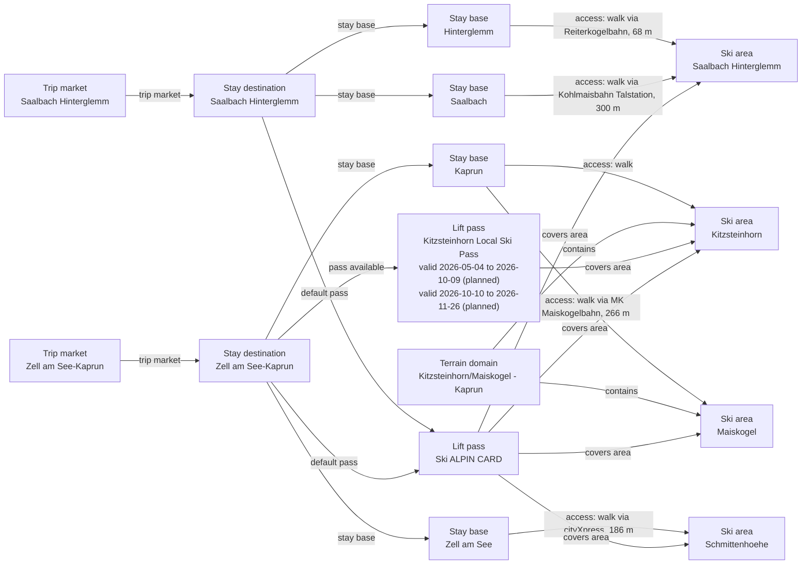

# Zell am See-Kaprun Catalog V2 Fact Enrichment

Corrects Kitzsteinhorn and Maiskogel lift-served elevation ranges while deferring unsupported weather coordinates, represents exact Kitzsteinhorn summer/fall tariff bands, and renders the deterministic unchanged Ski ALPIN CARD dependency closure that includes Saalbach while retaining its unresolved ski-area owner boundary as regional follow-up.

## Resulting Graph

## Reviewed Targets

| Target | Scope | Graph Role | Required Fields |
| --- | --- | --- | --- |
| `ski_area:kitzsteinhorn` | `narrow` | `focus` | `base_elevation_m`, `glacier_terrain.availability`, `marked_freeride_routes.availability`, `marked_freeride_routes.route_count`, `marked_freeride_routes.season_label`, `night_skiing.availability`, `night_skiing.season_label`, `official_trail_map.season_label`, `official_trail_map.url`, `ski_day_apres_profile.availability`, `ski_day_apres_profile.intensity`, `ski_day_apres_profile.season_label`, `snow_park.availability`, `snow_park.park_count`, `snow_park.season_label`, `snowmaking.availability`, `snowmaking.coverage_basis`, `snowmaking.coverage_pct`, `snowmaking.season_label`, `weather_sampling_status` |
| `ski_area:maiskogel` | `narrow` | `focus` | `glacier_terrain.availability`, `marked_freeride_routes.availability`, `marked_freeride_routes.route_count`, `marked_freeride_routes.season_label`, `night_skiing.availability`, `night_skiing.season_label`, `official_trail_map.season_label`, `official_trail_map.url`, `ski_day_apres_profile.availability`, `ski_day_apres_profile.intensity`, `ski_day_apres_profile.season_label`, `snow_park.availability`, `snow_park.park_count`, `snow_park.season_label`, `snowmaking.availability`, `snowmaking.coverage_basis`, `snowmaking.coverage_pct`, `snowmaking.season_label`, `summit_elevation_m`, `weather_sampling_status` |
| `stay_base:zell-am-see-kaprun-kaprun` | `narrow` | `focus` | `elevation_m`, `base_type`, `base_character.development_style`, `base_character.local_pace`, `local_apres_profile.availability`, `local_apres_profile.intensity`, `local_apres_profile.season_label` |
| `stay_base:zell-am-see-kaprun-zell-am-see` | `narrow` | `focus` | `elevation_m`, `base_type`, `base_character.development_style`, `base_character.local_pace`, `local_apres_profile.availability`, `local_apres_profile.intensity`, `local_apres_profile.season_label` |
| `terrain_domain:kitzsteinhorn-maiskogel` | `narrow` | `focus` | `official_trail_map.url`, `official_trail_map.season_label` |
| `trust_manifest:ski_areas:kitzsteinhorn` | `narrow` | `focus` | `field_source_refs`, `field_statuses`, `notes` |
| `trust_manifest:ski_areas:maiskogel` | `narrow` | `focus` | `field_source_refs`, `field_statuses`, `notes` |
| `trust_manifest:stay_bases:zell-am-see-kaprun-kaprun` | `narrow` | `focus` | `field_source_refs`, `field_statuses`, `notes` |
| `trust_manifest:stay_bases:zell-am-see-kaprun-zell-am-see` | `narrow` | `focus` | `field_source_refs`, `field_statuses`, `notes` |
| `trust_manifest:terrain_domains:kitzsteinhorn-maiskogel` | `narrow` | `focus` | `field_source_refs`, `field_statuses`, `notes` |
| `stay_destination:zell-am-see-kaprun` | `narrow` | `focus` | `stay_destination_id`, `name`, `trip_market_region_id`, `regional_data_ids` |
| `ski_area:schmittenhoehe` | `narrow` | `focus` | `ski_area_id`, `name`, `weather_sampling_status`, `latitude`, `longitude`, `base_elevation_m`, `summit_elevation_m`, `season_start_month`, `season_end_month`, `total_piste_km`, `total_lift_count` |
| `ski_area_access:zell-am-see-kaprun-kaprun--kitzsteinhorn` | `narrow` | `focus` | `ski_area_access_id`, `stay_base_id`, `ski_area_id`, `access_mode`, `lift_distance`, `nearest_lift_name`, `distance_m`, `duration_minutes`, `is_direct`, `regional_data_ids`, `source_urls` |
| `ski_area_access:zell-am-see-kaprun-kaprun--maiskogel` | `narrow` | `focus` | `ski_area_access_id`, `stay_base_id`, `ski_area_id`, `access_mode`, `lift_distance`, `nearest_lift_name`, `distance_m`, `duration_minutes`, `is_direct`, `regional_data_ids`, `source_urls` |
| `ski_area_access:zell-am-see-kaprun-zell-am-see--schmittenhoehe` | `narrow` | `focus` | `ski_area_access_id`, `stay_base_id`, `ski_area_id`, `access_mode`, `lift_distance`, `nearest_lift_name`, `distance_m`, `duration_minutes`, `is_direct`, `regional_data_ids`, `source_urls` |
| `lift_pass_product:ski-alpin-card` | `narrow` | `focus` | `lift_pass_product_id`, `name`, `validity_scope`, `available_from_stay_destination_ids`, `default_for_stay_destination_ids`, `valid_ski_area_ids`, `terrain_domain_ids`, `validity_windows`, `external_validity_summary`, `pass_accessible_terrain`, `prices` |
| `stay_destination:saalbach-hinterglemm` | `narrow` | `focus` | `stay_destination_id`, `name`, `trip_market_region_id`, `regional_data_ids` |
| `stay_base:saalbach-hinterglemm-saalbach` | `narrow` | `linked_dependency` | `stay_base_id`, `stay_destination_id`, `name`, `latitude`, `longitude`, `elevation_m`, `base_type`, `regional_data_ids` |
| `stay_base:saalbach-hinterglemm-hinterglemm` | `narrow` | `linked_dependency` | `stay_base_id`, `stay_destination_id`, `name`, `latitude`, `longitude`, `elevation_m`, `base_type`, `regional_data_ids` |
| `ski_area:saalbach-hinterglemm-ski-area` | `narrow` | `linked_dependency` | `ski_area_id`, `name`, `weather_sampling_status`, `latitude`, `longitude`, `base_elevation_m`, `summit_elevation_m`, `season_start_month`, `season_end_month`, `total_piste_km`, `total_lift_count` |
| `ski_area_access:saalbach-hinterglemm-saalbach--saalbach-hinterglemm-ski-area` | `narrow` | `linked_dependency` | `ski_area_access_id`, `stay_base_id`, `ski_area_id`, `access_mode`, `lift_distance`, `nearest_lift_name`, `distance_m`, `duration_minutes`, `is_direct`, `regional_data_ids`, `source_urls` |
| `ski_area_access:saalbach-hinterglemm-hinterglemm--saalbach-hinterglemm-ski-area` | `narrow` | `linked_dependency` | `ski_area_access_id`, `stay_base_id`, `ski_area_id`, `access_mode`, `lift_distance`, `nearest_lift_name`, `distance_m`, `duration_minutes`, `is_direct`, `regional_data_ids`, `source_urls` |
| `lift_pass_product:kitzsteinhorn-local-ski-pass` | `full` | `focus` | all canonical fields |
| `trust_manifest:lift_pass_products:kitzsteinhorn-local-ski-pass` | `full` | `focus` | all canonical fields |
| `trust_manifest:lift_pass_products:ski-alpin-card` | `full` | `focus` | all canonical fields |

## Review Evidence Envelope

| Family | Source Kind | Source URLs | Candidate Kinds |
| --- | --- | --- | --- |
| `zell-destination-and-stay-market` | `destination_booking` | [https://booking.zellamsee-kaprun.com/en/accommodation-list](https://booking.zellamsee-kaprun.com/en/accommodation-list), [https://www.zellamsee-kaprun.com/en/experience/kaprun](https://www.zellamsee-kaprun.com/en/experience/kaprun), [https://www.zellamsee-kaprun.com/en/experience/zell-am-see](https://www.zellamsee-kaprun.com/en/experience/zell-am-see) | `stay_destination`, `stay_base` |
| `zell-ski-area-operators` | `ski_area_operator` | [https://www.kitzsteinhorn.at/en/winter/kitzsteinhorn-ski-board](https://www.kitzsteinhorn.at/en/winter/kitzsteinhorn-ski-board), [https://www.kitzsteinhorn.at/en/winter/maiskogel-ski-board](https://www.kitzsteinhorn.at/en/winter/maiskogel-ski-board), [https://www.schmitten.at/en/Company](https://www.schmitten.at/en/Company), [https://www.schmitten.at/en/Winter-on-the-mountain/Skiresort-Schmitten](https://www.schmitten.at/en/Winter-on-the-mountain/Skiresort-Schmitten), [https://www.zellamsee-kaprun.com/en/poi/winter-on-the-maiskogel~2470](https://www.zellamsee-kaprun.com/en/poi/winter-on-the-maiskogel~2470) | `ski_area` |
| `zell-operator-map-and-connection` | `ski_area_operator` | [https://www.kitzsteinhorn.at/en/service/backstage/press/k-onnected-kaprun---maiskogel---kitzsteinhorn-pr9393](https://www.kitzsteinhorn.at/en/service/backstage/press/k-onnected-kaprun---maiskogel---kitzsteinhorn-pr9393), [https://www.kitzsteinhorn.at/en/service/backstage/press/kaprun-kitzsteinhorn-connected-as-of-30-nov.--pr5487](https://www.kitzsteinhorn.at/en/service/backstage/press/kaprun-kitzsteinhorn-connected-as-of-30-nov.--pr5487), [https://www.kitzsteinhorn.at/en/service/backstage/press/winter-2025-26-pr15634](https://www.kitzsteinhorn.at/en/service/backstage/press/winter-2025-26-pr15634), [https://www.skiresort.info/ski-resort/kitzsteinhorn-maiskogel-kaprun/slope-offering/](https://www.skiresort.info/ski-resort/kitzsteinhorn-maiskogel-kaprun/slope-offering/), [https://www.zellamsee-kaprun.com/en/sport/winter/skimap](https://www.zellamsee-kaprun.com/en/sport/winter/skimap) | `ski_area`, `terrain_domain`, `ski_area_access` |
| `zell-access-and-endpoints` | `access_transport` | [https://www.openstreetmap.org/relation/945962](https://www.openstreetmap.org/relation/945962), [https://www.openstreetmap.org/relation/945977](https://www.openstreetmap.org/relation/945977), [https://www.openstreetmap.org/way/158348741](https://www.openstreetmap.org/way/158348741), [https://www.openstreetmap.org/way/197183389](https://www.openstreetmap.org/way/197183389), [https://zellamsee.at/en/ski-areas-zell-am-see-kaprun](https://zellamsee.at/en/ski-areas-zell-am-see-kaprun) | `stay_base`, `ski_area_access` |
| `zell-pass-and-tariff` | `pass_tariff` | [https://www.alpincard.at/en/ski-alpin-card.html](https://www.alpincard.at/en/ski-alpin-card.html), [https://www.saalbach.com/en/winter/skitickets/peak-season](https://www.saalbach.com/en/winter/skitickets/peak-season), [https://www.zellamsee-kaprun.com/en/sport/winter/skiing/ski-passes](https://www.zellamsee-kaprun.com/en/sport/winter/skiing/ski-passes) | `lift_pass_product`, `ski_area`, `stay_destination` |
| `zell-live-and-fit-sources` | `other_official` | [https://www.kitzsteinhorn.at/en/winter/kitzsteinhorn-ski-board/freeride](https://www.kitzsteinhorn.at/en/winter/kitzsteinhorn-ski-board/freeride), [https://www.zellamsee-kaprun.com/en/service/live/snow-report](https://www.zellamsee-kaprun.com/en/service/live/snow-report), [https://www.zellamsee-kaprun.com/en/sport/winter/skiing/ski-resorts](https://www.zellamsee-kaprun.com/en/sport/winter/skiing/ski-resorts) | `ski_area`, `stay_base` |
| `kaprun-area-inventory` | `ski_area_operator` | [https://www.kitzsteinhorn.at/en/service/backstage/company](https://www.kitzsteinhorn.at/en/service/backstage/company), [https://www.kitzsteinhorn.at/en/service/information/weather-webcams](https://www.kitzsteinhorn.at/en/service/information/weather-webcams), [https://www.kitzsteinhorn.at/en/winter/information/ski-map-opening-times](https://www.kitzsteinhorn.at/en/winter/information/ski-map-opening-times), [https://www.kitzsteinhorn.at/en/winter/lechnerberg](https://www.kitzsteinhorn.at/en/winter/lechnerberg) | `ski_area`, `ski_area_access`, `terrain_domain` |
| `kaprun-pass-candidate-inventory` | `pass_tariff` | [https://www.kitzsteinhorn.at/en/tickets-prices/season-annual-tickets](https://www.kitzsteinhorn.at/en/tickets-prices/season-annual-tickets), [https://www.kitzsteinhorn.at/en/tickets-prices/ski-board](https://www.kitzsteinhorn.at/en/tickets-prices/ski-board) | `lift_pass_product` |
| `saalbach-destination-and-booking` | `destination_booking` | [https://www.saalbach.com/en/winter](https://www.saalbach.com/en/winter) | `stay_destination`, `stay_base` |
| `saalbach-operator-and-live-status` | `ski_area_operator` | [https://www.fieberbrunn.com/en/winter/ski-area/operating-hours](https://www.fieberbrunn.com/en/winter/ski-area/operating-hours), [https://www.saalbach.com/de/service/kontakt/kontakt-bergbahnen](https://www.saalbach.com/de/service/kontakt/kontakt-bergbahnen), [https://www.saalbach.com/en/winter/ski-resort](https://www.saalbach.com/en/winter/ski-resort), [https://www.saalbach.com/en/winter/ski-resort/current-lift-operation](https://www.saalbach.com/en/winter/ski-resort/current-lift-operation), [https://www.saalbach.com/en/winter/ski-resort/operating-hours](https://www.saalbach.com/en/winter/ski-resort/operating-hours), [https://www.saalfelden-leogang.com/Winter-operating-hours](https://www.saalfelden-leogang.com/Winter-operating-hours) | `ski_area` |
| `saalbach-access` | `access_transport` | [https://www.openstreetmap.org/node/330847121](https://www.openstreetmap.org/node/330847121), [https://www.openstreetmap.org/node/4584725735](https://www.openstreetmap.org/node/4584725735), [https://www.saalbach.com/en/winter/ski-resort/ski-in-ski-out](https://www.saalbach.com/en/winter/ski-resort/ski-in-ski-out) | `stay_base`, `ski_area_access` |

## Entity Scope Assessments

| Candidate | Kind | Disposition | Signals | Catalog Targets | Evidence | Backlog | Graph Impact | Rationale |
| --- | --- | --- | --- | --- | --- | --- | --- | --- |
| `zell-am-see-kaprun` (Zell am See-Kaprun) | `stay_destination` | `represented` | `independent_stay_market`, `official_independent_identity` | `stay_destination:zell-am-see-kaprun` | `v2-enrichment-009-zell-am-see-kaprun-kaprun-base-character-development-style`, `v2-enrichment-014-zell-am-see-kaprun-zell-am-see-base-character-development-style` |  | `graph_blocking` | The official destination presentation supports the existing combined stay market with Kaprun and Zell am See as its two bases. |
| `zell-am-see-kaprun-kaprun` (Kaprun) | `stay_base` | `represented` | `official_independent_identity`, `distinct_access` | `stay_base:zell-am-see-kaprun-kaprun` | `v2-enrichment-009-zell-am-see-kaprun-kaprun-base-character-development-style`, `scope-zell-kitz-connection`, `trust-envelope-kaprun-osm-relation` |  | `graph_blocking` | Kaprun remains a concrete accommodation base in the combined destination with explicit Kitzsteinhorn and Maiskogel access. |
| `zell-am-see-kaprun-zell-am-see` (Zell am See) | `stay_base` | `represented` | `official_independent_identity`, `distinct_access` | `stay_base:zell-am-see-kaprun-zell-am-see` | `v2-enrichment-014-zell-am-see-kaprun-zell-am-see-base-character-development-style`, `scope-zell-access-schmitten`, `trust-envelope-zell-am-see-osm-relation` |  | `graph_blocking` | Zell am See remains a concrete accommodation base in the combined destination with explicit Schmittenhöhe access. |
| `kitzsteinhorn` (Kitzsteinhorn) | `ski_area` | `represented` | `distinct_elevation_or_season`, `independent_status_or_schedule`, `independent_weather_presentation`, `full_local_pass`, `official_independent_identity`, `separate_operator` | `ski_area:kitzsteinhorn` | `boundary-kitzsteinhorn-live-status`, `boundary-kitzsteinhorn-weather-presentation`, `inventory-kitzsteinhorn-seasonal-pass-presentations`, `scope-zell-kitz-connection`, `v2-enrichment-001-kitzsteinhorn-glacier-terrain-availability` |  | `graph_blocking` | Official candidate-scoped glacier and terrain presentations establish complete-area scope; the current-status feed, Kitzsteinhorn-specific weather presentation, and Kitzsteinhorn-only summer/fall tariffs establish independent operations, independent weather, and full-local-pass ownership. Those independently owned operational, weather, seasonal, and pass semantics provide material separation value within the connected Kaprun terrain. |
| `maiskogel` (Maiskogel) | `ski_area` | `represented` | `distinct_access`, `independent_status_or_schedule`, `independent_weather_presentation`, `official_independent_identity`, `separate_operator` | `ski_area:maiskogel` | `boundary-maiskogel-live-status`, `boundary-maiskogel-weather-presentation`, `scope-zell-kitz-connection`, `v2-enrichment-006-maiskogel-ski-day-apres-profile-availability`, `v2-enrichment-008-maiskogel-snowmaking-availability` |  | `graph_blocking` | Official candidate-scoped status and weather presentations preserve Maiskogel as a connected but independently operated/weather-owned family ski area. |
| `schmittenhoehe` (Schmittenhöhe) | `ski_area` | `represented` | `official_independent_identity`, `separate_operator`, `distinct_access` | `ski_area:schmittenhoehe` | `scope-zell-schmitten-resort`, `scope-zell-schmitten-operator`, `scope-zell-access-schmitten` |  | `graph_blocking` | The official operator presents Schmitten as the complete Zell am See ski area with a distinct operational identity. |
| `zell-am-see-kaprun-kaprun--kitzsteinhorn` (Kaprun to Kitzsteinhorn access) | `ski_area_access` | `represented` | `direct_access_relationship`, `distinct_access` | `ski_area_access:zell-am-see-kaprun-kaprun--kitzsteinhorn` | `scope-zell-kitz-connection`, `trust-envelope-kaprun-terrain-corroboration`, `trust-envelope-kaprun-winter-release` |  | `graph_blocking` | The catalog retains the explicit Kaprun to Kitzsteinhorn access edge described by the operator connection publication. |
| `zell-am-see-kaprun-kaprun--maiskogel` (Kaprun to Maiskogel access) | `ski_area_access` | `represented` | `direct_access_relationship`, `distinct_access` | `ski_area_access:zell-am-see-kaprun-kaprun--maiskogel` | `scope-zell-access-destination`, `scope-zell-access-maiskogel-osm` |  | `graph_blocking` | The official destination and stored OSM endpoint support the explicit Kaprun to Maiskogel edge. |
| `zell-am-see-kaprun-zell-am-see--schmittenhoehe` (Zell am See to Schmittenhöhe access) | `ski_area_access` | `represented` | `direct_access_relationship`, `distinct_access` | `ski_area_access:zell-am-see-kaprun-zell-am-see--schmittenhoehe` | `scope-zell-access-schmitten`, `scope-zell-access-schmitten-osm` |  | `graph_blocking` | The official destination and stored OSM endpoint support the explicit Zell am See to Schmitten edge. |
| `kitzsteinhorn-maiskogel` (Kitzsteinhorn/Maiskogel - Kaprun) | `terrain_domain` | `represented` | `ski_connected_terrain`, `official_product_identity` | `terrain_domain:kitzsteinhorn-maiskogel` | `scope-zell-kitz-connection` |  | `graph_blocking` | The operator connection source supports the represented connected domain; the broader Ski ALPIN CARD map is not assigned as a domain-owned document. |
| `ski-alpin-card` (Ski ALPIN CARD) | `lift_pass_product` | `represented` | `official_product_identity` | `lift_pass_product:ski-alpin-card` | `scope-zell-pass-identity`, `scope-zell-pass-tariff`, `trust-envelope-saalbach-peak-tariff` |  | `graph_blocking` | The official product and tariff pages support the represented regional pass and the existing Zell am See-Kaprun availability relationship. |
| `saalbach-hinterglemm` (Saalbach Hinterglemm) | `stay_destination` | `represented` | `independent_stay_market`, `official_independent_identity` | `stay_destination:saalbach-hinterglemm` | `scope-saalbach-destination` |  | `graph_blocking` | The official destination supports the existing combined Saalbach Hinterglemm stay market linked by the Ski ALPIN CARD. |
| `saalbach-hinterglemm-saalbach` (Saalbach) | `stay_base` | `represented` | `official_independent_identity`, `distinct_access` | `stay_base:saalbach-hinterglemm-saalbach` | `scope-saalbach-destination`, `scope-saalbach-access` |  | `graph_blocking` | Saalbach remains a concrete accommodation base with direct access to the represented Skicircus area. |
| `saalbach-hinterglemm-hinterglemm` (Hinterglemm) | `stay_base` | `represented` | `official_independent_identity`, `distinct_access` | `stay_base:saalbach-hinterglemm-hinterglemm` | `scope-saalbach-destination`, `scope-hinterglemm-access` |  | `graph_blocking` | Hinterglemm remains a concrete accommodation base with direct access to the represented Skicircus area. |
| `saalbach-hinterglemm-ski-area` (Saalbach Hinterglemm ski area) | `ski_area` | `unresolved` | `independent_status_or_schedule`, `separate_operator`, `ski_connected_terrain`, `official_product_identity` |  | `inventory-saalbach-hinterglemm-current-operations`, `inventory-skicircus-operator-directory-saalbach-hinterglemm`, `scope-saalbach-area`, `scope-saalbach-live` | `docs/product-backlog.md#skicircus-saalbach-hinterglemm-leogang-fieberbrunn-extension` | `regional_followup` | The lift-company directory and candidate-scoped schedules establish a distinct Saalbach/Hinterglemm operations-owner category. The retained catalog node remains unresolved because the reviewed sources do not yet establish its complete connected-terrain boundary or a second owner category independently of the whole Skicircus. The exact base-to-head diff does not change this pre-existing node or its relationships, so deterministic resulting-graph closure includes it through the unchanged Ski ALPIN CARD pass dependency; that topology is not independent boundary verification, and the ski-area assessment remains unresolved regional follow-up. |
| `saalbach-hinterglemm-saalbach--saalbach-hinterglemm-ski-area` (Saalbach base to Skicircus access) | `ski_area_access` | `represented` | `direct_access_relationship`, `distinct_access` | `ski_area_access:saalbach-hinterglemm-saalbach--saalbach-hinterglemm-ski-area` | `scope-saalbach-access`, `scope-saalbach-access-osm` |  | `graph_blocking` | The official ski-in ski-out guide and stored lift endpoint support the explicit Saalbach access edge. |
| `saalbach-hinterglemm-hinterglemm--saalbach-hinterglemm-ski-area` (Hinterglemm base to Skicircus access) | `ski_area_access` | `represented` | `direct_access_relationship`, `distinct_access` | `ski_area_access:saalbach-hinterglemm-hinterglemm--saalbach-hinterglemm-ski-area` | `scope-hinterglemm-access`, `scope-hinterglemm-access-osm` |  | `graph_blocking` | The official ski-in ski-out guide and stored lift endpoint support the explicit Hinterglemm access edge. |
| `lechnerberg` (Lechnerberg) | `ski_area` | `deferred` | `official_independent_identity`, `independent_status_or_schedule`, `limited_area_ticket`, `distinct_access` |  | `inventory-lechnerberg-official-presentation`, `inventory-kaprun-operator-portfolio`, `inventory-kaprun-area-map-and-status`, `inventory-kaprun-local-and-superskicard-tariffs`, `inventory-kaprun-weather-presentation` | `docs/product-backlog.md#zell-am-see-kaprun-linked-area-and-pass-extensions` | `regional_followup` | Official sources establish a separate, transfer-required two-lift beginner area, but exact elevation and season values required by the current SkiArea contract are unpublished; the complete node is deferred instead of populated with false precision. |
| `zell-am-see-kaprun-kaprun--lechnerberg` (Kaprun to Lechnerberg access) | `ski_area_access` | `deferred` | `direct_access_relationship`, `distinct_access` |  | `inventory-lechnerberg-official-presentation` | `docs/product-backlog.md#zell-am-see-kaprun-linked-area-and-pass-extensions` | `regional_followup` | The central-Kaprun relationship is direct and known, but the edge must land with the deferred complete Lechnerberg node; exact distance and duration remain unresolved. |
| `kitzsteinhorn-summer-ski-pass` (Kitzsteinhorn Summer Ski Passes) | `lift_pass_product` | `add_entity` | `official_product_identity`, `full_local_pass`, `distinct_elevation_or_season` | `lift_pass_product:kitzsteinhorn-local-ski-pass` | `inventory-kitzsteinhorn-seasonal-pass-presentations` |  | `graph_blocking` | The official tariff publishes exact Kitzsteinhorn-only summer and fall validity windows, represented together by one local single-area product. |
| `kitzsteinhorn-fall-ski-pass` (Kitzsteinhorn Fall Ski Passes) | `lift_pass_product` | `add_entity` | `official_product_identity`, `full_local_pass`, `distinct_elevation_or_season` | `lift_pass_product:kitzsteinhorn-local-ski-pass` | `inventory-kitzsteinhorn-seasonal-pass-presentations` |  | `graph_blocking` | The official tariff publishes exact Kitzsteinhorn-only summer and fall validity windows, represented together by one local single-area product. |
| `maiskogel-day-pass` (Maiskogel Day Pass) | `lift_pass_product` | `deferred` | `official_product_identity`, `limited_area_ticket` |  | `inventory-kaprun-local-and-superskicard-tariffs` | `docs/product-backlog.md#zell-am-see-kaprun-linked-area-and-pass-extensions` | `regional_followup` | The official tariff presents a distinct Maiskogel day ticket. Complete dated validity, exact area coverage, and availability ownership remain in the consolidated Zell am See-Kaprun pass-extension slice. |
| `superskicard` (SuperSkiCard consecutive-day products) | `lift_pass_product` | `deferred` | `official_product_identity` |  | `inventory-kaprun-local-and-superskicard-tariffs` | `docs/product-backlog.md#zell-am-see-kaprun-linked-area-and-pass-extensions` | `regional_followup` | The official tariff presents consecutive-day SuperSkiCard products. Their complete regional-network coverage, dated validity, and availability ownership require the bounded pass-extension slice. |
| `superskicard-10-day-flexible` (SuperSkiCard 10-Day Flexible) | `lift_pass_product` | `deferred` | `official_product_identity` |  | `inventory-kaprun-local-and-superskicard-tariffs` | `docs/product-backlog.md#zell-am-see-kaprun-linked-area-and-pass-extensions` | `regional_followup` | The official tariff separately presents a non-consecutive 10-day flexible SuperSkiCard. Complete regional-network coverage, dated validity, and availability ownership require the bounded pass-extension slice. |
| `lechnerberg-single-ride-ticket` (Lechnerberg single-ride ticket) | `lift_pass_product` | `deferred` | `official_product_identity`, `limited_area_ticket` |  | `inventory-kaprun-local-and-superskicard-tariffs` | `docs/product-backlog.md#zell-am-see-kaprun-linked-area-and-pass-extensions` | `regional_followup` | The official tariff lists a Lechnerberg single-ride entitlement. Its exact coverage and availability depend on the deferred complete Lechnerberg area and access graph. |
| `lechnerberg-10-ride-ticket` (Lechnerberg 10-ride ticket) | `lift_pass_product` | `deferred` | `official_product_identity`, `limited_area_ticket` |  | `inventory-kaprun-local-and-superskicard-tariffs` | `docs/product-backlog.md#zell-am-see-kaprun-linked-area-and-pass-extensions` | `regional_followup` | The official tariff lists a Lechnerberg 10-ride entitlement. Its exact coverage and availability depend on the deferred complete Lechnerberg area and access graph. |
| `365-action-alpin-card` (365 Action ALPIN CARD) | `lift_pass_product` | `deferred` | `official_product_identity`, `full_local_pass` |  | `inventory-kaprun-annual-and-external-passes` | `docs/product-backlog.md#zell-am-see-kaprun-linked-area-and-pass-extensions` | `regional_followup` | The official tariff establishes a concrete named product, but complete dated coverage, availability and product ownership belong to the bounded Kaprun pass-extension slice rather than generic external context. |
| `365-classic-alpin-card` (365 Classic ALPIN CARD) | `lift_pass_product` | `deferred` | `official_product_identity`, `full_local_pass` |  | `inventory-kaprun-annual-and-external-passes` | `docs/product-backlog.md#zell-am-see-kaprun-linked-area-and-pass-extensions` | `regional_followup` | The official tariff establishes a concrete named product, but complete dated coverage, availability and product ownership belong to the bounded Kaprun pass-extension slice rather than generic external context. |
| `superskicard-premium` (SuperSkiCard Premium) | `lift_pass_product` | `deferred` | `official_product_identity` |  | `inventory-kaprun-annual-and-external-passes` | `docs/product-backlog.md#zell-am-see-kaprun-linked-area-and-pass-extensions` | `regional_followup` | The official tariff establishes a concrete named product, but complete dated coverage, availability and product ownership belong to the bounded Kaprun pass-extension slice rather than generic external context. |
| `junior-xplore-card` (Junior XPLORE CARD) | `lift_pass_product` | `not_separate` | `limited_area_ticket` | `lift_pass_product:ski-alpin-card` | `inventory-kitzsteinhorn-seasonal-pass-presentations` |  | `graph_blocking` | Junior XPLORE CARD is a recurring youth day-ticket promotion within the local tariff rather than a separate terrain-coverage product. |
| `epic-pass` (Epic Pass) | `lift_pass_product` | `external_pass_context` | `official_product_identity` |  | `inventory-epic-pass-partnership` |  | `graph_blocking` | The operator describes an international reciprocal partner benefit rather than a locally owned Snowcast pass product, so it remains explicit external-pass context. |
| `leogang` (Leogang) | `stay_destination` | `deferred` | `official_independent_identity`, `independent_stay_market` |  | `scope-saalbach-area` | `docs/product-backlog.md#skicircus-saalbach-hinterglemm-leogang-fieberbrunn-extension` | `regional_followup` | The aggregate Skicircus sources establish membership and connected regional scope only; exact local stay, terrain, operations, weather and access ownership remains in the consolidated typed backlog handoff. |
| `leogang-leogang` (Leogang stay base) | `stay_base` | `deferred` | `distinct_access` |  | `scope-saalbach-area` | `docs/product-backlog.md#skicircus-saalbach-hinterglemm-leogang-fieberbrunn-extension` | `regional_followup` | The aggregate Skicircus sources establish membership and connected regional scope only; exact local stay, terrain, operations, weather and access ownership remains in the consolidated typed backlog handoff. |
| `leogang-ski-area` (Leogang ski area) | `ski_area` | `deferred` | `independent_status_or_schedule`, `official_independent_identity`, `separate_operator`, `ski_connected_terrain` |  | `inventory-leogang-current-operations`, `inventory-skicircus-operator-directory-leogang`, `scope-saalbach-area`, `scope-saalbach-live` | `docs/product-backlog.md#skicircus-saalbach-hinterglemm-leogang-fieberbrunn-extension` | `regional_followup` | The official directory names Leoganger Bergbahnen and the candidate-scoped Zone L schedule establishes an independent operations-owner category. Connected-terrain completeness, weather ownership and the second owner category remain in the consolidated Skicircus proposal. |
| `leogang-leogang--leogang-ski-area` (Leogang base to ski-area access) | `ski_area_access` | `deferred` | `direct_access_relationship`, `distinct_access` |  | `scope-saalbach-area` | `docs/product-backlog.md#skicircus-saalbach-hinterglemm-leogang-fieberbrunn-extension` | `regional_followup` | The aggregate Skicircus sources establish membership and connected regional scope only; exact local stay, terrain, operations, weather and access ownership remains in the consolidated typed backlog handoff. |
| `fieberbrunn` (Fieberbrunn) | `stay_destination` | `deferred` | `official_independent_identity`, `independent_stay_market` |  | `scope-saalbach-area` | `docs/product-backlog.md#skicircus-saalbach-hinterglemm-leogang-fieberbrunn-extension` | `regional_followup` | The aggregate Skicircus sources establish membership and connected regional scope only; exact local stay, terrain, operations, weather and access ownership remains in the consolidated typed backlog handoff. |
| `fieberbrunn-fieberbrunn` (Fieberbrunn stay base) | `stay_base` | `deferred` | `distinct_access` |  | `scope-saalbach-area` | `docs/product-backlog.md#skicircus-saalbach-hinterglemm-leogang-fieberbrunn-extension` | `regional_followup` | The aggregate Skicircus sources establish membership and connected regional scope only; exact local stay, terrain, operations, weather and access ownership remains in the consolidated typed backlog handoff. |
| `fieberbrunn-ski-area` (Fieberbrunn ski area) | `ski_area` | `deferred` | `independent_status_or_schedule`, `official_independent_identity`, `separate_operator`, `ski_connected_terrain` |  | `inventory-fieberbrunn-current-operations`, `inventory-skicircus-operator-directory-fieberbrunn`, `scope-saalbach-area`, `scope-saalbach-live` | `docs/product-backlog.md#skicircus-saalbach-hinterglemm-leogang-fieberbrunn-extension` | `regional_followup` | The official directory names Bergbahnen Fieberbrunn and the candidate-scoped Zones E/F schedule establishes an independent operations-owner category. Connected-terrain completeness, weather ownership and the second owner category remain in the consolidated Skicircus proposal. |
| `fieberbrunn-fieberbrunn--fieberbrunn-ski-area` (Fieberbrunn base to ski-area access) | `ski_area_access` | `deferred` | `direct_access_relationship`, `distinct_access` |  | `scope-saalbach-area` | `docs/product-backlog.md#skicircus-saalbach-hinterglemm-leogang-fieberbrunn-extension` | `regional_followup` | The aggregate Skicircus sources establish membership and connected regional scope only; exact local stay, terrain, operations, weather and access ownership remains in the consolidated typed backlog handoff. |
| `skicircus-saalbach-hinterglemm-leogang-fieberbrunn` (Skicircus Saalbach Hinterglemm Leogang Fieberbrunn) | `terrain_domain` | `deferred` | `ski_connected_terrain`, `official_product_identity` |  | `scope-saalbach-area`, `scope-saalbach-live` | `docs/product-backlog.md#skicircus-saalbach-hinterglemm-leogang-fieberbrunn-extension` | `regional_followup` | The aggregate Skicircus sources establish membership and connected regional scope only; exact local stay, terrain, operations, weather and access ownership remains in the consolidated typed backlog handoff. |

## Ski-Area Boundary Assessments

| Candidate | Parent | Terrain | Connectivity | Operations | Weather | Pass | Provider Consensus | Separation Value | Evidence |
| --- | --- | --- | --- | --- | --- | --- | --- | --- | --- |
| `kitzsteinhorn` |  | `complete` | `not_applicable` | `independent` | `independent` | `full_local` | `separate` | `material` | `boundary-kitzsteinhorn-live-status`, `boundary-kitzsteinhorn-weather-presentation`, `inventory-kitzsteinhorn-seasonal-pass-presentations`, `scope-zell-kitz-connection`, `v2-enrichment-001-kitzsteinhorn-glacier-terrain-availability` |
| `maiskogel` | `kitzsteinhorn` | `complete` | `connected` | `independent` | `independent` | `shared_only` | `separate` | `material` | `boundary-maiskogel-live-status`, `boundary-maiskogel-weather-presentation`, `scope-zell-kitz-connection`, `v2-enrichment-006-maiskogel-ski-day-apres-profile-availability`, `v2-enrichment-008-maiskogel-snowmaking-availability` |
| `schmittenhoehe` |  | `complete` | `not_applicable` | `independent` | `unknown` | `shared_only` | `separate` | `material` | `scope-zell-schmitten-resort`, `scope-zell-schmitten-operator`, `scope-zell-access-schmitten` |
| `saalbach-hinterglemm-ski-area` |  | `unresolved` | `not_applicable` | `independent` | `unknown` | `shared_only` | `mixed` | `unresolved` | `inventory-saalbach-hinterglemm-current-operations`, `inventory-skicircus-operator-directory-saalbach-hinterglemm`, `scope-saalbach-area`, `scope-saalbach-live` |
| `lechnerberg` | `maiskogel` | `complete` | `transfer_required` | `independent` | `unknown` | `limited` | `separate` | `material` | `inventory-lechnerberg-official-presentation`, `inventory-kaprun-operator-portfolio`, `inventory-kaprun-area-map-and-status`, `inventory-kaprun-local-and-superskicard-tariffs`, `inventory-kaprun-weather-presentation` |
| `leogang-ski-area` | `saalbach-hinterglemm-ski-area` | `unresolved` | `connected` | `independent` | `unknown` | `shared_only` | `mixed` | `unresolved` | `inventory-leogang-current-operations`, `inventory-skicircus-operator-directory-leogang`, `scope-saalbach-area`, `scope-saalbach-live` |
| `fieberbrunn-ski-area` | `saalbach-hinterglemm-ski-area` | `unresolved` | `connected` | `independent` | `unknown` | `shared_only` | `mixed` | `unresolved` | `inventory-fieberbrunn-current-operations`, `inventory-skicircus-operator-directory-fieberbrunn`, `scope-saalbach-area`, `scope-saalbach-live` |

## Changed Fields

| Target | Field | Before | After | Trust | Ranking Relevant |
| --- | --- | --- | --- | --- | --- |
| `lift_pass_product:kitzsteinhorn-local-ski-pass` | `available_from_stay_destination_ids` | `null` | `["zell-am-see-kaprun"]` | `verified_with_adjustment` | yes |
| `lift_pass_product:kitzsteinhorn-local-ski-pass` | `default_for_stay_destination_ids` | `null` | `[]` | `verified_with_adjustment` | yes |
| `lift_pass_product:kitzsteinhorn-local-ski-pass` | `lift_pass_product_id` | `null` | `"kitzsteinhorn-local-ski-pass"` | `verified_with_adjustment` | no |
| `lift_pass_product:kitzsteinhorn-local-ski-pass` | `name` | `null` | `"Kitzsteinhorn Local Ski Pass"` | `verified_with_adjustment` | no |
| `lift_pass_product:kitzsteinhorn-local-ski-pass` | `prices` | `null` | `[{"amount": 61.5, "amount_max": null, "amount_min": null, "audience": "adult", "currency": "EUR", "duration_days": 1, "price_kind": "fixed", "season_label": "Summer skiing 2026", "source_url": "https://www.kitzsteinhorn.at/en/tickets-prices/ski-board"}, {"amount": 74.0, "amount_max": null, "amount_min": null, "audience": "adult", "currency": "EUR", "duration_days": 1, "price_kind": "fixed", "season_label": "Fall skiing 2026: Oct 10-22", "source_url": "https://www.kitzsteinhorn.at/en/tickets-prices/ski-board"}, {"amount": 77.0, "amount_max": null, "amount_min": null, "audience": "adult", "currency": "EUR", "duration_days": 1, "price_kind": "fixed", "season_label": "Fall skiing 2026: Oct 23-Nov 26", "source_url": "https://www.kitzsteinhorn.at/en/tickets-prices/ski-board"}]` | `verified` | yes |
| `lift_pass_product:kitzsteinhorn-local-ski-pass` | `terrain_domain_ids` | `null` | `[]` | `verified` | no |
| `lift_pass_product:kitzsteinhorn-local-ski-pass` | `valid_ski_area_ids` | `null` | `["kitzsteinhorn"]` | `verified` | yes |
| `lift_pass_product:kitzsteinhorn-local-ski-pass` | `validity_scope` | `null` | `"single_ski_area"` | `verified_with_adjustment` | yes |
| `lift_pass_product:kitzsteinhorn-local-ski-pass` | `validity_windows` | `null` | `[{"end_date": "2026-10-09", "season_label": "Summer skiing 2026", "start_date": "2026-05-04", "status": "planned"}, {"end_date": "2026-11-26", "season_label": "Fall skiing 2026", "start_date": "2026-10-10", "status": "planned"}]` | `verified_with_adjustment` | yes |
| `ski_area:kitzsteinhorn` | `base_elevation_m` | `768` | `1976` | `verified` | yes |
| `ski_area:kitzsteinhorn` | `glacier_terrain.availability` | `"unknown"` | `"available"` | `verified` | no |
| `ski_area:kitzsteinhorn` | `marked_freeride_routes.availability` | `"unknown"` | `"available"` | `verified` | no |
| `ski_area:kitzsteinhorn` | `marked_freeride_routes.route_count` | `null` | `5` | `verified` | no |
| `ski_area:kitzsteinhorn` | `snow_park.availability` | `"unknown"` | `"available"` | `verified` | no |
| `ski_area:kitzsteinhorn` | `snow_park.park_count` | `null` | `4` | `verified` | no |
| `ski_area:kitzsteinhorn` | `weather_sampling_status` | `"active"` | `"deferred"` | `needs_source` | yes |
| `ski_area:maiskogel` | `ski_day_apres_profile.availability` | `"unknown"` | `"available"` | `verified` | no |
| `ski_area:maiskogel` | `ski_day_apres_profile.intensity` | `null` | `"low_key"` | `verified_with_adjustment` | no |
| `ski_area:maiskogel` | `snowmaking.availability` | `"unknown"` | `"available"` | `verified` | no |
| `ski_area:maiskogel` | `summit_elevation_m` | `1570` | `1730` | `verified` | yes |
| `ski_area:maiskogel` | `weather_sampling_status` | `"active"` | `"deferred"` | `needs_source` | yes |
| `stay_base:zell-am-see-kaprun-kaprun` | `base_character.development_style` | `"unknown"` | `"mixed"` | `verified_with_adjustment` | no |
| `stay_base:zell-am-see-kaprun-kaprun` | `base_character.local_pace` | `"unknown"` | `"balanced"` | `verified_with_adjustment` | no |
| `stay_base:zell-am-see-kaprun-kaprun` | `local_apres_profile.availability` | `"unknown"` | `"available"` | `verified` | no |
| `stay_base:zell-am-see-kaprun-kaprun` | `local_apres_profile.intensity` | `null` | `"low_key"` | `verified_with_adjustment` | no |
| `stay_base:zell-am-see-kaprun-zell-am-see` | `base_character.development_style` | `"unknown"` | `"mixed"` | `verified_with_adjustment` | no |
| `stay_base:zell-am-see-kaprun-zell-am-see` | `base_character.local_pace` | `"unknown"` | `"lively"` | `verified_with_adjustment` | no |
| `stay_base:zell-am-see-kaprun-zell-am-see` | `local_apres_profile.availability` | `"unknown"` | `"available"` | `verified` | no |
| `stay_base:zell-am-see-kaprun-zell-am-see` | `local_apres_profile.intensity` | `null` | `"moderate"` | `verified_with_adjustment` | no |
| `trust_manifest:lift_pass_products:kitzsteinhorn-local-ski-pass` | `display_name` | `null` | `"Kitzsteinhorn Local Ski Pass"` | `estimated` | no |
| `trust_manifest:lift_pass_products:kitzsteinhorn-local-ski-pass` | `field_source_refs` | `null` | `{"coverage": ["https://www.kitzsteinhorn.at/en/tickets-prices/ski-board"], "identity_scope_availability": ["https://www.kitzsteinhorn.at/en/tickets-prices/ski-board"], "pass_accessible_terrain": [], "prices": ["https://www.kitzsteinhorn.at/en/tickets-prices/ski-board"]}` | `estimated` | no |
| `trust_manifest:lift_pass_products:kitzsteinhorn-local-ski-pass` | `field_statuses` | `null` | `{"coverage": "verified", "identity_scope_availability": "verified_with_adjustment", "pass_accessible_terrain": "needs_source", "prices": "verified"}` | `estimated` | no |
| `trust_manifest:lift_pass_products:kitzsteinhorn-local-ski-pass` | `notes` | `null` | `["The official tariff publishes exact Kitzsteinhorn-only summer and fall validity windows distinct from the regional Ski ALPIN CARD.", "Snowcast normalizes the two official Summer/Fall 2026 tariff headings into one single-area product; the catalog stores representative adult one-day prices for summer and both exact fall date bands.", "No separate pass-accessible aggregate terrain metric is stored for this single-area product."]` | `estimated` | no |
| `trust_manifest:lift_pass_products:ski-alpin-card` | `field_source_refs` | `{"coverage": ["https://www.alpincard.at/en/ski-alpin-card.html", "https://www.kitzsteinhorn.at/en/service/backstage/press/kaprun-kitzsteinhorn-connected-as-of-30-nov.--pr5487", "https://www.kitzsteinhorn.at/en/service/backstage/press/winter-2025-26-pr15634", "https://www.kitzsteinhorn.at/en/summer/information/sports-shops", "https://www.kitzsteinhorn.at/en/tickets-prices/alpin-card", "https://www.kitzsteinhorn.at/en/winter/kitzsteinhorn", "https://www.kitzsteinhorn.at/en/winter/maiskogel-ski-board", "https://www.openstreetmap.org/relation/945962", "https://www.openstreetmap.org/relation/945977", "https://www.openstreetmap.org/way/158348741", "https://www.openstreetmap.org/way/197183389", "https://www.schmitten.at/en/Company", "https://www.schmitten.at/en/Winter-on-the-mountain/Skiresort-Schmitten", "https://www.skiresort.info/ski-resorts/alpin-card/sorted/day-ticket-price/", "https://www.zellamsee-kaprun.com/en/experience/attractions/schmittenhoehe", "https://www.zellamsee-kaprun.com/en/sport/winter/skiing/ski-passes", "https://zellamsee.at/en/ski-areas-zell-am-see-kaprun"], "identity_scope_availability": ["https://www.alpincard.at/en/ski-alpin-card.html", "https://www.kitzsteinhorn.at/en/service/backstage/press/kaprun-kitzsteinhorn-connected-as-of-30-nov.--pr5487", "https://www.kitzsteinhorn.at/en/service/backstage/press/winter-2025-26-pr15634", "https://www.kitzsteinhorn.at/en/summer/information/sports-shops", "https://www.kitzsteinhorn.at/en/tickets-prices/alpin-card", "https://www.kitzsteinhorn.at/en/winter/kitzsteinhorn", "https://www.kitzsteinhorn.at/en/winter/maiskogel-ski-board", "https://www.openstreetmap.org/relation/945962", "https://www.openstreetmap.org/relation/945977", "https://www.openstreetmap.org/way/158348741", "https://www.openstreetmap.org/way/197183389", "https://www.schmitten.at/en/Company", "https://www.schmitten.at/en/Winter-on-the-mountain/Skiresort-Schmitten", "https://www.skiresort.info/ski-resorts/alpin-card/sorted/day-ticket-price/", "https://www.zellamsee-kaprun.com/en/experience/attractions/schmittenhoehe", "https://www.zellamsee-kaprun.com/en/sport/winter/skiing/ski-passes", "https://zellamsee.at/en/ski-areas-zell-am-see-kaprun"], "pass_accessible_terrain": ["https://www.alpincard.at/en/ski-alpin-card.html", "https://www.kitzsteinhorn.at/en/service/backstage/press/kaprun-kitzsteinhorn-connected-as-of-30-nov.--pr5487", "https://www.kitzsteinhorn.at/en/service/backstage/press/winter-2025-26-pr15634", "https://www.kitzsteinhorn.at/en/summer/information/sports-shops", "https://www.kitzsteinhorn.at/en/tickets-prices/alpin-card", "https://www.kitzsteinhorn.at/en/winter/kitzsteinhorn", "https://www.kitzsteinhorn.at/en/winter/maiskogel-ski-board", "https://www.openstreetmap.org/relation/945962", "https://www.openstreetmap.org/relation/945977", "https://www.openstreetmap.org/way/158348741", "https://www.openstreetmap.org/way/197183389", "https://www.schmitten.at/en/Company", "https://www.schmitten.at/en/Winter-on-the-mountain/Skiresort-Schmitten", "https://www.skiresort.info/ski-resorts/alpin-card/sorted/day-ticket-price/", "https://www.zellamsee-kaprun.com/en/experience/attractions/schmittenhoehe", "https://www.zellamsee-kaprun.com/en/sport/winter/skiing/ski-passes", "https://zellamsee.at/en/ski-areas-zell-am-see-kaprun"], "prices": ["https://www.kitzsteinhorn.at/en/service/backstage/press/kaprun-kitzsteinhorn-connected-as-of-30-nov.--pr5487", "https://www.kitzsteinhorn.at/en/service/backstage/press/winter-2025-26-pr15634", "https://www.kitzsteinhorn.at/en/summer/information/sports-shops", "https://www.kitzsteinhorn.at/en/tickets-prices/alpin-card", "https://www.kitzsteinhorn.at/en/winter/kitzsteinhorn", "https://www.kitzsteinhorn.at/en/winter/maiskogel-ski-board", "https://www.openstreetmap.org/relation/945962", "https://www.openstreetmap.org/relation/945977", "https://www.openstreetmap.org/way/158348741", "https://www.openstreetmap.org/way/197183389", "https://www.saalbach.com/en/winter/skitickets/peak-season", "https://www.schmitten.at/en/Company", "https://www.schmitten.at/en/Winter-on-the-mountain/Skiresort-Schmitten", "https://www.skiresort.info/ski-resorts/alpin-card/sorted/day-ticket-price/", "https://www.zellamsee-kaprun.com/en/experience/attractions/schmittenhoehe", "https://www.zellamsee-kaprun.com/en/sport/winter/skiing/ski-passes", "https://zellamsee.at/en/ski-areas-zell-am-see-kaprun"]}` | `{"coverage": ["https://www.alpincard.at/en/ski-alpin-card.html", "https://www.kitzsteinhorn.at/en/tickets-prices/ski-board"], "identity_scope_availability": ["https://www.alpincard.at/en/ski-alpin-card.html"], "pass_accessible_terrain": ["https://www.alpincard.at/en/ski-alpin-card.html"], "prices": ["https://www.saalbach.com/en/winter/skitickets/peak-season", "https://www.zellamsee-kaprun.com/en/sport/winter/skiing/ski-passes"]}` | `estimated` | no |
| `trust_manifest:lift_pass_products:ski-alpin-card` | `notes` | `["Official regional sources confirm Zell am See-Kaprun, Kitzsteinhorn, Maiskogel connection, Schmittenhoehe, and Brundl Sports at the Kitzsteinhorn/Alpincenter.", "Ski-area elevation and season fields are product-normalized across connected-but-different terrain rather than full provider inventory; exact future season end dates remain unresolved as of the 2026-06-23 curation.", "Stay-base lift-distance and access fields use OSM town/lift geometry plus official walk-access descriptions, normalized into Snowcast buckets.", "Lodging price, quality, supported-skill, and rental price fields remain product-curated estimates until source-backed enrichment lands.", "Ski ALPIN CARD is modeled as a scoped regional-network pass product; Kitzsteinhorn/Maiskogel difficulty and lift-count metrics are modeled as an aggregate terrain group rather than copied onto either child ski area.", "The official Ski ALPIN CARD page directly supports the 408 km and 121-lift pass-accessible aggregate."]` | `["Official regional sources confirm Zell am See-Kaprun, Kitzsteinhorn, Maiskogel connection, Schmittenhoehe, and Brundl Sports at the Kitzsteinhorn/Alpincenter.", "Ski-area elevation and season fields are product-normalized across connected-but-different terrain rather than full provider inventory; exact future season end dates remain unresolved as of the 2026-06-23 curation.", "Stay-base lift-distance and access fields use OSM town/lift geometry plus official walk-access descriptions, normalized into Snowcast buckets.", "Lodging price, quality, supported-skill, and rental price fields remain product-curated estimates until source-backed enrichment lands.", "Ski ALPIN CARD is modeled as a scoped regional-network pass product; Kitzsteinhorn/Maiskogel difficulty and lift-count metrics are modeled as an aggregate terrain group rather than copied onto either child ski area.", "The official Ski ALPIN CARD page directly supports the 408 km and 121-lift pass-accessible aggregate.", "The prices group keeps a representative adult Ski ALPIN CARD sample rather than the full tariff: Zell am See-Kaprun one-day and six-day examples for the winter-start/bonus and main-season date bands, plus the Saalbach three-day peak-season example; each published Winter 2026/27 date band is retained in its season label."]` | `estimated` | no |
| `trust_manifest:ski_areas:kitzsteinhorn` | `field_source_refs` | `{"elevation_season": ["https://www.kitzsteinhorn.at/en/service/backstage/press/kaprun-kitzsteinhorn-connected-as-of-30-nov.--pr5487", "https://www.kitzsteinhorn.at/en/service/backstage/press/winter-2025-26-pr15634", "https://www.kitzsteinhorn.at/en/summer/information/sports-shops", "https://www.kitzsteinhorn.at/en/tickets-prices/alpin-card", "https://www.kitzsteinhorn.at/en/winter/kitzsteinhorn", "https://www.kitzsteinhorn.at/en/winter/maiskogel-ski-board", "https://www.openstreetmap.org/relation/945962", "https://www.openstreetmap.org/relation/945977", "https://www.openstreetmap.org/way/158348741", "https://www.openstreetmap.org/way/197183389", "https://www.schmitten.at/en/Company", "https://www.schmitten.at/en/Winter-on-the-mountain/Skiresort-Schmitten", "https://www.skiresort.info/ski-resorts/alpin-card/sorted/day-ticket-price/", "https://www.zellamsee-kaprun.com/en/experience/attractions/schmittenhoehe", "https://www.zellamsee-kaprun.com/en/sport/winter/skiing/ski-passes", "https://zellamsee.at/en/ski-areas-zell-am-see-kaprun"], "glacier_terrain": [], "identity_coordinates": ["https://www.kitzsteinhorn.at/en/service/backstage/press/kaprun-kitzsteinhorn-connected-as-of-30-nov.--pr5487", "https://www.kitzsteinhorn.at/en/service/backstage/press/winter-2025-26-pr15634", "https://www.kitzsteinhorn.at/en/summer/information/sports-shops", "https://www.kitzsteinhorn.at/en/tickets-prices/alpin-card", "https://www.kitzsteinhorn.at/en/winter/kitzsteinhorn", "https://www.kitzsteinhorn.at/en/winter/maiskogel-ski-board", "https://www.openstreetmap.org/relation/945962", "https://www.openstreetmap.org/relation/945977", "https://www.openstreetmap.org/way/158348741", "https://www.openstreetmap.org/way/197183389", "https://www.schmitten.at/en/Company", "https://www.schmitten.at/en/Winter-on-the-mountain/Skiresort-Schmitten", "https://www.skiresort.info/ski-resorts/alpin-card/sorted/day-ticket-price/", "https://www.zellamsee-kaprun.com/en/experience/attractions/schmittenhoehe", "https://www.zellamsee-kaprun.com/en/sport/winter/skiing/ski-passes", "https://zellamsee.at/en/ski-areas-zell-am-see-kaprun"], "marked_freeride_routes": [], "night_skiing": [], "official_documents": [], "ski_day_apres": [], "skill_fit": ["https://www.kitzsteinhorn.at/en/service/backstage/press/kaprun-kitzsteinhorn-connected-as-of-30-nov.--pr5487", "https://www.kitzsteinhorn.at/en/service/backstage/press/winter-2025-26-pr15634", "https://www.kitzsteinhorn.at/en/summer/information/sports-shops", "https://www.kitzsteinhorn.at/en/tickets-prices/alpin-card", "https://www.kitzsteinhorn.at/en/winter/kitzsteinhorn", "https://www.kitzsteinhorn.at/en/winter/maiskogel-ski-board", "https://www.openstreetmap.org/relation/945962", "https://www.openstreetmap.org/relation/945977", "https://www.openstreetmap.org/way/158348741", "https://www.openstreetmap.org/way/197183389", "https://www.schmitten.at/en/Company", "https://www.schmitten.at/en/Winter-on-the-mountain/Skiresort-Schmitten", "https://www.skiresort.info/ski-resorts/alpin-card/sorted/day-ticket-price/", "https://www.zellamsee-kaprun.com/en/experience/attractions/schmittenhoehe", "https://www.zellamsee-kaprun.com/en/sport/winter/skiing/ski-passes", "https://zellamsee.at/en/ski-areas-zell-am-see-kaprun"], "snow_park": [], "snowmaking": [], "terrain_metrics": ["https://www.kitzsteinhorn.at/en/service/backstage/press/kaprun-kitzsteinhorn-connected-as-of-30-nov.--pr5487", "https://www.kitzsteinhorn.at/en/service/backstage/press/winter-2025-26-pr15634", "https://www.kitzsteinhorn.at/en/summer/information/sports-shops", "https://www.kitzsteinhorn.at/en/tickets-prices/alpin-card", "https://www.kitzsteinhorn.at/en/winter/kitzsteinhorn", "https://www.kitzsteinhorn.at/en/winter/maiskogel-ski-board", "https://www.openstreetmap.org/relation/945962", "https://www.openstreetmap.org/relation/945977", "https://www.openstreetmap.org/way/158348741", "https://www.openstreetmap.org/way/197183389", "https://www.schmitten.at/en/Company", "https://www.schmitten.at/en/Winter-on-the-mountain/Skiresort-Schmitten", "https://www.skiresort.info/ski-resorts/alpin-card/sorted/day-ticket-price/", "https://www.zellamsee-kaprun.com/en/experience/attractions/schmittenhoehe", "https://www.zellamsee-kaprun.com/en/sport/winter/skiing/ski-passes", "https://zellamsee.at/en/ski-areas-zell-am-see-kaprun"]}` | `{"elevation_season": ["https://www.kitzsteinhorn.at/en/winter/kitzsteinhorn-ski-board"], "glacier_terrain": ["https://www.kitzsteinhorn.at/en/winter/kitzsteinhorn-ski-board"], "identity_coordinates": [], "marked_freeride_routes": ["https://www.kitzsteinhorn.at/en/winter/kitzsteinhorn-ski-board/freeride"], "night_skiing": [], "official_documents": [], "ski_day_apres": [], "skill_fit": ["https://www.kitzsteinhorn.at/en/winter/kitzsteinhorn-ski-board"], "snow_park": ["https://www.zellamsee-kaprun.com/en/sport/winter/skiing/ski-resorts"], "snowmaking": [], "terrain_metrics": ["https://www.kitzsteinhorn.at/en/service/backstage/press/winter-2025-26-pr15634", "https://www.kitzsteinhorn.at/en/winter/kitzsteinhorn-ski-board"]}` | `estimated` | no |
| `trust_manifest:ski_areas:kitzsteinhorn` | `field_statuses` | `{"elevation_season": "verified_with_adjustment", "glacier_terrain": "needs_source", "identity_coordinates": "verified_with_adjustment", "marked_freeride_routes": "needs_source", "night_skiing": "needs_source", "official_documents": "needs_source", "ski_day_apres": "needs_source", "skill_fit": "estimated", "snow_park": "needs_source", "snowmaking": "needs_source", "terrain_metrics": "verified_with_adjustment"}` | `{"elevation_season": "verified", "glacier_terrain": "verified", "identity_coordinates": "needs_source", "marked_freeride_routes": "verified", "night_skiing": "needs_source", "official_documents": "needs_source", "ski_day_apres": "needs_source", "skill_fit": "estimated", "snow_park": "verified", "snowmaking": "needs_source", "terrain_metrics": "verified_with_adjustment"}` | `estimated` | no |
| `trust_manifest:ski_areas:kitzsteinhorn` | `notes` | `["Official regional sources confirm Zell am See-Kaprun, Kitzsteinhorn, Maiskogel connection, Schmittenhoehe, and Brundl Sports at the Kitzsteinhorn/Alpincenter.", "Ski-area elevation and season fields are product-normalized across connected-but-different terrain rather than full provider inventory; exact future season end dates remain unresolved as of the 2026-06-23 curation.", "Stay-base lift-distance and access fields use OSM town/lift geometry plus official walk-access descriptions, normalized into Snowcast buckets.", "Lodging price, quality, supported-skill, and rental price fields remain product-curated estimates until source-backed enrichment lands.", "Ski ALPIN CARD is modeled as a scoped regional-network pass product; Kitzsteinhorn/Maiskogel difficulty and lift-count metrics are modeled as an aggregate terrain group rather than copied onto either child ski area."]` | `["Official regional sources confirm Zell am See-Kaprun, Kitzsteinhorn, Maiskogel connection, Schmittenhoehe, and Brundl Sports at the Kitzsteinhorn/Alpincenter.", "Stay-base lift-distance and access fields use OSM town/lift geometry plus official walk-access descriptions, normalized into Snowcast buckets.", "Lodging price, quality, supported-skill, and rental price fields remain product-curated estimates until source-backed enrichment lands.", "Ski ALPIN CARD is modeled as a scoped regional-network pass product; Kitzsteinhorn/Maiskogel difficulty and lift-count metrics are modeled as an aggregate terrain group rather than copied onto either child ski area.", "Source-aware v2 enrichment reviewed official Kitzsteinhorn and Zell am See-Kaprun material on 2026-07-05.", "The shared Kitzsteinhorn-Maiskogel map is stored on the connected terrain domain.", "The official child-area page publishes the 1,976-3,029 m lift-served piste range and October-to-May season; weather sampling is deferred until an accepted reproducible area-wide coordinate derivation is available."]` | `estimated` | no |
| `trust_manifest:ski_areas:maiskogel` | `field_source_refs` | `{"elevation_season": ["https://www.kitzsteinhorn.at/en/service/backstage/press/kaprun-kitzsteinhorn-connected-as-of-30-nov.--pr5487", "https://www.kitzsteinhorn.at/en/service/backstage/press/winter-2025-26-pr15634", "https://www.kitzsteinhorn.at/en/summer/information/sports-shops", "https://www.kitzsteinhorn.at/en/tickets-prices/alpin-card", "https://www.kitzsteinhorn.at/en/winter/kitzsteinhorn", "https://www.kitzsteinhorn.at/en/winter/maiskogel-ski-board", "https://www.openstreetmap.org/relation/945962", "https://www.openstreetmap.org/relation/945977", "https://www.openstreetmap.org/way/158348741", "https://www.openstreetmap.org/way/197183389", "https://www.schmitten.at/en/Company", "https://www.schmitten.at/en/Winter-on-the-mountain/Skiresort-Schmitten", "https://www.skiresort.info/ski-resorts/alpin-card/sorted/day-ticket-price/", "https://www.zellamsee-kaprun.com/en/experience/attractions/schmittenhoehe", "https://www.zellamsee-kaprun.com/en/sport/winter/skiing/ski-passes", "https://zellamsee.at/en/ski-areas-zell-am-see-kaprun"], "glacier_terrain": [], "identity_coordinates": ["https://www.kitzsteinhorn.at/en/service/backstage/press/kaprun-kitzsteinhorn-connected-as-of-30-nov.--pr5487", "https://www.kitzsteinhorn.at/en/service/backstage/press/winter-2025-26-pr15634", "https://www.kitzsteinhorn.at/en/summer/information/sports-shops", "https://www.kitzsteinhorn.at/en/tickets-prices/alpin-card", "https://www.kitzsteinhorn.at/en/winter/kitzsteinhorn", "https://www.kitzsteinhorn.at/en/winter/maiskogel-ski-board", "https://www.openstreetmap.org/relation/945962", "https://www.openstreetmap.org/relation/945977", "https://www.openstreetmap.org/way/158348741", "https://www.openstreetmap.org/way/197183389", "https://www.schmitten.at/en/Company", "https://www.schmitten.at/en/Winter-on-the-mountain/Skiresort-Schmitten", "https://www.skiresort.info/ski-resorts/alpin-card/sorted/day-ticket-price/", "https://www.zellamsee-kaprun.com/en/experience/attractions/schmittenhoehe", "https://www.zellamsee-kaprun.com/en/sport/winter/skiing/ski-passes", "https://zellamsee.at/en/ski-areas-zell-am-see-kaprun"], "marked_freeride_routes": [], "night_skiing": [], "official_documents": [], "ski_day_apres": [], "skill_fit": ["https://www.kitzsteinhorn.at/en/service/backstage/press/kaprun-kitzsteinhorn-connected-as-of-30-nov.--pr5487", "https://www.kitzsteinhorn.at/en/service/backstage/press/winter-2025-26-pr15634", "https://www.kitzsteinhorn.at/en/summer/information/sports-shops", "https://www.kitzsteinhorn.at/en/tickets-prices/alpin-card", "https://www.kitzsteinhorn.at/en/winter/kitzsteinhorn", "https://www.kitzsteinhorn.at/en/winter/maiskogel-ski-board", "https://www.openstreetmap.org/relation/945962", "https://www.openstreetmap.org/relation/945977", "https://www.openstreetmap.org/way/158348741", "https://www.openstreetmap.org/way/197183389", "https://www.schmitten.at/en/Company", "https://www.schmitten.at/en/Winter-on-the-mountain/Skiresort-Schmitten", "https://www.skiresort.info/ski-resorts/alpin-card/sorted/day-ticket-price/", "https://www.zellamsee-kaprun.com/en/experience/attractions/schmittenhoehe", "https://www.zellamsee-kaprun.com/en/sport/winter/skiing/ski-passes", "https://zellamsee.at/en/ski-areas-zell-am-see-kaprun"], "snow_park": [], "snowmaking": [], "terrain_metrics": ["https://www.kitzsteinhorn.at/en/service/backstage/press/kaprun-kitzsteinhorn-connected-as-of-30-nov.--pr5487", "https://www.kitzsteinhorn.at/en/service/backstage/press/winter-2025-26-pr15634", "https://www.kitzsteinhorn.at/en/summer/information/sports-shops", "https://www.kitzsteinhorn.at/en/tickets-prices/alpin-card", "https://www.kitzsteinhorn.at/en/winter/kitzsteinhorn", "https://www.kitzsteinhorn.at/en/winter/maiskogel-ski-board", "https://www.openstreetmap.org/relation/945962", "https://www.openstreetmap.org/relation/945977", "https://www.openstreetmap.org/way/158348741", "https://www.openstreetmap.org/way/197183389", "https://www.schmitten.at/en/Company", "https://www.schmitten.at/en/Winter-on-the-mountain/Skiresort-Schmitten", "https://www.skiresort.info/ski-resorts/alpin-card/sorted/day-ticket-price/", "https://www.zellamsee-kaprun.com/en/experience/attractions/schmittenhoehe", "https://www.zellamsee-kaprun.com/en/sport/winter/skiing/ski-passes", "https://zellamsee.at/en/ski-areas-zell-am-see-kaprun"]}` | `{"elevation_season": ["https://www.kitzsteinhorn.at/en/winter/maiskogel-ski-board"], "glacier_terrain": [], "identity_coordinates": [], "marked_freeride_routes": [], "night_skiing": [], "official_documents": [], "ski_day_apres": ["https://www.zellamsee-kaprun.com/en/poi/winter-on-the-maiskogel~2470"], "skill_fit": ["https://www.kitzsteinhorn.at/en/winter/maiskogel-ski-board"], "snow_park": [], "snowmaking": ["https://www.kitzsteinhorn.at/en/service/backstage/press/k-onnected-kaprun---maiskogel---kitzsteinhorn-pr9393"], "terrain_metrics": ["https://www.kitzsteinhorn.at/en/service/backstage/press/winter-2025-26-pr15634", "https://www.kitzsteinhorn.at/en/winter/maiskogel-ski-board"]}` | `estimated` | no |
| `trust_manifest:ski_areas:maiskogel` | `field_statuses` | `{"elevation_season": "verified_with_adjustment", "glacier_terrain": "needs_source", "identity_coordinates": "verified_with_adjustment", "marked_freeride_routes": "needs_source", "night_skiing": "needs_source", "official_documents": "needs_source", "ski_day_apres": "needs_source", "skill_fit": "estimated", "snow_park": "needs_source", "snowmaking": "needs_source", "terrain_metrics": "verified_with_adjustment"}` | `{"elevation_season": "verified", "glacier_terrain": "needs_source", "identity_coordinates": "needs_source", "marked_freeride_routes": "needs_source", "night_skiing": "needs_source", "official_documents": "needs_source", "ski_day_apres": "verified_with_adjustment", "skill_fit": "estimated", "snow_park": "needs_source", "snowmaking": "verified", "terrain_metrics": "verified_with_adjustment"}` | `estimated` | no |
| `trust_manifest:ski_areas:maiskogel` | `notes` | `["Official regional sources confirm Zell am See-Kaprun, Kitzsteinhorn, Maiskogel connection, Schmittenhoehe, and Brundl Sports at the Kitzsteinhorn/Alpincenter.", "Ski-area elevation and season fields are product-normalized across connected-but-different terrain rather than full provider inventory; exact future season end dates remain unresolved as of the 2026-06-23 curation.", "Stay-base lift-distance and access fields use OSM town/lift geometry plus official walk-access descriptions, normalized into Snowcast buckets.", "Lodging price, quality, supported-skill, and rental price fields remain product-curated estimates until source-backed enrichment lands.", "Ski ALPIN CARD is modeled as a scoped regional-network pass product; Kitzsteinhorn/Maiskogel difficulty and lift-count metrics are modeled as an aggregate terrain group rather than copied onto either child ski area."]` | `["Official regional sources confirm Zell am See-Kaprun, Kitzsteinhorn, Maiskogel connection, Schmittenhoehe, and Brundl Sports at the Kitzsteinhorn/Alpincenter.", "Stay-base lift-distance and access fields use OSM town/lift geometry plus official walk-access descriptions, normalized into Snowcast buckets.", "Lodging price, quality, supported-skill, and rental price fields remain product-curated estimates until source-backed enrichment lands.", "Ski ALPIN CARD is modeled as a scoped regional-network pass product; Kitzsteinhorn/Maiskogel difficulty and lift-count metrics are modeled as an aggregate terrain group rather than copied onto either child ski area.", "Source-aware v2 enrichment reviewed official Maiskogel material on 2026-07-05.", "Maisi Park is retained as a fun/beginner area and is not counted as a dedicated snowpark.", "The official child-area page publishes the 768-1,730 m lift-served piste range; weather sampling is deferred until an accepted reproducible area-wide coordinate derivation is available."]` | `estimated` | no |
| `trust_manifest:stay_bases:zell-am-see-kaprun-kaprun` | `field_source_refs` | `{"base_character": [], "base_type": [], "coordinates": ["https://www.kitzsteinhorn.at/en/service/backstage/press/kaprun-kitzsteinhorn-connected-as-of-30-nov.--pr5487", "https://www.kitzsteinhorn.at/en/service/backstage/press/winter-2025-26-pr15634", "https://www.kitzsteinhorn.at/en/summer/information/sports-shops", "https://www.kitzsteinhorn.at/en/tickets-prices/alpin-card", "https://www.kitzsteinhorn.at/en/winter/kitzsteinhorn", "https://www.kitzsteinhorn.at/en/winter/maiskogel-ski-board", "https://www.openstreetmap.org/relation/945962", "https://www.openstreetmap.org/relation/945977", "https://www.openstreetmap.org/way/158348741", "https://www.openstreetmap.org/way/197183389", "https://www.schmitten.at/en/Company", "https://www.schmitten.at/en/Winter-on-the-mountain/Skiresort-Schmitten", "https://www.skiresort.info/ski-resorts/alpin-card/sorted/day-ticket-price/", "https://www.zellamsee-kaprun.com/en/experience/attractions/schmittenhoehe", "https://www.zellamsee-kaprun.com/en/sport/winter/skiing/ski-passes", "https://zellamsee.at/en/ski-areas-zell-am-see-kaprun"], "elevation": [], "identity_ownership": ["https://www.kitzsteinhorn.at/en/service/backstage/press/kaprun-kitzsteinhorn-connected-as-of-30-nov.--pr5487", "https://www.kitzsteinhorn.at/en/service/backstage/press/winter-2025-26-pr15634", "https://www.kitzsteinhorn.at/en/summer/information/sports-shops", "https://www.kitzsteinhorn.at/en/tickets-prices/alpin-card", "https://www.kitzsteinhorn.at/en/winter/kitzsteinhorn", "https://www.kitzsteinhorn.at/en/winter/maiskogel-ski-board", "https://www.openstreetmap.org/relation/945962", "https://www.openstreetmap.org/relation/945977", "https://www.openstreetmap.org/way/158348741", "https://www.openstreetmap.org/way/197183389", "https://www.schmitten.at/en/Company", "https://www.schmitten.at/en/Winter-on-the-mountain/Skiresort-Schmitten", "https://www.skiresort.info/ski-resorts/alpin-card/sorted/day-ticket-price/", "https://www.zellamsee-kaprun.com/en/experience/attractions/schmittenhoehe", "https://www.zellamsee-kaprun.com/en/sport/winter/skiing/ski-passes", "https://zellamsee.at/en/ski-areas-zell-am-see-kaprun"], "local_apres": [], "lodging_price_quality": ["https://www.kitzsteinhorn.at/en/service/backstage/press/kaprun-kitzsteinhorn-connected-as-of-30-nov.--pr5487", "https://www.kitzsteinhorn.at/en/service/backstage/press/winter-2025-26-pr15634", "https://www.kitzsteinhorn.at/en/summer/information/sports-shops", "https://www.kitzsteinhorn.at/en/tickets-prices/alpin-card", "https://www.kitzsteinhorn.at/en/winter/kitzsteinhorn", "https://www.kitzsteinhorn.at/en/winter/maiskogel-ski-board", "https://www.openstreetmap.org/relation/945962", "https://www.openstreetmap.org/relation/945977", "https://www.openstreetmap.org/way/158348741", "https://www.openstreetmap.org/way/197183389", "https://www.schmitten.at/en/Company", "https://www.schmitten.at/en/Winter-on-the-mountain/Skiresort-Schmitten", "https://www.skiresort.info/ski-resorts/alpin-card/sorted/day-ticket-price/", "https://www.zellamsee-kaprun.com/en/experience/attractions/schmittenhoehe", "https://www.zellamsee-kaprun.com/en/sport/winter/skiing/ski-passes", "https://zellamsee.at/en/ski-areas-zell-am-see-kaprun"]}` | `{"base_character": ["https://www.zellamsee-kaprun.com/en/experience/kaprun"], "base_type": ["https://www.zellamsee-kaprun.com/en/experience/kaprun"], "coordinates": ["https://www.openstreetmap.org/relation/945977"], "elevation": [], "identity_ownership": ["https://www.zellamsee-kaprun.com/en/experience/kaprun"], "local_apres": ["https://www.zellamsee-kaprun.com/en/poi/winter-on-the-maiskogel~2470"], "lodging_price_quality": ["https://www.zellamsee-kaprun.com/en/experience/kaprun"]}` | `estimated` | no |
| `trust_manifest:stay_bases:zell-am-see-kaprun-kaprun` | `field_statuses` | `{"base_character": "needs_source", "base_type": "needs_source", "coordinates": "verified", "elevation": "needs_source", "identity_ownership": "verified", "local_apres": "needs_source", "lodging_price_quality": "estimated"}` | `{"base_character": "verified_with_adjustment", "base_type": "verified", "coordinates": "verified", "elevation": "needs_source", "identity_ownership": "verified", "local_apres": "verified_with_adjustment", "lodging_price_quality": "estimated"}` | `estimated` | no |
| `trust_manifest:stay_bases:zell-am-see-kaprun-kaprun` | `notes` | `["Official regional sources confirm Zell am See-Kaprun, Kitzsteinhorn, Maiskogel connection, Schmittenhoehe, and Brundl Sports at the Kitzsteinhorn/Alpincenter.", "Ski-area elevation and season fields are product-normalized across connected-but-different terrain rather than full provider inventory; exact future season end dates remain unresolved as of the 2026-06-23 curation.", "Stay-base lift-distance and access fields use OSM town/lift geometry plus official walk-access descriptions, normalized into Snowcast buckets.", "Lodging price, quality, supported-skill, and rental price fields remain product-curated estimates until source-backed enrichment lands.", "Ski ALPIN CARD is modeled as a scoped regional-network pass product; Kitzsteinhorn/Maiskogel difficulty and lift-count metrics are modeled as an aggregate terrain group rather than copied onto either child ski area."]` | `["Official regional sources confirm Zell am See-Kaprun, Kitzsteinhorn, Maiskogel connection, Schmittenhoehe, and Brundl Sports at the Kitzsteinhorn/Alpincenter.", "Ski-area elevation and season fields are product-normalized across connected-but-different terrain rather than full provider inventory; exact future season end dates remain unresolved as of the 2026-06-23 curation.", "Stay-base lift-distance and access fields use OSM town/lift geometry plus official walk-access descriptions, normalized into Snowcast buckets.", "Lodging price, quality, supported-skill, and rental price fields remain product-curated estimates until source-backed enrichment lands.", "Ski ALPIN CARD is modeled as a scoped regional-network pass product; Kitzsteinhorn/Maiskogel difficulty and lift-count metrics are modeled as an aggregate terrain group rather than copied onto either child ski area.", "Source-aware v2 enrichment reviewed official Kaprun village, history, and Maiskogel material on 2026-07-05."]` | `estimated` | no |
| `trust_manifest:stay_bases:zell-am-see-kaprun-zell-am-see` | `field_source_refs` | `{"base_character": [], "base_type": [], "coordinates": ["https://www.kitzsteinhorn.at/en/service/backstage/press/kaprun-kitzsteinhorn-connected-as-of-30-nov.--pr5487", "https://www.kitzsteinhorn.at/en/service/backstage/press/winter-2025-26-pr15634", "https://www.kitzsteinhorn.at/en/summer/information/sports-shops", "https://www.kitzsteinhorn.at/en/tickets-prices/alpin-card", "https://www.kitzsteinhorn.at/en/winter/kitzsteinhorn", "https://www.kitzsteinhorn.at/en/winter/maiskogel-ski-board", "https://www.openstreetmap.org/relation/945962", "https://www.openstreetmap.org/relation/945977", "https://www.openstreetmap.org/way/158348741", "https://www.openstreetmap.org/way/197183389", "https://www.schmitten.at/en/Company", "https://www.schmitten.at/en/Winter-on-the-mountain/Skiresort-Schmitten", "https://www.skiresort.info/ski-resorts/alpin-card/sorted/day-ticket-price/", "https://www.zellamsee-kaprun.com/en/experience/attractions/schmittenhoehe", "https://www.zellamsee-kaprun.com/en/sport/winter/skiing/ski-passes", "https://zellamsee.at/en/ski-areas-zell-am-see-kaprun"], "elevation": [], "identity_ownership": ["https://www.kitzsteinhorn.at/en/service/backstage/press/kaprun-kitzsteinhorn-connected-as-of-30-nov.--pr5487", "https://www.kitzsteinhorn.at/en/service/backstage/press/winter-2025-26-pr15634", "https://www.kitzsteinhorn.at/en/summer/information/sports-shops", "https://www.kitzsteinhorn.at/en/tickets-prices/alpin-card", "https://www.kitzsteinhorn.at/en/winter/kitzsteinhorn", "https://www.kitzsteinhorn.at/en/winter/maiskogel-ski-board", "https://www.openstreetmap.org/relation/945962", "https://www.openstreetmap.org/relation/945977", "https://www.openstreetmap.org/way/158348741", "https://www.openstreetmap.org/way/197183389", "https://www.schmitten.at/en/Company", "https://www.schmitten.at/en/Winter-on-the-mountain/Skiresort-Schmitten", "https://www.skiresort.info/ski-resorts/alpin-card/sorted/day-ticket-price/", "https://www.zellamsee-kaprun.com/en/experience/attractions/schmittenhoehe", "https://www.zellamsee-kaprun.com/en/sport/winter/skiing/ski-passes", "https://zellamsee.at/en/ski-areas-zell-am-see-kaprun"], "local_apres": [], "lodging_price_quality": ["https://www.kitzsteinhorn.at/en/service/backstage/press/kaprun-kitzsteinhorn-connected-as-of-30-nov.--pr5487", "https://www.kitzsteinhorn.at/en/service/backstage/press/winter-2025-26-pr15634", "https://www.kitzsteinhorn.at/en/summer/information/sports-shops", "https://www.kitzsteinhorn.at/en/tickets-prices/alpin-card", "https://www.kitzsteinhorn.at/en/winter/kitzsteinhorn", "https://www.kitzsteinhorn.at/en/winter/maiskogel-ski-board", "https://www.openstreetmap.org/relation/945962", "https://www.openstreetmap.org/relation/945977", "https://www.openstreetmap.org/way/158348741", "https://www.openstreetmap.org/way/197183389", "https://www.schmitten.at/en/Company", "https://www.schmitten.at/en/Winter-on-the-mountain/Skiresort-Schmitten", "https://www.skiresort.info/ski-resorts/alpin-card/sorted/day-ticket-price/", "https://www.zellamsee-kaprun.com/en/experience/attractions/schmittenhoehe", "https://www.zellamsee-kaprun.com/en/sport/winter/skiing/ski-passes", "https://zellamsee.at/en/ski-areas-zell-am-see-kaprun"]}` | `{"base_character": ["https://www.zellamsee-kaprun.com/en/experience/zell-am-see"], "base_type": ["https://www.zellamsee-kaprun.com/en/experience/zell-am-see"], "coordinates": ["https://www.openstreetmap.org/relation/945962"], "elevation": [], "identity_ownership": ["https://www.zellamsee-kaprun.com/en/experience/zell-am-see"], "local_apres": ["https://www.zellamsee-kaprun.com/en/experience/zell-am-see"], "lodging_price_quality": ["https://www.zellamsee-kaprun.com/en/experience/zell-am-see"]}` | `estimated` | no |
| `trust_manifest:stay_bases:zell-am-see-kaprun-zell-am-see` | `field_statuses` | `{"base_character": "needs_source", "base_type": "needs_source", "coordinates": "verified", "elevation": "needs_source", "identity_ownership": "verified", "local_apres": "needs_source", "lodging_price_quality": "estimated"}` | `{"base_character": "verified_with_adjustment", "base_type": "verified", "coordinates": "verified", "elevation": "needs_source", "identity_ownership": "verified", "local_apres": "verified_with_adjustment", "lodging_price_quality": "estimated"}` | `estimated` | no |
| `trust_manifest:stay_bases:zell-am-see-kaprun-zell-am-see` | `notes` | `["Official regional sources confirm Zell am See-Kaprun, Kitzsteinhorn, Maiskogel connection, Schmittenhoehe, and Brundl Sports at the Kitzsteinhorn/Alpincenter.", "Ski-area elevation and season fields are product-normalized across connected-but-different terrain rather than full provider inventory; exact future season end dates remain unresolved as of the 2026-06-23 curation.", "Stay-base lift-distance and access fields use OSM town/lift geometry plus official walk-access descriptions, normalized into Snowcast buckets.", "Lodging price, quality, supported-skill, and rental price fields remain product-curated estimates until source-backed enrichment lands.", "Ski ALPIN CARD is modeled as a scoped regional-network pass product; Kitzsteinhorn/Maiskogel difficulty and lift-count metrics are modeled as an aggregate terrain group rather than copied onto either child ski area."]` | `["Official regional sources confirm Zell am See-Kaprun, Kitzsteinhorn, Maiskogel connection, Schmittenhoehe, and Brundl Sports at the Kitzsteinhorn/Alpincenter.", "Ski-area elevation and season fields are product-normalized across connected-but-different terrain rather than full provider inventory; exact future season end dates remain unresolved as of the 2026-06-23 curation.", "Stay-base lift-distance and access fields use OSM town/lift geometry plus official walk-access descriptions, normalized into Snowcast buckets.", "Lodging price, quality, supported-skill, and rental price fields remain product-curated estimates until source-backed enrichment lands.", "Ski ALPIN CARD is modeled as a scoped regional-network pass product; Kitzsteinhorn/Maiskogel difficulty and lift-count metrics are modeled as an aggregate terrain group rather than copied onto either child ski area.", "Source-aware v2 enrichment reviewed official Zell am See town and snow-report material on 2026-07-05."]` | `estimated` | no |
| `trust_manifest:terrain_domains:kitzsteinhorn-maiskogel` | `notes` | `["Official regional sources confirm Zell am See-Kaprun, Kitzsteinhorn, Maiskogel connection, Schmittenhoehe, and Brundl Sports at the Kitzsteinhorn/Alpincenter.", "Ski-area elevation and season fields are product-normalized across connected-but-different terrain rather than full provider inventory; exact future season end dates remain unresolved as of the 2026-06-23 curation.", "Stay-base lift-distance and access fields use OSM town/lift geometry plus official walk-access descriptions, normalized into Snowcast buckets.", "Lodging price, quality, supported-skill, and rental price fields remain product-curated estimates until source-backed enrichment lands.", "Ski ALPIN CARD is modeled as a scoped regional-network pass product; Kitzsteinhorn/Maiskogel difficulty and lift-count metrics are modeled as an aggregate terrain group rather than copied onto either child ski area."]` | `["Official regional sources confirm Zell am See-Kaprun, Kitzsteinhorn, Maiskogel connection, Schmittenhoehe, and Brundl Sports at the Kitzsteinhorn/Alpincenter.", "Ski-area elevation and season fields are product-normalized across connected-but-different terrain rather than full provider inventory; exact future season end dates remain unresolved as of the 2026-06-23 curation.", "Stay-base lift-distance and access fields use OSM town/lift geometry plus official walk-access descriptions, normalized into Snowcast buckets.", "Lodging price, quality, supported-skill, and rental price fields remain product-curated estimates until source-backed enrichment lands.", "Ski ALPIN CARD is modeled as a scoped regional-network pass product; Kitzsteinhorn/Maiskogel difficulty and lift-count metrics are modeled as an aggregate terrain group rather than copied onto either child ski area.", "Source-aware v2 enrichment reviewed the official connected Kitzsteinhorn-Maiskogel piste map on 2026-07-05."]` | `estimated` | no |

## Field Coverage

| Target | Field | Status | Notes |
| --- | --- | --- | --- |
| `ski_area:kitzsteinhorn` | `base_elevation_m` | `changed` |  |
| `ski_area:kitzsteinhorn` | `glacier_terrain.availability` | `changed` | The official operator identifies Kitzsteinhorn as SalzburgerLand's glacier ski resort with wide glacier slopes. |
| `ski_area:kitzsteinhorn` | `marked_freeride_routes.availability` | `changed` | The official operator documents five well-signposted freeride routes near the lifts. |
| `ski_area:kitzsteinhorn` | `marked_freeride_routes.route_count` | `changed` | The operator names routes X1 through X5 and explicitly states a five-route inventory. |
| `ski_area:kitzsteinhorn` | `marked_freeride_routes.season_label` | `unresolved` | The bounded owner-scoped sources were reviewed but did not establish this exact value without false precision. |
| `ski_area:kitzsteinhorn` | `night_skiing.availability` | `unresolved` | The bounded owner-scoped sources were reviewed but did not establish this exact value without false precision. |
| `ski_area:kitzsteinhorn` | `night_skiing.season_label` | `unresolved` | The bounded owner-scoped sources were reviewed but did not establish this exact value without false precision. |
| `ski_area:kitzsteinhorn` | `official_trail_map.season_label` | `unresolved` | The bounded owner-scoped sources were reviewed but did not establish this exact value without false precision. |
| `ski_area:kitzsteinhorn` | `official_trail_map.url` | `unresolved` | The bounded owner-scoped sources were reviewed but did not establish this exact value without false precision. |
| `ski_area:kitzsteinhorn` | `ski_day_apres_profile.availability` | `unresolved` | The bounded owner-scoped sources were reviewed but did not establish this exact value without false precision. |
| `ski_area:kitzsteinhorn` | `ski_day_apres_profile.intensity` | `unresolved` | The bounded owner-scoped sources were reviewed but did not establish this exact value without false precision. |
| `ski_area:kitzsteinhorn` | `ski_day_apres_profile.season_label` | `unresolved` | The bounded owner-scoped sources were reviewed but did not establish this exact value without false precision. |
| `ski_area:kitzsteinhorn` | `snow_park.availability` | `changed` | The official regional guide documents snowparks at Kitzsteinhorn. |
| `ski_area:kitzsteinhorn` | `snow_park.park_count` | `changed` | The official regional inventory states four snowparks at Kitzsteinhorn. |
| `ski_area:kitzsteinhorn` | `snow_park.season_label` | `unresolved` | The bounded owner-scoped sources were reviewed but did not establish this exact value without false precision. |
| `ski_area:kitzsteinhorn` | `snowmaking.availability` | `unresolved` | The bounded owner-scoped sources were reviewed but did not establish this exact value without false precision. |
| `ski_area:kitzsteinhorn` | `snowmaking.coverage_basis` | `unresolved` | The bounded owner-scoped sources were reviewed but did not establish this exact value without false precision. |
| `ski_area:kitzsteinhorn` | `snowmaking.coverage_pct` | `unresolved` | The bounded owner-scoped sources were reviewed but did not establish this exact value without false precision. |
| `ski_area:kitzsteinhorn` | `snowmaking.season_label` | `unresolved` | The bounded owner-scoped sources were reviewed but did not establish this exact value without false precision. |
| `ski_area:kitzsteinhorn` | `weather_sampling_status` | `changed` | Sampling is deferred because the frozen evidence does not establish an accepted reproducible area-wide coordinate. |
| `ski_area:maiskogel` | `glacier_terrain.availability` | `unresolved` | The bounded owner-scoped sources were reviewed but did not establish this exact value without false precision. |
| `ski_area:maiskogel` | `marked_freeride_routes.availability` | `unresolved` | The bounded owner-scoped sources were reviewed but did not establish this exact value without false precision. |
| `ski_area:maiskogel` | `marked_freeride_routes.route_count` | `unresolved` | The bounded owner-scoped sources were reviewed but did not establish this exact value without false precision. |
| `ski_area:maiskogel` | `marked_freeride_routes.season_label` | `unresolved` | The bounded owner-scoped sources were reviewed but did not establish this exact value without false precision. |
| `ski_area:maiskogel` | `night_skiing.availability` | `unresolved` | The bounded owner-scoped sources were reviewed but did not establish this exact value without false precision. |
| `ski_area:maiskogel` | `night_skiing.season_label` | `unresolved` | The bounded owner-scoped sources were reviewed but did not establish this exact value without false precision. |
| `ski_area:maiskogel` | `official_trail_map.season_label` | `unresolved` | The bounded owner-scoped sources were reviewed but did not establish this exact value without false precision. |
| `ski_area:maiskogel` | `official_trail_map.url` | `unresolved` | The bounded owner-scoped sources were reviewed but did not establish this exact value without false precision. |
| `ski_area:maiskogel` | `ski_day_apres_profile.availability` | `changed` | The official destination guide explicitly recommends après-ski at Maisi Alm beside the Maiskogel valley station. |
| `ski_area:maiskogel` | `ski_day_apres_profile.intensity` | `changed` | The source frames Maiskogel around quaint huts, relaxation, families, and a single valley-station après venue. |
| `ski_area:maiskogel` | `ski_day_apres_profile.season_label` | `unresolved` | The bounded owner-scoped sources were reviewed but did not establish this exact value without false precision. |
| `ski_area:maiskogel` | `snow_park.availability` | `unresolved` | The bounded owner-scoped sources were reviewed but did not establish this exact value without false precision. |
| `ski_area:maiskogel` | `snow_park.park_count` | `unresolved` | The bounded owner-scoped sources were reviewed but did not establish this exact value without false precision. |
| `ski_area:maiskogel` | `snow_park.season_label` | `unresolved` | The bounded owner-scoped sources were reviewed but did not establish this exact value without false precision. |
| `ski_area:maiskogel` | `snowmaking.availability` | `changed` | The official operator documents completed expansion of Maiskogel snowmaking capability. |
| `ski_area:maiskogel` | `snowmaking.coverage_basis` | `unresolved` | The bounded owner-scoped sources were reviewed but did not establish this exact value without false precision. |
| `ski_area:maiskogel` | `snowmaking.coverage_pct` | `unresolved` | The bounded owner-scoped sources were reviewed but did not establish this exact value without false precision. |
| `ski_area:maiskogel` | `snowmaking.season_label` | `unresolved` | The bounded owner-scoped sources were reviewed but did not establish this exact value without false precision. |
| `ski_area:maiskogel` | `summit_elevation_m` | `changed` |  |
| `ski_area:maiskogel` | `weather_sampling_status` | `changed` | Sampling is deferred because the frozen evidence does not establish an accepted reproducible area-wide coordinate. |
| `stay_base:zell-am-see-kaprun-kaprun` | `elevation_m` | `unresolved` | The sole exact Kaprun-centre elevation document returns 404, so the unsupported value remains unset. |
| `stay_base:zell-am-see-kaprun-kaprun` | `base_type` | `reviewed-no-change` | The existing village type is retained because official tourism repeatedly calls Kaprun a village. |
| `stay_base:zell-am-see-kaprun-kaprun` | `base_character.development_style` | `changed` | Kaprun combines a twelfth-century castle and 400-year-old farmhouse with modern lift infrastructure, museums, sports facilities, and Tauern SPA. |
| `stay_base:zell-am-see-kaprun-kaprun` | `base_character.local_pace` | `changed` | The official guide balances sport and action with family activities, culture, culinary experiences, and relaxation. |
| `stay_base:zell-am-see-kaprun-kaprun` | `local_apres_profile.availability` | `changed` | The official guide places an après venue at the Maiskogel valley station beside Kaprun centre. |
| `stay_base:zell-am-see-kaprun-kaprun` | `local_apres_profile.intensity` | `changed` | The venue is presented within a cosy, family and relaxation-oriented offer. |
| `stay_base:zell-am-see-kaprun-kaprun` | `local_apres_profile.season_label` | `unresolved` | The bounded owner-scoped sources were reviewed but did not establish this exact value without false precision. |
| `stay_base:zell-am-see-kaprun-zell-am-see` | `elevation_m` | `unresolved` | The reviewed source is only a regional valley proxy, so the exact stay-base elevation remains unset. |
| `stay_base:zell-am-see-kaprun-zell-am-see` | `base_type` | `reviewed-no-change` | The existing town type is retained because official tourism describes Zell am See as a 10,000-inhabitant town and regional urban centre. |
| `stay_base:zell-am-see-kaprun-zell-am-see` | `base_character.development_style` | `changed` | Zell am See combines a restored old town and long market history with modern gondolas, urban retail, restaurants, casino, and mature tourism services. |
| `stay_base:zell-am-see-kaprun-zell-am-see` | `base_character.local_pace` | `changed` | The official guide presents an urban centre with strong seasonal visitor volumes, shopping, dining, casino, pedestrian zone, and trendy bars. |
| `stay_base:zell-am-see-kaprun-zell-am-see` | `local_apres_profile.availability` | `changed` | The official town guide explicitly recommends trendy bars as a way to finish the day. |
| `stay_base:zell-am-see-kaprun-zell-am-see` | `local_apres_profile.intensity` | `changed` | The local offer mixes trendy town bars with cosy mountain huts, restaurants, shopping, and lake-town activities rather than being defined only by nightlife. |
| `stay_base:zell-am-see-kaprun-zell-am-see` | `local_apres_profile.season_label` | `unresolved` | The bounded owner-scoped sources were reviewed but did not establish this exact value without false precision. |
| `terrain_domain:kitzsteinhorn-maiskogel` | `official_trail_map.url` | `unresolved` | The reviewed Ski ALPIN CARD map spans several owners and cannot be assigned to this exact terrain domain. |
| `terrain_domain:kitzsteinhorn-maiskogel` | `official_trail_map.season_label` | `unresolved` | The reviewed Ski ALPIN CARD map spans several owners and cannot be assigned to this exact terrain domain. |
| `trust_manifest:ski_areas:kitzsteinhorn` | `field_source_refs` | `changed` | Trust metadata updated for the reviewed source-aware facts. |
| `trust_manifest:ski_areas:kitzsteinhorn` | `field_statuses` | `changed` | Trust metadata updated for the reviewed source-aware facts. |
| `trust_manifest:ski_areas:kitzsteinhorn` | `notes` | `changed` | Trust metadata updated for the reviewed source-aware facts. |
| `trust_manifest:ski_areas:maiskogel` | `field_source_refs` | `changed` | Trust metadata updated for the reviewed source-aware facts. |
| `trust_manifest:ski_areas:maiskogel` | `field_statuses` | `changed` | Trust metadata updated for the reviewed source-aware facts. |
| `trust_manifest:ski_areas:maiskogel` | `notes` | `changed` | Trust metadata updated for the reviewed source-aware facts. |
| `trust_manifest:stay_bases:zell-am-see-kaprun-kaprun` | `field_source_refs` | `changed` | Trust metadata updated for the reviewed source-aware facts. |
| `trust_manifest:stay_bases:zell-am-see-kaprun-kaprun` | `field_statuses` | `changed` | Trust metadata updated for the reviewed source-aware facts. |
| `trust_manifest:stay_bases:zell-am-see-kaprun-kaprun` | `notes` | `changed` | Trust metadata updated for the reviewed source-aware facts. |
| `trust_manifest:stay_bases:zell-am-see-kaprun-zell-am-see` | `field_source_refs` | `changed` | Trust metadata updated for the reviewed source-aware facts. |
| `trust_manifest:stay_bases:zell-am-see-kaprun-zell-am-see` | `field_statuses` | `changed` | Trust metadata updated for the reviewed source-aware facts. |
| `trust_manifest:stay_bases:zell-am-see-kaprun-zell-am-see` | `notes` | `changed` | Trust metadata updated for the reviewed source-aware facts. |
| `trust_manifest:terrain_domains:kitzsteinhorn-maiskogel` | `field_source_refs` | `reviewed-no-change` |  |
| `trust_manifest:terrain_domains:kitzsteinhorn-maiskogel` | `field_statuses` | `reviewed-no-change` |  |
| `trust_manifest:terrain_domains:kitzsteinhorn-maiskogel` | `notes` | `changed` | Trust metadata updated for the reviewed source-aware facts. |
| `stay_destination:zell-am-see-kaprun` | `stay_destination_id` | `reviewed-no-change` | Retained graph owner reviewed during schema-v3 normalization; semantic completeness remains subject to fresh independent review. |
| `stay_destination:zell-am-see-kaprun` | `name` | `reviewed-no-change` | Retained graph owner reviewed during schema-v3 normalization; semantic completeness remains subject to fresh independent review. |
| `stay_destination:zell-am-see-kaprun` | `trip_market_region_id` | `reviewed-no-change` | Retained graph owner reviewed during schema-v3 normalization; semantic completeness remains subject to fresh independent review. |
| `stay_destination:zell-am-see-kaprun` | `regional_data_ids` | `reviewed-no-change` | Retained graph owner reviewed during schema-v3 normalization; semantic completeness remains subject to fresh independent review. |
| `ski_area:schmittenhoehe` | `ski_area_id` | `reviewed-no-change` | Retained graph node reviewed during schema-v3 normalization; semantic completeness remains subject to fresh independent review. |
| `ski_area:schmittenhoehe` | `name` | `reviewed-no-change` | Retained graph node reviewed during schema-v3 normalization; semantic completeness remains subject to fresh independent review. |
| `ski_area:schmittenhoehe` | `weather_sampling_status` | `reviewed-no-change` | Retained graph node reviewed during schema-v3 normalization; semantic completeness remains subject to fresh independent review. |
| `ski_area:schmittenhoehe` | `latitude` | `reviewed-no-change` | Retained graph node reviewed during schema-v3 normalization; semantic completeness remains subject to fresh independent review. |
| `ski_area:schmittenhoehe` | `longitude` | `reviewed-no-change` | Retained graph node reviewed during schema-v3 normalization; semantic completeness remains subject to fresh independent review. |
| `ski_area:schmittenhoehe` | `base_elevation_m` | `reviewed-no-change` | Retained graph node reviewed during schema-v3 normalization; semantic completeness remains subject to fresh independent review. |
| `ski_area:schmittenhoehe` | `summit_elevation_m` | `reviewed-no-change` | Retained graph node reviewed during schema-v3 normalization; semantic completeness remains subject to fresh independent review. |
| `ski_area:schmittenhoehe` | `season_start_month` | `reviewed-no-change` | Retained graph node reviewed during schema-v3 normalization; semantic completeness remains subject to fresh independent review. |
| `ski_area:schmittenhoehe` | `season_end_month` | `reviewed-no-change` | Retained graph node reviewed during schema-v3 normalization; semantic completeness remains subject to fresh independent review. |
| `ski_area:schmittenhoehe` | `total_piste_km` | `reviewed-no-change` | Retained graph node reviewed during schema-v3 normalization; semantic completeness remains subject to fresh independent review. |
| `ski_area:schmittenhoehe` | `total_lift_count` | `reviewed-no-change` | Retained graph node reviewed during schema-v3 normalization; semantic completeness remains subject to fresh independent review. |
| `ski_area_access:zell-am-see-kaprun-kaprun--kitzsteinhorn` | `ski_area_access_id` | `reviewed-no-change` | Retained explicit access edge reviewed during schema-v3 normalization; semantic completeness remains subject to fresh independent review. |
| `ski_area_access:zell-am-see-kaprun-kaprun--kitzsteinhorn` | `stay_base_id` | `reviewed-no-change` | Retained explicit access edge reviewed during schema-v3 normalization; semantic completeness remains subject to fresh independent review. |
| `ski_area_access:zell-am-see-kaprun-kaprun--kitzsteinhorn` | `ski_area_id` | `reviewed-no-change` | Retained explicit access edge reviewed during schema-v3 normalization; semantic completeness remains subject to fresh independent review. |
| `ski_area_access:zell-am-see-kaprun-kaprun--kitzsteinhorn` | `access_mode` | `reviewed-no-change` | Retained explicit access edge reviewed during schema-v3 normalization; semantic completeness remains subject to fresh independent review. |
| `ski_area_access:zell-am-see-kaprun-kaprun--kitzsteinhorn` | `lift_distance` | `reviewed-no-change` | Retained explicit access edge reviewed during schema-v3 normalization; semantic completeness remains subject to fresh independent review. |
| `ski_area_access:zell-am-see-kaprun-kaprun--kitzsteinhorn` | `nearest_lift_name` | `unresolved` | The bounded owner-scoped sources were reviewed but did not establish this exact value without false precision. |
| `ski_area_access:zell-am-see-kaprun-kaprun--kitzsteinhorn` | `distance_m` | `unresolved` | The bounded owner-scoped sources were reviewed but did not establish this exact value without false precision. |
| `ski_area_access:zell-am-see-kaprun-kaprun--kitzsteinhorn` | `duration_minutes` | `unresolved` | The bounded owner-scoped sources were reviewed but did not establish this exact value without false precision. |
| `ski_area_access:zell-am-see-kaprun-kaprun--kitzsteinhorn` | `is_direct` | `reviewed-no-change` | Retained explicit access edge reviewed during schema-v3 normalization; semantic completeness remains subject to fresh independent review. |
| `ski_area_access:zell-am-see-kaprun-kaprun--kitzsteinhorn` | `regional_data_ids` | `reviewed-no-change` | Retained explicit access edge reviewed during schema-v3 normalization; semantic completeness remains subject to fresh independent review. |
| `ski_area_access:zell-am-see-kaprun-kaprun--kitzsteinhorn` | `source_urls` | `reviewed-no-change` | Retained explicit access edge reviewed during schema-v3 normalization; semantic completeness remains subject to fresh independent review. |
| `ski_area_access:zell-am-see-kaprun-kaprun--maiskogel` | `ski_area_access_id` | `reviewed-no-change` | Retained explicit access edge reviewed during schema-v3 normalization; semantic completeness remains subject to fresh independent review. |
| `ski_area_access:zell-am-see-kaprun-kaprun--maiskogel` | `stay_base_id` | `reviewed-no-change` | Retained explicit access edge reviewed during schema-v3 normalization; semantic completeness remains subject to fresh independent review. |
| `ski_area_access:zell-am-see-kaprun-kaprun--maiskogel` | `ski_area_id` | `reviewed-no-change` | Retained explicit access edge reviewed during schema-v3 normalization; semantic completeness remains subject to fresh independent review. |
| `ski_area_access:zell-am-see-kaprun-kaprun--maiskogel` | `access_mode` | `reviewed-no-change` | Retained explicit access edge reviewed during schema-v3 normalization; semantic completeness remains subject to fresh independent review. |
| `ski_area_access:zell-am-see-kaprun-kaprun--maiskogel` | `lift_distance` | `reviewed-no-change` | Retained explicit access edge reviewed during schema-v3 normalization; semantic completeness remains subject to fresh independent review. |
| `ski_area_access:zell-am-see-kaprun-kaprun--maiskogel` | `nearest_lift_name` | `reviewed-no-change` | Retained explicit access edge reviewed during schema-v3 normalization; semantic completeness remains subject to fresh independent review. |
| `ski_area_access:zell-am-see-kaprun-kaprun--maiskogel` | `distance_m` | `reviewed-no-change` | Retained explicit access edge reviewed during schema-v3 normalization; semantic completeness remains subject to fresh independent review. |
| `ski_area_access:zell-am-see-kaprun-kaprun--maiskogel` | `duration_minutes` | `unresolved` | The bounded owner-scoped sources were reviewed but did not establish this exact value without false precision. |
| `ski_area_access:zell-am-see-kaprun-kaprun--maiskogel` | `is_direct` | `reviewed-no-change` | Retained explicit access edge reviewed during schema-v3 normalization; semantic completeness remains subject to fresh independent review. |
| `ski_area_access:zell-am-see-kaprun-kaprun--maiskogel` | `regional_data_ids` | `reviewed-no-change` | Retained explicit access edge reviewed during schema-v3 normalization; semantic completeness remains subject to fresh independent review. |
| `ski_area_access:zell-am-see-kaprun-kaprun--maiskogel` | `source_urls` | `reviewed-no-change` | Retained explicit access edge reviewed during schema-v3 normalization; semantic completeness remains subject to fresh independent review. |
| `ski_area_access:zell-am-see-kaprun-zell-am-see--schmittenhoehe` | `ski_area_access_id` | `reviewed-no-change` | Retained explicit access edge reviewed during schema-v3 normalization; semantic completeness remains subject to fresh independent review. |
| `ski_area_access:zell-am-see-kaprun-zell-am-see--schmittenhoehe` | `stay_base_id` | `reviewed-no-change` | Retained explicit access edge reviewed during schema-v3 normalization; semantic completeness remains subject to fresh independent review. |
| `ski_area_access:zell-am-see-kaprun-zell-am-see--schmittenhoehe` | `ski_area_id` | `reviewed-no-change` | Retained explicit access edge reviewed during schema-v3 normalization; semantic completeness remains subject to fresh independent review. |
| `ski_area_access:zell-am-see-kaprun-zell-am-see--schmittenhoehe` | `access_mode` | `reviewed-no-change` | Retained explicit access edge reviewed during schema-v3 normalization; semantic completeness remains subject to fresh independent review. |
| `ski_area_access:zell-am-see-kaprun-zell-am-see--schmittenhoehe` | `lift_distance` | `reviewed-no-change` | Retained explicit access edge reviewed during schema-v3 normalization; semantic completeness remains subject to fresh independent review. |
| `ski_area_access:zell-am-see-kaprun-zell-am-see--schmittenhoehe` | `nearest_lift_name` | `reviewed-no-change` | Retained explicit access edge reviewed during schema-v3 normalization; semantic completeness remains subject to fresh independent review. |
| `ski_area_access:zell-am-see-kaprun-zell-am-see--schmittenhoehe` | `distance_m` | `reviewed-no-change` | Retained explicit access edge reviewed during schema-v3 normalization; semantic completeness remains subject to fresh independent review. |
| `ski_area_access:zell-am-see-kaprun-zell-am-see--schmittenhoehe` | `duration_minutes` | `unresolved` | The bounded owner-scoped sources were reviewed but did not establish this exact value without false precision. |
| `ski_area_access:zell-am-see-kaprun-zell-am-see--schmittenhoehe` | `is_direct` | `reviewed-no-change` | Retained explicit access edge reviewed during schema-v3 normalization; semantic completeness remains subject to fresh independent review. |
| `ski_area_access:zell-am-see-kaprun-zell-am-see--schmittenhoehe` | `regional_data_ids` | `reviewed-no-change` | Retained explicit access edge reviewed during schema-v3 normalization; semantic completeness remains subject to fresh independent review. |
| `ski_area_access:zell-am-see-kaprun-zell-am-see--schmittenhoehe` | `source_urls` | `reviewed-no-change` | Retained explicit access edge reviewed during schema-v3 normalization; semantic completeness remains subject to fresh independent review. |
| `lift_pass_product:ski-alpin-card` | `lift_pass_product_id` | `reviewed-no-change` | Retained pass relationship reviewed during schema-v3 normalization; semantic completeness remains subject to fresh independent review. |
| `lift_pass_product:ski-alpin-card` | `name` | `reviewed-no-change` | Retained pass relationship reviewed during schema-v3 normalization; semantic completeness remains subject to fresh independent review. |
| `lift_pass_product:ski-alpin-card` | `validity_scope` | `reviewed-no-change` | Retained pass relationship reviewed during schema-v3 normalization; semantic completeness remains subject to fresh independent review. |
| `lift_pass_product:ski-alpin-card` | `available_from_stay_destination_ids` | `reviewed-no-change` | Retained pass relationship reviewed during schema-v3 normalization; semantic completeness remains subject to fresh independent review. |
| `lift_pass_product:ski-alpin-card` | `default_for_stay_destination_ids` | `reviewed-no-change` | Retained pass relationship reviewed during schema-v3 normalization; semantic completeness remains subject to fresh independent review. |
| `lift_pass_product:ski-alpin-card` | `valid_ski_area_ids` | `reviewed-no-change` |  |
| `lift_pass_product:ski-alpin-card` | `terrain_domain_ids` | `unresolved` | The bounded owner-scoped sources were reviewed but did not establish this exact value without false precision. |
| `lift_pass_product:ski-alpin-card` | `validity_windows` | `unresolved` | The bounded owner-scoped sources were reviewed but did not establish this exact value without false precision. |
| `lift_pass_product:ski-alpin-card` | `external_validity_summary` | `reviewed-no-change` |  |
| `lift_pass_product:ski-alpin-card` | `pass_accessible_terrain` | `reviewed-no-change` | Retained pass relationship reviewed during schema-v3 normalization; semantic completeness remains subject to fresh independent review. |
| `lift_pass_product:ski-alpin-card` | `prices` | `reviewed-no-change` | Retained pass relationship reviewed during schema-v3 normalization; semantic completeness remains subject to fresh independent review. |
| `stay_destination:saalbach-hinterglemm` | `stay_destination_id` | `reviewed-no-change` | Retained pass-linked graph owner reviewed during schema-v3 normalization; semantic completeness remains subject to fresh independent review. |
| `stay_destination:saalbach-hinterglemm` | `name` | `reviewed-no-change` | Retained pass-linked graph owner reviewed during schema-v3 normalization; semantic completeness remains subject to fresh independent review. |
| `stay_destination:saalbach-hinterglemm` | `trip_market_region_id` | `reviewed-no-change` | Retained pass-linked graph owner reviewed during schema-v3 normalization; semantic completeness remains subject to fresh independent review. |
| `stay_destination:saalbach-hinterglemm` | `regional_data_ids` | `reviewed-no-change` | Retained pass-linked graph owner reviewed during schema-v3 normalization; semantic completeness remains subject to fresh independent review. |
| `stay_base:saalbach-hinterglemm-saalbach` | `stay_base_id` | `reviewed-no-change` | Retained pass-linked graph node reviewed during schema-v3 normalization; semantic completeness remains subject to fresh independent review. |
| `stay_base:saalbach-hinterglemm-saalbach` | `stay_destination_id` | `reviewed-no-change` | Retained pass-linked graph node reviewed during schema-v3 normalization; semantic completeness remains subject to fresh independent review. |
| `stay_base:saalbach-hinterglemm-saalbach` | `name` | `reviewed-no-change` | Retained pass-linked graph node reviewed during schema-v3 normalization; semantic completeness remains subject to fresh independent review. |
| `stay_base:saalbach-hinterglemm-saalbach` | `latitude` | `reviewed-no-change` | Retained pass-linked graph node reviewed during schema-v3 normalization; semantic completeness remains subject to fresh independent review. |
| `stay_base:saalbach-hinterglemm-saalbach` | `longitude` | `reviewed-no-change` | Retained pass-linked graph node reviewed during schema-v3 normalization; semantic completeness remains subject to fresh independent review. |
| `stay_base:saalbach-hinterglemm-saalbach` | `elevation_m` | `reviewed-no-change` | Retained pass-linked graph node reviewed during schema-v3 normalization; semantic completeness remains subject to fresh independent review. |
| `stay_base:saalbach-hinterglemm-saalbach` | `base_type` | `reviewed-no-change` | Retained pass-linked graph node reviewed during schema-v3 normalization; semantic completeness remains subject to fresh independent review. |
| `stay_base:saalbach-hinterglemm-saalbach` | `regional_data_ids` | `reviewed-no-change` | Retained pass-linked graph node reviewed during schema-v3 normalization; semantic completeness remains subject to fresh independent review. |
| `stay_base:saalbach-hinterglemm-hinterglemm` | `stay_base_id` | `reviewed-no-change` | Retained pass-linked graph node reviewed during schema-v3 normalization; semantic completeness remains subject to fresh independent review. |
| `stay_base:saalbach-hinterglemm-hinterglemm` | `stay_destination_id` | `reviewed-no-change` | Retained pass-linked graph node reviewed during schema-v3 normalization; semantic completeness remains subject to fresh independent review. |
| `stay_base:saalbach-hinterglemm-hinterglemm` | `name` | `reviewed-no-change` | Retained pass-linked graph node reviewed during schema-v3 normalization; semantic completeness remains subject to fresh independent review. |
| `stay_base:saalbach-hinterglemm-hinterglemm` | `latitude` | `reviewed-no-change` | Retained pass-linked graph node reviewed during schema-v3 normalization; semantic completeness remains subject to fresh independent review. |
| `stay_base:saalbach-hinterglemm-hinterglemm` | `longitude` | `reviewed-no-change` | Retained pass-linked graph node reviewed during schema-v3 normalization; semantic completeness remains subject to fresh independent review. |
| `stay_base:saalbach-hinterglemm-hinterglemm` | `elevation_m` | `reviewed-no-change` | Retained pass-linked graph node reviewed during schema-v3 normalization; semantic completeness remains subject to fresh independent review. |
| `stay_base:saalbach-hinterglemm-hinterglemm` | `base_type` | `reviewed-no-change` | Retained pass-linked graph node reviewed during schema-v3 normalization; semantic completeness remains subject to fresh independent review. |
| `stay_base:saalbach-hinterglemm-hinterglemm` | `regional_data_ids` | `reviewed-no-change` | Retained pass-linked graph node reviewed during schema-v3 normalization; semantic completeness remains subject to fresh independent review. |
| `ski_area:saalbach-hinterglemm-ski-area` | `ski_area_id` | `reviewed-no-change` | Retained pass-linked graph node reviewed during schema-v3 normalization; semantic completeness remains subject to fresh independent review. |
| `ski_area:saalbach-hinterglemm-ski-area` | `name` | `reviewed-no-change` | Retained pass-linked graph node reviewed during schema-v3 normalization; semantic completeness remains subject to fresh independent review. |
| `ski_area:saalbach-hinterglemm-ski-area` | `weather_sampling_status` | `reviewed-no-change` | Retained pass-linked graph node reviewed during schema-v3 normalization; semantic completeness remains subject to fresh independent review. |
| `ski_area:saalbach-hinterglemm-ski-area` | `latitude` | `reviewed-no-change` | Retained pass-linked graph node reviewed during schema-v3 normalization; semantic completeness remains subject to fresh independent review. |
| `ski_area:saalbach-hinterglemm-ski-area` | `longitude` | `reviewed-no-change` | Retained pass-linked graph node reviewed during schema-v3 normalization; semantic completeness remains subject to fresh independent review. |
| `ski_area:saalbach-hinterglemm-ski-area` | `base_elevation_m` | `reviewed-no-change` | Retained pass-linked graph node reviewed during schema-v3 normalization; semantic completeness remains subject to fresh independent review. |
| `ski_area:saalbach-hinterglemm-ski-area` | `summit_elevation_m` | `reviewed-no-change` | Retained pass-linked graph node reviewed during schema-v3 normalization; semantic completeness remains subject to fresh independent review. |
| `ski_area:saalbach-hinterglemm-ski-area` | `season_start_month` | `reviewed-no-change` | Retained pass-linked graph node reviewed during schema-v3 normalization; semantic completeness remains subject to fresh independent review. |
| `ski_area:saalbach-hinterglemm-ski-area` | `season_end_month` | `reviewed-no-change` | Retained pass-linked graph node reviewed during schema-v3 normalization; semantic completeness remains subject to fresh independent review. |
| `ski_area:saalbach-hinterglemm-ski-area` | `total_piste_km` | `unresolved` | The bounded owner-scoped sources were reviewed but did not establish this exact value without false precision. |
| `ski_area:saalbach-hinterglemm-ski-area` | `total_lift_count` | `unresolved` | The bounded owner-scoped sources were reviewed but did not establish this exact value without false precision. |
| `ski_area_access:saalbach-hinterglemm-saalbach--saalbach-hinterglemm-ski-area` | `ski_area_access_id` | `reviewed-no-change` | Retained pass-linked access edge reviewed during schema-v3 normalization; semantic completeness remains subject to fresh independent review. |
| `ski_area_access:saalbach-hinterglemm-saalbach--saalbach-hinterglemm-ski-area` | `stay_base_id` | `reviewed-no-change` | Retained pass-linked access edge reviewed during schema-v3 normalization; semantic completeness remains subject to fresh independent review. |
| `ski_area_access:saalbach-hinterglemm-saalbach--saalbach-hinterglemm-ski-area` | `ski_area_id` | `reviewed-no-change` | Retained pass-linked access edge reviewed during schema-v3 normalization; semantic completeness remains subject to fresh independent review. |
| `ski_area_access:saalbach-hinterglemm-saalbach--saalbach-hinterglemm-ski-area` | `access_mode` | `reviewed-no-change` | Retained pass-linked access edge reviewed during schema-v3 normalization; semantic completeness remains subject to fresh independent review. |
| `ski_area_access:saalbach-hinterglemm-saalbach--saalbach-hinterglemm-ski-area` | `lift_distance` | `reviewed-no-change` | Retained pass-linked access edge reviewed during schema-v3 normalization; semantic completeness remains subject to fresh independent review. |
| `ski_area_access:saalbach-hinterglemm-saalbach--saalbach-hinterglemm-ski-area` | `nearest_lift_name` | `reviewed-no-change` | Retained pass-linked access edge reviewed during schema-v3 normalization; semantic completeness remains subject to fresh independent review. |
| `ski_area_access:saalbach-hinterglemm-saalbach--saalbach-hinterglemm-ski-area` | `distance_m` | `reviewed-no-change` | Retained pass-linked access edge reviewed during schema-v3 normalization; semantic completeness remains subject to fresh independent review. |
| `ski_area_access:saalbach-hinterglemm-saalbach--saalbach-hinterglemm-ski-area` | `duration_minutes` | `unresolved` | The bounded owner-scoped sources were reviewed but did not establish this exact value without false precision. |
| `ski_area_access:saalbach-hinterglemm-saalbach--saalbach-hinterglemm-ski-area` | `is_direct` | `reviewed-no-change` | Retained pass-linked access edge reviewed during schema-v3 normalization; semantic completeness remains subject to fresh independent review. |
| `ski_area_access:saalbach-hinterglemm-saalbach--saalbach-hinterglemm-ski-area` | `regional_data_ids` | `reviewed-no-change` | Retained pass-linked access edge reviewed during schema-v3 normalization; semantic completeness remains subject to fresh independent review. |
| `ski_area_access:saalbach-hinterglemm-saalbach--saalbach-hinterglemm-ski-area` | `source_urls` | `reviewed-no-change` | Retained pass-linked access edge reviewed during schema-v3 normalization; semantic completeness remains subject to fresh independent review. |
| `ski_area_access:saalbach-hinterglemm-hinterglemm--saalbach-hinterglemm-ski-area` | `ski_area_access_id` | `reviewed-no-change` | Retained pass-linked access edge reviewed during schema-v3 normalization; semantic completeness remains subject to fresh independent review. |
| `ski_area_access:saalbach-hinterglemm-hinterglemm--saalbach-hinterglemm-ski-area` | `stay_base_id` | `reviewed-no-change` | Retained pass-linked access edge reviewed during schema-v3 normalization; semantic completeness remains subject to fresh independent review. |
| `ski_area_access:saalbach-hinterglemm-hinterglemm--saalbach-hinterglemm-ski-area` | `ski_area_id` | `reviewed-no-change` | Retained pass-linked access edge reviewed during schema-v3 normalization; semantic completeness remains subject to fresh independent review. |
| `ski_area_access:saalbach-hinterglemm-hinterglemm--saalbach-hinterglemm-ski-area` | `access_mode` | `reviewed-no-change` | Retained pass-linked access edge reviewed during schema-v3 normalization; semantic completeness remains subject to fresh independent review. |
| `ski_area_access:saalbach-hinterglemm-hinterglemm--saalbach-hinterglemm-ski-area` | `lift_distance` | `reviewed-no-change` | Retained pass-linked access edge reviewed during schema-v3 normalization; semantic completeness remains subject to fresh independent review. |
| `ski_area_access:saalbach-hinterglemm-hinterglemm--saalbach-hinterglemm-ski-area` | `nearest_lift_name` | `reviewed-no-change` | Retained pass-linked access edge reviewed during schema-v3 normalization; semantic completeness remains subject to fresh independent review. |
| `ski_area_access:saalbach-hinterglemm-hinterglemm--saalbach-hinterglemm-ski-area` | `distance_m` | `reviewed-no-change` | Retained pass-linked access edge reviewed during schema-v3 normalization; semantic completeness remains subject to fresh independent review. |
| `ski_area_access:saalbach-hinterglemm-hinterglemm--saalbach-hinterglemm-ski-area` | `duration_minutes` | `unresolved` | The bounded owner-scoped sources were reviewed but did not establish this exact value without false precision. |
| `ski_area_access:saalbach-hinterglemm-hinterglemm--saalbach-hinterglemm-ski-area` | `is_direct` | `reviewed-no-change` | Retained pass-linked access edge reviewed during schema-v3 normalization; semantic completeness remains subject to fresh independent review. |
| `ski_area_access:saalbach-hinterglemm-hinterglemm--saalbach-hinterglemm-ski-area` | `regional_data_ids` | `reviewed-no-change` | Retained pass-linked access edge reviewed during schema-v3 normalization; semantic completeness remains subject to fresh independent review. |
| `ski_area_access:saalbach-hinterglemm-hinterglemm--saalbach-hinterglemm-ski-area` | `source_urls` | `reviewed-no-change` | Retained pass-linked access edge reviewed during schema-v3 normalization; semantic completeness remains subject to fresh independent review. |
| `lift_pass_product:kitzsteinhorn-local-ski-pass` | `available_from_stay_destination_ids` | `changed` |  |
| `lift_pass_product:kitzsteinhorn-local-ski-pass` | `default_for_stay_destination_ids` | `changed` |  |
| `lift_pass_product:kitzsteinhorn-local-ski-pass` | `external_validity_summary` | `not-applicable` | This single-area product does not own wider-network context or a duplicate aggregate terrain metric. |
| `lift_pass_product:kitzsteinhorn-local-ski-pass` | `lift_pass_product_id` | `changed` |  |
| `lift_pass_product:kitzsteinhorn-local-ski-pass` | `name` | `changed` |  |
| `lift_pass_product:kitzsteinhorn-local-ski-pass` | `pass_accessible_terrain` | `not-applicable` | This single-area product does not own wider-network context or a duplicate aggregate terrain metric. |
| `lift_pass_product:kitzsteinhorn-local-ski-pass` | `prices` | `changed` |  |
| `lift_pass_product:kitzsteinhorn-local-ski-pass` | `terrain_domain_ids` | `changed` |  |
| `lift_pass_product:kitzsteinhorn-local-ski-pass` | `valid_ski_area_ids` | `changed` |  |
| `lift_pass_product:kitzsteinhorn-local-ski-pass` | `validity_scope` | `changed` |  |
| `lift_pass_product:kitzsteinhorn-local-ski-pass` | `validity_windows` | `changed` |  |
| `trust_manifest:lift_pass_products:kitzsteinhorn-local-ski-pass` | `display_name` | `changed` |  |
| `trust_manifest:lift_pass_products:kitzsteinhorn-local-ski-pass` | `field_source_refs` | `changed` |  |
| `trust_manifest:lift_pass_products:kitzsteinhorn-local-ski-pass` | `field_statuses` | `changed` |  |
| `trust_manifest:lift_pass_products:kitzsteinhorn-local-ski-pass` | `notes` | `changed` |  |
| `trust_manifest:lift_pass_products:ski-alpin-card` | `display_name` | `reviewed-no-change` |  |
| `trust_manifest:lift_pass_products:ski-alpin-card` | `field_source_refs` | `changed` |  |
| `trust_manifest:lift_pass_products:ski-alpin-card` | `field_statuses` | `reviewed-no-change` |  |
| `trust_manifest:lift_pass_products:ski-alpin-card` | `notes` | `changed` | Added the price-group-specific normalization explanation required by the retained verified_with_adjustment status. |

## Evidence

| Target | Field | Source | Source Value | Evidence | Normalization |
| --- | --- | --- | --- | --- | --- |
| `ski_area:kitzsteinhorn` | `glacier_terrain.availability` | [Kitzsteinhorn official ski and snowboard guide](https://www.kitzsteinhorn.at/en/winter/kitzsteinhorn-ski-board) | `"available"` | The official operator identifies Kitzsteinhorn as SalzburgerLand's glacier ski resort with wide glacier slopes. |  |
| `ski_area:kitzsteinhorn` | `marked_freeride_routes.availability` | [Kitzsteinhorn official freeride guide](https://www.kitzsteinhorn.at/en/winter/kitzsteinhorn-ski-board/freeride) | `"available"` | The official operator documents five well-signposted freeride routes near the lifts. |  |
| `ski_area:kitzsteinhorn` | `marked_freeride_routes.route_count` | [Kitzsteinhorn official freeride guide](https://www.kitzsteinhorn.at/en/winter/kitzsteinhorn-ski-board/freeride) | `5` | The operator names routes X1 through X5 and explicitly states a five-route inventory. |  |
| `ski_area:kitzsteinhorn` | `snow_park.availability` | [Zell am See-Kaprun official ski-resort guide](https://www.zellamsee-kaprun.com/en/sport/winter/skiing/ski-resorts) | `"available"` | The official regional guide documents snowparks at Kitzsteinhorn. |  |
| `ski_area:kitzsteinhorn` | `snow_park.park_count` | [Zell am See-Kaprun official ski-resort guide](https://www.zellamsee-kaprun.com/en/sport/winter/skiing/ski-resorts) | `4` | The official regional inventory states four snowparks at Kitzsteinhorn. |  |
| `ski_area:maiskogel` | `ski_day_apres_profile.availability` | [Zell am See-Kaprun official Maiskogel winter guide](https://www.zellamsee-kaprun.com/en/poi/winter-on-the-maiskogel~2470) | `"available"` | The official destination guide explicitly recommends après-ski at Maisi Alm beside the Maiskogel valley station. |  |
| `ski_area:maiskogel` | `ski_day_apres_profile.intensity` | [Zell am See-Kaprun official Maiskogel winter guide](https://www.zellamsee-kaprun.com/en/poi/winter-on-the-maiskogel~2470) | `"low_key"` | The source frames Maiskogel around quaint huts, relaxation, families, and a single valley-station après venue. | The cosy, family-led offer is mapped to low_key. |
| `ski_area:maiskogel` | `snowmaking.availability` | [Kitzsteinhorn official K-ONNECTION and snowmaking release](https://www.kitzsteinhorn.at/en/service/backstage/press/k-onnected-kaprun---maiskogel---kitzsteinhorn-pr9393) | `"available"` | The official operator documents completed expansion of Maiskogel snowmaking capability. |  |
| `stay_base:zell-am-see-kaprun-kaprun` | `base_character.development_style` | [Zell am See-Kaprun official Kaprun guide](https://www.zellamsee-kaprun.com/en/experience/kaprun) | `"mixed"` | Kaprun combines a twelfth-century castle and 400-year-old farmhouse with modern lift infrastructure, museums, sports facilities, and Tauern SPA. | The historic village fabric and modern resort infrastructure are mapped to mixed. |
| `stay_base:zell-am-see-kaprun-kaprun` | `base_character.local_pace` | [Zell am See-Kaprun official Kaprun guide](https://www.zellamsee-kaprun.com/en/experience/kaprun) | `"balanced"` | The official guide balances sport and action with family activities, culture, culinary experiences, and relaxation. | The explicit action-and-relaxation mix is mapped to balanced. |
| `stay_base:zell-am-see-kaprun-kaprun` | `local_apres_profile.availability` | [Zell am See-Kaprun official Maiskogel winter guide](https://www.zellamsee-kaprun.com/en/poi/winter-on-the-maiskogel~2470) | `"available"` | The official guide places an après venue at the Maiskogel valley station beside Kaprun centre. |  |
| `stay_base:zell-am-see-kaprun-kaprun` | `local_apres_profile.intensity` | [Zell am See-Kaprun official Maiskogel winter guide](https://www.zellamsee-kaprun.com/en/poi/winter-on-the-maiskogel~2470) | `"low_key"` | The venue is presented within a cosy, family and relaxation-oriented offer. | The source-backed single-venue offer is mapped to low_key. |
| `stay_base:zell-am-see-kaprun-zell-am-see` | `base_character.development_style` | [Zell am See-Kaprun official Zell am See guide](https://www.zellamsee-kaprun.com/en/experience/zell-am-see) | `"mixed"` | Zell am See combines a restored old town and long market history with modern gondolas, urban retail, restaurants, casino, and mature tourism services. | The historic old town and modern urban resort offer are mapped to mixed. |
| `stay_base:zell-am-see-kaprun-zell-am-see` | `base_character.local_pace` | [Zell am See-Kaprun official Zell am See guide](https://www.zellamsee-kaprun.com/en/experience/zell-am-see) | `"lively"` | The official guide presents an urban centre with strong seasonal visitor volumes, shopping, dining, casino, pedestrian zone, and trendy bars. | The broad urban leisure offer is mapped to lively. |
| `stay_base:zell-am-see-kaprun-zell-am-see` | `elevation_m` | [Zell am See-Kaprun official snow report](https://www.zellamsee-kaprun.com/en/service/live/snow-report) | `"Regional valley level: 750 m"` | The official snow report publishes a regional valley level only; it does not own an exact Zell am See stay-base elevation. | The generic regional value is insufficient for the exact stay-base field, which remains unresolved. |
| `stay_base:zell-am-see-kaprun-zell-am-see` | `local_apres_profile.availability` | [Zell am See-Kaprun official Zell am See guide](https://www.zellamsee-kaprun.com/en/experience/zell-am-see) | `"available"` | The official town guide explicitly recommends trendy bars as a way to finish the day. |  |
| `stay_base:zell-am-see-kaprun-zell-am-see` | `local_apres_profile.intensity` | [Zell am See-Kaprun official Zell am See guide](https://www.zellamsee-kaprun.com/en/experience/zell-am-see) | `"moderate"` | The local offer mixes trendy town bars with cosy mountain huts, restaurants, shopping, and lake-town activities rather than being defined only by nightlife. | The broad but mixed evening offer is mapped to moderate. |
| `terrain_domain:kitzsteinhorn-maiskogel` | `official_trail_map.url` | [Zell am See-Kaprun official piste map](https://www.zellamsee-kaprun.com/en/sport/winter/skimap) | `"Ski ALPIN CARD map spanning multiple terrain owners"` | The reviewed map includes Schmitten and Skicircus terrain as well as Kitzsteinhorn and Maiskogel, so it is not an exact domain-owned document. | The broad map is retained as negative scope evidence; the domain document field remains unresolved. |
| `ski_area_access:zell-am-see-kaprun-kaprun--kitzsteinhorn` | `source_urls` | [Kitzsteinhorn official Kaprun connection release](https://www.kitzsteinhorn.at/en/service/backstage/press/kaprun-kitzsteinhorn-connected-as-of-30-nov.--pr5487) | `["https://www.kitzsteinhorn.at/en/service/backstage/press/kaprun-kitzsteinhorn-connected-as-of-30-nov.--pr5487"]` | The operator describes the Kaprun-Maiskogel-Kitzsteinhorn connection and the Kaprun access context. |  |
| `ski_area_access:zell-am-see-kaprun-kaprun--maiskogel` | `source_urls` | [Zell am See independent ski-area access overview](https://zellamsee.at/en/ski-areas-zell-am-see-kaprun) | `["https://www.openstreetmap.org/way/158348741", "https://zellamsee.at/en/ski-areas-zell-am-see-kaprun"]` | The reviewed editorial page describes local access context but explicitly disclaims official-server ownership. | Used only as reviewed editorial context; operator and destination authority comes from separate official sources. |
| `ski_area_access:zell-am-see-kaprun-kaprun--maiskogel` | `regional_data_ids` | [OpenStreetMap MK Maiskogelbahn geometry](https://www.openstreetmap.org/way/158348741) | `{"nearest_lift_osm_way_id": "158348741"}` | The stored OSM way identifies the Maiskogelbahn geometry used by the existing access edge. |  |
| `ski_area_access:zell-am-see-kaprun-zell-am-see--schmittenhoehe` | `source_urls` | [Zell am See independent ski-area access overview](https://zellamsee.at/en/ski-areas-zell-am-see-kaprun) | `["https://www.openstreetmap.org/way/197183389", "https://zellamsee.at/en/ski-areas-zell-am-see-kaprun"]` | The reviewed editorial page describes local access context but explicitly disclaims official-server ownership. | Used only as reviewed editorial context; operator and destination authority comes from separate official sources. |
| `ski_area_access:zell-am-see-kaprun-zell-am-see--schmittenhoehe` | `regional_data_ids` | [OpenStreetMap cityXpress geometry](https://www.openstreetmap.org/way/197183389) | `{"nearest_lift_osm_way_id": "197183389"}` | The stored OSM way identifies the cityXpress geometry used by the existing access edge. |  |
| `ski_area:schmittenhoehe` | `name` | [Schmitten official ski resort presentation](https://www.schmitten.at/en/Winter-on-the-mountain/Skiresort-Schmitten) | `"Schmittenhoehe"` | The official operator presents Schmitten as the Zell am See ski resort. | The catalog ASCII identifier and display name normalize the official Schmittenhöhe branding. |
| `ski_area:schmittenhoehe` | `name` | [Schmittenhöhebahn official company presentation](https://www.schmitten.at/en/Company) | `"Schmittenhoehe"` | The official company page identifies the operator responsible for Schmitten services. | The catalog ASCII identifier and display name normalize the official company branding. |
| `lift_pass_product:ski-alpin-card` | `name` | [Ski ALPIN CARD official product page](https://www.alpincard.at/en/ski-alpin-card.html) | `"Ski ALPIN CARD"` | The official product page identifies the regional Ski ALPIN CARD covering the modeled Zell am See-Kaprun and Saalbach terrain. |  |
| `lift_pass_product:ski-alpin-card` | `prices` | [Zell am See-Kaprun official ski-pass tariff page](https://www.zellamsee-kaprun.com/en/sport/winter/skiing/ski-passes) | `[{"amount": 74.0, "amount_max": null, "amount_min": null, "audience": "adult", "currency": "EUR", "duration_days": 1, "price_kind": "fixed", "season_label": "Winter 2026/27 winter start and bonus season", "source_url": "https://www.zellamsee-kaprun.com/en/sport/winter/skiing/ski-passes"}, {"amount": 82.0, "amount_max": null, "amount_min": null, "audience": "adult", "currency": "EUR", "duration_days": 1, "price_kind": "fixed", "season_label": "Winter 2026/27 main season", "source_url": "https://www.zellamsee-kaprun.com/en/sport/winter/skiing/ski-passes"}, {"amount": 240.0, "amount_max": null, "amount_min": null, "audience": "adult", "currency": "EUR", "duration_days": 3, "price_kind": "fixed", "season_label": "Winter 2026/27 peak season", "source_url": "https://www.saalbach.com/en/winter/skitickets/peak-season"}, {"amount": 396.0, "amount_max": null, "amount_min": null, "audience": "adult", "currency": "EUR", "duration_days": 6, "price_kind": "fixed", "season_label": "Winter 2026/27 winter start and bonus season", "source_url": "https://www.zellamsee-kaprun.com/en/sport/winter/skiing/ski-passes"}, {"amount": 440.0, "amount_max": null, "amount_min": null, "audience": "adult", "currency": "EUR", "duration_days": 6, "price_kind": "fixed", "season_label": "Winter 2026/27 main season", "source_url": "https://www.zellamsee-kaprun.com/en/sport/winter/skiing/ski-passes"}]` | The official destination tariff page publishes representative Ski ALPIN CARD prices for the current modeled product. | Snowcast keeps a representative adult Ski ALPIN CARD sample rather than the full tariff: Zell am See-Kaprun one-day and six-day examples for the winter-start/bonus and main-season date bands, plus the Saalbach three-day peak-season example; each published Winter 2026/27 date band is retained in its season label. |
| `stay_destination:saalbach-hinterglemm` | `name` | [Saalbach Hinterglemm official winter destination](https://www.saalbach.com/en/winter) | `"Saalbach Hinterglemm"` | The official destination presents Saalbach Hinterglemm as a combined winter stay and accommodation market in the Skicircus. |  |
| `ski_area:saalbach-hinterglemm-ski-area` | `name` | [Skicircus official ski resort presentation](https://www.saalbach.com/en/winter/ski-resort) | `"Complete connected Skicircus aggregate presentation"` | The official page establishes the connected Skicircus aggregate but does not prove that the retained Saalbach-Hinterglemm node owns a complete separate terrain or operations slice. | The legacy local node remains in the catalog, while its exact boundary and the complete regional graph stay unresolved in the typed backlog handoff. |
| `ski_area:saalbach-hinterglemm-ski-area` | `name` | [Skicircus current lift operation](https://www.saalbach.com/en/winter/ski-resort/current-lift-operation) | `"Regional Skicircus live inventory"` | The regional live inventory does not establish a separate complete Saalbach-Hinterglemm operations owner. | Used as aggregate-only evidence for the unresolved local boundary and deferred member graph. |
| `ski_area:saalbach-hinterglemm-ski-area` | `name` | [Skicircus official cable-car company directory](https://www.saalbach.com/de/service/kontakt/kontakt-bergbahnen) | `["Saalbacher Bergbahnen GmbH", "Hinterglemmer Bergbahnen GmbH", "BBSH Bergbahnen Saalbach-Hinterglemm GmbH"]` | The official Skicircus directory names the three Saalbach/Hinterglemm lift companies and publishes individual company records with their operating leadership and contact details. | Company identity is combined with the candidate-scoped operating schedule below; it does not by itself establish the complete terrain or weather boundary. |
| `ski_area:saalbach-hinterglemm-ski-area` | `season_windows` | [Saalbach Hinterglemm official operating hours and lift data](https://www.saalbach.com/en/winter/ski-resort/operating-hours) | `["Saalbach and Hinterglemm lift-company contacts", "Zones A-D and G-I lift schedules"]` | The official current-season operating presentation enumerates the Saalbach/Hinterglemm lift zones and schedules while the companion lift-company directory identifies the responsible local operators. | Together with the operator directory this supports an independent operations-owner category, while the complete connected-terrain and weather-owner boundaries remain unresolved. |
| `ski_area:saalbach-hinterglemm-ski-area` | `name` | [Skicircus official cable-car company directory](https://www.saalbach.com/de/service/kontakt/kontakt-bergbahnen) | `"Leoganger Bergbahnen GmbH"` | The official Skicircus directory names Leoganger Bergbahnen GmbH and publishes its candidate member record, including operating leadership and contact details. | Company identity is combined with the candidate-scoped operating schedule below; it does not by itself establish the complete terrain or weather boundary. |
| `ski_area:saalbach-hinterglemm-ski-area` | `season_windows` | [Leoganger Bergbahnen winter operating hours](https://www.saalfelden-leogang.com/Winter-operating-hours) | `["Zone L - Leogang", "Asitzbahn", "Steinbergbahn", "Leogang local lift schedule"]` | The official Leogang destination presentation publishes candidate-scoped winter dates and a complete Zone L lift schedule for the Leoganger Bergbahnen operating neighborhood. | Together with the operator directory this supports an independent operations-owner category, while connected-terrain completeness and the second owner category remain for the consolidated graph proposal. |
| `ski_area:saalbach-hinterglemm-ski-area` | `name` | [Skicircus official cable-car company directory](https://www.saalbach.com/de/service/kontakt/kontakt-bergbahnen) | `"Bergbahnen Fieberbrunn GmbH"` | The official Skicircus directory names Bergbahnen Fieberbrunn GmbH and publishes its candidate member record, including operating leadership and contact details. | Company identity is combined with the candidate-scoped operating schedule below; it does not by itself establish the complete terrain or weather boundary. |
| `ski_area:saalbach-hinterglemm-ski-area` | `season_windows` | [Bergbahnen Fieberbrunn official operating hours](https://www.fieberbrunn.com/en/winter/ski-area/operating-hours) | `["Bergbahnen Fieberbrunn GmbH", "Zones E and F lift schedules", "F1 and F2 Streuboden candidate opening times"]` | The official Fieberbrunn presentation names Bergbahnen Fieberbrunn GmbH and publishes candidate-scoped current-season lift schedules for the local operating zones. | Together with the operator directory this supports an independent operations-owner category, while connected-terrain completeness and the second owner category remain for the consolidated graph proposal. |
| `ski_area_access:saalbach-hinterglemm-saalbach--saalbach-hinterglemm-ski-area` | `source_urls` | [Saalbach Hinterglemm official ski-in ski-out access guide](https://www.saalbach.com/en/winter/ski-resort/ski-in-ski-out) | `["https://www.openstreetmap.org/node/240047212", "https://www.openstreetmap.org/node/330847121", "https://www.saalbach.com/en/winter"]` | The official guide describes village-centre lodging within walking distance of lifts and pistes; the stored edge retains its existing source set. |  |
| `ski_area_access:saalbach-hinterglemm-saalbach--saalbach-hinterglemm-ski-area` | `regional_data_ids` | [OpenStreetMap Kohlmaisbahn valley station](https://www.openstreetmap.org/node/330847121) | `{"nearest_lift_osm_node_id": "330847121"}` | The stored OSM node identifies the lift endpoint used by the Saalbach access edge. |  |
| `ski_area_access:saalbach-hinterglemm-hinterglemm--saalbach-hinterglemm-ski-area` | `source_urls` | [Saalbach Hinterglemm official ski-in ski-out access guide](https://www.saalbach.com/en/winter/ski-resort/ski-in-ski-out) | `["https://www.openstreetmap.org/node/4584725735", "https://www.saalbach.com/en/winter/toboggan-run-reiterkogel_a_1635", "https://www.wikidata.org/wiki/Q118524100"]` | The official guide describes accommodation in Saalbach Hinterglemm within walking distance of lifts and pistes; the stored edge retains its existing source set. |  |
| `ski_area_access:saalbach-hinterglemm-hinterglemm--saalbach-hinterglemm-ski-area` | `regional_data_ids` | [OpenStreetMap Reiterkogelbahn valley station](https://www.openstreetmap.org/node/4584725735) | `{"nearest_lift_osm_node_id": "4584725735"}` | The stored OSM node identifies the lift endpoint used by the Hinterglemm access edge. |  |
| `stay_destination:zell-am-see-kaprun` | `name` | [Zell am See-Kaprun official accommodation collection](https://booking.zellamsee-kaprun.com/en/accommodation-list) | `["Kaprun", "Zell am See"]` | The official booking collection exposes Zell am See and Kaprun as the accommodation towns in the represented destination. |  |
| `terrain_domain:kitzsteinhorn-maiskogel` | `name` | [Gletscherbahnen Kaprun official company presentation](https://www.kitzsteinhorn.at/en/service/backstage/company) | `["Kitzsteinhorn", "Maiskogel", "Lechnerberg"]` | The company presentation places Kitzsteinhorn, Maiskogel, and the Lechnerberg beginner area in one operator portfolio. |  |
| `lift_pass_product:ski-alpin-card` | `prices` | [Kitzsteinhorn official ski-pass tariffs](https://www.kitzsteinhorn.at/en/tickets-prices/ski-board) | `["Kitzsteinhorn Ski Passes Summer 2026", "Kitzsteinhorn Fall Ski Passes 2026", "Junior XPLORE CARD"]` | The official tariff presents the two Kitzsteinhorn-only seasonal headings, exact date bands and prices, plus the same-coverage Junior XPLORE promotion. | The seasonal headings are represented by one normalized local product; Junior XPLORE remains a promotion, not a distinct coverage product. |
| `lift_pass_product:ski-alpin-card` | `external_validity_summary` | [Kitzsteinhorn official season and annual passes](https://www.kitzsteinhorn.at/en/tickets-prices/season-annual-tickets) | `["365 Action ALPIN CARD", "365 Classic ALPIN CARD", "SuperSkiCard Premium"]` | The official annual-ticket page identifies two annual ALPIN CARD products and SuperSkiCard Premium; it does not substantiate Epic Pass. | The three named products remain separately inventoried pending the bounded regional pass handoff. |
| `lift_pass_product:ski-alpin-card` | `name` | [Kitzsteinhorn official ski-pass tariffs](https://www.kitzsteinhorn.at/en/tickets-prices/ski-board) | `"Ski ALPIN CARD"` | The official 2026/27 tariff separately presents the Maiskogel day pass, consecutive-day SuperSkiCard products, the non-consecutive SuperSkiCard 10-day flexible ticket, and Lechnerberg single- and 10-ride entitlements. | Each tariff presentation remains separately inventoried; the Maiskogel and Lechnerberg products depend on the deferred Lechnerberg node, while the SuperSkiCard products require complete regional-network coverage modeling. |
| `lift_pass_product:kitzsteinhorn-local-ski-pass` | `available_from_stay_destination_ids` | [Kitzsteinhorn official ski-pass tariffs](https://www.kitzsteinhorn.at/en/tickets-prices/ski-board) | `["zell-am-see-kaprun"]` | The bounded source supports the retained target-owned value or normalized relationship. |  |
| `lift_pass_product:kitzsteinhorn-local-ski-pass` | `default_for_stay_destination_ids` | [Kitzsteinhorn official ski-pass tariffs](https://www.kitzsteinhorn.at/en/tickets-prices/ski-board) | `[]` | The bounded source supports the retained target-owned value or normalized relationship. |  |
| `lift_pass_product:kitzsteinhorn-local-ski-pass` | `lift_pass_product_id` | [Kitzsteinhorn official ski-pass tariffs](https://www.kitzsteinhorn.at/en/tickets-prices/ski-board) | `"kitzsteinhorn-local-ski-pass"` | The bounded source supports the retained target-owned value or normalized relationship. |  |
| `lift_pass_product:kitzsteinhorn-local-ski-pass` | `name` | [Kitzsteinhorn official ski-pass tariffs](https://www.kitzsteinhorn.at/en/tickets-prices/ski-board) | `["Kitzsteinhorn Ski Passes Summer", "Kitzsteinhorn Fall Ski Passes"]` | The tariff publishes two exact date-bounded Kitzsteinhorn-only headings that Snowcast combines into one single-area product. | Kitzsteinhorn Local Ski Pass is a normalized catalog name for the two official seasonal headings. |
| `lift_pass_product:kitzsteinhorn-local-ski-pass` | `prices` | [Kitzsteinhorn official ski-pass tariffs](https://www.kitzsteinhorn.at/en/tickets-prices/ski-board) | `[{"amount": 61.5, "amount_max": null, "amount_min": null, "audience": "adult", "currency": "EUR", "duration_days": 1, "price_kind": "fixed", "season_label": "Summer skiing 2026", "source_url": "https://www.kitzsteinhorn.at/en/tickets-prices/ski-board"}, {"amount": 74.0, "amount_max": null, "amount_min": null, "audience": "adult", "currency": "EUR", "duration_days": 1, "price_kind": "fixed", "season_label": "Fall skiing 2026: Oct 10-22", "source_url": "https://www.kitzsteinhorn.at/en/tickets-prices/ski-board"}, {"amount": 77.0, "amount_max": null, "amount_min": null, "audience": "adult", "currency": "EUR", "duration_days": 1, "price_kind": "fixed", "season_label": "Fall skiing 2026: Oct 23-Nov 26", "source_url": "https://www.kitzsteinhorn.at/en/tickets-prices/ski-board"}]` | The official tariff publishes €61.50 for summer, €74 for Oct 10-22, and €77 for Oct 23-Nov 26, all adult one-day prices. |  |
| `lift_pass_product:kitzsteinhorn-local-ski-pass` | `terrain_domain_ids` | [Kitzsteinhorn official ski-pass tariffs](https://www.kitzsteinhorn.at/en/tickets-prices/ski-board) | `[]` | The bounded source supports the retained target-owned value or normalized relationship. |  |
| `lift_pass_product:kitzsteinhorn-local-ski-pass` | `valid_ski_area_ids` | [Kitzsteinhorn official ski-pass tariffs](https://www.kitzsteinhorn.at/en/tickets-prices/ski-board) | `["kitzsteinhorn"]` | The bounded source supports the retained target-owned value or normalized relationship. |  |
| `lift_pass_product:kitzsteinhorn-local-ski-pass` | `validity_scope` | [Kitzsteinhorn official ski-pass tariffs](https://www.kitzsteinhorn.at/en/tickets-prices/ski-board) | `"single_ski_area"` | The bounded source supports the retained target-owned value or normalized relationship. |  |
| `lift_pass_product:kitzsteinhorn-local-ski-pass` | `validity_windows` | [Kitzsteinhorn official ski-pass tariffs](https://www.kitzsteinhorn.at/en/tickets-prices/ski-board) | `[{"end_date": "2026-10-09", "season_label": "Summer skiing 2026", "start_date": "2026-05-04", "status": "planned"}, {"end_date": "2026-11-26", "season_label": "Fall skiing 2026", "start_date": "2026-10-10", "status": "planned"}]` | The bounded source supports the retained target-owned value or normalized relationship. |  |
| `lift_pass_product:ski-alpin-card` | `external_validity_summary` | [Gletscherbahnen Kaprun official company presentation](https://www.kitzsteinhorn.at/en/service/backstage/company) | `"Epic Pass reciprocal partnership context"` | The operator company presentation, rather than the annual-ticket tariff, is the bounded source used for the reciprocal Epic context. | Epic remains external partnership context and is not represented as a locally owned Snowcast pass product. |
| `ski_area:kitzsteinhorn` | `weather_sampling_status` | [Kaprun official trail map and opening status](https://www.kitzsteinhorn.at/en/winter/information/ski-map-opening-times) | `"Candidate-scoped Kitzsteinhorn operating status"` | The operator exposes Kitzsteinhorn as its own named current-status scope within the connected Kaprun portfolio. | This is operations-owner evidence; it does not assign the broader map document to the child area. |
| `ski_area:maiskogel` | `weather_sampling_status` | [Kaprun official trail map and opening status](https://www.kitzsteinhorn.at/en/winter/information/ski-map-opening-times) | `"Candidate-scoped Maiskogel operating status"` | The operator exposes Maiskogel as its own named current-status scope within the connected Kaprun portfolio. | This is operations-owner evidence; it does not assign the broader map document to the child area. |
| `ski_area:kitzsteinhorn` | `weather_sampling_status` | [Kaprun operator weather and webcams](https://www.kitzsteinhorn.at/en/service/information/weather-webcams) | `"Kitzsteinhorn-specific weather and webcam presentation"` | The operator publishes a separately named Kitzsteinhorn weather/webcam presentation suitable for child-area weather ownership. | The publication establishes presentation ownership, while stored sampling geometry remains governed by the catalog model. |
| `ski_area:maiskogel` | `weather_sampling_status` | [Kaprun operator weather and webcams](https://www.kitzsteinhorn.at/en/service/information/weather-webcams) | `"Maiskogel-specific weather and webcam presentation"` | The operator publishes a separately named Maiskogel weather/webcam presentation suitable for child-area weather ownership. | The publication establishes presentation ownership, while stored sampling geometry remains governed by the catalog model. |
| `ski_area:kitzsteinhorn` | `base_elevation_m` | [Kitzsteinhorn official ski-area facts](https://www.kitzsteinhorn.at/en/winter/kitzsteinhorn-ski-board) | `1976` | The child-area page publishes lift-served pistes from 1,976 m to 3,029 m. |  |
| `ski_area:maiskogel` | `summit_elevation_m` | [Maiskogel official ski-area facts](https://www.kitzsteinhorn.at/en/winter/maiskogel-ski-board) | `1730` | The child-area page publishes lift-served pistes from 768 m to 1,730 m. |  |
| `ski_area:maiskogel` | `name` | [Lechnerberg official beginner-area presentation](https://www.kitzsteinhorn.at/en/winter/lechnerberg) | `"Lechnerberg: complete two-lift beginner area in central Kaprun"` | The operator establishes a separate, transfer-required Lechnerberg candidate but publishes no exact elevation or season range compatible with the current SkiArea contract. | The candidate is deferred rather than populated with guessed required fields. |
| `terrain_domain:kitzsteinhorn-maiskogel` | `name` | [Kaprun official trail map and opening status](https://www.kitzsteinhorn.at/en/winter/information/ski-map-opening-times) | `"Kitzsteinhorn – Maiskogel – Lechnerberg"` | The operator enumerates Lechnerberg separately but does not publish the exact required geometry and month fields for safe catalog activation. | The source supports a typed deferral and future geometry prerequisite, not a guessed SkiArea payload. |
| `ski_area:maiskogel` | `weather_sampling_status` | [Kaprun operator weather and webcams](https://www.kitzsteinhorn.at/en/service/information/weather-webcams) | `"No dedicated Lechnerberg weather geometry"` | The operator weather presentation lacks a reproducible Lechnerberg sampling point and lift-served range. | This supports the deferred weather prerequisite attached to the separate candidate. |
| `terrain_domain:kitzsteinhorn-maiskogel` | `total_piste_km` | [Kitzsteinhorn and Maiskogel official winter 2025/26 release](https://www.kitzsteinhorn.at/en/service/backstage/press/winter-2025-26-pr15634) | `"Connected Kitzsteinhorn-Maiskogel winter terrain presentation"` | The official winter release is retained as verification-capable evidence for the connected Kitzsteinhorn-Maiskogel terrain and the trust groups that cite it. | The report keeps child-area facts and aggregate-domain corroboration at their separate catalog owners. |
| `stay_base:zell-am-see-kaprun-zell-am-see` | `regional_data_ids` | [OpenStreetMap relation 945962](https://www.openstreetmap.org/relation/945962) | `{"osm_relation_id": "945962"}` | The live OpenStreetMap relation identifies the retained Zell am See settlement relation used by the stay-base trust record. |  |
| `stay_base:zell-am-see-kaprun-kaprun` | `regional_data_ids` | [OpenStreetMap relation 945977](https://www.openstreetmap.org/relation/945977) | `{"osm_relation_id": "945977"}` | The live OpenStreetMap relation identifies the retained Kaprun settlement relation used by the stay-base trust record. |  |
| `lift_pass_product:ski-alpin-card` | `prices` | [Saalbach official peak-season tariff](https://www.saalbach.com/en/winter/skitickets/peak-season) | `{"amount": 240.0, "audience": "adult", "currency": "EUR", "duration_days": 3, "season_label": "Winter 2026/27 peak season"}` | The official tariff supports the retained representative adult three-day Ski ALPIN CARD peak-season price. | Snowcast keeps a representative adult Ski ALPIN CARD sample rather than the full tariff: Zell am See-Kaprun one-day and six-day examples for the winter-start/bonus and main-season date bands, plus the Saalbach three-day peak-season example; each published Winter 2026/27 date band is retained in its season label. |
| `terrain_domain:kitzsteinhorn-maiskogel` | `piste_km_by_difficulty.beginner` | [Skiresort.info Kitzsteinhorn-Maiskogel slope offering](https://www.skiresort.info/ski-resort/kitzsteinhorn-maiskogel-kaprun/slope-offering/) | `"Aggregate Kitzsteinhorn-Maiskogel piste split corroboration"` | The reviewed specialist page corroborates the aggregate terrain-domain difficulty split retained in the trust record. | This source is corroboration for the aggregate domain and is not promoted to primary official truth. |

## Boundary Decisions

- `zell-am-see-kaprun`: `pass`
- `saalbach-hinterglemm`: `pass`

## Weather Request Geometry

- `kitzsteinhorn`: `deferred`; material change; coordinate=`unresolved`; elevation=`official_lift_served_range`; geometry=`partial`; derivation=`deferred`
  - Activation prerequisite: Source an accepted reproducible area-wide Kitzsteinhorn coordinate derivation, update the trust group-specific refs, then force-refetch affected history before reactivation.
- `maiskogel`: `deferred`; material change; coordinate=`unresolved`; elevation=`official_lift_served_range`; geometry=`partial`; derivation=`deferred`
  - Activation prerequisite: Source an accepted reproducible area-wide Maiskogel coordinate derivation, update the trust group-specific refs, then force-refetch affected history before reactivation.

## Ranking Impact

Kitzsteinhorn and Maiskogel retain exact child-area elevation ranges but are excluded from weather-backed ranking until reproducible area-wide coordinates are sourced; the exact local summer/fall pass remains available, while Lechnerberg stays unmodeled until required geometry can be represented without guesses.

## Verification

- `UV_CACHE_DIR=.uv-cache uv run --no-config python -m app.data.validate_catalog --catalog-path app/data/catalog.json --trust-manifest-path app/data/resort_trust_manifest.json`
- `UV_CACHE_DIR=.uv-cache uv run --no-config python -m app.data.validate_catalog_curation reconcile docs/catalog-curation/2026-07-05-zell-am-see-kaprun-v2-enrichment.json --base-catalog-path <prepared-base>/app/data/catalog.json --current-catalog-path app/data/catalog.json --base-trust-manifest-path <prepared-base>/app/data/resort_trust_manifest.json --current-trust-manifest-path app/data/resort_trust_manifest.json --require-report-schema-version 3 --product-backlog-path docs/product-backlog.md --markdown-output docs/catalog-curation/2026-07-05-zell-am-see-kaprun-v2-enrichment.md`

## Caveats

- Kitzsteinhorn and Maiskogel weather sampling is deferred because the frozen evidence does not support the preserved coordinates; reactivation requires accepted reproducible area-wide coordinate derivations, exact trust refs, and a forced history refetch before ranking use.
- Lechnerberg is a confirmed separate beginner area and central-Kaprun access candidate, but it remains deferred because exact required elevation and season fields are unpublished under the current SkiArea contract.
- Kaprun and Zell am See base elevations remain unset because the former exact document is unavailable and the latter source is only a regional valley proxy.
- The broad Ski ALPIN CARD map is not treated as an exact Kitzsteinhorn-Maiskogel domain-owned document.
- The operator directory and candidate-scoped lift schedules establish independent operations-owner categories for Saalbach/Hinterglemm, Leogang and Fieberbrunn; complete connected-terrain boundaries, weather ownership and the remaining connected-domain graph stay unresolved. The deterministic resulting graph includes the unchanged Saalbach destination, bases, access edges and ski-area node through the unchanged Ski ALPIN CARD pass/dependency closure. That rendering is catalog topology, not independent owner-boundary verification, so the Saalbach ski-area boundary and wider Skicircus work remain the consolidated regional follow-up.
- Maiskogel Day Pass, consecutive-day SuperSkiCard, SuperSkiCard 10-Day Flexible, and the two Lechnerberg ride entitlements are preserved as typed deferred regional follow-ups under the consolidated Zell am See-Kaprun backlog item.
